# 2017年422联考《行测》题（陕西卷）

> 联考 · 2017 年 · 6 个模块 · 共 130 题

- [政治理论](#%E6%94%BF%E6%B2%BB%E7%90%86%E8%AE%BA) · 2 题
- [常识判断](#%E5%B8%B8%E8%AF%86%E5%88%A4%E6%96%AD) · 23 题
- [言语理解与表达](#%E8%A8%80%E8%AF%AD%E7%90%86%E8%A7%A3%E4%B8%8E%E8%A1%A8%E8%BE%BE) · 40 题
- [数量关系](#%E6%95%B0%E9%87%8F%E5%85%B3%E7%B3%BB) · 10 题
- [判断推理](#%E5%88%A4%E6%96%AD%E6%8E%A8%E7%90%86) · 35 题
- [资料分析](#%E8%B5%84%E6%96%99%E5%88%86%E6%9E%90) · 20 题

---

## 政治理论

### 第 1 题　qid 2051480 · 时事政治

党的十八大以来，以习近平为核心的党中央从全面建成小康社会，实现中华民族伟大复兴的“中国梦”出发，制定了“四个全面”的战略布局，并做出了一系列具体部署，下列四个重要文献，中共中央审议通过的先后顺序正确的是：
①《关于新形势下党内政治生活的若干准则》
②《中共中央关于全面推进依法治国若干重大问题的决定》
③《中共中央关于全面深化改革若干重大问题的决定》
④《中共中央关于制定国民经济和社会发展第十三个五年规划的建议》

- **A**. ②③①④
- **B**. ③②④①　✅
- **C**. ①②③④
- **D**. ②①④③

**答案**：B

**官方解析**

2016年10月党的十八届六中全会通过了《关于新形势下党内政治生活的若干准则》；
2014年10月党的十八届四中全会通过了《中共中央关于全面推进依法治国若干重大问题的决定》；
2013年11月党的十八届三中全会通过了《中共中央关于全面深化改革若干重大问题的决定》；
2015年10月党的十八届五中全会通过了《中共中央关于制定国民经济和社会发展第十三个五年规划的建议》。
故正确答案为B。

---

### 第 2 题　qid 2051482 · 新思想

2015年初，习近平总书记来陕视察时，对陕西发展态势和所处历史方位做出了科学判断，这一判断是：

- **A**. 精准扶贫
- **B**. 开发开放
- **C**. 追赶超越　✅
- **D**. 引领潮头

**答案**：C

**官方解析**

2015年2月，习近平总书记来陕视察时对陕西发展态势和所处历史方位做出了“正处在追赶超越阶段”的重大判断，提出了“五个扎实”的明确要求，这是统筹推进“五位一体”总体布局和协调推进“四个全面”战略布局在陕西的具体实践。
故正确答案为C。

---

## 常识判断

### 第 1 题　qid 2051488 · 人文常识

2017年2月10日，联合国社会发展委员会第55届会议协商一致通过“非洲发展新伙伴关系的社会层面”决议，“构建人类命运共同体”理念首次被写入联合国决议中。下列关于“构建人类命运共同体”的表述中，不正确的是：

- **A**. 体现了这一理念已经得到联合国广大会员国的普遍认可，意义深远
- **B**. 各方都能接受的公道方案，具有时代的先进性
- **C**. 与西方国家的世界治理旧思维针锋相对，宣告了西方治理理念的彻底失败　✅
- **D**. 构建人类命运共同体，不只是中国的“世界梦”，也是各国的“世界梦”

**答案**：C

**官方解析**

联合国社会发展委员会第55届会议协商一致通过“非洲发展新伙伴关系的社会层面”决议，“构建人类命运共同体”理念首次被写入联合国决议中，体现了这一理念已经得到广大会员国的普遍认同，也彰显了中国对全球治理的巨大贡献，具有时代先进性，不只是中国的“世界梦”，也是各国的“世界梦”。故A、B、D三项正确。
C项，“与西方国家的世界治理旧思维针锋相对，宣告了西方治理理念的彻底失败”说法过于片面和绝对，西方国家的治理理念目前还有很多值得社会主义国家学习和借鉴的地方，错误。
本题为选非题，故正确答案为C。

---

### 第 2 题　qid 2051490 · 人文常识

下列说法中，正确的是：

- **A**. 鱼在水中能自由沉浮，是因为有鱼鳍
- **B**. “黄山毛峰”是绿茶　✅
- **C**. 秦岭的北坡有三十六峪
- **D**. 南美洲唯一以葡萄牙语作为官方语言的国家是智利

**答案**：B

**官方解析**

A项错误，鱼在水中能自由沉浮，是因为有鱼鳔而不是鱼鳍。
B项正确，“黄山毛峰”是绿茶。
C项错误，秦岭的北坡有七十二峪而非三十六峪。
D项错误，智利是以西班牙语为官方语言，而不是葡萄牙语。
故正确答案为B。

---

### 第 3 题　qid 2051492 · 地理国情

今日，中国（陕西）自由贸易试验区在西安宣告正式设立，陕西自贸试验区实施范围共达119.95平方公里，涵盖三个片区，下列不属于这三个片区的是：

- **A**. 西安国际港务区片区
- **B**. 杨凌示范区片区
- **C**. 关天经济带片区　✅
- **D**. 中心片区

**答案**：C

**官方解析**

陕西自贸试验区的实施范围达119.95平方公里，涵盖三个片区。按区域布局划分，自贸试验区中心片区重点发展战略性新兴产业和高新技术产业；西安国际港务区片区重点发展国际贸易、现代物流、金融服务、旅游会展、电子商务等产业；杨凌示范区片区以农业科技创新、示范推广为重点，通过全面扩大农业领域国际合作交流，打造“一带一路”现代农业国际合作中心，因此A、B、D三项被包含在内。
本题为选非题，故正确答案为C。

---

### 第 4 题　qid 2051496 · 地理国情

“陕北大红枣”是驰名中外的陕西特产之一，其主要产地位于黄河沿岸各县区。
下列不属于“陕北大红枣”主要产区的是：

- **A**. 定边、靖边、吴起　✅
- **B**. 神木、吴堡、佳县
- **C**. 神木、府谷、绥德
- **D**. 宜川、延川、清涧

**答案**：A

**官方解析**

陕北大红枣主要产于黄河沿岸的宜川、延川、清涧、吴堡、佳县、神木、府谷、绥德等县，故B、C、D三项全部正确。
本题为选非题，故正确答案为A。

---

### 第 5 题　qid 2051498 · 人文常识

下列说法中，不正确的是：

- **A**. 在2021年生效的《民法典》中，规定了无行为能力人的年龄为10周岁以下　✅
- **B**. 《唐六典》第一次以法典形式确定了审判官员的回避制度
- **C**. 在人民法院审判期间，被告人甲死亡，同时根据已经查明的案件事实和认定的证据材料，已经能够确认甲无罪，最后法院判决宣告甲无罪
- **D**. 公安机关是行政机关

**答案**：A

**官方解析**

A项错误：在2021年生效的《民法典》第二十条规定：“不满八周岁的未成年人为无民事行为能力人，由其法定代理人代理实施民事法律行为。”B、C、D三项均表述正确。
本题为选非题，故正确答案为A。

---

### 第 6 题　qid 2051500 · 人文常识

下列说法中正确的是：

- **A**. 正当防卫必须是针对实施不法侵害的行为人进行的防卫　✅
- **B**. 法制优于法治
- **C**. 正当防卫必须是口头警告后实施的行为
- **D**. 法治等同于法制

**答案**：A

**官方解析**

B项、D项错误。法治是法律统治的简称，内涵是一种治国理论、原则和方法，法治是相对于“人治”而言的；而法制是法律制度的简称，内涵是指法律及相关制度，属于制度的范畴。法治是法制的立足点和归宿，法制的发展前途必然是最终实现法治；法制是法治的基础和前提条件，要实行法治，必须具有完备的法制制度，法治的实施必须建立在法制之上。故B项“法制优于法治”、D项“法治等同于法制”的表述都是错误的。
根据我国《刑法》第二十条规定：为使国家、公共利益、本人或者他人的人身、财产和其他权利免受正在进行的不法侵害，而采取的制止不法侵害的行为，对不法侵害人造成损害的，属于正当防卫，不负刑事责任。故A项“正当防卫必须是针对实施不法侵害的行为人进行的防卫”表述正确。而C项“正当防卫必须是口头警告后实施的行为”并没有法律依据，错误。
故正确答案为A。

---

### 第 7 题　qid 2051502 · 人文常识

下列关于历史人物的说法中，正确的是：

- **A**. 秦穆公时期，商鞅在秦国进行变法
- **B**. 韩非系统地提出了“抱法处势，法术势相统一”的观点　✅
- **C**. 李斯辅佐幼年时期的秦王嬴政处理朝政
- **D**. 慎到是墨家思想的代表人物

**答案**：B

**官方解析**

A项错误，秦国的商鞅变法是在“秦孝公”时期，不是“秦穆公”，故A项错误。
B项正确，韩非一生追求为统治者创建一套行之有效的“王者之道”，这就是其中以法、术、势为核心的法律理论。韩非的法律思想体系实际上是以君为主、法术势相结合的君王集权思想。《韩非子•定法》有言：“君无术则弊于上，臣无法则乱于下。”《韩非子•难势》有言：“抱法处势则治，背法去势则乱。”故B项表述正确。
C项错误，公元前247年，13岁的秦始皇被立为秦王。这时吕不韦为相，独擅大权。故辅佐幼年时期的秦王嬴政处理朝政的是吕不韦，而不是李斯，故C项错误。
D项错误，慎到，约公元前390年-公元前315年，战国时期赵国邯郸人。早年学“黄老之术”，后来成为法家重要代表人物。齐宣王时他曾长期在稷下讲学，为法家思想在齐国的传播做出了贡献，故D项错误。
故正确答案为B。

---

### 第 8 题　qid 2051504 · 人文常识

古人的年龄一般不用数字表示，而是用一种与年龄有关的称谓来代替：
①束发②而立③垂髫④总角⑤期颐
⑥弱冠⑦耄耋⑧不惑⑨花甲⑩豆蔻
下列各项中，按年龄从小到大排列正确的是：

- **A**. ②⑦⑤⑧①
- **B**. ③④⑩①⑥　✅
- **C**. ①③⑤⑥⑩
- **D**. ④⑥⑨⑩②

**答案**：B

**官方解析**

垂髫是三四岁至八九岁的儿童。
总角是八九岁至十三四岁的少年。
豆蔻是十三四岁的女孩子。
束发是男子十五岁。
弱冠是男子二十岁。
而立是三十岁。
不惑是四十岁。
知命是五十岁。
花甲是六十岁。
古稀是七十岁。
耄耋是八九十岁。
期颐是一百岁。
综合各个选项，只有B项排序正确。
故正确答案为B。

---

### 第 9 题　qid 2051506 · 人文常识

下列表述中，正确的是：

- **A**. 《致橡树》是中国诗人海子的作品
- **B**. 《基督山伯爵》是英国作家大仲马的作品
- **C**. 《老人与海》是美国作家海明威的作品　✅
- **D**. 《呼啸山庄》是英国作家莎士比亚的作品

**答案**：C

**官方解析**

A项错误，《致橡树》是舒婷的作品，不是海子，故A错误。
B项错误，《基督山伯爵》是法国著名作家大仲马的代表作，不是英国，故B错误。
C项正确，《老人与海》是美国作家海明威的一部中篇小说，故C正确。
D项错误，《呼啸山庄》是英国作家艾米莉•勃朗特的小说，不是莎士比亚，故D错误。
故正确答案为C。

---

### 第 10 题　qid 2051508 · 人文常识

下列各银行英文缩写中，不正确的是：

- **A**. 中国工商银行：ICBC
- **B**. 中国农业银行：ABC
- **C**. 中国银行：BOC
- **D**. 中国建设银行：COB　✅

**答案**：D

**官方解析**

本题考查经济常识。
A项正确，中国工商银行，Industrial and Commercial Bank of China，简称ICBC。
B项正确，中国农业银行，Agricultural Bank of China，简称ABC。
C项正确，中国银行，Bank of China Limited，简称BOC。
D项错误，中国建设银行，China Construction Bank，简称CCB。
本题为选非题，故正确答案为D。

---

### 第 11 题　qid 2051510 · 人文常识

关于红军长征胜利的伟大意义，下列表述不正确的是：

- **A**. 红军长征的胜利，是中国共产党人理想的胜利，是中国共产党人信念的胜利
- **B**. 红军长征的胜利，是中国历史上“开天辟地的大事变”，从此，中国革命的面貌就焕然一新了　✅
- **C**. 红军长征的胜利，实现了在追求真理、坚持真理的基础上全党的空前团结，红军的空前团结
- **D**. 红军长征的胜利，宣传了我们党的主张，播撒下革命的火种，扩大了党和红军的影响，巩固了党同人民群众的血肉联系，使党牢牢扎根在人民之中

**答案**：B

**官方解析**

本题考查毛中特。
长征指的是红军于1934年10月至1936年10月间，为了保存实力，北上抗日，摆脱国民党的围追堵截而实施的一次战略转移，粉碎了国民党扼杀中国革命的企图，保留了红军的精华，宣传了党的主张，广泛的播下了革命的火种。其中A项提到的理想信念的胜利，C项实现了全党空前的团结，D项播撒革命的火种等表述均符合题干长征的伟大意义，故A、C、D三项均正确。
B项错误，2016年习近平总书记在庆祝中国共产党成立95周年大会上的讲话中指出，中国产生了共产党，这是开天辟地的大事变。这一开天辟地的大事变，深刻改变了近代以后中华民族发展的方向和进程，深刻改变了中国人民和中华民族的前途和命运，深刻改变了世界发展的趋势和格局。
本题为选非题，故正确答案为B。

---

### 第 12 题　qid 2051512 · 人文常识

下列表述中，正确的是：

- **A**. 卢梭在《社会契约论》中第一章写道：“人生而自由，可他无处不在锁链中。”　✅
- **B**. 卢梭在《社会契约论》中第一章写道：“知识就是力量。”
- **C**. 柏拉图在《理想国》中第一章写道：“人生而自由，可他无处不在锁链中。”
- **D**. 柏拉图在《理想国》中第一章写道：“知识就是力量。”

**答案**：A

**官方解析**

A项正确，C项错误，《社会契约论》中第一章写道：“人生而自由，可他无处不在锁链中。”
B、D项错误，一般人们认为提出“知识就是力量”的人是培根，而非柏拉图或者卢梭。
故正确答案为A。

---

### 第 13 题　qid 2051520 · 人文常识

下列诗句中，与“会当凌绝顶，一览众山小”出自同一位诗人的是：

- **A**. 唯有牡丹真国色，花开时节动京城
- **B**. 六军不发无奈何，婉转蛾眉马前死
- **C**. 鸡声茅店月，人迹板桥霜
- **D**. 致君尧舜上，再使风俗淳　✅

**答案**：D

**官方解析**

“会当凌绝顶，一览众山小”出自唐代诗人杜甫的《望岳》。
A项错误，该诗句出自唐代诗人刘禹锡的《赏牡丹》；
B项错误，该诗句出自唐代诗人白居易的《长恨歌》；
C项错误，该诗句出自唐代诗人温庭筠的《商山早行》；
D项正确，该诗句出自唐代诗人杜甫的《奉赠韦丞丈二十二韵》。
故正确答案为D。

---

### 第 14 题　qid 2051522 · 人文常识

下列说法中，不正确的是：

- **A**. 《老残游记》的作者是刘鹗
- **B**. “天街小雨润如酥，草色遥看近却无”是韩愈在《早春呈水部张十八员外》中的诗句
- **C**. 贝多芬创作了《田园交响曲》
- **D**. 钱钟书《围城》一书中主人公的名字是张鸿渐　✅

**答案**：D

**官方解析**

A项正确，《老残游记》作者是刘鹗，小说以一位走方郎中老残的游历为主线，对社会矛盾开掘很深，尤其是他在书中敢于直斥清官（清官中的酷吏）误国，清官害民，独具慧眼地指出清官的昏庸常常比贪官更甚。
B项正确，“天街小雨润如酥，草色遥看近却无”出自韩愈的《早春呈水部张十八员外》，这首小诗是写给水部员外郎张籍的一首描写和赞美早春美景的七言绝句。
C项正确，《田园交响曲》，德国作曲家贝多芬的代表作之一，并亲自命名为《田园》。
D项错误，钱钟书《围城》一书中主人公的名字是方鸿渐，而不是张鸿渐。
本题为选非题，故正确答案为D。

---

### 第 15 题　qid 2051524 · 科技常识

下列说法中，正确的是：

- **A**. 按照活动性，火山可分为活火山、睡眠火山、死火山三大类　✅
- **B**. 花生原产地在亚洲的印度，尼泊尔一带
- **C**. “比亚迪唐”是新能源汽车
- **D**. 乔布斯创立的苹果公司总部位于美国佛罗里达州的奥兰多

**答案**：A

**官方解析**

A项正确，按照活动性，火山可分为活火山、睡眠火山(又称休眠火山)、死火山三大类。
B项错误，人们一般认为花生的原产地在美洲，不过也有其他说法，但是没有印度、尼泊尔一带这种说法。
C项错误，“比亚迪唐”分为三个系列，分别是全新一代唐（燃油版)、全新一代唐DM（新能源）和全新一代唐EV（新能源)。其中，燃油版不属于新能源汽车。
D项错误，苹果公司总部位于加利福尼亚州的库比蒂诺，而非佛罗里达州的奥兰多。
故正确答案为A。

---

### 第 16 题　qid 2051526 · 科技常识

下列说法中，正确的是：

- **A**. 1952年12月，震惊世界的英国伦敦“烟雾”事件爆发，造成此次事件的原因是燃煤产生的废气污染　✅
- **B**. 光的波长顺序从短到长排列依次为：红、紫、黄、蓝
- **C**. 冷藏保存食物是低温可以将细菌冻死
- **D**. 污染物随废水进入水体后，被浮游生物吸收，小鱼吃浮游生物，大鱼又吃小鱼，人又吃污染后的鱼类，污染物会逐渐聚集到人体内，这叫交叉污染

**答案**：A

**官方解析**

A项正确，发生1952年伦敦“烟雾”事件的直接原因是燃煤产生的二氧化硫和粉尘污染，间接原因是开始于12月4日的逆温层所造成的大气污染物蓄积。燃煤产生的粉尘表面会大量吸附水，成为形成烟雾的凝聚核，这样便形成了浓雾。另外燃煤粉尘中含有三氧化二铁成分，可以催化另一种来自燃煤的污染物二氧化硫氧化生成三氧化硫，进而与吸附在粉尘表面的水化合生成硫酸雾滴。这些硫酸雾滴吸入呼吸系统后会产生强烈的刺激作用，使体弱者发病甚至死亡。
B项错误，光的波长顺序从长到短排列依次为：红、橙、黄、绿、蓝、靛、紫。
C项错误，冷藏保存食物是低温可以抑制细菌的生长，而不是冻死。
D项错误，交叉污染是指饲料在加工、运输和贮藏过程中，不同饲料原料或饲料产品之间发生的相互污染。选项所说的例子实际上是有毒物质的循环，而非交叉污染。
故正确答案为A。

---

### 第 17 题　qid 2051530 · 人文常识

下列说法中，不正确的是：

- **A**. “和平共处五项原则”是周恩来在20世纪50年代初期提出的
- **B**. “可持续发展”这一概念是1987年世界环境与发展委员会在《我们共同的未来》报告中正式阐述的
- **C**. 《水浒传》中主张招安的有宋江
- **D**. “门罗主义”是美国的总统门罗提出的，其口号是“美国是美国人的美国”　✅

**答案**：D

**官方解析**

A项正确：和平共处五项原则于1953年12月，周恩来总理在会见印度代表团时第一次提出。
B项正确：1987年世界环境与发展委员会在《我们共同的未来》报告中提出了“可持续发展”的观点，得到了国际社会的广泛共识。
C项正确：《水浒传》中主张招安的主要有宋江、吴用、柴进、卢俊义等将领。
D项错误：“门罗主义”由美国詹姆斯•门罗总统发表于第七次对国会演说的国情咨文中，口号是“美洲是美洲人的美洲”。
本题为选非题，故正确答案为D。

---

### 第 18 题　qid 2051534 · 人文常识

在我国政府现行政策体系中，属于托底政策的是：

- **A**. 宏观政策
- **B**. 产业政策
- **C**. 微观政策
- **D**. 社会政策　✅

**答案**：D

**官方解析**

A项错误：宏观政策是指保持经济总量的基本平衡，促进经济结构的优化，引导国民经济持续、迅速、健康发展，推动社会全面进步的经济措施。
B项错误：产业政策是国家制定的、引导国家产业发展方向、引导推动产业结构升级、协调国家产业结构、使国民经济健康可持续发展的政策。
C项错误：微观政策是指政府制定的一些反对干扰市场正常运行的立法以及环保政策等。如价格政策、收入政策、消费政策、就业政策等。 
D项正确：2013年4月25日，习近平在中共中央政治局常务委员会上指出，我们要坚持用两点论看待问题，既要充分肯定取得的成绩，又要清醒看到存在的问题，未雨绸缪，加强研判，宏观政策要稳住，微观政策要放活，社会政策要托底。
故正确答案为D。

---

### 第 19 题　qid 2051536 · 人文常识

下列历史遗址中，不属于人类精神活动景观的是：

- **A**. 秦直道遗址　✅
- **B**. 清代国子监
- **C**. 碑林石碑
- **D**. 敦煌壁画

**答案**：A

**官方解析**

与人类的生活和生产活动相关的产物，属于物质活动景观；与人类精神生活相关的产物，属于精神活动景观。 
A项错误：秦直道是秦代修建的咸阳直达九原郡的“高速公路”，是人类生产活动的产物，属于物质活动景观。
B项正确：清代国子监是中央官学，官方教育体系最高学府，是精神生活产物，属于精神活动景观。
C项正确：位于西安的碑林石碑是历代著名书法艺术珍品，是精神生活产物，属于精神活动景观。
D项正确：壁画艺术是人类精神活动的产物，属于精神活动景观。
本题为选非题，故正确答案为A。

---

### 第 20 题　qid 2051538 · 法律常识

法国启蒙思想家伏尔泰在《论孔子》一书中写道：“没有任何立法者比孔夫子曾对世界宣布了更有用的真理。”在伏尔泰等一大批思想家的推动下，“己所不欲，勿施于人”被写进了《法兰西共和国宪法》。这从本质上说明了：

- **A**. 伏尔泰的思想和孔子思想一脉相承
- **B**. 中国传统儒家思想对法国大革命产生了根本性影响
- **C**. 启蒙思想家借用孔子思想宣传资产阶级思想　✅
- **D**. 法国大革命时期中法之间文化交流频繁

**答案**：C

**官方解析**

A项错误：伏尔泰思想是资产阶级的思想，而孔子的思想属于封建主义思想，二者存在着本质上的区别。
B项错误：对法国大革命产生根本性影响的思想是启蒙运动。
C项正确：思想、政治领域的改革，托古言新是常用方法。启蒙思想家此举即借用古代孔子思想宣传新兴的资产阶级思想。
D项错误：18世纪时的中国清朝处于雍正乾隆嘉庆时期，坚持闭关锁国政策，中法之间不存在频繁的文化交流。
故正确答案为C。

---

### 第 21 题　qid 2051542 · 人文常识

下列关于日期的表述中，不正确的是：

- **A**. 4月22日是“世界环境日”　✅
- **B**. 3月12日是我国的植树节
- **C**. 5月12日是“世界护士节”
- **D**. 7月1日是中国共产党的生日

**答案**：A

**官方解析**

A项错误：1972年10月，第27届联合国大会通过了联合国人类环境会议的建议，规定每年的6月5日为“世界环境日”，让世界各国人民永远纪念它。
B项正确：1979年2月，全国人大常委会根据国务院的提议，正式通过了将每年的3月12日定为植树节的决议。
C项正确：世界护士节是每年的5月12日，是为纪念现代护理学科的创始人弗洛伦斯•南丁格尔于1912年设立的节日。
D项正确：把7月1日作为中国共产党的诞辰纪念日，是毛泽东同志于1938年5月提出来的。当时，毛泽东在《论持久战》一文中提出：“今年七月一日，是中国共产党建立的十七周年纪念日”。这是中央领导同志第一次明确提出“七一”是党的诞生纪念日。
本题为选非题，故正确答案为A。

---

### 第 22 题　qid 2051544 · 人文常识

下列说法中，不正确的是：

- **A**. 大兴善寺是西安的名胜古迹
- **B**. 井冈山革命根据地是中国共产党人创立的第一个农村革命根据地
- **C**. 赌城拉斯维加斯位于美国的内华达州
- **D**. “殷墟”甲骨文最早出土于河南洛阳　✅

**答案**：D

**官方解析**

A项正确：大兴善寺是隋唐皇家寺院，中国“佛教八宗”之一“密宗”祖庭，隋唐帝都长安三大译经场之一，位于今西安市小寨兴善寺西街。
B项正确：1927年10月，毛泽东率领经“三湾改编”后的秋收起义部队到达井冈山，领导农民打土豪分田地，建立红色政权，实行工农武装割据，创立了党领导下的第一个农村革命根据地。
C项正确：拉斯维加斯是美国内华达州最大的城市，是世界四大赌城之一，拥有“世界娱乐之都”和“结婚之都”的美称。
D项错误：“殷墟”甲骨文最早出土于河南安阳。商朝中期盘庚迁殷后，直到商朝灭亡，安阳一直是商朝中后期的首都。
本题为选非题，故正确答案为D。

---

### 第 23 题　qid 2051546 · 科技常识

下列说法中，不正确的是：

- **A**. 轻轨和地铁的区别主要是运量不同
- **B**. 隐形飞机运用“隐形”技术，躲避雷达侦测
- **C**. 在能源领域中，一般所称的页岩气是指页岩中的天然气
- **D**. 海浪主要是由地球自转形成的　✅

**答案**：D

**官方解析**

A项正确：轻轨和地铁主要区别是运量不同，如果用高峰小时单向最大客运量来表示的话，地铁的高峰小时单向最大客运量为3-7万人次，轻轨的高峰小时单向最大客运量为1-3万人次。
B项正确：隐形飞机是通过在飞机上应用最新的技术和材料，使之不易被敌方发现。目的是为了让雷达无法侦察到飞机的存在。
C项正确：页岩气是指赋存于页岩及其夹层中，以吸附和游离状态为主要存在方式的非常规天然气，成分以甲烷为主。
D项错误：海浪通常指海洋中由风产生的波浪，而风的形成与大气运动有关。所以海浪不是主要由地球自转而形成的，地球自转一般跟昼夜交替有关。
本题为选非题，故正确答案为D。

---

## 言语理解与表达

### 第 1 题　qid 2051460 · 片段阅读

众所周知，撒哈拉沙漠广袤无垠，极为干旱，终年高温干燥，降水极少，然而，几千年前的撒哈拉却是点缀着湖泊的青葱原野，人类社会蔓延到该地区，他们大量开垦土地，用于种植作物和畜牧，从而破坏了撒哈拉的生态系统。当地农民在撒哈拉大量砍伐森林，开垦草原，过度放牧，使其土质退化。植被逐渐减少，使得撒哈拉的温度逐渐上升。随着更多的农民进入撒哈拉地区，更多的土地被开垦，这进一步导致气温升高。逐渐地，降水量变少，高温缺水的环境使植被慢慢消失。最终，撒哈拉几乎就不降雨了，大量植物死亡，只留下少数耐热耐旱的沙漠植物。
对这段文字的主要观点概括最准确的是：

- **A**. 人类的活动导致了撒哈拉的沙漠化　✅
- **B**. 温度高，降水量少是撒哈拉沙漠形成的主要原因
- **C**. 撒哈拉沙漠植被的减少是由于农民大量砍伐造成的
- **D**. 人类的过度砍伐，过度放牧等活动可能会将绿洲变成沙漠

**答案**：A

**官方解析**

文段首先引出“撒哈拉沙漠的话题”，之后通过转折关联词“然而”强调，人类社会到该地区开垦土地破坏了撒哈拉的生态系统，后文通过当地农民的种种行为详细解释了人类活动对于撒哈拉的破坏，尾句指出人类活动破坏后的最终结果，故文段重在强调人类活动对于撒哈拉的破坏，对应A项。
B项“温度高，降水量少”非重点，文段强调的是人类活动的作用，排除；C项“大量砍伐”仅为人类活动的一部分，表述片面，排除；D项没有提到文段的主题词“撒哈拉”，脱离文段核心，排除。
故正确答案为A。
【文段出处】《人类的耕种活动使绿洲变成了现在的撒哈拉沙漠！》

---

### 第 2 题　qid 2051462 · 片段阅读

如果我们能和每个我们认为愚蠢的人、每个认为我们愚蠢的人共生，并且享受其中，也许世界和平就指日可待了。心理学认为，自我价值越低的人，越习惯向外求索，依赖与他人的关系来进行自我确认。这个过程中，他人的“愚蠢”会成为喜闻乐见但又脆弱不堪的参照系，“不允许愚蠢”则变成掩藏无力感的攻击。所以，我们有必要整理自己的目标、现状与感受，确定我们的价值所在，而不是通过他人的蠢来衬托自己的智慧，用对他人的排斥、压制来确认自己的力量。
对这段文字的核心观点概括最准确的是：

- **A**. 我们要学会与“愚蠢”和平共处　✅
- **B**. 我们为什么会攻击“愚蠢”的人
- **C**. 我们需要通过修炼来改变我们与他人的并存方式
- **D**. 用对他人的排斥、压制来确认自己的力量的人往往是缺乏自我价值认定的人

**答案**：A

**官方解析**

文段首先提出如果我们能与愚蠢共生并享受其中，则世界就会和平，接着从心理学的角度进行分析，指出自我价值低的人习惯依赖于他人的关系，而“愚蠢”会成为不堪的参照系，“不允许愚蠢”会变成掩藏无力感的攻击，即从心理学角度分析大家认为“愚蠢”是不好的，接着尾句通过结论词“所以”总结前文，并通过“有必要”提出对策，要整理自己的目标、现状与感受，确定我们的价值所在，而不是通过他人愚蠢来衬托自己，即对待别人的愚蠢我们应该要自我整理，对应A项。
B项“攻击‘愚蠢’的人”对应心理学分析的表述，为结论前的内容，非重点，排除；C项没有文段主题词“愚蠢”，偏离文段核心，排除；D项属于问题的表述，非重点，排除。
故正确答案为A。
【文段出处】《为什么我们不允许他人愚蠢》

---

### 第 3 题　qid 2051464 · 片段阅读

家中有人做客时，自己的孩子坐在凳子上，一边看动画片一边乱动，结果不小心从凳子上摔了下去，然后哇哇大哭。这时，许多父母会觉得很愤怒，于是斥责孩子：“看个动画片都不老实，自己把自己摔了还有脸哭？”从心理学的角度讲，这样的批评很可能只是父母在发泄自己内心的愤怒，对孩子的教育意义微乎其微，甚至适得其反：摔倒的孩子正处于伤心中，无法领会父母批评背后的“深意”，只能听到父母的呵斥，因而可能会哭得更厉害。此时，如果旁边有其他孩子看到了这一幕，也只会得出“摔倒了不能哭，否则就会被大人骂”的结论。事实上，父母对待孩子的态度和方式关系到孩子的心理健康，当众批评孩子会影响孩子自尊心的形成及发展。一味的打骂、呵斥不仅会使孩子感到在外人面前“丢了人”，还会使孩子形成“某件坏事的出现是自己活该”的消极思维。
对这段文字的核心观点概括最准确的是：

- **A**. “堂前教子”可能适得其反　✅
- **B**. 当众批评孩子会伤害孩子的自尊心
- **C**. 父母教育孩子时，如果自己内心很愤怒，则教育意义不大
- **D**. 家里有客人时，最好不要斥责孩子

**答案**：A

**官方解析**

文段首先讲述了有的父母会在客人面前斥责摔倒的孩子的现象，接着从心理学的角度开始分析，说明这种做法对孩子是起不到教育意义的，甚至会适得其反。后文冒号后的内容是对这一结果的详细解释，最后通过“事实上”进行转折，再次强调当众批评孩子会影响孩子自尊心的形成与发展。故文段重点强调当众批评孩子不利于孩子的成长，对应A项。
B项：“会伤害孩子的自尊心”仅为不良影响的一个方面，文段还提到会产生消极思维，表述片面，排除；
C项：“内心很愤怒”偷换概念，文段强调的是发泄愤怒带来的后果，排除；
D项：对应文段首句列举现象的表述，非重点，排除。
故正确答案为A。
【文段出处】《父母“堂前教子”可能适得其反 有话还得好好说》

---

### 第 4 题　qid 2051468 · 片段阅读

科学家研究发现，间充质干细胞的免疫调节具有这样一种可塑性，即它就像炎症环境的一个调和剂：当炎症反应加强时，间充质干细胞就会抑制免疫反应；当炎症反应减弱时，间充质干细胞反而可能促进免疫反应。这种特性在其治疗疾病的过程中需要引起高度重视。比如，科学家发现进入人体的间充质干细胞可以显著缓解肝硬化病人的病情，其肝脏部位的炎症反应明显减轻，肝功能指标如胆红素、白蛋白等明显好转。但是地塞美松会在相当程度上抵消间充质干细胞对于肝硬化的治疗作用。原因是当病人接受地塞美松和间充质干细胞的联合治疗时，肝硬化病人病灶部位的炎症会减轻，导致间充质干细胞的免疫抑制作用减弱，间充质干细胞的治疗效果完全消失，甚至会加重疾病。
根据这段文字，下列说法中正确的是：

- **A**. 间充质干细胞对肝硬化的治疗效果优于地塞美松
- **B**. 间充质干细胞会抵消地塞美松对炎症的抑制作用
- **C**. 间充质干细胞与某些药物的共同使用可能破坏其对炎症疾病的治疗效果　✅
- **D**. 科学家可以依据炎症环境的特点来塑造间充质干细胞的免疫调节功能

**答案**：C

**官方解析**

本题为细节判断题，需要对比选项与文段内容的表述。A项“效果优于地塞美松”无中生有，文段并未比较二者的治疗效果，排除；B项与文段逻辑相反，文段强调“地塞美松会抵消间充质干细胞的治疗作用”，排除；根据文段“地塞美松会在相当程度上抵消间充质干细胞对于肝硬化的治疗作用”可知，C项表述正确，当选。D项表述无中生有，文段并未提及“塑造免疫调节功能”，排除。
故正确答案为C。
【文段出处】《干细胞中的孙悟空——间充质细胞》

---

### 第 5 题　qid 2051472 · 片段阅读

由于历史文化和对疾病本质认识的原因，公众对抑郁症往往持排斥态度。患者害怕周围的人知道病情后歧视自己，有些患者吃药偷偷摸摸甚至擅自中断治疗。实际上，抑郁症像高血压等身体疾病一样普通，这类疾病的病因很大一部分来自大脑神经递质的功能失调，外界(主要是心理压力)的影响往往是诱发因素。但抑郁症并非完全是压力造成的，也有可能是大脑中某些神经系统的活性发生改变。专家表示，服用抗抑郁药物，可以帮助人体增加这些物质的浓度或活性。同时抑郁症患者也需要有家人和社会的支持，让家人负责监护，帮助其渡过难关。
根据这段文字，下列说法中不正确的是：

- **A**. 目前，中国的许多抑郁症患者没有得到充分的治疗　✅
- **B**. 在中国，公众对抑郁症患者的歧视给抑郁症患者的及时诊疗带来不少负面影响
- **C**. 抑郁症是一种普通的身体疾病，心理压力是主要诱因
- **D**. 药物治疗和心理调适双管齐下，抑郁症的治疗效果会更好

**答案**：A

**官方解析**

A项，对应“有些患者吃药偷偷摸摸甚至擅自中断治疗”，文中说的是“有些”，而A项表述为“许多”，属于偷换数量，表述错误；
B项，根据“患者害怕周围的人知道病情后歧视自己，有些患者吃药偷偷摸摸甚至擅自中断治疗”，可知B项表述正确；
C项，根据文段“抑郁症像高血压等身体疾病一样普通”“外界(主要是心理压力)的影响往往是诱发因素”可知，C项表述正确；
D项，根据“服用抗抑郁药物，可以帮助人体增加这些物质的浓度或活性。同时抑郁症患者也需要有家人和社会的支持，让家人负责监护，帮助其渡过难关”可知，D项表述正确。
本题是选非题，故正确答案为A。
【文段出处】《我国抑郁症呈现“三高三低”特征》

---

### 第 6 题　qid 2051474 · 片段阅读

近年来，在资本的疯狂涌入下，网络漫画内容及平台的价值水涨船高，仿佛从原来的廉价处女地，一跃成为盖满豪华别墅的高档社区。据报道，截至2016年年底，中国各大网站漫画作品总量有15万部左右，网络漫画作者9万多人，漫画点击量达2000亿次，用户规模达7000万。但是应该看到，网络漫画的内容创作水平与市场价值提升并不匹配，用户黏性及消费转化率也没有想象中那么高。换句话说，这些被资本捧起来的豪华别墅，很可能成为“鬼屋”。当事物以远超其价值的价格被交易的时候，就产生了泡沫。
这段文字想要表达的是：

- **A**. 目前国内网络漫画的价值被高估了　✅
- **B**. 大量资金涌入网络漫画市场
- **C**. 目前中国的网络漫画的内容创作水平与市场不相匹配
- **D**. 国内网络漫画的用户黏性及消费转化率可以在短期内迅速提高

**答案**：A

**官方解析**

文段开篇以背景引入的方式提出“在资本的涌入下，网络漫画内容及平台的价值水涨船高”，随即以“据报道”引出数据进行详细地解释说明。接下来通过“但是”转折引出文段重点，即“网络漫画的创作水平与市场价值不匹配，用户黏性及消费转化率不高”，又以“换句话说”总结前文观点，“豪华别墅”指代前文“网络漫画”，即“网络漫画本身远超其价值，容易产生泡沫”，对应A项，当选。
B项，“资金涌入”对应文段首句，是转折前的内容，非重点，排除；
C项，对应转折后的前半句话，表述片面，排除；
D项，“用户黏性及消费转化率”对应转折后的后半句话，表述片面，且“在短期内迅速提高”无中生有，文段仅提到“用户黏性及消费转化率没有想象中那么高”，排除。
故正确答案为A。
【文段出处】光明网《网络漫画价值评判不应迷信点击量》

---

### 第 7 题　qid 2051486 · 片段阅读

锂金属的微观形状在充放电过程中会发生剧烈变化，从而导致金属锂的锂枝晶的析出。锂枝晶不仅会降低电池的容量，还可能造成电池内短路，诱发起火和爆炸等安全事故。如果将一层厚度仅约1微米的橡皮泥涂在锂金属表面，可以近乎完美地保护锂金属电极。在正常的充放电过程中，锂金属在电极表面均匀沉积，对橡皮泥的作用力很小。软软的橡皮泥可以很好地适应锂金属的形状和体积变化，牢牢地贴在锂的表面，起到保护涂层的作用。一旦在某些区域有锂枝晶“刺出”，橡皮泥涂层就会迅速变硬，从而有效阻挡锂枝晶的生长。
这段文字主要介绍的是：

- **A**. 锂电池发展的历史
- **B**. 锂电池容量的影响因素
- **C**. 橡皮泥涂层提高锂电池性能的机理　✅
- **D**. 锂枝晶的危害及抑制方法

**答案**：C

**官方解析**

文段开篇提出锂电池析出的锂枝晶带来的危害，后文提出解决问题的对策，即“将······橡皮泥涂在锂金属表面，可以近乎完美地保护锂金属电极”，随后对其进行详细地解释说明。C项包含“橡皮泥”这一解决问题的对策，符合文意，当选。
A、B、D三项均不包含文段主题词“橡皮泥”。A项“发展的历史”、B项“锂电池容量”文段中并未陈述，为无中生有，均排除。D项“抑制方法”表述不明确，排除。
故正确答案为C。

---

### 第 8 题　qid 2051454 · 语句表达

①如果把不同形态的花朵分别布置在不同的区域，那么蜜蜂就会持续选择一种花朵进行采集；当不同形态的花朵被均匀分散在一个区域的时候，蜜蜂的懒惰劲儿就上来了，变得不那么挑剔了。
②真相就是蜜蜂有着各自的记忆效应，有比较强的学习能力，它们会把之前采集花蜜的经验运用在后续的工作中。
③为了投其所好，于是植物们经常大片大片地开花了。
④可是即便有了工作经验的积累，蜜蜂还是喜欢偷懒，喜欢简单重复劳动。
⑤面对外面的花花世界，植物是怎样保证蜜蜂在采蜜过程中不会换口味的呢？
⑥蜜蜂在作出选择之前往往有4-5秒的考虑时间，如果在这段时间内发现了相同的花朵，那么蜜蜂一定会去采那朵相同的花朵，如果没有，只能退而求其次，不加选择地进行采集。
将以上6个句子重新排列，语序正确的是：

- **A**. ⑤②④①⑥③　✅
- **B**. ①②⑥④⑤③
- **C**. ③⑥①④⑤②
- **D**. ⑥⑤④③①②

**答案**：A

**官方解析**

首先对比选项判断首句，①句的“分号”表并列，分两方面进行假设论证，是解释说明部分的重要特征，通常不作首句，排除B项。③句中“投其所好”的“其”放在首句没有指代对象，且“于是”不适合放在句首，排除C项。⑤⑥两句不好确定，对比A、D两项，⑤句通过问句引出“植物是怎样保证蜜蜂在采蜜过程中不会换口味的呢？”这一话题，②句“真相就是”对问题进行解答，故⑤②两句捆绑，排除D项。
验证A项，⑤句提出问题，②句“真相就是”回答问题，且通过“经验”与④句捆绑，①⑥句进行详细的解释说明，③句“于是”给出结论，符合逻辑。
故正确答案为A。
【文段出处】《蜜蜂为何单恋一枝花》

---

### 第 9 题　qid 2051456 · 片段阅读

在电信网络中，每个用户都必须有一套动态的数据，用来标志用户属性、资费情况等，这套数据存在本地的服务器，当用户在异地通话时，当地网络必须从用户的来源地调取这套数据才能提供服务，这个调取过程所需要的网元设备就是漫游费的基础成本。而电信网络所有的建设成本都必须从资费中拿回，由于地区经济发展不均衡而产生的漫游费如果取消之后，所有成本就只能平摊到全网，也即全国的每个用户身上，也即不用漫游的用户要为漫游的用户补贴一部分费用。结果是大家发现原本便宜的市话就更贵了，而且越是经济欠发达地区涨幅就越大。
这段文字意在表达：

- **A**. 取消漫游费会导致通话费用普涨，涨幅随地区经济发展情况而异
- **B**. 取消漫游费，需三思后行　✅
- **C**. 电信通信中漫游费产生的原理
- **D**. 漫游费取消后，经济欠发达地区的通话费用将上涨

**答案**：B

**官方解析**

文段首先介绍了漫游费基础成本的构成，为后文论述漫游费的取消进行铺垫，接着指出，如果漫游费取消，会造成成本平摊、没有使用的用户也要补贴费用、普通市话费用出现不同涨幅等的一系列问题，因而，文段重在强调对于漫游费的取消我们应该谨慎对待，认真分析，对应B项。
A、D项为取消漫游费会产生的问题，都是为谨慎取消漫游费这一观点做原因铺垫，且仅为部分内容，表述片面，排除；C项对应文段首句，主要起到铺垫的作用，非重点，排除。
故正确答案为B。
【文段出处】《取消漫游费不能意气用事》

---

### 第 10 题　qid 2051458 · 语句表达

食品安全谣言为何屡禁不止？有专家认为，__________________。在信息时代，与制造谣言相比，分辨谣言往往需要公众具备很多科学常识和社会知识。这些谣言利用公众对自身健康安全特别关注的心理，促使一些人抱着宁可信其有、不可信其无的心态来传播这类信息。同时，一些人故意抹黑、造谣生事。当然，食品安全谣言之所以长期存在，和公众对我国食品安全状况存在焦虑，对食品监管体系信心不足也有关系。
填入划横线部分最恰当的一句是：

- **A**. 信息爆炸造成的认知鸿沟是重要原因　✅
- **B**. 根本原因在于互联网、新媒体快速发展，使得造谣生事的门槛相对较低
- **C**. 公众的科学素养偏低是关键原因
- **D**. 原因之一是当前公众对自身健康过于关注

**答案**：A

**官方解析**

横线位于文段中间。分析文段可知，首句提出问题，由“有专家认为”可知横线处是对前文问题给出的原因，下文对原因进行具体的解释说明，从三个方面进行论述，即信息时代分辨谣言很困难、有人故意造谣、以及公众存在焦虑、信心不足。A项，“信息爆炸”符合信息时代信息量巨大的特征，而“造成的认知鸿沟”是对下文三方面具体原因的概括，当选。
B项，“造谣生事”指制造谣言，只对应下文的一个原因，表述片面且“根本原因”表述过于绝对，排除；
C项，“科学素养”仅为下文一方面的内容，且“科学素养偏低”无中生有，排除；
D项，“对自身健康过于关注”依然对应下文的一方面内容，表述片面，且意在说明谣言很难分辨，本身非重点，排除。
故正确答案为A。
【文段出处】《食品安全谣言为何屡禁不止》

---

### 第 11 题　qid 2051466 · 片段阅读

中国人对虚拟现实技术及设备的兴趣也远远超过了西方人。这是为什么呢？我的体验是：中国人似乎更容易适应原有逻辑被破坏掉的新生活方式，也似乎更容易义无反顾、毫无惋惜地与原有的生活方式决裂。这仿佛是全球化与逆全球化两种趋势相互博弈的情境下，中国独有的一种文化心态。所以，就如虚拟现实技术“虚拟”出来的那个“现实”一样，虚拟现实给人的心态带来的冲击，也成了一种被塑造和建构出来的幻象。面对那些或许将改写生命与生活的本质的东西，人类一味以审美的方式去享受其带来的眩晕感和魔幻感，这恐怕是比技术本身更令人惊惧的现象吧。
对中国人在面对虚拟现实技术时的表现，作者的态度是：

- **A**. 欢欣鼓舞
- **B**. 不置可否
- **C**. 忧心忡忡　✅
- **D**. 嗤之以鼻

**答案**：C

**官方解析**

文段首先通过设问的方式引出“中国人对虚拟现实技术及设备的兴趣”这一话题，紧接着作者通过自己的体验进行详细论述，通过“所以”得出结论即“虚拟现实”给人的心态带来的冲击是让人惊恐与担心的，通过文段中“冲击”、“幻象”、“眩晕感和魔幻感”及“令人惊惧的现象”，可见作者对于中国人在面对“虚拟现实技术”时的表现，持一种担心的态度，对应C项。
A项“欢欣鼓舞”形容高兴而振奋，与文意相悖，排除；
B项“不置可否”指不表明态度，文段已经表达作者的担心，与文段不符，排除；
D项“嗤之以鼻”是指用鼻子轻蔑地吭气，表示瞧不起，文段并未体现，无中生有，排除。
故正确答案为C。
【文段出处】《虚拟现实：促使人们与原有生活方式决裂》

---

### 第 12 题　qid 2051470 · 片段阅读

微信提供了生机勃勃的公共生活，又使得公共讨论规则难以形成共识。社交工具的翻新速度，却远远超过了公共讨论规则的成型速度。或者说，这种迅速喷涌出的讨论热情和刚刚摆脱“现实规则”的快感，让人们不愿意受制于任何框架，以至于近些年来，遵循什么规则来辩论，也成了公共辩论的常见议题。如某专家所言，“共有媒体能够促进独立于国家的社会力量的发展”，但这种力量要成型，显然还要经过漫长的多元碰撞和反复角力。微信既助推了个体话语的自由和话语权的平等，又使得这种站队和撕裂变得更频繁、更加低成本。
这段文字主要说的是：

- **A**. 社交工具的演进给公共讨论规则带来了巨大影响和挑战　✅
- **B**. 共有媒体下形成新的公共讨论规则非常困难
- **C**. 微信对于摆脱“现实规则”有巨大作用
- **D**. 共有媒体要形成独立的力量，还有很长的路要走

**答案**：A

**官方解析**

文段开篇指出“社交工具的不断翻新远超过公共讨论规则的成型速度”，随后表明“遵循什么规则来辩论，也成了公共辩论的常见议题”，再论述社交工具和公共讨论规则两者之间的关系。接下来用某专家的话举例详细说明，并用微信这一社交工具对于公共规则的形成产生了多方面的作用进行论述，因此文段为分-总-分的结构，对应A项。
B项，仅为文段中描述现状的部分，非重点，排除；
C项，文段强调的是对于公共讨论规则的影响，而非“现实规则”，排除；
D项，文段强调社交工具对于公共规则的影响，而非共有媒体，非重点，排除。
故正确答案为A。
【文段出处】《让我们纠结的微信式生存》

---

### 第 13 题　qid 2051478 · 片段阅读

科技部、中宣部发布的《中国公民科学素质基准》引起了极大的关注。尤其是“阴阳五行、天人合一、格物致知”的写入引发非议，甚至被斥为宣传迷信和伪科学。提到“阴阳五行”，人们常会斥之为迷信或巫术，是中国传统文化的糟粕。其实这是对中国传统文化中这些概念和思想缺乏理解，或者是带有偏见。阴阳五行，是中国古代发明的重要概念和理论，是中国古代认识自然和社会在理论和方法上的划时代的进步，可以与同时代古希腊的哲学理论相媲美。这些理论的提出，使人们对自然的认识在一定程度上摆脱了过去的神学和巫术，而是用“自然主义”的概念来认识自然世界。
作者接下来最可能讲的是：

- **A**. 将“阴阳五行”视为迷信和伪科学的深层原因
- **B**. “阴阳五行”与现代科学思想的关系
- **C**. “阴阳五行”思想在我国古代社会文化中的地位
- **D**. “天人合一”思想是科学而非迷信的理由　✅

**答案**：D

**官方解析**

文段开篇讲述一个现象，“阴阳五行”等思想写入《中国公民科学素质基准》引发非议，认为是“宣传迷信和伪科学”，之后对这个观点进行反驳，详细解释了“阴阳五行”不是迷信而是科学的理由，说明阴阳五行的积极意义。后文应该对前文的另外两个思想“天人合一、格物致知”分别进行解释，即说明其不是迷信而是科学的原因，对应D项。
A项文段中已经论述过，排除；
B项中的“现代科学思想”，在文段中没有谈论到，与后文衔接不当，排除；
C项文段论述到“是中国古代认识自然和社会在理论和方法上的划时代的进步，可以与同时代古希腊的哲学理论相媲美”即为地位，排除。
故正确答案为D。
【文段出处】《阴阳五行写入科学素质》

---

### 第 14 题　qid 2051484 · 片段阅读

压电陶瓷之所以能发电是因为这种陶瓷的每一个微小的晶粒内部都存在可永久保存的自发极化。在强大的外电场作用下会沿电场方向排列整齐，使整个晶体具有极性。它们受应力或温度的变化对外可感应电现象。外加应力愈大、变化频率愈高，发电功率愈大。在共振频率下可获得很高的能量转换效率。需要电压高电流小的压电电源时，可选用块状压电陶瓷；需要低电压较大电流的压电电源时，可选用薄片压电陶瓷集成。目前文献报导已有各类产品，用于各种类型的充电电源。它的特点是体积小、重量轻，可随身带，特别是在没有电源的高山区或沙漠地。它可利用各种各样的机械动力、畜力发电，不受磁场以至核辐射的影响，不老化。
下列选项与文段不相符的是：

- **A**. 当外界的应力或温度发生改变时，压电陶瓷可能会产生电现象
- **B**. 选用的压电陶瓷形状不同，所产生的电流电压不同
- **C**. 压电陶瓷电源可以使用机械力发电，且不受外电场的干扰　✅
- **D**. 压电陶瓷电源在恶劣的环境中有很大的应用前景

**答案**：C

**官方解析**

A项正确，由文段“它们受应力或温度的变化对外可感应电现象”可知，压电陶瓷在外界应力、温度变化时，会产生电现象；
B项正确，由文段“需要电压高电流小的压电电源时，可选用块状压电陶瓷；需要低电压较大电流的压电电源时，可选用薄片压电陶瓷集成”可知，压电陶瓷的形状会影响电流电压；
C项错误，由文段“它可利用各种各样的机械动力、畜力发电，不受磁场以至核辐射的影响”可知，“外电场”偷换概念，与原文不符，错误；
D项正确，由文段“特别是在没有电源的高山区或沙漠地。它可利用各种各样的机械动力、畜力发电，不受磁场以至核辐射的影响，不老化”可知，压电陶瓷在缺乏电力资源的高山、沙漠等恶劣条件下，仍能够利用其它条件发电，具备发电优势，故压电陶瓷产业具备一定应用前景。
本题为选非题，故正确答案为C。   
【文段出处】《探索各种发电方式有感》

---

### 第 15 题　qid 2051554 · 片段阅读

最新研究表明，正常的细胞在更新换代之后就会凋亡。因为正常细胞的生长和繁殖，是受调控的。但如果是出错的细胞，又没办法被人体排除掉，它就是一个“侵略者”，不仅不会死掉，还会变本加厉地在体内繁殖生长，直至有一天演变成了癌症。虽然这种概率并不大，但细胞每天都是在分裂的，每天都有可能出现错误细胞，因为有强大的免疫功能保护，大部分都会被免疫系统杀死。但为什么有的出错细胞，却没有被人体排除掉呢？因为错误细胞“智商”更高一些，它会通过分泌出一些物质，来改变周边免疫系统的环境，从而抑制免疫系统，然后再伪装成正常细胞，不让免疫系统识别出自己的身份。一旦有发生免疫逃逸的癌细胞，它就会存活下来不停的繁殖，直至癌症的发生。
这段文字旨在说明：

- **A**. 错误细胞是如何一步步演变成癌症的　✅
- **B**. 免疫逃逸的具体发生过程
- **C**. 错误细胞的巨大危害
- **D**. 正常细胞在代谢过程中可能出现的问题

**答案**：A

**官方解析**

文段开篇指出正常的细胞在更新换代之后就会凋亡，接着通过转折关系引出文段的核心话题：错误细胞，强调出错的细胞不仅不会死掉，还会演变成癌症，接着后文一步步阐述了错误细胞可以在人体留存的原因，尾句指出结果，即“一旦有发生免疫逃逸的癌细胞，会导致癌症的发生”。所以整个文段主要介绍了错误细胞是如何一步步演变成癌症的，对应A项。
B项“免疫逃逸的具体发生过程”，非重点，文段重在强调最后导致癌症这一结果，排除；
C项“巨大危害”表述不明确，文段强调的危害是“癌症”，排除；
D项“正常细胞”非重点，对应文段首句转折之前的内容，文段重点是“错误细胞”，排除。
故正确答案为A。
【文段出处】《人人都有癌细胞，你该知道它是怎么被激活的》

---

### 第 16 题　qid 2051556 · 片段阅读

我国民间一直有“大蒜百利，只害一目”的说法，《本草纲目》也有“大蒜久食损眼伤肝”的记载。从临床经验上看，长期、大量吃蒜，对眼睛确实是有害的。蒜味辛辣，而且它是清窍的，通眼睛，容易造成眼睛损伤。现代医学也认为，大蒜的某些成分对眼黏膜、眼结膜有一定的刺激作用。中医理论还认为，肝开窍于目，肝血充足可以养目，肝血虚则目无所养，表现为视物不清、双目干涩。大蒜性味辛温，吃多了不仅易导致肝血亏虚，目无所养，还会助火伤目，加重眼疾。不仅如此，蒜属发物，而且刺激性强，食用不当还容易诱发某些疾病，或加重已发疾病。比如若患有非细菌性肠炎、腹泻时再吃大蒜，强烈的刺激会使肠黏膜充血、水肿加重，促进渗出，使病情恶化。
这段文字想要表达的是：

- **A**. 日常生活中吃蒜一定要适度　✅
- **B**. 中医和现代医学对于食用大蒜利弊的认识存在一定的差异
- **C**. 长期、大量食用大蒜对眼睛是有害的
- **D**. 中医上关于大蒜危害的说法得到了现代医学的验证和支持

**答案**：A

**官方解析**

文段开篇指出民间及“本草纲目”中均有吃蒜对眼睛、肝脏有害的说法，后文从“临床经验”、“现代医学”、“中医”三个角度进行具体阐述，即大量吃蒜不仅对眼睛有害，还容易导致肝血亏虚，而且容易诱发其他疾病，文段为并列结构，从多个方面指出了大量吃蒜的危害，故文段意在表明不能大量吃蒜，即“吃蒜一定要适度”，对应A项。
B项“利弊”表述错误，文段没有提到吃蒜的好处，且“差异”与文意不符，排除；
C项“对眼睛是有害的”表述片面，文段还提到“导致肝血亏虚”、“诱发某些疾病”等其他方面的危害，排除；
D项表述错误，由文段可知，中医和现代医学并非验证和支持的关系，而是并列关系，共同指出过量食用大蒜的危害，排除。
故正确答案为A。
【文段出处】《大蒜吃多了伤肝损眼》

---

### 第 17 题　qid 2051560 · 片段阅读

在垃圾围城的压力下，明确生活垃圾分类要求，落实各相关主体责任，已是当务之急。城市生活垃圾中电子垃圾、瓶瓶罐罐比较多，部分旅游城市的厨余垃圾含量相对较高，末端处理方式就应体现针对性。在部分农村地区，有用有机垃圾沤肥的习惯，可以采用“腐烂变质沤肥还田、可回收资源利用、不可回收就近填埋、有毒有害集中处置”的方法。更有专家如此建议处理厨余垃圾：把剩菜剩饭放进垃圾桶之前，先尽可能将水沥干，垃圾含水率降低了，资源回收率和二次污染控制水平也就提高了。
根据这段文字可以推出：

- **A**. 垃圾分类标准难以统一，需要因城施策、因地制宜　✅
- **B**. 目前在我国农村难以实施垃圾分类处理措施
- **C**. 厨余垃圾没有得到妥善处理是导致目前垃圾围城的主要原因
- **D**. 目前我国垃圾分类标准的合理性和可操作性都比较欠缺

**答案**：A

**官方解析**

文段首句提出“明确生活垃圾分类要求，落实各相关主体责任”的必要性，接着从“城市生活垃圾”“农村地区”两个方面具体论述不同的垃圾处理方式不同，要体现出针对性，尾句专家更是针对旅游城市的厨余垃圾给出解决问题的对策。可知文段重在强调对于不同地区的不同垃圾要具体问题具体分析，对应A项“因城施策、因地制宜”，当选。
B项“农村地区”表述片面，且“难以实施垃圾分类处理措施”无中生有，排除；C项“厨余垃圾”表述片面，只针对“部分旅游城市”，且“是导致目前垃圾围城的主要原因”无中生有，文段只是说“厨余垃圾含量相对较高”，排除；D项“垃圾分类标准的合理性和可操作性都比较欠缺”无中生有，文段没有提及，排除。
故正确答案为A。
【文段出处】《分类，垃圾才能真正产生价值》

---

### 第 18 题　qid 2051564 · 片段阅读

美好只是个幻影，我们总是尝试着把生活中所有美好的一切，都据为己有。总是觉得世间万物的馈赠都是理所应当。而当现实的残酷降临在自身的时候，我们总是在抱怨上天的不公平。而我们不知不觉地发现身边总是有些默默无闻的人，他们不骄不躁，总是在失败中学会总结。不是不说故事的人没有故事，即使你的故事辛酸坎坷，让聆听者潸然泪下，不会在故事中汲取教训，你也永远都是一个说故事的人。站在二十年后，你是否会对今天的喟叹而唏嘘不已，对不满足如今的自己而悲伤流泪，而对这样的曾经演变成二十年后的自己万般无奈？
这段文字想要表达的是：

- **A**. 与其过度期望膨胀的自己，将过错归结于上天的命运，还不如积极地面对现实，活在当下　✅
- **B**. 抱怨会将自己与现实的遭遇撇清关系，让事实的存在变得与自己毫无瓜葛
- **C**. 美好对于现实生活而言，是可望而不可及的
- **D**. 太多的苛求和心安理得只会让现实变得更加不切实际

**答案**：A

**官方解析**

文段开篇指出我们总是想把生活的所有美好据为己有，把馈赠当成理所当然，残忍降临时总是抱怨不公，接着通过“而”指出身边一些默默无闻的人却在失败中学会总结，如果我们不会在失败中总结，将永远只是个说故事的人。尾句通过发人深省的问句引出文段重点，不珍惜当下，不满足如今，二十年后便会无奈悲伤，即告诉我们应该满足如今、珍惜当下，对应A项“积极地面对现实，活在当下”。
B项“抱怨会将自己与现实的遭遇撇清关系”和D项“太多的苛求和心安理得只会让现实变得更加不切实际”均是问题的表述，文段重点是对策，排除；
C项“美好”非重点，且“可望而不可及”偏离文意，排除。
故正确答案为A。
【文段出处】《简单的幸福，上苍眷顾》

---

### 第 19 题　qid 2051570 · 片段阅读

人眼为了看清不同距离的物体，需要不停地调节焦距，而眼睛调节焦距是通过调节眼球内晶状体的凸度来完成的。年轻时，晶状体有着良好的弹性，可以看清不同距离的物体。随着年龄增长，晶状体密度增加，弹性逐渐下降，调节的范围越变越小，因此就不能看清近处的物体。眼睛自身的调焦能力下降是正常的衰老退化现象，老花眼会随之出现，每个人都无法避免。近视者照样会老花，只是镜片度数不同而已。没有近视的老人得了老花眼，看远不用戴眼镜，看近才需要。而原有近视眼的人得了老花眼，看远仍要用近视眼镜，看近时就不一定了，因为近视眼和老花眼能够抵消“看近”的这一部分。而患上老花眼是板上钉钉的事实。
根据这段文字，下列说法中正确的是：

- **A**. 年轻时近视，到老了就不用戴老花镜了
- **B**. 年轻时近视，到老了时近视度数可能会下降　✅
- **C**. 人年轻时如果近视，晶状体的密度就会增加
- **D**. 患了老花眼的人，看远时不需要戴眼镜，看近时需要戴眼镜

**答案**：B

**官方解析**

A项，根据文段“近视者照样会老花，只是镜片度数不同而已”可知，近视者到老了也是有可能要戴老花镜的，A项“不用”表述绝对，排除。
B项，根据文段“近视眼和老花眼能够抵消‘看近’的这一部分”，可知，“近视度数可能会下降”表述正确，且“可能”表述温和，当选。
C项，根据文段“随着年龄增长，晶状体密度增加”可知，年龄是晶状体密度增加的原因，而不是近视，C项表述错误，排除。
D项，根据文段“没有近视的老人得了老花眼，看远不用戴眼镜，看近才需要。而原有近视眼的人得了老花眼，看远仍要用近视眼镜，看近时就不一定了”可知，D项只是针对没近视者的情况，而非全部患了老花眼的人，故D项表述错误，排除。
故正确答案为B。
【文段出处】《年轻时近视眼老年不得老花眼？逃不掉的命运》

---

### 第 20 题　qid 2051574 · 逻辑填空

槐乡的五月，是一个_____的季节。因为有了槐花，它便承载着太多、太厚、太重、太浓的______。漫山遍野的槐花，把象征着生命的纯洁挂在枝头，开得素洁而娇丽，以它素雅______的形态而闻名，以它默无声息的清香而逗人爱，惹人醉。
依次填入画横线部分最恰当的一项是：

- **A**. 飘香迷人  情怀  玲珑　✅
- **B**. 春暖花开  情谊  剔透
- **C**. 春风荡漾  情愫  洁白
- **D**. 春风和煦  情意  缤纷

**答案**：A

**官方解析**

第一空，根据后文“漫山遍野的槐花”“默无声息的清香”可知，文段表达槐乡的五月开满槐花，充满花香，A项、B项填入文段语义合适，均保留；C项“春风荡漾”、D项“春风和煦”均形容春风，无法表达漫山遍野槐花飘香的意思，排除。
第二空，根据文段可知，横线处形容槐乡所承载的情感，A项“情怀”和B项“情谊”均可，保留。
第三空，搭配“形态”，A项“玲珑”指物体精巧细致，与“形态”搭配恰当，符合文意，当选；B项“剔透”多指通透明亮，并不侧重“形态”的特征，排除。
故正确答案为A。
【文段出处】《槐乡·槐花和我》

---

### 第 21 题　qid 2051578 · 逻辑填空

夜攀华山，自古以来便为一桩美说，据说这传统是因为古时华山的_____，常令不少登山者丧命，许多人也因此丧失了攀登的勇气。古人选择夜里爬山，是因为夜中看不见华山的凶险，自然也没了_____。时至今日，华山之险虽在安全设施的布置下不复以往，但夜爬的趣味性仍令无数攀登者______。
依次填入画横线部分最恰当的一项是：

- **A**. 凌空高耸 恐慌 心旷神怡
- **B**. 雄伟奇险 惊恐 心领神会
- **C**. 层峦叠嶂 担心 心荡神迷
- **D**. 雄奇险峻 畏惧 心驰神往　✅

**答案**：D

**官方解析**

第一空，根据后文“常令不少攀登者丧命”“夜中看不见华山的凶险”可知，横线处表达华山很险，B项“雄伟奇险”指壮丽高大、奇特险怪，C项“层峦叠嶂”形容山峰多而险峻，D项“雄奇险峻”指雄伟奇特、高而陡峭，三者均能体现出险峻、危险之意，保留。A项“凌空高耸”强调的是山高，而非险，排除。
第二空，根据“古人选择夜里爬山，是因为夜中看不见华山的凶险”可知，横线处表达害怕的意思，B项“惊恐”和D项“畏惧”均符合文意，保留。C项“担心”指心中有顾虑，不放心，填入文段程度太轻，排除。
第三空，D项“心驰神往”形容一心向往，填入文段表达攀登者对华山的向往，符合文意，当选。B项“心领神会”指对方没有明说，心里已经领会，多形容心照不宣、心心相印，与文意无关，排除。
故正确答案为D。

---

### 第 22 题　qid 2051582 · 逻辑填空

油菜花遍地的金黄色，虽然没有红色的浓艳，没有绿色的_____，但却开出了一种_____的风格，花香之中让我嗅出了亲切的乡土气息，倍加增添了一种______的思念之情。
依次填入画横线部分最恰当的一项是：

- **A**. 隆重  朴素  强烈
- **B**. 庄重  淳朴  热烈
- **C**. 沉重  娇艳  深沉
- **D**. 厚重  朴实  浓郁　✅

**答案**：D

**官方解析**

第一空，横线处所填词语搭配“绿色”，A项“隆重”指盛大庄重，常用于形容各种仪式，B项“庄重”指风度、仪表、举止、谈吐不随便，常用于形容人，两项均与颜色搭配不当，排除。
第二空，通过转折关联词“但”可知，横线处所填词语与前文“浓艳”及横线处词语语义相反，C项“娇艳”指鲜艳，与“浓艳”语义相近，排除，答案锁定D项。
第三空，代入验证，“浓郁的思念之情”，搭配恰当。
故正确答案为D。
【文段出处】《想起清明花》

---

### 第 23 题　qid 2051584 · 逻辑填空

阳春三月，渭北高原还有些许凉意，路上吆车挑担的老汉后生，地里挎篮挑野菜的女子，都还没有褪去那一身______，路边的白杨依然枯着，不过细看那秃着的枝枝桠桠上，分明已经有了_______的鹅黄。
依次填入画横线处最恰当的一项是：

- **A**. 厚实 零零散散
- **B**. 冬装 斑斑驳驳
- **C**. 臃肿 星星点点　✅
- **D**. 笨重 稀稀拉拉

**答案**：C

**官方解析**

第一空，横线处所填词语搭配“褪去”，B项“褪去冬装”、C项“褪去臃肿”均搭配恰当，且对应前文“还有些许凉意”，保留。A项“厚实”、D项“笨重”均与“褪去”搭配不当，排除。
第二空，横线处所填词语用来形容秃着的树枝出现了零星的鹅黄，C项“星星点点”形容少许或细碎，当选。B项“斑斑驳驳”指一种颜色中夹杂有别的颜色，或颜色深浅不一，与文意不符，排除。
故正确答案为C。
【文段出处】《谒司马迁祠》

---

### 第 24 题　qid 2051586 · 逻辑填空

苏东坡是杰出的文学家、书法家、画家，他感受敏锐，思想透彻，写作优美。他奉儒而不_____，好道而不厌世，参禅而不虚妄，从政官场却不精于_____，醉情山水却不沉溺于风月，屡次被贬却不自甘沉沦，始终乐天知命，______，不忘赤心为民，对人生、对百姓、对亲人、对自然，爱得深情而又热烈，执著又洒脱。
依次填入画横线部分最恰当的一项是：

- **A**. 保守 自私 从容自若
- **B**. 迂执 自谋 宠辱不惊　✅
- **C**. 迂腐 自卫 从容不迫
- **D**. 守旧 自保 从容镇定

**答案**：B

**官方解析**

本题从第三空入手，根据“始终乐天知命”可知，苏东坡安于自己的处境，听从命运安排，表达一种“洒脱”“坦然”的处世态度，B项“宠辱不惊”指不因个人得失而动心，且“宠辱”对应前文“从政官场”“屡次被贬”，符合文意，保留。A项“从容自若”、C项“从容不迫”、D项“从容镇定”均侧重于“沉着镇定”，体现不出“洒脱”的处事态度，且和前文无法对应，排除。
第一空，代入验证，B项“迂执”指迂腐固执，表达苏东坡信奉儒学却不迂腐固执，符合文意，保留。
第二空，代入验证，B项“自谋”指为自己谋求，表达在官场却不为自己谋求什么，符合文意，当选。
故正确答案为B。
【文段出处】《一个秉性难改的乐天派》

---

### 第 25 题　qid 2051592 · 逻辑填空

优秀的哲理诗，能启迪人们的智慧，丰富人们的思想，陶冶人们的情操，用不着强记硬背，就会自然而然地_____我们的心灵深处，成为宝贵的_____。
依次填入画横线部分最恰当的一项是：

- **A**. 潜入 精神享受
- **B**. 融入 精神财富　✅
- **C**. 进入 精神食粮
- **D**. 流入 精神记忆

**答案**：B

**官方解析**

本题可从第二空入手，横线处搭配主语为“哲理诗”，A项“精神享受”侧重点在“享受”，指享用、受用，D项“精神记忆”侧重点在“记忆”，指保持在脑子里的过去事物的印象，二者均为抽象概念，“哲理诗”为具体事物，搭配不当，排除。对比B、C两项，横线处搭配“宝贵”，即极有价值、非常难得，B项“宝贵的精神财富”为常见固定搭配，较C项“宝贵的精神食粮”更能体现出哲理诗对于我们心灵的珍贵价值。
第一空，代入验证，B项“融入”指融合、进入，“优秀的哲理诗融入我们心灵的深处”搭配恰当，当选。
故正确答案为B。
注：如第二个空在B、C两项之间纠结，可通过第一个空排除。哲理诗不只是进入我们心灵，而且与我们的感受融为一体，故“融入”较之“进入”语义更丰富，且更符合文段散文的文体风格。
【文段出处】《读诗之乐》

---

### 第 26 题　qid 2051594 · 逻辑填空

人们把随地吐痰、踩踏草坪归咎于道德问题，其实这些举动也透露出对自然的不敬畏，对环境的_____。正是由于这些诸多举手投足的小事，让我们共同的家园变得_____。
依次填入画横线部分最恰当的一项是：

- **A**. 敌意 今非昔比
- **B**. 破坏 今不如昔
- **C**. 轻视 面目全非　✅
- **D**. 亵渎 不堪目睹

**答案**：C

**官方解析**

第一空，“对自然的不敬畏”与“对环境的        ”是相同句式构成的并列，横线处对应“不敬畏”，且搭配“环境”，表示对环境的不好态度。B项“破坏”即损坏，是不良行为，而非态度，不符合语境，排除；D项“亵渎”指轻慢、不庄重、不尊敬，常修饰“爱情、神灵、圣人”，与“环境”搭配不当，排除。
第二空，由“随地吐痰、踩踏草坪”“不敬畏”等，可知横线处所填词语色彩消极。A项“今非昔比”意为现在不是过去能比得上的，通常指现在比过去好，体现不出消极色彩，排除。C项“面目全非”指样子完全不同了，形容改变得不成样子，多用作消极色彩，符合语境，当选。
故正确答案为C。
【文段出处】《敬畏自然》

---

### 第 27 题　qid 2051598 · 逻辑填空

自己已过不惑之年，有时静下心来，纵观过往，回味旧事，沉淀心情，不由得感慨万千。人的一生，面对_______的世界，会产生许多迷惘和困惑，在曲折坎坷的生活道路上，常常需要作出很多重要而艰难的_______。一些含蓄隽永的小诗和哲理性警句，往往会使人顿悟，促人奋起，为人指点迷津，引导人们摆脱困境，走向______的新天地。
依次填入画横线部分最恰当的一项是：

- **A**. 错综复杂 决定 豁然开朗
- **B**. 变化万千 抉择 喜出望外
- **C**. 纷繁复杂 抉择 柳暗花明　✅
- **D**. 纷纭变幻 决定 别开生面

**答案**：C

**官方解析**

本题从第三空入手，修饰“新天地”，C项“柳暗花明”比喻在困难中遇到转机，可修饰“新天地”，且与前文“引导人们摆脱困境”对应恰当，符合文意，保留。A项“豁然开朗”指从黑暗狭窄变得宽敞明亮，比喻突然领悟了一个道理，B项“喜出望外”指由于没有想到的好事而非常高兴，均形容人的主观感受、情绪，与“新天地”搭配不当，排除。D项“别开生面”的“生面”即新的面貌，与“新天地”语义重复，排除。
前两空代入验证，第一空“纷繁复杂”与“世界”搭配恰当；第二空“重要而艰难的抉择”搭配恰当，且较之“决定”而言，“抉择”语义程度更重，常见搭配为“艰难的抉择”，因此更符合语境。
故正确答案为C。

---

### 第 28 题　qid 2051602 · 逻辑填空

黄帝是中华文明的开拓者和奠基者，黄帝陵是中华民族记忆最_______的教科书，是凝聚全体炎黄子孙的鲜艳_____，是我们文化自信的重要______。
依次填入画横线部分最恰当的一项是：

- **A**. 生动 旗帜 源泉　✅
- **B**. 深刻 标识 根源
- **C**. 有趣 标志 来源
- **D**. 丰富 图腾 渊源

**答案**：A

**官方解析**

第一空，横线处修饰主语为“黄帝陵”，陵墓一般比较庄严、神圣，C项“有趣”指有意思、有趣味，不能用来形容“黄帝陵”，排除；横线处还要形容“教科书”，B项“深刻”即深入透彻，常形容思想、内容等，与“教科书”搭配不当，排除。
第二空，D项“图腾”指被认作为本民族的祖先、神或与本民族有亲缘关系的象征物，“黄帝陵”为建筑物，并非中华民族的图腾，中华民族的图腾是龙，排除。
第三空，代入验证，A项“源泉”比喻事物的根源，“黄帝陵是我们文化自信的源泉”搭配恰当，当选。
故正确答案为A。
【文段出处】《‘黄帝陵·文化自信’清明学术交流会开幕》

---

### 第 29 题　qid 2051706 · 逻辑填空

办公人员的座椅高度是非常有讲究的。专家______，许多人办公座椅的高度都存在一定问题，久坐会______疲劳感，并出现腰酸背痛的毛病。正确的做法是，首先根据工作性质把办公桌调整到一个______的高度，然后再依据自身情况来调整座椅的高度。
填入画横线部分最恰当的一项是：

- **A**. 提示 产生 适合
- **B**. 提示 引发 合适
- **C**. 提醒 产生 合适　✅
- **D**. 提醒 引发 适合

**答案**：C

**官方解析**

第一空，比较“提示”和“提醒”。“提示”更侧重于给人启示、启发，后通常接正确的观点或做法；“提醒”是从旁指点，促使注意。后文“许多人办公座椅的高度都存在一定问题”是问题表述而非启示，可排除A、B两项。
第二空，“产生”是出现的意思；“引发”是引起、触发。横线后面的“疲劳感”是一种感觉，“引发”与“疲劳感”搭配不当，应是“产生疲劳”，故排除D项。可确定答案为C项。
第三空，验证答案。此处应填入一个形容词，“合适”符合要求。
故正确答案为C。

---

### 第 30 题　qid 2051680 · 逻辑填空

三月芳菲，玉兰绽放，渭水河畔春潮涌动，大秦故都风景如画。走在咸阳街头，杨柳依依、绿草如茵的美景令人________；夜幕降临，整座城市在夜空下尽情展示着自己的________。近年来，咸阳秉承“低碳、节能、环保”理念，结合地方特色、城市历史文化、建筑形体特征等因素，致力于打造绚丽多姿、霓虹闪烁的城市夜景，使城市面貌________。
依次填入画横线部分最恰当的一项是：

- **A**. 心旷神怡 卓越风姿 欣欣向荣
- **B**. 欢欣鼓舞 美丽风姿 恍如隔世
- **C**. 赏心悦目 绰约风姿 焕然一新　✅
- **D**. 心花怒放 流光溢彩 今非昔比

**答案**：C

**官方解析**

本题可从第三空入手，横线处搭配“城市面貌”，C项“焕然一新”指改变旧面貌，出现崭新的气象，与“城市面貌”搭配恰当。A项“欣欣向荣”形容草木长得茂盛，后来比喻事业蓬勃发展，兴旺昌盛，与“城市面貌”搭配不当，排除；B项“恍如隔世”指一种因人事或景物变化很大而引起的感触，通常形容人的感触，与“城市面貌”搭配不当，排除。D项“今非昔比”意为现在不是过去能比得上的，多指形势、自然面貌客观上发生了巨大的变化，可以说“城市面貌今非昔比”，但不能说“使······今非昔比”，本身语法错误，排除。
验证第一、二空，C项“赏心悦目”指看到美好的景色而心情愉快，符合“咸阳街头的美景使人心情很好”这一语意，“绰约风姿”指风度姿态美，用在此处表示城市展示着自己的风姿，符合文意，当选。
故正确答案为C。
【文段出处】《咸阳秉承“低碳、节能、环保”理念 发展成为全市最强音》

---

### 第 31 题　qid 2051692 · 逻辑填空

不管在哪里，只要听到秦腔的乐曲响起，我都会顿足倾听。那秦腔曲牌的            顿时就把我带进戏里的情节中去了。杨继业率八子血战沙场，            的悲壮，王宝钏苦守寒窑的辛酸都感染着我。不仅如此，我是被秦腔的艺术魅力所感染，它的唱腔，宽音大嗓，直起直落，给人一种            ，粗犷朴实之感，正如西北人那粗犷豪放、朴实憨厚的性格。
依次填入画横线部分最恰当的一项是：

- **A**. 荡气回肠 孤军奋战 舒柔缓和
- **B**. 空灵缥缈 孤立无助 慷慨激昂
- **C**. 宛转悠扬 孤立无援 高亢激越　✅
- **D**. 行云流水 孤立寡与 穿云裂石

**答案**：C

**官方解析**

第一空，搭配“秦腔曲牌”，由后文的“顿时把我带进戏里的情节”可知，横线处所填成语强调“秦腔曲牌”十分婉转动听，B项“空灵缥缈”指高深莫测，虚幻不定，不易捉摸，无法对应“秦腔”的特点，排除；D项“行云流水”比喻自然不受约束（多指文章、歌唱等），强调流畅性，但是由后文的“顿时把我带进戏里的情节”可知，横线处所填成语强调“秦腔曲牌”十分婉转动听，并非流畅，排除。
第二空，横线处所填成语形容杨继业血战沙场的悲壮故事，A、C两项均符合文意，保留。
第三空，横线处所填成语修饰“秦腔的唱腔”，由前文的“宽音大嗓，直起直落”与后文的“粗犷豪放”，可知，横线处应表示声音高亢，情绪强烈、激昂之意，对应C项“高亢激越”。A项“舒柔缓和”强调柔和缓慢，与秦腔唱腔的特点相悖，无法形成对应，排除。
故正确答案为C。
【文段出处】《我爱秦腔》

---

### 第 32 题　qid 2051628 · 逻辑填空

在人世的兴衰演变中，在万物的            中，在宇宙的新旧交替的剧烈撞击中，雨发挥着无可违逆的作用。坚硬的铁石经雨的雕凿出现了        的孔洞；险固的高山大川在雨的        中坍塌崩溃；就是它的日侵月蚀，让人世出现了几多沧桑之变。
依次填入画横线部分最恰当的一项是：

- **A**. 新陈代谢 斑斓 叩击
- **B**. 新陈代谢 斑斓 侵蚀
- **C**. 生死更迭 斑驳 叩击　✅
- **D**. 生死更迭 斑驳 侵蚀

**答案**：C

**官方解析**

第一空，根据相同句式构成的并列可知，横线处与“兴衰演变”“新旧交替”构成三并列，语义要不同，“新陈代谢”比喻新的事物发展并代替了旧事物，与“新旧交替”语义相近，排除A、B两项。
第二空，C、D两项均为“斑驳”，无法判断。
第三空，根据分号可知，文段分别从三个不同的方面表达雨的作用，故三方面语义不能完全一致。D项“侵蚀”与并列分句中“日侵月蚀”语义相同，故与文意不符，排除。C项“叩击”指敲击，形容雨对于高山大川的作用，语义恰当，当选。
故正确答案为C。
【文段出处】《雨心千千结》

---

### 第 33 题　qid 2051636 · 逻辑填空

南五台山腰清泉翠竹，苍松        ，确有“长风驱松柏，声拂万壑清”之感。据《关中通志》载：“金五台神秀之区，惟长安南五台为最。”为探虚实，我们沿蹬道直登顶峰，南望终南群峰，宛若翠屏环列，芙蓉插云；北望秦川，            ，壮丽江川，尽收眼底。
依次填入画横线部分最恰当的一项是：

- **A**. 翳蔚 莽莽苍苍
- **B**. 蓊郁 莽莽榛榛
- **C**. 葱茏 莽莽榛榛
- **D**. 荫郁 莽莽苍苍　✅

**答案**：D

**官方解析**

第一空，搭配“苍松”，且根据文意可知，横线处表达苍松十分茂盛的意思，B项“蓊郁”形容草木茂盛，C项“葱茏”形容草木青翠而茂盛，D项“荫郁”指树阴浓密，均符合文意，保留。A项“翳蔚”指遮挡、遮蔽，与文意不符，排除。
第二空，根据“壮丽江川，尽收眼底”可知，横线处表达幅员辽阔，土地广袤的意思，D项“莽莽苍苍”指原野辽阔，无边无际，符合文意，当选。B、C两项，“莽莽榛榛”形容草木茂盛的样子，与文意不符，均排除。
故正确答案为D。
【文段出处】《终南山幽趣记》

---

### 第 34 题　qid 2051648 · 逻辑填空

雨不但可嗅，可亲，更可以听。听听那冷雨。听雨，只要不是            的台风暴雨，在听觉上总是一种美感。故乡的秋天，无论是疏雨滴梧桐，或是骤雨打荷叶，听上去总有一点凄凉，凄清，凄楚，于今在异乡回味，则在凄楚之外，再笼上一层        了，饶你多少豪情侠气，怕也经不起            的风吹雨打。
依次填入画横线部分最恰当的一项：

- **A**. 惊天动地 凄恻 接二连三
- **B**. 石破天惊 凄迷 三番五次　✅
- **C**. 惊天动地 凄苦 屡见叠出
- **D**. 石破天惊 凄冷 屡次三番

**答案**：B

**官方解析**

第一空，搭配“台风暴雨”，根据前文“听雨”可知，横线处表达台风暴雨的声音，B、D两项“石破天惊”本意形容箜篌的声音，忽而高亢，忽而低沉，后多比喻文章议论新奇惊人，也可形容声势浩大、令人震惊的自然景象，置于此处强调暴雨的声势和冲击力带来的听觉震撼，符合文意，保留。A、C两项“惊天动地”形容某个事件的声势或意义极大，与“台风暴雨”搭配不当，排除。
第二空，根据前文“再笼上一层”可知，横线处所填词语要比前文“凄楚”程度更重，“凄楚”指凄凉悲哀，B项“凄迷”指凄凉、迷惘，凄迷，置于此处既包含了原有的凄楚感，又体现出异乡回味时，在凄楚之外又添一层怅惘迷茫，符合文意，保留。D项“凄冷”仅强调凄清、寒冷，无法体现出程度的加重，排除。
第三空，代入验证，B项“三番五次”指屡次、多次，形容次数多，体现出反复的风雨消磨人的豪情侠气，符合文意，当选。
故正确答案为B。
【文段出处】散文《听听那冷雨》

---

### 第 35 题　qid 2051600 · 逻辑填空

三月的花，是迷人的。在花海里，抬头间，鼻尖就会触碰着花朵的温柔。颔首处，扑鼻而来的香氛，        在身边。忍不住地想去，与花共眠。写不尽的花意，流水也在等待着花的        。花期到了，满树的花蕊，把春天装扮得格外美丽。
依次填入画横线部分最恰当的一项是：

- **A**. 浮动 怜爱
- **B**. 流动 垂爱　✅
- **C**. 流淌 关爱
- **D**. 漂流 垂青

**答案**：B

**官方解析**

第一空，搭配“香氛”，根据文意可知横线处表达香气萦绕在身边，C项“流淌”、D项“漂流”通常形容液体流动，与“香氛”搭配不当，排除C、D两项。A项“浮动”指移动的，不固定的，B项“流动”通常形容气体或液体的运动，填入文段均可表示香气萦绕在身边，保留。
第二空，根据文意可知，横线处表达流水对于花的期待，A项“怜爱”指怜惜疼爱，B项“垂爱”多形容上对下的赏识爱护，对比A、B两项可知，B项更能表现出流水对于花的殷殷期盼之情，与前文“忍不住地想去，与花共眠”“等待”形成对应，A项排除，B项当选。
故正确答案为B。
【文段出处】《阳春三月》

---

### 第 36 题　qid 2051608 · 逻辑填空

秦、晋第一次韩原大战的旌旗战尘遮蔽了赤日，将如注如流的碧血        这片干旱的黄土。那时，大获全胜的秦穆公与当了俘虏的晋惠公没有料到，五百多年之后，生于斯地长于斯地的一个史官会用饱蘸着恋乡之情的笔墨，            地记载下那场            的厮杀，记载下他们的荣耀与耻辱。
依次填入画横线部分最恰当的一项是：

- **A**. 洒进 原原本本 震烁古今
- **B**. 洒进 淋漓尽致 天昏地暗
- **C**. 泼进 如数家珍 惊天动地
- **D**. 泼进 酣畅淋漓 昏天黑地　✅

**答案**：D

**官方解析**

本题可从第二空入手，搭配“记载”，B项“淋漓尽致”指文章或说话表达得非常充分、透彻，或非常痛快，与“记载”搭配不当，排除；C项“如数家珍”比喻对所讲的事情十分熟悉，通常不做修饰语，比如“谈起《论语》，他如数家珍”，排除。
第三空，搭配“厮杀”，A项“震烁古今”指震动古代，显耀当世，形容事业或功绩非常伟大，与“厮杀”搭配不当，排除。D项“昏天黑地”原形容天色昏暗，现可比喻黑暗混乱，填入文段形容厮杀的场面语义合适，保留。
第一空，代入验证，D项“将碧血泼进黄土”语义合适，且根据“如注如流”“饱蘸”等词语可知，文段需填入程度较重的词，“泼进”程度与文段相符，当选。
故正确答案为D。
【文段出处】《谒司马迁祠》

---

### 第 37 题　qid 2051618 · 逻辑填空

壶口还是不能尽收这一川黄浪，于是又有一些各自            的，乘隙而进的，折返迂回的，它们在龙槽两边的滩壁上散开来，或钻石觅缝，        如泉；或淌过石板，潺潺成溪；或被夹在中间，哀哀打漩；还有那顺壁挂下的，亮晶晶的            。
依次填入画横线部分最恰当的一项是：

- **A**. 另觅出路 哗哗 状如丝缕
- **B**. 夺路而走 汩汩 如丝如缕　✅
- **C**. 狼奔豕突 淙淙 如丝如缕
- **D**. 横冲直撞 涓涓 状如丝缕

**答案**：B

**官方解析**

第一空，所填词语和“乘隙而进”“折返迂回”构成并列，形容“一川黄浪”三种不同的形式，表达流向外边之意，A项“另觅出路”意为这条路不通，需要重新寻找一条路，B项“夺路而走”指争夺道路向外出走，均符合文意，保留。C项“狼奔豕突”，形容成群的坏人乱冲乱撞，到处骚扰，D项“横冲直撞”指乱冲乱撞，均与文意不符，排除。
第二空，所填词语用以表达“钻石觅缝”的黄河水呈现与泉水一致的特征，B项“汩汩”为象声词，形容水或其他液体流动的声音，符合语境，保留。A项“哗哗”无法形容泉水的特征，排除。
第三空，代入验证，B项“如丝如缕”置于此处形象地描绘出“那顺壁挂下的”河水的流势，当选。
故正确答案为B。
【文段出处】《壶口瀑布》

---

### 第 38 题　qid 2051588 · 逻辑填空

八月的高原，糜谷是黄灿灿的，高粱是红彤彤的，荞麦是粉楚楚的，棉花是白生生的，玉蜀黍亮开自己金黄色的肤色，烤烟        出它青油油的胸脯……五彩斑斓的秋色            地塞满沟沟壑壑，山山洼洼，川川畔畔。轻风刮过，山洼沟壑的庄稼间，散发出甜蜜气味，川野河谷，像少女的黄裙子        燃烧。
依次填入画横线部分最恰当的一项是：

- **A**. 暴露 参差不齐 炯炯
- **B**. 袒露 错落有致 灼灼　✅
- **C**. 裸露 有条不紊 熠熠
- **D**. 显露 鳞次栉比 闪闪

**答案**：B

**官方解析**

第一空，横线处所填词语搭配“胸脯”，用来形容八月高原上的烤烟长势喜人，生机勃勃，A项“暴露”常指一些隐蔽的事物、矛盾、缺陷、问题等显露出来，放在此处搭配不当，排除。B项“袒露”、C项“裸露”、D项“显露”填入文段均符合文意，保留。
第二空，根据后文“沟沟壑壑”“山山洼洼”“川川畔畔”可知，文段体现出不平整的意思，因此横线所填的词语也要体现出不平整的意思。B项“错落有致”形容事物的布局虽然参差不齐，但却极有情趣，使人看了有好感，符合文意，保留。C项“有条不紊”形容做事、说话有条有理，丝毫不乱，与文意不符，排除；D项“鳞次栉比”像鱼鳞和梳子齿那样有次序地排列着，多用来形容房屋或船只等排列得很密很整齐，与文意不符，排除。
第三空，代入验证，B项“灼灼”有“炙热”的意思，与后文“燃烧”搭配得当，当选。
故正确答案为B。
【文段出处】《陕北八月天》

---

### 第 39 题　qid 2051580 · 逻辑填空

如果我能活到            的老年，我将在炉边宁静的睡梦中，寻找早年所熟悉的穿过绿色梅树林的小径。当然，那时候，今日年轻的梅树也必已进入愉快的晚年，伸出有力的臂膊遮蔽着纵横的小径。            的古老钟楼，仍将        在金色的阳光中，发出在我听来是如此熟悉的钟声。
依次填入画横线部分最恰当的一项是：

- **A**. 白发苍颜 饱经世故 矗立
- **B**. 白发苍苍 饱经风霜 兀立　✅
- **C**. 白发苍髯 历经沧桑 直立
- **D**. 鹤发童颜 沐雨栉风 耸立

**答案**：B

**官方解析**

第一空，横线处所填词语仅用来形容步入老年，并无“鹤发童颜”所指老年人气色好的含义，排除D项。
第二空，横线处词语用来形容“钟楼”，结合上下文语境以及“古老”一词，B项“饱经风霜”与C项“历经沧桑”均符合文意，保留。而A项“饱经世故”侧重表达人阅历多，积累了丰富的处世经验，无法与“钟楼”搭配，排除。
第三空，B项“兀立”意为笔直挺立，有挺拔的意思，相较于C项“直立”语义更丰富，强调历经长久的岁月仍傲然挺立，当选。
故正确答案为B。
【文段出处】《穿过绿色梅树林的小径》

---

### 第 40 题　qid 2051568 · 语句表达

①而除了目视，自然还提供各种声音，这种双重的组合才使自然超拔出人所能创造的境界。
②人能绘下长江万里图令人动容，但永远不如长江的真情实景令人感动；人能录下蝉的鸣唱，但永远不能代替看美丽的蝉在树梢唱出动人的歌声。
③自然是没有结局的，明白了这一点，艺术家就难免兴起“念天地之悠悠，独怆然而涕下”的寂寞之感。
④世上有无数艺术家，全是从自然中吸取灵感，但再好的艺术家，总无法完全捕捉自然的魂魄，因为自然是有声音有画面，还是活的，时刻都在变化的，这些全是艺术达不到的境界。
⑤失去对自然声音感悟的人是可悲的，当有人说“风景美得像一幅画”时，境界便低了，因为画是静的，自然的风景是活的、动的。
⑥最重要的是，再好的艺术一定有个结局。
将以上6个句子重新排列，语序正确的是：

- **A**. ②④⑤①⑥③
- **B**. ②⑤④⑥①③
- **C**. ⑤①④⑥③②　✅
- **D**. ⑤③④⑥①②

**答案**：C

**官方解析**

对比选项，确定首句。首句分别为②句和⑤句，②句通过转折强调画作远没有实景令人感动，⑤句指出失去对自然声音感悟的人是可悲的，二者无明显首句特征，且不好判断先后顺序，保留。
继续寻找其他线索，①句通过“而”指出除了目视，自然还提供各种声音，故①句之前应该提到目视的相关内容，结合选项，①句之前分别是⑤句和⑥句，⑤句指出失去对自然声音感悟的人是可悲的，当有人说“风景美得像一幅画”时，境界便低了，强调只看不听的人境界低，可以与①句除了目视，自然还提供各种声音内容衔接，保留；⑥句指出再好的艺术一定有个结局，与①句内容无关，无法构成衔接，排除B、D两项。
继续寻找其他线索，⑥句通过程度词“最重要的是”指出，再好的艺术一定有个结局，对比①⑥和④⑥，①句指出除了目视，自然还提供各种声音，与⑥句话题无关，无法构成衔接，排除A项，④句指出艺术达不到自然的境界，与⑥句话题一致，可以衔接，C项当选。
故正确答案为C。
【文段出处】《随风吹笛》

---

## 数量关系

### 第 1 题　qid 2051476 · 数学运算

某市有n个服装厂，第i个服装厂派出名员工到剧院观看行业协会组织的节目演出（，），总人数。剧院的每一横排有199个座位，要求每一服装厂的员工必须坐在同一横排，则剧院至少要安排多少横排座位才能保证全部员工都按要求入座？

- **A**. 17
- **B**. 16
- **C**. 15
- **D**. 14
- **E**. 13
- **F**. 12　✅
- **G**. 11
- **H**. 10

**答案**：F

**官方解析**

题目问“至少······才能保证”，因此本题为最值问题中的最不利构造。

要满足“至少要安排多少横排座位才能保证全部员工都按要求入座”，最坏情况为总排数最多，要想总排数最多，则每排就座的人数要最少，每排的空位要最多。每排空位最多，也就是“每排座位数”除以“每个服装厂人数”，余数最大。每排座位数为199个，199每个服装厂人数商······余数，要让余数尽可能大，则每个服装厂人数尽可能大，且余数和每个服装厂人数尽可能接近。

因为每个服装厂人数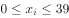，最多为39人，······4，但4和39差距较大，不满足条件。尝试38、37······，经过依次验算之后，可得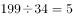······29，此时29和34差距就比较小了。但此时也并非为最优解，因为每个服装厂人数不一定都是34人，可以进行调整，使得更加符合题目条件。，即每一排中有两个服装厂人数为34人，三个服装厂人数为33人，这样余数为32，此时32与33之间仅差1，最能满足题目条件。每一排的人数为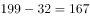人，排······153人，剩余的153人需要再安排1排，所以至少需要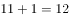排。

故正确答案为F。

---

### 第 2 题　qid 2051514 · 数学运算

要使成为完全平方数的最大整数为多少？

- **A**. 2188
- **B**. 2576
- **C**. 3956　✅
- **D**. 4041
- **E**. 5545
- **F**. 5982
- **G**. 6578
- **H**. 7056

**答案**：C

**官方解析**

原式提公因子得，由于是一个完全平方数，要想原式为完全平方数，因此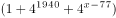必须为完全平方数。

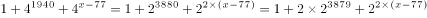，对应完全平方和公式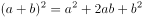，对应的，,因此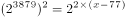，所以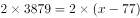，解得。

故正确答案为C。

---

### 第 3 题　qid 2054188 · 数学运算

一条过圆心的铁丝把一个圆形铁环分成两个半圆周，在每个分点标上质数；第二次用铁丝把两个半圆周的每一个分成两个相等的圆周，在新产生的分点标上相邻两数和的；第三次用铁丝把四个圆周的每一个分成两个相等的圆周，在新产生的分点标上相邻两数和的······如此进行了n次之后，铁环上的所有数字之和为6188，则m和n的值分别为（  ）。

- **A**. 2和80
- **B**. 3和70
- **C**. 5和60
- **D**. 7和50　✅
- **E**. 11和40
- **F**. 13和30
- **G**. 17和20
- **H**. 19和10

**答案**：D

**官方解析**

根据题意可知，第一次两个分点标的数字为质数，第一次所有数字之和为；

第二次新产生的2个分点为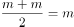，第二次所有数字之和为；

第三次新产生的4个分点为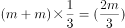，第三次所有数字之和为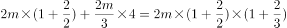；

第四次新产生的8个分点为，第四次所有数字之和为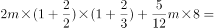；

以此类推，第n次所有数字之和为⋯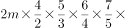⋯，错位约分可得，则。

代入A选项，远远小于18564，排除；

代入B选项，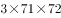尾数为6，排除；

代入C选项，与5相乘尾数为0或5，排除；

代入D选项，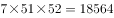，当选。

故正确答案为D。

---

### 第 4 题　qid 2054190 · 数学运算

设n为正整数，如果存在一个完全平方数（比如，，25就是一个完全平方数），使得在十进制表示下此完全平方数的各数字之和为n，那么n被称作好数（比如，7是一个好数，因为25的各数字之和为7）。那么，在1，2，3，……，2017中共有（  ）个好数。

- **A**. 895
- **B**. 896
- **C**. 897　✅
- **D**. 898
- **E**. 899
- **F**. 900
- **G**. 901
- **H**. 902

**答案**：C

**官方解析**

通过枚举平方数并求和：1,4,9,16,25,36,49,64,81,100，121,144,169,196,225,256,289,324,361,400,441,484,529,576……，

会发现这些平方数各位数字之和为1,4,7,9,10,13,16,18,19等，进一步研究会发现这些数由两部分构成：9，18；1，4，7，10，13，16，19，前者是9的倍数，后者是3的倍数加1，所以找出2017内9的倍数以及除以3余1的数，相加即为所求，则，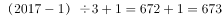，。

故正确答案为C。

---

### 第 5 题　qid 2054192 · 数学运算

一家自来水厂给6个村庄供水，这6个村庄恰好位于一条直线上，从自来水厂到这6个村庄的距离分别为10千米、12千米、15千米、20千米、22千米和25千米。现需要安装连接自来水厂和各个村庄的水管，有粗细两种水管可供选择。粗管可供所有村庄用水，每千米要花费6000元；细管只能供一个村庄用水，每千米要花费2000元。粗管和细管可以互相连接，相互搭配。要安装满足这6个村庄用水需求的管道系统，则最少需要花费（  ）元。

- **A**. 208000
- **B**. 150000
- **C**. 148000
- **D**. 140000
- **E**. 134000　✅
- **F**. 130000
- **G**. 126000
- **H**. 120000

**答案**：E

**官方解析**

题目要求花费最少，那就让自来水厂和六个村庄都在同一条线上，此时可以尽量让多个村庄用一条大水管。尝试用枚举法解答：

情况一：假设自来水厂到距离20km的村庄用一条大水管，需要花费元，则20km的到22km的村庄以及20km到25km的村庄分别用一条小水管，需要花费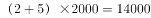元，则一共花费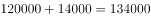元。

情况二：自来水厂到距离15km的村庄用一条大水管，需要花费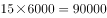元，则15km到20km、15km到22km、15km到25km分别需要一条细水管，需要花费元，则一共花费元。

枚举多种情况会发现，最少花费均为134000元。

故正确答案为E。

---

### 第 6 题　qid 2054194 · 数学运算

从1，2，3，4，5，6，7，8，9中选择两个数，使它们的和为质数，则共有（  ）种不同的选择方式。

- **A**. 19
- **B**. 18
- **C**. 17
- **D**. 16
- **E**. 15
- **F**. 14　✅
- **G**. 13
- **H**. 12

**答案**：F

**官方解析**

根据题干条件“两数之和为质数”，则1到9两数之和构成的数最小为3，最大为17，3到17之间的质数有3，5，7，11，13，17这6个数。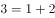，1种；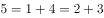，2种；，3种；，4种；，3种；，1种。共计选择方式种。

故正确答案为F。

---

### 第 7 题　qid 2054196 · 数学运算

在一项课题研究中，数据搜集方式有问卷调研、当面访谈与电话访谈三种。参加问卷调研的有27人，参加电话访谈的有21人。参加了三种数据搜集方式的有5人，既参加问卷调研又参加当面访谈的有9人，既参加问卷调研又参加电话访谈的有12人，既参加当面访谈又参加电话访谈的有7人。已知只参加当面访谈的人数占数据搜集人员总数的，则数据搜集人员共有（  ）人。

- **A**. 45　✅
- **B**. 50
- **C**. 55
- **D**. 60
- **E**. 65
- **F**. 70
- **G**. 75
- **H**. 80

**答案**：A

**官方解析**

根据“问卷调研、当面访谈与电话访谈”判定是三集合容斥问题。设只参加当面访谈的人数为，则数据搜集人数总数为，因为参加三者的有5人，既参加问卷调研又参加当面访谈的有9人，所以只参加问卷调研和当面访谈的有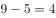人；因为既参加当面访谈又参加电话访谈的有7人，所以只参加当面访谈和参加电话访谈的有人。因此参加当面访谈的有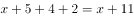人。根据三集合容斥标准公式得，，解得人。所以数据收集总人数为人。

故正确答案为A。

---

### 第 8 题　qid 2054198 · 数学运算

在“烟头不落地，西安更美丽”的倡导下，四个志愿者小组上街捡烟头。已知某天甲组捡了320个烟头，乙组比丙组少捡32个烟头，丙组捡到的烟头数是甲乙两组之和的，丁组捡到的烟头数是甲乙丙三组之和的，那么丁组捡了（  ）个烟头。

- **A**. 160
- **B**. 196
- **C**. 224　✅
- **D**. 256
- **E**. 280
- **F**. 316
- **G**. 324
- **H**. 356

**答案**：C

**官方解析**

根据题干条件“甲组捡了320个烟头，乙组比丙组少捡32个烟头，丙组捡到的烟头数是甲乙两组之和的，丁组捡到的烟头数是甲乙丙三组之和的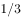”得出：

······①

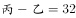······②

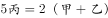······③

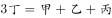······④

根据上述方程得出：，，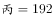，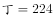。

故正确答案为C。

---

### 第 9 题　qid 2054200 · 数学运算

甲车从A地开往B地，乙车从B地开往A地。上午八点整，两车同时出发，相向而行，相遇后继续向前。甲车又行驶了2小时到达B地，乙车又行驶了4.5小时到达A地。甲乙两车到达目的地后都立即返回，则在返程途中两车再次相遇时，时间为（  ）。

- **A**. 14点整
- **B**. 14点半
- **C**. 15点整
- **D**. 15点半
- **E**. 16点整
- **F**. 16点半
- **G**. 17点整　✅
- **H**. 17点半

**答案**：G

**官方解析**

设甲、乙两车从开始到第一次相遇所用时间为小时。甲在第一次相遇前走的路程即是乙4.5小时所走的路程，则有，得到；乙第一次相遇前所走的路程即是甲2小时所走的路程，有，得到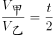。则 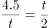，解得。两车再次相遇时即两车共走了3倍的AB全长，时间也是原来的3倍。故两车从开始到第二次相遇所用时间为小时，时间为点整。

故正确答案为G。

---

### 第 10 题　qid 2054202 · 数学运算

今年是鸡年，公历年数为2017。小王发现，在未来十年内的某一年，他年龄的平方数正好是那年的公历年数，则小王的属相为（ ）

- **A**. 牛
- **B**. 虎
- **C**. 兔
- **D**. 龙
- **E**. 蛇
- **F**. 马
- **G**. 羊
- **H**. 猴　✅

**答案**：H

**官方解析**

根据小王的年龄“在未来十年内的某一年，他年龄的平方数正好是那年的公历年数”，则年龄的平方数范围为2018～2027。因为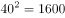，，居中代入，，符合题干条件，所以小王在2025年时45岁，则2028年小王48岁，2028年为小王的本命年。根据2017年是鸡年，则2029年为鸡年，推得2028年为猴年，小王的属相为猴。

故正确答案为H。

---

## 判断推理

### 第 1 题　qid 2052106 · 图形推理

从所给的四个选项中，选择最合适的一个填入问号处，使之呈现一定的规律性。

- **A**. A
- **B**. B
- **C**. C　✅
- **D**. D

**答案**：C

**官方解析**

观察图形发现，元素组成凌乱，没有明显属性规律，考虑数数。题干线条数量明显，考虑数线。题干横线的数量为2、5、5，竖线的数量为3、3、3，？处应为3条竖线，对应C项。
故正确答案为C。

---

### 第 2 题　qid 2051572 · 图形推理

从所给的四个选项中，选择最合适的一个填入问号处，使之呈现一定的规律性。

- **A**. A
- **B**. B
- **C**. C
- **D**. D　✅

**答案**：D

**官方解析**

观察图形发现，元素组成凌乱，且无属性规律，考虑数数，题干的面数量较多，考虑数面，题干图形的面数量为：0、2、2、4、6，没有明显的规律，再次观察发现的面数量等于图3的面数量，面数量依次相加为：（2），（4），（6），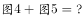，问号处应为10个面，对应D项。

故正确答案为D。

---

### 第 3 题　qid 2051612 · 图形推理

从所给的四个选项中，选择最合适的一个填入问号处，使之呈现一定的规律性。

- **A**. A　✅
- **B**. B
- **C**. C
- **D**. D

**答案**：A

**官方解析**

元素组成不同，但无数量规律，且题干为4个图形，不能考虑黑白运算，黑点可能存在重合情况，可以考虑位置规律。对黑点进行标号，如下图所示，根据就近原则，图1中，1向下移动一格，3向左移动一格，2向左或向下移动一格，可得到图2；图2到图3中，1和3继续移动，重合出现在左下角，但图3右边出现了小黑点，说明2的移动规律应该为向左移动，且为循环移动，依此规律，1继续向下循环移动，出现在左上角，2向左移动，出现在中心，3向左循环移动，出现在右下角，即问号处样式应为A。

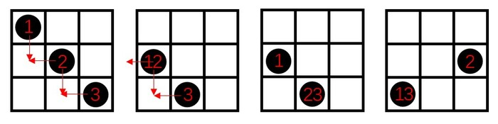

故正确答案为A。

---

### 第 4 题　qid 2051616 · 图形推理

从所给的四个选项中，选择最合适的一个填入问号处，使之呈现一定的规律性。

- **A**. A
- **B**. B
- **C**. C　✅
- **D**. D

**答案**：C

**官方解析**

图形组成不同，考虑属性与数量规律。无明显属性规律，考虑数数。第一行分别有2、3、1个面，第二行分别有0、3、3个面，每行的第一个图和第三个图的面数量之和为第二个图的面数量。第三行1、3、？，所以问号处应该有2个面，排除A、B、D项。
故正确答案为C。

---

### 第 5 题　qid 2051620 · 图形推理

从所给的四个选项中，选择最合适的一个填入问号处，使之呈现一定的规律性。

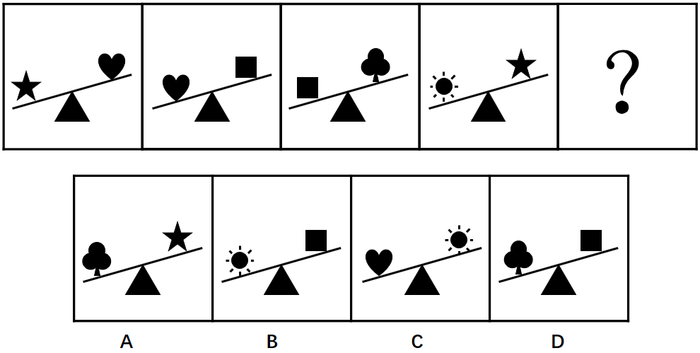

- **A**. A
- **B**. B　✅
- **C**. C
- **D**. D

**答案**：B

**官方解析**

每幅图均由三个图形一条直线组成，且直线与三角形位置不变。从元素的种类和个数上均无规律。把直线与三角形组成的图形当成一个天平，由此可得：五角星比心形图重，心形图比正方形重，正方形比梅花重，太阳比五角星重，所以重量从大到小依次为：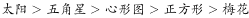，排除A、C、D三项。

故正确答案为B。

---

### 第 6 题　qid 2051622 · 定义判断

比量是指通过已有的经验或知识为参照而进行逻辑推理得出的认识结果。这样的认识结果由于其作为参照基础的知识或是经验和逻辑推理都具有无误性，所以其认识结果也就真实可靠。
根据以上定义，下列不属于比量的是：

- **A**. 甲游玩到山林深处，看到一名僧人在山涧边挑水，身后是茫茫的丛林，从而知道林中有寺庙
- **B**. 乙看到远处露天的舞台上冒烟，而知道舞台上起火了　✅
- **C**. 丙早上起来，透过窗户看见空旷平地上草木摇动，而知道外面在刮风
- **D**. 丁看到一户人家生了一个男孩，非常开心，但是他知道，这孩子将来是要死的

**答案**：B

**官方解析**

第一步：找出定义关键词。
“通过已有的经验或知识为参照而进行逻辑推理得出的认识结果”、“认识结果真实可靠”。
第二步，逐一分析选项。
A项：看见僧人在山涧边挑水时，根据已有的经验推出僧人应该是打水回寺庙，且应该就在附近，得出林中有寺庙，结果真实可靠，符合定义，排除；
B项：看见舞台冒烟认为舞台起火了这一认知结果并不可靠，也可能是舞台在进行烟火特效，不符合定义关键词“认识结果真实可靠”，不符合定义，当选；
C项：看见平旷的空地上草木摇动推出在刮风，是根据已有的经验得出的认识结果，符合定义，排除；
D项：因为每一个人最终的结局都是死亡，所以认为孩子将来是要死的是根据已有的经验得出的认识结果，结果真实可靠，符合定义，排除。
本题为选非题，故正确答案为B。

---

### 第 7 题　qid 2051626 · 逻辑判断

“第三人效果”理论是指人们在判断大众传媒的影响力之际存在着一种普遍的感知定势，即倾向于认为大众媒介的信息对“我”或“你”未必产生多大影响，然而对“他者”产生不可估量的影响。
根据以上定义，下列不涉及“第三人效果”理论的是：

- **A**. 人们认为有关新药的广告或者吸烟有害健康这样的信息对其他人的影响要大过对自己的影响
- **B**. 微信的朋友圈中经常会有人分享很多所谓身体“健康”的信息
- **C**. 支持限制暴力电影的人，他们支持并不是因为电影会影响到自己，而是认为它们会影响到其他人
- **D**. 人们想象他人心目中自己的形象，想象他人对自己的评价，由此而产生自我感　✅

**答案**：D

**官方解析**

第一步：找出定义关键词。
“大众媒体信息”、“对‘我’或‘你’未必产生多大影响”、“对‘他者’产生不可估量的影响”。
第二步：逐一分析选项。
A项：新药的信息属于大众媒体信息，认为这些信息对其他人产生的更大影响体现了对他者产生不可估量的影响，符合定义，排除；
B项：分享身体“健康”信息属于大众媒体信息，认为这些信息会对他者产生不可估量的影响，而非对自己产生多大影响，符合定义，排除；
C项：暴力电影属于大众媒体信息，不认为暴力电影会影响到自己，认为会影响到其他人，符合“对‘我’或‘你’未必产生多大影响”，而“对‘他者’产生不可估量的影响”，符合定义，排除；
D项：他人对自己的评价不属于大众媒体信息，不符合定义，当选。
本题为选非题，故正确答案为D。

---

### 第 8 题　qid 2051630 · 定义判断

包容性创新是指为了实现包容性增长而进行的创新，主要就是让更多人群特别是弱势群体参与到创新活动中来，同时使创新成果扩散到所有的人群，从而增加民众的创新机会和能力，使所有人都从创新活动中受益。
根据上述定义，下列不属于包容性创新的是：

- **A**. 甲公司综合运用卫星通信、全息影像和计算机多媒体技术来为偏远的农村提供医疗服务
- **B**. 乙公司研发出一种低成本冰箱，仅卖376元
- **C**. 丙公司研发出一种白内障治疗仪，将白内障的治疗费用降低到原来的四分之一
- **D**. 随着互联网的发展，相关部门推出火车票网上售票系统　✅

**答案**：D

**官方解析**

第一步：找出定义关键词。
“为了实现包容性增长而进行的创新”、“让更多人群特别是弱势群体参与到创新活动中来，同时使创新成果扩散到所有的人群”。
第二步：逐一分析选项。
A项：为偏远的农村提供医疗服务，符合定义关键词“让更多人群特别是弱势群体参与到创新活动中来，使创新成果扩散到所有的人群”，符合定义，排除；
B项：低成本冰箱是为了使得冰箱这个创新成果扩散到所有人群，符合定义关键词“让更多人群特别是弱势群体参与到创新活动中来，使创新成果扩散到所有的人群”，符合定义，排除；
C项：研发出的白内障治疗仪将治疗费用降低到原来的四分之一，符合定义关键词“让更多人群特别是弱势群体参与到创新活动中来，使创新成果扩散到所有的人群”，符合定义，排除；
D项：火车票网上售票系统使得互联网创新成果扩散到所有人群，但并未涉及弱势群体，不符合定义，当选。
本题为选非题，故正确答案为D。

---

### 第 9 题　qid 2051632 · 定义判断

正强化是指奖励那些符合组织目标的行为，以便使这些行为得到进一步加强，从而有利于组织目标的实现。强化的刺激物不仅包含奖金等物质奖励，还包含表扬、提升、改善工作关系等精神奖励。负强化是指惩罚那些不符合组织目标的行为，以使这些行为削弱甚至消失，从而保证组织目标的实现不受干扰。事实上，对某种行为不再进行正强化也是一种负强化。
根据上述定义，下列不属于负强化的是：

- **A**. 工人工作时聊天声音很大，工厂设置了分贝器，达到一定分贝就报警，响声刺耳
- **B**. 某企业的管理人员尽力发现员工在技能和能力方面与工作需求的对称性　✅
- **C**. 某企业从下个月开始，取消对超额加班的额外奖励
- **D**. 给员工设置无法实现的目标，使他从未感受到骄傲自满

**答案**：B

**官方解析**

第一步：找出定义关键词。
“惩罚那些不符合组织目标的行为，以使这些行为削弱甚至消失，从而保证组织目标的实现不受干扰”、“对某种行为不再进行正强化也是一种负强化”。
第二步：逐一分析选项。
A项：聊天声音达到一定分贝，分贝器就报警，属于惩罚不符合组织目标的行为，是为了使聊天的行为削弱甚至消失，与定义关键词相符，符合定义，排除。
B项：管理人员尽力发现员工在技能和能力方面与工作需求的对称性，与定义中的关键词均不相符，不符合定义（是为了提升和改善工作关系，属于正强化），当选。
C项：取消对超额加班的额外奖励，属于对某种行为不再进行正强化，也是一种负强化，与定义关键词相符，符合定义，排除。
D项：使员工从未感受到骄傲自满是为了使得骄傲这种行为消失，从而保证组织目标的实现，与定义关键词相符，符合定义，排除。
本题为选非题，故正确答案为B。

---

### 第 10 题　qid 2051634 · 定义判断

效果逻辑是一种行为逻辑，强调通过行为来创造或发现机会，获得满意的效果，最终实现愿望。基于效果逻辑的决策者往往从分析既有手段出发，在此基础上确定自己能够做到什么，积极同认识的人进行互动，从而获得利益相关者的承诺，产生新的手段或者目的，实现资源的不断扩张。
根据上述定义，下列决策行为中主要基于效果逻辑的是：

- **A**. 一位厨师接到准备晚餐的任务，客人已经事先确定了菜单，厨师按照已有菜单购买价格最合理的食材，准备做菜所需的工具，进行烹饪
- **B**. 某创业团队在创业初期仅有一个非常模糊的目标，他们在业务拓展过程中不断修正自己的目标　✅
- **C**. 某企业通过市场调研和竞争分析来确定细分的目标市场
- **D**. 某企业年初制定市场营销战略，计算成本价格之差，做出精准的财务规划

**答案**：B

**官方解析**

第一步：找出定义关键词。
“通过行为来创造或发现机会，获得满意的效果，最终实现愿望”、“决策者往往从分析既有手段出发，在此基础上确定自己能够做到什么，积极同认识的人进行互动”、“获得利益相关者的承诺，产生新的手段或者目的，实现资源的不断扩张”。
第二步：逐一分析选项。
A项：厨师根据已有菜单购买食材，进行烹饪。没有通过行为来创造或发现机会，不符合定义，排除；
B项：“某创业团队在创业初期仅有一个非常模糊的目标”，说明他们在现有的基础上确定了自己能做的事情，接着“在业务拓展过程中不断修正自己的目标”说明确实通过与人互动，创造和发现了机会，产生新的目的，符合定义，当选；
C项：“通过市场调研和竞争分析”，无法体现“决策者从分析既有手段出发，在此基础上确定自己能够做到什么，积极同认识的人进行互动”，“确定细分的目标市场”，既然已经确定，那就意味着不存在“通过行为来创造或发现机会”，不符合定义，排除；
D项：年初制定市场营销战略，没有体现“决策者往往从分析既有手段出发，在此基础上确定自己能够做到什么，积极同认识的人进行互动”，既然已经“制定市场营销战略，做出精准的财务规划”，那就意味着不存在“通过行为来创造或发现机会”，不符合定义，排除。
故正确答案为B。

---

### 第 11 题　qid 2051638 · 定义判断

道德发展的原则水平也叫后习俗水平，在这一水平上，人们力求对正当而合适的道德价值和道德原则作出自己的解释，而不管当局或权威人士如何支持这些原则，也不管他自己与这些集体的关系。
根据上述定义，下列事例中行为人的道德发展阶段处于后习俗水平的是：

- **A**. 甲因为害怕父母的惩罚，所以从来没有在学校与同学打过架
- **B**. 乙喜欢帮助同学，因为这样可以受到老师的表扬
- **C**. 丙从来不插队，因为他认为排队是维护社会基本秩序的表现
- **D**. 丁认为法律也只是一种社会契约，而非铁板一块，那些不能提升总体社会福利的法律应该修改　✅

**答案**：D

**官方解析**

第一步，找出定义关键词。
“正当而合适的道德价值和道德原则”、“作出自己的解释”、“不管当局或权威人士如何支持这些原则”、“不管他自己与这些集体的关系”。
第二步，逐一分析选项。
A项：甲从来没有在学校与同学打过架，说明甲需要考虑他自己与学校班集体的关系，同时需要考虑自己与父母的关系，不符合关键词“不管他自己与这些集体的关系”，不符合定义，排除；
B项：乙喜欢帮助同学从而可以受到老师的表扬，说明乙需要考虑自己与集体的关系，不符合关键词“不管他自己与这些集体的关系”，不符合定义，排除；
C项：丙从来不插队，符合定义关键词“正当而合适的道德价值和道德原则”，但丙认为排队是维护社会基本秩序的表现，说明丙考虑了自己与集体的关系，不符合关键词“不管他自己与这些集体的关系”，不符合定义，排除；
D项：丁认为法律也只是一种社会契约，不能提升总体社会福利的法律应该修改，是丁对法律约定的准则“作出自己的解释”，也符合“不管当局或权威人士如何支持这些原则”，符合定义，当选。
故正确答案为D。
注：本题D选项有同学会认为讨论的是法律，而题干讨论的是道德，一定要注意，法律和道德并不是相互矛盾的，且经过查阅相关资料，后习俗水平相关解释中有与D选项类似例子，因此粉笔倾向于答案为D选项。

---

### 第 12 题　qid 2051640 · 定义判断

古典概率通常又叫事前概率，是指当随机事件中各种可能发生的结果及其出现的次数都可以由演绎或者外推法得知，而无需经过任何统计试验即可计算各种可能发生结果的概率。古典概率是以这样的假设为基础的，即随机现象所能发生的事件是有限的、互不相容的，而且每个基本事件发生的可能性相等。
根据上述定义，下列判断中属于古典概率的是：

- **A**. 
某裁判通过抛硬币来决定哪个队先开球，因为他认为抛硬币出现正反的可能性各为
　✅
- **B**. 
某赌者通过大量抛骰子试验，发现出现各个点数的概率接近

- **C**. 
某人观察空中云彩，认为明天下雨的可能性为

- **D**. 
某专家认为，在一个地质断层的场所建造核电站，出现事故的概率为

**答案**：A

**官方解析**

第一步：找出定义关键词。

“当随机事件中各种可能发生的结果及其出现的次数都可以由演绎或者外推法得知，而无需经过任何统计试验即可计算各种可能发生结果的概率”、“随机现象所能发生的事件是有限的、互不相容的，而且每个基本事件发生的可能性相等”。

第二步：逐一分析选项。

A项：抛硬币只有正面和反面两种结果，出现两种结果的可能性相等，符合“随机现象所能发生的事件是有限的、互不相容的，而且每个基本事件发生的可能性相等”，符合定义，当选；

B项：赌者通过大量抛骰子试验才得出结论，不符合“无需经过任何统计试验即可计算各种可能发生结果的概率”，不符合定义，排除；

C项：通过观察空中云彩而得出明天下雨的概率，不符合“无需经过任何统计试验即可计算各种可能发生结果的概率”，不符合定义，排除；

D项：某专家认为建造核电站出现事故的概率为，是通过科学论证后计算出来的，不符合“无需经过任何统计试验即可计算各种可能发生结果的概率”，不符合定义，排除。

故正确答案为A。

---

### 第 13 题　qid 2051642 · 定义判断

跨栏定律最先源于一种医学现象，那些患病器官并不如人们想象的那样糟，相反在与疾病的抗争中，为了抵御病变，它们往往要代偿性地比正常的器官机能更强。后来，该现象被引申到更广的范围：人面前的栏越高，人就可能跳得更高。
根据上述定义，下列现象中与跨栏定律无关的是：

- **A**. 盲人的听觉、触觉、嗅觉都比较灵敏
- **B**. 一些颇有成就的教授之所以走上艺术道路，大都是因为受了生理缺陷的影响
- **C**. 有些人之所以取得了较大的成就，是因为开始时遇到了很大的困难
- **D**. 某些地区率先发展后，建立起一些市场障碍，使非发达地区进入市场的难度增大　✅

**答案**：D

**官方解析**

第一步：找出定义关键词。
“那些患病器官并不如人们想象的那样糟，相反在与疾病的抗争中，为了抵御病变，它们往往要代偿性地比正常的器官机能更强”、“人面前的栏越高，人就可能跳得更高”。
第二步：逐一分析选项。
A项：盲人的听觉、触觉、嗅觉都比较灵敏，符合“人面前的栏越高，人就可能跳得更高”，符合定义，排除；
B项：因为受到生理缺陷的影响，所以走上艺术道路并颇有成就，符合“人面前的栏越高，人就可能跳得更高”，符合定义，排除；
C项：因为开始时遇到了很大的困难，所以取得了较大的成就，符合“人面前的栏越高，人就可能跳得更高”，符合定义，排除；
D项：市场障碍使非发达地区进入市场的难度增大，不符合“人面前的栏越高，人就可能跳得更高”，不符合定义，当选。
此题为选非题，故正确答案为D。

---

### 第 14 题　qid 2051646 · 定义判断

三级价格歧视即对于同一商品或相似的商品，垄断厂商根据不同市场上顾客的需求量对价格变动的反应程度的差别，而实施不同的价格，以攫取更多的利益。
根据上述定义，下列企业的行为与实施三级价格歧视无关的是：

- **A**. 某房地产企业对农村户口的客户有更大的优惠
- **B**. 高铁设置了特等座、一等座和二等座
- **C**. 大多数旅游景点设置了成人票、儿童票、老人票和学生票
- **D**. 电信公司根据客户每月上网时间的不同，采取不同的资费标准　✅

**答案**：D

**官方解析**

第一步：找出定义关键词。

“根据不同市场上顾客的需求量对价格变动的反应程度的差别”、“实施不同的价格，以攫取更多的利益”。

第二步：逐一分析选项。

A项：对不同顾客实施不同价格，是因为与非农村户口相比，农村户口可能相对来说对价格变动更为敏感，对这部分的人群实施优惠，可以激发他们购买的欲望，各个群体的钱均能赚到，以攫取更多的利益，符合定义，排除；

B项：对不同座位实施不同价格，是因为对于一些经济能力比较好的人群来说，他们对特等座的价格并不敏感，而对于另外一部分经济能力一般的人群来说，觉得特等座太贵，一等或二等座就可以了，所以对于价格变动反应不同的群体实施了不同的价格，各个群体的钱均能赚到，符合定义，排除；

C项：对不同顾客实施不同价格，是因为与成人相比，学生可能相对来说对价格变动更为敏感，对这部分的人群实施优惠，可以激发他们旅游的欲望，各个群体的钱均能赚到，以攫取更多的利益，符合定义，排除；

D项：实施不同价格的原因是因为上网时间不同，而非对价格变动反应程度的差别，不符合定义，当选。

此题为选非题，故正确答案为D。

注：如下图所示，D项是二级价格歧视的典型案例。

---

### 第 15 题　qid 2051650 · 定义判断

认知失调又叫认知不和谐，是指一个人的行为与自己先前一贯的对自我的认知（而且通常是正面的、积极的自我）产生分歧，从一个认知推断出另一个对立的认知时而产生的不舒适感、不愉快的情绪。
根据上述定义，下列不属于认知失调的是：

- **A**. 甲喜欢吸烟，读了吸烟可能致癌的文章后，心里很不舒服
- **B**. 乙正在减肥，本应少吃高热量食品，但有一天实在无法控制自己的欲望，吃了一个甜甜圈，事后觉得很难过
- **C**. 丙看到与自己干同样工作的同事拿到的工资远远高于自己，心里觉得很不舒服　✅
- **D**. 丁很不喜欢夸夸其谈的上司，仍不得不恭维他，为此，丁感到痛苦

**答案**：C

**官方解析**

第一步：找出定义关键词。
“一个人的行为与自己先前一贯的对自我的认知（而且通常是正面的、积极的自我）产生分歧”、“产生的不舒适感，不愉快的情绪”。
第二步：逐一分析选项。
A项：“甲喜欢吸烟”是甲先前的对自我的认知，且喜欢吸烟是喜欢一件事，是积极的自我，甲读了吸烟可能致癌的文章是行为，心里很不舒服，说明二者产生分歧，符合“一个人的行为与自己先前一贯的对自我的认知（而且通常是正面的、积极的自我）产生分歧”、“产生的不舒适感，不愉快的情绪”，符合定义，排除；
B项：“乙正在减肥，本应少吃高热量食品”是乙先前的对自我的认知，“有一天实在无法控制自己的欲望，吃了一个甜甜圈”是行为，事后觉得很难过，说明二者产生分歧，符合“一个人的行为与自己先前一贯的对自我的认知（而且通常是正面的、积极的自我）产生分歧”、“产生的不舒适感，不愉快的情绪”，符合定义，排除；
C项：丙看到自己干同样工作的同事拿到的工资远远高于自己，这是丙拿自己和同事比才出现的不舒服的心理，不是丙现在的行为和之前的认知产生分歧，不符合“一个人的行为与自己先前一贯的对自我的认知（而且通常是正面的、积极的自我）产生分歧”，不符合定义，当选；
D项：“丁很不喜欢夸夸其谈的上司”是丁先前的对自我的认知，“仍不得不恭维他”是行为，丁感到痛苦，说明二者产生分歧，符合“一个人的行为与自己先前一贯的对自我的认知（而且通常是正面的、积极的自我）产生分歧”、“产生的不舒适感，不愉快的情绪”，符合定义，排除。
本题为选非题，故正确答案为C。

---

### 第 16 题　qid 2051652 · 类比推理

嬴政：吕不韦

- **A**. 刘邦：张良
- **B**. 赵匡胤：赵普　✅
- **C**. 朱翊钧：张居正
- **D**. 刘禅：诸葛亮

**答案**：B

**官方解析**

第一步：分析题干词语间的逻辑关系。
嬴政是秦朝的开国皇帝，而吕不韦是辅佐嬴政的丞相。
第二步：分析选项词语间的逻辑关系。
A项：刘邦是汉朝开国皇帝，张良是汉初三杰之一，张良未曾做过刘邦的丞相，与题干逻辑关系不一致，排除；
B项：赵匡胤是宋朝开国皇帝，而赵普是辅佐赵匡胤的丞相，与题干逻辑关系一致，当选；
C项：朱翊钧是明朝第十三位皇帝，张居正是辅佐朱翊钧的内阁首辅，朱翊钧并非明朝首位开国皇帝，与题干逻辑关系不一致，排除；
D项：刘禅是三国时期蜀汉昭烈帝刘备之子，而诸葛亮是三国时期蜀汉丞相，诸葛亮辅佐过刘备和刘禅。刘禅并非蜀汉的开国皇帝，与题干逻辑关系不一致，排除。
故正确答案为B。

---

### 第 17 题　qid 2051660 · 类比推理

熟石灰：

- **A**. 
钡餐：
　✅
- **B**. 
纯碱：

- **C**. 
：干冰

- **D**. 
生石灰：

**答案**：A

**官方解析**

第一步：判断题干词语间逻辑关系。

熟石灰的化学式是。

第二步：判断选项词语间逻辑关系。

A项：钡餐的化学式是，符合题干的逻辑关系，当选；

B项：纯碱的化学式是，不符合题干的逻辑关系，排除；

C项：干冰的化学式是，但是顺序反了，不符合题干的逻辑关系，排除；

D项：生石灰的化学式是，不符合题干的逻辑关系，排除。

故正确答案为A。

---

### 第 18 题　qid 2051662 · 类比推理

肖洛霍夫：静静的顿河：葛利高里

- **A**. 司汤达：红与黑：于连
- **B**. 雨果：悲惨世界：冉·阿让
- **C**. 路遥：平凡的世界：孙少安　✅
- **D**. 马尔克斯：百年孤独：布恩迪亚

**答案**：C

**官方解析**

第一步：判断题干词语间逻辑关系。
《静静的顿河》是肖洛霍夫的作品，是作品与作者的对应，葛利高里是《静静的顿河》中的人物，且《静静的顿河》是社会主义现实主义作品。
第二步：判断选项词语间逻辑关系。
A项：《红与黑》是司汤达的作品，是作品与作者的对应，于连是《红与黑》中的人物，但《红与黑》描写的是资本主义社会的生活，不符合题干逻辑关系，排除；
B项：《悲惨世界》的作者是雨果，是作品与作者的对应，冉•阿让是《悲惨世界》中的人物，但《悲惨世界》描写的是资本主义社会的生活，不符合题干逻辑关系，排除；
C项：《平凡的世界》的作者是路遥，是作品与作者的对应，孙少安是《平凡的世界》中的人物，是人物和作品的对应，且《平凡的世界》是社会主义现实主义作品，符合题干逻辑关系，当选；
D项：《百年孤独》的作者是马尔克斯，是作品与作者的对应，布恩迪亚是《百年孤独》中的人物，是人物和作品的对应，但《百年孤独》是魔幻现实主义文学，不符合题干逻辑关系，排除。
故正确答案为C。

---

### 第 19 题　qid 2051666 · 类比推理

甲骨文：电纸书

- **A**. 毛笔：激光笔
- **B**. 烽火台：通信卫星　✅
- **C**. 弓箭：导弹
- **D**. 算盘：计算机

**答案**：B

**官方解析**

第一步：判断题干词语间逻辑关系。
甲骨文是古代的一种文字，在龟甲或兽骨上契刻；电纸书是现代的一种类纸阅读器，二者都是信息的载体，都有“传递信息”的功能。
第二步：判断选项词语间逻辑关系。
A项：毛笔是传统的书写工具，激光笔是用来在特定场所，投映一个光点或一条光线指向物体，二者的功能不同，与题干逻辑关系不一致，排除；
B项：烽火台是古时用于点燃烟火传递重要消息的高台；通信卫星是卫星通信系统的空间部分，用来转发无线电信号，二者都是用来传递信息的，与题干逻辑关系一致，当选；
C项：弓箭是用弓发射的具有锋刃的一种远射兵器，导弹是依靠自身动力装置推进，由制导系统导引、控制其飞行弹道，将战斗部导向并摧毁目标的武器，二者都是武器，但导弹没有“传递信息”的功能，没有B项与题干更为类似，排除；
D项：算盘是古代一种简便的计算工具，计算机是现代一种用于高速计算的电子计算机器，二者都有计算的功能，但算盘没有“传递信息”的功能，没有B项与题干更为类似，排除。
故正确答案为B。

---

### 第 20 题　qid 2051670 · 类比推理

陆游：柳暗花明又一村

- **A**. 刘禹锡：病树前头万木春　✅
- **B**. 欧阳修：自缘身在最高层
- **C**. 白居易：白云生处有人家
- **D**. 刘长卿：春江水暖鸭先知

**答案**：A

**官方解析**

第一步，判断题干词语间逻辑关系。
“柳暗花明又一村”出自陆游的作品《游山西村》，二者是作者与诗句的对应关系。
第二步，判断选项词语间逻辑关系。
A项：“病树前头万木春”出自刘禹锡的《酬乐天扬州初逢席上见赠》，为作者与诗句的对应关系，与题干逻辑关系一致，当选；
B项：“自缘身在最高层”出自王安石的《登飞来峰》，作者不是欧阳修，与题干逻辑关系不一致，排除；
C项：“白云生处有人家”出自杜牧的《山行》，作者不是白居易，与题干逻辑关系不一致，排除；
D项：“春江水暖鸭先知”出自苏轼的《惠崇春江晚景》，作者不是刘长卿，与题干逻辑关系不一致，排除。
故正确答案为A。

---

### 第 21 题　qid 2051672 · 类比推理

YouTube：福特：美国

- **A**. Facebook：微软：美国
- **B**. Youku：吉利：中国　✅
- **C**. Alibaba：华为：中国
- **D**. Google：苹果：美国

**答案**：B

**官方解析**

第一步，判断题干词语间逻辑关系。
YouTube与福特都是美国的品牌，为品牌和国家的对应关系。且YouTube是科技品牌，主营视频业务，福特是汽车品牌。
第二步，判断选项词语间逻辑关系。
A项：Facebook与微软都是美国的品牌，为品牌和国家的对应关系，但两者都是科技品牌，与题干逻辑关系不一致，排除；
B项：Youku和吉利都是中国的品牌，为品牌和国家的对应关系，且Youku是科技品牌，主营视频业务，吉利是汽车品牌，与题干逻辑关系一致，当选；
C项：Alibaba与华为都是中国的品牌，为品牌和国家的对应关系，但两者都是科技品牌，与题干逻辑关系不一致，排除；
D项：Google与苹果都是美国的品牌，为品牌和国家的对应关系，但两者都是科技品牌，与题干逻辑关系不一致，排除。
故正确答案为B。

---

### 第 22 题　qid 2051678 · 类比推理

庐山：鄱阳湖：江西

- **A**. 泰山：洪泽湖：山东
- **B**. 武当山：洞庭湖：湖北
- **C**. 黄山：巢湖：安徽　✅
- **D**. 会稽山：太湖：浙江

**答案**：C

**官方解析**

第一步，判断题干词语间逻辑关系。
庐山和鄱阳湖都位于江西省，前两词与第三词是山脉湖泊与所在省份的对应关系。
第二步，判断选项词语间逻辑关系。
A项：泰山位于山东省，但洪泽湖位于江苏省，与题干逻辑关系不一致，排除；
B项：武当山位于湖北省，但洞庭湖位于湖南省，与题干逻辑关系不一致，排除；
C项：黄山和巢湖都位于安徽省，与题干逻辑关系一致，当选；
D项：会稽山位于浙江省，但是太湖位于江苏省，与题干逻辑关系不一致，排除。
故正确答案为C。

---

### 第 23 题　qid 2051684 · 类比推理

教师：陕西人

- **A**. 彩虹：云雾
- **B**. 青年：学生　✅
- **C**. 永乐大典：四库全书
- **D**. 大熊猫：金丝猴

**答案**：B

**官方解析**

第一步，判断题干词语间逻辑关系。
有的教师是陕西人，有的教师不是陕西人；有的陕西人是教师，有的陕西人不是教师，二者为交叉关系。
第二步，判断选项词语间逻辑关系。
A项：彩虹是太阳光照射云雾上的水滴，光线被折射形成的，二者是对应关系，与题干逻辑关系不一致，排除；
B项：有的青年是学生，有的青年不是学生，有的学生是青年，有的学生不是青年，二者为交叉关系，与题干逻辑关系一致，当选；
C项：永乐大典与四库全书都是书籍，二者为并列关系，与题干逻辑关系不一致，排除；
D项：大熊猫与金丝猴都是中国著名的珍贵动物，二者为并列关系，与题干逻辑关系不一致，排除。
故正确答案为B。

---

### 第 24 题　qid 2051686 · 类比推理

头：脚

- **A**. 白天：黑夜
- **B**. 男人：女人
- **C**. 好：孬
- **D**. 红：蓝　✅

**答案**：D

**官方解析**

第一步，分析题干词语间的逻辑关系。
头和脚为并列关系中的反对关系，二者均为不同的人体部位，除了头和脚外人体还有其他部位。
第二步，判断选项词语间逻辑关系。
A项：白天和黑夜为并列关系中的矛盾关系，除了白天就是黑夜，与题干逻辑关系不一致，排除；
B项：男人和女人为并列关系中的矛盾关系，除了男人就是女人，与题干逻辑关系不一致，排除；
C项：好和孬为并列关系中的矛盾关系，要么好要么孬，与题干逻辑关系不一致，排除；
D项：红和蓝为并列关系中的反对关系，二者均为不同的颜色，除了红和蓝外还有其他颜色，与题干逻辑关系一致，当选。
故正确答案为D。

---

### 第 25 题　qid 2051690 · 类比推理

（  ） 对 月食 相当于 （  ） 对 日食

- **A**. 太阳  地球
- **B**. 太阳  月亮
- **C**. 地球  月亮　✅
- **D**. 火星  地球

**答案**：C

**官方解析**

第一步：分析题干。
月食是自然界的一种现象，当太阳、地球、月球三者恰好或几乎在同一条直线上时（地球在太阳和月球之间），太阳到月球的光线便会部分或完全地被地球掩盖，产生月食。
日食，又叫做日蚀，是月球运动到太阳和地球中间，如果三者正好处在一条直线时，月球就会挡住太阳射向地球的光，月球身后的黑影正好落到地球上，这时发生日食现象。
第二步：将选项逐一代入，判断各选项前后部分的逻辑关系。
A项：太阳发出光线但是光线没有照射到月球，产生月食，太阳发出光线但是光线没有照射到地球产生日食，前后逻辑关系不一致，排除；
B项：太阳发出光线但是光线没有照射到月球，产生月食，太阳发出光线被月亮挡住，没有照射到地球，产生日食，前后逻辑关系不一致，排除；
C项：因为地球在太阳和月球之间而产生月食，因为月亮在太阳和地球之间而产生日食，均因为前者的位置而产生了后者的自然现象，前后逻辑关系一致，当选；
D项：火星和月食之间无明显的逻辑关系，而太阳发出光线但是光线没有照射到地球产生日食，前后逻辑关系不一致，排除。
故正确答案为C。

---

### 第 26 题　qid 2051694 · 类比推理

甲、乙、丙三名学生进行交谈，他们当中只有一人去汉中观赏过油菜花。甲说：“我去汉中观赏过油菜花，太漂亮了。”乙说：“我没有去汉中观赏过油菜花。”丙说：“甲没有去汉中观赏过油菜花。”其中，只有一个人的话是真话，那么以下说法中正确的有：

- **A**. 甲去汉中观赏过油菜花
- **B**. 乙去汉中观赏过油菜花　✅
- **C**. 乙说的是真话
- **D**. 丙说的是真话　✅

**答案**：BD

**官方解析**

第一步，找突破口。
甲和丙所说的话为矛盾关系，必有一真一假。
第二步，看其余的题干信息。
只有一人说的话是真话，其余均是假话，则乙说的话是假话，即乙去汉中观赏过油菜花；根据题干中三人中只有一人去汉中观赏过油菜花，则甲没有去观赏过油菜花，即甲和乙说的是假话，丙说的是真话。
故正确答案为BD。

---

### 第 27 题　qid 2051696 · 逻辑判断

甲、乙、丙、丁是四位成功的企业家，他们从事的行业包括建筑行业、计算机行业、教育行业和服装行业，尚不能确定其中每个人所从事的行业。已知：①有一天晚上，甲和丙出席了教育行业企业家的晚宴；②计算机行业企业家曾为乙和服装行业企业家两个人拍过合影；③服装行业企业家正准备购买甲的股份，他曾经通过购买丁的股份获得盈利。
根据以上描述，以下说法中不正确的有：

- **A**. 甲是教育行业企业家，乙是服装行业企业家　✅
- **B**. 甲是建筑行业企业家，乙是教育行业企业家
- **C**. 丙是服装行业企业家，丁是计算机行业企业家
- **D**. 丙是计算机行业企业家，丁是服装行业企业家　✅

**答案**：AD

**官方解析**

分析题干关键信息。根据①可知甲和丙均不是教育行业企业家，对比选项知A项错误，当选；根据②可知乙不是计算机行业企业家，也不是服装行业企业家；根据③可知甲和丁不是服装行业企业家，对比选项知D项错误，当选。
将B、C两项代入验证，亦与题干信息相符。
本题为选非题，故正确答案为AD。

---

### 第 28 题　qid 2051700 · 逻辑判断

甲乙丙丁四人骑着共享单车去春游，共享单车的品牌有：ofo，酷骑，摩拜和oxo。碰巧的是，他们的单车品牌各不相同。
甲说：“乙的车不是ofo单车。”
乙说：“丙的车是oxo单车。”
丙说：“丁的车不是摩拜单车。”
丁说：“甲、乙、丙三人中有一个人的车是oxo单车，而且只有这个人说的是实话。”
如果丁说的是实话，那么以下说法中正确的是：

- **A**. 甲的车是oxo单车，乙的车是ofo单车
- **B**. 甲的车是oxo单车，乙的车是酷骑单车　✅
- **C**. 丙的车是ofo单车，丁的车是摩拜单车　✅
- **D**. 丙的车是ofo单车，丁的车是酷骑单车

**答案**：BC

**官方解析**

根据题干确定信息“丁说的是实话”“甲、乙、丙三人中有一个人的车是oxo单车，而且只有这个人说的是实话”可知：说实话的一定是骑oxo单车的。由乙说的话“丙的车是oxo单车”可知，乙说的一定是假话（如果乙说的是真话，那么丙的车是oxo单车与乙的车是oxo单车矛盾），那么丙的车不是oxo单车。再由丙没有骑oxo单车可知，丙说的一定不是真话，那么真话就是“丁的车是摩拜单车”。三个人中只有一个人说真话且丙和乙都是假话，那么甲的话是真话，即“乙的车不是ofo单车”是真话，甲的车是oxo单车。综上可知，甲的车是oxo单车，乙的车不是ofo单车，丙的车不是oxo单车，丁的车是摩拜单车。甲、丁的单车品牌都确定了，而乙的车不是ofo单车，那么丙的车一定是ofo单车，那么乙的单车是酷骑单车。
故正确答案为BC。

---

### 第 29 题　qid 2051704 · 类比推理

某次重要考试选拔命题教师，命题教师必须具备三个条件：第一，强烈的责任心；第二，丰富的知识；第三，严格的自律性。现在至少符合条件之一的甲、乙、丙、丁四名优秀教师报名参加。已知：
①甲、乙自律性程度相同。
②乙、丙责任心水平相当。
③丙、丁并非都具有强烈的责任心。
④四个人中三人具有强烈的责任心、两人具有严格的自律性、一人具有丰富的知识。
经过考察，发现其中只有一人完全符合命题教师的全部条件，则以下说法正确的有：

- **A**. 甲乙丙具有强烈的责任心　✅
- **B**. 甲乙具有严格的自律性
- **C**. 丙丁具有严格的自律性　✅
- **D**. 完全符合命题教师全部条件的是丙　✅

**答案**：ACD

**官方解析**

分析题干已知信息：

①甲、乙自律性程度相同。

②乙、丙责任心水平相当。

③丙、丁并非都具有强烈的责任心。

④四个人中三人具有强烈的责任心、两人具有严格的自律性、一人具有丰富的知识。

⑤至少符合条件之一的甲、乙、丙、丁四名优秀教师报名参加。

⑥四个人只有一人完全符合命题教师的全部条件。

题干信息涉及的人和信息较多，可列表（表格数字代表符合该条件的人数）如下：

由条件②乙、丙责任心水平相当，以及符合强烈的责任心的人有三人，可知，乙、丙一定都有强烈的责任心（若乙、丙均无强烈的责任心，则符合强烈的责任心的人只有两人，与题干矛盾）。

再由条件③丙、丁并非都具有强烈的责任心，可知丁没有强烈的责任心，则甲一定有强烈的责任心。如下表所示：

再由条件⑥四个人只有一人完全符合命题教师的全部条件且拥有丰富的知识的教师只有一人，可知拥有丰富知识的人一定不是丁，再由条件⑤甲、乙、丙、丁四名优秀教师至少符合条件之一，可知丁一定有严格的自律性。如下表：

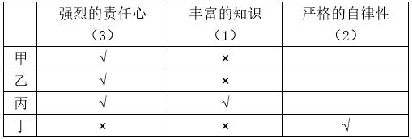

由条件①甲、乙自律性程度相同且拥有严格的自律性的教师只有两人，可知甲、乙一定都没有严格的自律性（如果甲、乙都有严格的自律性，那么丙、丁都没有严格的自律性，这与上述分析丁具有严格的自律性矛盾）。如下表：

故正确答案为ACD。

---

### 第 30 题　qid 2051708 · 逻辑判断

从艺术创作的角度说，一部电视剧不该承载全部的社会意见，必须选择性呈现；对于现实主义题材的作品，没有义务、也没有能力去解开所有的社会心结。但矛盾在于，从名字到情节都被认为造假的畅销剧，创作动机在于歌颂反腐现实。所以，电视剧及其批评一定有一个是错的。
以下各项，能够支持上述观点的有：

- **A**. 从名字到情节都被认为造假的畅销剧很难实现歌颂反腐现实的目的　✅
- **B**. 创作动机在于歌颂反腐现实的电视剧不应被认为存在造假的成份　✅
- **C**. 电视剧及其批评都有合理的成份
- **D**. 电视剧来源于现实，但不同于现实，对其批评意义不大

**答案**：AB

**官方解析**

第一步：找出论点和论据。
论点：电视剧及其批评一定有一个是错的。
论据：对电视剧的批评是指该剧是一部从名字到情节都被认为造假的畅销剧；电视剧的创作动机在于歌颂反腐现实。
第二步：逐一分析选项。
A项：该项表明被认为造假的畅销剧难以实现电视剧的创作目的，说明对电视剧的批评和电视剧本身二者当中一定有一个是错误的，解释了题干的论点，补充论据，可以支持，当选；
B项：歌颂反腐现实的电视剧不应被认为存在造假的成份，说明电视剧本身和批评该电视剧造假二者当中一定有一个是错误的，解释了题干的论点，补充论据，可以支持，当选；
C项：只强调电视剧及其批评都有合理的成份，没有说明二者是否一定有一个是错的，属于无关选项，排除；
D项：对电视剧进行批评的意义与题干论点无关，排除。
故正确答案为AB。

---

### 第 31 题　qid 2051710 · 逻辑判断

优秀的开发团队，卓越的产品表现，加上广阔的舞台，可以让企业更好地发挥出它的魅力。同时，在推广中获得最新的用户评价，以不断优化产品设计和服务，也是成功的关键。为此，选择合适的推广平台至关重要。对此，运营专家说：“面对人生地不熟的海外市场，中国创业创新者也需要善于利用国际工具，‘借船出海’。”
以下各项中，能够支持运营专家观点的有：

- **A**. 在熟悉的国内市场上，无需在产品的推广工具选择上煞费苦心
- **B**. 在陌生的海外市场上，选择合适的产品推广平台尤为重要　✅
- **C**. 产品的质量和销售服务才是成功的关键
- **D**. 合适的推广平台所反馈的信息有助于实现成功　✅

**答案**：BD

**官方解析**

第一步：找到论点和论据。
论点：面对人生地不熟的海外市场，中国创业创新者也需要善于利用国际工具，“借船出海”。
论据：优秀的开发团队，卓越的产品表现，加上广阔的舞台，可以让企业更好的发挥出它的魅力。同时，在推广中获得最新的用户评价，以不断优化产品设计和服务，也是成功的关键。为此，选择合适的推广平台至关重要。
第二步：逐一分析选项。
A项：国内市场无需在产品的推广工具选择上煞费苦心，题干论点讨论的是海外市场，话题不一致，不能加强，排除；
B项：说明了为什么要选择合适的推广平台，支持“选择合适的推广平台至关重要”，补充论据，当选；
C项：产品的质量和销售服务才是成功的关键，说明推广平台对成功不重要，即无需“借船出海”，削弱论点，排除；
D项：解释“选择合适的推广平台至关重要”的原因，补充论据，当选。
故正确答案为BD。

---

### 第 32 题　qid 2051714 · 逻辑判断

财富不是钱，也不是资源，更不是货币，财富是动态的，是可以市场买卖的东西，财富的多少不是对资源的占有，而是对资源的利用，是由国民的创造力决定的，这种创造力是这个国家国民的整体智慧的积累。没有智慧的积累与培植，哪怕拥有再多的资源，也不会有财富的增长与积累。
以下各项中，能够质疑上述观点的有：

- **A**. 孔子很有智慧，但没有大笔财富
- **B**. 教育和知识水平相当的国家，往往差别很大
- **C**. 有的国家财富增长很快，但并不存在相应的智慧积累和培植　✅
- **D**. 一个国家的整体智慧有可能转变为财富

**答案**：C

**官方解析**

第一步：找出论点和论据。
论点：财富的增长与积累→智慧的积累与培植。
论据：财富是由国民创造力决定的，这种创造力是这个国家国民的整体智慧的积累。
第二步：逐一分析选项。
A项：题干说的是国家国民的整体智慧的积累，而选项A说明的是孔子个人智慧与财富，与论点无关，属于无关选项，排除；
B项：教育和知识水平相当的国家，往往差别很大，没有具体说明什么差别很大，属于不明确选项，不能质疑，排除；
C项：有的国家财富增长很快且不存在相应的智慧积累和培植，举例削弱论点，当选；
D项：一个国家的整体智慧可能转变为财富，是对论点后件的肯定，肯后无法得出确定的结论，因此该选项可能性的表述是正确的。但是无法削弱论点，排除。
故正确答案为C。

---

### 第 33 题　qid 2051716 · 逻辑判断

要研发一款保险产品，要涉及精算、产品、风控、客服、核保、核赔、IT、法律、财务、资产、品宣、电话中心、物控，甚至关联的各个业务口，十多个部门，后续有一大堆繁杂的事项，足见一个保险产品的出台要涉及多少个部门的协同作战，是多少利益和战略的平衡，是多么复杂和专业的问题。所以，我非常理解各家保险公司的同行，想要出台一款产品是多么不容易，简直是“过五关斩六将”。
以下各项中，能质疑上述观点的有：

- **A**. 保险市场上，保险产品琳琅满目，让人应接不暇
- **B**. 研发保险产品的关键在于精算工作，其他业务并不复杂　✅
- **C**. 一家新开张的保险公司，在短时间内出台了好几款设计合理的保险产品　✅
- **D**. 保险产品的质量决定了销量

**答案**：BC

**官方解析**

第一步：找到论点和论据。
论点：想要出台一款保险产品是多么不容易，简直是“过五关斩六将”。
论据：研发一款保险产品，要涉及多少个部门的协同作战，是多少利益和战略的平衡，是多么复杂和专业的问题。
第二步：逐一分析选项。
A项：保险产品的多少与出台保险产品的难易程度无关，是无关选项，排除；
B项：说明研发保险产品关键在精算，其他业务不复杂，削弱论据中的需要多个部门协同作战，在一定程度上可以削弱，当选；
C项：举例说明某家新开张的保险公司，短时间内设计出好几款合理的保险产品，“短时间内出台好几个”削弱论点“出台保险产品不容易”，属于削弱选项，当选；
D项：保险产品的质量决定了销量，质量和销量问题与论点无关，属于无关选项，排除。
故正确答案为BC。

---

### 第 34 题　qid 2051718 · 逻辑判断

金融的不稳定和经济的不稳定是一个问题的两个方面。这种情况之下，如果这些催生经济、金融不稳定的风险因素不能有效化解，那么防范系统性金融风险、防范实体经济萎缩等目标都难以实现。这也是目前中国经济面临的根本性问题。
根据以上文字，可以推出：

- **A**. 金融不稳定和经济不稳定是目前中国经济面临的根本性问题
- **B**. 金融不稳定与经济不稳定是相互联系、表现不同的两个问题
- **C**. 防范系统性金融风险和防范实体经济萎缩都需要化解催生经济、金融不稳定的风险因素　✅
- **D**. 目前中国经济面临的根本性问题就是如何有效化解催生经济、金融不稳定的风险因素

**答案**：C

**官方解析**

第一步：翻译题干。

不能有效化解催生经济、金融不稳定的风险因素难以实现防范系统性金融风险、防范实体经济萎缩等目标。

第二步：逐一分析选项。

A项：题干“这些催生经济、金融不稳定的风险因素不能有效化解”是目前中国经济面临的根本性问题，而不是“金融不稳定和经济不稳定”本身是目前中国经济面临的根本性问题，因此该项无法推出，排除；

B项：金融的不稳定和经济的不稳定是一个问题的两个方面而非两个问题，无法推出，排除；

C项：防范系统性金融风险和防范实体经济萎缩→化解催生经济、金融不稳定的风险因素，是对题干翻译条件的否后，否后可以推出否前，该项可以推出，当选；

D项：中国经济面临的根本性问题就是如何有效化解催生经济、金融不稳定的风险因素，该表述过于绝对，无法推出，排除。

故正确答案为C。

---

### 第 35 题　qid 2051720 · 逻辑判断

可将皇帝与功臣的关系看作一种委托代理关系，皇帝作为帝国的所有者，控制着帝国的产权，但他不可能直接治理国家，必须委托一个或数个代理人来帮助他管理国家，在这样一个委托代理关系下，皇帝给功臣们高官厚禄，对他们的要求是勤奋工作，为皇帝效命。不过皇帝最主要、最关心的还是要求功臣们不得造反。
根据以上文字，以下说法中不正确的有：

- **A**. 作为委托人的皇帝有动机对功臣们进行监督
- **B**. 作为代理人的功臣们有动机勤奋工作，为皇帝效命
- **C**. 给功臣们高官厚禄是一种激励方式
- **D**. 皇帝总是有办法阻止功臣们造反　✅

**答案**：D

**官方解析**

第一步，抓住题干主要信息。
“可将皇帝与功臣的关系看作一种委托代理关系”；
“皇帝给功臣们高官厚禄，对他们的要求是勤奋工作，为皇帝效命”；
“皇帝最主要、最关心的还是要求功臣们不得造反”。
第二步：逐一分析选项。
A项：根据题干信息，皇帝作为委托人对功臣们提出要求，同时要防止功臣们造反，因此皇帝是有动机对功臣们进行监督的，可以推出，排除；
B项：皇帝给功臣们高官厚禄要求功臣们勤奋工作，因此功臣们有动机为皇帝效命，可以推出，排除；
C项：给功臣们高官厚禄是皇帝要求功臣们勤奋工作，为皇帝效命的一种方式，该项可以推出，排除；
D项：题干只说皇帝最关心的是要求功臣们不得造反，没有说皇帝有办法阻止功臣们造反，无中生有，无法推出，当选。
本题为选非题，故正确答案为D。

---

## 资料分析

### 材料 1

        中国人民银行发布的《2015年中国区域金融运营报告》披露：2015年末，全国各地区银行业金融机构网点共计22.1万个，从业人员379.0万人，资产总额174.2万亿元，同比分别增长、、。分地区看，中部、西部和东北地区银行业金融机构发展加快，从业人员和资产规模占全国的比例同比均有所提高，东部地区这两项指标同比分别下降1.0个百分点和0.7个百分点。

#### 第 1 题　qid 2051590 · 综合

2015年末，我国西部地区和中部地区的银行业金融机构的营业网点机构个数相差约：

- **A**. 7000　✅
- **B**. 8000
- **C**. 28000
- **D**. 30000

**答案**：A

**官方解析**

材料时间为2015年末，由题干“2015年末，我国西部地区和中部地区的银行业金融机构的营业网点机构个数”，结合表格给出中部和西部机构占比可知，本题为现期比重问题。定位文字材料第一段可知，2015年末，全国各地区银行业金融机构网点共计22.1万个，定位表格第二列可知，2015年末，西部金融机构营业网点占比为，中部金融机构营业网点占比。西部地区和中部地区机构个数相差为。

故正确答案为A。

---

#### 第 2 题　qid 2051596 · 综合

2015年末，我国东部地区银行业金融机构从业人数比东北地区的多多少倍？

- **A**. 1
- **B**. 2
- **C**. 3　✅
- **D**. 4

**答案**：C

**官方解析**

由题干“2015年末……多……倍”，可知本题为一般增长率问题。定位表格第三列可知，2015年末，东部地区银行业金融机构从业人数占比为，东北地区银行业金融机构从业人数占比为，则东部地区从业人数比东北地区多倍。

故正确答案为C。

---

#### 第 3 题　qid 2051604 · 平均数

2015年末，我国银行业金融机构营业网点的平均资产总额最高的地区是：

- **A**. 东部　✅
- **B**. 中部
- **C**. 西部
- **D**. 东北

**答案**：A

**官方解析**

材料时间为2015年末，由题干“2015年末……平均……是”，可知本题为现期平均数。地区平均资产总额。定位表格第一列第三列可知：

东部地区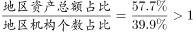；

中部地区；

西部地区；

东北地区。

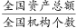一定，东部地区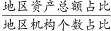最高，所以东部地区平均资产总额最高。

故正确答案为A。

---

#### 第 4 题　qid 2051606 · 平均数

2015年末，我国银行业金融机构从业人员的人均资产最少的地区是：

- **A**. 东部
- **B**. 中部
- **C**. 西部
- **D**. 东北　✅

**答案**：D

**官方解析**

材料时间为2015年末，由题干“2015年末……人均资产”，可知本题为现期平均数。地区人均资产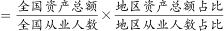。定位表格第二列第三列可知：

东部地区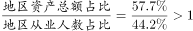；

中部地区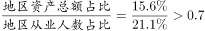；

西部地区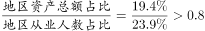；

东北地区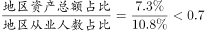。

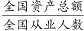一定，东北地区最少，所以东北地区人均资产最少。

故正确答案为D。

---

#### 第 5 题　qid 2051610 · 综合

根据以上资料，下列说法正确的是：

- **A**. 2014年末，我国银行业金融机构营业网点的从业人员平均规模是20人。
- **B**. 2014年末，我国银行业金融机构营业网点的平均总资产是7亿元。　✅
- **C**. 2014年末，我国银行业金融机构从业人员的人均总资产是4500万元。
- **D**. 2014年，我国东部地区银行业金融机构从业人员的人均总资产为6000万元。

**答案**：B

**官方解析**

A项：定位文字材料，“2015年末，全国各地区银行业金融机构网点共计22.1万个，从业人员379.0万人，同比分别增长、”。2014年末，银行业金融机构营业网点的从业人员平均规模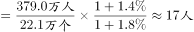，错误；

B项：定位文字材料，“2015年末，全国各地区银行业金融机构网点共计22.1万个，资产总额174.2万亿元，同比分别增长、”。2014年末，我国银行业金融机构营业网点的平均总资产，正确；

C项：定位文字材料，“2015年末，全国各地区银行业金融机构，从业人员379.0万人，资产总额174.2万亿元，同比分别增长、”。2014年末，我国银行业金融机构从业人员的人均总资产，错误；

D项：定位文字材料，“2015年末，全国各地区银行业金融机构，从业人员379.0万人，资产总额174.2万亿元，同比分别增长、”，定位表格材料“东部地区：从业人员占比为，资产总额占比为”，定位文字材料“分地区看，中部、西部和东北地区银行业金融机构发展加快，从业人员和资产规模占全国的比例同比均有所提高，东部地区这两项指标同比分别下降1.0个百分点和0.7个百分点”。可知2014年从业人员占比，2014年资产规模占比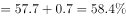，2014年，我国东部地区银行业金融机构从业人员的人均总资产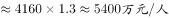，错误。

故正确答案为B。

---

### 材料 2

        根据国家统计局抽样调查结果，2015年农民工总量为27747万人，比上年增加352万人，增长。2011年以来农民工总量增速持续回落。2012年、2013年、2014年和2015年农民工总量增速分别比上年回落0.5、1.5、0.5和0.6个百分点，而且农民工年龄结构也有所变化。

#### 第 6 题　qid 2051658 · 增长

2012-2015年，我国农民工同比增速下降最多的年份是：

- **A**. 2012
- **B**. 2013　✅
- **C**. 2014
- **D**. 2015

**答案**：B

**官方解析**

定位文字材料“2012年、2013年、2014年和2015年农民工增速分别比上年回落0.5、1.5、0.5和0.6个百分点”，因此农民工同比增速下降最多的是2013年。
故正确答案为B。

---

#### 第 7 题　qid 2051656 · 增长

2012年-2015年，我国农民工总量增长最多的年份是：

- **A**. 2012　✅
- **B**. 2013
- **C**. 2014
- **D**. 2015

**答案**：A

**官方解析**

根据题干所求“2012年-2015年，我国农民工总量增长最多的年份”，可判定此题为增长量比较问题。，代入柱状图数据可得，增长量为：2012年万人；2013年万人；2014年万人；定位文字材料可得“2015年农民工总量……比上年增加352万人”。因此农民工总量增长最多的是2012年。

故正确答案为A。

---

#### 第 8 题　qid 2051664 · 比重

2011-2015年，年龄为多少岁的农民工在农民工总量中的占比逐年减少：

- **A**. 16-20岁
- **B**. 21-30岁　✅
- **C**. 31-40岁
- **D**. 50岁以上

**答案**：B

**官方解析**

定位表格数据可得：2015年16-20岁农民工占比高于2014年，2013年31-40岁农民工占比高于2012年，2012年50岁以上农民工占比高于2011年，满足2011-2015年占农民工总量比重逐年减少的只有21-30岁的农民工。
故正确答案为B。

---

#### 第 9 题　qid 2051668 · 增长

与2014年相比，2015年年龄为多少岁的农民工总量增加最多？

- **A**. 16-20岁
- **B**. 21-30岁
- **C**. 31-40岁
- **D**. 50岁以上　✅

**答案**：D

**官方解析**

根据题干所求，“与2014年相比，2015年年龄为多少岁的农民工总量增加最多”，可判定此题为增长量比较。

增长量

-

2015年，各年龄段农民工总量增长量 分别为：

A项：16-20岁：；

B项：21-30岁：；

C项：31-40岁：；

D项：50岁以上：。

观察数据，A和D项是正的，而B和C项是负的，排除B和C项。A项一定小于D项，排除A。故D项数值最大。

故正确答案为D。

---

#### 第 10 题　qid 2051674 · 综合

根据以上材料，下列说法中不正确的是：

- **A**. 2011-2015年，50岁以上的农民工人数都超过了3600万。
- **B**. 2015年，21-30岁、31-40岁、41-50岁的农民工人数均超过6100万。
- **C**. 2015年16-20岁农民工人数比2013年16-20岁农民工人数要多。　✅
- **D**. 2011-2015年，50岁以上农民工在农民工总量中的占比逐年增加。

**答案**：C

**官方解析**

A项：，定位柱状图与表格，2011年50岁以上农民工为万，2012年-2015年，农民工总量与50岁以上农民工占总量的比重均高于2011年，故2011-2015年，50岁以上的农民工人数都超过3600万，正确；

B项：定位文字材料与表格，2015年，31-40岁农民工人数为万，21-30岁、41-50岁农民工占比分别为、，均高于31-40岁农民工占比，故农民工人数均超过6100万，正确；

C项：定位柱状图与表格，2015年16-20岁农民工人数为，2013年为，比较数据，2015年农民工总量小于2013年的1.1倍，2013年比重大于2015年的1.2倍，故2015年16-20岁农民工人数少于2013年，错误；

D项：定位表格，2011年-2015年，50岁以上农民工占农民工总量中的比重逐年增加，正确。

本题为选非题，故正确答案为C。

---

### 材料 3

        据国家卫计委统计，2016年1-11月全国医疗卫生机构出院人数达19912.9万人，同比提高。其中：医院15392.5万人，同比提高；基层医疗卫生机构3618.6万人，同比提高；其他机构901.8万人。医院中：公立医院13080.0万人，同比提高；民营医院2312.5万人，同比提高。

   

#### 第 11 题　qid 2051722 · 综合

2016年1-11月医院和乡镇卫生院的诊疗人次数合计最多的省份是：

- **A**. 江苏
- **B**. 浙江
- **C**. 河南
- **D**. 广东　✅

**答案**：D

**官方解析**

由题干“2016年1-11月······人数合计最多的······”可以判定本题为简单加减计算问题。定位表格材料，四个选项的诊疗人次数合计分别为：

A项：江苏万人次；

B项：浙江万人次；

C项：河南万人次；

D项：广东万人次。

所以诊疗人次数合计最多的省份为广东省。

故正确答案为D。

---

#### 第 12 题　qid 2051712 · 综合

2016年1-11月医院和乡镇卫生院的出院人数合计最多的省份是：

- **A**. 山东
- **B**. 河南
- **C**. 四川　✅
- **D**. 广东

**答案**：C

**官方解析**

由题干“2016年1-11月······人数合计最多的······”可以判定本题为简单加减计算问题。定位表格材料，四个选项的出院人数合计分别为：

A项：山东万人；

B项：河南万人；

C项：四川万人；

D项：广东万人。

所以出院人数合计最多的省份为四川省。

故正确答案为C。

---

#### 第 13 题　qid 2051726 · 综合

2016年1-11月医院和乡镇卫生院的出院人数合计超过1000万的省份共有多少个？

- **A**. 4
- **B**. 5
- **C**. 6　✅
- **D**. 7

**答案**：C

**官方解析**

由题干“2016年1-11月······人数合计超过1000万的······”可以判定本题为简单加减计算问题。定位表格材料第三列与第五列，想要快速寻找两列合计超过1000万的省份，可以分两步考虑：
第一步，只要单列超过1000万，则两列合计必然超过1000万。将单列超过1000万的省份找出来，从上到下依次为山东、河南、广东、四川，共有4个省份；
第二步，由于第三列的数据远超第五列，故主要寻找第三列略低于1000万的省份，计算第三列和第五列总和是否超过1000万，从上到下依次有江苏（961.3）、湖南（807.8）满足要求，共有2个省份。
所以共有6个省份出院人数合计超过1000万人。
故正确答案为C。

---

#### 第 14 题　qid 2051724 · 综合

2016年1-11月医院的出院人数与诊疗人次数之比由高到低的省份依次为：

- **A**. 湖南 陕西 甘肃 四川　✅
- **B**. 甘肃 陕西 湖南 四川
- **C**. 四川 陕西 湖南 甘肃
- **D**. 陕西 湖南 四川 甘肃

**答案**：A

**官方解析**

由“2016年1-11月······之比由高到低”可以判定本题为比值比较问题。观察选项可知，选项只涉及到湖南、陕西、甘肃、四川四个省份，且第一名各不相同，故只需确定这四个省份中最高的一个即可。

A项：湖南；

B项：陕西；

C项：甘肃；

D项：四川。

很显然，四个省份的比值最高的是湖南。

故正确答案为A。

---

#### 第 15 题　qid 2051728 · 综合

根据以上资料，下列说法中正确的是：

- **A**. 
2016年1-11月，医院诊疗人次数与乡镇卫生院诊疗人次数之和与之差都最小的省份不是西藏

- **B**. 
2016年1-11月，医院和乡镇卫生院的诊疗人次数合计超过1亿的省份有16个
　✅
- **C**. 
2016年1-11月，我国医疗卫生机构的出院人数中，公立医院的占比为

- **D**. 
2016年1-11月，我国医院诊疗人次数的合计数比乡镇卫生院诊疗人次数的合计数少20亿

**答案**：B

**官方解析**

A项：定位材料最后一句话“注：西藏2016年月报未报机构较多”，所以表中西藏的数据只是部分数据，不能说明西藏医院诊疗人次数和乡镇卫生院诊疗人次数的实际总数，因此无法判断西藏的医院诊疗人次数与乡镇卫生院诊疗人次数之和与之差是否都最小，错误；

B项：定位表格材料，2016年1-11月，医院和乡镇卫生院的诊疗人次数合计超过1亿的省份有北京、河北、辽宁、上海、江苏、浙江、安徽、福建、山东、河南、湖北、湖南、广东、广西、四川、云南，共16个省份，正确；

C项：定位文字材料“2016年1-11月全国医疗卫生机构出院人数达19912.9万人······医院中：公立医院13080.0万人” ，2016年1-11月，我国医疗卫生机构的出院人数中，，错误；

D项：定位表格材料，我国医院诊疗人次数的合计数（289919.8万人次）比乡镇卫生院诊疗人次数的合计数（92073.2万人次）多，错误。

故正确答案为B。

---

### 材料 4

        2016年电信业务收入完成11893亿元，同比增长，比上年回升7.6个百分点。电信业务总量完成35948亿元，同比增长，比上年提高25.5个百分点。2016年，电信业务收入结构继续向互联网接入和移动流量业务倾斜。非话音业务收入占比由上年的提高至；移动数据及互联网业务收入占电信业务收入的比重从上年的提高至。

        2010-2016年话音业务和非话音业务收入占比变化情况

#### 第 16 题　qid 2054178 · 增长

2016年电信业务总量同比增长了约（    ）亿元。

- **A**. 12653
- **B**. 12635　✅
- **C**. 7340
- **D**. 7304

**答案**：B

**官方解析**

根据题干所求“2016年······同比增长了约（    ）亿元”，材料数据为2016年，可判定此题为增长量计算问题。定位文字材料“电信业务总量完成35948亿元，同比增长”，代入公式：增长量亿元。

故正确答案为B。

---

#### 第 17 题　qid 2054180 · 增长

2016年非话音业务收入同比增加了约（  ）亿元。

- **A**. 1903
- **B**. 1309
- **C**. 1093　✅
- **D**. 1039

**答案**：C

**官方解析**

根据题干所求“2016年······同比增长加了······亿元”，材料数据为2016年，可判定此题为增长量计算问题。定位文字材料“2016年电信业务收入完成11893亿元，同比增长······非话音业务收入占比由上年的提高至”，增长量现期量基期量现期总量现期比重基期总量基期比重现期总量现期比重亿元。C项最接近。

故正确答案为C。

---

#### 第 18 题　qid 2054182 · 增长

2016年话音业务收入增速同比降低（  ）。

- **A**. 

- **B**. 

- **C**. 

- **D**. 

　✅

**答案**：D

**官方解析**

根据题干所求“2016年······收入增速同比降低”，选项为百分数，材料数据为2016年，可判定此题为一般增长率问题。

方法一：定位文字材料可得“2016年电信业务收入完成11893亿元，同比增长，”定位柱状图可得，2016年与2015年话音收入占比分别为、。代入公式：，2016年话音收入为，，2015年话音收入为，2016年话音收入增长率。

方法二：根据两期比重比较逆向考查进行求解。定位柱状图可得，2016年与2015年话音收入占比分别为、，即2016年话音收入占比相对于2015年降低了个百分点。定位文字材料可得“2016年电信业务收入完成11893亿元，同比增长”，设2016年话音业务收入同比增速为，根据两期比重比较公式，代入数据可得，做一简单化简，即，进一步化简可求得。当然也可以直接代入排除来做。

故正确答案为D。

---

#### 第 19 题　qid 2054184 · 综合

2016年移动数据及互联网业务收入规模约为（  ）亿元。

- **A**. 4329　✅
- **B**. 4239
- **C**. 3209
- **D**. 3029

**答案**：A

**官方解析**

方法一：根据题干所求“2016年移动数据及互联网业务收入”，材料给出2016年的总量及该部分的比重，可判定此题为现期比重问题。定位文字材料“移动数据及互联网业务收入占电信业务收入的比重从上年的提高至”“2016年电信业务收入完成11893亿元”，代入公式：部分量总量部分占总体比重亿元，仅A项满足。

方法二：亿元，A项最接近。

故正确答案为A。

---

#### 第 20 题　qid 2054186 · 综合

根据以上资料，下列说法中不正确的是（  ）。

- **A**. 2016年移动数据及互联网业务收入同比增速是当年非话音业务收入同比增速的3倍
- **B**. 2016年电信业务收入、非话音业务收入、移动数据及互联网业务收入均实现了同比正增长，且同比增速由小到大
- **C**. 2016年移动数据及互联网业务收入的同比增量比当年电信业务收入同比增量多669亿元
- **D**. 2016年移动数据及互联网业务收入的同比增速要高于电信业务总量的同比增速　✅

**答案**：D

**官方解析**

A项：，代入文字材料及统计图数据，2016年移动数据及互联网业务收入增速，非话音业务收入同比增速，前者增速是后者的倍，正确；

B项：定位文字材料，2016年电信业务收入同比增长，根据本题A项计算结果，非话音业务收入同比增长、移动数据及互联网业务收入同比增长，三者均同比正增长，且增速由小到大，正确；

C项：增长量现期量基期量现期总量现期比重基期总量基期比重现期总量现期比重基期比重，代入文字材料数据，2016年移动数据及互联网业务收入的同比增量为亿元，增长量增长率，电信业务收入同比增量为亿元，前者同比增量比后者多亿元，与669亿元接近，正确；

D项：根据本题A项计算结果，2016年移动数据及互联网业务收入同比增长，定位文字材料，电信业务总量同比增长，前者增速低于后者，错误。

本题为选非题，故正确答案为D。

---
