# 2018年421联考《行测》题（吉林乙级）（网友回忆版）

> 联考 · 2018 年 · 6 个模块 · 共 98 题

- [政治理论](#%E6%94%BF%E6%B2%BB%E7%90%86%E8%AE%BA) · 2 题
- [常识判断](#%E5%B8%B8%E8%AF%86%E5%88%A4%E6%96%AD) · 23 题
- [言语理解与表达](#%E8%A8%80%E8%AF%AD%E7%90%86%E8%A7%A3%E4%B8%8E%E8%A1%A8%E8%BE%BE) · 35 题
- [数量关系](#%E6%95%B0%E9%87%8F%E5%85%B3%E7%B3%BB) · 12 题
- [判断推理](#%E5%88%A4%E6%96%AD%E6%8E%A8%E7%90%86) · 25 题
- [资料分析](#%E8%B5%84%E6%96%99%E5%88%86%E6%9E%90) · 1 题

---

## 政治理论

### 第 1 题　qid 2187413 · 时事政治

习近平主席在一系列重要讲话和文章中引经据典，展现了独特的语言风格和人格魅力。他在博鳌亚洲论坛2018年年会中讲到“幸福和美好不会自己出现，成功属于勇敢而笃行的人”时，引用的经典名句是：

- **A**. 但愿苍生俱饱暖，不辞辛苦出山林
- **B**. 修其心治其身，而后可以为政于天下
- **C**. 积土而为山，积水而为海　✅
- **D**. 其身正，不令而行；其身不正，虽令不从

**答案**：C

**官方解析**

本题考查时事政治。
2018年4月8日-4月11日，博鳌亚洲论坛2018年年会在海南省博鳌镇召开，主题为“开放创新的亚洲，繁荣发展的世界”。中国国家主席习近平应邀出席论坛年会开幕式并发表重要主旨演讲，演讲中指出：“‘积土而为山，积水而为海’，幸福和美好未来不会自己出现，成功属于勇毅而笃行的人。让我们坚持开放共赢，勇于变革创新，向着构建人类命运共同体的目标不断迈进，共创亚洲和世界的美好未来！”C项属于原文表述，A、B、D项错误。
故正确答案为C。

---

### 第 2 题　qid 2187418 · 马克思主义

在十三届全国人大一次会议上，宪法修正案经表决，获得高票通过。此次宪法修改的一项重要内容就是将习近平新时代中国特色社会主义思想载入国家根本法，体现党和国家事业发展的新成就、新经验、新要求，在总体保持宪法的连续性、稳定性、权威性的基础上推动宪法与时俱进，完善发展。宪法修改体现的哲理是：

- **A**. 事物发展的本质是克服
- **B**. 事物发展的本质是抛弃
- **C**. 事物发展的本质是扬弃　✅
- **D**. 事物发展的本质是保留

**答案**：C

**官方解析**

本题考查哲学常识。
发展是揭示事物运动、变化的整体趋势和方向性的范畴，发展是具有前进性质的运动，是事物由低级向高级、由简单向复杂、由无序向有序的上升运动。发展的实质是新事物的产生和旧事物的灭亡。扬弃指事物在新陈代谢过程中，发扬事物中的积极因素，抛弃旧事物中的消极因素。此次我国宪法修正案是在原有宪法基础上，根据党和国家事业发展的新成就、新经验、新要求进行完善发展，既保留了原宪法合理的内容，又与时俱进，体现了宪法的连续性、稳定性和与时俱进。A、B、D三项均表述错误，C项正确。
故正确答案为C。

---

## 常识判断

### 第 1 题　qid 2187416 · 人文常识

国务院机构改革优化了创新引擎。一方面，重组科学技术部，加强、优化、转变政府科技管理和服务职能；另一方面，重组国家知识产权局，强化知识产权创造、保护和运用，让“第一动力”更有劲头。这段话蕴含的哲理是：

- **A**. 社会存在状况决定社会意识
- **B**. 上层建筑应与经济基础相适应　✅
- **C**. 生产关系应与生产力相适应
- **D**. 社会意识一定要适应社会存在

**答案**：B

**官方解析**

本题考查哲学常识。
A项错误，社会存在是指社会物质生活条件的总和，它包括地理环境、人口因素和生产方式。社会意识是社会生活的精神方面，是社会存在的总体反映。社会存在决定社会意识，但是本题没有体现社会存在和社会意识的辩证关系原理，而是强调对国家机构进行改革以促进科技创新发展。
B项正确，上层建筑是指建立在一定经济基础上的社会意识形态以及与之相适应的政治法律制度，包括政治上层建筑和思想上层建筑。经济基础是指占统治地位的生产关系的总和。题干中的国家机构为经济发展、鼓励科技创新而进行改革，体现了调整上层建筑为经济基础服务。
C项错误，生产力是人类改造自然并从自然界获得生存和发展的物质资料的能力。生产关系是人们在物质生产过程中所结成的经济关系。生产力决定生产关系，生产关系对生产力具有反作用。题干只是强调国家机构改革促进创新的发展，没有体现生产力和生产关系的辩证关系。
D项错误，社会存在和社会意识的辩证关系为社会存在决定社会意识，社会意识对社会存在具有反作用，同时社会意识具有相对独立性。社会存在和社会意识的发展不完全同步，社会意识有时会先于社会存在，有时会落后于社会存在，选项表述太过绝对。
故正确答案为B。

---

### 第 2 题　qid 2187973 · 科技常识

新西兰一家园艺研究所研究发现，水果成熟时会释放挥发性的化合物，而且随着成熟程度的增加，其浓度也会有所变化。研究人员正是根据水果这一特性，制成了一种能“感知”水果是否成熟的标签。当水果成熟时，标签通过感知其释放的挥发性化合物的浓度而变换颜色。这段话体现的哲理是：

- **A**. 意识是人脑的机能和属性
- **B**. 意识对人们改造世界具有指导作用　✅
- **C**. 意识活动具有科学预见性
- **D**. 意识活动具有直接现实性

**答案**：B

**官方解析**

本题考查哲学常识，主要涉及辩证唯物主义的相关内容。
A项错误，意识是人脑的机能和属性，是客观世界的主观映象。题干强调的是发挥意识的作用，故选项与题干无关；
B项正确，题干描述的“水果这一特性”属于自然规律，人们认识并利用这一自然规律制造出了“感知标签”，体现了意识可以能动的改造世界，对人们改造世界的活动具有指导作用；
C项错误，意识活动具有正确和错误之分，只有正确的意识才具有科学预见性。正确的意识是指如实地反映客观事物的本来面目（包括状态、性质、变化规律等）的意识。正确意识的这一性质决定了它能够对事物的发展趋势作出正确的分析、判断和预测，使人们采取正确的措施，从而推动事物的发展。错误的意识歪曲了事物的本质，会阻碍事物的发展；
D项错误，意识具有目的性、创造性和计划性，但不具有直接现实性。实践活动具有直接现实性。
故正确答案是B。

---

### 第 3 题　qid 2187394 · 人文常识

下列流行语与其所反映的哲理对应错误的是：

- **A**. 正能量——发挥社会意识正确导向作用
- **B**. 新常态——静止的、无条件的　✅
- **C**. 接地气——从实际出发，密切联系群众
- **D**. 中国式——共性寓于个性之中

**答案**：B

**官方解析**

A项正确，正能量指的是一种健康乐观、积极向上的动力和情感，对事物发展有积极作用，体现了“发挥社会意识正确导向作用”的原理。
B项错误，中国新常态要发挥对世界经济的正面效应，需要不断推进改革来驱动增长，这体现了“事物之间的联系具有条件性、多样性”的原理；在新常态下，中国经济结构调整的本质是资源要素的重新组合利用，资产重组调整再分配，是此消彼长的关系，这体现了“一切事物是变化发展的，发展具有普遍性”的原理；在新常态下新旧力量将长期并存，原有的对经济发展有影响的因素会继续发挥其效应，而新的特征和趋势也将逐步形成，新常态需要新思路和新方式，但不否定那些仍继续有效的做法，这体现了“矛盾具有普遍性、具体性”的原理。所以，B项错误，并未体现“静止的、无条件的”原理。
C项正确，接地气比喻联系实际、联系基层群众，体现了“从实际出发，密切联系群众”的原理。
D项正确，中国式是指具有中国特色的事物。共性指不同事物的普遍性质；个性指一事物区别于他事物的特殊性质，体现了“共性寓于个性之中”的原理。
本题为选非题，故正确答案为B。

---

### 第 4 题　qid 2187403 · 人文常识

甲国国家领导人出访乙国，乙国的接待做法不符合涉外交际礼仪惯例的是：

- **A**. 邀请甲国领导人发表演讲时，将演讲台放置于主席台的右前方
- **B**. 用轿车接送时，安排甲国领导人坐后排右座，翻译坐副驾驶座
- **C**. 面对行进方向，在轿车右侧悬挂甲国国旗，左侧悬挂乙国国旗
- **D**. 在乙国安排的招待宴会上，应将甲国领导人安排在主位的左侧　✅

**答案**：D

**官方解析**

本题考查文化常识。
A项正确，根据国际社交礼仪，演讲台应放置于主席台的右前方。
B项正确，乘坐双排五座轿车时，当是专职司机驾车时，座次由高到低是：后排右座、后排左座、后排中座、副驾驶座。位于轿车前排的副驾驶座，在由专职司机驾车时，一般被称为“随员座”，它是属于陪同、秘书、翻译或是警卫人员的专座。所以安排甲国领导人坐后排右座，翻译坐副驾驶座。
C项正确，在轿车上悬挂两国国旗时，以轿车行进方向为准，以驾驶员右侧为上，悬挂来国国旗，以驾驶员左侧为下，悬挂东道主国国旗。甲国为出访国，乙国为东道主国，所以右侧悬挂甲国国旗，左侧悬挂乙国国旗。
D项错误，依照国际礼仪的普遍惯例，是“以右为尊”。在招待宴上，面对宴厅的门为主位，“主陪”就坐，而甲国领导人为主宾，应该坐在主位的右侧。
本题为选非题，故正确答案为D。

---

### 第 5 题　qid 2188129 · 人文常识

下列新闻标题用语存在明显错误的是：

- **A**. 

- **B**. 

- **C**. 

- **D**. 

　✅

**答案**：D

**官方解析**

本题考查文化常识，主要涉及标题用语的相关内容。
A项正确，“嬗变”具有以下几种解释：1.蜕变；2.一种元素通过核反应转化为另一种元素或者一种核素转变为另一种核素；3.彻底改变（如特征或条件的改变）；4.演变。选项标题为《那些小山村的嬗变》，可以理解为小山村的蜕变，或者是发生彻底的变化，语意通顺，无明显错误。
B项正确，《窥求大学细理 品咂大学内涵》是冯玉忠（辽宁大学原校长）先生的一篇文章，全文围绕“大学使命，大学何为”展开，文章引人深思，发人深省。
C项正确，引擎是发动机的核心部分，因此习惯上也常用引擎指发动机。体育产业需要创新引擎，意思是体育产业需要创新提供动力，无明显语病。
D项错误，“无出其右”是一个成语，汉代以右为尊，意思是没有能超过他的，出自《史记·田叔列传》。“无人能出其左右”，“左右”指两个方面，存在歧义，该用法错误。
本题为选非题，故正确答案是D。

---

### 第 6 题　qid 2187979 · 人文常识

关于下列谦辞的用法，表述错误的是：

- **A**. “刍议”用于谦称自己撰写的文章
- **B**. “续貂”用于谦称修补别人的服饰　✅
- **C**. “芹献”用于谦称赠送别人的礼物
- **D**. “补壁”用于谦称赠人的书画作品

**答案**：B

**官方解析**

本题考查文化常识。
A项正确，“刍议”，谦词，指自己的不成熟的言谈议论，亦指浅陋的议论，多用于第一人称的自谦之语。
B项错误，“续貂”，比喻拿不好的东西接到好的东西后面，多用于谦称续写别人的著作。一般不用于谦称修补别人的服饰。
C项正确，“芹献”，指的是谦称赠人的礼品菲薄或所提的建议浅陋。所以，“芹献”可以用于谦称赠送别人的礼物。
D项正确，“补壁”，字面意思是修补墙壁。作书绘画的人，把作品赠人时的谦词，意思是说水平拙劣，不足登大雅之堂，潜台词就是自己的作品价值不高，至多用作修补墙壁的材料。
本题为选非题，故正确答案是B。

---

### 第 7 题　qid 2187983 · 人文常识

陆游《临安春雨初霁》中的诗句“小楼一夜听春雨，深巷明朝卖杏花”描写的场景是农历的：

- **A**. 二月　✅
- **B**. 五月
- **C**. 四月
- **D**. 三月

**答案**：A

**官方解析**

本题主要考查文学常识。
《临安春雨初霁》是南宋诗人陆游晚年时期所作的一首七言律诗。 诗中“小楼一夜听春雨，深巷明朝卖杏花”意思是住在小楼听尽了一夜的春雨淅沥滴答，清早会听到小巷深处在一声声叫卖杏花。
A项正确，从诗句中的“杏花”推断出该诗描述的应是杏花开放的时节。古人记月除常用的序数法外，还常常以物候的特点来命名。古代农历的二月正值杏花开放的时节，故古人将农历二月又称为杏月，本题选择A项最合适。因此B、C、D项错误。
故正确答案为A。

---

### 第 8 题　qid 2187988 · 人文常识

对下列典籍名称中划线词解释错误的是：

- **A**. 
《<u>齐民</u>要术》———平等之黎民 

- **B**. 
《<u>本草</u>纲目》——根本之药物 

- **C**. 
《<u>文心</u>雕龙》——为文之用心

- **D**. 
《<u>梦溪</u>笔谈》——游览之胜地
　✅

**答案**：D

**官方解析**

本题主要考查历史常识。
A项正确，《齐民要术》是北魏贾思勰所著，该书系统地总结了黄河中下游地区劳动人民长期积累的生产经验。“齐民者，若今言平民也”，“齐民”指的是平等的黎民。
B项正确，《本草纲目》，是明代李时珍所著的医药学著作。其中，“本草”指的是根本之药物中草药。
C项正确，《文心雕龙》是南朝刘勰撰写的文学理论专著。在《文心雕龙·序志》当中提到，“文心者，言为文之用心也”。
D项错误，《梦溪笔谈》，是北宋科学家沈括所撰，是一部涉及古代中国自然科学、工艺技术及社会历史现象的综合性的著作。其中，“梦溪”指的是当时沈括所居的房子，并非指游览之胜地。
本题为选非题，故正确答案为D。

---

### 第 9 题　qid 2187397 · 人文常识

下列做法符合公文处理规则的是：

- **A**. 县民政局向本县所属乡镇政府发布指令性公文
- **B**. 镇党委书记以党委负责人名义向县委报送公文
- **C**. 镇政府向县政府报送的报告中带有请示事项
- **D**. 县科技局和林业局联合行文中只标注了主办机关的发文字号　✅

**答案**：D

**官方解析**

本题考查公文处理常识，主要考查《党政机关公文处理工作条例》的相关知识。
A项错误，根据《党政机关公文处理工作条例》第十六条第（二）款规定：党委、政府的办公厅（室）根据本级党委、政府授权，可以向下级党委、政府行文，其他部门和单位不得向下级党委、政府发布指令性公文或者在公文中向下级党委、政府提出指令性要求。县民政局不是党委、政府的办公厅（室），不可以向本县所属乡镇政府发布指令性公文。
B项错误，根据《党政机关公文处理工作条例》第十五条第（五）款规定：除上级机关负责人直接交办事项外，不得以本机关名义向上级机关负责人报送公文，不得以本机关负责人名义向上级机关报送公文。
C项错误，根据《党政机关公文处理工作条例》第十五条第（四）款规定：请示应当一文一事。不得在报告等非请示性公文中夹带请示事项。
D项正确，根据《党政机关公文处理工作条例》第九条第（五）款规定：联合行文时，使用主办机关的发文字号。
故本题正确答案为D。

---

### 第 10 题　qid 2187990 · 人文常识

直线型组织结构又称单线型组织结构，是最古老、最简单的一种组织结构类型，其特点是组织系统职权从组织上层“流向”组织基层。上下级关系是直线关系，即命令与服从的关系。下列关于直线型组织结构的说法中，错误的是：

- **A**. 信息流通迅速，利于民主决策　✅
- **B**. 权责明确，管理成本低
- **C**. 联系便捷，易于适应环境变化
- **D**. 结构简单，命令统一

**答案**：A

**官方解析**

本题主要考查管理常识。直线型组织上下级的权责关系是直线型，上级在其职权范围内具有直接指挥权和决策权，下属必须服从。这种结构形式具有权责明确、命令统一、决策迅速、反应灵敏和管理机构简单等优点；其缺点是权限高度集中，易于造成家长式管理作风、形成独断专行、长官意志，组织发展受到管理者个人能力的限制，组织成员只注意上下沟通，从而忽视横向联系。
A项错误，该组织成员只注重上下级沟通，信息横向流通不畅；该组织结构中，上级具有直接指挥权和决策权，下属必须服从，这样不利于民主决策。
B项正确，该组织结构下级只受一个上级领导管理，上下级关系简明清晰，权责明确；组织机构简单，管理成本低。
C项正确，该组织因为结构简单，可以随着组织结构的变化灵活调整，体现其联系便捷，易于适应环境变化的特点。
D项正确，该组织结构简单，上级具有直接指挥权和决策权，命令统一。
本题为选非题，故正确答案为A。

---

### 第 11 题　qid 2187994 · 经济常识

在经济学意义上，投资每增长一个百分点，能拉动经济增长；而消费每增长一个百分点，能拉动经济增长，是投资的4倍。下列选项中，有助于促进居民消费的是：

- **A**. 降低银行存贷款利率　✅
- **B**. 改善投资环境扩大招商引资
- **C**. 优化投资结构并实现总量扩张
- **D**. 家电企业扩大生产规模

**答案**：A

**官方解析**

本题考查的是经济常识的相关知识。
A项正确，银行存款利率降低，存款利息会随之变少，因此人们的银行存款会变少；银行贷款利率降低，贷款利息随之减少，因此人们的银行贷款会变多。总之，居民手中持有的货币量会增加，所以降低银行存贷款利率有利于促进居民消费。
B项错误，改善投资环境扩大招商引资属于增加投资。
C项错误，优化投资结构并实现总量扩张属于增加投资。
D项错误，家电企业扩大生产规模属于增加投资。
故正确答案为A。

---

### 第 12 题　qid 2187404 · 地理国情

发源于长白山的松花江滋养了东北大地，与东北人的生活息息相关。下列关于松花江表述错误的是：

- **A**. 松花江是东北境内航运价值较大的河流
- **B**. 松花江流域属温带大陆性季风气候
- **C**. 松花江是中国黑龙江最小的支流　✅
- **D**. 吉林市位于松花江沿岸

**答案**：C

**官方解析**

本题考查的是地理国情相关知识。
A项正确，松花江通航里程约1500公里，吉林市、齐齐哈尔市以下可通航汽轮；哈尔滨市以下可通航千吨江轮。通航期一般为4月中旬至11月上旬，是东北境内航运价值较大的河流。
B项正确，温带季风气候在我国主要分布在东部秦岭—淮河一线以北地区。松花江流域地处温带季风气候区，气候特点为夏季高温多雨，冬季寒冷干燥，松花江属于温带大陆性季风气候。
C项错误，松花江是黑龙江在中国最大的支流，而非最小的支流。
D项正确，吉林市位于吉林省中部，东北腹地长白山脉，长白山向松嫩平原过渡地带的松花江畔。吉林市满语名为“吉林乌拉”，意为“沿江的城池”。
本题为选非题，故正确答案为C。

---

### 第 13 题　qid 2187405 · 人文常识

“个性化定制”就在我们身边，“互联网+”大背景下，我们可以张扬更多的个性，从一件T恤到一本书，只要你愿意，生活中就会充满惊喜。这种消费属于：

- **A**. 求异心理引发的消费　✅
- **B**. 攀比心理引发的消费
- **C**. 从众心理引发的消费
- **D**. 求同心理引发的消费

**答案**：A

**官方解析**

本题考查的是经济常识。
A项正确，求异心理引发的消费指的是有些人消费时喜欢追求与众不同、标新立异的效果。题中追求“个性化定制”属于求异心理引发的消费。
B项错误，攀比心理引发的消费是指消费者出于攀比心理，脱离自己实际收入水平而盲目攀高的消费心理，与题干不符。
C项错误，从众心理引发的消费是指人们出于跟风、随大流的心理，引发对某类商品或某种风格的商品的追求，并形成流行趋势，当然盲目从众不可取。
D项错误，求同心理引发的消费是指不管自己是否愿意作出某种行为，也会尽量与周围的人保持一致，与题干不符。
故正确答案为A。

---

### 第 14 题　qid 2188077 · 人文常识

在同一城市，不同片区的居民收到的天气预报往往不一样，且每隔数小时都会更新一次。这种天气预报法属于：

- **A**. 定性预报法
- **B**. 网格化预报法　✅
- **C**. 定点预报法
- **D**. 描述性预报法

**答案**：B

**官方解析**

本题考查科技常识。

网格化预报法，就像地球上的经纬网一样，把中国以及每个城市所在的区域分解成许多个5公里5公里，甚至1公里1公里的网格，而公众就是生活在这样一个个的网格中，每个网格中的天气情况会有所差异。网格化预报的精细不仅体现在空间上，还反映在可以每天更高频次的更新和发布上。所以题干中的信息符合的正是“网格化预报法”， A、C、D三项均不符合题意。

故正确答案为B。

---

### 第 15 题　qid 2187972 · 人文常识

北极气候恶劣，冰雪无边。室外最低气温能达到零下59摄氏度，但冰屋却给那里的居民提供了温暖的住所。下列关于冰屋的说法，不正确的是：

- **A**. 冰屋能够保留其内部空间的热量，因为冰墙是热的不良导体
- **B**. 为了避免冷空气的进入，冰屋顶部应该被设计成密封圆拱形　✅
- **C**. 冰屋一半陷入地下，通过冷暖空气对流来保证冰屋内部气温
- **D**. 冰屋的内壁较为光亮，可以通过辐射防止内部热量向外扩散

**答案**：B

**官方解析**

本题考查的是科技常识的相关知识。
A项正确，因为冰是热的不良导体，能很好地隔热，屋里的热量几乎不能通过冰墙传导到屋外，所以冰屋能够保留其内部热量。
B项错误，冰屋顶部设计为圆拱形，是因为拱形受压时会把力传给相邻的部分，拱形可以向下向外分散压力，所以拱形所能承受的力量更重。所以冰屋屋顶设计成密封圆拱形，是为了承受更大的压力。
C项正确，冰屋在建造过程中会在半球形屋顶罩住的土地上挖掘一个深坑，根据热空气上升冷空气下降，冷空气会降到冰坑里，热空气升到人所在的位置，因此保证内部温度。
D项正确，冰屋内壁光亮的冰壳能够把辐射出去的热能反射回来，有效阻止屋内的热量向外扩散，从而保证室内温度的均衡。
本题为选非题，故正确答案为B。

---

### 第 16 题　qid 2187974 · 人文常识

中医认为，咸、甜、酸、苦、辣分别与人体的五脏相对应，各有其作用，即五味各入其脏，有所裨益。下述关于五味与五脏对应关系的表述中，错误的是：

- **A**. 酸味——肝脏
- **B**. 甜味——脾脏
- **C**. 咸味——肾脏
- **D**. 辣味——心脏　✅

**答案**：D

**官方解析**

本题主要考查文化常识。“五味”属于中药学概念，五味理论最早载于《神农本草经》，其序录云：“药有酸、咸、甘、苦、辛五味，又有寒、热、温、凉四气。”中药学中根据中药的味道、作用将其概括为酸、苦、甘、辛、咸，题干中的甜属于甘，辣属于辛，随症用药对五脏（心、肝、脾、肺、肾）有一定的选择性，《素问·宣明五气论》中有：“酸入肝、苦入心、甘入脾、辛入肺、咸入肾”之说。其作用是辛味药以散肺气之郁，甘味药以补脾气之虚，苦味药以泻心火，酸味药以敛肝阴，咸味药以补肾虚。所以五味与“五脏”对应关系是：酸对应肝脏，苦对应心脏，甜（甘）对应脾脏，辣（辛）对应肺脏，咸对应肾脏。 
A、B、C三项正确，酸对应肝脏，甜（甘）对应脾脏，咸对应肾脏。
D项错误，辣（辛）对应肺脏，而不是心脏，心脏对应苦味。
本题为选非题，故正确答案为D。

---

### 第 17 题　qid 2187976 · 人文常识

户外运动可以促进骨骼的健康，这是因为太阳光中的某种频率的电磁波可以促成维生素D的活化，促进身体吸收食物中钙和磷，从而促进骨骼的生长。这种电磁波是：

- **A**. 
紫外线
　✅
- **B**. 
与射线

- **C**. 
无线电波

- **D**. 
红外线

**答案**：A

**官方解析**

本题主要考查物理常识。

A项正确，紫外线是电磁波谱中波长从5nm～370nm之间的电磁波。太阳光里有紫外线，人体接受适量的紫外线照射，能促进钙的吸收，促进骨骼生长，改善身体健康。

B项错误，射线又称伦琴射线，能够穿透物质，可以用来检查人体内部器官。在工业上，利用射线检查金属零件内部的缺陷。γ射线是波长最短的电磁辐射，能够破坏生命物质。可以摧毁病变的细胞，用来治疗某些癌症。

C项错误，波长大于1mm的电磁波是无线电波。无线电波用于通信、广播及其他信号传输。

D项错误，红外线波长比无线电波短，比可见光长，所有物体都发射红外线。利用此现象制造的红外探测器，能够在较冷的背景上探测出较热物体的红外辐射，这是夜视仪器和红外摄影的基础。此外，红外线在军事上的应用也十分重要。

故正确答案为A。

---

### 第 18 题　qid 2187978 · 人文常识

下列我国史书中记载的国家与今日国名对应错误的是：

- **A**. 倭奴国——日本
- **B**. 暹罗国——伊朗　✅
- **C**. 安南国——越南
- **D**. 身毒国——印度

**答案**：B

**官方解析**

本题主要考查历史常识。
A项正确，倭奴国，最早称倭奴，后来称呼为倭寇，是我国古代对日本的称呼，也是日本最初的国名。
B项错误，暹罗国，是我国古代对东南亚国家泰国的古称。1939年6月24日改国号为“泰国”，1945年复名“暹罗”，1949年再度改名为“泰国”，沿用至今。故暹罗并不对应伊朗，而是对应泰国。
C项正确，安南国，为越南古名，其得名于唐代的安南都护府，自公元前3世纪开始成为我国领土，至五代十国时吴权割据安南脱离南汉，北宋无力统一，故正式独立，此后越南长期作为我国的藩属国存在。
D项正确，身毒国，是我国古代对现代印度次大陆上文明区域的称呼，其范围主要指今日印度河流域一带。
本题为选非题，故正确答案为B。

---

### 第 19 题　qid 2187980 · 科技常识

下列说法符合生物常识的是：

- **A**. 蜜蜂用头部的螯针蜇人
- **B**. 蜻蜓拥有咀嚼式的口器　✅
- **C**. 蚂蚁出生后由雄蚁喂养
- **D**. 蟋蟀依靠口器发出声音

**答案**：B

**官方解析**

本题考查生物常识，结合选项具体分析。
A项错误，蜜蜂蜇人的刺称之为蜂针，蜂针是蜜蜂的自卫器官，当蜜蜂感受到生命受到其他生物的威胁时，会执行蜇刺的动作。蜂针位于蜜蜂的尾部而非头部。
B项正确，蜻蜓是一种肉食昆虫，拥有咀嚼式口器，上颚发达，视觉极为灵敏。
C项错误，蚂蚁在幼虫阶段没有任何能力，它们也不需要觅食，完全由工蚁喂养。
D项错误，蟋蟀靠翅膀的摩擦来发音。在蟋蟀雄虫的前翅上，有旋涡纹状的翅膜。一边翅膀长着锉刀状的翅膜弦器，另一边翅膀长着较硬翅膜弹器。当这两种发音器相互摩擦，就能发出声音。
故正确答案为B。

---

### 第 20 题　qid 2187982 · 人文常识

牵牛花早晨为蓝色，下午会变为红色，这主要是因为牵牛花逐渐吸收了大量的：

- **A**. 酸性气体　✅
- **B**. 惰性气体
- **C**. 中性气体
- **D**. 碱性气体

**答案**：A

**官方解析**

本题考查化学常识。牵牛花内有特殊的色素，随着酸碱度变化而变化，吸收二氧化碳越多，越偏酸性。吸收二氧化碳是一个随时间持续的过程，白天光合作用强，因此随着吸收二氧化碳量的增加，逐渐变为红色；夜晚之后，光合作用停止，吸收二氧化碳减少，逐渐变回蓝色。
故正确答案为A。

---

### 第 21 题　qid 2187984 · 人文常识

拳术在长期的社会实践中形成了各种不同风格和特点的拳种流派。根据“舒缓柔和，轻灵圆活”的特点，判断该拳种是

- **A**. 通臂拳
- **B**. 长拳
- **C**. 南拳
- **D**. 太极拳　✅

**答案**：D

**官方解析**

本题考查与拳术相关的文化常识，结合选项具体分析。
A项错误，通臂拳是流传于北京、天津一带的拳术。通臂拳以其特殊的伸臂动作而著称，伸臂动作要力由背发，通过肩、肘、以达到指尖，所以要求背、肩、肘协调，用力伸展，并非单纯地伸臂。
B项错误，长拳是中国传统拳派之一，属于一种北派武术。其动作撑长舒展、筋顺骨直，如流星迅疾、敏捷、有力。
C项错误，南拳套路短小精悍，结构紧凑，动作朴实，手法多变，短手连打，步法稳健，攻击勇猛，常伴以声助威，技击性强。
D项正确，太极拳是一种以柔克刚，以静待动，以圆化直，以小胜大，以弱胜强，舒缓柔和，轻灵圆活的拳法。
故正确答案为D。

---

### 第 22 题　qid 2187986 · 人文常识

关于语言文字与字母的关系，下列说法错误的是

- **A**. 法语使用的是拉丁字母
- **B**. 日语使用的是阿拉伯字母　✅
- **C**. 俄语使用的是斯拉夫字母
- **D**. 德语使用的是拉丁字母

**答案**：B

**官方解析**

本题考查与语言文字相关的文化常识，结合选项具体分析。
A、D两项正确，拉丁字母是目前世界上流传最广的字母体系，源自希腊字母。拉丁字母、阿拉伯字母、斯拉夫字母（西里尔字母）被称为世界三大字母体系。法国和德国均使用拉丁字母。
B项错误：日语的文字主要由汉字、假名、罗马字三个部分构成，假名又分为平假名和片假名。其中罗马字是使用拉丁字母来表记日语的一种方法。一般在书写日语时，不需要用到罗马字。罗马字用于给日语注音，输入日语文字。有时在书写地名、人名、商标时可能会用到罗马字。
C项正确，俄语字母是西里尔字母的变体，西里尔字母是由基督教传教士西里尔在9世纪为了方便在斯拉夫民族传播东正教所创立的，被斯拉夫民族广泛采用，因此有时也称为斯拉夫字母。
本题为选非题，故正确答案为B。

---

### 第 23 题　qid 2187393 · 人文常识

某电视专题片介绍了三位富有诗书才华的古代帝王，片中先后出现了《玉树后庭花》“千古词帝”“瘦金体”等内容。这三位帝王分别是：

- **A**. 南朝梁武帝萧衍、南唐后主李煜、隋炀帝杨广
- **B**. 南朝陈后主陈叔宝、南唐后主李煜、宋徽宗赵佶　✅
- **C**. 魏文帝曹丕、南朝陈后主陈叔宝、唐玄宗李隆基
- **D**. 南朝梁武帝萧衍、唐玄宗李隆基、宋徽宗赵佶

**答案**：B

**官方解析**

《玉树后庭花》，以花为曲名，本来是乐府民歌中一种情歌的曲子，后被南朝陈的最后一个皇帝陈后主陈叔宝填词。所以，《玉树后庭花》对应的帝王是南朝陈后主陈叔宝。
“千古词帝”指的是南唐后主李煜。李煜精于书画，谙于音律，工于诗文，词尤为五代之冠，被称为“千古词帝”。
“瘦金体”是宋徽宗赵佶所创的一种字体，是书法史上极具个性的一种书体，因其与晋楷唐楷等传统书体区别较大，个性极为强烈，故可称作是书法史上的一个独创，代表作有《秾芳诗》等。
由此可知，《玉树后庭花》“千古词帝”“瘦金体”对应的三位帝王分别是：南朝陈后主陈叔宝、南唐后主李煜、宋徽宗赵佶。所以，B项正确，A、C、D三项错误。
故正确答案为B。

---

## 言语理解与表达

### 材料 1

<b>阅读下面的短文，回答</b><b>56-60</b><b>题</b>

        互联网江湖，永远不缺风口。2018年伊始，直播答题迅速成为全民娱乐，一批“撞脸”的APP几乎同时出现，参与人数与专场奖金均进入百万量级。有人说，这是一场知识“买卖”的狂欢。知识消费，挺好。这种手机版“开心辞典”，在直播平台上爆发出新的生命力，是一次不错的创新尝试。但仔细一想，知识“买卖”就是一种买卖，只是它穿着知识的外衣，通过娱乐的方式，打着商业的算盘，玩着资本的游戏，收割着用户的注意力。

        进入移动互联时代，中国在互联网应用上的创新取得了惊人成就，外国人眼中的“新四大发明”中，就有3个来自互联网，创新活力可窥一斑。然而，“一窝蜂式创新”同样存在，低质化、同质化竞争反复出现：每当新风口出现，大家蜂拥而入，但模式基本相同，门槛低，比烧钱，却较少顾及更完善的体验、不一样的设计，以及持续创新能力的培育。全民答题热就面临这样的<u>担忧</u>。

        烧钱时，一窝蜂进入；没钱了，一窝蜂散去。大浪淘沙之后，气短力竭的玩家黯然退场，活下来的选手再瓜分地盘。这样的竞争很“市场”，但就是这样的“一窝蜂”，很容易造成资源的极大浪费和社会治理成本的激增。产生的后果，不得不由我们所有人来承受。正因如此，许多所谓创新在走红的同时，吐槽和质疑纷飞伴舞，也在情理之中。

        以利相交，利尽则散；以心相交，友不失矣。火热的知识消费模式，需要更高的知识含量；互联网应用的创新，也需要更加走心。否则，利尽则友散，所谓的创新产品也就如浮萍一般，<u>                    </u>。

#### 第 1 题　qid 2188033 · 片段阅读

对第一段的主要观点概括最准确的是：

- **A**. 直播答题成为互联网业新“风口”
- **B**. 直播答题是天下熙熙，皆为利来
- **C**. 直播答题是知识搭台，资本唱戏　✅
- **D**. 直播答题是“开心辞典”的翻版

**答案**：C

**官方解析**

文段开篇介绍了“直播答题成为全民娱乐”的现象，并论述了有些人的观点——“他们认为这种现象是一种很好的创新尝试”，之后通过转折词“但”，引出文段重点，即“直播答题归根到底只是披着知识外衣的商业买卖”，C项为同义替换，当选。
A项，为转折前的内容，非重点，排除；
B项，表述不明确，仅表述直播答题与利益有关，并未将其披着知识外衣的特点表达出来，不明确，排除；
D项，“开心辞典”是例子表述且为转折前的内容，非重点，排除。
故正确答案为C。
【文段出处】《人民日报新语：网络创新，一窝蜂可不行》

---

#### 第 2 题　qid 2188036 · 片段阅读

第二段中“担忧”的对象不包括：

- **A**. 直播答题游戏的用户体验难尽人意
- **B**. 直播答题节目跟风式创新后劲乏力
- **C**. 直播答题平台管理缺乏完善的制度　✅
- **D**. 直播答题游戏的品牌异质性不突出

**答案**：C

**官方解析**

根据“这样的担忧”可知，“担忧”对应前文的内容。
A项，对应文段“门槛低，比烧钱，却较少顾及更完善的体验、不一样的设计”，可知该项“用户体验难尽人意”表述正确，属于“担忧”的对象；
B项，对应文段“低质化、同质化竞争反复出现”“却较少顾及持续创新能力的培育”，可知“跟风式”“创新后劲乏力”表述正确，属于“担忧”的对象；
C项，“直播答题平台管理缺乏完善的制度”文段未提到，不属于“担忧”的对象；
D项，对应文段“模式基本相同，门槛低，比烧钱”，可知该项“品牌异质性不突出”表述正确，属于“担忧”的对象。
本题为选非题，故正确答案为C。
【文段出处】《人民日报新语：网络创新，一窝蜂可不行》

---

#### 第 3 题　qid 2188037 · 片段阅读

能从第三段文字得出的结论是：

- **A**. 直播答题因其自身的缺陷而遭到吐槽和质疑　✅
- **B**. 互联网业没有不靠撒币就能生存的商业模式
- **C**. 知识竞猜节目不会成为大众娱乐的主流方式
- **D**. 直播答题将在爆发式野蛮生长后被政策严管

**答案**：A

**官方解析**

文段开篇分析当下“一窝蜂”式的竞争市场存在很多问题，且其造成的资源浪费、社会治理成本激增等后果都需要我们所有人承受，尾句通过“正因如此”引出文段的结论，即“许多所谓创新被吐槽和质疑也在情理之中”，对应A项。
B项“商业模式”、C项“大众娱乐的主流方式”和D项“政策严管”结论中均未提及，无中生有，排除。
故正确答案为A。
【文段出处】《人民日报新语：网络创新，一窝蜂可不行》

---

#### 第 4 题　qid 2188043 · 语句表达

填入第四段横线处最恰当的一项是：

- **A**. 成为互联网经济大潮中的裸泳者
- **B**. 极易被雨打风吹去　✅
- **C**. 只能无奈的随波逐流
- **D**. 在行业大战中自生自灭

**答案**：B

**官方解析**

横线在文段尾句，且为尾句中的分句，重点关注尾句中其他分句的内容。横线前阐述利尽则友散，并将创新产品比喻成“浮萍”，故横线处的内容也应抓住浮萍自身的特点，同时需体现出“散”的结果，对比四个选项，B项与文段衔接最恰当。
A项，“裸泳者”与前文所述内容无关，衔接不当，排除；
C项，“随波逐流”虽然可以体现浮萍的特点，但是前文强调的结果“散”并未体现，排除；
D项，未能体现出“浮萍”的特点，与前文内容衔接不当，排除。
故正确答案为B。
【文段出处】《人民日报新语：网络创新，一窝蜂可不行》

---

#### 第 5 题　qid 2188044 · 片段阅读

最适合做这篇短文标题的是：

- **A**. 直播答题游戏，创新的前提是用心
- **B**. 互联网创新，一哄而上必行之不远　✅
- **C**. 互联网“风口上的猪”，不那么好当
- **D**. 直播答题爆红又速死，折射了什么

**答案**：B

**官方解析**

文段开篇以“直播答题”这一具体事例引入话题，在给予肯定之后转折提出重点，类似这种“一窝蜂式创新”的存在，低质化、同质化竞争反复出现的创新模式并不能持久，最后的结果就是“利尽则友散”，故该篇文章重点强调的内容为“一窝蜂式创新”无法长远发展下去，对应B项。
A项，“直播答题游戏”仅为话题引入部分，非文段重点，排除；
C项，“风口上的猪”，不那么好当，并未具体表明究竟出了什么问题，故表述不明确，排除；
D项，“直播答题”为话题引入部分，非重点，且“折射了什么”表述不明确，对比而言，B项更直接地说明了“折射了什么”，排除。
故正确答案为B。
【文段出处】《人民日报新语：网络创新，一窝蜂可不行》

---

#### 第 6 题　qid 2188040 · 逻辑填空

填入划横线部分最恰当的一项是：
对比十八大和十九大报告关于行政体制改革的内容表述，政府职能转变始终是“            ”，其中简政放权、服务型政府建设和提高政府公信力、执行力等任务在两次党代会报告中均有体现。

- **A**. 绊脚石
- **B**. 传家宝
- **C**. 牛鼻子　✅
- **D**. 保护伞

**答案**：C

**官方解析**

横线处搭配“政府职能转变”，根据“其中简政放权、服务型政府建设······在两次党代会报告中均有体现”可知，横线处需体现政府职能转变的重要性。C项“牛鼻子”比喻事物的主要矛盾或者影响全局的关键，符合文意，当选。
A项“绊脚石”指阻碍前进的人或事，含贬义，排除；B项“传家宝”指宝贵的品质、优良的思想作风或具有深刻教育意义的物品，“政府职能转变”是工作任务，而非思想品质、作风、物品等，排除；D项“保护伞”指使其利益不受损害或不受干涉的力量，多含贬义，且政府职能转变为行政体制改革的内容，并非其外部的保护力量，排除。
故正确答案为C。
【文段出处】《南风窗网-机构改革新动向》

---

#### 第 7 题　qid 2188047 · 逻辑填空

填入划横线部分最恰当的一项是：
几十年的创作生涯，使我深感真正用心的创作就是拼积累、耗心血，        靠积累琢磨出来的剧本，无论是故事、人物还是语言，都会“有嚼头”。

- **A**. 但凡　✅
- **B**. 因为
- **C**. 只有
- **D**. 只要

**答案**：A

**官方解析**

横线处所填关联词与后文“都”搭配。A项“但凡”即凡是，和“都”搭配恰当，置于此处表达“凡是靠积累琢磨出来的剧本，都会有嚼头”，当选。
B项“因为”表原因，通常搭配“所以”；C项“只有”通常和“才”搭配；D项“只要”通常和“就”搭配，三项均与“都”搭配不当，排除。
故正确答案为A。
【文段出处】《人民日报：创作出"有嚼头"的电视剧》

---

#### 第 8 题　qid 2188063 · 逻辑填空

依次填入划横线部分最恰当的一组是：
《旅行青蛙》《恋与制作人》，无论从游戏内容、方式还是主题来看，两款热门游戏看上去没有多少        。但细究一番却不难发现，它们能够迅速走红，所依靠的“        ”还真有几分相像。

- **A**. 关联  窍门儿
- **B**. 关系  秘诀
- **C**. 联系  杀手锏
- **D**. 交集  法宝　✅

**答案**：D

**官方解析**

本题可从第二空入手，根据文意可知，横线处所填词语表达的是两款游戏迅速走红的原因，D项“法宝”指产生非凡的效果或奇迹般效果的某种东西，置于此处与前文“迅速走红”对应恰当，保留；A项“窍门儿”通常是生活中的小妙招，通常指的是比较小的技巧，而两个游戏能走红，并非依靠的是小的技巧，排除；B项“秘诀”指不公开的能有效解决问题的窍门，侧重点是“秘密”，即别人不知道，故两个游戏走红的秘诀无法相像，排除；C项“杀手锏”指关键时刻的做法，“关键时刻”在文中无从体现，排除。
第一空代入验证，D项“交集”置于文段中表示两款游戏看上去没有多少关联，但细究之下，走红的原因是有相似之处的，符合文意，当选。
故正确答案为D。
【文段出处】《青蛙儿子与虚拟恋人：稳赚不赔的情感投资谁不爱》

---

#### 第 9 题　qid 2188067 · 逻辑填空

依次填入划横线部分最恰当的一组是：
选择是痛苦的，企业变革首先要革自己的命，企业转型升级的过程就是        重生的过程。在这一过程中，企业家眼光既要向外，准确看到新时代环境的改变及趋势，又要向内，重新        企业自身的优势与核心竞争力。

- **A**. 蜕变  审视　✅
- **B**. 涅槃  考量
- **C**. 改造  打量
- **D**. 转化  检视

**答案**：A

**官方解析**

第一空，根据文段信息“要革自己的命”“重生”可知，此处强调重大的变化，本质上的改变。A项“蜕变”比喻形或质的改变，B项“涅槃”也可表示重生的意思，C项“改造”指局部修改或彻底更新，三项用于此处均可形容变革的彻底。D项“转化”指转变、变化，用于此处程度过轻，排除。
第二空，与“眼光既要向外”语义相反，对应“向内”，强调企业要观察自身的优势与核心竞争力。A项“审视”指仔细察看，可表示自我观察，B项“考量”指考察和衡量，通常指对别人的考察，C项“打量”指观察，多指观察别人，B、C二项均体现不出企业自我观察之意，排除。
故正确答案为A。
【文段出处】《制造业转型升级要过五道关》

---

#### 第 10 题　qid 2188056 · 逻辑填空

依次填入划横线部分最恰当的一组是：
在户籍新政推出一年后，西安再出“狠招”：在校大学生仅凭学生证和身份证即可完成在线落户。在系列新政的        之下，年初以来新迁入人口已达21万人，直逼去年迁入人口总量。有媒体报道西安“抢人才”盛况时，配上唐太宗李世民曾在长安喜不自禁曰“天下英雄入吾彀中矣”的典故加以         。

- **A**. 催生  说明
- **B**. 叠加  烘托　✅
- **C**. 护持  渲染
- **D**. 效应  描述

**答案**：B

**官方解析**

题目可从第二空入手，横线处搭配“典故”“盛况”，表达出用“典故”衬托“盛况”之意。B项“烘托”、C项“渲染”均有衬托之意，符合文意，保留。A项“说明”指解释清楚，并无衬托之意，与文意不符，排除；D项“描述”指描写叙述，并无衬托之意，与文意不符，排除。
第一空，搭配“新政”，表达新政使年初短时间迁入人口直逼去年迁入人口总量，体现出“新政”的增量作用，且对应前文“再出狠招”“系列新政”。B项“叠加”符合文意，当选；C项“护持”指保护维持，文段并非维持原来的迁入量，而是增加了，与文意不符，排除。
故正确答案为B。
【文段出处】《城市抢人才不能以量“论英雄”》

---

#### 第 11 题　qid 2188059 · 逻辑填空

依次填入划横线部分最恰当的一组是：
《经典咏流传》打造的“一场全民参与的诗词文化的音乐盛宴”，使得               的诗词文化由小众走向大众，让观众        更多的“诗”与“远方”。

- **A**. 孤芳自赏  追求
- **B**. 阳春白雪  邂逅　✅
- **C**. 古色古香  欣赏
- **D**. 束之高阁  发现

**答案**：B

**官方解析**

第一空，所填词语搭配“诗词文化”，由文段“一场全民参与”“由小众走向大众”可知，所填词语应为小众的、不通俗之意，B项，“阳春白雪”比喻高深的不通俗的文学，符合文意，保留；A项，“孤芳自赏”比喻自命清高，不合文意，且含贬义，与文段感情色彩不符，排除；C项，“古色古香”指富有古雅的色彩和情调，D项，“束之高阁”意为放着不用，二者均未表达出很小众，不通俗之意，均可排除。
第二空，将“邂逅”代入验证，“邂逅诗与远方”，即让观众遇见更多的诗与远方，搭配得当，B项当选。
故正确答案为B。
【文段出处】《文化类栏目应当追求“慢”与“深”》

---

#### 第 12 题　qid 2188066 · 逻辑填空

依次填入划横线部分最恰当的一组是：
从家庭来说，现在父母大多为职场人士，难以         同子女沟通交往，就是在有限的交往中，也更在意孩子的学业，包括学习成绩和所谓“素质培养”，而很少                。

- **A**. 保持  亲密无间
- **B**. 有效  畅所欲言
- **C**. 经常  心有灵犀
- **D**. 频繁  推心置腹　✅

**答案**：D

**官方解析**

第一空，横线处所填词语与“沟通交往”搭配，由重点提示语句“在有限的交往中”以及横线前的表示否定含义的“难以”可知，所填词语应体现“次数较多”之意，C项“经常”、D项“频繁”均符合文意。A项“保持”指维持、B项“有效”指有成效、有效果，均无法体现“次数多”的含义，均排除。
第二空，由“更在意孩子的学业······而很少”可知，父母只关注孩子外在的学习，而并未关注孩子的内心，对应D项“推心置腹”指真心对待孩子。C项“心有灵犀”指彼此的心思都能心领神会，与文意不符，排除。
故正确答案为D。
【文段出处】《走出“屏幕社交”需从现实生活切入》

---

#### 第 13 题　qid 2187512 · 逻辑填空

依次填入划横线部分最恰当的一组是：
语言系统其实具有自我           能力，随着时间推移，会自然通过分层过滤，淘尽渣滓，淬炼真金。虽然如此，当下部分网络语言带来的负面影响仍                。

- **A**. 消化  沸沸扬扬
- **B**. 再生  揣摩不透
- **C**. 修复  接踵而至
- **D**. 净化  不可小觑　✅

**答案**：D

**官方解析**

第一空，由后文的“分层过滤”“淘尽渣滓”“淬炼真金”可知，横线处词语是在说明语言系统自身进行清洁和选择，D项“净化”是指清除不好的或不需要的，符合文意和语境，保留。A项“消化”比喻理解、吸收所学的知识，与文意不符，排除；B项“再生”是死而复活，文中没有消亡、复活之意，排除；C项“修复”侧重修整使恢复原样，文中没有此义，排除。
第二空代入验证，由“虽然······仍”可知，网络语言带来的负面影响依旧不容忽视，D项“不可小觑”意为不可小看，符合文意，当选。
故正确答案为D。
【文段出处】《使用网络语言应取舍有度》

---

#### 第 14 题　qid 2188069 · 逻辑填空

依次填入划横线部分最恰当的一组是：
尽力也许并不能让我们的未来              ，但是，         会让我们的明天          。因为，真的，人生很贵，请别浪费。

- **A**. 一帆风顺  一定  辉煌灿烂
- **B**. 风光无限  应该  义无反顾
- **C**. 无忧无虑  至少  无怨无悔　✅
- **D**. 万事大吉  可能  天晴月朗

**答案**：C

**官方解析**

本题可从第三空入手，根据“人生很贵，请别浪费”可知，文段意在强调我们的人生很珍贵，不应虚度光阴、敷衍度日，而应该尽力去做好每一件事，这样可以让我们将来不留遗憾，不会后悔。C项“无怨无悔”意为既没有怨恨，也不后悔，指心甘情愿地接受某种事实或结果，符合文意，当选。A项“辉煌灿烂”多比喻前程的远大或事业的伟大；D项“天晴月朗”形容天气好，均无法体现尽力做事情后必然达到的结果，与文意不符，排除；B项“义无反顾”指从道义上只有勇往直前，不能犹豫回顾，形容做事果敢坚定不退缩，多用于形容行事态度，无法形容结果，搭配不当，排除。
第一、二空代入验证，第一空“无忧无虑”指没有忧愁与顾虑，填入语句表示尽力未必能让未来彻底顺遂圆满，符合客观现实。第二空，“至少”表示最低限度的肯定，肯定了努力本身存在价值，均符合文意。
故正确答案为C。
【文段出处】《人生很贵，请别浪费》

---

#### 第 15 题　qid 2187502 · 逻辑填空

依次填入划横线部分最恰当的一组是
婺源被淡淡炊烟笼罩的马头墙、山间梯田____的线条、暮色中骑在牛背上的村童，俨然一幅山高水远的中国水墨画，_______；而瑶里古镇的光芒一直被婺源所遮掩，但正因如此，它才保留了最原始的美景。无论是水墨画一般的徽派建筑，还是保留原貌的小镇，都会给人带来一种____的感觉。

- **A**. 丰富  浑然天成  亲切
- **B**. 抽象  恍若隔世  纯朴　✅
- **C**. 奇妙  清新淡雅  怡人
- **D**. 流畅  浓妆淡抹  惊艳

**答案**：B

**官方解析**

本题可从第二空入手，根据“淡淡炊烟”“骑在牛背上的村童”可知，乡村的景色中保留着“原始”的特点，与现代都市形成极大反差，B项“恍若隔世”表示由于人、事变化太大而生的感慨，符合文意，保留；C项“清新淡雅”指清新、雅致，符合文意，保留。A项“浑然天成”形容诗文结构严密自然，用词运典毫无斧凿痕迹；亦形容人的才德完美自然。用来形容“婺源”的景色搭配不当，排除；D项“浓妆淡抹”比喻浓艳和素雅两种不同的自然景色，文段未体现浓艳，排除。

第三空，根据“最原始”“保留原貌”可知，横线处表达该小镇非常朴实、古朴，B项“纯朴”指敦纯质朴，符合文意，保留。C项“怡人”指欢畅舒心，无法体现小镇的原始、朴实，与文意不符，排除。

第一空，代入验证，B项“抽象”符合文意，当选。

故正确答案为B。

【文段出处】《婺源仅占的美 这才是江西春天最值得自驾的路线》

---

#### 第 16 题　qid 2187447 · 语句表达

法国大革命前，化学家拉瓦锡用巨大的凸透镜把阳光聚焦在钻石上，结果钻石飘逸地烧掉了，和石墨一样。拉瓦锡有一颗坚硬的心，他的实验击穿了“________”这一美丽的谎言。
填入横线部分最恰当的广告词是：

- **A**. 爱她就给她最好的
- **B**. 爱可倾城，钻石永恒
- **C**. 不在乎天长地久，只在乎曾经拥有
- **D**. 钻石恒久远，一颗永留传　✅

**答案**：D

**官方解析**

横线出现在文段尾句，需根据前文内容进行分析。根据前文拉瓦锡用凸透镜将钻石烧掉的实验可知，钻石是可以被毁灭的，即之前的谎言应是钻石不可毁灭、永远存在，D项“钻石恒久远，一颗永留传”，当选。
A项“爱她就给她最好的”强调好，C项“不在乎天长地久，只在乎曾经拥有”强调曾经拥有，均与“钻石”无关，排除。B项“钻石永恒”虽然能体现“永远”的意思，但是“爱可倾城”文段并未提及，无中生有，排除。
故正确答案为D。
【文段出处】《科学家的玻璃心》

---

#### 第 17 题　qid 2188039 · 片段阅读

记得有一阵经常加班，晚上回到家，已经错过饭点，家里人用不耐烦的腔调甩出一句：“怎么才回来？”这让我感觉很有压力，明明辛苦了一天筋疲力尽，回到家还要小心翼翼，承受家人情绪的暴力。当我忍不住说出这种感受时，我妈妈很吃惊：“我们怎么会对你不满呢？抱怨几句，是因为觉得你太辛苦呀。”可是，为什么我感受到的不是关心，而是被嫌弃呢！
对这段话所蕴含的道理概括最准确的是：

- **A**. 及时沟通是消除误会的一剂良方
- **B**. 好意还需好好表达　✅
- **C**. 恶语良言自带冷暖
- **D**. 有些感情伤害往往来自不经意间

**答案**：B

**官方解析**

文段描述了作者加晚班回家,家人的一句不耐烦腔调的话语,让其倍感压力,并有被嫌弃之感,当作者倾诉后发现家人并非此意,通过这样一则生活小故事，意在强调不恰当的表达方式不仅不会传达好意,反而会带来的一些负面情绪,故文段重在强调正确的沟通方式有助于感情传递，对应B项。
A项，“及时沟通”文段未提及，无中生有，排除；
C项，“恶语”程度过重，文段中仅为“不耐烦的腔调”，与文意不符，排除；
D项，“感情伤害”并非文段重点，文段重在强调应注意“表达方式”，排除。
故正确答案为B。
【文段出处】《既然你是好意 就请好好说话》

---

#### 第 18 题　qid 2187451 · 片段阅读

注入科学基因的文化项目，科学价值是基础，也是它的灵魂，如果这方面放松了或者做得不扎实，遗址公园就会失去生命力。正所谓“皮之不存，毛将焉附”。
文中的“皮”和“毛”分别是指：

- **A**. 科学研究  文化基因
- **B**. 考古发掘  技术支持
- **C**. 科学价值  文化项目　✅
- **D**. 科普教育  遗址公园

**答案**：C

**官方解析**

“皮之不存，毛将焉附”出现在文段尾句，根据“注入科学基因的文化项目，科学价值是基础”、“如果这方面放松了或者做的不扎实，遗址公园就会失去生命力”可知，如果科学价值做的不好，那么遗址公园这类注入了科学基因的文化项目就没有了依托，也会随之消亡。因此，“皮”是指“科学价值”，“毛”是指“文化项目”。
故正确答案为C。
【文段出处】《文化项目：科学与文化相融，会相得益彰》

---

#### 第 19 题　qid 2188048 · 语句表达

也许，谁也不会想到，“握手”这件在当今世界人际交往中发挥着很大作用且畅通无阻的“法宝”，在古代的中国却是非常耐人寻味的。众所周知，中国古人常用的见面礼仪是“作揖”，即两人相见，抱拳拱手，躬身施礼，更为隆重的见面礼仪便是跪拜乃至磕头。而“握手”却与丧葬有关。因此，从这个意义上说，                    。
填入划横线部分最恰当的一项是：

- **A**. 古人对握手的使用发挥了想象力
- **B**. 握手在古代是一个不吉利的动作　✅
- **C**. 现代握手礼仪是近代从西方传入
- **D**. 握手不大可能促进人与人的交流

**答案**：B

**官方解析**

横线位于文段结尾，所填句子是对上文内容的概括。分析前文可知，文段首先论述“握手”在当今世界交际中的重要作用，接着通过“却”进行转折，指出我国古代见面礼仪是“作揖”而不是“握手”,并详细解释“作揖”的相关动作，然后话锋一转进行转折，强调“握手”在古代与丧葬有关,“因此”表示总结，且“这个意义”指代前文“握手”在古代的应用场合，故所填句子应表达，“握手”在古代并不适用于交际场合这一含义，对应B项。
A项，“发挥了想象力”，以及C项，“握手礼仪是近代从西方传入”均在文段中并未提及，无中生有，排除；
D项，涉及“促进人与人交流”的内容，对应文段首句，为转折之前的内容,非重点，排除。
故正确答案为B。
【文段出处】《中国古代不随便握手：不吉利动作用在葬礼》

---

#### 第 20 题　qid 2187507 · 片段阅读

17、18世纪西方人十分渴望了解中国文化的方方面面，大量中国丝绸、瓷器和茶叶通过广州港出口至欧洲，中国人艺术化的生活用品，例如扇子、墙纸、漆器、家具等也随之西传，给欧洲人带去诗情画意的清新感受。当时欧洲的家居陈设，中国瓷器、漆器和墙纸都是十分时尚的物品，甚至在一些大型欧洲风景花园里，都会小规模地仿制中国建筑物来点缀其间。
这段文字意在论证：

- **A**. 17、18世纪中西文化的交融达到了鼎盛
- **B**. 17、18世纪欧洲社会比较流行“中国风”　✅
- **C**. 17、18世纪中国还是一个较神秘的国度
- **D**. 17、18世纪中国与欧洲商业交流很频繁

**答案**：B

**官方解析**

文段开篇提出“17、18世纪西方人十分渴望了解中国文化的方方面面”这一观点，接着通过中国的生活用品西传至欧洲，给当地人带来了清新感受以及中国的居家陈设和花园建筑也深受欧洲人们喜爱两个方面，进一步论证了欧洲对中国文化的喜爱，对应B项，“中国风”对应了中国文化在欧洲的风行。
A项，文中并未指出17、18世纪是中西交流的顶点，故“交融鼎盛”无中生有，排除；
C项，文中中国已经与西方有了大量的交流，故“中国还是一个较神秘的国度”与文意相悖，排除；
D项，强调的是“中西方商业交流”，但文中重点强调的是“欧洲对中国文化的喜爱”，与文意不符，排除。
故正确答案为B。
【文段出处】《18至19世纪的欧洲人，被“中国风”折服》

---

#### 第 21 题　qid 2187444 · 片段阅读

一项调查表明，自1960年以来，夏季奥运会的平均投入大约是52亿美元，这只是直接用于各种比赛场馆和奥运村的建设费用，不包括道路等相关基础设施建设的开支。绝大多数主办城市的最终投入都会超支，且平均超支高达。

这段文字能直接说明的是：

- **A**. 规避奥运投资风险是世界性的难题
- **B**. 主办奥运的高投入未必就有高回报
- **C**. 主办奥运会意味着巨大的经费投入　✅
- **D**. 奥运场馆赛后利用曾经被寄予厚望

**答案**：C

**官方解析**

文段首句介绍了1960年以来夏季奥运会的平均投入，接着通过“这只是······不包括”说明奥运会的经费投入很高，尾句进一步指出主办城市的最终投入都会超支很多，故文段重在说明主办奥运会经费投入很高，对应C项。
A项，“规避奥运投资风险”无中生有，排除；
B项，文段都在围绕“投入”展开，并未提及“回报”，无中生有，排除；
D项，“奥运场馆赛后利用曾经被寄予厚望”文段并未提及，无中生有，排除。
故正确答案为C。
【文段出处】《人民日报域外听风：如何让奥运遗产不再沉睡》

---

#### 第 22 题　qid 2188052 · 语句表达

①近来，中国的一些网购、外卖软件也被曝出存在利用大数据“杀熟”的情况
②甚至反过来操控数据的提供者本身
③但脸书用户数据泄露这类丑闻让人们发现
④大数据分析曾被寄予厚望
⑤同一商品或服务对不同人显示不同的价格
⑥大数据可能被恶意利用
将以上6个句子重新排列，语序正确的是

- **A**. ①④②③⑤⑥
- **B**. ④③②①⑥⑤
- **C**. ④③⑥②①⑤　✅
- **D**. ①④②⑥③⑤

**答案**：C

**官方解析**

对比选项，判断首句。①句出现“也”，为关联词的后半部分，不适合作首句，排除A、D两项。④句引出大数据分析这一话题，可作首句，保留B、C两项。
对比B、C两项，区别在于③句后接②句还是⑥句。③句指出丑闻让人发现，⑥句介绍大数据可能被恶意利用，具体阐释被发现的丑闻，②句由递进词“甚至”进一步说明数据被滥用的严重后果，按照逻辑顺序，应先提出大数据被恶意利用，再递进论述更深层次危害，故②句应在⑥后，排除B项。
故正确答案为C。
【文段出处】《脸书用户数据泄露——自由早就标好了“价格”》

---

#### 第 23 题　qid 2187534 · 片段阅读

本来，小吃吸引人的地方，在于它的新鲜、特异，以及不同的口味。这种“不同”，不仅体现在与其他吃食不同，也同样体现在同一类小吃的口味差异上。好的小吃，绝非满大街的小吃摊都是一个味儿。这是中式小吃的特色所在，也是其难以“标准化”的根源所在。如果硬性规范、约束小吃，或许会克隆出一批小吃店，但很可能会以牺牲人的味蕾为代价。
从这段文字可以看出作者的主要态度是：

- **A**. 反对小吃标准化　✅
- **B**. 小吃标准化不能一刀切
- **C**. 鼓吹小吃标准化
- **D**. 对小吃标准化表示担忧

**答案**：A

**官方解析**

文段开篇指出“小吃”吸引人的特征，即“不同”，并对其进行解释说明。随后文段通过指代词“这”指代前文并进行总结，强调“不同”是中式小吃的特色以及其难以“标准化”的根源，文段尾句通过反面论证进一步论证“小吃”难以“标准化”。故作者对“小吃标准化”的态度是反对的，对应A项。
B项，选项的意思是：小吃可以标准化，只是在标准化的过程中不要采取同一种方式处理问题，但是文段中作者已经表明是反对小吃标准化的，故与文意相悖，排除；
C项，“鼓吹”与文意相悖，排除；
D项，“担忧”在文段中未提及，属于无中生有，排除。
故正确答案为A。
【文段出处】《地方小吃踏上“标准化”之路，是否变得更好吃了？》

---

#### 第 24 题　qid 2187527 · 语句表达

下列句子中没有使用拟人修辞手法的一项是：

- **A**. 我们睡着的时候，以为风睡了，树也睡了，以为日月星辰虎豹虫豸都睡着了。待拂晓醒来，天，已连夜画好了一幅朝霞
- **B**. “传统儿童游戏”不该只属于博物馆，利用好了，它也有春天　✅
- **C**. 冬天，花朵儿们并不躲懒。它们不太看重季节，春夏秋冬，开了落，落了开，一切都自然
- **D**. 墙角处，花骨朵儿小小的头颅昂扬在细细的草茎上。风一吹，沾着的雨水轻轻滑落，花骨朵儿柔韧地颤动几下

**答案**：B

**官方解析**

A项，风、树属于不具备人动作和情感的事物，“睡着”是人才有的动作，由“风睡了，树也睡了”可知，该句将风、树拟人化，运用了拟人的修辞方法，排除；
C项，花朵属于不具备人动作和情感的事物，而“躲懒”是人才具备的动作，由“冬天，花朵儿们并不躲懒”可知，该句将花朵拟人化，运用了拟人的修辞方法，排除；
D项，花骨朵儿属于不具备人动作和情感的事物，而“头颅”特指人的头，是人才具备的特点，由“花骨朵儿小小的头颅昂扬在细细的草茎上”可知，该句将花骨朵儿拟人化，运用了拟人的修辞方法，排除；
B项，运用的是比喻的修辞方法，将传统儿童游戏未来良好的发展比喻成“春天”，没有运用拟人的修辞方法，当选。
本题为选非题，故正确答案为B。

---

#### 第 25 题　qid 2187448 · 片段阅读

近年来，支付科技发展迅猛，特别是随着生物识别技术的快速发展，人体固有的生理特性和行为特征也开始被用于金融创新。比如，俗称“刷脸”的人脸识别技术，易用性、普适性较强，目前已在身份核查、刷脸取款、刷脸支付等金融场景中得到应用。未来，包括指纹、人脸、声纹、静脉、虹膜等多种识别方式，将越来越多进入金融领域。
对这段文字的理解最为准确的是：

- **A**. 生物识别技术在金融领域可谓应用前景广阔　✅
- **B**. 支付科技发展的最终结果就是“无现金社会”
- **C**. 金融领域成为生物识别技术创新的“试验区”
- **D**. 金融科技创新对个人隐私保护形成新的威胁

**答案**：A

**官方解析**

A项，文段开篇指出随着生物识别技术的发展，人体的生理特征开始被用于金融创新，接着以“人脸识别技术”为例，介绍了其在金融场景中的具体应用，论证前文观点，尾句指出，未来将会有更多的生物识别技术进入金融领域，故“生物识别技术在金融领域发展前景广阔”并无问题，符合文意，当选；
B项，未提到文段主题词“生物识别技术”，偏离文段中心，且“最终结果”无中生有，排除；
C项，“试验区”文段并未体现，文段仅介绍生物识别技术开始用于金融创新，但并未强调是“试验区”，排除；
D项，未提到主题词“生物识别技术” ，偏离文段中心，且“新的威胁”无中生有，根据“易用性、普适性较强”可知，体现的积极效果，而非“威胁”，排除。
故正确答案为A。
【文段出处】《金融科技要带有温度》

---

#### 第 26 题　qid 2188054 · 片段阅读

我的阅读经验告诉我，对经济学不见得要学到特别精深的程度，但是了解它的一些基本思维方法，无疑是一种改造自己世界观的最好武器。我们读一点经济学，接受了它的思维方法，就可以把自己从那种日常直觉中拯救出来，我们的世界立即焕然一新。
这段文字表达的主要观点是：

- **A**. 经济学可以帮助我们纠正日常生活中产生的错觉
- **B**. 学习经济学，第一步应该掌握它的基本思维方法
- **C**. 经济学的基本思维方法可以改造一个人的世界观　✅
- **D**. 对于经济学，非专业人士懂一点它的皮毛就可以

**答案**：C

**官方解析**

文段开篇指出学习经济学不用学得特别精深，接着通过“但是”进行转折，强调了解经济学的基本思维方法，是改造自己的世界观的最好武器，后文进行具体的解释说明，故文段重点强调学习经济学的思维方法可以改造世界观，对应C项。
A项，缺少文段主题词“世界观”，排除；
B项，“第一步”文段并未提及，无中生有，排除；
D项，对应文段转折前的表述，非重点，排除。
故正确答案为C。
【文段出处】《经济学改变世界》

---

#### 第 27 题　qid 2188057 · 片段阅读

凤，作为百鸟之王，自古便与龙纹相合成为华夏文明鲜明的文化符号。传说百鸟取下身上最漂亮的一支羽毛插于凤身，凤便成了世上最美丽的鸟。凤喜牡丹、鸾凤和鸣、游龙戏凤，这些耳熟能详的凤纹题材无不在我们的日常生活中彰显着某些吉祥寓意，这在我们的丝织文明中有着最直接的体现。
接下来最有可能讲述的是：

- **A**. 中国丝织文明中的凤纹题材　✅
- **B**. 古代凤纹题材的种类及图样
- **C**. 中国丝织文明如何向西流传
- **D**. 凤纹题材象征意义的演变史

**答案**：A

**官方解析**

文段开篇通过“凤”引出了“凤纹题材”这一话题，尾句强调“凤纹题材”在“我们的丝织文明”有着最直接的体现，其核心话题为“凤纹题材”和“丝织文明”，因此文段接下来最有可能具体讲述中国丝织文明中的凤纹题材，对应A项。
B项，“凤纹题材的种类及图样”前文已举例论述过，且与文段最后论述的核心话题不一致，排除。
C项，“如何向西流传”为无中生有，且与文段最后论述的核心话题不一致，排除。
D项，“象征意义的演变史”与文段最后论述的核心话题不一致，排除。
故正确答案为A。
【文段出处】《彩凤来仪穿百花》

---

#### 第 28 题　qid 2187454 · 语句表达

用笔墨描绘，使理想的中国男人获得了一种完全不同于西方美男子的形象。或者轮廓柔和慈眉善目，或者高贵富态威风凛凛，或者瘦小精干骨骼清奇，                               。中国画家不对人写生，他们观察或想象，把性格特征牢牢记在心中，再画出来。他们想表现的不是生理特征和服饰外表，而是人的心相。工笔也好，写意也罢，重点在传神。
填入划横线部分最恰当的一句是：

- **A**. 画的是人，表达的是画家的价值观
- **B**. 中式审美与帅气无关，与传神有关　✅
- **C**. 国画中美髯？可以有；腹肌？不存在
- **D**. 画家心目中的理想男人与俊美无关

**答案**：B

**官方解析**

横线出现在文段中间，需要结合前后文内容进行分析。前文说中国男人绘画形象与西方美男子不同，后文则指出中国画家绘画重在传神，横线处应承上启下，体现中国绘画的特点，即形象与美无关，重在传神，对应B项。
A项，“画家的价值观”文段未提及，无中生有，排除；
C项，“美髯”“腹肌”均与后文强调的“传神”无关，衔接不当，排除；
D项，“画家”范围扩大，文段重在强调“中国画”，且与后文“传神”衔接不当，排除。
故正确答案为B。
【文段出处】《古画中的中国男人：闲逸懒散 不修边幅》

---

#### 第 29 题　qid 2187460 · 片段阅读

泱泱中华五千年，诞生了数不清的灿烂文化，楚文化是其中一朵奇葩。从河姆渡文化开启的漆器历史中，楚漆器又是其中一座高峰。髹饰绝艳的漆器，展示出楚人精湛的造物技术和清奇的美学品格，传达出无与伦比的智慧和自由浪漫的精神。楚漆器的造型艺术和审美追求，是楚文化“巫、道、骚”三种思想相互交织的集中体现。
这段文字意在说明：

- **A**. 楚漆器有非凡的思想性艺术性　✅
- **B**. 漆文化堪称楚文化的金字塔尖
- **C**. 楚漆器是漆文化中的典型代表
- **D**. 楚文化究竟是怎样的一朵奇葩

**答案**：A

**官方解析**

文段首先介绍楚文化在中华文化中与众不同，接下来引出文段核心话题“楚漆器”，然后分别从“造物技术和美学品格”及“思想相互交织”两个方面介绍了楚漆器的成就，故文段意在说明楚漆器“艺术性”和“思想性”两个方面的非凡成就，对应A项。
B项“金字塔尖”、C项“典型代表”非文段的重点，没有体现楚漆器的思想性和艺术性，偏离中心，排除；
D项，“楚文化”非文段的核心话题，文段谈论的主题词为“楚漆器”，偏离中心，排除。
故正确答案为A。
【文段出处】《漆艺：“用”才能“活”》

---

#### 第 30 题　qid 2188034 · 片段阅读

有位作家说：“负能量是在鞭笞别人的不好、责骂社会的不公；正能量是在讲完后告诉你，即使再苦，我依旧可以通过努力去改变一些。”有人先天是乐观向上的，当身边出现越来越多的负能量的人时，你会发现他很快就会显示出一副疲惫的状态。那是因为情绪最容易感染人，当人总是处在这样的氛围时，心情也就自然容易变得抑郁起来。
这段文字的言外之意是：

- **A**. 要鄙视那些充满负能量的人
- **B**. 负能量的消极影响显而易见
- **C**. 人的情绪均由客观事物引起
- **D**. 要靠近那些富有正能量的人　✅

**答案**：D

**官方解析**

文段首先通过某位作家的话引出正负能量的区别，接下来指出“身边出现越来越多的负能量的人”带来的问题，尾句分析原因，故作者意在解决这一问题，即远离负能量，靠近正能量，对应D项。
A项，“鄙视”程度过重，且文段没有提及，排除；
B项，“负能量的消极影响”是文段字面阐述的内容，并非作者的言外之意，排除；
C项，“均由”表述过于绝对，排除。
故正确答案为D。
【文段出处】《让正能量走进朋友圈》、《请远离负能量的人》

---

#### 第 31 题　qid 2187481 · 语句表达

瘙痒是令人非常难受的，但从生物进化的角度来看，如果瘙痒带给生物体的只是负面的影响，为什么会在进化过程中保留下来呢？实际上，瘙痒是保护个体生存的一道非常重要的防线，瘙痒所诱发的搔抓行为可以把已经入侵皮肤的一些有害物质去掉，因此                                   。
填入横线处最恰当的一项是：

- **A**. 瘙痒对动物个体生存也有积极作用　✅
- **B**. 瘙痒对人类健康来说可谓喜忧参半
- **C**. 瘙痒虽令人感到不适却能增强体质
- **D**. 生物的进化过程总要在博弈中完成

**答案**：A

**官方解析**

横线出现在文段结尾，且为尾句中的一个分句，其作用在于总结前文且需与尾句话题保持一致。文段首句通过问句指出瘙痒不只是负面的影响，后文通过“实际上”指出瘙痒是人体内非常重要的防线，尾句通过“因此”总结上文，即瘙痒对生物个体是有积极作用的，对应A项。
B项，“喜忧参半”表述不明确，文段尾句重在强调瘙痒对生物个体有益，排除；
C项，文段尾句重在强调瘙痒对个体生存有保护作用，“增强体质”无中生有，排除；
D项，未提及“瘙痒”这一话题，排除。
故正确答案为A。
【文段出处】《神经科学家为你科普：“痒痒”去哪儿了？》

---

#### 第 32 题　qid 2188041 · 片段阅读

最容易吸引人们快乐的是那些能迅速实现的快感，也就是通过金钱消费能立刻得到的物质层面的满足。但是，这种对快感的追求，其实很难使我们获得真正意义上的满足感。而这种对消费的追逐却最能侵占我们的心灵，让我们深陷其中并且乐此不疲。其实，更深层次的满足感源于那些非具象的快乐。例如，经过不懈的努力最后在考试中取得好成绩；或者挑战自己的极限，完成了一个实现突破自我的作品，等等。
以下说法与原文不相符的是：

- **A**. 一味追逐过度消费，无法获得真正快乐
- **B**. 全身心投入工作会让人有深层次满足感
- **C**. 休息和娱乐能让大多数人感到真正快乐　✅
- **D**. 经过不懈努力取得成功会让人真正满足

**答案**：C

**官方解析**

A项，“一味追逐过度消费，无法获得真正快乐”对应文段中的“最容易吸引人们快乐的是那些······通过金钱消费能立刻得到的物质层面的满足。但是，这种对快感的追求，其实很难使我们获得真正意义上的满足感”，表述正确，排除；
B项，“全身心投入到工作”是非具象的，该项对应文段中“更深层次的满足感源于那些非具象的快乐”，表述正确，排除；
D项，“经过不懈努力取得的成功”是非具象的快乐，该项对应文段中的“更深层次的满足感源于那些非具象的快乐。例如，经过不懈的努力最后在考试中取得好成绩······”，表述正确，排除；
C项，“休息和娱乐”是能迅速实现的快感，根据文段中的“最容易吸引人们快乐的是那些能迅速实现的快感······其实很难使我们获得真正意义上的满足感”可知，表述错误，当选。
本题为选非题，故正确答案为C。
【文段出处】《这样做可以培养对生活的热情》

---

#### 第 33 题　qid 2188045 · 片段阅读

我在家常常一人站在窗前向楼下看，安静的院子里有一群流浪猫。流浪猫有其自己的生活，天蒙蒙亮时就会慵懒地走动，等待好心人送来的猫粮。它们三五成群，吃饱了就打打闹闹，累了就找地歇息，高高兴兴地过上一天。我发现其中有一只花猫不怎么合群，老是独自游走或静卧幽处，仿佛心里有事。
这是一篇文章的开头，接下来最可能讲述的是：

- **A**. 这群流浪猫的奇闻趣事
- **B**. 人怎样与动物和谐相处
- **C**. 楼下为什么聚集流浪猫
- **D**. 那只不合群的猫的故事　✅

**答案**：D

**官方解析**

接语选择题重点关注文段尾句，文段首先介绍了院子里一群流浪猫的生活，尾句提到“我发现其中有一只花猫不怎么合群，老是独自游走或静卧幽处，仿佛心里有事。”接下来可能讲述的内容应与尾句保持话题的一致性，继续围绕不合群的“花猫”来展开，对应D项。
A项“这群流浪猫”、B项“人怎样与动物和谐相处”、C项“为什么聚集流浪猫”均与文段尾句论述的核心话题“不合群的花猫”不一致，排除。
故正确答案为D。
【文段出处】《马未都：段花花》

---

#### 第 34 题　qid 2188050 · 片段阅读

如今的年轻人，难免面对着工作的压力、竞争的焦虑以及对成功的渴望等，选择嘻哈作为一种放松的方式，无可厚非。嘻哈也是属于年轻人的文化，其中蕴含着对公平正义的追求和对自由的渴望。某些说唱者认为血腥暴力、毒品色情正是嘻哈文化的特色，但这种想法恰恰偏离了嘻哈的本质，嘻哈文化真正关注的是人们真实经历的喜怒哀乐，它是给予个人自由与激情，和平与爱的一种信仰。
这段文字针对的社会现象是：

- **A**. 低俗的嘻哈在世界范围内遭到了抵制
- **B**. 嘻哈文化在年轻人中受欢迎的程度高
- **C**. 某些说唱者把低俗当嘻哈文化的特色　✅
- **D**. 把脏话当态度，拿低俗当个性的风气

**答案**：C

**官方解析**

文段开篇指出嘻哈文化可以帮助人们放松，其文化中蕴含着对公平正义的追求，和对自由的渴望，介绍了嘻哈文化的积极方面。紧接着通过转折词“但”批判了当前的社会现象“某些说唱者认为血腥暴力、毒品色情正是嘻哈文化的特色”即“某些说唱者把低俗当嘻哈文化的特色”，对应C项。
A项，“遭到了抵制”无中生有，排除；
B项，“受欢迎的程度高”对应文段转折前的内容，非重点，排除；
D项，“把脏话当态度，拿低俗当个性的风气”偏离嘻哈文化的核心话题，排除。
故正确答案为C。
【文段出处】《别为嘻哈越底线，也别拿低俗当卖点》

---

#### 第 35 题　qid 2187464 · 片段阅读

我曾经有一个坏习惯：不是在晚饭后坐在沙发上看手机，就是睡觉前躺在床上看手机——打开微信，将当天的朋友圈从头看到尾，一直刷到没有新动态为止；打开微博，看看谁因为什么又上了热搜榜；打开头条，看看它推送给我的星座分析······结果可想而知，时间轻松被刷没，除了一堆无用的信息，我什么也没得到。
这段文字意在说明

- **A**. 玩物丧志的说法是有一定道理的
- **B**. 智能手机使打发时间变得很容易
- **C**. 做没有意义的事无异于慢性自杀
- **D**. 不应沉迷于那些没有价值的信息　✅

**答案**：D

**官方解析**

文段首先提出问题，指出作者的一系列坏习惯，即喜欢用手机刷一些无用信息，接下来对此问题进行了分析“除了一堆无用的信息，我什么也没得到”，可知文段意在强调不要将时间浪费在一些无用的信息上，那样毫无意义，即针对问题提出对策，对应D项。
A项，文段体现了“玩物”，并未提及“丧志”，排除。
B项，文段指出看手机刷一堆无用信息是没有意义的，并非强调手机的积极作用，排除。
C项，“没有意义的事”表述不明确，且“慢性自杀”无中生有，排除。
故正确答案为D。
【文段出处】《极简生活》

---

## 数量关系

### 材料 1

<b>根据下面资料回答96-100题。</b>

        2017年8月24日，全国工商联发布《2017中国民营企业500强》榜单。2016年，民营企业500强出口总额出现大幅回升，达到1495.4亿美元，占我国出口总额的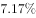，较2015年增加395.79亿美元，增幅为，海外投资项目达到1659项，增长；投资总额达515.32亿美元；进行海外投资的企业数量也比2015年的201家增加了113家。

        据统计，民营企业500强中，共有210家企业参与“一带一路”建设。从地区分布看，有144家企业分别位于浙江、江苏、广东、山东和福建等东部沿海经济发达地区。从行业分布看，有121家企业为制造业企业，有25家建筑业企业。另外，有287家民营企业在未来三年对于“一带一路”有投资意向，比2015年增加28家，比2015年提高5.6个百分点。

#### 第 1 题　qid 2188098 · 数学运算

中国民营企业500强出口总额增速最快的年份是：

- **A**. 2013年
- **B**. 2016年
- **C**. 2015年
- **D**. 2014年　✅

**答案**：D

**官方解析**

定位图形材料可得：2013年增速为，2014年增速为，2015年增速为，2016年增速为。比较可得，中国民营企业500强出口总额增速最快的年份是2014年。

故正确答案为D。

---

#### 第 2 题　qid 2188099 · 数学运算

2015年我国民营企业500强出口总额约为：

- **A**. 1070亿美元
- **B**. 2085亿美元
- **C**. 1177亿美元
- **D**. 1100亿美元　✅

**答案**：D

**官方解析**

定位图形材料可得：2015年我国民营企业500强出口总额为1099.61亿美元，与D项最接近。
故正确答案为D。

---

#### 第 3 题　qid 2188100 · 数学运算

2016年，民营企业500强海外投资企业平均每家投资金额约为：

- **A**. 1.6亿美元　✅
- **B**. 4.6亿美元
- **C**. 3.6亿美元
- **D**. 2.6亿美元

**答案**：A

**官方解析**

根据题干“2016年，······平均每家”，可判定本题为现期平均数计算问题。定位文字材料第一段可得：2016年，民营企业500强海外投资总额达515.32亿美元，进行海外投资的企业数量也比2015年的201家增加了113家。代入平均数公式，2016年，民营企业500强海外投资企业平均每家投资金额为亿美元。

故正确答案为A。

---

#### 第 4 题　qid 2188102 · 数学运算

下列说法错误的是：

- **A**. 2016年，参与“一带一路”的民营企业500强中制造业企业占据半壁江山
- **B**. 2016年，参与“一带一路”的民营企业500强中东部沿海发达地区居多
- **C**. 参与“一带一路”民营企业500强中，江浙地区的发展比广东后劲强劲　✅
- **D**. 2011-2016年间，民营企业500强出口总额及增速均呈起伏变动

**答案**：C

**官方解析**

A项：定位文字材料第二段，2016年，民营企业500强中，共有210家企业参与“一带一路”建设，有121家企业为制造业企业，，占据半壁江山，正确；

B项：定位文字材料第二段，2016年，民营企业500强中，共有210家企业参与“一带一路”建设，有144家企业分别位于浙江、江苏、广东、山东和福建等东部沿海经济发达地区，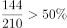，属于居多，正确；

C项：定位表格材料，参与“一带一路”的民营企业500强中，给出了浙江、江苏和广东的企业数量，但无法看出后劲是否强劲，错误；

D项：定位图形材料，从图形中的数据可以看出，2011-2016年间，民营企业500强出口总额及增速均呈起伏变动，正确。

本题为选非题，故正确答案为C。

---

#### 第 5 题　qid 2188071 · 数学运算

2.1，3.4，（  ），8.16，13.25

- **A**. 4.3
- **B**. 7.8
- **C**. 5.9　✅
- **D**. 5.1

**答案**：C

**官方解析**

观察题干数字均为小数，进行机械拆分后整数部分为：2、3、（    ）、8、13，小数部分为：1、4、（    ）、16、25。观察小数部分发现均为平方数，所以所求项的小数部分应为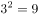，只有C项符合，代入C项的整数部分5，得到数列的整数部分2、3、5、8、13，恰好满足规律“前两项之和等于后一项”。

故正确答案为C。

---

#### 第 6 题　qid 2188073 · 数学运算

，，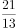，（  ），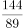

- **A**. 
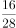

- **B**. 
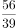

- **C**. 

- **D**. 

　✅

**答案**：D

**官方解析**

观察数列，后一项分数的分母等于前一项分数的分子与分母之和，后一项分数的分子等于该分数的分母与前一项分数的分子之和，所以所求项的分母为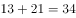，分子为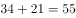，即所求项为。

故正确答案为D。

---

#### 第 7 题　qid 2188076 · 数学运算

，，，（  ），，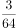

- **A**. 

- **B**. 

- **C**. 

- **D**. 

　✅

**答案**：D

**官方解析**

分数数列，分母没有呈递增趋势，优先反约分。原数列可转化为：、、、（    ）、、，发现分母是公比为2的等比数列，分子是公差为1的等差数列，所以所求项应为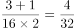。

故正确答案为D。

---

#### 第 8 题　qid 2188083 · 数学运算

某景区门票定价为每位游客100元。节假日按团队人数采取以下优惠办法：10人及以下的团队按照原价售票，超过10人的团队，其中10人按原价售票，超过10人部分的游客按照8折售票。某导游在10月1日带团到该景点旅游，买门票花掉2600元，则该旅游团共有游客：

- **A**. 15人
- **B**. 30人　✅
- **C**. 25人
- **D**. 20人

**答案**：B

**官方解析**

由选项可知，游客人数一定超过10人。设该旅游团游客人数为人，根据题意可得：，解得，即该旅游团共有游客30人。

故正确答案为B。

---

#### 第 9 题　qid 2187567 · 数学运算

一长方形纸板长为4cm，宽为3cm，将其折叠后，折痕为AF，如图所示，则阴影三角形的周长是：

- **A**. 

- **B**. 

- **C**. 

- **D**. 

　✅

**答案**：D

**官方解析**

长方形纸板按AF折痕折叠后，由图可知AB与AE重合，故，。而也为，所以ABFE为正方形，故。根据勾股定理， ，故。

故正确答案为D。

---

#### 第 10 题　qid 2188074 · 数学运算

某单位财务主管准备去办理公积金业务，他在时钟的时针和分针重合时准时出发，当他办理完业务返回时，时针刚好旋转30度，此时分针旋转过的角度是时针旋转过的角度的：

- **A**. 8倍
- **B**. 15倍
- **C**. 12倍　✅
- **D**. 10倍

**答案**：C

**官方解析**

24小时，分针转了24圈，时针转了2圈，时间相同，分针转的圈数是时针的倍，则分针转动的速度为时针的12倍，因办理业务时间为定值，则分针旋转过的角度为时针的12倍。

故正确答案为C。

---

#### 第 11 题　qid 2188075 · 数学运算

一位乒乓球学员手中拿着装有7只乒乓球的不透明口袋，其中3只黄球，4只白球。他随机取出一只乒乓球，观察颜色后放回袋中，同时放入2只与取出的球同色的球。这样连续取2次，则他取出的两只球中第1次取出的是白球，第2次取出的是黄球的概率是：

- **A**. 

- **B**. 

　✅
- **C**. 
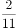

- **D**. 

**答案**：B

**官方解析**

原有7只乒乓球，其中4只白球，则第一次取出白球的概率为，然后将2只白球放入袋中，此时共有乒乓球只，黄球3只，第二次取出黄球的概率为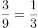。分步用乘法，则题目所求的概率为。

故正确答案为B。

---

#### 第 12 题　qid 2188080 · 数学运算

将5个不同颜色的锦囊放入4个不同的锦盒里，如果允许锦盒是空的，则所有可能的放置方法有：

- **A**. 
种

- **B**. 
种
　✅
- **C**. 
种

- **D**. 
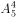种

**答案**：B

**官方解析**

由题意可得，每个锦囊均有4个不同的锦盒可以放置，则5个锦囊总的放置方法数为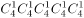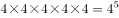种。

故正确答案为B。

---

## 判断推理

### 第 1 题　qid 2187456 · 定义判断

噪光，是指环境中超过人体的生理承受范围，使人感到厌烦，进而对人的心理或生理健康产生一定影响乃至危害的光辐射现象。
根据上述定义，下列不属于噪光的是：

- **A**. 调酒师在酒吧工作时，在旋转灯、魔球灯的彩光照射下，他感觉头晕恶心
- **B**. 行人在街上行走时，路边建筑物的单向透视玻璃反射阳光，使他感觉目眩
- **C**. 司机在驾驶过程中，车辆灯光照射到玻璃幕墙上形成反光，使他产生幻觉
- **D**. 建筑工人在施工时，在阳光下操作起重机升降的过程中，他感觉光线耀眼　✅

**答案**：D

**官方解析**

第一步：找出定义关键词。
“环境中超过人体的生理承受范围”、“使人感到厌烦”、“对人的心理或生理健康产生一定影响乃至危害的光辐射现象”。
第二步：逐一分析选项。
A项：旋转灯、魔球灯的彩光照射是光辐射现象，调酒师在彩光照射下感觉头晕恶心，符合“超过人体的生理承受范围、对人的心理或生理健康产生一定影响乃至危害”，符合定义，排除；
B项：路边建筑物的单向透视玻璃反射的阳光是光辐射现象，行人感觉目眩，符合“超过人体的生理承受范围、对人的心理或生理健康产生一定影响乃至危害”，符合定义，排除；
C项：车辆灯光照射到玻璃幕墙上形成的反光是光辐射现象，司机产生幻觉符合“超过人体的生理承受范围、对人的心理或生理健康产生一定影响乃至危害”，符合定义，排除；
D项：阳光是光辐射现象，建筑工人在施工中感觉光线耀眼，但没有明确说明光线耀眼是否“对人的心理或生理健康产生一定影响乃至危害”，不符合定义，当选。
本题为选非题，故正确答案为D。

---

### 第 2 题　qid 2188084 · 定义判断

柏金赫现象，是指人眼在低照明水平时，会产生视感觉的敏感性向光谱蓝端迁移的现象。
根据上述定义，下列利用了柏金赫现象的是

- **A**. 将同样的红玫瑰花，印制在薄尼龙纱窗及粗厚的沙发织物上，可以形成既配套又独具材质变化魅力的装饰效果
- **B**. 面积较大的房间，使用奶黄、浅咖啡色等暖色调来装修，既可以使人感到温馨愉快，又可以避免给人以空旷感
- **C**. 创作一幅用于悬挂在较暗室内环境中的磨漆画时，在色彩构成方面，选用蓝、绿等冷色调优于红、橙等暖色调　✅
- **D**. 医院手术室环境及医护人员工作服都选用蓝绿色，可以使医生注视了蓝绿色后，更易看清细小的血管、神经等

**答案**：C

**官方解析**

第一步：找出定义关键词。
“人眼在低照明水平时”、“产生视感觉的敏感性向光谱蓝端迁移”。
第二步：逐一分析选项。
A项：没有提到低水平照明，不符合“人眼在低照明水平时”，不符合定义，排除； 
B项：没有提到低水平照明，不符合“人眼在低照明水平时”，不符合定义，排除；
C项：“创作一幅用于悬挂在较暗室内环境中的磨漆画”符合“人眼在低照明水平时”，“蓝、绿色等冷色调优于暖色调”符合“产生视感觉的敏感性向光谱蓝端迁移”，符合定义，当选；
D项：没有提到低水平照明，不符合“人眼在低照明水平时”，不符合定义，排除。
故正确答案为C。

---

### 第 3 题　qid 2188085 · 定义判断

轻率概括，是指在没有积累足以进行概括的材料的情况下，只依据少数个例就草率地作出普遍性结论的一种逻辑错误。
根据上述定义，下列不属于轻率概括的是

- **A**. 做微商都很容易赚钱！我的一个亲戚，年初开始做微商，现在已经买车了
- **B**. 为了与2000万精英做共同的选择，请赶快来购买我们的在线付费课程吧　✅
- **C**. 我的朋友说她的哲学课很难，我的哲学课也很难，可见哲学课必定都很难
- **D**. 我几乎每天都吃汉堡，但是我的体重却没有变，所以吃汉堡不会导致肥胖

**答案**：B

**官方解析**

第一步：找出定义关键词。
“在没有积累足以进行概括的材料的情况下”、“只依据少数个例就草率地作出普遍性结论”。
第二步：逐一分析选项。
A项：只依据一个亲戚的个例作出做微商很容易赚钱的普遍性结论，符合定义，排除；
B项：与2000万精英做共同的选择是依据大量的例子得出的普遍性结论，不符合定义，当选；
C项：只依据我和我朋友的哲学课很难的少数个例作出哲学课都很难这一普遍性结论，符合定义，排除；
D项：只依据我的饮食这一个例得到吃汉堡不会导致肥胖这一普遍性结论，符合定义，排除。
本题为选非题，故正确答案为B。

---

### 第 4 题　qid 2188088 · 定义判断

艺术直觉是人们在艺术活动中，对事物的特征、本质、意义，不经过逻辑推理和分析而直接地感受和领悟。
根据上述定义，下列属于艺术直觉的是

- **A**. 某技术工人在一次技术操作中突然发现合理的操作方法
- **B**. 某歌手经多次演出找到适合自己的歌唱方式和表演方式
- **C**. 某游客在欣赏毕加索的画时突然领悟到作品的独特内涵　✅
- **D**. 某艺术鉴赏家通过多次对比发现了梵高绘画作品的特征

**答案**：C

**官方解析**

第一步：找出定义关键词。
“人们在艺术活动中”、“对事物的特征、本质、意义”、“不经过逻辑推理和分析”、“直接的感受和领悟”。
第二步：逐一分析选项。
A项：技术操作不是艺术活动，不符合“人们在艺术活动中”，不符合定义，排除； 
B项：经多次演出找到适合的方式，不符合“直接的感受和领悟”，不符合定义，排除；
C项：欣赏毕加索的画，符合“人们在艺术活动中”，突然领悟到作品的独特内涵，符合“对事物的特征、本质、意义”产生“直接的感受和领悟”，符合定义，当选；
D项：通过多次对比发现特征，不符合“直接的感受和领悟”，不符合定义，排除。
故正确答案为C。

---

### 第 5 题　qid 2188090 · 定义判断

循环论证是一种逻辑错误，是指论据和论点不是相互独立，而是拥有相同的内容，其论证过程是用不同的语言重复一样的内容。
根据上述定义，下列不属于循环论证的是

- **A**. 你完全错了，因为你说得没有道理
- **B**. 外星人是存在的，因为你证明不了他不存在　✅
- **C**. 你应该相信世上有神，因为神确实是存在的
- **D**. 他不值得你这么爱他，因为他不配

**答案**：B

**官方解析**

第一步：找出定义关键词。
“论据和论点有相同的内容”、“用不同的语言重复一样的内容”。
第二步：逐一分析选项。
A项：论点是“你完全错了”，论据是“你说的没道理”。没道理与错了是同一个意思，符合“用不同的语言重复一样的内容”，符合定义，排除；
B项：论点是“外星人是存在的”，论据是“你证明不了他不存在”，论证过程是无法证明所以不存在，这是诉诸无知，不符合“用不同的语言重复一样的内容”，不符合定义，当选；
C项：论点是“你应该相信世上有神”，论据是“神确实存在”，相信有神和神存在是同一个意思，符合“用不同的语言重复一样的内容”，符合定义，排除；
D项：论点是“他不值得你爱”，论据是“他不配”，他不值得和他不配是同一个意思，符合“用不同的语言重复一样的内容”，符合定义，排除。
本题为选非题，故正确答案为B。

---

### 第 6 题　qid 2188078 · 类比推理

市场行为：购买：销售

- **A**. 修辞：夸张：排比　✅
- **B**. 思想家：孔子：政治家
- **C**. 飞机：汽车：轮船
- **D**. 无机物：硫铁矿：氨基酸

**答案**：A

**官方解析**

第一步：判断题干词语间逻辑关系。
购买和销售都是市场行为，后两个词与第一个词构成种属关系。
第二步：判断选项词语间逻辑关系。
A项：夸张和排比都是修辞，后两个词与第一个词构成种属关系,与题干逻辑关系一致，当选；
B项：孔子是思想家，是种属关系，但是政治家与思想家是交叉关系，与题干逻辑关系不一致，排除；
C项：飞机、汽车、轮船都是交通工具，三者是并列关系，与题干逻辑关系不一致，排除；
D项：硫铁矿是无机物，是种属关系，但是氨基酸是有机物，与无机物不构成种属关系，与题干逻辑关系不一致，排除。
故正确答案为A。

---

### 第 7 题　qid 2187426 · 类比推理

缺锌：生长迟缓

- **A**. 成年：参加选举
- **B**. 吃药：感冒痊愈
- **C**. 迁徙：季节变化
- **D**. 加热：温度升高　✅

**答案**：D

**官方解析**

第一步：判断题干词语间逻辑关系。
缺锌导致生长迟缓，二者为因果对应关系。
第二步：判断选项词语间逻辑关系。
A项：成年是参加选举的必要条件而不是参加选举的原因，与题干逻辑关系不一致，排除；
B项：吃感冒药可以导致感冒痊愈，但题干只是说吃药，太过笼统，所以题干两词无必然逻辑关系，与题干逻辑关系不一致，排除；
C项：季节变化导致迁徙，二者为因果对应关系，但两词顺序与题干相反，与题干逻辑关系不一致，排除；
D项：加热可以导致温度升高，二者为因果对应关系，与题干逻辑关系一致，当选。
故正确答案为D。

---

### 第 8 题　qid 2187430 · 类比推理

若明若暗：雾里看花

- **A**. 如醉如梦：一清二楚
- **B**. 如日中天：日薄西山
- **C**. 如火如荼：无声无息
- **D**. 如履薄冰：如临深渊　✅

**答案**：D

**官方解析**

第一步：判断题干词语间逻辑关系。
若明若暗，比喻对情况的了解或对问题的认识不清楚；雾里看花，比喻对事物看不真切，二者为近义关系。
第二步：判断选项词语间逻辑关系。
A项：如醉如梦形容处于不清醒、迷糊状态中，一清二楚形容对事物十分了解，二者无必然逻辑关系，与题干逻辑关系不一致，排除；
B项：如日中天比喻事物正发展到十分兴盛的阶段，日薄西山比喻腐朽的事物衰败接近灭亡，二者为反义关系，与题干逻辑关系不一致，排除；
C项：如火如荼形容旺盛、热烈或激烈，无声无息比喻没有名声不被人知道，二者无必然逻辑关系，与题干逻辑关系不一致，排除；
D项：如履薄冰和如临深渊均比喻行事极为谨慎，存有戒心，二者为近义关系，与题干逻辑关系一致，当选。
故正确答案为D。

---

### 第 9 题　qid 2188081 · 类比推理

混合物：空气

- **A**. 财务报表：利润表　✅
- **B**. 金属：绝缘体
- **C**. 合唱团：团员
- **D**. 满族：维吾尔族

**答案**：A

**官方解析**

第一步：判断题干词语间逻辑关系。
空气是一种混合物，二者为种属关系。
第二步：判断选项词语间逻辑关系。
A项：利润表是一种财务报表，二者为种属关系，与题干逻辑关系一致，当选；
B项：金属可导电，不是绝缘体，与题干逻辑关系不一致，排除；
C项：团员一般指共青团员，合唱团和团员不存在逻辑关系，与题干逻辑关系不一致，排除；
D项：满族和维吾尔族都是少数民族，二者为并列关系，与题干逻辑关系不一致，排除。
故正确答案为A。

---

### 第 10 题　qid 2188082 · 类比推理

紫外线 对于（  ），相当于 单晶体 对于（  ）

- **A**. 臭氧层  晶体
- **B**. 电磁波  石英
- **C**. 可见光  非晶体　✅
- **D**. 红外线  石墨

**答案**：C

**官方解析**

第一步：逐一代入选项。
A项：臭氧层可以有效阻挡来自太阳的紫外线，二者为对应关系，单晶体是一种晶体，二者为种属关系，前后逻辑关系不一致，排除；
B项：紫外线是一种电磁波，二者为种属关系，石英的主要成分是二氧化硅，不是单晶体，前后逻辑关系不一致，排除；
C项：紫外线不是可见光，单晶体不是非晶体，前后逻辑关系一致，当选；
D项：紫外线和红外线是并列关系，石墨是混合晶体，不是单晶体，二者不是并列关系，前后逻辑关系不一致，排除。
故正确答案为C。

---

### 第 11 题　qid 2188105 · 类比推理

①痛定思痛募武丁
②国富军弱遭欺凌
③苛求稳定罢刀兵
④将兵奋发起五更
⑤报效沙场边疆宁

- **A**. ②①④⑤③
- **B**. ③②④⑤①
- **C**. ②④①⑤③
- **D**. ③②①④⑤　✅

**答案**：D

**官方解析**

第一步：先确定逻辑关系最为明显的逻辑顺序。
观察题干，五个事件主要围绕“被欺凌后开始招兵”的过程。逻辑关系的先后顺序比较明显的是事件②和事件③，先求稳定而罢刀兵导致国富军弱，即③应该在②的前面，故③为首句，排除A、C两项。
第二步：逐一对照选项并判断正确答案。
根据第一步的结果可以判断只有B、D两项符合，遭受欺凌之后就要开始招募兵丁，因此接着是事件①，先招兵之后才能勤加练兵，故①应该在④前，勤加练兵的目的是报效沙场保卫边疆，故⑤应是尾句，排除B项。
故正确答案为D。

---

### 第 12 题　qid 2188106 · 类比推理

①双手交叠之后，推及患者的上腹部
②反复地实施，直至阻塞物吐出为止
③冲击压力使腹部残留空气形成气流
④立即从后方环抱住患者，进行急救
⑤气道阻塞造成窒息，患者意识清醒

- **A**. ⑤④③①②
- **B**. ④①③②⑤
- **C**. ⑤④①③②　✅
- **D**. ④③②①⑤

**答案**：C

**官方解析**

第一步：先确定逻辑关系最为明显的逻辑顺序。
观察题干，五个事件主要围绕患者气道被阻，进行抢救的过程。逻辑关系的先后顺序比较明显的事件是⑤，其余信息都是在描述具体的抢救措施，⑤为事件起因，因此⑤为首句，排除B、D选项。
第二步，逐一对照选项并判断正确答案。
根据第一步的结果可以判断只有A、C符合，应先是“推及患者的上腹部”才能形成气流，因此①应该在③前面，排除A选项。
故正确答案为C。

---

### 第 13 题　qid 2188107 · 类比推理

①合成两种额外的抗原蛋白
②进行基因工程技术的改造
③准确找到并杀死肿瘤细胞
④将患者自身的T细胞取出
⑤大量扩增注射回患者体内

- **A**. ②①④③⑤
- **B**. ④②①⑤③　✅
- **C**. ④①②③⑤
- **D**. ②①④⑤③

**答案**：B

**官方解析**

第一步：先确定逻辑关系最为明显的事件顺序。
观察题干，五个事件主要围绕“提取细胞进行改造杀死肿瘤细胞”的过程。逻辑关系的先后顺序比较明显的是事件②和事件④，应该先提取T细胞，然后再进行基因工程的改造，即事件④在事件②前面，排除A、D项。
第二步，逐一对照选项并判断正确答案。
根据第一步的结果可以判断只有B、C符合，通过分析事件③和事件⑤可知，应先“注回患者体内”，然后再“找到并杀死肿瘤细胞”，即事件⑤在事件③前面，排除C项。
故正确答案为B。

---

### 第 14 题　qid 2188108 · 类比推理

①水土流失人烟稀少
②生态破坏日趋荒芜
③宣战沙漠憧憬家园
④气候温润草丰木茂
⑤四方牧者纷至沓来

- **A**. ④⑤②①③　✅
- **B**. ③②①⑤④
- **C**. ③④⑤①②
- **D**. ①②③⑤④

**答案**：A

**官方解析**

第一步：先确定逻辑关系最为明显的事件顺序。
观察题干，五个事件主要围绕“生态破坏”的过程。逻辑关系的先后顺序比较明显的是事件②和事件③，因为“生态破坏日趋荒芜”，才会导致“宣战沙漠憧憬家园”，事件②应该排在③之前，排除B、C项。
第二步：逐一对照选项并判断正确答案。
根据第一步得到的结果可以判断只有A、D项符合，通过分析事件④和⑤可知，只有“气候温润草丰木茂”，才能“四方牧者纷至沓来”，事件④应该排在⑤前面，从而排除D项。
故正确答案为A。

---

### 第 15 题　qid 2188109 · 类比推理

①某国的家庭规模不断地缩小
②便利店市场的增长势头持续
③前往大超市采购的需求降低
④生育率和结婚率不断地降低
⑤倾向近距离小批量购买模式

- **A**. ④①②⑤③
- **B**. ①④⑤③②
- **C**. ①④③②⑤
- **D**. ④①③⑤②　✅

**答案**：D

**官方解析**

第一步：先确定逻辑关系最为明显的事件顺序。
观察题干，五个事件主要围绕“家庭规模缩小导致便利店市场增长”的过程。逻辑关系的先后顺序比较明显的是事件①和④，因为“生育率和结婚率不断地降低”，才会导致“某国的家庭规模不断地缩小”，事件④应该排在事件①之前，排除B、C项。
第二步：逐一对照选项并判断正确答案。
根据第一步得到的结果可以判断只有A项和D项符合，通过分析事件①②和③可知,只有“某国的家庭规模不断地缩小，前往大超市采购的需求降低”，才会使“便利店市场的增长势头持续”， 事件①③应该排在②前面，从而排除A项。
故正确答案为D。

---

### 第 16 题　qid 2188086 · 逻辑判断

某公司公布了公司员工年终考核结果，现择其一部分内容列表如下：

根据上述信息，下列论断最为准确的是

- **A**. 由于所列人员分处不同的年龄段，所以所列的考核结果一定是所有的考核结果类型
- **B**. 由于所列人员不一定展示所有的考核结果类型，所以所列的考核结果可能不是所有的考核结果类型　✅
- **C**. 由于所列人员并非公司的所有人员，所以所列的考核结果一定不是所有的考核结果类型
- **D**. 由于所列人员涉及了所有的部门，所以所列的考核结果一定是所有的考核结果类型

**答案**：B

**官方解析**

日常结论题，根据题干信息逐一分析选项。
A项：题干所列人员分处不同的年龄段，但相同年龄段的考核结果类型不一定相同，所以不能推出所列的考核结果一定是所有的考核结果类型，无法推出，排除；
B项：由于所列人员不一定展示所有的考核结果类型，所以所列的考核结果可能不是所有的考核结果类型，强调的是一种可能性，可以推出，当选；
C项：题干所列人员并非公司的所有人员，但其他人员有可能也符合以上这些考核结果类型，因此也有可能列出了所有的考核结果类型，无法推出，排除；
D项：题干所列人员涉及了所有的部门，但一个部门可以有多种考核结果类型，因此不一定就列出了所有的考核结果类型，无法推出，排除。
故正确答案为B。

---

### 第 17 题　qid 2187445 · 逻辑判断

脊髓性肌萎缩症是一种罕见的致死性遗传病，大多数患儿活不到20个月。近日，有研究人员使用一种新的基因疗法，研发了一种生物技术药物Spinraza，通过在患者脊髓周边注射给药，Spinraza使73名受试患者中的近一半患者不同程度的恢复了运动机能。研究人员据此得出结论：这种新的基因疗法将为脊髓性肌萎缩症的治疗带来突破性进展。
以下哪项如果为真，最能支持上述论证

- **A**. 该项研究的具体程序设计较为科学合理
- **B**. 这种基因疗法也可用于其他疾病的治疗
- **C**. 美国药监局已经批准了这一新药的上市
- **D**. 对照组的所有患者都没有恢复运动机能　✅

**答案**：D

**官方解析**

第一步：找出论点和论据。
论点：这种新的基因疗法将为脊髓性肌萎缩症的治疗带来突破性发展。
论据：有研究人员使用一种新的基因疗法，研发出一种生物技术药物Spinraza，通过在患者脊髓周边注射给药，Spinraza使73名受试患者中的近一半患者不同程度的恢复了运动机能。
本题论据讨论的是“一种新的基因疗法使73名受试患者中的近一半患者不同程度的恢复了运动机能”，论点是基于此得出的“这种新的基因疗法将为脊髓性肌萎缩症的治疗带来突破性发展”，二者话题一致，加强优先考虑补充论据。
第二步：逐一分析选项。
A项：该项研究的具体程序设计较为科学合理，说明该研究是科学的，加强论据，保留；
B项：该基因疗法可用于其他疾病的治疗，与脊髓性肌萎缩症的治疗无关，不能支持，排除；
C项：新药获批上市，说明新药被允许使用，但是对治疗脊髓性肌萎缩症是否有效果，以及是否能为脊髓性肌萎缩症的治疗带来突破性发展都不明确，无法支持，排除；
D项：对照组的所有患者都没有恢复运动机能，补充了对照实验，通过实验结论对比能得出“新的基因疗法将为脊髓性肌萎缩症的治疗带来突破性发展”，保留。
比较A、D两项，A项证明了论据为真，而D项证明了论点为真，D项的加强力度要强于A项，当选。
故正确答案为D。

---

### 第 18 题　qid 2187455 · 逻辑判断

在一场关于“传承和创新哪个更重要”的辩论赛中，正方和反方进行了激烈的辩论。正方二辩在发言中提出一种观点：“先后性就等于重要性。”
作为对上述观点的反驳，以下最为有力的是

- **A**. 吃一碗面，加点醋是必要的。但你说是以吃面为主，还是以吃醋为主？
- **B**. 我必须先拧开瓶盖，才能喝到水。这不正说明拧瓶盖是必要的步骤吗？
- **C**. 正所谓“雄鸡一唱天下白”，但你总不能说天白就是雄鸡唱出来的吧！
- **D**. 我穿鞋时总习惯先穿左脚，再穿右脚，这就说明左脚比右脚更重要吗？　✅

**答案**：D

**官方解析**

第一步：找出论点和论据。
论点：先后性就等于重要性。
论据：无。
第二步：逐一分析选项。
A项：选项讨论的是吃醋与吃面哪个为主，没有体现先后性，话题不一致，无法削弱，排除；
B项：先拧开瓶盖，后能喝上水，强调了先后顺序，但拧开瓶盖是喝上水的必要环节不能说明拧开瓶盖就比喝上水更重要，无法削弱，排除；
C项：雄鸡一唱，天就白了，体现了先后顺序，但是天白不是雄鸡唱出来的，而且也没有涉及重要性的问题，与论点话题不一致，无法削弱，排除； 
D项：我穿鞋先穿左脚，再穿右脚，体现了先后性，选项用反问的方式说明先穿哪个脚并不重要，说明先后性并不等于重要性，削弱论点，当选。
故正确答案为D。

---

### 第 19 题　qid 2188095 · 类比推理

长江后浪推前浪，一代更比一代强。
下列与题干论证方法相同的是

- **A**. 鹬蚌相争，渔翁得利
- **B**. 少壮不努力，老大徒伤悲
- **C**. 路遥知马力，日久见人心　✅
- **D**. 一叶障目，不见泰山

**答案**：C

**官方解析**

第一步：分析题干的论证方式。
题干的意思为“如同长江后面的浪花推动前面的浪花一样，各个时代人才辈出，后人总能超越前人”，通过长江的浪花类比论证“一代更比一代强”。
第二步：逐一分析选项。
A项：选项的意思为“鹬鸟和河蚌相争，最后渔翁得利”，没有用到类比论证，与题干的论证方式不同，排除；
B项：选项的意思为“年轻力壮的时候不奋发图强，到了老年，悲伤也没用了”，没有用到类比论证，与题干的论证方式不同，排除；
C项：选项的意思为“路途遥远才能知道马的力气大小，日子长了才能看出人心的好坏”，通过“路遥知马力”类比论证“日久见人心”，与题干论证方式相同，当选；
D项：选项的意思为“一片树叶挡住了眼睛，连面前高大的泰山都看不见”，没有用到类比论证，与题干论证方式不同，排除。
故正确答案为C。

---

### 第 20 题　qid 2188096 · 类比推理

在某公司的一次会议上，甲说：“我们部门的工作不受重视，什么事总是低人一头！”乙听了说：“你不想低人一头，那就只能选择努力高人一头了。”
与题干中乙所犯的逻辑错误相同的是：

- **A**. 文学作品的叙述方法，不是顺叙，就是倒叙，二者必居其一　✅
- **B**. 经验主义不能一概反对。例如，工作经验就不应该反对
- **C**. 我很相信一位哲人的名言：世界上没有任何东西是可信的
- **D**. 凡是犯罪行为都是违法行为，所以违法行为都是犯罪行为

**答案**：A

**官方解析**

第一步：分析题干逻辑。
乙认为只有两个选择，不是低人一头就是高人一头。而实际上还可以和他人平等。乙犯的错误是误把反对关系当成了矛盾关系。
第二步：逐一分析选项。
A项：文学作品的叙述方法并不是只有顺叙和倒叙两种，还有平叙、插叙等，该项把反对关系当成了矛盾关系，与题干逻辑错误一致，当选；
B项：经验包括工作经验，二者不存在矛盾反对关系，与题干逻辑错误不一致，排除；
C项：任何东西都不相信，是怀疑论的观点，该项不存在矛盾反对关系，与题干逻辑错误不一致，排除；
D项：通过犯罪行为→违法行为，是无法得到违法行为→犯罪行为的，肯后推不出必然结论，且该项并不存在矛盾反对关系，与题干逻辑错误不一致，排除。
故正确答案为A。

---

### 第 21 题　qid 2188122 · 逻辑判断

某出版商认为：加工成本在近5年上升了~；原材料成本上升了~；销售及广告成本上升了以上。将所有这些加起来的话，总成本至少上升了。这仅是对大型出版社而言，如果是小出版社，总成本至少上升了。可见，书价的上涨主要是成本的上涨造成的，因此我反对提高作家的版权收入。

对上述论证的评价，最恰当的是：

- **A**. 未提供加工成本上涨的具体证据
- **B**. 忽略了导致书价上涨的其他原因
- **C**. 错误地计算了总成本上涨的比例　✅
- **D**. 忽略了对中型出版社的统计数据

**答案**：C

**官方解析**

第一步：找出论点和论据。

论点：书价的上涨主要是成本的上涨造成的。

论据：加工成本在近五年上升了~；原材料成本上升了~；销售及广告成本上升了以上。将所有这些加起来的话，总成本至少上升了。这仅是对于大型出版社而言，如果是小出版社，总成本至少上升了。

第二步：逐一分析选项。

A项：未提供加工成本上涨的具体证据，题干并未涉及，不能评价论证，排除；

B项：题干论点强调的是书价的上涨与成本的上涨之间的关系，至于其他的原因并非本题论点的讨论范围，不能评价论证，排除；

C项：错误的计算了总成本上涨的比例。本题的论据是通过加工成本上升了左右；原材料成本上升了左右；销售及广告成本上升了以上。将所有这些加起来的话，总成本至少上升了。其实这个就犯了百分数简单加和的错误。举一个简单的例子：一个100元的书，其中加工成本、原材料成本、销售成本各是10元，加工成本涨就是1块钱，原材料成本涨也是1元，销售成本上涨也是1元，那么全部加起来就是103元，总成本也只是上涨。不可能是，因此该项确实指出了题干论证的错误，当选；

D项：论据给出大小两种出版社成本，中型出版社介于二者之间，但是即使没有中型出版社的数据，对整个论证也没有影响，排除。

故正确答案为C。

---

### 第 22 题　qid 2188123 · 逻辑判断

社会经济越是发展，一个企业越是要勇于承担责任，产品的品质、品牌、社会责任，这三样一个都不能少，少了任何一个，消费者都不会买单。
下面哪项陈述，最能削弱以上观点？

- **A**. 某名牌企业被检出产品的质量不达标，产品销售量明显降低
- **B**. 某企业产品的质量较差，但凭借促销手段，销售量持续增长　✅
- **C**. 某名牌企业一直依法纳税，热心公益事业，销售量稳步提升
- **D**. 某名牌企业在被曝出偷税漏税丑闻后，产品销售量明显降低

**答案**：B

**官方解析**

第一步：找出论点和论据。
论点：产品的品质、品牌、社会责任少了任何一个，消费者都不会买单。
论据：无。
第二步：逐一分析选项。
A项：质量不达标，销售量明显降低，说明产品缺少了质量，消费者不买单，补充论据加强，无法削弱，排除；
B项：质量较差，但凭借销售手段销售量持续增长，说明缺少了产品的品质，但是消费者依然买单，削弱论点，当选；
C项：依法纳税，热心公益事业，属于有社会责任，销量提升，补充论据加强，无法削弱，排除； 
D项：偷税漏税，产品销量降低，说明产品缺少了社会责任，消费者不买单，补充论据加强，无法削弱，排除。
故正确答案为B。

---

### 第 23 题　qid 2187475 · 逻辑判断

光镊是用高度会聚的激光束形成的三维势阱来俘获、操纵和控制微小颗粒的一项技术。与机械镊子相比，光镊是以非机械接触的方式来完成夹持和操纵细胞的，它先对目标细胞进行非接触式的捕获和固定，再对细胞进行精确的操作。因为光镊对细胞产生的损伤非常小，所以在生命科学研究中，几乎所有的单细胞操作都采用光镊的方式来进行操控。
由此可以推出：

- **A**. 所有对细胞进行精确操作的方法，对细胞的损伤都非常小
- **B**. 对目标细胞进行非接触式的捕获和固定只能使用光镊方式
- **C**. 几乎所有的非单细胞操作都不采用光镊的方式来进行操控
- **D**. 所有以机械接触方式来夹持和操纵细胞的都不是光镊方式　✅

**答案**：D

**官方解析**

日常结论题，根据题干信息逐一分析选项。
A项：题干中只提到了光镊对细胞产生的损伤非常小，且是一种非常精确操作的方法，并没有提到所有对细胞进行精确操作的方法，对细胞的损伤都非常小，属于无中生有，无法推出，排除；
B项：题干中只提到了光镊是以非机械接触的方式来完成夹持和操纵细胞，并没有说对目标细胞进行非接触式的捕获和固定只能使用光镊方式，无法推出，排除；
C项：题干中指出几乎所有的单细胞操作都采用光镊的方式来进行操控，并没有提及非单细胞的操控方式，属于无中生有，无法推出，排除；
D项：题干中指出光镊是以非机械接触的方式来完成夹持和操纵细胞的，可以推出以机械接触方式来夹持和操纵细胞的都不是光镊方式，当选。
故正确答案为D。

---

### 第 24 题　qid 2187467 · 类比推理

某企业拟开设4门培训课程：《企业文化培训》《劳动法培训》《商务礼仪培训》《销售培训》。员工甲乙丙丁4人各选修了其中一门课程。已知：
①他们4人选修的课程各不相同；
②法律专业毕业的丙选修的是非法律类课程；
③甲选修的不是《企业文化培训》就是《商务礼仪培训》。
补充以下哪个条件，能确定丙选修的是《销售培训》？

- **A**. 丁选修的不是《劳动法培训》
- **B**. 丁选修的是《企业文化培训》　✅
- **C**. 丁选修的是《劳动法培训》
- **D**. 丁选修的不是《销售培训》

**答案**：B

**官方解析**

第一步：分析题干已知信息。
①甲乙丙丁4人选修的课程各不相同，即四人各选修一门课程；
②法律专业毕业的丙选修的是非法律类课程，即丙只能选修三门课程中的一门；
③甲选修的课程只能在《企业文化培训》和《商务礼仪培训》中选择。
第二步：代入选项，逐一分析。
A项：如果丁选修的不是《劳动法培训》，那么丁只能选择《企业文化培训》、《商务礼仪培训》、《销售培训》三门课程中的一门，不能得到任何确定信息，也无法推导丙选修的是哪门课程，排除；
B项：如果丁选修的是《企业文化培训》，那么甲选修的肯定是《商务礼仪培训》，剩下的课程中只有《劳动法培训》和《销售培训》两门课程，已知丙不能选修法律类课程，所以丙只能选修《销售培训》，当选；
C项：如果丁选修的是《劳动法培训》，那么甲、丙所选修的课程不能确定，排除； 
D项：如果丁选修的不是《销售培训》，那么丁只能选择《企业文化培训》、《劳动法培训》、《商务礼仪培训》三门课程中的一门，但是不能判断甲、丙、丁 三人具体选修的是哪一门课程，排除。
故正确答案为B。

---

### 第 25 题　qid 2187477 · 逻辑判断

文化自信是主体对自身文化的认同、肯定和坚守。文化自觉是文化自信的前提，没有深刻的文化自觉，就不可能有高度的文化自信。没有高度的文化自信，就没有文化的繁荣昌盛，就没有中华民族的伟大复兴。
由上文推知，下列一定正确的是

- **A**. 没有文化的繁荣昌盛，就一定没有深刻的文化自觉
- **B**. 只要有了高度的文化自信，就会有文化的繁荣昌盛
- **C**. 没有深刻的文化自觉，就没有中华民族的伟大复兴　✅
- **D**. 有了高度的文化自信，就会有中华民族的伟大复兴

**答案**：C

**官方解析**

第一步：翻译题干。

①文化自信文化自觉

②文化的繁荣昌盛文化自信

③中华民族的伟大复兴文化自信

①和②可以递推出：④文化的繁荣昌盛文化自信文化自觉

①和③可以递推出：⑤中华民族的伟大复兴文化自信文化自觉

第二步：逐一分析选项。

A项：翻译为文化自觉文化的繁荣昌盛，是对④的肯后，但肯后得不到确定性的结论，推不出，排除；

B项：翻译为文化自信文化的繁荣昌盛，是对②的肯后，但肯后得不到确定性的结论，推不出，排除；

C项：翻译为中华民族的伟大复兴文化自觉，是对⑤的肯前，肯前必肯后，当选；

D项：翻译为文化自信中华民族的伟大复兴，是对③的肯后，但肯后得不到确定性的结论，推不出，排除。

故正确答案为C。

---

## 资料分析

### 材料 1

<b>根据下面资料回答96-100题。</b>

        2017年8月24日，全国工商联发布《2017中国民营企业500强》榜单。2016年，民营企业500强出口总额出现大幅回升，达到1495.4亿美元，占我国出口总额的，较2015年增加395.79亿美元，增幅为，海外投资项目达到1659项，增长；投资总额达515.32亿美元；进行海外投资的企业数量也比2015年的201家增加了113家。

        据统计，民营企业500强中，共有210家企业参与“一带一路”建设。从地区分布看，有144家企业分别位于浙江、江苏、广东、山东和福建等东部沿海经济发达地区。从行业分布看，有121家企业为制造业企业，有25家建筑业企业。另外，有287家民营企业在未来三年对于“一带一路”有投资意向，比2015年增加28家，比2015年提高5.6个百分点。

#### 第 1 题　qid 2188101 · 综合

2016年与2014年相比，民营企业500强出口总额呈现出：

- **A**. 增量提高、增速变大
- **B**. 增量减少、增速变小　✅
- **C**. 增量减少、增速变大
- **D**. 增量提高、增速变小

**答案**：B

**官方解析**

定位图形材料可得：2014年民营企业500强出口总额增量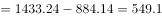亿美元，2016年民营企业500强出口总额增量亿美元，可以看出2016年与2014年相比，增量减少。2014年增速，2016年增速，可以看出增速变小。

故正确答案为B。

---
