# 2018年421联考《行测》题（吉林甲级）（网友回忆版）

> 联考 · 2018 年 · 6 个模块 · 共 104 题

- [政治理论](#%E6%94%BF%E6%B2%BB%E7%90%86%E8%AE%BA) · 3 题
- [常识判断](#%E5%B8%B8%E8%AF%86%E5%88%A4%E6%96%AD) · 22 题
- [言语理解与表达](#%E8%A8%80%E8%AF%AD%E7%90%86%E8%A7%A3%E4%B8%8E%E8%A1%A8%E8%BE%BE) · 35 题
- [数量关系](#%E6%95%B0%E9%87%8F%E5%85%B3%E7%B3%BB) · 9 题
- [判断推理](#%E5%88%A4%E6%96%AD%E6%8E%A8%E7%90%86) · 30 题
- [资料分析](#%E8%B5%84%E6%96%99%E5%88%86%E6%9E%90) · 5 题

---

## 政治理论

### 第 1 题　qid 2187413 · 时事政治

习近平主席在一系列重要讲话和文章中引经据典，展现了独特的语言风格和人格魅力。他在博鳌亚洲论坛2018年年会中讲到“幸福和美好不会自己出现，成功属于勇敢而笃行的人”时，引用的经典名句是：

- **A**. 但愿苍生俱饱暖，不辞辛苦出山林
- **B**. 修其心治其身，而后可以为政于天下
- **C**. 积土而为山，积水而为海　✅
- **D**. 其身正，不令而行；其身不正，虽令不从

**答案**：C

**官方解析**

本题考查时事政治。
2018年4月8日-4月11日，博鳌亚洲论坛2018年年会在海南省博鳌镇召开，主题为“开放创新的亚洲，繁荣发展的世界”。中国国家主席习近平应邀出席论坛年会开幕式并发表重要主旨演讲，演讲中指出：“‘积土而为山，积水而为海’，幸福和美好未来不会自己出现，成功属于勇毅而笃行的人。让我们坚持开放共赢，勇于变革创新，向着构建人类命运共同体的目标不断迈进，共创亚洲和世界的美好未来！”C项属于原文表述，A、B、D项错误。
故正确答案为C。

---

### 第 2 题　qid 2187418 · 马克思主义

在十三届全国人大一次会议上，宪法修正案经表决，获得高票通过。此次宪法修改的一项重要内容就是将习近平新时代中国特色社会主义思想载入国家根本法，体现党和国家事业发展的新成就、新经验、新要求，在总体保持宪法的连续性、稳定性、权威性的基础上推动宪法与时俱进，完善发展。宪法修改体现的哲理是：

- **A**. 事物发展的本质是克服
- **B**. 事物发展的本质是抛弃
- **C**. 事物发展的本质是扬弃　✅
- **D**. 事物发展的本质是保留

**答案**：C

**官方解析**

本题考查哲学常识。
发展是揭示事物运动、变化的整体趋势和方向性的范畴，发展是具有前进性质的运动，是事物由低级向高级、由简单向复杂、由无序向有序的上升运动。发展的实质是新事物的产生和旧事物的灭亡。扬弃指事物在新陈代谢过程中，发扬事物中的积极因素，抛弃旧事物中的消极因素。此次我国宪法修正案是在原有宪法基础上，根据党和国家事业发展的新成就、新经验、新要求进行完善发展，既保留了原宪法合理的内容，又与时俱进，体现了宪法的连续性、稳定性和与时俱进。A、B、D三项均表述错误，C项正确。
故正确答案为C。

---

### 第 3 题　qid 2187421 · 新思想

习近平主席曾用“牛顿力学三定律”来阐述中德关系的大方向：一是牢牢把握中德合作的“      ”；二是通过深化务实合作提升中德关系的“      ”；三是减少两国关系发展的“      ”。将下列力学概念依次填入横线处，正确的是：

- **A**. 惯性  加速度  反作用力　✅
- **B**. 惯性  合外力  作用力
- **C**. 速度  加速度  作用力
- **D**. 速度  合外力  反作用力

**答案**：A

**官方解析**

本题考查时政常识。
2013年习近平总书记在圣彼得堡会见默克尔时表示，总理女士是物理学博士，我由“牛顿力学三定律”联想到如何更好推动中德关系发展。一是牢牢把握中德合作的“惯性”。合作是中德关系的主旋律和大方向，双方要坚持不动摇。要继续加强高层交往，用好政府磋商、战略对话等机制，不断提升战略互信；二是通过深化务实合作提升中德关系的“加速度”。中国正在以改革促调整，以调整促发展。我们有信心实现经济持续健康发展，为中德合作提供更多机遇。两国要强化伙伴和机遇意识，本着互利双赢、共同发展的精神，不断扩大利益交融，全面深化务实合作；三是减少两国关系发展的“反作用力”。双方要着眼共同利益，求大同，存小异，减少两国关系发展的阻力。故A项正确，B、C、D选项错误。
故正确答案为A。

---

## 常识判断

### 第 1 题　qid 2187416 · 人文常识

国务院机构改革优化了创新引擎。一方面，重组科学技术部，加强、优化、转变政府科技管理和服务职能；另一方面，重组国家知识产权局，强化知识产权创造、保护和运用，让“第一动力”更有劲头。这段话蕴含的哲理是：

- **A**. 社会存在状况决定社会意识
- **B**. 上层建筑应与经济基础相适应　✅
- **C**. 生产关系应与生产力相适应
- **D**. 社会意识一定要适应社会存在

**答案**：B

**官方解析**

本题考查哲学常识。
A项错误，社会存在是指社会物质生活条件的总和，它包括地理环境、人口因素和生产方式。社会意识是社会生活的精神方面，是社会存在的总体反映。社会存在决定社会意识，但是本题没有体现社会存在和社会意识的辩证关系原理，而是强调对国家机构进行改革以促进科技创新发展。
B项正确，上层建筑是指建立在一定经济基础上的社会意识形态以及与之相适应的政治法律制度，包括政治上层建筑和思想上层建筑。经济基础是指占统治地位的生产关系的总和。题干中的国家机构为经济发展、鼓励科技创新而进行改革，体现了调整上层建筑为经济基础服务。
C项错误，生产力是人类改造自然并从自然界获得生存和发展的物质资料的能力。生产关系是人们在物质生产过程中所结成的经济关系。生产力决定生产关系，生产关系对生产力具有反作用。题干只是强调国家机构改革促进创新的发展，没有体现生产力和生产关系的辩证关系。
D项错误，社会存在和社会意识的辩证关系为社会存在决定社会意识，社会意识对社会存在具有反作用，同时社会意识具有相对独立性。社会存在和社会意识的发展不完全同步，社会意识有时会先于社会存在，有时会落后于社会存在，选项表述太过绝对。
故正确答案为B。

---

### 第 2 题　qid 2187419 · 人文常识

以“也门撤侨”的真实事件改编的军事题材的电影《红海行动》，展现了人民解放军官兵不畏危险、不畏艰苦，宁可牺牲自己，也要捍卫国家荣誉，保卫人民安全。该影片叫好又叫座，这表明：

- **A**. 观众的喜好是评判艺术作品优秀与否的根本标准
- **B**. 艺术作品的创作需要立足于社会生活实践　✅
- **C**. 艺术作品的创作需要源于作家的创新思维
- **D**. 维护和平的共同心愿是创作优秀艺术作品的源泉

**答案**：B

**官方解析**

本题考查人文常识。
A项错误，艺术作品的发展离不开观众的支持。要把批评权和评判权交给观众，才可以使艺术作品取得更好、更全面的进步。观众的喜好是评判艺术作品优秀与否的因素之一，但并不是评判艺术作品优秀与否的根本标准。
B项正确，题干中提到电影《红海行动》改编于“也门撤侨”的真实事件，体现了艺术作品的创作需要立足于社会生活实践。
C项错误，艺术作品的创作需要作家的创新思维，但并不是源于作家的创新思维。文艺的一切创新，归根结底都直接或间接来源于人民和生活。
D项错误，《平凡的世界》的作者路遥先生在领取茅盾文学奖时说：“人民是我们的母亲，生活是艺术的源泉”。并且，习近平总书记于2014年10月15日在文艺工作座谈会上也曾提到：“文艺创作方法有一百条、一千条，但最根本、最关键、最牢靠的办法是扎根人民、扎根生活。”人民和生活才是创作优秀艺术作品的源泉。
故正确答案为B。

---

### 第 3 题　qid 2187392 · 人文常识

公元前3世纪，古希腊数学家欧几里得提出：“三角形内角之和等于180度。”19世纪，德国数学家黎曼提出：“在球面上，三角形内角之和大于180度。”后来，俄国数学家罗巴切夫斯基又提出：“在凹面上，三角形内角之和小于180度。”这一认识过程说明：

- **A**. 真理具有绝对性
- **B**. 真理具有唯一性
- **C**. 真理具有客观性
- **D**. 真理具有相对性　✅

**答案**：D

**官方解析**

本题考查马克思主义哲学认识论的常识。
A项错误，真理的绝对性是指任何真理都是对客观事物及其规律的正确反映，在它所适用的范围内是不能推翻的。选项说法正确，但与题干无关。
B项错误，真理具有唯一性，是指对于一个确定的对象，在同一条件下得出的真理只有一个，不存在反映同一对象的相互矛盾的不同的真理。选项说法正确，但与题干无关。
C项错误，真理具有客观性，真理是标志主观同客观相符合的哲学范畴，是人们对客观事物及其规律的正确反映，并且客观性是真理的最基本的属性。选项说法正确，但与题干无关。
D项正确，真理的相对性，是指真理是具体的有条件的，即在一定条件下，人们对客观事物的发展过程及其发展规律的正确认识总是有局限的、不完全的。题干中数学家们在不同时期对三角形内角和与180度的关系提出了不同的认识，体现了真理的相对性。
故正确答案为D。

---

### 第 4 题　qid 2187393 · 人文常识

某电视专题片介绍了三位富有诗书才华的古代帝王，片中先后出现了《玉树后庭花》“千古词帝”“瘦金体”等内容。这三位帝王分别是：

- **A**. 南朝梁武帝萧衍、南唐后主李煜、隋炀帝杨广
- **B**. 南朝陈后主陈叔宝、南唐后主李煜、宋徽宗赵佶　✅
- **C**. 魏文帝曹丕、南朝陈后主陈叔宝、唐玄宗李隆基
- **D**. 南朝梁武帝萧衍、唐玄宗李隆基、宋徽宗赵佶

**答案**：B

**官方解析**

《玉树后庭花》，以花为曲名，本来是乐府民歌中一种情歌的曲子，后被南朝陈的最后一个皇帝陈后主陈叔宝填词。所以，《玉树后庭花》对应的帝王是南朝陈后主陈叔宝。
“千古词帝”指的是南唐后主李煜。李煜精于书画，谙于音律，工于诗文，词尤为五代之冠，被称为“千古词帝”。
“瘦金体”是宋徽宗赵佶所创的一种字体，是书法史上极具个性的一种书体，因其与晋楷唐楷等传统书体区别较大，个性极为强烈，故可称作是书法史上的一个独创，代表作有《秾芳诗》等。
由此可知，《玉树后庭花》“千古词帝”“瘦金体”对应的三位帝王分别是：南朝陈后主陈叔宝、南唐后主李煜、宋徽宗赵佶。所以，B项正确，A、C、D三项错误。
故正确答案为B。

---

### 第 5 题　qid 2187394 · 人文常识

下列流行语与其所反映的哲理对应错误的是：

- **A**. 正能量——发挥社会意识正确导向作用
- **B**. 新常态——静止的、无条件的　✅
- **C**. 接地气——从实际出发，密切联系群众
- **D**. 中国式——共性寓于个性之中

**答案**：B

**官方解析**

A项正确，正能量指的是一种健康乐观、积极向上的动力和情感，对事物发展有积极作用，体现了“发挥社会意识正确导向作用”的原理。
B项错误，中国新常态要发挥对世界经济的正面效应，需要不断推进改革来驱动增长，这体现了“事物之间的联系具有条件性、多样性”的原理；在新常态下，中国经济结构调整的本质是资源要素的重新组合利用，资产重组调整再分配，是此消彼长的关系，这体现了“一切事物是变化发展的，发展具有普遍性”的原理；在新常态下新旧力量将长期并存，原有的对经济发展有影响的因素会继续发挥其效应，而新的特征和趋势也将逐步形成，新常态需要新思路和新方式，但不否定那些仍继续有效的做法，这体现了“矛盾具有普遍性、具体性”的原理。所以，B项错误，并未体现“静止的、无条件的”原理。
C项正确，接地气比喻联系实际、联系基层群众，体现了“从实际出发，密切联系群众”的原理。
D项正确，中国式是指具有中国特色的事物。共性指不同事物的普遍性质；个性指一事物区别于他事物的特殊性质，体现了“共性寓于个性之中”的原理。
本题为选非题，故正确答案为B。

---

### 第 6 题　qid 2187400 · 人文常识

下列加划线的称谓使用正确的是：

- **A**. 
顾恺之是中国美术史上画人物的<u>宗师</u>
　✅
- **B**. 
她向人夸赞道：“<u>家夫</u>为人十分谦和。”

- **C**. 
皇后谓皇帝道：“<u>哀家</u>不便干涉朝政。”

- **D**. 
海灯法师曾经是观雾山极乐寺的<u>主持</u>

**答案**：A

**官方解析**

本题命题上不严谨，选A、选D均可。题库给出正确答案A，但选D亦可，大家掌握知识点即可。
A项正确，“宗师”指在思想或学术上受人尊崇而可奉为师表的人。顾恺之，杰出画家、绘画理论家、诗人，为我国传统绘画的发展奠定了基础。所以，A项正确。 
B项错误，“家”是对别人谦称自己亲属中长辈或同辈中年长者的用词，如“家祖”、“家翁”、“家父”、“家母”、“家慈”等。谦辞“家”不能用在平辈或晚辈身上，故“家夫”的说法是不存在的。
C项错误，“哀家”一词仅用于丧夫的皇后，而且仅在文学作品、影视作品里出现，历史真实中的皇后，无论何时都不自称哀家。题干表述为皇帝健在，用“哀家”不当。
D项错误，佛教寺院中的最高负责人就是住持。“住持”的语义为“安住之、维持之”，原意指代佛传法、续佛慧命之人，后被用来指称各寺院之主持者，或长老。该词用在寺职称谓时，又称寺主或院主。相传住持一职为唐代百丈山怀海所创，根据《敕修百丈清规》卷二〈住持章〉云：“始奉其师为住持，而尊之曰长老。”海灯法师，先后任观雾山极乐寺等多个寺庙的住持，而不是主持。
故正确答案为A。

---

### 第 7 题　qid 2187401 · 人文常识

下列表述的内容与自身民族生活相符合的是：

- **A**. 壮族同胞说：“‘三月三’歌节是我们传统的盛大节日”　✅
- **B**. 朝鲜族同胞说：“我们种的莲雾又获得丰收”
- **C**. 黎族同胞说：“我们每年举行盛大的赛马会”
- **D**. 高山族同胞说：“我们用青稞酒招待远方来客”

**答案**：A

**官方解析**

本题考查人文常识。
A项正确，农历三月三是中国多个民族的传统节日，其中以壮族为典型。据记载，歌节已有上千年历史。壮族山歌的发展尤为突出，歌会十分盛行。 
B项错误，莲雾又名天桃，原产于马来半岛，在马来西亚、印尼、菲律宾和中国广东、台湾普遍栽培，是一种主要生长于热带的水果。而我国朝鲜族主要分布在东北黑吉辽三省。
C项错误，赛马会是藏族传统节日，每年藏历六月举行，又称“草原盛会”，为期5－15天不等。
D项错误，青稞酒藏语称“纳然”或者叫做“羌”，是用青藏高原出产的一种主要粮食——青稞制成的。它是藏民族最喜欢喝的酒，逢年过节、结婚、生孩子、迎送亲友，必不可少，是藏族人待客的最佳饮料。 
故正确答案为A。

---

### 第 8 题　qid 2187395 · 人文常识

下列对联悬挂于不同的省份，其中对应错误的是

- **A**. 只手挽残局，常归谈笑；鞠躬悲尽瘁，剩有讴歌——四川
- **B**. 风声雨声读书声声声入耳，家事国事天下事事事关心——江苏
- **C**. 青山有幸埋忠骨，白铁无辜铸佞臣——浙江
- **D**. 对江楼阁参天立，全楚山河缩地来——湖南　✅

**答案**：D

**官方解析**

本题考查人文常识。
A项正确，“只手挽残局，常归谈笑；鞠躬悲尽瘁，剩有讴歌”是四川成都武侯祠孔明苑门前的对联，是赞颂诸葛亮在蜀川的功德的。
B项正确，此联为明东林党领袖顾宪成所撰。顾宪成在无锡创办东林书院，讲学之余，往往评议朝政。后来人们用以提倡“读书不忘救国”，至今仍有积极意义。无锡隶属江苏省。
C项正确，“青山有幸埋忠骨，白铁无辜铸佞臣”出自浙江杭州西湖岳王庙，这幅对联表达了对岳飞的敬重，对奸臣秦桧夫妇的愤恨唾弃。
D项错误，“对江楼阁参天立，全楚山河缩地来”出自湖北武汉黄鹤楼，描写了黄鹤楼临江而立的壮阔。
本题为选非题，故正确答案为D。

---

### 第 9 题　qid 2187396 · 人文常识

下列诗句中，“青”字代表的颜色依次是：
①高堂明镜悲白发，朝如青丝暮成雪
②青云杳杳无力飞，白露苍苍抱枝宿
③两个黄鹂鸣翠柳，一行白鹭上青天
④两岸青山相对出，孤帆一片日边来

- **A**. 白色、黑色、绿色、蓝色
- **B**. 白色、黑色、蓝色、绿色
- **C**. 黑色、白色、蓝色、绿色　✅
- **D**. 黑色、白色、绿色、蓝色

**答案**：C

**官方解析**

本题考查人文常识。
①“高堂明镜悲白发，朝如青丝暮成雪”出自李白的《将进酒》。意思是：高堂之上的人，对着明镜感叹自己的白发，早上还是黑色到晚上就变得雪白。“青”代表黑色。
②“青云杳杳无力飞，白露苍苍抱枝宿”出自唐代诗人刘长卿的《山鸲鹆歌》，意为白云悠远，依稀可见，鸲鹆却飞不起来，白露凝结为霜，鸲鹆只能在树枝上休憩。这句诗主要描写的是鸲鹆的凄凉景象，映衬出了作者官运不济的落魄。“青云”指“白云”，其中“青”代表白色。
③“两个黄鹂鸣翠柳，一行白鹭上青天”意思是两只黄鹂在翠绿的柳树间婉转地歌唱，一队整齐的白鹭直冲向蔚蓝的天空。“青”代表蓝色。
④“两岸青山相对出，孤帆一片日边来”出自李白的《望天门山》，这首诗写了碧水青山，白帆红日，交映成一幅色彩绚丽的画面。所以“青”在这里指绿色。
可知，“青”在诗句中代表的颜色依次是：黑色、白色、蓝色、绿色。
故正确答案为C。

---

### 第 10 题　qid 2187397 · 人文常识

下列做法符合公文处理规则的是：

- **A**. 县民政局向本县所属乡镇政府发布指令性公文
- **B**. 镇党委书记以党委负责人名义向县委报送公文
- **C**. 镇政府向县政府报送的报告中带有请示事项
- **D**. 县科技局和林业局联合行文中只标注了主办机关的发文字号　✅

**答案**：D

**官方解析**

本题考查公文处理常识，主要考查《党政机关公文处理工作条例》的相关知识。
A项错误，根据《党政机关公文处理工作条例》第十六条第（二）款规定：党委、政府的办公厅（室）根据本级党委、政府授权，可以向下级党委、政府行文，其他部门和单位不得向下级党委、政府发布指令性公文或者在公文中向下级党委、政府提出指令性要求。县民政局不是党委、政府的办公厅（室），不可以向本县所属乡镇政府发布指令性公文。
B项错误，根据《党政机关公文处理工作条例》第十五条第（五）款规定：除上级机关负责人直接交办事项外，不得以本机关名义向上级机关负责人报送公文，不得以本机关负责人名义向上级机关报送公文。
C项错误，根据《党政机关公文处理工作条例》第十五条第（四）款规定：请示应当一文一事。不得在报告等非请示性公文中夹带请示事项。
D项正确，根据《党政机关公文处理工作条例》第九条第（五）款规定：联合行文时，使用主办机关的发文字号。
故本题正确答案为D。

---

### 第 11 题　qid 2187398 · 人文常识

某高校行政管理专业开展研究性教学活动，老师让学生提出关于“如何提升基层政府公信力”的建议。在学生给出的建议中，错误的是

- **A**. 接受监督，让群众成为决策主体　✅
- **B**. 注重诚信，避免“塔西佗陷阱”
- **C**. 关注民生，提高行政管理能力
- **D**. 优化服务，与群众保持和谐关系

**答案**：A

**官方解析**

本题考查管理常识，主要考查行政管理方面的相关知识。
A项错误，政府要接受群众的监督，并且让群众参与民主决策，但群众不是决策的主体。
B项正确，“塔西佗陷阱”，是指当公权力遭遇公信力危机时，无论说真话还是假话，做好事还是坏事，都会被认为是说假话、做坏事。政府要想提升公信力，必须要注重诚信，避免“塔西佗陷阱”，用政务诚信带动社会诚信，才能获得群众的认可。
C项正确，关注民生，完善社会管理，提高行政管理能力，都可以有效提升政府公信力。
D项正确，政府要提升公信力，必须优化公共服务，与人民群众保持和谐关系。
本题为选非题，故正确答案为A。

---

### 第 12 题　qid 2187399 · 法律常识

某面馆每位服务员胸前都佩戴一个牌子，上面印有二维码，并写着“感谢打赏3元”的字样。每当顾客用完餐结账时，服务员就会建议顾客扫码打赏。从法律角度看，这种扫码打赏属于：

- **A**. 侵犯了消费者的合法权益
- **B**. 消费者的道德义务
- **C**. 赠与行为　✅
- **D**. 不合法的变相收费

**答案**：C

**官方解析**

本题考查法律常识。
A、D两项错误，该面馆的服务员只是“建议”顾客扫码打赏，消费者可以自由选择打赏或者不打赏，因此，该行为并没有损害消费者的合法权益，也不属于不合法的变相收费。
B项错误，消费者没有义务必须对服务员进行打赏。
C项正确，赠与行为是指赠与人将自己的财产无偿给予受赠人，而受赠人愿意接受赠与。本题中，消费者如果自愿扫码打赏，属于将自己的财产赠与服务员，因此法律上属于赠与行为。
故正确答案为C。

---

### 第 13 题　qid 2187403 · 人文常识

甲国国家领导人出访乙国，乙国的接待做法不符合涉外交际礼仪惯例的是：

- **A**. 邀请甲国领导人发表演讲时，将演讲台放置于主席台的右前方
- **B**. 用轿车接送时，安排甲国领导人坐后排右座，翻译坐副驾驶座
- **C**. 面对行进方向，在轿车右侧悬挂甲国国旗，左侧悬挂乙国国旗
- **D**. 在乙国安排的招待宴会上，应将甲国领导人安排在主位的左侧　✅

**答案**：D

**官方解析**

本题考查文化常识。
A项正确，根据国际社交礼仪，演讲台应放置于主席台的右前方。
B项正确，乘坐双排五座轿车时，当是专职司机驾车时，座次由高到低是：后排右座、后排左座、后排中座、副驾驶座。位于轿车前排的副驾驶座，在由专职司机驾车时，一般被称为“随员座”，它是属于陪同、秘书、翻译或是警卫人员的专座。所以安排甲国领导人坐后排右座，翻译坐副驾驶座。
C项正确，在轿车上悬挂两国国旗时，以轿车行进方向为准，以驾驶员右侧为上，悬挂来国国旗，以驾驶员左侧为下，悬挂东道主国国旗。甲国为出访国，乙国为东道主国，所以右侧悬挂甲国国旗，左侧悬挂乙国国旗。
D项错误，依照国际礼仪的普遍惯例，是“以右为尊”。在招待宴上，面对宴厅的门为主位，“主陪”就坐，而甲国领导人为主宾，应该坐在主位的右侧。
本题为选非题，故正确答案为D。

---

### 第 14 题　qid 2187404 · 地理国情

发源于长白山的松花江滋养了东北大地，与东北人的生活息息相关。下列关于松花江表述错误的是：

- **A**. 松花江是东北境内航运价值较大的河流
- **B**. 松花江流域属温带大陆性季风气候
- **C**. 松花江是中国黑龙江最小的支流　✅
- **D**. 吉林市位于松花江沿岸

**答案**：C

**官方解析**

本题考查的是地理国情相关知识。
A项正确，松花江通航里程约1500公里，吉林市、齐齐哈尔市以下可通航汽轮；哈尔滨市以下可通航千吨江轮。通航期一般为4月中旬至11月上旬，是东北境内航运价值较大的河流。
B项正确，温带季风气候在我国主要分布在东部秦岭—淮河一线以北地区。松花江流域地处温带季风气候区，气候特点为夏季高温多雨，冬季寒冷干燥，松花江属于温带大陆性季风气候。
C项错误，松花江是黑龙江在中国最大的支流，而非最小的支流。
D项正确，吉林市位于吉林省中部，东北腹地长白山脉，长白山向松嫩平原过渡地带的松花江畔。吉林市满语名为“吉林乌拉”，意为“沿江的城池”。
本题为选非题，故正确答案为C。

---

### 第 15 题　qid 2187405 · 人文常识

“个性化定制”就在我们身边，“互联网+”大背景下，我们可以张扬更多的个性，从一件T恤到一本书，只要你愿意，生活中就会充满惊喜。这种消费属于：

- **A**. 求异心理引发的消费　✅
- **B**. 攀比心理引发的消费
- **C**. 从众心理引发的消费
- **D**. 求同心理引发的消费

**答案**：A

**官方解析**

本题考查的是经济常识。
A项正确，求异心理引发的消费指的是有些人消费时喜欢追求与众不同、标新立异的效果。题中追求“个性化定制”属于求异心理引发的消费。
B项错误，攀比心理引发的消费是指消费者出于攀比心理，脱离自己实际收入水平而盲目攀高的消费心理，与题干不符。
C项错误，从众心理引发的消费是指人们出于跟风、随大流的心理，引发对某类商品或某种风格的商品的追求，并形成流行趋势，当然盲目从众不可取。
D项错误，求同心理引发的消费是指不管自己是否愿意作出某种行为，也会尽量与周围的人保持一致，与题干不符。
故正确答案为A。

---

### 第 16 题　qid 2187406 · 科技常识

下列区域中，地热资源、太阳能、水能资源均丰富的是：

- **A**. 塔里木盆地
- **B**. 海南岛
- **C**. 青藏高原　✅
- **D**. 四川盆地

**答案**：C

**官方解析**

本题主要考查地理常识。
地热资源，是贮存在地球内部的可再生热能，一般集中分布在构造板块边缘一带；太阳能，即太阳的热辐射能；水能资源指的是水体的动能、势能和压力能等能量资源，我国是世界上水能资源较为丰富的国家，但分布不均匀，大部分集中在西南地区，东部沿海地区的水能资源较少。
A项错误，塔里木盆地位于新疆南部，因塔里木盆地中心为广阔的沙漠，故水能资源并不丰富。
B项错误，海南岛位于热带，年内降雨较多，阴雨天云量多，从而导致到达地面的太阳辐射相对于C项青藏高原来说要少，太阳能资源比青藏高原少。
C项正确，青藏高原位于构造板块的边缘，地壳运动活跃，所以这里地热资源丰富；青藏高原地势高，空气稀薄，大气对太阳辐射削弱作用微弱，到达地面的太阳辐射能十分丰富，是我国太阳能资源最为丰富的地区；青藏高原地区水源充足，加之地势高，落差大，水能资源丰富。
D项错误，四川盆地地势较低，雾天较多，水汽不易散发，从而造成日照的时间短，日照强度弱，太阳能资源匮乏。
故正确答案为C。

---

### 第 17 题　qid 2187407 · 科技常识

关于人的大脑，下列说法正确的是：

- **A**. 男性大脑比女性大脑更适合学数学
- **B**. 成人也能够长出新的脑细胞　✅
- **C**. 昏迷其实是一种深度睡眠
- **D**. 有人是左脑型性格，有人是右脑型性格

**答案**：B

**官方解析**

本题考查生物学常识。
A项错误，根据研究表明，一般来说，男性大脑比女性大脑体积要大，但并不能说明男性比女性大脑更适合学数学，二者不存在必然联系。
B项正确，脑细胞是构成脑的多种细胞的通称。脑细胞主要包括神经元和神经胶质细胞，神经细胞属于永久细胞不可再生，但是神经胶质细胞主要对神经元起支持、保护和营养辅助作用，并通过再生修复受损的神经细胞，所以成人的脑细胞可以再生。 
C项错误，昏迷不是深度睡眠，昏迷是完全意识丧失，对外界刺激反应的迟钝或消失。深度睡眠是睡眠的一部分，神经反射减弱，能被外界的刺激唤醒。
D项错误，大脑可分为左半球和右半球，一般大脑左半球具有语言、概念、数字、分析、逻辑推理等功能；大脑右半球具有音乐、绘画、想象等功能。人的左右半脑思维方式不同，但并不能作为划分人性格的依据。
故正确答案为B。

---

### 第 18 题　qid 2187402 · 人文常识

食品添加剂被誉为现代食品工业的灵魂。下列食品工业中所应用的食品添加剂与其所属类型，对应错误的是：

- **A**. 制作罐头时使用的山梨酸钾——防腐剂
- **B**. 制作香肠时使用的谷氨酸钠——增味剂
- **C**. 制作老豆腐时使用的盐卤——凝固剂
- **D**. 制作面包时使用的碳酸氢钠——酸度调节剂　✅

**答案**：D

**官方解析**

本题考查化学常识，主要涉及食品添加剂方面的知识。
A项正确，山梨酸钾是一种常见的食品防腐剂，它能有效地抑制霉菌、酵母菌和好氧性细菌的活性，从而有效地延长食品的保存时间，保持食品原有风味。
B项正确，谷氨酸钠是生活中常用的调味料味精的主要成分，是常用的增味剂，具有强烈的肉类鲜味，制作香肠时加入，可以让香肠品尝起来变得更加鲜美，味道更丰富。
C项正确，盐卤的主要成分有氯化钠、氯化钾、氯化镁和氯化钙及硫酸镁等，能使蛋白质溶液凝结成凝胶，是制豆腐常用的凝固剂。用盐卤作凝固剂制成的豆腐，硬度、弹性和韧性较强，称为老豆腐。
D项错误，碳酸氢钠，俗称小苏打，是一种常见的膨松剂，它加热后会分解成碳酸钠、二氧化碳和水， 二氧化碳和水蒸气逸出，可使食品更加蓬松，所以碳酸氢钠并不是酸度调节剂。
本题为选非题，故正确答案为D。

---

### 第 19 题　qid 2187408 · 科技常识

关于维生素，下列说法错误的是：

- **A**. 
维生素可用于治疗脚气病
　✅
- **B**. 
维生素可用于治疗周围神经炎

- **C**. 
维生素可用于防治夜盲症

- **D**. 
维生素可用于治疗巨幼细胞性贫血

**答案**：A

**官方解析**

本题考查生物常识，主要涉及维生素方面的知识。

A项错误，维生素可以帮助消除口腔、唇、舌的炎症；促使毛发、皮肤、指甲正常生长。而脚气病指因为缺乏维生素引起的全身性疾病，表现为多发性神经炎、肌肉萎缩等症状。

B项正确，周围神经炎一般指多发性末梢神经炎，是由多种原因造成如中毒、营养代谢障碍、感染、过敏、变态反应等引起的多发性末梢神经损害的总称，可选用、等进行治疗。

C项正确，夜盲症指在光线昏暗环境下或夜晚视物不清造成完全看不见东西、行动困难的症状，该症状一般都是因缺乏维生素，因此适量服用维生素可以防治夜盲症。

D项正确，巨幼细胞性贫血是由于脱氧核糖核酸（DNA）合成障碍所引起的一种贫血，主要系体内缺乏维生素和(或)叶酸所致，因此维生素可用于治疗巨幼细胞性贫血。 

本题为选非题，故正确答案为A。

---

### 第 20 题　qid 2187410 · 科技常识

钛和钛合金被誉为21世纪最有前途的金属材料。它具有熔点高、抗腐蚀能力强等特点，尤其与人体器官具有很好的生物相容性。下列用途不切合实际的是：

- **A**. 钛可以用来制造人造膝关节
- **B**. 钛合金用于制造潜艇的壳体
- **C**. 极细的钛粉是造火箭的材料
- **D**. 钛往往被用来制作钢化玻璃　✅

**答案**：D

**官方解析**

本题考查科技常识，主要涉及钛用途方面的知识。
A项正确，人造膝关节含金属和塑料两大部分，金属部分包括钛合金或钴铬合金所铸成的股骨、胫骨及髌骨关节，故钛可以用来制造人造膝关节。
B项正确，钛合金有强度高、重量轻、耐腐蚀、非磁性等特点，非常适合在舰艇上使用，利用钛合金制造潜艇壳体，不仅没有磁性，而且减轻了重量，可以使潜艇的下潜深度超过1000m。
C项正确，由于钛的高抗拉强度－密度比、优良的抗腐蚀性、抗疲乏性、抗裂痕性及能够在没有蠕变的情况下抵受适度高温的性质，钛合金被用于航空器、装甲敷板、海军舰只、航天器与导弹的制造中，故极细的钛粉可以用于制造火箭。
D项错误，钢化玻璃原材料与普通平板玻璃相同，一般是用多种无机矿物(如石英砂、硼砂、硼酸、重晶石、碳酸钡、石灰石、长石、纯碱等)为主要原料，另外加入少量辅助原料制成的。它的主要成分为二氧化硅和其他氧化物，故钛通常不被用来制作钢化玻璃。
本题为选非题，故正确答案为D。

---

### 第 21 题　qid 2187412 · 科技常识

生态环境部正在制定蓝天保卫战三年作战计划。下列措施不利于“蓝天保卫战”的是：

- **A**. 开发利用新能源汽车
- **B**. 加大石油、天然气、煤炭的开采力度　✅
- **C**. 大力实施绿化工程
- **D**. 让水、风、光在能源生产中发挥重要作用

**答案**：B

**官方解析**

本题考查时政。
蓝天保卫战是李克强总理在中华人民共和国第十二届全国人民代表大会第五次会议上所做的政府工作报告中提出的。
A项正确，政府工作报告指出“强化机动车尾气治理。基本淘汰黄标车，加快淘汰老旧机动车，对高排放机动车进行专项整治，鼓励使用清洁能源汽车”。所以，开发利用新能源汽车，减少机动车尾气排放，从而保护大气质量，有利于蓝天保护。
B项错误，化石燃料的使用，是造成空气污染的重要因素，因此应减少化石燃料的使用。故加大石油、天然气、煤炭的开采力度，不利于蓝天保护。
C项正确，政府工作报告指出“推进生态保护和建设。抓紧划定并严守生态保护红线。积极应对气候变化。启动森林质量提升、长江经济带重大生态修复、第二批山水林田湖生态保护工程试点，完成退耕还林还草1200万亩以上，加强荒漠化、石漠化治理，积累更多生态财富，构筑可持续发展的绿色长城”。所以，大力实施绿化工程，有利于蓝天保护。
D项正确，政府工作报告指出“抓紧解决机制和技术问题，优先保障清洁能源发电上网，有效缓解弃水、弃风、弃光状况。安全高效发展核电”。所以，让水、风、光在能源生产中发挥重要作用，有利于蓝天保护。
本题为选非题，故正确答案为B。

---

### 第 22 题　qid 2187414 · 人文常识

超市卖的农产品包装上，有的贴“绿色食品”，有的贴“有机食品”，有的贴“无公害食品”。绿色食品、有机食品、无公害食品标准对产品的要求由高到低依次排列为：

- **A**. 无公害食品、有机食品、绿色食品
- **B**. 绿色食品、无公害食品、有机食品
- **C**. 绿色食品、有机食品、无公害食品
- **D**. 有机食品、绿色食品、无公害食品　✅

**答案**：D

**官方解析**

本题考查生活常识，主要涉及食品安全的相关内容。

有机食品：位于金字塔顶端，生产制作过程非常严苛，严禁使用化肥、农药、抗生素、激素，包括转基因食品技术及其衍生物。

绿色食品：在生产过程中允许使用农药和化肥，但对用量和残留量有严格规定。

无公害食品：生产过程中允许使用农药和化肥，但不能使用国家禁止使用的高毒、高残留农药。

这三者用图展示如下：

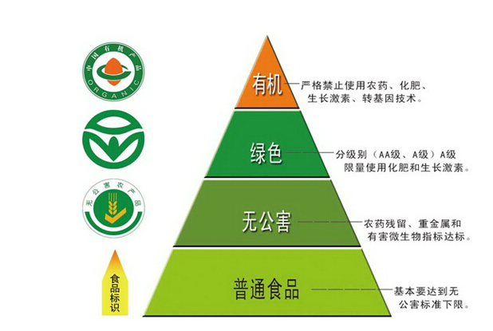

故正确答案为D。

---

## 言语理解与表达

### 材料 1

        组建文化和旅游部，是新一轮国务院机构改革的重头戏之一。不过，新部门尚未正式“揭开<u>        </u> ”，朋友圈里的一张图片倒是为这个部门<u>        </u>了一把。看着照片里的“文化和旅游部”，很多网友<u>        </u>：“诗和远方终于在一起了。”

        网友的感叹很有道理，诗属于文化范畴，而旅游总是关于远方的。其实，这并不仅仅是文字游戏，也寄托了人们对这个新成立部门的希望、对未来生活的向往。旅游和文化越来越接近了，或者说它已经成为广义文化的一部分。诗和远方在一起，美好的灵魂和美好的地方在一起，这就注定了这个部门的职责和人们正在日益增长的对美好生活的需求息息相关。

        “诗和远方在一起”的蕴涵是惬意的，但是文化和旅游部处处关系着人们对生活的体验与感知，注定不会是清闲的。中国的文化、旅游业已经发展到一个庞大的体量，而且未来的发展速度可能会更快。而这个过程中也需要解决不少棘手的问题。比如，很多人怀着一腔诗意去了远方，却被远方旅游景区的宰客以及种种糟糕的体验败尽兴致。这就是“怀着诗意去远方，远方却让你没诗意”。

        ······ 

        此前，文化部和国家旅游局各司其职，如今在一块“新的牌子”下聚合，意味着一种重新出发。“诗和远方”是人们的美好祝愿、美好期待，而要实现“诗意”地抵达，却需要风雨兼程。

#### 第 1 题　qid 2187514 · 逻辑填空

填入第一段横线处最恰当的一组是

- **A**. 盖头  预热  打趣　✅
- **B**. 帷幕  预演  戏言
- **C**. 谜底  彩排  揶揄
- **D**. 面纱  热身  调侃

**答案**：A

**官方解析**

第一空，所填词语搭配“揭开”，A、C、D三项“盖头”、“谜底”、“面纱”，均恰当。B项“帷幕”一般搭配“拉开帷幕”，搭配不当，故排除B项。
第二空，横线处强调图片对部门的宣传作用，A项“预热”符合文意，保留。C项“彩排”意为戏剧、舞蹈等在正式公演前具备全部演出合成条件的总排演；D项“热身”指在运动之前，用短时间低强度的动作，让即将运动时将要使用的肌肉群先行收缩活动一番，从而减少运动伤害的发生，二者均不符合文意，排除。
第三空，冒号表解释说明，后文说“诗和远方终于在一起”，体现出网友对“文化和旅游”两个部门组建在一起的结果很满意，体现众望所归之意，感情色彩偏积极，A项“打趣”指开玩笑，符合文段语境，当选。
故正确答案为A。
【文段出处】《“诗和远方在一起”，是对新部门的美好期待》

---

#### 第 2 题　qid 2187517 · 片段阅读

下列陈述与第二段内容无关的一项是

- **A**. 人们对美好生活的需求使旅游的文化属性日益突出
- **B**. “诗和远方在一起”表达了人们对美好生活的新期待
- **C**. 满足群众对美好生活的需求是“新部门”的责任
- **D**. 进入大众旅游时代以来我国文化旅游在持续升温　✅

**答案**：D

**官方解析**

A项对应文段“旅游和文化越来越接近了，或者说它已经成为广义文化的一部分”，则A项与文段内容有关，排除；
B项对应文段“其实，这并不仅仅是文字游戏，也寄托了人们对这个新成立部门的希望、对未来生活的向往”，则B项与文段内容有关，排除；
C项对应“这就注定了这个部门的职责和人们正在日益增长的对美好生活的需求息息相关”，则C项与文段内容有关，排除；
D项“我国文化旅游在持续升温”，第二段没有提到，当选。
本题为选非题，故正确答案为D。
【文段出处】《“诗和远方在一起”，是对新部门的美好期待》

---

#### 第 3 题　qid 2187519 · 片段阅读

第三段文字意在说明

- **A**. 旅游产品因质量问题而使消费体验大打折扣
- **B**. 文化和旅游部肩负引领旅游业发展的重任　✅
- **C**. 中国旅游业的发展规模和速度前所未有
- **D**. 旅游从业者的服务意识和服务水平亟待提高

**答案**：B

**官方解析**

文段为总分结构，首先通过“中国的文化、旅游业已经发展到一个庞大的体量，而且未来的发展速度可能会更快。而这个过程中也需要解决不少棘手的问题”体现出文化和旅游部的重要性，“比如”之后举例论证，因此文段意在说明“文化和旅游部肩负引领旅游业发展的重任”，对应B项。
A项为举例论证的部分，不是文段重点，排除；C项“中国旅游业的发展规模和速度前所未有”文段没有提及，无中生有，排除；D项“旅游从业者的服务意识和服务水平”属例子内容，非重点，排除。
故正确答案为B。
【文段出处】《“诗和远方在一起”，是对新部门的美好期待》

---

#### 第 4 题　qid 2187521 · 片段阅读

文中的省略号代表略去的第四段，这段最可能强调的是

- **A**. 旅游景区需要通过产业升级来创造品牌效应
- **B**. 旅游服务企业可以协会制度来强化行业自律
- **C**. 文化和旅游部需以更完善的制度来加强监管　✅
- **D**. 广大旅游者应提高维权意识以保障自身权益

**答案**：C

**官方解析**

第四段应与第三、五段衔接，首先第三段重点强调中国文化和旅游业面临的棘手问题，第五段强调文化部和国家旅游局各司其职带来的成效，那说明第四段应介绍文化和旅游部如何解决这些问题。C项，“文化和旅游部需以更完善的制度来加强监管”是文化和旅游部针对中国文化和旅游业的问题提出的对策，与第三、五段文意衔接紧密，当选；A项，主题词是“旅游景区”，是第三段的例子部分，非文段重点，排除；B项，主题词是“旅游服务企业”，第三段重点介绍文化和旅游部应该如何做，并未提及旅游服务企业，主题词错误，排除； D项，第三段主要介绍文化和旅游部怎么帮助广大旅游者解决问题，而不是旅游者如何做，核心话题不符，排除。
故正确答案为C。
【文段出处】《“诗和远方在一起”，是对新部门的美好期待》

---

#### 第 5 题　qid 2187524 · 片段阅读

最适合做这篇短文标题的是

- **A**. 
文化旅游，开启中国文旅产业新时代

- **B**. 
请与“诗和远方”约会吧

- **C**. 
“诗和远方在一起”，是一种可预期的美好

- **D**. 
“诗和远方在一起”，是对新部门的美好期待
　✅

**答案**：D

**官方解析**

文段首先介绍新部门“文化和旅游部”是国务院机构改革的重头戏，后文阐述这个部门的职责和人们正在日益增长的对美好生活的需求息息相关，表达了人们对这个新成立部门的希望和对“诗和远方”未来美好生活的向往，后文的内容均是围绕对于“文化和旅游部”这一新部门的期待进行具体论述，故文段的主题词为“新部门”，重点强调人们对于新部门寄托“诗和远方在一起”的美好期待，对应D项。A、B、C三项均没有提到“新部门”这一主题词，偏离文段的中心，故不适合作为本文的标题，排除。
故正确答案为D。
【文段出处】《“诗和远方在一起”，是对新部门的美好期待》

---

#### 第 6 题　qid 2187461 · 逻辑填空

填入划横线部分最恰当的一项是
“愤怒”是对德国作家格拉斯个人风格的准确概括。然而，在他的盖棺之作《万物归一》里，这种“愤怒”似乎已经不那么                了。

- **A**. 司空见惯
- **B**. 锋芒毕露　✅
- **C**. 引人注目
- **D**. 显而易见

**答案**：B

**官方解析**

根据“然而”可知，横线处所填词语与前文语义相反。转折前论述“愤怒”是对格拉斯个人风格的准确概括，说明在格拉斯的作品中“愤怒”的风格表现得非常明显，故转折后应表达盖棺之作中“愤怒”的风格表现得不明显之意。B项“锋芒毕露”比喻锐气和才干全都显露，透露出来，置于此处表达“愤怒”已经不那么明显，且与首句的“个人风格”形成对应，符合文意，当选。

A项“司空见惯”形容经常看到的事物，不足为奇，侧重点在“常见”，而非“明显”，排除；C项“引人注目”形容人或事物很具特色，引起人们的注意，文段并未论述“愤怒”这种风格是否吸引人，排除；D项“显而易见”指事情或道理很明显，极容易看清，虽可表达“明显”之意，但通常搭配“道理”等，且与首句的“个人风格”也不构成对应，排除。

故正确答案为B。

【文段出处】《君特•格拉斯遗作万物归一国内首度出版》

---

#### 第 7 题　qid 2187482 · 语句表达

填入划横线部分最恰当的一项是：
“移风易俗”的口号喊了很多年，然而好的“新民俗”诞生，不但需要有良好的愿望，还要有懂得民俗心理的“新创意”。这种创意，既衔接传统文化，又紧搭时代脉搏。唯有如此，才有可能让这种“新民俗”                。

- **A**. 久盛不衰
- **B**. 约定俗成
- **C**. 相沿成俗
- **D**. 蔚然成风　✅

**答案**：D

**官方解析**

根据文意可知，横线处所填词语形容“新民俗”能顺利诞生，并能够流行开来。D项“蔚然成风”指一件事情逐渐发展盛行，形成一种良好的风气，置于此处形容“新民俗”的流行，符合文意，当选。
A项“久盛不衰”形容事物盛行的时间很长，一直不衰退，根据“好的‘新民俗’诞生”可知，“久盛”无从体现，排除；B项“约定俗成”指事物的名称或社会习惯往往是由人民群众经过长期社会实践确定而形成的，根据“不但需要良好的愿望，还要有‘新创意’”可知，约定俗成表述错误，排除；C项“相沿成俗”指因袭某种做法传下来，形成风俗习惯，“新民俗”是“新创意”，并非因袭下来的做法，排除。
故正确答案为D。
【文段出处】《上海书法名家为何助推“有温度的婚书”？》

---

#### 第 8 题　qid 2187489 · 逻辑填空

依次填入划横线部分最恰当的一组是
让城市温暖起来，无须轰轰烈烈。每一种安顿都来自家园的呼唤，那些让人嫣然一笑的都市情愫，无论白天黑夜，都会在心头热乎乎地弥漫。就像芦苇或者巴茅，生在水乡泽国或深山老林，那叫        ；生在闹市区，那就有了表情，会笑，会唱歌，会舞蹈，会流露出一座城市的                。

- **A**. 天然  情之所钟
- **B**. 原味  生机勃勃
- **C**. 纯净  丰富多彩
- **D**. 本色  情深意长　✅

**答案**：D

**官方解析**

第一空，芦苇或巴茅，生在水乡泽国或深山老林，体现出的是原始的自然风光。A项“天然”指事物不加修饰的本色，B项“原味”指事物本来特有的、没有经过人为添加的味道，D项“本色”指本来面目，均符合文意。C项“纯净”指无污染的，单纯洁净的，与文段想要体现的“原始的自然风光”无关，排除。
第二空，根据“让城市温暖起来”、“都市情愫”以及“那就有了表情，会笑”可知，横线处所填词语表达芦苇或者巴茅生在闹市区就会有情愫，有温度。D项“情深意长”形容感情真挚深切绵长，与前文对应得当，当选。A项“情之所钟”指痴情所向，十分专注，侧重点在于“钟情某物”，排除；B项“生机勃勃”形容生命力旺盛的样子，无法与前文的“情愫”对应，排除。
故正确答案为D。
【文段出处】《一座城市的情深意长》

---

#### 第 9 题　qid 2187495 · 逻辑填空

依次填入划横线部分最恰当的一组是
社会在变，家庭也在变。但不管交通如何便捷，通信如何发达，过年回家，都是每个家庭最        的梦想。此后时空流转，纵使百转千回，改善生活也好，追逐理想也罢，走出去的中国人，还是会被故土的浓烈情思所        。

- **A**. 朴实  牵绊　✅
- **B**. 终极  引领
- **C**. 美好  吸引
- **D**. 寻常  羁绊

**答案**：A

**官方解析**

第一空，横线处搭配“梦想”，表示“回家过年”对于每一个人来说，是一种最简单、纯粹的梦想，A项“朴实”、D项“寻常”均合适，保留。B项“终极”意为穷尽、最后，C项“美好”意为美丽的东西让人身心舒畅，更好地生活，快乐地生活，二者均不符合文段语境，排除。
第二空，表示走出去的中国人，时常会想念、挂念故土的浓烈情思。A项“牵绊”意为牵挂想念，强调内心有牵挂，可搭配“浓烈情思”，当选。D项“羁绊”指受牵制而不能脱身，强调客观上有障碍和束缚，与“浓烈情思”搭配不当，排除。
故正确答案为A。
【文段出处】光明网《常回家看看谁说了算》

---

#### 第 10 题　qid 2187500 · 逻辑填空

依次填入划横线部分最恰当的一组是
在文化大交融的南北朝时期，被完全汉化的箜篌逐渐成为中原民族定型的传统乐器。箜篌最辉煌的岁月是在唐朝，           在民间也很流行，           会弹奏箜篌是衡量一个女子有才学的标志之一。

- **A**. 即使  甚至　✅
- **B**. 由此  还将
- **C**. 哪怕  是否
- **D**. 不但  而且

**答案**：A

**官方解析**

根据文意可知，第一空要表达箜篌就算在民间也很流行之意，A项“即使”、C项“哪怕”表示让步关系，与横线后的“也”搭配恰当，可表示出即便是在民间也很流行之意，保留。B项“由此”表示结果，横线前后并无因果关系，排除；D项“不但”表递进关系，与“也”搭配不当，且横线前后并无递进关系，排除。
第二空，A项，“甚至”表示递进，将会弹奏箜篌当做衡量女子才学的标志之一，进一步强调箜篌的重要性，符合文意，当选。C项，“是否会弹奏”与后文的“有才学”，两面对一面，搭配不当，排除。
故正确答案为A。
【文段出处】《箜篌，能否把它唤醒》

---

#### 第 11 题　qid 2187511 · 逻辑填空

依次填入划横线部分最恰当的一组是
“山一程，水一程，身向榆关那畔行，夜深千帐灯。”在文化节目《经典咏流传》的舞台上，当纳兰性德的《长相思·山一程》被棋手柯洁用深情的歌声唱出时，这句                  的词句还是给予我惊艳和陌生。那份数百年前的故园情思、羁旅感慨因悠扬的旋律被再度激活，令人                  。

- **A**. 耳熟能详  耳目一新　✅
- **B**. 耳闻能诵  赏心悦目
- **C**. 目知眼见  心旷神怡
- **D**. 驾轻就熟  焕然一新

**答案**：A

**官方解析**

第一空，根据后文“还是给予我惊艳和陌生”可知，前文所填成语意思与其相反，体现的是对《长相思·山一程》很熟悉，A项“耳熟能详”指听得多了，能够说得很清楚、很详细，符合文意。B项“耳闻能诵”指听过就能背出来，形容记忆力强，文段强调的不是记忆力，而是熟悉了解，排除；C项“目知眼见”指亲眼所见，形容熟悉了解，此处虽可表达熟悉了解之意，但无法与“词句”搭配，排除；D项“驾轻就熟”比喻对某事有经验，很熟悉，做起来容易，文段强调的是对词句熟悉而非做某件事，与文段语境不相符，排除。
第二空代入验证，A项“耳目一新”指听到的、看到的跟以前完全不同，使人感到新鲜，与前文《长相思·山一程》用深情的歌声唱出，给人“惊艳”的感觉对应得当，当选。
故正确答案为A。
【文段出处】《插上创意的翅膀》

---

#### 第 12 题　qid 2187512 · 逻辑填空

依次填入划横线部分最恰当的一组是：
语言系统其实具有自我           能力，随着时间推移，会自然通过分层过滤，淘尽渣滓，淬炼真金。虽然如此，当下部分网络语言带来的负面影响仍                。

- **A**. 消化  沸沸扬扬
- **B**. 再生  揣摩不透
- **C**. 修复  接踵而至
- **D**. 净化  不可小觑　✅

**答案**：D

**官方解析**

第一空，由后文的“分层过滤”“淘尽渣滓”“淬炼真金”可知，横线处词语是在说明语言系统自身进行清洁和选择，D项“净化”是指清除不好的或不需要的，符合文意和语境，保留。A项“消化”比喻理解、吸收所学的知识，与文意不符，排除；B项“再生”是死而复活，文中没有消亡、复活之意，排除；C项“修复”侧重修整使恢复原样，文中没有此义，排除。
第二空代入验证，由“虽然······仍”可知，网络语言带来的负面影响依旧不容忽视，D项“不可小觑”意为不可小看，符合文意，当选。
故正确答案为D。
【文段出处】《使用网络语言应取舍有度》

---

#### 第 13 题　qid 2187515 · 逻辑填空

依次填入划横线部分最恰当的一组是
文化节目应当追求“慢”与“深”，要坚持自主原创，应提高外国版权引进门槛、               进行本土化改造和创新，实现从“模式引进”到“中国创造”的改变，并形成           的竞争力、传播力和影响力。

- **A**. 精雕细琢  持久　✅
- **B**. 群策群力  强劲
- **C**. 洋为中用  良性
- **D**. 因地制宜  广泛

**答案**：A

**官方解析**

第一空，由横线前后的“慢与深”“自主原创”“本土化改造和创新”可知，文化节目应该是我国自主研发的，且研究深入、不追求速成。C项“洋为中用”是指批判地吸收外国文化中一切有益的东西为我所用，与“自主原创”不符，排除。A项“精雕细琢”比喻做事情精益求精，与“慢与深”对应，符合文意。B项“群策群力”指聚合群众的智慧和力量，D项“因地制宜”指根据各地的具体情况，制定适宜的办法，均不符合文意，排除。
第二空，横线处词语搭配竞争力、传播力和影响力，A项“持久”与之均搭配恰当，当选。
故正确答案为A。
【文段出处】《文化类栏目应当追求“慢”与“深”》

---

#### 第 14 题　qid 2187498 · 逻辑填空

依次填入划横线部分最恰当的一组是：
红色文化是中国特色社会主义文化的有机组成部分，是中国共产党人留给中华儿女最宝贵的精神财富。正在兴起的红色旅游正是三者的完美结合，“旅游”是____，“文化”是____，“红色”是____。大众在饱览祖国大好河山的同时，可以了解中国共产党为人民利益而奋斗的光辉历史，激发心底的爱国热情。

- **A**. 载体  血液  内涵　✅
- **B**. 介质  灵魂  标志
- **C**. 平台  基因  传统
- **D**. 媒介  本质  特色

**答案**：A

**官方解析**

第一空，根据文意可知，横线处表达旅游是弘扬红色文化的一种途径，A项“载体”、B项“介质”、C项“平台”、D项“媒介”均符合文意，保留。
第二空，表达文化是红色旅游中我们需要了解的对象，A项“血液”比喻主要的成分或力量，符合文意，保留。B项“灵魂”指起关键和主导作用的因素，C项“基因”指生命体中支持着生命的基本构造和性能的物质，D项“本质”指事物的根本性质，均强调的是最重要，最核心的部分，这里文化并不是红色旅游中最核心的部分，程度过重，排除。
第三空，代入验证，表达“红色”是红色旅游中包含的内容，A项“内涵”符合文意，当选。
故正确答案为A。
 【文段出处】《红色经典的新演绎》

---

#### 第 15 题　qid 2187502 · 逻辑填空

依次填入划横线部分最恰当的一组是
婺源被淡淡炊烟笼罩的马头墙、山间梯田____的线条、暮色中骑在牛背上的村童，俨然一幅山高水远的中国水墨画，_______；而瑶里古镇的光芒一直被婺源所遮掩，但正因如此，它才保留了最原始的美景。无论是水墨画一般的徽派建筑，还是保留原貌的小镇，都会给人带来一种____的感觉。

- **A**. 丰富  浑然天成  亲切
- **B**. 抽象  恍若隔世  纯朴　✅
- **C**. 奇妙  清新淡雅  怡人
- **D**. 流畅  浓妆淡抹  惊艳

**答案**：B

**官方解析**

本题可从第二空入手，根据“淡淡炊烟”“骑在牛背上的村童”可知，乡村的景色中保留着“原始”的特点，与现代都市形成极大反差，B项“恍若隔世”表示由于人、事变化太大而生的感慨，符合文意，保留；C项“清新淡雅”指清新、雅致，符合文意，保留。A项“浑然天成”形容诗文结构严密自然，用词运典毫无斧凿痕迹；亦形容人的才德完美自然。用来形容“婺源”的景色搭配不当，排除；D项“浓妆淡抹”比喻浓艳和素雅两种不同的自然景色，文段未体现浓艳，排除。

第三空，根据“最原始”“保留原貌”可知，横线处表达该小镇非常朴实、古朴，B项“纯朴”指敦纯质朴，符合文意，保留。C项“怡人”指欢畅舒心，无法体现小镇的原始、朴实，与文意不符，排除。

第一空，代入验证，B项“抽象”符合文意，当选。

故正确答案为B。

【文段出处】《婺源仅占的美 这才是江西春天最值得自驾的路线》

---

#### 第 16 题　qid 2187447 · 语句表达

法国大革命前，化学家拉瓦锡用巨大的凸透镜把阳光聚焦在钻石上，结果钻石飘逸地烧掉了，和石墨一样。拉瓦锡有一颗坚硬的心，他的实验击穿了“________”这一美丽的谎言。
填入横线部分最恰当的广告词是：

- **A**. 爱她就给她最好的
- **B**. 爱可倾城，钻石永恒
- **C**. 不在乎天长地久，只在乎曾经拥有
- **D**. 钻石恒久远，一颗永留传　✅

**答案**：D

**官方解析**

横线出现在文段尾句，需根据前文内容进行分析。根据前文拉瓦锡用凸透镜将钻石烧掉的实验可知，钻石是可以被毁灭的，即之前的谎言应是钻石不可毁灭、永远存在，D项“钻石恒久远，一颗永留传”，当选。
A项“爱她就给她最好的”强调好，C项“不在乎天长地久，只在乎曾经拥有”强调曾经拥有，均与“钻石”无关，排除。B项“钻石永恒”虽然能体现“永远”的意思，但是“爱可倾城”文段并未提及，无中生有，排除。
故正确答案为D。
【文段出处】《科学家的玻璃心》

---

#### 第 17 题　qid 2187450 · 片段阅读

日前，我认真拜读了一位老领导的回忆录，为他认真做事的态度而深深感动。他曾是一位县委书记，后来担任了市长，可他的第一份工作却是生产队的记分员。所谓记分员，就是负责记录队员每日工作情况的农民。这个在旁人看来“不起眼”的工作，他却十分喜爱，干得起劲。记分，一丝不苟，不偏不漏，客观公正，做到了让队长满意、让群众满意。因此，6年后被提拔为公社干部。他在回忆录中写道：基层6年，为以后40多年的工作打下了坚实基础。
这段话对做好机关工作最主要的启示是

- **A**. 要尽量把每一件事都做好
- **B**. 要以客观公正为准则做事
- **C**. 要认真做好“不起眼”的小事　✅
- **D**. 要从最基层的工作做起

**答案**：C

**官方解析**

根据文段可知，回忆录里老领导第一份工作是生产队的记分员，而这个“不起眼”的工作，却被他做的非常好，一丝不苟，不偏不漏，客观公正，尾句总结基层6年，为以后40多年的工作打下了坚实基础，根据此句可知老领导强调的就是“基层6年”的不起眼的工作的重要性，对应C项。
A项“每一件事”、D项“基层工作”范围太大，未体现“不起眼”的工作，排除；
B项，“客观公正”是做事的原则，偏离文段核心，排除。
故正确答案为C。
【文段出处】《有为者有位 吃苦者吃香 许多人不懂这个道理》

---

#### 第 18 题　qid 2187448 · 片段阅读

近年来，支付科技发展迅猛，特别是随着生物识别技术的快速发展，人体固有的生理特性和行为特征也开始被用于金融创新。比如，俗称“刷脸”的人脸识别技术，易用性、普适性较强，目前已在身份核查、刷脸取款、刷脸支付等金融场景中得到应用。未来，包括指纹、人脸、声纹、静脉、虹膜等多种识别方式，将越来越多进入金融领域。
对这段文字的理解最为准确的是：

- **A**. 生物识别技术在金融领域可谓应用前景广阔　✅
- **B**. 支付科技发展的最终结果就是“无现金社会”
- **C**. 金融领域成为生物识别技术创新的“试验区”
- **D**. 金融科技创新对个人隐私保护形成新的威胁

**答案**：A

**官方解析**

A项，文段开篇指出随着生物识别技术的发展，人体的生理特征开始被用于金融创新，接着以“人脸识别技术”为例，介绍了其在金融场景中的具体应用，论证前文观点，尾句指出，未来将会有更多的生物识别技术进入金融领域，故“生物识别技术在金融领域发展前景广阔”并无问题，符合文意，当选；
B项，未提到文段主题词“生物识别技术”，偏离文段中心，且“最终结果”无中生有，排除；
C项，“试验区”文段并未体现，文段仅介绍生物识别技术开始用于金融创新，但并未强调是“试验区”，排除；
D项，未提到主题词“生物识别技术” ，偏离文段中心，且“新的威胁”无中生有，根据“易用性、普适性较强”可知，体现的积极效果，而非“威胁”，排除。
故正确答案为A。
【文段出处】《金融科技要带有温度》

---

#### 第 19 题　qid 2187451 · 片段阅读

注入科学基因的文化项目，科学价值是基础，也是它的灵魂，如果这方面放松了或者做得不扎实，遗址公园就会失去生命力。正所谓“皮之不存，毛将焉附”。
文中的“皮”和“毛”分别是指：

- **A**. 科学研究  文化基因
- **B**. 考古发掘  技术支持
- **C**. 科学价值  文化项目　✅
- **D**. 科普教育  遗址公园

**答案**：C

**官方解析**

“皮之不存，毛将焉附”出现在文段尾句，根据“注入科学基因的文化项目，科学价值是基础”、“如果这方面放松了或者做的不扎实，遗址公园就会失去生命力”可知，如果科学价值做的不好，那么遗址公园这类注入了科学基因的文化项目就没有了依托，也会随之消亡。因此，“皮”是指“科学价值”，“毛”是指“文化项目”。
故正确答案为C。
【文段出处】《文化项目：科学与文化相融，会相得益彰》

---

#### 第 20 题　qid 2187454 · 语句表达

用笔墨描绘，使理想的中国男人获得了一种完全不同于西方美男子的形象。或者轮廓柔和慈眉善目，或者高贵富态威风凛凛，或者瘦小精干骨骼清奇，                               。中国画家不对人写生，他们观察或想象，把性格特征牢牢记在心中，再画出来。他们想表现的不是生理特征和服饰外表，而是人的心相。工笔也好，写意也罢，重点在传神。
填入划横线部分最恰当的一句是：

- **A**. 画的是人，表达的是画家的价值观
- **B**. 中式审美与帅气无关，与传神有关　✅
- **C**. 国画中美髯？可以有；腹肌？不存在
- **D**. 画家心目中的理想男人与俊美无关

**答案**：B

**官方解析**

横线出现在文段中间，需要结合前后文内容进行分析。前文说中国男人绘画形象与西方美男子不同，后文则指出中国画家绘画重在传神，横线处应承上启下，体现中国绘画的特点，即形象与美无关，重在传神，对应B项。
A项，“画家的价值观”文段未提及，无中生有，排除；
C项，“美髯”“腹肌”均与后文强调的“传神”无关，衔接不当，排除；
D项，“画家”范围扩大，文段重在强调“中国画”，且与后文“传神”衔接不当，排除。
故正确答案为B。
【文段出处】《古画中的中国男人：闲逸懒散 不修边幅》

---

#### 第 21 题　qid 2187507 · 片段阅读

17、18世纪西方人十分渴望了解中国文化的方方面面，大量中国丝绸、瓷器和茶叶通过广州港出口至欧洲，中国人艺术化的生活用品，例如扇子、墙纸、漆器、家具等也随之西传，给欧洲人带去诗情画意的清新感受。当时欧洲的家居陈设，中国瓷器、漆器和墙纸都是十分时尚的物品，甚至在一些大型欧洲风景花园里，都会小规模地仿制中国建筑物来点缀其间。
这段文字意在论证：

- **A**. 17、18世纪中西文化的交融达到了鼎盛
- **B**. 17、18世纪欧洲社会比较流行“中国风”　✅
- **C**. 17、18世纪中国还是一个较神秘的国度
- **D**. 17、18世纪中国与欧洲商业交流很频繁

**答案**：B

**官方解析**

文段开篇提出“17、18世纪西方人十分渴望了解中国文化的方方面面”这一观点，接着通过中国的生活用品西传至欧洲，给当地人带来了清新感受以及中国的居家陈设和花园建筑也深受欧洲人们喜爱两个方面，进一步论证了欧洲对中国文化的喜爱，对应B项，“中国风”对应了中国文化在欧洲的风行。
A项，文中并未指出17、18世纪是中西交流的顶点，故“交融鼎盛”无中生有，排除；
C项，文中中国已经与西方有了大量的交流，故“中国还是一个较神秘的国度”与文意相悖，排除；
D项，强调的是“中西方商业交流”，但文中重点强调的是“欧洲对中国文化的喜爱”，与文意不符，排除。
故正确答案为B。
【文段出处】《18至19世纪的欧洲人，被“中国风”折服》

---

#### 第 22 题　qid 2187501 · 逻辑填空

唐初名相娄师德，做兵部尚书时巡察并州，在当地与众人一起吃饭时，发现自己碗里的饭白且细，而他人的饭却黑且粗，就问属下。属下惶恐回答，仓促间没能准备更多浙米。娄说：有仓促的客人，没有仓促的主人嘛，吃粗饭有什么关系！便令人换粗饭来吃。
这个故事所蕴含的“为官理政”的道理有：
①从来治国者，宁不忘渔樵
②为人臣者，以富民为功
③为上能自爱，群属必畏钳
④与百姓同其甘苦
⑤为政，通下情为急

- **A**. ①④⑤　✅
- **B**. ①③⑤
- **C**. ③④⑤
- **D**. ②④⑤

**答案**：A

**官方解析**

文段主要讲述了唐初名相娄师德巡察并州时，与众人一起吃粗饭的一则故事，体现了他心系百姓、与群众同甘共苦、及时体察民情的为官之道。①句“从来治国者，宁不忘渔樵”，意为治理国家的人，不能忘记最普通的老百姓；④句“与百姓同其甘苦”，强调与群众一起，同甘共苦；⑤句“为政，通下情为急”，强调为政治国，最重要的是通察民情，三句均可体现文段蕴含的“心系百姓、体察民情”之意，对应A项。
B、C、D三项：②句“为人臣者，以富民为功”，强调为官者应该以富民安众为己任，文段并未提及“使民众富裕”；③句“为上能自爱，群属必畏钳”，指作为上级能自觉严格要求自己，下属就会服从他的管理，执行他的指令，文段侧重强调为官者与百姓之间的关系，并非上下级的关系，与文意不符，均排除。
故正确答案为A。
【文段出处】古诗文网《卷一百七十六·器量一》

---

#### 第 23 题　qid 2187504 · 片段阅读

送餐员、网约车司机、网约厨师、保洁工、保健师······“网约工”已经形成了一种新的就业形态。但他们没有社会保险、不签劳动合同，因此遇事故常遭平台“甩锅”，医药费或修车费往往需要个人买单，对顾客投诉产生的罚款没有博弈和解释空间。这构成了一种吊诡的现象：不断穿梭在城市大街小巷的送餐员、网约车司机每天刷着存在感，却在权益保护上成为了隐形人。
这段文字用“隐形人”来说明：

- **A**. 工作平台对网约工的权益推卸了责任
- **B**. 作为新的就业形态网约工还不被熟知
- **C**. 网约工的权益保障是公共政策的难点
- **D**. 网约工处于劳动权益保障的灰色地带　✅

**答案**：D

**官方解析**

文段首先通过下定义的方式引出“网约工”这一话题，随后通过转折词“但”指出“网约工因缺少社会保险和劳动合同导致遇事故需自己买单、面对投诉无解释空间”，即“网约工没有相应的劳动权益保障”。尾句通过代词“这”总结前文，引出结论“网约工成了权益保护上的隐形人”。故“隐形人”位于尾句结论句中，用以说明作者的观点“网约工”缺少“劳动权益保障”，对应D项。
A项“隐形人”指代的是“网约工”，而非“工作平台”，主体错误，排除；
B项“网约工不被熟知”、C项“公共政策的难点”文段没有提及，无中生有，均排除。
故正确答案为D。
【文段出处】《网约工不能成为权益隐形人》

---

#### 第 24 题　qid 2187506 · 片段阅读

在传统饮食文化中，“如何吃”的仪式和流程比“吃什么”还重要。寻常百姓，至少要做到孔子说的“食不言，寝不语”，招待客人，也要严格按照地位、辈分、官位等主次有序落座。吃个饭还这么累，现代青年人玩不起也玩不转这繁琐的饮食套路。外卖，把“怎么吃”的繁文缛节全部去掉了，直接回归了“吃什么”的本质。从品类来说，外卖的口味相当丰富，不输堂食。
对这段文字的主旨概括最准确的是：

- **A**. “点外卖”正在改变中国传统饮食文化　✅
- **B**. 传统烹饪的精华无法在外卖中得到体现
- **C**. 重视进餐仪式满足了审美与礼节的需求
- **D**. 外卖已成为都市年轻人主流的饮食方式

**答案**：A

**官方解析**

文段开篇指出在传统饮食文化中，“如何吃”的仪式和流程很重要，寻常百姓招待客人，也要遵守规矩。随后指出现代青年人玩不起繁琐的饮食套路，并强调“外卖”去掉了繁文缛节，直接回归到了“吃什么”的本质上。文段围绕“传统饮食文化”及“外卖”两个核心话题进行阐述，意在强调“外卖”正在改变中国的饮食文化传统，对应A项。
B项，“精华无法在外卖中得到体现”所体现出的感情色彩偏消极，而文段并未否定“外卖”，排除；
C项，选项围绕“传统饮食文化”阐述，偏离另一核心话题“外卖”，排除；
D项，“年轻人主流的饮食方式”文中并未提及，无中生有，排除。
故正确答案为A。
【文段出处】《“点外卖”正在改变传统的生活方式》

---

#### 第 25 题　qid 2187509 · 语句表达

①雨水刚刚过去，春的气息便扑面而来
②“好雨知时节，当春乃发生。”
③窗外淅沥的春雨，正映衬着杜甫的诗句，原来这春，已经来了
④也是，季节交替总是不经意悄悄地进行着，当你感觉到了时其实早已浸润了大地
⑤那春的讯息最先是在冬时就已经吐露花蕊的梅，所以才会有梅是专门来报春之说
将以上5个句子重新排列，语序正确的是：

- **A**. ⑤③④①②
- **B**. ①②③⑤④
- **C**. ②①③⑤④　✅
- **D**. ③②①④⑤

**答案**：C

**官方解析**

对比选项判断首句，②句为杜甫诗句，③句提到“正映衬着杜甫的诗句”，按照逻辑顺序，应先提到“杜甫诗句”，再论述“正映衬着杜甫的诗句”，②句应在③句之前，排除A、D两项；①句围绕“雨水”和“春”两个话题论述，是对②句内容的具体展开，故②句应在①句之前，排除B项。
故正确答案为C。
【文段出处】《春韵盈风至》

---

#### 第 26 题　qid 2187534 · 片段阅读

本来，小吃吸引人的地方，在于它的新鲜、特异，以及不同的口味。这种“不同”，不仅体现在与其他吃食不同，也同样体现在同一类小吃的口味差异上。好的小吃，绝非满大街的小吃摊都是一个味儿。这是中式小吃的特色所在，也是其难以“标准化”的根源所在。如果硬性规范、约束小吃，或许会克隆出一批小吃店，但很可能会以牺牲人的味蕾为代价。
从这段文字可以看出作者的主要态度是：

- **A**. 反对小吃标准化　✅
- **B**. 小吃标准化不能一刀切
- **C**. 鼓吹小吃标准化
- **D**. 对小吃标准化表示担忧

**答案**：A

**官方解析**

文段开篇指出“小吃”吸引人的特征，即“不同”，并对其进行解释说明。随后文段通过指代词“这”指代前文并进行总结，强调“不同”是中式小吃的特色以及其难以“标准化”的根源，文段尾句通过反面论证进一步论证“小吃”难以“标准化”。故作者对“小吃标准化”的态度是反对的，对应A项。
B项，选项的意思是：小吃可以标准化，只是在标准化的过程中不要采取同一种方式处理问题，但是文段中作者已经表明是反对小吃标准化的，故与文意相悖，排除；
C项，“鼓吹”与文意相悖，排除；
D项，“担忧”在文段中未提及，属于无中生有，排除。
故正确答案为A。
【文段出处】《地方小吃踏上“标准化”之路，是否变得更好吃了？》

---

#### 第 27 题　qid 2187525 · 片段阅读

最近，一家英国公司用人工智能（AI）算法自动编写了《哈利·波特》续集——《哈利·波特与看起来像一大坨灰烬的肖像》。该公司表示，他们是想用AI与人类智慧结合的新手段制造出一些单凭人类或者电脑都无法实现的作品。虽然目前的《哈利·波特》续集有些四不像，但说不定在未来的文艺体系中，人机结合的作品真的能自成一派。
这段文字意在表明：

- **A**. AI小说充分体现了英国人的游戏精神
- **B**. 人机结合的作品只能让读者啼笑皆非
- **C**. AI小说引起世界各大主流媒体的关注
- **D**. 人机结合可能会成为创作的一种方式　✅

**答案**：D

**官方解析**

文段通过引用英国公司利用AI算法续写《哈利·波特》续集的例子，体现作者对AI技术与人类智慧结合这种人机结合新手段的认可。最后通过转折关联词“但”重点强调人机结合的创作方式在未来可能自成一派，成为独特的创作方式，故文段的重点对应D项。
A项，文段未提及英国人的游戏精神，无中生有，排除；
B项，由文段可知，作者对于人机结合的作品持认可的态度，而“啼笑皆非”意指令人发笑、尴尬的意思，与作者观点不符，排除；
C项，文段未提及世界各大媒体对于AI小说是否关注，无中生有，排除。
故正确答案为D。
【文段出处】《AI续写＜哈利·波特＞ 是四不像还是自成一派？》

---

#### 第 28 题　qid 2187527 · 语句表达

下列句子中没有使用拟人修辞手法的一项是：

- **A**. 我们睡着的时候，以为风睡了，树也睡了，以为日月星辰虎豹虫豸都睡着了。待拂晓醒来，天，已连夜画好了一幅朝霞
- **B**. “传统儿童游戏”不该只属于博物馆，利用好了，它也有春天　✅
- **C**. 冬天，花朵儿们并不躲懒。它们不太看重季节，春夏秋冬，开了落，落了开，一切都自然
- **D**. 墙角处，花骨朵儿小小的头颅昂扬在细细的草茎上。风一吹，沾着的雨水轻轻滑落，花骨朵儿柔韧地颤动几下

**答案**：B

**官方解析**

A项，风、树属于不具备人动作和情感的事物，“睡着”是人才有的动作，由“风睡了，树也睡了”可知，该句将风、树拟人化，运用了拟人的修辞方法，排除；
C项，花朵属于不具备人动作和情感的事物，而“躲懒”是人才具备的动作，由“冬天，花朵儿们并不躲懒”可知，该句将花朵拟人化，运用了拟人的修辞方法，排除；
D项，花骨朵儿属于不具备人动作和情感的事物，而“头颅”特指人的头，是人才具备的特点，由“花骨朵儿小小的头颅昂扬在细细的草茎上”可知，该句将花骨朵儿拟人化，运用了拟人的修辞方法，排除；
B项，运用的是比喻的修辞方法，将传统儿童游戏未来良好的发展比喻成“春天”，没有运用拟人的修辞方法，当选。
本题为选非题，故正确答案为B。

---

#### 第 29 题　qid 2187529 · 片段阅读

阅读推广，是向公众提供的一项重要的阅读服务。每个社会成员，既是阅读推广的对象，也是阅读推广的触角。实践已经证明，让每个社会成员养成阅读的自觉和习惯，把阅读当作日常生活不可或缺的内容，是阅读推广中最难的事情，其难度远远超过阅读氛围的营造。而这件难事，也恰恰最有价值。社会成员若无自觉和习惯，全民阅读可能就只停滞于想象层面，这显然不利于书香社会的建设。
根据文意，作者认为阅读推广最难的事是：

- **A**. 阅读服务的提升
- **B**. 阅读习惯的养成　✅
- **C**. 阅读氛围的营造
- **D**. 阅读价值的创造

**答案**：B

**官方解析**

B项，根据“让每个社会成员养成阅读的自觉和习惯，把阅读当作日常生活不可或缺的内容，是阅读推广中最难的事情”可知，阅读推广最难的事为养成阅读的自觉和习惯，当选。
A项“服务的提升”和D项“价值的创造”均非文段中所提及的阅读最难的事，故无中生有，排除；
C项，根据“养成阅读的自觉和习惯······其难度远远超过阅读氛围的营造”可知，“氛围”并非最难的事，排除。
故正确答案为B。

---

#### 第 30 题　qid 2187531 · 片段阅读

马赛克留给中国大众的印象，或是广泛使用在建筑外墙、卫浴装修中的装饰建材，或是图像被模糊成一个个小格子，少有人想起它的艺术属性。其实在西方，镶嵌艺术历史悠久，尤以镶嵌壁画最多。近现代，镶嵌艺术在墨西哥、西班牙、俄罗斯、美国、日本等国都有杰出展现。每个国家因应本国不同的文化传统与材料资源在镶嵌工艺上的不同发挥，成就镶嵌壁画艺术更加多元的面貌。
这是一篇文章的开头，接下来最可能谈论的是：

- **A**. 马赛克在镶嵌壁画艺术创作中的应用
- **B**. 西方国家马赛克镶嵌艺术的发展历史
- **C**. 中国发展马赛克镶嵌艺术的资源条件　✅
- **D**. 镶嵌壁面创作对镶嵌材料的特殊要求

**答案**：C

**官方解析**

接语选择题，应在通读全文的基础上，重点关注文段最后论述的核心话题。前文阐述马赛克留给中国大众的印象多是建筑材料而非其艺术属性；接下来引出“镶嵌艺术”是其艺术属性的体现，并且在不同国家发展各异；最后指出每个国家要成就镶嵌艺术，就要在“本国不同的文化传统与材料资源”基础上进行发挥。故接下来应围绕国家发展马赛克镶嵌艺术应考虑的资源和条件进行论述，对应C项。
A、B、D三项：A项“马赛克的应用”、B项“发展历史”、D项“镶嵌壁画创作”均与文段最后论述的核心话题不一致，排除。
故正确答案为C。
【文段出处】《用材料激发创新思考力》

---

#### 第 31 题　qid 2187444 · 片段阅读

一项调查表明，自1960年以来，夏季奥运会的平均投入大约是52亿美元，这只是直接用于各种比赛场馆和奥运村的建设费用，不包括道路等相关基础设施建设的开支。绝大多数主办城市的最终投入都会超支，且平均超支高达。

这段文字能直接说明的是：

- **A**. 规避奥运投资风险是世界性的难题
- **B**. 主办奥运的高投入未必就有高回报
- **C**. 主办奥运会意味着巨大的经费投入　✅
- **D**. 奥运场馆赛后利用曾经被寄予厚望

**答案**：C

**官方解析**

文段首句介绍了1960年以来夏季奥运会的平均投入，接着通过“这只是······不包括”说明奥运会的经费投入很高，尾句进一步指出主办城市的最终投入都会超支很多，故文段重在说明主办奥运会经费投入很高，对应C项。
A项，“规避奥运投资风险”无中生有，排除；
B项，文段都在围绕“投入”展开，并未提及“回报”，无中生有，排除；
D项，“奥运场馆赛后利用曾经被寄予厚望”文段并未提及，无中生有，排除。
故正确答案为C。
【文段出处】《人民日报域外听风：如何让奥运遗产不再沉睡》

---

#### 第 32 题　qid 2187452 · 片段阅读

社会生活的变迁，也深刻影响着艺术创作。改革开放以来，随着城乡之间融合发展步伐的加快，人民生活获得巨大改善。①与此同时，城乡居民的日常生活模式也在逐渐趋同。②类似的生活模式导致类似美术作品的出现。③以此解释艺术创作趋同的现象，似乎有其合理性，但必须意识到，艺术绝不是机械地反映生活。④仅仅把目之所见的生活片段记录下来，固然是对生活的反映，但只是浅层次的再现，说明作者对生活的理解还很肤浅。
“艺术是生活的反映”是文中的一句话，其最恰当的位置是

- **A**. ③　✅
- **B**. ②
- **C**. ①
- **D**. ④

**答案**：A

**官方解析**

题干中的“艺术是生活的反映”这句话概括了“艺术”与“生活”之间的关系。③处之后出现转折词“但”，论述了“艺术绝不是机械地反映生活”，说明转折之前应论述艺术是对生活的反映，故题干中的句子应放在③处，对应A项。
B项，②处前后句子均有共同信息“生活模式”，故中间不适合插入其他无关语句，排除；
C项，①处前后句子之间由关联词语“与此同时”连接，且均含有共同信息“城乡”，故中间不适合插入其他无关语句，排除；
D项，④处前的句子说明“艺术绝不是机械地反映生活”，后面句子说明“机械地反映生活”的局限性，二者构成解释说明关系，中间不能插入其他内容，排除。
故正确答案为A。
【文段出处】《不同角度看“趋同”》

---

#### 第 33 题　qid 2187460 · 片段阅读

泱泱中华五千年，诞生了数不清的灿烂文化，楚文化是其中一朵奇葩。从河姆渡文化开启的漆器历史中，楚漆器又是其中一座高峰。髹饰绝艳的漆器，展示出楚人精湛的造物技术和清奇的美学品格，传达出无与伦比的智慧和自由浪漫的精神。楚漆器的造型艺术和审美追求，是楚文化“巫、道、骚”三种思想相互交织的集中体现。
这段文字意在说明：

- **A**. 楚漆器有非凡的思想性艺术性　✅
- **B**. 漆文化堪称楚文化的金字塔尖
- **C**. 楚漆器是漆文化中的典型代表
- **D**. 楚文化究竟是怎样的一朵奇葩

**答案**：A

**官方解析**

文段首先介绍楚文化在中华文化中与众不同，接下来引出文段核心话题“楚漆器”，然后分别从“造物技术和美学品格”及“思想相互交织”两个方面介绍了楚漆器的成就，故文段意在说明楚漆器“艺术性”和“思想性”两个方面的非凡成就，对应A项。
B项“金字塔尖”、C项“典型代表”非文段的重点，没有体现楚漆器的思想性和艺术性，偏离中心，排除；
D项，“楚文化”非文段的核心话题，文段谈论的主题词为“楚漆器”，偏离中心，排除。
故正确答案为A。
【文段出处】《漆艺：“用”才能“活”》

---

#### 第 34 题　qid 2187464 · 片段阅读

我曾经有一个坏习惯：不是在晚饭后坐在沙发上看手机，就是睡觉前躺在床上看手机——打开微信，将当天的朋友圈从头看到尾，一直刷到没有新动态为止；打开微博，看看谁因为什么又上了热搜榜；打开头条，看看它推送给我的星座分析······结果可想而知，时间轻松被刷没，除了一堆无用的信息，我什么也没得到。
这段文字意在说明

- **A**. 玩物丧志的说法是有一定道理的
- **B**. 智能手机使打发时间变得很容易
- **C**. 做没有意义的事无异于慢性自杀
- **D**. 不应沉迷于那些没有价值的信息　✅

**答案**：D

**官方解析**

文段首先提出问题，指出作者的一系列坏习惯，即喜欢用手机刷一些无用信息，接下来对此问题进行了分析“除了一堆无用的信息，我什么也没得到”，可知文段意在强调不要将时间浪费在一些无用的信息上，那样毫无意义，即针对问题提出对策，对应D项。
A项，文段体现了“玩物”，并未提及“丧志”，排除。
B项，文段指出看手机刷一堆无用信息是没有意义的，并非强调手机的积极作用，排除。
C项，“没有意义的事”表述不明确，且“慢性自杀”无中生有，排除。
故正确答案为D。
【文段出处】《极简生活》

---

#### 第 35 题　qid 2187481 · 语句表达

瘙痒是令人非常难受的，但从生物进化的角度来看，如果瘙痒带给生物体的只是负面的影响，为什么会在进化过程中保留下来呢？实际上，瘙痒是保护个体生存的一道非常重要的防线，瘙痒所诱发的搔抓行为可以把已经入侵皮肤的一些有害物质去掉，因此                                   。
填入横线处最恰当的一项是：

- **A**. 瘙痒对动物个体生存也有积极作用　✅
- **B**. 瘙痒对人类健康来说可谓喜忧参半
- **C**. 瘙痒虽令人感到不适却能增强体质
- **D**. 生物的进化过程总要在博弈中完成

**答案**：A

**官方解析**

横线出现在文段结尾，且为尾句中的一个分句，其作用在于总结前文且需与尾句话题保持一致。文段首句通过问句指出瘙痒不只是负面的影响，后文通过“实际上”指出瘙痒是人体内非常重要的防线，尾句通过“因此”总结上文，即瘙痒对生物个体是有积极作用的，对应A项。
B项，“喜忧参半”表述不明确，文段尾句重在强调瘙痒对生物个体有益，排除；
C项，文段尾句重在强调瘙痒对个体生存有保护作用，“增强体质”无中生有，排除；
D项，未提及“瘙痒”这一话题，排除。
故正确答案为A。
【文段出处】《神经科学家为你科普：“痒痒”去哪儿了？》

---

## 数量关系

### 第 1 题　qid 2187543 · 数学运算

，，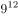，(  )，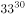

- **A**. 

　✅
- **B**. 

- **C**. 
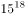

- **D**. 
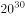

**答案**：A

**官方解析**

数列形式特殊，包含底数和指数两个部分，优先拆分查找规律。原数列底数分别为：3，5，9，（ ），33，作差后得：2，4，（ ），（ ），考虑公比为2的等比数列，下两项为8，16。验证：，，与题干数字吻合，故所求项底数应为17；原数列指数分别为：2，6，12，（ ），30，作差后得：4，6，（ ），（ ），考虑公差为2的等差数列，下两项为8，10。验证：，，与题干数字吻合，故所求项指数应为20，即所求项为。

故正确答案为A。

---

### 第 2 题　qid 2187546 · 数学运算

一位女士为了寻找曾经帮助她的司机，向新闻媒体提供了她记得的车牌信息。女士看到的车牌号为“吉AC****”，最后一位是字母，其他三位全是奇数，且数字逐渐变大，那么符合要求的车牌有：

- **A**. 380个
- **B**. 260个　✅
- **C**. 180个
- **D**. 460个

**答案**：B

**官方解析**

方法一：根据题意可得，车牌号的最后一位是字母，共有26种选择。其他三位均为奇数，即可为“1，3，5，7，9”中的任意3个数字。从5个奇数中选出3个，有种情况。每3个奇数中，满足数字逐渐变大的只有1种，故三位数字的排列共有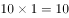种选择。则满足要求的车牌共有种。

方法二：在后四位号码中，最后一位是字母，有26种选择，设其他三位数字满足条件的情况数为，则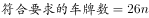，一定是26的倍数，只有B项满足。

故正确答案为B。

---

### 第 3 题　qid 2187547 · 数学运算

某业务处长和科员两人属相相同，科员在第一个本命年时处长是第三个本命年。科员今年20岁，当处长年龄是科员年龄的2倍时，需要经过的时间是：

- **A**. 5年
- **B**. 6年
- **C**. 7年
- **D**. 4年　✅

**答案**：D

**官方解析**

根据“科员在第一个本命年时处长是第三个本命年”，结合常识每相差1个本命年，年龄差12岁，可知：处长比科员大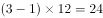岁。故科员今年20岁，则处长今年岁。设经过年后，处长年龄是科员年龄的2倍，所以有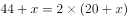，解得。

故正确答案为D。

---

### 第 4 题　qid 2187567 · 数学运算

一长方形纸板长为4cm，宽为3cm，将其折叠后，折痕为AF，如图所示，则阴影三角形的周长是：

- **A**. 

- **B**. 

- **C**. 

- **D**. 

　✅

**答案**：D

**官方解析**

长方形纸板按AF折痕折叠后，由图可知AB与AE重合，故，。而也为，所以ABFE为正方形，故。根据勾股定理，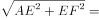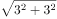 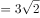，故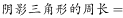。

故正确答案为D。

---

### 第 5 题　qid 2187537 · 数学运算

某市出租车采用分段计价办法：2.5公里及以内收费5元，超过2.5公里按每公里1.5元计价，每次加收1元燃油附加费。某位乘客有22.5元零钱，最多能走的距离是：

- **A**. 14公里
- **B**. 13.5公里　✅
- **C**. 12公里
- **D**. 15.5公里

**答案**：B

**官方解析**

设最多能走公里，根据“22.5元零钱”可列方程：，求得公里。

故正确答案为B。

---

### 第 6 题　qid 2187540 · 数学运算

某仓库存放三个厂家生产的同一品牌洗衣液，其中甲厂生产的占，乙厂生产的占，剩余为丙厂生产的，且三个厂家的次品率分别为，，，则从仓库中随机取出一件是次品的概率为：

- **A**. 

- **B**. 

　✅
- **C**. 

- **D**. 

**答案**：B

**官方解析**

赋值总量为1000件，则甲、乙、丙三厂生产的洗衣液各有200、300、500件，次品件数分别为：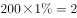件，件，件，次品数共有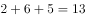件。故从仓库的1000件产品中，随机取出一件是次品的概率为：。

故正确答案为B。

---

### 第 7 题　qid 2187541 · 数学运算

某商场柜台销售一款时装，若将进价的作为利润，则销售价为240元。若该款时装销售价为300元时，此时利润率是：

- **A**. 

- **B**. 

- **C**. 

　✅
- **D**. 

**答案**：C

**官方解析**

设进价为元，根据题意列式：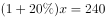，解得进价元。根据公式：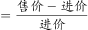，当售价为300元时，。

故正确答案为C。

---

### 第 8 题　qid 2187542 · 数学运算

甲乙两个工程队承担了精准扶贫村公路的修筑任务，先是甲工程队单独修了10天，完成了总工程的四分之一，接着乙工程队加入合作，完成剩余工程。在第14天完成到总工程的一半，则按照这种进度完成全部工程所用的天数比由甲单独完成这项工程少用的天数是：

- **A**. 18天　✅
- **B**. 16天
- **C**. 12天
- **D**. 20天

**答案**：A

**官方解析**

方法一：赋值甲的效率为1，则工程总量为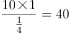，所以甲单独完成这项工程需要40天。

根据题目工作过程，完成总工程的一半时，甲队工作14天且乙队工作4天，即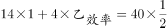，解得。后面甲乙继续合作完成剩下的一半工程还需要天，故按照这种进度完成全部工程的时间为天。

则题目所求少用的天数为天。

方法二：根据题意，甲10天可完成总工程的，则剩下工程的若由甲单独完成需要30天；现甲乙合作4天完成了总量的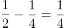，则剩下工程的若由甲乙合作完成共需要；则题目所求少用的天数为天。

故正确答案为A。

---

### 第 9 题　qid 2187545 · 数学运算

王老师将天然蜂蜜和矿泉水混合成蜂蜜水，现有一瓶浓度为的蜂蜜水100克，如果需要将蜂蜜水的浓度提高，需加入天然蜂蜜克和矿泉水克，那么后加入的蜂蜜是原来的：

- **A**. 2倍
- **B**. 1.5倍
- **C**. 1倍
- **D**. 2.5倍　✅

**答案**：D

**官方解析**

方法一：根据题干可得，的蜂蜜水中原有蜂蜜重量为克，水的重量为克；加入克蜂蜜和克水后，浓度提高，列式：，解得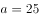克，则后加入的蜂蜜是原来的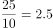倍。

方法二：原蜂蜜水浓度为，蜂蜜水为100g，原蜂蜜的量为克。后加入的蜂蜜水浓度为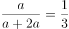，二者混合之后的浓度为，根据线段法，距离与量成反比。

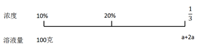

则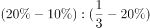，解得克，即后加入蜂蜜的量为25克，题目所求倍数为倍。

故正确答案为D。

---

## 判断推理

### 第 1 题　qid 2187456 · 定义判断

噪光，是指环境中超过人体的生理承受范围，使人感到厌烦，进而对人的心理或生理健康产生一定影响乃至危害的光辐射现象。
根据上述定义，下列不属于噪光的是：

- **A**. 调酒师在酒吧工作时，在旋转灯、魔球灯的彩光照射下，他感觉头晕恶心
- **B**. 行人在街上行走时，路边建筑物的单向透视玻璃反射阳光，使他感觉目眩
- **C**. 司机在驾驶过程中，车辆灯光照射到玻璃幕墙上形成反光，使他产生幻觉
- **D**. 建筑工人在施工时，在阳光下操作起重机升降的过程中，他感觉光线耀眼　✅

**答案**：D

**官方解析**

第一步：找出定义关键词。
“环境中超过人体的生理承受范围”、“使人感到厌烦”、“对人的心理或生理健康产生一定影响乃至危害的光辐射现象”。
第二步：逐一分析选项。
A项：旋转灯、魔球灯的彩光照射是光辐射现象，调酒师在彩光照射下感觉头晕恶心，符合“超过人体的生理承受范围、对人的心理或生理健康产生一定影响乃至危害”，符合定义，排除；
B项：路边建筑物的单向透视玻璃反射的阳光是光辐射现象，行人感觉目眩，符合“超过人体的生理承受范围、对人的心理或生理健康产生一定影响乃至危害”，符合定义，排除；
C项：车辆灯光照射到玻璃幕墙上形成的反光是光辐射现象，司机产生幻觉符合“超过人体的生理承受范围、对人的心理或生理健康产生一定影响乃至危害”，符合定义，排除；
D项：阳光是光辐射现象，建筑工人在施工中感觉光线耀眼，但没有明确说明光线耀眼是否“对人的心理或生理健康产生一定影响乃至危害”，不符合定义，当选。
本题为选非题，故正确答案为D。

---

### 第 2 题　qid 2187458 · 定义判断

反向谬论，是指依据某观点若成立（或不成立）所产生的结果好坏，来判断一个观点是否正确的一种逻辑错误。
根据上述定义，下列存在反向谬论的是：

- **A**. 因为你迟到，客户生气了，公司损失一个大合同，所以都是你的错
- **B**. 尽管担心加税会对选民生活产生不利影响，政治家仍表示支持加税
- **C**. 如果你不听我的话，我就会扣你的零用钱，所以你听我的话是对的　✅
- **D**. 自从做眼保健操以来，我的视力急剧地下降，可见做眼保健操不好

**答案**：C

**官方解析**

第一步：找出定义关键词。
“依据某观点若成立（或不成立）所产生的结果好坏 ”、“判断一个观点是否正确”。
第二步：逐一分析选项。
A项：“因为你迟到，客户生气了”是已经发生的事情，不符合“某观点若成立（或不成立）”，不符合定义，排除； 
B项：加税会对选民生活产生不利影响，符合“某观点若成立（或不成立）所产生的结果”，但政治家仍支持加税，不是依据加税对生活产生不利影响而做出的判断，不符合定义，排除；
C项：“如果你不听我的话”符合“依据某观点若成立（或不成立）”，“我就会扣你的零用钱”是一个不好的结果，所以得出“你听我的话是对的”的结论，符合“依据某观点产生的结果来判断一个观点是否正确”，符合定义，当选；
D项：“做眼保健操视力下降”是已经发生的事情，不符合“某观点若成立（或不成立）”，不符合定义，排除。
故正确答案为C。

---

### 第 3 题　qid 2187474 · 定义判断

墙面色彩的确定，首先要考虑房间的朝向。南向和东向的房间，光照充足，墙面宜采用浅蓝、浅绿等冷色调；北向房间，墙面应以奶黄等暖色调为主。墙面的色彩对于家具起背景衬托作用，所以宜用浅色调。另外，宽敞的房间采用暖色装修，可以避免给人以空旷感；面积小的房间采用冷色装修，在视觉上让人感觉大一些。
下列最符合上述室内色彩设计基本原则的是：

- **A**. 南向的大餐厅，墙面使用浅蓝色
- **B**. 北向的小卧室，墙面使用浅蓝色
- **C**. 东向的小书房，墙面使用浅绿色　✅
- **D**. 西向的大客厅，墙面使用深蓝色

**答案**：C

**官方解析**

第一步：找出定义关键词。
室内色彩设计基本原则：“南向和东向的房间，墙面宜采用浅蓝、浅绿等冷色调”、“北向房间，墙面应以奶黄等暖色调为主”、“宽敞的房间采用暖色装修”、“面积小的房间采用冷色装修”。
第二步：逐一分析选项。
A项：南向的大餐厅，墙面使用浅蓝色，符合“南向和东向的房间，墙面宜采用浅蓝、浅绿等冷色调”，但大餐厅是宽敞的房间不符合“宽敞的房间采用暖色装修”，不符合定义，排除； 
B项：北向的小卧室，墙面使用浅蓝色，不符合“北向房间，墙面应以奶黄等暖色调为主”，不符合定义，排除；
C项：东向的小书房，墙面使用浅绿色，符合“南向和东向的房间，墙面宜采用浅蓝、浅绿等冷色调”，小书房是面积小的房间符合“面积小的房间采用冷色装修”，符合定义，当选；
D项：西向的大客厅，墙面使用深蓝色，不符合“宽敞的房间采用暖色装修”，不符合定义，排除。
故正确答案为C。

---

### 第 4 题　qid 2187480 · 定义判断

众数是一组数据中出现次数最多的一个数据。平均数是一组数据中表示平均每份的数量。中位数是一组数据按大小顺序排列，位于最中间的一个数据。
根据上述定义，下列说法错误的是：

- **A**. 平均数说明的是整体的平均水平，中位数说明的是生活中的中等水平
- **B**. 日常生活中诸如“最佳”“最受欢迎”的评选，一般都与众数有关系
- **C**. 平均数通过计算得出，中位数通过排序得出，众数是通过计数得出的
- **D**. 个别极端数据对平均数的影响不明显，对众数和中位数的影响则较大　✅

**答案**：D

**官方解析**

第一步：找出定义关键词。
众数：“一组数据中出现次数最多的一个数据”；
平均数：“一组数据中表示平均每份的数量”；
中位数：“一组数据按大小顺序排列，位于最中间的一个数据”。
第二步：逐一分析选项。
A项：平均数是一组数据中表示平均每份的数量，可以说明整体的平均水平，中位数指的是最中间的一个数据，可以说明生活中的中等水平，该项说法正确，排除； 
B项：日常生活中“最佳”“最受欢迎”的评选，通常是得票数最多的人，即这些人在评选计票中出现的次数是最多的，符合“众数”定义，该项说法正确，排除；
C项：平均数是指一组数据中所有数据之和除以数据的份数得出的数量，需要进行计算才能得到；中位数是指一组数据按大小顺序排列，位于最中间的一个数据，需要进行排序才能得到；众数是指一组数据中出现次数最多的一个数据，需要进行计数才能得到，该项说法正确，排除；
D项：平均数是指一组数据中所有数据之和除以数据的份数得出的数量，所以容易受到极端数据的影响；众数是指一组数据中出现次数最多的一个数据，只受数据出现的次数的影响；中位数是指一组数据按大小顺序排列，位于最中间的一个数据，只受数据所处的位置顺序的影响，所以也不受极端数据的影响，该项说法错误，当选。
本题为选非题，故正确答案为D。

---

### 第 5 题　qid 2187484 · 定义判断

众包，是指公司或者机构把原来由员工执行的工作任务，以自愿的形式外包给非特定大众网络的一种合作模式。
根据上述定义，下列属于众包的是

- **A**. 某公司面向网络平台上的广大汽车爱好者，募集合作者，专门为公司研发的一款新型概念车进行功能定义和命名　✅
- **B**. 高校教师小王为了参加一场业余模特大赛，通过微信联系了高中同学小丽，请她帮忙设计了一套漂亮的参赛服装
- **C**. 以系统研发为核心竞争力的软件公司M，雇用了另一家网站开发实力较强的H公司，为自己公司进行网站架构
- **D**. 美国芝加哥的某T恤公司拥有一个庞大的T恤爱好者网络社区，每天都会收到不同爱好者发来的大量交流信息

**答案**：A

**官方解析**

第一步：找出定义关键词。
“公司或机构”、“把原来由员工执行的工作任务，以自愿的形式外包给非特定大众网络”。
第二步：逐一分析选项。
A项：为研发的新型概念车进行功能定义和命名原本是由员工执行的工作任务，公司面向网络平台募集合作者为其进行功能定义和命名，符合“外包给非特定大众网络”，符合定义，当选；
B项：教师小王不是公司或机构，是一个独立的个体，不符合定义，排除；
C项：软件公司M雇用另一家H公司工作，另一家H公司是特定的群体，不符合“非特定大众网络”，不符合定义，排除；
D项：某T恤公司收到爱好者发来的交流信息，不符合“把原来由员工执行的工作任务，以自愿的形式外包给非特定大众网络”，不符合定义，排除。
故正确答案为A。

---

### 第 6 题　qid 2187488 · 定义判断

稻草人谬误，是指反驳者在没有任何证据或推理可用时，偷换对方的论点，然后把这个论点当作是对方的论点加以推翻的一种逻辑错误。
根据上述定义，下列反驳中存在稻草人谬误的是：

- **A**. 
正方：心灵美比外表美更重要。

反方：你是说你愿意娶一个奇丑的女人？多么荒谬！
　✅
- **B**. 
正方：“距离产生美”这句话正确吗？

反方：那你说，如果距离不产生美，那能产生什么？

- **C**. 
正方：某大学开设了炒作学专业，所以炒作是有益的。

反方：某大学还开设了犯罪学专业呢！犯罪也有益？

- **D**. 
正方：请对方辩友正面回答我的问题！

反方：对方的观点根本就是无稽之谈，不需要回答。

**答案**：A

**官方解析**

第一步：找出定义关键词。
“偷换对方的论点”、“把这个论点当作是对方的论点加以推翻”。
第二步：逐一分析选项。
A项：正方的观点是围绕心灵美和外表美论述，反方把正方的观点偷换为外表美不重要然后对其加以反驳，符合“偷换对方观点”，符合定义，当选；
B项：正方为提出一个疑问，反方的观点是围绕距离是否产生美展开论述，不符合“偷换对方观点”，不符合定义，排除；
C项：正方的观点是围绕炒作是否有益展开论述，反方是将一个不相干的话题插进来，从而把读者或者听众的注意力转移到另一个论题上，这是红色鲱鱼谬误，而不是稻草人谬误，不符合定义，排除； 
D项：反方只是说对方的观点是无稽之谈，直接否定正方观点，不符合“偷换对方的论点”，不符合定义，排除。
故正确答案为A。

---

### 第 7 题　qid 2187497 · 逻辑判断

哲学家史蒂芬·图尔敏认为：一个清晰完整的论证包括六个部分：主张、根据、担保、反驳、佐证和强度。六个部分之间的关系如下：

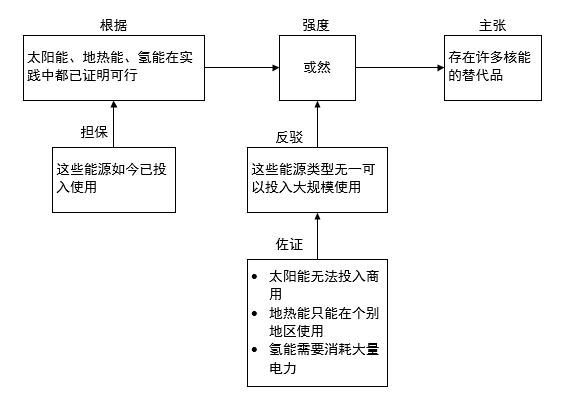

根据上图，下列说法错误的是：

- **A**. 强度用以评估主张的可靠程度
- **B**. 佐证是支持担保的事实或理由　✅
- **C**. 根据及其担保是论证的出发点
- **D**. 反驳旨在削弱对方主张可信度

**答案**：B

**官方解析**

第一步：找出题干关键信息。
题干是以具体例子的形式来展示论证六个部分。
主张：存在许多核能的替代品。
根据：太阳能、地热能、氢能在实践中都已经证明可行。
担保：这些能源如今已经投入使用。
强度：或然。
反驳：这些能源类型无一可以投入大规模使用。
佐证：太阳能无法投入商用；地热能只能在个别地区使用；氢能需要消耗大量电力。
第二步：逐一分析选项。
A项：根据导图可知强度直接指向主张，强度由根据、担保和反驳、佐证综合起来共同决定，用以评估主张的可靠程度，符合题干，排除；
B项：根据导图可知佐证直接指向反驳，佐证是用以支持反驳的事实或理由，而不是支持担保，不符合题干，当选；
C项：根据导图可知担保和根据最终指向的是主张，担保和根据是支持主张的，是论证的出发点，符合题干，排除；
D项：根据导图可知反驳最终指向的是主张，反驳属于削弱主张的，因此可以削弱对方主张可信度，符合题干，排除。
本题为选非题，故正确答案为B。

---

### 第 8 题　qid 2187499 · 定义判断

遥感物探，是指在距离相当遥远的位置上，用各种传感器探知地面物体辐射（或反射）的电磁波信息，以查明地质的或地学的各种情况的方法。
根据上述定义，下列属于遥感物探的是：

- **A**. 医生用X光透视检查病人身体器官的病变
- **B**. 侦察兵利用探雷装置发现埋在地下的地雷
- **C**. 科学家通过“天眼”系统观测外太空星体
- **D**. 科学家用卫星对某沿海地区进行地质探测　✅

**答案**：D

**官方解析**

第一步：找出定义关键词。
“在距离相当遥远的位置上”、“用各种传感器探知地面物体辐射（或反射）的电磁波信息”、“查明地质的或地学的各种情况”。
第二步：逐一分析选项。
A项：医生用X光透视病人器官病变，不符合“在距离相当遥远的位置上”，医生是在检查身体，也不符合“查明地质的或地学的各种情况”，不符合定义，排除； 
B项：侦察兵排雷，不符合“在距离相当遥远的位置上”，也不符合“查明地质的或地学的各种情况”，不符合定义，排除；
C项：科学家通过天眼系统观测外太空星体，外太空星体不符合“地面物体”，这是进行外太空的探索，也不符合“查明地质的或地学的各种情况”，不符合定义，排除；
D项：科学家用卫星探测，符合“在距离相当遥远的位置上”，对沿海地区进行地质探测，符合“用各种传感器探知地面物体辐射（或反辐射）的电磁波信息”，也符合“查明地质的或地学的各种情况”，符合定义，当选。
故正确答案为D。

---

### 第 9 题　qid 2187503 · 定义判断

人为环境异常，是指一定地域范围内，因人类行为造成自然环境的某个或多个环境要素发生显著变化，破坏生态系统的相对平衡关系的现象。
根据上述定义，下列属于人为环境异常的是：

- **A**. 某地地下贮藏着丰富的石油资源，近日附近村庄的井水变得浑浊，并伴有刺鼻气味，经检测含有大量重金属，不宜饮用
- **B**. 某地因地震出现地表下陷，暴雨过后，部分区域严重积水，致使这些区域农田里的农作物、果园里的果树发生烂根枯萎
- **C**. 某地沿河工业园区近来订单大量增加，废水排放量也随之激增，结果造成河流下游的鱼虾大量死亡，沿岸庄稼成片枯死　✅
- **D**. 某地火山爆发喷出的有毒元素散落到地表，改变了土壤中原有化学成分，形成了高氟、高汞的土壤，影响了作物的生长

**答案**：C

**官方解析**

第一步：找出定义关键词。
“因人类行为造成自然环境的某个或多个环境要素发生显著变化”、“破坏生态平衡”。
第二步：逐一分析选项。
A项：某地地下贮藏石油，近日井水变浑浊，含有大量重金属，未提及其水质变坏的原因，不符合“因人类行为造成自然环境的某个或多个环境要素发生显著变化”，不符合定义，排除；
B项：因地震出现下陷，导致积水以及作物果树烂根枯萎，不符合“因人类行为造成自然环境的某个或多个环境要素发生显著变化”，不符合定义，排除；
C项：工业园订单增加，废水排放量激增，造成鱼虾死亡，庄稼成片枯死，符合“因人类行为造成自然环境的某个或多个环境要素发生显著变化”，也符合“破坏生态平衡”，符合定义，当选；
D项：因火山爆发，喷出有毒元素影响作物生长，不符合“因人类行为造成自然环境的某个或多个环境要素发生显著变化”，不符合定义，排除。
故正确答案为C。

---

### 第 10 题　qid 2187508 · 定义判断

光的散射，是指太阳光射入大气层后，跟空气分子相撞，向四面八方散去的现象。其中，由大气中烟、尘埃、小水滴及气溶胶等较大的颗粒引起的散射，被称之为米氏散射。米氏散射的特征是所有波长的光均等发生散射，混合在一起，从而呈现白色。
根据上述定义，下列属于米氏散射的是：

- **A**. 赤红色的晚霞
- **B**. 蓝色海水
- **C**. 七色彩虹
- **D**. 正午晴空的云　✅

**答案**：D

**官方解析**

第一步：找出定义关键词。
“所有波长的光均等发生散射，混合在一起，从而呈现白色”。
第二步：逐一分析选项。
A项：赤红色晚霞，红色不符合“呈现白色”，不符合定义，排除；
B项：蓝色海水，蓝色不符合“呈现白色”，不符合定义，排除；
C项：七色彩虹，彩色不符合“呈现白色”，不符合定义，排除；
D项：正午晴空的云，云是白色的，符合“呈现白色”，符合定义，当选。
故正确答案为D。

---

### 第 11 题　qid 2187426 · 类比推理

缺锌：生长迟缓

- **A**. 成年：参加选举
- **B**. 吃药：感冒痊愈
- **C**. 迁徙：季节变化
- **D**. 加热：温度升高　✅

**答案**：D

**官方解析**

第一步：判断题干词语间逻辑关系。
缺锌导致生长迟缓，二者为因果对应关系。
第二步：判断选项词语间逻辑关系。
A项：成年是参加选举的必要条件而不是参加选举的原因，与题干逻辑关系不一致，排除；
B项：吃感冒药可以导致感冒痊愈，但题干只是说吃药，太过笼统，所以题干两词无必然逻辑关系，与题干逻辑关系不一致，排除；
C项：季节变化导致迁徙，二者为因果对应关系，但两词顺序与题干相反，与题干逻辑关系不一致，排除；
D项：加热可以导致温度升高，二者为因果对应关系，与题干逻辑关系一致，当选。
故正确答案为D。

---

### 第 12 题　qid 2187428 · 类比推理

丝竹：音乐

- **A**. 汗青：史册　✅
- **B**. 烽烟：干戈
- **C**. 学生：桃李
- **D**. 战争：戎马

**答案**：A

**官方解析**

第一步：判断题干词语间逻辑关系。
丝竹借指音乐，二者为比喻象征义。
第二步：判断选项词语间逻辑关系。
A项：汗青借指史册，二者为比喻象征义，与题干逻辑关系一致，当选；
B项：烽烟是火台报警之烟，借指战争，干戈是兵器的通称，借指战争，二者为并列关系，与题干逻辑关系不一致，排除；
C项：桃李比喻学生，二者为比喻象征义，但两词顺序与题干相反，与题干逻辑关系不一致，排除；
D项：戎马可以比喻象征战争，但是两词顺序与题干相反，与题干逻辑关系不一致，排除。
故正确答案为A。

---

### 第 13 题　qid 2187430 · 类比推理

若明若暗：雾里看花

- **A**. 如醉如梦：一清二楚
- **B**. 如日中天：日薄西山
- **C**. 如火如荼：无声无息
- **D**. 如履薄冰：如临深渊　✅

**答案**：D

**官方解析**

第一步：判断题干词语间逻辑关系。
若明若暗，比喻对情况的了解或对问题的认识不清楚；雾里看花，比喻对事物看不真切，二者为近义关系。
第二步：判断选项词语间逻辑关系。
A项：如醉如梦形容处于不清醒、迷糊状态中，一清二楚形容对事物十分了解，二者无必然逻辑关系，与题干逻辑关系不一致，排除；
B项：如日中天比喻事物正发展到十分兴盛的阶段，日薄西山比喻腐朽的事物衰败接近灭亡，二者为反义关系，与题干逻辑关系不一致，排除；
C项：如火如荼形容旺盛、热烈或激烈，无声无息比喻没有名声不被人知道，二者无必然逻辑关系，与题干逻辑关系不一致，排除；
D项：如履薄冰和如临深渊均比喻行事极为谨慎，存有戒心，二者为近义关系，与题干逻辑关系一致，当选。
故正确答案为D。

---

### 第 14 题　qid 2187431 · 类比推理

单价：数量：总价

- **A**. 现状：问题：方案
- **B**. 被除数：除数：商
- **C**. 本金：利息：利率
- **D**. 速度：时间：路程　✅

**答案**：D

**官方解析**

第一步：判断题干词语间逻辑关系。
单价乘以数量等于总价，三者为对应关系。
第二步：判断选项词语间逻辑关系。
A项：现状中存在问题，方案是解决问题的手段，与题干逻辑关系不一致，排除；
B项：商乘以除数等于被除数，但三词顺序与题干不同，与题干逻辑关系不一致，排除；
C项：本金乘以利率等于利息，但三词顺序与题干不同，与题干逻辑关系不一致，排除；
D项：速度乘以时间等于路程，与题干逻辑关系一致，当选。
故正确答案为D。

---

### 第 15 题　qid 2187433 · 类比推理

漫画：推理漫画：连环漫画

- **A**. 大气：对流层：中间层
- **B**. 离子：阳离子：阴离子
- **C**. 可见光：红光：紫光
- **D**. 文物：馆藏文物：史前文物　✅

**答案**：D

**官方解析**

第一步：判断题干词语间逻辑关系。
推理漫画和连环漫画都是漫画的一种，为包容关系中的种属关系，且推理漫画和连环漫画为交叉关系。
第二步：判断选项词语间逻辑关系。
A项：对流层和中间层都是大气的组成部分，为并列关系，且对流层和中间层为并列关系中的反对关系，与题干逻辑关系不一致，排除；
B项：阳离子和阴离子都是离子的一种，为包容关系中的种属关系，且阳离子和阴离子为并列关系中的矛盾关系，与题干逻辑关系不一致，排除；
C项：红光和紫光都是可见光的一种，为包容关系中的种属关系，且红光和紫光为并列关系中的反对关系，与题干逻辑关系不一致，排除；
D项：馆藏文物和史前文物都是文物的一种，为包容关系中的种属关系，且馆藏文物和史前文物为交叉关系，与题干逻辑关系一致，当选。
故正确答案为D。

---

### 第 16 题　qid 2187436 · 类比推理

我：认识：你

- **A**. 尔：就是：你
- **B**. 他：喜欢：她　✅
- **C**. 八：大于：六
- **D**. 你：矮于：她

**答案**：B

**官方解析**

第一步：判断题干词语间逻辑关系。
我认识你，三者为主谓宾结构，且“我”和“你”是人称代词，“认识”为动词。
第二步：判断选项词语间逻辑关系。
A项：尔就是你，三者为主谓宾结构，但“就是”为副词，与题干逻辑关系不一致，排除；
B项：他喜欢她，三者为主谓宾结构，且“他”和“她”为人称代词，“喜欢”为动词，与题干逻辑关系一致，当选；
C项：八大于六，三者不是主谓宾结构，与题干逻辑关系不一致，排除；
D项：你矮于她，三者不是主谓宾结构，与题干逻辑关系不一致，排除。
故正确答案为B。

---

### 第 17 题　qid 2187437 · 类比推理

经理：法官：公务员

- **A**. 农具：沙发：家具　✅
- **B**. 原告：被告：当事人
- **C**. 总统：明星：演员
- **D**. 蛋白质：花岗岩：无机物

**答案**：A

**官方解析**

第一步：判断题干词语间逻辑关系。
法官是公务员的一种，后两者是种属关系，经理和公务员是并列关系。
第二步：判断选项词语间逻辑关系。
A项：沙发是家具的一种，后两者是种属关系，农具和家具是并列关系，与题干逻辑关系一致，当选；
B项：原告和被告两者是并列关系，都是当事人的一种，前两词与第三词均为种属关系，与题干逻辑关系不一致，排除；
C项：有的演员是明星，有的演员不是明星，演员和明星是交叉关系，与题干逻辑关系不一致，排除；
D项：花岗岩是混合物，不是无机物，两者不是种属关系，且蛋白质与无机物不是并列关系，与题干逻辑关系不一致，排除。
故正确答案为A。

---

### 第 18 题　qid 2187439 · 类比推理

声母：韵母：声调

- **A**. 满族：汉族：白族
- **B**. 比拟：拟人：拟物
- **C**. 本体：喻体：喻词　✅
- **D**. 车轮：车胎：车门

**答案**：C

**官方解析**

第一步：判断题干词语间逻辑关系。
声母是使用在韵母前面的辅音，跟韵母共同构成一个完整的音节，声调是标注在韵母上部的汉字读音声调。三者为并列关系，且声母、韵母和声调三者共同构成一个汉字的读音。
第二步：判断选项词语间逻辑关系。
A项：满族、汉族和白族均是一个民族，三者之间是并列关系，但三个词不能构成一个完整的事物，与题干逻辑关系不一致，排除；
B项：比拟就是把一个事物当作另外一个事物来描述、说明。比拟可以分为拟人、拟物两类，后两词与第一词为种属关系，与题干逻辑关系不一致，排除；
C项：喻词是指本体和喻体之间的连接词，利用本体和喻体在某一方面的相似点来打比方，就构成了比喻。三者为并列关系，且本体、喻体和喻词三者共同构成了一个比喻，与题干逻辑关系一致，当选；
D项：车轮、车胎和车门均是车辆的一部分，三者之间是并列关系，但三个词不能构成一个完整的事物，与题干逻辑关系不一致，排除。
故正确答案为C。

---

### 第 19 题　qid 2187440 · 类比推理

（    ）对于 冶炼  相当于  创作 对于（    ）

- **A**. 工人  作品
- **B**. 提纯  表演
- **C**. 矿物  作者
- **D**. 选矿  发表　✅

**答案**：D

**官方解析**

逐一代入选项。
A项：工人冶炼，二者是主谓结构；创作作品，二者是动宾结构，前后逻辑关系不一致，排除；
B项：冶炼和提纯都是一种提炼工艺，二者为并列关系；创作和表演是交叉关系，前后逻辑关系不一致，排除；
C项：冶炼矿物，二者是动宾结构；作者创作，二者是主谓结构，前后逻辑关系不一致，排除； 
D项：先选矿后冶炼，二者存在时间先后顺序，是对应关系；先创作后发表，二者存在时间先后顺序，是对应关系，前后逻辑关系一致，当选。
故正确答案为D。

---

### 第 20 题　qid 2187441 · 类比推理

（    ）对于 社会科学  相当于  蝗虫 对于（    ）

- **A**. 物理学  蜻蜓
- **B**. 经济学  昆虫　✅
- **C**. 自然科学  害虫
- **D**. 超声波  大雁

**答案**：B

**官方解析**

逐一代入选项。
A项：物理学属于自然科学，与社会科学无逻辑关系，蜻蜓和蝗虫都是昆虫，二者是并列关系，前后逻辑关系不一致，排除；
B项：经济学是社会科学的一种，二者是种属关系，蝗虫是昆虫的一种，二者是种属关系，前后逻辑关系一致，当选；
C项：自然科学和社会科学都是科学的一类，二者是并列关系，蝗虫是害虫的一种，二者是种属关系，前后逻辑关系不一致，排除；
D项：超声波是声波的一种，和社会科学无明显逻辑关系，蝗虫和大雁都是一种动物，二者是并列关系，前后逻辑关系不一致，排除。
故正确答案为B。

---

### 第 21 题　qid 2187457 · 逻辑判断

《英国医学杂志》发表的一篇研究成果显示：吃白米饭最多的人和最少的人相比，患糖尿病的风险会增加。有人据此得出结论，多吃白米饭易患糖尿病。

以下哪项如果为真，最能削弱上述结论？

- **A**. 遗传等其他多种因素，也会增加患糖尿病风险
- **B**. 长期不吃或者少吃主食的人，也容易患糖尿病
- **C**. 白米饭缺少人体每天所需的膳食纤维等营养素
- **D**. 吃白米饭多的人，其他类型食物的摄入量也高　✅

**答案**：D

**官方解析**

第一步：找出论点和论据。
论点：多吃白米饭易患糖尿病。
论据：吃白米饭最多的人和最少的人相比，患糖尿病的风险会增加。
第二步：逐一分析选项。
A项：论点说的是多吃白米饭易患糖尿病，该项说的是遗传等其他因素与糖尿病的关系，话题不一致，无法削弱，排除；
B项：题干说吃米饭多的人容易患糖尿病，而B项说长期不吃或少吃主食的人也容易患糖尿病，米饭和主食不是同一个概念，题干与选项讨论的主体不一致，为无关选项，排除；
C项：该项主要描述白米饭缺少一些营养素，而这些营养素与患糖尿病的关系并不确定，属于无关项，无法削弱，排除； 
D项：论点说的是吃白米饭易患糖尿病，该项说的是除了吃白米饭多，其他类型食物吃的也多，说明吃白米饭的人还有别的致病风险，属于他因削弱，当选。
故正确答案为D。

---

### 第 22 题　qid 2187466 · 逻辑判断

近年来，很多学生选择了去海外留学。他们认为镀金可以为未来就业增加竞争力。然而，《2017海归就业力调查报告》中的数据显示：海归回国求职并不容易，的海归认为自己在就业中存在一定劣势。

以下哪项如果为真，最能解释上述现象：

- **A**. 海归身份的受欢迎程度与行业有较大的关系
- **B**. 多数海归不熟悉国内的就业形势与企业需求　✅
- **C**. 大部分海归的实际薪资水平达不到其期望值
- **D**. 牛津等海外名校毕业生依然受到雇主的青睐

**答案**：B

**官方解析**

第一步：找出题干矛盾。 镀金可以为未来就业增加竞争力，但海归回国求职并不容易，的海归认为自己在就业中存在一定劣势。 第二步：逐一分析选项。 A项：只是说海归受欢迎程度与行业有较大关系，无法解释海归在就业中存在劣势的原因，不能解释题干矛盾，排除； B项：海归们不熟悉就业形势和企业需求，因此即使镀金增加了竞争力，在就业中也会存在一定劣势，可以解释题干矛盾，当选； C项：就业后的薪资待遇问题与题干讨论的就业时是否存在劣势没有关系，不能解释题干矛盾，排除；  D项：牛津等名校毕业生受雇主青睐，说明海归在就业中存在优势，不能解释题干矛盾，排除。 故正确答案为B。

---

### 第 23 题　qid 2187471 · 类比推理

昨天你们IT部门进行了一次服务器升级，晚上我的电脑就不能开机了，你们能不能把服务器恢复原状？
以下归因方式与题干最相似的是：

- **A**. 琼斯总统提高了税收，暴力犯罪数量随之上升，因此，不应当提高税收　✅
- **B**. 物价上涨是通货膨胀的主要原因，所以控制住物价，就抑制了通货膨胀
- **C**. 作为家长，不能让孩子输在起跑线上，所以请选择小星星幼儿智力开发
- **D**. 你要是不好好念书，将来就考不上大学，找不着工作，我看你该怎么办

**答案**：A

**官方解析**

第一步：分析题干。
题干叙述了两个先后发生的事件，服务器升级先发生，电脑不能开机后发生，进而得出服务器升级是电脑不能开机的原因的结论。而先后发生的这两个事件不一定存在着因果关系，题干在归因过程中犯了以时间先后为因果的谬误。
第二步：逐一分析选项。
A项：该项叙述了两个先后发生的事件，提高税收先发生，暴力犯罪数量上升后发生，进而得出提高税收是暴力犯罪数量上升的原因，同样是犯了以时间先后为因果的谬误，与题干归因方式一致，当选；
B项：该项直接论述物价上涨是通货膨胀的原因，不存在以时间先后为因果的情况，与题干归因方式不一致，排除；
C项：该项没有叙述两个先后发生的事件，也没有以时间先后为因果，与题干归因方式不一致，排除；
D项：该项讨论的是不好好学习和考不上大学，找不到工作之间的条件关系，考不上大学是以后可能会出现的情况，并没有讨论两个已经先后发生的事件之间是否存在因果关系，与题干归因方式不一致，排除。
故正确答案为A。

---

### 第 24 题　qid 2187477 · 逻辑判断

文化自信是主体对自身文化的认同、肯定和坚守。文化自觉是文化自信的前提，没有深刻的文化自觉，就不可能有高度的文化自信。没有高度的文化自信，就没有文化的繁荣昌盛，就没有中华民族的伟大复兴。
由上文推知，下列一定正确的是

- **A**. 没有文化的繁荣昌盛，就一定没有深刻的文化自觉
- **B**. 只要有了高度的文化自信，就会有文化的繁荣昌盛
- **C**. 没有深刻的文化自觉，就没有中华民族的伟大复兴　✅
- **D**. 有了高度的文化自信，就会有中华民族的伟大复兴

**答案**：C

**官方解析**

第一步：翻译题干。

①文化自信文化自觉

②文化的繁荣昌盛文化自信

③中华民族的伟大复兴文化自信

①和②可以递推出：④文化的繁荣昌盛文化自信文化自觉

①和③可以递推出：⑤中华民族的伟大复兴文化自信文化自觉

第二步：逐一分析选项。

A项：翻译为文化自觉文化的繁荣昌盛，是对④的肯后，但肯后得不到确定性的结论，推不出，排除；

B项：翻译为文化自信文化的繁荣昌盛，是对②的肯后，但肯后得不到确定性的结论，推不出，排除；

C项：翻译为中华民族的伟大复兴文化自觉，是对⑤的肯前，肯前必肯后，当选；

D项：翻译为文化自信中华民族的伟大复兴，是对③的肯后，但肯后得不到确定性的结论，推不出，排除。

故正确答案为C。

---

### 第 25 题　qid 2187485 · 逻辑判断

随着移动支付的普及和知识内容消费观念的逐渐养成，知识付费逐渐成为人们普遍接受的学习方式。自2015年以来，各种知识付费平台纷纷上线，用户数量快速增长。相关报告显示，2017年我国知识内容付费用户规模达1.88亿人，知识付费正在成为人们从海量信息中突围的利器。
以下哪项如果为真，最能解释上述现象：

- **A**. 知识付费可以随时满足广大网友广泛的兴趣爱好
- **B**. 当代青年人对于新知识和新技能的渴求日趋提高
- **C**. 知识付费能满足人们低门槛、高效率的学习需要　✅
- **D**. 粉丝可以通过知识付费方式随时向知识偶像请教

**答案**：C

**官方解析**

第一步：找出题干现象。
现象：随着移动支付的普及和知识内容消费观念的逐渐养成，知识付费逐渐成为人们普遍接受的学习方式，正在成为人们从海量信息中突围的利器。
第二步：逐一分析选项。 
A项：知识付费可以随时满足广大网友广泛的兴趣爱好，所以知识付费可以让人们从海量信息中突围，可以解释上述现象，保留；
B项：题干并未提到“新知识和新技能”，知识付费所获取的知识是否涉及“新知识和新技能”不确定，不能解释上述现象，排除；
C项：知识付费能满足人们低门槛、高效率的学习需要，说明知识付费与学习高度相关，可以让人们从海量信息中突围，可以解释上述现象，保留；
D项：粉丝与偶像都是特定的群体，范围较小，不能很好地解释上述现象，排除。
比较A、C选项，A项说的是兴趣爱好，C项说的是学习，正好对应了题干中的“学习方式”，和原文更为贴近，所以C项更能解释题干现象。
故正确答案为C。

---

### 第 26 题　qid 2187445 · 逻辑判断

脊髓性肌萎缩症是一种罕见的致死性遗传病，大多数患儿活不到20个月。近日，有研究人员使用一种新的基因疗法，研发了一种生物技术药物Spinraza，通过在患者脊髓周边注射给药，Spinraza使73名受试患者中的近一半患者不同程度的恢复了运动机能。研究人员据此得出结论：这种新的基因疗法将为脊髓性肌萎缩症的治疗带来突破性进展。
以下哪项如果为真，最能支持上述论证

- **A**. 该项研究的具体程序设计较为科学合理
- **B**. 这种基因疗法也可用于其他疾病的治疗
- **C**. 美国药监局已经批准了这一新药的上市
- **D**. 对照组的所有患者都没有恢复运动机能　✅

**答案**：D

**官方解析**

第一步：找出论点和论据。
论点：这种新的基因疗法将为脊髓性肌萎缩症的治疗带来突破性发展。
论据：有研究人员使用一种新的基因疗法，研发出一种生物技术药物Spinraza，通过在患者脊髓周边注射给药，Spinraza使73名受试患者中的近一半患者不同程度的恢复了运动机能。
本题论据讨论的是“一种新的基因疗法使73名受试患者中的近一半患者不同程度的恢复了运动机能”，论点是基于此得出的“这种新的基因疗法将为脊髓性肌萎缩症的治疗带来突破性发展”，二者话题一致，加强优先考虑补充论据。
第二步：逐一分析选项。
A项：该项研究的具体程序设计较为科学合理，说明该研究是科学的，加强论据，保留；
B项：该基因疗法可用于其他疾病的治疗，与脊髓性肌萎缩症的治疗无关，不能支持，排除；
C项：新药获批上市，说明新药被允许使用，但是对治疗脊髓性肌萎缩症是否有效果，以及是否能为脊髓性肌萎缩症的治疗带来突破性发展都不明确，无法支持，排除；
D项：对照组的所有患者都没有恢复运动机能，补充了对照实验，通过实验结论对比能得出“新的基因疗法将为脊髓性肌萎缩症的治疗带来突破性发展”，保留。
比较A、D两项，A项证明了论据为真，而D项证明了论点为真，D项的加强力度要强于A项，当选。
故正确答案为D。

---

### 第 27 题　qid 2187455 · 逻辑判断

在一场关于“传承和创新哪个更重要”的辩论赛中，正方和反方进行了激烈的辩论。正方二辩在发言中提出一种观点：“先后性就等于重要性。”
作为对上述观点的反驳，以下最为有力的是

- **A**. 吃一碗面，加点醋是必要的。但你说是以吃面为主，还是以吃醋为主？
- **B**. 我必须先拧开瓶盖，才能喝到水。这不正说明拧瓶盖是必要的步骤吗？
- **C**. 正所谓“雄鸡一唱天下白”，但你总不能说天白就是雄鸡唱出来的吧！
- **D**. 我穿鞋时总习惯先穿左脚，再穿右脚，这就说明左脚比右脚更重要吗？　✅

**答案**：D

**官方解析**

第一步：找出论点和论据。
论点：先后性就等于重要性。
论据：无。
第二步：逐一分析选项。
A项：选项讨论的是吃醋与吃面哪个为主，没有体现先后性，话题不一致，无法削弱，排除；
B项：先拧开瓶盖，后能喝上水，强调了先后顺序，但拧开瓶盖是喝上水的必要环节不能说明拧开瓶盖就比喝上水更重要，无法削弱，排除；
C项：雄鸡一唱，天就白了，体现了先后顺序，但是天白不是雄鸡唱出来的，而且也没有涉及重要性的问题，与论点话题不一致，无法削弱，排除； 
D项：我穿鞋先穿左脚，再穿右脚，体现了先后性，选项用反问的方式说明先穿哪个脚并不重要，说明先后性并不等于重要性，削弱论点，当选。
故正确答案为D。

---

### 第 28 题　qid 2187459 · 逻辑判断

有研究人员收集合并了30项纵向干预研究，其中11项评估了上涨不健康食品价格的影响，19项评估了降低健康食物价格的影响。合并分析结果显示，利用价格引导人们消费健康食品，有助于人们改进饮食习惯，对公共健康是有好处的。
以下哪项如果为真，能够削弱上述结论

- **A**. 
含糖饮料价格的变化，会影响人们的身体质量指数（BMI）

- **B**. 
不健康快餐的价格每上涨，他们的销量就会下降

- **C**. 
水果和蔬菜的价格每降低，它们的销量就会增加

- **D**. 
食品和饮料价格的变化，只在短期内影响消费者购买行为
　✅

**答案**：D

**官方解析**

第一步：找出论点和论据。
论点：利用价格引导人们消费健康食品，有助于人们改进饮食习惯，对公共健康是有好处的。
论据：无。
第二步：逐一分析选项。
A项：含糖饮料价格的变化影响人们的身体BMI，这里的价格到底是怎么提高还是降低不明确，影响身体BMI也不知是否改进饮食习惯，无法削弱，排除；
B项：不健康快餐价格上涨，其销量会下降，人们因为价格而少买不健康食品，是加强项，无法削弱，排除；
C项：水果和蔬菜的价格降低，其销量会增加，人们因为价格而多买水果和蔬菜，是加强项，无法削弱，排除； 
D项：说明食品和饮料的变化，只在短期内影响购买行为，而论点说明的是改进饮食习惯，公共健康的问题，而这些都是长期形成的，无法通过价格的变化改进饮食习惯，削弱论点，当选。
故正确答案为D。

---

### 第 29 题　qid 2187467 · 类比推理

某企业拟开设4门培训课程：《企业文化培训》《劳动法培训》《商务礼仪培训》《销售培训》。员工甲乙丙丁4人各选修了其中一门课程。已知：
①他们4人选修的课程各不相同；
②法律专业毕业的丙选修的是非法律类课程；
③甲选修的不是《企业文化培训》就是《商务礼仪培训》。
补充以下哪个条件，能确定丙选修的是《销售培训》？

- **A**. 丁选修的不是《劳动法培训》
- **B**. 丁选修的是《企业文化培训》　✅
- **C**. 丁选修的是《劳动法培训》
- **D**. 丁选修的不是《销售培训》

**答案**：B

**官方解析**

第一步：分析题干已知信息。
①甲乙丙丁4人选修的课程各不相同，即四人各选修一门课程；
②法律专业毕业的丙选修的是非法律类课程，即丙只能选修三门课程中的一门；
③甲选修的课程只能在《企业文化培训》和《商务礼仪培训》中选择。
第二步：代入选项，逐一分析。
A项：如果丁选修的不是《劳动法培训》，那么丁只能选择《企业文化培训》、《商务礼仪培训》、《销售培训》三门课程中的一门，不能得到任何确定信息，也无法推导丙选修的是哪门课程，排除；
B项：如果丁选修的是《企业文化培训》，那么甲选修的肯定是《商务礼仪培训》，剩下的课程中只有《劳动法培训》和《销售培训》两门课程，已知丙不能选修法律类课程，所以丙只能选修《销售培训》，当选；
C项：如果丁选修的是《劳动法培训》，那么甲、丙所选修的课程不能确定，排除； 
D项：如果丁选修的不是《销售培训》，那么丁只能选择《企业文化培训》、《劳动法培训》、《商务礼仪培训》三门课程中的一门，但是不能判断甲、丙、丁 三人具体选修的是哪一门课程，排除。
故正确答案为B。

---

### 第 30 题　qid 2187475 · 逻辑判断

光镊是用高度会聚的激光束形成的三维势阱来俘获、操纵和控制微小颗粒的一项技术。与机械镊子相比，光镊是以非机械接触的方式来完成夹持和操纵细胞的，它先对目标细胞进行非接触式的捕获和固定，再对细胞进行精确的操作。因为光镊对细胞产生的损伤非常小，所以在生命科学研究中，几乎所有的单细胞操作都采用光镊的方式来进行操控。
由此可以推出：

- **A**. 所有对细胞进行精确操作的方法，对细胞的损伤都非常小
- **B**. 对目标细胞进行非接触式的捕获和固定只能使用光镊方式
- **C**. 几乎所有的非单细胞操作都不采用光镊的方式来进行操控
- **D**. 所有以机械接触方式来夹持和操纵细胞的都不是光镊方式　✅

**答案**：D

**官方解析**

日常结论题，根据题干信息逐一分析选项。
A项：题干中只提到了光镊对细胞产生的损伤非常小，且是一种非常精确操作的方法，并没有提到所有对细胞进行精确操作的方法，对细胞的损伤都非常小，属于无中生有，无法推出，排除；
B项：题干中只提到了光镊是以非机械接触的方式来完成夹持和操纵细胞，并没有说对目标细胞进行非接触式的捕获和固定只能使用光镊方式，无法推出，排除；
C项：题干中指出几乎所有的单细胞操作都采用光镊的方式来进行操控，并没有提及非单细胞的操控方式，属于无中生有，无法推出，排除；
D项：题干中指出光镊是以非机械接触的方式来完成夹持和操纵细胞的，可以推出以机械接触方式来夹持和操纵细胞的都不是光镊方式，当选。
故正确答案为D。

---

## 资料分析

### 材料 1

根据下面资料回答101-105题：

        2017年7月24日，国家新闻出版广电总局发布的《2016年新闻出版产业分析报告》指出，2016年全国出版、印刷和发行服务实现营业收入23595.8亿元，较2015年增加1939.9亿元，增长。其中，数字出版实现营业收入5720.85亿元，比2015年增长，对全行业营业收入增长贡献超三分之二。

        2016年，全国共出版图书、期刊、报纸、音像制品和电子出版物512.53亿册（份、盒、张）。其中，出版图书49.99万种，重版、重印23.75万种。

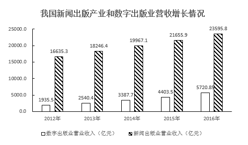

#### 第 1 题　qid 2187526 · 综合

2016年与2015年相比，我国新闻出版产业营业收入：

- **A**. 增量提高、增速变大　✅
- **B**. 增量减少、增速变大
- **C**. 增量提高、增速变小
- **D**. 增量减少、增速变小

**答案**：A

**官方解析**

根据题干“2016年与2015年相比，我国新闻出版产业营业收入”，结合选项“增量······，增速······”，可判定此题为增长量比较和增长率比较问题。定位材料中的统计图，2016年新闻出版产业营业收入为23595.8亿元，2015年新闻出版产业营业收入为21655.9亿元，2014年新闻出版产业营业收入为19967.1亿元，则2016年我国新闻出版产业营业收入的增量亿元，2015年我国新闻出版产业营业收入的增量亿元，所以2016年与2015年相比，我国新闻出版产业营业收入增量提高。2016年我国新闻出版产业营业收入的增速，2015年我国新闻出版产业营业收入的增速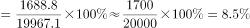，则2016年与2015年相比，我国新闻出版产业营业收入增速变大。

故正确答案为A。

---

#### 第 2 题　qid 2187528 · 综合

2016年我国图书重版、重印率约为：

- **A**. 

- **B**. 

- **C**. 

- **D**. 

　✅

**答案**：D

**官方解析**

根据题干“2016年我国图书重版、重印率约为”，可判定此题为现期比重问题。定位文字材料第二段“其中，出版图书49.99万种，重版、重印23.75万种”，根据比重公式：，可求得2016年我国图书重版、重印率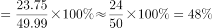，与D项最接近。

故正确答案为D。

---

#### 第 3 题　qid 2187530 · 综合

2016年我国音像制品出版业营业收入约为：

- **A**. 47亿元
- **B**. 28亿元　✅
- **C**. 12亿元
- **D**. 62亿元

**答案**：B

**官方解析**

根据题干“2016年我国音像制品出版业营业收入约为”，结合材料中统计表已知音像制品出版业营业收入所占比重，可判定此题为现期比重问题。定位文字材料第一段“2016年全国出版、印刷和发行服务实现营业收入23595.8亿元”和统计表中已知音像制品出版业营业收入所占比重为，根据比重公式：，可得2016年我国音像制品出版业营业收入约为亿元，与B项最接近。

故正确答案为B。

---

#### 第 4 题　qid 2187532 · 综合

2016年与2012年相比，我国数字出版业营收和新闻出版产业营收：

- **A**. 二者同步增长
- **B**. 后者增长快于前者
- **C**. 前者增长快于后者　✅
- **D**. 二者均出现下降态势

**答案**：C

**官方解析**

根据题干“2016年与2012年相比······”结合选项为增长率比较，可判定本题为一般增长率问题。定位材料统计图可得：数字出版业2016年营收5720.85亿元，2012年营收1935.5亿元；新闻出版业2016年营收23595.8亿元，2012年营收16635.5亿元。故2016年与2012年相比，我国数字出版业营收增长率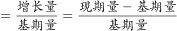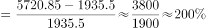，新闻出版业营收增长率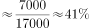，通过比较可得：2016年与2012年相比，我国数字出版业营收增长速度（）&gt;我国新闻出版业营收增长速度（）。

故正确答案为C。

---

#### 第 5 题　qid 2187533 · 综合

从上述资料中可以得出：

- **A**. 2012-2016年间，我国数字出版业营收增量保持增长势头　✅
- **B**. 2016年，对我国新闻出版产业营收增长贡献最大的是印刷复制业
- **C**. 2016年，我国数字出版业营收占新闻出版产业营收的比例超过三分之二
- **D**. 2016年图书出版物营收与电子出版物营收相当

**答案**：A

**官方解析**

A项：定位材料统计图，可知数字出版业营收增量为：2013年（）2014年（）2015年（）2016年（），可见增量保持增长势头，正确；

B项：定位材料第一段，可知2016年数字出版实现营业收入对全行业营业收入增长贡献（增长贡献率指部分增量在总体增量中所占的比例）超三分之二，则印刷复制业对全行业营业收入增长贡献，故印刷复制业对全行业营业收入增长贡献数字出版业对全行业营业收入增长贡献，错误；

C项：定位表格，可知2016年我国数字出版业营收占新闻出版产业营收的比例为，小于三分之二，错误；

D项：定位材料统计表，可知2016年图书出版物营收占比（）电子出版物营收占比（），故2016年图书出版物营收电子出版物营收，错误。

故正确答案为A。

备注：A项严格意义上来说需要用我国数字出版业2013年营收增量与2012年营收增量进行比较，虽无法求出2012年营收增量，但其他年份均满足，勉强符合“2012-2016年间，我国数字出版业营收增量保持增长势头”，加上其余三个选项均存在明显错误，综合考虑只能选择A项。

---
