# 2018年421联考《行测》题（四川卷）（网友回忆版）

> 联考 · 2018 年 · 6 个模块 · 共 100 题

- [政治理论](#%E6%94%BF%E6%B2%BB%E7%90%86%E8%AE%BA) · 2 题
- [常识判断](#%E5%B8%B8%E8%AF%86%E5%88%A4%E6%96%AD) · 13 题
- [言语理解与表达](#%E8%A8%80%E8%AF%AD%E7%90%86%E8%A7%A3%E4%B8%8E%E8%A1%A8%E8%BE%BE) · 30 题
- [数量关系](#%E6%95%B0%E9%87%8F%E5%85%B3%E7%B3%BB) · 10 题
- [判断推理](#%E5%88%A4%E6%96%AD%E6%8E%A8%E7%90%86) · 30 题
- [资料分析](#%E8%B5%84%E6%96%99%E5%88%86%E6%9E%90) · 15 题

---

## 政治理论

### 第 1 题　qid 2188554 · 新思想

十九大报告中总结了过去五年我国在经济建设、民主法制建设、思想文化建设、人民生活、生态文明建设等方面取得的历史性成就。
下列不属于过去五年我国经济建设取得的重大成就的是：

- **A**. 南海岛礁建设积极推进
- **B**. 农业现代化稳步推进，粮食生产能力达到一万二千亿斤
- **C**. 就业状况持续改善，城镇新增就业年均一千三百万人以上　✅
- **D**. 城镇化率年均提高一点二个百分点，八千多万农业转移人口成为城镇居民

**答案**：C

**官方解析**

本题主要考查政治常识。
A项正确，党的十九大报告明确指出：“南海岛礁建设积极推进。开放型经济新体制逐步健全，对外贸易、对外投资、外汇储备稳居世界前列。”
B项正确，党的十九大报告明确指出：“经济建设取得重大成就······农业现代化稳步推进，粮食生产能力达到一万二千亿斤。”
C项错误，党的十九大报告明确指出：“人民生活不断改善······就业状况持续改善，城镇新增就业年均一千三百万人以上。”选项表述虽然正确，但是不属于经济建设取得的成就，不符合题意。
D项正确，党的十九大报告明确指出：“城镇化率年均提高一点二个百分点，八千多万农业转移人口成为城镇居民。”
本题为选非题，故正确答案为C。

---

### 第 2 题　qid 2188557 · 新思想

习近平总书记在党的十九大报告中明确要求：“打造共建共治共享的社会治理格局。”下列不属于社会治理措施的是：

- **A**. 加强平安中国建设
- **B**. 加强社区治理体系建设
- **C**. 加强国家安全体系建设　✅
- **D**. 加强预防和化解社会矛盾机制建设

**答案**：C

**官方解析**

本题考查政治常识。
A项正确，党的十九大报告指出：“建设平安中国，加强和创新社会治理，维护社会和谐稳定，确保国家长治久安、人民安居乐业。”加强平安中国建设属于社会治理的措施。
B项正确，党的十九大报告指出：“加强社区治理体系建设，推动社会治理重心向基层下移，发挥社会组织作用，实现政府治理和社会调节、居民自治良性互动。”加强社区治理体系建设属于社会治理的措施。
C项错误，党的十九大报告指出：“健全国家安全体系，加强国家安全法治保障，提高防范和抵御安全风险能力。”加强国家安全体系建设属于维护国家安全的措施，而不是社会治理的措施。
D项正确，党的十九大报告指出：“加强预防和化解社会矛盾机制建设，正确处理人民内部矛盾。”加强预防和化解社会矛盾机制建设，来维护社会的安定团结，属于社会治理的措施。
本题为选非题，故正确答案为C。

---

## 常识判断

### 第 1 题　qid 2188559 · 法律常识

刘某偷得同事一张信用卡和身份证，向女朋友黄某谎称路上捡到的，刘某、黄某根据身份证号码试出信用卡密码，持卡消费5000元，关于刘某和黄某的行为，下列哪一说法正确？

- **A**. 刘某和黄某均构成盗窃罪
- **B**. 刘某和黄某均构成信用卡诈骗罪
- **C**. 刘某构成盗窃罪，黄某构成信用卡诈骗罪　✅
- **D**. 刘某构成信用卡诈骗罪，黄某不构成犯罪

**答案**：C

**官方解析**

本题考查法律常识。
《刑法》第一百九十六条规定：“有下列情形之一，进行信用卡诈骗活动，数额较大的，处五年以下有期徒刑或者拘役，并处二万元以上二十万元以下罚金；数额巨大或者有其他严重情节的，处五年以上十年以下有期徒刑，并处五万元以上五十万元以下罚金；数额特别巨大或者有其他特别严重情节的，处十年以上有期徒刑或者无期徒刑，并处五万元以上五十万元以下罚金或者没收财产：（一）使用伪造的信用卡，或者使用以虚假的身份证明骗领的信用卡的；（二）使用作废的信用卡的；（三）冒用他人信用卡的；（四）恶意透支的。前款所称恶意透支，是指持卡人以非法占有为目的，超过规定限额或者规定期限透支，并且经发卡银行催收后仍不归还的行为。盗窃信用卡并使用的，依照本法第二百六十四条的规定定罪处罚。”此外，《刑法》第二百六十四条是关于盗窃罪的规定。
本题中，刘某是盗窃信用卡并使用，构成盗窃罪。黄某并不知信用卡是刘某偷的，但知晓使用的是他人的信用卡，属于上述法条中“冒用他人信用卡”的情形，其行为构成信用卡诈骗罪。因此，A、B、D三项不符合题意，排除。
故正确答案为C。

---

### 第 2 题　qid 2188562 · 人文常识

下列行为构成盗窃罪的是：

- **A**. 张某无意间将李某埋藏在屋外树下的十万元现金挖出，并占为己有，拒不交出
- **B**. 胡某在任邮政局营业员期间，盗取储户的存折密码，然后冒充储户在取款单上签名，提取现金40余万元
- **C**. 张某在给客户维修网络过程中获知该客户的网游账号和密码，后张某和其朋友利用该账号和密码在网吧玩网游，共消费3000余元　✅
- **D**. 赵某意欲窃走丁某的手提包，在其刚拿到手提包准备离开时被丁某发现，丁某当即抓住手提包，但因力气较小，最终手提包还是被赵某夺走

**答案**：C

**官方解析**

本题考查法律常识。
根据《刑法》第二百六十四条规定，盗窃罪是指以非法占有为目的，盗窃公私财物数额较大，或者多次盗窃、入户盗窃、携带凶器盗窃、扒窃的行为。
A项错误，根据《刑法》第二百七十条规定，侵占罪，是指将代为保管的他人财物非法占为己有，数额较大，拒不退还的，或者将他人的遗忘物或者埋藏物非法占为己有，数额较大，拒不交出的行为。该项中的张某将他人的埋藏物非法占为己有，拒不交出，构成侵占罪。
B项错误，根据《刑法》第三百八十二条第一款规定：“国家工作人员利用职务上的便利，侵吞、窃取、骗取或者以其他手段非法占有公共财物的，是贪污罪。”该项中的胡某作为国家工作人员，利用职务上的便利，私自取走（窃取）储户帐户中的钱款，构成贪污罪。此外，储户的存款同时系邮政局管理的财产，其工作人员取走储户的存款具有公共财产的属性。
C项正确，该项中，张某与其朋友以非法占有为目的，非法消费（相当于窃取）客户网游账号里的钱，数额较大（3000余元），构成盗窃罪。
D项错误，该项中的赵某盗窃丁某手提包时（尚未实际取得）被发现，丁某当即抓住手提包，赵某为了非法取得手提包，直接夺取，构成抢夺罪，而不是盗窃罪。
故正确答案为C。

---

### 第 3 题　qid 2188564 · 经济常识

对于债务关系主体，如果实际通货膨胀率高于预期的水平，则下列说法正确的是：

- **A**. 债务人和债权人都受损
- **B**. 债务人和债权人都受益
- **C**. 债权人受损，债务人受益　✅
- **D**. 债务人受损，债权人受益

**答案**：C

**官方解析**

本题考查经济常识，主要涉及通货膨胀率的相关内容。
“债务人”，与“债权人”相对，是指根据法律或合同、契约的规定，在借债关系中对债权人负有偿还义务的人。
在债务关系履行过程中，如果实际通货膨胀率高于预期的水平，则会出现物价进一步上涨，货币贬值的现象。但此时债务人需承担的还款债务并没有随着实际通货膨胀率的比例增加，故债务人受益。而随着通货膨胀率的提高，纸币贬值，债权人的实际利益将会受损。故当实际通货膨胀率高于预期水平时，债务人受益，而债权人受损。
故正确答案为C。

---

### 第 4 题　qid 2188565 · 经济常识

关于税收，下列说法错误的是：

- **A**. 涉及税收的制度只能由法律来规定
- **B**. 履行纳税义务是公民享有其他权利的前提条件　✅
- **C**. 企业在缴纳增值税时应当扣除企业的经营成本
- **D**. 小王抽奖获得的10万元奖金应当缴纳个人所得税

**答案**：B

**官方解析**

本题考查法律常识。
A项正确，《立法法》第八条规定：“下列事项只能制定法律：······（六）税种的设立、税率的确定和税收征收管理等税收基本制度；······”
B项错误，《宪法》第五十六条规定：“中华人民共和国公民有依照法律纳税的义务。”依法纳税是公民应该履行的一项基本义务。纳税义务的履行，实际上也为纳税人带来相应的权利。纳税者有权享受政府提供的各种公共和服务设施，如医疗、教育、社会安全、法律保障、交通等，并有权要求政府积极改善这些条件并提供优质服务。从某种意义上说，纳税义务的履行是纳税者享有权利的基础与条件。但这并不表示纳税是公民享有其他权利的前提，比如选举权、人身自由权等。
C项正确，从计税原理上说，增值税是对商品生产、流通、劳务服务中多个环节的新增价值或商品的附加值征收的一种流转税。企业的经营成本也是商品的成本，不属于新增价值，所以在缴税时应该扣除。
D项正确，《个人所得税法》第二条第一款规定：“下列各项个人所得，应当缴纳个人所得税：······（九）偶然所得。”《中华人民共和国个人所得税法实施条例》第六条规定：“个人所得税法规定的各项个人所得的范围：······（九）偶然所得，是指个人得奖、中奖、中彩以及其他偶然性质的所得。······”小王抽奖获得的10万元奖金，应当缴纳个人所得税。
本题为选非题，故正确答案为B。

---

### 第 5 题　qid 2188566 · 人文常识

下列与哲学有关的说法正确的是：

- **A**. “感觉是人与世界之间的屏障”是不可知论的观点　✅
- **B**. “千军易得，一将难求”是否认群众作用的历史唯心主义观点
- **C**. 从哲学角度来看，“机不可失，时不再来”说明了时间的绝对性
- **D**. “不识庐山真面目，只缘身在此山中”说明真理是具体和多元的

**答案**：A

**官方解析**

本题考查政治常识。
A项正确，“感觉是人与世界之间的屏障”，是哲学家休谟的观点，他认为人的感觉把人对世界的认识隔离开来了，其本质特点是否定了人的认识与客观世界的统一性，属于不可知论的观点。
B项错误，“千军易得，一将难求”这一谚语说的是千万人的军队容易组建,而能统帅千军的杰出将领却难以寻求，以此来说明将帅之才的可贵。题干中虽然强调了将领的重要性，但没有否认人民群众的作用，也没有体现英雄人物创造历史，故不是历史唯心主义观点。
C项错误，“机不可失，时不再来”指时机难得，必需抓紧，不可错过。体现了时间的不可逆性，说明时间具有一维性，而非绝对性。
D项错误，“不识庐山真面目，只缘身在此山中”，意思是我之所以认不清庐山本来的面目，是因为我自己身在庐山之中。这就告诉我们由于人们所处的地位不同，看问题的出发点不同，对客观事物的认识难免有一定的片面性。因此要认识事物的真相与全貌，必须超越狭小的范围，摆脱主观成见。故没有体现真理的观点。
故正确答案为A。

---

### 第 6 题　qid 2188569 · 人文常识

宗教对文学艺术的创作影响深远，下列未受宗教影响的作品是：

- **A**. 米开朗基罗的《大卫》
- **B**. 柴可夫斯基的《天鹅湖》　✅
- **C**. 大仲马的《基督山伯爵》
- **D**. 达·芬奇的《最后的晚餐》

**答案**：B

**官方解析**

本题考查人文常识。
A项正确，《大卫》，是文艺复兴雕塑巨匠米开朗基罗的代表作。关于大卫的记载大部分出自犹太教的宗教经典《塔纳赫》，说明作品受犹太教的影响。
B项错误，《天鹅湖》，是俄国作曲家柴可夫斯基的作品，是古典芭蕾舞剧的典范。其内容取材于民间传说，并未体现宗教内容或受到宗教影响。
C项正确，法国作家大仲马的《基督山伯爵》从表面上来看似乎仅仅是一部讲述报恩复仇的故事，但在其背后，也隐含有浓郁的宗教情结，特别是在表面的复仇故事下表达了基督教的爱，从主人公复仇时行为思想的变化，体现出了其爱的精神从旧约精神到新约精神的转变。整个《基督山伯爵》呈现出的“蒙难——神恩——拯救——永生”结构采用的正是与耶稣受难的故事相似的结构模式。
D项正确，《最后的晚餐》，是意大利艺术家列奥纳多·达·芬奇所创作，以《圣经》中耶稣跟12个门徒共进最后一次晚餐为题材。说明作品深受基督教影响。
本题为选非题，故正确答案为B。

---

### 第 7 题　qid 2188558 · 人文常识

下列情形不可能发生在中国宋代的是：

- **A**. 农户张三用铁犁耕地
- **B**. 士兵李四用火药攻城
- **C**. 商人王五用交子订货
- **D**. 厨师赵六用番茄制酱　✅

**答案**：D

**官方解析**

本题考查人文常识。
A项正确，我国铁器的使用一直可以上溯到西周晚期，春秋时期，铁制农具开始出现，战国时期铁农具的使用范围进一步扩大，且在春秋战国时期，人们开始使用牛犁并逐渐推广，宋朝在春秋战国以后，因此A项描述的情形可以发生。
B项正确，火药是中国四大发明之一，唐朝末年，火药已被用于军事，北宋在东京设立专门机构，制造火药和火器。南宋时发明了管型火器“突火枪”，因此B项描述的情形可以发生。
C项正确，交子，是发行于北宋初年的货币，是我国最早由政府正式发行的纸币，也被认为是世界上最早使用的纸币，因此C项描述的情形可以发生。
D项错误，番茄原产南美洲，在明代时期传入我国。因此，番茄制酱不可能出现在我国宋代。
本题为选非题，故正确答案为D。

---

### 第 8 题　qid 2188563 · 人文常识

下列诗句所描写的我国名山大川，按照从北到南的顺序，排列正确的是：
①会当凌绝顶，一览众山小
②坚冰连夏处，太白接青天
③横看成岭侧成峰，远近高低各不同
④罗浮山下四时春，卢橘杨梅次第新

- **A**. ③④②①
- **B**. ①②③④　✅
- **C**. ②①④③
- **D**. ④①②③

**答案**：B

**官方解析**

本题考查人文常识。
①“会当凌绝顶，一览众山小”，出自唐代诗人杜甫的《望岳》。“岳”指的是东岳泰山，泰山位于山东省中部，隶属于泰安市，为“五岳之首”。其地理纬度大约为北纬36°。
②“坚冰连夏处，太白接青天”，出自唐代诗人贾岛的《送僧归太白山》。太白山，秦岭山脉最高峰，位于陕西省宝鸡市。其地理纬度大约为33°57′。
③“横看成岭侧成峰，远近高低各不同”，出自宋代诗人苏轼的《题西林壁》。该诗句的意思是从正面、侧面看庐山山岭连绵起伏、山峰耸立，从远处、近处、高处、低处看庐山，庐山呈现各种不同的样子。庐山位于江西省九江市庐山市境内，其地理纬度大约为北纬29°。
④“罗浮山下四时春，卢橘杨梅次第新”，出自宋代诗人苏轼的《食荔枝》。其中，罗浮山位于广东省惠州市，毗邻惠州西湖。其地理纬度大约为北纬20°。
因此，按照从北到南的顺序排列正确的是①②③④。
故正确答案为B。

---

### 第 9 题　qid 2188570 · 人文常识

以下著名建筑中，所处地点的地球纬线最长的是：

- **A**. 

- **B**. 

- **C**. 

　✅
- **D**. 

**答案**：C

**官方解析**

本题考查地理知识。纬线是地球表面某点随地球自转所形成的轨迹。所有的纬线都相互平行，并与经线垂直，纬线指示东西方向。纬线形状为圈。纬线圈的大小不等，赤道为最大的纬线圈，从赤道向两极纬线圈逐渐缩小，到南、北两极缩小为点。即纬度越小，纬线越长。
A项显示的建筑是长城，我们现在看到的长城基本是明长城，大约处在北纬36°~46°之间。
B项显示的建筑是自由女神像，位于美国纽约海港内自由岛的哈德逊河口附近，处在北纬40°41′。
C项显示的建筑是斯芬克斯石狮人面像，屹立于胡夫金字塔东侧，处在北纬29°58′。
D项显示的建筑是比萨斜塔，位于意大利托斯卡纳省比萨城北面的奇迹广场上，处在北纬43°43′。
四座建筑中，石狮人面像的纬度最小，所以纬线最长。
故正确答案为C。

---

### 第 10 题　qid 2188574 · 人文常识

下列可能出现次生盐碱化的地区是:

- **A**. 水土流失严重地区
- **B**. 地下水位很高的湿润区
- **C**. 蒸发量较大的旱作漫灌区　✅
- **D**. 大量抽取地下水致地面下沉的地区

**答案**：C

**官方解析**

本题考查地理知识。
次生盐碱化指由于不合理的耕作灌溉而引起的土壤盐渍化过程，主要发生在蒸发作用强烈的干旱或半干旱地区，因受人为不合理措施的影响，使地下水抬升，在当地蒸发量大于降水量的条件下，使土壤表层盐分浓度进一步增大，引起土壤盐碱化。
A项错误，水土流失严重的地区，土壤表层的盐分会随着水土流失排放出去，发生次生盐碱化的可能性低。
B项错误，地下水位很高的湿润区，土壤中可溶性盐类随水向表层移动并积累下来，但湿润区降水量大，土壤中的盐分容易被雨水稀释而不易析出，土壤不易发生次生盐碱化。
C项正确，蒸发量较大的旱作漫灌区，由于漫灌会使地下水位上升，地下水位上升会把地下的盐分带到地面来，并且干旱地区，蒸发作用强烈，会使盐分留在地表，出现次生盐碱化的可能性大。
D项错误，大量抽取地下水致地面下沉的地区，地下水位会降低，发生次生盐碱化的可能性低。
故正确答案为C。

---

### 第 11 题　qid 2188576 · 科技常识

下列生活常识中，表述错误的是：

- **A**. 药物大多饭后服用，是为了减少对胃肠道的刺激
- **B**. 大米久泡，会使无机盐和可溶性维生素溶于水而损失
- **C**. 经常用冷水刷牙，容易导致牙龈出血、牙髓痉挛等疾病
- **D**. 发烧时喝茶能辅助降温，因为茶叶所含的茶碱能降低人体温度　✅

**答案**：D

**官方解析**

本题考查科技常识。
A项正确，药物饭后服用，是因为有些药对胃有刺激性。在饭后服用，胃里的食物可以将药物隔离，使药性缓慢释放，可减少药物对胃肠道的刺激，有利于药物吸收和利用。
B项正确，由于大米中含有一些溶于水的维生素和无机盐，而且很大一部分在大米的外层，如果久泡，米粒中的无机盐和可溶性维生素会有一部分溶于水中而损失。
C项正确，人的牙齿相对来说最适应约35-36.5摄氏度的温度，如果经常用冷水刺激牙齿将导致牙龈出血、牙髓痉挛或其他牙病的发生。
D项错误，茶叶中含有茶碱，茶碱有兴奋中枢神经、加强血液循环及加速心跳的作用，相对地也会使血压升高。发烧时如果喝茶，由于茶碱的作用，会使体温更快上升，并可影响和降低药物的作用，从而加重病情，因此，发烧时不宜喝茶。
本题为选非题，故正确答案为D。

---

### 第 12 题　qid 2188578 · 科技常识

下列关于航天员的太空生活说法不正确的是：

- **A**. 太空食品与我们日常食品并无显著差异　✅
- **B**. 航天员在舱内睡眠可采取直立、倒挂等姿势
- **C**. 航天员在太空舱内可以直接用语言进行交流
- **D**. 航天员在舱内工作时可以穿比较舒适的工作服

**答案**：A

**官方解析**

本题考查科技理论与成就的相关知识。
A项错误，太空食品是指经特殊工艺加工而成，专门在太空环境下食用的食物。它包括在太空执行任务和返回着陆等待救援期间供航天员食用的食品和饮水。由于空间环境的不同和航天员生活工作的特点，对太空食品提出了许多特殊要求，如体积小、质量轻、营养丰富、方便进食等。因此，太空食品与日常食品存在显著差异。
B项正确，在太空舱内微重力条件下，航天员睡觉不受姿势的限制，可以躺着睡、坐着睡、站着睡，甚至倒立着睡。
C项正确，声音的传播需要介质，太空舱内是有空气介质的。因此，宇航员在太空舱内可以直接交流。但在太空舱外作业时，他们之间通话必须借助通信设备进行交流。
D项正确，舱内工作服是航天员在飞船入轨后正常飞行时脱去舱内航天服后穿的服装。比如有连身式或分身式长袖服，连身式舱内工作服款式与连身式内衣基本相同，领口为立领，腰部有松紧。因此，航天员在舱内工作时可以穿比较舒适的工作服。
本题为选非题，故正确答案为A。

---

### 第 13 题　qid 2188579 · 科技常识

关于物理现象，下列说法错误的是：

- **A**. 将充满空气的气球放气时，气球内的温度比外界高　✅
- **B**. 用易拉罐给收音机做一个密封壳，可以屏蔽无线电波
- **C**. 用沾过洗洁精的抹布擦拭汽车玻璃，可以避免车窗产生水雾
- **D**. 充满空气的黑色密封塑料袋在太阳底下暴晒，塑料袋会慢慢上升

**答案**：A

**官方解析**

本题考查物理常识。
A项错误，放气时，气球内部压强降低，气球内的气体会对外做功，气体内能转变为气球动能，使气体内能减少，同时又来不及从外界吸热，只能通过降低温度（减少内能）来实现对外做功。
B项正确，无线电波是一种电场和磁场的波动，所以又叫电磁波。如果想屏蔽电磁波应该使用磁性材料，即只要使金属变成网罩在物体上就可以有效的屏蔽电磁波，题干指出是密封的金属壳，所以可以屏蔽无线电波。
C项正确，车窗起雾的原因是车内外存在温差，而当车内温度高于车外温度时，就会形成雾气。洗洁精中含有的活性成分，能在玻璃表面形成一层膜，隔绝玻璃和水，可有效防止水蒸气在玻璃上凝结。
D项正确，黑色可以吸收光线中所有的波段，不反射任何可见光，所以对热辐射的吸收能力强，导致塑料袋温度升高，空气受热膨胀，密度变小，所以会上升。
本题为选非题，故正确答案为A。

---

## 言语理解与表达

### 第 1 题　qid 2188594 · 逻辑填空

山有山的雄峻，水有水的柔婉，云有云的缥缈，而表现出的美丽各不相同。如果每个人都成为一道                的风景，生活就是绚丽多姿的世界。
填入画横线部分最恰当的一项是：

- **A**. 熠熠生辉
- **B**. 引人入胜
- **C**. 与众不同　✅
- **D**. 美轮美奂

**答案**：C

**官方解析**

横线处填入成语与“风景”搭配，根据“美丽各不相同”、“生活就是绚丽多姿的世界”可知，横线处需表示每个人都是跟别人不一样、独一无二的风景。C项“与众不同”意为与其他人不一样，符合文意，当选。
A项“熠熠生辉”形容光彩闪耀的样子；B项“引人入胜”多指风景和艺术作品特别吸引人，两项均无法体现跟别人不一样，与文段无法照应，排除；D项“美轮美奂”形容新屋高大美观，也形容装饰、布置等美好漂亮，与“风景”搭配不当，排除。
故正确答案为C。
【文段出处】《让自己成为一道风景》

---

### 第 2 题　qid 2188595 · 逻辑填空

圆明园废墟是北京城最有历史感的文化遗迹之一，如果把它完全铲平，造一座崭新的圆明园，该是多么                。大清王朝不见了，熊熊火光不见了，民族的郁忿不见了，历史的感悟不见了，抹去了昨夜的故事，收拾来的只是今日的游戏。
填入画横线部分最恰当的一项是：

- **A**. 天马行空
- **B**. 得不偿失　✅
- **C**. 耸人听闻
- **D**. 不可思议

**答案**：B

**官方解析**

根据文段“大清王朝不见了，熊熊火光不见了，民族的郁忿不见了，历史的感悟不见了······收拾来的只是今日的游戏”可知，为了建造一座崭新的圆明园，而抹去了历史遗迹，是因小失大的行为，B项“得不偿失”指所得的利益抵偿不了所受的损失，符合文意，当选。
A项“天马行空”比喻诗文气势豪放，也比喻人浮躁不踏实，无法形容重建圆明园的行为，排除；C项“耸人听闻”指夸大或捏造事实，使人听了感到惊异或震动，文段意在指出重建圆明园的行为会产生不良的后果，而非夸大事实使人震惊，排除；D项“不可思议”指无法想象，难以理解，与后文无法照应，排除。
故正确答案为B。
【文段出处】《废墟》

---

### 第 3 题　qid 2188597 · 逻辑填空

虽然大学校园环境的文化濡染作用是在潜移默化中逐步实现的，但为了保证校园环境有效地发挥作用，有必要对某些非言语信息有意识地进行        ，让其主动争取学生的关注。不过，尽量不要让环境带有过于强制的色彩，以免使人产生        心理。
依次填入划线部分最恰当的一项是：

- **A**. 引导  厌倦
- **B**. 整合  抵触
- **C**. 强化  排斥　✅
- **D**. 改造  逆反

**答案**：C

**官方解析**

第一空，横线处搭配“非言语信息”，且根据“让其主动争取学生的关注”可知，横线处需体现为了保证校园环境发挥作用，需要让某些非言语信息更加凸显，让其存在更加引人注目，C项“强化”符合文意，保留。A项“引导”指通过用某种手段或方法去带动某事物的发展，D项“改造”指改变、打造，两项均与“非言语信息”搭配不当，排除；B项“整合”指通过整顿、协调重新组合，文段没有体现出重新组合之意，排除。
第二空，代入验证，与前文“不要让环境带有过于强制的色彩”对应，以免产生排斥心理，符合文意，当选。
故正确答案为C。
【文段出处】《非言语信息在大学校园环境设计中的作用研究》

---

### 第 4 题　qid 2188600 · 逻辑填空

在全球化的视野下，每个城市都与世界上其他地区发生着直接或间接的联系，这就使得中国城市的发展不能                ，隔绝与其他地区的联系。现代城市的发展越来越趋向于多元化，每个城市都        自己的特征，形成特色鲜明的城市单体，这意味着城市之间的互补性增强，城市之间除竞争以外更多的是合作关系。
依次填入划线部分最恰当的一项是：

- **A**. 闭门造车  强调
- **B**. 画地为牢  突出
- **C**. 停滞不前  依赖
- **D**. 固步自封  立足　✅

**答案**：D

**官方解析**

第一空，根据文段“每个城市都与世界上其他地区发生着直接或间接的联系”、“隔绝与其他地区的联系”可知，横线处强调中国的发展不能将自己限定在一个范围内，要与外面联系。A项“闭门造车”指关起门来造车，比喻只凭主观办事，不与外界交流，不管客观实际；B项“画地为牢”表示只允许在指定的范围内活动；D项“固步自封”表示限制在一定范围内，守着老一套，不求进步，三项语意均可，保留。C项“停滞不前”指不继续前进，停留不动，与文意无关，排除。
第二空，横线处搭配“特征”，根据“形成特色鲜明的城市单体”可知，横线处要表达能凭借、基于此特征使自身得到长足发展之意，D项“立足”指凭借某事或某物站稳、安身立命，与文意相符，当选。A项“强调”、B项“突出”更多侧重于言语上的强调，形式上的突出，不一定能达到“形成特色鲜明的城市单体”的目的，故“立足”更符合文意。
故正确答案为D。
【文段出处】《浅析城市规划的设计理念》

---

### 第 5 题　qid 2188628 · 逻辑填空

这些学校虽然保留了师范院校的名称，但实际已经发展为综合性大学。这些学校具有教师教育传统，有着师资和课程体系等的        ，可以保证大学后期教育专业培养的质量。这类大学具有举办教师教育培训的资格是                的。
依次填入划线部分最恰当的一项是：

- **A**. 支持  无懈可击
- **B**. 积累  毋庸讳言
- **C**. 积淀  无可厚非
- **D**. 支撑  毋庸置疑　✅

**答案**：D

**官方解析**

本题可从第二空入手，根据“这些学校具有教师教育传统，有着师资和课程体系等，可以保证大学后期教育专业培养的质量”可知，这类大学是具备举办教师教育培训资格的，对此我们不用怀疑。D项“毋庸置疑”指事实明显或理由充分，不必怀疑，符合文意，保留。A项“无懈可击”形容十分严密，找不到一点漏洞；B项“毋庸讳言”表示用不着隐讳，可以直说，两项均与文意无关，排除；C项“无可厚非”指虽然有缺点，但可以原谅，而文段并未论述该大学的缺点弊端，排除。
第一空代入验证，根据“可以保证大学后期教育专业培养的质量”可知，“有着师资和课程体系等的支撑”符合文意，D项当选。
故正确答案为D。

---

### 第 6 题　qid 2187566 · 逻辑填空

我们的整个文明都建立在自然生态之上，它们跟不上我们的步伐，终将令我们也随之____。将责任推给“适者生存”，任凭野生动物在我们制造的阴影中_______，这不但是一件残忍的事情，更是一件愚蠢的事情。
依次填入划横线部分最恰当的一项是：

- **A**. 消亡  自谋生路
- **B**. 崩塌  自生自灭　✅
- **C**. 瓦解  自取灭亡
- **D**. 崩溃  自求多福

**答案**：B

**官方解析**

第一空，横线处填入词语与“我们的整个文明” 搭配，分析文意可知，我们和大自然是一个整体，如果大自然出了问题，我们的整个文明也会产生严重的后果。D项“崩溃”指人因过度刺激情绪失控，置于此处搭配不当，排除。A、B、C三项均可保留。
第二空，“这”指代人类对野生动物的做法，由后文可知体现残忍和愚蠢之意，A项“自谋生路”形容自己谋求生存，与“残忍”无关，排除；C项“自取灭亡”指自己招致灭亡，不是野生动物自己招致自身灭亡的，不符合文意，排除；B项“自生自灭”形容自然发展，无人过问，可以体现人类对野生动物不过问的做法愚蠢和残忍，符合文意，当选。
故正确答案为B。
【文段出处】 《鄱阳筑闸，让白鹤适者生存就行吗？》

---

### 第 7 题　qid 2188629 · 逻辑填空

古籍与其他馆藏文物及不可移动文物的最大差异是具有文献价值，文献价值是通过对古籍记载的信息内容的阅读和研究而体现出来的，若将古籍                ，不让人阅读，古人留下文字记载的        就无法实现，古籍也就失去了其重要的文献价值。
依次填入划线部分最恰当的一项是：

- **A**. 束之高阁  初衷　✅
- **B**. 置之不理  愿望
- **C**. 漠然置之  目的
- **D**. 视若拱璧  意图

**答案**：A

**官方解析**

第一空，由横线后的“不让人阅读”可知，横线处应填入表示将古籍藏起来之意，A项“束之高阁”比喻放着不用，符合文意，保留。B项“置之不理”指放在一边，不理不睬，并无“不让人阅读”之意，排除；C项“漠然置之”指对人或事态度冷淡，放在一边不理，多用作贬义，不合文意，排除；D项“视若拱璧”指十分珍贵，并无“不让人阅读”之意，排除。
代入第二空验证，古人留下文字记载，最初的目的是让后代能够阅读，则“不让人阅读”违背了其最初的想法和意图，A项“初衷”填入恰当，当选。
故正确答案为A。
【文段出处】《古籍藏与用矛盾突出，亟需出台法规保护》

---

### 第 8 题　qid 2188646 · 逻辑填空

明清以来，北京城南天桥地区随着人口增加，逐渐成为集合北京平民消遣种类之大成的演艺场，因江湖艺人聚集而                。天桥形成的“江湖文化”，是京、冀民间文化艺术最重要的展示平台之一。天桥因有江湖艺人而繁华，艺人也因天桥而                ，正所谓“人能兴地，地能兴人”。
依次填入划线部分最恰当的一项是：

- **A**. 人声鼎沸  身价倍增
- **B**. 能人辈出  扬名天下
- **C**. 闻名遐迩  安身立命　✅
- **D**. 鱼龙混杂  大显身手

**答案**：C

**官方解析**

第一空，填入成语修饰“北京城南天桥地区”，由“集合北京平民消遣种类之大成的演艺场”、“京、冀民间文化艺术最重要的展示平台之一”可知，该地区因为江湖艺人聚集而闻名、出名。B项“能人辈出”形容有才能的人不断涌现，对应“江湖艺人聚集”，语意尚可；C项“闻名遐迩”表示名声很大、远近都知道，与文意相符。A项“人声鼎沸”只形容人群的声音吵吵嚷嚷，不能体现闻名的意思，排除；D项“鱼龙混杂”形容好人与坏人混在一起，与文段意思不符，排除。
第二空，根据“人能兴地，地能兴人”、“天桥因有江湖艺人而繁华”可知，天桥能够让艺人获得一个相对优越的生活状态，对应C项“安身立命”正确，表示生活有着落，精神有寄托，当选。B项“扬名天下”形容名声极大、全国闻名，程度过重，排除。
故正确答案为C。
【文段出处】《中国江湖卖艺人的变迁》

---

### 第 9 题　qid 2188647 · 逻辑填空

市场放缓，有实力的车企调整对策，使得自主品牌车企在乘用车市场的表现呈现出两极分化的态势：趋于成熟的自主品牌车企                ，越走越好；也有一些企业走到了生死存亡的关头，已到                的地步。
依次填入划线部分最恰当的一项是：

- **A**. 势如破竹  如履薄冰　✅
- **B**. 所向披靡  进退维谷
- **C**. 如日中天  如临深渊
- **D**. 激流勇进  骑虎难下

**答案**：A

**官方解析**

第一空，根据横线后的“越走越好”可知，横线处应填入表示“成熟的自主品牌车企正不断向前发展”之意的词语，A项“势如破竹”形势像劈竹子一样，劈开上端之后，底下的都随着刀刃分开了，形容节节胜利，毫无阻碍；B项“所向披靡”比喻力量所达到的地方，一切障碍全被扫除；D项“激流勇进”比喻不畏险阻,奋勇向前，均符合文意，保留。C项“如日中天”比喻事物正发展到十分兴盛的阶段，横线处仅表示向前发展，并没有体现发展到十分兴盛之意，故填入文段程度过重，排除。
第二空，根据“也有一些企业走到了生死存亡的关头”可知，横线处词语应表示这些企业现在特别小心谨慎，A项“如履薄冰”指像走在薄冰上一样，比喻行事极为谨慎，存有戒心，符合文意，当选。B项“进退维谷”、D项“骑虎难下”均强调陷于进退两难的境地，文段并非强调这些企业处于两难境地，而是强调其行事小心谨慎，故与文意不符，排除B、D两项。
故正确答案为A。

---

### 第 10 题　qid 2188648 · 逻辑填空

君子之德要求坚守正道、深明大义、矢志不移，乃至                ，不为各种威逼利诱所降服。这就是孟子所谓“富贵不能淫，贫贱不能移，威武不能屈，此之谓大丈夫”。君子要讲和谐，但不能随波逐流，更不能                。《中庸》所谓“君子和而不流”，就是指在大是大非面前不能有丝毫含糊。
依次填入划线部分最恰当的一项是：

- **A**. 以身殉道  人云亦云
- **B**. 杀身成仁  口是心非
- **C**. 视死如归  沆瀣一气
- **D**. 舍生取义  同流合污　✅

**答案**：D

**官方解析**

第一空，根据递进关联词“乃至”可知，横线处词语与“坚守正道，深明大义，矢志不移”意思相近且程度更重，A项“以身殉道”、 B项“杀身成仁”、D项“舍生取义”均指为了正义牺牲生命，均可与前文构成递进。C项“视死如归”形容不怕牺牲生命，体现不出坚守道义的含义，故与文意不符，排除。
第二空，根据递进关联词“更”可知，横线处词语与“随波逐流”意思相近且程度更重，“随波逐流”比喻没有坚定的立场，缺乏判断是非的能力，只能随着别人走。D项“同流合污”多指跟着坏人一起做坏事，可与“随波逐流”构成递进，当选。A项“人云亦云”指没有主见，只会随声附和；B项“口是心非”指口所言说的与心中所思想的不一致，均无法体现出程度的加重，排除A、B两项。
故正确答案为D。
【文段出处】《大家手笔：弘扬君子之德》

---

### 第 11 题　qid 2188649 · 逻辑填空

我们是有着五千年文明传承的东方大国，儒家的“仁义礼智信”思想        于民族精髓之中，社会主义核心价值观正是在        传统思想精华的基础上应运而生。当下，改革释放出的红利推动中国经济的迅猛发展，与此同时，物欲膨胀带来的拜金主义、享乐主义、个人主义等一系列负面影响也        着文明底线。
依次填入划线部分最恰当的一项是：

- **A**. 扎根  吸收  触碰
- **B**. 孕育  继承  挑战
- **C**. 深植  汲取  冲击　✅
- **D**. 蕴藏  提炼  腐蚀

**答案**：C

**官方解析**

本题从第二空入手，搭配“精华”，B项“继承”泛指把前人的作风、文化、知识等接受过来，多搭配传统、遗产等前人留下的东西，与“精华”搭配不当，排除。其他几项均可与之搭配，保留。
第三空，搭配“底线”，表达物欲膨胀的一系列负面影响对于文明底线的不良影响，C项“冲击”比喻干扰或打击，符合文意，保留。A项“触碰”指接触、触摸，程度过轻，无法与“一系列负面影响”构成对应，排除；D项“腐蚀”指腐烂、侵蚀，和“底线”搭配不当，排除。
第一空，代入验证，“思想深植于民族精髓之中”，符合文意，C项当选。
故正确答案为C。
【文段出处】《推动全民自觉践行社会主义核心价值观》

---

### 第 12 题　qid 2188650 · 逻辑填空

当今世界，文化交流、交融、交锋之势                ，西方强势文化深刻影响甚至侵蚀着一些欠发达国家和民族的文化。如何保持和        自身的文化主体性，成为这些国家和民族最关切的问题之一。对于中华文化来说也是如此：如果没有主体意识，就有可能被其他文化侵蚀甚至        ，沦为“文化殖民地”。
依次填入划线部分最恰当的一项是：

- **A**. 波谲云诡  坚守  分化
- **B**. 来势汹汹  树立  湮没
- **C**. 前所未有  彰显  同化　✅
- **D**. 错综复杂  捍卫  浸染

**答案**：C

**官方解析**

此题可从第三空入手，由表示递进关系的关联词“甚至”可知，所填词语语意程度应比“侵蚀”更重，“侵蚀”指逐渐侵害使受消耗或损害。A项“分化”意思是将事物分裂出去，而文段强调的是自己的文化被其他文化所侵吞，“分化”语义不符，排除；D项“浸染”指逐渐沾染或感染，与“侵蚀”程度相近，无法构成语意上的递进，排除；B项“湮没”指埋没、清除，符合文意，保留；根据后文“沦为文化殖民地”，可知，最终结果是变得与其他文化一样，C项“同化”指变得一致，符合文意，保留。
第二空，横线处所填词语与“文化主体性”搭配，B项“树立”是建立的意思；C项“彰显”指鲜明地显示，均搭配恰当，且能对应“欠发达国家和民族的文化”的语境。
第一空，横线处所填成语与“势头”搭配，B项“来势汹汹”指动作或事物到来的气势很厉害，置于此处语义重复，排除；C项“前所未有”指从来没有发生过的，可以用来搭配“气势”。
故正确答案为C。
【文段出处】《增强中华文化主体意识——从“仁者自爱”说开去》

---

### 第 13 题　qid 2188652 · 逻辑填空

改革开放以来，我国文艺创作迎来了新的春天，产生了大量                的优秀作品。同时，也不能否认，在文艺创作方面也存在着有数量缺质量、有“高原”缺“高峰”的现象，存在着抄袭模仿、                的问题。精品之所以“精”，就在于其思想精深、艺术精湛、制作精良。文艺工作者要                ，随着时代生活创新，以自己的艺术个性进行创新。
依次填入划线部分最恰当的一项是：

- **A**. 脍炙人口  千篇一律  志存高远　✅
- **B**. 家喻户晓  泥沙俱下  标新立异
- **C**. 良莠不齐  照猫画虎  精耕细作
- **D**. 喜闻乐见  因循守旧  与时俱进

**答案**：A

**官方解析**

第一空，横线处所填成语与“优秀作品”搭配，A项“脍炙人口”指好的诗文受到人们的称赞和传诵；B项“家喻户晓”指家家户户都知道，均与“优秀作品”搭配得当，且符合文意。C项“良莠不齐”指好的坏的都有，混杂在一起，与“优秀作品”难以对应，排除；D项“喜闻乐见”指喜欢听，乐意看，形容很受欢迎，正确用法应为“让人喜闻乐见、令人喜闻乐见”，或之前有“群众、百姓等”作主语，此处用法错误，排除。
第二空，由顿号可知，横线处所填成语与“抄袭模仿”构成并列关系，语意相近，A项“千篇一律”指办事按一个格式，非常机械，与“抄袭模仿”含义相近，符合文意；B项“泥沙俱下”指好坏不同的人或事物混杂在一起，与“抄袭模仿”无关，难以构成对应，排除。
第三空，代入验证，A项“志存高远”指追求远大的理想、事业上的抱负，对应后文“以自己的艺术个性进行创新”，表意得当，当选。

故正确答案为A。
【文段出处】《习近平：文艺创作有“高原”缺“高峰”》

---

### 第 14 题　qid 2188637 · 语句表达

科学就是不断接近真理的过程，所有理解这一点的人都明白：在发展过程中,不断更新知识才是科学进步的正道。然而，                           ：吸烟就从曾被医生推崇转变为被认为危害健康；吃肉曾被认为是有益的，后来又被说成是有害的，后来又变成有益的，现在又变成一个个人观点问题；女性应该接受乳房X光检查的年龄也提高了；地球曾被认为是宇宙的中心，后来又被发现不过是宇宙边缘的一颗行星。至于我自己，现在已经不知道喝红酒对健康究竟是有益还是有害了。
填入画横线部分最恰当的一项是：

- **A**. 这个过程有时会令人困惑和不安　✅
- **B**. 不同知识的“有效期”是不同的
- **C**. 自然科学的前沿理论淘汰起来比社会科学更快
- **D**. 人们总是固执地认为头脑中的某些知识是正确的

**答案**：A

**官方解析**

横线出现在文段中间，需结合前后文内容进行分析。前文首先介绍更新知识是好事，紧接着话锋一转，出现转折关联词“然而”，可知前后语义相反，故横线处应体现“更新知识”也会带来一定的消极的影响，由横线后的冒号可知，后文是对横线处内容的进一步解释说明，分析文意可知，后文通过“吸烟、吃肉、女性接受乳房X光检查年龄、地球是否为宇宙中心、喝红酒的利弊”等例子具体介绍人们在更新知识的过程中，由于接受的知识不断产生变化而感到疑惑和不知所措，对应A项，“这个过程”指代前文中“更新知识”的过程，且“令人困惑和不安”能够体现出在更新知识的过程中人们的心态，当选。
 B项“有效期不同”、C项“自然科学的前沿理论淘汰起来比社会科学更快”在文段中均没有体现，无中生有，排除；D项“认为某些知识是正确的”与后文“究竟是有益还是有害了”表述相悖，后文体现的是不确定带来的困惑，排除。
 故正确答案为A。
【文段出处】《真理也衰败》

---

### 第 15 题　qid 2188639 · 片段阅读

为了适应21世纪知识更新的变化，世界各地的大学图书馆都在重塑自身：一方面忙着为老师开发课程提供技术支撑，另一方面忙着为师生采购图书、获取学术期刊的访问权。但是，对于那些不离开书桌便能在线浏览科学文献的学者而言，图书馆的这些变化并不明显。对于许多人来说，图书馆似乎不能满足他们的需求，开始变成历史的纪念。
这段文字意在强调：

- **A**. 大学图书馆在21世纪发生的新变化
- **B**. 数字化趋势给图书馆造成的生存困境
- **C**. 大学图书馆在服务职能方面做出的调整
- **D**. 大学图书馆的改进与学者需求之间的错位　✅

**答案**：D

**官方解析**

文段开篇首先指出世界各地的大学图书馆为了适应21世纪的知识更新重塑自身，接着通过冒号具体解释说明其做出的两方面的改进，随后通过转折关联词“但是”，重点强调对于学者而言，这些改进并不能满足他们的需求，对应D项。
A、C两项属于转折前内容，非重点，排除；B项“给图书馆造成的生存困境”文段没有提及，无中生有，排除。
故正确答案为D。
【文段出处】《图书馆的自我重塑》

---

### 第 16 题　qid 2188640 · 片段阅读

在亚利桑那大学的一项研究中，研究人员将参与者对自己习惯的看法跟他们丢弃垃圾所提供的记录进行了对比，结果发现：人们常常声称自己省吃俭用，但实际并非如此；人们常常吃垃圾食品，但自己并不承认。在牛羊肉的消费上，富裕家庭报告的消费量比实际消费量少，或许为了显示他们的饮食健康；而贫困家庭所报告的消费量比实际的多，也许为满足他们多吃的愿望。
这段文字意在说明：

- **A**. 垃圾记录比本人陈述更能真实反映行为习惯　✅
- **B**. 人们往往无法正确评估自己丢弃垃圾的行为
- **C**. 经济状况可能对人们的消费主张产生一定影响
- **D**. 消费观念会在一定程度上影响人们的饮食习惯

**答案**：A

**官方解析**

文段首先引出一项关于“参与者对自己习惯的看法跟他们丢弃垃圾之间联系”的研究。接着从“节俭家庭”“喜食垃圾食品的人”“富裕家庭”和“贫困家庭”不同群体出发，论述了他们对自己习惯的看法与从“垃圾”记录上反映的真实行为存在较大差异，故文段重在强调垃圾记录比人们的习惯看法更真实，对应A项。
B项，文段重点强调的不是“人们对丢弃垃圾的评估”，而是垃圾记录会更真实地反映自身行为，故偏离中心，排除。
C项，强调“消费影响”、D项强调“饮食习惯”均对应“结果发现”之后的内容，表述片面且非重点，排除。
故正确答案为A。
【文段出处】《垃圾与人类行为》

---

### 第 17 题　qid 2188520 · 片段阅读

没有18世纪的蒸汽机和纺织机，也就没有工业革命；没有19世纪的电气技术和汽车，没有20世纪的半导体、集成电路以及生物制药、互联网，也就没有今天众多的新产业和极大丰富的产品。但是，21世纪的智能化手机能和蒸汽机、汽车相比吗？今天的很多技术虽然改变了生活方式，但没有带来新的动力和产业的巨变；许多高科技公司虽然抢眼风光，但对经济的实际影响并不像社会关注的那么大。我们面对的不单单是金融危机，其实也是一场产业危机和创新性危机。
这段文字表达了作者：

- **A**. 对产业发展缺乏革命性创新的批评　✅
- **B**. 对缺乏提振经济的重大创新的忧虑
- **C**. 对新技术革命不如传统技术的遗憾
- **D**. 对创新性危机引发金融危机的警惕

**答案**：A

**官方解析**

文段开篇通过并列结构指出18世纪的蒸汽机和纺织机带来工业革命，19、20世纪的汽车、半导体等成果促成了新产业的产生，即科技发展带来了产业的变革，随后通过转折词“但是”提出问题，后通过并列结构给出答案，强调如今的技术没有带来新的动力和产业的巨变，最后基于前文得出结论，即“目前面对的是产业危机和创新性危机”。由此可知，作者对于当今技术带来的产业发展持否定态度，认为其没有发生巨变，缺乏创新，对应A项。
B项“经济”表述不准确，文段强调的是“产业危机”，排除；C项“新技术革命不如传统技术”对应结论前内容，非重点，排除；D项“创新性危机引发金融危机”无中生有，文段并无此类因果关系，排除。
故正确答案为A。
【文段出处】《徐康宁：苹果、谷歌算不上革命性的创新》

---

### 第 18 题　qid 2188642 · 片段阅读

在传统的学校中，每个教室孤立且封闭，教师们不会花什么时间来观察同事的教学方法，或者向别人学习。然而，教育研究证实，当教师们相互协作时，学生们的表现也相应提高。经济学家通过统计方法和大型数据库分析发现：当教师有机会与同事长期合作、互相交流教学经验时，学生们在测试中得分较高。在一项针对美国教师的调查中，超过90%的受访人反映，同事之间的交流有助于提高自己的教学效果。
这段文字意在说明：

- **A**. 大数据研究对教育的启示
- **B**. 教师之间交流合作的意义　✅
- **C**. 教学方法对学生表现的影响
- **D**. 传统学校中教师受到的限制

**答案**：B

**官方解析**

文段首先介绍“传统学校，较为封闭，教师们不会彼此学习”。接下来由“然而”转折引出文段重点，转折之后依次引用“教育研究的观点”“经济学家的观点”以及“调查结论”阐明教师相互交流、协作可“提升学生表现”“使学生获得较高分数”以及“有助于提高教学效果”三方面的好处。故文段意在说明“教师之间交流合作的意义”对应B项。
A项，“大数据研究”偏离文段核心话题，文段重在强调“教师交流”的作用，且仅为引出核心话题的方式之一，排除；
C项，“教学方法”偏离文段核心话题，文段重在强调“教师交流”的作用，排除；
D项，“传统学校中教师”为转折前的表述，非重点，排除。
故正确答案为B。

---

### 第 19 题　qid 2188643 · 片段阅读

西方语言的书写形式是字母文字，这种文字既不表形，也不表意，而仅仅表音。这种纯粹记录语言的字母文字频繁地刺激人们的大脑，逐渐形成了西方人长于语言思维的特点。而汉语书写符号是方块汉字，它不仅表音，还能表形、表意。这种音、形、意互相联系的文字，使中国人长于形象思维。
对这段文字的主旨概括最准确的是：

- **A**. 中西方文字的书写形式各有优势
- **B**. 语言和思维有着密不可分的关系
- **C**. 中西方的思维模式有着本质的不同
- **D**. 不同书写形式的文字对思维有不同影响　✅

**答案**：D

**官方解析**

文段开篇介绍，西方语言的书写形式，仅仅表音，随后通过指代词“这种”指代“西方语言的书写形式”，强调西方语言的书写形式形成了西方人长于语言思维的特点。后文介绍汉语书写符号能表音，还能表形、表意，指代词“这种”指代前文“汉语书写符号”，强调汉语书写符号，使中国人长于形象思维。文段为并列结构，强调书写形式对思维产生影响，故“书写形式”和“思维”为文段主题词，对应D项。
A、C两项，均未同时提及“书写形式”和“思维”两个主题词，排除；
B项，文段强调的是书写形式对思维的影响，“语言”主题词错误，排除。
故正确答案为D。
【文段出处】《文字·思维·文化——中西文化差异溯源》

---

### 第 20 题　qid 2188644 · 语句表达

①餐饮企业以超过生物柴油企业收购价格水平出售的地沟油，多数流向了非法油品生产单位
②不仅如此，甚至连合法性的身份都没有得到重视
③当市场监管和处罚制度不健全时,合法企业如何能够“竞争”过非法企业
④通过滤杂、去色、调和等一系列处理后，再次成为普通消费者难以辨识的食用油
⑤在餐饮和废弃动植物油脂回收市场中，生物柴油企业的环境友好型身份没有得到完全认可
⑥事实上，这只是在特定市场制度下的一场不公平竞争
将以上6个句子重新排列，语序正确的是：

- **A**. ①④⑥③⑤②
- **B**. ①⑤②④⑥③
- **C**. ⑤②①④③⑥　✅
- **D**. ⑤②④③⑥①

**答案**：C

**官方解析**

对比选项，判断首句，①⑤两句均可作为首句使用，不易判断。
寻找其他解题线索发现，⑥句中出现指代词“这”并提示这是一场不公平竞争，故⑥句之前的语句应谈论“不公平竞争”的话题，对应到③句中的“竞争 ”，故③⑥捆绑，排除A、B两项。
对比C、D两项，差别在于①句的位置，①句提到餐饮企业收购地沟油，⑥句提到“不公平竞争”，话题不一致，排除D项。C项中④句同样围绕地沟油展开，①④话题一致。
故正确答案选C。
【文段出处】《生物柴油原料难题亟待破解》

---

### 第 21 题　qid 2188631 · 语句表达

①既然是团圆饭，春晚的味道如何显然已不是最重要的
②它年复一年地陪伴百姓迎接新年钟声，陪伴无数家庭包饺子、吃年夜饭，陪伴一代代孤独的海外游子感受浓浓的中国年味儿
③如今，春晚就像过年回家的车票、大年三十晚上的团圆饭一样，一样都不能少
④从1983年至今，从“全民联欢”到“全民吐槽”，春晚这桌“年夜饭”已经做了30多年
⑤相反，如果不看春晚，这个春节或许会让人觉得多少有些遗憾
⑥实际上，一道已经吃了30多年的大餐，要想年年有新意、场场有突破，要想让每一名观众都满意，根本没有可能
将以上6个句子重新排列，语序正确的是：

- **A**. ③②④⑥①⑤
- **B**. ③④②①⑤⑥
- **C**. ④②③①⑤⑥
- **D**. ④③②①⑥⑤　✅

**答案**：D

**官方解析**

首先，对比选项判断首句，③介绍如今的春晚，④介绍从1983年至今的春晚，根据时间顺序，④在③之前，④更适合作为首句，排除A、B两项。
观察选项发现，⑤中存在“相反”，可知前后语意相反，⑤指出大家不看春晚有些遗憾，即呼吁大家要看春晚。⑥“要想让每一名观众都满意，根本没有可能”即春晚不可能让每一个人满意，很多人也就不爱看了。⑥⑤语意相反，根据关联词捆绑，⑥⑤相连，且⑥在⑤之前，锁定D项。
故正确答案为D。
【文段出处】《春晚的意义在于陪伴》

---

### 第 22 题　qid 2188518 · 片段阅读

民国初年的文学革命，其实也就是一场类似库恩所说科学革命的例子。革命者认为旧有典范已经死亡僵化了，于是进行革命。革命之后，新典范出现，整个文学和文学研究遂导向一套新的信念，研讨的问题和答案的标准也改变了：采用西方的思考方式、观念系统、术语、概念来讨论中国文学。碰到这个新“典范”所无法丈量的地方，便诟病中国文学及文学评论定义不精确、系统不明晰、结构不严谨、思想不深刻等等。
这段文字意在说明：

- **A**. 西方文学批评理论对民国初年的文学革命产生了深刻影响
- **B**. 民国初年的文学革命与库恩所说的科学革命有相通之处
- **C**. 民国初年的文学革命用新典范评判中国文学不尽合理　✅
- **D**. 民国初年的中国文学作品带有革命性的特点

**答案**：C

**官方解析**

文段开篇引出民国初年文学革命，接着分析旧典范死亡新典范出现，当新典范无法丈量时，就诟病中国文学存在问题，可知所谓新典范是无法适用于整个中国文学的，因此以新典范的标准批评中国文学是不合理的，对应C项。
A项，偏离文段核心话题，文段重点强调西方文学批评理论的不合理之处，排除。
B项，为文段背景内容，非重点，排除。
D项，文段并未具体阐述有哪些“革命性”的特点，无中生有，排除。
故正确答案为C。
【文段出处】《中国传统文化十五讲》

---

### 第 23 题　qid 2188632 · 片段阅读

在所有文学形式中，传奇是最接近如愿以偿的梦幻的。正是由于这一原因，从社会的角度看，传奇起到一种奇妙又矛盾的作用。在每个时代，社会的统治阶级或知识界的权威阶层总是用某种传奇的形式来表现自己的愿望，而通常以战争为题材的小说更容易唤起大众读者的阅读兴趣。
这段文字意在说明：

- **A**. 传奇故事能满足人们虚幻的愿望
- **B**. 英雄传奇故事是特定时代的产物
- **C**. 统治阶级和知识精英都喜欢塑造英雄传奇
- **D**. 传奇故事深受读者与主流意识形态的欢迎　✅

**答案**：D

**官方解析**

本题为中心理解题，文段开篇引出传奇文学话题以及传奇的特点；后文指出统治阶级用传奇形式表现愿望，且由此创作的战争小说也深受读者欢迎，可知文段重点强调传奇文学带给人们的影响，且D项中“读者”对应文段“大众”，“主流意识”对应文段“统治阶级或知识界权威”，表意准确对应全面，当选。
A项，介绍传奇故事的作用，为后文的社会影响的铺垫，非文段重点，排除。
B项，“特定时代”表述错误，文段说的是“在每个时代”，排除。
C项，“统治阶级和知识精英”只体现了传奇文学作用的一部分，未提及对大众的影响，表述片面，且“英雄传奇”文段中并无论述，排除。
故正确答案为D。
【文段出处】《&lt;占有&gt;的体裁交错现象及其对现实的隐喻化再现》

---

### 第 24 题　qid 2188633 · 片段阅读

随着近年来痛风人群的增多，忌食豆腐等豆制品，成了约定俗成的主流保健意识。豆腐对人体健康的好处，被豆制品嘌呤含量高的概念一并抹杀。其实，豆腐特别是含水量较多的南豆腐，由于其加工过程中嘌呤物质流失转化，其嘌呤含量每百克仅有13毫克左右，远远低于我们日常生活中的很多食品。就慢性痛风者而言，嘌呤含量在150毫克以下的食物是不用严格禁忌的，比如鲤鱼、鸡鸭鹅肉等，但是要求进食量不宜过多；嘌呤含量超过150毫克的动物内脏，是痛风者应该禁忌的食品。在痛风急性发作期，嘌呤含量在75毫克以上的食品都属于禁忌。此时，由于可供患者食用的食品非常有限，豆腐、豆浆等食品对患者的营养支持，就更显重要。
这段文字意在：

- **A**. 为痛风患者推荐适宜的食品
- **B**. 比较不同类型痛风患者的饮食禁忌
- **C**. 纠正痛风患者不能吃豆腐的错误认识　✅
- **D**. 说明加工过程对豆腐嘌呤含量的影响

**答案**：C

**官方解析**

文段开篇引出“痛风病人需要忌食豆腐”这一约定俗成的主流保健意识，随后通过转折词“其实”强调豆腐嘌呤含量并不高，后文进一步通过“慢性痛风患者”和“急性痛风患者”两个角度，证明痛风患者可以食用豆腐。故文段重点强调痛风病人可以吃豆腐，即对反对痛风人群吃豆腐的错误认识进行反驳和纠正，对应C项。
A项，没有提及文段的主题词“豆腐”，排除；
B项，“比较不同类型痛风患者的饮食禁忌”对应后文并列分述的表述，非重点，且没有提及主题词“豆腐”，排除；
D项，“加工过程”对应“由于”之后的内容，非文段的重点，排除。
故正确答案为C。
【文段出处】《痛风者到底能不能吃豆腐》

---

### 第 25 题　qid 2188634 · 片段阅读

“微时代”的媒介技术革新与融合，改变和重塑着人们的审美感知方式，传统艺术审美活动的固有流程与秩序几乎被颠覆。艺术的鉴赏只需通过手指在智能手机上的简单点击或滑动即可实现，艺术接受的场所不再局限于美术馆、博物馆、剧院或影院等传统艺术空间，而是扩大至移动网络信号覆盖的所有区域；艺术创造不再为少数精英们独占，数字媒介技术带来的专业门槛和诸种成本的降低，使越来越多的人实现了由单纯的艺术接受者向艺术创作者的身份转变。
这段文字意在说明：

- **A**. 数字技术条件下艺术鉴赏有哪些实现途径
- **B**. “微时代”艺术审美的大众化程度愈来愈高
- **C**. 智能手机已成为人们艺术创造和欣赏的重要媒介
- **D**. “微时代”的媒介技术对审美活动产生颠覆性影响　✅

**答案**：D

**官方解析**

文段开篇指出“微时代”的媒介技术对艺术审美活动具有颠覆性作用，接着并列举了两方面的例子，具体解释说明媒介技术对艺术审美活动的颠覆性作用，故文段为总分结构，重点强调“微时代”的媒介技术对艺术审美活动有颠覆性影响，对应D项。
A项“艺术鉴赏”、C项“智能手机”为分述句的内容，非重点，且表述片面，排除；
B项，缺少主题词“媒介技术”，偏离文段中心，且“大众化”对应文段分述句的内容，非重点，排除。
故正确答案为D。
【文段出处】《微时代语境下的全民艺术审美》

---

### 第 26 题　qid 2188635 · 片段阅读

语言是人类社会特有的产物，在个人、社会和国家三个层次上发挥着不同的功能。对个人而言，语言是思维工具；对社会而言，语言是交际工具。在全球化和信息化的今天，语言不仅仅是交际的工具，更是创造经济价值和社会效益的宝贵资源。语言能够带来各种红利。例如，在英国，与语言相关的产业所带来的收益超过了石油和船运收益；在瑞士，语言对国民经济的贡献度达到百分之十；欧盟的语言产业已是少数增速最快的产业之一。因此，如何抓住新的发展机遇，提高语言资源开发利用能力和水平，大力发展语言经济，意义重大。
适合做这段文字关键词的是：

- **A**. 语言资源、语言经济、语言产业　✅
- **B**. 交际工具、经济价值、社会效益
- **C**. 语言红利、语言产业、国民经济
- **D**. 语言、交际工具、社会效益

**答案**：A

**官方解析**

文段首先阐述了语言在不同层次发挥着不同的功能，接下来通过程度词“更”强调了语言是宝贵资源，随后列举了英国、瑞士以及欧盟在语言产业方面获取的收益，最后通过“因此”对上文进行总结，强调要抓住“语言产业”这一新的发展机遇，提高语言资源的开发利用水平，大力发展语言经济。这段文字的关键词应该位于文段的中心句中，A项“语言资源”“语言经济”“语言产业”均是中心句强调的内容，因此A项当选。
B项，三个词语均没有提及文段的核心话题“语言”，排除。
C项，“国民经济”对应文段举例的内容，非文段的重点，排除。
D项，“交际工具”是程度词“更”前面的内容，非文段的重点，排除。
故正确答案为A。

---

### 第 27 题　qid 2187551 · 片段阅读

英国一项研究发现，咀嚼行为能激活口腔中一种名为Th17的免疫细胞，这种免疫细胞能抵御口腔常见的细菌和真菌感染。研究人员在实验室中给小鼠喂食硬度较高的食物，增加它们进食时的咀嚼次数，结果成功导致小鼠的Th17免疫细胞数量上升，证明了咀嚼行为激活相关免疫系统的效果。与皮肤、肠道等部位的免疫细胞不同，口腔中的Th17免疫细胞的激活机制比较独特，不是因出现细菌被激活，而是通过咀嚼行为被激活，从而引发牙龈中的免疫反应。
这段文字意在说明：

- **A**. Th17免疫细胞激活机制的独特之处在于它是被咀嚼行为激活的
- **B**. 口腔中能抵御细菌和真菌感染的免疫细胞只能被咀嚼行为激活
- **C**. 咀嚼行为比细菌更能唤起牙龈的免疫反应
- **D**. 适当的咀嚼行为有助于增强口腔的免疫力　✅

**答案**：D

**官方解析**

文段开篇介绍一项研究成果，咀嚼行为可以激活Th17免疫细胞，从而达到增强口腔免疫力、抵御口腔感染的目的。之后通过“小鼠实验”进一步证明了咀嚼可以激活相关免疫系统，引发免疫反应。故文段为观点解释说明结构，重点在首句，强调咀嚼行为能增强口腔免疫力，对应D项。

A项，“Th17免疫细胞”的独特之处对应尾句的表述，非重点，文段重点强调的是“咀嚼行为可以增强口腔免疫力”，偏离中心，排除；

B项，文中仅提到通过咀嚼可以激活“Th17免疫细胞”，“只能被咀嚼行为激活”表述过于绝对，文段未提及，排除；

C项，文段并未对比谁更能激起牙龈的免疫反应，故“更能唤起”无中生有，排除。

故正确答案为D。

【文段出处】《细嚼慢咽有助增强口腔免疫力》

---

### 第 28 题　qid 2187581 · 片段阅读

荆轲，那个“风萧萧兮易水寒，壮士一去兮不复还”的勇士，在我国历史上是个特有的文化符号。然而，在手游里，“荆轲”二字变成了刺客家族世代传承的名号；刘备变成了肩扛火枪身穿风衣的黑帮教父；“刺秦”的故事也被胡编乱造得南辕北辙······在手游里，几千年来人们熟知的历史人物变得面目全非。这对缺少历史知识的少年儿童来说很容易产生迷惑，历史在这里，真成了可以“被随意打扮的小姑娘”。
最适合做以上文字标题的一项是：

- **A**. 手游也需要尊重历史
- **B**. 手游不该“游戏”历史　✅
- **C**. 对历史的演绎不能过火
- **D**. 历史不该被手游过度消费

**答案**：B

**官方解析**

文段由荆轲的例子引出“在手游中，人们熟知的历史人物变得面目全非”这个问题，紧接着尾句对这个问题的危害进行了分析，因此文段重点在于问题本身，需要针对问题提对策，对应B项。且B项表述非常符合标题的特点，当选。
A项，“尊重历史”没有表述出历史在手游里被游戏的现状，排除；C项，缺少主题词“手游”，偏离文段核心话题，排除；D项，文段重点介绍手游对历史的胡编乱造，“过度消费”属于无中生有，排除；
故正确答案为B。
【文段出处】《手游不该“游戏”历史》

---

### 第 29 题　qid 2187606 · 片段阅读

近年来，众筹商业模式快速兴起，股权众筹、奖励型众筹、捐赠性众筹等不同形式的众筹如雨后春笋般蓬勃发展。但是，2016年一些中小众筹平台却没有挺过“年关”，众筹联盟最近发布的研究报告显示，截至2016年年底，平台下线或众筹业务下架的平台数量达89家，占正常运营众筹平台数量的五分之一。
接下来最可能讲的是：

- **A**. 众筹平台怎样做到“曲不断，人不散”
- **B**. 火热上线的众筹平台缘何遇冷下架　✅
- **C**. 众筹市场的未来为什么不容乐观
- **D**. 众筹市场如何应对新的严峻挑战

**答案**：B

**官方解析**

根据提问方式可知，本题为接语选择题，应在阅读全文基础上，重点关注文段最后谈论的核心话题。文段开篇指出近年来各种众筹形式蓬勃发展，而后由转折关键词“但是”引出2016年有一些众筹平台没有挺过“年关”，下架的众筹平台数量达正常运营众筹平台的五分之一，最后围绕众筹平台遇到的问题展开阐述。故下文应继续围绕这一话题展开论述，且提出问题之后，应该首先分析问题，再解决问题，即论述众筹平台产生问题的原因，对应B项。
A项：“怎样做到‘曲不断，人不散’”为对策表述，对比B项，应该放在B项之后，排除。
C、D两项：均围绕“众筹市场”进行论述，而文段最后则围绕“众筹平台”进行阐述，话题不一致，排除。
故正确答案为B。
【文段出处】《众筹又出事了？众筹平台怎样做到“曲终人不散”》

---

### 第 30 题　qid 2187577 · 片段阅读

烧碱即氢氧化钠，是具有强烈腐蚀性的“高危化学品”。但烧碱也是一种“可在各类食品加工过程中使用，残留量不需限定的加工助剂”，是一种高效的酸度调节剂。但用作食品加工的烧碱需要“食品级”，而不少报道提到的是“不法商贩使用工业烧碱”。食品级烧碱和工业烧碱的区别不在于主要成分，而在于前者对于重金属杂质有监控要求，后者则没有。其实，在食品中使用氢氧化钠，危险是由工作人员来承担的。而在最终食品中，它们的“腐蚀性”早已不存在。至于使用工业烧碱，则属于使用“不合格原料”，应该打击。
下列选项中，与这段文字意思不相符的是：

- **A**. 工业烧碱含有大量重金属杂质，不可在食品加工环节使用
- **B**. 在食品加工中使用烧碱，工作人员承担着被其腐蚀的危险
- **C**. 在食品加工中使用烧碱并不违法，甚至对其残留量都没有规定　✅
- **D**. 食品级烧碱和工业烧碱的主要成分基本相同，都可作为酸度调节剂

**答案**：C

**官方解析**

A项，对应文段“至于使用工业烧碱，则属于使用‘不合格原料’，应该打击”，排除。

B项，对应文段“在食品中使用氢氧化钠，危险是由工作人员来承担的”，排除。
C项，表述错误，根据文段“但用作食品加工的烧碱需要‘食品级’”，即“对于重金属杂质有监控要求”，所以不是在食品加工中使用任何烧碱都不违法，而是使用“食品级”的烧碱不违法，当选。
D项，根据文段可知“烧碱是一种高效的酸度调节剂”，再根据文段“食品级烧碱和工业烧碱的区别不在于主要成分”可知，两者的主要成分基本相同，排除。
本题为选非题，故正确答案为C。
【文段出处】《食品中为何会有危险的烧碱》

---

## 数量关系

### 第 1 题　qid 2188550 · 数学运算

甲乙两车早上分别同时从A、B两地出发驶向对方所在城市，在分别到达对方城市并各自花费1小时卸货后，立刻出发以原速返回出发地。甲车的速度为60千米/小时，乙车的速度为40千米/小时，两地之间相距480千米。问两车第二次相遇距离两车早上出发经过了多少个小时？

- **A**. 13.4
- **B**. 14.4
- **C**. 15.4　✅
- **D**. 16.4

**答案**：C

**官方解析**

第二次相遇存在两种可能，即在端点处或中间某一位置。根据题意，甲从A地到B地需要小时，卸货花费1小时，回到A地再花费8小时，共用时小时；同理，乙从B地到A地需要小时，卸货花费1小时，共用时小时，，则两车第二次相遇一定在A、B两地之间（非端点）。结合两端出发多次相遇公式：，第二次相遇时：，解得；由于两车在中间各自花费1小时卸货，则两车第二次相遇距离两车早上出发经过了小时。

故正确答案为C。

---

### 第 2 题　qid 2188551 · 数学运算

某超市下午3点开始对其新上架的洗发液进行半价促销，并规定之后每次整点时，洗发液的价格都会上调其原价的，直至恢复原价。张大妈4点15分在超市抢购了2瓶，6点半又去超市买了2瓶。张大妈两次购买洗发液共花费48元，问与原价相比共节省了多少元？

- **A**. 12
- **B**. 24
- **C**. 32　✅
- **D**. 48

**答案**：C

**官方解析**

根据题意，设洗发液原价为100a元，则有：

张大妈两次抢购的总价，解得；原价购买4瓶的总价元，则与原价相比共节省了元。

故正确答案为C。

---

### 第 3 题　qid 2188552 · 数学运算

6月1日当天，小张用去其当月手机上网套餐流量的，2日用去8MB，这时用去的流量和套餐内剩下的流量之比为1:3。如小张从3日开始每天使用6MB流量，问小张6月使用的套餐外手机流量为多少MB？

- **A**. 80
- **B**. 96
- **C**. 108　✅
- **D**. 128

**答案**：C

**官方解析**

根据题意，设当月上网套餐流量为x MB，则该月流量如下表：

由“这时用去的流量和套餐内剩下的流量之比为1:3”可得，解得。那么，剩下套餐内流量。又“小张从3日开始每天使用6MB流量”，可计算出6月3日-30日共需流量，因此，小张6月使用的套餐外手机流量为。

故正确答案为C。

---

### 第 4 题　qid 2188553 · 数学运算

如图所示长方形恰好分成六个正方形，其中最小的正方形面积是，则这个长方形的面积是：

- **A**. 
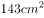
　✅
- **B**. 

- **C**. 

- **D**. 

**答案**：A

**官方解析**

由“最小的正方形面积是”可得，A正方形边长，设D正方形边长为d，则C正方形边长为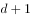，B正方形边长为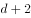，E、F正方形边长为。

用B、C正方形边长表示长方形的长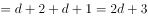，

用D、E、F正方形边长表示长方形的长，

就有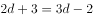，解得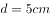。

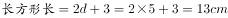，。

则。

故正确答案为A。

---

### 第 5 题　qid 2188555 · 数学运算

若干名天使投资人对某个需求资金120万的创业项目表达出投资意向，并计划每人以相同的金额投资该项目。但实际投资时有2人退出，剩下的每人需要多投资10万元才能满足该项目的资金需求，问实际投资这一项目的有多少人？

- **A**. 3
- **B**. 4　✅
- **C**. 6
- **D**. 8

**答案**：B

**官方解析**

设实际投资这一项目的有x人，则计划投资的有人，根据题意可得，，解得（分式方程求解过程计算量大，建议结合选项代入）。

故正确答案为B。

---

### 第 6 题　qid 2188498 · 数学运算

甲、乙、丙三个网站定期更新，甲网站每隔48小时，乙网站每隔72小时，丙网站每隔96小时更新一次内容。问在一个星期内至多有几天，三个网站中至少有一个更新内容？

- **A**. 4天
- **B**. 5天
- **C**. 6天
- **D**. 7天　✅

**答案**：D

**官方解析**

由题意可知，甲每天更新一次，乙每天更新一次，丙每天更新一次，要想有更新的天数尽可能多，则三个网站在一周的更新天数应尽可能多，且尽量不重复。安排甲从周一开始更新，则甲在周一、周三、周五、周日均更新一次，此时乙在周一、周四、周日更新，丙分别在周二与周六更新，情况最优，一周内每天均有网站更新。

注：每隔48小时就是每48小时，不需要额外加1小时。

故正确答案为D。

---

### 第 7 题　qid 2188560 · 数学运算

一战斗机从甲机场匀速开往乙机场，如果速度提高，可比原定时间提前12分钟到达；如果以原定速度飞行600千米后，再将速度提高，可以提前5分钟到达。那么甲乙两机场的距离是多少千米？

- **A**. 750
- **B**. 800
- **C**. 900　✅
- **D**. 1000

**答案**：C

**官方解析**

第一种情况：如果提速，可比原定时间提前12分钟到达。可知，提速前后速度之比为4：5，路程相同时，时间与速度成反比，则时间之比为5：4。节省了1份等于12分钟，所以原计划用时分钟；

第二种情况：如果原定速度飞行600千米后，再将速度提高，可以提前5分钟到达。可知，提高速度前后速度之比为3：4，则在提速后所走的路程内，时间之比为4：3，节省了1份等于5分钟，则原计划用时分钟。故前600千米用时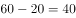分钟，则全程路程千米。

故正确答案为C。

---

### 第 8 题　qid 2188556 · 数学运算

从A地到B地为上坡路。自行车选手从A地出发按A-B-A-B的路线行进，全程平均速度为从B地出发，按B-A-B-A的路线行进的全程平均速度的，如自行车选手在上坡路与下坡路上分别以固定速度匀速骑行，问他上坡的速度是下坡速度的：

- **A**. 

　✅
- **B**. 

- **C**. 

- **D**. 

**答案**：A

**官方解析**

假设上坡所用时间为x，下坡所用时间为y，从A地出发按A-B-A-B的路线行进所用时间为，从B地出发按B-A-B-A的路线行进所用时间为。总路程相同，速度与时间成反比，已知前者全程平均速度是后者的，则，则。由于上坡和下坡路程相同，速度和时间成反比，。

故正确答案为A。

---

### 第 9 题　qid 2188500 · 数学运算

加油站营业时间为每日1时到午夜12时，且在每日停业的1小时中进货1万升92号汽油。某月1日开始营业时有92号汽油库存4万升，当日销售92号汽油1万升，但由于周边车流量增加，每日92号汽油销量都比上一日增加1000升。问该加油站如不增加每日的进货量，92号汽油将在哪一日售罄？

- **A**. 11日
- **B**. 10日
- **C**. 9日　✅
- **D**. 8日

**答案**：C

**官方解析**

由“每日停业的1小时中进货1万升，某月1日开始营业时有92号汽油库存4万升”，开始营业是1时，说明4万升已经包含了当日进货的1万升，故1日0时库存为3万升。又“某月1日，当日销售1万升”可得，在不增加车流量的情况下，每日新进货和当日销售额持平，故原库存3万升不会被消耗掉。

考虑在增加车流量的情况下，“比上一日增加1000升”，每日新增销量构成一个首项为0，公差为0.1万升的等差数列。设天内新增销量之和超过3万升，由等差数列求和公式，代入数据可得，化简得。结合选项枚举代入：

当时，，不满足题意；

当时，，满足题意，即汽油将在9日售罄。

故正确答案为C。

---

### 第 10 题　qid 2188571 · 数学运算

10个相同的盒子中分别装有1～10个球，任意两个盒子中的球数都不相同。小李分三次每次取出若干个盒子，每次取出的盒子中的球数之和都是上一次的3倍，且最后剩下1个盒子。问剩下的盒子中有多少个球？

- **A**. 9
- **B**. 6
- **C**. 5
- **D**. 3　✅

**答案**：D

**官方解析**

由题意可得，共有小球个数为个，假设第一次取出小球个数为x，剩下盒子中球数为y，则第二次与第三次取出小球个数分别为3x，9x，前三次取出小球总个数为，则，是13的倍数，只有D项满足。

故正确答案为D。

---

## 判断推理

### 第 1 题　qid 2188596 · 图形推理

从所给四个选项中，选出最合适的一个填入问号处，使之呈现一定规律性：

- **A**. A
- **B**. B　✅
- **C**. C
- **D**. D

**答案**：B

**官方解析**

元素组成不同，且无明显属性规律，优先考虑数量规律。观察题干发现，折线与直线相交，形成明显的“窟窿”，优先考虑数面。题干图形面数量依次为：1、2、3、4，故？处为5个面，C、D项为4个面，排除。对比A、B项，发现A项折线开口朝下，B项折线开口朝上，而题干图形折线开口朝向依次为：上、下、上、下，故？处开口朝上，B项当选。
故正确答案为B。

---

### 第 2 题　qid 2188599 · 图形推理

从所给四个选项中，选出最合适的一个填入问号处，使之呈现一定规律性：

- **A**. A　✅
- **B**. B
- **C**. C
- **D**. D

**答案**：A

**官方解析**

元素组成不同，且无明显属性规律，优先考虑数量规律。观察题干图形发现，“窟窿”较多，优先考虑数面。题干图形中面的数量依次为：8、7、6、5、4，故？处为3个面，排除C、D项。对比A、B项，发现面的形状不同，但题干图形中的面均是三角形，只有A项符合。
故正确答案为A。

---

### 第 3 题　qid 2188604 · 图形推理

从所给四个选项中，选出最合适的一个填入问号处，使之呈现一定规律性：

- **A**. A
- **B**. B
- **C**. C　✅
- **D**. D

**答案**：C

**官方解析**

元素组成相同，优先考虑位置规律。九宫格优先横行看，第一行黑块1在最外圈沿着顺时针的方向移动，黑块2在最外圈沿着逆时针的方向移动，灰块依次从右向左平移一格。第二行验证发现符合此规律。则？处黑块1应出现在第一行第二列，黑块2应出现在第二行第三列，灰块应出现在第三行第一列，只有C项符合。

故正确答案为C。

---

### 第 4 题　qid 2188609 · 图形推理

左图给定的是正方体纸盒的外表面，下面哪一项能由它折叠而成？

- **A**. A
- **B**. B
- **C**. C　✅
- **D**. D

**答案**：C

**官方解析**

本题考查六面体的空间重构。将题干展开图中的面依次标号，如下图：

A项：选项中的三个面分别是面a、面b（或面e）、面c，面a和面c中间相隔一个面，二者是相对面，相对面不能同时出现，排除；

B项：选项中的三个面分别是面b、面e、面d，面b和面e是“Z”字形的两端，二者是相对面，相对面不能同时出现，排除；

C项：与题干展开图一致，当选；

D项：选项中三个面分别是面a（或面c）、面d、面f，面d和面f中间相隔一个面，二者是相对面，相对面不能同时出现，排除。

故正确答案为C。

---

### 第 5 题　qid 2188612 · 图形推理

左图是从圆台中挖出一个截面为正方形的长方体形成的立体图形，如果从任一面切开，以下哪一个不可能是该立体图形的截面？

- **A**. A
- **B**. B
- **C**. C
- **D**. D　✅

**答案**：D

**官方解析**

A项：可从圆台的侧面切入，经过长方体，到圆台底，如图1所示即可切出，排除；

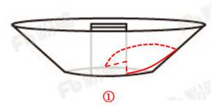

B项：在圆台正中间竖着切，如图2所示，排除；

C项：可沿水平方向切出，如图3所示，排除；

D项：不能切出，因为如果外侧要切出梯形，只能从中间竖着切，中间应是中空的，无法切出中间两个缺口，当选。

本题为选非题，故正确答案为D。 

---

### 第 6 题　qid 2188615 · 定义判断

间接正犯又称为间接实行犯，是指利用他人为道具而实施犯罪的实行行为，利用者通过支配被利用者的工具行为实现自己的犯罪意图。利用者与被利用者不构成共同犯罪。它包括以下两种情况：一是利用无刑事责任能力人犯罪；二是利用他人过失或不知情的行为犯罪。
根据上述定义，下列甲的行为属于间接正犯的是：

- **A**. 甲挑唆乙和丙的关系，致使乙一怒之下将丙打成重伤。甲、乙、丙均为完全刑事责任能力人
- **B**. 甲教唆精神病人乙用刀砍伤与其素有仇怨的丙。甲、丙为完全刑事责任能力人，乙为无刑事责任能力人　✅
- **C**. 甲派员工乙殴打一直欠钱不还的丙，并允诺给其好处，乙随后将丙打伤。甲、乙、丙均为完全刑事责任能力人
- **D**. 甲让自己尚未成年的孩子乙诬告丙，未想到乙捏造的事实正是丙客观存在的事实。甲、丙为完全刑事责任能力人，乙为无刑事责任能力人

**答案**：B

**官方解析**

第一步：找出定义关键词。
“利用他人为道具而实施犯罪的实行行为”、“利用者与被利用者不构成共同犯罪”、“两种情况：一是利用无刑事责任能力人犯罪；二是利用他人过失或不知情的行为犯罪”。
第二步：逐一分析选项。
A项：甲挑唆乙和丙的关系，致使乙将丙打伤，但甲、乙、丙均是完全刑事责任能力人，且乙知情，不符合“两种情况：一是利用无刑事责任能力人犯罪；二是利用他人过失或不知情的行为犯罪”中的任何一种，不符合定义，排除；
B项：甲教唆乙将丙砍伤，符合“利用他人为道具而实施犯罪的实行行为”,被利用的乙是无刑事责任能力人，符合“利用无刑事责任能力人犯罪”的情况，符合定义，当选；
C项：甲派乙殴打丙，乙是被利用者，但甲、乙、丙均是完全刑事责任能力人，且乙知情，不符合“两种情况：一是利用无刑事责任能力人犯罪；二是利用他人过失或不知情的行为犯罪”中的任何一种，不符合定义，排除；
D项：甲让自己的孩子乙诬告丙，乙虽然是无刑事责任能力人，但乙捏造的事实正是丙客观存在的，并非诬告，因此不符合“利用无刑事责任能力人犯罪”，不符合定义，排除。
故正确答案为B。

---

### 第 7 题　qid 2188477 · 定义判断

不征税收入是指专门从事特定目的，从性质和根源上不属于营利性活动带来的经济利益，不负有纳税义务并且不作为应纳税所得额组成部分的收入，比如财政拨款、行政事业性收费等；免税收入是纳税人应税收入的重要组成部分，只是国家为了实现某些经济和社会目标，在特定时期或对特定项目取得的经济利益给予的税收优惠照顾，而在一定时期又有可能恢复征税的收入。
根据上述定义，下列说法错误的是：

- **A**. 为鼓励高新技术企业自主创新，政府规定，在近两年内对这类企业研发产品的销售收入暂不收税，因此企业在研发产品上的销售收入属于免税收入
- **B**. 某农产品企业获得了当地政府对农业加工产品的专项财政补贴，该补贴属于不征税收入
- **C**. 国家规定，企业技术转让所得年净收入在30万元以下的，暂免征收所得税，因此这部分所得属于免税收入
- **D**. 为鼓励纳税人积极购买国债，国家规定国债所得利息收入暂不计入应纳税所得额，不征收企业所得税，因此国债利息收入属于不征税收入　✅

**答案**：D

**官方解析**

第一步：找出定义关键词。
不征税收入：“专门从事特定目的”、“从性质和根源上不属于营利性活动带来的经济利益” 、“不负有纳税义务并且不作为应纳税所得额组成部分的收入”。
免税收入：“国家为了实现某些经济和社会目标”、“在特定时期或对特定项目取得的经济利益给予的税收优惠照顾”、“而在一定时期又有可能恢复征税的收入”。
第二步：逐一分析选项。
A项：为鼓励高新技术企业自主创新，符合“国家为了实现某些经济和社会目标”，在近两年内对这类企业研发产品的销售收入暂不收税，符合“在特定时期或对特定项目取得的经济利益给予的税收优惠照顾”，符合“免税收入”定义，排除； 
B项：某农产品企业，符合“专门从事特定目的”，获得了当地政府专项财政补贴，符合“从性质和根源上不属于营利性活动带来的经济利益”，符合“不征税收入”定义，排除；
C项：企业技术转让所得年净收入暂免征收所得税，符合“在特定时期或对特定项目取得的经济利益给予的税收优惠照顾”和“而在一定时期又有可能恢复征税的收入”，符合“免税收入”定义，排除；
D项：为鼓励纳税人积极购买国债，符合“国家为了实现某些经济和社会目标”，规定国债所得利息收入暂不计入应纳税所得额，符合“在特定时期或对特定项目取得的经济利益给予的税收优惠照顾”和“而在一定时期又有可能恢复征税的收入”，符合“免税收入”定义，不符合“不征税收入”定义，错误，当选。
本题为选非题，故正确答案为D。

---

### 第 8 题　qid 2188620 · 定义判断

信息腐败指的是手中掌握有公共权力的人，借用自身的权力获得某些特殊信息，然后由自己或其代理人利用这些垄断信息从事某些牟利活动的一种违法乱纪行为。
根据上述定义，下列涉及信息腐败的是：

- **A**. 市政府某局干部为了个人升迁，贿赂有关人员，多次修改个人档案信息
- **B**. 某法学院教授为了将其负责的研究生班办成品牌，私自使用秘密窃取的某资格考试试卷对该班学生进行辅导
- **C**. 省科技厅王处长离职后到某公司就职，他将自己研究的某项技术加以创新，为该公司开发出极具市场竞争力的新产品
- **D**. 副区长龙某将工程招标报名情况、投标企业业绩要求、中标方式等秘密信息泄露给某投标企业，并收受该企业50余万元　✅

**答案**：D

**官方解析**

第一步：找出定义关键词。
“手中掌握有公权力的人”、“借用自身权利获得某些特殊信息，从事某些牟利活动”。
第二步：逐一分析选项。
A项：市政府某局干部贿赂有关人员改档案信息，并没有获得特殊信息，不符合“借用自身权力获得某些特殊信息，从事某些牟利活动”，不符合定义，排除； 
B项：某法学院教授是用窃取的试卷辅导学生，不符合“借用自身权力获得某些特殊信息，从事某些牟利活动”，不符合定义，排除；
C项：省科技厅王处长离职后将自己的技术创新，并没有利用权力获得信息，不符合“借用自身权力获得某些特殊信息，从事某些牟利活动”，不符合定义，排除；
D项：副区长将工程投标秘密信息泄露给投标企业，并获得50万余元，符合“借用自身权力获得某些特殊信息，从事某些牟利活动”，符合定义，当选。
故正确答案为D。

---

### 第 9 题　qid 2188476 · 定义判断

前摄抑制是指先学习的材料对识记和回忆后学习的材料所产生的干扰作用；倒摄抑制是指后学习的材料对识记和回忆先学习的材料所产生的干扰作用。
根据上述定义，下列选项只包含倒摄抑制的是：

- **A**. 背课文时发现中间段落往往是最难记住的
- **B**. 一天中，人们一般在早晨和夜晚的记忆效果最佳
- **C**. 学习英文字母后，之前学的拼音字母会读错　✅
- **D**. 头部受伤后，回忆不起来之前发生的事情

**答案**：C

**官方解析**

第一步：找出定义关键词。
前摄抑制：“先学习的材料对识记和回忆后学习的材料所产生的干扰作用”；
倒摄抑制：“后学习的材料对识记和回忆先学习的材料所产生的干扰作用”。
第二步：逐一分析选项。
A项：背课文中间段落最难记住，说明前面段落和后面段落都对中间段落产生了影响，即“先学习的材料”和“后学习的材料”分别对“对回忆后学习的材料产生了干扰作用”和“对回忆先学习的材料产生了干扰作用”，因此选项中既包含了前摄抑制，又包含了倒摄抑制，排除；
B项：早晨和夜晚的记忆效果最佳，只是说记忆效果的好坏，并不涉及学习材料，不包含倒摄抑制，排除；
C项：之前的拼音字母会读错，说明后学的英文字母对先学的拼音字母产生了影响，即“后学习的材料对识记和回忆先学习的材料所产生的干扰作用”，选项中只包含倒摄抑制，当选；
D项：由于头部受伤而导致回忆不起来之前的事情，没有提到“先、后学习的材料对识记和回忆后、先学习的材料所产生的干扰作用”，因此选项中既没有包含前摄抑制，也没有包含倒摄抑制，排除。
故正确答案为C。

---

### 第 10 题　qid 2188626 · 定义判断

趋同进化是遗传学中的一个概念，指的是不同的物种在进化过程中，由于适应相似的环境而呈现出表型上的相似性。而趋异进化则相反，它是指同一物种在进化过程中，由于适应不同的环境而呈现出表型差异的现象。
根据上述定义，下列属于趋异进化的是：

- **A**. 澳洲的袋食蚁兽与亚洲的穿山甲相比较，具有相似的生活方式和适于捕食白蚁的相似生理结构
- **B**. 鲸、海豚等和鱼类的亲缘关系很远，前者是哺乳类，后者是鱼类，但由于都在水域中生活，体形都很相似
- **C**. 欧亚大陆温带地区生活的鼹鼠、非洲南部的金毛鼹在分类上相距甚远，但它们的生存环境和生活方式相似，形态也相似
- **D**. 更新世时期，冰川将一群棕熊从主群中分了出来，在北极环境下发展成与环境颜色一致、善于捕猎的白色北极熊。北极熊食肉，而其他棕熊以植物为主要食物　✅

**答案**：D

**官方解析**

第一步：找出定义关键词。
趋同进化：“不同的物种在进化过程中”、“由于适应相似的环境而呈现出表型上的相似性”；
趋异进化：“同一物种在进化过程中”、“由于适应不同的环境而呈现出表型差异的现象”。
第二步：逐一分析选项。
A项：袋食蚁兽和穿山甲是不同的物种，符合“不同的物种在进化过程中”，具有相似的生活方式和适于捕食白蚁的相似生理结构，符合“由于适应相似的环境而呈现出表型上的相似性”，符合“趋同进化”定义，不符合“趋异进化”定义，排除；
B项：鲸、海豚等和鱼类亲缘关系很远，符合“不同的物种在进化过程中”，因为生活在水中而体形相似，符合“由于适应相似的环境而呈现出表型上的相似性”， 符合“趋同进化”定义，不符合“趋异进化”定义，排除；
C项：鼹鼠和金毛鼹分类相距甚远符合“不同的物种在进化过程中”，生存环境和生活方式相似，形态也相似符合“由于适应相似的环境而呈现出表型上的相似性”， 符合“趋同进化”定义，不符合“趋异进化”定义，排除；
D项：白色北极熊是从棕熊中分出来的，符合“同一物种在进化过程中”，北极熊在北极环境中发展成与环境颜色一致、善于捕猎的食肉白色北极熊，而其他棕熊以植物为主要食物，符合“由于适应不同的环境而呈现出表型差异的现象”，符合“趋异进化”定义，当选。
故正确答案为D。

---

### 第 11 题　qid 2188601 · 定义判断

经济文盲指的是被很多经济学名词弄得满头大汗不知其意的人们，他们的典型特色是容易盲从，专家说啥信啥，缺乏独立思考，即使专家说错了他们也会继续相信。
根据上述定义，下列涉及经济文盲的是：

- **A**. 某“专家”在其出版的书中宣扬“绿豆治百病大法”，引发市场绿豆涨价
- **B**. 一天电视节目里某娱乐明星说低钠盐好处多，第二天一些超市的低钠盐被一抢而空
- **C**. 为了通过某资格考试，小王死记硬背了“边际效益”等很多经济学名词，但是他并没有发现复习资料中其实有很多错误
- **D**. 小王被《重金属攻略》一书中的“浮动盈亏”等概念弄糊涂了，但是看到书中宣传的重金属盈利前景，还是迅速参与了交易　✅

**答案**：D

**官方解析**

第一步：找出定义关键词。
“被经济学名词弄得满头大汗”、“容易盲从”、“专家说啥信啥”、“缺乏独立思考，盲目跟从”。
第二步：逐一分析选项。
A项：绿豆治百病大法是一种民间食疗方法，不是经济学名词，不符合定义，排除；
B项：低钠盐好处多是指低钠盐对人体的好处，不是经济学名词，不符合定义，排除；
C项：“边际效益”是经济学名词，小王是为了通过考试而死记硬背这些经济学名词，而不是盲目跟从专家说法，不符合定义，排除；
D项：《重金属攻略》一书中的“浮动盈亏”是经济学名词，小王被“浮动盈亏”等概念弄糊涂了，符合“被经济学名词弄得满头大汗”。看到书中宣传的重金属的盈利前景就马上参与交易，符合“缺乏独立思考，盲目跟从”，符合定义，当选。
故正确答案为D。

---

### 第 12 题　qid 2188605 · 定义判断

拟态环境指由大众传播活动形成的信息环境，它不是客观环境的镜子式再现，而是大众传播媒介通过对新闻和信息的选择、加工和报道，重新加以结构化以后向人们所提示的环境。
根据上述定义，下列不涉及拟态环境的是：

- **A**. 小刘在某报看到一篇文章宣传某农产品的多种养生功能，他对此深信不疑
- **B**. 受某产品广告语“新一代的选择”的影响，年轻人非常认同且热衷于购买这一产品
- **C**. 小李在公司内网论坛上看到大家都说同事张某专业功底深厚，经观察他发现确实如此　✅
- **D**. 某微信公众号发布一则消息，称2016年1月1日起乘车不系安全带将罚200元，交警部门对此出面辟谣

**答案**：C

**官方解析**

第一步：找出定义关键词。
“由大众传播活动形成的信息环境”、“不是客观环境的镜子式再现”、“大众传播媒介通过对新闻和信息的选择、加工和报道”、“重新加以结构化”。
第二步：逐一分析选项。
A项：报纸是大众传播媒介，通过报纸对某农产品的多种养生功能进行报道，是将农产品的多种养生功能这些信息进行整合，重新加以结构化向人们展示，符合定义，排除； 
B项：广告是大众传播媒介，该产品的广告语“新一代的选择”是对该产品的加工报道，符合“大众传播媒介对信息进行选择、加工和报道”，符合定义，排除；
C项：公司内网论坛不是大众传播媒介，且“经观察他发现确实如此”说明张某专业功底深厚这个信息是客观存在的，不符合“不是客观环境的镜子式再现”，不符合定义，当选；
D项：微信公众号是大众传播媒介，通过公众号发布消息体现了“对信息进行报道”，交警部门出面辟谣说明此消息不是真的，说明公众号发布的消息与客观事实不符，符合“不是客观环境的镜子式再现”，符合定义，排除。
本题为选非题，故正确答案为C。

---

### 第 13 题　qid 2188607 · 类比推理

高血压：传染病

- **A**. 蝙蝠：哺乳动物
- **B**. 黄梅戏：京剧
- **C**. 鲫鱼：两栖动物　✅
- **D**. 计算机：电脑硬件

**答案**：C

**官方解析**

第一步：判断题干词语间逻辑关系。
高血压不是一种传染病，且高血压是一种疾病，传染病是一类疾病。
第二步：判断选项词语间逻辑关系。
A项：蝙蝠是一种哺乳动物，二者为种属关系，与题干逻辑关系不一致，排除；
B项：黄梅戏和京剧为并列关系，与题干逻辑关系不一致，排除；
C项：鲫鱼不是两栖动物，且鲫鱼是一种动物，两栖动物是一类动物，与题干逻辑关系一致，当选；
D项：电脑硬件是计算机的组成部分，二者为组成关系，与题干逻辑关系不一致，排除。
故正确答案为C。

---

### 第 14 题　qid 2188610 · 类比推理

软实力：硬实力

- **A**. 军事实力：经济实力
- **B**. 精神文明：物质文明　✅
- **C**. 现实主义：浪漫主义
- **D**. 心理健康：精神健康

**答案**：B

**官方解析**

第一步：判断题干词语间逻辑关系。
软实力和硬实力为矛盾关系。
第二步：判断选项词语间逻辑关系。
A项：军事实力和经济实力之外还有文化实力等，二者为反对关系，与题干逻辑关系不一致，排除；
B项：精神文明和物质文明为矛盾关系，与题干逻辑关系一致，当选；
C项：现实主义和浪漫主义之外还有古典主义等，二者为反对关系，与题干逻辑关系不一致，排除；
D项：有一种说法认为心理健康就是精神健康，二者为全同关系，也有一种说法认为心理健康和精神健康是交叉关系，但任何一种说法都不是矛盾关系，与题干逻辑关系不一致，排除。
故正确答案为B。

---

### 第 15 题　qid 2188611 · 类比推理

工作：职员：薪水

- **A**. 资费：网民：电邮
- **B**. 驾照：司机：汽车
- **C**. 考试：学生：成绩　✅
- **D**. 饭店：厨师：菜肴

**答案**：C

**官方解析**

第一步：判断题干词语间逻辑关系。
职员工作可以获得薪水，工作是职员的行为，薪水是工作的结果。
第二步：判断选项词语间逻辑关系。
A项：网民资费可以获得电邮，造句不通顺，与题干关系不一致，排除；
B项：司机驾照可以获得汽车，造句不通顺，与题干关系不一致，排除；
C项：学生考试可以获得成绩，考试是学生的行为，成绩是考试的结果，与题干关系一致，当选；
D项：厨师饭店可以获得菜肴，造句不通顺，与题干关系不一致，排除。
故正确答案为C。

---

### 第 16 题　qid 2188614 · 类比推理

生产：质检：销售

- **A**. 上学：预习：复习
- **B**. 调查：整理：分析　✅
- **C**. 监督：改进：效率
- **D**. 无业：贫困：救济

**答案**：B

**官方解析**

第一步：判断题干词语间逻辑关系。
先生产再质检最后销售，三者都是行为，且是时间先后顺序的对应关系。
第二步：判断选项词语间逻辑关系。
A项：先预习再复习，但上学与后两者不构成时间先后顺序的对应关系，与题干关系不一致，排除；
B项：先调查再整理最后分析，三者都是行为，且是时间先后顺序的对应关系，与题干关系一致，当选；
C项：效率不是行为，与前两者不构成时间先后顺序的对应关系，与题干关系不一致，排除；
D项：无业不是行为，与后两者不构成时间先后顺序的对应关系，与题干关系不一致，排除。
故正确答案为B。

---

### 第 17 题　qid 2188617 · 类比推理

房屋：不动产：抵押

- **A**. 股票：财产：增值
- **B**. 苹果：水果：食用　✅
- **C**. 轮船：海洋：行驶
- **D**. 中药：三七：抗血栓

**答案**：B

**官方解析**

第一步：判断题干词语间逻辑关系。
房屋是一种不动产，前两者为种属关系；抵押房屋，第三个词和第一个词是动宾结构。
第二步：判断选项词语间逻辑关系。
A项：股票是一种财产，前两者为种属关系；但是，股票增值，第三个词和第一个词是主谓结构，与题干逻辑关系不一致，排除；
B项：苹果是一种水果，前两者为种属关系；食用苹果，第三个词和第一个词是动宾结构，与题干逻辑关系一致，当选；
C项：轮船在海洋上航行，前两者为地点对应关系，与题干逻辑关系不一致，排除；
D项：三七是中药，前两者是种属关系，但是两词顺序与题干相反，与题干逻辑关系不一致，排除。
故正确答案为B。

---

### 第 18 题　qid 2188619 · 类比推理

扣子：西装：裤子

- **A**. 鼠标：电脑：键盘
- **B**. 学生：青年：艺术家
- **C**. 窗帘：窗户：房子
- **D**. 方向盘：轿车：商务车　✅

**答案**：D

**官方解析**

第一步：判断题干词语间逻辑关系。
扣子是西装和裤子的一部分，第一个词和后两个词是组成关系；有的西装是裤子，有的西装不是裤子，后两者为交叉关系。
第二步：判断选项词语间逻辑关系。
A项：鼠标与电脑配套使用，二者为对应关系，与题干逻辑关系不一致，排除；
B项：有的学生是青年，有的学生不是青年，二者为交叉关系，与题干逻辑关系不一致，排除；
C项：窗帘挂在窗户上，二者为对应关系，与题干逻辑关系不一致，排除；
D项：方向盘是轿车和商务车的一部分，第一个词和后两个词是组成关系；有的轿车是商务车，有的轿车不是商务车，二者为交叉关系，与题干逻辑关系一致，当选。
故正确答案为D。

---

### 第 19 题　qid 2188622 · 类比推理

常规问题：非常规问题：问题

- **A**. 期中考试：期末考试：考试
- **B**. 顶层设计：基层落实：管理
- **C**. 豪华装修：简单装修：装修
- **D**. 转基因油：非转基因油：油　✅

**答案**：D

**官方解析**

第一步：判断题干词语间逻辑关系。
常规问题与非常规问题都是问题的一种，前两词与第三词为种属关系，且前两词为并列关系中的矛盾关系。
第二步：判断选项词语间逻辑关系。
A项：期中考试与期末考试都是考试的一种，前两词与第三词为种属关系，但前两词为并列关系中的反对关系，考试除此之外还有周考和月考等，与题干逻辑关系不一致，排除； 
B项：顶层设计与基层落实都是管理的方式，前两词与第三词为种属关系，但前两词是并列关系中的反对关系，与题干逻辑关系不一致，排除；
C项：豪华装修与简单装修都是装修的一种，前两词与第三词为种属关系，但前两词是并列关系中的反对关系，除此之外还可以有中等装修等，与题干逻辑关系不一致，排除；
D项：转基因油与非转基因油都是油的一种，前两词与第三词为种属关系，且前两词为并列关系中的矛盾关系，与题干逻辑关系一致，当选。
故正确答案为D。

---

### 第 20 题　qid 2188625 · 类比推理

（    ） 对于 服装 相当于 雕琢 对于 （    ）

- **A**. 鞋帽 修饰
- **B**. 设计 图案
- **C**. 外表 心灵
- **D**. 裁剪 玉器　✅

**答案**：D

**官方解析**

逐一代入选项。
A项：鞋帽是一种服装，雕琢是一种修饰，二者均为种属关系，前后逻辑关系一致，保留；
B项：设计服装为动宾关系，雕琢和图案搭配不当，前后逻辑关系不一致，排除；
C项：服装会对外表产生影响，雕琢和心灵无明显逻辑关系，前后逻辑关系不一致，排除；
D项：裁剪服装为动宾关系，雕琢玉器为动宾关系，前后逻辑关系一致，保留。
对比A、D两项，A项，鞋帽、服装都是名词，雕琢、修饰都是动词，前后词性并不匹配；D项，裁、剪是近义关系，都是动词，雕、琢是近义关系，都是动词，且裁剪和雕琢都是去掉多余的部分，对比优选D项。
故正确答案为D。

---

### 第 21 题　qid 2188598 · 类比推理

石油 对于（  ）相当于 廉洁 对于 （  ）

- **A**. 煤炭  贪腐
- **B**. 能源  品德　✅
- **C**. 矿产  政府
- **D**. 原油  简朴

**答案**：B

**官方解析**

逐一代入选项。
A项：石油和煤炭是并列关系，廉洁和贪腐是反义关系，前后逻辑关系不一致，排除；
B项：石油是一种能源，廉洁是一种品德，二者均为种属关系，前后逻辑关系一致，当选；
C项：石油是一种矿产，廉洁是政府的属性，前后逻辑关系不一致，排除；
D项：未经加工处理的石油称为原油，廉洁和简朴无明显逻辑关系，前后逻辑关系不一致，排除。
故正确答案为B。

---

### 第 22 题　qid 2188602 · 类比推理

（  ）对于 风景 相当于 美丽 对于（  ）

- **A**. 秀丽  动人
- **B**. 画卷  人生
- **C**. 怡人  心灵　✅
- **D**. 如画  如花

**答案**：C

**官方解析**

第一步：逐一代入选项。
A项：秀丽的风景，二者为偏正结构，美丽和动人为近义关系，前后逻辑关系不一致，排除；
B项：画卷里可能有风景，二者为或然组成关系，美丽的人生，二者为偏正结构，前后逻辑关系不一致，排除；
C项：怡人的风景，美丽的心灵，二者均为偏正结构，前后逻辑关系一致，当选；
D项：风景如画，美丽如花，但后两词顺序与前两词相反，前后逻辑关系不一致，排除。
故正确答案为C。

---

### 第 23 题　qid 2188603 · 逻辑判断

心理学家研究发现，一般情况下学生的注意力随着老师讲课时间的变化而变化。讲课开始时，学生的注意力逐步增强，中间有一段时间保持在较为理想的状态，随后学生的注意力开始分散。
以下哪项如果为真，最能削弱上述结论？

- **A**. 老师经过适当安排能够获得足够注意力　✅
- **B**. 总有个别学生能够全程保持注意力集中
- **C**. 兴趣是影响注意力能否集中的关键因素
- **D**. 人能完全集中注意力的时间只有七秒钟

**答案**：A

**官方解析**

第一步：找出论点和论据。
论点：一般情况下学生的注意力随着老师讲课时间的变化而变化。
论据：讲课开始时，学生的注意力逐步增强，中间有一段时间保持在较为理想的状态，随后学生的注意力开始分散。
第二步：逐一分析选项。
A项：老师能够获得足够注意力，说明学生的注意力不会随着老师讲课时间的变化而变化，否定了论点，当选；
B项：论点说的是一般情况，因此选项中个别学生的情况是无法削弱的，排除；
C项：论点说的是学生的注意力随着老师讲课时间的变化而变化，该项说的是兴趣是影响注意力能否集中的关键因素，兴趣是关键因素也不代表时间不会影响注意力，无法削弱，排除；
D项：论点说的是学生的注意力随着老师讲课时间的变化而变化，该项说的是人能完全集中注意力的时间短，不能说明注意力是否会随着时间变化而变化，无法削弱，排除。
故正确答案为A。

---

### 第 24 题　qid 2188606 · 逻辑判断

在大量的信息中容易迷失是人性的弱点。那些不管是有用的还是没用的，全都想要收集到的完美主义者，是不能很好地分析信息的。克服这一点的关键就是，养成明确的“目标意识”，尽可能瞄准自己想要的信息收集。为了防止主观臆断和先入为主，必须把信息的收集和判断这两个工作分开，如果信息的数量庞大，就要进行两次乃至多次的检验。
由此可以推出：

- **A**. 不能很好地分析信息的人都是完美主义者
- **B**. 养成明确的“目标意识”，才不容易在大量的信息中迷失　✅
- **C**. 把信息的收集和判断这两个工作分开，就能够防止主观臆断
- **D**. 如果信息的数量不大，就不需要进行两次乃至多次的检验

**答案**：B

**官方解析**

第一步：翻译题干。

①全都想要收集到的完美主义者不能很好地分析信息；

②不容易在大量的信息中迷失养成明确的“目标意识”；

③防止主观臆断和先入为主把信息的收集和判断这两个工作分开；

④信息的数量庞大两次乃至多次的检验。

第二步：逐一分析选项。

A项：翻译为不能很好地分析信息的人完美主义者，是对①的肯后，但肯后无法得到确定结论，排除；

B项：翻译为不容易在大量的信息中迷失养成明确的“目标意识”，是对②的肯前，肯前必肯后，当选；

C项：翻译为把信息的收集和判断这两个工作分开能够防止主观臆断，是对③的肯后，但肯后无法得到确定结论，排除；

D项：翻译为信息的数量不大两次乃至多次的检验，是对④的否前，但否前无法得到确定结论，排除。

故正确答案为B。

---

### 第 25 题　qid 2188608 · 逻辑判断

婴儿的幼年特征可以唤起成年人的慈爱和养育之心，许多动物的外形和行为具有人类婴儿的特征。因此，人们容易被这样的动物所吸引，将它们养成宠物。
以下哪项如果为真，最能支持上述结论？

- **A**. 很多空巢老人喜欢饲养宠物
- **B**. 体态庞大且凶猛的动物很少成为宠物　✅
- **C**. 有的家庭在生育儿女后就不会再养宠物
- **D**. 父母喜欢养宠物的，子女也喜欢养宠物

**答案**：B

**官方解析**

第一步：找出论点和论据。
论点：人们容易被这样的动物所吸引，将它们养成宠物。
论据：婴儿的幼年特征可以唤起成年人的慈爱和养育之心，许多动物的外形和行为具有人类婴儿的特征。
第二步：逐一分析选项。
A项：该项说的是很多空巢老人喜欢饲养宠物，但宠物的外形和行为是否具有人类婴儿特征不明确，无法加强，排除；
B项：该项说的是体态庞大且凶猛的动物很少成为宠物，说明人们更喜欢养体态较小且无害的动物，具有婴儿的特征，补充论据，当选；
C项：论点说的是人们容易被外形和行为具有人类婴儿特征的动物所吸引，将它们养成宠物，该项说的是有的家庭在生育儿女后就不会再养宠物，话题不一致，无法加强，排除；
D项：论点说的是人们容易被外形和行为具有人类婴儿特征的动物所吸引，将它们养成宠物，该项说的是父母喜欢养宠物的，子女也喜欢养宠物，话题不一致，无法加强，排除。
故正确答案为B。

---

### 第 26 题　qid 2188613 · 逻辑判断

某研究小组汇集了140多种非人类灵长类动物脑量数据，以研究灵长类动物大脑体积比其他脊椎动物大得多的原因。在研究中，研究人员不仅考虑了灵长类动物的社会化因素，如种群规模、社会体系、交配系统等，还研究了它们的饮食习性，即它们是食叶、食果，抑或属于杂食动物。研究人员据此认为，饮食习性是灵长类动物大脑体积大的主要原因。
以下哪项如果为真，最能支持上述结论？

- **A**. 灵长类动物的饮食习性对其体型发育有重要影响
- **B**. 以往人们普遍接受的社会因素决定灵长类动物大脑体积的观点只是一种假说
- **C**. 研究结果并没有显示出在同种灵长类动物中，水果或树叶摄入量与大脑体积之间存在联系
- **D**. 在这140多种灵长类动物中，食果类动物的大脑体积，要明显大于食叶动物；杂食动物的大脑体积，也要大于食叶动物　✅

**答案**：D

**官方解析**

第一步：找出论点和论据。
论点：饮食习性是灵长类动物大脑体积大的主要原因。
论据：研究人员不仅考虑了灵长类动物的社会化因素，如种群规模、社会体系、交配系统等，还研究了它们的饮食习性，即它们是食叶、食果，抑或属于杂食动物。
第二步：逐一分析选项。
A项：论点说的是饮食习性是灵长类动物大脑体积大的主要原因，该项说的是饮食习性对灵长类动物的体型发育有重要影响，话题不一致，无关选项，无法加强，排除；
B项：该项说的是社会因素决定灵长类动物大脑体积的观点只是一种假说，假说本身就不一定成立，无法加强，排除；
C项：该项说明同种灵长类动物中，水果或树叶摄入量与大脑体积之间不存在联系，能削弱，无法加强，排除；
D项：该项说明不同饮食习性的灵长类动物大脑体积大小不同，补充论据，当选。
故正确答案为D。

---

### 第 27 题　qid 2188616 · 逻辑判断

近日，有动物实验研究发现，在正常饮食中加入一定剂量的苦瓜水提取物，可降低Ⅱ型糖尿病小鼠的高血糖。这是由于苦瓜中含有一种类似胰岛素的物质，能够降低血糖。有人据此认为，Ⅱ型糖尿病患者多吃苦瓜有助于降低血糖水平。
以下哪项如果为真，最能质疑上述论证？

- **A**. 苦瓜含糖量低，对血糖的影响小
- **B**. 日常食用的苦瓜中，苦瓜水提取物含量极少　✅
- **C**. 苦瓜水提取物可能会导致血清总蛋白轻微降低
- **D**. 苦瓜水提取物对Ⅰ型糖尿病小鼠的血糖无显著影响

**答案**：B

**官方解析**

第一步：找出论点和论据。
论点：Ⅱ型糖尿病患者多吃苦瓜有助于降低血糖水平。
论据：近日，有动物实验研究发现，在正常饮食中加入一定剂量的苦瓜水提取物，可降低Ⅱ型糖尿病小鼠的高血糖，这是由于苦瓜中含有一种类似胰岛素的物质，能够降低血糖。
第二步：逐一分析选项。
A项：论点讨论的是多吃苦瓜有助于降低血糖水平，该项讨论的是苦瓜含糖量低对血糖的影响小，但是否能够降低血糖不明确，属于不明确项，无法削弱，排除；
B项：论点讨论的是多吃苦瓜有助于降低血糖水平，原因是苦瓜水提取物中类似胰岛素的物质能够降低血糖，该项说日常食用的苦瓜中苦瓜提取物含量极少，即不能通过日常食用苦瓜取得降低血糖的效果，断开了论点和论据之间的联系，属于拆桥项，可以削弱，当选；
C项：题干讨论的是苦瓜水中的类似胰岛素的物质是否有助于降低血糖，该项讨论的是苦瓜水是否会导致血清总蛋白降低，话题不一致，无关项，无法削弱，排除；
D项：题干是通过用Ⅱ型糖尿病小鼠做实验，得出苦瓜是否有助于Ⅱ型糖尿病患者降低血糖的结论，该项讨论的是苦瓜水提取物是否对Ⅰ型糖尿病小鼠有影响，主体不一致，无关项，无法削弱，排除。
故正确答案为B。

---

### 第 28 题　qid 2188621 · 逻辑判断

近年来，一种儿童天赋基因检测在家长圈里流行起来。提供这种检测的公司声称，他们通过唾液获取儿童的基因，就能分析出儿童具有哪些“特长”，如音乐天赋、数学天赋、交际能力、长跑能力、抗压能力等，不少家长纷纷花高价为孩子做了这种检测，他们认为通过这种检测，可以有的放矢地去开发儿童的天赋和潜能，不再需要通过尝试过多的兴趣班来挖掘儿童的特长。
以下哪项如果为真，最能削弱上述家长的观点？

- **A**. 有些教师也可以根据自身的经验有的放矢地开发儿童的天赋和潜能
- **B**. 相比于儿童天赋基因检测，肥胖基因、癌症基因检测具有更强的科学依据
- **C**. 天赋是多基因共同调控的结果，目前很难准确地界定哪些基因对哪些天赋有影响　✅
- **D**. 有的商家按全基因组检测收费，但只做单一或者某几个基因的检测，家长们很难区分出来

**答案**：C

**官方解析**

第一步：找出论点和论据。
论点：通过这种检测，可以有的放矢地去开发儿童的天赋和潜能，不再需要通过尝试过多的兴趣班来挖掘儿童的特长。
论据：通过唾液获取儿童的基因，就能分析出儿童具有哪些“特长”，如音乐天赋、数学天赋、交际能力、长跑能力、抗压能力等。
第二步：逐一分析选项。
A项：题干讨论的是能否通过检测基因开发儿童的天赋和潜能，该项讨论的是有些教师可以根据经验开发儿童的天赋和潜能，话题不一致，无关选项，无法削弱，排除；
B项：题干讨论的是能否通过检测基因开发儿童的天赋和潜能，该项讨论的是肥胖基因、癌症基因比儿童天赋基因检测更具科学依据，但儿童基因检测是否有科学依据不清楚，属于不明确项，无法削弱，排除；
C项：论据讨论的是能通过检测基因分析出儿童的具有哪些天赋，该项说的是很难界定哪些基因对天赋有影响，削弱论据，当选；
D项：题干讨论的是能否通过检测基因开发儿童的天赋和潜能，该项讨论的是家长难以区分商家是否做了全组检测，话题不一致，无关选项，无法削弱，排除。
故正确答案为C。

---

### 第 29 题　qid 2188623 · 逻辑判断

一个人如果是智者，那么他一定是一位谦虚的人；而一个人只有认识到自己的不足，他才会谦虚。但是，如果一个人听不进别人的意见，那么他就不会认识到自己的不足。
由此可以推出：

- **A**. 一个人如果认识到自己的不足，他就是一位智者
- **B**. 一个人如果听不进别人的意见，他就不是一位智者　✅
- **C**. 一个人如果听得进别人的意见，他就会认识到自己的不足
- **D**. 一个人如果认识不到自己的不足，他一定听不进别人的意见

**答案**：B

**官方解析**

第一步：翻译题干。
①智者→谦虚
②谦虚→ 认识到自己的不足
③听不进别人的意见 →－认识到自己的不足
将①②以及③的逆否递推出：④智者→谦虚→ 认识到自己的不足→－ 听不进别人的意见
第二步：逐一分析选项。
A项：翻译为认识到自己的不足 →智者，是对④的肯后，但肯后得不到确定性的结论，排除；
B项：翻译为听不进别人的意见→－智者，是对④的否后，否后必否前，当选；
C项：翻译为听得进别人的意见→ 认识到自己的不足，是对③的否前，但否前得不到确定性的结论，排除；
D项：翻译为-认识到自己的不足 →听不进别人的意见，是对③的肯后，但肯后得不到确定性的结论，排除。
故正确答案为B。

---

### 第 30 题　qid 2188627 · 逻辑判断

高校食堂某窗口前有张明、李伟、王刚、赵曼、钱强5人在排队买菜。每人只买一份菜。已知：
(1)要买红烧肉的人排在张明后面；
(2)李伟紧排在要买芹菜炒香干的人前面；
(3)王刚虽然排在队伍的第2位，但他还不知道要买什么；
(4)赵曼一向吃素，今天她来得有点晚，排在了队伍的最后。
由此可以推出：

- **A**. 李伟排在队伍的正中间位置
- **B**. 钱强排在队伍的正中间位置
- **C**. 李伟不可能排在队伍的最前面　✅
- **D**. 张明不可能排在队伍的最前面

**答案**：C

**官方解析**

由条件（2）李伟紧排在要买芹菜炒香干的人前面，可知：紧排在李伟后面的人知道自己要买什么；结合条件（3）王刚虽然排在队伍的第2位，但他还不知道要买什么，可知：李伟不可能排在王刚的前面，即李伟不可能排在队伍的最前面，对应C项。
故正确答案为C。

---

## 资料分析

### 材料 1

        2015年末，我国规模以上高技术制造业共有企业26894家，比2010年增加1077家；占规模以上制造业企业数的比重为，比2010年提高1.3个百分点。2015年末，我国高技术制造业从业人员1293.7万人，比2010年增长；占全部制造业从业人员的比重为，比2010年提高2.9个百分点。

        2015年我国高技术制造业实现主营业务收入116048.9亿元，比2010年增长；占全部制造业企业的比重为，比2010年提高0.8个百分点。2015年我国高技术制造业实现利润总额7233.7亿元，比2010年增长，增幅比其他制造业平均水平高出11.5个百分点；高技术制造业利润总额占全部制造业的比重为，比2010年提高0.5个百分点。

        2015年我国规模以上高技术制造业投入研发经费2034.3亿元，比2010年增长，增幅比其他制造业平均水平高8.7个百分点。2015年我国高技术制造业申请发明专利7.4万件，比2010年增长；实现新产品销售收入3.1万亿元，比2010年增长。

#### 第 1 题　qid 2188568 · 增长

2015年，我国高技术制造业主营业务收入比2010年增加约多少万亿元？

- **A**. 5
- **B**. 6　✅
- **C**. 7
- **D**. 8

**答案**：B

**官方解析**

根据题干“······增加······万亿元”，可判定本题为增长量计算问题。定位文字第二段材料可知：“2015年我国高技术制造业实现主营业务收入116048.9亿元，比2010年增长。”与2010年相比，2015年我国高技术制造业主营业务收入的增长量，与B项最为接近。

故正确答案为B。

---

#### 第 2 题　qid 2188572 · 综合

2010年，我国制造业实现利润总额约多少万亿元？

- **A**. 1.3
- **B**. 1.7
- **C**. 2.2　✅
- **D**. 2.8

**答案**：C

**官方解析**

根据题干“2010年······万亿元”，结合材料时间为2015年，可判定本题为基期计算问题。定位文字第二段材料：“2015年我国高技术制造业实现利润总额7233.7亿元，比2010年增长”，则2010年我国高技术制造业实现利润总额亿元；“高技术制造业利润总额占全部制造业的比重为，比2010年提高0.5个百分点”，则2010年高技术制造业利润总额占全部制造业的比重为；故2010年我国制造业实现利润总额万亿元。

故正确答案为C。

---

#### 第 3 题　qid 2188573 · 综合

2010年，我国高技术制造业实现新产品销售收入约多少万亿元？

- **A**. 1.4　✅
- **B**. 1.5
- **C**. 1.6
- **D**. 1.7

**答案**：A

**官方解析**

根据题干“2010年······万亿元”，结合材料时间为2015年，可判定本题为基期计算问题。定位文字第三段材料：“实现新产品销售收入3.1万亿元，比2010年增长。”故2010年，我国高技术制造业实现新产品销售收入万亿元，与A项最为接近。

故正确答案为A。

---

#### 第 4 题　qid 2188575 · 增长

与2010年相比，2015年下列高技术制造业的指标中哪项增长最快？

- **A**. 利润总额
- **B**. 新产品销售收入
- **C**. 主营业务收入
- **D**. 申请发明专利数　✅

**答案**：D

**官方解析**

定位第二段、第三段材料可知：2015年我国高技术制造业实现利润总额比2010年增长、新产品销售收入比2010年增长、主营业务收入比2010年增长、申请发明专利比2010年增长。所以增长最快的是申请专利发明数。

故正确答案为D。

---

#### 第 5 题　qid 2188577 · 综合

根据上述资料，下列说法错误的是：

- **A**. 2010年，我国高技术制造业申请发明专利达3万件　✅
- **B**. 2010年末，高技术制造业从业人员占全部制造业从业人员的比重为12.2%
- **C**. 2015年末，我国规模以上制造企业数是规模以上高技术制造业企业数的10倍以上
- **D**. 2015年，我国规模以上高技术制造业投入的研发经费比2010年增加了1000亿元以上

**答案**：A

**官方解析**

A项：定位材料第三段：2015年我国高技术制造业申请发明专利7.4万件，比2010年增长。故2010年高技术制造业申请发明专利数万件，错误；

B项：定位材料第一段：2015年末，我国高技术制造业从业人员占全部制造业从业人员的比重为，比2010年提高2.9个百分点。故2010年末高技术制造业从业人员占全部制造业从业人员的比重为，正确；

C项：定位材料第一段：2015年末，我国规模以上高技术制造业共有企业26894家，占规模以上制造业企业数的比重为。则，故，即我国规模以上制造业企业数是规模以上高技术制造业企业数的10倍以上，正确；

D项：定位材料第三段：2015年我国规模以上高技术制造业投入研发经费2034.3亿元，比2010年增长。，即增加了1000亿元以上，正确。

本题为选非题，故正确答案为A。

---

### 材料 2

#### 第 6 题　qid 2188580 · 平均数

2013～2015年，试验发展经费支出年平均增加：

- **A**. 不到800亿元
- **B**. 800多亿元
- **C**. 900多亿元　✅
- **D**. 1000亿元以上

**答案**：C

**官方解析**

根据题干“2013～2015年······年平均增加”，结合选项带单位，可判定本题为年均增长量问题。定位表格材料可知，2013年的试验发展为10022.5亿元，2015年试验发展为11925.1亿元。故2013～2015年试验发展经费支出年平均增加量=亿元，C项符合。

故正确答案为C。

---

#### 第 7 题　qid 2188582 · 综合

2015年，我国研究与试验发展经费投入强度（研究与试验发展经费支出与国内生产总值之比）约为：

- **A**. 

- **B**. 

　✅
- **C**. 

- **D**. 

**答案**：B

**官方解析**

根据题干“2015年······（······与······之比）”，结合材料给出2015年的数值，可判定本题为比值计算问题。定位表格材料可知，2015年国内生产总值为689052.0亿元，研究与试验发展经费支出为14169.9亿元。故投入强度=。

故正确答案为B。

---

#### 第 8 题　qid 2188583 · 增长

2013～2015年间，企业研究与试验发展经费支出同比增量大于1000亿元的年份有几个？

- **A**. 0
- **B**. 1　✅
- **C**. 2
- **D**. 3

**答案**：B

**官方解析**

根据题干“2013～2015年间……同比增量”，可判定本题为增长量计算问题。定位表格材料倒数第三行，由增长量=现期-基期可得，2013年增长量=9075.8-7842.2=1233.6亿元，2014年增长量=10060.6-9075.8=984.8亿元，2015年增长量=10881.3-10060.6=820.7亿元。综上，2013～2015年企业研究与试验发展经费支出同比增量大于1000亿元的年份仅有2013年1个。
故正确答案为B。

---

#### 第 9 题　qid 2188584 · 比重

2012～2015年，基础研究经费支出占全国研究与试验发展经费支出比重最大的年份是：

- **A**. 2012年
- **B**. 2013年
- **C**. 2014年
- **D**. 2015年　✅

**答案**：D

**官方解析**

根据题干“2012～2015年，······占······比重”,可判定本题为现期比重问题。定位表格材料可得：各年份比重，故2012年；2013年；2014年；2015年，因此2015年基础研究经费支出占全国研究与试验发展经费支出比重最大。

故正确答案为D。

---

#### 第 10 题　qid 2188585 · 综合

根据资料，下列选项错误的是：

- **A**. 2012～2015年，基础研究经费支出年均不到600亿元
- **B**. 2013～2015年，应用研究经费支出年增量逐年增大
- **C**. 2015年，企业的研究与试验发展经费支出比政府属研究机构高5倍多　✅
- **D**. 2012～2015年，我国高校的研究与试验发展经费支出呈逐年递增趋势

**答案**：C

**官方解析**

A项：定位表格材料可得：2012～2015年，基础研究经费年均支出亿元，不到600亿元，正确；

B项：定位表格材料可得：各年份应用研究经费支出年增量分别为 2013年增量亿元；2014年增量亿元；2015年增量亿元，因此2013～2015年应用研究经费支出年增量逐年增大，正确；

C项：定位表格材料可得：2015年企业的研究与试验发展经费为10881.3亿元；政府属研究机构为2136.5亿元；故所求倍数为倍，选项描述为企业的研究与试验发展经费比政府属研究机构高5倍多，即前者是后者的6倍多，与结果不符，错误；

D项：定位表格材料最后一行可得：2012～2015年，我国高校的研究与试验发展经费支出是逐年增加的，正确。

本题为选非题，故正确答案为C。

---

### 材料 3

<b>根据以下资料，回答96～100题。</b>

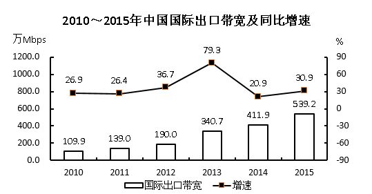

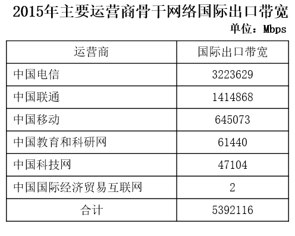

#### 第 11 题　qid 2188587 · 增长

2010～2015年间，中国国际出口带宽增速高于的年份有多少个？

- **A**. 1
- **B**. 2
- **C**. 3　✅
- **D**. 4

**答案**：C

**官方解析**

定位折线图可知，2010~2015年间，中国国际出口带宽增速高于的年份有：2012年（）、2013年（）和2015年（），共3个。

故正确答案为C。

---

#### 第 12 题　qid 2188588 · 综合

2009年，中国国际出口带宽最接近以下哪个数字？

- **A**. 71万Mbps
- **B**. 87万Mbps　✅
- **C**. 97万Mbps
- **D**. 128万Mbps

**答案**：B

**官方解析**

根据题干“2009年，······最接近······”，结合材料所给时间是2010年，可判定本题为基期计算问题。定位柱状图可知，2010年中国国际出口带宽是109.9万Mbps，增速是。故2009年中国国际出口带宽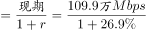，与B项最接近。

故正确答案为B。

---

#### 第 13 题　qid 2188589 · 比重

以下各图，最能体现2015年中国移动提供的国际出口带宽（黑色部分）在主要运营商骨干网络国际出口带宽中所占比例的是：

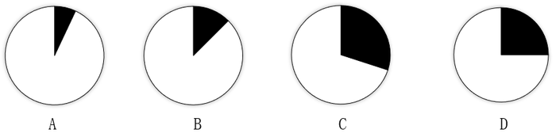

- **A**. A
- **B**. B　✅
- **C**. C
- **D**. D

**答案**：B

**官方解析**

根据题干“······2015年······在······所占比例”，结合材料时间是2015年，可判定本题为现期比重问题。定位表格可知：中国移动提供的国际出口宽带是645073Mbps；主要运营商骨干网络国际出口带宽是5392116Mbps。故2015年中国移动提供的国际出口国际带宽在主营商骨干网络国际出口带宽中所占的比例是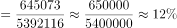，略小于，观察选项图形，与B项最接近。

故正确答案为B。

---

#### 第 14 题　qid 2188591 · 增长

2010～2015年，中国国际出口带宽增速最高的年份，其增量比增速最低的年份的增量：

- **A**. 多71.2万Mbps
- **B**. 少71.2万Mbps
- **C**. 多79.5万Mbps　✅
- **D**. 少79.5万Mbps

**答案**：C

**官方解析**

根据题干“2010～2015年间，······增量比······增量多/少······”，结合选项带单位，可判定本题为增长量计算问题。定位折线图可知，中国国际出口带宽增速最高为，对应年份为2013年，万Mbps；增速最低为，对应年份为2014年，万Mbps。故中国国际出口带宽增速最高的年份，其增量比增速最低的年份的增量多万Mbps。

故正确答案为C。

---

#### 第 15 题　qid 2188592 · 综合

能够从上述资料中推出的是：

- **A**. 2015年中国国际出口带宽比2010年增长了5倍
- **B**. 2010～2015年，中国国际出口带宽的增速逐年上升
- **C**. 2010～2015年间，中国国际出口带宽增量最高的两年相邻
- **D**. “十二五”(2011～2015年)期间中国国际出口带宽年均增长80万Mbps以上　✅

**答案**：D

**官方解析**

A项：定位图形材料，中国国际出口带宽2015年为539.2万Mbps，2010年为109.9万Mbps，故2015年中国国际出口带宽比2010年增长了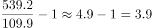倍，错误；

B项：定位图形材料，2010～2015年，中国国际出口带宽的增速在2011年和2014年出现下降，并非逐年上升，错误；

C项：定位图形材料，2013年中国国际出口带宽增量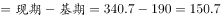万Mbps，其增量最高；2015年中国国际出口带宽增量万Mbps，其增量为第二高。故中国国际出口带宽增量最高的两年分别为2013年和2015年，并非相邻年份，错误；

D项： 定位图形材料，中国国际出口带宽2015年为539.2万Mbps，2010年为109.9万Mbps，故“十二五”(2011～2015年)期间中国国际出口带宽年均增长量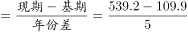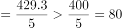万Mbps，即年均增长80万Mbps以上，正确。

故正确答案为D。

---
