# 2018年421联考《行测》题（安徽卷）（网友回忆版）

> 联考 · 2018 年 · 6 个模块 · 共 110 题

- [政治理论](#%E6%94%BF%E6%B2%BB%E7%90%86%E8%AE%BA) · 1 题
- [常识判断](#%E5%B8%B8%E8%AF%86%E5%88%A4%E6%96%AD) · 19 题
- [言语理解与表达](#%E8%A8%80%E8%AF%AD%E7%90%86%E8%A7%A3%E4%B8%8E%E8%A1%A8%E8%BE%BE) · 25 题
- [数量关系](#%E6%95%B0%E9%87%8F%E5%85%B3%E7%B3%BB) · 15 题
- [判断推理](#%E5%88%A4%E6%96%AD%E6%8E%A8%E7%90%86) · 35 题
- [资料分析](#%E8%B5%84%E6%96%99%E5%88%86%E6%9E%90) · 15 题

---

## 政治理论

### 第 1 题　qid 2187699 · 新思想

中国共产党第十九次全国代表大会的主题是：      ，高举中国特色社会主义伟大旗帜，决胜全面建成小康社会，夺取新时代中国特色社会主义伟大胜利，为实现中华民族伟大复兴的中国梦不懈奋斗。
填入划横线部分最恰当的一项是：

- **A**. 不忘初心，牢记使命　✅
- **B**. 奋发前进，使命必达
- **C**. 解放思想，改革开放
- **D**. 不忘初心，攻坚克难

**答案**：A

**官方解析**

本题主要考查时政。
中国共产党第十九次全国代表大会报告中明确指出：“大会的主题是：不忘初心，牢记使命，高举中国特色社会主义伟大旗帜，决胜全面建成小康社会，夺取新时代中国特色社会主义伟大胜利，为实现中华民族伟大复兴的中国梦不懈奋斗。”
故正确答案为A。

---

## 常识判断

### 第 1 题　qid 2187701 · 经济常识

下列关于我国金融常识的说法正确的是：

- **A**. 国债、股票、公司债券的投资风险依次递增
- **B**. 理财产品合同中的预期收益率是理财产品实际到期收益率
- **C**. 公众兑换票面残缺的人民币，要到中国人民银行指定的商业银行网点
- **D**. 自然人之间借贷如未约定利息，出借人欲主张支付利息，法院不予支持　✅

**答案**：D

**官方解析**

本题主要考查金融常识。
A项错误，债券投资的风险是指债券预期收益变动的可能性及变动幅度。国债的发行主体是国家，其具有最高的信用度，被认为是最安全的投资工具；公司债券的发债主体为按照《中华人民共和国公司法》设立的公司法人，在实践中，其发行主体为上市公司，投资风险性次之；而股票作为股份公司发行的所有权凭证，流通性强、收益高，投资风险最大。因此应为国债、公司债券、股票的投资风险依次递增。
B项错误，预期收益率也称为期望收益率，是指在不确定的条件下，预测的某资产未来可实现的收益率。因此理财产品合同中的预期收益率是指理想中理财产品的收益率，而不是实际到期收益率。
C项错误，根据《中国人民银行残缺污损人民币兑换办法》第三条规定：“凡办理人民币存取款业务的金融机构应无偿为公众兑换残缺、污损人民币，不得拒绝兑换。”因此，公众兑换票面残缺的人民币可以到任一办理存取款业务的金融机构。
D项正确，《最高人民法院关于审理民间借贷案件适用法律若干问题的规定》第二十四条第一款规定：“借贷双方没有约定利息，出借人主张支付利息的，人民法院不予支持。”
故正确答案为D。

---

### 第 2 题　qid 2187702 · 法律常识

下列情形中保险公司须承担给付或赔偿保险金的是：

- **A**. 定期寿险合同到期时，被保险人仍生存
- **B**. 在终身寿险中，受益人故意造成被保险人死亡　✅
- **C**. 在意外伤害保险有效期间，被保险人突发心脏病死亡
- **D**. 在投保重大疾病保险时，投保人故意隐瞒其有先天性疾病

**答案**：B

**官方解析**

本题主要考查法律常识。
A项错误，定期寿险是指在保险合同约定的期间内，如果被保险人死亡，则保险公司按照约定的保险金额给付保险金；若保险期限届满被保险人健在，则保险合同自然终止，保险公司不再承担保险责任，并且不退回保险费。因此，定期寿险合同到期，被保险人仍然生存，保险公司不用给付或赔偿保险金。
B项正确，终身寿险是指终身提供死亡保障的保险。根据《保险法》第四十三条第二款规定：“受益人故意造成被保险人死亡、伤残、疾病的，或者故意杀害被保险人未遂的，该受益人丧失受益权。”根据《保险法》第四十二条第一款规定：“被保险人死亡后，有下列情形之一的，保险金作为被保险人的遗产，由保险人依照《中华人民共和国继承法》（注：《继承法》现已是《民法典》继承编）的规定履行给付保险金的义务：(一)没有指定受益人，或者受益人指定不明无法确定的；(二)受益人先于被保险人死亡，没有其他受益人的；(三)受益人依法丧失受益权或者放弃受益权，没有其他受益人的。”因此当受益人故意造成被保险人死亡时，受益人丧失受益权，但是保险公司仍然要给付保险金。
C项错误，人身意外伤害险是指当被保险人在保险期限内遭受意外伤害，并以此为直接原因造成死亡或残废时，保险公司按照保险合同的约定向保险人或受益人支付一定数量保险金的一种保险。意外伤害指的是外来的、突发的、非本意的和非疾病的伤害。因此，被保险人突发心脏病死亡，不属于意外伤害，保险公司不用给付或赔偿保险金。
D项错误，重大疾病保险是指当被保险人患保单指定的重大疾病确诊后，保险人按合同约定定额支付保险金的保险。根据《保险法》第十六条第四款规定：“投保人故意不履行如实告知义务的，保险人对于合同解除前发生的保险事故，不承担赔偿或者给付保险金的责任，并不退还保险费。”因此，投保人故意隐瞒先天性疾病的，保险公司不用给付或赔偿保险金。
故正确答案为B。
【注】由于《继承法》已生效，《保险法》未做新修订，故还是引用了《保险法》中的原法条内容。

---

### 第 3 题　qid 2187704 · 法律常识

小明在图书馆大声说话，有读者制止他时，他却说：“这是我的权利和自由，别人无权干涉”。关于上述观点的评价正确的是：
①正确，宪法规定公民有言论自由
②错误，公民的自由是在法律范围内的自由
③错误，未经他人许可，公民不得擅自行使权利
④错误，世界上从来没有“绝对”的权利和自由

- **A**. ①②
- **B**. ①③
- **C**. ②③
- **D**. ②④　✅

**答案**：D

**官方解析**

本题考查宪法的相关知识，主要考查权利和自由。
①错误，我国《宪法》第三十五条规定：“中华人民共和国公民有言论、出版、集会、结社、游行、示威的自由。”有言论自由并不等于不分场所的随意行使自己的权利，图书馆属于公共场所，禁止大声喧哗。选项表述正确，但不符合题意。
②正确，我国公民言论、出版、集会、结社、游行、示威的自由，都必须在国家法律、法规规定的范围内行使，自由是相对的，而不是绝对的，自由和法律是统一的，法律是自由的体现和保证，自由要受法律的制约。
③错误，公民有行使自己权利的自由，不需要经过任何人同意，但是，前提是行使自己的权利不得触犯法律，不得损害他人利益。图书馆内禁止大声喧哗，小明在行使自己权利时损害了他人的利益。
④正确，没有绝对的权利和自由，任何权利和自由都是有条件的，都是受到一定限制的。任何权利和自由都是在法律许可的范围内行使，否则就会受到法律的制裁。行使权利和自由不得损害他人的合法权益。小明在图书馆大声喧哗，损害了他人的利益。因此，世界上不存在“绝对”的权利和自由。
①③错误，②④正确。
故正确答案为D。

---

### 第 4 题　qid 2187710 · 人文常识

下列文学作品没有使用方言的是：

- **A**. 《海上花列传》(韩邦庆)
- **B**. 《凤凰涅槃》(郭沫若)　✅
- **C**. 《秦腔》（贾平凹）
- **D**. 《白鹿原》(陈忠实)

**答案**：B

**官方解析**

本题考查文学常识。
A项正确，《海上花列传》是清末著名小说，主要讲述了清末中国上海十里洋场中的妓院生活，涉及当时的官场、商界及与之有联系的社会的各个层面。它是最著名的吴语小说，也是中国第一部方言小说。
B项错误，《凤凰涅槃》是一首现代白话诗歌，诗歌以凤凰的传说为素材，通过凤凰集木自焚，从烈焰中重生的故事，表达了彻底埋葬旧社会、争取祖国自由解放的思想，在现代诗歌史上具有重要历史地位的诗篇。《凤凰涅槃》运用的现代白话文，不涉及方言的应用。
C项正确，《秦腔》是贾平凹的著名长篇小说。《秦腔》中用了大量的修辞手法，融合比喻、拟人、对偶、象征等手法，活灵活现地展现了农村生活，这些修辞手法结合方言化的语言要素，形成了极具地域色彩的语言风格。
D项正确，《白鹿原》是陈忠实创作的长篇小说。小说中，作者不仅从表层的遣词造句的角度精心选择方言语汇，运用方言语气词以及高密度的排比句和长句来营造方言氛围、创造方言腔调，而且从深层的角度运用方言思维进行布局谋篇。
本题为选非题，故正确答案为B。

---

### 第 5 题　qid 2187715 · 人文常识

下列教育家与其名言对应不正确的是：

- **A**. 孔子：“性相近也，习相远也”
- **B**. 孟子：“尽信书，则不如无书”
- **C**. 墨子：“道之所存，师之所存”　✅
- **D**. 荀子：“骐骥一跃，不能十步；驽马十驾，功在不舍”

**答案**：C

**官方解析**

本题考查文学常识，主要考查诸子百家。
A项正确，“性相近也，习相远也”出自《论语·阳货》：“子曰：性相近也，习相远也”，意思是人的先性（先天素质）差距不大，而后天习染（教育、环境影响等造成人的发展）却有很大差异。
B项正确，“尽信书，则不如无书”出自《孟子》的《尽心下》。“尽信书，则不如无书。”这是孟子关于读书方法的论述，目的在于告诉读者要善于独立思考问题。
C项错误，“道之所存，师之所存”出自韩愈的《师说》。意思是道理存在的地方，就是老师存在的地方。
D项正确，“骐骥一跃，不能十步；驽马十驾，功在不舍”出自荀子的《劝学》。意思是骏马一跨跃，也不足十步远；劣马拉车走十天，也能到达，劣马的成功来源于走个不停，坚持不放弃。
本题为选非题，故正确答案为C。

---

### 第 6 题　qid 2187716 · 人文常识

下列著作与作者对应不正确的是：

- **A**. 《忏悔录》——奥古斯丁
- **B**. 《人性论》——萨特　✅
- **C**. 《正义论》——罗尔斯
- **D**. 《理想国》——柏拉图

**答案**：B

**官方解析**

本题主要考查文学常识的相关知识。
A项正确，世界三大忏悔录，作者分别是奥古斯丁、卢梭、托尔斯泰。其中，奥古斯丁的《忏悔录》反映了作者的心路历程，具有自传性质，书中以他人的苦闷为自己的苦闷，并以无比的真挚尝试解决其苦闷，全书分为十三卷。
B项错误，《人性论》是英国经验主义哲学家大卫·休谟的一部最重要的哲学著作。萨特，法国20世纪最重要的哲学家之一，其著作是《存在与虚无》。
C项正确，《正义论》是美国哈佛大学教授约翰·罗尔斯的著作，被视为第二次世界大战后西方政治哲学、法学和道德哲学中最重要的著作之一，被列为“历史经典名著之林”。
D项正确，《理想国》是古希腊哲学家柏拉图创作的哲学对话体著作。全书主要论述了柏拉图心中理想国的构建、治理和正义，主题是关于国家的管理。
本题为选非题，故正确答案为B。

---

### 第 7 题　qid 2187717 · 人文常识

下列哪一成语的典故不是来自真实历史事件：

- **A**. 暗度陈仓
- **B**. 草木皆兵
- **C**. 逼上梁山　✅
- **D**. 乐不思蜀

**答案**：C

**官方解析**

本题主要考查中国历史的相关知识。
A项正确，暗度陈仓，来自真实历史故事，出自《史记·高祖本纪》：“去辄烧绝栈道，以备诸侯盗兵袭之，亦示项羽无东意。······八月，汉王用韩信之计，从故道还，袭雍王章邯。邯迎击汉陈仓，雍兵败，还走······”，指刘邦出兵攻项羽时，韩信故意明修栈道，迷惑对方，暗中绕道奔袭陈仓，取得胜利。
B项正确，草木皆兵，来自真实历史故事，出自《晋书·苻坚载记》：“坚与苻融登城而望王师，见部阵齐整，将士精锐；又北望八公山上草木皆类人形，顾谓融曰：‘此亦勍（劲）敌也，何谓少乎？’怃然有惧色。”记载的是东晋淝水之战。
C项错误，逼上梁山，不是来自真实历史故事，而是来自虚构的小说，出自《水浒传》，讲述了八十万禁军教头林冲被太尉高俅陷害，刺配沧州，途中又险被杀害，终于走投无路，只好去投奔梁山的故事。 
D项正确，乐不思蜀，来自真实历史故事，出自 《三国志·蜀书·后主传》：“王问禅曰：‘颇思蜀否？’禅曰：‘此间乐，不思蜀。’”
本题为选非题，故正确答案为C。

---

### 第 8 题　qid 2187718 · 人文常识

下列我国古代绘画理论名句所表达的美学理念与其他三项不同的是：

- **A**. 到处云山是吾师
- **B**. 搜尽奇峰打草稿
- **C**. 论画以形似，见与儿童邻　✅
- **D**. 吾师心，心师目，目师华山

**答案**：C

**官方解析**

本题主要考查文化常识的相关知识。
A项“到处云山是吾师”是元代赵孟頫提出的，表达的美学理念是重视向自然美学习。
B项“搜尽奇峰打草稿”是清代石涛提出的，表达的美学理念是重视向自然学习，注意感同身受和提炼构思相结合。
C项“论画以形似，见与儿童邻”是苏轼的两句论画名言。诗句意为：衡量画的好坏，只以形似作为评判优劣的标准，就如同儿童的见解一样幼稚。画要画出神，诗要有言外之味。古代艺术论将这种思想表述为:“含不尽之意见于言外”“象外之象”“味外之味”“意外之韵”等等。
D项“吾师心，心师目，目师华山”是明代王履提出的，表达的美学理念是向自然学习，师法自然，发挥主观能动性。
C项与其他三项不同。
本题为选非题，故正确答案为C。

---

### 第 9 题　qid 2187719 · 经济常识

下列事件按时间先后顺序排列正确的是：
①中国女排获得里约奥运会女排比赛冠军
②中国（上海）自由贸易实验区正式设立
③第九届金砖国家领导人会晤在厦门举行
④我国举行纪念中国人民抗日战争暨世界反法西斯战争胜利70周年阅兵式

- **A**. ②③①④
- **B**. ④①②③
- **C**. ②④①③　✅
- **D**. ②①③④

**答案**：C

**官方解析**

本题考查毛中特。

②2013年8月22日，国务院正式批准设立中国（上海）自由贸易试验区。

④2015年9月3日，是中国第二个法定的“中国人民抗日战争胜利纪念日”，也是中国人民抗日战争暨世界反法西斯战争胜利70周年。

①北京时间2016年8月21日，在里约奥运会女排决赛中，中国队战胜塞尔维亚队获得金牌。

③2017年9月3日至5日，金砖国家领导人第九次会晤在福建厦门举行，主题是：“深化金砖伙伴关系，开辟更加光明未来。”金砖合作已经步入第二个“黄金十年”。

故按照时间先后顺序排序为②④①③。

故正确答案为C。

---

### 第 10 题　qid 2187657 · 科技常识

下列关于生活医学常识的说法错误的是：

- **A**. 
生理盐水的浓度是
　✅
- **B**. 
医用消毒酒精的浓度是

- **C**. 
儿童缺锌会导致生长发育迟缓，抵抗力差

- **D**. 
剧烈运动后感觉全身酸痛是因为肌肉中生成了乳酸

**答案**：A

**官方解析**

本题考查生物常识，主要涉及医学常识的相关内容。

A项错误，生理盐水，是指生理学实验或临床上常用的渗透压与动物或人体血浆的渗透压基本相等的氯化钠溶液。浓度：用于两栖类动物时是，用于哺乳类动物和人体时是。人们平常点滴用的氯化钠注射液浓度是，可以当成生理盐水来使用。故浓度错误。

B项正确，日常生活中，一般用的医用酒精来擦洗伤口，以达到灭菌消毒的目的。这是因为，过高浓度的酒精会在细菌表面形成一层保护膜，阻止其进入细菌体内，难以将细菌彻底杀死。若酒精浓度过低，虽可进入细菌，但不能将其体内的蛋白质凝固，同样也不能将细菌彻底杀死。

C项正确，锌是人体内必需的微量元素之一，缺锌将直接造成儿童免疫力低下，影响孩子的生长发育，导致身材矮小或智力发育不良等严重后果。

D项正确，人体剧烈运动时，会同时进行有氧呼吸和无氧呼吸。无氧呼吸产生大量乳酸等中间代谢产物，不能通过呼吸排除，就形成了乳酸堆积，造成全身肌肉酸痛。

本题为选非题，故正确答案是A。

---

### 第 11 题　qid 2187659 · 人文常识

下列药物不适用于清热利咽的是：

- **A**. 胖大海
- **B**. 板蓝根
- **C**. 片仔癀
- **D**. 珍珠粉　✅

**答案**：D

**官方解析**

本题考查生活常识，主要涉及药物使用的相关内容。
A项正确，胖大海是植物胖大海的干燥成熟种子，产于泰国、柬埔寨、马来西亚等国，具有清热润肺，解毒利咽，治疗咽喉肿痛的功效，口干咽燥，牙龈肿痛者可单独泡服。
B项正确，板蓝根，是一种中药材，具有清热解毒，凉血利咽之功效，常用于温疫时毒，发热咽痛，温毒发斑，痄腮，烂喉丹痧，大头瘟疫，丹毒，痈肿。
C项正确，片仔癀，为清热剂，具有清热解毒、凉血化瘀，消肿止痛之功效。用于热毒血瘀所致急慢性病毒性肝炎，痈疽疔疮，无名肿毒，跌打损伤及各种炎症。
D项错误，《中华人民共和国药典》及《中药大辞典》均指明：珍珠具有安神定惊、明目去翳、解毒生肌等功效，现代研究还表明珍珠粉在提高人体免疫力、延缓衰老、祛斑美白、补充钙质等方面都具有独特的作用。
本题为选非题，故正确答案为D。

---

### 第 12 题　qid 2187660 · 科技常识

某患者深夜因剧烈的关节疼痛而惊醒，触摸其手足多个关节，发现有黄白色结晶体隆起。造成这种症状的代谢改变最有可能是：

- **A**. 糖的无氧分解增强，生成过多乳酸
- **B**. 嘌呤核苷酸分解增强，生成过多尿酸　✅
- **C**. 肝中脂肪酸氧化增强，生成大量酮体
- **D**. 氨基酸脱氨基作用增强，生成大量尿素

**答案**：B

**官方解析**

本题考查生物常识。

痛风是由单钠尿酸盐（MSU）沉积所致的晶体相关性关节病，与嘌呤代谢紊乱和尿酸排泄减少所致的高尿酸血症直接相关，特指急性特征性关节炎和慢性痛风石疾病，主要包括急性发作性关节炎、痛风石形成、痛风石性慢性关节炎、尿酸盐肾病和尿酸性尿路结石，重者可出现关节残疾和肾功能不全。

痛风最重要的生化基础是高尿酸血症。尿酸是人体内嘌呤代谢的最终产物。正常成人每日约产生尿酸750mg，其中为内源性，为外源性尿酸，这些尿酸进入尿酸代谢池（约为1200mg），每日代谢池中的尿酸约进行代谢，其中1/3约200mg经肠道分解代谢，2/3约400mg经肾脏排泄，从而可维持体内尿酸水平的稳定，其中任何环节出现问题均可导致高尿酸血症。故造成这种症状的代谢改变最有可能是嘌呤核苷酸分解增强，生成过多尿酸，即B项正确，A、C、D三项错误。

故正确答案为B。

---

### 第 13 题　qid 2187661 · 科技常识

面包制作过程中使用酵母主要是利用其哪一种特性：

- **A**. 酵母在生长过程中可合成蛋白
- **B**. 酵母在生长过程中可分解淀粉
- **C**. 酵母在生长过程中可产生乙醇
- **D**. 酵母在生长过程中可产生二氧化碳　✅

**答案**：D

**官方解析**

酵母在面包制作中的功能：
1、生物膨松作用：酵母在面团发酵中产生大量的二氧化碳气体，并由于面筋网状结构的形成，而被留在网状组织内，使面团酥松多孔，体积变大及膨松； 
2、面筋扩展作用：酵母发酵除产生二氧化碳外，还有增加面筋扩展的作用，使发酵所产生的二氧化碳能保留在面团中，提高面团的保气能力。ABC三项表述有误，D项正确。
故正确答案为D。

---

### 第 14 题　qid 2187662 · 人文常识

下列四个节气所表示的含义错误的是：

- **A**. 处暑：炎热夏季即将到来　✅
- **B**. 惊蛰：天气回暖，春雷始鸣
- **C**. 冬至：冬季最寒冷的日子开始
- **D**. 小满：夏熟作物籽粒开始灌浆饱满但未成熟

**答案**：A

**官方解析**

本题考查自然常识，主要考查二十四节气的相关知识点。
A项错误，处暑，即为“出暑”，是炎热离开的意思，是气候变凉的象征。
B项正确，惊蛰，古称“启蛰”，标志着仲春时节的开始，此前，动物入冬藏伏土中，不饮不食，称为“蛰”；到了“惊蛰节”，天上的春雷惊醒蛰居的动物，称为“惊”。故惊蛰时，蛰虫惊醒，天气转暖，渐有春雷，中国大部分地区进入春耕季节。而“惊蛰”前后，之所以偶有雷声，是大地湿度渐高而促使近地面热气上升或北上的湿热空气势力较强与活动频繁所致，从而产生“惊蛰雷鸣”现象。
C项正确，从“冬至”开始，北半球逐渐进入了最寒冷的日子，称作“数九寒天”。
D项正确，小满是二十四节气之一，夏季的第二个节气。其含义是夏熟作物的籽粒开始灌浆饱满，但还未成熟，只是小满，还未大满。
本题为选非题，故正确答案为A。

---

### 第 15 题　qid 2187747 · 科技常识

下列现象的物理解释错误的是：

- **A**. 露珠呈球状——液体表面张力
- **B**. 铁轨铺在枕木上——减少压强
- **C**. 道路转弯镜——凸透镜对光发散　✅
- **D**. 微波炉烤面包——涡流感应加热

**答案**：C

**官方解析**

本题考查科技常识。
该真题命制不严谨。
A项正确，物质由分子组成，分子之间有间隙，由于分子在不停地做无规则运动，分子间存在相互作用的引力和斥力。在液体表面，分子间的作用力表现为相互吸引，由此表现为液体的表面张力。表面张力促使露珠以最小的表面积的状态存在，而体积相等的物体中，只有球体的表面积最小，所以露珠总是呈球状的。
B项正确，把铁轨铺在枕木上，是为了在压力一定的情况下，增大铁轨与地面的接触面积，从而减小火车对地面的压强。
C项错误，道路转弯镜利用的是凸面镜，可以扩大司机视野，及早发现弯道对面车辆，以减少交通事故的发生。
D项存在问题，微波炉加热食物主要利用微波。此外部分微波炉烧烤功能主要是利用烧烤组件来完成的，用电热丝发热来工作。一般认为利用涡流感应加热的是电磁炉。
本题命制不严谨，C项和D项均存在问题，C项相关知识点在往年考试中出现较多，故小粉笔认为该真题判卷时以C项为标准答案可能性更大。
本题为选非题，故正确答案为C。

---

### 第 16 题　qid 2187750 · 科技常识

通常情况下，使用高压锅可以大大缩短食物的烹煮时间，节约能源。下列对其所用物理原理的解释正确的是：

- **A**. 锅内蒸汽的压强增大，导致水的沸点降低
- **B**. 锅内水的沸点降低，导致蒸汽的压强增大
- **C**. 锅内蒸汽的压强增大，导致水的沸点升高　✅
- **D**. 锅内水的沸点升高，导致蒸汽的压强增大

**答案**：C

**官方解析**

本题考查物理常识。
水的沸点受压强影响，当水所受的压强增大时，沸点升高。在标准大气压强下水的沸点为100℃，高压锅的原理相当于把水紧密地封闭起来，水受热后产生的水蒸气不能扩散到空气中，只能保留在高压锅内，于是高压锅内部形成高温高压的环境。由于锅内水蒸汽的压强增大，导致水的沸点提高，这样就可以在较短时间内将食物煮熟。故A、B、D三项错误。
故正确答案为C。

---

### 第 17 题　qid 2187753 · 人文常识

互联网上每一个网络或每一台主机所分配的逻辑地址称为IP地址。目前，IP地址主要有IPv4地址和IPv6地址两大类别。下列对应错误的是：

- **A**. 192.168.0.57——IPv4地址
- **B**. 10.255.8.239——IPv4地址
- **C**. 0D-89-A5-9B-F3-61——IPv6地址　✅
- **D**. 2016：DB8：0：2DE：A13——IPv6地址

**答案**：C

**官方解析**

本题考查计算机相关的常识。
A、B两项正确，IPv4中规定IP地址长度为32位。一般的书写法为4个用小数点分开的十进制数。
C项错误，IPv6的地址长度为128位，采用十六进制表示。IPv6有3种表示方法，分别为冒分十六进制表示法、0位压缩表示法、内嵌IPv4地址表示法。该项表示的是主机的物理地址，而不是IP地址。
D项正确，该项是利用冒分十六进制法所表示的IPv6地址。
本题为选非题，故正确答案为C。

---

### 第 18 题　qid 2187754 · 科技常识

下列选项不属于航空航天中货运飞船主要任务的是：

- **A**. 货运飞船发射升空完成后，会与空间站自动或人工交会对接
- **B**. 货运飞船进行空间站实验和技术试验，将获取的研究数据回传　✅
- **C**. 货运飞船为空间站补加推进剂以及空气，带来饮水、食物等补给物资
- **D**. 货运飞船可充当空间站的“垃圾桶”，将站内废弃物品搬运至货运飞船

**答案**：B

**官方解析**

本题考查的是科技常识的相关知识。
货运飞船是一种专门运送货物到达太空一次性使用的航天器，主要任务是向空间站定期补给食品、货物、燃料和仪器设备等。它是国际空间站补给物资的重要运输工具，也是空间站的地面后勤保障系统。
A项正确，货运飞船发射升空后，可以与空间站自动或人工交会对接，从而输送空间站需要的补给物资。
B项错误，空间站实验和技术试验，将获取的研究数据回传这是空间站的任务，而不是货运飞船的任务。
C项正确，货运飞船可以为空间实验室以及空间站提供推进剂、空气、航天员的饮水、食物以及用于维修空间站的更换设备等补给物资。
D项正确，空间站丢弃的废弃物和生活垃圾等也可以搬运至货运飞船，随货运飞船进入大气层烧毁。
本题为选非题，故正确答案为B。

---

### 第 19 题　qid 2187757 · 科技常识

“21世纪金属”具有较高的强度、良好的抗氧化性和优异的耐腐蚀性，对人体无毒且无不良反应，被称为“亲生物金属”，可作为人造骨材料。下列关于“21世纪金属”的说法正确的是：

- **A**. “21世纪金属”是指钛和钛合金　✅
- **B**. “21世纪金属”只运用于航空航天领域
- **C**. “21世纪金属”是一种新型石墨烯材料
- **D**. “21世纪金属”是21世纪发现的一种金属元素

**答案**：A

**官方解析**

本题考查的是科技常识的相关知识。
A项正确，钛和钛合金具有很多优良的性能，如熔点高、密度小、可塑性好、易于加工，尤其是钛合金与人体器官具有很好的“生物相容性”。钛和钛合金被认为是21世纪重要的金属材料。
B项错误，钛和钛合金的用途很广，在航空航天、海洋工程、生物医疗、生活用品等领域都有广泛的应用，并不是只用于航空航天领域。
C项错误，石墨烯是一种由碳原子组成的二维碳纳米材料，具有导电电热性佳、重量轻、强度大、韧性好、透光率高等特点。但它并不是“21世纪金属”。
D项错误，“21世纪金属”指钛和钛合金，钛元素大约是在18世纪被发现，而不是21世纪。
故正确答案为A。

---

## 言语理解与表达

### 第 1 题　qid 2187773 · 逻辑填空

艺术人类学的田野调查，是将调查事项作为一个整体，从形式到内涵，由表及里，                ，考察其艺术语境、渊源、内涵、象征、法则及其实际发挥的社会功能，同时更关注艺术事项的主体，并从中发现他们独特的艺术审美和文化价值。
填入划横线部分最恰当的一项是：

- **A**. 由浅到深
- **B**. 深入浅出　✅
- **C**. 条分缕析
- **D**. 逐层论证

**答案**：B

**官方解析**

此题难度较大，建议使用排除法。文段开篇介绍艺术人类学的田野调查将调查事项作为一个整体，接着详细介绍了田野调查的三个步骤、阶段，即从形式到内涵，由表及里，故横线处所填内容为田野调查的第三个阶段，且根据前文“形式、内涵”和“表、里”，横线处成语也要包含两个方面。而C项“条分缕析”形容分析得有条理，很细致，D项“逐层论证”指一步一步分析论证，两项均不包含两个层面，与文意不符，排除。对比A、B两项，A项“由浅到深” 指从浅入深，逐步深入，与前文提到的田野调查的第二个阶段“由表及里”语义重复，不能构成调查的第三步骤，排除；B项“深入浅出”指讲话或文章的内容深刻，语言文字却浅显易懂或内容、道理很深刻，但表达得浅显通俗，符合文意，当选。
故正确答案为B。
【文段出处】《“非遗”保护与艺术人类学的作为》

---

### 第 2 题　qid 2187775 · 逻辑填空

近些年，作为文化政策、资本扶植发展的重心，国产动画被寄予了极大期望。然而，动漫的土壤并不是随便撒些空壳烂籽就可以                的。
填入划横线部分最恰当的一项是：

- **A**. 守株待兔
- **B**. 坐享其成　✅
- **C**. 不劳而获
- **D**. 以逸待劳

**答案**：B

**官方解析**

文段指出，国产动漫并不是可以随便撒些空壳烂籽就可以成功的。B项“坐享其成”形象地描绘出撒完空壳烂籽就坐在旁边等待发芽结果最终收获的样子，符合文意，当选。

A项“守株待兔”比喻试图不经过努力而得到成功的侥幸心理，C项“不劳而获”比喻不劳动而得到成果，重在强调完全什么都不做就能够获得收益，但前文中“撒些空壳烂籽”实际上也付出了劳动，故二者均不符合语境，排除。

D项“以逸待劳”指在战争中做好充分准备，养精蓄锐，等疲乏的敌人来犯时给以迎头痛击，含褒义，感情色彩与文段不符，排除。

故正确答案为B。

【文段出处】《大圣归来说启迪》

---

### 第 3 题　qid 2187776 · 逻辑填空

当初的救济性扶贫虽然有立竿见影的功效，但救济的终结常常就是返贫的开始。后来的开发性扶贫有利于借助本土资源        现代产业，但也容易滋生资源掠夺经营、透支生态环境的隐患。在“输血”和“造血”之外，我们还应有新的视角和新的思维。
填入划横线部分最恰当的一项是：

- **A**. 培养
- **B**. 扶植
- **C**. 培植　✅
- **D**. 培育

**答案**：C

**官方解析**

本题为单空实词题，且选项中词语语义相近，需认真比较。
横线处搭配“现代产业”，A项“培养”搭配不当，排除。根据后文的语境，本空要与“造血”一词形成对应，故须体现出“从无到有”这一特点，B项“扶植”有帮扶之意，体现出的是由弱到强，而非从无到有，排除；C项“培植”指栽种并细心管理，能够体现出从无到有的过程，当选； D项“培育”指培养教育，并非从无到有，与文意不符，排除。
故正确答案为C。
【文段出处】《赋权式扶贫：向社会底层普及改革发展带来的机会》

---

### 第 4 题　qid 2187778 · 逻辑填空

家风是具有鲜明特征的家庭文化，良好家风是一个家庭最宝贵的精神财富，也是每个家庭成员形成正确世界观、人生观、价值观的       。家庭是人生的第一所学校，良好家风是人生幸福生活的“第一组密码”。“积善之家，必有余庆；积不善之家，必有余殃。”只有守住和       好温暖的家庭，才能有人生的成功。
依次填入划横线部分最恰当的一项是：

- **A**. 基点  庇护
- **B**. 基准  保护
- **C**. 基础  爱护
- **D**. 基石  呵护　✅

**答案**：D

**官方解析**

第一空，根据文意可知，横线处需体现出良好家风是家庭成员形成世界观、人生观、价值观的基本条件，A项“基点”可指事物发展的根本、基础，C项“基础”意为事物发展的根本或起点，D项“基石”比喻基础或中坚力量，均能体现“基本”之意，保留。B项“基准”指标准，“家风”并不是形成三观的标准，而是三观的“基本”，故“家风”与“基准”搭配不当，排除。
第二空，横线处搭配“家庭”，A项“庇护”意为袒护、包庇，感情色彩偏消极，和“家庭”搭配不当，排除；对比C、D两项，“爱护”常用作爱护公物、爱护花草，一般不与“家庭”搭配，而“呵护”常搭配朋友、家人、家庭，并且“爱护”指爱惜并保护，“呵护”指对某人、某物很在意，用心照顾、保护，“呵护”更能体现对“家庭”精心照顾的态度，D项更符合语境，当选。
故正确答案为D。
【文段出处】《做培育良好家风的表率》

---

### 第 5 题　qid 2187670 · 逻辑填空

哲学社会科学作为人们认识世界、改造世界的重要         ，历来是推动历史发展和社会进步的重要力量。纵观人类历史，人类社会每一次重大跃进，人类文明每一次重大发展，都离不开哲学社会科学的知识         和思想先导。哲学社会科学的发展水平，反映了一个民族的思维能力、精神品格、文明素质，体现了一个国家的综合国力和国际竞争力。
依次填入划横线部分最恰当的一项是：

- **A**. 指南  增进
- **B**. 途径  进步
- **C**. 方法  积累
- **D**. 工具  变革　✅

**答案**：D

**官方解析**

本题可从第二空入手，根据文段“人类社会每一次重大跃进，人类文明每一次重大发展”可知，横线处要体现出哲学社会科学对人类社会的重大意义，且与“知识”搭配。D项“变革”指改变事物的本质，与文意相符且搭配恰当，当选。A项“增进”一般不与“知识”搭配，排除；B项“进步”、C项“积累”与“变革”相比程度较轻，均无法体现“重大跃进、重大发展”之意，排除。基本锁定正确答案为D项。
第一空，代入验证，D项“工具”指用以达到目的的事物，填入文段可体现哲学社会科学的作用，符合文意，当选。
故正确答案为D。
【文段出处】《哲学社会科学是推动发展进步的重要力量》

---

### 第 6 题　qid 2187676 · 逻辑填空

泥石流的         依赖于三个危险因素：沉积物中的粘土、大量的水快速涌入以及山区的地势差异。发生泥石流时，地上的各种大小石头和泥，小到直径只有零点几微米的粘土，大到数十厘米乃至更大的巨型漂砾，都有可能         在泥石流中“泥沙俱下”。
依次填入划横线部分最恰当的一项是：

- **A**. 诱发  裹挟　✅
- **B**. 成因  汇集
- **C**. 出现  夹杂
- **D**. 引发  聚集

**答案**：A

**官方解析**

第一空，根据文意可知，横线处表达泥石流的产生形成依赖三个因素，A项“诱发”、C项“出现”、D项“引发”均符合文意，保留；B项“成因”指原因，与后文“因素”语义重复，排除。
第二空，横线表达石头和泥等卷入泥石流中，而且石头和泥本身是静止的，受到了泥石流的冲击才被动的跟随泥石流移动，所以第二空应体现“被动”的意思。C项“夹杂”指掺杂，D项“聚集”指集合、凑在一起，均无“被动”之意，排除；A项“裹挟”指人或物被迫卷入其中，符合文意，当选。
故正确答案为A。
【文段出处】《别忘了还有泥石流》

---

### 第 7 题　qid 2187682 · 逻辑填空

中国传统菜肴对于烹调方法极为讲究，而且长期以来，由于物产和风俗的差异，各地的饮食习惯和品味爱好               ，              的烹调技术经过历代人民的创造，形成了丰富多彩的地方菜系。
依次填入划横线部分最恰当的一项是：

- **A**. 迥然不同  源远流长　✅
- **B**. 天差地别  积厚流光
- **C**. 殊途同归  连绵不断
- **D**. 如出一辙  博大精深

**答案**：A

**官方解析**

第一空，由“物产和风俗的差异”可知，横线处词语表示各地饮食习惯和品味爱好不一样，A项“迥然不同”形容相差得远，很明显不一样，B项“天差地别” 形容两种或多种事物之间的差距很大，均能够体现出“差异性”，符合文意，保留；而C项“殊途同归”比喻采取不同的方法而得到相同的结果，D项“如出一辙”比喻两件事情非常相似，均不能体现出差异性，排除C、D两项。
第二空，横线处词语形容烹调技术，由“历代人民”可知，烹调技术历史悠久，A项“源远流长”比喻历史悠久，与“历代人民”形成对应，当选；B项“积厚流光”是指积累的功业越深厚，则流传给后人的恩德越广，与“烹调技术”搭配不当，排除。
故正确答案为A。
【文段出处】《我对中国饮食文化的感悟》

---

### 第 8 题　qid 2187678 · 逻辑填空

无论是现代游戏，还是传统游戏，都____出了一定的知识、社会和时代特征，同时也____了团结、多样性和包容的价值。但随着社会变迁和时代发展，很多有价值的传统游戏正在一代又一代的____中逐渐消逝。
依次填入划横线部分最恰当的一项是：

- **A**. 反射  传播  更新
- **B**. 折射  传递  更迭　✅
- **C**. 影射  传承  更替
- **D**. 投射  传达  更动

**答案**：B

**官方解析**

第一空，搭配“特征”，B项“折射”与“特征”搭配恰当，保留。A项“反射”多指机体对内在或外在刺激有规律的反应，与“特征”搭配不当，排除；C项“影射”是借此指彼、暗指某事或某人，文中没有提及借助和被指代的主体，排除；D项“投射”侧重将自己的特点归因到其他人身上，与“特征”搭配不当，排除。
第二空，代入验证，“传递价值”为常见搭配，B项保留。
第三空，代入验证，B项“更迭”指交换、更替，与“一代又一代”形成了对应，当选。
故正确答案为B。
【文段出处】《网络时代，传统游戏如何焕发新生》

---

### 第 9 题　qid 2187681 · 逻辑填空

万众创新，需要不拘一格的包容，让各种类型的人才脱颖而出；需要自由宽松的环境，让各种新奇的探索互相____；需要体制变革的____，让全社会每一个细胞的生命活力充分____。
依次填入划横线部分最恰当的一项是：

- **A**. 砥砺  激励  释放　✅
- **B**. 磨砺  激发  施展
- **C**. 竞争  鼓励  发展
- **D**. 磨合  鼓动  绽放

**答案**：A

**官方解析**

本题可从第二空入手，搭配“体制变革”，根据文意可知，横线处表达体制变革对全社会展现创新活力的积极作用，A项“激励”、B项“激发”、C项“鼓励”均符合文意，保留。D项“鼓动”指用言语或行为激励他人使有所行动，与“体制变革”搭配不当，且感情色彩偏消极，与语境不符，排除。
第三空，搭配“活力”，表达让全社会的生命活力充分表达出来之意，A项“释放”符合文意，且“释放活力”为常见搭配，符合文意，保留。B项“施展”指运用，通常与才华、抱负搭配，与“活力”搭配不当，排除；C项“发展”通常搭配经济、生产，与“活力”搭配不当，排除。
第一空，代入验证，A项“砥砺”指磨练、勉励之意，符合文意，当选。
故正确答案为A。
【文段出处】《创新的根基在文化》

---

### 第 10 题　qid 2187684 · 逻辑填空

科学的发展和进步往往____于科学假说，科学理论发展的历史就是假说的形成、发展和假说之间的竞争、更迭的历史。面对茫茫人类历史源头，面对_______、虚虚实实的人类文明历史遗存，科学假说同样至关重要。他_______地将历史、文化、人性、环境视角的“聚光灯”汇集在一起，形成了属于他的一盏“无影灯”，并以这样的视角照射幽暗的历史深处，从而解析出一些可能接近历史本源的朦胧真相。
依次填入划横线部分最恰当的一项是：

- **A**. 发轫  凤毛麟角  含英咀华
- **B**. 肇始  吉光片羽  独辟蹊径　✅
- **C**. 滥觞  汗牛充栋  苦心孤诣
- **D**. 开端  如火如荼  毛举细故

**答案**：B

**官方解析**

本题可从第二空入手，横线处搭配“历史遗存”，A项“凤毛麟角”指珍贵而稀少，B项“吉光片羽”比喻残存的珍贵文物，均可与之搭配，保留。C项“汗牛充栋”形容藏书很多，D项“如火如荼”指形容气势旺盛、热烈或激烈，均与“历史遗存”搭配不当，排除。
第三空，根据“形成了属于他的一盏‘无影灯’”可知，横线处强调该视角是“他”自己独创的、特有的，B项“独辟蹊径”比喻独创一种新风格或者新方法，符合文意，保留。A项“含英咀华”比喻读书吸取其精华，无法体现“独创、独有”之意，排除。
第一空，代入“肇始”验证，“肇始”指发端、开始，填入文段表达科学发展和进步开始于科学假说，符合文意，当选。
故正确答案为B。
【文段出处】《面对华夏祖先的图腾——评李琳之&lt;祖先，祖先&gt;》

---

### 第 11 题　qid 2187685 · 语句表达

传统文化，其幽静深邃堪比深深庭院，正是因为有最单纯、最本初的文化热爱，路过之人才愿意叩开门扉，一探究竟。以或萌或雅的方式吸引人来，只是极为关键的第一步，而最终决定大家能在这庭院之中停留多久的，还是文化本身的魅力。因此，判断文化创意产品是否成功，一条重要的原则就是看能否将                                          融会贯通。
填入划横线部分最恰当的一项是：

- **A**. 幽静深邃的意蕴与单纯本初的文化热爱
- **B**. 传统文化的精神与国际潮流的一般走向
- **C**. 极为关键的萌感与停留心中的高雅文化
- **D**. 吸引人的巧妙形式与留住人的文化内核　✅

**答案**：D

**官方解析**

横线出现在文段结尾，需对前文内容进行总结概括。文段开篇提出因为有文化热爱，人们愿意走进文化，接着指出以或萌或雅的方式吸引人是关键，即外在表现形式，然后强调其根本还是文化本身，即文化内核，文段结尾由“因此”引导结论，故应强调的是判断文化产品是否成功的重要原则应该是外在形式与内核两者的结合，对应D项。
A项：“意蕴”和“文化热爱”对应文段首句，本身非重点，文段尾句重在得出结论，强调判断文化创意产品的原则应该内外结合，排除；
B项：“国际潮流”文段没有提及，无中生有，排除；
C项：“萌感”只对应外在表现形式，且只是其中一种形式，文段还说了雅的方式，表述片面，排除。
故正确答案为D。
【文段出处】《文创产业功夫在诗外》

---

### 第 12 题　qid 2187691 · 语句表达

小时候熟记的古诗文，长大后也很难忘记，即使长时间不用，但只要一提起，与之相关的记忆便会不由自主地流露出来。这种扎根在脑海深处的诗词印象，是浸透在血液之中的古文积淀，这就是“童子功”的厉害之处。因此，我们要从小诵读古诗文，让中华传统文化内化于心。古人云，“                                ”。想要练就古诗文的“童子功”，必须要多读多记，才会烂熟于心、出口成章。若是腹内草莽，必然不可能口吐莲花。诗词大会舞台上，选手们精彩表现的背后，又何尝不是他们从小的阅读背诵和长年的储存积累。
填入划横线部分最恰当的一项是：

- **A**. 读书破万卷，下笔如有神
- **B**. 书犹药也，善读之可以医愚
- **C**. 问渠那得清如许？为有源头活水来
- **D**. 熟读唐诗三百首，不会作诗也会吟　✅

**答案**：D

**官方解析**

文段开篇提到小时候熟记的古诗文，长大后也很难忘记，随后通过结论词“因此”强调我们应从小诵读古诗文，横线后“必须要多读多记，才会烂熟于心、出口成章”、“诗词大会舞台上······常年的储存积累”，强调的是多读古诗文才能做到口才好，论述的是古诗文和口才的关系，故横线处所填内容应和横线前后的内容相对应，既体现“要多读古诗”的，也要体现读古诗文和口才的关系，对应选项，D项“熟读唐诗三百首，不会作诗也会吟”，符合文意，当选。
A项，“读书破万卷，下笔如有神”强调的是读书对于写作的重要性，没有提到读古诗文和口才的关系，并且原文强调的是读“古诗文”，“读书”扩大范围，排除；
B项，“书犹药也，善读之可以医愚”比喻读书可以解决愚昧的问题，重在强调读书的积极效果，与口才无关，而且文段仅强调应“多读古诗”，而不是读古诗的效果，同时“书”和“古诗文”相比扩大了范围，排除；
C项，“问渠那得清如许？为有源头活水来”比喻知识是不断更新和发展的，从而不断积累，只有在人生的学习中不断地学习、运用和探索，才能使自己永葆先进和活力，就像水源头一样，强调的是不断学习的重要性，与文段强调的“诵读古诗”无关，且没有体现读古诗文与口才的关系，排除。
故正确答案为D。
【文段出处】《练就古诗文的“童子功”》

---

### 第 13 题　qid 2187696 · 语句表达

文字是人类继语言之后的第二大发明。如果说，语言的出现使人类实现了由动物到人的转变，那么文字的发明，则使人类从原始社会的低级阶段上升到文明社会的高级阶段，从而使人们的生活发生了质的飞跃。文字是一个民族与国家文化传承与创新的基础，因此，                                                          。
填入划横线部分最恰当的一项是：

- **A**. 在世界文化格局中，每一种文化都有它自己的渊源和特点
- **B**. 能够使用和传承自己本民族的文字，不仅是一种文化责任和文化能力，更是一种文化情怀和文化热爱　✅
- **C**. 中国文字文化的演变具有非常清晰的传承谱系，这正是中华文明与世界其他文明的区别所在
- **D**. 正是有了汉字，才有了中国人自己的精神，才有了中国五千年绵延不绝光辉灿烂的文化

**答案**：B

**官方解析**

横线在文段尾句，是对前文的总结概括。文段开篇提到文字是继语言之后的第二大发明，使人类从原始社会升到文明社会，使人们生活发生了质的飞跃，文字是一个民族与国家文化传承与创新的基础，故前文强调的是文字出现的意义以及对国家和民族的重要性，“因此”后的内容应围绕“文字”总结前文，对应B项。
A项，偷换概念，文段强调的是“文字”而非“文化”，排除；
C项，前文并未强调“中国文字文化”，故与前文话题不一致，排除；
D项，“中国人自己的精神”与前文所述内容无关，排除。
故正确答案为B。
【文段出处】《汉字传承与国家文化安全》

---

### 第 14 题　qid 2187687 · 语句表达

为什么一些商品的供求关系会落入尴尬境地？为什么人们对中国品牌信心不足？                       可见，这种营商理念下的商业模式，迷失了产业优化升级的方向，破坏了我国经济的微观基础，造成了供求的不匹配。
①如果一种产品利润极低，则肯定无法投入资金进行创新和提升品牌形象
②这一营商理念的问题在哪里呢
③在过去很长一段时间里，我国企业实行的是低成本低利润扩张、追求市场份额最大化的做法
④我们知道，对于任何产品，只有存在合理利润，才有可能继续投入资金进行研发，促使产品更新换代，促使品牌深入人心
⑤这需要分析我国企业的营商理念与商业模式
⑥同时，极低利润基础上的低成本竞争极易导致假冒伪劣商品横行，这又进一步损害了品牌形象
将以上6个句子重新排列后插入横线中，语序正确的是：

- **A**. ②⑤③④①⑥
- **B**. ⑤③②④①⑥　✅
- **C**. ⑤③②①⑥④
- **D**. ②⑤③①④⑥

**答案**：B

**官方解析**

本题是语句排序题与语句填空题的杂糅题型，需将句子排列整齐后放于文段当中，所以还需要注意与前后文的衔接。
观察选项，判断首句，②出现指代词“这一营商理念”，但横线前句子中没有体现出“营商理念”，故②指代不明，无法与前文连接，⑤“这”对前文问题进行指代，并对前文的问题进行分析，与横线前句子衔接紧密，排除A、D两项。
对比B、C两项，区别在于尾句是④还是⑥，横线后通过“可见”对前文中商业模式的问题进行总结，可知横线处应该是一种不太好的商业模式，⑥中介绍“低成本竞争”这种商业模式会引发问题，与后文衔接更紧密，当选。④提出对策，合理利润是一种正确的好的商业模式，与文意相悖，排除C项。    
故正确答案为B。
【文段出处】《重塑我国微观经济模式》

---

### 第 15 题　qid 2187689 · 语句表达

①红细胞破坏过多是指红细胞寿命缩短引起的溶血性贫血，有先天遗传性的溶血性贫血，也有后天获得性的溶血性贫血
②失血包括急性失血和慢性失血
③其发病机制可以概括为红细胞生成不足或减少、红细胞破坏过多和失血三类
④当然，贫血也可以是多因素叠加的结果
⑤贫血是继发于多种疾病的一种临床表现
⑥红细胞生成不足或减少包括大家熟悉的再生障碍性贫血，造血原料如铁、叶酸、维生素B缺乏引起的营养性贫血，肿瘤细胞浸润骨髓等
将以上6个句子重新排序，语序正确的一项是：

- **A**. ⑥③①②⑤④
- **B**. ⑤③⑥①②④　✅
- **C**. ⑥①②⑤③④
- **D**. ⑤③①②⑥④

**答案**：B

**官方解析**

观察选项，判断首句，⑤给贫血下定义，⑥指出红细胞生成不足或减少包括哪些种类的贫血，应该先引出话题，然后再具体论述，故⑤比⑥更适合做首句，排除A、C两项。
对比B、D两项，观察③后所接语句是⑥还是①，③指出红细胞生成不足或减少、红细胞破坏过多和失血三类发病机制，⑥论述红细胞生成不足或减少的情况，①论述红细胞破坏过多的情况，按照逻辑顺序，③后应该接⑥，排除D项。
故正确答案为B。
【文段出处】《贫血是不是吃点补血药就行？警惕部分不补血的“民间补血药”！》

---

### 第 16 题　qid 2187669 · 片段阅读

黑洞是爱因斯坦广义相对论最不祥的预言：过多物质或能量集中在一处，终将导致空间坍塌，像魔术师的外套一样吞进万物，万事万物皆逃不脱。直到40年前霍金博士宣称颠覆了黑洞——或者可能是彻底推翻了。他的方程式表明：黑洞不会永存。一段时间之后，它们会“泄掉”，然后爆炸成辐射和微粒。但是，有一个障碍：按照霍金的估算，黑洞崩塌时散出的辐射是随机的，落入其中的万事万物的“信息”大部分将被抹掉。这违反了现代物理学的一条原则：时间是可以扭转的，黑洞里发生过的事情可以重建。
这段文字的主旨是：

- **A**. 霍金发现了一条可以逃出黑洞的线索
- **B**. 黑洞终将“泄掉”，然后爆炸成辐射和微粒
- **C**. 霍金的研究结果彻底推翻了关于黑洞的预言
- **D**. 霍金破除了黑洞永存的预言却提出了新的挑战　✅

**答案**：D

**官方解析**

文段首句对爱因斯坦提出的“黑洞”概念进行了解释，并指出其危险性。随后霍金宣布了“颠覆”黑洞理论的研究，指出“黑洞”并不会永存。后利用转折词“但是”，指出霍金理论中存在一个“障碍”，尾句对其进行具体解释。故文段重点在转折之后，强调了霍金的研究会颠覆“黑洞”理论，但本身也存在障碍，对应D项。
A项，“逃出黑洞的线索”，无中生有，排除；
B项，“黑洞终将‘泄掉’”对应转折之前解释说明部分的内容，非重点，排除；
C项，转折之后指出霍金理论存在“障碍”，故“彻底推翻”过于绝对，排除。
故正确答案为D。
【文段出处】《黑洞无法逃生？霍金指出一条可能的出路》

---

### 第 17 题　qid 2187671 · 片段阅读

研究人员在大肠杆菌外面缠裹了一种叫做氨基酯的人工合成聚合物，形成一种“细菌胶囊”。随后，将其插入抵抗肺炎球菌的蛋白质疫苗。实验证明，这种胶囊能被动或主动地瞄准一种特殊免疫细胞，它能提升人体免疫反应，具有很强的抗肺炎球菌疾病的能力。研究人员指出，这种胶囊疫苗成本低，使用便利，用这种胶囊输送疫苗能引发特定免疫反应，比现有接种疫苗效率更高，效果更好。

根据这段文字，下列说法正确的是：

- **A**. 
“细菌胶囊”核心是氨基酯人工合成聚合物

- **B**. 
无害的大肠杆菌能提升人体的免疫反应

- **C**. 
“细菌胶囊”对肺病治疗具有突出成效

- **D**. 
“细菌胶囊”或成为新型疫苗输送工具
　✅

**答案**：D

**官方解析**

A项，根据首句“研究人员在大肠杆菌外面缠裹了一种叫做氨基酯的人工合成聚合物，形成一种‘细菌胶囊’”可知，“核心”表述错误，排除；

B项，根据“这种胶囊能被动或主动······它能提升人体免疫反应”，故“提升人体免疫反应”的是“细菌胶囊”，而非“无害的大肠杆菌”，表述错误，排除；

C项，根据“······它能提升人体免疫反应，具有很强的抗肺炎球菌疾病的能力”，以及下文“比现有接种疫苗效果更好”，故“细菌胶囊”对肺病的“预防”有突出成效，而非“治疗”，表述有误，排除；

D项，根据尾句“这种胶囊疫苗成本低，使用便利，用这种胶囊输送疫苗能引发特定免疫反应，比现有接种疫苗效率更高，效果更好”可知，“或成为新型疫苗输送工具”表述正确，且语气相对温和，当选。

故正确答案为D。

【文段出处】《“细菌胶囊”或将取代接种疫苗 成新型疫苗输送工具》

---

### 第 18 题　qid 2187672 · 片段阅读

全社会要形成抵制网络不良信息的“防火墙”。网络文化产品直接面向社会公众，经营者是否违法经营，受众最先知道、最有发言权。对网络文化产业进行监管要依靠群众、发动群众。应健全群众举报体系，构建严密的社会监督网络，使网络文化产业发展中的违法行为无藏身之地；引导和教育广大网民增强鉴别能力，面对形形色色的网络文化产品保持清醒头脑，不受骗上当，不误入歧途；帮助网民提高自身道德修养，从思想上打造铜墙铁壁，自觉抵制通过网络传播的不良信息。
这段文字意在强调：

- **A**. 对网络文化产业进行监管要构建监督网络
- **B**. 对网络文化产业进行监管要依靠群众力量　✅
- **C**. 网络文化产业经营者要自觉抵制不良信息
- **D**. 网络文化产业经营者要主动接受群众监管

**答案**：B

**官方解析**

文段开篇引出“抵制网络不良信息”这一话题，并指出“受众对网络文化产品最有发言权”，之后通过“要”提出核心对策即“对网络文化产业进行监管要依靠群众、发动群众”。后文通过分号体现并列，围绕如何“依靠群众、发动群众”阐述了“健全群众举报体系”“引导和教育广大网民增强鉴别能力”“帮助网民提高自身道德修养”三方面具体内容。故文段重点强调“对网络文化产业进行监管要依靠群众力量”，对应B项。
A项“构建监督网络”未体现“群众”这一核心对策，排除；
C、D项的主体均为“网络文化产业经营者”，偏离文段“如何对网络文化产业进行监管”这一核心话题，排除。
故正确答案为B。
【文段出处】《网络文化产业要自觉传递正能量》

---

### 第 19 题　qid 2187673 · 片段阅读

2017年某调查报告显示，超过8成居民家庭认为阅读是孩子认识世界、获取知识的重要途径，超过6成认为阅读对于孩子养成爱学习习惯、养成健康性格具有重要意义。在实际生活中，超过3成的受访居民家庭未成年子女能够做到每天阅读，超6成孩子每次阅读时间在半小时至1小时之间。但只有3成受访家长经常陪子女阅读，近6成家庭是让孩子自己阅读。有意思的是，虽然父母们自己已经被手机、电脑、电视占据了太多时间，却有的家长希望借助阅读挤压孩子玩电子产品、看电视的时间。

下列选项最适合做文字标题的是：

- **A**. “中国家长高度认同阅读对于子女成长的价值”
- **B**. “放下手机，才能陪孩子阅读”　✅
- **C**. “你看手机，孩子看书？”
- **D**. “阅读，不只关于书本”

**答案**：B

**官方解析**

文段通过2017年调查报告指出，大多数受访居民家庭都认为阅读对于孩子具有重要意义，随后指出在实际生活中，孩子能够做到自己阅读，紧接着通过转折关联词“但”强调，父母陪伴孩子阅读的少，基本都是孩子自己阅读，随后进一步分析原因，指出父母自己被电子设备占据很多时间，却希望孩子可以借助阅读挤压玩电子产品的时间，故文段意在强调家长应该放下手机陪伴孩子多阅读，对应B项。
A项，“中国家长高度认同阅读对于子女成长的价值”对应文段首句，非重点，排除；
C项表述不明确，相比较B项没有明确指出家长要陪伴孩子读书，排除；
D项，“阅读，不只关于书本”强调的是阅读的内容和方式广泛，并非文段强调的重点，且没有提到“孩子”这一主题词，排除。
故正确答案为B。
【文段出处】《你看手机孩子看书 我国真实的家庭亲子阅读状况如何？》

---

### 第 20 题　qid 2187683 · 片段阅读

虽然说经营性养老机构的定价是放开的，政府不能够干预，但是，从保障购买者权益、稳定养老床位价格、规范市场秩序等角度来说，有关方面需要高度警惕这种销售床位的经营模式带来的种种问题。比方说，床位可以炒卖，既有可能背离了养老机构床位的属性——把养老服务变成一种投资形式，还有可能把养老机构床位的价格哄抬高，造成老人们买不起也住不起。另外，床位售价被炒高后很有可能会出现闲置浪费。总之，如果不加以规范，有可能重蹈中国楼市的炒房覆辙。
这段文字意在强调：

- **A**. 养老机构炒卖床位将带来各种问题
- **B**. 政府应当关注养老机构的床位定价
- **C**. 政府应当规范养老机构的经营模式　✅
- **D**. 养老机构炒卖床位可能是变相炒房

**答案**：C

**官方解析**

文段开篇引出“经营性养老机构定价放开”的话题，随后通过转折词“但是”强调政府“需要高度警惕销售床位的经营模式带来的种种问题”，而后通过例子具体阐述前文问题，文段尾句通过结论词“总之”对前文举例进行总结，通过反面提出对策，即需要规范养老机构销售床位的经营模式。故文段重在强调政府需要对养老机构的经营模式加以规范，对应C项。
A项，“炒卖床位将带来各种问题”为问题表述，非重点，排除；
B项，“床位定价”对应举例内容，非重点，且文段主题词为“养老机构的经营模式”偏离核心话题，排除；
D项，“养老机构炒卖床位可能是变相炒房”对应尾句反面论证的不良后果，非重点，排除。
故正确答案为C。
【文段出处】《养老床位不能重蹈炒房覆辙》

---

### 第 21 题　qid 2187756 · 片段阅读

水熊虫也叫水熊，是对缓步动物门生物的俗称，有记录的有900余种，大多是世界性分布的。它们的体型极小，最小的只有50微米，最大的也只有1.4毫米，必须用显微镜才能看清。水熊虫是地球上已知生命力最强的生物，能在冷冻、水煮、风干的状态下存活，甚至能在真空中或者放射性射线下存活，而一旦将其放回到正常环境下，仍能恢复到正常状态。
这段文字旨在说明：

- **A**. 水熊虫是缓步动物门生物，种类繁多，分布性广
- **B**. 水熊虫体型非常小，使其易于在极端状态下存活
- **C**. 水熊虫生命力极强，在极端恶劣条件下也可存活　✅
- **D**. 水熊虫可长时间放慢或停止自己的新陈代谢活动

**答案**：C

**官方解析**

文段开篇介绍“水熊虫”的分布以及体型，引出“水熊虫”这一话题。后文通过程度词“最”强调“水熊虫”生命力最强，并进一步解释说明，故文段旨在强调“水熊虫生命力极强”，对应C项。
A项，“种类繁多，分布性广”是文段引出话题部分，非重点，排除；
B项，“使”为因果关系关联词，文中并未提及因为“体型小”使其“易于存活”，无中生有，排除；
D项，“放慢或停止自己的新陈代谢活动”，文中并未提及，无中生有，排除。
故正确答案为C。
【文段出处】《日本成功复苏水熊虫 是地球上已知生命力最强的生物》

---

### 第 22 题　qid 2187759 · 片段阅读

近年来，高空坠物事件屡有发生，受到社会广泛关注。不可否认，法律层面的规定，避免了高空坠物发生后出现索赔难的情形，确保了被侵权人的合法权益得到切实保护。然而，侵权责任法律的规定，明显具有滞后性，也就是说只有发生侵害行为后，法律才会介入。那么，当侵权行为发生后，伤害或死亡悲剧已经发生，根本无法实现亡羊补牢的效果。因此，如何强化法律的前置性功能，让法律成为高空坠物的安全防护网，是解决问题的关键所在。
下列说法与这段文字的主旨无关的是：

- **A**. 强化立法源头设计，有效避免高空坠物
- **B**. 高空坠物侵权法律责任规定还不够完善
- **C**. 有关高空坠物的法律存在明显的滞后性
- **D**. 筑牢安全防护网，让法律成为“事前诸葛”　✅

**答案**：D

**官方解析**

文段首先介绍了高空坠物事件受到广泛关注这一背景，接着肯定了现行的法律规定在事后救济方面的积极作用，之后通过“然而”进行转折，指出侵权责任的法律规定明显有滞后性，即法律仅在损害发生后介入，无法预防悲剧的发生。尾句指出应强化法律的前置性功能，使其在高空坠物事件中起到事前防范和安全防护的作用。故文段重点围绕高空坠物的立法展开，D项偏离文段核心话题“高空坠物”，与主旨无关，当选。
A、B、C三项：均是围绕高空坠物的立法展开的，与文段主旨契合，排除。
本题为选非题，故正确答案为D。
【文段出处】《杜绝高空坠物应堵住法律漏洞》

---

### 第 23 题　qid 2187763 · 片段阅读

离开家乡转眼近二十载，立业，成家，每日忙忙碌碌，即使回去，也是行色匆匆，没有机会走街串巷品尝家乡的美食。一把雪里蕻引起我对家乡美食的馋涎，也勾起我许多的乡愁。我怀念家乡的味道，不仅仅是这些美味，还有空气中那夹杂的某种浅浅的腥土味以及混合着的一些青草花香的气息，更有那热情洋溢的七邻八舍的咋呼声。这些平常熟悉的味道，这些以前常被我忽略了的味道，在我离开家乡多年后却给我以某种完全不同的感受，家乡一切陌生的、熟悉的细节纷至沓来，那些微小的触觉因了怀念都一一被放大了起来，也变得弥足珍贵起来。
对这段文字概括最准确的关键词是:

- **A**. 乡愁  味道　✅
- **B**. 故乡  记忆
- **C**. 乡村  气息
- **D**. 童年  情结

**答案**：A

**官方解析**

本题要去找到文段关键词，为中心理解题的变形。该文段为散文，应注意把握文段核心。由文段可知，一把雪里蕻勾起作者对家乡美食的回忆，由此展开对家乡各种味道的描写，进而勾起作者许多的乡愁。故文段核心内容围绕着作者记忆中的味道和作者的乡愁展开论述的。故关键词应为乡愁、味道，对应A项。
B项中的“记忆”是由味道勾起、C项中的“乡村”相较于“故乡”的概念比较狭窄、D项中“童年”文中并无重点体现，均不能准确全面地概括文段核心内容，排除。
故正确答案为A。
【文段出处】《乡愁：永远的守望》

---

### 第 24 题　qid 2187769 · 片段阅读

在中国城镇化进程中，传统戏曲面临着前所未有的生态变化。民间职业演出积极地适应农村娱乐需要，或者重新恢复传统民俗演剧形式，借助节庆礼俗，发挥戏曲传统的礼乐教化职能；或者与时俱进，以时尚流行的艺术元素充实戏曲本体，衍生出新的戏剧娱乐形态。体制内职业剧团在传统与创新中进行艺术传承，或者深入农村、送戏下乡，仍然维持在基层农村的演出；或者放弃农村，寻求多元的创新方式，勉力维持城市市场，导致戏曲在农村文化生活中趋于弱势和边缘。
这段文字意在说明：

- **A**. 戏曲艺术传承发展要寻求多元化和与时俱进
- **B**. 戏曲是传承和弘扬优秀传统文化的重要载体
- **C**. 政府要加大力度支持职业剧团在农村的演出
- **D**. 戏曲在农村的影响力出现了两极化发展趋势　✅

**答案**：D

**官方解析**

文段开篇介绍城镇化过程中传统戏曲面临生态变化，并从“民间职业演出”和“体制内职业剧团”两个不同的角度阐述了戏曲在农村中的发展状况，“民间职业演出”积极适应农村娱乐需要或者通过与时俱进衍生出新的戏剧娱乐形态体现其发展趋势良好，“体制内职业剧团”采取的方式使其在农村文化生活中处于弱势和边缘。故文段通过“民间职业演出”和“体制内职业剧团”发展状况进行对比，强调戏曲在农村中出现两极分化的趋势，对应D项。
A项，“多元”对应文段尾句，由“寻求多元的创新方式，勉力维持城市市场，导致戏曲······趋于弱势和边缘”可知，寻求“多元”并不是合理的做法，排除；
B项，文段强调的是戏曲面临的新变化，“戏曲是······重要载体”偏离文段核心话题，排除；
C项，“政府要加大力度支持职业剧团”文段没有提及，无中生有，排除。
故正确答案为D。 
【文段出处】《美丽乡村：戏曲绽放异彩的广阔空间》

---

### 第 25 题　qid 2187771 · 片段阅读

从对技术与知识关系的梳理以及互联网技术自主性的趋向来看，未来新闻传播学科重构中应该注意一个核心问题：如何平衡人与技术的关系问题，使研究者从沉浸其中的技术系统中跳脱出来，以一种批判的眼光对待技术体系，避免成为因互联网自主性导致社会失序的推手。对此，唐•伊德指出，“正是因为太熟悉，我们不仅忽视了由技术系统进行批判性反思的需要，而且也忽视了从这种批判性反思中获得的结果”。因此需要从一个超越的角度来对待围困我们的技术社会。
这段文字意在强调：

- **A**. 新闻传播学重构有技术与知识双重困难
- **B**. 新闻传播学重构必须正确对待技术体系
- **C**. 新闻传播学重构要梳理人与技术的关系　✅
- **D**. 新闻传播学重构要重视互联网的自主性

**答案**：C

**官方解析**

文段首句引出未来新闻传播学科重构要注意“平衡人与技术的关系”这一核心问题，之后引用唐•伊德所说的话对问题进行进一步的分析。最后通过结论词“因此”，进一步指出人们需要以超越以往的角度来对待技术社会，即解决前文提到的核心问题，要平衡人与技术的关系，对应C项。
A项，“技术与知识双重困难”，文段说的是技术和人的关系，与“知识”无关，排除；
B项，“正确对待技术体系”是“平衡人与技术的关系”带来的结果，应先解决“人与技术的关系”这一问题，才能正确的看待技术体系，故非文段的重点，排除；
D项，“互联网的自主性”非文段的重点，没有提及“人与技术的关系”这一核心话题，排除。
故正确答案为C。
【文段出处】《互联网革命与新闻传播学科重构之反思》

---

## 数量关系

### 第 1 题　qid 2187721 · 数学运算

某社团组织周末自驾游，集合后发现小王和小李未到。由于每辆小车限坐5人，按照现有车辆恰有1人坐不上车。为难之际，小王和小李分别开车赶到，于是所有人都坐上车，且每辆车人数均相同。那么，参加本次自驾游的小车数为：

- **A**. 9
- **B**. 8
- **C**. 7　✅
- **D**. 6

**答案**：C

**官方解析**

方法一：设参加本次自驾游的小车总数（包含小王和小李的车）为辆，根据题意可得，包含小王和小李在内的人。因为小王和小李开车赶到后每辆车人数均相同，所以总人数能被整除，是的倍数，所以7应是的倍数，只有C项满足条件。

方法二：代入排除法。

代入A选项，若参加本次自驾游的小车数为9辆，则人，平均每辆车可坐人，不是整数，错误；

代入B选项，若参加本次自驾游的小车数为8辆，则人，平均每辆车可坐人，不是整数，错误；

代入C选项，若参加本次自驾游的小车数为7辆，则人，平均每辆车可坐人，符合条件，正确；

代入D选项，若参加本次自驾游的小车数为6辆，则人，平均每辆车可坐人，不是整数，错误。

故正确答案为C。

---

### 第 2 题　qid 2187725 · 数学运算

某公司新近录用五名应聘人员，将分别安排到产品开发、管理、销售和售后服务这四个部门工作，每个部门至少一人。若其中有两人只能从事销售或售后服务两个部门的工作，其余三人均能从事四个部门的工作，则不同的选派方案共有：

- **A**. 12种
- **B**. 18种
- **C**. 36种
- **D**. 48种　✅

**答案**：D

**官方解析**

设五名应聘人员分别为甲、乙、丙、丁、戊，其中甲和乙只能从事销售或售后服务两个部门的工作，则根据题意分类讨论如下：

若甲、乙都安排到同一部门（同时在销售或售后服务部门），其余3人分别安排到剩余三个部门，每个部门1人，有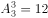种安排方法；

若甲、乙分别安排到不同部门（一个在销售部门，另一个在售后部门），其余3人有2人安排到产品开发和管理两个部门，剩余1人安排到销售或售后部门，有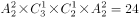种安排方法；

若甲、乙分别安排到不同部门（一个在销售部门，另一个在售后部门），其余3人全部安排到产品开发和管理两个部门，有种安排方法。

因此，不同的选派方案共有种。

故正确答案为D。

---

### 第 3 题　qid 2187727 · 数学运算

某银行推出3年期和5年期的两种理财产品A和B。小王分别购买这两种产品各1万元，结果发现，按单利计算（即利息不产生收益），B产品平均年收益率比A产品多2个百分点，期满后，B产品总收益是A产品的2.5倍。那么，小王各花1万元购买A、B两种产品的平均年收益分别是：

- **A**. 700元和900元
- **B**. 600元和900元
- **C**. 500元和700元
- **D**. 400元和600元　✅

**答案**：D

**官方解析**

设A产品的平均年收益率为，则B产品的平均年收益率为，根据A、B两种产品的总收益关系可得，，解得。所以A产品的平均年收益为，B产品的平均年收益为。

故正确答案为D。

---

### 第 4 题　qid 2187755 · 数学运算

一直升机在海上救援行动中搜索到遇险者方位后通知快艇，快艇立即朝遇险者直线驶去。此时，直升机距离海平面的垂直高度200米，从机上看，遇险者在正南方向，俯角（朝下看时视线与水平面的夹角）为，快艇在正东方向，俯角为。若忽略当时风向、潮流等其它因素，且假定遇险者位置不变，则快艇以60千米/小时的速度匀速前进需要多长时间才能到达遇险者的位置？

- **A**. 21秒
- **B**. 22秒
- **C**. 23秒
- **D**. 24秒　✅

**答案**：D

**官方解析**

因为直升机距离海平面的垂直高度200米，在机上看遇险者俯角为，所以直升机和遇险者的水平距离为米；同理，直升机和快艇的水平距离为米。如图所示，直升机在O点正上方200米A点处，遇险者在正南方向的B点，快艇在正东方向的C点，其中米，米，所以米。快艇的速度为60千米/小时=米/秒，所以快艇匀速前进到达遇险者的位置所需要的时间是秒。

故正确答案为D。

---

### 第 5 题　qid 2187767 · 数学运算

某单位工会组织桥牌比赛，共有8人报名，随机组成4队，每队2人。那么，小王和小李恰好被分在同一队的概率是：

- **A**. 

　✅
- **B**. 

- **C**. 

- **D**. 

**答案**：A

**官方解析**

方法一：若小王和小李恰好被分在某队，这队人选总情况数为种，则小王小李刚好分在这一队的概率为。由于一共有4队，所以小王和小李可以在4队中任意一队，故小王和小李恰好被分在同一队的概率是。

方法二：若小王分到任意一队，则从其余7个人中抽1个人与小王同队，正好抽到小李的概率为。

故正确答案为A。

---

### 第 6 题　qid 2187720 · 数学运算

甲、乙、丙、丁四人同时同地出发，绕一椭圆形环湖栈道行走。甲顺时针行走，其余三人逆时针行走。已知乙的行走速度为60米/分钟，丙的速度为48米/分钟。甲在出发6、7、8分钟时分别与乙、丙、丁三人相遇，求丁的行走速度是多少？

- **A**. 31米/分钟
- **B**. 36米/分钟
- **C**. 39米/分钟　✅
- **D**. 42米/分钟

**答案**：C

**官方解析**

由题意可知，甲与乙相遇，甲与丙相遇均为两人合走完一个环湖的全程。根据总路程相等，可得方程，解方程得。同理，甲与乙相遇，甲与丁相遇时的路程也相等，，解得，则丁的速度是39米/分钟。

故正确答案为C。

---

### 第 7 题　qid 2187724 · 数学运算

某苗木公司准备出售一批苗木，如果每株以4元出售，可卖出20万株，若苗木单价每提高0.4元，就会少卖10000株。问在最佳定价的情况下，该公司最大收入是多少万元？

- **A**. 60
- **B**. 80
- **C**. 90　✅
- **D**. 100

**答案**：C

**官方解析**

假设在原价基础上提价次，则共提高元，少卖了株，即万株。根据题意可得方程，收入，令，解得，，当时，取得最大值万元。

故正确答案为C。

---

### 第 8 题　qid 2187772 · 数学运算

某试验室通过测评Ⅰ和Ⅱ来核定产品的等级：两项测评都不合格的为次品，仅一项测评合格的为中品，两项测评都合格的为优品。某批产品只有测评Ⅰ合格的产品数是优品数的2倍，测评Ⅰ合格和测评Ⅱ合格的产品数之比为。若该批产品次品率为，则该批产品的优品率为：

- **A**. 

- **B**. 

- **C**. 

　✅
- **D**. 

**答案**：C

**官方解析**

假设这批产品的优品数为，则只有测评Ⅰ合格的产品数为，测评Ⅰ合格的全部产品数为，测评Ⅱ合格的产品数为。根据两集合容斥原理公式：，则这批产品非次品数量为，在总数中占比为，则产品总数为，则优品率为。

故正确答案为C。

---

### 第 9 题　qid 2187774 · 数学运算

某水渠长100米，截面为等腰梯形，其中渠面宽2米，渠底宽1米，渠深2米。因突降暴雨，水深由1米涨至1.8米。则水渠水量增加了：

- **A**. 112立方米
- **B**. 136立方米　✅
- **C**. 272立方米
- **D**. 324立方米

**答案**：B

**官方解析**

根据题意可得下图，增加的水量断面为梯形EFGM。已知水渠截面为等腰梯形，则米，米；，则，即，米，则米；米，则米。梯形EFGM截面积为平方米。又根据水渠长100米，则水渠水量增加了立方米。

故正确答案为B。

---

### 第 10 题　qid 2187777 · 数学运算

联欢会上，有24人吃冰激凌、30人吃蛋糕、38人吃水果，其中既吃冰激凌又吃蛋糕的有12人，既吃冰激凌又吃水果的有16人，既吃蛋糕又吃水果的有18人，三样都吃的则有6人。假设所有人都吃了东西，那么只吃一样东西的人数是多少？

- **A**. 12
- **B**. 18　✅
- **C**. 24
- **D**. 32

**答案**：B

**官方解析**

如图所示，共有24人吃冰激凌，其中有12人吃了蛋糕，16人吃了水果，既吃了蛋糕又吃了水果的有6人，则只吃了冰激凌的人数为人；同理，只吃了蛋糕的人数为人；只吃了水果的人数为人，则只吃一样东西的人数为人。

故正确答案为B。

---

### 第 11 题　qid 2187789 · 数学运算

一个孢子（即蘑菇种子）落在铺上营养土的长方形花盆（长40厘米，宽30厘米）中央，吸收土壤营养并开始生长。孢子长成蘑菇需要7天，再经过3天，蘑菇成熟，就会沿与水平面成45度角的方向向下喷射孢子。假设孢子一接触土壤就开始生长，蘑菇的菌盖是半径为3厘米的圆盘，蘑菇高10厘米，菌柄半径为1厘米，且蘑菇不会死亡，问蘑菇长满整个花盆需要多少天？

- **A**. 30　✅
- **B**. 37
- **C**. 40
- **D**. 47

**答案**：A

**官方解析**

如图1所示，蘑菇菌盖半径3厘米，高10厘米，菌盖沿着与水平面成45度角的方向向下喷射孢子，故落在土壤上的形状是一个以O为圆心，OA为半径的孢子圆，且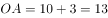厘米。 

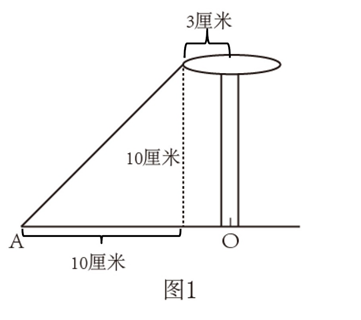

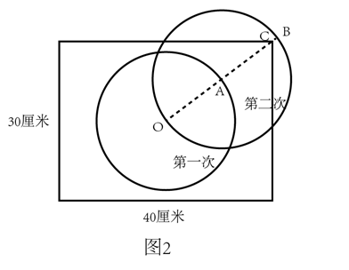

如图2所示，第一次完整的生长周期会形成一个以O为圆心，OA为半径的孢子圆。考虑A点的新孢子，第二次完整的生长周期会形成一个以A为圆心，AB为半径的孢子圆。由于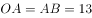厘米，故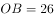厘米。而长方形花盆对角线为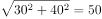厘米，则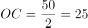厘米，所以OBOC，说明孢子圆已经将C点覆盖在内。

而C是离中心O最远的点，当C点也被第二个孢子圆覆盖时，说明孢子已经布满了整个花盆。此时已经过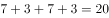天，故只需要再经过7天，整个花盆的新孢子都成长为蘑菇，即可使得蘑菇布满整个花盆。所以总共需要天。

备注：本题据以上分析，答案应该是27天，但没有这个选项，故粉笔将答案设置为与27天最接近的30天。

故正确答案为A。

---

### 第 12 题　qid 2187793 · 数学运算

某村民要在屋顶建造一个长方体无盖贮水池，如果池底每平方米的造价为150元，池壁每平方米的造价为120元，那么要造一个深为3米容积为48立方米的无盖贮水池最低造价是多少元？

- **A**. 6460
- **B**. 7200
- **C**. 8160　✅
- **D**. 9600

**答案**：C

**官方解析**

由“一个深为3米容积为48立方米的水池”，可计算出水池底面面积为平方米。若要此水池造价最低，根据几何最值规律：在面积一定的长方形中，正方形的周长最小。则此底面为正方形，即边长为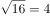米，池壁总面积为平方米。则这个无盖贮水池最低造价是元。

故正确答案为C。

---

### 第 13 题　qid 2187796 · 数学运算

一个班级组织跑步比赛，共设100米、200米、400米三个项目。班级有50人，报名参加100米比赛的有27人，参加200米比赛的有25人，参加400米比赛的有21人。如果每人最多只能报名参加2项比赛，那么该班最多有多少人未报名参赛？

- **A**. 11
- **B**. 12
- **C**. 13　✅
- **D**. 14

**答案**：C

**官方解析**

由“每人最多只能报名参加2项比赛”可得，报名三项的人数为0。设参加两项的人数为，未报名参赛的人为，根据三集合非标准公式可得：，化简得。

要让未报名参赛的人最多，则让尽量多。考虑让参加两项的人尽量多，则每人尽量参与两项，此时最多为人，向下取整为36人，即最多为36，故最多为人。

故正确答案为C。

---

### 第 14 题　qid 2187811 · 数学运算

装修工人小郑用相同的长方形瓷砖装饰正方形墙面，每10块瓷砖组成一个如下图所示的图案。小郑用这个图案恰好铺满该墙面，那么，他最少用了多少块瓷砖？

- **A**. 250
- **B**. 300　✅
- **C**. 400
- **D**. 450

**答案**：B

**官方解析**

设长方形瓷砖宽为厘米，由图示可得： ，解得：，。

由图所示，图案的长为厘米。要用长为90厘米、宽为75厘米的长方形图案拼成正方形墙面，若要使用的瓷砖最少，则正方形的边长应该为90和75的最小公倍数450厘米。那么长需要5个，宽需要6个，这样共需要个该图案，每个图案10块瓷砖，则他最少用了块瓷砖。

故正确答案为B。

---

### 第 15 题　qid 2187825 · 数学运算

小庄要制作一个工业模具。他在一个边长4厘米的正方体上表面正中心位置向下挖掉一个直径2厘米、高2厘米的圆柱体，接着再向下挖掉一个直径1厘米、高1厘米的小圆柱体（如右图所示）。那么，该模具的表面积约为多少平方厘米？

- **A**. 82.8
- **B**. 108.6
- **C**. 111.7　✅
- **D**. 114.8

**答案**：C

**官方解析**

边长4厘米的正方体的表面积为平方厘米。中心位置一个直径2厘米、高2厘米的圆柱体平方厘米，一个直径1厘米、高1厘米的小圆柱体平方厘米。那么，该模具的表面积约为平方厘米。

注：挖掉的大小圆柱体底面的面积，可以叠加还原成最上层的表面，故不需要单独计算圆柱体底面积，只需要计算侧面积即可。

故正确答案为C。

---

## 判断推理

### 第 1 题　qid 2187707 · 类比推理

青衿：读书人

- **A**. 南冠：囚犯　✅
- **B**. 浮屠：寺庙
- **C**. 春蚕：奉献
- **D**. 袍泽：官员

**答案**：A

**官方解析**

第一步：判断题干词语间逻辑关系。
青衿借指读书人，二者为比喻象征关系。
第二步：判断选项词语间逻辑关系。
A项：南冠借指囚犯，二者为比喻象征关系，与题干逻辑关系一致，当选；
B项：浮屠借指佛塔，而不是寺庙，与题干逻辑关系不一致，排除；
C项：春蚕借指乐于奉献的人，而不是奉献，与题干逻辑关系不一致，排除；
D项：袍泽借指军中的同事，而不是官员，与题干逻辑关系不一致，排除。
故正确答案为A。

---

### 第 2 题　qid 2187709 · 类比推理

风霜雨雪：雾里看花

- **A**. 春夏秋冬：踏雪寻梅
- **B**. 金木火土：水中望月　✅
- **C**. 桃李杏橘：青梅煮酒
- **D**. 梅兰竹菊：茜窗画眉

**答案**：B

**官方解析**

第一步：判断题干词语间逻辑关系。
风霜雨雪为四字并列的成语，雾里看花是场景和行为的对应关系，且雾与风霜雨雪是并列关系。
第二步：判断选项词语间逻辑关系。
A项：春夏秋冬为四字并列关系的成语，踏雪和寻梅是两个行为的并列关系，与题干逻辑关系不一致，排除；
B项：金木火土为四字并列的成语，水中望月是场景和行为的对应关系，且水与金木火土是并列关系，与题干逻辑关系一致，当选；
C项：桃李杏橘为四字并列的成语，但是青梅不是场景，与题干逻辑关系不一致，排除；
D项：梅兰竹菊为四字并列的成语，茜窗画眉是场景和行为的对应关系，但茜窗画眉中不包含与梅兰竹菊并列的字，与题干逻辑关系不一致，排除。
故正确答案为B。

---

### 第 3 题　qid 2187711 · 类比推理

骡子：耕畜：犁地

- **A**. 基因：生命：遗传
- **B**. 衙役：衙门：当差
- **C**. 鸬鹚：水鸟：捕鱼　✅
- **D**. 恒星：宇宙：发光

**答案**：C

**官方解析**

第一步：判断题干词语间逻辑关系。
骡子是一种耕畜，二者为包容关系中的种属关系，骡子能犁地，二者为功能的对应关系。
第二步：判断选项词语间逻辑关系。
A项：基因储存孕育生命的信息，二者为对应关系，“基因”是具有“遗传”效应的DNA片段，二者为对应关系，与题干逻辑关系不一致，排除；
B项：衙役指在衙门中当差的人，二者为对应关系，当差是衙役的工作内容，二者为对应关系，与题干逻辑关系不一致，排除；
C项：鸬鹚是一种水鸟，二者为包容关系中的种属关系，鸬鹚能捕鱼，二者为功能的对应关系，与题干逻辑关系一致，当选；
D项：恒星是宇宙的组成部分，二者为包容关系中的组成关系，恒星会发光，二者为属性的对应关系，与题干逻辑关系不一致，排除。
故正确答案为C。

---

### 第 4 题　qid 2187713 · 类比推理

演员：公园：演出

- **A**. 谣言：微信：查处
- **B**. 股民：股市：投资　✅
- **C**. 士兵：战争：升迁
- **D**. 信息：卫星：定位

**答案**：B

**官方解析**

第一步：判断题干词语间逻辑关系。
演员在公园演出，为人、场所和行为的对应关系，且演出是演员主动发出的动作。
第二步：判断选项词语间逻辑关系。
A项：谣言在微信被查处，不是人、场所和行为的对应关系，且谣言与查处为被动关系，与题干逻辑关系不一致，排除；
B项：股民在股市投资，为人、场所和行为的对应关系，且投资是股民主动发出的动作，与题干逻辑关系一致，当选；
C项：士兵参加战争可能被升迁，但是战争不是场所，且士兵与升迁为被动关系，与题干逻辑关系不一致，排除；
D项：卫星是传播信息的方式，信息可以用于定位，与题干逻辑关系不一致，排除。
故正确答案为B。

---

### 第 5 题　qid 2187714 · 类比推理

春秋：寒暑：一年

- **A**. 妇孺：老幼：生命
- **B**. 荏苒：蹉跎：岁月
- **C**. 东西：南北：方向　✅
- **D**. 冷热：干湿：温度

**答案**：C

**官方解析**

第一步：判断题干词语间逻辑关系。
春秋和寒暑都用来泛指一年，为比喻象征关系。
第二步：判断选项词语间逻辑关系。
A项：妇孺和老幼都有生命，为对应关系，与题干逻辑关系不一致，排除；
B项：荏苒指岁月易逝，蹉跎指岁月白白过去，与题干逻辑关系不一致，排除；
C项：东西和南北都可以用来泛指方向，与题干逻辑关系一致，当选；
D项：冷热用来形容温度的高低，干湿和温度无必然关系，与题干逻辑关系不一致，排除。
故正确答案为C。

---

### 第 6 题　qid 2187703 · 类比推理

团扇：羽毛扇：舞蹈扇

- **A**. 宣纸：餐巾纸：铜版纸
- **B**. 圈椅：实木椅：办公椅　✅
- **C**. 排球：羽毛球：乒乓球
- **D**. 墨镜：老花镜：显微镜

**答案**：B

**官方解析**

第一步：判断题干词语间逻辑关系。
团扇为圆形或近似圆形，团扇以其形状命名，羽毛扇以其原材料命名，舞蹈扇以其功能命名，三者为交叉关系。
第二步：判断选项词语间逻辑关系。
A项：宣纸产自古代宣州，以其产地命名，餐巾纸以其功能命名，铜版纸以用途命名，与题干逻辑关系不一致，排除；
B项：圈椅以其形状命名，实木椅以其原材料命名，办公椅以其功能命名，三者为交叉关系，与题干逻辑关系一致，当选；
C项：排球以队列的分布命名，羽毛球以其原材料命名，乒乓球以其声音命名，与题干逻辑关系不一致，排除；
D项：墨镜以其颜色命名，老花镜和显微镜都以其功能命名，与题干逻辑关系不一致，排除。
故正确答案为B。

---

### 第 7 题　qid 2187705 · 类比推理

井底蛙：三脚猫：智慧

- **A**. 笑面虎：变色龙：真诚　✅
- **B**. 千里马：孺子牛：可靠
- **C**. 替罪羊：铁公鸡：坚强
- **D**. 地头蛇：纸老虎：勇敢

**答案**：A

**官方解析**

第一步：判断题干词语间逻辑关系。
“井底蛙”比喻目光短浅，见识狭隘之人；“三脚猫”形容水平不高，粗浅，二者均是缺乏“智慧”的表现，与“智慧”为对应关系。
第二步：判断选项词语间逻辑关系。
A项：“笑面虎”多指笑里藏刀的人，表面上一团和气，背地里总想着怎么排挤别人；“变色龙”比喻在生活中善于变化和伪装的人，或者比喻立场不稳、见风使舵的人，二者均是缺乏“真诚”的表现，与“真诚”为对应关系，与题干逻辑关系一致，当选；
B项：“千里马”比喻人才，“孺子牛”比喻心甘情愿为人民大众服务、无私奉献的人，二者与“可靠”无明显逻辑关系，与题干逻辑关系不一致，排除；
C项：“替罪羊”比喻代人受过的人，“铁公鸡”比喻生活中小气、吝啬、一毛不拔的人，二者与“坚强”无明显逻辑关系，与题干逻辑关系不一致，排除；
D项：“地头蛇”比喻凭借当地势力欺压人民的恶霸，“纸老虎”比喻貌似强大、实际虚弱的人或集团，二者与“勇敢”无明显逻辑关系，与题干逻辑关系不一致，排除。
故正确答案为A。

---

### 第 8 题　qid 2187706 · 类比推理

火药：鞭炮：二踢脚

- **A**. 乌铁：刀具：三棱刀
- **B**. 红砖：建筑：四合院
- **C**. 清水：白酒：五粮液　✅
- **D**. 杉木：乐器：六弦琴

**答案**：C

**官方解析**

第一步：判断题干词语间逻辑关系。
火药是制作鞭炮所必需的材料，前两者为必然对应关系；二踢脚是鞭炮的一种，后两者为种属关系。
第二步：判断选项词语间逻辑关系。
A项：乌铁可以作为制作刀具的材料，但不是制作刀具必需的材料，刀具还可以是高速钢、硬质合金、金属陶瓷等，与题干逻辑关系不一致，排除；
B项：红砖可以作为建筑的材料，但不是建筑必需的材料，建筑的材料还可以是灰砂砖等，与题干逻辑关系不一致，排除；
C项：清水是制作白酒所必需的材料，前两者为必然对应关系；五粮液是白酒的一种，后两者为种属关系，与题干逻辑关系一致，当选；
D项：杉木可以用来制作乐器，但不是制作乐器必需的材料，乐器的材料还可以是金属等，与题干逻辑关系不一致，排除。
故正确答案为C。

---

### 第 9 题　qid 2187708 · 类比推理

钟表 之于 （    ） 相当于 （    ） 之于 排字工

- **A**. 时间；印刷工
- **B**. 刻度；线装书
- **C**. 更夫；打印机　✅
- **D**. 油纸；修理工

**答案**：C

**官方解析**

逐一代入选项。
A项：钟表是一种计时的装置，用来提示时间，二者为对应关系；印刷工和排字工是两种职业，二者为并列关系，前后逻辑关系不一致，排除；
B项：钟表有刻度，二者为对应关系；排字工与线装书没有明显的逻辑关系，前后逻辑关系不一致，排除；
C项：更夫是古代每天夜里敲竹梆子或锣在夜间报时的一个职业，更夫与现代的钟表均有提示时间的功能，二者为并列关系；排字工指古代按照原稿把铅字植入排字盘中的一个职业，排字工与现代的打印机具有相同的功能，二者为并列关系，前后逻辑关系一致，当选；
D项：钟表与油纸没有明显逻辑关系；修理工和排字工是两种职业，二者为并列关系，前后逻辑关系不一致，排除。
故正确答案为C。

---

### 第 10 题　qid 2187712 · 类比推理

（  ）之于 风油精 相当于 碳酸 之于（  ）

- **A**. 薄荷脑；可乐　✅
- **B**. 清凉；陈醋
- **C**. 叶绿素；花露水
- **D**. 液体；二氧化碳

**答案**：A

**官方解析**

逐一代入选项。
A项：薄荷脑是风油精的成分，二者是成分对应关系；碳酸是可乐的成分，二者是成分对应关系，前后逻辑关系一致，当选；
B项：风油精具有清凉的作用，二者是功能对应关系；陈醋与碳酸之间没有明显的逻辑关系，前后逻辑关系不一致，排除；
C项：风油精含有叶绿素，二者是成分对应关系，花露水和碳酸之间没有明显逻辑关系，前后逻辑关系不一致，排除；
D项：风油精是一种液体，二者是种属关系；二氧化碳与水反应可以生成碳酸，二者是对应关系，前后逻辑关系不一致，排除。
故正确答案为A。

---

### 第 11 题　qid 2187850 · 定义判断

精准医疗是指以个体化医疗为基础，通过基因组、蛋白质组等技术，对大样本人群与特定疾病类型进行生物标记物的分析与鉴定、验证与应用，从而精确寻找到疾病的原因和治疗的靶点，最终实现对疾病和特定患者进行个性化精确治疗。
根据上述定义，下列选项不属于精准医疗的是：

- **A**. 甲某罹患癌症，医生对其基因进行全面检测并确定治疗方案
- **B**. 乙某近期反常头晕，医生询问症状后就给其开了非处方药物　✅
- **C**. 丙某在就医时称自己对某种药物过敏，医生根据其过敏情况设计用药方案
- **D**. 丁某患失眠症到中医院就诊，医生据“同病异治，异病同治”的理念施治

**答案**：B

**官方解析**

第一步：找出定义关键词。
“以个体化医疗为基础”、“通过基因组、蛋白质组等技术”、“对大样本人群与特定疾病类型进行生物标记物的分析与鉴定、验证与应用”、“寻找到疾病的原因和治疗的靶点”、“实现对疾病和特定患者进行个性化精确治疗”。
第二步：逐一分析选项。
A项：医生对甲某的基因进行全面检测，符合“以个体化医疗为基础”、“通过基因组、蛋白质组等技术”、“寻找到疾病的原因和治疗的靶点”，制定治疗方案符合“实现对疾病和特定患者进行个性化精确治疗”，符合定义，排除；
B项：乙某出现反常头晕症状，医生仅通过询问症状就开了非处方药，不符合“以个体化医疗为基础”、“实现对疾病和特定患者进行个性化精确治疗”，不符合定义，当选；
C项：“医生根据其过敏情况设计用药方案”符合“以个体化医疗为基础”、“实现对疾病和特定患者进行个性化精确治疗”，符合定义，排除；
D项：“同病异治”是指同一病症，因时、因地、因人不同，或由于病情进展程度、病机变化，以及用药过程中正邪消长等差异，治疗上应相应采取不同治法。“异病同治”指不同的疾病，在其发展过程中，由于出现了相同的病机，因而采用同一方法治疗的法则。中医治病的法则，不是着眼于病的异同，而是着眼于病机的区别。异病可以同治，既不决定于病因，也不决定于病证，关键在于辨识不同疾病有无共同的病机。病机相同，才可采用相同的治法。因此“同病异治，异病同治”符合“实现对疾病和特定患者进行个性化精确治疗”，符合定义，排除。
本题为选非题，故正确答案为B。

---

### 第 12 题　qid 2187852 · 定义判断

情感广告是诉诸于消费者的情绪或情感反应，传达商品带给他们的附加值或情绪满足的一种广告策略。这种情绪在消费者心目中的价值可能远远超出商品本身，从而使消费者形成积极的品牌态度。
根据上述定义，下列广告语不属于情感广告的是：

- **A**. 某品牌饮料广告语：“××可乐，中国人自己的可乐！”
- **B**. 某品牌啤酒进入东南亚市场的广告语：“好不好，家乡水。”
- **C**. 某品牌纸尿裤广告语：“宝宝天天好心情，妈妈一定更美丽。”
- **D**. 某品牌润肤露广告语：“为了肌肤柔美润舒，请使用××润肤露。”　✅

**答案**：D

**官方解析**

第一步：找出定义关键词。
“诉诸于消费者的情绪或情感反应”、“传达商品带给他们的附加值或情绪满足的一种广告策略”、“使消费者形成积极的品牌态度”。
第二步：逐一分析选项。
A项：“中国人自己的可乐”，会使消费者产生爱国的情绪满足，符合“传达商品带给他们的情绪满足”，符合定义，排除； 
B项：“好不好，家乡水”，会使消费者产生怀念家乡，以家乡为自豪的情绪满足，符合“传达商品带给他们的情绪满足”，符合定义，排除；
C项：“宝宝天天好心情”，会使消费者产生孩子很舒适的情绪满足，符合“传达商品带给他们的情绪满足”，符合定义，排除；
D项：“为了肌肤柔美润舒”，没有体现出商品的附加值或者情绪满足，不符合定义，当选。
本题为选非题，故正确答案为D。

---

### 第 13 题　qid 2188029 · 定义判断

理性预期指的是，针对某个经济现象进行预期的时候，如果人们是理性的，那么他们就会最大限度地充分利用所得到的信息来作出行动而不会犯系统性的错误。
根据以上定义，下列属于理性预期的是：

- **A**. 省立医院分院一投入使用，小陈就在附近开了一家水果店　✅
- **B**. 老秦获悉某政策即将施行，凭着长期炒股的经验进行股票操作
- **C**. 传言说城南要建某重点中学分校，老刘立即在附近买了一套房子
- **D**. 小张得知其高考成绩在全省排第二十位，果断决定第一志愿报清华大学

**答案**：A

**官方解析**

第一步：找出定义关键词。
“针对某个经济现象进行预期”、“人们是理性的”、“他们就会最大限度地充分利用所得到的信息来作出行动而不会犯系统性的错误”。
第二步：逐一分析选项。
A项：人们到医院看望病人时经常选择水果作为礼物，所以医院的投入使用会使得水果的需求量增加，那么小陈选择在医院附近开水果店，符合“针对某个经济现象进行预期”，且其做出的判断是理性的，符合定义，当选；
B项：政策的施行可能对股票产生影响，老秦获悉这一信息后进行股票操作，符合“针对某个经济现象进行预期”，但凭着长期炒股的经验，不能确定其判断是否理性，不符合“人们是理性的”，不符合定义，排除；
C项：建重点中学分校可能会影响其附近的房价，但该消息为传言，传言是否真实并不确定，故老刘在附近买了一套房子这一决定是否是理性的并不明确，不符合定义，排除；
D项：小张根据高考成绩填报志愿，不符合“针对某个经济现象进行预期”，不符合定义，排除。
故正确答案为A。

---

### 第 14 题　qid 2187855 · 定义判断

回弹效应是指通过技术进步提高能源使用效率，节约了能源消费，但技术进步的同时也会促进经济规模的扩大，对能源产生新的需求，从而部分、甚至完全地抵消所节约的能源。
根据上述定义，下列选项可以有效控制回弹效应的是：

- **A**. 发动机效率提升降低了行车成本，更多人选择以车代步
- **B**. 厂商进一步提高能源效率，利润增加，生产出更多产品
- **C**. 太阳能热水器热销，慢慢取代传统电热水器　✅
- **D**. 现在越来越多的消费者购买节能型家用电器

**答案**：C

**官方解析**

第一步：找出定义关键词。
“通过技术进步提高能源使用效率，节约了能源消费”、“技术进步的同时也会促进经济规模的扩大，对能源产生新的需求”、“部分、甚至完全地抵消所节约的能源”。
第二步：逐一分析选项。
A项：更多人选择以车代步，说明对汽车产生了更多的需求，符合“对能源产生新的需求”，汽车使用的多会导致消耗能源更多，会部分抵消发动机效率提升所节约的能源，无法有效控制回弹效应，排除； 
B项：厂商生产出更多产品，说明对生产产品所需的能源有了更多的需求，符合“对能源产生新的需求”，生产更多产品会消耗更多的能源，会部分抵消提高能源效率所节约的能源，无法有效控制回弹效应，排除；
C项：太阳能热水器取代传统电热水器，说明对太阳能产生了更多的需求，符合“对能源产生新的需求”，但太阳能热水器对太阳能的利用并不会抵消所节约的能源，所以可以有效控制回弹效应，当选；
D项：越来越多的消费者购买节能型家用电器，说明对生产节能型家用电器所需的能源有了更多的需求，符合“对能源产生新的需求”，卖出更多节能型家用电器会消耗更多能源，会部分抵消节能电器所节约的能源，无法有效控制回弹效应，排除。
故正确答案为C。

---

### 第 15 题　qid 2187858 · 定义判断

刺激泛化是指条件作用的形成使有机体习得了对某一刺激做出特定反应的行为，因此也就可能对类似的刺激做出同样的行为反应。刺激分化是通过选择性强化和消退使有机体学会对条件刺激和与条件刺激相类似的刺激做出不同的行为反应。
根据上述定义，下列说法不正确的是：

- **A**. “一朝被蛇咬，十年怕井绳”属于刺激泛化
- **B**. “横看成岭侧成峰，远近高低各不同”属于刺激分化　✅
- **C**. 为突出品牌，厂家对包装进行独特设计，力图使顾客产生刺激分化
- **D**. 某品牌牙膏创成名牌后，生产商将其生产的化妆品也以同品牌命名，利用的是顾客的刺激泛化

**答案**：B

**官方解析**

第一步：找出定义关键词。
刺激泛化：“条件作用的形成使有机体习得了对某一刺激做出特定反应的行为”、“对类似的刺激做出同样的行为反应”
刺激分化：“通过选择性强化和消退”、“对相类似的刺激做出不同的行为反应”
第二步：逐一分析选项。
A项：被蛇咬后怕井绳是对类似的刺激做出同样的行为反应，符合“刺激泛化”定义，排除；
B项：“横看成岭侧成峰，远近高低各不同”是对同一事物从不同角度的观看所产生的视觉差异，不涉及刺激反应，不符合“刺激分化”定义，当选；
C项：厂家对包装进行独特设计的目的是为了和其他品牌进行区分，想让顾客看到该厂的产品后，做出和看到其他厂商相同产品时不同的反应，符合“通过选择性强化和消退”、“对相类似的刺激做出不同的行为反应”，符合“刺激分化”定义，排除；
D项：生产商将化妆品也以同品牌命名，想让顾客看到同品牌化妆品后也产生名牌的认知，符合“想让消费者对类似的刺激做出同样的行为反应”，符合“刺激泛化”定义，排除。
本题为选非题，故正确答案为B。

---

### 第 16 题　qid 2187803 · 定义判断

绿色设计是指在整个产品周期内，着重考虑产品的环境属性，如可拆卸性、可回收性、可维护性、可重复利用性等，并将其作为设计目标，在满足环境保护条件的同时，保证产品的质量达到最优状态。
根据上述定义，下列选项符合绿色设计理念的是：

- **A**. 迪拜太阳村巧摆太阳能收集器以实现日照时间最大化
- **B**. 荷兰某化学品公司将健康环保作为公司重要的价值观
- **C**. 巴西流行利用绿色植物代替砖、石、钢筋水泥来砌墙　✅
- **D**. 某学校将教室背景设计为浅绿色来保护孩子们的眼睛

**答案**：C

**官方解析**

第一步：找出定义关键词。
“着重考虑产品的环境属性并将其作为设计目标”、“可拆卸性、可回收性、可维护性、可重复利用性等”、“满足环境保护条件的同时，保证产品的质量达到最优状态”。
第二步：逐一分析选项。
A项：巧摆太阳能收集器，只是改变了太阳能收集器的摆放位置，并未体现在产品周期考虑环境属性，且目的是实现日照时间最大化，不是为了环境保护，也不是为了产品质量达到最优，不符合定义，排除；
B项：将健康环保作为公司的价值观，没有提及设计产品时是否“着重考虑产品的环境属性，并将其作为设计目标”，不符合定义，排除；
C项：利用绿色植物代替砖、石、钢筋水泥来砌墙，属于在产品周期考虑了环境属性，符合“着重考虑产品的环境属性并将其作为设计目标”，符合定义，当选；
D项：将教室背景设计为浅绿色的目的是保护孩子们的眼睛，不符合“满足环境保护条件，保证产品的质量达到最优状态”，不符合定义，排除。
故正确答案为C。

---

### 第 17 题　qid 2187806 · 定义判断

在企业活动中，库存有多种类型。装运库存是指在价值链末端工厂的库房里，那些已经准备好可以随时出货的产品。在途库存又称中转库存，指尚未到达目的地，正处于运输状态或等待运输状态而储备在运输工具中的库存。
根据上述定义，下列选项属于在途库存的是：

- **A**. 小张给自己网购了一件毛衣，下单两天后查知该毛衣已到某中转站
- **B**. 某高速服务区内一辆大货车满载着A超市从B地采购的各类毛巾　✅
- **C**. 某皮鞋厂的卡车里，堆满了该厂用于制造新款皮鞋的牛皮
- **D**. 某公司在城南的自有库房中存放着给城北门店销售的玩具

**答案**：B

**官方解析**

第一步：找出定义关键词。
装运库存：“在价值链末端工厂的库房”、“已经准备好可以随时出货的产品”；
在途库存：“尚未达到目的地”、“正处在运输状态或等待运输状态而储存在运输工具中的库存”。
第二步：逐一分析选项。
A项：小张网购的毛衣已到某中转站，不符合“在价值链末端工厂的库房”，也不符合“正处在运输状态或等待运输状态而储存在运输工具中的库存”，不符合任何一个定义，排除； 
B项：高速公路服务区大货车内的毛巾，符合“尚未达到目的地”且“正处在运输状态或等待运输状态而储存在运输工具中的库存”，符合“在途库存”定义，当选；
C项：皮鞋厂卡车里的牛皮是皮鞋厂的原材料，而不是产品，不符合“在价值链末端工厂的库房里”,且“某皮鞋厂的卡车里”并未指明是“正处于运输状态或等待运输状态”还是“已经到达目的地”，不符合“尚未到达目的地”，不符合任何一个定义，排除；
D项：某公司城南的自有仓库中存放的玩具，符合“在价值链末端工厂的库房”，也符合“已经准备好可以随时出货的产品”，符合“装运库存”定义，不符合“在途库存”定义，排除。
故正确答案为B。

---

### 第 18 题　qid 2187813 · 定义判断

二维码是用某种特定的几何图形按一定规律，在平面分布的黑白相间的图形记录数据符号信息。在代码编制上利用“0”“1”比特流的概念，用若干与二进制相对应的几何形体来表示文字数值信息，通过图像输入设备或光电扫描设备自动识读，以实现信息自动处理。一个二维码所能表示的比特数是固定的，它包含的信息越多，则冗余度就越小；反之，冗余度就越大。
根据上述定义，下列选项不符合二维码内涵的是：

- **A**. 某种特定的几何图形按一定规律分布可以构成相应的二维码
- **B**. 二维码中图像代码的基本原理利用的是计算机的内部逻辑基础
- **C**. 把文字数值信息转化成与二进制相对应的几何形体，可供设备识读
- **D**. 二维码包含的信息量都很大，意味着在编码时需要尽量减少冗余度　✅

**答案**：D

**官方解析**

第一步：找出定义关键词。
“用某种特定的几何图形按一定规律”、“在平面分布的黑白相间的图形记录数据符号信息”、“在代码编制上利用‘0’‘1’比特流的概念”、“用若干与二进制相对应的几何形体来表示文字数值信息”、“通过图像输入设备或光电扫描设备自动识读，以实现信息自动处理”、“一个二维码所能表示的比特数是固定的，它包含的信息越多，则冗余度就越小”。
第二步：逐一分析选项。
A项：某种特定的几何图形按一定规律分布符合“用某种特定的几何图形按一定规律”，符合定义，排除；
B项：图像代码的基本原理利用的是计算机的内部逻辑基础，符合“在代码编制上利用‘0’‘1’比特流的概念”，符合定义，排除；
C项：把文字数值信息转化成与二进制相对应的几何形体，可供设备识读，符合“用若干与二进制相对应的几何形体来表示文字数值信息”、“通过图像输入设备或光电扫描设备自动识读，以实现信息自动处理”，符合定义，排除；
D项：根据题干信息，“一个二维码所能表示的比特数是固定的，它包含的信息越多，则冗余度就越小”，即冗余度由信息量大小决定，无法尽量减少冗余度，不符合定义，当选。
本题为选非题，故正确答案为D。

---

### 第 19 题　qid 2187822 · 定义判断

水体旅游是人们前往水体及周边区域以寻求愉悦为主要目的的一种具有社会、休闲和消费属性的短期经历，目前已逐渐成为人们休闲时尚与区域旅游开发的重要载体。水体旅游资源是指水域（水体）及相关联的岸地、岛屿、林草、建筑等能对人产生吸引力的自然景观和人文景观。
根据上述定义，下列选项不属于水体旅游资源的是：

- **A**. 武夷山“九曲溪”两旁随处可见历代文人墨客的题词
- **B**. 秦淮河岸的街道上，有一座建于明代的“江南贡院”
- **C**. 某森林公园建有一个放养着上千条锦鲤的“放生池”　✅
- **D**. 某大厦矗立于长江岸边，成为游客拍照留念的背景

**答案**：C

**官方解析**

第一步：找出定义关键词。
“水域（水体）及相关联的岸地、岛屿、林草、建筑等”、“对人产生吸引力的自然景观和人文景观”。
第二步：逐一分析选项。
A项：“九曲溪”是水域，历代文人墨客题词，符合“对人产生吸引力的自然景观和人文景观”，符合定义，排除；
B项：秦淮河是水域，河岸街道上建于明代的“江南贡院”，符合“对人产生吸引力的自然景观和人文景观”，符合定义，排除；
C项： “放生池”是人工造的水池，而“水域”指海洋、河流、湖泊等范围，“放生池”并不是“水域”，不符合定义，当选；
D项：长江是水体，矗立于岸边的大厦，符合“对人产生吸引力的自然景观和人文景观”，符合定义，排除。
本题为选非题，故正确答案为C。

---

### 第 20 题　qid 2187831 · 定义判断

在决断之前，每个事物的价值在决策者心中大致相近，则难于决断其优劣；但在作出选择之后，决策者对这些事物的态度评价就发生了改变。这种现象叫作决断后效应。
根据上述定义，下列现象属于决断后效应的是：

- **A**. 某职员对自己的去留一筹莫展，一番考量之后他认为留下来要面对许多复杂关系，不如重新开创新天地
- **B**. 某女士对各有优劣的两个品牌手机难以抉择，最后她从经济角度考虑选择其中一款，可到货后发现这款有色差
- **C**. 某老师对选A还是B去参加比赛犹豫不决，班长建议选B。事后，老师认为选B完全正确，因为B最终夺得冠军
- **D**. 某学生填报志愿时对报甲大学还是乙大学犹豫不决，最后他听从老师建议选择了甲大学，从此觉得甲大学优于乙大学　✅

**答案**：D

**官方解析**

第一步：找出定义关键词。
“决断之前”、“每个事物的价值在决策者心中大致相近”、“作出选择之后”、“决策者对这些事物的态度评价就发生了改变”。
第二步：逐一分析选项。
A项：对自己的去留一筹莫展，符合“决断之前”、“每个事物的价值在决策者心中大致相近”，但考量之后他认为留下来要面对复杂关系，这只是他的认知，并没有进行决断，不符合“作出选择之后”，更不符合“决策者对这些事物的态度评价就发生了改变”，不符合定义，排除；
B项：对两个品牌手机难以抉择，符合“决断之前”、“每个事物的价值在决策者心中大致相近”，最后选择了其中一款，发现有色差，只是描述情况，并没体现“决策者对这些事物的态度评价就发生了改变”，不符合定义，排除；
C项：老师对A与B的选择犹豫不决，符合“决断之前”、“每个事物的价值在决策者心中大致相近”，但赛后认为选B是正确的，是因为他夺冠了的结果证明选择正确，并没体现因为做出决策而对A、B重新评价，不符合“作出选择之后”、“决策者对这些事物的态度评价就发生了改变”，不符合定义，排除；
D项：对甲乙两所大学犹豫不决，符合“决断之前”、“每个事物的价值在决策者心中大致相近”，选择了甲大学之后，觉得甲大学优于乙大学，符合“作出选择之后”、“决策者对这些事物的态度评价就发生了改变”，符合定义，当选。
故正确答案为D。

---

### 第 21 题　qid 2187790 · 图形推理

从所给的四个选项中，选择最合适的一个填入问号处，使之呈现一定的规律性：

- **A**. A　✅
- **B**. B
- **C**. C
- **D**. D

**答案**：A

**官方解析**

元素组成不同，无明显属性规律，考虑数量规律。观察发现，图一出现端点较多，B项为日字变形图，都是笔画数特征图，考虑笔画数。题干都是两笔画图形，？处也应该是两笔画图形。A项两笔画，B项一笔画，C项三笔画，D项三笔画，只有A项符合。
故正确答案为A。

---

### 第 22 题　qid 2187802 · 图形推理

从所给的四个选项中，选择最合适的一个填入问号处，使之呈现一定的规律性：

- **A**. A
- **B**. B　✅
- **C**. C
- **D**. D

**答案**：B

**官方解析**

元素组成不同，无明显属性规律，考虑数量规律。观察发现，题干图形均有面，考虑数面，数量依次为3、4、5、6、8，没有规律，再观察发现每个图形中均有形状相同的面，且数量依次为2、3、4、5、6，？，问号处图形应该含有7个形状相同的面。A项6个，B项7个，C项2个，D项没有形状相同的面，只有B项符合。
故正确答案为B。

---

### 第 23 题　qid 2187817 · 图形推理

从正方体中裁出如下图所示六个不同的三角形，将其分为两类，使每一类图形都有各自的共同特征或规律，分类正确的一项是：

- **A**. ①②⑤，③④⑥　✅
- **B**. ①⑤⑥，②③④
- **C**. ①③⑤，②④⑥
- **D**. ①②④，③⑤⑥

**答案**：A

**官方解析**

本题为分组分类题目。每个图形都在正方体中裁出了一个三角形，观察发现，①②⑤中三角形的底边和高的长度都等于正方体的棱长，所以三个三角形的面积相同，③④⑥中三角形底边长度等于正方体的棱长，高的长度等于正方体外表面正方形的对角线的长度，所以三个三角形的面积相同。即①②⑤一组，③④⑥一组。
故正确答案为A。

---

### 第 24 题　qid 2187829 · 图形推理

把下面的图形分为两类，使每一类图形都有各自的共同特征或规律，分类正确的一项是：

- **A**. ①④⑥，②③⑤
- **B**. ①③④，②⑤⑥
- **C**. ①②⑤，③④⑥　✅
- **D**. ①③⑤，②④⑥

**答案**：C

**官方解析**

本题为分组分类题目。元素组成不同，优先考虑属性规律。观察发现，①②⑤都是全曲线图形，③④⑥都是全直线图形。即①②⑤一组，③④⑥一组。
故正确答案为C。

---

### 第 25 题　qid 2187839 · 图形推理

下列选项中的图形<b>不能</b>折叠成完整封闭的立体几何结构的是：

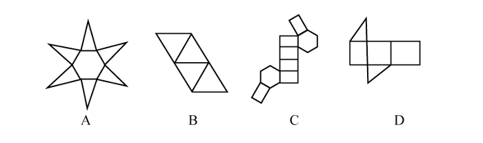

- **A**. A
- **B**. B
- **C**. C　✅
- **D**. D

**答案**：C

**官方解析**

逐一分析选项。

如下图：

A项：可以折叠成一个底面为六边形的正六棱锥，排除；

B项：可以折叠成一个正四面体，排除；

C项：如图所示，相同标号的边应该为公共边，但标记为4的两条边不可能为公共边，所以不能折叠成完整封闭的立体图形，当选；

D项：可以折叠成完整封闭的立体图形，排除。

本题为选非题，故正确答案为C。

---

### 第 26 题　qid 2187785 · 逻辑判断

研究人员在普遍使用的功能性磁共振成像技术（fMRI）专用软件中发现了算法错误。他们采集499名健康的人处于静息状态时的检查结果，发现其统计方法还需用真实呈现的病例加以验证。这意味着软件有时会错得离谱，就算大脑处于静止状态时也会显示有活动——软件显示出的活动是软件算法的产物，而非被研究大脑真的处于活跃状态。
以下哪项如果为真，最能支持上述结论？

- **A**. 
研究结论可以经fMRI获得有关数据并通过相关程序编译出来

- **B**. 
fMRI能捕捉脑部血流变化，但无法有效显示大脑是否处于活跃状态

- **C**. 
目前普遍用来诊断脑部功能的fMRI软件的假阳性率达到以上
　✅
- **D**. 
只有经fMRI专用软件获得的结果会进行验证性试验并进一步确认

**答案**：C

**官方解析**

第一步：找出论点和论据。

论点：软件有时会错得离谱，就算大脑处于静止状态时也会显示有活动——软件显示出的活动是软件算法的产物，而非被研究大脑真的处于活跃状态。

论据：采集499名健康的人处于静息状态时的检查结果，发现其统计方法还需用真实呈现的病例加以验证。

第二步：逐一分析选项。

A项：论点说的是软件有时会错得离谱，该项说的是研究结论可以经该技术获得数据并编译，话题不一致，无法加强，排除；

B项：fMRI可以捕捉脑部血流变化，但无法有效显示大脑是否处于活跃状态，说明fMRI软件确实存在问题，有加强的作用，保留；

C项：fMRI软件假阳性率达，说明结论错误率很高，那么软件有时确实会错得离谱，也有加强的作用，保留； 

D项：论点说的是软件有时会错得离谱，选项说的是用软件获得的结果有没有进行验证性试验，话题不一致，无法加强，排除。

对比B、C两个选项，B项重复了论据中已经指出的内容，虽然能证明软件确实有问题，有一定的加强作用，但是无法证明问题有多大，是否错得离谱，而C选项明确地说了假阳性率高达，也就是出错概率非常高，更明确地证明软件有时会错得离谱。

故正确答案为C。

---

### 第 27 题　qid 2187788 · 逻辑判断

甲、乙、丙三人大学毕业后选择从事各不相同的职业：教师、律师、工程师。其他同学做了如下猜测：
小李：甲是工程师，乙是教师。
小王：甲是教师，丙是工程师。
小方：甲是律师，乙是工程师。
后来证实，小李、小王和小方都只猜对了一半。那么，甲、乙、丙分别从事何种职业？

- **A**. 甲是教师，乙是律师，丙是工程师
- **B**. 甲是工程师，乙是律师，丙是教师
- **C**. 甲是律师，乙是工程师，丙是教师
- **D**. 甲是律师，乙是教师，丙是工程师　✅

**答案**：D

**官方解析**

题干条件不确定，优先采用代入法。
将A项代入，小李和小方两句都猜错了，而小王两句都猜对了，不符合题干要求，排除；
将B项代入，小李两句一对一错，而小王和小方两句都猜错了，不符合题干要求，排除；
将C项代入，小李和小王两句都猜错了，而小方两句都猜对了，不符合题干要求，排除；
将D项代入，小李、小王和小方都只猜对了一半，符合题干要求，当选。
故正确答案为D。

---

### 第 28 题　qid 2187791 · 逻辑判断

如果央行允许人民币继续贬值，那么市场对于人民币贬值的预期就容易强化。如果市场形成较强的人民币贬值预期，大量的资金就会流出我国。资金流出我国，不仅会强化这种人民币的贬值预期，导致更多的资金流出我国，而且可能会导致我国资产价格全面下跌，继而可能引爆金融市场的区域性风险及系统性风险。这些都是我们不愿意看到且不允许出现的情况。
由此可以推出：

- **A**. 货币持续贬值会导致资产全面下跌
- **B**. 资金流失严重会出现货币贬值预期
- **C**. 央行不会允许人民币继续贬值　✅
- **D**. 我国将重点着手干预资金外流

**答案**：C

**官方解析**

日常结论题，根据题干信息逐一分析选项。
A项：题干只是表述货币持续贬值“可能”会导致资产价格全面下跌，而该项说“会”导致，说的过于绝对，无法推出，排除；
B项：题干表述的是较强的人民币贬值预期会出现资金大量流失，该项是资金流失严重会出现货币贬值预期，属于逻辑错误，无法推出，排除；
C项：题干最后一句表明我们不允许出现这种情况，“这种情况”指代的是前文“如果央行允许人民币继续贬值”这种情况，该项属于最后一句的同义替换，可以推出，当选；
D项：我国是否将采取措施干预资金外流，题干没有提及，无中生有，排除。
故正确答案为C。

---

### 第 29 题　qid 2187794 · 逻辑判断

四位球迷在某球赛的晋级赛开始之前对几个队伍的赛况进行预测，他们比较关注其中的两支球队，分别作了如下预测：
方某说：如果甲队不能晋级，那么乙队也不能晋级。
白某说：不管甲队能不能晋级，乙队都不能晋级。
夏某说：乙队能晋级，但甲队不能晋级。
邓某说：我看这几支球队都不能晋级。
比赛结果证明，四位球迷中只有一位的预测是正确的。
根据上述情况，以下哪项一定为真？

- **A**. 白某预测是正确的
- **B**. 邓某预测是正确的
- **C**. 如果甲队能够晋级，那么方某的预测是正确的　✅
- **D**. 如果甲队不能晋级，那么方某的预测是正确的

**答案**：C

**官方解析**

第一步：翻译题干。

方：甲队晋级乙队晋级；

白：乙队晋级；

夏：乙队晋级 且 甲队晋级；

邓：乙队晋级 且 甲队晋级。

第二步：找关系。

方某和夏某是矛盾关系，必有一真一假。

第三步：看其余。

四位球迷只有一位预测为真，可知白某、邓某一定为假，排除A、B两项。

由白某为假，可知乙队晋级了，此时无法直接判断方某、夏某的真假，代入C、D两项验证。

代入C项：假设甲队晋级，即甲和乙都晋级了，此时，夏某为假，方某为真，该项正确，当选；

代入D项：假设甲队没有晋级，即甲没晋级，乙晋级了，此时，夏某为真，方某为假，该项错误，排除。

故正确答案为C。

---

### 第 30 题　qid 2187807 · 逻辑判断

场所恐惧症主要表现为对某些特定环境的恐惧，如高处、广场、客观环境和拥挤的公共场所等，常以自发性惊恐发作开始，然后产生预期焦虑和回避行为，进而出现条件化的形成。一些临床研究表明，场所恐惧症患者常伴有惊恐发作。然而，有专家认为最初一次惊恐发作是场所恐惧症起病的必备条件，因而认为场所恐惧症是惊恐发作发展的后果，应归入惊恐障碍这一类别。
以下哪项如果为真，最能质疑上述专家观点？

- **A**. 
场所恐惧症病程常有波动，许多患者可能短期好转甚至缓解

- **B**. 
场所恐惧症可能与遗传有关，且与惊恐障碍存在一定联系

- **C**. 
研究发现场所恐惧症起病多在40多岁，且病程趋向慢性

- **D**. 
研究发现约有患者的场所恐惧出现于惊恐发作以前
　✅

**答案**：D

**官方解析**

第一步：找出论点和论据。
论点：场所恐惧症是惊恐发作发展的后果，应归入惊恐障碍这一类别。
论据：最初一次惊恐发作是场所恐惧症患者起病的必备条件。
第二步：逐一分析选项。
A项：论点说的是场所恐惧症是惊恐发作发展的后果，选项说的是场所恐惧症的病程，话题不一致，无法削弱，排除；
B项：场所恐惧症与惊恐障碍有一定的联系，但并不明确是否为必要条件关系或因果关系，属于不明确项，无法削弱，排除；
C项：论点说的是场所恐惧症是惊恐发作发展的后果，选项说的是场所恐惧症起病的年龄，话题不一致，无法削弱，排除；
D项：有些患者的场所恐惧症出现在惊恐发作之前，举例说明场所恐惧症并不是惊恐发作发展的后果，否定论点，当选。
故正确答案为D。

---

### 第 31 题　qid 2187779 · 逻辑判断

某研究团队让两批测试者分别进入睡眠实验室里睡上一夜。第一批被安排睡得很晚，从而减少总睡眠时间；第二批被安排睡得早，但在睡眠过程中多次被吵醒。第二晚过后，结果就已经显现：第二批测试者的积极情绪受到严重影响。他们的精力水平较低，同情心和友善度等积极情绪指数有所下滑。部分研究者据此认为，被吵醒导致了测试者无法得到足够的慢波睡眠，而慢波睡眠是恢复精力感的关键，但也有研究者对此项研究的可信度提出质疑。
以下哪项如果为真，最能反驳质疑者？

- **A**. 第一批测试者积极情绪的指数下滑程度不太明显　✅
- **B**. 第二批测试者中大部分人长期以来情绪不够积极
- **C**. 两批测试者的健康状况和心理素质原本就很接近
- **D**. 两批测试者在参与睡眠实验前精力水平参差不齐

**答案**：A

**官方解析**

第一步：找出论点和论据。
论点：有研究者对“被吵醒导致了测试者无法得到足够的慢波睡眠，而慢波睡眠是恢复精力感的关键”这一结论的可信度提出质疑。
论据：两批测试者分别进入睡眠实验室里睡上一夜。第一批被安排睡得很晚，从而减少总睡眠时间；第二批被安排睡得早，但在睡眠过程中多次被吵醒。结果显现：第二批测试者的积极情绪受到严重影响。他们的精力水平较低，同情心和友善度等积极情绪指数有所下滑。
第二步：逐一分析选项。
A项：第一批测试者积极情绪的指数下滑程度不太明显，与第二批严重影响做了比较，说明慢波睡眠确实是恢复精力感的关键，补充了实验结果，证明研究是有可信度的，可以削弱质疑者，当选；
B项：第二批测试者中大部分人长期以来情绪不够积极，说明实验前提条件不一致，削弱实验结论，可以支持质疑者，排除；
C项：题干的实验结果是每一个实验对象本身实验前后积极情绪指数的比较，并不是不同的实验对象的积极情绪指数的比较， 所以实验前所有实验对象的健康状况和心理素质的情况对实验的结果不会产生影响，因此该项无法反驳质疑者，排除；
D项：题干的实验结果是每一个实验对象本身实验前后积极情绪指数的比较，所以两批测试者在参与睡眠实验前精力水平参差不齐，无法反驳质疑者，排除。
故正确答案为A。

---

### 第 32 题　qid 2187780 · 逻辑判断

东亚人看起来更谦虚，但心理学研究表明，和接受其他文化熏陶的人相比，他们也一样充满骄傲和自信。某研究团队招募了40名志愿者参与研究，其中一半来自东亚国家，剩下的来自西方国家。他们向这些志愿者展示大量正面和负面的词语，并询问他们哪些形容词适合自己。结果，志愿者们无论有什么样的文化背景，他们都倾向于用更多正面的形容词来描述自己，认为一些较为负面的特征不适合自己。研究者认为，这表明参与测试的人无论具有何种文化背景，他们同样都有美化自己的动机。
以下哪项如果为真，最能削弱上述论证？

- **A**. 东亚人习惯负面评价自己，而西方人往往对自己的能力言过其实　✅
- **B**. 当志愿者被要求用正面词汇形容自己时，他们的反应都是一样的
- **C**. 东亚人谦逊只是一种文化惯例，他们有着和西方人一样的自尊心
- **D**. 研究发现，无论来自何种文化背景，志愿者们的脑电波都很相似

**答案**：A

**官方解析**

第一步：找出论点和论据。
论点：和接受其他文化熏陶的人相比，东亚人也一样充满骄傲和自信。
论据：参与测试的人无论具有何种文化背景，他们同样都有美化自己的动机。
第二步：逐一分析选项。
A项：选项陈述了东亚人习惯负面评价自己，说明东亚人并非充满骄傲和自信，削弱了论点，当选；
B项：选项只针对当志愿者被要求用正面词汇形容自己的情况，而题干没有这个限制条件，话题不一致，无关选项，无法削弱，排除；
C项：说明东亚人和西方人一样充满骄傲和自信，加强了论点，排除； 
D项：脑电波相似和是否会有美化自己的动机之间没有必然联系，无法削弱，排除。
故正确答案为A。

---

### 第 33 题　qid 2187781 · 逻辑判断

我国在西南地区进行的页岩气勘探获得重大成果，估算天然气资源量达千亿立方米，这是我国首次在四川盆地以外的南方复杂构造区取得页岩气勘探的重大突破。有专家称该地有望成为新的工业气田，可以满足上千万居民的生活和工农业发展的用气需求，促进经济发展。
该专家观点成立的假设前提是：

- **A**. 南方复杂的地质构造有利于天然气生成
- **B**. 凡是勘探到的天然气都能顺利开采出来　✅
- **C**. 我国目前天然气产量无法满足实际需求
- **D**. 天然气作为清洁能源是促进经济发展的重要动力

**答案**：B

**官方解析**

第一步：找出论点和论据。
论点：该地有望成为新的工业气田，可以满足上千万居民的生活和工农业发展的用气需求，促进经济发展。
论据：西南地区进行的页岩气勘探获重大成果，估算天然气资源量达千亿立方米。
第二步：逐一分析选项。
A项：南方复杂的地质构造有利于天然气生成，论点讨论的是该地是否有望成为新的工业气田，而非天然气生成与地质构造的关系，话题不一致，无法加强，排除；
B项：论据中估算该地资源量达千亿立方米，勘探到的天然气都能顺利开采出来，这是一个必要条件，满足这一条件才能有望满足上千万居民的生活和工农业发展的用气需求，是论点成立的前提，可以加强，当选；
C项：我国目前天然气产量无法满足需求，与该地是否能成为新的工业气田无关，无法加强，排除； 
D项：天然气的好处与该地是否能成为新的工业气田无关，无法加强，排除。 
故正确答案为B。

---

### 第 34 题　qid 2187782 · 逻辑判断

宇宙加速膨胀是因为物质之间相互排斥，减速膨胀是因为物质之间相互吸引。因此，要在此基础上解释宇宙的加速或减速膨胀，必须要有不同特性的物质在不同的时期占主导地位，从而产生强大的排斥力或吸引力。粒子物理标准模型中的所有粒子都产生吸引的引力，然而星系转动曲线的研究表明，在星系里面还有大量的、看不到的物质，这些物质可以产生非常强大的吸引性引力。
以上论证如果为真，那么星系转动曲线研究结论隐含了下列哪一项前提？

- **A**. 粒子物理标准模型中的所有粒子产生的吸引性引力不足　✅
- **B**. 粒子物理标准模型中的粒子不是唯一的，存在其它粒子
- **C**. 星系转动曲线的研究说明这个时期的宇宙正在加速膨胀
- **D**. 星系转动曲线的研究说明存在超大质量、看不到的黑洞

**答案**：A

**官方解析**

第一步：找出论点和论据。
论点：在星系里面还有大量的、看不到的物质，这些物质可以产生非常强大的吸引性引力。
论据：无。
第二步：逐一分析选项。
A项：题干背景明确说明，要在此基础上解释宇宙的加速或减速膨胀，必须要有不同特性的物质在不同的时期占主导地位，从而产生强大的排斥力或吸引力。粒子物理标准模型中的所有粒子已经都能产生吸引力了，只有它们产生的吸引性引力不足，才需要其他物质有强大的吸引力，该项是论点成立的一个必要条件，补充论据，可以加强，当选；
B项：粒子的唯一性和题干所讨论的论点产生吸引性引力无关，无法加强，排除；
C项：星系转动曲线的研究应该说明这个时期的宇宙正在减速膨胀，与题干所给已知信息不符，无法加强，排除；
D项：论点和论据中没有提到黑洞，该项是无关选项，无法加强，排除。
故正确答案为A。

---

### 第 35 题　qid 2187783 · 逻辑判断

色素主要为花色甙等酚类物质，它们的颜色构成了葡萄酒的色泽,并且给葡萄酒带来了它们自身的香气和细腻口感。陈年葡萄酒中的颜色主要来源于单宁。单宁除了给酒的色泽作出贡献外，还能作用于口腔产生一种苦涩感，从而促进人们的食欲。单宁含量过高，苦涩味重且酒质粗糙；含量过低则酒体软弱而淡薄。此外，单宁还能掩盖酸味，所以红葡萄酒由于含有丰富的单宁，其酸味明显小于白葡萄酒。
由此可以推出：

- **A**. 陈年葡萄酒会促进食欲，色泽来源于单宁
- **B**. 苦涩味重且酒质粗糙的酒必含有过多单宁
- **C**. 酒体软弱而淡薄的酒中单宁含量必然过低
- **D**. 单宁能影响酒的色泽和饮者的味觉及食欲　✅

**答案**：D

**官方解析**

日常结论题，根据题干信息逐一分析选项。
A项：题干中提及的是单宁能作用于口腔产生一种苦涩感，从而促进人们的食欲，而不是陈年葡萄酒，偷换概念，排除；
B项：题干中只提到了单宁含量过高，苦涩味重且酒质粗糙，并没有说苦涩味重且酒质粗糙的酒必含有过多单宁，无法推出，排除；
C项：题干中只提到了单宁含量过低，则酒体软弱而淡薄，并没有说酒体软弱而淡薄的酒中单宁含量必然过低，无法推出，排除；
D项：单宁能影响酒的色泽和饮者的味觉及食欲，是对题干“单宁除了给酒的色泽作出贡献外，还能作用于口腔产生一种苦涩感，从而促进人们的食欲”整句话的同义替换，当选。
故正确答案为D。

---

## 资料分析

### 材料 1

<b>根据以下资料，回答以下问题。</b>

        2017年第一季度，某省农林牧渔业增加值361.78亿元，比上年同期增长，高于上年同期0.2个百分点。具体情况如下：

        该省种植业增加值119.21亿元，比上年同期增长。其中蔬菜种植面积358.80万亩，比上年同期增加18.23万亩，蔬菜产量471.42万吨，增长；茶叶种植面积679.53万亩，比上年同期增加19.79万亩，茶叶产量2.30万吨，增长。

        该省林业增加值34.84亿元，比上年同期增长。

        该省畜牧业增加值176.64亿元，比上年同期增长，增速比上年同期加快2.1个百分点。其中生猪存栏增速由上年同期的下降转为增长，出栏增速由上年同期的下降转为增长；猪牛羊禽肉产量67.80万吨，比上年同期增长；禽蛋产量5.33万吨，增长；牛奶产量1.40万吨，增长。

        该省渔业增加值9.22亿元，比上年同期增长。全省水产品产量7.68万吨，比上年同期增长，其中，养殖水产品产量7.3万吨，增长。

        该省农林牧渔服务业增加值21.87亿元，比上年同期增长。

#### 第 1 题　qid 2187786 · 平均数

2016年第一季度，该省平均每亩蔬菜种植地产出蔬菜多少吨？

- **A**. 1.26
- **B**. 1.29　✅
- **C**. 1.31
- **D**. 1.35

**答案**：B

**官方解析**

根据题干“2016年第一季度······平均每亩······多少吨”，结合材料时间为2017年第一季度，可判定本题为基期平均数问题。定位材料第二段：其中蔬菜种植面积358.80万亩，比上年同期增加18.23万亩，蔬菜产量471.42万吨，增长7.5%。可得2016年第一季度蔬菜种植面积，则2016年第一季度平均每亩蔬菜种植地产出蔬菜。

故正确答案为B。

---

#### 第 2 题　qid 2187795 · 增长

2017年第一季度，该省生猪出栏增速比上年同期：

- **A**. 
加快

- **B**. 
加快

- **C**. 
加快
　✅
- **D**. 
加快

**答案**：C

**官方解析**

定位材料第四段：“出栏增速由上年同期的下降转为增长”，可得，2017年第一季度该省生猪出栏增速为，2016年第一季度该省生猪出栏增速为。故2017年第一季度，该省生猪出栏增速比上年同期加快。

故正确答案为C。

---

#### 第 3 题　qid 2187799 · 比重

2017年第一季度，该省占农林牧渔业增加值比重超过三成的包括：

- **A**. 种植业、渔业
- **B**. 林业、畜牧业
- **C**. 种植业、畜牧业　✅
- **D**. 农林牧渔服务业、林业

**答案**：C

**官方解析**

根据题干“2017年第一季度······比重超过······”，结合材料所给时间为2017年第一季度，可判定本题为现期比重问题。定位材料第一段：“2017年第一季度，某省农林牧渔业增加值361.78亿元”，可得，占农林牧渔业增加值比重超过三成即亿元。定位材料可知增加值超过108.6亿元的包括种植业（119.21亿元）、畜牧业（176.64亿元）。

故正确答案为C。

---

#### 第 4 题　qid 2187809 · 增长

2017年第一季度，下列产业增加值同比增速从快到慢排序正确的是：

- **A**. 

- **B**. 

- **C**. 

- **D**. 

　✅

**答案**：D

**官方解析**

定位材料可知，2017年第一季度种植业、林业、畜牧业和渔业增加值同比增速分别为、、和，则同比增速从快到慢的排序为。

故正确答案为D。

---

#### 第 5 题　qid 2187824 · 综合

能够从上述资料中推出或计算出的是：

- **A**. 
2017年该省农林牧渔服务业增加值

- **B**. 
2016年第一季度全国农林牧渔业增加值

- **C**. 
2017年第一季度该省水产品产量中非养殖水产品产量与2016年第一季度持平

- **D**. 
若2017年该省林业增加值每个季度的环比增长率不低于，则2017年该省林业增加值将超过150亿元
　✅

**答案**：D

**官方解析**

A项：定位材料第六段，给出的是2017年第一季度该省农林牧渔服务业增加值与增长率，没有与2017年全年相关的数据，故无法计算；

B项：定位材料第一段，给出的是2017年第一季度该省农林牧渔业增加值，没有与全国相关的数据，故无法计算；

C项：定位材料第五段可知，2017年第一季度全省水产品产量比上年同期增长，养殖水产品产量同比增长。根据混合增长率“整体增速大小居中”的结论，则非养殖水产品的增速也为。增速为正，说明2017年第一季度非养殖水产品产量比2016年第一季度上升了，错误；

D项：定位材料第三段可知，2017年第一季度该省林业增加值为34.84亿元，若每季度环比增长率不低于，则，正确。

故正确答案为D。

注：D项计算量较大，故A、B、C排除后直接选D即可。

---

### 材料 2

根据以下资料，回答以下问题。

注：

1.农村金融机构包括农村商业银行、农村合作银行、农村信用社和新型农村金融机构。

2.其他类金融机构包括政策性银行及国家开发银行、民营银行、外资银行、非银行金融机构、资产管理公司和邮政储蓄银行。

3.净资产额等于总资产额减去总负债额。

#### 第 6 题　qid 2187784 · 比重

2017年5月，股份制商业银行总资产占银行业金融机构的比重与上年相比约：

- **A**. 增加了2个百分点
- **B**. 减少了2个百分点
- **C**. 增加了0.2个百分点
- **D**. 减少了0.2个百分点　✅

**答案**：D

**官方解析**

根据题干“……比重与上年相比约”，结合选项为百分点，判定为两期比重问题。定位统计表，可得：2017年5月股份制商业银行总资产亿元，增长率，银行业金融机构总资产亿元，增长率。根据两期比重差公式：，，因此比重下降，排除A、C，代入公式，，D项最为接近。

故正确答案为D。

---

#### 第 7 题　qid 2187798 · 综合

2016年5月，银行业金融机构总资产金额为多少万亿元？

- **A**. 167
- **B**. 207　✅
- **C**. 247
- **D**. 287

**答案**：B

**官方解析**

根据题干“2016年5月，银行业金融机构总资产金额为……”，材料给的是2017年5月，判定为基期计算问题。定位统计表，可得：2017年5月银行业金融机构总资产为亿元万亿元，同比增速为。根据公式，万亿元，B项最为接近。

故正确答案为B。

---

#### 第 8 题　qid 2187805 · 增长

在2017年5月我国银行业金融机构资产负债表中，下列哪一项的总资产同比增长额最高？

- **A**. 大型商业银行　✅
- **B**. 股份制商业银行
- **C**. 城市商业银行
- **D**. 农村金融机构

**答案**：A

**官方解析**

根据题干“……总资产同比增长额最高”，判定为增长量比较问题。定位统计表，可得：2017年5月大型商业银行总资产为839329亿元，同比增速为；股份制商业银行总资产为431150亿元，同比增速为；城市商业银行总资产为293063亿元，同比增速为；农村金融机构总资产为314519亿元，同比增速为。根据公式，，四个选项的增长量分别为：

A项：；B项：；C项：；D项：。

比较发现，四个选项中，A项分母最小，且分子最大，所以A项最大，即2017年5月大型商业银行总资产同比增长额最高。

故正确答案为A。

---

#### 第 9 题　qid 2187812 · 综合

2017年5月我国股份制商业银行净资产额约是城市商业银行净资产额的多少倍？

- **A**. 0.5
- **B**. 0.8
- **C**. 1.5　✅
- **D**. 1.8

**答案**：C

**官方解析**

根据题干“2017年5月，······是······的多少倍”，材料已知时间为2017年5月，可判定本题为现期倍数问题。定位统计表可得：2017年5月股份制商业银行的总资产金额为431150亿元，总负债额为402922亿元；城市商业银行的总资产金额为293063亿元，总负债额为273812亿元。根据，可得亿元，亿元，故2017年5月股份制商业银行的净资产额约是城市商业银行的净资产额的倍，C选项最为接近。

故正确答案为C。

---

#### 第 10 题　qid 2187818 · 综合

根据所给资料，下列表述正确的是：

- **A**. 
城市商业银行净资产额农村金融机构净资产额

- **B**. 
城市商业银行净资产额股份制商业银行净资产额

- **C**. 
大型商业银行净资产额股份制商业银行净资产额
　✅
- **D**. 
农村金融机构净资产额其他类金融机构净资产额

**答案**：C

**官方解析**

定位统计表可得,大型商业银行净资产额亿元，股份制商业银行的净资产额亿元，城市商业银行的净资产额亿元，农村金融机构的净资产额亿元，其他金融机构的净资产额亿元，故大型商业银行的净资产额其他金融机构的净资产额股份制商业银行的净资产额农村金融机构的净资产额城市商业银行的净资产额。只有C项满足。 

故正确答案为C。

---

### 材料 3

        2016年，我国全年完成邮电业务收入总量43344亿元，比上年增长。其中，邮政业务收入7397亿元，增长；电信业务收入35947亿元，增长。邮政业全年完成邮政函件业务36.2亿件，包裹业务0.3亿件，快递业务量312.8亿件；快递业务收入3974亿元。电信业全年新增移动电话交换机容量7318万户，达到218384万户。2016年末全国电话用户总数152856万户（电话包括固定电话和移动电话两种），其中移动电话用户132193万户。移动电话普及率上升至96.2部/百人。固定互联网宽带接入用户29721万户，比上年增加3774万户，其中固定互联网光纤宽带接入用户22766万户，比上年增加7941万户；移动宽带用户94075万户，增加23464万户。移动互联网接入流量93.6亿G，比上年增长。互联网上网人数7.31亿人，增加4299万人，其中手机上网人数6.95亿人，增加7550万人。互联网普及率达到，其中农村地区互联网普及率达到。软件和信息技术服务业完成软件业务收入48511亿元，比上年增长。 

#### 第 11 题　qid 2187787 · 比重

2016年我国快递业务收入占邮电业务收入总量的比重为：

- **A**. 

- **B**. 

　✅
- **C**. 

- **D**. 

**答案**：B

**官方解析**

由题干“2016年······占······的比重为”，结合材料时间为2016年，判定此题为现期比重问题。定位文字材料可知，2016年，我国全年完成邮电业务收入总量43344亿元，快递业务收入3974亿元。根据比重公式可得，比重，B项最为接近。

故正确答案为B。

---

#### 第 12 题　qid 2187792 · 增长

2013～2016年期间，我国移动宽带用户数同比增长最快的年份是：

- **A**. 2013年　✅
- **B**. 2014年
- **C**. 2015年
- **D**. 2016年

**答案**：A

**官方解析**

由题干“2013～2016年…同比增长最快的年份是”，判定此题为一般增长率问题。定位统计图可知，2012年我国移动宽带用户数为23280万户，2013年为40161万户，2014年为58254万户，2015年为70611万户，2016年为94075万户。根据增长率公式，增长率，可得2013～2016年我国移动宽带用户数同比增长率分别为：

2013：；2014：；2015：；2016：。因此2013～2016年我国移动宽带用户数同比增长最快的年份为2013年。

故正确答案为A。

---

#### 第 13 题　qid 2187797 · 综合

2015年我国电信业务收入比邮政业务收入多：

- **A**. 14235亿元
- **B**. 16235亿元
- **C**. 18235亿元　✅
- **D**. 20235亿元

**答案**：C

**官方解析**

由题干“2015年…比…多”，结合材料时间为2016年，判定此题为基期和差问题。定位文字材料可知，“2016年…我国电信业务收入35947亿元，增长”，“2016年…邮政业务收入7397亿元，增长”。根据基期计算公式，基期，可得2015年我国电信业务收入比邮政业务收入多：，因此所求略小于18539，只有C项最为接近。

故正确答案为C。

---

#### 第 14 题　qid 2188730 · 平均数

2012～2016年期间，我国固定互联网宽带接入用户的平均数是：

- **A**. 18425万户
- **B**. 22425万户　✅
- **C**. 25425万户
- **D**. 27425万户

**答案**：B

**官方解析**

根据题干“……平均数是”，结合题干时间均在材料中给出，可判定本题为现期平均数问题。根据表格可得，2012~2016年我国固定互联网宽带接入用户数分别为17518、18891、20048、25947、29721万户。故2012～2016年我国固定宽带接入用户数的平均数，B项最接近。

故正确答案为B。

---

#### 第 15 题　qid 2187804 · 综合

关于我国邮电业务情况的说明，下列说法正确的是：

- **A**. 2015年末，我国固定互联网光纤宽带接入用户与移动宽带用户的差额低于50000户
- **B**. 2016年固定互联网宽带接入用户同比增长率高于移动宽带用户增长率
- **C**. 2016年末，我国使用固定电话的总人数比移动电话的多
- **D**. 2016年我国城市地区互联网普及率已超过一半　✅

**答案**：D

**官方解析**

A项：定位文字材料和图表，2016年固定互联网光纤宽带接入用户22766万户，比上年增加7941万户；2015年移动宽带用户70611万户。根据基期量，则2015年固定互联网光纤宽带接入用户，，错误；

B项：定位文字材料和图表，2016年固定互联网宽带接入用户比上年增加3774万户，2015年固定互联网宽带接入用户数为25947万户；2016年移动宽带用户比上年增加23464万户，2015年移动宽带用户70611万户。根据增长率，则2016年我国固定互联网宽带接入用户同比增长率，移动宽带用户增长率，，错误；

C项：定位文字材料，2016年末全国电话用户总数152856万户（电话包括固定电话和移动电话两种），其中移动电话用户132193万户。固定电话用户，故2016年末我国使用固定电话的总人数比移动电话的少，错误；

D项：定位文字材料，互联网普及率达到，其中农村地区互联网普及率达到。农村地区互联网普及率和城市地区互联网普及率混合为互联网普及率，根据“混合居中”，可得农村地区互联网普及率（）互联网普及率（）城市地区互联网普及率，故城市地区互联网普及率超过一半，正确。

故正确答案为D。

---
