# 2018年421联考《行测》题（山东卷）（网友回忆版）

> 联考 · 2018 年 · 5 个模块 · 共 120 题

- [常识判断](#%E5%B8%B8%E8%AF%86%E5%88%A4%E6%96%AD) · 20 题
- [言语理解与表达](#%E8%A8%80%E8%AF%AD%E7%90%86%E8%A7%A3%E4%B8%8E%E8%A1%A8%E8%BE%BE) · 30 题
- [数量关系](#%E6%95%B0%E9%87%8F%E5%85%B3%E7%B3%BB) · 10 题
- [判断推理](#%E5%88%A4%E6%96%AD%E6%8E%A8%E7%90%86) · 40 题
- [资料分析](#%E8%B5%84%E6%96%99%E5%88%86%E6%9E%90) · 20 题

---

## 常识判断

### 第 1 题　qid 2187741 · 人文常识

下列自然现象，解释正确的是：

- **A**. 冬天热汤会冒白气，是汽化现象
- **B**. 樟脑丸会越来越小，是蒸发现象
- **C**. 洗澡时卫生间的镜子有一层小水珠，是液化现象　✅
- **D**. 报废的电灯泡取下发现变黑了，是腐蚀引起的

**答案**：C

**官方解析**

本题主要考查物理常识。
A项错误，“白气”是液体的小水滴，该项中的“白气”是水蒸气遇冷液化而成的小水滴，这是一个液化过程，而不属于汽化现象。汽化是物质从液态变为气态的过程。
B项错误，樟脑丸越来越小是固态直接变成气态，属于升华现象，这一过程是要吸收热量的。蒸发是物质从液态转化为气态的过程。
C项正确，在卫生间洗澡后，镜子上有小水珠，是因为卫生间内的水蒸气遇冷液化成小水珠附着在镜面上。液化是物质由气态转变为液态的过程。
D项错误，报废的电灯泡会变黑，是因为钨丝受热而升华，然后钨蒸气又在灯泡壁上凝华的缘故。升华是物质由固态直接变成气态的现象，凝华是物质由气态直接变成固态的现象。
故正确答案为C。

---

### 第 2 题　qid 2187746 · 科技常识

关于北斗系统，下列说法错误的是：

- **A**. 是中国自主研制的全球卫星导航系统
- **B**. 北斗系统的卫星都是静止轨道卫星　✅
- **C**. 可实现高精度授时的功能
- **D**. 能够实现汉字的短报文通信

**答案**：B

**官方解析**

本题主要考查科技常识。
A项正确，北斗系统是中国着眼于国家安全和经济社会发展需要，自主建设、独立运行的卫星导航系统，是为全球用户提供全天候、全天时、高精度的定位、导航和授时服务的国家重要空间基础设施。 
B项错误，北斗系统由空间段、地面段和用户段三部分组成。空间段由若干地球静止轨道卫星、倾斜地球同步轨道卫星和中圆地球轨道卫星三种轨道卫星组成混合导航星座。因此，“都是静止轨道卫星”表述错误。
C项正确，北斗系统创新融合了导航与通信能力，具有实时导航、快速定位、精确授时、位置报告和短报文通信服务五大功能。
D项正确，北斗系统创新融合了导航与通信能力，具有实时导航、快速定位、精确授时、位置报告和短报文通信服务五大功能。北斗系统用户终端具有双向报文通信功能，用户可以传送汉字的短报文信息。
本题为选非题，故正确答案为B。

---

### 第 3 题　qid 2187751 · 人文常识

一位西方旅行家如果于二十世纪初来到中国，他不可能看到下列哪一处景观？

- **A**. 北京紫禁城
- **B**. 秦始皇陵兵马俑　✅
- **C**. 敦煌莫高窟
- **D**. 万里长城

**答案**：B

**官方解析**

本题主要考查历史常识。
二十世纪，即1901年1月1日至2000年12月31日之间。
A项正确，北京紫禁城，又称北京故宫，于明成祖朱棣1406年开始建设，明代永乐十八年（1420年）建成。因此，西方旅行家在二十世纪初来到中国，定能看到北京紫禁城。
B项错误，秦始皇陵兵马俑，于1974年被发现，西方旅行家在二十世纪初来到中国，秦始皇陵兵马俑还未被发现，所以他不可能看到。
C项正确，敦煌莫高窟，始建于十六国的前秦时期，历经十六国、北朝、隋、唐、五代、西夏、元等历代的兴建，是世界上现存规模最大、内容最丰富的佛教艺术圣地。因此，西方旅行家在二十世纪初来到中国，定能看到敦煌莫高窟。
D项正确，万里长城，是中国古代的军事防御工程，秦灭六国统一天下后，秦始皇连接和修缮战国长城，始有万里长城之称。因此，西方旅行家在二十世纪初来到中国，定能看到万里长城。
本题为选非题，故正确答案为B。

---

### 第 4 题　qid 2187758 · 科技常识

关于袋鼠，下列描述不正确的是：

- **A**. 哺乳动物中跳得最远
- **B**. 在澳大利亚广泛分布
- **C**. 是草食性动物
- **D**. 有胎盘　✅

**答案**：D

**官方解析**

本题考查生物常识。
A项正确，袋鼠以跳代跑，最高可跳到4米，最远可跳至13米，是跳得最高最远的哺乳动物。
B项正确，袋鼠主要分布在澳洲和南北美洲的草原上和丛林中。大多数袋鼠都是澳大利亚的特产。
C项正确，袋鼠是食草动物，以矮小润绿离地面近的小草为生，个别种类的袋鼠也吃树叶或小树芽。
D项错误，袋鼠是比较原始的哺乳动物，它虽已胎生，但它还没有胎盘，不能像有胎盘哺乳动物那样，生出发育完全的幼仔，而只能产出个“早产儿”，再在体外“育儿袋”里继续发育，直至成熟。故袋鼠没有胎盘。
本题为选非题，故正确答案为D。

---

### 第 5 题　qid 2187765 · 人文常识

关于洋流，下列说法错误的是：

- **A**. 墨西哥湾暖流与拉布拉多寒流交汇形成了闻名世界的纽芬兰渔场
- **B**. 哥伦布航海横跨大西洋前往美洲时，可以利用墨西哥湾暖流顺水航行　✅
- **C**. 美国西海岸发生原油泄漏后，污染物有可能随加利福尼亚寒流污染赤道地区
- **D**. 由于秘鲁寒流的强大影响，可以在赤道附近的科隆群岛看到企鹅

**答案**：B

**官方解析**

本题考查地理国情。
A项正确，纽芬兰渔场位于加拿大境内，由拉布拉多寒流和墨西哥湾暖流在纽芬兰岛附近海域交汇而形成的。
B项错误，哥伦布航海横跨大西洋前往美洲，属于逆墨西哥湾暖流航行。
C项正确，加利福尼亚寒流是一股寒冷、浅层的洋流，沿着北美西海岸向东南方向流动，然后在赤道附近同北赤道暖流汇合，有可能将美国西海岸的污染物带到赤道地区。
D项正确，由于受到秘鲁寒流和克伦威尔洋流的共同影响，科隆群岛的环境气温远低于赤道其他地区，故企鹅可以在此生存。
本题为选非题，故正确答案为B。

---

### 第 6 题　qid 2187686 · 法律常识

下列属于我国基层民主自治工作的一组是：
①某村村民直接参与投票选举村委会干部
②某社区居委会定期向居民会议汇报工作
③某区妇女联合会实行事务公开的制度
④某厂职工代表大会依法选举职工代表

- **A**. ①②　✅
- **B**. ②③
- **C**. ③④
- **D**. ①④

**答案**：A

**官方解析**

本题考查法律常识。主要考查基层群众自治组织制度。根据《中华人民共和国宪法》第一百一十一条规定，城市和农村按居民居住地区设立的居民委员会或者村民委员会是基层群众性自治组织。
①村委会属于基层群众性自治组织。根据《村民委员会组织法》第十一条第一款规定：“村民委员会主任、副主任和委员，由村民直接选举产生。任何组织或者个人不得指定、委派或者撤换村民委员会成员。”
②居委会属于基层群众性自治组织。根据《城市居民委员会组织法》第十条第一款规定：“居民委员会向居民会议负责并报告工作。”
③④某区妇女联合会和某厂职工代表大会，不是我国基层群众性自治组织。
故正确答案为A。

---

### 第 7 题　qid 2187688 · 法律常识

下列和宪法有关的表述正确的是：

- **A**. 在我国，矿藏、水流和森林属于国家所有
- **B**. 世界上第一部资产阶级国家的成文宪法是1791年通过的法国宪法
- **C**. 人民代表大会制度是中华人民共和国的根本制度
- **D**. 中央军事委员会主席对全国人民代表大会和全国人民代表大会常务委员会负责　✅

**答案**：D

**官方解析**

本题主要考查宪法有关知识。
A项错误，根据我国《宪法》第九条第一款规定：“矿藏、水流、森林、山岭、草原、荒地、滩涂等自然资源，都属于国家所有，即全民所有；由法律规定属于集体所有的森林和山岭、草原、荒地、滩涂除外。”因此，矿藏、水流属于国家所有，森林可以属于集体所有。
B项错误，《1787年宪法》是美国1787年制定并于1789年批准生效的美利坚合众国联邦宪法，是世界上第一部比较完整的资产阶级成文宪法。而1791年通过的宪法是法国历史上第一部成文宪法，诞生时间晚于美国宪法。
C项错误，根据我国《宪法》第一条第二款规定：“社会主义制度是中华人民共和国的根本制度。中国共产党领导是中国特色社会主义最本质的特征。禁止任何组织或者个人破坏社会主义制度。”人民代表大会制度是我国的根本政治制度，因此选项表述错误。
D项正确，根据我国《宪法》第九十四条规定：“中央军事委员会主席对全国人民代表大会和全国人民代表大会常务委员会负责。”因此选项表述正确。
故正确答案为D。

---

### 第 8 题　qid 2187690 · 法律常识

下列哪种情形不能解除劳动关系？

- **A**. 用人单位和劳动者协商一致
- **B**. 试用期内提前一天通知用人单位　✅
- **C**. 合同期内，提前三十天以书面形式通知用人单位
- **D**. 劳动者同时与其他用人单位建立劳动关系，对完成本单位的工作任务造成严重影响

**答案**：B

**官方解析**

本题主要考查法律常识。
A项正确，根据我国《劳动合同法》第三十六条规定：“用人单位与劳动者协商一致，可以解除劳动合同。”因此选项表述正确。
B项错误，根据我国《劳动合同法》第三十七条规定：“劳动者在试用期内提前三日通知用人单位，可以解除劳动合同。”因此选项提前一天通知表述错误。
C项正确，根据我国《劳动合同法》第三十七条规定：“劳动者提前三十日以书面形式通知用人单位，可以解除劳动合同。”因此选项表述正确。
D项正确，根据我国《劳动合同法》第三十九条规定：“劳动者有下列情形之一的，用人单位可以解除劳动合同：（四）劳动者同时与其他用人单位建立劳动关系，对完成本单位的工作任务造成严重影响，或者经用人单位提出，拒不改正的。”因此选项表述正确。
本题为选非题，故正确答案为B。

---

### 第 9 题　qid 2187692 · 人文常识

下列与证件有关的说法错误的是：

- **A**. 未满十六周岁的公民不得申领居民身份证　✅
- **B**. 驾驶机动车上路行驶必须随车携带行驶证
- **C**. 公共场所直接为顾客服务的人员须有健康证
- **D**. 港澳通行证由我国公安部出入境管理局签发

**答案**：A

**官方解析**

本题主要考查与证件有关的法律法规。
A项错误，根据《中华人民共和国居民身份证法》第五条第二款规定：“未满十六周岁的公民，自愿申请领取居民身份证的，发给有效期五年的居民身份证。”因此选项表述错误。
B项正确，根据我国《道路交通安全法》第十一条第一款规定：“驾驶机动车上道路行驶，应当悬挂机动车号牌，放置检验合格标志、保险标志，并随车携带机动车行驶证。”因此选项表述正确。
C项正确，根据我国《公共场所卫生管理条例》第七条规定，公共场所直接为顾客服务的人员，持有“健康合格证”方能从事本职工作。因此选项表述正确。
D项正确，港澳通行证是由中华人民共和国公安部出入境管理局签发给中国内地居民因私往来香港或澳门地区旅游、探亲、从事商务、培训、就业、留学等非公务活动的旅行证件。因此选项表述正确。
本题为选非题，故正确答案为A。

---

### 第 10 题　qid 2187693 · 法律常识

下列行政行为属于行政处罚的是：

- **A**. 质监部门将甲生产的涉嫌违法使用添加剂的香肠予以先行登记保存
- **B**. 土地管理部门对于乙、丙之间宅基地权属纠纷作出裁处
- **C**. 卫生部门对感染传染病病毒的患者丁进行强制隔离
- **D**. 消防部门对未经消防安全检查擅自营业的戊茶楼作出责令停产停业的决定　✅

**答案**：D

**官方解析**

A项错误，质监部门将甲生产的涉嫌违法使用添加剂的香肠予以先行登记保存属于行政强制。行政强制是指行政机关为了实现行政目的，依据法定职权和程序做出的对相对人的人身、财产和行为采取的强制性措施。这种做法的目的是以防证据丢失或者以后难以再获得涉嫌违法使用添加剂的香肠。因此，质监部门将甲生产的涉嫌违法使用添加剂的香肠予以先行登记保存属于行政强制。
B项错误，土地管理部门对乙、丙之间宅基地权属纠纷作出裁处属于行政裁决。行政裁决是指行政机关或法定授权的组织，依照法律授权，对当事人之间发生的、与行政管理活动密切相关的、与合同无关的民事纠纷进行审查，并作出裁决的具体行政行为。
C项错误，卫生部门对感染传染病病毒的患者丁进行强制隔离属于行政强制。行政强制是指行政机关为了实现行政目的，依据法定职权和程序做出的对相对人的人身、财产和行为采取的强制性措施。因此，卫生部门为了避免传染病病毒的传播，对患者进行隔离属于行政强制。
D项正确，根据《中华人民共和国行政处罚法》第九条的规定：“行政处罚的种类：（一）警告、通报批评；（二）罚款、没收违法所得、没收非法财物；（三）暂扣许可证件、降低资质等级、吊销许可证件；（四）限制开展生产经营活动、责令停产停业、责令关闭、限制从业；（五）行政拘留；（六）法律、行政法规规定的其他行政处罚。”因此，消防部门对未经消防安全检查擅自营业的戊茶楼作出责令停产停业的决定，属于行政处罚。
故正确答案为D。

---

### 第 11 题　qid 2187694 · 地理国情

《山东省新旧动能转换重大工程实施规划》提出，加快形成“三核引领、多点突破、融合互动”的新旧动能转换总体布局。这里的“三核”指的是：

- **A**. 济南  青岛  潍坊
- **B**. 济南  青岛  烟台　✅
- **C**. 烟台  威海  日照
- **D**. 泰安  威海  德州

**答案**：B

**官方解析**

本题考查山东省时政知识。
2018年2月13日，山东省人民政府办公厅发布了《山东省人民政府关于印发山东省新旧动能转换重大工程实施规划的通知》。通知要求加快形成“三核引领、多点突破、融合互动”的新旧动能转换总体布局，规划总体布局中的“三核引领”指充分发挥济南、青岛、烟台市经济实力雄厚、创新资源富集等综合优势，率先突破、辐射带动，打造新旧动能转换主引擎。
故正确答案为B。

---

### 第 12 题　qid 2187695 · 人文常识

关于洲际导弹下列说法错误的是：

- **A**. 射程在8000公里以上
- **B**. 目前仅有中、美、俄三国拥有　✅
- **C**. 弹头一般采用核弹头
- **D**. 中国的东风5型属于洲际导弹

**答案**：B

**官方解析**

本题考查与洲际导弹相关的科技常识。
A项正确，洲际导弹通常的射程一般大于8000公里，其属于远程弹道式导弹。
B项错误，目前洲际导弹的主要拥有国家有美国、俄罗斯、中国、英国和法国。
C项正确，洲际导弹的弹头一般都是核弹头。洲际导弹问世后，核聚变弹头进一步发展，使弹头进一步小型化，并便于使用多弹头，从而能够更有力地打击目标。
D项正确，中国的东风5型导弹是一种储存在固定的发射井中的洲际弹道导弹，1971年9月首次试验，1981年服役。
本题为选非题，故正确答案为B。

---

### 第 13 题　qid 2187697 · 人文常识

关于古诗中提到的“雨”的成因，下列解释正确的是：

- **A**. 君问归期未有期，巴山夜雨涨秋池——冷锋雨
- **B**. 夜来风雨声，花落知多少——台风雨
- **C**. 东边日出西边雨，道是无晴却有晴——对流雨　✅
- **D**. 好雨知时节，当春乃发生——地形雨

**答案**：C

**官方解析**

本题考查地理常识，主要涉及雨的成因。
A项错误，锋面雨是指锋面活动时，暖湿空气上升冷却凝结而引起的降水现象，可分为冷锋雨与暖锋雨。“巴山夜雨”是由于四川盆地的地形导致的地形雨。
B项错误，台风雨是热带海洋上的风暴带来的降雨，也就是台风活动带来的降雨现象。这种风暴是由异常强大的海洋湿热气团组成的，台风雨一般短时间内降雨强度非常大，而且伴有强烈的雷电大风。“夜来风雨声，花落知多少”描述的是春雨，多为锋面雨。
C项正确，对流雨是因地面温度较高，近地面湿热空气受热迅速膨胀上升，形成强烈的空气对流，使上升气流中的水汽在高空遇冷凝结形成的降水，历时短，范围小，但强度大，常伴有风暴、雷电。“东边日出西边雨，道是无晴却有晴”是对流雨的生动写照。
D项错误，地形雨是潮湿的空气前进时，受到山地阻挡，被迫沿着山坡爬升，在上升过程中，空气中的水汽冷却凝结形成的降水。“好雨知时节，当春乃发生”描述的不属于地形雨。
故正确答案为C。

---

### 第 14 题　qid 2187698 · 人文常识

下图所反映的历史事件是：

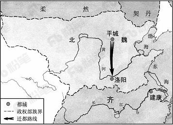

- **A**. 周平王迁都洛邑
- **B**. 汉光武帝定都洛阳
- **C**. 北魏孝文帝迁都　✅
- **D**. 武周以洛阳为神都

**答案**：C

**官方解析**

本题考查历史常识，主要涉及中国古代史。
A项错误，周平王迁都洛阳，是指周平王把都城由镐京迁到洛阳的历史事件。
B项错误，汉光武帝定都洛阳，指的是汉光武帝称帝后，将都城定在了洛阳，没有反映图中由平城到洛阳的过程。
C项正确，图中反映的是北魏孝文帝将都城从平城迁往洛阳的历史事件，这是北魏孝文帝改革的关键一步，有助于促进经济发展，巩固北魏政权。
D项错误，神都是唐睿宗及武周时期洛阳的别名，也是武周王朝的首都，并未反映图中由平城到洛阳的过程。
故正确答案为C。

---

### 第 15 题　qid 2187700 · 人文常识

下列关于雷电的说法错误的是：

- **A**. 人们总是先看见闪电后听见打雷
- **B**. 直击雷的破坏性比球形雷小　✅
- **C**. 闪电时可能伴随着臭氧的生成
- **D**. 雷电一般发生在对流层

**答案**：B

**官方解析**

本题考查自然常识，主要涉及雷电的相关知识。
A项正确，由于光在空气中的传播速度快于声音在空气中的传播速度，所以人们总是先看见闪电后听见打雷。
B项错误，直击雷就是直接打击到物体上的雷电；球形雷则像火球一样，会飘进室内。直击雷的电压峰值通常可达几万伏甚至几百万伏，破坏性很强，是威力巨大的雷电，而球形雷的威力比直击雷小。
C项正确，氧气和臭氧互为同素异形体，闪电可以让大气中的一部分氧气被激发成臭氧。
D项正确，对流层是大气层中湍流最多的一层，雷电、雨、雾等天气现象一般发生在对流层。
本题为选非题，故正确答案为B。

---

### 第 16 题　qid 2187674 · 人文常识

京剧，曾称平剧，腔调以西皮、二黄为主，用胡琴和锣鼓等伴奏，被视为中国国粹。它是由哪些戏剧进京演出融合而成的？

- **A**. 豫剧、越剧
- **B**. 汉剧、川剧
- **C**. 徽剧、汉剧　✅
- **D**. 粤剧、沪剧

**答案**：C

**官方解析**

本题考查文化常识，主要涉及京剧艺术的相关内容。
汉剧，旧称楚调、汉调（楚腔、楚曲），民国时期定名汉剧，俗称“二黄”。汉剧是湖北传统戏曲剧种之一，也是陕西省的第二大剧种，主要流行于湖北省境地内长江/汉水流域，以及湖南、陕西南部、四川和广东部分地区。    
徽剧，中国安徽省地方戏曲剧种之一，徽剧原名“徽调”、“二黄调”，渊源于明代，1949年后定名徽剧。徽剧的音乐、唱腔优美、完整。主要分青阳腔、四平腔、徽昆、吹腔、拨子、二黄、西皮、花腔小调共九类。而以吹腔、拨子、皮簧为主要声腔。徽剧是京剧的前身。
京剧是徽、汉等剧种在北京融合以后形成的产物。清代乾隆起，四大徽班陆续进入北京，他们与来自湖北的汉调艺人合作，同时又接受了昆曲、秦腔的部分剧目、曲调和表演方法，民间曲调，通过不断的交流、融合，最终形成京剧。京剧形成后在清朝宫廷内开始快速发展，直至民国得到空前的繁荣。京剧走遍世界各地，成为介绍、传播中国传统艺术文化的重要媒介。
故正确答案是C。

---

### 第 17 题　qid 2187675 · 人文常识

下列有关急救知识的叙述正确的是：

- **A**. 对等待急救的脑出血病人不宜随意搬动　✅
- **B**. 发生烫伤后的伤口可用酱油或牙膏涂抹
- **C**. 胸外心脏按压的频率为每分钟30～50次
- **D**. 严重烧伤的病人口渴时可以喝白开水

**答案**：A

**官方解析**

本题考查生活常识，主要涉及急救知识的相关内容。
A项正确，脑出血的患者如果在突然发病搬运过程中颠簸太厉害就可能加重脑出血。所以发生脑出血的病人应立即平卧、避免震动、就近治疗，不宜长途搬运；待病情稳定后再转院治疗，如果必须搬运应尽量保持车辆、担架平稳，保持头部不要晃动，同时还应将患者的头歪向一侧，以便使呕吐物流出，以免气道阻塞引起窒息。
B项错误，牙膏或酱油涂抹在烫伤部位，是一种错误方法。这是由于伤口的热气受到牙膏等物质的遮盖，只能往皮下组织深部扩散，结果就造成了更深一层的烫伤。而酱油不仅不具备治疗功能，酱油的颜色还会影响医生的诊断。另外烫伤后也不要使用冰块冷敷创口处，以免温度过低致使已经破损的皮肤伤口恶化。
C项错误，按照2015版心肺复苏指南建议，对成年人实施心肺复苏时胸外按压的频率为100～120次/分。
D项错误，严重的烧伤病人常有口渴的感觉，这是由于皮肤大面积烧伤后，体液从伤面大量外渗，致使体内血容量下降，水分减少所致。按医学要求，烧伤后口渴时不能给伤员饮白开水。因在烧伤后，体液丢失的同时，体液中的钠盐也跟着一起丧失，如果单纯给病人喝白开水，可导致血液内氯化钠浓度进一步下降，细胞外液渗透压降低，引起细胞内水肿，出现脑水肿或肺水肿，形成所谓的水中毒，可危及伤员生命。
故正确答案是A。

---

### 第 18 题　qid 2187677 · 人文常识

下列关于铁矿的说法正确的是：

- **A**. 赤铁矿与铁锈的主要成分相同　✅
- **B**. 磁铁矿一般呈黄褐色
- **C**. “千锤百炼”是指铁矿石的开采过程
- **D**. 我国的铁矿开采始于西汉时期

**答案**：A

**官方解析**

本题考查化学常识，主要涉及铁矿石的相关内容。

A项正确，赤铁矿的主要化学成分为三氧化二铁，颜色呈红褐、钢灰至铁黑等色，是自然界分布极广的铁矿物，是重要的炼铁原料，也可用作红色颜料。铁锈，又名铁衣，是铁置于空气中氧化后生成的红褐色锈衣，主要化学成分也是三氧化二铁。故该选项正确。

B项错误，磁铁矿，是指氧化物类矿物磁铁矿的矿石，多为粒块状集合体，主要成分为，多呈现铁黑色，具强磁性。

C项错误，“锤”一般用来矿物质的开采，除此以外“凿”也会用来形容开采矿石，但“炼”多用于铁矿石的冶炼过程，C项说法片面。

D项错误，中国是世界上利用铁最早的国家之一，最早可以上溯到西周晚期，春秋的时候铁制农具出现，战国时期铁制农具的使用范围进一步扩大，因此我国铁矿的开采远远早于西汉时期。

故正确答案是A。

---

### 第 19 题　qid 2187679 · 人文常识

下列关于通讯技术的说法正确的是：

- **A**. 蓝牙是一种短距离无线通信技术　✅
- **B**. 光纤通信抗电磁干扰能力差
- **C**. 移动通信可直接使用无线电波通讯
- **D**. 对讲机使用时需要网络支持

**答案**：A

**官方解析**

本题主要考查科技理论与成就的相关知识。
A项正确，蓝牙是一种支持设备短距离通信（一般10m内）的无线电技术。能在包括移动电话、PDA、无线耳机、笔记本电脑、相关外设等众多设备之间进行无线信息交换，故表述正确。
B项错误，光纤通信是以光波作为信息载体，以光纤作为传输媒介的一种通信方式。光纤通信通过激光在光导纤维中传输信号，由于激光的频率远高于微波，所以不易受其他无线电波信号的干扰，而且保证了传输的稳定性，所以光纤通信的抗电磁干扰能力强，故表述错误。
C项错误，移动通信主要是指陆地移动蜂窝通信系统，由移动台、基台、移动交换局组成，基站之间最常见的信号交流方式是光缆，基站和移动端之间是无线电波，这是蜂窝通信，也就是现在我们说的移动通信的原理。因此C项说法片面。
D项错误，对讲机之间是通过无线电波的方式来传输语音信号的，不需要网络，是一对一的工作模式，即一台发射信号，另外的就接收信号，只要两台（或者两台以上的）对讲机在同一频率。
故正确答案是A。

---

### 第 20 题　qid 2187680 · 人文常识

下列哪一诗句没有反映古代农业丰收的场景？

- **A**. 田家少闲月，五月人倍忙，夜来南风起，小麦覆陇黄
- **B**. 新筑场泥镜面平，家家打稻趁霜晴
- **C**. 瓯篓满篝，污邪满车，五谷蕃熟，穰穰满家
- **D**. 桑柘悠悠水蘸堤，晚风晴景不妨犁　✅

**答案**：D

**官方解析**

本题主要考查文化常识的相关知识。
A项正确，“田家少闲月，五月人倍忙，夜来南风起，小麦覆陇黄”出自白居易的《观刈麦》。意思是：庄稼人很少空闲日子，五月里家家加倍繁忙。昨夜间一场南风吹过，那小麦铺满陇沟焦黄。反映的正是古代农业丰收的场景。
B项正确，“新筑场泥镜面平，家家打稻趁霜晴”出自范成大的《秋日田园杂兴》，“新筑场泥镜面平”中以镜面比新场，新场指的是农民打稻子的地方，“家家打稻趁霜晴”是指家家户户趁着霜后的晴天打稻子。反映的正是古代农业丰收的场景。
C项正确，“瓯篓满篝，污邪满车，五谷蕃熟，穰穰满家”出自《史记淳于髡传》，意思是：易旱的高地粮食装满笼，易涝的低洼田粮食装满车，五谷茂盛丰收，多得装满了家。反映的正是古代农业丰收的场景。。
D项错误，“桑柘悠悠水蘸堤，晚风晴景不妨犁”出自储光羲的《田园即事》。从“犁”字可以看出，该诗句反映的是耕种的场景，并非农业丰收的场景。
本题为选非题，故正确答案为D。

---

## 言语理解与表达

### 第 1 题　qid 2187730 · 逻辑填空

我们中有很多人并不甘心，想叛逆，想抵抗，他们不惜将世人视同生命的“安全感”抛之脑后。人们                的“安全而平庸的幸福” 对他们而言无异于毒药，而世人避之不及的                的状态，却恰恰是他们最赖以生存的空气。

- **A**. 心驰神往  大起大落
- **B**. 求之不得  波翻浪涌
- **C**. 梦寐以求  危机四伏　✅
- **D**. 众星捧月  动荡不安

**答案**：C

**官方解析**

第一空，根据“世人视同生命的‘安全感’”可知，人们无比向往、追求“安全而平庸的幸福”，故横线处需体现出向往、追求之意。A项“心驰神往”形容思想集中在追求和向往的事情或地方上，一心向往；B项“求之不得”与C项“梦寐以求”形容迫切地期望得到，三项均符合文意，保留；D“众星捧月”比喻众人拥护着受尊敬爱戴的人，与文意不符，排除。
第二空，根据前后文语义可知，横线处表达不安全、不平庸之意，C项“危机四伏”比喻到处隐藏着危险的祸根，语义恰当，当选；A项“大起大落”表示起伏变化大，不能体现不安全之意，排除；B项“波翻浪涌”形容水势大而凶猛，与文意无关，排除。
故正确答案为C。

---

### 第 2 题　qid 2187743 · 逻辑填空

从碎片化、孤立化应用为主的起步阶段，迈入跨界融合、集成创新的新阶段，物联网大规模爆发式增长的序幕已经开启。智能硬件、可穿戴设备、联网车辆发展迅猛，正是物与物、物与人加速连接的        。物联网将信息化与传统领域深度融合，也在重塑生产组织方式，        产业形态。
依次填入画横线部分最恰当的一项是：

- **A**. 诱因  调整
- **B**. 条件  创新
- **C**. 结果  构建
- **D**. 印证  变革　✅

**答案**：D

**官方解析**

第一空，根据文意，物联网的发展推动了智能硬件等事物的发展，透过智能硬件等的发展可以看出物与物、物与人正在加速连接，C项“结果”、D项“印证”均符合文意，保留；A项“诱因”、B项“条件”属于因果倒置，排除。
第二空，空格所在分句与“重塑生产组织方式”并列，空格所填词语与“重塑”对应，含有“变化”之意，D项“变革”指改变事物的本质，符合文意，当选；C项“构建”指全方位、多角度、深层次地建设，文段侧重“产业形态”发生变化，而非建设，排除。
故正确答案为D。
【文段出处】《物联网，让生活充满“智慧”》

---

### 第 3 题　qid 2187761 · 逻辑填空

儒家在对“君子”进行阐述的时候，采取了一种极为        的理论技巧。那就是，不直接定义“君子”，只是反复        它的对立面。“君子”的对立面，就是“小人”。用一系列的否定，来完成一种肯定。这种方法，在逻辑学上，是通过        外延，来包围内涵。

- **A**. 罕见  列举  缩小
- **B**. 精当  强调  剔除
- **C**. 巧妙  叙述  限制
- **D**. 高明  描绘  确认　✅

**答案**：D

**官方解析**

第一空，根据文意，儒家对“君子”进行阐述时，不直接定义“君子”，而是通过对立面去阐述。C项“巧妙”指灵巧高妙，D项“高明”指见解独到不同凡人或技艺高超，均能体现出方法的高妙，两项均符合文意，保留。A项“罕见”指难得见到，很少见到，且空格前由“极为”修饰，强调十分少见，儒家对“君子”进行间接定义的方法并非如此“罕见”，排除；B项“精当”指精确恰当，通过对立面进行阐述的方法属于“间接”的方法，不一定精确，排除。
第二空，搭配“对立面”，表达将对立面阐述清楚之意，D项“描绘”指描写、绘画，符合文意且搭配恰当，保留。C项“叙述”指将事情的前后过程记录下来或说出来，文段中的“对立面”并未涉及一些具体的过程，故搭配不当，排除。
第三空，代入D项“确认”验证，根据文意可知，横线处表达明确解释清楚外延之意， D项“确认”符合文意，当选。
故正确答案为D。
【文段出处】《君子之道》

---

### 第 4 题　qid 2187766 · 逻辑填空

数字世界的革命固然玄妙，但其经济规模和在人们生活中的重要程度，直到今天，仍旧不能与实体世界                。
填入画横线部分最恰当的一项是：

- **A**. 同日而语　✅
- **B**. 旗鼓相当
- **C**. 一决高下
- **D**. 平分秋色

**答案**：A

**官方解析**

“但”连接前后语义相反，根据“数字世界的革命固然玄妙”可知，横线处表示即使在今天，数字世界的重要性仍然比不上实体世界，A项“同日而语”通常用于否定表述中，与前文“不能”连用，指不能放在同一时间谈论，不能相提并论，不能相比，符合文意，当选。
B项“旗鼓相当”比喻双方力量不相上下，C项“一决高下”指决一胜负，比个高下，D项“平分秋色”比喻双方各得一半，不分高低，表示平局，B、C、D三项通常不用于否定表述中，均排除。
故正确答案为A。
【文段出处】《周鸿祎：“创客运动”让未来大不同》

---

### 第 5 题　qid 2187722 · 逻辑填空

在会展场馆、组展商实力和展会项目三大指标上全面领跑，使德国得以称雄全球会展业。德国企业              ，大量中小企业从家门口举办的国际高品质展会中获益匪浅，“德国制造”和“优质展会”              ，共同助推德国经济的发展。

- **A**. 蜂拥而至  相辅相成
- **B**. 近水楼台  相得益彰　✅
- **C**. 不期而遇  并驾齐驱
- **D**. 摩拳擦掌  同舟共济

**答案**：B

**官方解析**

第一空，根据文段“大量中小企业从家门口举办的国际高品质展会中获益匪浅”可知，横线处要体现离得近，获益多的意思，B项“近水楼台”比喻由于地处近而获得优先的机会，符合文意，保留。A项“蜂拥而至”形容很多人乱哄哄地朝一个地方聚拢，C项“不期而遇”指事先没有约定而遇见，D项“摩拳擦掌”形容战斗或劳动之前，人们精神振奋，跃跃欲试的样子，均与文意无关，排除。
第二空代入验证，根据文段“共同助推德国经济的发展”可知，“德国制造”和“优质展会”两者配合从而获得良好的效果，B项“相得益彰”指两个人或两件事物互相配合，双方的能力和作用更能显示出来，符合文意，当选。
故正确答案为B。
【文段出处】《称雄全球会展业，德国以三大指标全面领跑 》

---

### 第 6 题　qid 2187728 · 逻辑填空

或许，技术的进步总会带来焦虑，尼采曾对“短暂之物”报纸的出现怒不可遏。后来，“热闹”的电视取代了“冷静”的报纸；今天，“         ”的网络又取代了“群聚”的电视。技术的               可以改变我们的相处方式，但情感的交互却从来不是技术可以替代的。

- **A**. 孤独  更新迭代　✅
- **B**. 隔离  日新月异
- **C**. 单一  此消彼长
- **D**. 寂寞  革故鼎新

**答案**：A

**官方解析**

第一空，根据“‘热闹’的电视取代了‘冷静’的报纸”可知，横线处所填词语与后文“群聚”语义相反，表达单独之意。A项“孤独”、C项“单一”均符合文意，保留；B项“隔离”指断绝接触，其反义为“接近”“靠近”；D项“寂寞”指孤寂、落寞，其反义为“喧闹”“热闹”，均无法与后文“群聚”构成语义相反的对应，排除B、D两项。
第二空，横线处搭配“技术”，A项“更新迭代”指不断的进步、更替，填入文段表达技术进步可以改变我们的相处方式，符合文意，当选；C项“此消彼长”指这个上升、那个下降，通常搭配多个对象，排除。
故正确答案为A。
【文段出处】《放下手机，给孩子最好的陪伴》

---

### 第 7 题　qid 2187738 · 逻辑填空

女性争取平等权利的步伐从未停止，她们总会寻找各种途径，与               的性别歧视进行抗争。如抗议企业招聘中的性别歧视，        国民教育为女性提供更多平等的受教育机会等。

- **A**. 根深蒂固  呼吁　✅
- **B**. 形形色色  倡议
- **C**. 司空见惯  要求
- **D**. 习以为常  迫使

**答案**：A

**官方解析**

第一空，由横线前的“步伐从未停止”以及后文的举例可知，在企业招聘、国民教育等领域一直存在性别歧视，即性别歧视长期存在，A项“根深蒂固”比喻基础深厚，不容易动，符合文意，保留；B项“形形色色”指各式各样，种类很多，“性别歧视”是一种观念，而非多个种类，排除；C项“司空见惯”侧重某事常见不足为奇，D项“习以为常”指某种事情经常去做或某种现象经常看到，也就觉得很平常了，均符合文意，保留。
第二空，由文中的“寻找各种途径”可知，横线处应体现女权运动者争取平等权利的主动性和希望得到支持的迫切性。A项，“呼吁”是指提出某项主张，公开要求大众的支持，符合文意，当选；C项，“要求”指提出具体愿望或条件，希望做到或实现，相较之下，“呼吁”更能体现出女权运动者争取平等权利的拳拳之心，排除；D项，“迫使”指用某种强迫的力量或行动促使，文中并未有“强迫”之意，排除。
故正确答案为A。 
【文段出处】《剩女时代》

---

### 第 8 题　qid 2187745 · 片段阅读

媒体和科学家所追求的目标是不一致的：媒体追求的是新闻性，而科学则需要         的方法。新闻记者们需要用通俗的标题来传达简单而新奇的内容，而科学方法则强调知识的积累、不同术语间的细微差别和对一切事物的质疑态度。然而，等到某一领域的科学知识真正到了值得用来投资或能够改变生活的时候，这些早就变成               了。

- **A**. 系统  不刊之论
- **B**. 理性  泛泛之谈
- **C**. 简洁  齿牙余论
- **D**. 严谨  明日黄花　✅

**答案**：D

**官方解析**

第一空，横线处词语形容科学方法，由后文“不同术语间的细微差别”“对一切事物的质疑态度”可知，科学方法是十分严密和审慎的，A项“系统”侧重有条理、完整性，C项“简洁”是指简明扼要，均无法与后文中的“细微”“质疑”对应，排除；B项“理性”是指不带个人情感、从讲理的方向分析或看待事物和问题，D项“严谨”是严肃谨慎，均能体现出谨慎严格的态度，符合文意，保留。
第二空，“然而”表示转折，转折之后语义相反，可知科学知识到了值得用来投资或能够改变生活的时候新闻就已经过时了，D项“明日黄花”比喻过时的事物或消息，符合文意，当选；B项“泛泛之谈”侧重肤浅不深入，与文意不符，排除。
故正确答案为D。
【文段出处】《别被忽悠了：阅读科学新闻的10条正确姿势》

---

### 第 9 题　qid 2187731 · 逻辑填空

当下的功夫片质量普遍粗糙，丢失了功夫片_______的优良传统。此外，一些功夫片过于强调动作，未找到更新的故事表达方法，使得作品越来越套路化，造成了生产和消费之间的____，这些都是导致部分中国功夫片遭遇市场困境的原因。

- **A**. 精雕细琢  错位　✅
- **B**. 脚踏实地  脱节
- **C**. 革故鼎新  鸿沟
- **D**. 一丝不苟  差异

**答案**：A

**官方解析**

第一空，根据文意可知，横线处表达当下的功夫片质量普遍粗糙，不够精细之意，A项“精雕细琢”比喻做事情精益求精，认真细致，符合文意，保留。B项“脚踏实地”比喻做事踏实，C项“革故鼎新”是指革除旧的，建立新的，D项“一丝不苟”形容做事认真，均与“精细”无关，排除。
第二空，代入“错位”验证，“错位”指离开原来的或应有的位置，填入文段表达生产和消费离开了应有的位置导致了市场困境，符合文意，A项当选。
故正确答案为A。
【文段出处】《功夫电影应该在何处下“功夫”》

---

### 第 10 题　qid 2187736 · 逻辑填空

“大众娱乐”这个标签并非贬义，恰恰相反，要想让消费者_______地为娱乐埋单，其实很是考验创作者的能力。艺术家们或许会对商业叙事作品的生产者们开发出的一整套完备的叙事模式_______，但这也是一种能力的体现。
依次填入画横线部分最恰当的一项是：

- **A**. 乐此不疲  漠然置之
- **B**. 毫不犹豫  不屑一顾
- **C**. 心甘情愿  嗤之以鼻　✅
- **D**. 趋之若鹜  冷眼相对

**答案**：C

**官方解析**

第一空，根据文意可知，横线处表达消费者是自愿、主动地为娱乐埋单之意，A项“乐此不疲”、C项“心甘情愿”均符合文意，保留。B项“毫不犹豫”形容人在处理事情上没有片刻迟疑，非常果断，文段并非强调消费者果断，而是强调消费者愿意去埋单，故与文意不符，排除；D项“趋之若鹜”比喻许多人争着去追逐某些不好的事物，感情色彩偏消极，与文段感情色彩不符，排除。
第二空，根据转折关联词“但”可知，文段表达艺术家们看不起的叙事模式恰恰是一种能力的体现，故横线处表达看不起、轻视之意。C项“嗤之以鼻”指用鼻子轻蔑地吭气，表示瞧不起，符合文意，当选；A项“漠然置之”指态度冷淡，放在一边不理，文段并非强调不理睬，而是强调轻视、看不起，故与文意不符，排除。
故正确答案为C。
【文段出处】《音乐不是万能灵药，救不了你的坏故事》

---

### 第 11 题　qid 2187744 · 片段阅读

文化的基本使命是立人，通过文化的教化和积淀，有效地协调人与自然、社会及自我的关系，培养健全的、充分发展的社会的人。文化对于人的塑造体现在人的自立、自强、自尊、自信等文化心态的确立以及人类社会人文氛围的形成上。在人类历史的长河中，文化以道德、宗教、艺术、教育等各种生活内容存在，并通过家庭启蒙、社会心理、社会舆论等多种手段向整个社会和民族传播和教化，使社会形成一种文化的氛围，并获得可持续发展的可能。
这段文字主要阐述了文化具有：

- **A**. 塑造功能
- **B**. 濡化功能　✅
- **C**. 调节功能
- **D**. 传播功能

**答案**：B

**官方解析**

文段首先指出文化可以培养健全的、充分发展的社会的人，后文指出文化塑造人的具体体现，接着后文又指出文化可以向整个社会和民族传播和教化，使社会形成一种文化的氛围，故整个文段构成并列结构，重在强调文化对于个人、对于社会和民族的双重作用，对应B项“濡化”，指滋润化育。
A项“塑造”对应文段“对于人的塑造”、C项“调节”指“有效协调人与自然、社会及自我的关系”、D项“传播”对应文段“社会和民族的传播和教化”，均表述片面，排除。
故正确答案为B。

---

### 第 12 题　qid 2187752 · 语句表达

农业危机根本上也是资源危机，关键是土地资源。我们总希望自己的住房大一点，然而，土地是有存量没有增量的要素，人类的需求却是没有止境的。所以，更多的农业用地被工业侵占，更多的农村土地被城市侵占，农业危机的根源就在这里。发达国家已经完成工业化，进入所谓后现代社会了，已经没有改弦更张的可能了。__________。
填入画横线部分最恰当的一项是：

- **A**. 因此，我们应该把为数不多的土地做成高附加值的东西
- **B**. 我们所能做的，就是改变过度消耗资源的产业体系
- **C**. 我们要提高技术进步对经济增长的贡献率，改变生产和生活方式
- **D**. 这就提醒我们：面临资源环境压力，在产业升级中要保护好农田　✅

**答案**：D

**官方解析**

横线位于文段结尾，是对前文的总结概括。文段首先点明“农业危机”的关键是“资源危机”，其关键是“土地资源”，接着通过转折强调，土地资源已经没有继续增加的可能，然后由结论词“所以”得出结论，即农业危机的根源就在于农业用地被侵占，进而指出发达国家已经没有更改的可能，强调这一问题的严重性，故文段结尾重在提出对策，强调我们应从中吸取教训，保护好农业用地，对应D项。
A项，文段围绕“农业用地被侵占”展开论述，“土地”范围扩大，且将“为数不多的土地做成高附加值的东西”并非解决农业危机的对策，排除；
B项，“过度消耗资源的产业体系”无中生有，并且缺少与“农业危机”的对应，排除；
C项，“提高技术进步的贡献率”表述无中生有，排除。
故正确答案为D。
【文段出处】《低碳化趋势及其对中国的挑战》

---

### 第 13 题　qid 2187726 · 语句表达

英国人在印度发展种茶业，从一开始就明确了以需求为导向——                              。19世纪上半叶，迷上喝茶的英国人为了摆脱中国对茶叶生产的控制，将茶树种子连同加工技艺一起，偷偷从中国带到了印度。从印度的阿萨姆和大吉岭地区开始，英国彻底改变了红茶的命运。到了1860年，投资者就明确意识到，在印度种茶是个能够赚钱的行当。伦敦和加尔各答等地的先行者开始购买茶园股份，在英属印度政府优惠政策的鼓励下，公司和有能力的欧洲人纷纷租地种茶。
填入画横线部分最恰当的一项是：

- **A**. 为了让茶叶变得廉价易得　✅
- **B**. 殖民者为了获取更多的利润
- **C**. 满足英国国内对茶叶的极大需求
- **D**. 解决英国本土茶叶供应不足的问题

**答案**：A

**官方解析**

横线位于文段开头，起到总领下文的作用，文段首句指出英国人在印度种茶的目的，是“以需求为导向”，后文则对此进行具体的解释说明。分析后文可知，文段首先论述英国人为了摆脱中国对茶叶生产的控制，将种子和技术带到印度，即为了让茶叶更加容易获得，接着又提到投资者为了赚钱，在印度发展茶园，故后文从两个方面论述英国人在印度发展茶叶的目的，即使茶叶容易获得以及更加便宜，对应A项。
B项，未包含文段核心话题“茶叶”，且“获取更多利润”并不是最初的需求导向，而是随着种植规模的扩大，投资者才发现有利可图，应为根本目的，排除。
C、D项，“英国国内对茶叶的极大需求”和“供应不足的问题”无中生有，文段没有涉及英国国内的需求情况，排除。
故正确答案为A。
【文段出处】《好茶之道》

---

### 第 14 题　qid 2187734 · 片段阅读

长期以来，研究人员认为人类是从大约500万年前的非洲猿分化而来的，不过最新发表的一项研究报告提出，欧洲发生的这种分化要早得多。关于人类起源的这一新假说的依据是，在希腊和保加利亚洞穴里发现了720万年前的前人类遗骸。来自多个国家的研究人员对两个已知样本的牙根进行了分析。他们利用专门的X射线，即计算机断层检查技术，对来自希腊的下颌化石和来自保加利亚的上前臼齿化石进行了扫描，发现其特征表明这两个古猿——外号“希腊人”，可能是前人类，即原始人类。
根据这段文字，以下说法正确的是：

- **A**. 原始人类从欧洲古猿分化而来
- **B**. “希腊人”古猿具有人的特征　✅
- **C**. 研究人员只找到了欧洲古猿的牙根
- **D**. X射线技术能准确测算古猿人的年代

**答案**：B

**官方解析**

A项，根据“‘希腊人’，可能是前人类，即原始人类”可知，人类是否由欧洲古猿分化而来是不确定的，故A项表述绝对，且原始人类表述错误，应该是人类可能由欧洲古猿分化来的，而非“原始人类”，排除；
B项，根据“发现其特征表明这两个古猿——外号‘希腊人’，可能是前人类，即原始人类”可知，古猿具有人的特征，当选；
C项，“只”表述绝对，根据“来自多个国家的研究人员对两个已知样本的牙根进行了分析”不能判断出研究人员只找到了欧洲古猿的牙根，排除；
D项，根据“他们利用专门的X射线······发现其特征表明这两个古猿——外号‘希腊人’，可能是前人类，即原始人类”可知，利用X射线可以寻找特征，未提及是否能够准确测算年代，表述错误，排除。
故正确答案为B。
【文段出处】《人类诞生地在哪儿?最新报告：不是非洲而是欧洲》

---

### 第 15 题　qid 2187740 · 片段阅读

美籍华裔物理学家李政道说“中国的算盘是世界上最古老的计算机”，英国学者李约瑟也把算盘誉为“中国第五大发明”。那么，算盘为何有如此魅力，以致得到两位学者这样高的推崇呢？就是它以框梁档珠的简单结构，配以形象精妙的珠算口诀，解决了加减乘除乃至开方的计算问题。在没有计算机的年代里，它对推动社会经济发展发挥了不可估量的作用。
这段文字主要介绍了：

- **A**. 算盘的结构和原理
- **B**. 算盘受推崇的原因　✅
- **C**. 算盘对社会经济的作用
- **D**. 算盘在科技史上的地位

**答案**：B

**官方解析**

文段开篇指出算盘受到美籍物理学家和英国学者的推崇，接着分析其原因，即算盘的原理及其带来的重要作用，对应B项。
A项“原理”、 C项“对社会经济的作用”仅对应原因的一方面，表述片面，排除；D项“在科技史上的地位”无中生有，排除。
故正确答案为B。
【文段出处】《由“中国珠算”申遗成功说开去》

---

### 第 16 题　qid 2187748 · 片段阅读

规模化是工业现代化的重要方式之一，中国农业发展是否适应大规模农业生产模式还值得商榷。美国多年的大农场生产方式已经证明，集约化的农业生产会造成农业生态环境退化、生物多样性被破坏，进而影响到粮食安全。当前，我国人均耕地面积仅1.52亩，只有世界平均水平的，更远低于美国的人均水平，所以美国的大农场模式并不一定适合中国的发展。同时，我国农业现代化起步较晚，相较于美国等发达国家，无论是在农业科技还是经营管理方式上还存在一定差距，现代化的“步子”骤然迈得太大，很有可能造成上下层“脱节”。

这段文字接下来最可能说的是：

- **A**. 农业改革不应操之过急，而应稳扎稳打
- **B**. 发展大规模农业生产模式应吸取国外教训
- **C**. 农业生产的规模化应量体裁衣、因地制宜　✅
- **D**. 生产环节的脱节是农业规模化发展的瓶颈

**答案**：C

**官方解析**

文段开篇指出中国农业是否适应“规模化”生产有待商榷，即提出问题，接着指出美国进行大规模生产带来的消极影响，并由此强调这种大农场模式不适合中国的发展，并通过“同时”引导的并列关系，对这一问题继续进行分析，故整个文段为提出问题—分析问题的结构，下文应着重解决问题，即提出对策，即农业生产的规模化应结合具体情况，因地制宜，对应C项。
A项“农业改革”、D项“生产环节的脱节”均与文段的核心话题“大规模农业生产”不一致，排除；
B项“吸取国外教训”对应“美国的大农场模式并不一定适合中国的发展”，前文已详细阐述过，排除。
故正确答案为C。
【文段出处】《布局农业产业集群 打造创新高地》

---

### 第 17 题　qid 2187735 · 语句表达

①没有细菌和感染的知识，就不会有无菌操作的概念
②知识，是人类认识自然的总结
③比如说，没有人体解剖和血型的知识，就无法成功输血
④这种总结的过程是连续的，由浅入深，由简单到复杂
⑤如果没有人体解剖、输血和无菌操作技术，就无法进行手术
⑥杰出的人物，只是把这种认识的过程大大向前推进，但他们也并不能跳过连续的认识发展过程而前进
将以上6个句子重新排列，语序正确的是：

- **A**. ⑤①④③②⑥
- **B**. ⑥④③①②⑤
- **C**. ①⑤②④③⑥
- **D**. ②④⑥③①⑤　✅

**答案**：D

**官方解析**

对比选项，判断首句。②句以下定义的方式引出“知识”这一概念；而①句则具体论述了“细菌和感染”方面的知识，根据逻辑关系可知，应先引出“知识”的概念，再具体论述某方面具体的内容，故②句应在①句前，排除A、B、C三项，保留D项。
验证D项，②句引出“知识”这一话题，并说明是人类的总结，④句通过指代词承接②句的“总结”，⑥句对②④句进行总结，而后通过③①⑤举例论证，逻辑通顺，当选。
故正确答案为D。
【文段出处】《课本没有告诉你的有趣科学故事》

---

### 第 18 题　qid 2187737 · 语句表达

①随着商业在社会生活中地位的提高，商家的文化意识日益增强。
②牌匾艺术熔书法、装饰和建筑艺术于一炉，呈现出丰富的形式。
③尤其是经营长久的老字号，牌匾多出自名人名家手笔。
④商业牌匾早期大多用于说明商号的经营性质。
⑤虽然各自风格神韵不同，但大都具有深厚的造诣。
⑥在文人的参与下，牌匾文雅含蓄，常有典故出处。
将以上6个句子重新排列，语序正确的是：

- **A**. ②④①⑥③⑤　✅
- **B**. ②③④①⑥⑤
- **C**. ④②③⑥⑤①
- **D**. ④①②③⑤⑥

**答案**：A

**官方解析**

首先对比选项，判断首句。②句介绍了“牌匾艺术”的丰富形式，④句具体介绍“商业牌匾”的早期用途，按照逻辑顺序应该先说牌匾艺术这一大概念，再由早期到后期的发展脉络对小概念“商业牌匾”进行具体论述，故②句应在④句前，排除C、D两项。
对比A、B两项，③句中出现递进标志词“尤其是”，后引出“经营长久的老字号的牌匾”，这显然为“商业牌匾”的一种，故应置于④句之后，而不能直接跟在“牌匾艺术”这一大概念后面，排除B项。A项中③句接于⑥句之后，“文人”与“名人名家”话题衔接紧密，符合逻辑，当选。
故正确答案为A。
【文段出处】《老字号牌匾的书法魅力你看懂了吗》

---

### 第 19 题　qid 2187742 · 语句表达

量子力学是关于微观客体的基本理论框架，关于微观客体的所有科学规律都在此框架中。微观客体基本上是指原子或者更微观的粒子，比如电子和光子。宏观物体是由微观粒子构成，那么                                        ？有一种理论说原则上量子力学也适用于更大的客体，但是它们与环境耦合，从而失去量子行为。实验室里，确实有比原子大的东西被孤立，从而表现量子行为。虽然目前尚无定论，但可以肯定的是对于我们所在的现实宏观世界，不能直接套用量子力学。
填入画横线部分最恰当的一项是：

- **A**. 如何判断二者之间的明确界限
- **B**. 怎么确定量子力学的适用范围　✅
- **C**. 该如何定义量子力学的构成条件
- **D**. 量子力学的研究客体该如何界定

**答案**：B

**官方解析**

语句填空题，横线设置在文段中间，需注意与上下文之间的衔接。
根据文段可知，横线之前指出“量子力学”的定义，并强调“关于微观客体的所有科学规律”都在量子力学的范围之内；横线之后以“也”为标志表并列，提出量子力学也适用于更大的客体，仍是就“适用范围”这一话题做继续论述，尾句以转折句进一步强调，我们的现实宏观世界不可套用量子力学，故可知横线处应对“适用范围”这一核心话题做承上启下，对应B项。
A项，“如何判断二者之间的明确界限”未提及文段核心话题“量子力学”，且“二者”指代不清，无法与上下文衔接，排除；
C项，“构成条件”前后文并未提及，无中生有，排除；
D项，“如何界定客体”虽可对应横线前后，但对于尾句中的核心观点无法体现，排除。
故正确答案为B。
【文段出处】《通过禅定就能认识真理？请勿曲解量子力学》

---

### 第 20 题　qid 2187749 · 语句表达

地理结构上，中国大陆是一个面积辽阔、平坦完整的区块，是自给自足的一大片土地。南方的寮、越、高棉等，有丘陵峡谷高原等相隔，历史上从来没有北侵并造成困扰过。西边有沙漠阻绝，形成天然的屏障。零星的商旅僧人，可能往返跋涉，但是很难发生大规模的军事行动。东边是大海，在坚船利炮之前，安全是不成问题的。剩下的，只有北方来的强敌。因此，只要能挡得住北方的威胁，                                         。
填入画横线部分最恰当的一项是：

- **A**. 中央政权就会有意识地排斥地方势力
- **B**. 中国大地便自成体系，唯我独尊　✅
- **C**. 中原大地内部的诸多力量便取得平衡
- **D**. 大一统的思维便会应运而生

**答案**：B

**官方解析**

横线出现在尾句，且由“因此”结论词引导，故横线处应对前文进行总结。文段首句提出中国大陆是自给自足的土地，后文通过中国东方、西方、南方的地形特点表明中国在这三个方位均比较安全，只有北方存在威胁，尾句总结全文，提出只要能抵挡住北方的威胁，中国大陆便不存在威胁，无所畏惧，不依靠外界，自己成为一个互相关联的整体，B项“自成体系，唯我独尊”，当选。
A项“中央政权”“地方势力”，C项“诸多力量取得平衡”，D项“大一统思维”，文段均未提及，无中生有，排除。
故正确答案为B。
【文段出处】《百善孝为先》

---

### 第 21 题　qid 2187760 · 片段阅读

在付费知识的市场宣传重点中，最吸引人的莫过于能有效地利用碎片时间，如在等公共汽车、跑步时进行学习和提升自我，进而有效管理时间。这种碎片化学习的方式虽然看似很灵活，并可以提高时间利用率，但科学研究表明，它不能真正地让你吸收学到的知识，不符合大脑吸收知识的运行机制。那些让你啧啧称奇的金句，那些让你醍醐灌顶的时刻，过不了几日就会被忘得精光，更别提知识内化和迁移了。正如快餐虽然好吃，也有饱腹感，但并不代表有营养。
这段文字意在强调：

- **A**. 付费知识领域前景尚未明朗
- **B**. 付费知识的宣传导向言不符实
- **C**. 学习是一个长期而艰苦的过程
- **D**. “碎片化学习”的方式并不理想　✅

**答案**：D

**官方解析**

文段开篇通过程度词指出在付费知识市场中，“利用碎片时间”很有效，并通过例子具体阐述。后文通过转折关联词“但”强调“碎片化学习的方式”不能真正地让你吸收学到的知识，不符合大脑吸收知识的运行机制，并通过“金句”“快餐”等例子论证前文观点。故文段旨在强调“碎片化学习的方式”并不理想，对应D项。
A、B、C三项均未包含文段主题词“碎片化学习”，且“前景尚未明朗”“宣传导向言不符实”“学习是一个长期而艰苦的过程”，文段均未提及，无中生有，排除。
故正确答案为D。
【文段出处】《“二手知识”不是拯救知识贫乏的“神药”》

---

### 第 22 题　qid 2187762 · 片段阅读

近代以来人类的技术发展过程与古代不同。古代技术发展只是偶发事件，如火药、指南针等，尽管在军事史上产生过重大影响，但由于结构简单，后续没有重大改进。而近代技术则不然，从织布机到蒸汽机，进而到内燃机、电动机，技术的进步是连续的，也是一个可期待的线性过程，因此可瞄准未来，进行过程上的超前式跨越。如钱学森在中国基础工业非常薄弱的情况下，就主张重点发展导弹而不是飞机；美国在人造地球卫星和载人航天落后于苏联的情况下，便直接推出阿波罗登月计划。这些都是跨越式发展的典型表现。
这段文字意在强调：

- **A**. 跨越式发展是抢占技术发展先机的前提　✅
- **B**. 现代技术发展的路径与古代有本质的区别
- **C**. 勇气和魄力是支持跨越式发展的精神品质
- **D**. 对技术改进的无限追求才能实现跨越式发展

**答案**：A

**官方解析**

文段首句指出近代的技术发展过程与古代不同，之后先阐述古代技术的发展状况，并指出其后续没有重大改进，接下来通过转折词“则不然”强调近代技术的情况，并通过“因此”总结前文，强调技术的发展要依靠“超前式跨越”，后文通过“跨越式发展”的具体表现进行举例说明，故文段重点强调推进技术的发展，需要采取“跨越式发展”的方式，对应A项。
B项，没有提到文段的主题词“跨越式发展”，且“古代”非文段强调的重点，排除；
C项“精神品质”、D项“对技术改进的无限追求”文段均没有提及，无中生有，排除。
故正确答案为A。
【文段出处】《国防科技领域如何实现弯道超车》

---

### 第 23 题　qid 2187768 · 片段阅读

无论原著多么丰富精彩，文学经典改编成电视剧都是一次再创作。电视剧要尽可能地呈现原著复杂而沉重的主题，也要通过改编使片段式的故事汇成线条式的人物命运。古老土地的历史变迁、民族生存的生命反思、儒家文化的辉煌与没落、人性欲望的压抑与张扬······文学经典的母题，必须经由改编之手重新诠释。而且，无论怎么改，情节的推进，人物的塑造，剧情的发展，其本身都要符合人物内在的行为逻辑。
关于文学经典改编成电视剧的原则，文中没有涉及：

- **A**. 要突出文学经典的主题
- **B**. 要有比较明确的主线
- **C**. 应具有合理的内在逻辑
- **D**. 要使用必要的夸张手法　✅

**答案**：D

**官方解析**

A项，由“电视剧要尽可能地呈现原著复杂而沉重的主题”可知，表述正确，排除；
B项，由“通过改编使片段式的故事汇成线条式的人物命运”可知，改编应将文学作品中片段式的故事整合成明确的线条式的故事结构，表述正确，排除；
C项，由“其本身都要符合人物内在的行为逻辑”可知，表述正确，排除；
D项，文段未提及改编手法是否应该夸张，无中生有，当选。
本题为选非题，故正确答案为D。
【文段出处】《&lt;白鹿原&gt;之后，重述文学经典需更下苦功》

---

### 第 24 题　qid 2187770 · 片段阅读

近日，国家多部委联合发布了《关于办理刑事案件严格排除非法证据若干问题的规定》，从侦查、起诉、辩护、审判等方面，明确非法证据的认定标准和排除程序。所谓刑事案件中的“证据”，乃是定罪量刑的“依据”。根据我国的证据标准，只有达到“事实清楚、证据确实充分”的标准，才能判决一个公民有罪。如果证据材料不符合《刑事诉讼法》的“8种法定形式”，或者取得程序违反法律规定，就不属于合法证据，不能为法庭所采信。尽管法律规定“白纸黑字”，严格排除非法证据，但从司法实践看，这类证据犹如顽固的牛皮癣禁而不止、杜而不绝。
这段文字接下来最可能讲的是：

- **A**. 非法证据无法严格排除的原因　✅
- **B**. 《刑事诉讼法》“8种法定形式”的内容
- **C**. 非法证据对司法工作的影响
- **D**. 新规定出台的现实背景

**答案**：A

**官方解析**

根据提问方式可知，本题为接语选择题，应在阅读全文基础上，重点关注文段最后谈论的核心话题。文段开篇说明多部委明确非法证据的认定标准和排除程序，并说明判定公民有罪的证据应是“事实清楚、证据确实充分”，然后介绍了不合法证据的类型，尾句强调非法证据难以禁止和杜绝，后文应保持话题的一致性，可详细论述“非法证据”难以禁止和杜绝的原因，对应A项。
B项“《刑事诉讼法》”、D项“新规定出台”均与文段最后论述的核心话题“非法证据”不一致，排除；
C项，谈论的是“影响”，文段最后谈论的是“非法证据”难以杜绝，故后文应分析原因，“影响”与尾句衔接不当，排除。
故正确答案为A。
【文段出处】《排除非法证据：为程序正义“添砖加瓦”》

---

### 第 25 题　qid 2187764 · 片段阅读

当代社会呈城乡一体化发展趋势，文化的阶层和地域区别越来越小，民俗的地域性和群体性差别消失，民俗作为地区和人群的标识或认同的意义逐渐微弱。民俗也在审美化的趋势和背景下，成为时尚的，而非实用的。比如旅游场域中的刺绣或帽子等等，基本不会拿来用，而是用来装饰和收藏。民俗变为了一种浪漫的、时尚的消费品，沦为大众文化的一部分。
这段文字主要说的是：

- **A**. 应从美学角度来重构作为大众文化的民俗审美观
- **B**. 大众流行文化影响了普通百姓对民俗的审美品位
- **C**. 文化阶层与地域的差距缩小使民俗成为大众文化
- **D**. 城乡一体化的快速发展的趋势改变了民俗的性质　✅

**答案**：D

**官方解析**

文段首句提出在城乡一体化发展趋势的作用下，民俗作为标志或认同的意义逐渐减弱，并且民俗也变得更时尚，而非实用，通过“比如”进一步举例说明，尾句进一步强调民俗已经沦为大众文化的一部分，即民俗的性质发生了变化。故文段重点强调在城乡一体化的发展趋势使得民俗的性质发生了改变，对应D项。
A项“审美观”、B项“审美品位”均偏离文段中心，文段重点并非“对民俗的审美观”，而是“民俗”的性质发生了改变，排除；
C项“文化阶层与地域的差距缩小”是“城乡一体化的发展趋势”带来的结果之一，故非文段强调的主要内容，偏离中心，排除。
故正确答案为D。
【文段出处】《城市化背景下民俗学的“时空转向”：从民间文化到大众文化》

---

### 第 26 题　qid 2187729 · 语句表达

①展望未来，第四次科技革命同样面临着诸多社会问题的考验，人类的未来也可能发生根本性重塑
②自动化逐渐代替人力，就业市场对教育和技能较低工人的需求下降，这次科技革命客观上正在造成一定的失业规模
③就像史蒂芬•霍金担心的，未来20年中机器将通过人工智能超越人类，发展出与人类相冲突的意志，从而导致人类文明史的终结
④当大部分人失去谋生手段时，必然会加剧社会关系的紧张
⑤历史上每一次重大科技进步在给人类带来惊喜和显性好处的同时，也给部分个体以及整个社会带来潜在的挑战
⑥科技创新是把双刃剑，它所带来的繁荣并不会成为真正的“百家乐”
将以上6个句子重新排列，语序正确的是：

- **A**. ⑤⑥①②③④
- **B**. ①③②④⑥⑤
- **C**. ⑥⑤①③②④　✅
- **D**. ①②④③⑤⑥

**答案**：C

**官方解析**

首先，对比首句①⑤⑥，①句中出现“同样”，属于并列结构关联词的后半部分，不适合作首句，排除B、D两项。接下来寻找捆绑，③句出现“就像”，可知其后为举例说明，例子指出未来20年中人工智能的发展会导致人类文明史的终结，①句“人类的未来也可能发生根本性重塑”为③句论证的观点，所以①③相连，排除A项，即可锁定答案为C项。对C项进行验证，逻辑通顺，当选。
故正确答案为C。
【文段出处】《科技让生活充满想象》

---

### 第 27 题　qid 2187733 · 片段阅读

民俗是文化的一种表现形态，即传统与文化的活态形式。它是经过千百年岁月的淘洗留下来的文化精华与现实结合的产物。民俗对于特定的群体有强烈的认同功能，对于当代社会的建设，具有不可替代的作用。
这段文字是从什么角度来定义“民俗”的？

- **A**. 群体建构
- **B**. 社会功能　✅
- **C**. 价值观念
- **D**. 文化传承

**答案**：B

**官方解析**

文段首先引出“民俗”这一话题，并指出其是文化与现实结合的产物。尾句指出“民俗”对于特定的群体有强烈的认同功能，对当代社会建设具有不可替代的作用，故文段强调的是“民俗”对于社会的功能，对应B项。
A项“群体建构”、C项“价值观念”、D项“文化传承”均非文段强调的重点，偏离中心，排除。
故正确答案为B。
【文段出处】《民俗是社会建构的重要元素》

---

### 第 28 题　qid 2187723 · 片段阅读

“天下为公”的基本含义是，天下是天下人所共有的，不是一个集团、一个群体的。在“天下为公”观念背后，我们看到的是中国人最基本的政治观念，也是过去四千年来中国政治运作的基本原则，那就是政治平等，人人都有参与天下之治理的机会。当然，参与方式非常多样，一个普普通通的人，也可以参与天下之治理，比如修身、齐家，这就是治国、平天下的内容和基础。
这段文字主要介绍了：

- **A**. 中国政治运作的基本原则
- **B**. “天下为公”的含义和表现
- **C**. 人们参与治理国家的多种形式
- **D**. “天下为公”所反映的政治观念　✅

**答案**：D

**官方解析**

文段首先引出“天下为公”的话题，接下来指出“天下为公”背后反映出的政治观念，即为政治平等，人人都有参与治理的机会，尾句指出参与治理的方式有很多，并通过例子进行补充说明。故文段重在强调“天下为公”所反映的政治观念，对应D项。
A、C两项没有提及“天下为公”这一主题词，且对应解释说明中的内容，非文段重点，排除；
B项“含义”仅为文段引出话题的部分，非重点，且“表现”表述不明确，文段已明确指出其背后的政治观念，排除。
故正确答案为D。
【文段出处】《科举曾是中国式选举制的一部分》

---

### 第 29 题　qid 2187732 · 片段阅读

历朝历代的皇家、文人以及社会主流，对北宋五大名窑瓷器倍加宠爱，深为以青色为基调的天然淡雅而倾倒。至今，神秘的“柴窑”未见影踪，珍稀的“汝窑”，于青色之中淡酝霞光，存世仅几十件，苏富比拍了一件，价逾千万。南宋时，“龙泉窑”的青瓷成为主流，于今也备受崇尚。我们看到的许多古瓷器，仍然闪烁着青釉色的高贵，人们对其的喜爱依旧是器物审美中的主流之一。
这段表述旨在说明：

- **A**. 官窑瓷器有极高的收藏价值
- **B**. 青色对瓷器审美意义非凡　✅
- **C**. 色彩决定瓷器价值而非窑口
- **D**. 古往今来瓷器备受人们喜爱

**答案**：B

**官方解析**

文段开篇指出历朝历代对北宋青色基调的瓷器倍加宠爱，接着列举了“汝窑”“龙泉窑”等青瓷的例子，最后指出人们对青色瓷器的喜爱是器物审美的主流之一。故文段重点强调青色对瓷器审美非常重要，对应B项。
A项：文段重在强调“青色瓷器”，选项偏离文段核心话题“青色”，排除。
C项：“色彩”表述不明确，文段重点强调“青色”，且“决定”表述过于绝对，排除。
D项：“瓷器”范围扩大，文段重点强调人们喜爱的是青色瓷器，排除。
故正确答案为B。

---

### 第 30 题　qid 2187739 · 片段阅读

在宇宙完成大爆炸的那一刻，物质不断向四面八方飞散，这就是宇宙的膨胀。在宇宙膨胀的过程中，各种物质的密度存在微弱的差异，这使得宇宙中各个部分的物质在引力的作用下，朝着附近物质密度稍高一点的地方集中。引力随着物质的集中而逐渐提高和增大，而引力越大则越会令物质更加集中，这个集中的过程便无法停止。每一处物质集中时的区域范围都非常大，甚至可能超过数十万光年。如此庞大的区域，最终形成的结构就是星系。
这段文字主要说的是：

- **A**. 星系是如何形成的　✅
- **B**. 宇宙膨胀的物理过程
- **C**. 宇宙为什么会发生大爆炸
- **D**. 物质集中过程中的引力作用

**答案**：A

**官方解析**

文段开篇介绍了宇宙膨胀的物理过程，接着说明在此过程中，物质会随着引力的作用而集中，物质集中的区域也非常大，最终形成的结构就是星系，故文段重在强调星系形成的过程，对应A项。
B项，“宇宙膨胀的物理过程”仅为星系形成的条件之一，偏离文段中心且片面，排除；
C项，“宇宙为什么会发生大爆炸”，文段并没有提及宇宙大爆炸的原因，无中生有，排除；
D项，“物质集中过程中的引力作用”仅为星系形成的条件之一，偏离文段中心且片面，排除。
故正确答案为A。
【文段出处】《时亮时暗的恒星：太阳的同胞兄弟》

---

## 数量关系

### 第 1 题　qid 2187801 · 数学运算

小张和小王18:00分别从甲、乙两地同时出发，沿相同道路匀速相向而行。18:20小张到达丙地停留，18:40两人在丙地碰面并均以出发时速度继续行进。18:50小王到达甲地，问小张在几点到达乙地？

- **A**. 20:00　✅
- **B**. 20:40
- **C**. 19:00
- **D**. 19:40

**答案**：A

**官方解析**

由题意可得：从甲到丙小张用时20分钟，从丙到甲小王用时10分钟；根据路程相等，时间和速度成反比可得：。由于两人速度不变，从乙到丙小王用时40分钟；根据路程相等，时间和速度成反比可得：，则从丙到乙小张用时分钟，故小张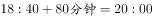到达乙地。

故正确答案为A。

---

### 第 2 题　qid 2187808 · 数学运算

为响应城市节能减排政策，邻居小邢和小赵决定拼车上班。从小区开车35公里后到达小赵单位，继续直线行驶5公里后到达小邢单位。已知小赵、小邢的车在市区行驶百公里耗油分别为10L、12L，油价为每升6元。如开小赵的车，需先将小邢送至单位再原路折返回小赵单位。如开小邢的车，则无需折返。那么两种方案花费相差多少元？

- **A**. 0.9
- **B**. 1.2
- **C**. 1.8　✅
- **D**. 2.4

**答案**：C

**官方解析**

两种方案费用如下表：

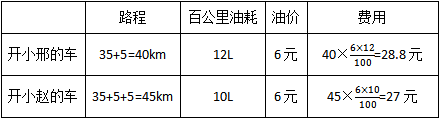

则两种方案花费相差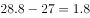元。

故正确答案为C。

---

### 第 3 题　qid 2187815 · 数学运算

一艘船模出发后先逆流航行1分钟；掉头后顺流航行2分钟；再掉头后逆流航行3分钟……以此类推。已知船模顺流速度为30米/分钟，逆流速度为10米/分钟。问10分钟后船模的位置和20分钟后船模的位置相距多少米？

- **A**. 0
- **B**. 30
- **C**. 50
- **D**. 100　✅

**答案**：D

**官方解析**

根据题意，船模20分钟内的行进轨迹为：

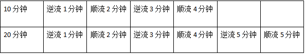

则10分钟与20分钟之间船模的位置相距即为后10分钟船模的行进路程。后10分钟内，逆流5分钟，顺流5分钟，且船模的顺流速度为30米/分钟，逆流速度为10米/分钟，假设顺流方向为正，则共计行进了米。

故正确答案为D。

---

### 第 4 题　qid 2187840 · 数学运算

某企业有不到100名员工，本月只有的员工未得到每人1000元的全勤奖，只有13名员工未得到每人1000元的绩效奖，两个奖都未得到的员工占员工总数的。问企业本月共发放全勤奖和绩效奖多少万元？

- **A**. 7.1
- **B**. 12.6
- **C**. 14.8　✅
- **D**. 16.8

**答案**：C

**官方解析**

根据题意“本月只有的员工未得到全勤奖，两个奖都未得到的员工占员工总数的”，则员工总数应为12和14的公倍数，即为84的倍数。又因为“某企业有不到100名员工”，因此员工总数为84人。有人未得到全勤奖，即有人得到全勤奖；有13名未得到绩效奖，即有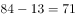人得到绩效奖。则共计发放奖金总数为万元。

故正确答案为C。

---

### 第 5 题　qid 2187847 · 数学运算

某企业招聘一批新员工，有的应聘者通过笔试，在面试环节有20人被淘汰，最终录取的人数占总应聘人数的，企业将录取的新员工分成若干个小组进行业务培训，每个小组的人数都不相同，每组至少2人，问至多可以分成多少个组？

- **A**. 7
- **B**. 8
- **C**. 5
- **D**. 6　✅

**答案**：D

**官方解析**

的人进入笔试，的人被录取，则有的人进入笔试但被淘汰，为20人，则人，录取的人数为人。32人分为若干个小组，人数不同且每组至少2人，要使组数多，则每个小组的人数应尽可能少，有，其中最后剩余的5人不能单独一组，这5人也可分给其他组只要保证不出现人数相同即可，因此最多有6组。

故正确答案为D。

---

### 第 6 题　qid 2187849 · 数学运算

甲、乙两个投资公司共同投资了A、B两个项目，甲公司在A项目中的投资额是B项目的2倍，乙公司在A项目中的投资额是B项目的一半，这两个投资公司在A项目的总投资额是B项目总投资额的1.2倍，问甲公司总投资额与乙公司总投资额之比为：

- **A**. 

- **B**. 
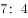
　✅
- **C**. 
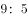

- **D**. 

**答案**：B

**官方解析**

设甲公司在B项目的投资额为，乙公司在A项目的投资额为，根据条件有：

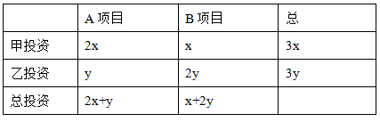

根据题意得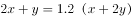，整理得。因此，甲的总投资额与乙的总投资额之比为。

故正确答案为B。

---

### 第 7 题　qid 2187851 · 数学运算

甲、乙、丙和丁四个依次相邻的农场分别饲养76头、82头、45头和93头牛，位置如下图所示（虚线位置为栅栏）。现由于两处栅栏损坏，有3个农场的牛混在一起。问最多需要分辨多少头牛，就一定能将所有牛还回原本的农场？

- **A**. 219　✅
- **B**. 220
- **C**. 250
- **D**. 251

**答案**：A

**官方解析**

根据“两处栅栏损坏，有3个农场的牛混在一起”可知，只能是相邻的甲乙丙或者相邻的乙丙丁混在一起。甲乙丙的和为：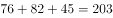，乙丙丁的和为：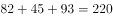，因为题目所求为辨认牛的数量尽可能的多，所以应是乙丙丁3个农场的牛混在一起；当剩余最后一头牛时，有两个农场的牛已返回，此牛不需再分辨，则最多要分辨头。

故正确答案为A。

---

### 第 8 题　qid 2187856 · 数学运算

商店购入一批某种水果，如按定价销售，每千克盈利23元。销售总量的后，每千克降价8元卖出剩余部分，销售这批水果共盈利2275元。问按原定售价卖出了多少千克水果？

- **A**. 60
- **B**. 65　✅
- **C**. 75
- **D**. 80

**答案**：B

**官方解析**

设共有千克水果，则按原定售价销售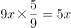千克，降价销售千克。定价销售每千克盈利23元，当降价8元时，成本不变则每千克的盈利变为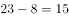元，，解得千克。则按原定售价卖出了千克。

故正确答案为B。

---

### 第 9 题　qid 2187861 · 数学运算

甲、乙、丙和丁四辆卡车运输一批货物，已知甲车满载可以装50箱，乙车满载可以装35箱。如果只使用甲车和丁车，满载4次正好可以运完；如果只使用乙车和丁车，满载5次正好可以运完；如果只使用丙车和丁车，满载6次正好可以运完。问丙车满载可以装多少箱？

- **A**. 18
- **B**. 20
- **C**. 25　✅
- **D**. 27

**答案**：C

**官方解析**

假设丙车和丁车的满载量分别为丙箱和丁箱，根据运输货物总量不变：，解方程得箱。同理，，解方程箱。

故正确答案为C。

---

### 第 10 题　qid 2187864 · 数学运算

某市场调查公司3个调查组共40余人，每组都有10余人且人数各不相同。2017年重新调整分组时发现，若想分为4个人数相同的小组，至少需要新招1人；若想分为5个人数相同的小组，至少还需要新招2人。问原来3个组中人数最多的组比人数最少的组至少多几人？

- **A**. 2
- **B**. 3　✅
- **C**. 4
- **D**. 5

**答案**：B

**官方解析**

设总数为，根据题意可知40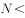50，又因为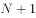是4的倍数，且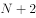为5的倍数，只有满足所有要求。要想人数最多的组与最少的组相差人数尽可能少,则最多的组人数尽量的少，最少的组尽量的多。设人数最多的组为人，则人数第二多的组至多为人，人数最少的组至多为人。根据总人数列方程可得：人，解得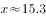人，最少的组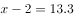人。人数最多的组至少为16人，人数最少的组至多为13人，此时二者相差最少为人。

故正确答案为B。

---

## 判断推理

### 第 1 题　qid 2187820 · 图形推理

从所给的四个选项中，选择最合适的一个填入问号处，使之呈现一定的规律性：

- **A**. A　✅
- **B**. B
- **C**. C
- **D**. D

**答案**：A

**官方解析**

元素组成相同，优先考虑位置规律。如下图所示，1号黑球沿着对角线向右下方循环移动，每次移动1格；2号黑球沿图形外圈移动，每次顺时针移动1格。故？处的1号黑球应该移动到第2行第2列的位置，2号黑球应该移动到第4行第2列的位置。只有A项符合。

故正确答案为A。

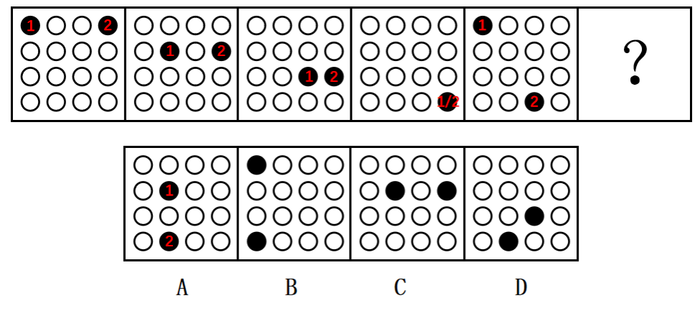

---

### 第 2 题　qid 2187832 · 图形推理

从所给的四个选项中，选择最合适的一个填入问号处，使之呈现一定的规律性：

- **A**. A　✅
- **B**. B
- **C**. C
- **D**. D

**答案**：A

**官方解析**

元素组成不同，且无明显属性规律，优先考虑数量规律。观察题干图形发现，图“窟窿”较多，优先考虑数面。题干五幅图形均有5个面，则？处也应该为5个面，C项为9个面，排除。再观察发现，题干每幅图形均有面积最大的图形，且面积最大的图形均为中心对称图形，只有A项符合。
故正确答案为A。

---

### 第 3 题　qid 2187836 · 图形推理

从所给的四个选项中，选择最合适的一个填入问号处，使之呈现一定的规律性：

- **A**. A
- **B**. B
- **C**. C
- **D**. D　✅

**答案**：D

**官方解析**

元素组成不同，优先考虑属性规律。九宫格图形优先看横行，第一行为全直线图形，第二行为全曲线图形，第三行的图2和图3均为直曲图形，则？处也应为直曲图形，排除B、C项。继续观察发现，题干所有图形均为封闭图形，只有D项符合。

故正确答案为D。

---

### 第 4 题　qid 2187841 · 图形推理

从所给的四个选项中，选择最合适的一个填入问号处，使之呈现一定的规律性：

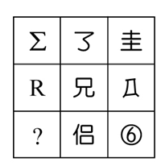

- **A**. A
- **B**. B
- **C**. C　✅
- **D**. D

**答案**：C

**官方解析**

元素组成不同，且无明显属性规律，优先考虑数量规律。观察发现，第二行的“兄”和第三行的“侣”均出现了明显的封闭面，优先考虑数面。观察题干图形，第一行的三个图形都是0个面，第二行的三个图形都有1个面，第三行后两个图形都有2个面，故？处的图形也应有2个面。四个选项中，A有3个，B有0个，C有2个，D有1个。
故正确答案为C。

---

### 第 5 题　qid 2187846 · 图形推理

把下面的六个图形分为两类，使每一类图形都有各自的共同特征或规律，分类正确的一项是：

- **A**. ①④⑥，②③⑤
- **B**. ①③④，②⑤⑥
- **C**. ①②④，③⑤⑥　✅
- **D**. ①④⑤，②③⑥

**答案**：C

**官方解析**

解法一：元素组成不同，且无明显属性规律，考虑数量规律。观察发现每个图形均分为内外两圈，并且图形中出现了很多小元素，优先考虑数素，但元素种类、个数均无规律。再观察发现图形的内圈、外圈均有形状相同的小元素，并且①②④的内圈、外圈中形状相同的小元素都是相邻的，③⑤⑥的内圈、外圈中形状相同的小元素都是相对的。
故正确答案为C。
解法二：元素组成不同，且无明显属性规律，考虑数量规律。观察发现每个图形均分为内外两圈，并且图形中出现了很多小元素，优先考虑数素，但元素种类、个数均无规律。继续观察发现图形的内圈与外圈小元素完全相同，并且①②④的外圈是内圈顺时针旋转一格形成的，③⑤⑥的外圈是内圈逆时针旋转一格形成的。
故正确答案为C。

---

### 第 6 题　qid 2187814 · 图形推理

把下面的六个图形分为两类，使每一类图形都有各自的共同特征或规律，分类正确的一项是：

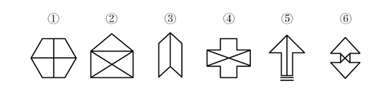

- **A**. ①④⑥，②③⑤　✅
- **B**. ①②③，④⑤⑥
- **C**. ①③④，②⑤⑥
- **D**. ①③⑤，②④⑥

**答案**：A

**官方解析**

元素组成不同，优先考虑属性规律。观察发现，图形中出现多个类似箭头的图形，如图⑤和图⑥，并且其他图形都很规整，优先考虑对称性。观察题干发现①④⑥为，②③⑤只是轴对称图形。

故正确答案为A。

---

### 第 7 题　qid 2187823 · 图形推理

把下面的六个图形分为两类，使每一类图形都有各自的共同特征或规律，分类正确的一项是：

- **A**. ①②⑥，③④⑤　✅
- **B**. ①④⑤，②③⑥
- **C**. ①④⑥，②③⑤
- **D**. ①②⑤，③④⑥

**答案**：A

**官方解析**

本题为分组分类题目。元素组成不同，无明显属性规律，优先考虑数量规律。观察发现，图形线与线相交明显，优先考虑数交点，但整体数交点无规律。再观察发现每幅图都有外框，考虑分开数内外交点。图1至图6外部交点数分别为：5、6、5、5、8、4，内部交点数分别为：5、6、1、1、4、4，单独看内部和外部交点数无规律，考虑内外交点运算。图①②⑥，图③④⑤。即①②⑥为一组，③④⑤为一组。

故正确答案为A。

---

### 第 8 题　qid 2187830 · 图形推理

左边给定的是纸盒的外表面，下面哪一项能由它折叠而成？

- **A**. A
- **B**. B　✅
- **C**. C
- **D**. D

**答案**：B

**官方解析**

将题干展开图标上序号，如下图所示，逐一进行分析。

A项：选项由面e、面g和面h构成，选项中三个面的公共点处引出1条线，题干中三个面的公共点处没有引出线条，选项与题干展开图不一致，排除；

B项：选项由面g、面h和面k构成，选项与题干展开图一致，当选；

C项：选项由面f、面i和面k构成，选项面f中大三角形的底边挨着面i，题干面f中大三角形的底边挨着面g，选项与题干展开图不一致，排除；

D项：选项由面f、面h和面i构成，其中面f和面h为相对面，不可能同时出现，选项与题干展开图不一致，排除。

故正确答案为B。

---

### 第 9 题　qid 2187837 · 图形推理

下面四个选项中，符合左边立体图形的俯视图和左视图的是：

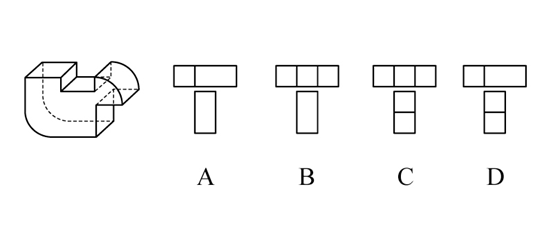

- **A**. A
- **B**. B　✅
- **C**. C
- **D**. D

**答案**：B

**官方解析**

本题考查三视图。俯视图是从物体的上面向下面看得到的视图，题干的俯视图中间应该有2条竖线，排除A、D项；左视图是从物体的左面向右面看得到的视图，中间没有横线，排除C项。
故正确答案为B。

---

### 第 10 题　qid 2187842 · 图形推理

下图和哪个选项一起可以拼接成一个封闭立体图形？

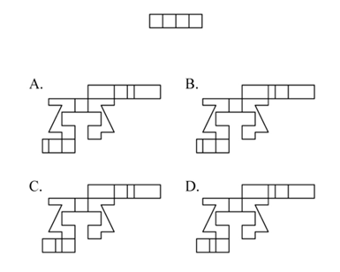

- **A**. A
- **B**. B
- **C**. C
- **D**. D　✅

**答案**：D

**官方解析**

本题为空间重构题，如下图分别标记1、2。

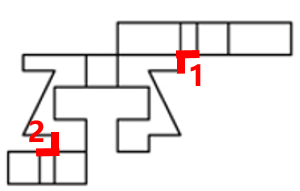

由成直角的两条边是公共边可知，要想与题干一起折成封闭立体图形，需要1和2区域标红线的两部分均相互垂直且等长。A项1、2部分均不等长，B项第2部分不等长，C项第1部分不等长，只有D项满足。

故正确答案为D。

---

### 第 11 题　qid 2187810 · 定义判断

化感作用是指一种植物通过向环境释放化学物质而对该种植物或周围植物（包括微生物）所产生的直接或间接的作用。
根据上述定义，下列不属于化感作用的是：

- **A**. 在人参上喷洒的农药被土壤吸收后，会杀死土壤中的硝化细菌和氨化细菌　✅
- **B**. 胡桃树的叶、皮会释放葡萄糖代胡桃醌从而杀死胡桃树下的植物
- **C**. 桉树叶中分泌出来的酚类物质被雨水冲刷下来后对附近亚麻的生长有抑制作用
- **D**. 黑麦残株经微生物分解后产生羟基肟酸，影响自身的生长发育

**答案**：A

**官方解析**

第一步：找出定义关键词。
“一种植物通过向环境释放化学物质”、“对该种植物或周围植物（包括微生物）所产生的直接或间接的作用”。
第二步：逐一分析选项。
A项：在人参上喷洒的农药，农药并不是人参释放出来的，不符合“一种植物通过向环境释放化学物质”，不符合定义，当选；
B项：胡桃树的叶、皮释放葡萄糖代胡桃醌，符合“一种植物通过向环境释放化学物质”，杀死胡桃树下的植物，符合“对该种植物或周围植物（包括微生物）所产生的直接或间接的作用”，符合定义，排除；
C项：桉树叶分泌出来的酚类物质，符合“一种植物通过向环境释放化学物质”，对附近的亚麻的生长有抑制作用，符合“对该种植物或周围植物（包括微生物）所产生的直接或间接的作用”，符合定义，排除；
D项：黑麦残株被分解后产生羟基肟酸，符合“一种植物通过向环境释放化学物质”，影响自身的生长发育，符合“对该种植物或周围植物（包括微生物）所产生的直接或间接的作用”，符合定义，排除。
本题为选非题，故正确答案为A。

---

### 第 12 题　qid 2187816 · 定义判断

合义务的择一举动是指虽然行为人实施了违法行为，造成了结果，但即使其遵守法律，也不能避免该结果的情形。
根据上述定义，下列属于合义务的择一举动的是：

- **A**. 甲驾车正常行驶，行人王某从人行道上猛然冲向甲，结果王某被撞伤
- **B**. 乙醉酒后驾车，行人王某同样喝醉了酒，从人行道上猛然冲向乙，结果王某被撞伤　✅
- **C**. 丙驾车超速行驶，行人王某横穿马路，丙来不及刹车，将王某撞伤
- **D**. 丁驾车超载行驶，行人王某横穿马路，幸而丁紧急刹车，才没有撞到王某

**答案**：B

**官方解析**

第一步：找出定义关键词。
“行为人实施了违法行为，造成了结果”、“即使其遵守法律，也不能避免该结果的情形”。
第二步：逐一分析选项。
A项：甲驾车正常行驶，王某猛然冲出被撞伤，不符合“行为人实施了违法行为”，不符合定义，排除；
B项：乙酒后驾车将王某撞伤，符合“行为人实施了违法行为，造成了结果”，但如果乙没有酒后驾车，也不能避免该结果的情形，因为行人王某同样喝醉了酒并且冲向乙，符合“即使其遵守法律，也不能避免该结果的情形”，符合定义，当选；
C项：丙驾车超速行驶将王某撞伤，符合“行为人实施了违法行为，造成了结果”，但如果丙遵守法律不超速驾驶，就可以及时刹车，从而避免该结果出现，不符合“但即使其遵守法律，也不能避免该结果的情形”，不符合定义，排除；
D项：丁驾车超载行驶是违法行为，但是没有造成结果，不符合定义，排除。
故正确答案为B。

---

### 第 13 题　qid 2187821 · 定义判断

认知失调是一个人在做出决定、采取行动或者接触到一些有违原先信念，情感或价值的信念后所体验到的冲突状态。当人们感到认知失调时，不协调的存在感将推动人们去努力减少不协调，除设法调整自身的行为或改变自己的态度外，人们还可以主动避开那些很可能使不协调增加的情境内外因素和信息因素。
根据上述定义，下列反映认知失调的是：

- **A**. 小明参与了一个很无聊的活动，从中得到了很少的报酬
- **B**. 推销员说服小红用相对高的价格买了自己不是很需要的厨具，几天后小红觉得自己非常喜欢这套厨具　✅
- **C**. 小王因为考试没考好被爸爸批评了，他回到自己房间后认真思考了原因，决定以后更加努力学习
- **D**. 勤奋的小宇参加了很多课外班，这导致每次练习钢琴都会迟到，他对钢琴老师表示非常抱歉

**答案**：B

**官方解析**

第一步：找出定义关键词。
“做出决定、采取行动或者接触到一些有违原先信念，情感或价值的信念后所体验到的冲突状态”、“不协调的存在感将推动人们去努力减少不协调”。
第二步：逐一分析选项。
A项：小明参与无聊的活动，得到少的报酬，没有体现“体验到的冲突状态”，不符合定义，排除； 
B项：小红用相对较高价格买了自己不是很需要的厨具，高价购买但并不需要，符合“体验到的冲突状态”，几天后觉得非常喜欢，符合“不协调的存在感将推动人们去努力减少不协调”，符合定义，当选；
C项：小王没考好被爸爸批评，没有体现“体验到的冲突状态”，不符合定义，排除；
D项：小宇参加了很多课外班导致钢琴课迟到，没有体现“体验到的冲突状态”，不符合定义，排除。
故正确答案为B。

---

### 第 14 题　qid 2187828 · 定义判断

战略性新兴产业是以重大技术突破和重大发展需求为基础，对经济社会全局和长远发展具有重大引领带动作用，知识技术密集、物质资源消耗少、成长潜力大的产业。
根据上述定义，下列不属于战略性新兴产业的是：

- **A**. 食品加工业　✅
- **B**. 节能环保产业
- **C**. 信息产业
- **D**. 新材料产业

**答案**：A

**官方解析**

第一步：找出定义关键词。
“以重大技术突破和重大发展需求为基础” 、“知识技术密集、物质资源消耗少、成长潜力大”。
第二步：逐一分析选项。
A项：食品加工业不是新兴产业，也不符合“以重大技术突破和重大发展需求为基础”，不符合定义，当选； 
B项：节能环保产业是为节约能源资源、发展循环经济、保护环境提供技术基础和装备保障的产业，是战略性新兴产业，符合定义，排除；
C项：信息产业是专门生产、收集、整理、传递信息，并制造各种信息设备的工业，是战略性新兴产业，符合定义，排除；
D项：新材料产业包括新材料及其相关产品和技术装备，是战略性新兴产业，符合定义，排除。
本题为选非题，故正确答案为A。

---

### 第 15 题　qid 2187844 · 定义判断

集合体是指由一定数量的同类个体组成的统一整体，组成集合体的个体通常并不必然具有该集合体的所有属性。集合概念是指以集合体为反映对象的概念。
根据上述定义，下列用黑体字显示的概念属于集合概念的是：

- **A**. 
<b>自然数</b>是不小于0的整数

- **B**. 
<b>人民</b>享有广泛的民主权利

- **C**. 
<b>我们班的同学</b>来自五湖四海
　✅
- **D**. 
<b>教师</b>是知识分子

**答案**：C

**官方解析**

第一步：找出定义关键词。
“由一定数量的同类个体组成的统一整体”、“组成集合体的个体通常并不必然具有该集合体的所有属性”。
第二步：逐一分析选项。
A项：自然数中的每个个体必然是不小于0的整数，不符合“组成集合体的个体通常并不必然具有该集合体的所有属性”，不符合定义，排除；
B项：人民具有的广泛民主权利必然是每一个人都会具有的，不符合“组成集合体的个体通常并不必然具有该集合体的所有属性”，不符合定义，排除；
C项：我们班的同学来自五湖四海，但对其中的某一位同学来说，并不能说某个人来自五湖四海，符合“组成集合体的个体通常并不必然具有该集合体的所有属性”，符合定义，当选；
D项：每位教师也都是知识分子，不符合“组成集合体的个体通常并不必然具有该集合体的所有属性”，不符合定义，排除。
故正确答案为C。

---

### 第 16 题　qid 2187860 · 定义判断

水平迁移是指处于同一抽象和概括水平的经验之间的相互影响，是在难度、复杂程度上属于同一水平层次的两种经验之间的相互影响；垂直迁移是指处于不同抽象和概括水平的经验之间的相互影响，是具有较高概括水平的上位经验与具有较低概括水平的下位经验之间的相互影响。
根据上述定义，下列属于垂直迁移的是：

- **A**. 小学生在学会写“木”这个字后，有助于学会写“森”
- **B**. 学习了“植物”“动物”等概念后，有助于对“生物”这一概念的学习　✅
- **C**. 学习了“老虎”“狮子”等概念后，有助于对不熟悉的鲸或海豚的识别
- **D**. 学习了有关正方形的知识后，有助于对菱形、长方形等相关知识的学习

**答案**：B

**官方解析**

第一步：找出定义关键词。
水平迁移：“处于同一抽象和概括水平的经验之间的相互影响”、“是在难度、复杂程度上属于同一水平层次的两种经验之间的相互影响”；
垂直迁移：“处于不同抽象和概括水平的经验之间的相互影响”、“具有较高概括水平的上位经验与具有较低概括水平的下位经验之间的相互影响”。
第二步：逐一分析选项。
A项：木和森都是汉字，学习木有助于学习森符合“处于同一抽象和概括水平的经验之间的相互影响”，符合“水平迁移”定义，不符合“垂直迁移”定义，排除；
B项：生物是对植物、动物等的概括，概括水平高于植物、动物，学习植物、动物有助于学习生物符合“处于不同抽象和概括水平的经验之间的相互影响”、“具有较高概括水平的上位经验与具有较低概括水平的下位经验之间的相互影响”，符合“垂直迁移”定义，当选；
C项：老虎、狮子、鲸和海豚都是动物，学习老虎、狮子有助于学习鲸、海豚符合“处于同一抽象和概括水平的经验之间的相互影响”，符合“水平迁移”定义，不符合“垂直迁移”定义，排除；
D项：正方形、菱形和长方形都是图形，学习正方形有助于学习菱形、长方形符合“处于同一抽象和概括水平的经验之间的相互影响”，符合“水平迁移”定义，不符合“垂直迁移”定义，排除。
故正确答案为B。

---

### 第 17 题　qid 2187863 · 定义判断

主观唯心主义认为人的主观精神（如目的、意志、感觉、经验、心灵等）是世界的本原，客观唯心主义认为上帝、理念等客观精神是先于物质世界并独立于物质世界而存在的本体，而物质世界不过是这种客观精神的外化，前者是本原的、第一性的，后者是派生的、第二性的。
根据上述定义，下列思想属于客观唯心主义的是：

- **A**. 相由心生，境由心转
- **B**. 一花一世界，一草一灵魂
- **C**. 一切事物的存在是因为它们被我们所感知到
- **D**. 理是世界万事万物存在的根据　✅

**答案**：D

**官方解析**

第一步：找出定义关键词。
主观唯心主义：“人的主观精神（目的、意志、感觉、经验、心灵等）是世界的本原”、“本原的、第一性”；
客观唯心主义：“上帝、理念等客观精神是先于物质世界并独立于物质世界”、“派生的、第二性”。
第二步：逐一分析选项。
A项：“相由心生，境由心转”的意思是环境的美好与恶劣是由心境的快乐与否而决定的，符合主观精神中的“心灵”为世界的本原，符合主观唯心主义，不符合客观唯心主义，排除；
B项：“一花一世界，一草一灵魂”的意思是每个自我都有一个世界，而且每个世界都是平等且相对独立的，每个世界都互相影响，每个世界的发展方向都取决于其意识体本身，符合“人的主观精神（目的、意志、感觉、经验、心灵等）是世界的本原”，符合主观唯心主义，不符合客观唯心主义，排除；
C项：一切事物的存在是因为被我们所感知到，符合主观精神中的“感觉”为世界的本原，符合主观唯心主义，不符合客观唯心主义，排除；
D项：理是世界万事万物存在的根据，符合“理念是先于物质世界并独立于物质世界”，符合客观唯心主义定义，当选。
故正确答案为D。

---

### 第 18 题　qid 2187866 · 定义判断

加害给付是指在履行合同的过程中，合同关系中的债务人所作出的履行行为不符合合同的规定，并且这种不适当履行行为造成了对债权人的履行利益以外的损害，这一损害包括人身损害或给付标的以外的其他财产损害。
根据上述定义，下列没有反映加害给付的是：

- **A**. 甲公司与乙宾馆协议，约定在该宾馆举办答谢酒宴，结果在酒席中部分客人食用海鲜后出现了食物中毒的情况
- **B**. 甲与乙一直有合作协议，2018年年初，甲将患有传染病的家禽卖给农场主乙，致使乙农场的其他家禽染病死亡
- **C**. 甲电子商城与供货商乙签订采购协议，乙将有问题的充电宝供货给甲，一名消费者购买了甲商场的充电宝，使用时发生爆炸，一只手受伤
- **D**. 甲水果店欲采购水果，于是与乙供货商签订合同，后发现乙送来的水果中部分已经腐烂，无法销售　✅

**答案**：D

**官方解析**

第一步：找出定义关键词。
“履行合同过程中”、“债务人作出的履行行为不符合合同规定”、“造成对债权人的履行利益以外的损害”、“人身损害或给付标的以外的其他财产损害”
第二步：逐一分析选项。
A项：甲是债权人，乙是债务人，甲与乙约定在宾馆举办答谢宴，符合“履行合同过程中”，客人食用海鲜出现食物中毒，符合“债务人作出的履行行为不符合合同规定”，也符合造成“人身损害”，符合定义，排除；
B项：甲是债务人，乙是债权人，甲乙有合作协议，符合“履行合同过程中”，甲将有传染病的家禽卖给乙，符合“债务人作出的履行行为不符合合同规定”，乙农场的其他家禽染病死亡符合“给付标的以外的其他财产损害”，符合定义，排除；
C项：消费者是债权人，甲是债务人，甲将有问题的充电宝卖给消费者符合“合同关系中的债务人所作出的履行行为不符合合同的规定”，消费者使用中发生爆炸导致一只手受伤符合“造成对债权人的履行利益以外的损害”，符合定义，排除；
D项：甲是债权人，乙是债务人，甲乙签订合同，符合“履行合同过程中”，乙送的水果部分腐烂，符合“债务人作出的履行行为不符合合同规定”，腐烂的水果无法销售，是造成该产品本身无法销售，不符合“给付标的以外的其他财产损害”，不符合定义，当选。
本题为选非题，故正确答案为D。

---

### 第 19 题　qid 2187868 · 定义判断

正态曲线中间突起部分是“头”，两边相对平缓的部分叫“尾”。人们的大多数需求会集中在“头”部，分布在“尾”部的需求是个性化的、零散的、小量的。但这部分差异化的、少量的需求会在需求曲线上面形成一条长长的“尾”。所谓长尾效应是指，将所有分布在“尾”部的市场累加起来就会形成一个比“头”部市场还大的市场，强调“个性化”和“小利润大市场”，就是只赚每个人很少的钱，但是要赚很多人的钱。
根据上述定义，下列符合长尾效应的是：

- **A**. 小季开了一家网上书店，主管图书销售，手工艺者也可以在此销售自己手工制作的书签，书签很便宜但很受欢迎，销售额居然超过了图书的销售额　✅
- **B**. 随着网络图书销售的兴起，小张将实体书店改成“书吧”，不再销售图书。一段时间后，他发现每天的咖啡和茶点的销售额比原本的图书销售额还要高
- **C**. 很多“白领”工作期间想喝咖啡却没时间去买，小王创办一家咖啡配送网站，到咖啡店买咖啡送到下单客户手中，虽然每杯只收2元服务费，但网站收益很不错
- **D**. 小刘的电子商务网站原本做小家电销售和配送，后来他们拓展主营业务，配送杂志和鲜花，一段时间后，杂志和鲜花的订单和收益逐渐超过了家电配送

**答案**：A

**官方解析**

第一步：找出定义关键词。
“个性化”、“小利润大市场”、“只赚每个人很少的钱，但是要赚很多人的钱”
第二步：逐一分析选项。
A项：书店主管图书销售，说明图书是“头部”即主要的市场，而书签销售额超过了图书的销售额符合“只赚每个人很少的钱，但是要赚很多人的钱”、“小利润大市场”符合定义，当选；
B项：小张不销售图书而去销售咖啡和茶点，没有体现出咖啡和茶点的价格是否便宜，不符合“只赚每个人很少的钱”，且没有体现出是否有大市场，不符合定义，排除；
C项：很多白领想喝咖啡，但咖啡配送不符合一个“个性化”和“小利润大市场”，不符合定义，排除；
D项：杂志和鲜花的收益超过了家电配送，没有提及价格是否便宜，不符合“只赚每个人很少的钱，但是要赚很多人的钱”，不符合定义，排除。
故正确答案为A。

---

### 第 20 题　qid 2187883 · 定义判断

在面临不希望发生的事情时，个体往往在回避或接纳事实之间调整以获得内心平衡，若出现一个新选择与内心平衡状态相近，就很容易接纳。因此，首先提出高要求，再提出较低要求，往往更容易为对方所接受。这在心理学上被称为“拆屋效应”。
根据上述定义，下列不属于拆屋效应的是：

- **A**. 某商家首先把价格抬高，然后开展打折活动，往往能吸引更多的顾客前来购买商品
- **B**. 某学生犯错后离家出走，几天后安全返校，班主任反倒不再过多追究其之前的错误
- **C**. 某朋友提出一个无理要求遭拒绝后，马上提出一个相对合理的要求，往往更易被接受
- **D**. 某人在看到多数人作出某一选择时，即使该选择有多么不合理，也会选择妥协　✅

**答案**：D

**官方解析**

第一步：找出定义关键词。
“先提出高要求”、“再提出较低要求”、“更容易为对方所接受”。
第二步：逐一分析选项。
A项：商家把价格抬高符合“提出高要求”，然后展开打折活动，打折之后价格降低符合“再提出较低要求”，最后吸引来了更多顾客买商品说明“更容易为对方所接受”，符合定义，排除；
B项：犯错离家出走是班主任没有办法接受的，符合“提出高要求”，学生之前所犯的错误相对于离家出走就是更容易接受的，符合“再提出较低要求”，最后班主任不再追究之前的错误符合“更容易为对方所接受”，符合定义，排除；
C项：提出一个无理要求符合“提出高要求”，遭拒绝后提出一个相对合理的要求符合“再提出较低要求”，往往更易被接受符合“更容易为对方所接受”，符合定义，排除；
D项：只是看到多数人做出了不合理的选择，自己也选择了妥协，从始至终只有一个“要求”就是不合理的选择，并没有体现出“先提出高要求，再提出较低要求，最后更容易为对方所接受”，不符合定义，当选。
本题为选非题，故正确答案为D。

---

### 第 21 题　qid 2187879 · 类比推理

宇航员：探月

- **A**. 航空公司：飞行
- **B**. 清洁工：保洁　✅
- **C**. 志愿者：组织
- **D**. 药厂：制药

**答案**：B

**官方解析**

第一步：判断题干词语间逻辑关系。
宇航员是一个职业，探月是他的工作内容，二者为职业和工作内容的对应关系。
第二步：判断选项词语间逻辑关系。
A项：航空公司是一个组织，飞行是航空公司的工作，二者不是职业和工作内容的对应关系，与题干逻辑关系不一致，排除；
B项：清洁工是一个职业，保洁是他的工作内容，二者为职业和工作内容的对应关系，与题干逻辑关系一致，当选；
C项：志愿者是一种身份，不是一个职业，且志愿者的工作内容是义务帮助，与题干逻辑关系不一致，排除；
D项：药厂是一个组织，制药是药厂的工作，二者不是职业和工作内容的对应关系，与题干逻辑关系不一致，排除。
故正确答案为B。

---

### 第 22 题　qid 2187881 · 类比推理

语言：德语

- **A**. 图书馆：书本
- **B**. 命题：概念
- **C**. 有理数：正分数　✅
- **D**. 地球：卫星

**答案**：C

**官方解析**

第一步：判断题干词语间逻辑关系。
德语是一种语言，二者为种属关系。
第二步：判断选项词语间逻辑关系。
A项：书本存放在图书馆，二者为事物与场所的对应关系，与题干逻辑关系不一致，排除；
B项：命题和概念没有明显的逻辑关系，与题干逻辑关系不一致，排除；
C项：正分数是一种有理数，二者为种属关系，与题干逻辑关系一致，当选；
D项：地球是行星，不是卫星，与题干逻辑关系不一致，排除。
故正确答案为C。

---

### 第 23 题　qid 2187884 · 类比推理

有形损耗：无形损耗

- **A**. 中国哲学：西方哲学
- **B**. 蒸馏酒：葡萄酒
- **C**. 急性中毒：慢性中毒　✅
- **D**. 有色金属：稀有金属

**答案**：C

**官方解析**

第一步：判断题干词语间逻辑关系。
有形损耗是指固定资产由于使用和自然原因而引起使用价值和价值的损失，是能看得到的损耗；无形损耗是指固定资产由于科学技术进步而引起的价值上的损失，是看不见的损耗。二者都是损耗的一种，并且除了有形损耗就是无形损耗，二者为矛盾关系。
第二步：判断选项词语间逻辑关系。
A项：中国哲学和西方哲学都是哲学的一种，但是除了这两种还有别的哲学，比如日本哲学、韩国哲学等，二者不是矛盾关系，与题干逻辑关系不一致，排除；
B项：蒸馏酒是需要通过蒸馏工艺制作的酒，葡萄酒是以葡萄为原材料制作的酒，二者是从不同方面区分酒的，有的蒸馏酒是葡萄酒，有的葡萄酒是蒸馏酒，二者为交叉关系，与题干逻辑关系不一致，排除；
C项：急性中毒指一次接触大量毒物所致的中毒，慢性中毒指多次或长期接触少量毒物，经一定潜伏期而发生的中毒。二者都是中毒的一种，并且除了急性中毒就是慢性中毒，二者为矛盾关系，与题干逻辑关系一致，当选；
D项：有色金属通常指除去铁（有时也除去锰和铬）和铁基合金以外的所有金属。稀有金属是指在地壳中含量较少，分布稀散或难以从原料中提取的金属，如锂、铍、钛、钒、锗等，所以稀有金属是有色金属的一种，二者为种属关系，与题干逻辑关系不一致，排除。
故正确答案为C。

---

### 第 24 题　qid 2187886 · 类比推理

循规蹈矩：规矩

- **A**. 年富力强：富强
- **B**. 功成名就：成就　✅
- **C**. 待人接物：人物
- **D**. 伶牙俐齿：牙齿

**答案**：B

**官方解析**

第一步：判断题干词语间逻辑关系。
循规蹈矩指遵守规矩，有规矩，二者为对应关系。
第二步：判断选项词语间逻辑关系。
A项：年富力强指年纪轻精力旺盛，富强指富足强盛，二者无明显逻辑关系，与题干逻辑关系不一致，排除；
B项：功成名就指功业建立了，名声也有了，即有成就，二者为对应关系，与题干逻辑关系一致，当选；
C项：待人接物指对待别人，应接事物，即指跟别人往来接触，人物指作品中描写的人，二者无明显逻辑关系，与题干逻辑关系不一致，排除；
D项：伶牙俐齿指口齿伶俐能说会道，牙齿是人体的器官，二者无明显逻辑关系，与题干逻辑关系不一致，排除。
故正确答案为B。

---

### 第 25 题　qid 2187887 · 类比推理

大豆：酱油

- **A**. 柠檬：白醋
- **B**. 淀粉：年糕
- **C**. 花生：香油
- **D**. 甘蔗：红糖　✅

**答案**：D

**官方解析**

第一步：判断题干词语间逻辑关系。
大豆是制作酱油的主要原材料，二者为原材料和成品的对应关系。
第二步：判断选项词语间逻辑关系。
A项：制作白醋的主要原材料是大米，不是柠檬，与题干逻辑关系不一致，排除；
B项：制作年糕的主要原材料是黏性大的米（如糯米等），不是淀粉，与题干逻辑关系不一致，排除；
C项：制作香油的主要原材料是芝麻，不是花生，与题干逻辑关系不一致，排除；
D项：甘蔗是制作红糖的主要原材料，二者为原材料和成品的对应关系，与题干逻辑关系一致，当选。
故正确答案为D。

---

### 第 26 题　qid 2187875 · 类比推理

亭台：楼宇：砖瓦

- **A**. 彩虹：阳光：蜃景
- **B**. 电闪：雷鸣：电荷
- **C**. 蛋糕：面包：面粉　✅
- **D**. 核聚变：核裂变：核能

**答案**：C

**官方解析**

第一步：判断题干词语间逻辑关系。
亭台、楼宇都是供游赏、休息的建筑物，二者是并列关系；砖瓦是亭台和楼宇的原材料，所以第三个词和前两个词是原材料与制成品的对应关系。
第二步：判断选项词语间逻辑关系。
A项：彩虹是气象中的一种光学现象，当阳光照射到空气中的水滴时，会产生彩虹，所以阳光是产生彩虹的必要条件之一，二者不是并列关系，与题干逻辑关系不一致，排除；
B项：电闪和雷鸣都是自然现象，二者是并列关系；但是电荷不是电闪和雷鸣的原材料，与题干逻辑关系不一致，排除；
C项：蛋糕和面包都是食物，二者为并列关系；面粉是蛋糕和面包的原材料，所以第三个词和前两个词是原材料与制成品的对应关系，与题干逻辑关系一致，当选；
D项：核聚变和核裂变都是核反应形式，二者为并列关系；核聚变和核裂变的过程都释放核能，即核能不是核聚变和核裂变的原材料，与题干逻辑关系不一致，排除。
故正确答案为C。

---

### 第 27 题　qid 2187878 · 类比推理

小斑虎猫：虎猫属：猫科

- **A**. 庄稼：粮食：谷物
- **B**. 卷尺：尺子：工具　✅
- **C**. 小学：初中：高中
- **D**. 少尉：少校：少将

**答案**：B

**官方解析**

第一步：判断题干词语间逻辑关系。
小斑虎猫是虎猫属的一种，虎猫属是猫科的一种，三者为种属关系。
第二步：判断选项词语间逻辑关系。
A项：庄稼指地里的粮食作物，与粮食是种属关系，谷物是粮食的一种，但两词顺序与题干相反，与题干逻辑关系不一致，排除；
B项：卷尺是尺子的一种，尺子是工具的一种，三者为种属关系，与题干逻辑关系一致，当选；
C项：小学、初中、高中指不同的教育阶段，三者为并列关系，与题干逻辑关系不一致，排除；
D项：少尉、少校、少将指不同等级的军衔，三者为并列关系，与题干逻辑关系不一致，排除。
故正确答案为B。

---

### 第 28 题　qid 2187882 · 类比推理

批准：审查：申报

- **A**. 烹饪：切菜：洗菜
- **B**. 跑步：走路：爬行
- **C**. 早退：迟到：报到
- **D**. 痊愈：治疗：受伤　✅

**答案**：D

**官方解析**

第一步：判断题干词语间逻辑关系。
先申报、再审查、最后批准，三者存在时间上的先后顺序。
第二步：判断选项词语间逻辑关系。
A项：先洗菜、再切菜、最后烹饪，三者存在时间上的先后顺序，与题干逻辑关系一致，保留；
B项：先爬行、再走路、最后跑步，为婴儿学习行走的三个阶段，三者存在时间上的先后顺序，与题干逻辑关系一致，保留；
C项：早退、迟到、报到，一般是先迟到，再报到（只有到了以后才能报到），与题干逻辑关系不一致，排除；
D项：先受伤、再治疗、最后痊愈，三者存在时间上的先后顺序，与题干逻辑关系一致，保留。
比较题干和A、B、D三项，首先看主体，题干的“批准”和“审查”是同一个主体的行为，而“申报”一般是另一个主体的行为，A、B、D三项没有能跟题干主体完全对应上的，有同学可能认为题干涉及两个不同主体，D也涉及两个不同主体，这个角度没有看主体对应的具体位置，其实是非常不严谨的，不建议这么思考，容易掉坑；
本题与其他题的不同之处在于，考查的是动作的倒序，即把最后一个动作反而放在了第一个词，这种情况下，咱们可重点关注第一个词，题干的“批准”和D项的“痊愈”，都是做一系列事后想要达到的积极结果，而A项的“烹饪”和B项的“跑步”都是偏中性的客观表述，D项跟题干更为一致，择优选择D项。
故正确答案为D。

---

### 第 29 题　qid 2187885 · 类比推理

扇子 对于（  ）相当于（  ）对于 钢笔

- **A**. 折扇  笔帽
- **B**. 团扇  墨水
- **C**. 空调  毛笔　✅
- **D**. 扇面  圆珠笔

**答案**：C

**官方解析**

逐一代入选项。
A项：折扇是扇子的一种，二者为种属关系，笔帽是钢笔的组成部分，二者为组成关系，前后逻辑关系不一致，排除；
B项：团扇是扇子的一种，二者为种属关系，钢笔和墨水是配套使用的对应关系，前后逻辑关系不一致，排除；
C项：扇子和空调为并列关系，二者都可以用来降温，毛笔和钢笔为并列关系，二者都可以用来书写，前后逻辑关系一致，当选；
D项：扇面是扇子的组成部分，二者为组成关系，钢笔和圆珠笔为并列关系，前后逻辑关系不一致，排除。
故正确答案为C。

---

### 第 30 题　qid 2187888 · 类比推理

（  ）对于 污染 相当于 起诉 对于（  ）

- **A**. 防治  驳回
- **B**. 排放  判决　✅
- **C**. 农药  原告
- **D**. 工厂  法院

**答案**：B

**官方解析**

逐一代入选项。
A项：防治污染为动宾关系，驳回起诉为动宾关系，但后一组两词顺序相反，前后逻辑关系不一致，排除；
B项：排放和污染为两个行为，且先排放后污染，判决和起诉为两个行为，且先起诉后判决，前后逻辑关系一致，当选；
C项：农药污染指农药或其有害代谢物、降解物对环境和生物产生的污染，为固定搭配，原告起诉为主谓关系，前后逻辑关系不一致，排除；
D项：工厂可以产生污染，二者是场所的对应关系，法院可以受理起诉，二者是场所的对应关系，但后一组两词顺序相反，前后逻辑关系不一致，排除。
故正确答案为B。

---

### 第 31 题　qid 2187871 · 逻辑判断

一般来说，幼儿的体温因阳光照射而上升的幅度比成人小。可是人们发现，在汽车车厢内，如果温度较高，幼儿很容易发生中暑，而成人几乎很少出现这一现象。甚至在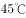的高温环境下待在车厢里一小时，也不会中暑。

以下哪项如果为真，最能解释上述发现？

- **A**. 
在岁的幼儿中，年龄越小的孩子，抵抗能力越弱

- **B**. 
随着年龄的增长，人体内的水分占体液总量的比例变小，体温的变化也不再明显

- **C**. 
车内属于密闭空间，当室外气温达到时，车内温度就能达到，而成人在车内感到不适时很可能会打开车窗

- **D**. 
中暑多在丧失了相当于体重的水分时发生，幼儿体重相对应的体表面积更大，能更快地吸收热量，由于汗腺数目与大人相同，水分流失速度更快
　✅

**答案**：D

**官方解析**

第一步：找出题干矛盾。
一般幼儿的体温因阳光照射上升的幅度比成人小，但高温环境下幼儿很容易中暑而成人却很少中暑。
第二步：逐一分析选项。
A项：说明幼儿抵抗能力弱，但抵抗力弱是否代表容易中暑不知道，不能解释题干矛盾，排除；
B项：随着年龄的增长，体温变化不明显，说明人的体温正常变化和在封闭空间内应当是一样的，不能解释题干矛盾，排除；
C项：成人所处的环境是打开车窗，而题干强调的是在高温环境下待一个小时，与题干环境不一致，不能解释题干矛盾，排除；
D项：由于幼儿体重相对应的体表面积更大，水分流失更快，解释了幼儿体温上升幅度比成人小，但更容易中暑的原因，能够解释题干矛盾，当选。
故正确答案为D。

---

### 第 32 题　qid 2187873 · 逻辑判断

甲说：如果考试不合格，就不能被录取。
乙说：不对。李明考试合格了，但没有被录取。
乙的回答说明他将甲的话错误地理解为：

- **A**. 有些被录取的人考试合格了
- **B**. 李明应该被录取
- **C**. 只要考试合格，就要被录取　✅
- **D**. 并非所有考试合格的都要被录取

**答案**：C

**官方解析**

第一步：翻译题干。

甲：考试合格录取

乙：李明考试合格 且 录取

由题干可知，乙认为甲说的不对，因此他对甲的理解就是“李明考试合格 且 录取”的矛盾命题。即：考试合格录取。

第二步：逐一分析选项。

A项：翻译为有些录取考试合格，不是乙的矛盾命题，排除；

B项：李明应该被录取，不是乙的矛盾命题，排除；

C项：翻译为考试合格录取，与乙的结论是矛盾命题，当选；

D项：翻译为有的考试合格录取，不是乙的矛盾命题，排除。

故正确答案为C。

---

### 第 33 题　qid 2187874 · 逻辑判断

在国家发展新兴产业的大背景下，某公司虽然在某产业长期处于领先地位，但上半年的生产数据显示，领先优势越来越小，在邀请专家进行企业诊断后，专家认为该公司领先优势缩小的原因在于公司虽然管理制度健全，但由于企业文化缺乏进取心，导致在好的政策环境下公司发展趋缓。
以下哪项如果为真，不能反驳专家的观点？

- **A**. 相较沿海地区同类公司受益于健全的产业链，公司处于内地，其发展有所受限
- **B**. 发展趋缓的原因在于长期以来公司下半年的生产数据一般高于上半年
- **C**. 公司一直注重加强企业文化建设，形成了和谐的企业氛围　✅
- **D**. 企业文化并不是一个公司的核心竞争力，关键问题在于新产品研发力度不够

**答案**：C

**官方解析**

第一步：找出论点和论据。
论点：该公司领先优势缩小的原因在于公司虽然管理制度健全，但由于企业文化缺乏进取心，导致在好的政策环境下公司发展趋缓。
论据：无。
第二步：逐一分析选项。
A项：论点说的是企业文化缺乏进取心导致的公司发展缓慢，该项说的是公司处于内地，导致公司发展受限，提供了一个新原因也能导致结果产生，他因削弱，排除；
B项：论点说的是企业文化缺乏进取心导致的公司发展缓慢，该项说的是长期以来公司下半年的生产数据一般高于上半年导致公司发展趋缓，直接否定了论点的原因，可以削弱，排除；
C项：论点说的是企业文化缺乏进取心导致的公司发展缓慢，该项说的是加强企业文化会形成和谐的氛围，和谐的氛围与缺乏进取心之间话题不一致，无关选项，无法削弱，当选；
D项：论点说的是企业文化缺乏进取心导致的公司发展缓慢，该项说的是企业文化不是核心竞争力，即企业文化对公司发展影响不大，削弱论点，排除。
本题为选非题，故正确答案为C。

---

### 第 34 题　qid 2187877 · 逻辑判断

美国幼儿教育注重培养孩子的“批判式思维”，其中重要一点就是区分事实陈述与观点陈述，事实陈述是可被验证的，有“真假”，无“好坏”；观点陈述则多为主观体验，受价值观等影响。
以下广告语中，兼顾事实与观点的是：

- **A**. 金牌巧克力，唤醒你的甜蜜回忆
- **B**. 量牌65英寸无边框全玻璃超薄电视，给您海一般视野　✅
- **C**. 喜酒沁人心脾，滴滴难舍，回味无穷
- **D**. 水平对置发动机，左右对称全时四驱，成就捷牌汽车

**答案**：B

**官方解析**

逐一分析选项。
A项：唤醒你的甜蜜回忆是主观体验，属于观点陈述，该广告只体现了观点陈述而无事实陈述，排除；
B项：65英寸无边框全玻璃，是可被验证的，有“真假”，无“好坏”，属于事实陈述。海一般视野是主观体验，属于观点陈述，该广告语兼顾事实与观点，当选；
C项：沁人心脾，滴滴难舍，回味无穷是主观体验，属于观点陈述，该广告只体现了观点陈述而无事实陈述，排除；
D项：水平对置发动机，左右对称全时四驱是可被验证的，有“真假”，无“好坏”，属于事实陈述，该广告只体现了事实陈述而无观点陈述，排除。
故正确答案为B。

---

### 第 35 题　qid 2187880 · 逻辑判断

自闭症患者往往认知水平低下，一些自闭症患者会表现出述情障碍，即无法理解情感，缺乏对自身或他人情感的认知能力，由于缺乏情感认知能力，人们通常认为自闭症患者比较冷漠。
以下哪项如果为真，最能支持上述结论？

- **A**. 
在道德两难的困境中，自闭症患者会为了避免作出伤害性举动而承受强烈的情绪压力

- **B**. 
述情障碍的发生率在自闭症患者中高达左右，远远高于普通人
　✅
- **C**. 
自闭症患者也会对他人产生正常的共情反应，甚至会比普通人更加关注别人的情绪

- **D**. 
述情障碍虽会伴随自闭症出现，但二者并无必然联系，因为很多普通人也会出现

**答案**：B

**官方解析**

第一步：找出论点和论据。
论点：由于缺乏情感认知能力，人们通常认为自闭症患者比较冷漠。
论据：无。
题干只有论点，加强可以考虑补充论据。
第二步：逐一分析选项。
A项：论点讨论的是自闭症患者由于缺乏情感认知能力而比较冷漠，该项说自闭症患者会为了避免伤害别人而自己承受情绪压力，说明自闭症患者对他人是有情感认知的，对题干有削弱的作用，无法加强，排除；
B项：自闭症患者比普通人更容易发生述情障碍，即更容易缺乏情感认知能力，补充论据加强，当选；
C项：论点讨论的是自闭症患者由于缺乏情感认知能力而比较冷漠，该项讨论的是自闭症患者比普通人更加关注别人的情绪，即自闭症患者的情感认知能力更强，削弱项，无法加强，排除；
D项：论点讨论的是自闭症患者由于缺乏情感认知能力而比较冷漠，该项讨论的是述情障碍与自闭症无必然联系，普通人也可能会出现述情障碍，因此，不能说明自闭症患者比普通人更冷漠，削弱项，无法加强，排除。
故正确答案为B。

---

### 第 36 题　qid 2187894 · 逻辑判断

当人们在海洋游泳时，身体会释放一种看不见的电信号，科研人员根据这一种情况研制了海洋隐形衣，该隐形衣通过屏蔽掉身体释放的电信号，使得鲨鱼等海洋生物无法发现人们的踪迹。这样，人们就可以近距离接触并观察鲨鱼等海洋生物。
以下哪项是科研人员假设的前提？

- **A**. 有些海洋生物利用超声波进行信息交流、觅食、发现并躲避天敌
- **B**. 部分鱼类其视网膜中含有很多视锥细胞，能够敏锐地感受水中细微的光线变化
- **C**. 鲨鱼等海洋生物是凭借人体释放的电信号来发现人们踪迹的　✅
- **D**. 该隐形衣非常轻薄，对人们在水下的活动不会形成阻碍

**答案**：C

**官方解析**

第一步：找出论点和论据。
论点：该隐形衣通过屏蔽掉身体释放的电信号，使得鲨鱼等海洋生物无法发现人们的踪迹。这样，人们就可以近距离接触并观察鲨鱼等海洋生物。
论据：无。
第二步：逐一分析选项。
A项：题干讨论的是电信号，该项讨论的是海洋生物利用超声波进行交流等，话题不一致，无法加强，排除；
B项：题干讨论的是电信号，该项讨论的是鱼类可以通过视网膜上的视锥细胞观察水中光线变化，话题不一致，无法加强，排除；
C项：题干讨论的是海洋隐身衣可以通过屏蔽身体发出的电信号而使鲨鱼等海洋生物无法发现人的踪迹，该项说鲨鱼等海洋生物是凭借人体释放的电信号来发现人们踪迹，是论点成立的必要条件，可以加强，当选；
D项：题干讨论的是电信号，该项讨论的是隐身衣会不会阻碍人们的水下活动，话题不一致，无法加强，排除。
故正确答案为C。

---

### 第 37 题　qid 2187895 · 逻辑判断

为什么一些灵长类动物的大脑尺寸比其它动物要大？原因通常被认为是社会行为，即灵长类动物生活于更大更复杂的社会群体中，为了更好地处理各种社会关系，它们需要更大的大脑。
以下哪项如果为真，不能质疑上述观点？

- **A**. 通过灵长类动物的饮食特点而非社群复杂性，能够更容易预测大脑的大小
- **B**. 猩猩等一些灵长类动物通常是独居生活，但它们的大脑也很大
- **C**. 大脑皮层的大小与大脑尺寸没有直接关联，但对于灵长类动物的认知、空间推理能力等非常重要　✅
- **D**. 灵长类动物中，食果类的大脑比食叶类大，这是因为果实在时间和空间上更分散，找到果实是一项更为复杂的任务

**答案**：C

**官方解析**

第一步：找出论点和论据。
论点：灵长类动物的大脑尺寸比其它动物要大的原因是灵长类动物生活于更大更复杂的社会群体中，为了更好地处理各种社会关系，它们需要更大的大脑。
论据：无。
第二步：逐一分析选项。
A项：说明饮食特点决定了大脑的大小而不是处理好各种社会关系，可以削弱，排除；
B项：通过举猩猩的例子说明独居动物的大脑也很大，即社会行为和大脑的大小无关，可以削弱，排除；
C项：论点说的是灵长类动物大脑较大的原因，该项说的是大脑皮层对于灵长类动物的重要性，话题不一致，无法削弱，当选；
D项：食果类比食叶类的大脑更大，说明寻找食物的方式决定了大脑的大小而不一定是处理好各种社会关系，可以削弱，排除。
本题为选非题，故正确答案为C。

---

### 第 38 题　qid 2187838 · 逻辑判断

目前，人们通过在河流上筑坝建造水电站获得电能，但是地球上适合筑坝的地方为数不多，筑坝也会破坏生态环境。相比之下，海洋覆盖的地球表面。海面上波涛滚滚，昼夜不息，蕴藏着巨大的能量，收集波浪能适合的海域广，生态环境破坏小。因此，收集波浪能用于发电将比在河流上筑坝发电更有优势。

以下哪项如果为真，<b>不能</b>质疑上述结论？

- **A**. 据估计，全世界可开发利用的波浪能达2.5TW，目前一些小功率的波浪能设备已经推广应用于导航浮标、灯塔等　✅
- **B**. 河流的流向较为稳定，而波浪是海水的缓慢运动，方向并不固定，在此条件下设立的发电机效率非常低
- **C**. 不管是在海床上建塔来支撑发电，还是把发电机固定在海床上都要耗费巨资，成本比河流电站要昂贵得多
- **D**. 河水的水能易于收集，而深海地区及开阔洋面中的波浪能难以提取，可供利用的波浪能仅局限于靠近海岸的地方

**答案**：A

**官方解析**

第一步：找出论点和论据。
论点：收集波浪能用于发电将比在河流上筑坝发电更有优势。
论据：海面上波涛滚滚，昼夜不息，蕴藏着巨大的能量，收集波浪能适合的海域广，生态环境破坏小。
第二步：逐一分析选项。
A项：全世界可利用的波浪能达2.5TW，小的波浪能设备已经可以推广利用，说明收集波浪能发电确实有优势，加强论点，当选；
B项：河流流向固定，波浪方向不固定且发电效率低，说明收集波浪能发电不如在河流上筑坝发电好，否定论点，排除；
C项：收集波浪能发电成本比河流电站贵很多，说明收集波浪能发电不如在河流上筑坝发电好，否定论点，排除；
D项：河水的水能比波浪能容易提取，且可利用的波浪能范围小，说明收集波浪能发电不如在河流上筑坝发电好，否定论点，排除。
本题为选非题，故正确答案为A。

---

### 第 39 题　qid 2187845 · 逻辑判断

甲、乙、丙、丁四人讨论本班同学完成作业的情况。甲说：班里所有同学都写完了作业。乙说：如果小李写完了作业，那么小赵就没有写完作业。丙说：小李写完了作业。丁说：班里有人没有写完作业。
已知四人中只有一人说的不对，那么可推出下列哪项？

- **A**. 甲说的不对，小赵没有写完作业　✅
- **B**. 乙说的不对，小李写完了作业
- **C**. 丙说的不对，小赵没有写完作业
- **D**. 丁说的不对，小赵写完了作业

**答案**：A

**官方解析**

本题属于真假推理题。
第一步：找关系。
甲说“班里所有同学都写完了作业”和丁说“班里有人没有写完作业”是矛盾关系，必有一真必有一假。已知四人中只有一人说的不对，说明假话一定在甲和丁之中，因此乙和丙说的是真话。
第二步：看其余。
根据丙说的是真话，可知：小李写完了作业，根据乙说的是真的，结合丙的话可知：小赵没有写完作业，故甲说“所有人都写完作业”是假话，丁说的是真话，A项可以推出。
故正确答案为A。

---

### 第 40 题　qid 2187848 · 逻辑判断

在人际交往的过程中，容貌是最容易观察到的属性特征。和容貌普通的人相比，容貌有吸引力的个体，往往被认为具有较高的能力、较为积极的人格特征和较好的人际关系，甚至收入水平和个人幸福指数也会比较高。在工作中，相同的任务被不同人完成时，通常顾客会对容貌姣好员工的服务质量给予相对较高的评价。
由此可以推出：

- **A**. 随着容貌吸引力越来越大，人们对其个性特征的评价越来越好
- **B**. 企业应选择容貌姣好的人为员工，以提高顾客的服务满意度　✅
- **C**. 简历不应附带照片，因为照片会影响招聘者决策的公平性
- **D**. 发表文章时提供作者的照片，可以提高读者对文章质量的评价

**答案**：B

**官方解析**

日常结论题，根据题干信息逐一分析选项。
A项：题干中指出容貌有吸引力的个体，往往被认为具有较为积极的人格特征，选项中说的是对其个性特征的评价越来越好，人格特征和对个性特征的评价不同，偷换概念，“越来越好”也是没有提到的，无中生有，排除；
B项：题干最后一句指出通常顾客会对容貌姣好员工给予更高的评价，说明选择容貌姣好的人为员工，确实可以提高顾客的服务满意度，可以得出企业想要提高顾客的服务满意度，应选择容貌姣好的人为员工，可以推出，当选；
C项：题干中指出容貌有吸引力的个体，更容易获得好的评价，并未提照片是否会影响招聘者决策的公平性，无中生有，排除；
D项：题干中并未提及发表文章时提供作者照片与文章质量评价之间的关系，无中生有，排除。
故正确答案为B。

---

## 资料分析

### 材料 1

        2017年1～4月份，全国社会消费品网上零售额19180亿元，同比增长。其中，实物商品网上零售额14617亿元，增长。在实物商品网上零售额中，吃、穿和用类商品零售额分别增长，和。

#### 第 1 题　qid 2187819 · 比重

2017年1～4月份，实物商品网上零售额占社会消费品零售总额的比重约为：

- **A**. 

　✅
- **B**. 

- **C**. 

- **D**. 

**答案**：A

**官方解析**

根据题干“2017年1-4月份······占······比重约为”，可判定本题为现期比重问题。定位文字材料可知：“2017年1-4月份，实物商品网上零售额14617亿元。”定位表格材料可知：“2017年1-4月份，社会消费品零售总额113102亿元。”故2017年1-4月份，实物商品网上零售额占社会消费品零售总额的比重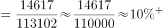，与A项最为接近。

故正确答案为A。

---

#### 第 2 题　qid 2187827 · 综合

2017年4月份，城镇消费品零售额约是乡村消费品零售额的多少倍？

- **A**. 1.2倍
- **B**. 5.2倍
- **C**. 5.9倍
- **D**. 6.2倍　✅

**答案**：D

**官方解析**

根据题干“2017年4月份······是······的多少倍”，可判定本题为现期倍数问题。定位表格材料可知：“2017年4月份，城镇消费品零售额23483亿元，乡村消费品零售额3795亿元。”故城镇消费品零售额约是乡村消费品零售额的倍数为。

故正确答案为D。

---

#### 第 3 题　qid 2187833 · 增长

2017年4月份，表中各类商品限额以上单位零售额同比增量最多的是：

- **A**. 服装鞋帽、针纺织品
- **B**. 石油及制品
- **C**. 汽车　✅
- **D**. 家用电器和音像器材

**答案**：C

**官方解析**

根据题干“2017年4月份······同比增量最多的是”，可判定本题为增长量比较问题。定位表格材料可知：“2017年4月份，服装鞋帽、针纺织品1126亿元，增速为；石油及制品1610亿元，增速为；汽车3136亿元，增速为；家用电器和音像器材729亿元，增速为”。根据增长量比较口诀“大大则大”，石油及制品的现期量和增长率均大于服装鞋帽、针纺织品与家用电器和音像器材，所以石油及制品的增长量大于服装鞋帽、针纺织品与家用电器和音像器材。

根据增长量计算公式：，计算比较石油及制品和汽车的增长量。

石油及制品的增长量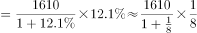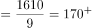；

汽车的增长量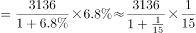。

故2017年4月份，表中各类商品限额以上单位零售额同比增量最多的是汽车。

故正确答案为C。

---

#### 第 4 题　qid 2187835 · 综合

2016年1～3月份，限额以上单位消费品零售额的绝对量约为多少万亿元？

- **A**. 3.0
- **B**. 3.5　✅
- **C**. 4.0
- **D**. 4.5

**答案**：B

**官方解析**

根据题干所求“2016年1～3月份，限额以上单位消费品零售额的绝对量”，结合材料数据时间为2017年1～4月和4月，可判定本题为基期和差问题。定位表格材料可得，2017年1～4月限额以上单位消费品零售额为49765亿元，增速为；2017年4月限额以上单位消费品零售额为12253亿元，增速为。故2016年1～3月份限额以上单位消费品零售额的绝对量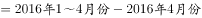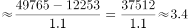万亿，与B项接近。

故正确答案为B。

---

#### 第 5 题　qid 2187843 · 综合

能够从上述资料中推出的是：

- **A**. 
2017年1～4月份，限额以上单位餐饮收入同比增速快于限额以下单位餐饮收入

- **B**. 
2017年1～4月份，非实物类社会消费品网上零售额为5000多亿元

- **C**. 
2017年4月份，粮油、食品类限额以上单位商品零售额占限额以上单位商品零售总额的一成多
　✅
- **D**. 
2017年第一季度烟酒类限额以上单位商品零售额同比增速不超过

**答案**：C

**官方解析**

A项：定位表格材料，2017年1～4月份，餐饮收入总额同比增速为，限额以上单位餐饮收入同比增速为。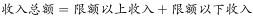，根据混合增长率原理：整体增速居中但不正中，故2017年1～4月份，限额以下单位餐饮收入同比增速大于，即限额以上单位餐饮收入同比增速慢于限额以下单位餐饮收入，错误；

B项：定位文字材料，2017年1～4月份全国社会消费品网上零售额19180亿元，其中，实物商品网上零售额14617亿元。故2017年1～4月份，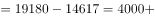亿元，不到5000亿元，错误；

C项：定位表格材料，2017年4月份，粮油、食品类限额以上单位商品零售额为1174亿元；2017年4月份限额以上单位商品零售总额为11532亿元。，即所占比重超过一成，正确；

D项，定位表格材料，2017年1～4月烟酒类限额以上单位商品零售额同比增速为；2017年4月烟酒类限额以上单位商品零售额同比增速为。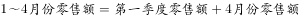，根据混合增长率原理：整体增速居中但不正中，故2017年一季度烟酒类限额以上单位商品零售额同比增速大于，错误。

故正确答案为C。

---

### 材料 2

        2016年，J省规模以上工业取水量为86.4亿立方米，比上年增长。其中，直接采自江、河、淡水湖、水库等的地表淡水68.1亿立方米，比上年增长，所占比重比上年下降0.4个百分点；自来水取水量15.9亿立方米，同比增长。 

        2016年，规模以上工业重复用水量168.4亿立方米，比上年增长；重复用水利用率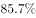，比上年提高0.1个百分点。其中，石油加工、黑色金属冶炼及压延加工、电力和化学原料等4个行业的重复用水总量占规模以上工业的，重复用水利用率分别为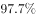、、和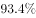。全年用新水量超过2亿立方米的5个行业用新水量合计19.1亿立方米，占总用新水量的，比重比上年下降0.9个百分点。

#### 第 6 题　qid 2187862 · 综合

J省2015年规模以上工业取水量约为多少亿立方米？

- **A**. 90
- **B**. 83　✅
- **C**. 74
- **D**. 65

**答案**：B

**官方解析**

根据题干“2015年······为多少亿立方米”，结合材料时间为2016年，可判定本题为基期计算问题。定位文字材料第一段可知，2016年J省规模以上工业取水量为86.4亿立方米，增长率为。由可得，J省2015年规模以上工业取水量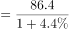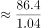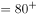亿立方米。

故正确答案为B。

---

#### 第 7 题　qid 2187867 · 比重

J省2016年规模以上工业自来水取水量占总取水量的比重比上年：

- **A**. 提高0.3个百分点　✅
- **B**. 下降0.3个百分点
- **C**. 提高4个百分点
- **D**. 下降4个百分点

**答案**：A

**官方解析**

根据题干“2016年······占······比重比上年······”，结合选项为百分点，可判定本题为两期比重计算问题。定位文字材料第一段可知，2016年J省规模以上工业取水量为86.4亿立方米，增长率为；自来水取水量15.9亿立方米，增长率为。由两期比重结论可知：由于，故比重应为提高，排除B、D两项；两期比重差值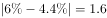个百分点，只有A项满足。

故正确答案为A。

---

#### 第 8 题　qid 2187870 · 比重

2016年J省用新水量最多的2个行业，用新水量占全省规模以上工业用新水总量的比重相差约多少个百分点？

- **A**. 5.3　✅
- **B**. 6.7
- **C**. 7.9
- **D**. 9.5

**答案**：A

**官方解析**

方法一：根据“2016年······占······的比重”，结合材料时间为2016年，可判定本题为现期比重问题。定位图形材料1可知，用新水量最多的2个行业为纺织业和水生产供应业，新水量分别为5.5亿立方米、4.0亿立方米。定位文字材料第二段可知，全年用新水量超过2亿立方米的5个行业用新水量为19.1亿立方米，占总用新水量的。根据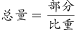可得，全省规模以上用新水总量。故比重差值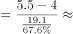，即5.3个百分点，与A项最接近。

方法二：根据“2016年······占······的比重”，结合材料时间为2016年，可判定本题为现期比重问题。定位文字材料第二段可知，全年用新水量超过2亿立方米的5个行业用新水量合计19.1亿立方米。定位图形材料1可知，用新水量最多的2个行业为纺织业和水生产供应业，新水量分别为5.5亿立方米、4.0亿立方米，其他行业新水量为9.2亿立方米。故比重差值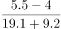，即5.3个百分点，与A项最接近。

方法三：根据“2016年······占······的比重”，结合材料时间为2016年，可判定本题为现期比重问题。定位图形材料1可知，用新水量最多的2个行业为纺织业和水生产供应业，新水量分别为5.5亿立方米、4.0亿立方米，所以亿立方米，定位文字材料第二段可知，全年用新水量超过2亿立方米的5个行业用新水量为19.1亿立方米，占总用新水量的。那么1.91亿立方米，占总用新水量的，故1.5亿立方米占总用新水量的比重肯定明显小于，根据选项排除B、C、D三项，A项当选。

故正确答案为A。

---

#### 第 9 题　qid 2187872 · 综合

J省2016年规模以上工业地表淡水取水量比地下淡水取水量高：

- **A**. 68亿立方米以上
- **B**. 67亿多立方米　✅
- **C**. 66亿多立方米
- **D**. 66亿立方米以下

**答案**：B

**官方解析**

方法一：根据题干“J省2016年规模以上工业地表淡水取水量比地下淡水取水量高”，结合材料图2分别给出2016年规模以上工业取水水源占比，且文字材料部分已知2016年规模以上工业取水量即总体，所以可以判定本题为现期比重问题。定位文字材料第一段可得：“2016年，J省规模以上工业取水量为86.4亿立方米，比上年增长。其中，直接采自江、河、淡水湖、水库等的地表淡水68.1亿立方米”；定位图2可得：地下淡水取水量为；根据，故2016年规模以上工业地表淡水取水量地下淡水取水量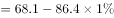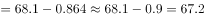亿立方米，与B项最接近。

方法二：根据题干“J省2016年规模以上工业地表淡水取水量比地下淡水取水量高”，结合材料图2分别给出2016年规模以上工业取水水源占比，且文字材料部分已知2016年规模以上工业取水量即总体，所以可以判定本题为现期比重问题。定位图2可得：地表淡水取水量占比为，地下淡水取水量为；定位文字材料第一段可得：“2016年J省规模以上工业取水量为86.4亿立方米”。根据，故2016年规模以上工业地表淡水取水量地下淡水取水量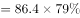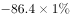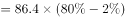亿立方米，与B项最接近。

故正确答案为B。

---

#### 第 10 题　qid 2187876 · 综合

能够从上述资料中推出的是：

- **A**. 
用新水量第4名的行业，重复用水利用率不到
　✅
- **B**. 
2015年规模以上工业重复用水利用率为

- **C**. 
2016年电力行业重复用水利用率高于石油加工行业

- **D**. 
2016年规模以上工业从其他水源取水不到1亿立方米

**答案**：A

**官方解析**

A项：定位饼状图1可得，2016年规模以上工业用新水量行业结构中用新水量第4名的行业为化学原料行业；定位文字材料第二段可得化学原料重复用水利用率为，不到，正确；

B项：定位文字材料第二段可得：2016年规模以上工业重复用水利用率为，比上年提高0.1个百分点。故2015年规模以上工业重复用水利用率，错误；

C项：定位文字材料第二段可得：2016年电力行业重复用水利用率为，石油加工行业为，电力行业低于石油加工行业，与选项描述不符，错误；

D项：定位饼状图2可得：2016年规模以上工业从其他水源取水占比为，定位文字材料第一段可得：2016年J省规模以上工业取水量为86.4亿立方米，故2016年规模以上工业从其他水源取水，错误。

故正确答案为A。

---

### 材料 3

根据所给资料，回答111～115题。

注：该影片上映时间为7月27日。

排片占比=当日该影片上映场次÷当日全国所有影片上映场次×100%

上座率=（当日该影片上映场次数×当日该影片场均观影人数）÷（当日该影片上映场次数×放映厅平均座位数）×100%

#### 第 11 题　qid 2187889 · 综合

已知7月29日为星期六，问A影片8月6日票房至少要达到多少亿元，才能在上映后第二个周末（星期六和星期日）的票房不低于第一个周末票房的1.25倍？

- **A**. 4.1
- **B**. 4.25
- **C**. 4.3
- **D**. 4.45　✅

**答案**：D

**官方解析**

根据题干“······不低于······的1.25倍”，结合材料时间，可判定本题为现期倍数问题。第二个周末（星期六和星期日）的票房不低于第一个周末票房的1.25倍，即第二个周末的票房，定位柱状图可得：第一个周末（7月29日-7月30日）的票房是：亿元；则第二周末（8月5日-8月6日）的票房亿元；8月5日A影片票房是：4.05亿元；故A影片8月6日票房至少要达到：亿元。

故正确答案为D。

---

#### 第 12 题　qid 2187890 · 综合

8月3日，除A影片之外的其他影片票房总额在以下哪个范围内？

- **A**. 不到1.6亿元
- **B**. 在1.6亿～2.2亿元之间　✅
- **C**. 在2.2～2.8亿元之间
- **D**. 高于2.8亿元

**答案**：B

**官方解析**

根据题干“8月3日，除A影片之外的其它影片票房总额······”，结合柱状图可知8月3日A影片占当日全国总票房的比例，可判定本题为现期比重问题。定位柱状图：8月3日A影片单日票房为2.28亿元，占当日全国总票房的比例为，故除A影片之外的其它影片票房总额亿元，在1.6~2.2亿元之间。

故正确答案为Ｂ。

---

#### 第 13 题　qid 2187891 · 增长

7月28日～8月5日间，A影片票房环比增速最快的单日，当日A影片占全国总票房的比例在该影片上映10天内排名：

- **A**. 第7　✅
- **B**. 第6
- **C**. 第5
- **D**. 第4

**答案**：A

**官方解析**

根据题干“······环比增速最快的······”，可判定本题为一般增长率问题。定位柱状图发现:7月31日、8月2日、8月3日票房是环比下降的，故只需比较剩余日期的环比增长率。根据公式：，7月28日环比增长率；7月29日环比增长率；7月30日环比增长率；8月1日环比增长率；8月4日环比增长率；8月5日环比增长率。由上述数据可知7月28日的环比增长最快。结合柱状图中的票房比例可知，7月28日A片占全国总票房的比例在该影片上映10天内排名为第7。

故正确答案为A。

---

#### 第 14 题　qid 2187892 · 综合

如全国所有放映厅座位数相同，则8月5日B影片观影人次数约是C影片的多少倍？

- **A**. 3
- **B**. 4　✅
- **C**. 5
- **D**. 6

**答案**：B

**官方解析**

根据题干“······8月5日······约是······的多少倍”，与材料时间一致，可判定本题为现期倍数问题。定位表格材料及备注可知：，。

故，；

同理，，。

因全国所有放映厅座位数相同，故，即8月5日B影片观影人次数是C影片的倍数约为。

故正确答案为B。

---

#### 第 15 题　qid 2187893 · 倍数

以下信息中，能够从上述资料中推出的有几条？

①A影片上映第6～10日票房之和高于前5日票房之和

②8月2日全国总票房高于8月1日水平

③8月5日B影片票房占当日全国总票房的以上

④8月5日A影片的上映场次是E影片的20多倍

- **A**. 1
- **B**. 2
- **C**. 3　✅
- **D**. 4

**答案**：C

**官方解析**

①定位图形材料，A影片上映第6～10日票房之和为亿元，前5日票房之和为亿元，故A影片上映第6～10日票房之和高于前5日票房之和，正确；

②定位图形材料，8月2日全国总票房亿元，8月1日全国总票房亿元，故8月2日全国总票房低于8月1日水平，错误；

③定位图形材料，8月5日全国总票房 ，故B影片票房占全国总票房的比重约为，即8月5日B影片票房占当日全国总票房的以上，正确；

④定位表格材料及备注，A影片排片占比，故当日A影片上映场次，同理，当日E影片上映场次，则当日，即20多倍，正确。

综上所述①③④正确。

故正确答案为C。

---

### 材料 4

        2016年，我国境内民用航空（颁证）机场共218个（不含香港、澳门和台湾地区，以下简称境内机场）。

        2016年我国境内机场全年完成旅客吞吐量101635.7万人次，比上年增长。分航线看，国内航线完成91401.7万人次，增长；其中内地至香港、澳门和台湾地区航线完成2764.5万人次，下降。国际航线完成10234.0万人次，增长。

        全年完成货邮吞吐量1510.4万吨，比上年增长。分航线看，国内航线完成974.0万吨，增长；其中内地至香港、澳门和台湾地区航线完成93.6万吨，增长。国际航线完成536.4万吨，增长。

        全年完成飞机起降923.8万架次，比上年增长；其中运输架次为793.5万架次，增长。分航线看，国内航线完成842.8万架次，增长；其中内地至香港、澳门和台湾地区航线完成20.3万架次，下降。国际航线完成81.0万架次，增长。

        2016年，年旅客吞吐量1000万人次以上的机场有28个，较上年净增2个，完成旅客吞吐量占全部境内机场旅客吞吐量的。年旅客吞吐量200～1000万人次的机场有21个，较上年净减1个，完成旅客吞吐量占全部境内机场旅客吞吐量的。年旅客吞吐量200万人次以下的机场有169个，较上年净增7个，完成旅客吞吐量占全部境内机场旅客吞吐量的。

#### 第 16 题　qid 2187853 · 比重

2016年我国国内航线完成旅客吞吐量占总旅客吞吐量的比重比国内航线完成货邮吞吐量占总货邮吞吐量的比重：

- **A**. 高5个百分点
- **B**. 高25个百分点　✅
- **C**. 低5个百分点
- **D**. 低25个百分点

**答案**：B

**官方解析**

根据题干“2016年······占······的比重······”，结合材料时间为2016年，可判定本题为现期比重问题。定位文字材料第二段可得：“2016年我国境内机场全年完成旅客吞吐量101635.7万人次，国内航线完成91401.7万人次”，定位文字材料第三段可得：“全年完成货邮吞吐量1510.4万吨，国内航线完成974.0万吨”。根据公式：，故所求，即高26个百分点，与B项最接近。

故正确答案为B。

---

#### 第 17 题　qid 2187857 · 比重

2016年我国完成的所有民用飞机起降中，不承担运输任务的架次数占比约为：

- **A**. 

- **B**. 

- **C**. 

　✅
- **D**. 

**答案**：C

**官方解析**

根据题干“2016年······中······占比”，结合材料时间为2016年，可判定本题为现期比重问题。定位文字材料第四段可得：“全年完成飞机起降923.8万架次，其中运输架次为793.5万架次”。根据公式：，故不承担运输任务的架次数，与C选项最接近。

故正确答案为C。

---

#### 第 18 题　qid 2187859 · 平均数

2016年我国平均每个境内民用航空机场日均完成国内航线飞机起降约多少架次？

- **A**. 75
- **B**. 91
- **C**. 106　✅
- **D**. 124

**答案**：C

**官方解析**

根据题干“2016年平均每······日均完成······架次”，结合材料时间为2016年，可判定本题为现期平均数问题。定位文字材料第一段可得：“我国境内民用航空机场共218个；定位文字材料第四段可得：国内航线完成842.8万架次”。2016年是闰年，故2016年我国平均每个境内民用航空机场日均完成国内航线飞机架次，与C项最接近。

故正确答案为C。

---

#### 第 19 题　qid 2187865 · 平均数

假设2016年全年旅客吞吐量1000万人次以上的机场的平均旅客吞吐量为，全年旅客吞吐量200万人次以下的机场平均旅客吞吐量为，则的值约为：

- **A**. 15
- **B**. 29
- **C**. 40
- **D**. 59　✅

**答案**：D

**官方解析**

根据题干“······的值约为”，可判定本题为比值计算问题。定位文字材料最后一段：“2016年，年旅客吞吐量1000万人次以上的机场有28个······完成旅客吞吐量占全部境内机场旅客吞吐量的······年旅客吞吐量200万人次以下的机场有169个······完成旅客吞吐量占全部境内机场旅客吞吐量的”；定位文字材料第二段：“2016年我国境内机场全年完成旅客吞吐量101635.7万人次”。则1000万人次以上的机场的平均吞吐量，200万人次以下的机场平均旅客吞吐量。故，与D项最接近。

故正确答案为D。

---

#### 第 20 题　qid 2187869 · 综合

关于我国境内机场运输状况，能够从上述资料中推出的是：

- **A**. 2016年内地至香港、澳门、台湾地区旅客和货物吞吐量均同比下降
- **B**. 2016年我国国际航线货邮吞吐量同比增速快于旅客吞吐量增速
- **C**. 2015年我国旅客吞吐量200万人次以上的机场为50个
- **D**. 2015年我国境内民用航空机场为210个　✅

**答案**：D

**官方解析**

A项：材料中并未给出2016年内地至香港、澳门和台湾地区货物吞吐量相关数据，无法推出；

B项：定位文字材料第三段，2016年我国国际航线货邮吞吐量增长；定位文字材料第二段，2016年我国国际航线旅客吞吐量增长。所以2016年我国国际航线货邮吞吐量同比增速慢于旅客吞吐量增速，错误；

C项：定位文字材料最后一段，2016年年旅客吞吐量1000万人次以上的机场有28个，较上年净增2个，年旅客吞吐量200～1000万人次的机场有21个，较上年净减1个。则2015年我国旅客吞吐量200万人次以上的机场为个，错误；

D项：定位文字材料第一段，2016年，我国境内民用航空（颁证）机场共218个；定位文字最后一段，2016年，年旅客吞吐量1000万人次以上的机场有28个，较上年净增2个，年旅客吞吐量200～1000万人次的机场有21个，较上年净减1个，年旅客吞吐量200万人次以下的机场有169个，较上年净增7个。所以2015年我国境内民用航空机场为个，正确。

故正确答案为D。

注：A项，若将货物吞吐量理解为材料中的货邮吞吐量，结合材料数据内地至香港、澳门和台湾地区货物吞吐量完成93.6万吨，增长，可得货物吞吐量同比上升，A项均下降说法也错误。

---
