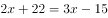
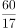
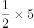
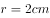
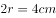
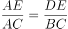
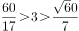

# 2018年421联考《行测》题（新疆卷）（网友回忆版）

> 联考 · 2018 年 · 6 个模块 · 共 115 题

- [政治理论](#%E6%94%BF%E6%B2%BB%E7%90%86%E8%AE%BA) · 3 题
- [常识判断](#%E5%B8%B8%E8%AF%86%E5%88%A4%E6%96%AD) · 22 题
- [言语理解与表达](#%E8%A8%80%E8%AF%AD%E7%90%86%E8%A7%A3%E4%B8%8E%E8%A1%A8%E8%BE%BE) · 25 题
- [数量关系](#%E6%95%B0%E9%87%8F%E5%85%B3%E7%B3%BB) · 15 题
- [判断推理](#%E5%88%A4%E6%96%AD%E6%8E%A8%E7%90%86) · 35 题
- [资料分析](#%E8%B5%84%E6%96%99%E5%88%86%E6%9E%90) · 15 题

---

## 政治理论

### 第 1 题　qid 2187699 · 新思想

中国共产党第十九次全国代表大会的主题是：      ，高举中国特色社会主义伟大旗帜，决胜全面建成小康社会，夺取新时代中国特色社会主义伟大胜利，为实现中华民族伟大复兴的中国梦不懈奋斗。
填入划横线部分最恰当的一项是：

- **A**. 不忘初心，牢记使命　✅
- **B**. 奋发前进，使命必达
- **C**. 解放思想，改革开放
- **D**. 不忘初心，攻坚克难

**答案**：A

**官方解析**

本题主要考查时政。
中国共产党第十九次全国代表大会报告中明确指出：“大会的主题是：不忘初心，牢记使命，高举中国特色社会主义伟大旗帜，决胜全面建成小康社会，夺取新时代中国特色社会主义伟大胜利，为实现中华民族伟大复兴的中国梦不懈奋斗。”
故正确答案为A。

---

### 第 2 题　qid 2188392 · 时事政治

中国共产党第十九届中央委员会第二次全体会议于2018年1月18日至19日在北京召开，会议的主要议程是：

- **A**. 研究制定国民经济发展计划
- **B**. 研究全面从严治党的重大问题
- **C**. 讨论修改宪法部分内容的建议　✅
- **D**. 研究党和政府机构改革的重大问题

**答案**：C

**官方解析**

本题考查时政常识，主要考查党的第十九届中央委员会第二次全体会议的内容。
A项错误，中国共产党第十八届中央委员会第五次全体会议，于2015年10月26日至29日在北京举行。审议通过了《中共中央关于制定国民经济和社会发展第十三个五年规划的建议》。因此，研究制定国民经济发展计划是党十八届中央委员会第五次全体会议的主要议程。
B项错误，中国共产党第十八届中央委员会第六次全体会议，于2016年10月24日至27日在北京举行。审议通过了《关于新形势下党内政治生活的若干准则》和《中国共产党党内监督条例》，审议通过了《关于召开党的第十九次全国代表大会的决议》。因此，研究全面从严治党的重大问题是党十八届中央委员会第六次全体会议的主要议程。
C项正确，中国共产党第十九届中央委员会第二次全体会议，于2018年1月18日至19日在北京举行。全会审议通过了《中共中央关于修改宪法部分内容的建议》，张德江就《建议（草案）》向全会作了说明。因此，会议的主要议程是讨论修改宪法部分内容的建议。
D项错误，中国共产党第十九届中央委员会第三次全体会议，于2018年2月26日至28日在北京举行。审议通过了《中共中央关于深化党和国家机构改革的决定》和《深化党和国家机构改革方案》。因此，研究党和政府机构改革的重大问题是党的十九届中央委员会第三次全体会议的主要议程。
故正确答案为C。

---

### 第 3 题　qid 2188722 · 新思想

3月10日上午，中共中央总书记、国家主席、中央军委主席习近平来到十二届全国人大五次会议新疆代表团看望代表、参加审议。习近平指出，要坚持把（  ）作为政治责任，立足抓早抓小抓快抓好，谋长远之策、行固本之举、建久安之势、成长治之业。
填入括号处合适的是：

- **A**. 发展经济
- **B**. 改善民生
- **C**. 维护稳定　✅
- **D**. 提高就业

**答案**：C

**官方解析**

本题主要考查时政。
2017年3月10日上午，中共中央总书记、国家主席、中央军委主席习近平参加了十二届全国人大五次会议新疆代表团的审议。习近平总书记指出：新疆是我国西北重要安全屏障，战略地位特殊、面临的问题特殊，做好新疆工作意义重大。要坚持把维护稳定作为政治责任，立足抓早抓小抓快抓好，谋长远之策、行固本之举、建久安之势、成长治之业。
故正确答案为C。

---

## 常识判断

### 第 1 题　qid 2188715 · 地理国情

下列关于新疆，错误的是（   ）。

- **A**. 是我国陆地面积最大的省级行政区，约占中国国土面积的六分之一
- **B**. 远离海洋，深居内陆，海洋气流不易到达，属于明显的温带大陆性气候
- **C**. 地处亚欧大陆腹地，陆地边境线约5600多公里，周边与俄罗斯等八国接壤
- **D**. 公元前60年，唐朝中央政权设立西域都护府，1949年新疆和平解放　✅

**答案**：D

**官方解析**

本题考查地理常识。
A项正确，新疆是我国五个少数民族自治区之一，面积为166万平方千米，约占中国国土总面积的六分之一，是我国陆地面积最大的省级行政区。
B项正确，新疆远离海洋，深居内陆，四周都有高山阻隔,海洋气流不易到达，属于明显的温带大陆性气候，气候有三大特点：降雨量少、昼夜温差大、气候干旱。
C项正确，新疆地处亚欧大陆腹地，陆地边境线5600多公里，周边与俄罗斯、吉尔吉斯斯坦、塔吉克斯坦、哈萨克斯坦、巴基斯坦、印度、蒙古、阿富汗八国接壤。
D项错误，公元前60年（西汉宣帝时），西汉建立了西域都护府，正式在西域驻军、设官、推行政令，标志西域正式归属中央政权。1949年新疆和平解放，当年10月12日中国人民解放军进入新疆。
本题为选非题，故正确答案为D。

---

### 第 2 题　qid 2188716 · 人文常识

下列不属于民族自治地方的是：

- **A**. 新疆维吾尔自治区
- **B**. 伊犁哈萨克族自治州
- **C**. 焉耆回族自治县
- **D**. 独山子哈萨克族自治乡　✅

**答案**：D

**官方解析**

本题考查法律常识。
《中华人民共和国宪法》第三十条第三款规定：“自治区、自治州、自治县都是民族自治地方。”所以只有自治区、自治州、自治县才是民族自治地方，民族乡则不是民族自治地方。A、B、C三项均为民族自治地方，D项为自治乡不属于民族自治地方。
本题为选非题，故正确答案为D。

---

### 第 3 题　qid 2188718 · 地理国情

首趟中国·乌鲁木齐—______海联运班列从中欧班列乌鲁木齐集结中心（简称集结中心）驶出，这趟班列也是集结中心自2016年5月26日投运以来，开行的第1000列中欧班列。随着这条新线路的启用，新疆开行的中欧班列线路增加至19条，通达中亚及欧洲17个国家的24个城市。填入画横线部分最恰当的一项是：

- **A**. 意大利 那不勒斯　✅
- **B**. 哈萨克斯坦  阿斯塔纳
- **C**. 比利时  安特卫普
- **D**. 俄罗斯  莫斯科

**答案**：A

**官方解析**

2018年2月26日11时30分，首趟中国·乌鲁木齐—意大利·那不勒斯铁海联运班列从中欧班列乌鲁木齐集结中心（简称集结中心）驶出，这趟班列也是集结中心自2016年5月26日投运以来，开行的第1000列中欧班列。随着这条新线路的启用，新疆开行的中欧班列线路增加至19条，通达中亚及欧洲17个国家的24个城市。所以，A项正确，B、C、D三项错误。
故正确答案为A。

---

### 第 4 题　qid 2188719 · 经济常识

下列有权制定地方政府规章的是（  ）。

- **A**. 库尔勒市人大常委会
- **B**. 乌鲁木齐市人民政府　✅
- **C**. 新疆维吾尔自治区人大常委会
- **D**. 新疆维吾尔自治区财政厅

**答案**：B

**官方解析**

根据《立法法》第八十二条规定：“省、自治区、直辖市和设区的市、自治州的人民政府，可以根据法律、行政法规和本省、自治区、直辖市的地方性法规，制定规章。”
A、C两项错误，库尔勒市人大常委会和新疆维吾尔自治区人大常委会属于人大的常设机构，无权制定地方政府规章。
B项正确，乌鲁木齐市人民政府属于设区的市人民政府，有权制定地方政府规章。
D项错误，新疆维吾尔自治区财政厅属于政府工作部门，无权制定地方政府规章。
故正确答案为B。
【注】本题所涉《中华人民共和国立法法》于2023年3月修改，因此本题的第82条第一款的规定，在新法中为第93条第一款：“省、自治区、直辖市和设区的市、自治州的人民政府，可以根据法律、行政法规和本省、自治区、直辖市的地方性法规，制定规章。”

---

### 第 5 题　qid 2188721 · 人文常识

李克强在全国推进简政放权放管结合优化服务改革电视电话会议上强调：上下联动 攻坚克难 深化“放管服”改革 加快转变政府职能，不断提高行政效能。“放管服”指的是以下：

- **A**. 简政放权、放管结合、优化服务　✅
- **B**. 简政放权、优化管理、提升服务
- **C**. 简政放权、放管结合、加强监督
- **D**. 简政放权、管理监督、优化服务

**答案**：A

**官方解析**

本题考查政治常识。
“放”即简政放权，指政府减少没有法律依据和法律授权的行政权；“管”即放管结合，政府部门创新和加强监管职能，利用新技术、新体制加强监管体制创新；“服”即优化服务，减少政府对市场的干预，降低行政成本，高效服务，营造便利环境，促进市场主体的活力和创新能力。因此“放管服”是简政放权、放管结合、优化服务的简称。
故正确答案为A。

---

### 第 6 题　qid 2188723 · 人文常识

______是由中国发起和主导建立的政府间性质的亚洲区域多边开发机构。成立宗旨是为了促进亚洲区域的建设互联互通化和经济一体化的进程，并且加强中国及其他亚洲国家和地区的合作。

- **A**. 亚太经合组织
- **B**. 亚洲基础设施投资银行　✅
- **C**. 金砖国家
- **D**. 东盟

**答案**：B

**官方解析**

本题考查经济常识，主要涉及国际组织的相关知识。
A项错误，亚洲太平洋经济合作组织，简称亚太经合组织，是亚太地区最具影响的经济合作官方论坛。1991年11月，中国以主权国家身份加入亚太经合组织。该组织为推动区域贸易投资自由化，加强成员国之间经济技术合作等方面发挥了不可替代的作用。它是亚太区内各地区之间促进经济成长、合作、贸易、投资的论坛。
B项正确，亚洲基础设施投资银行，简称亚投行，是由中国发起和主导建立的政府间性质的亚洲区域多边开发机构，总部设在北京。重点支持基础设施建设，成立宗旨是为了促进亚洲区域的建设互联互通化和经济一体化的进程，并且加强中国及其他亚洲国家和地区的合作，也是首个由中国倡议设立的多边金融机构。
C项错误，“金砖五国”是指俄罗斯、中国、巴西、印度和南非五国。金砖国家遵循开放透明、团结互助、深化合作、共谋发展原则和“开放、包容、合作、共赢”的金砖国家精神，致力于构建更紧密、更全面、更牢固的伙伴关系。
D项错误，东盟即东南亚国家联盟，成员国有马来西亚、印度尼西亚、泰国、菲律宾、新加坡、文莱、越南、老挝、缅甸和柬埔寨。中国不是东盟成员国。
故正确答案为B。

---

### 第 7 题　qid 2188395 · 人文常识

下列关于我国城镇职工基本医疗保险（简称职工医保）的说法正确的是：

- **A**. 灵活就业人群不属于职工医保的覆盖范围
- **B**. 退休职工满足一定条件可以不缴纳保险费　✅
- **C**. 用人单位缴纳的保险费不进入职工的个人账户
- **D**. 职工医保是社会保险的一种，不是强制保险

**答案**：B

**官方解析**

本题考查法律常识。
A项错误，根据《中华人民共和国社会保险法》第二十三条第二款规定：“无雇工的个体工商户、未在用人单位参加职工基本医疗保险的非全日制从业人员以及其他灵活就业人员可以参加职工基本医疗保险，由个人按照国家规定缴纳基本医疗保险费。”因此，灵活就业人群可以参加职工医保。
B项正确，根据《中华人民共和国社会保险法》第二十七条规定：“参加职工基本医疗保险的个人，达到法定退休年龄时累计缴费达到国家规定年限的，退休后不再缴纳基本医疗保险费，按照国家规定享受基本医疗保险待遇。”所以，退休职工满足一定条件可以不缴纳保险费。
C项错误，根据《中华人民共和国城镇职工基本医疗保险条例》第十九条规定：“用人单位缴纳基本医疗保险费的25—35％用于建立退休人员和从业人员的个人帐户，具体分配办法由省人民政府按照顾年长者原则制定；所余资金用于建立统筹基金。”因此，用人单位缴纳的保险费有一部分是进入职工的个人账户的。
D项错误，根据《中华人民共和国城镇职工基本医疗保险条例》第二条规定：“省城镇下列单位及其从业人员必须按照本条例参加基本医疗保险：（一）企业及其从业人员；（二）机关、事业单位、中介机构、社会团体、民办非企业单位及其从业人员；（三）部队所属用人单位及其无军籍的从业人员。”所以职工医保对这部分人属于强制保险。
故正确答案为B。

---

### 第 8 题　qid 2187704 · 法律常识

小明在图书馆大声说话，有读者制止他时，他却说：“这是我的权利和自由，别人无权干涉”。关于上述观点的评价正确的是：
①正确，宪法规定公民有言论自由
②错误，公民的自由是在法律范围内的自由
③错误，未经他人许可，公民不得擅自行使权利
④错误，世界上从来没有“绝对”的权利和自由

- **A**. ①②
- **B**. ①③
- **C**. ②③
- **D**. ②④　✅

**答案**：D

**官方解析**

本题考查宪法的相关知识，主要考查权利和自由。
①错误，我国《宪法》第三十五条规定：“中华人民共和国公民有言论、出版、集会、结社、游行、示威的自由。”有言论自由并不等于不分场所的随意行使自己的权利，图书馆属于公共场所，禁止大声喧哗。选项表述正确，但不符合题意。
②正确，我国公民言论、出版、集会、结社、游行、示威的自由，都必须在国家法律、法规规定的范围内行使，自由是相对的，而不是绝对的，自由和法律是统一的，法律是自由的体现和保证，自由要受法律的制约。
③错误，公民有行使自己权利的自由，不需要经过任何人同意，但是，前提是行使自己的权利不得触犯法律，不得损害他人利益。图书馆内禁止大声喧哗，小明在行使自己权利时损害了他人的利益。
④正确，没有绝对的权利和自由，任何权利和自由都是有条件的，都是受到一定限制的。任何权利和自由都是在法律许可的范围内行使，否则就会受到法律的制裁。行使权利和自由不得损害他人的合法权益。小明在图书馆大声喧哗，损害了他人的利益。因此，世界上不存在“绝对”的权利和自由。
①③错误，②④正确。
故正确答案为D。

---

### 第 9 题　qid 2188397 · 人文常识

“人有悲欢离合，月有阴晴圆缺”，圆缺就是指“月相变化”，即地球上看到月球被太阳照亮部分的称呼。右图所示“上弦月”大致的农历日期是：

- **A**. 初一、初二
- **B**. 初七、初八　✅
- **C**. 十五、十六
- **D**. 廿二、廿三

**答案**：B

**官方解析**

本题考查自然常识，主要涉及月相变化的相关知识。
A项错误，农历初一的月相是新月，月球位于太阳和地球之间。地球上的人们正好看到月球背离太阳的面，因而在地球上看不见月亮。
B项正确，图中所示的上弦月，大约出现在农历每月初七、初八，月球绕地球继续向东运行，月地连线与日地连线成90度，我们在地球上正好看到月球是西半边亮，呈半圆形，因此叫上弦月。
C项错误，农历十五、十六时出现的月相是满月，月球运行到地球的外侧，即太阳、月球位于地球的两侧。由于白道面与黄道有一夹角，通常情况下，地球不能遮挡住日光，月球亮面全部对着地球。
D项错误，农历廿二、廿三时出现的月相是下弦月，太阳、地球和月球之间的相对位置再次变成直角，月球在日地连线的西边90度，我们在地球上看到月球东半边亮，呈半圆形，称为下弦月。
故正确答案为B。

---

### 第 10 题　qid 2188683 · 人文常识

在元代，与埃及亚历山大港并称“世界第一大港”的是：

- **A**. 甘棠港
- **B**. 月港
- **C**. 刺桐港　✅
- **D**. 徐闻港

**答案**：C

**官方解析**

作为古代海上交通贸易和文化交往大动脉，丝路主港亦随着时代的变迁而变迁：汉时为徐闻古港；公元3世纪30年代起，广州代之；隋唐时期，贯通南北的大运河把“陆上丝绸之路”与“海上丝绸之路”连为一体，连接点扬州跃升为东南第一都会；宋末至元代，泉州超越广州，与埃及亚历山大港并称“世界第一大港”；明初，漳州月港兴起；1842年，鸦片战争爆发，海上丝路走到尽头。
A项错误，唐末，开闽王王审知为发展海外贸易，开辟了甘棠港，它是现今福州地区有明确记载与确切地点的最早港口。
B项错误，月港，位于福建漳州，15世纪末期至17世纪中期，月港与汉、唐时期的福州甘棠港，宋、元时期的泉州后渚港和清代的厦门港，并称为福建的“四大商港”。
C项正确，泉州港古代称为“刺桐港”，是中国古代海上丝绸之路起点，被誉为“东方第一大港”。是世界千年航海史上独占400年鳌头的“世界第一大港”与埃及亚历山大港齐名，联合国唯一认定的“海上丝绸之路起点”。
D项错误，徐闻，是我国古代重要的南疆重镇、陆路驿站、海道要津和滨海县治，并且曾经是雷州半岛和海南岛的政治经济中心，也是我国古代对外贸易最早的通商口岸之一。自从汉武帝元鼎六年(公元前111年)派遣伏波将军路博德和楼船将军杨仆平定南越，设置合浦郡徐闻县之后，徐闻与中原的交往已开始频繁，有关的历史记载也比较明确。汉代时期的港址在今徐闻城西南35里的华丰大队讨网村。
故正确答案为C。

---

### 第 11 题　qid 2188531 · 人文常识

下列关于我国C919大型客机研发意义的表述错误的是：

- **A**. 社会效益方面，C919能带动上下游产业发展，增加就业岗位，促进经济社会发展
- **B**. 技术方面，C919能提升我国航空工业研发能力，促进航空人才队伍建设，提升民航工业水平
- **C**. 军事方面，以C919为平台改装成大型军用特种飞机的潜力巨大，短期内实现其军民两用前景良好　✅
- **D**. 经济方面，C919使我国民航不再依赖进口中层干线客机，打破了西方航空垄断，进而节省外汇

**答案**：C

**官方解析**

本题考查科技常识。C919项目在技术、经济、军事等方面具有很大积极意义。
A项正确，在社会效益方面，C919项目能带动上下游产业发展，增加大量高收入的就业岗位，拉动地方经济发展。
B项正确，在技术方面，C919能够锻炼中国航空工业在干线客机方面的设计和制造能力，锻炼一批航空人才，提升中国民用航空工业水平。
C项错误，在军事方面，用C919改装预警机、高新机等大型军用特种飞机的潜力巨大。事实上，从西方国家大型军用特种飞机改装经验来看，选择的都是经过市场验证，证明是性能可靠、安全成熟的干线客机平台。比如，日本空自现役主力大型空中预警机E-767采用的是1984年交付的波音767-200ER，而波音公司进行首架E-767机体改装工作的时间已经是11年后的1995年。C选项后半句“短期内实现其军民两用前景良好”表述错误。
D项正确，在经济方面，C919不仅能使中国民航不再依赖于从欧美进口波音和空客的中层干线客机，并且打破欧美航空巨头垄断，为国家节省了大量外汇。
本题为选非题，故正确答案为C。

---

### 第 12 题　qid 2187747 · 科技常识

下列现象的物理解释错误的是：

- **A**. 露珠呈球状——液体表面张力
- **B**. 铁轨铺在枕木上——减少压强
- **C**. 道路转弯镜——凸透镜对光发散　✅
- **D**. 微波炉烤面包——涡流感应加热

**答案**：C

**官方解析**

本题考查科技常识。
该真题命制不严谨。
A项正确，物质由分子组成，分子之间有间隙，由于分子在不停地做无规则运动，分子间存在相互作用的引力和斥力。在液体表面，分子间的作用力表现为相互吸引，由此表现为液体的表面张力。表面张力促使露珠以最小的表面积的状态存在，而体积相等的物体中，只有球体的表面积最小，所以露珠总是呈球状的。
B项正确，把铁轨铺在枕木上，是为了在压力一定的情况下，增大铁轨与地面的接触面积，从而减小火车对地面的压强。
C项错误，道路转弯镜利用的是凸面镜，可以扩大司机视野，及早发现弯道对面车辆，以减少交通事故的发生。
D项存在问题，微波炉加热食物主要利用微波。此外部分微波炉烧烤功能主要是利用烧烤组件来完成的，用电热丝发热来工作。一般认为利用涡流感应加热的是电磁炉。
本题命制不严谨，C项和D项均存在问题，C项相关知识点在往年考试中出现较多，故小粉笔认为该真题判卷时以C项为标准答案可能性更大。
本题为选非题，故正确答案为C。

---

### 第 13 题　qid 2187661 · 科技常识

面包制作过程中使用酵母主要是利用其哪一种特性：

- **A**. 酵母在生长过程中可合成蛋白
- **B**. 酵母在生长过程中可分解淀粉
- **C**. 酵母在生长过程中可产生乙醇
- **D**. 酵母在生长过程中可产生二氧化碳　✅

**答案**：D

**官方解析**

酵母在面包制作中的功能：
1、生物膨松作用：酵母在面团发酵中产生大量的二氧化碳气体，并由于面筋网状结构的形成，而被留在网状组织内，使面团酥松多孔，体积变大及膨松； 
2、面筋扩展作用：酵母发酵除产生二氧化碳外，还有增加面筋扩展的作用，使发酵所产生的二氧化碳能保留在面团中，提高面团的保气能力。ABC三项表述有误，D项正确。
故正确答案为D。

---

### 第 14 题　qid 2187662 · 人文常识

下列四个节气所表示的含义错误的是：

- **A**. 处暑：炎热夏季即将到来　✅
- **B**. 惊蛰：天气回暖，春雷始鸣
- **C**. 冬至：冬季最寒冷的日子开始
- **D**. 小满：夏熟作物籽粒开始灌浆饱满但未成熟

**答案**：A

**官方解析**

本题考查自然常识，主要考查二十四节气的相关知识点。
A项错误，处暑，即为“出暑”，是炎热离开的意思，是气候变凉的象征。
B项正确，惊蛰，古称“启蛰”，标志着仲春时节的开始，此前，动物入冬藏伏土中，不饮不食，称为“蛰”；到了“惊蛰节”，天上的春雷惊醒蛰居的动物，称为“惊”。故惊蛰时，蛰虫惊醒，天气转暖，渐有春雷，中国大部分地区进入春耕季节。而“惊蛰”前后，之所以偶有雷声，是大地湿度渐高而促使近地面热气上升或北上的湿热空气势力较强与活动频繁所致，从而产生“惊蛰雷鸣”现象。
C项正确，从“冬至”开始，北半球逐渐进入了最寒冷的日子，称作“数九寒天”。
D项正确，小满是二十四节气之一，夏季的第二个节气。其含义是夏熟作物的籽粒开始灌浆饱满，但还未成熟，只是小满，还未大满。
本题为选非题，故正确答案为A。

---

### 第 15 题　qid 2187753 · 人文常识

互联网上每一个网络或每一台主机所分配的逻辑地址称为IP地址。目前，IP地址主要有IPv4地址和IPv6地址两大类别。下列对应错误的是：

- **A**. 192.168.0.57——IPv4地址
- **B**. 10.255.8.239——IPv4地址
- **C**. 0D-89-A5-9B-F3-61——IPv6地址　✅
- **D**. 2016：DB8：0：2DE：A13——IPv6地址

**答案**：C

**官方解析**

本题考查计算机相关的常识。
A、B两项正确，IPv4中规定IP地址长度为32位。一般的书写法为4个用小数点分开的十进制数。
C项错误，IPv6的地址长度为128位，采用十六进制表示。IPv6有3种表示方法，分别为冒分十六进制表示法、0位压缩表示法、内嵌IPv4地址表示法。该项表示的是主机的物理地址，而不是IP地址。
D项正确，该项是利用冒分十六进制法所表示的IPv6地址。
本题为选非题，故正确答案为C。

---

### 第 16 题　qid 2188401 · 人文常识

北回归线没有穿越下列哪一著名建筑所在的国家：

- **A**. 

- **B**. 

　✅
- **C**. 

- **D**. 

**答案**：B

**官方解析**

本题主要考查地理常识。

北回归线是指太阳光线能够直射在地球上最北的界线，地理位置约为北纬 。

A项正确，该图的建筑物是迪拜帆船酒店，迪拜是阿拉伯联合酋长国的城市，该国纬度大约为北纬至北纬之间，北回归线穿越其国境内。

B项错误，该图的建筑物是位于俄罗斯红场旁的瓦西里升天大教堂。俄罗斯，地跨欧亚两洲，位于欧洲东部和亚洲大陆的北部，位于北纬至北纬之间，北回归线未穿越该国。

C项正确，该图的建筑物是埃及金字塔，位于北纬至北纬之间，北回归线穿越该国南部地区。

D项正确，该图的建筑物是泰姬陵，是印度陵墓清真寺。印度地处北半球，位于北纬至之间，北回归线穿越该国。

本题为选非题，故正确答案为B。

---

### 第 17 题　qid 2187719 · 经济常识

下列事件按时间先后顺序排列正确的是：
①中国女排获得里约奥运会女排比赛冠军
②中国（上海）自由贸易实验区正式设立
③第九届金砖国家领导人会晤在厦门举行
④我国举行纪念中国人民抗日战争暨世界反法西斯战争胜利70周年阅兵式

- **A**. ②③①④
- **B**. ④①②③
- **C**. ②④①③　✅
- **D**. ②①③④

**答案**：C

**官方解析**

本题考查毛中特。

②2013年8月22日，国务院正式批准设立中国（上海）自由贸易试验区。

④2015年9月3日，是中国第二个法定的“中国人民抗日战争胜利纪念日”，也是中国人民抗日战争暨世界反法西斯战争胜利70周年。

①北京时间2016年8月21日，在里约奥运会女排决赛中，中国队战胜塞尔维亚队获得金牌。

③2017年9月3日至5日，金砖国家领导人第九次会晤在福建厦门举行，主题是：“深化金砖伙伴关系，开辟更加光明未来。”金砖合作已经步入第二个“黄金十年”。

故按照时间先后顺序排序为②④①③。

故正确答案为C。

---

### 第 18 题　qid 2187757 · 科技常识

“21世纪金属”具有较高的强度、良好的抗氧化性和优异的耐腐蚀性，对人体无毒且无不良反应，被称为“亲生物金属”，可作为人造骨材料。下列关于“21世纪金属”的说法正确的是：

- **A**. “21世纪金属”是指钛和钛合金　✅
- **B**. “21世纪金属”只运用于航空航天领域
- **C**. “21世纪金属”是一种新型石墨烯材料
- **D**. “21世纪金属”是21世纪发现的一种金属元素

**答案**：A

**官方解析**

本题考查的是科技常识的相关知识。
A项正确，钛和钛合金具有很多优良的性能，如熔点高、密度小、可塑性好、易于加工，尤其是钛合金与人体器官具有很好的“生物相容性”。钛和钛合金被认为是21世纪重要的金属材料。
B项错误，钛和钛合金的用途很广，在航空航天、海洋工程、生物医疗、生活用品等领域都有广泛的应用，并不是只用于航空航天领域。
C项错误，石墨烯是一种由碳原子组成的二维碳纳米材料，具有导电电热性佳、重量轻、强度大、韧性好、透光率高等特点。但它并不是“21世纪金属”。
D项错误，“21世纪金属”指钛和钛合金，钛元素大约是在18世纪被发现，而不是21世纪。
故正确答案为A。

---

### 第 19 题　qid 2187754 · 科技常识

下列选项不属于航空航天中货运飞船主要任务的是：

- **A**. 货运飞船发射升空完成后，会与空间站自动或人工交会对接
- **B**. 货运飞船进行空间站实验和技术试验，将获取的研究数据回传　✅
- **C**. 货运飞船为空间站补加推进剂以及空气，带来饮水、食物等补给物资
- **D**. 货运飞船可充当空间站的“垃圾桶”，将站内废弃物品搬运至货运飞船

**答案**：B

**官方解析**

本题考查的是科技常识的相关知识。
货运飞船是一种专门运送货物到达太空一次性使用的航天器，主要任务是向空间站定期补给食品、货物、燃料和仪器设备等。它是国际空间站补给物资的重要运输工具，也是空间站的地面后勤保障系统。
A项正确，货运飞船发射升空后，可以与空间站自动或人工交会对接，从而输送空间站需要的补给物资。
B项错误，空间站实验和技术试验，将获取的研究数据回传这是空间站的任务，而不是货运飞船的任务。
C项正确，货运飞船可以为空间实验室以及空间站提供推进剂、空气、航天员的饮水、食物以及用于维修空间站的更换设备等补给物资。
D项正确，空间站丢弃的废弃物和生活垃圾等也可以搬运至货运飞船，随货运飞船进入大气层烧毁。
本题为选非题，故正确答案为B。

---

### 第 20 题　qid 2187701 · 经济常识

下列关于我国金融常识的说法正确的是：

- **A**. 国债、股票、公司债券的投资风险依次递增
- **B**. 理财产品合同中的预期收益率是理财产品实际到期收益率
- **C**. 公众兑换票面残缺的人民币，要到中国人民银行指定的商业银行网点
- **D**. 自然人之间借贷如未约定利息，出借人欲主张支付利息，法院不予支持　✅

**答案**：D

**官方解析**

本题主要考查金融常识。
A项错误，债券投资的风险是指债券预期收益变动的可能性及变动幅度。国债的发行主体是国家，其具有最高的信用度，被认为是最安全的投资工具；公司债券的发债主体为按照《中华人民共和国公司法》设立的公司法人，在实践中，其发行主体为上市公司，投资风险性次之；而股票作为股份公司发行的所有权凭证，流通性强、收益高，投资风险最大。因此应为国债、公司债券、股票的投资风险依次递增。
B项错误，预期收益率也称为期望收益率，是指在不确定的条件下，预测的某资产未来可实现的收益率。因此理财产品合同中的预期收益率是指理想中理财产品的收益率，而不是实际到期收益率。
C项错误，根据《中国人民银行残缺污损人民币兑换办法》第三条规定：“凡办理人民币存取款业务的金融机构应无偿为公众兑换残缺、污损人民币，不得拒绝兑换。”因此，公众兑换票面残缺的人民币可以到任一办理存取款业务的金融机构。
D项正确，《最高人民法院关于审理民间借贷案件适用法律若干问题的规定》第二十四条第一款规定：“借贷双方没有约定利息，出借人主张支付利息的，人民法院不予支持。”
故正确答案为D。

---

### 第 21 题　qid 2187657 · 科技常识

下列关于生活医学常识的说法错误的是：

- **A**. 
生理盐水的浓度是
　✅
- **B**. 
医用消毒酒精的浓度是

- **C**. 
儿童缺锌会导致生长发育迟缓，抵抗力差

- **D**. 
剧烈运动后感觉全身酸痛是因为肌肉中生成了乳酸

**答案**：A

**官方解析**

本题考查生物常识，主要涉及医学常识的相关内容。

A项错误，生理盐水，是指生理学实验或临床上常用的渗透压与动物或人体血浆的渗透压基本相等的氯化钠溶液。浓度：用于两栖类动物时是，用于哺乳类动物和人体时是。人们平常点滴用的氯化钠注射液浓度是，可以当成生理盐水来使用。故浓度错误。

B项正确，日常生活中，一般用的医用酒精来擦洗伤口，以达到灭菌消毒的目的。这是因为，过高浓度的酒精会在细菌表面形成一层保护膜，阻止其进入细菌体内，难以将细菌彻底杀死。若酒精浓度过低，虽可进入细菌，但不能将其体内的蛋白质凝固，同样也不能将细菌彻底杀死。

C项正确，锌是人体内必需的微量元素之一，缺锌将直接造成儿童免疫力低下，影响孩子的生长发育，导致身材矮小或智力发育不良等严重后果。

D项正确，人体剧烈运动时，会同时进行有氧呼吸和无氧呼吸。无氧呼吸产生大量乳酸等中间代谢产物，不能通过呼吸排除，就形成了乳酸堆积，造成全身肌肉酸痛。

本题为选非题，故正确答案是A。

---

### 第 22 题　qid 2187702 · 法律常识

下列情形中保险公司须承担给付或赔偿保险金的是：

- **A**. 定期寿险合同到期时，被保险人仍生存
- **B**. 在终身寿险中，受益人故意造成被保险人死亡　✅
- **C**. 在意外伤害保险有效期间，被保险人突发心脏病死亡
- **D**. 在投保重大疾病保险时，投保人故意隐瞒其有先天性疾病

**答案**：B

**官方解析**

本题主要考查法律常识。
A项错误，定期寿险是指在保险合同约定的期间内，如果被保险人死亡，则保险公司按照约定的保险金额给付保险金；若保险期限届满被保险人健在，则保险合同自然终止，保险公司不再承担保险责任，并且不退回保险费。因此，定期寿险合同到期，被保险人仍然生存，保险公司不用给付或赔偿保险金。
B项正确，终身寿险是指终身提供死亡保障的保险。根据《保险法》第四十三条第二款规定：“受益人故意造成被保险人死亡、伤残、疾病的，或者故意杀害被保险人未遂的，该受益人丧失受益权。”根据《保险法》第四十二条第一款规定：“被保险人死亡后，有下列情形之一的，保险金作为被保险人的遗产，由保险人依照《中华人民共和国继承法》（注：《继承法》现已是《民法典》继承编）的规定履行给付保险金的义务：(一)没有指定受益人，或者受益人指定不明无法确定的；(二)受益人先于被保险人死亡，没有其他受益人的；(三)受益人依法丧失受益权或者放弃受益权，没有其他受益人的。”因此当受益人故意造成被保险人死亡时，受益人丧失受益权，但是保险公司仍然要给付保险金。
C项错误，人身意外伤害险是指当被保险人在保险期限内遭受意外伤害，并以此为直接原因造成死亡或残废时，保险公司按照保险合同的约定向保险人或受益人支付一定数量保险金的一种保险。意外伤害指的是外来的、突发的、非本意的和非疾病的伤害。因此，被保险人突发心脏病死亡，不属于意外伤害，保险公司不用给付或赔偿保险金。
D项错误，重大疾病保险是指当被保险人患保单指定的重大疾病确诊后，保险人按合同约定定额支付保险金的保险。根据《保险法》第十六条第四款规定：“投保人故意不履行如实告知义务的，保险人对于合同解除前发生的保险事故，不承担赔偿或者给付保险金的责任，并不退还保险费。”因此，投保人故意隐瞒先天性疾病的，保险公司不用给付或赔偿保险金。
故正确答案为B。
【注】由于《继承法》已生效，《保险法》未做新修订，故还是引用了《保险法》中的原法条内容。

---

## 言语理解与表达

### 第 1 题　qid 2187773 · 逻辑填空

艺术人类学的田野调查，是将调查事项作为一个整体，从形式到内涵，由表及里，                ，考察其艺术语境、渊源、内涵、象征、法则及其实际发挥的社会功能，同时更关注艺术事项的主体，并从中发现他们独特的艺术审美和文化价值。
填入划横线部分最恰当的一项是：

- **A**. 由浅到深
- **B**. 深入浅出　✅
- **C**. 条分缕析
- **D**. 逐层论证

**答案**：B

**官方解析**

此题难度较大，建议使用排除法。文段开篇介绍艺术人类学的田野调查将调查事项作为一个整体，接着详细介绍了田野调查的三个步骤、阶段，即从形式到内涵，由表及里，故横线处所填内容为田野调查的第三个阶段，且根据前文“形式、内涵”和“表、里”，横线处成语也要包含两个方面。而C项“条分缕析”形容分析得有条理，很细致，D项“逐层论证”指一步一步分析论证，两项均不包含两个层面，与文意不符，排除。对比A、B两项，A项“由浅到深” 指从浅入深，逐步深入，与前文提到的田野调查的第二个阶段“由表及里”语义重复，不能构成调查的第三步骤，排除；B项“深入浅出”指讲话或文章的内容深刻，语言文字却浅显易懂或内容、道理很深刻，但表达得浅显通俗，符合文意，当选。
故正确答案为B。
【文段出处】《“非遗”保护与艺术人类学的作为》

---

### 第 2 题　qid 2188705 · 逻辑填空

放弃语音套餐收入，才是流量经营全面成熟的开始。可喜的是，随着4G网络的普及，技术上VOLTE已经没有问题，商业上随着用户的       ，移动互联网产品的        ，流量经营正在迎来井喷的时代，语音通话方式也将成为流量经营的一部分。到那时，运营商将会有更充足的底气，敢于放手语音业务，彻底投入流量经营的怀抱。
依次填入划横线部分最恰当的一项是：

- **A**. 转向  进步
- **B**. 迁移  发展　✅
- **C**. 移动  变更
- **D**. 转动  更新

**答案**：B

**官方解析**

第一空，搭配“用户”，D项“转动”指转身活动，身体或物体的某部分自由活动，搭配不当，排除；根据“随着4G网络的普及，技术上VOLTE已经没有问题”可知，横线处表达用户发生改变的意思，A项“转向”指转变方向，并且更多强调一种重大的转变，文段没有体现重大转变的意思，排除；C项“移动”指改变原来的位置，文段体现不出位置上的移动，排除。B项“迁移”指搬动、转移，常用于通信领域，符合文意，保留。
第二空，代入验证，移动互联网产品的发展搭配得当，符合文意，当选。
故正确答案为B。
【文段出处】《我们距离手机通话免费还有多远？》

---

### 第 3 题　qid 2188432 · 逻辑填空

崇尚和平、和睦、和谐的理念，深深根植于中华民族绵延五千余载的        文明。中国人民从苦难中走过来，深知和平的珍贵、发展的        ，怕的就是动荡，求的就是稳定，盼的就是天下太平。
依次填入划横线部分最恰当的一项是：

- **A**. 古老  意义
- **B**. 悠久  价值　✅
- **C**. 辉煌  重要
- **D**. 灿烂  方向

**答案**：B

**官方解析**

第一空，横线处搭配“文明”，且根据“绵延五千余载”可知，横线处需表达文明持续的时间很长之意。B项“悠久”意思是长久，符合文意，保留。A项“古老”意思为陈旧的，久远的，与“新”相对，通常用来形容源头古老，而“绵延五千余载”强调的是过程很长，排除。C项“辉煌”和D项“灿烂”均与时间长久无关，排除。
第二空，代入验证，“、”连接前后表示并列，横线处所填词语对应“珍贵”，B项“价值”与“珍贵”对应得当，且“发展的价值”搭配恰当，当选。
故正确答案为B。
【文段出处】《人民日报评：贡献中国智慧　促进和平发展》

---

### 第 4 题　qid 2187676 · 逻辑填空

泥石流的         依赖于三个危险因素：沉积物中的粘土、大量的水快速涌入以及山区的地势差异。发生泥石流时，地上的各种大小石头和泥，小到直径只有零点几微米的粘土，大到数十厘米乃至更大的巨型漂砾，都有可能         在泥石流中“泥沙俱下”。
依次填入划横线部分最恰当的一项是：

- **A**. 诱发  裹挟　✅
- **B**. 成因  汇集
- **C**. 出现  夹杂
- **D**. 引发  聚集

**答案**：A

**官方解析**

第一空，根据文意可知，横线处表达泥石流的产生形成依赖三个因素，A项“诱发”、C项“出现”、D项“引发”均符合文意，保留；B项“成因”指原因，与后文“因素”语义重复，排除。
第二空，横线表达石头和泥等卷入泥石流中，而且石头和泥本身是静止的，受到了泥石流的冲击才被动的跟随泥石流移动，所以第二空应体现“被动”的意思。C项“夹杂”指掺杂，D项“聚集”指集合、凑在一起，均无“被动”之意，排除；A项“裹挟”指人或物被迫卷入其中，符合文意，当选。
故正确答案为A。
【文段出处】《别忘了还有泥石流》

---

### 第 5 题　qid 2188436 · 逻辑填空

现代社会不少人喜欢名牌，把自己的精力消耗在追逐名牌这个事情上，而不是把精力放在        自己上面。你被外在的物质的东西所奴役，就要不停地去满足这个外在的东西。节俭的品德不是让你过苦日子，而是要把自己的心        ，不被外在的东西牵着鼻子走。
依次填入划横线部分最恰当的一项是：

- **A**. 提高  关上
- **B**. 打扮  拴住
- **C**. 武装  拢住
- **D**. 提升  守住　✅

**答案**：D

**官方解析**

第一空，由“而不是”可知，横线前后语义相反。横线前的“把自己的精力消耗在追逐名牌这个事情上”，意为关注外在物质。 故横线处应强调“关注和追求内在”，A项“提高”、C项“武装”、D项“提升”，符合文意，填入均可。B项“打扮”指装饰、化妆，通常指外在的东西，不合句意，排除。
第二空，由横线后“不被外在的东西牵着鼻子走”可知，横线处应表示自己能够约束自己，守住底线，D项“守住内心”符合句意，搭配恰当，当选。A项“关上内心”指完全合上，拒绝与外界接触，不合句意，排除； C项“拢住”指聚合在一起，表示的是将多个物体聚合在一起，与“心”搭配不当，排除。
故正确答案为D。 
【文段出处】《资治通鉴中的齐家之道》

---

### 第 6 题　qid 2188437 · 逻辑填空

近年来，“图说我们的价值观”公益广告以开阔的视野、        人心的作品和        人心的力量，传播社会正能量，引起了社会各界的高度关注和观众的热烈反响。
依次填入划横线部分最恰当的一项是：

- **A**. 凝聚  汇聚
- **B**. 深入  撼动　✅
- **C**. 温暖  感化
- **D**. 鼓舞  激励

**答案**：B

**官方解析**

本题两个空都搭配“人心”，并且“、”“和”引导三方面的并列，根据三方面的并列语意不同可知，两空表达的意思应该不同，A项“凝聚”“汇聚”有聚集在一起的意思，D项“鼓舞”“激励”都有鼓舞、鼓励、激励的意思，两项均排除。B项“深入”人心，体现进入人心的意思，“撼动”人心体现出让内心得到震动的意思，语义不同，C项“温暖”人心，让人感到温度，“感化”人心，内心的温度感化人心，语义较相近，对比B、C两项，B项更能体现语意的不同，并且“深入”人心的作品为常见搭配，撼动人心的力量也更准确，故择优选择B项。
故正确答案为B。
【文段出处】《“图说我们的价值观”传播磅礴正能量》

---

### 第 7 题　qid 2187670 · 逻辑填空

哲学社会科学作为人们认识世界、改造世界的重要         ，历来是推动历史发展和社会进步的重要力量。纵观人类历史，人类社会每一次重大跃进，人类文明每一次重大发展，都离不开哲学社会科学的知识         和思想先导。哲学社会科学的发展水平，反映了一个民族的思维能力、精神品格、文明素质，体现了一个国家的综合国力和国际竞争力。
依次填入划横线部分最恰当的一项是：

- **A**. 指南  增进
- **B**. 途径  进步
- **C**. 方法  积累
- **D**. 工具  变革　✅

**答案**：D

**官方解析**

本题可从第二空入手，根据文段“人类社会每一次重大跃进，人类文明每一次重大发展”可知，横线处要体现出哲学社会科学对人类社会的重大意义，且与“知识”搭配。D项“变革”指改变事物的本质，与文意相符且搭配恰当，当选。A项“增进”一般不与“知识”搭配，排除；B项“进步”、C项“积累”与“变革”相比程度较轻，均无法体现“重大跃进、重大发展”之意，排除。基本锁定正确答案为D项。
第一空，代入验证，D项“工具”指用以达到目的的事物，填入文段可体现哲学社会科学的作用，符合文意，当选。
故正确答案为D。
【文段出处】《哲学社会科学是推动发展进步的重要力量》

---

### 第 8 题　qid 2188740 · 逻辑填空

G20汉堡峰会是今年中国参加的重要峰会外交活动，也是中国塑造全球经济治理议程、提升本国在全球经济治理领导力的重要机遇。习近平建议要加强宏观层面的        。习主席还强调，要推动        增长，促进共同繁荣，向着建构人类共同体的目标迈进。
依次填入画横线部分最恰当的一项是：

- **A**. 协商  互动
- **B**. 调整  互进
- **C**. 调控  联动　✅
- **D**. 交流  联函

**答案**：C

**官方解析**

本题可从第二空入手。横线处应形容推动什么样的增长。D项“联函”意为联系函件，与文意不符，排除；A项“互动”意为通过语言或其他方式进行沟通，进而产生联系，B项“互进”意为互相促进，C项“联动”意为联合起来共同行动，三者均有多方参加，但“互动”侧重于沟通交流、“互进”侧重于促进，而“联动”则侧重于联合起来，与文段首句G20峰会外交活动以及后文“共同繁荣”均有准确对应，故基本锁定C项。
第一空，代入验证，“宏观调控”为常见搭配，C项当选。
故正确答案为C。
【文段出处】《G20峰会展现中国国际领导力》

---

### 第 9 题　qid 2188454 · 语句表达

20世纪30年代，图灵提出计算机能够思维的观点，主张凡是能够通过“图灵测试”的计算机就能够思维。所谓“图灵测试”，就是说一个人如果不能判断与之对话的隐藏主体是人还是机器，我们就不得不承认即便是机器也能思维。“图灵测试”能否判断机器的思维，                      。如果将思维定义为计算过程，那么计算机当然能够思维。这就是著名的“计算机隐喻”，即人是计算机，思维就是计算——这是计算表征主义的核心思想。
填入画横线部分最恰当的一项是：

- **A**. 取决于如何定义计算机
- **B**. 取决于思维的活动过程
- **C**. 取决于计算机的功能配备
- **D**. 取决于我们如何定义思维　✅

**答案**：D

**官方解析**

横线在文段中间，需考虑与前后文的衔接。整个文段都是围绕“思维”进行介绍，横线前介绍“图灵测试”的概念，即一个人如果不能判断与之对话的隐藏主体是人还是机器，就不得不承认即便是机器也能思维。横线后的“如果将思维定义为计算过程，那么计算机当然能够思维”是对横线处的解释说明，故能否判断机器的思维就要取决于如何定义思维，D项当选。
A项，文段强调的重点是“思维”而非“计算机”，排除；B项，“思维的活动过程”与后文所述内容无关，无法衔接，排除；C项，“计算机的功能配备”整个文段均未体现，排除。
故正确答案为D。
【文段出处】《自语境化：智能机似人思维的关键》

---

### 第 10 题　qid 2188449 · 片段阅读

简单地说，综述主要是面向圈内人的，有时甚至主要是给业内同行看的，所以完全用纯专业的语言来叙述。但元科普著作就不一样，它的目标是本领域以外的人群，为此就需要由最了解这一行的人将知识的由来和背景，乃至科研的甘苦和心得，都梳理清楚，娓娓道来，这就是非亲历者所不能为的缘故。
这段文字意在说明：

- **A**. 综述与元科普的联系
- **B**. 综述与元科普的内涵
- **C**. 综述与元科普的共性
- **D**. 综述与元科普的区别　✅

**答案**：D

**官方解析**

文段首先介绍了综述面向圈内人甚至是业内同行，所以用纯专业语言来叙述。之后指出元科普面向圈外人，所以要将知识的由来和背景乃至科研的甘苦和心得都一一呈现。故文段主要讲述了综述和元科普因面向的人群不同，所以使用的语言和叙述的内容都不同，故文段重点阐述综述和元科普的区别，对应D项。
A项“联系”、B项“内涵”、C项“共性”文段均未提及，无中生有，排除。
故正确答案为D。
【文段出处】文汇《期待我国的“元科普”力作》

---

### 第 11 题　qid 2188442 · 片段阅读

近年，研究人员研发出了一种“人造皮肤”，能够模仿健康年轻皮肤的特点，有望成为人类的“第二层皮肤”。“人造皮肤”交叉融合了医学、生物、化学、材料、工程等多个学科，通过对材料的不断筛选、优化及临床测试，最终才取得这样的成果。现实中，类似的成果还有很多，比如通过心脏外科医生与电气工程学家及计算机科学家的紧密合作，利用3D打印将患者病变心脏的扫描成像转变成用于心脏手术的物理模型。历史上，任何一项医疗技术和医疗器械创新都并非是临床医生或某个学科专家单独完成的。基于临床问题的多学科交叉合作，才能真正实现医疗技术和医疗器械领域的自主创新。
这段文字意在强调：

- **A**. 医疗自主创新促进多学科合作
- **B**. 医疗领域的自主创新成果显著
- **C**. 医疗技术和医疗器械难以创新
- **D**. 医疗自主创新依托多学科合作　✅

**答案**：D

**官方解析**

文段首先引出科研人员研发的一项成果“人造皮肤”，并指出其交叉融合了多个学科，接下来指出类似的成果还有很多，并举例说明。之后阐述历史上的情况，任何一项医疗技术和器械并非单独能够完成，尾句强调只有进行多学科交叉合作，才能实现自主创新，故文段重点强调医疗自主创新需要多学科交叉合作，对应D项；A项，逻辑错误，文段重点介绍多学科合作对医疗创新的影响，而不是医疗创新对多学科合作的影响，排除；B项，没有提及多学科交叉合作，偏离中心，排除；C项，“难以创新”为问题的表述，文段重点强调多学科交叉合作这一对策，排除。
故正确答案为D。
【文段出处】《“人造皮肤”带来的医疗创新启示》

---

### 第 12 题　qid 2187769 · 片段阅读

在中国城镇化进程中，传统戏曲面临着前所未有的生态变化。民间职业演出积极地适应农村娱乐需要，或者重新恢复传统民俗演剧形式，借助节庆礼俗，发挥戏曲传统的礼乐教化职能；或者与时俱进，以时尚流行的艺术元素充实戏曲本体，衍生出新的戏剧娱乐形态。体制内职业剧团在传统与创新中进行艺术传承，或者深入农村、送戏下乡，仍然维持在基层农村的演出；或者放弃农村，寻求多元的创新方式，勉力维持城市市场，导致戏曲在农村文化生活中趋于弱势和边缘。
这段文字意在说明：

- **A**. 戏曲艺术传承发展要寻求多元化和与时俱进
- **B**. 戏曲是传承和弘扬优秀传统文化的重要载体
- **C**. 政府要加大力度支持职业剧团在农村的演出
- **D**. 戏曲在农村的影响力出现了两极化发展趋势　✅

**答案**：D

**官方解析**

文段开篇介绍城镇化过程中传统戏曲面临生态变化，并从“民间职业演出”和“体制内职业剧团”两个不同的角度阐述了戏曲在农村中的发展状况，“民间职业演出”积极适应农村娱乐需要或者通过与时俱进衍生出新的戏剧娱乐形态体现其发展趋势良好，“体制内职业剧团”采取的方式使其在农村文化生活中处于弱势和边缘。故文段通过“民间职业演出”和“体制内职业剧团”发展状况进行对比，强调戏曲在农村中出现两极分化的趋势，对应D项。
A项，“多元”对应文段尾句，由“寻求多元的创新方式，勉力维持城市市场，导致戏曲······趋于弱势和边缘”可知，寻求“多元”并不是合理的做法，排除；
B项，文段强调的是戏曲面临的新变化，“戏曲是······重要载体”偏离文段核心话题，排除；
C项，“政府要加大力度支持职业剧团”文段没有提及，无中生有，排除。
故正确答案为D。 
【文段出处】《美丽乡村：戏曲绽放异彩的广阔空间》

---

### 第 13 题　qid 2188440 · 片段阅读

一线城市的高房价以及90后年轻人对生活品质的追求，催生了租赁公寓的兴起。租赁公寓迎合了年轻人的消费观念，租房由过去的不得已转变成享受生活的一种方式。据调查，虽然拥有自己的住房仍是90后的刚性需求，但他们当中只有愿意为了买房而降低生活质量；另有的90后不愿意买房，因为房贷过于沉重会降低生活质量。由此观之，这些更看重个人价值的90后，可能成为“不买房一代”。

这段文字意在强调：

- **A**. 许多90后不愿为了买房降低生活质量　✅
- **B**. 90后年轻人未来的买房需求非常旺盛
- **C**. 租房是大多数人更易于接受的居住方式
- **D**. 城市高房价影响多数年轻人的购房意愿

**答案**：A

**官方解析**

文段开篇提到由于高房价和对个人生活品质的追求，租赁公寓成为更多年轻人的选择，随后通过调查表明绝大多数的年轻人不愿意为房子降低生活质量，最后通过“由此观之”对前文内容进行总结，更看重个人价值的90后可能会选择不买房，故文段意在强调90后不愿为了买房降低生活质量，对应A项。
B项，“需求非常旺盛”与文段表述相悖，排除；
C项，是前文引出话题的内容，文段重点强调的是90后的年轻人不愿意买房，非文段重点，排除；
D项，“城市高房价”只是年轻人不愿意买房的理由之一，表述片面，且文段主要介绍的是“90后”的情况，排除。
故正确答案为A。
【文段出处】《中国城市兴起青年租赁公寓潮》

---

### 第 14 题　qid 2187687 · 语句表达

为什么一些商品的供求关系会落入尴尬境地？为什么人们对中国品牌信心不足？                       可见，这种营商理念下的商业模式，迷失了产业优化升级的方向，破坏了我国经济的微观基础，造成了供求的不匹配。
①如果一种产品利润极低，则肯定无法投入资金进行创新和提升品牌形象
②这一营商理念的问题在哪里呢
③在过去很长一段时间里，我国企业实行的是低成本低利润扩张、追求市场份额最大化的做法
④我们知道，对于任何产品，只有存在合理利润，才有可能继续投入资金进行研发，促使产品更新换代，促使品牌深入人心
⑤这需要分析我国企业的营商理念与商业模式
⑥同时，极低利润基础上的低成本竞争极易导致假冒伪劣商品横行，这又进一步损害了品牌形象
将以上6个句子重新排列后插入横线中，语序正确的是：

- **A**. ②⑤③④①⑥
- **B**. ⑤③②④①⑥　✅
- **C**. ⑤③②①⑥④
- **D**. ②⑤③①④⑥

**答案**：B

**官方解析**

本题是语句排序题与语句填空题的杂糅题型，需将句子排列整齐后放于文段当中，所以还需要注意与前后文的衔接。
观察选项，判断首句，②出现指代词“这一营商理念”，但横线前句子中没有体现出“营商理念”，故②指代不明，无法与前文连接，⑤“这”对前文问题进行指代，并对前文的问题进行分析，与横线前句子衔接紧密，排除A、D两项。
对比B、C两项，区别在于尾句是④还是⑥，横线后通过“可见”对前文中商业模式的问题进行总结，可知横线处应该是一种不太好的商业模式，⑥中介绍“低成本竞争”这种商业模式会引发问题，与后文衔接更紧密，当选。④提出对策，合理利润是一种正确的好的商业模式，与文意相悖，排除C项。    
故正确答案为B。
【文段出处】《重塑我国微观经济模式》

---

### 第 15 题　qid 2187689 · 语句表达

①红细胞破坏过多是指红细胞寿命缩短引起的溶血性贫血，有先天遗传性的溶血性贫血，也有后天获得性的溶血性贫血
②失血包括急性失血和慢性失血
③其发病机制可以概括为红细胞生成不足或减少、红细胞破坏过多和失血三类
④当然，贫血也可以是多因素叠加的结果
⑤贫血是继发于多种疾病的一种临床表现
⑥红细胞生成不足或减少包括大家熟悉的再生障碍性贫血，造血原料如铁、叶酸、维生素B缺乏引起的营养性贫血，肿瘤细胞浸润骨髓等
将以上6个句子重新排序，语序正确的一项是：

- **A**. ⑥③①②⑤④
- **B**. ⑤③⑥①②④　✅
- **C**. ⑥①②⑤③④
- **D**. ⑤③①②⑥④

**答案**：B

**官方解析**

观察选项，判断首句，⑤给贫血下定义，⑥指出红细胞生成不足或减少包括哪些种类的贫血，应该先引出话题，然后再具体论述，故⑤比⑥更适合做首句，排除A、C两项。
对比B、D两项，观察③后所接语句是⑥还是①，③指出红细胞生成不足或减少、红细胞破坏过多和失血三类发病机制，⑥论述红细胞生成不足或减少的情况，①论述红细胞破坏过多的情况，按照逻辑顺序，③后应该接⑥，排除D项。
故正确答案为B。
【文段出处】《贫血是不是吃点补血药就行？警惕部分不补血的“民间补血药”！》

---

### 第 16 题　qid 2187669 · 片段阅读

黑洞是爱因斯坦广义相对论最不祥的预言：过多物质或能量集中在一处，终将导致空间坍塌，像魔术师的外套一样吞进万物，万事万物皆逃不脱。直到40年前霍金博士宣称颠覆了黑洞——或者可能是彻底推翻了。他的方程式表明：黑洞不会永存。一段时间之后，它们会“泄掉”，然后爆炸成辐射和微粒。但是，有一个障碍：按照霍金的估算，黑洞崩塌时散出的辐射是随机的，落入其中的万事万物的“信息”大部分将被抹掉。这违反了现代物理学的一条原则：时间是可以扭转的，黑洞里发生过的事情可以重建。
这段文字的主旨是：

- **A**. 霍金发现了一条可以逃出黑洞的线索
- **B**. 黑洞终将“泄掉”，然后爆炸成辐射和微粒
- **C**. 霍金的研究结果彻底推翻了关于黑洞的预言
- **D**. 霍金破除了黑洞永存的预言却提出了新的挑战　✅

**答案**：D

**官方解析**

文段首句对爱因斯坦提出的“黑洞”概念进行了解释，并指出其危险性。随后霍金宣布了“颠覆”黑洞理论的研究，指出“黑洞”并不会永存。后利用转折词“但是”，指出霍金理论中存在一个“障碍”，尾句对其进行具体解释。故文段重点在转折之后，强调了霍金的研究会颠覆“黑洞”理论，但本身也存在障碍，对应D项。
A项，“逃出黑洞的线索”，无中生有，排除；
B项，“黑洞终将‘泄掉’”对应转折之前解释说明部分的内容，非重点，排除；
C项，转折之后指出霍金理论存在“障碍”，故“彻底推翻”过于绝对，排除。
故正确答案为D。
【文段出处】《黑洞无法逃生？霍金指出一条可能的出路》

---

### 第 17 题　qid 2187671 · 片段阅读

研究人员在大肠杆菌外面缠裹了一种叫做氨基酯的人工合成聚合物，形成一种“细菌胶囊”。随后，将其插入抵抗肺炎球菌的蛋白质疫苗。实验证明，这种胶囊能被动或主动地瞄准一种特殊免疫细胞，它能提升人体免疫反应，具有很强的抗肺炎球菌疾病的能力。研究人员指出，这种胶囊疫苗成本低，使用便利，用这种胶囊输送疫苗能引发特定免疫反应，比现有接种疫苗效率更高，效果更好。

根据这段文字，下列说法正确的是：

- **A**. 
“细菌胶囊”核心是氨基酯人工合成聚合物

- **B**. 
无害的大肠杆菌能提升人体的免疫反应

- **C**. 
“细菌胶囊”对肺病治疗具有突出成效

- **D**. 
“细菌胶囊”或成为新型疫苗输送工具
　✅

**答案**：D

**官方解析**

A项，根据首句“研究人员在大肠杆菌外面缠裹了一种叫做氨基酯的人工合成聚合物，形成一种‘细菌胶囊’”可知，“核心”表述错误，排除；

B项，根据“这种胶囊能被动或主动······它能提升人体免疫反应”，故“提升人体免疫反应”的是“细菌胶囊”，而非“无害的大肠杆菌”，表述错误，排除；

C项，根据“······它能提升人体免疫反应，具有很强的抗肺炎球菌疾病的能力”，以及下文“比现有接种疫苗效果更好”，故“细菌胶囊”对肺病的“预防”有突出成效，而非“治疗”，表述有误，排除；

D项，根据尾句“这种胶囊疫苗成本低，使用便利，用这种胶囊输送疫苗能引发特定免疫反应，比现有接种疫苗效率更高，效果更好”可知，“或成为新型疫苗输送工具”表述正确，且语气相对温和，当选。

故正确答案为D。

【文段出处】《“细菌胶囊”或将取代接种疫苗 成新型疫苗输送工具》

---

### 第 18 题　qid 2187672 · 片段阅读

全社会要形成抵制网络不良信息的“防火墙”。网络文化产品直接面向社会公众，经营者是否违法经营，受众最先知道、最有发言权。对网络文化产业进行监管要依靠群众、发动群众。应健全群众举报体系，构建严密的社会监督网络，使网络文化产业发展中的违法行为无藏身之地；引导和教育广大网民增强鉴别能力，面对形形色色的网络文化产品保持清醒头脑，不受骗上当，不误入歧途；帮助网民提高自身道德修养，从思想上打造铜墙铁壁，自觉抵制通过网络传播的不良信息。
这段文字意在强调：

- **A**. 对网络文化产业进行监管要构建监督网络
- **B**. 对网络文化产业进行监管要依靠群众力量　✅
- **C**. 网络文化产业经营者要自觉抵制不良信息
- **D**. 网络文化产业经营者要主动接受群众监管

**答案**：B

**官方解析**

文段开篇引出“抵制网络不良信息”这一话题，并指出“受众对网络文化产品最有发言权”，之后通过“要”提出核心对策即“对网络文化产业进行监管要依靠群众、发动群众”。后文通过分号体现并列，围绕如何“依靠群众、发动群众”阐述了“健全群众举报体系”“引导和教育广大网民增强鉴别能力”“帮助网民提高自身道德修养”三方面具体内容。故文段重点强调“对网络文化产业进行监管要依靠群众力量”，对应B项。
A项“构建监督网络”未体现“群众”这一核心对策，排除；
C、D项的主体均为“网络文化产业经营者”，偏离文段“如何对网络文化产业进行监管”这一核心话题，排除。
故正确答案为B。
【文段出处】《网络文化产业要自觉传递正能量》

---

### 第 19 题　qid 2187673 · 片段阅读

2017年某调查报告显示，超过8成居民家庭认为阅读是孩子认识世界、获取知识的重要途径，超过6成认为阅读对于孩子养成爱学习习惯、养成健康性格具有重要意义。在实际生活中，超过3成的受访居民家庭未成年子女能够做到每天阅读，超6成孩子每次阅读时间在半小时至1小时之间。但只有3成受访家长经常陪子女阅读，近6成家庭是让孩子自己阅读。有意思的是，虽然父母们自己已经被手机、电脑、电视占据了太多时间，却有的家长希望借助阅读挤压孩子玩电子产品、看电视的时间。

下列选项最适合做文字标题的是：

- **A**. “中国家长高度认同阅读对于子女成长的价值”
- **B**. “放下手机，才能陪孩子阅读”　✅
- **C**. “你看手机，孩子看书？”
- **D**. “阅读，不只关于书本”

**答案**：B

**官方解析**

文段通过2017年调查报告指出，大多数受访居民家庭都认为阅读对于孩子具有重要意义，随后指出在实际生活中，孩子能够做到自己阅读，紧接着通过转折关联词“但”强调，父母陪伴孩子阅读的少，基本都是孩子自己阅读，随后进一步分析原因，指出父母自己被电子设备占据很多时间，却希望孩子可以借助阅读挤压玩电子产品的时间，故文段意在强调家长应该放下手机陪伴孩子多阅读，对应B项。
A项，“中国家长高度认同阅读对于子女成长的价值”对应文段首句，非重点，排除；
C项表述不明确，相比较B项没有明确指出家长要陪伴孩子读书，排除；
D项，“阅读，不只关于书本”强调的是阅读的内容和方式广泛，并非文段强调的重点，且没有提到“孩子”这一主题词，排除。
故正确答案为B。
【文段出处】《你看手机孩子看书 我国真实的家庭亲子阅读状况如何？》

---

### 第 20 题　qid 2187683 · 片段阅读

虽然说经营性养老机构的定价是放开的，政府不能够干预，但是，从保障购买者权益、稳定养老床位价格、规范市场秩序等角度来说，有关方面需要高度警惕这种销售床位的经营模式带来的种种问题。比方说，床位可以炒卖，既有可能背离了养老机构床位的属性——把养老服务变成一种投资形式，还有可能把养老机构床位的价格哄抬高，造成老人们买不起也住不起。另外，床位售价被炒高后很有可能会出现闲置浪费。总之，如果不加以规范，有可能重蹈中国楼市的炒房覆辙。
这段文字意在强调：

- **A**. 养老机构炒卖床位将带来各种问题
- **B**. 政府应当关注养老机构的床位定价
- **C**. 政府应当规范养老机构的经营模式　✅
- **D**. 养老机构炒卖床位可能是变相炒房

**答案**：C

**官方解析**

文段开篇引出“经营性养老机构定价放开”的话题，随后通过转折词“但是”强调政府“需要高度警惕销售床位的经营模式带来的种种问题”，而后通过例子具体阐述前文问题，文段尾句通过结论词“总之”对前文举例进行总结，通过反面提出对策，即需要规范养老机构销售床位的经营模式。故文段重在强调政府需要对养老机构的经营模式加以规范，对应C项。
A项，“炒卖床位将带来各种问题”为问题表述，非重点，排除；
B项，“床位定价”对应举例内容，非重点，且文段主题词为“养老机构的经营模式”偏离核心话题，排除；
D项，“养老机构炒卖床位可能是变相炒房”对应尾句反面论证的不良后果，非重点，排除。
故正确答案为C。
【文段出处】《养老床位不能重蹈炒房覆辙》

---

### 第 21 题　qid 2187756 · 片段阅读

水熊虫也叫水熊，是对缓步动物门生物的俗称，有记录的有900余种，大多是世界性分布的。它们的体型极小，最小的只有50微米，最大的也只有1.4毫米，必须用显微镜才能看清。水熊虫是地球上已知生命力最强的生物，能在冷冻、水煮、风干的状态下存活，甚至能在真空中或者放射性射线下存活，而一旦将其放回到正常环境下，仍能恢复到正常状态。
这段文字旨在说明：

- **A**. 水熊虫是缓步动物门生物，种类繁多，分布性广
- **B**. 水熊虫体型非常小，使其易于在极端状态下存活
- **C**. 水熊虫生命力极强，在极端恶劣条件下也可存活　✅
- **D**. 水熊虫可长时间放慢或停止自己的新陈代谢活动

**答案**：C

**官方解析**

文段开篇介绍“水熊虫”的分布以及体型，引出“水熊虫”这一话题。后文通过程度词“最”强调“水熊虫”生命力最强，并进一步解释说明，故文段旨在强调“水熊虫生命力极强”，对应C项。
A项，“种类繁多，分布性广”是文段引出话题部分，非重点，排除；
B项，“使”为因果关系关联词，文中并未提及因为“体型小”使其“易于存活”，无中生有，排除；
D项，“放慢或停止自己的新陈代谢活动”，文中并未提及，无中生有，排除。
故正确答案为C。
【文段出处】《日本成功复苏水熊虫 是地球上已知生命力最强的生物》

---

### 第 22 题　qid 2187759 · 片段阅读

近年来，高空坠物事件屡有发生，受到社会广泛关注。不可否认，法律层面的规定，避免了高空坠物发生后出现索赔难的情形，确保了被侵权人的合法权益得到切实保护。然而，侵权责任法律的规定，明显具有滞后性，也就是说只有发生侵害行为后，法律才会介入。那么，当侵权行为发生后，伤害或死亡悲剧已经发生，根本无法实现亡羊补牢的效果。因此，如何强化法律的前置性功能，让法律成为高空坠物的安全防护网，是解决问题的关键所在。
下列说法与这段文字的主旨无关的是：

- **A**. 强化立法源头设计，有效避免高空坠物
- **B**. 高空坠物侵权法律责任规定还不够完善
- **C**. 有关高空坠物的法律存在明显的滞后性
- **D**. 筑牢安全防护网，让法律成为“事前诸葛”　✅

**答案**：D

**官方解析**

文段首先介绍了高空坠物事件受到广泛关注这一背景，接着肯定了现行的法律规定在事后救济方面的积极作用，之后通过“然而”进行转折，指出侵权责任的法律规定明显有滞后性，即法律仅在损害发生后介入，无法预防悲剧的发生。尾句指出应强化法律的前置性功能，使其在高空坠物事件中起到事前防范和安全防护的作用。故文段重点围绕高空坠物的立法展开，D项偏离文段核心话题“高空坠物”，与主旨无关，当选。
A、B、C三项：均是围绕高空坠物的立法展开的，与文段主旨契合，排除。
本题为选非题，故正确答案为D。
【文段出处】《杜绝高空坠物应堵住法律漏洞》

---

### 第 23 题　qid 2187763 · 片段阅读

离开家乡转眼近二十载，立业，成家，每日忙忙碌碌，即使回去，也是行色匆匆，没有机会走街串巷品尝家乡的美食。一把雪里蕻引起我对家乡美食的馋涎，也勾起我许多的乡愁。我怀念家乡的味道，不仅仅是这些美味，还有空气中那夹杂的某种浅浅的腥土味以及混合着的一些青草花香的气息，更有那热情洋溢的七邻八舍的咋呼声。这些平常熟悉的味道，这些以前常被我忽略了的味道，在我离开家乡多年后却给我以某种完全不同的感受，家乡一切陌生的、熟悉的细节纷至沓来，那些微小的触觉因了怀念都一一被放大了起来，也变得弥足珍贵起来。
对这段文字概括最准确的关键词是:

- **A**. 乡愁  味道　✅
- **B**. 故乡  记忆
- **C**. 乡村  气息
- **D**. 童年  情结

**答案**：A

**官方解析**

本题要去找到文段关键词，为中心理解题的变形。该文段为散文，应注意把握文段核心。由文段可知，一把雪里蕻勾起作者对家乡美食的回忆，由此展开对家乡各种味道的描写，进而勾起作者许多的乡愁。故文段核心内容围绕着作者记忆中的味道和作者的乡愁展开论述的。故关键词应为乡愁、味道，对应A项。
B项中的“记忆”是由味道勾起、C项中的“乡村”相较于“故乡”的概念比较狭窄、D项中“童年”文中并无重点体现，均不能准确全面地概括文段核心内容，排除。
故正确答案为A。
【文段出处】《乡愁：永远的守望》

---

### 第 24 题　qid 2188450 · 片段阅读

当前，海水温度上升引发一系列白化事件，研究人员非常担心全球珊瑚的命运，研究人员发现，虫黄藻能够利用光合作用产生自己及其寄主所需的养分，当温度较高的海水导致珊瑚礁排出名为虫黄藻的共生藻类时，失去彩色藻类的珊瑚逐渐变为白色，白化现象便发生了。如果白化现象持续下去，等待珊瑚礁的便只有死亡。
由此我们可以推出：

- **A**. 限制大气温度上升至少会留给珊瑚礁一些时间去适应　✅
- **B**. 全球气候变暖致使近海珊瑚礁系统越来越缓慢地钙化
- **C**. 气温持续上升将会导致发生白化事件的间隔越来越长
- **D**. 气温升高压力导致浅水珊瑚要到更深的水域寻求庇护

**答案**：A

**官方解析**

A项，根据“海水温度上升引发一系列白化事件······担心全球珊瑚的命运”可知，限制温度上升可以延缓白化现象发生，从而给珊瑚留出时间适应当前的环境，当选；
B项，“近海珊瑚礁系统钙化”将文段中的“白化”偷换为“钙化”，两个概念完全不同，排除；

C项，根据文段可知，气温持续上升将导致珊瑚礁排出虫黄藻，从而使白化事件的间隔越来越短，故该选项与文意相悖，排除；

D项，文段未提及珊瑚可以到“更深的水域寻求庇护”，无中生有，排除。
故正确答案为A。
【文段出处】《科学家破解深海珊瑚发光之谜》

---

### 第 25 题　qid 2188452 · 片段阅读

当前我国城市建设面临经济发展与产业结构调整、环境保护、社会治理模式、民生保障等多方面矛盾，建设智慧城市是大势所趋。我国在智慧城市的很多应用方面已经走在了世界前列，像网约车、共享单车等。但也存在一些问题，如顶层设计不足、缺乏体系性规划与创新等。另外，智慧城市建设有许多方面没有考虑到与市民切身相关的问题，市民的感知度并不明显。如何把城市建设和市民利益结合起来，注意群众需求，是推进智慧城市建设、解决智慧城市落地问题的关键。
这段文字意在强调：

- **A**. 我国智慧城市建设已走在世界前列
- **B**. 智慧城市建设面临许多综合性问题
- **C**. 建设智慧城市可以解决城市建设诸多矛盾
- **D**. 建设智慧城市要接地气与群众需求相联系　✅

**答案**：D

**官方解析**

文段开篇论述当下城市建设面临很多矛盾，智慧城市建设是大势所趋，引入“智慧城市建设”这一话题，后文出现转折词“但”引出智慧城市面临的问题，接着分析问题“考虑到群众的需要才是智慧城市建设的关键”，所以智慧城市的建设要考虑注重群众需求，对应选项，D项为同义替换，当选。
A项，为转折前的内容，非重点，排除；
B项，为智慧城市建设面临的问题，非重点，排除；
C项，对应开头“城市建设面临多方面矛盾，建设智慧城市是大势所趋”，故为转折前的内容，非重点，排除。
故正确答案为D。
【文段出处】《接地气 治城市病 才能让智慧城市更有智慧》

---

## 数量关系

### 第 1 题　qid 2188447 · 数学运算

甲、乙、丙三所学校的学生被安排在周一至周五参观某革命纪念馆。纪念馆每天最多只能安排一所学校，其中甲学校连续参观两天，其余学校均只参观一天，那么共有多少种安排方法？

- **A**. 12种
- **B**. 24种　✅
- **C**. 36种
- **D**. 60种

**答案**：B

**官方解析**

由于甲学校连续参观两天，故先安排甲，甲参加的时间可能为“周一和周二、周二和周三、周三和周四、周四和周五”共4种情况。甲安排好后，工作日还差3天未安排，故在其中选择2天安排乙和丙，情况数为种。故总的情况数种。

故正确答案为B。

---

### 第 2 题　qid 2187720 · 数学运算

甲、乙、丙、丁四人同时同地出发，绕一椭圆形环湖栈道行走。甲顺时针行走，其余三人逆时针行走。已知乙的行走速度为60米/分钟，丙的速度为48米/分钟。甲在出发6、7、8分钟时分别与乙、丙、丁三人相遇，求丁的行走速度是多少？

- **A**. 31米/分钟
- **B**. 36米/分钟
- **C**. 39米/分钟　✅
- **D**. 42米/分钟

**答案**：C

**官方解析**

由题意可知，甲与乙相遇，甲与丙相遇均为两人合走完一个环湖的全程。根据总路程相等，可得方程，解方程得。同理，甲与乙相遇，甲与丁相遇时的路程也相等，，解得，则丁的速度是39米/分钟。

故正确答案为C。

---

### 第 3 题　qid 2188497 · 数学运算

一条笔直的林荫道两旁种植着梧桐树，同侧道路每两棵梧桐树间距50米。林某每天早上七点半穿过林荫道步行去上班，工作地点恰好在林荫道尽头。经测试，他每分钟步行70步，每步大约50厘米，每天早上八点准时到达工作地点。那么，这条林荫道两旁栽种的梧桐树共有：

- **A**. 44棵　✅
- **B**. 42棵
- **C**. 22棵
- **D**. 21棵

**答案**：A

**官方解析**

由“每分钟步行70步，每步大约50厘米”可得，每分钟可步行厘米，即35米/分钟。由“林某每天早上七点半出发，八点准时到达工作地点”可得，林某步行时间30分钟。由此可以计算出林某步行的路程。根据每两棵梧桐树间距50米，代入线形植树公式棵数，并考虑两旁种树的棵数应乘以2，故这条林荫道两旁栽种的梧桐树共棵。

故正确答案为A。

---

### 第 4 题　qid 2188743 · 数学运算

老师拿来一箱笔记本让班长负责给同学们分发，如果每人发2本，还剩22本，如果每人发3本，就少15本，该班共有多少学生？

- **A**. 37　✅
- **B**. 34
- **C**. 23
- **D**. 17

**答案**：A

**官方解析**

假设该班共有名学生，根据老师两次分发的笔记本总数不变可得：，解方程得。

故正确答案为A。

---

### 第 5 题　qid 2187727 · 数学运算

某银行推出3年期和5年期的两种理财产品A和B。小王分别购买这两种产品各1万元，结果发现，按单利计算（即利息不产生收益），B产品平均年收益率比A产品多2个百分点，期满后，B产品总收益是A产品的2.5倍。那么，小王各花1万元购买A、B两种产品的平均年收益分别是：

- **A**. 700元和900元
- **B**. 600元和900元
- **C**. 500元和700元
- **D**. 400元和600元　✅

**答案**：D

**官方解析**

设A产品的平均年收益率为，则B产品的平均年收益率为，根据A、B两种产品的总收益关系可得，，解得。所以A产品的平均年收益为，B产品的平均年收益为。

故正确答案为D。

---

### 第 6 题　qid 2187755 · 数学运算

一直升机在海上救援行动中搜索到遇险者方位后通知快艇，快艇立即朝遇险者直线驶去。此时，直升机距离海平面的垂直高度200米，从机上看，遇险者在正南方向，俯角（朝下看时视线与水平面的夹角）为，快艇在正东方向，俯角为。若忽略当时风向、潮流等其它因素，且假定遇险者位置不变，则快艇以60千米/小时的速度匀速前进需要多长时间才能到达遇险者的位置？

- **A**. 21秒
- **B**. 22秒
- **C**. 23秒
- **D**. 24秒　✅

**答案**：D

**官方解析**

因为直升机距离海平面的垂直高度200米，在机上看遇险者俯角为，所以直升机和遇险者的水平距离为米；同理，直升机和快艇的水平距离为米。如图所示，直升机在O点正上方200米A点处，遇险者在正南方向的B点，快艇在正东方向的C点，其中米，米，所以米。快艇的速度为60千米/小时=米/秒，所以快艇匀速前进到达遇险者的位置所需要的时间是秒。

故正确答案为D。

---

### 第 7 题　qid 2187724 · 数学运算

某苗木公司准备出售一批苗木，如果每株以4元出售，可卖出20万株，若苗木单价每提高0.4元，就会少卖10000株。问在最佳定价的情况下，该公司最大收入是多少万元？

- **A**. 60
- **B**. 80
- **C**. 90　✅
- **D**. 100

**答案**：C

**官方解析**

假设在原价基础上提价次，则共提高元，少卖了株，即万株。根据题意可得方程，收入，令，解得，，当时，取得最大值万元。

故正确答案为C。

---

### 第 8 题　qid 2187772 · 数学运算

某试验室通过测评Ⅰ和Ⅱ来核定产品的等级：两项测评都不合格的为次品，仅一项测评合格的为中品，两项测评都合格的为优品。某批产品只有测评Ⅰ合格的产品数是优品数的2倍，测评Ⅰ合格和测评Ⅱ合格的产品数之比为。若该批产品次品率为，则该批产品的优品率为：

- **A**. 

- **B**. 

- **C**. 

　✅
- **D**. 

**答案**：C

**官方解析**

假设这批产品的优品数为，则只有测评Ⅰ合格的产品数为，测评Ⅰ合格的全部产品数为，测评Ⅱ合格的产品数为。根据两集合容斥原理公式：，则这批产品非次品数量为，在总数中占比为，则产品总数为，则优品率为。

故正确答案为C。

---

### 第 9 题　qid 2187777 · 数学运算

联欢会上，有24人吃冰激凌、30人吃蛋糕、38人吃水果，其中既吃冰激凌又吃蛋糕的有12人，既吃冰激凌又吃水果的有16人，既吃蛋糕又吃水果的有18人，三样都吃的则有6人。假设所有人都吃了东西，那么只吃一样东西的人数是多少？

- **A**. 12
- **B**. 18　✅
- **C**. 24
- **D**. 32

**答案**：B

**官方解析**

如图所示，共有24人吃冰激凌，其中有12人吃了蛋糕，16人吃了水果，既吃了蛋糕又吃了水果的有6人，则只吃了冰激凌的人数为人；同理，只吃了蛋糕的人数为人；只吃了水果的人数为人，则只吃一样东西的人数为人。

故正确答案为B。

---

### 第 10 题　qid 2188744 · 数学运算

将浓度为和的盐水各1000克，分别倒出若干配置成浓度为的盐水1200克，将剩下的盐水全部混合在一起，得到的盐水浓度为：

- **A**. 

　✅
- **B**. 

- **C**. 

- **D**. 

**答案**：A

**官方解析**

根据线段法，混合溶液的浓度之差与溶液量成反比，，则两种溶液量的比例为1:1。又因为两种溶液的总量相同，则剩下质量也为1:1，再次混合的情况与倒出部分完全相同，那么混后浓度依然为。

故正确答案为A。

---

### 第 11 题　qid 2358729 · 数学运算

某加工厂要将一批规格相同的三角形铁片裁制成尽可能大的圆形垫片和正方形垫片。如果三角形铁片的三条边长分别为5厘米、12厘米和13厘米，那么，裁制而成的正方形垫片边长和圆形垫片直径分别是多少厘米?

- **A**. 
，

- **B**. 
，
　✅
- **C**. 
，

- **D**. 
，

**答案**：B

**官方解析**

如图所示，要想三角形铁片裁制的圆形垫片尽可能大，则圆应与三角形铁片相切。设内切圆半径为r，，则，解得。故圆形垫片直径为，排除A、C两项。

要想三角形铁片裁制的正方形垫片尽可能大，可如图所示剪裁正方形。设正方形边长为，根据与相似，则，即，解得。，排除D项。

故正确答案为B。

---

### 第 12 题　qid 2188545 · 数学运算

A、B两地间有三种类型列车运行，其中高速铁路动车组列车每天6车次，普通动车组列车每天5车次，快速旅客列车每天4车次。甲、乙两人要同一天从A地出发前往B地。假设他们买票前没有互通信息，而且火车票票源充足，问他们买到同一趟列车车票的概率有多大？

- **A**. 
小于
　✅
- **B**. 
到之间

- **C**. 
到之间

- **D**. 
到之间

**答案**：A

**官方解析**

方法一：，由题意从A到B的买到的车票种类数种，则。甲乙都买同一趟列车共有15种情况，因此他们买到同一趟列车车票的概率。

方法二：从A到B共有6+5+4=15种选择，其中任意一人从A到B有15种选择，另外一人与该人买到同一趟列车车票，即只有一种情况，因此满足条件的概率为。

故正确答案为A。

---

### 第 13 题　qid 2187796 · 数学运算

一个班级组织跑步比赛，共设100米、200米、400米三个项目。班级有50人，报名参加100米比赛的有27人，参加200米比赛的有25人，参加400米比赛的有21人。如果每人最多只能报名参加2项比赛，那么该班最多有多少人未报名参赛？

- **A**. 11
- **B**. 12
- **C**. 13　✅
- **D**. 14

**答案**：C

**官方解析**

由“每人最多只能报名参加2项比赛”可得，报名三项的人数为0。设参加两项的人数为，未报名参赛的人为，根据三集合非标准公式可得：，化简得。

要让未报名参赛的人最多，则让尽量多。考虑让参加两项的人尽量多，则每人尽量参与两项，此时最多为人，向下取整为36人，即最多为36，故最多为人。

故正确答案为C。

---

### 第 14 题　qid 2187774 · 数学运算

某水渠长100米，截面为等腰梯形，其中渠面宽2米，渠底宽1米，渠深2米。因突降暴雨，水深由1米涨至1.8米。则水渠水量增加了：

- **A**. 112立方米
- **B**. 136立方米　✅
- **C**. 272立方米
- **D**. 324立方米

**答案**：B

**官方解析**

根据题意可得下图，增加的水量断面为梯形EFGM。已知水渠截面为等腰梯形，则米，米；，则，即，米，则米；米，则米。梯形EFGM截面积为平方米。又根据水渠长100米，则水渠水量增加了立方米。

故正确答案为B。

---

### 第 15 题　qid 2187793 · 数学运算

某村民要在屋顶建造一个长方体无盖贮水池，如果池底每平方米的造价为150元，池壁每平方米的造价为120元，那么要造一个深为3米容积为48立方米的无盖贮水池最低造价是多少元？

- **A**. 6460
- **B**. 7200
- **C**. 8160　✅
- **D**. 9600

**答案**：C

**官方解析**

由“一个深为3米容积为48立方米的水池”，可计算出水池底面面积为平方米。若要此水池造价最低，根据几何最值规律：在面积一定的长方形中，正方形的周长最小。则此底面为正方形，即边长为米，池壁总面积为平方米。则这个无盖贮水池最低造价是元。

故正确答案为C。

---

## 判断推理

### 第 1 题　qid 2188409 · 图形推理

下列哪个选项中的图形能够折叠成完整封闭的立体几何结构：

- **A**. A
- **B**. B　✅
- **C**. C
- **D**. D

**答案**：B

**官方解析**

本题考查空间重构。
A项：不能由展开图拼合而成，若想拼合，底面（即最后一行的面）须为正方形，排除；
B项：可以由展开图拼合而成，拼合成的图形为七棱柱，当选；
C项：不能由展开图拼合而成，还需要一个矩形面才能拼合成六棱柱，排除；
D项：不能由展开图拼合而成，还需要一个矩形面才能拼合成六面体，排除。
故正确答案为B。

---

### 第 2 题　qid 2188474 · 图形推理

把下面的图形分为两类，使每一类图形都有各自的共同特征或规律，分类正确的一项是：

- **A**. ①②⑤，③④⑥
- **B**. ①③⑤，②④⑥
- **C**. ①④⑥，②③⑤　✅
- **D**. ①②⑥，③④⑤

**答案**：C

**官方解析**

本题为分组分类题目，元素组成不同，优先考虑属性规律。观察题干图形发现，①④⑥均为带有封闭区域的图形，②③⑤均为全开放图形，即①④⑥一组，②③⑤一组。
故正确答案为C。

---

### 第 3 题　qid 2187829 · 图形推理

把下面的图形分为两类，使每一类图形都有各自的共同特征或规律，分类正确的一项是：

- **A**. ①④⑥，②③⑤
- **B**. ①③④，②⑤⑥
- **C**. ①②⑤，③④⑥　✅
- **D**. ①③⑤，②④⑥

**答案**：C

**官方解析**

本题为分组分类题目。元素组成不同，优先考虑属性规律。观察发现，①②⑤都是全曲线图形，③④⑥都是全直线图形。即①②⑤一组，③④⑥一组。
故正确答案为C。

---

### 第 4 题　qid 2187790 · 图形推理

从所给的四个选项中，选择最合适的一个填入问号处，使之呈现一定的规律性：

- **A**. A　✅
- **B**. B
- **C**. C
- **D**. D

**答案**：A

**官方解析**

元素组成不同，无明显属性规律，考虑数量规律。观察发现，图一出现端点较多，B项为日字变形图，都是笔画数特征图，考虑笔画数。题干都是两笔画图形，？处也应该是两笔画图形。A项两笔画，B项一笔画，C项三笔画，D项三笔画，只有A项符合。
故正确答案为A。

---

### 第 5 题　qid 2187802 · 图形推理

从所给的四个选项中，选择最合适的一个填入问号处，使之呈现一定的规律性：

- **A**. A
- **B**. B　✅
- **C**. C
- **D**. D

**答案**：B

**官方解析**

元素组成不同，无明显属性规律，考虑数量规律。观察发现，题干图形均有面，考虑数面，数量依次为3、4、5、6、8，没有规律，再观察发现每个图形中均有形状相同的面，且数量依次为2、3、4、5、6，？，问号处图形应该含有7个形状相同的面。A项6个，B项7个，C项2个，D项没有形状相同的面，只有B项符合。
故正确答案为B。

---

### 第 6 题　qid 2187852 · 定义判断

情感广告是诉诸于消费者的情绪或情感反应，传达商品带给他们的附加值或情绪满足的一种广告策略。这种情绪在消费者心目中的价值可能远远超出商品本身，从而使消费者形成积极的品牌态度。
根据上述定义，下列广告语不属于情感广告的是：

- **A**. 某品牌饮料广告语：“××可乐，中国人自己的可乐！”
- **B**. 某品牌啤酒进入东南亚市场的广告语：“好不好，家乡水。”
- **C**. 某品牌纸尿裤广告语：“宝宝天天好心情，妈妈一定更美丽。”
- **D**. 某品牌润肤露广告语：“为了肌肤柔美润舒，请使用××润肤露。”　✅

**答案**：D

**官方解析**

第一步：找出定义关键词。
“诉诸于消费者的情绪或情感反应”、“传达商品带给他们的附加值或情绪满足的一种广告策略”、“使消费者形成积极的品牌态度”。
第二步：逐一分析选项。
A项：“中国人自己的可乐”，会使消费者产生爱国的情绪满足，符合“传达商品带给他们的情绪满足”，符合定义，排除； 
B项：“好不好，家乡水”，会使消费者产生怀念家乡，以家乡为自豪的情绪满足，符合“传达商品带给他们的情绪满足”，符合定义，排除；
C项：“宝宝天天好心情”，会使消费者产生孩子很舒适的情绪满足，符合“传达商品带给他们的情绪满足”，符合定义，排除；
D项：“为了肌肤柔美润舒”，没有体现出商品的附加值或者情绪满足，不符合定义，当选。
本题为选非题，故正确答案为D。

---

### 第 7 题　qid 2187850 · 定义判断

精准医疗是指以个体化医疗为基础，通过基因组、蛋白质组等技术，对大样本人群与特定疾病类型进行生物标记物的分析与鉴定、验证与应用，从而精确寻找到疾病的原因和治疗的靶点，最终实现对疾病和特定患者进行个性化精确治疗。
根据上述定义，下列选项不属于精准医疗的是：

- **A**. 甲某罹患癌症，医生对其基因进行全面检测并确定治疗方案
- **B**. 乙某近期反常头晕，医生询问症状后就给其开了非处方药物　✅
- **C**. 丙某在就医时称自己对某种药物过敏，医生根据其过敏情况设计用药方案
- **D**. 丁某患失眠症到中医院就诊，医生据“同病异治，异病同治”的理念施治

**答案**：B

**官方解析**

第一步：找出定义关键词。
“以个体化医疗为基础”、“通过基因组、蛋白质组等技术”、“对大样本人群与特定疾病类型进行生物标记物的分析与鉴定、验证与应用”、“寻找到疾病的原因和治疗的靶点”、“实现对疾病和特定患者进行个性化精确治疗”。
第二步：逐一分析选项。
A项：医生对甲某的基因进行全面检测，符合“以个体化医疗为基础”、“通过基因组、蛋白质组等技术”、“寻找到疾病的原因和治疗的靶点”，制定治疗方案符合“实现对疾病和特定患者进行个性化精确治疗”，符合定义，排除；
B项：乙某出现反常头晕症状，医生仅通过询问症状就开了非处方药，不符合“以个体化医疗为基础”、“实现对疾病和特定患者进行个性化精确治疗”，不符合定义，当选；
C项：“医生根据其过敏情况设计用药方案”符合“以个体化医疗为基础”、“实现对疾病和特定患者进行个性化精确治疗”，符合定义，排除；
D项：“同病异治”是指同一病症，因时、因地、因人不同，或由于病情进展程度、病机变化，以及用药过程中正邪消长等差异，治疗上应相应采取不同治法。“异病同治”指不同的疾病，在其发展过程中，由于出现了相同的病机，因而采用同一方法治疗的法则。中医治病的法则，不是着眼于病的异同，而是着眼于病机的区别。异病可以同治，既不决定于病因，也不决定于病证，关键在于辨识不同疾病有无共同的病机。病机相同，才可采用相同的治法。因此“同病异治，异病同治”符合“实现对疾病和特定患者进行个性化精确治疗”，符合定义，排除。
本题为选非题，故正确答案为B。

---

### 第 8 题　qid 2188029 · 定义判断

理性预期指的是，针对某个经济现象进行预期的时候，如果人们是理性的，那么他们就会最大限度地充分利用所得到的信息来作出行动而不会犯系统性的错误。
根据以上定义，下列属于理性预期的是：

- **A**. 省立医院分院一投入使用，小陈就在附近开了一家水果店　✅
- **B**. 老秦获悉某政策即将施行，凭着长期炒股的经验进行股票操作
- **C**. 传言说城南要建某重点中学分校，老刘立即在附近买了一套房子
- **D**. 小张得知其高考成绩在全省排第二十位，果断决定第一志愿报清华大学

**答案**：A

**官方解析**

第一步：找出定义关键词。
“针对某个经济现象进行预期”、“人们是理性的”、“他们就会最大限度地充分利用所得到的信息来作出行动而不会犯系统性的错误”。
第二步：逐一分析选项。
A项：人们到医院看望病人时经常选择水果作为礼物，所以医院的投入使用会使得水果的需求量增加，那么小陈选择在医院附近开水果店，符合“针对某个经济现象进行预期”，且其做出的判断是理性的，符合定义，当选；
B项：政策的施行可能对股票产生影响，老秦获悉这一信息后进行股票操作，符合“针对某个经济现象进行预期”，但凭着长期炒股的经验，不能确定其判断是否理性，不符合“人们是理性的”，不符合定义，排除；
C项：建重点中学分校可能会影响其附近的房价，但该消息为传言，传言是否真实并不确定，故老刘在附近买了一套房子这一决定是否是理性的并不明确，不符合定义，排除；
D项：小张根据高考成绩填报志愿，不符合“针对某个经济现象进行预期”，不符合定义，排除。
故正确答案为A。

---

### 第 9 题　qid 2187855 · 定义判断

回弹效应是指通过技术进步提高能源使用效率，节约了能源消费，但技术进步的同时也会促进经济规模的扩大，对能源产生新的需求，从而部分、甚至完全地抵消所节约的能源。
根据上述定义，下列选项可以有效控制回弹效应的是：

- **A**. 发动机效率提升降低了行车成本，更多人选择以车代步
- **B**. 厂商进一步提高能源效率，利润增加，生产出更多产品
- **C**. 太阳能热水器热销，慢慢取代传统电热水器　✅
- **D**. 现在越来越多的消费者购买节能型家用电器

**答案**：C

**官方解析**

第一步：找出定义关键词。
“通过技术进步提高能源使用效率，节约了能源消费”、“技术进步的同时也会促进经济规模的扩大，对能源产生新的需求”、“部分、甚至完全地抵消所节约的能源”。
第二步：逐一分析选项。
A项：更多人选择以车代步，说明对汽车产生了更多的需求，符合“对能源产生新的需求”，汽车使用的多会导致消耗能源更多，会部分抵消发动机效率提升所节约的能源，无法有效控制回弹效应，排除； 
B项：厂商生产出更多产品，说明对生产产品所需的能源有了更多的需求，符合“对能源产生新的需求”，生产更多产品会消耗更多的能源，会部分抵消提高能源效率所节约的能源，无法有效控制回弹效应，排除；
C项：太阳能热水器取代传统电热水器，说明对太阳能产生了更多的需求，符合“对能源产生新的需求”，但太阳能热水器对太阳能的利用并不会抵消所节约的能源，所以可以有效控制回弹效应，当选；
D项：越来越多的消费者购买节能型家用电器，说明对生产节能型家用电器所需的能源有了更多的需求，符合“对能源产生新的需求”，卖出更多节能型家用电器会消耗更多能源，会部分抵消节能电器所节约的能源，无法有效控制回弹效应，排除。
故正确答案为C。

---

### 第 10 题　qid 2187803 · 定义判断

绿色设计是指在整个产品周期内，着重考虑产品的环境属性，如可拆卸性、可回收性、可维护性、可重复利用性等，并将其作为设计目标，在满足环境保护条件的同时，保证产品的质量达到最优状态。
根据上述定义，下列选项符合绿色设计理念的是：

- **A**. 迪拜太阳村巧摆太阳能收集器以实现日照时间最大化
- **B**. 荷兰某化学品公司将健康环保作为公司重要的价值观
- **C**. 巴西流行利用绿色植物代替砖、石、钢筋水泥来砌墙　✅
- **D**. 某学校将教室背景设计为浅绿色来保护孩子们的眼睛

**答案**：C

**官方解析**

第一步：找出定义关键词。
“着重考虑产品的环境属性并将其作为设计目标”、“可拆卸性、可回收性、可维护性、可重复利用性等”、“满足环境保护条件的同时，保证产品的质量达到最优状态”。
第二步：逐一分析选项。
A项：巧摆太阳能收集器，只是改变了太阳能收集器的摆放位置，并未体现在产品周期考虑环境属性，且目的是实现日照时间最大化，不是为了环境保护，也不是为了产品质量达到最优，不符合定义，排除；
B项：将健康环保作为公司的价值观，没有提及设计产品时是否“着重考虑产品的环境属性，并将其作为设计目标”，不符合定义，排除；
C项：利用绿色植物代替砖、石、钢筋水泥来砌墙，属于在产品周期考虑了环境属性，符合“着重考虑产品的环境属性并将其作为设计目标”，符合定义，当选；
D项：将教室背景设计为浅绿色的目的是保护孩子们的眼睛，不符合“满足环境保护条件，保证产品的质量达到最优状态”，不符合定义，排除。
故正确答案为C。

---

### 第 11 题　qid 2187806 · 定义判断

在企业活动中，库存有多种类型。装运库存是指在价值链末端工厂的库房里，那些已经准备好可以随时出货的产品。在途库存又称中转库存，指尚未到达目的地，正处于运输状态或等待运输状态而储备在运输工具中的库存。
根据上述定义，下列选项属于在途库存的是：

- **A**. 小张给自己网购了一件毛衣，下单两天后查知该毛衣已到某中转站
- **B**. 某高速服务区内一辆大货车满载着A超市从B地采购的各类毛巾　✅
- **C**. 某皮鞋厂的卡车里，堆满了该厂用于制造新款皮鞋的牛皮
- **D**. 某公司在城南的自有库房中存放着给城北门店销售的玩具

**答案**：B

**官方解析**

第一步：找出定义关键词。
装运库存：“在价值链末端工厂的库房”、“已经准备好可以随时出货的产品”；
在途库存：“尚未达到目的地”、“正处在运输状态或等待运输状态而储存在运输工具中的库存”。
第二步：逐一分析选项。
A项：小张网购的毛衣已到某中转站，不符合“在价值链末端工厂的库房”，也不符合“正处在运输状态或等待运输状态而储存在运输工具中的库存”，不符合任何一个定义，排除； 
B项：高速公路服务区大货车内的毛巾，符合“尚未达到目的地”且“正处在运输状态或等待运输状态而储存在运输工具中的库存”，符合“在途库存”定义，当选；
C项：皮鞋厂卡车里的牛皮是皮鞋厂的原材料，而不是产品，不符合“在价值链末端工厂的库房里”,且“某皮鞋厂的卡车里”并未指明是“正处于运输状态或等待运输状态”还是“已经到达目的地”，不符合“尚未到达目的地”，不符合任何一个定义，排除；
D项：某公司城南的自有仓库中存放的玩具，符合“在价值链末端工厂的库房”，也符合“已经准备好可以随时出货的产品”，符合“装运库存”定义，不符合“在途库存”定义，排除。
故正确答案为B。

---

### 第 12 题　qid 2187813 · 定义判断

二维码是用某种特定的几何图形按一定规律，在平面分布的黑白相间的图形记录数据符号信息。在代码编制上利用“0”“1”比特流的概念，用若干与二进制相对应的几何形体来表示文字数值信息，通过图像输入设备或光电扫描设备自动识读，以实现信息自动处理。一个二维码所能表示的比特数是固定的，它包含的信息越多，则冗余度就越小；反之，冗余度就越大。
根据上述定义，下列选项不符合二维码内涵的是：

- **A**. 某种特定的几何图形按一定规律分布可以构成相应的二维码
- **B**. 二维码中图像代码的基本原理利用的是计算机的内部逻辑基础
- **C**. 把文字数值信息转化成与二进制相对应的几何形体，可供设备识读
- **D**. 二维码包含的信息量都很大，意味着在编码时需要尽量减少冗余度　✅

**答案**：D

**官方解析**

第一步：找出定义关键词。
“用某种特定的几何图形按一定规律”、“在平面分布的黑白相间的图形记录数据符号信息”、“在代码编制上利用‘0’‘1’比特流的概念”、“用若干与二进制相对应的几何形体来表示文字数值信息”、“通过图像输入设备或光电扫描设备自动识读，以实现信息自动处理”、“一个二维码所能表示的比特数是固定的，它包含的信息越多，则冗余度就越小”。
第二步：逐一分析选项。
A项：某种特定的几何图形按一定规律分布符合“用某种特定的几何图形按一定规律”，符合定义，排除；
B项：图像代码的基本原理利用的是计算机的内部逻辑基础，符合“在代码编制上利用‘0’‘1’比特流的概念”，符合定义，排除；
C项：把文字数值信息转化成与二进制相对应的几何形体，可供设备识读，符合“用若干与二进制相对应的几何形体来表示文字数值信息”、“通过图像输入设备或光电扫描设备自动识读，以实现信息自动处理”，符合定义，排除；
D项：根据题干信息，“一个二维码所能表示的比特数是固定的，它包含的信息越多，则冗余度就越小”，即冗余度由信息量大小决定，无法尽量减少冗余度，不符合定义，当选。
本题为选非题，故正确答案为D。

---

### 第 13 题　qid 2187822 · 定义判断

水体旅游是人们前往水体及周边区域以寻求愉悦为主要目的的一种具有社会、休闲和消费属性的短期经历，目前已逐渐成为人们休闲时尚与区域旅游开发的重要载体。水体旅游资源是指水域（水体）及相关联的岸地、岛屿、林草、建筑等能对人产生吸引力的自然景观和人文景观。
根据上述定义，下列选项不属于水体旅游资源的是：

- **A**. 武夷山“九曲溪”两旁随处可见历代文人墨客的题词
- **B**. 秦淮河岸的街道上，有一座建于明代的“江南贡院”
- **C**. 某森林公园建有一个放养着上千条锦鲤的“放生池”　✅
- **D**. 某大厦矗立于长江岸边，成为游客拍照留念的背景

**答案**：C

**官方解析**

第一步：找出定义关键词。
“水域（水体）及相关联的岸地、岛屿、林草、建筑等”、“对人产生吸引力的自然景观和人文景观”。
第二步：逐一分析选项。
A项：“九曲溪”是水域，历代文人墨客题词，符合“对人产生吸引力的自然景观和人文景观”，符合定义，排除；
B项：秦淮河是水域，河岸街道上建于明代的“江南贡院”，符合“对人产生吸引力的自然景观和人文景观”，符合定义，排除；
C项： “放生池”是人工造的水池，而“水域”指海洋、河流、湖泊等范围，“放生池”并不是“水域”，不符合定义，当选；
D项：长江是水体，矗立于岸边的大厦，符合“对人产生吸引力的自然景观和人文景观”，符合定义，排除。
本题为选非题，故正确答案为C。

---

### 第 14 题　qid 2187831 · 定义判断

在决断之前，每个事物的价值在决策者心中大致相近，则难于决断其优劣；但在作出选择之后，决策者对这些事物的态度评价就发生了改变。这种现象叫作决断后效应。
根据上述定义，下列现象属于决断后效应的是：

- **A**. 某职员对自己的去留一筹莫展，一番考量之后他认为留下来要面对许多复杂关系，不如重新开创新天地
- **B**. 某女士对各有优劣的两个品牌手机难以抉择，最后她从经济角度考虑选择其中一款，可到货后发现这款有色差
- **C**. 某老师对选A还是B去参加比赛犹豫不决，班长建议选B。事后，老师认为选B完全正确，因为B最终夺得冠军
- **D**. 某学生填报志愿时对报甲大学还是乙大学犹豫不决，最后他听从老师建议选择了甲大学，从此觉得甲大学优于乙大学　✅

**答案**：D

**官方解析**

第一步：找出定义关键词。
“决断之前”、“每个事物的价值在决策者心中大致相近”、“作出选择之后”、“决策者对这些事物的态度评价就发生了改变”。
第二步：逐一分析选项。
A项：对自己的去留一筹莫展，符合“决断之前”、“每个事物的价值在决策者心中大致相近”，但考量之后他认为留下来要面对复杂关系，这只是他的认知，并没有进行决断，不符合“作出选择之后”，更不符合“决策者对这些事物的态度评价就发生了改变”，不符合定义，排除；
B项：对两个品牌手机难以抉择，符合“决断之前”、“每个事物的价值在决策者心中大致相近”，最后选择了其中一款，发现有色差，只是描述情况，并没体现“决策者对这些事物的态度评价就发生了改变”，不符合定义，排除；
C项：老师对A与B的选择犹豫不决，符合“决断之前”、“每个事物的价值在决策者心中大致相近”，但赛后认为选B是正确的，是因为他夺冠了的结果证明选择正确，并没体现因为做出决策而对A、B重新评价，不符合“作出选择之后”、“决策者对这些事物的态度评价就发生了改变”，不符合定义，排除；
D项：对甲乙两所大学犹豫不决，符合“决断之前”、“每个事物的价值在决策者心中大致相近”，选择了甲大学之后，觉得甲大学优于乙大学，符合“作出选择之后”、“决策者对这些事物的态度评价就发生了改变”，符合定义，当选。
故正确答案为D。

---

### 第 15 题　qid 2188417 · 定义判断

地震震级是通过仪器给出地震大小的一种量度，是划分震源放出能量大小的等级，地震所释放的能量越大，地震震级也越大，每一次地震只有一个震级。地震烈度表示地震对地表及工程建筑物影响的强弱程度，是在没有仪器记录的情况下，凭地震时人们的感觉或地震发生后器物反应的程度、工程建筑物的破坏程度、地表的变化状况而定的一种宏观尺度。
根据上述定义，下列说法正确的是：

- **A**. 地震震级越大，地震烈度相应越强
- **B**. 一次地震只有一个震级，一个烈度
- **C**. 距震源越近，震级越大，烈度越强
- **D**. 地表破坏越严重说明地震烈度越强　✅

**答案**：D

**官方解析**

第一步：找出定义关键词。
地震震级：“通过仪器给出地震大小的一种量度，是划分地震源放出能量大小的等级”、“地震所释放的能量越大，地震震级也越大，每一次地震只有一个震级”；
地震烈度：“表示地震对地表及工程建筑物影响的强弱程度”、“是在没有仪器记录的情况下，凭地震时人们的感觉或地震发生后器物反应的程度、工程建筑物的破坏程度、地表的变化状况而定的一种宏观尺度”。
第二步：逐一分析选项。
A项：题干定义只是分别说了地震震级和地震烈度是什么，两者的关系并没有提及，不符合定义，排除；
B项：一次地震只有一个震级符合“每一次地震只有一个震级”，但只有一个烈度，题干定义并没有提及，不符合定义，排除；
C项：题干定义只是分别说了地震震级和地震烈度是什么，并没有提及震级和烈度与震源远近的关系，不符合定义，排除；
D项：地表破坏越严重说明地震烈度越强，符合 “地震烈度是在没有仪器记录的情况下，凭地震时人们的感觉或地震发生后器物反应的程度、工程建筑物的破坏程度、地表的变化状况而定的一种宏观尺度”，符合地震烈度定义，当选。
故正确答案为D。

---

### 第 16 题　qid 2187788 · 逻辑判断

甲、乙、丙三人大学毕业后选择从事各不相同的职业：教师、律师、工程师。其他同学做了如下猜测：
小李：甲是工程师，乙是教师。
小王：甲是教师，丙是工程师。
小方：甲是律师，乙是工程师。
后来证实，小李、小王和小方都只猜对了一半。那么，甲、乙、丙分别从事何种职业？

- **A**. 甲是教师，乙是律师，丙是工程师
- **B**. 甲是工程师，乙是律师，丙是教师
- **C**. 甲是律师，乙是工程师，丙是教师
- **D**. 甲是律师，乙是教师，丙是工程师　✅

**答案**：D

**官方解析**

题干条件不确定，优先采用代入法。
将A项代入，小李和小方两句都猜错了，而小王两句都猜对了，不符合题干要求，排除；
将B项代入，小李两句一对一错，而小王和小方两句都猜错了，不符合题干要求，排除；
将C项代入，小李和小王两句都猜错了，而小方两句都猜对了，不符合题干要求，排除；
将D项代入，小李、小王和小方都只猜对了一半，符合题干要求，当选。
故正确答案为D。

---

### 第 17 题　qid 2187791 · 逻辑判断

如果央行允许人民币继续贬值，那么市场对于人民币贬值的预期就容易强化。如果市场形成较强的人民币贬值预期，大量的资金就会流出我国。资金流出我国，不仅会强化这种人民币的贬值预期，导致更多的资金流出我国，而且可能会导致我国资产价格全面下跌，继而可能引爆金融市场的区域性风险及系统性风险。这些都是我们不愿意看到且不允许出现的情况。
由此可以推出：

- **A**. 货币持续贬值会导致资产全面下跌
- **B**. 资金流失严重会出现货币贬值预期
- **C**. 央行不会允许人民币继续贬值　✅
- **D**. 我国将重点着手干预资金外流

**答案**：C

**官方解析**

日常结论题，根据题干信息逐一分析选项。
A项：题干只是表述货币持续贬值“可能”会导致资产价格全面下跌，而该项说“会”导致，说的过于绝对，无法推出，排除；
B项：题干表述的是较强的人民币贬值预期会出现资金大量流失，该项是资金流失严重会出现货币贬值预期，属于逻辑错误，无法推出，排除；
C项：题干最后一句表明我们不允许出现这种情况，“这种情况”指代的是前文“如果央行允许人民币继续贬值”这种情况，该项属于最后一句的同义替换，可以推出，当选；
D项：我国是否将采取措施干预资金外流，题干没有提及，无中生有，排除。
故正确答案为C。

---

### 第 18 题　qid 2187807 · 逻辑判断

场所恐惧症主要表现为对某些特定环境的恐惧，如高处、广场、客观环境和拥挤的公共场所等，常以自发性惊恐发作开始，然后产生预期焦虑和回避行为，进而出现条件化的形成。一些临床研究表明，场所恐惧症患者常伴有惊恐发作。然而，有专家认为最初一次惊恐发作是场所恐惧症起病的必备条件，因而认为场所恐惧症是惊恐发作发展的后果，应归入惊恐障碍这一类别。
以下哪项如果为真，最能质疑上述专家观点？

- **A**. 
场所恐惧症病程常有波动，许多患者可能短期好转甚至缓解

- **B**. 
场所恐惧症可能与遗传有关，且与惊恐障碍存在一定联系

- **C**. 
研究发现场所恐惧症起病多在40多岁，且病程趋向慢性

- **D**. 
研究发现约有患者的场所恐惧出现于惊恐发作以前
　✅

**答案**：D

**官方解析**

第一步：找出论点和论据。
论点：场所恐惧症是惊恐发作发展的后果，应归入惊恐障碍这一类别。
论据：最初一次惊恐发作是场所恐惧症患者起病的必备条件。
第二步：逐一分析选项。
A项：论点说的是场所恐惧症是惊恐发作发展的后果，选项说的是场所恐惧症的病程，话题不一致，无法削弱，排除；
B项：场所恐惧症与惊恐障碍有一定的联系，但并不明确是否为必要条件关系或因果关系，属于不明确项，无法削弱，排除；
C项：论点说的是场所恐惧症是惊恐发作发展的后果，选项说的是场所恐惧症起病的年龄，话题不一致，无法削弱，排除；
D项：有些患者的场所恐惧症出现在惊恐发作之前，举例说明场所恐惧症并不是惊恐发作发展的后果，否定论点，当选。
故正确答案为D。

---

### 第 19 题　qid 2187783 · 逻辑判断

色素主要为花色甙等酚类物质，它们的颜色构成了葡萄酒的色泽,并且给葡萄酒带来了它们自身的香气和细腻口感。陈年葡萄酒中的颜色主要来源于单宁。单宁除了给酒的色泽作出贡献外，还能作用于口腔产生一种苦涩感，从而促进人们的食欲。单宁含量过高，苦涩味重且酒质粗糙；含量过低则酒体软弱而淡薄。此外，单宁还能掩盖酸味，所以红葡萄酒由于含有丰富的单宁，其酸味明显小于白葡萄酒。
由此可以推出：

- **A**. 陈年葡萄酒会促进食欲，色泽来源于单宁
- **B**. 苦涩味重且酒质粗糙的酒必含有过多单宁
- **C**. 酒体软弱而淡薄的酒中单宁含量必然过低
- **D**. 单宁能影响酒的色泽和饮者的味觉及食欲　✅

**答案**：D

**官方解析**

日常结论题，根据题干信息逐一分析选项。
A项：题干中提及的是单宁能作用于口腔产生一种苦涩感，从而促进人们的食欲，而不是陈年葡萄酒，偷换概念，排除；
B项：题干中只提到了单宁含量过高，苦涩味重且酒质粗糙，并没有说苦涩味重且酒质粗糙的酒必含有过多单宁，无法推出，排除；
C项：题干中只提到了单宁含量过低，则酒体软弱而淡薄，并没有说酒体软弱而淡薄的酒中单宁含量必然过低，无法推出，排除；
D项：单宁能影响酒的色泽和饮者的味觉及食欲，是对题干“单宁除了给酒的色泽作出贡献外，还能作用于口腔产生一种苦涩感，从而促进人们的食欲”整句话的同义替换，当选。
故正确答案为D。

---

### 第 20 题　qid 2187780 · 逻辑判断

东亚人看起来更谦虚，但心理学研究表明，和接受其他文化熏陶的人相比，他们也一样充满骄傲和自信。某研究团队招募了40名志愿者参与研究，其中一半来自东亚国家，剩下的来自西方国家。他们向这些志愿者展示大量正面和负面的词语，并询问他们哪些形容词适合自己。结果，志愿者们无论有什么样的文化背景，他们都倾向于用更多正面的形容词来描述自己，认为一些较为负面的特征不适合自己。研究者认为，这表明参与测试的人无论具有何种文化背景，他们同样都有美化自己的动机。
以下哪项如果为真，最能削弱上述论证？

- **A**. 东亚人习惯负面评价自己，而西方人往往对自己的能力言过其实　✅
- **B**. 当志愿者被要求用正面词汇形容自己时，他们的反应都是一样的
- **C**. 东亚人谦逊只是一种文化惯例，他们有着和西方人一样的自尊心
- **D**. 研究发现，无论来自何种文化背景，志愿者们的脑电波都很相似

**答案**：A

**官方解析**

第一步：找出论点和论据。
论点：和接受其他文化熏陶的人相比，东亚人也一样充满骄傲和自信。
论据：参与测试的人无论具有何种文化背景，他们同样都有美化自己的动机。
第二步：逐一分析选项。
A项：选项陈述了东亚人习惯负面评价自己，说明东亚人并非充满骄傲和自信，削弱了论点，当选；
B项：选项只针对当志愿者被要求用正面词汇形容自己的情况，而题干没有这个限制条件，话题不一致，无关选项，无法削弱，排除；
C项：说明东亚人和西方人一样充满骄傲和自信，加强了论点，排除； 
D项：脑电波相似和是否会有美化自己的动机之间没有必然联系，无法削弱，排除。
故正确答案为A。

---

### 第 21 题　qid 2187781 · 逻辑判断

我国在西南地区进行的页岩气勘探获得重大成果，估算天然气资源量达千亿立方米，这是我国首次在四川盆地以外的南方复杂构造区取得页岩气勘探的重大突破。有专家称该地有望成为新的工业气田，可以满足上千万居民的生活和工农业发展的用气需求，促进经济发展。
该专家观点成立的假设前提是：

- **A**. 南方复杂的地质构造有利于天然气生成
- **B**. 凡是勘探到的天然气都能顺利开采出来　✅
- **C**. 我国目前天然气产量无法满足实际需求
- **D**. 天然气作为清洁能源是促进经济发展的重要动力

**答案**：B

**官方解析**

第一步：找出论点和论据。
论点：该地有望成为新的工业气田，可以满足上千万居民的生活和工农业发展的用气需求，促进经济发展。
论据：西南地区进行的页岩气勘探获重大成果，估算天然气资源量达千亿立方米。
第二步：逐一分析选项。
A项：南方复杂的地质构造有利于天然气生成，论点讨论的是该地是否有望成为新的工业气田，而非天然气生成与地质构造的关系，话题不一致，无法加强，排除；
B项：论据中估算该地资源量达千亿立方米，勘探到的天然气都能顺利开采出来，这是一个必要条件，满足这一条件才能有望满足上千万居民的生活和工农业发展的用气需求，是论点成立的前提，可以加强，当选；
C项：我国目前天然气产量无法满足需求，与该地是否能成为新的工业气田无关，无法加强，排除； 
D项：天然气的好处与该地是否能成为新的工业气田无关，无法加强，排除。 
故正确答案为B。

---

### 第 22 题　qid 2187782 · 逻辑判断

宇宙加速膨胀是因为物质之间相互排斥，减速膨胀是因为物质之间相互吸引。因此，要在此基础上解释宇宙的加速或减速膨胀，必须要有不同特性的物质在不同的时期占主导地位，从而产生强大的排斥力或吸引力。粒子物理标准模型中的所有粒子都产生吸引的引力，然而星系转动曲线的研究表明，在星系里面还有大量的、看不到的物质，这些物质可以产生非常强大的吸引性引力。
以上论证如果为真，那么星系转动曲线研究结论隐含了下列哪一项前提？

- **A**. 粒子物理标准模型中的所有粒子产生的吸引性引力不足　✅
- **B**. 粒子物理标准模型中的粒子不是唯一的，存在其它粒子
- **C**. 星系转动曲线的研究说明这个时期的宇宙正在加速膨胀
- **D**. 星系转动曲线的研究说明存在超大质量、看不到的黑洞

**答案**：A

**官方解析**

第一步：找出论点和论据。
论点：在星系里面还有大量的、看不到的物质，这些物质可以产生非常强大的吸引性引力。
论据：无。
第二步：逐一分析选项。
A项：题干背景明确说明，要在此基础上解释宇宙的加速或减速膨胀，必须要有不同特性的物质在不同的时期占主导地位，从而产生强大的排斥力或吸引力。粒子物理标准模型中的所有粒子已经都能产生吸引力了，只有它们产生的吸引性引力不足，才需要其他物质有强大的吸引力，该项是论点成立的一个必要条件，补充论据，可以加强，当选；
B项：粒子的唯一性和题干所讨论的论点产生吸引性引力无关，无法加强，排除；
C项：星系转动曲线的研究应该说明这个时期的宇宙正在减速膨胀，与题干所给已知信息不符，无法加强，排除；
D项：论点和论据中没有提到黑洞，该项是无关选项，无法加强，排除。
故正确答案为A。

---

### 第 23 题　qid 2188482 · 逻辑判断

母亲年龄是唐氏综合征筛查所考虑的风险因素之一。一般认为，母亲年龄越大，宝宝出现遗传异常的风险就越高。当卵子里有一条多余的21号染色体时，胎儿就会出现唐氏综合征。随着女性年龄的增长，出现此类异常的风险也随之升高。最近，一些专家开始对这种筛查方法提出质疑，认为遗传异常并不仅仅只是女方年龄的问题。
以下哪项如果为真，最能支持上述专家质疑？

- **A**. 精子的21号染色体也可能粘连多余的遗传物质，父亲的年龄越大，制造精子过程出错的概率就越高　✅
- **B**. 造成宝宝精神健康问题的重点似乎并不在于母亲的“绝对年龄”，而在于父亲与母亲的“相对年龄”
- **C**. 子宫基本不会随着年龄增长发生变化，只要激素水平充足，年老妇女的子宫也能够正常养育胎儿
- **D**. 现代人因为环境以及生活习惯影响，容易产生基因突变，即便是健康夫妇也有生育“唐氏儿”的风险

**答案**：A

**官方解析**

第一步：找出论点和论据。
论点：遗传异常并不仅仅只是女方年龄的问题。
论据：无。
第二步：逐一分析选项。
A项：精子的21号染色体也可能粘连多余的遗传物质，父亲的年龄越大，制造精子过程出错的概率就越高，说明胎儿出现唐氏综合征不只是母亲的年龄问题，还有父亲的年龄问题，补充论据，可以加强，当选；
B项：论点说的是遗传异常问题，该项说的是宝宝精神健康问题，话题不一致，无法加强，排除；
C项：题干论点说的是遗传异常是否与女性年龄有关，该项是在讨论年老妇女能否正常养育胎儿，遗传异常和正常养育胎儿不是一回事，话题不一致，无法加强，排除；
D项：环境以及生活习惯容易产生基因突变，使得健康夫妇也有生育“唐氏儿”的风险，并没有提到健康夫妇年龄的大小，不能确定女方年龄是否对遗传异常造成影响，无法加强，排除。
故正确答案为A。

---

### 第 24 题　qid 2187794 · 逻辑判断

四位球迷在某球赛的晋级赛开始之前对几个队伍的赛况进行预测，他们比较关注其中的两支球队，分别作了如下预测：
方某说：如果甲队不能晋级，那么乙队也不能晋级。
白某说：不管甲队能不能晋级，乙队都不能晋级。
夏某说：乙队能晋级，但甲队不能晋级。
邓某说：我看这几支球队都不能晋级。
比赛结果证明，四位球迷中只有一位的预测是正确的。
根据上述情况，以下哪项一定为真？

- **A**. 白某预测是正确的
- **B**. 邓某预测是正确的
- **C**. 如果甲队能够晋级，那么方某的预测是正确的　✅
- **D**. 如果甲队不能晋级，那么方某的预测是正确的

**答案**：C

**官方解析**

第一步：翻译题干。

方：甲队晋级乙队晋级；

白：乙队晋级；

夏：乙队晋级 且 甲队晋级；

邓：乙队晋级 且 甲队晋级。

第二步：找关系。

方某和夏某是矛盾关系，必有一真一假。

第三步：看其余。

四位球迷只有一位预测为真，可知白某、邓某一定为假，排除A、B两项。

由白某为假，可知乙队晋级了，此时无法直接判断方某、夏某的真假，代入C、D两项验证。

代入C项：假设甲队晋级，即甲和乙都晋级了，此时，夏某为假，方某为真，该项正确，当选；

代入D项：假设甲队没有晋级，即甲没晋级，乙晋级了，此时，夏某为真，方某为假，该项错误，排除。

故正确答案为C。

---

### 第 25 题　qid 2188416 · 逻辑判断

我们身体的生物钟系统会受到许多因素的影响，其中之一就是光照。研究表明，光照可以有效地欺骗大脑进入“白昼模式”，哪怕当时人的眼睛是闭着的也没关系。研究人员发现可以用光照疗法来帮助我们调整时差，包括持续光照和不同间隔的闪光，而每10秒一次持续仅2毫秒的闪光最有效。研究还发现，在睡眠时经历过“闪光处理”的人出现困意的周期会延后两个小时。
以下哪项如果是真，最能支持上述观点？

- **A**. 每次闪光间隙的黑暗都有助于让眼睛重启，从而恢复眼睛对光照的敏感
- **B**. 大部分睡眠时经历“闪光处理”的人的睡眠质量都不会受到闪光的影响
- **C**. 去时区早两小时的城市，启程日日出前两小时经光照疗法的人无时差感　✅
- **D**. 依靠自身来调节时差耗时良久，大概平均每天只能倒过一个小时的时差

**答案**：C

**官方解析**

第一步：找出论点和论据。
论点：我们身体的生物钟系统会受到许多因素的影响，其中之一就是光照。 
论据：研究表明，光照可以有效地欺骗大脑进入“白昼模式”，哪怕当时人的眼睛是闭着的也没关系。研究人员发现可以用光照疗法来帮助我们调整时差，包括持续光照和不同间隔的闪光，而每10秒一次持续仅2毫秒的闪光最有效。研究还发现，在睡眠时经历过“闪光处理”的人出现困意的周期会延后两个小时。
第二步：逐一分析选项。
A项：论点讨论的是光照是否可以影响生物钟系统，该项讨论的是眼睛对光照是否敏感，话题不一致，无法加强，排除；
B项：论据讨论的是闪光处理是否可以延后人出现困意的周期，即让人睡得晚，该项讨论的是“闪光处理”是否会影响睡眠质量，即让人睡不好，话题不一致，无法加强，排除；
C项：该项举例说明去时区早两小时的城市，光照疗法确实可以帮助人调整时差，补充论据加强，当选；
D项：论点讨论的是光照是否可以影响生物钟系统，该项讨论的是自身调节时差需要大量时间，话题不一致，无关选项，无法加强，排除。
故正确答案为C。

---

### 第 26 题　qid 2188706 · 类比推理

粉笔：黑板

- **A**. 鼠标：键盘
- **B**. 冰刀：跑道　✅
- **C**. 钥匙：大门
- **D**. 战场：将军

**答案**：B

**官方解析**

第一步：判断题干词语间逻辑关系。
粉笔可以作用于黑板，二者为配套使用关系。
第二步：判断选项词语间逻辑关系。
A项：鼠标和键盘都是电脑的组成部分，二者是并列关系，与题干逻辑关系不一致，排除；
B项：冰刀作用于跑道，二者为配套使用关系，与题干逻辑关系一致，当选；
C项：钥匙与锁是配套关系，可以作用于大门，与题干逻辑关系不一致，排除；
D项：将军可以在战场上指挥作战，与题干逻辑关系不一致，排除。
故正确答案为B。

---

### 第 27 题　qid 2188707 · 类比推理

演员：公园：表演

- **A**. 微信：系统：查处
- **B**. 股民：股市：投资　✅
- **C**. 战士：战场：升官
- **D**. 信息：卫星：定位

**答案**：B

**官方解析**

第一步：判断题干词语间逻辑关系。
演员在公园内表演，演员是表演的主语，表演是谓语，公园是场所。
第二步：判断选项词语间逻辑关系。
A项：微信和查处之间不构成主谓关系，与题干逻辑关系不一致，排除；
B项：股民在股市内投资，股民是主语，投资是谓语，股市是场所，与题干逻辑关系一致，当选；
C项：战士升官是主谓关系，但是不能说战士在战场中升官，应该是在战场中战斗，与题干逻辑关系不一致，排除；
D项：信息和定位不构成主谓关系，与题干逻辑关系不一致，排除。
故正确答案为B。

---

### 第 28 题　qid 2188708 · 类比推理

考试：评分：及格

- **A**. 招聘：面试：录用　✅
- **B**. 法庭：审判：辩论
- **C**. 质检：公示：化验
- **D**. 逮捕：扣押：取证

**答案**：A

**官方解析**

第一步：判断题干词语间的逻辑关系。
先考试，再评分，及格为评分的结果，三者之间为时间的先后顺序。
第二步：判断选项词语间的逻辑关系。
A项：先招聘，再面试，录用为面试的结果，三者之间为时间的先后顺序，与题干逻辑关系一致，当选；
B项：法庭是审判的地点，辩论是法庭在审理案件过程中的活动，与题干逻辑关系不一致，排除；
C项：化验是质检的一种方式，公示应该在化验之后，时间顺序错误，与题干逻辑关系不一致，排除；
D项：取证应在逮捕和扣押之前，时间顺序错误，与题干逻辑关系不一致，排除。
故正确答案为A。

---

### 第 29 题　qid 2187706 · 类比推理

火药：鞭炮：二踢脚

- **A**. 乌铁：刀具：三棱刀
- **B**. 红砖：建筑：四合院
- **C**. 清水：白酒：五粮液　✅
- **D**. 杉木：乐器：六弦琴

**答案**：C

**官方解析**

第一步：判断题干词语间逻辑关系。
火药是制作鞭炮所必需的材料，前两者为必然对应关系；二踢脚是鞭炮的一种，后两者为种属关系。
第二步：判断选项词语间逻辑关系。
A项：乌铁可以作为制作刀具的材料，但不是制作刀具必需的材料，刀具还可以是高速钢、硬质合金、金属陶瓷等，与题干逻辑关系不一致，排除；
B项：红砖可以作为建筑的材料，但不是建筑必需的材料，建筑的材料还可以是灰砂砖等，与题干逻辑关系不一致，排除；
C项：清水是制作白酒所必需的材料，前两者为必然对应关系；五粮液是白酒的一种，后两者为种属关系，与题干逻辑关系一致，当选；
D项：杉木可以用来制作乐器，但不是制作乐器必需的材料，乐器的材料还可以是金属等，与题干逻辑关系不一致，排除。
故正确答案为C。

---

### 第 30 题　qid 2187703 · 类比推理

团扇：羽毛扇：舞蹈扇

- **A**. 宣纸：餐巾纸：铜版纸
- **B**. 圈椅：实木椅：办公椅　✅
- **C**. 排球：羽毛球：乒乓球
- **D**. 墨镜：老花镜：显微镜

**答案**：B

**官方解析**

第一步：判断题干词语间逻辑关系。
团扇为圆形或近似圆形，团扇以其形状命名，羽毛扇以其原材料命名，舞蹈扇以其功能命名，三者为交叉关系。
第二步：判断选项词语间逻辑关系。
A项：宣纸产自古代宣州，以其产地命名，餐巾纸以其功能命名，铜版纸以用途命名，与题干逻辑关系不一致，排除；
B项：圈椅以其形状命名，实木椅以其原材料命名，办公椅以其功能命名，三者为交叉关系，与题干逻辑关系一致，当选；
C项：排球以队列的分布命名，羽毛球以其原材料命名，乒乓球以其声音命名，与题干逻辑关系不一致，排除；
D项：墨镜以其颜色命名，老花镜和显微镜都以其功能命名，与题干逻辑关系不一致，排除。
故正确答案为B。

---

### 第 31 题　qid 2188709 · 类比推理

开心：难过

- **A**. 绿洲：荒漠　✅
- **B**. 红方：蓝方
- **C**. 开放：乐观
- **D**. 白玉：玉石

**答案**：A

**官方解析**

第一步：判断题干词语间逻辑关系。
开心的反义词是难过，二者是反义关系。
第二步：判断选项词语间逻辑关系。
A项：绿洲的反义词是荒漠，二者是反义关系，与题干逻辑关系一致，当选；
B项：红方和蓝方是两个不同的团体，二者不是反义关系，与题干逻辑关系不一致，排除；　　
C项：开放是一种状态，它的反义词应该是封闭，而乐观是一种心态，它的反义词应该是悲观，二者不是反义关系，与题干逻辑关系不一致，排除；
D项：白玉是玉石的一种，二者是种属关系，与题干逻辑关系不一致，排除。
故正确答案为A。

---

### 第 32 题　qid 2187711 · 类比推理

骡子：耕畜：犁地

- **A**. 基因：生命：遗传
- **B**. 衙役：衙门：当差
- **C**. 鸬鹚：水鸟：捕鱼　✅
- **D**. 恒星：宇宙：发光

**答案**：C

**官方解析**

第一步：判断题干词语间逻辑关系。
骡子是一种耕畜，二者为包容关系中的种属关系，骡子能犁地，二者为功能的对应关系。
第二步：判断选项词语间逻辑关系。
A项：基因储存孕育生命的信息，二者为对应关系，“基因”是具有“遗传”效应的DNA片段，二者为对应关系，与题干逻辑关系不一致，排除；
B项：衙役指在衙门中当差的人，二者为对应关系，当差是衙役的工作内容，二者为对应关系，与题干逻辑关系不一致，排除；
C项：鸬鹚是一种水鸟，二者为包容关系中的种属关系，鸬鹚能捕鱼，二者为功能的对应关系，与题干逻辑关系一致，当选；
D项：恒星是宇宙的组成部分，二者为包容关系中的组成关系，恒星会发光，二者为属性的对应关系，与题干逻辑关系不一致，排除。
故正确答案为C。

---

### 第 33 题　qid 2188710 · 类比推理

油 和（  ）的关系相当于（  ）和 车 的关系一样。

- **A**. 炒：开
- **B**. 香：快
- **C**. 锅：人　✅
- **D**. 水：马

**答案**：C

**官方解析**

逐一代入选项。
A项：油是炒菜的佐料，开车是一个动词，前后逻辑关系不一致，排除；
B项：油和香为或然属性关系，车的速度可能是快的，也为或然属性关系，但是位置反了，前后逻辑关系不一致，排除；
C项：锅是装油的载体，车是装人的载体，前后逻辑关系一致，当选；
D项：油和水均可以看作烹饪时可以用到的材料，二者为并列关系，马看作古代交通工具时，和车为并列关系，但现在更多时候马只是作为一种动物，这种情况下车和马不是并列关系，排除。
故正确答案为C。

---

### 第 34 题　qid 2187712 · 类比推理

（  ）之于 风油精 相当于 碳酸 之于（  ）

- **A**. 薄荷脑；可乐　✅
- **B**. 清凉；陈醋
- **C**. 叶绿素；花露水
- **D**. 液体；二氧化碳

**答案**：A

**官方解析**

逐一代入选项。
A项：薄荷脑是风油精的成分，二者是成分对应关系；碳酸是可乐的成分，二者是成分对应关系，前后逻辑关系一致，当选；
B项：风油精具有清凉的作用，二者是功能对应关系；陈醋与碳酸之间没有明显的逻辑关系，前后逻辑关系不一致，排除；
C项：风油精含有叶绿素，二者是成分对应关系，花露水和碳酸之间没有明显逻辑关系，前后逻辑关系不一致，排除；
D项：风油精是一种液体，二者是种属关系；二氧化碳与水反应可以生成碳酸，二者是对应关系，前后逻辑关系不一致，排除。
故正确答案为A。

---

### 第 35 题　qid 2187708 · 类比推理

钟表 之于 （    ） 相当于 （    ） 之于 排字工

- **A**. 时间；印刷工
- **B**. 刻度；线装书
- **C**. 更夫；打印机　✅
- **D**. 油纸；修理工

**答案**：C

**官方解析**

逐一代入选项。
A项：钟表是一种计时的装置，用来提示时间，二者为对应关系；印刷工和排字工是两种职业，二者为并列关系，前后逻辑关系不一致，排除；
B项：钟表有刻度，二者为对应关系；排字工与线装书没有明显的逻辑关系，前后逻辑关系不一致，排除；
C项：更夫是古代每天夜里敲竹梆子或锣在夜间报时的一个职业，更夫与现代的钟表均有提示时间的功能，二者为并列关系；排字工指古代按照原稿把铅字植入排字盘中的一个职业，排字工与现代的打印机具有相同的功能，二者为并列关系，前后逻辑关系一致，当选；
D项：钟表与油纸没有明显逻辑关系；修理工和排字工是两种职业，二者为并列关系，前后逻辑关系不一致，排除。
故正确答案为C。

---

## 资料分析

### 材料 1

<b>根据以下资料，回答以下问题。</b>

        2017年第一季度，某省农林牧渔业增加值361.78亿元，比上年同期增长，高于上年同期0.2个百分点。具体情况如下：

        该省种植业增加值119.21亿元，比上年同期增长。其中蔬菜种植面积358.80万亩，比上年同期增加18.23万亩，蔬菜产量471.42万吨，增长；茶叶种植面积679.53万亩，比上年同期增加19.79万亩，茶叶产量2.30万吨，增长。

        该省林业增加值34.84亿元，比上年同期增长。

        该省畜牧业增加值176.64亿元，比上年同期增长，增速比上年同期加快2.1个百分点。其中生猪存栏增速由上年同期的下降转为增长，出栏增速由上年同期的下降转为增长；猪牛羊禽肉产量67.80万吨，比上年同期增长；禽蛋产量5.33万吨，增长；牛奶产量1.40万吨，增长。

        该省渔业增加值9.22亿元，比上年同期增长。全省水产品产量7.68万吨，比上年同期增长，其中，养殖水产品产量7.3万吨，增长。

        该省农林牧渔服务业增加值21.87亿元，比上年同期增长。

#### 第 1 题　qid 2187786 · 平均数

2016年第一季度，该省平均每亩蔬菜种植地产出蔬菜多少吨？

- **A**. 1.26
- **B**. 1.29　✅
- **C**. 1.31
- **D**. 1.35

**答案**：B

**官方解析**

根据题干“2016年第一季度······平均每亩······多少吨”，结合材料时间为2017年第一季度，可判定本题为基期平均数问题。定位材料第二段：其中蔬菜种植面积358.80万亩，比上年同期增加18.23万亩，蔬菜产量471.42万吨，增长7.5%。可得2016年第一季度蔬菜种植面积，则2016年第一季度平均每亩蔬菜种植地产出蔬菜。

故正确答案为B。

---

#### 第 2 题　qid 2187795 · 增长

2017年第一季度，该省生猪出栏增速比上年同期：

- **A**. 
加快

- **B**. 
加快

- **C**. 
加快
　✅
- **D**. 
加快

**答案**：C

**官方解析**

定位材料第四段：“出栏增速由上年同期的下降转为增长”，可得，2017年第一季度该省生猪出栏增速为，2016年第一季度该省生猪出栏增速为。故2017年第一季度，该省生猪出栏增速比上年同期加快。

故正确答案为C。

---

#### 第 3 题　qid 2187799 · 比重

2017年第一季度，该省占农林牧渔业增加值比重超过三成的包括：

- **A**. 种植业、渔业
- **B**. 林业、畜牧业
- **C**. 种植业、畜牧业　✅
- **D**. 农林牧渔服务业、林业

**答案**：C

**官方解析**

根据题干“2017年第一季度······比重超过······”，结合材料所给时间为2017年第一季度，可判定本题为现期比重问题。定位材料第一段：“2017年第一季度，某省农林牧渔业增加值361.78亿元”，可得，占农林牧渔业增加值比重超过三成即亿元。定位材料可知增加值超过108.6亿元的包括种植业（119.21亿元）、畜牧业（176.64亿元）。

故正确答案为C。

---

#### 第 4 题　qid 2187809 · 增长

2017年第一季度，下列产业增加值同比增速从快到慢排序正确的是：

- **A**. 

- **B**. 

- **C**. 

- **D**. 

　✅

**答案**：D

**官方解析**

定位材料可知，2017年第一季度种植业、林业、畜牧业和渔业增加值同比增速分别为、、和，则同比增速从快到慢的排序为。

故正确答案为D。

---

#### 第 5 题　qid 2187824 · 综合

能够从上述资料中推出或计算出的是：

- **A**. 
2017年该省农林牧渔服务业增加值

- **B**. 
2016年第一季度全国农林牧渔业增加值

- **C**. 
2017年第一季度该省水产品产量中非养殖水产品产量与2016年第一季度持平

- **D**. 
若2017年该省林业增加值每个季度的环比增长率不低于，则2017年该省林业增加值将超过150亿元
　✅

**答案**：D

**官方解析**

A项：定位材料第六段，给出的是2017年第一季度该省农林牧渔服务业增加值与增长率，没有与2017年全年相关的数据，故无法计算；

B项：定位材料第一段，给出的是2017年第一季度该省农林牧渔业增加值，没有与全国相关的数据，故无法计算；

C项：定位材料第五段可知，2017年第一季度全省水产品产量比上年同期增长，养殖水产品产量同比增长。根据混合增长率“整体增速大小居中”的结论，则非养殖水产品的增速也为。增速为正，说明2017年第一季度非养殖水产品产量比2016年第一季度上升了，错误；

D项：定位材料第三段可知，2017年第一季度该省林业增加值为34.84亿元，若每季度环比增长率不低于，则，正确。

故正确答案为D。

注：D项计算量较大，故A、B、C排除后直接选D即可。

---

### 材料 2

        2017年上半年，全国居民人均可支配收入12932元，比上年同期名义增长，其中，城镇居民人均可支配收入18332元，增长（以下如无特别说明，均为同比名义增长）；农村居民人均可支配收入6562元，增长。

        按收入来源分，2017年上半年，全国居民人均工资性收入7435元，增长，占全国居民人均可支配收入的比重为；人均经营净收入2117元，增长，占全国居民人均可支配收入的比重为；人均财产净收入1056元，增长，占全国居民人均可支配收入的比重为；人均转移净收入2324元，增长，占全国居民人均可支配收入的比重为。

#### 第 6 题　qid 2188713 · 平均数

2016年上半年，城镇居民人均可支配收入约为多少万元？

- **A**. 1.4
- **B**. 1.7　✅
- **C**. 2.1
- **D**. 2.3

**答案**：B

**官方解析**

由题干“2016年上半年······约为多少万元”，结合材料所给时间为2017年，判定此题为基期计算问题。定位文字材料第一段“2017年上半年······城镇居民人均可支配收入18332元，增长”，代入基期计算公式，万元。

故正确答案为B。

---

#### 第 7 题　qid 2188466 · 平均数

2016年上半年，全国居民人均工资性收入占全国居民人均可支配收入的比重约为：

- **A**. 

- **B**. 

　✅
- **C**. 

- **D**. 

**答案**：B

**官方解析**

由题干“2016年上半年······占······的比重约为”，而材料数据时间为2017年，判定此题为基期比重问题。定位文字材料第一段“2017年上半年，全国居民人均可支配收入12932元，比上年同期名义增长”，定位文字材料第二段“2017年上半年，全国居民人均工资性收入7435元，增长，占全国居民人均可支配收入的比重为”，代入基期比重公式，略大于。

故正确答案为B。

---

#### 第 8 题　qid 2188469 · 增长

2017年上半年，全国居民消费支出主要数据按消费类别分，其指标的增长率超过全国居民人均消费支出水平增长率的有几个？

- **A**. 4
- **B**. 5　✅
- **C**. 6
- **D**. 7

**答案**：B

**官方解析**

定位表格，可知全国居民消费支出增长率为，按消费类别分，超过全国居民消费支出增长率的有居住、交通通信、教育文化娱乐、医疗保健、其他用品和服务，共5个。 

故正确答案为B。

---

#### 第 9 题　qid 2188470 · 综合

关于2017年上半年全国居民收入和消费支出主要数据情况，下列说法正确的是：

- **A**. 生活用品及服务消费支出水平不足交通通信消费支出水平的二分之一　✅
- **B**. 城镇居民人均可支配收入超过农村居民人均可支配收入的3倍
- **C**. 人均财产净收入同比增长率低于人均经营净收入同比增长率
- **D**. 居住消费支出同比增长率高于医疗保健消费支出同比增长率

**答案**：A

**官方解析**

A项：定位表格，可知生活用品及服务消费支出为535元，交通通讯消费支出为1211元。，正确；

B项：定位文字材料第一段，可知城镇居民人均可支配收入为18332元，农村居民人均可支配收入为6562元。，错误；

C项：定位文字材料第二段，可知人均财产净收入同比增长率＞人均经营净收入同比增长率，错误；

D项：定位表格，可知居住消费支出同比增长率＜医疗保健消费支出同比增长率，错误。

故正确答案为A。

---

#### 第 10 题　qid 2188732 · 综合

2017年上半年，全国居民消费支出主要数据按消费类别分。下列哪一个经济指标值最大？

- **A**. 居住水平占全国居民人均消费支出水平的比重
- **B**. 食品烟酒水平占全国居民人均消费支出水平的比重　✅
- **C**. 交通通信水平占全国居民人均消费支出水平的比重
- **D**. 医疗保健水平占全国居民人均消费支出水平的比重

**答案**：B

**官方解析**

根据题干“2017年上半年…经济指标值最大”，且材料时间为2017年上半年，可判定本题为现期比重问题。定位表格材料可得：全国居民人均消费支出水平8834元、居住水平1919元、食品烟酒水平2678元、交通通信水平1211元、医疗保健水平718元。根据公式：比重=，可知当整体量相同时，部分量越大，则比重越大，故选项所求指标最大的是食品烟酒水平占全国居民人均消费支出水平的比重。

故正确答案为B。

---

### 材料 3

        2016年，我国全年完成邮电业务收入总量43344亿元，比上年增长。其中，邮政业务收入7397亿元，增长；电信业务收入35947亿元，增长。邮政业全年完成邮政函件业务36.2亿件，包裹业务0.3亿件，快递业务量312.8亿件；快递业务收入3974亿元。电信业全年新增移动电话交换机容量7318万户，达到218384万户。2016年末全国电话用户总数152856万户（电话包括固定电话和移动电话两种），其中移动电话用户132193万户。移动电话普及率上升至96.2部/百人。固定互联网宽带接入用户29721万户，比上年增加3774万户，其中固定互联网光纤宽带接入用户22766万户，比上年增加7941万户；移动宽带用户94075万户，增加23464万户。移动互联网接入流量93.6亿G，比上年增长。互联网上网人数7.31亿人，增加4299万人，其中手机上网人数6.95亿人，增加7550万人。互联网普及率达到，其中农村地区互联网普及率达到。软件和信息技术服务业完成软件业务收入48511亿元，比上年增长。 

#### 第 11 题　qid 2187787 · 比重

2016年我国快递业务收入占邮电业务收入总量的比重为：

- **A**. 

- **B**. 

　✅
- **C**. 

- **D**. 

**答案**：B

**官方解析**

由题干“2016年······占······的比重为”，结合材料时间为2016年，判定此题为现期比重问题。定位文字材料可知，2016年，我国全年完成邮电业务收入总量43344亿元，快递业务收入3974亿元。根据比重公式可得，比重，B项最为接近。

故正确答案为B。

---

#### 第 12 题　qid 2187792 · 增长

2013～2016年期间，我国移动宽带用户数同比增长最快的年份是：

- **A**. 2013年　✅
- **B**. 2014年
- **C**. 2015年
- **D**. 2016年

**答案**：A

**官方解析**

由题干“2013～2016年…同比增长最快的年份是”，判定此题为一般增长率问题。定位统计图可知，2012年我国移动宽带用户数为23280万户，2013年为40161万户，2014年为58254万户，2015年为70611万户，2016年为94075万户。根据增长率公式，增长率，可得2013～2016年我国移动宽带用户数同比增长率分别为：

2013：；2014：；2015：；2016：。因此2013～2016年我国移动宽带用户数同比增长最快的年份为2013年。

故正确答案为A。

---

#### 第 13 题　qid 2188730 · 平均数

2012～2016年期间，我国固定互联网宽带接入用户的平均数是：

- **A**. 18425万户
- **B**. 22425万户　✅
- **C**. 25425万户
- **D**. 27425万户

**答案**：B

**官方解析**

根据题干“……平均数是”，结合题干时间均在材料中给出，可判定本题为现期平均数问题。根据表格可得，2012~2016年我国固定互联网宽带接入用户数分别为17518、18891、20048、25947、29721万户。故2012～2016年我国固定宽带接入用户数的平均数，B项最接近。

故正确答案为B。

---

#### 第 14 题　qid 2188468 · 比重

2016年末，全国固定电话用户占电话用户总数的比重约为：

- **A**. 

　✅
- **B**. 

- **C**. 

- **D**. 

**答案**：A

**官方解析**

根据题干“2016年末······占······的比重”，可判定本题为现期比重问题。定位文字材料“2016年末全国电话用户总数152856万户（电话包括固定电话和移动电话两种），其中移动电话用户132193万户”，可得全国固定电话用户占电话用户总数的比重，与A项最接近。

故正确答案为A。

---

#### 第 15 题　qid 2187804 · 综合

关于我国邮电业务情况的说明，下列说法正确的是：

- **A**. 2015年末，我国固定互联网光纤宽带接入用户与移动宽带用户的差额低于50000户
- **B**. 2016年固定互联网宽带接入用户同比增长率高于移动宽带用户增长率
- **C**. 2016年末，我国使用固定电话的总人数比移动电话的多
- **D**. 2016年我国城市地区互联网普及率已超过一半　✅

**答案**：D

**官方解析**

A项：定位文字材料和图表，2016年固定互联网光纤宽带接入用户22766万户，比上年增加7941万户；2015年移动宽带用户70611万户。根据基期量，则2015年固定互联网光纤宽带接入用户，，错误；

B项：定位文字材料和图表，2016年固定互联网宽带接入用户比上年增加3774万户，2015年固定互联网宽带接入用户数为25947万户；2016年移动宽带用户比上年增加23464万户，2015年移动宽带用户70611万户。根据增长率，则2016年我国固定互联网宽带接入用户同比增长率，移动宽带用户增长率，，错误；

C项：定位文字材料，2016年末全国电话用户总数152856万户（电话包括固定电话和移动电话两种），其中移动电话用户132193万户。固定电话用户，故2016年末我国使用固定电话的总人数比移动电话的少，错误；

D项：定位文字材料，互联网普及率达到，其中农村地区互联网普及率达到。农村地区互联网普及率和城市地区互联网普及率混合为互联网普及率，根据“混合居中”，可得农村地区互联网普及率（）互联网普及率（）城市地区互联网普及率，故城市地区互联网普及率超过一半，正确。

故正确答案为D。

---
