# 2018年421联考《行测》题（江西卷）（网友回忆版）

> 联考 · 2018 年 · 5 个模块 · 共 135 题

- [常识判断](#%E5%B8%B8%E8%AF%86%E5%88%A4%E6%96%AD) · 25 题
- [言语理解与表达](#%E8%A8%80%E8%AF%AD%E7%90%86%E8%A7%A3%E4%B8%8E%E8%A1%A8%E8%BE%BE) · 40 题
- [数量关系](#%E6%95%B0%E9%87%8F%E5%85%B3%E7%B3%BB) · 15 题
- [判断推理](#%E5%88%A4%E6%96%AD%E6%8E%A8%E7%90%86) · 35 题
- [资料分析](#%E8%B5%84%E6%96%99%E5%88%86%E6%9E%90) · 20 题

---

## 常识判断

### 第 1 题　qid 2188261 · 人文常识

昆曲也叫“昆腔”或者“昆剧”。昆曲的鼎盛期是在：

- **A**. 宋末元初
- **B**. 元末明初
- **C**. 明末清初　✅
- **D**. 清代末期

**答案**：C

**官方解析**

本题考查文化常识，主要考查昆曲的相关知识。昆曲，是元末明初南戏发展到昆山一带，与当地的音乐、歌舞、语言结合而生成的一个新的声腔剧种。
A项错误，宋末元初昆曲还未出现。 
B项错误，昆曲是元末明初生成的一个新的声腔剧种。所以元末明初不是昆曲的鼎盛时期。
C项正确，万历年间，昆曲从江浙一带逐渐流传到全国各地。明代天启初年到清代康熙末年的一百多年是昆曲蓬勃兴盛的时期。所以，明末清初是昆曲的鼎盛时期。
D项错误，清代乾隆年以后，昆曲逐渐衰落下去。
故正确答案为C。

---

### 第 2 题　qid 2188269 · 人文常识

2017年6月1日宣布将退出应对全球气候变化《巴黎协定》的国家是：

- **A**. 英国
- **B**. 德国
- **C**. 巴西
- **D**. 美国　✅

**答案**：D

**官方解析**

本题考查时政常识。2017年6月1日，美国总统特朗普在白宫宣布退出《巴黎协定》。这是继退出跨太平洋贸易伙伴协定后，特朗普宣布退出的第二个由奥巴马签署的国际协议。
故正确答案为D。

---

### 第 3 题　qid 2188285 · 地理国情

青藏高原是世界上平均海拔最高，我国面积最大的高原。
关于青藏高原，下列选项表述错误的是：

- **A**. 青藏高原是地球“第三极”的主体区域
- **B**. 青藏高原是亚洲多条大型河流的发源地
- **C**. 青藏高原影响着我国矿产资源的形成
- **D**. 青藏高原分布的湖泊群总体持续缩小　✅

**答案**：D

**官方解析**

本题考查地理常识。
A项正确，青藏高原是地球第三极的主体区域，被称作“世界上最后一块净土”，生态环境脆弱敏感，对我国甚至全球的气候和生态环境安全都具有重要影响。
B项正确，青藏高原是亚洲多条大型河流的发源地，比如长江、黄河、湄公河等。为周边国家的数十亿人口提供水资源。
C项正确，经过对青藏高原的地质调查，青藏高原新发现600余处矿床、矿点及矿化点，包括铜、铁、铅锌等目前中国非常紧缺的重要矿产资源。预测青藏高原铜的远景资源量为3000-4000万吨，铅锌的远景资源量4000万吨，铁的远景资源量数十亿吨。此外还基本查明数十条规模巨大、具有重要工业前景的铁、铜等多金属矿找矿远景区，包括尼雄富铁矿、日阿铜多金属矿、库木库里盆地砂岩铜矿、伦坡拉盆地油页岩矿以及阿牙克库木湖石膏矿等。因此，可以说青藏高原影响着我国矿产资源的形成。
D项错误，青藏高原分布着全球海拔最高、数量最多、面积最广的湖泊群，这些湖泊总体上仍在持续扩张。
本题为选非题，故正确答案为D。

---

### 第 4 题　qid 2188289 · 人文常识

耀斑是指太阳大气局部区域突发变亮的活动现象。专家认为耀斑不会直接影响人体，是因为：

- **A**. 地球有磁场和大气层两层防护　✅
- **B**. 太阳耀斑不够强大影响不了人体
- **C**. 地球距离太阳太遥远削弱了其影响
- **D**. 人体自身具备抵御太阳耀斑辐射的能力

**答案**：A

**官方解析**

本题主要考查物理常识。太阳耀斑是发生在太阳大气局部区域的一种最剧烈的爆发现象，在短时间内释放大量能量，引起局部区域瞬时加热，向外发射各种电磁辐射，并伴随粒子辐射突然增强，太阳耀斑对地球和人体的影响主要表现为其发射的高能带电离子流。

A项正确，太阳耀斑是一种等离子体，有自己的磁场，会对地球磁场施加作用，但地球磁场能有效阻止太阳耀斑长驱直入。在地球磁场的反抗下，太阳耀斑携带的等离子流大部分会绕过地球磁场，继续向前运动。当太阳耀斑辐射来到地球附近时，与大气分子发生剧烈碰撞，这一碰撞虽然破坏了地球电离层，但也基本抵消了太阳耀斑辐射。因此太阳耀斑不会直接射到地球表面，危害人体。

B项错误，耀斑是太阳活动的重要表现，是太阳风暴的源头之一。太阳耀斑是太阳表面局部区域突然的、大规模的能量释放过程，一个大的耀斑可发射高达焦耳的能量，相当于全世界每个人“挨”一颗氢弹，或者是1000万座火山同时喷发的能量。

C项错误，地球虽然离太阳遥远，但相对于太阳系空间而言，是离太阳第三近的行星，并且太阳耀斑的等离子流能量大，速度快，所携带的能量完全可以到达地球。

D项错误，人体没有直接抵御太阳耀斑的能力，只是太阳耀斑所携带的等离子流几乎无法到达接触到人体。

故正确答案为A。

---

### 第 5 题　qid 2188292 · 人文常识

根据住房城乡建设部《生活垃圾分类制度实施方案》，下列选项属于有害垃圾的是：

- **A**. 畜禽产品内脏
- **B**. 废弃电子产品
- **C**. 废旧纺织物
- **D**. 废荧光灯管　✅

**答案**：D

**官方解析**

本题主要考查法律常识。《生活垃圾分类制度实施方案》是一部关于生活垃圾分类的方案。该法案于2017年3月18日经国务院同意，转发给国家发展改革委、住房城乡建设部，且要求认真贯彻执行。
A项错误，畜禽产品内脏，属于易腐垃圾。该《方案》规定易腐垃圾的主要品种包括：相关单位食堂、宾馆、饭店等产生的餐厨垃圾，农贸市场、农产品批发市场产生的蔬菜瓜果垃圾、腐肉、肉碎骨、蛋壳、畜禽产品内脏等。
BC项错误，废弃电子产品和废旧纺织物，都属于可回收物。该《方案》规定可回收物的主要品种包括：废纸，废塑料，废金属，废包装物，废旧纺织物，废弃电器电子产品，废玻璃，废纸塑铝复合包装等。
D项正确，废荧光灯管，属于有害垃圾。该《方案》规定有害垃圾的主要品种包括：废电池（镉镍电池、氧化汞电池、铅蓄电池等），废荧光灯管（日光灯管、节能灯等），废温度计，废血压计，废药品及其包装物，废油漆、溶剂及其包装物，废杀虫剂、消毒剂及其包装物，废胶片及废相纸等。
故正确答案为D。

---

### 第 6 题　qid 2188218 · 科技常识

国家生态安全主要是指一国具有支撑国家生存发展的较为完整和不受威胁的生态系统，以及应对内外重大生态问题的能力。
关于我国生态安全，下列表述错误的是：

- **A**. 自然生态空间过度挤压，草原超载现象严重
- **B**. 土地沙化退化以及水土流失不容忽视
- **C**. 生物多样性面临挑战，外来物种入侵事件频发
- **D**. 近海生态恶化趋势得到全面遏制　✅

**答案**：D

**官方解析**

本题主要考查地理常识。生态安全是指一国生态环境在确保国民身体健康、为国家经济提供良好的支撑和保障能力的状态。构成生态安全的内在要素包括：充足的资源和能源、稳定与发达的生物种群、健康的环境因素和食品。
2017年4月15日国家发改委有关负责同志就维护国家生态安全答记者问上说到：总体上看，我国生态安全主要面临的挑战包括：一是自然生态空间过度挤压，总体缺林少绿，草原超载过牧现象较为严重，湿地开垦、淤积、污染、缺水等问题比较突出，近海生态恶化趋势还没有得到全面遏制。二是土地沙化、退化及水土流失不容忽视，因农田过度利用导致土层变薄、酸化、次生盐渍化加重和有机质流失的情况分布较广。三是水资源短缺，海河、黄河和辽河流域地表水资源开发利用率均在70%以上，部分区域水生态系统受损严重。四是生物多样性面临挑战，我国约20%的脊椎动物（不含海洋鱼类）和10%的高等植物面临威胁。五是城乡人居环境严峻。
A、B、C项正确，都是我国生态安全面临的主要挑战和现状。
D项错误，我国近海生态恶化趋势还没有得到全面遏制，题干表述正好相反。此外，“全面遏制”表述过于绝对，在考试中一般为错误选项。
本题为选非题，故正确答案为D。

---

### 第 7 题　qid 2188223 · 人文常识

旗帜鲜明讲政治是我们党作为马克思主义政党的根本要求。
关于党的政治建设，下列表述错误的是：

- **A**. 全党要坚定执行党的政治路线，严格遵守政治纪律和政治规矩
- **B**. 保证全党服从中央，坚持党中央权威和集中统一领导，是党的政治建设的首要任务
- **C**. 党的政治建设是党的基础性建设，决定党的建设方向和效果　✅
- **D**. 在政治立场、政治方向、政治原则、政治道路上同党中央保持高度一致

**答案**：C

**官方解析**

本题考查时政常识。
A项正确，党的十九大报告明确指出：“全党要坚定执行党的政治路线，严格遵守政治纪律和政治规矩，在政治立场、政治方向、政治原则、政治道路上同党中央保持高度一致。”
B项正确，党的十九大报告明确指出：“保证全党服从中央，坚持党中央权威和集中统一领导，是党的政治建设的首要任务。”
C项错误，党的十九大报告明确指出：“党的政治建设是党的根本性建设，决定党的建设方向和效果……思想建设是党的基础性建设。”故该项错误。
D项正确，党的十九大报告明确指出：“全党要坚定执行党的政治路线，严格遵守政治纪律和政治规矩，在政治立场、政治方向、政治原则、政治道路上同党中央保持高度一致。”
本题为选非题，故正确答案为C。

---

### 第 8 题　qid 2188227 · 人文常识

恩格斯说：“对现存宗教进行斗争的实践需要，把大批最坚决的青年黑格尔分子推回到英国和法国的唯物主义。他们在这里跟自己的学派体系发生了冲突。唯物主义把自然界看做唯一现实的东西，而在黑格尔的体系中，自然界只是绝对观念的外化。”
以上名言出自：

- **A**. 《神圣家族》
- **B**. 《路德维希·费尔巴哈和德国古典哲学的终结》　✅
- **C**. 《基督教的本质》
- **D**. 《德意志意识形态》

**答案**：B

**官方解析**

本题考查马克思和恩格斯的相关著作知识。
A项错误，《神圣家族》是马克思和恩格斯第一次合写的批判青年黑格尔派主观唯心主义和论述历史唯物主义的著作。列宁说它奠定了革命唯物主义的社会主义的基础。
B项正确，《路德维希·费尔巴哈与德国古典哲学的终结》是恩格斯的作品，阐明马克思主义哲学基本原理而写的一部重要的哲学著作。这本著作全面论述了马克思主义哲学和黑格尔、费尔巴哈哲学之间的批判继承关系，系统阐述了辩证唯物主义和历史唯物主义的基本原理，具体说明了马克思主义哲学产生的理论来源和自然科学基础，深刻分析了马克思主义哲学在哲学领域中革命变革的实质。
C项错误，《基督教的本质》是费尔巴哈的宗教哲学著作。在这部著作中，费尔巴哈从人本学唯物主义的立场出发，阐明了宗教神学的秘密，分析批判了基督教及神学，批驳了黑格尔思辨哲学关于基督教的错误观点。
D项错误，《德意志意识形态》是马克思、恩格斯创立了历史唯物主义理论体系的一部巨著，标志着马克思主义哲学的成熟。
故正确答案为B。

---

### 第 9 题　qid 2188231 · 人文常识

无人机，广义上为不需要驾驶员登机驾驶的各式遥控飞行器。一般特指军方的无人侦察飞机。当今世界，在军用无人机开发领域最为先进的两个国家是：

- **A**. 美国和英国
- **B**. 中国和俄罗斯
- **C**. 美国和中国
- **D**. 美国和以色列　✅

**答案**：D

**官方解析**

本题考查科技常识。
在军用无人机领域，美国和以色列这两个国家是世界上最强的两个研发、生产并将无人机投入实际应用的两大无人机强国，尤其是在高端军用无人机方面，长期以来，两国一直遥遥领先。因此，D项正确，A、B、C项错误。
故正确答案为D。

---

### 第 10 题　qid 2188260 · 科技常识

水是人类及一切生物赖以生存的不可缺少的重要物质。
关于水的表述，下列选项错误的是：

- **A**. 
全世界水资源总量约14亿立方千米，其中只有是可饮用的淡水

- **B**. 
可开发利用的水资源在全球分布并不均衡

- **C**. 
北美洲是水资源最丰富的地区
　✅
- **D**. 
超过三分之二的淡水资源被冻结在南极和北极的冰盖中

**答案**：C

**官方解析**

本题考查地理国情。

A项正确，地球上的水资源总量约14亿立方千米，其中海洋水占，湖泊咸水和地下咸水占，可饮用的淡水占。

B项正确，从全球来看，可开发利用的水资源的分布不均衡，具有明显的地区差异。

C项错误，一个地区或国家水资源的丰欠程度，通常是用多年平均径流总量来衡量的。在除南极洲之外的世界六大洲中，亚洲多年平均径流量最多，其次是南美洲，大洋洲多年平均径流量最少。因此，北美洲并非水资源最丰富的地区。

D项正确，在全球的淡水资源中，有超过三分之二的淡水资源被冻结在南极和北极的冰盖中。

本题为选非题，故正确答案为C。

---

### 第 11 题　qid 2188226 · 科技常识

海水稻是耐盐碱高产水稻的简称，由我国最早发现和培育。
关于海水稻，下列表述错误的是：

- **A**. 海水稻可在环境恶劣的海边滩涂和盐碱地中生长，保持较低的产量　✅
- **B**. 海水稻富含大量微量元素，具有很高的营养价值
- **C**. 海水稻具有不需施肥和抗病虫以及耐盐碱等独特生长特性
- **D**. 海水稻对资源节约的绿色农业生产大有裨益

**答案**：A

**官方解析**

本题考查科技常识。
A项错误，海水稻是耐盐碱水稻的简称，这是一种在海边滩涂等盐碱地生长的特殊水稻。2017年10月，海水稻的测产最高亩产达到621公斤，产量较高，不是保持较低产量。
B项正确，海水稻生长在盐碱地的土壤，微量元素较高，具有很高的营养价值。
C项正确，海水稻在条件恶劣的盐碱地中生长，很少会患有普通水稻的病虫害，基本不需要农药。因此海水稻具有不需施肥、抗病虫、耐盐碱的独特生长特性。
D项正确，海水稻基本上不需要农药，是天然的绿色有机食品。海水稻的灌溉用水可以用半咸水，能够节约淡水资源，对资源节约的绿色农业生产大有裨益。
本题为选非题，故正确答案为A。

---

### 第 12 题　qid 2188232 · 人文常识

“志不立，天下无可成之事。虽百工技艺，未有不本于志者。”
以上名言出自：

- **A**. 苏轼《上初即位论治道·道德》
- **B**. 王阳明《教条示龙场诸生》　✅
- **C**. 班固《汉书·武帝纪》
- **D**. 庄子《庄子·内篇·人世间》

**答案**：B

**官方解析**

本题考查人文常识。
“志不立，天下无可成之事。虽百工技艺，未有不本于志者。”出自王阳明《教条示龙场诸生》，意思是人生没有志向，天下就没有能成功的事，即使是各种工匠技艺，也都是依靠志向才能学成的。
故正确答案为B。

---

### 第 13 题　qid 2188240 · 科技常识

最近一段时间，勒索病毒在全球集中爆发，我国的部分高校和政府机构受到攻击，暴露出我国网络安全防范意识和水平的不足。
关于勒索病毒网络攻击，下列选项表述正确的是：

- **A**. 勒索软件是一种简单的网络攻击
- **B**. 加强内网自主操作系统建设是防范勒索病毒的重要途径　✅
- **C**. 只要采取了网络隔离技术就可以防止勒索病毒的攻击
- **D**. 勒索病毒网络攻击不是以金钱为目的

**答案**：B

**官方解析**

本题考查科技常识。
A项错误，一般勒索病毒，运行流程复杂，且针对关键数据以加密函数的方式进行隐藏，是一种复杂的网络攻击方式。
B项正确，我们可以从安全技术和安全管理两方面入手，加强内网自主操作系统建设可以有效防范勒索病毒攻击。
C项错误，勒索病毒，是一种新型电脑病毒，主要以邮件、程序木马、网页挂马的形式进行传播，当网络隔离后，移动储存设备也可能会使计算机感染勒索病毒。
D项错误，勒索病毒通过对用户手机锁屏，勒索用户付费解锁，以金钱为目的，对用户财产和手机安全均造成严重威胁。
故正确答案为B。

---

### 第 14 题　qid 2188245 · 人文常识

“十二生肖”也称“十二属相”，是用于纪年的一种方法。“十二生肖”之说起源于：

- **A**. 春秋战国　✅
- **B**. 东汉
- **C**. 西汉
- **D**. 宋代

**答案**：A

**官方解析**

本题考查人文常识。
1975年，在湖北云梦县睡虎地十一号墓出土的竹简，进一步证明十二生肖在春秋前后已存在。学者们认为，这是迄今为止，在我国发现的关于十二生肖最早而又较系统的记载。另据《中国古代天文历法》一书，关于十二生肖最早的记载见于《诗经》，而《诗经》约成书于春秋中期。因此在春秋前后，地支与十二种动物的对应关系就已经确立并流传。
故正确答案为A。

---

### 第 15 题　qid 2188250 · 人文常识

未来推动我国经济增长的主要动力源是：

- **A**. 要素驱动
- **B**. 创新驱动　✅
- **C**. 出口拉动
- **D**. 投资推动

**答案**：B

**官方解析**

本题考查经济常识。
习近平总书记提出“创新是引领发展的第一动力”的重大论断。在党的十八届五中全会上，创新作为五大理念之首，被摆在国家发展全局的核心位置，贯穿党和国家的一切工作。
A项错误，要素驱动是指从主要依靠各种生产要素的投入（比如说土地、资源、劳动力等）来促进经济增长的发展方式以及从市场对生产要素的需求中获取发展动力的方式，我国经济经过三十多年的高速增长，来自劳动力、资金、土地等要素的驱动力已尽显颓态，我国提出从要素驱动向创新驱动转变。
B项正确，习近平总书记提出“创新是引领发展的第一动力”的重大论断，只有将创新融入到转变经济发展方式的实践中，才能让中国经济获得永续发展的不竭动力。
C项错误，出口是拉动经济增长的三驾马车之一，但不是未来推动我国经济增长的主要动力源。
D项错误，投资推动属于以前经济增长动力源，但是未来经济增长动力源已由投资拉动向创新拉动转变。
故正确答案为B。

---

### 第 16 题　qid 2188224 · 法律常识

县公安局以涉嫌盗窃犯罪为由将甲拘留，县人民检察院批准对甲的逮捕。3个月后，经甲的亲属暗中查访并向公安机关提供线索，公安机关抓获了真正的罪犯，县人民检察院对甲作出不起诉决定，甲遂请求国家赔偿。
下列说法正确的是：

- **A**. 县公安局和人民检察院没有违法行为，国家对甲不承担赔偿责任
- **B**. 县公安局和人民检察院为共同赔偿义务机关
- **C**. 县人民检察院作出不起诉决定是对错捕行为的确认　✅
- **D**. 县公安局应当对错误拘留造成的损失承担赔偿责任

**答案**：C

**官方解析**

本题考查法律常识。
国家赔偿是指国家机关及其工作人员因行使职权给公民、法人及其他组织的人身权或财产权造成损害，依法应给予的赔偿。国家赔偿由侵权的国家机关履行赔偿义务。
《中华人民共和国国家赔偿法》第二十一条规定：“行使侦查、检察、审判职权的机关以及看守所、监狱管理机关及其工作人员在行使职权时侵犯公民、法人和其他组织的合法权益造成损害的，该机关为赔偿义务机关。对公民采取拘留措施，依照本法的规定应当给予国家赔偿的，作出拘留决定的机关为赔偿义务机关。对公民采取逮捕措施后决定撤销案件、不起诉或者判决宣告无罪的，作出逮捕决定的机关为赔偿义务机关。”
《最高人民法院、最高人民检察院关于办理刑事赔偿案件适用法律若干问题的解释》第十一条规定：“对公民采取拘留措施后又采取逮捕措施，国家承担赔偿责任的，作出逮捕决定的机关为赔偿义务机关。”本题中，县人民检察院对甲作出逮捕决定，故县人民检察院为赔偿义务机关，县公安局不需要对其拘留措施承担赔偿义务。故A、B、D三项错误。
C项正确，《最高人民法院赔偿委员会关于检察机关不起诉决定是对错误逮捕确认的批复》规定：“根据刑事诉讼法规定，人民检察院因‘事实不清、证据不足’作出的不起诉决定是人民检察院依照刑事诉讼法对该刑事案件审查程序的终结，是对犯罪嫌疑人不能认定有罪的决定。从法律意义上讲，对犯罪嫌疑人不能认定有罪的，该犯罪嫌疑人即是无罪。人民检察院因‘事实不清、证据不足’作出的不起诉决定，应视为是对犯罪嫌疑人作出的认定无罪的决定，同时该不起诉决定即是人民检察院对错误逮捕行为的确认，无需再行确认。”
故正确答案为C。

---

### 第 17 题　qid 2188229 · 科技常识

“慧眼”全称硬X射线调制望远镜，是我国首颗大型射线天文卫星。科学家们将其用来观测宇宙中最神秘的天体，它们是：

- **A**. 白矮星和黑洞
- **B**. 暗物质和中子星
- **C**. 白矮星和暗物质
- **D**. 黑洞和中子星　✅

**答案**：D

**官方解析**

本题考查科技常识。

“慧眼”的全名叫硬射线调制望远镜卫星。它是我国首颗射线天文观测卫星，通过接收宇宙中的射线，研究黑洞与中子星活动特性。“慧眼”卫星应用我国科学家首创的直接解调成像方法，实现宽波段、高灵敏度、高空间分辨率射线巡天、定点和小天区观测，在世界现有射线天文卫星中，具有先进的暗弱变源巡天能力、独特的多波段快速光变观测能力等优势。因此选项A、B、C错误，D项正确。

故正确答案为D。

---

### 第 18 题　qid 2188233 · 人文常识

下列关于世界人口发展趋势的判断，错误的是：

- **A**. 人口总量增速放缓
- **B**. 人均寿命不断延长
- **C**. 总和出生率上升　✅
- **D**. 人口加速老龄化

**答案**：C

**官方解析**

本题考查地理国情。

A项正确，联合国发布的《世界人口展望》2017年修订版报告指出：世界人口数量已达76亿，预计2030年将达86亿，2050年将达到98亿，2100年将达到112亿。由数据可知世界人口虽然还在增加，但增长速度趋向放缓。

B项正确，联合国发布的《世界人口展望》2017年修订版报告指出：从全球范围来看，人口预期寿命从2000年至2005年间的男性65岁、女性69岁上升到2010年至2015年间的男性69岁和女性73岁。以2017年作为基础，目前全球60岁及以上人口为9.62亿人，到2050年这一年龄层的人口数量将达到21亿人。人均预期寿命不断延长。

C项错误，联合国发布的《世界人口展望》2017年修订版报告指出：近年来，在世界几乎所有地区，出生率均出现下降，即使在生育率最高的非洲地区，每名妇女的平均生育率也从2000年至2005年间的5.1个孩子减少到2010年至2015年的4.7个孩子。因此总和出生率并未上升。

D项正确，联合国发布的《世界人口展望》2017年修订版报告指出：一些国家人口老龄化现象已持续了较长时间，其中日本60岁及以上人口已占其总人口的，意大利，葡萄牙、保加利亚和芬兰分别占到，中国的人口老龄化趋势也进一步加快，60岁及以上人口占总人口的，该报告预计到2050年，欧洲老龄人口将占该地区总人口数量的。所以世界人口正加速老龄化。

本题为选非题，故正确答案为C。

---

### 第 19 题　qid 2188241 · 法律常识

关于民事责任的承担，下列说法错误的是：

- **A**. 二人以上依法承担按份责任，能够确定责任大小的，各自承担相应的责任；难以确定责任大小的，平均承担责任
- **B**. 二人以上依法承担连带责任的，权利人有权请求部分或全部连带责任人承担责任
- **C**. 因一方当事人的违约行为，损害对方人身权益、财产权益的，受损方有权选择请求其承担违约责任或者侵权责任
- **D**. 民事主体因同一行为应当承担民事责任、行政责任和刑事责任的，承担行政责任或者刑事责任不影响承担民事责任；民事主体的财产不足以支付的，优先用于承担刑事责任　✅

**答案**：D

**官方解析**

本题考查民事责任，需要结合选项具体分析。
A项正确，《中华人民共和国民法典》第一百七十七条规定：“二人以上依法承担按份责任，能够确定责任大小的，各自承担相应的责任；难以确定责任大小的，平均承担责任”。
B项正确，《中华人民共和国民法典》第一百七十八条规定：“二人以上依法承担连带责任的，权利人有权请求部分或者全部连带责任人承担责任。”
C项正确，《中华人民共和国民法典》第一百八十六条规定：“因当事人一方的违约行为，损害对方人身权益、财产权益的，受损害方有权选择请求其承担违约责任或者侵权责任。”
D项错误，《中华人民共和国民法典》第一百八十七条规定：“民事主体因同一行为应当承担民事责任、行政责任和刑事责任的，承担行政责任或者刑事责任不影响承担民事责任；民事主体的财产不足以支付的，优先用于承担民事责任。”
本题为选非题，故正确答案为D。

---

### 第 20 题　qid 2188248 · 人文常识

建设海绵城市是中国提出的、适合中国国情的城市水问题综合治理理念。
关于海绵城市，下列表述错误的是：

- **A**. 城市像海绵一样，遇到降雨，能够就地或者就近吸收、渗透、净化径流雨水，补充地下水，需要时再将蓄存的水释放出来加以利用　✅
- **B**. 海绵城市建设要注重巧做生态大文章，实现更多利益，需要水利、气象水文、市政等广泛参与
- **C**. 海绵城市建设不仅要与黑臭水体治理结合，还要和城市内涝治理结合
- **D**. 我国分两批确定了30个海绵城市建设试点，部分试点城市仍然出现明显的积水和内涝

**答案**：A

**官方解析**

本题命题不严谨，无参考价值，了解知识点即可。
A项错误，海绵城市是指通过加强城市规划建设管理，充分发挥建筑、道路和绿地、水系等生态系统对雨水的吸收、存蓄、渗透、净化作用，有效控制雨水径流，实现自然积存、自然渗透、自然净化的城市发展方式。
B项正确，海绵城市是一种理念，它的建设要注重巧做生态大文章，实现更多效益，需要水利、气象水文、市政等广泛参与。
C项正确，推进海绵城市建设，不仅要与黑臭水体治理结合，还要和城市内涝治理结合。使城市既有“面子”、更有“里子”，统筹解决内涝、城市面源污染、合流制溢流污染，水生态破坏等问题。
D项正确，2015年4月以来，国家先后公布两批中央财政支持海绵城市建设试点，据《中国经济周刊》记者不完全统计，第一批试点的16个海绵城市中有10个发生内涝；第二批试点的14个海绵城市中有9个发生内涝。总体计算，目前已纳入试点的30个城市中，部分试点城市仍然出现明显的积水和内涝。
但是作为一道公务员考题，粉笔倾向性答案为A，因为题干中的“吸收、渗透、净化”比常规的表述少了个“存蓄”，加上的话会跟后半句的“再将蓄存的水释放出来加以利用”对应搭配。
本题为选非题，故正确答案为A。

---

### 第 21 题　qid 2188228 · 经济常识

金融是现代经济的核心，导致金融风险的潜在因素有：
①垄断程度较高
②融资渠道单一
③监管机制不适应金融业快速发展的需要
④金融自由化过度发展导致风险增加
根据我国当代金融业发展的实际情况判断，可能造成我国金融风险的主要原因是：

- **A**. ①③④
- **B**. ①②③　✅
- **C**. ②③④
- **D**. ①②③④

**答案**：B

**官方解析**

本题考查经济常识的相关知识。
①正确，我国当代金融业垄断程度较高，银行业尤其明显。垄断程度高会导致金融业缺乏竞争，创新能力不足，难以应对市场风险，是造成金融风险的原因之一。
②正确，融资方式单一、缺少融资渠道是造成企业融资难的主要原因。企业融资供应大多来自银行贷款，金融风险则集中于银行。因此，融资渠道单一可能导致金融风险。
③正确，金融机构治理不规范，缺乏有效的监督管理机制。监督管理机制不完善，激励约束机制不健全，难以真正从体制上建立内部制约机制，这是造成金融风险的原因之一。
④错误，我国政府对金融活动实行强有力的监管，不存在自由化过度发展的情况。
故正确答案为B。

---

### 第 22 题　qid 2188236 · 法律常识

下列有关我国宪法修正案的说法，错误的是：

- **A**. 修宪权专属于全国人民代表大会
- **B**. 只有全国人大常委会或五分之一以上全国人大代表联名，才能提出修宪的议案
- **C**. 到目前为止，我国对现行宪法进行了五次修正
- **D**. 宪法修正案通过后由国家主席公布　✅

**答案**：D

**官方解析**

本题主要考查法律常识。
A项正确，《宪法》第六十二条规定：“全国人民代表大会行使下列职权：（一）修改宪法。”因此，全国人民代表大会是唯一有权修改宪法的机关。
B项正确，《宪法》第六十四条第一款规定：“宪法的修改，由全国人民代表大会常务委员会或者五分之一以上的全国人民代表大会代表提议，并由全国人民代表大会以全体代表的三分之二以上的多数通过。”
C项正确，我国现行宪法为1982年宪法，共历经了1988年、1993年、1999年、2004年和2018年五次修订。
D项错误，在我国，宪法并未明确规定宪法修正案的公布机关。但是，数次修宪过程中已经形成了公布修正案的宪法惯例，即由全国人大主席团公布宪法修正案，而不是由国家主席公布。
本题为选非题，故正确答案为D。

---

### 第 23 题　qid 2188243 · 人文常识

金砖国家领导人第九次会晤在厦门国际会议中心举行，这次会晤的主题是：

- **A**. 深化金砖伙伴关系，开辟更加光明未来　✅
- **B**. 深化金砖合作，维护世界和平安宁
- **C**. 发挥金砖作用，完善全球经济治理
- **D**. 拓展金砖影响，构建广泛伙伴关系

**答案**：A

**官方解析**

本题主要考查时事政治。
2017年9月4日，金砖国家领导人第九次会晤在厦门国际会议中心举行。国家主席习近平主持会晤，南非总统祖马、巴西总统特梅尔、俄罗斯总统普京、印度总理莫迪出席。五国领导人围绕“深化金砖伙伴关系，开辟更加光明未来”的主题，就当前国际形势、全球经济治理、金砖合作、国际和地区热点问题等深入交换看法，回顾金砖合作10年历程，重申开放包容、合作共赢的金砖精神，达成一系列共识，为金砖合作未来发展规划了蓝图、指明了方向。故B、C、D三项错误。
故正确答案为A。

---

### 第 24 题　qid 2188251 · 人文常识

关于因果关系的判断，下列说法正确的是：

- **A**. 甲伤害乙后，警察赶到。在警察将乙送医途中，车辆出现故障，致乙长时间得不到救助而亡。甲的行为与乙的死亡具有因果关系
- **B**. 甲违规将行人丙撞成轻伤，丙昏倒在路中央，甲驾车逃窜。1分钟后，超速驾驶的乙发现丙时已经来不及刹车，将丙轧死。甲的行为与丙的死亡没有因果关系
- **C**. 甲向乙的茶水投毒，重病的乙喝了茶水后感觉更加难受，自杀身亡，甲的行为与乙的死亡没有因果关系　✅
- **D**. 甲以杀人故意向乙开枪，但由于不可预见的原因导致丙中弹身亡，甲的行为与丙的死亡没有因果关系

**答案**：C

**官方解析**

本题考查法律常识，主要涉及刑法中的因果关系。刑法上的因果关系是指危害行为与危害结果之间的一种引起与被引起的关系。一般情况下，危害行为和危害结果之间的关系是非常明确的，比如用刀砍人致人重伤，砍人和重伤结果明显具有因果关系。但是，如果在行为人的行为实施以后，介入了第三者或者被害人的行为而导致结果发生（比如甲砍伤乙之后，乙接受治疗，由于医生过失，导致乙死亡，或者比如甲砍伤乙之后，乙痛苦难忍，采取了自杀行为），此时，还要进一步判断，要考虑行为人的行为（如拿刀砍人）导致结果发生的可能性的大小，介入情况（如被害人自杀行为）的异常性大小以及介入情况对结果发生作用的大小。
A项错误，甲伤害乙，警察到达现场使甲的犯罪行为已经得到控制。由于介入了一异常情况，也就是由于车辆出现故障致使被害人得不到救助而死。故乙的死亡结果与甲的伤害行为不具有因果关系。
B项错误，丙昏倒在路中央是由于甲违规将其撞伤而造成的，公路上车辆往来属于正常现象，倒在路中央的丙，被过路车辆碾压的可能性极高，此介入因素不具有异常性，因此，甲的行为与丙的死亡结果具有因果关系。
C项正确，乙死亡的直接原因是乙的自杀行为，这个介入因素具有异常性，且自杀行为对最后危害结果发生作用很大，因此，甲的行为与乙的死亡没有因果关系。
D项错误，因果关系是一种客观联系，不以人的意志为转移。行为人是否认识到自己的行为可能发生危害后果，不影响对因果关系的认定。虽然是由于不可预见的原因导致丙中枪，但是丙的中枪死亡结果是由于甲开枪射击的行为造成的，甲的行为与丙的死亡有因果关系。
故正确答案为C。

---

### 第 25 题　qid 2188256 · 人文常识

下列选项属于世界非物质文化遗产的是：

- **A**. 广西左江花山岩画
- **B**. 红河哈尼梯田文化景观
- **C**. 清代内阁秘本档
- **D**. 二十四节气　✅

**答案**：D

**官方解析**

本题考查文化常识，主要涉及非物质文化遗产的相关知识。根据《中华人民共和国非物质文化遗产法》规定：非物质文化遗产是指各族人民世代相传并视为其文化遗产组成部分的各种传统文化表现形式，以及与传统文化表现形式相关的实物和场所，包括：（一）传统口头文学以及作为其载体的语言；（二）传统美术、（梅花篆字）书法、音乐、舞蹈、戏剧、曲艺和杂技；（三）传统技艺、医药和历法；（四）传统礼仪、节庆等民俗；（五）传统体育和游艺；（六）其他非物质文化遗产。
A项错误，广西左江花山岩画于2016年被列入世界文化遗产名录。
B项错误，红河哈尼梯田文化景观于2013年被列入世界文化遗产名录。
C项错误，1999年，清代内阁秘本档中一组24件全满文有关清初西洋传教士在华活动的档案文献被列为世界记忆遗产。
D项正确，2016年11月30日，二十四节气被正式列入联合国教科文组织人类非物质文化遗产代表作名录。
故正确答案为D。

---

## 言语理解与表达

### 第 1 题　qid 2188230 · 逻辑填空

中国共产党第十九次全国代表大会，是在全面        小康社会        阶段、中国特色社会主义进入新时代的关键        召开的一次十分重要的大会。

- **A**. 建设  决胜  时期
- **B**. 建设  决战  时刻
- **C**. 建成  决胜  时期　✅
- **D**. 建成  决战  时刻

**答案**：C

**官方解析**

第一空，“全面建设小康社会”中的“建设”二字代表过程，表明党在十九大以前对全面小康的认识，有任重道远的意味。“全面建成小康社会”中的“建成”二字代表结果，表明党在十九大期间对全面小康的认识，说明全面小康进入决胜阶段，根据“中国共产党第十九次全国代表大会”可知，“建成”符合文意，排除A、B两项。
第二空，横线处所填词语体现决定胜利的关键阶段，C项“决胜”符合文意，且“进入全面建成小康社会的决胜阶段”为热点词搭配，D项“决战”与文意不符，排除。
第三空代入验证，“进入新时代的关键时期”搭配恰当，当选。
故正确答案为C。
【文段出处】《习近平在中国共产党第十九次全国代表大会上的报告》

---

### 第 2 题　qid 2188257 · 片段阅读

约六千五百万年前恐龙灭绝，原因普遍被认为是小行星撞击尤卡坦半岛，造成毁灭性的后果，此后只有少数幸存的小型哺乳动物继续繁衍。许多新物种的出现，取代了一度被恐龙占据的空间，其中有些物种变得巨大。在美洲，这种“大型动物群”包含了巨型树懒、骆驼与骆马，以及多种野牛、麋鹿、牛、巨河狸、猛犸象与乳齿象。在这些草食动物出现前，过去的六千五百万年间，地球上曾存在着某些极可怕的捕食者，包括重达两吨的巨型短面熊、一种狮子、几种剑齿虎和巨大的恐狼。而在欧洲则曾出现毛茸茸的猛犸象、洞熊、巨型麋鹿等数不清的物种。至于其他大陆，也出现了壮观的多毛巨兽。
这段文字意在说明：

- **A**. 早期人类先祖居住的世界由人类主宰大型哺乳动物
- **B**. 早期人类先祖居住的世界为大型哺乳动物所支配　✅
- **C**. 由哺乳动物支配的早期世界尚无人类活动的痕迹
- **D**. 人类自始至终都是与动物包括大型哺乳动物相伴相随的

**答案**：B

**官方解析**

文段按照时间段分两部分，先介绍了六千五百万年前，恐龙灭绝后，一些新物种变得巨大，并列举了美洲“大型动物群”的例子；紧接着指出在过去的六千五百万年间，地球上出现了某些可怕的捕食者，包括巨型短面熊、欧洲的巨型麋鹿、其它大陆的多毛巨兽等等。故文段为并列结构，意在指出早期人类祖先居住的世界主要由大型动物支配，B项当选。
A项，“人类主宰大型哺乳动物”无中生有，排除。C项，“尚无人类活动的痕迹”与D项，“人类与大型哺乳动物相伴相随”在文段中均未提及，属于无中生有，排除。
故正确答案为B。
【文段出处】《人类为期八万年的旅程可谓一趟漫长的美食杀戮之旅》

---

### 第 3 题　qid 2188264 · 片段阅读

许多人在上网浏览时，一旦遇到直击内心的内容，首先就是去找用于转发的二维码，赶紧拿手机扫一扫，收藏起来，随时分享，这已经成为不假思索的规定动作。在社交媒体上，负面情绪多由转发的内容所触发，比如，嫉妒，傲慢，甚至愤怒，越是极端引发争议的观点和主张越是容易被转发。沃顿商学院的教授发现，愤怒高居社交媒体易被分享情绪的榜首，一项对中国微博服务的研究发现，暴怒情绪的扩散要比快乐、悲哀和厌恶更快。条件反射式的“转发”让人们成为不加区分的应声虫，越来越少进行独立的深度思考。
最适合做这段文字标题的是：

- **A**. 社交媒体的“负面转发”
- **B**. 社交媒体的“愤怒转发”
- **C**. 社交媒体不求甚解的“转发”　✅
- **D**. 社交媒体“转发”的深度思考

**答案**：C

**官方解析**

文段首先指出当前的一种现象，即许多人上网时，遇到直击内心的内容，会“不假思索”地随时转发分享，接下来指出在社交媒体上，负面情绪多由转发的内容所触发，后文通过“比如”、商学院教授的发现以及研究报告进行详细的解释说明，尾句针对上文得出结论，即转发会让人越来越少进行深思熟虑，故整个文段重在强调在社交媒体上会不加深度思考的转发，对应C项。
A项“负面转发”为文段结论之前的内容，非重点，排除；B项“愤怒转发”为解释说明当中的内容，非重点，排除；D项，说的是“社交媒体‘转发’的深度思考”，而文中说“越来越少······深度思考”，与文意相悖，排除。
故正确答案为C。

---

### 第 4 题　qid 2188267 · 片段阅读

作为领导者，光靠聪明是远远不够的。人是有感情的社会动物，对领导者的评价，往往带有较强的主观色彩。高智商的领导者倾向于抽象的表达方式，难以与下属们建立共识。而那些有个人魅力，会讲故事的领导者，却可以得到超出他们实际表现的评价。
这段文字意在表明：

- **A**. 领导者的智商与情商同样重要
- **B**. 高智商的领导者难以与下属们建立共识
- **C**. 领导者的情商更重要　✅
- **D**. 情商高的领导能得到超出他们实际表现的评价

**答案**：C

**官方解析**

文段开篇指出，作为领导者光靠聪明是远远不够的，后文对此进行解释，指出人是情感动物，“高智商”的领导者难被下属认同。接着将“而”引导的内容与前文进行对比，介绍“高情商”的领导者会被下属认同。因此文段意在说明，对于领导者来说“情商高”要比“智商高”更重要。对应C项，对于领导来说“情商高”更重要。
A项，文段重在强调的“情商比智商更重要”，选项“智商与情商同样重要”不符合文意，排除；
文段通过将“高情商的领导”和“高智商的领导”进行对比得出结论，B项仅提到“高智商”，D项仅提到“高情商”，表述片面。且文段将二者进行对比，意在强调作为领导，“情商”比“智商”更重要，B、D两项偏离文段中心，排除。
故正确答案为C。

---

### 第 5 题　qid 2188275 · 逻辑填空

回顾过去五年，诸多矛盾叠加，各种风险挑战                ，国内外很多情况是改革开放以来没有碰到过的，我国改革发展成就实属                。

- **A**. 扑面而来  翻天覆地
- **B**. 层出不穷  有目共睹
- **C**. 接踵而至  来之不易　✅
- **D**. 纷至沓来  前所未有

**答案**：C

**官方解析**

本题可从第二空入手，根据文段“矛盾叠加”、“各种风险挑战”、“国内外很多情况是改革开放以来没有碰到过的”可知，横线处表达改革的难度很大，改革发展成就的取得非常不容易。C项“来之不易”表示财物的取得或事物的成功是不容易的，符合文意。A项“翻天覆地”形容变化巨大而彻底；B项“有目共睹”指非常明显，谁都看得见；D项“前所未有”指从来没有过，三者均体现不出“不容易”之意，排除A、B、D三项。
第一空代入验证，根据“诸多矛盾叠加”可知，横线处应表达风险挑战很多之意，C项“接踵而至”指一个又一个接连不断地到来，形容来者很多，符合文意，当选。 
故正确答案为C。
【文段出处】《政府工作报告》

---

### 第 6 题　qid 2188280 · 片段阅读

在中国，也许不是每位老人都能接受养老院作为人生的归宿，好像只要有儿女在身边就应该和他们住在一起，去养老院是无奈的选择。说来也是，我们不是一直说“养儿防老”吗？在我们的观念里几代同堂、儿孙绕膝恐怕被公认为颐养天年最幸福的生活方式。加拿大的生活情形却截然不同：只要孩子一成年便搬出去，即使不搬家也要向父母缴纳房租，从此两辈人各过各的日子。一旦当上爷爷奶奶，老人们那股欢喜激动劲虽然绝不比我们中国人抱上孙子的心情逊色半分，可即使闲得再难受，他们也不会每天从早到晚帮儿女带孙辈的。
从这段文字可以看出，作者对中加老人的养老观念的态度是：

- **A**. 赞成中国老人的养老观念
- **B**. 赞成加拿大老人的养老观念　✅
- **C**. 对中加老人的养老观念都赞成
- **D**. 对中加老人的养老观念都不赞成

**答案**：B

**官方解析**

文段开篇通过“应该”、“一直”、“观念”、“公认”表达中国老人所过的生活并非是自己想要的，并非因为自身感到幸福才选择这种生活方式，而是因为传统观念一直如此。由此体现出作者对于中国老人目前的养老观念持不赞成的态度。
接着通过“却”、“截然不同”表示转折，介绍加拿大两代人是各过各的，加拿大老人有自己的生活，将加拿大老人的养老观念与中国老人的养老观念进行对比，通过转折关系体现出作者对于加拿大老人的养老观念是赞成的态度，对应B项。
A项“赞成中国老人的养老观念”与文段中“不赞成中国老人养老观念”观点相悖，排除；
C项“对中加老人的养老观念都赞成”，与文段中“不赞成中国老人养老观念”观点不符，排除；
D项“对中加老人的养老观念都不赞成”，与文段中“赞成加拿大老人养老观念”观点不符，排除。
故正确答案为B。

---

### 第 7 题　qid 2188298 · 逻辑填空

有的不信马列信鬼神，不信理想信方术，不敬人民敬“大师”，精神极度空虚；有的把共产主义看成                的海市蜃楼，对社会主义前途命运丧失信心，思想消极颓废；有的把西方三权分立、多党制那一套奉为        ，价值观发生偏差；等等。

- **A**. 虚无缥缈  圭臬　✅
- **B**. 虚无缥缈  圭璋
- **C**. 虚妄不实  圭璧
- **D**. 虚实相生  圭角

**答案**：A

**官方解析**

本题可从第二空入手，“奉为圭臬”比喻把某些言论或事当成自己的准则，符合文意，且“奉为圭臬”为惯用搭配，答案锁定为A项。B项“圭璋”是指玉制礼器，比喻高尚的品德，C项“圭璧”也是指一种玉器，D项“圭角”是指圭的棱角，比喻锋芒，均与“奉为”搭配不当，排除。
第一空代入验证，“虚无缥缈”形容隐隐约约、若有若无的样子，与“海市蜃楼”搭配恰当。
故正确答案为A。
【文段出处】《中组部部长陈希谈干部选拔：这5类人绝对不能用》

---

### 第 8 题　qid 2188321 · 逻辑填空

中国哲学逻辑结构系统，      是哲学家思辨的独撰，        是千古的心传，     是中国哲学历史的发展和中国哲学内在逻辑的体现。

- **A**. 既  又  也
- **B**. 既不  也不  而　✅
- **C**. 不仅  而且  还
- **D**. 既  也  更

**答案**：B

**官方解析**

分析文段，“中国哲学逻辑结构系统”是客观存在且有逻辑性的，而“哲学家思辨的独撰”、“千古的心传”均为主观层面的内容，“中国哲学历史的发展和中国哲学内在逻辑”是客观存在的，且符合中国哲学逻辑结构系统的特点。故第三个横线处应填入表示转折关系的关联词。观察选项，B项“既不······也不······而”符合文意，当选。
A项“既······又······也”、C项“不仅······而且······还”、D项“既······也······更”均表示将三者置于并列或递进的语境，排除。
故正确答案为B。
【文段出处】《中国哲学研究2017年度学术报告》

---

### 第 9 题　qid 2188337 · 片段阅读

作为新一代移动通信技术，5G网络主要用于满足2020年以后的通信需求，它使用户终端始终处于联网状态，可支持的设备远不止智能手机，而是会扩展到未来的智能家居、智能穿戴等设备。与当今4G网络使用率相比，5G技术提供密集而高效的网络支持，并且在使用限制上也比4G网络大大减少，可以更方便地实现人与物的联通。
这段文字意在表明：

- **A**. 5G移动通信技术比4G网速更快
- **B**. 5G移动通信技术将改变人们的生活方式与生产方式　✅
- **C**. 5G网络主要用于满足2020年以后的通信需求
- **D**. 5G技术提供密集而高效的网络支持

**答案**：B

**官方解析**

文段首先指出5G网络主要用于满足2020年以后的通信网络，接着指出其应用会扩展到智能家居、智能穿戴等设备，后文通过与4G网络的对比，指出5G网络的优势，说明其可以实现人与物的联通，故文段重在强调5G通信技术可以对人们产生一系列的影响，对应B项。
A项“5G移动通信技术比4G网速更快”，文段并未将5G和4G的网速进行对比，无中生有，排除；
C项“主要用于满足2020年以后的通信需求”为文段一开篇话题引入的部分，非重点，排除；
D项“5G技术提供密集而高效的网络支持”仅为尾句中的一个分句，表述片面，排除。
故正确答案为B。
【文段出处】《浅谈5G网络通信技术》

---

### 第 10 题　qid 2188351 · 逻辑填空

马克思曾说，文明如果是        地发展，而不是        地发展，则留给自己的是荒漠。

- **A**. 自由  自觉
- **B**. 自发  自觉　✅
- **C**. 自由  自发
- **D**. 自发  自然

**答案**：B

**官方解析**

根据反义并列标志词“是······而不是······”可知，横线处要填入一组反义词。B项“自发”指不受外力影响而自然产生的，即不自觉的，“自觉”指自己有所认识而主动去做，二者可构成反义并列，锁定B项。
其他三项均无法构成反义并列，排除。
故正确答案为B。
【文段出处】《马克思恩格斯选集》

---

### 第 11 题　qid 2188357 · 逻辑填空

扬州自古就是        之地，从广陵到江都再到扬州，从来都是才子佳人汇聚，商贾云集，既坐拥京杭运河的黄金地段，又交通海内外，古时候的扬州不但风光秀美，而且富庶繁华超乎天下人想象。也难怪千百年来，帝王们要对这片土地        。

- **A**. 膏粱  情有独钟
- **B**. 富裕  乐不思蜀
- **C**. 富庶  一往情深
- **D**. 膏腴  流连忘返　✅

**答案**：D

**官方解析**

第一空搭配“之地”，“膏粱”原指肥肉和细粮，现指富贵的生活，与“之地”搭配不当，排除A项。
第二空，由“商贾云集”“富庶繁华”可知，横线体现帝王们对扬州这片土地非常喜爱。B项“乐不思蜀”比喻在新环境中得到乐趣，不再想回到原来环境中去，多用作贬义，与文段感情色彩不符，排除。C项“一往情深”指对人或对事物倾注了很深的感情，向往而不能克制，D项“流连忘返”指留恋。第二空C、D均符合文意，可将第一空C、D两项进行对比。
由后文的“商贾云集”“富庶繁华”可知，横线处表达扬州地区繁荣富饶，C项“富庶”指物产丰富、人口众多，D项“膏腴”多形容土地肥美或食物华丽、丰美，均符合句意，但“膏腴之地”为固定成语，多用来形容肥美的土地或肥沃富饶的地区，与C项“富庶”相比，D项“膏腴”与“之地”搭配更优。且后文出现“富庶繁华”，若将C项“富庶”填入第一空则有重复用词之嫌，对比择优，D项更合适。
故正确答案为D。

---

### 第 12 题　qid 2188359 · 片段阅读

《红海行动》引发观影者的强烈感受，尤其是当国民生命受到威胁时，能否得到及时有效的救援。军队是国家利益的拳头，是体现国家形象、实现国家尊严的特殊支撑与保障。《红海行动》中，从大国风范、道义担当、国家盾牌、武器装备，以及新一代中国军人的综合素质，均作了很好的展示与诠释，给受众以强烈的精神感染与审美享受。
这段文字意在强调：

- **A**. 国产军事电影制作的质量越来越高
- **B**. 国产军事电影应该走向国际市场
- **C**. 国产军事电影能引发观影者强烈的精神感染与审美享受　✅
- **D**. 国产军事电影能展示大国风范、道义担当等国家形象

**答案**：C

**官方解析**

文段开篇首先通过程度词指出《红海行动》引发观影者强烈的感受，接着文段表明了军队对于国家的重要性，文段结尾则进一步表明，《红海行动》从多方面描述了我国风范及军人形象，给受众以强烈的精神感受，故文段重在强调《红海行动》能引发受众强烈的精神感受，对应C项。
A项，文段未对现今的国产军事电影质量与过去做对比，故“质量越来越高”表述无中生有，排除；
B项，“走向国际市场”表述无中生有，排除；
D项，“大国风范、道义担当等国家形象”为电影的具体内容，并非文段论述重点，文段意在强调电影通过这些内容引发的观众强烈的精神感受，且本身表述片面，排除。
故正确答案为C。
【文段出处】《唱响新时代强军之歌――简评电影&lt;红海行动&gt;》

---

### 第 13 题　qid 2188365 · 逻辑填空

烈士墓前的苍松翠柏显得                。同学们一起列队，怀着         的心情，站立在烈士墓前，开始进行祭奠扫墓活动。学校领导宣布全体         ，向革命烈士默哀，少先队员代表向革命烈士墓敬献花圈。

- **A**. 苍翠巍峨  庄重  肃立
- **B**. 庄严肃穆  庄重  肃立　✅
- **C**. 苍翠巍峨  沉重  立正
- **D**. 庄严肃穆  沉重  起立

**答案**：B

**官方解析**

第一空，横线处所填词语用以形容“苍松翠柏”，A、C两项“苍翠巍峨”指青绿而高大壮观的样子，用以形容树木本身的形态，而B、D两项“庄严肃穆”指严肃安静，形容气氛庄重，根据语境可知，这些苍松翠柏是在烈士墓前的，对比可知，形容气氛庄重的“庄严肃穆”更符合文意，且“苍翠巍峨”与前文的“苍松翠柏”在语义上有重复，故排除A、C两项。
第二空，可知横线处所填词语用来形容同学们的心情，B项“庄重”指风度、仪表、举止或谈吐不随便，沉着稳重；D项“沉重”指沉静庄重，均符合文意。
第三空，分析文意可知，同学们在进行祭奠扫墓活动，B项“肃立”指恭敬严肃地站着，符合文意，当选。D项“起立”指站起来，与之前“扫墓”的语境不符，排除。
故正确答案为B。
【文段出处】《守望红色信仰》

---

### 第 14 题　qid 2188369 · 逻辑填空

中国宋代的文学鼎盛时期，也同样伴生着科学技术                的发展。但肩负着为人类寻找精神家园和情感归宿的文学总是让人们感觉如此之近。而尽管我们自始至终都在享受着科学的        ，但有时为什么却感觉科学离我们如此之远。

- **A**. 不同寻常   恩赐　✅
- **B**. 不同凡响   恩惠
- **C**. 无以伦比   恩赐
- **D**. 无出其右   恩惠

**答案**：A

**官方解析**

第一空，搭配“科学技术”，还要搭配“发展”，且由横线前可知，中国宋代的文学鼎盛时期与科学技术发展伴生，因此横线要表达科学技术发展的也很好的意思。A项“不同寻常”指不同于平常的事物，填入文段语义合适且搭配恰当，保留。B项“不同凡响”形容事物不平凡，很出色，与“科学技术”搭配不当，且一般表述为“文章不同凡响”“表演不同凡响”“发展不同凡响”，不能用作“不同凡响的发展”，用法不当，排除；C项“无以伦比”指事物非常完美，没有能够与它相比的同类的东西，D项“无出其右”表示没有能超过它的，与“天下第一”相近似，二者搭配“宋代科学技术”均程度过重，排除。
第二空，代入验证，横线处所填词语需搭配科学， A项“恩赐”经常搭配比较宏观的对象，例如“自然恩赐”，所以搭配科学合适，另外文段体现崇尚科学，科学“恩赐”可体现科学较高的地位，符合文意，当选。
故正确答案为A。
【文段出处】微科普-《文学恒久远，科学可流行？》

---

### 第 15 题　qid 2188322 · 片段阅读

新西兰旅游局官网近日表示，新西兰每年吸引370万游客。2017年11月的一项调查结果显示，大约的新西兰人认为游客数量过多，另有认为过少，超过的人担心旅游业发展带来的种种压力。调查对象中，大约的人认为国际旅游有益新西兰发展，的人欢迎国际游客。

这段文字意在说明：

- **A**. 新西兰旅游业特别兴旺发达
- **B**. 新西兰的大多数民众欢迎国际游客
- **C**. 新西兰的旅游市场前景广阔
- **D**. 新西兰因游客多而喜忧参半　✅

**答案**：D

**官方解析**

文段开篇指出新西兰每年吸引游客众多，接着通过并列结构指出两种情况，即“人们担心旅游业发展带来的压力”与“多数人认为国际旅游有益新西兰发展”，故文段重在强调新西兰对游客多的状况既有担忧又有期待，对应D项。
A项“新西兰旅游业特别兴旺发达”对应文段首句，属于背景引入部分，非重点，排除；B项“新西兰的大多数民众欢迎国际游客”仅对应文段后半部分的情况，表述片面，排除；C项，“新西兰的旅游市场前景广阔”文段未提及，无中生有，排除。
故正确答案为D。
【文段出处】《每年370万外国游客蜂拥而至!新西兰人喜忧参半》

---

### 第 16 题　qid 2188334 · 逻辑填空

要实施整体性发展，        必然要求推行协商民主，        整体性发展的核心要素或内在的统领性要素是整体利益，这种整体利益把不同的群体统合在一起，        形成了促进整体性发展的强大动力。

- **A**. 就  因为  所以
- **B**. 于是  因为  从而
- **C**. 就  因为  从而　✅
- **D**. 于是  因为  所以

**答案**：C

**官方解析**

第一空，分析文意可知，“推行协商民主”是“实施整体性发展”的必然要求，“就”表示顺承，填入文段可以连接前后文，符合文意，保留A、C两项；“于是”引导因果关系，而前后文显然未构成因果关系，排除B、D项。
第二空，“因为”引导原因，均可。
第三空，A项“所以”引导因果关系、C项“从而”则表示结果或进一步的行动。分析文意可知，“整体利益把不同的群体统合在一起”可与“形成了促进整体性发展的强大动力”构成递进的关系，表示更进一步的论述，C项当选；而“因为‘整体性发展······是整体利益’与‘形成了强大动力’”之间不构成直接的因果关系，不能用“所以”连接，排除A项。
故正确答案为C。

---

### 第 17 题　qid 2188339 · 片段阅读

一方面，由于人工智能、机器人等智能化趋势会进一步降低劳动成本在制造业总投入中的比例，从而加速弱化我国的要素低成本优势；另一方面，发达国家用其在新工业革命中的先发优势，不断强化其在全球竞争优势和价值链的高端位置，我国如果不能快速适应新工业革命趋势，由于智能制造技术会引起社会经济颠覆性、革命性的变化，我国与国外的技术差距可能会进一步扩大，还可能形成对我国产业转型升级的抑制和对原有的产业赶超路径的封堵，不利于我国制造业向全球价值链高端攀升。
这段文字意在说明：

- **A**. 我国在新工业革命中处于后发劣势
- **B**. 发达国家在新工业革命中有先发优势
- **C**. 当前我国制造业存在的问题
- **D**. 新工业革命对中国制造业的挑战　✅

**答案**：D

**官方解析**

文段首先通过“一方面”引出智能化应用对我国制造业的影响，即弱化低成本优势，之后由并列词“另一方面”引出下文，先介绍新工业革命发达国家具有先发优势，之后通过反面论证强调我国如不能快速适应新工业革命趋势，则不利于我国制造业向全球价值链高端攀升。故文段为并列结构，需全面概括，意在说明新工业革命对中国制造业的挑战，对应D项。
A项对应文段“一方面”的内容，B项对应文段“另一方面”的内容，均表述片面，排除；
C项，“我国制造业存在的问题”表述不明确，排除。
故正确答案为D。
【文段出处】《中国制造业有能力创造新辉煌》

---

### 第 18 题　qid 2188347 · 片段阅读

电视是最普及的传播        ，电视工作者更应有高度的文化自觉，调整单纯迎合观众需求的        ，进一步主动挖掘和引导观众的高层次需求，为满足国人的精神文化生活、增强民族复兴的精神力量助力添薪。

- **A**. 载体  思考
- **B**. 载体  思维　✅
- **C**. 媒体  思索
- **D**. 媒体  思维

**答案**：B

**官方解析**

第一空，横线处所填词语意在强调“电视”是传播信息的工具，对比“载体”与“媒体”，“载体”泛指能承载其他事物的事物，“媒体”指自交流传播信息的工具，“媒体”中已包含“交流、传播”的意思，“传播媒体”语义重复，因此与“媒体”搭配不当，排除C、D两项。
第二空，横线处所填词语体现电视工作者单纯迎合观众需求的想法，对比A、B两项，B项“思维”是指人类认识事物的过程，语义恰当，当选。A项“思考”意为深刻、周到的思维活动，与“单纯”对应不当，故排除A项。
故正确答案为B。
【文段出处】《&lt;国家宝藏&gt;持续热播 观众不只需要“更快的马”》

---

### 第 19 题　qid 2188352 · 片段阅读

新鲜鱼肉味道鲜美，营养丰富，但鱼的含脂量少，含水量多，保存不易，容易腐败。一旦脱水死亡后，极易遭细菌作用，快速分解，产生三甲胺和哌啶。三甲胺是气体，易溶于水；哌啶是液态，有氨臭味。所以许多人一提到鱼，就会联想到腥臭。意大利菜中有种油渍鳀鱼，经过发酵，气味甚重，但有许多人喜欢，用在调拌色拉酱、制作意大利面酱，经常可见，应当是古希腊、罗马调味料鱼露（Garum）的远亲。
这段文字意在说明：

- **A**. 意大利人喜欢气味甚重的油渍鳀鱼
- **B**. 鱼的气味是怎么产生的
- **C**. 不同的人对鱼的气味有不同的文化认同　✅
- **D**. 许多人对鱼的腥臭比较敏感

**答案**：C

**官方解析**

文段首先介绍新鲜鱼肉的优点，接着指出鱼保存不易，容易腐败，后文解释了许多人一提到鱼，就会联想到腥臭的原因，尾句指出意大利菜中有种油渍鳀鱼，很多人都喜欢，故文段为并列结构，介绍不同的人对鱼的气味有不同的文化认同，对应C项。
A项，仅对应文段并列结构的第二部分内容，表述片面，且“意大利人”偷换概念，文段介绍的是“意大利菜”，排除；
B项，“气味是怎么产生的”偏离文段核心，文段重点论述不同的人会对鱼的气味有不同的感受，排除；
D项，仅对应文段并列结构的第一部分内容，表述片面，排除。
故正确答案为C。

---

### 第 20 题　qid 2188355 · 片段阅读

应该看到，进入新时代的中国特色社会主义，首要的障碍就是跨越发展方式、经济结构、增长动力的转型关口，创新驱动全面转型、开放促进进步不仅是中国走向现代化强国的重要手段，更是根本出路。尽管建设创新型国家和营造全面开放新格局的目标不可能一蹴而就，但能否成为世界科技强国，能够形成陆海内外联动、东西双向互济的开放格局，却是关系到社会主义现代化强国能否建成的大问题。
这段文字意在表明：

- **A**. 创新和开放共同构成建设现代化经济体系的战略支撑要点　✅
- **B**. 新时代中国特色社会主义的首要任务就是跨越发展方式、经济结构、增长动力的转型关口
- **C**. 建设创新型国家和营造全面开放新格局的目标不可能一蹴而就
- **D**. 创新是引领发展的先决条件，开放是带来进步的重要手段

**答案**：A

**官方解析**

文段开篇指出“进入中国特色社会主义的障碍”，随后提出对策，即“创新驱动全面转型、开放促进进步是走向现代化强国的重要手段，更是根本出路”，接着针对前文的对策进行进一步的解释说明，故文段重在强调创新和开放是走向现代化强国的重要手段，对应A项。
B项，“跨越发展方式、经济结构、增长动力的转型关口”对应文段开篇问题部分，非重点，排除。
C项，“不可能一蹴而就”对应文段解释说明部分，非重点且表述不明确，排除；
D项，未提及文段核心内容，即对现代化建设的重要性，偏离文段中心，排除。
故正确答案为A。
【文段出处】《中国经济：步入提质增效的新时期》

---

### 第 21 题　qid 2188356 · 片段阅读

关于日常对话的争论模式如何影响人们对客观真理的感知，几位认知心理学和实验哲学领域的专家用实验的方法进行了研究。通过实验发现，我们越是为了胜出而争论，我们就越是感觉到存在着唯一正确答案且所有其他的回答均为错误；相反的，我们越是为了学习而争论，我们就越是感觉到，并不存在唯一的客观真理，不同的回答可能同样都是正确的。
这段文字意在表明：

- **A**. 越是为了学习而争论，我们看待问题就越是偏于相对性
- **B**. 越是为了胜出而争论，我们看待问题就越是偏于主观性
- **C**. 两种争论的模式影响人们对客观真理的感知存在差异性　✅
- **D**. 日常对话有“为了胜出而争论”和“为了学习而争论”两种争论模式

**答案**：C

**官方解析**

文段开篇提出日常的争论模式如何影响人们对客观真理的感知的疑问，后文通过实验给出结论即为了胜出而争论和为了学习而争论，对客观真理的感受是不同的，故文段旨在强调两种争论模式影响人们对客观真理的感知存在差异性，对应C项。
A项“为了学习而争论”、B项“为了胜出而争论”均为文段内的部分内容，表述片面，排除；
D项“日常对话有两种争论模式”，仅文段提到有两种，并不代表日常对话只有两种争论模式，表述绝对，排除。
故正确答案为C。

---

### 第 22 题　qid 2188358 · 逻辑填空

一个大党诞生于一条小船。从此，中国共产党引领革命的航船，                ，开天辟地，使中国革命的面貌                。

- **A**. 披荆斩棘  改天换地
- **B**. 乘风破浪  改头换面
- **C**. 踏浪而来  日新月异
- **D**. 劈波斩浪  焕然一新　✅

**答案**：D

**官方解析**

第一空，横线处应与“开天辟地”构成并列关系。B项“乘风破浪”是指船只乘着风势破浪前进，比喻排除困难，奋勇前进，D项“劈波斩浪”是指船只行进时冲开波浪，比喻排除前进中的困难和障碍，也指勇敢向前的精神，均符合文意，保留。A项“披荆斩棘”指劈开丛生多刺的野生植物，前文提到“大党诞生于一条小船”，小船对应的语境应与水有关，与文段语境不符，排除；C项“踏浪而来”是指踩踏波浪，浮跃水面，多形容游水技术高超，与文意不符，排除。
第二空，由文段感情色彩可知，在中国共产党的引领下，中国革命面貌得到更好的改变，此处填入成语感情色彩积极。B项“改头换面”多比喻只改外表和形式，内容实质不变，感情色彩中性偏消极，与语境不符，排除。D项“焕然一新”比喻改变旧面貌，出现崭新的气象，符合文段感情色彩，当选。
故正确答案为D。
【文段出处】《以“红船精神”为帆助力中国远航》

---

### 第 23 题　qid 2188361 · 片段阅读

“只有把人生理想融入国家和民族的事业中，才能最终成就一番事业。”这绝不是空洞的口号。从汶川地震的志愿者行动，到北京奥运的火炬传递，从反疆独反藏独的惊天怒吼，到“一带一路”的青春挥洒，这一代年轻人有着极强的民族自信心和国家荣誉感，时代也需要我们用坚实的肩膀扛起民族复兴的重任。不管是身处象牙塔的年轻大学生，还是扎根基层的青年村官，抑或是穿行于大街小巷的快递小哥，只要尽心做好本职工作，又何尝不是在为国为家添砖加瓦？把个人梦想汇入时代洪流，让蓬勃青春与家国情怀共振，我们一定能“肩兹砥柱中流之责任”，让人生的色彩更加绚烂。
最适合做这段文字标题的是：

- **A**. 青春的底色永远是奋斗
- **B**. 让青春因梦想而激扬
- **C**. 让青春因拼搏而精彩
- **D**. 让青春因奉献而厚重　✅

**答案**：D

**官方解析**

文段开篇指出个人的理想应该融入到国家和民族事业中，要心系国家和民族，要为国家和民族做奉献。接着“从···到···，······，时代也需要···”强调年轻人要心系国家，要为民族甘于奉献、承担重任。接着后文继续介绍我们每个人都要有家国情怀，每个人都应该懂得为国家和民族的建设去奉献自己的青春。
因此，整个文段围绕的核心是年轻人对国家和民族要有奉献精神。D项符合文段核心话题“奉献”，当选。
A项、C项分别强调“奋斗”和“拼搏”，而文段不是单纯强调个人的奋斗拼搏，而是强调我们要为国家和民族奋斗拼搏。选项仅提到“奋斗”“拼搏”，偏离文段中“为国家和民族事业奉献”的核心话题，排除；
B项，“青春的梦想”侧重于自己的梦想，而文段重在强调我们的梦想要心系国家民族，强调奉献精神，并非仅仅谈论自己的梦想是什么，偏离文段核心话题，排除。
故正确答案为D。
【文段出处】《人民日报五四之际致青年：青春是用来奋斗的》

---

### 第 24 题　qid 2188362 · 片段阅读

虽然我们不能左右火山的喷发而带来的扬尘，但是我们可以绿色出行，减少用电，这样就可减少燃煤、燃油带来的颗粒物。另外我们可以多植树、多种花，这样不但可以吸收PM2.5等颗粒物，还能美化环境。PM2.5没有那么恐怖，我相信只要每人都努力为环境做点贡献，摘掉口罩，呼吸清新空气绝不是幻想！
这段文字意在表明：

- **A**. 只要每人都努力为环境做点贡献，PM2.5没有那么恐怖　✅
- **B**. 防止PM2.5的污染要用最根本的防治手段
- **C**. 从源头上降低PM2.5的来源才是最根本的防治手段
- **D**. 防止PM2.5的污染一定要标本兼治

**答案**：A

**官方解析**

文段开篇指出人们不能左右火山喷发导致的扬尘，后用转折词“但”指出，人们可以通过“绿色出行、减少用电”和“多植树、多种花”的方式来减少颗粒物。尾句通过“我相信”引出重点，即“只要‘每个人都努力’，PM2.5没有那么恐怖”。故对应A项。
B、C项“最根本的防治手段”无中生有，排除；
D项“标本兼治”在文中并未体现，排除。
故正确答案为A。
【文段出处】《PM2.5》

---

### 第 25 题　qid 2188366 · 片段阅读

实施技改专项行动，力争全年工业技改投资占工业投资比重达以上，带动工业投资完成1.2万亿元，促进传统优势产业向高端化、智能化、绿色化和个性化方向发展。强化有色产业资源整合、资产重组和精深加工，支持江铜集团打造具有全球竞争力的世界一流企业。优化钢铁、铜、建材产业布局，提升石化产业深加工能力。加快推动食品、陶瓷、家具、纺织服装等产业转型升级，打造江西轻工优势品牌。大力弘扬劳模精神、工匠精神，培育更多“赣鄱工匠”，重塑“江西制造”辉煌。

最适合做这段文字标题的是：

- **A**. 大力弘扬劳模精神、工匠精神
- **B**. 推动传统产业优化升级　✅
- **C**. 实施技改专项行动
- **D**. 打造世界一流企业

**答案**：B

**官方解析**

文段开篇指出“实施技改专项行动”可促进传统产业发展；后提出要优化钢铁、铜、建材产业布局，提升石化产业深加工能力；后要加快推动食品、陶瓷等产业转型升级；尾句指出大力弘扬“工匠精神”等，以重塑“江西制造”辉煌，依然是推进江西产业发展。故文段是并列结构，主要围绕“产业优化升级”的相关措施进行论述，对应B项。
A项“劳模精神、工匠精神”、C项“专项行动”仅对应一个分句的内容，表述片面，排除；D项“打造一流企业”是传统产业优化升级带来的效果，非文段谈论的重点，且表述片面，排除。 
故正确答案为B。
【文段出处】《2018年江西认定高新技术企业1000家  尽快落地江西飞行学院》

---

### 第 26 题　qid 2188368 · 片段阅读

所谓微物之美，也即是对这样一些微小事物的敏感，虽然微小，却愿意停留。有时乡村、山水，老字号的小镇文化，旧有的传统······它们的存在，是对都市人的一种提醒，提醒自己不要走得太快——忙，就是心死亡。孙犁有句话：“文章做到极处，无有他奇，只是恰好；人品做到极处，无有他异，只是本然。”这恰好和本然，不也是对忙得失了本性耐心的都市人一个提醒吗？
这段文字意在表明：

- **A**. 微物之美，提醒着都市人不要太忙　✅
- **B**. 微物虽小，都市人却愿意为之停留
- **C**. 那些视为美的东西，何其短暂脆弱，根本经不起一次次地被探看、被惊扰
- **D**. 恰好和本然，是对忙得失了本性耐心的都市人一个提醒

**答案**：A

**官方解析**

文段首先通过下定义的方式引出微物之美的话题，接下来指出微物之美是在提醒都市人不要走得太忙太快，最后引用孙犁的话举例论证，故文段重点强调微物之美提醒都市人不要太忙，对应A项。
B项，文段未提及“都市人愿意为之停留”，无中生有，排除。
C项，文段未提及“何其短暂脆弱”“经不起一次次地被探看、被惊扰”，无中生有，排除。
D项，“恰好和本然”是对举例进行的阐述，非重点，且没有提及文段主题词“微物之美”，排除。
故正确答案为A。
【文段出处】《山中何所有》

---

### 第 27 题　qid 2188371 · 片段阅读

我们只能通过空间来表达它，比如说我们用一条直线来表达一段时间，或者用一个表盘，在上面刻上十二个点，来表达一天的二十四小时。这是用空间来表达时间。但是这种表达又是不完全的，一条直线虽然可以表达时间所经历的路程，但是它不能表达时间的方向。有人说，可以有一个办法，画一条直线，然后画一个箭头，说明时间就是朝那个方向的，但是这还是不太贴切，因为实际上时间自身是无法用形象来表达的。
最适合做这段文字标题的是：

- **A**. 时间是不可思议的
- **B**. 时间难以捉摸　✅
- **C**. 时间是一个奇妙的问题
- **D**. 时间之门

**答案**：B

**官方解析**

文段首先说明只能依靠空间来表达时间，之后通过转折词“但是”指出这种表达是不完全的，一条直线不能表达时间的方向。尾句指出有些人用直线和箭头的方向来表示时间的方法，之后通过转折词“但是”指出其不太恰当，时间自身是无法用形象来表达的。故文段通过两个转折词共同强调时间很难清楚地表达出来，让人捉摸不透，对应B项。
A项“不可思议”指对事物、情况或言行不可想象或难以理解，文段并非强调时间难以理解，而是很难清楚地表达，排除；
C项“奇妙”、D项“时间之门”均体现不出时间难以捉摸的特点，偏离文段重点，排除。
故正确答案为B。
【文段出处】《时间之门》

---

### 第 28 题　qid 2188374 · 片段阅读

今天的我们几乎生活在一个高度格式化的时代，外出旅行要追逐各种攻略，购物消费要参考各种清单，本来非常个人化的生活，阅读方式也被各种标签所左右，“丰富”得千人一面，“个性”得人人相似，“鸡汤”得一望便知，也许这是我们所处时代的共有病症。在重复与转发里寻找自己，而不是用自己的感觉、感官、思考和行动去接通这个世界，去介入真实的生活。失去了真实的切近和独特的感受，失去了质朴与真诚，心灵单薄如纸片，思想空空纸上行，读者自然不会喜欢。好散文难觅，终究还是写作者的问题。
这段文字意在表明：

- **A**. 好散文的匮乏是因为有平常心的文字少了，写作者也缺少生动有趣的闲心
- **B**. 好散文的匮乏是因为缺少真心，散文的价值首要是一个真字
- **C**. 好散文的匮乏是因为写作者心灵不够饱满　✅
- **D**. 好散文的匮乏是因为读者的流失

**答案**：C

**官方解析**

文段首先介绍了当今时代的共有病症，然后介绍了读者不喜欢散文的原因，即写作者“不是用自己的感觉，感官、思考和行动去接通这个世界，去介入真实的生活。失去了真实的切近和独特的感受，失去了质朴与真诚”，而上述做法导致了写作者“心灵单薄如纸片，思想空空纸上行”，文段结尾进一步强调了好散文匮乏是因为写作者的问题。故文段的重点对应C项。
A项“平常心”“闲心”、B项 “首要是一个真字”均为无中生有的表述，文段未提及，排除；D项“读者”非文段的重点，文段强调的是“作者”，排除。
故正确答案为C。
【文段出处】《闲心、真心与平常心》

---

### 第 29 题　qid 2188375 · 语句表达

①内圣外王：中国古代伦理思想中的一种理想人格
②其具体内容随学派而异
③语出《庄子·天下》篇
④意为内修圣王之德，外施王者之政或外务社会事功
⑤成为中国历代士人与知识分子人生追求的理想目标
⑥以儒家内圣外王为主的理想人格，对中国社会的政治、伦理、哲学、文化产生深远影响
将以上6个句子重新排列，语序正确的是：

- **A**. ①④③②⑥⑤　✅
- **B**. ①②④③⑥⑤
- **C**. ①②③④⑤⑥
- **D**. ①④②③⑤⑥

**答案**：A

**官方解析**

观察选项，首句均为①句，①句引出了“内圣外王”，再观察第二句，②句谈论的与“其具体内容”有关，④句是对“内圣外王”的解释，联系①句，可知①④都是对“内圣外王”下定义引出话题，②句谈论的话题为“内圣外王”具体内容，再结合逻辑顺序应先阐述其含义再论述其具体的内容，故④在②前，排除B、C两项，比较尾句⑤⑥顺序，⑤句谈论“儒家内圣外王为主的理想人格”带来的效果意义，⑥句引出“儒家内圣外王理想人格”这个话题，按照逻辑顺序先有引出理论话题再介绍效果意义，故⑥在⑤前，排除D项。
故正确答案为A。
【文段出处】《先秦儒家“内圣外王”的伦理思想及其现代价值》

---

### 第 30 题　qid 2188376 · 片段阅读

在当代中国，无论是国有企业还是民营企业，都肩负着经济责任、社会责任和政治责任。有人会疑惑：为什么民营企业要肩负政治责任？这就要弄明白什么是政治。首先，中国民营企业是中国特色社会主义制度的产物，是中国特色社会主义经济的有机组成部分，带有天然的政治基因。其次，在当代中国，最大的政治是民生，凡涉民生皆政治。更不要说那些涉及国家经济安全、国防安全、网络安全、生态安全等领域的企业。同时，任何企业要做优做强做大，都要做大市场。在中国，自觉融入并服务于国家发展战略就是做大市场的最可靠保证。凡有一定规模、有一定市场占比的中国企业，几乎没有不涉及国计民生、不涉及国家发展战略的。
这段文字意在表明：

- **A**. 企业要有大格局
- **B**. 企业要有大担当　✅
- **C**. 企业要有大视野
- **D**. 企业要有大情怀

**答案**：B

**官方解析**

文段开篇表明“无论是国有企业还是民营企业，都肩负着经济责任、社会责任和政治责任”，后文具体解释了民营企业为什么要肩负政治责任，故文段重在强调企业是要肩负责任的，即要有担当，对应B项。
A项，“格局”指的是对事物的认知范围，与责任无关，排除。
C项，“视野”指的是看到的空间范围，同时也指人思想或知识的领域，与责任无关，排除。
D项，“情怀”指的是心境、情绪和胸怀，与责任无关，排除。
故正确答案为B。
【文段出处】《新时代召唤企业家精神》

---

### 第 31 题　qid 2188377 · 片段阅读

在一般人眼里，文学可以超越时空、流传千年，就某门科学来说，由于其时间局限性等原因很难长久流行。唐诗宋词至今仍为人们广泛传播，而中国人又有几个人记得中国唐宋时期科学技术发展的重要成果呢？当然，中国古代包括近现代，科学技术远谈不上发达，科学离流行看起来更加遥远。但即便是在科学发达的西方，其科学的流行程度与文学艺术也不能比拟。尽管欧洲文艺复兴，不仅仅是文化的革命、思想的革命，也同样是科学的革命，伴随着一大批科学成果的诞生，但了解者并不多。让科学流行起来需要宽容的社会环境和更多人才。
这段文字意在表明：

- **A**. 文学比科学更有生命力
- **B**. 文学永远比科学更易流行
- **C**. 科学比文学更易流行
- **D**. 科学与文学可以同样流行　✅

**答案**：D

**官方解析**

文段开头指出文学可流传很久，科学很难长期流行。接着一个转折词“但”指出即使科学技术较发达的西方，科学的流行程度也比不上文学。综上，前文强调“科学不易流行”这一问题，后文通过“需要”给出对策，指出科学流行需宽容的环境及更多人才，故文段的行文结构为提出问题——解决问题，对策是重点，强调通过宽容的环境及更多人才可达到让科学流行的目的，对应D项。
A项，“生命力”文段未提及，无中生有，排除；
B项，属于对策之前，非重点，且“永远”表述过于绝对，排除；
C项，“科学比文学”流行，与文段语义相悖，排除。
故正确答案为D。
【文段出处】《文学恒久远,科学可流行?》

---

### 第 32 题　qid 2188380 · 片段阅读

菩提树具有易成活、寿命长、小枝萌发能力强、耐修剪、根系发达盘根错节等特点。一颗颗金黄色的小小菩提树种子数十年之后竟能长成那样一株让人仰天而望的参天大树，不得不让人叹为观止。菩提树在佛教的观点看来，是觉悟之树，大智大德之树，是佛教指定的“圣树”。西双版纳傣族全民信仰小乘佛教，对菩提树十分敬重、虔诚，有禁止砍伐菩提树的习俗。在西双版纳热带植物园中有时会看到菩提树干上缠绕着一圈圈的线绳，那是佛教信徒们的祈祷。
这段文字意在说明：

- **A**. 菩提树的生物特性
- **B**. 菩提树的观赏价值
- **C**. 菩提树的佛教信仰
- **D**. 菩提树的特性与佛教信仰　✅

**答案**：D

**官方解析**

文段开篇介绍菩提树的易成活、寿命长等特点，随后讲述菩提树是佛教指定的“圣树”，具有一定的佛教信仰，最后举例说明，因此文段意在说明菩提树的特性与佛教信仰，对应D项。A项和C项表述不全面，排除；B项无中生有，文段没有提到，排除。
故正确答案为D。
【文段出处】《佛之信仰-菩提树》

---

### 第 33 题　qid 2188382 · 片段阅读

研究结果令人吃惊地显示，所有14项评估中，使用宝宝多媒体阅读产品的小孩和对照组之间有13项没有差异。问题主要在于，9一18月龄之间的年龄段，小孩的大脑发育程度还不足以承担“学习阅读”这一复杂任务。既然14项测验中有13项都没有显著差异，你一定忍不住要问，哪一项是有阳性结果的呢？唯一得到阳性结果的一个指标是，家长们对自己小孩的能力的感觉，尽管使用早期教育产品对宝宝的能力并没有显著影响，但使用这些产品的家长们真的相信他们的小孩获得了更好的阅读技能。
这段文字意在表明：

- **A**. 早教是大有益处的
- **B**. 早教并无益处　✅
- **C**. 早教既无益处也无害处
- **D**. 早教既有益处也有害处

**答案**：B

**官方解析**

文段首先通过14项评估，证明早教对于孩子能力并没有显著影响，随后指出唯一的阳性结果是家长感觉自己的孩子获得了更好的阅读技能，但孩子的能力依然没有提高，所以文段意在说明早教对于孩子并没有什么帮助，对应B项。A项和文段意思相反，排除。C项无中生有，文段并没有讲述早教没有害处，排除。D项无中生有，文段没有提到早教有任何害处。
故正确答案为B。
【文段出处】《托福阅读材料之研究称婴儿阅读产品不能提高婴儿阅读能力》

---

### 第 34 题　qid 2188384 · 片段阅读

众所周知，感冒发烧那是因为身体发了炎，产生了炎症。不仅如此，其实在人类的大部分严重疾病的发病过程中，例如肝硬化、糖尿病，甚至包括癌症，炎症都在其中扮演了至关重要的角色。而间充质干细胞就可以根据炎症的强弱大小，或者炎症发生的地点，来变换自己的性质，发挥自己不同的功能：它可以消炎，也可以促炎，它可以招募其他“伙伴”一起促进组织生长，也可以“学雷锋”做好事进行组织修复。
这段文字意在说明：

- **A**. 疾病炎症的危害
- **B**. 疾病炎症的具体表现
- **C**. 间充质干细胞的多种好处
- **D**. 间充质干细胞变化多端的能力　✅

**答案**：D

**官方解析**

文段首先指出炎症在众多疾病中扮演着重要角色，通过转折词“而”引出重点，强调间充质干细胞根据炎症的不同，来变换自己的性质和功能，D项，“间充质干细胞变化多端的能力”是“根据炎症的不同，来变换自己的性质和功能”的同义替换，当选；A项“炎症的危害”和B项“炎症的具体表现”均为背景部分内容，非文段重点，排除；C项，间充质干细胞可以消炎也可以促炎，文段也列出了其坏处，因此间充质干细胞多种好处概括片面，排除；
故正确答案为D。 
【文段出处】《干细胞中的孙悟空》

---

### 第 35 题　qid 2188383 · 片段阅读

中世纪数学家比萨的莱奥纳多发现了斐波那契数列，它是这样一组数列：1、1、2、3、5······即后一数字为前面两个数字之和。那么，数列和树木的成长有什么关联呢？由于新生的枝条，往往需要一段“休息”时间，供自身生长，而后才能萌发新枝。所以，一株树苗在一段间隔，例如一年，以后长出一条新枝；第二年新枝“休息”，老枝依旧萌发；此后，老枝与“休息”过一年的枝同时萌发，当年生的新枝则次年“休息”。这样，一株树木各个年份的枝桠数，便构成斐波那契数列。
这段文字意在说明：

- **A**. 斐波那契数列表现为树木的年轮增长
- **B**. 斐波那契数列在自然界中无处不在
- **C**. 斐波那契数列在自然中的应用　✅
- **D**. 斐波那契数列表明植物在大自然中长期适应和进化

**答案**：C

**官方解析**

文段首先介绍斐波那契数列的原理，而后引出“数列”和“树木”的关系，后文通过具体的解释说明，解释两者之间的关系，即一株树木的枝桠数是怎样构成斐波那契数列的，故文段重点介绍斐波那契数列在自然界中的应用，对应C项。
A项，文段介绍斐波那契数列与树木生长的关联，并未提及树木的年轮，无中生有，排除；
B项，“无处不在”表述过于绝对，排除；
D项，文段重点介绍树木的枝桠是怎样构成斐波那契数列的，并未提及植物在大自然的长期适应和进化，无中生有，排除。
故正确答案为C。
【文段出处】《大自然里的斐波那契数列》

---

### 第 36 题　qid 2188385 · 片段阅读

近年来，味精这种家庭必备的产品，不断地受到人们的“质疑”。不断地有人提出在烹饪过程中添加味精对人体有着很大的危害作用，如味精饮食过多会导致掉头发，视力减退，缺锌，甚至有人提出可能还会导致癌症或者其他内脏疾病。但据研究，味精可以增进人们的食欲，提高人体对其他各种食物的吸收能力，对人体有一定的滋补作用。
这段文字意在表明：

- **A**. 在烹饪过程中添加味精可能对人体有着很大的危害作用
- **B**. 味精可能会导致癌症或者其他内脏疾病
- **C**. 味精可以增进人们的食欲，对人体有一定的滋补作用　✅
- **D**. 味精是安全的，可以放心食用

**答案**：C

**官方解析**

文段首先指出味精受到“质疑”，并介绍烹饪过程中添加味精会对人体产生危害，还可能导致癌症或者内脏疾病，尾句通过转折关联词“但”引出重点，强调味精可以增进人们的食欲，对人体有滋补作用，对应C项。
A项“危害作用”、B项“导致癌症或者其他内脏疾病”均对应转折前内容，非重点，排除；D项，文段中并不能体现“味精是安全的”这一观点，另外食用味精也应该注意量，排除。
故正确答案为C。
【文段出处】中国科学院网站《味精，真的对人体有害吗？》

---

### 第 37 题　qid 2188390 · 片段阅读

性格、气质、冲动、焦虑、心理应激反应·····这些决定了“我之为我”的因素曾被认为取决于文化、环境与选择，却都逐一被打上基因的烙印。抽象的遗传倾向如何具化为特定人格，这是遗传学研究中尚未跑完的“最后一公里”。仅仅几个基因就能改变我们对自我的认知，这看起来似乎很荒谬。然而，在历史上，这一幕其实一直在反复上演。我们在认识基因的道路上迈出的每一步，都造成了人类社会世界观、价值观乃至行为方式的重大改变。达尔文对遗传与突变的发现，颠覆了人类对自身起源的认知。随着研究的深入，人们渐渐发现，一个基因是否将自己“表达”出来，还取决于环境等后天因素。
这段文字意在说明：

- **A**. 基因无法独自决定一切　✅
- **B**. 人格取决于文化、环境与选择
- **C**. 性格、气质被打上基因的烙印
- **D**. 基因研究造成了人类社会世界观、价值观乃至行为方式的重大改变

**答案**：A

**官方解析**

文段开篇引出话题，决定“我之为我”的因素都被打上了基因的烙印，也就是认为都与基因有关，接着说明几个基因就改变对自我的认知是荒谬的，“然而”引导的转折之后阐述，这种荒谬的认知反复上演，也就是一直存在，后文继续介绍每一次基因的认识都对我们产生了重大影响，并举了达尔文的例子论证，尾句对前文基因决定论进行否定，说明将“自己”表达出来，还取决于环境等其他因素，基因无法决定一切，对应A项。
B、C两项，均对应文段首句引出话题的内容，非重点，排除；
D项，强调“基因”的作用，而文段重点强调“基因”无法决定一切，还需要其他因素，排除。
故正确答案为A。
【文段出处】《基因：人类认识自己的一扇门》

---

### 第 38 题　qid 2188391 · 语句表达

①远古文明，充满了悬念和玄机，其中的迷雾和疑团，尤其让人着迷，让人心驰神往
②人类的古代文明，时常使现代人感到炫目
③玛雅人的历史虽不如中国的历史那么古老，但因为缺乏足够的历史记载，又突然从南美丛林中销声匿迹，所以给现代人的印象扑朔迷离，神秘之极
④那些刻在龟甲和兽骨上，写在竹简上，刻在石碑上的文字，把数千年前的天地景象和人间故事留给了现代人
⑤中国人善于用文字记载历史
将以上5个句子重新排列，语序正确的是：

- **A**. ①②③④⑤
- **B**. ②①③⑤④　✅
- **C**. ③⑤④②①
- **D**. ③⑤④①②

**答案**：B

**官方解析**

分析选项，判断首句，①句论述远古文明很令人着迷，②句介绍人类的古代文明时常使现代人感到炫目，③句具体介绍玛雅人的历史给现代人的印象是神秘之极，对比发现，①句和②句都在介绍古代文明，③句论述了古代文明中的玛雅人历史，即具体的举例说明，故对比而言③句不适合作首句，排除C、D两项，①句和②句首句特征不明显，无法判断。观察文段的逻辑顺序，⑤句介绍中国人善于用文字记载历史，④句对该句进行了具体的解释说明，故应⑤④捆绑，排除A项。
故正确答案为B。
【文段出处】《关于玛雅的断想》

---

### 第 39 题　qid 2188388 · 片段阅读

年，对我来说，在五十载春夏秋冬、花开花落中，不离不弃，形影相随。少年时，我痴心追逐她，她总把我远远甩在后面；青年时，我与她携手漫步，温情、苦涩、梦想回荡彼此的心田；中年时，我们曾天各一方，相思、相爱伴乡愁，氤氲在浓烈的记忆里；老年时，不知不觉我跑在了年的前面，尽管我一再放慢脚步，一回头，年就像影子一样赖在我身上，拉不下、甩不掉，从此，我不再恋年、爱年、思年，我开始惧年，甚至有些恨年。
这段文字意在表明：

- **A**. 年，是如饥似渴的追逐，如山花烂漫的梦想
- **B**. 年，是实实在在的乡情、踏踏实实的亲情
- **C**. 对年愈加不理不睬，她就尾随你，稍不留心，就突兀横在你面前，挡你的路、绊你的脚
- **D**. 年，在你追我赶中，让我们老去。与年赛跑，也验证我们生命的流程和质量　✅

**答案**：D

**官方解析**

文段开篇引出“年”，介绍“年”在五十载中与作者形影相随，随后分别从少年、青年、中年、老年的角度讲述与年的赛跑，起初被年甩在后面，到了老年却不知不觉跑在了年的前面，在少年到老年与年赛跑的过程中也交织了各种复杂的情绪，最后人渐渐老去，故文段为并列结构，介绍作者与年的“赛跑”中体会种种经历也逐渐老去的状态，对应D项。
A项，“追逐”和“梦想”分别对应少年和青年时的状态，表述片面，排除；
B项，“乡情”、“亲情”文段均未提及，无中生有，排除；
C项，“挡你的路、绊你的脚”无中生有，且文段也并未体现对年“不理不睬”，与文意不符，排除。
故正确答案为D。
【文段出处】《人与年》

---

### 第 40 题　qid 2188389 · 片段阅读

典型的两栖动物幼年时期在水中靠鳃呼吸长大后在陆地上用肺呼吸，我们通常把这个过程叫做完全变态。大部分的两栖动物繁殖时将卵产在水中并孵化出蝌蚪，刚孵化的蝌蚪有外鳃，在水中呼吸氧。大部分的蝌蚪在几天的时间内外鳃便消失形成内鳃以供呼吸，后肢芽(后肢的前身)长出进入变态期。变态期蝌蚪的四肢逐渐代替尾行使运动的作用，肺慢慢长出后便取代鳃行使呼吸的作用。等鳃慢慢消失，其他生理结构调整好之后，两栖动物便开始了陆地生活。
与这段文字意思不符的一项是：

- **A**. 两栖动物进入变态期便慢慢长出四肢和肺
- **B**. 两栖动物在幼年时以卵孵化出蝌蚪的形态呈现
- **C**. 两栖动物从水中生活走向陆地生活
- **D**. 两栖动物开始陆地生活后便不再回到水里生活　✅

**答案**：D

**官方解析**

A项，根据文段“变态期蝌蚪的四肢逐渐代替尾行使运动的作用，肺慢慢长出后便取代鳃行使呼吸的作用”可知，表述正确，排除；
B项，根据文段“大部分的两栖动物繁殖时将卵产在水中并孵化出蝌蚪”可知，表述正确，排除；
C项，根据文段“典型的两栖动物幼年时期在水中靠鳃呼吸长大后在陆地上用肺呼吸”及“等鳃慢慢消失，其他生理结构调整好之后，两栖动物便开始了陆地生活”可知，表述正确，排除；
D项，“开始陆地生活后便不再回到水里生活”无中生有，文段只是介绍当生理结构调整好后两栖动物便开始了陆地生活，但并未体现两栖动物就不再回到水中生活，与文意不符，当选。
本题为选非题，故正确答案为D。
【文段出处】《“六角恐龙”是恐龙还是鱼?》

---

## 数量关系

### 第 1 题　qid 2188282 · 数学运算

甲、乙两家园林公司共同完成两个项目。已知甲公司单独完成项目Ⅰ需要3天，单独完成项目Ⅱ需要12天；乙公司单独完成项目Ⅰ需要5天，单独完成项目Ⅱ需要8天，并且甲公司在开工后的第2天，因故停工1天。那么，两家公司共同完成两个项目最少需要多少天？

- **A**. 

- **B**. 

　✅
- **C**. 
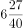

- **D**. 

**答案**：B

**官方解析**

由题干可得，甲公司做项目Ⅰ所需时间（3天）比乙公司（5天）少；乙公司做项目Ⅱ所需时间（8天）比甲公司（12天）少，求最少需要多少天，应由甲公司做项目Ⅰ、乙公司做项目Ⅱ，则甲公司3天可以完成项目Ⅰ，又由“开工后第2天停工1天”，则甲公司完成项目Ⅰ的时间为天。

赋值项目Ⅱ的工程总量（12和8的最小公倍数），则甲公司做项目Ⅱ的效率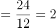、乙公司做项目Ⅱ的效率。当甲公司用4天完成项目Ⅰ后，乙公司也完成了个工作量，项目Ⅱ剩余总量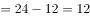。若要共同完成两个项目时间最短，则需两公司合作完成项目Ⅱ的剩余部分，因此总时间共需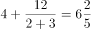天。

故正确答案为B。

---

### 第 2 题　qid 2188296 · 数学运算

将一长度为的线段任意截成三段，设为所截的三线段能构成三角形的概率，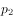为所截的三线段不能构成三角形的概率，则下列选项正确的是：

- **A**. 
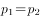

- **B**. 
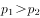

- **C**. 

　✅
- **D**. 

**答案**：C

**官方解析**

方法一：设三条线段的长度分别为、、，由三角形定理“两边之和大于第三边”可得：

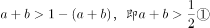；

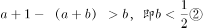；

。

则概率如图所示：

则，总情况数为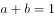和两个坐标轴围成的面积，故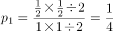；，则。

方法二：由三角形定理“两边之和大于第三边”，可得：当其中一边长度时，不能构成三角形。在这条线段上，先任取一个截点，那么第二个截点与其位于中点同侧或不同侧的概率均为，分类讨论如下：

当第二个截点与第一个截点在同侧时，两个截点中的任意一个与另一侧的端点之间的距离必然，不能构成三角形，即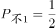；

当第二个截点与第一个截点在不同侧时，有可能两个截点之间的长度，如下图所示，此时截成的三条线段将无法构成三角形，即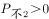。

综合以上两种情况，，而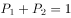，则。

故正确答案为C。

---

### 第 3 题　qid 2188303 · 数学运算

设乙地在甲、丙两地之间，小赵从乙地出发到甲地去送材料，小钱从乙地到丙地去送另一份材料，两人同时出发，10分钟后，小孙发现小赵小钱两人都忘记带介绍信，于是他从乙地出发骑车去追赶小赵和小钱，以便把介绍信送给他们。已知小赵小钱小孙的速度之比为1:2:3，且中途不停留。那么，小孙从乙地出发到把介绍信送到后返回乙地最少需要多少分钟？

- **A**. 45
- **B**. 70
- **C**. 90　✅
- **D**. 95

**答案**：C

**官方解析**

设小赵、小钱和小孙的速度分别为1、2和3。

若小孙先追小赵，再追小钱：10分钟后，小赵的路程为，此时小孙开始追小赵，根据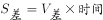，可得：，分钟，即5分钟后小孙追上小赵，再用5分钟小孙返回乙地；此时小钱出发时间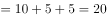分，，根据，可得：，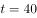分钟，即小孙又用了40分钟追上小钱，再用40分钟返回乙地。则小孙从乙地出发到把介绍信送到后返回乙地用时分钟。

若小孙先追小钱，再追小赵：10分钟后，小钱的路程，此时小孙开始追小钱，根据，可得：，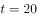分钟，即20分钟后小孙追上小钱，再用20分钟小孙返回乙地；此时小赵出发时间分，，根据，可得：，分钟，即小孙又用了25分钟追上小赵，再用25分钟返回乙地。则小孙从乙地出发到把介绍信送到后返回乙地用时分钟。

故正确答案为C。

---

### 第 4 题　qid 2188310 · 数学运算

一家三口，妈妈比儿子大26岁，爸爸比儿子大33岁。1995年，一家三口的年龄之和为62。那么，2018年儿子、妈妈和爸爸的年龄分别是：

- **A**. 23，51，57
- **B**. 24，50，57　✅
- **C**. 25，51，57
- **D**. 26，52，58

**答案**：B

**官方解析**

方法一：设儿子1995年的年龄为岁，则妈妈的年龄为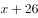岁，爸爸的年龄为岁。由于1995年一家三口年龄和为62，则有，解得。因此儿子在1995年为1岁，则2018年儿子是岁，只有B项符合。

方法二：选项信息充分，考虑代入排除。根据题意“妈妈比儿子大26岁，爸爸比儿子大33岁”，依次代入选项：

A项51-23=28，妈妈比儿子大28岁，不符合题意，排除A项；

B项：满足50-24=26，57-24=33，满足条件，保留；

C项：57-25=32，即爸爸比儿子大32岁，不符合题意，排除；

D项，58-26=32，即爸爸比儿子大32岁，不符合题意，排除。

故正确答案为B。

---

### 第 5 题　qid 2188315 · 数学运算

设a、b、c、d分别代表四棱台、圆柱、正方体和球体，已知这四个几何体的表面积相同，则体积最小与体积最大的几何体分别是：

- **A**. d和a
- **B**. c和d
- **C**. a和d　✅
- **D**. d和b

**答案**：C

**官方解析**

根据几何问题中立体图形的性质：立体图形中，表面积一定，越接近于球，其体积越大。则四个立体图形中体积最大的一定是球体（d），排除A、D。剩余三个图形中，最不接近球体的是四棱台（a），因此其体积最小。
故正确答案为C。

---

### 第 6 题　qid 2188270 · 数学运算

在一条公路上每隔10里有一个集散地，共有5个集散地，其中一号集散地有旅客10人，三号集散地有25人，五号集散地有45人，其余两个集散地没有人。如果把所有人集中到一个集散地，那么，所有旅客所走的总里数最少是：

- **A**. 1100
- **B**. 900　✅
- **C**. 800
- **D**. 700

**答案**：B

**官方解析**

要使所有旅客走的总里数最少，则应该使人数多的集散地尽可能地少移动。根据货物集中问题原则，，所以应把所有人集中在五号集散地。此时1号集散地的旅客每人走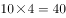里。三号集散地的旅客每人走里。总里数里。

故正确答案为B。

---

### 第 7 题　qid 2188276 · 数学运算

某高校组织200名学生植树198棵，其中有一人植1棵，其余的199人分成甲乙两组，甲组每人植3棵，乙组每两人植1棵。那么，甲乙两组各有多少名学生？

- **A**. 49，140
- **B**. 39，160　✅
- **C**. 29，170
- **D**. 19，180

**答案**：B

**官方解析**

方法一：甲乙两组共植树棵，甲乙两组共199人，设甲组有甲人，乙组有乙人。根据题意，有

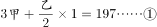

解得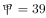，。

方法二：直接代入排除。A项，人，不符合题意“其余的199人分成甲乙两组”，排除A项；B项，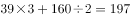，满足所有题意，当选；C项，，排除C项；D项，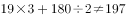，排除D项。

故正确答案为B。

---

### 第 8 题　qid 2188278 · 数学运算

张三和李四准备进行一个娱乐游戏：将一枚质地均匀的硬币连续抛三次，如果落地后三次都是正面朝上或三次都是反面朝上，则李四就给张三糖果；但如果出现两次正面一次反面或两次反面一次正面，则张三就给李四糖果，且李四要求张三每次给15颗糖果。那么，从长远来看，张三应该要求李四每次至少给多少颗糖果才能考虑参加这个娱乐游戏？

- **A**. 30
- **B**. 35
- **C**. 40
- **D**. 45　✅

**答案**：D

**官方解析**

落地后三次正面朝上或三次反面朝上的概率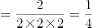，李四给张三糖果的概率为，出现两次正面一次反面或两次反面一次正面的概率，张三给李四糖果的概率为。从长远来看，张三要考虑参加这个游戏，只有给李四的糖果数量小于等于李四给他的数量，即，则颗，即张三应该要求李四每次至少给45颗糖果。

故正确答案为D。

---

### 第 9 题　qid 2188284 · 数学运算

某学院从9名同学中选出4名同学去四个不同的乡镇甲、乙、丙、丁参加三下乡社会实践活动，其中有两名同学不能去乡镇丁，则分配方案共有多少种？

- **A**. 2352　✅
- **B**. 2452
- **C**. 2552
- **D**. 2652

**答案**：A

**官方解析**

方法一：首先，有两名同学不能去乡镇丁，则去丁的一名同学应从其他7个中选取，有7种方法；其次，剩余三个乡镇没有要求，则从其他8个同学中任意选取三个即可，有种方法。因此分配方案共有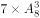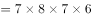种。

方法二：“有两名同学不能去乡镇丁”也可以考虑从反面入手。有两名同学不能去乡镇丁的情况数=总情况数-这两名同学去乡镇丁的情况数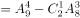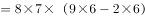种。

故正确答案为A。

---

### 第 10 题　qid 2188297 · 数学运算

甲、乙、丙、丁4人去完成四项任务，并要求每人只完成一项任务，每一项任务只能由一人完成，每人完成各项任务的所用时间（单位：小时）如下表：

则最优分配方案是：

- **A**. 甲—任务Ⅰ，乙—任务Ⅱ，丙—任务Ⅳ，丁—任务Ⅲ
- **B**. 甲—任务Ⅰ，乙—任务Ⅲ，丙—任务Ⅱ，丁—任务Ⅳ
- **C**. 甲—任务Ⅳ，乙—任务Ⅱ，丙—任务Ⅲ，丁—任务Ⅰ
- **D**. 甲—任务Ⅰ，乙—任务Ⅲ，丙—任务Ⅳ，丁—任务Ⅱ　✅

**答案**：D

**官方解析**

最优方案是每人选择最擅长的任务。
甲用时最短的是完成任务Ⅰ，只需4小时，则安排甲做任务Ⅰ；
乙用时最短的是完成任务Ⅱ和任务Ⅲ，均需3小时，则做两项都可以；
丙用时最短的是完成任务Ⅳ，只需2小时，则安排丙做任务Ⅳ；
丁用时最短的是完成任务Ⅰ和任务Ⅱ，均需5小时，甲比丁更擅长做任务Ⅰ，安排甲做任务Ⅰ，丁做任务Ⅱ，则乙做任务Ⅲ。即甲—任务Ⅰ，乙—任务Ⅲ，丙—任务Ⅳ，丁—任务Ⅱ。
故正确答案为D。

---

### 第 11 题　qid 2188286 · 数学运算

为了节约水资源，某城市规定每人每月不超过5吨，则按收费；超出5吨的，超出部分按收费，每次收费时用水量都按整数计算，已知胡家3口人，熊家4口人。某月月底结算时，胡家收费69.5元，比熊家多交了15.5元。那么，熊家该月用了多少吨水？

- **A**. 20
- **B**. 21　✅
- **C**. 22
- **D**. 23

**答案**：B

**官方解析**

熊家该月收费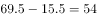元。设熊家该月用了吨水，根据总收费为两部分的和可得方程。解方程得吨。

故正确答案为B。

---

### 第 12 题　qid 2188288 · 数学运算

某高校做有关碎片化学习的问卷调查，问卷回收率为，在调查对象中有180人会利用网络课程进行学习，200人利用书本进行学习，100人利用移动设备进行碎片化学习，同时使用三种方式学习的有50人，同时使用两种方式学习的有20人，不存在三种方式学习都不用的人。那么，这次共发放了多少份问卷？

- **A**. 370
- **B**. 380
- **C**. 390
- **D**. 400　✅

**答案**：D

**官方解析**

设共发放问卷份，根据容斥原理三集合非标准型公式：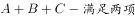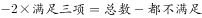，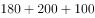，解得。则这次共发放了400份问卷。

故正确答案为D。

---

### 第 13 题　qid 2188299 · 数学运算

小李四年前投资的一套商品房价格上涨了，由于担心房价下跌，将该商品房按市价的9折出售，扣除成交价的相关交易费用后，比买进时赚了56.5万元。那么，小李买进该商品房时花了多少万元？

- **A**. 200　✅
- **B**. 250
- **C**. 300
- **D**. 350

**答案**：A

**官方解析**

设买进该商品房时成本为万元，则定价为，实际售价为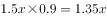。利润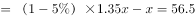，解得。

故正确答案为A。

---

### 第 14 题　qid 2188306 · 数学运算

某品牌的葛粉进价为20元，现降价卖出，结果还获得进价的利润。那么，该葛粉的定价是多少元？

- **A**. 36
- **B**. 37
- **C**. 38　✅
- **D**. 39

**答案**：C

**官方解析**

设葛粉的定价为元，售价为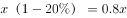元，利润为元，利润率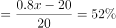，解得元。

故正确答案为C。

---

### 第 15 题　qid 2188316 · 数学运算

某自助餐饮店推出了两种自助方案：甲方案成人每人90元，小孩每人60元；乙方案无论大人小孩，每人均为70元。现有人组团就餐，并规定1个大人至多带2个小孩就餐。那么，对于这些顾客来说：

- **A**. 只要选择甲方案都不会吃亏
- **B**. 甲方案总是比乙方案更优惠
- **C**. 只要选择乙方案都不会吃亏　✅
- **D**. 甲方案和乙方案一样优惠

**答案**：C

**官方解析**

假设该团中没有小孩，则甲方案平均每人90元，乙为70元，乙优于甲，排除A、B、D三项。
故正确答案为C。

---

## 判断推理

### 第 1 题　qid 2188222 · 图形推理

从所给四个选项中，选择最合适的一个填入问号处，使之呈现一定的规律性：

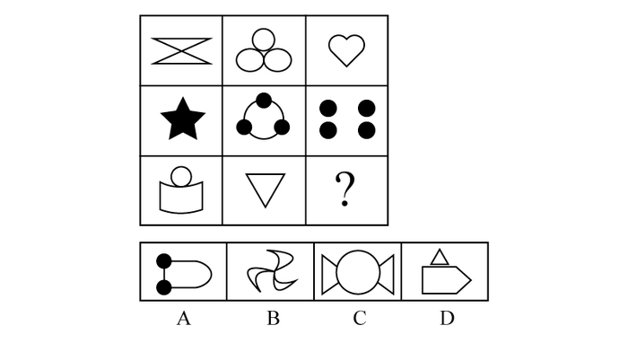

- **A**. A
- **B**. B
- **C**. C　✅
- **D**. D

**答案**：C

**官方解析**

元素组成不同，优先考虑属性规律。观察发现，题干图形均为轴对称图形，且均有一条竖着的对称轴，因此“？”处也应为有一条竖着的对称轴的图形，只有C项符合。
故正确答案为C。

---

### 第 2 题　qid 2188238 · 图形推理

从所给四个选项中，选择最合适的一个填入问号处，使之呈现一定的规律性：

- **A**. A
- **B**. B
- **C**. C
- **D**. D　✅

**答案**：D

**官方解析**

元素组成相同，优先考虑位置规律。观察发现，前一组图中小黑正方形每次沿顺时针方向移动两格，空白部分每次沿逆时针方向移动一格。第二组图运用此规律，观察发现，第一幅图到第二幅图中，小黑正方形沿逆时针方向移动了两格，空白部分沿顺时针方向移动了一格，因此？处图形的小黑正方形应在右上角，空白部分应在右下角，对应D项。
故正确答案为D。

---

### 第 3 题　qid 2188242 · 图形推理

左边给定的是纸盒的外表面，下列能由它折叠而成的一项是：

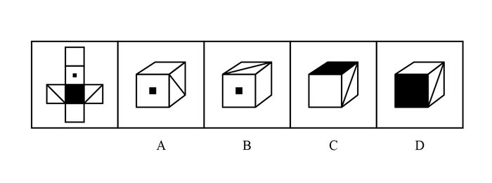

- **A**. A　✅
- **B**. B
- **C**. C
- **D**. D

**答案**：A

**官方解析**

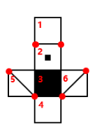

将原展开图标上序号，如上图所示，逐一进行分析。

A项：已知面2和面4是相对面，不能同时出现，故A项上面是面1，前面是面2，对角线面在面2的右侧，则右侧是面6，选项与题干展开图一致，当选；

B项：已知面2和面4是相对面，不能同时出现，故B项侧面是面1，前面是面2，观察题干展开图发现，不论上面是面5还是面6，对角线面中的对角线的一个顶点都在三个面的公共点上，选项与题干展开图不一致，排除；

C项：已知面1和面3是相对面，不能同时出现，故C项上面是面3，前面是面4，观察题干展开图发现，不论侧面是面5还是面6，对角线面的对角线的一个顶点都在三个面的公共点上，选项与题干展开图不一致，排除；

D项：已知面1和面3是相对面，不能同时出现，故D项前面是面3，上面是面4，观察题干展开图发现，不论侧面是面5还是面6，对角线面的对角线的一个顶点都在三个面的公共点上，选项与题干展开图不一致，排除。

故正确答案为A。

---

### 第 4 题　qid 2188249 · 图形推理

从所给四个选项中，选择最合适的一个填入问号处，使之呈现一定的规律性：

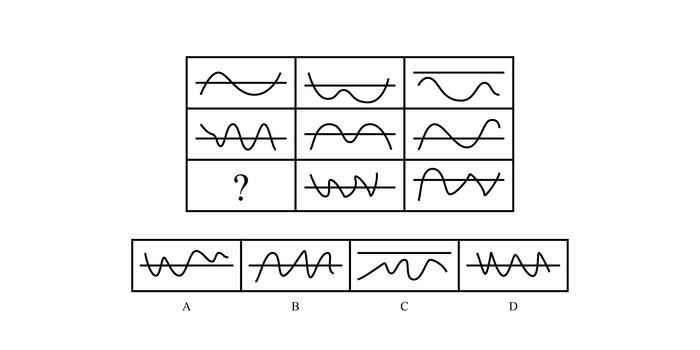

- **A**. A
- **B**. B
- **C**. C
- **D**. D　✅

**答案**：D

**官方解析**

元素组成不同，且无明显属性规律，考虑数量规律。题干图形中“窟窿”较多，考虑数面，九宫格优先横看，第一行面数量是：2、1、0；第二行面数量是：4、3、2；第三行面数量是：？5、4，故？处面数量应为6，A项为3，B项为5，C项为0，D项为6，只有D项符合。
故正确答案为D。

---

### 第 5 题　qid 2188253 · 图形推理

把下面的六个图形分为两类，使每一类图形都有各自的共同特征或规律，分类正确的一项是：

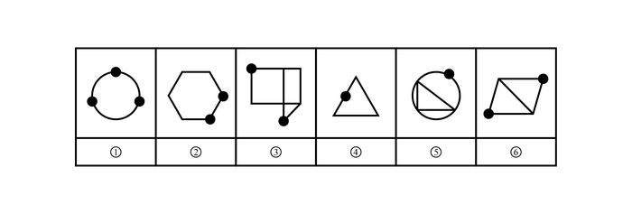

- **A**. ①②④，③⑤⑥
- **B**. ①④⑤，②③⑥　✅
- **C**. ①③④，②⑤⑥
- **D**. ①③⑥，②④⑤

**答案**：B

**官方解析**

元素组成不同，题干图形均有小黑点，考虑功能元素。观察发现，图①④⑤中小黑点标记在线上，图②③⑥中小黑点标记在交点处。即图①④⑤为一组，图②③⑥为一组。
故正确答案为B。

---

### 第 6 题　qid 2188211 · 定义判断

人类命运共同体是指在追求本国利益时兼顾他国合理关切，在谋求本国发展中促进各国共同发展。人类只有一个地球，各国共处一个世界，要倡导“人类命运共同体”意识。
根据上述定义，以下不符合人类命运共同体理念的是：

- **A**. 中国始终坚持正确义利观，树立共同、综合、合作、可持续的新安全观
- **B**. 中国必须统筹国际国内两个大局，始终走和平发展道路
- **C**. 人类命运共同体没有超越社会制度差异、意识形态差异和价值观念分歧　✅
- **D**. 中国愿意始终做世界和平的建设者、全球发展的贡献者、国际秩序的维护者

**答案**：C

**官方解析**

第一步：找出定义关键词。
“追求本国利益时兼顾他国合理关切”、“在谋求本国发展中促进各国共同发展”。
第二步：逐一分析选项。
A项：中国始终坚持正确义利观，树立共同、综合、合作、可持续的新安全观，说明中国兼顾他国利益，愿与他国合作共发展，符合“在谋求本国发展中促进各国共同发展”，符合定义，排除； 
B项：中国必须统筹国际国内两个大局，始终走和平发展道路，说明中国兼顾他国利益，愿与他国合作共发展，符合“在谋求本国发展中促进各国共同发展”，符合定义，排除；
C项：人类命运共同体没有超越社会制度差异、意识形态差异和价值观念分歧，没有超越差异和分歧说明依然存在差异和观念分歧，不符合“在谋求本国发展中促进各国共同发展”，不符合定义，当选；
D项：中国愿意始终做世界和平的建设者、全球发展的贡献者、国际秩序的维护者，说明中国兼顾他国利益，愿与他国合作共发展，符合“在谋求本国发展中促进各国共同发展”，符合定义，排除。
本题为选非题，故正确答案为C。

---

### 第 7 题　qid 2188216 · 定义判断

要约是指凡向一个或一个以上特定的人提出的订立合同的建议，如果其内容十分确定，并且表明要约人有在其要约一旦得到承诺就将受其约束的意思表示。
典型案例：
2016年6月8日甲方向乙方拍发了一封电报：“今我处有一批葡萄罐头，你方是否需要？”次日即收到乙方回电：“需要，请详告货目、价款。”甲方遂于6月13日发电详告：“葡萄罐头1500箱，规格锡皮545克型，每箱20瓶，每瓶单价2.10元，质量符合国家标准，整批货物加运杂费1200元。”乙方接电后，回电请求改锡皮545克型为300克型，并要求8月中旬交货，见货单即付款。
6月17日，甲方考虑到自己库存的300克型的数量少，8月中旬交货有困难，不能满足乙方的需要。便发电告诉乙方：“我方只有545克型货物，8月中旬能交货。”乙方于6月21日回电：“你方6月17日来电，我方同意。另请考虑规模为锡皮300克型的货物。”
根据上述定义，以上案例中的要约有多少个？

- **A**. 2
- **B**. 3
- **C**. 4　✅
- **D**. 5

**答案**：C

**官方解析**

第一步：找出定义关键词。
“向一个或一个以上特定的人提出的订立合同的建议”、“其内容十分确定”、“表明要约人有在其要约一旦得到承诺就将受其约束的意思表示”。
第二步：分析案例。
1.甲方向乙方拍发了一封电报：“今我处有一批葡萄罐头，你方是否需要？”是一个询问，不是要约；
2.次日即收到乙方回电：“需要，请详告货目、价款”，是对于甲方的答复，不是要约；
3.甲方遂于6月13日发电详告的内容十分确定，并且一旦乙方接受甲方的报价即形成约束，此处是要约；
4.乙方接电后，回电请求改锡皮545克型为300克型，并要求8月中旬交货，见货单即付款，该回电内容十分确定，且一旦甲方同意乙方要求即形成约束，此处是要约；
5.6月17日，甲方便发电告诉乙方：“我方只有545克型货物，8月中旬能交货”，甲方的发电的内容十分确定，并且一旦乙方接受甲方的要求即形成约束，此处是要约；
6.乙方于6月21日回电：“另请考虑规模为锡皮300克型的货物”，该回电内容十分确定，且一旦甲方同意乙方要求即形成约束，此处是要约；
故该案例中要约有4个。
故正确答案为C。

---

### 第 8 题　qid 2188220 · 定义判断

个人独资企业，是指依照《个人独资企业法》在中国境内设立，由一个自然人投资，财产为投资人个人所有，投资人以其个人财产对企业债务承担无限责任的经营实体。
根据上述定义，以下对个人独资企业理解正确的是：

- **A**. 个人独资企业解散后，即免除了对债权人的责任
- **B**. 个人独资企业所获利润，投资人需要缴纳企业所得税
- **C**. 个人独资企业的财产归投资人个人所有，投资人对企业事务拥有控制与支配权　✅
- **D**. 一人有限责任公司可以投资设立个人独资企业

**答案**：C

**官方解析**

第一步：找出定义关键词。
“依照《个人独资企业法》在中国境内设立”、“一个自然人投资”、“财产为投资人个人所有”、“投资人以其个人财产对企业债务承担无限责任”、“经营实体”。
第二步：逐一分析选项。
A项：由“投资人以其个人财产对企业债务承担无限责任”可知，即使个人独资企业解散，债权人依然对债务负有责任，该项理解错误，排除； 
B项：按照现行税法规定个人独资企业不交企业所得税，而交个人所得税，该项理解错误，排除；
C项：由“财产为投资人个人所有”可知，个人独资企业的财产归投资人个人所有，由“一个自然人投资”可知，投资人不仅拥有所有权，也拥有对企业事务拥有控制与支配权，该项理解正确，当选；
D项：中国《公司法》规定：“一个自然人只能投资设立一个一人有限责任公司。该一人有限责任公司不能投资设立新的一人有限责任公司。”所以一人有限责任公司不可以投资设立个人独资企业，该项理解错误，排除。
故正确答案为C。

---

### 第 9 题　qid 2188237 · 定义判断

人力资源管理是指根据企业发展战略的要求，有计划地对人力资源进行合理配置，通过对企业中员工的招聘、培训、使用、考核、激励、调整等一系列过程，调动员工的积极性，发挥员工的潜能，为企业创造价值，给企业带来效益。确保企业战略目标的实现，是企业的一系列人力资源政策以及相应的管理活动。
根据上述定义，以下不属于人力资源管理活动的是：

- **A**. 甲公司劳动人事部门向单位全体员工发出调查问卷，为制定本公司规章制度做准备
- **B**. 乙公司劳动人事部门制定招聘计划，拟出招聘条件，派出员工前往某大学招聘大学毕业生
- **C**. 丙公司劳动人事部门组织新进员工进行岗前技术培训
- **D**. 丁公司劳动人事部门组织全体员工举行元旦联欢活动　✅

**答案**：D

**官方解析**

第一步：找出定义关键词。
“根据企业发展战略的要求，有计划地对人力资源进行合理配置”、“对企业中员工的招聘、培训、使用、考核、激励、调整等一系列过程”、“调动员工的积极性，发挥员工的潜能，为企业创造价值，给企业带来效益”。
第二步：逐一分析选项。
A项：向单位全体员工发出调查问卷，为制定本公司规章制度做准备，符合“调动员工的积极性，发挥员工的潜能”，符合定义，排除； 
B项：制定招聘计划，拟出招聘条件，派出员工前往某大学招聘大学毕业生，符合“对企业中员工的招聘”，符合定义，排除；
C项：组织新进员工进行岗前技术培训，符合“对企业中员工的培训”，符合定义，排除；
D项：组织元旦联欢活动，不符合“对员工的招聘、培训、使用、考核、激励、调整”，不符合定义，当选。
本题为选非题，故正确答案为D。

---

### 第 10 题　qid 2188244 · 定义判断

复合肥料是指含有氮、磷、钾三种或其中两种要素，由化学方法直接合成或在此基础上再添加其他营养成分加工制成的化学肥料。
根据上述定义，以下不属于复合肥料的是：

- **A**. 磷酸铵
- **B**. 硝酸钾
- **C**. 硝磷钾
- **D**. 氯化钾　✅

**答案**：D

**官方解析**

第一步：找出定义关键词。

“含有氮、磷、钾三种或其中两种要素”、“由化学方法直接合成或在此基础上再添加其他营养成分加工制成”。

第二步：逐一分析选项。

A项：磷酸铵化学式为，含有氮、磷两种要素，符合“含有氮、磷、钾三种或其中两种要素”，符合定义，排除；

B项：硝酸钾化学式为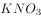，含有氮、钾两种要素，符合“含有氮、磷、钾三种或其中两种要素”，符合定义，排除；

C项：硝磷钾由硝酸铵、磷酸铵、硫酸钾或氯化钾等组成，含有氮、磷、钾三种要素，符合“含有氮、磷、钾三种或其中两种要素”，符合定义，排除；

D项：氯化钾化学式为KCl，只含有氮、磷、钾三种要素中的钾要素，不符合“含有氮、磷、钾三种或其中两种要素”，不符合定义，当选。

本题为选非题 ，故正确答案为D。

---

### 第 11 题　qid 2188219 · 定义判断

虹吸是指利用液面高度差的作用力现象，将液体充满一根倒U形的管状结构内后，将开口高的一端置于装满液体的容器中，容器内的液体会持续通过虹吸管从开口于更低的位置流出。
根据上述定义，以下不属于虹吸现象原理的是：

- **A**. 汽车司机用橡胶管从油桶中吸出汽油或柴油
- **B**. 我国黄河中下游的水面大都高出堤外地面，在河南、山东一带农民引黄河水灌溉农田
- **C**. 小王给家里的鱼缸换水时把管子里的空气挤出，然后把管子插入水中，水源源不断地流出
- **D**. 小刘家住某小区30 楼，家中自来水来自二次供水　✅

**答案**：D

**官方解析**

第一步：找出定义关键词。
“利用液面高度差的作用力”、“利用虹吸管将溶液从开口高的一端流向开口更低的位置流出”
第二步：逐一分析选项。
A项：用橡胶管从油桶中吸出油的原理是将油桶放在高的地方，下面放接油的器皿，通过橡胶管快速将油流到下面接油的桶，符合“油从开口高的一端向开口更低的位置流出”，符合定义，排除；
B项：黄河水高于堤外地面，即黄河水是高于农田的，那么将黄河水引到农田符合“从开口高的一端向开口更低的位置流出”，符合定义，排除；
C项：鱼缸水高于地面，鱼缸换水时水从开口高的一端向开口更低的位置流出，符合定义，排除；
D项：二次供水的设备一般设在地上或地下室，通过加压将水流从低到高进行输送，不符合“利用虹吸管将溶液从开口高的一端向开口更低的位置流出”，不符合定义，当选。
本题为选非题，故正确答案为D。

---

### 第 12 题　qid 2188246 · 定义判断

股东派生诉讼是指当公司的董事、监事、高级管理人员或者他人的违反法律、行政法规或者公司章程的行为侵害了公司权益，而公司拒绝或怠于追究其责任时，符合法定要件的股东为公司的利益以自己的名义对侵害人提起诉讼，请求违法行为人赔偿公司损失的行为。
根据上述定义，以下属于股东派生诉讼的是：

- **A**. 
某上市公司董事会秘书李某执行公司职务时，违反公司章程的规定，给公司造成了损失。王某是该公司连续一年持有股份的股东，王某可以以公司的名义起诉李某

- **B**. 
刘某是甲有限责任公司的董事长兼总经理。任职期间，多次利用职务之便，指示公司会计将资金借贷给一家主要由刘某儿子投资设立的乙公司。对此，持有公司股权的股东王某认为甲公司应起诉乙公司还款，但甲公司不可能起诉，王某便以自己的名义起诉乙公司，要求乙公司将借款返还给甲公司
　✅
- **C**. 
黄某是甲公司的董事，自2012年起，黄某在任职期间，另行申请设立了乙公司，该公司的经营范围与甲公司基本相同。黄某利用甲公司的业务渠道和技术资料从事与该公司同类的业务活动，造成甲公司约70万元的损失。甲公司遂起诉要求黄某停止违法经营活动，返还违法经营所得，并赔偿损失

- **D**. 
某股份有限责任公司总经理钟某违反公司章程的规定，未经股东大会同意，将公司资金无偿借贷给妻子弟弟，给公司造成了利益损失。对此，公司监事会有权提起诉讼，请求追究钟某的法律责任

**答案**：B

**官方解析**

第一步：找出定义关键词。

“符合法定要件的股东”、“为公司的利益以自己的名义对侵害人提起诉讼”。

第二步：逐一分析选项。

A项：王某以公司的名义起诉李某，而不是以自己的名义，不符合“为公司的利益以自己的名义对侵害人提起诉讼”，不符合定义，排除； 

B项：持有公司股权的股东王某，符合“符合法定要件的股东”，以自己的名义起诉乙公司，要求乙公司将借款返还给甲公司，符合“为公司的利益以自己的名义对侵害人提起诉讼”，符合定义，当选；

C项：甲公司起诉黄某，令其停止违法经营活动，是公司进行的起诉，不符合主体“符合法定要件的股东”，不符合定义，排除；

D项：公司监事会起诉钟某，公司监事会不符合主体“符合法定要件的股东”，不符合定义，排除。

故正确答案为B。

---

### 第 13 题　qid 2188252 · 定义判断

多普勒效应是指波源和观察者作相对运动时，观察者接收到的频率和波源发出的频率不同的现象。两者相互接近时接收到的频率升高，相互离开时则降低。
根据上述定义，以下没有利用多普勒效应的是：

- **A**. 多普勒导航
- **B**. 激光测速仪　✅
- **C**. 彩超
- **D**. 多普段摄影机

**答案**：B

**官方解析**

第一步：找出定义关键词。
“波源和观察者作相对运动”、“观察者接收到的频率和波源发出的频率不同的现象”。
第二步：逐一分析选项。
A项：多普勒导航系统是利用多普勒效应测定多普勒频移，从而计算出飞机当时的速度和位置来进行导航，符合定义，排除；
B项：激光测速仪是采用激光测距的原理，激光测距，是通过对被测物体发射激光光束，并接收该激光光束的反射波，记录该时间差，来确定被测物体与测试点的距离，而非利用多普勒效应，不符合定义，当选；
C项：彩超是彩色多普勒超声的简称。它是根据多普勒效应在二维超声显像（即B超）的基础上，叠加彩色血流信号，实现彩色血流显像的一种方法，符合定义，排除；
D项：多普段摄影机是指对于同一地区，在同一瞬间提取多个波段摄像的摄影机，符合“波源和观察者作相对运动”、“观察者接收到的频率和波源发出的频率不同的现象”，符合定义，排除。
本题为选非题，故正确答案为B。

---

### 第 14 题　qid 2188255 · 定义判断

技术标准是指对工农业产品和工程建设的质量、规格和检验方法，以及对技术文件上常用的图形、符号等所作的技术规定。是从事生产、建设的一种共同依据。
根据上述定义，以下属于技术标准的是：

- **A**. 国家关于婴幼儿奶粉质量标准的规定　✅
- **B**. 国家关于评定卫生城市的标准细则
- **C**. 国家关于缺陷产品召回的管理规定
- **D**. 工业局对冶金机械厂区设备烟尘排放量的检测标准

**答案**：A

**官方解析**

第一步：找出定义关键词。
“对工农业产品和工程建设的质量、规格和检验方法”、“对技术文件上常用的图形、符号等所作的技术规定”、“是从事生产、建设的一种共同依据”。
第二步：逐一分析选项。
A项：婴幼儿奶粉属于工农业产品，对其质量制定标准，符合“工农业产品和工程建设的质量、规格和检验方法”，符合定义，当选；
B项：对卫生城市的评定标准，不涉及工农业产品和工程建设的问题，不符合“工农业产品和工程建设的质量、规格和检验方法”，不符合定义，排除；
C项：缺陷产品召回是产品生产完成、投入市场后产生问题的处理，不是生产的依据，不符合 “对工农业产品和工程建设的质量、规格和检验方法”、“是从事生产、建设的一种共同依据”，不符合定义，排除；
D项：冶金机械厂区设备的烟尘排放量的检测标准，是检测其对环境的影响，而非产品本身的生产质量问题，不符合“对工农业产品和工程建设的质量、规格和检验方法”，不符合定义，排除。
故正确答案为A。

---

### 第 15 题　qid 2188259 · 定义判断

货币政策是指中央银行为实施既定的经济目标而采取的各种控制、调节货币供应量和信用总量的方针、政策、措施的总称。
根据上述定义，以下属于中国人民银行运用货币政策工具的是：

- **A**. 中国人民银行为了刺激消费，大幅下调存款利率　✅
- **B**. 商业银行依法按照一定比例向中国人民银行交足存款准备金
- **C**. 中国人民银行经理国库业务
- **D**. 中国人民银行在商业银行资金短缺时，对其提供贷款

**答案**：A

**官方解析**

第一步：找出定义关键词。
“中央银行”、“为实施既定的经济目标”、“采取的各种控制、调节货币供应量和信用总量的方针、政策、措施的总称”。
第二步：逐一分析选项。
A项：中国人民银行下调存款利率，是“中央银行”为了实现刺激经济，而“控制、调节货币供应量和信用总量”的方式，符合定义，当选；
B项：商业银行交足准备金，不符合主体“中央银行”，不符合定义，排除；
C项：经理国库业务，是人民银行为化解国库资金风险所采取的措施，不符合“为实施既定的经济目标”而采取的措施，不符合定义，排除；
D项：中国人民银行为商业银行提供贷款，即在商业银行存在破产风险时，央行会为其提供贷款，不符合“为实施既定的经济目标”而采取的措施，不符合定义，排除。
故正确答案为A。

---

### 第 16 题　qid 2188212 · 类比推理

（  ）对于 纸张 相当于 衣服 对于（  ）

- **A**. 书籍，布料　✅
- **B**. 树木，裤子
- **C**. 宣纸，保暖
- **D**. 笔墨，服装

**答案**：A

**官方解析**

逐一代入选项。
A项：纸张是书籍的原材料，布料是衣服的原材料，二者均为原材料的对应关系，前后逻辑关系一致，当选；
B项：树木可以用来做纸张，二者为原材料的对应关系，裤子是衣服的一种，二者为种属关系，前后逻辑关系不一致，排除；
C项：宣纸是纸张的一种，二者为种属关系，衣服可以用来保暖，二者是功能的对应关系，前后逻辑关系不一致，排除；
D项：笔墨和纸张都是写字的工具，二者为并列关系，衣服是服装的一种，二者为种属关系，前后逻辑关系不一致，排除。
故正确答案为A。

---

### 第 17 题　qid 2188213 · 类比推理

缇萦救父：孝

- **A**. 孔融让梨：义
- **B**. 季札还愿：智
- **C**. 毛遂自荐：礼
- **D**. 尾生抱柱：信　✅

**答案**：D

**官方解析**

第一步：判断题干词语间逻辑关系。
缇萦救父，指缇萦的父亲获罪并将遭受刑罚，她为父亲奔走、上书，最终使父亲免受肉刑。缇萦救父比喻孝，二者为比喻象征关系。
第二步：判断选项词语间逻辑关系。
A项：孔融让梨，指孔融小时候就有谦让的礼仪，知道把大的梨给哥哥吃。孔融让梨比喻礼，而不是义，与题干逻辑关系不一致，排除；
B项：季札还愿，指季札见徐公深爱自己的宝剑，心中默许出使回国时将剑赠与徐公。回来时徐公竟已经去世，于是季札将宝剑摆放在墓前。季札还愿比喻信，而不是智，与题干逻辑关系不一致，排除；
C项：毛遂自荐，指毛遂在平原君选备人物去楚国时，自赞自荐。毛遂自荐比喻勇，而不是礼，与题干逻辑关系不一致，排除；
D项：尾生抱柱，指尾生与女子约定在桥梁相会，久候女子不到，水涨，于是抱桥柱而死。尾生抱柱比喻信，二者为比喻象征关系，与题干逻辑关系一致，当选。
故正确答案为D。

---

### 第 18 题　qid 2188215 · 类比推理

学校：学生

- **A**. 监狱：警察
- **B**. 医院：医生
- **C**. 工厂：工人　✅
- **D**. 游船：船员

**答案**：C

**官方解析**

第一步：判断题干词语间逻辑关系。
学生在学校里读书，在学校中学生人数占比较大。
第二步：判断选项词语间逻辑关系。
A项：狱警在监狱里工作，而警察的范围太宽泛，警察和监狱没有必然的逻辑关系，与题干逻辑关系不一致，排除；
B项：医生在医院里工作，在医院中患者人数占比较大，而非医生，与题干逻辑关系不一致，排除；
C项：工人在工厂里工作，在工厂里工人占比较大，与题干逻辑关系一致，当选；
D项：船员在游船上工作，在游船上游客人数占比较大，而非船员，与题干逻辑关系不一致，排除。
故正确答案为C。

---

### 第 19 题　qid 2188217 · 类比推理

本草纲目：李时珍：明朝

- **A**. 齐民要术：贾思勰：三国
- **B**. 海国图志：林则徐：清朝
- **C**. 梦溪笔谈：沈括：南宋
- **D**. 茶经：陆羽：唐朝　✅

**答案**：D

**官方解析**

第一步：判断题干词语间逻辑关系。
《本草纲目》的作者是李时珍，李时珍是明朝人，三者为著作、作者和作者所处朝代的对应关系。
第二步：判断选项词语间逻辑关系。
A项：《齐民要术》的作者是贾思勰，但贾思勰是南北朝时期的北魏人，与题干逻辑关系不一致，排除；
B项：林则徐是清朝人，但《海国图志》的作者是魏源，与题干逻辑关系不一致，排除；
C项：《梦溪笔谈》的作者是沈括，但沈括是北宋人，与题干逻辑关系不一致，排除；
D项：《茶经》的作者是陆羽，陆羽是唐朝人，三者为著作、作者和作者所处朝代的对应关系，与题干逻辑关系一致，当选。
故正确答案为D。

---

### 第 20 题　qid 2188221 · 类比推理

竞争 对于（  ）相当于 关系 对于（  ）

- **A**. 竞赛：亲密
- **B**. 残酷：关联
- **C**. 比赛：疏远
- **D**. 激烈：融洽　✅

**答案**：D

**官方解析**

逐一代入选项。
A项：竞赛是一种竞争，二者为种属关系，亲密的关系，二者为偏正结构，前后逻辑关系不一致，排除；
B项：残酷的竞争，二者为偏正结构，关系和关联都指相互有联系，二者为近义关系，前后逻辑关系不一致，排除；
C项：比赛是一种竞争，二者为种属关系，疏远的关系，二者为偏正结构，前后逻辑关系不一致，排除；
D项：激烈的竞争，融洽的关系，二者均为偏正结构，前后逻辑关系一致，当选。
故正确答案为D。

---

### 第 21 题　qid 2188262 · 类比推理

姚明：中国：篮球

- **A**. 梅西：巴西：足球
- **B**. 伍兹：美国：棒球
- **C**. 费德勒：西班牙：网球
- **D**. 瓦尔德内尔：瑞典：乒乓球　✅

**答案**：D

**官方解析**

第一步：判断题干词语间逻辑关系。
姚明是中国人，是篮球明星，三者为人物、国籍和从事领域的对应关系。
第二步：判断选项词语间逻辑关系。
A项：梅西是足球明星，但梅西是阿根廷人，与题干逻辑关系不一致，排除；
B项：伍兹是美国人，但伍兹是高尔夫球明星，与题干逻辑关系不一致，排除；
C项：费德勒是网球明星，但费德勒是瑞士人，与题干逻辑关系不一致，排除；
D项：瓦尔德内尔是瑞典人，是乒乓球明星，三者为人物、国籍和从事领域的对应关系，与题干逻辑关系一致，当选。
故正确答案为D。

---

### 第 22 题　qid 2188265 · 逻辑判断

横看成岭侧成峰，远近高低各不同：江西：庐山

- **A**. 白日依山尽，黄河入海流：山东：泰山
- **B**. 会当凌绝顶，一览众山小：安徽：黄山
- **C**. 长安回望绣成堆，山顶千门次第开：陕西：骊山　✅
- **D**. 画栋朝飞南浦云，珠帘暮卷西山雨：河南：嵩山

**答案**：C

**官方解析**

第一步：判断题干词语间逻辑关系。
“横看成岭侧成峰，远近高低各不同”是形容庐山的诗句，庐山位于江西省，三者为对应关系。
第二步：判断选项词语间逻辑关系。
A项：“白日依山尽，黄河入海流”是作者登鹳雀楼时所作的诗句，与泰山无关，与题干逻辑关系不一致，排除；
B项：“会当凌绝顶，一览众山小”是作者登泰山时所作的诗句，与黄山无关，与题干逻辑关系不一致，排除；
C项：“长安回望绣成堆，山顶千门次第开”是写从长安回望骊山，山如锦绣拥簇，是形容骊山的诗句，骊山位于陕西省，与题干逻辑关系一致，当选；
D项：“画栋朝飞南浦云，珠帘暮卷西山雨”这两句是作者在描写滕王阁的诗句，写出了滕王阁的寂寞，与嵩山无关，与题干逻辑关系不一致，排除。
故正确答案为C。

---

### 第 23 题　qid 2188268 · 类比推理

手机：充电器

- **A**. 房屋：窗户
- **B**. 电脑：鼠标　✅
- **C**. 水果：樱桃
- **D**. 银行存款：利息

**答案**：B

**官方解析**

第一步：判断题干词语间逻辑关系。
充电器用来给手机充电的，与手机配套使用，二者为配套的对应关系。
第二步：判断选项词语间逻辑关系。
A项：窗户是房屋的一部分，二者是组成关系，与题干逻辑关系不一致，排除；
B项：鼠标是电脑的一种输入设备，与电脑配套使用，二者为配套的对应关系，与题干逻辑关系一致，当选；
C项：樱桃是一种水果，二者是种属关系，与题干逻辑关系不一致，排除；
D项：银行存款可以获得利息，两者不是配套的对应关系，与题干逻辑关系不一致，排除。
故正确答案为B。

---

### 第 24 题　qid 2188272 · 类比推理

路见不平：拔刀相助

- **A**. 蛇鼠一窝：猫鼠同眠
- **B**. 过街老鼠：人人喊打　✅
- **C**. 兴高采烈：喜气洋洋
- **D**. 卧薪尝胆：扬眉吐气

**答案**：B

**官方解析**

第一步：判断题干词语间逻辑关系。
因为“路见不平”所以“拔刀相助”，二者为因果对应关系。
第二步：判断选项词语间逻辑关系。
A项：“蛇鼠一窝”形容坏人互相勾结，或者形容两个相互关联的人做坏事的行径如出一辙；“猫鼠同眠”比喻官吏失职，包庇下属干坏事，也比喻上下狼狈为奸。二者是近义关系，与题干逻辑关系不一致，排除；
B项：因为是“过街老鼠”所以“人人喊打”，二者为因果对应关系，与题干逻辑关系一致，保留；
C项：“兴高采烈”和“喜气洋洋”都是形容人开心，二者是近义关系，与题干逻辑关系不一致，排除；
D项：因为“卧薪尝胆”，所以 “扬眉吐气”，二者是因果对应关系，与题干逻辑关系一致，保留。
对比B、D两项，题干路见不平，拔刀相助两词语常连起来用，B选项过街老鼠，人人喊打也常连起来用，B项比D项更好。
故正确答案为B。

---

### 第 25 题　qid 2188273 · 类比推理

钢笔：圆珠笔：铅笔

- **A**. 肥皂：皂角：香皂
- **B**. 杆秤：磅秤：台秤　✅
- **C**. 桌子：凳子：椅子
- **D**. 燃气灶：电视机：洗衣机

**答案**：B

**官方解析**

第一步：判断题干词语间逻辑关系。
钢笔、圆珠笔和铅笔都是笔，三者是并列关系，并且三者功能相同。
第二步：判断选项词语间逻辑关系。
A项：皂角可以用来制作肥皂和香皂，第二词分别与第一、三词为原材料对应关系，与题干逻辑关系不一致，排除；
B项：杆秤、磅秤和台秤都是秤，三者是并列关系，并且三者功能相同，与题干逻辑关系一致，当选；
C项：桌子、凳子和椅子都是家具，三者是并列关系，但三者的功能并不都相同，只有后两者的功能相同，与题干逻辑关系不一致，排除；
D项：燃气灶、电视机和洗衣机都是家用产品，三者是并列关系，但三者的功能都不相同，与题干逻辑关系不一致，排除。
故正确答案为B。

---

### 第 26 题　qid 2188225 · 逻辑判断

某单位组织职工进行素质拓展培训，职工可自愿报名参加。老张碰到新来员工小李，聊起此事，老张提醒小李说：“单位组织素质拓展培训，赶紧报名去吧。”小李说：“我手上工作没有处理完，不用报了。”
以下除哪项外，都可以作为小李的回答所包含的假设？

- **A**. 如果工作处理好了，则要报名参加素质拓展培训　✅
- **B**. 只要我工作没有处理完，我就不必参加素质拓展培训
- **C**. 凡是报名参加素质拓展培训的，都是已经处理完工作的
- **D**. 只有工作处理完的人，才报名参加素质拓展培训

**答案**：A

**官方解析**

第一步：找出论点和论据。

论点：小李不用报了。

论据：小李手上工作没有处理完。

第二步：逐一分析选项。

A项：翻译为工作处理好了报名，搭桥方向错误，不能作为小李的假设，当选；

B项：翻译为工作处理好了报名，属于搭桥项，可以加强，排除；

C项：翻译为报名工作处理好了，等价于工作处理好了报名，属于搭桥项，可以加强，排除；

D项：翻译为报名工作处理好了，等价于工作处理好了报名，属于搭桥项，可以加强，排除。

本题为选非题，故正确答案为A。

---

### 第 27 题　qid 2188234 · 逻辑判断

跨国企业海外市场营销体系与本土市场营销体系相比，具有很大的差异。在国内市场一些较为有效的市场营销策略可能并不适合海外市场，如果照搬国内市场营销策略，那么就可能在开拓海外市场中受挫。而采取适宜的地域差异化营销策略，对提升海外市场营销效果，促进海外市场的发展有重要作用。实际上，绝大多数采用差异化营销策略的跨国企业是成功的企业，当然，一些没有采用差异化营销战略的跨国企业也有取得成功的。然而，所有成功的跨国企业都有一个共同特征，那就是它们都着眼于企业长远发展、具有比较完善的战略管理体系。
如果上述陈述都是正确的，那么下列陈述中也必然正确的是：

- **A**. 所有着眼于企业长远发展、具有比较完善的战略管理体系的跨国企业都是成功的跨国企业
- **B**. 一些着眼于企业长远发展、具有比较完善的战略管理体系的跨国企业是没有采用差异化营销战略的跨国企业　✅
- **C**. 绝大多数成功的跨国企业是采用过差异化营销战略的跨国企业
- **D**. 一些着眼于企业长远发展、具有比较完善的战略管理体系的跨国企业不是成功的跨国企业

**答案**：B

**官方解析**

第一步：翻译题干。

①照搬国内市场营销策略可能在开拓海外市场中受挫

②绝大多数采用差异化营销策略成功的跨国企业

③有的没有采用差异化营销战略成功的跨国企业

④成功的跨国企业着眼于企业长远发展

②与④递推可得：⑤绝大多数采用差异化营销策略成功的跨国企业着眼于企业长远发展

③与④分别递推可得：⑥有的没有采用差异化营销战略成功的跨国企业着眼于企业长远发展

第二步：逐一分析选项。

A项：翻译为着眼于企业长远发展成功的跨国企业，是对④的肯后，但肯后得不到确定结论，无法推出，排除；

B项：翻译为有的着眼于企业长远发展没有采用差异化营销战略，根据⑥可知：有的没有采用差异化营销战略着眼于企业长远发展，其等价命题为：有的着眼于企业长远发展没有采用差异化营销策略，可以推出，当选；

C项：翻译为绝大多数成功的跨国企业→采用过差异化营销战略，“绝大多数A是B”不能和“有的A是B”等价于“有的B是A”一样换位，所以根据绝大多数成功的跨国企业→采用过差异化营销战略推不出来绝大多数采用过差异化营销战略→成功的跨国企业，因此，无法推出，排除；

D项：翻译为有的着眼于企业长远发展成功的跨国企业，根据有的a是b不能推出有的b不是a，无法推出，排除。

故正确答案为B。

---

### 第 28 题　qid 2188239 · 逻辑判断

某演艺中心是某市标志性建筑，在出现大型活动时，该演艺中心除了平时启用的安全出入口，还有5个平时不开放的、供紧急情况下启用的出入口。这些紧急出入口的启用需要遵循以下规则：
（1）如果启用1号，那么必须同时启用2号且关闭5号
（2）不允许同时关闭3号和4号
（3）只有关闭4号，才能启用2号或者5号
那么，如果启用1号，以下哪项也同时启用？

- **A**. 2号和4号
- **B**. 3号和5号
- **C**. 2号和3号　✅
- **D**. 4号和5号

**答案**：C

**官方解析**

第一步：翻译题干。 ①1号2号且5号； ②3号或4号； ③2号或5号4号； ④1号。 第二步：逐一分析选项。 根据④与①可知，2号启用，5号不启用，再根据③可知，4号不启用，再结合条件②否一推一可知，4号关闭，3号一定不能关闭，即3号启用，因此启用的是2号、3号。 故正确答案为C。 

---

### 第 29 题　qid 2188247 · 逻辑判断

所有来自澳大利亚的留学生，都住在东区留学生公寓，所有住在东区留学生公寓内的学生，都必须参加今年的国际交流会；有些来自澳大利亚的留学生加入了汉语俱乐部；有些土木工程专业的学生也加入了汉语俱乐部；所有土木工程专业的学生都没有参加今年的国际交流会。
由此不能推出以下哪项结论？

- **A**. 所有澳大利亚留学生都参加了今年的国际交流会
- **B**. 没有一个土木工程专业的学生住在东区留学生公寓
- **C**. 有些澳大利亚留学生是学土木工程专业的　✅
- **D**. 有些汉语俱乐部成员没有参加今年的国际交流会

**答案**：C

**官方解析**

第一步：翻译题干。 ①澳大利亚留学生东区留学生公寓；

②东区留学生公寓国际交流会；

③有的澳大利亚留学生汉语俱乐部；

④有的土木工程汉语俱乐部；

⑤土木工程国际交流会；

将⑤逆否和①②可以递推出：⑥澳大利亚留学生东区留学生公寓国际交流会土木工程。

第二步：逐一分析选项。

A项：翻译为澳大利亚留学生国际交流会，是对⑥的肯前，肯前必肯后，可以推出，排除；

B项：翻译为土木工程东区留学生公寓，是对⑥的否后，否后必否前，可以推出，排除；

C项：翻译为有的澳大利亚留学生土木工程，根据⑥可知，所有澳大利亚留学生都不是土木工程专业的，无法推出，当选；

D项：翻译为有的汉语俱乐部国际交流会，④的等价命题是：有的汉语俱乐部土木工程，结合⑤递推可知，有的汉语俱乐部土木工程国际交流会，可以推出，排除。

本题为选非题，故正确答案为C。

---

### 第 30 题　qid 2188254 · 类比推理

某学校有五位学生会留任委员会候选成员，分别是小张、小王、小李、小刘、小陈，其中小张、小王、小李对此次竞选的结果预测如下：
小张：如果小陈没有当选，则我也不会当选；
小王：我和小刘、小陈三人要么都当选，要么都不当选；
小李：如果我当选，则小王也当选。
评定结果出来后，发现三人的预测都是错误的，则最终有多少人当选？

- **A**. 1
- **B**. 2
- **C**. 3　✅
- **D**. 4

**答案**：C

**官方解析**

第一步：翻译题干。

①小张：小陈小张；

②小王：要么小王 且 小刘 且 小陈，要么小王 且 小刘 且 小陈；

③小李：小李小王。

第二步：逐一分析选项。

由于三人的预测都是错误的，已知AB的矛盾命题为A 且 B，根据①是错的，可知：小张当选，小陈没有当选；根据③是错的，可知：小李当选，小王没有当选，即：小陈、小王没有当选；再结合②是错的，可知：小王、小刘、小陈三人中既有人当选，也有人没有当选，可以推出小刘当选。那么最终小张、小李、小刘三人当选。

故正确答案为C。

---

### 第 31 题　qid 2188263 · 逻辑判断

某集团自2013年启动了行业内首创、专为博士量身打造的高端人才品牌项目——未来领袖设计，旨在培养行业的领军人物。据调查，该集团有些新入职的员工拥有海外留学经历，该集团所有拥有海外留学经历的员工都被集团董事长单独接见过，而该集团所有甲省员工都没有被董事长单独接见过。
如果上述陈述为真，则以下哪项也一定为真？

- **A**. 有些新入职员工没有被董事长单独接见过
- **B**. 有些拥有海外留学经历的员工是甲省的
- **C**. 所有新入职的员工都是甲省的
- **D**. 有些新入职的员工不是甲省的　✅

**答案**：D

**官方解析**

第一步：翻译题干。

①有的新入职的员工海外留学经历；

②海外留学经历被董事长单独接见过；

③甲省员工被董事长单独接见过；

将③逆否和①②可以递推出：④有的新入职的员工海外留学经历被董事长单独接见过甲省员工。

第二步：逐一分析选项。

A项：根据④只能推出有些新入职的员工被集团董事长单独接见过，并不能推出有些新入职员工没有被董事长单独接见过，无法推出，排除；

B项：根据④可知：所有拥有海外留学经历的员工都不是甲省员工，选项与题干不相符，排除；

C项：根据④可知：有些新入职的员工不是甲省员工，选项与题干不相符，排除；

D项：根据④可以推出有些新入职的员工不是甲省员工，可以推出，当选。

故正确答案为D。

---

### 第 32 题　qid 2188266 · 逻辑判断

实验室有四个烧杯，每个烧杯下放置一张小纸条：第一个写着“所有的烧杯中都有硫酸”，第二个写着“本杯是氯化钠”，第三个写着“本杯不是水”，第四个写着“有些烧杯中没有硫酸”。
如果这四个烧杯对应的话只有一句是真的，那么以下哪项必定为真？

- **A**. 第一个烧杯中是硫酸
- **B**. 第二个烧杯中是氯化钠
- **C**. 第三个烧杯中是水　✅
- **D**. 第四个烧杯中不是硫酸

**答案**：C

**官方解析**

第一步：找出题干矛盾命题。
①所有的烧杯都有硫酸；
②第二个烧杯是氯化钠；
③第三个烧杯不是水；
④有些烧杯没有硫酸。
分析题干条件可知，①和④为矛盾关系，必有一真一假。
第二步：根据题干条件推理。
根据题干条件可知，只有一句话是真的，说明②③一定是假话。根据②是假的可知：“第二个烧杯不是氯化钠”；根据③是假的可知：“第三个烧杯是水”，对应C项。
故正确答案为C。

---

### 第 33 题　qid 2188271 · 类比推理

某高校引进一批青年教师，其中部分物理系教师具备博士学位，取得博士学位的物理系教师都有三年以上的教学经历，有的女教师也具有三年以上的教学经历，所有女教师都已经结婚。
根据以上文字，下列选项中一定正确的是：

- **A**. 所有物理系教师都具有三年以上的教学经历
- **B**. 所有取得博士学位的物理系教师都已经结婚
- **C**. 可能有取得博士学位的物理系教师为女教师　✅
- **D**. 可能有男教师尚未结婚

**答案**：C

**官方解析**

第一步：翻译题干。

①有的物理教师博士学位；

②博士学位 且 物理教师三年以上教学经历；

③有的女教师三年以上教学经历；

④女教师已婚；

将条件③进行换位，与条件④传递可得：⑤有的三年以上教学经历女教师已婚。

第二步：逐一分析选项。

A项：翻译为“物理教师三年以上教学经历”，与条件②博士学位 且 物理教师三年以上教学经历不相符，无法推出，排除；

B项：翻译为“博士学位 且 物理教师已婚”，由条件②可知：博士学位 且 物理教师只能推出有三年以上教学经历，无法推出已婚，排除；

C项：选项为“博士学位 且 物理教师可能为女教师”，由条件②可知：博士学位 且 物理教师能推出三年以上教学经历，再结合条件⑤有些三年以上教学经历已婚，可以推出这种可能性，可以推出，当选； 

D项：题干只提到了女教师是已婚的，并没有涉及男教师是否结婚，存在“所有男教师都结婚了”的可能性，因此选项并不是一定为真的，题干问的是一定为真，无法推出，排除。

故正确答案为C。

---

### 第 34 题　qid 2188274 · 类比推理

老大、老二、老三三兄弟在上海、浙江和江西工作，他们的职业是律师、医生和公务员。已知：老大不在上海工作，老二不在浙江工作；在上海工作的不是公务员；在浙江工作的是律师；老二不是医生。那么老大、老二、老三分别在哪里工作？

- **A**. 浙江、上海和江西
- **B**. 浙江、江西和上海　✅
- **C**. 江西、上海和浙江
- **D**. 江西、浙江和上海

**答案**：B

**官方解析**

分析题干，从最大信息入手。
“老二”和“浙江”被提到的次数最多，由它们入手展开推理。
已知老二不在浙江工作，在浙江工作的是律师，可知老二不是律师；又因为老二不是医生，所以老二只能是公务员；根据在上海工作的不是公务员，可知老二不在上海；又因为老二不在浙江工作，所以老二只能在江西。只有B项符合。
故正确答案为B。

---

### 第 35 题　qid 2188277 · 逻辑判断

小张比小李成绩更好，但是，因为小明比小红成绩更好，所以小张比小红成绩更好。以下除哪项外，都可以作为以上说法成立的一个必要前提？

- **A**. 小张和小明成绩同样好
- **B**. 小李比小红成绩更好
- **C**. 小张比小明成绩更好
- **D**. 小明比小张成绩更好　✅

**答案**：D

**官方解析**

第一步：找出论点和论据。
论点：小张比小红成绩更好。
论据：小明比小红成绩更好；小张比小李成绩更好。
第二步：逐一分析选项。
A项：小张和小明成绩同样好，由论据已知小明比小红成绩好，那么小张肯定比小红成绩更好，可以加强，排除；
B项：小李比小红成绩更好，由论据已知小张比小李成绩好，那么小张肯定比小红成绩更好，可以加强，排除；
C项：小张比小明成绩更好，由论据已知小明比小红成绩更好，那么小张肯定比小红成绩更好，可以加强，排除； 
D项：小明比小张成绩更好，由论据已知小明比小红成绩更好，不确定小张和小红之间哪个成绩更好，无法由论据得到题干论点，无法加强，当选。
本题为选非题，故正确答案为D。

---

## 资料分析

### 材料 1

根据以下资料，回答116~120题。

#### 第 1 题　qid 2188378 · 综合

下列描述正确的是：

- **A**. 
移动宽带用户数的年增长速度连续四年均比固定互联网宽带接入用户数的快

- **B**. 
2017年移动宽带用户数和固定互联网宽带接入用户数的总和，比2013年增长了约2.5倍

- **C**. 
2013一2017年固定互联网宽带接入用户数的年均增长率为
　✅
- **D**. 
2013一2017年固定互联网宽带接入用户数的年增长速度最慢的年份是2015年

**答案**：C

**官方解析**

A项：定位图形材料可知，2014-2017年移动宽带用户数的增长速度分别为：

2014年：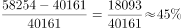；

2015年：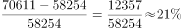；

2016年：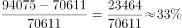；

2017年：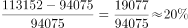。

2014-2017年固定互联网宽带接入用户数的增长速度分别为：

2014年：；

2015年：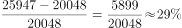；

2016年：；

2017年：。

2015年，移动宽带用户数的增长速度小于固定互联网宽带接入用户数的增长速度，错误；

B项：定位图形材料可知，2013年和2017年移动宽带用户数和固定互联网宽带接入用户数的总和分别为、，所以2017年比2013年增长了约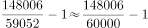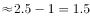倍，错误；

C项：定位图形材料可知，2013年和2017年固定互联网宽带接入用户数分别为18891、34854。代入年均增长率公式：（n为年份差），即，将代入，，与1.85非常接近，正确；

D项：由A项计算结果可知，2013-2017年固定互联网宽带接入用户数的年增长速度最快的年份是2015年，错误。

故正确答案为C。

备注：C项计算过难，可通过排除A、B、D三项选出正确答案。 

---

#### 第 2 题　qid 2188379 · 增长

2013一2017年固定互联网宽带接入用户数的年增长速度最快的年份是：

- **A**. 2014
- **B**. 2015　✅
- **C**. 2016
- **D**. 2017

**答案**：B

**官方解析**

根据题干“2013-2017年······增长速度最快的年份是”，可判定本题为一般增长率比较问题。由116题计算结果可知，2013-2017年固定互联网宽带接入用户数的年增长速度最快的年份是2015年。
故正确答案为B。

---

#### 第 3 题　qid 2188381 · 综合

移动宽带用户数超过固定互联网宽带接入用户数三倍的有几年？

- **A**. 1
- **B**. 2　✅
- **C**. 3
- **D**. 4

**答案**：B

**官方解析**

根据题干“······三倍的有几年”，可判定本题为现期倍数问题。定位图形材料可知，2013-2017年移动宽带用户数分别为40161、58254、70611、94075、113152，固定互联网宽带接入用户数分别为18891、20048、25947、29721、34854。则2013年-2017年的倍数分别为：2013年：，2014年：，2015年：，2016年：，2017年：。所以移动宽带用户数超过固定互联网宽带接入用户数三倍的有2年。

故正确答案为B。

---

#### 第 4 题　qid 2188386 · 增长

2013一2017年移动宽带用户数的年均增长率为：

- **A**. 

- **B**. 

- **C**. 

　✅
- **D**. 

**答案**：C

**官方解析**

根据题干“2013-2017年······年均增长率为”，可判定本题为年均增长率问题。由图形材料可知：2013年移动宽带用户数为40161，2017年移动宽带用户数为113152。代入公式：（n为年份差），即，优先选取整数代入，将C项代入，，与2.82非常接近，当选。

故正确答案为C。

---

#### 第 5 题　qid 2188387 · 增长

2013一2017年移动宽带用户数的年增长速度最快的年份是：

- **A**. 2014　✅
- **B**. 2015
- **C**. 2016
- **D**. 2017

**答案**：A

**官方解析**

根据题干“2013-2017年……年增长速度最快的年份是”，可判定本题为一般增长率比较问题。由116题计算结果可知移动宽带用户数增长速度最快的年份是2014年。
故正确答案为A。

---

### 材料 2

<b>根据以下资料，回答</b><b>121-125题。</b>

#### 第 6 题　qid 2188305 · 综合

假设该高校在2015年的教职工总数为2500人，其中女性占，则该校男博士人数为：

- **A**. 120
- **B**. 125
- **C**. 130
- **D**. 135　✅

**答案**：D

**官方解析**

根据题干“2015年……男博士人数”，结合表格材料给出男博士比率，可判定本题为现期比重问题。由题干可知，2015年总人数为2500人，女性占，故男性人数为人。定位表格材料可知，2015年男博士比率为，由可得，该校男博士人数=人。

故正确答案为D。

---

#### 第 7 题　qid 2188329 · 综合

2015年该高校的博士比率为：

- **A**. 

- **B**. 

- **C**. 

- **D**. 
不能确定
　✅

**答案**：D

**官方解析**

根据题干“2015年该高校的博士比率”，结合表格材料给出男博士和女博士两个部分的比率，可判定本题为混合比重问题。定位表格材料可知，2015年男博士比率为，女博士比率为，可知博士比率在到之间。由于本题无男女性职工总人数的具体数值或比例关系，故无法计算该高校的博士比率。

故正确答案为D。

---

#### 第 8 题　qid 2188341 · 综合

男女博士比率最接近的是哪一年？

- **A**. 2011
- **B**. 2012
- **C**. 2013　✅
- **D**. 2014

**答案**：C

**官方解析**

定位表格材料可知，男女博士比率差，2011年为，2012年为，2013年为，2014年为。比较可知，2013年比率差值最小，即男女博士比率最接近。

故正确答案为C。

---

#### 第 9 题　qid 2188348 · 增长

2011-2015年女博士比率相比上一年有所增加的有几年？

- **A**. 1
- **B**. 2
- **C**. 3　✅
- **D**. 4

**答案**：C

**官方解析**

定位表格材料可得：2011年-2015年女博士比率相比上一年有所增加的年份有2011年、2013年、2015年共3个年份。
故正确答案为C。

---

#### 第 10 题　qid 2188354 · 综合

下列不正确的是：

- **A**. 男博士比率下降的有2年
- **B**. 女博士比率下降的有2年
- **C**. 男博士比率和女博士比率增加最快的都是2017年
- **D**. 男博士比率和女博士比率同时下降的都是2011年　✅

**答案**：D

**官方解析**

A项：定位表格可得：男博士比率下降的有2012年、2013年共两个年份，正确；

B项：定位表格可得：女博士比率下降的只有2012年一个年份，错误；

C项：定位表格可得：2017年男博士比率增加，2016年男博士比率增加，2015年男博士比率增加，2014年男博士比率增加，2013年男博士比率增加，2012年男博士比率增加，2011年男博士比率增加，故2017年男博士比率增加最快。

2017年女博士比率增加，2016年女博士比率增加，2015年女博士比率增加，2014年女博士比率增加，2013年女博士比率增加，2012年女博士比率增加，2011年女博士比率增加，故2017年女博士比率增加最快。所以2017年男博士比率和女博士比率均为增加最快的年份，正确；

D项：2011年男博士比率和女博士比率均为上升，与选项描述不符，错误。

本题为选非题，故正确答案为B和D。

备注：根据考生回忆，B和D选项都不正确。

---

### 材料 3

根据以下资料，回答126～130题。

        2017年对主要国家和地区货物进出口额

#### 第 11 题　qid 2188307 · 综合

2017年进口额排前三的国家或地区进口额之和是：

- **A**. 44498亿元　✅
- **B**. 43689亿元
- **C**. 43889亿元
- **D**. 45689亿元

**答案**：A

**官方解析**

定位柱状图可得，进口额排前三的国家或地区分别是：欧盟、东盟和韩国。故2017年进口额排前三的国家或地区进口额之和是：亿元。

故正确答案为A。

---

#### 第 12 题　qid 2188318 · 增长

2017年进口额比上年增长和出口额比上年增长最快的国家或地区分别为：

- **A**. 东盟和巴西
- **B**. 印度和巴西　✅
- **C**. 巴西和印度
- **D**. 俄罗斯和巴西

**答案**：B

**官方解析**

定位折线图可得：进口额比上年增长最快的国家是印度；出口额比上年增长最快的国家是巴西。
故正确答案为B。

---

#### 第 13 题　qid 2188325 · 综合

2017年对我国的进出口总额最多的国家或地区为：

- **A**. 欧盟　✅
- **B**. 美国
- **C**. 东盟
- **D**. 中国香港

**答案**：A

**官方解析**

柱状图是我国对其它国家或地区的进、出口额，分别对应其它国家或地区对我国的出、进口额。定位柱状图数据可得：

欧盟对我国的进口额是25199亿元，对我国的出口额是16543亿元，则欧盟对我国的进出口总额是：亿元；

美国对我国的进口额是29103亿元，对我国的出口额是10430亿元，则美国对我国的进出口总额是：亿元；

东盟对我国的进口额是18902亿元，对我国的出口额是15942亿元，则东盟对我国的进出口总额是：亿元；

中国香港对我国进口额是18899亿元，对我国出口额是495亿元，则中国香港对我国的进出口总额是：亿元；

由上述数据可知欧盟是对我国的进出口总额最多的地区。

故正确答案为A。

---

#### 第 14 题　qid 2188336 · 综合

2017年我国进口额和出口额最多的国家或地区分别为：

- **A**. 欧盟和东盟
- **B**. 美国和东盟
- **C**. 欧盟和美国　✅
- **D**. 美国和欧盟

**答案**：C

**官方解析**

定位柱状图，2017年我国进口额最多的地区为欧盟，出口额最多的国家为美国。
故正确答案为C。

---

#### 第 15 题　qid 2188345 · 增长

2017年进口额比上年增长明显超过的国家或地区有几个？

- **A**. 2
- **B**. 3
- **C**. 4　✅
- **D**. 5

**答案**：C

**官方解析**

定位折线图，2017年进口额比上年增长明显超过20%的国家或地区有东盟、巴西、印度和俄罗斯，共有4个。
故正确答案为C。

---

### 材料 4

        2017年全国居民人均可支配收入25974元，比上年增长，扣除价格因素，实际增长，2017年全国居民人均消费支出18323元，比上年增长，扣除价格因素，实际增长。按常住地分，城镇居民人均消费支出24445元，增长，扣除价格因素，实际增长；农村居民人均消费支出10955元，增长，扣除价格因素，实际增长。恩格尔系数为，比上年下降，其中城镇为，农村为。

#### 第 16 题　qid 2188293 · 平均数

2016年城镇居民人均消费支出是多少元？

- **A**. 23482
- **B**. 23083　✅
- **C**. 17383
- **D**. 10257

**答案**：B

**官方解析**

根据题干“2016年城镇居民人均消费支出”，结合材料时间为2017年，可判定本题为基期计算问题。定位文字材料可得：“2017年城镇居民人均消费支出24445元，增长”。根据公式：，故2016年城镇居民人均消费支出元，与B项最接近。

故正确答案为B。

---

#### 第 17 题　qid 2188311 · 平均数

食品烟酒和居住分别占居民人均消费支出的百分比为：

- **A**. 
，
　✅
- **B**. 
，

- **C**. 
，

- **D**. 
，

**答案**：A

**官方解析**

根据题干“······占······的百分比”，可判定本题为现期比重问题。定位文字材料可得：“2017年全国居民人均消费支出18323元”；定位图形材料可得：食品烟酒5374元、居住4107元。根据公式：，故食品烟酒占居民人均消费支出的百分比，居住占居民人均消费支出的百分比，与A项最接近。

故正确答案为A。

---

#### 第 18 题　qid 2188320 · 平均数

2017年全国居民人均消费支出前三位的总和是多少元？

- **A**. 11567
- **B**. 11887
- **C**. 11980　✅
- **D**. 11998

**答案**：C

**官方解析**

定位图形材料可得：2017年全国居民人均消费支出前三位分别是：食品烟酒5374元、居住4107元、交通通信2499元。故前三位的总和元。

故正确答案为C。

---

#### 第 19 题　qid 2188335 · 平均数

2017年教育文化娱乐支出占居民人均可支配收入的百分比是：

- **A**. 

　✅
- **B**. 

- **C**. 

- **D**. 

**答案**：A

**官方解析**

根据题干“2017年······占······的百分比是”，结合材料时间2017年，判定本题为现期比重问题。定位文字材料可知，“2017年全国居民人均可支配收入25974元”；定位图形材料可知，教育文化娱乐支出2086元。故所求占比为。

故正确答案为A。

---

#### 第 20 题　qid 2188346 · 综合

2016年全国居民的恩格尔系数为：

- **A**. 

- **B**. 

- **C**. 

- **D**. 

　✅

**答案**：D

**官方解析**

定位文字材料可得：“2017年全国居民······恩格尔系数为，比上年下降”，故2016年全国居民的恩格尔系数为。

故正确答案为D。

备注：

1.恩格尔系数自身是率，一般不会讨论“率”的增长率，所以材料中的“比上年下降”应当理解为“下降0.8个百分点”。

2.资料分析中涉及的数据都是统计局发布的真实数据，2016年我国居民的恩格尔系数的官方数据就是。

---
