# 2018年421联考《行测》题（海南卷）（网友回忆版）

> 联考 · 2018 年 · 5 个模块 · 共 110 题

- [常识判断](#%E5%B8%B8%E8%AF%86%E5%88%A4%E6%96%AD) · 20 题
- [言语理解与表达](#%E8%A8%80%E8%AF%AD%E7%90%86%E8%A7%A3%E4%B8%8E%E8%A1%A8%E8%BE%BE) · 40 题
- [数量关系](#%E6%95%B0%E9%87%8F%E5%85%B3%E7%B3%BB) · 10 题
- [判断推理](#%E5%88%A4%E6%96%AD%E6%8E%A8%E7%90%86) · 25 题
- [资料分析](#%E8%B5%84%E6%96%99%E5%88%86%E6%9E%90) · 15 题

---

## 常识判断

### 第 1 题　qid 2187483 · 地理国情

2017年，在广东珠海成功完成首飞的我国首款大型灭火/水上救援水陆两栖飞机被命名为：

- **A**. 鲲龙AG600　✅
- **B**. 蛟龙ZH215
- **C**. 精卫CR919
- **D**. 鲲鹏GD311

**答案**：A

**官方解析**

本题考查科技常识。
2017年12月24日上午9时39分许，由航空工业自主研发的我国首款大型水陆两栖飞机——“鲲龙”AG600在广东珠海金湾机场成功首飞。
A项正确，鲲龙AG600是我国为满足森林灭火和水上救援的迫切需要，首次研制的大型特种用途民用飞机，是我国首款大型灭火/水上救援水陆两栖飞机。
B项错误，蛟龙号是一艘由中国自行设计、自主集成研制的载人潜水器。
C项错误，无精卫CR919这种装备表述。
D项错误，鲲鹏号，是中国自主研发的新一代重型军用运输机，不符合题干水陆两栖飞机的表述。
故正确答案为A。

---

### 第 2 题　qid 2187462 · 人文常识

在铁饼比赛中，运动员会首先手握铁饼高速旋转几圈后再将其掷出。这样做，主要是为了让铁饼：

- **A**. 获得更大的角加速度
- **B**. 获得更大的角速度　✅
- **C**. 获得更大的加速度
- **D**. 受到更大的力

**答案**：B

**官方解析**

本题主要考查物理常识。

A项错误，角加速度，是描述物体角速度的大小和方向对时间变化率的物理量。

B项正确，角速度，是以弧度为单位的圆（一个圆周为,即：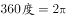)，在单位时间内所走的弧度。人体在旋转几圈后，会加大角速度，从而加大铁饼投掷的初速度，这样铁饼会投掷得更远。

C项错误，加速度，是速度变化量与发生这一变化所用时间的比值，是描述物体速度变化快慢的物理量。

D项错误，铁饼在脱离手后，只受重力和空气阻力，运动员高速旋转几圈后再将铁饼掷出，是加大铁饼的角速度。

故正确答案为B。

---

### 第 3 题　qid 2187472 · 人文常识

平时人们说“他们一个唱红脸，一个唱白脸”。这其中，“唱白脸”的意思是：

- **A**. 扮演正面人物
- **B**. 充当反面角色　✅
- **C**. 故作温文尔雅
- **D**. 假装暴躁易怒

**答案**：B

**官方解析**

本题考查人文常识。
“一个唱红脸一个唱白脸”比喻在解决矛盾冲突的过程中，一个充当友善或令人喜爱的角色，即正面角色；另一个充当严厉或令人讨厌的角色，即反面角色。“红脸”和“白脸”的表述源自于京剧中的脸谱。
京剧脸谱色彩十分讲究，不同含义的色彩绘制在不同图案轮廓里，人物就被性格化了。在京剧脸谱中，红色代表忠勇侠义，多为正面角色。如：关羽。黑色代表直爽刚毅，勇猛而智慧。如：包公。白色代表阴险奸诈，刚愎自用。如：曹操。紫色代表刚正威武，不媚权贵。如：荆轲。“唱白脸”在京剧中充当的是典型的反面角色。
故正确答案为B。

---

### 第 4 题　qid 2187478 · 人文常识

下面场景不符合我国医务常识的是：

- **A**. 婴儿患吸入性肺炎，医疗人员在对其的治疗中使用了抗生素药物
- **B**. 小红需要大量输血，但医生拒绝了她的直系血亲输血给她的要求
- **C**. 医生严正拒绝向孕妇家属透露腹中胎儿的性别信息
- **D**. 医生抽取了小张100立方厘米的血液用于常规体检　✅

**答案**：D

**官方解析**

本题考查科技常识。

A项正确，婴儿吸入性肺炎是指婴儿意外吸入酸性物质，如食物、胃内容物以及其他刺激性液体等，引起的化学性肺炎，严重者可发生呼吸衰竭或呼吸窘迫综合征。治疗给予对症治疗，吸氧，取出异物等，出现继发细菌感染给予抗生素治疗。

B项正确，根据输血原则，直系亲属间输血有时会发生一种严重的输血反应，称为输血相关性移植物抗宿主病（TA-GVHD），这种输血反应虽然发病率低，但死亡率极高。故医生的做法是正确的。

C项正确，《中华人民共和国母婴保健法》（简称《母婴保健法》）在第三十二条第二款明确规定：“严禁采用技术手段对胎儿进行性别鉴定，但医学上确有需要的除外。”

D项错误，常规体检血常规抽取的血量一般在2-20毫升，最多不会超过50毫升，选项中100立方厘米是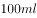，不符合医学常识。

本题为选非题，故正确答案为D。

---

### 第 5 题　qid 2188660 · 人文常识

下列说法错误的是：

- **A**. 获得过夏冬两季奥运会主办资格的城市有北京、洛杉矶两个　✅
- **B**. 挪威、美国、德国、加拿大是近三届冬季奥运会的“奖牌大户”
- **C**. 短道速滑、自由式滑雪、冰壶是平昌冬季奥运会的正式比赛项目
- **D**. 冬季奥运会一般与男子足球世界杯同年举行，与夏季奥运会间隔2年

**答案**：A

**官方解析**

本题考查历史常识，主要涉及奥运会的相关知识。
A项错误，北京是唯一获得过夏冬两季奥运会主办资格的城市，分别是2008年北京夏季奥运会和2022年北京&张家口冬季奥运会。洛杉矶未举办过冬季奥运会，至今也未获得过冬季奥运会主办资格。
B项正确，2010年温哥华冬奥会奖牌榜前四名为美国、德国、加拿大、挪威，2014年索契冬奥会奖牌榜前四名为俄罗斯、挪威、加拿大和美国，2018年平昌冬奥会奖牌榜前四名为挪威、德国、加拿大和美国。因此，挪威、美国、德国、加拿大是近三届冬季奥运会的“奖牌大户”。
C项正确，平昌冬奥会比赛共分7大项15个分项以及102个小项，包括短道速滑、花样滑冰、自由式滑雪、冰壶等运动。
D项正确，冬季奥运会从1994年起与夏季奥运会分开，每两年间隔举行，1992年冬季奥运会是最后一届与夏季奥运会同年举行的冬奥会，每四年一届。足球世界杯，每四年一届，一般与冬季奥运会同年举行。
本题为选非题，故正确答案为A。

---

### 第 6 题　qid 2188658 · 人文常识

下列说法正确的是：

- **A**. 号外是指为及时报道发生的重大新闻事件而临时编印的、不列入原有编号的报刊　✅
- **B**. 英国的《泰晤士报》、法国的《图片报》、德国的《太阳报》均是世界著名的报纸
- **C**. 报纸按照用途可分为：早（晨）报、晚报、商报、都市报、时报等
- **D**. 报纸版面之间的中间地带（即“中缝”），不可出现任何文字

**答案**：A

**官方解析**

本题主要考查文化常识。
A项正确，号外是指定期出版的报刊，在前一期已出版，下一期尚未出版的一段时间内，对发生的重大新闻和特殊事件，为迅速及时地向读者报道而临时编印的报刊，其不列入原有的编号。
B项错误，《泰晤士报》、《图片报》、《太阳报》均是世界著名的报纸，但《图片报》是德国发行量最大的报纸，而不是法国，《太阳报》是英国销量最高的报纸，而不是德国。
C项错误，根据报纸的出刊时间，可将其分为日报、早报、晚报和星期刊报；而根据报纸的侧重内容，可将其分为教育报、军事报、学生报、学术报、财经报、农业报、旅游报等。
D项错误，中缝是指报纸相邻两个版面中间的空隙，即左右两版之间的狭长部分，一般刊载广告、启事或某些资料，可以出现文字。
故正确答案为A。

---

### 第 7 题　qid 2188657 · 地理国情

下列关于我国2017年时事的表述错误的是：

- **A**. 甲骨文成功入选《世界记忆名录》
- **B**. 全国粮食总产量达61791万吨，属历史第二高产年
- **C**. 截至2017年年底，全国湖泊的“湖长制”已全面建立，并形成了以地方政府负责制为核心的责任体系　✅
- **D**. 12月举行的中央经济工作会议提出，推动高质量发展是当前和今后一个时期确定发展思路、制定经济政策、实施宏观调控的根本要求

**答案**：C

**官方解析**

本题主要考查时政。

A项正确，2017年10月30日，联合国教科文组织发布消息，我国申报的甲骨文项目顺利通过联合国教科文组织世界记忆项目国际咨询委员会的评审，入选《世界记忆名录》。

B项正确，根据《国家统计局关于2017年粮食产量的公告》，全国粮食总产量61791万吨（12358亿斤），比2016年增加166万吨（33亿斤），增长。粮食生产再获丰收，属历史上第二高产年。

C项错误，中共中央办公厅、国务院办公厅印发的《关于在湖泊实施湖长制的指导意见》指出：各省要将本行政区域内所有湖泊纳入全面推行湖长制工作范围，到2018年年底前在湖泊全面建立湖长制。建立健全以党政领导负责制为核心的责任体系，落实属地管理责任。

D项正确，2017年12月18日至20日召开的中央经济工作会议指出：推动高质量发展是当前和今后一个时期确定发展思路、制定经济政策、实施宏观调控的根本要求，必须加快形成推动高质量发展的指标体系、政策体系、标准体系、统计体系、绩效评价、政绩考核，创建和完善制度环境，推动我国经济在实现高质量发展上不断取得新进展。

本题为选非题，故正确答案为C。

---

### 第 8 题　qid 2187476 · 人文常识

在我国古代，很多事物往往被人们寄予特定的寓意，下列事物及其寓意对应错误的是：

- **A**. 青鸟——友情　✅
- **B**. 桑梓——故乡
- **C**. 仙鹤——长寿
- **D**. 杨柳——离别

**答案**：A

**官方解析**

本题考查人文常识。
A项错误，“青鸟”的典故出自《山海经》。青鸟代表送达书信、消息的鸟，也可以说是信使，在古诗中常常用来指爱情信使，最著名的就是李商隐《无题·相见时难别亦难》中“蓬山此去无多路，青鸟殷勤为探看”的诗句。
B项正确，桑树的叶、果、树干、枝条、皮各有用途，梓树是一种速生树种，在古代还常被作为薪炭用材。所以，古代的人们经常在自己家的房前屋后植桑栽梓，故“桑梓”就成了故乡的象征。
C项正确，鹤为长寿仙禽，具有仙风道骨，据说，鹤寿无量，与龟一样被视为长寿之王，“仙鹤”就成了长寿的象征。
D项正确，“杨柳”最早就是柳树的意思。一到春天，柳树就会飞絮，很容易引起古人的伤感。“柳”即是“留”，折柳送别是古代的一种风俗，在抒发离愁别绪的诗词里经常出现，故“杨柳”就成了离别的象征。
本题为选非题，故正确答案为A。

---

### 第 9 题　qid 2187492 · 人文常识

日常中，垃圾一般分为：可回收垃圾、有毒垃圾、厨余垃圾和其他垃圾（不可回收垃圾）。据此，下列说法错误的是：

- **A**. 
可回收垃圾、其他垃圾的标志分别为

- **B**. 
充电电池、废旧灯管灯泡属于有毒垃圾

- **C**. 
受污染的纸张、过期药品等都应归为其他垃圾
　✅
- **D**. 
厨余垃圾包括剩饭菜、过期食品、菜梗菜叶等废弃的生热食物残渣

**答案**：C

**官方解析**

本题考查科技常识。

A项正确，可回收垃圾表示适宜回收和资源利用的垃圾，主要包括废纸、塑料、玻璃、金属和布料。其标志为；其他垃圾包括砖瓦陶瓷、渣土、瓷器碎片等难以回收的废弃物。其标志为。

B项正确，有毒垃圾表示含有毒害物质，需要特殊安全处理，会对人体健康或自然环境造成直接或潜在危害。包括废电池、废灯管、废灯泡、废溶剂及其包装物、废杀虫剂、消毒剂、过期药品等。充电电池、废旧灯管灯泡会对自然环境造成直接或潜在危害，均属于有毒垃圾。

C项错误，其他垃圾危害较小，但无再次利用的价值。受污染的纸张无再次利用的价值，可以归入其他垃圾；过期药品可能会污染土地、水源，对环境或者人体健康造成危害，故属于有毒垃圾，不能归入其他垃圾。

D项正确，厨余垃圾是居民日常生活及食品加工、饮食服务等活动中产生的垃圾，包括废弃的菜梗菜叶、剩饭、剩菜、果皮、蛋壳、变质的过期食品等。

本题为选非题，故正确答案为C。

---

### 第 10 题　qid 2187493 · 人文常识

最近几年，无需火电的即热型快餐备受人们欢迎。这种即热型快餐一般由两层铝箔（锡箔）纸包装构成，内层用于盛放需加热的食物，外层用于盛放加热材料。据此，下列最可能成为这种快餐加热材料的是：

- **A**. 浓硫酸和水
- **B**. 食盐和水
- **C**. 石灰石和水
- **D**. 生石灰和水　✅

**答案**：D

**官方解析**

本题考查即热型快餐的加热材料，即分析哪一项的物质能通过化学反应放热。
A项，浓硫酸溶于水会有热量放出，但是浓硫酸有强腐蚀性，所以不能作为快餐加热材料，排除。
B项，食盐，主要成分是氯化钠，其溶于水没有明显的热量放出，所以不能作为快餐加热材料，排除。
C项，石灰石，主要成分是碳酸钙，其不溶于水，所以与水混合不会有明显的热量放出，故不能作为快餐加热材料，排除。
D项，生石灰，主要成分是氧化钙，生石灰与水反应生成氢氧化钙，并放出热量，可以作为快餐加热材料，正确。
故正确答案为D。

---

### 第 11 题　qid 2187934 · 人文常识

下列说法错误的是：

- **A**. 中关村位于北京市，是我国最早的高新区
- **B**. 深圳是我国改革开放建立的第一个经济特区
- **C**. 截至2017年年底，我国共有上海浦东新区、天津滨海新区、重庆两江新区及河北雄安新区4个国家级新区　✅
- **D**. 开发区包括经济技术开发区、保税区、高新技术产业开发区、国家旅游度假区等

**答案**：C

**官方解析**

本题主要考查国情社情的相关知识。
A项正确，中关村科技园，位于北京市海淀区，是中国第一个国家级高新技术产业开发区，被誉为“中国硅谷”。
B项正确，1980年8月，中国政府正式批准建立深圳经济特区，随后又在珠海、汕头、厦门、海南建立特区。因此深圳是我国改革开放建立的第一个经济特区。
C项错误，截至2017年年底，中国国家级新区总数共19个，分别是上海浦东新区、天津滨海新区、重庆两江新区、浙江舟山群岛新区、兰州新区、广州南沙新区、陕西西咸新区、贵州贵安新区、青岛西海岸新区、大连金普新区、四川天府新区、湖南湘江新区、南京江北新区、福建福州新区、云南滇中新区、哈尔滨新区、长春新区、江西赣江新区、河北雄安新区。
D项正确，开发区是指由国务院和省、自治区、直辖市人民政府批准在城市规划区内设立的经济技术开发区、保税区、高新技术产业开发区、国家旅游度假区等实行国家特定优惠政策的各类开发区。
本题为选非题，故正确答案为C。

---

### 第 12 题　qid 2187469 · 人文常识

下列说法错误的是：

- **A**. 花样游泳极具观赏性，被誉为“水上芭蕾”
- **B**. 现代铁人三项包括：游泳、自行车及跑步
- **C**. 正式的马术比赛不按选手性别分类，男女选手同场竞技
- **D**. 投标枪起源于石器时代的渔猎活动，被誉为“运动之母”　✅

**答案**：D

**官方解析**

A选项正确。花样游泳被誉为“水上芭蕾”。因为花样游泳融合了难度、速度和现场表现力，极具观赏性。同时又是集舞蹈、体操、游泳等项目于一体的竞技体育项目，完美地将游泳与音乐、舞蹈等艺术形式结合在一起，因此极具观赏性。自上世纪八十年代成为奥运会正式项目后，在每一届奥运会上都是电视收视率最高和现场观众最欢迎的项目之一，同样也是每届世界游泳锦标赛最受观众欢迎的项目之一。
B选项正确。铁人三项运动诞生于夏威夷，属于新兴综合性运动竞赛项目。比赛由天然水域游泳、公路自行车、公路长跑三个项目按顺序组成，运动员需要一鼓作气赛完全程。
C选项正确。马术运动是最为古老的运动之一，进入奥运会的历史也已经超过了百年，在奥运会中马术项目总共有3个项目6枚金牌，包括盛装舞步赛、障碍赛和三日赛，马术也是奥运会上唯一男女同场竞技的项目，不论性别，只看最后的成绩。
D选项错误。标枪是一种带镞的短投掷梭标，又称“投枪”、“投矛”、“短矛”等。在旧石器时代它就被用作重要的狩猎工具。但是被誉为“运动之母”的却不是标枪，而是田径运动。之所以称田径是“运动之母”，是因为田径中的走、跑、跳、投是运动的基础。
本题为选非题，故正确答案为D。

---

### 第 13 题　qid 2187486 · 人文常识

因意外事故，小明的小肠被切除1米，他因此患上了营养不良症。对此，下列说法正确的是：

- **A**. 小肠是人体食物消化、废物排泄的主要器官，其长度影响食物消化和废物排出
- **B**. 小肠是人体食物消化和营养吸收的主要器官，其长度影响消化和吸收　✅
- **C**. 小肠是人体食物储存的主要器官，其长度缩短后影响了食物的储存
- **D**. 小明的营养不良症与小肠的长短无关

**答案**：B

**官方解析**

本题考查生物常识。
就位置来讲，小肠位于腹中，上端接幽门与胃相通，下端通过阑门与大肠相连，一般根据形态和结构变化分为三段，分别为十二指肠、空肠和回肠，是食物消化吸收的主要器官，而不是废物排泄的主要器官，也不是人体食物储存的主要器官。
就构成来讲，小肠由一层细胞组成，其管壁由黏膜、黏膜下层、肌层和浆膜构成。其中小肠粘膜，特别是空肠，具有许多环状皱襞和绒毛，大大扩大了粘膜的表面积，有利于营养物质的消化和吸收，切除部分小肠直接影响到食物的消化和营养的吸收。因此，B项正确，ACD选项说法错误。
故正确答案为B。

---

### 第 14 题　qid 2187490 · 人文常识

声音的音调、响度分别与其频率、振幅成正比。下图是甲乙丙三人的声音在示波器上相同量纲下显示的波形。据此，下列说法<b>错误</b>的是：

- **A**. 甲、乙音调相同
- **B**. 乙、丙响度相同
- **C**. 丙的响度大于甲
- **D**. 乙的音调高于丙　✅

**答案**：D

**官方解析**

音调指声音的高低，是由发声体振动的频率决定，频率越高，音调越高；频率表示物体振动的快慢，物体振动的越快，频率越大。响度指声音的强弱，是由发声体振动的振幅决定，振幅越大，响度越大。
A项正确，对比甲图乙图，可以看出波峰出现的个数相同，都是3个，说明振动快慢（频率）相同，故甲、乙音调相同。

B项正确，对比乙图丙图，可以看出波振动的幅度相同，即振幅相同，都占满了整个框，故乙、丙响度相同。
C项正确，对比甲图丙图，可以看出丙振动的幅度大于甲振动的幅度，故丙的响度大于甲。
D项错误，对比乙图丙图，可以看出丙的频率高于乙的频率，故丙的音调高于乙。
本题为选非题，故正确答案为D。

---

### 第 15 题　qid 2187510 · 人文常识

下列选项中，最直接体现了生命新陈代谢的是：

- **A**. 长江后浪推前浪，一浪高过一浪
- **B**. 今春香肌瘦几分？缕带宽三寸　✅
- **C**. 江畔何人初见月？江月何年初照人
- **D**. 中庭地白树栖鸦，冷露无声湿桂花

**答案**：B

**官方解析**

本题考查人文常识。
A项错误，“长江后浪推前浪，一浪高过一浪”，比喻事物的不断前进，多指新人新事代替旧人旧事，没有直接体现生命新陈代谢。
B项正确，“今春香肌瘦几分？缕带宽三寸”，出自元代王实甫的《十二月过尧民歌·别情》，意思是今年春天，我的身体瘦了多少，看衣带都宽出了三寸。诗句描写的身体消瘦，直接体现了生命新陈代谢。
C项错误，“江畔何人初见月，江月何年初照人”，出自唐代张若虚的《春江花月夜》，意思是谁在江畔第一次看到月亮，而江上的月亮又是哪时开始朗照人呢？体现了诗人面对这一轮江月深深地思考，满怀感慨和迷惘，没有直接体现生命新陈代谢。
D项错误，“中庭地白树栖鸦，冷露无声湿桂花”出自唐代王建的《十五夜望月寄杜郎中》，意思是庭院中月映地白树栖昏鸦，那寒露悄然无声沾湿桂花，描绘了自然现象，并没有直接体现生命新陈代谢。
故正确答案为B。

---

### 第 16 题　qid 2187463 · 人文常识

历史上，不少豪放派诗人（词人）有婉约佳作，而婉约派也不乏豪放名句，这是一种有趣的“反差”。下列选项中，不能体现这种“反差”的是：

- **A**. 李清照：生当作人杰，死亦为鬼雄
- **B**. 晏殊：无可奈何花落去，似曾相识燕归来　✅
- **C**. 苏轼：春宵一刻值千金，花有清香月有阴
- **D**. 辛弃疾：众里寻他千百度，蓦然回首，那人却在，灯火阑珊处

**答案**：B

**官方解析**

本题考查文学常识。
A项正确，李清照，宋代女词人，婉约词派代表，有“千古第一才女”之称。“生当作人杰，死亦为鬼雄”出自李清照《夏日绝句》，意思是活着就要当人中的俊杰，死了也要做鬼中的英雄。这句诗反映出背负着亡国之恨的李清照对金人入侵和一味求安、南渡保全自己的南宋政府表示了强烈的愤慨。因此，与李清照婉约的风格不同。
B项错误，晏殊，北宋名相，婉约派著名词人。“无可奈何花落去，似曾相识燕归来”出自《浣溪沙·一曲新词酒一杯》，意思是那花儿落去我也无可奈何，那归来的燕子似曾相识。渗透在这句诗中的是一种混杂着眷恋和怅惆，既似冲澹又似深婉的人生怅触。因此，与晏殊婉约派的风格相符。
C项正确，苏轼，北宋文学家，豪放派主要代表。“春宵一刻值千金，花有清香月有阴” 苏轼的《春宵》，意思是春天的夜晚，即便是极短的时间也十分珍贵。花儿散发着丝丝缕缕的清香，月光在花下投射出朦胧的阴影。诗句华美而含蓄，耐人寻味，含蓄委婉地透露出作者对醉生梦死、贪图享乐、不惜光阴的人的深深谴责。因此，与苏轼豪放的风格不同。
D项正确，辛弃疾，南宋豪放派词人。“众里寻他千百度，蓦然回首，那人却在灯火阑珊处”出自辛弃疾的《青玉案·元夕》，意思是偶一回头，却发现自己的心上人站立在昏黑的幽暗之处。诗人通过此诗反映出自己当时不受重用，文韬武略施展不出，心中怀着一种无比惆怅之感，所以只能在一旁孤芳自赏。因此，与辛弃疾豪放的风格不同。
本题为选非题，故正确答案为B。

---

### 第 17 题　qid 2187494 · 科技常识

下列选项中的现象包含了相同物理原理的是：

- **A**. 搓手取暖：钻木采火　✅
- **B**. 摇扇纳凉：冰镇降温
- **C**. 气球升空：桂花飘香
- **D**. 水往低流：唱响全场

**答案**：A

**官方解析**

A项正确，冬天搓手取暖和钻木采火都是利用摩擦，使得机械能转换为内能。
B项错误，夏天摇扇体现的是空气的流动，空气的流动使人体表面的汗液蒸发加快，由于蒸发吸热，所以人感到凉快；冰镇降温体现的是熔化原理，因为冰在空气中会熔化，而熔化需要吸热，吸收人体的热量，让病人降温。 
C项错误，气球升空体现的是浮力原理，桂花飘香体现的是分子在不停地做无规则运动。
D项错误，水受到地球磁场引力的作用，引力的方向是竖直向下的；唱响全场体现的是声音通过介质不断传播。
故正确答案为A。

---

### 第 18 题　qid 2188866 · 人文常识

下图为张三、李四间唯一的有效借款凭据。2017年4月20日，李四接受张三在当日还款的建议。据此，下列说法正确的是:

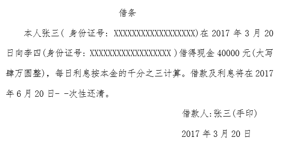

- **A**. 张三需偿还本金及3个月的利息
- **B**. 张三需偿还本金及2个月的利息
- **C**. 张三需偿还本金及1个月的利息　✅
- **D**. 张三只需偿还本金

**答案**：C

**官方解析**

本题考查民法常识。《合同法》第二百零八条规定：“借款人提前偿还借款的，除当事人另有约定的以外，应当按照实际借款的期间计算利息。”本题中，经李四同意，张三于2017年4月20日提前偿还李四借款，且题干信息没有显示两人关于利息有特别约定，故张三应当按照实际借款的期间（1个月）计算利息。因此，A、B、D三项不符合题意。
故正确答案为C。

---

### 第 19 题　qid 2187496 · 科技常识

下列最可能涉及对物质化学性质的描写的是：

- **A**. 白蜡的燃点低
- **B**. 水的比热容高
- **C**. 橡胶耐磨性佳
- **D**. 茶叶除脂效果好　✅

**答案**：D

**官方解析**

本题考查科技常识。
A项错误，白蜡的燃点低体现的是物质的物理性质，燃点是指可燃物质在空气充足的条件下，达到某一温度时与火源接触即可着火，并在移去火源后继续燃烧的最低温度。
B项错误，水的比热容高体现的是物质的物理性质，比热容是热力学中常用的一个物理量，表示物体吸热或散热能力。
C项错误，橡胶耐磨性佳体现的是物质的物理性质，耐磨性是指抵抗某种机械作用的能力。
D项正确，茶叶除脂效果好体现的是物质的化学性质，茶叶中富含氨基酸及纤维素、脂肪酶等，能对脂肪产生分解作用。
故正确答案为D。

---

### 第 20 题　qid 2187491 · 人文常识

爱因斯坦有言：在真理和认识方面，任何以权威者自居的人，必将在上帝的戏笑中垮台！
对此，下列理解正确的是：
①爱因斯坦否认世界是客观的
②爱因斯坦否认物质世界存在规律性
③爱因斯坦倾向于“意识会随着物质世界的发展而不断发展”的观点
④爱因斯坦并不一定是有神论者，他所说的上帝不是人格化的神

- **A**. ①②
- **B**. ②③
- **C**. ③④　✅
- **D**. ①④

**答案**：C

**官方解析**

本题考查政治常识。
马克思主义认为：认识运动是一个实践、认识、再实践的不断反复的过程。一个正确的认识往往要经过多次反复以达到预期的结果为标志算完成，认识运动是无限发展、没有终点的。
真理是人们对客观事物及其规律的正确反映。真理具有客观性，客观性是真理的根本属性。真理具有具体性，任何真理都是在一定时间、地点、条件下主观与客观的符合，它受条件的制约，并随条件的变化而变化，一切以时间、地点和条件为转移。
爱因斯坦的名言“在真理和认识方面，任何以权威者自居的人，必将在上帝的戏笑中垮台”表述了认识是不断运动发展的，真理具有客观性与具体性。
①②表述错误，题干信息既不能推断出爱因斯坦否认世界是客观的，也不能得出爱因斯坦否认物质世界存在的规律性。
③表述正确，意识是随着物质世界的发展而不断变化发展的，任何“权威者”的认识都不是唯一的，永恒不变的，从“任何······，必将······垮台”等词就可以看出爱因斯坦倾向于“意识会随着物质世界的发展而不断发展”的观点。
④表述正确，题干中的“上帝”并非是人格化的神，爱因斯坦仅仅只是以此来说明在真理和认识方面，没有所谓的“权威者”。
故正确答案为C。

---

## 言语理解与表达

### 第 1 题　qid 2187565 · 逻辑填空

汉字自从成了汉语的书面符号，就一直是中华民族文化最重要的载体。它之所以能够              ，正是因为它的生命力来自它的内部结构。汉字是形音义三位一体的结构体，其中，表意是它的主体功能。稳定的形、义使它超越了表音能力的缺陷，尽管古今汉语和南北方言语音发生了重大变化，人们还能“由文知义”。于是，隔代的人可以           书面阅读，异地的人可以借助文字沟通。
依次填入划横线部分最恰当的一项是：

- **A**. 长盛不衰  共享　✅
- **B**. 宝刀未老  超越
- **C**. 永葆青春  凭借
- **D**. 经久不衰  信赖

**答案**：A

**官方解析**

第一空，根据“一直”“正是因为它的生命力来自它的内部结构”可知，横线处所填成语应体现出长时间保持生命力之意，A项“长盛不衰”和D项“经久不衰”均能体现长时间保持旺盛的势头，符合文意，保留。B项 “宝刀未老”形容人到老年还依然威猛，不减当年，文中没有提到“年老”之意，排除；C项“永葆青春”是指长久保持年轻，文中也没有“年轻”的含义，排除。
第二空，“于是”表示结果，因为人们可以“由文知义”，所以隔代人也能跨越古今共同阅读，A项“共享”即共同分享，体现出通过汉字，人们可以阅读古今书籍，当选；D项“信赖”侧重于信任，文段并无体现，排除。
故正确答案为A。
【文段出处】《汉字的历史发展和现实观照》

---

### 第 2 题　qid 2188858 · 逻辑填空

地域可以        ，职务可以        ，职级可以        ，但党员的身份始终不动。不管身处何地、身居何位，都理应“牢记自己的第一身份是共产党员，第一职责是为党工作，做到忠诚于组织，任何时候都与党同心同德”。
依次填入划横线部分最恰当的一项是：

- **A**. 变动  调动  流动
- **B**. 转动  变动  流动
- **C**. 调动  变动  流动
- **D**. 流动  变动  调动　✅

**答案**：D

**官方解析**

本题重点考查形近词的搭配。
第一空，搭配“地域”，表达党员干部可以在不同地域之间变动，因此可排除B项“转动”，无法表达此意。
第二空，搭配“职务”，“调动”，“变动”均可。
第三空，搭配“职级”，在单位当中的职级有严格的评定标准，其调整也需要遵循一定的规则，无法如行云流水般“流动”，而是按照规则进行“调动”，因此，第三空D项更为准确，排除A、C两项。
故正确答案为D。
【文段出处】《党员在哪儿都是党员》

---

### 第 3 题　qid 2187561 · 逻辑填空

与先进轨道交通国家比，国内APM等自动导向轨道交通系统占比还较小；因此，在未来的城市轨道交通建设中，将形成包括APM在内的多制式轨交系统。那么_______，鉴于APM300型无司机胶轮列车“小编组、大密度、高灵活”的特点，将来势必在国内机场摆渡线、城市远郊社区轨交线、景区及大型娱乐园观光线，乃至三四线城市轨道交通系统中_______，遍地开花。
依次填入划横线部分最恰当的一项是：

- **A**. 莫此为甚  大展拳脚
- **B**. 毋庸置疑  大马金刀
- **C**. 未定之天  大有可观
- **D**. 不言而喻  大有作为　✅

**答案**：D

**官方解析**

第一空，由“在未来的城市轨道交通建设中，将形成包括APM在内······”、“鉴于APM······的特点，将来势必在······中遍地开花”可知，横线处表示作者对APM300型列车发展前景持积极肯定的态度，B项“毋庸置疑”指事实明显或理由充分，不必怀疑；D项“不言而喻”指不用说就可以明白，形容道理很浅显，均符合文意。A项“莫此为甚”没有什么能超过这个的了，多指不良倾向或形势严重，与文段感情色彩不符，排除；C项“未定之天”比喻事情还没有着落或还没有决定，与文意相悖，排除。
第二空，横线处所填成语与“遍地开花”构成并列关系，含义相近，“遍地开花”比喻好的事物到处涌现或普遍发展，因此横线处也要表达出发展好的意思，D项“大有作为”指能够充分发挥才能，做出很大成绩，符合文意，当选。B项“大马金刀”形容豪爽，气派大，或形容说话直率锋利，不留情面，无法与“遍地开花”构成并列，排除。 
故正确答案为D。

---

### 第 4 题　qid 2187613 · 逻辑填空

汉武帝时，私学在官学的影响下得到进一步的发展，汉代私人讲学的事例                ，读书人学成即授徒相当普遍。而家学，是私学的特殊力量。家学所传习的内容很        ，并不仅限于经学范畴。
依次填入划横线部分最恰当的一项是：

- **A**. 不一而足  宽宏
- **B**. 不胜枚举  宽泛　✅
- **C**. 比比皆是  广阔
- **D**. 数不胜数  广泛

**答案**：B

**官方解析**

本题可从第二空入手，横线处搭配“内容”，根据“并不仅限于经学范畴”可知，横线处表达的意思是家学传习的内容很广，B项“宽泛”、D项“广泛”均指涉及的面广、范围大，符合文意；A项“宽宏”指心胸开阔，度量大，常搭配人的胸怀，排除；C项“广阔”形容宽广、无边无际，常搭配草原、平原等，排除。
第一空，根据“读书人学成即授徒相当普遍”可知，横线处所填词语表示事例特别多之意，B项“不胜枚举”、D项“数不胜数”从意思上均可，都表示数量多，但是横线处搭配“事例”，即例子，而B项“不胜枚举”中的“举”与“事例”对应更恰当，故择优选择B项。
故正确答案为B。
【文段出处】《汉代家学的教育地位与影响》

---

### 第 5 题　qid 2187572 · 逻辑填空

生态好转，意味着我们能遏制库姆塔格大沙漠           的脚步，让沙漠明珠——月牙泉依然           在戈壁中，让弥足珍贵的莫高窟不会再次受到伤害。
依次填入划横线部分最恰当的一项是：

- **A**. 侵蚀  摇曳
- **B**. 侵吞  流淌
- **C**. 吞并  闪烁
- **D**. 吞噬  镶嵌　✅

**答案**：D

**官方解析**

本题可从第二空入手，文段中将月牙泉比作沙漠明珠，则横线处所填词语用以修饰“明珠”。C项“闪烁”指光亮晃动不定，忽明忽暗；D项“镶嵌”指把一物体嵌入另一物体内，作为装饰。二者置于此处，均能体现月牙泉这一明珠为戈壁点缀，符合文意，保留。A项“摇曳”形容东西在风中轻轻摆动的样子；B项“流淌”形容液体流动，二者置于此处，均与“明珠”搭配不当，排除。
第一空，横线处所填词语搭配“大沙漠”，以体现沙漠扩大的特点。D项“吞噬”比喻消融，湮灭，符合文意，当选。C项“吞并”指并吞、兼并，常搭配公司、行业等，与“大沙漠”搭配不当，且文段没有体现兼并的意思，排除。
故正确答案为D。
【文段出处】《哈拉诺尔湖干涸六十年重现碧波，来敦煌戈壁滩看“海”了！》

---

### 第 6 题　qid 2188053 · 逻辑填空

明星天价片酬已不是一件新鲜事。拍一部电影、出演一部电视剧动辄千万的酬劳一再受公众质疑和           。片酬虚高和漫天要价等不良现象，水涨船高式地搅乱着整个行业秩序。明星作为公众人物，光鲜的生活本就在聚光灯下，天价片酬以及由此带来的奢华生活不仅令公众           ，也有损整个社会的公平感和获得感。
依次填入划横线部分最恰当的一项是：

- **A**. 批评  不齿
- **B**. 揶揄  反感
- **C**. 诟病  侧目　✅
- **D**. 审视  惊心

**答案**：C

**官方解析**

第一空，“和”表示并列，故横线处应与“质疑”语义相近。A项“批评”指对缺点和错误提出意见，C项“诟病”意思是指出他人的过失而加以非议，均符合文意，保留。B项“揶揄”意为嘲笑，D项“审视”表示仔细地看，反复地分析，两项均无法与“质疑”形成并列关系，排除。
第二空，根据文段“有损整个社会的公平感和获得感”可知，公众对明星的天价片酬带来的奢华生活感到愤怒、不平衡，C项“侧目”指斜着眼睛看，表示愤怒，符合文意，当选。A项“不齿”意为不愿意提到，表示极端鄙视，与文意不符，排除。
故正确答案为C。
【文段出处】《遏制明星天价片酬 政令如何落地有声》

---

### 第 7 题　qid 2188964 · 逻辑填空

以往，似乎根本无需争论，绝大多数人认为抓环保当然是环保部门一家的事。在这样的观念之下，环保部门纵使八方招架也难免                ，有时还不得不替别人“背锅”。环保干部一面抓环保，一面保“乌纱帽”，又如何能做到                地搞好工作？
依次填入划横线部分最恰当的一项是：

- **A**. 手足无措  全神贯注
- **B**. 顾此失彼  无忧无虑
- **C**. 独木难支  心无旁骛　✅
- **D**. 漏洞百出  四平八稳

**答案**：C

**官方解析**

第一空，搭配“环保部门”，根据后文“有时还不得不替别人‘背锅’”，可知，环保部门虽然非常努力但工作中也可能力不从心、出现纰漏。A项“手足无措”指形容举动慌张或无法应付，B项“顾此失彼”形容不能全面照顾，C项“独木难支”比喻个人力量单薄，不能维持住全局，均符合文意，保留。D项“漏洞百出”形容作文、说话或办事破绽很多，多形容问题比较严重，放在此处语意过重，排除。
第二空，根据“环保干部一面抓环保，一面保‘乌纱帽’”可知，环保干部工作中无法全身心投入。A项“全神贯注”指将心思精神完全集中于某事物上，C项“心无旁骛”形容心思集中，专心致志，均符合文意，保留。B项“无忧无虑”形容烦恼尽除、得到解脱，心情安然自得，不符合文意，排除。
对比A、C两项第一空，C项“独木难支”与前文“一家的事”“八方招架”对应更为恰当，锁定C项。
故正确答案为C。
【文段出处】《环保出问题，板子该打谁》

---

### 第 8 题　qid 2187556 · 逻辑填空

我们往往因成功而狂喜不已，或往往因挫折而_______，当然，开怀大笑与嚎啕大哭都是生命的自然____，然而我们千万不要将微笑遗忘。唯有微笑能使我们享受到生命底蕴的____，超越悲欢。
依次填入划横线部分最恰当的一项是：

- **A**. 肝肠寸断  律动  底味
- **B**. 灰心丧气  运动  韵味
- **C**. 伤心欲绝  活动  本味
- **D**. 痛不欲生  悸动  醇味　✅

**答案**：D

**官方解析**

第一空，横线处所填成语与“狂喜不已”构成反义对应，“狂喜不已”指极端高兴到无法控制自己，高兴到极点，故所填词语应体现出伤心难过到极点之意，A项“肝肠寸断”比喻伤心到极点，C项“伤心欲绝”指极度悲哀，万分伤心的样子，D项“痛不欲生”形容悲痛到极点，均符合文段语境；B项“灰心丧气”形容因失败或不顺利而失去信心，意志消沉，置于此处程度过轻，排除。
第二空，文段意在表明 “开怀大笑与嚎啕大哭”是一种“自然”现象，A项“律动”指有节奏有规律地动，“开怀大笑”与“嚎啕大哭”并没有固有的规律和节奏，不合文意，排除；C项“活动”与D项“悸动”均可体现出“开怀大笑与嚎啕大哭”是一种自然现象，保留。
第三空，搭配“生命底蕴”，C项“本味”指本来的味道，D项“醇味”指纯粹纯正的味道。对比C、D两项,D项的“醇味”语义更加丰富且更能体现出“微笑”让人感受到的“生命底蕴”的纯粹与美，故排除C项。
故正确答案为D。
【文段出处】《从一个微笑开始》

---

### 第 9 题　qid 2187584 · 逻辑填空

实际上，就在反全球化思潮                的近些年，信息化、网络化仍在                ，移动互联网使地球每个角落发生的事情分秒间就传到世界各地，世界已经变成了“地球屋”。
依次填入划横线部分最恰当的一项是：

- **A**. 泛滥成灾  一马当先
- **B**. 甚嚣尘上  突飞猛进　✅
- **C**. 沸反盈天  快马加鞭
- **D**. 无孔不入  一日千里

**答案**：B

**官方解析**

第一空，根据文意可知，近年来反全球化思潮日益盛行，B项“甚嚣尘上”形容消息普遍流传，议论纷纷，现多指某种言论十分嚣张，在文段中形容反全球化思潮的流行，符合文意。A项“泛滥成灾”比喻一件事物，多到了影响正常生活的地步，侧重点在数量“多”，与“反全球化思潮”搭配不当，排除；C项“沸反盈天”形容人声喧闹，乱成一片，与“反全球化思潮”无法搭配，排除；D项“无孔不入”指遇空隙就钻进去，也比喻善于四处钻营，善于利用一切机会，文段意在指出反全球化思潮盛行，而没有“四处钻营”之意，排除。初步判定正确答案为B项。
第二空，代入验证，根据“移动互联网使地球每个角落发生的事情分秒间就传到世界各地”可知，信息化、网络化发展迅猛，B项“突飞猛进”形容发展进步飞快，变化巨大，符合文意，当选。
故正确答案为B。
【文段出处】《科学认识经济全球化及其与中国的关系》

---

### 第 10 题　qid 2187571 · 逻辑填空

数学研究所建立的各种计算方法和工具使得科学研究和现在一般意义上的哲学研究开始                ，而科学研究的定量化又使得科学研究的成果能够得到实际应用，定量化正是科学和哲学彻底分离的最显著标志。
填入划横线部分最恰当的一项是：

- **A**. 各有怀抱
- **B**. 各自为政
- **C**. 分道扬镳　✅
- **D**. 分庭抗礼

**答案**：C

**官方解析**

横线处表示“科学研究”和“哲学研究”之间的关系，根据“定量化正是科学和哲学彻底分离的最显著标志”可知，两者之间的关系为相互分离、各有不同。C项“分道扬镳”比喻目标不同，各走各的路或各干各的事，能体现出相互分离的意思，当选。
A项“各有怀抱”指各有各的胸怀、心意，B项“各自为政”指不考虑全局，各搞一套，D项“分庭抗礼”比喻平起平坐、彼此对等的关系，三项均与文段所要表达的“彻底分离”之意不符，排除。
故正确答案为C。
【文段出处】《科学和宗教、伪科学的区别》

---

### 第 11 题　qid 2187566 · 逻辑填空

我们的整个文明都建立在自然生态之上，它们跟不上我们的步伐，终将令我们也随之____。将责任推给“适者生存”，任凭野生动物在我们制造的阴影中_______，这不但是一件残忍的事情，更是一件愚蠢的事情。
依次填入划横线部分最恰当的一项是：

- **A**. 消亡  自谋生路
- **B**. 崩塌  自生自灭　✅
- **C**. 瓦解  自取灭亡
- **D**. 崩溃  自求多福

**答案**：B

**官方解析**

第一空，横线处填入词语与“我们的整个文明” 搭配，分析文意可知，我们和大自然是一个整体，如果大自然出了问题，我们的整个文明也会产生严重的后果。D项“崩溃”指人因过度刺激情绪失控，置于此处搭配不当，排除。A、B、C三项均可保留。
第二空，“这”指代人类对野生动物的做法，由后文可知体现残忍和愚蠢之意，A项“自谋生路”形容自己谋求生存，与“残忍”无关，排除；C项“自取灭亡”指自己招致灭亡，不是野生动物自己招致自身灭亡的，不符合文意，排除；B项“自生自灭”形容自然发展，无人过问，可以体现人类对野生动物不过问的做法愚蠢和残忍，符合文意，当选。
故正确答案为B。
【文段出处】 《鄱阳筑闸，让白鹤适者生存就行吗？》

---

### 第 12 题　qid 2187579 · 逻辑填空

在实现中华文化伟大复兴的历史征程中，悠久的诗教传统具有了        的土壤与需求。诗教不仅可以“兴观群怨”，可以提升人格、净化精神世界，更可以通过今天所提倡和大力加强的“美育”与“德育”，复兴这一传统文化精神，凝聚人心，                ，推动当代伟大实践。
依次填入划横线部分最恰当的一项是：

- **A**. 勃兴  成风化人　✅
- **B**. 蓬勃  春风化雨
- **C**. 发展  和风细雨
- **D**. 兴旺  潜移默化

**答案**：A

**官方解析**

第一空搭配“诗教传统”，A项“勃兴”指蓬勃兴起，C项“发展”均可用于形容“诗教传统”，符合语境；B项“蓬勃”一般不直接形容诗教传统，多见于“蓬勃发展”，例如诗教传统蓬勃发展，排除；D项“兴旺”一般与“国家、事业”等搭配，与“诗教传统”不构成搭配，排除。
第二空，所填词语与“凝聚人心”形成并列，表示“诗教通过美育与德育”，对“大众”的积极教育作用。A项“成风化人”指通过倡导树立一种社会风气来影响、教育感化社会大众，符合文意；C项“和风细雨”比喻方式和缓，不粗暴，体现不出对大众的教化作用，排除。
故正确答案为A。
【文段出处】《“诗教”的启迪》

---

### 第 13 题　qid 2188663 · 逻辑填空

2012年“蛟龙”在这里进行7000米海试第一潜时，受热带风暴“古超”影响曾一再推迟；2016年，超强台风“尼伯特”不期而至，“蛟龙”号只得取消下潜、                 。这一片西太平洋海域，其上空形成的台风比世界上其他任何地方都多。好在今天                 ，天气晴朗。
依次填入划横线部分最恰当的一项是：

- **A**. 缘悭一面  风和日丽
- **B**. 空手而归  月朗星稀
- **C**. 打道回府  天公作美　✅
- **D**. 无功而返  万里无云

**答案**：C

**官方解析**

第一空，横线由“、”与前文“取消下潜”构成并列关系，前后语义相近，表示因为受到恶劣天气影响，“蛟龙”号取消行动。A项“缘悭一面”指想见上一面，但总是差那么一点缘分，与文意不符，排除；B、C、D项均可表示“蛟龙”号没有收获之意，符合文意，保留。
第二空，横线与“天气晴朗”构成并列关系，表示天气好，另外与文段前文所述气象条件差形成对比，突出今天的气象条件较好，没有风浪。观察选项，B项“月朗星稀”指皓月当空，星星稀少，形容夜晚天气，排除；C项“天公作美”指气象方面，符合人的意愿，符合文意，当选；D项“万里无云”形容天气晴朗，虽可与后文构成并列，但晴朗不代表气象条件好，遭遇风浪依然有被取消下潜的可能，不如C项与文段语境信息对应得当，排除。
故正确答案为C。
【文段出处】《“蛟龙”深潜日记：马里亚纳天空下的“蛟龙”探海》

---

### 第 14 题　qid 2187600 · 逻辑填空

直到3月中旬，长白山远望还是一片白雪皑皑。春天的脚步出了关外，到长白山脚下时，就有点               了。其实，立春以后没几天，长白山区的积雪就开始悄悄融化了，别看山里依旧寒风刺骨，但这与严冬腊月已经大不一样，凛冽中还夹杂着一丝潮湿、               的暖意。
依次填入划横线部分最恰当的一项是：

- **A**. 外强中干  乍暖还寒
- **B**. 入不敷出  犹抱琵琶
- **C**. 踟蹰不前  若隐若现　✅
- **D**. 优柔寡断  东躲西藏

**答案**：C

**官方解析**

第一空，横线处所填词语形容“春天的脚步”，将春天拟人化，根据前文“长白山远望还是一片白雪皑皑”可知，春天并未完全到来，脚步在长白山脚下有所停滞、迟疑不前。C项“踟蹰不前”指迟疑不决，不敢前进，语义合适，保留。A项“外强中干”指外表强大，内里空虚；B项“入不敷出”指收入不够开支，形容非常贫穷，两项均与“停滞、迟疑不前”无关，排除；D项“优柔寡断”是指做事犹豫，缺乏决断，侧重强调“性格”，与“脚步”搭配不当，排除。
第二空代入验证，横线处所填词语形容长白山区寒冷中的“暖意”，对应“一丝潮湿”，需体现极少、不易察觉之意，C项“若隐若现”指隐隐约约，看不清楚，符合语境，当选。
故正确答案为C。
【文段出处】《长白山山珍 大山最美味的馈赠》

---

### 第 15 题　qid 2187598 · 逻辑填空

地理位置不在沿线直接范围内的国家，也可以用新的形式加入到“一带一路”合作，政策沟通、设施        、贸易        、资金           、民心相通这五大合作理念与内容适用于世界上所有的国家和地区。随着形势的发展，“一带一路”也必将成为联结世界、融入全球的更为广阔的国际合作平台。
依次填入划横线部分最恰当的一项是：

- **A**. 联通  畅通  融通　✅
- **B**. 畅通  联通  融通
- **C**. 畅通  融通  联通
- **D**. 融通  畅通  联通

**答案**：A

**官方解析**

本题可从第三空入手，横线处搭配“资金”，A、B项“融通”指使资金流通，“资金融通”为固定搭配，排除C、D两项。
第一空，横线处搭配“设施”，A项“联通”指关联沟通，置于此处表示设施可以相互关联，符合文意。B项“畅通”指毫无阻碍地通行或通过，与“设施”无法搭配，排除。初步判定正确答案为A。
第二空代入验证，横线处搭配“贸易”，“贸易畅通”表示贸易顺利进行，没有任何阻碍，符合文意。
故正确答案为A。
【文段出处】《“一带一路”推动开放型世界经济持续发展》

---

### 第 16 题　qid 2187564 · 逻辑填空

宋代真是大发宏愿的时代，绘画写实技巧                ，无论花鸟还是山水，与自然物象                。恰恰宋代又是我国古代科技发展的高峰，双峰并峙，正是“图像证史”一展身手的大舞台。
依次填入划横线部分最恰当的一项是：

- **A**. 炉火纯青  不分轩轾
- **B**. 目无全牛  不分畛域
- **C**. 登堂入室  不谋而同
- **D**. 登峰造极  不爽毫厘　✅

**答案**：D

**官方解析**

第一空，由后文“科技发展的高峰，双峰并峙”，说明宋代绘画技巧达到高峰。A项“炉火纯青”指学问或技艺等达到纯熟完美的境界；B项“目无全牛”比喻技艺到了纯熟的、得心应手的境界；C项“登堂入室”比喻学问、学艺等由浅入深、循序渐进，达到很高的水平；D项“登峰造极”比喻学问、成就等达到了最高的境地。选项均符合文意。保留。
第二空，根据后文提到“图像证史”，说明宋代绘画技艺高超，画中的花鸟、山水十分逼真，可以达到证史的地步，D项“不爽毫厘”形容一点不差，可以体现出两者一点不差、很相似，符合文意，当选；A项“不分轩轾”指不分高下、轻重，比喻对待二者的态度或看法差不多，不能体现“一模一样”，排除；B项“不分畛域”指不分领域，文段并非强调花鸟画与自然景观是不同领域的事物，排除；C项“不谋而同”指事先没有商量过，意见或行动却完全一致，与文意无关，排除。
故正确答案为D。
【文段出处】《画说科技史——开篇语》

---

### 第 17 题　qid 2187559 · 逻辑填空

现在，创新的重要性已无需____。这些年，无论是国家宏观层面，还是企业等微观层面，我国创新都取得了历史性成就。但也不用____，创新孤岛化问题还未根本解决。少数企业特别是一些传统企业，不时还把“不创新等死、创新找死”作为口头禅。
依次填入划横线部分最恰当的一项是：

- **A**. 强调  遮掩
- **B**. 苛求  藏匿
- **C**. 赘述  讳言　✅
- **D**. 点明  噤声

**答案**：C

**官方解析**

第一空，根据后文“我国创新都取得了历史性成就”，横线处应体现创新的重要性已经很明确，不需要再三强调，A项“强调”、C项“赘述”、D项“点明”均符合文意。B项，“苛求”，指“过高的要求”，放入文段体现对创新的要求低，语意不符，排除。
第二空，“已无需······也不用”提示相同句式构成的并列，且转折关联词“但”提示转折前后语义相反，C项，“不用讳言” 指用不着隐讳，可以直说的内容，“无需赘述”与“不用讳言”表意相反，符合文意，当选。A项，“不用遮掩”侧重于采取一系列的手段措施进行掩盖，文段只是提到存在当前的问题，并没有要掩盖的意思，不符合文意，排除；D项，“噤声”指闭口不作声，侧重于完全不作声，文段只是提到存在“创新孤岛化问题”，程度过重，并且“无需点明”与“不用噤声”不对应，排除。
故正确答案为C。
【文段出处】《创新创业创富的“密码”》

---

### 第 18 题　qid 2188061 · 逻辑填空

中国文人在对远古神话进行整理改造时，严格遵守“合乎伦理规范”“具有教化功能”两个原则。原本流传于民间的一个个神祇经过这两个原则筛选之后，被加工成符合规范的明君圣主，进入文字相传的文化正统；而那些不符合伦常的，就游离于史册之外，            在民间口头流传或各种                之中。  
依次填入划横线部分最恰当的一项是：

- **A**. 活跃  道听途说
- **B**. 沉淀  逸闻琐事
- **C**. 散落  稗官野史　✅
- **D**. 湮没  街谈巷议

**答案**：C

**官方解析**

第一空，横线处所填词语与前文“游离于史册之外”构成对应，故应表达分布、散开的含义，A项“活跃”、C项“散落”，均符合文意，保留。B项“沉淀”指聚集、积聚，与文意相悖，排除；D项“湮没”指埋没、没人知道，与“民间口头流传”不能搭配，且程度过重，排除。
第二空，根据“或”可知，表达两种不同的情况，C项“稗官野史”指旧时的小说和私人编撰的史书，符合文意，当选。A项“道听途说”指路上听来的、传播的话，与“民间口头流传”语义重复，排除。
故正确答案为C。
【文段出处】《高中语文阅读》

---

### 第 19 题　qid 2188662 · 逻辑填空

残阳如血，给巨大的耶稣塑像镀上一层金黄，让它更显神秘庄严。站在“地球最高峰”，        塞班360度的海景，壮丽无比、美艳绝伦：岛周围有无数珊瑚礁，在阳光的        下，海水呈现出粉蓝、碧蓝、浅蓝、深蓝、墨蓝等奇幻色彩；在天际线那墨蓝的色彩下，就是马里亚纳海沟。
依次填入划横线部分最恰当的一项是：

- **A**. 凝视  反射
- **B**. 俯瞰  折射　✅
- **C**. 遥望  直射
- **D**. 打量  照射

**答案**：B

**官方解析**

第一空，对应“站在地球最高峰”“360度的海景”，可知，横线处体现从上向下环视的意思，B项“俯瞰”符合。A项“凝视”指聚精会神地看，与后文“360度”矛盾，排除；C项“遥望”指向远处看，排除；D项“打量”指仔细地观察，常搭配人，排除。
代入第二空，横线后的“海水呈现出粉蓝、碧蓝、浅蓝、深蓝、墨蓝等奇幻色彩”，体现的是“阳光”对于“海水”的作用，“折射”填入恰当，指阳光经过海水，传播方向发生改变，当选。
故正确答案为B。
【文段出处】《龙宫究竟什么样？在塞班岛潜入神秘的蓝洞》

---

### 第 20 题　qid 2187557 · 片段阅读

说到海洋酸化的影响，每年渔业价值约2.2亿美元的珍宝蟹，可能会受到自身食物源减少的冲击，未来50年将面临强烈的低迷。但翼足类、桡足类、易受酸化伤害的带贝壳的微小海洋生物，可能会经历轻微的下降，因为它们十分丰富，足以抵消大部分影响。同时，海洋哺乳动物和海鸟较少受海洋酸化的影响。
从这段文字，我们可以看出作者认为：

- **A**. 珍宝蟹的市场前景黯淡
- **B**. 微小海洋生物的发展是乐观的
- **C**. 海洋酸化影响海洋生物发展
- **D**. 海洋酸化对海洋生物影响不大　✅

**答案**：D

**官方解析**

文段首先引出“海洋酸化”这一话题，接下来指出海洋酸化可能对“珍宝蟹”产生不良影响，然后通过转折词“但”引出文段重点，转折之后通过“同时”引导的并列结构从“微小海洋生物”和“海洋哺乳动物和海鸟”两个方面强调海洋酸化对海洋生物的影响较小，故文段的重点对应D项。
A项，“珍宝蟹”为转折前的内容，非文段重点，排除；
B项，“微小海洋生物”只对应了文段中的一个方面，表述片面，排除；
C项，根据转折后的重点内容可知，文段强调的是海洋酸化影响较小，选项与文意相反，排除。
故正确答案为D。
【文段出处】《海洋酸化将重创珍宝蟹》

---

### 第 21 题　qid 2187588 · 片段阅读

随着科学技术的进步，电脑的问世让人类制造这样的机器“耳朵”成为可能。20世纪60年代，科学家开始在实验室里研究声控技术的核心——语言识别技术。20世纪70年代末，微电脑的出现更是让声控技术实现了飞跃式发展——微电脑处理与存贮信息的神奇功能，以及它低廉的价格、小巧的体积，为声控技术走出实验室创造了必要条件，人们由此开启了实际应用声控技术的新时期。
这段文字主要介绍了：

- **A**. 声控技术的发展　✅
- **B**. 语言识别技术的诞生
- **C**. 应用声控技术时代的来临
- **D**. 作为声控技术基础的电脑技术的发展

**答案**：A

**官方解析**

文段首句引出因为电脑的问世，人类制造机器“耳朵”成为可能，然后介绍20世纪60年代，人们在实验室里研究相关核心技术，在20世纪70年代，声控技术具备了走出实验室、被具体应用的条件，开启了实际应用声控技术的新时期。故文段按照时间顺序，围绕“声控技术”介绍了其萌芽-研发-应用过程，即阐述了声控技术的发展，对应A项。
B项，“语言识别技术”对应20世纪60年代，表述片面，排除；
C项，“应用声控技术时代”对应20世纪70年代，表述片面，排除。
D项，文段核心话题为“声控技术”，“电脑技术”为话题引入部分，非重点，排除。
故正确答案为A。
【文段出处】《声控自动化技术，让你动口不动手》

---

### 第 22 题　qid 2188062 · 片段阅读

历史表明，中国抗日战争是世界反法西斯战争的重要组成部分，中国战场是世界反法西斯战争的东方主战场。确立“十四年抗战”，更能完整地审视中国抗日战争与世界反法西斯战争的密切关联，更能完整地体现中国人民为夺取世界反法西斯战争的胜利、维护世界正义与进步事业所付出的巨大牺牲和作出的重大贡献，更能完整地讲好“中国抗战故事”。
这段文字主要介绍了：

- **A**. 确立“十四年抗战”的重要意义　✅
- **B**. 中国抗日战争发挥了非凡的作用
- **C**. 如何完整讲好“中国抗战故事”
- **D**. 中国抗日战争在世界反法西斯战争中的重要地位

**答案**：A

**官方解析**

文段开篇通过“历史表明”引出“中国抗日战争”及“中国战场”在“世界反法西斯战争”中的重要地位。之后通过三个程度词“更能”并列强调了“确立十四年抗战”三个方面的意义，即“完整审视中国抗日战争与世界反法西斯战争的关系”“完整地体现中国人民的贡献”以及“完整地讲好‘中国抗战故事’”。故文段主要介绍了“确立‘十四年抗战’”的意义，对应A项。
B项“中国抗日战争的作用”、D项“重要地位”均对应首句内容，非重点，排除；
C项“完整讲好中国抗战故事”仅对应后文并列中的一个分句，表述片面，排除。
故正确答案为A。
【文段出处】《人民日报：确立“十四年抗战”的重大意义》

---

### 第 23 题　qid 2187560 · 语句表达

我们绝大多数人既不是有大笔财产可继承的“富二代”，也不是中得千万大奖的幸运儿，所以还是要咬紧牙关，去承担属于自己的那份责任，毕竟我们有父母需要赡养，有柴米油盐需要开支。但我们并非没有希望，我们希望通过今天的努力，能够得到职位的升迁，能够获得更丰厚的收入，然后让自己和家人过上更加富足的生活。                                      。他们没有甘于啃老，没有不劳而获，只是用自己的汗水和智慧来让自己和家人过上更好的生活。这种普通的劳动者所迸发出来的力量，是推动整个社会往前发展的能量，是撑起我们这个时代更加美好的基石。
根据上述文字，填入划横线部分最恰当的是：

- **A**. 我们是非凡的普通人，都在努力生活着
- **B**. 每个人，都有一颗坚强而勇敢的心
- **C**. 为小小的希望努力，是踏实而幸福的
- **D**. 一个努力生活的人，是值得尊敬的　✅

**答案**：D

**官方解析**

本题为语句填空题，空在中间，横线处所填句子应与上下文构成衔接，空前阐述了对于绝大多数人而言，通过努力可以让自己和家人过上更加富足的生活，空后阐述了努力生活的人没有靠别人且能够推动社会和时代的进步，说明这是值得尊敬的。所以空处句子既要提及上文的“努力生活”又要体现下文的“值得尊敬”，因此对应D项，符合文意。
A项，后文主语是“他们”，而此选项主语是我们，主语不一致，排除。
B项，文段讨论的核心话题是“努力生活”，“坚强而勇敢的心”无中生有，排除。
C项，“踏实而幸福”与后文对社会的贡献无关，排除。
故正确答案为D。
【文段出处】《女背工的身影是“努力生活者”的缩影》

---

### 第 24 题　qid 2187554 · 片段阅读

少年儿童对声音非常敏感，他们能够通过“听”轻松地记住那些语言优美的古诗文。一位著名的美学家回忆自己的学习经历时说：“我幼时全读的是《尚书》《左传》。《诗经》我没正式地读，我听了多遍，就能成诵大半。于今我记得最熟的经书，除《论语》外，就是听会的一套《诗经》。”另一位语言学家回忆儿时的学习情景时也说：“我们都觉得晚上念诗比白天念书轻松一点儿。我念的是《唐诗三百首》。我哥哥跟姊妹们另外还念《千家诗》跟别的诗集。他们念的诗，我就是没念也渐渐地背得出来了。”
这段文字意在说明：

- **A**. 背诵诗文应该“从娃娃抓起”
- **B**. 背诵诗文首选经典诗词名篇
- **C**. 背诵诗文要发挥听觉记忆作用　✅
- **D**. 背诵诗文随意的听比刻意的念效果更好

**答案**：C

**官方解析**

文段开篇指出少年儿童能够通过“听”轻松地记住语言优美的古诗文，接下来通过美学家和语言学家儿时背诵诗文的经历进行举例论证，再次说明了听觉记忆对于背诵诗文的重要作用，对应C项，符合文意。
A项，“应该从娃娃抓起”强调的是幼年时期的重要性，而文段重在强调听觉记忆的重要性，偏离中心，排除。
B项，“首选经典诗词名篇”无中生有，排除。
D项，文段并未将“听”和“念”进行对比，无端比较，无中生有，排除。
故正确答案为C。
【文段出处】《古诗文背诵：是负担，还是捷径？》

---

### 第 25 题　qid 2187548 · 片段阅读

虽然翻拍要比重新创作或“另起炉灶”显得容易些，但也不能因为翻拍就忽略了剧本的质量，胡编乱造更是行不通。创作是第一要务，是翻拍成败的基础，翻拍要是失败了，失掉的不仅是观众，还会带来对原来成功形象的瓦解和品牌贬值。
上述文字，意在强调翻拍：

- **A**. 并不一定比“新拍”容易
- **B**. 不能胡编乱造，颠覆经典
- **C**. 也需要进一步挖掘和创新　✅
- **D**. 如果失败会反噬原有口碑

**答案**：C

**官方解析**

文段开篇指出“翻拍”相较于“重新创作”容易，随后通过转折关联词“但”指出在“翻拍”过程中不要忽略剧本质量，不能胡编乱造。后文通过程度词“第一要务”强调“创作”的重要性，强调“创作”是基础，并通过反面论证进一步强调“创作”对于“翻拍成败”的重要作用。故文段旨在强调在“翻拍”过程中需要进一步创作，对应C项。
A项，“并不一定比‘新拍’容易”与文段“翻拍······显得容易些”相悖，排除；
B项，“不能胡编乱造”对比C项表述不明确，且“颠覆经典”无中生有，排除；
D项，对应文段尾句反面论证内容，非重点，排除。
故正确答案为C。
【文段出处】《影视剧翻拍：领悟经典、尊重原创，秉持匠人精神》

---

### 第 26 题　qid 2187562 · 片段阅读

我国科普工作虽然取得了很大进步，可是科普读物，无论数量还是质量，与发达国家还有着数量级的差距。在一些社会关注的重大问题上，科学家更应该主动站出来讲话。要把科学语言转化为老百姓听得懂的语言，实事求是讲真话。如果连科学家都不愿意、不敢讲话，任由真相缺失、谣言扩散，那么势必会引起公众的恐慌和困惑。
上述文字意在强调：

- **A**. 科普工作应该通俗化，接地气
- **B**. 我国科普读物数量少，质量差
- **C**. 科学家负有做科普工作的义务　✅
- **D**. 科学家应坚持求真务实的原则

**答案**：C

**官方解析**

文段开篇提出问题，“我国科普读物，无论数量还是质量，与发达国家有差距”，后文以程度词“更”引出解决问题的重点对策，“科学家更应该主动站出来讲话”，即科学家应该担负起科普工作的任务，接着具体介绍了科学家如何做好科普工作，一方面要“老百姓听得懂”，另一方面要“实事求是”，尾句通过反面论证，论证前文观点。故文段重在强调科学家应担负起科普工作的重任，对应C项。
A项，“科普工作应该通俗化、接地气”只对应具体做法中的“老百姓听得懂”，表述片面，且缺少文段主题词“科学家”，排除；
B项，“我国科普读物数量少、质量差”为问题的表述，文段重在强调对策，非重点，排除；
D项，“科学家应坚持求真务实的原则” 只对应具体做法中的“实事求是讲真话”，表述片面，且缺少“科普”这一文段主题词，排除。
故正确答案为C。
【文段出处】《科普这活儿，最该做的就是科学家》

---

### 第 27 题　qid 2188963 · 片段阅读

我们常说，“字如其人”，就是说通过一个人写的字，可以看出他的人品、性格。这是有一定道理的。不久前，一位总统如心电图一般的签名曾引发全球热议。笔迹专家赛费尔称，从这位总统的签名可以看出，他非常具有攻击性，喜欢“非黑即白”地看待事情，不太喜欢妥协。这番话并非毫无科学依据。有研究显示，笔迹就像一面镜子，基于字间距、签名方式等线索，能揭示出5000多种不同的人格特征，还能预示一些疾病征兆。
接下来最可能讲述的是：

- **A**. 笔迹与性格的关系
- **B**. 笔迹与人品的关系
- **C**. 笔迹与疾病的关系　✅
- **D**. 笔迹与职业的关系

**答案**：C

**官方解析**

本题为接语选择题，应在阅读全文基础上，重点关注文段最后谈论的核心话题。文段先阐述了能够通过笔迹来判断一个人的人品和性格，并列举一位总统的例子对笔迹与人品、性格的关系进行详细的解释说明，后文通过研究结果指出笔迹不仅能揭示不同的人格特征，还能预示疾病征兆，“人格特征”为前文已论述过的内容，故下文最可能围绕笔迹与疾病的关系展开论述，对应C项。
A、B两项，均为前文已论述过的内容，后文不会再论述，排除；
D项“笔迹与职业的关系”与文段最后论述的核心话题无关，排除。
故正确答案为C。
【文段出处】《笔迹里隐藏的健康秘密》

---

### 第 28 题　qid 2187550 · 片段阅读

近年来，我国新能源汽车的发展取得了阶段性的成果，全国各地新能源汽车的推广应用稳步推进，国内形成了从原材料供应到整车制造的一整套产业链，并形成了一定的产业规模。2016年全球年销售万辆以上的新能源汽车企业，我国占一半以上，遥遥领先其他国家。清洁能源汽车再次引发关注，一方面有利于持续推进新能源汽车产业健康可持续发展，另一方面有利于提升普通混合动力、天然气、甲醇等其他清洁能源，多种技术路线并存发展，这有利于促进我国汽车产业向低碳化、清洁化转型升级。
这段文字意在说明：

- **A**. 我国清洁能源汽车前景光明，且已经处于世界领先地位
- **B**. 清洁能源汽车可以推动我国汽车、能源等产业健康发展　✅
- **C**. 我国新能源汽车产业链逐渐完善，社会综合效益较明显
- **D**. 清洁能源汽车将成为我国汽车行业赶超欧美国家的利器

**答案**：B

**官方解析**

文段首句通过“近年来”交代背景，介绍我国新能源汽车近年来取得的具体的发展成果。接下来引出“清洁能源汽车”这一核心话题，之后从两个角度集中强调清洁能源汽车产出的积极作用，既可以推动汽车产业发展，又可以提升多种能源技术并存发展。故文段重点强调清洁能源汽车对于能源、汽车等产业的积极影响，对应B项。
A项，“前景光明，且已经处于世界领先地位”对应文段开头，属于背景描述部分，非重点，排除；C项，“产业链逐渐完善”对应首句背景的表述，非重点，且文段谈论的主题词为“清洁能源汽车”，“新能源汽车”与文段主题词不符，排除；D项，“清洁能源汽车······赶超欧美国家”文段未提及，无中生有，排除。
故正确答案为B。
【文段出处】《我国清洁能源汽车2020年有望进入快速发展阶段》

---

### 第 29 题　qid 2187574 · 语句表达

植物油的不饱和脂肪酸很多，但“不饱和”也就意味着不稳定，在烹饪中很容易被氧化，生成很多黑色有害成分，具体表现就是，油色易发黑——油炸食物最明显，外皮不再金黄，而是棕褐色；有害成分进入体内，反而比饱和脂肪酸害处更大。所以                               ，它最适合温度不太高的烹饪，比如凉拌、快炒等。
根据上述文字，填入划横线部分最恰当的是：

- **A**. 植物油的健康是相对的　✅
- **B**. 植物油不一定那么健康
- **C**. 要根据烹饪方式选择油
- **D**. 食用植物油有很多禁忌

**答案**：A

**官方解析**

横线位于尾句，且为尾句的一个分句，应与尾句话题保持一致。根据横线前“所以”可知，横线处是对前文所有内容的总结。文段首先介绍植物油含有不饱和脂肪酸，接着介绍植物油在烹饪过程中容易生成有害物质，对人体有害，即不适合食用。横线之后“它”指代前文“植物油”，阐述植物油适合的食用方式。横线处内容应体现出食用植物油既有不适合的食用方式，也有适合的食用方式。对应A项“相对的”。
B项，强调植物油“不一定那么健康”，而空后表述的是植物油适合的食用方式，与文意相悖，排除；
C项，文段谈论的话题为“植物油”，而非“油”，话题不一致，排除；
D项的论述主体为“禁忌”，即“不应该做的事情”，但空后表述的是尾句强调的是植物油适合的食用方式，与文意相悖，排除。
故正确答案为A。
【文段出处】《油中的健康》

---

### 第 30 题　qid 2188051 · 语句表达

①国家和社会一切发展的根本都是为了让人实现“文化的全面发展”
②人，从根本上讲是文化的存在
③“文化立国”战略要求我们不能把文化当成手段，而是当成发展的目标
④所以实行“文化立国”战略是应有之义
⑤既然坚持以人为本，促进人的全面发展，是我们改革与发展的全部目的
将以上句子重新排列，语序正确的是：

- **A**. ②①③④⑤
- **B**. ①③②⑤④
- **C**. ③②①⑤④　✅
- **D**. ③①②④⑤

**答案**：C

**官方解析**

对比选项确定首句，①、②、③首句特征不明显，根据选项对比尾句，④句结论词“所以”引导结论，⑤句显然话未说完，④句更适合做尾句，排除A、D两项；③句主要介绍“文化立国”战略要求我们应把文化当成发展目标，②句介绍人是文化的存在，①句“国家和社会发展的根本是让人实现文化的全面发展”是对②③句人与文化之间的关系进行总结。根据行文脉络可判断正确顺序应为③②①，排除B项；同时“文化立国”战略出现在③④句，形成首尾呼应，对应C项。
故正确答案为C。

---

### 第 31 题　qid 2187593 · 语句表达

①中国传统文人几乎都毫无例外地面临着仕与隐的人生抉择
②他之所以被人一次次提起而感慨不已，缘由也是他照亮了文人的心路历程
③屈原代表了文人共有的一种文化心理和悲剧人格
④而赋诗作文毕竟等而下之，于是就出现了一大批文化官僚
⑤屈原是个优秀诗人
⑥学而优则仕，通常是文人追求的目标，希望宦途可以实现自己的政治抱负
将以上句子重新排列，语序正确的是：

- **A**. ③②①⑤④⑥
- **B**. ③②①⑤⑥④　✅
- **C**. ⑤③②①⑥④
- **D**. ⑤②③①④⑥

**答案**：B

**官方解析**

分析选项，判断首句，③句描述“屈原代表了文人共有的一种心理和人格”，⑤句介绍“屈原是个优秀诗人”，两句均可做为首句使用。观察尾句，④句介绍“赋诗作文等而下之”，且出现“于是”引导一个结果，对上文做总结。⑥句中通过“通常”一词引出学而优则仕是文人的目标，希望实现自己的抱负，而一般“通常”后还要论述一些相关事情，所以④句和⑥句对比，④句更适合做尾句，排除A、D项。
对比B、C项，⑤③相连或③②相连，⑤句提到“屈原是个优秀诗人”，③句论述“屈原代表了文人的心理和人格”。若⑤③相连，都是以“屈原”开始讲述，造成了主语重复，内容不够简洁，存在语法错误，而通常情况下，前文出现“屈原”，后文的句子一般用“他”进行指代，保证句子的简洁性，所以排除C项。
验证全文，文段开头论述屈原代表了文人共有的一种心理和人格，并照亮了他们的心路历程，之后解释了心路历程就是面临仕与隐的人生抉择，并具体介绍了仕的选择。
故正确答案为B。
【文段出处】《如水的放逐》

---

### 第 32 题　qid 2196175 · 逻辑填空

我们的身体里有着以各种形式存在的能量，科学家们也一直在思考用人体给可穿戴设备供电的方法，中美研究团队2013年发明了依靠运动动能发电的压电纤维，来自澳大利亚和中国的研究人员在2015年首次成功开发了能将热能转化为电能的新型面料，乍看起来，眼泪似乎是比汗水更不靠谱的燃料来源，但在2015年7月，犹他州研究人员开发出了首款集成EFC隐形眼镜，能把人的眼泪转化为电力，虽然生物动力燃料电池是目前受到追捧的新型技术，但目前发明出的设备能够产生的电力还比较有限。此外，像血液供电这类获取体内化学能量的方式，带有侵入性，也存在着许多风险。未来的生物供电究竟还有哪些可能性？或许我们可以    。
根据以上文字，填入划横线部分最恰当的是：

- **A**. 冷眼旁观
- **B**. 暂且搁置
- **C**. 拭目以待　✅
- **D**. 拒之门外

**答案**：C

**官方解析**

根据“未来的生物供电究竟还有哪些可能性？”可知，作者对于生物供电的前景有诸多期待。C项“拭目以待”意为擦亮眼睛等待着，借以形容殷切期望或密切关注事态的动向及结果，符合文意，当选。
A项“冷眼旁观”形容置身事外，毫不动心地在一旁静观事态变化，与作者“期待、期望”看到生物供电的诸多可能性语义相悖，排除；B项“暂且搁置”指把手头上的事情暂时放下，搁置一旁，不去考虑，而文段谈论的是“未来的可能性”，故时态不符，排除；D项“拒之门外”即把人挡在门外，不让其进入，形容拒绝协商或共事，与文意无关，排除。
故正确答案为C。
【文段出处】《血液现在能发电！未来的可穿戴设备大概可以直接长在身体里》

---

### 第 33 题　qid 2188060 · 片段阅读

近年来，随着微博、微信等网络社交媒体的迅速发展，有关食品的谣言甚嚣尘上，给人们的日常生活带来很大困扰。在日前召开的中国食品辟谣论坛上，中国食品谣言智能预警处理平台正式上线，被寄予了破解食品谣言满天飞现状的厚望。健全和完善食品安全举报的平台和机制，把举报机制纳入食品谣言智能预警处理平台，从而对食品谣言治理进行闭环管理，才能真正建立消费者对食品安全的信心。
这段文字意在强调：

- **A**. 有关食品的谣言甚嚣尘上，辟谣预警平台应运而生
- **B**. 食品安全谣言泛滥，建立举报机制已经刻不容缓
- **C**. 治理食品安全谣言，不能仅仅依靠辟谣预警平台
- **D**. 治理食品安全谣言，须先重视其举报平台及相应机制　✅

**答案**：D

**官方解析**

文段开篇通过“近年来”“随着”交代背景，提出“食品谣言”给人们的日常生活带来的问题，接下来指出食品谣言智能预警处理平台已经正式上线，接着文段尾句提出对策，“健全和完善食品安全举报的平台和机制，把举报机制纳入食品谣言智能预警处理平台”才能建立消费者信心、解决食品谣言问题。故文段重点强调治理食品安全谣言，需要建立健全举报的平台和机制这一对策，对应D项。
A项，“辟谣预警平台”为对策前表述，非文段的重点，排除；
B项，“建立举报机制”说明现在还没建立，需要建立，但文中说的是“健全和完善机制”，说明现在已经有了，只是需要再完善，时态错误，排除；
C项，“不能仅仅依靠辟谣预警平台”，与D项相比表述不明确，文段明确指出需要健全和完善举报平台及相应机制，排除。
故正确答案为D。
【文段出处】《治理食品谣言，举报机制须先完善》

---

### 第 34 题　qid 2187551 · 片段阅读

英国一项研究发现，咀嚼行为能激活口腔中一种名为Th17的免疫细胞，这种免疫细胞能抵御口腔常见的细菌和真菌感染。研究人员在实验室中给小鼠喂食硬度较高的食物，增加它们进食时的咀嚼次数，结果成功导致小鼠的Th17免疫细胞数量上升，证明了咀嚼行为激活相关免疫系统的效果。与皮肤、肠道等部位的免疫细胞不同，口腔中的Th17免疫细胞的激活机制比较独特，不是因出现细菌被激活，而是通过咀嚼行为被激活，从而引发牙龈中的免疫反应。
这段文字意在说明：

- **A**. Th17免疫细胞激活机制的独特之处在于它是被咀嚼行为激活的
- **B**. 口腔中能抵御细菌和真菌感染的免疫细胞只能被咀嚼行为激活
- **C**. 咀嚼行为比细菌更能唤起牙龈的免疫反应
- **D**. 适当的咀嚼行为有助于增强口腔的免疫力　✅

**答案**：D

**官方解析**

文段开篇介绍一项研究成果，咀嚼行为可以激活Th17免疫细胞，从而达到增强口腔免疫力、抵御口腔感染的目的。之后通过“小鼠实验”进一步证明了咀嚼可以激活相关免疫系统，引发免疫反应。故文段为观点解释说明结构，重点在首句，强调咀嚼行为能增强口腔免疫力，对应D项。

A项，“Th17免疫细胞”的独特之处对应尾句的表述，非重点，文段重点强调的是“咀嚼行为可以增强口腔免疫力”，偏离中心，排除；

B项，文中仅提到通过咀嚼可以激活“Th17免疫细胞”，“只能被咀嚼行为激活”表述过于绝对，文段未提及，排除；

C项，文段并未对比谁更能激起牙龈的免疫反应，故“更能唤起”无中生有，排除。

故正确答案为D。

【文段出处】《细嚼慢咽有助增强口腔免疫力》

---

### 第 35 题　qid 2187606 · 片段阅读

近年来，众筹商业模式快速兴起，股权众筹、奖励型众筹、捐赠性众筹等不同形式的众筹如雨后春笋般蓬勃发展。但是，2016年一些中小众筹平台却没有挺过“年关”，众筹联盟最近发布的研究报告显示，截至2016年年底，平台下线或众筹业务下架的平台数量达89家，占正常运营众筹平台数量的五分之一。
接下来最可能讲的是：

- **A**. 众筹平台怎样做到“曲不断，人不散”
- **B**. 火热上线的众筹平台缘何遇冷下架　✅
- **C**. 众筹市场的未来为什么不容乐观
- **D**. 众筹市场如何应对新的严峻挑战

**答案**：B

**官方解析**

根据提问方式可知，本题为接语选择题，应在阅读全文基础上，重点关注文段最后谈论的核心话题。文段开篇指出近年来各种众筹形式蓬勃发展，而后由转折关键词“但是”引出2016年有一些众筹平台没有挺过“年关”，下架的众筹平台数量达正常运营众筹平台的五分之一，最后围绕众筹平台遇到的问题展开阐述。故下文应继续围绕这一话题展开论述，且提出问题之后，应该首先分析问题，再解决问题，即论述众筹平台产生问题的原因，对应B项。
A项：“怎样做到‘曲不断，人不散’”为对策表述，对比B项，应该放在B项之后，排除。
C、D两项：均围绕“众筹市场”进行论述，而文段最后则围绕“众筹平台”进行阐述，话题不一致，排除。
故正确答案为B。
【文段出处】《众筹又出事了？众筹平台怎样做到“曲终人不散”》

---

### 第 36 题　qid 2187581 · 片段阅读

荆轲，那个“风萧萧兮易水寒，壮士一去兮不复还”的勇士，在我国历史上是个特有的文化符号。然而，在手游里，“荆轲”二字变成了刺客家族世代传承的名号；刘备变成了肩扛火枪身穿风衣的黑帮教父；“刺秦”的故事也被胡编乱造得南辕北辙······在手游里，几千年来人们熟知的历史人物变得面目全非。这对缺少历史知识的少年儿童来说很容易产生迷惑，历史在这里，真成了可以“被随意打扮的小姑娘”。
最适合做以上文字标题的一项是：

- **A**. 手游也需要尊重历史
- **B**. 手游不该“游戏”历史　✅
- **C**. 对历史的演绎不能过火
- **D**. 历史不该被手游过度消费

**答案**：B

**官方解析**

文段由荆轲的例子引出“在手游中，人们熟知的历史人物变得面目全非”这个问题，紧接着尾句对这个问题的危害进行了分析，因此文段重点在于问题本身，需要针对问题提对策，对应B项。且B项表述非常符合标题的特点，当选。
A项，“尊重历史”没有表述出历史在手游里被游戏的现状，排除；C项，缺少主题词“手游”，偏离文段核心话题，排除；D项，文段重点介绍手游对历史的胡编乱造，“过度消费”属于无中生有，排除；
故正确答案为B。
【文段出处】《手游不该“游戏”历史》

---

### 第 37 题　qid 2188064 · 片段阅读

电容指纹传感器无法隔着手机屏识别按在屏幕上的指纹，这主要是因为屏幕模组本身的厚度导致传感器收集不到足够多有用的信号。这就使得前置电容式指纹识别方案在全面屏手机上没有了用武之地。全面屏，从字面上解释就是手机的正面全部都是屏幕，采用无边框设计，追求接近的屏占比。但由于受限于目前的技术，业界宣称的全面屏手机暂时只是超高屏占比的手机。如果想将全面屏变得更加“全面”甚至趋近于真正的“全面屏”的话，屏下指纹识别就必须攻克。目前已知的屏下指纹识别方案主要有两种：一种是利用OLED实现，也就是光学识别；另一种是超声波式指纹识别。

下列选项中，对这段文字理解<b>错误</b>的是：

- **A**. 
目前，市面上并没有屏占比达到的手机

- **B**. 
前置电容式指纹识别尚未在真正的全面屏手机上实现

- **C**. 
屏下指纹识别技术是手机实现真正的全屏化的关键之一

- **D**. 
目前还没有手机能采用光学或超声波式指纹识别技术
　✅

**答案**：D

**官方解析**

A项，根据“追求接近的屏占比，业界宣称的全面屏手机暂时只是超高屏占比的手机”可知，目前并没有屏占比达到的手机，表述正确，排除；

B项，根据“这就使得前置电容式指纹识别方案在全面屏手机上没有了用武之地”故“前置电容式指纹识别尚未在真正的全面屏手机上实现”表述正确，排除；

C项，根据“如果想将全面屏变得更加‘全面’甚至趋近于真正的‘全面屏’的话，屏下指纹识别就必须攻克”可知，表述正确，排除；

D项，根据文段尾句“目前已知的屏下指纹识别方案主要有两种：一种是利用OLED实现，也就是光学识别；另一种是超声波式指纹识别”可知，文段仅提供了屏下指纹识别的两种方案，但并未提及“目前没有手机能采用这两种技术”，属于无中生有，当选。

本题为选非题，故正确答案为D。

【文段出处】《屏下指纹识别 全面屏新福利》

---

### 第 38 题　qid 2188038 · 片段阅读

精神上的贫困，往往比物质上的贫困更可怕。有些贫困地区和贫困村多年来扶而不起、帮而不富、助而不强，与缺乏穷则思变、穷则思勤的奋斗精神有一定关系。有些地方主动“返贫”，乐当贫困县，不愿摘穷帽子，有的贫困户发展农副产业不积极，争当低保户却很积极，从中都能发现“思想贫困”“志气贫困”的影子。“苦干不如苦熬”“等着别人送小康”，类似思想可以说都是脱贫攻坚路上的拦路虎、绊脚石。扶贫扶志，首先就要对准这些观念和心态定点滴灌、靶向治疗。
最适合做以上文字标题的一项是：

- **A**. 广义的扶贫扶志
- **B**. 可怕的精神贫困　✅
- **C**. 打好扶贫攻坚战
- **D**. 扶贫路上的拦路虎

**答案**：B

**官方解析**

文段首句指出精神贫困比物质贫困更可怕，接着详细阐述了有些贫困地区多年来扶而不起与缺少奋斗精神有关，思想上的贫困是脱贫攻坚路上的拦路虎，尾句指出扶贫扶志要针对观念和心态进行治疗，再次强调精神贫困会对扶贫工作产生阻碍，对应B项。
A、C、D三项均未涉及文段的核心话题“精神贫困”，排除。
故正确答案为B。
【文段出处】《脱贫攻坚不能只是干部“独角戏”》

---

### 第 39 题　qid 2187569 · 片段阅读

锂离子电池是一种非常重要的储能技术，广泛应用于便携电子设备和新能源汽车上，随着电动汽车、智能电网时代的到来，锂离子电池大规模发展受到锂资源短缺的瓶颈制约。与锂相比，钠储量丰富、分布广泛、成本低廉，并且与锂具有相似的理化性质，因而钠离子电池的研究再一次受到科研界和工业界的广泛关注。与锂离子电池相比，钠离子电池的能量密度通常较低，虽不太适合应用在对能量密度有较高需求的便携式电子设备和电动汽车领域，但适合应用于对能量密度要求不太高，对成本敏感的低速电动车和通信基站、家庭储能等领域。
下列选项中，与这段文字意思相符的是：

- **A**. 从经济效益来说，钠离子电池比锂离子电池实惠
- **B**. 锂离子电池的昂贵造价是其发展的瓶颈
- **C**. 钠离子电池的应用范围比锂离子电池广
- **D**. 锂离子电池不会被钠离子电池完全取代　✅

**答案**：D

**官方解析**

细节判断题，与文段内容一一对应。
A项，对比两类电池的经济效益，文段中仅提到钠成本低廉，但并未提及二者的成果、成效，所以无法得知二者的经济效益谁高谁低，排除。
B项，表述错误，锂资源短缺是锂离子电池发展的瓶颈，排除。
C项，表述错误，文段只说明这两类电池的适用范围，并未对比哪个比较广，排除。
D项，根据文段“与锂离子电池相比，钠离子电池的能量密度通常较低，虽不太适合应用在对能量密度有较高需求的便携式电子设备和电动汽车领域”可知，锂离子电池在对能量密度有较高需求的领域具有优越性，因而不会被钠离子电池完全取代，当选。
故正确答案为D。
【文段出处】《无烟煤有了新用途 将加快低成本钠离子电池的开发》

---

### 第 40 题　qid 2187577 · 片段阅读

烧碱即氢氧化钠，是具有强烈腐蚀性的“高危化学品”。但烧碱也是一种“可在各类食品加工过程中使用，残留量不需限定的加工助剂”，是一种高效的酸度调节剂。但用作食品加工的烧碱需要“食品级”，而不少报道提到的是“不法商贩使用工业烧碱”。食品级烧碱和工业烧碱的区别不在于主要成分，而在于前者对于重金属杂质有监控要求，后者则没有。其实，在食品中使用氢氧化钠，危险是由工作人员来承担的。而在最终食品中，它们的“腐蚀性”早已不存在。至于使用工业烧碱，则属于使用“不合格原料”，应该打击。
下列选项中，与这段文字意思不相符的是：

- **A**. 工业烧碱含有大量重金属杂质，不可在食品加工环节使用
- **B**. 在食品加工中使用烧碱，工作人员承担着被其腐蚀的危险
- **C**. 在食品加工中使用烧碱并不违法，甚至对其残留量都没有规定　✅
- **D**. 食品级烧碱和工业烧碱的主要成分基本相同，都可作为酸度调节剂

**答案**：C

**官方解析**

A项，对应文段“至于使用工业烧碱，则属于使用‘不合格原料’，应该打击”，排除。

B项，对应文段“在食品中使用氢氧化钠，危险是由工作人员来承担的”，排除。
C项，表述错误，根据文段“但用作食品加工的烧碱需要‘食品级’”，即“对于重金属杂质有监控要求”，所以不是在食品加工中使用任何烧碱都不违法，而是使用“食品级”的烧碱不违法，当选。
D项，根据文段可知“烧碱是一种高效的酸度调节剂”，再根据文段“食品级烧碱和工业烧碱的区别不在于主要成分”可知，两者的主要成分基本相同，排除。
本题为选非题，故正确答案为C。
【文段出处】《食品中为何会有危险的烧碱》

---

## 数量关系

### 第 1 题　qid 2187516 · 数学运算

下面各正方形中的四个数之间都有相同的规律，根据这种规律，可知m的值为：

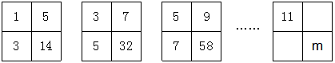

- **A**. 180
- **B**. 182
- **C**. 184　✅
- **D**. 186

**答案**：C

**官方解析**

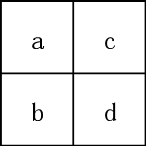

如上图所示，将图形中的四个方格由左上、左下、右上、右下分别标记为。观察图形，每个图形均由4个数字组成，图形中d项数字较大，其余较小，考虑拼凑，观察发现：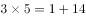，，。因此图形中规律为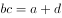。且观察发现，图形中a项数字分别为1，3，5······11,为奇数列，且满足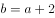，。因此，所求图形中b项数据应为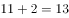，c项数据为。根据规律，，解得。

故正确答案为C。

---

### 第 2 题　qid 2187544 · 数学运算

小张家养了一只大狗和一只小狗。现在，小狗的体重只有大狗的一半。如果两只狗的体重各增加5千克，那么小狗的体重将达到大狗的。据此可知，若两只狗的体重各增加10千克，小狗、大狗的体重比将会是：

- **A**. 

- **B**. 

　✅
- **C**. 

- **D**. 

**答案**：B

**官方解析**

设小狗的体重为千克，则大狗的体重为千克。根据“两只狗的体重各增加5千克，那么小狗的体重将达到大狗的”，则有，解得，则大狗的体重为20千克。此时各增加10千克，则小狗、大狗的体重分别为千克、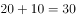千克，则小狗、大狗的体重比为。

故正确答案为B。

---

### 第 3 题　qid 2188112 · 数学运算

在一个不透明的布袋中，有红色、黑色、白色的小球共60个。小明通过足够多次摸球试验后发现其中摸到红色球、黑色球的概率分别为、。那么，口袋中白色球的个数最可能是：

- **A**. 25
- **B**. 26
- **C**. 27　✅
- **D**. 29

**答案**：C

**官方解析**

根据，可知个，个，则个。

故正确答案为C。

---

### 第 4 题　qid 2187536 · 数学运算

现有一种浓度为的盐水30千克，如果用50千克浓度更高的盐水和它混合，混合后的盐水浓度将大于，而小于。据此可知，后加入的盐水的浓度（假设浓度为）范围是：

- **A**. 
 
　✅
- **B**. 

- **C**. 
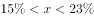

- **D**. 

**答案**：A

**官方解析**

根据题意及溶液混合前后溶质（盐）质量不变可得：，整理得，解得：。

故正确答案为A。

---

### 第 5 题　qid 2187538 · 数学运算

小波通过往圆圈里投掷米粒（米粒本身长度不计，视为一个点）的方式决定自己的周末活动。经过试验，他将米粒投进圆圈内的成功率达到，但投掷在圆内的位置随机。如果米粒到圆心的距离大于圆半径的一半，那么他周末去看电影；若米粒到圆心的距离小于半径的，他会去打篮球；否则，他将在家看书。据此可知小波周末不在家看书的概率为：

- **A**. 
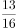
　✅
- **B**. 

- **C**. 

- **D**. 

**答案**：A

**官方解析**

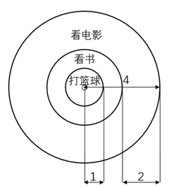

因题目中圆的半径均为比例关系，且最终所求概率，也为比例，故可设圆圈半径为4，则。如图所示：；，则小波周末不在家看书的概率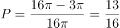。

故正确答案为A。

---

### 第 6 题　qid 2187522 · 数学运算

某地市区有一个长方形广场，其面积为1600平方米。由此可知，这个广场的周长至少有：

- **A**. 160米　✅
- **B**. 200米
- **C**. 240米
- **D**. 320米

**答案**：A

**官方解析**

根据几何最值理论“平面图形中，若周长一定，越接近于圆，面积越大；若面积一定，越接近于圆，周长越小”可知，长方形广场越接近于圆，则周长越小。最接近圆的四边形是正方形，此时广场的边长为米，因此周长最小为米。

故正确答案为A。

注：长方形：有一个角是直角的平行四边形叫做长方形。正方形：有一个角是直角且有一组邻边相等的平行四边形是正方形。长方形包含正方形。

---

### 第 7 题　qid 2187518 · 数学运算

A、B两种规格的产品需要在甲、乙两台机器上各自加工一道工序才能成为成品。已知A产品需要在甲机器上加工3小时，在乙机器上加工1小时；B产品需要在甲机器上加工1小时，在乙机器上加工3小时。在一个工作日内，甲机器至多只能使用11小时，乙机器至多只能使用9小时。A产品每件利润300元，B产品每件利润400元。据此可知，若这两台机器只加工A、B这两种产品，那么它们在一个工作日内能创造的最大利润为：

- **A**. 1600元
- **B**. 1700元　✅
- **C**. 1800元
- **D**. 2000元

**答案**：B

**官方解析**

设生产件A产品，生产件B产品。根据两台机器都有最大使用时间，则有

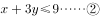

要想利润最多，则要尽可能的大。、均为整数，考虑代入，最大值为3，最小值为0：

时，要满足①②两式，最大为2，此时利润元；

时，要满足①②两式，最大为2，此时利润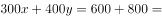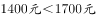；

时，要满足①②两式，最大为2，此时利润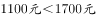；

时，要满足①②两式，最大为3，此时利润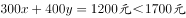；

所以当，时，利润最大，为1700元。

故正确答案为B。

---

### 第 8 题　qid 2187539 · 数学运算

某公司有员工100人从事某产品的生产。现在，公司决定从这些员工中分流一些去生产新产品。分流后，继续从事老产品生产的员工平均每人每年创造产值在原有的基础上最多可增长1.2倍。若要保证老产品的年产值不减少，则最多能分流的人数是：

- **A**. 15人
- **B**. 16人
- **C**. 53人
- **D**. 54人　✅

**答案**：D

**官方解析**

根据题意，公司共有100人从事生产，假设每人每年的产值为1，则总产值为100。分流后每位员工创造产值最多可增长1.2倍，即最多为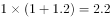。若要保证老产品的年产值不减少，则，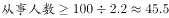，即最少要有46人从事老产品的生产，因此最多分流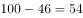人。

故正确答案为D。

---

### 第 9 题　qid 2188117 · 数学运算

某公司将在本周一至周日连续七天举办联谊会，某员工随机地选择其中的连续两天参加联谊会，那么他在周五至周日期间连续两天参加联谊会的概率为：

- **A**. 

- **B**. 

　✅
- **C**. 

- **D**. 

**答案**：B

**官方解析**

满足“周五至周日期间连续两天参加联谊会”的情况数为2种，即周五周六、周六周日参加联谊会；总情况数为在本周一至周日连续七天内选择连续两天参加联谊会，有6种情况（即周一周二、周二周三、周三周四、周四周五、周五周六、周六周日6种情况）。故。

故正确答案为B。

---

### 第 10 题　qid 2187520 · 数学运算

有一项测验由20道单选题组成，每道题有A、B、C、D四个选项。回答正确1道题得2分，回答错误1道题倒扣1分。若20道题全部选择A，得分将为分；若全部选B，得分将为4分；若全部选C，得分将为1分。那么该项测验中正确答案为D项的题目有多少道？

- **A**. 0　✅
- **B**. 2
- **C**. 3
- **D**. 4

**答案**：A

**官方解析**

设正确答案为A项、B项、C项和D项的题量分别为a道、b道、c道和d道。根据题意可得方程组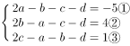，,解得，则。

故正确答案为A。

---

## 判断推理

### 第 1 题　qid 2188770 · 图形推理

从所给四个选项中，选择最合适的一个填入问号处，使之呈现一定的规律性：

- **A**. 3
- **B**. 5
- **C**. 6　✅
- **D**. 7

**答案**：C

**官方解析**

我们发现每个图形下面都对应一个数字，因此图形跟下面的数字有关。图1和图2的区别是内部的一个三角形，也就是减少一个三角形，数量减少2，即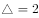；图2和图3的区别是内部的一个长方形，也就是增加一个长方形，数量增加4，即；问号处为一个和一个的组合，即。

故正确答案为C。

---

### 第 2 题　qid 2188065 · 图形推理

下列选项中，和题干所给图形是同一个的是：

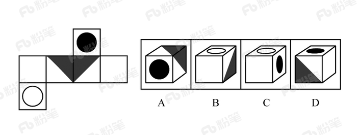

- **A**. A
- **B**. B　✅
- **C**. C
- **D**. D

**答案**：B

**官方解析**

将题干展开图标上序号，如下图所示，逐一进行分析。

A项：选项由面e、面g、面h构成，展开图中面e与面g、面h的公共边均为黑色三角形的直角边，选项中面e与面g、面h的公共边为白色三角形的直角边，选项与题干展开图不一致，排除；

B项：选项由面k、面h、面i构成，选项与题干展开图一致，当选；

C项：选项中顶面是面k，侧面是面e，由于面k与面e为相对面，相对面不能同时出现，选项与题干展开图不一致，排除；

D项：选项中顶面是面e，正面是面g或面h，侧面是面f或面i。展开图中面e与面g、面h的公共边均为黑色三角形的直角边，选项中面e与面g或面h的公共边为白色三角形的直角边，选项与题干展开图不一致，排除。

故正确答案为B。 

---

### 第 3 题　qid 2188058 · 图形推理

请从所给四个选项中选择一个最合适的选项填入问号处，使之呈现一定规律性：

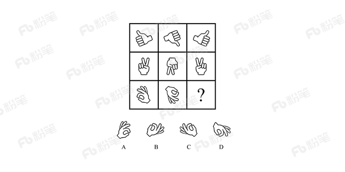

- **A**. A　✅
- **B**. B
- **C**. C
- **D**. D

**答案**：A

**官方解析**

元素组成相同，优先考虑位置规律。九宫格优先看横行，第一行图1旋转得到图2，图2上下翻转得到图3。第二行验证规律，图1旋转得到图2，图2上下翻转得到图3，规律成立。则第三行应用此规律，图2由图1旋转得到，故？处图形由图2上下翻转得到，只有A项符合。

故正确答案为A。

---

### 第 4 题　qid 2188070 · 图形推理

从所给四个选项中，选择最合适的一个填入问号处，使之呈现一定的规律性：

- **A**. A
- **B**. B
- **C**. C　✅
- **D**. D

**答案**：C

**官方解析**

题干图形中黑白块比较明显，考虑黑白运算，但整体进行黑白运算无规律。观察题干图形发现，第一行中，第一幅图到第二幅图右上角增加一个灰色方块，第二幅图到第三幅图左上角增加一个灰色方块；第二行中每幅图的左下角均出现了浅灰条纹方块，灰色方块的变化规律同第一行图形，对第三行图形应用此规律，则问号处图形的左上角应为浅灰方块与浅灰条纹方块的叠加，C项图形的左上角为深灰条纹方块，符合题意。
故正确答案为C。

---

### 第 5 题　qid 2187599 · 图形推理

从所给四个选项中，选择最适合的一个填入问号处，使之呈现一定规律性：

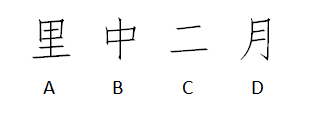

- **A**. A
- **B**. B
- **C**. C
- **D**. D　✅

**答案**：D

**官方解析**

元素组成不同，优先考虑属性规律。观察题干发现，图1、3、5、7有封闭区域，优先考虑开闭性。图1、3、5、7有封闭区域，图2、4、6无封闭区域，则？处应选择无封闭区域，排除A、B。对比C、D，发现C是2部分图形，D是1部分图形，而题干均是1部分图形。
故正确答案为D。

---

### 第 6 题　qid 2187604 · 图形推理

从所给四个选项中，选择最适合的一个填入问号处，使之呈现一定的规律性：

- **A**. A
- **B**. B
- **C**. C
- **D**. D　✅

**答案**：D

**官方解析**

元素组成不同，且无明显属性规律，考虑数量规律。观察题干发现，图形出现了单一直线，优先考虑数直线。但直线数没有规律，观察发现横着的线条居多，考虑数横线数，图1至图4横线数均为6条，因此“？”处应选择一个横线数为6的图形。四个选项中，A项有5条横线，B项有2条横线，C项有0条横线，D项有6条横线。
故正确答案为D。

---

### 第 7 题　qid 2187614 · 图形推理

从所给四个选项中，选择最适合的一个填入问号处，使之呈现一定的规律性：

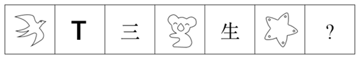

- **A**. 形　✅
- **B**. 94
- **C**. 田
- **D**. XY

**答案**：A

**官方解析**

元素组成不同，且无明显属性规律，考虑数量规律。观察发现，图3、图5出现简单汉字，优先考虑笔画数。题干六幅图的笔画数依次为1、2、3、4、5、6，因此？处应选择一个7笔画图形，A项7笔画，B项2笔画，C项5笔画，D项4笔画，只有A项符合。
故正确答案为A。

---

### 第 8 题　qid 2187597 · 定义判断

生物识别技术，即通过计算机与光学、声学、生物传感器和生物统计学原理等高科技手段密切结合，利用人体固有的生理特征（如指静脉、人脸、虹膜、指纹等）和行为特征（如笔迹、声音、步态等）来进行个人身份的鉴定。
根据上述定义，下列最可能运用了生物识别技术的是：

- **A**. 受害者在旁听了嫌疑人的数码电话录音后，确定了他就是当时的袭击者
- **B**. 警方在犯罪现场找到一张外卖送货小票，通过查询网上外卖订购系统信息，锁定了几个犯罪嫌疑人
- **C**. 某涉密场所设置了严格的门禁，人们只有在密码输入正确且在电阻屏上手写出具有进入权限的工作人员姓名后才能进入
- **D**. 某公司为考核员工出勤情况，引进了指纹打卡机，员工上班时必须输入指纹报到　✅

**答案**：D

**官方解析**

第一步：找出定义关键词。
“通过计算机与高科技手段密切结合”、“利用人体固有的生理特征（如指静脉、人脸、虹膜、指纹等）和行为特征（如笔迹、声音、步态等）”、“进行个人身份的鉴定”。
第二步：逐一分析选项。
A项：通过数码电话录音鉴定身份，不符合“通过计算机与高科技手段密切结合”，不符合定义，排除； 
B项：警方通过查询网上外卖订购系统信息，锁定嫌疑人，不符合“利用人体固有的生理特征和行为特征”，不符合定义，排除；
C项：通过输入密码和手写具有权限的人员姓名鉴定身份，不符合“利用人体固有的生理特征和行为特征”，不符合定义，排除；
D项：通过指纹打卡机鉴定身份，符合“通过计算机与高科技手段密切结合”、“利用人体固有的生理特征（指纹）”、“进行个人身份的鉴定”，符合定义，当选。
故正确答案为D。

---

### 第 9 题　qid 2187609 · 定义判断

甜柠檬效应就是个体在追求预期目标失败时，为了冲淡自己内心的不安，就百般提高现已实现的目标的价值，从而达到心理平衡的现象。
根据上述定义，下列属于“甜柠檬效应”的是：

- **A**. 小明本来想买一台笔记本电脑，结果却在导购员的劝说下购买了平板电脑，使用后他很满意，并一直向朋友推荐
- **B**. 这几周，小红为自己的销售业绩不断下滑而苦恼；但当她知道自己仍是公司的销售状元时，变得放心多了
- **C**. 小文的数学成绩又让他的辅导老师失望了，老师最后只能用“比起上一次，还是有进步”来安慰自己　✅
- **D**. 据教练估计，小张需要减肥到60千克才能达到他想要的健身效果，可是小张在减到63千克时就放弃了，因为他觉得自己足够健美了

**答案**：C

**官方解析**

第一步：找出定义关键词。

“个体追求预期目标失败”、“为了冲淡自己内心的不安”、“百般提高现已实现的目标的价值”、“达到心理平衡”。

第二步：逐一分析选项。

A项：小明本来想买电脑最后买了平板电脑，没有实现预期目标，但是使用后很满意，不符合“为了冲淡自己内心的不安”、“百般提高现已实现的目标的价值”，不符合定义，排除；

B项：小红为销售业绩下滑而苦恼符合“个人追求预期目标失败”，但小红为销售状元是客观事实，不符合“为了冲淡自己内心的不安”、“百般提高现已实现的目标的价值”，不符合定义，排除；

C项：小文数学成绩让辅导老师失望，老师对小文的成绩的心理预期没有达到，符合“个体追求预期目标失败”，老师最后只能安慰自己小文比上一次进步了，符合“百般提高现已实现的目标的价值”，符合定义，当选；

D项：减肥到60千克才能达到效果是教练提出的目标，小张在63千克时放弃了，是小张自己主动放弃了，并不符合追求个人目标失败，不符合定义，排除。

故正确答案为C。

---

### 第 10 题　qid 2187575 · 定义判断

健康教育是为促进人们自发地、自觉地接受并采取有益于健康的行为与生活方式，根除或者减少对健康有影响的危险因素，预防疾病并达到促进身心健康和提高生活质量的目标而开展的有组织、有计划的系统的社会教育活动。
根据上述定义，下列属于健康教育的是：

- **A**. 某公司在乡下举办健康知识讲座，并以此为机会向老人们推销保健品
- **B**. 某高校开设的一门“心理健康”选修课非常受同学们欢迎，甚至附近的市民都来蹭课
- **C**. 周日某医院组织医务人员在小区广场举行义诊活动，免费为居民提供测血压、量体温以及医疗咨询等服务
- **D**. 为防范入秋以来老年人心脑血管疾病高发的现象，社区每年9月份都会聘请知名专家针对老年居民举行系列讲座，普及相关医疗知识　✅

**答案**：D

**官方解析**

第一步：找出定义关键词。
“为促进人们自发地、自觉地接受并采取有益于健康的行为与生活方式”、“根除或者减少对健康有影响的危险因素”、“开展社会教育活动”。
第二步：逐一分析选项。
A项：某公司举办健康知识讲座是为了推销保健品，不符合“为促进人们自发地、自觉地接受并采取有益于健康的行为与生活方式”，不符合定义，排除；
B项：某高校开设的选修课，不符合“开展社会教育活动”，不符合定义，排除；
C项：某医院举行义诊活动，免费为居民提供服务，不符合“开展社会教育活动”，不符合定义，排除；
D项：为防范老年人心脑血管疾病高发的现象，符合“根除或者减少对健康有影响的危险因素”，社区举行讲座，普及医疗知识符合“为促进人们自发地、自觉地接受并采取有益于健康的行为与生活方式”以及“开展社会教育活动”，符合定义，当选。
故正确答案为D。

---

### 第 11 题　qid 2187594 · 定义判断

横向交往和纵向交往是组织内员工通过人际互动构建社会资本过程的两种工具性交往风格。横向交往是指个体通过与自身周围社会地位相似的群体建立广泛联系的过程；纵向交往是指个体能动地与社会中占据主导资源支配的群体建立关系的过程。
根据上述定义，下列属于纵向交往的是：

- **A**. 每到节假日，院长都会代表学院去慰问对学院作出巨大贡献的退休干部
- **B**. 老刘对自己家的保姆非常满意，为了让保姆过完春节后继续过来工作，他赠送了保姆探亲的往返机票
- **C**. 老张为了能够继续顺利地承包村里的鱼塘，主动和村民搞好关系，每年春节都给村民免费发放几条鱼
- **D**. 某家长为了让班级任课老师严格要求自己的孩子，节假日都会给老师们发去问候的短信　✅

**答案**：D

**官方解析**

第一步：找出定义关键词。
纵向交往：“个体能动地”、“与社会中占据主导资源支配的群体建立关系”；
横向交往：“个体通过与自身周围社会地位相似的群体建立广泛联系”。
第二步：逐一分析选项。
A项：院长慰问退休干部，退休干部不符合“社会中占据主导资源支配的群体”，不符合“纵向交往”定义，排除；
B项：老刘赠送保姆机票，保姆不符合“社会中占据主导资源支配的群体”，不符合“纵向交往”定义，排除；
C项：老张和村民搞好关系，村民不符合“社会中占据主导资源支配的群体”，不符合“纵向交往”定义，排除；
D项：为了让班级任课老师严格要求自己的孩子，说明老师在孩子教育上是“社会中占据主导资源支配的群体”，家长节假日都会给老师们发去问候的短信，符合“个体能动地与社会中占据主导资源支配的群体建立关系”，符合“纵向交往”定义，当选。
故正确答案为D。

---

### 第 12 题　qid 2187589 · 定义判断

慎微，即重视并正确处理细小的事情；慎初，即把住第一次，守住第一关。
根据上述定义，下列最不能体现“慎微”这一原则的是：

- **A**. 妇女权益保护机构的工作人员劝诫人们：家庭暴力不是小事，而是犯罪，大家对此一定要零容忍　✅
- **B**. 小菲最近在积极瘦身，她毅力十足，高热量的食物一次都没吃，哪怕是一丁点儿
- **C**. 李大叔为一年后的马拉松赛而完成了人生的第一次长跑，他计划着每天都会比前一天多跑一些，这样子就能渐渐达到马拉松的里程
- **D**. 妈妈对小明的学习要求十分严格，如果儿子因为马虎大意犯了小错，也会立刻纠正他

**答案**：A

**官方解析**

第一步：找出定义关键词。
慎微：“重视并正确处理细小的事情”；
慎初：“把住第一次，守住第一关”。
第二步：逐一分析选项。
A项：劝诫人们要对家庭暴力零容忍，家庭暴力不是小事，即家庭暴力是大事要重视，不符合“重视并正确处理细小的事情”，不符合“慎微”定义，当选；
B项：减肥的小菲“一丁点的高热量食物”都没有吃，符合“重视并正确处理细小的事情”，符合“慎微”定义，排除；
C项：李大叔为了一年后的马拉松赛而完成了人生的第一次长跑，每天要比以前“多跑一些”，符合“重视并正确处理细小的事情”，符合“慎微”定义，排除；
D项：妈妈对小明要求严格，小明犯了“小错”也会立即纠正，符合“重视并正确处理细小的事情”，符合“慎微”定义，排除。
本题为选非题，故正确答案为A。

---

### 第 13 题　qid 2187596 · 类比推理

左顾右盼∶上下打量

- **A**. 南来北往∶东西奔走　✅
- **B**. 纵横交错∶中西合璧
- **C**. 千叮万嘱∶一心一意
- **D**. 天高地厚∶山清水秀

**答案**：A

**官方解析**

第一步：判断题干词语间逻辑关系。
左顾右盼指左右来回看；上下打量指上下看，二者都有看的意思，是近义关系，并且左顾右盼中的“左右”是反义关系，上下打量中的“上下”是反义关系。
第二步：判断选项词语间逻辑关系。
A项：南来北往指南北方向来回奔走；东西奔走指东西方向来回奔走，二者都有到处奔走的意思，是近义关系，并且南来北往中的“南北”是反义关系，东西奔走中的“东西”是反义关系，与题干逻辑关系一致，当选；
B项：纵横交错指横的竖的交叉在一起；中西合璧指中国和外国的好东西和建筑、名胜合到一块，二者不是近义关系，与题干逻辑关系不一致，排除；
C项：千叮万嘱指再三叮嘱；一心一意指做事专心，一门心思只做一件事，二者不是近义关系，与题干逻辑关系不一致，排除；
D项：天高地厚指恩情深厚，也指事物的复杂、深奥程度；山清水秀指山水风景优美，二者不是近义关系，与题干逻辑关系不一致，排除。
故正确答案为A。

---

### 第 14 题　qid 2188141 · 类比推理

领悟：大彻大悟

- **A**. 哭泣：放声痛哭　✅
- **B**. 微笑：哈哈大笑
- **C**. 昏迷：昏天暗地
- **D**. 喝酒：纸醉金迷

**答案**：A

**官方解析**

第一步：判断题干词语间逻辑关系。
大彻大悟有领悟的意思，且大彻大悟是一种极致的领悟。
第二步：判断选项词间逻辑关系。
A项：放声痛哭具有哭泣的意思，且放声痛哭是一种极致的哭泣，与题干逻辑关系一致，当选；
B项：哈哈大笑就是大声笑，微笑是不显著的笑容，哈哈大笑不包含微笑的意思，且哈哈大笑不是一种极致的微笑，而是一种极致的笑，与题干逻辑关系不一致，排除；
C项：昏天暗地形容天色昏暗，也比喻社会黑暗混乱，与昏迷无明显逻辑关系，与题干逻辑关系不一致，排除；
D项：纸醉金迷形容叫人沉迷的奢侈豪华的环境，与喝酒无明显逻辑关系，与题干逻辑关系不一致，排除。
故正确答案为A。

---

### 第 15 题　qid 2187590 · 类比推理

秤∶重量

- **A**. 水∶浮力
- **B**. 地图∶距离
- **C**. 台灯∶光亮
- **D**. 尺子∶长度　✅

**答案**：D

**官方解析**

第一步：判断题干词语间逻辑关系。
秤是用来测量重量的，二者是测量工具和测量对象的对应关系。
第二步：判断选项词语间逻辑关系。
A项：水可以产生浮力，并不是测量浮力的工具，与题干逻辑关系不一致，排除；
B项：地图可以显示距离，并不是测量距离的工具，与题干逻辑关系不一致，排除；
C项：台灯可以发出光，带来光亮，二者为功能对应关系，与题干逻辑关系不一致，排除；
D项：尺子是测量工具，是用来测量长度的，二者是测量工具和测量对象的对应关系，与题干逻辑关系一致，当选。
故正确答案为D。

---

### 第 16 题　qid 2188089 · 类比推理

建筑∶房屋∶房间

- **A**. 汽车∶越野车∶车窗
- **B**. 电器∶电视机∶屏幕　✅
- **C**. 医院∶私立医院∶医生
- **D**. 餐具∶盘子∶筷子

**答案**：B

**官方解析**

第一步：判断题干词语间逻辑关系。
房屋是一种建筑，二者是种属关系，房间是房屋的组成部分，二者是组成关系，且房屋通过房间体现作用。
第二步：判断选项词语间逻辑关系。
A项：越野车是汽车的一种，二者是种属关系，车窗是越野车的组成部分，二者是组成关系，但越野车并不是通过车窗体现作用，与题干逻辑关系不一致，排除；
B项：电视机是一种电器，二者是种属关系，屏幕是电视机的组成部分，二者是组成关系，且电视通过屏幕体现作用，与题干逻辑关系一致，当选；
C项：私立医院是一种医院，二者是种属关系，但医生与私立医院是职业与工作地点的对应关系，与题干逻辑关系不一致，排除；
D项：盘子是一种餐具，二者是种属关系，但筷子和盘子都是餐具，二者是并列关系，与题干逻辑关系不一致，排除。
故正确答案为B。

---

### 第 17 题　qid 2187578 · 类比推理

拖鞋∶皮鞋∶场合

- **A**. 药物∶手术∶病情　✅
- **B**. 川菜∶凉菜∶味道
- **C**. 跑步∶踢球∶体力
- **D**. 茶水∶咖啡∶爱好

**答案**：A

**官方解析**

第一步：判断题干词语间逻辑关系。
拖鞋和皮鞋都是鞋子的一种，二者是并列关系，且不同的场合选择的鞋子不同。
第二步：判断选项词语间逻辑关系。
A项：药物和手术都是治疗方式的一种，二者是并列关系，且不同的病情选择的治疗方式不同，与题干逻辑关系一致，保留；
B项：川菜和凉菜是交叉关系，且无法按照不同的味道选择，与题干逻辑关系不一致，排除；
C项：跑步和踢球都是运动方式的一种，二者是并列关系，但无法按照不同的体力来选择，与题干逻辑关系不一致，排除；
D项：茶水和咖啡都是饮品的一种，二者是并列关系，根据不同的爱好可以选择喝茶水和喝咖啡，与题干逻辑关系一致，保留。
对比A项和D项，场合和病情是客观的，而爱好是主观的，故A项与题干逻辑关系更近。
故正确答案为A。
注：拖鞋和皮鞋也可以看作交叉关系，与B项中川菜和凉菜的逻辑关系相同，但B项无法按照不同的味道选择川菜和凉菜，与题干逻辑关系不一致，所以不能选B项。

---

### 第 18 题　qid 2187576 · 类比推理

蜘蛛∶织网∶爬行

- **A**. 蚕∶破蛹∶吐丝
- **B**. 蜜蜂∶酿蜜∶飞行　✅
- **C**. 夜莺∶筑巢∶歌唱
- **D**. 猎豹∶奔跑∶捕食

**答案**：B

**官方解析**

第一步：判断题干词语间逻辑关系。
“蜘蛛”“织网”为主谓宾结构，“蜘蛛”“爬行”为主谓结构。
第二步：判断选项词语间逻辑关系。
A项：“蚕”“破蛹”为主谓宾结构，“蚕”“吐丝”也为主谓宾结构，与题干逻辑关系不一致，排除；
B项：“蜜蜂”“酿蜜”为主谓宾结构，“蜜蜂”“飞行”为主谓结构，与题干逻辑关系一致，当选；
C项：“夜莺”“筑巢”为主谓宾结构，“夜莺”“歌唱”为主谓结构，但“歌唱”是一种拟人化的表述，并非“夜莺”的生物学行为，与题干逻辑关系不一致，排除；
D项：“猎豹”“奔跑”为主谓结构，与题干逻辑关系不一致，排除。
故正确答案为B。

---

### 第 19 题　qid 2187619 · 类比推理

行驶超过60万千米的汽车都应当报废处理；有些行驶超过60万千米的汽车存在设计缺陷；在应当报废的汽车中有些不是T品牌汽车；所有T品牌汽车都不存在设计缺陷。
如果以上判断正确，则必定成立的是：

- **A**. 有些T品牌汽车应当报废
- **B**. 有些T品牌汽车不应当报废
- **C**. 应当报废的汽车都行驶超过60万千米
- **D**. 有些存在设计缺陷的汽车应当报废　✅

**答案**：D

**官方解析**

第一步：翻译题干。

①超60万千米报废；

②有些超60万千米设计缺陷；

③有些报废T品牌；

④T品牌设计缺陷；

将②换位可得：有些设计缺陷超60万千米，和①可以递推出：⑤有些设计缺陷超60万千米报废。

第二步：逐一分析选项。

A项：翻译为有些T品牌报废，由③“有些报废T品牌汽车”，推不出，排除；

B项：翻译为有些T品牌报废，由③“有些报废T品牌”无法得到“有些T品牌”的情况，推不出，排除；

C项：翻译为报废超60万千米，是对①的肯后，但肯后得不到确定性的结论，推不出，排除；

D项：翻译为有些设计缺陷报废，是对⑤的肯前，肯前必肯后，可以推出，当选。

故正确答案为D。

---

### 第 20 题　qid 2187639 · 逻辑判断

美国斯坦福大学的研究人员对130名同时患有血脂异常、高血压（并未服用降压药）的患者进行了长达12年的试验。在试验中，研究人员将这130名研究对象随机分成人数相等的两组，并让其中的一组研究对象服用松树皮提取物（每天服用的剂量为200毫克），另一组研究对象服用安慰剂。在这12年中，研究人员每6周测量1次研究对象的血压、血糖、胆固醇及C反应蛋白的水平。试验结果显示，服用松树皮提取物人员的上述各项指标与服用安慰剂人员的上述各项指标并无明显的差别。由此可知，松树皮提取物无降血压、降血糖、降血脂以及预防心血管疾病等功效。
以下各项如果为真，最能反驳上述结论的是：

- **A**. 两组试验患者仅人数相等，其血压和血脂等的原始指标差异较大　✅
- **B**. 对照组服用安慰剂，对高血压和高血脂患者有心理暗示作用
- **C**. 12年的实验时间太长，这有可能使一些重要的实验数据失真
- **D**. 参加实验的患者人数仅130人，样本太小，代表性不够

**答案**：A

**官方解析**

第一步：找出论点和论据。
论点：松树皮提取物无降血压、降血糖、降血脂以及预防心血管疾病等功效。
论据：试验结果显示，服用松树皮提取物人员的上述各项指标与服用安慰剂人员的上述各项指标并无明显的差别。
论点论据都在说松树皮提取物无降压、降糖、降脂以及预防心血管疾病等功效，二者话题一致，削弱优先考虑削弱论点，其次考虑削弱论据。
第二步：逐一分析选项。
A项：此选项说明两组试验患者除了分别服用松树皮提取物和安慰剂外，其血压和血脂等的原始指标还差异较大，说明实验前起点不一致，能削弱，保留；
B项：此选项说明对照组服用安慰剂后有一定的心理暗示作用，但是心理暗示会降低还是升高他们的各项指标不确定，属于不明确选项，无法削弱，排除；
C项：此选项说明实验数据存在失真的可能，为可能性削弱，保留；
D项：此选项说明样本太小，代表性不够，有一定的削弱力度，保留。
对于A、C、D项，C项为可能性削弱，D项只是样本量不够，不具有代表性；但是A项直接说明题干实验本身就是有问题的，削弱力度更强，择优选A。
故正确答案为A。

---

### 第 21 题　qid 2188097 · 类比推理

某行政部门需选派人员参加对口扶贫工作。对此，书记、局长和副局长有如下要求：
书记：如果不选派李科长参加对口扶贫，那么就选派马科长参加对口扶贫；
局长：如果不选派马科长参加对口扶贫，那么也不选派李科长参加对口扶贫；
副局长：要么选派马科长参加对口扶贫，要么选派李科长参加对口扶贫。
下面各项中，同时符合书记、局长和副局长三者要求的是：

- **A**. 马科长参加对口扶贫　✅
- **B**. 李科长参加对口扶贫
- **C**. 马科长、李科长都参加对口扶贫
- **D**. 马科长、李科长都不参加对口扶贫

**答案**：A

**官方解析**

第一步：翻译题干。 ①书记：李科长马科长 ②局长：马科长李科长 ③副局长：要么马科长，要么李科长 将②逆否可以推出④：李科长马科长 第二步：逐一分析选项。 根据①和④，无论李科长是否参加，马科长都会参加，再根据③可知，马科长和李科长只有一个参加，那么李科长不参加，A项可以推出。 故正确答案为A。

---

### 第 22 题　qid 2188103 · 逻辑判断

水熊虫是一种小型水生动物，又称缓步动物。水熊虫是地球上已知生命力最强的生物，它可以在没有防护措施的条件下在极端压力环境中生存。缓步动物的奇特能力促使研究人员对其基因组展开调查。目前，对缓步动物的第一次基因组测序结果显示，在缓步动物演化过程中，通过水平基因转移（不同物种基因组之间的DNA转移），从其他物种中获得了大量基因。
以下各项如果为真，最能质疑上述观点的是：

- **A**. 基因检测发现水熊虫体内有一种基因，其蛋白质能够抵抗人类培养细胞内的DNA损伤
- **B**. 水熊虫可以在太空真空环境中长时间生存，在冰冻30多年之后也能成功复苏
- **C**. 水熊虫从祖先那里继承所有基因，体内遗传物质中没有发现来自植物或者微生物的　✅
- **D**. 水熊虫体内遗传物质存在一种非常奇怪的“混搭”法，正是这种“混搭”才使水熊虫以更复杂的方式生长和发育

**答案**：C

**官方解析**

第一步：找出论点和论据。
论点：在缓步动物演化过程中，通过水平基因转移（不同物种基因组之间的DNA转移），从其他物种中获得了大量基因。
论据：无。
第二步：逐一分析选项。
A项：论点说的是水熊虫从其他物种中获得了大量基因，该项说的是水熊虫体内有一种基因，其蛋白质能够抵抗人类培养细胞内的DNA损伤，话题不一致，无法削弱，排除；
B项：论点说的是水熊虫从其他物种中获得了大量基因，该项说的是水熊虫可以在太空真空和冰冻这样的极端环境中生存，话题不一致，无法削弱，排除；
C项：水熊虫从祖先那里继承了所有的基因，体内遗传物质中没有发现来自植物或者微生物的，说明水熊虫并没有从其他物种获得大量基因，否定了论点，当选；
D项：水熊虫体内遗传物质存在“混搭”，“混搭”说明水熊虫可能从其他物种获得了大量基因，支持了论点，排除。
故正确答案为C。

---

### 第 23 题　qid 2187621 · 逻辑判断

2017年，可以说是我国电影发展的重要一年。然而，一些电影从业者则认为：中国是电影大国，但不是电影强国。
以下各项如果为真，最不能质疑这些电影从业者观点的是：

- **A**. 我国电影年产量达到近800部，位居世界前列；而全年500多亿元的总票房更是稳居全球第一
- **B**. 我国的银幕总量、观众人次已经超过电影界长期的领头羊——北美市场，并且，观众的电影需求依旧旺盛，我国电影市场的潜力还有待挖掘
- **C**. 判断一个国家是否是电影强国的最主要依据是其电影的全球竞争力，而国产电影的市场主要在大陆，和美国等传统电影强国差距较大，国际票房甚至低于印度　✅
- **D**. 中国电影业受近代中国曲折坎坷的命运的决定性影响，它发展多舛，但自2002年起，我国电影以奇迹般的发展速度迅速崛起，并预计将在未来10年内超越电影头号强国美国

**答案**：C

**官方解析**

第一步：找出论点和论据。
论点：中国是电影大国，但不是电影强国。
论据：无。
第二步：逐一分析选项。
A项：我国电影年产量位居世界前列，总票房稳居世界第一，指出中国在电影上取得了多项成就，说明中国属于电影强国，否定了论点，排除；
B项：我国的银幕总量、观众人次已经超过行业领头羊，说明中国在电影上取得了多项成就，属于电影强国，并且观众的需求依旧旺盛，市场的潜力还有待挖掘，说明未来还有很大的发展空间，否定了论点，排除；
C项：判断一个国家是否是电影强国的最主要依据是其全球竞争力，而国产电影和传统电影强国差距较大，国际票房较低，说明中国现在的全球竞争力并不强，不属于电影强国，加强了论点，当选；
D项：我国电影以奇迹般的速度崛起，说明我国电影发展速度很快，并且我国电影预计将在未来十年内超越电影头号强国美国，说明我国电影现在已位于电影强国之列，只不过还不是头号强国，有一定的削弱力度，排除。
本题为选非题，故正确答案为C。

---

### 第 24 题　qid 2187616 · 逻辑判断

微生物组在地球生态系统和人类健康中的作用超乎想象，它不仅将极大地帮助人类克服当今所面临的生存挑战，还能提供人类未来生存之道，这其中有一个道理，就是微生物之间能够互相协作，使得它们在生态系统中更加稳定、更加有效地发挥作用，并赋予微生物组具有超越单个微生物的更为强大的功能。
以下各项如果为真，最能支持上述观点的是：

- **A**. 美国的“国家微生物组计划”正是为了在所有的生态系统、大自然及人造世界里推动最前沿的微生物科学研究
- **B**. 作为新兴产业的生物农药和生物肥料，近年来在蓬勃发展，其在国际上的市场份额也逐年快速递增
- **C**. 将多种微生物一起培养，其生物系统的稳定性和适应能力都大为提高，其对某些有害化合物的降解效率也提升了　✅
- **D**. 酿酒微生物场所提供了多种多样的微生物资源，可以从中发掘高效纤维素降解霉菌、高乙醇合成酵母等

**答案**：C

**官方解析**

第一步：找出论点和论据。
论点：微生物组在地球生态系统和人类健康中的作用超乎想象。
论据：微生物组不仅将极大地帮助人类克服当今所面临的生存挑战，还能提供人类未来生存之道；微生物之间能够互相协作，使得它们在生态系统中更加稳定、更加有效地发挥作用，并赋予微生物组具有超越单个微生物的更为强大的功能。
第二步：逐一分析选项。
A项：论点说的是微生物组对地球生态系统和人类健康的作用，该项说的是美国“国家微生物组计划”的研究内容，话题不一致，无法加强，排除；
B项：论点说的是微生物组对地球生态系统和人类健康的作用，该项说的是生物农药和生物肥料的市场份额，话题不一致，无法加强，排除；
C项：多种微生物一起培养，微生物系统的稳定性和适应能力提高，对有害化合物的降解效率也会提高，指出微生物之间相互协作确实可以发挥更为强大的功能，补充论据，可以加强，当选；
D项：论点说的是微生物组对地球生态系统和人类健康的作用，该项说的是酿酒的微生物可以合成酵母，并没有涉及多种微生物是否合作，是否有更强大的功能的问题，话题不一致，无法加强，排除。
故正确答案为C。

---

### 第 25 题　qid 2187636 · 逻辑判断

甘肃境内大地湾彩陶的发现解决了中国彩陶艺术的起源地问题。20世纪初，为了探索华夏文明的源头，学术界从考古、文献两个角度作出尝试和努力。1923年，为了寻找彩陶的起源，瑞典地质学家安特生来到甘肃，随着甘肃马家窑彩陶的不断出土，安特生认为，甘肃彩陶受西欧、西亚彩陶的影响比较明显。但是，之后大地湾一期出土的彩陶在年代上明显要早于马家窑彩陶，与目前发现的最早含有彩陶文化的西亚两河流域的耶莫有陶文化、哈孙纳文化的年代大致相当。
据此，我们可以推出：

- **A**. 华夏文明受西欧、西亚文化影响明显
- **B**. 甘肃是世界最早产生彩陶的区域之一　✅
- **C**. 大地湾彩陶文化是最早的彩陶文化
- **D**. 甘肃地区是华夏文明的起源地

**答案**：B

**官方解析**

日常结论题，根据题干信息逐一分析选项。
A项：题干中指出，甘肃彩陶受西欧、西亚彩陶的影响比较明显，不能代表整个华夏文明受西欧、西亚文化影响明显，无法推出，排除；
B项：题干最后一句指出，大地湾彩陶与目前发现的最早含有彩陶文化的西亚两河流域的耶莫有陶文化、哈孙纳文化的年份大致相当，可以推出甘肃是世界最早产生彩陶的区域之一，当选；
C项：题干最后一句指出，大地湾彩陶与目前发现的最早含有彩陶文化的西亚两河流域的耶莫有陶文化、哈孙纳文化的年份大致相当，不代表大地湾彩陶文化是最早的彩陶文化，无法推出，排除；
D项：题干第一句指出，甘肃境内大地湾是中国彩陶艺术的起源地，选项中甘肃地区是华夏文明的起源地，彩陶艺术起源地不能代表整个华夏文明的起源地，无法推出，排除。
故正确答案为B。

---

## 资料分析

### 材料 1

根据以下资料，回答下列小题。

        2016年，全国平均气温，较常年平均气温偏高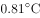，为1951年以来第三高，仅次于2015年（）和2007年（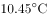）。2016年四季气温均偏高，其中夏季气温为历史最高；除1月偏低、11月接近常年同期外，其余各月均偏高，其中12月偏高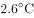，为历史同期最高。全国31个省（区、市）中，仅黑龙江平均气温较常年偏低，其他省（区、市）气温均偏高，其中青海、甘肃、河南和贵州4省均为1951年以来的历史最高。

        2016年，全国年降水量范围为3.5毫米（新疆托克逊）～3494.4毫米（安徽黄山），全国平均降水量730.0毫米，较常年（629.9毫米）偏多，比2015年偏多，为1951年以来最多。2月和8月降水偏少，3月接近常年同期，其余各月均偏多，其中1月偏多，10月偏多，均为历史同期最多。

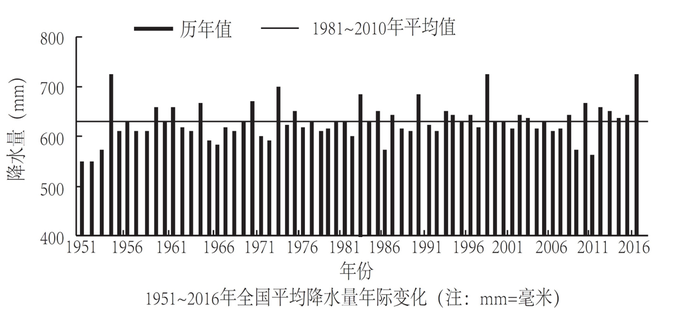

#### 第 1 题　qid 2187610 · 平均数

1951-2016年间，全国年平均气温最高的年份是：

- **A**. 1998年
- **B**. 2007年
- **C**. 2015年　✅
- **D**. 2016年

**答案**：C

**官方解析**

定位文字第一段材料可知：“2016年，全国平均气温……为1951年以来第三高，仅次于2015年（）和2007年（）”，故1951-2016年间，全国年平均气温最高的年份是2015年。

故正确答案为C。

---

#### 第 2 题　qid 2187612 · 平均数

2016年全国31个省（区、市）中，平均气温较常年偏低的是：

- **A**. 新疆
- **B**. 黑龙江　✅
- **C**. 重庆
- **D**. 贵州

**答案**：B

**官方解析**

定位文字第一段材料可知：“全国31个省（区、市）中，仅黑龙江平均气温较常年偏低，其他省（区、市）气温均偏高。”故2016年全国31个省（区、市）中，平均气温较常年偏低的是黑龙江。

故正确答案为B。

---

#### 第 3 题　qid 2187617 · 综合

与常年同期相比，2016年降水偏少的月份是：

- **A**. 1月和10月
- **B**. 3月和12月
- **C**. 2月和8月　✅
- **D**. 2月和10月

**答案**：C

**官方解析**

定位文字材料第二段可知，2016年全国年降水量，2月和8月降水偏少。
故正确答案为C。

---

#### 第 4 题　qid 2187615 · 平均数

2015年全国平均降水量为：

- **A**. 730.0毫米
- **B**. 646.0毫米　✅
- **C**. 629.9毫米
- **D**. 612.6毫米

**答案**：B

**官方解析**

根据题干“2015年全国平均降水量为……”，结合文字材料时间为2016年，可判定本题为基期计算问题。定位文字第二段材料可知：“2016年，全国平均降水量730.0毫米……比2015年偏多。”故2015年全国平均降水量毫米。

故正确答案为B。

---

#### 第 5 题　qid 2188758 · 综合

下列能够从所给资料推出的是：

- **A**. 2016年，青海、甘肃、河南和贵州是全国平均气温最高的省份
- **B**. 1951～2016年，全国年均气温总体呈上升趋势　✅
- **C**. 1951～2016年，降水偏多的年份气温就偏低
- **D**. 2016年全国各地年降水量差异不大

**答案**：B

**官方解析**

A项：定位文字材料第一段可知：“青海、甘肃、河南和贵州4省均为1951年以来的历史最高”，其平均气温为本省历史最高，并非是全国平均气温最高的省份，错误；
B项：定位第一个图形材料可知，全国年均气温总体呈上升趋势，正确；
C项：定位两个图形材料可知，2016年降水量最高，其气温也偏高，与降水偏多的年份气温就偏低矛盾，错误；
D项：定位文字材料第二段可知：“2016年，全国降水量范围为3.5毫米（新疆托克逊）-3494.4毫米（安徽黄山）”，与2016年全国各地年降水量差异不大矛盾，错误。
故正确答案为B。

---

### 材料 2

<b>根据以下资料，回答下列小题。</b>

        2016年，全年原创首演剧目1423个，扶持了100名京剧、地方戏表演艺术家向200名青年演员传授经典折子戏。第十一届中国艺术节共汇聚67台参评参演剧目和1000余件美术作品，观众达40万人次。国家艺术基金2016年共有966个项目获得立项资助，较2015年增长了，资助资金总额7.3亿元。

        2016年末全国共有艺术表演团体12301个，比上年末增加1514个，从业人员33.27万人，增加3.08万人。其中各级文化部门所属的艺术表演团体2031个，占；从业人员11.52万人，占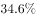。

        全年全国艺术表演团体共演出230.60万场，比上年增长，其中赴农村演出151.60万场，增长；国内观众11.81亿人次，增长，其中农村观众6.21亿人次，比上年增长；总收入311.23亿元，比上年增长，其中演出收入130.86亿元，增长。

        全年全国各级文化部门所属艺术表演团体共组织政府采购公益演出13.90万场，观众1.17亿人次。利用流动舞台车演出11.31万场次，观众10381万人次。中央直属院团全年开展公益性演出1335场，其中赴老少边穷地区演出241场，面向老红军、留守儿童等演出132场。

        年末全国共有艺术表演场馆2285个，观众坐席数168.93万个。全年馆内艺术演出19.09万场次，增长；艺术演出观众3098万人次，增长。其中各级文化部门所属艺术表演场馆1265个，全年共举行艺术演出6.81万场次，增长，艺术演出观众2589万人次，增长。

        年末全国国有美术馆462个，比上年末增加44个，从业人员4597人，增加502人。全国共举办展览6146次，比上年增长，参观人次3237万，增长。

#### 第 6 题　qid 2188888 · 比重

在2015年全国艺术表演团体演出场次中，赴农村演出占比约为：

- **A**. 

- **B**. 
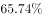

- **C**. 

　✅
- **D**. 

**答案**：C

**官方解析**

根据题干“在2015年······中，······占比约为”，结合材料时间是2016年，可判定本题为基期比重问题。定位材料第三段可得：“全年全国艺术表演团体共演出230.60万场，比上年增长，其中赴农村演出151.60万场，增长”。根据基期比重公式可得：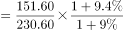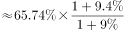，略大于1，则最终结果略大于，C项最为接近。

故正确答案为C。

---

#### 第 7 题　qid 2187625 · 综合

2015年末，全国拥有艺术表演团体的数量是：

- **A**. 10787个　✅
- **B**. 12301个
- **C**. 14237个
- **D**. 22031个

**答案**：A

**官方解析**

根据题干“2015年末······的数量是”，结合材料时间是2016年末，可判定本题为基期计算问题。定位材料第二段可得：“2016年末全国艺术表演团体12301个，比上年末增加1514个”。故2015年末全国拥有艺术表演团体的数量是：个。

故正确答案为A。

---

#### 第 8 题　qid 2188891 · 平均数

2016年，全国艺术表演团体平均从业人员数和各级文化部门所属艺术表演团体从业人员平均数之比约为：

- **A**. 1:0.346
- **B**. 6:1
- **C**. 1:2　✅
- **D**. 2:3

**答案**：C

**官方解析**

根据题干“2016年，······和······之比约为······”，可判定本题为比值计算问题。定位文字材料第二段可得：“2016年末全国共有艺术表演团体12301个，从业人员33.27万人······各级文化部门所属艺术表演团体2031个，从业人员11.52万人”。故2016年全国艺术表演团体平均从业人员数和各级文化部门所属艺术表演团体从业人员平均数之比约为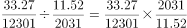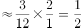，即比约为1:2。

故正确答案为C。

---

#### 第 9 题　qid 2188651 · 综合

与2015年相比，2016年国家艺术基金获立项资助项目、国有美术馆数量、艺术表演场馆艺术演出场次均为：

- **A**. 匀速发展
- **B**. 小幅增长　✅
- **C**. 大幅萎缩
- **D**. 持续增长

**答案**：B

**官方解析**

定位文字材料的第一段、第五段和最后一段可得，艺术基金获立项资助项目较2015年增长了；艺术表演场馆艺术演出场次比上年增长；国有美术馆462个，比上年末增加44个。可知三者均为增长，排除C项；材料只给出2016年的同比增长情况，没有2015年的同比增长情况，推不出匀速或持续增长，排除A、D两项。

故正确答案为B。

---

#### 第 10 题　qid 2188892 · 综合

从上述资料可以推断，在2016年：

- **A**. 第十一届中国艺术节取得空前成功
- **B**. 我国艺术创作演出的经济效益显著
- **C**. 我国艺术表演团体演出收益较2015年减少
- **D**. 平均每个文化部门所属艺术表演团体组织政府采购公益性演出场次超过60场　✅

**答案**：D

**官方解析**

A项：定位文字材料第一段，“第十一届中国艺术节共汇聚67台参评参演剧目和1000余件美术作品，观众达40万人次”，未出现其他数据，无法推出，错误；

B项：材料未出现艺术创作演出的相关数据，无法推出，错误；

C项：定位文字材料第三段，“全年全国艺术表演团体······其中演出收入130.86亿元，增长”，故我国艺术表演团体演出收益较2015年增加，并非减少，且若将艺术表演团体演出收益理解为利润，材料中同样未出现相关数据，无法推出，错误；

D项：定位文字材料第二段，“······其中各级文化部门所属的艺术表演团体2031个”，及第四段“全年全国各级文化部门所属艺术表演团体共组织政府采购公益演出13.90万场”，故平均每个文化部门所属艺术表演团体组织政府采购公益性演出场次约为，即超过60场，正确。

故正确答案为D。

---

### 材料 3

根据以下资料，回答以下各题。

        两周就诊率被定义为每百人中两周内因病或身体不适寻求各级医疗机构治疗服务的人次数。第五次国家卫生服务调查结果显示，调查地区居民两周就诊率为，其中城市地区为，农村地区为。城市地区，东部、中部、西部两周就诊率分别为、、；农村地区，东部、中部、西部两周就诊率分别为、、。

#### 第 11 题　qid 2187642 · 综合

关于第五次国家卫生服务调查中调查地区的两周就诊率，下列说法正确的是：

- **A**. 农村地区高于城市地区
- **B**. 东部地区最高，西部地区最低
- **C**. 从城市地区来看，东部最高，西部最低
- **D**. 从农村地区来看，东部最高，西部最低　✅

**答案**：D

**官方解析**

A项：定位文字材料可知，城市地区的就诊率为，农村地区的就诊率为，故农村地区低于城市地区，错误；

C项：定位文字材料可知，城市地区，东部地区的就诊率为，中部地区的就诊率为，西部地区的就诊率为，故城市地区西部地区的就诊率最高，中部地区的就诊率最低，错误；

D项：定位文字材料可知，农村地区，东部地区就诊率为，中部地区就诊率为，西部地区就诊率为，故农村地区东部就诊率最高，西部地区就诊率最低，正确；

B项：根据C项和D项，城市地区西部地区就诊率最高，中部地区就诊率最低，农村地区东部地区就诊率最高，西部地区就诊率最低，由于材料并未给出东、中、西部城市地区和农村地区人数比，故无法推出就诊率东部地区最高，西部地区最低，错误。

故正确答案为D。

---

#### 第 12 题　qid 2187643 · 综合

从调查人口分年龄别进行分析，两周就诊率随年龄组从低到高的变化是：

- **A**. 先下降而后上升　✅
- **B**. 持续上升
- **C**. 持续下降
- **D**. 保持水平不变

**答案**：A

**官方解析**

定位材料表格1第二列可知，0~4岁、5~14岁、15~24岁就诊率持续下降；25~34岁、35~44岁、45~54岁、55~64岁、65~岁就诊率持续上升。故两周就诊率随年龄组从低到高的变化趋势为先下降而后上升。
故正确答案为A。

---

#### 第 13 题　qid 2187645 · 综合

在2013年，参加职工医保的调查者两周就诊的最主要去向是：

- **A**. 社区卫生服务中心/卫生院
- **B**. 县/市/区级医院
- **C**. 地市级医院　✅
- **D**. 省级医院

**答案**：C

**官方解析**

定位表格材料表2可知，2013年参加职工医保的调查者两周就诊地点中，社区卫生服务中心/卫生院、县/市/区级医院、地市级医院、省级医院就诊人数占总人数的比重分别为、、、，所以就诊人数最多的是去地市级医院，即两周就诊的主要去向是地市级医院。

故正确答案为C。

---

#### 第 14 题　qid 2189134 · 综合

根据资料，下列说法正确的是：

- **A**. 在2008年，参加居民医保的人数多于参加职工医保的人数
- **B**. 在2008年，已参加居民医保的调查人口，其两周就诊地点主要在社区卫生服务站/卫生室和社区卫生服务中心/卫生院
- **C**. 较之2008年，2013年的调查人口的两周就诊率有明显提高
- **D**. 较之2008年，2013年的调查地区的卫生医疗资源更丰富，分布更均衡　✅

**答案**：D

**官方解析**

A项：定位材料查找可知，材料只给出2008年调查人口两周内就诊地点和就诊率，并未给出参加居民医保和职工医保的人数，无法比较，错误；

B项：定位表2可知，2008年已参加居民医保的调查人口，其两周就诊地点主要在社区卫生服务站/卫生室（）和县/市/区级医院（），错误；

C项：定位材料查找可知，只给出2013年调查人口的两周就诊率，并未给出2008年的两周就诊率，无法比较，错误；

D项：若居民在社区卫生服务站、中心就医占比增多，说明医疗资源不仅分配在省、市、县级医院，体现出“卫生医疗资源更丰富，分布更均衡”。定位表2，居民在社区卫生服务站、中心就医的占比增多，由此可推出2013年卫生医疗资源更丰富，分布更均衡，正确。

故本题正确答案为D。

---

#### 第 15 题　qid 2189136 · 综合

下列说法错误的是：

- **A**. 较之2008年，2013年有职工医保的调查者在县/市/区级医院医疗机构的两周内就诊比重减少是因为流向了地市级及以上级别的医院
- **B**. 县/市/区级医院医疗机构和社区卫生服务中心/卫生院在拥有居民医保、职工医保的调查人员的两周就诊率中扮演着重要角色
- **C**. 高年龄段的被调查者两周就诊率随年龄增长而快速增长
- **D**. 西部地区被调查者的身体健康状况相比中、东部地区较差　✅

**答案**：D

**官方解析**

A项：定位表格材料表2知，相对于2008年，2013年职工医保的各就诊地点中，只有地市级医院、省级医院和其他比重上升，其他就诊地点比重下降，所以主要流向了地市级及以上级别的医院，正确；

B项：定位表格材料表2知，2008年，县/市/区级医院医疗机构和社区卫生服务中心/卫生院的职工医保就诊率分别为、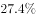，居民医保就诊率分别为、；2013年，县/市/区级医院医疗机构和社区卫生服务中心/卫生院的职工医保就诊率分别为、，居民医保就诊率分别为、。由此可以判断县/市/区级医院医疗机构和社区卫生服务中心/卫生院在拥有居民医保、职工医保的调查人员的两周就诊率中扮演着重要角色，正确；

C项：定位表格材料表1知，35岁及以上的高年龄组随着年龄增长，就诊率是逐年增加，且快速增长，正确；

D项：定位文字材料，已知城市和农村地区东中西部每百人中两周内的就诊率，其中城市地区西部地区就诊率最高，中部地区就诊率最低，农村地区东部地区就诊率最高，西部地区就诊率最低，由于材料并未给出东、中、西部城市地区和农村地区人数比，故无法推出西部地区就诊率低于中、东部地区，也无法推出西部地区被调查者健康状况相比中、东部地区较差，错误。

本题为选非题，故正确答案为D。

---
