# 2018年421联考《行测》题（重庆卷）（网友回忆版）

> 联考 · 2018 年 · 6 个模块 · 共 120 题

- [政治理论](#%E6%94%BF%E6%B2%BB%E7%90%86%E8%AE%BA) · 1 题
- [常识判断](#%E5%B8%B8%E8%AF%86%E5%88%A4%E6%96%AD) · 19 题
- [言语理解与表达](#%E8%A8%80%E8%AF%AD%E7%90%86%E8%A7%A3%E4%B8%8E%E8%A1%A8%E8%BE%BE) · 40 题
- [数量关系](#%E6%95%B0%E9%87%8F%E5%85%B3%E7%B3%BB) · 10 题
- [判断推理](#%E5%88%A4%E6%96%AD%E6%8E%A8%E7%90%86) · 30 题
- [资料分析](#%E8%B5%84%E6%96%99%E5%88%86%E6%9E%90) · 20 题

---

## 政治理论

### 第 1 题　qid 2188392 · 时事政治

中国共产党第十九届中央委员会第二次全体会议于2018年1月18日至19日在北京召开，会议的主要议程是：

- **A**. 研究制定国民经济发展计划
- **B**. 研究全面从严治党的重大问题
- **C**. 讨论修改宪法部分内容的建议　✅
- **D**. 研究党和政府机构改革的重大问题

**答案**：C

**官方解析**

本题考查时政常识，主要考查党的第十九届中央委员会第二次全体会议的内容。
A项错误，中国共产党第十八届中央委员会第五次全体会议，于2015年10月26日至29日在北京举行。审议通过了《中共中央关于制定国民经济和社会发展第十三个五年规划的建议》。因此，研究制定国民经济发展计划是党十八届中央委员会第五次全体会议的主要议程。
B项错误，中国共产党第十八届中央委员会第六次全体会议，于2016年10月24日至27日在北京举行。审议通过了《关于新形势下党内政治生活的若干准则》和《中国共产党党内监督条例》，审议通过了《关于召开党的第十九次全国代表大会的决议》。因此，研究全面从严治党的重大问题是党十八届中央委员会第六次全体会议的主要议程。
C项正确，中国共产党第十九届中央委员会第二次全体会议，于2018年1月18日至19日在北京举行。全会审议通过了《中共中央关于修改宪法部分内容的建议》，张德江就《建议（草案）》向全会作了说明。因此，会议的主要议程是讨论修改宪法部分内容的建议。
D项错误，中国共产党第十九届中央委员会第三次全体会议，于2018年2月26日至28日在北京举行。审议通过了《中共中央关于深化党和国家机构改革的决定》和《深化党和国家机构改革方案》。因此，研究党和政府机构改革的重大问题是党的十九届中央委员会第三次全体会议的主要议程。
故正确答案为C。

---

## 常识判断

### 第 1 题　qid 2187715 · 人文常识

下列教育家与其名言对应不正确的是：

- **A**. 孔子：“性相近也，习相远也”
- **B**. 孟子：“尽信书，则不如无书”
- **C**. 墨子：“道之所存，师之所存”　✅
- **D**. 荀子：“骐骥一跃，不能十步；驽马十驾，功在不舍”

**答案**：C

**官方解析**

本题考查文学常识，主要考查诸子百家。
A项正确，“性相近也，习相远也”出自《论语·阳货》：“子曰：性相近也，习相远也”，意思是人的先性（先天素质）差距不大，而后天习染（教育、环境影响等造成人的发展）却有很大差异。
B项正确，“尽信书，则不如无书”出自《孟子》的《尽心下》。“尽信书，则不如无书。”这是孟子关于读书方法的论述，目的在于告诉读者要善于独立思考问题。
C项错误，“道之所存，师之所存”出自韩愈的《师说》。意思是道理存在的地方，就是老师存在的地方。
D项正确，“骐骥一跃，不能十步；驽马十驾，功在不舍”出自荀子的《劝学》。意思是骏马一跨跃，也不足十步远；劣马拉车走十天，也能到达，劣马的成功来源于走个不停，坚持不放弃。
本题为选非题，故正确答案为C。

---

### 第 2 题　qid 2188397 · 人文常识

“人有悲欢离合，月有阴晴圆缺”，圆缺就是指“月相变化”，即地球上看到月球被太阳照亮部分的称呼。右图所示“上弦月”大致的农历日期是：

- **A**. 初一、初二
- **B**. 初七、初八　✅
- **C**. 十五、十六
- **D**. 廿二、廿三

**答案**：B

**官方解析**

本题考查自然常识，主要涉及月相变化的相关知识。
A项错误，农历初一的月相是新月，月球位于太阳和地球之间。地球上的人们正好看到月球背离太阳的面，因而在地球上看不见月亮。
B项正确，图中所示的上弦月，大约出现在农历每月初七、初八，月球绕地球继续向东运行，月地连线与日地连线成90度，我们在地球上正好看到月球是西半边亮，呈半圆形，因此叫上弦月。
C项错误，农历十五、十六时出现的月相是满月，月球运行到地球的外侧，即太阳、月球位于地球的两侧。由于白道面与黄道有一夹角，通常情况下，地球不能遮挡住日光，月球亮面全部对着地球。
D项错误，农历廿二、廿三时出现的月相是下弦月，太阳、地球和月球之间的相对位置再次变成直角，月球在日地连线的西边90度，我们在地球上看到月球东半边亮，呈半圆形，称为下弦月。
故正确答案为B。

---

### 第 3 题　qid 2188683 · 人文常识

在元代，与埃及亚历山大港并称“世界第一大港”的是：

- **A**. 甘棠港
- **B**. 月港
- **C**. 刺桐港　✅
- **D**. 徐闻港

**答案**：C

**官方解析**

作为古代海上交通贸易和文化交往大动脉，丝路主港亦随着时代的变迁而变迁：汉时为徐闻古港；公元3世纪30年代起，广州代之；隋唐时期，贯通南北的大运河把“陆上丝绸之路”与“海上丝绸之路”连为一体，连接点扬州跃升为东南第一都会；宋末至元代，泉州超越广州，与埃及亚历山大港并称“世界第一大港”；明初，漳州月港兴起；1842年，鸦片战争爆发，海上丝路走到尽头。
A项错误，唐末，开闽王王审知为发展海外贸易，开辟了甘棠港，它是现今福州地区有明确记载与确切地点的最早港口。
B项错误，月港，位于福建漳州，15世纪末期至17世纪中期，月港与汉、唐时期的福州甘棠港，宋、元时期的泉州后渚港和清代的厦门港，并称为福建的“四大商港”。
C项正确，泉州港古代称为“刺桐港”，是中国古代海上丝绸之路起点，被誉为“东方第一大港”。是世界千年航海史上独占400年鳌头的“世界第一大港”与埃及亚历山大港齐名，联合国唯一认定的“海上丝绸之路起点”。
D项错误，徐闻，是我国古代重要的南疆重镇、陆路驿站、海道要津和滨海县治，并且曾经是雷州半岛和海南岛的政治经济中心，也是我国古代对外贸易最早的通商口岸之一。自从汉武帝元鼎六年(公元前111年)派遣伏波将军路博德和楼船将军杨仆平定南越，设置合浦郡徐闻县之后，徐闻与中原的交往已开始频繁，有关的历史记载也比较明确。汉代时期的港址在今徐闻城西南35里的华丰大队讨网村。
故正确答案为C。

---

### 第 4 题　qid 2187661 · 科技常识

面包制作过程中使用酵母主要是利用其哪一种特性：

- **A**. 酵母在生长过程中可合成蛋白
- **B**. 酵母在生长过程中可分解淀粉
- **C**. 酵母在生长过程中可产生乙醇
- **D**. 酵母在生长过程中可产生二氧化碳　✅

**答案**：D

**官方解析**

酵母在面包制作中的功能：
1、生物膨松作用：酵母在面团发酵中产生大量的二氧化碳气体，并由于面筋网状结构的形成，而被留在网状组织内，使面团酥松多孔，体积变大及膨松； 
2、面筋扩展作用：酵母发酵除产生二氧化碳外，还有增加面筋扩展的作用，使发酵所产生的二氧化碳能保留在面团中，提高面团的保气能力。ABC三项表述有误，D项正确。
故正确答案为D。

---

### 第 5 题　qid 2187747 · 科技常识

下列现象的物理解释错误的是：

- **A**. 露珠呈球状——液体表面张力
- **B**. 铁轨铺在枕木上——减少压强
- **C**. 道路转弯镜——凸透镜对光发散　✅
- **D**. 微波炉烤面包——涡流感应加热

**答案**：C

**官方解析**

本题考查科技常识。
该真题命制不严谨。
A项正确，物质由分子组成，分子之间有间隙，由于分子在不停地做无规则运动，分子间存在相互作用的引力和斥力。在液体表面，分子间的作用力表现为相互吸引，由此表现为液体的表面张力。表面张力促使露珠以最小的表面积的状态存在，而体积相等的物体中，只有球体的表面积最小，所以露珠总是呈球状的。
B项正确，把铁轨铺在枕木上，是为了在压力一定的情况下，增大铁轨与地面的接触面积，从而减小火车对地面的压强。
C项错误，道路转弯镜利用的是凸面镜，可以扩大司机视野，及早发现弯道对面车辆，以减少交通事故的发生。
D项存在问题，微波炉加热食物主要利用微波。此外部分微波炉烧烤功能主要是利用烧烤组件来完成的，用电热丝发热来工作。一般认为利用涡流感应加热的是电磁炉。
本题命制不严谨，C项和D项均存在问题，C项相关知识点在往年考试中出现较多，故小粉笔认为该真题判卷时以C项为标准答案可能性更大。
本题为选非题，故正确答案为C。

---

### 第 6 题　qid 2187662 · 人文常识

下列四个节气所表示的含义错误的是：

- **A**. 处暑：炎热夏季即将到来　✅
- **B**. 惊蛰：天气回暖，春雷始鸣
- **C**. 冬至：冬季最寒冷的日子开始
- **D**. 小满：夏熟作物籽粒开始灌浆饱满但未成熟

**答案**：A

**官方解析**

本题考查自然常识，主要考查二十四节气的相关知识点。
A项错误，处暑，即为“出暑”，是炎热离开的意思，是气候变凉的象征。
B项正确，惊蛰，古称“启蛰”，标志着仲春时节的开始，此前，动物入冬藏伏土中，不饮不食，称为“蛰”；到了“惊蛰节”，天上的春雷惊醒蛰居的动物，称为“惊”。故惊蛰时，蛰虫惊醒，天气转暖，渐有春雷，中国大部分地区进入春耕季节。而“惊蛰”前后，之所以偶有雷声，是大地湿度渐高而促使近地面热气上升或北上的湿热空气势力较强与活动频繁所致，从而产生“惊蛰雷鸣”现象。
C项正确，从“冬至”开始，北半球逐渐进入了最寒冷的日子，称作“数九寒天”。
D项正确，小满是二十四节气之一，夏季的第二个节气。其含义是夏熟作物的籽粒开始灌浆饱满，但还未成熟，只是小满，还未大满。
本题为选非题，故正确答案为A。

---

### 第 7 题　qid 2187660 · 科技常识

某患者深夜因剧烈的关节疼痛而惊醒，触摸其手足多个关节，发现有黄白色结晶体隆起。造成这种症状的代谢改变最有可能是：

- **A**. 糖的无氧分解增强，生成过多乳酸
- **B**. 嘌呤核苷酸分解增强，生成过多尿酸　✅
- **C**. 肝中脂肪酸氧化增强，生成大量酮体
- **D**. 氨基酸脱氨基作用增强，生成大量尿素

**答案**：B

**官方解析**

本题考查生物常识。

痛风是由单钠尿酸盐（MSU）沉积所致的晶体相关性关节病，与嘌呤代谢紊乱和尿酸排泄减少所致的高尿酸血症直接相关，特指急性特征性关节炎和慢性痛风石疾病，主要包括急性发作性关节炎、痛风石形成、痛风石性慢性关节炎、尿酸盐肾病和尿酸性尿路结石，重者可出现关节残疾和肾功能不全。

痛风最重要的生化基础是高尿酸血症。尿酸是人体内嘌呤代谢的最终产物。正常成人每日约产生尿酸750mg，其中为内源性，为外源性尿酸，这些尿酸进入尿酸代谢池（约为1200mg），每日代谢池中的尿酸约进行代谢，其中1/3约200mg经肠道分解代谢，2/3约400mg经肾脏排泄，从而可维持体内尿酸水平的稳定，其中任何环节出现问题均可导致高尿酸血症。故造成这种症状的代谢改变最有可能是嘌呤核苷酸分解增强，生成过多尿酸，即B项正确，A、C、D三项错误。

故正确答案为B。

---

### 第 8 题　qid 2188481 · 人文常识

下列选项中的事件可能发生的是：
①隋炀帝偏爱吃茄子
②苏东坡的早餐中常有玉米粥
③西红柿炒蛋经常出现在宋代百姓的餐桌上
④开心果在宋代深受欢迎，学名叫阿月浑子
⑤苦瓜不但可以食用，还能入药，被收入《本草纲目》中

- **A**. ①③⑤
- **B**. ①②⑤
- **C**. ①④⑤　✅
- **D**. ②③④

**答案**：C

**官方解析**

①茄子原产地在亚洲热带的印度，最早于北魏《齐民要术》中记载其为蔬菜，最晚于西汉末年从印度传入四川，并且相传隋炀帝爱吃茄子，见其色彩奇异，认为是仙品，故赐名“昆仑紫瓜”。
②玉米是明朝中后期经过东南亚传入我国的，而宋代词人苏轼，字子瞻，号东坡居士。故苏东坡的早餐不可能有玉米粥。
③西红柿是明代传入中国的，故不可能出现在宋代百姓的餐桌上。
④开心果，中文名：阿月浑子，至晚于唐代，由中亚传入。故开心果在宋代深受欢迎的情形有可能发生。
⑤对于苦瓜，《本草纲目》记述为：“味：（瓜）苦、寒、无毒。（子）苦、甘、无毒。性：（瓜）除邪热，解劳乏，清心明目。（子）益气壮阳。”根据《本草纲目》记载，苦瓜可补胆润肝，利尿，消暑，解烈酒，助消化，防感冒，还可治喉炎及风热咳嗽，并且苦瓜的果实可入药。
可知，①④⑤正确，②③错误。
故正确答案为C。

---

### 第 9 题　qid 2187717 · 人文常识

下列哪一成语的典故不是来自真实历史事件：

- **A**. 暗度陈仓
- **B**. 草木皆兵
- **C**. 逼上梁山　✅
- **D**. 乐不思蜀

**答案**：C

**官方解析**

本题主要考查中国历史的相关知识。
A项正确，暗度陈仓，来自真实历史故事，出自《史记·高祖本纪》：“去辄烧绝栈道，以备诸侯盗兵袭之，亦示项羽无东意。······八月，汉王用韩信之计，从故道还，袭雍王章邯。邯迎击汉陈仓，雍兵败，还走······”，指刘邦出兵攻项羽时，韩信故意明修栈道，迷惑对方，暗中绕道奔袭陈仓，取得胜利。
B项正确，草木皆兵，来自真实历史故事，出自《晋书·苻坚载记》：“坚与苻融登城而望王师，见部阵齐整，将士精锐；又北望八公山上草木皆类人形，顾谓融曰：‘此亦勍（劲）敌也，何谓少乎？’怃然有惧色。”记载的是东晋淝水之战。
C项错误，逼上梁山，不是来自真实历史故事，而是来自虚构的小说，出自《水浒传》，讲述了八十万禁军教头林冲被太尉高俅陷害，刺配沧州，途中又险被杀害，终于走投无路，只好去投奔梁山的故事。 
D项正确，乐不思蜀，来自真实历史故事，出自 《三国志·蜀书·后主传》：“王问禅曰：‘颇思蜀否？’禅曰：‘此间乐，不思蜀。’”
本题为选非题，故正确答案为C。

---

### 第 10 题　qid 2187659 · 人文常识

下列药物不适用于清热利咽的是：

- **A**. 胖大海
- **B**. 板蓝根
- **C**. 片仔癀
- **D**. 珍珠粉　✅

**答案**：D

**官方解析**

本题考查生活常识，主要涉及药物使用的相关内容。
A项正确，胖大海是植物胖大海的干燥成熟种子，产于泰国、柬埔寨、马来西亚等国，具有清热润肺，解毒利咽，治疗咽喉肿痛的功效，口干咽燥，牙龈肿痛者可单独泡服。
B项正确，板蓝根，是一种中药材，具有清热解毒，凉血利咽之功效，常用于温疫时毒，发热咽痛，温毒发斑，痄腮，烂喉丹痧，大头瘟疫，丹毒，痈肿。
C项正确，片仔癀，为清热剂，具有清热解毒、凉血化瘀，消肿止痛之功效。用于热毒血瘀所致急慢性病毒性肝炎，痈疽疔疮，无名肿毒，跌打损伤及各种炎症。
D项错误，《中华人民共和国药典》及《中药大辞典》均指明：珍珠具有安神定惊、明目去翳、解毒生肌等功效，现代研究还表明珍珠粉在提高人体免疫力、延缓衰老、祛斑美白、补充钙质等方面都具有独特的作用。
本题为选非题，故正确答案为D。

---

### 第 11 题　qid 2187701 · 经济常识

下列关于我国金融常识的说法正确的是：

- **A**. 国债、股票、公司债券的投资风险依次递增
- **B**. 理财产品合同中的预期收益率是理财产品实际到期收益率
- **C**. 公众兑换票面残缺的人民币，要到中国人民银行指定的商业银行网点
- **D**. 自然人之间借贷如未约定利息，出借人欲主张支付利息，法院不予支持　✅

**答案**：D

**官方解析**

本题主要考查金融常识。
A项错误，债券投资的风险是指债券预期收益变动的可能性及变动幅度。国债的发行主体是国家，其具有最高的信用度，被认为是最安全的投资工具；公司债券的发债主体为按照《中华人民共和国公司法》设立的公司法人，在实践中，其发行主体为上市公司，投资风险性次之；而股票作为股份公司发行的所有权凭证，流通性强、收益高，投资风险最大。因此应为国债、公司债券、股票的投资风险依次递增。
B项错误，预期收益率也称为期望收益率，是指在不确定的条件下，预测的某资产未来可实现的收益率。因此理财产品合同中的预期收益率是指理想中理财产品的收益率，而不是实际到期收益率。
C项错误，根据《中国人民银行残缺污损人民币兑换办法》第三条规定：“凡办理人民币存取款业务的金融机构应无偿为公众兑换残缺、污损人民币，不得拒绝兑换。”因此，公众兑换票面残缺的人民币可以到任一办理存取款业务的金融机构。
D项正确，《最高人民法院关于审理民间借贷案件适用法律若干问题的规定》第二十四条第一款规定：“借贷双方没有约定利息，出借人主张支付利息的，人民法院不予支持。”
故正确答案为D。

---

### 第 12 题　qid 2188395 · 人文常识

下列关于我国城镇职工基本医疗保险（简称职工医保）的说法正确的是：

- **A**. 灵活就业人群不属于职工医保的覆盖范围
- **B**. 退休职工满足一定条件可以不缴纳保险费　✅
- **C**. 用人单位缴纳的保险费不进入职工的个人账户
- **D**. 职工医保是社会保险的一种，不是强制保险

**答案**：B

**官方解析**

本题考查法律常识。
A项错误，根据《中华人民共和国社会保险法》第二十三条第二款规定：“无雇工的个体工商户、未在用人单位参加职工基本医疗保险的非全日制从业人员以及其他灵活就业人员可以参加职工基本医疗保险，由个人按照国家规定缴纳基本医疗保险费。”因此，灵活就业人群可以参加职工医保。
B项正确，根据《中华人民共和国社会保险法》第二十七条规定：“参加职工基本医疗保险的个人，达到法定退休年龄时累计缴费达到国家规定年限的，退休后不再缴纳基本医疗保险费，按照国家规定享受基本医疗保险待遇。”所以，退休职工满足一定条件可以不缴纳保险费。
C项错误，根据《中华人民共和国城镇职工基本医疗保险条例》第十九条规定：“用人单位缴纳基本医疗保险费的25—35％用于建立退休人员和从业人员的个人帐户，具体分配办法由省人民政府按照顾年长者原则制定；所余资金用于建立统筹基金。”因此，用人单位缴纳的保险费有一部分是进入职工的个人账户的。
D项错误，根据《中华人民共和国城镇职工基本医疗保险条例》第二条规定：“省城镇下列单位及其从业人员必须按照本条例参加基本医疗保险：（一）企业及其从业人员；（二）机关、事业单位、中介机构、社会团体、民办非企业单位及其从业人员；（三）部队所属用人单位及其无军籍的从业人员。”所以职工医保对这部分人属于强制保险。
故正确答案为B。

---

### 第 13 题　qid 2187757 · 科技常识

“21世纪金属”具有较高的强度、良好的抗氧化性和优异的耐腐蚀性，对人体无毒且无不良反应，被称为“亲生物金属”，可作为人造骨材料。下列关于“21世纪金属”的说法正确的是：

- **A**. “21世纪金属”是指钛和钛合金　✅
- **B**. “21世纪金属”只运用于航空航天领域
- **C**. “21世纪金属”是一种新型石墨烯材料
- **D**. “21世纪金属”是21世纪发现的一种金属元素

**答案**：A

**官方解析**

本题考查的是科技常识的相关知识。
A项正确，钛和钛合金具有很多优良的性能，如熔点高、密度小、可塑性好、易于加工，尤其是钛合金与人体器官具有很好的“生物相容性”。钛和钛合金被认为是21世纪重要的金属材料。
B项错误，钛和钛合金的用途很广，在航空航天、海洋工程、生物医疗、生活用品等领域都有广泛的应用，并不是只用于航空航天领域。
C项错误，石墨烯是一种由碳原子组成的二维碳纳米材料，具有导电电热性佳、重量轻、强度大、韧性好、透光率高等特点。但它并不是“21世纪金属”。
D项错误，“21世纪金属”指钛和钛合金，钛元素大约是在18世纪被发现，而不是21世纪。
故正确答案为A。

---

### 第 14 题　qid 2188394 · 人文常识

古代许多人既有“名”又有“字”，表字和本名的意义有联系。下列古代名人的表字和本名意义相近、互为辅助的是：

- **A**. 孟轲，字子舆
- **B**. 朱熹，字元晦
- **C**. 李白，字太白
- **D**. 陆机，字士衡　✅

**答案**：D

**官方解析**

本题考查文学常识。古人取字三种方法：同义反复、反义相对、近义相辅。
A项错误，孟子，名轲，字子舆。孟子的名“轲”是车的意思，而“舆”也是车的意思。因此，孟子的本名与表字意义相同，是同义反复。
B项错误，朱熹，字元晦。其中“熹”就是炙热、光明的意思；而“晦”就是晦暗、隐晦的意思。朱熹的表字与本名意义相反，是反义相对。
C项错误，李白，名白，意为白色、明亮、纯洁；字太白，太是极致的意思，太白意为非常“白”。表字与本名意义相同，是同义反复。
D项正确，陆机，字士衡。其中，“机”（天机星或天玑星）和“衡”（玉衡星）都是北斗的星名，相互补充。因此，陆机的本名与表字意义相近，互为辅助。
故正确答案为D。

---

### 第 15 题　qid 2188532 · 人文常识

下列可以作为我国古代天子祭祀礼器的有：
①鼎  ②爵  ③簋  ④璧  ⑤璜  ⑥璋

- **A**. ②⑤
- **B**. ③⑥　✅
- **C**. ①④
- **D**. ①⑤

**答案**：B

**官方解析**

本题很不严谨。关于天子祭祀，《周礼·春官宗伯·大宗伯》记载：“以玉作六器，以礼天地四方：以苍璧礼天，以黄琮礼地，以青圭礼东方，以赤璋礼南方，以白琥礼西方，以玄璜礼北方。”根据《周礼》所记，其中：④璧，天子礼天之器，诸侯享天子者亦用之；⑤璜，贵族朝聘（天子）、祭祀、丧葬时作礼器用；⑥璋天子巡守，可用璋祭祀山川（大璋、九寸中璋、边璋）。因此④璧、⑥璋可以作为我国古代天子祭祀礼器。排除AD。
①鼎是青铜器的重要器种之一，原是用以烹煮肉和盛贮肉类的器具。后来因用于烹饪祭祀给神的牲畜，而上升为祭祀的礼器。周礼规定，天子用九鼎八簋，诸侯用七鼎六簋，卿大夫用五鼎四簋，士用三鼎二簋。
②爵，古代商周时期，酒器一般都是用青铜制作的，当时有一种赫赫有名的饮酒器具，叫做爵。根据历史记载，爵是古代天子分封诸侯时，赐给受封者的一种赏赐物。后来“爵”就成了“爵位”的简称，人们十分熟悉的“加官进爵”一词源出于此。
③据《礼记·玉藻》记载和考古发现得知，簋是重要的礼器，主要用于祭祀时放置煮熟的饭食，一般与鼎相配合使用。周礼规定，天子用九鼎八簋，诸侯用七鼎六簋，卿大夫用五鼎四簋，士用三鼎二簋。
故①③④⑥为天子祭祀的礼器，②⑤不是天子祭祀的礼器。
故正确答案为B或C。

---

### 第 16 题　qid 2187718 · 人文常识

下列我国古代绘画理论名句所表达的美学理念与其他三项不同的是：

- **A**. 到处云山是吾师
- **B**. 搜尽奇峰打草稿
- **C**. 论画以形似，见与儿童邻　✅
- **D**. 吾师心，心师目，目师华山

**答案**：C

**官方解析**

本题主要考查文化常识的相关知识。
A项“到处云山是吾师”是元代赵孟頫提出的，表达的美学理念是重视向自然美学习。
B项“搜尽奇峰打草稿”是清代石涛提出的，表达的美学理念是重视向自然学习，注意感同身受和提炼构思相结合。
C项“论画以形似，见与儿童邻”是苏轼的两句论画名言。诗句意为：衡量画的好坏，只以形似作为评判优劣的标准，就如同儿童的见解一样幼稚。画要画出神，诗要有言外之味。古代艺术论将这种思想表述为:“含不尽之意见于言外”“象外之象”“味外之味”“意外之韵”等等。
D项“吾师心，心师目，目师华山”是明代王履提出的，表达的美学理念是向自然学习，师法自然，发挥主观能动性。
C项与其他三项不同。
本题为选非题，故正确答案为C。

---

### 第 17 题　qid 2187710 · 人文常识

下列文学作品没有使用方言的是：

- **A**. 《海上花列传》(韩邦庆)
- **B**. 《凤凰涅槃》(郭沫若)　✅
- **C**. 《秦腔》（贾平凹）
- **D**. 《白鹿原》(陈忠实)

**答案**：B

**官方解析**

本题考查文学常识。
A项正确，《海上花列传》是清末著名小说，主要讲述了清末中国上海十里洋场中的妓院生活，涉及当时的官场、商界及与之有联系的社会的各个层面。它是最著名的吴语小说，也是中国第一部方言小说。
B项错误，《凤凰涅槃》是一首现代白话诗歌，诗歌以凤凰的传说为素材，通过凤凰集木自焚，从烈焰中重生的故事，表达了彻底埋葬旧社会、争取祖国自由解放的思想，在现代诗歌史上具有重要历史地位的诗篇。《凤凰涅槃》运用的现代白话文，不涉及方言的应用。
C项正确，《秦腔》是贾平凹的著名长篇小说。《秦腔》中用了大量的修辞手法，融合比喻、拟人、对偶、象征等手法，活灵活现地展现了农村生活，这些修辞手法结合方言化的语言要素，形成了极具地域色彩的语言风格。
D项正确，《白鹿原》是陈忠实创作的长篇小说。小说中，作者不仅从表层的遣词造句的角度精心选择方言语汇，运用方言语气词以及高密度的排比句和长句来营造方言氛围、创造方言腔调，而且从深层的角度运用方言思维进行布局谋篇。
本题为选非题，故正确答案为B。

---

### 第 18 题　qid 2188531 · 人文常识

下列关于我国C919大型客机研发意义的表述错误的是：

- **A**. 社会效益方面，C919能带动上下游产业发展，增加就业岗位，促进经济社会发展
- **B**. 技术方面，C919能提升我国航空工业研发能力，促进航空人才队伍建设，提升民航工业水平
- **C**. 军事方面，以C919为平台改装成大型军用特种飞机的潜力巨大，短期内实现其军民两用前景良好　✅
- **D**. 经济方面，C919使我国民航不再依赖进口中层干线客机，打破了西方航空垄断，进而节省外汇

**答案**：C

**官方解析**

本题考查科技常识。C919项目在技术、经济、军事等方面具有很大积极意义。
A项正确，在社会效益方面，C919项目能带动上下游产业发展，增加大量高收入的就业岗位，拉动地方经济发展。
B项正确，在技术方面，C919能够锻炼中国航空工业在干线客机方面的设计和制造能力，锻炼一批航空人才，提升中国民用航空工业水平。
C项错误，在军事方面，用C919改装预警机、高新机等大型军用特种飞机的潜力巨大。事实上，从西方国家大型军用特种飞机改装经验来看，选择的都是经过市场验证，证明是性能可靠、安全成熟的干线客机平台。比如，日本空自现役主力大型空中预警机E-767采用的是1984年交付的波音767-200ER，而波音公司进行首架E-767机体改装工作的时间已经是11年后的1995年。C选项后半句“短期内实现其军民两用前景良好”表述错误。
D项正确，在经济方面，C919不仅能使中国民航不再依赖于从欧美进口波音和空客的中层干线客机，并且打破欧美航空巨头垄断，为国家节省了大量外汇。
本题为选非题，故正确答案为C。

---

### 第 19 题　qid 2187719 · 经济常识

下列事件按时间先后顺序排列正确的是：
①中国女排获得里约奥运会女排比赛冠军
②中国（上海）自由贸易实验区正式设立
③第九届金砖国家领导人会晤在厦门举行
④我国举行纪念中国人民抗日战争暨世界反法西斯战争胜利70周年阅兵式

- **A**. ②③①④
- **B**. ④①②③
- **C**. ②④①③　✅
- **D**. ②①③④

**答案**：C

**官方解析**

本题考查毛中特。

②2013年8月22日，国务院正式批准设立中国（上海）自由贸易试验区。

④2015年9月3日，是中国第二个法定的“中国人民抗日战争胜利纪念日”，也是中国人民抗日战争暨世界反法西斯战争胜利70周年。

①北京时间2016年8月21日，在里约奥运会女排决赛中，中国队战胜塞尔维亚队获得金牌。

③2017年9月3日至5日，金砖国家领导人第九次会晤在福建厦门举行，主题是：“深化金砖伙伴关系，开辟更加光明未来。”金砖合作已经步入第二个“黄金十年”。

故按照时间先后顺序排序为②④①③。

故正确答案为C。

---

## 言语理解与表达

### 第 1 题　qid 2187775 · 逻辑填空

近些年，作为文化政策、资本扶植发展的重心，国产动画被寄予了极大期望。然而，动漫的土壤并不是随便撒些空壳烂籽就可以                的。
填入划横线部分最恰当的一项是：

- **A**. 守株待兔
- **B**. 坐享其成　✅
- **C**. 不劳而获
- **D**. 以逸待劳

**答案**：B

**官方解析**

文段指出，国产动漫并不是可以随便撒些空壳烂籽就可以成功的。B项“坐享其成”形象地描绘出撒完空壳烂籽就坐在旁边等待发芽结果最终收获的样子，符合文意，当选。

A项“守株待兔”比喻试图不经过努力而得到成功的侥幸心理，C项“不劳而获”比喻不劳动而得到成果，重在强调完全什么都不做就能够获得收益，但前文中“撒些空壳烂籽”实际上也付出了劳动，故二者均不符合语境，排除。

D项“以逸待劳”指在战争中做好充分准备，养精蓄锐，等疲乏的敌人来犯时给以迎头痛击，含褒义，感情色彩与文段不符，排除。

故正确答案为B。

【文段出处】《大圣归来说启迪》

---

### 第 2 题　qid 2188429 · 逻辑填空

古代中国数秘术与古希腊数秘术的区别在于，前者侧重解象，后者侧重数术。中国的数秘术后来发展成了更具方法论意义的宇宙形而上学，与算术渐行渐远，                。
填入画横线部分最恰当的一项是：

- **A**. 南辕北辙
- **B**. 分道扬镳　✅
- **C**. 缘木求鱼
- **D**. 背道而驰

**答案**：B

**官方解析**

横线处所填词语与“渐行渐远”构成并列，体现了中国的数秘术与算术逐渐分开，越走越远，各走各的，B项“分道扬镳”比喻目标不同，各走各的路或各干各的事，符合文意，当选。
A项，“南辕北辙”比喻行动和目的相反，通常主语指的是一个对象，而文段的主语是“数秘术”和“算术”，排除；C项，“缘木求鱼”比喻方向或办法不对头，不可能达到目的，与“渐行渐远”语义无关，无法构成并列，排除；D项，“背道而驰”比喻背离正确的道路，通常用在消极的对象身上，而“中国的数秘术”并非消极的对象，排除。
故正确答案为B。
【文段出处】《希腊数学作为自由学术的典范》

---

### 第 3 题　qid 2188459 · 逻辑填空

当下，“网红食品”让一些美食爱好者                。然而，朋友圈里的美食宣传往往真假莫辨。“网红食品”利用朋友圈熟人关系、口碑传播的社交特性推销产品，甚至        营销公众号为其背书。
依次填入划横线部分最恰当的一项是：

- **A**. 接踵而来  鼓动
- **B**. 蜂拥而至  发起
- **C**. 亦步亦趋  策动
- **D**. 趋之若鹜  发动　✅

**答案**：D

**官方解析**

第一空，分析文意可知，表达“网红食品”受到了美食爱好者的追捧。D项“趋之若鹜”比喻许多人争着去追逐某些事物，与文意相符。A项“接踵而来”指人们前脚跟着后脚，接连不断地来，形容来者很多，络绎不绝；B项“蜂拥而至”指很多人乱哄哄地朝一个地方聚拢，两项均不包含“追捧”之意，与文意不符，排除。C项“亦步亦趋”比喻由于缺乏主张，或为了讨好，事事模仿或追随别人，文段并无“模仿”之意，排除。
第二空，代入验证，“甚至”表示递进关系，横线处所填词语与前文语义相近，但程度更重，“发动”指行动起来，“发动公众号”体现“网红食品”传播更为广泛，符合文意，当选。
故正确答案为D。
【文段出处】《让“网红食品”红得健康》

---

### 第 4 题　qid 2188461 · 逻辑填空

欧盟委员会发布消息称，回顾全球“金融危机”以来的        ，欧盟采取得当的        ，有效地控制住了危机的蔓延与发展，从而在最近几年取得了经济持续增长的佳绩。
依次填入画横线部分最恰当的一项是：

- **A**. 历史  办法
- **B**. 历程  措施　✅
- **C**. 经历  手段
- **D**. 经过  举措

**答案**：B

**官方解析**

第一空，横线处所填词语搭配“金融危机”，且由“有效控制危机”、“取得佳绩”可知，欧盟应是回顾在“金融危机”过程中人们的做法。B项“历程”指经历过的事情，符合文意；A项“历史”指过去的事实，不符合文意，排除；C项“经历”指自身或他人见过、做过或遭遇过的事，多搭配“人”，与“金融危机”搭配不当；D项“经过”与“金融危机”搭配不当，且“经历”“经过”与文段语体风格不符，均排除。
第二空，代入验证，由“有效地控制了危机，取得了佳绩”可知，欧盟采取了有效的方法。B项“措施”指针对问题的解决办法，符合文意，当选。
故正确答案为B。
【文段出处】《欧盟称 应对“金融危机”措施得当经济持续复苏》

---

### 第 5 题　qid 2187773 · 逻辑填空

艺术人类学的田野调查，是将调查事项作为一个整体，从形式到内涵，由表及里，                ，考察其艺术语境、渊源、内涵、象征、法则及其实际发挥的社会功能，同时更关注艺术事项的主体，并从中发现他们独特的艺术审美和文化价值。
填入划横线部分最恰当的一项是：

- **A**. 由浅到深
- **B**. 深入浅出　✅
- **C**. 条分缕析
- **D**. 逐层论证

**答案**：B

**官方解析**

此题难度较大，建议使用排除法。文段开篇介绍艺术人类学的田野调查将调查事项作为一个整体，接着详细介绍了田野调查的三个步骤、阶段，即从形式到内涵，由表及里，故横线处所填内容为田野调查的第三个阶段，且根据前文“形式、内涵”和“表、里”，横线处成语也要包含两个方面。而C项“条分缕析”形容分析得有条理，很细致，D项“逐层论证”指一步一步分析论证，两项均不包含两个层面，与文意不符，排除。对比A、B两项，A项“由浅到深” 指从浅入深，逐步深入，与前文提到的田野调查的第二个阶段“由表及里”语义重复，不能构成调查的第三步骤，排除；B项“深入浅出”指讲话或文章的内容深刻，语言文字却浅显易懂或内容、道理很深刻，但表达得浅显通俗，符合文意，当选。
故正确答案为B。
【文段出处】《“非遗”保护与艺术人类学的作为》

---

### 第 6 题　qid 2187776 · 逻辑填空

当初的救济性扶贫虽然有立竿见影的功效，但救济的终结常常就是返贫的开始。后来的开发性扶贫有利于借助本土资源        现代产业，但也容易滋生资源掠夺经营、透支生态环境的隐患。在“输血”和“造血”之外，我们还应有新的视角和新的思维。
填入划横线部分最恰当的一项是：

- **A**. 培养
- **B**. 扶植
- **C**. 培植　✅
- **D**. 培育

**答案**：C

**官方解析**

本题为单空实词题，且选项中词语语义相近，需认真比较。
横线处搭配“现代产业”，A项“培养”搭配不当，排除。根据后文的语境，本空要与“造血”一词形成对应，故须体现出“从无到有”这一特点，B项“扶植”有帮扶之意，体现出的是由弱到强，而非从无到有，排除；C项“培植”指栽种并细心管理，能够体现出从无到有的过程，当选； D项“培育”指培养教育，并非从无到有，与文意不符，排除。
故正确答案为C。
【文段出处】《赋权式扶贫：向社会底层普及改革发展带来的机会》

---

### 第 7 题　qid 2188460 · 逻辑填空

每一项工业遗产都        着城市社会发展的演变规律。实施对工业遗产的发掘保护、开发利用，对维护城市风貌，        生机特色，克服千城一面现象，具有重要意义。
依次填入划横线部分最恰当的一项是:

- **A**. 凝结  保持　✅
- **B**. 凝集  保留
- **C**. 凝聚  突出
- **D**. 凝滞  凸显

**答案**：A

**官方解析**

第一空，横线处所填词语与“规律”搭配，A、B、C三项，“凝结”“凝集”“凝聚”均有“聚集、积聚”之意，可与“规律”搭配，保留。D项，“凝滞”指停留不动，不灵活，一般搭配“目光凝滞”，与“规律”搭配不当，排除。
第二空，由“城市社会发展的演变规律”及“克服千城一面现象”可知，城市在不断的变化发展过程中要有自己的特色，横线处所填词语应体现特色在城市演变整个过程中“一直存在”之意，与前文“维护”构成对应，A项“保持”指维持某种状态使不消失或减弱，符合文意，当选。B项“保留”指保存不改变，侧重结果，与文意不符，排除；C项“突出”含有明显，出众之意，与文意不符，排除。
故正确答案为A。
【文段出处】《城市工业文化遗产保护与利用泛论》

---

### 第 8 题　qid 2187684 · 逻辑填空

科学的发展和进步往往____于科学假说，科学理论发展的历史就是假说的形成、发展和假说之间的竞争、更迭的历史。面对茫茫人类历史源头，面对_______、虚虚实实的人类文明历史遗存，科学假说同样至关重要。他_______地将历史、文化、人性、环境视角的“聚光灯”汇集在一起，形成了属于他的一盏“无影灯”，并以这样的视角照射幽暗的历史深处，从而解析出一些可能接近历史本源的朦胧真相。
依次填入划横线部分最恰当的一项是：

- **A**. 发轫  凤毛麟角  含英咀华
- **B**. 肇始  吉光片羽  独辟蹊径　✅
- **C**. 滥觞  汗牛充栋  苦心孤诣
- **D**. 开端  如火如荼  毛举细故

**答案**：B

**官方解析**

本题可从第二空入手，横线处搭配“历史遗存”，A项“凤毛麟角”指珍贵而稀少，B项“吉光片羽”比喻残存的珍贵文物，均可与之搭配，保留。C项“汗牛充栋”形容藏书很多，D项“如火如荼”指形容气势旺盛、热烈或激烈，均与“历史遗存”搭配不当，排除。
第三空，根据“形成了属于他的一盏‘无影灯’”可知，横线处强调该视角是“他”自己独创的、特有的，B项“独辟蹊径”比喻独创一种新风格或者新方法，符合文意，保留。A项“含英咀华”比喻读书吸取其精华，无法体现“独创、独有”之意，排除。
第一空，代入“肇始”验证，“肇始”指发端、开始，填入文段表达科学发展和进步开始于科学假说，符合文意，当选。
故正确答案为B。
【文段出处】《面对华夏祖先的图腾——评李琳之&lt;祖先，祖先&gt;》

---

### 第 9 题　qid 2187778 · 逻辑填空

家风是具有鲜明特征的家庭文化，良好家风是一个家庭最宝贵的精神财富，也是每个家庭成员形成正确世界观、人生观、价值观的       。家庭是人生的第一所学校，良好家风是人生幸福生活的“第一组密码”。“积善之家，必有余庆；积不善之家，必有余殃。”只有守住和       好温暖的家庭，才能有人生的成功。
依次填入划横线部分最恰当的一项是：

- **A**. 基点  庇护
- **B**. 基准  保护
- **C**. 基础  爱护
- **D**. 基石  呵护　✅

**答案**：D

**官方解析**

第一空，根据文意可知，横线处需体现出良好家风是家庭成员形成世界观、人生观、价值观的基本条件，A项“基点”可指事物发展的根本、基础，C项“基础”意为事物发展的根本或起点，D项“基石”比喻基础或中坚力量，均能体现“基本”之意，保留。B项“基准”指标准，“家风”并不是形成三观的标准，而是三观的“基本”，故“家风”与“基准”搭配不当，排除。
第二空，横线处搭配“家庭”，A项“庇护”意为袒护、包庇，感情色彩偏消极，和“家庭”搭配不当，排除；对比C、D两项，“爱护”常用作爱护公物、爱护花草，一般不与“家庭”搭配，而“呵护”常搭配朋友、家人、家庭，并且“爱护”指爱惜并保护，“呵护”指对某人、某物很在意，用心照顾、保护，“呵护”更能体现对“家庭”精心照顾的态度，D项更符合语境，当选。
故正确答案为D。
【文段出处】《做培育良好家风的表率》

---

### 第 10 题　qid 2187682 · 逻辑填空

中国传统菜肴对于烹调方法极为讲究，而且长期以来，由于物产和风俗的差异，各地的饮食习惯和品味爱好               ，              的烹调技术经过历代人民的创造，形成了丰富多彩的地方菜系。
依次填入划横线部分最恰当的一项是：

- **A**. 迥然不同  源远流长　✅
- **B**. 天差地别  积厚流光
- **C**. 殊途同归  连绵不断
- **D**. 如出一辙  博大精深

**答案**：A

**官方解析**

第一空，由“物产和风俗的差异”可知，横线处词语表示各地饮食习惯和品味爱好不一样，A项“迥然不同”形容相差得远，很明显不一样，B项“天差地别” 形容两种或多种事物之间的差距很大，均能够体现出“差异性”，符合文意，保留；而C项“殊途同归”比喻采取不同的方法而得到相同的结果，D项“如出一辙”比喻两件事情非常相似，均不能体现出差异性，排除C、D两项。
第二空，横线处词语形容烹调技术，由“历代人民”可知，烹调技术历史悠久，A项“源远流长”比喻历史悠久，与“历代人民”形成对应，当选；B项“积厚流光”是指积累的功业越深厚，则流传给后人的恩德越广，与“烹调技术”搭配不当，排除。
故正确答案为A。
【文段出处】《我对中国饮食文化的感悟》

---

### 第 11 题　qid 2187676 · 逻辑填空

泥石流的         依赖于三个危险因素：沉积物中的粘土、大量的水快速涌入以及山区的地势差异。发生泥石流时，地上的各种大小石头和泥，小到直径只有零点几微米的粘土，大到数十厘米乃至更大的巨型漂砾，都有可能         在泥石流中“泥沙俱下”。
依次填入划横线部分最恰当的一项是：

- **A**. 诱发  裹挟　✅
- **B**. 成因  汇集
- **C**. 出现  夹杂
- **D**. 引发  聚集

**答案**：A

**官方解析**

第一空，根据文意可知，横线处表达泥石流的产生形成依赖三个因素，A项“诱发”、C项“出现”、D项“引发”均符合文意，保留；B项“成因”指原因，与后文“因素”语义重复，排除。
第二空，横线表达石头和泥等卷入泥石流中，而且石头和泥本身是静止的，受到了泥石流的冲击才被动的跟随泥石流移动，所以第二空应体现“被动”的意思。C项“夹杂”指掺杂，D项“聚集”指集合、凑在一起，均无“被动”之意，排除；A项“裹挟”指人或物被迫卷入其中，符合文意，当选。
故正确答案为A。
【文段出处】《别忘了还有泥石流》

---

### 第 12 题　qid 2188437 · 逻辑填空

近年来，“图说我们的价值观”公益广告以开阔的视野、        人心的作品和        人心的力量，传播社会正能量，引起了社会各界的高度关注和观众的热烈反响。
依次填入划横线部分最恰当的一项是：

- **A**. 凝聚  汇聚
- **B**. 深入  撼动　✅
- **C**. 温暖  感化
- **D**. 鼓舞  激励

**答案**：B

**官方解析**

本题两个空都搭配“人心”，并且“、”“和”引导三方面的并列，根据三方面的并列语意不同可知，两空表达的意思应该不同，A项“凝聚”“汇聚”有聚集在一起的意思，D项“鼓舞”“激励”都有鼓舞、鼓励、激励的意思，两项均排除。B项“深入”人心，体现进入人心的意思，“撼动”人心体现出让内心得到震动的意思，语义不同，C项“温暖”人心，让人感到温度，“感化”人心，内心的温度感化人心，语义较相近，对比B、C两项，B项更能体现语意的不同，并且“深入”人心的作品为常见搭配，撼动人心的力量也更准确，故择优选择B项。
故正确答案为B。
【文段出处】《“图说我们的价值观”传播磅礴正能量》

---

### 第 13 题　qid 2187670 · 逻辑填空

哲学社会科学作为人们认识世界、改造世界的重要         ，历来是推动历史发展和社会进步的重要力量。纵观人类历史，人类社会每一次重大跃进，人类文明每一次重大发展，都离不开哲学社会科学的知识         和思想先导。哲学社会科学的发展水平，反映了一个民族的思维能力、精神品格、文明素质，体现了一个国家的综合国力和国际竞争力。
依次填入划横线部分最恰当的一项是：

- **A**. 指南  增进
- **B**. 途径  进步
- **C**. 方法  积累
- **D**. 工具  变革　✅

**答案**：D

**官方解析**

本题可从第二空入手，根据文段“人类社会每一次重大跃进，人类文明每一次重大发展”可知，横线处要体现出哲学社会科学对人类社会的重大意义，且与“知识”搭配。D项“变革”指改变事物的本质，与文意相符且搭配恰当，当选。A项“增进”一般不与“知识”搭配，排除；B项“进步”、C项“积累”与“变革”相比程度较轻，均无法体现“重大跃进、重大发展”之意，排除。基本锁定正确答案为D项。
第一空，代入验证，D项“工具”指用以达到目的的事物，填入文段可体现哲学社会科学的作用，符合文意，当选。
故正确答案为D。
【文段出处】《哲学社会科学是推动发展进步的重要力量》

---

### 第 14 题　qid 2188516 · 逻辑填空

跟其他射电望远镜一样，中国大射电望远镜最主要的两大科学目标是        宇宙中的中性氢和观测脉冲星，前者是研究宇宙大尺度物理学，以        宇宙起源和演化，后者是研究极端状态下的物质结构与物理规律。
依次填入画横线部分最恰当的一项是：

- **A**. 巡访  探寻
- **B**. 巡视  探索　✅
- **C**. 巡查  探讨
- **D**. 巡弋  探究

**答案**：B

**官方解析**

第一空，横线处搭配“中性氢和观测脉冲星”，且通过“和”与“观测”构成并列关系，故横线处应体现出“看”的含义。B项“巡视”指巡行视察，侧重于“视”，C项“巡查”指一边走一边查看，均符合文意，且与“中性氢”搭配合适，保留。A项“巡访”侧重于“访问”，D项“巡弋”指在水域巡逻，均与文段意思不符，不能体现出“看”的意思，排除。
第二空，根据文意可知，横线处应表示研究宇宙大尺度物理学可以帮助人去寻找宇宙起源和演化。B项“探索”指探寻求索，搭配恰当，当选。C项“探讨”一般指人相互讨论，与文段语境信息不符，排除。
故正确答案为B。

---

### 第 15 题　qid 2188511 · 逻辑填空

细胞表面的磷脂酰丝氨酸是促进HIV与细胞融合的重要辅因子，是HIV入侵细胞过程中的“        ”目标，若这一目标不存在了，则会影响HIV的入侵。因此，        外源性磷脂酰丝氨酸，或抑制TMEM16F蛋白，就会抑制病毒蛋白的介导融合，从而阻止HIV对细胞的感染。
依次填入画横线部分最恰当的一项是：

- **A**. 捆绑  阻隔
- **B**. 锁定  阻拦
- **C**. 绑定  阻止
- **D**. 绑架  阻断　✅

**答案**：D

**官方解析**

第一空，根据文段“细胞表面的磷脂酰丝氨酸是促进HIV与细胞融合的重要辅因子”、“若这一目标不存在了，则会影响HIV的入侵”可知，横线处所填词语表达HIV在入侵细胞过程中需要和磷脂酰丝氨酸绑在一起，否则无法入侵的含义，A项“捆绑”、C项“绑定”、D项“绑架”均符合文意。B项“锁定”指使固定不动，体现不出“绑”的意思，排除。
第二空，搭配“外源性磷脂酰丝氨酸”，A项“阻隔”、D项“阻断”能体现出隔在外面的意思，C项“阻止”体现停下来的意思，但是停在什么地方不清楚，并且文段后面出现“阻止HIV细胞的感染”语义上略显重复，排除。
对比A、D两项，第一空出现双引号，体现形象化的表达，A项“捆绑”仅仅体现绑在一起，D项“绑架”更能形象的体现磷脂酰丝氨酸对HIV入侵的作用性，填入文段更合适，择优选择D项。
故正确答案为D。
【文段出处】《HIV通过“绑架”细胞表面分子入侵细胞》

---

### 第 16 题　qid 2188458 · 逻辑填空

国家主席习近平在G20汉堡峰会上对全球经济治理的建议极具针对性。加强宏观政策        ，有助于促进各方        ，避免沟通不畅或是以邻为壑，进而打造开放共赢的合作模式。
依次填入划横线部分最恰当的一项是：

- **A**. 协调  互动
- **B**. 调控  互通
- **C**. 沟通  联动　✅
- **D**. 交流  联通

**答案**：C

**官方解析**

第一空，由“对全球经济治理的建议”可知，文段并非强调我国本身的治理方式，而是与其他国家进行政策上的互通有无，A项“协调”、C项“沟通”、D项“交流”均符合文意，保留；B项，宏观“调控”指国家对国民经济进行的调节与控制，强调国家内部的管理方式，与文段语境不符，排除。
第二空，由“避免沟通不畅或是以邻为壑”“打造开放共赢的合作模式”可知，世界各国之间不仅存在沟通与联系，彼此之间更是相互配合的一种联合行动或方式，对应C项，“联动”指联合行动，即各国在保持沟通的基础上，共同合作，符合文意，当选。A项“互动”指社会上个人与个人之间，群体与群体之间等的相互作用的过程，一般搭配小范围的个体或群体，与“国家”搭配不当，排除；D项“联通”同“连通”指互相连接，有联系往来，侧重沟通，不能与“合作模式”构成对应，排除。
故正确答案为C。
【文段出处】《全球经济治理新方案——学习习近平总书记关于当前国际经济形势重要讲话系列述评之三》

---

### 第 17 题　qid 2187681 · 逻辑填空

万众创新，需要不拘一格的包容，让各种类型的人才脱颖而出；需要自由宽松的环境，让各种新奇的探索互相____；需要体制变革的____，让全社会每一个细胞的生命活力充分____。
依次填入划横线部分最恰当的一项是：

- **A**. 砥砺  激励  释放　✅
- **B**. 磨砺  激发  施展
- **C**. 竞争  鼓励  发展
- **D**. 磨合  鼓动  绽放

**答案**：A

**官方解析**

本题可从第二空入手，搭配“体制变革”，根据文意可知，横线处表达体制变革对全社会展现创新活力的积极作用，A项“激励”、B项“激发”、C项“鼓励”均符合文意，保留。D项“鼓动”指用言语或行为激励他人使有所行动，与“体制变革”搭配不当，且感情色彩偏消极，与语境不符，排除。
第三空，搭配“活力”，表达让全社会的生命活力充分表达出来之意，A项“释放”符合文意，且“释放活力”为常见搭配，符合文意，保留。B项“施展”指运用，通常与才华、抱负搭配，与“活力”搭配不当，排除；C项“发展”通常搭配经济、生产，与“活力”搭配不当，排除。
第一空，代入验证，A项“砥砺”指磨练、勉励之意，符合文意，当选。
故正确答案为A。
【文段出处】《创新的根基在文化》

---

### 第 18 题　qid 2187678 · 逻辑填空

无论是现代游戏，还是传统游戏，都____出了一定的知识、社会和时代特征，同时也____了团结、多样性和包容的价值。但随着社会变迁和时代发展，很多有价值的传统游戏正在一代又一代的____中逐渐消逝。
依次填入划横线部分最恰当的一项是：

- **A**. 反射  传播  更新
- **B**. 折射  传递  更迭　✅
- **C**. 影射  传承  更替
- **D**. 投射  传达  更动

**答案**：B

**官方解析**

第一空，搭配“特征”，B项“折射”与“特征”搭配恰当，保留。A项“反射”多指机体对内在或外在刺激有规律的反应，与“特征”搭配不当，排除；C项“影射”是借此指彼、暗指某事或某人，文中没有提及借助和被指代的主体，排除；D项“投射”侧重将自己的特点归因到其他人身上，与“特征”搭配不当，排除。
第二空，代入验证，“传递价值”为常见搭配，B项保留。
第三空，代入验证，B项“更迭”指交换、更替，与“一代又一代”形成了对应，当选。
故正确答案为B。
【文段出处】《网络时代，传统游戏如何焕发新生》

---

### 第 19 题　qid 2188463 · 逻辑填空

这部著作把对历史文化追索的触角更深入地探触到历史时空的幽微之处，更敏锐地        虽然缥缈却血脉相连的文化传承，让远逝的鸿影显现出朦胧的真相，使冰冷荒漠的历史有了人性的        。他将华夏祖先的图腾放置在人类文明进步的历史大背景中予以        ，在历史与现实之间辗转反侧、抒发见解，带给我们新的思考。
依次填入划横线部分最恰当的一项是：

- **A**. 感知  温度  观照　✅
- **B**. 揭示  弱点  洞察
- **C**. 探究  纠葛  揣度
- **D**. 体悟  温暖  臆想

**答案**：A

**官方解析**

本题可从第二空入手，根据文段“让远逝的鸿影显现出朦胧的真相”可知，横线处所填词语和“冰冷”意思相反，A项“温度”和D项“温暖”两者均符合题干，保留；B项“弱点”指不足之处，C项“纠葛”指纠缠不清的事情，两者均与温度无关，与文意不符，排除。
第三空，横线处所填词语与“图腾”搭配，强调通过图腾带给人们新的思考，A项“观照”指仔细观察，审视，用在此处符合语境。D项“臆想”指主观想象，文段强调通过图腾引发思考而非主观臆想，排除。
第一空代入验证，A项“感知”与“敏锐”搭配恰当，符合语境，当选。
故正确答案为A。
【文段出处】《面对华夏祖先的图腾》

---

### 第 20 题　qid 2188464 · 逻辑填空

巨大的投资热情和市场需求背后，短视频的发展短板令人担忧：内容创作新意        ，同质化严重；平台盈利模式        ，只顾短期盈利，长期规划不足；监管机制        ，版权保护缺位，低俗内容和创意抄袭大行其道。
依次填入画横线部分最恰当的一项是：

- **A**. 匮乏  缺乏  贫乏
- **B**. 贫乏  缺乏  匮乏
- **C**. 缺乏  匮乏  贫乏
- **D**. 匮乏  贫乏  缺乏　✅

**答案**：D

**官方解析**

本题可从第二空入手，横线处需与“模式”构成搭配，“匮乏”“贫乏”与之搭配恰当，“缺乏”多与机制、意志、物资等搭配，与之搭配不当。故排除A、B两项。
第三空，“缺乏”可与“机制”搭配，“贫乏”多与想象力、经验等搭配，排除C项。
第一空，代入验证，D项“匮乏”与“新意”搭配恰当，当选。
故正确答案为D。
【文段出处】《短视频为何叫好不叫座》

---

### 第 21 题　qid 2187669 · 片段阅读

黑洞是爱因斯坦广义相对论最不祥的预言：过多物质或能量集中在一处，终将导致空间坍塌，像魔术师的外套一样吞进万物，万事万物皆逃不脱。直到40年前霍金博士宣称颠覆了黑洞——或者可能是彻底推翻了。他的方程式表明：黑洞不会永存。一段时间之后，它们会“泄掉”，然后爆炸成辐射和微粒。但是，有一个障碍：按照霍金的估算，黑洞崩塌时散出的辐射是随机的，落入其中的万事万物的“信息”大部分将被抹掉。这违反了现代物理学的一条原则：时间是可以扭转的，黑洞里发生过的事情可以重建。
这段文字的主旨是：

- **A**. 霍金发现了一条可以逃出黑洞的线索
- **B**. 黑洞终将“泄掉”，然后爆炸成辐射和微粒
- **C**. 霍金的研究结果彻底推翻了关于黑洞的预言
- **D**. 霍金破除了黑洞永存的预言却提出了新的挑战　✅

**答案**：D

**官方解析**

文段首句对爱因斯坦提出的“黑洞”概念进行了解释，并指出其危险性。随后霍金宣布了“颠覆”黑洞理论的研究，指出“黑洞”并不会永存。后利用转折词“但是”，指出霍金理论中存在一个“障碍”，尾句对其进行具体解释。故文段重点在转折之后，强调了霍金的研究会颠覆“黑洞”理论，但本身也存在障碍，对应D项。
A项，“逃出黑洞的线索”，无中生有，排除；
B项，“黑洞终将‘泄掉’”对应转折之前解释说明部分的内容，非重点，排除；
C项，转折之后指出霍金理论存在“障碍”，故“彻底推翻”过于绝对，排除。
故正确答案为D。
【文段出处】《黑洞无法逃生？霍金指出一条可能的出路》

---

### 第 22 题　qid 2188445 · 语句表达

许多企业正遭遇来自网络罪犯前所未有的攻击。有数据显示，“想哭”病毒仅攻击网络一次，就能造成高达40亿美元的损失。网络罪犯擅长兜售自己成功的战略，他们将所谓的勒索软件当成一种服务，其中涉及一种许可软件，可冻结公司的电脑文件直至对方付款。这些黑客不一定都是自由职业者，事实上，当今绝大多数灾难性的网络攻击都有某些组织的支持。遭受攻击的企业寻求执法人员帮助存在风险，因为不但企业费时费钱，而且会增加将敏感信息公之于众的风险。因此，                           。
填入划横线部分最恰当的一项是：

- **A**. 政府应该加强监管，帮助企业应对黑客攻击
- **B**. 企业为了减少损失，寻找私人网络安全公司
- **C**. 新的行业应运而生，网络安全成为热门行业　✅
- **D**. 要将黑客绳之以法，减少网络罪犯攻击企业

**答案**：C

**官方解析**

横线出现在尾句，且由结论词“因此”引导，说明尾句是对上文内容的总结。文段首先介绍网络环境不安全，许多企业正遭遇来自网络罪犯的攻击，接着介绍网络罪犯如何实施犯罪，最后介绍企业遭受攻击后不方便寻求政府帮助。因此尾句应提出遭受攻击后的企业如何解决网络安全问题。C项，“新的行业应运而生”是对前文问题提出的合理性对策，且“网络安全”契合文段谈论的核心话题，当选。
A项，前文论述受攻击后的企业应该怎么办，政府监管只是预防措施，无法解决受攻击后的问题，排除；B项，“企业为了减少损失”表述错误，根据文意可知，企业应是为了避免风险，排除；D项，前文阐述遭受攻击的企业不方便寻求执法机关的帮助，故“将黑客绳之以法”不符合语意逻辑，排除。
故正确答案为C。
【文段出处】《网络安全成热门行业》

---

### 第 23 题　qid 2187683 · 片段阅读

虽然说经营性养老机构的定价是放开的，政府不能够干预，但是，从保障购买者权益、稳定养老床位价格、规范市场秩序等角度来说，有关方面需要高度警惕这种销售床位的经营模式带来的种种问题。比方说，床位可以炒卖，既有可能背离了养老机构床位的属性——把养老服务变成一种投资形式，还有可能把养老机构床位的价格哄抬高，造成老人们买不起也住不起。另外，床位售价被炒高后很有可能会出现闲置浪费。总之，如果不加以规范，有可能重蹈中国楼市的炒房覆辙。
这段文字意在强调：

- **A**. 养老机构炒卖床位将带来各种问题
- **B**. 政府应当关注养老机构的床位定价
- **C**. 政府应当规范养老机构的经营模式　✅
- **D**. 养老机构炒卖床位可能是变相炒房

**答案**：C

**官方解析**

文段开篇引出“经营性养老机构定价放开”的话题，随后通过转折词“但是”强调政府“需要高度警惕销售床位的经营模式带来的种种问题”，而后通过例子具体阐述前文问题，文段尾句通过结论词“总之”对前文举例进行总结，通过反面提出对策，即需要规范养老机构销售床位的经营模式。故文段重在强调政府需要对养老机构的经营模式加以规范，对应C项。
A项，“炒卖床位将带来各种问题”为问题表述，非重点，排除；
B项，“床位定价”对应举例内容，非重点，且文段主题词为“养老机构的经营模式”偏离核心话题，排除；
D项，“养老机构炒卖床位可能是变相炒房”对应尾句反面论证的不良后果，非重点，排除。
故正确答案为C。
【文段出处】《养老床位不能重蹈炒房覆辙》

---

### 第 24 题　qid 2188442 · 片段阅读

近年，研究人员研发出了一种“人造皮肤”，能够模仿健康年轻皮肤的特点，有望成为人类的“第二层皮肤”。“人造皮肤”交叉融合了医学、生物、化学、材料、工程等多个学科，通过对材料的不断筛选、优化及临床测试，最终才取得这样的成果。现实中，类似的成果还有很多，比如通过心脏外科医生与电气工程学家及计算机科学家的紧密合作，利用3D打印将患者病变心脏的扫描成像转变成用于心脏手术的物理模型。历史上，任何一项医疗技术和医疗器械创新都并非是临床医生或某个学科专家单独完成的。基于临床问题的多学科交叉合作，才能真正实现医疗技术和医疗器械领域的自主创新。
这段文字意在强调：

- **A**. 医疗自主创新促进多学科合作
- **B**. 医疗领域的自主创新成果显著
- **C**. 医疗技术和医疗器械难以创新
- **D**. 医疗自主创新依托多学科合作　✅

**答案**：D

**官方解析**

文段首先引出科研人员研发的一项成果“人造皮肤”，并指出其交叉融合了多个学科，接下来指出类似的成果还有很多，并举例说明。之后阐述历史上的情况，任何一项医疗技术和器械并非单独能够完成，尾句强调只有进行多学科交叉合作，才能实现自主创新，故文段重点强调医疗自主创新需要多学科交叉合作，对应D项；A项，逻辑错误，文段重点介绍多学科合作对医疗创新的影响，而不是医疗创新对多学科合作的影响，排除；B项，没有提及多学科交叉合作，偏离中心，排除；C项，“难以创新”为问题的表述，文段重点强调多学科交叉合作这一对策，排除。
故正确答案为D。
【文段出处】《“人造皮肤”带来的医疗创新启示》

---

### 第 25 题　qid 2188534 · 片段阅读

方言，指各地用语。周秦之时，政府派遣“轩使者”（乘坐轻车的使者）到各地搜集地方用语，并加以记录整理。两千多年前，西汉扬雄著《轩使者绝代语释别国方言》，东汉应劭将此书名简称为《方言》，此后“方言”开始作为特定词语使用。与方言对应的是雅言，后称官话、国语，1956年后称普通话并予以推广。60年后，普通话推广已非常成功，而方言却面临着式微、需要保护的局面。
根据这段文字，下列说法正确的是：

- **A**. 说明方言与普通话的发展相辅相成密不可分
- **B**. 说明方言与普通话都拥有非常悠久的发展历史
- **C**. 作者认为普通话的推广导致了方言式微的局面
- **D**. 应该思考如何让推广普通话与保护方言相得益彰　✅

**答案**：D

**官方解析**

A项，根据“普通话推广已非常成功，而方言却面临式微”可知，二者的发展并不是相辅相成、密不可分的，排除；
B项，根据“1956年后称普通话并予以推广”可知，普通话出现的时期较晚，与文意不符，排除；
C项，“普通话的推广导致了方言式微”强加因果，文段并未提及二者的因果关系，排除；
D项，根据“60年后，普通话推广已非常成功，而方言却面临着式微、需要保护的局面“可知，文段提及在推广普通话的同时也应重视对方言进行保护，符合文意，当选。
故正确答案为D。
【文段出处】《普通话与方言如何相得益彰》

---

### 第 26 题　qid 2187759 · 片段阅读

近年来，高空坠物事件屡有发生，受到社会广泛关注。不可否认，法律层面的规定，避免了高空坠物发生后出现索赔难的情形，确保了被侵权人的合法权益得到切实保护。然而，侵权责任法律的规定，明显具有滞后性，也就是说只有发生侵害行为后，法律才会介入。那么，当侵权行为发生后，伤害或死亡悲剧已经发生，根本无法实现亡羊补牢的效果。因此，如何强化法律的前置性功能，让法律成为高空坠物的安全防护网，是解决问题的关键所在。
下列说法与这段文字的主旨无关的是：

- **A**. 强化立法源头设计，有效避免高空坠物
- **B**. 高空坠物侵权法律责任规定还不够完善
- **C**. 有关高空坠物的法律存在明显的滞后性
- **D**. 筑牢安全防护网，让法律成为“事前诸葛”　✅

**答案**：D

**官方解析**

文段首先介绍了高空坠物事件受到广泛关注这一背景，接着肯定了现行的法律规定在事后救济方面的积极作用，之后通过“然而”进行转折，指出侵权责任的法律规定明显有滞后性，即法律仅在损害发生后介入，无法预防悲剧的发生。尾句指出应强化法律的前置性功能，使其在高空坠物事件中起到事前防范和安全防护的作用。故文段重点围绕高空坠物的立法展开，D项偏离文段核心话题“高空坠物”，与主旨无关，当选。
A、B、C三项：均是围绕高空坠物的立法展开的，与文段主旨契合，排除。
本题为选非题，故正确答案为D。
【文段出处】《杜绝高空坠物应堵住法律漏洞》

---

### 第 27 题　qid 2187763 · 片段阅读

离开家乡转眼近二十载，立业，成家，每日忙忙碌碌，即使回去，也是行色匆匆，没有机会走街串巷品尝家乡的美食。一把雪里蕻引起我对家乡美食的馋涎，也勾起我许多的乡愁。我怀念家乡的味道，不仅仅是这些美味，还有空气中那夹杂的某种浅浅的腥土味以及混合着的一些青草花香的气息，更有那热情洋溢的七邻八舍的咋呼声。这些平常熟悉的味道，这些以前常被我忽略了的味道，在我离开家乡多年后却给我以某种完全不同的感受，家乡一切陌生的、熟悉的细节纷至沓来，那些微小的触觉因了怀念都一一被放大了起来，也变得弥足珍贵起来。
对这段文字概括最准确的关键词是:

- **A**. 乡愁  味道　✅
- **B**. 故乡  记忆
- **C**. 乡村  气息
- **D**. 童年  情结

**答案**：A

**官方解析**

本题要去找到文段关键词，为中心理解题的变形。该文段为散文，应注意把握文段核心。由文段可知，一把雪里蕻勾起作者对家乡美食的回忆，由此展开对家乡各种味道的描写，进而勾起作者许多的乡愁。故文段核心内容围绕着作者记忆中的味道和作者的乡愁展开论述的。故关键词应为乡愁、味道，对应A项。
B项中的“记忆”是由味道勾起、C项中的“乡村”相较于“故乡”的概念比较狭窄、D项中“童年”文中并无重点体现，均不能准确全面地概括文段核心内容，排除。
故正确答案为A。
【文段出处】《乡愁：永远的守望》

---

### 第 28 题　qid 2188454 · 语句表达

20世纪30年代，图灵提出计算机能够思维的观点，主张凡是能够通过“图灵测试”的计算机就能够思维。所谓“图灵测试”，就是说一个人如果不能判断与之对话的隐藏主体是人还是机器，我们就不得不承认即便是机器也能思维。“图灵测试”能否判断机器的思维，                      。如果将思维定义为计算过程，那么计算机当然能够思维。这就是著名的“计算机隐喻”，即人是计算机，思维就是计算——这是计算表征主义的核心思想。
填入画横线部分最恰当的一项是：

- **A**. 取决于如何定义计算机
- **B**. 取决于思维的活动过程
- **C**. 取决于计算机的功能配备
- **D**. 取决于我们如何定义思维　✅

**答案**：D

**官方解析**

横线在文段中间，需考虑与前后文的衔接。整个文段都是围绕“思维”进行介绍，横线前介绍“图灵测试”的概念，即一个人如果不能判断与之对话的隐藏主体是人还是机器，就不得不承认即便是机器也能思维。横线后的“如果将思维定义为计算过程，那么计算机当然能够思维”是对横线处的解释说明，故能否判断机器的思维就要取决于如何定义思维，D项当选。
A项，文段强调的重点是“思维”而非“计算机”，排除；B项，“思维的活动过程”与后文所述内容无关，无法衔接，排除；C项，“计算机的功能配备”整个文段均未体现，排除。
故正确答案为D。
【文段出处】《自语境化：智能机似人思维的关键》

---

### 第 29 题　qid 2188449 · 片段阅读

简单地说，综述主要是面向圈内人的，有时甚至主要是给业内同行看的，所以完全用纯专业的语言来叙述。但元科普著作就不一样，它的目标是本领域以外的人群，为此就需要由最了解这一行的人将知识的由来和背景，乃至科研的甘苦和心得，都梳理清楚，娓娓道来，这就是非亲历者所不能为的缘故。
这段文字意在说明：

- **A**. 综述与元科普的联系
- **B**. 综述与元科普的内涵
- **C**. 综述与元科普的共性
- **D**. 综述与元科普的区别　✅

**答案**：D

**官方解析**

文段首先介绍了综述面向圈内人甚至是业内同行，所以用纯专业语言来叙述。之后指出元科普面向圈外人，所以要将知识的由来和背景乃至科研的甘苦和心得都一一呈现。故文段主要讲述了综述和元科普因面向的人群不同，所以使用的语言和叙述的内容都不同，故文段重点阐述综述和元科普的区别，对应D项。
A项“联系”、B项“内涵”、C项“共性”文段均未提及，无中生有，排除。
故正确答案为D。
【文段出处】文汇《期待我国的“元科普”力作》

---

### 第 30 题　qid 2187687 · 语句表达

为什么一些商品的供求关系会落入尴尬境地？为什么人们对中国品牌信心不足？                       可见，这种营商理念下的商业模式，迷失了产业优化升级的方向，破坏了我国经济的微观基础，造成了供求的不匹配。
①如果一种产品利润极低，则肯定无法投入资金进行创新和提升品牌形象
②这一营商理念的问题在哪里呢
③在过去很长一段时间里，我国企业实行的是低成本低利润扩张、追求市场份额最大化的做法
④我们知道，对于任何产品，只有存在合理利润，才有可能继续投入资金进行研发，促使产品更新换代，促使品牌深入人心
⑤这需要分析我国企业的营商理念与商业模式
⑥同时，极低利润基础上的低成本竞争极易导致假冒伪劣商品横行，这又进一步损害了品牌形象
将以上6个句子重新排列后插入横线中，语序正确的是：

- **A**. ②⑤③④①⑥
- **B**. ⑤③②④①⑥　✅
- **C**. ⑤③②①⑥④
- **D**. ②⑤③①④⑥

**答案**：B

**官方解析**

本题是语句排序题与语句填空题的杂糅题型，需将句子排列整齐后放于文段当中，所以还需要注意与前后文的衔接。
观察选项，判断首句，②出现指代词“这一营商理念”，但横线前句子中没有体现出“营商理念”，故②指代不明，无法与前文连接，⑤“这”对前文问题进行指代，并对前文的问题进行分析，与横线前句子衔接紧密，排除A、D两项。
对比B、C两项，区别在于尾句是④还是⑥，横线后通过“可见”对前文中商业模式的问题进行总结，可知横线处应该是一种不太好的商业模式，⑥中介绍“低成本竞争”这种商业模式会引发问题，与后文衔接更紧密，当选。④提出对策，合理利润是一种正确的好的商业模式，与文意相悖，排除C项。    
故正确答案为B。
【文段出处】《重塑我国微观经济模式》

---

### 第 31 题　qid 2187673 · 片段阅读

2017年某调查报告显示，超过8成居民家庭认为阅读是孩子认识世界、获取知识的重要途径，超过6成认为阅读对于孩子养成爱学习习惯、养成健康性格具有重要意义。在实际生活中，超过3成的受访居民家庭未成年子女能够做到每天阅读，超6成孩子每次阅读时间在半小时至1小时之间。但只有3成受访家长经常陪子女阅读，近6成家庭是让孩子自己阅读。有意思的是，虽然父母们自己已经被手机、电脑、电视占据了太多时间，却有的家长希望借助阅读挤压孩子玩电子产品、看电视的时间。

下列选项最适合做文字标题的是：

- **A**. “中国家长高度认同阅读对于子女成长的价值”
- **B**. “放下手机，才能陪孩子阅读”　✅
- **C**. “你看手机，孩子看书？”
- **D**. “阅读，不只关于书本”

**答案**：B

**官方解析**

文段通过2017年调查报告指出，大多数受访居民家庭都认为阅读对于孩子具有重要意义，随后指出在实际生活中，孩子能够做到自己阅读，紧接着通过转折关联词“但”强调，父母陪伴孩子阅读的少，基本都是孩子自己阅读，随后进一步分析原因，指出父母自己被电子设备占据很多时间，却希望孩子可以借助阅读挤压玩电子产品的时间，故文段意在强调家长应该放下手机陪伴孩子多阅读，对应B项。
A项，“中国家长高度认同阅读对于子女成长的价值”对应文段首句，非重点，排除；
C项表述不明确，相比较B项没有明确指出家长要陪伴孩子读书，排除；
D项，“阅读，不只关于书本”强调的是阅读的内容和方式广泛，并非文段强调的重点，且没有提到“孩子”这一主题词，排除。
故正确答案为B。
【文段出处】《你看手机孩子看书 我国真实的家庭亲子阅读状况如何？》

---

### 第 32 题　qid 2187769 · 片段阅读

在中国城镇化进程中，传统戏曲面临着前所未有的生态变化。民间职业演出积极地适应农村娱乐需要，或者重新恢复传统民俗演剧形式，借助节庆礼俗，发挥戏曲传统的礼乐教化职能；或者与时俱进，以时尚流行的艺术元素充实戏曲本体，衍生出新的戏剧娱乐形态。体制内职业剧团在传统与创新中进行艺术传承，或者深入农村、送戏下乡，仍然维持在基层农村的演出；或者放弃农村，寻求多元的创新方式，勉力维持城市市场，导致戏曲在农村文化生活中趋于弱势和边缘。
这段文字意在说明：

- **A**. 戏曲艺术传承发展要寻求多元化和与时俱进
- **B**. 戏曲是传承和弘扬优秀传统文化的重要载体
- **C**. 政府要加大力度支持职业剧团在农村的演出
- **D**. 戏曲在农村的影响力出现了两极化发展趋势　✅

**答案**：D

**官方解析**

文段开篇介绍城镇化过程中传统戏曲面临生态变化，并从“民间职业演出”和“体制内职业剧团”两个不同的角度阐述了戏曲在农村中的发展状况，“民间职业演出”积极适应农村娱乐需要或者通过与时俱进衍生出新的戏剧娱乐形态体现其发展趋势良好，“体制内职业剧团”采取的方式使其在农村文化生活中处于弱势和边缘。故文段通过“民间职业演出”和“体制内职业剧团”发展状况进行对比，强调戏曲在农村中出现两极分化的趋势，对应D项。
A项，“多元”对应文段尾句，由“寻求多元的创新方式，勉力维持城市市场，导致戏曲······趋于弱势和边缘”可知，寻求“多元”并不是合理的做法，排除；
B项，文段强调的是戏曲面临的新变化，“戏曲是······重要载体”偏离文段核心话题，排除；
C项，“政府要加大力度支持职业剧团”文段没有提及，无中生有，排除。
故正确答案为D。 
【文段出处】《美丽乡村：戏曲绽放异彩的广阔空间》

---

### 第 33 题　qid 2187691 · 语句表达

小时候熟记的古诗文，长大后也很难忘记，即使长时间不用，但只要一提起，与之相关的记忆便会不由自主地流露出来。这种扎根在脑海深处的诗词印象，是浸透在血液之中的古文积淀，这就是“童子功”的厉害之处。因此，我们要从小诵读古诗文，让中华传统文化内化于心。古人云，“                                ”。想要练就古诗文的“童子功”，必须要多读多记，才会烂熟于心、出口成章。若是腹内草莽，必然不可能口吐莲花。诗词大会舞台上，选手们精彩表现的背后，又何尝不是他们从小的阅读背诵和长年的储存积累。
填入划横线部分最恰当的一项是：

- **A**. 读书破万卷，下笔如有神
- **B**. 书犹药也，善读之可以医愚
- **C**. 问渠那得清如许？为有源头活水来
- **D**. 熟读唐诗三百首，不会作诗也会吟　✅

**答案**：D

**官方解析**

文段开篇提到小时候熟记的古诗文，长大后也很难忘记，随后通过结论词“因此”强调我们应从小诵读古诗文，横线后“必须要多读多记，才会烂熟于心、出口成章”、“诗词大会舞台上······常年的储存积累”，强调的是多读古诗文才能做到口才好，论述的是古诗文和口才的关系，故横线处所填内容应和横线前后的内容相对应，既体现“要多读古诗”的，也要体现读古诗文和口才的关系，对应选项，D项“熟读唐诗三百首，不会作诗也会吟”，符合文意，当选。
A项，“读书破万卷，下笔如有神”强调的是读书对于写作的重要性，没有提到读古诗文和口才的关系，并且原文强调的是读“古诗文”，“读书”扩大范围，排除；
B项，“书犹药也，善读之可以医愚”比喻读书可以解决愚昧的问题，重在强调读书的积极效果，与口才无关，而且文段仅强调应“多读古诗”，而不是读古诗的效果，同时“书”和“古诗文”相比扩大了范围，排除；
C项，“问渠那得清如许？为有源头活水来”比喻知识是不断更新和发展的，从而不断积累，只有在人生的学习中不断地学习、运用和探索，才能使自己永葆先进和活力，就像水源头一样，强调的是不断学习的重要性，与文段强调的“诵读古诗”无关，且没有体现读古诗文与口才的关系，排除。
故正确答案为D。
【文段出处】《练就古诗文的“童子功”》

---

### 第 34 题　qid 2188440 · 片段阅读

一线城市的高房价以及90后年轻人对生活品质的追求，催生了租赁公寓的兴起。租赁公寓迎合了年轻人的消费观念，租房由过去的不得已转变成享受生活的一种方式。据调查，虽然拥有自己的住房仍是90后的刚性需求，但他们当中只有愿意为了买房而降低生活质量；另有的90后不愿意买房，因为房贷过于沉重会降低生活质量。由此观之，这些更看重个人价值的90后，可能成为“不买房一代”。

这段文字意在强调：

- **A**. 许多90后不愿为了买房降低生活质量　✅
- **B**. 90后年轻人未来的买房需求非常旺盛
- **C**. 租房是大多数人更易于接受的居住方式
- **D**. 城市高房价影响多数年轻人的购房意愿

**答案**：A

**官方解析**

文段开篇提到由于高房价和对个人生活品质的追求，租赁公寓成为更多年轻人的选择，随后通过调查表明绝大多数的年轻人不愿意为房子降低生活质量，最后通过“由此观之”对前文内容进行总结，更看重个人价值的90后可能会选择不买房，故文段意在强调90后不愿为了买房降低生活质量，对应A项。
B项，“需求非常旺盛”与文段表述相悖，排除；
C项，是前文引出话题的内容，文段重点强调的是90后的年轻人不愿意买房，非文段重点，排除；
D项，“城市高房价”只是年轻人不愿意买房的理由之一，表述片面，且文段主要介绍的是“90后”的情况，排除。
故正确答案为A。
【文段出处】《中国城市兴起青年租赁公寓潮》

---

### 第 35 题　qid 2187756 · 片段阅读

水熊虫也叫水熊，是对缓步动物门生物的俗称，有记录的有900余种，大多是世界性分布的。它们的体型极小，最小的只有50微米，最大的也只有1.4毫米，必须用显微镜才能看清。水熊虫是地球上已知生命力最强的生物，能在冷冻、水煮、风干的状态下存活，甚至能在真空中或者放射性射线下存活，而一旦将其放回到正常环境下，仍能恢复到正常状态。
这段文字旨在说明：

- **A**. 水熊虫是缓步动物门生物，种类繁多，分布性广
- **B**. 水熊虫体型非常小，使其易于在极端状态下存活
- **C**. 水熊虫生命力极强，在极端恶劣条件下也可存活　✅
- **D**. 水熊虫可长时间放慢或停止自己的新陈代谢活动

**答案**：C

**官方解析**

文段开篇介绍“水熊虫”的分布以及体型，引出“水熊虫”这一话题。后文通过程度词“最”强调“水熊虫”生命力最强，并进一步解释说明，故文段旨在强调“水熊虫生命力极强”，对应C项。
A项，“种类繁多，分布性广”是文段引出话题部分，非重点，排除；
B项，“使”为因果关系关联词，文中并未提及因为“体型小”使其“易于存活”，无中生有，排除；
D项，“放慢或停止自己的新陈代谢活动”，文中并未提及，无中生有，排除。
故正确答案为C。
【文段出处】《日本成功复苏水熊虫 是地球上已知生命力最强的生物》

---

### 第 36 题　qid 2188452 · 片段阅读

当前我国城市建设面临经济发展与产业结构调整、环境保护、社会治理模式、民生保障等多方面矛盾，建设智慧城市是大势所趋。我国在智慧城市的很多应用方面已经走在了世界前列，像网约车、共享单车等。但也存在一些问题，如顶层设计不足、缺乏体系性规划与创新等。另外，智慧城市建设有许多方面没有考虑到与市民切身相关的问题，市民的感知度并不明显。如何把城市建设和市民利益结合起来，注意群众需求，是推进智慧城市建设、解决智慧城市落地问题的关键。
这段文字意在强调：

- **A**. 我国智慧城市建设已走在世界前列
- **B**. 智慧城市建设面临许多综合性问题
- **C**. 建设智慧城市可以解决城市建设诸多矛盾
- **D**. 建设智慧城市要接地气与群众需求相联系　✅

**答案**：D

**官方解析**

文段开篇论述当下城市建设面临很多矛盾，智慧城市建设是大势所趋，引入“智慧城市建设”这一话题，后文出现转折词“但”引出智慧城市面临的问题，接着分析问题“考虑到群众的需要才是智慧城市建设的关键”，所以智慧城市的建设要考虑注重群众需求，对应选项，D项为同义替换，当选。
A项，为转折前的内容，非重点，排除；
B项，为智慧城市建设面临的问题，非重点，排除；
C项，对应开头“城市建设面临多方面矛盾，建设智慧城市是大势所趋”，故为转折前的内容，非重点，排除。
故正确答案为D。
【文段出处】《接地气 治城市病 才能让智慧城市更有智慧》

---

### 第 37 题　qid 2187685 · 语句表达

传统文化，其幽静深邃堪比深深庭院，正是因为有最单纯、最本初的文化热爱，路过之人才愿意叩开门扉，一探究竟。以或萌或雅的方式吸引人来，只是极为关键的第一步，而最终决定大家能在这庭院之中停留多久的，还是文化本身的魅力。因此，判断文化创意产品是否成功，一条重要的原则就是看能否将                                          融会贯通。
填入划横线部分最恰当的一项是：

- **A**. 幽静深邃的意蕴与单纯本初的文化热爱
- **B**. 传统文化的精神与国际潮流的一般走向
- **C**. 极为关键的萌感与停留心中的高雅文化
- **D**. 吸引人的巧妙形式与留住人的文化内核　✅

**答案**：D

**官方解析**

横线出现在文段结尾，需对前文内容进行总结概括。文段开篇提出因为有文化热爱，人们愿意走进文化，接着指出以或萌或雅的方式吸引人是关键，即外在表现形式，然后强调其根本还是文化本身，即文化内核，文段结尾由“因此”引导结论，故应强调的是判断文化产品是否成功的重要原则应该是外在形式与内核两者的结合，对应D项。
A项：“意蕴”和“文化热爱”对应文段首句，本身非重点，文段尾句重在得出结论，强调判断文化创意产品的原则应该内外结合，排除；
B项：“国际潮流”文段没有提及，无中生有，排除；
C项：“萌感”只对应外在表现形式，且只是其中一种形式，文段还说了雅的方式，表述片面，排除。
故正确答案为D。
【文段出处】《文创产业功夫在诗外》

---

### 第 38 题　qid 2187671 · 片段阅读

研究人员在大肠杆菌外面缠裹了一种叫做氨基酯的人工合成聚合物，形成一种“细菌胶囊”。随后，将其插入抵抗肺炎球菌的蛋白质疫苗。实验证明，这种胶囊能被动或主动地瞄准一种特殊免疫细胞，它能提升人体免疫反应，具有很强的抗肺炎球菌疾病的能力。研究人员指出，这种胶囊疫苗成本低，使用便利，用这种胶囊输送疫苗能引发特定免疫反应，比现有接种疫苗效率更高，效果更好。

根据这段文字，下列说法正确的是：

- **A**. 
“细菌胶囊”核心是氨基酯人工合成聚合物

- **B**. 
无害的大肠杆菌能提升人体的免疫反应

- **C**. 
“细菌胶囊”对肺病治疗具有突出成效

- **D**. 
“细菌胶囊”或成为新型疫苗输送工具
　✅

**答案**：D

**官方解析**

A项，根据首句“研究人员在大肠杆菌外面缠裹了一种叫做氨基酯的人工合成聚合物，形成一种‘细菌胶囊’”可知，“核心”表述错误，排除；

B项，根据“这种胶囊能被动或主动······它能提升人体免疫反应”，故“提升人体免疫反应”的是“细菌胶囊”，而非“无害的大肠杆菌”，表述错误，排除；

C项，根据“······它能提升人体免疫反应，具有很强的抗肺炎球菌疾病的能力”，以及下文“比现有接种疫苗效果更好”，故“细菌胶囊”对肺病的“预防”有突出成效，而非“治疗”，表述有误，排除；

D项，根据尾句“这种胶囊疫苗成本低，使用便利，用这种胶囊输送疫苗能引发特定免疫反应，比现有接种疫苗效率更高，效果更好”可知，“或成为新型疫苗输送工具”表述正确，且语气相对温和，当选。

故正确答案为D。

【文段出处】《“细菌胶囊”或将取代接种疫苗 成新型疫苗输送工具》

---

### 第 39 题　qid 2188521 · 语句表达

①数据足迹通过互联网络和云技术实现对外开放和共享
②因此带来了我们以前从未遇到过的伦理与责任问题
③形成与物理足迹相对应的数据足迹
④大数据技术通过智能终端、物联网、云计算等技术手段来“量化世界”
⑤其中最突出的是数据权益、数据隐私和人性自由等三个重要问题
⑥从而将自然、社会、人类的一切状态、行为都记录并存储下来
将以上6个句子重新排列，语序正确的是：

- **A**. ④③①⑥⑤②
- **B**. ④⑥③①②⑤　✅
- **C**. ①⑤②④③⑥
- **D**. ①⑥④③⑤②

**答案**：B

**官方解析**

对比选项，确定首句。①句引出“数据足迹”的话题，④句引出“大数据技术”的话题，均可作为首句，无法排除。
继续观察，寻找解题线索。⑤句出现指代词“其中”，且根据“最突出的是数据权益、数据隐私和人性自由等三个重要问题”可知，“其中”指代对象应为问题。⑤之前分别是⑥句、②句、①句和③句，②句提到带来“伦理与责任问题”，②⑤两句捆绑恰当，而⑥句、②句和①句均未提及问题相关内容，均与⑤句捆绑不当，排除A、C、D三项。
故正确答案为B。
【文段出处】《大数据时代的哲学变革》

---

### 第 40 题　qid 2188519 · 片段阅读

安全数据显示，2017年上半年，PC端总计拦截病毒10亿次，病毒总体数量环比2016年下半年增长；相较于2016年第二季度的病毒拦截量增长。2017年上半年手机病毒感染用户数为1.09亿，同比减少，与2015年和2016年上半年相比均有所下降。但2017年上半年手机安全软件有效查杀的病毒次数却达到6.93亿次，同比增长，比2016年上半年多了1倍多。此外，二维码扫描成为2017年上半年主流病毒的渠道来源，占比高达20.8%

从这段文字我们可以推出：

- **A**. 2017年上半年，PC端病毒情况比移动端更严峻
- **B**. 2017年上半年，手机病毒的传播渠道日益多样
- **C**. 2017年上半年，手机中毒主要来自二维码扫描　✅
- **D**. 2017年上半年，移动端的病毒情况较上年改善

**答案**：C

**官方解析**

A项，根据文段“PC端总计拦截病毒10亿次”、“手机安全软件有效查杀的病毒次数却达到6.93亿次”可知，文段只是列举了拦截病毒数量的数据，但文段并未对二者“病毒情况”进行比较，故“PC端病毒情况比移动端更严峻”无法得出，排除。
B项，“手机病毒的传播渠道日益多样”文段并未提及，属于无中生有，排除。
C项，根据文段“二维码扫描成为2017年上半年主流病毒的渠道来源”可知，表述正确，当选。
D项，根据文段“但2017年上半年手机安全软件有效查杀的病毒次数却达到6.93亿次”可知，文段仅强调有效查杀的病毒增多，但并未提到病毒情况是否改善，故表述错误，排除。
故正确答案为C。
【文段出处】《手机中毒主要来自二维码》

---

## 数量关系

### 第 1 题　qid 2187825 · 数学运算

小庄要制作一个工业模具。他在一个边长4厘米的正方体上表面正中心位置向下挖掉一个直径2厘米、高2厘米的圆柱体，接着再向下挖掉一个直径1厘米、高1厘米的小圆柱体（如右图所示）。那么，该模具的表面积约为多少平方厘米？

- **A**. 82.8
- **B**. 108.6
- **C**. 111.7　✅
- **D**. 114.8

**答案**：C

**官方解析**

边长4厘米的正方体的表面积为平方厘米。中心位置一个直径2厘米、高2厘米的圆柱体平方厘米，一个直径1厘米、高1厘米的小圆柱体平方厘米。那么，该模具的表面积约为平方厘米。

注：挖掉的大小圆柱体底面的面积，可以叠加还原成最上层的表面，故不需要单独计算圆柱体底面积，只需要计算侧面积即可。

故正确答案为C。

---

### 第 2 题　qid 2187774 · 数学运算

某水渠长100米，截面为等腰梯形，其中渠面宽2米，渠底宽1米，渠深2米。因突降暴雨，水深由1米涨至1.8米。则水渠水量增加了：

- **A**. 112立方米
- **B**. 136立方米　✅
- **C**. 272立方米
- **D**. 324立方米

**答案**：B

**官方解析**

根据题意可得下图，增加的水量断面为梯形EFGM。已知水渠截面为等腰梯形，则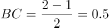米，米；，则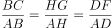，即，米，则米；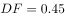米，则米。梯形EFGM截面积为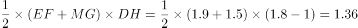平方米。又根据水渠长100米，则水渠水量增加了立方米。

故正确答案为B。

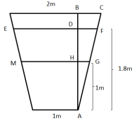

---

### 第 3 题　qid 2187721 · 数学运算

某社团组织周末自驾游，集合后发现小王和小李未到。由于每辆小车限坐5人，按照现有车辆恰有1人坐不上车。为难之际，小王和小李分别开车赶到，于是所有人都坐上车，且每辆车人数均相同。那么，参加本次自驾游的小车数为：

- **A**. 9
- **B**. 8
- **C**. 7　✅
- **D**. 6

**答案**：C

**官方解析**

方法一：设参加本次自驾游的小车总数（包含小王和小李的车）为辆，根据题意可得，包含小王和小李在内的人。因为小王和小李开车赶到后每辆车人数均相同，所以总人数能被整除，是的倍数，所以7应是的倍数，只有C项满足条件。

方法二：代入排除法。

代入A选项，若参加本次自驾游的小车数为9辆，则人，平均每辆车可坐人，不是整数，错误；

代入B选项，若参加本次自驾游的小车数为8辆，则人，平均每辆车可坐人，不是整数，错误；

代入C选项，若参加本次自驾游的小车数为7辆，则人，平均每辆车可坐人，符合条件，正确；

代入D选项，若参加本次自驾游的小车数为6辆，则人，平均每辆车可坐人，不是整数，错误。

故正确答案为C。

---

### 第 4 题　qid 2188447 · 数学运算

甲、乙、丙三所学校的学生被安排在周一至周五参观某革命纪念馆。纪念馆每天最多只能安排一所学校，其中甲学校连续参观两天，其余学校均只参观一天，那么共有多少种安排方法？

- **A**. 12种
- **B**. 24种　✅
- **C**. 36种
- **D**. 60种

**答案**：B

**官方解析**

由于甲学校连续参观两天，故先安排甲，甲参加的时间可能为“周一和周二、周二和周三、周三和周四、周四和周五”共4种情况。甲安排好后，工作日还差3天未安排，故在其中选择2天安排乙和丙，情况数为种。故总的情况数种。

故正确答案为B。

---

### 第 5 题　qid 2187777 · 数学运算

联欢会上，有24人吃冰激凌、30人吃蛋糕、38人吃水果，其中既吃冰激凌又吃蛋糕的有12人，既吃冰激凌又吃水果的有16人，既吃蛋糕又吃水果的有18人，三样都吃的则有6人。假设所有人都吃了东西，那么只吃一样东西的人数是多少？

- **A**. 12
- **B**. 18　✅
- **C**. 24
- **D**. 32

**答案**：B

**官方解析**

如图所示，共有24人吃冰激凌，其中有12人吃了蛋糕，16人吃了水果，既吃了蛋糕又吃了水果的有6人，则只吃了冰激凌的人数为人；同理，只吃了蛋糕的人数为人；只吃了水果的人数为人，则只吃一样东西的人数为人。

故正确答案为B。

---

### 第 6 题　qid 2188497 · 数学运算

一条笔直的林荫道两旁种植着梧桐树，同侧道路每两棵梧桐树间距50米。林某每天早上七点半穿过林荫道步行去上班，工作地点恰好在林荫道尽头。经测试，他每分钟步行70步，每步大约50厘米，每天早上八点准时到达工作地点。那么，这条林荫道两旁栽种的梧桐树共有：

- **A**. 44棵　✅
- **B**. 42棵
- **C**. 22棵
- **D**. 21棵

**答案**：A

**官方解析**

由“每分钟步行70步，每步大约50厘米”可得，每分钟可步行厘米，即35米/分钟。由“林某每天早上七点半出发，八点准时到达工作地点”可得，林某步行时间30分钟。由此可以计算出林某步行的路程。根据每两棵梧桐树间距50米，代入线形植树公式棵数，并考虑两旁种树的棵数应乘以2，故这条林荫道两旁栽种的梧桐树共棵。

故正确答案为A。

---

### 第 7 题　qid 2187727 · 数学运算

某银行推出3年期和5年期的两种理财产品A和B。小王分别购买这两种产品各1万元，结果发现，按单利计算（即利息不产生收益），B产品平均年收益率比A产品多2个百分点，期满后，B产品总收益是A产品的2.5倍。那么，小王各花1万元购买A、B两种产品的平均年收益分别是：

- **A**. 700元和900元
- **B**. 600元和900元
- **C**. 500元和700元
- **D**. 400元和600元　✅

**答案**：D

**官方解析**

设A产品的平均年收益率为，则B产品的平均年收益率为，根据A、B两种产品的总收益关系可得，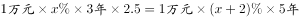，解得。所以A产品的平均年收益为，B产品的平均年收益为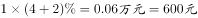。

故正确答案为D。

---

### 第 8 题　qid 2187720 · 数学运算

甲、乙、丙、丁四人同时同地出发，绕一椭圆形环湖栈道行走。甲顺时针行走，其余三人逆时针行走。已知乙的行走速度为60米/分钟，丙的速度为48米/分钟。甲在出发6、7、8分钟时分别与乙、丙、丁三人相遇，求丁的行走速度是多少？

- **A**. 31米/分钟
- **B**. 36米/分钟
- **C**. 39米/分钟　✅
- **D**. 42米/分钟

**答案**：C

**官方解析**

由题意可知，甲与乙相遇，甲与丙相遇均为两人合走完一个环湖的全程。根据总路程相等，可得方程，解方程得。同理，甲与乙相遇，甲与丁相遇时的路程也相等，，解得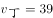，则丁的速度是39米/分钟。

故正确答案为C。

---

### 第 9 题　qid 2187724 · 数学运算

某苗木公司准备出售一批苗木，如果每株以4元出售，可卖出20万株，若苗木单价每提高0.4元，就会少卖10000株。问在最佳定价的情况下，该公司最大收入是多少万元？

- **A**. 60
- **B**. 80
- **C**. 90　✅
- **D**. 100

**答案**：C

**官方解析**

假设在原价基础上提价次，则共提高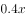元，少卖了株，即万株。根据题意可得方程，收入，令，解得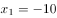，，当时，取得最大值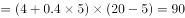万元。

故正确答案为C。

---

### 第 10 题　qid 2187767 · 数学运算

某单位工会组织桥牌比赛，共有8人报名，随机组成4队，每队2人。那么，小王和小李恰好被分在同一队的概率是：

- **A**. 

　✅
- **B**. 

- **C**. 

- **D**. 

**答案**：A

**官方解析**

方法一：若小王和小李恰好被分在某队，这队人选总情况数为种，则小王小李刚好分在这一队的概率为。由于一共有4队，所以小王和小李可以在4队中任意一队，故小王和小李恰好被分在同一队的概率是。

方法二：若小王分到任意一队，则从其余7个人中抽1个人与小王同队，正好抽到小李的概率为。

故正确答案为A。

---

## 判断推理

### 第 1 题　qid 2188409 · 图形推理

下列哪个选项中的图形能够折叠成完整封闭的立体几何结构：

- **A**. A
- **B**. B　✅
- **C**. C
- **D**. D

**答案**：B

**官方解析**

本题考查空间重构。
A项：不能由展开图拼合而成，若想拼合，底面（即最后一行的面）须为正方形，排除；
B项：可以由展开图拼合而成，拼合成的图形为七棱柱，当选；
C项：不能由展开图拼合而成，还需要一个矩形面才能拼合成六棱柱，排除；
D项：不能由展开图拼合而成，还需要一个矩形面才能拼合成六面体，排除。
故正确答案为B。

---

### 第 2 题　qid 2187817 · 图形推理

从正方体中裁出如下图所示六个不同的三角形，将其分为两类，使每一类图形都有各自的共同特征或规律，分类正确的一项是：

- **A**. ①②⑤，③④⑥　✅
- **B**. ①⑤⑥，②③④
- **C**. ①③⑤，②④⑥
- **D**. ①②④，③⑤⑥

**答案**：A

**官方解析**

本题为分组分类题目。每个图形都在正方体中裁出了一个三角形，观察发现，①②⑤中三角形的底边和高的长度都等于正方体的棱长，所以三个三角形的面积相同，③④⑥中三角形底边长度等于正方体的棱长，高的长度等于正方体外表面正方形的对角线的长度，所以三个三角形的面积相同。即①②⑤一组，③④⑥一组。
故正确答案为A。

---

### 第 3 题　qid 2187790 · 图形推理

从所给的四个选项中，选择最合适的一个填入问号处，使之呈现一定的规律性：

- **A**. A　✅
- **B**. B
- **C**. C
- **D**. D

**答案**：A

**官方解析**

元素组成不同，无明显属性规律，考虑数量规律。观察发现，图一出现端点较多，B项为日字变形图，都是笔画数特征图，考虑笔画数。题干都是两笔画图形，？处也应该是两笔画图形。A项两笔画，B项一笔画，C项三笔画，D项三笔画，只有A项符合。
故正确答案为A。

---

### 第 4 题　qid 2187802 · 图形推理

从所给的四个选项中，选择最合适的一个填入问号处，使之呈现一定的规律性：

- **A**. A
- **B**. B　✅
- **C**. C
- **D**. D

**答案**：B

**官方解析**

元素组成不同，无明显属性规律，考虑数量规律。观察发现，题干图形均有面，考虑数面，数量依次为3、4、5、6、8，没有规律，再观察发现每个图形中均有形状相同的面，且数量依次为2、3、4、5、6，？，问号处图形应该含有7个形状相同的面。A项6个，B项7个，C项2个，D项没有形状相同的面，只有B项符合。
故正确答案为B。

---

### 第 5 题　qid 2188414 · 图形推理

从所给的四个选项中，选择最合适的一个填入问号处，使下图中的立体图形①、②、③和④可组成一个完整的长方体：

- **A**. A
- **B**. B
- **C**. C　✅
- **D**. D

**答案**：C

**官方解析**

题干中的立体图形可共同构成一个的长方体。如图所示：

将③放入蓝色位置，图②上下翻转放入黄色位置，将C项图形立起放入橘黄色位置，即是一个完整长方体。

故正确答案为C。 

---

### 第 6 题　qid 2187813 · 定义判断

二维码是用某种特定的几何图形按一定规律，在平面分布的黑白相间的图形记录数据符号信息。在代码编制上利用“0”“1”比特流的概念，用若干与二进制相对应的几何形体来表示文字数值信息，通过图像输入设备或光电扫描设备自动识读，以实现信息自动处理。一个二维码所能表示的比特数是固定的，它包含的信息越多，则冗余度就越小；反之，冗余度就越大。
根据上述定义，下列选项不符合二维码内涵的是：

- **A**. 某种特定的几何图形按一定规律分布可以构成相应的二维码
- **B**. 二维码中图像代码的基本原理利用的是计算机的内部逻辑基础
- **C**. 把文字数值信息转化成与二进制相对应的几何形体，可供设备识读
- **D**. 二维码包含的信息量都很大，意味着在编码时需要尽量减少冗余度　✅

**答案**：D

**官方解析**

第一步：找出定义关键词。
“用某种特定的几何图形按一定规律”、“在平面分布的黑白相间的图形记录数据符号信息”、“在代码编制上利用‘0’‘1’比特流的概念”、“用若干与二进制相对应的几何形体来表示文字数值信息”、“通过图像输入设备或光电扫描设备自动识读，以实现信息自动处理”、“一个二维码所能表示的比特数是固定的，它包含的信息越多，则冗余度就越小”。
第二步：逐一分析选项。
A项：某种特定的几何图形按一定规律分布符合“用某种特定的几何图形按一定规律”，符合定义，排除；
B项：图像代码的基本原理利用的是计算机的内部逻辑基础，符合“在代码编制上利用‘0’‘1’比特流的概念”，符合定义，排除；
C项：把文字数值信息转化成与二进制相对应的几何形体，可供设备识读，符合“用若干与二进制相对应的几何形体来表示文字数值信息”、“通过图像输入设备或光电扫描设备自动识读，以实现信息自动处理”，符合定义，排除；
D项：根据题干信息，“一个二维码所能表示的比特数是固定的，它包含的信息越多，则冗余度就越小”，即冗余度由信息量大小决定，无法尽量减少冗余度，不符合定义，当选。
本题为选非题，故正确答案为D。

---

### 第 7 题　qid 2187858 · 定义判断

刺激泛化是指条件作用的形成使有机体习得了对某一刺激做出特定反应的行为，因此也就可能对类似的刺激做出同样的行为反应。刺激分化是通过选择性强化和消退使有机体学会对条件刺激和与条件刺激相类似的刺激做出不同的行为反应。
根据上述定义，下列说法不正确的是：

- **A**. “一朝被蛇咬，十年怕井绳”属于刺激泛化
- **B**. “横看成岭侧成峰，远近高低各不同”属于刺激分化　✅
- **C**. 为突出品牌，厂家对包装进行独特设计，力图使顾客产生刺激分化
- **D**. 某品牌牙膏创成名牌后，生产商将其生产的化妆品也以同品牌命名，利用的是顾客的刺激泛化

**答案**：B

**官方解析**

第一步：找出定义关键词。
刺激泛化：“条件作用的形成使有机体习得了对某一刺激做出特定反应的行为”、“对类似的刺激做出同样的行为反应”
刺激分化：“通过选择性强化和消退”、“对相类似的刺激做出不同的行为反应”
第二步：逐一分析选项。
A项：被蛇咬后怕井绳是对类似的刺激做出同样的行为反应，符合“刺激泛化”定义，排除；
B项：“横看成岭侧成峰，远近高低各不同”是对同一事物从不同角度的观看所产生的视觉差异，不涉及刺激反应，不符合“刺激分化”定义，当选；
C项：厂家对包装进行独特设计的目的是为了和其他品牌进行区分，想让顾客看到该厂的产品后，做出和看到其他厂商相同产品时不同的反应，符合“通过选择性强化和消退”、“对相类似的刺激做出不同的行为反应”，符合“刺激分化”定义，排除；
D项：生产商将化妆品也以同品牌命名，想让顾客看到同品牌化妆品后也产生名牌的认知，符合“想让消费者对类似的刺激做出同样的行为反应”，符合“刺激泛化”定义，排除。
本题为选非题，故正确答案为B。

---

### 第 8 题　qid 2187850 · 定义判断

精准医疗是指以个体化医疗为基础，通过基因组、蛋白质组等技术，对大样本人群与特定疾病类型进行生物标记物的分析与鉴定、验证与应用，从而精确寻找到疾病的原因和治疗的靶点，最终实现对疾病和特定患者进行个性化精确治疗。
根据上述定义，下列选项不属于精准医疗的是：

- **A**. 甲某罹患癌症，医生对其基因进行全面检测并确定治疗方案
- **B**. 乙某近期反常头晕，医生询问症状后就给其开了非处方药物　✅
- **C**. 丙某在就医时称自己对某种药物过敏，医生根据其过敏情况设计用药方案
- **D**. 丁某患失眠症到中医院就诊，医生据“同病异治，异病同治”的理念施治

**答案**：B

**官方解析**

第一步：找出定义关键词。
“以个体化医疗为基础”、“通过基因组、蛋白质组等技术”、“对大样本人群与特定疾病类型进行生物标记物的分析与鉴定、验证与应用”、“寻找到疾病的原因和治疗的靶点”、“实现对疾病和特定患者进行个性化精确治疗”。
第二步：逐一分析选项。
A项：医生对甲某的基因进行全面检测，符合“以个体化医疗为基础”、“通过基因组、蛋白质组等技术”、“寻找到疾病的原因和治疗的靶点”，制定治疗方案符合“实现对疾病和特定患者进行个性化精确治疗”，符合定义，排除；
B项：乙某出现反常头晕症状，医生仅通过询问症状就开了非处方药，不符合“以个体化医疗为基础”、“实现对疾病和特定患者进行个性化精确治疗”，不符合定义，当选；
C项：“医生根据其过敏情况设计用药方案”符合“以个体化医疗为基础”、“实现对疾病和特定患者进行个性化精确治疗”，符合定义，排除；
D项：“同病异治”是指同一病症，因时、因地、因人不同，或由于病情进展程度、病机变化，以及用药过程中正邪消长等差异，治疗上应相应采取不同治法。“异病同治”指不同的疾病，在其发展过程中，由于出现了相同的病机，因而采用同一方法治疗的法则。中医治病的法则，不是着眼于病的异同，而是着眼于病机的区别。异病可以同治，既不决定于病因，也不决定于病证，关键在于辨识不同疾病有无共同的病机。病机相同，才可采用相同的治法。因此“同病异治，异病同治”符合“实现对疾病和特定患者进行个性化精确治疗”，符合定义，排除。
本题为选非题，故正确答案为B。

---

### 第 9 题　qid 2187852 · 定义判断

情感广告是诉诸于消费者的情绪或情感反应，传达商品带给他们的附加值或情绪满足的一种广告策略。这种情绪在消费者心目中的价值可能远远超出商品本身，从而使消费者形成积极的品牌态度。
根据上述定义，下列广告语不属于情感广告的是：

- **A**. 某品牌饮料广告语：“××可乐，中国人自己的可乐！”
- **B**. 某品牌啤酒进入东南亚市场的广告语：“好不好，家乡水。”
- **C**. 某品牌纸尿裤广告语：“宝宝天天好心情，妈妈一定更美丽。”
- **D**. 某品牌润肤露广告语：“为了肌肤柔美润舒，请使用××润肤露。”　✅

**答案**：D

**官方解析**

第一步：找出定义关键词。
“诉诸于消费者的情绪或情感反应”、“传达商品带给他们的附加值或情绪满足的一种广告策略”、“使消费者形成积极的品牌态度”。
第二步：逐一分析选项。
A项：“中国人自己的可乐”，会使消费者产生爱国的情绪满足，符合“传达商品带给他们的情绪满足”，符合定义，排除； 
B项：“好不好，家乡水”，会使消费者产生怀念家乡，以家乡为自豪的情绪满足，符合“传达商品带给他们的情绪满足”，符合定义，排除；
C项：“宝宝天天好心情”，会使消费者产生孩子很舒适的情绪满足，符合“传达商品带给他们的情绪满足”，符合定义，排除；
D项：“为了肌肤柔美润舒”，没有体现出商品的附加值或者情绪满足，不符合定义，当选。
本题为选非题，故正确答案为D。

---

### 第 10 题　qid 2187822 · 定义判断

水体旅游是人们前往水体及周边区域以寻求愉悦为主要目的的一种具有社会、休闲和消费属性的短期经历，目前已逐渐成为人们休闲时尚与区域旅游开发的重要载体。水体旅游资源是指水域（水体）及相关联的岸地、岛屿、林草、建筑等能对人产生吸引力的自然景观和人文景观。
根据上述定义，下列选项不属于水体旅游资源的是：

- **A**. 武夷山“九曲溪”两旁随处可见历代文人墨客的题词
- **B**. 秦淮河岸的街道上，有一座建于明代的“江南贡院”
- **C**. 某森林公园建有一个放养着上千条锦鲤的“放生池”　✅
- **D**. 某大厦矗立于长江岸边，成为游客拍照留念的背景

**答案**：C

**官方解析**

第一步：找出定义关键词。
“水域（水体）及相关联的岸地、岛屿、林草、建筑等”、“对人产生吸引力的自然景观和人文景观”。
第二步：逐一分析选项。
A项：“九曲溪”是水域，历代文人墨客题词，符合“对人产生吸引力的自然景观和人文景观”，符合定义，排除；
B项：秦淮河是水域，河岸街道上建于明代的“江南贡院”，符合“对人产生吸引力的自然景观和人文景观”，符合定义，排除；
C项： “放生池”是人工造的水池，而“水域”指海洋、河流、湖泊等范围，“放生池”并不是“水域”，不符合定义，当选；
D项：长江是水体，矗立于岸边的大厦，符合“对人产生吸引力的自然景观和人文景观”，符合定义，排除。
本题为选非题，故正确答案为C。

---

### 第 11 题　qid 2187831 · 定义判断

在决断之前，每个事物的价值在决策者心中大致相近，则难于决断其优劣；但在作出选择之后，决策者对这些事物的态度评价就发生了改变。这种现象叫作决断后效应。
根据上述定义，下列现象属于决断后效应的是：

- **A**. 某职员对自己的去留一筹莫展，一番考量之后他认为留下来要面对许多复杂关系，不如重新开创新天地
- **B**. 某女士对各有优劣的两个品牌手机难以抉择，最后她从经济角度考虑选择其中一款，可到货后发现这款有色差
- **C**. 某老师对选A还是B去参加比赛犹豫不决，班长建议选B。事后，老师认为选B完全正确，因为B最终夺得冠军
- **D**. 某学生填报志愿时对报甲大学还是乙大学犹豫不决，最后他听从老师建议选择了甲大学，从此觉得甲大学优于乙大学　✅

**答案**：D

**官方解析**

第一步：找出定义关键词。
“决断之前”、“每个事物的价值在决策者心中大致相近”、“作出选择之后”、“决策者对这些事物的态度评价就发生了改变”。
第二步：逐一分析选项。
A项：对自己的去留一筹莫展，符合“决断之前”、“每个事物的价值在决策者心中大致相近”，但考量之后他认为留下来要面对复杂关系，这只是他的认知，并没有进行决断，不符合“作出选择之后”，更不符合“决策者对这些事物的态度评价就发生了改变”，不符合定义，排除；
B项：对两个品牌手机难以抉择，符合“决断之前”、“每个事物的价值在决策者心中大致相近”，最后选择了其中一款，发现有色差，只是描述情况，并没体现“决策者对这些事物的态度评价就发生了改变”，不符合定义，排除；
C项：老师对A与B的选择犹豫不决，符合“决断之前”、“每个事物的价值在决策者心中大致相近”，但赛后认为选B是正确的，是因为他夺冠了的结果证明选择正确，并没体现因为做出决策而对A、B重新评价，不符合“作出选择之后”、“决策者对这些事物的态度评价就发生了改变”，不符合定义，排除；
D项：对甲乙两所大学犹豫不决，符合“决断之前”、“每个事物的价值在决策者心中大致相近”，选择了甲大学之后，觉得甲大学优于乙大学，符合“作出选择之后”、“决策者对这些事物的态度评价就发生了改变”，符合定义，当选。
故正确答案为D。

---

### 第 12 题　qid 2188029 · 定义判断

理性预期指的是，针对某个经济现象进行预期的时候，如果人们是理性的，那么他们就会最大限度地充分利用所得到的信息来作出行动而不会犯系统性的错误。
根据以上定义，下列属于理性预期的是：

- **A**. 省立医院分院一投入使用，小陈就在附近开了一家水果店　✅
- **B**. 老秦获悉某政策即将施行，凭着长期炒股的经验进行股票操作
- **C**. 传言说城南要建某重点中学分校，老刘立即在附近买了一套房子
- **D**. 小张得知其高考成绩在全省排第二十位，果断决定第一志愿报清华大学

**答案**：A

**官方解析**

第一步：找出定义关键词。
“针对某个经济现象进行预期”、“人们是理性的”、“他们就会最大限度地充分利用所得到的信息来作出行动而不会犯系统性的错误”。
第二步：逐一分析选项。
A项：人们到医院看望病人时经常选择水果作为礼物，所以医院的投入使用会使得水果的需求量增加，那么小陈选择在医院附近开水果店，符合“针对某个经济现象进行预期”，且其做出的判断是理性的，符合定义，当选；
B项：政策的施行可能对股票产生影响，老秦获悉这一信息后进行股票操作，符合“针对某个经济现象进行预期”，但凭着长期炒股的经验，不能确定其判断是否理性，不符合“人们是理性的”，不符合定义，排除；
C项：建重点中学分校可能会影响其附近的房价，但该消息为传言，传言是否真实并不确定，故老刘在附近买了一套房子这一决定是否是理性的并不明确，不符合定义，排除；
D项：小张根据高考成绩填报志愿，不符合“针对某个经济现象进行预期”，不符合定义，排除。
故正确答案为A。

---

### 第 13 题　qid 2187855 · 定义判断

回弹效应是指通过技术进步提高能源使用效率，节约了能源消费，但技术进步的同时也会促进经济规模的扩大，对能源产生新的需求，从而部分、甚至完全地抵消所节约的能源。
根据上述定义，下列选项可以有效控制回弹效应的是：

- **A**. 发动机效率提升降低了行车成本，更多人选择以车代步
- **B**. 厂商进一步提高能源效率，利润增加，生产出更多产品
- **C**. 太阳能热水器热销，慢慢取代传统电热水器　✅
- **D**. 现在越来越多的消费者购买节能型家用电器

**答案**：C

**官方解析**

第一步：找出定义关键词。
“通过技术进步提高能源使用效率，节约了能源消费”、“技术进步的同时也会促进经济规模的扩大，对能源产生新的需求”、“部分、甚至完全地抵消所节约的能源”。
第二步：逐一分析选项。
A项：更多人选择以车代步，说明对汽车产生了更多的需求，符合“对能源产生新的需求”，汽车使用的多会导致消耗能源更多，会部分抵消发动机效率提升所节约的能源，无法有效控制回弹效应，排除； 
B项：厂商生产出更多产品，说明对生产产品所需的能源有了更多的需求，符合“对能源产生新的需求”，生产更多产品会消耗更多的能源，会部分抵消提高能源效率所节约的能源，无法有效控制回弹效应，排除；
C项：太阳能热水器取代传统电热水器，说明对太阳能产生了更多的需求，符合“对能源产生新的需求”，但太阳能热水器对太阳能的利用并不会抵消所节约的能源，所以可以有效控制回弹效应，当选；
D项：越来越多的消费者购买节能型家用电器，说明对生产节能型家用电器所需的能源有了更多的需求，符合“对能源产生新的需求”，卖出更多节能型家用电器会消耗更多能源，会部分抵消节能电器所节约的能源，无法有效控制回弹效应，排除。
故正确答案为C。

---

### 第 14 题　qid 2188408 · 定义判断

广义相对论是爱因斯坦以几何语言建立而成的引力理论，他将引力改描写成因时空中的物质与能量而弯曲的时空，以取代传统对于引力是一种力的看法，而这种时空曲率与处于时空中的物质与辐射的能量动量直接相关。
根据上述定义，下列选项中的现象不涉及广义相对论的是：

- **A**. 科学家在观察日全食时发现，光线经过太阳附近时会产生偏角弯曲
- **B**. 科学家发现，在强引力场中时钟要走得慢一些，因而从巨大质量的星体表面发射到地球的光线，会向光谱的红端移动
- **C**. 科学家发现，当一个星体足够致密时，其引力使时空中的区域极端扭曲以至光线都无法逸出，由此发现了黑洞的存在
- **D**. 麦哲伦航行时发现，驶向远方的船帆逐渐下沉，最后消失在视线中，而海平面似呈弯曲状，远处的海水似乎比近处的海水水位低　✅

**答案**：D

**官方解析**

第一步：找出定义关键词。
“引力理论”、“将引力改描写成因时空中的物质与能量而弯曲的时空，以取代传统对于引力是一种力的看法”、“这种时空曲率与处于时空中的物质与辐射的能量动量直接相关”。
第二步：逐一分析选项。
A项：光线经过太阳附近时会产生偏角弯曲，体现了“弯曲的时空”，符合定义，排除；
B项：时钟要走得慢一些，体现了时空，因而从巨大质量星体表面发射到地球的光线，会向光谱的红端移动，体现了“弯曲的时空”，符合定义，排除；
C项：星体的引力使时空中的区域极端扭曲以至光线都无法逸出，由此发现了黑洞的存在，体现了“弯曲的时空”，符合定义，排除；
D项：麦哲伦航行时发现海平面似成弯曲状，远处的海水似乎比近处的海水水位低，说明地球是圆形的，这里的弯曲状指的是地球表面的形状，和弯曲的时空概念无关，不符合定义，当选。
备注：同构选项：选项ABC都是在说和宇宙时空有关的，D说的是地球表面是弯曲的，因此同构选项同时排除选项ABC，选非题选D。
本题为选非题，故正确答案为D。

---

### 第 15 题　qid 2187806 · 定义判断

在企业活动中，库存有多种类型。装运库存是指在价值链末端工厂的库房里，那些已经准备好可以随时出货的产品。在途库存又称中转库存，指尚未到达目的地，正处于运输状态或等待运输状态而储备在运输工具中的库存。
根据上述定义，下列选项属于在途库存的是：

- **A**. 小张给自己网购了一件毛衣，下单两天后查知该毛衣已到某中转站
- **B**. 某高速服务区内一辆大货车满载着A超市从B地采购的各类毛巾　✅
- **C**. 某皮鞋厂的卡车里，堆满了该厂用于制造新款皮鞋的牛皮
- **D**. 某公司在城南的自有库房中存放着给城北门店销售的玩具

**答案**：B

**官方解析**

第一步：找出定义关键词。
装运库存：“在价值链末端工厂的库房”、“已经准备好可以随时出货的产品”；
在途库存：“尚未达到目的地”、“正处在运输状态或等待运输状态而储存在运输工具中的库存”。
第二步：逐一分析选项。
A项：小张网购的毛衣已到某中转站，不符合“在价值链末端工厂的库房”，也不符合“正处在运输状态或等待运输状态而储存在运输工具中的库存”，不符合任何一个定义，排除； 
B项：高速公路服务区大货车内的毛巾，符合“尚未达到目的地”且“正处在运输状态或等待运输状态而储存在运输工具中的库存”，符合“在途库存”定义，当选；
C项：皮鞋厂卡车里的牛皮是皮鞋厂的原材料，而不是产品，不符合“在价值链末端工厂的库房里”,且“某皮鞋厂的卡车里”并未指明是“正处于运输状态或等待运输状态”还是“已经到达目的地”，不符合“尚未到达目的地”，不符合任何一个定义，排除；
D项：某公司城南的自有仓库中存放的玩具，符合“在价值链末端工厂的库房”，也符合“已经准备好可以随时出货的产品”，符合“装运库存”定义，不符合“在途库存”定义，排除。
故正确答案为B。

---

### 第 16 题　qid 2187712 · 类比推理

（  ）之于 风油精 相当于 碳酸 之于（  ）

- **A**. 薄荷脑；可乐　✅
- **B**. 清凉；陈醋
- **C**. 叶绿素；花露水
- **D**. 液体；二氧化碳

**答案**：A

**官方解析**

逐一代入选项。
A项：薄荷脑是风油精的成分，二者是成分对应关系；碳酸是可乐的成分，二者是成分对应关系，前后逻辑关系一致，当选；
B项：风油精具有清凉的作用，二者是功能对应关系；陈醋与碳酸之间没有明显的逻辑关系，前后逻辑关系不一致，排除；
C项：风油精含有叶绿素，二者是成分对应关系，花露水和碳酸之间没有明显逻辑关系，前后逻辑关系不一致，排除；
D项：风油精是一种液体，二者是种属关系；二氧化碳与水反应可以生成碳酸，二者是对应关系，前后逻辑关系不一致，排除。
故正确答案为A。

---

### 第 17 题　qid 2187707 · 类比推理

青衿：读书人

- **A**. 南冠：囚犯　✅
- **B**. 浮屠：寺庙
- **C**. 春蚕：奉献
- **D**. 袍泽：官员

**答案**：A

**官方解析**

第一步：判断题干词语间逻辑关系。
青衿借指读书人，二者为比喻象征关系。
第二步：判断选项词语间逻辑关系。
A项：南冠借指囚犯，二者为比喻象征关系，与题干逻辑关系一致，当选；
B项：浮屠借指佛塔，而不是寺庙，与题干逻辑关系不一致，排除；
C项：春蚕借指乐于奉献的人，而不是奉献，与题干逻辑关系不一致，排除；
D项：袍泽借指军中的同事，而不是官员，与题干逻辑关系不一致，排除。
故正确答案为A。

---

### 第 18 题　qid 2188412 · 类比推理

西子湖：曹娥江

- **A**. 美人蕉：老婆饼
- **B**. 东坡肉：五柳鱼　✅
- **C**. 女儿红：祖母绿
- **D**. 狮子头：凤凰胆

**答案**：B

**官方解析**

第一步：判断题干词语间逻辑关系。
西子湖即杭州西湖，之所以叫西子湖，是得名于我国四大美女之一的西施。曹娥江，中国东海独流入海河流钱塘江的最大支流，因东汉少女曹娥入江救父而得名。二者都是水域，是并列关系。
第二步：判断选项词语间逻辑关系。
A项：美人蕉是一种植物，老婆饼是一种糕点，二者不是并列关系，与题干逻辑关系不一致，排除；
B项：“东坡肉”是眉山和江南地区的特色传统名菜，相传为北宋词人苏东坡所创制；“五柳鱼”是一道四川名菜，得名于“五柳先生”陶渊明，二者都是菜肴，是并列关系，且均得名于某一人物，与题干逻辑关系一致，当选；
C项：女儿红是糯米酒，祖母绿是绿宝石的一种，二者不是并列关系，与题干逻辑关系不一致，排除；
D项：狮子头是一道菜肴，凤凰胆是一种天然玉石珠，二者不是并列关系，与题干逻辑关系不一致，排除。
故正确答案为B。

---

### 第 19 题　qid 2187703 · 类比推理

团扇：羽毛扇：舞蹈扇

- **A**. 宣纸：餐巾纸：铜版纸
- **B**. 圈椅：实木椅：办公椅　✅
- **C**. 排球：羽毛球：乒乓球
- **D**. 墨镜：老花镜：显微镜

**答案**：B

**官方解析**

第一步：判断题干词语间逻辑关系。
团扇为圆形或近似圆形，团扇以其形状命名，羽毛扇以其原材料命名，舞蹈扇以其功能命名，三者为交叉关系。
第二步：判断选项词语间逻辑关系。
A项：宣纸产自古代宣州，以其产地命名，餐巾纸以其功能命名，铜版纸以用途命名，与题干逻辑关系不一致，排除；
B项：圈椅以其形状命名，实木椅以其原材料命名，办公椅以其功能命名，三者为交叉关系，与题干逻辑关系一致，当选；
C项：排球以队列的分布命名，羽毛球以其原材料命名，乒乓球以其声音命名，与题干逻辑关系不一致，排除；
D项：墨镜以其颜色命名，老花镜和显微镜都以其功能命名，与题干逻辑关系不一致，排除。
故正确答案为B。

---

### 第 20 题　qid 2187714 · 类比推理

春秋：寒暑：一年

- **A**. 妇孺：老幼：生命
- **B**. 荏苒：蹉跎：岁月
- **C**. 东西：南北：方向　✅
- **D**. 冷热：干湿：温度

**答案**：C

**官方解析**

第一步：判断题干词语间逻辑关系。
春秋和寒暑都用来泛指一年，为比喻象征关系。
第二步：判断选项词语间逻辑关系。
A项：妇孺和老幼都有生命，为对应关系，与题干逻辑关系不一致，排除；
B项：荏苒指岁月易逝，蹉跎指岁月白白过去，与题干逻辑关系不一致，排除；
C项：东西和南北都可以用来泛指方向，与题干逻辑关系一致，当选；
D项：冷热用来形容温度的高低，干湿和温度无必然关系，与题干逻辑关系不一致，排除。
故正确答案为C。

---

### 第 21 题　qid 2188482 · 逻辑判断

母亲年龄是唐氏综合征筛查所考虑的风险因素之一。一般认为，母亲年龄越大，宝宝出现遗传异常的风险就越高。当卵子里有一条多余的21号染色体时，胎儿就会出现唐氏综合征。随着女性年龄的增长，出现此类异常的风险也随之升高。最近，一些专家开始对这种筛查方法提出质疑，认为遗传异常并不仅仅只是女方年龄的问题。
以下哪项如果为真，最能支持上述专家质疑？

- **A**. 精子的21号染色体也可能粘连多余的遗传物质，父亲的年龄越大，制造精子过程出错的概率就越高　✅
- **B**. 造成宝宝精神健康问题的重点似乎并不在于母亲的“绝对年龄”，而在于父亲与母亲的“相对年龄”
- **C**. 子宫基本不会随着年龄增长发生变化，只要激素水平充足，年老妇女的子宫也能够正常养育胎儿
- **D**. 现代人因为环境以及生活习惯影响，容易产生基因突变，即便是健康夫妇也有生育“唐氏儿”的风险

**答案**：A

**官方解析**

第一步：找出论点和论据。
论点：遗传异常并不仅仅只是女方年龄的问题。
论据：无。
第二步：逐一分析选项。
A项：精子的21号染色体也可能粘连多余的遗传物质，父亲的年龄越大，制造精子过程出错的概率就越高，说明胎儿出现唐氏综合征不只是母亲的年龄问题，还有父亲的年龄问题，补充论据，可以加强，当选；
B项：论点说的是遗传异常问题，该项说的是宝宝精神健康问题，话题不一致，无法加强，排除；
C项：题干论点说的是遗传异常是否与女性年龄有关，该项是在讨论年老妇女能否正常养育胎儿，遗传异常和正常养育胎儿不是一回事，话题不一致，无法加强，排除；
D项：环境以及生活习惯容易产生基因突变，使得健康夫妇也有生育“唐氏儿”的风险，并没有提到健康夫妇年龄的大小，不能确定女方年龄是否对遗传异常造成影响，无法加强，排除。
故正确答案为A。

---

### 第 22 题　qid 2187782 · 逻辑判断

宇宙加速膨胀是因为物质之间相互排斥，减速膨胀是因为物质之间相互吸引。因此，要在此基础上解释宇宙的加速或减速膨胀，必须要有不同特性的物质在不同的时期占主导地位，从而产生强大的排斥力或吸引力。粒子物理标准模型中的所有粒子都产生吸引的引力，然而星系转动曲线的研究表明，在星系里面还有大量的、看不到的物质，这些物质可以产生非常强大的吸引性引力。
以上论证如果为真，那么星系转动曲线研究结论隐含了下列哪一项前提？

- **A**. 粒子物理标准模型中的所有粒子产生的吸引性引力不足　✅
- **B**. 粒子物理标准模型中的粒子不是唯一的，存在其它粒子
- **C**. 星系转动曲线的研究说明这个时期的宇宙正在加速膨胀
- **D**. 星系转动曲线的研究说明存在超大质量、看不到的黑洞

**答案**：A

**官方解析**

第一步：找出论点和论据。
论点：在星系里面还有大量的、看不到的物质，这些物质可以产生非常强大的吸引性引力。
论据：无。
第二步：逐一分析选项。
A项：题干背景明确说明，要在此基础上解释宇宙的加速或减速膨胀，必须要有不同特性的物质在不同的时期占主导地位，从而产生强大的排斥力或吸引力。粒子物理标准模型中的所有粒子已经都能产生吸引力了，只有它们产生的吸引性引力不足，才需要其他物质有强大的吸引力，该项是论点成立的一个必要条件，补充论据，可以加强，当选；
B项：粒子的唯一性和题干所讨论的论点产生吸引性引力无关，无法加强，排除；
C项：星系转动曲线的研究应该说明这个时期的宇宙正在减速膨胀，与题干所给已知信息不符，无法加强，排除；
D项：论点和论据中没有提到黑洞，该项是无关选项，无法加强，排除。
故正确答案为A。

---

### 第 23 题　qid 2187807 · 逻辑判断

场所恐惧症主要表现为对某些特定环境的恐惧，如高处、广场、客观环境和拥挤的公共场所等，常以自发性惊恐发作开始，然后产生预期焦虑和回避行为，进而出现条件化的形成。一些临床研究表明，场所恐惧症患者常伴有惊恐发作。然而，有专家认为最初一次惊恐发作是场所恐惧症起病的必备条件，因而认为场所恐惧症是惊恐发作发展的后果，应归入惊恐障碍这一类别。
以下哪项如果为真，最能质疑上述专家观点？

- **A**. 
场所恐惧症病程常有波动，许多患者可能短期好转甚至缓解

- **B**. 
场所恐惧症可能与遗传有关，且与惊恐障碍存在一定联系

- **C**. 
研究发现场所恐惧症起病多在40多岁，且病程趋向慢性

- **D**. 
研究发现约有患者的场所恐惧出现于惊恐发作以前
　✅

**答案**：D

**官方解析**

第一步：找出论点和论据。
论点：场所恐惧症是惊恐发作发展的后果，应归入惊恐障碍这一类别。
论据：最初一次惊恐发作是场所恐惧症患者起病的必备条件。
第二步：逐一分析选项。
A项：论点说的是场所恐惧症是惊恐发作发展的后果，选项说的是场所恐惧症的病程，话题不一致，无法削弱，排除；
B项：场所恐惧症与惊恐障碍有一定的联系，但并不明确是否为必要条件关系或因果关系，属于不明确项，无法削弱，排除；
C项：论点说的是场所恐惧症是惊恐发作发展的后果，选项说的是场所恐惧症起病的年龄，话题不一致，无法削弱，排除；
D项：有些患者的场所恐惧症出现在惊恐发作之前，举例说明场所恐惧症并不是惊恐发作发展的后果，否定论点，当选。
故正确答案为D。

---

### 第 24 题　qid 2187783 · 逻辑判断

色素主要为花色甙等酚类物质，它们的颜色构成了葡萄酒的色泽,并且给葡萄酒带来了它们自身的香气和细腻口感。陈年葡萄酒中的颜色主要来源于单宁。单宁除了给酒的色泽作出贡献外，还能作用于口腔产生一种苦涩感，从而促进人们的食欲。单宁含量过高，苦涩味重且酒质粗糙；含量过低则酒体软弱而淡薄。此外，单宁还能掩盖酸味，所以红葡萄酒由于含有丰富的单宁，其酸味明显小于白葡萄酒。
由此可以推出：

- **A**. 陈年葡萄酒会促进食欲，色泽来源于单宁
- **B**. 苦涩味重且酒质粗糙的酒必含有过多单宁
- **C**. 酒体软弱而淡薄的酒中单宁含量必然过低
- **D**. 单宁能影响酒的色泽和饮者的味觉及食欲　✅

**答案**：D

**官方解析**

日常结论题，根据题干信息逐一分析选项。
A项：题干中提及的是单宁能作用于口腔产生一种苦涩感，从而促进人们的食欲，而不是陈年葡萄酒，偷换概念，排除；
B项：题干中只提到了单宁含量过高，苦涩味重且酒质粗糙，并没有说苦涩味重且酒质粗糙的酒必含有过多单宁，无法推出，排除；
C项：题干中只提到了单宁含量过低，则酒体软弱而淡薄，并没有说酒体软弱而淡薄的酒中单宁含量必然过低，无法推出，排除；
D项：单宁能影响酒的色泽和饮者的味觉及食欲，是对题干“单宁除了给酒的色泽作出贡献外，还能作用于口腔产生一种苦涩感，从而促进人们的食欲”整句话的同义替换，当选。
故正确答案为D。

---

### 第 25 题　qid 2187788 · 逻辑判断

甲、乙、丙三人大学毕业后选择从事各不相同的职业：教师、律师、工程师。其他同学做了如下猜测：
小李：甲是工程师，乙是教师。
小王：甲是教师，丙是工程师。
小方：甲是律师，乙是工程师。
后来证实，小李、小王和小方都只猜对了一半。那么，甲、乙、丙分别从事何种职业？

- **A**. 甲是教师，乙是律师，丙是工程师
- **B**. 甲是工程师，乙是律师，丙是教师
- **C**. 甲是律师，乙是工程师，丙是教师
- **D**. 甲是律师，乙是教师，丙是工程师　✅

**答案**：D

**官方解析**

题干条件不确定，优先采用代入法。
将A项代入，小李和小方两句都猜错了，而小王两句都猜对了，不符合题干要求，排除；
将B项代入，小李两句一对一错，而小王和小方两句都猜错了，不符合题干要求，排除；
将C项代入，小李和小王两句都猜错了，而小方两句都猜对了，不符合题干要求，排除；
将D项代入，小李、小王和小方都只猜对了一半，符合题干要求，当选。
故正确答案为D。

---

### 第 26 题　qid 2187791 · 逻辑判断

如果央行允许人民币继续贬值，那么市场对于人民币贬值的预期就容易强化。如果市场形成较强的人民币贬值预期，大量的资金就会流出我国。资金流出我国，不仅会强化这种人民币的贬值预期，导致更多的资金流出我国，而且可能会导致我国资产价格全面下跌，继而可能引爆金融市场的区域性风险及系统性风险。这些都是我们不愿意看到且不允许出现的情况。
由此可以推出：

- **A**. 货币持续贬值会导致资产全面下跌
- **B**. 资金流失严重会出现货币贬值预期
- **C**. 央行不会允许人民币继续贬值　✅
- **D**. 我国将重点着手干预资金外流

**答案**：C

**官方解析**

日常结论题，根据题干信息逐一分析选项。
A项：题干只是表述货币持续贬值“可能”会导致资产价格全面下跌，而该项说“会”导致，说的过于绝对，无法推出，排除；
B项：题干表述的是较强的人民币贬值预期会出现资金大量流失，该项是资金流失严重会出现货币贬值预期，属于逻辑错误，无法推出，排除；
C项：题干最后一句表明我们不允许出现这种情况，“这种情况”指代的是前文“如果央行允许人民币继续贬值”这种情况，该项属于最后一句的同义替换，可以推出，当选；
D项：我国是否将采取措施干预资金外流，题干没有提及，无中生有，排除。
故正确答案为C。

---

### 第 27 题　qid 2187779 · 逻辑判断

某研究团队让两批测试者分别进入睡眠实验室里睡上一夜。第一批被安排睡得很晚，从而减少总睡眠时间；第二批被安排睡得早，但在睡眠过程中多次被吵醒。第二晚过后，结果就已经显现：第二批测试者的积极情绪受到严重影响。他们的精力水平较低，同情心和友善度等积极情绪指数有所下滑。部分研究者据此认为，被吵醒导致了测试者无法得到足够的慢波睡眠，而慢波睡眠是恢复精力感的关键，但也有研究者对此项研究的可信度提出质疑。
以下哪项如果为真，最能反驳质疑者？

- **A**. 第一批测试者积极情绪的指数下滑程度不太明显　✅
- **B**. 第二批测试者中大部分人长期以来情绪不够积极
- **C**. 两批测试者的健康状况和心理素质原本就很接近
- **D**. 两批测试者在参与睡眠实验前精力水平参差不齐

**答案**：A

**官方解析**

第一步：找出论点和论据。
论点：有研究者对“被吵醒导致了测试者无法得到足够的慢波睡眠，而慢波睡眠是恢复精力感的关键”这一结论的可信度提出质疑。
论据：两批测试者分别进入睡眠实验室里睡上一夜。第一批被安排睡得很晚，从而减少总睡眠时间；第二批被安排睡得早，但在睡眠过程中多次被吵醒。结果显现：第二批测试者的积极情绪受到严重影响。他们的精力水平较低，同情心和友善度等积极情绪指数有所下滑。
第二步：逐一分析选项。
A项：第一批测试者积极情绪的指数下滑程度不太明显，与第二批严重影响做了比较，说明慢波睡眠确实是恢复精力感的关键，补充了实验结果，证明研究是有可信度的，可以削弱质疑者，当选；
B项：第二批测试者中大部分人长期以来情绪不够积极，说明实验前提条件不一致，削弱实验结论，可以支持质疑者，排除；
C项：题干的实验结果是每一个实验对象本身实验前后积极情绪指数的比较，并不是不同的实验对象的积极情绪指数的比较， 所以实验前所有实验对象的健康状况和心理素质的情况对实验的结果不会产生影响，因此该项无法反驳质疑者，排除；
D项：题干的实验结果是每一个实验对象本身实验前后积极情绪指数的比较，所以两批测试者在参与睡眠实验前精力水平参差不齐，无法反驳质疑者，排除。
故正确答案为A。

---

### 第 28 题　qid 2187780 · 逻辑判断

东亚人看起来更谦虚，但心理学研究表明，和接受其他文化熏陶的人相比，他们也一样充满骄傲和自信。某研究团队招募了40名志愿者参与研究，其中一半来自东亚国家，剩下的来自西方国家。他们向这些志愿者展示大量正面和负面的词语，并询问他们哪些形容词适合自己。结果，志愿者们无论有什么样的文化背景，他们都倾向于用更多正面的形容词来描述自己，认为一些较为负面的特征不适合自己。研究者认为，这表明参与测试的人无论具有何种文化背景，他们同样都有美化自己的动机。
以下哪项如果为真，最能削弱上述论证？

- **A**. 东亚人习惯负面评价自己，而西方人往往对自己的能力言过其实　✅
- **B**. 当志愿者被要求用正面词汇形容自己时，他们的反应都是一样的
- **C**. 东亚人谦逊只是一种文化惯例，他们有着和西方人一样的自尊心
- **D**. 研究发现，无论来自何种文化背景，志愿者们的脑电波都很相似

**答案**：A

**官方解析**

第一步：找出论点和论据。
论点：和接受其他文化熏陶的人相比，东亚人也一样充满骄傲和自信。
论据：参与测试的人无论具有何种文化背景，他们同样都有美化自己的动机。
第二步：逐一分析选项。
A项：选项陈述了东亚人习惯负面评价自己，说明东亚人并非充满骄傲和自信，削弱了论点，当选；
B项：选项只针对当志愿者被要求用正面词汇形容自己的情况，而题干没有这个限制条件，话题不一致，无关选项，无法削弱，排除；
C项：说明东亚人和西方人一样充满骄傲和自信，加强了论点，排除； 
D项：脑电波相似和是否会有美化自己的动机之间没有必然联系，无法削弱，排除。
故正确答案为A。

---

### 第 29 题　qid 2187781 · 逻辑判断

我国在西南地区进行的页岩气勘探获得重大成果，估算天然气资源量达千亿立方米，这是我国首次在四川盆地以外的南方复杂构造区取得页岩气勘探的重大突破。有专家称该地有望成为新的工业气田，可以满足上千万居民的生活和工农业发展的用气需求，促进经济发展。
该专家观点成立的假设前提是：

- **A**. 南方复杂的地质构造有利于天然气生成
- **B**. 凡是勘探到的天然气都能顺利开采出来　✅
- **C**. 我国目前天然气产量无法满足实际需求
- **D**. 天然气作为清洁能源是促进经济发展的重要动力

**答案**：B

**官方解析**

第一步：找出论点和论据。
论点：该地有望成为新的工业气田，可以满足上千万居民的生活和工农业发展的用气需求，促进经济发展。
论据：西南地区进行的页岩气勘探获重大成果，估算天然气资源量达千亿立方米。
第二步：逐一分析选项。
A项：南方复杂的地质构造有利于天然气生成，论点讨论的是该地是否有望成为新的工业气田，而非天然气生成与地质构造的关系，话题不一致，无法加强，排除；
B项：论据中估算该地资源量达千亿立方米，勘探到的天然气都能顺利开采出来，这是一个必要条件，满足这一条件才能有望满足上千万居民的生活和工农业发展的用气需求，是论点成立的前提，可以加强，当选；
C项：我国目前天然气产量无法满足需求，与该地是否能成为新的工业气田无关，无法加强，排除； 
D项：天然气的好处与该地是否能成为新的工业气田无关，无法加强，排除。 
故正确答案为B。

---

### 第 30 题　qid 2188418 · 逻辑判断

月球潮汐力与地球上的地震、海啸、火山爆发等自然灾害存在明显相关性的说法是可疑的，因为每年自然灾害很多，而“超级月亮”每14个月才一次，即便考虑月球经过近地点，每个月也只有一次。部分学者会找出一些和“超级月亮”出现时间相隔不远的灾害来论证，这显然缺乏证据支撑。也忽略了大量事例，比如月球在远地点前后发生的灾害。基于大量关于地震和月球关系数据的研究表明，地震发生频率和月球经过近地点没有统计上的相关性，因此说月球潮汐力会引发地震显然缺乏可靠证据。
由此可以推出：

- **A**. 月球潮汐力与月球在远地点前后发生的地震具有相关性
- **B**. 月球潮汐力与月球经过近地点发生的地震具有因果关系
- **C**. 月球潮汐力与地震之间的关系需要在时间和空间上综合分析　✅
- **D**. 地震触发机制有多种因素，但月球潮汐力的作用效果较明显

**答案**：C

**官方解析**

日常结论题，根据题干信息逐一分析选项。
A项：题干中指出“部分学者会找出一些和‘超级月亮’出现时间相隔不远的灾害来论证”，这显然缺乏证据支撑。也忽略了大量事例，比如“月球在远地点前后发生的灾害”，说明月球潮汐力与月球在远地点发生地震之间没有必然关系，无法推出，排除；
B项：题干中指出“地震发生频率和月球经过近地点没有统计上的相关性”，而选项中说二者是因果关系，无法推出，排除；
C项：题干中指出“‘超级月亮’每14个月才一次”，“地震发生频率和月球经过近地点没有统计上的相关性”，分别从时间和空间的角度说明月球潮汐力与地震等灾害之间没有相关性，那么要想证明月球潮汐力与地震之间的关系也需要在时间和空间上综合分析，可以推出，当选；
D项：题干中指出“月球潮汐力会引发地震显然缺乏可靠证据，”而选项中说明月球潮汐力是地震的触发机制效果较明显,与题干意思相反，无法推出，排除。
故正确答案为C。

---

## 资料分析

### 材料 1

<b>根据以下资料，回答以下问题。</b>

        2017年第一季度，某省农林牧渔业增加值361.78亿元，比上年同期增长，高于上年同期0.2个百分点。具体情况如下：

        该省种植业增加值119.21亿元，比上年同期增长。其中蔬菜种植面积358.80万亩，比上年同期增加18.23万亩，蔬菜产量471.42万吨，增长；茶叶种植面积679.53万亩，比上年同期增加19.79万亩，茶叶产量2.30万吨，增长。

        该省林业增加值34.84亿元，比上年同期增长。

        该省畜牧业增加值176.64亿元，比上年同期增长，增速比上年同期加快2.1个百分点。其中生猪存栏增速由上年同期的下降转为增长，出栏增速由上年同期的下降转为增长；猪牛羊禽肉产量67.80万吨，比上年同期增长；禽蛋产量5.33万吨，增长；牛奶产量1.40万吨，增长。

        该省渔业增加值9.22亿元，比上年同期增长。全省水产品产量7.68万吨，比上年同期增长，其中，养殖水产品产量7.3万吨，增长。

        该省农林牧渔服务业增加值21.87亿元，比上年同期增长。

#### 第 1 题　qid 2187795 · 增长

2017年第一季度，该省生猪出栏增速比上年同期：

- **A**. 
加快

- **B**. 
加快

- **C**. 
加快
　✅
- **D**. 
加快

**答案**：C

**官方解析**

定位材料第四段：“出栏增速由上年同期的下降转为增长”，可得，2017年第一季度该省生猪出栏增速为，2016年第一季度该省生猪出栏增速为。故2017年第一季度，该省生猪出栏增速比上年同期加快。

故正确答案为C。

---

#### 第 2 题　qid 2187809 · 增长

2017年第一季度，下列产业增加值同比增速从快到慢排序正确的是：

- **A**. 

- **B**. 

- **C**. 

- **D**. 

　✅

**答案**：D

**官方解析**

定位材料可知，2017年第一季度种植业、林业、畜牧业和渔业增加值同比增速分别为、、和，则同比增速从快到慢的排序为。

故正确答案为D。

---

#### 第 3 题　qid 2187786 · 平均数

2016年第一季度，该省平均每亩蔬菜种植地产出蔬菜多少吨？

- **A**. 1.26
- **B**. 1.29　✅
- **C**. 1.31
- **D**. 1.35

**答案**：B

**官方解析**

根据题干“2016年第一季度······平均每亩······多少吨”，结合材料时间为2017年第一季度，可判定本题为基期平均数问题。定位材料第二段：其中蔬菜种植面积358.80万亩，比上年同期增加18.23万亩，蔬菜产量471.42万吨，增长7.5%。可得2016年第一季度蔬菜种植面积，则2016年第一季度平均每亩蔬菜种植地产出蔬菜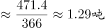。

故正确答案为B。

---

#### 第 4 题　qid 2188457 · 增长

2015年第一季度，该省农林牧渔业增加值与下列哪一项最为接近？

- **A**. 320亿元　✅
- **B**. 340亿元
- **C**. 360亿元
- **D**. 380亿元

**答案**：A

**官方解析**

根据题干“2015年第一季度，该省农林牧渔业增加值······”，结合材料为2017年第一季度，可判定本题为间隔基期问题。定位文字材料第一段“2017年第一季度，某省农林牧渔业增加值361.78亿元，比上年同期增长，高于上年同期0.2个百分点”，可得2016年增长率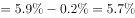，则根据间隔增长率公式可得2017年第一季度比2015年第一季度的增长率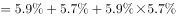。则2015年第一季度，该省农林牧渔业增加值为亿元，与A项最接近。

故正确答案为A。

---

#### 第 5 题　qid 2187824 · 综合

能够从上述资料中推出或计算出的是：

- **A**. 
2017年该省农林牧渔服务业增加值

- **B**. 
2016年第一季度全国农林牧渔业增加值

- **C**. 
2017年第一季度该省水产品产量中非养殖水产品产量与2016年第一季度持平

- **D**. 
若2017年该省林业增加值每个季度的环比增长率不低于，则2017年该省林业增加值将超过150亿元
　✅

**答案**：D

**官方解析**

A项：定位材料第六段，给出的是2017年第一季度该省农林牧渔服务业增加值与增长率，没有与2017年全年相关的数据，故无法计算；

B项：定位材料第一段，给出的是2017年第一季度该省农林牧渔业增加值，没有与全国相关的数据，故无法计算；

C项：定位材料第五段可知，2017年第一季度全省水产品产量比上年同期增长，养殖水产品产量同比增长。根据混合增长率“整体增速大小居中”的结论，则非养殖水产品的增速也为。增速为正，说明2017年第一季度非养殖水产品产量比2016年第一季度上升了，错误；

D项：定位材料第三段可知，2017年第一季度该省林业增加值为34.84亿元，若每季度环比增长率不低于，则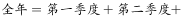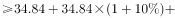，正确。

故正确答案为D。

注：D项计算量较大，故A、B、C排除后直接选D即可。

---

### 材料 2

根据以下资料，回答以下问题。

注：

1.农村金融机构包括农村商业银行、农村合作银行、农村信用社和新型农村金融机构。

2.其他类金融机构包括政策性银行及国家开发银行、民营银行、外资银行、非银行金融机构、资产管理公司和邮政储蓄银行。

3.净资产额等于总资产额减去总负债额。

#### 第 6 题　qid 2187784 · 比重

2017年5月，股份制商业银行总资产占银行业金融机构的比重与上年相比约：

- **A**. 增加了2个百分点
- **B**. 减少了2个百分点
- **C**. 增加了0.2个百分点
- **D**. 减少了0.2个百分点　✅

**答案**：D

**官方解析**

根据题干“……比重与上年相比约”，结合选项为百分点，判定为两期比重问题。定位统计表，可得：2017年5月股份制商业银行总资产亿元，增长率，银行业金融机构总资产亿元，增长率。根据两期比重差公式：，，因此比重下降，排除A、C，代入公式，，D项最为接近。

故正确答案为D。

---

#### 第 7 题　qid 2187805 · 增长

在2017年5月我国银行业金融机构资产负债表中，下列哪一项的总资产同比增长额最高？

- **A**. 大型商业银行　✅
- **B**. 股份制商业银行
- **C**. 城市商业银行
- **D**. 农村金融机构

**答案**：A

**官方解析**

根据题干“……总资产同比增长额最高”，判定为增长量比较问题。定位统计表，可得：2017年5月大型商业银行总资产为839329亿元，同比增速为；股份制商业银行总资产为431150亿元，同比增速为；城市商业银行总资产为293063亿元，同比增速为；农村金融机构总资产为314519亿元，同比增速为。根据公式，，四个选项的增长量分别为：

A项：；B项：；C项：；D项：。

比较发现，四个选项中，A项分母最小，且分子最大，所以A项最大，即2017年5月大型商业银行总资产同比增长额最高。

故正确答案为A。

---

#### 第 8 题　qid 2187798 · 综合

2016年5月，银行业金融机构总资产金额为多少万亿元？

- **A**. 167
- **B**. 207　✅
- **C**. 247
- **D**. 287

**答案**：B

**官方解析**

根据题干“2016年5月，银行业金融机构总资产金额为……”，材料给的是2017年5月，判定为基期计算问题。定位统计表，可得：2017年5月银行业金融机构总资产为亿元万亿元，同比增速为。根据公式，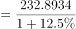万亿元，B项最为接近。

故正确答案为B。

---

#### 第 9 题　qid 2187818 · 综合

根据所给资料，下列表述正确的是：

- **A**. 
城市商业银行净资产额农村金融机构净资产额

- **B**. 
城市商业银行净资产额股份制商业银行净资产额

- **C**. 
大型商业银行净资产额股份制商业银行净资产额
　✅
- **D**. 
农村金融机构净资产额其他类金融机构净资产额

**答案**：C

**官方解析**

定位统计表可得,大型商业银行净资产额亿元，股份制商业银行的净资产额亿元，城市商业银行的净资产额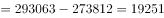亿元，农村金融机构的净资产额亿元，其他金融机构的净资产额亿元，故大型商业银行的净资产额其他金融机构的净资产额股份制商业银行的净资产额农村金融机构的净资产额城市商业银行的净资产额。只有C项满足。 

故正确答案为C。

---

#### 第 10 题　qid 2187812 · 综合

2017年5月我国股份制商业银行净资产额约是城市商业银行净资产额的多少倍？

- **A**. 0.5
- **B**. 0.8
- **C**. 1.5　✅
- **D**. 1.8

**答案**：C

**官方解析**

根据题干“2017年5月，······是······的多少倍”，材料已知时间为2017年5月，可判定本题为现期倍数问题。定位统计表可得：2017年5月股份制商业银行的总资产金额为431150亿元，总负债额为402922亿元；城市商业银行的总资产金额为293063亿元，总负债额为273812亿元。根据，可得亿元，亿元，故2017年5月股份制商业银行的净资产额约是城市商业银行的净资产额的倍，C选项最为接近。

故正确答案为C。

---

### 材料 3

        2016年，我国全年完成邮电业务收入总量43344亿元，比上年增长。其中，邮政业务收入7397亿元，增长；电信业务收入35947亿元，增长。邮政业全年完成邮政函件业务36.2亿件，包裹业务0.3亿件，快递业务量312.8亿件；快递业务收入3974亿元。电信业全年新增移动电话交换机容量7318万户，达到218384万户。2016年末全国电话用户总数152856万户（电话包括固定电话和移动电话两种），其中移动电话用户132193万户。移动电话普及率上升至96.2部/百人。固定互联网宽带接入用户29721万户，比上年增加3774万户，其中固定互联网光纤宽带接入用户22766万户，比上年增加7941万户；移动宽带用户94075万户，增加23464万户。移动互联网接入流量93.6亿G，比上年增长。互联网上网人数7.31亿人，增加4299万人，其中手机上网人数6.95亿人，增加7550万人。互联网普及率达到，其中农村地区互联网普及率达到。软件和信息技术服务业完成软件业务收入48511亿元，比上年增长。 

#### 第 11 题　qid 2187797 · 综合

2015年我国电信业务收入比邮政业务收入多：

- **A**. 14235亿元
- **B**. 16235亿元
- **C**. 18235亿元　✅
- **D**. 20235亿元

**答案**：C

**官方解析**

由题干“2015年…比…多”，结合材料时间为2016年，判定此题为基期和差问题。定位文字材料可知，“2016年…我国电信业务收入35947亿元，增长”，“2016年…邮政业务收入7397亿元，增长”。根据基期计算公式，基期，可得2015年我国电信业务收入比邮政业务收入多：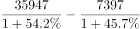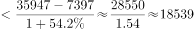，因此所求略小于18539，只有C项最为接近。

故正确答案为C。

---

#### 第 12 题　qid 2187792 · 增长

2013～2016年期间，我国移动宽带用户数同比增长最快的年份是：

- **A**. 2013年　✅
- **B**. 2014年
- **C**. 2015年
- **D**. 2016年

**答案**：A

**官方解析**

由题干“2013～2016年…同比增长最快的年份是”，判定此题为一般增长率问题。定位统计图可知，2012年我国移动宽带用户数为23280万户，2013年为40161万户，2014年为58254万户，2015年为70611万户，2016年为94075万户。根据增长率公式，增长率，可得2013～2016年我国移动宽带用户数同比增长率分别为：

2013：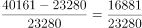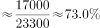；2014：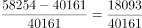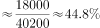；2015：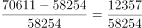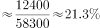；2016：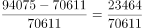。因此2013～2016年我国移动宽带用户数同比增长最快的年份为2013年。

故正确答案为A。

---

#### 第 13 题　qid 2188730 · 平均数

2012～2016年期间，我国固定互联网宽带接入用户的平均数是：

- **A**. 18425万户
- **B**. 22425万户　✅
- **C**. 25425万户
- **D**. 27425万户

**答案**：B

**官方解析**

根据题干“……平均数是”，结合题干时间均在材料中给出，可判定本题为现期平均数问题。根据表格可得，2012~2016年我国固定互联网宽带接入用户数分别为17518、18891、20048、25947、29721万户。故2012～2016年我国固定宽带接入用户数的平均数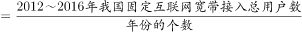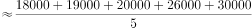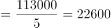，B项最接近。

故正确答案为B。

---

#### 第 14 题　qid 2188468 · 比重

2016年末，全国固定电话用户占电话用户总数的比重约为：

- **A**. 

　✅
- **B**. 

- **C**. 

- **D**. 

**答案**：A

**官方解析**

根据题干“2016年末······占······的比重”，可判定本题为现期比重问题。定位文字材料“2016年末全国电话用户总数152856万户（电话包括固定电话和移动电话两种），其中移动电话用户132193万户”，可得全国固定电话用户占电话用户总数的比重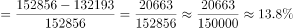，与A项最接近。

故正确答案为A。

---

#### 第 15 题　qid 2187804 · 综合

关于我国邮电业务情况的说明，下列说法正确的是：

- **A**. 2015年末，我国固定互联网光纤宽带接入用户与移动宽带用户的差额低于50000户
- **B**. 2016年固定互联网宽带接入用户同比增长率高于移动宽带用户增长率
- **C**. 2016年末，我国使用固定电话的总人数比移动电话的多
- **D**. 2016年我国城市地区互联网普及率已超过一半　✅

**答案**：D

**官方解析**

A项：定位文字材料和图表，2016年固定互联网光纤宽带接入用户22766万户，比上年增加7941万户；2015年移动宽带用户70611万户。根据基期量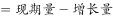，则2015年固定互联网光纤宽带接入用户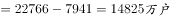，，错误；

B项：定位文字材料和图表，2016年固定互联网宽带接入用户比上年增加3774万户，2015年固定互联网宽带接入用户数为25947万户；2016年移动宽带用户比上年增加23464万户，2015年移动宽带用户70611万户。根据增长率，则2016年我国固定互联网宽带接入用户同比增长率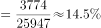，移动宽带用户增长率，，错误；

C项：定位文字材料，2016年末全国电话用户总数152856万户（电话包括固定电话和移动电话两种），其中移动电话用户132193万户。固定电话用户，故2016年末我国使用固定电话的总人数比移动电话的少，错误；

D项：定位文字材料，互联网普及率达到，其中农村地区互联网普及率达到。农村地区互联网普及率和城市地区互联网普及率混合为互联网普及率，根据“混合居中”，可得农村地区互联网普及率（）互联网普及率（）城市地区互联网普及率，故城市地区互联网普及率超过一半，正确。

故正确答案为D。

---

### 材料 4

        2017年上半年，全国居民人均可支配收入12932元，比上年同期名义增长，其中，城镇居民人均可支配收入18332元，增长（以下如无特别说明，均为同比名义增长）；农村居民人均可支配收入6562元，增长。

        按收入来源分，2017年上半年，全国居民人均工资性收入7435元，增长，占全国居民人均可支配收入的比重为；人均经营净收入2117元，增长，占全国居民人均可支配收入的比重为；人均财产净收入1056元，增长，占全国居民人均可支配收入的比重为；人均转移净收入2324元，增长，占全国居民人均可支配收入的比重为。

#### 第 16 题　qid 2188727 · 平均数

2017年上半年，人均财产净收入比上年约增加多少元？

- **A**. 92　✅
- **B**. 102
- **C**. 112
- **D**. 122

**答案**：A

**官方解析**

由题干“2017年上半年······比上年约增加多少元”，判定此题为增长量计算问题。定位文字材料第二段“人均财产净收入1056元，增长”。代入公式，。

故正确答案为A。

---

#### 第 17 题　qid 2188466 · 平均数

2016年上半年，全国居民人均工资性收入占全国居民人均可支配收入的比重约为：

- **A**. 

- **B**. 

　✅
- **C**. 

- **D**. 

**答案**：B

**官方解析**

由题干“2016年上半年······占······的比重约为”，而材料数据时间为2017年，判定此题为基期比重问题。定位文字材料第一段“2017年上半年，全国居民人均可支配收入12932元，比上年同期名义增长”，定位文字材料第二段“2017年上半年，全国居民人均工资性收入7435元，增长，占全国居民人均可支配收入的比重为”，代入基期比重公式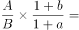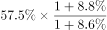，略大于。

故正确答案为B。

---

#### 第 18 题　qid 2188470 · 综合

关于2017年上半年全国居民收入和消费支出主要数据情况，下列说法正确的是：

- **A**. 生活用品及服务消费支出水平不足交通通信消费支出水平的二分之一　✅
- **B**. 城镇居民人均可支配收入超过农村居民人均可支配收入的3倍
- **C**. 人均财产净收入同比增长率低于人均经营净收入同比增长率
- **D**. 居住消费支出同比增长率高于医疗保健消费支出同比增长率

**答案**：A

**官方解析**

A项：定位表格，可知生活用品及服务消费支出为535元，交通通讯消费支出为1211元。，正确；

B项：定位文字材料第一段，可知城镇居民人均可支配收入为18332元，农村居民人均可支配收入为6562元。，错误；

C项：定位文字材料第二段，可知人均财产净收入同比增长率＞人均经营净收入同比增长率，错误；

D项：定位表格，可知居住消费支出同比增长率＜医疗保健消费支出同比增长率，错误。

故正确答案为A。

---

#### 第 19 题　qid 2188469 · 增长

2017年上半年，全国居民消费支出主要数据按消费类别分，其指标的增长率超过全国居民人均消费支出水平增长率的有几个？

- **A**. 4
- **B**. 5　✅
- **C**. 6
- **D**. 7

**答案**：B

**官方解析**

定位表格，可知全国居民消费支出增长率为，按消费类别分，超过全国居民消费支出增长率的有居住、交通通信、教育文化娱乐、医疗保健、其他用品和服务，共5个。 

故正确答案为B。

---

#### 第 20 题　qid 2188732 · 综合

2017年上半年，全国居民消费支出主要数据按消费类别分。下列哪一个经济指标值最大？

- **A**. 居住水平占全国居民人均消费支出水平的比重
- **B**. 食品烟酒水平占全国居民人均消费支出水平的比重　✅
- **C**. 交通通信水平占全国居民人均消费支出水平的比重
- **D**. 医疗保健水平占全国居民人均消费支出水平的比重

**答案**：B

**官方解析**

根据题干“2017年上半年…经济指标值最大”，且材料时间为2017年上半年，可判定本题为现期比重问题。定位表格材料可得：全国居民人均消费支出水平8834元、居住水平1919元、食品烟酒水平2678元、交通通信水平1211元、医疗保健水平718元。根据公式：比重=，可知当整体量相同时，部分量越大，则比重越大，故选项所求指标最大的是食品烟酒水平占全国居民人均消费支出水平的比重。

故正确答案为B。

---
