# 2018年421联考《行测》题（陕西卷）（网友回忆版）

> 联考 · 2018 年 · 6 个模块 · 共 118 题

- [政治理论](#%E6%94%BF%E6%B2%BB%E7%90%86%E8%AE%BA) · 2 题
- [常识判断](#%E5%B8%B8%E8%AF%86%E5%88%A4%E6%96%AD) · 18 题
- [言语理解与表达](#%E8%A8%80%E8%AF%AD%E7%90%86%E8%A7%A3%E4%B8%8E%E8%A1%A8%E8%BE%BE) · 30 题
- [数量关系](#%E6%95%B0%E9%87%8F%E5%85%B3%E7%B3%BB) · 13 题
- [判断推理](#%E5%88%A4%E6%96%AD%E6%8E%A8%E7%90%86) · 35 题
- [资料分析](#%E8%B5%84%E6%96%99%E5%88%86%E6%9E%90) · 20 题

---

## 政治理论

### 第 1 题　qid 2188035 · 时事政治

中国共产党第十九届三中全会审议通过了（  ）。

- **A**. 《中共中央关于深化党和国家机构改革的决定》　✅
- **B**. 《中共中央关于深化党和国家领导制度改革的决定》
- **C**. 《中共中央关于加强党的领导和全面从严治党的决定》
- **D**. 《中共中央关于召开第十三届全国人民代表大会的决定》

**答案**：A

**官方解析**

本题考查时事政治，主要涉及党的十九届三中全会。
中国共产党第十九届中央委员会第三次全体会议，于2018年2月26日至28日在北京举行。全会审议通过了《中共中央关于深化党和国家机构改革的决定》和《深化党和国家机构改革方案》，同意把《深化党和国家机构改革方案》的部分内容按照法定程序提交十三届全国人大一次会议审议。因此，B、C、D三项不符合题意。
故正确答案为A。

---

### 第 2 题　qid 2188042 · 新思想

“这是一个光荣的名字，不朽的名字”，这是中共中央总书记习近平同志对老一辈革命家（  ）的高度称赞。

- **A**. 毛泽东
- **B**. 邓小平
- **C**. 周恩来　✅
- **D**. 彭德怀

**答案**：C

**官方解析**

本题主要考查时事政治。
2018年3月1日，习近平总书记在纪念周恩来同志诞辰120周年座谈会上发表重要讲话，习近平在讲话中强调：“周恩来，这是一个光荣的名字、不朽的名字。每当我们提起这个名字就感到很温暖、很自豪。”因此，题干这句话是习近平总书记对老一辈革命家周恩来的高度评价，故A、B、D三项均不符合题意。
故正确答案为C。

---

## 常识判断

### 第 1 题　qid 2188030 · 法律常识

下列表述中，不符合《中华人民共和国监察法》的一项是（  ）。

- **A**. 中华人民共和国国家监察委员会是最高监察机关，领导地方各级监察委员会的工作
- **B**. 地方各级监察委员会主任每届任期同本级人民代表大会每届任期相同，连选连任不得超过两届　✅
- **C**. 国家监察委员会由全国人民代表大会产生，负责全国监察工作
- **D**. 监察委员会履行监督、调查、处置等职责

**答案**：B

**官方解析**

本题考查法律常识，主要考查《中华人民共和国监察法》的相关知识。
A项正确，根据《中华人民共和国监察法》第七条第一款规定：“中华人民共和国国家监察委员会是最高监察机关。”《中华人民共和国监察法》第十条规定：“国家监察委员会领导地方各级监察委员会的工作，上级监察委员会领导下级监察委员会的工作。”
B项错误，根据《中华人民共和国监察法》第九条第三款规定：“地方各级监察委员会主任每届任期同本级人民代表大会每届任期相同。”没有“连选连任不得超过两届”的说法。
C项正确，根据《中华人民共和国监察法》第八条第一款规定：“国家监察委员会由全国人民代表大会产生，负责全国监察工作。”
D项正确，根据《中华人民共和国监察法》第十一条规定：“监察委员会依照本法和有关法律规定履行监督、调查、处置职责。”
本题为选非题，故正确答案为B。

---

### 第 2 题　qid 2188031 · 人文常识

下列关于我国“乡村振兴战略”的表述中，不正确的一项是（  ）。

- **A**. 这是习近平总书记提出的促进农业农村优先发展的新战略
- **B**. 2020年实现乡村振兴取得重要进展，制度框架和政策体系基本形成
- **C**. 2035年实现乡村振兴取得决定性进展，农业农村现代化基本实现
- **D**. 2060年实现乡村全面振兴，达到农业强、农村美、农民富　✅

**答案**：D

**官方解析**

本题考查政治常识，主要考查乡村振兴战略的相关知识。
A项正确，乡村振兴战略是习近平同志2017年10月18日在党的十九大报告中提出的新战略，明确指出要坚持农业农村优先发展。
B项正确，《中共中央国务院关于实施乡村振兴战略的意见》中指出，到2020年，乡村振兴取得重要进展，制度框架和政策体系基本形成。
C项正确，《中共中央国务院关于实施乡村振兴战略的意见》中指出，到2035年，乡村振兴取得决定性进展，农业农村现代化基本实现。
D项错误，《中共中央国务院关于实施乡村振兴战略的意见》中指出，到2050年，乡村全面振兴，农业强、农村美、农民富全面实现。不是2060年。
本题为选非题，故正确答案为D。

---

### 第 3 题　qid 2188032 · 人文常识

下列诗句中，描绘天气的一项是（  ）。

- **A**. 四季无寒暑，一雨便成秋
- **B**. 水光潋滟晴方好，山色空蒙雨亦奇　✅
- **C**. 人间四月芳菲尽，山寺桃花始盛开
- **D**. 映阶碧草自春色，隔叶黄鹂空好音

**答案**：B

**官方解析**

本题考查自然常识。
A项错误，“四季无寒暑，一雨便成秋”，是对昆明气候的写照，四季没有寒暑之分，每当下雨时就变成秋天的气候。描绘的不是天气而是气候。
B项正确，“水光潋滟晴方好，山色空蒙雨亦奇”，描绘的是晴天和雨天的西湖美景，符合题干要求。
C项错误，“人间四月芳菲尽，山寺桃花始盛开”说的是山下平原地区的桃花在四月就已经开败了，而山上寺院的桃花才开始盛开。体现的是地形对气候的影响。
D项错误，“映阶碧草自春色，隔叶黄鹂空好音”意思是碧草照映在台阶上显露出春色，树上的黄鹂隔着枝叶婉转鸣唱。这句话描述的是春天的景色，没有描绘天气。
故正确答案为B。

---

### 第 4 题　qid 2188025 · 科技常识

下列说法中，正确的一项是（  ）

- **A**. 海昏侯墓与曾侯乙墓是在同一个省份发现的
- **B**. 藻类植物可以用作监测空气污染程度的指示植物
- **C**. 每天我国最先迎来黎明的地方是珍宝岛
- **D**. 秋天有的树叶变红是因为树叶中的红色花青素超过叶绿素　✅

**答案**：D

**官方解析**

本题主要考查生物常识有关内容。
A项错误，海昏侯墓位于江西省南昌市，是目前我国发现的面积最大、保存最好、内涵最丰富的汉代侯国聚落遗址。曾侯乙墓位于湖北省随州市，是战国早期曾侯乙的一座墓葬。两座墓葬并不是在同一个省份被发现的。
B项错误，苔藓植物的叶只有一层细胞，二氧化硫等有毒气体可以从背腹两面侵入叶细胞，使苔藓植物的生存受到威胁。因此苔藓植物可以用作监测空气污染程度的指示植物，而藻类植物则不能。水质监测常用藻类植物。
C项错误，珍宝岛位于黑龙江支流乌苏里江主航道中心左侧，东经133度，是一处名传中外的战争遗址。而我国最先迎来黎明的地方是黑龙江省黑瞎子岛，位于东经135度。
D项正确，秋天来临时阳光依旧强烈，温度却慢慢降低，叶绿素因遭到破坏渐渐消失，而在强光、低温、干旱的条件下，树叶在凋落前会产生大量的红色花青素，红色花青素的含量超过叶绿素树叶进而变红。
故正确答案为D。

---

### 第 5 题　qid 2188014 · 地理国情

2018年2月，经国务院批准，国家发展与改革委员会等部委印发《关中平原城市群发展规划》，规划指出，关中平原城市群包括（  ）三省的3800万人口一体协同发展。

- **A**. 陕西、山西、甘肃　✅
- **B**. 陕西、宁夏、内蒙古
- **C**. 陕西、山西、河南
- **D**. 陕西、宁夏、青海

**答案**：A

**官方解析**

本题考查时政。
国家发展改革委、住房城乡建设部关于印发《关中平原城市群发展规划的通知》（以下简称《规划》）中要求：“陕西、山西、甘肃省人民政府和国务院有关部门要认真贯彻落实《国务院关于关中平原城市群发展规划的批复（国函〔2018〕6号）》精神，提高认识、紧密合作、扎实推进，共同推动《规划》的落实，努力把关中平原城市群建设成为具有国际影响力的国家级城市群、内陆改革开放新高地。”关中平原城市群应包括陕西、山西、甘肃三省。
故正确答案为A。

---

### 第 6 题　qid 2188016 · 科技常识

下列说法中，正确的一项是（  ）。

- **A**. 
牛顿被称为“近代科学之父”

- **B**. 
等量的的水蒸气与的水对人的烫伤同样严重

- **C**. 
爱因斯坦是现代量子物理学的奠基人

- **D**. 
雨后彩虹是光的反射与折射共同作用产生的现象
　✅

**答案**：D

**官方解析**

本题考查物理常识。
A项错误，伽利略是意大利的物理学家，是科学革命的先驱，他融会贯通了当时的数学、物理学和天文学，开创了以实验事实为根据并具有严密逻辑体系的近代科学，被称为“近代科学之父”。牛顿是英国著名的物理学家，提出了牛顿三大运动定律。故“近代科学之父”是伽利略，而不是牛顿。
B项错误，等量的水蒸气与水都是100℃，它们接触到皮肤都要向人体放热。而100℃水蒸气向人体放热时会发生液化，液化时会放出大量的热。因此等量的100℃的水蒸气对人体的烫伤比100℃的水更为严重。
C项错误，1900年，德国物理学家普朗克研究发现，认为电磁波的发射和吸收不是连续的，而是一份一份进行的，这样的一份能量叫做能量子。普朗克把物理学带进了量子世界，受到普朗克的启发，爱因斯坦于1905年提出，在空间传播的光也不是连续的，而是一份一份的，每一份叫做一个光量子。所以现代量子物理学的开创者和奠基人是德国物理学家马克斯·普朗克，而不是爱因斯坦。
D项正确，彩虹是气象中的一种光学现象。雨后当太阳光照射到空气中的水滴时，光线被折射及反射，在天空上形成七彩光谱。 
故正确答案为D。

---

### 第 7 题　qid 2188018 · 人文常识

下列表述中，不正确的一项是（  ）。

- **A**. “晴川历历汉阳树，芳草萋萋鹦鹉洲”中的鹦鹉洲在今武汉市
- **B**. “浊酒一杯家万里，燕然未勒归无计”中的燕然指今北京市　✅
- **C**. “行到水穷处，坐看云起时”所描绘的景观在今西安市
- **D**. “何处望神州？满眼风光北固楼”中的北固楼在今江苏省

**答案**：B

**官方解析**

本题考查文化常识。
A项正确，“晴川历历汉阳树，芳草萋萋鹦鹉洲”出自唐代诗人崔颢的《黄鹤楼》，“鹦鹉洲”位于今湖北省武汉市。
B项错误，“浊酒一杯家万里，燕然未勒归无计”出自宋代范仲淹的《渔家傲·秋思》。“燕然”，指燕然山，就是今天的杭爱山，其位于蒙古国境内。
C项正确，“行到水穷处，坐看云起时”出自唐代诗人王维的《终南别业》，“终南”指终南山，位于陕西省西安市。
D项正确，“何处望神州？满眼风光北固楼”出自宋代辛弃疾的《南乡子·登京口北固亭有怀》，“北固楼”位于今江苏省镇江市北固山上。
本题为选非题，故正确答案为B。
注：本题在试卷当中，出现错别字，A选项“芳草凄凄”应为“芳草萋萋”。

---

### 第 8 题　qid 2188021 · 法律常识

下列表述中，正确的一项是（    ）。

- **A**. 小张为某企业员工，打算辞职，须在20日前向单位提交书面辞职申请，这一做法符合劳动法的相关规定
- **B**. 小李企图入室盗窃，但因入户门锁无法撬开，多次尝试未果，只好放弃，这属于犯罪中止
- **C**. 小王在网络上匿名发布关于某明星的虚假新闻，对其造成名誉伤害，小王不需要承担法律责任
- **D**. 小赵在公交车上发现小吴偷其钱包，对其穷追猛打致其死亡，这属于防卫过当　✅

**答案**：D

**官方解析**

本题考查法律常识，涉及劳动法、民法、刑法知识。
A项错误，《劳动法》第三十一条规定：“劳动者解除劳动合同，应当提前三十日以书面形式通知用人单位。”因此，小张的做法不符合劳动法的规定。
B项错误，《刑法》第二十三条第一款规定：“已经着手实行犯罪，由于犯罪分子意志以外的原因而未得逞的，是犯罪未遂。”《刑法》第二十四条第一款规定：“在犯罪过程中，自动放弃犯罪或者自动有效地防止犯罪结果发生的，是犯罪中止。”本选项中，小李是由于无法撬开门锁才导致的盗窃未成功，属于小李意志以外的因素而未得逞，是犯罪未遂。
C项错误，《民法典》第一千零二十四条第一款规定：“民事主体享有名誉权。任何组织或者个人不得以侮辱、诽谤等方式侵害他人的名誉权。” 《民法典》第九百九十五条规定：“人格权受到侵害的，受害人有权依照本法和其他法律的规定请求行为人承担民事责任。受害人的停止侵害、排除妨碍、消除危险、消除影响、恢复名誉、赔礼道歉请求权，不适用诉讼时效的规定。”名誉权属于人格权，小王侵犯了某明星的名誉权，应当承担法律责任。
D项正确，《刑法》第二十条第一款规定：“为了使国家、公共利益、本人或者他人的人身、财产和其他权利免受正在进行的不法侵害，而采取的制止不法侵害的行为，对不法侵害人造成损害的，属于正当防卫，不负刑事责任。”第二款规定：“正当防卫明显超过必要限度造成重大损害的，应当负刑事责任，但是应当减轻或者免除处罚。”在本选项中，小赵为了使自己的权利免受不法侵害，可以采取正当防卫，但是小赵将小吴打死，明显超过了必要的限度并造成重大损害，构成防卫过当。
故正确答案为D。

---

### 第 9 题　qid 2188017 · 人文常识

下列说法中，不正确的一项是（  ）。

- **A**. “穿花蛱蝶深深见，点水蜻蜓款款飞”描述的是唐代曲江的景象
- **B**. 巴基斯坦的首都是伊斯兰堡
- **C**. 海上行驶的轮船发出六声短笛是转弯的警示　✅
- **D**. 我国古代名画《清明上河图》描绘的是北宋汴梁秋天的景观

**答案**：C

**官方解析**

本题考查文化常识。
A项正确，“穿花蛱蝶深深见，点水蜻蜓款款飞”出自唐代诗人杜甫《曲江二首（其二）》。该诗句描绘的是唐代曲江的景象。
B项正确，伊斯兰堡，巴基斯坦伊斯兰共和国首都，全国的政治中心。同时伊斯兰堡也是世界二线城市，发展前景较为优越。
C项错误，轮船发出的笛声数量和长短各有含义，发出六声短笛表示遇险。
D项正确，清明上河图的季节说法，到底是春季还是秋季呢？对这个问题有三种意见。第一：研究者用《东京梦华录》与《清明上河图》相对照，认为是与清明相联系的初春。 第二：现在还有一部分研究者主张画中所描绘为秋景。理由是画卷右首有驮负10篓木炭的驴子。因为当时汴京城是以烧煤为主，临近冬天才准备烤火用的木炭。 第三种看法认为画中既有春景也有秋景，是因为张择端创作的时间历经前后数年，开始画的是春天，画着画着就画到秋天去了。
D选项是有争议的，但是因为C项有明显错误，因此这道题只能选C。
本题为选非题，故正确答案为C。

---

### 第 10 题　qid 2188020 · 地理国情

在陕西省委十三届二次全会上，省委书记胡和平提出，要以发展“三个经济”为突破口，努力使对外开放成为新时代追赶超越的新优势，下列符合“三个经济”提法的是（  ）。

- **A**. 绿色经济、实体经济、共享经济
- **B**. 枢纽经济、门户经济、流动经济　✅
- **C**. 绿色经济、创新经济、共享经济
- **D**. 枢纽经济、网络经济、流动经济

**答案**：B

**官方解析**

本题考查陕西时政知识。
中国共产党陕西省第十三届委员会第二次全体会议12月23日至24日在西安举行。全会审议通过《中共陕西省委关于学习贯彻习近平新时代中国特色社会主义思想奋力谱写陕西追赶超越新篇章的决定》。在会议中，省委书记胡和平强调，要着眼形成全面开放新格局，用好陕西综合交通重要枢纽和对外开放重要门户的优势，大力发展枢纽经济、门户经济、流动经济，努力使对外开放成为新时代追赶超越的新优势。因此，“三个经济”为“枢纽经济、门户经济、流动经济”。因此，B项正确，ACD项错误。
故正确答案为B。

---

### 第 11 题　qid 2188022 · 科技常识

下列关于北斗卫星导航系统用途的说法中，不正确的一项是（  ）。

- **A**. 导航与通信的集成增强了导航能力和搜索救援能力，可实现用户信息共享和信息交换
- **B**. 多系统兼容服务，可以实现公开服务相互兼容，必要时提供多系统监测信息和差分改正信息
- **C**. 卫星使用寿命较长，目前尚未组建完毕，只能提供单向授时授权服务　✅
- **D**. 以双向伪距时间同步方法摆脱卫星时间同步与精密轨道之间的依赖关系

**答案**：C

**官方解析**

北斗卫星导航系统是中国着眼于国家安全和经济社会发展需要，自主建设、独立运行的卫星导航系统，是为全球用户提供全天候、全天时、高精度的定位、导航和授时服务的国家重要空间基础设施。
主要用途有四个方面：
（1）导航与通信的集成增强了导航能力和搜索救援能力，可实现用户信息共享和信息交换。
（2）多系统兼容服务，可以实现公开服务相互兼容，必要时提供多系统监测信息和差分改正信息。
（3）提供双向授时授权服务。
（4）以双向伪距时间同步方法摆脱卫星时间同步与精密轨道之间的依赖关系。
所以，C项表述“只能提供单向授时授权服务”错误，A、B、D项正确。
本题为选非题，故正确答案为C。

---

### 第 12 题　qid 2188023 · 人文常识

下列说法中，正确的一项是（    ）。

- **A**. “锥刺股”是汉代孙敬的故事
- **B**. “头悬梁”是战国苏秦的故事
- **C**. “赵中令，读鲁论，彼既仕，学且勤。”中的赵中令即晋国赵盾
- **D**. “苏老泉，二十七，始发愤，读书籍。”中的苏老泉即宋代苏洵　✅

**答案**：D

**官方解析**

本题考查人文常识。
A项错误，“锥刺股”出自于《战国策·秦策一》“苏秦读书欲睡，引锥自刺其股。”，形容刻苦学习。因此，“锥刺股”讲的是战国时期的苏秦，不是孙敬。
B项错误，“头悬梁”的故事出于《太平御览》卷三六三引《汉书》“孙敬字文宝，好学，晨夕不休，及至眠睡疲寝，以绳系头，悬屋梁。后为当世大儒。”，形容发愤读书学习。因此，“头悬梁”讲的是汉代孙敬，不是战国苏秦。
C项错误，“赵中令，读鲁论，彼既仕，学且勤。”出自《三字经》，是指宋朝时赵普，已经做到了中书令了，天天还手不释卷地阅读《论语》，不因为自己已经当了高官，而忘记勤奋学习。所以，赵中令是指赵普，不是赵盾。
D项正确，“苏老泉，二十七，始发愤，读书籍。”出自《三字经》，是指唐宋八大家之一的苏洵，小时候不想念书，到了二十七岁的时候，才开始下决心努力学习，后来成了大学问家。
故正确答案为D。

---

### 第 13 题　qid 2188024 · 人文常识

下列成语中，与魏蜀吴三国无关的一项的是（    ）。

- **A**. 临阵磨枪  篝火狐鸣  锄强扶弱　✅
- **B**. 成败利钝  长驱直入  超群绝伦
- **C**. 车殆马烦  称王称霸  赤膊上阵
- **D**. 除残去秽  乘虚而入  重见天日

**答案**：A

**官方解析**

本题考查人文常识。
A项错误，“临阵磨枪”出自清代曹雪芹《红楼梦》第七十回。激励人们就算到了最后时刻也要努力一下。
“篝火狐鸣”出自《史记·陈涉世家》：“又间令吴广之次所旁丛祠中，夜篝火，狐鸣呼曰：‘大楚兴，陈胜王。’”
“锄强扶弱”出自明代凌蒙初《二刻拍案惊奇》卷十二："此等锄强扶弱的事，不是我，谁人肯做？"意思是铲除强暴，扶助弱者。
三个成语均与魏蜀吴三国无关。
B项正确，“成败利钝”出自三国时期蜀国诸葛亮《后出师表》：“臣鞠躬尽瘁，死而后已，至于成败利钝，非臣之明所能逆睹也。”
“长驱直入”出自三国时期魏国曹操《劳徐晃令》：“吾用兵三十余年，及所闻古之善用兵者，未有长驱径入敌围者也。”
“超群绝伦”出自《三国志·蜀书·关羽传》，指的是超出众人，同辈中无人可比。
三个成语均与魏蜀吴三国有关。
C项正确，“车殆马烦”出自三国时期魏国曹植《洛神赋》，形容旅途劳顿。
“称王称霸”出自三国时期魏国曹操《让县自明本志令》：“设使国家无有孤，不知当几人称帝，几人称王。”比喻凭借权势横行一方，或狂妄地以首脑自居，独断独行。
“赤膊上阵”出自明朝罗贯中《三国演义》第五十九回：“许褚性起，飞回阵中，卸下盔甲，浑身筋突，赤体提刀，翻身上马，来与马超决战。”比喻亲身上场，不加掩饰地进行活动。
三个成语均与魏蜀吴三国有关。
D项正确，“除残去秽”出自三国时期魏国曹操《让县自明本志令》：“故在济南，始除残去秽，平心选举，违忤诸常待。”比喻清除社会上的残暴、腐朽势力。
“乘虚而入”出自《三国演义》二十四回：“许昌空虚，若以义兵乘虚而入，上可以保天子，下可以救万民。”形容乘着对方空虚或没有准备的时候闯入，多用于军事。
“重见天日”出自《三国演义》第二十八回，是指关羽得知兄长刘备的消息，立即收拾行李车马，封金挂印，不远千里护送着两位嫂嫂单骑来寻的故事。比喻脱离黑暗，重见光明。
三个成语均与魏蜀吴三国有关。
本题为选非题，故正确答案为A。

---

### 第 14 题　qid 2188010 · 人文常识

下列名著中，出自同一大洲的有（    ）。

- **A**. 《基督山伯爵》　✅
- **B**. 《百年孤独》
- **C**. 《红高粱》
- **D**. 《浮士德》　✅

**答案**：AD

**官方解析**

本题考查文学常识。
A项《基督山伯爵》是法国著名作家大仲马的代表作，法国位于欧洲。
B项《百年孤独》是哥伦比亚作家加西亚·马尔克斯创作的长篇小说，是拉丁美洲魔幻现实主义文学的代表作，哥伦比亚位于南美洲。
C项《红高粱》是中国当代著名作家莫言的作品，中国位于亚洲。
D项《浮士德》是德国作家歌德创作的一部诗剧，是他毕生思想和艺术探索的结晶，德国位于欧洲。
地球一共有七个大洲，包括亚洲、欧洲、北美洲、南美洲、非洲、大洋洲、南极洲。因此来自同一大洲的是A项与D项。
故正确答案为AD。

---

### 第 15 题　qid 2188011 · 地理国情

下列国家重点一级保护动物中，分布在陕西省境内的有（    ）。

- **A**. 丹顶鹤
- **B**. 朱鹮　✅
- **C**. 大熊猫　✅
- **D**. 金丝猴　✅

**答案**：BCD

**官方解析**

本题考查生物常识。
A项错误，丹顶鹤在国内的繁殖地为内蒙古东部、黑龙江、吉林、辽宁、河北、河南。越冬主要集中在江苏和山东。所以丹顶鹤在陕西境内并没有分布。
B项正确，朱鹮古称朱鹭、红朱鹭，其是陕西特有的国家重点一级保护动物。
C项正确，大熊猫属于食肉目、熊科、大熊猫亚科和大熊猫属唯一的哺乳动物，现存的主要栖息地是中国四川、陕西和甘肃的山区。
D项正确，金丝猴是仰鼻猴属所有种的统称。仰鼻猴属共有5种：川金丝猴、滇金丝猴、黔金丝猴、越南金丝猴、缅甸金丝猴。其中川金丝猴仅分布于中国四川、甘肃、陕西和湖北。
故正确答案为BCD。

---

### 第 16 题　qid 2188012 · 人文常识

下列各项中，对应正确的有（    ）。

- **A**. 草木有本心，何求美人折—王昌龄
- **B**. 明月出天山，苍茫云海间—李白　✅
- **C**. 谁能绝人命，以作时世贤—元结　✅
- **D**. 艳色天下重，西施宁久微—白居易

**答案**：BC

**官方解析**

本题考查文学常识。
A项错误，“草木有本心，何求美人折”出自唐朝诗人张九龄的《感遇·其一》，意思是这一草一木是有自己的本心的，它们并不需要美人来折取它，而求得别人的欣赏。这首诗表达了作者恬淡、从容、超脱的襟怀。
B项正确，“明月出天山，苍茫云海间”出自唐代李白的《关山月》，意思是一轮明月从山间升起，穿行在苍茫云海之间。这首诗描绘了边塞的风光与戍卒的遭遇，表达远离家乡的戍边将士对家乡的思念之情，深刻反映了战争带给广大民众的痛苦。
C项正确，“谁能绝人命，以作时世贤”出自唐代元结的《贼退示官吏》，意思是谁忍心断绝人民的生路，换取时世所称赞的忠贤。这首诗揭露了安史之乱之后，官吏对人民横征暴敛的罪行，是一首斥责统治者横征暴敛的诗作。
D项错误，“艳色天下重，西施宁久微”出自唐代诗人王维的《西施咏》，意思是艳丽的姿色向来为天下器重，美丽的西施怎么能久处低微。这首诗借西施从平民到宫廷宠妃的历史典故，揭示了人生浮沉全凭际遇的炎凉世态，并表达对小人的嘲讽，抒发了作者怀才不遇的不平与感慨。
故正确答案为BC。

---

### 第 17 题　qid 2188013 · 地理国情

下列历史事件中，发生在黄河流域的有（    ）。

- **A**. 商鞅变法　✅
- **B**. 王莽新政　✅
- **C**. 魏孝文帝迁都　✅
- **D**. 赤壁之战

**答案**：ABC

**官方解析**

本题考查人文常识。
黄河发源于青海巴颜喀拉山，支流贯穿青海、四川、甘肃、宁夏、内蒙古、陕西、山西、河南、山东九个省、自治区。
A项正确，战国时期秦国在秦孝公时实行商鞅变法，使秦国逐步强盛起来，为后来秦统一六国奠定了基础。秦国的都城位于今陕西咸阳一带，属于黄河流域。
B项正确，王莽新政是指王莽为缓和西汉末年日益加剧的社会矛盾而采取的一系列新的措施。王莽即位后，改国号为新，都城位于今陕西省西安市，属于黄河流域。
C项正确，北魏孝文帝为推行政治改革，接受汉族先进的文化，迁都洛阳（今河南省洛阳市），属于黄河流域。
D项错误，赤壁之战是东汉末年，孙权、刘备联军在长江赤壁（今湖北省赤壁市西北）一带大败曹军，是我国古代以少胜多的著名战役之一。赤壁之战发生在长江流域，而非黄河流域。
故正确答案ABC。

---

### 第 18 题　qid 2188015 · 人文常识

下列关于维生素的说法中，正确的有（    ）。

- **A**. 
甲患有夜盲症，可能是因为缺少维生素
　✅
- **B**. 
乙患有脚气病，可能是因为缺少维生素
　✅
- **C**. 
丙患有坏血病，可能是因为缺少维生素
　✅
- **D**. 
丁患有佝偻病，可能是因为缺少维生素
　✅

**答案**：ABCD

**官方解析**

本题考查科技常识。

维生素不为人体提供能量，主要调节人体新陈代谢、维持身体健康。

A项正确，夜盲症指在光线昏暗的条件下看不清事物，行动困难。缺乏维生素易得夜盲症。

B项正确，脚气病指因为缺乏维生素引起的全身性疾病，表现为多发性神经炎、肌肉萎缩等症状。维生素包含维生素。

C项正确，坏血病又称维生素缺乏病，因缺乏维生素引起，临床表现为出血和骨骼病变。

D项正确，佝偻病是由于婴幼儿、儿童、青少年体内维生素不足，引起钙、磷代谢紊乱，产生的一种以骨骼病变为特征的疾病。缺乏维生素可能会导致佝偻病。

故正确答案为ABCD。

---

## 言语理解与表达

### 第 1 题　qid 2188308 · 逻辑填空

中国文化讲究因果，具体到陶瓷之上，明显能看出地域文化的影响。例如同为宋代青瓷，北方耀州青瓷与南方龙泉青瓷各自凸显性格，耀州青瓷呈橄榄绿，强调        ；龙泉青瓷呈梅子青，表现        ；演绎各自地方性格特点，色泽即可见一斑。
依次填入划横线部分最恰当的一项是(  )。

- **A**. 豪放  婉约
- **B**. 深沉  柔婉　✅
- **C**. 沉着  俏皮
- **D**. 稳重  活泼

**答案**：B

**官方解析**

第一空，根据文段“各自凸显性格”可知，横线处形容“橄榄绿”所代表的性格。A项“豪放”、B项“深沉”、D项“稳重”意思均可，保留。C项“沉着”指镇静；不慌不忙，体现的是一种状态，而非性格，排除。
第二空，横线处形容“梅子青”所代表的性格特点，且无论是“橄榄绿”，还是“梅子青”都是与绿色相近的颜色，所以填入横线处的词语还要满足不能与第一空差异过大，“梅子青”青碧柔和、莹润优雅，B项“柔婉”体现柔顺婉转之意，符合文意，当选。A项“婉约”如果填入横线处，则与第一空的“豪放”差异过大，不符合文意，排除；D项“活泼”体现的是有活力、动感，与“梅子青”所表现的气质不符，排除。
故正确答案为B。
【文段出处】《马未都：土耳其皇宫550年的元代青花瓷 》

---

### 第 2 题　qid 2188324 · 逻辑填空

古人云，腹有诗书气自华。这“气”        就是浩荡的学养之气。套用        的说法，对学者来说，“颜值”是学历，“气质”则是学养。芳华易逝，浩气永驻，老学者身上散发的人性之光，与其说是人生阅历的磨砺淘洗，不如说是学识涵养的        。
依次填入划横线部分最恰当的一项是（  ）。

- **A**. 大概  时髦  日积月累
- **B**. 大约  时下  深厚积累
- **C**. 大抵  流行  千锤百炼　✅
- **D**. 大致  通俗  博大精深

**答案**：C

**官方解析**

本题可从第三空入手，根据文意可知，横线处所填词语对应“磨砺淘洗”，与其意思相近，比喻经受磨练或锻炼。C项“千锤百炼”比喻经历多次艰苦斗争的锻炼和考验，符合文意，保留。A项“日积月累”指一天天的不断积累，越积越多，B项“深厚积累”指长久大量的积累，D项“博大精深”形容思想和学术广博高深，三项都没有体现出“磨砺”之意，排除。
第一空，代入验证，C项“大抵”指大约、大概，这“气”大概就是浩荡的学养之气，符合文意，保留。
第二空，代入验证，“颜值”“气质”都是当下的流行语，故“套用流行的说法”符合文意，当选。
故正确答案为C。
【文段出处】《五分钟演讲呈现出浩荡学养之气》

---

### 第 3 题　qid 2188333 · 逻辑填空

生命只有一次，而人生也不过是时间的        。若让今天的时光白白        ，就等于毁掉人生最后一页。珍惜今天的一分一秒，因为它们将一去不复返。人无法把今天存入银行，明天再来取用。时间像风一样不可        。每一分一秒，要用双手捧住，用爱心抚摸，因为它们如此宝贵。
依次填入划横线部分最恰当的一项是（  ）。

- **A**. 累积  流失  捕捉　✅
- **B**. 累计  流走  捕捉
- **C**. 累计  流失  捕获
- **D**. 累积  流走  捕获

**答案**：A

**官方解析**

第一空，A、D项“累积”指层层增加、积聚，B、C项“累计”指连以前的数目合并计算，总计。文段意在指出人生是时间的积累，无计算之意，排除B、C两项。
第二空，横线处搭配“时光”，A项“流失”、D项“流走”在文中均可以形容时光流逝，二者均符合文意。
第三空，A项“捕捉”指抓住，在文中指时间像风一样是抓不住的，符合文意。D项“捕获”指捉到、逮捕，通常说“捕获猎物”“捕获犯罪嫌疑人”，与“时间”“风”搭配不当，排除。
故正确答案为A。
【文段出处】《羊皮卷之五：假如今天是我生命中的最后一天》

---

### 第 4 题　qid 2188344 · 逻辑填空

壮阔的鼓声里，原始的生命激情        开来，周围的空气变得燥热起来，疯狂的鼓声是人类对自然膜拜的一种        ，在左扑右冲的拼命厮杀之后，高亢的鼓声将所有的喧嚣        下来，让人的心里封盖上一层霜，空气开始窒息起来。热腾腾的鼓声里有远古的先祖，诉说着三秦大地上马踏泥土的        ，诉说着深闺梦里人的哀怨，诉说今人落寞转身失意的悲凉。
依次填入划横线部分最恰当的一项是(  )。

- **A**. 激荡  表达  压抑  声韵
- **B**. 挥洒  传递  压制  声响
- **C**. 挥洒  传送  沉寂  声响
- **D**. 激荡  传达  沉淀  声韵　✅

**答案**：D

**官方解析**

第一空，横线处搭配“生命激情”，A、D两项“激荡”和B、C两项“挥洒”均搭配恰当。
第二空，根据“疯狂的鼓声是人类对自然膜拜”可知，横线处强调鼓声是人类对自然膜拜的一种表达方式，A项“表达”和D项“传达”语意均可，保留。B项“传递”、C项“传送”均指由一方交给另一方，与文段语境不符，排除。
第三空，体现“鼓声”对“喧嚣”的作用，根据“让人的心里封盖上一层霜”可知，横线处表示让喧嚣沉静下来，D项“沉淀”表示下沉积淀，与文意相符，当选。A项“压抑”意为情绪、感情低落、精神压抑等精神状态，与“喧嚣”搭配不当，排除。
第四空，代入验证，“声韵”指有韵律的声音，诉说着三秦大地上马踏泥土的声韵，符合文意。
故正确答案为D。
【文段出处】《陕西日报：蹩鼓的呐喊》

---

### 第 5 题　qid 2188295 · 逻辑填空

社会治理像一辆满载        的大车，需要各方                ，不能互相掣肘。部门之间的职能分工往往是条块化的，但决不能过分强调条块化，而割裂了政策的统一性、连贯性。各部门在施政过程中务必从大局着眼，相互配合、                ，确保政策的顺畅统一，这是习近平总书记强调的治国理政的系统思维。
依次填入划横线部分最恰当的一项是（）。

- **A**. 期许  同向发力  聚集合力　✅
- **B**. 希望  同心协力  万众一心
- **C**. 期望  同心同德  凝聚共识
- **D**. 期待  同舟共济  齐心协力

**答案**：A

**官方解析**

本题可从第二空入手，根据“不能互相掣肘”可知，横线处要体现团结一致、共同发力之意，A项“同向发力”指向同一个方向使用力量，B项“同心协力”是指有共同的意愿和目标，大家一起出力合作，C项“同心同德”指为同一个心愿，同一目的而努力，均符合文意，保留。D项“同舟共济”比喻团结互助，同心协力，战胜困难，文段并未体现“遇到困难”之意，排除。
第三空，表示“施政过程中”的做法，且与“相互配合”形成并列，前后语意相近，强调合作去做某事。A项“聚集合力”指凝聚在一起，共同出力去做某事，符合文意，保留。B项“万众一心”意为千万人一条心，C项“凝聚共识”指形成一个共同的认识，两者的侧重点在于思想上达成一致，而“相互配合”侧重于行动，故排除。锁定A项。
第一空，代入验证，“满载期许”搭配恰当，当选。
故正确答案为A。
【文段出处】《“神仙打架”也是一种官僚主义》

---

### 第 6 题　qid 2188314 · 逻辑填空

当科技和生产力达到一定高度的时候，必然会          未来人类的劳动结构和认知观念，人类的未来将不会重复自己，无须         自身来构成生产关系，人们可以做更有价值的事情，相信那个时候就是丰富多元的文化        的节点，也是人性最光辉的时刻。生活就不仅仅是为了生活，而是可以为了在有限的人生去         存在的意义，多美好。
依次填入划横线部分最恰当的一项是（  ）。

- **A**. 颠覆  异化  迸发  诠释　✅
- **B**. 革新  异化  盛开  证实
- **C**. 颠覆  重构  迸发  证实
- **D**. 革新  重构  盛开  诠释

**答案**：A

**官方解析**

本题可从第四空入手，空格搭配“意义”，A、D两项中的“诠释”与“意义”为常见搭配，B、C两项中的“证实”指确认、证明，常与预言、理论等搭配使用，故排除B、C两项。
第三空，人们做更有价值的事情，使得丰富多元的文化在特定的时间节点集中爆发，A项“迸发”恰好表达此意。D项“盛开”指花朵绽放，无法体现出到达一定时间节点集中出现之意。故A项更为准确。
前两空代入验证，第一空搭配“结构”和“观念”，“颠覆”指推翻、使倾倒，语义准确搭配得当；第二空，“异化”在马克思主义哲学中指由于社会分工固定化导致人丧失能动性，即重复性的劳动使得人异化为类似于机器的存在，与前文“重复自己”形成准确的语义对应，A项当选。
故正确答案为A。
【文段出处】《AI是对农民的一种致敬》

---

### 第 7 题　qid 2188332 · 逻辑填空

一杯清茶，一条短讯，甚至一段文字，都是生活中简单的幸福。世间没有太多的              ，得到的不一定是最好的，但一定是你需要的。哪怕没有        过现实的残酷，没有得到想要的，但幸福却是很简单的               。
依次填入画横线部分最恰当的一项是：

- **A**. 心安理得  纠结  唾手可得
- **B**. 理所应当  执拗  不期而至　✅
- **C**. 理所当然  困惑  如愿以偿
- **D**. 如愿以偿  执著  难以企及

**答案**：B

**官方解析**

第一空，由文意可知，世间并非什么都是应该得到的，A项“心安理得”是指自以为做的事情合乎道理，心里很坦然，与文意不符，排除；B项“理所应当”、C项“理所当然”均是指按道理应当这样，合乎情理的， D项“如愿以偿”指愿望实现，符合文意。
第二空，由“没有得到想要的”可知，横线处意为没有扭得过现实的残酷，B项“执拗”、D项“执著”形容坚持、固执，符合文意，保留；C项“困惑”意为困顿迷惑，与文意不符，排除。
第三空，B项“不期而至”指事先没有约定而意外到来，与“简单”形成对应，当选。D项“难以企及”指没有希望达到。形容远远赶不上，与“简单”相悖，排除。
故正确答案为B。

---

### 第 8 题　qid 2188342 · 逻辑填空

霍金的病症恶化得相当迅速，他预料自己活不到博士毕业答辩。他开始极度迷恋瓦格纳的作品，符合他                的黑暗情绪。瓦格纳歌剧《尼伯龙根的指环》的第二部《女武神》是霍金的心头好，乐队在演奏“宝剑的动机”和“爱的动机”的交织中，达到演出的高潮。此时的霍金，正在“命运的动机”的               里，试图找到一丝光亮。
依次填入划横线部分最恰当的一项是（  ）。

- **A**. 一意孤行  千头万绪
- **B**. 穷途末路  千头万绪　✅
- **C**. 穷途末路  晦暗不明
- **D**. 一意孤行  晦暗不明

**答案**：B

**官方解析**

第一空，由“恶化得相当迅速”、“活不到博士毕业答辩”、“黑暗情绪”可知，霍金十分绝望，B、C项“穷途末路”指到了无路可走的地步，符合绝望的状态，保留；A、D项“一意孤行”指不接受别人的劝告，顽固地按照自己的主观想法去做，侧重固执，与文意不符，排除。
第二空，根据“‘宝剑的动机’和‘爱的动机’的交织”可知，横线处体现霍金在复杂的情绪中纠结、挣扎。B项“千头万绪”形容头绪多，事情复杂纷乱，符合文意，当选。C项“晦暗不明”指不明亮比较昏暗，无法体现霍金复杂的情绪状态，排除。
故正确答案为B。
【文段出处】《霍金回归浩瀚星空，带着他一生的钟爱》

---

### 第 9 题　qid 2188301 · 逻辑填空

折叠过往的忧伤，暗藏到内心的角落，就让我，于阳光里，望见美好。你看，春光里的桃花娇艳，樱花____，梨花好似纯洁的爱情。花红柳绿之间，心间便洒满馨香的____。喜爱在春光里遇见美好，遇见心间的思念，收集满满的芬芳馥郁，____生命中的遇见。那一汪春光，好似内心的深情，总是深不见底。
依次填入划横线部分最恰当的一项是（  ）。

- **A**. 妩媚  诗行  丰盈　✅
- **B**. 热情  诗篇  丰富
- **C**. 灿烂  诗句  充实
- **D**. 绽放  诗词  充盈

**答案**：A

**官方解析**

第一空，搭配“樱花”，根据相同句式构成并列可知，横线处与“娇艳”语义相近，表达樱花娇嫩、妖娆之意。A项“妩媚”指美好、可爱，妖娆多姿；B项“热情”指热烈、积极、主动；C项“灿烂”指光鲜美丽，A、B、C三项可以与“娇艳”构成并列，保留。D项“绽放”指开放，强调的是盛开，是一种动作，不能与“娇艳”构成并列，排除。
第二空，都有“诗”这个字，很难排除，可以先看第三空。
第三空，A、B、C项在搭配角度都没有问题，所以要优先考虑和文段整体语义的匹配。整个文段都很文艺，所以我们在选项中也应该选择最文艺的那个词语，也就是A项的“丰盈”。同时，“丰盈”中的“盈”是“满”的意思，可以与前文的“满满的芬芳馥郁”对应，而且“丰盈”也等于B项的“丰富”加D项的“充盈”，所以“丰盈”语义更加丰富。当选。
第二空，代入“诗行”验证，“心间便洒满馨香的诗行”，语义恰当。
故正确答案为A。
【文段出处】《静下心来，细数春光》

---

### 第 10 题　qid 2188304 · 逻辑填空

东风刮来的云朵里，细腻如酥的雨丝儿飘落下来，当云朵被____得支离破碎时，丝丝状状中阳光____，空气中透出些寒气。又过了几天，深夜里，一股带着暖意和芬芳的神秘气息_______，有什么东西似乎开始改变了。
依次填入划横线部分最恰当的一项是（  ）。

- **A**. 撕裂  出现  突然侵入
- **B**. 分割  突现  黯然进入
- **C**. 割离  乍现  悄然潜入　✅
- **D**. 分离  闪现  悠然涌入

**答案**：C

**官方解析**

本题可从第三空入手，根据“深夜里，一股带着暖意和芬芳的神秘气息”可知，横线处表达这股气息在夜幕下悄悄到来之意。C项“悄然潜入”指悄悄进入，符合文段语境，保留。A项“突然侵入”侧重突发的强行的进入；B项“黯然进入”侧重情绪低落心情沮丧；D项“悠然涌入”侧重安闲、闲适的大量涌进来，均无法体现“悄悄进入”之意，排除。
第一空，代入“割离”验证，表达云朵被分开之意，符合文意，保留。
第二空，代入“乍现”验证，表达阳光透过丝丝状状的云朵突然出现，符合文意，当选。
故正确答案为C。
【文段出处】《晨中漫步》

---

### 第 11 题　qid 2188313 · 逻辑填空

6世纪时，君士坦丁堡人口已逾百万，这在当时的欧洲，无城市可以_______，欧亚的货物在此云集交易，这座“沟通东方与西方的黄金桥梁”是个巨大的贸易市场，_______，中古时期，君士坦丁堡一直保持着首富地位直至13世纪。
依次填入划横线部分最恰当的一项是（  ）。

- **A**. 相提并论  琳琅满目
- **B**. 与之比肩  琳琅满目
- **C**. 相提并论  无奇不有
- **D**. 与之比肩  无奇不有　✅

**答案**：D

**官方解析**

第一空，根据文段可知，君士坦丁堡的人口很多，没有城市可以比得上，B、D两项“与之比肩”指地位同等，符合文意，保留。A、C两项“相提并论”指把不同的人或不同的事放在一起谈论或看待，置于文段中应为“和它相提并论”或者“与之相提并论”，故排除A、C两项。
第二空，根据“巨大的贸易市场”可知，横线处表达市场里面物品多，特别丰富、什么都有的意思，D项“无奇不有”形容奇怪的景象多种多样，可与之对应，当选。B项“琳琅满目”意思为满眼都是珍贵的东西，形容美好的事物很多，多指书籍和工艺品，和“市场”搭配不当，且“市场”里也不都是美好、珍贵的东西，排除。
故正确答案为D。
【文段出处】《马未都：揭开元代青花瓷神秘面纱》

---

### 第 12 题　qid 2188326 · 逻辑填空

随着资本主义的迅猛发展，对资本主义的批判也越来越多。保守主义者们担心，与市场相适应的价值观和趋向____到人类的其他组织形式中，会破坏国家、社区、家庭等组织。人们将自身与政府的关系简单地看作是一种市场关系，实质上是一种市场价值观的过度____。同样，人们将市场的经济理性带到婚姻关系、家庭关系之中。不论是伯克、黑格尔、阿诺德，还是默瑟尔、哈贝马斯，事实上都在担忧市场经济的思想渗透到所有的人类关系之中，进而____人类社会的“温情”。
依次填入划横线部分最恰当的一项是（  ）。

- **A**. 扩散  滥用  稀释
- **B**. 散逸  蔓延  稀释
- **C**. 外溢  蔓延  瓦解　✅
- **D**. 扩展  滥用  瓦解

**答案**：C

**官方解析**

第一空，搭配“价值观和趋向”，根据文意可知，保守主义者们担心这种价值观会发展到其他的组织形式中，A项“扩散”、C项“外溢”、D项“扩展”均符合文意，保留。B项“散逸”体现的是一种闲散隐逸或散失的状态，与文意无关，排除。
第二空，搭配“价值观”，C项“蔓延”可引申为延伸、扩展，搭配得当，且符合前文“与市场相适应的价值观和趋向会扩散、延伸到人类的其他组织形式中”的语义，保留。A、D项“滥用”指胡乱、过多地使用，与前文“过度”重复，排除。
第三空，代入验证，C项“瓦解”指使崩溃解体，强调市场经济的思想会使得人类社会的“温情”逐渐分裂解体，表意得当，当选。
故正确答案为C。
【文段出处】《市场经济的“罪恶”与“美德”》

---

### 第 13 题　qid 2188302 · 逻辑填空

研究电影史的朋友告诉我，黑白片时代，最盛产旷世美女，嘉宝、褒曼、费雯•丽；彩色片时代，唯有              的美女，才能对付恶毒的镜头；今日科技昌明，高清电影里的绝色美女，再也经不起       ，我在画报上见过无数       的女明星，在大银幕里，个个原形毕露。
依次填入划横线部分最恰当的一项是（  ）。

- **A**. 国色天香  检验  风情万种
- **B**. 浓妆艳抹  检验  摄人心魄　✅
- **C**. 浓妆艳抹  探究  风情万种
- **D**. 国色天香  探究  摄人心魄

**答案**：B

**官方解析**

本题先从后两个空入手。第二空，“高清电影的绝色美女原形毕露”，说明没有经得住“检验”，A、B项符合文意，保留。C、D项，“探究”是指发现学习，指学生在学习情境中通过观察、阅读，发现问题，搜集数据，形成解释，获得答案并进行交流、检验、探究性学习，“美女经不起探究”搭配不当，排除。
第三空， 与“画报上的女明星”搭配，侧重形容从视觉感官上的直观感受，B项“摄人心魄” 形容美好的景象或者美貌让自己失去了自我，“画报上摄人心魄的女明星”符合搭配，保留。 A项“风情万种”指流露出来的男女相爱的感情非常多，侧重于情感感受，与画报上的图片所展露出来的视觉感受不符，排除。
第一空，代入验证，B项“浓妆艳抹”形容某人妆饰打扮得十分艳丽，偏向贬义，与“彩色片时代的镜头”对应，并且与前文“旷世美女”形成递进，说明从黑白片到彩色片到高清电影，每个时代的美女每况愈下，符合文意，当选。
故正确答案为B。
【文段出处】《揽镜有感》

---

### 第 14 题　qid 2188327 · 逻辑填空

人类在物质世界里生根，在理念世界里生活。如今，“大智云物移”正在深刻地改变着人类生存的物质世界，而我们的理念已经远远落后于这个巨变的时代。何为个体？何为他者？何为集体？何为自由？什么是“诗与远方”？什么是值得过的生活？恐怕都需要重新思考、重新定义。因为，仅仅依靠所谓的多样性已经不能满足集体与社会建设的现实需要，仅仅依靠包容也不能安顿个体的生活。所以，我们在              的物质世界里活得              ，我们在灯红酒绿中焦虑得                。究竟该如何是好呢？办法只有一个，那就是修改旧有理念的“源代码”。
依次填入划横线部分最恰当的一项是（  ）。

- **A**. 日新月异  不知所措  意乱情迷
- **B**. 光怪陆离  百爪挠心  乱象丛生
- **C**. 光怪陆离  不知所措  意乱情迷
- **D**. 日新月异  百爪挠心  乱象丛生　✅

**答案**：D

**官方解析**

第一空，横线处所填词语与“物质世界”搭配，由前文“‘大智云物移’正在深刻地改变着人类生存的物质世界，而我们的理念已经远远落后于这个巨变的时代”可知，文段强调物质世界正在发生变化，A、D项“日新月异”指每天都在更新，每月都有变化，指发展或进步迅速，不断出现新事物、新气象，符合文意，且与“物质世界”搭配恰当。B、C项“光怪陆离”形容形状奇怪，色彩繁杂，不能体现出变化之意，排除。
 第二空，横线处所填词语形容我们在物质世界里活得状态，D项“百爪挠心”形容人心情错综复杂，心神不定，符合文意。A项“不知所措”通常指人在行为上不知道该怎么办才好，与“活得”搭配不当，排除。
 第三空，代入验证，由前文“理念已经远远落后于这个巨变的时代”、“仅仅依靠包容也不能安顿个体的生活”可知，横线处所填词语表达人们处于焦虑的状态下可能带来的结果，D项“乱象丛生”指纷乱的现象不断出现，可以体现出人们焦愁忧虑后所带来的一些不良的结果，符合文意。
故正确答案是D。
【文段出处】南风窗-《芳华流不住，岁月日日新》

---

### 第 15 题　qid 2188349 · 逻辑填空

一个时代有一个时代的主题，一代人有一代人的使命，我们也在用创造、用奋斗，书写新时代的              。回溯历史，让我们摆脱“开除球籍”的忧思，是中华儿女敢叫日月换新天的              ；助我们“杀出一条血路”的，是亿万人民那一股子敢闯敢干的              。
依次填入划横线部分最恰当的一项是（  ）。

- **A**. 壮丽篇章  满腔情怀  无畏气概
- **B**. 美好憧憬  满腔情怀  坚强毅力
- **C**. 壮丽诗篇  豪情壮志  英雄气概　✅
- **D**. 美好憧憬  豪情壮志  拼命精神

**答案**：C

**官方解析**

第一空，搭配“书写”，A项“壮丽篇章”，C项“壮丽诗篇”均可。“美好憧憬”指对未来的美好生活的期待与向往，与“书写”搭配不当，排除B、D两项。
第二空，根据“中华儿女敢叫日月换新天”可知，横线处表达中华儿女所表现出来的壮志情怀，C项“豪情壮志”指豪迈的情感，远大的志向，用在此处符合语境。A项“满腔情怀”指充满感情的心境，体现不出“敢叫日月换新天”的壮志，排除。
第三空，代入验证，C项“英雄气概”体现出亿万人民敢闯敢干的特点，对应得当，当选。
故正确答案为C。
【文段出处】《每一个人都是新时代的奋斗者》

---

### 第 16 题　qid 2188353 · 片段阅读

中国的城市化进程进展到目前的阶段，已经从上一代人故土难离而又难留的无奈抉择，转换成自然而然的观念，“打工”这个词已不再能进入90后的语系。在喜欢的城市工作，就像“大学生毕业后找一家公司工作”一样自然。无论有无户口和住房，这些人已经是真正的城市人，再也回不去他们出生的乡村或者小县城了。在迅速变化的中国，这些观念的演变才是真正深刻的改变。
这段文字意在说明（  ）。

- **A**. 90后的城镇化是一个不自觉的过程
- **B**. 户口和住房已经不再是城市化的必然需求
- **C**. 观念的演变是城市化发展到新阶段的标志　✅
- **D**. “打工”一词将逐步随着城市化的进程而退出历史舞台

**答案**：C

**官方解析**

文段开篇指出在当前城市化发展新阶段，人们由以前“故土难离的无奈”变成今天“自然而然的观念”，然后进一步解释“在喜欢的城市工作”就像“毕业找工作”一样“自然”，并指出无论有无“户口和住房”，他们都是真正的城市主人。尾句代词“这”总结前文，强调真正的改变是上述“观念”的演变。故文段重点强调，城市化进展中“观念”的演变是最为深刻的变化，对应C项。
A项，“不自觉的过程”表述过于宽泛，偏离中心，文段强调城市化进程中“观念”的转变，排除。
B项，“城市化的必然需求”，文中并未提及，无中生有，排除。
D项，“打工”对应文段解释说明的内容，非重点，排除。
故正确答案为C。

---

### 第 17 题　qid 2188290 · 片段阅读

当数字化智能化时代到来之后，将会出现更多优秀的公司。那个时候的公司，将在坚守其经济属性的基础上，更加突出其社会属性，呈现出社会组织的突出特征。因为，互联网、数字化、云计算、移动终端等技术，一方面为企业赋能，让企业强大；另一方面也为消费者赋能，让消费者大联合。如果公司不突出社会属性，全心全意为消费者服务，它就无法持续“经济”下去。比如，一位消费者发现自己购买的汽车有“天然”缺陷，制造企业就会把同类车召回，否则，消费者就可能不再买它的任何一款车。
这段文字意在说明：

- **A**. 数字化智能化时代将改变公司的基本属性
- **B**. 社会属性是公司在未来必须凸显的一种特质　✅
- **C**. “全心全意为消费者服务”是公司社会属性的核心内容
- **D**. 智能化极大地提高了广大消费者团结的可能性

**答案**：B

**官方解析**

文段首先指出数字化智能化时代到来之后的情况，接下来通过程度词“更加”引出观点，即未来的公司更加突出社会属性，呈现社会组织的特征。接下来通过“因为”进行解释说明，分别从互联网等技术“为企业赋能”与“为消费者赋能”的两个方面解释“公司突出社会属性”的原因，接下来通过反面论证并以“汽车召回”制度为例进行说明。故文段的重点是公司在未来必须突出社会属性，对应B项。
A项，“改变公司的基本属性”表述错误，文段论述的是公司在经济属性的基础上，将突出“社会属性”，“基本属性”没有发生改变，排除；
C项，“全心全意为消费者服务”、D项，“提高消费者团结的可能性”均对应后文解释说明部分内容，非重点，且D项没有提及“社会属性”这一主题词，排除。
故正确答案为B。
【文段出处】《公司正日益进化为社会组织》

---

### 第 18 题　qid 2188291 · 片段阅读

站在亲情的角度，人们都希望逝者没有真正地死去，希望他们永远地活下去。这是很正常的情感。但是，站在客观的角度，每个死亡的生命至少在肉体上已经失去了生命的特征，并且整个肉体也必然会消失。从精神层面讲，生命的延续是脱离生物学概念的，一个人生命在精神层面存在多久，取决于这个生命为世界带来了多少值得怀念的东西。现代生命观跳出了肉体的观念，将捐出自己的器官视为生命的延续，以及自己在这个世界存续的最好方式。
这段文字主要表明（  ）。

- **A**. 精神层面的死亡不同于肉体层面的死亡
- **B**. 捐献器官是延长生命在世界上存续时间的一种方式　✅
- **C**. 生命观应该跳出肉体层面，倡导器官捐献
- **D**. 人们不希望亲人离世，也不愿意捐献他们的器官

**答案**：B

**官方解析**

文段开篇介绍从亲情的角度来说人们希望逝者没有死去，而后通过转折关联词“但”引出从客观角度来说死亡的生命在肉体上已经失去了生命特征，紧接着后文引出“生命延续”的话题，说明生命延续是脱离生物学概念的，取决于生命为世界带来的怀念的东西，尾句通过程度词“最好方式”重点强调现代生命观将捐出器官视为生命的延续，对应B项。
A项，文段中并未涉及“精神层面的死亡”与“肉体层面的死亡”对比的话题，无中生有，排除；
C项，未提到文段重点概念“生命延续”，偏离中心，排除；
D项，“不愿意捐献器官”文中并未提及，无中生有，排除。
故正确答案为B。
【文段出处】《器官捐献或许是对生命最好的延续》

---

### 第 19 题　qid 2188294 · 片段阅读

近年来，“文化+科技”的应用，使收藏在博物馆里、远在祖国各地的文物“活”了起来。在过去的一年里，文化创意与科技创新不断发生“化学反应”，从舞美设计到文物保护，从互联网在线直播到博物馆数字化展陈，文化领域各行各业纷纷插上科技的翅膀，科技对文化发展的推动力愈加强劲。
这段文字中的“化学反应”是指（  ）。

- **A**. 文化事业与科技事业融合发展、相辅相成
- **B**. 之前鲜为人知的文物通过科技“活”了起来
- **C**. 科技创新支撑文化创意，文化创意点燃科技创新
- **D**. 文化领域各行业借助科技蓬勃发展，百花齐放　✅

**答案**：D

**官方解析**

文段开篇提出“文化+科技”的应用，使各地博物馆里的文物“活”了起来，意在强调科技对于文化的影响。后文论述“科技对文化发展的推动力愈加强劲”，强调科技对于文化的影响力越来越强，所以文段的重点在于强调科技对于文化的作用。故“文化创意与科技创新不断发生化学反应”中的“化学反应”即指科技对于文化的推动作用，文化借助科技蓬勃发展，对应D项。
A项，“相辅相成”指两件事物互相配合，缺一不可。文段强调的是科技对于文化的作用，与文意不符，排除；
B项，文段并未提及“鲜为人知的文物”，无中生有，排除；
C项，“科技创新支撑文化创意，文化创意点燃科技创新”双向作用，而文段仅强调科技对于文化的作用，与文意不符，排除。
故正确答案为D。
【文段出处】《“文化+”如何为高质量发展集聚动能？》

---

### 第 20 题　qid 2188300 · 片段阅读

区块链技术运行在一个完全P2P的网络里，它不归谁所有，也没人知道它在哪里运行，因此拥有绝佳的保密性和安全性。一个不需要中心化网络的加密通信信道，是急需认知重启的智能时代的技术利器。也许有人怀疑区块链的意义被夸大，比如在上层建筑领域可能无法应用。但它在法律甚至文化娱乐方面的使用都已经提上日程：比如公证人用于确认和核实契约及合约等法律文件上的签名，利用区块链技术，这些文件可以进行数字化保存，成为数字账本的一部分。也有公司希望将区块链技术应用于法律文件，提供“媒体文件的时间戳和指纹”，由此消除现在对公证人橡皮图章的需求。
这段文字意在说明（  ）。

- **A**. 区块链技术在智能时代有着广泛的应用前景　✅
- **B**. 当前的区块链技术还不成熟
- **C**. 区块链技术的优势在于其绝佳的保密性和安全性
- **D**. 现实生活中人们对区块链的质疑毫无道理

**答案**：A

**官方解析**

文段开篇引出“区块链”这个话题并说明区块链有绝佳的保密性和安全性，是一个技术利器，接下来指出有人怀疑区块链的意义被夸大并举例说明，随后通过转折关联词“但”强调区块链“在法律甚至文化娱乐方面的使用都已经提上日程”，后文通过“比如”举例说明区块链可以应用的领域，故文段重点强调区块链在法律甚至文化娱乐方面有着广泛的应用前景，对应A项。
B项，“区块链技术还不成熟” 文段中没有提及，无中生有，排除。
C项，“保密性和安全性”对应转折前的表述，非重点，排除。
D项，“人们对区块链的质疑毫无道理”与文意相悖，文段指出“在上层建筑领域可能无法应用”证明人们的质疑是有道理的，排除。 
故正确答案为A。
【文段出处】《信息霸权与认知大革命》

---

### 第 21 题　qid 2188312 · 片段阅读

人工智能一旦变成现实，将带来截然相反的两种图景：一种是乐观的，比如人工智能可以把人类从繁重的体力或脑力劳动中解放出来，变成无需工作的自由发展的人；另一种则是悲观的，被剥夺了工作权利的人类将变得一文不值，成为真正的“一无所有”者。究竟是悲观，还是乐观，关键在于人工智能能否带来真正的社会革命，让大多数人或者代表大多数人的组织成为使用人工智能的主体，而不再是被少数大企业所垄断。在这个意义上，人工智能也许会带来更大的社会危机，但危机也意味着浴火重生的可能。
这段文字意在说明（  ）。

- **A**. 人工智能不论对于体力劳动者还是脑力劳动者都是危机
- **B**. 人工智能将深刻改变社会图景并被接受
- **C**. 人工智能能够为整个人类社会带来浴火重生的希望　✅
- **D**. 人工智能会加剧大企业对相关产业的垄断局面

**答案**：C

**官方解析**

文段开篇指出人工智能变成现实，将带来两种截然相反的图景，并具体阐述了两种图景，后文指出成为何种图景，关键在于人工智能能否带来社会革命，让大多数人成为使用人工智能的主体。文段尾句通过结论词“在这个意义上”进行总结，并通过转折关联词“但”重点强调人工智能能够给社会带来浴火重生的可能，对应C项。
A项“都是危机”对应尾句转折前的表述，非重点，排除；
B项“并被接受”文段没有提及，无中生有，排除；
D项“加剧大企业对相关产业的垄断局面”与文意相悖，文段指出“不再是被少数大企业所垄断”，排除。
故正确答案为C。
【文段出处】《人工智能的忧思与可能性》

---

### 第 22 题　qid 2188323 · 片段阅读

时间是大自然的产物，节气展现的则是农耕文明的智慧。2016年，“二十四节气——中国人通过观察太阳周年运动而形成的时间知识体系及其实践”被列入世界非物质文化遗产代表作名录，便是对其文化内涵的极大肯定。农民通过观察天文地理、气象物候，来感知自然变化、安排农业活动，敬天顺时，依农得时，从而创造了二十四节气。所谓“认识一个民族，其实就是认识它如何使用时间”，节气犹如包裹着中华民族农耕文明的文化密码，具有时间性与实践性的双重含义。从中既可以窥探出古人如何以人之理性追问天地运行与造化万物，更鲜活地展现了“天人合一”“和谐共生”的文化理念。从自然中推演人文，在人文中回归自然，这就是中华民族的文化之基、哲学之本。
这段文字的主旨为（  ）。

- **A**. 二十四节气是中华民族在长期农耕实践中观察自然、顺应自然的成果
- **B**. 二十四节气被列入世界非物质文化遗产代表名录是对中华文化的肯定
- **C**. 二十四节气是中华民族的文化之基、哲学之本　✅
- **D**. 要想认识中华民族，就要先认识二十四节气

**答案**：C

**官方解析**

文段首句引出节气的话题，并说明节气的重要性，而后通过二十四节气被列入世界非物质文化遗产说明这是对文化内涵的肯定，后文紧接着介绍节气的来源，并说明节气包裹着中华民族农耕文明的文化，具有重要意义，在节气中可以展现文化理念，尾句给出结论，从自然中推演人文，在人文中回归自然，也即节气，是中华民族的文化之基，哲学之本。故文段重点强调二十四节气代表中华民族的文化之基，哲学之本，对应C项。
A、B两项，均为结论前的内容，非重点，排除；
D项，文段并未体现出“认识中华民族”必要条件是“认识二十四节气”，无中生有，排除。
故正确答案为C。
【文段出处】《慎终追远又清明》

---

### 第 23 题　qid 2188331 · 片段阅读

近日，剑桥分析公司被指控未经授权获取美国社交媒体“脸书”上多达5000万用户的信息。脸书也因为没有防范一些人对数据的蓄意“滥用”而陷入丑闻风波。数据被称为“新石油”，它的价值是巨大的。但数据交易常常是无形的，几乎没有受到监管。作为为数不多的支持高科技公司的组织之一，欧盟将在五月份出台严格的新数据法规，脱欧后的英国也会遵守这些规定。我们的信息是宝贵的，但很多西方国家的政治家们未能保护它。
这段文字意在说明（  ）。

- **A**. 个人隐私数据是未来的重要资源
- **B**. 数据交易的无形特征加大了数据安全监管的难度
- **C**. 欧盟走在了数据安全监管的前列
- **D**. 用户数据的泄露与滥用亟待监管　✅

**答案**：D

**官方解析**

文段首先阐述剑桥分析公司滥用“脸书”数据的事件，提出用户数据面临泄露的问题。接着通过转折词“但”强调数据交易缺乏监管。后文通过欧盟和英国将出台数据法规规定的例子，进一步强调现在很多西方国家仍未能保护用户数据的问题。故文段重点强调用户数据缺乏监管这一问题，D项，“用户数据的泄露与滥用亟待监管”是针对文段问题提出的对策，当选。
A项，对应转折前的内容，非重点，排除；
B项，文段强调的是“没有受到监管”而非“加大监管的难度”，且为问题的表述，而非针对问题提出解决的对策，排除；
C项，“欧盟”对应文段举例的表述，非重点，排除。
故正确答案为D。

---

### 第 24 题　qid 2188338 · 片段阅读

媒体是公众获取科技信息的重要渠道，特别是在新媒体时代，科学信息通过各种形式展现在公众面前。比如，在美国的社交媒体用户说他们会跟踪科学相关的页面，的社交媒体用户认为社交媒体是他们获取科学信息的一个重要方式，的社交媒体用户认为他们会在社交媒体上查看其它地方看不到的科学新闻。

通过这段文字，作者想要表达的是（  ）。

- **A**. 社交媒体已经成为公众获取科技信息的主要渠道　✅
- **B**. 互联网的发展促进了科技信息的普及
- **C**. 社交媒体成为了不常见的科学新闻的主要来源
- **D**. 要对社交媒体上的科技信息进行甄别和监管

**答案**：A

**官方解析**

文段开篇介绍媒体是公众获取科技信息的重要渠道，接着用“比如”举例子，通过具体数据的列举，说明很多人用社交媒体来获取科学信息。故文段重点强调社交媒体是获取科学信息的重要渠道，对应A项。
B项，“互联网”在文段没有提及，无中生有，且“普及”与文意不符，排除；
C项，文中并未指出社交媒体是“不常见的科学新闻”的主要来源，无中生有，排除；
D项，“甄别和监管”这一对策无中生有，排除。
故正确答案为A。
【文段出处】《公众在社交媒体上看到了哪些科学？》

---

### 第 25 题　qid 2188367 · 片段阅读

未来数年，一种新型电池技术可以使智能手机、汽车和智能手表的电池容量增加30%或者更多。在Sila Technologies等创业公司的努力下，这一全新的锂硅电池在技术方面将远超当前的锂离子电池。新型锂硅电池的阳极主要用硅来制造。比起当前用石墨制造的电池阳极，硅阳极可以储存更多电量。在现实应用中，硅阳极往往比较脆弱，或者寿命很短。Sila Technologies已开发出一种原型产品，解决了这个问题，即通过将硅和石墨烯纳米粒子结合，使产品变得更耐用。
这段文字主要表明（  ）。

- **A**. 新型锂硅电池将使智能手机等的电池的容量大幅增加　✅
- **B**. 新的创业公司总能在某些领域的技术创新方面一骑绝尘
- **C**. 硅和石墨烯纳米粒子的结合克服了传统电池技术的瓶颈
- **D**. 新的电池技术的运用必将大大降低智能手机等电子产品的成本

**答案**：A

**官方解析**

文段开篇介绍锂硅电池可以使智能手机、汽车的电池容量增加。后文通过两方面分析了该技术储电量大的原因，一是硅可以比石墨储存更多的电量，二是硅和石墨烯纳米粒子的结合能够解决硅阳极脆弱和寿命短的问题，也可以让电池更加耐用。故文段为总分结构，重点强调锂硅电池能够提高电池容量，对应A项。
B项，未提及文段主题词“锂硅电池”，排除。
C项，“硅和石墨烯”为解释说明部分，非重点，且“克服了传统电池技术的瓶颈”在文段中并未涉及，无中生有，排除。
D项，文段并未体现“降低成本”，无中生有，排除。
故正确答案为A。
【文段出处】《新型锂-硅电池即将量产 手机电量猛增逾30%》

---

### 第 26 题　qid 2188370 · 片段阅读

我们生活的世界充满希望，也充满挑战。中国人民历来富有正义感和同情心，历来把自己的前途命运同各国人民的前途命运紧密联系在一起，始终密切关注和无私帮助仍然生活在战火、动荡、饥饿、贫困中的有关国家的人民，始终愿意尽最大努力为人类和平与发展作出贡献。中国人民这个愿望是真诚的，中国决不会以牺牲别国利益为代价来发展自己，中国发展不对任何国家构成威胁，中国永远不称霸，永远不搞扩张。只有那些习惯于威胁他人的人，才会把所有人都看成是威胁。对中国人民为人类和平与发展作贡献的真诚愿望和实际行动，任何人都不应该误读，更不应该曲解。人间自有公道在！
这段文字的主旨在于（  ）。

- **A**. 中国人民历来富有正义感和同情心
- **B**. 中国人民尽最大努力为人类和平与发展作出贡献
- **C**. 中国人民的真诚愿望和实际行动不容被误读和曲解　✅
- **D**. 中国不会以牺牲别国利益为代价来发展自己

**答案**：C

**官方解析**

文段首先阐述了中国人民历来把自己的命运和各国人民联系在一起，愿意为人类和平发展作出贡献，而后指出这个愿望是真诚的，并通过“习惯威胁他人的人”来说明中国发展不会对任何国家构成威胁，尾句引出作者观点，即任何人都不应该误读和曲解中国人民的真诚愿望和行动，对应C项。
A项，对应第二句，是在介绍中国人民的品质，非文段重点，排除。
B项，只是中国人民真诚愿望的一部分，非文段重点，排除。
D项，是中国人民实际行动的一部分，非文段重点，排除。
故正确答案为C。
【文段出处】《让人类命运共同体建设的阳光普照世界——四论习近平十三届全国人大一次会议重要讲话》

---

### 第 27 题　qid 2188372 · 片段阅读

在几千年历史长河中，中国人民始终革故鼎新、自强不息，开发和建设了祖国辽阔秀丽的大好河山，开拓了波涛万顷的辽阔海疆，开垦了物产丰富的广袤粮田，治理了桀骜不驯的千百条大江大河，战胜了数不清的自然灾害，建设了星罗棋布的城镇乡村，发展了门类齐全的产业，形成了多姿多彩的生活。中国人民自古就明白，世界上没有坐享其成的好事，要幸福就要奋斗。
这段文字主要表明（  ）。

- **A**. 中国人民始终革故鼎新、自强不息
- **B**. 自古以来，中国地大物博、物产丰富
- **C**. 中华民族的悠久历史是中国人民创造出来的
- **D**. 幸福生活是靠奋斗获得的　✅

**答案**：D

**官方解析**

文段开篇指出在历史长河中，中国人民通过革故鼎新、自强不息取得了一系列的成就，尾句引出结论，即世界上没有坐享其成的好事，要幸福就要奋斗，故文段重点强调奋斗对于幸福生活的重要作用，对应D项。
A项对应首句的表述，为结论前的内容，非重点，排除；
B、C两项均没有体现出“奋斗”的重要性，偏离中心，排除。
故正确答案为D。
【文段出处】《习近平：在第十三届全国人民代表大会第一次会议上的讲话》

---

### 第 28 题　qid 2188319 · 语句表达

①那么，科技类综艺前景光明吗？答案是肯定的。
②2017年，科技类综艺节目迎来“小爆发”，化高冷科技为电视语言，让科学知识变得有声有色，逐渐培养、形成了固定的收视群。
③创新驱动发展的国家战略，荧屏对“泛娱乐化”的抑制，人们对新科技的浓厚兴趣，一些科学节目与大众生活密切相关······
④然而，新鲜感和第一波热度过后，人们发现，“叫好又叫座”之难使不少科技类综艺节目陷入尴尬境地。
⑤这些都说明，尽管科技类节目不易做，但科技确实是综艺创作的“富矿”。
将以上5个句子重新排列，语序正确的一项是（  ）。

- **A**. ②⑤①④③
- **B**. ①③④②⑤
- **C**. ①②⑤④③
- **D**. ②④①③⑤　✅

**答案**：D

**官方解析**

观察选项，确定首句，①句由表示后半部分内容的关联词“那么”引导，故不适合作首句，排除B、C两项；②句介绍了科技类综艺节目很有热度的情况，适合作首句。比较A、D两项，发现尾句不同，对比可知，③句介绍的是创新驱动以及抑制泛娱乐化背景下科技的现状，总体还是很受欢迎的，⑤句由“这些”引导，说明正因为③句中的原因，总结出科技确实是综艺创作的“富矿”，故③句与⑤句捆绑，且③句在⑤句之前，对应D项。
故正确答案为D。
【文段出处】《科技类综艺需要正确的打开方式》

---

### 第 29 题　qid 2188330 · 片段阅读

2012年，“新子学”一经提出，学界即展开了大范围的讨论。“新子学”当然意味着诸子学的新发展，亦即“新的诸子学”，同时也包含“新诸子之学”。二者并非一种非此即彼的对立关系，而是存在着相生共促的密切关联。没有新的思想体系的建构，即无所谓“新子学”，诸子学也会失去方向；同样，没有深入的诸子学研究，又何谈新思想体系？故而“新子学”将文献研究、学术史研究和思想研究统一起来，包纳并举。如需进一步深入理解这个问题，则应当从探索“新子学”学术体系谈起。
接下来，作者最有可能阐述的是（  ）。

- **A**. “新子学”学术体系的构成　✅
- **B**. “新子学”与诸子学的异同
- **C**. “新子学”学术体系的来源与演变
- **D**. 诸子学的发展历程

**答案**：A

**官方解析**

根据提问方式可知，本题为接语选择题，文段开始引入“新子学”这个话题，接着阐述了其与“诸子学”的关系，它是由“诸子学”发展而来，并指出“新子学”将各项研究统一起来了；文段最后提到“应当从探索‘新子学’学术体系谈起”，可知接下来应重点具体围绕“新子学”学术体系展开，论述其具体的内容以及组成，对应A项。
B项、D项均没有提及“学术体系”，偏离文段最后谈论的核心话题，排除。
C项，学术体系的来源在尾句前有所涉及，且“演变”即变化发展，按照行文逻辑应先介绍其具体的内容，再去论述它将如何变化发展，排除。
故正确答案为A。
【文段出处】《“新子学”：目标、问题与方法——兼答陆建华教授》

---

### 第 30 题　qid 2188350 · 语句表达

①首先，文学在强大历史传统中形成了价值和审美的相对独立性，同时又在不断进行自我调整，展现出对新技术相适应的一面，最终使得文学借助技术平台进入网络。
②其次，网络通过设立新通道和新机制将文学纳入共同发展的轨道。
③文学与网络的结合，经历了既互相排斥又彼此吸引的矛盾运动。
④这样的融合不仅改变了网络本身的内容构成，也让网络世界成为一个有审美情感的、有价值温度的、要素更加完备的生态场。
⑤在这一过程中，传统文学倡导的权威性、崇高性和严肃性的美学逐渐被大众审美加以消解，逐渐形成了强代入感、重消遣性、易于读者接受的语言和叙事方法。
⑥其中包括建立交互性的反馈机制、嵌入超文本的编排方式、收费阅读和打赏制度等，对文学展开技术驯服和资本诱导，促使文学发展趋向符合大众审美和传播标准。
将以上6个句子重新排列，语序正确的一项是（  ）。

- **A**. ③①④②⑥⑤　✅
- **B**. ①③②⑥⑤④
- **C**. ③④①②⑤⑥
- **D**. ①③④⑥②⑤

**答案**：A

**官方解析**

首先观察选项,确定首句，①“文学······形成了相对独立性，同时······对新技术相适应······最终使得文学借助技术平台进入网络”具体说明文学与网络的融合，③提出“文学与网络的结合”的观点，①是对③的解释说明，故③在①前，排除B、D两项。
接着观察句子可知，⑤句出现指代词“这一过程中”，接着讲到传统文学倡导的权威性逐渐被大众消解，“这一过程”刚好指代的是⑥句中的“促使文学发展趋向符合大众审美和传播标准”，故⑥⑤捆绑，锁定A项。
故正确答案为A。
【文段出处】《如何理解网络文学的“网络性”》

---

## 数量关系

### 第 1 题　qid 2188146 · 数学运算

（    ），4，9，16，27，38，（    ）

- **A**. 0
- **B**. 2　✅
- **C**. 53　✅
- **D**. 68

**答案**：BC

**官方解析**

数列中各个数字均位于幂次数附近，考虑幂次数列。观察可得：、、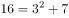、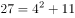、，即幂次均为2，底数为1、2、3、4、5的等差列，修正项为3、5、7、11、13的质数列。故首项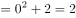，末项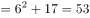。

故正确答案为BC。

---

### 第 2 题　qid 2188154 · 数学运算

（    ），10，7，9，9，15，（    ）

- **A**. 11
- **B**. 13　✅
- **C**. 23　✅
- **D**. 31

**答案**：BC

**官方解析**

观察数列可得：第四项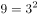、、，即以中间项9为中点，左右两项相加之和为平方数，则，只有BC（）满足条件。

故正确答案为BC。

---

### 第 3 题　qid 2188161 · 数学运算

-3，4，-1，（  ），1，4，（  ）

- **A**. 0　✅
- **B**. 1
- **C**. 2
- **D**. 3　✅

**答案**：AD

**官方解析**

数列多次出现4和1这样的幂次数，考虑将数列转换成幂次形式。原数列转换后可得：

， ，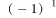，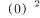 ，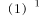 ，，。底数为公差为1的等差数列，指数为1、2交替出现的循环数列。故两空所在位置分别为和即0和3。

故正确答案为AD。

---

### 第 4 题　qid 2188153 · 数学运算

苗苗有一堆草莓，乐乐也有一堆草莓。苗苗的草莓五个五个地数，最后剩两个，七个七个地数，最后还是剩两个；乐乐的草莓五个五个地数，最后剩四个，六个六个地数，最后剩三个。已知苗苗比乐乐多8个草莓，则苗苗的草莓数为（  ）

- **A**. 37
- **B**. 62
- **C**. 72
- **D**. 77
- **E**. 87
- **F**. 92
- **G**. 102
- **H**. 107　✅

**答案**：H

**官方解析**

根据题意，苗苗的草莓数量-2之后既是5的倍数，又是7的倍数，则-2之后应是35的倍数，排除B、D、E、F、G共5项。又因为乐乐的草莓数量-4之后是5的倍数，且-3之后是6的倍数，则乐乐的草莓数量是3的倍数。因为苗苗草莓数量比乐乐多8个，则苗苗的草莓数量-8之后是3的倍数，只有107符合。
故正确答案为H。

---

### 第 5 题　qid 2188162 · 数学运算

有一个特制的钟，一昼夜的时间为20小时，每小时100分钟，钟面上刻有从1到10十个计时数字，均匀分布，每两个数字之间有10个刻度。正午12点时，这个钟显示为10点整，那么下午3点半时，这个钟的时针与分针的夹角为多少度？

- **A**. 55
- **B**. 60
- **C**. 65
- **D**. 70
- **E**. 105
- **F**. 115
- **G**. 125
- **H**. 135　✅

**答案**：H

**官方解析**

由于正常的钟从正午12点至下午3点半，共走了3.5小时，则特制的钟在这段时间里应该走了小时。由于特制的钟表盘上共有10个大刻度，时针每小时会走度，因此时针共走了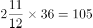度；分针每小时会走一圈，即360度，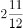小时走了2圈又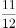圈，距10点整还差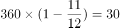度，因此这个钟的时针与分针之间的夹角为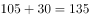度。

故正确答案为H。

---

### 第 6 题　qid 2188165 · 数学运算

某企业引进新技术后，原材料成本降低了，单位人工成本上涨了，所需要的工人数降低为原来的一半，已知采用新技术前，总人工成本为原材料成本的4倍，则采用新技术后总人工成本是原材料成本的（  ）倍。

- **A**. 1
- **B**. 2
- **C**. 3
- **D**. 4
- **E**. 5
- **F**. 6　✅
- **G**. 7
- **H**. 8

**答案**：F

**官方解析**

设引进新技术前原材料成本为，单位人工成本为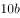，工人数为，则有：

根据“采用新技术前，总人工成本为原材料成本的4倍”列式：，解得。采用新技术后：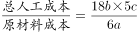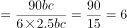倍。

故正确答案为F。

---

### 第 7 题　qid 2188166 · 数学运算

上午9点整，甲从A地出发，骑自行车去B地，乙从B地出发，开车去A地。两人第一次相遇时为9点半，甲乙到达目的地后都立即返回，若甲乙的速度比为1：3，则他们第二次相遇时为（  ）。

- **A**. 9：40
- **B**. 9：50
- **C**. 10：00　✅
- **D**. 10：10
- **E**. 10：20
- **F**. 10：30
- **G**. 10：40
- **H**. 10：50

**答案**：C

**官方解析**

根据甲乙速度比为1：3，可以赋值甲乙的速度分别为1、3。

相遇分为迎面相遇和背后相遇，一般情况下第二次相遇是迎面相遇，但是当两人速度差异很大时，第二次相遇有可能是背后相遇，即速度快的人从背后追上另一个人。

从9点出发到9点半迎面相遇，耗时30分钟，AB两地之间的距离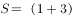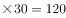。

将第二次相遇理解为背后相遇，也就是乙追上甲时，乙比甲多走了一个全程。

根据追及公式，路程差=速度差×时间，，分钟。从9点出发，60分钟后乙追上甲，属于第二次相遇，故所求时间为。

故正确答案为C。

备注：本题存在争议点，详细说明如下：

1、本题存在另一种思路，因为在行程问题中，出现相遇通常是指“迎面相遇”。做法如下：

根据两端出发多次相遇公式：

第一次相遇时：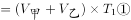

第二次相遇时：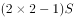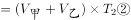

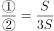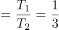，，则。那么第二次相遇为两人在出发90分钟后，即10：30。按这种理解，争议答案是F。

2、追及是否属于相遇的一种，在国考或大多数省考属于出题人有意回避的争议点。但是在陕西省考历史上，由于2013年陕西省的第76题必须把追及理解为相遇的一种，才能做出答案，否则无解。而我们认为同一个省在不同年份对同一种题型的理解应当是一致的，所以在陕西省我们推荐将追及也看成是相遇的一种特殊情况。

综上所述，粉笔推荐C为正确答案。

---

### 第 8 题　qid 2188142 · 数学运算

观众对五位歌手的歌曲进行投票，每张选票都可以选择五首歌曲中的一首或多首，但只有选择不超过3首歌曲的选票才是有效票。五首歌曲的得票数分别为总票数的、、、和，那么本次投票的有效率最高可能为（  ）。

- **A**. 

- **B**. 

　✅
- **C**. 

- **D**. 

- **E**. 

- **F**. 

- **G**. 

- **H**. 

**答案**：B

**官方解析**

假设共有100位观众，每名观众有一张选票。则5首歌曲的总得票数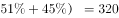票，人均投票数为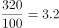票。要使投票有效率（即有效票占比）最高，则让有效票的人均投票数尽可能靠近3.2票，即取一人3票；反之，无效票占比最低，则无效票的人均投票数尽可能远离3.2票，取一人5票。

设有效票观众人数为，无效票观众人数为，则总票数票，解得。此时有效率最高为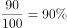。

故正确答案为B。

---

### 第 9 题　qid 2188143 · 数学运算

有关部门对120种抽样食品进行化验分析，结果显示，抗氧化剂达标的有68种，防腐剂达标的有77种，漂白剂达标的有59种，抗氧化剂和防腐剂都达标的有54种，防腐剂和漂白剂都达标的有43种，抗氧化剂和漂白剂都达标的有35种，三种食品添加剂都达标的有30种，那么三种食品添加剂都不达标的有（  ）种。

- **A**. 14
- **B**. 15
- **C**. 16
- **D**. 17
- **E**. 18　✅
- **F**. 19
- **G**. 20
- **H**. 21

**答案**：E

**官方解析**

根据容斥原理三集合标准型公式：，则有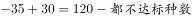。根据选项尾数不同，都不达标的种数尾数为8，即18种。

故正确答案为E。

---

### 第 10 题　qid 2188144 · 数学运算

张老板用100万元购买甲乙两公司的理财产品，其中64万元购买了长期理财产品，已知他在甲公司购买的理财产品中，长期与短期之比为5：3，在乙公司购买的理财产品中，长期与短期之比为2：1，则在甲公司购买的短期理财产品为（  ）万元。

- **A**. 15
- **B**. 18
- **C**. 21
- **D**. 24　✅
- **E**. 27
- **F**. 30
- **G**. 33
- **H**. 36

**答案**：D

**官方解析**

根据比例关系设未知数，设在甲公司购买长期理财万元，短期理财万元，在乙公司购买长期理财万元，短期理财万元。根据题意，张老板购买长期理财万元，理财总数为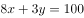万元，解得万元。则在甲公司购买的短期理财产品为万元。

故正确答案为D。

---

### 第 11 题　qid 2188147 · 数学运算

要完成某项工程，甲施工队单独干需要30天才能完成，乙施工队需要40天才能完成。甲乙合作干了10天，因故停工10天，再开工时甲乙丙三个施工队一起工作，再干4天就可全部完工。那么，丙队单独干需要大约（  ）天才能完成这项工程。

- **A**. 21
- **B**. 22　✅
- **C**. 23
- **D**. 24
- **E**. 25
- **F**. 26
- **G**. 27
- **H**. 28

**答案**：B

**官方解析**

读题判定题型为给定时间型工程问题，赋值总量为时间的公倍数120，则甲队的工作效率为，乙队的工作效率为，设丙的工作效率为，根据总量列等式：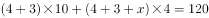，解得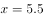。则丙单独干大约需要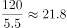天，即需要干22天。

故正确答案为B。

---

### 第 12 题　qid 2188155 · 数学运算

胜利小学的225名同学与红旗小学的256名同学一起春游，将两所小学的同学混合在一起，随机组合，重新组织队伍，要求每队人数相同且队伍数尽可能少，那么胜利小学的张华与红旗小学的张明出现在同一队伍的概率约为（  ）。

- **A**. 

- **B**. 

- **C**. 

- **D**. 

- **E**. 

- **F**. 

- **G**. 

　✅
- **H**. 

**答案**：G

**官方解析**

两个学校共有人，要使每队人数相同且队伍数尽可能少，，则应将其分为13个队伍，每队37人。

方法一：胜利小学的张华与红旗小学的张明出现在同一队伍的概率约为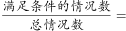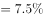。

方法二：张华任选一队，则此队剩下位置数为个，张明可选的总位置数为个。故所求概率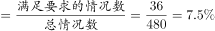。

故正确答案为G。

---

### 第 13 题　qid 2188163 · 数学运算

将棱长为1的正方体的六个面的中点相连接可以得到一个六面体，则这个六面体的体积为（  ）。

- **A**. 

　✅
- **B**. 

- **C**. 
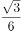

- **D**. 

- **E**. 

- **F**. 
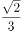

- **G**. 

- **H**. 

**答案**：A

**官方解析**

正方体六个面的中点连接得到八面体，由两个完全相同的正四棱锥组成，四棱锥底面是对角线为1的正方形，。四棱锥的高是正方体边长的一半，即。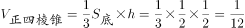，则。

故正确答案为A。

注：题中考生回忆为六面体，而实际连线应为八面体。附图如下：

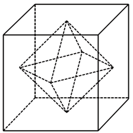

---

## 判断推理

### 第 1 题　qid 2188173 · 图形推理

从所给的四个选项中，选择最合适的一个填入问号处，使之呈现一定的规律性：

- **A**. A
- **B**. B
- **C**. C　✅
- **D**. D

**答案**：C

**官方解析**

图形出现多个小元素，优先考虑数素。观察发现，元素种类和个数均无规律，考虑元素换算。九宫格优先看横行，第一行利用，发现两边全部消掉了，无法得出和的关系，因此考虑用第二行做运算，第二行利用图2可以得到，则换算后第一行图形中小三角数量依次为12、11、10；同理，第二行小三角数量依次为9、8、7；第三行小三角数量依次为：6、？、4，所以？处为5个小三角。四个选项换算后，分别为8、6、5、4个小三角。只有C项符合。

故正确答案为C。

---

### 第 2 题　qid 2188177 · 图形推理

左边给定的是某正方体纸盒的外表面展开图，下列哪一项与该正方体是一致的？

- **A**. A
- **B**. B
- **C**. C
- **D**. D　✅

**答案**：D

**官方解析**

本题考查六面体的空间重构。

A项：选项中面1与面6是相对面，而题干面1与面4是相对面，选项与题干不一致，排除；

B项：从内表面看到的应该是面5的镜像，即，而不能是正常的数字，排除；

C项：从内表面看到的应该是面6的镜像，即，而不能是正常的数字，排除；

D项：选项与题干一致，当选。

故正确答案为D。 

---

### 第 3 题　qid 2188180 · 图形推理

从所给的四个选项中，选择最合适的一个填入问号处，使之呈现一定的规律性：

- **A**. A
- **B**. B
- **C**. C
- **D**. D　✅

**答案**：D

**官方解析**

第一种解析：

元素组成不同，无明显属性规律，优先考虑数量规律。观察发现，出现多圆相交，优先考虑笔画数。第一组图均为1笔画图形，第二组图中，前两幅图均为2笔画图形，因此？处选择一个笔画数为2的图形。A项3笔画，B项1笔画，C项1笔画，D项2笔画，只有D相符合。

故正确答案为D。

第二种解析： 

元素组成不同，优先考虑属性规律。观察发现题干第一组图中图一出现了等腰三角形，优先考虑对称性。题干第一组图中图1为轴对称图形，图2为，图3为，则第二组图应用此规律，图1为轴对称图形，图2为，故？处应该选择一个，只有A项符合。

故正确答案为A。

第三种解析：

元素组成不同，无明显属性规律，优先考虑数量规律。观察发现，每幅图都是由同一种图形组成，只有C项符合。

故正确答案为C。

粉笔倾向于第一种规律。原因有二：

一、两组图的形式一般考查整个一组图的整体规律（如一组图均为轴对称图形或均为中心对称图形）或者一组图中的三幅图规律呈对称的形式（如图1和图3是一样的规律），因此，第二种规律不严谨。

二、本题题干图形笔画的特征图（如第一组图的图3以及C选项都是笔画的典型特征图多圆相交）非常明显，因此猜测命题人的意图是考查笔画数, 因此，第二种和第三种规律都不严谨。

综上所述，第一种规律即笔画数更严谨，故粉笔倾向于选择D。

---

### 第 4 题　qid 2188184 · 图形推理

从所给的四个选项中，选择最合适的一个填入问号处，使之呈现一定的规律性：

- **A**. A
- **B**. B
- **C**. C
- **D**. D　✅

**答案**：D

**官方解析**

解法一：元素组成相似，优先考虑样式规律。观察发现，题干两组图中，第一幅图均有“咸”，第二幅图均有“亨”，第三幅图也应具有相同部分，只有D项符合。
故正确答案为D。
解法二：元素组成不同，无明显属性规律，优先考虑数量规律。观察题干发现，汉字的窟窿比较多，优先考虑数面。第一组图的面数量均为1，第二组图前两幅图的面数量为2，因此？处应选择一个面数量为2的图形，排除AD项。再观察题干图形发现，第一组图每幅图均出现“、”元素，第二组图中的图形也应均出现“、”元素，只有B项符合。
故正确答案为B。
解法三：元素组成相似，优先考虑样式规律。观察题干发现，第一组图都有1个“口”，第二组图都有2个“口”，因此？处应选择有2个“口”的图形，排除D项。再观察题干图形发现，第二组图中的2个“口”都是在汉字的左半部分和右半部分，只有A项符合。
故正确答案为A。
解法四：元素组成不同，无明显属性规律，优先考虑数量规律。观察题干发现，汉字的窟窿比较多，优先考虑数面。第一组图的面数量均为1，第二组图前两幅图的面数量为2，因此？处应选择一个面数量为2的图形，排除AD项。再观察题干图形发现，第一组图每幅图均出一个“口”，第二组图每幅图均出现了两个“口”，排除B项，只有C项符合。
故正确答案为C。
注：此题为争议题，我们根据题干特征，明显包括相同部分，并且该规律更加简单明确，因此我们择优选D。

---

### 第 5 题　qid 2188191 · 图形推理

把下列六个图形分成两类，使每一类图形都有各自的共同特征或规律，分类正确的一项是：

- **A**. ①③⑥，②④⑤　✅
- **B**. ①②③，④⑤⑥
- **C**. ①②④，③⑤⑥
- **D**. ①③④，②⑤⑥

**答案**：A

**官方解析**

题干图形出现了开口的字母和数字，考虑每幅图的字母和数字的开口方向，故①③⑥为一组，字母和数字开口方向一致；②④⑤为一组，字母和数字开口方向相对。
故正确答案为A。

---

### 第 6 题　qid 2188172 · 定义判断

近因效应是指在总体印象形成过程中，新近获得的信息对人们认知的影响，远远大于以往所获得的信息。这是因为，在印象形成过程中，人们对原来的印象逐渐淡忘，当有新信息进入视野时，容易对人们的感官产生新的刺激，从而形成最新的印象，直接影响人们的认知和判断。
根据以上定义，下列不属于近因效应的一项是：

- **A**. 某社会名流声名卓著，到了晚年却因为一桩丑闻而臭名昭著
- **B**. 面试时衣冠整洁，给人以良好的印象，被录取的几率也较大　✅
- **C**. 夫妻本来感情很好，因为一件小事吵架，闹嚷着要离婚
- **D**. 小玲和小菲是多年好友，因小玲最近“得罪”了小菲，两人形同陌路

**答案**：B

**官方解析**

第一步：找出定义关键词。
“新近获得的信息对人们认知的影响，远远大于以往所获得的信息”。
第二步：逐一分析选项。
A项：该社会名流原来名声很好，到了晚年也就是新近时期，却因为一桩丑闻臭名昭著，符合“新近获得的信息对人们认知的影响，远远大于以往所获得的信息”，符合定义，排除；
B项：面试的时候衣冠整洁会给人留下好印象，增加录取几率，没有以往和新近信息对人们认知上影响的对比，不符合“新近获得的信息对人们认知的影响，远远大于以往所获得的信息”，不符合定义，当选；
C项：夫妻本来感情很好，说明夫妻之间以往的关系很好，因为一件小事吵架，体现了新近时期双方之间关系不好，最终闹嚷着要离婚，符合“新近获得的信息对人们认知的影响，远远大于以往所获得的信息”，符合定义，排除；
D项：小玲和小菲好友多年，说明以往两人的关系很好，最近因为小玲得罪了小菲, 体现了近期两人之间关系不好，最终两人形同陌路，符合“新近获得的信息对人们认知的影响，远远大于以往所获得的信息”，符合定义，排除。
本题为选非题，故正确答案为B。

---

### 第 7 题　qid 2188174 · 定义判断

激励不相容是指在委托代理关系中，委托人和代理人双方都会以自己的利益最大化来指导自己的行为，制度安排使他们在目标和行为上出现不一致，那些符合委托人利益的目标却无法对代理人产生激励作用的现象。
根据以上定义，下列属于激励不相容的是：

- **A**. 甲单位采取措施让每个员工在为企业多做贡献中成就自己的事业
- **B**. 乙公司职位晋升中论资排辈现象严重，新人进入一段时间后工作积极性大大降低
- **C**. 丙在保险公司购买了医疗保险后，没有像以前那样有规律的作息，开始熬夜，酗酒　✅
- **D**. 丁医院对医生实行挂号费递增提成制度，医生每个月接的挂号单越多，提成比例越高

**答案**：C

**官方解析**

第一步：找出定义关键词。
“委托代理关系中”、“目标和行为出现不一致”、“符合委托人利益的目标却无法对代理人产生激励作用”
A项：单位让员工多做贡献成就自己的事业，意味着单位受益的同时，员工也可以成就自己的事业，对自己有益，不符合“目标和行为不一致”，不符合定义，排除；
B项：乙公司职位晋升未体现委托人和代理人的目标有冲突，不符合“目标和行为出现不一致”，不符合定义，排除；
C项：丙在保险公司购买医疗保险符合“委托代理关系中”，但是丙的行为跟其投保的目的相违背，符合“目标和行为出现不一致”，最终丙的这种行为会导致出险率提高，符合“符合委托人利益的目标无法对代理人产生激励作用”，符合定义，当选；
D项：丁医院对医生实行挂号费递增提成制度，医院和医生同时可以受益，不符合“目标和行为不一致”，不符合定义，排除。
故正确答案为C。

---

### 第 8 题　qid 2188179 · 定义判断

商业生态系统是指组织和个人组成的经济联合体，其成员包括核心企业、消费者、市场中介、供应商、风险承担者等，在一定程度上还包括竞争者，这些成员之间构成了价值链，不同的链之间相互交织形成了价值网，物质、能量和信息等通过价值网在联合体成员间流动和循环，从而形成整体的竞争优势。
根据以上定义，下列企业行为与商业生态系统不符合的一项是：

- **A**. 日立公司强调如何利用企业的内部资源来形成竞争优势　✅
- **B**. 滴滴公司通过建设一个信息平台，撬动圈内其他企业和个人的资源
- **C**. 飞利浦和美国电话电报公司合作，也同德国西门子公司合作
- **D**. 苹果公司和微软公司的关系很复杂，既合作又竞争

**答案**：A

**官方解析**

第一步：找出定义关键词。
“组织和个人组成的经济联合体”、“包括核心企业、消费者、市场中介、供应商、风险承担者等，在一定程度上还包括竞争者”、“经济联合体成员之间构成价值链进而形成价值网”、“形成整体竞争优势”。
第二步：逐一分析选项。
A项：日立公司利用企业内部资源形成竞争优势，内部资源只涉及成员中的核心企业，而不是多成员构成的联合体，不符合“经济联合体成员之间构成价值链进而形成价值网”，不符合定义，当选； 
B项：滴滴公司撬动圈内其他企业和个人的资源，说明滴滴公司与其他企业和个人构成了经济联合体，符合“经济联合体成员之间构成价值链进而形成价值网”、“形成整体竞争优势”，符合定义，排除；
C项：飞利浦和美国电话电报公司以及德国西门子公司合作，说明飞利浦公司和另外两个公司构成经济联合体，符合“经济联合体成员之间构成价值链进而形成价值网”、“形成整体竞争优势”，符合定义，排除；
D项：苹果公司和微软公司合作，说明苹果公司和微软公司构成经济联合体，符合“经济联合体成员之间构成价值链进而形成价值网”、“形成整体竞争优势”，符合定义，排除。
本题为选非题，故正确答案为A。

---

### 第 9 题　qid 2188193 · 定义判断

迭代开发就是由于市场的不确定性高，在需求没被完全地确定之前，开发就迅速启动，每次循环不求完美，但求不断发现新问题，获取和积累新知识，并自适应地控制过程，在一次迭代中完成系统的部分功能，然后将未成熟的产品交付给领先用户，通过他们的反馈来进一步细化需求，从而进入下一轮的迭代，不断获取用户需求、完善产品。
根据以上定义，下列不属于迭代开发的一项是：

- **A**. 甲公司先向市场推出极简的原型产品，以最小的成本和有效方式验证产品是否符合用户需求，然后再结合需求，迅速添加组件
- **B**. 乙公司开发产品时，遵循预先计划的需求、分析、设计、编码、测试的步骤顺序进行，成功开发出新产品　✅
- **C**. 丙公司的某产品在推出5年之后才撤掉之前的测试版字样，成为稳定的产品
- **D**. 丁公司在其开发的软件上采用了开源软件的模式，与用户联合升级软件

**答案**：B

**官方解析**

第一步：找出定义关键词。
“不断发现新问题”、“结合用户反馈的需求完善产品”。
第二步：逐一分析选项。
A项：甲公司推出原型产品，然后结合需求添加组件，符合“不断发现新问题”、“结合用户反馈的需求完善产品”，符合定义，排除； 
B项：乙公司遵循预先计划成功开发出新产品，没有体现边反馈边完善，不符合“不断发现新问题”、“结合用户反馈的需求完善产品”，不符合定义，当选；
C项：丙公司推出5年才撤掉之前的测试版字样，5年内一直在测试中不断完善稳定，符合“不断发现新问题”、“结合用户反馈的需求完善产品”，符合定义，排除；
D项：丁公司与用户联合升级软件，说明丁公司的软件先投入市场，不断根据客户需求升级，符合“结合用户反馈的需求完善产品”，符合定义，排除。
本题为选非题，故正确答案为B。

---

### 第 10 题　qid 2188198 · 定义判断

强制性思维，又称思维云集，指患者头脑中出现大量不属于自己的思维，这些思维不受患者意愿的支配，强制性地在大脑中涌现，好像在外力作用下别人思想在自己脑中运行，内容大多杂乱无序，有时甚至是患者所厌恶的。
根据以上定义，下列属于强制性思维的一项是：

- **A**. 甲思维活动非常迟缓，联想困难，思考问题吃力，反应迟钝
- **B**. 乙思维活动中联想松弛，内容散漫，思考问题不聚焦、不深入
- **C**. 丙经常感觉到自己的思考被外界因素干扰，自己非常厌恶
- **D**. 丁经常感到自己头脑中出现一些凌乱无序的想法，自己根本无法支配　✅

**答案**：D

**官方解析**

第一步：找出定义关键词。
“患者头脑中出现大量不属于自己的思维”、“这些思维不受患者意愿的支配”、“强制性地在大脑中涌现”。
第二步：逐一分析选项。
A项：甲思维迟缓，联想困难等都是描述他自己的思维缓慢，但是没有出现不属于自己的思维，不符合“患者头脑中出现大量不属于自己的思维”，不符合定义，排除；
B项：乙联想松弛，内容散漫等都是自己的思想，不符合“患者头脑中出现大量不属于自己的思维”，不符合定义，排除；
C项：丙只是厌恶自己的思考被外界因素干扰，并没有出现不属于自己的思维，不符合“患者头脑中出现大量不属于自己的思维”，不符合定义，排除；
D项：丁脑中出现凌乱无序的想法，符合“患者头脑中出现大量不属于自己的思维”，自己根本无法支配，符合“这些思维不受患者意愿的支配”、“强制性地在大脑中涌现”，符合定义，当选。
故正确答案为D。

---

### 第 11 题　qid 2188175 · 逻辑判断

社会认同原理是指在周围环境不确定的情况下，一个人无法判断自己的行为是否合理时，往往会根据周围其他人的行为来决定自己应该怎么做，这种行为模式完全是无意识的、条件反射式的。因此，偏颇甚至伪造的证据也能愚弄我们。
根据以上定义，下列与社会认同原理无关的一项是：

- **A**. 小悦悦被车碾压后，路过的19人竟无一人主动上前救助
- **B**. 某人正遭受匪徒侵害，周围有数百人观看，但都无动于衷
- **C**. 某地报道了幼儿园遭袭的消息后，其他地方也出现了类似报道
- **D**. 制造商们总是把自己的产品跟当前的文化热潮联系起来　✅

**答案**：D

**官方解析**

第一步：找出定义关键词。
“周围环境不确定”、“一个人无法判断自己的行为是否合理,根据周围其他人的行为来决定自己应该怎么做”、“无意识的、条件反射式的”。
第二步：逐一分析选项。
A项：小悦悦被车碾压，群众对周围环境存在不确定的情况，路过的19人竟无一人主动上前救助，符合“一个人无法判断自己的行为是否合理，根据周围其他人的行为来决定自己应该怎么做”，符合定义，排除；
B项：某人正遭受侵害，人们无动于衷，符合“对周围环境不确定”、“一个人无法判断自己的行为是否合理，根据周围其他人的行为来决定自己应该怎么做”,符合定义，排除；
C项：某地报道了幼儿园遭袭的消息，其他地方也出现了类似报道，不明确是否有人追随袭击幼儿园的行为，只能说有可能符合“一个人无法判断自己的行为是否合理,根据周围其他人的行为来决定自己应该怎么做”，保留；
D项：把自己的产品跟当前的文化热潮联系起来，是有意追随热潮推广自己的产品，不符合定义“无意识的、条件反射式的”行为模式，不符合定义，保留。
对比C、D两项，C项不明确，但D项一定不符合，因此D项当选。
本题为选非题，故正确答案为D。

---

### 第 12 题　qid 2188176 · 逻辑判断

帕金森定律是指行政机构的层级会像金字塔一样不断增多，行政人员会不断膨胀，每个人都很忙，但组织效率越来越低下的现象。导致这种现象的原因是一个不称职的官员，通常会任用两个水平比自己更低的人当助手，两个助手再分别为自己找两个更无能的助手，如此类推，就形成了一个臃肿的组织。
根据以上定义，下列可以用帕金森定律解释的一项是：

- **A**. 某贫困县有能力的人得不到重用，而那些能力平庸的人又大量超编进入行政机构，致使这个国家级贫困县吃“皇粮”的人不断增多　✅
- **B**. 行政管理涉及的因素非常复杂，管理者不能避免目标制订和执行永不出错，管理者需要时时刻刻做好准备，面对到来的失误和失败
- **C**. 某行政部门“根据贡献决定晋升”的晋升机制，导致组织中的相当部分人员被推到了与其不相称的级别，结果造成人浮于事，效率低下
- **D**. 某管理者让下属有非常充足的时间去完成某项工作，结果下属不仅把自己弄得一团糟，整个部门也跟着混乱不堪

**答案**：A

**官方解析**

第一步：找出定义关键词。
“行政机构的层级增多”、“组织效率低下”、“不称职官员任用水平比自己低的人当助手”、“臃肿的组织”。
第二步：逐一分析选项。
A项：有能力的人得不到重用，能力平庸的人大量进入行政机构，符合“不称职的官员任用水平比自己低的人当助手”，吃“皇粮”的人不断增多，符合“形成了臃肿的组织”，符合定义，当选；
B项：行政管理者不能避免目标制订和执行永不出错，没有体现出“管理者任用水平比自己低的人”，也没有体现“形成了臃肿的组织”，不符合定义，排除；
C项：部分人员是因为晋升制度被推到了与其不相称的级别，不符合“不称职的官员任用水平比自己低的人当助手”，不符合定义，排除；
D项：某管理者不明确是否为行政机构的官员，也没有体现出“形成了臃肿的组织”，不符合定义，排除。
故正确答案为A。

---

### 第 13 题　qid 2188181 · 定义判断

跷跷板互惠原理是指人与人之间的互动，就如坐跷跷板一样，不能永远固定某一端高，另一端低，而是要高低交错。因此，人们通常会以适当的方式回报他人为自己所做的一切，因为接受往往与偿还的义务紧紧联系在一起。
根据以上定义，下列体现跷跷板互惠原理的一项是：

- **A**. 赠人玫瑰，手有余香，做好事不求回报，同时内心得到了回报
- **B**. 为了降低客户订单的违约率，销售人员通常在签约结束前问客户会不会如约履行承诺
- **C**. 我们喜欢与自己相似的人，不管相似之处是在观点、个性、背景还是在生活方式上
- **D**. 某文具店推出进店即送水的服务后，文具销售量大增　✅

**答案**：D

**官方解析**

第一步：找出定义关键词。
“人与人之间的互动”、“以适当的方式回报他人为自己所做的一切”。
第二步：逐一分析选项。
A项：赠人玫瑰，手有余香是指把玫瑰送给别人，自己手里留着余香，形容做好事不求别人回报，没有体现出回报他人，不符合定义，排除；
B项：签约结束前问客户会不会如约履行承诺，不符合“回报别人为自己所做的一切”，不符合定义，排除；
C项：喜欢与自己相似的人，不存在回报他人，不符合定义，排除；
D项：文具店推出进店即送水的服务是为顾客做的事情，顾客购买文具使得销量大增，体现了顾客对文具店的回报，符合“以适当的方式回报他人为自己做的一切”，符合定义，当选。
故正确答案为D。

---

### 第 14 题　qid 2188187 · 定义判断

“赋、比、兴”是三种作诗的手法。“赋”是“直陈其事”，直接把事情说出来；“比”是“由心及物”，是用所见之物寄托内心的感情；“兴”是“见物起兴”，就是看到外界事物，引起内心的感动，是由物及心。
根据上述定义，下列诗句中使用了“兴”的手法的是：
①硕鼠硕鼠，无食我黍！三岁贯女，莫我肯顾。逝将去女，适彼乐土。乐土乐土，爰得我所。
②关关雎鸠，在河之洲。窈窕淑女，君子好逑。
③昔年种柳，依依汉南。今看摇落，凄怆江潭。树犹如此，人何以堪！

- **A**. ①②
- **B**. ①③
- **C**. ②③　✅
- **D**. ①②③

**答案**：C

**官方解析**

第一步：找出定义关键词。
“见物起兴”、“看见外界事物，引起内心的感动”、“由物及心” 。
第二步：逐一分析选项。
①出自《硕鼠》，是《诗经》中的一篇。意思是大老鼠呀大老鼠，不要吃我种的黍！多年辛苦养活你，我的生活你不顾。发誓从此离开你，到那理想新乐土。新乐土呀新乐土，才是安居好去处！虽然有外界事物老鼠，但主要就是说老鼠不要吃黍，要离开它到新的乐土。《硕鼠》是魏国的民歌，人民用硕鼠比喻剥削者，表达了对理想国度的向往，不是“见物起兴”，不符合定义，排除；
②出自《关雎》，是《诗经》中的一篇。意思是关关和鸣的雎鸠相伴在河中的小洲上，善良美丽的少女是小伙理想的对象。这是诗人对河边采摘荇菜的美丽姑娘的恋歌。通过雎鸠的叫声，表达了诗人对少女的爱慕，符合“看见外界事物，引起内心的感动”、“由物及心”，符合定义，当选；
③出自南北朝时庾信的《枯树赋》，意思是当年我在汉南种下的依依杨柳，是多么袅娜动人；而今的江边潭畔，如眉的柳叶片片摇落，让人感到多么凄婉悲怆啊。时光匆匆而逝，树木尚且敌不过春秋的更替，人又怎能逃得过岁月的沧桑呢？通过杨柳不同时间段所呈现出的不同形态，表达了作者伤春惜时的感情，符合“看见外界事物，引起内心的感动”、“由物及心”，符合定义，当选。
故正确答案为C。

---

### 第 15 题　qid 2188195 · 定义判断

惭愧是指一个人在日常生活中，由于对好的行为和圣贤的深入了解，内心产生一种以圣贤为榜样，以好的行为为准绳，并且拒绝不符合圣贤和好的言行的心理品格；当这种心理品格植根后，个人如果出现行为上的背离，内心就会产生一种良心自责感。
根据以上定义，下列属于惭愧的一项是：

- **A**. 甲在寒冬季节将水洒在楼道，后来担心水冻成冰后给他人带来伤害，内心非常歉疚
- **B**. 乙考试作弊，一直担心事情暴露后会遭到大家的谴责和批评，内心忐忑不安
- **C**. 丙在背后说同学坏话，事后想起书中关于“真、善、美”的种种阐释，内心觉得很不安　✅
- **D**. 丁偶然听了某道德楷模的讲座，内心对该道德楷模产生一种敬佩的感觉

**答案**：C

**官方解析**

第一步：找出定义关键词。
“对好的行为和圣贤的深入了解”、“以圣贤为榜样，以好的行为为准绳并且拒绝不符合圣贤和好的言行的心理品格”、“在心理品格植根后”、“如果出现行为上的背离”、“会产生一种良心自责感”
第二步：逐一分析选项。
A项：甲内心歉疚的原因是寒冬季节洒水会给别人带来伤害，而不是因为背离了圣贤和好的言行，不符合定义，排除； 
B项：乙内心忐忑的原因是害怕作弊暴露会遭到大家的谴责，而不是因为自己的行为背离了圣贤和好的言行，不符合定义，排除； 
C项：丙想起书中关于“真、善、美”的阐释，说明好的“心理品格已经植根于心中”，在说坏话之后内心觉得不安，是因为发现自己背离了圣贤和好的言行从而 “会产生一种良心自责感”，符合定义，当选；
D项：听完讲座产生敬佩感，说明心理品格已经植根于心中，但并未体现“出现行为上的背离，会产生一种良心自责感”，不符合定义，排除。
故正确答案为C。

---

### 第 16 题　qid 2188178 · 类比推理

骆驼祥子：四世同堂

- **A**. 呐喊：雷雨
- **B**. 土门：秦腔　✅
- **C**. 红与黑：老人与海
- **D**. 国富论：资本论

**答案**：B

**官方解析**

第一步：判断题干词语间逻辑关系。
骆驼祥子和四世同堂都是老舍的著作，两本著作与同一作者相对应。
第二步：判断选项词语间逻辑关系。
A项：呐喊是鲁迅的著作，雷雨是曹禺的著作，与题干逻辑关系不一致，排除；
B项：土门和秦腔都是贾平凹的著作，两本著作与同一作者相对应，与题干逻辑关系一致，当选；
C项：红与黑是司汤达的著作，老人与海是海明威的著作，与题干逻辑关系不一致，排除；
D项：国富论是亚当·斯密的著作，资本论是马克思的著作，与题干逻辑关系不一致，排除。
故正确答案为B。

---

### 第 17 题　qid 2188183 · 类比推理

弹簧秤：千克：质量

- **A**. 温度计：摄氏度：温度　✅
- **B**. 直尺：平方米：面积
- **C**. 表：光年：时间
- **D**. 考试：分数：成绩

**答案**：A

**官方解析**

第一步：判断题干词语间逻辑关系。
弹簧秤是测量质量的工具，千克是质量的单位，三者是对应关系。
第二步：判断选项词语间逻辑关系。
A项：温度计是测量温度的工具，摄氏度是温度的单位，与题干逻辑关系一致，当选；
B项：直尺是测量长度的工具，而不能测量面积，与题干逻辑关系不一致，排除；
C项：表可以用来计量时间，光年是距离的单位，不是时间的单位，与题干逻辑关系不一致，排除；
D项：考试不是测量成绩的工具，分数不是成绩的单位，与题干逻辑关系不一致，排除。
故正确答案为A。

---

### 第 18 题　qid 2188188 · 类比推理

肺腑之言 对于（  ）相当于（  ）对于 艰苦

- **A**. 诚实  风尘仆仆
- **B**. 真诚  风餐露宿　✅
- **C**. 诚信  千锤百炼
- **D**. 忠诚  风吹雨打

**答案**：B

**官方解析**

逐一代入选项。
A项：肺腑之言指的是发自内心真诚的话，诚实指的是不虚假，二者无明显逻辑关系，风尘仆仆指的是旅途的劳累，艰苦指的是艰难困苦，二者无明显逻辑关系，前后逻辑关系不一致，排除；
B项：肺腑之言形容真诚的话，风餐露宿形容艰苦的生活，二者均为近义关系，前后逻辑关系一致，当选；
C项：诚信指的是守信用，与肺腑之言无明显逻辑关系，千锤百炼比喻多次斗争考验或者比喻对诗文的多次精细修改，与艰苦无明显逻辑关系，前后逻辑关系不一致，排除；
D项：忠诚指尽心尽力，与肺腑之言无明显逻辑关系，风吹雨打比喻经受磨练或严峻的考验，与艰苦无明显逻辑关系，前后逻辑关系不一致，排除。
故正确答案为B。

---

### 第 19 题　qid 2188192 · 类比推理

耿耿于怀：牵肠挂肚

- **A**. 敲山震虎：打草惊蛇
- **B**. 旷古绝伦：无独有偶
- **C**. 工力悉敌：旗鼓相当　✅
- **D**. 望洋兴叹：易如反掌

**答案**：C

**官方解析**

第一步：判断题干词语间逻辑关系。
耿耿于怀指令人牵挂的或不愉快的事情在心里难以排解；牵肠挂肚形容非常挂念，很不放心；耿耿于怀和牵肠挂肚都有牵挂的意思，二者为近义关系。
第二步：判断选项词语间逻辑关系。
A项：敲山震虎指故意采取行动，间接警告对方；打草惊蛇比喻采取机密行动时，不慎惊动了对方，二者不是近义关系，与题干逻辑关系不一致，排除；
B项：旷古绝伦指空前未有，超出一般；无独有偶表示虽然罕见，但是不只有一个，还有一个可以成对，二者不是近义关系，与题干逻辑关系不一致，排除；
C项：工力悉敌指双方用的功夫和力量相当，不相上下；旗鼓相当比喻双方力量不相上下，二者为近义关系，与题干逻辑关系一致，当选；
D项：望洋兴叹本义指在伟大事物面前感叹自己的渺小，现多指要做一件事力量不够感到无可奈何；易如反掌指像翻一下手掌那样容易，比喻事情非常容易做，二者不是近义关系，与题干逻辑关系不一致，排除。
故正确答案为C。

---

### 第 20 题　qid 2188194 · 类比推理

菜刀：砧板

- **A**. 火车：铁轨　✅
- **B**. 飞机：引擎
- **C**. 电脑：操作系统
- **D**. 行星：轨道

**答案**：A

**官方解析**

第一步：判断题干词语间逻辑关系。
用菜刀在砧板上切东西，二者都是工具，为配套使用的对应关系。
第二步：判断选项词语间逻辑关系。
A项：火车在铁轨上行驶，两者都是工具，为配套使用的对应关系，与题干逻辑关系一致，当选；
B项：引擎是飞机的组成部分，二者为组成关系，与题干逻辑关系不一致，排除；
C项：操作系统是电脑的组成部分，二者为组成关系，与题干逻辑关系不一致，排除；
D项：行星沿着轨道运行，二者不是配套使用的对应关系，与题干逻辑关系不一致，排除。
故正确答案为A。

---

### 第 21 题　qid 2188189 · 类比推理

花容月貌 对于（  ）相当于（  ）对于 言语

- **A**. 漂亮  巧舌如簧
- **B**. 美丽  甜言蜜语
- **C**. 姿色  言外之意
- **D**. 容貌  花言巧语　✅

**答案**：D

**官方解析**

逐一代入选项。
A项：花容月貌形容女子如花如月般貌美，与漂亮是近义关系；巧舌如簧形容能说会道，与言语不是近义关系，前后逻辑关系不一致，排除；
B项：花容月貌形容女子如花如月般貌美，与美丽是近义关系；甜言蜜语指像蜜糖一样甜的话，与言语不是近义关系，前后逻辑关系不一致，排除；
C项：花容月貌形容一个人有姿色，两者为比喻象征义；言外之意指有这个意思，但没有在话里明说出来，与言语无逻辑关系，前后逻辑关系不一致，排除；
D项：花容月貌是形容人的容貌的，两者是比喻象征义；花言巧语形容虚假而动听的话，与言语是比喻象征义，前后逻辑关系一致，当选。
故正确答案为D。

---

### 第 22 题　qid 2188197 · 类比推理

植物：松树：长寿

- **A**. 生物：康乃馨：健康
- **B**. 植物：玫瑰：富贵
- **C**. 动物：鸽子：和平　✅
- **D**. 雕像：狮子：威严

**答案**：C

**官方解析**

第一步：判断题干词语间逻辑关系。
松树是植物的一种，二者为种属关系，松树象征着长寿，二者为比喻象征关系。
第二步：判断选项词语间逻辑关系。
A项：康乃馨是生物的一种，二者为种属关系，但康乃馨象征着爱、热情和魅力，而不是健康，与题干逻辑关系不一致，排除；
B项：玫瑰是植物的一种，二者为种属关系，但玫瑰象征着爱情，而不是富贵，与题干逻辑关系不一致，排除；
C项：鸽子是动物的一种，二者为种属关系，鸽子象征着和平，二者为比喻象征关系，与题干逻辑关系一致，当选； 
D项：狮子不是雕像的一种，二者不是种属关系，与题干逻辑关系不一致，排除。
故正确答案为C。

---

### 第 23 题　qid 2188200 · 类比推理

空中乘务员：飞行员

- **A**. 司机：交警
- **B**. 学生：教师
- **C**. 顾客：营业员
- **D**. 护士：医生　✅

**答案**：D

**官方解析**

第一步：判断题干词语间逻辑关系。
空中乘务员和飞行员是两种职业，为并列关系。
第二步：判断选项词语间逻辑关系。
A项：交警和司机为交叉关系，与题干逻辑关系不一致，排除；
B项：学生不是一种职业，而是教师教学的对象，二者是对应关系，与题干逻辑关系不一致，排除；
C项：顾客不是一种职业，而是营业员服务的对象，二者是对应关系，与题干逻辑关系不一致，排除； 
D项：护士和医生是两种职业，为并列关系，与题干逻辑关系一致，当选。
故正确答案为D。

---

### 第 24 题　qid 2188203 · 类比推理

铁：铁锈

- **A**. 生石灰：碳酸钙
- **B**. 水：水蒸气
- **C**. 砷：砒霜　✅
- **D**. 小麦：面粉

**答案**：C

**官方解析**

第一步：判断题干词语间逻辑关系。
铁在空气中能氧化生成铁锈。
第二步：判断选项词语间逻辑关系。
A项：生石灰和空气中的物质发生化学反应后，生成碳酸钙，不是与氧气发生反应，与题干逻辑关系不一致，排除；
B项：当水达到沸点时，水变成水蒸气，由水变成水蒸气发生了物理变化，不是发生了氧化反应，与题干逻辑关系不一致，排除；　　
C项：砷在空气中能氧化生成砒霜，与题干逻辑关系一致，当选；
D项：面粉由小麦加工而成，二者为原材料的对应关系，与题干逻辑关系不一致，排除。
故正确答案为C。

---

### 第 25 题　qid 2188205 · 类比推理

打靶：战士：坦克

- **A**. 菜肴：厨师：炊具
- **B**. 实验：教授：论文
- **C**. 零件：工人：车床
- **D**. 购物：消费者：银行卡　✅

**答案**：D

**官方解析**

第一步：判断题干词语间逻辑关系。
战士使用坦克打靶，三者为人物、工具和行为的对应关系。
第二步：判断选项词语间逻辑关系。
A项：厨师用炊具制作菜肴，菜肴不是行为，与题干逻辑关系不一致，排除；
B项：教授通过做实验来发表论文，实验不是行为，论文也不是工具，与题干逻辑关系不一致，排除；　　
C项：工人使用车床制造零件，零件不是行为，与题干逻辑关系不一致，排除；
D项：消费者使用银行卡购物，三者为人物、工具和行为的对应关系，与题干逻辑关系一致，当选。
故正确答案为D。

---

### 第 26 题　qid 2188186 · 逻辑判断

期末考试过后，四位老师对六年级(1)班的英语课成绩有如下结论：
甲：所有学生没有及格的。
乙：英语课代表王萌萌没有及格。
丙：学生并不是都没有及格。
丁：有的学生没有及格。
如果四位老师中只有一人断定属实，那么判断属实的是：

- **A**. 甲
- **B**. 乙
- **C**. 丙　✅
- **D**. 无法判断

**答案**：C

**官方解析**

第一步：分析题干。
甲：所有学生没及格；
乙：王萌萌没及格；
丙：有的学生及格；
丁：有的学生没及格。
第二步：分析选项。
四位老师只有一人断定属实，其中甲和丙的话为矛盾关系，必定一真一假，真话在甲丙之中，那么乙和丁的话应当为假。由丁为假可以推出“所有学生考试及格”，说明甲说的是假话、所有可以推出有的，即可以推出有的学生及格，判断属实的应当是丙。
故正确答案为C。

---

### 第 27 题　qid 2188196 · 类比推理

春天来了，花园里鲜花朵朵，美不胜收。甲说：“这种红颜色的花是桃花”。乙说：“这种红颜色的花可能是桃花”。丙说：“这种红颜色的花是杏花”。已知花园里不会同时存在桃花和杏花，这三个人中只有一人判断正确，那么判断正确的是：

- **A**. 甲
- **B**. 乙
- **C**. 丙　✅
- **D**. 无法判断

**答案**：C

**官方解析**

第一步：分析题干。
甲：红色的花是桃花；乙：红色的花可能是桃花；丙：红色的花是杏花。
第二步：逐一分析选项。
三个人中只有一人判断正确，且花园里不会同时存在桃花和杏花，即-（桃花且杏花），去括号得到-桃花或-杏花，或关系有三种情况，此时甲丙不是矛盾关系，题干不存在矛盾关系的真假推理题可直接用假设法做题，从最大信息入手假设，即从桃花入手，关于红色的花是否为桃花，有两种情况，分情况讨论。第一种情况，红色的花是桃花，此时甲一定为真，乙也可能为真，但是只有一个人判断正确，所以这个假设不成立。第二种情况，红色的花一定不是桃花，此时甲一定为假，乙也一定为假（注：“可能”和“必然不”构成矛盾），只有一人判断正确，即丙一定是判断正确。 
故正确答案为C。

---

### 第 28 题　qid 2188201 · 逻辑判断

某公司的所有销售人员都是陕西人，有的陕西人喜欢吃辣椒，该公司的总经理喜欢吃辣椒。
由此可以推出：

- **A**. 该公司的总经理是陕西人
- **B**. 该公司的总经理可能是做销售起家的陕西人
- **C**. 该公司的销售人员都喜欢吃辣椒
- **D**. 该公司的销售人员可能都不喜欢吃辣椒　✅

**答案**：D

**官方解析**

第一步：翻译题干。

①销售人员陕西人

②有的陕西人喜欢吃辣椒

③总经理喜欢吃辣椒

第二步：逐一分析选项。

A项：翻译为总经理陕西人，根据题干条件②③，无法推出，排除；

B项：“做销售起家”在题干没有提到，无中生有，无法推出，排除；

C项：翻译为销售人员喜欢吃辣椒，根据题干条件①②，无法推出，排除；

D项：题干只说了有的陕西人喜欢吃辣椒，虽然该公司的销售人员都是陕西人，但是确实有可能都不喜欢吃辣椒，可以推出，当选。

故正确答案为D。

---

### 第 29 题　qid 2188204 · 逻辑判断

在很多手机APP中，都存在过度采集信息的问题，并引起公众疑虑。用户一旦授权APP采集这些信息，最担心的就是隐私信息的安全问题。而在这个信息技术飞速发展的时代，绝对的信息安全几乎不可能实现。近来，美国的脸书泄露用户信息事件，以及国内最近的大数据“杀熟”，可谓殷鉴不远。作为最基础的电信服务提供商，运营商拥有数以亿计用户的隐私数据，一旦出现问题，后果更是难以估测。
由此可以推出：

- **A**. 必须规范手机APP和电信运营商对隐私信息的采集与使用　✅
- **B**. 个人必须注重信息安全，尽可能少使用手机APP
- **C**. 国内网络用户不要使用脸书，更不要注册
- **D**. 国家和个人必须抵制大数据“杀熟”，规范对大数据的采集与使用

**答案**：A

**官方解析**

日常结论题，根据题干信息逐一分析选项。
A项：根据题干第一句话可知，手机APP存在过度采集信息的问题，引起公众疑虑，根据文段后面可知，电信运营商拥有大量用户的隐私数据，出现问题后果难以估计，可以推出必须规范手机APP和电信运营商对隐私信息的采集和使用，当选；
B项：根据题干第二句话可知，在授权APP信息采集的过程中，会出现隐私信息的安全问题，但是并不能推出“尽可能少使用手机APP”，不能推出，排除；
C项：根据题干第四句话可知，美国的脸书泄漏用户信息，但是并不能推出国内互联网用户应该如何做，不能推出，排除；
D项：根据题干第四句话可知，国内大数据“杀熟”殷鉴不远，但是并不能推出要抵制这种情况，排除。
故正确答案为A。

---

### 第 30 题　qid 2188206 · 逻辑判断

对于共享单车来说，同样需要早日走出烧钱比拼的阶段，寻求更能产生经济效益的经营模式，此次美团对摩拜的并购，为共享单车这个市场的突破寻找了新的方向。美团虽是一家实力雄厚的企业，在前两年公司估值已达70亿美元，并且通过与大众点评的战略合作积累了企业并购的经验，这使市场没有理由不看好它此次的收购，但如果此次美团将摩拜揽入旗下后延续以往的烧钱模式，以此为手段实现对共享单车的进入，那么这场并购的意义就要打一个不小的折扣，甚至会将美团拖得疲惫不堪。
下列各项如果为真，最能支持上述观点的是：

- **A**. 美团对摩拜的并购标志着共享单车盈利模式的终结
- **B**. 美团的雄厚实力足以支持并购来的摩拜，即使烧钱，也不足为惧
- **C**. 市场对于这次并购的态度并不重要，美团有自己的战略考虑
- **D**. 美团只有将共享单车与其主营业务相融合，实现盈利，并购才有意义　✅

**答案**：D

**官方解析**

第一步：找出论点和论据。
论点：如果此次美团将摩拜揽入旗下后延续以往的烧钱模式，以此为手段实现对共享单车的进入，那么这场并购的意义就要打一个不小的折扣，甚至会将美团拖得疲惫不堪。
论据：无。 
第二步：逐一分析选项。
A项：该项讨论的是美团并购摩拜标志着什么，但没有体现美团继续烧钱是否会被拖得疲惫不堪，无法加强，排除；
B项：题干讨论的是收购摩拜后如果继续烧钱，并购意义将打折扣，美团也会被拖得疲惫不堪，该项讨论的是美团实力雄厚不怕烧钱，削弱论点，排除；
C项：该项讨论的是市场的态度不重要，美团有自己的战略考虑，但是未说明具体战略是什么，同时也未体现该战略是否会将美团拖得疲惫不堪，无法加强，排除；
D项：该项讨论的是美团只有采用将共享单车与主营业务结合，实现盈利并购这种新的盈利模式才有意义，继续烧钱是没意义的，补充论据加强，当选。
故正确答案为D。

---

### 第 31 题　qid 2188182 · 逻辑判断

中国科研环境在持续改善。数据显示，2016年，中国研发经费投入总量为1.57万亿元，成为仅次于美国的世界第二大研发经费投入国家。随着一系列国家重点创新项目、重点学科和重点实验室陆续建立，今天的中国，已有能力为科研人员提供不输于西方国家的科研条件。
下列各项如果为真，最能加强上述论证的是：

- **A**. 随着科研经费的提升，中国也随之出台了一系列科研政策
- **B**. 国家重点创新项目、重点学科和重点实验室对科研人员极具吸引力
- **C**. 科研经费能够落到实处，各类“重点”举措使科研人员人尽其才
- **D**. 科研经费的提升对于改善科研环境具有举足轻重的作用　✅

**答案**：D

**官方解析**

第一步：找出论点和论据。
论点：中国科研环境在持续改善。
论据：数据显示，2016年，中国研发经费投入总量为1.57万亿元，成为仅次于美国的世界第二大研发经费投入国家。一系列国家重点创新项目、重点学科和重点实验室陆续建立，今天的中国，已有能力为科研人员提供不输于西方国家的科研条件。
第二步：逐一分析选项。
A项：出台了科研政策是为人才提供科研条件的一个方面，补充论据，能加强，保留；
B项：这些“重点”举措对科研人员有吸引力，说明一系列补充论据，能加强，保留；
C项：论据讨论的是科研经费的提升与国家系列“重点”举措，如果这些经费没有落到实处，各类“重点”举措不能够各尽其才，那么研发经费和科研人员均不能发挥作用，论据一定不成立，因此，此项是论据成立的必要条件，保留；
D项：论点讨论的是中国科研环境在持续改善，论据讨论的是中国的研发经费投入较多，该项讨论的是科研经费的提升确实对改善科研环境举足轻重，在论点和论据中建立了联系，属于搭桥项，保留。
对比选项，A、B、C、D四项均有加强力度，A、B两项均为补充论据， C项为论据成立的必要条件，力度较弱，D项为搭桥项，力度最强，择优选D项。
故正确答案为D。

---

### 第 32 题　qid 2188185 · 逻辑判断

2018年全国高校毕业生将达820万，再创历史新高。眼下为了“抢”人才，不少城市纷纷出台引才新政。媒体进行的一项调查显示：在回答“你希望就业的城市”这一问题时，六成受访者选择二线城市，三成受访者选择一线城市，仅一成选择三四线城市。这主要基于生活成本、就业机会与发展空间的综合考量。的受访者认为房价等生活成本是主要考虑因素。换个更直白的说法，就是一线城市居之不易，于是大学生就业“首选二线城市”。

下列各项如果为真，最能支持上述观点的是：

- **A**. 一线城市经济活力强，具有更多的发展机会
- **B**. 综合考虑生活成本与发展机会，二线城市更受毕业生青睐　✅
- **C**. 就目前情况来看，三四线城市经济活力不足，发展机会有限
- **D**. 高房价令毕业生对一线城市望而生畏

**答案**：B

**官方解析**

第一步：找出论点和论据。

论点：一线城市居之不易，大学生就业“首选二线城市”。

论据：调查显示在回答“你希望就业的城市”这一问题时，六成受访者选择二线城市，三成受访者选择一线城市，仅一成选择三四线城市。这主要基于生活成本、就业机会与发展空间的综合考量。的受访者认为房价等生活成本是主要考虑因素。

第二步：逐一分析选项。

A项：一线城市有更多的发展机会，无法确定大学生就业是否会选择一线城市，属于不明确项，无法加强，排除；

B项：考虑生活成本和发展机会，二线城市更受青睐，也就是说大学生就业会优先选择二线城市，补充论据，当选；

C项：论点说的是大学生首选一线还是二线城市，该项说的是三四线城市的情况，话题不一致，无法加强，排除；

D项：论点说的是大学生首选一线还是二线城市，该项说的是毕业生对一线城市望而生畏，只能说明他们可能不会选择一线城市，但是否会首选二线城市并不一定，不如B项明确，排除。

故正确答案为B。

---

### 第 33 题　qid 2188190 · 逻辑判断

在互联网产业集群区块链技术落地应用生态系统中，有着几千万的注册会员，他们组成了庞大的消费者群体，也是互联网产业集群的具体对应物。作为传统意义上的消费者，千百年来通过自身商业消费行为，这个群体创造的价值见证了一代又一代的富翁、成功者、层出不穷的首富，他们过着纸醉金迷、灯红酒绿、令人羡慕的生活，享受着财富带来的豪宅、豪车、地位、荣耀，他们的子女可以获得优质的教育机会，得到父辈所有资源的传承，这些固然有着个人努力的成分，但是肯定与千百万人购买和使用了他们的产品与服务息息相关。
由此可以推出：

- **A**. 互联网产业集群区块链技术的掌握者获取了大量财富
- **B**. 互联网产业集群区块链技术的掌握者提供了吸引人的产品和服务
- **C**. 与历史上的时代宠儿一样，互联网产业集群区块链技术是一种造富手段　✅
- **D**. 互联网产业集群区块链技术是未来互联网的发展趋势

**答案**：C

**官方解析**

日常结论题，根据题干信息逐一分析选项。
A项：题干并没有提及区块链技术的掌握者，属于无中生有，无法推出，排除；
B项：题干并没有提及区块链技术的掌握者，属于无中生有，无法推出，排除； 
C项：题干第一句话说“互联网产业集群区块链技术的几千万注册会员组成了庞大的消费者群体”，第二句话说“消费者群体购买和使用产品与服务的行为曾经造就了一代又一代的富翁、成功者”，说明拥有大量消费者的互联网产业集群区块链技术也是一种造富手段，可以推出，当选；
D项：题干中没有涉及未来互联网的发展趋势，无中生有，排除。
故正确答案为C。

---

### 第 34 题　qid 2188199 · 逻辑判断

汽车的出现改变了现代生活的面貌：改变了我们的生活所在地、购买习惯、工作方式等。随着汽车越来越普遍，它们已经成为社会文化和生态不可分割的一部分，但是世界卫生组织的数据显示，每年由车祸导致的死亡人数约有125万人。其中，半数死亡的情况为车辆与路人、自行车、摩托车相撞所致。车祸已成为15-29岁人群致死事件的罪魁祸首。那么自动驾驶车辆的出现将有改变这一现象的趋势。
下列各项如果为真，最能质疑上述结论的是：

- **A**. 自动驾驶车辆撞人致死的事件已经发生　✅
- **B**. 自动驾驶车辆的控制系统有待进一步完善
- **C**. 车祸的酿成与普罗大众的个人素质不无关系
- **D**. 自动驾驶车辆的商业普及率还很低

**答案**：A

**官方解析**

第一步：找出论点和论据。
论点：自动驾驶车辆的出现将有改变这一现象的趋势。（其中“这一现象”指的就是：每年由车祸导致的死亡人数约有125万人。其中，半数死亡的情况为车辆与路人、自行车、摩托车相撞所致。车祸已成为15-29岁人群致死事件的罪魁祸首。）
论据：无
第二步：逐一分析选项。
A项：自动驾驶车辆撞人致死的事件已经发生，说明自动驾驶车辆的出现并不能改变每年由于车祸致人死亡的现象，否定了论点，当选；
B项：论点说的是自动驾驶车辆将减少车祸的发生，该项说的是控制系统有待进一步完善，无法确定将来的操作系统能否减少车祸的发生，无法削弱，排除；
C项：论点说的是自动驾驶车辆将减少车祸的发生，该项说的是车祸发生的原因，话题不一致，无法削弱，排除；
D项：论点说的是自动驾驶车辆将减少车祸的发生，自动驾驶车辆的商业普及率还很低，无法确定将来自动驾驶车辆的普及率是多少，将来能否减少车祸的发生，属于不明确项，无法削弱，排除。
故正确答案为A。

---

### 第 35 题　qid 2188202 · 逻辑判断

2007年以来，我国正式启动了商业银行设立金融租赁公司的试点工作，金融租赁行业迅猛发展，行业内企业数量不断增加，整体规模也在不断扩大。从为实体经济提供服务的角度看，金融租赁行业在降低传统实体企业的固定成本、助力实体企业技术革新和提升效率方面，发挥了积极作用。但是，与深化供给侧结构性改革、推动产业结构转型升级等要求相比，金融租赁业还未充分发挥其业务特长和优势。
下列各项如果为真，最能质疑上述观点的是：

- **A**. 金融租赁行业覆盖面偏窄
- **B**. 金融租赁行业已成为中小企业发展的助力　✅
- **C**. 金融租赁行业整体客户黏性较低
- **D**. 金融租赁行业盈利模式相对单一

**答案**：B

**官方解析**

第一步：找出论点和论据。
论点：与深化供给侧结构性改革、推动产业结构转型升级等要求相比，金融租赁业还未充分发挥其业务特长和优势。
论据：无。
第二步：逐一分析选项。
A项：金融租赁行业覆盖面偏窄，指出金融租赁业存在的不足，无法削弱，排除；
B项：金融租赁行业已成为中小企业发展的助力，肯定了金融租赁业在推动产业结构转型升级中发挥的作用，有一定的削弱作用，当选；
C项：金融租赁行业整体客户黏性较低，指出金融租赁业存在的不足，无法削弱，排除；
D项：金融租赁行业盈利模式相对单一，指出金融租赁业存在的不足，无法削弱，排除。
故正确答案为B。

---

## 资料分析

### 材料 1

<b>根据以下资料，回答66—70题。</b>

        2017年，某省全省园林水果面积1987.30万亩，比上年增长。其中，苹果的挂果面积为726.21万亩，同比增长；梨的挂果面积为61.29万亩，同比增长；柑桔的挂果面积为40.26万亩，同比增长；桃的挂果面积为45.05万亩，同比增长；猕猴桃的挂果面积为64.76万亩，同比增长；葡萄的挂果面积为54.05万亩，同比增长；枣的挂果面积为262.74万亩，同比增长；柿子的挂果面积为37.80万亩，同比增长；杏的挂果面积为45.42万亩，同比增长；石榴的挂果面积为6.51万亩，同比增长；樱桃的挂果面积为10.92万亩，同比增长。

        2017年，该省全省园林水果产量1801.02万吨，增长。其中，苹果的产量为1153.94万吨，同比增长；梨的产量为110.37万吨，同比增长；柑桔的产量为54.06万吨，同比增长为；桃的产量为84.61万吨，同比增长；猕猴桃的产量为138.97万吨，同比增长；葡萄的产量为68.15万吨，同比增长；枣的产量为87.23万吨，同比增长；柿子的产量为40.63万吨，同比增长；杏的产量为20.21万吨，同比增长；石榴的产量为10.34万吨，同比增长；樱桃的产量为13.66万吨，同比增长。

#### 第 1 题　qid 2188145 · 综合

2017年，该省单位面积产量最高的水果是（  ）。

- **A**. 梨
- **B**. 苹果
- **C**. 桃
- **D**. 猕猴桃　✅

**答案**：D

**官方解析**

根据题干“2017年该省单位面积产量最高的水果是······”，可判定此题为现期平均数问题。定位文字材料第一段“2017年苹果的挂果面积为726.21万亩,梨的挂果面积为61.29万亩，桃的挂果面积为45.05万亩，猕猴桃的挂果面积为64.76万亩”。

定位文字材料第二段“2017年苹果的产量为1153.94万吨，梨的产量为110.37万吨，桃的产量为84.61万吨，猕猴桃的产量为138.97万吨”。

根据平均数公式：单位面积产量可得：

苹果的单位面积产量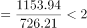,

梨的单位面积产量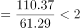,

桃的单位面积产量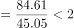，

猕猴桃的单位面积产量，因此2017年单位面积产量最高的水果是猕猴桃。

故正确答案为D。

---

#### 第 2 题　qid 2188148 · 综合

2017年，该省挂果面积最大水果的总产量约是挂果面积最小水果的总产量的（  ）倍。

- **A**. 112　✅
- **B**. 84
- **C**. 57
- **D**. 28

**答案**：A

**官方解析**

根据题干“2017年，该省······是······的多少倍”，可判定此题为现期倍数问题。定位文字材料第一段，可直接找出该省挂果面积最大的水果是苹果（726.21万亩），挂果面积最小的水果是石榴（6.51万亩）；由此定位文字材料第二段“苹果的产量为1153.94万吨”和“石榴的产量为10.34万吨”，则2017年，该省挂果面积最大水果的总产量是挂果面积最小水果的总产量的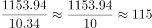倍，与A项最为接近。

故正确答案为A。

---

#### 第 3 题　qid 2188149 · 增长

2017年，该省挂果面积同比增速最高水果的单位面积产量约为（  ）斤/亩。

- **A**. 332
- **B**. 445
- **C**. 664　✅
- **D**. 1075

**答案**：C

**官方解析**

根据题干“2017年，······的单位面积产量约为······斤/亩”，可判定此题为现期平均数问题。定位文字材料第一段，可直接找出该省挂果面积同比增速最高的水果是枣（），定位文字材料第一段“枣的挂果面积为262.74万亩”和第二段“枣的产量为87.23万吨”，可求得2017年枣的单位面积产量为斤/亩，与C项最接近。

故正确答案为C。

---

#### 第 4 题　qid 2188152 · 综合

2017年，单位面积产量超过的水果共有（  ）种。

- **A**. 8
- **B**. 9　✅
- **C**. 10
- **D**. 11

**答案**：B

**官方解析**

根据题干“2017年，单位面积产量······”，结合材料时间为2017年，可判定本题为现期平均数问题。定位材料第一段和第二段，可分别得知各类水果的挂果面积和产量。

根据公式：单位面积产量=，可分别得出各类水果的单位面积产量：

苹果：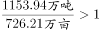吨/亩、梨：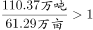吨/亩、柑桔：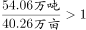吨/亩、桃：吨/亩、猕猴桃：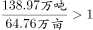吨/亩、葡萄：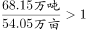吨/亩、枣：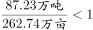吨/亩、柿子：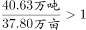吨/亩、杏：吨/亩、石榴：吨/亩、樱桃：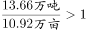吨/亩。1吨/亩=1000公斤/亩，故各类水果中单位面积产量超过1000公斤/亩的水果有：苹果、梨、柑桔、桃、猕猴桃、葡萄、柿子、石榴、樱桃，共9个。

故正确答案为B。

---

#### 第 5 题　qid 2188156 · 综合

根据上述资料，下列说法中不正确的一项是（  ）。

- **A**. 2017年，共有5种水果的单位面积产量同比有所降低
- **B**. 2017年，单位面积产量及同比增速均最低的水果是同一种水果
- **C**. 2016年，单位面积产量低于柿子的水果仅有两种
- **D**. 2016年，单位面积产量从高到低的水果排序是苹果、柑桔、葡萄、樱桃　✅

**答案**：D

**官方解析**

A项：定位材料第一段和第二段，可以分别得知各类水果挂果面积和产量的同比增速，根据结论：当产量同比增速面积同比增速时，单位面积产量同比降低，可知2017年，各类水果单位面积产量同比有所降低的水果有：猕猴桃（）、葡萄（）、枣（）、杏（）、樱桃（），共5种，正确；

B项：根据第69题，可知2017年单位面积产量最低的水果是枣（0.3吨/亩）；根据公式：单位面积产量同比增速=，当时，单位产量同比增速为负数，则各类水果中单位面积产量的同比增速为负数的水果分别为：猕猴桃（）、葡萄（）、枣（）、杏（）、樱桃（），最小的是枣，正确；

C项：根据公式：基期单位面积产量=，可知2016年各类水果的单位面积产量分别为：苹果（吨/亩）、梨（吨/亩）、柑桔（吨/亩）、桃（吨/亩）、猕猴桃（吨/亩）、葡萄（吨/亩）、枣（吨/亩）、柿子（吨/亩）、杏（吨/亩）、石榴（吨/亩）、樱桃（吨/亩），则2016年，单位面积产量低于柿子（1吨/亩）的水果有：枣（0.3吨/亩）、杏（0.4吨/亩），共两种，正确；

D项：根据C选项计算可知：2016年樱桃单位面积产量（1.29吨/亩）＞葡萄（1.26吨/亩），错误。

本题为选非题，故正确答案为D。

---

### 材料 2

<b>二、根据以下资料，回答</b><b>71--75题。</b>

        2017年，我国电信业务收入12620亿元，比上年增长，增速同比提高1个百分点。其中，2017年全年固定通信业务收入完成3549亿元，比上年增长，在电信业务收入中占比为。2017年，在固定通信业务中固定数据及互联网业务收入达到1971亿元，比上年增长，拉动电信业务收入增长1.4个百分点，对全行业业务收入增长贡献率达。2017年全年移动通信业务实现收入9071亿元，比上年增长，在电信业务收入中占比为。2017年，在移动通信业务中移动数据及互联网业务收入5489亿元，比上年增长，对收入增长贡献率达。

#### 第 6 题　qid 2188151 · 增长

2017年我国电信业务收入同比增加了大约（  ）亿元。

- **A**. 681
- **B**. 759　✅
- **C**. 808
- **D**. 818

**答案**：B

**官方解析**

根据题干“2017年······同比增加了大约······亿元”，可判定本题为增长量计算问题。定位文字材料：“2017年我国电信业务收入12620亿元，比上年增长”，故2017年我国电信业务收入同比增长量亿元，与B项最接近。

故正确答案为B。

---

#### 第 7 题　qid 2188157 · 综合

2017年固定数据及互联网业务收入占电信业务收入的（  ）。

- **A**. 

- **B**. 

- **C**. 

- **D**. 

　✅

**答案**：D

**官方解析**

根据题干“2017年······占······”，可判定本题为现期比重问题。定位文字材料可知，2017年我国电信业务收入12620亿元，固定数据及互联网业务收入为1971亿元，故所求的比重。

故正确答案为D。

---

#### 第 8 题　qid 2188159 · 比重

2017年移动数据及互联网业务收入在电信业务收入中的比重比2016年提高了大约（  ）。

- **A**. 

　✅
- **B**. 

- **C**. 

- **D**. 

**答案**：A

**官方解析**

根据题干“2017年······比重比2016年提高了大约······”，可判定本题为两期比重计算问题。定位文字材料可知，移动数据及互联网业务收入()5489亿元，同比增速()，电信业务收入()12620亿元，同比增速()。代入两期比重差值公式，，即提高了6.9个百分点，与A项最接近。

故正确答案为A。

---

#### 第 9 题　qid 2188160 · 增长

2017年移动数据及互联网业务收入拉动电信业务收入增长约（    ）个百分点。

- **A**. 7.2
- **B**. 8.2
- **C**. 9.7　✅
- **D**. 10.7

**答案**：C

**官方解析**

根据题干“拉动······增长······个百分点”，可判定本题为拉动增长率问题。定位材料文字部分可得：移动数据及互联网业务收入5489亿元，比上年增长26.7%，可计算出移动数据及互联网业务收入增长量=；定位材料文字部分可得：我国电信业务收入12620亿元，比上年增长，可计算出电信业务收入基期量=，故移动数据及互联网业务收入拉动电信业务收入增长的百分点=，与C项最接近。

故正确答案为C。

---

#### 第 10 题　qid 2188164 · 综合

根据以上资料，下列说法中正确的一项是（  ）。

- **A**. 
2013-2017年，移动通信业务收入在我国电信业务收入中的占比均高于
　✅
- **B**. 
2013-2017年，移动数据及互联网业务收入在移动通信业务收入中的占比均高于

- **C**. 
2013-2017年，固定数据及互联网业务收入在固定通信业务收入中的占比均高于

- **D**. 
2013-2017年，固定通信业务收入的年度同比增速均高于同年我国电信业务收入的年度同比增速

**答案**：A

**官方解析**

A项：定位文字材料可知，2017年移动通信业务收入在我国电信业务收入中的占比为；定位图表可知各年移动通信业务收入和我国电信业务收入的增速，则2016年的比重为，2015年的比重为，2014年的比重为，2013年的比重为，正确。

B项：定位文字材料可知，2017年移动数据及互联网业务收入在移动通信业务收入中的占比；定位图表可知各年移动数据及互联网业务收入和移动通信业务收入的增速，则2016年的比重为，2015年的比重为，2014年的比重为，错误。

C项：定位文字材料可知，2017年固定数据及互联网业务收入在固定通信业务收入中的占比；2017年固定数据及互联网收入和固定通信业务收入的增速分别为、，则2016年的比重为，错误。

D项：定位图表，只有2014年、2015年和2017年固定通信业务收入增速高于电信业务收入增速，其余年份均不满足，错误。

故正确答案为A。

---

### 材料 3

根据以下资料，回答76—80题。

#### 第 11 题　qid 2188207 · 增长

2017年全国规模以上文化及相关产业企业营业收入合计数比2016年增加了大约（  ）亿元。

- **A**. 8936
- **B**. 8963　✅
- **C**. 9836
- **D**. 9863

**答案**：B

**官方解析**

根据题干“······增加了大约（    ）亿元”，判定为增长量计算题型。定位统计表，可得：2017年全国规模以上文化及相关产业企业营业收入合计数为91950亿元，比上年增长。选项差距非常小，需要精确计算。根据公式，亿元。

故正确答案为B。

---

#### 第 12 题　qid 2188208 · 增长

2017年（  ）的全国规模以上文化及相关产业企业营业收入合计数的同比增速最高。

- **A**. 第一季度
- **B**. 第二季度　✅
- **C**. 第三季度
- **D**. 第四季度

**答案**：B

**官方解析**

根据题干“······同比增速最高”，判定为增长率比较题型，结合表中数据，没有给出四个季度单独的增长率，需要通过混合增长率来进行定性比较。定位统计表，可得：2017年全国规模以上文化及相关产业企业营业收入合计数1-3月同比增速为，1-6月同比增速为，1-9月同比增速为，1-12月同比增速为。

根据混合增长率结论：“混合居中但不中，偏向基数大”。分别判断四个季度：

第一季度：第一季度同比增速即为1-3月同比增速，为；

第二季度：因为1-6月同比增速（）高于1-3月（），混合居中，所以4-6月同比增速1-6月同比增速（）1-3月（）。即第二季度同比增速；

第三季度：因为1-9月同比增速（）低于1-6月（），混合居中，所以7-9月同比增速1-9月同比增速（）1-6月（）。即第三季度同比增速；

第四季度：因为1-12月同比增速（）低于1-9月（），混合居中，所以10-12月同比增速1-12月同比增速（）1-9月（）。即第四季度同比增速。

综上，第二季度同比增速最高。

故正确答案为B。

---

#### 第 13 题　qid 2188209 · 增长

2017年第四季度（  ）产业的企业营业收入的环比增速最小。

- **A**. 工艺美术品的生产　✅
- **B**. 文化产品生产的辅助生产
- **C**. 文化用品的生产
- **D**. 文化专用设备的生产

**答案**：A

**官方解析**

根据题干“······环比增速最小”，判定为一般增长率比较题型。根据公式，，第四季度环比增速，通过比较大小。分别计算四个选项：

A项：工艺美术品的生产1-12月绝对额为16544亿元，1-9月绝对额为12756亿元，1-6月绝对额为8503亿元。所以工艺美术品的生产第四季度绝对额为亿元，第三季度绝对额为亿元。工艺美术品的生产；

B项：文化产品生产的辅助生产1-12月绝对额为9399亿元，1-9月绝对额为7084亿元，1-6月绝对额为4593亿元。所以文化产品生产的辅助生产第四季度绝对额为亿元，第三季度绝对额为亿元。文化产品生产的辅助生产；

C项：文化用品的生产1-12月绝对额为33665亿元，1-9月绝对额为25556亿元，1-6月绝对额为16626亿元。所以文化用品的生产第四季度绝对额为亿元，第三季度绝对额为亿元。文化用品的生产；

D项：文化专用设备的生产1-12月绝对额为5168亿元，1-9月绝对额为3834亿元，1-6月绝对额为2492亿元。所以文化专用设备的生产第四季度绝对额为亿元，第三季度绝对额为亿元。文化专用设备的生产。

比较四个选项，A项工艺美术品的生产2017年第四季度企业营业收入环比增速最小。

故正确答案为A。

---

#### 第 14 题　qid 2188210 · 增长

2017年第三季度（  ）个产业的企业营业收入实现环比下降。

- **A**. 4
- **B**. 5
- **C**. 6　✅
- **D**. 7

**答案**：C

**官方解析**

定位统计表可得：2017年1-9月、1-6月、1-3月各产业的企业营业收入，那么第三季度的营业收入为，第二季度的营业收入为，可得：

新闻出版发行服务的第三季度营业收入为亿元，第二季度营业收入为亿元，，环比下降，满足；

广播电视电影服务的第三季度营业收入为亿元，第二季度营业收入为亿元，，环比下降，满足；

文化艺术服务的第三季度营业收入为亿元，第二季度营业收入为亿元，，环比上升，不满足；

文化信息传输服务第三季度营业收入为亿元，第二季度营业收入为亿元，，环比上升，不满足；

文化创意和设计服务第三季度营业收入为亿元，第二季度营业收入为亿元，，环比下降，满足；

文化休闲娱乐服务第三季度营业收入为亿元，第二季度营业收入为亿元，，环比上升，不满足；

工艺美术品的生产第三季度营业收入为亿元，第二季度营业收入为亿元，，环比下降，满足；

文化产品生产的辅助生产第三季度营业收入为亿元，第二季度营业收入为亿元，，环比下降，满足；

文化用品的生产第三季度营业收入为亿元，第二季度营业收入为亿元，，环比上升，不满足；

文化专用设备的生产第三季度营业收入为亿元，第二季度营业收入为亿元，，环比下降，满足。

满足条件的有6个。

故正确答案为C。

---

#### 第 15 题　qid 2188214 · 综合

根据上述资料，下列说法中不正确的一项是（  ）。

- **A**. 
2016年第二季度所有产业的企业营业收入的环比增速都大于

- **B**. 
2017年第二季度所有产业的企业营业收入的环比增速都大于

- **C**. 
2016年第二季度到第四季度全国规模以上文化及相关产业企业营业收入合计数的环比增速均为正值

- **D**. 
2017年第二季度到第四季度全国规模以上文化及相关产业企业营业收入合计数的环比增速均为正值
　✅

**答案**：D

**官方解析**

观察选项，发现A、B、C三项的计算量特别大，先看D项。

D项：2017年第二季度全国规模以上文化及相关产业企业营业收入合计数为亿元，第一季度营业收入合计数为19926亿元，，第二季度的环比增速为正值；第三季度营业收入合计数为亿元，，第三季度的环比增速为负值，并非均为正值，错误。

本题为选非题，故正确答案为D。

---

### 材料 4

根据以下资料，回答81-85题。

        2017年，全国规模以上工业企业实现主营业务收入116.5万亿元，比上年增长；全国规模以上工业企业发生主营业务成本98.9万亿元，增长；全国规模以上工业企业实现利润总额75187.1亿元，比上年增长，增速比2016年加快12.5个百分点；全国规模以上工业企业主营业务收入利润率（利润总额/主营业务收入）为，比上年提高0.54个百分点。

        2017年，全国规模以上工业企业每百元主营业务收入中的成本为84.92元，比上年减少0.25元；每百元主营业务收入中的费用为7.77元，减少0.2元；每百元资产实现的主营业务收入（）为108.4元，增加3.7元；人均主营业务收入（）为131.5万元，增加15万元。 

#### 第 16 题　qid 2188167 · 增长

2017年全国规模以上工业企业实现利润总额比2015年增加了（  ）亿元。

- **A**. 13049
- **B**. 13409
- **C**. 17917　✅
- **D**. 17971

**答案**：C

**官方解析**

由题干“2017年······比2015年增加多少亿元”，判定此题为间隔增长量问题。定位文字材料“2017年…全国规模以上工业企业实现利润总额75187.1亿元，比上年增长，增速比2016年加快12.5个百分点”，可得2016年全国规模以上工业企业实现利润总额增长率，根据间隔增长率公式可得，。选项差距非常小，需要精确计算。根据公式，。C选项最接近。

故正确答案为C。

---

#### 第 17 题　qid 2188168 · 综合

2017年经济类型按主营业务收入利润率由低到高的排序是（  ）。

- **A**. 私营企业  股份制企业  国有控股企业  外商及港澳台商投资企业　✅
- **B**. 股份制企业  国有控股企业  集体企业  外商及港澳台商投资企业
- **C**. 私营企业  国有控股企业  股份制企业  集体企业
- **D**. 股份制企业  私营企业  集体企业  外商及港澳台商投资企业

**答案**：A

**官方解析**

由题干“2017年…主营业务收入利润率”， 结合表格材料已知2017年主营业务收入及利润总额，判定此题为现期比重问题。定位表格材料，根据利润率公式，，可得各经济类型规模以上工业企业主营业务利润率分别为：

国有控股企业：；集体企业：；股份制企业：；外商及港澳台商投资企业：；私营企业：。结合选项，只有A项正确。

故正确答案为A。

---

#### 第 18 题　qid 2188169 · 综合

2017年，员工人数最多的经济类型是（  ）。

- **A**. 国有控股企业
- **B**. 股份制企业　✅
- **C**. 外商及港澳台商投资企业
- **D**. 私营企业

**答案**：B

**官方解析**

由题干“2017年，员工人数最多的经济类型”，结合表格材料已知2017年主营业务收入及人均主营业务收入，判定此题为现期平均数问题。由，可得，因此各主要经济类型规模以上工业企业员工数分别为：

国有控股企业：；股份制企业：；外商及港澳台商投资企业：；私营企业：；所以员工人数最多的经济类型为股份制企业。

故正确答案为B。

---

#### 第 19 题　qid 2188170 · 综合

2017年，在主要经济类型中（  ）的负债绝对额是最大的。

- **A**. 国有控股企业
- **B**. 股份制企业　✅
- **C**. 外商及港澳台商投资企业
- **D**. 私营企业

**答案**：B

**官方解析**

根据题干“2017年，在主要经济类型中……负债绝对额是最大的”，结合表格公式：，需要通过负债率和资产总额计算得出，且结合材料时间为现期，判定本题为现期比重问题。定位文字材料和表格可知，，，则，表格已知各经济类型的主营业务收入、每百元资产实现的主营业务收入、资产负债率。国有控股企业负债绝对额亿元，股份制企业负债绝对额亿元，外商及港澳台商投资企业负债绝对额亿元，私营企业负债绝对额亿元，故股份制企业负债绝对额最高。

故正确答案为B。

---

#### 第 20 题　qid 2188171 · 综合

根据上述资料，下列说法中正确的一项是（  ）。

- **A**. 
2016年所有经济类型的规模以上工业企业主营业务收入利润率均低于其2017年的主营业务收入利润率

- **B**. 
2016年所有经济类型的规模以上工业企业每百元主营业务收入的成本均高于其2017年每百元主营业务收入的成本

- **C**. 
2016年国有控股规模以上工业企业的实现利润总额占该年所有经济类型规模以上工业企业的实现利润总额合计数的以上

- **D**. 
2016年国有控股规模以上工业企业的主营业务收入占该年所有经济类型规模以上工业企业的主营业务收入合计数的以上
　✅

**答案**：D

**官方解析**

A项：选项主体为所有经济类型规模以上工业企业的数据，表格只给出了主要经济类型规模以上工业企业的数据，数据不全，无法推出全部，错误；

B项：选项主体为所有经济类型规模以上工业企业的数据，表格只给出了主要经济类型规模以上工业企业的数据，数据不全，无法推出全部，错误；

C项：定位文字材料、柱状图和表格可知，2017年规模以上工业企业实现利润总额75187.1亿元，比上年增长，2017年国有控股企业利润总额16651.2亿元，比上年增长。根据，故2016年国有控股规模实现利润总额占所有经济类型规模以上工业企业的利润总额，错误；

D项：定位文字材料、柱状图和表格可知，2017年，全国规模以上工业企业实现主营业务收入116.5万亿元，比上年增长，2017年国有控股企业主营业务收入258367.4亿元，比上年增长。根据基期比重，故2016年国有控股规模以上工业企业的主营业务收入占所有经济类型规模以上工业企业的主营业务收入合计数的比重，正确。

故正确答案为D。

---
