# 2018年421联考《行测》题（黑龙江卷）（网友回忆版）（省直）

> 联考 · 2018 年 · 6 个模块 · 共 130 题

- [政治理论](#%E6%94%BF%E6%B2%BB%E7%90%86%E8%AE%BA) · 2 题
- [常识判断](#%E5%B8%B8%E8%AF%86%E5%88%A4%E6%96%AD) · 18 题
- [言语理解与表达](#%E8%A8%80%E8%AF%AD%E7%90%86%E8%A7%A3%E4%B8%8E%E8%A1%A8%E8%BE%BE) · 40 题
- [数量关系](#%E6%95%B0%E9%87%8F%E5%85%B3%E7%B3%BB) · 15 题
- [判断推理](#%E5%88%A4%E6%96%AD%E6%8E%A8%E7%90%86) · 35 题
- [资料分析](#%E8%B5%84%E6%96%99%E5%88%86%E6%9E%90) · 20 题

---

## 政治理论

### 第 1 题　qid 2187699 · 新思想

中国共产党第十九次全国代表大会的主题是：      ，高举中国特色社会主义伟大旗帜，决胜全面建成小康社会，夺取新时代中国特色社会主义伟大胜利，为实现中华民族伟大复兴的中国梦不懈奋斗。
填入划横线部分最恰当的一项是：

- **A**. 不忘初心，牢记使命　✅
- **B**. 奋发前进，使命必达
- **C**. 解放思想，改革开放
- **D**. 不忘初心，攻坚克难

**答案**：A

**官方解析**

本题主要考查时政。
中国共产党第十九次全国代表大会报告中明确指出：“大会的主题是：不忘初心，牢记使命，高举中国特色社会主义伟大旗帜，决胜全面建成小康社会，夺取新时代中国特色社会主义伟大胜利，为实现中华民族伟大复兴的中国梦不懈奋斗。”
故正确答案为A。

---

### 第 2 题　qid 2188392 · 时事政治

中国共产党第十九届中央委员会第二次全体会议于2018年1月18日至19日在北京召开，会议的主要议程是：

- **A**. 研究制定国民经济发展计划
- **B**. 研究全面从严治党的重大问题
- **C**. 讨论修改宪法部分内容的建议　✅
- **D**. 研究党和政府机构改革的重大问题

**答案**：C

**官方解析**

本题考查时政常识，主要考查党的第十九届中央委员会第二次全体会议的内容。
A项错误，中国共产党第十八届中央委员会第五次全体会议，于2015年10月26日至29日在北京举行。审议通过了《中共中央关于制定国民经济和社会发展第十三个五年规划的建议》。因此，研究制定国民经济发展计划是党十八届中央委员会第五次全体会议的主要议程。
B项错误，中国共产党第十八届中央委员会第六次全体会议，于2016年10月24日至27日在北京举行。审议通过了《关于新形势下党内政治生活的若干准则》和《中国共产党党内监督条例》，审议通过了《关于召开党的第十九次全国代表大会的决议》。因此，研究全面从严治党的重大问题是党十八届中央委员会第六次全体会议的主要议程。
C项正确，中国共产党第十九届中央委员会第二次全体会议，于2018年1月18日至19日在北京举行。全会审议通过了《中共中央关于修改宪法部分内容的建议》，张德江就《建议（草案）》向全会作了说明。因此，会议的主要议程是讨论修改宪法部分内容的建议。
D项错误，中国共产党第十九届中央委员会第三次全体会议，于2018年2月26日至28日在北京举行。审议通过了《中共中央关于深化党和国家机构改革的决定》和《深化党和国家机构改革方案》。因此，研究党和政府机构改革的重大问题是党的十九届中央委员会第三次全体会议的主要议程。
故正确答案为C。

---

## 常识判断

### 第 1 题　qid 2187717 · 人文常识

下列哪一成语的典故不是来自真实历史事件：

- **A**. 暗度陈仓
- **B**. 草木皆兵
- **C**. 逼上梁山　✅
- **D**. 乐不思蜀

**答案**：C

**官方解析**

本题主要考查中国历史的相关知识。
A项正确，暗度陈仓，来自真实历史故事，出自《史记·高祖本纪》：“去辄烧绝栈道，以备诸侯盗兵袭之，亦示项羽无东意。······八月，汉王用韩信之计，从故道还，袭雍王章邯。邯迎击汉陈仓，雍兵败，还走······”，指刘邦出兵攻项羽时，韩信故意明修栈道，迷惑对方，暗中绕道奔袭陈仓，取得胜利。
B项正确，草木皆兵，来自真实历史故事，出自《晋书·苻坚载记》：“坚与苻融登城而望王师，见部阵齐整，将士精锐；又北望八公山上草木皆类人形，顾谓融曰：‘此亦勍（劲）敌也，何谓少乎？’怃然有惧色。”记载的是东晋淝水之战。
C项错误，逼上梁山，不是来自真实历史故事，而是来自虚构的小说，出自《水浒传》，讲述了八十万禁军教头林冲被太尉高俅陷害，刺配沧州，途中又险被杀害，终于走投无路，只好去投奔梁山的故事。 
D项正确，乐不思蜀，来自真实历史故事，出自 《三国志·蜀书·后主传》：“王问禅曰：‘颇思蜀否？’禅曰：‘此间乐，不思蜀。’”
本题为选非题，故正确答案为C。

---

### 第 2 题　qid 2187710 · 人文常识

下列文学作品没有使用方言的是：

- **A**. 《海上花列传》(韩邦庆)
- **B**. 《凤凰涅槃》(郭沫若)　✅
- **C**. 《秦腔》（贾平凹）
- **D**. 《白鹿原》(陈忠实)

**答案**：B

**官方解析**

本题考查文学常识。
A项正确，《海上花列传》是清末著名小说，主要讲述了清末中国上海十里洋场中的妓院生活，涉及当时的官场、商界及与之有联系的社会的各个层面。它是最著名的吴语小说，也是中国第一部方言小说。
B项错误，《凤凰涅槃》是一首现代白话诗歌，诗歌以凤凰的传说为素材，通过凤凰集木自焚，从烈焰中重生的故事，表达了彻底埋葬旧社会、争取祖国自由解放的思想，在现代诗歌史上具有重要历史地位的诗篇。《凤凰涅槃》运用的现代白话文，不涉及方言的应用。
C项正确，《秦腔》是贾平凹的著名长篇小说。《秦腔》中用了大量的修辞手法，融合比喻、拟人、对偶、象征等手法，活灵活现地展现了农村生活，这些修辞手法结合方言化的语言要素，形成了极具地域色彩的语言风格。
D项正确，《白鹿原》是陈忠实创作的长篇小说。小说中，作者不仅从表层的遣词造句的角度精心选择方言语汇，运用方言语气词以及高密度的排比句和长句来营造方言氛围、创造方言腔调，而且从深层的角度运用方言思维进行布局谋篇。
本题为选非题，故正确答案为B。

---

### 第 3 题　qid 2187704 · 法律常识

小明在图书馆大声说话，有读者制止他时，他却说：“这是我的权利和自由，别人无权干涉”。关于上述观点的评价正确的是：
①正确，宪法规定公民有言论自由
②错误，公民的自由是在法律范围内的自由
③错误，未经他人许可，公民不得擅自行使权利
④错误，世界上从来没有“绝对”的权利和自由

- **A**. ①②
- **B**. ①③
- **C**. ②③
- **D**. ②④　✅

**答案**：D

**官方解析**

本题考查宪法的相关知识，主要考查权利和自由。
①错误，我国《宪法》第三十五条规定：“中华人民共和国公民有言论、出版、集会、结社、游行、示威的自由。”有言论自由并不等于不分场所的随意行使自己的权利，图书馆属于公共场所，禁止大声喧哗。选项表述正确，但不符合题意。
②正确，我国公民言论、出版、集会、结社、游行、示威的自由，都必须在国家法律、法规规定的范围内行使，自由是相对的，而不是绝对的，自由和法律是统一的，法律是自由的体现和保证，自由要受法律的制约。
③错误，公民有行使自己权利的自由，不需要经过任何人同意，但是，前提是行使自己的权利不得触犯法律，不得损害他人利益。图书馆内禁止大声喧哗，小明在行使自己权利时损害了他人的利益。
④正确，没有绝对的权利和自由，任何权利和自由都是有条件的，都是受到一定限制的。任何权利和自由都是在法律许可的范围内行使，否则就会受到法律的制裁。行使权利和自由不得损害他人的合法权益。小明在图书馆大声喧哗，损害了他人的利益。因此，世界上不存在“绝对”的权利和自由。
①③错误，②④正确。
故正确答案为D。

---

### 第 4 题　qid 2187719 · 经济常识

下列事件按时间先后顺序排列正确的是：
①中国女排获得里约奥运会女排比赛冠军
②中国（上海）自由贸易实验区正式设立
③第九届金砖国家领导人会晤在厦门举行
④我国举行纪念中国人民抗日战争暨世界反法西斯战争胜利70周年阅兵式

- **A**. ②③①④
- **B**. ④①②③
- **C**. ②④①③　✅
- **D**. ②①③④

**答案**：C

**官方解析**

本题考查毛中特。

②2013年8月22日，国务院正式批准设立中国（上海）自由贸易试验区。

④2015年9月3日，是中国第二个法定的“中国人民抗日战争胜利纪念日”，也是中国人民抗日战争暨世界反法西斯战争胜利70周年。

①北京时间2016年8月21日，在里约奥运会女排决赛中，中国队战胜塞尔维亚队获得金牌。

③2017年9月3日至5日，金砖国家领导人第九次会晤在福建厦门举行，主题是：“深化金砖伙伴关系，开辟更加光明未来。”金砖合作已经步入第二个“黄金十年”。

故按照时间先后顺序排序为②④①③。

故正确答案为C。

---

### 第 5 题　qid 2187715 · 人文常识

下列教育家与其名言对应不正确的是：

- **A**. 孔子：“性相近也，习相远也”
- **B**. 孟子：“尽信书，则不如无书”
- **C**. 墨子：“道之所存，师之所存”　✅
- **D**. 荀子：“骐骥一跃，不能十步；驽马十驾，功在不舍”

**答案**：C

**官方解析**

本题考查文学常识，主要考查诸子百家。
A项正确，“性相近也，习相远也”出自《论语·阳货》：“子曰：性相近也，习相远也”，意思是人的先性（先天素质）差距不大，而后天习染（教育、环境影响等造成人的发展）却有很大差异。
B项正确，“尽信书，则不如无书”出自《孟子》的《尽心下》。“尽信书，则不如无书。”这是孟子关于读书方法的论述，目的在于告诉读者要善于独立思考问题。
C项错误，“道之所存，师之所存”出自韩愈的《师说》。意思是道理存在的地方，就是老师存在的地方。
D项正确，“骐骥一跃，不能十步；驽马十驾，功在不舍”出自荀子的《劝学》。意思是骏马一跨跃，也不足十步远；劣马拉车走十天，也能到达，劣马的成功来源于走个不停，坚持不放弃。
本题为选非题，故正确答案为C。

---

### 第 6 题　qid 2187716 · 人文常识

下列著作与作者对应不正确的是：

- **A**. 《忏悔录》——奥古斯丁
- **B**. 《人性论》——萨特　✅
- **C**. 《正义论》——罗尔斯
- **D**. 《理想国》——柏拉图

**答案**：B

**官方解析**

本题主要考查文学常识的相关知识。
A项正确，世界三大忏悔录，作者分别是奥古斯丁、卢梭、托尔斯泰。其中，奥古斯丁的《忏悔录》反映了作者的心路历程，具有自传性质，书中以他人的苦闷为自己的苦闷，并以无比的真挚尝试解决其苦闷，全书分为十三卷。
B项错误，《人性论》是英国经验主义哲学家大卫·休谟的一部最重要的哲学著作。萨特，法国20世纪最重要的哲学家之一，其著作是《存在与虚无》。
C项正确，《正义论》是美国哈佛大学教授约翰·罗尔斯的著作，被视为第二次世界大战后西方政治哲学、法学和道德哲学中最重要的著作之一，被列为“历史经典名著之林”。
D项正确，《理想国》是古希腊哲学家柏拉图创作的哲学对话体著作。全书主要论述了柏拉图心中理想国的构建、治理和正义，主题是关于国家的管理。
本题为选非题，故正确答案为B。

---

### 第 7 题　qid 2187659 · 人文常识

下列药物不适用于清热利咽的是：

- **A**. 胖大海
- **B**. 板蓝根
- **C**. 片仔癀
- **D**. 珍珠粉　✅

**答案**：D

**官方解析**

本题考查生活常识，主要涉及药物使用的相关内容。
A项正确，胖大海是植物胖大海的干燥成熟种子，产于泰国、柬埔寨、马来西亚等国，具有清热润肺，解毒利咽，治疗咽喉肿痛的功效，口干咽燥，牙龈肿痛者可单独泡服。
B项正确，板蓝根，是一种中药材，具有清热解毒，凉血利咽之功效，常用于温疫时毒，发热咽痛，温毒发斑，痄腮，烂喉丹痧，大头瘟疫，丹毒，痈肿。
C项正确，片仔癀，为清热剂，具有清热解毒、凉血化瘀，消肿止痛之功效。用于热毒血瘀所致急慢性病毒性肝炎，痈疽疔疮，无名肿毒，跌打损伤及各种炎症。
D项错误，《中华人民共和国药典》及《中药大辞典》均指明：珍珠具有安神定惊、明目去翳、解毒生肌等功效，现代研究还表明珍珠粉在提高人体免疫力、延缓衰老、祛斑美白、补充钙质等方面都具有独特的作用。
本题为选非题，故正确答案为D。

---

### 第 8 题　qid 2187662 · 人文常识

下列四个节气所表示的含义错误的是：

- **A**. 处暑：炎热夏季即将到来　✅
- **B**. 惊蛰：天气回暖，春雷始鸣
- **C**. 冬至：冬季最寒冷的日子开始
- **D**. 小满：夏熟作物籽粒开始灌浆饱满但未成熟

**答案**：A

**官方解析**

本题考查自然常识，主要考查二十四节气的相关知识点。
A项错误，处暑，即为“出暑”，是炎热离开的意思，是气候变凉的象征。
B项正确，惊蛰，古称“启蛰”，标志着仲春时节的开始，此前，动物入冬藏伏土中，不饮不食，称为“蛰”；到了“惊蛰节”，天上的春雷惊醒蛰居的动物，称为“惊”。故惊蛰时，蛰虫惊醒，天气转暖，渐有春雷，中国大部分地区进入春耕季节。而“惊蛰”前后，之所以偶有雷声，是大地湿度渐高而促使近地面热气上升或北上的湿热空气势力较强与活动频繁所致，从而产生“惊蛰雷鸣”现象。
C项正确，从“冬至”开始，北半球逐渐进入了最寒冷的日子，称作“数九寒天”。
D项正确，小满是二十四节气之一，夏季的第二个节气。其含义是夏熟作物的籽粒开始灌浆饱满，但还未成熟，只是小满，还未大满。
本题为选非题，故正确答案为A。

---

### 第 9 题　qid 2188480 · 科技常识

下列现象的物理解释错误的是：

- **A**. 高压锅烹煮食物——升高水的沸点
- **B**. 露珠呈球状——液体表面张力
- **C**. 铁轨铺在枕木上——减少压强
- **D**. 大银幕观影——光的漫折射　✅

**答案**：D

**官方解析**

本题考查科技常识。
A项正确，水的沸点受压强影响，压强越高，沸点越高。高压锅烹煮食物增大了锅内的气压，提高了水的沸点，要煮的食物温度升高，从而使食物熟透。
B项正确，物质由分子组成，分子之间有间隙，由于分子在不停地做无规则运动，分子间存在相互作用的引力和斥力。在液体表面，分子间的作用力表现为相互吸引，由此表现为液体的表面张力。表面张力促使露珠以最小的表面积的状态存在，而体积相等的物体中，只有球体的表面积最小，所以露珠总是呈球状的。
C项正确，把铁轨铺在枕木上，是为了在压力一定的情况下，增大铁轨与地面的接触面积，从而减小火车对地面的压强。
D项错误，漫反射是指投射在粗糙表面上的光向各个方向反射的现象。电影院里人能在不同的座位上看到银幕上的画面，是因为屏幕上的光源在银幕上形成了漫反射，而不是光的漫折射。
本题为选非题，故正确答案为D。

---

### 第 10 题　qid 2188481 · 人文常识

下列选项中的事件可能发生的是：
①隋炀帝偏爱吃茄子
②苏东坡的早餐中常有玉米粥
③西红柿炒蛋经常出现在宋代百姓的餐桌上
④开心果在宋代深受欢迎，学名叫阿月浑子
⑤苦瓜不但可以食用，还能入药，被收入《本草纲目》中

- **A**. ①③⑤
- **B**. ①②⑤
- **C**. ①④⑤　✅
- **D**. ②③④

**答案**：C

**官方解析**

①茄子原产地在亚洲热带的印度，最早于北魏《齐民要术》中记载其为蔬菜，最晚于西汉末年从印度传入四川，并且相传隋炀帝爱吃茄子，见其色彩奇异，认为是仙品，故赐名“昆仑紫瓜”。
②玉米是明朝中后期经过东南亚传入我国的，而宋代词人苏轼，字子瞻，号东坡居士。故苏东坡的早餐不可能有玉米粥。
③西红柿是明代传入中国的，故不可能出现在宋代百姓的餐桌上。
④开心果，中文名：阿月浑子，至晚于唐代，由中亚传入。故开心果在宋代深受欢迎的情形有可能发生。
⑤对于苦瓜，《本草纲目》记述为：“味：（瓜）苦、寒、无毒。（子）苦、甘、无毒。性：（瓜）除邪热，解劳乏，清心明目。（子）益气壮阳。”根据《本草纲目》记载，苦瓜可补胆润肝，利尿，消暑，解烈酒，助消化，防感冒，还可治喉炎及风热咳嗽，并且苦瓜的果实可入药。
可知，①④⑤正确，②③错误。
故正确答案为C。

---

### 第 11 题　qid 2187753 · 人文常识

互联网上每一个网络或每一台主机所分配的逻辑地址称为IP地址。目前，IP地址主要有IPv4地址和IPv6地址两大类别。下列对应错误的是：

- **A**. 192.168.0.57——IPv4地址
- **B**. 10.255.8.239——IPv4地址
- **C**. 0D-89-A5-9B-F3-61——IPv6地址　✅
- **D**. 2016：DB8：0：2DE：A13——IPv6地址

**答案**：C

**官方解析**

本题考查计算机相关的常识。
A、B两项正确，IPv4中规定IP地址长度为32位。一般的书写法为4个用小数点分开的十进制数。
C项错误，IPv6的地址长度为128位，采用十六进制表示。IPv6有3种表示方法，分别为冒分十六进制表示法、0位压缩表示法、内嵌IPv4地址表示法。该项表示的是主机的物理地址，而不是IP地址。
D项正确，该项是利用冒分十六进制法所表示的IPv6地址。
本题为选非题，故正确答案为C。

---

### 第 12 题　qid 2187754 · 科技常识

下列选项不属于航空航天中货运飞船主要任务的是：

- **A**. 货运飞船发射升空完成后，会与空间站自动或人工交会对接
- **B**. 货运飞船进行空间站实验和技术试验，将获取的研究数据回传　✅
- **C**. 货运飞船为空间站补加推进剂以及空气，带来饮水、食物等补给物资
- **D**. 货运飞船可充当空间站的“垃圾桶”，将站内废弃物品搬运至货运飞船

**答案**：B

**官方解析**

本题考查的是科技常识的相关知识。
货运飞船是一种专门运送货物到达太空一次性使用的航天器，主要任务是向空间站定期补给食品、货物、燃料和仪器设备等。它是国际空间站补给物资的重要运输工具，也是空间站的地面后勤保障系统。
A项正确，货运飞船发射升空后，可以与空间站自动或人工交会对接，从而输送空间站需要的补给物资。
B项错误，空间站实验和技术试验，将获取的研究数据回传这是空间站的任务，而不是货运飞船的任务。
C项正确，货运飞船可以为空间实验室以及空间站提供推进剂、空气、航天员的饮水、食物以及用于维修空间站的更换设备等补给物资。
D项正确，空间站丢弃的废弃物和生活垃圾等也可以搬运至货运飞船，随货运飞船进入大气层烧毁。
本题为选非题，故正确答案为B。

---

### 第 13 题　qid 2187757 · 科技常识

“21世纪金属”具有较高的强度、良好的抗氧化性和优异的耐腐蚀性，对人体无毒且无不良反应，被称为“亲生物金属”，可作为人造骨材料。下列关于“21世纪金属”的说法正确的是：

- **A**. “21世纪金属”是指钛和钛合金　✅
- **B**. “21世纪金属”只运用于航空航天领域
- **C**. “21世纪金属”是一种新型石墨烯材料
- **D**. “21世纪金属”是21世纪发现的一种金属元素

**答案**：A

**官方解析**

本题考查的是科技常识的相关知识。
A项正确，钛和钛合金具有很多优良的性能，如熔点高、密度小、可塑性好、易于加工，尤其是钛合金与人体器官具有很好的“生物相容性”。钛和钛合金被认为是21世纪重要的金属材料。
B项错误，钛和钛合金的用途很广，在航空航天、海洋工程、生物医疗、生活用品等领域都有广泛的应用，并不是只用于航空航天领域。
C项错误，石墨烯是一种由碳原子组成的二维碳纳米材料，具有导电电热性佳、重量轻、强度大、韧性好、透光率高等特点。但它并不是“21世纪金属”。
D项错误，“21世纪金属”指钛和钛合金，钛元素大约是在18世纪被发现，而不是21世纪。
故正确答案为A。

---

### 第 14 题　qid 2188484 · 经济常识

下列关于我国金融常识的说法正确的是：

- **A**. 自然人之间借贷如未约定利息，出借人欲主张借款人支付出借期内的利息，法院不予支持　✅
- **B**. 如果实际通货膨胀率高于预期的水平，则债务人受损，债权人受益
- **C**. 理财产品合同中的预期收益率是理财产品实际到期收益率
- **D**. 国债、股票、公司债券的投资风险依次递增

**答案**：A

**官方解析**

本题考查金融知识。
A项正确，根据《最高人民法院关于审理民间借贷案件适用法律若干问题的规定》第二十四条第一款规定：“借贷双方没有约定利息，出借人主张支付利息的，人民法院不予支持。 ”
B项错误，通常情况下，如果实际通货膨胀率高于预期，则物价上涨，货币购买力降低。而签约时利息不足以抵消通货膨胀水平，即债务人支付的利息不足以抵消通货膨胀造成的购买力损失。因此是债务人受益，而债权人受损。   
C项错误，预期收益率是指在不确定的条件下，预测的理财产品未来可实现的收益率。它是一种理论收益率，并不是理财产品实际到期收益率。 
D项错误，国债是中央政府向投资者出具的、承诺在一定时期支付利息和到期偿还本金的债权债务凭证，由于国债的发行主体是国家，所以它具有最高的信用度，被公认为是最安全的投资工具。公司债券是公司依照法定程序发行、约定在一定期限内还本付息的有价证券，公司债券的持有人是公司的债权人，而不是公司的所有者，这是与股票持有者最大的不同点。债券持有人有按约定条件向公司取得利息和到期收回本金的权利，取得利息优先于股东分红，公司破产清算时，也优于股东而收回本金。所以正确排序为国债、公司债券、股票的投资风险依次递增。
故正确答案为A。

---

### 第 15 题　qid 2187702 · 法律常识

下列情形中保险公司须承担给付或赔偿保险金的是：

- **A**. 定期寿险合同到期时，被保险人仍生存
- **B**. 在终身寿险中，受益人故意造成被保险人死亡　✅
- **C**. 在意外伤害保险有效期间，被保险人突发心脏病死亡
- **D**. 在投保重大疾病保险时，投保人故意隐瞒其有先天性疾病

**答案**：B

**官方解析**

本题主要考查法律常识。
A项错误，定期寿险是指在保险合同约定的期间内，如果被保险人死亡，则保险公司按照约定的保险金额给付保险金；若保险期限届满被保险人健在，则保险合同自然终止，保险公司不再承担保险责任，并且不退回保险费。因此，定期寿险合同到期，被保险人仍然生存，保险公司不用给付或赔偿保险金。
B项正确，终身寿险是指终身提供死亡保障的保险。根据《保险法》第四十三条第二款规定：“受益人故意造成被保险人死亡、伤残、疾病的，或者故意杀害被保险人未遂的，该受益人丧失受益权。”根据《保险法》第四十二条第一款规定：“被保险人死亡后，有下列情形之一的，保险金作为被保险人的遗产，由保险人依照《中华人民共和国继承法》（注：《继承法》现已是《民法典》继承编）的规定履行给付保险金的义务：(一)没有指定受益人，或者受益人指定不明无法确定的；(二)受益人先于被保险人死亡，没有其他受益人的；(三)受益人依法丧失受益权或者放弃受益权，没有其他受益人的。”因此当受益人故意造成被保险人死亡时，受益人丧失受益权，但是保险公司仍然要给付保险金。
C项错误，人身意外伤害险是指当被保险人在保险期限内遭受意外伤害，并以此为直接原因造成死亡或残废时，保险公司按照保险合同的约定向保险人或受益人支付一定数量保险金的一种保险。意外伤害指的是外来的、突发的、非本意的和非疾病的伤害。因此，被保险人突发心脏病死亡，不属于意外伤害，保险公司不用给付或赔偿保险金。
D项错误，重大疾病保险是指当被保险人患保单指定的重大疾病确诊后，保险人按合同约定定额支付保险金的保险。根据《保险法》第十六条第四款规定：“投保人故意不履行如实告知义务的，保险人对于合同解除前发生的保险事故，不承担赔偿或者给付保险金的责任，并不退还保险费。”因此，投保人故意隐瞒先天性疾病的，保险公司不用给付或赔偿保险金。
故正确答案为B。
【注】由于《继承法》已生效，《保险法》未做新修订，故还是引用了《保险法》中的原法条内容。

---

### 第 16 题　qid 2188401 · 人文常识

北回归线没有穿越下列哪一著名建筑所在的国家：

- **A**. 
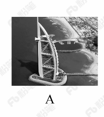

- **B**. 
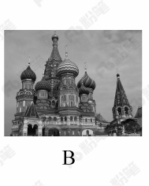
　✅
- **C**. 
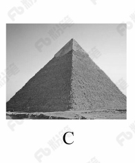

- **D**. 

**答案**：B

**官方解析**

本题主要考查地理常识。

北回归线是指太阳光线能够直射在地球上最北的界线，地理位置约为北纬 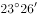。

A项正确，该图的建筑物是迪拜帆船酒店，迪拜是阿拉伯联合酋长国的城市，该国纬度大约为北纬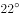至北纬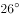之间，北回归线穿越其国境内。

B项错误，该图的建筑物是位于俄罗斯红场旁的瓦西里升天大教堂。俄罗斯，地跨欧亚两洲，位于欧洲东部和亚洲大陆的北部，位于北纬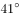至北纬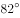之间，北回归线未穿越该国。

C项正确，该图的建筑物是埃及金字塔，位于北纬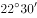至北纬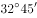之间，北回归线穿越该国南部地区。

D项正确，该图的建筑物是泰姬陵，是印度陵墓清真寺。印度地处北半球，位于北纬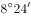至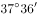之间，北回归线穿越该国。

本题为选非题，故正确答案为B。

---

### 第 17 题　qid 2187718 · 人文常识

下列我国古代绘画理论名句所表达的美学理念与其他三项不同的是：

- **A**. 到处云山是吾师
- **B**. 搜尽奇峰打草稿
- **C**. 论画以形似，见与儿童邻　✅
- **D**. 吾师心，心师目，目师华山

**答案**：C

**官方解析**

本题主要考查文化常识的相关知识。
A项“到处云山是吾师”是元代赵孟頫提出的，表达的美学理念是重视向自然美学习。
B项“搜尽奇峰打草稿”是清代石涛提出的，表达的美学理念是重视向自然学习，注意感同身受和提炼构思相结合。
C项“论画以形似，见与儿童邻”是苏轼的两句论画名言。诗句意为：衡量画的好坏，只以形似作为评判优劣的标准，就如同儿童的见解一样幼稚。画要画出神，诗要有言外之味。古代艺术论将这种思想表述为:“含不尽之意见于言外”“象外之象”“味外之味”“意外之韵”等等。
D项“吾师心，心师目，目师华山”是明代王履提出的，表达的美学理念是向自然学习，师法自然，发挥主观能动性。
C项与其他三项不同。
本题为选非题，故正确答案为C。

---

### 第 18 题　qid 2188403 · 人文常识

下列古诗中涉及的历史事件，按先后顺序排列正确的是：
①千寻铁锁沉江底，一片降幡出石头
②剑外忽传收蓟北，初闻涕泪满衣裳
③千载琵琶作胡语，分明怨恨曲中论
④江东子弟多才俊，卷土重来未可知

- **A**. ①③④②
- **B**. ③④①②
- **C**. ②③④①
- **D**. ④③①②　✅

**答案**：D

**官方解析**

本题主要考查文学常识。
①“千寻铁锁沉江底，一片降幡出石头”出自唐代诗人刘禹锡的《西塞山怀古》，翻译为：千丈长的铁链沉入江底，一片降旗挂在石头城头。太康元年（公元280年）晋武帝命王濬率领以高大的战船组成的水军，顺江而下，讨伐东吴。诗人以这件史事为题，写了该诗。
②“剑外忽传收蓟北，初闻涕泪满衣裳”出自唐代诗人杜甫的《闻官军收河南河北》，翻译为：剑门关外，喜讯忽传，官军收复冀北一带，高兴之余，泪满衣裳。唐代史思明的儿子史朝义兵败自缢（公元763年），标志着安史之乱结束，杜甫听到这个消息，以饱含激情的笔墨，写下了这篇脍炙人口的名作。
③“千载琵琶作胡语，分明怨恨曲中论”出自唐代诗人杜甫的《咏怀古迹（其三）》，翻译为：千载琵琶一直弹奏胡地音调，曲中抒发的分明是昭君怨恨。该诗是《咏怀古迹五首》的第三首，诗人借咏昭君村（王昭君诞生地）、怀念王昭君（“昭君出塞”）来抒写自己的怀抱，寄托了诗人自己身世及爱国之情。“昭君出塞”发生在西汉公元前54年。
④“江东子弟多才俊，卷土重来未可知”出自唐代诗人杜牧的《题乌江亭》，翻译为：西楚霸王啊，江东子弟人才济济，若能重整旗鼓卷土杀回，楚汉相争，谁输谁赢还很难说。该诗针对项羽兵败身亡（项羽自刎乌江）的史实，批评他不能总结失败的教训，惋惜他的“英雄”事业归于覆灭，同时暗寓讽刺之意。公元前202年，垓下之战项羽战败，自刎于乌江。
因此，按先后顺序排列正确的是④③①②。
故正确答案为D。

---

## 言语理解与表达

### 材料 1

①切割成相同大小隔间的写字楼，吃住挤在6平方米的年轻人，月收入过万但需苦练720小时的工作流程——这就是网红工厂的生态。通过新老主播连麦、互刷礼物、买热门等推广手段，经纪公司“制造”出了千千万万个同质化的赚钱机器。但这种枯燥辛苦的生活并没有阻挡更多人涌入这一行业的热情。调查显示，2017年“粉丝”规模在10万人以上的中国网红人数较2016年增长了，超过一半的“95后”向往的新兴职业就是网红或主播。

②十几年前，人们用明星制造和造星工厂来形容庞大的明星产业链。现在，当媒介不仅仅局限于电影电视这一大小银幕，互联网孵化的网红工厂应运而生。舆论对“工厂”这个词汇的使用，看似不经意，实际上内含着对文化趋势的敏锐认识和隐性忧虑。

③对于现代商业所带来的拜物教和文化景观，法兰克福学派的批判哲学家们最早使用了“文化工业”这一词汇。文化工业的出现，使得文化产品按“标准化”“一律化”模式大批量制造，最终带来了“伪个性化”的盛行。它将统一行为方式和审美方式强加于人，使商业文化中的人变成了“单面人”。

④网红的产生和迅速地批量复制，就是一个制造稳定套路的过程。而且这个过程并不是单一的，还和其他行业联系在一起，形成了一个“套路丛”。以下信息可以提供一些参考：中国整形美容手术以每年超过的速度增长，整形美容已成为继房地产、汽车销售、旅游之后的第四大服务行业；与此同时，“修图软件”“自拍神器”“美颜相机”等自拍APP商机不断、热钱涌入，近年自带美颜和滤镜功能的手机相继上市。“颜值经济”已经结构化，互相论证着彼此的合理性。

⑤“颜值经济”带来的最直接结果是，“美”已经被符号化。美容院的批量改造和网红主播的展示，对当下的审美观念产生了巨大影响：“美”等于削尖了的下巴、满溢玻尿酸的苹果肌、美瞳巨眼、从上而下45度角的镜头呈像。这两三年以来，很多网络论坛和公众号都掀起了对八九十年代明星的怀旧风，反向说明了网红潮所带来的审美压抑。

⑥更深层的影响还在于，这个过程带来一种双向规训，不仅是对“粉丝”的规训，也是对网红主播自身的规训。这就是，人人展示个性，但同质化的展示成为了最大的共性；人人设计“人设”，而这种将人单向化、纯粹化的设计成为了最庸常的套路；貌似提供了最坦然直接交流的直播，但实际上却“披挂”了层层伪饰。哲学学者指出的“伪个性化”，正由网红工业集中呈现出来。

⑦在文化里，任何的“单一”和“模式”都值得警惕。因为人的潜能一旦被统一规定到一种既定的文化形式中，就会造成对人的丰富本质的否定。如果在社会的文化生活中，除了一种套路外已经没有其他选择，那就已经到了该去审视这种文化的时候了。

#### 第 1 题　qid 2188512 · 片段阅读

下面这段文字最适合放在文中的哪个位置？
通俗点说就是，文化生活全是套路，所谓个性，不过是选择这个套路还是那个套路。

- **A**. ④和⑤中间
- **B**. ③和④中间　✅
- **C**. ②和③中间
- **D**. ①和②中间

**答案**：B

**官方解析**

根据“文化生活全是套路”可知，前文应阐述文化生活方面存在的问题，且后文应围绕“套路”展开论述，③之后介绍了网红工厂出现的问题，即“带来了‘伪个性化’的盛行，使商业文化中的人变成了‘单面人’”，即是在阐述文化生活方面的问题，④之后阐述了网红的产生过程就是一个套路的过程，即是围绕“套路”这一话题展开论述，故这段文字应放在③和④中间，对应B项。
A、C、D三项的位置不能与这段文字形成对应，均排除。
故正确答案为B。
【文段出处】《网红经济中的文化景观》

---

#### 第 2 题　qid 2188513 · 片段阅读

下列不属于“网红工业”特征的是：

- **A**. 批量化
- **B**. 个性化　✅
- **C**. 标准化
- **D**. 模式化

**答案**：B

**官方解析**

根据第③段“文化工业的出现，使得文化产品按‘标准化’‘一律化’模式大批量制造，最终带来了‘伪个性化’的盛行”可知，“文化工业”即“网红工业”，“伪个性化”即指“网红工业”没有个性化，对应B项。
A项，根据第④段“网红的产生和迅速地批量复制”可知，“批量化”属于“网红工业”的特征，排除。
C项，根据第①段“通过新老主播连麦······等推广手段······‘制造’出了千千万万个同质化的赚钱机器”、第③段“文化工业的出现，使得文化产品按‘标准化’‘一律化’模式大批量制造”可知，“标准化”属于“网红工业”的特征，排除。
D项，根据第④段“网红的产生和迅速地批量复制，就是一个制造稳定套路的过程”可知，“套路”即“模式化”，属于“网红工业”的特征，排除。
本题为选非题，故正确答案为B。
【文段出处】《网红经济中的文化景观》

---

#### 第 3 题　qid 2188515 · 片段阅读

这篇文章意在：

- **A**. 批判网红潮所呈现的套路化的文化生活　✅
- **B**. 反思由“颜值经济”产生的明星产业链
- **C**. 揭露网红工业对人们审美的压抑
- **D**. 描述现代商业所带来的审美异化

**答案**：A

**官方解析**

文段首段指出“网红工厂”兴起这一现象，第二段阐述这一现象会引发“文化隐忧”的问题，第三、四、五、六段进一步阐述指出“网红经济”带来的危害，最后一段提出对策，指出任何的“单一”和“模式”都值得警惕，尾句强调“如果社会文化生活除了一种套路外已经没有其他选择，就到了该审视这种文化的时候了”，体现作者对“网红工厂”这种套路的文化生活持批判态度，对应A项。 
B项“颜值经济”、C项“审美压抑”均对应第五段的表述，非重点，且没有提到文段的核心话题“套路化的文化生活”，排除；
D项“描述”为客观陈述，与作者的态度不符，作者对于套路化的网红潮持批判的态度，排除。
故正确答案为A。
【文段出处】《网红经济中的文化景观》

---

#### 第 4 题　qid 2188517 · 片段阅读

下列最适合做本文标题的是：

- **A**. 720小时：网红是怎样炼成的
- **B**. “文化工业”的前世今生
- **C**. “单面人”：网红时代的文化景观　✅
- **D**. 网红的商业化之路

**答案**：C

**官方解析**

文段首先介绍了网红工厂的生态，接着指出舆论对于“工厂”这一词汇的使用内含着对文化趋势的认识和忧虑，后文指出文化工业的影响，即其出现使商业文化中的人变成了“单面人”，接着对其进行详细的解释，最后强调文化里任何的“单一”都值得警惕，故文段围绕文化中的“单面人”这一话题展开，对应C项。
A项“720小时”为话题引入部分，并非文段重点，排除；
B项“文化工业”偏离文章核心话题，且“前世今生”为“单面人”的产生原因，非重点，排除；
D项“网红的商业化之路”非重点，文段重在说明网红背后所反映的问题，排除。
故正确答案为C。
【文段出处】《网红经济中的文化景观》

---

#### 第 5 题　qid 2187773 · 逻辑填空

艺术人类学的田野调查，是将调查事项作为一个整体，从形式到内涵，由表及里，                ，考察其艺术语境、渊源、内涵、象征、法则及其实际发挥的社会功能，同时更关注艺术事项的主体，并从中发现他们独特的艺术审美和文化价值。
填入划横线部分最恰当的一项是：

- **A**. 由浅到深
- **B**. 深入浅出　✅
- **C**. 条分缕析
- **D**. 逐层论证

**答案**：B

**官方解析**

此题难度较大，建议使用排除法。文段开篇介绍艺术人类学的田野调查将调查事项作为一个整体，接着详细介绍了田野调查的三个步骤、阶段，即从形式到内涵，由表及里，故横线处所填内容为田野调查的第三个阶段，且根据前文“形式、内涵”和“表、里”，横线处成语也要包含两个方面。而C项“条分缕析”形容分析得有条理，很细致，D项“逐层论证”指一步一步分析论证，两项均不包含两个层面，与文意不符，排除。对比A、B两项，A项“由浅到深” 指从浅入深，逐步深入，与前文提到的田野调查的第二个阶段“由表及里”语义重复，不能构成调查的第三步骤，排除；B项“深入浅出”指讲话或文章的内容深刻，语言文字却浅显易懂或内容、道理很深刻，但表达得浅显通俗，符合文意，当选。
故正确答案为B。
【文段出处】《“非遗”保护与艺术人类学的作为》

---

#### 第 6 题　qid 2187776 · 逻辑填空

当初的救济性扶贫虽然有立竿见影的功效，但救济的终结常常就是返贫的开始。后来的开发性扶贫有利于借助本土资源        现代产业，但也容易滋生资源掠夺经营、透支生态环境的隐患。在“输血”和“造血”之外，我们还应有新的视角和新的思维。
填入划横线部分最恰当的一项是：

- **A**. 培养
- **B**. 扶植
- **C**. 培植　✅
- **D**. 培育

**答案**：C

**官方解析**

本题为单空实词题，且选项中词语语义相近，需认真比较。
横线处搭配“现代产业”，A项“培养”搭配不当，排除。根据后文的语境，本空要与“造血”一词形成对应，故须体现出“从无到有”这一特点，B项“扶植”有帮扶之意，体现出的是由弱到强，而非从无到有，排除；C项“培植”指栽种并细心管理，能够体现出从无到有的过程，当选； D项“培育”指培养教育，并非从无到有，与文意不符，排除。
故正确答案为C。
【文段出处】《赋权式扶贫：向社会底层普及改革发展带来的机会》

---

#### 第 7 题　qid 2188429 · 逻辑填空

古代中国数秘术与古希腊数秘术的区别在于，前者侧重解象，后者侧重数术。中国的数秘术后来发展成了更具方法论意义的宇宙形而上学，与算术渐行渐远，                。
填入画横线部分最恰当的一项是：

- **A**. 南辕北辙
- **B**. 分道扬镳　✅
- **C**. 缘木求鱼
- **D**. 背道而驰

**答案**：B

**官方解析**

横线处所填词语与“渐行渐远”构成并列，体现了中国的数秘术与算术逐渐分开，越走越远，各走各的，B项“分道扬镳”比喻目标不同，各走各的路或各干各的事，符合文意，当选。
A项，“南辕北辙”比喻行动和目的相反，通常主语指的是一个对象，而文段的主语是“数秘术”和“算术”，排除；C项，“缘木求鱼”比喻方向或办法不对头，不可能达到目的，与“渐行渐远”语义无关，无法构成并列，排除；D项，“背道而驰”比喻背离正确的道路，通常用在消极的对象身上，而“中国的数秘术”并非消极的对象，排除。
故正确答案为B。
【文段出处】《希腊数学作为自由学术的典范》

---

#### 第 8 题　qid 2188434 · 逻辑填空

在人类的脑海中，“科学”除了创造丰富的物质财富以外，往往扮演了“真实”与“客观”的化身，如果这一切被        ，后果不堪设想。那么，我们需要        的是，在刚刚过去的那个世纪里，是谁扣动了科学危机的扳机？
依次填入划横线部分最恰当的一项是：

- **A**. 颠覆  厘清　✅
- **B**. 推倒  分清
- **C**. 颠仆  辨清
- **D**. 推翻  厘正

**答案**：A

**官方解析**

第一空，根据“后果不堪设想”可知，横线处强调“科学”作为“真实”与“客观”的化身这件事不能被推翻。A项“颠覆”、B项“推倒”、D项“推翻”均符合文意，保留；C项“颠仆”指跌倒、跌落，与“推翻”无关，排除。
第二空，根据“是谁扣动了科学危机的扳机”可知，横线处表达需要“弄清楚”扣动扳机的人是谁之意，A项“厘清”指整理清楚，符合文意，当选；B项“分清”指分辨清楚，搭配的对象应是“多个对象”，而文中并未提及多个对象，搭配不当，排除；D项“厘正”指改正、订正，与文意无关，排除。
故正确答案为A。
【文段出处】《科学也有成长的烦恼》

---

#### 第 9 题　qid 2188461 · 逻辑填空

欧盟委员会发布消息称，回顾全球“金融危机”以来的        ，欧盟采取得当的        ，有效地控制住了危机的蔓延与发展，从而在最近几年取得了经济持续增长的佳绩。
依次填入画横线部分最恰当的一项是：

- **A**. 历史  办法
- **B**. 历程  措施　✅
- **C**. 经历  手段
- **D**. 经过  举措

**答案**：B

**官方解析**

第一空，横线处所填词语搭配“金融危机”，且由“有效控制危机”、“取得佳绩”可知，欧盟应是回顾在“金融危机”过程中人们的做法。B项“历程”指经历过的事情，符合文意；A项“历史”指过去的事实，不符合文意，排除；C项“经历”指自身或他人见过、做过或遭遇过的事，多搭配“人”，与“金融危机”搭配不当；D项“经过”与“金融危机”搭配不当，且“经历”“经过”与文段语体风格不符，均排除。
第二空，代入验证，由“有效地控制了危机，取得了佳绩”可知，欧盟采取了有效的方法。B项“措施”指针对问题的解决办法，符合文意，当选。
故正确答案为B。
【文段出处】《欧盟称 应对“金融危机”措施得当经济持续复苏》

---

#### 第 10 题　qid 2187778 · 逻辑填空

家风是具有鲜明特征的家庭文化，良好家风是一个家庭最宝贵的精神财富，也是每个家庭成员形成正确世界观、人生观、价值观的       。家庭是人生的第一所学校，良好家风是人生幸福生活的“第一组密码”。“积善之家，必有余庆；积不善之家，必有余殃。”只有守住和       好温暖的家庭，才能有人生的成功。
依次填入划横线部分最恰当的一项是：

- **A**. 基点  庇护
- **B**. 基准  保护
- **C**. 基础  爱护
- **D**. 基石  呵护　✅

**答案**：D

**官方解析**

第一空，根据文意可知，横线处需体现出良好家风是家庭成员形成世界观、人生观、价值观的基本条件，A项“基点”可指事物发展的根本、基础，C项“基础”意为事物发展的根本或起点，D项“基石”比喻基础或中坚力量，均能体现“基本”之意，保留。B项“基准”指标准，“家风”并不是形成三观的标准，而是三观的“基本”，故“家风”与“基准”搭配不当，排除。
第二空，横线处搭配“家庭”，A项“庇护”意为袒护、包庇，感情色彩偏消极，和“家庭”搭配不当，排除；对比C、D两项，“爱护”常用作爱护公物、爱护花草，一般不与“家庭”搭配，而“呵护”常搭配朋友、家人、家庭，并且“爱护”指爱惜并保护，“呵护”指对某人、某物很在意，用心照顾、保护，“呵护”更能体现对“家庭”精心照顾的态度，D项更符合语境，当选。
故正确答案为D。
【文段出处】《做培育良好家风的表率》

---

#### 第 11 题　qid 2187682 · 逻辑填空

中国传统菜肴对于烹调方法极为讲究，而且长期以来，由于物产和风俗的差异，各地的饮食习惯和品味爱好               ，              的烹调技术经过历代人民的创造，形成了丰富多彩的地方菜系。
依次填入划横线部分最恰当的一项是：

- **A**. 迥然不同  源远流长　✅
- **B**. 天差地别  积厚流光
- **C**. 殊途同归  连绵不断
- **D**. 如出一辙  博大精深

**答案**：A

**官方解析**

第一空，由“物产和风俗的差异”可知，横线处词语表示各地饮食习惯和品味爱好不一样，A项“迥然不同”形容相差得远，很明显不一样，B项“天差地别” 形容两种或多种事物之间的差距很大，均能够体现出“差异性”，符合文意，保留；而C项“殊途同归”比喻采取不同的方法而得到相同的结果，D项“如出一辙”比喻两件事情非常相似，均不能体现出差异性，排除C、D两项。
第二空，横线处词语形容烹调技术，由“历代人民”可知，烹调技术历史悠久，A项“源远流长”比喻历史悠久，与“历代人民”形成对应，当选；B项“积厚流光”是指积累的功业越深厚，则流传给后人的恩德越广，与“烹调技术”搭配不当，排除。
故正确答案为A。
【文段出处】《我对中国饮食文化的感悟》

---

#### 第 12 题　qid 2188436 · 逻辑填空

现代社会不少人喜欢名牌，把自己的精力消耗在追逐名牌这个事情上，而不是把精力放在        自己上面。你被外在的物质的东西所奴役，就要不停地去满足这个外在的东西。节俭的品德不是让你过苦日子，而是要把自己的心        ，不被外在的东西牵着鼻子走。
依次填入划横线部分最恰当的一项是：

- **A**. 提高  关上
- **B**. 打扮  拴住
- **C**. 武装  拢住
- **D**. 提升  守住　✅

**答案**：D

**官方解析**

第一空，由“而不是”可知，横线前后语义相反。横线前的“把自己的精力消耗在追逐名牌这个事情上”，意为关注外在物质。 故横线处应强调“关注和追求内在”，A项“提高”、C项“武装”、D项“提升”，符合文意，填入均可。B项“打扮”指装饰、化妆，通常指外在的东西，不合句意，排除。
第二空，由横线后“不被外在的东西牵着鼻子走”可知，横线处应表示自己能够约束自己，守住底线，D项“守住内心”符合句意，搭配恰当，当选。A项“关上内心”指完全合上，拒绝与外界接触，不合句意，排除； C项“拢住”指聚合在一起，表示的是将多个物体聚合在一起，与“心”搭配不当，排除。
故正确答案为D。 
【文段出处】《资治通鉴中的齐家之道》

---

#### 第 13 题　qid 2188432 · 逻辑填空

崇尚和平、和睦、和谐的理念，深深根植于中华民族绵延五千余载的        文明。中国人民从苦难中走过来，深知和平的珍贵、发展的        ，怕的就是动荡，求的就是稳定，盼的就是天下太平。
依次填入划横线部分最恰当的一项是：

- **A**. 古老  意义
- **B**. 悠久  价值　✅
- **C**. 辉煌  重要
- **D**. 灿烂  方向

**答案**：B

**官方解析**

第一空，横线处搭配“文明”，且根据“绵延五千余载”可知，横线处需表达文明持续的时间很长之意。B项“悠久”意思是长久，符合文意，保留。A项“古老”意思为陈旧的，久远的，与“新”相对，通常用来形容源头古老，而“绵延五千余载”强调的是过程很长，排除。C项“辉煌”和D项“灿烂”均与时间长久无关，排除。
第二空，代入验证，“、”连接前后表示并列，横线处所填词语对应“珍贵”，B项“价值”与“珍贵”对应得当，且“发展的价值”搭配恰当，当选。
故正确答案为B。
【文段出处】《人民日报评：贡献中国智慧　促进和平发展》

---

#### 第 14 题　qid 2187676 · 逻辑填空

泥石流的         依赖于三个危险因素：沉积物中的粘土、大量的水快速涌入以及山区的地势差异。发生泥石流时，地上的各种大小石头和泥，小到直径只有零点几微米的粘土，大到数十厘米乃至更大的巨型漂砾，都有可能         在泥石流中“泥沙俱下”。
依次填入划横线部分最恰当的一项是：

- **A**. 诱发  裹挟　✅
- **B**. 成因  汇集
- **C**. 出现  夹杂
- **D**. 引发  聚集

**答案**：A

**官方解析**

第一空，根据文意可知，横线处表达泥石流的产生形成依赖三个因素，A项“诱发”、C项“出现”、D项“引发”均符合文意，保留；B项“成因”指原因，与后文“因素”语义重复，排除。
第二空，横线表达石头和泥等卷入泥石流中，而且石头和泥本身是静止的，受到了泥石流的冲击才被动的跟随泥石流移动，所以第二空应体现“被动”的意思。C项“夹杂”指掺杂，D项“聚集”指集合、凑在一起，均无“被动”之意，排除；A项“裹挟”指人或物被迫卷入其中，符合文意，当选。
故正确答案为A。
【文段出处】《别忘了还有泥石流》

---

#### 第 15 题　qid 2188511 · 逻辑填空

细胞表面的磷脂酰丝氨酸是促进HIV与细胞融合的重要辅因子，是HIV入侵细胞过程中的“        ”目标，若这一目标不存在了，则会影响HIV的入侵。因此，        外源性磷脂酰丝氨酸，或抑制TMEM16F蛋白，就会抑制病毒蛋白的介导融合，从而阻止HIV对细胞的感染。
依次填入画横线部分最恰当的一项是：

- **A**. 捆绑  阻隔
- **B**. 锁定  阻拦
- **C**. 绑定  阻止
- **D**. 绑架  阻断　✅

**答案**：D

**官方解析**

第一空，根据文段“细胞表面的磷脂酰丝氨酸是促进HIV与细胞融合的重要辅因子”、“若这一目标不存在了，则会影响HIV的入侵”可知，横线处所填词语表达HIV在入侵细胞过程中需要和磷脂酰丝氨酸绑在一起，否则无法入侵的含义，A项“捆绑”、C项“绑定”、D项“绑架”均符合文意。B项“锁定”指使固定不动，体现不出“绑”的意思，排除。
第二空，搭配“外源性磷脂酰丝氨酸”，A项“阻隔”、D项“阻断”能体现出隔在外面的意思，C项“阻止”体现停下来的意思，但是停在什么地方不清楚，并且文段后面出现“阻止HIV细胞的感染”语义上略显重复，排除。
对比A、D两项，第一空出现双引号，体现形象化的表达，A项“捆绑”仅仅体现绑在一起，D项“绑架”更能形象的体现磷脂酰丝氨酸对HIV入侵的作用性，填入文段更合适，择优选择D项。
故正确答案为D。
【文段出处】《HIV通过“绑架”细胞表面分子入侵细胞》

---

#### 第 16 题　qid 2188439 · 逻辑填空

土豆放置在潮湿环境中容易发芽，土豆发芽后会产生一种毒素叫做龙葵碱，龙葵碱对胃肠道黏膜有较强的刺激性，会产生        效果，对中枢神经有麻痹作用，中毒的主要症状为胃痛加剧，恶心、呕吐，呼吸困难、急促，伴随全身虚弱        ，严重者可导致死亡。
依次填入划横线部分最恰当的一项是：

- **A**. 消蚀  无力
- **B**. 销蚀  衰微
- **C**. 侵蚀  乏力
- **D**. 腐蚀  衰竭　✅

**答案**：D

**官方解析**

先从第二空入手，文段体现的是中毒的症状，并且严重者会死亡。D项“衰竭”指由于疾病严重而生理机能极度减弱，与后文“导致死亡”形成递进关系，符合文意，保留。A项“无力”、C项“乏力”指的是没劲，无力，填入文段程度太轻，与中毒症状不匹配，均排除；B项“衰微”一般搭配国运衰微、民族衰微，与“身体”搭配不当，排除。
第一空，代人验证。D项“腐蚀”指在周围介质（酸、碱、盐、溶剂等）作用下产生损耗与破坏的过程，填入文段语义恰当，当选。
故正确答案为D。
【文段出处】《百姓质疑：辐照后的食品还能继续食用吗?》

---

#### 第 17 题　qid 2188458 · 逻辑填空

国家主席习近平在G20汉堡峰会上对全球经济治理的建议极具针对性。加强宏观政策        ，有助于促进各方        ，避免沟通不畅或是以邻为壑，进而打造开放共赢的合作模式。
依次填入划横线部分最恰当的一项是：

- **A**. 协调  互动
- **B**. 调控  互通
- **C**. 沟通  联动　✅
- **D**. 交流  联通

**答案**：C

**官方解析**

第一空，由“对全球经济治理的建议”可知，文段并非强调我国本身的治理方式，而是与其他国家进行政策上的互通有无，A项“协调”、C项“沟通”、D项“交流”均符合文意，保留；B项，宏观“调控”指国家对国民经济进行的调节与控制，强调国家内部的管理方式，与文段语境不符，排除。
第二空，由“避免沟通不畅或是以邻为壑”“打造开放共赢的合作模式”可知，世界各国之间不仅存在沟通与联系，彼此之间更是相互配合的一种联合行动或方式，对应C项，“联动”指联合行动，即各国在保持沟通的基础上，共同合作，符合文意，当选。A项“互动”指社会上个人与个人之间，群体与群体之间等的相互作用的过程，一般搭配小范围的个体或群体，与“国家”搭配不当，排除；D项“联通”同“连通”指互相连接，有联系往来，侧重沟通，不能与“合作模式”构成对应，排除。
故正确答案为C。
【文段出处】《全球经济治理新方案——学习习近平总书记关于当前国际经济形势重要讲话系列述评之三》

---

#### 第 18 题　qid 2188460 · 逻辑填空

每一项工业遗产都        着城市社会发展的演变规律。实施对工业遗产的发掘保护、开发利用，对维护城市风貌，        生机特色，克服千城一面现象，具有重要意义。
依次填入划横线部分最恰当的一项是:

- **A**. 凝结  保持　✅
- **B**. 凝集  保留
- **C**. 凝聚  突出
- **D**. 凝滞  凸显

**答案**：A

**官方解析**

第一空，横线处所填词语与“规律”搭配，A、B、C三项，“凝结”“凝集”“凝聚”均有“聚集、积聚”之意，可与“规律”搭配，保留。D项，“凝滞”指停留不动，不灵活，一般搭配“目光凝滞”，与“规律”搭配不当，排除。
第二空，由“城市社会发展的演变规律”及“克服千城一面现象”可知，城市在不断的变化发展过程中要有自己的特色，横线处所填词语应体现特色在城市演变整个过程中“一直存在”之意，与前文“维护”构成对应，A项“保持”指维持某种状态使不消失或减弱，符合文意，当选。B项“保留”指保存不改变，侧重结果，与文意不符，排除；C项“突出”含有明显，出众之意，与文意不符，排除。
故正确答案为A。
【文段出处】《城市工业文化遗产保护与利用泛论》

---

#### 第 19 题　qid 2188516 · 逻辑填空

跟其他射电望远镜一样，中国大射电望远镜最主要的两大科学目标是        宇宙中的中性氢和观测脉冲星，前者是研究宇宙大尺度物理学，以        宇宙起源和演化，后者是研究极端状态下的物质结构与物理规律。
依次填入画横线部分最恰当的一项是：

- **A**. 巡访  探寻
- **B**. 巡视  探索　✅
- **C**. 巡查  探讨
- **D**. 巡弋  探究

**答案**：B

**官方解析**

第一空，横线处搭配“中性氢和观测脉冲星”，且通过“和”与“观测”构成并列关系，故横线处应体现出“看”的含义。B项“巡视”指巡行视察，侧重于“视”，C项“巡查”指一边走一边查看，均符合文意，且与“中性氢”搭配合适，保留。A项“巡访”侧重于“访问”，D项“巡弋”指在水域巡逻，均与文段意思不符，不能体现出“看”的意思，排除。
第二空，根据文意可知，横线处应表示研究宇宙大尺度物理学可以帮助人去寻找宇宙起源和演化。B项“探索”指探寻求索，搭配恰当，当选。C项“探讨”一般指人相互讨论，与文段语境信息不符，排除。
故正确答案为B。

---

#### 第 20 题　qid 2187681 · 逻辑填空

万众创新，需要不拘一格的包容，让各种类型的人才脱颖而出；需要自由宽松的环境，让各种新奇的探索互相____；需要体制变革的____，让全社会每一个细胞的生命活力充分____。
依次填入划横线部分最恰当的一项是：

- **A**. 砥砺  激励  释放　✅
- **B**. 磨砺  激发  施展
- **C**. 竞争  鼓励  发展
- **D**. 磨合  鼓动  绽放

**答案**：A

**官方解析**

本题可从第二空入手，搭配“体制变革”，根据文意可知，横线处表达体制变革对全社会展现创新活力的积极作用，A项“激励”、B项“激发”、C项“鼓励”均符合文意，保留。D项“鼓动”指用言语或行为激励他人使有所行动，与“体制变革”搭配不当，且感情色彩偏消极，与语境不符，排除。
第三空，搭配“活力”，表达让全社会的生命活力充分表达出来之意，A项“释放”符合文意，且“释放活力”为常见搭配，符合文意，保留。B项“施展”指运用，通常与才华、抱负搭配，与“活力”搭配不当，排除；C项“发展”通常搭配经济、生产，与“活力”搭配不当，排除。
第一空，代入验证，A项“砥砺”指磨练、勉励之意，符合文意，当选。
故正确答案为A。
【文段出处】《创新的根基在文化》

---

#### 第 21 题　qid 2187678 · 逻辑填空

无论是现代游戏，还是传统游戏，都____出了一定的知识、社会和时代特征，同时也____了团结、多样性和包容的价值。但随着社会变迁和时代发展，很多有价值的传统游戏正在一代又一代的____中逐渐消逝。
依次填入划横线部分最恰当的一项是：

- **A**. 反射  传播  更新
- **B**. 折射  传递  更迭　✅
- **C**. 影射  传承  更替
- **D**. 投射  传达  更动

**答案**：B

**官方解析**

第一空，搭配“特征”，B项“折射”与“特征”搭配恰当，保留。A项“反射”多指机体对内在或外在刺激有规律的反应，与“特征”搭配不当，排除；C项“影射”是借此指彼、暗指某事或某人，文中没有提及借助和被指代的主体，排除；D项“投射”侧重将自己的特点归因到其他人身上，与“特征”搭配不当，排除。
第二空，代入验证，“传递价值”为常见搭配，B项保留。
第三空，代入验证，B项“更迭”指交换、更替，与“一代又一代”形成了对应，当选。
故正确答案为B。
【文段出处】《网络时代，传统游戏如何焕发新生》

---

#### 第 22 题　qid 2188462 · 逻辑填空

总的来讲，“社会”在处理与国家的关系过程中强调其自主性的成长与释放，并        了各种形式的自我保护运动。而且，“社会”也在改变其生存与发展策略，它不仅仅满足在国家为其        的范围内行动，而且还通过与国家的主动接触与互动，        与政府的相关性，并以协作或合作的方式参与社会问题的解决。
依次填入划横线部分最恰当的一项是：

- **A**. 展开  规定  保持　✅
- **B**. 拓展  制定  保护
- **C**. 开展  划定  维持
- **D**. 发展  制订  保障

**答案**：A

**官方解析**

本题可从第二空入手，横线处搭配“范围”，A项“规定”指对某一事物做出关于方式、方法或数量、质量的决定；C项“划定”指固定或确定界限，两项均与“范围”搭配恰当。B项“制定”和D项“制订”常搭配法律、方案、计划等，均不与“范围”搭配，排除。
第三空，搭配“政府的相关性”，A项“保持”指维持某种状态使不消失或减弱；C项“维持”指维系使继续存在。对比可知，“与政府的相关性”为一种状态，与“保持”搭配合适。而“维持”通常搭配生命、关系等，且倾向于较为被动勉强的维持，而文段中强调“通过与国家的主动接触与互动”，与“维持”的整体语态不符，排除C项。
第一空，代入验证，横线处搭配“自我保护运动”，A项“展开”指张开，铺开，伸展或大规模地进行，置于此处可体现运动的形式之多，搭配恰当，当选。
故正确答案为A。
【文段出处】《郁建兴等：从社会管控到社会治理——当代中国国家与社会关系的新进展》

---

#### 第 23 题　qid 2188463 · 逻辑填空

这部著作把对历史文化追索的触角更深入地探触到历史时空的幽微之处，更敏锐地        虽然缥缈却血脉相连的文化传承，让远逝的鸿影显现出朦胧的真相，使冰冷荒漠的历史有了人性的        。他将华夏祖先的图腾放置在人类文明进步的历史大背景中予以        ，在历史与现实之间辗转反侧、抒发见解，带给我们新的思考。
依次填入划横线部分最恰当的一项是：

- **A**. 感知  温度  观照　✅
- **B**. 揭示  弱点  洞察
- **C**. 探究  纠葛  揣度
- **D**. 体悟  温暖  臆想

**答案**：A

**官方解析**

本题可从第二空入手，根据文段“让远逝的鸿影显现出朦胧的真相”可知，横线处所填词语和“冰冷”意思相反，A项“温度”和D项“温暖”两者均符合题干，保留；B项“弱点”指不足之处，C项“纠葛”指纠缠不清的事情，两者均与温度无关，与文意不符，排除。
第三空，横线处所填词语与“图腾”搭配，强调通过图腾带给人们新的思考，A项“观照”指仔细观察，审视，用在此处符合语境。D项“臆想”指主观想象，文段强调通过图腾引发思考而非主观臆想，排除。
第一空代入验证，A项“感知”与“敏锐”搭配恰当，符合语境，当选。
故正确答案为A。
【文段出处】《面对华夏祖先的图腾》

---

#### 第 24 题　qid 2188464 · 逻辑填空

巨大的投资热情和市场需求背后，短视频的发展短板令人担忧：内容创作新意        ，同质化严重；平台盈利模式        ，只顾短期盈利，长期规划不足；监管机制        ，版权保护缺位，低俗内容和创意抄袭大行其道。
依次填入画横线部分最恰当的一项是：

- **A**. 匮乏  缺乏  贫乏
- **B**. 贫乏  缺乏  匮乏
- **C**. 缺乏  匮乏  贫乏
- **D**. 匮乏  贫乏  缺乏　✅

**答案**：D

**官方解析**

本题可从第二空入手，横线处需与“模式”构成搭配，“匮乏”“贫乏”与之搭配恰当，“缺乏”多与机制、意志、物资等搭配，与之搭配不当。故排除A、B两项。
第三空，“缺乏”可与“机制”搭配，“贫乏”多与想象力、经验等搭配，排除C项。
第一空，代入验证，D项“匮乏”与“新意”搭配恰当，当选。
故正确答案为D。
【文段出处】《短视频为何叫好不叫座》

---

#### 第 25 题　qid 2187756 · 片段阅读

水熊虫也叫水熊，是对缓步动物门生物的俗称，有记录的有900余种，大多是世界性分布的。它们的体型极小，最小的只有50微米，最大的也只有1.4毫米，必须用显微镜才能看清。水熊虫是地球上已知生命力最强的生物，能在冷冻、水煮、风干的状态下存活，甚至能在真空中或者放射性射线下存活，而一旦将其放回到正常环境下，仍能恢复到正常状态。
这段文字旨在说明：

- **A**. 水熊虫是缓步动物门生物，种类繁多，分布性广
- **B**. 水熊虫体型非常小，使其易于在极端状态下存活
- **C**. 水熊虫生命力极强，在极端恶劣条件下也可存活　✅
- **D**. 水熊虫可长时间放慢或停止自己的新陈代谢活动

**答案**：C

**官方解析**

文段开篇介绍“水熊虫”的分布以及体型，引出“水熊虫”这一话题。后文通过程度词“最”强调“水熊虫”生命力最强，并进一步解释说明，故文段旨在强调“水熊虫生命力极强”，对应C项。
A项，“种类繁多，分布性广”是文段引出话题部分，非重点，排除；
B项，“使”为因果关系关联词，文中并未提及因为“体型小”使其“易于存活”，无中生有，排除；
D项，“放慢或停止自己的新陈代谢活动”，文中并未提及，无中生有，排除。
故正确答案为C。
【文段出处】《日本成功复苏水熊虫 是地球上已知生命力最强的生物》

---

#### 第 26 题　qid 2187669 · 片段阅读

黑洞是爱因斯坦广义相对论最不祥的预言：过多物质或能量集中在一处，终将导致空间坍塌，像魔术师的外套一样吞进万物，万事万物皆逃不脱。直到40年前霍金博士宣称颠覆了黑洞——或者可能是彻底推翻了。他的方程式表明：黑洞不会永存。一段时间之后，它们会“泄掉”，然后爆炸成辐射和微粒。但是，有一个障碍：按照霍金的估算，黑洞崩塌时散出的辐射是随机的，落入其中的万事万物的“信息”大部分将被抹掉。这违反了现代物理学的一条原则：时间是可以扭转的，黑洞里发生过的事情可以重建。
这段文字的主旨是：

- **A**. 霍金发现了一条可以逃出黑洞的线索
- **B**. 黑洞终将“泄掉”，然后爆炸成辐射和微粒
- **C**. 霍金的研究结果彻底推翻了关于黑洞的预言
- **D**. 霍金破除了黑洞永存的预言却提出了新的挑战　✅

**答案**：D

**官方解析**

文段首句对爱因斯坦提出的“黑洞”概念进行了解释，并指出其危险性。随后霍金宣布了“颠覆”黑洞理论的研究，指出“黑洞”并不会永存。后利用转折词“但是”，指出霍金理论中存在一个“障碍”，尾句对其进行具体解释。故文段重点在转折之后，强调了霍金的研究会颠覆“黑洞”理论，但本身也存在障碍，对应D项。
A项，“逃出黑洞的线索”，无中生有，排除；
B项，“黑洞终将‘泄掉’”对应转折之前解释说明部分的内容，非重点，排除；
C项，转折之后指出霍金理论存在“障碍”，故“彻底推翻”过于绝对，排除。
故正确答案为D。
【文段出处】《黑洞无法逃生？霍金指出一条可能的出路》

---

#### 第 27 题　qid 2187759 · 片段阅读

近年来，高空坠物事件屡有发生，受到社会广泛关注。不可否认，法律层面的规定，避免了高空坠物发生后出现索赔难的情形，确保了被侵权人的合法权益得到切实保护。然而，侵权责任法律的规定，明显具有滞后性，也就是说只有发生侵害行为后，法律才会介入。那么，当侵权行为发生后，伤害或死亡悲剧已经发生，根本无法实现亡羊补牢的效果。因此，如何强化法律的前置性功能，让法律成为高空坠物的安全防护网，是解决问题的关键所在。
下列说法与这段文字的主旨无关的是：

- **A**. 强化立法源头设计，有效避免高空坠物
- **B**. 高空坠物侵权法律责任规定还不够完善
- **C**. 有关高空坠物的法律存在明显的滞后性
- **D**. 筑牢安全防护网，让法律成为“事前诸葛”　✅

**答案**：D

**官方解析**

文段首先介绍了高空坠物事件受到广泛关注这一背景，接着肯定了现行的法律规定在事后救济方面的积极作用，之后通过“然而”进行转折，指出侵权责任的法律规定明显有滞后性，即法律仅在损害发生后介入，无法预防悲剧的发生。尾句指出应强化法律的前置性功能，使其在高空坠物事件中起到事前防范和安全防护的作用。故文段重点围绕高空坠物的立法展开，D项偏离文段核心话题“高空坠物”，与主旨无关，当选。
A、B、C三项：均是围绕高空坠物的立法展开的，与文段主旨契合，排除。
本题为选非题，故正确答案为D。
【文段出处】《杜绝高空坠物应堵住法律漏洞》

---

#### 第 28 题　qid 2187672 · 片段阅读

全社会要形成抵制网络不良信息的“防火墙”。网络文化产品直接面向社会公众，经营者是否违法经营，受众最先知道、最有发言权。对网络文化产业进行监管要依靠群众、发动群众。应健全群众举报体系，构建严密的社会监督网络，使网络文化产业发展中的违法行为无藏身之地；引导和教育广大网民增强鉴别能力，面对形形色色的网络文化产品保持清醒头脑，不受骗上当，不误入歧途；帮助网民提高自身道德修养，从思想上打造铜墙铁壁，自觉抵制通过网络传播的不良信息。
这段文字意在强调：

- **A**. 对网络文化产业进行监管要构建监督网络
- **B**. 对网络文化产业进行监管要依靠群众力量　✅
- **C**. 网络文化产业经营者要自觉抵制不良信息
- **D**. 网络文化产业经营者要主动接受群众监管

**答案**：B

**官方解析**

文段开篇引出“抵制网络不良信息”这一话题，并指出“受众对网络文化产品最有发言权”，之后通过“要”提出核心对策即“对网络文化产业进行监管要依靠群众、发动群众”。后文通过分号体现并列，围绕如何“依靠群众、发动群众”阐述了“健全群众举报体系”“引导和教育广大网民增强鉴别能力”“帮助网民提高自身道德修养”三方面具体内容。故文段重点强调“对网络文化产业进行监管要依靠群众力量”，对应B项。
A项“构建监督网络”未体现“群众”这一核心对策，排除；
C、D项的主体均为“网络文化产业经营者”，偏离文段“如何对网络文化产业进行监管”这一核心话题，排除。
故正确答案为B。
【文段出处】《网络文化产业要自觉传递正能量》

---

#### 第 29 题　qid 2187683 · 片段阅读

虽然说经营性养老机构的定价是放开的，政府不能够干预，但是，从保障购买者权益、稳定养老床位价格、规范市场秩序等角度来说，有关方面需要高度警惕这种销售床位的经营模式带来的种种问题。比方说，床位可以炒卖，既有可能背离了养老机构床位的属性——把养老服务变成一种投资形式，还有可能把养老机构床位的价格哄抬高，造成老人们买不起也住不起。另外，床位售价被炒高后很有可能会出现闲置浪费。总之，如果不加以规范，有可能重蹈中国楼市的炒房覆辙。
这段文字意在强调：

- **A**. 养老机构炒卖床位将带来各种问题
- **B**. 政府应当关注养老机构的床位定价
- **C**. 政府应当规范养老机构的经营模式　✅
- **D**. 养老机构炒卖床位可能是变相炒房

**答案**：C

**官方解析**

文段开篇引出“经营性养老机构定价放开”的话题，随后通过转折词“但是”强调政府“需要高度警惕销售床位的经营模式带来的种种问题”，而后通过例子具体阐述前文问题，文段尾句通过结论词“总之”对前文举例进行总结，通过反面提出对策，即需要规范养老机构销售床位的经营模式。故文段重在强调政府需要对养老机构的经营模式加以规范，对应C项。
A项，“炒卖床位将带来各种问题”为问题表述，非重点，排除；
B项，“床位定价”对应举例内容，非重点，且文段主题词为“养老机构的经营模式”偏离核心话题，排除；
D项，“养老机构炒卖床位可能是变相炒房”对应尾句反面论证的不良后果，非重点，排除。
故正确答案为C。
【文段出处】《养老床位不能重蹈炒房覆辙》

---

#### 第 30 题　qid 2188518 · 片段阅读

民国初年的文学革命，其实也就是一场类似库恩所说科学革命的例子。革命者认为旧有典范已经死亡僵化了，于是进行革命。革命之后，新典范出现，整个文学和文学研究遂导向一套新的信念，研讨的问题和答案的标准也改变了：采用西方的思考方式、观念系统、术语、概念来讨论中国文学。碰到这个新“典范”所无法丈量的地方，便诟病中国文学及文学评论定义不精确、系统不明晰、结构不严谨、思想不深刻等等。
这段文字意在说明：

- **A**. 西方文学批评理论对民国初年的文学革命产生了深刻影响
- **B**. 民国初年的文学革命与库恩所说的科学革命有相通之处
- **C**. 民国初年的文学革命用新典范评判中国文学不尽合理　✅
- **D**. 民国初年的中国文学作品带有革命性的特点

**答案**：C

**官方解析**

文段开篇引出民国初年文学革命，接着分析旧典范死亡新典范出现，当新典范无法丈量时，就诟病中国文学存在问题，可知所谓新典范是无法适用于整个中国文学的，因此以新典范的标准批评中国文学是不合理的，对应C项。
A项，偏离文段核心话题，文段重点强调西方文学批评理论的不合理之处，排除。
B项，为文段背景内容，非重点，排除。
D项，文段并未具体阐述有哪些“革命性”的特点，无中生有，排除。
故正确答案为C。
【文段出处】《中国传统文化十五讲》

---

#### 第 31 题　qid 2187763 · 片段阅读

离开家乡转眼近二十载，立业，成家，每日忙忙碌碌，即使回去，也是行色匆匆，没有机会走街串巷品尝家乡的美食。一把雪里蕻引起我对家乡美食的馋涎，也勾起我许多的乡愁。我怀念家乡的味道，不仅仅是这些美味，还有空气中那夹杂的某种浅浅的腥土味以及混合着的一些青草花香的气息，更有那热情洋溢的七邻八舍的咋呼声。这些平常熟悉的味道，这些以前常被我忽略了的味道，在我离开家乡多年后却给我以某种完全不同的感受，家乡一切陌生的、熟悉的细节纷至沓来，那些微小的触觉因了怀念都一一被放大了起来，也变得弥足珍贵起来。
对这段文字概括最准确的关键词是:

- **A**. 乡愁  味道　✅
- **B**. 故乡  记忆
- **C**. 乡村  气息
- **D**. 童年  情结

**答案**：A

**官方解析**

本题要去找到文段关键词，为中心理解题的变形。该文段为散文，应注意把握文段核心。由文段可知，一把雪里蕻勾起作者对家乡美食的回忆，由此展开对家乡各种味道的描写，进而勾起作者许多的乡愁。故文段核心内容围绕着作者记忆中的味道和作者的乡愁展开论述的。故关键词应为乡愁、味道，对应A项。
B项中的“记忆”是由味道勾起、C项中的“乡村”相较于“故乡”的概念比较狭窄、D项中“童年”文中并无重点体现，均不能准确全面地概括文段核心内容，排除。
故正确答案为A。
【文段出处】《乡愁：永远的守望》

---

#### 第 32 题　qid 2187673 · 片段阅读

2017年某调查报告显示，超过8成居民家庭认为阅读是孩子认识世界、获取知识的重要途径，超过6成认为阅读对于孩子养成爱学习习惯、养成健康性格具有重要意义。在实际生活中，超过3成的受访居民家庭未成年子女能够做到每天阅读，超6成孩子每次阅读时间在半小时至1小时之间。但只有3成受访家长经常陪子女阅读，近6成家庭是让孩子自己阅读。有意思的是，虽然父母们自己已经被手机、电脑、电视占据了太多时间，却有的家长希望借助阅读挤压孩子玩电子产品、看电视的时间。

下列选项最适合做文字标题的是：

- **A**. “中国家长高度认同阅读对于子女成长的价值”
- **B**. “放下手机，才能陪孩子阅读”　✅
- **C**. “你看手机，孩子看书？”
- **D**. “阅读，不只关于书本”

**答案**：B

**官方解析**

文段通过2017年调查报告指出，大多数受访居民家庭都认为阅读对于孩子具有重要意义，随后指出在实际生活中，孩子能够做到自己阅读，紧接着通过转折关联词“但”强调，父母陪伴孩子阅读的少，基本都是孩子自己阅读，随后进一步分析原因，指出父母自己被电子设备占据很多时间，却希望孩子可以借助阅读挤压玩电子产品的时间，故文段意在强调家长应该放下手机陪伴孩子多阅读，对应B项。
A项，“中国家长高度认同阅读对于子女成长的价值”对应文段首句，非重点，排除；
C项表述不明确，相比较B项没有明确指出家长要陪伴孩子读书，排除；
D项，“阅读，不只关于书本”强调的是阅读的内容和方式广泛，并非文段强调的重点，且没有提到“孩子”这一主题词，排除。
故正确答案为B。
【文段出处】《你看手机孩子看书 我国真实的家庭亲子阅读状况如何？》

---

#### 第 33 题　qid 2188522 · 片段阅读

作为一种购物方式，“秒杀”带来全新体验，却也留下了复杂况味。转瞬之间，有惊喜也有失望，有欢乐也有忧愁。心理学家说，“秒杀”也是一次心理测验，淡然处之者自得其乐，而那些渴望“一击即中”、希望“马上就有”、总想“付出少收益大”的，则容易陷入纠结的泥沼。看来，“秒杀”可以有，但“秒杀心态”值得商榷。
下列否定“秒杀心态”的诗句是：

- **A**. 白发无凭吾老矣，青春不再汝知乎
- **B**. 人生得意须尽欢，莫使金樽空对月
- **C**. 大鹏一日同风起，扶摇直上九万里
- **D**. 千淘万漉虽辛苦，吹尽狂沙始到金　✅

**答案**：D

**官方解析**

首先定位原文，“秒杀心态”出现在文段结尾，需结合前文内容进行理解，根据“那些渴望‘一击即中’、希望‘马上就有’、总想‘付出少收益大’”可知，“秒杀心态”即指急功近利的心态。故对于“秒杀心态”的否定即指要长久的坚持和付出，D项“千淘万漉虽辛苦，吹尽黄沙始到金”是指历尽辛苦之后，价值会被发现，体现了长期的付出，符合题意，当选。
A项“白发无凭吾老矣，青春不再汝知乎”比喻珍惜时间，奋发图强；B项“人生得意须尽欢，莫使金樽空对月”是指人活在世上就要尽情的享受欢乐；C项“大鹏一日同风起，扶摇直上九万里”是指人的志向伟大，三项均与否定“秒杀心态”无关，均可排除。
故正确答案为D。
【文段出处】《“秒杀心态”赢不了未来》

---

#### 第 34 题　qid 2187685 · 语句表达

传统文化，其幽静深邃堪比深深庭院，正是因为有最单纯、最本初的文化热爱，路过之人才愿意叩开门扉，一探究竟。以或萌或雅的方式吸引人来，只是极为关键的第一步，而最终决定大家能在这庭院之中停留多久的，还是文化本身的魅力。因此，判断文化创意产品是否成功，一条重要的原则就是看能否将                                          融会贯通。
填入划横线部分最恰当的一项是：

- **A**. 幽静深邃的意蕴与单纯本初的文化热爱
- **B**. 传统文化的精神与国际潮流的一般走向
- **C**. 极为关键的萌感与停留心中的高雅文化
- **D**. 吸引人的巧妙形式与留住人的文化内核　✅

**答案**：D

**官方解析**

横线出现在文段结尾，需对前文内容进行总结概括。文段开篇提出因为有文化热爱，人们愿意走进文化，接着指出以或萌或雅的方式吸引人是关键，即外在表现形式，然后强调其根本还是文化本身，即文化内核，文段结尾由“因此”引导结论，故应强调的是判断文化产品是否成功的重要原则应该是外在形式与内核两者的结合，对应D项。
A项：“意蕴”和“文化热爱”对应文段首句，本身非重点，文段尾句重在得出结论，强调判断文化创意产品的原则应该内外结合，排除；
B项：“国际潮流”文段没有提及，无中生有，排除；
C项：“萌感”只对应外在表现形式，且只是其中一种形式，文段还说了雅的方式，表述片面，排除。
故正确答案为D。
【文段出处】《文创产业功夫在诗外》

---

#### 第 35 题　qid 2187671 · 片段阅读

研究人员在大肠杆菌外面缠裹了一种叫做氨基酯的人工合成聚合物，形成一种“细菌胶囊”。随后，将其插入抵抗肺炎球菌的蛋白质疫苗。实验证明，这种胶囊能被动或主动地瞄准一种特殊免疫细胞，它能提升人体免疫反应，具有很强的抗肺炎球菌疾病的能力。研究人员指出，这种胶囊疫苗成本低，使用便利，用这种胶囊输送疫苗能引发特定免疫反应，比现有接种疫苗效率更高，效果更好。

根据这段文字，下列说法正确的是：

- **A**. 
“细菌胶囊”核心是氨基酯人工合成聚合物

- **B**. 
无害的大肠杆菌能提升人体的免疫反应

- **C**. 
“细菌胶囊”对肺病治疗具有突出成效

- **D**. 
“细菌胶囊”或成为新型疫苗输送工具
　✅

**答案**：D

**官方解析**

A项，根据首句“研究人员在大肠杆菌外面缠裹了一种叫做氨基酯的人工合成聚合物，形成一种‘细菌胶囊’”可知，“核心”表述错误，排除；

B项，根据“这种胶囊能被动或主动······它能提升人体免疫反应”，故“提升人体免疫反应”的是“细菌胶囊”，而非“无害的大肠杆菌”，表述错误，排除；

C项，根据“······它能提升人体免疫反应，具有很强的抗肺炎球菌疾病的能力”，以及下文“比现有接种疫苗效果更好”，故“细菌胶囊”对肺病的“预防”有突出成效，而非“治疗”，表述有误，排除；

D项，根据尾句“这种胶囊疫苗成本低，使用便利，用这种胶囊输送疫苗能引发特定免疫反应，比现有接种疫苗效率更高，效果更好”可知，“或成为新型疫苗输送工具”表述正确，且语气相对温和，当选。

故正确答案为D。

【文段出处】《“细菌胶囊”或将取代接种疫苗 成新型疫苗输送工具》

---

#### 第 36 题　qid 2187771 · 片段阅读

从对技术与知识关系的梳理以及互联网技术自主性的趋向来看，未来新闻传播学科重构中应该注意一个核心问题：如何平衡人与技术的关系问题，使研究者从沉浸其中的技术系统中跳脱出来，以一种批判的眼光对待技术体系，避免成为因互联网自主性导致社会失序的推手。对此，唐•伊德指出，“正是因为太熟悉，我们不仅忽视了由技术系统进行批判性反思的需要，而且也忽视了从这种批判性反思中获得的结果”。因此需要从一个超越的角度来对待围困我们的技术社会。
这段文字意在强调：

- **A**. 新闻传播学重构有技术与知识双重困难
- **B**. 新闻传播学重构必须正确对待技术体系
- **C**. 新闻传播学重构要梳理人与技术的关系　✅
- **D**. 新闻传播学重构要重视互联网的自主性

**答案**：C

**官方解析**

文段首句引出未来新闻传播学科重构要注意“平衡人与技术的关系”这一核心问题，之后引用唐•伊德所说的话对问题进行进一步的分析。最后通过结论词“因此”，进一步指出人们需要以超越以往的角度来对待技术社会，即解决前文提到的核心问题，要平衡人与技术的关系，对应C项。
A项，“技术与知识双重困难”，文段说的是技术和人的关系，与“知识”无关，排除；
B项，“正确对待技术体系”是“平衡人与技术的关系”带来的结果，应先解决“人与技术的关系”这一问题，才能正确的看待技术体系，故非文段的重点，排除；
D项，“互联网的自主性”非文段的重点，没有提及“人与技术的关系”这一核心话题，排除。
故正确答案为C。
【文段出处】《互联网革命与新闻传播学科重构之反思》

---

#### 第 37 题　qid 2188450 · 片段阅读

当前，海水温度上升引发一系列白化事件，研究人员非常担心全球珊瑚的命运，研究人员发现，虫黄藻能够利用光合作用产生自己及其寄主所需的养分，当温度较高的海水导致珊瑚礁排出名为虫黄藻的共生藻类时，失去彩色藻类的珊瑚逐渐变为白色，白化现象便发生了。如果白化现象持续下去，等待珊瑚礁的便只有死亡。
由此我们可以推出：

- **A**. 限制大气温度上升至少会留给珊瑚礁一些时间去适应　✅
- **B**. 全球气候变暖致使近海珊瑚礁系统越来越缓慢地钙化
- **C**. 气温持续上升将会导致发生白化事件的间隔越来越长
- **D**. 气温升高压力导致浅水珊瑚要到更深的水域寻求庇护

**答案**：A

**官方解析**

A项，根据“海水温度上升引发一系列白化事件······担心全球珊瑚的命运”可知，限制温度上升可以延缓白化现象发生，从而给珊瑚留出时间适应当前的环境，当选；
B项，“近海珊瑚礁系统钙化”将文段中的“白化”偷换为“钙化”，两个概念完全不同，排除；

C项，根据文段可知，气温持续上升将导致珊瑚礁排出虫黄藻，从而使白化事件的间隔越来越短，故该选项与文意相悖，排除；

D项，文段未提及珊瑚可以到“更深的水域寻求庇护”，无中生有，排除。
故正确答案为A。
【文段出处】《科学家破解深海珊瑚发光之谜》

---

#### 第 38 题　qid 2188519 · 片段阅读

安全数据显示，2017年上半年，PC端总计拦截病毒10亿次，病毒总体数量环比2016年下半年增长；相较于2016年第二季度的病毒拦截量增长。2017年上半年手机病毒感染用户数为1.09亿，同比减少，与2015年和2016年上半年相比均有所下降。但2017年上半年手机安全软件有效查杀的病毒次数却达到6.93亿次，同比增长，比2016年上半年多了1倍多。此外，二维码扫描成为2017年上半年主流病毒的渠道来源，占比高达20.8%

从这段文字我们可以推出：

- **A**. 2017年上半年，PC端病毒情况比移动端更严峻
- **B**. 2017年上半年，手机病毒的传播渠道日益多样
- **C**. 2017年上半年，手机中毒主要来自二维码扫描　✅
- **D**. 2017年上半年，移动端的病毒情况较上年改善

**答案**：C

**官方解析**

A项，根据文段“PC端总计拦截病毒10亿次”、“手机安全软件有效查杀的病毒次数却达到6.93亿次”可知，文段只是列举了拦截病毒数量的数据，但文段并未对二者“病毒情况”进行比较，故“PC端病毒情况比移动端更严峻”无法得出，排除。
B项，“手机病毒的传播渠道日益多样”文段并未提及，属于无中生有，排除。
C项，根据文段“二维码扫描成为2017年上半年主流病毒的渠道来源”可知，表述正确，当选。
D项，根据文段“但2017年上半年手机安全软件有效查杀的病毒次数却达到6.93亿次”可知，文段仅强调有效查杀的病毒增多，但并未提到病毒情况是否改善，故表述错误，排除。
故正确答案为C。
【文段出处】《手机中毒主要来自二维码》

---

#### 第 39 题　qid 2188520 · 片段阅读

没有18世纪的蒸汽机和纺织机，也就没有工业革命；没有19世纪的电气技术和汽车，没有20世纪的半导体、集成电路以及生物制药、互联网，也就没有今天众多的新产业和极大丰富的产品。但是，21世纪的智能化手机能和蒸汽机、汽车相比吗？今天的很多技术虽然改变了生活方式，但没有带来新的动力和产业的巨变；许多高科技公司虽然抢眼风光，但对经济的实际影响并不像社会关注的那么大。我们面对的不单单是金融危机，其实也是一场产业危机和创新性危机。
这段文字表达了作者：

- **A**. 对产业发展缺乏革命性创新的批评　✅
- **B**. 对缺乏提振经济的重大创新的忧虑
- **C**. 对新技术革命不如传统技术的遗憾
- **D**. 对创新性危机引发金融危机的警惕

**答案**：A

**官方解析**

文段开篇通过并列结构指出18世纪的蒸汽机和纺织机带来工业革命，19、20世纪的汽车、半导体等成果促成了新产业的产生，即科技发展带来了产业的变革，随后通过转折词“但是”提出问题，后通过并列结构给出答案，强调如今的技术没有带来新的动力和产业的巨变，最后基于前文得出结论，即“目前面对的是产业危机和创新性危机”。由此可知，作者对于当今技术带来的产业发展持否定态度，认为其没有发生巨变，缺乏创新，对应A项。
B项“经济”表述不准确，文段强调的是“产业危机”，排除；C项“新技术革命不如传统技术”对应结论前内容，非重点，排除；D项“创新性危机引发金融危机”无中生有，文段并无此类因果关系，排除。
故正确答案为A。
【文段出处】《徐康宁：苹果、谷歌算不上革命性的创新》

---

#### 第 40 题　qid 2188521 · 语句表达

①数据足迹通过互联网络和云技术实现对外开放和共享
②因此带来了我们以前从未遇到过的伦理与责任问题
③形成与物理足迹相对应的数据足迹
④大数据技术通过智能终端、物联网、云计算等技术手段来“量化世界”
⑤其中最突出的是数据权益、数据隐私和人性自由等三个重要问题
⑥从而将自然、社会、人类的一切状态、行为都记录并存储下来
将以上6个句子重新排列，语序正确的是：

- **A**. ④③①⑥⑤②
- **B**. ④⑥③①②⑤　✅
- **C**. ①⑤②④③⑥
- **D**. ①⑥④③⑤②

**答案**：B

**官方解析**

对比选项，确定首句。①句引出“数据足迹”的话题，④句引出“大数据技术”的话题，均可作为首句，无法排除。
继续观察，寻找解题线索。⑤句出现指代词“其中”，且根据“最突出的是数据权益、数据隐私和人性自由等三个重要问题”可知，“其中”指代对象应为问题。⑤之前分别是⑥句、②句、①句和③句，②句提到带来“伦理与责任问题”，②⑤两句捆绑恰当，而⑥句、②句和①句均未提及问题相关内容，均与⑤句捆绑不当，排除A、C、D三项。
故正确答案为B。
【文段出处】《大数据时代的哲学变革》

---

## 数量关系

### 第 1 题　qid 2188447 · 数学运算

甲、乙、丙三所学校的学生被安排在周一至周五参观某革命纪念馆。纪念馆每天最多只能安排一所学校，其中甲学校连续参观两天，其余学校均只参观一天，那么共有多少种安排方法？

- **A**. 12种
- **B**. 24种　✅
- **C**. 36种
- **D**. 60种

**答案**：B

**官方解析**

由于甲学校连续参观两天，故先安排甲，甲参加的时间可能为“周一和周二、周二和周三、周三和周四、周四和周五”共4种情况。甲安排好后，工作日还差3天未安排，故在其中选择2天安排乙和丙，情况数为种。故总的情况数种。

故正确答案为B。

---

### 第 2 题　qid 2188497 · 数学运算

一条笔直的林荫道两旁种植着梧桐树，同侧道路每两棵梧桐树间距50米。林某每天早上七点半穿过林荫道步行去上班，工作地点恰好在林荫道尽头。经测试，他每分钟步行70步，每步大约50厘米，每天早上八点准时到达工作地点。那么，这条林荫道两旁栽种的梧桐树共有：

- **A**. 44棵　✅
- **B**. 42棵
- **C**. 22棵
- **D**. 21棵

**答案**：A

**官方解析**

由“每分钟步行70步，每步大约50厘米”可得，每分钟可步行厘米，即35米/分钟。由“林某每天早上七点半出发，八点准时到达工作地点”可得，林某步行时间30分钟。由此可以计算出林某步行的路程。根据每两棵梧桐树间距50米，代入线形植树公式棵数，并考虑两旁种树的棵数应乘以2，故这条林荫道两旁栽种的梧桐树共棵。

故正确答案为A。

---

### 第 3 题　qid 2187727 · 数学运算

某银行推出3年期和5年期的两种理财产品A和B。小王分别购买这两种产品各1万元，结果发现，按单利计算（即利息不产生收益），B产品平均年收益率比A产品多2个百分点，期满后，B产品总收益是A产品的2.5倍。那么，小王各花1万元购买A、B两种产品的平均年收益分别是：

- **A**. 700元和900元
- **B**. 600元和900元
- **C**. 500元和700元
- **D**. 400元和600元　✅

**答案**：D

**官方解析**

设A产品的平均年收益率为，则B产品的平均年收益率为，根据A、B两种产品的总收益关系可得，，解得。所以A产品的平均年收益为，B产品的平均年收益为。

故正确答案为D。

---

### 第 4 题　qid 2187720 · 数学运算

甲、乙、丙、丁四人同时同地出发，绕一椭圆形环湖栈道行走。甲顺时针行走，其余三人逆时针行走。已知乙的行走速度为60米/分钟，丙的速度为48米/分钟。甲在出发6、7、8分钟时分别与乙、丙、丁三人相遇，求丁的行走速度是多少？

- **A**. 31米/分钟
- **B**. 36米/分钟
- **C**. 39米/分钟　✅
- **D**. 42米/分钟

**答案**：C

**官方解析**

由题意可知，甲与乙相遇，甲与丙相遇均为两人合走完一个环湖的全程。根据总路程相等，可得方程，解方程得。同理，甲与乙相遇，甲与丁相遇时的路程也相等，，解得，则丁的速度是39米/分钟。

故正确答案为C。

---

### 第 5 题　qid 2187755 · 数学运算

一直升机在海上救援行动中搜索到遇险者方位后通知快艇，快艇立即朝遇险者直线驶去。此时，直升机距离海平面的垂直高度200米，从机上看，遇险者在正南方向，俯角（朝下看时视线与水平面的夹角）为，快艇在正东方向，俯角为。若忽略当时风向、潮流等其它因素，且假定遇险者位置不变，则快艇以60千米/小时的速度匀速前进需要多长时间才能到达遇险者的位置？

- **A**. 21秒
- **B**. 22秒
- **C**. 23秒
- **D**. 24秒　✅

**答案**：D

**官方解析**

因为直升机距离海平面的垂直高度200米，在机上看遇险者俯角为，所以直升机和遇险者的水平距离为米；同理，直升机和快艇的水平距离为米。如图所示，直升机在O点正上方200米A点处，遇险者在正南方向的B点，快艇在正东方向的C点，其中米，米，所以米。快艇的速度为60千米/小时=米/秒，所以快艇匀速前进到达遇险者的位置所需要的时间是秒。

故正确答案为D。

---

### 第 6 题　qid 2187724 · 数学运算

某苗木公司准备出售一批苗木，如果每株以4元出售，可卖出20万株，若苗木单价每提高0.4元，就会少卖10000株。问在最佳定价的情况下，该公司最大收入是多少万元？

- **A**. 60
- **B**. 80
- **C**. 90　✅
- **D**. 100

**答案**：C

**官方解析**

假设在原价基础上提价次，则共提高元，少卖了株，即万株。根据题意可得方程，收入，令，解得，，当时，取得最大值万元。

故正确答案为C。

---

### 第 7 题　qid 2187811 · 数学运算

装修工人小郑用相同的长方形瓷砖装饰正方形墙面，每10块瓷砖组成一个如下图所示的图案。小郑用这个图案恰好铺满该墙面，那么，他最少用了多少块瓷砖？

- **A**. 250
- **B**. 300　✅
- **C**. 400
- **D**. 450

**答案**：B

**官方解析**

设长方形瓷砖宽为厘米，由图示可得： ，解得：，。

由图所示，图案的长为厘米。要用长为90厘米、宽为75厘米的长方形图案拼成正方形墙面，若要使用的瓷砖最少，则正方形的边长应该为90和75的最小公倍数450厘米。那么长需要5个，宽需要6个，这样共需要个该图案，每个图案10块瓷砖，则他最少用了块瓷砖。

故正确答案为B。

---

### 第 8 题　qid 2187772 · 数学运算

某试验室通过测评Ⅰ和Ⅱ来核定产品的等级：两项测评都不合格的为次品，仅一项测评合格的为中品，两项测评都合格的为优品。某批产品只有测评Ⅰ合格的产品数是优品数的2倍，测评Ⅰ合格和测评Ⅱ合格的产品数之比为。若该批产品次品率为，则该批产品的优品率为：

- **A**. 

- **B**. 

- **C**. 

　✅
- **D**. 

**答案**：C

**官方解析**

假设这批产品的优品数为，则只有测评Ⅰ合格的产品数为，测评Ⅰ合格的全部产品数为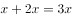，测评Ⅱ合格的产品数为。根据两集合容斥原理公式：，则这批产品非次品数量为，在总数中占比为，则产品总数为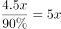，则优品率为。

故正确答案为C。

---

### 第 9 题　qid 2187767 · 数学运算

某单位工会组织桥牌比赛，共有8人报名，随机组成4队，每队2人。那么，小王和小李恰好被分在同一队的概率是：

- **A**. 

　✅
- **B**. 

- **C**. 

- **D**. 

**答案**：A

**官方解析**

方法一：若小王和小李恰好被分在某队，这队人选总情况数为种，则小王小李刚好分在这一队的概率为。由于一共有4队，所以小王和小李可以在4队中任意一队，故小王和小李恰好被分在同一队的概率是。

方法二：若小王分到任意一队，则从其余7个人中抽1个人与小王同队，正好抽到小李的概率为。

故正确答案为A。

---

### 第 10 题　qid 2188498 · 数学运算

甲、乙、丙三个网站定期更新，甲网站每隔48小时，乙网站每隔72小时，丙网站每隔96小时更新一次内容。问在一个星期内至多有几天，三个网站中至少有一个更新内容？

- **A**. 4天
- **B**. 5天
- **C**. 6天
- **D**. 7天　✅

**答案**：D

**官方解析**

由题意可知，甲每天更新一次，乙每天更新一次，丙每天更新一次，要想有更新的天数尽可能多，则三个网站在一周的更新天数应尽可能多，且尽量不重复。安排甲从周一开始更新，则甲在周一、周三、周五、周日均更新一次，此时乙在周一、周四、周日更新，丙分别在周二与周六更新，情况最优，一周内每天均有网站更新。

注：每隔48小时就是每48小时，不需要额外加1小时。

故正确答案为D。

---

### 第 11 题　qid 2187721 · 数学运算

某社团组织周末自驾游，集合后发现小王和小李未到。由于每辆小车限坐5人，按照现有车辆恰有1人坐不上车。为难之际，小王和小李分别开车赶到，于是所有人都坐上车，且每辆车人数均相同。那么，参加本次自驾游的小车数为：

- **A**. 9
- **B**. 8
- **C**. 7　✅
- **D**. 6

**答案**：C

**官方解析**

方法一：设参加本次自驾游的小车总数（包含小王和小李的车）为辆，根据题意可得，包含小王和小李在内的人。因为小王和小李开车赶到后每辆车人数均相同，所以总人数能被整除，是的倍数，所以7应是的倍数，只有C项满足条件。

方法二：代入排除法。

代入A选项，若参加本次自驾游的小车数为9辆，则人，平均每辆车可坐人，不是整数，错误；

代入B选项，若参加本次自驾游的小车数为8辆，则人，平均每辆车可坐人，不是整数，错误；

代入C选项，若参加本次自驾游的小车数为7辆，则人，平均每辆车可坐人，符合条件，正确；

代入D选项，若参加本次自驾游的小车数为6辆，则人，平均每辆车可坐人，不是整数，错误。

故正确答案为C。

---

### 第 12 题　qid 2188500 · 数学运算

加油站营业时间为每日1时到午夜12时，且在每日停业的1小时中进货1万升92号汽油。某月1日开始营业时有92号汽油库存4万升，当日销售92号汽油1万升，但由于周边车流量增加，每日92号汽油销量都比上一日增加1000升。问该加油站如不增加每日的进货量，92号汽油将在哪一日售罄？

- **A**. 11日
- **B**. 10日
- **C**. 9日　✅
- **D**. 8日

**答案**：C

**官方解析**

由“每日停业的1小时中进货1万升，某月1日开始营业时有92号汽油库存4万升”，开始营业是1时，说明4万升已经包含了当日进货的1万升，故1日0时库存为3万升。又“某月1日，当日销售1万升”可得，在不增加车流量的情况下，每日新进货和当日销售额持平，故原库存3万升不会被消耗掉。

考虑在增加车流量的情况下，“比上一日增加1000升”，每日新增销量构成一个首项为0，公差为0.1万升的等差数列。设天内新增销量之和超过3万升，由等差数列求和公式，代入数据可得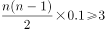，化简得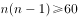。结合选项枚举代入：

当时，，不满足题意；

当时，，满足题意，即汽油将在9日售罄。

故正确答案为C。

---

### 第 13 题　qid 2187825 · 数学运算

小庄要制作一个工业模具。他在一个边长4厘米的正方体上表面正中心位置向下挖掉一个直径2厘米、高2厘米的圆柱体，接着再向下挖掉一个直径1厘米、高1厘米的小圆柱体（如右图所示）。那么，该模具的表面积约为多少平方厘米？

- **A**. 82.8
- **B**. 108.6
- **C**. 111.7　✅
- **D**. 114.8

**答案**：C

**官方解析**

边长4厘米的正方体的表面积为平方厘米。中心位置一个直径2厘米、高2厘米的圆柱体平方厘米，一个直径1厘米、高1厘米的小圆柱体平方厘米。那么，该模具的表面积约为平方厘米。

注：挖掉的大小圆柱体底面的面积，可以叠加还原成最上层的表面，故不需要单独计算圆柱体底面积，只需要计算侧面积即可。

故正确答案为C。

---

### 第 14 题　qid 2187774 · 数学运算

某水渠长100米，截面为等腰梯形，其中渠面宽2米，渠底宽1米，渠深2米。因突降暴雨，水深由1米涨至1.8米。则水渠水量增加了：

- **A**. 112立方米
- **B**. 136立方米　✅
- **C**. 272立方米
- **D**. 324立方米

**答案**：B

**官方解析**

根据题意可得下图，增加的水量断面为梯形EFGM。已知水渠截面为等腰梯形，则米，米；，则，即，米，则米；米，则米。梯形EFGM截面积为平方米。又根据水渠长100米，则水渠水量增加了立方米。

故正确答案为B。

---

### 第 15 题　qid 2187796 · 数学运算

一个班级组织跑步比赛，共设100米、200米、400米三个项目。班级有50人，报名参加100米比赛的有27人，参加200米比赛的有25人，参加400米比赛的有21人。如果每人最多只能报名参加2项比赛，那么该班最多有多少人未报名参赛？

- **A**. 11
- **B**. 12
- **C**. 13　✅
- **D**. 14

**答案**：C

**官方解析**

由“每人最多只能报名参加2项比赛”可得，报名三项的人数为0。设参加两项的人数为，未报名参赛的人为，根据三集合非标准公式可得：，化简得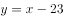。

要让未报名参赛的人最多，则让尽量多。考虑让参加两项的人尽量多，则每人尽量参与两项，此时最多为人，向下取整为36人，即最多为36，故最多为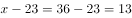人。

故正确答案为C。

---

## 判断推理

### 第 1 题　qid 2187817 · 图形推理

从正方体中裁出如下图所示六个不同的三角形，将其分为两类，使每一类图形都有各自的共同特征或规律，分类正确的一项是：

- **A**. ①②⑤，③④⑥　✅
- **B**. ①⑤⑥，②③④
- **C**. ①③⑤，②④⑥
- **D**. ①②④，③⑤⑥

**答案**：A

**官方解析**

本题为分组分类题目。每个图形都在正方体中裁出了一个三角形，观察发现，①②⑤中三角形的底边和高的长度都等于正方体的棱长，所以三个三角形的面积相同，③④⑥中三角形底边长度等于正方体的棱长，高的长度等于正方体外表面正方形的对角线的长度，所以三个三角形的面积相同。即①②⑤一组，③④⑥一组。
故正确答案为A。

---

### 第 2 题　qid 2188474 · 图形推理

把下面的图形分为两类，使每一类图形都有各自的共同特征或规律，分类正确的一项是：

- **A**. ①②⑤，③④⑥
- **B**. ①③⑤，②④⑥
- **C**. ①④⑥，②③⑤　✅
- **D**. ①②⑥，③④⑤

**答案**：C

**官方解析**

本题为分组分类题目，元素组成不同，优先考虑属性规律。观察题干图形发现，①④⑥均为带有封闭区域的图形，②③⑤均为全开放图形，即①④⑥一组，②③⑤一组。
故正确答案为C。

---

### 第 3 题　qid 2187802 · 图形推理

从所给的四个选项中，选择最合适的一个填入问号处，使之呈现一定的规律性：

- **A**. A
- **B**. B　✅
- **C**. C
- **D**. D

**答案**：B

**官方解析**

元素组成不同，无明显属性规律，考虑数量规律。观察发现，题干图形均有面，考虑数面，数量依次为3、4、5、6、8，没有规律，再观察发现每个图形中均有形状相同的面，且数量依次为2、3、4、5、6，？，问号处图形应该含有7个形状相同的面。A项6个，B项7个，C项2个，D项没有形状相同的面，只有B项符合。
故正确答案为B。

---

### 第 4 题　qid 2187790 · 图形推理

从所给的四个选项中，选择最合适的一个填入问号处，使之呈现一定的规律性：

- **A**. A　✅
- **B**. B
- **C**. C
- **D**. D

**答案**：A

**官方解析**

元素组成不同，无明显属性规律，考虑数量规律。观察发现，图一出现端点较多，B项为日字变形图，都是笔画数特征图，考虑笔画数。题干都是两笔画图形，？处也应该是两笔画图形。A项两笔画，B项一笔画，C项三笔画，D项三笔画，只有A项符合。
故正确答案为A。

---

### 第 5 题　qid 2188409 · 图形推理

下列哪个选项中的图形能够折叠成完整封闭的立体几何结构：

- **A**. A
- **B**. B　✅
- **C**. C
- **D**. D

**答案**：B

**官方解析**

本题考查空间重构。
A项：不能由展开图拼合而成，若想拼合，底面（即最后一行的面）须为正方形，排除；
B项：可以由展开图拼合而成，拼合成的图形为七棱柱，当选；
C项：不能由展开图拼合而成，还需要一个矩形面才能拼合成六棱柱，排除；
D项：不能由展开图拼合而成，还需要一个矩形面才能拼合成六面体，排除。
故正确答案为B。

---

### 第 6 题　qid 2188476 · 定义判断

前摄抑制是指先学习的材料对识记和回忆后学习的材料所产生的干扰作用；倒摄抑制是指后学习的材料对识记和回忆先学习的材料所产生的干扰作用。
根据上述定义，下列选项只包含倒摄抑制的是：

- **A**. 背课文时发现中间段落往往是最难记住的
- **B**. 一天中，人们一般在早晨和夜晚的记忆效果最佳
- **C**. 学习英文字母后，之前学的拼音字母会读错　✅
- **D**. 头部受伤后，回忆不起来之前发生的事情

**答案**：C

**官方解析**

第一步：找出定义关键词。
前摄抑制：“先学习的材料对识记和回忆后学习的材料所产生的干扰作用”；
倒摄抑制：“后学习的材料对识记和回忆先学习的材料所产生的干扰作用”。
第二步：逐一分析选项。
A项：背课文中间段落最难记住，说明前面段落和后面段落都对中间段落产生了影响，即“先学习的材料”和“后学习的材料”分别对“对回忆后学习的材料产生了干扰作用”和“对回忆先学习的材料产生了干扰作用”，因此选项中既包含了前摄抑制，又包含了倒摄抑制，排除；
B项：早晨和夜晚的记忆效果最佳，只是说记忆效果的好坏，并不涉及学习材料，不包含倒摄抑制，排除；
C项：之前的拼音字母会读错，说明后学的英文字母对先学的拼音字母产生了影响，即“后学习的材料对识记和回忆先学习的材料所产生的干扰作用”，选项中只包含倒摄抑制，当选；
D项：由于头部受伤而导致回忆不起来之前的事情，没有提到“先、后学习的材料对识记和回忆后、先学习的材料所产生的干扰作用”，因此选项中既没有包含前摄抑制，也没有包含倒摄抑制，排除。
故正确答案为C。

---

### 第 7 题　qid 2187852 · 定义判断

情感广告是诉诸于消费者的情绪或情感反应，传达商品带给他们的附加值或情绪满足的一种广告策略。这种情绪在消费者心目中的价值可能远远超出商品本身，从而使消费者形成积极的品牌态度。
根据上述定义，下列广告语不属于情感广告的是：

- **A**. 某品牌饮料广告语：“××可乐，中国人自己的可乐！”
- **B**. 某品牌啤酒进入东南亚市场的广告语：“好不好，家乡水。”
- **C**. 某品牌纸尿裤广告语：“宝宝天天好心情，妈妈一定更美丽。”
- **D**. 某品牌润肤露广告语：“为了肌肤柔美润舒，请使用××润肤露。”　✅

**答案**：D

**官方解析**

第一步：找出定义关键词。
“诉诸于消费者的情绪或情感反应”、“传达商品带给他们的附加值或情绪满足的一种广告策略”、“使消费者形成积极的品牌态度”。
第二步：逐一分析选项。
A项：“中国人自己的可乐”，会使消费者产生爱国的情绪满足，符合“传达商品带给他们的情绪满足”，符合定义，排除； 
B项：“好不好，家乡水”，会使消费者产生怀念家乡，以家乡为自豪的情绪满足，符合“传达商品带给他们的情绪满足”，符合定义，排除；
C项：“宝宝天天好心情”，会使消费者产生孩子很舒适的情绪满足，符合“传达商品带给他们的情绪满足”，符合定义，排除；
D项：“为了肌肤柔美润舒”，没有体现出商品的附加值或者情绪满足，不符合定义，当选。
本题为选非题，故正确答案为D。

---

### 第 8 题　qid 2187822 · 定义判断

水体旅游是人们前往水体及周边区域以寻求愉悦为主要目的的一种具有社会、休闲和消费属性的短期经历，目前已逐渐成为人们休闲时尚与区域旅游开发的重要载体。水体旅游资源是指水域（水体）及相关联的岸地、岛屿、林草、建筑等能对人产生吸引力的自然景观和人文景观。
根据上述定义，下列选项不属于水体旅游资源的是：

- **A**. 武夷山“九曲溪”两旁随处可见历代文人墨客的题词
- **B**. 秦淮河岸的街道上，有一座建于明代的“江南贡院”
- **C**. 某森林公园建有一个放养着上千条锦鲤的“放生池”　✅
- **D**. 某大厦矗立于长江岸边，成为游客拍照留念的背景

**答案**：C

**官方解析**

第一步：找出定义关键词。
“水域（水体）及相关联的岸地、岛屿、林草、建筑等”、“对人产生吸引力的自然景观和人文景观”。
第二步：逐一分析选项。
A项：“九曲溪”是水域，历代文人墨客题词，符合“对人产生吸引力的自然景观和人文景观”，符合定义，排除；
B项：秦淮河是水域，河岸街道上建于明代的“江南贡院”，符合“对人产生吸引力的自然景观和人文景观”，符合定义，排除；
C项： “放生池”是人工造的水池，而“水域”指海洋、河流、湖泊等范围，“放生池”并不是“水域”，不符合定义，当选；
D项：长江是水体，矗立于岸边的大厦，符合“对人产生吸引力的自然景观和人文景观”，符合定义，排除。
本题为选非题，故正确答案为C。

---

### 第 9 题　qid 2187831 · 定义判断

在决断之前，每个事物的价值在决策者心中大致相近，则难于决断其优劣；但在作出选择之后，决策者对这些事物的态度评价就发生了改变。这种现象叫作决断后效应。
根据上述定义，下列现象属于决断后效应的是：

- **A**. 某职员对自己的去留一筹莫展，一番考量之后他认为留下来要面对许多复杂关系，不如重新开创新天地
- **B**. 某女士对各有优劣的两个品牌手机难以抉择，最后她从经济角度考虑选择其中一款，可到货后发现这款有色差
- **C**. 某老师对选A还是B去参加比赛犹豫不决，班长建议选B。事后，老师认为选B完全正确，因为B最终夺得冠军
- **D**. 某学生填报志愿时对报甲大学还是乙大学犹豫不决，最后他听从老师建议选择了甲大学，从此觉得甲大学优于乙大学　✅

**答案**：D

**官方解析**

第一步：找出定义关键词。
“决断之前”、“每个事物的价值在决策者心中大致相近”、“作出选择之后”、“决策者对这些事物的态度评价就发生了改变”。
第二步：逐一分析选项。
A项：对自己的去留一筹莫展，符合“决断之前”、“每个事物的价值在决策者心中大致相近”，但考量之后他认为留下来要面对复杂关系，这只是他的认知，并没有进行决断，不符合“作出选择之后”，更不符合“决策者对这些事物的态度评价就发生了改变”，不符合定义，排除；
B项：对两个品牌手机难以抉择，符合“决断之前”、“每个事物的价值在决策者心中大致相近”，最后选择了其中一款，发现有色差，只是描述情况，并没体现“决策者对这些事物的态度评价就发生了改变”，不符合定义，排除；
C项：老师对A与B的选择犹豫不决，符合“决断之前”、“每个事物的价值在决策者心中大致相近”，但赛后认为选B是正确的，是因为他夺冠了的结果证明选择正确，并没体现因为做出决策而对A、B重新评价，不符合“作出选择之后”、“决策者对这些事物的态度评价就发生了改变”，不符合定义，排除；
D项：对甲乙两所大学犹豫不决，符合“决断之前”、“每个事物的价值在决策者心中大致相近”，选择了甲大学之后，觉得甲大学优于乙大学，符合“作出选择之后”、“决策者对这些事物的态度评价就发生了改变”，符合定义，当选。
故正确答案为D。

---

### 第 10 题　qid 2187855 · 定义判断

回弹效应是指通过技术进步提高能源使用效率，节约了能源消费，但技术进步的同时也会促进经济规模的扩大，对能源产生新的需求，从而部分、甚至完全地抵消所节约的能源。
根据上述定义，下列选项可以有效控制回弹效应的是：

- **A**. 发动机效率提升降低了行车成本，更多人选择以车代步
- **B**. 厂商进一步提高能源效率，利润增加，生产出更多产品
- **C**. 太阳能热水器热销，慢慢取代传统电热水器　✅
- **D**. 现在越来越多的消费者购买节能型家用电器

**答案**：C

**官方解析**

第一步：找出定义关键词。
“通过技术进步提高能源使用效率，节约了能源消费”、“技术进步的同时也会促进经济规模的扩大，对能源产生新的需求”、“部分、甚至完全地抵消所节约的能源”。
第二步：逐一分析选项。
A项：更多人选择以车代步，说明对汽车产生了更多的需求，符合“对能源产生新的需求”，汽车使用的多会导致消耗能源更多，会部分抵消发动机效率提升所节约的能源，无法有效控制回弹效应，排除； 
B项：厂商生产出更多产品，说明对生产产品所需的能源有了更多的需求，符合“对能源产生新的需求”，生产更多产品会消耗更多的能源，会部分抵消提高能源效率所节约的能源，无法有效控制回弹效应，排除；
C项：太阳能热水器取代传统电热水器，说明对太阳能产生了更多的需求，符合“对能源产生新的需求”，但太阳能热水器对太阳能的利用并不会抵消所节约的能源，所以可以有效控制回弹效应，当选；
D项：越来越多的消费者购买节能型家用电器，说明对生产节能型家用电器所需的能源有了更多的需求，符合“对能源产生新的需求”，卖出更多节能型家用电器会消耗更多能源，会部分抵消节能电器所节约的能源，无法有效控制回弹效应，排除。
故正确答案为C。

---

### 第 11 题　qid 2187806 · 定义判断

在企业活动中，库存有多种类型。装运库存是指在价值链末端工厂的库房里，那些已经准备好可以随时出货的产品。在途库存又称中转库存，指尚未到达目的地，正处于运输状态或等待运输状态而储备在运输工具中的库存。
根据上述定义，下列选项属于在途库存的是：

- **A**. 小张给自己网购了一件毛衣，下单两天后查知该毛衣已到某中转站
- **B**. 某高速服务区内一辆大货车满载着A超市从B地采购的各类毛巾　✅
- **C**. 某皮鞋厂的卡车里，堆满了该厂用于制造新款皮鞋的牛皮
- **D**. 某公司在城南的自有库房中存放着给城北门店销售的玩具

**答案**：B

**官方解析**

第一步：找出定义关键词。
装运库存：“在价值链末端工厂的库房”、“已经准备好可以随时出货的产品”；
在途库存：“尚未达到目的地”、“正处在运输状态或等待运输状态而储存在运输工具中的库存”。
第二步：逐一分析选项。
A项：小张网购的毛衣已到某中转站，不符合“在价值链末端工厂的库房”，也不符合“正处在运输状态或等待运输状态而储存在运输工具中的库存”，不符合任何一个定义，排除； 
B项：高速公路服务区大货车内的毛巾，符合“尚未达到目的地”且“正处在运输状态或等待运输状态而储存在运输工具中的库存”，符合“在途库存”定义，当选；
C项：皮鞋厂卡车里的牛皮是皮鞋厂的原材料，而不是产品，不符合“在价值链末端工厂的库房里”,且“某皮鞋厂的卡车里”并未指明是“正处于运输状态或等待运输状态”还是“已经到达目的地”，不符合“尚未到达目的地”，不符合任何一个定义，排除；
D项：某公司城南的自有仓库中存放的玩具，符合“在价值链末端工厂的库房”，也符合“已经准备好可以随时出货的产品”，符合“装运库存”定义，不符合“在途库存”定义，排除。
故正确答案为B。

---

### 第 12 题　qid 2188417 · 定义判断

地震震级是通过仪器给出地震大小的一种量度，是划分震源放出能量大小的等级，地震所释放的能量越大，地震震级也越大，每一次地震只有一个震级。地震烈度表示地震对地表及工程建筑物影响的强弱程度，是在没有仪器记录的情况下，凭地震时人们的感觉或地震发生后器物反应的程度、工程建筑物的破坏程度、地表的变化状况而定的一种宏观尺度。
根据上述定义，下列说法正确的是：

- **A**. 地震震级越大，地震烈度相应越强
- **B**. 一次地震只有一个震级，一个烈度
- **C**. 距震源越近，震级越大，烈度越强
- **D**. 地表破坏越严重说明地震烈度越强　✅

**答案**：D

**官方解析**

第一步：找出定义关键词。
地震震级：“通过仪器给出地震大小的一种量度，是划分地震源放出能量大小的等级”、“地震所释放的能量越大，地震震级也越大，每一次地震只有一个震级”；
地震烈度：“表示地震对地表及工程建筑物影响的强弱程度”、“是在没有仪器记录的情况下，凭地震时人们的感觉或地震发生后器物反应的程度、工程建筑物的破坏程度、地表的变化状况而定的一种宏观尺度”。
第二步：逐一分析选项。
A项：题干定义只是分别说了地震震级和地震烈度是什么，两者的关系并没有提及，不符合定义，排除；
B项：一次地震只有一个震级符合“每一次地震只有一个震级”，但只有一个烈度，题干定义并没有提及，不符合定义，排除；
C项：题干定义只是分别说了地震震级和地震烈度是什么，并没有提及震级和烈度与震源远近的关系，不符合定义，排除；
D项：地表破坏越严重说明地震烈度越强，符合 “地震烈度是在没有仪器记录的情况下，凭地震时人们的感觉或地震发生后器物反应的程度、工程建筑物的破坏程度、地表的变化状况而定的一种宏观尺度”，符合地震烈度定义，当选。
故正确答案为D。

---

### 第 13 题　qid 2187858 · 定义判断

刺激泛化是指条件作用的形成使有机体习得了对某一刺激做出特定反应的行为，因此也就可能对类似的刺激做出同样的行为反应。刺激分化是通过选择性强化和消退使有机体学会对条件刺激和与条件刺激相类似的刺激做出不同的行为反应。
根据上述定义，下列说法不正确的是：

- **A**. “一朝被蛇咬，十年怕井绳”属于刺激泛化
- **B**. “横看成岭侧成峰，远近高低各不同”属于刺激分化　✅
- **C**. 为突出品牌，厂家对包装进行独特设计，力图使顾客产生刺激分化
- **D**. 某品牌牙膏创成名牌后，生产商将其生产的化妆品也以同品牌命名，利用的是顾客的刺激泛化

**答案**：B

**官方解析**

第一步：找出定义关键词。
刺激泛化：“条件作用的形成使有机体习得了对某一刺激做出特定反应的行为”、“对类似的刺激做出同样的行为反应”
刺激分化：“通过选择性强化和消退”、“对相类似的刺激做出不同的行为反应”
第二步：逐一分析选项。
A项：被蛇咬后怕井绳是对类似的刺激做出同样的行为反应，符合“刺激泛化”定义，排除；
B项：“横看成岭侧成峰，远近高低各不同”是对同一事物从不同角度的观看所产生的视觉差异，不涉及刺激反应，不符合“刺激分化”定义，当选；
C项：厂家对包装进行独特设计的目的是为了和其他品牌进行区分，想让顾客看到该厂的产品后，做出和看到其他厂商相同产品时不同的反应，符合“通过选择性强化和消退”、“对相类似的刺激做出不同的行为反应”，符合“刺激分化”定义，排除；
D项：生产商将化妆品也以同品牌命名，想让顾客看到同品牌化妆品后也产生名牌的认知，符合“想让消费者对类似的刺激做出同样的行为反应”，符合“刺激泛化”定义，排除。
本题为选非题，故正确答案为B。

---

### 第 14 题　qid 2187813 · 定义判断

二维码是用某种特定的几何图形按一定规律，在平面分布的黑白相间的图形记录数据符号信息。在代码编制上利用“0”“1”比特流的概念，用若干与二进制相对应的几何形体来表示文字数值信息，通过图像输入设备或光电扫描设备自动识读，以实现信息自动处理。一个二维码所能表示的比特数是固定的，它包含的信息越多，则冗余度就越小；反之，冗余度就越大。
根据上述定义，下列选项不符合二维码内涵的是：

- **A**. 某种特定的几何图形按一定规律分布可以构成相应的二维码
- **B**. 二维码中图像代码的基本原理利用的是计算机的内部逻辑基础
- **C**. 把文字数值信息转化成与二进制相对应的几何形体，可供设备识读
- **D**. 二维码包含的信息量都很大，意味着在编码时需要尽量减少冗余度　✅

**答案**：D

**官方解析**

第一步：找出定义关键词。
“用某种特定的几何图形按一定规律”、“在平面分布的黑白相间的图形记录数据符号信息”、“在代码编制上利用‘0’‘1’比特流的概念”、“用若干与二进制相对应的几何形体来表示文字数值信息”、“通过图像输入设备或光电扫描设备自动识读，以实现信息自动处理”、“一个二维码所能表示的比特数是固定的，它包含的信息越多，则冗余度就越小”。
第二步：逐一分析选项。
A项：某种特定的几何图形按一定规律分布符合“用某种特定的几何图形按一定规律”，符合定义，排除；
B项：图像代码的基本原理利用的是计算机的内部逻辑基础，符合“在代码编制上利用‘0’‘1’比特流的概念”，符合定义，排除；
C项：把文字数值信息转化成与二进制相对应的几何形体，可供设备识读，符合“用若干与二进制相对应的几何形体来表示文字数值信息”、“通过图像输入设备或光电扫描设备自动识读，以实现信息自动处理”，符合定义，排除；
D项：根据题干信息，“一个二维码所能表示的比特数是固定的，它包含的信息越多，则冗余度就越小”，即冗余度由信息量大小决定，无法尽量减少冗余度，不符合定义，当选。
本题为选非题，故正确答案为D。

---

### 第 15 题　qid 2188477 · 定义判断

不征税收入是指专门从事特定目的，从性质和根源上不属于营利性活动带来的经济利益，不负有纳税义务并且不作为应纳税所得额组成部分的收入，比如财政拨款、行政事业性收费等；免税收入是纳税人应税收入的重要组成部分，只是国家为了实现某些经济和社会目标，在特定时期或对特定项目取得的经济利益给予的税收优惠照顾，而在一定时期又有可能恢复征税的收入。
根据上述定义，下列说法错误的是：

- **A**. 为鼓励高新技术企业自主创新，政府规定，在近两年内对这类企业研发产品的销售收入暂不收税，因此企业在研发产品上的销售收入属于免税收入
- **B**. 某农产品企业获得了当地政府对农业加工产品的专项财政补贴，该补贴属于不征税收入
- **C**. 国家规定，企业技术转让所得年净收入在30万元以下的，暂免征收所得税，因此这部分所得属于免税收入
- **D**. 为鼓励纳税人积极购买国债，国家规定国债所得利息收入暂不计入应纳税所得额，不征收企业所得税，因此国债利息收入属于不征税收入　✅

**答案**：D

**官方解析**

第一步：找出定义关键词。
不征税收入：“专门从事特定目的”、“从性质和根源上不属于营利性活动带来的经济利益” 、“不负有纳税义务并且不作为应纳税所得额组成部分的收入”。
免税收入：“国家为了实现某些经济和社会目标”、“在特定时期或对特定项目取得的经济利益给予的税收优惠照顾”、“而在一定时期又有可能恢复征税的收入”。
第二步：逐一分析选项。
A项：为鼓励高新技术企业自主创新，符合“国家为了实现某些经济和社会目标”，在近两年内对这类企业研发产品的销售收入暂不收税，符合“在特定时期或对特定项目取得的经济利益给予的税收优惠照顾”，符合“免税收入”定义，排除； 
B项：某农产品企业，符合“专门从事特定目的”，获得了当地政府专项财政补贴，符合“从性质和根源上不属于营利性活动带来的经济利益”，符合“不征税收入”定义，排除；
C项：企业技术转让所得年净收入暂免征收所得税，符合“在特定时期或对特定项目取得的经济利益给予的税收优惠照顾”和“而在一定时期又有可能恢复征税的收入”，符合“免税收入”定义，排除；
D项：为鼓励纳税人积极购买国债，符合“国家为了实现某些经济和社会目标”，规定国债所得利息收入暂不计入应纳税所得额，符合“在特定时期或对特定项目取得的经济利益给予的税收优惠照顾”和“而在一定时期又有可能恢复征税的收入”，符合“免税收入”定义，不符合“不征税收入”定义，错误，当选。
本题为选非题，故正确答案为D。

---

### 第 16 题　qid 2187709 · 类比推理

风霜雨雪：雾里看花

- **A**. 春夏秋冬：踏雪寻梅
- **B**. 金木火土：水中望月　✅
- **C**. 桃李杏橘：青梅煮酒
- **D**. 梅兰竹菊：茜窗画眉

**答案**：B

**官方解析**

第一步：判断题干词语间逻辑关系。
风霜雨雪为四字并列的成语，雾里看花是场景和行为的对应关系，且雾与风霜雨雪是并列关系。
第二步：判断选项词语间逻辑关系。
A项：春夏秋冬为四字并列关系的成语，踏雪和寻梅是两个行为的并列关系，与题干逻辑关系不一致，排除；
B项：金木火土为四字并列的成语，水中望月是场景和行为的对应关系，且水与金木火土是并列关系，与题干逻辑关系一致，当选；
C项：桃李杏橘为四字并列的成语，但是青梅不是场景，与题干逻辑关系不一致，排除；
D项：梅兰竹菊为四字并列的成语，茜窗画眉是场景和行为的对应关系，但茜窗画眉中不包含与梅兰竹菊并列的字，与题干逻辑关系不一致，排除。
故正确答案为B。

---

### 第 17 题　qid 2188412 · 类比推理

西子湖：曹娥江

- **A**. 美人蕉：老婆饼
- **B**. 东坡肉：五柳鱼　✅
- **C**. 女儿红：祖母绿
- **D**. 狮子头：凤凰胆

**答案**：B

**官方解析**

第一步：判断题干词语间逻辑关系。
西子湖即杭州西湖，之所以叫西子湖，是得名于我国四大美女之一的西施。曹娥江，中国东海独流入海河流钱塘江的最大支流，因东汉少女曹娥入江救父而得名。二者都是水域，是并列关系。
第二步：判断选项词语间逻辑关系。
A项：美人蕉是一种植物，老婆饼是一种糕点，二者不是并列关系，与题干逻辑关系不一致，排除；
B项：“东坡肉”是眉山和江南地区的特色传统名菜，相传为北宋词人苏东坡所创制；“五柳鱼”是一道四川名菜，得名于“五柳先生”陶渊明，二者都是菜肴，是并列关系，且均得名于某一人物，与题干逻辑关系一致，当选；
C项：女儿红是糯米酒，祖母绿是绿宝石的一种，二者不是并列关系，与题干逻辑关系不一致，排除；
D项：狮子头是一道菜肴，凤凰胆是一种天然玉石珠，二者不是并列关系，与题干逻辑关系不一致，排除。
故正确答案为B。

---

### 第 18 题　qid 2188411 · 类比推理

仪态万方：美丽多姿

- **A**. 风度翩翩：富富有余
- **B**. 腰缠万贯：富甲一方　✅
- **C**. 其貌不扬：荣华富贵
- **D**. 仪表堂堂：身无长物

**答案**：B

**官方解析**

第一步：判断题干词语间逻辑关系。
仪态万方形容容貌、姿态各方面都很美；美丽多姿也是指姿态美丽，二者是近义关系。
第二步：判断选项词语间逻辑关系。
A项：风度翩翩指仪态万方，气质不凡；富富有余指物品等十分充裕，除满足需要外，还有富余，二者不是近义关系，与题干逻辑关系不一致，排除；
B项：腰缠万贯指人极其富有；富甲一方指拥有的财物在某地方上居第一位，比喻十分富有，二者是近义关系，与题干逻辑关系一致，当选；
C项：其貌不扬指长得不漂亮，相貌普通；荣华富贵比喻兴盛或显达，形容有钱有势，二者不是近义关系，与题干逻辑关系不一致，排除；
D项：仪表堂堂形容人外表端正、举止大方、姿态威严；身无长物指除自身外再没有多余的东西，形容贫穷，二者不是近义关系，与题干逻辑关系不一致，排除。
故正确答案为B。

---

### 第 19 题　qid 2187705 · 类比推理

井底蛙：三脚猫：智慧

- **A**. 笑面虎：变色龙：真诚　✅
- **B**. 千里马：孺子牛：可靠
- **C**. 替罪羊：铁公鸡：坚强
- **D**. 地头蛇：纸老虎：勇敢

**答案**：A

**官方解析**

第一步：判断题干词语间逻辑关系。
“井底蛙”比喻目光短浅，见识狭隘之人；“三脚猫”形容水平不高，粗浅，二者均是缺乏“智慧”的表现，与“智慧”为对应关系。
第二步：判断选项词语间逻辑关系。
A项：“笑面虎”多指笑里藏刀的人，表面上一团和气，背地里总想着怎么排挤别人；“变色龙”比喻在生活中善于变化和伪装的人，或者比喻立场不稳、见风使舵的人，二者均是缺乏“真诚”的表现，与“真诚”为对应关系，与题干逻辑关系一致，当选；
B项：“千里马”比喻人才，“孺子牛”比喻心甘情愿为人民大众服务、无私奉献的人，二者与“可靠”无明显逻辑关系，与题干逻辑关系不一致，排除；
C项：“替罪羊”比喻代人受过的人，“铁公鸡”比喻生活中小气、吝啬、一毛不拔的人，二者与“坚强”无明显逻辑关系，与题干逻辑关系不一致，排除；
D项：“地头蛇”比喻凭借当地势力欺压人民的恶霸，“纸老虎”比喻貌似强大、实际虚弱的人或集团，二者与“勇敢”无明显逻辑关系，与题干逻辑关系不一致，排除。
故正确答案为A。

---

### 第 20 题　qid 2187713 · 类比推理

演员：公园：演出

- **A**. 谣言：微信：查处
- **B**. 股民：股市：投资　✅
- **C**. 士兵：战争：升迁
- **D**. 信息：卫星：定位

**答案**：B

**官方解析**

第一步：判断题干词语间逻辑关系。
演员在公园演出，为人、场所和行为的对应关系，且演出是演员主动发出的动作。
第二步：判断选项词语间逻辑关系。
A项：谣言在微信被查处，不是人、场所和行为的对应关系，且谣言与查处为被动关系，与题干逻辑关系不一致，排除；
B项：股民在股市投资，为人、场所和行为的对应关系，且投资是股民主动发出的动作，与题干逻辑关系一致，当选；
C项：士兵参加战争可能被升迁，但是战争不是场所，且士兵与升迁为被动关系，与题干逻辑关系不一致，排除；
D项：卫星是传播信息的方式，信息可以用于定位，与题干逻辑关系不一致，排除。
故正确答案为B。

---

### 第 21 题　qid 2187711 · 类比推理

骡子：耕畜：犁地

- **A**. 基因：生命：遗传
- **B**. 衙役：衙门：当差
- **C**. 鸬鹚：水鸟：捕鱼　✅
- **D**. 恒星：宇宙：发光

**答案**：C

**官方解析**

第一步：判断题干词语间逻辑关系。
骡子是一种耕畜，二者为包容关系中的种属关系，骡子能犁地，二者为功能的对应关系。
第二步：判断选项词语间逻辑关系。
A项：基因储存孕育生命的信息，二者为对应关系，“基因”是具有“遗传”效应的DNA片段，二者为对应关系，与题干逻辑关系不一致，排除；
B项：衙役指在衙门中当差的人，二者为对应关系，当差是衙役的工作内容，二者为对应关系，与题干逻辑关系不一致，排除；
C项：鸬鹚是一种水鸟，二者为包容关系中的种属关系，鸬鹚能捕鱼，二者为功能的对应关系，与题干逻辑关系一致，当选；
D项：恒星是宇宙的组成部分，二者为包容关系中的组成关系，恒星会发光，二者为属性的对应关系，与题干逻辑关系不一致，排除。
故正确答案为C。

---

### 第 22 题　qid 2187703 · 类比推理

团扇：羽毛扇：舞蹈扇

- **A**. 宣纸：餐巾纸：铜版纸
- **B**. 圈椅：实木椅：办公椅　✅
- **C**. 排球：羽毛球：乒乓球
- **D**. 墨镜：老花镜：显微镜

**答案**：B

**官方解析**

第一步：判断题干词语间逻辑关系。
团扇为圆形或近似圆形，团扇以其形状命名，羽毛扇以其原材料命名，舞蹈扇以其功能命名，三者为交叉关系。
第二步：判断选项词语间逻辑关系。
A项：宣纸产自古代宣州，以其产地命名，餐巾纸以其功能命名，铜版纸以用途命名，与题干逻辑关系不一致，排除；
B项：圈椅以其形状命名，实木椅以其原材料命名，办公椅以其功能命名，三者为交叉关系，与题干逻辑关系一致，当选；
C项：排球以队列的分布命名，羽毛球以其原材料命名，乒乓球以其声音命名，与题干逻辑关系不一致，排除；
D项：墨镜以其颜色命名，老花镜和显微镜都以其功能命名，与题干逻辑关系不一致，排除。
故正确答案为B。

---

### 第 23 题　qid 2187706 · 类比推理

火药：鞭炮：二踢脚

- **A**. 乌铁：刀具：三棱刀
- **B**. 红砖：建筑：四合院
- **C**. 清水：白酒：五粮液　✅
- **D**. 杉木：乐器：六弦琴

**答案**：C

**官方解析**

第一步：判断题干词语间逻辑关系。
火药是制作鞭炮所必需的材料，前两者为必然对应关系；二踢脚是鞭炮的一种，后两者为种属关系。
第二步：判断选项词语间逻辑关系。
A项：乌铁可以作为制作刀具的材料，但不是制作刀具必需的材料，刀具还可以是高速钢、硬质合金、金属陶瓷等，与题干逻辑关系不一致，排除；
B项：红砖可以作为建筑的材料，但不是建筑必需的材料，建筑的材料还可以是灰砂砖等，与题干逻辑关系不一致，排除；
C项：清水是制作白酒所必需的材料，前两者为必然对应关系；五粮液是白酒的一种，后两者为种属关系，与题干逻辑关系一致，当选；
D项：杉木可以用来制作乐器，但不是制作乐器必需的材料，乐器的材料还可以是金属等，与题干逻辑关系不一致，排除。
故正确答案为C。

---

### 第 24 题　qid 2187712 · 类比推理

（  ）之于 风油精 相当于 碳酸 之于（  ）

- **A**. 薄荷脑；可乐　✅
- **B**. 清凉；陈醋
- **C**. 叶绿素；花露水
- **D**. 液体；二氧化碳

**答案**：A

**官方解析**

逐一代入选项。
A项：薄荷脑是风油精的成分，二者是成分对应关系；碳酸是可乐的成分，二者是成分对应关系，前后逻辑关系一致，当选；
B项：风油精具有清凉的作用，二者是功能对应关系；陈醋与碳酸之间没有明显的逻辑关系，前后逻辑关系不一致，排除；
C项：风油精含有叶绿素，二者是成分对应关系，花露水和碳酸之间没有明显逻辑关系，前后逻辑关系不一致，排除；
D项：风油精是一种液体，二者是种属关系；二氧化碳与水反应可以生成碳酸，二者是对应关系，前后逻辑关系不一致，排除。
故正确答案为A。

---

### 第 25 题　qid 2187708 · 类比推理

钟表 之于 （    ） 相当于 （    ） 之于 排字工

- **A**. 时间；印刷工
- **B**. 刻度；线装书
- **C**. 更夫；打印机　✅
- **D**. 油纸；修理工

**答案**：C

**官方解析**

逐一代入选项。
A项：钟表是一种计时的装置，用来提示时间，二者为对应关系；印刷工和排字工是两种职业，二者为并列关系，前后逻辑关系不一致，排除；
B项：钟表有刻度，二者为对应关系；排字工与线装书没有明显的逻辑关系，前后逻辑关系不一致，排除；
C项：更夫是古代每天夜里敲竹梆子或锣在夜间报时的一个职业，更夫与现代的钟表均有提示时间的功能，二者为并列关系；排字工指古代按照原稿把铅字植入排字盘中的一个职业，排字工与现代的打印机具有相同的功能，二者为并列关系，前后逻辑关系一致，当选；
D项：钟表与油纸没有明显逻辑关系；修理工和排字工是两种职业，二者为并列关系，前后逻辑关系不一致，排除。
故正确答案为C。

---

### 第 26 题　qid 2187807 · 逻辑判断

场所恐惧症主要表现为对某些特定环境的恐惧，如高处、广场、客观环境和拥挤的公共场所等，常以自发性惊恐发作开始，然后产生预期焦虑和回避行为，进而出现条件化的形成。一些临床研究表明，场所恐惧症患者常伴有惊恐发作。然而，有专家认为最初一次惊恐发作是场所恐惧症起病的必备条件，因而认为场所恐惧症是惊恐发作发展的后果，应归入惊恐障碍这一类别。
以下哪项如果为真，最能质疑上述专家观点？

- **A**. 
场所恐惧症病程常有波动，许多患者可能短期好转甚至缓解

- **B**. 
场所恐惧症可能与遗传有关，且与惊恐障碍存在一定联系

- **C**. 
研究发现场所恐惧症起病多在40多岁，且病程趋向慢性

- **D**. 
研究发现约有患者的场所恐惧出现于惊恐发作以前
　✅

**答案**：D

**官方解析**

第一步：找出论点和论据。
论点：场所恐惧症是惊恐发作发展的后果，应归入惊恐障碍这一类别。
论据：最初一次惊恐发作是场所恐惧症患者起病的必备条件。
第二步：逐一分析选项。
A项：论点说的是场所恐惧症是惊恐发作发展的后果，选项说的是场所恐惧症的病程，话题不一致，无法削弱，排除；
B项：场所恐惧症与惊恐障碍有一定的联系，但并不明确是否为必要条件关系或因果关系，属于不明确项，无法削弱，排除；
C项：论点说的是场所恐惧症是惊恐发作发展的后果，选项说的是场所恐惧症起病的年龄，话题不一致，无法削弱，排除；
D项：有些患者的场所恐惧症出现在惊恐发作之前，举例说明场所恐惧症并不是惊恐发作发展的后果，否定论点，当选。
故正确答案为D。

---

### 第 27 题　qid 2187783 · 逻辑判断

色素主要为花色甙等酚类物质，它们的颜色构成了葡萄酒的色泽,并且给葡萄酒带来了它们自身的香气和细腻口感。陈年葡萄酒中的颜色主要来源于单宁。单宁除了给酒的色泽作出贡献外，还能作用于口腔产生一种苦涩感，从而促进人们的食欲。单宁含量过高，苦涩味重且酒质粗糙；含量过低则酒体软弱而淡薄。此外，单宁还能掩盖酸味，所以红葡萄酒由于含有丰富的单宁，其酸味明显小于白葡萄酒。
由此可以推出：

- **A**. 陈年葡萄酒会促进食欲，色泽来源于单宁
- **B**. 苦涩味重且酒质粗糙的酒必含有过多单宁
- **C**. 酒体软弱而淡薄的酒中单宁含量必然过低
- **D**. 单宁能影响酒的色泽和饮者的味觉及食欲　✅

**答案**：D

**官方解析**

日常结论题，根据题干信息逐一分析选项。
A项：题干中提及的是单宁能作用于口腔产生一种苦涩感，从而促进人们的食欲，而不是陈年葡萄酒，偷换概念，排除；
B项：题干中只提到了单宁含量过高，苦涩味重且酒质粗糙，并没有说苦涩味重且酒质粗糙的酒必含有过多单宁，无法推出，排除；
C项：题干中只提到了单宁含量过低，则酒体软弱而淡薄，并没有说酒体软弱而淡薄的酒中单宁含量必然过低，无法推出，排除；
D项：单宁能影响酒的色泽和饮者的味觉及食欲，是对题干“单宁除了给酒的色泽作出贡献外，还能作用于口腔产生一种苦涩感，从而促进人们的食欲”整句话的同义替换，当选。
故正确答案为D。

---

### 第 28 题　qid 2187791 · 逻辑判断

如果央行允许人民币继续贬值，那么市场对于人民币贬值的预期就容易强化。如果市场形成较强的人民币贬值预期，大量的资金就会流出我国。资金流出我国，不仅会强化这种人民币的贬值预期，导致更多的资金流出我国，而且可能会导致我国资产价格全面下跌，继而可能引爆金融市场的区域性风险及系统性风险。这些都是我们不愿意看到且不允许出现的情况。
由此可以推出：

- **A**. 货币持续贬值会导致资产全面下跌
- **B**. 资金流失严重会出现货币贬值预期
- **C**. 央行不会允许人民币继续贬值　✅
- **D**. 我国将重点着手干预资金外流

**答案**：C

**官方解析**

日常结论题，根据题干信息逐一分析选项。
A项：题干只是表述货币持续贬值“可能”会导致资产价格全面下跌，而该项说“会”导致，说的过于绝对，无法推出，排除；
B项：题干表述的是较强的人民币贬值预期会出现资金大量流失，该项是资金流失严重会出现货币贬值预期，属于逻辑错误，无法推出，排除；
C项：题干最后一句表明我们不允许出现这种情况，“这种情况”指代的是前文“如果央行允许人民币继续贬值”这种情况，该项属于最后一句的同义替换，可以推出，当选；
D项：我国是否将采取措施干预资金外流，题干没有提及，无中生有，排除。
故正确答案为C。

---

### 第 29 题　qid 2187779 · 逻辑判断

某研究团队让两批测试者分别进入睡眠实验室里睡上一夜。第一批被安排睡得很晚，从而减少总睡眠时间；第二批被安排睡得早，但在睡眠过程中多次被吵醒。第二晚过后，结果就已经显现：第二批测试者的积极情绪受到严重影响。他们的精力水平较低，同情心和友善度等积极情绪指数有所下滑。部分研究者据此认为，被吵醒导致了测试者无法得到足够的慢波睡眠，而慢波睡眠是恢复精力感的关键，但也有研究者对此项研究的可信度提出质疑。
以下哪项如果为真，最能反驳质疑者？

- **A**. 第一批测试者积极情绪的指数下滑程度不太明显　✅
- **B**. 第二批测试者中大部分人长期以来情绪不够积极
- **C**. 两批测试者的健康状况和心理素质原本就很接近
- **D**. 两批测试者在参与睡眠实验前精力水平参差不齐

**答案**：A

**官方解析**

第一步：找出论点和论据。
论点：有研究者对“被吵醒导致了测试者无法得到足够的慢波睡眠，而慢波睡眠是恢复精力感的关键”这一结论的可信度提出质疑。
论据：两批测试者分别进入睡眠实验室里睡上一夜。第一批被安排睡得很晚，从而减少总睡眠时间；第二批被安排睡得早，但在睡眠过程中多次被吵醒。结果显现：第二批测试者的积极情绪受到严重影响。他们的精力水平较低，同情心和友善度等积极情绪指数有所下滑。
第二步：逐一分析选项。
A项：第一批测试者积极情绪的指数下滑程度不太明显，与第二批严重影响做了比较，说明慢波睡眠确实是恢复精力感的关键，补充了实验结果，证明研究是有可信度的，可以削弱质疑者，当选；
B项：第二批测试者中大部分人长期以来情绪不够积极，说明实验前提条件不一致，削弱实验结论，可以支持质疑者，排除；
C项：题干的实验结果是每一个实验对象本身实验前后积极情绪指数的比较，并不是不同的实验对象的积极情绪指数的比较， 所以实验前所有实验对象的健康状况和心理素质的情况对实验的结果不会产生影响，因此该项无法反驳质疑者，排除；
D项：题干的实验结果是每一个实验对象本身实验前后积极情绪指数的比较，所以两批测试者在参与睡眠实验前精力水平参差不齐，无法反驳质疑者，排除。
故正确答案为A。

---

### 第 30 题　qid 2187781 · 逻辑判断

我国在西南地区进行的页岩气勘探获得重大成果，估算天然气资源量达千亿立方米，这是我国首次在四川盆地以外的南方复杂构造区取得页岩气勘探的重大突破。有专家称该地有望成为新的工业气田，可以满足上千万居民的生活和工农业发展的用气需求，促进经济发展。
该专家观点成立的假设前提是：

- **A**. 南方复杂的地质构造有利于天然气生成
- **B**. 凡是勘探到的天然气都能顺利开采出来　✅
- **C**. 我国目前天然气产量无法满足实际需求
- **D**. 天然气作为清洁能源是促进经济发展的重要动力

**答案**：B

**官方解析**

第一步：找出论点和论据。
论点：该地有望成为新的工业气田，可以满足上千万居民的生活和工农业发展的用气需求，促进经济发展。
论据：西南地区进行的页岩气勘探获重大成果，估算天然气资源量达千亿立方米。
第二步：逐一分析选项。
A项：南方复杂的地质构造有利于天然气生成，论点讨论的是该地是否有望成为新的工业气田，而非天然气生成与地质构造的关系，话题不一致，无法加强，排除；
B项：论据中估算该地资源量达千亿立方米，勘探到的天然气都能顺利开采出来，这是一个必要条件，满足这一条件才能有望满足上千万居民的生活和工农业发展的用气需求，是论点成立的前提，可以加强，当选；
C项：我国目前天然气产量无法满足需求，与该地是否能成为新的工业气田无关，无法加强，排除； 
D项：天然气的好处与该地是否能成为新的工业气田无关，无法加强，排除。 
故正确答案为B。

---

### 第 31 题　qid 2188418 · 逻辑判断

月球潮汐力与地球上的地震、海啸、火山爆发等自然灾害存在明显相关性的说法是可疑的，因为每年自然灾害很多，而“超级月亮”每14个月才一次，即便考虑月球经过近地点，每个月也只有一次。部分学者会找出一些和“超级月亮”出现时间相隔不远的灾害来论证，这显然缺乏证据支撑。也忽略了大量事例，比如月球在远地点前后发生的灾害。基于大量关于地震和月球关系数据的研究表明，地震发生频率和月球经过近地点没有统计上的相关性，因此说月球潮汐力会引发地震显然缺乏可靠证据。
由此可以推出：

- **A**. 月球潮汐力与月球在远地点前后发生的地震具有相关性
- **B**. 月球潮汐力与月球经过近地点发生的地震具有因果关系
- **C**. 月球潮汐力与地震之间的关系需要在时间和空间上综合分析　✅
- **D**. 地震触发机制有多种因素，但月球潮汐力的作用效果较明显

**答案**：C

**官方解析**

日常结论题，根据题干信息逐一分析选项。
A项：题干中指出“部分学者会找出一些和‘超级月亮’出现时间相隔不远的灾害来论证”，这显然缺乏证据支撑。也忽略了大量事例，比如“月球在远地点前后发生的灾害”，说明月球潮汐力与月球在远地点发生地震之间没有必然关系，无法推出，排除；
B项：题干中指出“地震发生频率和月球经过近地点没有统计上的相关性”，而选项中说二者是因果关系，无法推出，排除；
C项：题干中指出“‘超级月亮’每14个月才一次”，“地震发生频率和月球经过近地点没有统计上的相关性”，分别从时间和空间的角度说明月球潮汐力与地震等灾害之间没有相关性，那么要想证明月球潮汐力与地震之间的关系也需要在时间和空间上综合分析，可以推出，当选；
D项：题干中指出“月球潮汐力会引发地震显然缺乏可靠证据，”而选项中说明月球潮汐力是地震的触发机制效果较明显,与题干意思相反，无法推出，排除。
故正确答案为C。

---

### 第 32 题　qid 2187788 · 逻辑判断

甲、乙、丙三人大学毕业后选择从事各不相同的职业：教师、律师、工程师。其他同学做了如下猜测：
小李：甲是工程师，乙是教师。
小王：甲是教师，丙是工程师。
小方：甲是律师，乙是工程师。
后来证实，小李、小王和小方都只猜对了一半。那么，甲、乙、丙分别从事何种职业？

- **A**. 甲是教师，乙是律师，丙是工程师
- **B**. 甲是工程师，乙是律师，丙是教师
- **C**. 甲是律师，乙是工程师，丙是教师
- **D**. 甲是律师，乙是教师，丙是工程师　✅

**答案**：D

**官方解析**

题干条件不确定，优先采用代入法。
将A项代入，小李和小方两句都猜错了，而小王两句都猜对了，不符合题干要求，排除；
将B项代入，小李两句一对一错，而小王和小方两句都猜错了，不符合题干要求，排除；
将C项代入，小李和小王两句都猜错了，而小方两句都猜对了，不符合题干要求，排除；
将D项代入，小李、小王和小方都只猜对了一半，符合题干要求，当选。
故正确答案为D。

---

### 第 33 题　qid 2188416 · 逻辑判断

我们身体的生物钟系统会受到许多因素的影响，其中之一就是光照。研究表明，光照可以有效地欺骗大脑进入“白昼模式”，哪怕当时人的眼睛是闭着的也没关系。研究人员发现可以用光照疗法来帮助我们调整时差，包括持续光照和不同间隔的闪光，而每10秒一次持续仅2毫秒的闪光最有效。研究还发现，在睡眠时经历过“闪光处理”的人出现困意的周期会延后两个小时。
以下哪项如果是真，最能支持上述观点？

- **A**. 每次闪光间隙的黑暗都有助于让眼睛重启，从而恢复眼睛对光照的敏感
- **B**. 大部分睡眠时经历“闪光处理”的人的睡眠质量都不会受到闪光的影响
- **C**. 去时区早两小时的城市，启程日日出前两小时经光照疗法的人无时差感　✅
- **D**. 依靠自身来调节时差耗时良久，大概平均每天只能倒过一个小时的时差

**答案**：C

**官方解析**

第一步：找出论点和论据。
论点：我们身体的生物钟系统会受到许多因素的影响，其中之一就是光照。 
论据：研究表明，光照可以有效地欺骗大脑进入“白昼模式”，哪怕当时人的眼睛是闭着的也没关系。研究人员发现可以用光照疗法来帮助我们调整时差，包括持续光照和不同间隔的闪光，而每10秒一次持续仅2毫秒的闪光最有效。研究还发现，在睡眠时经历过“闪光处理”的人出现困意的周期会延后两个小时。
第二步：逐一分析选项。
A项：论点讨论的是光照是否可以影响生物钟系统，该项讨论的是眼睛对光照是否敏感，话题不一致，无法加强，排除；
B项：论据讨论的是闪光处理是否可以延后人出现困意的周期，即让人睡得晚，该项讨论的是“闪光处理”是否会影响睡眠质量，即让人睡不好，话题不一致，无法加强，排除；
C项：该项举例说明去时区早两小时的城市，光照疗法确实可以帮助人调整时差，补充论据加强，当选；
D项：论点讨论的是光照是否可以影响生物钟系统，该项讨论的是自身调节时差需要大量时间，话题不一致，无关选项，无法加强，排除。
故正确答案为C。

---

### 第 34 题　qid 2188482 · 逻辑判断

母亲年龄是唐氏综合征筛查所考虑的风险因素之一。一般认为，母亲年龄越大，宝宝出现遗传异常的风险就越高。当卵子里有一条多余的21号染色体时，胎儿就会出现唐氏综合征。随着女性年龄的增长，出现此类异常的风险也随之升高。最近，一些专家开始对这种筛查方法提出质疑，认为遗传异常并不仅仅只是女方年龄的问题。
以下哪项如果为真，最能支持上述专家质疑？

- **A**. 精子的21号染色体也可能粘连多余的遗传物质，父亲的年龄越大，制造精子过程出错的概率就越高　✅
- **B**. 造成宝宝精神健康问题的重点似乎并不在于母亲的“绝对年龄”，而在于父亲与母亲的“相对年龄”
- **C**. 子宫基本不会随着年龄增长发生变化，只要激素水平充足，年老妇女的子宫也能够正常养育胎儿
- **D**. 现代人因为环境以及生活习惯影响，容易产生基因突变，即便是健康夫妇也有生育“唐氏儿”的风险

**答案**：A

**官方解析**

第一步：找出论点和论据。
论点：遗传异常并不仅仅只是女方年龄的问题。
论据：无。
第二步：逐一分析选项。
A项：精子的21号染色体也可能粘连多余的遗传物质，父亲的年龄越大，制造精子过程出错的概率就越高，说明胎儿出现唐氏综合征不只是母亲的年龄问题，还有父亲的年龄问题，补充论据，可以加强，当选；
B项：论点说的是遗传异常问题，该项说的是宝宝精神健康问题，话题不一致，无法加强，排除；
C项：题干论点说的是遗传异常是否与女性年龄有关，该项是在讨论年老妇女能否正常养育胎儿，遗传异常和正常养育胎儿不是一回事，话题不一致，无法加强，排除；
D项：环境以及生活习惯容易产生基因突变，使得健康夫妇也有生育“唐氏儿”的风险，并没有提到健康夫妇年龄的大小，不能确定女方年龄是否对遗传异常造成影响，无法加强，排除。
故正确答案为A。

---

### 第 35 题　qid 2187782 · 逻辑判断

宇宙加速膨胀是因为物质之间相互排斥，减速膨胀是因为物质之间相互吸引。因此，要在此基础上解释宇宙的加速或减速膨胀，必须要有不同特性的物质在不同的时期占主导地位，从而产生强大的排斥力或吸引力。粒子物理标准模型中的所有粒子都产生吸引的引力，然而星系转动曲线的研究表明，在星系里面还有大量的、看不到的物质，这些物质可以产生非常强大的吸引性引力。
以上论证如果为真，那么星系转动曲线研究结论隐含了下列哪一项前提？

- **A**. 粒子物理标准模型中的所有粒子产生的吸引性引力不足　✅
- **B**. 粒子物理标准模型中的粒子不是唯一的，存在其它粒子
- **C**. 星系转动曲线的研究说明这个时期的宇宙正在加速膨胀
- **D**. 星系转动曲线的研究说明存在超大质量、看不到的黑洞

**答案**：A

**官方解析**

第一步：找出论点和论据。
论点：在星系里面还有大量的、看不到的物质，这些物质可以产生非常强大的吸引性引力。
论据：无。
第二步：逐一分析选项。
A项：题干背景明确说明，要在此基础上解释宇宙的加速或减速膨胀，必须要有不同特性的物质在不同的时期占主导地位，从而产生强大的排斥力或吸引力。粒子物理标准模型中的所有粒子已经都能产生吸引力了，只有它们产生的吸引性引力不足，才需要其他物质有强大的吸引力，该项是论点成立的一个必要条件，补充论据，可以加强，当选；
B项：粒子的唯一性和题干所讨论的论点产生吸引性引力无关，无法加强，排除；
C项：星系转动曲线的研究应该说明这个时期的宇宙正在减速膨胀，与题干所给已知信息不符，无法加强，排除；
D项：论点和论据中没有提到黑洞，该项是无关选项，无法加强，排除。
故正确答案为A。

---

## 资料分析

### 材料 1

根据以下资料，回答以下问题。

注：

1.农村金融机构包括农村商业银行、农村合作银行、农村信用社和新型农村金融机构。

2.其他类金融机构包括政策性银行及国家开发银行、民营银行、外资银行、非银行金融机构、资产管理公司和邮政储蓄银行。

3.净资产额等于总资产额减去总负债额。

#### 第 1 题　qid 2187784 · 比重

2017年5月，股份制商业银行总资产占银行业金融机构的比重与上年相比约：

- **A**. 增加了2个百分点
- **B**. 减少了2个百分点
- **C**. 增加了0.2个百分点
- **D**. 减少了0.2个百分点　✅

**答案**：D

**官方解析**

根据题干“……比重与上年相比约”，结合选项为百分点，判定为两期比重问题。定位统计表，可得：2017年5月股份制商业银行总资产亿元，增长率，银行业金融机构总资产亿元，增长率。根据两期比重差公式：，，因此比重下降，排除A、C，代入公式，，D项最为接近。

故正确答案为D。

---

#### 第 2 题　qid 2188503 · 综合

2016年5月，银行业金融机构总资产金额约为：

- **A**. 227万亿元
- **B**. 217万亿元
- **C**. 207万亿元　✅
- **D**. 197万亿元

**答案**：C

**官方解析**

根据题干“2016年5月，银行业金融机构总资产金额约为”，结合材料时间是2017年5月，可判定本题为基期计算问题。定位统计表可得：2017年5月银行业金融机构总资产为，同比增速为。根据公式，基期万亿元，与C项最接近。

故正确答案为C。

---

#### 第 3 题　qid 2187812 · 综合

2017年5月我国股份制商业银行净资产额约是城市商业银行净资产额的多少倍？

- **A**. 0.5
- **B**. 0.8
- **C**. 1.5　✅
- **D**. 1.8

**答案**：C

**官方解析**

根据题干“2017年5月，······是······的多少倍”，材料已知时间为2017年5月，可判定本题为现期倍数问题。定位统计表可得：2017年5月股份制商业银行的总资产金额为431150亿元，总负债额为402922亿元；城市商业银行的总资产金额为293063亿元，总负债额为273812亿元。根据，可得亿元，亿元，故2017年5月股份制商业银行的净资产额约是城市商业银行的净资产额的倍，C选项最为接近。

故正确答案为C。

---

#### 第 4 题　qid 2187805 · 增长

在2017年5月我国银行业金融机构资产负债表中，下列哪一项的总资产同比增长额最高？

- **A**. 大型商业银行　✅
- **B**. 股份制商业银行
- **C**. 城市商业银行
- **D**. 农村金融机构

**答案**：A

**官方解析**

根据题干“……总资产同比增长额最高”，判定为增长量比较问题。定位统计表，可得：2017年5月大型商业银行总资产为839329亿元，同比增速为；股份制商业银行总资产为431150亿元，同比增速为；城市商业银行总资产为293063亿元，同比增速为；农村金融机构总资产为314519亿元，同比增速为。根据公式，，四个选项的增长量分别为：

A项：；B项：；C项：；D项：。

比较发现，四个选项中，A项分母最小，且分子最大，所以A项最大，即2017年5月大型商业银行总资产同比增长额最高。

故正确答案为A。

---

#### 第 5 题　qid 2188508 · 综合

关于2017年5月我国银行业金融机构资产负债表，下列说法正确的是：

- **A**. 
股份制商业银行总资产额占银行业金融机构总资产额的以上
　✅
- **B**. 
城市商业银行的总资产同比增长额高于其他类金融机构

- **C**. 
城市商业银行净资产额同比增速为

- **D**. 
大型商业银行净资产额为万亿元

**答案**：A

**官方解析**

定位统计表可得：

A项：股份制商业银行总资产额为431150亿元，银行业金融机构总资产额为2328934亿元，则股份制商业银行总资产额占银行业金融机构总资产额的比重为，正确；

B项：城市商业银行总资产为293063亿元，增长率为，增长额亿元。其他类金融机构总资产为450873亿元，增长率为，增长额亿元。，错误；

C项：，则。城市商业银行总资产额约为29.3万亿元，增长率为；总负债额约为27.4万亿元，增长率为。城市商业银行净资产额约为万亿元。根据混合增长率原理“增长率的距离与量成反比”。量之比为，则距离之比，得，错误；

D项：，大型商业银行总资产额为839329亿元，总负债额为770521亿元，总资产额大于总负债额，故净资产额为正，而非负值，错误。

故正确答案为A。

---

### 材料 2

        2017年上半年，全国居民人均可支配收入12932元，比上年同期名义增长，其中，城镇居民人均可支配收入18332元，增长（以下如无特别说明，均为同比名义增长）；农村居民人均可支配收入6562元，增长。

        按收入来源分，2017年上半年，全国居民人均工资性收入7435元，增长，占全国居民人均可支配收入的比重为；人均经营净收入2117元，增长，占全国居民人均可支配收入的比重为；人均财产净收入1056元，增长，占全国居民人均可支配收入的比重为；人均转移净收入2324元，增长，占全国居民人均可支配收入的比重为。

#### 第 6 题　qid 2188469 · 增长

2017年上半年，全国居民消费支出主要数据按消费类别分，其指标的增长率超过全国居民人均消费支出水平增长率的有几个？

- **A**. 4
- **B**. 5　✅
- **C**. 6
- **D**. 7

**答案**：B

**官方解析**

定位表格，可知全国居民消费支出增长率为，按消费类别分，超过全国居民消费支出增长率的有居住、交通通信、教育文化娱乐、医疗保健、其他用品和服务，共5个。 

故正确答案为B。

---

#### 第 7 题　qid 2188713 · 平均数

2016年上半年，城镇居民人均可支配收入约为多少万元？

- **A**. 1.4
- **B**. 1.7　✅
- **C**. 2.1
- **D**. 2.3

**答案**：B

**官方解析**

由题干“2016年上半年······约为多少万元”，结合材料所给时间为2017年，判定此题为基期计算问题。定位文字材料第一段“2017年上半年······城镇居民人均可支配收入18332元，增长”，代入基期计算公式，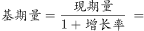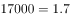万元。

故正确答案为B。

---

#### 第 8 题　qid 2188466 · 平均数

2016年上半年，全国居民人均工资性收入占全国居民人均可支配收入的比重约为：

- **A**. 

- **B**. 

　✅
- **C**. 

- **D**. 

**答案**：B

**官方解析**

由题干“2016年上半年······占······的比重约为”，而材料数据时间为2017年，判定此题为基期比重问题。定位文字材料第一段“2017年上半年，全国居民人均可支配收入12932元，比上年同期名义增长”，定位文字材料第二段“2017年上半年，全国居民人均工资性收入7435元，增长，占全国居民人均可支配收入的比重为”，代入基期比重公式，略大于。

故正确答案为B。

---

#### 第 9 题　qid 2188727 · 平均数

2017年上半年，人均财产净收入比上年约增加多少元？

- **A**. 92　✅
- **B**. 102
- **C**. 112
- **D**. 122

**答案**：A

**官方解析**

由题干“2017年上半年······比上年约增加多少元”，判定此题为增长量计算问题。定位文字材料第二段“人均财产净收入1056元，增长”。代入公式，。

故正确答案为A。

---

#### 第 10 题　qid 2188470 · 综合

关于2017年上半年全国居民收入和消费支出主要数据情况，下列说法正确的是：

- **A**. 生活用品及服务消费支出水平不足交通通信消费支出水平的二分之一　✅
- **B**. 城镇居民人均可支配收入超过农村居民人均可支配收入的3倍
- **C**. 人均财产净收入同比增长率低于人均经营净收入同比增长率
- **D**. 居住消费支出同比增长率高于医疗保健消费支出同比增长率

**答案**：A

**官方解析**

A项：定位表格，可知生活用品及服务消费支出为535元，交通通讯消费支出为1211元。，正确；

B项：定位文字材料第一段，可知城镇居民人均可支配收入为18332元，农村居民人均可支配收入为6562元。，错误；

C项：定位文字材料第二段，可知人均财产净收入同比增长率＞人均经营净收入同比增长率，错误；

D项：定位表格，可知居住消费支出同比增长率＜医疗保健消费支出同比增长率，错误。

故正确答案为A。

---

### 材料 3

<b>根据以下资料，回答以下问题。</b>

        2017年第一季度，某省农林牧渔业增加值361.78亿元，比上年同期增长，高于上年同期0.2个百分点。具体情况如下：

        该省种植业增加值119.21亿元，比上年同期增长。其中蔬菜种植面积358.80万亩，比上年同期增加18.23万亩，蔬菜产量471.42万吨，增长；茶叶种植面积679.53万亩，比上年同期增加19.79万亩，茶叶产量2.30万吨，增长。

        该省林业增加值34.84亿元，比上年同期增长。

        该省畜牧业增加值176.64亿元，比上年同期增长，增速比上年同期加快2.1个百分点。其中生猪存栏增速由上年同期的下降转为增长，出栏增速由上年同期的下降转为增长；猪牛羊禽肉产量67.80万吨，比上年同期增长；禽蛋产量5.33万吨，增长；牛奶产量1.40万吨，增长。

        该省渔业增加值9.22亿元，比上年同期增长。全省水产品产量7.68万吨，比上年同期增长，其中，养殖水产品产量7.3万吨，增长。

        该省农林牧渔服务业增加值21.87亿元，比上年同期增长。

#### 第 11 题　qid 2187795 · 增长

2017年第一季度，该省生猪出栏增速比上年同期：

- **A**. 
加快

- **B**. 
加快

- **C**. 
加快
　✅
- **D**. 
加快

**答案**：C

**官方解析**

定位材料第四段：“出栏增速由上年同期的下降转为增长”，可得，2017年第一季度该省生猪出栏增速为，2016年第一季度该省生猪出栏增速为。故2017年第一季度，该省生猪出栏增速比上年同期加快。

故正确答案为C。

---

#### 第 12 题　qid 2187799 · 比重

2017年第一季度，该省占农林牧渔业增加值比重超过三成的包括：

- **A**. 种植业、渔业
- **B**. 林业、畜牧业
- **C**. 种植业、畜牧业　✅
- **D**. 农林牧渔服务业、林业

**答案**：C

**官方解析**

根据题干“2017年第一季度······比重超过······”，结合材料所给时间为2017年第一季度，可判定本题为现期比重问题。定位材料第一段：“2017年第一季度，某省农林牧渔业增加值361.78亿元”，可得，占农林牧渔业增加值比重超过三成即亿元。定位材料可知增加值超过108.6亿元的包括种植业（119.21亿元）、畜牧业（176.64亿元）。

故正确答案为C。

---

#### 第 13 题　qid 2187786 · 平均数

2016年第一季度，该省平均每亩蔬菜种植地产出蔬菜多少吨？

- **A**. 1.26
- **B**. 1.29　✅
- **C**. 1.31
- **D**. 1.35

**答案**：B

**官方解析**

根据题干“2016年第一季度······平均每亩······多少吨”，结合材料时间为2017年第一季度，可判定本题为基期平均数问题。定位材料第二段：其中蔬菜种植面积358.80万亩，比上年同期增加18.23万亩，蔬菜产量471.42万吨，增长7.5%。可得2016年第一季度蔬菜种植面积，则2016年第一季度平均每亩蔬菜种植地产出蔬菜。

故正确答案为B。

---

#### 第 14 题　qid 2188457 · 增长

2015年第一季度，该省农林牧渔业增加值与下列哪一项最为接近？

- **A**. 320亿元　✅
- **B**. 340亿元
- **C**. 360亿元
- **D**. 380亿元

**答案**：A

**官方解析**

根据题干“2015年第一季度，该省农林牧渔业增加值······”，结合材料为2017年第一季度，可判定本题为间隔基期问题。定位文字材料第一段“2017年第一季度，某省农林牧渔业增加值361.78亿元，比上年同期增长，高于上年同期0.2个百分点”，可得2016年增长率，则根据间隔增长率公式可得2017年第一季度比2015年第一季度的增长率。则2015年第一季度，该省农林牧渔业增加值为亿元，与A项最接近。

故正确答案为A。

---

#### 第 15 题　qid 2187824 · 综合

能够从上述资料中推出或计算出的是：

- **A**. 
2017年该省农林牧渔服务业增加值

- **B**. 
2016年第一季度全国农林牧渔业增加值

- **C**. 
2017年第一季度该省水产品产量中非养殖水产品产量与2016年第一季度持平

- **D**. 
若2017年该省林业增加值每个季度的环比增长率不低于，则2017年该省林业增加值将超过150亿元
　✅

**答案**：D

**官方解析**

A项：定位材料第六段，给出的是2017年第一季度该省农林牧渔服务业增加值与增长率，没有与2017年全年相关的数据，故无法计算；

B项：定位材料第一段，给出的是2017年第一季度该省农林牧渔业增加值，没有与全国相关的数据，故无法计算；

C项：定位材料第五段可知，2017年第一季度全省水产品产量比上年同期增长，养殖水产品产量同比增长。根据混合增长率“整体增速大小居中”的结论，则非养殖水产品的增速也为。增速为正，说明2017年第一季度非养殖水产品产量比2016年第一季度上升了，错误；

D项：定位材料第三段可知，2017年第一季度该省林业增加值为34.84亿元，若每季度环比增长率不低于，则，正确。

故正确答案为D。

注：D项计算量较大，故A、B、C排除后直接选D即可。

---

### 材料 4

        2016年，我国全年完成邮电业务收入总量43344亿元，比上年增长。其中，邮政业务收入7397亿元，增长；电信业务收入35947亿元，增长。邮政业全年完成邮政函件业务36.2亿件，包裹业务0.3亿件，快递业务量312.8亿件；快递业务收入3974亿元。电信业全年新增移动电话交换机容量7318万户，达到218384万户。2016年末全国电话用户总数152856万户（电话包括固定电话和移动电话两种），其中移动电话用户132193万户。移动电话普及率上升至96.2部/百人。固定互联网宽带接入用户29721万户，比上年增加3774万户，其中固定互联网光纤宽带接入用户22766万户，比上年增加7941万户；移动宽带用户94075万户，增加23464万户。移动互联网接入流量93.6亿G，比上年增长。互联网上网人数7.31亿人，增加4299万人，其中手机上网人数6.95亿人，增加7550万人。互联网普及率达到，其中农村地区互联网普及率达到。软件和信息技术服务业完成软件业务收入48511亿元，比上年增长。 

#### 第 16 题　qid 2187787 · 比重

2016年我国快递业务收入占邮电业务收入总量的比重为：

- **A**. 

- **B**. 

　✅
- **C**. 

- **D**. 

**答案**：B

**官方解析**

由题干“2016年······占······的比重为”，结合材料时间为2016年，判定此题为现期比重问题。定位文字材料可知，2016年，我国全年完成邮电业务收入总量43344亿元，快递业务收入3974亿元。根据比重公式可得，比重，B项最为接近。

故正确答案为B。

---

#### 第 17 题　qid 2187792 · 增长

2013～2016年期间，我国移动宽带用户数同比增长最快的年份是：

- **A**. 2013年　✅
- **B**. 2014年
- **C**. 2015年
- **D**. 2016年

**答案**：A

**官方解析**

由题干“2013～2016年…同比增长最快的年份是”，判定此题为一般增长率问题。定位统计图可知，2012年我国移动宽带用户数为23280万户，2013年为40161万户，2014年为58254万户，2015年为70611万户，2016年为94075万户。根据增长率公式，增长率，可得2013～2016年我国移动宽带用户数同比增长率分别为：

2013：；2014：；2015：；2016：。因此2013～2016年我国移动宽带用户数同比增长最快的年份为2013年。

故正确答案为A。

---

#### 第 18 题　qid 2187797 · 综合

2015年我国电信业务收入比邮政业务收入多：

- **A**. 14235亿元
- **B**. 16235亿元
- **C**. 18235亿元　✅
- **D**. 20235亿元

**答案**：C

**官方解析**

由题干“2015年…比…多”，结合材料时间为2016年，判定此题为基期和差问题。定位文字材料可知，“2016年…我国电信业务收入35947亿元，增长”，“2016年…邮政业务收入7397亿元，增长”。根据基期计算公式，基期，可得2015年我国电信业务收入比邮政业务收入多：，因此所求略小于18539，只有C项最为接近。

故正确答案为C。

---

#### 第 19 题　qid 2188730 · 平均数

2012～2016年期间，我国固定互联网宽带接入用户的平均数是：

- **A**. 18425万户
- **B**. 22425万户　✅
- **C**. 25425万户
- **D**. 27425万户

**答案**：B

**官方解析**

根据题干“……平均数是”，结合题干时间均在材料中给出，可判定本题为现期平均数问题。根据表格可得，2012~2016年我国固定互联网宽带接入用户数分别为17518、18891、20048、25947、29721万户。故2012～2016年我国固定宽带接入用户数的平均数，B项最接近。

故正确答案为B。

---

#### 第 20 题　qid 2187804 · 综合

关于我国邮电业务情况的说明，下列说法正确的是：

- **A**. 2015年末，我国固定互联网光纤宽带接入用户与移动宽带用户的差额低于50000户
- **B**. 2016年固定互联网宽带接入用户同比增长率高于移动宽带用户增长率
- **C**. 2016年末，我国使用固定电话的总人数比移动电话的多
- **D**. 2016年我国城市地区互联网普及率已超过一半　✅

**答案**：D

**官方解析**

A项：定位文字材料和图表，2016年固定互联网光纤宽带接入用户22766万户，比上年增加7941万户；2015年移动宽带用户70611万户。根据基期量，则2015年固定互联网光纤宽带接入用户，，错误；

B项：定位文字材料和图表，2016年固定互联网宽带接入用户比上年增加3774万户，2015年固定互联网宽带接入用户数为25947万户；2016年移动宽带用户比上年增加23464万户，2015年移动宽带用户70611万户。根据增长率，则2016年我国固定互联网宽带接入用户同比增长率，移动宽带用户增长率，，错误；

C项：定位文字材料，2016年末全国电话用户总数152856万户（电话包括固定电话和移动电话两种），其中移动电话用户132193万户。固定电话用户，故2016年末我国使用固定电话的总人数比移动电话的少，错误；

D项：定位文字材料，互联网普及率达到，其中农村地区互联网普及率达到。农村地区互联网普及率和城市地区互联网普及率混合为互联网普及率，根据“混合居中”，可得农村地区互联网普及率（）互联网普及率（）城市地区互联网普及率，故城市地区互联网普及率超过一半，正确。

故正确答案为D。

---
