# 2019年420联考《行测》题（吉林乙级）（网友回忆版）

> 联考 · 2019 年 · 6 个模块 · 共 97 题

- [政治理论](#%E6%94%BF%E6%B2%BB%E7%90%86%E8%AE%BA) · 5 题
- [常识判断](#%E5%B8%B8%E8%AF%86%E5%88%A4%E6%96%AD) · 15 题
- [言语理解与表达](#%E8%A8%80%E8%AF%AD%E7%90%86%E8%A7%A3%E4%B8%8E%E8%A1%A8%E8%BE%BE) · 30 题
- [数量关系](#%E6%95%B0%E9%87%8F%E5%85%B3%E7%B3%BB) · 7 题
- [判断推理](#%E5%88%A4%E6%96%AD%E6%8E%A8%E7%90%86) · 30 题
- [资料分析](#%E8%B5%84%E6%96%99%E5%88%86%E6%9E%90) · 10 题

---

## 政治理论

### 第 1 题　qid 2376586 · 马克思主义

习近平总书记在庆祝改革开放40周年大会上的讲话中，引用了恩格斯的名言：“一切社会变迁和政治变革的终极原因，不应当到人们的头脑中，到人们对永恒的真理和正义的日益增进的认识中去寻找，而应当到生产方式和交换方式的变更中去寻找。”这句话蕴含的哲理是

- **A**. 社会存在决定社会意识
- **B**. 经济基础决定上层建筑　✅
- **C**. 主要矛盾决定根本任务
- **D**. 社会实践决定认识成果

**答案**：B

**官方解析**

本题考查政治常识。题干中习近平总书记讲到：“不应当到······而应当到······”强调的是“而应当到”后面的内容，即“生产方式和交换方式的变更中去寻找”。生产方式是指社会生活所必需的物质资料的谋得方式，在生产过程中形成的人与自然界之间和人与人之间的相互关系的体系。人们一般把物质资料生产的物质内容称作是生产力，把其社会形式称作是生产关系，这两者都是生产方式的建设性内容——物质生产方式（物质谋得方式）和社会生产方式（社会经济活动方式）。换言之，生产方式是两者在物质资料生产过程中的能动统一。
A项错误，社会存在是指社会的物质生活过程，其基础及决定力量是物质资料的生产方式；社会意识是指社会的精神生活过程。社会存在决定社会意识，是指社会存在是第一性的，它决定社会意识。题干信息未体现这一哲学原理。
B项正确，经济基础是指由社会一定发展阶段的生产力所决定的生产关系的总和，是构成一定社会的基础；上层建筑是建立在经济基础之上的意识形态以及与其相适应的制度、组织和设施。本题中，“生产方式和交换方式”属于经济基础范畴，“社会变迁和政治变革”属于上层建筑范畴，题干习总书记的这句话体现了经济基础决定上层建筑。
C项错误，党的十九大报告指出“中国特色社会主义进入新时代，我国社会主要矛盾已经转化为人民日益增长的美好生活需要和不平衡不充分的发展之间的矛盾。”题干信息未体现主要矛盾问题。
D项错误，实践对认识具有决定作用：实践是认识的来源，实践是认识发展的动力，实践是认识的目的，实践又是检验认识正确与否的唯一标准。因此，我们要树立实践第一的观点。题干信息未体现这一哲学原理。
故正确答案为B。

---

### 第 2 题　qid 2376590 · 新思想

习近平主席以“我将无我”来表达自己作为国家领导人的使命。下列名言中，与“我将无我”所表达的思想最接近的是

- **A**. 圣人无常心，以百姓心为心　✅
- **B**. 去民之患，如除腹心之疾
- **C**. 民为邦本，本固邦宁
- **D**. 天下兴亡，匹夫有责

**答案**：A

**官方解析**

本题考查人文常识。习近平主席回答意大利众议长菲科问题时说：“这么大一个国家，责任非常重、工作非常艰巨。我将无我，不负人民。我愿意做到一个‘无我’的状态，为中国的发展奉献自己。”“我将无我”强调了习近平主席作为国家元首为民鞠躬尽瘁的情怀。体现了全心全意为人民服务，时刻以人民的利益为重的情怀。
A项正确，“圣人无常心，以百姓心为心”出自老子的《道德经》，意思是：圣人没有固定不变的意志，而是以百姓的意志为意志。这句话也是说明圣人要以百姓的利益为重，以人民的意志为重。符合题干表述。
B项错误，“去民之患，如除腹心之疾”出自宋代苏辙的《上皇帝书》，意思是：去掉老百姓的祸患，如同除去自己的心病一样。与题干意思不符。
C项错误，“民惟邦本，本固邦宁”出自《尚书·五子之歌》意思是：只有以百姓为国家的根本，根本稳固了，国家就安宁了。与题干意思不符。
D项错误，“天下兴亡，匹夫有责”这句话最早是在顾炎武的《日知录·正始》中提出的概念，意思是：天下大事的兴盛、灭亡，每一个老百姓都有义不容辞的责任。与题干意思不符。
故正确答案为A。

---

### 第 3 题　qid 2376595 · 新思想

习近平总书记指出，我国历朝历代在吏治方面留下了很多思想和做法，比如，            中说“国有贤良之士众，则国家之治厚；贤良之士寡，则国家之治薄”，          说“宰相必起于州部，猛将必发于卒伍”，        说“故天将降大任于斯人也，必先苦其心志，劳其筋骨，饿其体肤，空乏其身”等。依次填入横线处正确的是

- **A**. 《论语》  韩非子  墨子
- **B**. 《墨子》  韩非子  孟子　✅
- **C**. 《老子》  孔子  孟子
- **D**. 《荀子》  孟子  墨子

**答案**：B

**官方解析**

本题考查人文常识。“国有贤良之士众，则国家之治厚；贤良之士寡，则国家之治薄”出自《墨子·尚贤上》，意思是：国家拥有贤良的人多了，那么国家的统治就会坚实；贤良的人少了，那么国家的统治就会薄弱。“宰相必起于州部，猛将必发于卒伍”出自战国时期韩非子的《韩非子·显学》，这两句用于强调国家的文臣武将，特别是选拔高层的官员和将领，一定要从有基层实际工作经验的人中选拔。否则处理政务，领兵作战就可能是纸上谈兵，耽误国家大事。“故天将降大任于斯人也，必先苦其心志，劳其筋骨，饿其体肤，空乏其身”出自孟子的《生于忧患 死于安乐》，意思是：所以上天要把重任降临在某人的身上，一定先要使他心意苦恼，筋骨劳累，使他忍饥挨饿，身体空虚乏力。因此，该题三句古文对应的分别是《墨子》、韩非子和孟子。故B项对应正确。
故正确答案为B。

---

### 第 4 题　qid 2376596 · 新思想

今年是中法建交55周年，在同新中国的交往上，法国创下了诸多“第一”。中法合作空间日益广阔，现已结成102对友好省区和城市，形成丰富的地方交流合作网络，2018年中法贸易额创历史新高。习近平主席曾引用中国古语来形容中法友谊不断走向深入，这句中国古语是

- **A**. 天下难事，必作于易；天下大事，必作于细
- **B**. 履不必同，期于适足；治不必同，期于利民
- **C**. 五色交辉，相得益彰；八音合奏，终和且平
- **D**. 合抱之木，生于毫末；九层之台，起于累土　✅

**答案**：D

**官方解析**

本题考查政治常识。2019年3月24-25日，习近平总书记出访法国期间指出，2019年是新中国成立70周年，也是中法建交55周年。2014年3月27日《在中法建交五十周年纪念大会上的讲话》中，习近平主席说，法国有一句谚语:“一点又一点，小鸟筑成巢。”中国也有一句古语:“合抱之木，生于毫末；九层之台，起于累土。”中法友谊是两国人民辛勤耕耘的结果。借此机会，我要向这些为中法友好事业默默奉献的人们致以崇高的敬意!（注：D选项在2014年8月19日《在全国宣传思想工作会议上的讲话》又一次引用。）
故正确答案为D。

---

### 第 5 题　qid 2376589 · 新思想

改革开放四十年来，中国共产党科学地回答了下列重大时代课题，这些时代课题按时间先后排序正确的是
①建设什么样的党、怎样建设党
②什么是社会主义、怎样建设社会主义
③新形势下需要什么样的发展、怎样发展
④新时代坚持和发展什么样的中国特色社会主义、怎样坚持和发展中国特色社会主义

- **A**. ①②③④
- **B**. ①②④③
- **C**. ②①③④　✅
- **D**. ②①④③

**答案**：C

**官方解析**

本题考查政治常识。
① “建设什么样的党、怎样建设党”是“三个代表”回答的时代课题。
② “什么是社会主义、怎样建设社会主义”是“邓小平理论”回答的时代课题。
③ “新形势下需要什么样的发展、怎样发展”是“科学发展观”回答的时代课题。
④ “新时代坚持和发展什么样的中国特色社会主义、怎样坚持和发展中国特色社会主义”是“习近平新时代中国特色社会主义思想”回答的时代课题。
因此顺序为②①③④。
故正确答案为C。

---

## 常识判断

### 第 1 题　qid 2376561 · 人文常识

近年来，我国科技体制改革全面发力、多点突破、纵深发展，在重要领域和关键环节取得实质性突破。从“天眼”探空到“蛟龙”探海，从神舟飞天到高铁奔驰，一系列重大科技创新成果彰显了改革带来的蓬勃创新活力。这表明创新：

- **A**. 是社会发展和变革的先导
- **B**. 决定人类思维方式的变革
- **C**. 是生产力发展的根本动力
- **D**. 推动了社会生产力的发展　✅

**答案**：D

**官方解析**

本题考查政治常识。
A项错误，实践基础上的理论创新是社会发展和变革的先导，而本题中单独讲“创新”是社会发展和变革的先导，表述错误。
B项错误，本身表述错误，创新推动人类思维方式的变革，但不决定。
C项错误，本身表述错误，生产力发展的根本动力是两对矛盾：生产力和生产关系之间的矛盾、经济基础和上层建筑之间的矛盾。
D项正确，题干中“一系列重大科技创新成果”取得实质性突破，带来了创新活力，推动了社会生产力。体现了创新推动社会生产力的发展。
故正确答案为D。

---

### 第 2 题　qid 2376573 · 科技常识

随着医疗产业的发展，医疗领域的人工智能也越来越先进，可以开展健康检测、快速诊断疾病、做手术等。如今，人工智能早已不再是科幻小说中的专有名词，它已经突破了从“不能用”“不好用”到“可以用”的技术拐点，进入了快速发展时期。这反映的哲学原理是：

- **A**. 意识是人脑所特有的机能
- **B**. 意识活动具有主体选择性
- **C**. 人类的认识活动有反复性
- **D**. 实践是认识的来源和动力　✅

**答案**：D

**官方解析**

本题考查政治常识。
A项错误，人脑是高度发达的物质基础，是意识活动的物质器官。人脑结构的复杂性和组织的严密性，决定了它具有产生意识的生理基础。意识是人脑的机能。选项本身表述正确，但题干并非直接反映意识和人脑之间的关系。
B项错误，意识活动具有主动创造性和自觉选择性。意识对客观世界的反映是主动的、有选择的，并不是客观世界有什么就反映什么。题干强调人工智能的不断发展，没有体现出意识选择性地反映客观世界。
C项错误，认识具有反复性。人们对一个事物的正确认识往往要经过从实践到认识、再从认识到实践的多次反复才能完成。题干更强调人工智能的不断发展，而不是对其认识的不断反复。
D项正确，实践是认识的来源。认识是主体对客体的能动的反映，这种反映只有在实践中、在主体和客体的相互作用中才能完成。实践是认识发展的动力。认识产生于实践的需要，人们在实践中不断遇到的新问题、产生的新要求，推动着人们去进行新的探索和研究。随着医疗产业的发展，医疗领域的人工智能也越来越先进，说明随着实践的发展，认识也在不断发展，体现了实践是认识的来源和动力。
故正确答案为D。

---

### 第 3 题　qid 2376578 · 人文常识

1798年，拉普拉斯曾根据牛顿引力理论预言宇宙中存在一种类似于黑洞的天体。1939年，奥本海默等根据广义相对论，进一步证明，一个无压的尘埃球体，在自引力作用下将能坍缩到它的引力半径的范围以内，这就形成黑洞。2019年4月10日，黑洞研究开创性成果——“虚拟望远镜”在2017年拍摄的黑洞照片在全球同时发布，人们对于黑洞的研究又向前迈进了一步。这一过程蕴含的哲理是：

- **A**. 联系具有普遍性和条件性
- **B**. 世界具有统一性和多样性
- **C**. 认识具有反复性和上升性　✅
- **D**. 实践具有客观性和历史性

**答案**：C

**官方解析**

本题考查政治常识。
A项错误，联系具有普遍性和条件性。世界上的一切事物都与周围其他事物有着这样或那样的联系。一切事物的存在和发展都是有条件的。但本题没有体现联系的普遍性和条件性。
B项错误，世界具有物质统一性，世界的本原只有一个，即物质。而物质世界中各种事物和现象都是物质及其存在形式的不同表现。世界具有的统一性和多样性是共性和个性的关系。题干中没有体现世界的统一性和多样性。
C项正确，认识具有反复性。人们对一个事物的正确认识往往要经过从实践到认识、再从认识到实践的多次反复才能完成。从实践到认识、从认识到实践的循环是一种波浪式的前进和螺旋式的上升。题干中对于黑洞从预言到如今照片发布的认识过程，体现了人类认识的反复性和上升性。
D项错误，实践是人类改造客观世界的物质性活动，具有客观物质性和社会历史性。题干强调的是认识活动而非实践。
故正确答案为C。

---

### 第 4 题　qid 2376562 · 人文常识

文风会风体现工作作风，也反映领导干部的能力和水平。下列名言最能体现改进文风会风要求的是：

- **A**. 智者弃短取长，以致其功
- **B**. 一室之不治，何以天下家国为
- **C**. 不学诗，无以言；不学礼，无以立
- **D**. 凫胫虽短，续之则忧；鹤胫虽长，断之则悲　✅

**答案**：D

**官方解析**

本题考查人文常识。
A项错误，“智者弃短取长，以致其功”意思是聪明人舍弃短处，采取长处，取得成功。意在强调做人要扬长避短，与题干要求不符。
B项错误，“一室之不治，何以天下家国为”意思是一间屋子都管理不好，怎么能管理好国家呢？意在强调要自律，重视小事的积累，没有体现改进文风会风的要求。
C项错误，“不学诗，无以言；不学礼，无以立”意思是不学《诗经》，在社会交往中就不会说话；不学礼，在社会上就不能立足。意在强调学习诗礼，与题干要求无关。
D项正确，“凫胫虽短，续之则忧；鹤胫虽长，断之则悲”意思是野鸭的小腿虽然短，续长一截就有忧患；鹤的小腿虽然长，截去一段就会痛苦。告诫我们行事要遵循规律，工作中文风会风也需要结合实际，务求实效，宜短则短，宜长则长，符合题干要求。
故正确答案为D。

---

### 第 5 题　qid 2376567 · 人文常识

公务员小李向上级机关呈送报告时，在报告后附带了请示问题。随后，小李准备邮寄公文。下列说法正确的是：

- **A**. 小李可以通过快递公司送公文
- **B**. 小李可以通过邮政来邮寄公文　✅
- **C**. 呈送的报告中可附带请示问题
- **D**. 报告内容应附于请示公文之后

**答案**：B

**官方解析**

本题考查公文写作与处理。
A项错误，根据《中华人民共和国邮政法》第五十五条规定：快递企业不得经营由邮政企业专营的信件寄递业务，不得寄递国家机关公文。
B项正确，根据《中华人民共和国邮政法》第五条规定：国务院规定范围内的信件寄递业务，由邮政企业专营。
C项错误，根据《党政机关公文处理工作条例》第十五条规定：向上级机关行文，遵循请示应当一文一事，不得在报告等非请示性公文中夹带请示事项的规则。所以呈送的报告中不能附带请示性问题。
D项错误，根据《党政机关公文处理工作条例》第八条规定：报告适用于向上级机关汇报工作、反映情况，回复上级机关的询问；而请示适用于向上级机关请求指示、批准。根据《党政机关公文处理工作条例》第九条规定：附件属于对公文正文的说明、补充或者参考资料。所以报告不应该附于请示公文之后，而是单独呈送。
故正确答案为B。

---

### 第 6 题　qid 2376524 · 人文常识

“秒杀”“专属”“定制”······这些在商场购物中常见的词汇，通常是商家们采取的“饥饿营销”策略。下列因素能够对该策略的效果产生直接影响的是：

- **A**. 居民收入水平
- **B**. 大众消费心理　✅
- **C**. 商家宣传力度
- **D**. 品牌的知名度

**答案**：B

**官方解析**

本题考查经济常识。

A项错误，收入是消费的基础和前提。在其他条件不变的情况下，人们当前的可支配收入越多，对各种商品和服务的消费量就越大。居民收入水平的高低是决定“饥饿营销”策略效果的物质基础。
B项正确，“饥饿营销”是以制造物品的稀缺性来增加产品吸引力，从而提高产品销量。饥饿营销的第一步就是要引起用户对商品的关注，引发购买欲和消费者的急迫心理，因此消费者对商品的兴趣大小对“饥饿营销”策略的效果有着直接的影响。
C项错误，商家的宣传力度大小对于消费者的心理有着直接的影响，间接对营销策略的效果产生影响。
D项错误，品牌知名度对消费者的购买心理也会产生影响，进而对营销策略的效果产生间接影响，而且通过“饥饿营销”来提高产品的知名度也是营销策略的最终目的。
故正确答案为B。

---

### 第 7 题　qid 2376526 · 地理国情

吉林省盛产驰名中外的特产，如长白人参、黄松甸灵芝、梅花鹿茸、林蛙油、黑木耳等。假如吉林省应邀到美国加利福尼亚州参加土特产展览会，请你为此次文化交流拟一个主题，你认为最合适的是：

- **A**. 弘扬传统，推陈出新
- **B**. 面向世界，为我所用
- **C**. 求同存异，文化共享　✅
- **D**. 相互尊重，因地制宜

**答案**：C

**官方解析**

主题是指文艺作品中或者社会活动等所要表现的中心思想，泛指主要内容。
A项错误，根据题干信息“吉林省应邀到美国加利福尼亚州参加土特产展览会”进行文化交流活动，并没有体现出推陈出新信息。
B项错误，根据题干信息“吉林省应邀到美国加利福尼亚州参加土特产展览会”中的美国加利福尼亚州参加土特产展览会并不能代表世界范围，且吉林省参加此次展览会属于文化交流活动，没有体现“为我所用”，更侧重文化交流。
C项正确，根据题干信息吉林省特产资源丰富，被邀请到美国参加土特产展览会进行文化交流活动，体现了差异性，差异性也促进了文化之间的交流和共享。
D项错误，因地制宜的意思是根据各地的具体情况，制定适宜的办法。根据题干信息“吉林省应邀到美国加利福尼亚州参加土特产展览会”属于文化交流活动，因地制宜不能够体现文化交流这一主题。
故正确答案为C。

---

### 第 8 题　qid 2376527 · 人文常识

中国桥的历史悠久，发展于隋，兴盛于宋。下列描述所指的中国四大名桥依次是
①世界上最早的启闭式桥梁
②我国现存年代最早的梁式大石桥
③北京市现存最古老的石造联拱桥
④世界上现存最完整的最早单孔石拱桥

- **A**. 广济桥  洛阳桥  卢沟桥  赵州桥　✅
- **B**. 洛阳桥  赵州桥  卢沟桥  广济桥
- **C**. 广济桥  卢沟桥  赵州桥  洛阳桥
- **D**. 洛阳桥  卢沟桥  广济桥  赵州桥

**答案**：A

**官方解析**

本题考查人文常识。
①广济桥，位于广东省潮州市古城东门外，为古代广东通向闽浙交通要津。广济桥集梁桥、浮桥、拱桥于一体，被著名桥梁专家茅以升誉为“世界上最早的启闭式桥梁”。
②洛阳桥，原名“万安桥”，是北宋泉州太守蔡襄主持建桥工程。位于福建省泉州市东郊的洛阳江上，是世界桥梁筏形基础的开端，是我国现存年代最早的跨海梁式大石桥。
③卢沟桥，位于北京市西南约15公里处。因横跨卢沟河（即永定河）而得名，是北京市现存最古老的石造联拱桥。
④赵州桥，坐落在河北省赵县的洨河上，由著名匠师李春设计建造，距今已有1400多年的历史，是当今世界上现存最早保存最完整的古代单孔敞肩石拱桥。
因此，①是广济桥，②是洛阳桥，③是卢沟桥，④是赵州桥。
故正确答案为A。

---

### 第 9 题　qid 2376532 · 科技常识

下列关于人体衰老的生理现象，说法错误的是

- **A**. 骨组织随人体衰老而钙质渐减，易骨折，创伤愈合缓慢
- **B**. 老年人真皮乳头变低，表皮与真皮界面变平，表皮会变薄
- **C**. 老年人脑重较年轻时减轻，主要原因在于神经细胞的丧失
- **D**. 老年人年龄越大，肌重与体重的比例会越来越高　✅

**答案**：D

**官方解析**

本题考查生物常识。衰老，是指机体各器官功能普遍的、逐渐降低的过程。
A项正确，人体衰老时，骨骼系统的表现是：骨组织随年龄衰老而钙质渐减，骨质变脆，易骨折，创伤愈合也比年轻时缓慢。关节活动能力下降，脊柱变短。
B项正确，人体衰老时，皮肤的表现是：真皮乳头变低，表皮变薄，真皮网状纤维减少，弹性纤维渐失弹性且易断裂，胶原纤维更新变慢，老纤维居多，胶原蛋白交联增加使胶原纤维网的弹性降低。皮肤松弛，真皮含水量降低，皮下脂肪减少，汗腺、皮脂腺萎缩，由于局部黑素细胞增生而出现老年斑。
C项正确，人体衰老时，神经系统的表现是：人脑重较年轻时减轻，造成减重的原因主要在于神经细胞的丧失。这种丧失有区域的特异性，例如大脑不同区域细胞减少程度不同。
D项错误，人体衰老时，肌肉的表现是：老年人肌重与体重之比下降，整个肌肉显得萎缩，这种衰老变化因功能不同而异。
本题为选非题，故正确答案为D。

---

### 第 10 题　qid 2376535 · 人文常识

我国传统民族乐器分为吹奏乐器、弹拨乐器、打击乐器和拉弦乐器四类。下列乐器归类正确的是：

- **A**. 瑟、竹笛属于吹奏乐器
- **B**. 钹、琵琶属于弹拨乐器
- **C**. 磬、扬琴属于打击乐器　✅
- **D**. 筝、司鼓属于拉弦乐器

**答案**：C

**官方解析**

本题考查人文常识。传统民族乐器按照演奏方法大体上可以分为以下四类：
1.吹奏乐器：是由带孔的管子组成，一般是竹制的，比如箫、笛、唢呐、埙等；
2.拉弦乐器：拉弦乐器主要指胡、琴类乐器，比如二胡、板胡、马头琴等；
3.弹拨乐器：是用手指或拨子拨弦，及用琴竹击弦而发音的乐器总称，比如琵琶、筝、瑟、古琴、阮等等；
4.打击乐器：是一种以打、摇动、摩擦、刮等方式产生效果的乐器种类。比如鼓、大锣、小锣、钹等等。
A项错误，竹笛属于吹奏乐器；而瑟，形状似琴，有25根弦，属于弹弦乐器。
B项错误，琵琶属于弹拨乐器；而钹属于打击乐器。
C项正确，磬是一种石制打击乐器；扬琴是击弦乐器，也属于打击乐器。
D项错误，司鼓又称单皮鼓，属于打击乐器；而筝属于弹拨乐器。
故正确答案为C。

---

### 第 11 题　qid 2376439 · 人文常识

2019年央视春晚给观众带来了全新的视觉体验，采用了一系列“黑科技”，包括5G、4K、VR、AR等技术。关于这些“黑科技”，下列说法错误的是

- **A**. 5G是一种移动通信技术
- **B**. 4K是一种网络传播技术　✅
- **C**. VR是一种虚拟现实技术
- **D**. AR是一种通过虚拟增强现实感官的技术

**答案**：B

**官方解析**

本题考查科技常识。
A项正确，5G是指第五代移动电话行动通信标准，也称第五代移动通信技术。与4G网络相比，5G网络不仅传输速率更高，而且在传输中呈现出低时延、高可靠、低功耗的特点。
B项错误，4K，是一种高清显示技术。主要应用于电视行业、电影行业、手机行业等。在数字技术领域，通常采用二进制运算，而且用构成图像的像素来描述数字图像的大小。由于构成数字图像的像素数量巨大，通常以K来表示，因此4K分辨率即4096×2160的像素分辨率，属于超高清分辨率。在此分辨率下，观众将可以看清画面中的每一个细节。因此，4K并不是网络传播技术。
C项正确，虚拟现实技术（Virtual Reality），简称VR。它是一种可以创建和体验虚拟世界的计算机仿真系统，它利用计算机生成一种模拟环境，使用户沉浸到该环境中。
D项正确，增强现实技术（Augmented Reality），简称AR。它是一种实时地计算摄影机影像的位置及角度并加上相应图像、视频、3D模型的技术。这种技术的目标是在屏幕上把虚拟世界套在现实世界并进行互动。随着随身电子产品CPU运算能力的提升，预期增强现实的用途将会越来越广。
本题为选非题，故正确答案为B。

---

### 第 12 题　qid 2376435 · 人文常识

关于蔬菜的保健功能，下列对应正确的是

- **A**. 芹菜——安五脏，除胃中热
- **B**. 苦瓜——调味增食欲，抑菌杀菌
- **C**. 苦苣——清热解毒，治疗痢疾　✅
- **D**. 韭菜——止血、益气、利尿，降血压

**答案**：C

**官方解析**

A项错误，根据《千金食治》菜蔬第三（五十八条）：“韭∶味辛、酸、温、涩、无毒。辛归心，宜肝。可久食。安五脏，除胃中热。”因此，“安五脏，除胃中热”的是韭菜。
B项错误，苦瓜具有生津消暑、促进食欲、增强免疫力的作用，一般具有杀菌作用的蔬菜主要指葱蒜类，如大蒜、大葱、韭菜、洋葱、青蒜、蒜苗等。
C项正确，苦苣性寒味苦，具有清热解毒、凉血的功效。用于治疗痢疾、黄疸等。
D项错误，芹菜的功效是止血、益气、利尿，降血压，而不是韭菜。
故正确答案为C。

---

### 第 13 题　qid 2376436 · 科技常识

下列生活常识中，说法错误的是

- **A**. 饮酒导致的脂肪肝可能发展成肝硬化
- **B**. 发烧时多喝水可降低体温和排出毒素
- **C**. 经常吃冷冻肉有利于延缓人体的衰老　✅
- **D**. 茶杯壁上的茶垢并不会危害身体健康

**答案**：C

**官方解析**

本题考查生活常识。需结合具体选项予以分析。
A项正确，饮酒导致的脂肪肝，如果不能及时的发现并进行对应治疗的话，酒精性脂肪肝就会演变成肝硬化。
B项正确，发烧是身体机能受到外界病毒或者细菌侵袭时的一种自我保护反应，一般情况下，身体温度升高，可以促使身体分泌更多的白细胞来杀死入侵身体的细菌，发烧时多喝水，可以加快新陈代谢，通过排汗、排尿来降低身体温度，同时也可以排除体内毒素。
C项错误，肉品经冷冻能较长时间的储存和运输，但冷冻肉并不能延缓人体的衰老。
D项正确，茶垢是茶叶中的鞣质（一种复杂的酚类有机物，化学性质很不稳定）暴露在空气中被氧化、聚合形成的棕红色化合物，难溶于水，慢慢从茶叶中沉淀出来，依附在杯壁或壶壁上。茶垢本身并不会危害人体健康。
本题为选非题，故正确答案为C。

---

### 第 14 题　qid 2376437 · 科技常识

二氧化碳虽然只占了空气总体积的0.03，但对动植物的生命活动起着极为重要的作用。自然界中二氧化碳的循环与下列过程<b>无关</b>的是

- **A**. 人和动物的呼吸
- **B**. 发展利用氢燃料　✅
- **C**. 含碳燃料的燃烧
- **D**. 植物的呼吸作用

**答案**：B

**官方解析**

本题考查生物常识。需结合具体选项予以分析。
A项正确，人和动物的呼吸会产生二氧化碳。
B项错误，氢燃料燃烧的产物是水，没有二氧化碳。
C项正确，含碳燃料燃烧会产生二氧化碳。
D项正确，植物的呼吸作用会产生二氧化碳。
本题为选非题，故正确答案为B。

---

### 第 15 题　qid 2376438 · 人文常识

蛋白质是维持人体生命活动所必需的营养物质。下列关于蛋白质说法错误的是

- **A**. 蛋白质在生命活动中具有遗传信息功能　✅
- **B**. 皮肤中存在大量胶原蛋白
- **C**. 蛋白质的基本单元结构是氨基酸
- **D**. 羊毛和蚕丝的主要成分是蛋白质

**答案**：A

**官方解析**

本题考查生物常识。需结合具体选项予以分析。

A项错误，蛋白质在生命活动中的主要作用是提供生物结构的骨架，在细胞和生物体内各种生物化学反应中起催化作用，调节重要生理机能。

B项正确，胶原蛋白能维持皮肤与器官的形态和结构，组成了75的真皮部分，让皮肤看起来既有弹性又有光泽。

C项正确，氨基酸是蛋白质的基本组成单元。

D项正确，羊毛和蚕丝属于天然纤维，主要成分为蛋白质，燃烧时有烧焦羽毛的特殊气味。

本题为选非题，故正确答案为A。

---

## 言语理解与表达

### 材料 1

<b>阅读下面的短文，回答</b><b>46-50</b><b>题。</b>

①牛油果进口量在微博热搜上火了。这种其貌不扬、吃起来不像水果的水果，2010年时我国进口量还不足2吨，但2017年一下子<u>      </u>至32100吨，增长16000多倍。爆炸式增长，源于健康标签，富含单不饱和脂肪酸、膳食纤维和钾等，让牛油果成了诸多健身人士<u>      </u>的健康食品。

②我们周围，大概总有几个对体重“斤斤计较”的朋友。他们与碳水化合物“渐行渐远”，与高糖高油“势不两立”，将“燃烧我的卡路里”挂在嘴边，但也听得进营养学家建议：健康饮食不等于“饿着”。所以，诸如牛油果、藜麦等食品异军突起，成为健康、时尚饮食观念的代名词。

③“卡路里经济学”的外延，当然不止于饮食。放眼望去，运动装备已从跑鞋晋升到手环，手机里总装着一两个运动APP，每天走了多少步、摄入多少卡、消耗多少卡，一一清晰记录。浴室里，用电子秤定时称重，也成了对自己意志毅力的称重；健身房里，不满足自己练，一对一的私教课正风靡。

④人类与卡路里的较量，其实有很长的历史了。《卡路里与束身衣》一书，就揭示了人类两千多年的节食史。然而，身体管理与商业的完美结合，却是很晚近的事。这其中，电视广告、营养学与运动的普及功不可没。

⑤当然，大众参与到身体管理，归根到底还是因为“仓廪实”。2018年，我国的恩格尔系数已降至，这意味着，人们花在食物上的开支比重更少了，消费结构继续升级。

⑥当然，“卡路里经济学”之所以带来商机，也有流行文化的支持。如今，运动社交一定程度上也引爆了健康产业。朋友相聚，一起健身的多了，三五好友报名跑马拉松之风，甚至带动了国内城市马拉松赛事的火热。互相关注每天行走步数，定期晒出健身照片与记录，运动社交让生活多了新的仪式感与认同感。这样的文化心理，也在助推“卡路里经济学”的蓬勃发展。

#### 第 1 题　qid 2376651 · 逻辑填空

填入第①段划横线部分最恰当的一组是

- **A**. 扩大  追捧
- **B**. 提高  乐见
- **C**. 增长  垂青
- **D**. 飙升 青睐　✅

**答案**：D

**官方解析**

第一空，文段论述牛油果的进口量增长幅度很大，呈现出“爆炸式增长”的情况，横线处表示2017年的进口数量一下子增长了很多。A项“扩大”可搭配面积，与数量搭配不当，排除；B项“提高”可搭配能力、水平、素质，与数量搭配不当，排除。对比C项“增长”、D项“飙升”，二者的区别在于程度不同，D项“飙升”表示增长的幅度很大，与文段“爆炸式增长”对应更恰当，故锁定D项。
验证第二空，D项“成了诸多健身人士青睐的健康食品”表示牛油果很受健康人士的欢迎，符合文意，验证正确。
故正确答案为D。
【文段出处】《牛油果的“卡路里经济学”》

---

#### 第 2 题　qid 2376653 · 片段阅读

“牛油果爆红的背后，是‘卡路里经济学’的兴起。”这句话是原文中独立的一段，它的最恰当位置是

- **A**. ①和②之间　✅
- **B**. ②和③之间
- **C**. ③和④之间
- **D**. ④和⑤之间

**答案**：A

**官方解析**

题目中句子为“牛油果爆红的背后，是‘卡路里经济学’的兴起”，出现两个话题，即“牛油果”和“卡路里经济学”，首段已经出现“牛油果”，“兴起”说明该句引出话题“卡路里经济学”，应先引出话题，再论述关于该话题的内容，文章第③、④段均已经在论述“卡路里”，故题目中的句子应在③前，排除C、D项。
③段“‘卡路里经济学’的外延，当然不止于饮食······”，接着论述“卡路里经济学”在其他方面的体现，“不止于饮食”说明第②段“碳水化合物”、“健康饮食”等论述“卡路里经济学”在饮食方面的体现，则引出话题的句子应放在②前，对应A项。
故正确答案为A。
【文段出处】《牛油果的“卡路里经济学”》

---

#### 第 3 题　qid 2376654 · 片段阅读

以下观点，不能从原文中得出的是

- **A**. 电视广告促进了身体管理与商业的结合
- **B**. 牛油果的健康标签使人们对它钟爱有加
- **C**. 营养学家在客观上助推了牛油果的爆红
- **D**. 流行文化是卡路里经济蓬勃发展的根源　✅

**答案**：D

**官方解析**

A项，根据第四段“然而，身体管理与商业的完美结合，却是很晚近的事。这其中，电视广告、营养学与运动的普及功不可没”可知，表述正确；
B项，根据第一段“爆炸式增长，源于健康标签”可知，表述正确；
C项，根据第二段“但也听得进营养学家建议：健康饮食不等于‘饿着’。所以，诸如牛油果、藜麦等食品异军突起，成为健康、时尚饮食观念的代名词。”可知，营养学家对牛油果等食品能够异军突起发挥了重要作用，表述正确；
D项，根据第六段，“当然，‘卡路里经济学’之所以带来商机，也有流行文化的支持”可知，“根源”程度过重，与文意不符。
本题为选非题，故正确答案为D。
【文段出处】《牛油果的“卡路里经济学”》

---

#### 第 4 题　qid 2376655 · 片段阅读

根据原文，促使大众参与身体管理的根本原因是

- **A**. 运动社交的文化心理
- **B**. 大众生活水平的提高　✅
- **C**. 体育用品市场的繁荣
- **D**. 健康生活理念的普及

**答案**：B

**官方解析**

重点关注第五段，该段首句指出“大众参与到身体管理，归根到底还是因为‘仓廪实’。”，“仓廪实”本意为粮仓充足，意味着生活富足。随后通过一组数据进一步解释“仓廪实”，指出恩格尔系数下降，人们花费在食物上的开支比重减少了，这体现出的是人们生活水平的提高，对应B项。
A项“文化心理”、D项“健康的生活理念”均属于精神层面，而“仓廪实”指的是物质水平的提高，排除；C项“体育用品市场”与文意无关，排除。
故正确答案为B。
【文段出处】《牛油果的“卡路里经济学”》

---

#### 第 5 题　qid 2376656 · 片段阅读

最适合做这篇文章标题的是

- **A**. 牛油果的“卡路里经济学”　✅
- **B**. 卡路里燃烧，烧热运动社交
- **C**. 用仪式唤醒健康生活
- **D**. “卡路里经济”，明天值得期待

**答案**：A

**官方解析**

篇章开篇即提出“牛油果火了”的现象，然后指出“牛油果火了”的原因与“卡路里”有关。接着篇章进一步提出“卡路里经济学”的概念，并解释说明了“卡路里经济学”蓬勃发展的原因。故篇章意在说明“牛油果火了”这一现象反映出的“卡路里经济学”，对应A项。
B项，“运动社交”仅为“卡路里经济学”带来商机的一个方面的原因，表述片面，排除；
C项，缺少“卡路里经济学”这一主题词，偏离文段中心，排除；
D项，篇章已表明今天的卡路里经济学已经带来了商机，“明天值得期待”与文段时态不符，排除。
故正确答案为A。
【文段出处】《牛油果的“卡路里经济学”》

---

#### 第 6 题　qid 2376616 · 逻辑填空

韩愈云：“千里马常有，而伯乐不常有。”这里说的伯乐，就是千里马的“贵人”，如果没有伯乐出现，千里马也会淹没于芸芸众“马”之中虚耗宝贵年华。古往今来，很多功成名就者都是在关键时刻遇上            的“贵人”，加之自身的实力和努力没有辜负“贵人”所赐予的机遇，终得以            。

填入划横线部分最恰当的一组是：

- **A**. 火眼金睛  脱颖而出
- **B**. 慧眼识珠  有所作为　✅
- **C**. 独具慧眼  崭露头角
- **D**. 明察秋毫  出人头地

**答案**：B

**官方解析**

第一空，由前文“如果没有伯乐出现，千里马也会淹没于芸芸众‘马’之中虚耗宝贵年华”可知，横线处表达“贵人”能够在众多马之中找出千里马，体现其眼光敏锐之意。B项“慧眼识珠”指具有独到眼光，高明的见解，C项“独具慧眼”指能看到别人看不到的东西，形容眼光敏锐，见解高超，B、C两项均符合文意，保留。A项“火眼金睛”形容人的眼光锐利，能够识别真伪，与文意不符，排除；D项“明察秋毫”原形容人目光敏锐，任何细小的事物都能看得很清楚，现多形容人能洞察事理，与文意不符，排除。
第二空，由前文“功成名就者”可知，横线处表达其最终取得了成功，B项“有所作为”指可以做事情，并能取得较大的成绩，符合文意，当选。C项“崭露头角”比喻突出地显露出才能和本领，无法体现成功之意，排除。
故正确答案为B。
【文段出处】《你生命中的那些“贵人”》

---

#### 第 7 题　qid 2376618 · 逻辑填空

最初版本的个税APP启用以后，人们对租户必须填写房东信息产生质疑，担心此举会导致房东多缴一笔出租税，因而房东通过涨房租来对冲损失，客观上造成了房东和租户的零和博弈，这显然不是减税政策的本意。新版个税APP，正是意在回应舆论关于国家减税降负诚意的质疑。就实际效果来说，新版个税APP一经公布，公众就掀起一片力挺之声，安抚效应可谓            。

填入划横线部分最恰当的一项是：

- **A**. 显而易见
- **B**. 卓有成效
- **C**. 立竿见影　✅
- **D**. 一蹴而就

**答案**：C

**官方解析**

文段首先指出在最初个税APP启用以后出现了问题，不符合减税政策的本义。接着文段指出新版个税APP发布后，减轻了公众的质疑，通过“新版个税APP一经公布，公众就掀起一片力挺之声”，表明横线所填成语表示新版个税APP的安抚效应是立即就产生，立刻就有了效果，C项“立竿见影”比喻立刻见到功效，常与“效应”搭配，符合文意，为正确答案。
A项，“显而易见”形容事情或道理很明显，很容易看清楚，多用于说话、写文章等，不能体现出立刻就产生效果，排除；B项，“卓有成效”形容有突出的成绩和效果，通常与工作、做事情等搭配，与“效应”搭配不当，排除；D项，“一蹴而就”形容事情很容易办成，与文意不符，排除。
故正确答案为C。
【文段出处】《个税App不再收集房东信息，稳定普惠减税预期》

---

#### 第 8 题　qid 2376623 · 语句表达

作为网络时代表达情感的一种方式，表情包已经融入网友们的交流之中，各种表情包层出不穷，                    ，好不热闹。

填入划横线部分最恰当的一项是：

- **A**. 青出于蓝胜于蓝
- **B**. 这山望着那山高
- **C**. 前有轱辘后有辙
- **D**. 你方唱罢我登场　✅

**答案**：D

**官方解析**

依据前文，横线处与前文语义相近。“层出不穷”意指接连不断地出现，尚未穷尽。D项“你方唱罢我登场”意为你刚唱完，我就登上场来，体现出接连不断的意思，能够与“层出不穷”构成并列，当选。
A项“青出于蓝胜于蓝”指人经过学习之后可以得到提高,常指学生超过老师；B项“这山望着那山高”比喻对自己目前的工作或环境不满意,老认为别的工作、别的环境更好；C项“前有轱辘后有辙” 前边有车行过，后边就有车辙，比喻前人取得了经验教训，后人就有了可以遵循的榜样。均无法与“层出不穷”构成并列，排除。
故正确答案为D。
【文段出处】《文物表情包制作 娱而不能愚》

---

#### 第 9 题　qid 2376626 · 逻辑填空

面对流行语，我们可以根据不同情境进行取舍、组合，使精神状态得以         ，在遭遇生活的坚硬时更富于        。
填入划横线部分最恰当的一项是：

- **A**. 放松  柔性
- **B**. 调适  弹性　✅
- **C**. 缓冲  耐性
- **D**. 改变  韧性

**答案**：B

**官方解析**

第一空，搭配“精神状态”，横线处要体现出由于“根据不同情境进行取舍、组合”导致精神状态发生调整、变化。
A项“放松”指对事物的注意或控制由紧变松，C项“缓冲”指冲突缓和，发现“放松”对应紧张，“缓冲”对应冲突，均只对应一种情况，但横线要体现出对“不同情境进行取舍、组合”进行调整，故不符合文意，排除；B项“调适”、D项“改变”均有调整、变化之意，符合文意。
第二空，横线搭配“精神状态”，由“根据不同情境进行取舍、组合”可知，横线应体现“在遭遇生活的坚硬时”，精神状态可以调整。B项“弹性”指事物可依实际需要加以调整，侧重“能屈能伸”像弹簧一样，放在此处体现出当生活坚硬时，精神状态要“变软”，弹性调节一下，符合文意，当选。
D项“韧性”，指顽强持久的精神，侧重强调“坚韧”，与“坚硬”对应不当，排除。
故正确答案为B。
【文段出处】《从网络热词看生活热度》

---

#### 第 10 题　qid 2376628 · 逻辑填空

以家为         的家族文化传承，把家风、家教、家规、家德注入每代传承人心中，融入到企业文化中，形成部分老字号维系生存的         。
填入划横线部分最恰当的一项是：

- **A**. 桥梁  动力
- **B**. 媒介  根底
- **C**. 源头  基础
- **D**. 依托  根脉　✅

**答案**：D

**官方解析**

第一空，横线处要体现“家”对于“家族文化传承”很重要，通过后文“把家风、家教、家规、家德注入每代传承人心中”可知，需要依靠“家”才能传承家族文化，D项“依托”指依靠凭借，符合文意，保留。C项“源头”指水发源处，比喻事物的本源，可理解为家族文化来源于家，也可保留。A项“桥梁”、B项“媒介”指建立双方联系的途径，体现不出“家”对于“家族文化”起到的作用，均排除。
第二空，横线处体现出“家族文化传承”把“家”的很多信条注入每代传承人心中，维系老字号的生存，D项“根脉”与C项“基础”语意均符合，但D项“根脉”更加形象、生动，对比优选。
故正确答案为D。
【文段出处】人民日报《忠厚如何传家“酒”》

---

#### 第 11 题　qid 2376657 · 逻辑填空

维护网络在线教育市场的正常秩序，<u> </u><u>           </u>。首先需要加强监管。网络在线教育是一个新生事物，是“”的新兴产业，怎么管、谁来管、管什么等一系列问题，尚待厘清。<u> </u><u>           </u>是在立法等制度设计层面划定相关准入门槛。 

填入划横线部分最恰当的一项是：

- **A**. 迫在眉睫  当务之急　✅
- **B**. 责无旁贷  重中之重
- **C**. 刻不容缓  首当其冲
- **D**. 至关重要  燃眉之急

**答案**：A

**官方解析**

第一空，对应“维护网络在线教育市场的正常秩序”，A项“迫在眉睫”比喻事情已到眼前，非常紧迫；C项“刻不容缓”形容情势或事情非常紧迫；D项“至关重要”意为相当重要，放在横线处均符合文意，保留。
B项“责无旁贷”意为自己的责任不能推卸给别人，故应衔接“主语”，不适合用在文段，排除。
第二空，根据横线前“首先需要加强监管······怎么管、谁来管、管什么”与横线后“在立法等制度设计层面划定相关准入门槛”可知，应先划定相关准入门槛，然后再考虑“怎么管、谁来管、管什么”。A项“当务之急”意为当前急需办的事，符合语境，当选。C项“首当其冲”意为首先受到冲击，遭受灾难，意思不符，排除；D项“燃眉之急”形容事情非常急迫，常用语境为“······以解燃眉之急”，排除。
故正确答案为A。
【文段出处】《给学生减负须“线下线上”同步》

---

#### 第 12 题　qid 2376658 · 逻辑填空

“爱的匮乏限制了我们对人生的想象力。”我们常常说，因为我们缺爱，所以没有安全感。也许是我们            了，是因为我们拿不出爱，我们才会有庞大的不安全感。你自己不愿意先拿出来，对世界的        才是无爱的。

填入划横线部分最恰当的一项是：

- **A**. 舍本逐末  回应
- **B**. 本末倒置  投射　✅
- **C**. 吹毛求疵  认识
- **D**. 舍近求远  映射

**答案**：B

**官方解析**

第一空，根据文意可知，针对“缺少安全感的原因”，横线后认为“不愿意先付出爱”是其原因，横线前认为“缺爱”，即无人给予关爱是其原因，前后原因刚好相反。A项“舍本逐末”比喻做事不抓住主要的问题，而专顾细枝末节。现多用于指轻重主次颠倒，不会明辨轻重缓急，B项“本末倒置”比喻把主要的和次要的、本质和非本质的关系弄颠倒了，均符合文意，保留。C项“吹毛求疵”比喻故意挑剔别人的缺点，寻找差错，D项“舍近求远”形容做事走弯路，均与文意不符，排除。
第二空，根据文意可知，横线处应体现我们对世界的一种主动的行为。B项“投射”指发射，投掷，是一种主动的行为，符合文意，当选。A项“回应”指回答，答应，通常为被动，与文意不符，排除。
故正确答案为B。
【文段出处】《想跟你过一辈子，但爱你很累》

---

#### 第 13 题　qid 2376659 · 逻辑填空

给科研人员减负，更需要从基层做起。很多好政策之所以落地效果大打折扣，就是因为卡在了“最后一公里”。科研院所等单位是抓落实的最后环节，要进一步解放思想，      政策，      政策，      主体责任，      管理。
填入划横线部分最恰当的一项是：

- **A**. 理解  利用  发挥  强化
- **B**. 学习  运用  强化  优化
- **C**. 吃透  用好  担起  优化　✅
- **D**. 分析  用好  明确  强化

**答案**：C

**官方解析**

第一空，搭配“政策”，根据前文“落地效果大打折扣”、“抓落实的最后环节”可知，横线处应体现对于落实政策的作用，C项“吃透”指了解透彻，填入文段表达在透彻了解了政策之后，更有助于落实政策，语义恰当，保留。A项“理解”、B项“学习”、D项“分析”，均无法体现充分了解政策之意，故不及C项契合文意，排除A、B、D三项。
第二、三、四空，代入验证，“用好政策”、“担起主体责任”、“优化管理”均搭配合适，语义恰当，当选。
故正确答案为C。
【文段出处】《为科研人员减负要综合施策》

---

#### 第 14 题　qid 2376660 · 逻辑填空

依靠人口红利和商业模式的互联网上半场临近      ，依靠核心技术的下半场已经拉开帷幕。这时候更加需要这种技术沉淀的思维，不是只关注短期的流量变现，而是要真正沉下心来      于一个领域，一项技术一项技术往上垒，创造出真正的核心技术，形成一个创新链条，让企业具有      的核心竞争优势。
填入划横线部分最恰当的一项是：

- **A**. 桃花源  注重  迭代更新
- **B**. 风险点  倾注  卓然独立
- **C**. 地平线  关注  无可争议
- **D**. 天花板  专注  不可替代　✅

**答案**：D

**官方解析**

第一空，根据“上半场临近······”、“下半场已经拉开帷幕”，表达上半场接近极限，到尾声了。A项“桃花源”形容理想的世外桃源，C项“地平线”指海平面，最初的起点，A、C两项均不符合文意，排除；B项“风险点”指伴随着风险，可体现互联网以往的做法会出现问题，进行不下去，符合文意。D项“天花板”指建筑物室内顶部表面的地方，形象化表达出上半场已经临近极限，要结束了，符合文意，保留。
第二空，均可保留。
第三空，D项“不可替代”指不能用他物来代替，与“核心竞争优势”搭配恰当，符合文意，当选。B项“卓然独立”指成就或品格等高出其他的人，有鹤立鸡群之意，与“核心竞争优势”搭配不当，排除。
故正确答案为D。
【文段出处】人民日报《创新也是沉淀出来的》

---

#### 第 15 题　qid 2376661 · 语句表达

一家国际媒体曾经说过，中国奇迹的出现，源于中国有世界上“最勤奋的人”。当别人      时，中国人心中满是“发展才是硬道理”；当一些发达国家的人只想着休闲，中国人心中却在默念“      ”。几十年来，千千万万普通人以梦为马，用奋斗定义人生价值，在奔跑中抵达远方，早已      为中国人民的一种精神气质。
填入划横线部分最恰当的一项是：

- **A**. 坐在台上看大戏  艰苦奋斗  固化
- **B**. 做一天和尚撞一天钟  夜以继日  凝练
- **C**. 坐等天上掉馅饼  只争朝夕  内化　✅
- **D**. 不知哪块云彩下雨  砥砺前行  定型

**答案**：C

**官方解析**

第一空，根据文意可知，横线处应与“发展才是硬道理”表意相反，体现出不发展，不勤奋之意，B项，“做一天和尚撞一天钟”比喻遇事敷衍，得过且过，C项，“坐等天上掉馅饼”指什么都不做，等待着好处到来，B、C两项均可体现出不发展，不勤奋之意，保留；A项，“坐在台上看大戏”指看热闹，D项，“不知哪块云彩能下雨”强调事物难以预料，均体现不出不发展，不勤奋之意，排除。
第二空，所填成语搭配“默念”且与“休闲”表意相反，B项，“夜以继日”形容加紧工作或学习的状态，C项，“只争朝夕”比喻抓紧时间，力争在最短的时间内达到目的，均符合文意，保留。
第三空，横线处搭配“精神气质”且前文均在强调“中国人心中”，C项，“内化”为“一种精神气质”搭配恰当，符合文意，当选；B项，“凝练”指言简意赅，与文意不符，排除。
故正确答案为C。
【文段出处】《做努力奔跑的追梦人》

---

#### 第 16 题　qid 2376662 · 片段阅读

金庸的小说有很强的代入感，深受读者喜爱。现在人们说高手在民间，就会想到“扫地僧”。金庸细致观察社会，深入理解大众心理。其实“扫地僧”这样的人物未必存在，但金庸带给普罗大众安慰，“你看顶尖人物或许跟我们一样生活”，这就给大众带来自我认同的心理暗示。
这段文字意在强调

- **A**. 文学创作需要长期的积累
- **B**. 虚构对文学创作意义重大
- **C**. 产生共鸣的作品才受欢迎　✅
- **D**. 真实才是文学的终极追求

**答案**：C

**官方解析**

文段开篇引出金庸的小说受到读者喜爱的话题，接着列举了“扫地僧”的例子，说明金庸深入理解大众心理，最后通过转折词“但”指出金庸的做法给大众带来认同感，让大众感同身受，故文段旨在强调金庸的作品给大众带来自我认同的感觉，受到大众的欢迎，对应C项。
A项，“长期的积累”强调时间长久、文化的沉淀，文段旨在强调金庸作品让人有“代入感”，偏离文段重点，排除；
B项，“意义重大”表述不明确，且文段强调的是有“代入感”，而非“虚构”，偏离文段中心，排除；
D项，“终极追求”无中生有，排除。
故正确答案为C。
【文段出处】《金庸小说价值曾引发争议》

---

#### 第 17 题　qid 2376663 · 片段阅读

“刷脸”都可以办什么？在一些酒店，忘记携带身份证件的顾客，输入身份证号，刷脸识别成功后就可以办理入住；在大型会议展览，几秒钟即可完成刷脸并签到入场；在部分银行，使用自动取款机进行刷脸识别，无需带卡，按程序输入密码便可办理存取业务······此外，通过人脸识别技术的推广，“刷脸政务”也正在各地广泛应用。
这段文字重在说明

- **A**. “刷脸”技术具有无限广阔的应用前景
- **B**. “刷脸”技术是一项划时代的科技创新
- **C**. “刷脸”技术在服务领域得到广泛应用　✅
- **D**. “刷脸”技术使政府公共服务更加便民

**答案**：C

**官方解析**

文段开头引出刷脸这个话题，然后指出刷脸可以帮助人们在酒店办入住，可以帮助快速签到入场，可以办理存取业务，接着通过“此外”为标志，表示并列，说明“刷脸政务”也得到了广泛的应用。故文段是分号和此外连接的并列结构，需我们全面概括，即刷脸技术在多个领域得到应用，为人民提供服务和便利，对应C项。
A项，“无限广阔应用前景”范围扩大，且表述绝对，排除；
B项，“划时代的科技创新”非重点，文段体现的是刷脸的应用，排除；
D项，“政府公共服务”对应到文段最后一句话“刷脸政务”，表述片面，排除。
故正确答案为C。
【文段出处】《刷脸政务：高效便民办政事》

---

#### 第 18 题　qid 2376664 · 片段阅读

随着权健、无限极等一个个保健品神话的破灭，很多使用保健品的人陷入了恐慌和焦虑中，他们从昔日对保健品的盲目“迷信、依赖”，一下子反转到“怀疑、一棍子打死”，保健品在某些地区甚至成了“骗局”的代名词，成为过街老鼠。但是，一些有识之士在保健品市场冰与火的两极之间，保持了难得的冷静，他们认为，封杀保健品不是目的，管理才是王道。
关于“很多使用保健品的人”对待保健品的表现，以下概括最准确的是

- **A**. 不置可否
- **B**. 心有余悸
- **C**. 草木皆兵
- **D**. 矫枉过正　✅

**答案**：D

**官方解析**

根据提问方式为“很多使用保健品的人”对待保健品的表现，定位“很多使用保健品的人”。文段明确指出，从“迷信、依赖”一下子反转到“怀疑、一棍子打死”甚至成了“骗局”的代名词，说明“很多使用保健品的人”对保健品纠正态度过了头，对应D项，“矫枉过正”比喻纠正错误超过了应有的限度。
A项，“不置可否”意为不说行，也不说不行，指不表明态度。文段“使用保健品的人”态度很明确，不符合文意，排除；B项，“心有余悸”形容危险的事情虽然过去了，回想起来心里还害怕，文段没有体现回想过去而害怕，排除；C项，“草木皆兵”形容人在惊慌时疑神疑鬼，文段明确指出“从‘迷信、依赖’一下子反转到‘怀疑、一棍子打死’甚至成了‘骗局’的代名词”，而非仅是“怀疑”，排除。
故正确答案为D。
【文段出处】《封杀保健品不是目的，管理才是王道》

---

#### 第 19 题　qid 2376665 · 片段阅读

近年来，“家委会”这个新名词多次出现在舆论热议中。如今，家委会成了许多学校的标配，发挥着促进家长与学校沟通的作用。但问题也不少，如家长拼背景、比资源，家委会成员的孩子更容易得到“照顾”，甚至出现一些违规收费的问题。出现的这些问题，既背离了家委会设置的初衷，也在某种程度上加剧了教育的不公。
这段文字意在强调

- **A**. 给家委会正名正当其时
- **B**. 家委会不是学校的标配
- **C**. 家委会应回归角色本位　✅
- **D**. 须警惕家委会工作套路化

**答案**：C

**官方解析**

文段首句引出“家委会”话题，接着“但”转折词引出问题。接着通过“背离······初衷”、“加剧了教育的不公”表述问题的危害，故整个文段为“提出问题——分析问题”的结构，对应问题“家委会”背离其设置的初衷，对应C项的“应回归角色本位”。
A项，文段未提到“家委会”名声不好，无关对策，排除；B项，“标配”对应转折之前，非重点，排除；D项，“工作套路化”，无中生有，无关对策，排除。
故正确答案为C。
【文段出处】《家委会需回归“沟通服务”的本位》

---

#### 第 20 题　qid 2376667 · 片段阅读

中国人1000多年前就发明了世界上最早的机械时钟装置水运浑天仪，每刻击鼓，每辰撞钟，比国外的自鸣钟早出现600多年。然而，这套复杂的计时系统没过多久便被束之高阁。无视创新，让曾经辉煌的中国科学技术发展近乎停滞。
这段文字意在强调

- **A**. 中国科学技术的历史是很悠久的
- **B**. 中国的自鸣钟居于世界领先水平
- **C**. 不重视创新使中国科技趋于落后　✅
- **D**. 推陈出新才是科技发展的原动力

**答案**：C

**官方解析**

文段开篇通过列举水运浑天仪的例子说明当时我国科学技术处于领先地位。接下来通过转折词“然而”强调了不重视创新，中国科学技术发展就会停滞、落后，对应C项。
A项，“历史悠久”、B项，“自鸣钟”对应转折前的内容，非重点，排除；
D项，未提及文段核心话题“中国”，偏离文段中心，且“原动力”指产生动力的力，引申为本因、根源，属于无中生有，排除。
故正确答案为C。
【文段出处】人民日报人民论坛《开年闲话“时间观”》

---

#### 第 21 题　qid 2376668 · 语句表达

填入划横线部分最恰当的一句是
中国画讲求形神兼备，早期重形。战国韩非子的画更追求形似。从宋代文人画开始，更讲“心”，所谓“本自心源，想成形迹，迹与心合”，也就是说，作画要追求的是形与心的结合。西班牙画家毕加索曾说，“我花了四年时间画得像拉斐尔一样，但用一生的时间，才能像孩子一样画画”。这是说他的写实绘画技巧虽已达到一定高度，却仍要向孩子们学习他们的童心。所以，      。

- **A**. 艺术观点虽然不能互相取代，却可以沟通
- **B**. 中外艺术传统虽有差别，但亦有共通之处　✅
- **C**. 艺术是靠天赋的灵感，但仍需不断地探索
- **D**. 中外艺术都有其传统，但表达也受其局限

**答案**：B

**官方解析**

横线出现在文段的结尾，且由“所以”引导，故尾句是对前文的总结。
文段开头引出“中国画早期重形”，并列举了韩非子的例子，随后论述了从宋代文人画开始，画画还要重“心”；紧接着又谈到了“西班牙画家毕加索”画画的心得，也是强调画画要有“童心”，所以无论对于中国还是外国的画家，其创作都有共通之处，对应B项。
A项，“沟通”无中生有，文段并未提及中外艺术家的交流，排除；
C项，“灵感”与“不断探索”无中生有，排除；
D项，“表达受其局限”无中生有，排除。
故正确答案为B。
【文段出处】《“书，心画也”》

---

#### 第 22 题　qid 2376641 · 片段阅读

微信一开始就嵌入了传媒属性，无论是社交用户还是媒体内容用户，都很青睐微信。不过，微博与微信之间还是存在着显著差异，比如前者强调公开，后者侧重私密；前者突出内容制造，后者倾向内容传播；前者重心在社交，后者重心在媒体。于是，避免与微信正面交锋并谋求错位发展，构成了微博的战略主动脉。
这段文字意在说明微博的

- **A**. 销售渠道
- **B**. 发展策略　✅
- **C**. 市场效应
- **D**. 应用前景

**答案**：B

**官方解析**

文段开篇引出“微信”这一话题进行论述，接着通过“不过”进行转折，引出“微博”这一话题，着重论述微博和微信有差异。接下来进行举例论证，最后通过“于是”得出结论，论述微博为了不和微信正面交锋，从而形成了如今的一个发展方向，即重在说明微博的发展策略。对应B项。
A、C、D三项，“销售渠道”、“市场效应”、“应用前景”，无中生有，排除。
故正确答案为B。
【文段出处】《微博为什么那样能搏》

---

#### 第 23 题　qid 2376671 · 片段阅读

①一些家长之所以对《安徒生童话》保持警惕，就在于他们担心孩子沉迷于童话建构的虚幻、完美的“想象世界”，失去了自力更生、自强自立的精神之“钙”。②那些被焦虑裹挟的家长，总是千方百计地去激励与鞭策孩子；当童话不能满足他们这些需求的时候，自然会对《安徒生童话》提出批评与质疑。③那些认为“安徒生童话是毒草”的家长，用成人眼光打量童话，显然并不合适；④经过简化、美化的童话固然有一些不完美的地方，却能够对儿童进行基本的美育与德育，丰盈他们的精神世界。
“法国思想家卢梭认为，‘在人生的秩序中，儿童有它的地位，应当把成人看作成人，把孩子看作孩子’。”这句话是从上段文字中抽离出来的，它在文中最合适的位置是

- **A**. ①
- **B**. ②
- **C**. ③　✅
- **D**. ④

**答案**：C

**官方解析**

此题为语句填空的变形题。句子位于文段中间，起到承上启下的作用，被抽离出的文字是一个观点，表明儿童不应该被当做成人对待，应该被当做孩子看待。①句介绍被焦虑裹挟的家长对童话故事持有批评和质疑的态度。②句指出被裹挟的家长因为不能满足自己的需求，所以对童话提出质疑。③④句介绍家长用成人的眼光打量童话是不合适的，童话可以丰盈儿童的精神世界。
这句话应放在②句与③句之间，承接②句中家长将自己的需求强加到孩子身上这一问题，③句是对这句观点进行了举例论证。
故正确答案为C。
【文段出处】河南日报网《安徒生童话是毒草？别用成人焦虑替代儿童视角》

---

#### 第 24 题　qid 2376673 · 语句表达

①如果能不肥胖、不生病，如果绝症能被消灭，就好了
②到了现代，科学让绝大多数人知道公然声称自己要追寻长生会显得很傻
③对生命延续的渴望是刻在骨子里的
④这些难被满足的欲望，是神话里生命树的果实，也是古代皇帝的丹药
⑤科学未到之处，就有机会酝酿出“造神运动”的狂欢，让消费者辨真伪的成本和难度前所未有地增加了
⑥但是假借科学之名的骗局也更高级、复杂
将以上6个句子重新排序，语序正确的是

- **A**. ③①④②⑥⑤　✅
- **B**. ③①②④⑥⑤
- **C**. ③①②④⑤⑥
- **D**. ①③④②⑤⑥

**答案**：A

**官方解析**

首先判断首句，①句表明人们的欲望，③句强调人们对生命的渴望，二者先后顺序不好确定；进一步观察发现，④句中有指代词“这些欲望”，因此④句之前一定要提到某些“欲望”，对应选项，可以发现①句“不肥胖、不生病，将绝症消灭”均为人类的欲望，与指代词对应得当；②句论述现代科学对人产生的影响，与欲望无关，无法构成指代词捆绑，排除B、C两项；③句“生命延续的渴望”虽然也是“欲望”，但是只是一种欲望，与④句中的“这些”不能构成对应，排除D项。
验证A项可知，文段首先引出人们对长生的渴望，接着指出科学出现后提高了人们的认知，最后论述存在一些假借科学行骗的现象，并举了“造神运动”的例子进行证明，逻辑得当，当选。
故正确答案为A。
【文段出处】中国青年网《别提着一箱谎言回家过年》

---

#### 第 25 题　qid 2376645 · 片段阅读

咖啡中含有的丙烯酰胺被列为2A类致癌物，但2A类致癌物在动物实验中具有明确致癌作用，人群研究结果未有定论，只是具有潜在风险。据《食品与化学毒物学》期刊的文章介绍，当人体每日每千克体重摄入2.6微克至16微克丙烯酰胺时，就会有罹患癌症的风险。按此计算，一个体重55公斤的人，每日丙烯酰胺耐受量为143微克。一杯160毫升咖啡，平均丙烯酰胺含量为0.45微克，每天至少要喝318杯才可能产生致癌风险。
下列表述最符合文意的一项是

- **A**. 2A类致癌物对动物的威胁比对人更大
- **B**. 人越瘦其耐受致癌物的能力也会越强
- **C**. 需加大丙烯酰胺致癌机制研究的力度
- **D**. 抛开日摄入量谈咖啡致癌是不科学的　✅

**答案**：D

**官方解析**

A项，根据文段“2A类致癌物在动物实验中具有明确致癌作用，人群研究结果未有定论”可知，2A类致癌物对人体的危险尚不确定，因此选项“2A类致癌物对动物威胁比人更大”表述有误，排除；
B项，文段并未将人类的胖和瘦与耐受致癌物的能力做比较，因此选项无中生有，排除；
C项，根据文段“2A类致癌物在动物实验中具有明确致癌作用，人群研究结果未有定论，只是具有潜在风险”可知，研究不确定的是2A类致癌物，并非“丙烯酰胺”，因此选项强调加大“丙烯酰胺研究力度”表述有误，排除；
D项，文段通过数据指出，人类喝咖啡达到一定数量才可能有致癌风险，因此选项“抛开摄入量谈咖啡致癌不科学”表述正确，当选。
故正确答案为D。
【文段出处】中国老年报《2018年“科学”流言求真榜发布》

---

#### 第 26 题　qid 2376646 · 片段阅读

在中国古典园林的发展过程中，唐代是一个十分重要的时期。关于古人的居住理想，白居易在《池上篇》中有过描绘——“十亩之宅，五亩之园。有水一池，有竹千竿。”从白居易笔下的描述中，不但能看到中式的栖居美学，通过“宅园一体”的居游观，也能体会到唐朝人对待自然的态度。
在作者看来，唐朝人对待自然的态度是

- **A**. 亲近自然　✅
- **B**. 敬畏自然
- **C**. 改造自然
- **D**. 主宰自然

**答案**：A

**官方解析**

文段首先提出唐代是中国古典园林的发展过程中的一个重要时期，接下来举出唐代白居易《池上篇》的例子说明古人的居住理想，最后对唐朝人对待自然的态度进行总结，是“‘宅园一体’的居游观”，即在自然中有居住也有游玩，人与自然是“你中有我，我中有你”，是一体的，对应A项。
B项“敬畏”指敬重、畏惧，与文段强调的“宅园一体”无关，排除；C项“改造”指改变，D项“主宰”指掌握、支配，均侧重强调人对自然的改造，与文意不符，排除。
故正确答案为A。
【文段出处】《书中自有“理想居所”》

---

#### 第 27 题　qid 2376647 · 语句表达

下列各句中诗文引用不恰当的一项是

- **A**. 理想信念坚定了，目标自然就崇高了，就能“不畏浮云遮望眼”，就能“心底无私天地宽”，就能“风雨不动安如山”
- **B**. “长江后浪推前浪”，前车之鉴应当时刻牢记；“一篙松劲退千寻”，信念之基不容须臾动摇　✅
- **C**. “志不立，天下无可成之事”，如果理想信念立不起来，那么思想上就会软弱怯懦、逡巡摇摆，行动上就会畏风畏雨、望秋先零
- **D**. “君子务本，本立而道生”，只有理想信念这个“本”坚固了，党性才会纯正，政治才会坚定，才能心无旁骛、一往无前地拼搏奋斗

**答案**：B

**官方解析**

A项，“不畏浮云遮望眼”指高瞻远瞩的人，不怕被浮云遮蔽住眼睛；“心底无私天地宽”强调无私；“风雨不动安如山”强调面对困难的情况岿然不动。根据“理想信念坚定了，目标自然也就崇高了”，可知，文段强调坚定理想信念、树立崇高目标的重要性，后文诗句均可体现出坚定理想信念、树立崇高目标的意义，起到论证作用，故诗文引用恰当，排除；
B项，“长江后浪推前浪”比喻新人胜旧人，和“前车之鉴”比喻把前人或以前的失败作为借鉴的语意无关，故诗文引用不恰当，当选；
C项，“志不立，天下无可成之事”强调志向，目标，理想的重要性，后文“如果理想信念立不起来，······行动上就会畏风畏雨、望秋先零”强调没有理想信念目标的后果，对前文起到论证作用，故诗文引用恰当，排除；
D项，“君子务本，本立而道生”强调做人要注重根本，后文“‘本’坚固了，党性才会纯正······一往无前地拼搏奋斗”也是在强调根本的重要性，故诗文引用恰当，排除。
本题为选非题，故正确答案为B。

---

#### 第 28 题　qid 2376648 · 片段阅读

人的体质没有酸碱之分，“酸碱体质”本身就是一个伪理论。人体时刻都在进行新陈代谢，其中很多反应对酸碱度十分敏感，但人体有一套有效的调节系统，使值保持基本稳定，只会在一个很小的范围内波动。也就是说，食用任何食物几乎都不会改变人体的值，就算是喝醋也不会让人体酸性变得很强。至于“酸性体质生女，碱性体质生男”，更是无稽之谈。

这段文字重在说明

- **A**. “酸碱体质”论靠什么忽悠大众
- **B**. 为什么说“酸碱体质”论不可信　✅
- **C**. 人体自带调节酸碱度的功能
- **D**. 没有必要区分体质的酸碱性

**答案**：B

**官方解析**

文段首句提出观点，即“酸碱体质”本身是个伪理论，后文对这一观点进行解释说明，人体时刻都在进行新陈代谢，人体的值也是基本稳定的，不会有大的波动，后文通过“也就是说”进一步说明，食物不会改变人体的值，并且反驳了酸碱体质影响胎儿性别的说法，因此人体是没有酸碱体质之分的。文段为“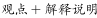”的结构，重在说明为什么“酸碱体质”是个伪理论，对应B项。

A项，“靠什么忽悠大众”无中生有，文段并未提及“酸碱体质”依靠什么忽悠大众，排除； 

C项，“自带调节酸碱度的功能”对应后文解释说明的部分，为分述句内容，非重点，排除；

D项，选项偏离文段核心话题，文段并非强调“是否需要区分体质”，而是重在强调“酸碱体质”的理论的错误，排除。

故正确答案为B。

【文段出处】《2018十大“科学”流言求真榜：酸碱体质居首》

---

#### 第 29 题　qid 2376649 · 片段阅读

古代有位李姓博州太守为官极其廉洁。一天，他在烛光下办公，有人送来家书。他当即灭掉公家蜡烛，点起自家蜡烛。“公烛之下，不展家书”，成为公私分明、严于律己的生动写照。现实中，有的人常在公私之间安装“旋转门”，公私不分。克己奉公，严以修身、俭以养德，光明正大、堂堂正正，这才是人间正道。
在这段文字中，安装“旋转门”所反映的问题实质是

- **A**. 界限模糊　✅
- **B**. 标准不一
- **C**. 职能错位
- **D**. 权责不明

**答案**：A

**官方解析**

文段首先通过“李姓博州太守”的事例引出公私分明的话题，强调其公事和私事的界限分的十分清楚。紧接着引出“现实中，有的人常在公私之间安装‘旋转门’，公私不分”，由此可知，“旋转门”使公私不分，也就是通过“旋转门”模糊了公与私之间的界限。故安装“旋转门”所反映的问题实质就是一些人模糊了公事和私事的界限，对应A项。
B项，“标准不一”指对待不同的事情有不同的标准，文段并未提及“标准”，无中生有，排除；
C项，“职能错位”指政府内部发生的职能混乱现象，即你干我的事，我越你的权，而文段并未提及，无中生有，排除；
D项，“权责不明”指权力和职责不明确，而文段反映的问题是公事和私事的界限分不清，并未提及“权责”，无中生有，排除。
故正确答案为A。
【文段出处】人民日报《把“立政德”放在最前面》

---

#### 第 30 题　qid 2376650 · 片段阅读

以下各句划线的部分，在修辞上与其他不同的一项是

- **A**. 
生活在碎片时代，不能<u>像碎片一样生活</u>

- **B**. 
亚马逊新版电子书阅读器浸入两米深的清水后仍可使用。现在有了能应付浴室和沙滩的<u>“口袋里的书店”</u>，书虫们还会忠实于他们潮湿的平装书吗

- **C**. 
<u>“磨刀不误砍柴工”</u>，花在度假上的时间，会从高效的工作那里补回来
　✅
- **D**. 
当善良的人被欺骗，除了愤怒外，还会下意识地开启防御机制，自带<u>“防护网”</u>

**答案**：C

**官方解析**

A项，“像碎片一样生活”，把人比喻成碎片，用的是比喻的修辞手法；B项，“口袋里的书店”，把亚马逊新版电子阅读器比喻成“口袋里的书店”，用的是比喻的修辞手法；C项，“磨刀不误砍柴工”，是引用俗语，用的是引用的修辞手法；D项，“防护网”，把防护机制比喻成网，用的是比喻的修辞手法。ABD三项均为比喻的修辞手法，锁定C项。
本题为选非题，故正确答案为C。

---

## 数量关系

### 第 1 题　qid 2376442 · 数学运算

11，24，26，（    ），19

- **A**. 24
- **B**. 25
- **C**. 26
- **D**. 39　✅

**答案**：D

**官方解析**

观察数列，变化不一致，作差行不通，考虑机械拆分，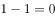、、、（  ）、；得到新数列0、2、4、（  ）、8，构成公差为2的等差数列，那么。即所求项的个位数字减去十位数字为6，观察选项，只有D项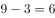满足。

故正确答案为D。

---

### 第 2 题　qid 2376443 · 数学运算

2，8，26，（    ），242

- **A**. 60
- **B**. 80　✅
- **C**. 120
- **D**. 180

**答案**：B

**官方解析**

方法一：观察数列特性，在幂次数字附近，考虑幂次修正数列。原数列可以转化为，，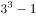，（  ），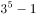。可以看出所求项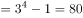。

方法二：观察数列没有看出特征，优先考虑作差，作差后得到新数列：6、18、（  ），（  ），作差后相邻两项之间是3倍关系，，则新数列第一个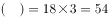，代入原数列，原数列，对应B选项，验证规律，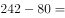，符合题意。

故正确答案为B。

---

### 第 3 题　qid 2376543 · 数学运算

某宣讲团甲宣传员骑摩托车从红星村出发以20公里/小时的速度去相距60公里的八一村，1小时后由于路面湿滑，速度减少一半，在甲出发1小时后，乙宣传员以50公里/小时的速度开车从红星村出发追甲，当乙追上甲时，他们与八一村的距离为

- **A**. ​25公里
- **B**. ​30公里
- **C**. ​35公里　✅
- **D**. ​40公里

**答案**：C

**官方解析**

由题意可知，甲出发一小时后的路程为20公里。之后甲速度变为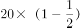公里/小时，根据追及公式“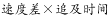”，可得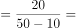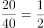小时。此时，乙的路程为公里，距离八一村还有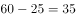公里。

故正确答案为C。

---

### 第 4 题　qid 2376545 · 数学运算

汽车厂甲、乙、丙三个机器人承担拧螺丝任务，程序设定甲先开始，3分钟后乙开始，再3分钟后丙开始。当乙工作12分钟时，所拧的螺丝数与甲拧的螺丝数相同，丙工作20分钟时，所拧的螺丝数与甲拧的螺丝数相同，则丙的工作效率是乙的

- **A**. 1.04倍　✅
- **B**. 1倍
- **C**. 0.9倍
- **D**. 0.8倍

**答案**：A

**官方解析**

根据题意可知，甲开始3分钟后乙再开始，则乙工作12分钟时，甲已工作了15分钟。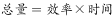，总量相同时，效率与时间成反比，甲乙工作时间之比为，则效率之比为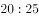。

同理，乙开始3分钟后丙再开始，即甲开始6分钟后丙再开始，则丙工作20分钟时，甲已工作了26分钟。甲丙的效率之比为。甲乙丙三个机器人效率之比为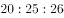，则丙的工作效率是乙的倍。

故正确答案为A。

---

### 第 5 题　qid 2376547 · 数学运算

将浓度分别为和的酒精溶液各100毫升混合在一个容器里，要想使混合后酒精溶液的浓度达到，需要加水

- **A**. 40毫升　✅
- **B**. 50毫升
- **C**. 60毫升
- **D**. 70毫升

**答案**：A

**官方解析**

方法一：设加水毫升，根据混合前后溶质的量不变可列方程：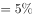，解得毫升。

方法二：根据线段法可知，距离与量成反比。第一次混合时，两种溶液质量相等，可知混合之后的浓度应为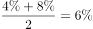。第二次与水混合后浓度变为，则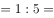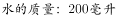，可知需加水40毫升。

故正确答案为A。

---

### 第 6 题　qid 2376549 · 数学运算

小明有2盆兰花和3盆杜鹃，小明打算随机拿出2盆送给小红，则至少有1盆兰花的概率是

- **A**. 

- **B**. 

- **C**. 

- **D**. 

　✅

**答案**：D

**官方解析**

方法一：从5盆中任选两盆，有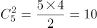种方法。至少有1盆兰花包括两种情况：①有1盆兰花，情况数为；②2盆都是兰花，情况数为种；共有种。则至少有一盆为兰花的概率为。

方法二：正面情况较多可以从反面考虑，至少有1盆兰花的反面为没有兰花，即2盆都是杜鹃，情况数为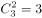种，总情况数为种，所求的概率为。

故正确答案为D。

---

### 第 7 题　qid 2376551 · 数学运算

某计算机企业有职工150人，其中50岁以上共有50人。现拟减员增效，总体规模压缩为100人，并规定50岁以上的人裁减比例为，则50岁以下的人裁减比例为

- **A**. 

- **B**. 

- **C**. 

- **D**. 

　✅

**答案**：D

**官方解析**

需裁减的总人数为人，50岁以上需裁减人数为人。50岁以下原来有人，需要裁减人数为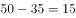人，裁减比例为。

故正确答案为D。

---

## 判断推理

### 第 1 题　qid 2376453 · 图形推理

从所给四个选项中，选择最合适的一个填入问号处，使之呈现一定的规律性

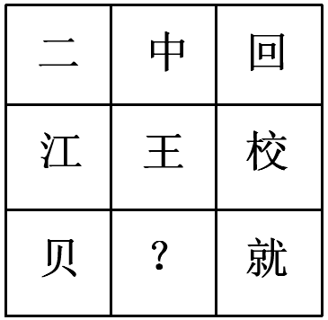

- **A**. 金　✅
- **B**. 令
- **C**. 书
- **D**. 无

**答案**：A

**官方解析**

解析一：元素组成不同，且无明显属性规律，考虑数量规律。图形均为汉字，优先考虑笔画数。九宫格优先横行看，第一横行笔画数依次为2、4、6；第二横行笔画数依次为6、4、10，即前两行均满足前两幅笔画数相加等于第三幅，沿用此规律，第三行笔画数依次为4、？、12，因此问号处应选择8笔画的汉字。A项8笔画，B项5笔画，C项4笔画，D项4笔画。
故正确答案为A。
解析二：元素组成不同，且无明显属性规律，考虑数量规律。图形均为汉字，且“中”“回”存在明显的封闭面，考虑数面。九宫格优先横行看，第一横行面数量依次为0、2、2；第二横行面数量依次为0、0、0，即前两行图形均满足前两幅面数量相加等于第三幅，沿用此规律，第三行面数量依次为0、？、1，因此问号处应选择1个面的汉字。A、B、D项均为0个面，只有C项为1个面。
故正确答案为C。
粉笔说明：两种思路均可通过严谨的数量规律得到答案，且数笔画和数面均为常见考法，故两种答案粉笔都认可。

---

### 第 2 题　qid 2376455 · 图形推理

把下面六个图形分为两类，使每一类图形都有各自的共同特征或规律，分类正确的一组是

- **A**. ①②③，④⑤⑥
- **B**. ①③④，②⑤⑥
- **C**. ①④⑥，②③⑤
- **D**. ①④⑤，②③⑥　✅

**答案**：D

**官方解析**

本题为分组分类题目。每幅图均由3个小元素组成，考虑图形间关系。观察发现，图①④⑤均为3个图形层层包含，图②③⑥均为外框包含两个独立图形。即①④⑤一组，②③⑥一组。
故正确答案为D。

---

### 第 3 题　qid 2376458 · 图形推理

从所给四个选项中，选择最合适的一个填入问号处，使之呈现一定的规律性

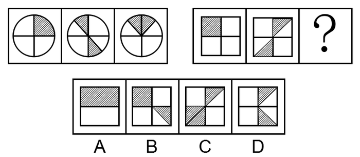

- **A**. A
- **B**. B
- **C**. C
- **D**. D　✅

**答案**：D

**官方解析**

元素组成不同，且无明显属性规律，优先考虑数量规律。第一组图形出现阴影部分，并且每个图形的阴影部分面积都是整个图形的四分之一。第二组前两个图形当中阴影部分面积都是整个图形的四分之一，故“？”处应选择阴影面积是整个图形面积四分之一的图形，只有D项符合。
故正确答案为D。

---

### 第 4 题　qid 2376489 · 图形推理

从所给四个选项中，选择最合适的一个填入问号处，使之呈现一定的规律性

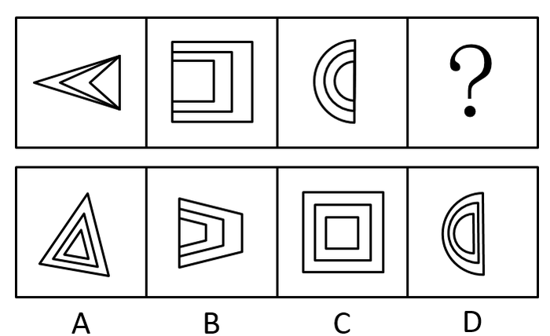

- **A**. A
- **B**. B　✅
- **C**. C
- **D**. D

**答案**：B

**官方解析**

元素组成不同，题干当中每个图形当中的三个图形都存在一条公共边，且公共边的方向分别为：右、左、右，故“？”处应选择有一条公共边在左侧的图形，只有B项符合。
故正确答案为B。

---

### 第 5 题　qid 2376503 · 图形推理

给定的图形是纸盒的外表面展开图，下列四个选项是由其折叠成的是

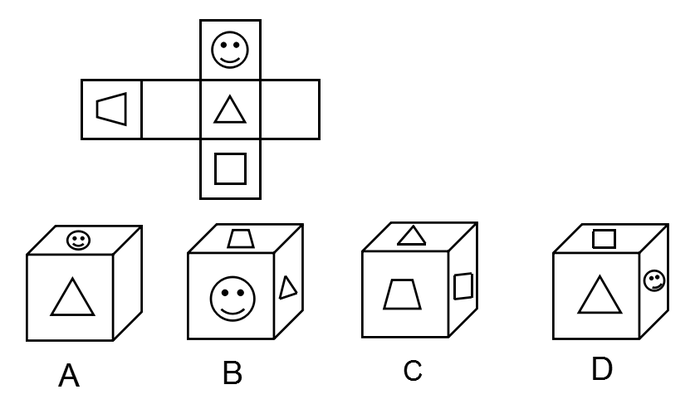

- **A**. A　✅
- **B**. B
- **C**. C
- **D**. D

**答案**：A

**官方解析**

A项：出现的三个面位置关系与题干展开图一致，当选；
B项：梯形面和三角形面是相对面，不能同时出现，选项与题干不一致，排除；
C项：梯形面和三角形面是相对面，不能同时出现，选项与题干不一致，排除；
D项：笑脸面和正方形面是相对面，不能同时出现，选项与题干不一致，排除。
故正确答案为A。

---

### 第 6 题　qid 2376642 · 定义判断

藏书，是指凭自己的爱好、评价和鉴赏力而有选择地收藏图书，不仅是为了自己参考、阅读或消遣，也是为了把某个领域的图书精心、完整地收藏起来。
根据上述定义，下列行为不属于藏书的是：

- **A**. 某围棋爱好者一见到吴清源的书就买下来并妥善保存
- **B**. 某古币收藏家一见到关于古代钱币的书就买下并保存
- **C**. 某商人批量买下市面上的某套书籍，待价格飙升售出　✅
- **D**. 某书法家不惜重金求购各种碑帖拓本，以备临摹鉴赏

**答案**：C

**官方解析**

第一步：找出定义关键词。
“凭借自己的爱好、评价和鉴赏力而有选择地收藏图书”、“不仅是为了自己参考、阅读或消遣”、“也是为了把某个领域的图书精心、完整地收藏起来”。
第二步：逐一分析选项。
A项：某围棋爱好者说明是“凭借自己的爱好”，见到吴清源的书就买下来并妥善保存，符合“凭借自己的爱好、评价和鉴赏力有选择地收藏”，符合定义，排除；
B项：某古币收藏家说明是“凭借自己的爱好”，见到关于古代钱币的书就买下来并保存，符合“凭借自己的爱好、评价和鉴赏力有选择地收藏”，符合定义，排除；
C项：某商人批量买下市面上的某套书籍，待价格飙升售出说明商人是为了盈利购买书籍，不符合“凭借自己的爱好、评价和鉴赏力有选择地收藏”，不符合定义，当选；
D项：某书法家不惜重金求购各种碑帖拓本，以备临摹欣赏，符合“凭借自己的爱好、评价和鉴赏力有选择地收藏”，符合定义，排除。
本题为选非题，故正确答案为C。

---

### 第 7 题　qid 2376687 · 定义判断

热岛效应是指城市由于人口集中，工业、交通、居民生活等产生大量的人为热量而使城市的气温高于郊区的现象。雨岛效应是指由于热岛效应，在城市上空产生一股上升气流，加上上空尘埃较多，使附近及下风向降水稍多的现象。温室效应是指由于人类活动排放大量温室气体而造成全球气候变暖的现象。
根据上述定义，下列说法错误的是：

- **A**. 热岛效应是引起雨岛效应的原因之一
- **B**. 热岛效应是引起温室效应的唯一原因　✅
- **C**. 热岛效应和温室效应影响的地域范围不同
- **D**. 三种效应都是人类活动对气候影响的结果

**答案**：B

**官方解析**

第一步：找出定义关键词。
热岛效应：“城市由于人口集中，工业、交通、居民生活等产生大量的人为热量而使城市的气温高于郊区”；
雨岛效应：“由于热岛效应，在城市上空产生一股上升气流，加上上空尘埃较多，附近及下风向降水稍多”；
温室效应：“由于人类活动排放大量温室气体而造成全球气候变暖”。
第二步：逐一分析选项。
A项：热岛效应是引起雨岛效应的原因之一，雨岛效应定义中明确说明是由于热岛效应产生，符合雨岛效应定义，说法正确，排除；
B项：涉及到热岛效应和温室效应两个定义间关系，温室效应产生原因为“人类活动排放大量温室气体”，而热岛效应是“城市中产生大量人为热量”，人类活动包含城市和非城市人群的活动，所以热岛效应不是引起温室效应的唯一原因，表述绝对不准确，当选；
C项：热岛效应影响的地域范围为“城市的气温高于郊区”，温室效应的影响范围为“全球气候变暖”，一个是城市，一个是全球，所以影响范围不同，说法正确，排除；
D项：根据定义三种效应产生的原因分别“由于人口集中，产生大量的人为热量”，“由于热岛效应”，“由于人类活动”，热岛效应就是人类活动影响，所以三种效应都是人类活动对气候影响的结果，说法正确，排除。
本题为选非题，故正确答案为B。

---

### 第 8 题　qid 2376692 · 类比推理

合作作品的版权由合作作者共同享有，通过协商一致来行使；不能协商一致，又无正当理由的，任何一方不得阻止他人行使除转让以外的其他权利，但是所得收益应当合理分配给所有合作作者。
现已知：甲、乙合作创作一部小说，甲独自将该小说以十万元价格许可给某影视公司拍摄电影；乙得知后表示反对，但无正当理由。
根据上述规定，下列说法正确的是

- **A**. 甲无权将该小说许可他人使用
- **B**. 甲独自签订的该许可合同无效
- **C**. 乙无权参与十万元报酬的分配
- **D**. 该小说的版权由甲乙共同享有　✅

**答案**：D

**官方解析**

第一步：找出定义关键词。
合作版权：“版权由合作者共同享有，协商一致行使”、“不能协商一致且无正当理由，不能阻止除转让外其它权利，收益合理分配给所有合作者”
已知：“甲乙合作创作，甲独自将小说许可给影视公司拍摄电影”“乙反对，且无正当理由”
第二步：逐一分析选项。
A项：甲无权将该小说许可他人使用，不符合“不能协商一致，又无正当理由的，任何一方不得阻止他人行使除转让以外的其他权利”，甲有权将该小说许可他人使用。不符合定义，排除；
B项：本小说是版权由两人共同所有，现乙反对且无正当理由，所以乙不能阻止，甲独自签订的许可合同有效。不符合定义，排除；
C项：乙无权参与十万元报酬的分配，不符合“不能协商一致且无正当理由，不能阻止除转让外其它权利，收益合理分配给所有合作者”，所以乙有权参与十万元报酬的分配。不符合定义，排除；
D项：该小说的版权由甲乙共同享有，符合“版权由合作者共同享有”。符合定义，当选。
故正确答案为D。

---

### 第 9 题　qid 2376699 · 定义判断

模棱两可，是指对两个相互矛盾的命题同时加以否定的一种逻辑错误。
根据上述定义，下列属于模棱两可的是：

- **A**. 董事长不是说经理要多听群众意见吗？我是群众，可经理总是不听我的意见
- **B**. 问：“你的丈夫犯了盗窃罪，你知道吗？”答：“还有人比他犯的罪更重呢！”
- **C**. 问：“今年你们厂的产值是多少？”答：“今年原材料涨价，不亏本就算好了。”
- **D**. 小张考试作弊，处分还是不处分？我都不赞成，关键是做好小张的思想工作　✅

**答案**：D

**官方解析**

第一步：找出定义关键词。
模棱两可：“两个互相矛盾的命题”、“同时否定”。
第二步：逐一分析选项。
A项：经理要多听群众意见与我是群众，可经理总是不听我的意见，不符合“对两个相互矛盾的命题同时加以否定”，不符合定义，排除；
B项：丈夫犯盗窃罪和别人犯罪更重，不符合“两个互相矛盾的命题”，不符合定义，排除；
C项：选项只有一个关于产值的问题，和一个回答，不符合“两个互相矛盾的命题”，不符合定义，排除；
D项：处分与不处分，符合“两个互相矛盾的命题”，且后续回答都不赞成符合“同时否定”这一说法，符合定义，当选。
故正确答案为D。

---

### 第 10 题　qid 2376703 · 定义判断

狭义的民间外交，特指那些不代表官方又具有一定官方背景的跨国民间往来活动。它既包括同他国政府高层的交往，又包括同他国各行各业的团体或个人建立联系，其活动内容涉及政治、经济、科学技术、文化体育等各个领域。
根据上述定义，下列属于狭义的民间外交的是：

- **A**. 甲国体操运动员赴乙国看望一位朋友
- **B**. 甲国总理出访乙国进行政治经济磋商
- **C**. 甲国政府为乙国总统的到访举行欢迎仪式
- **D**. 甲国政府要员回乙国的故乡参加祭祖仪式　✅

**答案**：D

**官方解析**

第一步：找出定义关键词。
“不代表官方又具有一定官方背景”、“跨国民间往来活动”、“同他国政府高层的交往”、“同他国各行各业的团体或个人建立联系”。
第二步：逐一分析选项。
A项：甲国体操运动员赴乙国看望朋友，不符合“不代表官方又具有一定官方背景的跨国民间往来活动”，不符合定义，排除；
B项：甲国总理出访乙国进行政治经济磋商，这是甲国总理代表甲国和乙国进行经济往来，不符合“不代表官方又具有一定官方背景的跨国民间往来活动”，不符合定义，排除；
C项：甲国政府为乙国总统到访举行欢迎仪式，这是一种官方的欢迎仪式，不符合“不代表官方又具有一定官方背景的跨国民间往来活动”，不符合定义，排除；
D项：甲国政府要员回乙国故乡参加祭祖仪式，祭祖仪式是民间活动，符合“不代表官方又具有一定官方背景的跨国民间往来活动”，符合定义，当选。
故正确答案为D。

---

### 第 11 题　qid 2376454 · 类比推理

光：亮

- **A**. 风：凉
- **B**. 花：香
- **C**. 地：平
- **D**. 火：热　✅

**答案**：D

**官方解析**

第一步：判断题干词语间逻辑关系。
光的属性是亮，二者为属性的对应关系，且为必然属性。
第二步：判断选项词语间逻辑关系。
A项：风的属性可以是凉，但为或然属性，与题干逻辑关系不一致，排除；
B项：花的属性可以是香，但为或然属性，与题干逻辑关系不一致，排除；
C项：地的属性可以是平，但为或然属性，与题干逻辑关系不一致，排除；
D项：火的属性是热，且为必然属性，与题干逻辑关系一致，当选。
故正确答案为D。

---

### 第 12 题　qid 2376457 · 类比推理

电影配音：外语配音

- **A**. 单向沟通：双向沟通
- **B**. 注射给药：口服给药
- **C**. 短期观察：重点观察　✅
- **D**. 长期记忆：短期记忆

**答案**：C

**官方解析**

第一步：判断题干词语间逻辑关系。
题干从不同的角度将配音进行分类，电影配音是从视频类型进行分类，外语配音是从语言类型角度进行分类，二者为交叉关系。
第二步：判断选项词语间逻辑关系。
A项：单向沟通和双向沟通均是沟通方式，二者为并列关系，与题干逻辑关系不一致，排除；
B项：注射给药和口服给药均是给药方式，二者为并列关系，与题干逻辑关系不一致，排除；
C项：短期观察是从观察的时间上进行分类，重点观察是从观察的程度上分类，二者为交叉关系，与题干逻辑关系一致，当选；
D项：长期记忆和短期记忆均从记忆的时间上进行分类，二者为并列关系，与题干逻辑关系不一致，排除。
故正确答案为C。

---

### 第 13 题　qid 2376460 · 类比推理

听：闻：聆

- **A**. 看：瞥：瞪
- **B**. 咬：嚼：咽
- **C**. 买：购：租
- **D**. 打：揍：殴　✅

**答案**：D

**官方解析**

第一步：判断题干词语间逻辑关系。
听、闻、聆指的都是用耳朵接收声音，三者是近义关系。
第二步：判断选项词语间逻辑关系。
A项：看、瞥、瞪都是用眼睛去接收事物，三者是近义关系，与题干逻辑关系一致，保留；
B项：咬指的是上下牙齿对着用力夹住或弄碎东西；嚼指的是用牙齿磨碎食物；咽指的是使嘴里的东西通过咽头到食管里去，咽与前两个词不是近义关系，与题干逻辑关系不一致，排除；
C项：买和购指的都是购买；租指的是租借，三者不是近义关系，与题干逻辑关系不一致，排除；
D项：打是指击打；揍指的是打人或打碎；殴指的是殴打，三者均可指击打，是近义关系，与题干逻辑关系一致，保留。
进一步区分，题干中可以组词为：聆听，D选项可以组词为：殴打，而A项不能组词，因此排除A项。
故正确答案为D。

---

### 第 14 题　qid 2376463 · 类比推理

英国文学：法国文学：古典文学

- **A**. 律诗：绝句：五言绝句
- **B**. 诗歌：古体诗：近体诗
- **C**. 曲艺：相声：单口相声
- **D**. 独奏曲：合奏曲：钢琴曲　✅

**答案**：D

**官方解析**

第一步：判断题干词语间逻辑关系。
英国文学和法国文学为并列关系，且二者与古典文学之间都属于交叉关系。
第二步：判断选项词语间逻辑关系。
A项：律诗和绝句都是近体诗，但是律诗一般每首八句，每句五个字的律诗叫五言律诗，简称五律，每句七个字的律诗叫七言律诗，简称七律，而绝句每首四句，每句五个字的叫五言绝句，简称五绝，每句七个字的叫七言绝句，简称七绝。因此，律诗和绝句为并列关系，五言绝句和绝句为包容关系中的种属关系，与题干逻辑关系不一致，排除；
B项：古体诗和近体诗是按音律将诗分类，为并列关系，且与诗歌都为包容关系中的种属关系，与题干逻辑关系不一致，排除；
C项：单口相声是相声的一种，为包容关系中的种属关系，相声是曲艺的一种，为包容关系中的种属关系，与题干逻辑关系不一致，排除；
D项：独奏曲和合奏曲为并列关系，且二者都与钢琴曲为交叉关系，与题干逻辑关系一致，当选。
故正确答案为D。

---

### 第 15 题　qid 2376462 · 类比推理

（  ）对于大漠沙如雪，燕山月似钩，相当于夸张对于（  ）

- **A**. 借代  烽火连三月，家书抵万金
- **B**. 拟人  危楼高百尺，手可摘星辰
- **C**. 比喻  白发三千丈，缘愁似个长　✅
- **D**. 反问  本是同根生，相煎何太急

**答案**：C

**官方解析**

将选项逐一代入，判断各选项前后部分的逻辑关系。
A项：“大漠沙如雪，燕山月似钩”是指在连绵的燕山山岭上，一弯明月当空，如弯钩一般；平沙万里，在月光下像是铺上一层白皑皑的霜雪，运用了比喻的修辞手法，不是借代，“烽火连三月，家书抵万金”是指连绵的战火已经持续了很长时间，家书难得，一封抵得上万两黄金，诗句运用了夸张的修辞手法，前后逻辑关系不一致，排除；
B项：“大漠沙如雪，燕山月似钩”运用了比喻的修辞手法，不是拟人，“危楼高百尺，手可摘星辰”是指山上寺院的高楼真高啊，好像有一百尺的样子，人在楼上好像一伸手就可以摘下天上的星星，诗句运用了夸张的修辞手法，前后逻辑关系不一致，排除；
C项：“大漠沙如雪，燕山月似钩”运用了比喻的修辞手法，“白发三千丈，缘愁似个长”是指白发长达三千丈，是因为愁才长得这样长，运用了夸张的修辞手法，前后逻辑关系一致，当选；
D项：“大漠沙如雪，燕山月似钩”运用了比喻的修辞手法，不是反问，“本是同根生，相煎何太急”用同根而生的萁和豆来比喻同父共母的兄弟，用萁煎其豆来比喻同胞骨肉的哥哥残害弟弟，运用了比喻的修辞手法，前后逻辑关系不一致，排除。
故正确答案为C。

---

### 第 16 题　qid 2376528 · 类比推理

①餐厅的客流量创历史新高
②开通外卖和网上团购业务
③入选当年大众点评必吃榜
④逐渐吸引更多的年轻顾客
⑤烤鸭老字号顾客群体断层

- **A**. ②④①③⑤
- **B**. ⑤②④③①　✅
- **C**. ②①④③⑤
- **D**. ⑤③②④①

**答案**：B

**官方解析**

第一步：先确定逻辑关系最为明显的逻辑顺序。
观察题干，五个事件主要围绕“烤鸭老字号顾客群体断层后如何解决销售困境”。逻辑关系的先后顺序比较明显的事件是事件⑤在最前面，排除A、C两项。
第二步：逐一对照选项并判断正确答案。
根据第一步的结果可以判断只有B、D两项符合，顾客群体断层后应先开通外卖和网上团购业务，所以接着是事件②，然后逐渐吸引更多的年轻顾客，是事件④，入选必吃榜后客流量创新高，故事件③在事件①前面，排除D项，B项当选。
故正确答案为B。

---

### 第 17 题　qid 2376529 · 类比推理

①沙发、仙鹤、球拍、鸡蛋、荷花
②编成生动有趣、夸张荒诞的故事
③死记硬背、枯燥乏味、心烦意乱
④记忆一些并没有逻辑关系的信息
⑤记忆倍加深刻，相对容易被记牢

- **A**. ①④⑤③②
- **B**. ①④②③⑤
- **C**. ④①②③⑤
- **D**. ④①③②⑤　✅

**答案**：D

**官方解析**

第一步：先确定逻辑关系最为明显的逻辑顺序。
观察题干，五个事件主要围绕“如何记忆一些没有逻辑关系的信息。”逻辑关系的先后顺序比较明显的事件是事件③和事件②，先说死记硬背的不好再给出解决办法，事件③应该在事件②前面，排除B、C两项。
第二步：逐一对照选项并判断正确答案。
根据第一步的结果可以判断只有A、D两项符合，给出解决办法编成故事后应该解决了问题，因此接着是事件⑤，事件⑤是尾句。最后事件①和事件④，应该是先提出问题再给例子，故事件④在事件①前面，排除A项。
故正确答案为D。

---

### 第 18 题　qid 2376534 · 类比推理

①幼年虎鲸被人类活捉
②数百万中小学生捐款
③回归海洋野生虎鲸群
④受到小朋友们的喜爱
⑤参与拍摄《虎鲸闯天关》

- **A**. ②①④③⑤
- **B**. ②⑤①④③
- **C**. ①③②④⑤
- **D**. ①⑤④②③　✅

**答案**：D

**官方解析**

第一步：先确定逻辑关系最为明显的逻辑顺序。
观察题干，五个事件主要围绕虎鲸被捉后最终放生的过程。逻辑关系的先后顺序比较明显的事件是事件①，要先有虎鲸被捉事件，才能有后续的开展，故事件①是首句，排除A、B两项。
第二步：逐一对照选项并判断正确答案。
根据第一步的结果可以判断只有C、D两项符合，虎鲸被捉后要知道为什么被捉，因此接着是事件⑤，拍摄完节目后，先受到小朋友们的喜欢再有小学生捐款，故事件④在事件②前面，最后放生虎鲸，故事件③是尾句，排除C项。
故正确答案为D。

---

### 第 19 题　qid 2376522 · 类比推理

①筹集资金，学习相关新技术
②大面积推广，技术创新成功
③通过大众传播，了解新信息
④小规模试用，取得显著成效
⑤产生浓厚兴趣，联系推广者

- **A**. ③①②④⑤
- **B**. ②③①⑤④
- **C**. ③⑤①④②　✅
- **D**. ②①③④⑤

**答案**：C

**官方解析**

第一步：先确定逻辑关系最为明显的逻辑顺序。
观察题干，五个事件主要围绕“技术推广”的过程。逻辑关系的先后顺序比较明显的是事件③和事件②，先通过大众传播，了解信息，才能大面积推广，创新成功，即③在②前面，故③为首句，排除B、D项。
第二步：逐一对照选项并判断正确答案。
根据第一步的结果可以判断只有A、C符合，先小规模试用，取得显著效果，再大面积推广，技术创新成功，因此④在②前面，排除A项。
故正确答案为C。

---

### 第 20 题　qid 2376523 · 类比推理

①听到了声音
②处理电信号
③声音源的振动
④产生电信号
⑤引起鼓膜振动

- **A**. ③④②⑤①
- **B**. ①④②⑤③
- **C**. ③⑤④②①　✅
- **D**. ①⑤④②③

**答案**：C

**官方解析**

第一步：先确定逻辑关系最为明显的逻辑顺序。
观察题干，五个事件主要围绕“声音的振动和传播”的过程。逻辑关系的先后顺序比较明显的是事件③和事件①，先声音源的振动再听到声音，即③在①前面，故③为首句，排除B、D项。
第二步：逐一对照选项并判断正确答案。
根据第一步的结果可以判断只有A、C符合，声音源的振动引起鼓膜的振动，因此事件③后面接着事件⑤，鼓膜振动产生电信号，再处理电信号，最后听到声音，排除A项。
故正确答案为C。

---

### 第 21 题　qid 2376638 · 类比推理

根据下图所给的条件，对4位男孩与4位女孩的关系判断正确的是：

- **A**. 女孩1是特德的女朋友
- **B**. 女孩2是内特的女朋友
- **C**. 女孩3是罗兹的女朋友　✅
- **D**. 女孩4是埃里克的女朋友

**答案**：C

**官方解析**

第一步，分析题干。
①男孩1：特德是长发，他的女朋友凯莉是长发
②男孩2：埃里克是长发，戴一个项圈，他的女朋友是妮娅
③男孩3：内特是短发，戴一个项圈
④男孩4：罗兹是短发，他的女朋友是蕾娜
⑤女孩1：艾米，男朋友是短发
⑥女孩2：长发，她的男朋友戴了一个项圈
⑦女孩3：短发
⑧女孩4：长发
第二步，根据题干条件分析选项。
根据①可知，特德的女朋友是长发，那么只能是女孩2或女孩4，排除A项；
根据⑤可知，女孩1艾米的男朋友是短发，那么只能是内特或罗兹，结合条件④可知，罗兹女朋友不是艾米，即女孩1艾米的男朋友是内特，排除B项；
根据⑥可知，女孩2的男朋友只能是埃里克或者内特，而内特女朋友已经确认是女孩1，那么女孩2的男朋友只能是埃里克，排除D项。
故正确答案为C。

---

### 第 22 题　qid 2376639 · 逻辑判断

一直以来，人们都认为工作与家庭的冲突主要困扰的是女性。但最近一项匿名问卷调查的结果显示，男性和女性在工作与家庭冲突的困扰方面，几乎不存在差异，这和大众的认知截然相反。
下列哪项如果为真，不能解释上述矛盾现象：

- **A**. 相对于女性，男性更希望展示强者面貌，更不愿公开谈论自己的困扰
- **B**. 相对于女性，男性更可能会在匿名的调查问卷中坦率描述自己的困扰
- **C**. 相对于男性来说，女性更愿意向他人倾诉自己的困扰，从而缓解压力
- **D**. 相对于没有孩子的女性，有孩子的女性家庭事务干扰工作的程度更高　✅

**答案**：D

**官方解析**

第一步，找出题干矛盾。
大众认知中都认为工作与家庭的冲突主要困扰的是女性，但匿名调查问卷结果显示男性与女性在工作与家庭冲突的困扰方面几乎不存在差异。
第二步，逐一分析选项。
A项：说明相对于女性，男性即使有困扰也不愿意公开谈论，导致在大众认知中会认为在工作与家庭的冲突中男性受到的困扰较少，可以解释题干矛盾，排除；
B项：说明在匿名调查问卷中，男性更有可能会坦率说出自己的困扰，所以问卷结果会显示出男性与女性在工作与家庭的冲突困扰方面的差异较小，可以解释题干矛盾，排除；
C项：说明女性会比男性更愿意向他人倾诉自己的困扰，导致在大众认知中会认为在工作与家庭的冲突中女性受到的困扰较多，可以解释题干矛盾，排除；
D项：对比的是有没有孩子的女性之间的家庭与工作的困扰程度，没有提到男性与女性之间的比较，无法解释题干矛盾，当选。
本题为选非题，故正确答案为D。

---

### 第 23 题　qid 2376684 · 类比推理

对夏天的虫子无法谈论冬天的冰，因为它根本活不到冬天，自然不知道冬天的冰是什么样的。同样的道理，大学生刚毕业，如果不锻炼两年，怎能做好销售工作呢？
下列选项与题干所犯的论证错误最相似的是：

- **A**. 对于是否批准这几家公司贷款的议题，我完全同意你的看法，但还有一点小异议
- **B**. 人脑用多了会受到损害。因为人脑是物质的，机器用久了会磨损，人脑也不例外　✅
- **C**. 小王的话是不会错的，因为他是听他爸爸说的，他爸爸是一位治学严谨、受人尊敬、造诣很深的数学家
- **D**. 人是能够认识世界的，因为人有认识世界的能力。而人之所以有认识世界的能力，就是因为人能认识世界

**答案**：B

**官方解析**

第一步：分析题干中的论证方式。
题干前半部分举了无法对夏天虫子谈论冬天的冰的例子，后半部分用这个例子和“大学生不锻炼就不能做好销售工作”进行类比，得到不锻炼不能做好销售工作的结论。
第二步：逐一分析选项。
A项：该项讨论的主体都是“是否批准这几家公司贷款的议题”，并没有拿两个不同的主体作类比，与题干所犯的论证错误不相似，排除；
B项：该项通过“机器会磨损”和“人脑”作类比，得到人脑用多了会受到损害的结论，与题干所犯的论证错误相似，当选；
C项：该项说小王爸爸是是一位治学严谨、受人尊敬、造诣很深的数学家，得到小王的话不会错的结论，并没有用两个事例进行类比，与题干所犯的论证错误不相似，排除；
D项：该项前半部分从人有认识世界的能力推出人能够认识世界，后半部分从人能认识世界推出人有认识世界的能力，并没有用两个事例进行类比，与题干所犯的论证错误不相似，排除。
故正确答案为B。

---

### 第 24 题　qid 2376686 · 逻辑判断

某居民小区盗窃案件频发，在小区居民的要求下，物业于去年年初为该小区安装了一种多功能防盗系统，结果该小区盗窃案件的发生率显著下降，这说明多功能防盗系统能够有效降低盗窃案件的发生率。
以下哪项如果为真，最能加强上述结论？

- **A**. 去年，没有安装这种盗窃系统的居民小区盗窃案件显著增加　✅
- **B**. 附近另一个居民小区也安装了这种防盗系统，但是效果不佳
- **C**. 从去年初开始，该城市加强了治安管理，盗窃案件大幅减少
- **D**. 物业采取其他防盗措施，对预防盗窃案件也起到一定的作用

**答案**：A

**官方解析**

第一步：找出论点和论据。
论点：多功能防盗系统能够有效降低盗窃案件的发生率。
论据：物业于去年年初为该小区安装了一种多功能防盗系统，结果该小区盗窃案件的发生率显著下降。
本题的论点和论据话题一致，都是在说安装多功能防盗系统可以降低盗窃案件的发生率，因此优先考虑通过补充论据的方式来说明安装多功能防盗系统对降低盗窃案件发生率确实是有效的。
第二步：逐一分析选项。
A项：没有安装多功能防盗系统的居民小区盗窃案件显著增加，从反面说明安装多功能防盗系统对减少盗窃案件的发生是有效的，该项通过反面举例的方式来加强论点，补充论据，当选。
B项：附近安装了多功能防盗系统的小区效果不好，说明该防盗系统对降低盗窃案件的发生率没有作用，无法加强，排除。
C项：指出城市加强治安管理使得盗窃案件减少，说明盗窃案件降低是其他原因造成的，属于他因削弱，不能支持，排除。
D项：物业采取其他防盗措施，对预防盗窃案件也起到一定的作用，说明案件发生率降低除了防盗系统之外还有其他的原因，属于他因削弱，无法加强，排除。
故正确答案为A。

---

### 第 25 题　qid 2376688 · 逻辑判断

近日，有研究人员研发出一种新型的可透视薄膜，它是通过微调热拉温度制造出的一种高强度聚乙烯薄膜，其强度是常规可透视薄膜的10倍。有人据此预测，在不久的将来，手机屏再也不怕摔了。
以下哪项如果为真，不能支持上述预测：

- **A**. 这种新型薄膜的最大拉伸强度，与太空级铝相当
- **B**. 这种新型薄膜特别轻，适用于各种小型电子产品
- **C**. 这种新型薄膜的透明度较差，不适用于手机屏幕　✅
- **D**. 这种新型薄膜价格便宜，适合大规模的商业制造

**答案**：C

**官方解析**

第一步：找出论点和论据。
论点：在不久的将来，手机屏再也不怕摔了。
论据：有研究人员研发出一种新型的可透视薄膜，它是通过微调热拉温度制造出的一种高强度聚乙烯薄膜，其强度是常规可透视薄膜的10倍。
本题为选非题，需找出三个能够加强的选项排除。论点说的是将来手机屏不怕摔了，论据说的是研究出了一种高强度聚乙烯薄透视膜，论点论据说的不是一回事，可以搭桥，比如说高强度就不怕摔，也可以通过补充论据加强，比如补充新型薄膜的其他优点等。
第二步：逐一分析选项。
A项：新型薄膜最大拉伸强度与太空级铝相当，具体说明了新型薄膜在拉伸强度上的优势，补充论据，可以加强，排除；
B项：新型薄膜特别轻，可以用于小型电子产品，因此新型薄膜适用于手机制造，是论点成立的必要条件，可以加强，排除；
C项：新型薄膜透明度较差，不适用于手机屏幕，那就说明由论据中的新型薄膜强度高，推不出论点中的手机屏幕不怕摔，可以削弱，不能加强，当选；
D项：新型薄膜价格便宜，适合大规模商业制造，说明新型薄膜在价格上有优势，用于商业制造的成本较低，是论点成立的必要条件，可以加强，排除。
本题为选非题，故正确答案为C。

---

### 第 26 题　qid 2376508 · 类比推理

友谊是获得人生幸福的重要途径。按照古罗马哲学家西塞罗的说法，“友谊只存在于好人之间，终生不渝的友谊是最难的事情”；另一位西班牙哲学家乔洛·商塔亚纳认为，“友谊几乎都是一颗心的一部分与另一颗心的一部分之结合，人们只能是局部的朋友”。
以上陈述如果为真，则下列一定为真的是

- **A**. 终生不渝的友谊是最为宝贵的财富
- **B**. 坏人与坏人之间一定不会存在友谊　✅
- **C**. 好人之间一定存在某种局部的友谊
- **D**. 友谊是获得人生幸福的最重要途径

**答案**：B

**官方解析**

日常结论题，根据题干信息逐一分析选项。
A项：终生不渝的友谊是最难的，不代表它就是最宝贵的财富，无中生有，排除；
B项：题干中说“友谊只存在于好人之间”，因此坏人之间不存在友谊，可以推出，当选；
C项：题干中说“友谊只存在于好人之间”，但没有说好人之间一定存在友谊，无法推出，排除；
D项：根据第一句可知，友谊是获得人生幸福的重要途径，但无法推出是最重要的途径，排除。
故正确答案为B。

---

### 第 27 题　qid 2376517 · 逻辑判断

有一论证（相关语句用序号表示）如下：

①在X医院接受治疗，比在Y医院更加经济实惠，②而且可以享受到更高质量的服务。③在X医院，病人住院的平均费用是Y医院的四分之三。④X医院病人的治愈率是Y医院的两倍左右。⑤X医院的医疗设备比Y医院更先进。⑥X医院的病人对服务很少有不满。

如果用“甲乙”表示甲支持（或证明）乙，则对上述论证基本结构的表示最为准确的是

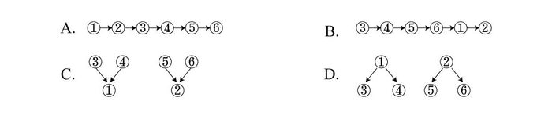

- **A**. A
- **B**. B
- **C**. C　✅
- **D**. D

**答案**：C

**官方解析**

第一步：找出总结性的观点。

题干6个命题围绕两个话题展开，服务和费用，因此找出总结性的结论如下：

①在X医院接受治疗，比在Y医院更加经济实惠；

②而且可以享受到更高质量的服务；

第二步：分析论证关系。

通过分析题干发现，③“在X医院，病人住院的平均费用是Y医院的四分之三”和④“X医院病人的治愈率是Y医院的两倍左右”都是在解释论点①“在X医院接受治疗，比在Y医院更加经济实惠”，即因为价格低，并且治愈率高，所以X医院更加经济实惠，表示为

；

⑤“X医院的医疗设备比Y医院更先进”和⑥“X医院的病人对服务很少有不满”都是在解释论点②“可以享受到更高质量的服务”，即因为医疗设备更先进，并且病人对服务比较满意，所以X医院可以享受到更高质量的服务，表示为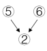，对应选项C。

故正确答案为C。

---

### 第 28 题　qid 2376533 · 类比推理

在一次聚会上，甲喜欢吃川菜，乙喜欢吃的都是川菜，丙喜欢吃所有川菜。锅包肉不是川菜，但是麻婆豆腐是川菜。
根据上述条件推知，下列一定为真的是

- **A**. 甲喜欢吃麻婆豆腐
- **B**. 乙喜欢吃麻婆豆腐
- **C**. 乙不喜欢吃锅包肉　✅
- **D**. 丙不喜欢吃锅包肉

**答案**：C

**官方解析**

第一步：分析题干。
①甲喜欢吃川菜：即不确定他具体喜欢吃哪一道川菜；
②乙喜欢吃的都是川菜：即不确定他具体喜欢吃哪一道川菜，且其他菜种他一定不喜欢吃；
③丙喜欢吃所有川菜：即每一道川菜他都喜欢吃，其他菜种他也有可能喜欢吃。
第二步：逐一分析选项。
A项：麻婆豆腐是川菜，甲喜欢吃川菜，但是否一定喜欢吃麻婆豆腐这道川菜并不确定，排除；
B项：麻婆豆腐是川菜，乙喜欢吃的都是川菜，但是否一定喜欢吃麻婆豆腐这道川菜并不确定，排除；
C项：锅包肉不是川菜，乙喜欢吃的都是川菜，其他菜种他一定不喜欢吃，即乙一定不喜欢吃锅包肉，当选；
D项：锅包肉不是川菜，丙喜欢吃所有川菜，但其他菜种他也有可能喜欢吃，所以无法确定丙一定不喜欢锅包肉，排除。
故正确答案为C。

---

### 第 29 题　qid 2376540 · 逻辑判断

目前，广泛应用的机械超材料有着负热膨胀、低重量时的高强度和高刚度等卓越特性。但这种机械超材料一旦构建完成，其属性将无法更改或调整。近日，有研究人员开发出一种新型材料攻克了这一难题。可以肯定，在不久的将来，机器人、智能可穿戴装备等领域一定会旧貌换新颜。
以下哪项如果为真，最能支持上述结论

- **A**. 目前，已有科研团队与该成果的研究团队探讨这种新型材料的具体应用前景
- **B**. 从一种新材料的合成到该材料的具体实际应用，要克服多种难以预料的困难
- **C**. 这种新材料对磁场响应的稳定性及对磁场强度的要求还在反复地检验和测试
- **D**. 历史证明，每一次新技术和新材料的突破都会迅速引起相关应用领域的剧变　✅

**答案**：D

**官方解析**

第一步：找出论点和论据。
论点：在不久的将来，机器人、智能可穿戴装备等领域一定会旧貌换新颜。
论据：有研究人员开发出一种新型材料攻克了机械超材料构建完成后属性将无法更改或调整的难题。
本题中论点的话题是“机器人、智能穿戴装备等领域会改变”，论据的话题是“开发出新型材料”，论点和论据话题不一致，优先考虑搭桥项。
第二步：逐一分析选项。
A项：该项说明已有团队探讨这种新型材料的具体应用前景，但没有提及探讨之后的结果。因此这种新型材料是否会应用于机器人、智能可穿戴装备等领域并不明确，无法加强，排除；
B项：该项说明新材料从合成到应用有很多困难，但是“困难多”与这种新型材料是否可以应用在机器人、智能可穿戴装备等领域无关，无法加强，排除；
C项：这种新材料对磁场响应的稳定性及对磁场强度的要求还在反复地检验和测试，那么这种新型材料是否可以应用在机器人、智能可穿戴装备等领域还不明确，无法加强，排除；
D项：该项说明每次新材料的突破都会引起相关应用领域的剧变，建立了“机器人、智能穿戴装备等领域会改变”和“开发出新型材料”的联系，属于搭桥项，可以加强，当选。
故正确答案为D。

---

### 第 30 题　qid 2376542 · 逻辑判断

据报道，某贫困地区的248所中学通过直播与某一线城市的重点中学同步上课已经有16年之久。16年来，这248所中学里，有的学校出了省状元，有的本科升学率涨了十几倍。从数据上看，这种直播教学模式是非常成功的。然而，令人遗憾的是，这一成功模式并未在全国得到广泛推广。
以下哪项如果为真，不能解释这一令人遗憾的现象

- **A**. 不同中学学生知识基础不同，这种直播教学缺乏针对性
- **B**. 这一模式需要诸多部门的通力协作，面临的困难还很多
- **C**. 大部分贫困地区的中学，难以组建起高水平的师资队伍　✅
- **D**. 一些贫困地区观念落后保守，不愿意尝试和接纳新事物

**答案**：C

**官方解析**

第一步：找出题干矛盾。
题干中“某贫困地区中学通过直播与某一线城市的重点中学同步上课的教学模式非常成功”与“这一成功模式并未在全国得到广泛推广”是矛盾的。
第二步：逐一分析选项。
A项：因为不同中学基础知识不同，而这种直播教学缺乏针对性，也就是没办法针对全国各地不同基础的学生进行教学，因此能够很好地解释为什么没有在全国广泛推广该模式，排除；
B项：说明虽然这种直播模式成功，但是由于需要多部门合作，并且面临困难多，所以没有在全国推广该模式，能够解释题干矛盾，排除；
C项：这种教学模式中，直播上课的教师应是一线城市重点中学的教师，而不是贫困地区的教师，所以其得不到广泛推广与全国各地贫困地区的师资情况没有关系，该项不能解释题干矛盾，当选；
D项：因为很多贫困地区不愿意尝试和接纳新事物，所以这种成功的直播模式在贫困地区无法推广，即不能在全国范围推广该模式，可以解释题干矛盾，排除。
本题为选非题，故正确答案为C。

---

## 资料分析

### 材料 1

根据以下资料，回答下列问题。 

        初步核算，2018年我国国内生产总值90.03万亿元，按可比价格计算，比上年增长，实现了左右的预期发展目标。分产业看，第一产业增加值6.47万亿元，比上年增长；第二产业增加值36.60万亿元，增长；第三产业增加值46.96万亿元，增长。

        其中，全国建筑业总产值23.51万亿元，同比增长；全国建筑业房屋建筑施工面积140.9亿平方米，同比增长。

        2018年全国固定资产投资（不含农户）63.56万亿元，比上年增长，增速比前三季度加快0.5个百分点。其中，民间投资39.41万亿元，增长，比上年加快2.7个百分点。分产业看，第一产业投资增长，比上年加快1.1个百分点；第二产业投资增长，加快3.0个百分点，其中制造业投资增长，加快4.7个百分点；第三产业投资增长，其中基础设施投资增长。

        此外，2018年全国房地产开发投资12.03万亿元，比上年增长。全国商品房销售面积17.17亿平方米，增长，其中住宅销售面积增长。全国商品房销售额约15万亿元，增长，其中住宅销售额增长。

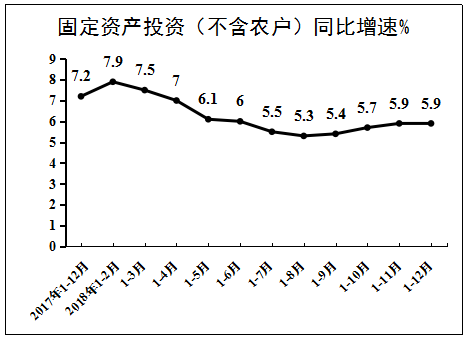

#### 第 1 题　qid 2376633 · 增长

2018年与2017年相比，我国固定资产投资（不含农户）增速

- **A**. 提高0.7个百分点
- **B**. 提高1.3个百分点
- **C**. 降低1.3个百分点　✅
- **D**. 降低0.7个百分点

**答案**：C

**官方解析**

定位图“固定资产投资（不含农户）同比增速%”可得，2018年1-12月增速为，2017年1-12月增速为，则2018年我国固定资产投资（不含农户）增速与2017年相比为，即降低1.3个百分点。

故正确答案为C。

---

#### 第 2 题　qid 2376637 · 增长

2018年我国第三产业增加值同比约增加了

- **A**. 1.3万亿元
- **B**. 3.8万亿元
- **C**. 2.9万亿元
- **D**. 3.3万亿元　✅

**答案**：D

**官方解析**

根据题干所求“2018年······同比约增加了”，结合选项为具体带单位数值，可判定此题为增长量计算问题。定位第一段文字材料可得，第三产业增加值46.96万亿元，同比增长。故2018年我国第三产业增加值同比增长量为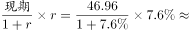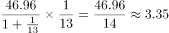万亿元，与D项最接近。

故正确答案为D。

---

#### 第 3 题　qid 2376666 · 综合

关于2018年我国三大产业发展状况，下列说法正确的是：

- **A**. 增长速度均超过国内生产总值
- **B**. 第三产业增加值同比增加最多　✅
- **C**. 第二产业增加值同比增加最少
- **D**. 第一产业的发展速度最快

**答案**：B

**官方解析**

A项：定位文字材料第一段，“2018年我国国内生产总值······比上年增长”，“第一产业…比上年增长”，，错误；

B项：定位文字材料第一段，“第一产业增加值6.47万亿元，比上年增长；第二产业增加值36.60万亿元，增长；第三产业增加值46.96万亿元，增长”，根据增长量比较中大大则大原则可知，第三产业增加值最大，增长率最大，故增长量最大，正确；

C项：定位文字材料第一段，“第一产业增加值6.47万亿元，比上年增长；第二产业增加值36.60万亿元，增长；第三产业增加值46.96万亿元，增长”，根据增长量比较中大大则大原则可知，第一产业增加值最小，增长率最小，故第一产业增长量最小，不是第二产业，错误；

D项：定位文字材料第一段，“第一产业增加值6.47万亿元，比上年增长；第二产业增加值36.60万亿元，增长；第三产业增加值46.96万亿元，增长”，发展速度为，即增长率+1，故直接找增长率最大即可，由已知，第三产业增加值增长率为最大，故第三产业的发展速度最快，错误。

故正确答案为B。

---

#### 第 4 题　qid 2376670 · 综合

2018年我国商品房销售均价约为：

- **A**. 8700元/平方米　✅
- **B**. 9700元/平方米
- **C**. 6700元/平方米
- **D**. 5700元/平方米

**答案**：A

**官方解析**

根据题干所求“2018年······销售均价约为”，结合材料时间为2018年，可判定此题为现期平均数问题。定位文字材料第4段可得，2018年全国商品房销售面积为17.17亿平方米，销售额约15万亿元，则销售均价约为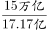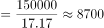元/平方米。

故正确答案为A。

---

#### 第 5 题　qid 2376672 · 综合

下列说法正确的是：

- **A**. 2018年我国国内生产总值增长速度快于2017年
- **B**. 2018年我国第二产业中制造业固定资产投资增速最快
- **C**. 2018年全国商品房销售情况显示，住宅销售前景看好　✅
- **D**. 2018年国内生产总值各季度增速呈现逐步提高的态势

**答案**：C

**官方解析**

A项：定位文字材料第一段可知2018年国内生产总值增长速度为，从第一个折线图可知2017年各个季度的生产总值增速分别为、、、，均高于，根据混合增长率“混合居中”原理，2017年增速介于与之间，大于2018年增速，故A项错误；

B项：定位文字材料第三段可知，2018年第二产业投资增速为，其中制造业投资增长，第二产业中其他行业的增速并不知道，也没法算出，故B项无法判断；

C项：定位文字材料第四段可知，2018年全国商品房住宅销售面积、销售额增速均为正数，是上升趋势，前景看好，故C项正确；

D项：定位第一个折线图可知2018年各个季度的生产总值增速依次为、、、，2018年各季度增速逐步下降，故D项错误。

故正确答案为C。

---

### 材料 2

根据以下资料，回答下列问题。

        据统计，按当年价格计算，2017年我国全社会渔业经济总产值2.48万亿元，其中渔业产值1.23万亿元，渔业工业和建筑业产值0.57万亿元，渔业流通和服务业产值0.68万亿元。

        渔业产值中，海洋捕捞产值1987.65亿元，海水养殖产值3307.40亿元，淡水捕捞产值461.75亿元，淡水养殖产值5876.25亿元，水产苗种产值680.80亿元。

        渔业产值中（不含苗种），海水产品与淡水产品的产值比例为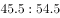，养殖产品与捕捞产品的产值比例为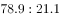。

        据对全国1万户渔民家庭收支情况调查，2017年全国渔民人均纯收入18452.78元，比上年增长。

        2017年，全国水产品总产量6445.33万吨，比上年增长。其中，养殖产量4905.99万吨，同比增长；捕捞产量1539.34万吨，同比降低；养殖产品与捕捞产品的产量比例为，海水产品产量3321.74万吨，同比增长；淡水产品产量3123.59万吨，同比增长；海水产品与淡水产品的产量比例为。

        2017年，全国水产品人均占有量46.37千克（总人口139008万人），比上年减少0.23千克，降低。

#### 第 6 题　qid 2376607 · 综合

反映渔业内部三个产业产值构成时，最合适的统计图是

- **A**. 直方图
- **B**. 柱形图
- **C**. 饼形图　✅
- **D**. 折线图

**答案**：C

**官方解析**

题干要求反映三个产业产值的构成情况，需要反映出三个产业产值之间以及它们与渔业整体的关系，而饼状图可以比较清楚地反映出部分与部分、部分与整体之间的关系。用饼状图来表示可以清晰体现出三个产业产值的构成情况。
故正确答案为C。

---

#### 第 7 题　qid 2376614 · 比重

2017年渔业产值中，养殖产值占比约为

- **A**. 

- **B**. 

　✅
- **C**. 

- **D**. 

**答案**：B

**官方解析**

根据题干“2017年……中……占比约为”，可判定本题为现比重问题。定位文字材料第二段可得：“海水养殖产值3307.40亿元，……，淡水养殖产值5876.25亿元”，故养殖产值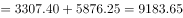亿元。定位文字材料第一段可得：“渔业产值1.23万亿元”，故2017年渔业产值中，养殖产值的占比为：。

故正确答案为B。

---

#### 第 8 题　qid 2376579 · 综合

2017年捕捞水产的单位产值约为

- **A**. 1.59万元/吨　✅
- **B**. 1.88万元/吨
- **C**. 1.29万元/吨
- **D**. 0.30万元/吨

**答案**：A

**官方解析**

根据题干“2017年……单位产值约为”，可判定本题为现期平均数问题。定位文字材料第二段可得：“渔业产值中，海洋捕捞产值1987.65亿元，……，淡水捕捞产值461.75亿元”，故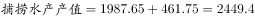亿元。定位文字材料第五段可得：“捕捞产量1539.34万吨”，故2017年捕捞水产的单位产值为：。

故正确答案为A。

---

#### 第 9 题　qid 2376597 · 增长

2017年全国渔民人均纯收入同比增加约为

- **A**. 1550元　✅
- **B**. 1700元
- **C**. 1850元
- **D**. 1900元

**答案**：A

**官方解析**

根据题干“同比增加······”，结合选项带具体单位，可判定本题为增长量计算问题。定位文字材料第四段“2017年全国渔民人均纯收入18452.78元，比上年增长”，2017年的增长量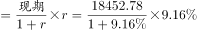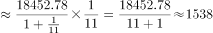元，与A项最接近。

故正确答案为A。

---

#### 第 10 题　qid 2376606 · 综合

下列说法正确的是

- **A**. 2017年全国水产品产量中，海水产品产量增量大于淡水产品产量增量
- **B**. 2017年全国水产品产量中，养殖产品产量占比高于捕捞产品产量占比　✅
- **C**. 近年来，全国水产品人均占有量持续增长
- **D**. 2017年海水产品产值在渔业产值中占绝大比重

**答案**：B

**官方解析**

A项：定位材料第五段，海水产品产量3321.74万吨，同比增长；淡水产品产量3123.59万吨，同比增长。海水产品产量增量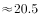万吨；淡水产品产量增量万吨，因此海水产品产量增量小于淡水产品产量增量，错误；

B项：定位材料第五段，养殖产品与捕捞产品的产量比例为，因此养殖产品产量占比高于捕捞产品产量占比，正确；

C项：定位材料第六段，2017年，全国水产品人均占有量46.37千克，比上年减少0.23千克，则水产品人均占有量没有增长，且选项所说“近年来”时间不明确，所以不能判定为持续增长，错误；

D项：定位材料第三段，渔业产值中，海水产品与淡水产品的产值比例为，因此海水产品产值在渔业产值中占较小比重，而非绝大比重，错误。

故正确答案为B。

---
