# 2019年420联考《行测》题（吉林甲级）（网友回忆版）

> 联考 · 2019 年 · 6 个模块 · 共 104 题

- [政治理论](#%E6%94%BF%E6%B2%BB%E7%90%86%E8%AE%BA) · 5 题
- [常识判断](#%E5%B8%B8%E8%AF%86%E5%88%A4%E6%96%AD) · 15 题
- [言语理解与表达](#%E8%A8%80%E8%AF%AD%E7%90%86%E8%A7%A3%E4%B8%8E%E8%A1%A8%E8%BE%BE) · 35 题
- [数量关系](#%E6%95%B0%E9%87%8F%E5%85%B3%E7%B3%BB) · 17 题
- [判断推理](#%E5%88%A4%E6%96%AD%E6%8E%A8%E7%90%86) · 30 题
- [资料分析](#%E8%B5%84%E6%96%99%E5%88%86%E6%9E%90) · 2 题

---

## 政治理论

### 第 1 题　qid 2376586 · 马克思主义

习近平总书记在庆祝改革开放40周年大会上的讲话中，引用了恩格斯的名言：“一切社会变迁和政治变革的终极原因，不应当到人们的头脑中，到人们对永恒的真理和正义的日益增进的认识中去寻找，而应当到生产方式和交换方式的变更中去寻找。”这句话蕴含的哲理是

- **A**. 社会存在决定社会意识
- **B**. 经济基础决定上层建筑　✅
- **C**. 主要矛盾决定根本任务
- **D**. 社会实践决定认识成果

**答案**：B

**官方解析**

本题考查政治常识。题干中习近平总书记讲到：“不应当到······而应当到······”强调的是“而应当到”后面的内容，即“生产方式和交换方式的变更中去寻找”。生产方式是指社会生活所必需的物质资料的谋得方式，在生产过程中形成的人与自然界之间和人与人之间的相互关系的体系。人们一般把物质资料生产的物质内容称作是生产力，把其社会形式称作是生产关系，这两者都是生产方式的建设性内容——物质生产方式（物质谋得方式）和社会生产方式（社会经济活动方式）。换言之，生产方式是两者在物质资料生产过程中的能动统一。
A项错误，社会存在是指社会的物质生活过程，其基础及决定力量是物质资料的生产方式；社会意识是指社会的精神生活过程。社会存在决定社会意识，是指社会存在是第一性的，它决定社会意识。题干信息未体现这一哲学原理。
B项正确，经济基础是指由社会一定发展阶段的生产力所决定的生产关系的总和，是构成一定社会的基础；上层建筑是建立在经济基础之上的意识形态以及与其相适应的制度、组织和设施。本题中，“生产方式和交换方式”属于经济基础范畴，“社会变迁和政治变革”属于上层建筑范畴，题干习总书记的这句话体现了经济基础决定上层建筑。
C项错误，党的十九大报告指出“中国特色社会主义进入新时代，我国社会主要矛盾已经转化为人民日益增长的美好生活需要和不平衡不充分的发展之间的矛盾。”题干信息未体现主要矛盾问题。
D项错误，实践对认识具有决定作用：实践是认识的来源，实践是认识发展的动力，实践是认识的目的，实践又是检验认识正确与否的唯一标准。因此，我们要树立实践第一的观点。题干信息未体现这一哲学原理。
故正确答案为B。

---

### 第 2 题　qid 2376590 · 新思想

习近平主席以“我将无我”来表达自己作为国家领导人的使命。下列名言中，与“我将无我”所表达的思想最接近的是

- **A**. 圣人无常心，以百姓心为心　✅
- **B**. 去民之患，如除腹心之疾
- **C**. 民为邦本，本固邦宁
- **D**. 天下兴亡，匹夫有责

**答案**：A

**官方解析**

本题考查人文常识。习近平主席回答意大利众议长菲科问题时说：“这么大一个国家，责任非常重、工作非常艰巨。我将无我，不负人民。我愿意做到一个‘无我’的状态，为中国的发展奉献自己。”“我将无我”强调了习近平主席作为国家元首为民鞠躬尽瘁的情怀。体现了全心全意为人民服务，时刻以人民的利益为重的情怀。
A项正确，“圣人无常心，以百姓心为心”出自老子的《道德经》，意思是：圣人没有固定不变的意志，而是以百姓的意志为意志。这句话也是说明圣人要以百姓的利益为重，以人民的意志为重。符合题干表述。
B项错误，“去民之患，如除腹心之疾”出自宋代苏辙的《上皇帝书》，意思是：去掉老百姓的祸患，如同除去自己的心病一样。与题干意思不符。
C项错误，“民惟邦本，本固邦宁”出自《尚书·五子之歌》意思是：只有以百姓为国家的根本，根本稳固了，国家就安宁了。与题干意思不符。
D项错误，“天下兴亡，匹夫有责”这句话最早是在顾炎武的《日知录·正始》中提出的概念，意思是：天下大事的兴盛、灭亡，每一个老百姓都有义不容辞的责任。与题干意思不符。
故正确答案为A。

---

### 第 3 题　qid 2376595 · 新思想

习近平总书记指出，我国历朝历代在吏治方面留下了很多思想和做法，比如，            中说“国有贤良之士众，则国家之治厚；贤良之士寡，则国家之治薄”，          说“宰相必起于州部，猛将必发于卒伍”，        说“故天将降大任于斯人也，必先苦其心志，劳其筋骨，饿其体肤，空乏其身”等。依次填入横线处正确的是

- **A**. 《论语》  韩非子  墨子
- **B**. 《墨子》  韩非子  孟子　✅
- **C**. 《老子》  孔子  孟子
- **D**. 《荀子》  孟子  墨子

**答案**：B

**官方解析**

本题考查人文常识。“国有贤良之士众，则国家之治厚；贤良之士寡，则国家之治薄”出自《墨子·尚贤上》，意思是：国家拥有贤良的人多了，那么国家的统治就会坚实；贤良的人少了，那么国家的统治就会薄弱。“宰相必起于州部，猛将必发于卒伍”出自战国时期韩非子的《韩非子·显学》，这两句用于强调国家的文臣武将，特别是选拔高层的官员和将领，一定要从有基层实际工作经验的人中选拔。否则处理政务，领兵作战就可能是纸上谈兵，耽误国家大事。“故天将降大任于斯人也，必先苦其心志，劳其筋骨，饿其体肤，空乏其身”出自孟子的《生于忧患 死于安乐》，意思是：所以上天要把重任降临在某人的身上，一定先要使他心意苦恼，筋骨劳累，使他忍饥挨饿，身体空虚乏力。因此，该题三句古文对应的分别是《墨子》、韩非子和孟子。故B项对应正确。
故正确答案为B。

---

### 第 4 题　qid 2376596 · 新思想

今年是中法建交55周年，在同新中国的交往上，法国创下了诸多“第一”。中法合作空间日益广阔，现已结成102对友好省区和城市，形成丰富的地方交流合作网络，2018年中法贸易额创历史新高。习近平主席曾引用中国古语来形容中法友谊不断走向深入，这句中国古语是

- **A**. 天下难事，必作于易；天下大事，必作于细
- **B**. 履不必同，期于适足；治不必同，期于利民
- **C**. 五色交辉，相得益彰；八音合奏，终和且平
- **D**. 合抱之木，生于毫末；九层之台，起于累土　✅

**答案**：D

**官方解析**

本题考查政治常识。2019年3月24-25日，习近平总书记出访法国期间指出，2019年是新中国成立70周年，也是中法建交55周年。2014年3月27日《在中法建交五十周年纪念大会上的讲话》中，习近平主席说，法国有一句谚语:“一点又一点，小鸟筑成巢。”中国也有一句古语:“合抱之木，生于毫末；九层之台，起于累土。”中法友谊是两国人民辛勤耕耘的结果。借此机会，我要向这些为中法友好事业默默奉献的人们致以崇高的敬意!（注：D选项在2014年8月19日《在全国宣传思想工作会议上的讲话》又一次引用。）
故正确答案为D。

---

### 第 5 题　qid 2376589 · 新思想

改革开放四十年来，中国共产党科学地回答了下列重大时代课题，这些时代课题按时间先后排序正确的是
①建设什么样的党、怎样建设党
②什么是社会主义、怎样建设社会主义
③新形势下需要什么样的发展、怎样发展
④新时代坚持和发展什么样的中国特色社会主义、怎样坚持和发展中国特色社会主义

- **A**. ①②③④
- **B**. ①②④③
- **C**. ②①③④　✅
- **D**. ②①④③

**答案**：C

**官方解析**

本题考查政治常识。
① “建设什么样的党、怎样建设党”是“三个代表”回答的时代课题。
② “什么是社会主义、怎样建设社会主义”是“邓小平理论”回答的时代课题。
③ “新形势下需要什么样的发展、怎样发展”是“科学发展观”回答的时代课题。
④ “新时代坚持和发展什么样的中国特色社会主义、怎样坚持和发展中国特色社会主义”是“习近平新时代中国特色社会主义思想”回答的时代课题。
因此顺序为②①③④。
故正确答案为C。

---

## 常识判断

### 第 1 题　qid 2376694 · 人文常识

有人把做学问比作勘探石油，钻井打到3000米找不到油，就打到5000米、8000米······只要找准地方，越往下打，希望就越大。学懂党的理论和打井一样没有捷径，唯有深入学、刻苦学、持久学，才能掌握其精神实质。这段话蕴含的哲理是：

- **A**. 量变是质变的必要准备　✅
- **B**. 要善于抓事物的主要矛盾
- **C**. 质变和量变会相互转化
- **D**. 要善于发挥意识能动作用

**答案**：A

**官方解析**

本题考查政治常识。有人把做学问比作勘探石油，钻井打到3000米找不到油，就打到5000米、8000米······只要找准地方，越往深处打，希望就越大。这个形象比喻，对于党员、干部学习党的十九大精神颇有启发，这也表明任何事物的发展都必须首先从量变开始，没有一定程度的量的积累，就不可能有事物性质的变化，就不可能实现事物的飞跃和发展。
A项正确，题干描述的情况就是体现了量变是质变的必要准备。
B项错误，马克思主义告诉我们，在诸多矛盾中，要善于抓主要矛盾，在主要矛盾中要善于抓矛盾的主要方面。题干中没有体现。
C项错误，量变是事物发展的一个过程，质变是量变发展到一定阶段时的突变，量变是质变的准备阶段，质变是量变的新起点。题干中主要讲的是量变引起质变。
D项错误，意识能动作用指人的主观意识和实践活动对于客观世界的能动作用。题干中没有提到意识能动作用。
故正确答案为A。

---

### 第 2 题　qid 2376578 · 人文常识

1798年，拉普拉斯曾根据牛顿引力理论预言宇宙中存在一种类似于黑洞的天体。1939年，奥本海默等根据广义相对论，进一步证明，一个无压的尘埃球体，在自引力作用下将能坍缩到它的引力半径的范围以内，这就形成黑洞。2019年4月10日，黑洞研究开创性成果——“虚拟望远镜”在2017年拍摄的黑洞照片在全球同时发布，人们对于黑洞的研究又向前迈进了一步。这一过程蕴含的哲理是：

- **A**. 联系具有普遍性和条件性
- **B**. 世界具有统一性和多样性
- **C**. 认识具有反复性和上升性　✅
- **D**. 实践具有客观性和历史性

**答案**：C

**官方解析**

本题考查政治常识。
A项错误，联系具有普遍性和条件性。世界上的一切事物都与周围其他事物有着这样或那样的联系。一切事物的存在和发展都是有条件的。但本题没有体现联系的普遍性和条件性。
B项错误，世界具有物质统一性，世界的本原只有一个，即物质。而物质世界中各种事物和现象都是物质及其存在形式的不同表现。世界具有的统一性和多样性是共性和个性的关系。题干中没有体现世界的统一性和多样性。
C项正确，认识具有反复性。人们对一个事物的正确认识往往要经过从实践到认识、再从认识到实践的多次反复才能完成。从实践到认识、从认识到实践的循环是一种波浪式的前进和螺旋式的上升。题干中对于黑洞从预言到如今照片发布的认识过程，体现了人类认识的反复性和上升性。
D项错误，实践是人类改造客观世界的物质性活动，具有客观物质性和社会历史性。题干强调的是认识活动而非实践。
故正确答案为C。

---

### 第 3 题　qid 2376696 · 法律常识

某市一公民从海外回国，入境时带回的一箱化妆品被该市海关扣押，该公民不服，其申请行政复议的机关应该是：

- **A**. 该市海关
- **B**. 该市人民政府
- **C**. 该市海关的上一级海关　✅
- **D**. 该市所属省级人民政府

**答案**：C

**官方解析**

本题考查法律常识。
根据《行政复议法》第二十七条规定：“对海关、金融、外汇管理等实行垂直领导的行政机关、税务和国家安全机关的行政行为不服的，向上一级主管部门申请行政复议。”该公民对市海关的行政行为不服，应向该市海关的上一级海关申请行政复议，C项正确，A、B、D三项错误。
故正确答案为C。

---

### 第 4 题　qid 2376700 · 法律常识

据报道，某商场广告牌围挡被风吹倒，有行人被砸，送医就诊后，均无生命危险。事件发生时，市民吴某用手机录制了视频，谎称“商场牌子砸人了，3死2伤”。该视频被快速传播，在社会上造成不良影响。对此，下列说法正确的是：

- **A**. 吴某不遵守社会公德，应该由街道办进行教育与处罚
- **B**. 吴某的行为违反刑法，应该由法院判处其相应的刑罚
- **C**. 吴某触犯了民事法律，属于严重扰乱公共秩序的行为
- **D**. 吴某违反治安管理处罚法，应接受公安机关相应处罚　✅

**答案**：D

**官方解析**

本题考查法律常识。
《治安管理处罚法》第二十五条规定：“有下列行为之一的，处五日以上十日以下拘留，可以并处五百元以下罚款；情节较轻的，处五日以下拘留或者五百元以下罚款:（一）散布谣言，谎报险情、疫情、警情或者以其他方法故意扰乱公共秩序的；（二）投放虚假的爆炸性、毒害性、放射性、腐蚀性物质或者传染病病原体等危险物质扰乱公共秩序的；（三）扬言实施放火、爆炸、投放危险物质扰乱公共秩序的。”
A项错误，吴某在网上传播虚假信息，散布谣言，不仅仅是不遵守社会公德的行为，是违法行为。
B项错误，吴某的行为虽然在社会上造成了不良影响，但是并不是对社会具有很大的危害，没有触犯刑法规定，是一般违法行为，非犯罪行为。
C项错误，民法调整平等主体的自然人、法人和非法人组织之间的人身关系和财产关系。吴某的行为并不涉及到民事法律关系，触犯的不是民事法律。
D项正确，吴某在网上制造虚假信息，散布谣言，在社会上造成了不良的影响，是违反治安管理的行为，违反了治安管理处罚法，应该由公安机关进行相应的处罚。
故正确答案为D。

---

### 第 5 题　qid 2376693 · 人文常识

“鞋子合不合脚，自己穿着才知道，一个国家的发展道路合不合适，只有这个国家的人民才最有发言权。”下列古诗词蕴涵的哲理与“鞋子合脚论”最相近的是：

- **A**. 沉舟侧畔千帆过，病树前头万木春
- **B**. 古歌旧曲君休听，听取新翻杨柳枝
- **C**. 问渠那得清如许，为有源头活水来
- **D**. 纸上得来终觉浅，绝知此事要躬行　✅

**答案**：D

**官方解析**

本题考查政治常识。
A项错误，该句的意思是翻覆的船只旁仍有千千万万的帆船经过；枯萎树木的前面也有万千林木欣欣向荣。体现的哲理是事物总是不断发展变化的，新事物必然战胜旧事物，新陈代谢是宇宙间不可抗拒的规律。
B项错误，该句的意思是请你不要再听那前朝的曲子，来欣赏新创作的《杨柳枝》。体现的哲理是事物是变化发展的，不可因循守旧。
C项错误，该句的意思是要问池塘里的水为何这样清澈呢？是因为有永不枯竭的源头源源不断地为它输送活水。该句表面是写水因为有源头活水不断注入才“清如许”，实则暗喻人要心灵澄明，就得认真读书，时时补充新知识。体现的哲理是事物都是不断运动、变化和发展的，运动是物质的存在方式和根本属性。
D项正确，该句的意思是从书本上得来的知识毕竟不够完善，要透彻地认识事物还必须亲自实践。体现的哲理是实践是认识的来源，是检验真理的唯一标准。题干中“鞋子合脚论”也体现了这一原理。
故正确答案为D。

---

### 第 6 题　qid 2376562 · 人文常识

文风会风体现工作作风，也反映领导干部的能力和水平。下列名言最能体现改进文风会风要求的是：

- **A**. 智者弃短取长，以致其功
- **B**. 一室之不治，何以天下家国为
- **C**. 不学诗，无以言；不学礼，无以立
- **D**. 凫胫虽短，续之则忧；鹤胫虽长，断之则悲　✅

**答案**：D

**官方解析**

本题考查人文常识。
A项错误，“智者弃短取长，以致其功”意思是聪明人舍弃短处，采取长处，取得成功。意在强调做人要扬长避短，与题干要求不符。
B项错误，“一室之不治，何以天下家国为”意思是一间屋子都管理不好，怎么能管理好国家呢？意在强调要自律，重视小事的积累，没有体现改进文风会风的要求。
C项错误，“不学诗，无以言；不学礼，无以立”意思是不学《诗经》，在社会交往中就不会说话；不学礼，在社会上就不能立足。意在强调学习诗礼，与题干要求无关。
D项正确，“凫胫虽短，续之则忧；鹤胫虽长，断之则悲”意思是野鸭的小腿虽然短，续长一截就有忧患；鹤的小腿虽然长，截去一段就会痛苦。告诫我们行事要遵循规律，工作中文风会风也需要结合实际，务求实效，宜短则短，宜长则长，符合题干要求。
故正确答案为D。

---

### 第 7 题　qid 2376702 · 人文常识

下列诗句中，划线词语所指对象不同于其它三项的是：

- **A**. 
万松围坐石，大海浴<u>金轮</u>
　✅
- **B**. 
<u>桂魄</u>十分满，暮容千里晴

- **C**. 
天上分金镜，人间望<u>玉钩</u>

- **D**. 
绛河<u>冰鉴</u>朗，黄道玉轮巍

**答案**：A

**官方解析**

本题考查人文常识。
A项错误，诗句出自宋代薛嵎的《本无师住甸阳山庵》，诗句中的“金轮”所指对象是太阳。
B项正确，诗句出自宋代郑作肃的《中秋登青原台》，诗句中的“桂魄”所指的对象是月亮。
C项正确，诗句出自唐代李贺的《七夕》，诗句中的“玉钩”所指的对象是月亮，状新月、缺月，望月而冀其复圆，寓人间别而重逢意。
D项正确，诗句出自唐代元稹的《月三十韵》，诗句中将月亮比作“冰鉴”，意思是银河之上有一轮明朗的月亮犹如冰鉴，黄道天空中有一轮巍巍明月好像玉盘。
本题为选非题，故正确答案为A。

---

### 第 8 题　qid 2376695 · 人文常识

有人说，做好机关工作应该经历三重境界：最基本的是“技”，其次是“法”，最高的是“道”。下列寓言故事所反映的道理与此最相近的是：

- **A**. 愚公移山
- **B**. 庖丁解牛　✅
- **C**. 画龙点睛
- **D**. 画蛇添足

**答案**：B

**官方解析**

本题考查人文常识。
有人说，做好机关工作应该经历三重境界：最基本的是“技”，其次是“法”，最高的是“道”，意指做工作应当遵循一定的步骤。
A项错误，“愚公移山”出自春秋战国的列御寇《列子·汤问》，讲述了愚公不畏艰难，坚持不懈，挖山不止，最终感动天帝而将山挪走的故事。
B项正确，“庖丁解牛”出自《庄子·内篇·养生主》。它说明世上事物纷繁复杂，只要反复实践，掌握了它的客观规律，就能得心应手，运用自如。庖丁解牛之初，所看见的是浑然一牛；三年之后，就未尝见全牛了，而是对牛生理上的天然结构、筋骨相连的间隙、骨节之间的窍穴皆了如指掌；最后用精神去接触牛，不再用眼睛看它，感官的知觉停止了，只凭精神在活动，体现了从“技”到“法”再到“道”的三重境界，与题干中机关工作三重境界相符合。
C项错误，“画龙点睛”出自唐·张彦远《历代名画记·张僧繇》，原形容梁代画家张僧繇作画的神妙，后多比喻写文章或讲话时，在关键处用几句话点明实质，使内容更加生动有力。
D项错误，“画蛇添足”语出《战国策·齐策二》，比喻做多余的事，反而不恰当，讽刺了那些做事多此一举，反而得不偿失的人。也比喻虚构事实，无中生有。
故正确答案为B。

---

### 第 9 题　qid 2376697 · 经济常识

甲、乙两个地区居民的恩格尔系数分别为和，这可能表明：

- **A**. 甲地居民之间的贫富差距较大
- **B**. 乙地居民之间的贫富差距较大
- **C**. 甲地居民比乙地居民富裕　✅
- **D**. 乙地居民比甲地居民富裕

**答案**：C

**官方解析**

本题考查经济常识。

恩格尔系数是食品支出总额占个人消费支出总额的比重。其主要内容是指一个家庭或个人收入越少，用于购买生存性的食物的支出在家庭或个人收入中所占的比重就越大。对一个国家而言，一个国家越穷，每个国民的平均支出中用来购买食物的费用所占比例就越大。恩格尔系数达以上为贫困，为温饱，为小康，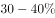为富裕，低于为最富裕。题干中甲地恩格尔系数小于乙地，说明甲地居民比乙地居民富裕，故C项正确，D项错误。

A、B两项错误，基尼系数是判断收入分配公平程度的指标，国际上用来综合考察居民内部收入分配差异状况的一个重要分析指标。基尼系数越大，贫富差距越大。

故正确答案为C。

---

### 第 10 题　qid 2376698 · 人文常识

《初学记·鸟赋》云：“雏既壮而能飞兮，乃衔食而反哺。”其所描写的鸟是：

- **A**. 燕子
- **B**. 喜鹊
- **C**. 麻雀
- **D**. 乌鸦　✅

**答案**：D

**官方解析**

本题考查人文常识。
“雏既壮而能飞兮，乃衔食而反哺。”出自《初学记·鸟赋》，源自典故“乌鸦反哺”，意思指：乌雏长成，衔食喂养其母。后比喻报答亲恩。句中所描写的鸟指乌鸦。 
故正确答案为D。

---

### 第 11 题　qid 2376701 · 科技常识

科学家宣称太阳活动正在向着低点滑落，预计在2019至2020年达到低峰。届时地球受到的影响最可能是：

- **A**. 全球农业歉收　✅
- **B**. 航天危险增大
- **C**. 北极极光消失
- **D**. 上层大气升温

**答案**：A

**官方解析**

本题考查地理国情。
太阳黑子受强烈磁场的影响，在太阳表面形成相对低温的区域。其周边常伴随着耀斑爆发，向地球释放X射线和极端紫外辐射。每隔几年，太阳黑子会消退，黑子和耀斑等激烈活动减退，太阳活动向着低点滑落，太阳活动会减弱，这是太阳黑子循环的常规部分。
A项正确，太阳活动与自然灾害有一定的相关性，若太阳活动达到低峰，太阳活动进入极小年可能出现旱涝灾害，导致农业减产。
B项错误，太阳活动的减弱，相应地对无线电短波通信干扰减弱，对执行太空任务的宇航员来说，航天危险会相对减少。
C项错误，太阳活动的减弱，地球上极光现象会减少，但不会消失。
D项错误，太阳活动减弱，太阳辐射相应发生减退，地球上层大气温度会变低。
故正确答案为A。

---

### 第 12 题　qid 2376685 · 人文常识

长春市轨道交通2号线已投入运营，在工程建设中用量最大的硅酸盐材料是：

- **A**. 石灰
- **B**. 陶瓷
- **C**. 水泥　✅
- **D**. 大理石

**答案**：C

**官方解析**

A项错误，石灰是一种以氧化钙为主要成分的气硬性无机胶凝材料，不含硅酸盐。
B项错误，陶瓷是陶器和瓷器的统称，其中用黏土或陶土为原料烧制的器皿叫陶器，用瓷土、瓷石等为原料烧制的器皿叫瓷器。轨道交通的工程建设中一般不使用陶瓷。
C项正确，水泥是一种能把砂、石等材料牢固地胶结在一起的水硬性无机胶凝材料。水泥种类很多，最常用的是硅酸盐水泥，广泛应用于各类建筑工程中。因此轨道交通工程建设中用量最大的硅酸盐材料是水泥。
D项错误，大理石主要成分为碳酸钙，是一种装饰性很强的装饰材料，常用于大型公共建筑的门厅、大厅等比较重要的场所。
故正确答案为C。

---

### 第 13 题　qid 2376689 · 人文常识

压强和温度会引起密度的变化。假定其他条件不变的情况下，下列关于压强和密度的说法中，错误的是：

- **A**. 
氧气瓶中的氧气用掉一部分后，体积不变，密度变小

- **B**. 
给自行车胎打气，车胎体积不变，质量变大，密度变大

- **C**. 
通常情况下，水在0时的密度大于4时的密度
　✅
- **D**. 
温度计内的水银随温度升高而密度减小，体积变大

**答案**：C

**官方解析**

本题考查科技常识。

密度（）是对特定体积内的质量（）的度量（），计算公式是物体的质量除以体积，即。

A项正确，氧气瓶中的氧气是经压缩后保存的，在使用过程中，氧气被不断消耗，质量减小，而氧气瓶的体积不发生变化，即瓶内的氧气体积不变，故瓶内氧气的密度减小。

B项正确，车胎在满气状态下，其体积已经达到最大，此时给车胎打气，车胎内气体质量不断增加，但由于外胎束缚，车胎体积已基本不再变化，故车胎内气体密度变大。

C项错误，水在的密度为0.99984g每立方厘米，水在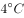的密度为0.99997g每立方厘米，因此通常情况下，水在时的密度小于时的密度。

D项正确，水银温度计内的水银含量是不变的，即水银的总质量不变，受热后，水银膨胀，体积变大，密度减小。

本题为选非题，故正确答案为C。

---

### 第 14 题　qid 2376690 · 科技常识

开瓶放置的葡萄酒，数天后会变酸。这是由于发生了：

- **A**. 水解反应
- **B**. 氧化反应　✅
- **C**. 酯化反应
- **D**. 加成反应

**答案**：B

**官方解析**

本题考查科技常识。
A项错误，水解反应包括盐水解和有机化合物水解两类，通常指水中的氢和羟基分别加到化合物的某一部分，因而得到两种或两种以上新化合物的反应过程。葡萄酒变酸未涉及到水解反应。
B项正确，有机物的氧化反应是指失电子或电子偏离化合价升高的反应过程。葡萄酒开瓶后很容易被空气氧化，酒精（乙醇）在氧化作用下先生成乙醛，乙醛后被氧化为乙酸，使酒变成醋，因此会有酸味。
C项错误，酯化反应一般指醇和酸（无机酸或有机酸）作用生成酯（无机酸酯或有机酸酯）和水的反应。葡萄酒变酸未生成酯，不涉及酯化反应。
D项错误，加成反应是一种有机化学反应，指两个或多个分子互相作用，生成一个加成产物，其发生在有双键或叁键(不饱和键)的物质中。葡萄酒变酸未涉及到加成反应。
故正确答案为B。

---

### 第 15 题　qid 2376691 · 科技常识

高粱、玉米等植物的种子经发酵、蒸馏就可以得到一种“绿色能源”物质。这种物质是：

- **A**. 氢气
- **B**. 甲烷
- **C**. 酒精　✅
- **D**. 乙炔

**答案**：C

**官方解析**

本题考查科技常识。
A项错误，氢气是一种极易燃烧，无色透明、无臭无味的气体，液态氢可用做火箭或导弹的高能燃料。氢气是气体，且难溶于水，不能通过蒸馏的形式得到，实验室中可采用电解水、氨分解等方式制备氢气。
B项错误，甲烷是结构最简单的碳氢化合物，其主要是作为燃料，广泛应用于民用和工业中。由于甲烷是气体，不能通过蒸馏的形式得到，实验室中主要是用无水的醋酸钠和氢氧化钠加热在氧化钙（催化剂）的条件下发生脱羧反应生成碳酸钠和甲烷。
C项正确，高粱、玉米等植物的种子主要成分是淀粉，淀粉属于多糖，其经发酵、蒸馏后可以得到酒精。酒精燃烧生成二氧化碳和水，对环境无影响，所以被称为“绿色能源”。
D项错误，乙炔是最简单的炔烃，主要用于焊接金属、合成高分子化合物。乙炔不能通过植物发酵等形式得到，主要制备方法有电石法、天然气制乙炔法。
故正确答案为C。

---

## 言语理解与表达

### 材料 1

<b>阅读下面的短文，回答</b><b>51-55</b><b>题</b>

        无论是火爆一时的综艺节目《国家宝藏》，还是深受年轻观众喜欢的纪录片《我在故宫修文物》，抑或是“故宫淘宝”上那些妙趣横生的文创产品、故宫微博上那些“萌萌哒”的“段子”······进入网络时代，故宫仿佛开始了“逆生长”，不断以新的方式，走进公众尤其是年轻人的生活。

        习近平总书记指出，“一个博物院就是一所大学校”。古建筑群、院藏文物和专家学者的智力资源，是故宫博物院独具特色的资源。如何让这些资源实现创造性转化、创新性发展？故宫给出的答案中，排在第一位的是“公众”。再珍稀的文物，也是为人而保存；再高深的学问，也是为人而研究。“要让文物说话，让历史说话，让文化说话”，其最终的落脚点，都是千千万万的今人与后人。

        正是抱持着这样的目的，故宫把目光更多地投向年轻一代。从“故宫萌物”系列文创产品，到人见人爱的“故宫猫保安”，再到各种令人<u>      </u>的《上新了·故宫》，紧扣年轻人的笑点、兴趣点，故宫告别了<u>      </u>的形象，在撩拨时代心弦的过程中一点点走近年轻人，血脉筋骨也为之舒活。

        年龄的“跨界”填平文化的代沟，更多的跨界催生无数意外的惊喜。正在打造中的“数字故宫”，不仅注重博物馆与社会的融合，更把多学科的跨界融合、传统技艺和现代科技的跨界融合当作追求，塑造博物馆的新形态。一旦这些“完美碰撞”擦出火花，故宫就“活”了起来、“火”了起来，产生1+1远大于2的效果。我们欣然看到，这种“故宫模式”近年来已经影响和带动了一大批国内文博机构，甚至在年轻一代中引发了报考故宫博物院以及大专院校文博专业的热潮······

        2020年是故宫600岁生日，“把一个壮美的故宫完整地交给下一个600年”，是故宫孜孜以求的目标。我们“交给下一个600年”的是一堆冰冷的文物，还是一个涌动着鲜活生命力的文化存在？对于所有从事传统文化保护传承工作的人来说，这是值得思考的重大问题。

#### 第 1 题　qid 2376832 · 片段阅读

对第1段文字的主要观点概括最准确的是：

- **A**. 数字技术为故宫文化的传播打开了新局面
- **B**. 故宫以新颖的方法和形式融入了大众生活　✅
- **C**. 年轻人是故宫文创产品的最主要消费群体
- **D**. 传统文化的时尚化表达有多种多样的形式

**答案**：B

**官方解析**

文段首先通过“无论是······还是······抑或是······”列举出多种与故宫有关的新兴事物，省略号之前均为举例内容。尾句指出进入网络时代，故宫通过新的方式走进大众、走进年轻人，故文段重在强调故宫通过新的方式走进了公众，对应B项。
A项，“数字技术”属于文段话题的缩小，文段指的是“网络时代”，且“新局面”表述不明确，文段尾句明确指出走进公众，排除；
C项，“故宫文创产品”偏离文段核心话题，文段尾句围绕“故宫”这一话题展开，且“最主要消费群体”文段并未提及，无中生有，排除；
D项，偏离文段核心话题，文段围绕“故宫”这一话题展开，且文段重在说明故宫走进公众，选项中并未提及，排除。
故正确答案为B。
【文段出处】《故宫缘何变得如此年轻？》

---

#### 第 2 题　qid 2376835 · 片段阅读

第2段旨在说明：

- **A**. 应该让故宫所内蕴的丰富资源惠及大众　✅
- **B**. 如何让故宫文物古为今用是一个新课题
- **C**. 传统文化资源的挖掘功在当代利在千秋
- **D**. 一座故宫就是一所拥有特色资源的大学

**答案**：A

**官方解析**

第二段首先引用习总书记的话，随后引出“故宫的资源”这一话题，接下来通过提出如何实现转化和发展的问题，之后给出答案，即“排在第一位的是‘公众’。”，即强调公众的重要性，最后通过并列结构进行加强论证。故文段的重点是强调故宫的资源要让公众受惠，对应A项。
B、C、D三项，均未提及“公众”这一主题词，偏离中心，排除。
故正确答案为A。
【文段出处】人民日报《故宫缘何变得如此年轻？》

---

#### 第 3 题　qid 2376836 · 逻辑填空

填入第3段划横线部分最恰当的一组是：

- **A**. 欲罢不能  老成持重
- **B**. 忍俊不禁  正襟危坐　✅
- **C**. 赞不绝口  一本正经
- **D**. 目不暇接  不苟言笑

**答案**：B

**官方解析**

本题从第二空入手，根据后文“一点点走近年轻人，血脉筋骨也为之舒活”可知，文段将故宫拟人化，前后形成对比，说明故宫以前只是端坐着，没有走近年轻人和舒活筋骨，B项“正襟危坐”指整一整衣服，端正地坐着，与后文构成形象对应，符合文意，保留。A项“老成持重”指办事老练稳重，C项“一本正经”形容态度庄重严肃、郑重其事，D项“不苟言笑”指不随便说笑，亦形容态度庄重严肃，均无法与后文的“一点点走近年轻人，血脉筋骨也为之舒活”形成对应，排除。
第一空，代入验证，B项“忍俊不禁”指忍不住要发笑，与后文“紧扣年轻人的笑点”对应恰当，符合语境，当选。
故正确答案为B。
【文段出处】《故宫缘何变得如此年轻？》

---

#### 第 4 题　qid 2376838 · 片段阅读

对第4段中的“故宫模式”，理解最准确的一项是：

- **A**. “1+1＞2”
- **B**. 数字故宫
- **C**. 文化卖萌
- **D**. 跨界融合　✅

**答案**：D

**官方解析**

此题为词句理解题，首先定位原文，找到“故宫模式”。根据“这种‘故宫模式’”可知，重点关注“故宫模式”之前的内容。根据“不仅注重博物馆与社会的融合，要把多学科的跨界融合、传统技艺和现代科技的跨界融合当作追求，······一旦这些‘完美碰撞’擦出火花，故宫就‘活’了起来、‘火’了起来，产生11远大于2的效果”可知，前文重点强调的是“跨界融合”，对应D项。

A项“112”和B项“数字故宫”均是“跨界融合”带来的结果，并非一种模式，排除；C项“文化卖萌”无中生有，排除。

故正确答案为D。

---

#### 第 5 题　qid 2376840 · 片段阅读

最适合做这篇短文标题的是：

- **A**. 网络时代让“老年”故宫“返老还童”　✅
- **B**. 传统文化保护：是使命，也是课题
- **C**. 故宫的鲜活生命力从何而来
- **D**. 今日故宫，“跨界”的“网红”

**答案**：A

**官方解析**

文章首先提出，进入网络时代，故宫开始了“逆生长”，走进了年轻人的生活。后面接着指出故宫把目光投向了年轻一代，一点一点走进年轻人，开始打造“数字故宫”，在年轻一代当中引发了数字热潮。最后一段思考怎么把一个完整的故宫交给下一个600年，让故宫永葆生命力。所以整个文段都在论述利用网络时代让故宫保持年轻，对应A项。
B项，“传统文化保护”把“故宫”范围扩大，排除；
C项，“从何而来”表述不明确，文段体现的是网络时代，排除；
D项，“跨界”对应文段第四段，并不是对整个文段的概括，表述片面，排除。
故正确答案为A。
【文段出处】《人民日报：故宫缘何变得如此年轻？ 》

---

#### 第 6 题　qid 2376616 · 逻辑填空

韩愈云：“千里马常有，而伯乐不常有。”这里说的伯乐，就是千里马的“贵人”，如果没有伯乐出现，千里马也会淹没于芸芸众“马”之中虚耗宝贵年华。古往今来，很多功成名就者都是在关键时刻遇上            的“贵人”，加之自身的实力和努力没有辜负“贵人”所赐予的机遇，终得以            。

填入划横线部分最恰当的一组是：

- **A**. 火眼金睛  脱颖而出
- **B**. 慧眼识珠  有所作为　✅
- **C**. 独具慧眼  崭露头角
- **D**. 明察秋毫  出人头地

**答案**：B

**官方解析**

第一空，由前文“如果没有伯乐出现，千里马也会淹没于芸芸众‘马’之中虚耗宝贵年华”可知，横线处表达“贵人”能够在众多马之中找出千里马，体现其眼光敏锐之意。B项“慧眼识珠”指具有独到眼光，高明的见解，C项“独具慧眼”指能看到别人看不到的东西，形容眼光敏锐，见解高超，B、C两项均符合文意，保留。A项“火眼金睛”形容人的眼光锐利，能够识别真伪，与文意不符，排除；D项“明察秋毫”原形容人目光敏锐，任何细小的事物都能看得很清楚，现多形容人能洞察事理，与文意不符，排除。
第二空，由前文“功成名就者”可知，横线处表达其最终取得了成功，B项“有所作为”指可以做事情，并能取得较大的成绩，符合文意，当选。C项“崭露头角”比喻突出地显露出才能和本领，无法体现成功之意，排除。
故正确答案为B。
【文段出处】《你生命中的那些“贵人”》

---

#### 第 7 题　qid 2376628 · 逻辑填空

以家为         的家族文化传承，把家风、家教、家规、家德注入每代传承人心中，融入到企业文化中，形成部分老字号维系生存的         。
填入划横线部分最恰当的一项是：

- **A**. 桥梁  动力
- **B**. 媒介  根底
- **C**. 源头  基础
- **D**. 依托  根脉　✅

**答案**：D

**官方解析**

第一空，横线处要体现“家”对于“家族文化传承”很重要，通过后文“把家风、家教、家规、家德注入每代传承人心中”可知，需要依靠“家”才能传承家族文化，D项“依托”指依靠凭借，符合文意，保留。C项“源头”指水发源处，比喻事物的本源，可理解为家族文化来源于家，也可保留。A项“桥梁”、B项“媒介”指建立双方联系的途径，体现不出“家”对于“家族文化”起到的作用，均排除。
第二空，横线处体现出“家族文化传承”把“家”的很多信条注入每代传承人心中，维系老字号的生存，D项“根脉”与C项“基础”语意均符合，但D项“根脉”更加形象、生动，对比优选。
故正确答案为D。
【文段出处】人民日报《忠厚如何传家“酒”》

---

#### 第 8 题　qid 2376812 · 逻辑填空

填入划横线部分最恰当的一组是
关于培养创新人才，教育部最近提出的“新工科”教育非常重要。“新工科”最新公布的指标是“十、百、万”，即“十个专业方向，百种教材，一万名教师”。这是一次创新之举，不但要带来更多知识，更要搭建一个知识拓展的        ，要培养造就一批多样化、创新型的工程科技人才，为我国产业发展提供            。

- **A**. 空间  人才队伍
- **B**. 平台  智力支持　✅
- **C**. 天地  人才保障
- **D**. 舞台  智力保障

**答案**：B

**官方解析**

第一空，填入横线部分与“搭建”搭配，指搭造建立，B、D两项搭配恰当，A项“空间”往往搭配“拓展”、“开辟”，C项“天地”往往搭配“打开”、“闯出”，和“搭建”搭配不当，排除A、C两项。
第二空，填入横线词语，根据一空搭建平台、舞台，即表达人才对产业发展起到支撑作用，B项“智力支持”“支持”侧重强调支撑，支柱，可以和前文形成对应，符合文意，当选，D项“智力保障”，“保障”侧重强调必要条件，不符合文意，排除。
故正确答案为B。
【文段出处】《创新要落在实干上》

---

#### 第 9 题　qid 2376658 · 逻辑填空

“爱的匮乏限制了我们对人生的想象力。”我们常常说，因为我们缺爱，所以没有安全感。也许是我们            了，是因为我们拿不出爱，我们才会有庞大的不安全感。你自己不愿意先拿出来，对世界的        才是无爱的。

填入划横线部分最恰当的一项是：

- **A**. 舍本逐末  回应
- **B**. 本末倒置  投射　✅
- **C**. 吹毛求疵  认识
- **D**. 舍近求远  映射

**答案**：B

**官方解析**

第一空，根据文意可知，针对“缺少安全感的原因”，横线后认为“不愿意先付出爱”是其原因，横线前认为“缺爱”，即无人给予关爱是其原因，前后原因刚好相反。A项“舍本逐末”比喻做事不抓住主要的问题，而专顾细枝末节。现多用于指轻重主次颠倒，不会明辨轻重缓急，B项“本末倒置”比喻把主要的和次要的、本质和非本质的关系弄颠倒了，均符合文意，保留。C项“吹毛求疵”比喻故意挑剔别人的缺点，寻找差错，D项“舍近求远”形容做事走弯路，均与文意不符，排除。
第二空，根据文意可知，横线处应体现我们对世界的一种主动的行为。B项“投射”指发射，投掷，是一种主动的行为，符合文意，当选。A项“回应”指回答，答应，通常为被动，与文意不符，排除。
故正确答案为B。
【文段出处】《想跟你过一辈子，但爱你很累》

---

#### 第 10 题　qid 2376813 · 逻辑填空

填入画横线部分最恰当的一项是
啥是佩奇？这只其貌不扬的粉红小猪，本身就是家庭亲情的象征。父母、姐弟，简简单单、快快乐乐地生活在一起。这个“舶来品”的故事，        了中国老百姓“老婆孩子热炕头”的淳朴理想，也符合孩子们对童年、父母、家庭日常的真实感受。这是最基本的人伦感情，也是全世界通用的语言。

- **A**. 迎合
- **B**. 暗合　✅
- **C**. 符合
- **D**. 吻合

**答案**：B

**官方解析**

依据前文提示，“舶来”即外来，空中所填的词需要体现“外来故事”和“国内淳朴理想”的关系，且由“也符合······”可知，横线处应与“符合”意思相近。即体现“不同地域、不同文化、不同人物之间，却有着相同的意蕴和情感”之意，强调“佩奇”与“中国淳朴理想”两者间相符的偶然性。B项，“暗合”指没有经过商讨而意思恰巧相合，符合文意，当选。
A项，“迎合”指故意使自己的言语或举动适合别人的心意，文段未体现“佩奇”主动适应老百姓的理想，与文意不符，排除；
C项，“也”连接前后为并列关系，与后文“符合”重复，不符合日常用语习惯，表述过于单一，且未体现“偶然性”之意，排除；
D项，“吻合”指完全符合，侧重“一模一样”，程度太重，且未体现“偶然性”之意，排除。
故正确答案为B。
【文段出处】《&lt;啥是佩奇&gt;一夜爆红说明什么？》

---

#### 第 11 题　qid 2376623 · 语句表达

作为网络时代表达情感的一种方式，表情包已经融入网友们的交流之中，各种表情包层出不穷，                    ，好不热闹。

填入划横线部分最恰当的一项是：

- **A**. 青出于蓝胜于蓝
- **B**. 这山望着那山高
- **C**. 前有轱辘后有辙
- **D**. 你方唱罢我登场　✅

**答案**：D

**官方解析**

依据前文，横线处与前文语义相近。“层出不穷”意指接连不断地出现，尚未穷尽。D项“你方唱罢我登场”意为你刚唱完，我就登上场来，体现出接连不断的意思，能够与“层出不穷”构成并列，当选。
A项“青出于蓝胜于蓝”指人经过学习之后可以得到提高,常指学生超过老师；B项“这山望着那山高”比喻对自己目前的工作或环境不满意,老认为别的工作、别的环境更好；C项“前有轱辘后有辙” 前边有车行过，后边就有车辙，比喻前人取得了经验教训，后人就有了可以遵循的榜样。均无法与“层出不穷”构成并列，排除。
故正确答案为D。
【文段出处】《文物表情包制作 娱而不能愚》

---

#### 第 12 题　qid 2376815 · 逻辑填空

填入划横线部分最恰当的一组是
阿耐的《都挺好》延续其《欢乐颂》的都市情感、代际相处、职场生存等热点话题，将《欢乐颂》中安迪的智慧与樊胜美的身世集于女主角苏明玉一身。不仅令都市女性            ，也成功将原本站在不同角色背后的读者的注意力归拢起来。网络文学多以皇帝娘娘、天外飞仙为主角，可谓玄幻、穿越竞放，阿耐的这些作品就显得有些        。

- **A**. 触景生情  特别　✅
- **B**. 心照不宣  孤立
- **C**. 抚今追昔  低调
- **D**. 心有灵犀  朴素

**答案**：A

**官方解析**

本题可从第二空入手，横线处要体现将网络文学和阿耐的作品进行对比，阿耐作品的特点。前文提到，网络文学多为玄幻、穿越主题，而阿耐的作品主要讨论都市情感等写实的主题，故横线处表示阿耐作品的风格和网络文学的风格是不一样的，A项“特别”指不普通，与众不同，符合文意，保留。B项“孤立”指孤独无助；C项“低调”指谦虚谨慎的态度，不张扬；D项“朴素”指俭朴，不奢侈，均与文段语境不符，排除。
第一空代入验证，A项“触景生情”指受到眼前景物的触动，引起联想，产生某种感情，体现出女性在看到《都挺好》这部热剧时受到了触动，且与横线后文“将原本站在不同角色背后的读者的注意力归拢起来”形成对应，符合文意，当选。
故正确答案为A。
【文段出处】《接地气 有底气——评评阿耐的网络文学创作》

---

#### 第 13 题　qid 2376618 · 逻辑填空

最初版本的个税APP启用以后，人们对租户必须填写房东信息产生质疑，担心此举会导致房东多缴一笔出租税，因而房东通过涨房租来对冲损失，客观上造成了房东和租户的零和博弈，这显然不是减税政策的本意。新版个税APP，正是意在回应舆论关于国家减税降负诚意的质疑。就实际效果来说，新版个税APP一经公布，公众就掀起一片力挺之声，安抚效应可谓            。

填入划横线部分最恰当的一项是：

- **A**. 显而易见
- **B**. 卓有成效
- **C**. 立竿见影　✅
- **D**. 一蹴而就

**答案**：C

**官方解析**

文段首先指出在最初个税APP启用以后出现了问题，不符合减税政策的本义。接着文段指出新版个税APP发布后，减轻了公众的质疑，通过“新版个税APP一经公布，公众就掀起一片力挺之声”，表明横线所填成语表示新版个税APP的安抚效应是立即就产生，立刻就有了效果，C项“立竿见影”比喻立刻见到功效，常与“效应”搭配，符合文意，为正确答案。
A项，“显而易见”形容事情或道理很明显，很容易看清楚，多用于说话、写文章等，不能体现出立刻就产生效果，排除；B项，“卓有成效”形容有突出的成绩和效果，通常与工作、做事情等搭配，与“效应”搭配不当，排除；D项，“一蹴而就”形容事情很容易办成，与文意不符，排除。
故正确答案为C。
【文段出处】《个税App不再收集房东信息，稳定普惠减税预期》

---

#### 第 14 题　qid 2376661 · 语句表达

一家国际媒体曾经说过，中国奇迹的出现，源于中国有世界上“最勤奋的人”。当别人      时，中国人心中满是“发展才是硬道理”；当一些发达国家的人只想着休闲，中国人心中却在默念“      ”。几十年来，千千万万普通人以梦为马，用奋斗定义人生价值，在奔跑中抵达远方，早已      为中国人民的一种精神气质。
填入划横线部分最恰当的一项是：

- **A**. 坐在台上看大戏  艰苦奋斗  固化
- **B**. 做一天和尚撞一天钟  夜以继日  凝练
- **C**. 坐等天上掉馅饼  只争朝夕  内化　✅
- **D**. 不知哪块云彩下雨  砥砺前行  定型

**答案**：C

**官方解析**

第一空，根据文意可知，横线处应与“发展才是硬道理”表意相反，体现出不发展，不勤奋之意，B项，“做一天和尚撞一天钟”比喻遇事敷衍，得过且过，C项，“坐等天上掉馅饼”指什么都不做，等待着好处到来，B、C两项均可体现出不发展，不勤奋之意，保留；A项，“坐在台上看大戏”指看热闹，D项，“不知哪块云彩能下雨”强调事物难以预料，均体现不出不发展，不勤奋之意，排除。
第二空，所填成语搭配“默念”且与“休闲”表意相反，B项，“夜以继日”形容加紧工作或学习的状态，C项，“只争朝夕”比喻抓紧时间，力争在最短的时间内达到目的，均符合文意，保留。
第三空，横线处搭配“精神气质”且前文均在强调“中国人心中”，C项，“内化”为“一种精神气质”搭配恰当，符合文意，当选；B项，“凝练”指言简意赅，与文意不符，排除。
故正确答案为C。
【文段出处】《做努力奔跑的追梦人》

---

#### 第 15 题　qid 2376659 · 逻辑填空

给科研人员减负，更需要从基层做起。很多好政策之所以落地效果大打折扣，就是因为卡在了“最后一公里”。科研院所等单位是抓落实的最后环节，要进一步解放思想，      政策，      政策，      主体责任，      管理。
填入划横线部分最恰当的一项是：

- **A**. 理解  利用  发挥  强化
- **B**. 学习  运用  强化  优化
- **C**. 吃透  用好  担起  优化　✅
- **D**. 分析  用好  明确  强化

**答案**：C

**官方解析**

第一空，搭配“政策”，根据前文“落地效果大打折扣”、“抓落实的最后环节”可知，横线处应体现对于落实政策的作用，C项“吃透”指了解透彻，填入文段表达在透彻了解了政策之后，更有助于落实政策，语义恰当，保留。A项“理解”、B项“学习”、D项“分析”，均无法体现充分了解政策之意，故不及C项契合文意，排除A、B、D三项。
第二、三、四空，代入验证，“用好政策”、“担起主体责任”、“优化管理”均搭配合适，语义恰当，当选。
故正确答案为C。
【文段出处】《为科研人员减负要综合施策》

---

#### 第 16 题　qid 2376816 · 片段阅读

李克强总理勉励同学们说，①.国家不仅需要高端科研人才，也非常需要高技能人才，你们有真正的技术，就业门路就广，收入也会较高。②.希望大家注重培养专业精神、职业精神、工匠精神，这是成为人才很重要的素质。③.他叮嘱随行部门负责人，培养人才不能只在教室，也不能只在车间田野。④.要深化教育体制改革，支持企业和社会力量兴办职业教育，用高素质人力资源推动高质量发展。
“职业教育是教育和社会实际相结合的有效载体。”这句话是从上段文字中抽离出来的，它在文中最合适的位置是

- **A**. ①
- **B**. ②
- **C**. ③
- **D**. ④　✅

**答案**：D

**官方解析**

填入语句需要和上下文话题衔接恰当，填入语句围绕“职业教育”来展开，强调教育与社会实际相结合，文段④的位置前文指出“培养人才不能只在教室，也不能只在车间田野”，可知强调培养人才要结合使用多种方法，所填语句与前文衔接恰当。后文提及“支持企业和社会力量兴办职业教育”，与所填语句话题一致，D项当选。
A项、B项、C项，前后均未提及“职业教育”，故与所填语句话题不一致，排除。
故正确答案为D。
【文段出处】《李克强：更大激发市场主体活力 着力破解发展和民生难题》

---

#### 第 17 题　qid 2376647 · 语句表达

下列各句中诗文引用不恰当的一项是

- **A**. 理想信念坚定了，目标自然就崇高了，就能“不畏浮云遮望眼”，就能“心底无私天地宽”，就能“风雨不动安如山”
- **B**. “长江后浪推前浪”，前车之鉴应当时刻牢记；“一篙松劲退千寻”，信念之基不容须臾动摇　✅
- **C**. “志不立，天下无可成之事”，如果理想信念立不起来，那么思想上就会软弱怯懦、逡巡摇摆，行动上就会畏风畏雨、望秋先零
- **D**. “君子务本，本立而道生”，只有理想信念这个“本”坚固了，党性才会纯正，政治才会坚定，才能心无旁骛、一往无前地拼搏奋斗

**答案**：B

**官方解析**

A项，“不畏浮云遮望眼”指高瞻远瞩的人，不怕被浮云遮蔽住眼睛；“心底无私天地宽”强调无私；“风雨不动安如山”强调面对困难的情况岿然不动。根据“理想信念坚定了，目标自然也就崇高了”，可知，文段强调坚定理想信念、树立崇高目标的重要性，后文诗句均可体现出坚定理想信念、树立崇高目标的意义，起到论证作用，故诗文引用恰当，排除；
B项，“长江后浪推前浪”比喻新人胜旧人，和“前车之鉴”比喻把前人或以前的失败作为借鉴的语意无关，故诗文引用不恰当，当选；
C项，“志不立，天下无可成之事”强调志向，目标，理想的重要性，后文“如果理想信念立不起来，······行动上就会畏风畏雨、望秋先零”强调没有理想信念目标的后果，对前文起到论证作用，故诗文引用恰当，排除；
D项，“君子务本，本立而道生”强调做人要注重根本，后文“‘本’坚固了，党性才会纯正······一往无前地拼搏奋斗”也是在强调根本的重要性，故诗文引用恰当，排除。
本题为选非题，故正确答案为B。

---

#### 第 18 题　qid 2376817 · 片段阅读

想减肥，可能真不用那么折腾。美国杜克大学心理学研究小组对105名志愿者进行分组实验，结果显示：在3个月中，每天用手机程序记下摄入的每样食物的那些超重者，平均体重降低了2.4公斤，只比接受了复杂营养学干预并坚持健身的对照组少减400克。
依据文意，下列判断正确的一项是

- **A**. 杜克大学的实验证明，人们想胖就能胖，想瘦也能瘦
- **B**. 用手机程序达成减肥目的，发挥了积极心理暗示作用
- **C**. 仅仅用手机程序记下每天食谱的减肥法也能发挥作用　✅
- **D**. 营养学干预和坚持健身是最科学和最有效的减肥方法

**答案**：C

**官方解析**

文段首句提出想减肥不用那么折腾，接着论述了一项实验研究结果，即每天用手机程序记录下摄入的食物，也可以达到减肥的效果，并且减肥的重量只比营养学干预和坚持健身的稍微差一点，故文段重在强调用手机程序记录下每天摄入的食物也可以达到减肥的效果，C项“仅仅用手机程序记下······也能发挥作用”符合文意，当选。
A项，文段中的实验论述通过一个行为达到减肥的效果，即用手机程序记录下每天摄入的食物，而非仅仅主观上“想瘦也能瘦”，且文段主要论述“减肥”，未提及“想胖就能胖”，排除；
B项，“积极心理暗示作用”文段未提及，无中生有，排除；
D项，“最”文段未提及，无中生有，排除。
故正确答案为C。

---

#### 第 19 题　qid 2376650 · 片段阅读

以下各句划线的部分，在修辞上与其他不同的一项是

- **A**. 
生活在碎片时代，不能<u>像碎片一样生活</u>

- **B**. 
亚马逊新版电子书阅读器浸入两米深的清水后仍可使用。现在有了能应付浴室和沙滩的<u>“口袋里的书店”</u>，书虫们还会忠实于他们潮湿的平装书吗

- **C**. 
<u>“磨刀不误砍柴工”</u>，花在度假上的时间，会从高效的工作那里补回来
　✅
- **D**. 
当善良的人被欺骗，除了愤怒外，还会下意识地开启防御机制，自带<u>“防护网”</u>

**答案**：C

**官方解析**

A项，“像碎片一样生活”，把人比喻成碎片，用的是比喻的修辞手法；B项，“口袋里的书店”，把亚马逊新版电子阅读器比喻成“口袋里的书店”，用的是比喻的修辞手法；C项，“磨刀不误砍柴工”，是引用俗语，用的是引用的修辞手法；D项，“防护网”，把防护机制比喻成网，用的是比喻的修辞手法。ABD三项均为比喻的修辞手法，锁定C项。
本题为选非题，故正确答案为C。

---

#### 第 20 题　qid 2376818 · 片段阅读

明星数据造假早已不是新鲜事，明星为了维持热度，获得更多商业价值，不惜买流量撑场面。流量明星依靠传播数据造假，看似能够营造出“炙手可热”“流量小生”的幻象，或许在一段时间内会收获一定的名利，但终究如“梦幻泡影”。这种短视行为不仅不利于自身成长，还会不断透支自己的信誉，最终被观众和时代抛弃。
根据文段，最符合作者观点的是

- **A**. 明星依靠数据造假，暂时收获名利，却最终输掉事业　✅
- **B**. 数据造假是明星为了维持自己的商业价值，情有可原
- **C**. 明星利用传播数据造假，间接促进了影视产业的繁荣
- **D**. 陶醉在名利泡影之中的明星，忽略了自身能力的提高

**答案**：A

**官方解析**

文段先指出明星数据造假早已不是新鲜事，并简要介绍了什么是明星数据造假。随后分析明星数据可能会营造出受欢迎的假象，或者短时间内收获名利，但终究是泡影，最后通过“这种短视行为”总结前文，得出结论，强调数据造假带来的不良影响，故文段重在强调明星数据造假虽然短时间内看似有好处，但长久来看有极大弊端，对应A项。
B项对应转折之前的内容，非重点，且“情有可原”无中生有，排除；
C项“促进影视产业的繁荣”无中生有，排除；
D项“忽略了自身能力的提高”是产生影响的一方面，表述片面，排除。
故正确答案为A。
【文段出处】《流量造假只会透支信誉》

---

#### 第 21 题　qid 2376819 · 片段阅读

某平台“蚂蚁森林”的出现，一定程度上满足了社会对于植树尽责形式创新的需要。它采取的是社会认养模式，由企业捐资，地方专业单位造林，公益机构管理，实质上是实现了义务植树的专业化。只要有植树造林的意愿，不管身在何方，每个人都可以在平台上实现自己的植树责任。这对于普及社会的义务植树意识，降低参与门槛，无疑大有裨益。
这段文字主要谈论的是

- **A**. 某平台推出“蚂蚁森林”这一项目的根本目的
- **B**. 社会公益活动如何有效地利用移动互联网平台
- **C**. “蚂蚁森林”对植树尽责形式的创新及其意义　✅
- **D**. 大众义务植树尽责形式的多元化和专业化趋势

**答案**：C

**官方解析**

文段首先指出“蚂蚁森林”满足了社会对植树尽责形式创新的需要，然后具体解释说明“蚂蚁森林”是如何创新的，强调了“蚂蚁森林”创新的特点，然后，尾句强调了“蚂蚁森林”的意义，即可以“普及义务植树意识、降低参与门槛”。文段为并列结构，故文段意在强调“蚂蚁森林”创新的特点和意义，对应C项。
A项，“根本目的”表述为无中生有，排除；
B项，缺少“蚂蚁森林”“植树”等关键词，偏离文段重点，排除；
D项，缺少“蚂蚁森林”相关的关键词，偏离文段重点，排除。
故正确答案为C。
【文段出处】《“互联网+全民义务植树”是数字中国的新成果》

---

#### 第 22 题　qid 2376821 · 片段阅读

“朽木不可雕也。”生活中，常用这句话形容一个人不堪造就、无药可救。朽木当真毫无价值？朋友是一位根雕师，那些被人们用来烧火做饭的树根、年代久远的枯木，经他一番精心加工，重放异彩，变成了一件件精美绝伦的艺术品。看来，      。
填入划线处最恰当一项的是

- **A**. 枯株朽木也是宝
- **B**. 腐朽，也可化为神奇
- **C**. 玉不琢不成器，木不雕不成材
- **D**. “朽木”未必不可雕　✅

**答案**：D

**官方解析**

横线出现在结尾，且由结论词“看来”引导，故横线处起到总结前文的作用。
文段开篇引用“朽木不可雕也”，并指明这句话用于形容一个人无法改造，随后提出疑问，即朽木是否毫无价值，最后通过根雕师的故事表明了通过精心加工，朽木能够变成精美绝伦的艺术品。故文段重点强调 “朽木”可以通过雕刻加工展现价值，对应D项。
A项“枯株朽木也是宝”，并没有体现雕刻加工的作用，排除；
B项“腐朽，也可化为神奇”，并未提及核心话题“朽木”，排除；
C项“玉不琢不成器”在文段没有体现，无中生有，排除。
故正确答案为D。
【文段出处】《朽木也可雕》

---

#### 第 23 题　qid 2376667 · 片段阅读

中国人1000多年前就发明了世界上最早的机械时钟装置水运浑天仪，每刻击鼓，每辰撞钟，比国外的自鸣钟早出现600多年。然而，这套复杂的计时系统没过多久便被束之高阁。无视创新，让曾经辉煌的中国科学技术发展近乎停滞。
这段文字意在强调

- **A**. 中国科学技术的历史是很悠久的
- **B**. 中国的自鸣钟居于世界领先水平
- **C**. 不重视创新使中国科技趋于落后　✅
- **D**. 推陈出新才是科技发展的原动力

**答案**：C

**官方解析**

文段开篇通过列举水运浑天仪的例子说明当时我国科学技术处于领先地位。接下来通过转折词“然而”强调了不重视创新，中国科学技术发展就会停滞、落后，对应C项。
A项，“历史悠久”、B项，“自鸣钟”对应转折前的内容，非重点，排除；
D项，未提及文段核心话题“中国”，偏离文段中心，且“原动力”指产生动力的力，引申为本因、根源，属于无中生有，排除。
故正确答案为C。
【文段出处】人民日报人民论坛《开年闲话“时间观”》

---

#### 第 24 题　qid 2376822 · 片段阅读

近年，书法教育呈现出一种新生态。微博、微信等移动新媒体APP的大众化运用，凭借其便捷、高速、批量的传播优势，在书法界迅速拓展为书法教学网络平台，也聚集了大量且不断倍增的书法爱好者，书法教育的扁平化和“泛化”情势骤然摆在大家面前。
下列观点，能从文中推出的一项是

- **A**. 书法网络化教学的负面效应将不断倍增
- **B**. 传统的书法教学方式面临被淘汰的可能
- **C**. 移动新媒体工具使书法教育更加大众化　✅
- **D**. 书法教学APP经营的目的不在“教育”

**答案**：C

**官方解析**

A项，根据“在书法界迅速拓展为书法教学网络平台，也聚集了大量且不断倍增的书法爱好者”可知，移动新媒体APP平台对于书法教育来说是起到积极作用的，故“负面效应将不断倍增”与文意相悖，排除；
B项，“传统的书法教学方式面临被淘汰”，文段没有提及，无中生有，排除；
C项，根据“聚集了大量且不断倍增的书法爱好者，书法教育的扁平化和‘泛化’情势骤然摆在大家面前”可知，前文所述的移动新媒体工具使书法教育受众更多，即更加大众化，表述正确，当选；
D项，“书法教学APP”、“经营的目的”文段均没有提及，无中生有，排除。
故正确答案为C。
【文段出处】《网络书法教学：用好APP》

---

#### 第 25 题　qid 2376646 · 片段阅读

在中国古典园林的发展过程中，唐代是一个十分重要的时期。关于古人的居住理想，白居易在《池上篇》中有过描绘——“十亩之宅，五亩之园。有水一池，有竹千竿。”从白居易笔下的描述中，不但能看到中式的栖居美学，通过“宅园一体”的居游观，也能体会到唐朝人对待自然的态度。
在作者看来，唐朝人对待自然的态度是

- **A**. 亲近自然　✅
- **B**. 敬畏自然
- **C**. 改造自然
- **D**. 主宰自然

**答案**：A

**官方解析**

文段首先提出唐代是中国古典园林的发展过程中的一个重要时期，接下来举出唐代白居易《池上篇》的例子说明古人的居住理想，最后对唐朝人对待自然的态度进行总结，是“‘宅园一体’的居游观”，即在自然中有居住也有游玩，人与自然是“你中有我，我中有你”，是一体的，对应A项。
B项“敬畏”指敬重、畏惧，与文段强调的“宅园一体”无关，排除；C项“改造”指改变，D项“主宰”指掌握、支配，均侧重强调人对自然的改造，与文意不符，排除。
故正确答案为A。
【文段出处】《书中自有“理想居所”》

---

#### 第 26 题　qid 2376648 · 片段阅读

人的体质没有酸碱之分，“酸碱体质”本身就是一个伪理论。人体时刻都在进行新陈代谢，其中很多反应对酸碱度十分敏感，但人体有一套有效的调节系统，使值保持基本稳定，只会在一个很小的范围内波动。也就是说，食用任何食物几乎都不会改变人体的值，就算是喝醋也不会让人体酸性变得很强。至于“酸性体质生女，碱性体质生男”，更是无稽之谈。

这段文字重在说明

- **A**. “酸碱体质”论靠什么忽悠大众
- **B**. 为什么说“酸碱体质”论不可信　✅
- **C**. 人体自带调节酸碱度的功能
- **D**. 没有必要区分体质的酸碱性

**答案**：B

**官方解析**

文段首句提出观点，即“酸碱体质”本身是个伪理论，后文对这一观点进行解释说明，人体时刻都在进行新陈代谢，人体的值也是基本稳定的，不会有大的波动，后文通过“也就是说”进一步说明，食物不会改变人体的值，并且反驳了酸碱体质影响胎儿性别的说法，因此人体是没有酸碱体质之分的。文段为“”的结构，重在说明为什么“酸碱体质”是个伪理论，对应B项。

A项，“靠什么忽悠大众”无中生有，文段并未提及“酸碱体质”依靠什么忽悠大众，排除； 

C项，“自带调节酸碱度的功能”对应后文解释说明的部分，为分述句内容，非重点，排除；

D项，选项偏离文段核心话题，文段并非强调“是否需要区分体质”，而是重在强调“酸碱体质”的理论的错误，排除。

故正确答案为B。

【文段出处】《2018十大“科学”流言求真榜：酸碱体质居首》

---

#### 第 27 题　qid 2376645 · 片段阅读

咖啡中含有的丙烯酰胺被列为2A类致癌物，但2A类致癌物在动物实验中具有明确致癌作用，人群研究结果未有定论，只是具有潜在风险。据《食品与化学毒物学》期刊的文章介绍，当人体每日每千克体重摄入2.6微克至16微克丙烯酰胺时，就会有罹患癌症的风险。按此计算，一个体重55公斤的人，每日丙烯酰胺耐受量为143微克。一杯160毫升咖啡，平均丙烯酰胺含量为0.45微克，每天至少要喝318杯才可能产生致癌风险。
下列表述最符合文意的一项是

- **A**. 2A类致癌物对动物的威胁比对人更大
- **B**. 人越瘦其耐受致癌物的能力也会越强
- **C**. 需加大丙烯酰胺致癌机制研究的力度
- **D**. 抛开日摄入量谈咖啡致癌是不科学的　✅

**答案**：D

**官方解析**

A项，根据文段“2A类致癌物在动物实验中具有明确致癌作用，人群研究结果未有定论”可知，2A类致癌物对人体的危险尚不确定，因此选项“2A类致癌物对动物威胁比人更大”表述有误，排除；
B项，文段并未将人类的胖和瘦与耐受致癌物的能力做比较，因此选项无中生有，排除；
C项，根据文段“2A类致癌物在动物实验中具有明确致癌作用，人群研究结果未有定论，只是具有潜在风险”可知，研究不确定的是2A类致癌物，并非“丙烯酰胺”，因此选项强调加大“丙烯酰胺研究力度”表述有误，排除；
D项，文段通过数据指出，人类喝咖啡达到一定数量才可能有致癌风险，因此选项“抛开摄入量谈咖啡致癌不科学”表述正确，当选。
故正确答案为D。
【文段出处】中国老年报《2018年“科学”流言求真榜发布》

---

#### 第 28 题　qid 2376641 · 片段阅读

微信一开始就嵌入了传媒属性，无论是社交用户还是媒体内容用户，都很青睐微信。不过，微博与微信之间还是存在着显著差异，比如前者强调公开，后者侧重私密；前者突出内容制造，后者倾向内容传播；前者重心在社交，后者重心在媒体。于是，避免与微信正面交锋并谋求错位发展，构成了微博的战略主动脉。
这段文字意在说明微博的

- **A**. 销售渠道
- **B**. 发展策略　✅
- **C**. 市场效应
- **D**. 应用前景

**答案**：B

**官方解析**

文段开篇引出“微信”这一话题进行论述，接着通过“不过”进行转折，引出“微博”这一话题，着重论述微博和微信有差异。接下来进行举例论证，最后通过“于是”得出结论，论述微博为了不和微信正面交锋，从而形成了如今的一个发展方向，即重在说明微博的发展策略。对应B项。
A、C、D三项，“销售渠道”、“市场效应”、“应用前景”，无中生有，排除。
故正确答案为B。
【文段出处】《微博为什么那样能搏》

---

#### 第 29 题　qid 2376823 · 语句表达

①随着上世纪八九十年代打工潮的涌动，春运在中国社会生活中的“存在感”越来越强。
②1981年3月，“铁路春运”一词首次出现在《人民日报》新闻标题中。
③但“春运的脚步”与“发展的车轮”始终协同前进。
④相信不少人都曾有这样的经历：通宵排队买票，肩扛大包小袋，上车差点挤成“照片”，下车感觉脱了层皮······
⑤虽然依旧不乏“槽点”，但人们的诉求已经悄然从“走得了”升级到“走得好”。
⑥当下，不管是购票途径，还是乘车体验、旅途时间、路径选择，都已经比从前有了长足进步。
将以上6个句子重新排列，语序正确的是

- **A**. ②①④③⑥⑤　✅
- **B**. ①④⑥②⑤③
- **C**. ②⑥④③①⑤
- **D**. ①⑤④③②⑥

**答案**：A

**官方解析**

首先对比选项，确定首句。①句说“春运在中国社会生活中的‘存在感’越来越强”，介绍了“春运”的后续发展情况。②句提到“铁路春运”一词首次出现。按照逻辑顺序，应该先首次出现“春运”，再来介绍“春运”的后续发展情况，故②句应在①句前，排除B、D两项。
对比A、C两项，②句后面分别为①、⑥两句，②①都在论述八九十年代春运的情况，⑥句论述当下春运的情况，根据时间先后顺序，应论述完八九十年代春运，再论述当下的春运，故②①相连，C项排除。
故正确答案为A。
【文段出处】《是什么支撑起“最大规模人类迁徙”》

---

#### 第 30 题　qid 2376663 · 片段阅读

“刷脸”都可以办什么？在一些酒店，忘记携带身份证件的顾客，输入身份证号，刷脸识别成功后就可以办理入住；在大型会议展览，几秒钟即可完成刷脸并签到入场；在部分银行，使用自动取款机进行刷脸识别，无需带卡，按程序输入密码便可办理存取业务······此外，通过人脸识别技术的推广，“刷脸政务”也正在各地广泛应用。
这段文字重在说明

- **A**. “刷脸”技术具有无限广阔的应用前景
- **B**. “刷脸”技术是一项划时代的科技创新
- **C**. “刷脸”技术在服务领域得到广泛应用　✅
- **D**. “刷脸”技术使政府公共服务更加便民

**答案**：C

**官方解析**

文段开头引出刷脸这个话题，然后指出刷脸可以帮助人们在酒店办入住，可以帮助快速签到入场，可以办理存取业务，接着通过“此外”为标志，表示并列，说明“刷脸政务”也得到了广泛的应用。故文段是分号和此外连接的并列结构，需我们全面概括，即刷脸技术在多个领域得到应用，为人民提供服务和便利，对应C项。
A项，“无限广阔应用前景”范围扩大，且表述绝对，排除；
B项，“划时代的科技创新”非重点，文段体现的是刷脸的应用，排除；
D项，“政府公共服务”对应到文段最后一句话“刷脸政务”，表述片面，排除。
故正确答案为C。
【文段出处】《刷脸政务：高效便民办政事》

---

#### 第 31 题　qid 2376824 · 片段阅读

“办公室里三代人，70后存钱，80后投资，90后负债，而90后的父母在替孩子还贷。”这句话，道出了以90后乃至00后为主的部分年轻人超前消费、负债消费的典型现象。年纪轻轻，却早早背上了债务负担成为“负翁”。有媒体调查发现，越来越低的借钱门槛、过度消费的刻意诱导等，对涉世未深的年轻人负债消费推波助澜。
作者接下来最可能谈论的是：

- **A**. 应该如何看待年轻人的透支消费　✅
- **B**. 子女买房、父母还贷的啃老现象
- **C**. 媒体对健康生活方式的引导作用
- **D**. 中国单身人群的消费行为大调查

**答案**：A

**官方解析**

根据提问方式可知，本题为接语选择题。文段首句阐述年轻人超前消费负债等现象，尾句论述媒体发现，越来越低的借钱门槛、过度消费等等会对年轻人的负债消费产生影响，故后文也应围绕“年轻人负债消费”这一核心话题展开，对应A项，透支消费为负债消费的同义替换。
B项“啃老现象”、C项“健康生活方式”、D项“单身人群的消费行为”均未提及年轻人过度消费这一核心话题，排除。
故正确答案为A。
【文段出处】《过度消费引发互联网一代年轻“负翁”频现》

---

#### 第 32 题　qid 2376825 · 片段阅读

权威检测机构的检测结果显示，节能灯的紫外线辐射的总能量只占节能灯释放总能量的，即15瓦节能灯的紫外线功率仅为0.09瓦，而且节能灯里的长波紫外线不会穿透人体的真皮层。一般来说，只要符合标准的合格节能灯，都能把紫外线辐射量控制在安全范围内。此外，一只节能灯中只有几毫克汞，而且被封在灯里面，只有在一个很小的密闭环境下，几百只灯同时碎掉，汞全被一个人吸入才有可能对人造成伤害。但这种事件发生的概率几乎为零。

对文段的主要观点概括最准确的一项是：

- **A**. 正常情况下的节能灯不会对人体造成伤害　✅
- **B**. 人体的真皮层对紫外线具有自我隔离能力
- **C**. 权威机构关于节能灯安全的检测结论可信
- **D**. 使用我国生产的节能灯不必担心安全问题

**答案**：A

**官方解析**

文段首先通过列举权威检测机构检测结果中节能灯紫外线辐射的能量，强调“能把紫外线辐射量控制在安全范围内”；接下来通过表示并列关系的关联词“此外”，论述汞含量少，对人造成危害的概率十分小。故整个文段为并列关系，进行全面概括，即通过紫外线安全可控和汞伤人几乎不存在可能性来论述节能灯对人体比较安全，对应A项。
B项，“人体真皮层的隔离能力”对应“此外”之前内容，表述片面，排除；
C项，“权威机构的检测结论”对应“此外”之前内容，表述片面，排除；
D项，“我国生产的节能灯”文段并未提及，无中生有，排除。
故正确答案为A。
【文段出处】人民网《节能灯致癌还有毒？》

---

#### 第 33 题　qid 2376826 · 片段阅读

近日，以“中科院之声”抖音引领的“科抖”爆红，这些以传播知识、普及科学为主的小视频，累计发布量超过300万，累计播放量已超过3388亿次；西安交大二院的一位医生弹唱“心电图之歌”，将急救知识唱给更多人，视频上传后，短时间内点击量超过26万次；北京林业大学的师生，利用新媒体技术传播植物知识，努力让公众读懂每一抹绿色······正是这些科普力量，架起了一座座连接公众与知识的桥梁，催生了科普的春天。
这段文字主要蕴含的道理是：

- **A**. 打铁还需自身硬
- **B**. 是金子总会发光
- **C**. 功夫不负有心人
- **D**. 众人拾柴火焰高　✅

**答案**：D

**官方解析**

文段首先通过两个分号表示的并列关系，论述中科院之声、西安交大、北京林业大学的科普视频爆红，公众点击量大的现状。随后通过程度词“正是”进行强调，引出文段重点，指代词“这些”即指代前文提到的一系列科普力量，强调正是有了这么多科普力量共同努力，公众才对科普有了更深的理解，科普工作才会发展得更好，D项“众人拾柴火焰高”比喻人多力量大，符合文意，当选。
A项，强调的是做事情的时候自身要有实力，但没有体现出由此带来的结果，即公众对科普知识有了更深的理解，偏离文段中心，排除；
B项，意为有才华的人不会被埋没，文段当中没有提及埋没人才，与文意无关，排除；
C项，强调的是努力付出的重要性，而文段强调的是大家的共同努力促成了好的结果，偏离文段中心，排除。
故正确答案为D。
【文段出处】人民网《走出实验室，科普圈新粉》

---

#### 第 34 题　qid 2376649 · 片段阅读

古代有位李姓博州太守为官极其廉洁。一天，他在烛光下办公，有人送来家书。他当即灭掉公家蜡烛，点起自家蜡烛。“公烛之下，不展家书”，成为公私分明、严于律己的生动写照。现实中，有的人常在公私之间安装“旋转门”，公私不分。克己奉公，严以修身、俭以养德，光明正大、堂堂正正，这才是人间正道。
在这段文字中，安装“旋转门”所反映的问题实质是

- **A**. 界限模糊　✅
- **B**. 标准不一
- **C**. 职能错位
- **D**. 权责不明

**答案**：A

**官方解析**

文段首先通过“李姓博州太守”的事例引出公私分明的话题，强调其公事和私事的界限分的十分清楚。紧接着引出“现实中，有的人常在公私之间安装‘旋转门’，公私不分”，由此可知，“旋转门”使公私不分，也就是通过“旋转门”模糊了公与私之间的界限。故安装“旋转门”所反映的问题实质就是一些人模糊了公事和私事的界限，对应A项。
B项，“标准不一”指对待不同的事情有不同的标准，文段并未提及“标准”，无中生有，排除；
C项，“职能错位”指政府内部发生的职能混乱现象，即你干我的事，我越你的权，而文段并未提及，无中生有，排除；
D项，“权责不明”指权力和职责不明确，而文段反映的问题是公事和私事的界限分不清，并未提及“权责”，无中生有，排除。
故正确答案为A。
【文段出处】人民日报《把“立政德”放在最前面》

---

#### 第 35 题　qid 2376828 · 片段阅读

中国书法的发达及其理念，使中国画离开逼真再现也离开了色彩。借助书法，中国画家虽然不曾努力发展透视、解剖以及光彩等科学方法，却可以再现他们心中的印象，以及内在的力量与热情。更为重要的是，中国绘画几乎摆脱了色彩的斑驳世界，以墨痕轻装简从，在白色的纸面或绢帛上表现心灵与精神的无限奥妙、幽深、简淡、玄远。
下列说法与原文不相符的是：

- **A**. 中国画的色彩单调但意境深远
- **B**. 线条简单束缚了中国画的创作　✅
- **C**. 书法让中国画的画法独树一帜
- **D**. 中国画追求写意但不重视写实

**答案**：B

**官方解析**

A项，根据“中国绘画几乎摆脱了色彩的斑驳世界，以墨痕轻装简从，在白色的纸面或绢帛上表现心灵与精神的无限奥妙、幽深、简淡、玄远”可知，表述正确，排除；
B项，“线条简单”文段并未提及，无中生有，当选。
C项，根据“中国书法的发达及其理念，使中国画离开逼真再现也离开了色彩”可知，表述正确，排除；
D项，根据“中国书法的发达及其理念，使中国画离开逼真再现也离开了色彩”及“在白色的纸面或绢帛上表现心灵与精神的无限奥妙、幽深、简淡、玄远”可知，表述正确，排除。
本题为选非题，故正确答案为B。
【文段出处】《“墨”的艺术》

---

## 数量关系

### 材料 1

根据以下资料，回答下列问题。

        自2013年习近平主席提出“一带一路”的战略构想以来，中国东北地区积极参与其中，取得了丰硕成果，2013年至2017年中国东北地区对“一带一路”国家各区域进出口额如下：

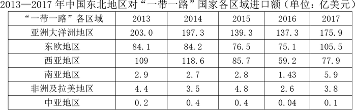

#### 第 1 题　qid 2376743 · 数学运算

2017年中国东北地区与“一带一路”国家的进出口贸易总额为

- **A**. 396.1亿美元
- **B**. 514.0亿美元
- **C**. 617.0亿美元　✅
- **D**. 723.3亿美元

**答案**：C

**官方解析**

表1为2017年中国东北地区对“一带一路”国家的出口额，表2为相对应进口额。故2017年中国东北地区与“一带一路”国家的进出口总额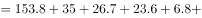，与C项最为接近。

故正确答案为C。

---

#### 第 2 题　qid 2376745 · 数学运算

2016年中国东北地区与“一带一路”各区域的贸易中，中国东北地区与之存在贸易顺差的地区有

- **A**. 1个
- **B**. 2个
- **C**. 3个
- **D**. 4个　✅

**答案**：D

**官方解析**

贸易顺差即“出口额进口额”，定位表格1与表格2，满足2016年中国东北地区对“一带一路”国家出口额进口额的有：亚洲大洋洲地区、南亚地区、非洲及拉美地区、中亚地区，共计4个地区。

故正确答案为D。

---

#### 第 3 题　qid 2376730 · 数学运算

若中国东北地区继续维持2016-2017年与亚洲大洋洲地区的贸易出口增长率，则中国东北地区与亚洲大洋洲地区的贸易出口金额首次超过2013年贸易出口金额的年份是：

- **A**. 2020
- **B**. 2021　✅
- **C**. 2022
- **D**. 2023

**答案**：B

**官方解析**

根据题干“······首次超过2013年贸易出口金额的年份是”，可判定本题为现期追赶问题。定位表格1，中国东北地区在2016-2017年与亚洲大洋洲地区的贸易出口增长率。根据公式“”可得，出口额超过2013年水平，即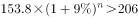，化简为：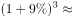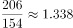。根据选项可知，出口额超过2013年水平，至少需要3年。验证3年，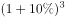；验证4年，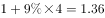，故2021年出口额首次超过2013年水平，满足要求。

故正确答案为B。

---

#### 第 4 题　qid 2376736 · 数学运算

下列说法错误的是

- **A**. 
自2013年到2017年中国东北地区同非洲及拉美地区的贸易顺差不断下降

- **B**. 
2014年中国东北地区与南亚地区的贸易顺差高于该年份中国东北地区与其他任何一个“一带一路”地区产生的贸易顺差
　✅
- **C**. 
2015年中国东北地区与亚洲大洋洲地区的进出口贸易总额占该年份中国东北地区与“一带一路”地区进出口贸易总额的比重已超过

- **D**. 
2016年中国东北地区同“一带一路”各区域的出口额均低于2015年

**答案**：B

**官方解析**

A项，定位两个表格材料，2013—2017年中国东北地区同非洲及拉美地区的贸易顺差分别为：，，，，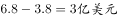，顺差额不断下降，正确；

B项，定位两个表格材料，2014年中国东北地区与南亚地区的贸易顺差额为：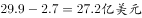，2014年中国东北地区与东欧地区的顺差额为：，27.2不高于31.1，错误；

C项，定位两个表格材料，2015年中国东北地区与亚洲大洋洲地区的进出口贸易总额为：；2015年中国东北地区与“一带一路”地区进出口贸易总额为：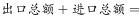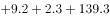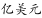，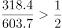，正确；

D项，定位第一个表格，2016年数值：141.1，34.6，19.4，27.7，5.7，1.6；2015年数值为：179.1，44.1，28.6，30.9，9.2，2.3，2016年数值均低于2015年，正确。

本题为选非题，故正确答案为B。

---

### 材料 2

根据以下资料，回答下列问题。 

        截至2018年底，全国60周岁及以上老年人口24949万人，占总人口的，其中65周岁及以上老年人口16658万人，占总人口的。全国共有老龄事业单位1600个，老年法律援助中心2.0万个，老年维权协调组织6.4万个，老年学校4.9万所，在校学习人员704.0万人，各类老年活动室35.0万个；享受高龄补贴的老年人2682.2万人，比上年增长；享受护理补贴的老年人61.3万人，比上年增长；享受养老服务补贴的老年人354.4万人，比上年增长。

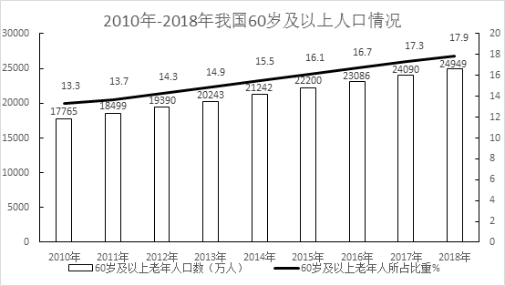

        截至2017年底，全国共有孤儿41.0万人，其中集中供养孤儿8.6万人，社会散居孤儿32.4万人，2017年全国办理收养登记近1.9万件，其中内地居民收养登记近1.7万件，港澳台华侨收养登记103件，外国人收养登记2228件。

        截至2017年底，全国共有农村特困人员466.9万人，比上年减少。全年各级财政共支出农村特困人员救助供养资金269.4亿元，比上年增长。全国共有城市特困人员25.4万人，全年各级财政共支出城市特困人员救助供养资金21.2亿元。

#### 第 5 题　qid 2376752 · 数学运算

2018年底，每所老年学校平均容纳在校学习的老年人约为

- **A**. 120人
- **B**. 140人　✅
- **C**. 160人
- **D**. 180人

**答案**：B

**官方解析**

根据题干“2018年底······平均容纳······”, 结合材料时间为2018年，可判断本题为现期平均数问题。定位文字材料第一段可知“2018年底······老年学校4.9万所，在校学习人员704.0万人”，可得2018年底，每所老年学校平均容纳在校学习的老年人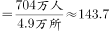人，与B项最接近。

故正确答案为B。

---

#### 第 6 题　qid 2376757 · 数学运算

下列说法正确的是

- **A**. 
2010-2018年我国60岁及以上老年人口占比年增量均为

- **B**. 
2010-2018年我国60岁及以上老年人口总量呈上下波动态势

- **C**. 
2017-2018年我国60岁及以上老年人口增长率约为
　✅
- **D**. 
2015-2018年我国60岁及以上老年人口增量逐年递增

**答案**：C

**官方解析**

A项：定位图1，由图1折线图可知2011年和2010年60岁及以上老年人口所占比重分别为、，可得2011年60岁及以上老年人口所占比重增量为，错误；

B项：定位图1，由图1柱形图可知2010-2018年60岁及以上老年人口总量呈逐年上升态势，错误；

C项：定位图1，由图1柱形图可知2017年和2018年60岁及以上老年人口数分别为24090万人、24949万人，故2017-2018年60岁及以上老年人增长，正确；

D项：定位图1，由图1柱形图可知2016年、2017年、2018年60岁及以上老年人口数分别为23086万人、24090万人、24949万人，2018年增量为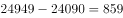万人，2017年增量为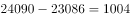万人，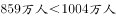，2018年增量下降，错误。

故正确答案为C。

---

#### 第 7 题　qid 2376740 · 数学运算

2010-2017年我国收养登记数呈现的态势是：

- **A**. 总量持续降低
- **B**. 降幅持续加大
- **C**. 降幅持续收窄
- **D**. 总量和降幅起伏波动　✅

**答案**：D

**官方解析**

定位材料图2，可知：
A项：2017年收养登记数（18820件）较2016年（18735件）有所提升，错误；
B项：2010年-2017年，收养登记增长率降幅起伏波动，错误；
C项：2010年-2017年，收养登记增长率降幅起伏波动，错误；
D项：2010年-2017年，我国收养登记数有升有降，降幅起伏波动，正确。
故正确答案为D。

---

#### 第 8 题　qid 2376749 · 数学运算

下列说法错误的是：

- **A**. 
截至2017年底我国城乡特困人员有近五百万人

- **B**. 
2017年，我国城市特困人员人均得到各级财政救助供养资金超过八千元

- **C**. 
2017年，我国的收养登记主要是由国外人士办理
　✅
- **D**. 
2018年，我国65岁及以上人口超过60岁及以上人口的

**答案**：C

**官方解析**

A项：定位文字材料第三段可知：截至2017年底，全国共有农村特困人员466.9万人，城市特困人员25.4万人，共计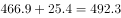万人（小于且接近500万人），正确；

B项：定位文字材料第三段可知：截至2017年底，全国共有城市特困人员25.4万人，全年各级财政共支出城市特困人员救助供养资金21.2亿元，则2017年，我国城市特困人员人均得到各级财政救助供养资金，正确；

C项：定位文字材料第二段可知：截至2017年底，全国办理收养登记1.9万件，外国人收养登记2228件，国外人士收养登记占全国收养登记比重，并不是主要部分，错误；

D项：定位文字材料第一段可知：截至2018年底，全国60周岁及以上老年人口占总人口的，65周岁及以上老年人口占总人口的，则2018年，我国65岁及以上人口占60周岁以上人口的比重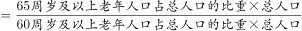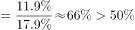，正确。

本题为选非题，故正确答案为C。

---

#### 第 9 题　qid 2376742 · 数学运算

123，147，258，（  ），432

- **A**. 345　✅
- **B**. 413
- **C**. 368
- **D**. 421

**答案**：A

**官方解析**

方法一：数项都是三位数，考虑机械划分。将原数列中的数字拆成三个数字去看，1、2、3是公差为1的等差数列，1、4、7是公差为3的等差数列，2、5、8是公差为3的等差数列，4、3、2是公差为-1的等差数列，即规律为：每个三位数的数字依次为等差数列，观察选项，只有A项3、4、5符合等差数列。

方法二：数项都是三位数，考虑机械划分。将原数列中的数字拆成三个数字去看，发现123中：，147中：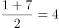，258中：，432中：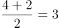；规律为三位数中，中间数字是两端数字的平均数。观察选项，满足此规律的只有A项，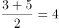。

故正确答案为A。

---

#### 第 10 题　qid 2376746 · 数学运算

某高校本年度毕业学生3060名，比上年度增长。其中本科生毕业数量比上年度减少，而研究生毕业数量比上年度增加，那么，这所高校本年度本科生毕业数量是

- **A**. 1900人
- **B**. 1930人
- **C**. 1960人　✅
- **D**. 1990人

**答案**：C

**官方解析**

方法一：根据今年本科生毕业人数减少，则今年本科生毕业人数：去年本科生毕业人数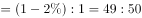。则今年本科生毕业人数一定是49的整数倍，结合选项，只有C项符合。

方法二：根据题意，上年度毕业学生为 人。结合混合增长率，增长率的差值之比与基期量之比成反比，则有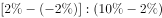，则上年度研究生毕业人数与本科生毕业人数之比为。则上年度本科生毕业人数为人，因此今年本科生毕业人数为人。

故正确答案为C。

---

#### 第 11 题　qid 2376747 · 数学运算

1辆汽车原价为20万元，商家促销，预存1000元可拥有1万元抵用券，之后还可以再打9折，则购买这辆汽车总共需支付的金额是

- **A**. 17.1万元
- **B**. 17.2万元　✅
- **C**. 18.1万元
- **D**. 18.2万元

**答案**：B

**官方解析**

思路一：根据题意，已知预存1000元抵用1万元，原价20万，则抵用后价格为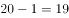万，又因为还可以再打九折，所以折后还需要支付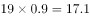万元，因此总共支付金额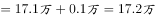。

思路二：已知预存1000元可拥有1万元抵用券，原价20万，则抵用后价格为万，又因为还可以再打九折，所以折后需要支付万元，但是预存了1000元也就是0.1万，购车时可以抵用，所以购车时又支付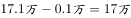，因此总共支付金额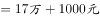。

备注：两种思路的争议在于预存的1000元是否可以抵扣最终的车款，第一种思路是预存1000元相当于支付1000元用于购买1万元抵用券，后期这1000元不再抵用车款；第二种思路是预存1000元便拥有1万元抵用券，后期这1000元仍然可以抵用车款。粉笔倾向于第一种思路，这是因为命题人设计了17.1万元和17.2万元、18.1万元和18.2万元，其考点明显在于前面的1000元要不要算，而问法还写了“总共支付了”，意思是多次支付，故倾向于答案为B。

故正确答案为B。

---

#### 第 12 题　qid 2376748 · 数学运算

假设本月28号是星期四，则本月1号是

- **A**. 星期三
- **B**. 星期四
- **C**. 星期五　✅
- **D**. 星期六

**答案**：C

**官方解析**

本月1号到28号共计28天，有四个完整的星期，因此1号对应的星期数与29号星期数相同，已知28号是星期四，则29号是星期五，所以1号也是星期五。
故正确答案为C。

---

#### 第 13 题　qid 2376733 · 数学运算

一项工程按计划将用20天完成，为提高效率，从第三天开始，每天都比前一天多完成1倍，则完成这个工程至少需要的时间是

- **A**. 5天
- **B**. 6天　✅
- **C**. 7天
- **D**. 8天

**答案**：B

**官方解析**

由于本题只给出完工时间，故可采用赋值法，赋值原来每天的效率为1，则总工程量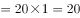。根据题意可得，从第一天到第五天每天的效率依次为：1、1、2、4、8，故其每天完成的工程量依次为1、1、2、4、8，这五天完成的总工程量为1+1+2+4+8=16，剩余的工程量为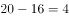，由于第六天可完成的工程量为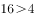，故完成这个工程至少需要6天。

故正确答案为B。

---

#### 第 14 题　qid 2376735 · 数学运算

一个圆形，半径变为原来的4倍之后的圆的面积，等于半径增加2厘米之后的面积的4倍，则原来的半径是

- **A**. 1厘米
- **B**. 2厘米　✅
- **C**. 3厘米
- **D**. 4厘米

**答案**：B

**官方解析**

假设原来的半径为厘米。半径变为原来的4倍后，圆的面积为平方厘米；半径增加2厘米后，圆的面积为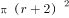平方厘米。根据题干可得：，化简得到，即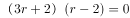，解得，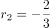，半径不能为负，所以原来的半径为2厘米。

故正确答案为B。

---

#### 第 15 题　qid 2376737 · 数学运算

寒假第一天，骑行社团从学校出发去滑雪，他们以20公里/小时的速度骑行2个小时到达滑雪场，游玩4个小时后按原路以原速返回。骑行社团离开学校5.5小时后，辅导员派大客车以40公里/小时的速度沿相同路线迎接骑行社团，则大客车出发后与骑行社团相遇需要的时长是

- **A**. 30分钟
- **B**. 40分钟
- **C**. 50分钟　✅
- **D**. 60分钟

**答案**：C

**官方解析**

从学校到滑雪场的路程公里。社团骑行2小时，游玩4小时，共花费小时后原路返回。客车在社团离开5.5小时后开始出发，相当于在社团原路返回时，客车已走了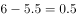小时，也就是走了公里。剩余的20公里，相当于客车与社团在线段两端出发相遇的过程，根据，可得，解得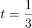小时。故相遇时大客车共走了，即50分钟。

故正确答案为C。

---

#### 第 16 题　qid 2376741 · 数学运算

某位党员同志制定了个人“新时代e支部”学习目标：每天学习时长都比前一天增加。如果他第一天学习时长是16分钟，第5天他的学习时长是

- **A**. 27分钟
- **B**. 54分钟
- **C**. 81分钟　✅
- **D**. 100分钟

**答案**：C

**官方解析**

方法一：根据“每天学习时长都比前一天增加”，可知每天的学习时长是前一天的倍，即每天的学习时长是公比为的等比数列，由等比数列的通项公式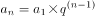，可得第5天学习时长为：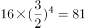分钟。

方法二：枚举法。第1天学习时长为16分钟，依据题意，第2天学习时长为分钟，第3天学习时长为分钟，第4天学习时长为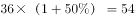分钟，第5天学习时长为分钟。

故正确答案为C。

---

#### 第 17 题　qid 2376744 · 数学运算

抽奖箱子里剩下8张奖券，其中5张有奖，3张无奖，小王有两次抽奖机会，他不放回地依次抽取两张奖券，则这两张奖券中一张有奖一张无奖的概率是

- **A**. 

- **B**. 

- **C**. 
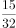

- **D**. 
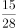
　✅

**答案**：D

**官方解析**

两张奖券中一张有奖一张无奖共有两种情况：1.第一张有奖第二张无奖；2.第一张无奖第二张有奖。

1.第一张有奖第二张无奖：先抽一张有奖的，概率为，再抽一张无奖的，概率为，该种情况的概率为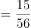；

2.第一张无奖第二张有奖：先抽一张无奖的，概率为，再抽一张有奖的，概率为，则该种情况的概率为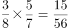。

两种情况总的概率为。

故正确答案为D。

---

## 判断推理

### 第 1 题　qid 2376764 · 图形推理

把下面六个图形分为两类，使每一类图形都有各自的共同特征或规律，分类正确的一组是：

- **A**. ①③⑥，②④⑤　✅
- **B**. ①②③，④⑤⑥
- **C**. ①②④，③⑤⑥
- **D**. ①④⑤，②③⑥

**答案**：A

**官方解析**

本题为分组分类，元素组成不同，但都出现黑点和多边形外框。观察发现，题干黑点数量依次为5、6、3、6、4、4，外框边数依次为3、4、5、4、6、4，图①③⑥内部点数量加外框边数量都等于8，图②④⑤内部点数量加外框边数量都等10。即①③⑥一组，②④⑤一组。
故正确答案为A。

---

### 第 2 题　qid 2376765 · 图形推理

从所给四个选项中，选择最合适的一个填入问号处，使之呈现一定的规律性

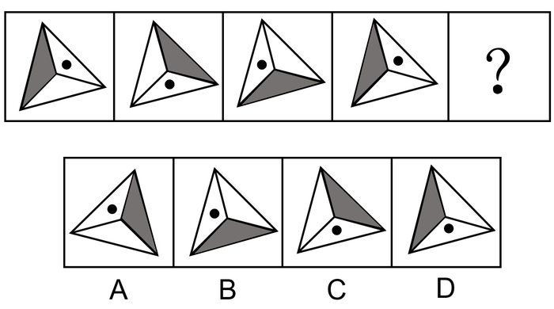

- **A**. A
- **B**. B
- **C**. C　✅
- **D**. D

**答案**：C

**官方解析**

元素组成相同，优先考虑位置规律。观察小黑点发现，规律为每次顺时针平移一格，故？处小黑点应出现在下方，排除A项、B项。再观察灰三角发现，规律为每次顺时针移动一步，故？处灰三角应出现在右边，排除D项。
故正确答案为C。

---

### 第 3 题　qid 2376453 · 图形推理

从所给四个选项中，选择最合适的一个填入问号处，使之呈现一定的规律性

- **A**. 金　✅
- **B**. 令
- **C**. 书
- **D**. 无

**答案**：A

**官方解析**

解析一：元素组成不同，且无明显属性规律，考虑数量规律。图形均为汉字，优先考虑笔画数。九宫格优先横行看，第一横行笔画数依次为2、4、6；第二横行笔画数依次为6、4、10，即前两行均满足前两幅笔画数相加等于第三幅，沿用此规律，第三行笔画数依次为4、？、12，因此问号处应选择8笔画的汉字。A项8笔画，B项5笔画，C项4笔画，D项4笔画。
故正确答案为A。
解析二：元素组成不同，且无明显属性规律，考虑数量规律。图形均为汉字，且“中”“回”存在明显的封闭面，考虑数面。九宫格优先横行看，第一横行面数量依次为0、2、2；第二横行面数量依次为0、0、0，即前两行图形均满足前两幅面数量相加等于第三幅，沿用此规律，第三行面数量依次为0、？、1，因此问号处应选择1个面的汉字。A、B、D项均为0个面，只有C项为1个面。
故正确答案为C。
粉笔说明：两种思路均可通过严谨的数量规律得到答案，且数笔画和数面均为常见考法，故两种答案粉笔都认可。

---

### 第 4 题　qid 2376768 · 图形推理

从所给四个选项中，选择最合适的一个填入问号处，使之呈现一定的规律性

- **A**. A
- **B**. B
- **C**. C
- **D**. D　✅

**答案**：D

**官方解析**

元素组成不同，相同的元素重复出现，优先考虑遍历。九宫格第一行的图形和第一列的图形完全相同，对比第二列的图形，“？”处应选择的图形为梯形，此时第二行和第二列的图形也完全相同，验证发现第三行和第三列也符合此规律。
故正确答案为D。

---

### 第 5 题　qid 2376763 · 图形推理

把下面的六个图形分为两类，使每一类图形都有各自的共同特征或规律，分类正确的一组是

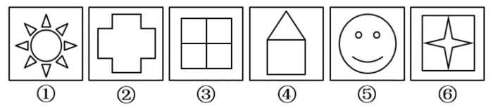

- **A**. ①②③，④⑤⑥
- **B**. ②④⑤，①③⑥
- **C**. ①③⑤，②④⑥
- **D**. ②③⑥，①④⑤　✅

**答案**：D

**官方解析**

思路一：
本题为分组分类题目。元素组成不同，且图形很整齐，优先考虑对称性。观察发现图②③⑥都具有4条对称轴，而①④⑤都是轴对称图形且对称轴不是4。
故正确答案为D。
思路二：
本题为分组分类题目。元素组成不同，出现“田”字及“日”字变形，优先考虑笔画数。观察发现图①③⑤为多笔画图形，图②④⑥为一笔画图形，因此①③⑤一组，②④⑥一组。
故正确答案为C。
因为本题图形都很整齐，所以粉笔更倾向第一种思路，选D。
注：在考查分组分类题目中，吉林省比较喜欢考查一组有相同规律，一组无相同规律。

---

### 第 6 题　qid 2376778 · 定义判断

转品，是指在构句时改变一个字词原来惯用的词性的一种方法，它是实现词语艺术化的重要手段之一。
根据上述定义，下列选项中划横线的字词没有使用转品的是

- **A**. 
他穿的服饰很<u>中国</u>

- **B**. 
这里气候非常<u>夏天</u>

- **C**. 
从此，徐悲鸿真正做到了画马时胸有成<u>马</u>
　✅
- **D**. 
从此，这个人不<u>烟</u>不<u>酒</u>，甚至也不太<u>诗</u>了

**答案**：C

**官方解析**

第一步：找出定义关键词。
“构句时改变一个字词原来惯用的词性的一种方法”。
第二步：逐一分析选项。
A项：“中国”惯用的词性是名词，在选项中用来形容服饰很有中国风格，词性由名词转变为形容词，词性改变，符合“构句时改变一个字词原来惯用的词性的一种方法”，符合定义，排除； 
B项：“夏天”惯用的词性是名词，在选项中用来形容天气热，词性由名词转变为形容词，词性改变，符合“构句时改变一个字词原来惯用的词性的一种方法”，符合定义，排除；
C项：“马”惯用的词性是名词，在选项中依然指马这种生物，词性没有改变，不符合定义，当选；
D项：“烟”“酒”惯用的词性是名词，选项中的意思是抽烟喝酒，词性由名词转变为动词；“诗”惯用的词性是名词，在选项中形容生活不那么诗意，词性由名词转变为形容词，词性都发生了改变，符合“构句时改变一个字词原来惯用的词性的一种方法”，符合定义，排除。
本题为选非题，故正确答案为C。

---

### 第 7 题　qid 2376784 · 逻辑判断

遗忘曲线是由德国心理学家艾宾浩斯研究发现的，它描述了人类大脑对新事物的记忆的遗忘规律。这一规律的具体内容如下图所示：

根据上图，下列判断<b>错误</b>的是

- **A**. 遗忘的速度是不均匀的，是先快后慢
- **B**. 无意义材料比有意义材料遗忘速度快
- **C**. 不同年龄阶段的人遗忘速度不一样
- **D**. 诗歌材料比散文材料遗忘的速度要快　✅

**答案**：D

**官方解析**

第一步：找出定义关键词。
图一：随着天数的增加，记忆遗忘速度越来越慢；
图二：随着天数的增加，诗、散文、无意义章节的遗忘速度都越来越慢，与此同时这三者的遗忘速度快慢比较为，诗慢于散文慢于无意义章节；
图三：随着天数的增加，年轻人、老年人的遗忘速度都越来越慢，与此同时年轻人的遗忘速度慢于老年人。
第二步：逐一分析选项。
A项：由三幅图都能看出随着天数增加，曲线越来越平缓，遗忘速度越来越慢，判断正确，排除； 
B项：由图二可以得出“遗忘速度，诗慢于散文慢于无意义章节”，与无意义章节相比，诗和散文都属于有意义材料，即无意义材料比有意义材料遗忘速度快，判断正确，排除； 
C项：由图三可以得出“年轻人的遗忘速度慢于老年人”，也就是不同年龄阶段的人遗忘速度不一样，判断正确，排除；
D项：由图二可以得出“遗忘速度，诗慢于散文慢于无意义章节”，也就是诗歌材料比散文材料遗忘的速度要慢，并不是快，判断错误，当选。
本题为选非题，故正确答案为D。

---

### 第 8 题　qid 2376759 · 逻辑判断

“当一个胖子装忧郁的时候，别人还以为是肚子饿。”最能说明这一现象的概念是

- **A**. 社会焦点效应：一个人会高估周围人对自己外表和行为的关注度的一种倾向
- **B**. 自我透明度错觉：人们高估自己的个人心理状态被他人知晓程度的一种倾向　✅
- **C**. 旁观者效应：个体面对紧急事件时，他人在场会抑制其利他行为发生的现象
- **D**. 自证预言：若人们相信某件事情会发生，则这件事情最终真的会发生的现象

**答案**：B

**官方解析**

第一步：找出定义关键词。
“当一个胖子装忧郁的时候，别人还以为是肚子饿”。
第二步：逐一分析选项。
A项：胖子装忧郁，但是别人以为他是肚子饿，不符合社会焦点效应中的“一个人会高估周围人对自己外表和行为的关注度的一种倾向”，不符合定义，排除；
B项：胖子装忧郁，胖子以为大家会知晓他的忧郁，结果大家以为他是肚子饿，即胖子高估了自己，符合自我透明度错觉中的“人们高估自己的个人心理状态被他人知晓程度的一种倾向”，符合定义，当选；
C项：胖子装忧郁，但是别人以为他是肚子饿，没有提到紧急事件，不符合旁观者效应中的“个体面对紧急事件”，不符合定义，排除；
D项：胖子装忧郁，但是别人以为他是肚子饿，不符合自证预言中“若人们相信某件事情会发生，则这件事情最终真的会发生的现象”，不符合定义，排除；
故正确答案为B。

---

### 第 9 题　qid 2376762 · 定义判断

语义记忆是指人们对一般知识和规律的记忆，与特殊的地点、时间无关。情景记忆是指人们根据时空关系对某个事件的记忆，这种记忆与个人亲身经历分不开，并受一定时间和空间的限制。
根据上述定义，下列分别属于语义记忆和情景记忆的是

- **A**. 记得妈妈帮自己系鞋带的事和记得曾经在哪里买到了鞋
- **B**. 记住“心理学”的意思和记住“心理学”这个词怎么写
- **C**. 记住“文学艺术”的意思和记得昨晚年会上的舞蹈节目　✅
- **D**. 记得小时候住在哪儿和记得怎样使用自己办公室打印机

**答案**：C

**官方解析**

第一步：找出定义关键词。
语义记忆：“对一般知识和规律的记忆”、“与特殊的地点、时间无关”；
情景记忆：“根据时空关系对某个事件的记忆”、“与个人亲身经历分不开”、“受一定时间和空间的限制”。
第二步：逐一分析选项。
A项：记得妈妈帮自己系鞋带的事和记得曾经在哪里买到了鞋，符合“根据时空关系对某个事件的记忆”、“与个人亲身经历分不开”、“受一定时间和空间的限制”，均属于情景记忆，不符合题干要求，排除；
B项：记住“心理学”的意思和记住“心理学”这个词怎么写，符合“对一般知识和规律的记忆”、“与特殊的地点、时间无关”，均属于语义记忆，不符合题干要求，排除；
C项：记住“文学艺术”的意思，符合“人们对一般知识和规律的记忆”、“与特殊的地点、时间无关”，属于语义记忆；记得昨晚年会上的舞蹈节目，符合“根据时空关系对某个事件的记忆”、“与个人亲身经历分不开”、“受一定时间和空间的限制”，属于情景记忆，符合题干要求，当选；
D项：记得小时候住在哪儿，符合“根据时空关系对某个事件的记忆”、“与个人亲身经历分不开”、“受一定时间和空间的限制”，属于情景记忆；记得怎样使用自己办公室打印机，符合“对一般知识和规律的记忆”、“与特殊的地点、时间无关”，属于语义记忆，与题干要求顺序相反，排除。
故正确答案为C。

---

### 第 10 题　qid 2376770 · 定义判断

服装颜色搭配原则：暖色不宜与冷色搭配。暖色包括红、橙、黄、粉红。冷色包括青、蓝、紫、绿、灰。中间色包括黑、白、咖啡色。服装搭配体型协调原则：①体型较胖者不宜穿暖色或浅色的服装。②体型较瘦者不宜穿深色的服装。
下列搭配符合上述原则的是

- **A**. 较胖的甲，深红色上衣配浅橙色裤子
- **B**. 较瘦的乙，浅黄色上衣配浅灰色裤子
- **C**. 较胖的丙，深蓝色上衣配纯黑色裤子　✅
- **D**. 较瘦的丁，深黄色上衣配浅粉色裤子

**答案**：C

**官方解析**

第一步：找出定义关键词。
服装颜色搭配原则：“暖色不宜与冷色搭配”、“暖色包括红、橙、黄、粉红”、“冷色包括青、蓝、紫、绿、灰”、“中间色包括黑、白、咖啡色”；服装搭配体型协调原则：“体型较胖者不宜穿暖色或浅色的服装”、“体型较瘦者不宜穿深色的服装”。
第二步：逐一分析选项。
A项：较胖的甲，深红色上衣配浅橙色裤子，红色和橙色都是暖色，不符合“体型较胖者不宜穿暖色或浅色的服装”，不符合服装搭配体型协调原则，不符合定义，排除；
B项：较瘦的乙，浅黄色上衣配浅灰色裤子，浅黄色属于暖色，浅灰色属于冷色，不符合“暖色不宜与冷色搭配”，不符合服装颜色搭配原则，不符合定义，排除；
C项：较胖的丙，深蓝色上衣配纯黑色裤子，深蓝色属于深色服装，且蓝色是冷色，符合服装颜色搭配原则，也符合服装搭配体型协调原则，符合定义，当选；
D项：较瘦的丁，深黄色上衣配浅粉色裤子，深黄色上衣属于深色，不符合“体型较瘦者不宜穿深色的服装”，不符合服装搭配体型协调原则，不符合定义，排除。
故正确答案为C。

---

### 第 11 题　qid 2376857 · 类比推理

箴言：劝诫

- **A**. 名言：讽刺
- **B**. 宣言：委婉
- **C**. 直言：坦率　✅
- **D**. 失言：有意

**答案**：C

**官方解析**

第一步：判断题干词语间逻辑关系。
箴言指的是规谏劝诫的话，二者为对应关系。
第二步：判断选项词语间逻辑关系。
A项：名言一般指名人说的话，和讽刺之间没有明显逻辑关系，与题干逻辑关系不一致，排除；
B项：宣言指的是故意散布某种言论，和委婉没有明显逻辑关系，与题干逻辑关系不一致，排除；
C项：直言指的是诚挚地、坦率地说，二者为对应关系，与题干逻辑关系一致，当选；
D项：失言指的是无意中说出不该说的话，和有意没有明显逻辑关系，与题干逻辑关系不一致，排除。
故正确答案为C。

---

### 第 12 题　qid 2376858 · 类比推理

十全十美：完美无缺

- **A**. 七上八下：从容不迫
- **B**. 三心二意：一心一意
- **C**. 四分五裂：支离破碎　✅
- **D**. 千方百计：束手无策

**答案**：C

**官方解析**

第一步：判断题干词语间逻辑关系。
十全十美和完美无缺均指十分完美，毫无欠缺，二者为近义关系。
第二步：判断选项词语间逻辑关系。
A项：七上八下形容心里慌乱不安，无所适从的感觉；从容不迫指不慌不忙，从容镇定，二者为反义关系，与题干逻辑关系不一致，排除；
B项：三心二意形容意志不坚定，犹豫不决；一心一意形容做事专心一意，一门心思的只做一件事，二者为反义关系，与题干逻辑关系不一致，排除；
C项：四分五裂形容不完整，不集中，不团结，不统一；支离破碎形容事物零散破碎，不成整体，二者为近义关系，与题干逻辑关系一致，当选；
D项：千方百计是指想尽一切办法，用尽一切计谋；束手无策是指好像手被束缚住了，无法解脱，形容遇到的麻烦没有办法解决，一筹莫展的情况，二者为反义关系，与题干逻辑关系不一致，排除。
故正确答案为C。

---

### 第 13 题　qid 2376859 · 类比推理

移动：跑步

- **A**. 碰撞：疼痛
- **B**. 恐惧：哭泣
- **C**. 传播：创作
- **D**. 刺激：反应　✅

**答案**：D

**官方解析**

第一步：判断题干词语间逻辑关系。
跑步一定需要移动，因此移动是跑步的必要条件，二者属于对应关系。
第二步：判断选项词语间逻辑关系。
A项：疼痛不一定需要碰撞，因此碰撞不是疼痛的必要条件，与题干逻辑关系不一致，排除；
B项：哭泣不一定需要恐惧，因此恐惧不是哭泣的必要条件，与题干逻辑关系不一致，排除；
C项：创作不一定需要传播，因此传播不是创作的必要条件，与题干逻辑关系不一致，排除；
D项：反应一定需要刺激，因此刺激是反应的必要条件，与题干逻辑关系一致，当选。
故正确答案为D。

---

### 第 14 题　qid 2376776 · 类比推理

固有属性：偶有属性

- **A**. 机械记忆：长期记忆
- **B**. 寒性食物：热性食物
- **C**. 静态博弈：动态博弈　✅
- **D**. 名胜古迹：万里长城

**答案**：C

**官方解析**

第一步：判断题干词语间逻辑关系。
固有属性是指同一类中的所有对象都具有的属性，而偶有属性是一类中的某些对象所具有而不为该类对象都具有的属性，二者属于并列关系中的矛盾关系。
第二步：判断选项词语间逻辑关系。
A项：按照对于学习内容是否理解，将记忆分为机械记忆和意义记忆，而按照记忆时间的长短又将记忆分为长期记忆和短期记忆，二者属于交叉关系，与题干逻辑关系不一致，排除；
B项：中医中将食物分为四类，分别为寒、凉、温、热，因此寒性食物和热性食物为并列关系中的反对关系，与题干逻辑关系不一致，排除；
C项：静态博弈，指的是博弈参与者之间不存在策略选择的先后次序，比如摇骰子比大小，动态博弈，有先后顺序，比如象棋、围棋，二者属于并列关系中的矛盾关系，与题干逻辑关系一致，当选；
D项：万里长城是一种名胜古迹，二者属于包容关系中的种属关系，与题干逻辑关系不一致，排除。
故正确答案为C。

---

### 第 15 题　qid 2376806 · 类比推理

辞旧迎新：古往今来

- **A**. 改朝换代：大同小异
- **B**. 避实击虚：沉思默想
- **C**. 丰功伟绩：拆东补西
- **D**. 厚古薄今：避繁就简　✅

**答案**：D

**官方解析**

第一步：判断题干词语间逻辑关系。
辞旧迎新是指告别旧的一年，迎接新的一年的到来，即庆贺新年的意思。古往今来是指从古到今，泛指很长一段时间。二者语义没有关系，考虑成语拆分，辞和迎，旧和新都是相反的，古和今，往和来也都是相反的，题干两词结构对应。
第二步：判断选项词语间逻辑关系。
A项：改朝换代是指旧的朝代为新的朝代所代替。大同小异是指大体相同，略有差异。二者语义没有关系，考虑成语拆分，改和换，朝和代都不是相反的，与题干逻辑关系不一致，排除；
B项：避实击虚是指避开敌人的主力，找敌人的弱点进攻，又指谈问题回避要害。沉思默想是指形容深入地思考。二者语义没有关系，考虑成语拆分，避和击，实和虚都是相反的，沉和默，思和想都不是相反的，与题干逻辑关系不一致，排除；
C项：丰功伟绩是指伟大的功绩。拆东补西是指拆掉东边去补西边，比喻临时勉强应付。二者语义没有关系，考虑成语拆分，丰和伟，功和绩都不是相反的，与题干逻辑关系不一致，排除；
D项：厚古薄今是指推崇古代的，轻视现代的，多用于学术研究方面。避繁就简是指避开繁杂的，从事简单的。二者没有语义关系，考虑成语拆分，厚和薄，古和今都是相反的，避和就，繁和简也都是相反的，两词结构对应，与题干逻辑关系一致，当选。
故正确答案为D。

---

### 第 16 题　qid 2376807 · 类比推理

偷换概念：逻辑谬误

- **A**. 山谷风：海陆风
- **B**. 蔗糖溶解：物理变化　✅
- **C**. 三角形：四边形
- **D**. 调查方法：问卷调查

**答案**：B

**官方解析**

第一步：判断题干词语间逻辑关系。
本题考查种属关系，偷换概念是一种逻辑谬误，二者是包容关系。
第二步：判断选项词语间逻辑关系。
A项：山谷风是由于山谷与其附近空气之间的热力差异而引起的风，海陆风是因海洋和陆地受热不均匀而在海岸附近形成的一种有日变化的风，二者是并列关系，与题干逻辑关系不一致，排除；
B项：蔗糖溶解没有新物质产生，是物理变化的一种，二者是包容关系，与题干逻辑关系一致，当选；
C项：三角形和四边形是依据边数对多边形进行的分类，二者是并列关系，与题干逻辑关系不一致，排除；
D项：问卷调查是调查方法的一种，二者是包容关系，但两词顺序与题干相反，与题干逻辑关系不一致，排除。
故正确答案为B。

---

### 第 17 题　qid 2376780 · 类比推理

交通费：住宿费：误工费

- **A**. 剪纸：窗花：灯花
- **B**. 森林：树木：桦树
- **C**. 法国：英国：德国　✅
- **D**. 春装：秋装：男装

**答案**：C

**官方解析**

第一步：判断题干词语间逻辑关系。
交通费、住宿费、误工费都属于费用，三者为并列关系。
第二步：判断选项词语间逻辑关系。
A项：窗花属于剪纸的一种，是种属关系，与题干逻辑关系不一致，排除；
B项：森林和树木是组成关系，桦树和树木是种属关系，与题干逻辑关系不一致，排除；
C项：法国、英国、德国都属于国家，三者为并列关系，与题干逻辑关系一致，当选；
D项：春装和秋装都是服装，二者为并列关系，但男装和春装、男装和秋装互为交叉关系，与题干逻辑关系不一致，排除。
故正确答案为C。

---

### 第 18 题　qid 2376781 · 类比推理

和：与：且

- **A**. 是：非：否
- **B**. 好：佳：大
- **C**. 初：始：终
- **D**. 又：再：复　✅

**答案**：D

**官方解析**

第一步：判断题干词语间逻辑关系。
和、与、且都表示“同”的意思，三者为近义关系。
第二步：判断选项词语间逻辑关系。
A项：是和非为反义关系，与题干逻辑关系不一致，排除；
B项：好和佳为近义关系，但佳和大不是近义关系，与题干逻辑关系不一致，排除；
C项：初和始为近义关系，但始和终是反义关系，与题干逻辑关系不一致，排除；
D项：又、再、复都表示重复的意思，三者为近义关系，与题干逻辑关系一致，当选。
故正确答案为D。

---

### 第 19 题　qid 2376462 · 类比推理

（  ）对于大漠沙如雪，燕山月似钩，相当于夸张对于（  ）

- **A**. 借代  烽火连三月，家书抵万金
- **B**. 拟人  危楼高百尺，手可摘星辰
- **C**. 比喻  白发三千丈，缘愁似个长　✅
- **D**. 反问  本是同根生，相煎何太急

**答案**：C

**官方解析**

将选项逐一代入，判断各选项前后部分的逻辑关系。
A项：“大漠沙如雪，燕山月似钩”是指在连绵的燕山山岭上，一弯明月当空，如弯钩一般；平沙万里，在月光下像是铺上一层白皑皑的霜雪，运用了比喻的修辞手法，不是借代，“烽火连三月，家书抵万金”是指连绵的战火已经持续了很长时间，家书难得，一封抵得上万两黄金，诗句运用了夸张的修辞手法，前后逻辑关系不一致，排除；
B项：“大漠沙如雪，燕山月似钩”运用了比喻的修辞手法，不是拟人，“危楼高百尺，手可摘星辰”是指山上寺院的高楼真高啊，好像有一百尺的样子，人在楼上好像一伸手就可以摘下天上的星星，诗句运用了夸张的修辞手法，前后逻辑关系不一致，排除；
C项：“大漠沙如雪，燕山月似钩”运用了比喻的修辞手法，“白发三千丈，缘愁似个长”是指白发长达三千丈，是因为愁才长得这样长，运用了夸张的修辞手法，前后逻辑关系一致，当选；
D项：“大漠沙如雪，燕山月似钩”运用了比喻的修辞手法，不是反问，“本是同根生，相煎何太急”用同根而生的萁和豆来比喻同父共母的兄弟，用萁煎其豆来比喻同胞骨肉的哥哥残害弟弟，运用了比喻的修辞手法，前后逻辑关系不一致，排除。
故正确答案为C。

---

### 第 20 题　qid 2376782 · 类比推理

北风  对于（  ），相当于  民歌  对于（  ）

- **A**. 微风  合唱歌曲　✅
- **B**. 飓风  陕北民歌
- **C**. 南风  音乐体裁
- **D**. 风向  儿童歌曲

**答案**：A

**官方解析**

逐一代入选项。
A项：北风指从北方吹来的风，微风指微弱的风，前者是从风的方向描述，后者是从风的强劲程度描述，二者是交叉关系。民歌指的是具有某种民族风格的歌，合唱歌曲指多人演唱的歌曲，前者是从歌曲风格描述，后者是从演唱人数描述，二者也是交叉关系，前后逻辑关系一致，当选；
B项：北风指从北方吹来的风，飓风指大西洋和北太平洋地区强大而深厚的热带气旋，也泛指狂风和任何热带气旋以及风力达12级的任何大风，二者是交叉关系。陕北民歌是民歌的一种，二者是种属关系，前后逻辑关系不一致，排除；
C项：北风和南风是并列关系。民歌是一种音乐体裁，二者是种属关系，前后逻辑关系不一致，排除；
D项：北风指从北方吹来的风，北风是从风向来描述，和风向是对应关系。儿童歌曲是为儿童创作的歌曲，和民歌是交叉关系，前后逻辑关系不一致，排除。
故正确答案为A。

---

### 第 21 题　qid 2376785 · 类比推理

草木是无情的，人不是草木。所以，人不是无情的。
下列与题干所犯的逻辑错误相同的是

- **A**. 地球是个星球，地球上有人；月球是个星球，所以月球上也有人
- **B**. 所有的天鹅都是白色的，这只鸟是黑色的，所以这只鸟不是天鹅
- **C**. 鸟都是有羽毛的，拔光了羽毛的鸟是鸟，所以拔光了羽毛的鸟是有羽毛的
- **D**. 所有鄙视知识的人都是无知之辈，他从不鄙视知识，所以他不是无知之辈　✅

**答案**：D

**官方解析**

第一步，分析题干逻辑错误。

题干翻译为：“草木无情”，人不是草木，所以不是无情的，即“草木无情”，可知题干所犯逻辑错误为否前推否后。

第二步，逐一分析选项。

A项：地球是个星球，地球上有人；月球是个星球，所以月球上也有人，属于错误类比，没有涉及否前，与题干所犯逻辑错误不同，排除；

B项：翻译为“天鹅白色”，则“黑色（白色）天鹅”，属于否后推否前，与题干所犯逻辑错误不同，排除；

C项：翻译为“鸟有羽毛”，则“拔光了羽毛的鸟有羽毛”，属于肯前推肯后，与题干所犯逻辑错误不同，排除；

D项：翻译为“鄙视知识无知”，则“鄙视知识无知”，属于否前推否后，与题干所犯逻辑错误相同，当选。

故正确答案为D。

---

### 第 22 题　qid 2376533 · 类比推理

在一次聚会上，甲喜欢吃川菜，乙喜欢吃的都是川菜，丙喜欢吃所有川菜。锅包肉不是川菜，但是麻婆豆腐是川菜。
根据上述条件推知，下列一定为真的是

- **A**. 甲喜欢吃麻婆豆腐
- **B**. 乙喜欢吃麻婆豆腐
- **C**. 乙不喜欢吃锅包肉　✅
- **D**. 丙不喜欢吃锅包肉

**答案**：C

**官方解析**

第一步：分析题干。
①甲喜欢吃川菜：即不确定他具体喜欢吃哪一道川菜；
②乙喜欢吃的都是川菜：即不确定他具体喜欢吃哪一道川菜，且其他菜种他一定不喜欢吃；
③丙喜欢吃所有川菜：即每一道川菜他都喜欢吃，其他菜种他也有可能喜欢吃。
第二步：逐一分析选项。
A项：麻婆豆腐是川菜，甲喜欢吃川菜，但是否一定喜欢吃麻婆豆腐这道川菜并不确定，排除；
B项：麻婆豆腐是川菜，乙喜欢吃的都是川菜，但是否一定喜欢吃麻婆豆腐这道川菜并不确定，排除；
C项：锅包肉不是川菜，乙喜欢吃的都是川菜，其他菜种他一定不喜欢吃，即乙一定不喜欢吃锅包肉，当选；
D项：锅包肉不是川菜，丙喜欢吃所有川菜，但其他菜种他也有可能喜欢吃，所以无法确定丙一定不喜欢锅包肉，排除。
故正确答案为C。

---

### 第 23 题　qid 2376787 · 逻辑判断

2018年9-12月，某一线城市的房租租金暴涨，有人认为，房租上涨的根本原因是一些长租公寓运营商哄抢房源、恶性竞争。
下列哪项如果为真，最能反驳上述观点？

- **A**. 大多数一线城市的房价与房租一直存在着涨幅不平衡的问题
- **B**. 新落户政策导致的供需关系变化是此次房租暴涨的唯一原因　✅
- **C**. 少数短租公寓的运营商也存在着哄抬房租等恶性竞争的问题
- **D**. 2018年9-12月，该城市的一些出租大院和工业区公寓被拆

**答案**：B

**官方解析**

第一步：找出论点和论据。
论点：房租上涨的根本原因是一些长租公寓运营商哄抢房源、恶性竞争。
论据：没有明显的论据。
本题只有论点，没有论据，因此只能削弱论点，即表明房租上涨的根本原因不是长租公寓运营商哄抢房源、恶性竞争。
第二步：逐一分析选项。
A项：该项说大多数一线城市的房价与房租一直存在着涨幅不平衡的问题，但并未指出房租上涨的根本原因是什么，无法削弱，排除；
B项：该项指出房租上涨的原因是新落户政策导致供需关系变化，而不是论点中的长租公寓运营商哄抢房源、恶性竞争，直接否定论点，当选；
C项：该项说少数短租公寓的运营商也同样存在着哄抬房租等恶性竞争的问题，但并未指出房租上涨的根本原因是什么，无法削弱，排除；
D项：该项只是说该城市的一些出租大院和工业区公寓被拆，但是并未指出房租上涨的根本原因是什么，无法削弱，排除。
故正确答案为B。

---

### 第 24 题　qid 2376686 · 逻辑判断

某居民小区盗窃案件频发，在小区居民的要求下，物业于去年年初为该小区安装了一种多功能防盗系统，结果该小区盗窃案件的发生率显著下降，这说明多功能防盗系统能够有效降低盗窃案件的发生率。
以下哪项如果为真，最能加强上述结论？

- **A**. 去年，没有安装这种盗窃系统的居民小区盗窃案件显著增加　✅
- **B**. 附近另一个居民小区也安装了这种防盗系统，但是效果不佳
- **C**. 从去年初开始，该城市加强了治安管理，盗窃案件大幅减少
- **D**. 物业采取其他防盗措施，对预防盗窃案件也起到一定的作用

**答案**：A

**官方解析**

第一步：找出论点和论据。
论点：多功能防盗系统能够有效降低盗窃案件的发生率。
论据：物业于去年年初为该小区安装了一种多功能防盗系统，结果该小区盗窃案件的发生率显著下降。
本题的论点和论据话题一致，都是在说安装多功能防盗系统可以降低盗窃案件的发生率，因此优先考虑通过补充论据的方式来说明安装多功能防盗系统对降低盗窃案件发生率确实是有效的。
第二步：逐一分析选项。
A项：没有安装多功能防盗系统的居民小区盗窃案件显著增加，从反面说明安装多功能防盗系统对减少盗窃案件的发生是有效的，该项通过反面举例的方式来加强论点，补充论据，当选。
B项：附近安装了多功能防盗系统的小区效果不好，说明该防盗系统对降低盗窃案件的发生率没有作用，无法加强，排除。
C项：指出城市加强治安管理使得盗窃案件减少，说明盗窃案件降低是其他原因造成的，属于他因削弱，不能支持，排除。
D项：物业采取其他防盗措施，对预防盗窃案件也起到一定的作用，说明案件发生率降低除了防盗系统之外还有其他的原因，属于他因削弱，无法加强，排除。
故正确答案为A。

---

### 第 25 题　qid 2376788 · 逻辑判断

2018年7月，国家体育总局发布《关于举办2018年全国电子竞技公开赛的通知》，将一些知名网络游戏列为正式比赛项目，总决赛的冠亚军将获得国家集训资格。国家在号召学生抵制网瘾的同时，发布这一通知，这似乎自相矛盾。
下列哪项最能解释这一看起来矛盾的现象？

- **A**. 职业化电竞训练同娱乐化网游本质不同　✅
- **B**. 实战并不是提高网游水平的关键性因素
- **C**. 网游水平的提高离不开大量的实战训练
- **D**. 对于学生来说，学业远比网络游戏重要

**答案**：A

**官方解析**

第一步：找出题干矛盾。
国家在号召学生抵制网瘾的同时，将网络游戏列为正式比赛项目。
第二步：逐一分析选项。
A项：说明职业化电竞训练和为了娱乐打网游是有本质区别的，网瘾多是将网游当做一种娱乐，长期沉溺其中，所以国家将职业化电竞列为正式比赛项目，与抵制网瘾两者并不冲突，可以解释题干矛盾，当选；
B项：只能说明实战不是提高网游水平的关键，无法解释为何在抵制网瘾的同时，将网游列为正式比赛项目，不能解释题干矛盾，排除；
C项：只能说明网游水平的提高和实战训练有关，无法解释为何在抵制网瘾的同时，将网游列为正式比赛项目，不能解释题干矛盾，排除；
D项：该项说明学生更看重学业，无法解释为何在抵制网瘾的同时，将网游列为正式比赛项目，不能解释题干矛盾，排除。
故正确答案为A。

---

### 第 26 题　qid 2376792 · 类比推理

根据下图所给的条件，4个孩子与4位爸爸的对应关系正确的是

- **A**. 小孩1是史蒂夫的女儿
- **B**. 小孩2是詹姆士的女儿
- **C**. 小孩3是马克的儿子　✅
- **D**. 小孩4是戈登的儿子

**答案**：C

**官方解析**

第一步：分析题干。
题目中有四位父亲，从左至右第一位说：“我是马克，孩子阿什利有手机。”观察选项，小孩2和小孩3均有手机，但是小孩2说：“我爸不抽烟。”而题干第一位爸爸抽烟，故第一位父亲的孩子是小孩3；
第二位爸爸说孩子是吉米；第三位爸爸并未说孩子名字；第四位爸爸说孩子是罗宾。结合小孩4说：“我是布莱尔。”其名字在题干的四位父亲中并未提到，所以布莱尔的父亲是题干中唯一一位没提到孩子名字的父亲，即第三位父亲的孩子是小孩4；
又因为小孩1说：“我爸很瘦。”题干中只有第三和第四位父亲很瘦，但已经确定第三位父亲的孩子是小孩4，故第四位父亲的孩子是小孩1；剩下第二位父亲的孩子是小孩2。
第二步：逐一分析选项。
A项：通过分析可知，小孩1是第四位父亲的孩子，即是詹姆士的孩子，对应错误，排除；
B项：通过分析可知，小孩2是第二位父亲的孩子，即是戈登的孩子，对应错误，排除；
C项：通过分析可知，小孩3是第一位父亲的孩子，即是马克的孩子，对应正确，当选；
D项：通过分析可知，小孩4是第三位父亲的孩子，即是史蒂夫的孩子，对应错误，排除。
故正确答案为C。

---

### 第 27 题　qid 2376793 · 逻辑判断

一直以来，很多科学家认为全球海平面上升的主要原因是全球气候变暖，冰川和冰盖的融化加剧。近日，有研究人员通过统计数据发现，近百年来南极降雪量大幅增加，进而增加了南极等冰冻区域所“存储”的冻水量。据此，有专家乐观估计，全球海平面上升的趋势将被逆转。
以下哪项如果为真，最能削弱该专家的观点

- **A**. 据相关数据统计，南极降雪量在近几年有微弱减少的趋势
- **B**. 降雪带来的冰增量仅为冰川融化导致的冰损失的三分之一　✅
- **C**. 研究人员对影响全球气候变暖原因的分析可能有一些遗漏
- **D**. 据有关气象部门预计，今年的全球平均气温将略低于去年

**答案**：B

**官方解析**

第一步：找出论点和论据。
论点：全球海平面上升的趋势将被逆转。
论据：海平面上升的主要原因是全球变暖，冰川和冰盖融化加剧；近百年来南极降雪大幅增加，进而增加了南极等冰冻区域所“存储”的冻水量。
论点的话题是“全球海平面上升趋势将被逆转，即全球海平面下降”，论据的话题是“海平面上升的原因是全球气候变暖，而近百年南极的冻水量增加，所以全球海平面下降”，二者话题一致，优先考虑否论点。
第二步：逐一分析选项。
A项：该项的“近几年降雪量微弱减少”，是对论据中南极降雪量大幅增加的否定，属于否论据，可以削弱，保留；
B项：“降雪带来的冰增量仅为冰川融化导致的冰损失的三分之一”说明冰损失的总量还在上升，即全球海平面上升，属于否论点，可以削弱，保留；
C项：“全球变暖的原因分析有遗漏”这说明研究的分析不充分，但实际上海平面是否会上升是不明确的，不能削弱，排除；
D项：“今年的全球平均气温略低于去年”不能说明全球海平面变化的趋势，不能削弱，排除。
A项为否论据，B项为否论点，B项的削弱力度更强。
故正确答案为B。

---

### 第 28 题　qid 2376540 · 逻辑判断

目前，广泛应用的机械超材料有着负热膨胀、低重量时的高强度和高刚度等卓越特性。但这种机械超材料一旦构建完成，其属性将无法更改或调整。近日，有研究人员开发出一种新型材料攻克了这一难题。可以肯定，在不久的将来，机器人、智能可穿戴装备等领域一定会旧貌换新颜。
以下哪项如果为真，最能支持上述结论

- **A**. 目前，已有科研团队与该成果的研究团队探讨这种新型材料的具体应用前景
- **B**. 从一种新材料的合成到该材料的具体实际应用，要克服多种难以预料的困难
- **C**. 这种新材料对磁场响应的稳定性及对磁场强度的要求还在反复地检验和测试
- **D**. 历史证明，每一次新技术和新材料的突破都会迅速引起相关应用领域的剧变　✅

**答案**：D

**官方解析**

第一步：找出论点和论据。
论点：在不久的将来，机器人、智能可穿戴装备等领域一定会旧貌换新颜。
论据：有研究人员开发出一种新型材料攻克了机械超材料构建完成后属性将无法更改或调整的难题。
本题中论点的话题是“机器人、智能穿戴装备等领域会改变”，论据的话题是“开发出新型材料”，论点和论据话题不一致，优先考虑搭桥项。
第二步：逐一分析选项。
A项：该项说明已有团队探讨这种新型材料的具体应用前景，但没有提及探讨之后的结果。因此这种新型材料是否会应用于机器人、智能可穿戴装备等领域并不明确，无法加强，排除；
B项：该项说明新材料从合成到应用有很多困难，但是“困难多”与这种新型材料是否可以应用在机器人、智能可穿戴装备等领域无关，无法加强，排除；
C项：这种新材料对磁场响应的稳定性及对磁场强度的要求还在反复地检验和测试，那么这种新型材料是否可以应用在机器人、智能可穿戴装备等领域还不明确，无法加强，排除；
D项：该项说明每次新材料的突破都会引起相关应用领域的剧变，建立了“机器人、智能穿戴装备等领域会改变”和“开发出新型材料”的联系，属于搭桥项，可以加强，当选。
故正确答案为D。

---

### 第 29 题　qid 2376794 · 逻辑判断

近日，某国航空航天局最新的数据分析证实，“好奇”号火星探测器于2013年6月在火星上探测到的信号是甲烷信号。有人据此推断，这些甲烷可能是来源于生活在盖尔陨石坑内的生物体，这说明火星上一定存在生命。
以下哪项如果为真，最能质疑上述推断

- **A**. 甲烷一直被视为遥远的星球上存在着生命的标志
- **B**. 经证实，火星上探测到的甲烷信号是持续稳定的
- **C**. 地球上的甲烷由生物体产生后会迅速消失在大气中，这证明火星上的甲烷一定刚被释放不久
- **D**. 火星上发现的甲烷，可能是因为陨石冲击，导致封存地底的甲烷气体被不断地释放出来　✅

**答案**：D

**官方解析**

第一步：找出论点和论据。
论点：这些甲烷可能是来源于生活在盖尔陨石坑内的生物体，这说明火星上一定存在生命。
论据：近日，某国航空航天局最新的数据分析证实，“好奇”号火星探测器于2013年6月在火星上探测到的信号是甲烷信号。
第二步：逐一分析选项。
A项：甲烷是存在生命的标志，说明甲烷和生命有联系，可以加强，不能削弱，排除；
B项：甲烷信号稳定不能说明火星是否有生命，属于不明确选项，不能削弱，排除；
C项：表明火星上的甲烷一定刚被释放不久，但是没有提到生命，不能削弱，排除；
D项：说明火星上发现的甲烷可能是陨石冲击后从地底释放出来的，和生命无关，可以削弱，当选。
故正确答案为D。

---

### 第 30 题　qid 2376508 · 类比推理

友谊是获得人生幸福的重要途径。按照古罗马哲学家西塞罗的说法，“友谊只存在于好人之间，终生不渝的友谊是最难的事情”；另一位西班牙哲学家乔洛·商塔亚纳认为，“友谊几乎都是一颗心的一部分与另一颗心的一部分之结合，人们只能是局部的朋友”。
以上陈述如果为真，则下列一定为真的是

- **A**. 终生不渝的友谊是最为宝贵的财富
- **B**. 坏人与坏人之间一定不会存在友谊　✅
- **C**. 好人之间一定存在某种局部的友谊
- **D**. 友谊是获得人生幸福的最重要途径

**答案**：B

**官方解析**

日常结论题，根据题干信息逐一分析选项。
A项：终生不渝的友谊是最难的，不代表它就是最宝贵的财富，无中生有，排除；
B项：题干中说“友谊只存在于好人之间”，因此坏人之间不存在友谊，可以推出，当选；
C项：题干中说“友谊只存在于好人之间”，但没有说好人之间一定存在友谊，无法推出，排除；
D项：根据第一句可知，友谊是获得人生幸福的重要途径，但无法推出是最重要的途径，排除。
故正确答案为B。

---

## 资料分析

### 材料 1

根据以下资料，回答下列问题。

        自2013年习近平主席提出“一带一路”的战略构想以来，中国东北地区积极参与其中，取得了丰硕成果，2013年至2017年中国东北地区对“一带一路”国家各区域进出口额如下：

#### 第 1 题　qid 2376732 · 增长

以下可以准确表现2014-2017年中国东北地区与西亚地区进口额同比增减变化情况的折线图是：

- **A**. A
- **B**. B　✅
- **C**. C
- **D**. D

**答案**：B

**官方解析**

由题干“······同比增减变化情况······”，可判定本题为增长量比较。定位第二个表格材料可知，2013—2017年中国东北地区与西亚地区进口额分别为：109亿美元，118.6亿美元，85.7亿美元，59.2亿美元，77.9亿美元。因此，2014年增长量为：，结合趋势图的纵坐标数据，排除C、D两项；2015年增长量为：，结合趋势图的纵坐标数据，排除A项。

故正确答案为B。

---

### 材料 2

根据以下资料，回答下列问题。 

        截至2018年底，全国60周岁及以上老年人口24949万人，占总人口的，其中65周岁及以上老年人口16658万人，占总人口的。全国共有老龄事业单位1600个，老年法律援助中心2.0万个，老年维权协调组织6.4万个，老年学校4.9万所，在校学习人员704.0万人，各类老年活动室35.0万个；享受高龄补贴的老年人2682.2万人，比上年增长；享受护理补贴的老年人61.3万人，比上年增长；享受养老服务补贴的老年人354.4万人，比上年增长。

        截至2017年底，全国共有孤儿41.0万人，其中集中供养孤儿8.6万人，社会散居孤儿32.4万人，2017年全国办理收养登记近1.9万件，其中内地居民收养登记近1.7万件，港澳台华侨收养登记103件，外国人收养登记2228件。

        截至2017年底，全国共有农村特困人员466.9万人，比上年减少。全年各级财政共支出农村特困人员救助供养资金269.4亿元，比上年增长。全国共有城市特困人员25.4万人，全年各级财政共支出城市特困人员救助供养资金21.2亿元。

#### 第 2 题　qid 2376734 · 增长

2018年我国享受护理补贴的老年人同比增加约为：

- **A**. 10万人
- **B**. 20万人　✅
- **C**. 30万人
- **D**. 40万人

**答案**：B

**官方解析**

根据题干“2018年······同比增加约为”可判断本题为增长量计算。定位文字材料第一段可知“享受护理补贴的老年人61.3万人，比上年增长”，根据增长量计算公式：增长量，2018年我国享受护理补贴的老年人同比增加约为≈万人，与B项最接近。

故正确答案为B。

---
