# 2019年420联考《行测》题（四川卷）（网友回忆版）

> 联考 · 2019 年 · 6 个模块 · 共 100 题

- [政治理论](#%E6%94%BF%E6%B2%BB%E7%90%86%E8%AE%BA) · 1 题
- [常识判断](#%E5%B8%B8%E8%AF%86%E5%88%A4%E6%96%AD) · 14 题
- [言语理解与表达](#%E8%A8%80%E8%AF%AD%E7%90%86%E8%A7%A3%E4%B8%8E%E8%A1%A8%E8%BE%BE) · 30 题
- [数量关系](#%E6%95%B0%E9%87%8F%E5%85%B3%E7%B3%BB) · 9 题
- [判断推理](#%E5%88%A4%E6%96%AD%E6%8E%A8%E7%90%86) · 30 题
- [资料分析](#%E8%B5%84%E6%96%99%E5%88%86%E6%9E%90) · 16 题

---

## 政治理论

### 第 1 题　qid 2377007 · 新思想

下列关于中国特色社会主义进入新时代的说法，不正确的是：

- **A**. 中国特色社会主义进入新时代，是中国共产党从事业发展全局的高度在十九大作出的重大政治论断
- **B**. 中国特色社会主义进入新时代，这一论断科学把握了当代中国发展新的历史方位，精辟概括了我国发展变革的阶段性特征
- **C**. 中国特色社会主义进入新时代，与一般历史学意义上时代划分概念一致　✅
- **D**. 坚持和发展新时代中国特色社会主义，需要用发展着的理论指导发展着的实践

**答案**：C

**官方解析**

本题考查政治常识。
A项正确，十九大报告指出：“经过长期努力，中国特色社会主义进入了新时代，这是我国发展新的历史方位。”表明中国特色社会主义进入新时代，是中国共产党从事业发展全局的高度作出的重大政治论断。
B项正确，“中国特色社会主义进入了新时代”这一重大政治判断精辟概括了当代中国发展变革的阶段性特征，科学把握了我国发展新的历史方位，准确标定了中国特色社会主义航船前行的时代坐标。
C项错误，“中国特色社会主义进入新时代”重大政治判断，是根据党和国家事业长远发展需要提出来的。新时代是从党和国家事业发展的角度提出来的，不是历史学上时代划分的概念。
D项正确，坚持和发展中国特色社会主义，需要不断在实践和理论上进行探索、用发展着的理论指导发展着的实践。
本题为选非题，故正确答案为C。

---

## 常识判断

### 第 1 题　qid 2377008 · 人文常识

下列表述中，不符合新发展理念的是：

- **A**. 推动新型工业化、信息化、城镇化、农业现代化同步发展
- **B**. 主动参与和推动经济全球化进程，发展更高层次的资源型经济　✅
- **C**. 必须坚定不移贯彻创新、协调、绿色、开放、共享的发展理念
- **D**. 毫不动摇巩固和发展公有制经济，毫不动摇鼓励、支持、引导非公有制经济发展，使市场在资源配置中起决定性作用，更好发挥政府作用

**答案**：B

**官方解析**

本题考查政治常识。
新发展理念，指的就是“创新、协调、绿色、开放、共享”的发展理念，该理念深刻揭示了实现更高质量、更有效率、更加公平、更可持续发展的必由之路，是关系我国发展全局的一场深刻变革。
A项正确，工业化、信息化、城镇化、农业现代化既是我国社会主义现代化建设的战略任务，也是加快形成新的经济发展方式、促进我国经济持续健康发展的重要动力，新型四化同步发展主要体现了“协调”的发展理念。
B项错误，十九大报告提出了“坚持新发展理念”，“主动参与和推动经济全球化进程，发展更高层次的开放型经济，不断壮大我国经济实力和综合国力”的战略部署。所以发展更高层次的资源型经济表述错误。
C项正确，2015年10月29日，习近平在党的十八届五中全会第二次全体会议上的讲话鲜明提出了创新、协调、绿色、开放、共享的发展理念。发展是解决我国一切问题的基础和关键，发展必须是科学发展，必须坚定不移贯彻创新、协调、绿色、开放、共享的发展理念。
D项正确，毫不动摇巩固和发展公有制经济，毫不动摇鼓励、支持、引导非公有制经济发展，是我国经济工作的一项长期大政方针，该方针主要体现了“协调”的发展理念，协调公有制经济和非公有制经济的关系。
本题为选非题，故正确答案为B。

---

### 第 2 题　qid 2377011 · 人文常识

下列有关工伤的说法正确的是：

- **A**. 上下班途中遭受的交通事故伤害不可认定为工伤
- **B**. 由于员工的重大过失造成的工伤，企业无需承担责任
- **C**. 职工认为是工伤，但单位不认为是工伤的，由单位承担举证责任　✅
- **D**. 购买“五险”后，因工伤引起的所有费用可由工伤保险报销，公司不承担费用

**答案**：C

**官方解析**

本题考查劳动法常识。
A项错误，《工伤保险条例》第十四条规定：“职工有下列情形之一的，应当认定为工伤：（六）在上下班途中，受到非本人主要责任的交通事故或者城市轨道交通、客运轮渡、火车事故伤害的。”因此，在上下班途中，受到非本人主要责任的交通事故，应当认定为工伤。
B项错误，《工伤保险条例》第十六条规定：“职工符合本条例第十四条、第十五条的规定，但是有下列情形之一的，不得认定为工伤或者视同工伤：（一）故意犯罪的；（二）醉酒或者吸毒的；（三）自残或者自杀的。”因此，由于员工的重大过失造成的伤害，并不是企业免责的事由。
C项正确，《工伤保险条例》第十九条第二款规定：“职工或者其近亲属认为是工伤，用人单位不认为是工伤的，由用人单位承担举证责任。”
D项错误，《工伤保险条例》第三十条第三、四款规定：“治疗工伤所需费用符合工伤保险诊疗项目目录、工伤保险药品目录、工伤保险住院服务标准的，从工伤保险基金支付。工伤保险诊疗项目目录、工伤保险药品目录、工伤保险住院服务标准，由国务院社会保险行政部门会同国务院卫生行政部门、食品药品监督管理部门等部门规定。职工住院治疗工伤的伙食补助费，以及经医疗机构出具证明，报经办机构同意，工伤职工到统筹地区以外就医所需的交通、食宿费用从工伤保险基金支付，基金支付的具体标准由统筹地区人民政府规定。”因此，并不是所有的费用都由工伤保险报销，公司也应当承担相应费用。
故正确答案为C。

---

### 第 3 题　qid 2376960 · 法律常识

下列行为不符合我国法律规定的是：

- **A**. 小黄年满16周岁，被某销售公司聘为正式职员
- **B**. 因公司工作繁忙，小王每月加班时间达到24小时
- **C**. 劳务公司派遣到某单位工作的小李申请参加该单位工会
- **D**. 老板要求小张法定节假日在公司加班，之后为其发放了双倍工资　✅

**答案**：D

**官方解析**

本题考查劳动法常识。
A项正确，《劳动法》第十五条规定：“禁止用人单位招用未满十六周岁的未成年人。文艺、体育和特种工艺单位招用未满十六周岁的未成年人，必须遵守国家有关规定，并保障其接受义务教育的权利。”因此，销售公司聘年满16周岁小黄为职员符合法律规定。
B项正确，《劳动法》第四十一条规定：“用人单位由于生产经营需要，经与工会和劳动者协商后可以延长工作时间，一般每日不得超过一小时；因特殊原因需要延长工作时间的，在保障劳动者身体健康的条件下延长工作时间每日不得超过三小时，但是每月不得超过三十六小时。”因此，小王每月加班时间达到24小时符合法律规定。
C项正确，《劳动合同法》第六十四条规定：“被派遣劳动者有权在劳务派遣单位或者用工单位依法参加或者组织工会，维护自身的合法权益。”因此，小李可以申请参加用工单位的工会。
D项错误，《劳动法》第四十四条规定：“有下列情形之一的，用人单位应当按照下列标准支付高于劳动者正常工作时间工资的工资报酬：（一）安排劳动者延长工作时间的，支付不低于工资的百分之一百五十的工资报酬；（二）休息日安排劳动者工作又不能安排补休的，支付不低于工资的百分之二百的工资报酬；（三）法定休假日安排劳动者工作的，支付不低于工资的百分之三百的工资报酬。”因此，老板要求小张法定节假日在公司加班，之后应为其发放不低于三倍工资的报酬。
本题为选非题，故正确答案为D。

---

### 第 4 题　qid 2376961 · 人文常识

关于政府信息公开，下列做法正确的是：

- **A**. 小明因出国需要打印个人所得税缴税记录，向税务部门说明后，税务部门拒绝提供
- **B**. 小张借给小吴50万元，到期后小吴无法还款。小张想用小吴的房产抵债，向房屋管理机关提出申请查看小吴名下房产，房屋管理机关拒绝提供　✅
- **C**. 小李因老家拆迁，想了解土地征用、拆迁补偿等方面的政策信息，但发现所在县、市网站上并没有相关信息，于是向所在县、市的有关部门提出查看申请，有关部门拒绝提供
- **D**. 小兰所在县发生洪水，省里为救灾专门提供了一笔救灾资金。救灾安置工作完成后，小兰想了解该笔资金的使用、分配情况，但县里并没有公布关于该笔资金的相关信息，小兰向县里有关部门提出申请，有关部门拒绝提供

**答案**：B

**官方解析**

本题考查法律常识。
A项错误，《政府信息公开条例》第二十七条规定：除行政机关主动公开的政府信息外，公民、法人或者其他组织可以向地方各级人民政府、对外以自己名义履行行政管理职能的县级以上人民政府部门申请获取相关政府信息。因此，税务部门拒绝公开说法错误。
B项正确，《政府信息公开条例》第十五条规定：涉及商业秘密、个人隐私等公开会对第三方合法权益造成损害的政府信息，行政机关不得公开。
C项错误，《政府信息公开条例》第二十一条规定：除本条例第二十条规定的政府信息外，设区的市级、县级人民政府及其部门还应当根据本地方的具体情况，主动公开涉及市政建设、公共服务、公益事业、土地征收、房屋征收、治安管理、社会救助等方面的政府信息；乡（镇）人民政府还应当根据本地方的具体情况，主动公开贯彻落实农业农村政策、农田水利工程建设运营、农村土地承包经营权流转、宅基地使用情况审核、土地征收、房屋征收、筹资筹劳、社会救助等方面的政府信息。
D项错误，《政府信息公开条例》第二十条规定：行政机关应当依照本条例第十九条的规定，主动公开本行政机关的下列政府信息：（十一）扶贫、教育、医疗、社会保障、促进就业等方面的政策、措施及其实施情况。
故正确答案为B。

---

### 第 5 题　qid 2376962 · 人文常识

下列关于我国河流的说法不正确的是：

- **A**. 黑龙江是中国的内河　✅
- **B**. 长江最大的支流是汉江
- **C**. 黄果树瀑布、桂林山水都位于珠江流域
- **D**. “大漠孤烟直，长河落日圆”中的“河”指黄河

**答案**：A

**官方解析**

本题考查地理国情。
A项错误，黑龙江是流经蒙古、中国、俄罗斯的国际河流，位于亚洲东北部。黑龙江分为南北两源，南侧以额尔古纳河为河源（中国境内），北侧以石勒喀河为源头（俄罗斯境内），最后流入鄂霍次克海峡，入海口在俄罗斯的尼古拉耶夫斯克。黑龙江原为中国内河，19世纪中后期沙俄强行占领中国黑龙江以北、乌苏里江以东大片领土之后，成为中俄界河。2004年，我国和俄罗斯联邦签署最后边界协定，将两国国界以黑龙江为基本界限划清。
B项正确，汉江是长江长度最长的支流，在历史上占居重要地位，常与长江、淮河、黄河并列，合称“江淮河汉”。其多滩险峡谷、径流量大、水力资源丰富，航运条件好，是长江最大的支流。
C项正确，珠江位于我国南方地区，发源于云南省境内，流经云、黔、桂、粤等省（区）。黄果树瀑布位于贵州省（简称黔），桂林山水位于广西壮族自治区（简称桂），因此黄果树瀑布、桂林山水都位于珠江流域。
D项正确，“大漠孤烟直，长河落日圆”出自唐代诗人王维的《使至塞上》，诗句描绘的是浩瀚沙漠中孤烟直上云霄，黄河边上落日浑圆的景象。因此“河”指的是黄河。
本题为选非题，故正确答案为A。

---

### 第 6 题　qid 2376988 · 人文常识

下列诗词与所描写的花对应错误的是：

- **A**. 愿借天风吹得远，家家门巷尽成春——梅花
- **B**. 芙蓉不及美人妆，水殿风来珠翠香——荷花
- **C**. 他年我若为青帝，报与桃花一处开——菊花
- **D**. 长恨春归无觅处，不知转入此中来——牡丹　✅

**答案**：D

**官方解析**

本题考查人文常识。
A项正确，本句出自清代李方膺的《题画梅》，全诗是：挥毫落纸墨痕新，几点梅花最可人。愿借天风吹得远，家家门巷尽成春。意思是说：挥毫纵横，水墨淋漓，那纸上俨然是几朵绽开的梅花，美丽的梅花但愿天风把你吹到千家万户，门前屋后都能见到你报春的身影，让家家户户都能享受到你的清香，感受到春天的温暖。本句描写的是梅花。
B项正确，本句出自王昌龄的《西宫秋怨》，意思是与盛妆的美人相比，荷花也会黯然失色；水殿和风吹来，珠翠芳香四溢。本句描写的是荷花。
C项正确，本句选自黄巢《题菊花》，意思是梦想着自己能够成为掌管春天的仙神，可以使菊花与其他花都开在春天，不会受到冷落。本句描写的是菊花。
D项错误，本句选自白居易的《大林寺桃花》，全诗为：人间四月芳菲尽，山寺桃花始盛开。长恨春归无觅处，不知转入此中来。描写的是桃花。意思说：在人间四月里百花凋零已尽，高山古寺中的桃花才刚刚盛开。我常为春光逝去无处寻觅而怅恨却不知它已经转到这里来。本句描写的是桃花，而不是牡丹。
本题为选非题，故正确答案为D。

---

### 第 7 题　qid 2376991 · 人文常识

下列有关京杭大运河的说法错误的是：

- **A**. 隋唐大运河运输最多的商品是茶叶和盐　✅
- **B**. “南水北调”的东线工程借助了京杭大运河
- **C**. 明清大运河与隋唐大运河相比，不再经过洛阳
- **D**. 是世界上开凿最早、长度最长的一条人工运河

**答案**：A

**官方解析**

本题考查人文常识。
A项错误，隋唐大运河的开通，使得贯通全国南北的大规模水运成为可能。大运河的开通本为政府调剂粮食所需，却间接地促进了农业的发展，同时带来了手工业和商业的繁荣，使洛阳城成为当时全国商品交易的中心，成为重要的粮食布帛贮藏地、瓷器集散地和茶叶转输地。由含嘉仓的建成和使用带来的粮食运输的需要，洛阳城新潭一带逐渐兴起了新的商业区。由此可知，大运河运输最多的是粮食，而非茶叶和盐。
B项正确，2002年12月27日，“南水北调”东线工程正式开工。“南水北调”东线工程是指，利用江苏省已有的江水北调工程，逐步扩大调水规模和延长调水线路，从长江下游扬州江都抽引长江水，利用京杭大运河及与其平行的河道逐级提水北送。
C项正确，京杭大运河肇始于春秋吴王夫差之凿邗沟，至隋代完成了以洛阳为中心的大运河，唐宋时极为繁盛，元代截弯取直，形成贯通南北的京杭大运河，不再经过洛阳。所以，明清大运河不再经过洛阳。
D项正确，京杭大运河，是中国古代一项伟大的水利工程，也是世界上开凿最早，里程最长的大运河。它南起浙江杭州，北至北京通县北关，全长1794公里，贯通六省市，流经钱塘江、长江、淮河、黄河、海河五大水系。
本题为选非题，故正确答案为A。

---

### 第 8 题　qid 2376998 · 人文常识

下列诗句对应的传统节日，按时间先后排序正确的是：
①去年元夜时，花市灯如昼
②桃符呵笔写，椒酒过花斟
③马上逢寒食，途中属暮春
④九日黄花酒，登高会昔闻

- **A**. ④③①②
- **B**. ③④①②
- **C**. ①②④③
- **D**. ②①③④　✅

**答案**：D

**官方解析**

本题考查人文常识。
① 项出自北宋文学家、史学家欧阳修《生查子·元夕》。“元夜”即农历正月十五元夜，又称上元节、灯节，即现在的元宵节。
②项出自南宋诗人陆游的《己酉元旦》，诗中描写祝贺友人春节愉快的情景。“桃符”即指春联，古代元旦有贴春联的习俗，即现在的春节。
③项出自唐代诗人宋之问《途中寒食》，“寒食”，即寒食节，亦称“禁烟节”、“冷节”，在清明节前一二日。
④项出自唐代诗人岑参的《奉陪封大夫九日登高》，“九日”指农历九月初九，即重阳节。
正确顺序为春节、元宵节、寒食节、重阳节，所以②①③④顺序正确。
故正确答案为D。

---

### 第 9 题　qid 2376981 · 人文常识

下列关于第一次世界大战的说法正确的是：

- **A**. 俄国在十月革命后退出一战　✅
- **B**. 日本无条件投降标志一战结束
- **C**. 凡尔赛和约成为一战的导火索
- **D**. 《乱世佳人》是描写一战的电影

**答案**：A

**官方解析**

本题考查人文常识。
第一次世界大战是在19世纪末至20世纪初，亚洲、非洲、拉丁美洲殖民地和半殖民地基本上被列强瓜分完毕，新旧殖民主义矛盾激化、各帝国主义经济发展不平衡，秩序划分不对等的背景下，为重新瓜分世界和争夺全球霸权而爆发的一场世界级帝国主义战争。
A项正确，1917年11月8日，列宁签署《和平法令》，声明俄国政府向一切交战国人民建议缔结和约。苏维埃政府认为，各富强国家继续进行战争，是反人类的滔天罪行，应立即签定和约，终止这场战争。十月革命发生于11月7日。因此，俄国是在十月革命后退出第一次世界大战。
B项错误，1918年11月德国投降，标志着第一次世界大战结束。日本无条件投降标志二战结束。
C项错误，1914年6月28日，奥匈帝国皇储斐迪南大公夫妇在萨拉热窝视察时，被塞尔维亚青年加夫里若•普林西普枪杀。萨拉热窝事件成为第一次世界大战的导火线。
D项错误，《乱世佳人》影片以美国南北战争为背景，讲述了主人公斯嘉丽与白瑞德之间一段跌宕起伏的爱情故事。因此是以19世纪八十年代的美国南北战争为背景，而非一战。
故正确答案为A。

---

### 第 10 题　qid 2376985 · 人文常识

下列关于汽车安全驾驶的规定和其解释，对应错误的是：

- **A**. 严禁车辆超速——减小惯性，防止急刹车时造成车祸
- **B**. 汽车的司机和乘客必须系安全带——防止惯性造成的危害
- **C**. 严禁车辆超载——减少汽车对路面的破坏、增大摩擦和惯性　✅
- **D**. 同车道行驶的机动车，后车应当与前车保持一定的安全距离——防止急刹车时由于惯性造成车祸

**答案**：C

**官方解析**

本题考查科技常识。
A项错误，物体保持静止状态或匀速直线运动状态的性质，称为惯性。惯性是物体的一种固有属性，表现为物体对其运动状态变化的一种阻抗程度。质量是对物体惯性大小的量度，与超速与否无关。禁止超速的原因是：当车辆超速行驶时，遇到紧急情况要刹车时，由于汽车本身具有惯性，刹车的瞬间会保持原有的较高的速度，停下来需要时间会较长，时间较长，滑行的距离也就越长，容易产生交通事故。因此，“严禁车辆超速”是为了减小动能，防止急刹车时停下来的时间变长。
B项正确，当高速行驶中的车辆由于紧急情况需要急刹车时，车由运动突然变成静止，司机与乘客仍会由于惯性而前进，容易撞到挡风玻璃发生伤害。当司机与乘客系好安全带时，安全带的拉力会有效的保护人体，防止惯性带来的伤害。因此，“汽车的司机和乘客必须系安全带”是为了防止惯性造成的危害。
C项错误，首先，汽车超载，是指汽车装载的货物质量过大，汽车的总质量过大，汽车对地面的压力F=G=mg。根据P=F/S可知，在受力面积不变的情况下，车的质量越大，车对地面的压力越大，对地面的压强越大，路面受到的压强过大容易损坏路面。其次，由于质量是对物体惯性大小的量度。当超载的汽车质量越大时，也意味着惯性越大，急刹车后滑行距离大，容易产生交通事故。因此，“严禁超载”是为了减少汽车对路面的破坏、减小惯性，而不是增大惯性。
D项正确，由于汽车具有惯性，刹车后，汽车由于惯性要保持原来的运动状态继续前进，为了保证安全，在行车时要与前车保持一定距离。因此，“同车道行驶的机动车，后车应当与前车保持一定的安全距离”是为了防止急刹车时由于惯性造成车祸。
综上所述，本题A、C两项都有问题，出题不严谨。但本题是单选题，故粉笔认为选A或C选项均可。

---

### 第 11 题　qid 2376994 · 人文常识

下列关于宗教的说法正确的是：

- **A**. 汉传佛教是大乘佛教　✅
- **B**. 鸦片战争后天主教传入中国
- **C**. 伊斯兰教发源于中东以色列地区
- **D**. 道教作为我国土生土长的宗教形成于西汉时期

**答案**：A

**官方解析**

本题考查人文常识。
A项正确，汉传佛教，又称汉语经典系佛教或汉地佛教，是指在中国汉地用汉语传教的佛教体系，汉传佛教属于大乘佛教。公元1世纪，佛教通过丝绸之路传入中国。
B项错误，天主教最早传入中国是在元朝，1294年意大利方济各会会士孟高唯诺以教廷使节身份来到中国，并获准在京城设立教堂传教，这是天主教正式传入中国。其主要在宫廷上层传播，后随元朝灭亡而中断。明代和清代前期，以利玛窦为代表的天主教传教士入华传教获得成功。
C项错误，伊斯兰教是与佛教和基督教并列的世界三大宗教。伊斯兰教公元七世纪初兴起于阿拉伯半岛。它是由伊斯兰教的先知穆罕默德所创。
D项错误，道教是我国土生土长的宗教，是在汉代黄老道家思想基础上，吸收古代神仙家的方术和民间巫术及鬼神信仰，于东汉末年形成的。
故正确答案为A。

---

### 第 12 题　qid 2377000 · 人文常识

下列关于绘画作品的描述错误的是：

- **A**. 《富春山居图》描绘的是初秋的景色
- **B**. 《吃土豆的人》是梵高早期的代表作
- **C**. 《自由引导人民》取材于法国七月革命
- **D**. 《虢国夫人游春图》描写的是杨玉环出游　✅

**答案**：D

**官方解析**

本题考查人文常识。
A项正确，《富春山居图》是元朝画家黄公望八十二岁前后创作的富春江山水长卷，被后世誉为“画中之兰亭”、“中国十大传世名画之一”。它以长卷的形式，描绘了富春江两岸初秋的秀丽景色。
B项正确，《吃土豆的人》是荷兰后期印象派画家文森特·威廉·梵高于1885年4月创作的油画，是梵高的第一幅著名作品，他早期接触社会下层，对劳动者的贫寒生活深有感触。这幅作品受荷兰现实主义画风的影响，画面深沉，有极强的乡土气息。
C项正确，《自由引导人民》是19世纪法国浪漫主义巨匠德拉克洛瓦最具有浪漫主义色彩的作品之一，是根据1830年7月28日巴黎平民发动的推翻波旁王朝的起义而作的，即取材于法国七月革命。
D项错误，《虢国夫人游春图》是盛唐画家张萱的著名作品，此图描绘的是天宝十一年(752年)，再现唐玄宗的宠妃杨玉环的三姊虢国夫人及其眷从盛装出游的场景。而非杨玉环出游。
本题为选非题，故正确答案为D。

---

### 第 13 题　qid 2377002 · 人文常识

下列典故或事件与所涉及的人物对应正确的是：

- **A**. 长平之战：赵括、孙膑
- **B**. 图穷匕见：荆轲、嬴政　✅
- **C**. 破釜沉舟：项羽、刘邦
- **D**. 约法三章：商鞅、秦孝公

**答案**：B

**官方解析**

本题考查人文常识。需逐一分析选项。
A项错误。长平之战，是秦国名将白起率军在赵国的长平一带同赵国的军队（赵括）发生的战争。战争中，赵王弃用名将廉颇，而起用纸上谈兵的赵括代替廉颇；最终战败。对应的人物是赵括和白起。
B项正确，图穷匕见：战国时，荆轲奉燕国太子丹的命令，以燕国的地图作为礼物献给秦王嬴政，匕首就藏在地图卷里，试图伺机刺杀秦王，但最后失败。对应的人物是荆轲和嬴政。
C项错误，破釜沉舟是出自项羽一战成名的巨鹿之战。破釜沉舟是指把饭锅打破，把渡船凿沉。比喻不留退路，非打胜仗不可，下决心不顾一切地干到底。对应的人物是项羽，没有刘邦。
D项错误，约法三章：出自《史记·高祖本纪》。公元前206年，刘邦率军占领秦都咸阳，立即废秦严刑苛政，与秦民约法三章，规定“杀人者死，伤人及盗抵罪”。经此约法，刘邦得秦民拥护，在政治上赢得了统一全国的胜利。约法三章主要涉及的人物是刘邦。
故正确答案为B。

---

### 第 14 题　qid 2377005 · 人文常识

关于地球南北极，下列说法不正确的是：

- **A**. 南极是地球上唯一没有永久居民的大陆
- **B**. 每年6～8月是最适合去北极旅行的季节
- **C**. 中国在南极建立了长城站、黄河站和昆仑站　✅
- **D**. 雪龙2号是我国自主建造的首艘极地科考破冰船

**答案**：C

**官方解析**

本题考查地理国情

A项正确，南极常年温度在-80 ~ -60，经常有风力高达12级的暴风雪，是地球上唯一没有永久居民的大陆。

B项正确，每年6～8月北半球处于夏季，北极圈内许多地区处于极昼期，期间太阳24小时不落，为全天候观光提供了便利。此时气温为全年最高，海冰消融使船舶可深入北极海域，便于观赏北极熊、海象等极地动物，因此是常规意义上最适合北极旅行的季节。

C项错误，我国在南极相继建成长城站、中山站、昆仑站、泰山站。黄河站属于我国在北极建立的科考站。

D项正确，雪龙2号极地考察船是中国第一艘自主建造的极地科学考察破冰船。它能够在1.5米厚冰环境中连续破冰航行，交付使用后将填补我国在极地科考重大装备领域的空白。

本题为选非题，故正确答案为C。

---

## 言语理解与表达

### 第 1 题　qid 2377257 · 逻辑填空

资源稀缺会产生相应的认知机制，改变人们观察事物和做出决策的方式。长期的资源稀缺会形成稀缺心态，导致与稀缺资源有关的问题自动      更多注意力，形成注意力“聚焦”。

- **A**. 分散
- **B**. 吸引　✅
- **C**. 集中
- **D**. 分配

**答案**：B

**官方解析**

横线处搭配“注意力”，且根据后文“形成注意力‘聚焦’”可知，资源稀缺形成的稀缺心态会让人们自动关注与稀缺资源有关的问题，B项“吸引”指引起别人的注意，符合文意，当选。
A项“分散”、D项“分配”与文意相悖，排除；根据文意，应当是先吸引注意力，再形成注意力“聚焦”，C项“集中”直接体现“聚焦”这一结果，故不如“吸引”更能体现先后的逻辑顺序，排除。
故正确答案为B。
【文段出处】《贫困问题：基于心理学的视角》

---

### 第 2 题　qid 2377263 · 逻辑填空

文旅地产从字面上是“文化旅游地产”，但其本质和核心是“文旅”而非“地产”。文旅领域<u>      </u>，如何通过差异化战略来获取竞争优势，如何达到旅游和地产的平衡，是开发商们需持续思考的问题。

- **A**. 百花齐放
- **B**. 如火如荼
- **C**. 群雄逐鹿　✅
- **D**. 齐头并进

**答案**：C

**官方解析**

根据后文“如何通过差异化战略来获取竞争优势，如何达到旅游和地产的平衡”可知，横线处需体现文旅领域中的各主体是处于一种你追我赶的竞争环境当中，C项“群雄逐鹿”形容各派势力争夺最高统治地位，符合文意，当选。
A项“百花齐放”比喻各种不同风格的艺术自由发展，也形容艺术界的繁荣景象，与“文旅地产”发展的语境不符，排除。B项“如火如荼”形容气势旺盛，气氛热烈，D项“齐头并进”形容多方面同时进行，二者均无法体现“竞争”之意，排除。
故正确答案为C。
【文段出处】《房地产转型文旅之痛如何化解》

---

### 第 3 题　qid 2377265 · 逻辑填空

互联网新技术新应用对文化产业进行全方位、全角度、全产业链的改造，释放数字化对文化产业发展的放大、叠加和倍增作用，推动互联网、移动网与文化之间形成      的新形态。

- **A**. 唇齿相依
- **B**. 休戚与共
- **C**. 同舟共济
- **D**. 水乳交融　✅

**答案**：D

**官方解析**

横线处搭配“新形态”，根据前文“互联网新技术新应用对文化产业进行全方位、全角度、全产业链的改造”可知，所填词语表示“互联网、移动网与文化”紧密结合，融为一体的状态。D项“水乳交融”比喻感情很融洽或结合十分紧密，“交融”有融为一体之意，符合语境，当选。
A项“唇齿相依”比喻关系密切，相互依存，B项“休戚与共”形容关系密切，利害相同，这两项均体现不出融为一体之意，排除；C项“同舟共济”比喻团结互助，同心协力，战胜困难，文段并没有出现“有困难”的语境，与文意不符，排除。
故正确答案为D。
【文段出处】《用大数据推动共享和融合》

---

### 第 4 题　qid 2377269 · 逻辑填空

如果初创企业一味盲目地追求产品开发和获取早期客户的速度，而忽略了产品质量的话，到时往往会      。虽然表面看来产品是出来了，但是支撑产品的代码或硬件可能会变得难以维护和扩展，就算公司短期内看上去获得了成功，但产品里面的技术债务却积少成多，隐患也随之倍增，到时可能就会      。

- **A**. 过犹不及  功亏一篑
- **B**. 事与愿违  积重难返　✅
- **C**. 欲速不达  作茧自缚
- **D**. 得不偿失  于事无补

**答案**：B

**官方解析**

本题从第二空入手，横线处与“技术债务却积少成多，隐患也随之倍增”构成对应，要体现出不好的事情越积越多，对应B项“积重难返”指经过长时间形成的思想作风或习惯很难改变，多指恶习、弊端发展到难以革除的地步，符合文意。A项“功亏一篑”比喻做事情只差最后一点没能完成；C项“作茧自缚”比喻自己给自己找麻烦；D项“于事无补”指对于解决问题没有帮助，均体现不出不好的事情越积越多之意，与前文对应不当，排除。
第一空，代入验证，B项“事与愿违”指事情没能按照预想的方向发展，根据文段“虽然表面看来产品是出来了”“就算公司短期内看上去获得了成功”可知，实际上并未成功，符合文意。
故正确答案为B。
 【文段出处】《当技术债务vs.组织债务  怎么处理？》

---

### 第 5 题　qid 2377273 · 逻辑填空

面对异质文化间的交流，特别是走出国门的艺术展示，我们常会想当然地选择      受众，在艺术观念与表现样式上有意融合甚至直接“迎合”，而这样做的结果往往得不到理想的效果。艺术风格的坚持、纯化与适度包容，更有利于我们向世界更好地展现中国艺术的精华，同时接收当地受众的文化      。

- **A**. 尊重  评论
- **B**. 迁就  反馈　✅
- **C**. 考虑  主张
- **D**. 顾及  观念

**答案**：B

**官方解析**

第一空，横线后的“在艺术观念与表现样式上有意融合甚至直接‘迎合’”为横线处的解释说明，故横线处应表达出迎合对方受众之意，“迎合”指想方设法奉承讨好别人。B项“迁就”指完全屈从于他人的愿望，而忽视自身的利益，符合文意，保留。A项“尊重“为积极感情色彩，与文意不符，排除；C项“考虑”、D项“顾及”均体现不出“迎合”之意，程度过轻，排除。
第二空，代入验证，接收当地受众的文化“反馈”搭配恰当，符合文意，当选。
故正确答案为B。
【文段出处】光明网《一带一路的图像表达与展陈之道》

---

### 第 6 题　qid 2377250 · 逻辑填空

马达加斯加这个被世界遗忘了很多年的孤岛，由于动画电影《马达加斯加》而意外走红。其实绝大部分人都没去过马达加斯加，只能从一些            中构建自己心目中的那个世外桃源，和真实的马达加斯加往往            。

- **A**. 道听途说  背道而驰
- **B**. 只言片语  相去甚远　✅
- **C**. 细枝末节  大相径庭
- **D**. 遗文逸事  截然不同

**答案**：B

**官方解析**

第一空，根据前文“其实绝大部分人都没去过马达加斯加”可知，横线处表示绝大部分人只能从一些资料、别人的话当中构建自己心目中的那个世外桃源。A项“道听途说”意为没有根据的传闻；B项“只言片语”指零碎的材料或片段的话；D项“遗文逸事”指散逸的诗文和在民间流传的事迹，三项均符合文意，保留；C项“细枝末节”形容无关紧要的细节、小事，与文意不符，排除。
第二空，横线处搭配“真实的马达加斯加”，表示因为绝大部分人都没去过，所以了解到的和真实的差距很大，B项“相去甚远”意为互相之间存在很大差异，符合文意，当选；A项“背道而驰”比喻彼此方向与目标完全相反，且多比喻背离正确的目标、道路，文段中没有提及方向与目标的关系，排除；D项“截然不同”形容两种事物没有一点共同之处，程度过重，排除。
故正确答案为B。
【文段出处】三联生活周刊《马达加斯加：远不止那部动画片》

---

### 第 7 题　qid 2377261 · 逻辑填空

近年来，许多旅游演出的剧院和舞台充满新意和活力：舞台可搭在水面或山腰；座位席可移动、可旋转；观演方式有站着看的，还有走着看的······中国旅游演出舞台技术          ，不断探索突破“老套路”，走出新模式。一个个新创意、新技术将舞台变得美不胜收，          地丰富游客的体验，让文化变得可以亲近和触摸。

- **A**. 日新月异  身临其境
- **B**. 纷至沓来  千方百计
- **C**. 独树一帜  设身处地
- **D**. 突飞猛进  想方设法　✅

**答案**：D

**官方解析**

第一空，根据后文“不断探索突破‘老套路’，走出新模式”可知，横线处所填词语应表达舞台技术一直在更新，变化。A项“日新月异”指发展或进步迅速，不断出现新事物、新气象，D项“突飞猛进”形容进步和发展特别迅速，置于此均符合文意，保留；B项“纷至沓来”形容接连不断的到来，“纷”是多的含义，故该词语强调有多个主体到来，而文段中只有一个主体“舞台技术”，置于此处用法不当，排除；C项“独树一帜”比喻独特新奇，自成一家，多用于对比的语境，而文段并未将“中国旅游演出舞台技术”跟其他进行对比，不符合文意，排除。
第二空，横线处所填词语搭配“新创意、新技术”，D项“想方设法”指想尽办法，可与文段中“新创意、新技术”进行搭配，形容为丰富游客体验想尽各种方法，符合文意，当选；A项“身临其境”指亲身面临那种境地，多与人搭配，置于此处搭配不当，排除。
故正确答案为D。
【文段出处】光明日报《旅游演出：“新模式”莫成“老套路”》

---

### 第 8 题　qid 2377268 · 逻辑填空

在“路见危难，伸出援手”日益稀缺，公众又普遍缺乏急救知识的现实语境下，        质疑救人者的专业能力与救人方式，既会挫伤救人者的积极性，也会让其他人因为救人之外的风险而        。相比于救治的精确性，保护好人环境的缺失，才是亟待解决的问题。

- **A**. 屡屡  噤若寒蝉
- **B**. 无理  畏首畏尾
- **C**. 随意  投鼠忌器　✅
- **D**. 反复  谈虎色变

**答案**：C

**官方解析**

本题可从第二空入手，分析文段可知，文段意在强调由于公众质疑救人者，这种风险让救人者不敢救人。B项“畏首畏尾”比喻顾虑重重，不敢做；C项“投鼠忌器”比喻做事有所顾忌，不便于放手去干，置于此处均符合文意，保留；A项“噤若寒蝉”形容受到压制不敢作声，文段只是面临风险，未体现受到压制，程度过重，排除；同样，D项“谈虎色变”比喻一提到可怕的事物就感到恐怖，文段未体现可怕、恐怖，程度过重，排除。
第一空，对比B、C两项，横线处表达因为公众缺乏知识所以随便地、轻易地质疑救人者。C项“随意”意为任凭自己的意思、随随便便地，符合文意，当选；B项“无理”意为没有理由、没有道理，与文意无关，排除。
故正确答案为C。
【文段出处】《对待善举别吹毛求疵》

---

### 第 9 题　qid 2377275 · 逻辑填空

胰岛素是由胰岛分泌的一种激素，功能是促进细胞        葡萄糖。如果胰岛细胞受到损害，不能分泌足量胰岛素，那么人体血糖含量就会升高，多余的血糖会进入尿中，这就是I型糖尿病。糖尿病是一种对人体危害很大的慢性病，对于糖尿病患者来说，注射胰岛素显然是最        的疗法。

- **A**. 合成  直接
- **B**. 消耗  主流
- **C**. 转化  简单
- **D**. 分解  有效　✅

**答案**：D

**官方解析**

第一空，根据后文“如果胰岛细胞受到损害······那么人体血糖含量就会升高”可知，胰岛素会使葡萄糖减少，故第一空表达让葡萄糖减少之意，B项“消耗”指因使用或受损失而逐渐减少，C项“转化”指转变；改变，D项“分解”指一个整体分成它的各个组成部分，均符合文意，保留；A项“合成”指葡萄糖变多，与文意相悖，排除。
第二空，根据前文，胰岛素使葡萄糖减少，对糖尿病有良好的治疗效果，D项“有效”指有效果，符合文意，当选；B项“主流”指事物发展中本质的、主要的方面，C项“简单”指不复杂，均不符合文意，排除。
故正确答案为D。
【文段出处】《胰岛素、生长激素······原来这些药物都是用基因工程技术生产的！》

---

### 第 10 题　qid 2377278 · 逻辑填空

随着改革的深入，军工企业逐步建立起适应市场经济的现代企业制度。但军工集团改制并不          。一方面，从事生产经营的军工企业基本完成了公司制改造，成立了股份制公司；另一方面，多数军工院所依然在事业单位体制内，独立于市场经济之外。产研          一定程度导致了科研成果市场化程度低、技术成果社会转换利用率不高的问题。
依次填入画横线处最恰当的一项是：

- **A**. 彻底  分离　✅
- **B**. 系统  互促
- **C**. 完善  共建
- **D**. 全面  脱节

**答案**：A

**官方解析**

本题从第二空入手，根据前文可知，“从事生产经营的军工企业基本完成了公司制改造”，而“多数军工院”并没有完成公司制改造，故所填词语应体现出“生产经营”与研发分割开来之意。A项“分离”、D项“脱节”均符合文意，保留；B项，“互促”指相互促进；C项，“共建”指共同建设，而文段意在表明两者分割开来，故B、C两项均与文段语义相悖，排除；
第一空，对比A、D两项。A项“彻底”指强调完全而无所遗留；D项“全面”指侧重兼顾各个方面，两项均可与后文“一方面······另一方面······”对应，故寻找其他解题线索。横线前出现否定表述“并不”，前后语义相反，根据前文“随着改革的深入”可知，文段强调改革不够深入，而非某一方面没有完成，故两项对比，A项更优。
故正确答案为A。
【文段出处】《军工科研院所转企进行时》

---

### 第 11 题　qid 2377253 · 逻辑填空

20多年过去，原始创新，集成创新，引进消化吸收再创新，中国迅速缩短了同发达国家的信息化差距，成为拥有近8亿网民的网络大国。一大批颇具竞争力的网信企业        ，一大批市场需求旺盛的新应用         ，引领着经济的转型升级，也倒逼着治理体系体制机制的改革创新。

- **A**. 如鱼得水  屡见不鲜
- **B**. 异军突起  层出不穷　✅
- **C**. 崭露头角  比比皆是
- **D**. 雨后春笋  数不胜数

**答案**：B

**官方解析**

根据文段中的“一大批······，一大批······”可知，两空所在分句构成相同句式的并列结构，故两空所填词语应语义相近。
A项，“如鱼得水”比喻得到跟自己十分投合的人或对自己很合适的环境；“屡见不鲜”形容事物看见过多次，就不会觉得新奇，不能构成近义并列，排除；
B项“异军突起”比喻一支新力量突然出现；“层出不穷”指接连不断地出现，尚未穷尽，都有“出现”之意，语义相近，当选；
C项“崭露头角”比喻突出地显露出才能和本领；“比比皆是”指到处都是，形容极其常见，不能构成近义并列，排除；
D项“雨后春笋”比喻新生事物迅速大量地涌现出来；“数不胜数”形容很多，虽都有“多”之意，但第一空的“雨后春笋”用法错误，一般用于“······如雨后春笋般······”的句式，排除。
故正确答案为B。
【文段出处】人民日报：《抓住信息化发展不能再有任何迟疑和懈怠》

---

### 第 12 题　qid 2377256 · 逻辑填空

在产品广告和自媒体营销号中，我们经常看到对“防癌食品”“抗癌保健品”的        。许多营销文案还能列出一篇篇的科学文献，动不动就说“某著名大学发现”“某权威医学期刊证实”等，显得“很有科学依据”的样子。其实，科学领域说的“致癌”和“防癌”，跟广大公众心中所想的“致癌”“防癌”           。

- **A**. 鼓吹  相去甚远　✅
- **B**. 宣传  毫不相干
- **C**. 炒作  南辕北辙
- **D**. 正名  判若云泥

**答案**：A

**官方解析**

第一空，根据后文“动不动······显得‘很有科学依据’的样子”可知，广告和营销号对防癌食品起到不好的作用，横线处需填贬义词。A项“鼓吹”指宣传提倡或过分吹嘘，可用作消极倾向，符合文意；C项“炒作”指为扩大或事物的影响而通过媒体反复做夸大的宣传，往往带有消极倾向，符合文意；B项“宣传”为中性词，与文段感情倾向不符合，排除；D项“正名”指辨正名称和名分，一般带有积极感情倾向，不符合文意，排除。
第二空，分析文段可知，横线处要体现科学领域和大众所想是相反的。A项“相去甚远”指互相之间存在很大差异和距离，符合文意；C项“南辕北辙”指行动和目的相反，文段并无行动和目的的比较，排除。
故正确答案为A。
【文段出处】《癌症发病率为什么越来越高，那些“防癌食物”有用吗》

---

### 第 13 题　qid 2377259 · 逻辑填空

互联网发展初期，传统媒体出于新闻传播和培育新渠道的目的        网络媒体进行转载，“拿来主义”成为各大平台的“潜规则”。但过去一年来，这个定律似乎正在被打破。网络媒体迎来内容创业的风潮，付费社区、音频问答、在线课程等知识付费产品表现抢眼，互联网内容付费          。

- **A**. 支持  蔚然成风
- **B**. 允许  方兴未艾
- **C**. 默许  悄然兴起　✅
- **D**. 同意  深入人心

**答案**：C

**官方解析**

第一空，由文段可知传统媒体让网络媒体进行转载属于自己版权的内容，对于传统媒体来说并不是情愿的，而是出于“新闻传播和培育新渠道的目的”，在这样的形势之下才让它进行转载的，传统媒体并不会表态大力“支持”或者“允许”、“同意”，相比较而言C项“默许”更合适，且后文表明“拿来主义”成为了“潜规则”，与“潜规则”对应C项“默许”更加恰当，故锁定C项。
第二空代入验证，定律“似乎正在被打破”，网络媒体“迎来内容创业的风潮”、“表现抢眼”，说明网络内容开始付费了，而且目前表现不错，C项“悄然兴起”指某样事物开始流行或兴盛起来，通常形容新事物，符合文意。
故正确答案为C。
【文段出处】《版权保护与知识付费——从重报集团维权实践说起》

---

### 第 14 题　qid 2377266 · 逻辑填空

即便是比较严肃的史学著作，在习惯了一种写作和思维路径后，也很难有别的考察和分析视角。这样一来，人们读到的史书就难免        ，这在一定程度上使读者          。

- **A**. 如出一辙  心不在焉
- **B**. 人云亦云  不求甚解
- **C**. 众口一词  味同嚼蜡
- **D**. 大同小异  兴味索然　✅

**答案**：D

**官方解析**

第一空根据“这”指代“习惯了一种写作思路和思维路径”，故横线处体现史书也都是类似的，A项“如出一辙”原意指好像出自同一个车辙，比喻两件事情非常相似，能体现史书内容差不多，保留；D项“大同小异”指大体相同，略有差异，符合文意，保留；B项“人云亦云”指人家怎么说，自己也跟着怎么说。指没有主见，只会随声附和，强调说话，与史书搭配不当，排除；C项“众口一词”指许多人都说同样的话，强调说话，搭配史书不当，排除。
第二空史书内容类似，读者读起来就会感觉无聊，对应D项 “兴味索然”指一点儿兴趣都没有，符合文意，锁定D项。A项“心不在焉”意思是心思不在这里，指思想不集中，强调态度问题，并非史书内容类似导致，语义不符，排除A项。
故正确答案为D。
【文段出处】《他者眼中的历史映像》

---

### 第 15 题　qid 2377270 · 逻辑填空

金砖是中国传统窑砖烧制业中的珍品，古时专供宫殿等重要建筑使用，因质地坚细、敲之有金石之声而得名。帝制结束后，金砖不再被需要，制作手艺        民间。上世纪80年代，砖瓦匠人金梅泉通过摸索，初步恢复了金砖的古法制作，令金砖“          ”。 该技艺被列入中国首批国家级非物质文化遗产名录。

- **A**. 散落  死而复生　✅
- **B**. 流落  柳暗花明
- **C**. 流传  重见天日
- **D**. 散失  卷土重来

**答案**：A

**官方解析**

第一空搭配“制作手艺”，并且表示因为不再被需要，制作手艺流失于民间，在民间消失了这样一层语义。A项“散落”表示因分散而失落，散失的意思，D项“散失”表示流散遗失，与文意相符，均能体现出制作手艺在民间消失了的含义，保留。B项“流落”强调穷困潦倒，漂泊外地，搭配的主体往往是人，与技艺搭配不当，排除；C项“流传”表示“某事传播开去”，而文段当中表示的含义为制作手艺在民间消失了，并没有传播下去，故该项与文意相悖，排除。
第二空，文段中说明了金梅泉恢复了金砖的古法制作，那意味着就能够让金砖重新出现了，A项“死而复生”表示死去了又活过来，既然又活过来了，那也就说明再次出现了，故A项符合文意，当选；D项“卷土重来”这一词语感情色彩偏消极，与文段感情色彩不相符，排除。
故正确答案为A。
【文段出处】《点泥成“金”的御窑女烧砖人》

---

### 第 16 题　qid 2377272 · 片段阅读

如今，写论文、投稿、出书，常有一个字数的下限要求。这固然有一定合理性，但另一方面，也是一种奇怪心理在作祟：仿佛字数多了才显得有学问，篇幅长了才能体现思考的深度，长篇大论才会把问题分析透彻。很多时候，文章字数的多少，并不能代表理论修养和学识储备。洋洋洒洒的长篇大论，如果缺乏独创性的理论贡献，只能算是文字的堆砌和知识的罗列。而许多有影响力的著作，就很短小精悍、简明扼要。《共产党宣言》仅仅一万多字，比现在一篇硕士生的论文字数都少，但这一万多字，却成为世界无产阶级的锐利思想武器。
最适合做这段文字标题的是：

- **A**. 莫以字数论长短　✅
- **B**. 浓缩的往往是精华
- **C**. 文章贵在少而精、简而深
- **D**. 归纳和总结，写作的两大利器

**答案**：A

**官方解析**

文段开篇指出字数设下限虽有合理性，紧接着通过“但”指出有奇怪心理在作祟，并进行解释，然后指出字数的多少不能代表理论修养和学识储备，紧接着以长篇大论和《共产党宣言》为例，从两个方面进行解释说明，故文段重在强调论文的好坏和字数多少无关，对应A项。
B项”浓缩的往往是精华”，C项“文章贵在少而精、简而深”偏离文段中心，文段不强调小的少的就是好的，而是文章好坏与字数无关，不能以字数多少进行判断，排除；
D项，“归纳和总结”无中生有，排除。
故正确答案为A。
【文段出处】《莫以字数论英雄》

---

### 第 17 题　qid 2377289 · 片段阅读

葫芦谐音“福禄”，代表着中国人对美好生活的向往，是民族文化基因的重要组成部分。季羡林在对刘尧汉先生所著文章《论中华葫芦文化》的评述中提到，“我国民族确属兄弟民族，具有共同的原始葫芦文化传统”。葫芦外形柔和圆润、线条流畅，上下球体浑然天成，符合“尚和合”“求大同”的理念。“左瓢右瓢，可盛千百福禄；大肚小肚，能容天下万物”，葫芦蕴含着多层次的吉祥文化，幸福、平安、和谐、多子等。
这段文字意在说明葫芦文化：

- **A**. 源远流长
- **B**. 与时俱进
- **C**. 内涵丰富
- **D**. 寓意吉祥　✅

**答案**：D

**官方解析**

文段开篇引出话题，指出葫芦的谐音并阐明其美好寓意，并通过季羡林的话进行论证，强调我们有共同的葫芦文化。后文由葫芦的外形引出其代表的美好理念，文段尾句强调葫芦蕴含多层次的吉祥文化，故整个文段旨在强调葫芦寓意吉祥，对应D项。
A项，“源远流长”强调时间长，B项，“与时俱进”指随着时代的发展而进步，均无中生有，排除；
C项，“内涵丰富”表述不明确，文段重点强调葫芦内涵很吉祥，且“内涵丰富”对应文段“幸福、平安、和谐、多子等”，属于葫芦吉祥文化的具体体现，并非葫芦文化的内涵丰富，排除。
故正确答案为D。
【文段出处】《一带一路与葫芦文化》

---

### 第 18 题　qid 2377301 · 片段阅读

“丝绸之路”是德国地理学家李希霍芬赋予汉代中国和中亚南部、西部以及印度之间以丝绸贸易为主的交通路线的名字。但是，随着学术研究的深入、考古发掘的进步，丝绸之路的含义越来越广，范围也越来越大。的确，丝绸之路早在汉代以前就存在于中西之间，也不仅仅局限于中国与中亚、南亚的交往，还包括西亚、地中海地区以及海上丝路所连接的朝鲜半岛、日本、东南亚等地；贸易物品也不仅仅有丝绸，还有各种手工制品、植物、动物、美术品等。“丝绸之路”正如同延伸开来的丝绸一样，有的线路清晰，有的断断续续；有时又像一张广阔的大网，时时出现绚烂的织锦。
这段文字主要介绍的是：

- **A**. “丝绸之路”是东西方文明的交汇之路
- **B**. 考古新发现拓宽了“丝绸之路”的范围
- **C**. “丝绸之路”密切了沿线国家的贸易往来
- **D**. “丝绸之路”的含义和范围是不断变化的　✅

**答案**：D

**官方解析**

文段首先论述了德国地理学家定义的“丝绸之路”，是汉代中国和中亚南部、西部以及印度之间以丝绸贸易为主的交通路线的名字，之后通过转折词“但是”强调丝绸之路的含义越来越广，范围也越来越大，随后具体介绍了“丝绸之路”的范围，由“中国与中亚、南亚”拓宽为“西亚、地中海地区”等地，以及贸易物品由“丝绸”延伸至“手工制品”等，最后指出“丝绸之路”如同不断延伸的丝绸一样，范围含义越来越广。故文段重点为转折之后，即丝绸之路的含义越来越广，范围也越来越大，对应D项。
A项，“东西方文明的交汇之路”文段未提及，无中生有，排除；
B项，“考古新发现”表述片面，文段还论述了“学术研究的深入”，排除；
C项，强调“丝绸之路”的意义，而文段重点论述的是其含义及范围不断变化，排除。
故正确答案为D。
【文段出处】北京日报《丝绸之路是一条活的道路》

---

### 第 19 题　qid 2377306 · 片段阅读

《中国诗词大会》这档节目真正实现了“有意义”与“有意思”的融合，人们不仅增长了知识，而且增进了感情。实际上，“诗词综艺热”的出现有着深刻的时代背景。正如语文教育专家所说，这一热点与当代国人强烈呼唤传统文化回归的时代背景紧密相连，是国人文化自信的体现。在文化自觉、文化自信的背景下，优秀传统文化依然有着自己的受众，其关键就在于有没有人去做传播工作，能不能创新传播形式，做到既有趣味又有内涵。
这段文字意在强调：

- **A**. “诗词综艺热”体现了传统文化的回归
- **B**. 当代国人的文化需求呈现出多元化的特点
- **C**. 中国文化自信有着深远的历史和现实意义
- **D**. 中国传统文化的传播方式需要加大创新力度　✅

**答案**：D

**官方解析**

文段首先指出《中国诗词大会》实现了“有意义”与“有意思”的融合，使人们增长了知识、增进了感情，之后通过转折词“实际上”强调“诗词综艺热”的出现，有着时代背景，即当代国人强烈呼唤传统文化回归，体现出国人的文化自信，最后提出对策，即在当前的背景下，优秀传统文化需要创新传播形式，对应D项。
A项“诗词综艺热”、C项“中国文化自信”并非文段重点，文段重在强调“中国传统文化”，排除；
B项“多元化”文段未提及，无中生有，排除。
故正确答案为D。
【文段出处】北京晨报《诗词热是时代的声音》

---

### 第 20 题　qid 2377307 · 片段阅读

“上海精神”将“互信”排在首位，充分体现了“和合”精神。这是因为不管是一个国家内部还是国与国之间，都是信任为先。《论语》中，子贡问孔子，作为执政者在“足食”“足兵”“民信”三者之间如何做选择，孔子认为“信”是优先的选择，因为“民无信不立”。“互信”的观念，超越了国际上流行的一般国际关系理念，让“做好邻居”深入人心。上合组织多年来的发展也充分证明了这一点。从最开始对于边界问题的成功解决，到应对恐怖主义、分裂主义和极端主义威胁，再到当前强调求同存异、合作共赢，“互信”都是基础。
这段文字介绍了：

- **A**. “互信”对现今国际关系理念的超越
- **B**. 儒家思想对解决当前国际问题的启示
- **C**. 上合组织在国际舞台上发挥作用的基础
- **D**. “上海精神”强调“互信”的背景和意义　✅

**答案**：D

**官方解析**

文段首先指出“上海精神”重视“互信”，接着对其原因进行解释，并列举了《论语》的例子进行论证，后文指出“互信”是上合组织取得一系列成就的基础，故文段重点强调“上海精神”对于“互信”的重视，对应D项。
A项，“对现今国际关系理念的超越”，对应文段解释说明的部分，非重点，且缺少“上海精神”这一主题词，排除；
B项，“儒家思想”仅能对应文段《论语》的部分，属于解释说明的部分，非重点，排除；
C项，“基础”表述不够明确，并未明确指出是“互信”的作用，排除。
故正确答案为D。
【文段出处】《人民日报：“上海精神”与儒家文化相合相通》

---

### 第 21 题　qid 2377260 · 片段阅读

人类阅读文化经历了几次重大转变。一次是从口传文化向印刷文化转变，这是传统文化向现代转变的重要节点。今天又有了另一个转变，从印刷文化向电子媒介文化的转变。比较来说，印刷文化孕育的是一种沉浸式阅读，其认知模式是深度注意力；而电子媒介催生了一种全新浏览式阅读，它所建构的是超级注意力模式。浏览式阅读在不同对象间切换转移，无法忍耐阅读单一文本时的长时间单调。这有些像人们的美食体验，品尝美味佳肴之后，对粗茶淡饭便难以忍受。同理，习惯于浏览式“悦读”之后，对单一文本的长时阅读便会感到乏味。
这段文字主要介绍了：

- **A**. 人类阅读文化发展的历史进程
- **B**. 印刷文化与电子媒介文化的区别
- **C**. 阅读文化直接影响认知模式的转变　✅
- **D**. 文献载体变化会改变人们的阅读模式

**答案**：C

**官方解析**

文段首先指出人类阅读文化经历了几次转变，接着进行了详细的介绍，后文将印刷文化和电子媒介文化进行了比较，指出电子媒介文化带来了新的浏览式阅读，接着详细介绍了这种阅读模式会产生的影响，故文段重点强调阅读文化对阅读模式带来的影响和改变，对应C项。
A项，“发展的历史进程”并非重点，文段重点强调阅读文化转变后造成的影响，排除；
B项，文段不是单纯对比二者区别，而是重点强调阅读文化变化之后对阅读模式的影响，排除；
D项，“文献载体”偷换概念，文段重点强调的是阅读文化，排除。
故正确答案为C。
【文段出处】《人民日报：为什么“死活”读不下去&lt;红楼梦&gt;》

---

### 第 22 题　qid 2377267 · 片段阅读

研究者认为，巨量的基性溢流玄武岩喷发至地表、火山喷发造成的温室气体浓度急剧升高等为全球性陆地风化作用增强提供了必要的条件。大陆风化作用将地表巨量的离子和营养盐输送至海洋，引发海水的富营养化和海洋酸化，进而导致海水缺氧、透光带降低等危及当时海洋中生命生存的环境系统，这一效应积累到阈值后，最终引发海洋生态系统的崩溃并造成二叠纪末生命大量灭绝。
根据这段文字，以下说法正确的是

- **A**. 火山爆发是二叠纪末生命灭绝的重要原因　✅
- **B**. 海洋酸化的直接原因是温室气体浓度急剧升高
- **C**. 陆地风化作用的增强使得二叠纪末火山大规模爆发
- **D**. 海水富营养化带来的海洋缺氧直接导致海洋生物的灭绝

**答案**：A

**官方解析**

A项，根据文段“火山喷发造成的温室气体浓度急剧升高等为···提供了必要条件”，“最终引发···二叠纪末生命大量灭绝”可知，二叠纪末生命灭绝的重要原因是火山喷发，表述正确，当选；
B项，根据文段“大陆风化作用将地表巨量的离子和营养盐输送至海洋，引发海水的富营养化和海洋酸化”可知，海洋酸化的直接原因是大陆风化作用，排除；
C项，根据文段首句“火山喷发···为全球性陆地风化作用增强提供了必要的条件”，即火山爆发带来陆地风化作用的增强，而C项逻辑关系表述与文段相反，排除；
D项，根据文段“引发海水的富营养化…危及当时海洋中生命生存的环境系统”故“海洋生物的灭绝”表述错误，排除。
故正确答案为A。
【文段出处】合肥晚报《谁是2.52亿年前生命大灭绝“元凶”》

---

### 第 23 题　qid 2377271 · 片段阅读

卫星在太空停留或移动需要推力。一般而言，卫星使用类似火箭的化学推进装置，但电推进器因效率更高而日益流行。然而，目前的电力推进系统仍要使用推进剂，而卫星能携带的推进剂有限，因此卫星的待机时间会受限于携带的推进剂数量。而且为了抵消大气阻力，在距离地球表面几百公里范围内运行的卫星消耗的推进剂会更多。但现在，欧洲空间局(ESA)研制出了一款新型电推进系统，能从地球大气层顶部攫取空气分子，压缩这些分子让其变成等离子体，施加电场可为等离子体流加速，从而为卫星提供推力，这就使卫星能在地球周围的极低海拔轨道上运行很长时间。
根据这段文字，下列说法正确的是:

- **A**. 化学推进装置因效率低而很少使用
- **B**. 卫星一般利用等离子体流进行加速
- **C**. 推进剂的数量决定了卫星的使用寿命
- **D**. ESA新型电推进系统减少了对推进剂的依赖　✅

**答案**：D

**官方解析**

文段首先提出卫星在太空需要推力的话题，接着论述电推进器因效率更高而日益流行，随后表明目前的电力推进系统仍要使用推进剂，而卫星能携带的推进剂有限且运行时消耗的推进剂会更多的问题。文段最后指出欧洲空间局（ESA）研制出了一款新型电推进系统解决了这一困扰。D项对应文段的中心句，当选。
A项，文段仅仅论述“电推进器因效率更高而日益流行”，却并未提到“化学推进装置因效率低而很少使用”，属于无中生有，排除；
B项，文段提到“离子体流加速，从而为卫星提供推力”，但并未提到“卫星一般利用”此方式，属于无中生有，排除；
C项，根据文段“卫星的待机时间会受限于携带的推进剂数量”，选项“卫星的使用寿命”偷换概念，排除。
故正确答案为D。
【文段出处】《太空动力技术重大突破，推进剂被取代，航天器可永久留在太空！》

---

### 第 24 题　qid 2377276 · 片段阅读

田野是儿童心灵向往的世界，是符合其天性生长的土壤。在早期的学习与生长中，儿童拥有自己的“内部教师”。从生物发生律看，儿童的生活是对远古祖先生活活动的浓缩与再现。远古祖先的早期生活是对自然环境与生物秩序的认识，由此发明出一套合乎人类社会的知识价值体系。幼儿重演这个阶段，意味着他们也要经历认识自然世界这个阶段，在此基础上探究和重构人类世界的自然法则与内部秩序。
这段文字意在说明:

- **A**. 童年是对人类认知历程的再现
- **B**. 田野生活符合儿童的成长天性　✅
- **C**. 幼儿在成长过程中需要自主学习
- **D**. 儿童的世界是与自然相通的世界

**答案**：B

**官方解析**

文段开篇提出田野是符合儿童生长的土壤，强调田野对儿童有意义。接下来通过“从生物发生律看······探究和重构人类世界的自然法则与内部秩序”论述了儿童对田野的探索是符合远古祖先对自然环境的认识，儿童可以通过探索自然探究人类社会法则，具体阐述田野对儿童到底有怎样的意义，对前文进行解释说明，故文段重点强调田野是符合儿童生长天性的土壤，对应B项。
A项，论述“童年”的作用，文段重点强调田野对儿童成长的意义，缺乏主题词“田野”，排除；
C项，“需要自主学习”文段并未提及，无中生有，排除；
D项，“与自然相通的世界”，文段强调幼儿成长中与田野的紧密联系，“自然”概念范围扩大，排除。
故正确答案为B。
【文段出处】《乡村园应用好用足“田野资源”》

---

### 第 25 题　qid 2377280 · 片段阅读

火箭是人类进入太空的最主要方式。为了探索和利用更深远的宇宙，世界航天强国纷纷启动重型运载火箭研制计划，中国航天人也加紧研制自己的重型运载火箭。重型火箭的运载能力将在现有长征五号大型运载火箭的基础上大幅提升，主要瞄准深空探测，其月球转移轨道运载能力可达50吨。这样就可以满足未来建立月球基地、载人登月等方面的需求，并为我国火星探测和其他深空探测提供强大的运载平台。
这段文字主要介绍的是：

- **A**. 火箭运输系统将迎来技术革新
- **B**. 国际航天技术研究进入新阶段
- **C**. 我国重型运载火箭的研制将为深空探测提供支撑　✅
- **D**. 各国大力研制重型运载火箭旨在搭建深空探测平台

**答案**：C

**官方解析**

文段开头引出“火箭”这一话题，接下来通过中外对比强调“中国航天人也加紧研制自己的重型运载火箭”，并指出我国的重型火箭具备的特征。尾句通过指代词“这样”总结全文，重在说明重型火箭对我国太空探测起到的积极作用。C项是对文段中心句的概括，当选。
A项，文段围绕“重型运载火箭”展开，“火箭运输系统”偷换概念，排除；
B项，文段强调的是“我国”的重型运载火箭及其作用，而非“国际”航天技术，范围扩大，且未提及主题词“重型火箭”排除；
D项，偏离“我国”这一核心话题，且各国研制“重型火箭”的目的并非“搭建深空探测平台”，而是探索宇宙，表述错误，排除。
故正确答案为C。
【出处】《我国正研发更先进的运载火箭》

---

### 第 26 题　qid 2377249 · 片段阅读

科学研究起源于哲学，而哲学研究所建立的逻辑化正是科学方法的一个关键内容。在使用哲学的逻辑化开展科学研究的过程中，定量化是必不可少的。没有定量化，就无法通过归纳建立模型，也无法通过对模型的演绎做出预言，并被进一步的观测或者实验检验。数学研究所建立的各种计算方法和工具，使得科学研究和现在一般意义上的哲学研究分道扬镳，而科学研究的定量化又使得科学研究的成果能够得到实际应用，这是科学和哲学彻底分离的最显著标志。
这段文字意在强调：

- **A**. 科学与哲学的渊源及区别
- **B**. 定量化在科学研究中的意义　✅
- **C**. 开展科学研究的基本方法
- **D**. 哲学和数学对科学研究的贡献

**答案**：B

**官方解析**

文段首句通过程度词“正是”，强调哲学的逻辑化对科学研究很重要。紧接着通过程度词“必不可少”，强调“定量化”对于使用逻辑化的重要作用，所以“逻辑化”相当于在中间搭桥，引出“定量化”，强调“定量化”对于科学研究的重要作用。后文分别从反面角度和正面角度，加强论证“定量化”对于科学研究的重要作用。整个文段旨在强调“定量化”对于开展科学研究的重要作用，对应B项。除此之外，把握文段的主题词“定量化”和“科学研究”，也可锁定B项。
A项，缺乏主题词“定量化”，排除；
C项，“基本方法”表述不明确，文段强调的是利用“定量化”开展科学研究，排除；
D项，缺乏主题词“定量化”，排除。
故正确答案为B。
【文段出处】科技日报《科学和宗教、伪科学的区别》

---

### 第 27 题　qid 2377252 · 片段阅读

中国接入国际互联网以来，互联网信息技术得到迅猛发展，在网络技术、移动芯片、智能终端、云计算、大数据、卫星导航等多个领域实现了重大突破，取得了一批显著的成就，网络技术自主创新能力显著增强、智能终端制造业加快赶超、不断培育新技术新应用形成新业态。但应该看到，与世界先进水平相比，我们还存在一定差距。目前世界局势波诡云谲，中国必须掌握核心技术，在新时代才能避免受制于人，掌握我国互联网发展的主动权。
这段文字意在说明：

- **A**. 核心技术突破才是一个国家科技实力的彰显
- **B**. 我们与世界先进水平之间依然存在一定差距
- **C**. 互联网发展的主动权应掌握在我们自己手里
- **D**. 新时代更需突破互联网核心技术这个“命门”　✅

**答案**：D

**官方解析**

文段开篇引出中国进入互联网相关话题，交代中国互联网技术有了突出成就，形成新业态，通过转折关联词“但”，强调中国和世界先进水平相比存在差距。最后尾句通过“必须”对前文提出总结性对策，强调面对当前互联网时代“中国必须掌握核心技术”，对应D项。
A项，“核心技术”，文段特指互联网的核心技术，概念扩大，排除；
B项，对策之前的内容，非重点，排除；
C项，对应尾句“掌握我国互联网发展的主动权”，为意义效果的阐述，非重点，排除。
故正确答案为D。
【文段出处】《新时代更需突破互联网核心技术这个“命门”》

---

### 第 28 题　qid 2377254 · 语句表达

①人文关怀是一所大学最可爱的地方
②正直的情操、完满的人格，勇于担当责任，敢于坚守真理······到底该成为什么样的人，是远比学习具体知识更为重要的大学课程
③大学不仅要教书，更要育人，最高远的渴求除却知识，更应有智慧
④于细微处流露的真情与责任背后，是一所大学所秉持的价值观和所追求的精神气象
⑤虽然无形，却充盈各处，虽然柔软，却无比坚韧
⑥舆论场里热议的“清华温度”恰恰说明了今天人们对于“大学之道，在明明德”的向往与共识
将以上6个句子重新排列，语序正确的是：

- **A**. ②⑤⑥③①④
- **B**. ①⑤④⑥③②　✅
- **C**. ③②⑥④⑤①
- **D**. ⑥②①③⑤④

**答案**：B

**官方解析**

对比选项，确定首句，四个选项首句均不同，②“正直的情操······更为重要的大学课程”、①“人文关怀······最可爱的地方”、③“大学不仅······更要······”、⑥“恰恰说明了”，均无明显首句特征，不易辨析，保留。
整体浏览六个句子，发现⑤句首出现了转折词“虽然”，缺乏主语，故其前面句子应出现主语，且主语的特点是“无形、充盈各处、柔软、坚韧”，四个选项中⑤前分别是②、①、④、③，①出现明显的主语“人文关怀”，且⑤论述的特点符合“人文关怀”，①⑤衔接恰当，锁定B项。
②尾句出现“到底该成为什么样的人”，不可作为⑤的主语，二者衔接不当，排除A项。④“于细微处······背后······精神气象”在语法上与⑤衔接不当，排除C项。③论述“大学”的任务，主语是“大学”，“大学”的特点不是“无形、充盈各处、柔软、坚韧”，③⑤衔接不当，排除D项。
故正确答案为B。
【文段出处】《人文关怀是大学最可爱之处》

---

### 第 29 题　qid 2377258 · 语句表达

迄今为止，还没有任何一个通用智能系统能接近人类水平。现有人工智能系统的通用性较差，这与其计算理论基础和系统设计原理有密不可分的关系。图灵机模型取决于人对物理世界的认知程度，因此人限定了机器描述问题、解决问题的水平；冯·诺依曼体系结构是存储程序式计算，程序也是预先设定好的，无法根据外界的变化和需求的变化进行自我演化。而我们的大脑却是一个出色的、能够长时间稳定工作的通用智能系统，不仅能举一反三，处理视觉、听觉、语言、学习、推理、决策、规划等各类问题，                    。
填入画横线部分最恰当的一项是：

- **A**. 还具有区别于其他高级物种的丰富情感
- **B**. 还能够主动调整与外界进行交流的方式
- **C**. 还可以在与自然的交互中不断提高认知的程度
- **D**. 还可以在学习和发育过程中不断自适应和进化　✅

**答案**：D

**官方解析**

文段先指出目前智能系统无法接近人类水平。随后分析人工智能系统通用性差的原因，包括两方面。一方面是计算机理论限制了机器描述问题、解决问题的水平，另一方面储存程序式计算导致程序无法根据客观情况进行自我演化。结合前文“通用性差”，可知这里强调的人工智能系统的缺点是无法通过自我调整去适应客观情况的变化。接下来分析大脑的特点，旨在与人工智能形成对比，指出大脑能够“举一反三”，即可以根据客观情况的变化去适应和自我演化，D项符合文意。
A项，“情感”与文段讨论的通用性无关，排除；
B项，“调整与外界进行交流的方式”并没有体现出“自我演化”，且“交流方式”也并不一定影响“描述问题、解决问题的水平”，故无法对应文段，排除；
C项，“提高认知程度”不一定意味着进行了“自我演化”，没有完美对应文段，排除。
故正确答案为D。
【文段出处】《类脑智能：让机器像人一样思考》

---

### 第 30 题　qid 2377264 · 语句表达

在时空关系上，摄影和舞蹈是两种截然不同的艺术表现形式。舞蹈中的舞者并非如摄影作品中所呈现的那样，在空间中摆出某个单一、特定的造型，                    。舞者根据舞蹈情节及个人情绪从空间中的一个位置运动到另一个位置，而摄影能够记录的只是舞者舞动的精彩瞬间，但这个瞬间只是舞蹈在时空中的一个切片。舞蹈如同音乐一般，本身是一个绵延的过程；欣赏舞蹈如同欣赏交响乐，欣赏者面对的是完整的旋律，而非其中的某个音符。
填入画横线部分最恰当的一项是：

- **A**. 而是全情投入到对舞蹈情感的诠释之中
- **B**. 而是处于一种不断运动的舞蹈过程之中　✅
- **C**. 而是伴随音乐的律动做出特定舞蹈动作
- **D**. 而是在动与静的交替中传达舞蹈的神韵

**答案**：B

**官方解析**

空在中间，需要联系上下文。横线前的句子由“并非”引导，故所填句子与“摆出某个单一、特定的造型”相反，强调舞者的动作不是特定的造型。且横线后的句子说明“舞者从一个位置运动到另一个位置”，故所填句子应该强调舞者“运动”的特点，对应B项。
A项，强调的是“情感”而非“运动”，排除；
C项，“特定舞蹈动作”与横线前的句子表述一致，排除；
D项，文段强调的是“运动”而非“动静交替”，排除。
故正确答案为B。
【文段出处】《从〈另一种舞蹈方式〉谈摄影与舞蹈的关系：瞬间即是永恒》

---

## 数量关系

### 第 1 题　qid 2377247 · 数学运算

某助农项目从农民手中以1元/斤的价格收购一批芒果，通过网络平台销售，定价30元/10斤包邮，售出芒果的后调价为35元/10斤，售完全部芒果的总收入比调价前预计的多20万元。问这批芒果总重量为多少吨？

- **A**. 50
- **B**. 100
- **C**. 500　✅
- **D**. 1000

**答案**：C

**官方解析**

调价后，每10斤比预计多卖35-30=5元，总收入比预计多20万元，则调价后卖出的芒果量为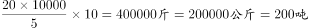，这批芒果的总重量为吨。

故正确答案为C。

---

### 第 2 题　qid 2377248 · 数学运算

某会议室共5排座位，每排的座位数依次为10、9、8、7、6个。甲、乙两人随机选择位置入座，则他们左右相邻的概率:

- **A**. 
不到

- **B**. 
在之间
　✅
- **C**. 
在之间

- **D**. 
高于

**答案**：B

**官方解析**

因每排座位数依次为10、9、8、7、6个，则会议室共有个座位，挑选两个座位让甲、乙坐，总的情况数为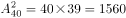。

要让两人左右相邻，则若两人在第一排左右相邻的情况数为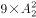，在第二排左右相邻的情况数为，在第三排左右相邻的情况数为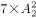，在第四排左右相邻的情况数为，在第五排左右相邻的情况数为，则两人左右相邻满足条件的情况数为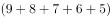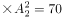，题目所求概率为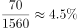，在~之间。

故正确答案为B。

---

### 第 3 题　qid 2377251 · 数学运算

商店购入一百多件A款服装，其单件进价为整数元，总进价为1万元。已知单件B款服装的定价为其进价的1.6倍，其进价为A款服装的，销售每件B款服装的利润正好为A款服装的一半。某日商店以定价销售A款服装的总销售额超过2500元。问当天至少销售了多少件A款服装？

- **A**. 13
- **B**. 15
- **C**. 17　✅
- **D**. 19

**答案**：C

**官方解析**

假设A款服装每件进价为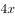，则B款服装每件进价为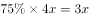，定价为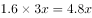，每件利润为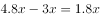，A款服装每件定价为。假设某日A款服装销售量为，则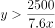，当取得最大值时，可取得最小值。因购进100多件A款服装，单件进价为整数元，总进价为1万元， 则10000能被整除且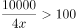，满足条件的最大值为20，此时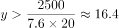，则至少售出了17件A款服装。

故正确答案为C。

---

### 第 4 题　qid 2377255 · 数学运算

某企业员工编号为6位自然数，其中前两位代表入职年份的最后两位数，第3位代表所属部门，后3位代表员工当年在部门中的入职顺序。2018年入职的员工小张发现，自己的员工编号能同时被5、9和101整除。问当年他所在的部门最少可能有多少人入职？

- **A**. 不到250人
- **B**. 250～499人之间　✅
- **C**. 500～749人之间
- **D**. 超过749人

**答案**：B

**官方解析**

小张18年入职，则6位工号前两位为18。由于其员工编号能同时被5、9、101整除，因此，其6位工号组成的数是5、9、101的最小公倍数4545的倍数。前两位是18且是4545倍数的六位数只有4545的40倍为181800，及其41倍为186345。已知后三位为员工入职顺序，故其部门18年最少有345人入职，在B项的范围内。
故正确答案为B。

---

### 第 5 题　qid 2377277 · 数学运算

甲、乙两个企业2018年投入的研发经费之和总计占收入之和的。其中，甲企业的收入是乙企业的2倍，投入的研发经费比乙企业多。如甲、乙企业投入的研发经费占各自收入的比重分别为和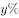，则有：

- **A**. 
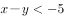

- **B**. 

　✅
- **C**. 
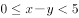

- **D**. 
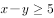

**答案**：B

**官方解析**

甲收入是乙的2倍，设乙收入是，则甲收入是；甲研发经费比乙多，设乙研发经费为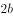，则甲为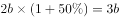。此时甲乙研发经费之和为，收入之和为，经费之和占收入之和的，则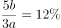，整理得。甲、乙研发经费占各自收入比重分别为和，则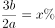，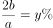，所求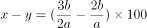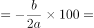，在B项范围内。

故正确答案为B。

---

### 第 6 题　qid 2377279 · 数学运算

2016年某电子产品定价为n元/台，2017年由于技术升级成本降低，定价降低，每台产品利润提升，2017年全年销售这种产品的总利润较2016年增加了。那么，2017年的销量比2016年：

- **A**. 
提高了不到
　✅
- **B**. 
提高了或以上

- **C**. 
降低了不到

- **D**. 
降低了或以上

**答案**：A

**官方解析**

赋值2016年每台电子产品的利润为100元，则2017年每台产品利润提升之后利润为110元。设2016年的销量为台，则2016年的总利润为，由于2017年总利润比2016年增加了，因此2017年总利润为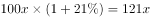，则2017年销量为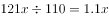，即2017年的销量比2016年提高了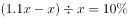。

故正确答案为A。

---

### 第 7 题　qid 2377282 · 数学运算

小张从甲地出发匀速前往乙地，同时小李和小王从乙地出发匀速前往甲地，小张和小李在途中的丙地相遇，小张和小王在途中的丁地相遇。已知小张的速度比小李快一半，小王的速度比小李慢一半，则丙、丁两地之间的距离与甲、乙两地之间的距离之比为：

- **A**. 2:15
- **B**. 1:4
- **C**. 3:20　✅
- **D**. 1:15

**答案**：C

**官方解析**

设甲乙两地的距离为，小张、小李、小王的速度分别为、、，由下图可知，小张和小李相遇时用时为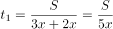，小张和小王相遇时用时为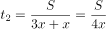，因此小张走丙、丁之间的路程所用时为，所以丙、丁之间的路程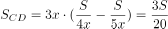。故丙、丁两地之间的距离与甲、乙两地之间的距离之比为。

故正确答案为C。

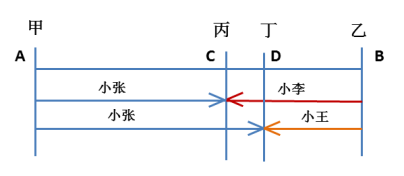

---

### 第 8 题　qid 2377283 · 数学运算

现用5700立方厘米的蜡制作二十多个同样大小，且长、宽、高均为整数厘米的长方体实心蜡块，问蜡块的尺寸有多少种不同的可能性？

- **A**. 4
- **B**. 6
- **C**. 10　✅
- **D**. 16

**答案**：C

**官方解析**

5700立方厘米的蜡制作二十多个同样大小的长方形实心蜡块，将5700因式分解为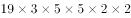，其因数为二十多的只有一种情况，因此可以拆分为25个，每个体积为立方厘米。蜡块的尺寸分类讨论如下：

①若长宽高有两条为1厘米：，1种情况；

②若长宽高只有一条为1厘米：，，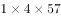，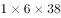，，5种情况；

③若长宽高均不为1厘米：，，，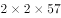，4种情况。

所以共有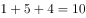种情况。

故正确答案为C。

---

### 第 9 题　qid 2377285 · 数学运算

某农户在半径为100米的圆形及内接的等边六边形田地中的不同区域种植不同作物，如图所示。已知阴影面积种植A作物，平均年产量为2公斤/平方米；空白区域种植B作物，平均年产量为1公斤/平方米。问每年两种作物的总产量在以下哪个范围内?（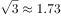，）

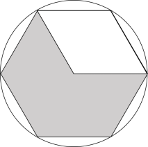

- **A**. 不到40吨
- **B**. 40～45吨之间
- **C**. 45～50吨之间　✅
- **D**. 50吨以上

**答案**：C

**官方解析**

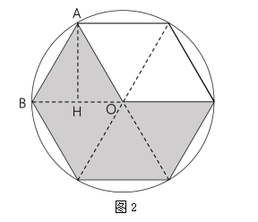

如图一，连接六边形各顶点做辅助线，可将六边形切割成6块完全相等的等边三角形，每个三角形的边长为圆的半径100m。

如图二，做等边三角形ABO的高AH，，，则，则三角形ABO的面积为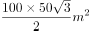 。同理，每个三角形的面积都是 。

所以阴影面积为。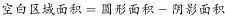。已知阴影部分的作物年平均产量为2公斤/平方米，空白区域的作物年平均产量为1公斤/平方米，所以总产量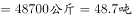，在45~50吨之间。

故正确答案为C。

---

## 判断推理

### 第 1 题　qid 2377218 · 图形推理

从所给的选项中，选择最合适的一个填入问号处，使之呈现一定的规律性：

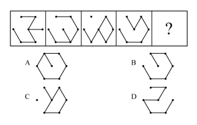

- **A**. A
- **B**. B
- **C**. C
- **D**. D　✅

**答案**：D

**官方解析**

元素组成相同，所有图形均由7个小黑点和6条线段组成，优先考虑位置规律。通过相邻比较发现，相邻两幅图之间只有两条线段位置发生变化，其余线段位置均没变，？处也应满足此规律，只有D项符合。 
故正确答案为D。

---

### 第 2 题　qid 2377223 · 图形推理

从所给的选项中，选择最合适的一个填入问号处，使之呈现一定的规律性：

- **A**. A
- **B**. B
- **C**. C　✅
- **D**. D

**答案**：C

**官方解析**

观察题干发现，题干图形都有两个空白格并且位置不相同，两个空白格均顺时针移动一格，C选项当选。
故本题答案为C。
注：题干图形均有黑色五角星和白色五角星，可以排除B选项，但是对于选出正确答案没有大的作用，明显黑色五角星是用来迷惑学生的。

---

### 第 3 题　qid 2377230 · 图形推理

从所给的选项中，选择最合适的一个填入问号处，使之呈现一定的规律性：

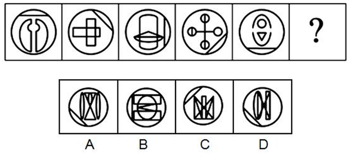

- **A**. A
- **B**. B
- **C**. C
- **D**. D　✅

**答案**：D

**官方解析**

观察图形发现，分为内外两部分，整体看无规律，可以考虑内外分开看。图形外框均为圆，且内部有一条与之相交在一起的直线，圆+直线可以整体观察，单独看，该图形每次顺时针旋转，因此？处的直线应该在左下角，排除B、C两项。继续观察图形，发现内部图形均有1条对称轴，考虑对称轴的方向。内部图形的对称轴方向为竖、横、竖、横、竖、？，？处应该选有一条横轴对称轴的图形，排除A项。

故正确答案为D。

---

### 第 4 题　qid 2377235 · 图形推理

从所给的选项中，选择最合适的一个填入问号处，使之呈现一定的规律性：

- **A**. A
- **B**. B
- **C**. C
- **D**. D　✅

**答案**：D

**官方解析**

解析一：元素组成不同，且无明显属性规律，考虑数量规律。九宫格优先横行看，观察发现题干图形出现若干空白区域，考虑面数量。第一行中面数量分别为2、3、4，第二行分别为2、3、4，第三行分别为2、4，单独看没有规律，但是每一行面数量和均为9，故“？”处应选择有3个面的图形，只有D项符合。
解析二：元素组成不同，且无明显属性规律，考虑数量规律。九宫格优先横行看，观察发现题干图形有曲有直，优先考虑曲直交点，但并无明显规律，再次观察发现，题干图形出现多组平行线，考虑数平行线数量。第一行中平行线的数量分别为一组、两组、三组，经验证第二行符合此规律。故第三行的“？”处应选择有三组平行线的图形。只有D项符合。
故正确答案为D。

---

### 第 5 题　qid 2377236 · 图形推理

下面四个选项分别为立体图形的俯视图和左视图，均正确的是：

- **A**. A
- **B**. B
- **C**. C
- **D**. D　✅

**答案**：D

**官方解析**

本题考查三视图。

根据每个选项第一个俯视图可以得知，题干中两个立体图形应该是相邻的。

既然是相邻的，那么点a应该在边1上，而A选项和B选项的点a没有在边1上，排除。（如图1所示）

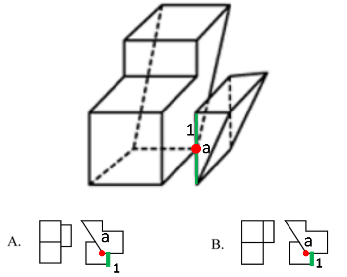

既然是相邻的，那么点b应该在边2的延长线上，因此从上往下观察该图形，点b与点b′应该是重合的。而C选项的点b与点b′并没有重合，排除。（如图2所示）

故正确答案为D。

---

### 第 6 题　qid 2377225 · 定义判断

稻草人谬误，是在辩论或讨论中，有意或无意地曲解对方的论点，针对曲解后的论点(替身稻草人)进行攻击，然后宣称已推翻对方论点的一种错误的论证方式。
根据上述定义，下列属于稻草人谬误的是：

- **A**. 
甲：“我认为人都是自私的。” 

乙：“我不认为所有的人都是自私的，但我也不认为所有的人都不是自私的。”

- **B**. 
甲：“我认为小孩不应该在大街上乱跑。” 

乙：“把小孩关在家里，他们呼吸不到新鲜空气，岂不是更加愚蠢吗?”
　✅
- **C**. 
甲：“为什么我最近脸上总是长痘痘?”  乙：“因为你上火了。” 

甲：“你怎么知道我上火?”  乙：“因为你脸上总长痘痘。”

- **D**. 
甲：“学习语言多听是最重要的，只要每天都听，过几个月自然就能听明白了。” 

乙：“可是我天天在家听英语，已经听了好几年了，现在还是听不懂。”

**答案**：B

**官方解析**

第一步：找出定义关键词。

“在辩论或讨论中”、“有意或无意地曲解对方的论点”、“针对曲解后的论点(替身稻草人)进行攻击”、“宣称已推翻对方论点的一种错误的论证方式”。
第二步：逐一分析选项。
A项：该项甲说“人都是自私的”，强调的是所有人都是自私的，乙的回应也在强调“所有人”和“自私”的关系，所以不存在乙曲解甲的意思，不符合“有意或无意地曲解对方的论点”，不符合定义，排除；
B项：该项甲说“小孩不应该在大街上乱跑”，但是乙把“小孩不应该在大街上乱跑”曲解为“把小孩关在家里”，并且针对把小孩关在家里进行攻击，认为关在家里会导致“他们呼吸不到新鲜空气，更加愚蠢”，从而推翻甲的观点，符合定义，当选；
C项：该项甲都是在提问问题，而乙则是针对甲所问问题进行回应，告诉他原因，所以不存在曲解甲观点的事情，不符合定义，排除；
D项：该项甲阐述了多听对学习语言的好处，而乙则是阐述了多听对学习没有帮助，两者讨论的话题都是“多听”与“学习语言”之间的关系，不存在曲解的问题，不符合定义，排除；
故正确答案为B。

---

### 第 7 题　qid 2377228 · 定义判断

演绎推理是指结论已经蕴含在前提中；前提为真，结论也必然为真的推理。归纳推理是指结论并不完全蕴含在前提中；前提为真，结论不必然为真的推理。
根据上述定义，下列属于归纳推理的是：

- **A**. 
如果并且，那么

- **B**. 
所有天鹅都是白的，因此在南极发现的天鹅也是白的

- **C**. 
样品的合格率是，因此这批产品的合格率也是
　✅
- **D**. 
甲生于1980年，而乙生于1981年，因此甲和乙不是同一个人

**答案**：C

**官方解析**

第一步：找出定义关键词。

演绎推理：“结论已经蕴含在前提中”、“前提为真，结论也必然为真”；

归纳推理：“结论并不完全蕴含在前提中”、“前提为真，结论不必然为真”。

第二步：逐一分析选项。

A项：该项中“如果”所在句子为前提，,，蕴含着这一结论，符合“结论已经蕴含在前提中”，属于演绎推理，不属于归纳推理，排除；

B项：该项“所有天鹅都是白的”为前提，强调的是所有天鹅，所以无论在哪发现的天鹅都是白的，符合“前提为真，结论也必然为真”，属于演绎推理，不属于归纳推理，排除；

C项：该项“样品的合格率是”为前提，强调的是全部的产品中的一部分，一部分产品的合格率为，并不能说明所有产品的合格率是，符合“前提为真，结论不必然为真”，符合归纳推理，当选；

D项：该项中“甲生于1980年，而乙生于1981年”为前提，出生年份不一样，那说明一定不是同一个人，符合“前提为真，结论也必然为真”,属于演绎推理，不属于归纳推理，不符合定义，排除。

故正确答案为C。

---

### 第 8 题　qid 2377229 · 定义判断

细分市场是指根据地理因素、人口因素、心理因素和行为因素等划分某一产品的市场之后形成的市场。细分市场定价是指针对同一商品或者服务，在不同的细分市场上定以不同的价格。
根据上述定义，下列属于细分市场定价的是：

- **A**. 母亲节当天康乃馨的售价比其他花高
- **B**. 在中国理发的收费比在美国理发的收费低很多
- **C**. 同样一种水果，在拉萨的售价比在武汉的售价贵得多　✅
- **D**. 同样的物品，从北京寄到天津的收费比从北京寄到广州低

**答案**：C

**官方解析**

第一步：找出定义关键词。
细分市场：“根据地理因素、人口因素、心理因素和行为因素等划分某一产品的市场之后形成的市场”；
细分市场定价：“同一商品或者服务”、“在不同的细分市场上定以不同的价格”。
第二步：逐一分析选项。
A项：母亲节当天康乃馨的售价比其他花高，康乃馨和其他花不是同一产品，不符合“同一商品或者服务”，不符合细分市场定价，排除；
B项：在中国理发的收费比在美国理发的收费低很多，理发服务形式有很多种，此处不明确两种理发是否符合“同一商品或者服务”，不符合“细分市场定价”定义，排除；
C项：同样一种水果，符合“同一商品或者服务”，在拉萨的售价比在武汉的售价贵得多，拉萨和武汉是不同地理因素划分形成的细分市场，符合 “在不同的细分市场上定以不同的价格”，符合“细分市场定价”定义，当选；
D项：同样的物品，从北京寄到天津的收费比从北京寄到广州低，两次的邮寄地点不同，而邮寄费用受到邮寄的距离影响，不符合“同一种产品或服务”，不符合“细分市场定价”定义，排除。
故正确答案为C。

---

### 第 9 题　qid 2377231 · 逻辑判断

交互抑制法主要是诱导患者缓慢地暴露出导致神经症焦虑、恐惧的情境，并通过心理的放松状态来对抗这种焦虑情绪，从而达到消除焦虑或恐惧的目的。满灌疗法是鼓励患者直接接触引致恐怖、焦虑的情景，坚持到紧张感觉消失的一种快速行为治疗法。
下列对患乘车恐惧症的患者的治疗过程，使用了满灌疗法的是：

- **A**. 先试着让患者看汽车图片，进而坐上停止的汽车，然后坐上缓慢行驶的汽车，最后坐上快速行驶的汽车
- **B**. 让患者关注使自己焦虑、恐惧的思维活动，每当这些想法出现时，要求患者大声命令自己“停止”，从而使这些想法消失
- **C**. 将患者安置在汽车后座，驱车行驶数小时，使患者焦虑、恐惧的情绪逐渐减弱，直到患者完全习惯了乘车，不再感到恐惧　✅
- **D**. 让患者想象自己正坐在一辆汽车的后座，想象产生较轻焦虑的情境，适应后再想象产生较高焦虑的情境，直到患者在最恐惧情境中能保持放松状态

**答案**：C

**官方解析**

第一步：找出定义关键词。
交互抑制法：“诱导患者缓慢地暴露出导致神经症焦虑、恐惧的情境”、“通过心理的放松状态来对抗这种焦虑情绪”、“达到消除焦虑或恐惧的目的”；
满灌疗法：“鼓励患者直接接触引致恐怖、焦虑的情景”、“坚持到紧张感觉消失”、“快速行为治疗法”。
第二步：逐一分析选项。
A项：先试着让患者看汽车图片，不符合“鼓励患者直接接触引致恐怖、焦虑的情景”，先看汽车图片，进而坐上停止的汽车，然后坐上缓慢行驶的汽车，最后坐上快速行驶的汽车，该过程较为缓慢，不符合“快速行为治疗法”，不符合“满灌疗法”定义，也不符合“交互抑制法”定义，排除；
B项：让患者关注使自己焦虑、恐惧的思维活动，符合“诱导患者缓慢地暴露出导致神经症焦虑、恐惧的情境”，每当这些想法出现时，要求患者大声命令自己“停止”，从而使这些想法消失，符合“通过心理的放松状态来对抗这种焦虑情绪”，“达到消除焦虑或恐惧的目的”，符合“交互抑制法”定义，不符合“满灌疗法”定义，排除；
C项：将患者安置在汽车后座，符合“鼓励患者直接接触引致恐怖、焦虑的情景”。驱车行驶数小时，使患者焦虑、恐惧的情绪逐渐减弱，直到患者完全习惯了乘车，不再感到恐惧，符合 “坚持到紧张感觉消失”，符合“满灌疗法”定义，当选；
D项：让患者想象自己正坐在一辆汽车的后座，想象产生较轻焦虑的情境，符合“诱导患者缓慢地暴露出导致神经症焦虑、恐惧的情境”， 适应后再想象产生较高焦虑的情境，直到患者在最恐惧情境中能保持放松状态，符合“通过心理的放松状态来对抗这种焦虑情绪”，“达到消除焦虑或恐惧的目的”，符合“交互抑制法”定义，不符合“满灌疗法”定义，排除。
故正确答案为C。

---

### 第 10 题　qid 2377233 · 定义判断

连续对比是指人眼在不同时间段内所观察与感受到的色彩对比视错现象。连续对比又分正残像和负残像两类。正残像是指在停止物体的视觉刺激后，视觉仍然暂时保留原有物色映像的视觉状态。负残像是指在停止物体的视觉刺激后，视觉依旧暂时保留与原有物色成补色（如红与绿、蓝与橙、黄与紫等互为补色）映像的视觉状态。
根据上述定义，下列属于负残像的是：

- **A**. 将静态画面按每秒24帧连续放映，就会在眼前形成动态画面
- **B**. 凝视红色物体之后，即使将物体移开，眼前还是会感到有红色浮现
- **C**. 久视红色后，将视觉迅速移向白色时，看到的并非白色而是绿色　✅
- **D**. 红色与黄色搭配，眼睛时而把红色感觉为带紫的颜色，时而又把黄色视为带绿的颜色

**答案**：C

**官方解析**

第一步：找出定义关键词。
正残像：“指在停止物体的视觉刺激后，视觉仍然暂时保留原有物色映像的视觉状态”；
负残像：“指在停止物体的视觉刺激后，视觉依旧暂时保留与原有物色成补色（如红与绿、蓝与橙、黄与紫等互为补色）映像的视觉状态”。
第二步：逐一分析选项。
A项：将静态画面连续放映就会形成动态画面，说的是画面的静态与动态，而非颜色，不符合“负残像”定义，排除；
B项：凝视红色物体之后，即使将物体移开，还是会感到红色浮现，符合“指在停止物体的视觉刺激后，视觉仍然暂时保留原有物色映像的视觉状态”，符合“正残像”定义，不符合“负残像”定义，排除；
C项：久视红色后，将视觉迅速移到白色时，看到的不是白色而是绿色，红色与绿色互为补色，符合“指在停止物体的视觉刺激后，视觉依旧暂时保留与原有物色成补色映像的视觉状态”，符合“负残像”定义，当选；
D项：红色与黄色搭配，眼睛时而把红色感觉为带紫的颜色，时而又把黄色视为带绿的颜色，没有明确体现是否“停止物体的视觉刺激”，不符合“负残像”定义，排除。
故正确答案为C。

---

### 第 11 题　qid 2377216 · 定义判断

动机是人们行动的原因，它能唤起行动，使活动指向一定的目标。根据动机的来源可分为内在动机和外在动机，内在动机是指行为的目的是为了体验相应活动中带来的喜悦和满足；外在动机是指行为的目的是为了获得相应活动所带来的其他外在结果或者避免惩罚。
根据上述定义，下列行为中最可能体现内在动机的是：

- **A**. 为了保持身体健康，小赵坚持锻炼身体
- **B**. 张老师非常热爱他的职业，很享受教书育人的过程　✅
- **C**. 小芳参加游泳比赛获得了第一名，她为自己感到骄傲
- **D**. 为了不让父母失望，小明非常努力地学习，争取考上理想的学校

**答案**：B

**官方解析**

第一步：找出定义关键词。
内在动机：“行为的目的是为了体验相应活动中带来的喜悦和满足”；
外在动机：“行为的目的是为了获得相应活动所带来的其他外在结果或者避免惩罚”。
第二步：逐一分析选项。
A项：小赵坚持锻炼身体的目的是为了保持身体健康，不符合“行为的目的是为了体验相应活动中带来的喜悦和满足”，不符合定义，排除；
B项：张老师非常热爱他的职业是因为他很享受教书育人的过程，符合“行为的目的是为了体验相应活动中带来的喜悦和满足”，符合定义，当选；
C项：小芳为自己感到骄傲的原因是她在游泳比赛中获得了第一名，她是为行为的结果而自豪，不符合“行为的目的是为了体验相应活动中带来的喜悦和满足”，不符合定义，排除；
D项：小明非常努力地学习，争取考上理想的学校是为了不让父母失望，不符合“行为的目的是为了体验相应活动中带来的喜悦和满足”，不符合定义，排除。
故正确答案为B。

---

### 第 12 题　qid 2377217 · 定义判断

主语是执行句子的行为或动作的主体，谓语是对主语动作或状态的陈述或说明，宾语则是指一个动作（动词）的接受者。当句子中的谓语部分包含两个动词（有的后一个是形容词），且对应两个不同的主语，即前一个谓语的宾语同时又作为后一个谓语的主语，等于一个动宾结构和主谓结构连环在一起，并且其中没有语音停顿，符合这样格式的句子叫兼语句。
根据上述定义，下列不属于兼语句的是：

- **A**. 风吹雪花飘
- **B**. 上级派工作组检查工作
- **C**. 公使阳处父追之
- **D**. 人不能两次踏进同一条河流　✅

**答案**：D

**官方解析**

第一步：找出定义关键词。 
主语：“执行句子的行为或动作的主体”；
谓语：“对主语动作或状态的陈述或说明”；
宾语：“一个动作（动词）的接受者”；
兼语句：“前一个谓语的宾语同时又作为后一个谓语的主语”、“一个动宾结构和主谓结构连环在一起，并且其中没有语音停顿”。
第二步：逐一分析选项。
A项：风吹雪花飘，风吹雪花，风是主语，吹是谓语，雪花是宾语，为主谓宾结构，雪花飘，雪花是主语，飘是谓语，为主谓结构，符合“前一个谓语的宾语同时又作为后一个谓语的主语”，也符合“一个动宾结构和主谓结构连环在一起，并且其中没有语音停顿”，符合定义，排除；
B项：上级是主语，派是谓语，工作组是宾语，为主谓宾结构，检查是谓语，工作是宾语，且工作组是检查的主语，符合“前一个谓语的宾语同时又作为后一个谓语的主语”，也符合“一个动宾结构和主谓结构连环在一起，并且其中没有语音停顿”，符合定义，排除；
C项：公使阳处父追之，公是主语，使是谓语，阳处父是宾语，为主谓宾结构，追是谓语，之是宾语，且阳处父是追的主语，符合“前一个谓语的宾语同时又作为后一个谓语的主语”，也符合“一个动宾结构和主谓结构连环在一起，并且其中没有语音停顿”，符合定义，排除；
D项：人不能两次踏进同一条河流，整体为主谓宾结构，不符合“前一个谓语的宾语同时又作为后一个谓语的主语”，不符合定义，当选。
本题为选非题，故正确答案为D。

---

### 第 13 题　qid 2377219 · 定义判断

数字家庭是指以计算机技术和网络技术为基础，各种电器通过不同的互连方式进行通信及数据交换，实现电器间的互联互通，使人们可以更加方便快捷地获取信息，从而极大提高人类居住的舒适性和娱乐性。
根据上述定义，下列不涉及数字家庭的是：

- **A**. 小王通过网络控制家里的打印机，实现远程打印
- **B**. 小李通过蓝牙将投影仪与笔记本电脑连接，在家里播放电影
- **C**. 小刘使用电饭煲预约定时功能，让电饭煲在预定时间自动开始工作　✅
- **D**. 小张在单位上班时，通过手机控制家里的电视，录制正在直播的体育节目

**答案**：C

**官方解析**

第一步：找出定义关键词。
“以计算机技术和网络技术为基础”、“各种电器通过不同的互连方式进行通信及数据交换，实现互联互通”、“提高人类居住的舒适性和娱乐性”。
第二步：逐一分析选项。
A项：通过网络控制家里的打印机，符合“以计算机技术和网络技术为基础”、“各种电器通过不同的互连方式进行通信及数据交换，实现互联互通”，实现远程打印，符合“提高人类居住的舒适性和娱乐性”，符合定义，排除；
B项：通过蓝牙将投影仪与笔记本电脑连接，符合“以计算机技术和网络技术为基础”、“各种电器通过不同的互连方式进行通信及数据交换，实现互联互通”，在家里播放电影，符合“提高人类居住的舒适性和娱乐性”，符合定义，排除；
C项：使用电饭煲预约定时功能，没有运用计算机和网络技术，不符合“以计算机技术和网络技术为基础”，也没有和其他电器连接，不符合“各种电器通过不同的互连方式进行通信及数据交换，实现互联互通”，不符合定义，当选；
D项：通过手机控制家里的电视，符合“以计算机技术和网络技术为基础”、“各种电器通过不同的互连方式进行通信及数据交换，实现互联互通”，录制正在直播的体育节目，符合“提高人类居住的舒适性和娱乐性”，符合定义，排除。
本题为选非题，故正确答案为C。

---

### 第 14 题　qid 2377221 · 类比推理

雪：霜

- **A**. 荷花：莲花
- **B**. 国花：牡丹
- **C**. 雨滴：露珠　✅
- **D**. 白鹤：仙鹤

**答案**：C

**官方解析**

第一步：判断题干词语间逻辑关系。
雪是降落到地面的雪花形态的固体水，霜是接近地面的水汽遇冷在地面或物体上凝结成的固体水。二者都是水的固态形式，但形成过程不同，二者为并列关系。
第二步：判断选项词语间逻辑关系。
A项：荷花又称为莲花，二者是全同关系，与题干逻辑关系不一致，排除；
B项：国花是作为国家文化形象的花卉，而牡丹是一种花，二者不是并列关系，与题干逻辑关系不一致，排除；
C项：雨滴是云里的小水滴增大到不能浮悬在空中时，就下降形成的，露珠是空气中水汽凝结在地物上的液态水，二者都是水的液体形式，但形成过程不同，与题干逻辑关系一致，当选；
D项：白鹤与仙鹤都是鹤，二者是并列关系，但并无形成过程的不同，与题干逻辑关系不一致，排除。
故正确答案为C。

---

### 第 15 题　qid 2377222 · 类比推理

广场：广场舞

- **A**. 校园：教学楼
- **B**. 厂房：流水线
- **C**. 电视：演唱会
- **D**. 公路：马拉松　✅

**答案**：D

**官方解析**

第一步：判断题干词语间逻辑关系。
在广场上跳广场舞，广场舞是一种运动形式，广场是一个地点。
第二步：判断选项词语间逻辑关系。
A项：教学楼是校园的组成部分，二者为组成关系。与题干逻辑关系不一致，排除；
B项：流水线是厂房的一种工作模式。与题干逻辑关系不一致，排除；
C项：在电视上看演唱会，但电视不是地点。与题干逻辑关系不一致，排除；
D项：在公路上跑马拉松，马拉松是一种运动形式，公路是一个地点。与题干逻辑关系一致，当选。
故正确答案为D。

---

### 第 16 题　qid 2377246 · 类比推理

影视作品：电视剧

- **A**. 苹果：芒果
- **B**. 教师：职工
- **C**. 权力：金钱
- **D**. 树木：白杨　✅

**答案**：D

**官方解析**

第一步：判断题干词语间逻辑关系。
电视剧是影视作品，二者为种属关系。
第二步：判断选项词语间逻辑关系。
A项：苹果和芒果都是水果，二者为并列关系，与题干逻辑关系不一致，排除；
B项：教师是职工，二者为种属关系，但两词顺序与题干相反，与题干逻辑关系不一致，排除；
C项：权力和金钱没有明显逻辑关系，与题干逻辑关系不一致，排除；
D项：白杨是树木，二者为种属关系，与题干逻辑关系一致，当选。
故正确答案为D。

---

### 第 17 题　qid 2377262 · 类比推理

烤箱：烘烤

- **A**. 卷尺：测量　✅
- **B**. 皮鞋：防水
- **C**. 铜镜：折射
- **D**. 软件：导航

**答案**：A

**官方解析**

第一步：判断题干词语间逻辑关系。
烤箱主要功能是用来烘烤，二者是功能的对应关系。
第二步：判断选项词语间逻辑关系。
A项：卷尺主要功能是用来测量，二者是功能的对应关系，与题干逻辑关系一致，当选；
B项：皮鞋主要功能不是用来防水，与题干逻辑关系不一致，排除；
C项：铜镜主要功能不是用来折射，与题干逻辑关系不一致，排除；
D项：不是所有软件都可以用来导航，与题干逻辑关系不一致，排除。
故正确答案为A。

---

### 第 18 题　qid 2377293 · 类比推理

投资：风险：收益

- **A**. 考试：作弊：晋升
- **B**. 学习：疲劳：知识
- **C**. 决策：错误：正确
- **D**. 预警：误判：减灾　✅

**答案**：D

**官方解析**

第一步：判断题干词语间逻辑关系。
投资会有风险，投资的目的是为了获得收益。
第二步：判断选项词语间逻辑关系。
A项：作弊是考试中可能出现的违纪行为，与题干逻辑关系不一致，排除；
B项：学习时可能会疲劳，学习的目的是增长知识，与题干逻辑关系一致，保留；
C项：错误与正确是决策的两种结果，与题干逻辑关系不一致，排除；
D项：预警时可能会有误判，预警的目的是为了减灾，与题干逻辑关系一致，保留。
对比BD两项，B项学习知识，也可看做动宾结构，而题干投资和收益仅为对应关系，故D项和题干更为一致。
故正确答案为D。

---

### 第 19 题　qid 2377274 · 类比推理

局域网：计算机：文件共享

- **A**. 空间站：航天员：科学实验
- **B**. 图书馆：阅览室：文献检索
- **C**. 纺织厂：纺织设备：原料加工　✅
- **D**. 电视台：网络媒体：节目制作

**答案**：C

**官方解析**

第一步：判断题干词语间逻辑关系。
在局域网内，利用计算机进行文件共享，计算机是进行文件共享的工具。
第二步：判断选项词语间逻辑关系。
A项：航天员在空间站进行科学实验，航天员是进行科学实验的主体而非工具，与题干逻辑关系不一致，排除；
B项：在阅览室进行文献检索，阅览室是文献检索的场所而非工具，与题干逻辑关系不一致，排除；
C项：在纺织厂内，利用纺织设备进行原料加工，纺织设备是进行原料加工的工具，与题干逻辑关系一致，当选；
D项：网络媒体不能用来节目制作，与题干逻辑关系不一致，排除。
故正确答案为C。

---

### 第 20 题　qid 2377281 · 类比推理

线性振动：非线性振动：振动

- **A**. 花瓣：花蕊：牵牛花
- **B**. 食肉动物：食草动物：动物
- **C**. 投资者：经营者：市场主体
- **D**. 主要矛盾：次要矛盾：矛盾　✅

**答案**：D

**官方解析**

第一步：判断题干词语间逻辑关系。
线性振动与非线性振动是并列关系中的矛盾关系，二者都是振动的一种，与第三个词是包容关系。
第二步：判断选项词语间逻辑关系。
A项：花瓣和花蕊是牵牛花的组成部分，且花瓣与花蕊不是矛盾关系，与题干逻辑关系不一致，排除；
B项：食肉动物和食草动物不是矛盾关系，有的动物既吃肉也吃草，与题干逻辑关系不一致，排除；
C项：投资者和经营者不是矛盾关系，与题干逻辑关系不一致，排除；
D项：主要矛盾和次要矛盾是矛盾关系，二者均是矛盾的一种，与题干逻辑关系一致，当选。
故正确答案为D。

---

### 第 21 题　qid 2377220 · 类比推理

教授：副教授：讲师

- **A**. 开除：记过：警告　✅
- **B**. 刑法：民法：道德
- **C**. 商务手机：智能手机：4G手机
- **D**. 发动机：内燃机：电动机

**答案**：A

**官方解析**

第一步：判断题干词语间逻辑关系。
教授、副教授和讲师都是对老师的评级，三者是并列关系。并且教授比副教授的级别高，副教授比讲师的级别高。
第二步：判断选项词语间逻辑关系。
A项：开除、记过和警告都是处罚方式，三者是并列关系。并且开除比记过的程度重，记过比警告的程度重，与题干逻辑关系一致，当选；
B项：刑法和民法都是法律，二者为并列关系，但二者和道德不是并列关系，与题干逻辑关系不一致，排除；
C项：商务手机、智能手机和4G手机，三者是交叉关系，与题干逻辑关系不一致，排除；
D项：发动机是一种能够把其它形式的能转化为机械能的机器，包括内燃机（汽油发动机等）、外燃机（斯特林发动机、蒸汽机等）、电动机等。因此内燃机和电动机都是发动机的一种，第一个词与后面的两个词均为种属关系，与题干逻辑关系不一致，排除。
故正确答案为A。

---

### 第 22 题　qid 2377242 · 类比推理

荷花  对于（  ）相当于（  ）对于  地瓜

- **A**. 荷叶；红薯
- **B**. 池塘；土地
- **C**. 莲藕；中药
- **D**. 芙蕖；甘薯　✅

**答案**：D

**官方解析**

逐一代入选项。
A项：荷花，又名莲花、芙蕖、水芙蓉等。荷叶是荷花的组成部分，二者是组成关系；红薯又名地瓜，二者是全同关系。前后逻辑关系不一致，排除；
B项：池塘是荷花的生长环境，二者是地点的对应关系；土地是地瓜的生长环境，二者是地点的对应关系。但前后两组词顺序相反，排除；
C项：莲藕是荷花的组成部分，二者是组成关系；地瓜是中药的一种，二者是种属关系。前后逻辑关系不一致，排除；
D项：荷花与芙蕖是全同关系；甘薯即地瓜，二者是全同关系。前后逻辑关系一致，当选。
故正确答案为D。

---

### 第 23 题　qid 2377243 · 类比推理

肥皂  对于（  ）相当于  煤炭  对于（  ）

- **A**. 衣服；锅炉
- **B**. 水；火
- **C**. 污渍；能源
- **D**. 洗涤液；天然气　✅

**答案**：D

**官方解析**

逐一代入选项。
A项：肥皂是清洗衣服用到的工具，煤炭在锅炉中燃烧，前后逻辑关系不一致，排除；
B项：肥皂发挥作用需要用到水，煤炭经过燃烧产生火，煤炭只要达到一定燃点就能燃烧，不一定需要火，前后逻辑关系不一致，排除；
C项：肥皂的作用是去除污渍，二者属于物品和功能的对应关系，煤炭是能源的一种，二者属于种属关系，前后逻辑关系不一致，排除；
D项：肥皂和洗涤液是不同的清洁用品，二者属于并列关系，煤炭是古代植物埋藏在地下经历了复杂的生物化学和物理化学变化逐渐形成的固体可燃性矿物，天然气是指天然蕴藏于地层中的烃类和非烃类气体的混合物，二者分别是不同的能源，属于并列关系，前后逻辑关系一致，当选。
故正确答案为D。

---

### 第 24 题　qid 2377244 · 逻辑判断

近日，某研究小组利用蓝色发光二极管（LED）成功研发出节能效果出众的半导体材料，制造出了约1毫米见方的一小块半导体，它能够稳定传输家电使用过程中所需的10安培电流。如果用在空调等电器上的话，可以节省近的耗电量。研究小组认为，利用这种新型半导体材料生产的家用电器，将比传统家用电器更具有市场竞争力。

以下哪项如果为真，最能支持上述结论？

- **A**. 这种新型半导体材料在未来也可应用于生产电动汽车
- **B**. 目前市场上销售的声称节能型的家用电器质量参差不齐
- **C**. 全球著名的几大家电企业已与该研究小组展开该研究成果的商业转化合作
- **D**. 利用这种新材料生产的家用电器的成本有望在未来达到与传统家用电器相近的程度　✅

**答案**：D

**官方解析**

第一步:找出论点和论据。
论点：利用这种新型半导体材料生产的家用电器，将比传统家用电器更具有市场竞争力。
论据：某研究小组利用蓝色发光二极管（LED）成功研发出节能效果出众的半导体材料，制造出了约1毫米见方的一小块半导体，它能够稳定传输家电使用过程中所需的10安培电流。如果用在空调等电器上的话，可以节省近10%的耗电量。
题干论据讨论的是新型材料可以更节能，论点讨论的是采用新型材料的家电相比传统家电更具有市场竞争力，其中节能确实是加强竞争力的一个重要层面。因此可以考虑在节能与竞争力之间搭桥，或者补充一个其他具有提升竞争力的条件来加强。
第二步:逐一分析选项。
A项:论点说的是这种新型半导体材料生产的家电非常有市场竞争力，甚至将超越传统家用电器，但该项说这种新型半导体材料将用在生产电动汽车上，只是在说这种新型半导体材料应用的领域更广，与论点话题不一致，无法加强，排除；
B项:论点的主体是新型半导体材料的家电，该项的主体是市场销售声称节能型的家电，但实际是否为节能型家电不明确，并且该项中的声称节能型的家电是否用到了论点中说的新型半导体材料不明确，与论点主体不一致，无关项，无法加强，排除；
C项:著名企业与研究小组展开研究成果的商业转化合作，只能说明可以进行生产，但是比传统家用电器更具有市场竞争力不明确，不明确选项，无法加强，排除；
D项:新材料生产的电器的成本与传统家电相近，说明在成本相近的条件下，新材料生产的家电更省电，因此会更有竞争力，补充论据加强题干观点，当选。
故正确答案为D。

---

### 第 25 题　qid 2377245 · 逻辑判断

为什么有人乐于参加社交活动、结交朋友，有人却对此避之不及？有研究人员提出，与其他人相比，CD38基因表达量较高、CD157基因序列存在特定变异的人更乐于社交，所以这两种基因影响了人的社交能力。但是，有反对者提出，人的社交能力是由位于人类4号染色体长臂1区的催产素决定的，不论男性还是女性的大脑都能合成这种激素，它对人的社交能力有着重要影响。
以下哪项如果为真，最能削弱反对者的观点?

- **A**. CD38和CD157基因控制着催产素的分泌　✅
- **B**. 催产素的分泌影响着人的共情能力、信任和慷慨程度等
- **C**. 上述两种基因中哪一种对人的社交能力影响更大还不确定
- **D**. 基因表达是否能影响行为，在很大程度取决于人们所处的社会环境

**答案**：A

**官方解析**

第一步：找出论点和论据。
论点：人的社交能力是由位于人类4号染色体长臂1区的催产素决定的，不论男性还是女性的大脑都能合成这种激素，它对人的社交能力有着重要影响。
本题无明显论据。
本题只有论点没有论据，削弱优先考虑削弱论点，即削弱反对者的观点。
A项：该项说的是CD38和CD157决定着催产素的分泌，论点说影响人的社交能力的是催产素的分泌，而不是CD38和CD157，因此CD38和CD157对人的社交能力起根本作用，削弱反对者观点即削弱论点，当选；
B项：论点讨论的是影响人的社交能力的是催产素的分泌，而不是CD38和CD157，而本项说的是催产素分泌对除了人的社交能力以外的其他影响，与论点话题不一致，无法削弱，排除；
C项：该项说的是不确定哪种基因对于人的社交能力影响更大，而论点说的是催产素决定了人的社交能力，二者话题不一致，排除；
D项：该项讨论的是基因表达是否可以影响行为很大程度取决于社会环境，与论点话题不一致，无法削弱，排除。
故正确答案为A。

---

### 第 26 题　qid 2377237 · 逻辑判断

一对中子星碰撞后抛出的碎片不仅合成了金、银等稳定元素，还合成了大量放射性元素，它们会衰变、裂变，释放出大量能量，将碎片自身加热，使其发光，最亮时虽然没有超新星那么亮，却可以达到新星亮度的一千倍左右，因此被称为千新星。2017年8月，天文学家首次观测到双中子星并合前后发出的引力波，并在大约10小时后发现了中子星碎片形成的千新星现象，从而彻底证实了中子星并合可以合成大量重元素这个猜想。
由此可以推出:

- **A**. 超新星比新星更亮　✅
- **B**. 引力波可以释放大量能量
- **C**. 千新星中含有大量的金、银元素
- **D**. 宇宙中的重元素都是由中子星碰撞后产生的

**答案**：A

**官方解析**

日常结论题，根据题干信息逐一分析选项。
A项：根据题干“最亮时虽然没有超新星那么亮，却可以达到新星亮度的一千倍左右，因此被称为千新星”可知，超新星比新星更亮，可以推出，当选；
B项：题干只是说明“双中子星并合前后发出的引力波”，并未提起引力波是否可以释放大量能量，无中生有，无法推出，排除；
C项：题干只是说明“一对中子星碰撞后抛出的碎片不仅合成了金、银等稳定元素，还合成了大量放射性元素，它们会衰变、裂变，释放出大量能量”，而不是千新星中含有大量的金、银元素，无中生有，无法推出，排除； 
D项：题干并未提及重元素的来源都是中子星并合，无中生有，无法推出，排除。
故正确答案为A。

---

### 第 27 题　qid 2377238 · 逻辑判断

糖生物电池作为一种燃料电池，可以将糖的化学能量转化为电流。一般来说，糖生物电池可以实现的能量转换，其能量存储密度大约是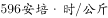，相比之下，锂离子电池的能量存储密度为。这意味着糖生物电池比同等重量的现有锂离子电池持续使用至少多10倍的时间。因此，不少研究者认为糖生物电池将有效替代传统锂电池。

以下哪项如果为真，能够支持上述结论?

- **A**. 糖生物电池是微生物燃料电池，不可能在高温下工作，因此对生产环境有着比传统电池更严格的要求
- **B**. 糖生物电池转化电能效率高，但可重复性较低，而传统锂电池可反复充放电，因此能够使用较长的时间
- **C**. 糖生物电池依赖于人体酶进行化学反应产生电流，而传统锂电池利用重金属作为催化剂，因此前者更加低碳环保　✅
- **D**. 目前，糖生物电池仅应用在人造器官的供电装置中，而锂电池不但可用于人造器官供电，也广泛应用于各类电子设备供电

**答案**：C

**官方解析**

第一步：找出论点和论据。
论点：糖生物电池将有效替代传统锂电池。
论据：糖生物电池比同等重量的现有锂离子电池持续使用至少多10倍的时间。
论据通过指出糖生物电池比现有锂离子电池持续时间久，从而得出糖生物电池将取而代之，论据论点话题一致，所以优先考虑补充论据加强。
第二步：逐一分析选项。
A项：说明糖生物电池不能在高温下工作，对生产环境要求更严格，说明糖生物电池有局限性，无法有效替代传统锂电池，有一定的削弱力度，无法加强，排除；
B项：说明糖生物电池的可重复性不如传统电池，所以糖生物电池无法有效替代传统锂电池，否定了论点，无法加强，排除；
C项：说明糖生物电池比传统锂电池更加低碳环保，更加有优势，所以糖生物电池将有效替代传统锂电池，补充论据加强，当选； 
D项：说明糖生物电池的可应用领域不如传统锂电池广泛，所以糖生物电池无法有效替代传统锂电池，否定了论点，无法加强，排除。
故正确答案为C。

---

### 第 28 题　qid 2377239 · 逻辑判断

某研究团队招募了53名年龄在45岁到64岁之间的健康志愿者，参与一项为期两年的锻炼计划。结果发现，志愿者心脏健康指标特别是左心室功能有相应改善。这是由于左心室能将富含氧气的血液泵入大动脉，供应全身器官。缺乏运动和器官老化会使左心室肌肉收缩乏力。该研究团队认为，适当锻炼有助于逆转心肌老化带来的危害并降低心脏病发作风险。
以下哪项如果为真，最能支持上述结论？

- **A**. 越年轻开始锻炼，越能降低心脏病发作的风险
- **B**. 适当运动有助于提高氧气吸入量，增强代谢能力
- **C**. 有心脏病史的人经过适当锻炼后心脏功能得到明显改善　✅
- **D**. 出现左心室肌肉硬化的中老年人中大多数日常锻炼量不足

**答案**：C

**官方解析**

第一步：找出论点和论据。
论点：适当锻炼有助于逆转心肌老化带来的危害并降低心脏病发作风险。
论据：健康志愿者参与了一项为期两年的锻炼计划，发现志愿者心脏健康指标特别是左心室功能有相应改善。这是由于左心室能将富含氧气的血液泵入大动脉，供应全身器官。缺乏运动和器官老化会使左心室肌肉收缩乏力。
题干论点论据都是说适当锻炼对于心脏有好处，讨论话题一致，因此考虑补充论据，通过解释原因或者举例子的方式加强。
第二步：逐一分析选项。
A项：论点讨论的是适当锻炼和心脏病之间的关系，该选项说的是锻炼开始的年龄和心脏病之间的关系，话题不一致，无法加强，排除；
B项：论点讨论的是适当锻炼和心脏病之间的关系，该选项说的是适当运动和代谢能力的关系，话题不一致，无法加强，排除；
C项：有心脏病史的人锻炼后心脏功能得到改善，举例子说明锻炼确实有助于逆转心肌老化带来的危害并降低心脏病发作风险，可以加强，当选；
D项：出现左心室肌肉硬化的中老年人中大多数日常锻炼量不足，该项说明的是心脏病和缺乏锻炼有关系，但是不明确适当锻炼能否有助于逆转心肌老化带来的危害并降低心脏病发作风险，话题不一致，无法加强，排除。 
故正确答案为C。

---

### 第 29 题　qid 2377240 · 逻辑判断

有人认为，一个人的年龄越大，体内积累的自由基会越多，氧化造成的伤害就越多，最后就会衰老死亡。葡萄籽提取物中含有的原花青素能有效清除体内自由基，保护人体细胞组织免受自由基的氧化损伤。因此，多吃葡萄籽提取物可以抗氧化防衰老。
以下哪项如果为真，最能削弱上述论证？

- **A**. 葡萄籽提取物中含有的多酚类物质易对肝脏造成损害
- **B**. 各种蔬菜水果等日常食物中，含有的抗氧化物质也比较多
- **C**. 年轻人、中年人和老年人体内的自由基浓度没有什么区别　✅
- **D**. 体内的歧化酶会结合一部分自由基，减轻其氧化造成的伤害

**答案**：C

**官方解析**

第一步：找出论点和论据。
论点：多吃葡萄籽提取物可以抗氧化防衰老。
论据：个人的年龄越大，体内积累的自由基会越多，氧化造成的伤害就越多，最后就会衰老死亡。葡萄籽提取物中含有的原花青素能有效清除体内自由基，保护人体细胞组织免受自由基的氧化损伤。
题干论点论据讨论的都是吃葡萄籽提取物可以抗氧化防衰老，话题一致，优先考虑削弱论点，其次考虑削弱论据。
第二步：逐一分析选项。
A项：葡萄籽提取物会对肝脏造成损害，只能说明有副作用，但是葡萄籽提取物到底能否抗氧化防衰老没有说明，无关项，排除；
B项：很多日常食物中，也有抗氧化物质，那吃葡萄籽提取物究竟能否抗氧化没有说明，无关项，排除；
C项：各类人体内自由基浓度没有区别，说明自由基多少与衰老没关系，削弱了论据，当选；
D项：歧化酶可以减轻氧化造成的伤害，与论点讨论的葡萄籽提取物能抗氧化防衰老无关，排除。
故正确答案为C。

---

### 第 30 题　qid 2377241 · 逻辑判断

从老百姓反映的情况来看，我国各区域的民生服务水平有了很大提高。在民生服务中，树立了尊重人、理解人、关心人、依靠人的治理理念，将“为民作主”转变为“由民作主”；同时形成了普惠民生的治理格局，让民生工作惠及到千家万户。可见，我国的区域治理能力和成效大幅度提高。
上述论证成立需要补充以下哪项作为前提？

- **A**. 精准服务是提升民生服务水平的切入点
- **B**. 民生服务水平是衡量我国区域治理能力和成效的重要指标　✅
- **C**. 区域治理能力和成效的提升是国家治理体系和治理能力现代化的重要内容
- **D**. “由民作主”机制的形成标志着政府从注重“管理能力”向注重“治理能力”转变

**答案**：B

**官方解析**

第一步：找出论点和论据。
论点：我国的区域治理能力和成效大幅度提高。
论据：从老百姓反映的情况来看，我国各区域的民生服务水平有了很大提高。在民生服务中，树立了尊重人、理解人、关心人、依靠人的治理理念，将“为民作主”转变为“由民作主”；同时形成了普惠民生的治理格局，让民生工作惠及到千家万户。
本题提问为“前提”，论点讨论的是区域治理能力和成效，而论据讨论的是各区域的民生服务水平提高，所以论点论据话题不一致，要想加强，优先考虑搭桥，即在区域治理能力和成效与民生服务水平之间建立联系。
第二步：逐一分析选项。
A项：论点说的是区域治理能力和成效大幅度提高，该项说的是精准服务是提升民生服务水平的切入点，话题不一致，无法加强，排除；
B项：民生服务水平是衡量我国区域治理能力和成效的重要指标，说明民生水平提高，我国的区域治理能力和成效也会提高，在论点和论据之间建立联系，属于搭桥项，当选；
C项：强调区域治理能力和成效的提升是国家治理体系和治理能力现代化的重要内容，并没有提及论点中区域治理能力和成效是否提高，话题不一致，无法加强，排除；
D项：强调“由民作主”机制的形成标志着政府从注重“管理能力”向注重“治理能力”转变，没有提及论点中的区域治理能力和成效，属于无关选项，排除。
故正确答案为B。

---

## 资料分析

### 材料 1

根据以下资料，回答下列问题。

        2016年全年全国互联网保险收入为2299亿元，同比增加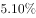，占全国总保费收入的，较2016年上半年占比减少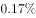。其中互联网财产险收入为502亿元，同比减少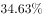，占全国财产险保费收入的，较2016年上半年占比减少；互联网人身险收入为1797亿元，同比增加，占全国人身险保费收入的，较2016年上半年占比增加。

        2017年上半年全国互联网保险收入为1346亿元，同比减少，占全国总保费收入的。其中互联网财产险收入为238亿元，同比减少，占全国财产险保费收入的；互联网人身险收入为1108亿元，同比减少，占全国人身险保费收入的。

#### 第 1 题　qid 2377292 · 综合

2016年全年全国总保费收入在以下哪个范围内？

- **A**. 不到2万亿元
- **B**. 2～4万亿元之间　✅
- **C**. 4～6万亿元之间
- **D**. 6万亿元以上

**答案**：B

**官方解析**

根据题干“2016年全年全国总保费收入……”，结合材料给出2016年全年全国互联网保险收入及其占全国总保费收入的比重，可判定本题为现期比重问题。定位文字材料第一段“2016年全年全国互联网保险收入为2299亿元，……，占全国总保费收入的”，则2016年全年全国总保费，在2~4万亿元之间。

故正确答案为B。

---

#### 第 2 题　qid 2377294 · 综合

2016年下半年全国互联网财产险收入约为多少亿元？

- **A**. 145
- **B**. 205　✅
- **C**. 264
- **D**. 304

**答案**：B

**官方解析**

根据题干“2016年下半年……亿元”，结合材料给出2016年全年和2017年上半年数据，可判定本题为基期计算问题。定位文字材料第一段可知：2016年全年互联网财产险收入为502亿元；定位文字材料第二段可知：2017年上半年互联网财产险收入为238亿元，同比减少。代入公式基期量，可得：2016年上半年互联网财产险收入亿元，则2016年下半年互联网财产险收入约为亿元，与B项最为接近。

故正确答案为B。

---

#### 第 3 题　qid 2377295 · 增长

2017年上半年互联网人身险收入占全国人身险保费收入的比重同比约下降了：

- **A**. 1.50个百分点　✅
- **B**. 1.78个百分点
- **C**. 2.06个百分点
- **D**. 2.30个百分点

**答案**：A

**官方解析**

定位文字材料第一段可知：2016年全年互联网人身险收入占全国人身险保费收入的，较2016年上半年占比增加；则2016年上半年互联网人身险收入占全国人身保险费收入的占比为；定位文字材料第二段可知：2017年上半年互联网人身险收入占全国人身险保费收入的。则题干所求，即2017年上半年互联网人身险收入占全国人身险保费收入的比重同比约下降了1.5个百分点。

故正确答案为A。

---

#### 第 4 题　qid 2377302 · 比重

以下饼图中，最能准确反映2015年财产险（黑色）和人身险（白色）在互联网保险收入中占比状况的是：

- **A**. A
- **B**. B
- **C**. C
- **D**. D　✅

**答案**：D

**官方解析**

根据题干“2015年财产险（黑色）和人身险（白色）在互联网保险收入中占比状况”，结合材料时间2016年，可判定本题为基期比重问题。定位文字材料第一段“2016年全年全国互联网保险收入为2299亿元，同比增加，······其中互联网财产收入为502亿元，同比减少，······互联网人身险收入为1797亿元，同比增加”，根据基期比重公式：，可得2015年财产险在互联网保险收入中占比为，和D项最为接近。

故正确答案为D。

---

#### 第 5 题　qid 2377303 · 综合

能够从上述资料中推出的是：

- **A**. 2016全国总保费收入低于2015年水平
- **B**. 2016年全国财产险保费收入超过人身险保费收入的一半
- **C**. 2016年下半年及2017年上半年互联网保费占总保费收入比重均环比下降　✅
- **D**. 2017年上半年互联网财产险收入在同期互联网保险收入中的占比高于两成

**答案**：C

**官方解析**

A项：定位文字材料第一段“2016年全年全国互联网保险收入为2299亿元，同比增加，占全国总保费收入的，较2016年上半年占比减少”，没有2015年全国总保费相关的数据，故无法推出，错误；

B项：定位文字材料第一段可知：2016年全年互联网财产险收入为502亿元，占全国财产险保费收入的，互联网人身险收入为1797亿元，同比增加，占全国人身险保费收入。可则2016年全国财产险保费收入为亿元，2016年全国人身险保费收入为亿元，故财产险保费收入小于人身险保费收入的一半，错误；

C项：定位文字材料第一段“2016年全年全国互联网保险收入为2299亿元，同比增加，占全国总保费收入的，较2016年上半年占比减少”，定位文字材料第二段“2017年上半年全国互联网保险收入为1346亿元，同比减少，占全国总保费收入的”。则2016年上半年互联网保费占总保费的比重为。根据基期公式：，可知2016年上半年互联网保险收入为亿元，则2016年下半年互联网保险收入为亿元，2016年下半年总保费为，故2016年下半年互联网保险收入占保费的比重为。所以2016年下半年的比重比上半年有所下降，2017年上半年的比重比2016年下半年有所下降，正确；

 D项：定位文字材料第二段“2017年上半年全国互联网保险收入为1346亿元，······互联网财产险收入为238亿元”，故2017年上半年互联网财产险收入在同期互联网保险收入中占比为，错误。

故正确答案为C。

---

### 材料 2

根据所给资料，回答下列问题。

        2018年4月全国手机产量达14366.7万部，同比增长；2018年1～4月全国手机累计产量为56479.3万部，累计增长。

#### 第 6 题　qid 2377296 · 综合

2018年4月，手机产量最高的3个省市手机产量约占全国总产量的：

- **A**. 五成
- **B**. 六成
- **C**. 七成　✅
- **D**. 八成

**答案**：C

**官方解析**

根据题干“2018年4月······占······”结合材料相应时间的数据，可以判定本题为现期比重问题。定位文字材料“2018年4月全国手机产量达14366.7万部”，定位表格材料可得手机产量最高的3个省分别为广东7093.52万部，河南1688.16万部，重庆1313.21万部。占比为，约为七成。

故正确答案为C。

---

#### 第 7 题　qid 2377297 · 平均数

2018年4月手机产量前12位的省市中，4月手机产量高于1~3月平均水平的有几个？

- **A**. 5
- **B**. 6　✅
- **C**. 7
- **D**. 8

**答案**：B

**官方解析**

根据题干“2018年4月······4月手机产量高于1-3月平均水平”，表格材料给出2018年4月和1-4月对应数据，可以判定此题为现期平均数问题。，即，不等式化简可得，，结合表格数据，广东：，浙江：，江西：，上海：，四川：，贵州：，共6个省份满足条件。

故正确答案为B。

---

#### 第 8 题　qid 2377298 · 综合

如将2018年4月手机产量前12位的省市按2018年1~4月产量重新排列，有几个省市的位次将不会发生变化？

- **A**. 5
- **B**. 6　✅
- **C**. 7
- **D**. 8

**答案**：B

**官方解析**

根据题干“······按2018年1-4月产量重新排列，有几个省市的位次将不会发生变化”可知本题是将12个省份按1-4月产量进行排序和之前按4月产量的排序进行比较，因此本题为直接找数比较问题。将12个省份按1-4月产量重新排列从大到小为：广东、河南、重庆、北京、江苏、江西、上海、浙江、天津、湖北、四川、贵州。位次没有发生变化的有：广东、河南、重庆、北京、江西、上海这6个省份。
故正确答案为B。

---

#### 第 9 题　qid 2377299 · 增长

2018年4月四个直辖市的手机产量之和同比：

- **A**. 上升了不到1000万部
- **B**. 上升了1000万部以上
- **C**. 下降了不到1000万部
- **D**. 下降了1000万部以上　✅

**答案**：D

**官方解析**

根据题干“2018年4月······同比”，结合选项“上升/下降”带单位，可判定本题为增长量计算问题。定位表格材料可得：2018年4月重庆、北京、上海、天津四个直辖市的手机产量和同比增速。根据公式：，2018年4月四个直辖市的手机产量同比增长量如下，重庆：万部；北京：万部；上海：万部；天津：万部。故2018年4月四个直辖市的手机产量之和同比万部，即同比下降了1000万部以上。

故正确答案为D。

---

#### 第 10 题　qid 2377300 · 增长

关于2018年4月手机产量前12位的省市手机产量，以下信息能够从上述资料中推出的有几条？
①2018年1~4月，有3个省市手机产量分别占全国的一成以上
②2018年1季度，广东手机产量高于上年同期水平
③2018年4月和2018年1~4月手机产量增速最高的省市不是同一个
④江西2018年4月手机产量占同年1~4月产量的比重高于2017年水平

- **A**. 1　✅
- **B**. 2
- **C**. 3
- **D**. 4

**答案**：A

**官方解析**

①：定位文字材料，2018年1~4月全国手机累计产量为56479.3万部。占全国的一成以上即超过万部，定位表格材料可知，广东、河南、重庆三个省市符合条件，正确；

②：定位表格材料，可知2018年4月及1~4月广东手机产量和同比增速，可知万部。根据公式：，，万部。故万部＞18100万部，即2018年一季度广东手机产量低于上年同期水平，并非高于，错误；

③：定位表格材料，2018年4月及1~4月手机产量增速最高的均为四川，是同一个，错误；

④：定位表格材料，可知2018年4月江西手机产量同比增速为，1~4月同比增速为。根据两期比重差结论，部分量增长率小于总量增长率时，今年比重下降，则江西2018年4月手机产量占1~4月的比重低于2017年水平，并非高于，错误。

综上，只有①一个说法正确。

故正确答案为A。

---

### 材料 3

根据以下资料，回答下列问题

#### 第 11 题　qid 2377284 · 综合

2017年第二季度成交土地规划建筑面积：

- **A**. 不到0.8亿平方米
- **B**. 在0.8~1.2亿平方米之间　✅
- **C**. 在1.2~1.6亿平方米之间
- **D**. 超过1.6亿平方米

**答案**：B

**官方解析**

根据题干所求“2017年第二季度成交土地规划建筑面积”，并根据容积率公式，可判定本题为现期比重问题。定位表格材料可得2017年第二季度（4-6月）成交土地面积和容积率，根据容积率=成交土地规划建筑面积/成交土地面积，则。故2017年第二季度成交土地规划建筑面积=，在0.8~1.2亿平方米区间内。

 故正确答案为B。

---

#### 第 12 题　qid 2377286 · 综合

2017年第一季度成交土地面积：

- **A**. 不到0.3 亿平方米
- **B**. 在0.3～0.4亿平方米之间
- **C**. 在0.4～0.5亿平方米之间　✅
- **D**. 超过0.5亿平方米

**答案**：C

**官方解析**

根据题干所求“2017年第一季度成交土地面积”，并结合材料时间为2017年3月~2018年2月，可判定此题为基期和差问题。定位表格材料可得2017年3月成交土地面积为12.2百万平方米，2018年1月成交土地面积为20.8百万平方米、增长率为；2018年2月成交土地面积为16.4百万平方米、增长率为。则2017年第一季度（1、2、3月）成交土地面积，在0.4~0.5亿平方米区间内。

 故正确答案为C。

---

#### 第 13 题　qid 2377287 · 综合

2017年3～6月间，全国住宅销售价格最贵的月份是：

- **A**. 3月
- **B**. 4月
- **C**. 5月　✅
- **D**. 6月

**答案**：C

**官方解析**

根据题干所求“2017年3～6月间，全国住宅销售价格最贵的月份”，并根据溢价率公式，可判定本题为现期比重问题。定位柱状图可得2017年3~6月楼面价和溢价率，，则。故2017年3~6月全国住宅销售价格分别为、、和，5月份楼面价和溢价率均是这4个月中最大，则2017年3～6月间，全国住宅销售价格最贵的月份是5月份。

故正确答案为C。

---

#### 第 14 题　qid 2377290 · 增长

下列折线图中，能准确反映2017年第四季度各月全国住宅用地楼面价环比增长率变化趋势的是：

- **A**. A
- **B**. B　✅
- **C**. C
- **D**. D

**答案**：B

**官方解析**

根据题干“能准确反映2017年第四季度······环比增长率变化趋势”，判定本题为一般增长率问题。定位统计图可得：2017年9月、10月、11月、12月的全国住宅用地楼面价分别为6540元/平方米、4706元/平方米、5229元/平方米、4660元/平方米，根据，可得2017年第四季度即10月、11月、12月的环比增速分别为：、、，根据计算结果可判定B项趋势图符合。

故正确答案为B。

---

#### 第 15 题　qid 2377291 · 综合

能够从上述资料中推出的是：

- **A**. 2017年12月，全国住宅销售价格高于10月水平
- **B**. 2017年下半年，全国住宅用地成交土地面积环比下降的月份有且仅有2个　✅
- **C**. 2017年下半年，全国住宅用地成交土地面积最高和容积率最高的月份是同一个
- **D**. 2017年下半年，全国住宅用地楼面价超过5000元/平方米的月份有且仅有3个

**答案**：B

**官方解析**

A项：，可得，定位统计图可得，2017年12月全国住宅销售价格为，2017年10月全国住宅销售价格，则全国住宅销售价格，错误；

B项：定位统计表可知，2017年下半年即7-12月，全国住宅用地成交土地面积（百万平方米）有：、，故环比下降的月份有且仅有7月和11月2个，正确；

C项：定位统计表可知，2017年下半年全国住宅用地成交土地面积最高的月份为12月，容积率最高的月份是11月，并非同一个，错误；

D项：定位统计图可知，2017年下半年即7-12月，其中全国住宅用地楼面价超过5000元/平方米的有：7月、8月、9月、11月，即有4个，错误。

故正确答案为B。

---

#### 第 16 题　qid 2377288 · 增长

某市2016年传统制造业和新兴制造业产值共830亿元。2017年该市进一步推进产业转型，传统制造业产值同比下降，新兴制造业产值同比增加，传统制造业和新兴制造业总产值较去年增长30亿元。2018年该市新兴制造业产值增长到了550亿元，则当年新兴制造业产值约增长了：

- **A**. 

- **B**. 

- **C**. 

　✅
- **D**. 

**答案**：C

**官方解析**

设2016年传统制造业产值为亿元，新兴制造业产值为亿元。由“2016年传统制造业和新兴制造业产值共830亿元”可列式：。由“（2017年）传统制造业产值同比下降”，可计算2017年传统制造业产值增长量；同理“（2017年）新兴制造业产值同比增加”，可计算2017年新兴制造业产值增长量。由“（2017年）传统制造业和新兴制造业总产值较去年增长30亿元”可列式：。联立①②两式，解得，。2017年新兴制造业产值。由“2018年该市新兴制造业产值增长到了550亿元”，可计算2018年新兴制造业产值增长率。

故正确答案为C。

---
