# 2019年420联考《行测》题（安徽卷）（网友回忆版）

> 联考 · 2019 年 · 6 个模块 · 共 110 题

- [政治理论](#%E6%94%BF%E6%B2%BB%E7%90%86%E8%AE%BA) · 1 题
- [常识判断](#%E5%B8%B8%E8%AF%86%E5%88%A4%E6%96%AD) · 19 题
- [言语理解与表达](#%E8%A8%80%E8%AF%AD%E7%90%86%E8%A7%A3%E4%B8%8E%E8%A1%A8%E8%BE%BE) · 25 题
- [数量关系](#%E6%95%B0%E9%87%8F%E5%85%B3%E7%B3%BB) · 15 题
- [判断推理](#%E5%88%A4%E6%96%AD%E6%8E%A8%E7%90%86) · 35 题
- [资料分析](#%E8%B5%84%E6%96%99%E5%88%86%E6%9E%90) · 15 题

---

## 政治理论

### 第 1 题　qid 2376461 · 新思想

习近平总书记在中央政治局第十三次集体学习时强调，要精准有效处置重点领域风险，深化金融改革开放，增强金融服务           能力，坚决打好防范化解包括金融风险在内的重大风险攻坚战，推动我国金融业健康发展。

- **A**. 实体经济　✅
- **B**. 私营经济
- **C**. 中小企业
- **D**. 国有企业

**答案**：A

**官方解析**

本题考查政治常识。
2019年2月22日，中共中央政治局就完善金融服务、防范金融风险举行第十三次集体学习。习近平总书记在主持学习时强调：“要深化对国际国内金融形势的认识，正确把握金融本质，深化金融供给侧结构性改革，平衡好稳增长和防风险的关系，精准有效处置重点领域风险，深化金融改革开放，增强金融服务实体经济能力，坚决打好防范化解包括金融风险在内的重大风险攻坚战，推动我国金融业健康发展。”
故正确答案为A。

---

## 常识判断

### 第 1 题　qid 2376476 · 人文常识

下列属于改革开放40年来我国经济建设所取得伟大成就的是：
①建立了最完整的现代工业体系
②成为了世界商品消费第一大国
③主要农产品的产量跃居世界前列
④外汇储备连续多年位居世界第一

- **A**. ①②④
- **B**. ①③④　✅
- **C**. ②③④
- **D**. ①②③④

**答案**：B

**官方解析**

本题考查政治常识。
2018年12月18日，习近平总书记在庆祝改革开放40周年大会上的讲话中指出：“我国主要农产品产量跃居世界前列，建立了全世界最完整的现代工业体系，科技创新和重大工程捷报频传。我国基础设施建设成就显著，信息畅通，公路成网，铁路密布，高坝矗立，西气东输，南水北调，高铁飞驰，巨轮远航，飞机翱翔，天堑变通途。现在，我国是世界第二大经济体、制造业第一大国、货物贸易第一大国、商品消费第二大国、外资流入第二大国（2020年我国成为外资流入第一大国），我国外汇储备连续多年位居世界第一，中国人民在富起来、强起来的征程上迈出了决定性的步伐！”所以，①③④表述正确，②错误。
故正确答案为B。

---

### 第 2 题　qid 2376493 · 人文常识

关于生态文明建设，下列说法正确的是:

- **A**. 蓝天保卫战是全面建成小康社会的三大攻坚战之一
- **B**. 加快构建生态文明体系是解决污染问题的根本之策
- **C**. 生态环境安全是经济社会持续健康发展的重要保障　✅
- **D**. 地方政府主要领导是本行政区域生态环境保护第一责任人

**答案**：C

**官方解析**

本题考查政治常识。
A项错误，2017年10月18日，习近平总书记在十九大报告中指出：“要坚决打好防范化解重大风险、精准脱贫、污染防治的攻坚战，使全面建成小康社会得到人民认可、经得起历史检验。”蓝天保卫战并不是三大攻坚战之一。
B项错误，2018年5月18日至19日，习近平总书记在全国生态环境保护大会上强调：“要全面推动绿色发展。绿色发展是构建高质量现代化经济体系的必然要求，是解决污染问题的根本之策。”
C项正确，2018年5月18日至19日，习近平总书记在全国生态环境保护大会上强调：“要有效防范生态环境风险。生态环境安全是国家安全的重要组成部分，是经济社会持续健康发展的重要保障。”
D项错误，2018年5月18日至19日，习近平总书记在全国生态环境保护大会上强调：“各地区各部门要增强‘四个意识’，坚决维护党中央权威和集中统一领导，坚决担负起生态文明建设的政治责任。地方各级党委和政府主要领导是本行政区域生态环境保护第一责任人，各相关部门要履行好生态环境保护职责，使各部门守土有责、守土尽责，分工协作、共同发力。”
故正确答案为C。

---

### 第 3 题　qid 2376499 · 人文常识

俗话说“不要将你的鸡蛋全都放在一只篮子里”。下列选项与该俗语蕴含的道理相吻合的是：

- **A**. 天有不测风云　✅
- **B**. 鱼与熊掌不可兼得
- **C**. 不入虎穴，焉得虎子
- **D**. 舍不得孩子，套不住狼

**答案**：A

**官方解析**

本题考查经济常识。
如果把所有鸡蛋都放在同一个篮子里，篮子翻了，所有的鸡蛋都会碎掉；如果不把所有的鸡蛋放在一个篮子里，篮子翻了，还会有其他鸡蛋剩下。即不要把所有的资本都投入到一件事情上，应该做多手准备，规避风险。
A项正确，天有不测风云比喻灾祸是无法预料的，即风险是随时存在的，我们应该懂得随时规避和防范风险。与题意相符合。
B项错误，鱼与熊掌不可兼得，意思是鱼和熊掌不能同时获得。强调的是我们在做选择的时候，应该如何取舍，在经济上对应的是机会成本。与风险无关。
C项错误，不入虎穴，焉得虎子比喻不经历艰险，就不能取得成功，也指需通过实践取得真知。与风险无关。
D项错误，舍不得孩子，套不住狼比喻要达到某一目的必须付出相应的代价。与风险无关。
故正确答案为A。

---

### 第 4 题　qid 2376500 · 法律常识

下列法律法规中，哪一项不是从2019年1月1日起施行？

- **A**. 《中华人民共和国电子商务法》
- **B**. 《中华人民共和国土壤污染防治法》
- **C**. 新修订的《中华人民共和国公务员法》　✅
- **D**. 新修订的《中华人民共和国个人所得税法实施条例》

**答案**：C

**官方解析**

本题考查法律。
A项正确，《中华人民共和国电子商务法》是2018年8月31日第十三届全国人民代表大会常务委员会第五次会议通过，本法第八十九条规定：“本法自2019年1月1日起施行。”
B项正确，《土壤污染防治法》是2018年8月31日十三届全国人大常委会第五次会议全票通过，本法第九十九条规定：“本法自2019年1月1日起施行。”
C项错误，《中华人民共和国公务员法》已由中华人民共和国第十三届全国人民代表大会常务委员会第七次会议于2018年12月29日修订通过，自2019年6月1日起施行。
D项正确，《中华人民共和国个人所得税法实施条例》是国务院发布的法规，2018年12月18日中华人民共和国国务院令第707号第四次修订通过，第三十六条规定：“本条例自2019年1月1日起施行。”
本题为选非题，故正确答案为C。

---

### 第 5 题　qid 2376464 · 人文常识

管理大师杰克·韦尔奇有句名言：管得少，就是管得好。他主要强调管理应该注重：

- **A**. 沟通
- **B**. 分权　✅
- **C**. 组织
- **D**. 控制

**答案**：B

**官方解析**

本题考查管理学常识。
“管得少，就是管得好”强调的就是管理应该注重分权。管理的最终目标在于提高经营绩效，分权是管理学学者在近一百多年的企业管理研究与实践中，为提高效率而归纳出的一大规律性，管理学家认为企业在追求绩效时必须善于分权，担任一定管理职务的领导者在实际工作中为充分利用专门人才的知识和技能，应将部分解决问题和处理新增业务的权利委任给下属。据此可知，B项正确，ACD三项与题干无关。
故正确答案为B。

---

### 第 6 题　qid 2376469 · 人文常识

2018年我国科技界取得了一系列重大成果，这些成果中不包括：

- **A**. 第二艘航母出海试航
- **B**. 嫦娥四号探测器发射成功
- **C**. 造岛神器“天鲲号”下水　✅
- **D**. 国产大型水陆两栖飞机水上首飞

**答案**：C

**官方解析**

本题考查政治常识。
A项正确，2018年5月13日，我国第二艘航母从大连造船厂码头启航，赴相关海域执行海上试验任务，主要检测验证动力系统等设备的可靠性和稳定性。
B项正确，2018年12月8日2时23分，我国在西昌卫星发射中心用长征三号乙运载火箭成功发射嫦娥四号探测器，开启了月球探测的新旅程。嫦娥四号探测器后续将经历地月转移、近月制动、环月飞行，最终实现人类首次月球背面软着陆，开展月球背面就位探测及巡视探测，并通过已在使命轨道运行的“鹊桥”中继星，实现月球背面与地球之间的中继通信。
C项错误，2017年11月3日，由我国自主设计研发的新一代国之重器——“天鲲号”自航绞吸挖泥船成功下水。从被称为“造岛神器”的“天鲸号”，到目前亚洲最大最先进的“天鲲号”，中国自航绞吸挖泥船的自主研制实力再一次让世人惊叹。
D项正确，2018年10月20日，中国自主研制的大型水陆两栖飞机——“鲲龙”AG600在湖北荆门漳河机场成功实现水上首飞。至此，中国大飞机终于迈出“上天入海”完整步伐，建设航空强国轮廓愈发明晰。
本题为选非题，故正确答案为C。

---

### 第 7 题　qid 2376512 · 人文常识

首次把《大学》《中庸》《论语》和《孟子》编在一起的学者是：

- **A**. 朱熹　✅
- **B**. 程颐、程颢
- **C**. 董仲舒
- **D**. 颜之推

**答案**：A

**官方解析**

本题考查人文常识。
A项正确，南宋理学家朱熹首次将《大学》、《中庸》、《论语》、《孟子》汇集在一起，并为其作章句集注，成《四书章句集注》一书，对后世产生了深远的影响。
B项错误，程颢、程颐兄弟，河南洛阳人，北宋著名理学家、教育家，“洛学”代表人物，世称“二程”，其理学思想对后世影响深远，南宋理学“集大成者”朱熹正是继承和发展了他们的学说。“二程”的理学思想主要见于《遗书》《文集》和《经说》等，现均收入《二程集》。
C项错误，董仲舒，汉代思想家、哲学家、政治家、教育家。他在著名的《举贤良对策》中系统地提出了“天人感应”、“大一统”学说和“罢黜百家，表彰六经”的主张。董仲舒的儒家思想大大维护了汉武帝的集权统治，为当时社会政治和经济的稳定做出了贡献。
D项错误，颜之推，字介，汉族，琅琊临沂（今山东临沂）人。中国古代文学家、教育家，生活年代在南北朝至隋朝期间。颜之推著有《颜氏家训》，在家庭教育发展史上有重要的影响。
故正确答案为A。

---

### 第 8 题　qid 2376479 · 人文常识

下列送别诗句中不属于描写目送友人场景的是:

- **A**. 孤帆远影碧空尽，唯见长江天际流
- **B**. 山回路转不见君，雪上空留马行处
- **C**. 日暮酒醒人已远，满天风雨下西楼　✅
- **D**. 青枫江上秋帆远，白帝城边古木疏

**答案**：C

**官方解析**

本题考查人文常识。
A项正确，“孤帆远影碧空尽，唯见长江天际流”出自唐代诗人李白的《送孟浩然之广陵》。这是首送别诗，不仅写出了友人所乘船孑然远逝的情景，而且写出诗人凭栏目送的情景，此刻，诗人伫立在黄鹤楼上，久久地注视着那渐行渐远，最终消失在茫茫水天相接之处的一片孤帆，他的心早已随船而去了。寄寓了诗人的惜别之情。
B项正确，“山回路转不见君，雪上空留马行处。”出自盛唐岑参的《白雪歌送武判官归京》。岑参在这首诗中，以诗人的敏锐观察力和浪漫奔放的笔调，描绘了祖国西北边塞的壮丽景色，以及边塞军营送别归京使臣的热烈场面，表现了诗人和边防将士的爱国热情，以及他们对战友的真挚感情。“山回路转不见君，雪上空留马行处”，用很平淡质朴的语言表现了将士们对战友的真挚感情，字字传神，含蓄隽永。这一部分虽然描写对友人依依惜别的深情，但也表现了边塞将士的豪迈精神。
C项错误，“日暮酒醒人已远，满天风雨下西楼。”出自唐代许浑的《谢亭送别》。这是一首送别诗。一觉醒来，已是薄暮时分。天色变了，下起了雨，四望一片迷蒙。眼前的江面，两岸的青山红叶都已经笼罩在蒙蒙雨雾和沉沉暮色之中。而朋友的船，此刻更不知道随着急流驶到云山雾嶂之外的什么地方去了。不仅写出身留谢亭而友人早已远去，而且写出暮色苍茫风雨凄迷的孤寂落寞的离愁情。
D项正确，“青枫江上秋帆远，白帝城边古木疏。”出自唐代高适的《送李少府贬峡中王少府贬长沙》。这是一首送别诗，同时也是一首边塞诗，同时送别两人，且两人均为遭贬而迁。“青枫江”指浏水，在长沙与湘江汇合。写王少府到了长沙，在秋高气爽的季节，望着那明净高远、略无纤尘的蓝天，自然会洗尽烦恼。想象李少府到了峡中，可以去古木参天、枝叶扶疏的白帝城凭吊古迹，以求慰藉。这一句是对离别的二人共同讲的，体现了目送的场景。
本题为选非题，故正确答案为C。

---

### 第 9 题　qid 2376481 · 人文常识

下列成语和人物的对应关系错误的是：

- **A**. 口蜜腹剑——李义府　✅
- **B**. 十面埋伏——项羽
- **C**. 程门立雪——杨时
- **D**. 东床快婿——王羲之

**答案**：A

**官方解析**

本题考查人文常识。
A项错误，“口蜜腹剑”出自《资治通鉴·唐记》“口有蜜，腹有剑”，这是文中对奸相李林甫的评语。李林甫为宰相后，对于朝中百官凡是才能和功业在自己之上而受到玄宗宠信或官位快要超过自己的人，一定要想方设法除去，尤其忌恨由文学才能而进官的士人。有时表面上装出友好的样子，说些动听的话，而暗中却阴谋陷害。所以世人都称李林甫“口有蜜，腹有剑”。笑里藏刀是指李义府。
B项正确，“十面埋伏”出自楚汉相争的垓下之战（今安徽省宿州市灵璧县东南）。楚汉相争时期，汉王刘邦重用淮阴人韩信，先后活捉魏王豹、赵王歇、燕王臧荼、齐王田广。他被刘邦封为齐王后率30万大军和彭越的军队会师，把项羽围困在垓下（今安徽省宿州市灵璧县东南），他采取十面埋伏的战术，逼使项羽在乌江自刎，取得决定性的胜利。
C项正确，宋代的杨时考到进士后不愿做官，专心研究学问。他起先在颍昌（地名）拜理学家程颢为师，学到了不少知识。程颢死后，四十多岁的杨时又和同学游酢一起到洛阳请教另一位有名的理学家程颐（程颢的弟弟）。他们到程颐家时，程颐正在打瞌睡。两人不敢惊动他，就侍立在门口。程颐醒来后发现门外的雪已下了一尺多深。程门立雪由此而来，比喻尊师重道。
D项正确，“东床快婿”出自刘义庆《世说新语笺疏雅量第六》“王氏谱曰：逸少，羲之小字。羲之妻，太傅郗鉴女，名璿，字子房。”指为人豁达，才能出众的女婿，是女婿的美称。“东床快婿”王羲之就是大名鼎鼎的书法家，被后人称之为“书圣”。
本题为选非题，故正确答案为A。

---

### 第 10 题　qid 2376484 · 人文常识

唐太宗李世民曾言:为官择人，唯才是与；苟或不才，虽亲不用。下列哪一人才选拔制度与其所言体现的用人理念最契合：

- **A**. 科举制　✅
- **B**. 察举制
- **C**. 世卿世禄制
- **D**. 九品中正制

**答案**：A

**官方解析**

本题考查人文常识。
唐太宗李世民曾言：为官择人，唯才是与；苟或不才，虽亲不用。是指用人的原则是看才能，而不管亲疏。
A项正确，科举制度是隋以后各封建王朝设科考试选拔官吏的制度，由于分科取士而得名。隋文帝废除为世族垄断的九品中正制，设志行修谨、清平干济二科。隋炀帝时始置进士科，科举制形成。1905年，袁世凯、张之洞奏请立停科举。至此，在中国历史上延续了约1300年的科举制度最终被废除，科举取士与学校教育实现了彻底分离。
B项错误，察举制是中国古代选拔官吏的一种制度，它的确立时间是汉武帝元光元年（公元前134年）。它的主要特征是由地方长官在辖区内随时考察、选取人才并推荐给上级或中央，经过试用考核再任命官职。
C项错误，世卿世禄制是古代高级官吏的称呼。世卿就是天子或诸侯国君之下的贵族，世世代代、父死子继，连任卿这样的高官。禄是官吏所得的享受财物。世禄就是官吏们世世代代、父死子继，享有所封的土地及其赋税收入。
D项错误，九品中正制，又称九品官人法，是魏晋南北朝时期重要的选官制度，从曹魏始至隋唐科举的确立，这期间约存在了四百年之久。九品中正制大体是指由各州郡分别推选大中正一人，所推举大中正必为在中央任职官员且德名俱高者。大中正再产生小中正。中正就是品评人才的官职名称。大、小中正产生后，由中央分发一种人才调查表，在该表中将人才分为九等，上上、上中、上下、中上、中中、中下、下上、下中、下下。此项制度使得当时的官吏选拔有了一客观标准，此标准其实依然是采取地方群众舆论和公共意见，保留了汉代乡举里选的遗意。
故正确答案为A。

---

### 第 11 题　qid 2376492 · 人文常识

下列表述正确的是：

- **A**. 鄱阳湖栖息着世界上最大的白鹤群　✅
- **B**. 我国最早出现的种植业位于松花江流域
- **C**. 被誉为“天上云霞,地下鲜花”的是四川蜀绣
- **D**. 东北平原是中国第二大平原，也是中国重要的粮棉生产基地

**答案**：A

**官方解析**

本题考查地理国情。

A项正确，鄱阳湖是全世界最大的白鹤集中越冬地，白鹤的数量占全世界总数的以上，堪称鹤之天堂。鄱阳湖区发现白鹤的最早记录是1980年。1985年，时任国际鹤类基金会会长的乔治·阿基博带队来鄱阳湖考察，观测到白鹤1350只，其中幼鹤119只。他们认定那是当时世界上发现的最大野生白鹤群。

B项错误，我国最早出现的种植业应位于黄河、长江流域。黄河、长江是中国的母亲河，这两条河流的冲积平原地区是中华文明的发祥地且两个平原处在温带湿润、半湿润地区，气候温暖湿润，比较适宜人类居住，所以种植业发展最早。 

C项错误，被誉为“天上云霞，地下鲜花”的是杭州的织锦。 

D项错误，东北平原是中国最大的平原，是中国三大平原之一。位于中国东北部，南北长约1000千米，东西宽约400千米，面积达35万平方千米。同时东北平原土地肥沃，是全球仅有的三大黑土区域之一，是中国重要的粮食、大豆、畜牧业生产基地，也是中国重要的钢铁、机械、能源、化工基地。 

故正确答案为A。 

---

### 第 12 题　qid 2376475 · 人文常识

荷花虽生长于池塘的污泥中，但荷叶却出污泥而不染，其主要原因是：

- **A**. 荷叶含有大量的叶绿素，能与太阳光发生光合作用，产生自清洁
- **B**. 荷叶表面光滑，具有非常强的光洁度，污泥很难在它的表面吸附
- **C**. 荷叶含有疏水的纳米级蜡质，雨露落在上面会形成水珠清洁叶面　✅
- **D**. 荷花枝干细长，水珠落在荷叶上，容易造成荷叶晃动，甩出污泥

**答案**：C

**官方解析**

本题考查科技常识。
荷叶之所以能出污泥而不染是由荷叶叶面上存在着复杂的多重纳米和微米级的超微结构决定的：在超高分辨率显微镜下可以清晰看到，荷叶表面上有许多微小的乳突，它上面长满茸毛，乳突间的凹陷部分充满空气，这样就在紧贴叶面处形成一层极薄的只有纳米量级厚的空气层。这使得在尺寸上远大于这种结构的灰尘、雨水等降落在叶面上后，隔着一层极薄的空气，从而雨水会自动聚集成球形水珠，而水珠的滚动会把落在叶面上的尘土污泥吸附掉滚出叶面，使叶面始终保持干净，这就是著名的“荷叶自洁效应”。
故正确答案为C。

---

### 第 13 题　qid 2376486 · 人文常识

下列选项对“夏满芒夏暑相连”中节气的表述错误的是：

- **A**. “小满”表明了降水的时间和强度
- **B**. “芒种”反映了自然物候现象或农事活动
- **C**. “立夏”“夏至”体现了寒来暑往的季节变化　✅
- **D**. “小暑”“大暑”标明了一年之中最热的时段

**答案**：C

**官方解析**

本题考查人文常识。
A项正确，小满具有多重含义，从小满开始，大麦、冬小麦等夏收作物，已经结果、籽粒饱满，但尚未成熟，所以叫小满。小满反映作物的成熟、收成情况，也可以表现降水的时间和强度。
B项正确，芒种的“芒”字，是指麦类等有芒植物的收获，“种”指谷黍类作物播种的节令。对中国大部分地区来说，芒种一到，夏熟作物要收获，夏播秋收作物要下地。反映作物的收成、播种情况，即农事活动。
C项错误，立夏是夏季的开始，从此进入夏天，万物生长旺盛。夏至是北半球白昼最长、黑夜最短的一天，从这一天起，进入炎热季节，天地万物在此时生长最旺盛。夏至是从天文角度划分的，反映了太阳高度变化的转折点。立夏体现了季节的变化，夏至体现了太阳高度的转折。
D项正确，小暑是天气已经很热了，但还不到最热的时候。大暑是一年中最热的节气。
本题为选非题，故正确答案为C。

---

### 第 14 题　qid 2376498 · 人文常识

下列关于血糖的说法错误的是：

- **A**. 正常人进食后血糖浓度会升高
- **B**. 正常人空腹超过12小时会引起低血糖
- **C**. 南瓜能抑制葡萄糖吸收，具有降血糖作用　✅
- **D**. 胰岛素是人体产生的唯一能够降低血糖的激素

**答案**：C

**官方解析**

本题考查科技常识。
A项正确，食物中存在大量的淀粉等糖类。人在进食后，糖类被人体消化吸收，因此会使血糖含量升高。
B项正确，低血糖的常见原因包括进食过少、运动过度、药物使用不当、大量饮酒等。正常人空腹（禁食）时间过长，由于没有食入足够的糖，可能会引起低血糖。
C项错误，南瓜中含有丰富的营养物质，其中包含了蛋白质、多糖、果胶、纤维素、维生素以及微量元素等成分，在这些众多的营养物质中，蛋白质和多糖都可以提升自身免疫功能。部分多糖会被分解成单糖，可能导致人体血糖升高。
D项正确，胰岛素是体内唯一能够降低血糖浓度的激素，它不仅能够促使葡萄糖分解，还能抑制非糖物质转化为葡萄糖。
本题为选非题，故正确答案为C。

---

### 第 15 题　qid 2376504 · 科技常识

下列哪一种现象的物理原理不同于其他三项：

- **A**. 水中的手指变粗
- **B**. 池水看起来比实际的浅
- **C**. 只有瞄准鱼的下方才能叉到鱼
- **D**. 小明在宁静的湖边看见“云在水中飘”　✅

**答案**：D

**官方解析**

本题考查科技常识。

光从一种透明介质斜射入另一种透明介质时，传播方向一般会发生变化，这种现象叫光的折射。

A项正确，盛水的玻璃杯中间厚、边缘薄，就如同一个凸透镜（放大镜），对手指有放大作用，使得水中部分手指看上去变粗了。凸透镜利用的是光的折射原理。

B、C项正确，从池底或鱼身上（S点）反射的光线由水中进入空气时，在水面上发生了折射，由于水的折射率大于空气，使得折射角大于入射角，折射光线进入人眼，人眼会逆着折射光线的方向看去，就会觉得池底或鱼的位置偏高（如图S’点），看上去池子变浅了，叉鱼时也须瞄准鱼的下方才能叉到鱼。

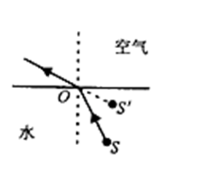

D项错误，宁静的湖水有平面镜的效果，能将天空中云朵反射进小明的眼中，体现的是光的反射原理。

本题为选非题，故正确答案为D。

---

### 第 16 题　qid 2376474 · 科技常识

下列气体既会造成酸雨，又可用作防腐剂的是：

- **A**. 二氧化碳
- **B**. 二氧化氮
- **C**. 二氧化硫　✅
- **D**. 氮气

**答案**：C

**官方解析**

本题考查科技常识。
酸雨通常指pH值小于5.6的酸性降水。酸雨中含有多种无机酸和有机酸，绝大部分是硫酸和硝酸，由人为排放的大气污染物二氧化硫和氮氧化物转化而成。
A项错误，二氧化碳溶于水后虽然会使雨水呈弱酸性，但不会导致酸雨。
B项错误，二氧化氮会与大气中水反应生成硝酸，形成硝酸型酸雨；二氧化氮有剧毒，不可以作防腐剂。
C项正确，二氧化硫与大气中的水反应生成亚硫酸，亚硫酸又与大气中的氧气反应，生成硫酸，形成硫酸型酸雨；二氧化硫有还原性，易被氧化，因此常用作葡萄酒的防腐剂。
D项错误，氮气化学性质不活泼，常温下很难跟其他物质发生反应，所以常被用作薯片等食品的防腐剂；氮气难溶于水，不会造成酸雨。
故正确答案为C。

---

### 第 17 题　qid 2376456 · 科技常识

下列说法错误的是：

- **A**. 
雷雨可使土壤的氮肥增加

- **B**. 
18K黄金制品的含金量为70
　✅
- **C**. 
聚四氟乙烯可用于制作不粘锅的涂层

- **D**. 
在金属表面喷漆可以防止金属被氧化腐蚀

**答案**：B

**官方解析**

本题考查科技常识。

A项正确，雷雨天气过程中的闪电温度极高，一般在三万度以上，并造成高电压。在高温高电压条件下，空气分子会发生电离，等它们重新结合时，其中的氮和氧就会化合为亚硝酸盐和硝酸盐分子，并溶解在雨水中降落地面，成为天然氮肥。

B项错误，K金是指黄金和其它金属混合在一起的合金。根据在首饰中的黄金含量可分为不同的K金，其中24K是指纯金，18K黄金制品的含黄金量就是18/24=75，因此选项中的70表述错误。 

C项正确，聚四氟乙烯俗称“塑料王”，是由四氟乙烯经聚合而成的高分子化合物，具有优良的化学稳定性、耐腐蚀性、密封性、高润滑不粘性，可用于制作不粘锅的涂层。

D项正确，金属被氧化腐蚀是指各类材料在环境作用下发生损坏、性能下降或状态的劣化。良好的喷漆涂装保护层能够成为抑制腐蚀介质侵入的屏障，使得金属保持连续完整，因此在金属表面喷漆是一种很重要的金属防腐蚀手段。

本题为选非题，故正确答案为B。

---

### 第 18 题　qid 2376482 · 科技常识

下列关于粉尘爆炸的说法错误的是：

- **A**. 颗粒越小越易燃烧，爆炸也越剧烈
- **B**. 越易氧化的物质，其粉尘越易爆炸
- **C**. 越易带电的物质，其粉尘越易爆炸
- **D**. 含卤素和钾、钠的粉尘，爆炸趋势增强　✅

**答案**：D

**官方解析**

本题考查科技常识。
呈细粉状的固体物质被称为粉尘，能燃烧和爆炸的粉尘叫做可燃粉尘。工厂内一些金属粉尘，如镁粉、铝粉，生活中常见的淀粉、木粉等都是可燃粉尘。粉尘在爆炸极限范围内，遇到热源（明火或高温），火焰瞬间传播于整个混合粉尘空间，化学反应速度极快，同时释放大量的热，形成高温高压。由于这一过程中不断有升高的压力会产生冲击波，因此，爆炸会造成很大的破坏力。
A项正确，粉尘的表面能够吸附空气中的氧，颗粒越细小，粉尘总的表面积就越大，从而表面吸附的氧就越多，越容易发生爆炸。
B、C项正确，粉尘爆炸的难易程度与粉尘的物理化学性质和环境条件等有关。一般认为氧化速度快的物质容易爆炸，如镁粉、铝粉等。容易带电的粉尘也很容易引起爆炸，如合成树脂粉末、纤维类粉尘等。
D项错误，根据实践分析，一般含有卤素和钾、钠的粉尘，爆炸趋势减弱。
本题为选非题，故正确答案为D。

---

### 第 19 题　qid 2376487 · 科技常识

佛朗西斯·克里克提出的中心法则指明了遗传信息的流向，在科学发展中得到不断补充完善。根据该法则，下列哪一种遗传信息传递流程不可能发生：

- **A**. DNA通过转录把遗传信息传递给RNA
- **B**. RNA通过翻译把遗传信息传递给蛋白质
- **C**. RNA通过逆转录把遗传信息传递给DNA
- **D**. 蛋白质通过逆翻译把遗传信息传递给RNA　✅

**答案**：D

**官方解析**

本题考查科技常识。
A、B、C项正确，中心法则指出，遗传信息的转移可以分为两类：第一类，包括DNA的复制、RNA的转录和蛋白质的翻译，即①DNA→DNA(复制)；②DNA→RNA(转录)；③RNA→蛋白质(翻译)。这三种遗传信息的转移方向普遍地存在于所有生物细胞中。第二类，是特殊情况下的遗传信息转移，包括RNA的复制，RNA反向转录为DNA和从DNA直接翻译为蛋白质，即①RNA→RNA(复制)；②RNA→DNA(逆转录)；③DNA→蛋白质。RNA复制只在RNA病毒中存在。
D项错误，中心法则旨在详细说明连串信息的逐个传送，它指出遗传信息不能由蛋白质转移到蛋白质或核酸之中。
本题为选非题，故正确答案为D。

---

## 言语理解与表达

### 第 1 题　qid 2376519 · 逻辑填空

科学已经成为当下社会的主流命题，无论从事什么工作都无法忽视它、绕过它。因此从某种程度来说，科学与艺术，或者说理性与感性的边界正在        。艺术展上艺术家们摆弄起了宇宙爆炸、量子世界，而不少科学家也乐于把科学仪器下观察到的景象捕捉下来，展示到人们面前，其精美程度丝毫不亚于艺术家的加工描摹。
填入划横线部分最恰当的一项是：

- **A**. 消遁
- **B**. 消失
- **C**. 消除
- **D**. 消弭　✅

**答案**：D

**官方解析**

本题可根据完整语句提示做题。
根据首句“科学已经成为当下社会的主流命题，无论从事什么工作都无法忽视它、绕过它”可知，所有工作（包括艺术）与科学之间是没有界限的，换言之，边界不应该存在。
又根据后文的“艺术展上艺术家们摆弄起了宇宙爆炸、量子世界，而不少科学家也乐于把科学仪器下观察到的景象捕捉下来，展示到人们面前，其精美程度丝毫不亚于艺术家的加工描摹。”可知，科学与艺术的边界正在慢慢模糊。
分析横线处可知，“理性”对应“科学”，“感性”对应“艺术”，“科学”与“艺术”间无界限，即“感性”与“理性”间不应有界限。故横线处应表达“理性与感性的边界”这一不应该存在的事物慢慢消失了。
D项“消弭”意为清除，多与风险、隐患等不好的事物搭配，而在本题中，作者认为，“边界”是不应该存在的事物，即不好的事物（提示：勿根据常识判断，结合上下文判断作者对“边界”的倾向），搭配得当，符合文意，当选。
A项“消遁”指消失逃跑，与文意不符，排除；
C项“消除”指使不存在，多与误会、疑虑等搭配，与“边界”搭配不当，排除；
B项“消失”置于文段虽然语义合适，但是相比之下，不能体现出“边界”的不应存在，感情倾向不如D项恰当。
故正确答案为D。 
【文段出处】《“当李白遇见火星”会发生什么》
【原文摘录】欧阳自远认为，科学已经成为当下社会的主流命题，无论从事什么工作都无法忽视它、绕过它。因此从某种程度来说，科学与艺术，或者说理性与感性的边界正在消弭。君不见许多艺术展上，艺术家们摆弄起了宇宙爆炸、量子世界，而不少科学家也乐于把科学仪器下观察到的景象捕捉下来，展示到人们面前，其精美程度丝毫不亚于艺术家的加工描摹。

---

### 第 2 题　qid 2376525 · 逻辑填空

云南在西、巴蜀在北，贵州有着说不尽的历史。这片西南中国的广袤土地，呈现了华夏山河的            、见证了中国革命的风云际会、记录了多民族文化的交流激荡。现在，贵州正在以绿色发展谋求生态红利，率先推进了中国生态文明建设的地方探索。
填入划横线部分最恰当的一项是：

- **A**. 海晏河清
- **B**. 渊渟岳峙
- **C**. 钟灵毓秀　✅
- **D**. 瑕瑜互见

**答案**：C

**官方解析**

横线处所填的词语搭配对象为“华夏山河”，与后文两个并列结构共同说明在西南这片土地上有着说不尽的历史。C项“钟灵毓秀”指美好的山川孕育出优秀的人才，搭配“华夏山河”恰当，与文段语境相符，当选。
A项“海晏河清”比喻太平盛世、天下太平，与“华夏山河”搭配不当，与语境不符，排除；B项“渊渟岳峙”比喻人品德如渊水深沉，如高山耸立，不用于形容“华夏山河”，排除；D项 “瑕瑜互见”比喻优点、缺点都有，文段不强调“华夏山河”的缺点，与文意不符，排除。
故正确答案为C。
【文段出处】《让绿色成为发展的鲜明底色》

---

### 第 3 题　qid 2376530 · 逻辑填空

有人曾        “人工智能是个筐，什么都能往里装”，虽然        ，但也说明了现状。通常，当解决问题需要推理、决策、理解、学习这类最基本的技能时，我们才认为它跟人工智能相关。常见的人工智能技术应用有指纹识别、人脸识别、机器翻译等。很多通过机械的计算和机械的记忆实现的东西，一般不把它看成人工智能的本质应用。
依次填入划横线部分最恰当的一项是：

- **A**. 嘲笑  苛刻
- **B**. 调侃  尖酸
- **C**. 揶揄  刻薄　✅
- **D**. 嘲弄  刻毒

**答案**：C

**官方解析**

本题可从第二空入手，横线处形容“人工智能是个筐，什么都能往里装”这句话。B项“尖酸”指用刻薄的话讥刺人，C项“刻薄”指（待人、说话）冷酷无情；过分苛求，均可形容前文“人工智能是个筐，什么都能往里装”这句话，符合文意，保留。A项“苛刻”，一般是指要求苛刻，不是说这句话对人工智能要求挑剔苛刻，排除；D项“刻毒”，毒是恶毒的意思，程度太重，排除。
第一空，同样形容“人工智能是个筐，什么都能往里装”，两空感情色彩、程度要一致，C项“揶揄”“刻薄”符合要求，当选。B项“调侃”程度比“揶揄”轻，排除。
故正确答案为C。
【文段出处】《人工智能：边原创冲刺边伦理“刹车”》

---

### 第 4 题　qid 2376472 · 逻辑填空

打开书本，一股久违了的墨香扑面而来；摩挲纸张，淡淡的凹凸感非常舒服。味觉、视觉、触觉顿时都活泛起来，连脑细胞也显得格外活跃。读累了，就闭眼歇一歇，顺便回味刚读过的情节，思考作者的            ；看到精彩的描写和精辟的议论，就反复重读、吟咏再三，读到妙处更是            。
依次填入划横线部分最恰当的一项是：

- **A**. 春秋笔法  弹冠相庆
- **B**. 言外之意  低头折节
- **C**. 弦外之音  额手称庆
- **D**. 微言大义  击节赞叹　✅

**答案**：D

**官方解析**

本题可从第二空入手，横线处搭配“妙处”且横线前“更”表示递进，程度前轻后重，横线处要体现出读到精妙的地方，不仅要反复去读，还可能由衷赞叹。D项“击节赞叹”，形容对别人的诗文或艺术等的赞赏，符合文意，保留。
A项“弹冠相庆”，指官场中一人当了官或升了官，同伙就互相庆贺将有官可做，含贬义，与文段感情色彩不符，排除；
B项“低头折节”，指丧失气节，屈服于他人，与文意不符，排除；
C项“额手称庆”，指两手在胸前相握，举到额头，表示庆幸、庆贺，文段并无“庆幸”之意，排除。
第一空，代入验证，“思考作者的微言大义”，指思考作者在文字中所体现出来的深刻道理，符合文意，当选。
故正确答案为D。
【文段出处】《我们需要更纯粹的阅读》

---

### 第 5 题　qid 2376483 · 逻辑填空

说梵高是一个“圣徒式的画家”并不为过，他通过绘画仰望、接近上帝。        ，即便是这样一个具有宗教情怀、追求超越性的梵高，也从未试图远离人群、拥抱绝对的孤独。        ，他总在渴望人与人之间的温暖与爱，而始终未能得到。他的绘画也好，文字也好，除去遗传的因素，很大程度上就是表达此种“寻求”与“寻求不得”之间的落差及随之而来的痛苦。
依次填入划横线部分最恰当的一项是：

- **A**. 然而  因为
- **B**. 首先  其次
- **C**. 因为  于是
- **D**. 但是  相反　✅

**答案**：D

**官方解析**

第一空，由前文“他通过绘画仰望、接近上帝”以及后文“也从未试图远离人群、拥抱绝对的孤独”可知，横线前后语义相反，表达梵高接近上帝但也没有远离人群，故横线处应填入转折关系的引导词，A项“然而”、D项“但是”均可表示转折关系，保留；B项“首先”表示逻辑顺序，C项“因为”表示因果关系，均不符合文意，排除。
第二空，由前文“远离人群、拥抱绝对的孤独”以及后文“他总在渴望人与人之间的温暖与爱”可知，横线前后语义相反，表达梵高没有试图远离人群，相反他总是渴望人与人之间的温暖与爱，横线处要填入表达相反语义的词语，对应D项“相反”。A项“因为”表示因果关系，与文意不符，排除。
故正确答案为D。
【文段出处】《&lt;梵高传&gt;：艺术是“是其所信”》

---

### 第 6 题　qid 2376494 · 逻辑填空

形成有文化特色、有地域特色、可识别的小城镇发展模式，是一个长期的渐进过程。我们应尊重当地实际，            、远近结合、量力而行，不能盲目            。在模式选择上，可以借鉴国内外小城镇建设的经验，但更重要的是结合自身实际、体现自身特色。
依次填入划横线部分最恰当的一项是：

- **A**. 循规蹈矩  分庭抗礼
- **B**. 按部就班  投闲置散
- **C**. 循序渐进  贪大求快　✅
- **D**. 按图索骥  急于求成

**答案**：C

**官方解析**

第一空，根据文段首句完整语句“是一个长期的渐进过程”的提示，可知接下来整个文段也应围绕“长期”“渐进”展开。B项“按部就班”指按照一定的顺序、步骤进行，C项“循序渐进”即按照一定顺序逐渐深入或提高，置于此处均符合文意，保留。A项“循规蹈矩”比喻按规矩行事，或拘泥保守，不敢变通，侧重遵守规矩不逾越，D项“按图索骥”比喻按照线索去寻找事物，侧重于拘泥成法办事，均无法与“长期”“渐进”对应，与文意不符，排除。
第二空，根据“不能盲目”可知，横线处要体现“短期”“快速”之意，C项“贪大求快”对应恰当，当选。B项“投闲置散”指担当不重要的工作或不担任工作，不予重用，与“短期”“快速”无关，排除。
故正确答案为C。
【文段出处】人民网《小城镇建设须注重文化要素》

---

### 第 7 题　qid 2376507 · 逻辑填空

夏季天气炎热，人很容易犯困、无精打采，这时不妨吃几颗葡萄来帮你提神、消除疲乏之意。因为在葡萄中含有丰富的葡萄糖成分，且很容易被人体吸收利用，从而为大脑供给所需能量，快速恢复大脑活力。同时，葡萄中还含有较多的氨基酸，能对神经产生良好的 ____，帮助人体____衰弱的神经，这也是提神醒脑的有效途径。
依次填入划横线部分最恰当的一项是：

- **A**. 刺激  调理　✅
- **B**. 应激  调节
- **C**. 激变  调整
- **D**. 激发  调剂

**答案**：A

**官方解析**

第一空，横线处所填词语搭配“产生”，用来形容葡萄中的氨基酸给神经带来的积极作用，A项“刺激”指现实的物体和现象作用于感觉器官，可与产生搭配，置于此处符合文意，保留；D项“激发”为动词，指刺激使奋发，“产生”也为动词，置于此处用法不当，排除；B项“应激”指由外界情况变化所引起的一种情绪状态，常见搭配为产生应激反应，置于此处搭配不当，排除；C项“激变”强调变化突然且激烈，置于此处程度过重，与文意不符，排除。
第二空，代入验证，A项“调理”指管理，料理，可与文段中“衰弱的神经”进行搭配，形容葡萄中的氨基酸为人体带来的积极作用，符合文意，当选。
故正确答案为A。
【文段出处】人民网《夏天吃葡萄有什么好处?教你正确清洗葡萄的方法》

---

### 第 8 题　qid 2376510 · 逻辑填空

圈椅是明代家具中最为经典的制作。明代圈椅，造型古朴典雅，线条简洁流畅，制作技艺达到了____的境地。“天圆地方”是中国文化中____的宇宙观，不但建筑受其影响，也____到了家具的设计之中。
依次填入划横线部分最恰当的一项是：

- **A**. 别有匠心  普遍  融合
- **B**. 巧夺天工  特殊  融会
- **C**. 炉火纯青  典型  融入　✅
- **D**. 入室升堂  独特  融化

**答案**：C

**官方解析**

第一空，根据空前的“最为经典”“古朴典雅”“简洁流畅”，可知此空用来形容制作技艺的水平很高，A项“别有匠心”，意为具有与众不同的巧妙的构思，侧重的是不同，排除；B项“巧夺天工”形容技巧的高超，C项“炉火纯青”比喻学问、技术或办事达到了纯熟完美的地步，D项“入室升堂”比喻人的学识技艺等方面有高深的造诣，B、C、D三项均能体现水平之高，保留。
第二空，B项“特殊”，C项“典型”，D项“独特”搭配“宇宙观”均可，保留。
第三空，横线前后分别对应“宇宙观”、“到了···之中”，意味着这种宇宙观进入到家具设计理念里面，B项“融会”，融会贯通，侧重点是领会、理解，体现不出宇宙观进入到设计理念之中的意思，排除；D项“融化”，通常指冰或者是雪由于温度或者是太阳光的照射使它化成水，不符合文段意思，且搭配、对应均不恰当，排除；而C项“融入”，融合、混入，可以体现出宇宙观进入到设计理念之中的意思，当选。
故正确答案为C。
【文段出处】《圈椅是明代家具中最为经典的制作》

---

### 第 9 题　qid 2376513 · 逻辑填空

关于卫生健康创新发展的高峰论坛围绕“创新驱动，健康中国”主题，____国际和国内远程医学、“”等新技术和新产业，探讨“”服务新模式、____发展新业态，____人工智能、大数据等在医疗健康领域的创新之路，为努力提升我国整体医疗水平作出贡献。

依次填入划横线部分最恰当的一项是：

- **A**. 着笔  培养  探究
- **B**. 针对  养育  探查
- **C**. 对标  营造  探险
- **D**. 着眼  培育  探寻　✅

**答案**：D

**官方解析**

本题可从第三空入手，第三空搭配“创新之路”，A项“探究”表示深入探索并研究，通常搭配问题，奥秘等，C项“探险”指去没有人去过或环境恶劣的地方去考察，均不能搭配“创新之路”，排除A、C两项；B项“探查”指试图发现某种隐蔽的事物或情况，D项“探寻”指找寻追求，均可搭配“创新之路”，保留。
再看第二空，第二空搭配“新业态”，B项“养育”，通常搭配养育子女，不可与“新业态”搭配，排除；D项“培育”搭配合理，保留。
第一空代入验证，搭配合理，当选。
故正确答案为D。
【文段出处】人民网《远程医疗健康服务大会举行》

---

### 第 10 题　qid 2376478 · 逻辑填空

VR体验馆，动漫、动画等形式，从细节之处做设计，把故宫传统的文化元素        时尚新潮的当代工艺品中，就这样，故宫利用原创、金融和亚文化三驾马车，开拓出传统文化IP活化的新        ，揭示了优秀传统文化挖掘和        的巨大空间和可能性，也揭开传统文化市场开发庞大财富冰川的一角。
依次填入划横线部分最恰当的一项是：

- **A**. 注入  途径  阐述
- **B**. 融入  途经  阐释
- **C**. 植入  路径  阐发　✅
- **D**. 加入  路子  阐明

**答案**：C

**官方解析**

本题可从第二空入手，文段意在表明利用“三驾马车，开拓出新的方法”。A项“途径”指方法、路子，C项“路径”指通向某个目标的道路，D项“路子”指处事的办法，门路，三项均符合文意，保留；B项“途经”意为路过，为动词，不合文意，排除。

第三空，“和”表并列，所填词语应与“挖掘”表意相近，且根据后文“传统文化市场开发”可知，所填词语应体现出对“优秀传统文化”进一步的开发挖掘之意。C项，“阐发”指阐述开发，符合文意，保留；A项，“阐述”指阐明论述，体现不出“开发挖掘”之意，排除；D项，“阐明”指讲明白，亦体现不出“开发挖掘”之意，排除。

第一空，验证C项，“植入”置于文段，可以体现出“时尚新潮的当代工艺品中”出现了“故宫传统的文化元素”，符合文意，当选。

故正确答案为C。

【文段出处】《“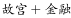”来了，将“加”出什么》

---

### 第 11 题　qid 2376491 · 片段阅读

20世纪以来，人类对弦的认识，发生了质的变革。弦就是振动，振动就会产生波，说明波构成了丰富多彩的大千世界，这为重新认识“美”提供了思想基础和技术方法。研究表明，自然美与物质的波长（或者频率）存在着深刻的内在联系，物体固有的频率与人自身的频率存在耦合关系，“美”是由不同类型波谱的频率与人的相互作用而产生的。
根据这段文字，下列说法不正确的是：

- **A**. 对同一个人的美丑认识不同，因审美主体的频率不同所致
- **B**. 阳光、鲜花一定时间内大致不变，因为振动频率没有变化
- **C**. 距离产生美，是因为审美主客体在一定频率范围内共振
- **D**. 见义勇为行为得到社会认可，因为审美主体振动频率一致　✅

**答案**：D

**官方解析**

文段开篇介绍了认识美的思想和方法，即通过物体的振动波，接着论述了审美中，物质自身的振动和人自身的频率之间存在相互作用的关系，即当审美客体与审美主体之间耦合的频率相同时，就会产生共振，进而使人觉得“美”。
A项，根据“‘美’是由不同类型波谱的频率与人的相互作用而产生的”可知，对同样一个审美客体，每个审美主体的美感不同，有的说漂亮，有的说丑，这是由于审美主体的频率不同所致，该项表述正确，排除；
B项，根据“弦就是振动，振动就会产生波，说明波构成了丰富多彩的大千世界”可知，大千世界是由波构成的，即波构成了万物，万物的变化也就意味着波的变化，波的变化也就意味着振动频率的变化，故万物一定时间内不变就是因为其振动频率没有变化，该项表述正确，排除；
C项，根据“物体固有的频率与人自身的频率存在耦合关系”可知，物体在一定的频率范围内，能够和人自身的频率产生共振，产生美感，“距离产生美”就是这个道理。该项表述正确，排除；
D项，文段论述的是审美与主客体之间的振动频率有关，即审美主体与审美客体耦合频率一致，该项中，“见义勇为”得到社会认可，是由于审美主体（不同的人们）的振动频率一致，且审美主体（不同的人们）与审美客体（见义勇为的行为）频率一致，而D项仅仅论述了原因中的主体间振动频率一致，故表述错误，当选。
本题为选非题，故正确答案为D。
【文段出处】《自然美的波谱学原理》

---

### 第 12 题　qid 2376502 · 语句表达

在今天的社会文化实践中，我们更要关注当下的传统文化热是否真正触及了传统文化的人文精神实质，是否真正提升了人们的精神境界。一般而言，文化的形式要自觉为文化的内容服务，如果忽略了文化的内容，尤其是忽略了对贯穿其中的人文精神的追求，就必然会走入歧途，背离我们弘扬传统文化的初衷。文化是活的，不能做简单的固化处理，更不能只注重形式而忽略对其内涵的传承。鉴于此，我们必须                    。
填入划横线部分最恰当的一项是：

- **A**. 改变过于强调传统文化的符号性的做法
- **B**. 注意纠正传统文化弘扬中的形式化倾向　✅
- **C**. 以实用心态凸显传统文化的工具性价值
- **D**. 借助现代电子技术手段来弘扬传统文化

**答案**：B

**官方解析**

横线出现在文段结尾，又根据“鉴于此，我们必须······”说明横线处需要根据上文给对策。分析上文，文段开篇提出问题，即“在今天的社会文化实践中······是否真正提升了人们的精神境界”，后文指出“如果忽略了文化的内容，就会走入歧途，背离初衷”，说明不能只重视形式，一定要重视文化的内容，结尾又通过“文化是活的，更不能只注重形式而忽略对其内涵的传承”再次强调传统文化不能只注重形式而忽略内容。所以，基于上文的对策应该是传统文化弘扬不能只重视形式而忽略内容，对应B项。
A项，“符号性”文段没有提到，无中生有，排除；
C项，文段没有提到“实用心态”，也没有提到“传统文化工具性”，无中生有，排除；
D项，文段中没有提到“电子技术手段”，属于无中生有，排除。
故正确答案为B。
【文段出处】《弘扬传统文化应注重人文精神的承传》

---

### 第 13 题　qid 2376505 · 语句表达

科学家认为，未来的仿生机器人并非是要完全模仿人类的所有功能，而是模仿某项功能。这些智能机器人有望成为“超人”，有的具有超强的记忆力，有的具有超强的学习能力，有的听觉功能特强，有的嗅觉功能特强······                    。
填入划横线部分最恰当的一项是：

- **A**. 智能机器将超越人类
- **B**. 不同功能的智能机器人可以用于不同的领域　✅
- **C**. 但它并不具备人类的情感，也不具备人脑的灵活性
- **D**. 人类受限于缓慢的生物学进化速度，无法与之竞争和对抗

**答案**：B

**官方解析**

横线在结尾，可知需基于前文得出结论。分析前文，文段开篇提出 “未来的仿生机器人并非···，而是模仿某项功能”，然后通过“这些”总结上文给出观点“智能机器人有望成为‘超人’”，即智能机器人应用于各个领域，后文“有的···有的···”举例子具体说明这些智能机器人分别具有哪些方面的功能，故基于文段，重点说明不同的机器人可以应用在不同的方面，对应B项。
A项，文段核心词为“智能机器人”而非“智能机器”，另外“超越人类”无中生有，排除；
C项，文段未提及机器人“情感”和“灵活性”，无中生有，故不能总结上文，排除；
D项，文段未提及“受限于生物学进化速度”和“人类无法与机器人竞争和对抗”，无中生有，排除。
故正确答案为B。
【文段出处】《智能机器会超越人类吗》

---

### 第 14 题　qid 2376506 · 语句表达

①但实际调查的匮乏，并不足以令那些笃定“甜食可以治愈”的人们完全信服
②“吃甜食会让人心情变好”似乎是人们口耳相传的一条“真理”
③但迄今还没有任何证据支持容易受抑郁症影响的人倾向于增加糖分摄入量的假设
④即高糖分的饮食全部或部分源于人们原本就糟糕的心理状态
⑤而换个角度说，心理疾病是否也可能导致人们摄入更多的糖分
⑥然而已经有多项研究表明，糖分摄入水平越高，抑郁症患病可能性越大
将以上6个句子重新排列，语序正确的是：

- **A**. ③④⑥⑤①②
- **B**. ③⑥④⑤①②
- **C**. ②⑥①③④⑤
- **D**. ②⑥①⑤④③　✅

**答案**：D

**官方解析**

对比选项，判断首句，②指出人们相信“吃甜食会让人心情变好”，③出现转折词“但”不适合做首句，排除A、B两项。
对比C、D两项，继续观察文段，寻找线索。③中出现“但”转折关联词，根据关联词捆绑，对比③前接①还是④，③“没有任何证据支持······”即没有证据说明抑郁症和糖分之间的关系，①“不足以······令人信服”是不认同甜食与抑郁症的关系，故①③观点一致，构不成转折关系，排除C项，验证D项，④“高糖分饮食源于糟糕的心理状态”认同抑郁症和糖分之间的关系，④③构成转折关系，故对应D项。
故正确答案为D。
【文段出处】《“吃甜食心情好”或有另说》

---

### 第 15 题　qid 2376509 · 片段阅读

为了帮助贫困地区脱贫，长期以来，社会各界以多种形式开展帮扶，扶贫思路更加清晰，扶贫手段更加多样，文化扶贫、旅游扶贫、电商扶贫等新方式效果显著，脱贫攻坚实现换挡提速。但一些尚未脱贫的地区，因为自然条件恶劣，发展脱贫产业难度较大。要啃下扶贫的“硬骨头”，还需打好科技牌。
最适合做这段文字标题的是：

- **A**. 打好脱贫攻坚科技牌　✅
- **B**. 啃下扶贫的“硬骨头”
- **C**. 选好脱贫攻坚新方式
- **D**. 脱贫攻坚实现换挡提速

**答案**：A

**官方解析**

文段开篇指出“社会各界以多种形式开展帮扶，脱贫效果显著，脱贫攻坚实现换挡提速”，即脱贫攻坚取得成效，然后文段通过转折词“但”强调在一些尚未脱贫的地区，难度较大，即存在问题，随后出现了对策标志词“要”，引出对策。故整个文段重点是对策，强调扶贫要通过科技牌，对应A项。
B项，没有提及文段重点强调的“科技”这样一种扶贫的对策，偏离文段重点，排除；
C项，“新方式”表述不明确，排除；
D项，“脱贫攻坚实现换挡提速”是转折之前的内容，转折之前内容非重点，排除。
故正确答案为A。
【文段出处】《人民日报纵横：打好脱贫攻坚科技牌》

---

### 第 16 题　qid 2376473 · 片段阅读

大数据是科学决策的重要工具，是高精度对未来进行预测的手段。数据是记录人类行为的工具。靠大数据技术对未来做一个预测和参考是人类发展的成果。但是，人际的沟通和交流不该因为大数据技术而遭弃，而过于依赖大数据的预测和推理，放弃人际沟通过程，必然产生人际沟通的弱化，进而影响到人的自由意志。
这段文字旨在强调：

- **A**. 大数据是科学决策的重要工具
- **B**. 大数据将发挥越来越重要的作用
- **C**. 大数据不应弱化人际沟通　✅
- **D**. 大数据影响人的自由意志

**答案**：C

**官方解析**

文段开篇先引出了大数据的概念，并指出大数据带来了好处，后文通过转折关联词“但是”重点强调“人际的沟通和交流不该因为大数据技术而遭弃”，并通过“产生人际沟通的弱化”，“影响到人的自由意志”论证大数据弱化人际沟通后带来的危害，故文段主旨是在强调大数据不应该弱化人际沟通，对应C项。
A项，“大数据是科学决策的重要工具”为转折之前的内容，非重点，排除；
B项，“发挥越来越重要的作用”无中生有，且文段转折后强调的是大数据的危害，感情色彩相悖，排除；
D项，“大数据影响人的自由意志”仅对应尾句中大数据弱化人际沟通的危害的其中一个方面，且文段重在强调大数据不应该弱化人际沟通，非重点，排除。
故正确答案为C。
【文段出处】《大数据带来的是天堂还是地狱》

---

### 第 17 题　qid 2376488 · 片段阅读

在智能化无人超市，客人从进门到出门，一举一动都会被数字化，并且被捕捉记录。这些信息回流到云端后，通过算法模型，可以得到许多非常有价值的信息：比如男性顾客和女性顾客各自进店最集中的时间段是什么，哪些商品被拿起又放回去的频次最高等。甚至还能做出预测，比如，传感器感应到进店的女客人很多是穿高跟鞋的，敏锐的老板便会在女鞋区多放些半跟鞋垫和脚踝磨损修复霜。可见，数字化最终目的是实现商品供应链的优化以及店内货架与商品摆放的人性化。
这段文字主要介绍：

- **A**. 智能无人零售让超市变得更加聪明、更加善解人意
- **B**. 智能无人零售给线下实体商店的发展前景增添亮色
- **C**. 智能无人零售能够对用户购买行为进行记录与描画　✅
- **D**. 智能无人零售给消费者所带来的更良好的购物体验

**答案**：C

**官方解析**

本段语料介绍了智能化无人超市对客人的大数据统计，可以据此收集到很多有价值的信息，对用户的购买行为进行记录与描画，因此C选项正确。
A、B、D选项都是由C选项推测、演绎出的，而非这段文字主要介绍的内容，所以排除。
故正确答案为C。
【文段出处】《智能零售来了 消费体验变了》

---

### 第 18 题　qid 2376495 · 片段阅读

完美主义者习惯于把各项标准都定得过高而不切实际，受到挫折打击后，变得逃避、拖延、自责而失去行动力。完美主义不仅拖后腿，还可能带来许多心理疾病。由于缺乏一种深刻且始终如一的自尊来源，接受失败的打击对于完美主义者来说尤其困难，而且可能导致一部分人长期抑郁和退缩。完美主义也与社交焦虑和社交恐怖显著相关，因为他们很担心自己是否能给别人留下好印象，容易出现羞怯、自卑、回避行为。完美主义也容易导致强迫症，因为完美主义者对每件事都要求完美无瑕。减少“全或无”的心理倾向，内心会更自在、从容，也更利于进步。
这段文字意在说明：

- **A**. 标准过高而且不切实际会损害自尊
- **B**. 羞怯自卑容易使人长期抑郁和退缩
- **C**. 社交焦虑和社交恐怖会导致强迫症
- **D**. 为了心理健康应避免完美主义倾向　✅

**答案**：D

**官方解析**

文段首先指出完美主义者在受到挫折打击后，变得逃避、拖延、自责而失去行动力，接着指出完美主义者不仅会拖后腿，还会带来很多心理疾病，后文通过“抑郁”、“社交焦虑”、“社交恐怖”、“强迫症”进行举例说明，尾句给出对策，即减少“全或无”这种完美主义的心理倾向会使人的内心更健康，故文段重在强调应避免完美主义倾向，对应D项。
A项“会损害自尊”，B项“使人长期抑郁和退缩”，C项“会导致强迫症”均为问题的表述，而文段重在强调解决问题的对策，故排除A、B、C三项。
故正确答案为D。
【文段出处】《完美主义拖后腿》

---

### 第 19 题　qid 2376480 · 片段阅读

传统家训家规是我国古代以家庭为范围的道德教育形式，也是中华道德文化传承的一种方式。我国历史上流传下来的家训家规，始作者多是文化名人或著名官宦，社会影响较为广泛。这些家训家规的功能远远超出对本家族的教育作用，而成为社会教育的一种独特形式，为社会提供了家庭教育范本和楷模。尤其是这些家训家规对其家族的繁衍发展起到了重要保障作用，容易引起后世更多人的关注和效法，从而使得这些家族内的训规成为道德教育的普遍教材。
这段文字意在说明：

- **A**. 传统家训家规的社会功能　✅
- **B**. 传统家训家规的历史渊源
- **C**. 传统家训家规的历史影响
- **D**. 传统家训家规的教育作用

**答案**：A

**官方解析**

文段首先提出传统家训家规这一话题，接着指出家训家规社会影响广泛，后文进一步解释说明了传统家训家规对于社会的功能，故文段重点强调传统家训家规对整个社会的意义和作用，对应A项。
B项“历史渊源”指与历史的联系，C项“历史影响”指过去产生的影响，均非文段重点，文段重在强调传统家训家规对社会的作用，排除；D项“教育作用”，并未指出是对社会的作用，故偏离文段中心，排除。
故正确答案为A。
【文段出处】《人民日报人民要论：从传统家训家规中汲取优良家风滋养》

---

### 第 20 题　qid 2376490 · 片段阅读

互联网深切地变革了媒体的内容生产方式，媒体环境呈现“移动化、社交化、视觉化”三大趋势，在这些趋势影响下所诞生的网络媒体是粉丝经济的基础。传播媒介更为迅速便捷，与粉丝的心理距离更为接近，粉丝的组织化程度大幅提高，这些都使得粉丝能更为顺利地介入偶像生活，甚至可以改变偶像的生活状态和演艺生涯。在电视剧等文化行业中，粉丝流量经济已是行业主推力：大剧单集售价从240-500万涨至400-1000万，增长的部分由粉丝来买单，艺人片酬和著作版权费从而暴涨。
这段文字意在说明：

- **A**. 粉丝经济基于网络媒体而诞生
- **B**. 传播媒介便捷促进粉丝组织化
- **C**. 偶像的演艺生涯深受粉丝影响
- **D**. 粉丝经济推动文化产业的发展　✅

**答案**：D

**官方解析**

开篇介绍互联网变革了媒体的内容生产方式，并指出网络媒体是粉丝经济的基础，即开篇引出粉丝经济的话题，然后通过“媒介更为便捷”“粉丝组织化程度提高”等来介绍粉丝经济的具体表现，最后指出粉丝经济是文化产业的主推力，并通过一系列数据来解释说明，故文段是分总结构，先引出粉丝经济的话题，并介绍粉丝经济的体现，最后重在强调粉丝经济对文化产业的推动作用，应选D项。A项“粉丝经济基于网络媒体而诞生”是背景介绍的内容，非重点，文段重在强调粉丝经济对于文化产业的作用，排除; B项“传播媒介、粉丝组织化”属于粉丝经济的表现，非重点，且“促进”无中生有，排除; C项“偶像的演艺生涯”属于解释说明的内容，非重点，排除。
故正确答案为D。
【文段出处】《价值观与亚文化：当我们讨论青年时我们在讨论什么？》

---

### 第 21 题　qid 2376520 · 片段阅读

工匠精神，匠心为本。有没有工匠精神，关键是看有没有一颗安于默默无闻、执着于追求卓越的匠心。树匠心，就要坚守初心、执着专注，秉持赤子之心，摒弃浮躁喧嚣，在本职岗位上坐得住、做得好。怎样才能坐得住、做得好?关键是要做到专心专注、追求至精至善，将产品的每个细节都尽可能做到极致。
这段文字意在强调：

- **A**. 育匠人是传承工匠精神的基础
- **B**. 树匠心是弘扬工匠精神的根本
- **C**. 树匠心要坚守初心、执着专注　✅
- **D**. 树匠心需要良好的社会文化环境

**答案**：C

**官方解析**

文段首先引入“匠心”这一话题，并指出“匠心”对工匠精神来说是十分重要的。接着给出“树匠心”的对策，即“要坚守初心、执着专注······在本职岗位上坐得住、做得好”。文段尾句对“怎样才能坐得住、做得好”进行补充说明，依然强调“专心专注、追求至精至善”。故文段重点在于“树匠心”的对策，强调“树匠心”要坚守初心、专心专注，对应C项。A项“育匠人”在文段中并未提及，无中生有，排除；B项对应首句，仅是引出话题部分，非重点，排除；D项“良好的社会文化环境”，无中生有，文段并未提及，排除。
故正确答案为C。
【文段出处】《人民日报新知新觉：大力弘扬工匠精神》

---

### 第 22 题　qid 2376496 · 片段阅读

《白鹿原》以白、鹿两个家族三代人的人生历程为线，从时代变迁的角度呈现了乡土社会生活形态的历史发展轨迹，反映了中国传统宗法文化的坚守与变迁、撕裂与挣扎，也抒写出了诸多个体生命在特定时空和社会关系中的挣扎和痛苦，进而礼赞了我们民族文化传统和道德伦理中永远不灭的善良和温情。而且，作品对此深刻主题的呈现，是艺术的、饱满的、可感的。它以不愠不火、不疾不徐的生活流，融入时代、地域、风情、民俗等多种元素，丰富立体地展现了白鹿原上的本色生活，升腾起人世间的烟火气。
根据上述文字，下列说法正确的是：

- **A**. 《白鹿原》演绎出了乡土生活的真实与厚重　✅
- **B**. 《白鹿原》演绎出了个体生命的挣扎和痛苦
- **C**. 《白鹿原》演绎出了传统文化的斑驳与永恒
- **D**. 《白鹿原》演绎出了时代历史的躁动和变迁

**答案**：A

**官方解析**

文段向我们介绍了《白鹿原》这部作品呈现了乡土生活形态的发展轨迹，反映了一部分中国传统文化，同时抒写出了个体生命的状态，又礼赞了传统文化，丰富立体地展现了白鹿原的本色生活，故文段围绕《白鹿原》这部作品强调它既包含了很多内容，具有丰富内涵，又还原本色，立体真实。对比择优，优选概括文段主旨的选项，对应A项。
B项，“个体生命的挣扎和痛苦”对应文段“也抒写出了诸多个体生命在特定时空和社会关系中的挣扎和痛苦”，与B项相比较，A项概括更加全面，对比择优，故B项表述片面，排除；
C项，根据“反映了中国传统宗法文化的坚守与变迁、撕裂与挣扎”可知“传统文化”概念范围扩大，且“永恒”为永远存在，文段并未提及，故表述无中生有，排除；
D项，“躁动和变迁”，“躁动”即急躁不安，根据“从时代变迁的角度呈现了乡土社会生活形态的历史发展轨迹”可知，“躁动”表述无中生有，排除。
故正确答案为A。
【文段出处】《&lt;白鹿原&gt;演出时代和人物的质感》

---

### 第 23 题　qid 2376511 · 片段阅读

当前，我国科技事业实现了历史性、整体性、格局性重大变化，重大创新成果竞相涌现，一些前沿方向开始进入并行、领跑阶段。但也应看到，我国科技领域仍然存在一些亟待解决的问题，关键核心技术受制于人的局面没有得到根本性改变。现在，我们迎来了世界新一轮科技革命和产业变革同我国转变发展方式的历史性交汇期，科技创新角逐空前激烈，只有努力实现关键核心技术自主可控，才能抓住千载难逢的历史机遇，有力支撑世界科技强国建设，真正发挥创新引领发展的第一动力作用。
最适合做这段文字标题的是：

- **A**. 努力拼搏，获取关键核心技术
- **B**. 把关键核心技术掌握在自己手中　✅
- **C**. 重视激励原始创新和核心技术研发
- **D**. 发挥创新引领作用，掌握关键核心技术

**答案**：B

**官方解析**

文段首句为背景引入，介绍了我国科技事业的发展状况。接下来通过转折词“但”引出了科技领域存在的问题。尾句通过必要条件“只有······才”给出对策，意在强调“努力实现关键核心技术自主可控”的重要性。本题为对策类文段，故解决问题的对策是重点，对应B项。
A项，“获取”表述片面，文段强调的不仅是“取得”，更重要的是要做到“自主可控”，排除；
C项，“激励原始创新”无中生有，排除；
D项，文段只强调需要“实现关键技术自主可控”，“创新引领作用”属于对策带来的作用或有利影响，而非对策本身，非重点，排除。
故正确答案为B。
【文段出处】《把关键核心技术掌握在自己手中》

---

### 第 24 题　qid 2376514 · 片段阅读

一部人类史，就是人与自然、科学与社会的互动史。在漫长的文明进程中，科学曾仅仅是“闲人”的志趣，科学普及无从谈起，人们在“非科学”的禁锢中艰难摸索。随着近现代科学兴起，人类对自然认识不断加深，科学与社会联系日趋紧密，科学普及在人与自然、科学与社会的结合点上顽强生长，科学在人类现代化道路上散发出璀璨的光芒。
上述文字主要阐述了：

- **A**. 人与自然、科学与社会的互动极大促进了科学普及　✅
- **B**. 在人类文明进程中，科学普及前进的道路异常艰辛
- **C**. 科学普及应紧密联系社会并且找准结合点和切入点
- **D**. 随着近现代科学兴起，科学普及前景更加灿烂辉煌

**答案**：A

**官方解析**

文段首句通过下定义引出“人与自然、科学与社会的互动”的话题，接下来阐述过去“科学普及”所面临的问题，即很少有人谈论。尾句指出在近代科学兴起的背景下，人与自然、科学与社会的联系更紧密，互动更强，根据“科学普及在人与自然、科学与社会的结合点上顽强生长”“散发出璀璨的光芒”可知，文段旨在强调“人与自然、科学与社会的互动”推动了“科学普及”的发展，对应A项。
B项，“道路艰辛”对应文段前文“科学普及无从谈起”，是在介绍以前的情况，非重点，排除；
C项，仅仅提到“联系社会”表述片面，文段中是“人与自然、科学与社会的互动”，并且“切入点”无中生有，文段未提及，排除；
D项，“随着近代科学兴起”为背景的内容，非重点，排除。
故正确答案为A。
【文段出处】《让科普这只“翅膀”硬起来——一论加强科学普及》

---

### 第 25 题　qid 2376518 · 片段阅读

科学家在100亿光年外的星系里发现一颗超亮超新星，其爆发于宇宙大爆炸后约35亿年，正值天文学家所称的“宇宙正午”时期。普通超新星是大质量恒星死亡时发生剧烈爆炸产生的。超亮超新星的亮度比普通超新星高10到100倍，目前还不太清楚其形成机制。以往发现的超亮超新星所在星系质量都较小，使科学家认为小星系缺乏重元素的环境有利于产生超亮超新星。此次发现的超亮超新星所在星系是普通的大质量星系，使人重新思考超亮超新星的形成问题。这意味着银河系也可能曾拥有产生超亮超新星的条件。
下列说法与原文相符的是：

- **A**. 超亮超新星产生于恒星形成最剧烈的“宇宙正午”时期
- **B**. 小星系缺乏重元素的环境事实上不利于产生超亮超新星
- **C**. 普通的大质量星系可能曾经拥有产生超亮超新星的条件　✅
- **D**. 大质量恒星死亡时发生剧烈爆炸并不能产生超亮超新星

**答案**：C

**官方解析**

C项，根据“此次发现的超亮超新星所在星系是普通的大质量星系，使人重新思考超亮超新星的形成问题”可知，普通大质量星系可能可以产生超亮超新星，符合文意，当选。
A项，“恒星形成最剧烈”文段没有提及，且文段只是说一颗超亮超新星爆发于“宇宙正午时期”，选项表述无中生有，排除；
B项，根据“小星系缺乏重元素的环境有利于产生超亮超新星”，选项说“不利于”，与文意相悖，排除；
D项，根据“普通超新星是大质量恒星死亡时发生剧烈爆炸产生的”可知，文段没有说过“大质量恒星死亡时发生剧烈爆炸”和“超亮超新星”的关系，无中生有，排除。
故正确答案为C。
【文段出处】《科学家解析“宇宙正午”的超亮超新星》

---

## 数量关系

### 第 1 题　qid 2376451 · 数学运算

林先生要将从故乡带回的一包泥土分成小包装送给占其朋友总数的老年朋友。在分包过程中发现，如果每包200克，则少500克；如果每包150克，则多250克。那么，林先生的朋友共有多少人?

- **A**. 15
- **B**. 30
- **C**. 50　✅
- **D**. 100

**答案**：C

**官方解析**

设林先生的老年朋友为人，根据分包过程可得：，解得人。因老年朋友占朋友总数的，则林先生的朋友总共有：人。

故正确答案为C。

注：本题并未说明每人分1包，不够严谨；但是不按每人1包则有无数种可能，无法求解。

---

### 第 2 题　qid 2376452 · 数学运算

小王在商店消费了90元，口袋里只有1张50元、4张20元、8张10元的钞票，他共有几种付款方式，可以使店家不用找零钱?

- **A**. 5
- **B**. 6
- **C**. 7　✅
- **D**. 8

**答案**：C

**官方解析**

根据题干条件分析，付款方式可包含使用50元与不使用50元两种情况。对情况进行枚举可得：

可得共有7种付款方式，可以使店家不用找零钱。

故正确答案为C。

---

### 第 3 题　qid 2376459 · 数学运算

甲乙两人相约骑共享单车运动健身。停车点现有9辆单车，分属3个品牌，各有2、3、4辆。假如两人选择每一辆单车的概率相同，两人选到同一品牌单车的概率约为：

- **A**. 

- **B**. 

- **C**. 

　✅
- **D**. 

**答案**：C

**官方解析**

假设三个品牌分别为A、B、C，两人各选一辆单车的情况数共有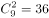种。两人选到同一品牌的单车，包含三种情况：

（1）两人同时选到A品牌，情况数为；

（2）两人同时选到B品牌，情况数为；

（3）两人同时选到C品牌，情况数为；

则两人选到同一品牌单车的概率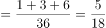。

故正确答案为C。

---

### 第 4 题　qid 2376465 · 数学运算

某次田径运动会中，选手参加各单项比赛计入所在团体总分的规则为：一等奖得9分，二等奖得5分，三等奖得2分。甲队共有10位选手参赛，均获奖。现知甲队最后总分为61分，问该队最多有几位选手获得一等奖？

- **A**. 3
- **B**. 4
- **C**. 5　✅
- **D**. 6

**答案**：C

**官方解析**

设获得一等奖、二等奖、三等奖的人数分别为、、，根据题意得：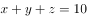，，整理两式，消去得：。

问获得一等奖人数最多，考虑从大到小代入：

代入D项，若，代入，为负且不是整数，排除；

代入C项，若，代入，解得，，符合题意。

故正确答案为C。

---

### 第 5 题　qid 2376471 · 数学运算

小张用10万元购买某只股票1000股，在亏损时，又增持该只股票1000股。一段时间后，小张将该只股票全部卖出，不考虑交易成本，获利2万元。那么，这只股票在小张第二次买入到卖出期间涨了多少？

- **A**. 

- **B**. 

- **C**. 

　✅
- **D**. 

**答案**：C

**官方解析**

10万元购买1000股，即100元/股。在亏损时，即每股市值元，购得1000股，成本需要元，即8万元。

将这2000股全部卖出后获利2万元，共卖万元，即卖出价格为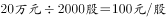。那么小张第二次买入为80元/股，卖出为100元/股，共涨了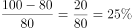。

故正确答案为C。

---

### 第 6 题　qid 2376445 · 数学运算

小林在距家1.5公里的工厂上班。一天，小林出发10分钟后，父亲老林发现小林的手机没带，立即追出去，并在距离工厂500米的地方追上了他。如果老林追赶的速度比小林快6公里/小时，那么，下列关于小林速度，求值所列方程正确的是：

- **A**. 
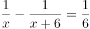
　✅
- **B**. 
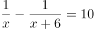

- **C**. 

- **D**. 

**答案**：A

**官方解析**

根据题意，老林从家到追上小林，老林和小林行驶的路程均为 公里，老林比小林少用 分钟，即 小时。小林速度为，老林速度为，则。

故正确答案为A。

---

### 第 7 题　qid 2376446 · 数学运算

幼儿园老师设计了一个摸彩球游戏，在一个不透明的盒子里混放着红、黄两种颜色的小球，它们除了颜色不同，形状、大小均一致。已知随机摸取一个小球，摸到红球的概率为三分之一。如果从中先取出3红7黄共10个小球，再随机摸取一个小球，此时摸到红球的概率变为五分之二，那么原来盒中共有红球多少个？

- **A**. 5　✅
- **B**. 10
- **C**. 15
- **D**. 20

**答案**：A

**官方解析**

假设原来盒子中共有个红球，因随机摸取一个小球，摸到红球的概率为，则原来盒子中共有个小球。取出红黄共个小球后，红球剩下个，小球总个数为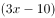，此时随机摸取一个小球，摸到红球的概率为，则，解得。

故正确答案为A。

---

### 第 8 题　qid 2376448 · 数学运算

一位学生在距离热气球100米处观看它起飞。在热气球起飞后，学生注意到热气球顶部从他的仰角上升到，再从上升到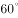的位置分别用了11秒和17秒。则前后两段时间热气球平均上升速度的比值约为：

- **A**. 0.89　✅
- **B**. 0.91
- **C**. 1.12
- **D**. 1.10

**答案**：A

**官方解析**

如图所示：当仰角为时，在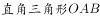中，

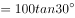米；当仰角为时，在中， 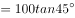米；当仰角为时，在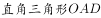中，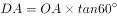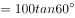米。两段时间上升的距离分别为米，米，则两段时间平均上升速度比为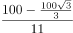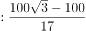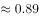。 

故正确答案为A。

---

### 第 9 题　qid 2376449 · 数学运算

小张、小李和小王三人以擂台形式打乒乓球，每局2人对打，输的人下一局轮空。半天下来，小张共打了6局，小王共打了9局，而小李轮空了4局。那么，小李一共打了多少局？

- **A**. 5局
- **B**. 7局　✅
- **C**. 9局
- **D**. 11局

**答案**：B

**官方解析**

小李轮空4局，说明小王和小张打了4局。小王共打9局，则小王和小李打了9-4=5局。小张共打6局，则小张和小李打了6-4=2局，所以小李共打5+2=7局。
故正确答案为B。

---

### 第 10 题　qid 2376450 · 数学运算

某楼盘的地下停车位，第一次开盘时平均价格为15万元/个；第二次开盘时，车位的销售量增加了一倍、销售额增加了。那么，第二次开盘的车位平均价格为：

- **A**. 10万元/个
- **B**. 11万元/个
- **C**. 12万元/个　✅
- **D**. 13万元/个

**答案**：C

**官方解析**

赋值第一次车位销售量为1，则。根据题意，第二次开盘时，销售量增加了一倍、销售额增加了，可得第二次销售量为，销售额为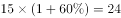，则第二次平均价格为。

故正确答案为C。

---

### 第 11 题　qid 2376447 · 数学运算

调酒师调配鸡尾酒，先在调酒杯中倒入120毫升柠檬汁，再用伏特加补满，摇匀后倒出80毫升混合液备用，再往杯中加满番茄汁并摇匀，一杯鸡尾酒就调好了。若此时鸡尾酒中伏特加的比例是，问调酒杯的容量是多少毫升？

- **A**. 160
- **B**. 180
- **C**. 200　✅
- **D**. 220

**答案**：C

**官方解析**

假设调酒杯的容量为毫升，在原有120毫升柠檬汁的基础上，用伏特加补满，因此加入伏特加的量为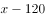，故伏特加浓度为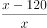。混匀后倒出80毫升后，还剩余毫升混合液，此时伏特加的量为。最后加入番茄汁，但是伏特加的量无变化，可得方程：。

由于本题属于分式方程，直接计算难度太高，故考虑代入选项验证。优先选择好算的选项入手，C项为整百的数，因此代入C项。，等式成立。

故正确答案为C。

---

### 第 12 题　qid 2376466 · 数学运算

太阳高度角是太阳光的入射方向和地平面之间的夹角。在正午时，太阳高度角为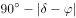，为纬度，为太阳赤纬。已知小陈的身高为180厘米，他所在地的纬度为，当日太阳赤纬为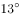。那么，在正午时他的影子长度约为：

- **A**. 60厘米
- **B**. 90厘米
- **C**. 104厘米　✅
- **D**. 208厘米

**答案**：C

**官方解析**

根据题干，正午时太阳高度角为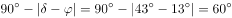。如下图所示，在中，AC代表小陈的身高，故为180厘米。AB代表太阳光，由于正午太阳高度角为，故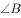为。为，BC即为影子的长度。根据直角三角形三边关系可知，，因此，则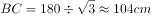。

故正确答案为C。

---

### 第 13 题　qid 2376467 · 数学运算

某河道由于淤泥堆积影响到船只航行安全，现由工程队使用挖沙机进行清淤工作，清淤时上游河水又会带来新的泥沙。若使用1台挖沙机300天可完成清淤工作，使用2台挖沙机100天可完成清淤工作。为了尽快让河道恢复使用，上级部门要求工程队25天内完成河道的全部清淤工作，那么工程队至少要有多少台挖沙机同时工作？

- **A**. 4
- **B**. 5
- **C**. 6
- **D**. 7　✅

**答案**：D

**官方解析**

假定每天每台挖沙机效率为1，每天新增泥沙的量为，原有泥沙量为。由于1台挖沙机300天可完成清淤工作，可得：；由于2台挖沙机100天可完成清淤工作，可得：。两式联立，解得，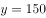。若要求工程队25天内完成河道的全部清淤工作，此时，设所需的挖沙机台数为，则有，解得，至少需要7台挖沙机同时工作。

故正确答案为D。

---

### 第 14 题　qid 2376497 · 数学运算

因装修需要，拟在边长为2m的正方形浴室正中央处安装圆形淋浴喷头，喷头直径为10cm，出水喷射角度与垂直方向的最大夹角为。假设不考虑重力影响，要使喷头喷射到的面积能完全覆盖浴室，而且考虑施工实际，只有下列四个选项可选，则在满足设计要求的情况下，喷头底面距离地面可供选择的最低高度是多少？（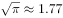）

- **A**. 185cm
- **B**. 190cm　✅
- **C**. 195cm
- **D**. 200cm

**答案**：B

**官方解析**

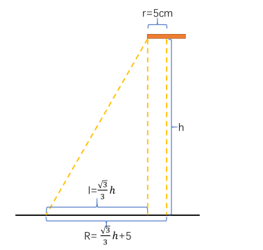

根据题干要求“要使喷头喷射到的面积能完全覆盖浴室”，即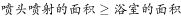。设喷头底面距离地面高度为hcm，由“出水喷射角度与垂直方向的最大夹角为”，可知喷头外延能够喷射的最远距离l为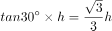cm。由“喷头直径为10cm”可知喷头半径r为5cm，喷头喷射的总半径。则喷头喷射的面积，正方形浴室的面积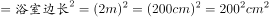。由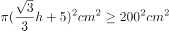，解得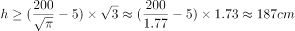。结合题干要求“考虑施工实际，只有下列四个选项可选”，则要选择略大于187的选项，B项符合。

故正确答案为B。

备注：这道题目本质上是一道错题，命题人在命题过程中只考虑了面积大小关系，但从实际情况来看，圆形喷头喷出的水会打在墙壁上，但房间的四角喷射不到。而此题如果以喷射半径覆盖房间，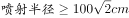，进行计算，，没有答案。

---

### 第 15 题　qid 2376501 · 数学运算

如右图所示，一条河流的两岸分别有A、B两处景点，河面宽80米，A与B的直线距离是100米。现需铺设一条观光栈道连接A与B。已知陆地栈道的铺设费用是0.1万元/米，河面栈道的铺设费用是0.125万元/米，则最少需要铺设费用：

- **A**. 12.5万元　✅
- **B**. 12万元
- **C**. 11.5万元
- **D**. 11万元

**答案**：A

**官方解析**

如图所示若沿AB建造观光栈道，则需建造河面栈道AB段100m，共需要铺设费用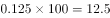万元；若沿AO→OB铺设栈道，则需建造河面栈道AO段80m和陆地栈道OB段，共需要铺设费用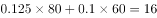万元。通过所给条件对比分析，最少铺设费用为12.5万元（沿AB段建造）。

故正确答案为A。

备注：如若讨论陆地与河面栈道的转折点：在OB段上取任意点C，设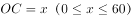。沿AC→CB铺设栈道，则需建造河面栈道AC段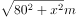和陆地栈道CB段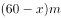，共需要铺设费用万元。取特值分析x和y的增减关系，取值如表：

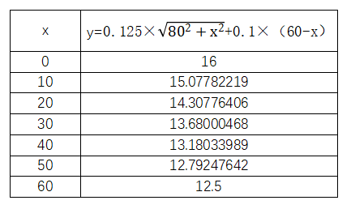

由特值分析可知，x取值越大，费用y越小。故时（即C点与B点重合）， y可取得最小值12.5。

---

## 判断推理

### 第 1 题　qid 2376531 · 类比推理

拥挤：水泄不通

- **A**. 清晰：洞见肺腑
- **B**. 严重：触目惊心
- **C**. 费力：举重若轻
- **D**. 伤心：肝肠寸断　✅

**答案**：D

**官方解析**

第一步：判断题干词语间逻辑关系。
水泄不通形容拥挤或包围的非常严密，与拥挤是近义关系。
第二步：判断选项词语间逻辑关系。
A项：洞见肺腑是指很清楚地看见人的内心，形容襟怀坦白，待人诚恳。与清晰不是近义关系，与题干逻辑关系不一致，排除；
B项：触目惊心是指看见某种严重情况而内心震惊，形容事态严重，引起轰动，该词强调的是震惊，与严重不是近义关系，与题干逻辑关系不一致，排除；
C项：举重若轻是比喻能力强，能够轻松地胜任繁重的工作或处理困难的问题。与费力不是近义关系，与题干逻辑关系不一致，排除；
D项：肝肠寸断是比喻伤心到极点，与伤心是近义关系，与题干逻辑关系一致，当选。
故正确答案为D。

---

### 第 2 题　qid 2376537 · 类比推理

玻璃幕墙：光污染

- **A**. 汽车尾气：酸雨　✅
- **B**. 海上风暴：海啸
- **C**. 火山喷发：地震
- **D**. 空气消毒：臭氧

**答案**：A

**官方解析**

第一步：判断题干词语间逻辑关系。
玻璃幕墙可以导致光污染，二者是因果关系，并且玻璃幕墙是人为产物。
第二步：判断选项词语间逻辑关系。
A项：汽车尾气可以导致酸雨，二者为因果关系，并且汽车尾气是人为产物，与题干逻辑关系一致，当选；
B项：海上风暴可以导致海啸，二者为因果关系，但海上风暴为天然现象，与题干逻辑关系不一致，排除；
C项：火山喷发可以导致地震，二者为因果关系，但火山喷发为天然现象，与题干逻辑关系不一致，排除；
D项：空气消毒不会导致臭氧，二者不是因果关系，与题干逻辑关系不一致，排除。
故正确答案为A。

---

### 第 3 题　qid 2376569 · 类比推理

成长：衰亡

- **A**. 坚定：彷徨　✅
- **B**. 美好：苦难
- **C**. 深刻：纯真
- **D**. 复杂：单纯

**答案**：A

**官方解析**

第一步：判断题干词语间逻辑关系。
成长和衰亡是反义关系，并且成长是积极的，衰亡是消极的。
第二步：判断选项词语间逻辑关系。
A项：坚定和彷徨是反义关系，并且坚定是积极的，彷徨是消极的，与题干逻辑关系一致，当选；
B项：美好的反义词应该是丑陋，而苦难不一定是丑陋的，很多磨难是对人的一种历练，是对人生有益的，因此美好和苦难不是反义关系，与题干逻辑关系不一致，排除；
C项：深刻和纯真不是反义关系，与题干逻辑关系不一致，排除；
D项：复杂和单纯是反义关系，但是复杂和单纯没有积极和消极之分，与题干逻辑关系不一致，排除。
故正确答案为A。

---

### 第 4 题　qid 2376572 · 类比推理

孤本：书籍

- **A**. 正方形：长方形　✅
- **B**. 蔬菜：土地
- **C**. 显微镜：实验室
- **D**. 礼物：商品

**答案**：A

**官方解析**

第一步：判断题干词语间逻辑关系。
孤本，指某书刊仅有一份在世间流传的版本，亦指仅存的一份未刊手稿或原物已亡佚，仅存的一份拓本。孤本是特殊的书籍。
第二步：判断选项词语间逻辑关系。
A项：正方形是特殊的长方形，与题干逻辑关系一致，当选；
B项：蔬菜和土地，土地是蔬菜生长的场所，与题干逻辑关系不一致，排除；
C项：显微镜和实验室，显微镜是实验室需要用到的工具，与题干逻辑关系不一致，排除；
D项：有的礼物是商品，有的礼物不是商品，有的商品是礼物，有的商品不是礼物，二者为交叉关系，与题干逻辑关系不一致，排除。
故正确答案为A。

---

### 第 5 题　qid 2376575 · 类比推理

老字号：新品牌：传承

- **A**. 老传统：新花样：质疑
- **B**. 老配方：新工艺：创新　✅
- **C**. 老问题：新思考：评价
- **D**. 老物件：新东西：区分

**答案**：B

**官方解析**

第一步：判断题干词语间逻辑关系。
老字号经过传承可以变为新品牌。
第二步：判断选项词语间逻辑关系。
A项：老传统被质疑不能变为新花样，与题干逻辑关系不一致，排除；
B项：老配方经过创新可以变为新工艺，与题干逻辑关系一致，当选；
C项：老问题被评价不能变为新思考，与题干逻辑关系不一致，排除；
D项：老物件被区分不能变为新东西，与题干逻辑关系不一致，排除。
注：此题有同学可能会纠结D项，认为老字号与新品牌都是品牌，老物件与新东西都是物品。但D项前两个词与区分无关。从题干三个词的关系看体现了新老物体之间的变化，而B项也是体现了新老事物之间的变化，因此粉笔更倾向于B项。
故正确答案为B。

---

### 第 6 题　qid 2376558 · 类比推理

效率：公平：市场经济

- **A**. 科学：理性：政治哲学
- **B**. 革命：改良：社会制度
- **C**. 民主：集中：组织原则　✅
- **D**. 美丑：善恶：审美范畴

**答案**：C

**官方解析**

第一步：判断题干词语间逻辑关系。
市场经济需要兼顾效率与公平。
第二步：判断选项词语间逻辑关系。
A项：政治哲学不需要兼顾科学与理性，且科学是理性的，与题干逻辑关系不一致，排除； 
B项：社会制度不需要兼顾革命与改良，与题干逻辑关系不一致，排除；
C项：组织原则需要兼顾民主与集中，与题干逻辑关系一致，当选；
D项：审美范畴不需要兼顾美丑与善恶，且善恶不属于审美的范畴，与题干逻辑关系不一致，排除。
故正确答案为C。

---

### 第 7 题　qid 2376570 · 类比推理

瓮牖绳枢：粗茶淡饭：清寒

- **A**. 叠床架屋：衣锦食肉：奢华
- **B**. 箪食瓢饮：曲肱饮水：简朴　✅
- **C**. 轻车熟路：霜行草宿：轻松
- **D**. 金盆洗手：金屋藏娇：阔绰

**答案**：B

**官方解析**

第一步：判断题干词语间逻辑关系。
瓮牖绳枢指以破瓮作窗户，以草绳系户枢，比喻贫穷人家；粗茶淡饭形容饮食简单，生活简朴，二者都可以用来形容清寒。
第二步：判断选项词语间逻辑关系。
A项：叠床架屋比喻办事重复，自找麻烦；衣锦食肉形容生活富足，第一词与奢华无关，与题干逻辑关系不一致，排除；
B项：箪食瓢饮形容读书人安于贫穷的清高生活；曲肱饮水形容清心寡欲、安贫乐道的生活，二者都可以用来形容简朴，与题干逻辑关系一致，当选；
C项：轻车熟路比喻事情又熟悉又容易；霜行草宿指在霜露中行走，草野中息宿，形容奔波劳苦，第二词与轻松无关，与题干逻辑关系不一致，排除；
D项：金盆洗手指放弃以前长期从事的行业或某件事；金屋藏娇指十分宠爱妻子，也指男人纳妾或在外包养女人，二者均与阔绰无关，与题干逻辑关系不一致，排除。
故正确答案为B。

---

### 第 8 题　qid 2376598 · 类比推理

（    ） 对于 幸灾乐祸 相当于 怨天尤人 对于 （    ）

- **A**. 得意忘形；呼天号地
- **B**. 乐极生悲；饮恨吞声
- **C**. 兔死狐悲；乐天知命　✅
- **D**. 睚眦必报；破涕为笑

**答案**：C

**官方解析**

逐一代入选项。
A项：得意忘形指因心意得到满足而高兴得失去常态，幸灾乐祸指人缺乏善意，在别人遇到灾祸时感到高兴，二者无关；怨天尤人指遇到挫折或出了问题，一味抱怨天责怪别人，呼天号地形容极为冤屈、怨恨或痛苦，二者无关，前后逻辑关系不一致，排除；
B项：乐极生悲指高兴到极点时，发生使人悲伤的事，与幸灾乐祸无关；饮恨吞声形容忍恨含悲，不敢表露，与怨天尤人无关，前后逻辑关系不一致，排除；
C项：兔死狐悲指对同盟的死亡或不幸而伤心，与幸灾乐祸构成反义关系；乐天知命指认为自己的一切都由命运支配，安于现状，与怨天尤人构成反义关系，前后逻辑关系一致，当选；
D项：睚眦必报指像瞪一下眼睛那样极小的怨仇也要报复，比喻心胸极其狭窄，与幸灾乐祸无关；破涕为笑形容转悲为喜，一下子从哭变为了笑，与怨天尤人无关，前后逻辑关系不一致，排除。
故正确答案为C。

---

### 第 9 题　qid 2376603 · 类比推理

（    ） 对于 聚集之处 相当于 捷径 对于 （    ）

- **A**. 荟萃；取巧之思
- **B**. 渊薮；速成之法　✅
- **C**. 辐辏；入门之路
- **D**. 囹圄；提升之梯

**答案**：B

**官方解析**

逐一代入选项。
A项：荟萃比喻优秀的人物或精美的东西会集、聚集，可以形容聚集之处，捷径比喻能较快地达到目的的巧妙手段或办法，与取巧之思无关，前后逻辑关系不一致，排除；
B项：渊薮比喻某种人或事、物聚集的地方，可以比喻聚集之处；捷径指近便的小路，形容便捷的方法，可以比喻速成之法，前后逻辑关系一致，当选；
C项：辐辏形容人或物聚集像车辐集中于车毂一样，可以形容聚集之处，入门之路与捷径无关，前后逻辑关系不一致，排除；
D项：囹圄原指监牢，后引申为束缚、困难，与聚集之处无关，捷径与提升之梯无关，前后逻辑关系不一致，排除。
故正确答案为B。

---

### 第 10 题　qid 2376604 · 类比推理

（    ） 对于 风险 相当于 精兵简政 对于 （    ）

- **A**. 亡羊补牢：效率
- **B**. 枕戈待旦：业绩
- **C**. 克己奉公：资源
- **D**. 曲突徙薪：成本　✅

**答案**：D

**官方解析**

逐一代入选项。
A项：亡羊补牢比喻出了问题以后想办法补救，可以防止继续受损失，能够减少风险，精兵简政比喻精简不必要的东西，可以提高效率，一个体现减少，一个体现增加，前后逻辑关系不一致，排除；
B项：枕戈待旦指时刻警惕，准备作战，连睡觉时也不放松戒备，与风险无关，精兵简政与业绩无关，前后逻辑关系不一致，排除；
C项：克己奉公比喻一个人对自己要求严格，一心为公，与风险无关，精兵简政，其实就是节约资源，前后逻辑关系不一致，排除；
D项：曲突徙薪比喻消除可能导致事故的因素，防患于未然，曲突徙薪的目的是减少风险，精兵简政的目的是减少成本，前后逻辑关系一致，当选。
故正确答案为D。

---

### 第 11 题　qid 2376553 · 图形推理

从所给四个选项中，选择最合适的一个填入问号处，使之呈现一定的规律性：

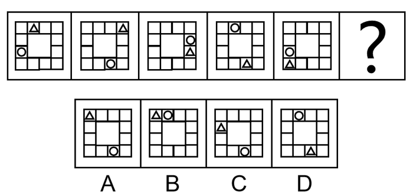

- **A**. A
- **B**. B
- **C**. C　✅
- **D**. D

**答案**：C

**官方解析**

元素组成相同，优先考虑位置规律。整体观察发现，小三角、小圆圈均在移动，可以分开看，先看小三角，小三角的移动规律为每次顺时针平移两格，只有C项符合要求。再通过小圆圈位置验证，小圆圈的移动规律为每次逆时针平移三格， C项当选。
故正确答案为C。

---

### 第 12 题　qid 2376468 · 图形推理

从所给四个选项中，选择最合适的一个填入问号处，使之呈现一定的规律性：

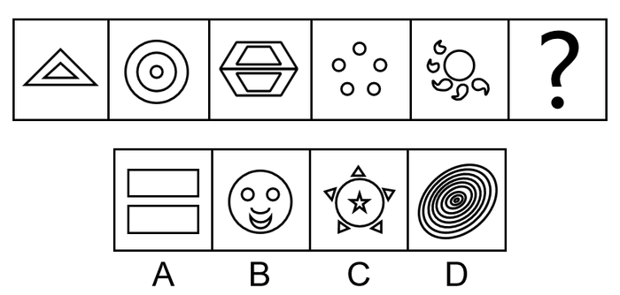

- **A**. A
- **B**. B
- **C**. C　✅
- **D**. D

**答案**：C

**官方解析**

元素组成不同，且无明显属性规律，考虑数量规律。图四、图五封闭面明显，考虑面数量。面数量依次为2、3、4、5、6，则问号处图形面数量为7，只有C符合要求。
故正确答案为C。

---

### 第 13 题　qid 2376521 · 图形推理

把下面的图形分为两类，使每一类图形都有各自的共同特征或规律，分类正确的一项是：

- **A**. ①④⑥，②③⑤　✅
- **B**. ①②③，④⑤⑥
- **C**. ①③⑥，②④⑤
- **D**. ①③④，②⑤⑥

**答案**：A

**官方解析**

本题为分组分类题目，图形均为明显两个图形相交，考虑图形间关系。观察发现，图①④⑥的公共边为短边，图②③⑤的公共边为长边，故①④⑥一组，②③⑤一组。
故正确答案为A。

---

### 第 14 题　qid 2376548 · 图形推理

把下面的图形分为两类，使每一类图形都有各自的共同特征或规律，分类正确的一项是：

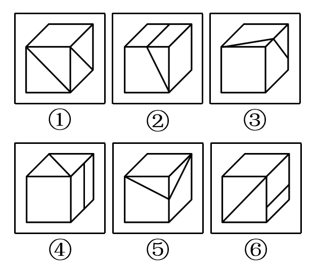

- **A**. ①③⑤，②④⑥
- **B**. ①④⑥，②③⑤　✅
- **C**. ①④⑤，②③⑥
- **D**. ①②⑥，③④⑤

**答案**：B

**官方解析**

解析一：
本题为分组分类题目。题干均是里面有两条直线的立体图形，可以考虑两条直线之间的关系。观察发现，图①④⑥中两条直线不相交，图②③⑤中两条直线相交，故①④⑥一组，②③⑤一组，只有B项符合。
故正确答案为B。
解析二：
本题为分组分类题目。题干均是里面有两条直线的立体图形，可以考虑两条直线之间的关系。观察发现，图①③⑤中两条直线不垂直，图②④⑥中两条直线垂直，故①③⑤一组，②④⑥一组，只有A项符合。
故正确答案为A。
粉笔说明：方法一的分类更直观，而方法二的知识点在以前有所考查，故本题属于命题不严谨。

---

### 第 15 题　qid 2376652 · 图形推理

从所给四个选项中，选择最合适的一个填入问号处，使之呈现一定的规律性：

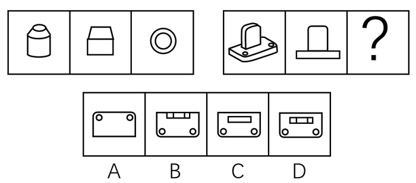

- **A**. A
- **B**. B
- **C**. C　✅
- **D**. D

**答案**：C

**官方解析**

本题考查三视图，第一组图形中第二个图形和第三个图形分别是第一个立体图形的主视图和俯视图。第二组应用规律，问号处所填图形应为第一个立体图形的俯视图。俯视图从上往下看，可以看到外框是一个类似矩形的轮廓，里面两个小圆圈加上一个小矩形，只有C项符合。
故正确答案为C。

---

### 第 16 题　qid 2376557 · 定义判断

组织认同是指组织成员在行为或观念等诸方面与其所加入的组织具有一致性，觉得自己在组织中既有理性的契约和责任感，也有非理性的归属和依赖感，以及在这种心理基础上表现出的对组织活动尽心尽力的行为结果。
根据上述定义，下列选项不属于组织认同的是：

- **A**. “我们要以共产党员的标准严格要求自己”
- **B**. “公司面临困难的时候，我们要不离不弃”
- **C**. “我要每时每刻自觉维护公司的良好形象”
- **D**. “今日我以母校为傲，明日母校以我为荣”　✅

**答案**：D

**官方解析**

第一步：找出定义关键词。
“组织成员与其所加入的组织具有一致性”、“既有理性的契约和责任感”、“也有非理性的归属和依赖感”、“对组织活动尽心尽力”。
第二步：逐一分析选项。
A项：用共产党员的标准要求自己，体现了党员的行为和观念与党组织的一致性，但说出此话的主体不一定是党员，非党员也可以表达这样的决心，该项主体不明确，可能符合“组织成员与其所加入的组织具有一致性”，保留；
B项：对公司不离不弃，体现了员工对公司的责任感和归属感，符合“既有理性的契约和责任感”、“也有非理性的归属和依赖感”，且面对困难也一直坚守，符合“对组织活动尽心尽力”，符合定义，排除；
C项：自觉维护公司的良好形象，符合“既有理性的契约和责任感”、“也有非理性的归属和依赖感”，符合定义，排除；
D项：学生和母校互相为各自取得的成绩骄傲，母校的定义是曾经在那里毕业或学习过的学校，即此刻已经不是该校的学生了，我们才会称之为“母校”，不符合“组织成员与其所加入的组织具有一致性”；另外学校和学生是教书育人的关系，一般也不会说二者有契约关系，不符合“既有理性的契约和责任感”，跟A项相比，A项可能符合，D项是更不符合的，当选。
本题为选非题，故正确答案为D。

---

### 第 17 题　qid 2376565 · 定义判断

消费滞后是指个人消费滞后于国家经济发展和个人家庭收入所应达到的平均消费水平。消费超前是指当下的收入水平不足以购买现在所需的产品或服务，以贷款、分期付款、预支等形式进行消费。
根据上述定义，下列属于消费超前的是：

- **A**. 职员小王以信用卡支付的形式在网上订购了火车票
- **B**. 大学生小李通过某借贷平台购买了某知名品牌电脑　✅
- **C**. 退休工人老张名下有商品房和汽车，但坚持只用老式的直板手机
- **D**. 青年教师小刘有十万元定期存款未到期，向同事借了八万元买车

**答案**：B

**官方解析**

第一步：找出定义关键词。
消费滞后：“指个人消费滞后于国家经济发展和个人家庭收入所应达到的平均消费水平”；
消费超前：“指当下的收入水平不足以购买现在所需的产品或服务”、“以贷款、分期付款、预支等形式进行消费”。
第二步：逐一分析选项。
A项：小王为职员说明小王已经工作，购买火车票应该是消费水平范围内，不符合“当下的收入水平不足以购买现在所需的产品或服务”，不符合定义，排除；
B项：小李是一名大学生，尚未参加工作，购买电脑符合“当下的收入水平不足以购买现在所需的产品或服务”，且通过“某借贷平台购买”属于“贷款”的支付方式，符合定义，当选；
C项：老张有房有车，却使用老式的直板手机，符合“个人消费滞后于国家经济发展和个人家庭收入所应达到的平均消费水平”，属于消费滞后，不属于消费超前，不符合定义，排除；
D项：小刘有十万元的存款，而车只有八万元，也就是当下的收入足以购买现在所需的产品，不符合“当下的收入水平不足以购买现在所需的产品或服务”，且向同事借钱不符合“以贷款、分期付款、预支等形式进行消费”，不符合定义，排除。
故正确答案为B。

---

### 第 18 题　qid 2376571 · 定义判断

意志的活动过程会体现以下两大定律。其中，意志强度边际效应定律是指意志的强度随着自身行为的活动规模的增长而下降；意志强度时间衰减定律是指意志的强度随着自身行为的持续时间的增长而呈现负指数下降。
根据上述定义，下列选项最能体现意志强度时间衰减定律的是：

- **A**. 锲而舍之，朽木不折
- **B**. 为山九仞，功亏一篑
- **C**. 穷且益坚，不坠青云之志
- **D**. 一鼓作气，再而衰，三而竭　✅

**答案**：D

**官方解析**

第一步：找出定义关键词。
意志强度边际效应定律：“意志强度”、“随自身行为的活动规模增长而下降”；
意志强度时间衰减定律：“意志强度”、“随自身行为的持续时间增长而呈现负指数下降”。
第二步：逐一分析选项。
A项：“锲而舍之，朽木不折”意思是说如果不坚持做一件事，就算是腐朽的木头也无法折断，说明人们不坚持做一件事的后果，不符合“随自身行为的持续时间增长”，不符合定义，排除；
B项：“为山九仞，功亏一篑”意思是说堆九仞高的山，只缺一筐土导致不能完成，是用来比喻做事情只差最后一点没能完成，说明没有一直坚持下去，不符合“随自身行为的持续时间增长”，不符合定义，排除；
C项：“穷且益坚，不坠青云之志”意思是说一个人处境越是艰难，就越是坚忍不拔，越是不丢失高远之志，没有体现与时间增长的关系，不符合“随着自身行为的持续时间的增长而呈现负指数下降”，不符合定义，排除；
D项：“一鼓作气，再而衰，三而竭”意思是说，第一次击鼓士气会大大的增加，第二次击鼓士气就会减弱了，第三次击鼓就没有士气了，说明士气随着时间的增加而减弱，符合“随时间增长而呈现负指数下降”，符合定义，当选。
故正确答案为D。

---

### 第 19 题　qid 2376577 · 定义判断

关怀强迫症即一个人特别需要别人依赖自己，总是爱向别人提供别人不需要的关怀。并且，这种人还强迫别人接受自己的关怀，从而使别人不能独立。当别人依赖自己的时候，他就会感到满足，感到自己有价值。这种症状会压抑人的神经，并同时给身边的亲朋好友甚至一般的同事带来诸多不便。
根据上述定义，下列属于关怀强迫症的是：

- **A**. 张某说：“我一天没见到儿子就会发疯”
- **B**. 李某连哄带骗让感冒的女儿吃下感冒药
- **C**. 刘某从小学到大学期间都住自己家里
- **D**. 王某在女儿就读的大学附近租房陪读　✅

**答案**：D

**官方解析**

第一步：找出定义关键词。
“需要别人依赖自己”、“提供别人不需要的关怀”、“强迫别人接受”、“使别人不能独立”。
第二步：逐一分析选项。
A项：张某一天没见到儿子就会发疯，说明是张某依赖儿子，而并非是儿子依赖自己，不符合“需要别人依赖自己”，不符合定义，排除；
B项：李某连哄带骗让感冒的女儿吃下感冒药，没有体现“需要别人依赖自己”，且感冒的女儿需要被人关怀照顾，不符合“提供别人不需要的关怀”，不符合定义，排除；
C项：刘某上学期间住在家里，没有体现到强迫别人，不符合“强迫别人接受”，不符合定义，排除；
D项：王某在女儿就读的大学附近租房陪读，女儿已经读大学了，说明她已经能够独立地生活和学习，符合 “提供别人不需要的关怀”、“强迫别人接受”、“使别人不能独立”，符合定义，当选。
故正确答案为D。

---

### 第 20 题　qid 2376560 · 定义判断

似动是指在一定的时间和空间条件下，人们在静止的物体间看到了运动，或者在没有连续位移的地方，看到了连续位移。
根据上述定义，下列选项不属于似动现象的是：

- **A**. 两岸青山相对出
- **B**. 坐地日行八万里　✅
- **C**. 郡邑浮前浦，波澜动远空
- **D**. 明月却多情，随人处处行

**答案**：B

**官方解析**

第一步：找出定义关键词。
“在一定的时间和空间条件下”、“人们在静止的物体间看到了运动”、“或者在没有连续位移的地方，看到了连续位移”。
第二步：逐一分析选项。
A项：“两岸青山相对出”意思是两岸的青山相继出迎，一座座扑进眼帘。青山本是静止的物体，但是作者却看到了它的运动，符合“人们在静止的物体间看到了运动”，符合定义，排除；
B项：“坐地日行八万里”意思是人们住在地球上，因地球自转，于不知不觉中，一日已行了八万里路。依据科学理论，当我们处于赤道附近的时候，即使每天原地不动，也会运动八万华里，即人没有动，而且也看不见运动。所以不符合“在静止的物体间看到了运动”、“或在没有连续位移的地方，看到了连续位移”，不符合定义，当选；
C项：“郡邑浮前浦，波澜动远空”意思是远处的城郭好像在水面上飘动，波翻浪涌，辽远的天空也仿佛为之摇荡。但是事实上，城郭本身不会运动，天空也不会飘荡，符合“人们在静止的物体间看到了运动”，符合定义，排除；
D项：“明月却多情，随人处处行”意思是明月却是那么多情，不管人走到哪里，它都陪伴着你同行。但是我们用肉眼是看不到明月本身在运动的，所以符合“人们在静止的物体间看到了运动”，符合定义，排除。
本题为选非题，故正确答案为B。

---

### 第 21 题　qid 2376566 · 定义判断

虚拟现实技术是指一种可以创建和体验虚拟世界的仿真系统，它利用计算机生成可交互的三维环境，向使用者提供视觉、听觉、触觉等感官的模拟，从而让人有身临其境之感，这是一种360度视角的沉浸式体验。
根据上述定义，下列选项属于虚拟现实技术运用的是：

- **A**. 张三通过电脑与远在巴黎的父亲视频聊天，亲眼见到了埃菲尔铁塔
- **B**. 李四用手机微信与妻子视频聊天，亲耳听到了儿子背诵古诗的声音
- **C**. 刘五戴上特制头盔网购书桌，能够全方位地体验书桌摆进书房的效果　✅
- **D**. 王二用平板电脑看同学在西藏旅游的视频，感觉自己也到了布达拉宫

**答案**：C

**官方解析**

第一步：找出定义关键词。
“指一种可以创建和体验虚拟世界的仿真系统”、“它利用计算机生成可交互的三维环境，向使用者提供视觉、听觉、触觉等感官的模拟”、“从而让人有身临其境之感，是一种360度视角的沉浸式体验。”
第二步：逐一分析选项。
A项：张三通过电脑与远在巴黎的父亲视频聊天，亲眼见到了埃菲尔铁塔，看到的埃菲尔铁塔是现实世界的景物，并不是虚拟的，不符合“是一种可以创建和体验虚拟世界的仿真系统”，也不符合“向使用者提供视觉、听觉、触觉等感官的模拟”，不符合定义，排除；
B项：李四用微信与妻子视频聊天，亲耳听到了儿子背诵古诗的是声音，儿子背诵古诗的声音也是现实世界的声音，并不是虚拟的，不符合“是一种可以创建和体验虚拟世界的仿真系统”，也不符合“向使用者提供视觉、听觉、触觉等感官的模拟”，不符合定义，排除；
C项：刘五戴上特制头盔，能够全方位地体验书桌摆进书房的效果，符合“向使用者提供视觉、听觉、触觉等感官的模拟”、“是一种360度视角的沉浸式体验”，符合定义，当选；
D项：王二用平板电脑看同学在西藏旅游的视频，感觉自己也到了布达拉宫，王二观看视频的过程，不符合“创建和体验虚拟世界的仿真系统”，不符合定义，排除。
故正确答案为C。

---

### 第 22 题　qid 2376581 · 定义判断

时间感知扭曲是指对时间不正确的知觉。在生活中，受各种因素影响，人们对时间的感知往往会不符合实际，有时候觉得时间过长，有时候觉得时间太短。许多原因都可以造成时间感知扭曲，现实中一场糟糕的表演会让人如坐针毡、觉得终场遥遥无期，与此相反的是，人们对于美好愉快的时光总嫌太短。
根据上述定义，下列选项不符合时间感知扭曲的是：

- **A**. 一日不见，如三月兮
- **B**. 欢愉嫌夜短，寂寞恨更长
- **C**. 孤馆度日如年，风露渐变
- **D**. 入春才七日，离家已二年　✅

**答案**：D

**官方解析**

第一步：找出定义关键词。
“对时间不正确的知觉”。
第二步：逐一分析选项。
A项：“一日不见，如三月兮”指的是一天没见，就觉得过去了三个月，符合“对时间不正确的知觉”，符合定义，排除；
B项：“欢愉嫌夜短，寂寞恨更长”指的是欢乐时嫌夜里时间短促，寂寞时怨恨夜晚时间漫长，符合“对时间不正确的知觉”，符合定义，排除；
C项：“孤馆度日如年，风露渐变”指的是在驿馆里形单影只，度日如年，秋风和露水都开始变得寒冷，过一天就好像过了一年一样，符合“对时间不正确的知觉”，符合定义，排除；
D项：“入春才七日，离家已二年”指的是入春已经过了七天了，但离开家已经两年了，这是对于时间的客观陈述，不符合“对时间不正确的知觉”，不符合定义，当选。
本题为选非题，故正确答案为D。

---

### 第 23 题　qid 2376585 · 定义判断

元素指自然界中一百多种基本的金属和非金属物质，它们由一种原子组成，其原子中的每一个核子具有同样数量的质子，用一般的化学方法不能使之分解，并且能构成一切物质。原子是化学反应不可再分的基本微粒，原子在化学反应中不可分割，但在物理状态中可以分割，由原子核和绕核运动的电子组成。分子由原子构成，是构成物质的一种基本粒子的名称，是单独存在、保持化学性质最小的粒子。
根据上述定义，下列选项正确的是：

- **A**. 原子是构成物质的最小粒子
- **B**. 空气由各种细小的原子构成
- **C**. 具有不同数量质子的原子不是同一类元素　✅
- **D**. 一氧化碳分子（CO）由一个氧元素和一个碳元素构成

**答案**：C

**官方解析**

第一步：找出定义关键词。
“元素是指自然界中一百多种基本的金属和非金属物质”、“元素由一种原子组成，其原子中的每一个核子具有相同数量的质子”、“原子用一般的化学方法不能使之分解，并且能构成一切物质”、“原子是化学反应不可再分的基本微粒，原子在化学反应中不可分割，但在物理状态中可以分割，由原子核和绕核运动的电子组成”、“分子由原子构成，是构成物质的一种基本粒子的名称，是单独存在、保持化学性质最小的粒子”。
第二步：逐一分析选项。
A项：原子是构成物质的最小粒子，不符合“在物理状态中可以分割”，不符合定义，排除；
B项：空气是一种混合物，不可能是由细小的原子构成，不符合定义，排除；
C项：具有不同数量质子的原子不是同一类元素，符合“元素由一种原子组成，其原子中的每一个核子具有相同数量的质子”，符合定义，当选；
D项：选项不符合“分子由原子构成，是构成物质的一种基本粒子的名称，是单独存在、保持化学性质最小的粒子”，一氧化碳分子（CO）应该是由一个氧原子和一个碳原子构成，不符合定义，排除。
故正确答案为C。

---

### 第 24 题　qid 2376584 · 定义判断

投射性认同指一个人诱导他人以一种限定的方式来作出反应的行为模式。体现在人际关系中，往往是甲方把内心中“好”或“坏”的客体投射到乙方身上，认为乙方“好”或“坏”，而乙方又接受了这一投射幻想，于是就以甲方所设想的方式来对待甲方。然后甲方又进一步验证了自己的假设，认为乙方就是他所认为的那样的人。
根据上述定义，下列选项属于投射性认同的是：

- **A**. 寒门亦可出贵子
- **B**. 严师方能出高徒
- **C**. 虎父果然无犬子　✅
- **D**. 慈母自古多败儿

**答案**：C

**官方解析**

第一步：找出定义关键词。
“甲方把内心中‘好’或‘坏’的客体投射到乙方身上”、“乙方接受这一幻想”、“甲方验证了假设”。
第二步：逐一分析选项。
A项：寒门也可以出贵子，是指出生微贱的年轻人在自身努力和外界条件支持下也可以获得成就，认为寒门可以出贵子，符合“甲方把内心中‘好’或‘坏’的客体投射到乙方身上”，但最终出身寒门的年轻人是否成为了贵子并没有得到验证，不符合“乙方接受这一幻想”、“甲方验证了假设”，不符合定义，排除；
B项：严师方能出高徒，是指严格的师傅或老师能教出本领高超的好徒弟或好学生，认为严师才能出高徒，符合“甲方把内心中‘好’或‘坏’的客体投射到乙方身上”，但该项没有涉及严师的徒弟最后到底是否成为了高徒的验证，不符合“乙方接受这一幻想”、“甲方验证了假设”，不符合定义，排除；
C项：虎父果然无犬子，是指出色的父亲果然不会生出一般的孩子，认为虎父无犬子，符合“甲方把内心中‘好’或‘坏’的客体投射到乙方身上”，且该项中的“果然”体现了虎父的孩子确实不是犬子，体现了进一步验证了自己的假设，符合“乙方接受这一幻想”、“甲方验证了假设”，符合定义，当选；
D项：慈母自古多败儿，是指宠溺孩子的母亲，教出的孩子多是很自私很任性，认为慈母多败儿，符合“甲方把内心中‘好’或‘坏’的客体投射到乙方身上”，但该项没有涉及慈母的儿子最后到底是否是自私任性的人的验证，不符合“乙方接受这一幻想”、“甲方验证了假设”，不符合定义，排除。
故正确答案为C。

---

### 第 25 题　qid 2376587 · 定义判断

水文节律指湖泊水情周期性、有节律的变化。广义水文节律包括昼夜、月运、季节和年际节律。正常情况下，由于流域气候和下垫面等因素较稳定，湖泊多年平均水位趋于稳定数值即湖泊正常年平均水位。所以湖泊年际节律以干扰因素驱动的突变性和适应干扰后的阶段稳定性为特点，无渐变趋向；而昼夜节律对生态系统影响微弱。因此，狭义水文节律特指月运节律与季节节律。
根据上述定义，下列涉及狭义水文节律的是：

- **A**. 
鄱阳湖受降雨持续减少和来水减少双重影响，水面面积持续萎缩

- **B**. 
洪泽湖历史年均水温，最高水温在9月，最低水温在1月
　✅
- **C**. 
洞庭湖去年年降水量1560毫米，其中4~6月降水约占全年一半

- **D**. 
巢湖流域年平均气温稳定在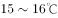之间，有200天以上无霜期

**答案**：B

**官方解析**

第一步：找出定义关键词。
水文节律：“湖泊水情周期性、有节律的变化”；
广义水文节律：“昼夜、月运、季节和年际节律”；
狭义水文节律：“月运节律和季节节律”。
（注：水情是指江河湖泊的状况、特征及地理意义，如流量、水位、流速、水温与冰情等）
本题要选的是符合狭义水文节律的选项。
第二步：逐一分析选项。
A项：鄱阳湖水面面积持续萎缩，说明是一直在减小，不存在周期性的变化，不符合定义，排除；
B项：洪泽湖历史年均最高水温在9月，最低水温在1月，月份和季节不同水温也不同，而且是统计了历史上多年的水温，符合“湖泊水情周期性、有节律的变化”，符合“季节节律”，符合狭义水文节律，符合定义，当选（水情指江河湖泊的状况、特征及地理意义，如流量、水位、流速、水温与冰情等，水温是水文测验的基本项目之一）；
C项：只是给出洞庭湖去年一年的降水量，没有体现“周期性、有节律的变化”，不符合定义，排除；
D项：巢湖流域平均气温在15-16摄氏度之间，有200天以上无霜期，是湖泊流经区域的气温变化，而不是湖泊水情的变化，不符合定义，排除。
故正确答案为B。

---

### 第 26 题　qid 2376592 · 逻辑判断

研究发现，20到39岁的群体更热衷于使用智能手机中的运动类应用。最主要的原因在于该群体大部分都已经参加工作，且亚健康在该群体中较普遍，所以越来越多的白领和年轻人更注重身体健康；同时，年轻人肥胖率占比较高，而年轻人对美的追求远远超过中老年人，所以他们更在乎运动；此外，该年龄段的用户群体也更熟悉智能手机的操作。
以下哪项如果为真，最能削弱上述调研发现？

- **A**. 许多年轻人沉迷于智能手机中的游戏　✅
- **B**. 许多年轻人长期加班，睡眠远远不足
- **C**. 年轻人不坚持运动易引发亚健康问题
- **D**. 当代年轻人营养过于丰富，体型偏胖

**答案**：A

**官方解析**

第一步：找出论点和论据。
论点：20到39岁的群体更热衷于使用智能手机中的运动类应用。
论据：最主要的原因在于该群体大部分都已经参加工作，且亚健康在该群体中较普遍，所以越来越多的白领和年轻人更注重身体健康；同时，年轻人肥胖率占比较高。而年轻人对美的追求远远超过老年人，所以他们更在乎运动；此外，该年龄段的用户群体也更熟悉智能手机的操作。
本题的论点是20到39岁的群体更喜欢用智能手机中的运动类应用，其中的“更”表明了比较关系，因此削弱论点时要么削弱论点中的中心话题（年轻人不喜欢用手机中的运动类应用），要么直接削弱论点中比较关系（年轻人更喜欢用的不是智能手机中的运动类应用）。
第二步：逐一分析选项。
A项：论点说的是年轻人更喜欢用智能手机运动类应用，而该项说的是有很多年轻人沉迷的是智能手机中的游戏，削弱了论点中所说的运动类应用更受欢迎，削弱论点，当选；
B项：论点讨论的是年轻人更喜欢用智能手机的运动类应用，论据中第二句说的是年轻人大部分因工作处于亚健康状态，因此注重身体健康，本项说的是年轻人因经常加班而睡眠不足，因此本项支持了该论据，无法削弱，排除；
C项：本项说的是不坚持运动易导致亚健康，论据中第二句说的是年轻人大部分因工作处于亚健康状态，因此本项支持了该论据，无法削弱，排除；
D项：论据第二句是通过说明年轻人肥胖率占比高，年轻人更追求美来解释论点原因，本项说现在年轻人确实体型肥胖，加强了该论据，无法削弱，排除。
故正确答案为A。

---

### 第 27 题　qid 2376594 · 逻辑判断

如今，基于互联网的新型科普方式层出不穷。浅阅读、视频直播以及游戏互动等方式，使得如今获取科学知识的渠道越来越多、门槛也越来越低。研究者认为，尽管“互联网+科普”令科学知识的获取和传播方式发生了很大变化，但这不是对科普传播的一种颠覆，而是显示了公民科学素养的提升。
以下哪项如果为真，最能质疑研究者的观点？

- **A**. 新闻应用、微博等资讯类媒体是用户了解科学热点事件的最主要渠道
- **B**. 在许多科学热点事件的传播过程中，公众很难见到权威科学家的身影　✅
- **C**. 数据表明，用户普遍乐于通过图文资讯这样轻松愉悦的形式获取知识
- **D**. 比起明星八卦，在社交媒体转发科普内容更能为转发者本人形象加分

**答案**：B

**官方解析**

第一步：找出论点和论据。

论点：“互联网科普”不是对科普传播的一种颠覆，而是显示了公民科学素养的提升。

论据：无。

本题无论据，只能通过直接否论点进行削弱。可以说 “互联网科普”是对科普传播的一种颠覆，并没有显示出公民科学素养的提升。

第二步：逐一分析选项。

A项：该项说的是用户获取知识的最主要渠道是哪些，而论点说的是互联网传播科学知识是否会让公民科学素养的提升，与论点话题不一致，无法削弱，排除；

B项：该项说很难见到权威科学家的身影，说明公众接触到的科学知识是并不权威的，即科学素养没有提升，直接否定题干论点，当选；

C项：该项说的是用户喜欢用图文资讯的方式获取知识，而论点说的是互联网传播知识是否会让公民科学素养提升，话题不一致，无法削弱，排除；

D项：该项说的是转发科普内容会使转发者形象加分，说明比起转发明星八卦，公众对于转发科普内容的人评价更高，显示出公众更重视科学，即显示了公众科学素养的提升，属于加强，不能削弱，排除。

故正确答案为B。

注：本题通过查询原文，如下图所示，张谦女士提出了观点“互联网+科普”不是对科普传播的一种颠覆，而是有利于公民科学素养的提升。后面的便开始分析提出这个观点的原因，所以在此题中D项是加强项，而非削弱项。

 

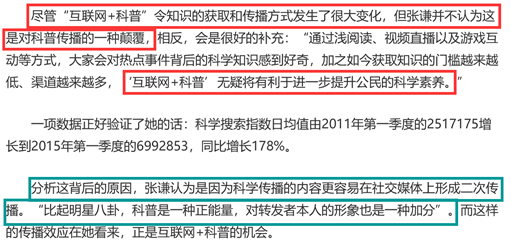

---

### 第 28 题　qid 2376554 · 逻辑判断

长久以来，心理学家都支持“数学天赋论”：数学能力是人类自打娘胎里出来就有的能力，就连动物也有这种能力。他们认为存在一种天生的数学内核，通过自我慢慢发展，这种数学内核最后会“长”成我们所熟悉的一切数学能力。最近有反对者提出了不同的看法：数学能力没有天赋，只能是文化的产物。
以下哪项如果为真，最能支持反对者的看法？

- **A**. 10~12个月的婴儿已经知道3个黑点和4个黑点是不一样的
- **B**. 数学是大脑的产物，而大脑的生长模式早已由基因“预设”
- **C**. 经过人为训练的大猩猩、海豚和大象等动物能处理数学问题
- **D**. 绝大多数的原始部落的居民只能表示5以下甚至更少的数量　✅

**答案**：D

**官方解析**

第一步：找出论点和论据。
论点：数学能力没有天赋，只能是文化的产物。
论据：无。
本题只有论点，没有论据，所以优先考虑补充论据的方式来加强。
第二步：逐一分析选项。
A项：说明婴儿可以区分数量不同的黑点，举例说明数学能力是有天赋的，否定论点，无法加强，排除；
B项：说明数学是大脑的产物，大脑已被基因预设，也就是说数学是有天赋的，否定论点，无法加强，排除；
C项：指出部分动物经过训练能处理数学问题，但是并不知道其是否有数学能力的天赋，不明确选项，无法加强，排除； 
D项：说明绝大多数的原始部落的居民只能表示5甚至以下的数字，通过举例子的方式说明数学能力确实是文化的产物，补充论据，可以加强，当选。
故正确答案为D。

---

### 第 29 题　qid 2376555 · 逻辑判断

自制力不仅关乎自我控制，还包括排除不相关刺激的干扰和坚持完成相关任务（即使是自己不喜欢的任务）的能力。自制力是稳定不变的，还是会被消耗的，学界各派的看法不一。心理学家把实验对象分为两组，让他们同场解决难题。一组解题时只能吃萝卜，另一组还可以吃饼干。结果只吃萝卜的这组坚持时间更短，因为他们在抵制饼干的诱惑的同时，消耗了自制力。他们由此得出结论：人们的自制力是有限的，过度使用会导致自制力下降。
上述结论的成立需要补充以下哪项作为前提？

- **A**. 实验对象对解决难题的兴趣不完全相同
- **B**. 饼干和萝卜对实验对象的诱惑力不相同　✅
- **C**. 饼干和萝卜补充人体能量的效果不相同
- **D**. 两组实验对象抗干扰的能力不完全相同

**答案**：B

**官方解析**

第一步：找出论点和论据。
论点：人们的自制力是有限的，过度使用会导致自制力下降。
论据：心理学家把实验对象分为两组，让他们同场解决难题。一组解题时只能吃萝卜，另一组还可以吃饼干。结果只吃萝卜的这组坚持时间更短，因为他们在抵制饼干诱惑的同时，消耗了自制力。
论据和论点话题一致，且问题为“前提”，优先考虑必要条件。
第二步：逐一分析选项。
A项：实验对象对于解决问题的兴趣不同，说明实验起点不一致，并不知道过度使用自制力是否会消耗自制力，无法加强，排除；
B项：饼干和萝卜对人们的诱惑力不同，如果相同的话，那么就无法通过对比饼干和萝卜得到抵制饼干的诱惑会消耗自制力，是论证成立的前提，当选；
C项：饼干和萝卜对人体的能量补充的效果，与题干论点无关，为无关选项，无法加强，排除； 
D项：实验对象抗干扰能力不同，说明实验起点不一致，并不知道过度使用自制力是否会消耗自制力，无法加强，排除。
故正确答案为B。

---

### 第 30 题　qid 2376559 · 逻辑判断

近年来，意大利面被冠上导致肥胖的坏名声，因此很多人在面对这种地中海饮食时，都抱有一种又恨又爱的纠结心情。然而，意大利地中海神经病学研究所通过对2.3万人的研究发现，意大利面不像很多人想象的那样会导致体重增加。而且，意大利面非但不会导致肥胖，还可以起到相反的效果——降低体脂率。研究结果显示，如果人们能够适量摄入，并保证饮食多样性，意大利面对人们的身体健康大有裨益。
以下哪项如果为真，最能支持上述结论？

- **A**. 面条中所含碳水化合物是导致肥胖的重要因素
- **B**. 没有研究显示意大利面会导致人群肥胖率上升
- **C**. 地中海饮食采用的橄榄油对身体健康大有益处
- **D**. 酌量食用意大利面能够维持人们理想的体脂率　✅

**答案**：D

**官方解析**

第一步：找出论点和论据。
论点：如果人们能够适量摄入，并保证饮食多样性，意大利面对人们的身体健康大有裨益。
论据：意大利地中海神经病学研究所通过对2.3万人的研究发现，意大利面不像很多人想象的那样会导致体重增加。而且，意大利面非但不会导致肥胖，还可以起到相反的效果——降低体脂率。
本题论点论据讨论的都是意大利面和身体健康的关系，讨论话题一致，优先考虑补充论据，补充能够证明意大利面饮食多样，适量摄入，可以对身体健康有好处的理由。
第二步：逐一分析选项。
A项：虽然面条中碳水化合物是导致肥胖的重要因素，但是如果适量摄入意大利面，并保证饮食多样性，是否对人们身体健康有好处不确定，无法加强，排除；
B项：没有研究显示意大利面会导致人群肥胖率上升，不代表吃意大利面就会对身体有好处，如果适量摄入，并保证饮食多样性，是否对身体健康有好处不确定，话题不一致，无法加强，排除；
C项：选项说的是地中海饮食对健康有好处，论点说的是意大利面和健康之间的关系，话题不一致，无法加强，排除；
D项：酌量食用意大利面可以维持理想的体脂率，而体脂率理想代表着身体健康，说明适量摄入意大利面，确实对人身体健康有好处，可以加强，当选。
故正确答案为D。

---

### 第 31 题　qid 2376564 · 逻辑判断

快速、持续、无法预测的竞争环境要求企业规模小，结构简化，同时要有足够的技术储备和抵抗资金风险的能力。目前解决这一矛盾的途径通常是建立全球范围内的“基于双赢原则”的虚拟企业。虚拟企业是企业间的一种动态联盟，参加虚拟企业的各成员企业有一定的自主权。当出现了市场机会，各加盟企业就组织在一起，共同开发并生产销售新产品，一旦发现该产品无利可图，便自动解散。因此，虚拟企业被认为是21世纪最有竞争力的企业运行模式。
以下哪项如果为真，最能支持上述观点？

- **A**. 当今社会发达的现代信息技术和通讯手段为各企业间的沟通提供了便利
- **B**. 企业想在当前的竞争环境中生存发展扩大优势，需要一种新的运行模式
- **C**. 虚拟企业中的任一加盟企业生产上出现问题都会中断整个生产链的运行
- **D**. 虚拟企业可迅速集中最强设计加工与销售力量，实现对市场的快速反应　✅

**答案**：D

**官方解析**

第一步：找出论点和论据。
论点：虚拟企业被认为是21世纪最有竞争力的企业运行模式。
论据：当出现了市场机会，各加盟企业就组织在一起，共同开发并生产销售新产品，一旦发现该产品无利可图，便自动解散。
论点论据都在说虚拟企业的优势，话题一致，优先考虑补充论据，补充能够证明虚拟企业是最有竞争力的企业运营模式的理由进行加强。
第二步：逐一分析选项。
A项：现代发达的信息技术为各企业之间的沟通提供便利，但是提供便利不代表就有竞争力，话题不一致，无法加强，排除；
B项：企业想在竞争环境中生存发展扩大优势，需要新的运行模式，但新的运行模式是否指的是虚拟企业不清楚，无法加强，排除；
C项：虚拟企业中的任一加盟企业生产出现问题都会中断整个生产链的运行，说的是虚拟企业的缺点，但有缺点不代表没有竞争力，虚拟企业是否是最有竞争力的企业运行模式未知，话题不一致，无法加强，排除；
D项：虚拟企业能够快速集中最强的力量做出最快的反应，说明虚拟企业的优势，并且力量最强，速度最快，也可说明虚拟企业是最有竞争力的运营模式，补充论据，可以加强，当选。
故正确答案为D。

---

### 第 32 题　qid 2376568 · 逻辑判断

在抗生素大规模医用之前，耐药效果对细菌几乎没有意义，突变自身的有害效果更加重要。正常使用抗生素能杀死几乎所有的目标细菌，个别漏网之鱼通常也会被人体免疫系统消灭殆尽。其中一些细菌个体虽然已经带有耐药性的萌芽，但这些萌芽不足以抵御正常剂量抗生素，也会随着个体死去而消失。
由此可以推出：

- **A**. 基因突变是耐药细菌泛滥成灾的根本原因
- **B**. 细菌通过基因突变，来削弱抗生素的作用效果
- **C**. 致病菌产生耐药性之后，抗生素将无法攻击病菌
- **D**. 如果没有抗生素滥用，耐药性不会快速蔓延开来　✅

**答案**：D

**官方解析**

日常结论题，根据题干信息逐一分析选项。
A项：题干中没有涉及到耐药细菌泛滥成灾的根本原因，无中生有，排除；
B项：题干只说到“细菌突变自身的有害效果”，没有明确说明是否是基因突变，无中生有，排除；
C项：题干中指出有耐药性的细菌个体不足以抵御正常剂量抗生素，说明抗生素还是会去攻击病菌，并不是选项中表述的无法攻击病菌，排除；
D项：根据第一句可知，抗生素大规模使用之前，耐药性对细菌几乎没有意义，说明如果没有抗生素滥用，耐药性就不会快速蔓延，当选。
故正确答案为D。

---

### 第 33 题　qid 2376576 · 逻辑判断

信天翁属于鹱形目，有着管状的鼻子，嗅觉灵敏，经常为了觅食在外海上长距离飞行。那些漂浮在海上的塑料垃圾看起来并非美味，可信天翁为什么会吃下它们，并为此付出沉重代价呢？研究人员认为原因在于：对于信天翁而言，这些塑料垃圾闻起来“很好吃”。“美食信号”是一种名叫二甲基硫醚（DMS）的化学物质，这种气味物质在海洋浮游植物的作用下产生。
以下哪项如果为真，无法支持研究人员的观点？

- **A**. 鹱形目鸟类当中有一部分物种常聚集在海洋浮游植物丰盛的地方
- **B**. 误食塑料垃圾会导致海鸟行动不便、消化道阻塞，健康慢性受损　✅
- **C**. 实验证明在海中浸泡三周后的塑料样品上都检测到了DMS成分
- **D**. 对DMS气味敏感的鹱形目鸟类可以探测到浓度极低的气味分子

**答案**：B

**官方解析**

第一步：找出论点和论据。
论点：信天翁吃塑料垃圾，是因为它们闻起来“很好吃”。
论据：“美食信号”是二甲基硫醚（DMS），这种气味物质在海洋浮游植物的作用下产生。
本题为选非题，需将三个能够加强的选项排除。论点说的是塑料垃圾闻起来“好吃”，论据在解释为什么闻起来“好吃”，论点论据说的是一回事，所以可以补充论据来加强。
第二步：逐一分析选项。
A项：讨论的是这类鸟中，有一部分聚集在海洋浮游植物丰盛的地方，而海洋浮游植物会产生“美食信号”，让鸟类闻起来“很好吃”，所以解释了题干的论点，可以加强，排除；
B项：讨论的是误食塑料垃圾会给海鸟带来的不良后果，与题干讨论的为什么垃圾闻起来“好吃”没有关系，不能加强，当选；
C项：说明塑料垃圾经过海水的浸泡会产生DMS，解释了为什么信天翁闻着塑料垃圾会觉得“很好吃”，可以加强，排除；
D项：如果鹱形目鸟类不能探测到浓度极低的气味分子，那就不会去吃那些垃圾，该项是论点成立的必要条件，可以加强，排除。
本题为选非题，故正确答案为B。

---

### 第 34 题　qid 2376583 · 逻辑判断

牙医在治疗龋齿时，先要去除牙齿龋坏的部分，再填充材料以修补缺损的牙体。但是，至的补牙会失败，且所用的填充物并不具备使牙齿自愈的功能，甚至还有副作用。有鉴于此，研究人员研发出一种用合成生物材料制成的填充物，可以刺激牙髓中干细胞的生长，修复受损部位。这种填充物能刺激干细胞的增殖，并分化成牙本质。如果未来补牙的填充物都用这样的再生材料制成，将降低补牙失败率，也可减少蛀牙患者治疗牙髓之苦。

由此可以推出：

- **A**. 未来人们将不再患上蛀牙病
- **B**. 未来人们将不再受龋齿困扰
- **C**. 新研发的补牙填充物能刺激受损牙齿自愈　✅
- **D**. 新研发的补牙填充物能促进牙本质的生长

**答案**：C

**官方解析**

日常结论题，根据题干信息逐一分析选项。
A项：根据最后一句话可知，未来补牙的填充物将降低补牙失败概率，也可减少蛀牙患者治疗牙髓之苦，只是减少治疗的痛苦，但是没有提及将来会不会患上蛀牙病，无法推出，排除；
B项：题干中指出未来补牙的填充物可以减少治疗牙髓之苦，但是没有涉及将来会不会受龋齿困扰，无法推出，排除；
C项：根据第三句话可知，新研发的补牙填充物可以刺激牙髓中干细胞的生长，修复受损部位，可以推出新研发的补牙填充物能刺激受损牙齿自愈，当选；
D项：根据第四句话可知，新研发的补牙填充物可以刺激干细胞的增殖，并分化成牙本质，但并不是促进牙本质的生长，“分化”并不意味着“促进生长”，偷换概念，排除。
故正确答案为C。

---

### 第 35 题　qid 2376591 · 逻辑判断

有研究声称：癌细胞怕热，高体温可以抗癌。人体最容易罹癌的器官包括肺、胃、大肠、乳腺等都是体温较低的部位，心脏之类的“高温器官”不容易得癌症。因此，可以用运动、喝热水、泡澡等方法提高体温来抗癌。
以下哪项如果为真，最能反驳上述论断？

- **A**. 受呼吸、饮食等影响，人的口腔温度一般比直肠温度低，而世界范围内直肠癌的发生率要高于口腔癌　✅
- **B**. 人的体温存在精准的调控机制，基本保持平稳状态，体内各个脏器之间并没有什么明显的温度差异
- **C**. 热疗或许可以帮助放疗或一些化疗发挥更好的作用，但证明其可靠性的研究数据依然不足
- **D**. 心脏很少发生恶性肿瘤，是因为这里的心肌细胞不再进行分裂增殖，而与温度高低无关

**答案**：A

**官方解析**

第一步：找出论点和论据。
论点：可以用运动、喝热水、泡澡等方法提高体温来抗癌。
论据：人体最容易罹癌的器官包括肺、胃、大肠、乳腺等都是体温较低的部位，心脏之类的“高温器官”不容易得癌症。
本题的论点指出提高体温抗癌的方法，论据中也是在说“高温器官”不容易得癌症，所以论点、论据讨论话题一致，要想削弱优先考虑否定论点。
第二步：逐一分析选项。
A项：人的口腔温度一般比直肠温度低，而世界范围内直肠癌的发生率要高于口腔癌，说明直肠温度高，直肠癌发生率高，提高体温并不能抗癌，举反例削弱题干论点，保留；
B项：选项指出体内各个脏器之间并没有明显温度差异，那么肺、胃、大肠、乳腺等就不是体温“较低”的部位，也就没有“高温器官”之说，可以削弱题干论据，保留；
C项：热疗或许可以发挥更好的作用，但证明其可靠性的研究数据依然不足，因此不确定提高体温是否真的有利于抗癌，属于不明确选项，排除；
D项：指出心脏很少发生恶性肿瘤，是因为心肌细胞不再分裂增殖，而与温度高低无关，可以削弱题干论据，保留。
对比ABD三项，A项削弱论点的力度强于B项和D项的削弱论据。
故正确答案为A。

---

## 资料分析

### 材料 1

根据以下资料，回答下列问题。

        2014年我国实施“单独两孩”生育政策，出生人口1687万人，比上年增加47万人。2016 年实施“全面两孩”生育政策，出生人口1786万人，比上年增加131万人；出生率与“十二五”时期年平均出生率相比，提高了0.84个千分点。2017 年我国出生人口1723万人，虽然比上年减少63万人，但比“十二五”时期年平均出生人口多出79万人；出生率为，比上一年降低0.52个千分点。2017年二孩数量进一步上升至883万人，二孩占全部出生人口的比重达到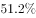，比2016年的占比提高了11个百分点。

        2017年出生人口最多的省份是山东，出生人口174.98万人，但是比2016年减少2.08万人。广东和河南出生人口也超过百万，其中广东出生人口151.63万人，同比增加22.18万人；河南出生人口140.13 万人，较上年减少2.48万人。此外，出生人口排名前十的省份依次还有河北、四川、湖南、安徽、广西、江苏、湖北。其中，河北、四川、湖南出生人口超90万人，湖北最少，为74.26万人。

        从人口增量来看，2017年广东出生人口增量最大，出生人口较2016年增加22.18万人。安徽、四川、河北出生人口增量超过5万，此外，江苏、湖南、山东、河南出生人口较2016年有所减少。其中，河南减少最多，出生人口减少2.48万人。

#### 第 1 题　qid 2376536 · 平均数

2013年我国出生人口比“十二五”时期年平均出生人口：

- **A**. 减少4万人　✅
- **B**. 增加5万人
- **C**. 减少9万人
- **D**. 增加47万人

**答案**：A

**官方解析**

定位文字资料第一段“2014年我国······出生人口1687万人，比上年增加47万人······2017年我国出生人口1723万人·······但比‘十二五’时期年平均出生人口多出79万人”，可知2013年我国出生人口为万人，“十二五”时期年平均出生人口为万人。万人，则2013年我国出生人口比“十二五”时期年平均出生人口减少4万人。

故正确答案为A。

---

#### 第 2 题　qid 2376539 · 增长

2015年我国出生人口同比：

- **A**. 
增长

- **B**. 
降低

- **C**. 
增长

- **D**. 
降低
　✅

**答案**：D

**官方解析**

根据题干“2015年……同比”，结合选项为，可判定本题为一般增长率问题。定位文字资料第一段“2014年……我国出生人口1687万人，2016年……我国出生人口1786万人，比上年增加131万人”，可知2015年我国人口为万人。代入公式：，即2015年我国出生人口同比降低。

故正确答案为D。

---

#### 第 3 题　qid 2376538 · 平均数

“十二五”时期我国年平均出生率为：

- **A**. 

- **B**. 

　✅
- **C**. 

- **D**. 

**答案**：B

**官方解析**

定位文字资料第一段“2016年······出生率与‘十二五’时期年平均出生率相比，提高了0.84个千分点；2017年······出生率为，比上一年降低0.52个千分点”，可知“十二五”期间年平均出生率为。

故正确答案为B。

---

#### 第 4 题　qid 2376541 · 综合

2016年我国二孩出生人口约为：

- **A**. 883万人
- **B**. 742万人
- **C**. 718万人　✅
- **D**. 693万人

**答案**：C

**官方解析**

根据题干“2016年我国二孩出生人口约为”，结合材料时间为2017年，且已知二孩出生人口占全部出生人口的比重，可判定题为基期比重问题。定位文字材料第一段“2016年实施‘全面两孩’生育政策，出生人口1786万人······2017年······二孩占全部出生人口的比重达到，比2016年的占比提高了11个百分点”，故2016年二孩占全部出生人口的比重为，则2016年我国二孩出生人口为万人，C项最接近。

故正确答案为C。

---

#### 第 5 题　qid 2376546 · 综合

能够从上述资料中推出的是：

- **A**. 
2016、2017两年山东出生人口数量均超过当年全国出生人口数量的

- **B**. 
2016年广东出生人口数量超过2017年湖北出生人口数量的2倍

- **C**. 
2017年出生人口增量超过5万的省份只有3个

- **D**. 
2017年出生人口比2013年增长超过
　✅

**答案**：D

**官方解析**

A项：定位文字材料第一段“2016年实施‘全面两孩’生育政策，出生人口1786万人······2017年我国出生人口1723万人”，定位文字材料第二段“2017年出生人口最多的省份是山东，出生人口174.98万人，但是比2016年减少2.08万人”。 2017年：；2016年：，则2016年山东出生人口数量没有超过当年全国出生人口数量的，错误；

B项：定位文字材料第二段“2017年出生人口······其中广东出生人口151.63万人，同比增加22.18万人······湖北最少，为74.26万人”，，错误；

C项：定位文字材料第三段“2017年广东出生人口增量最大，出生人口较2016年增加22.18万人。安徽、四川、河北出生人口增量超过5万”，可得2017年出生人口增量超过5万的省份至少有4个，错误；

D项：定位文字材料第一段可知：2014年出生人口1687万人，比上年增加47万人。2017年出生人口1723万人。可得2013年出生人口为万人，代入增长率公式：，故2017年出生人口比2013年增长了，正确。

故正确答案为D。

---

### 材料 2

根据以下资料，回答下列问题。

（注：顺差是指在国际收支上，一定时期内收入大于支出的差额；逆差指的是在国际收支上，一定时期内支出大于收入的差额；表中同比数据为正的代表同比增长，同比数据为负的代表同比下降）

#### 第 6 题　qid 2376556 · 综合

2011年至2017年，我国服务进出口逆差最大的年份是：

- **A**. 2017年　✅
- **B**. 2016年
- **C**. 2015年
- **D**. 2014年

**答案**：A

**官方解析**

定位表格材料1，根据“”可知，A项：2017年逆差，B项：2016年逆差，C项：2015年逆差，D项：2014年逆差，因此逆差最大年份为2017年。

故正确答案为A。

---

#### 第 7 题　qid 2376599 · 综合

2016年我国保险和养老金服务进出口额约为：

- **A**. 857亿元人民币
- **B**. 1112亿元人民币
- **C**. 1134亿元人民币　✅
- **D**. 1158亿元人民币

**答案**：C

**官方解析**

根据题干“2016年······进出口额”，材料给的是2017年的数据，可以判定本题为基期计算问题。定位表格材料2：2017年保险和养老金服务进出口额976.0亿元，同比增长率为，根据，可得2016年保险和养老金服务进出口额亿元。

故正确答案为C。

---

#### 第 8 题　qid 2376544 · 增长

按照2017年的同比增速，2018年知识产权使用费出口额约为：

- **A**. 992亿元人民币
- **B**. 1014亿元人民币
- **C**. 1336亿元人民币　✅
- **D**. 1588亿元人民币

**答案**：C

**官方解析**

根据题干“按照2017年的同比增速，2018年······出口额”材料给的是2017年的数据，可以判定本题为现期计算问题。定位表格材料2：2017年知识产权使用费出口额322.0亿元，同比增长率，根据，可得2018年知识产权使用费出口额亿元，与C选项最接近。

故正确答案为C。

---

#### 第 9 题　qid 2376550 · 综合

下列关于2016年进口额大小排序错误的是：

- **A**. 
旅行运输其他商业服务

- **B**. 
知识产权使用费建筑运输
　✅
- **C**. 
运输金融服务加工服务

- **D**. 
建筑金融服务加工服务

**答案**：B

**官方解析**

定位表格材料二可得：2017年我国各服务分类进口额及同比增长。根据公式：可得：

A项：旅行进口额17210.0亿元，同比增长；运输进口额6278.0亿元，同比增长；其他商业服务进口额2895.0亿元，同比增长。故2016年旅行进口额亿元，运输进口额亿元，其他商业服务进口额，故2016年旅行运输其他商业服务，排序正确，排除；

B项：知识产权使用费进口额1930.0亿元，同比增长；建筑进口额579.0亿元，同比增长；2016年运输进口额A项已经计算，为5352.1亿元。故2016年知识产权使用费进口额亿元2016年运输进口额5352.1亿元，排序错误，当选；

C项：2016年运输进口额A项已经计算，为5352.1亿元；2017年金融服务进口额109.0亿元，同比增长；加工服务进口额12.0亿元，同比增长。故2016年金融服务进口额亿元，加工服务进口额亿元，故2016年运输金融服务加工服务，排序正确，排除；

D项：2017年建筑进口额579.0亿元，同比增长，故2016年进口额亿元；2016年金融服务进口额、加工服务进口额C项已经计算，分别为134.7亿元、10.5亿元。故2016年建筑金融服务加工服务，排序正确，排除。

本题为选非题，故正确答案为B。

---

#### 第 10 题　qid 2376552 · 综合

能够从上述资料中推出的是：

- **A**. 2011年至2017年，我国进出口总是出现逆差
- **B**. 2016年我国建筑服务进出口实现顺差1039亿元人民币
- **C**. 2017年我国服务进出口中，其他商业服务进出口实现的顺差最多　✅
- **D**. 2017年我国服务进出口中，别处未提及的政府服务进出口额占比最小

**答案**：C

**官方解析**

A项：定位表格材料一，材料中只给出了2011年至2017年我国服务进出口额，而非我国进出口额，故无法推出，错误；

B项：定位表格材料二，2017年我国建筑服务出口1618.0亿元，同比增长；进口579.0亿元，同比增长。则2016年我国建筑服务出口额=亿元，进口额亿元，故2016年我国建筑服务进出口实现顺差约293.4亿元，错误；

C项：定位表格材料二，2017年我国服务进出口中，实现顺差的有：加工服务：亿元；维护和维修服务：亿元；建筑：1亿元；金融服务：亿元；电信、计算机和信息服务：亿元；其他商业服务：亿元亿元。故2017年我国服务进出口中，实现顺差最多的为其他商业服务，正确。

D项：定位表格材料一，2017年我国服务进出口额46991亿元；定位表格材料二，2017年别处未提及的政府服务进出口额348亿元。根据公式：，别处未提及的政府服务进出口占比，而个人、文化和娱乐服务进出口占比，故别处未提及的政府服务进出口占比并非最小，错误。

故正确答案为C。

---

### 材料 3

根据以下资料，回答下列问题。

        2017年全国举办马拉松赛事达1102场，其中，中国田径协会举办的A类赛事223场，B类赛事33场。2017年马拉松赛事的参与人次达到了498万人次，2016年、2015年马拉松赛事的参与人次分别为280万人次、150万人次。 

        2017年全年马拉松直接从业人口数72万，间接从业人口数200万。年度产业总规模达700亿元，比去年同期增长约，中国田径协会设置的发展目标是到2020年，全国马拉松规模赛事超过1900场，其中中国田径协会认证赛事达到350场，各类赛事参赛人数超过1000万人次，马拉松运动产业规模达到1200亿元。

        规模赛事数量方面，2017年排名前三的省份为浙江省、江苏省和广东省，分别为152场、149场和103场，而2016年的前三名分别为江苏省37场，北京市33场，广东省25场。

        从2017年全年赛事的覆盖区域来看，马拉松赛事地域分布更为广泛，中国境内马拉松及相关赛事已经涵盖了含西藏在内的全国31个省、区、市的234个城市，较上年增加了101个城市。

        在赛事类型方面，2017年1102场规模赛事中，全程马拉松参赛人次最高，突破了235万人次，其次为半程马拉松赛事，参赛人次超过134万人次。在中国田径协会认证的A类、B类赛事中，2017年全程马拉松项目完赛26.89万人次，同比增长；半程马拉松项目完赛45.29万人次，同比减少了0.03万人次。

        按照跑者户籍所在地统计，2017年参加中国田径协会认证赛事的跑者中，来自江苏的数量最多，共有76469人参赛，在全国占比。湖北、广东、山东、福建、浙江等省紧随其后。而在全部参赛选手中，共有3663人次的男选手在全程项目中跑进3小时，772人次女选手跑进3小时20分。

#### 第 11 题　qid 2376574 · 比重

2017年中国田径协会举办的A类与B类赛事占全国马拉松赛事的比例约为：

- **A**. 

- **B**. 

　✅
- **C**. 

- **D**. 

**答案**：B

**官方解析**

根据题干“2017年，···占···的比例约为”，结合材料中给了2017年的数据，可判定本题为现期比重问题。定位文字材料第一段可得：2017年全国举办马拉松赛事达1102场，其中，中国田径协会举办的A类赛事223场，B类赛事33场。根据比重，可得2017年的比重为。与B项最接近。

故正确答案为B。

---

#### 第 12 题　qid 2376600 · 增长

2017年我国马拉松赛事场次比2011年增加了：

- **A**. 约47倍
- **B**. 约49倍　✅
- **C**. 约51倍
- **D**. 约53倍

**答案**：B

**官方解析**

根据题干“2017年···比2011年增加了”，结合选项，可判定本题为一般增长率问题。定位图1可得：2017年、2011年我国马拉松赛场次分别为1102场、22场。根据增长率，可得2017年的增长率为倍。

故正确答案为B。

---

#### 第 13 题　qid 2376601 · 增长

2017年马拉松赛事参与人次的同比增速比2016年：

- **A**. 快约9个百分点
- **B**. 慢约9个百分点　✅
- **C**. 快约7个百分点
- **D**. 慢约7个百分点

**答案**：B

**官方解析**

根据题干“2017年···的同比增速比2016年”，可判定本题为一般增长率问题。定位文字材料第一段可得：2017年、2016年、2015年马拉松赛事的参与人次分别为498万人次、280万人次、150万人次。根据增长率，可得2017年的增长率为，2016年的增长率为，则，即2017年同比增速比2016年慢约9个百分点。

故正确答案为B。

---

#### 第 14 题　qid 2376602 · 综合

在中国田径协会认证的A类、B类赛事中，2016年全程马拉松项目完赛人次比同期半程马拉松项目完赛人次：

- **A**. 多23万
- **B**. 少23万
- **C**. 多21万
- **D**. 少21万　✅

**答案**：D

**官方解析**

根据题干“······2016年全程马拉松项目完赛人次比同期半程马拉松项目完赛人次”，并结合选项为“”，且材料数据为2017年，可判定本题为基期和差问题。定位文字材料第五段可得：“在中国田径协会认证的A类、B类赛事中，2017年全程马拉松项目完赛26.89万人次，同比增长；半程马拉松项目完赛人次45.29万人次，同比减少了0.03万人次”，代入基期量公式：，则2016年全程马拉松项目完赛人次为：万人次，2016年半程马拉松项目完赛人次为：万人次，故2016年全程马拉松项目完赛人次与同期半程马拉松项目完赛人次差为：，即少21万人次。

故正确答案为D。

---

#### 第 15 题　qid 2376605 · 综合

能够从上述资料中推出的是：

- **A**. 
2017年马拉松运动年度产业规模比2016年多200亿元

- **B**. 
2017年参加中国田径协会认证赛事的全国跑者数量少于75万人

- **C**. 
2011年至2016年我国马拉松赛事场次之和超过2017年赛事场次的
　✅
- **D**. 
在2016年与2017年马拉松规模赛事数量上，江苏省、北京市都有进入前三名

**答案**：C

**官方解析**

A项：定位文字材料第二段可得：“2017年全年马拉松······年度产业总规模达700亿元，比去年同期增长约。” 故2017年马拉松运动年度产业规模比2016年多：亿元，错误；

B项：定位文字材料第六段可得：“2017年参加中国田径协会认证赛事的跑者中，来自江苏的数量最多，共有76469人，在全国占比”，故2017年参加中国田径协会认证赛事的全国跑者数量为万，错误；

C项：定位图形材料可得：“2011年至2017年我国马拉松赛事场次分别为22、33、39、51、134、328、1102”，故2011年至2016年我国马拉松赛事场次之和：，2017年赛事场次的为，前者大于后者，正确；

D项：定位文字材料第三段可得：“规模赛事数量方面，2017年排名前三的省份为浙江省、江苏省和广东省······而2016年的前三名分别为江苏省、北京市、广东省”，故在2016年和2017年马拉松规模赛事数量上，北京市没有都进入前三名，错误。

故正确答案为C。

---
