# 2019年420联考《行测》题（山东卷）（网友回忆版）

> 联考 · 2019 年 · 6 个模块 · 共 120 题

- [政治理论](#%E6%94%BF%E6%B2%BB%E7%90%86%E8%AE%BA) · 2 题
- [常识判断](#%E5%B8%B8%E8%AF%86%E5%88%A4%E6%96%AD) · 13 题
- [言语理解与表达](#%E8%A8%80%E8%AF%AD%E7%90%86%E8%A7%A3%E4%B8%8E%E8%A1%A8%E8%BE%BE) · 30 题
- [数量关系](#%E6%95%B0%E9%87%8F%E5%85%B3%E7%B3%BB) · 15 题
- [判断推理](#%E5%88%A4%E6%96%AD%E6%8E%A8%E7%90%86) · 40 题
- [资料分析](#%E8%B5%84%E6%96%99%E5%88%86%E6%9E%90) · 20 题

---

## 政治理论

### 第 1 题　qid 2376798 · 新思想

党的十九大对新时代推进全面依法治国提出了新任务。明确到2035年：

- **A**. 法治国家、法治政府、法治社会基本建成　✅
- **B**. 有法可依、有法必依、执法必严、违法必究基本实现
- **C**. 中国特色社会主义法治体系基本建成
- **D**. 科学立法、严格执法、公正司法、全民守法基本实现​

**答案**：A

**官方解析**

本题考查政治常识。
党的十九大报告指出：“从2020年到2035年，在全面建成小康社会的基础上，再奋斗十五年，基本实现社会主义现代化······人民平等参与、平等发展权利得到充分保障，法治国家、法治政府、法治社会基本建成，各方面制度更加完善，国家治理体系和治理能力现代化基本实现”。党的十九大对新时代推进全面依法治国提出的新任务是明确到2035年，法治国家、法治政府、法治社会要基本建成。因此A项正确，B、C、D三项错误。
故正确答案为A。

---

### 第 2 题　qid 2376802 · 新思想

党的十八大以来，习近平总书记两次视察山东并发表重要讲话，多次作出重要指示批示，为我们确立的目标定位是：
①在全面建成小康社会进程中走在前列
②在社会主义现代化建设新征程中走在前列
③全面开创新时代现代化强省建设新局面
④全面打造乡村振兴的齐鲁样板

- **A**. ①②③　✅
- **B**. ①③④
- **C**. ①②③④
- **D**. ①②④

**答案**：A

**官方解析**

本题考查政治常识。①②③正确，2018年3月，习近平在参加十三届全国人大一次会议山东代表团的审议最后的重要讲话中充分肯定党的十八大以来山东工作，希望山东的同志再接再厉，在全面建成小康社会进程中、在社会主义现代化建设新征程中走在前列，全面开创新时代现代化强省建设新局面。
④2018年3月，习近平总书记参加十三届全国人大一次会议山东代表团审议，要求山东充分发挥农业大省优势，打造乡村振兴的齐鲁样板。
A项正确，①②③均属于习近平总书记重要指示批示中为山东确立的目标定位。
B、C、D三项错误，④全面打造乡村振兴的齐鲁样板表述错误，应该是打造乡村振兴的齐鲁样板。
故正确答案为A。

---

## 常识判断

### 第 1 题　qid 2376803 · 经济常识

我国经济发展能够创造中国奇迹，民营经济功不可没。下列关于民营经济作用的表述正确的是：
①国民经济的主导力量
②创业就业的主要领域
③技术创新的重要主体
④国家税收的重要来源

- **A**. ①③④
- **B**. ②③④　✅
- **C**. ①②③④
- **D**. ①②④

**答案**：B

**官方解析**

本题考查政治常识。2018年11月1日，习近平主席主持召开了民营企业座谈会并发表重要讲话。他强调：40年来，我国民营经济已经成为推动我国发展不可或缺的力量，成为创业就业的主要领域、技术创新的重要主体、国家税收的重要来源，为我国社会主义市场经济发展、政府职能转变、农村富余劳动力转移、国际市场开拓等发挥了重要作用。因此，②③④正确，①中的主导力量表述错误，国有经济是国民经济的主导力量。
故正确答案为B。

---

### 第 2 题　qid 2376795 · 人文常识

中国的极地事业已经走过30多个年头。下列属于我国北极科学考察站的是：

- **A**. 长城站
- **B**. 泰山站
- **C**. 黄河站　✅
- **D**. 中山站

**答案**：C

**官方解析**

本题考查科技常识。
A项错误，长城站是中国在南极建立的第一个科学考察站。1984年12月31日开工，1985年2月20日竣工，位于南极洲南设得兰群岛的乔治王岛西部的菲尔德斯半岛上，是我国为对南极地区进行科学考察而在南极洲设立的常年性科学考察站。
B项错误，泰山站是继长城站、中山站、昆仑站之后我国的第四个南极科学考察站。2014年2月8日，泰山站正式建成开站。
C项正确，黄河站，位于挪威斯匹次卑尔根群岛的新奥尔松，是我国建立的首个北极科考站，成立于2004年7月28日。
D项错误，中山站是我国第二个南极考察站，建立于1989年2月26日，位于东南极大陆拉斯曼丘陵。
故正确答案为C。

---

### 第 3 题　qid 2376801 · 人文常识

千百年来，月亮一直是人类心中的梦想之境。思乡的情怀，探索的欲望，都交织在一汪皎洁的白月光中，下列关于月球的说法错误的是：

- **A**. 月球自西向东自转
- **B**. 月球自东向西公转　✅
- **C**. 月球自转与公转周期相等
- **D**. 月球表面没有大气层包围

**答案**：B

**官方解析**

本题考查地理国情。月球，俗称月亮，是地球唯一的天然卫星。月球在绕地球公转的同时进行自转，方向均是自西向东，周期相同。
A项正确，月球自转的方向同公转相同，均是自西向东。
B项错误，月球公转的方向是自西向东。
C项正确，在地球上，任何地方和时刻，我们只能看到月球的正面（月球一直朝向地球的一面），而不能看到月球的背面，这是由于月球绕地球公转的周期和月球自身自转的周期相同而导致的现象。
D项正确，月球的质量是地球的八十分之一，表面引力只有地球的六分之一，这就使月球无法将气体分子吸附在其表面，所以月球表面并没有被大气层包围。
本题为选非题，故正确答案为B。

---

### 第 4 题　qid 2376804 · 人文常识

《吕氏春秋》提到：“凡人三百六十节、九窍、五脏六腑。”下列不属于“五脏”的是：

- **A**. 心脏
- **B**. 肾脏
- **C**. 脾脏
- **D**. 胆脏　✅

**答案**：D

**官方解析**

本题考查人文常识。
据《现代汉语词典》词条释义，五脏指的是心、肝、脾、肺、肾。六腑包括胆、胃、大肠、小肠、膀胱、三焦。所以，D项错误，胆是“六腑”之一，非“五脏”之一。
本题为选非题，故正确答案为D。

---

### 第 5 题　qid 2376796 · 人文常识

假如影视剧场景中出现下列作物，符合历史事实的是：

- **A**. 《水浒传》里宋江和公孙胜在玉米地里斗剑
- **B**. 《包青天》里包拯吃农户刚收获的白薯
- **C**. 《苏东坡》里苏轼用辣椒做东坡肉
- **D**. 《关云长》里关羽吃味道甘甜的葡萄　✅

**答案**：D

**官方解析**

本题考查人文常识。
A项错误，《水浒传》描写的是北宋末年，宋徽宗昏庸无道，宦官当政，民不聊生，山东郓城以宋江为首的三十六人等掀起了风起云涌的农民起义。玉米是在十六世纪传入我国，到了明朝末年，玉米的种植已达十余省。宋江和公孙胜不可能在玉米地里斗剑。
B项错误，白薯亦称甘薯、番薯，是16世纪末，即大明万历年间，传入我国，首先传入的是广东和福建。包拯是北宋官员，以清廉公正闻名于世。包拯不可能吃白薯。
C项错误，辣椒明朝传入中国，史料记载贵州、湖南一带最早开始吃辣椒。苏轼号东坡居士，北宋著名文学家、书法家、画家。苏轼不可能吃辣椒。
D项正确，汉武帝时期派遣张骞出使西域各国，葡萄是在通西域后传入中原的，关羽，字云长，东汉末年名将，早期跟随刘备辗转各地，曾被曹操生擒，于白马坡斩杀袁绍大将颜良，与张飞一同被称为万人敌。关羽吃味道甘甜的葡萄是可能的。
故正确答案为D。

---

### 第 6 题　qid 2376797 · 地理国情

下列中国改革开放之后发生的历史重大事件，按时间先后顺序排列正确的是：
①设立海南省
②取消农业税
③设立深圳经济特区
④加入世界贸易组织

- **A**. ③①④②　✅
- **B**. ③④①②
- **C**. ①②③④
- **D**. ①③②④

**答案**：A

**官方解析**

本题考查人文常识。
①根据党中央决策，1988年4月，七届全国人大一次会议正式批准设立海南省，划定海南岛为经济特区。从此，海南这个祖国美丽的海岛获得了前所未有的发展机遇，进入了深化改革、扩大开放的历史新阶段。
②2005年12月29日，十届全国人大常委会第十九次会议决定，自2006年1月1日起废止《中华人民共和国农业税条例》。由此，国家不再针对农业单独征税，一个在我国存在两千多年的古老税种宣告终结。
③1979年4月，在中央经济工作会议上，习仲勋代表广东省，向党中央提出建议。与其跑到香港，不如引进外资，在深圳建立加工区。后来邓小平提出，就叫“特区”。1980年8月26日，全国人大常委会颁发了《广东省经济特区条例》，对外宣布在广东省的深圳、珠海、汕头分别划出一定区域，设置经济特区。
④2001年中国加入世界贸易组织，是中国深度参与经济全球化的里程碑，标志着中国改革开放进入历史新阶段。加入世贸组织以来，中国积极践行自由贸易理念，全面履行加入承诺，大幅开放市场，实现更广互利共赢，在对外开放中展现了大国担当。
按照时间先后顺序排列为③①④②。
故正确答案为A。

---

### 第 7 题　qid 2376799 · 地理国情

下列文化遗址，位于山东省境内的是：
①良渚遗址
②大汶口遗址
③二里头遗址
④龙山文化遗址

- **A**. ①②
- **B**. ②④　✅
- **C**. ①③
- **D**. ③④

**答案**：B

**官方解析**

本题考查人文常识。
①良渚遗址位于浙江省杭州市余杭区瓶窑镇、良渚街道境内，为新石器时代晚期文化遗址群。良渚遗址是“良渚文化”的命名地，它的发现对研究长江下游地区的文明起源具有重要的学术价值。1996年11月，良渚遗址被中华人民共和国国务院列为第四批全国重点文物保护单位。
②大汶口遗址位于山东省泰安城南的大汶河畔。1959年首次发现并挖掘，为距今6100—4600年的新石器时代晚期父系氏族遗址。大汶口文化的发现，为山东龙山文化找到了渊源。1982年，大汶口遗址被公布为全国重点文物保护单位。
③二里头遗址位于洛阳盆地东部的偃师市境内，是二里头文化的命名地，并初步被确认为夏代中晚期都城遗址，是全国重点文物保护单位，中华文明探源工程首批重点六大都邑之一。二里头遗址对研究华夏文明的渊源、国家的兴起、城市的起源等重大问题具有重要的参考价值，学术界公认为中国最引人瞩目的古文化遗址之一。
④龙山文化遗址于1928年首次发现于山东章丘龙山镇的城子崖，龙山文化因此而得名。整个遗址南北约2000米，东西约1500米，由若干个遗址群组成，如桐林遗址、董褚遗址等，面积达300万平方米。龙山文化除陶器外，还包括大量的石器、骨器和蚌器等。
因此②大汶口遗址和④龙山文化遗址位于山东省境内。
故正确答案为B。

---

### 第 8 题　qid 2376800 · 人文常识

中国历史上出现过许多“盛世”。下列对应关系错误的是：

- **A**. 文景之治——汉朝
- **B**. 武丁盛世——商朝
- **C**. 康乾盛世——清朝
- **D**. 开皇之治——唐朝　✅

**答案**：D

**官方解析**

本题考查人文常识。
A项正确，西汉文帝、景帝两代四十多年间里，继续奉行汉初“与民休息”的政策，政治稳定、经济发展，使社会上呈现出一片繁荣富庶的景象，史称“文景之治”。
B项正确，商王武丁是商朝的第23代王，是商代后期功业最盛的君主。武丁在位期间，商朝的政治、经济、文化都得到空前的发展，达到极盛时期，史称“武丁盛世”。
C项正确，康乾盛世是清朝康熙、雍正和乾隆时期的国家治理局面。这个时期，清朝的统治处于全面的鼎盛时期，是中国古代历史上持续时间最长的一个盛世。
D项错误，“开皇”是隋文帝的年号。开皇之治是隋文帝杨坚开皇年间所达到的繁荣安定局面。隋文帝励精图治，改革制度，发展生产，注重吏治，使国家统一安定、人口增长、社会经济繁荣，隋朝出现一段盛世。
本题为选非题，故正确答案为D。

---

### 第 9 题　qid 2376808 · 人文常识

关于文学作品中的借代，下列解释错误的是：

- **A**. “开轩面场圃，把酒话桑麻”中的“桑麻”指的是农事
- **B**. “桃李当时盛，葭莩后代连”中的“桃李”指的是学生
- **C**. “西陆蝉声唱，南冠客思深”中的“南冠”指的是囚犯
- **D**. “丧车黔首葬，吊客青蝇至”中的“黔首”指的是贵族　✅

**答案**：D

**官方解析**

本题考查人文常识。
A项正确，“开轩面场圃，把酒话桑麻”出自唐代诗人孟浩然的《过故人庄》，这句话的意思是：推开窗户面对谷场菜园，共饮美酒，闲谈农务。其中“桑麻”指桑树和麻，这里泛指庄稼农事。
B项正确，“桃李当时盛，葭莩后代连”出自明朝文学家李东阳的《胡忠安公挽诗（四十韵）》。其中，“桃李”指的是学生。“桃李”是教师百年“树人”所得的硕果，往往比喻老师辛勤栽培的学生。
C项正确，“西陆蝉声唱，南冠客思深”出自唐代诗人骆宾王的《咏蝉/在狱咏蝉》，这句话的意思是：深秋季节寒蝉不停地鸣唱，蝉声把我这囚徒的愁绪带到远方。其中，“南冠”泛指囚犯。“南冠”一词来源于《左传•成公九年》，楚人钟仪囚于晋，仍然戴南冠，弹奏南国音乐。后来文人用此指代自己怀有节操的囚徒生活。
D项错误，“丧车黔首葬，吊客青蝇至”唐代诗人元稹的一首乐府诗《杂曲歌辞 出门行》，这句话的意思是：老百姓死了，只有苍蝇作吊客来凭吊。其中，“黔首”指的是老百姓。
本题为选非题，故正确答案为D。

---

### 第 10 题　qid 2376805 · 人文常识

国家纪念日具有铭记历史，缅怀先烈，维护和平，开创未来的现实意义。
下列关于我国国家纪念日的说法错误的是：

- **A**. 9月3日设立为中国人民抗日战争胜利纪念日
- **B**. 9月30日设立为烈士纪念日
- **C**. 12月3日设立为国家宪法日　✅
- **D**. 12月13日设立为南京大屠杀死难者国家公祭日

**答案**：C

**官方解析**

本题考查政治常识。
A项正确，2014年2月27日，十二届全国人大常委会第七次会议通过《关于确定中国人民抗日战争胜利纪念日的决定》，将9月3日确定为中国人民抗日战争胜利纪念日。
B项正确，2014年8月31日，十二届全国人大常委会第十次会议通过《关于设立烈士纪念日的决定》，将9月30日设立为烈士纪念日。
C项错误，2014年11月1日，十二届全国人大常委会第十一次会议通过《关于设立国家宪法日的决定》，将12月4日设立为国家宪法日。
D项正确，2014年2月27日，十二届全国人大常委会第七次会议通过《关于设立南京大屠杀死难者国家公祭日的决定》，将12月13日设立为南京大屠杀死难者国家公祭日。
本题为选非题，故正确答案为C。

---

### 第 11 题　qid 2376809 · 地理国情

民歌是人类文化中最宝贵的组成部分之一，它源于人民的生活，反映人民生活，也广泛而深入地影响着人民的生活。下列关系对应正确的是：
①《山丹丹开花红艳艳》——陕北民歌
②《康定情歌》——云南民歌
③《北京的金山上》——藏族民歌
④《掀起你的盖头来》——蒙古族民歌

- **A**. ①③　✅
- **B**. ②④
- **C**. ①④
- **D**. ②③

**答案**：A

**官方解析**

本题考查人文常识。
①项正确，《山丹丹开花红艳艳》是一首陕北民歌，用以颂扬红色政权，全曲用西北人民的语言生动地、恰如其分地描绘了中央红军到达陕北的革命历史史实，自此中国革命重心从南方移到北方，延安成为革命的圣地 。
②项错误，《康定情歌》是一首四川民歌，又名《跑马溜溜的山上》。唱出了青年男女热烈相爱，追求自由幸福生活的情感。
③项正确，《北京的金山上》是一首藏族民歌，此曲在上世纪60年代西藏解放后广为传唱。据说其原曲是一支古老的酒歌，一般用于宗教仪式。
④项错误，《掀起你的盖头来》是一首维吾尔族民歌，是王洛宾先生根据在甘肃河西走廊采集的维吾尔族民歌《亚里亚》改编而成的。
综上，①③项正确。
故正确答案为A。

---

### 第 12 题　qid 2376810 · 法律常识

关于中华人民共和国国歌，下列说法错误的是：

- **A**. 政府机关举行重大庆典、纪念仪式时，应当奏唱国歌
- **B**. 在公共场合，以歪曲、贬损方式奏唱国歌是犯罪行为　✅
- **C**. 外交活动中奏唱国歌的场合和礼仪，由外交部规定
- **D**. 不得将国歌作为公共场所的背景音乐

**答案**：B

**官方解析**

本题考查宪法常识。
A项正确，《国歌法》第四条规定：“在下列场合,应当奏唱国歌：（五）各级机关举行或者组织的重大庆典、表彰、纪念仪式等。”
B项错误，《国歌法》第十五条规定：“在公共场合,故意篡改国歌歌词、曲谱,以歪曲、贬损方式奏唱国歌，或者以其他方式侮辱国歌的，由公安机关处以警告或者十五日以下拘留；构成犯罪的，依法追究刑事责任。”因此，“在公共场合，以歪曲、贬损方式奏唱国歌”的行为，不一定属于犯罪行为，也可能是一般违法行为。
C项正确，《国歌法》第九条第一款规定：“外交活动中奏唱国歌的场合和礼仪，由外交部规定。”
D项正确，《国歌法》第八条规定：“国歌不得用于或者变相用于商标、商业广告，不得在私人丧事活动等不适宜的场合使用，不得作为公共场所的背景音乐等。”
本题为选非题，故正确答案为B。

---

### 第 13 题　qid 2376814 · 法律常识

关于立法，下列说法错误的是：

- **A**. 只有最高国家权力机关才有权制定和修改刑事、民事基本法律
- **B**. 自治区的自治条例，报全国人民代表大会常务委员会批准后生效
- **C**. 地方人民代表大会在不同宪法、法律、行政法规相抵触的前提下，可以制定地方性法规　✅
- **D**. 应当制定地方性法规但条件尚不成熟的，因行政管理迫切需要，地方可以先制定地方政府规章

**答案**：C

**官方解析**

本题考查宪法常识。
A项正确，《宪法》第五十七条规定：“中华人民共和国全国人民代表大会是最高国家权力机关。它的常设机关是全国人民代表大会常务委员会。”《立法法》第七条规定：“全国人民代表大会和全国人民代表大会常务委员会行使国家立法权。全国人民代表大会制定和修改刑事、民事、国家机构的和其他的基本法律。全国人民代表大会常务委员会制定和修改除应当由全国人民代表大会制定的法律以外的其他法律；在全国人民代表大会闭会期间，对全国人民代表大会制定的法律进行部分补充和修改，但是不得同该法律的基本原则相抵触。”
B项正确，《宪法》第一百一十六条规定：“民族自治地方的人民代表大会有权依照当地民族的政治、经济和文化的特点，制定自治条例和单行条例。自治区的自治条例和单行条例，报全国人民代表大会常务委员会批准后生效。自治州、自治县的自治条例和单行条例，报省或者自治区的人民代表大会常务委员会批准后生效，并报全国人民代表大会常务委员会备案。”
C项错误，《立法法》第七十二条规定：“省、自治区、直辖市的人民代表大会及其常务委员会根据本行政区域的具体情况和实际需要，在不同宪法、法律、行政法规相抵触的前提下，可以制定地方性法规。 设区的市的人民代表大会及其常务委员会根据本市的具体情况和实际需要，在不同宪法、法律、行政法规和本省、自治区的地方性法规相抵触的前提下，可以对城乡建设与管理、环境保护、历史文化保护等方面的事项制定地方性法规。”因此，并非只要是地方人大就可以制定地方性法规。
D项正确，《立法法》第八十二条第五款规定：“应当制定地方性法规但条件尚不成熟的，因行政管理迫切需要，可以先制定地方政府规章。规章实施满两年需要继续实施规章所规定的行政措施的，应当提请本级人民代表大会或者其常务委员会制定地方性法规。”
本题为选非题，故正确答案为C。

---

## 言语理解与表达

### 第 1 题　qid 2376980 · 逻辑填空

科技与舞台艺术，一直相伴相生，最早甚至可以追溯到戏剧诞生的时代。古希腊罗马剧场中            的声场设计和半圆形舞台的切割工艺，就代表了当时最高科技，为观众创造了最好的观看环境。自此，可以说，每一次舞台空间的塑造都        着“科技因子”。
依次填入画横线部分最恰当的一项是：

- **A**. 令人惊诧 渗透　✅
- **B**. 引人入胜 彰显
- **C**. 咂舌攒眉 透露
- **D**. 蔚为壮观 呈现

**答案**：A

**官方解析**

第一空，横线处搭配“声场设计”，根据“代表了当时最高科技，为观众创造了最好的观看环境”可知，古希腊罗马剧场中的声场设计非常先进、非常好。A项“令人惊诧”表示令人十分吃惊，C项“咂舌攒眉”形容人吃酸物的表情或惊讶的神情，均符合文意，保留。B项“引人入胜”多指风景和艺术作品特别吸引人，D项“蔚为壮观”形容盛大壮丽的景象，均搭配具体的景象，与“设计”搭配不当，排除。
第二空，由前文“科技与舞台艺术，一直相伴相生”可知，横线处要体现出舞台空间的塑造中一直都包含着“科技因子”。A项“渗透”比喻一种事物逐渐进入到其他方面，体现舞台空间的塑造与科技因子的融合，符合文意，当选。C项“透露”指显露，外在明显地显示，与文意不符，排除。
故正确答案为A。
【文段出处】《“科技美学”绽放舞台》

---

### 第 2 题　qid 2376986 · 逻辑填空

在网络书店的强有力竞争下，不少实体书店            ，而书店的租金、人工等费用却在猛增。这时候通过装修店面，给读者带来全新的感受，不失为一个好办法。实际上，与网络书店相比，实体书店能给人带来独特的体验，那就是逛书店。
填入画横线部分最恰当的一项是：

- **A**. 入不敷出
- **B**. 进退维谷
- **C**. 门可罗雀　✅
- **D**. 万人空巷

**答案**：C

**官方解析**

根据“在网络书店的强有力竞争下”、“而书店的租金、人工等费用却在猛增”可知，实体书店在这样的环境下面临经营困境。故横线处所填的词语要体现出实体书店十分冷清，无人问津的意思。C项“门可罗雀”形容十分冷落，宾客稀少，符合文意，当选。
A项“入不敷出”指收入不够支出，指开销大，与后文“费用却在猛增”无法构成转折关系，排除；B项“进退维谷”形容进退两难，侧重于“两难”，与文段无法对应，排除；D项“万人空巷”多指庆祝、欢迎等盛况，与文段感情色彩不符，排除。
故正确答案为C。
【文段出处】《书店，不能止步于外表美（金台论道）》

---

### 第 3 题　qid 2376999 · 逻辑填空

纪录片是众多国家进行对外文化传播的重要工具。        时代之魂、        时代之需、        时代之变、        时代之风，纪录片创作者应当充分挖掘和盘活“讲好中国故事”这个富矿，向世界展现真实、立体、全面的中国，提高国家文化软实力和中华文化影响力。
依次填入画横线部分最恰当的一项是：

- **A**. 把握 关注 聚焦 引领　✅
- **B**. 筑牢 聚焦 关注 传承
- **C**. 筑牢 洞悉 凝神 传承
- **D**. 把握 留意 警醒 引领

**答案**：A

**官方解析**

本题可从第四空入手，搭配“时代之风”，根据后文“向世界展现真实、立体、全面的中国”可知，所填词语表示影响带动引领时代风气，“引领”指引导带领，与后文对应恰当，保留A、D两项。“传承”指时间上的继承，文段并非表示时间上往下传，排除B、C两项。
再看第三空，搭配“时代之变”，A项“聚焦”与之搭配恰当，且表意形象准确，保留。D项“警醒”指警觉醒悟，常搭配消极不好的现象，“时代之变”并非贬义，用在此处搭配不当，排除。
第一、二空，代入验证，A项“把握时代之魂”、“关注时代之需”均搭配恰当，符合文意，当选。
故正确答案为A。
【文段出处】《聚焦时代之变，引领时代之风》

---

### 第 4 题　qid 2376973 · 逻辑填空

贾岛“推敲”是中国古代一个名声颇显的故事，语出后蜀何光远的《鉴戒录·贾忤旨》，反映了创作诗歌过程中对字句的反复        。在平时，无论阅读或写作，我们        有一字不肯放松的谨严。文学借文字表现思想情感；文字上面有含糊，就显得思想还没有        ，情感还没有        。
依次填入画横线部分最恰当的一项是：

- **A**. 斟酌 必须 透彻 凝练　✅
- **B**. 琢磨 必需 精确 凝练
- **C**. 琢磨 必须 精确 丰富
- **D**. 斟酌 必需 透彻 丰富

**答案**：A

**官方解析**

本题可从第二空入手，所填词语搭配“有一字不肯放松的谨严”，“必须”表示一定要，后常搭动词，与“有······”搭配恰当，保留A、C两项；“必需”作动词时表示必须要有的意思，后常搭配名词，如必需的物品、原料等，不能再接“有”，故用在此处搭配不当，排除B、D两项。
再看第四空，根据“有······还没有······”可知，前后语义构成反义对应，所填词语与“含糊”语义相反，A项“凝练”表示紧凑精练，与前文对应恰当，保留。C项“丰富”表示种类多或数量大，与“含糊”无法构成对应，排除。
第一、三空，代入验证，A项“反复斟酌”、“思想透彻”均搭配恰当，符合文意，当选。
故正确答案为A。
【文段出处】《咬文嚼字》

---

### 第 5 题　qid 2376978 · 逻辑填空

一个政党执政，最怕的是在重大问题上态度不坚定，结果社会上对有关问题沸沸扬扬、            ，别有用心的人趁机            、蛊惑搅和，最终没有不出事的！所以，道路问题不能含糊，必须向全社会释放正确而又明确的信号。
依次填入画横线部分最恰当的一项是：

- **A**. 众说纷纭 雪上加霜
- **B**. 无所适从 落井下石
- **C**. 首鼠两端 推波助澜
- **D**. 莫衷一是 煽风点火　✅

**答案**：D

**官方解析**

第一空，横线前的顿号提示前后为近义并列关系，“沸沸扬扬”形容人声喧扰，议论纷纷，故横线处也要体现出大家都在讨论之意。A项“众说纷纭”指各有各的说法，议论纷纷，符合文意，保留；D项“莫衷一是”形容意见有分歧，没有一致的看法，符合文意，保留。B项“无所适从”指不知听从哪一个好或不知怎么办才好，与文意不符，排除；C项“首鼠两端”指在两者之间犹豫不决又动摇不定，与文意不符，排除。
第二空，横线后的顿号提示前后为近义并列关系，横线处与“蛊惑搅和”语义相近，也要体现出使人心意迷惑、扰乱人心之意，D项“煽风点火”比喻煽动别人闹事，符合文意，当选。A项“雪上加霜”比喻接连遭受灾难，损害愈加严重，与文意不符，排除。
故正确答案为D。
【文段出处】中国共产党新闻网《习近平：加快建设社会主义法治国家》

---

### 第 6 题　qid 2376982 · 逻辑填空

故事片的叙事及视觉语言，一个重要而基本的原则，便是隐藏起摄影机的存在。换言之，故事片叙事的最重要而基本的特征，便是        叙事行为的痕迹。于是，似乎是场景、事件自身在        呈现。
依次填入画横线部分最恰当的一项是：

- **A**. 突出 自动
- **B**. 抹去 自行　✅
- **C**. 强调 客观
- **D**. 忽视 主动

**答案**：B

**官方解析**

第一空，搭配“痕迹”，且根据“换言之”可知，第一句与第二句语义相近，故横线处也应该体现出“隐藏”之意，表示让叙事行为痕迹不存在之意。B项“抹去”指擦掉，消除，符合文意，保留。A项“突出”、C项“强调”意为让事物更明显，与横线处语意相悖，排除；D项“忽视”表示不重视、不注意，体现不出让痕迹不存在之意，与文意不符，排除。
第二空，代入验证，根据前文所说“隐藏起摄影机”，“抹去叙事行为的痕迹”可知，横线处表达场景、事件自然而然地呈现之意，B项“自行”意为自己做、自动，符合文意，当选。
故正确答案为B。
【文段出处】豆瓣读书《电影理论与批评》

---

### 第 7 题　qid 2376974 · 逻辑填空

融合发展是            ，传统的平台、介质或许会        ，但是新闻没有        ，媒体还有责任，理想还有价值，职业还有担当。我们相信不管媒体形态怎么变、舆论格局怎么变，原创依然是这个社会最宝贵的资源，思想依然是媒体最重要的品质，理性仍然是时代最需要的力量。
依次填入画横线部分最恰当的一项是：

- **A**. 人心所向 式微 消失
- **B**. 大势所趋 式微 消亡　✅
- **C**. 大势所趋 减少 消失
- **D**. 人心所向 减少 消亡

**答案**：B

**官方解析**

第一空，横线处所填词语修饰“融合发展”，“大势所趋”指整个局势发展的趋向，置于此处均符合文意，保留B、C两项。“人心所向”指人民群众所拥护的，文段并未体现出人民都拥护融合发展，均与文意不符，排除A、D两项。
第二空，根据后文“媒体形态怎么变，舆论格局怎么变”可知，以前只有传统平台，但是现在融合发展，发生变化，说明传统平台的地位在下降，由强到弱，B项“式微”指事物由兴盛而衰落，置于此处符合文意，保留。C项“减少”指数量由多到少，文段并非强调数量的变化，与文意无关，排除。
第三空，代入验证，B项“消亡”指消失，灭亡，置于文段中指新闻没有消失，依然存在，也可与后文中“媒体还有责任，理想还有价值，职业还有担当”构成对应，符合文意，当选。
故正确答案为B。
【文段出处】《卢新宁：这个时代传统媒体能做什么？》人民网

---

### 第 8 题　qid 2376977 · 逻辑填空

引经据典的风气始于西汉初期，大盛于东汉，呈现的是____的趋势。但是，文学毕竟有别于经学，文学创作要取得成就，就必须超越经学的____，尤其要摆脱章句之学的束缚。
依次填入画横线部分最恰当的一项是：

- **A**. 愈演愈烈  藩篱　✅
- **B**. 变本加厉  藩篱
- **C**. 愈演愈烈  窠臼
- **D**. 变本加厉  窠臼

**答案**：A

**官方解析**

第一空，横线处所填成语搭配“趋势”，对应前文“引经据典的风气”，“引经据典”指引用经典中的话作为立论的根据，横线处所填成语意在体现这一风气愈发严重，“愈演愈烈”指事情变得越来越严重，符合文意，保留A、C两项。“变本加厉”指变得比本来更加严重、恶劣，带有明显的消极意味，文段只是进行中客观陈述，与文段感情色彩不符，排除B、D两项。
第二空，依据递进关联词“尤其”提示，横线处所填词语应与“束缚”语意相近，但程度较轻，并且能搭配“超越”，A项“藩篱”指篱笆，比喻界限或屏障，可以搭配“超越”，意为打破之前引经据典风气的限制阻碍，当选。C项“窠臼”比喻陈旧、一成不变的规格模式，多搭配摆脱、脱离等，不能搭配“超越”，排除。
故正确答案为A。

---

### 第 9 题　qid 2376979 · 逻辑填空

恐龙的灭绝是生物学家们一直感兴趣的研究课题，但无论把它____于地壳的运动、火山的爆发、气候的变化、新生代第三季的来临乃至是星外来客，都有许多难以____的地方，唯有“物种的老化”这一原因是所有研究者们所公认存在的。
依次填入画横线部分最恰当的一项是：

- **A**. 归咎  自圆其说　✅
- **B**. 追溯  自圆其说
- **C**. 归咎  融会贯通
- **D**. 追溯  融会贯通

**答案**：A

**官方解析**

第一空，表达恐龙灭绝的原因是地壳、火山和气候，“归咎”指把罪过推给别人归咎于客观原因，符合语境，保留A、C两项。“追溯”比喻探索事物的由来，与语境不符，排除B、D两项。
第二空，根据后文“唯有······公认存在的”可知，文段表达“新生代······星外来客”这些原因研究者们不认同，这些原因存在漏洞，有说不通之处，A项“自圆其说”指使自己的说法前后一致，没有自相矛盾的地方，符合语境，当选。C项“融会贯通”指各方面的知识或道理融合贯穿起来，从而得到系统透彻的理解，与文意不符，排除。
故正确答案为A。
【文段出处】《梁左：相声内外（1）年轻的相声》

---

### 第 10 题　qid 2376984 · 逻辑填空

我们党领导人民干革命、搞建设、抓改革，从来都是为了解决中国的现实问题。如果对矛盾            ，甚至回避、掩饰矛盾，在矛盾面前畏缩不前，坐看矛盾恶性转化，那就会            ，最后势必造成无法弥补的损失。
依次填入画横线部分最恰当的一项是：

- **A**. 置若罔闻  亡羊补牢
- **B**. 视而不见  尾大不掉
- **C**. 闭目塞听  覆水难收
- **D**. 熟视无睹  积重难返　✅

**答案**：D

**官方解析**

第一空，根据后文“坐看矛盾恶性转化”可知，所填词语应体现出看到了矛盾但是不作为的意思。B项“视而不见”指看见了当作没看见，D项“熟视无睹”指看惯了就像没看见一样，均符合文意，且B、D两项中的“视”可与后文“坐看”对应，保留。A项“置若罔闻”指放在一边，好像没有听见似的，而文段强调“看”，与文意不符，排除；C项“闭目塞听”指闭上眼睛不看，堵住耳朵不听，与“看”无法对应，排除。
第二空，根据“最后势必造成无法弥补的损失”可知，所填词语应体现出后果很严重，无法弥补。D项“积重难返”指长期形成的不良风俗、习惯等不易改变，符合文意，当选。B项“尾大不掉”指机构下强上弱，或组织涣散，以致指挥不灵，文段强调后果严重，无法弥补，与指挥是否灵敏无关，排除。
故正确答案为D。
【文段出处】《习近平：辩证唯物主义是中国共产党人的世界观和方法论》

---

### 第 11 题　qid 2376995 · 逻辑填空

意识形态与科学真理的关系是一个            的问题，强调二者的同一，认为统治意识即学术真理，无疑是简单化和幼稚病，但强调二者的对立，认为学术思想为科学，意识形态为        ，二者渺不相干，也同样是简单化。
依次填入画横线部分最恰当的一项是：

- **A**. 包罗万象 迷信
- **B**. 死而不僵 虚无
- **C**. 一成不变 无意义
- **D**. 老而常新 纯虚构　✅

**答案**：D

**官方解析**

本题可从第二空入手，根据文段信息“但强调二者的对立”可知，“二者”指代前文提到的“意识形态”和“科学真理”，横线前指出“学术思想为科学”，横线处搭配“意识形态”，且和“科学”形成对立关系，“科学”即反映自然、社会、思维等的客观规律的分科知识体系，A项“迷信”，D项“纯虚构”均符合文意，保留。B项“虚无”指有而若无，实而若虚，道家用来指“道”（真理）的本体无所不在，但无形象可见，无法与科学对应，排除；C项“无意义”，与“有意义”对立，与文意不相符，排除。
第一空，根据后文可知，意识形态与科学真理的关系目前还没有定论，D项“老而常新”指事物或者话题已经存在时间很长，依旧经常被提及和讨论，放入文段能够体现出对一件没有定论的事一直在讨论，符合文意，当选。A项“包罗万象”形容内容丰富，无所不有，后文并不是在讨论二者的关系内容丰富，与文意不符，排除。
故正确答案为D。
【文段出处】《秦汉思想简议》

---

### 第 12 题　qid 2377003 · 语句表达

①才算是完全成熟的国家
②另一方面，它使某种不够一个国家的东西变成了一个完全的国家
③外交承认的独特性就在于
④一个国家只有得到其他国家的承认
⑤一方面，它显然只是承认某种已经存在的东西
将以上5个句子重新排列，语序正确的是：

- **A**. ④①③②⑤
- **B**. ④③②⑤①
- **C**. ④①③⑤②　✅
- **D**. ④③⑤②①

**答案**：C

**官方解析**

观察选项，首句均为④句，区别在于④句后接①句还是③句。④句“一个国家只有得到其他国家的承认”；①句“才算是成熟的国家”。①④两句通过“只有···才”构成关联词捆绑，③句说的是外交的独特性，与④句衔接不当，排除B、D两项。
观察A、C两项，区别在于②⑤两句的位置，⑤句为“一方面······”，②句为“另一方面······”，“一方面······另一方面······”构成并列关联词捆绑，且⑤句在②句前，对应C项。
故正确答案为C。

---

### 第 13 题　qid 2376987 · 语句表达

①在对外斗争中，我们要拿起法律武器
②全球治理体系正处于调整变革的关键时期
③占领法治制高点，敢于向破坏者、搅局者说不
④我们要积极参与国际规则制定
⑤中国走向世界，以负责任大国参与国际事务，必须善于运用法治
⑥做全球治理变革进程的参与者、推动者、引领者
将以上6个句子重新排列，语序正确的是：

- **A**. ①③⑤②④⑥
- **B**. ⑤①③②④⑥　✅
- **C**. ②①⑤③④⑥
- **D**. ⑤③②④①⑥

**答案**：B

**官方解析**

首先，观察选项，对比首句，①句出现指代词“我们”。而⑤句提到“中国”，对比①句和⑤句，根据文意可知①句中的“我们”指代“中国”，故⑤句应在①句之前更合适，排除A、C两项。对比B、D两项，⑤句后接①句，“拿起法律武器”是对“运用法治”的解释说明，可以。⑤句后接③句，都提到了“法治”话题一致，也可以。继续观察发现，②④两句都捆在一起，区别在于④句接①句还是⑥句，④句提到“我们要参与国际规则制定”，①句当中的“拿起法律武器”与“我们要参与国际规则制定”无关，排除D项，而④句与⑥句连接，既然要参与“规则的制定”，所以要做“参与者、推动者、引领者”符合逻辑。
故正确答案为B。
【文段出处】《加强党对全面依法治国的领导》

---

### 第 14 题　qid 2376992 · 语句表达

①要坚定文化自信、把握时代脉搏、聆听时代声音
②坚持与时代同步伐、以人民为中心
③新时代呼唤着杰出的文学家、艺术家、理论家
④以精品奉献人民、用明德引领风尚
⑤文艺创作、学术创新拥有无比广阔的空间
将以上5个句子重新排列，语序正确的是：

- **A**. ③⑤①②④　✅
- **B**. ⑤①④②③
- **C**. ①③⑤④②
- **D**. ①②③⑤④

**答案**：A

**官方解析**

对比选项，确定首句。①句通过“要”提出对策，但缺少主语，不适合作首句，排除C、D两项。③句引出文学家、艺术家和理论家的话题，⑤句指出文艺创作和学术创新拥有广阔空间，两句均可作首句，保留A、B两项。
继续寻找其他线索，②句结尾出现“以······”，④句句首出现“以······”，两句为相同句式构成的并列关系，可以构成捆绑，且②句应在④句之前，排除B项。
故正确答案为A。
【出处】《坚定文化自信把握时代脉搏聆听时代声音 坚持以精品奉献人民用明德引领风尚》

---

### 第 15 题　qid 2377001 · 片段阅读

人类学家在有关原始民族的研究中，已反复证明这种文化比较是何等有价值。某个部落的正式习俗也许百分之九十与邻近部落相同，但却恰恰否定了核心的基础性制度安排。不论其在整体中的比率是多么小，都可能使该民族的未来向独特的方向发展。
这段文字意在强调：

- **A**. 在原始民族研究中，文化比较是最重要的研究方法
- **B**. 邻近部落的正式习俗之间既有相同之处又有本质性区别
- **C**. 基础性制度安排在部落的正式习俗中比率很小
- **D**. 基础性制度安排可能决定一个民族的发展方向　✅

**答案**：D

**官方解析**

文段开篇说明文化比较有价值，紧接着通过转折词“但”引出基础性制度安排这个话题，说明其无论占比多小，都可能使得民族未来向独特方向发展。故整个文段重点就在转折之后，说明了“基础性制度安排可能会影响民族未来发展方向”，对应D项。
A项“文化比较”、B项“正式习俗之间有相同之处”都出现在转折之前，非重点，且这两项都没有提到文段的核心话题“基础性制度安排”，排除；
C项“比率小”非重点，文段强调的是基础性制度安排可能影响民族未来发展，故偏离文段重点，排除。
故正确答案为D。
【文段出处】《菊与刀》

---

### 第 16 题　qid 2376969 · 片段阅读

现代工业文明取代传统农业文明的一个重要标志是社会化大生产取代了传统的小生产和自然经济。这不仅是生产方式的变革，而且内在地包含了文化模式的转变。因为，社会化大生产的运行机制和组织方式的根本原则是由理性主义文化模式所提供的理性原则和科学原则，以及体现理性精神的现代组织原则。
对这段文字理解正确的是：

- **A**. 传统的小生产和自然经济使得农业文明长期停滞不前
- **B**. 社会化大生产的核心是理性主义文化模式和生产方式的变革
- **C**. 生产方式的变革和文化模式的转变促进了人类文明的进步　✅
- **D**. 文化模式的转变在根本上给人类带来了现代工业文明

**答案**：C

**官方解析**

A项， “传统的小生产和自然经济使得农业文明长期停滞不前”，无中生有，文段没有提及农业文明长期停滞不前，排除；
B项，“社会化大生产的核心”文段没有提及，无中生有，排除；
C项，根据“现代工业文明取代传统农业文明的一个重要标志不仅是生产方式的变革，而且内在地包含了文化模式的转变”可知，表述正确，当选；
D项， “根本上带来了现代工业文明”，无中生有，文段没有说文化模式的转变是根本，只是表达现代工业文明其实包含生产方式和文化模式的转变，排除。
故正确答案为C。

---

### 第 17 题　qid 2376970 · 片段阅读

汉代的辞赋创作是以抒情赋发轫，代表作品是贾谊的《吊屈原赋》和《鵩鸟赋》，东汉后期的辞赋，抒情赋成为主流。就此而论，汉代的辞赋是以抒情赋起始，又以抒情赋终结，它的轨迹是画了一个圆圈。不过，贾谊的抒情赋均为骚体，明显是继承楚辞而来。东汉后期的抒情赋则是既有骚体，又有散体，还有四言诗体，在作品样式上呈现的是多元化的格局。
对这段文字理解正确的是：

- **A**. 两汉辞赋的整体发展轨迹是一个圆，主要继承了楚辞的风格
- **B**. 骚体、散文体和四言诗体作品共同构成了汉代的文坛
- **C**. 东汉后期的辞赋以抒情赋为主流，各类文体并存，呈现多样化格局　✅
- **D**. 贾谊是汉代抒情赋的代表性人物，其作品具有浪漫主义色彩

**答案**：C

**官方解析**

A项，根据“贾谊的抒情赋······明显是继承楚辞而来”可知，“两汉辞赋主要继承了楚辞的风格”范围扩大且“主要”表述绝对，排除；
B项，“共同构成了汉代的文坛”文段并未提及，无中生有，排除；
C项，根据“东汉后期的辞赋，抒情赋成为主流”及“东汉后期的抒情赋则是······呈现是多元化格局”可知，表述正确，当选。
D项，“浪漫主义色彩”文段并未提及，无中生有，排除。
故正确答案为C。

---

### 第 18 题　qid 2376971 · 片段阅读

如果处于静态环境，环境保护虽然短期内的确会造成企业的成本增加，但在动态的竞争条件下，严格的环境保护从长期来看能够引发创新、抵消成本。这不但不会造成企业成本增加，反而可能产生净收益，使企业在国际市场上更具竞争优势。因此，实施适当的环境保护不仅不会伤害企业的竞争力，反而对其有益。
这段文字旨在说明：

- **A**. 静态环保与动态环保对企业的影响不同
- **B**. 要辩证地看待短期环保和企业发展的关系
- **C**. 应加大环保力度，想办法抵消环保的成本
- **D**. 合理的环境保护措施能够提升企业竞争力　✅

**答案**：D

**官方解析**

文段开篇介绍静态环境中的环境保护会使企业成本增加，接着通过转折标志词“但”强调动态环境能够引发企业创新、抵消成本，说明动态环境保护会使企业的产值增加且更具竞争优势，给企业带来积极影响。接着尾句通过“因此”总结前文得出结论，意在说明适当的环境保护对企业是有益处的，对应D项。
A项“静态环保与动态环保对企业的影响不同”、B项“短期环保和企业发展的关系”对应文段结论之前的内容，非重点，排除。
C项“加大环保力度”，是无中生有，排除。
故正确答案为D。
【文段出处】《“美丽中国”的经济学意义》

---

### 第 19 题　qid 2377015 · 片段阅读

我们已经发现，原作与赝品之间的区别在审美上是重要的，这并不意味着原作一定比赝品优秀。一幅有灵感的复制品可能比一幅绘画原作更值得奖赏；一幅损坏的原作可能已经失去了绝大部分它以前的优点；一幅从破旧不堪的蚀刻板上印下来的图像，可能比一幅好的照相复制品在审美上更逊于早先印下来的图像。
根据这段文字无法推出的一项是：

- **A**. 原作区别于赝品的根本不同是审美上的优越性与独特性　✅
- **B**. 原作与赝品之间的优劣高下其实并不一定界限分明
- **C**. 如果一幅原作被损坏了，它可能远不及保存更好的赝品
- **D**. 好的照相复制品在某些时候会比蚀刻板拓印的图像更有价值

**答案**：A

**官方解析**

A项，“根本不同”无中生有，文段仅提到“原作与赝品之间的区别在审美上是重要的”，无法推出，当选。
B项，根据文段“一幅有灵感的复制品可能比一幅绘画原作更值得奖赏······可能比一幅好的照相复制品在审美上更逊于早先印下来的图像。”可知，符合文意，排除；
C项，“如果一幅原作被损坏了，它可能远不及保存更好的赝品”对应文段“一幅损坏的原作可能已经失去了绝大部分它以前的优点”，符合文意，排除；
D项，“好的照相复制品在某些时候会比蚀刻板拓印的图像更有价值”对应文段尾句“一幅从破旧不堪的蚀刻板上印下来的图像，可能比一幅好的照相复制品在审美上更逊于早先印下来的图像”，符合文意，排除。
本题为选非题，故正确答案为A。

---

### 第 20 题　qid 2377020 · 片段阅读

近年来，手机APP大量开发和应用，在促进经济社会发展、服务民生等方面发挥了重要作用，给人们带来诸多便利。不过，也有不少APP存在过度收集用户信息等问题。一些APP收集使用个人信息，在内容和范围上过于宽泛，一些信息并不是开展安全、高效、便利的服务所必需的。实际上，只有那些对开展相关服务而言非收集不可、不收集就无法满足用户服务需要的信息，才应被收集。那些为了积累大数据以精准分发广告、推广产品而收集的个人信息，与用户当前需要无关，就超出了收集的必要限度。
这段文字意在强调：

- **A**. 手机APP大量收集用户信息并无必要
- **B**. 手机APP不应收集与用户需求无关的信息　✅
- **C**. 手机APP运营者应限制信息收集范围
- **D**. 手机APP给人们日常生活带来诸多便利

**答案**：B

**官方解析**

文段首先介绍了背景，即手机APP给人们带来便利，接着通过“不过”进行转折，指出手机APP存在过度收集信息的问题，其收集的信息不是服务所必需的，后文通过“实际上”进行转折，强调只有满足用户服务需要的信息才应被收集，最后通过“分发广告”、“推广产品”等例子进行论证，故文段重点强调手机APP不应收集与用户需求无关的信息，对应B项。
A项，“用户信息”概念扩大，文段强调不应收集“与用户需求无关的信息”，排除；
C项，“应限制信息收集范围”表述不够明确，并未明确指出不应收集“与用户需求无关的信息”，排除；
D项，“带来诸多便利”为文段背景中的表述，非重点，排除。
故正确答案为B。
【文段出处】《人民日报：APP收集使用个人信息必须有法律依据》

---

### 第 21 题　qid 2377023 · 语句表达

①汹涌的水流，自北向南，在火星表面“雕刻”出2公里宽、200米深的河谷
②欧洲航天局分析，火星上的流水可能来自雨水、地面水和融化的冰川，但究竟来自何方仍是个谜
③在卫星照片上惊人地发现，火星东部的南部高地附近，有大片古河流留下的无数干涸河谷和沟渠痕迹
④据估计，35亿至40亿年之前，火星曾有大量河流
⑤火星河谷至今仍清晰可见，且河流呈树枝状，四通八达，留下过去明显水流活动痕迹，形成了新的火星地貌
将以上5个句子重新排列，语序正确的是：

- **A**. ③④①⑤②　✅
- **B**. ④③①⑤②
- **C**. ③①⑤②④
- **D**. ④②③①⑤

**答案**：A

**官方解析**

对比选项确定首句，③句引出火星上有河谷和沟渠痕迹的话题，④句据估计，火星曾有河流，对比发现，应该先惊人地发现痕迹才能估计出有河流，因此判断出③句在④句前，排除B、D选项。
进一步分析，①句详细论述水流，④句是估计有河流，①句是对④句的详细解释，故④句应在①句之前，且④①两句话题一致，应捆绑，排除C选项。
故正确答案为A。
【文段出处】《北京日报：欧洲“火星快车”探测器拍摄的图像显示 数十亿年前火星曾有河流》

---

### 第 22 题　qid 2377012 · 片段阅读

基础研究是整个科学体系的源头，是科技强国建设的根基。2018年，我国全社会研究与试验发展（R&amp;D）经费约1.94万亿元，研发人员总量预计418万人，这些资源如果得到合理配置，可以实现更大作为。据《2017年全国科技经费投入统计公报》，2017年，我国基础研究经费975.5亿元，占R&amp;D经费比重的。虽然规模、强度近几年在增长，但由于投入强度长期过低，加剧了基础研究资源配置的功利性，技术源头缺失问题日益凸显。未来要实质性地强化基础研究多元投入体系，提高资源配置及使用效率。

这段文字接下来最有可能讲述的是：

- **A**. 我国基础研究存在的问题
- **B**. 我国基础研究取得的进展
- **C**. 如何解决技术源头缺失问题
- **D**. 如何加强基础研究多元投入　✅

**答案**：D

**官方解析**

根据提问方式可知，本题为接语选择题，应在阅读全文基础上，重点关注文段最后谈论的核心话题。文段开篇强调基础研究的重要性，并通过数据进一步论证，转折词“但”后说明基础研究也存在一些问题，尾句论述在未来要强化“基础研究多元投入体系，提高资源配置及使用效率”，故文段最后论述的核心话题为“基础研究多元投入体系”，根据话题一致的原则，故下文应围绕这一话题展开具体论述，即“如何加强基础研究多元投入体系”，对应D项。
A项，“基础研究存在的问题”对应文段 “但由于······日益凸显”，属于文段已经论述过的内容，排除；
B项，“基础研究取得的进展”对应文段“规模、强度近几年在增长”，前文已经论述过，排除；
C项，“技术源头缺失问题”属于前文论述的问题中的一个方面，且与文段尾句核心话题不一致，排除。
故正确答案为D。
【文段出处】《更大力度推进基础研究》

---

### 第 23 题　qid 2377018 · 片段阅读

地球南极的冰盖厚度达4.8公里，冰层的压力可以降低水的冰点，冰盖底部的温度可以允许液态水体存在。利用雷达波可以探测到南极冰盖下面的液态水体。雷达主动发射电磁波，并接收反射的回波，不同频率的电磁波具有不同的穿透能力，频率越低，穿透的深度越大，当电磁波通过冰层向下传输时，它们会在不同物质之间的界面反射回波，如冰层与基岩、含水的泥沙、液态水体之间的界面，都会反射回波，雷达沿着飞行轨道前进，不断地进行测量，获得地下的图像。
下列说法与原文相符的是：

- **A**. 雷达是探测地下物体的最基本手段
- **B**. 电磁波的频率与穿透深度成反比　✅
- **C**. 南极冰盖底部一定存在生命
- **D**. 电磁波在不同物质之间的反射回波相同

**答案**：B

**官方解析**

根据提问方式，需选择符合原文的选项。根据原文“不同频率的电磁波具有不同的穿透能力，频率越低，穿透的深度越大”可知，电磁波的频率与穿透深度成反比，B项为正确答案。
A项，原文仅仅提到“雷达可以探测到南极冰盖下面”，但并没有提及是最基本的手段，无中生有，排除；
C项，原文并没有论述南极冰盖底部是否存在生命，属于无中生有，且“一定”表述过于绝对，排除；
D项，原文仅仅论述“电磁波通过冰层向下传输时会在不同物质之间的界面反射回波”，但并未论述回波是相同的，属于无中生有，排除。
故正确答案为B。
【文段出处】《火星南极有水，会有生命吗?》

---

### 第 24 题　qid 2377021 · 片段阅读

无论是抖音的口号“记录美好生活”，还是快手的口号“记录世界记录你”，无不在强调短视频的记录功能，从这个意义上来讲，短视频具有和纪录片类似的功能。从微观视角来看，短视频记录的只是一些碎片化的内容，但是从宏观视角来看，短视频记录的却是一个时代的整体风貌。不同于纪录片，短视频的记录是一种拼图式记录，它聚合与拼贴了普通个体对生活瞬间的碎片化记录，以其丰富多样的视角合力记录了一个时代的整体风貌。
这段文字意在强调：

- **A**. 短视频与纪录片的不同之处
- **B**. 短视频和纪录片都具有记录功能
- **C**. 短视频记录一个时代的整体风貌　✅
- **D**. 短视频记录的是碎片化内容

**答案**：C

**官方解析**

文段开篇引出“短视频”这一话题，指出其和纪录片均具有记录功能。随后通过转折词“但是”引出重点，强调“短视频记录的却是一个时代的整体风貌”。之后通过“不同于纪录片，短视频的记录是······记录了一个时代的整体风貌”解释短视频如何记录一个时代整体风貌，加强论述转折后的观点。故文段重点强调“短视频记录的是一个时代的整体风貌”，对应C项。
A项，文段通过转折重点强调的是短视频的特点与功能，并非两者的区别，排除；B项，文段主题词为“短视频”，并非“短视频和纪录片”，且“都具有记录功能”非重点，排除；D项，“碎片化内容”为转折之前的内容，非重点，排除。
故正确答案为C。
【文段出处】《短视频形成文化风尚》

---

### 第 25 题　qid 2376963 · 片段阅读

古汉语在我国中小学、大学有着完善的教育方案，而艺术类及其他非文学专业到了硕博阶段，对此却缺少了必要的定性要求。虽然现在个别院校继续展开古汉语教学，但仅仅作为选修课程，而外语课程的设置，从孩童阶段直到硕士、博士研究生阶段，都是以必修课的形式贯穿始终。课程设置不平衡，使得外国语和古汉语教学产生严重失衡，导致了古汉语走向教学的边缘。
这段文字体现的观点是：

- **A**. 应将古汉语作为必修课纳入艺术类等硕博研究生的教学中　✅
- **B**. 应完善中小学古汉语教育方案
- **C**. 应逐步取消硕博研究生外语必修课
- **D**. 应将汉语教学作为选修课程纳入艺术类专业课程

**答案**：A

**官方解析**

文段首句指出了古汉语在艺术类和非文学专业的硕博阶段没有受到应有的重视。接着通过对比“外语”和“古汉语”的不同境遇，指出了“课程设置不平衡”将导致“古汉语走向教学边缘”这一问题。文段为“提出问题分析问题”的结构，意在针对问题提出对策，即避免课程设置不平衡——将“古汉语”也列为必修课。对应A项。

B项，由首句可知“古汉语在我国中小学······有着完善的教育方案”，且文段提出的问题发生在“硕博”阶段，“中小学”表述错误，排除； 

C项，文段讨论的核心话题是“古汉语”，“外语”偷换主题词，排除；

D项，由文段可知，外语是“必修课”，如果将古汉语列为“选修课程”，那么课程设置依然是不平衡的，不足以解决“古汉语”面临的问题，且未指名“硕博阶段”，表述不明确，排除。

故正确答案为A。

【出处】《古汉语教学应纳入高等艺术院校硕博必修课程》

---

### 第 26 题　qid 2376965 · 片段阅读

人类的四大烦恼，不但“生”“老”“死”没人躲得过，就是“病”也无法根除，人类自有“药”的发明，“药”与“病”就“道高一尺，魔高一丈”。虽然在“药”不太灵的时候，行气、导引、祝由（古代的精神疗法）会重新产生吸引力（如对外丹术衰落后的内丹术和处于绝望的癌症病人），但它们始终不能摆脱附庸地位。
这段话旨在强调：

- **A**. 人类有些根本性烦恼是无法摆脱的
- **B**. 当“药”失灵时，人类就会求助于其他方法
- **C**. “药”是人类治病的基本手段　✅
- **D**. “病”与“药”之间存在着既相互对立又相互依存的关系

**答案**：C

**官方解析**

文段首句介绍人类的四大烦恼，指出“病”无法根除，属于提出问题。接下来论述“药”不灵的时候，人们会用“行气、导引”等其他方法，紧接着通过转折词“但”，引出文段的重点，强调这些其他方法摆脱不了“附庸地位”，即人们治病主要依靠的还是“药”，对应C项。
A项，“有些根本性烦恼”表述不明确，且未提及主题词“药”，排除；
B项，对应文段转折前的内容，非重点，排除；
D项，选项表述“药”与“病”是“相互对立又相互依存”的并列关系，文段重点应为解决问题的对策，即“药”，而非并列“药”与“病”，且属于转折前表述，非重点，排除。
故正确答案为C。
【文段出处】《毒药是药吗，“药”和“毒”本是一家》

---

### 第 27 题　qid 2376967 · 片段阅读

在5000多年文明发展进程中，中华民族创造了博大精深的灿烂文化。在当下，如何“让收藏在禁宫里的文物、陈列在广阔大地上的遗产、书写在古籍里的文字都活起来”，已成为我们必须面对的现实问题。试想，如果传统文化失去了与时代的连接、缺少了与现代人的情感沟通和心灵默契，“仅止于几个人在书房中互相叹赏”，那和一堆零散的符号、呆板的素材又有什么区别？只有从“沉睡”中再出发，从“馆舍天地”走向“大千世界”，才能涵养出更具时代特色的、富有创新力的文化自信。
这段文字旨在强调：

- **A**. 中华民族拥有博大精深的传统文化
- **B**. 如何让文物“活起来”是我们必须面对的问题
- **C**. 文物应走出封闭状态，向公众开放
- **D**. 传统文化应加强与时代的连接　✅

**答案**：D

**官方解析**

文段开篇交代背景中华民族有着灿烂的文化，并提出让文物、遗产、文字活起来是目前面对的现实问题。后面进一步分析传统文化失去和时代的连接与现代人的沟通、心灵默契是不行的，最终尾句通过“只有······才”引导对策，对前文问题给出回应，让传统文化从“从‘沉睡’中再出发，‘馆舍天地’走向‘大千世界’”，即让传统文化不再沉睡，要走出“馆舍”，与广大群众见面和接触，对应D项。
A项，“中华民族拥有博大精深的传统文化”，首句背景表述，非重点，排除；
B项，“如何让文物活起来”表述不明确，且“文物”只是属于传统文化的一部分，表述片面，排除；
C项，“文物”只是属于传统文化的一部分，还有“遗产”、“文字”表述片面，排除。
故正确答案为D。
【文段出处】《纪检监察报：让优秀传统文化“活”起来》

---

### 第 28 题　qid 2376964 · 片段阅读

有人说，阻碍中国城市化进程的根本问题是农村教育的不发达，文化知识水平偏低的农民即便进入城市，也只能从事最简单的体力劳动，而城市化程度越高，对劳动力素质的要求也越高，最终农民中的大部分人依然要从城市退出。可是，农村教育的落后恰恰是政府的过失，绝不能以此延缓户籍改革和城市化进程。
这段文字旨在强调:

- **A**. 农村教育的不发达阻碍了中国的城市化进程
- **B**. 城市化程度与其对劳动力素质的要求成正比
- **C**. 绝不能因农村教育落后而延缓城市化进程　✅
- **D**. 农村教育的落后与政府的过失有直接关系

**答案**：C

**官方解析**

文段首先通过“有人说”指出别人的观点，即农村教育阻碍了城市化进程，并分析原因，之后通过转折关联词“可是”引出作者观点，强调“不能因农村教育延缓户籍改革和城市化进程”，对应C项。
A项，为开篇“有人说”的观点，在转折词“可是”之前，非重点，排除；
B项“正比”对应文段“城市化程度越高，对劳动力素质的要求也越高”，也为转折词“可是”之前的内容，非重点，排除；
D项，文段重点讨论城市化进程的问题，而非农村教育落后的原因，选项未提及文段重点内容“城市化进程”，排除。
故正确答案为C。
【文段出处】《城市化与农民》

---

### 第 29 题　qid 2376966 · 片段阅读

当文化不能表达生命，反而压抑生命的时候，生命的紧张感就增大。这时候，需要改变旧文化，创造新文化，以重新表达生命。但文化的改造不必从文化开始，有时候，直接表达生命的紧张感、危机感，这种表达本身就形成了一种新的文化。
这段文字主要说明了:

- **A**. 文化的功能之一在于表达生命
- **B**. 文化既可能表达生命又可能压抑生命
- **C**. 生命与文化的冲突可能催生新的文化　✅
- **D**. 文化有时直接表达生命的紧张感和危机感

**答案**：C

**官方解析**

文段先指出文化压抑生命时，生命的紧张感会增大，此时，需要创造新文化，目的是重新表达生命。随后又通过“但”进行转折，否定了前一句的对策，并指出直接表达生命的紧张感，本身就是新文化。文段为转折文段，转折后重点强调生命的紧张感本身就是新文化，结合前文可知，生命的紧张感，源于文化与生命的冲突，故C项符合文意。
A项，文段重在讨论文化与生命的关系，“文化的功能”并非文段核心话题，偏离主题，排除；
B项，文段重点讨论当文化压抑生命后应如何做，而非单纯介绍文化对生命的作用，排除；
D项，属于文段的非重点，排除。
故正确答案为C。
【文段出处】《人与永恒》

---

### 第 30 题　qid 2376968 · 片段阅读

作家不会像哲学家那样去直接追问生命的意义或宇宙的存在，而是通过具体的人物命运，通过自然景物的描绘，触及到那些深刻的形而上学问题。从表面上来看，这似乎使我们远离形而上学。其实不然，这种感性体验方式却使我们更加接近形而上学。
这段文字主要说明了：

- **A**. 作家一般不会触及深刻的形而上学问题
- **B**. 作家和哲学家都会有形而上学思考
- **C**. 作家的感性体验方式会使我们远离形而上学
- **D**. 作家更有助于我们接近形而上学　✅

**答案**：D

**官方解析**

文段首先介绍了作家不会直接追问生命的意义或宇宙的存在，紧接着进一步说明作家会触及到形而上学的问题。文段尾句通过“其实”转折，侧重强调作家使我们更加接近形而上学。对应D项。
A项，与文段中“触及到深刻的形而上学问题”表述相悖，排除；
B项，“都会有形而上学的思考”表述过于绝对，且无中生有，排除；
C项，与文段尾句“使我们更加接近形而上学”表述相悖，排除。
故正确答案为D。

---

## 数量关系

### 第 1 题　qid 2376983 · 数学运算

甲、乙、丙三人各出100万元资金购买某种每股10元的股票。当股价涨到12元时甲卖出，丙卖出；当股价涨到15元时甲卖出剩余部分的，乙卖出；此后股价回落到13元时三人全部卖出剩余股票。如不计税费，则此次投资获利最高的人比获利最低的人多赚多少万元？

- **A**. 1
- **B**. 14
- **C**. 15　✅
- **D**. 18

**答案**：C

**官方解析**

根据题意可得：甲、乙、丙三人各购买了10万只股票。分析情况：

当股价涨到12元时，甲卖出，获利万元；丙卖出，获利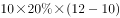万元。

当股价涨到15元时，甲卖出剩余部分的，获利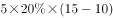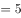万元；乙卖出，获利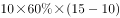万元。

最后股价回落到13元，甲、乙、丙全部卖出剩余股票，甲获利万元；乙获利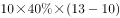万元；丙获利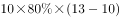万元。

甲共获利万元；乙共获利万元；丙共获利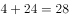万元，获利最多的乙比获利最低的甲多赚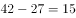万元。

故正确答案为C。

---

### 第 2 题　qid 2376989 · 数学运算

小刘买120元的玫瑰、康乃馨和百合共20朵。其中康乃馨价格为3元/朵，百合和玫瑰的价格也均为整数元。其中，玫瑰的价格比百合便宜但比康乃馨贵；购买玫瑰的数量少于百合但多于康乃馨，问玫瑰最高多少元/朵？

- **A**. 4
- **B**. 5
- **C**. 6　✅
- **D**. 7

**答案**：C

**官方解析**

本题未知数较多，等量关系很少，属于不定方程问题，可采用代入排除法的思想来做题。问玫瑰单价最高可能为多少元，从D项开始代入，D项：玫瑰为7元，那么百合至少为8元，平均价格为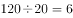元，两者比均价高出1元、2元，康乃馨价格比均价低3元，而且要求，根据平均数混合线段法：那么，排除D项。代入C项：玫瑰为6元，那么百合至少为7元，此时玫瑰的价格等于平均价格，说明康乃馨和百合的平均价格也为6元。两者混合，根据线段法，距离和量成反比，那么百合的数量：康乃馨的数量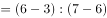。设购买康乃馨数量为只，那么百合的数量为只，玫瑰的数量为只，列式：，即，且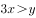。最小为1，从1开始代入，当，，不满足，排除；当，，不满足，排除；当，，，满足，同时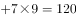元也满足。

故正确答案为C。

---

### 第 3 题　qid 2376993 · 数学运算

某集团有13个分公司，每个分公司的员工数均不超过50人。甲和乙两个分公司各招聘若干人后，员工人数分别达到76人和137人，且集团平均每个分公司的员工数增加了9人。问甲分公司和乙分公司在招聘前的员工数最多相差几人？

- **A**. 4　✅
- **B**. 3
- **C**. 2
- **D**. 1

**答案**：A

**官方解析**

甲乙新招聘若干人后，集团平均每个分公司的员工数增加了9人，说明甲乙分公司共招聘了人。甲乙两个分公司招聘前的员工数和为人。问甲乙分公司招聘前的员工数最多相差几人，且每个分公司的员工数均不超过50人，最多为50人，甲乙分公司中一个为50人，另一个公司就为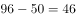人，两者相差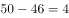人。

故正确答案为A。

---

### 第 4 题　qid 2377006 · 数学运算

某单位所有员工都参加艺术、科学、人文三类书籍的阅读活动，每名员工至多阅读2种书籍，阅读1种书籍员工人数比阅读2种书籍的人数多一半，阅读艺术类书籍的人数是阅读科学类书籍人数的，阅读科学类书籍人数是阅读人文类书籍人数的，问该单位至少有多少人？

- **A**. 20
- **B**. 25　✅
- **C**. 30
- **D**. 50

**答案**：B

**官方解析**

根据阅读艺术类书籍人数是阅读科学类书籍人数的，可得艺术类：科学类 ；根据阅读科学类书籍人数是阅读人文类书籍人数的 ，可得科学类：人文类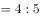，根据倍数特性，阅读科学类人数同时满足3和4的倍数，即科学类人数是12的倍数，那么艺术类：科学类：人文类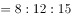，因求“该单位至少有多少人”，则先赋值阅读艺术类、科学类、人文类书籍的人数分别是8人次、12人次、15人次。设阅读2种书籍的人数为人，则阅读1种书籍的人数为人，根据三集合容斥原理公式：，代入得：，解得，满足为整数，则总人数至少为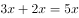人，对应B项。

故正确答案为B。

---

### 第 5 题　qid 2377013 · 数学运算

打字员小张每10分钟可录入1页文档，平均每页有2个错字；打字员小李每15分钟可录入1页文档，平均每页有1个错字，现有12页、7页、11页、8页、14页和20页的6篇文档需要录入，要求每篇文档由同一人录入，且总共在9个小时内完成。问录入文档的错误率最低可以控制在平均每页多少个错字？

- **A**. 不高于1.4个
- **B**. 高于1.4个但不高于1.5个
- **C**. 高于1.5个但不高于1.6个　✅
- **D**. 高于1.6个

**答案**：C

**官方解析**

小张平均每页2个错字，小李平均每页1个错字，要使每页错误率最低，就让小李完成页数尽可能多，规定9小时内完成，小李完成1页需要15分钟，小李9小时完成页数最多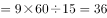页。要求每篇文档同一人录入，小李最多完成页数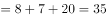页。还剩页，小张9小时完成页数最多页，小张可在9小时内完成。错误率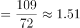，高于1.5个但不高于1.6个，对应C项。

故正确答案为C。

---

### 第 6 题　qid 2376870 · 数学运算

A、B两台高性能计算机共同运行30小时可以完成某个计算任务，如两台计算机共同运行18小时后，A、B计算机分别抽调出和的计算资源去执行其他任务，最后任务完成的时间会比预计时间晚6小时，如两台计算机共同运行18小时后，由B计算机单独运行，还需要多少小时才能完成该任务？

- **A**. 22
- **B**. 24
- **C**. 27　✅
- **D**. 30

**答案**：C

**官方解析**

分别抽调出和的计算资源后，两台计算机效率分别变为，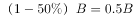，因最终完成比预计时间晚6小时，则，解得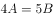。假设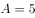，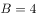，任务总量为，则两台计算机共同运行18小时后，剩余任务量为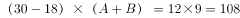，B计算机单独运行需要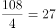小时。

故正确答案为C。

---

### 第 7 题　qid 2376871 · 数学运算

某商店中甲、乙、丙三种商品销量分别为6件、10件和5件，总销售额为元，其中乙商品的销售额是甲商品的1.2倍，丙商品的销售额是甲商品的倍，问如果只卖甲商品，至少要卖多少件销售额才能超过元？

- **A**. 20
- **B**. 21
- **C**. 22　✅
- **D**. 24

**答案**：C

**官方解析**

假设6件甲商品的销售额为30元，每件销售单价为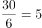元，则10件乙商品的销售额为元，5件丙商品的销售额为元，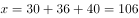，，则至少卖出22件甲商品，销售额才能超过元。

故正确答案为C。

---

### 第 8 题　qid 2376872 · 数学运算

集装箱内部空间的长、宽和高分别为20英尺、7英尺和7英尺。某种货物的包装箱尺寸为英尺，问一个集装箱内最多可以装多少箱这种货物？

- **A**. 29
- **B**. 30
- **C**. 31
- **D**. 32　✅

**答案**：D

**官方解析**

要想装的货物尽可能多，则集装箱浪费的体积应尽可能少。以这个面为底面，已知货物尺寸有一个的面，所以一层可放8个货物（如下图所示）。已知货物高为5，大集装箱高为20，则可以放层，即共放个。

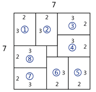

故正确答案为D。

---

### 第 9 题　qid 2376874 · 数学运算

小王和小李参加某公司招聘考试，笔试成绩占总成绩的，面试成绩占总成绩的。笔试部分小王得分比小李高6分，面试部分小李得80分，两人的总成绩刚好相同，问小王面试得了多少分？

- **A**. 74
- **B**. 71
- **C**. 78
- **D**. 76　✅

**答案**：D

**官方解析**

方法一：设小李笔试成绩为分，小王面试成绩为分。由于笔试部分小王比小李高6分，所以小王笔试分数为分。笔试成绩占总成绩，则面试成绩占总成绩的。根据两人总成绩相同可知：，解得，即小王面试分数为76分。 

方法二：由于笔试部分小王比小李高6分，且笔试占总成绩，则转化为总成绩，在笔试方面，小王比小李高分。要想最终总成绩相等，则在面试方面转化为总成绩后，小李应比小王高2.4分。则转化前小李面试应比小王高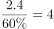分，因此小王面试分数为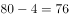分。

故正确答案为D。

---

### 第 10 题　qid 2376877 · 数学运算

某老旧写字楼重新装修，需要将原有的窗户全部更换为单价90元每扇的新窗户。已知每7扇换下来的旧窗户可以跟厂商兑换一个新窗户。全部更换完毕后共花费16560元且剩余4个旧窗户没有兑换，那么该写字楼一共有多少扇窗户？

- **A**. 214　✅
- **B**. 218
- **C**. 184
- **D**. 188

**答案**：A

**官方解析**

方法一：设兑换了个新窗户，根据“ 7个旧窗户换1个新窗户，且最后剩4个旧窗户”可知：总旧窗户数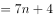。由于所有旧窗户全部换新，所以新买的窗户数为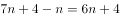。每个新窗户90元，共花费16560元，则，解得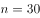。则总旧窗户数，总旧窗户数即总窗户数。

方法二：7个旧窗户可以换1个新窗户，且最后有4个旧窗户没兑换，则总旧窗户数是7的倍数，只有A项满足。（总旧窗户数即总窗户数）

故正确答案为A。

---

### 第 11 题　qid 2376878 · 数学运算

甲、乙两人分别从A、B两地同时出发，6小时后在A、B两地中点相遇，如果甲每小时多走8公里，乙提前2小时出发，则甲、乙两人仍在中点相遇，那么A、B两地相距多少公里？

- **A**. 168
- **B**. 192　✅
- **C**. 256
- **D**. 304

**答案**：B

**官方解析**

两人同时出发6小时后在中点相遇，因此两人路程相同，则有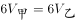，故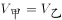。第二次相遇点也在中点，因此乙提前2小时出发后，速度保持不变则剩余路程需要时间为小时。则甲提速后从开始出发到与乙在中点相遇也用时4小时。两次相遇点均为中点故甲所走的路程均为总路程的一半，路程不变因此，解得。所以两地路程为。

故正确答案为B。

---

### 第 12 题　qid 2376879 · 数学运算

一个盒子里有乒乓球100多个，如果每次取5个出来最后剩下4个，如果每次取4个最后剩3个，如果每次取3个最后剩2个，那么如果每次取12个最后剩多少个？

- **A**. 11　✅
- **B**. 10
- **C**. 9
- **D**. 8

**答案**：A

**官方解析**

根据题意，取5个剩4个说明乒乓球的总数加1是5的倍数，同理取4个剩3个说明乒乓球的总数加1是4的倍数，取3个剩2个说明乒乓球的总数加1是3的倍数，故乒乓球的总数加1应同时满足5、4、3的倍数，因此乒乓球的总数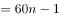。由于乒乓球有100多个，即，所以解得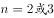。当时，乒乓球的数量，每次取12个最后会剩余11个；当时，乒乓球的数量，每次取12个最后也会剩余11个。

故正确答案为A。

---

### 第 13 题　qid 2376880 · 数学运算

某研究团队开展小学生身体健康状况调查活动，需要从某市三所小学中抽取部分小学生组成研究样本，其中实验小学抽取的人数占其他两所小学抽取人数的五分之一，解放路小学抽取的人数占其他两所小学抽取人数的二分之一，精英小学抽取的人数为180人，那么三所小学合计抽取多少人？

- **A**. 540
- **B**. 480
- **C**. 360　✅
- **D**. 280

**答案**：C

**官方解析**

根据“实验小学抽取的人数占其他两所小学抽取人数的五分之一”可知总人数是6的倍数，实验小学抽取人数占总人数的；“解放路小学抽取的人数占其他两所小学抽取人数的二分之一”可知总人数是3的倍数，解放路小学抽取人数占总人数的。因此设总抽取人数，则实验小学抽取人数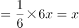，解放路小学抽取人数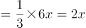，精英小学抽取人数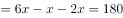，解得，因此三所小学共抽取人数人。

故正确答案为C。

---

### 第 14 题　qid 2376881 · 数学运算

某工厂生产过程中需要用到A、B、C三种零件，工厂仓库中原有三种零件的数量比为，现在采购部门新购进一批零件，新购进三种零件的数量比是，工厂每天使用的三种零件数量相同，当A零件用完的时候，B零件还剩下10个，C零件还剩下170个，请问工厂仓库中原有A、B、C零件各多少个？

- **A**. 40   80  120
- **B**. 50  100  150
- **C**. 60  120  180　✅
- **D**. 70  140  210

**答案**：C

**官方解析**

设原有三种零件的数量分别为，，，再次购买的数量分别为，，，工厂每天使用的三种零件数量相同，所以A、B、C三种零件使用的总量相同。当A零件用完时，一共用了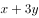，因此B、C两种零件也用了。根据B零件剩余10个，C零件剩余170个可得：

······①

······②

①式整理得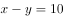，②式整理得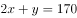。联立解得，。所以原有三种零件的数量分别为60，120，180。

故正确答案为C。

---

### 第 15 题　qid 2376882 · 数学运算

某啤酒厂为促销啤酒，开展6个空啤酒瓶换1瓶啤酒的活动，孙先生去年花钱先后买了109瓶该品牌啤酒，期间不断用空啤酒瓶去换啤酒，请问孙先生去年一共喝掉了多少瓶啤酒？

- **A**. 127
- **B**. 128
- **C**. 129
- **D**. 130　✅

**答案**：D

**官方解析**

根据空瓶换酒公式：个酒瓶可以换1瓶酒，个空瓶最多可以喝到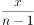瓶酒。6个空酒瓶换1瓶啤酒，孙先生花钱买了109瓶啤酒，产生的109个空瓶，最多可喝到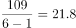瓶酒，因啤酒数一定是整数，故最多可以喝到21瓶酒。加上花钱买到109瓶酒，一共可以喝到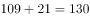瓶。

故正确答案为D。

---

## 判断推理

### 第 1 题　qid 2376909 · 图形推理

下图所示的多面体为20个一样的小正方体组合而成，问①、②和以下哪个多面体可以组合成该多面体？

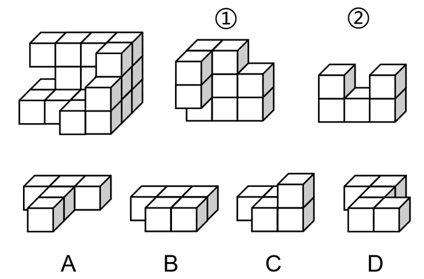

- **A**. A　✅
- **B**. B
- **C**. C
- **D**. D

**答案**：A

**官方解析**

观察图①，右上角缺少了一块正方体，且左边突出来两个正方体，故可确定图①在多面体中的位置如下图所示：

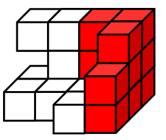

观察图②，上面一排正方体中间少了一块正方体,故可确定图②在多面体中的位置如下图所示：

因此,需要补充的图形如下图所示：

故正确答案为A。

---

### 第 2 题　qid 2376913 · 图形推理

把下面的六个图形分为两类，使每一类图形都有各自的共同特征或规律，分类正确的一项是：

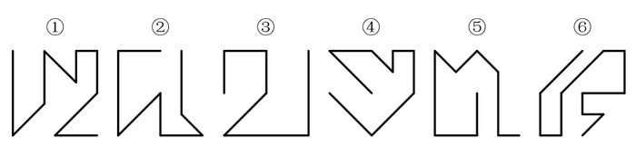

- **A**. ①②③，④⑤⑥
- **B**. ①④⑤，②③⑥
- **C**. ①②⑤，③④⑥　✅
- **D**. ①④⑥，②③⑤

**答案**：C

**官方解析**

元素组成不同，且无明显属性规律，考虑数量规律。整体数线无规律，故考虑线的细化考法。观察发现图①②⑤末端两条线相互垂直，图③④⑥末端两条线相互平行，可由此分为两组即①②⑤一组，③④⑥一组。
故正确答案为C。

---

### 第 3 题　qid 2376915 · 图形推理

把下面的六个图形分为两类，使每一类图形都有各自的共同特征或规律，分类正确的一项是：

- **A**. ①③④，②⑤⑥　✅
- **B**. ①③⑤，②④⑥
- **C**. ①②⑥，③④⑤
- **D**. ①④⑥，②③⑤

**答案**：A

**官方解析**

元素组成不同，优先考虑属性规律。本题每个图形整体上来看虽然都不对称，但是每幅图中的三个小图形均为对称图形，因此，可以分别画出每幅图形中三个小图形的对称轴，发现图①③④黑块的对称轴和一个空白图形对称轴平行，和另一个空白图形对称轴交叉；图②⑤⑥黑块的对称轴和两个空白图形的对称轴都交叉，因此，①③④一组，②⑤⑥一组。
故正确答案为A。

---

### 第 4 题　qid 2376917 · 图形推理

左图是给定纸盒的外表面，以下哪一项能由它折叠而成？

- **A**. A
- **B**. B　✅
- **C**. C
- **D**. D

**答案**：B

**官方解析**

将原展开图标上序号如下图，逐一进行分析。

A项：右边的面是面e，面e与面k是相对面不能同时出现，所以上边的面是面g，面g与面i是相对面不能同时出现，所以前边的面是面h。A项由面e、面g、面h组成，面g与面h有公共边，如上图所示，展开图中公共边挨着面g三角形的长直角边，A选项挨着面g三角形的短直角边，选项和题干不一致，排除；

B项：由面e、面f、面i组成，选项和题干一致，当选；

C项：由面f、面g、面k组成，面f中三角形的底边挨着面g中的小方块，选项中面f中三角形的底边挨着面g（或面k）中的三角形的长直角边，题干和选项不一致，排除；

D项：上边的面是面e，面e与面k是相对面不能同时出现，所以前边的面是面g，面g与面i是相对面不能同时出现，所以右边的面是面h。D项由面e、面g、面h组成，面g与面h有公共边，如上图所示，展开图中公共边挨着面g三角形的长直角边，D选项挨着面g三角形的一个顶点，选项和题干不一致，排除。

故正确答案为B。

---

### 第 5 题　qid 2376918 · 图形推理

从所给的四个选项中，选择最合适的一个填入问号处，使之呈现一定的规律性：

- **A**. A
- **B**. B　✅
- **C**. C
- **D**. D

**答案**：B

**官方解析**

元素组成相似，相同线条重复出现，优先考虑加减同异。第一行图1和图2相同线条去掉，不同线条保留，求异得到图3，第二行验证此规律成立，第三行应用此规律，只有B项成立。
故正确答案为B。

---

### 第 6 题　qid 2376932 · 图形推理

从所给的四个选项中，选择最合适的一个填入问号处，使之呈现一定的规律性：

- **A**. A
- **B**. B
- **C**. C　✅
- **D**. D

**答案**：C

**官方解析**

观察题干图形，整体无规律，通过相邻比较发现，图1和图2只有第一行黑球位置不同（第一行黑白球颜色互换），其他四行黑球位置相同；图2和图3只有第二行黑球位置不同（第二行黑白球颜色互换），其他四行黑球位置相同；图3和图4只有第三行黑球位置不同（第三行黑白球颜色互换），其他四行黑球位置相同；图4和图5只有第四行黑球位置不同（第四行黑白球颜色互换），其他四行黑球位置相同，以此类推，？处应该选择一个和图5只有第五行黑球位置不同（第五行黑白球颜色互换），其他四行黑球位置相同的图，只有C项符合。
故正确答案为C。

---

### 第 7 题　qid 2376937 · 图形推理

从所给的四个选项中，选择最合适的一个填入问号处，使之呈现一定的规律性：

- **A**. A
- **B**. B
- **C**. C　✅
- **D**. D

**答案**：C

**官方解析**

图形元素组成相同，优先考虑位置规律。观察发现，题干后面一幅图均是在前一幅图的基础上变化了1根短线得到，如下图所示（实线代表后一幅图在前一幅图基础上增加的线，虚线代表后一幅图在前一幅图的基础上消失的线）。符合此规律的只有C选项。

故正确答案为C。

---

### 第 8 题　qid 2376933 · 图形推理

从所给的四个选项中，选择最合适的一个填入问号处，使之呈现一定的规律性：

- **A**. A
- **B**. B
- **C**. C
- **D**. D　✅

**答案**：D

**官方解析**

图形元素组成不同，优先考虑属性规律。观察题干图形发现出现了等腰三角形、箭头等特征图，优先考虑对称性。题干第一行图形的对称轴数量依次为1、1、2，即前两幅图对称轴的数量之和等于第三幅图对称轴的数量。第二行验证此规律，对称轴数量依次为1、2、3，验证后该规律成立。第三行应用此规律，对称轴数量依次是2、3、？，则“？”处应选择对称轴数量为5的选项，符合该规律的只有D选项。
故正确答案为D。

---

### 第 9 题　qid 2376943 · 图形推理

把下面的六个图形分为两类，使每一类图形都有各自的共同特征或规律，分类正确的一项是：

- **A**. ①③④，②⑤⑥
- **B**. ①②④，③⑤⑥　✅
- **C**. ①④⑤，②③⑥
- **D**. ①③⑤，②④⑥

**答案**：B

**官方解析**

本题为分组分类题目。元素组成不同，观察发现，图形相切明显，图①②④中两个图形之间只有一个切点，图③⑤⑥中两个图形之间存在两个切点，故图①②④一组，图③⑤⑥一组。
故正确答案为B。

---

### 第 10 题　qid 2376945 · 图形推理

把下面的六个图形分为两类，使每一类图形都有各自的共同特征或规律，分类正确的一项是：

- **A**. ①②③，④⑤⑥
- **B**. ①②④，③⑤⑥　✅
- **C**. ①③⑤，②④⑥
- **D**. ①③⑥，②④⑤

**答案**：B

**官方解析**

本题为分组分类题目。元素组成不同，无明显属性规律，考虑数量规律。观察发现，图形中有大量的端点出现，优先考虑笔画数，图①②④的奇点数为4个，是两笔画图形，图③⑤⑥的奇点数为2个，是一笔画图形，即图①②④一组，图③⑤⑥一组。
故正确答案为B。

---

### 第 11 题　qid 2376919 · 定义判断

强化是指通过改变环境的刺激因素来增强、减弱或消除某种行为的过程和方法。其中直接强化是指个人因直接表现出应当受到强化的行为而受到强化的过程。替代性强化是指个人因观察到他人的行为而受到强化的过程。自我强化是指个人的行为达到自己设定的标准时，以自己能支配的报酬来强化自己的过程。
根据上述定义，下列属于替代性强化的是：

- **A**. 人云亦云
- **B**. 杀一儆百　✅
- **C**. 论功行赏
- **D**. 小惩大诫

**答案**：B

**官方解析**

第一步：找出定义关键词。
强化：“改变环境的刺激因素”、“增强、减弱或消除某种行为”；
直接强化：“个人因直接表现出应当受到强化的行为而受到强化”；
替代性强化：“个人因观察到他人的行为而受到强化”；
自我强化：“个人的行为达到自己设定的标准时”、“以自己能支配的报酬来强化自己”。
第二步：逐一分析选项。
A项：“人云亦云”是指人家怎么说，自己也跟着怎么说，没有涉及行为上的强化，不符合“个人因观察到他人的行为而受到强化”，不符合“替代性强化”的定义，排除；
B项：“杀一儆百”是指处死一个人，借以警戒许多人，被警戒的人行为受到强化是由于观察其他人得到的，符合“个人因观察到他人的行为而受到强化”，符合“替代性强化”的定义，当选；
C项：“论功行赏”是指按功劳的大小给予奖赏，即根据个人贡献的大小进行嘉奖，被嘉奖的人行为受到强化是由于直接奖赏得到的，符合“个人因直接表现出应当受到强化的行为而受到强化”，符合“直接强化”的定义，不符合“替代性强化”的定义，排除；
D项：“小惩大诫”是指有小过失就惩戒，使受到教训而不致犯大错误，没有涉及对于他人行为的观察，不符合“个人因观察到他人的行为而受到强化”，不符合“替代性强化”的定义，排除。
故正确答案为B。

---

### 第 12 题　qid 2376929 · 定义判断

在项目成本控制中，成本控制的偏差分为实际偏差、计划偏差和目标偏差三种，它们的计算公式如下：

项目成本控制的目的是尽量减少目标偏差。

根据上述定义，下列说法错误的是：

- **A**. 实际成本越大则目标偏差越大　✅
- **B**. 目标偏差等于实际偏差与计划偏差之和
- **C**. 当目标偏差为负数时，对项目是有利的
- **D**. 目标偏差与预算成本无关

**答案**：A

**官方解析**

第一步：找出定义关键词。

、、、“项目成本控制的目的是尽量减少目标偏差”。

第二步：逐一分析选项。

A项：，实际成本大，但是计划成本是大是小未知，所以目标偏差最终是大是小不确定，因此“实际成本越大则目标偏差越大”说法错误，当选；

B项：，说法正确，排除；

C项：目标偏差为负数，则说明实际成本低，计划成本高，实际成本低则项目花费低，对项目而言是有利的，说法正确，排除；

D项：，与预算成本无关，所以目标偏差与预算成本无关，说法正确，排除。

故正确答案为A。

---

### 第 13 题　qid 2376931 · 定义判断

两种事物在性质、大小、外观等方面存在相反的特点，人们在认知到一种事物时会从反面想到另一种事物，这种联想称为对比联想。
根据上述定义，下列诗句中使用了对比联想的是：

- **A**. 
刘禹锡《乌衣巷》：“旧时王谢堂前燕，飞入寻常百姓家。”
　✅
- **B**. 
苏轼《念奴娇赤壁怀古》：“大江东去，浪淘尽，千古风流人物。故垒西边，人道是，三国周郎赤壁。”

- **C**. 
李煜《虞美人春花秋月何时了》：“雕栏玉砌应犹在，只是朱颜改。问君能有几多愁？恰似一江春水向东流。”

- **D**. 
《诗经关雎》：“关关雎鸠，在河之洲，窈窕淑女，君子好逑。”

**答案**：A

**官方解析**

第一步：找出定义关键词。
“在性质、大小、外观等方面存在相反的特点”、“从反面想到另一种事物”。
第二步：逐一分析选项。
A项：旧时王谢堂前燕，飞入寻常百姓家，意思是当年栖息在豪门檐下的燕子，如今已飞进寻常百姓家里，寻常百姓家和王谢宅院的外观是相反的，符合“在性质、大小、外观等方面存在相反的特点”，看到燕子栖息地点是寻常百姓家，从而联想到乌衣巷昔日的繁荣，符合“从反面想到另一种事物”,符合定义，当选；
B项：大江东去，浪淘尽，千古风流人物，故垒西边，人道是，三国周郎赤壁，意思是大江浩浩荡荡向东流去，滔滔巨浪淘尽千古英雄人物，那旧营垒的西边，人们说那就是三国周瑜鏖战的赤壁，该句诗词表达的是作者看到滚滚的长江联想到了才华出众的人物会随着时间的流逝而消失，没有体现 “从反面想到另一种事物”，不符合定义，排除；
C项：雕栏玉砌应犹在，只是朱颜改，问君能有几多愁？恰似一江春水向东流，意思是精雕细刻的栏杆、玉石砌成的台阶应该还在，只是所怀念的人已衰老。要问我心中有多少哀愁，就像这不尽的滔滔春水滚滚东流，雕栏玉砌的美景和宫女的容颜，不符合“在性质、大小、外观等方面存在相反的特点”，用满江的春水来比喻满腹的愁恨，不符合“在性质、大小、外观等方面存在相反的特点”，不符合定义，排除；
D项：关关雎鸠，在河之洲，窈窕淑女，君子好逑，意思是关关鸣叫的水鸟, 栖居在河中沙洲，善良美丽的姑娘是好男儿的配偶，该诗词采用了起兴的手法，是以雎鸠的鸣叫，引出作者对淑女的追求，不符合“从反面想到另一种事物”，不符合定义，排除。
故正确答案为A。

---

### 第 14 题　qid 2376935 · 定义判断

遗产是指被继承人死亡时遗留的个人所有财产和法律规定可以继承的其他财产权益，根据我国继承法的有关规定，遗产必须符合三个特征：必须是公民死亡时遗留的财产；必须是公民个人的所有财产；必须是合法财产。
根据上述定义，下列说法正确的是：

- **A**. 李某经法院宣告失踪一年后仍毫无音信，其个人财产可以视为遗产
- **B**. 张某去世后，其夫妻二人的共同财产并非都是张某的遗产　✅
- **C**. 赵某病危时对家人说钱某欠自己的万余元赌债可以作为自己的遗产
- **D**. 王某因工伤死亡，其死亡补助金可以作为遗产进行分配

**答案**：B

**官方解析**

第一步：找出定义关键词。
“公民死亡时遗留的财产”、“公民个人所有的财产”、“合法财产”。
第二步：逐一分析选项。
A项：李某经法院宣告失踪一年后仍毫无音信，但李某是否死亡并不明确，不符合“公民死亡时遗留的财产”，该项说法不正确，排除；
B项：张某去世后，符合“公民死亡”，夫妻二人的共同财产，不符合“公民个人所有的财产”，所以该财产不是张某的遗产，该项说法正确，当选；
C项：赵某病危时，不符合“公民死亡”，且赌债不符合“合法财产”，该项说法不正确，排除；
D项：王某因工伤亡，死亡补助金是死亡之后所得到的赔偿，不符合“公民死亡时遗留的财产”，不符合定义，排除。
故正确答案为B。

---

### 第 15 题　qid 2376938 · 定义判断

旁观者效应又称责任分散效应，是指在紧急事件中由于有他人在场而产生的对救助行为的抑制作用。
根据上述定义，下列情形符合旁观者效应的是：

- **A**. 公路上发生货车侧翻，大家纷纷帮助货车司机小杨保护货物防止哄抢
- **B**. 路上偶遇行人跌倒，小李见周围无人见证怕承担责任不敢帮助
- **C**. 超市附近突发火灾，小张催促其妻报警，其妻回答别人肯定已经报警了　✅
- **D**. 海边有人落水，救生员小王边跑边喊，提醒围观群众不要随意下水施救

**答案**：C

**官方解析**

第一步：找出定义关键词。
“是指在紧急事件中由于有他人在场而产生的对救助行为的抑制作用”。
第二步：逐一分析选项。
A项：大家纷纷帮助货车司机小杨保护货物，体现出了对小杨的救助行为，不符合“对救助行为的抑制作用”，不符合定义，排除；
B项：小李见周围无人见证怕承担责任不敢帮助，意思是周围没有他人在场，不符合“有他人在场”，不符合定义，排除；
C项：发生火灾，小张催促其妻报警，其妻回答别人肯定已经报警了，所以自己不打算有救助的行为，符合“有他人在场而产生的对救助行为的抑制作用”，符合定义，当选；
D项：有人落水，救生员小王提醒群众不要随意下水施救，不施救的原因是担心其他群众的安危，不符合“由于有他人在场而产生的对救助行为的抑制作用”，不符合定义，排除。
故正确答案为C。

---

### 第 16 题　qid 2376905 · 定义判断

贝勃定律是指当有人经历强烈的刺激后，再施予的刺激对他（她）来说变得微不足道，就心理感受来说，第一次大刺激能使第二次小刺激的影响淡化。
根据上述定义，下列哪一诗句的描述不符合贝勃定律的内涵？

- **A**. 曾经沧海难为水
- **B**. 五岳归来不看山
- **C**. 人间别久不成悲
- **D**. 铁马冰河入梦来　✅

**答案**：D

**官方解析**

第一步：找出定义关键词。
“当有人经历强烈的刺激后”、“第一次大刺激能使第二次小刺激的影响淡化”。
第二步：逐一分析选项。
A项：“曾经沧海难为水”的意思是在看过汹涌的大海后，其他地方的水就不值一提了，符合“第一次大刺激能使第二次小刺激的影响淡化”，符合定义，排除；
B项：“五岳归来不看山”的意思是从五岳回来之后，不用再去看其他的山了，符合“第一次大刺激能使第二次小刺激的影响淡化”，符合定义，排除；
C项：“人间别久不成悲”意思是由于分别的太久，相思和悲痛已经使自己变得有些麻木，就意识不到内心深处的悲哀了，符合“第一次大刺激能使第二次小刺激的影响淡化”，符合定义，排除；
D．“铁马冰河入梦来”意思是迷迷糊糊地梦见，自己骑着披着铁甲的战马跨过冰封的河，这只是对一个梦里场景的描述，不符合“第一次大刺激能使第二次小刺激的影响淡化”，不符合定义，当选。
故正确答案为D。

---

### 第 17 题　qid 2376910 · 定义判断

工作通讯是一种直接反映和指导实际工作的通讯，既可以通过新闻事实的报道分析当前工作中的经验和问题，提出带有规律性的东西去推动工作；也可以针对某些尚处在萌芽状态的倾向和现象进行实录或剖析，从而引起人们的关注和思考。
根据上述定义，下列哪篇新闻报道最不可能是工作通讯？

- **A**. 《工作组碰“软钉子”》
- **B**. 《警惕微信群的套路》
- **C**. 《微软启示录》
- **D**. 《风雨沧桑话神州》　✅

**答案**：D

**官方解析**

第一步：找出定义关键词。
“直接反映和指导实际工作的通讯”，“既可以通过新闻事实的报道分析当前工作中的经验和问题，提出带有规律性的东西去推动工作”，“也可以针对某些尚处在萌芽状态的倾向和现象进行实录或剖析，从而引起人们的关注和思考”
第二步：逐一分析选项。
A项：《工作组碰“软钉子”》应当写的是工作组在工作中遇到的问题以及采取的对策，符合“直接反映和指导实际工作的通讯”，符合定义，排除；
B项：《警惕微信群的套路》应当写的是微信群中可能存在的不良信息传播和诈骗的手段，以及相应的鉴别、应对方法，符合“针对某些尚处在萌芽状态的倾向和现象进行实录或剖析，从而引起人们的关注和思考”，符合定义，排除；
C项：《微软启示录》应当写的是微软这一企业在经营过程中的经验和教训，符合“既可以通过新闻事实的报道分析当前工作中的经验和问题，提出带有规律性的东西去推动工作”，符合定义，排除；
D项：《风雨沧桑话神州》应当写的是中国历经坎坷后所取得的重大成就，中国这一范围过大，不符合“直接反映和指导实际工作的通讯”，不符合定义，当选。
本题为选非题，故正确答案为D。

---

### 第 18 题　qid 2376916 · 定义判断

晕轮效应又称光环效应，是指当认知者对认知对象的某种特征形成好的或者坏的印象后，掩盖了其他品质或特点，或者倾向于据此推论其他方面的特征。
根据上述定义，下列不属于晕轮效应的是：

- **A**. 情人眼里出西施
- **B**. 天下乌鸦一般黑　✅
- **C**. 嘴上无毛办事不牢
- **D**. 一俊遮百丑

**答案**：B

**官方解析**

第一步：找出定义关键词。
“认知者对认知对象的某种特征形成好的或者坏的印象后”、“掩盖了其他品质或特点，或者倾向于据此推论其他方面的特征”
第二步：逐一分析选项。
A项：情人眼里出西施指的是在情人的眼里，不论对方如何，都觉得对方是非常美丽的。情人符合“认知者对认知对象的某种特征形成好的或者坏的印象后”，眼里出西施符合“掩盖了其他品质或特点，或者倾向于据此推论其他方面的特征”，符合定义，排除；
B项：天下乌鸦一般黑用来比喻不管哪个地方的坏人都是一样的坏，不符合“认知者对认知对象的某种特征形成好的或者坏的印象后”、“掩盖了其他品质或特点，或者倾向于据此推论其他方面的特征”，不符合定义，当选；
C项：嘴上无毛办事不牢指的是年纪小的人办事不牢靠，嘴上无毛符合“认知者对认知对象的某种特征形成好的或者坏的印象后”；办事不牢符合“掩盖了其他品质或特点，或者倾向于据此推论其他方面的特征”，符合定义，排除；
D项：一俊遮百丑用来比喻一件好的事情掩盖了许多的丑陋的事，一件好的事情符合“认知者对认知对象的某种特征形成好的或者坏的印象后”，掩盖了许多丑陋的事符合“掩盖了其他品质或特点，或者倾向于据此推论其他方面的特征”，符合定义，排除。
故正确答案为B。

---

### 第 19 题　qid 2376924 · 定义判断

母语迁移是在第二语言的习得过程中，学习者的第一语言即母语的使用习惯会直接影响第二语言的习得，并对其起到积极促进或者消极干扰的作用。
根据上述定义，下列属于母语迁移的是：

- **A**. 日韩两国的文字中含有大量汉字，历史上的中国文化是其发展的渊源
- **B**. 甲五岁随父母移居国外，长大后已经完全不会使用母语表达
- **C**. 英国人乙学习中文时在量词的掌握上感到特别困难　✅
- **D**. 丙在双语环境中成长，在生活和学习中均能用两种语言熟练表达

**答案**：C

**官方解析**

第一步：找出定义关键词。
“在第二语言的习得过程中”、“第一语言即母语的使用习惯会直接影响第二语言的习得”、“母语起到积极促进或消极干扰的作用”。
第二步：逐一分析选项。
A项：日韩两国的文字中含有大量汉字，历史上的中国文化是其发展的渊源，没有学习第二语言，不符合“在第二语言的习得过程中”，也不符合“第一语言即母语的使用习惯会直接影响第二语言的习得”和“母语起到积极促进或消极干扰的作用”，不符合定义，排除；
B项：甲五岁移居国外，长大后完全不会使用母语表达，母语对他毫无影响，不符合“第一语言即母语的使用习惯会直接影响第二语言的习得”，也不符合“母语起到积极促进或消极干扰的作用”，不符合定义，排除；
C项：英国人乙学习中文时在量词的掌握上感到特别困难，中文是乙的第二语言，符合“在第二语言的习得过程中”；中文中有量词而英语里是没有的，导致英国人乙对量词掌握很困难，符合“第一语言即母语的使用习惯会直接影响第二语言的习得”和“母语起到积极促进或消极干扰的作用”，符合定义，当选；
D项：丙在双语环境中成长，不符合“在第二语言的习得过程中”，在学习和生活中能用两种语言熟练表达，不符合“第一语言即母语的使用习惯会直接影响第二语言的习得”，也不符合“母语起到积极促进或消极干扰的作用”，不符合定义，排除。
故正确答案为C。

---

### 第 20 题　qid 2376927 · 定义判断

角色失败是指角色承担者被证明已经不可能再继续承担或者履行该角色的权利和义务，不得不中途退出，放弃原来角色。从角色失败的结果上看，通常有两种，一种是角色承担者不得不半途退出角色，另一种是虽然还处于某种角色的位置上，但其表现已被实践证明是失败的。
根据上述定义，下列不属于角色失败的是：

- **A**. 夫妻离婚
- **B**. 朋友绝交
- **C**. 职员借调　✅
- **D**. 官员撤职

**答案**：C

**官方解析**

第一步：找出定义关键词。
“角色承担者不得不半途退出角色”、“虽然还处于某种角色的位置上，但其表现已经被实践证明是失败的”。
第二步：逐一分析选项。
A项：夫妻离婚，丈夫不再是丈夫，妻子不再是妻子，符合“角色承担者不得不半途退出角色”，符合定义，排除；
B项：朋友绝交，朋友关系的解除，符合“角色承担者不得不半途退出角色”，符合定义，排除；
C项：职员借调，人员借调是指一个单位借用别的单位的工作人员而不改变其隶属关系的情况，多见于国家机关、事业单位或社会团体为解决编制不足，从下属单位或其他单位借用人员，或者存在于企业间的经营指导、技术指导交流以及企业集团内人员交流，不符合“角色承担者不得不半途退出角色”，也不符合“虽然还处于某种角色的位置上，但其表现已经被实践证明是失败的”，不符合定义，当选；
D项：官员撤职，即这个官员不再在原来的岗位上，符合“角色承担者不得不半途退出角色”，符合定义，排除。
本题为选非题，故正确答案为C。

---

### 第 21 题　qid 2376922 · 类比推理

感冒药：中药：西药

- **A**. 果汁：冷饮：热饮　✅
- **B**. 标枪：田赛：径赛
- **C**. 城墙：古建筑：西方建筑
- **D**. 学士：硕士：博士

**答案**：A

**官方解析**

第一步：判断题干词语间逻辑关系。
中药和西药是并列关系，感冒药分别与中药、西药是交叉关系。
第二步：判断选项词语间逻辑关系。
A项：冷饮和热饮是并列关系，果汁分别与冷饮、热饮是交叉关系，与题干逻辑关系一致，当选；
B项：标枪是田赛中的一个项目，二者是种属关系，与题干逻辑关系不一致，排除；
C项：古建筑和西方建筑是交叉关系，与题干逻辑关系不一致，排除；
D项：学士、硕士和博士都是学位，三者是并列关系，与题干逻辑关系不一致，排除。
故正确答案为A。

---

### 第 22 题　qid 2376925 · 类比推理

动脉血管：静脉血管：毛细血管

- **A**. 散文：诗歌：小说
- **B**. 历史片：战争片：科幻片
- **C**. 休眠火山：死火山：活火山　✅
- **D**. 晴天：雨天：雪天

**答案**：C

**官方解析**

第一步：判断题干词语间逻辑关系。
动脉血管、静脉血管和毛细血管都是血管，三者之间为并列关系，并且血管中只有这三类。
第二步：判断选项词语间逻辑关系。
A项：散文、诗歌和小说都是文学载体，三者之间为并列关系，但是文学载体不仅有散文、诗歌、小说，还有剧本、寓言等形式，与题干逻辑关系不一致，排除；
B项：历史片、战争片以及科幻片是三种电影题材，三者之间为并列关系，但是电影题材除了这三种还有喜剧片、惊悚片等，与题干逻辑关系不一致，排除；
C项：休眠火山、死火山、活火山都是火山，三者之间为并列关系，并且火山只有这三类，与题干逻辑关系一致，当选；
D项：晴天、雨天、雪天是三种天气，三者之间为并列关系，但是天气不仅有这三种，还有霜降、冰雹等，与题干逻辑关系不一致，排除。
故正确答案为C。

---

### 第 23 题　qid 2376926 · 类比推理

国有企业：化工企业：大型企业

- **A**. 草本植物：观叶植物：室内植物　✅
- **B**. 钝角三角形：等边三角形：等腰三角形
- **C**. 内脏：肝脏：消化系统
- **D**. 音乐：舞蹈：戏剧

**答案**：A

**官方解析**

第一步：判断题干词语间逻辑关系。
国有企业是根据企业的属性是私有还是国有对企业进行的分类；化工企业是根据企业的活动内容对企业进行的分类；大型企业是根据企业规模的大小对企业进行的分类；这三个词两两之间都是交叉关系。
第二步：判断选项词语间逻辑关系。
A项：草本植物是根据植物木质部的特点对植物进行的分类；观叶植物是根据植物叶片的观赏价值对植物进行的分类；室内植物是根据植物对室内环境调节作用进行的分类；这三个词两两之间都是交叉关系。与题干逻辑关系一致，当选；
B项：等边三角形是一种特殊的等腰三角形，二者是种属关系，与题干逻辑关系不一致，排除；
C项：肝脏是内脏，二者为种属关系，与题干逻辑关系不一致，排除；
D项：音乐和舞蹈是并列关系，舞蹈是戏剧中会用到的一种表现手段，与题干逻辑关系不一致，排除。
故正确答案为A。

---

### 第 24 题　qid 2376928 · 类比推理

高兴 对于（        ）相当于（        ）对于 巧夺天工

- **A**. 得意；匠心独运
- **B**. 谈笑风生；鬼斧神工
- **C**. 悲哀；照猫画虎
- **D**. 心花怒放；精巧　✅

**答案**：D

**官方解析**

逐一代入选项。
A项：得意指满意，感到满足时的高兴心情。匠心独运是指独具创新地运用精巧的心思，形容文学艺术等方面构思巧妙。巧夺天工专指精巧的人工胜过天然，形容技艺极其精巧。得意和高兴是近义关系，匠心独运和巧夺天工无关，前后逻辑关系不一致，排除；
B项：谈笑风生形容谈话时有说有笑，兴致很高，并且很有风趣，与高兴无关，鬼斧神工形容建筑、雕塑等艺术技巧高超，像是鬼神制作出来的，与巧夺天工是近义词，前后逻辑关系不一致，排除；
C项：悲哀指伤心、难过。照猫画虎比喻照着样子模仿，只是依样画葫芦，实际上并不理解。高兴和悲哀是反义关系，照猫画虎和巧夺天工无关，前后逻辑关系不一致，排除；
D项：心花怒放形容内心高兴极了，精巧指精细巧妙，巧夺天工专指精巧的人工胜过天然，形容技艺极其精巧。心花怒放和高兴是近义关系，精巧和巧夺天工是近义关系，前后逻辑关系一致，当选。
故正确答案为D。

---

### 第 25 题　qid 2376930 · 类比推理

开机：关机

- **A**. 上车：下车　✅
- **B**. 发烧：吃药
- **C**. 地震：逃生
- **D**. 入学：考试

**答案**：A

**官方解析**

第一步：判断题干词语间逻辑关系。
开机和关机是并列关系，且是一组相反的动作。
第二步：判断选项词语间逻辑关系。
A项：上车和下车是并列关系，且是一组相反的动作，与题干逻辑关系一致，当选； 
B项：发烧与吃药不是相反的动作，与题干逻辑关系不一致，排除；
C项：地震与逃生不是相反的动作，与题干逻辑关系不一致，排除；
D项：入学与考试不是相反的动作，与题干逻辑关系不一致，排除。
故正确答案为A。

---

### 第 26 题　qid 2376904 · 类比推理

（   ）对于 花蕊 相当于 叶脉 对于 （   ）

- **A**. 蜂蜜；二氧化碳
- **B**. 花瓣；叶肉　✅
- **C**. 花朵；叶片
- **D**. 花蜜；水分

**答案**：B

**官方解析**

逐一代入选项。
A项：蜂蜜是蜜蜂从开花植物的花蕊中采得的花蜜，在蜂巢中经过充分酿造而形成的物质。叶脉与二氧化碳没有明显逻辑关系，前后逻辑关系不一致，排除；
B项：花蕊与花瓣都是花的组成部分，二者是并列关系，叶脉与叶肉都是叶的组成部分，二者是并列关系，前后逻辑关系一致，当选；
C项：花蕊是花朵的组成部分，二者是组成关系，叶脉是叶片的组成部分，二者是组成关系，但两词顺序相反，前后逻辑关系不一致，排除；
D项：花蜜是由位于花内或花外组织中的蜜腺分泌出来的，有的蜜腺在花蕊上，因此有的花蕊可以分泌花蜜，二者为分泌物的对应关系；叶脉可以输送水分和养料，二者为载体的对应关系，前后逻辑关系不一致，排除。
故正确答案为B。

---

### 第 27 题　qid 2376906 · 类比推理

电缆损坏：供电中断：电车停运

- **A**. 高台起跳：身体翻转：跃入水中
- **B**. 利好消息：股价上涨：公司上市
- **C**. 超速驾驶：发生车祸：吊销驾照　✅
- **D**. 提出问题：分析问题：解决问题

**答案**：C

**官方解析**

第一步：判断题干词语间逻辑关系。
电缆损坏会导致供电中断，供电中断会导致电车停运，三者属于因果关系，且都体现了消极结果。
第二步：判断选项词语间逻辑关系。
A项：高台起跳、身体翻转与跃入水中是不同的行为状态，存在时间的先后顺序，不属于因果关系，与题干逻辑关系不一致，排除；
B项：利好消息可能会带来股价上涨，二者为或然因果关系，公司上市与股价上涨是不同的行为状态，存在时间的先后顺序，不属于因果关系，与题干逻辑关系不一致，排除；
C项：超速驾驶会导致发生车祸，发生车祸会导致吊销驾照，三者属于因果关系，且都体现了消极结果，与题干逻辑关系一致，当选；
D项：提出问题、分析问题与解决问题是不同的行为状态，存在时间的先后顺序，不属于因果关系，与题干逻辑关系不一致，排除。
故正确答案为C。

---

### 第 28 题　qid 2376908 · 类比推理

如芒在背：不安

- **A**. 目无全牛：自大
- **B**. 前车之鉴：教训　✅
- **C**. 墨守成规：守法
- **D**. 萍水相逢：巧合

**答案**：B

**官方解析**

第一步：判断题干词语间逻辑关系。
如芒在背是指好像有芒刺扎在背上一样，形容坐立不安，与不安构成近义关系。
第二步：判断选项词语间逻辑关系。
A项：目无全牛是指眼中没有完整的牛，只有牛的筋骨结构，形容人的技艺高超，已经到达非常纯熟的地步，与自大无关，与题干逻辑关系不一致，排除；
B项：前车之鉴指前面翻车的教训，比喻把前人或以前的失败作为借鉴，与教训构成近义关系，与题干逻辑关系一致，当选；
C项：墨守成规是指守着老规矩不肯改变，与守法无关，与题干逻辑关系不一致，排除；
D项：萍水相逢比喻素不相识之人偶然相遇，强调的是相遇，与巧合不构成近义关系，与题干逻辑关系不一致，排除。
故正确答案为B。

---

### 第 29 题　qid 2376911 · 类比推理

衰败：方兴未艾

- **A**. 讨好：曲意逢迎
- **B**. 抄袭：拾人牙慧
- **C**. 战争：马放南山　✅
- **D**. 后悔：抱恨终天

**答案**：C

**官方解析**

第一步：判断题干词语间逻辑关系。
方兴未艾形容新生事物正在蓬勃发展，与衰败构成反义关系。
第二步：判断选项词语间逻辑关系。
A项：曲意逢迎是指违背自己的本心去迎合别人的意思；讨好是指迎合别人，取得别人的欢心或称赞；二者行为的本质均是讨好他人，所以二者为近义关系，与题干逻辑不一致，排除；
B项：拾人牙慧比喻窃取别人的语言和文字，与抄袭构成近义关系，与题干逻辑关系不一致，排除；
C项：马放南山比喻天下太平，不再用兵，与战争构成反义关系，与题干逻辑关系一致，当选；
D项：抱恨终天指因做错某事而后悔一辈子，与后悔构成近义关系，与题干逻辑关系不一致，排除。
故正确答案为C。

---

### 第 30 题　qid 2376914 · 类比推理

轿车：代步

- **A**. 温室：蔬菜
- **B**. 沙漏：计时　✅
- **C**. 健身：竞技
- **D**. 中药：食疗

**答案**：B

**官方解析**

第一步：判断题干词语间逻辑关系。
轿车可以用来代步，二者体现了事物与功能的对应关系。
第二步：判断选项词语间逻辑关系。
A项：温室，又称暖房，指供冬季培育喜温植物的房间，蔬菜可以种植在温室里，二者体现了事物与场所的对应关系，与题干逻辑关系不一致，排除；
B项：沙漏也叫做沙钟，是一种测量时间的装置，其功能就是计时，二者体现了事物与功能对应关系，与题干逻辑关系一致，当选；
C项：健身是一种体育项目，竞技指比赛技艺，多指体育、网络游戏比赛等，二者之间无明显逻辑关系，与题干逻辑关系不一致，排除；
D项：中药是指以中国传统医药理论指导采集、炮制、制剂，说明作用机理，指导临床应用的药物，食疗又称食治，是在中医理论指导下利用食物的特性来调节机体功能，使其获得健康或愈疾防病的一种方法，二者之间无明显逻辑关系，与题干逻辑关系不一致，排除。
故正确答案为B。

---

### 第 31 题　qid 2376934 · 逻辑判断

近年来科技的迅猛发展为科幻小说创作提供了启发，也为科幻小说创作提供了丰富的素材。科幻小说的主题即是围绕着科技幻想、揭示科技发展带来的社会问题及其给人类带来的启示而展开的。因此科幻小说的蓬勃发展是科技发展的结果。
以下哪项如果为真，最能削弱上述结论？

- **A**. 伴随着西方工业革命产生的科幻小说经历了初创、成熟和鼎盛三个历史时期
- **B**. 科技发展拓展了科幻小说的想象空间，科幻小说为科技发展提供了人文视角
- **C**. 科技只是科幻小说中的背景元素，科幻小说本质上还是要讲述一个完整的故事
- **D**. 科幻小说展现了人类的愿望，最终推动科技发展将那些梦想变为现实　✅

**答案**：D

**官方解析**

第一步：找出论点和论据。
论点：科幻小说的蓬勃发展是科技发展的结果（即科技发展导致科幻小说的蓬勃发展）。
论据：近年来科技的迅猛发展为科幻小说创作提供了启发，也为科幻小说创作提供了丰富的素材。科幻小说的主题即是围绕着科技幻想，揭示科技发展带来的社会问题及其给人类带来的启示而展开的。
本题论点和论据讨论的是同一话题，都是围绕科技发展如何导致科幻小说发展展开的。因此在解题过程中我们主要围绕论点来进行削弱。而本题论点中存在因果关系，可以首先考虑因果倒置和他因削弱的方式来削弱。
第二步：逐一分析选项。
A项：论点说的是科技发展促进了科幻小说的蓬勃发展，该项说的是随着西方工业革命的发展，科幻小说也经历了三个发展时期，体现了工业革命发展推动了科幻小说的发展，有加强作用，无法削弱，排除；
B项：论点讨论的是科技发展促进了科幻小说的蓬勃发展，该项说的是科技发展为科幻小说拓展了想象空间，促进科幻小说发展，同时科幻小说也促进了科技发展，二者相互促进，对论点有一定的加强作用，无法削弱，排除；
C项：该项说科技是科幻小说的背景元素，科幻小说的内容是个完整的故事，科幻小说的内容是什么，是否与科技发展有关都不清楚，不明确选项，排除；
D项：该项指出是科幻小说推动了科技发展，也就是说科幻小说蓬勃发展是原因，科技发展是结果，属于对题干论点的因果倒置，当选。
故正确答案为D。

---

### 第 32 题　qid 2376936 · 逻辑判断

所有学术水平突出的教授都深受学生爱戴，而所有学术水平突出的教授都注重培养学生的专业基础知识，因此，有些深受学生爱戴的教授不主张只关注学术前沿问题。
上述论证的成立需补充的前提是：

- **A**. 只关注学术前沿问题的教授不受学生爱戴
- **B**. 学术水平突出的教授不主张只关注学术前沿问题　✅
- **C**. 注重培养学生专业基础知识的教授都深受学生爱戴
- **D**. 部分注重培养学生专业基础知识的教授不主张只关注学术前沿问题

**答案**：B

**官方解析**

此论证题中论点论据有一些表示范围的词，因此可以借助翻译的形式表示为：

论点：有的深受学生爱戴的教授不主张只关注学术问题（有的AB）。

论据：学术水平突出的教授深受学生爱戴，根据换位规则，所有A都是B，可以换位为有的B是A，即可以等价于：有的深受学生爱戴学术水平突出（有的AC）。

由有的AC，想要推出有的AB，只需要进行搭桥，搭上CB即可，即所有学术水平突出的教授都不主张只关注学术前沿问题。

A项：只关注学术前沿问题的教授不受学生爱戴，进行逆否可得受学生爱戴的教授不只关注学术问题，A项成立可以推出论点成立，可以看成补充论据加强论点，但本题提问方式为“补充前提”，A项不是论点成立的前提，排除；

B项：学术水平突出的教授不主张只关注学术前沿问题，为在论点和论据之间搭桥，与预设一致，是论点成立的前提，当选；

C项：注重培养学生专业基础知识的教授都深受学生爱戴，无法搭桥，不能加强，排除；

D项：部分注重培养学生专业基础知识的教授不主张只关注学术前沿问题，无法搭桥，不能加强，排除。

故正确答案为B。

---

### 第 33 题　qid 2376939 · 逻辑判断

有研究人员声称找到了一种全新的控制糖尿病人血糖浓度的方法，这种新疗法的关键就是咖啡因。他们对患有糖尿病的小鼠进行了试验，当小鼠摄入咖啡因的时候，对于血糖浓度的控制能力比没有摄入咖啡因的小鼠好。研究人员据此认为，以往通过注射胰岛素控制糖尿病人血糖浓度的方法在未来也可以被摄入咖啡因替代。
以下哪项如果为真，最能支持上述结论？

- **A**. 上述研究成果被发表在全球顶尖的医学期刊上
- **B**. 每天注射胰岛素对于糖尿病患者来说比较麻烦
- **C**. 研究证明咖啡因可以降低直肠癌和黑色素瘤的发病风险
- **D**. 小鼠和人类体内的肾细胞吸收咖啡因会促进胰岛素的产生　✅

**答案**：D

**官方解析**

第一步：找出论点和论据。
论点：以往通过注射胰岛素控制糖尿病人血糖浓度的方法在未来也可以被摄入咖啡因替代。
论据：当小鼠摄入咖啡因的时候，对于血糖浓度的控制能力比没有摄入咖啡因的小鼠好。
通过对小鼠做实验，得到相关的应用于人的结论，加强方式既可以说明小鼠能够代表人类，又可以补充论据。
第二步：逐一分析选项。
A项：说明成果被发表在医学期刊上，而论点讨论的是注射咖啡因是否可以控制糖尿病人血糖浓度，话题不一致，无关选项，无法加强，排除；
B项：说明注射胰岛素对于患者来说很麻烦，而论点讨论的是注射咖啡因是否可以控制糖尿病人血糖浓度，话题不一致，无关选项，无法加强，排除；
C项：说明降低直肠癌和黑色素的发病风险，而论点讨论的是注射咖啡因是否可以控制糖尿病人血糖浓度，话题不一致，无法加强，排除；
D项：说明吸收咖啡因促进胰岛素的产生，解释了原因，从而说明的确可以用咖啡因来代替胰岛素，可以加强，当选。
故正确答案为D。

---

### 第 34 题　qid 2376940 · 逻辑判断

只有确立竞争政策的基础性地位，才能推动供给侧结构性改革。在这种新形势下，必须加强顶层设计，才能确立竞争政策的基础性地位，加强顶层设计必须围绕创造公平竞争的制度环境展开，确立竞争政策的基础性地位也是实现创新驱动的必然要求。
由此可以推出：

- **A**. 不加强顶层设计就不能推动供给侧结构性改革　✅
- **B**. 推动供给侧结构性改革才能实现创新驱动
- **C**. 围绕创造公平竞争的制度环境展开是加强顶层设计的充分条件
- **D**. 只有推动供给侧结构性改革才能加强顶层设计

**答案**：A

**官方解析**

第一步：翻译题干。

 推动供给侧结构性改革确立竞争政策的基础性地位；

 确立竞争性政策的基础性地位加强顶层设计；

 加强顶层设计围绕创造公平竞争的制度环境；

 实现创新驱动确立竞争政策的基础性地位。

将串联得：推动供给侧结构性改革确立竞争政策的基础性地位加强顶层设计围绕创造公平竞争的制度环境。

第二步：逐一分析选项。

A项：翻译为推动供给侧结构性改革加强顶层设计，是对的肯前，肯前必肯后，可以推出，当选；

B项：翻译为实现创新驱动推动供给侧结构性改革，根据题干，没有在二者之间建立联系，无法推出，排除；

C项：翻译为围绕创造公平竞争的制度环境加强顶层设计，是对的肯后，肯后得不到确定性结论，无法推出，排除；

D项：翻译为加强顶层设计推动供给侧结构性改革，是对的肯后，肯后得不到确定性结论，无法推出，排除。

故正确答案为A。

---

### 第 35 题　qid 2376941 · 逻辑判断

甲、乙、丙、丁、戊、己、庚七人表演配乐诗朗诵，为确保表演效果，需要安排朗诵顺序。已知：（1）甲要么第一个朗诵，要么最后一个朗诵；（2）乙和丙之间有三人；（3）丁和戊之间有三人，且丁先朗诵；（4）丁在乙之前朗诵。
根据上述条件，以下哪项可能为真？

- **A**. 丙第二个朗诵　✅
- **B**. 乙第四个朗诵
- **C**. 庚第二个朗诵
- **D**. 丁第四个朗诵

**答案**：A

**官方解析**

第一步：分析题干。

①要么甲第一个，要么甲最后一个；

②乙 丙（丙 乙）；

③丁 戊；

④丁先于乙。

根据条件②和③可知，每个条件各占5个位置，并且根据条件①甲要么在第1个，要么在第7个可知，除了甲以外一共有6个连着的位置可供其余人选择；丁和戊的前后顺序确定，结合条件④丁先于乙，所以对于这6个连着的位置可能出现的情况有三种：第一种是“丁乙戊丙”；第二种是“丁丙戊乙”；第三种是“丙丁乙戊”，甲可能在这6个位置之前也可能在之后。

第二步：逐一分析选项。

A项：当第二种情况出现且甲在最后一个时，位置为：丁丙戊乙甲，或者当第三种情况出现且甲在第一个时，位置为甲丙丁乙戊，此时丙可以在第二个位置朗诵，可能为真，当选；

B项：题干三种情况中，乙都不可能在第四个位置出现，因此该项不可能为真，排除；

C项：庚只能出现在“ ”中，而题干三种情况中，“  ”前至少存在两个人，因此庚不可能在第二个位置，该项不可能为真，排除；

D项：题干三种情况中，丁只能出现在第一个、第二个或第三个位置，因此丁在第四个朗诵不可能为真，排除。

故正确答案为A。

---

### 第 36 题　qid 2376907 · 逻辑判断

研究证明，用传统方法熬制的骨头汤中，游离钙含量很低，每100毫升骨头汤中钙含量只有2毫克左右，因此传统的“喝骨头汤补钙”的观念是错误的。
以下哪项如果为真，最能支持上述结论？

- **A**. 只有游离的钙离子才能被人体消化吸收　✅
- **B**. 骨头汤中含有较多脂肪，常喝骨头汤可能引发高脂血症
- **C**. 骨头汤中含有胶原蛋白，能增强人体造血机能
- **D**. 中国居民的钙摄入量普遍不足，而食补最为方便

**答案**：A

**官方解析**

第一步：找出论点和论据。
论点：传统的“喝骨头汤补钙”的观念是错误的。
论据：研究证明，用传统方法熬制的骨头汤中，游离钙含量很低，每100毫升骨头汤中钙含量只有2毫克左右。
论点说的是喝骨头汤不能补钙，论据说的是骨头汤中游离钙含量低，话题不一致，可以优先考虑搭桥，即选择能在游离钙含量低和补钙之间建立联系的选项。
第二步：逐一分析选项。
A项：只有游离的钙离子才能被人体吸收，在游离的钙离子和吸收补钙之间建立联系，说明游离的钙离子含量低，几乎起不到补钙的作用，搭桥项，可以加强，当选；
B项：论点说的是喝骨头汤补钙的观念是否正确，该项说的是喝骨头汤可能引发高脂血症，话题不一致，无法加强，排除；
C项：论点说的是喝骨头汤补钙的观念是否正确，该项说的是骨头汤能增强人体造血机能，话题不一致，无法加强，排除；
D项：选项只是说通过食补进行补钙方便，但是食补中是否包括喝骨头汤未知，到底喝骨头汤补钙的观念是否正确并不清楚，无法加强，排除。
故正确答案为A。

---

### 第 37 题　qid 2376912 · 逻辑判断

在考古学研究中判断人类遗骸的性别对于了解古代社会结构具有重要意义。科学家发现牙釉质中含有釉原蛋白，编码这种蛋白的基因恰好位于性染色体——X染色体和Y染色体上，研究者认为，用牙齿判定遗骸性别的方法可用于考古研究。
以下哪项如果为真，最能支持上述论证？

- **A**. 牙齿是古人类遗骸中最容易找到并且保存最完好的部分　✅
- **B**. 儿童遗骸的骨骼没有明显的性别差异
- **C**. 人类遗骸的性别比例与当时人类社会的性别比例大致相同
- **D**. 测量某些骨骼特征如骨盆的结构通常可以直接判定性别

**答案**：A

**官方解析**

第一步：找出论点和论据。
论点：用牙齿判定遗骸性别的方法可用于考古研究。
论据：科学家发现牙釉质中含有釉原蛋白，编码这种蛋白的基因恰好位于性染色体——X染色体和Y染色体上。
问最能支持上述论证，优先考虑搭桥，其次考虑必要条件。论点讨论的是用牙齿判断遗骸的性别，论据讨论的是牙齿相关的基因在性染色体上，论点论据说的是一回事，所以考虑必要条件。
第二步：逐一分析选项。
A项：牙齿是古人类遗骸中最容易找到并且最完整的部分，是科学家对可以通过牙齿判定遗骸性别的必要条件，可以加强，当选；
B项：论点讨论的是牙齿，B项说的是儿童骨骼，牙齿不是骨骼，为无关选项，排除；
C项：遗骸的性别比例与当时人类社会的性别比例大致相同，不是牙齿是判定遗骸性别的方法的必要条件，排除；
D项：论点说的是通过牙齿判断性别，而该项说的是通过骨盆的结构来判定性别，话题不一致，排除。
故正确答案为A。

---

### 第 38 题　qid 2376923 · 逻辑判断

化学名称为聚四氟乙烯，商用名称为特氟龙的物质被广泛用于电饭煲内胆。有研究证明，超过260度高温作用下该物质会变为毒性物质，因此有人认为电饭煲会做出“毒米饭”。
以下哪项如果为真，最能质疑上述观点？

- **A**. 特氟龙作为涂层特别容易剥落混到食物中
- **B**. 特氟龙内胆的电饭煲工作温度最高为119度　✅
- **C**. 特氟龙在高温条件下产生的毒性足以致癌
- **D**. 特氟龙材料还被应用到医疗、冶金等领域中

**答案**：B

**官方解析**

第一步：找出论点和论据。
论点：电饭煲会做出“毒米饭”。
论据：有研究证明，超过260度高温作用下该物质会变为毒性物质。
题干论点论据讨论的都是电饭锅会释放有毒的物质，用电饭锅做饭不好，话题一致，考虑削弱论点，说明电饭煲不会做出“毒米饭”即可。
第二步：逐一分析选项。
A项：特氟龙容易混到食物中，但电饭锅到底会不会做出“毒米饭”没有说明，无法削弱，排除；
B项：电饭煲工作温度最高是119度，没有到达260度，所以不会生成有毒物质，即电饭煲不会做出毒米饭，直接削弱论点，当选；
C项：特氟龙在高温状态下产生的毒性足以致癌，可以加强，不能削弱，排除；
D项：特氟龙材料能够应用的领域，与电饭煲会不会做出“毒米饭”无关，不能削弱，排除。
故正确答案为B。

---

### 第 39 题　qid 2376920 · 逻辑判断

工业废气排放是温室气体增加的重要原因，但还有大量温室气体来自水下。湖泊、池塘和河流等水体的底部沉积物会产生甲烷，甲烷主要以气泡的形式冒出水面，进入大气。研究发现，富含营养的水体沉积物会释放更多甲烷。因此有专家建议，为降低水体温室气体排放，应限制化肥的滥用。
要使上述论证成立，必须补充以下哪一前提？

- **A**. 水体沉积物排出的甲烷量比工业废气还多
- **B**. 甲烷是温室气体的最主要成分
- **C**. 化肥极易通过水体给环境造成污染
- **D**. 滥用化肥很容易给水体沉积物带来过多营养　✅

**答案**：D

**官方解析**

第一步：找出论点和论据。
论点：为降低水体温室气体排放，应限制化肥的滥用。
论据：富含营养的水体沉积物会释放更多甲烷。
本题提问为“前提”，论点讨论的是化肥的滥用，而论据讨论的是富含营养的水体沉积物，所以论点论据话题不一致，要想加强，优先考虑搭桥，在滥用化肥和水体沉积物之间建立关系，即滥用化肥会给水体沉积物带来更多的营养。
第二步：逐一分析选项。
A项：论点说的是为降低水体温室气体排放，应限制化肥的滥用，该项说的是水体沉积物排放出的甲烷量，话题不一致，无法加强，排除；
B项：论点说的是为降低水体温室气体排放，应限制化肥的滥用，该项说的是甲烷是温室气体的最主要成分，话题不一致，无法加强，排除；
C项：强调化肥极易通过水体给环境造成污染，但是没有涉及限制化肥滥用是否能够降低温室气体排放，属于无关项，无法加强，排除； 
D项：滥用化肥很容易给水体沉积物带来过多营养，营养多了会释放更多的甲烷，那么说明想要降低温室气体的排放，就应该限制化肥的滥用，在论点和论据之间建立了联系，属于搭桥项，可以加强，当选。
故正确答案为D。

---

### 第 40 题　qid 2376921 · 类比推理

有教师、公务员、银行职员三人，其中甲不是银行职员，乙不是教师，丙不是公务员。教师比乙年龄大，丙在三人中年龄最小。
根据上述条件，下列说法错误的是：

- **A**. 甲是教师
- **B**. 乙是公务员
- **C**. 甲不是公务员
- **D**. 丙不是银行职员　✅

**答案**：D

**官方解析**

第一步：分析题干。

（1）甲不是银行职员

（2）乙不是教师

（3）丙不是公务员

（4）教师的年龄 乙的年龄

（5）丙年龄最小

第二步：根据题干条件分析选项。

根据条件（4）和（5）可知年龄的排序：，说明甲是教师。根据条件（3）可知，丙不是教师，也不是公务员，说明丙是银行职员，则乙是公务员。因此甲是教师，乙是公务员，丙是银行职员。

本题为选非题，故正确答案为D。

---

## 资料分析

### 材料 1

根据以下资料，回答下列问题。 

        党的十八大以来，党中央，国务院实施精准扶贫、精准脱贫基本方略，深入实施东西部扶贫协作，区域性整体贫困明显缓解，为实现到2020年现行标准下农村贫困人口脱贫，贫困县全部摘帽，解决区域性整体贫困打下了坚实基础。

        从地区看，东部地区已率先基本脱贫，中西部地区贫困人口数量全面下降，2017年末，东部地区农村贫困人口300万人，比2012年末减少1067万人，五年累计下降；农村贫困发生率由2012年末的下降到，下降3.1个百分点，已率先基本实现脱贫。中部地区农村贫困人口由2012年末的3446万人减少到2017年末的1112万人，累计减少2334万人，下降幅度为。农村贫困发生率由下降到，下降7.1个百分点。西部地区农村贫困人口由2012年末的5086万人减少到2017年末的1634万人，累计减少3452万人，下降幅度为；农村贫困发生率由2012年末的下降到2017年末的，下降12.0个百分点。

        从贫困区域看，贫困地区、集中连片特困地区，民族八省区减贫成效更加突出，区域性整体贫困明显缓解。贫困地区2017年末农村贫困人口1900万人，比2012年末减少4139万人，减贫规模占全国农村减贫总规模的六成；农村贫困发生率从2012年末的下降至2017年末的，五年累计下降16.0个百分点，年均下降3.2个百分点。集中连片特困地区2017年末农村贫困人口1540万人，比2012年末减少3527万人，下降幅度为；农村贫困发生率从2012年末的下降至2017年末的，累计下降17.0个百分点，年均下降3.4个百分点。内蒙古、广西、贵州、云南、西藏、青海、宁夏、新疆等民族八省区2017年末农村贫困人口1032万人，比2012年末减少2089万人，下降幅度为，减贫规模占全国农村减贫规模的三成；农村贫困发生率从2012年末的下降至2017年末的，累计下降14.2个百分点，年均下降2.8个百分点。

#### 第 1 题　qid 2376883 · 综合

2012年末和2017年末我国农村贫困人口总数分别为多少万人?

- **A**. 6853  4513
- **B**. 8532  2746
- **C**. 9599  3813
- **D**. 9899  3046　✅

**答案**：D

**官方解析**

定位文字材料第二段“2017年末，东部地区农村贫困人口300万人，比2012年末减少1067万人······中部地区农村贫困人口由2012年末的3446万人减少到2017年末的1112万人······西部地区农村贫困人口由2012年末的5086万人减少到2017年末的1634万人”，由于，则2017年末我国农村贫困人口总数为万人，2012年末我国农村贫困人口总数为万人。

故正确答案为D。

---

#### 第 2 题　qid 2376884 · 比重

贫困发生率指的是低于贫困线的人口占总人口的比例，由材料数据可知，与2012年末相比，我国中部地区2017年末农村总人口：

- **A**. 减少了约113万人　✅
- **B**. 减少了约280万人
- **C**. 增加了约113万人
- **D**. 增加了约280万人

**答案**：A

**官方解析**

根据题干“贫困发生率指的是低于贫困线的人口占总人口的比例”，结合材料给出贫困人口，求两年总人口的差，可判定本题为现期比重问题。定位文字材料第二段“中部地区农村贫困人口由2012年末的3446万人减少到2017年末的1112万人，······农村贫困发生率由下降到”，由可得，万人，即与2012年末相比，我国中部地区2017年末农村总人口减少了约113万人。

故正确答案为A。

---

#### 第 3 题　qid 2376885 · 增长

按贫困发生率年均下降幅度计算，2015年末我国集中连片特困地区农村贫困发生率为：

- **A**. 

- **B**. 

- **C**. 

　✅
- **D**. 

**答案**：C

**官方解析**

定位文字材料第三段“集中连片特困地区2017年末······农村贫困发生率从2012年末的下降至2017年末的······年均下降3.4个百分点”，则按贫困发生率的年均下降幅度计算，2015年末我国集中连片特困地区农村贫困发生率。

故正确答案为C。

---

#### 第 4 题　qid 2376886 · 比重

下列关于2012年末和2017年末我国西部地区农村贫困人口占全国农村贫困人口比重的说法，描述正确的是：

- **A**. 
2017年末高于2012年末，且2012年低于

- **B**. 
2017年末高于2012年末，且均高于
　✅
- **C**. 
2017年末低于2012年末，且2017年低于

- **D**. 
2017年末低于2012年末，但均高于

**答案**：B

**官方解析**

根据题干“2012年末和2017年末我国西部地区农村贫困人口占全国农村贫困人口比重”，可判定本题为两期比重的计算问题。定位文字材料第二段“西部地区农村贫困人口由2012年末的5086万人减少到2017年末的1634万人”，结合本篇第101题，2012年末和2017年末我国农村贫困人口总数分别为9899万人、3046万人，则2012年末我国西部地区农村贫困人口占全国农村贫困人口比重为，2017年末为，故2017年末比重高于2012年末，且均高于。

故正确答案为B。

---

#### 第 5 题　qid 2376887 · 综合

关于农村贫困人口数据，无法由以上材料推出的是：

- **A**. 
按2012年末至2017年末西部年均农村贫困人口减少量计算，2019年末我国西部地区农村贫困人口将少于300万人

- **B**. 
2012年末至2017年末，集中连片特困地区减贫规模占全国农村减贫总规模的
　✅
- **C**. 
2012年末至2017年末，农村减贫幅度东部地区要大于民族八省区

- **D**. 
按照中部地区农村贫困发生率下降速率计算，中部地区要达到2017年末东部地区农村贫困发生率水平还需要约2年时间

**答案**：B

**官方解析**

A项：定位文字材料第二段“西部地区农村贫困人口由2012年末的5086万人减少到2017年末的1634万人，累计减少3452万人”，可得2012年末至2017年末西部年均农村贫困人口减少量为万人，按此计算，2019年西部地区农村贫困人口约为，正确；

B项：定位文字材料第三段可知：贫困地区2017年末农村贫困人口比2012年末减少4139万人，减贫规模占全国农村减贫总规模的六成，集中连片特困地区2017年末农村贫困人口比2012年末减少3527万人。则2012年末至2017年末，集中连片特困地区减贫规模占全国农村减贫总规模的比重为，并非34%，错误；

C项：定位文字材料第二段可知：东部地区农村贫困人口五年累计下降，定位文字材料第三段可知：民族八大省农村贫困人口下降幅度为，则农村减贫幅度东部地区要大于民族八大省，正确；

D项：定位文字材料第二段可知：2017年末东部地区农村贫困发生率为，中部地区农村贫困发生率由2012年的下降到2017年的，下降7.1个百分点。则中部地区农村贫困发生率下降速率为，按此计算，中部地区要达到2017年末东部地区农村贫困发生率，还需要年，正确。

本题为选非题，故正确答案为B。

---

### 材料 2

根据以下资料，回答下列问题。

        2017年末，全国医疗卫生机构床位794.0万张，其中：医院612.0万张（占），基层医疗卫生机构152.9万张（占）。医院中，公立医院床位占，民营医院床位占。与上年比较，床位增加53.0万张，其中：医院床位增加43.1万张，基层医疗卫生机构床位增加8.7万张。每千人口医疗卫生机构床位数由2016年5.37张增加到2017年5.72张。

#### 第 6 题　qid 2376888 · 综合

2016年末，全国基层医疗卫生机构拥有床位数量为多少万张？

- **A**. 714
- **B**. 568.9
- **C**. 152.9
- **D**. 144.2　✅

**答案**：D

**官方解析**

根据题干“2016年末······床位数量”，及材料给的是2017年末的数据，可以判定本题为基期计算问题。定位文字材料第一段：“2017年末，基层医疗卫生机构152.9万张······，与上年比较，基层医疗卫生机构床位增加8.7万张”，根据可得，2016年末全国基层医疗卫生机构拥有床位数为万张。

故正确答案为D。

---

#### 第 7 题　qid 2376889 · 增长

虽然2014-2016年间全国医疗卫生机构床位数增长速度持续下滑，但2016年床位数仍然比2014年增加了：

- **A**. 

　✅
- **B**. 

- **C**. 

- **D**. 

**答案**：A

**官方解析**

根据题干“······2016年床位数仍然比2014年增加了”，及选项为百分数，可判定本题为间隔增长率问题。定位统计图，2016年全国医疗卫生机构增速为，2015年全国医疗卫生机构增速为，根据间隔增长率的计算公式：，可得全国医疗卫生机构2016年相较于2014年增长率为，与A项最接近。

故正确答案为A。

---

#### 第 8 题　qid 2376890 · 比重

2017年末公立医院床位数占全国医疗卫生机构床位数的比重为：

- **A**. 

- **B**. 

- **C**. 

　✅
- **D**. 

**答案**：C

**官方解析**

根据题干“2017年末······占······的比重为”，可判定本题为现期比重问题。定位文字材料第一段：“全国医疗卫生机构床位794.0万张，其中：医院612.0万张（占）”以及下文“医院中，公立医院床位占”，可得，，因此，2017年末公立医院床位数占全国医疗卫生机构床位数的比重为：，与C项最接近。

故正确答案为C。

---

#### 第 9 题　qid 2376891 · 增长

从所给数据资料中可以推算，2017年末全国人口总数比2016年末增加量最接近：

- **A**. 741万
- **B**. 822万　✅
- **C**. 895万
- **D**. 938万

**答案**：B

**官方解析**

根据题干“······增加量最接近”，结合选项带单位，可判定本题为增长量计算问题。定位文字材料可得：2017年末，全国医疗卫生机构床位794.0万张，每千人口医疗卫生机构床位数由2016年5.37张增加到2017年5.72张。定位图形材料可得：2016年末，全国医疗卫生机构床位741万张。根据公式：每千人口医疗卫生机构床位数可得，全国人口总数。根据公式：，2017年末全国人口总数比2016年末增加量万，与B项最接近。

故正确答案为B。

---

#### 第 10 题　qid 2376892 · 综合

下列说法正确的是:

- **A**. 2013-2017年间，全国医疗卫生机构床位数增加幅度持续下降
- **B**. 从全国医疗卫生机构床位统计数据中可以知道医疗卫生机构由公立医院、民营医院和基层医疗卫生机构三部分组成
- **C**. 2014-2017年，全国医疗卫生机构床位增加量最大的年份是2017年　✅
- **D**. 2017年，床位增加率基层医疗卫生机构大于医院

**答案**：C

**官方解析**

A项：定位图形材料，2013-2017年全国医疗卫生机构床位数增加幅度分别为、、、、，并非持续下降，错误；

B项：定位文字材料，2017年末，全国医疗卫生机构床位794.0万张，其中：医院612.0万张（占77.1%），基层医疗卫生机构152.9万张（占19.3%）。医院中，公立医院床位占，民营医院床位占。由，可知医院包括公立医院和民营医院两部分，故公立医院、民营医院和基层医疗卫生机构三部分的床位数占比=77.1%+19.3%=96.4%&lt;100%，错误；

C项：定位图形材料，2013-2017年全国医疗卫生机构床位数分别为618.2万张、660.1万张、701.5万张、741万张、794万张。根据公式：，2014年增长量，2015年增长量，2016年增长量，2017年增长量，故增加量最大的年份为2017年，正确；

D项：定位文字材料，2017年末，医院床位数612.0万张，基层医疗卫生机构152.9万张。与上年比较，医院床位增加43.1万张，基层医疗卫生机构增加8.7万张。根据公式：增长率，2017年基层医疗卫生机构床位增长率，医院床位增长率，故基层医疗卫生机构床位增长率小于医院，并非大于，错误。

故正确答案为C。

---

### 材料 3

根据以下资料，回答下列问题 

        2018年1-12月，社会消费品零售总额380987亿元，比上年增长（扣除价格因素实际增长，以下除特殊说明外均为名义增长）。

        2018年，限额以上零售业单位中的超市、百货店、专业店和专卖店零售额比上年分别增长、、和。

#### 第 11 题　qid 2376990 · 增长

下列月份中，社会消费品零售总额分月同比名义增长速度最快的是：

- **A**. 2017年12月　✅
- **B**. 2018年5月
- **C**. 2018年7月
- **D**. 2018年9月

**答案**：A

**官方解析**

定位折线图可得：2017年12月、2018年5月、7月、9月的分月同比名义增长速度分别为、、、，则增长速度最快的是，即2017年12月。

故正确答案为A。

---

#### 第 12 题　qid 2376996 · 综合

按2017年价格计算2018年社会消费品零售总额约为：

- **A**. 349529亿元
- **B**. 356396亿元
- **C**. 373647亿元　✅
- **D**. 409223亿元

**答案**：C

**官方解析**

根据题干“按2017年价格计算2018年社会消费品零售总额为”，可判定本题为现期计算问题。定位为文字材料第一段可得：2018年1-12月，社会消费品零售总额380987亿元，名义增长率为，扣除价格因素实际增长。“按2017年价格计算”，即扣除2018年价格上涨因素造成的增长，也就是按2017年的实际增长率来计算。2017年社会消费品零售总额为，按2017年的实际增长率来计算，2018年社会消费品零售总额为亿元，与C项最接近。

故正确答案为C。

---

#### 第 13 题　qid 2377004 · 比重

2017年12月，乡村消费品零售额占社会消费品零售总额的比重约是:

- **A**. 

- **B**. 

　✅
- **C**. 

- **D**. 

**答案**：B

**官方解析**

根据题干“2017年12月，······占······的比重约是”，结合材料时间为2018年，可判定本题为基期比重问题。定位表格可得：2018年12月乡村消费品零售额为5565亿元，增长率为，社会消费品零售总额为35893亿元，增长率为，根据基期比重，则2017年12月乡村消费品零售额占社会消费品零售总额的比重为。

故正确答案为B。

---

#### 第 14 题　qid 2377010 · 比重

2017年12月，商品零售额中限额以上单位商品零售所占比重约是：

- **A**. 

- **B**. 

　✅
- **C**. 

- **D**. 

**答案**：B

**官方解析**

根据题干“2017年······所占比重约是”，结合材料数据为2018年，可判定本题为基期比重问题。定位表格材料可得：“2018年12月，商品零售额为31472亿元，同比增长；限额以上单位商品零售额为14175，同比增长”，代入基期比重公式：，与B项最接近。

故正确答案为B。

---

#### 第 15 题　qid 2377014 · 综合

根据所给资料，下列说法错误的是：

- **A**. 2018年餐饮收入中，限额以上单位餐饮收入所占比例不足一半
- **B**. 2018年限额以上零售业单位中专业店的零售额增长幅度高于百货店
- **C**. 2018年12月份，限额以上单位商品零售中的文化办公用品类零售额同比减少
- **D**. 2018年全国实物商品网上零售额同比增长速度高出社会消费品零售总额同比增长速度的两倍多　✅

**答案**：D

**官方解析**

A项：定位表格材料可得：“2018年1-12月餐饮收入为42716亿元，限额以上单位餐饮收入为9236亿元”， 故2018年餐饮收入中，限额以上单位餐饮收入所占比例，正确；

B项：定位文字材料第二段可知，2018年限额以上零售业单位中的百货店和专业店的零售额的增长幅度分别为和，故专业店的零售额增长幅度高于百货店，正确；

C项：定位表格材料可知，2018年12月份限额以上单位商品零售中的文化办公用品类零售额同比增长，故文化办公用品类零售额同比减少，正确；

D项：定位表格材料可知，2018年全国社会消费品零售总额和实物商品网上零售额的同比增长速度分别为和，则全国实物商品网上零售额同比增长速度是社会消费品零售总额同比增长速度的倍，高出倍，错误。

本题为选非题，故正确答案为D。

---

### 材料 4

根据以下资料，回答下列问题 

 

#### 第 16 题　qid 2376972 · 增长

2012-2015年我国人口增长率最高的年份是哪一年？

- **A**. 2012
- **B**. 2013
- **C**. 2014　✅
- **D**. 2015

**答案**：C

**官方解析**

根据人口增长率=人口出生率-人口死亡率，定位表格第三行和第四行可知2011-2015年我国每年的人口出生率和死亡率，可得：2012年人口增长率，2013年人口增长率 ，2014年人口增长率，2015年人口增长率， 故2014年人口增长率最高。

 故正确答案为C。

---

#### 第 17 题　qid 2376975 · 增长

2012-2015年，我国65岁及以上人口年均增长量大约是多少万人？

- **A**. 414
- **B**. 425
- **C**. 531
- **D**. 553　✅

**答案**：D

**官方解析**

根据题干所求“2012-2015年，······年均增长量······万人”可判定此题为年均增长量计算问题。定位表格可得，2012、2015年我国65岁及以上人口分别为12728万人、14386万人。根据年均增长量的公式：年均增长量=万人，与D项最接近。

故正确答案为D。

---

#### 第 18 题　qid 2376997 · 增长

社会总抚养比可以衡量社会人均劳动年龄人口的抚养负担情况，是测度一个国家人口红利的重要指标之一。若社会总抚养比=（0-14岁人口数+65岁及以上人口数）/15-64岁劳动年龄人口数，那么按照2015年各年龄段人口绝对量和增长率计算，2017年年底我国社会总抚养比是多少？

- **A**. 

- **B**. 

- **C**. 

- **D**. 

　✅

**答案**：D

**官方解析**

由题干“2017年年底我国社会总抚养比······”，可判定本题为比值计算问题。定位表格最后一列可得，2015年0-14岁人口数为22715万人，增长率为，2015年15-64岁人口数为100361万人，增长率为，2015年65岁及以上人口数为14386万人，增长率为。则2017年0-14岁人口数万人，2017年15-64岁人口数万人，2017年65岁及以上人口数约为万人。根据社会总抚养比=（0-14岁人口数+65岁及以上人口数）/15-64岁劳动年龄人口数，则2017年年底我国社会总抚养比。

故正确答案为D。

---

#### 第 19 题　qid 2377016 · 增长

下列哪一幅图能反映出2012-2015年65岁及以上人口中净增人口变化情况？

- **A**. A　✅
- **B**. B
- **C**. C
- **D**. D

**答案**：A

**官方解析**

根据题干“······65岁及以上人口中净增人口变化情况”，可判定本题为增长量比较问题。定位表格，2012—2015年的增长量分别为12728-12261=467万人、13199-12728=471万人、万人、万人，根据计算结果可判定A项趋势图符合。

故正确答案为A。

---

#### 第 20 题　qid 2377017 · 综合

根据所给资料信息可以推断出：

- **A**. 由于我国每年都有大量新生婴儿出生，所以0-14岁人口一直保持持续增长状态
- **B**. 2011-2015年我国65岁及以上人口占总人口比重持续增加　✅
- **C**. 2011-2015年我国总人口增长量均不超过700万人
- **D**. 按2015年人口净增长量计算，2018年年底我国人口将超过14亿人

**答案**：B

**官方解析**

A项：定位表格中数据，2011—2015年，0—14岁人口分别：22231万人、22342万人、22316万人、22569万人、22715万人，可见2013年人口数小于2012年，并非一直保持持续增长状态，错误；

B项：根据，定位表格中数据，2011—2015年65岁及以上人口占总人口比重分别为、、、、，即比重持续增加，正确；

C项：定位表格中数据，2014年我国总人口增长量，错误；

D项：定位表格中数据，2015年人口净增长量为万人，按照2015年人口净增量计算，2018年年底我国人口137462+680×3=137462+2040&lt;140000万人（14亿人），错误。

故正确答案为B。

---
