# 2019年420联考《行测》题（广西卷）（网友回忆版）

> 联考 · 2019 年 · 6 个模块 · 共 100 题

- [政治理论](#%E6%94%BF%E6%B2%BB%E7%90%86%E8%AE%BA) · 1 题
- [常识判断](#%E5%B8%B8%E8%AF%86%E5%88%A4%E6%96%AD) · 9 题
- [言语理解与表达](#%E8%A8%80%E8%AF%AD%E7%90%86%E8%A7%A3%E4%B8%8E%E8%A1%A8%E8%BE%BE) · 35 题
- [数量关系](#%E6%95%B0%E9%87%8F%E5%85%B3%E7%B3%BB) · 10 题
- [判断推理](#%E5%88%A4%E6%96%AD%E6%8E%A8%E7%90%86) · 35 题
- [资料分析](#%E8%B5%84%E6%96%99%E5%88%86%E6%9E%90) · 10 题

---

## 政治理论

### 第 1 题　qid 2376951 · 新思想

党的十九大提出我国“两个一百年”奋斗目标的实现，分二〇二〇年到二〇三五年、二〇三五年到本世纪中叶两个阶段来安排。下列属于二〇二〇年到二〇三五年这一阶段要实现的奋斗目标是：

- **A**. 全体人民共同富裕基本实现
- **B**. 实现国家治理体系和治理能力现代化
- **C**. 成为综合国力和国际影响力领先的国家
- **D**. 法治国家、法治政府、法治社会基本建成　✅

**答案**：D

**官方解析**

本题考查政治常识。
ABC项错误，党的十九大报告指出：“第二个阶段，从二〇三五年到本世纪中叶，在基本实现现代化的基础上，再奋斗十五年，把我国建成富强民主文明和谐美丽的社会主义现代化强国。到那时，我国物质文明、政治文明、精神文明、社会文明、生态文明将全面提升，实现国家治理体系和治理能力现代化，成为综合国力和国际影响力领先的国家，全体人民共同富裕基本实现，我国人民将享有更加幸福安康的生活，中华民族将以更加昂扬的姿态屹立于世界民族之林。”
D项正确，党的十九大报告指出：“第一个阶段，从二〇二〇年到二〇三五年，在全面建成小康社会的基础上，再奋斗十五年，基本实现社会主义现代化。······人民平等参与、平等发展权利得到充分保障，法治国家、法治政府、法治社会基本建成，各方面制度更加完善，国家治理体系和治理能力现代化基本实现；······”
故正确答案为D。

---

## 常识判断

### 第 1 题　qid 2376953 · 人文常识

农业农村农民问题是关系国计民生的根本性问题，必须始终把解决好“三农”问题作为全党工作重中之重。要坚持农业农村优先发展，按照产业兴旺、（    ）、乡风文明、治理有效、（    ）的总要求，建立健全城乡融合发展体制机制和政策体系，加快推进农业农村现代化。
依次填入括号正确的是：

- **A**. 乡村整洁  人民幸福
- **B**. 乡居整洁  乡里和谐
- **C**. 生态绿色  设施现代
- **D**. 生态宜居  生活富裕　✅

**答案**：D

**官方解析**

本题考查政治常识。
十九大报告中明确指出：“农业农村农民问题是关系国计民生的根本性问题，必须始终把解决好‘三农’问题作为全党工作重中之重。要坚持农业农村优先发展，按照产业兴旺、生态宜居、乡风文明、治理有效、生活富裕的总要求，建立健全城乡融合发展体制机制和政策体系，加快推进农业农村现代化。”D项正确，ABC项错误。
故正确答案为D。

---

### 第 2 题　qid 2377028 · 人文常识

让贫困人口和贫困地区同全国一道进入全面小康社会是我们党的庄严承诺。关于打赢脱贫攻坚战，下列说法准确的是：

- **A**. 强化行政一把手负总责的责任制
- **B**. 坚持先扶志，再扶智，后扶技的顺序
- **C**. 坚持中央统筹省负总责县乡抓落实的工作机制
- **D**. 动员全党全国全社会力量，坚持精准扶贫，精准脱贫　✅

**答案**：D

**官方解析**

本题考查政治常识。
党的十九大报告指出：“坚决打赢脱贫攻坚战。让贫困人口和贫困地区同全国一道进入全面小康社会是我们党的庄严承诺。要动员全党全国全社会力量，坚持精准扶贫、精准脱贫，坚持中央统筹省负总责市县抓落实的工作机制，强化党政一把手负总责的责任制，坚持大扶贫格局，注重扶贫同扶志、扶智相结合，深入实施东西部扶贫协作，重点攻克深度贫困地区脱贫任务，确保到二O二O年我国现行标准下农村贫困人口实现脱贫，贫困县全部摘帽，解决区域性整体贫困，做到脱真贫、真脱贫。”因此，D项正确，ABC项错误。
故正确答案为D。

---

### 第 3 题　qid 2376946 · 人文常识

办好2022年北京冬奥会，是我国对国际奥林匹克大家庭的庄严承诺，也是实施京津冀协同发展战略的重要举措。我国关于2022年北京冬奥会的办奥理念是：

- **A**. 环保、公平、竞争、和谐
- **B**. 绿色、共享、开放、廉洁　✅
- **C**. 生态、温暖、公平、实用
- **D**. 共享、友好、竞争、绿色

**答案**：B

**官方解析**

2015年7月31日，北京成功申办2022年冬季奥林匹克运动会和冬季残疾人奥林匹克运动会。2015年8月20日，习近平主持召开中共中央政治局常委会会议，专题听取申办冬奥会情况汇报，研究筹办工作，提出了坚持绿色办奥、共享办奥、开放办奥、廉洁办奥的要求。
故正确答案为B。

---

### 第 4 题　qid 2377034 · 人文常识

下列最有可能不会受到治安管理处罚的是：

- **A**. 两人酒后打架斗殴，但均未受伤，酒醒后双方愿意和解　✅
- **B**. 房东发现房客在出租房内开赌场却不告知管理部门，反而提醒房客小心点
- **C**. 小明饲养了一只属于禁养犬只的大型犬，该犬性格温和从不咬人，民警多次提醒，小明仍然坚持饲养
- **D**. 在某足球比赛中，球迷不满“黑哨”，扔啤酒罐砸向裁判，但力度较轻，裁判未受伤

**答案**：A

**官方解析**

本题考查法律常识。
A项错误，根据《中华人民共和国治安管理处罚法》第九条规定：“对于因民间纠纷引起的打架斗殴或者损毁他人财物等违反治安管理行为，情节较轻的，公安机关可以调解处理。经公安机关调解，当事人达成协议的，不予处罚。经调解未达成协议或者达成协议后不履行的，公安机关应当依照本法的规定对违反治安管理行为人给予处罚，并告知当事人可以就民事争议依法向人民法院提起民事诉讼。”因此，对于两位打架斗殴后愿意和解的公民，可以不予处罚。
B项正确，根据《中华人民共和国治安管理处罚法》第五十七条第二款规定：“房屋出租人明知承租人利用出租房屋进行犯罪活动，不向公安机关报告的，处二百元以上五百元以下罚款；情节严重的，处五日以下拘留，可以并处五百元以下罚款。”该房东的行为属于违反《治安管理处罚法》的行为，会受到治安管理处罚。
C项正确，根据《中华人民共和国治安管理处罚法》第七十五条第一款规定：“饲养动物，干扰他人正常生活的，处警告；警告后不改正的，或者放任动物恐吓他人的，处二百元以上五百元以下罚款。”具体适用本条时，应当以他人的感受为判断标准，小明饲养了禁止饲养的大型犬，民警已多次提醒，可以看出该行为已经干扰了他人的正常生活，因此会受到治安管理处罚。
D项正确，根据《中华人民共和国治安管理处罚法》第二十四条规定：“有下列行为之一，扰乱文化、体育等大型群众性活动秩序的，处警告或者二百元以下罚款；情节严重的，处五日以上十日以下拘留，可以并处五百元以下罚款：（一）强行进入场内的；······（四）围攻裁判员、运动员或者其他工作人员的；（五）向场内投掷杂物，不听制止的；（六）扰乱大型群众性活动秩序的其他行为。因扰乱体育比赛秩序被处以拘留处罚的，可以同时责令其十二个月内不得进入体育场馆观看同类比赛；违反规定进入体育场馆的，强行带离现场。”因此，该球迷会受到治安管理处罚。
本题为选非题，故正确答案为A。

---

### 第 5 题　qid 2377055 · 地理国情

下列说法正确的是：

- **A**. 阿拉伯数字由古罗马人发明，经阿拉伯人传入亚洲
- **B**. 一般认为，“尼德兰革命”是世界上最早成功的资产阶级革命　✅
- **C**. 亚洲耕地面积最大的国家为印度，其境内主要有阿拉伯河、恒河流经
- **D**. 文艺复兴起源于英国，后扩展到西欧各国；其与宗教改革、启蒙运动并称为西欧近代三大思想解放运动

**答案**：B

**官方解析**

本题考查人文常识。
A项错误，阿拉伯数字是现今国际通用数字，最初由古印度人发明，后由阿拉伯人传入欧洲，之后再经欧洲人将其现代化。正因阿拉伯人的传播，成为该种数字最终被国际通用的关键节点，所以人们称其为“阿拉伯数字”。
B项正确，尼德兰革命（今荷兰、比利时等国的资产阶级革命，约发生在1566-1609年），是历史上第一次成功的资产阶级革命。这次革命是通过民族解放战争的形式完成的，革命后建立了资产阶级共和国。
C项错误，印度从喜马拉雅山向南，一直伸入印度洋，北部是山地，中部是印度河—恒河平原，南部是德干高原及其东西两侧的海岸平原。平原面积广，而且山地、高原大部分海拔不超过1000米，耕地面积广，是亚洲耕地面积最大的国家。阿拉伯河属于伊拉克东南部的河流，由底格里斯和幼发拉底两河在古尔奈镇汇流而成，流经伊拉克的巴斯拉港和伊朗的阿巴丹港，注入波斯湾，阿拉伯河并不在印度境内。
D项错误，文艺复兴是发生在14世纪到16世纪的一场反映新兴资产阶级要求的欧洲思想文化运动，最先在意大利各城市兴起，然后扩展到西欧各国。文艺复兴与宗教改革、启蒙运动并称为西欧近代三大思想解放运动。
故正确答案为B。

---

### 第 6 题　qid 2377029 · 经济常识

下列说法正确的是：

- **A**. 未经相关主管机关批准，出版物不得使用人民币图样　✅
- **B**. 人民币由中国人民银行负责设计发行，其主币单位为元、角
- **C**. 一般情况下，本币汇率上升能起到促进出口，抑制进口的作用
- **D**. 我国古代先后出现了贝币、开元通宝、五铢钱、交子等流通货币

**答案**：A

**官方解析**

本题考查经济常识。
A项正确，《中华人民共和国人民币管理条例》第五条规定：“中国人民银行是国家管理人民币的主管机关，负责本条例的组织实施。”第二十六条：“禁止下列损害人民币的行为：（三）未经中国人民银行批准，在宣传品、出版物或者其他商品上使用人民币图样”。 
B项错误，《中华人民共和国人民币管理条例》第四条规定：“人民币的单位为元，人民币辅币单位为角、分。”
C项错误，本币汇率上升，即本币对外币的比值上升，有利于进口，不利于出口。
D项错误，我国古代最早的货币是海贝，西汉铸行五铢钱，唐高祖武德年间开铸开元通宝，北宋年间出现世界最早的纸币——交子。
故正确答案为A。

---

### 第 7 题　qid 2377032 · 科技常识

下列对各种现象（行为）原理解释错误的是：

- **A**. 百炼成钢——经高温，铁中的碳和氧气反应生成二氧化碳，其含碳量降低
- **B**. 雨后彩虹——阳光射到空中接近球形的水滴，造成散射及干涉　✅
- **C**. 热胀冷缩——分子空隙随温度升高而变大，随温度降低而缩小
- **D**. 煽风点火——扇动扇子使空气流通，为火焰燃烧补充氧气

**答案**：B

**官方解析**

A项正确，百炼成钢的主要反应原理是利用氧化还原反应，在高温下，铁中的碳和氧气反应生成二氧化碳，即用氧化剂把生铁里过多的碳和其它杂质氧化成气体或炉渣除去。炼钢时常用的氧化剂是空气、纯氧气或氧化铁，通过氧化反应降低碳含量。
B项错误，雨后彩虹是太阳光沿着一定角度射入空气中的水滴所引起的比较复杂的由折射和反射造成的一种色散现象。阳光射入水滴时会同时以不同角度入射，在水滴内亦以不同的角度反射。当中以40至42度的反射最为强烈，造成我们所见到的彩虹。阳光进入水滴，先折射一次，然后在水滴的背面反射，最后离开水滴时再折射一次，总共经过一次反射两次折射。因为水对光有色散的作用，不同波长的光的折射率有所不同。
C项正确，热胀冷缩是指物体受热时会膨胀，遇冷时会收缩的特性。而物体热胀冷缩的实质是物质的分子间隙受温度影响而变化。由于分子是不断运动的，温度越高，运动越快，分子之间有间隔，温度越高，间隔越大，反之，则间隔变小。
D项正确，燃烧是可燃物和氧发生激烈的氧化反应，无论固体、液体都是从表面开始燃烧，即在游离状态物质元素与氧混合，在达到适宜浓度的时候燃烧最为激烈，风吹过来会带来更多的氧气，从而起到助燃的作用。 
本题为选非题，故正确答案为B。

---

### 第 8 题　qid 2377038 · 科技常识

下列说法正确的是：

- **A**. 甲亢症患者应多食用富含碘元素的食物
- **B**. 一般情况下，将水煮沸能起到软化作用　✅
- **C**. 声呐利用次声波定位物体位置，探测水的深度等
- **D**. 洗洁精是利用表面活性剂将油污溶解成水的原理去污的

**答案**：B

**官方解析**

本题考查生物常识。
A项错误，甲亢是甲状腺功能亢进的简称。甲亢是由甲状腺激素分泌过多所致的一种分泌疾病。甲亢患者饮食应以高热量、高蛋白、高维生素，适量脂肪和钠盐摄入为原则，少用辛辣刺激性佐料食物和高碘食物，比如海带、紫菜、海蜇、海苔以及藻类食物等。
B项正确，硬水软化就是将硬水中的钙、镁等可溶性盐除去的过程，硬水软化的方法很多，常用的有煮沸法、化学软化法、离子交换软化法等。
C项错误，声呐是一种利用超声波在水下的传播特性，通过电声转换和信息处理，完成水下探测和通讯任务的电子设备。
D项错误，洗洁精去污主要是依据乳化原理。借助乳化剂，一般乳化剂是两亲分子（既亲水又亲油），乳化剂的亲油端可以将油污包裹在里面，而亲水端露在外面。根据相似相溶原理，被乳化剂包裹的一个个“油污”便可以分散到水中，被洗涤下来。
故正确答案为B。

---

### 第 9 题　qid 2377048 · 人文常识

下列关于盐的说法错误的是：

- **A**. 盐又称“百味之王”，是咸味的载体，具有去腥增鲜之用
- **B**. 人体如果摄入过多的盐分，容易产生高血压、水肿等问题
- **C**. 按来源及开采方式分类，盐可分为：井盐、海盐、湖盐等
- **D**. 日常生活中的低钠盐加入了一定比例的氰化钾，其咸味较淡　✅

**答案**：D

**官方解析**

本题考查科技常识。

A项正确，食盐主要成分是氯化钠，味咸。食盐溶液渗透力很强，能提高各种食用原料中固有的鲜味，并且还有解腻、除膻、去腥的作用，有“百味之王”的美称。

B项正确，盐的主要成分是氯化钠。氯离子和钠离子在人体新陈代谢中发挥着重要作用。氯离子具有维持渗透压、调节酸碱平衡和组成胃酸等生理作用。钠离子在人体水量恒定上起主要调节作用，钠多则水也多，钠少水也应当减少。因此盐摄入过多时，容易引发水肿；另外人体盐分多了，对水分的需求会相应的增加，从而使过多的水分滞留在体内，导致血管内血浆容量增加，最终引发高血压。

C项正确，盐按照原料来源可分为4类：海盐、湖盐、井盐和矿盐。以海水为原料晒制而得的盐叫作海盐；从盐湖中直接采出的盐和以盐湖卤水为原料在盐田中晒制而成的盐叫作湖盐；通过打井的方式抽取地下卤水进而制成的盐叫作井盐；开采岩盐矿床制得的盐叫作矿盐。

D项错误，氰化钾有剧毒，不能作为添加剂使用。低钠盐与普通钠盐相比含钠低（氯化钠70左右），富含钾（氯化钾30左右），有助人体钠钾平衡，降低高血压、心血管疾病的风险。

本题为选非题，故正确答案为D。

---

## 言语理解与表达

### 第 1 题　qid 2377312 · 逻辑填空

这一事件再次敲响警钟：旅游有风险，安全意识不能         。风险，有时来自陌生环境和游人的猎奇心理。因此，我们在旅游前一定要做足功课，对旅行目的地要有所认识和准备，不对风险抱侥幸心理。带孩子出去玩的家长尤其要加强警觉。同时，相关部门和景区方面，也要切实承担责任，为游客安全            。
依次填入划横线部分最恰当的一项是：

- **A**. 懈怠  遮风挡雨
- **B**. 松懈  保驾护航　✅
- **C**. 放松  披荆斩棘
- **D**. 怠慢  添砖加瓦

**答案**：B

**官方解析**

第一空，与“安全意识”搭配，需要体现“时刻保持安全意识”的意思，A项“懈怠”指松懈懒惰，B项“松懈”指精神松弛、懈怠，C项“放松”指对肌体、精神等的控制或注意由紧变松，均符合文意且搭配得当，保留。D项“怠慢”指冷漠，不恭敬，也表示招待不周的意思，与“安全意识”搭配不当，排除。
第二空，与“游客安全”搭配，需体现“保证游客安全”的意思，B项“保驾护航”指保护某事物能让其能正常发展，符合文意，且“为安全保驾护航”是常用搭配，当选。A项“遮风挡雨”与“安全”搭配不当，排除；C项“披荆斩棘”比喻在前进道路上清除障碍，克服困难，文段并未体现已经存在很多障碍，与文意不符，排除。
故正确答案为B。

---

### 第 2 题　qid 2377084 · 逻辑填空

短期来看，日趋激烈的竞争必将导致相应区域的主题公园            ；而从中长期来看，        了国内外主题公园精粹的集群区域将更有助于吸引来自国内外的增量游客，这对身处其中的本土主题公园而言，将是难得的机遇。
依次填入划横线部分最恰当的一项是：

- **A**. 此消彼长  会聚
- **B**. 弱肉强食  荟萃
- **C**. 优胜劣汰  聚集　✅
- **D**. 物竞天择  融汇

**答案**：C

**官方解析**

第一空，根据前文“竞争”及后文“集群区域将更有助于吸引来自国内外的增量游客”可知，横线处要体现出由于竞争使得主题公园有的生存下来，有的被淘汰。B项“弱肉强食”比喻弱的被强的吞并，C项“优胜劣汰”指生物在生存竞争中适应力强的保存下来，适应力差的被淘汰，两项均符合文意，保留。A项“此消彼长”意为这个下降，那个上升，与文意不符，排除。D项“物竞天择”意为生物相互竞争，能适应者生存下来，“竞”与前文“竞争”语意重复，排除。
第二空，由后文“集群区”可知，横线处要体现出汇集、集合之意，C项“聚集”指集合、凑在一起，符合文意，当选。B项“荟萃”指英俊的人物或精美的东西汇集、聚集，与后文“精粹”语意重复，且通常用法为“人才荟萃、群英荟萃”，排除。
故正确答案为C。
【文段出处】《“恐龙”转身记》

---

### 第 3 题　qid 2377090 · 逻辑填空

音乐教育疏导，是指在通过音乐对大学生进行心理健康教育的过程中，既强调            、发扬民主，又注重            、科学引导。加强音乐教育疏导是大学生思想、心理以及行为活动规律的客观要求。
依次填入划横线部分最恰当的一项是：

- **A**. 百家争鸣  循循善诱
- **B**. 广开言路  以理服人　✅
- **C**. 畅所欲言  诲人不倦
- **D**. 求同存异  集思广益

**答案**：B

**官方解析**

第一空，根据顿号可知，横线处所填成语与“发扬民主”构成并列，应体现出在音乐教育疏导过程中要让每一个大学生充分表达自己的想法。B项“广开言路”指尽量给人们创造发表意见的机会；C项“畅所欲言”指畅快地把要说的话都说出来，均符合文意，保留。A项“百家争鸣”指学术上不同学派之间自由论争，多搭配不同学派之间，与“音乐教育疏导”搭配不当，排除；D项“求同存异”指找出彼此间的共同点，各自保留不同的意见，强调“同”和“异”，而“发扬民主”侧重强调充分发表各自的意见，与文意不符，排除。
第二空，根据顿号可知，横线处所填成语与“科学引导”构成并列，应体现出指引、导向之意。B项“以理服人”指用道理说服人，可以体现出引导的意思，符合文意，当选；C项“诲人不倦”指教导人特别耐心，从不厌倦，侧重强调“不倦”，与文意不符，排除。
故正确答案为B。
【文段出处】《音乐与大学生心理健康教育》

---

### 第 4 题　qid 2377208 · 逻辑填空

费孝通先生在《乡土中国》里有        的阐释：中国乡村秩序是从血缘关系和地缘关系开始的。此后时空流转，纵使百转千回，讨生活也好、讨理想也罢，走出去的中国人，还是会被故土的浓烈情思所牵绊。从这个意义上说，过年回家，大概是三件事：一是省亲，        思念之苦；二是乡愁，归于故土之亲；三是仪式，        精神传承。
依次填入划横线部分最恰当的一项是：

- **A**. 恰如其分  消除  感悟
- **B**. 一针见血  慰藉  濡染　✅
- **C**. 高屋建瓴  抚平  感服
- **D**. 鞭辟入里  解除  渲染

**答案**：B

**官方解析**

本题可从第二空入手，横线处搭配“思念之苦”，横线处要体现通过省亲，让思念之苦变淡，得到缓解之意，A项“消除”意为使不存在，填入文段体现出思念之苦没有了，符合文意，保留；B项“慰藉”指安慰，C项“抚平”指抚摸使心情平和，均符合文意，保留。D项“解除”与“思念之苦”搭配不恰当，常用于“解除武装、解除警报”、“解除禁令”，排除。
第三空，根据文意可知，横线处要表达出通过“仪式”感受精神的传承，受到仪式的影响，B项“濡染”指受熏陶，能够体现出受到仪式影响，符合文意，保留。A项“感悟”指人们对特定事物或经历所产生的感想与体会，是内心的一种想法，而文段不仅仅是想法，还要表达出受到影响了，因此A项与文意不符，排除；C项“感服”意为使人感动而佩服，与文意不符，排除。
第一空，代入验证，横线处搭配“阐释”，B项“一针见血”指说话直截了当，切中要害，置于文段表达费孝通先生对乡土中国阐述的精准性，当选。
故正确答案为B。

---

### 第 5 题　qid 2377094 · 逻辑填空

考古学研究要充分结合文献记载，在历史时代考古学的研究中尤其如此。中国古代文献            ，自当按个人的专业需求，择要阅读，要紧的是必须懂得文献史、目录学等，以便在繁多的古籍中寻取确切相关的记载，加以        。
依次填入划横线部分最恰当的一项是：

- **A**. 比比皆是  考察
- **B**. 恒河沙数  审核
- **C**. 汗牛充栋  查证
- **D**. 浩如烟海  考核　✅

**答案**：D

**官方解析**

本题可从第二空入手，根据语境提示，横线处表示在繁多的古籍中寻找相关的记载对于考古学的研究发现进行核对，B项“审核”指审查核定、D项“考核”指研究考证，符合考古学做法，两项均能够体现出核对之意，符合文意，保留；A项“考察”指实地观察调查，文段并未体现出去实地调查，与文意不符，排除；C项“查证”指调查情况以求证实，文段并非表示调查情况，与文意不符，排除。
第一空，搭配“文献”，B项“恒河沙数”形容数量很多，D项“浩如烟海”形容典籍、图书等极为丰富，“恒河沙数”搭配对象较为广泛，不如“浩如烟海”与文段中“古代文献”的搭配更加准确，排除B项。
故正确答案为D。
【文段出处】《让中国考古面向世界——读&lt;王仲殊文集&gt;》

---

### 第 6 题　qid 2377211 · 逻辑填空

有的人没有“专业性”观念，欣赏全才、通才，不重视乃至鄙视专业人才，以为只要悟“道”，就可以      ，什么问题都可以迎刃而解，什么领域都可以去坐而论道。这种观念在部分当代人文学者中仍然存在，科学家在他们眼中只是些关注细枝末节的技术员，不如他们掌握了先进的哲学思想后，可以站得高看得远，乃至以科学导师自居，可以为科学的发展      。
依次填入划横线部分最恰当的一项是：

- **A**. 触类旁通  运筹帷幄
- **B**. 融会贯通  指点迷津　✅
- **C**. 见微知著  建言献策
- **D**. 举一反三  出谋划策

**答案**：B

**官方解析**

本题可从第二空入手，根据前文“乃至以科学导师自居”可知，所填词语要体现出“导师”的作用，即可以传道解惑。B项“指点迷津”意为针对事物的困难处，提供解决的方向、办法或途径，恰当地体现了“导师”的作用，保留。A项“运筹帷幄”指主持大计，考虑决策，C项“建言献策”指陈述主张或意见，D项“出谋划策”指制定计谋策略，均不能体现“导师”传道解惑的作用，排除。
第一空，代入验证，B项“融会贯通”指各方面的知识或道理融合贯穿起来，从而得到系统透彻的理解，填入文段语义恰当，符合文意，当选。
故正确答案为B。
【文段出处】《中国为何盛产“科学妄想家”》

---

### 第 7 题　qid 2377209 · 逻辑填空

梵净山虽被喀斯特地貌地区包围，却不是喀斯特地貌，而是特殊的变质岩山脉地貌，梵净山因此成为        于喀斯特海洋中的变质岩“生态孤岛”，展现了独特的地质、生态、生物和景观特征。还原其形成，则要        到14亿年前。当时的梵净山一带还是一片汪洋。之后，古陆漂移碰撞，火山岩浆迸发，一片火海中，梵净山        。
依次填入划横线部分最恰当的一项是：

- **A**. 屹立  还原  粉墨登场
- **B**. 傲立  回归  拔地而起
- **C**. 伫立  追溯  横空出世　✅
- **D**. 矗立  倒流  破土而出

**答案**：C

**官方解析**

第一空，横线处搭配“梵净山”，A项“屹立”指高耸挺立，比喻坚定不动摇；C项“伫立”指久立，长时间地站着，两项均与“梵净山”搭配恰当，保留。B项“傲立”指高傲地挺立，文中并未表达出“高傲”之意，排除；D项“矗立”指高大而笔直地挺立、高耸，强调直而高地立着，多搭配建筑，与“梵净山”搭配不当，排除。
第二空，根据“还原其形成······当时的梵净山一带还是一片汪洋”可知，要还原梵净山的形成，需要从14亿年前开始探寻，A项“还原”指事物恢复到原来的状况或形状，C项“追溯”比喻回首往事、探寻渊源，两项均符合文意，均保留。
第三空，搭配“梵净山”，C项“横空出世”形容人或物高大，横在空中，浮出人世，或比喻卓尔不群，与“梵净山”搭配得当，当选。A项“粉墨登场”比喻人们开始在社会上、政坛上等活动起来（含贬义），与“梵净山”搭配不当，排除。
故正确答案为C。
【文段出处】百科知识杂志《人间仙境梵净山》

---

### 第 8 题　qid 2377107 · 逻辑填空

说起分布式存储，大家可能都会觉得这是一个            的问题。虽然分布式存储并不是一个全新的技术，许多人也对它            。但它是一个涉及到文件系统、存储系统、网络、算法、管理等多方面技术的汇聚。因此，要想真正掌握分布式存储技术，绝不是一件轻松的事。
依次填入划横线部分最恰当的一项是：

- **A**. 老生常谈  耳熟能详　✅
- **B**. 历久弥新  烂熟于心
- **C**. 陈词滥调  轻车熟路
- **D**. 流口常谈  驾轻就熟

**答案**：A

**官方解析**

第一空，横线处所填词语搭配“问题”，根据后文“虽然分布式存储并不是一个全新的技术”可知，横线处所填词语应表示大家觉得这是一个以前经常谈论的问题。A项“老生常谈”比喻听惯了的并无新意的老话，D项“流口常谈”意为人人挂在嘴上的老话，均符合文意，保留。B项“历久弥新”意为经历很长时间，更加显示出新的生机，指事物很有生命力，是褒义词，用于此处感情色彩不符，排除。C项“陈词滥调”意为陈旧而不切实际的空泛言论，该词只能作主语、宾语，不能形容“问题"，排除。
第二空，横线处所填词语搭配“分布式存储”这-概念，表达许多人对分布式存储熟悉之意。A项“耳熟能详”指听的次数多了，能熟悉地说出来，侧重于对事物很熟悉，符合文意，当选。D项“驾轻就熟"指驾轻车，走熟路，比喻承担熟悉、轻松的事务，往往搭配工作或某件事情，与“分布式存储”这一概念搭配不当，排除。
故正确答案为A。
【文段出处】《分布式存储绝不简单》

---

### 第 9 题　qid 2377083 · 逻辑填空

早期的智能手环厂商抛出了健康管理的概念，却并未进行深度的数据挖掘，智能手环的概念由热转冷，其在销量上的____便在意料之中。相应地，市场上涌入了大量的廉价产品，在市场不成熟状态下大打价格战，直接导致外界对于可穿戴行业的____。
依次填入划横线部分最恰当的一项是：

- **A**. 式微  质疑
- **B**. 滑坡  否定
- **C**. 衰退  低估
- **D**. 颓势  唱衰　✅

**答案**：D

**官方解析**

第一空，横线处所填词语搭配“销量”。根据前文“智能手环的概念由热转冷”可知横线处所填词语表达智能手环的销量下滑、下降之意。A项“式微”指事物由兴盛而衰落，B项“滑坡”比喻下降，走下坡路，C项“衰退”衰落退缩，D项“颓势”衰败的趋势，置于此处均符合文意，保留。
第二空，根据前文“在市场不成熟状态下大打价格战”可知，横线处所填词语应表达外界不看好可穿戴行业之意。且“相应”前后为并列关系，对应“意料之中”可见外界观点很明确。D项“唱衰”指让名声受损，置于此处符合文意，当选；A项“质疑”提出疑问,请人解答，侧重不确定，与文意不符，排除；B项“否定”置于此处程度过重，文段仅表达不看好之意，没有体现出全盘否定，排除；C项“低估”指估计过低，常用在对比语境，文段并没有体现之前外界对于可穿戴行业的看法，与文意不符，排除。
故正确答案为D。
【文段出处】《曾经盛极一时的智能手环，如今却被诟病为鸡肋》

---

### 第 10 题　qid 2377309 · 逻辑填空

松树当然是不同的。它们不落叶，无论冬夏，常给人绿色的遮蔽。那绿色十分古拙，不像有些绿色的鲜亮活跳。它们        是有花的，        不显著，最后结成松塔掉下来，带给人的是成熟的喜悦，        不是凋谢的惆怅。
依次填入划横线部分最恰当的一项是：

- **A**. 却  虽  竟
- **B**. 虽  却  并
- **C**. 也  但  而　✅
- **D**. 竟  但  却

**答案**：C

**官方解析**

本题考查虚词填空，需分析前后句的逻辑关系。
第一空，根据“松树当然不同”、“不像有些绿色的鲜亮活跳” 可知，文段侧重将松树与其他事物比较，A项“却”和C项“也”均可体现比较关系，符合前后逻辑， B项“虽”是虽然的意思，侧重于描述事物本身，无法体现对比，排除。D项“竟”表述出乎意料的意思，文段中对松树已经了解了很多，没有体现出乎意料的情况，与文意不符，排除。
第二空，根据“有花”、“不显著”可知，前后语义相对立，A项“虽”是虽然的意思，侧重于描述事物本身，无法体现前后对立，排除。C项“但”表转折体现前后语义对立，符合题意，保留。
第三空将C项代入验证，“喜悦”与“惆怅”为相反的表达，“而”在此处表转折，符合文意，当选。
故正确答案为C。

---

### 第 11 题　qid 2377101 · 逻辑填空

专家们表示，很多划时代的科技成果____带来人们生活方式的改变，短期内很可能难以被接受，但若放眼历史长河，就会发现，所有重要的科技革命____都最终成为人类发展的加速器，同时也是人类生活品质提高的根本保障。
依次填入划横线部分最恰当的一项是：

- **A**. 肯定  毫不例外
- **B**. 必然  无一例外　✅
- **C**. 势必  无一幸免
- **D**. 必定  不出所料

**答案**：B

**官方解析**

本题可从第二空入手，根据文意，表达所有的科技革命都会成为加速器，没有能排除在外的，B项“无一例外”指都是这样，且“无一例外”的主语通常是多个对象，符合文意，保留；A项“毫不例外”指一点都不例外，主语通常是一个对象，排除；C项“无一幸免”没有一个人能幸运地躲过，一般多用于灾难，而文段搭配的是“人类发展的加速器”，排除；D项“不出所料”指的是事情变化，在预料之中，与文意不符，排除。
第一空代入验证B项，搭配恰当，当选。
故正确答案为B。
【文段出处】中国新闻网《写稿机器人1分钟“出活”，人工智能会取代人类吗》

---

### 第 12 题　qid 2377114 · 逻辑填空

太阳能在地面上的利用率不高，因为其会受到大气的吸收和散射，季节、昼夜更替的影响而______很多，能量密度变化也巨大，很不稳定。发展空间太阳能电站，可为地面提供商业化的、大规模的电力供给，解决人类对于稳定的可再生能源的长期需求问题。同时，空间太阳能电站的发展也将为更为长远的月球太阳能电站的发展            基础。
依次填入划横线部分最恰当的一项是：

- **A**. 削弱  积累
- **B**. 缩小  打造
- **C**. 散逸  铸就
- **D**. 衰减  奠定　✅

**答案**：D

**官方解析**

本题从第二空入手，横线处需与“基础”搭配，D项“奠定”指建立，可与之搭配，保留。A项“积累”，通常搭配经验、知识等；B项“打造”可搭配具体事物，如首饰、兵器，也可搭配抽象概念，如文化、品牌等；C项“铸就”，是指把熔化的金属倒入特制的模子里，也指塑造人的性格或脾气，多指有益的性格或脾气，均与“基础”搭配不当，排除。
第一空，代入验证，D项“衰减”可与前文“太阳能在地面上的利用率不高，因其会受到大气的吸收和散射”形成对应，表示太阳能会逐渐减少，符合文意，当选。
故正确答案为D。
【文段出处】《什么是空间太阳能电站？为何在太空建造太阳能电站？》

---

### 第 13 题　qid 2377117 · 逻辑填空

现在的诗词普及，还有许多需要留心和甄别的地方。如今市面上诗词普及的图书尤其多，也尤为          。有不少普及读物，其中文字错漏百出，采用的故事也都是          ，甚至杜撰而来。作为读者，应该加以甄别，尽量选择学者编写的图书，他们的材料、解读都较为严谨扎实，采用的故事也都有正史作为依据。
依次填入划横线部分最恰当的一项是：

- **A**. 鱼目混珠  稗官野史
- **B**. 滥竽充数  逸闻轶事
- **C**. 鱼龙混杂  道听途说　✅
- **D**. 龙蛇混杂  胡编乱造

**答案**：C

**官方解析**

第一空，根据“有许多需要留心和甄别的地方”及“有不少普及读物，其中文字错漏百出······”可知，如今市面上诗词书籍质量有好有差。B项“滥竽充数”比喻无本领的冒充有本领，以次的冒充好的；C项“鱼龙混杂”、D项“龙蛇混杂”指好的、坏的掺杂在一起。这三项均符合文意，保留。A项“鱼目混珠”比喻以假乱真，无好坏并存之意，排除。
第二空，横线后出现“甚至”，表示程度加重，递进后的“杜撰而来”表示没有根据的编造，所以横线处所填成语要与“杜撰”语义相近但是程度较轻。C项“道听途说”泛指没有根据的传闻，符合文意，当选。B项“逸闻轶事”指未经史书记载的事迹、传闻，并不一定是完全没有根据的，与“杜撰”无直接对应，不能构成程度加重的递进关系，排除。D项“胡编乱造”泛指没有根据的编造，与“杜撰”意思一致，不能构成程度加重的递进关系，排除。
故正确答案为C。
【文段出处】《当诗词文化成为爆款之后》

---

### 第 14 题　qid 2377214 · 逻辑填空

求贤若渴，首先就要有强烈的人才意识，时时事事处处想到人才，把人才真正当作第一资源去        、去寻求、去开发。求贤若渴，更要用贤若渴。人才作为一种特殊资源，只有使用才能创造价值。要坚决      重引进轻使用的不良倾向，牢固树立以用为本理念，把用好用活人才作为人才工作重要责任。
依次填入划横线部分最恰当的一项是：

- **A**. 统筹  抵御
- **B**. 谋划  克服　✅
- **C**. 挖掘  克制
- **D**. 利用  抵制

**答案**：B

**官方解析**

第一空所在分句是由两个顿号引导的三并列，故第一空所填词语应与“寻求”“开发”构成三个不同角度的并列，且从逻辑先后顺序来看，所填词语应在“寻求”“开发”之前发生。C项“挖掘”有深入探求之意，与“寻求”语义重复，排除；D项，按照事物的逻辑先后来看，应该先“开发”再“利用”，故“利用”填入空中会导致逻辑先后顺序颠倒，排除。A项“统筹”指通盘筹划，B项“谋划”指筹划、想办法，均与“寻求”“开发”角度不同，且按逻辑先后来看，处于“寻求”“开发”之前，符合文意，保留。
第二空，搭配“不良倾向”，A项“抵御”有抵抗，防御之意，多与“诱惑”“风险”“外敌”等搭配，与“不良倾向”搭配不当，排除。B项“克服”指克制，制服，与“不良倾向”搭配得当，当选。
故正确答案为B。
【文段出处】《寻觅人才求贤若渴》

---

### 第 15 题　qid 2377215 · 逻辑填空

今天，关于传统文化的书写，存在两个极端：要么过于通俗，要么过于玄虚。中国传统文化的传播、国学的弘扬，需要摆脱掉这两个极端，走一条中间道路，做到            、微言大义。虽然，“文化热”“儒学热”“国学热”的浪潮            ，但真正将自己的文化看作安身立命之本的人却是           。很多人对待文化，对待国学，仍然没有走出经世致用、急功近利的目的预设。
依次填入划横线部分最恰当的一项是：

- **A**. 深入浅出  此起彼伏  少之又少　✅
- **B**. 大道至简  前仆后继  凤毛麟角
- **C**. 通俗易懂  如火如荼  寥寥无几
- **D**. 不温不火  不绝如缕  后继无人

**答案**：A

**官方解析**

第一空，顿号表示并列，横线处与“微言大义”语义相近，“微言大义”强调精微语言里包含的深刻道理。A项“深入浅出”指讲话或文章的内容深刻，语言文字却浅显易懂，B项“大道至简”表示大道理是极其简单的，简单到用一两句话就可以说明白，二者均与“微言大义”含义相近，保留。C项“通俗易懂”，指浅显易懂，与“微言大义”无关，且横线前提及“要摆脱掉这两个极端”，“通俗易懂”与其中一个极端“过于通俗”含义接近，排除；D项“不温不火”形容人的性情温和或销售行情不火爆，与“微言大义”无关，排除。
第二空，搭配“浪潮”，A项“此起彼伏”指这里起来，那里下去，形容接连不断，修饰“浪潮”恰当，保留。B项“前仆后继”指前面的倒下了，后面的紧跟上去，形容斗争的英勇壮烈。与“浪潮”搭配不当，排除。
第三空，代入验证，A项“少之又少”表示将自己的文化看作安身立命之本的人非常少，符合文意，当选。
故正确答案为A。
【文段出处】《太平广记前言》

---

### 第 16 题　qid 2377099 · 逻辑填空

有的摄影者对“后期”的重视几乎超过前期拍摄，作品全都美得不行。当“美”      的时候，应该是有问题了。就像舞台上极为相似的明星一样，迷信“后期”只会消除自我，这样的作品创作，只是数量的      而已，创造者的个性被模糊了。
依次填入划横线部分最恰当的一项是：

- **A**. 千篇一律  叠加
- **B**. 俯仰可拾  堆砌　✅
- **C**. 不胜枚举  积累
- **D**. 一成不变  提升

**答案**：B

**官方解析**

第一空搭配“美”，并且根据文段当中“作品全都美得不行”、“就像相似的明星”可知，现在作品比较相似，美的作品比较多，A项“千篇一律”泛指事物只有一种形式，毫无变化，这个词语体现出相似的含义，B项“俯仰可拾”含义为低头就能捡到，形容数量多，到处都是，极易得到，C项“不胜枚举”表明无法一个一个全举出来，形容同一类的人或事物很多，均表达数量多的含义，均可，保留。D项“一成不变”强调一经形成，不再改变，文段当中未提及“美”从古至今从来没有发生改变，排除。
第二空搭配“数量”，文段中表示的含义为创作者个性被模糊了之后，作品创作只是数量上的增多而已，故第二空所填词语要能够体现出来数量“多”的含义，且感情色彩偏消极，B项“堆砌”含义为堆积，符合文意，当选。A项“叠加”强调使一物与另一物占有相同位置并与之共存，意思上可以，但是在感情色彩上堆砌更加合适，排除；C项“积累”，积累侧重于时间上的逐渐累积，文段不强调时间上的累积，排除。
故正确答案为B。
【文段出处】《喜欢那点粗粝》

---

### 第 17 题　qid 2377313 · 逻辑填空

对于许多人来说，“松花蛋含铅”的观念可谓            。这是因为，在松花蛋的制作工艺中确实要用铅丹。不过，早在十几年前，我国就对松花蛋的制作工艺进行了    。现在，正规厂家生产的达标松花蛋，基本上都可以把含铅量控制在0.1~0.2毫克/千克。
依次填入划横线部分最恰当的一项是：

- **A**. 源远流长  改进
- **B**. 深入人心  改造
- **C**. 根深蒂固  改良　✅
- **D**. 经久不衰  改善

**答案**：C

**官方解析**

第一空，搭配“松花蛋含铅”的观念。B项“深入人心”指思想、理论、学说、主张等为人们所理解和接受，C项“根深蒂固”比喻根基牢固，不易动摇，二者均可与“观念”搭配，保留。A项“源远流长”形容历史悠久，通常搭配“文化”，与“观念”搭配不当，排除。D项“经久不衰”指经历很长时间仍旧保持较高的旺盛状态，搭配“人”或“事”，与“观念”搭配不当，排除。
第二空，搭配“制作工艺”。根据后文可知，对“含铅量”方面的制作工艺进行了优化。B项“改造”意为从根本上改变旧的、建立新的，使适应新的形势和需要，侧重根本性改变，程度过重，排除。C项“改良”意为去掉事物的个别缺点，使其更适合要求，符合文意。且“改良工艺”为固定搭配，当选。
故正确答案为C。

---

### 第 18 题　qid 2377086 · 片段阅读

其实，大多数人都在沿着固有的一套路径和习惯生活，也就是“舒适区”，并且倾向于不打破它。特别是在互联网文化的影响下，人们更容易和持有相似观点的人抱团取暖，强化原有的认知方式，增强安全感。可生活的不确定因素那么多，在保持它的开放性的前提下顺其自然，才有更多的机会去拥抱美好的结局吧？因为你搞不清自己在什么节点会茅塞顿开，变成一个十分陌生但很开心的自己。
下列选项中，对这段文字理解正确的是：

- **A**. 打破“舒适区”，安享生活的不确定性，你会收获更多的快乐
- **B**. 摒除互联网文化影响，不与持相似观点的人抱团取暖，是让自己茅塞顿开的前提
- **C**. 承认并接受生活中的不确定因素，我们也许会因此改变成为一个自己都不认识的人
- **D**. 固守“舒适区”，与思想上的同类人“抱团”，执拗于原有习惯和安全感，等于拒绝了很多开放性的快乐　✅

**答案**：D

**官方解析**

A项，根据“才有更多的机会去拥抱美好的结局”可知，“机会”表示一种可能性，不代表一定发生，选项“会收获快乐”表述绝对，排除；
B项，“摒除互联网文化影响是让自己茅塞顿开的前提”无中生有，文段只是说抛开影响了可能会在某个节点茅塞顿开，而没说是前提，排除；
C项，“我们会因此改变成为一个自己都不认识的人”，因果关系无中生有，排除；
D项，根据“在不可抗拒它的开放性的前提下顺其自然，会变成一个十分陌生但很开心的自己”，在强调如果不抛开“舒适区”， 仍旧与思想上的同类人“抱团”，就会少很多快乐，表述正确，当选。
故正确答案为D。
【文段出处】《没有一个人类能逃脱“真香定律”》

---

### 第 19 题　qid 2377204 · 片段阅读

现在很多人对于甜味和吃糖感到排斥和恐惧，因为他们很惧怕发胖，仿佛吃一小块糖果就会胖一圈似的。 其实，真正使人发胖的并不是那一小块糖果，而是每天吃的食物所包含的能量超出了消耗的能量。馒头、面条、米饭或者玉米面窝头中都有淀粉，即不甜的糖。淀粉(不管来自哪一种粮食，细粮还是粗粮)在人体内氧化所放出的热量与蔗糖基本上没有差别。要控制发胖，主要在于控制摄入的总热量，而不在于食物的口味是不是甜的。
最适合做这段文字标题的一项是：

- **A**. 吃糖与发胖
- **B**. 淀粉与发胖
- **C**. 发胖的“真凶”
- **D**. 不发胖的“秘诀”　✅

**答案**：D

**官方解析**

文段首先介绍了很多人担心吃糖会发胖的现象，然后通过“其实”转折，提出使人发胖的真正原因，即“吃的食物所包含的能量超出了消耗的能量”，随后进行具体解释。最后提出作者观点，同时也是控制发胖的对策，即“主要在于控制摄入的总热量”。故文段重点强调最后的对策，“控制摄入的总热量”才能不发胖，对应D项，且“秘诀”起到了吸引读者的作用，当选。
A项，吃糖与发胖为转折前的内容，非文段重点，排除；
B项，淀粉与发胖非文段重点，文段重点强调控制发胖的对策，排除；
C项，发胖的“真凶”，属于分析发胖的原因，而原因和对策相比，对策更重要，故C项非重点，排除。
故正确答案为D。
【文段出处】《“千秋功罪，谁人曾与评说”——杂说甜味与糖》

---

### 第 20 题　qid 2377311 · 片段阅读

社会主要矛盾内涵的转化，表现为供给和需求两侧的结构都逐步发生变化。其实，几年前中央提出我国进入发展新常态，随后又提出供给侧结构性改革，就表明已经认识到社会主要矛盾内涵的变化，但并没有超越供给不能满足需求的总框架。而且应当认识到，党的十九大报告讲了主要矛盾的转化，而转化前后的主要矛盾不是相互排斥和对立的关系。“人民日益增长的美好生活需要和不平衡不充分的发展之间的矛盾”是原有主要矛盾内涵的拓展与提高；“落后的生产”提升为“不平衡不充分的发展”，“人民日益增长的物质文化需要”提升为“人民日益增长的美好生活需要”。
接下来最可能讲述的是我国社会主要矛盾内涵转化的：

- **A**. 原因　✅
- **B**. 动力
- **C**. 表现
- **D**. 机制

**答案**：A

**官方解析**

接语选择题，在把握整个文段意思的前提下重点关注尾句。文段先论述“社会主要矛盾内涵转化”的表现，即供给和需求两侧的结构都发生变化。“其实”表示转折，后提出认识到了社会主要矛盾的变化，并对其进行解释说明，因此接下来最可能谈论的是为什么我国社会主要矛盾内涵会转化，即分析矛盾转化的原因，对应A项。
B项，“动力”是指一切力量的来源，一般比喻对事业前进和发展起促进作用的力量，矛盾是一种问题，文段论述完问题内涵变为什么，接下来应该分析为什么，即问题的原因，而非分析问题的促进力，逻辑不符，排除。
C项，“表现”对应文段首句的内容，为已经论述过的内容，接下来不可能再论述，排除。
D项，“机制”指各要素之间的结构关系和运行方式，可对应文段“主要矛盾不是相互排斥和对立的关系······提升为‘人民日益增长的美好生活需要’”，为已经论述过的内容，排除。
故正确答案为A。

---

### 第 21 题　qid 2377092 · 片段阅读

隐形飞机能“隐形”，主要是采用了一系列隐形高新技术，包括机体骨架和蒙皮的隐形材料、表面隐形涂敷材料、外形隐形结构、降红外辐射技术、降噪技术和电子干扰技术等。制造隐形飞机骨架和蒙皮的隐形材料有好几种。用得最多的是碳纤维增强树脂复合材料、碳纤维和碳素基体结合在一起的碳-碳复合材料、碳化硅丝增强铝复合材料等，这些复合材料质坚量轻，能够吸收雷达波。美国B-2隐形轰炸机机体蒙皮内，还将混杂特殊树脂压制成的一种蜂窝状夹芯材料作为衬里，以进一步提高机体吸收雷达波的能力。为了获得尽可能完善的双保险效果，还在整个机身外表面涂上一层镍钴铁氧体，或者金属和金属氧化物超细粉末组成的隐形涂料。这种涂料能使照射上来的雷达波的磁损耗加大，起到吸波、透波的作用。
最适合做这段文字标题的一项是：

- **A**. 外层涂料、机身材料助力飞机隐形
- **B**. 揭秘能使飞机隐形的隐形材料
- **C**. 特殊涂料是飞机能隐形的关键
- **D**. 隐形飞机能隐形的原因　✅

**答案**：D

**官方解析**

文段首先介绍了隐形飞机能“隐形”的原因，主要是因为一系列隐形高新技术，包括一些隐形材料和特殊技术等，之后通过制造隐形飞机骨架和蒙皮的隐形材料、美国B-2隐形轰炸机的蜂窝状夹芯材料以及机身外表面涂上的镍钴铁氧体等，举例说明了隐形高新技术是如何帮助隐形飞机“隐形”的，论证首句的观点。故文段重点强调隐形飞机为什么能“隐形”，对应D项。
A项“外层涂料、机身材料”、 B项“隐形材料”和C项“特殊涂料”均对应文段解释说明部分，非重点，且表述片面，排除。
故正确答案为D。
【文段出处】光明网《为什么隐形飞机能隐形？》

---

### 第 22 题　qid 2377210 · 片段阅读

金钱槭别名双轮果，是槭树科金钱槭属植物，生长于海拔1000至2000米的林边或疏林中，可高达15米，是我国特有植物。其叶对生，为奇数羽状复叶；初夏开白色花，雌雄同株，圆锥花序；果实分为两个小坚果，周围有广翅，外形如钱。由于林木乱砍滥伐，金钱槭成年植株极为稀少，加上天然更新能力较弱，很难长出幼树，它们像大熊猫一样需保护和进行人工繁殖。
这段文字意在说明：

- **A**. 金钱槭如大熊猫般珍稀
- **B**. 亟需加大对金钱槭保护力度　✅
- **C**. 环境破坏导致金钱槭极为稀少
- **D**. 天然更新能力不强导致金钱槭极为稀少

**答案**：B

**官方解析**

文段开篇引出金钱槭，并介绍其主要特点，然后指出由于乱砍滥伐及天然更新能力弱，金钱槭成年植株稀少且很难长出幼树，即提出问题，尾句通过“需”提出对策，即它们需要保护和进行人工繁殖。故文段重点在于对策，旨在强调要加大对金钱槭的保护力度，对应B项。
A项，文段通过“它们像大熊猫一样需要保护”，重点强调需要保护金钱槭，故选项偏离文段中心重点，排除；
C、D两项分别介绍了导致金钱槭稀少的两方面原因，表述片面且非重点，排除。
故正确答案B。
【文段出处】《极危云南金钱槭　在植物园开花结果》

---

### 第 23 题　qid 2377207 · 语句表达

①2016年，全世界共有2.16亿人患有疟疾，其中44.5万人不幸死亡
②大约一周后，等到雌蚊再次进食的时候，疟原虫会随着它的唾液进入新的人类宿主体内，到达受害者的肝脏和血液，最终引发疾病甚至导致死亡
③疟原虫会在蚊子体内繁殖，然后进入雌蚊的唾液腺
④疟蚊属的某些物种会携带引发疟疾的寄生虫——疟原虫
⑤雌蚊叮咬疟疾患者时(为它们肚子里的卵储备营养)，可能会在无意中染上这种寄生虫(雄蚊不咬人)
⑥在蚊子传播的所有疾病中，疟疾是最顽固、最致命的一种
将上述6个句子重新排列，语序正确的是：

- **A**. ①⑥⑤④③②
- **B**. ⑥①④⑤③②　✅
- **C**. ④①⑥⑤③②
- **D**. ⑤③②①④⑥

**答案**：B

**官方解析**

对比选项，确定首句。①句具体论述疟疾患者的情况，④句具体论述疟疾发病的原因，⑤句论述疟疾的传播，而⑥句通过“蚊子传播的所有疾病”引出“疟疾”的话题，故⑥句适合做首句，锁定B选项。
验证B项，⑥句引出“疟疾”的话题，之后①句具体论述疟疾患者的情况，④⑤③②论述疟疾是如何一步一步发病的，语义完整流畅，验证无误。
故正确答案为B。

---

### 第 24 题　qid 2377109 · 片段阅读

全世界有超过15000个海洋保护区，绝大多数保护区都允许商业活动。人类已经充分利用甚至过度开采了全球的鱼类资源，并且摧毁了世界上近半数的珊瑚礁。科学家认为，为保护海洋生物的多样性，全球至少的海洋需要划入保护区。重要的是，大部分保护区应该靠近繁华的海岸。如果一片海域被隔离了足够长的时间，鱼类和生物多样性就会出现反弹。繁盛的鱼类也会逐渐向邻近的水域扩散。智能化的海洋保护区甚至可以在多种压力（如污染、变暖和酸化）下使海洋生态系统具有更强的恢复力。

从这段文字可以看出作者意在呼吁：

- **A**. 加大海洋保护区建设　✅
- **B**. 大力保护珊瑚礁
- **C**. 禁止海洋保护区商业活动
- **D**. 避免过度捕捞以保护鱼类资源

**答案**：A

**官方解析**

文段首先指出世界上绝大多数保护区都允许商业活动，接着通过具体的数据指出人类对海洋的破坏，后文介绍了专家的观点，提出需要将更多海洋区域划入保护区的对策，最后阐述了形成海洋保护区之后带来的意义和效果，对这一对策进行加强论证，故文段重点强调的是建设海洋保护区的必要性，对应A项。
B项“珊瑚礁”、D项“鱼类资源”均偏离文段核心话题，文段重点强调建设海洋保护区，排除；
C项，“禁止”无中生有，文段并未提及，排除。
故正确答案为A。

---

### 第 25 题　qid 2377113 · 语句表达

从抑郁到认知能力下降，到心脏问题和中风，越来越多的证据将孤独与心理、生理疾病联系在了一起。在某些时刻，我们都会感到“孤独”。但对于我们中的大多数人来说，孤独的感觉取决于我们的状态以及如何看待它。孤独被定义为可以感知的社交隔离和与他人切断联系的经历。大多数经历孤独的人，____________________，比如找到新朋友或开始一段新恋情。研究人员也提到过一些“长期孤独”人群，他们在一生中经历了沉重的孤独，即便所处的环境或人际关系发生变化也无法改变他们孤独的感觉。
填入划横线部分最恰当的一项是:

- **A**. 只要改变心态，就能改变感到孤独的状态　✅
- **B**. 只有改变心态，才能改变感到孤独的状态
- **C**. 通过改变心态，可以改变感到孤独的状态
- **D**. 只需改变心态，就能改变感到孤独的状态

**答案**：A

**官方解析**

横线出现在文段中间，需衔接上下文。文段开篇强调许多证据将孤独与心理、生理疾病联系在了一起，接着通过转折关联词“但”指出孤独的感觉取决于我们的状态以及如何看待它，横线后文“比如”针对所填内容举例，尾句再次举了“长期孤独”人群的例子，说明其孤独无法改变。联系前后语义可知，横线处表达我们的心态决定了孤独的状态，故只要改变心态就能改变孤独的状态，对应A项。
B项，文段强调改变心态就能改变孤独的状态，但并非强调只能通过改变心态去改变感到孤独，排除；
C项，与文段强调的“孤独取决于我们的心态”相比，程度较轻，与文段对应不及A项要好，排除；
D项，“只需······就能”强调改变孤独的状态很容易，只需改变心态即可，文段并非强调改变孤独的状态是否容易，而是强调心态是决定性因素，故不及A项要好，排除。
故正确答案为A。
【文段出处】《回家吧，孤独感致命！》

---

### 第 26 题　qid 2377116 · 片段阅读

空气污染阻断了植物与昆虫间的正常交流，这一点对于像蜜蜂之类的传粉昆虫来说影响更大。虽然，单就蜜蜂种群数量因此而受到的破坏程度，现阶段还没有谁能够拿出一个完整的监测数据，但研究发现，常见的植物挥发性物质月桂烯极易被柴油机废气所破坏，而且月桂烯的缺失会让蜜蜂在寻找蜜源的途中迷失方向。研究人员在将花香中的月桂烯移除后，只有的蜜蜂还能识别出蜜源在哪儿。

根据文字，以下说法正确的是：

- **A**. 空气污染严重损害蜜蜂生存
- **B**. 空气污染严重影响蜜蜂采蜜　✅
- **C**. 空气污染让蜜蜂找不到蜜源
- **D**. 空气污染严重破坏蜜源

**答案**：B

**官方解析**

A项，“严重损害蜜蜂生存”文中并未提及，故表述无中生有，排除；

B项，根据“常见的植物挥发性物质月桂烯极易被柴油机废气所破坏······只有的蜜蜂还能识别出蜜源在哪儿”可知，空气污染导致月桂烯缺失后很多蜜蜂不能识别出蜜源在哪儿，因此严重影响蜜蜂采蜜，表述正确，当选；

C项，根据“只有的蜜蜂还能识别出蜜源在哪儿”可知，并非所有的蜜蜂都找不到蜜源，故表述过于绝对，排除；

D项，文段论述的是污染对蜜蜂的影响，“破坏蜜源”文段并未提及，故表述无中生有，排除。

故正确答案为B。

【文段出处】《植物“语言”遭遇污染》

---

### 第 27 题　qid 2377212 · 片段阅读

为什么狗睡觉是把嘴藏在前肢下面，而猫睡觉是把耳朵挤在前肢下面?动物用感觉器官来察觉周围环境变化，并对不同变化产生不同反应。狗的嗅觉特别灵敏，它靠嗅觉来识别一些物体，军犬还依靠嗅觉来判断敌情和识别路径。对狗来说它的鼻子最宝贵，所以当它睡觉时，把嘴和鼻子用前肢藏起来保护好，同时用鼻子警惕周围动静，一旦有情况，立即用鼻子来识别，也可用狂叫来示威。猫的听觉特别灵敏，它用听觉来察觉周围的变化。当它捕鼠时，就用听觉来探知老鼠所在地点。对猫来说，它的耳朵最宝贵。所以当它睡觉时，把耳朵挤在前肢下面，一方面把耳朵保护好，另一方面把耳朵贴在地面，一旦听到声音，就可以立刻采取行动。进入人类家庭后，猫狗也依旧保持着这样的睡姿。
以下各项，对这段文字理解正确的是：

- **A**. 就听觉来说，猫强于狗；就嗅觉来说，狗强于猫
- **B**. 猫狗睡姿不同，从根本上说是因为它们对不同变化有不同的反应
- **C**. 猫狗的独特睡姿有利于时刻保持警觉和保护自己最宝贵的感觉器官　✅
- **D**. 虽然进入人类家庭后不需要时刻保持警觉，但猫狗仍保持着特别的睡姿

**答案**：C

**官方解析**

文段先提出疑问“为什么狗睡觉是把嘴藏在前肢下面，而猫睡觉是把耳朵挤在前肢下面?”后分别指出狗嗅觉灵敏，鼻子对狗来说最宝贵，所以当它睡觉时会把嘴藏在前肢下面，保护嘴和鼻子。猫听觉灵敏，对猫来说，耳朵最宝贵，所以当它睡觉时会把耳朵挤在前肢下面，保护耳朵，结合文段可知，C项表述正确。
A项，原文表述为“狗的嗅觉特别灵敏”，“猫的听觉特别灵敏”，但并没有对二者进行比较，无中生有，排除；
B项，文段提到了动物会对不同变化产生不同反应，但并未指出这是猫狗睡姿不同的原因，无中生有，排除；
D项，“不需要时刻保持警觉”无中生有，文段并未提及，排除。
故正确答案C。
【文段出处】《为什么狗在睡觉时把嘴藏在前肢下》

---

### 第 28 题　qid 2377115 · 片段阅读

恒星的形成需要气体，在星团中，由于大量的气体会在星团形成早期被耗散掉，星团一直以来被认为不能形成新的恒星，只有恒星之间的碰撞或者并合才有可能为年老的恒星补充燃烧物质，使得它们看起来比其余的恒星更加年轻。通过碰撞或者并合形成的这些恒星被称作“蓝离散星”，它们的名字来源于它们与绝大部分恒星相比截然不同的演化过程，这使得它们游离在理论预言的演化轨迹之外。某国际研究团队利用哈勃太空望远镜的观测数据，对年轻星团NGC2173中的蓝离散星进行了研究，首次在这个年轻星团中观测到了一族不同寻常的蓝离散星。根据这一发现，这一星团包含着突然爆发性形成的一支蓝离散星，这一结果发表于《天体物理杂志》上。
这段文字，作者意在说明：

- **A**. 恒星的形成需要气体
- **B**. 星团中存在着不同寻常的蓝离散星　✅
- **C**. 蓝离散星游离在理论预言的演化轨迹之外
- **D**. 通过碰撞或者并合形成的恒星被称作“蓝离散星”

**答案**：B

**官方解析**

文段首先介绍了一直以来星团被认为不能形成新的恒星，接下来介绍了何为“蓝离散星”，并指出它们游离于演化轨迹之外。后文介绍了一个对年轻星团NGC2173中的蓝离散星的研究，指出首次观测到了一族不同寻常的蓝离散星，最后指出星团包括蓝离散星这一结果被发表在杂志上，故文段重点强调星团中存在蓝离散星，对应B项。
A项，对应文段话题引入的部分，非重点，排除；
C项，对应解释说明部分，非重点，排除；
D项，是“蓝离散星”定义的表述，非重点，排除。
故正确答案为B。
【文段出处】《国家天文台科研团队揭开星团研究中的蓝离散星之谜》

---

### 第 29 题　qid 2377103 · 片段阅读

垃圾填埋场是厌氧细菌的滋生地，会产生大量的甲烷。甲烷的温室效应比二氧化碳更强，尽管可以将其捕捉并转化为能源，但是即使最高效的回收系统，仍有高达的甲烷发生逃逸。由于垃圾填埋场产生的甲烷大部分来自有机废弃物，因此可以用更绿色的方式处理，最简单的方法就是堆肥。实际上，垃圾填埋场里三分之二的垃圾可以堆肥，这就大大减少了甲烷的产量。由于堆肥过程中会产生高温、高压，有机废弃物中的碳可能部分转化为二氧化碳和一氧化碳。那么，我们可以考虑将这些有机物重新组合成液态燃料（乙醇或甲醇），或用作其他工业原料。

这段文字主要介绍了：

- **A**. 甲烷的温室效应比二氧化碳更甚
- **B**. 现阶段的甲烷回收系统对其的捕捉利用依旧有限
- **C**. 用堆肥方式处理垃圾填埋场的垃圾能有效减少甲烷的生成　✅
- **D**. 堆肥这种垃圾处理方式需要将其生成的有机废弃物重新组合

**答案**：C

**官方解析**

文段首句指出了垃圾填埋场会产生甲烷，接下来论述了甲烷对环境的危害并指出了甲烷回收难的问题，属于提出问题部分。随后给出了解决上述问题的对策，即“通过堆肥”解决甲烷问题。后文继续论述，即使堆肥过程中会产生一氧化碳和二氧化碳，但依然可以用作液态燃料和工业燃料，属于对前文对策进行补充论述。故整个文段重点强调“堆肥”这一对策，能够解决前文“甲烷”问题，对应C项。
A、B两项，位于对策之前，属于问题表述，非重点，排除；
D项“有机废弃物重新组合”属于补充说明中的内容，非重点，且尾句“或”字连接两个方面，选项表述片面，排除。
故正确答案为C。
【文段出处】《迈向“零垃圾”的世界》

---

### 第 30 题　qid 2377105 · 语句表达

①乡村的好家风越多，乡村文明才有厚德的土壤
②同时，好家风也能为更多人创造人生出彩的机会，提升农村精神文明建设水平
③好家风是宝贵的精神财富，不仅可以让仁义忠孝、尊老爱幼的家族文化和淳朴民风代代相传，而且能有力强化乡风文明的“内核”
④传承弘扬优良家风是乡风文明建设的“牛鼻子”
⑤抓好家风传承与建设，就是抓住了乡风文明的“牛鼻子”
⑥建设文明乡风，不单是基础设施建设要跟上，更要以注重家庭、注重家风、弘扬优秀传统文化为抓手，全面提升乡村文明素质
将上述6个句子重新排列，语序正确的是：

- **A**. ⑥④①③②⑤
- **B**. ⑥④⑤③②①
- **C**. ④⑤③②①⑥
- **D**. ④⑥③②①⑤　✅

**答案**：D

**官方解析**

观察选项，对比首句，④强调弘扬优良家风对做好乡风文明建设的重要性，⑥提出对策建设文明乡风要注重家风，按照逻辑顺序，应该强调重要性，再提出具体对策，④句应该在⑥句之前，排除A、B两项。对比C和D，判断④后面接⑤或⑥，均话题一致，不好判断。观察选项，结合③②①内容强调好家风可知，⑤句抓好家风，就是抓住“牛鼻子”就是对前文的总结，且和首句形成呼应。⑥句只是强调注重家风，对比⑤句抓好家风，和前文衔接没有那么恰当，排除。
验证D项逻辑顺序，恰当合理。
故正确答案为D。
【出处】《夯实基层基础 需注重传承弘扬优良家风》

---

### 第 31 题　qid 2377087 · 语句表达

。我国正处于全面建成小康社会的决胜阶段，人口老龄化、资源环境约束等挑战依然严峻，人工智能在教育、医疗、养老、环境保护、城市运行、司法服务等领域广泛应用，将极大提高公共服务精准化水平，全面提升人民生活品质。人工智能技术可准确感知、预测、预警基础设施和社会安全运行的重大态势，及时把握群体认知及心理变化，主动决策反应，将显著提高社会治理的能力和水平，对有效维护社会稳定具有不可替代的作用。
划横线部分填入最恰当的是：

- **A**. 人工智能带来社会建设的新机遇　✅
- **B**. 人工智能促进公共服务管理水平提升
- **C**. 人工智能助力社会自动化、服务精准化
- **D**. 人工智能在教育、医疗、预警等领域应用拓展

**答案**：A

**官方解析**

此题为语句填空题，横线在开头，需结合后文内容进行分析。后文从两个角度分别介绍了人工智能带来的好处，即提高了公共服务水平和人民生活品质，以及对社会治理方面起到了突出作用，故后文重在强调人工智能对社会建设的有利影响。A项“社会建设”概括了后文内容，可作为首句统领全文，当选。
B项，仅对应了人工智能在公共服务方面的作用，表述片面，排除；
C项，“社会自动化”无中生有，排除；
D项，文段重在通过人工智能在社会公共服务以及社会治理两方面的作用，论述其对社会建设的重要意义，而非单纯介绍其在某些领域的应用情况，表述片面，排除。
故正确答案为A。
【文段出处】《新一代人工智能发展规划》

---

### 第 32 题　qid 2377108 · 片段阅读

在宏观尺度下，金刚石通常被认为表现不出丝毫变形行为，任何极端尝试对它进行变形的后果往往在还没有达到可见形变之前就发生脆性断裂。这使它在一些可能承受机械变形的应用中受到限制。为针对其进行纳米尺度力学测试，研究组设计了一套独特的纳米力学实验方法，对单晶和多晶金刚石纳米针样品进行了定量的“压缩—弯曲”测试。结果显示，测试样品均可实现远高于宏观金刚石数十倍以上的大变形，且在极大范围内可完全回复。实验结果经模拟分析，确认单晶金刚石纳米针在拉伸侧的弹性形变量达到约，对应强度亦接近其理论极限。此次发现将有助于进一步拓展金刚石在药物传输、生物探测和影像等生物医学领域的应用。

以下各项中，对上述文字理解正确的是：

- **A**. 
该实验中，多晶金刚石纳米针样品在拉伸侧的弹性形变达到约

- **B**. 
在宏观尺度下，任何极端尝试行为也无法让金刚石达到可见变形

- **C**. 
目前金刚石在生物探测和影像等生物医学领域的应用较为受限

- **D**. 
该实验结果发现得益于研究组设计的独特的纳米力学实验方法
　✅

**答案**：D

**官方解析**

D项，根据文段“研究组设计了一套独特的纳米力学研究方法······结果显示······”可知，实验结果得益于研究组设计的独特的纳米力学实验方法，符合文意，当选。

A项，文段为“单晶金刚石纳米针在拉伸侧的弹性变量达到约”，而非“多晶金刚石”，选项偷换概念，排除。

B项，文段首句论述“在宏观尺度下······任何极端尝试······发生脆性断裂······受到限制”，除了提及“任何”，还出现“往往”“受限”，说明并非绝对不可以变形，选项“任何······也”表述绝对化，排除。

C项，文段尾句论述“此次发现有助于······生物探测和影像等生物医学领域的应用”，并未提及目前在这两个领域的应用受限，选项无中生有，排除。

故正确答案为D。

【文段出处】《中外科学家在纳米尺度发现金刚石超弹性变形》

---

### 第 33 题　qid 2377205 · 片段阅读

凡论问题，皆要弄清文体的要素，人们习惯上把议论文分为三个要素，即论点、论据、论证。而任何议论首先要明确论辩的对象。叶圣陶先生在《文章例话》中说：“说明文以‘说明白了’为成功，而议论文却以‘说服他人’为成功。”叶先生讲作文深入浅出，没有花架子，遵循作文构思、写作规律，是务本的做法，不同于后来者的舍本逐末，把雕虫小技说成作文的规律，把百花齐放的议论文弄成了千篇一律。议论文既然要“说服他人”，那么写作者首先就要明确这个“他人”是谁，这一点，便可作为议论文写作的前奏。
这段文字主要讲述了：

- **A**. 叶圣陶先生对议论文写作的正本清源
- **B**. 论点、论据、论证并非议论文最重要的要素
- **C**. 写议论文时，首先要明确论辩对象，即“对谁说”　✅
- **D**. 说明文和议论文成功的关键分别是“说明白了”“说服他人”

**答案**：C

**官方解析**

文段首先提出论问题需要弄清文体的要素，接着通过程度词“首先”，强调任何议论首先要明确论辩对象。然后以叶圣陶先生《文章例话》为例证明此观点，尾句再次通过程度词“首先”及对策标志“要”强调“写作者首先要明确‘他人’是谁”，故文段意在强调议论文要明确论辩对象，对应C项。
A项，叶圣陶先生的观点为例证部分，目的在于证明观点，非文段重点，排除；
B项，“并非最重要的要素”为无中生有，排除；
D项，说明文的成功关键为例证部分，非文段重点，排除。
故正确答案为C。

---

### 第 34 题　qid 2377098 · 片段阅读

现在经常听到一种说法，智商不敌情商。一个人能走到哪里，取得什么成就，关键在于情商，这种“情商决定论”甚嚣尘上，令人生疑。在我们身边，无论是生活中，还是工作中，只要一个人的事情没做好，都会跟情商不高挂起钩来。事实上，我们都夸大了情商的作用，忽视了智商、实力、勤奋，以为只要玩转情商就能步步高升，其实不然。人在职场，情商固然重要，但决定性因素还是智商和才华，玩情商可以让你八面玲珑，但毕竟玩不出实际业绩，也玩不出科研成果来。一个人有真才实学，本领过硬，工作勤奋，那么情商其实就是锦上添花的事情了。
这段文字，作者意在说明：

- **A**. 在职场中，智商比情商更加重要
- **B**. 情商只是锦上添花，智商方能决定成败
- **C**. “情商决定论”并不正确，情商的作用不应夸大　✅
- **D**. 成功靠的是真才实学，过硬本领，而不是玩转情商

**答案**：C

**官方解析**

文段首先介绍“情商决定论”甚嚣尘上，通过“事实上”转折，强调“情商决定论”夸大了情商的作用。接着通过“其实”进一步指出情商不能带来实际业绩，也不能带来科研成果，说明情商的作用不应被夸大，从而证明“情商决定论”并不正确，对应C项。
A项，文段除了强调智商的重要性，还强调了才华，表述片面，排除；
B项，文中强调了“智力、实力、勤奋”因素，选项“智商决定成败”表述过于绝对，排除；
D项，文段尾句强调了真才实学，本领过硬和工作勤奋，表述片面，排除。
故正确答案为C。
【文段出处】《情商和套路》

---

### 第 35 题　qid 2377089 · 片段阅读

中国古代的责任司法意味着司法人员必须对自己的行为负责，出了错案必须承担责任。在法家思想中，责任司法的理论源于责任行政的理论，因为当时司法权和行政权不分家。责任行政的理论要求行政执法主体必须为自己的行为承担责任。为此，秦朝制定了完善的监察制度，对行政执法进行了严密的监察，对执法主体的违法行为进行追究。当时，司法权是行政权的一部分，因此，对行政权的监察包括了对司法权的监察。监察主体如发现司法人员有司法不公问题，会对其惩戒。可以说，监察制度是当时司法责任制得以确立的前提。秦朝的司法责任制具有开创性，《秦律》中规定的“不直”等罪名就是例证。责任司法也是一种“治吏”司法，法家提倡“明主治吏不治民”（实际意思是治吏重于治民），要求将整治官员作风纳入法治化轨道。
这段文字主要讲述的是：

- **A**. 中国古代的责任司法的涵义
- **B**. 责任司法的本质和历史意义
- **C**. 责任司法内涵的产生和历史嬗变
- **D**. 我国古代责任司法和法家思想的渊源　✅

**答案**：D

**官方解析**

文段先简要介绍了中国古代责任司法，随后介绍其在法家思想中的理论来源。并以秦朝为例指出，当时以对行政权的监察来实现对司法权的监察，证明了古代责任司法源于法家的行政责任理论。尾句指出责任司法是一种“治吏”的司法，也符合法家的思想。且尾句的“也”字体现出文段为并列文段，两部分内容都在介绍中国古代责任司法与法家思想之间的关系，D项符合文意。
A项，“责任司法的涵义”对应文段首句，非重点，排除；
B项，“历史意义”在文段中没有论述，无中生有，排除；
C项，文段没有介绍中国古代责任司法的“历史嬗变”，排除。
故正确答案为D。
【文段出处】《传统法律文化孕育的司法智慧》

---

## 数量关系

### 第 1 题　qid 2377041 · 数学运算

某小学组织6个年级的学生外出参观包括A科技馆在内的6个科技馆，每个年级任选一个科技馆参观，则有且只有两个年级选择A科技馆的方案有：

- **A**. 1800种
- **B**. 18750种
- **C**. 3800种
- **D**. 9375种　✅

**答案**：D

**官方解析**

6个年级参观6个科技馆，每个年级任选一个，要求有且只有两个年级选择A馆。可先从6个年级中抽取两个参观A馆，有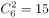种选择；

剩余4个年级，随机参观剩余5个科技馆，因各年级之间可以选择相同的馆，故每个年级都有5种选择，共计种选择。

故6个年级总计选择方案有：种选择。

故正确答案为D。

备注：根据题意，6个年级之间有可能重复选择同一个科技馆，故剩余4个年级参观剩余5个科技馆，并非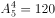种选择。

---

### 第 2 题　qid 2377061 · 数学运算

某技校在每月首日招收学员，学习时限以月为周期，每月首日为考核日。考核通过即离校。据统计，每批学员学习1个月后，在次月初的考核通过的比例为，而学习2个月后，仍未通过考核的占该批学员的，学习3个月后该批学员全部考核通过离校。如果从3月份起，该技校每个月招收300名学员，则7月2日在该技校的学员有多少名？

- **A**. 540
- **B**. 600
- **C**. 720　✅
- **D**. 810

**答案**：C

**官方解析**

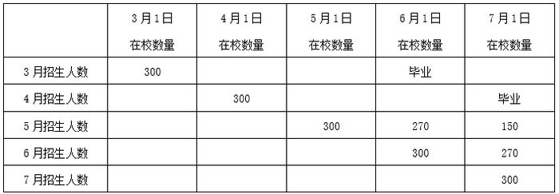

根据表格可知，7月2日在校的学员数量包括5月剩余150人，6月剩余270人，以及7月1日新招的300人，共计人。

故正确答案为C。

---

### 第 3 题　qid 2377186 · 数学运算

如图所示，在长为64米、宽为40米的长方形耕地上修建宽度相同的两条道路（一条横向、一条纵向），把耕地分为大小不等的四块。已知修路后耕地总面积为1377平方米，则该道路路面宽度为多少米？

- **A**. 10
- **B**. 11
- **C**. 12
- **D**. 13　✅

**答案**：D

**官方解析**

设道路的宽度为。将两条道路移至边缘处（如下图所示），耕地面积为阴影部分，其长为米，宽为米，所以耕地面积为，由于乘积为奇数，则均必为奇数，所以为奇数，排除A、C两个选项，代入B选项：，不符合题意，排除B选项。

故正确答案为D。

---

### 第 4 题　qid 2377054 · 数学运算

某饮料厂生产的A、B两种饮料均需加入某添加剂，A饮料每瓶需加该添加剂4克，B饮料每瓶需加3克，已知370克该添加剂恰好生产了这两种饮料共计100瓶，则A、B两种饮料各生产了多少瓶？

- **A**. 30、70
- **B**. 40、60
- **C**. 50、50
- **D**. 70、30　✅

**答案**：D

**官方解析**

设A、B两种饮料各生产了、瓶，根据题意得：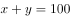，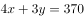，解得：，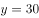。即A、B两种饮料各生产了70、30瓶。

故正确答案为D。

---

### 第 5 题　qid 2377050 · 数学运算

现有5盒动画卡片，各盒卡片张数分别为：7、9、11、14、17。卡片按图案分为米老鼠、葫芦娃、喜羊羊和灰太狼4种，每个盒内装的是同图案的卡片。已知米老鼠的卡片只有一盒，而喜羊羊、灰太狼图案的卡片数之和比葫芦娃图案的多1倍。据此可知，图案为米老鼠的卡片张数为：

- **A**. 7　✅
- **B**. 9
- **C**. 14
- **D**. 17

**答案**：A

**官方解析**

根据题意，5个盒子中卡片总数为个。又因为总共四种卡片，且喜羊羊、灰太狼两种卡片数量之和比葫芦娃多1倍，即。因此这三种卡片的数量之和是3的整数倍，即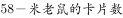是3的整数倍，代入选项，只有A选项米老鼠的卡片张数是7的时候满足，是3的整数倍，其余均不满足。

故正确答案为A。

---

### 第 6 题　qid 2377047 · 数学运算

某农户饲养有肉兔和宠物兔两种不同用途的兔子共计2200只，所有兔子的毛色分为黑、白两种。肉兔中有的毛色为黑色，宠物兔中有毛色为白。据此可知，毛色为白色的肉兔至少有多少只？

- **A**. 25　✅
- **B**. 50
- **C**. 100
- **D**. 200

**答案**：A

**官方解析**

肉兔中有毛色为黑，则有毛色为白。宠物兔中有毛色为白。设宠物兔有只，则肉兔有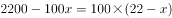只。则肉兔的数量既是8的整数倍又是100的整数倍即200（8与100的最小公倍数）的整数倍，要使肉兔中毛色为白色的最少，应使肉兔的数量尽可能少，则肉兔最少为200只，故毛色为白色的肉兔至少为只。

故正确答案为A。

---

### 第 7 题　qid 2377045 · 数学运算

A、B两地各有一批相同数量的货物需由某运输队用卡车完成交换。假设每辆卡车运送的货物箱数量相同，运输队首先从A地出发，中途时有10辆卡车抛锚，其余车辆必须每辆车再多运2箱。到达B地卸货后有15辆卡车不返程。因此参与返程的卡车每辆都需比出发时多装运6箱。据此可知，两地共有货物多少箱？

- **A**. 2000
- **B**. 1800
- **C**. 3600　✅
- **D**. 4000

**答案**：C

**官方解析**

设运输队从A地出发时共有辆卡车，每辆卡车运货物箱。根据题意可得：

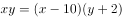······①

······②

联立①②，化简之后得，

······③

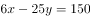······④

解得，，因此原来两地共有货物箱。

故正确答案为C。

---

### 第 8 题　qid 2377043 · 数学运算

在一次马拉松比赛中，某国运动员包揽了前四名，他们佩戴的参赛号码很有趣：一人的号码加4，另一人减4，第三人乘4，第四人除以8，其所得的数字都一样。且这四个号码中有1个三位数号码，2个两位数号码，1个一位数号码。而其中一位运动员在比赛中取得的名次也与自己的号码相同。据此可知，其中三位数的号码为：

- **A**. 120
- **B**. 128　✅
- **C**. 256
- **D**. 512

**答案**：B

**官方解析**

题干中四人对应的号码数分别设为、、、（均为正整数），根据题干条件可得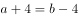，分析可知，一定是最大的，则一定是三位数。

代入A选项进行验证，时，，解得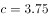，非整数排除；

代入B选项进行验证，时，，解得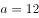，，，满足题干所有条件。

故正确答案为B。

---

### 第 9 题　qid 2377184 · 数学运算

某学校举行迎新篝火晚会，100名新生随机围坐在篝火四周，其中，小张与小李是同桌，他俩坐在一起的概率为：

- **A**. 

- **B**. 
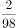

- **C**. 

　✅
- **D**. 
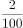

**答案**：C

**官方解析**

方法一：100名新生围坐在篝火四周，总情况数为（类似于n人的圆桌排列，方法数为）；小张与小李坐在一起，采用捆绑法，将小张与小李看成一个整体（内部有顺序）与另外98名新生进行圆桌排列，满足条件的方法数为，所以小张与小李坐在一起的概率为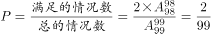。

方法二：小李先坐好，剩下99个位置，小张与小李坐在一起，有2种选择，故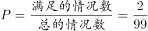。

故正确答案为C。

---

### 第 10 题　qid 2377040 · 数学运算

某儿童剧以团购方式销售门票，其票价如下：

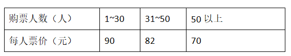

现有甲、乙两个小学组织学生观看，若两个学校以各自学生总数分别购票，则两个学校门票共计需花费6120元；若两个学校将各自学生合在一起购票，则门票费为5040元。据此可知，两个小学相差多少人？

- **A**. 18　✅
- **B**. 19
- **C**. 20
- **D**. 21

**答案**：A

**官方解析**

根据已知条件，总人数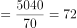人，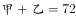为偶数，根据知和求差，奇偶同性，则甲-乙也是偶数，排除B、D两项。将A项代入验证，即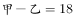，结合，可以求出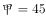，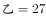，则分开购票总费用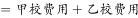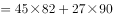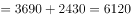元，满足题干条件。

故正确答案为A。

---

## 判断推理

### 第 1 题　qid 2377141 · 图形推理

请从所给四个选项中选择一个最合适的填入问号处，使之呈现一定的规律性。

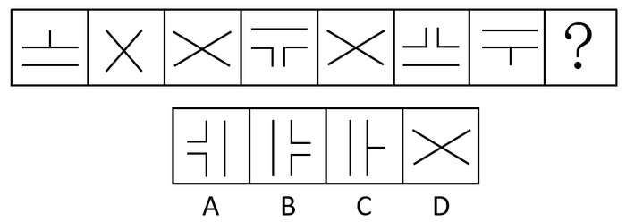

- **A**. A
- **B**. B
- **C**. C
- **D**. D　✅

**答案**：D

**官方解析**

元素组成不同，优先考虑属性规律。观察发现题干都是轴对称图形并且都有一条竖直对称轴，只有D项符合。
故正确答案为D。

---

### 第 2 题　qid 2377154 · 图形推理

根据下列图形规律将图形分组，分组正确的是：

- **A**. ②③⑤；①④⑥
- **B**. ①④⑤；②③⑥
- **C**. ①②④；③⑤⑥
- **D**. ①②⑤；③④⑥　✅

**答案**：D

**官方解析**

本题为分组分类题目。元素组成不同，无明显属性规律，考虑数量规律。观察发现，图中出现了很多空白区域，考虑数面。图①②⑤的面数量都是1，图③④⑥的面数量都是0，即①②⑤一组，③④⑥一组。
故正确答案为D。

---

### 第 3 题　qid 2377135 · 图形推理

请从所给四个选项中选择一个最合适的选项填入问号处，使之呈现一定的规律性。

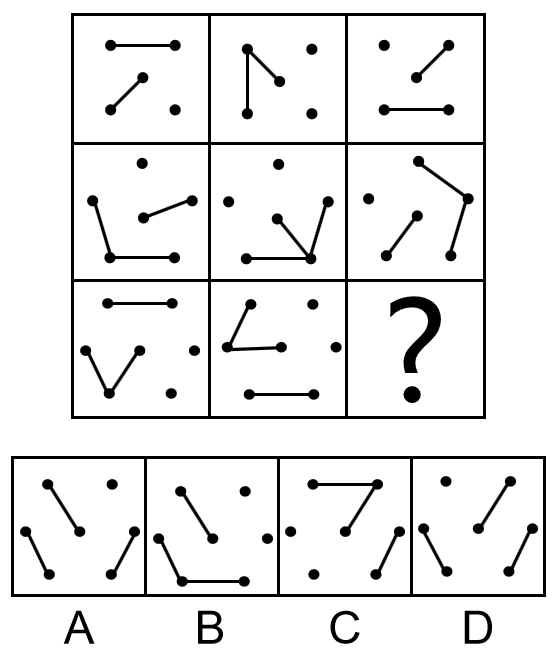

- **A**. A　✅
- **B**. B
- **C**. C
- **D**. D

**答案**：A

**官方解析**

元素组成相同，优先考虑位置规律。九宫格优先横行看，图形都是分内外的，内外分开看，观察外框发现，外部线条沿外框每次逆时针平移一步，观察内部发现，内部线条沿外框4个顶点每次顺时针旋转一个点；第二行满足此规律，外部线条沿外框每次逆时针平移一步，内部线条沿外框5个顶点每次顺时针旋转一个点；因此？处，外部线条应逆时针平移一步，排除BC项，内部线条应沿外框6个顶点每次顺时针旋转一个点，旋转到左上方，排除D项。故正确答案为A。

---

### 第 4 题　qid 2377144 · 图形推理

下面四个选项中，是题干图形的正面平视图的是：

- **A**. A　✅
- **B**. B
- **C**. C
- **D**. D

**答案**：A

**官方解析**

本题考查三视图。题干图形的正面平视图应该是最左侧有三个正方形且最上边是字母B所在的面，中间是字母A和D所在的两个面，最右侧是一个空白面，对应A选项。
故正确答案为A。

---

### 第 5 题　qid 2377148 · 图形推理

请从所给四个选项中选择一个最合适的填入问号处，使之呈现一定的规律性。

- **A**. 7，10
- **B**. 13，6
- **C**. 11，12　✅
- **D**. 11，9

**答案**：C

**官方解析**

观察题干图形，发现每一条直线上都有四个数字，优先考虑数字的加减运算。进一步观察发现每条直线上的四个数字相加之和都是26，故“？”处的两个数字应该分别是11、12，对应C选项。
故正确答案为C。

---

### 第 6 题　qid 2377136 · 图形推理

请从所给四个选项中选择一个最合适的填入第3，4行问号处，使之呈现一定的规律性。

- **A**. ：，玉
- **B**. 二，王
- **C**. 18，279
- **D**. 开，”　✅

**答案**：D

**官方解析**

元素组成不同，出现了很多字母、数字以及汉字，优先考虑笔画数。十六宫格优先横行看，观察发现，第一横行笔画数依次为1、2、3、4。第二横行笔画数满足此规律。故第三行？处选择笔画数为4的图形，第四行？处选择笔画数为2的图形。
故正确答案为D。

---

### 第 7 题　qid 2377155 · 图形推理

请从所给四个选项中选择一个最合适的填入1和2处，使之呈现一定的规律性。

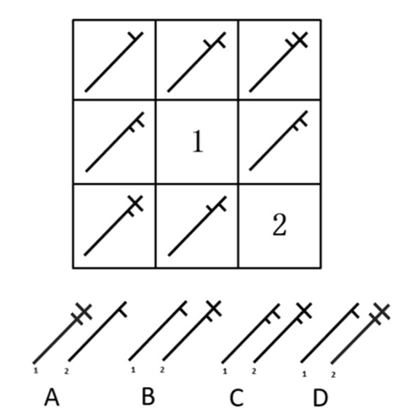

- **A**. A
- **B**. B
- **C**. C
- **D**. D　✅

**答案**：D

**官方解析**

观察图形特征，九宫格优先横着看，第一行图1和图2相加得到图3，第二行图1到图3图形没有改变，说明图2不能在图1的基础上增加新的线条，因此排除A项。第三行图1和图2相加得到的图形应该是长斜线两边各有两根短线，因此选D。
故正确答案为D。

---

### 第 8 题　qid 2377150 · 图形推理

请从所给四个选项中选择一个最合适的填入问号处，使之呈现一定的规律性：

- **A**. A
- **B**. B　✅
- **C**. C
- **D**. D

**答案**：B

**官方解析**

观察图形特征，元素组成不同，发现题干图形部分数分别为：2、3、2、3、2、3、2，因此？处应该是一个三部分的图形，A、C、D都是一部分图形，只有B项符合。
故正确答案为B。

---

### 第 9 题　qid 2377156 · 定义判断

团队学习行为是团队成员为了满足团队和个人的发展需求，在分享各自经验的基础上，通过知识和信息交流等途径提出问题、寻求反馈、进行实验、反思结果，对失误或未预期结果进行讨论，促进团队与个人知识或技能水平不断提高，进而实现团队层面知识与技能的相对持久变化。
根据上述定义，下列属于团队学习行为的是：

- **A**. 某项目组为了在项目攻关阶段发挥团队的凝聚力和战斗力，每周末都举行野外拓展训练
- **B**. 小王为了今后的发展，在上班期间抽空和其他几位同事一起学习英语
- **C**. 为了获得奖学金，某宿舍全体女生约定大家相互监督，晚上一起去自习
- **D**. 销售部为提高部门整体业绩，推选优秀代表定期与大家分享销售经验　✅

**答案**：D

**官方解析**

第一步：找出定义关键词。
“为了满足团队和个人的发展需求”、“在分享各自经验的基础上，通过知识和信息交流等途径提出问题、寻求反馈、进行试验，反思结果”、“促进团队与个人知识或技能水平的不断提高，进而实现团队层面知识与技能的相对持久化”。
第二步：逐一分析选项。
A项：项目组进行野外拓展训练，不符合“在分享各自经验的基础上，通过知识和信息交流等途径提出问题、寻求反馈、进行试验，反思结果”，不符合定义，排除； 
B项：小王在上班期间和同事学英语，是为了个人能力的提升，不符合“促进团队与个人知识或技能水平的不断提高，进而实现团队层面知识与技能的相对持久化”，不符合定义，排除；
C项：宿舍全体女生为了获得奖学金互相监督自习，不符合“在分享各自经验的基础上，通过知识和信息交流等途径提出问题、寻求反馈、进行试验，反思结果”，不符合定义，排除；
D项：销售部定期分享销售经验，符合“在分享各自经验的基础上，通过知识和信息交流等途径提出问题、寻求反馈、进行试验，反思结果”、“促进团队与个人知识或技能水平的不断提高”，符合定义，当选。
故正确答案为D。

---

### 第 10 题　qid 2377160 · 定义判断

共享型领导指独立于组织正式的领导角色或层级结构，由组织内部成员主动参与的，一种自下而上的成员之间相互领导的非正式领导力团队过程模式。它不仅强调传统垂直领导行为或角色在成员之间的共享，如决策制定、共享结果、共担责任等，还强调成员之间的相互影响与相互协作，属于一种分布于成员之间的水平影响力。
根据上述定义，下列属于共享型领导的是：

- **A**. 某班级班主任在新学期发起由全班同学轮流做班长的活动
- **B**. 为了提高服务质量和办事效率，某部门将日常突发、应急事项从原来的几个科室流水处理，改由专人负责到底
- **C**. 在公司项目组项目设计过程中，小王主动承担技术攻关的任务
- **D**. 某研发部门为了提高研发效率、发挥员工的积极性而实行民主集中制，由员工共同行使权力，共同承担责任，共同分享利益　✅

**答案**：D

**官方解析**

第一步：找出定义关键词。
“独立于组织正式的领导角色或层级结构”、“由组织内部成员主动参与的”、“成员之间相互领导”、“非正式领导力团队过程模式”、“传统垂直领导行为或角色在成员之间共享”、“成员之间的相互影响与相互协作”。
第二步：逐一分析选项。
A项：班主任发起全班同学轮流做班长的活动，不符合“组织内部成员主动参与”，也未体现“成员之间的相互影响与相互协作”，不符合定义，排除； 
B项：某部门由专人负责应急事项，不符合“由组织内部成员主动参与的”，也不符合 “成员之间相互领导”，且没有体现成员之间领导行为共享，不符合定义，排除；
C项：小王主动承担技术攻关的任务，没有体现出来小王是领导，不符合“成员之间相互领导”，也未体现“角色在成员之间共享”，不符合定义，排除；
D项：研发部门发挥员工积极性，实行民主集中制，由员工共同行使权力，共同担责，共同分享利益，符合 “成员之间相互领导”、“非正式领导力团队过程模式”、“传统垂直领导行为或角色在成员之间共享”，符合定义，当选。
故正确答案为D。

---

### 第 11 题　qid 2377234 · 定义判断

家庭式迁移是指家庭成员以户为单位跟随主要生产要素离开原居住地迁往目标地的人口单向性流动现象。
根据上述定义，下列属于家庭式迁移的是：

- **A**. 因工作调动，小王夫妇举家迁往工作城市　✅
- **B**. 老李夫妇常年在沿海城市打工，只有春节才能回老家和父母及子女团聚
- **C**. 老张一家结束了多年在外打工的生活，回乡定居，生活一段时间后发现家乡很适合搞养殖
- **D**. 老伴去世后，老刘被在澳门工作的独生女儿接到当地一家养老机构安度晚年

**答案**：A

**官方解析**

第一步：找出定义关键词。
“家庭成员以户为单位”、“跟随主要生产要素离开原居住地迁往目标地”、“人口单向性流动现象”
第二步：逐一分析选项。
A项：因工作调动，小王夫妇举家迁往工作城市符合“家庭成员以户为单位”，“跟随主要生产要素离开原居住地迁往目标地”，符合“人口单向性流动现象”，符合定义，当选；
B项：老李夫妇春节回老家和父母及子女团聚不符合“家庭成员以户为单位”，且过完年他们会重新回到沿海城市，不符合“人口单向性流动现象”，不符合定义，排除；
C项：老张一家结束了在外打工的生活，回乡定居，不符合“跟随主要生产要素离开原居住地迁往目标地”，不符合定义，排除；
D项：老伴去世后，老刘被在澳门工作的独生女儿接到当地养老机构生活，不符合“家庭成员以户为单位”，且不符合“跟随主要生产要素离开原居住地迁往目标地”，不符合定义，排除。
故正确答案为A。

---

### 第 12 题　qid 2377165 · 定义判断

元刻板印象是指个体关于外群体成员对其所属群体所持刻板印象的信念。
根据上述定义，下列属于元刻板印象的是：

- **A**. 二班的任课教师们一致认为贫困儿童小豪存在交流障碍
- **B**. 经济学家们认为高房价影响80后夫妻生二孩意愿
- **C**. 刘大夫认为如今的患者普遍不太信任医生　✅
- **D**. 南方人小刘认为北方人都比较耐冻

**答案**：C

**官方解析**

第一步：找出定义关键词。
“个体认为外群体成员对其所属群体存在刻板印象”。
第二步：逐一分析选项。
A项：任课教师认为贫困儿童小豪存在交流障碍，这是任课教师对小豪的印象，而不是任课教师认为小豪对教师群体存在刻板印象，不符合“个体认为外群体成员对其所属群体存在刻板印象”，不符合定义，排除；
B项：经济学家认为高房价影响80后夫妻生二孩意愿，这是经济学家对80后夫妻的印象，而不是经济学家认为80后夫妻对经济学家群体存在刻板印象，不符合“个体认为外群体成员对其所属群体存在刻板印象”，不符合定义，排除；
C项：刘大夫认为患者不信任医生群体，刘大夫属于医生群体，患者是“外群体成员”，患者普遍不太信任医生，符合“个体认为外群体成员对其所属群体存在刻板印象”，符合定义，当选；
D项：南方人小刘认为北方人耐冻，这是小刘对北方人的印象，而不是小刘认为北方人对南方人群体存在刻板印象，不符合“个体认为外群体成员对其所属群体存在刻板印象”，不符合定义，排除。
故正确答案为C。

---

### 第 13 题　qid 2377166 · 定义判断

顾客主动社会化是指顾客为了有效参与到服务过程而主动学习与其扮演角色相关的知识和信息的过程。
根据上述定义，下列属于顾客主动社会化的是：

- **A**. 退休的张阿姨每天晚上收看电视养生节目学习养生
- **B**. 公司员工小刘为了提高在某片区的销售业绩，自学当地方言
- **C**. 小明的妈妈为了帮助小明提高奥数成绩，自己也报了奥数培训班
- **D**. 小谢不认同医生关于自己患有抑郁症的诊断，为此上网搜了很多资料　✅

**答案**：D

**官方解析**

第一步：找出定义关键词。
“顾客”、“为了有效参与到服务过程”、“主动学习与其扮演角色相关的知识和信息”。 
第二步：逐一分析选项。
A项：退休的张阿姨收看电视养生节目，张阿姨不是“顾客”，不符合定义，排除； 
B项：小刘是公司员工，不是“顾客”，为提高销售业绩而学习方言，不符合“为了有效参与到服务过程”，不符合定义，排除； 
C项：小明的妈妈是奥数培训班的“顾客”， 但她报奥数班的目的是为了帮助小明提高奥数成绩，不符合“为了有效参与到服务过程”，不符合定义，排除；
D项：小谢是一名患者，所以他是医生的“顾客”，小谢在网上搜了很多的资料是为了确认医生对自己的诊断是否正确，符合“为了有效参与服务过程”，也符合“主动学习与其扮演角色相关的知识和信息”，符合定义，当选。
故正确答案为D。

---

### 第 14 题　qid 2377168 · 定义判断

公众科学是指在科学公开化与科学政策公开化的必要基础上，公众直接参与科学知识产出过程。公共科学是指普通公众参与科学相关的科技政策审议、科学问题讨论以及科学成果转化等。
根据上述定义，下列属于公众科学的是：

- **A**. 某医学伦理委员会就基因编辑的道德风险向当地的科技工作者征询意见
- **B**. 某手机公司的研发部门就是否取消物理按键公开征询广大消费者意见
- **C**. 明镜调查公司就5G商业前景在车站广场等公共场所发放调查问卷
- **D**. 某公司为缩短研发的抗癌新药上市周期而招募试用志愿者　✅

**答案**：D

**官方解析**

第一步：找出定义关键词。
公众科学：“科学公开化与科学政策公开化”、“直接参与科学知识产出过程”；
公共科学：“普通公众参与”、“科学相关的科技政策审议、科学问题讨论以及科学成果转化等”。
第二步：逐一分析选项。
A项：医学伦理委员会向当地的科技工作者征询意见，不符合“直接参与科学知识产出过程”，不符合定义，排除；
B项：公司的研发部门征询广大消费者意见，不符合“直接参与科学知识产出过程”，不符合定义，排除；
C项：明镜调查公司在车站广场发放调查问卷，不符合“直接参与科学知识产出过程”，不符合定义，排除；
D项：某公司为研发抗癌新药招募试用志愿者，符合“直接参与科学知识产出过程”，符合定义，当选。
故正确答案为D。

---

### 第 15 题　qid 2377145 · 定义判断

生态系统反服务是指随着受损的自然生态系统结构和功能在人类主动干预保护措施的实施下，逐步得到恢复的同时，生态系统对人类日常生活和生产活动产生的负面影响。
根据上述定义，下列最不可能属于生态系统反服务的是：

- **A**. 城市干道种植的大量法国梧桐，是诱发市民过敏性鼻炎的重要因素
- **B**. 某地动物保护工作开展以来，猕猴数量剧增，它们常骚扰当地居民
- **C**. 修建水坝改善当地的经济状况的同时，也使一部分历史遗迹遭到破坏　✅
- **D**. 因禁止使用除草剂，农民不得不投入更大的人力成本来拔掉杂草

**答案**：C

**官方解析**

第一步：找出定义关键词。
“随着受损的自然生态系统结构和功能在人类主动干预保护措施的实施下”、“生态系统对人类日常生活和生产活动产生的负面影响”。
第二步：逐一分析选项。
A项：城市干道种植大量法国梧桐，符合“随着受损的自然生态系统结构和功能在人类主动干预保护措施的实施下”，诱发市民过敏性鼻炎，符合“生态系统对人类日常生活和生产活动产生的负面影响”，符合定义，排除；
B项：某地动物保护工作的开展，符合“随着受损的自然生态系统结构和功能在人类主动干预保护措施的实施下”，猕猴数量剧增，经常骚扰当地居民，符合“生态系统对人类日常生活和生产活动产生的负面影响”，符合定义，排除；
C项：修建水坝改善当地的经济状况，不符合“随着受损的自然生态系统结构和功能在人类主动干预保护措施的实施下”，使历史遗迹遭到破坏，不符合“生态系统对人类日常生活和生产活动产生的负面影响”，不符合定义，当选；
D项：禁止使用除草剂，符合“随着受损的自然生态系统结构和功能在人类主动干预保护措施的实施下”，农民投入更大的人力成本，符合“生态系统对人类日常生活和生产活动产生的负面影响”符合定义，排除。
本题为选非题，故正确答案为C。

---

### 第 16 题　qid 2377147 · 定义判断

确认偏差是指人一旦产生某个信念，就会努力寻找与它相符的例子，并无视那些不符的。
根据上述定义，下列最可能属于确认偏差的是：

- **A**. 尽管别人告诉厨师小黄所有泡菜坛里的泡菜原料、泡制时间都一样，但厨师小黄仍认为用黄色泡菜坛里的泡菜烹饪鱼香肉丝会更可口
- **B**. 股票经理人告诉客户小明某股票会涨的同时又背着小明告诉其他客户该股票会跌，结果该股票大涨，因此小明对经理人十分信任
- **C**. 小刚认为终有一天会天降横财，便痴迷于彩票，尽管从未中奖，他还是整日游手好闲，甚至贷款买彩票
- **D**. 小东听到某个所谓的“预言家”断定自己会遭遇车祸后时常感到担忧，终于在某天与其他车辆发生擦挂，于是小东更相信那位“预言家”了　✅

**答案**：D

**官方解析**

第一步：找出定义关键词。
“产生某个信念”、“努力寻找与它相符的例子”、“无视那些不符的”。
第二步：逐一分析选项。
A项：小黄的信念是认为黄色泡菜坛里的泡菜做鱼香肉丝更好吃，但没有寻找与之相符的例子，也没有无视不符合的例子，不符合“努力寻找与它相符的例子”、“无视那些不符的”，不符合定义，排除；
B项：股票经理人告诉客户小明某股票会涨，股票果然大涨，因此小明对经理人十分信任，是先有相符的例子后，才信任经理人，而题干是先产生信念，再找相符的例子，不符合“人一旦产生某个信念，就会努力寻找与它相符的例子”，不符合定义，排除；
C项：小刚认为终有一天会天降横财，痴迷于彩票，只是盲目买彩票，无视不符合的情况，但没有努力寻找与信念相符的例子来印证自己的信念是正确的，不符合“努力寻找与它相符的例子”，不符合定义，排除；
D项：小东听到“预言家”断定自己会遭遇车祸后时常感到担忧，说明小东相信自己会出车祸的预言，符合“产生某个信念”，与其他车辆发生擦挂后更相信那位“预言家”，说明小东认为擦挂证明了自己确实会出车祸，认为预言成真，却无视其它安全驾驶的情况，符合“努力寻找与它相符的例子”、“无视那些不符的”，符合定义，当选。
故正确答案为D。

---

### 第 17 题　qid 2377149 · 类比推理

设计：修建：高楼

- **A**. 痛恨：打击：仇敌
- **B**. 热爱：学习：书本
- **C**. 体检：判断：病人
- **D**. 勘探：开采：石油　✅

**答案**：D

**官方解析**

第一步：判断题干词语间逻辑关系。
设计和修建是两个动作，分别可以和高楼构成动宾结构，且存在先后顺序,即先设计高楼，再修建高楼。
第二步：判断选项词语间逻辑关系。
A项：痛恨和打击是两个动作，分别可以和“仇敌”构成动宾结构，但是痛恨仇敌和打击仇敌没有一定的先后顺序，与题干逻辑关系不一致，排除；
B项：热爱和学习是两个动作，但是热爱书本和学习书本搭配不当，与题干逻辑关系不一致，排除；
C项：体检和判断是两个动作，但体检病人和判断病人搭配不当，与题干逻辑关系不一致，排除。
D项：勘探和开采是两个动作，分别可以和石油构成动宾结构，且存在先后顺序,即先勘探石油，再开采石油，与题干逻辑关系一致，当选；
故正确答案为D。

---

### 第 18 题　qid 2377161 · 类比推理

黄桃：水蜜桃：桃

- **A**. 红缨枪：冲锋枪：枪
- **B**. 地中海：大海：海
- **C**. 煎饼：烧饼：饼
- **D**. 雏菊：杭菊：菊　✅

**答案**：D

**官方解析**

第一步：判断题干词语间逻辑关系。
“黄桃”和“水蜜桃”都是“桃”的一种，二者属于并列关系中的反对关系，与“桃”都属于包容关系中的种属关系。
第二步：判断选项词语间逻辑关系。
A项：“红缨枪”属于古代的一种冷兵器，指在长柄的一端装有尖锐的金属枪头，枪头和柄相连的部分装饰着红缨；“冲锋枪”指单兵用的全自动枪，枪身较短，通常双手握持，用于近战和冲锋，二者均属于武器，为并列关系中的反对关系，与“枪”都属于包容关系中的种属关系，保留；
B项：“地中海”是“大海”的一种，二者属于包容关系中的种属关系，“大海”与“海”属于全同关系，与题干逻辑关系不一致，排除；
C项：“煎饼”指用高粱、小麦、小米或豆类等浸水磨成糊状，在鏊子上摊匀烙熟的薄饼；“烧饼”指烤熟的小的发面饼，二者属于并列关系中的反对关系，且与“饼”都属于包容关系中的种属关系，与题干逻辑关系一致，保留；
D项：“杭菊”是菊科，菊目的植物；“雏菊”是菊科雏菊属植物的一种，多年生草本植物，二者属于并列关系中的反对关系，且与“菊”都属于包容关系中的种属关系，与题干逻辑关系一致，保留。
比较A、C、D三项，题干均属于植物，且是天然产物，从二级辨析同一范畴的角度来看，只有D项符合。
故正确答案为D。

---

### 第 19 题　qid 2377163 · 类比推理

轮椅：汽车

- **A**. 公路：马路
- **B**. 火车：水车
- **C**. 缆车：索道
- **D**. 飞机：坦克　✅

**答案**：D

**官方解析**

第一步：判断题干词语间逻辑关系。
轮椅和汽车都是一种出行工具，二者属于并列关系中的反对关系。
第二步：判断选项词语间逻辑关系。
A项：公路是现代术语，是可以行驶汽车的公用之路、公众的交通工具行驶之路，汽车、单车、人力车、马等众多交通工具及行人都可以走，民间也称作马路，因此二者可理解为全同关系；马路是指供人或车马出行的宽阔平整的道路、公路，此时马路的范围明显大于公路，二者可因此理解为包容关系中的种属关系。目前未有十分明确的定义可以准确地判断二者之间的关系，但全同关系、种属关系均与题干逻辑关系不一致，排除；
B项：火车是一种交通工具，水车是一种灌溉工具，二者无必然联系，与题干逻辑关系不一致，排除；
C项：词典中关于缆车的解释是指索道上用来运输的设备，现在也认为缆车即索道，二者为全同关系，但两种理解方式均与题干逻辑关系不一致，排除；
D项：飞机和坦克都可以当成作战工具，二者属于并列关系中的反对关系，与题干逻辑关系一致，当选。
故正确答案为D。

---

### 第 20 题　qid 2377169 · 类比推理

助听器：眼镜

- **A**. 钢笔：日记
- **B**. 轮船：邮轮
- **C**. 房屋：别墅
- **D**. 冰箱：烤箱　✅

**答案**：D

**官方解析**

第一步：判断题干词语间逻辑关系。
助听器是辅助听力的工具，眼镜是矫正视力的工具，二者均为人体感官的辅助工具，是并列关系。
第二步：判断选项词语间逻辑关系。
A项：钢笔可以用来写日记，二者为工具的对应关系，与题干逻辑关系不一致，排除；
B项：邮轮是轮船的一种，二者为种属关系，与题干逻辑关系不一致，排除；
C项：别墅是房屋的一种，二者为种属关系，与题干逻辑关系不一致，排除； 
D项：冰箱是保持恒定低温的一种制冷设备，烤箱是一种密封的用来烤食物或烘干产品的电器，均为家用电器，二者为并列关系，与题干逻辑关系一致，当选。
故正确答案为D。

---

### 第 21 题　qid 2377227 · 类比推理

野径云俱黑：江船火独明

- **A**. 要看银山拍天浪：开窗放入大江来
- **B**. 战士军前半死生：美人帐下犹歌舞　✅
- **C**. 兰陵美酒郁金香：玉碗盛来琥珀光
- **D**. 谁道阴山行路难：风毛雨血万人欢

**答案**：B

**官方解析**

第一步：判断题干词语间逻辑关系。
题干诗句出自唐代杜甫的《春夜喜雨》，意思是浓浓乌云，笼罩田野小路，唯有江边渔船上的一点渔火放射出一线光芒，显得格外明亮。两句诗对仗工整，野径对应江船，云俱黑对应火独明。
第二步：判断选项词语间逻辑关系。
A项：诗句出自宋代曾公亮的《宿甘露寺僧舍》，意思是我忍不住想去看那如山般高高涌过的波浪，一打开窗户，滚滚长江仿佛扑进了我的窗栏。两句诗不对仗，与题干逻辑关系不一致，排除； 
B项：诗句出自唐代高适的《燕歌行》，意思是战士拼斗军阵前半数死去半生还，美人却在营帐中还是歌来还是舞。两句诗对仗工整，战士对应美人，军前对应帐下，半死生对应犹歌舞，与题干逻辑关系一致，当选；
C项：诗句出自唐代李白的《客中行》，意思是兰陵美酒甘醇，就像郁金香芬芳四溢。兴来盛满玉碗，泛出琥珀光晶莹迷人。两句诗不对仗，与题干逻辑关系不一致，排除；
D项：诗句出自清代纳兰性德的《于中好·谁道阴山行路难》，意思是是谁说阴山之路无法行走呢？大规模狩猎时禽兽毛血纷飞万人庆祝。两句诗不对仗，与题干逻辑关系不一致，排除。
故正确答案为B。

---

### 第 22 题　qid 2377226 · 类比推理

崎岖对于（  ），相当于（  ）对于悲痛

- **A**. 平坦；心情
- **B**. 山路；沉痛
- **C**. 坦途；欢喜
- **D**. 坎坷；悲哀　✅

**答案**：D

**官方解析**

逐一代入选项。
A项：崎岖指山路不平，平坦指没有高低凹凸（多指地势），二者构成反义关系，悲痛是一种心情，二者构成种属关系，前后逻辑关系不一致，排除；
B项：崎岖可以用来形容山路，沉痛与悲痛都是形容一种难过的心情，二者属于近义关系，前后逻辑关系不一致，排除；
C项：崎岖指山路不平，为形容词，坦途指平坦的道路，为名词，二者不能构成反义关系，欢喜与悲痛构成反义关系，前后逻辑关系不一致，排除；
D项：崎岖指山路不平，坎坷指地面高低不平，二者构成近义关系，悲哀与悲痛构成近义关系，前后逻辑关系一致，当选。
故正确答案为D。

---

### 第 23 题　qid 2377157 · 类比推理

电影院：观众：观影

- **A**. 广播：听众：主播
- **B**. 医生：病人：问诊
- **C**. 演唱会：歌手：演唱
- **D**. 发布会：记者：提问　✅

**答案**：D

**官方解析**

第一步：判断题干词语间逻辑关系。
本题可以造句：观众在电影院观影，电影院是个场所，且观影是动宾关系。
第二步：判断选项词语间逻辑关系。
A项：不能说听众在广播主播，且广播不是一个场所，与题干逻辑关系不一致，排除；
B项：不能说病人在医生问诊，且医生不是一个场所，与题干逻辑关系不一致，排除；
C项：可以造句：歌手在演唱会演唱，演唱会是个场所，但演唱是个动词，与题干逻辑关系不一致，排除；
D项：可以造句：记者在发布会提问，发布会是个场所，且提问是动宾关系，与题干逻辑关系一致，当选。
故正确答案为D。

---

### 第 24 题　qid 2377170 · 类比推理

臭豆腐：香菇

- **A**. 热干面：凉水　✅
- **B**. 黑芝麻：白菜
- **C**. 小麦：大米
- **D**. 甜菜：苦瓜

**答案**：A

**官方解析**

第一步：判断题干词语间逻辑关系。
臭豆腐是经过人为加工后的产物，香菇是自然的产物。
第二步：判断选项词语间逻辑关系。
A项：热干面是经过人为加工后的产物，凉水是自然的产物，与题干逻辑关系一致，当选；
B项：黑芝麻和白菜均为自然的产物，与题干逻辑关系不一致，排除；
C项：小麦和大米均为自然的产物，与题干逻辑关系不一致，排除；
D项：甜菜和苦瓜均为自然的产物，与题干逻辑关系不一致，排除。
故正确答案为A。

---

### 第 25 题　qid 2377153 · 类比推理

头发：颜色：长度

- **A**. 狗：品种：性格
- **B**. 蔬菜：价格：营养
- **C**. 衣服：款式：尺码　✅
- **D**. 人：长相：气质

**答案**：C

**官方解析**

第一步：判断题干词语间逻辑关系。
颜色和长度可以区分头发，且颜色和长度是头发的外在表现形式。
第二步：判断选项词语间逻辑关系。
A项：品种可以区分狗的种类，品种是狗的外在表现形式，但性格多用来表达人，且是一种内在表现形式，与题干逻辑关系不一致，排除；
B项：价格和营养可以区分蔬菜，价格是蔬菜的外在表现形式，但营养是蔬菜的内在表现形式，与题干逻辑关系不一致，排除；
C项：款式和尺码区分衣服，且款式和尺码是衣服的外在表现形式，与题干逻辑关系一致，当选；
D项：长相和气质可以区分人，长相是人的外在表现形式，但气质是人的内在表现形式，与题干逻辑关系不一致，排除。
故正确答案为C。

---

### 第 26 题　qid 2377143 · 类比推理

某班分小组进行了摘草莓趣味比赛，甲、乙、丙3人分属3个小组。3人摘得的草莓数量情况如下：甲和属于第3小组的那位摘得的数量不一样，丙比属于第1小组的那位摘得少，3人中第3小组的那位比乙摘得多。据此，将3人按摘得的草莓数量从多到少排列，正确的是：

- **A**. 甲、乙、丙
- **B**. 甲、丙、乙　✅
- **C**. 乙、甲、丙
- **D**. 丙、甲、乙

**答案**：B

**官方解析**

此题为组合排列题型，从最大信息入手。题干中“第3组”出现次数最多。结合“甲和属于第3小组的那位摘的数量不一样”和“3人中第三小组那位比乙摘的多”可知：甲不在第3组，乙也不在第3组，所以只能丙在第3组，且丙大于乙；再结合“丙比属于第1小组的那位摘的少”可知，甲在第1组，且丙小于甲，因此草莓数量从多到少应是甲丙乙。

故正确答案为B。

---

### 第 27 题　qid 2377140 · 逻辑判断

有人认为，创造力和精神疾病是密不可分的。其理由是：尽管高智商是天才不可或缺的要素，但是仅当高智商与认知抑制解除相结合的情况下才能得到创造性的天才。
以下各项如果为真，最能质疑上述观点的是：

- **A**. 事实上，大部分杰出人物并没有表现出任何精神疾病症状
- **B**. 长期封闭式治疗精神疾病反而可能降低患者的认知能力和创造力
- **C**. 人生中的某些事件（如破产、失恋等）也能够提高人的创造潜能
- **D**. 大部分拥有高智商的精神疾病患者并没有表现出自己是创造性的天才　✅

**答案**：D

**官方解析**

论点：创造力和精神疾病是密不可分的。
论据：仅当高智商与认知抑制解除相结合的情况下才能得到创造性的天才。
本题论点和论据都是在讨论创造力和精神病之间的关系，讨论话题一致，要想削弱，可考虑否定论点，即创造力和精神疾病之间没有必然的联系。
第二步，逐一分析选项。
A项：说明大部分杰出人物没有表现出精神疾病症状，但不确定杰出人物是否为论点讨论的创造性天才，属于不明确选项，无法削弱，排除；
B项：该项说的是治疗精神疾病会带来的结果，题干讨论的是创造力和精神疾病之间的关系，话题不一致，无法削弱，排除；
C项：该项说的是某些事件可以提高创造力，题干讨论的是创造力和精神疾病之间的关系，话题不一致，无法削弱，排除；
D项：强调大部分高智商精神病患者并没有创造力，那么创造力和精神疾病之间就没有必然的联系，举例削弱论点，可以削弱，当选。
故正确答案为D。

---

### 第 28 题　qid 2377139 · 逻辑判断

科学家做了一个为期8周的实验：三批实验鼠在白天灯光照射16小时后，再在黑夜里分别处于全黑、暗光和开灯状态8小时，每日如此。在实验期间，所有实验鼠的食物类别及食量都完全相同。结论发现，夜间处于暗光环境、开灯环境的老鼠都出现体重增加的现象。据此，研究人员得出结论：西方人的普遍肥胖与晚上灯火通明的街景和电脑、电视机的光密切相关。
以下各项如果为真，最能质疑上述结论的是：

- **A**. 黑夜处于暗光、开灯环境的实验鼠和黑夜处于黑暗环境的实验鼠不一样，前者在夜间进食；而夜晚鼠类新陈代谢率低，能量消耗少，容易增重
- **B**. 实验时间仅8周，对幼鼠来说太过于短暂，应延长实验时间
- **C**. 西方人并不是普遍肥胖，中等及以上收入的人群非常重视体重问题，时常进行健身等身材管理
- **D**. 据统计，在晚上街景灯火通明的西方城市中，那些经常接受电脑、电视机光照射的人大部分并不肥胖　✅

**答案**：D

**官方解析**

第一步：找出论点和论据。
论点：西方人的普遍肥胖与晚上灯火通明的街景和电脑、电视机的光密切相关。
论据：三批实验鼠在白天灯光照射16小时后，再在黑夜里分别处于全黑、暗光和开灯状态8小时，每日如此。在实验期间，所有实验鼠的食物类别及食量都完全相同。结果发现，夜间处于暗光环境、开灯环境的老鼠都出现体重增加的现象。
本题论据是用三组老鼠进行试验，通过该实验结果推出论点的结论：西方人的肥胖也与光线有关。论点和论据主体不一致，可以考虑拆桥，即说明老鼠和人不一样，老鼠的实验结论不能代表人类，但是并没有这样的选项。还可以考虑削弱论据，即表明论据的实验不科学不合理。
第二步：逐一分析选项。
A项：该项说黑夜处于暗光、开灯环境的实验鼠和处于黑暗环境的实验鼠夜间进食情况不一样，前者在夜间进食，而夜间是否进食又影响了体重，说明论据中实验不科学，会影响实验结果，可以削弱论据，保留；
B项：该项指出论据中实验时间不够长，可能会影响到实验结果，但该选项说的是“幼鼠”，而题干中的“实验鼠”是否都是“幼鼠”并不明确，无法削弱，排除；
C项：该项说西方人中某些人会进行身材管理，但是并未说明肥胖是否与光线有关，无法削弱，排除；
D项：该项举了晚上街景灯火通明的西方城市中有些人并不肥胖的例子来说明灯光不会导致肥胖，举例削弱论点，保留。
对比A、D两项，A选项削弱论据，D选项削弱论点力度更强，对比择优选择D项。
故正确答案为D。

---

### 第 29 题　qid 2377142 · 逻辑判断

假设“如果张楠和林枫不是志愿者，那么杨梅是志愿者”是前提，“林枫是志愿者”为结论。
那么，下列各项中，是其必要前提的是：

- **A**. 张楠是志愿者
- **B**. 杨梅不是志愿者
- **C**. 杨梅和张楠都是志愿者
- **D**. 杨梅和张楠都不是志愿者　✅

**答案**：D

**官方解析**

第一步：找出论点和论据。

论点：林枫是志愿者。

论据：如果张楠和林枫不是志愿者，那么杨梅是志愿者。出现逻辑关联词，可以翻译为：张楠志愿者且林枫志愿者杨梅志愿者。

要想加强，力度最强的一定是搭桥，即在张楠不是志愿者、杨梅是志愿者和林枫是志愿者之间建立联系。

第二步：逐一分析选项。

A项： 张楠是志愿者，对于题干论据来说是否定了箭头前，但是否定箭头前得不到必然结论，无法加强，排除；

B项：杨梅不是志愿者，对于题干论据来说是否定了箭头后，否后必否前，可以得到张楠是志愿者或林枫是志愿者，但二者到底是谁不确定，无法加强，排除；

C项：杨梅是志愿者对于题干论据是肯定了箭头后，得不到必然结论，同时张楠是志愿者对于题干论据来说是否定了箭头前，也得不到必然结论，无法加强，排除；

D项：杨梅和张楠都不是志愿者，杨梅不是志愿者对于题干论据来说是否定箭头后，否后必否前，可以得到张楠是志愿者或林枫是志愿者，此时再结合张楠不是志愿者可以得到林枫是志愿者，在论点和论据之间建立联系，可以加强，当选。

故正确答案为D。

---

### 第 30 题　qid 2377171 · 逻辑判断

从理论上说，如果不考虑其他因素，“体型大”和“寿命长”是动物容易罹患癌症最合理的两个答案。因为“体型大”意味着组成身体的细胞数量更多，而“寿命长”意味着需要更多的新生细胞来更新换代；细胞越多，细胞分裂随机突变的概率就越高。
以下各项如果为真，最能质疑上述论证的是：

- **A**. 小白鼠等寿命短的小动物易患癌症
- **B**. 人类因吸烟而导致患癌症风险上升
- **C**. 寿命长、体型庞大的象罹患癌症的概率很低　✅
- **D**. 海牛与蹄兔是近亲，它们体型相差悬殊，却都不易罹患癌症

**答案**：C

**官方解析**

第一步：找出论点和论据。
论点：从理论上说，如果不考虑其他因素，“体型大”和“寿命长”是动物容易罹患癌症最合理的两个答案。
论据：“体型大”意味着组成身体的细胞数量更多，而“寿命长”意味着需要更多的新生细胞来更新换代；细胞越多，细胞分裂随机突变的几率就越高。
本题论点主要讨论是因为“体型大”和“寿命长”导致动物容易罹患癌症，论据也是围绕“体型大”和“寿命长”导致动物容易罹患癌症进行说明，论点和论据话题一致。要削弱即要么直接说明“体型大”和“寿命长”并不会或者不一定会导致癌症，要么举反例进行削弱。
第二步：逐一分析选项。
A项：小白鼠属于“体型小”且“寿命短”的动物，而题干讨论的是“体型大”和“寿命长”导致动物容易患癌症，主体不一致，无法削弱，排除；
B项：论点讨论“体型大”和“寿命长”导致动物容易患癌症，选项在讨论吸烟导致癌症风险上升，话题不一致，无法削弱，排除；
C项：“寿命长”且“体型大”的象罹患癌症的概率很低，即举反例进行削弱，可以削弱，保留；
D项：海牛与蹄兔是近亲，体型相差悬殊，却都不易罹患癌症，说明体型大小与癌症无关，可以削弱，保留。
比较C、D两项，C项为举反例削弱论点，说明“体型大”且“寿命长”不一定导致动物罹患癌症；D项虽然说明体型大小都与癌症无关，但寿命与癌症关系如何并不明确，因此C项力度强于D项。
故正确答案为C。

---

### 第 31 题　qid 2377146 · 逻辑判断

甲、乙、丙、丁每人只会编程、插花、绘画、书法四种技能中的两种，其中有一种技能只有一个人会，并且：
（1）乙不会插花；
（2）甲和丙会的技能不重复，乙和甲、丙各有一门相同的技能；
（3）甲会书法，丁不会书法，甲和丁有相同的技能；
（4）乙和丁中只有一人会插花；
（5）没有人同时会绘画和书法。
据此可知，下列推论错误的是：

- **A**. 甲会书法，也会编程
- **B**. 乙会绘画，也会编程
- **C**. 丙会绘画，也会插花
- **D**. 丁会绘画，也会编程　✅

**答案**：D

**官方解析**

根据条件（1）（4）可知，丁会插花；根据条件（3）可知，丁不会书法；
根据题干条件“每人只会四种技能中的两种”，可知在编程、绘画中，丁只能会一种，所以D项是错误的。
本题为选非题，故正确答案为D。

---

### 第 32 题　qid 2377158 · 逻辑判断

随着网络技术、数字技术的发展，人们的阅读方式、阅读途径更加多元化，并且不断深化与拓展，呈现出数字阅读的新态势。阅读本是一种极具个人风格的私事，但在社交媒体环境中，数字阅读成为了一件能够与他人共享、交流的事情；数字阅读的行为习惯，推广方式及平台等也都在发生变化。
以下各项如果为真，最能加强上述论证的是：

- **A**. 
有统计显示去年实体书店的销量下降了左右

- **B**. 
有数据显示去年电子书的购买率下降了左右

- **C**. 
社交媒体本身能为数字阅读找到更直接分享对象
　✅
- **D**. 
数字阅读的“智能”元素改变了传统阅读的本质

**答案**：C

**官方解析**

第一步：找出论点和论据。
论点：在社交媒体环境中，数字阅读成为了一件能够与他人共享、交流的事情；数字阅读的行为习惯，推广方式及平台等也都在发生变化。
论据：无。
本题只有一个论点，可以用补充论据的方式加强。
第二步：逐一分析选项。
A项：只说明去年实体书店的销量下降了，没有提及社交媒体对数字阅读的影响，无关项，排除；
B项：说明电子书购买率下降，反映出数字阅读量下降，而论点说的是社交媒体让数字阅读成为一件可以共享的事，没有说阅读量的问题，无关项，排除；
C项：社交媒体能为数字阅读找到更直接的分享对象，说明社交媒体可以让数字阅读成为一件能共享的事，补充论据加强，当选；
D项：说明数字阅读改变了传统阅读的本质，而论点说的是社交媒体让数字阅读成为一件可以共享的事，话题不一致，无法加强，排除。
故正确答案为C。

---

### 第 33 题　qid 2377173 · 逻辑判断

法国某公园准备“聘请”一批乌鸦作为“保洁员”。但部分人也对这些“乌鸦保洁员”能否起到作用表示怀疑。
以下各项如果为真，最能支持这部分人的怀疑的是：

- **A**. “乌鸦保洁员”可能引起人们的好奇，导致公园游客剧增，从而产生更多的垃圾
- **B**. 经实验，受训的“乌鸦保洁员”每天只能拾捡极其有限的重量轻、体积小的垃圾，对公园的保洁作用几乎为零　✅
- **C**. 据调查统计，为了亲眼目睹“乌鸦保洁员”如何拾捡垃圾，大部分游客有故意乱扔大量垃圾的倾向
- **D**. 哪怕是经过训练的乌鸦，也依然保留着乱衔树枝、小石头的本能，而且饲养乌鸦本身也会产生垃圾

**答案**：B

**官方解析**

第一步：找出论点和论据。
论点：“乌鸦保洁员”不能起到保洁作用。
论据：无。
本题只有论点，因此只能通过补充论据（如解释原因和举例子）的方式来加强。
第二步：逐一分析选项。
A项： “乌鸦保洁员”会带来更多游客从而产生更多垃圾，但没有提及乌鸦对于这些垃圾有没有清洁能力，能不能起到保洁作用，属于不明确选项，无法加强，排除 ；
B项：该项直接说明“乌鸦保洁员”对公园的保洁作用几乎为零，并且说明了乌鸦只能拾捡有限的重量轻、体积小的垃圾，即解释了为什么乌鸦没有保洁作用，可以加强，当选；
C项：该项说明“乌鸦保洁员”会引起更多游客扔垃圾的现象，说明垃圾会变多。但没有说明乌鸦对于这些垃圾有没有清洁能力，能不能起到保洁作用，不明确选项，无法加强，排除； 
D项：该项说明经过训练的乌鸦会保留本能，而且会产生垃圾，但垃圾多不能说明乌鸦自身保洁能力的强弱，无法加强，排除。
故正确答案为B。

---

### 第 34 题　qid 2377175 · 逻辑判断

超级高铁与大众的出行密切相关，它最吸引人之处，就是其运行速度远超轮轨式高铁列车，时速可达600千米至1200千米，甚至有很多人断言能够达到4000千米以上。这类超级高铁有一个共同的特点，就是列车须在密闭的真空或者低气压管道中运行。具体而言就是通过抽取空气达到接近真空的低气压环境，采用气动悬浮或者磁悬浮驱动技术，让列车在全天候、无轮轨阻力、低空气阻力和低噪音模式下超高速运行。
以下各项如果为真，最能质疑超级高铁实现可能性的是：

- **A**. 超级高铁在某些线路中无法实现低气压管道的密封
- **B**. 在超级高铁运行的真空管道中设备维护将异常艰难和昂贵
- **C**. 在真空或低气压管道中超级高铁的某些必要设备将无法使用　✅
- **D**. 超级高铁一旦出现失控将对乘客的人身安全带来可怕的后果

**答案**：C

**官方解析**

第一步：找出论点和论据。
论点：超级高铁可能实现。
论据：通过抽取空气达到接近真空的低气压环境，采用气动悬浮或者磁悬浮驱动技术，让列车在全天候、无轮轨阻力、低空气阻力和低噪声模式下超高速运行。
本题的论点在讨论超级高铁可能实现，论据在讨论超级高铁实现的一系列原理，要削弱即要证明它不可能实现。
第二步：逐一分析选项。
A项：超级高铁共同特点就是须在密封的真空或低气压管道中运行，选项指出有些线路中无法实现密封，那么在这些线路超级高铁就无法运行，部分削弱，保留；
B项：设备维护异常艰难和昂贵，与超级高铁能否实现无关，话题不一致，无法削弱，排除；
C项：在真空或低气压管道中超级高铁的某些必要设备无法使用，必要设备无法使用，即无法实现超级高铁，直接削弱论点，保留；
D项：超级高铁一旦失控会带来可怕后果，与超级高铁能否实现无关，话题不一致，无法削弱，排除。
比较A、C两项，A项为部分削弱，C项从原理上削弱论点，C项力度更强。
故正确答案为C。

---

### 第 35 题　qid 2377174 · 逻辑判断

鲨鱼一般都是肉食性的，但一些科学家称，他们在某海域发现了一种以植物作为食物重要组成部分的窄头双髻鲨鱼。
以下各项如果为真，最能支持这些科学家们发现的是：

- **A**. 
研究人员分析其胃内食物发现，一些窄头双髻鲨鱼的食物组成中有一半是植物

- **B**. 
以海草占比的特制饲料人工喂养的窄头双髻鲨鱼，在为期3周实验时间内体重均有增长

- **C**. 
研究发现窄头双髻鲨鱼的肠道里存在一种能对植物进行高效分解的酶，该种酶在其他鲨鱼肠道里并不存在

- **D**. 
窄头双髻鲨鱼的血液中含有大量的非自身合成的某种营养物质，在自然界中，仅海草含有少量的该营养物质
　✅

**答案**：D

**官方解析**

第一步：找出论点和论据。
论点：窄头双髻鲨鱼以植物为其食物的重要组成部分。
论据：无。
本题只有论点，因此只能通过补充论据（如解释原因和举例子）的方式来加强。
第二步：逐一分析选项。
A项：一些窄头双髻鲨鱼胃内发现了植物，并且鲨鱼食物组成的一半是植物，说明鲨鱼以植物为食，通过举例子的方式加强，保留 ；
B项：用海草比例大的饲料喂养窄头双髻鲨鱼，鲨鱼体重增长，但这不代表这种鲨鱼就以植物为主要食物，无关项，不能加强，排除；
C项：该项说明窄头双髻鲨鱼体内有消化植物的酶，但是有酶不能说明窄头双髻鲨鱼会吃植物或者会用到这种酶，无关项，不能加强，排除； 
D项：这种鲨鱼体内有一种大量的、自己不能生产的营养物质，而自然界中只有海草中有少量的这种营养物质，说明窄头双髻鲨鱼体内的营养物质来自于大量的海草，这就说明海草是窄头双髻鲨鱼食物的重要组成部分，该项通过解释原因的方式加强，保留。
对比AD项，A是举例子，D是解释原因，D的加强力度强于A。
故正确答案为D。

---

## 资料分析

### 材料 1

根据以下资料，回答下列问题。

        某机械加工企业下设四个生产车间生产加工同种类型和型号的产品，并以人均产量评价劳动生产率。

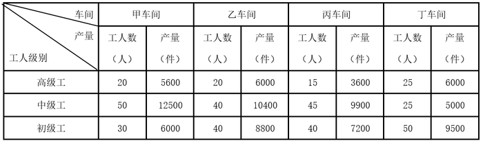

#### 第 1 题　qid 2377056 · 比重

本车间中中级工占比最大的是：

- **A**. 甲　✅
- **B**. 乙
- **C**. 丙
- **D**. 丁

**答案**：A

**官方解析**

由题干“本车间······占比最大的是”，可判定此题为现期比重比较问题。

，定位表格可得，甲：；乙：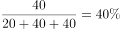；丙：；丁： 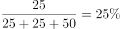，则甲车间中中级工占比最大。

故正确答案为A。

---

#### 第 2 题　qid 2377059 · 综合

高级工劳动生产率最高的车间是：

- **A**. 甲
- **B**. 乙　✅
- **C**. 丙
- **D**. 丁

**答案**：B

**官方解析**

根据题干“劳动生产率最高的是”，结合文字材料“以人均产量评价劳动生产率”可判定本题为现期平均数比较问题。，定位表格可得，甲：；乙：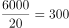；丙：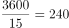；丁：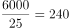，则乙车间高级工劳动生产率最高。

故正确答案为B。

---

#### 第 3 题　qid 2377060 · 综合

车间劳动生产率从高到低依次排列正确的是：

- **A**. 
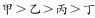

- **B**. 

　✅
- **C**. 
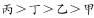

- **D**. 
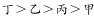

**答案**：B

**官方解析**

根据题干“劳动生产率从高到低排序正确的是”，结合文字材料“以人均产量评价劳动生产率”可判定本题为现期平均数比较问题。，定位表格可得，

甲：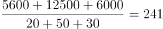；乙：；

丙：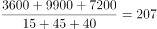；丁：。

则车间劳动生产率从高到低排序为：乙甲丙丁。

故正确答案为B。

---

#### 第 4 题　qid 2377062 · 综合

同车间中，初级工较高级工劳动率差距最小的是：

- **A**. 甲
- **B**. 乙
- **C**. 丙
- **D**. 丁　✅

**答案**：D

**官方解析**

根据题干中“初级工较高级工劳动率差距最小”，可判定此题为平均数比较问题。定位图表，甲车间初级工劳动率，高级工劳动率，两者差距为80；乙车间初级工劳动率，高级工劳动率，两者差距为80；丙车间初级工劳动率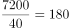，高级工劳动率，两者差距为60；丁车间初级工劳动率，高级工劳动率，两者差距为50；因此丁车间劳动率差距最小。

故正确答案为D。

---

#### 第 5 题　qid 2377063 · 综合

根据资料，下列说法正确的是：

- **A**. 车间总产量占企业总产量比重最大的是甲车间
- **B**. 按工人级别来分，劳动生产率最高的是中级工
- **C**. 该企业最应当加强对丁车间工人的劳动生产率培训　✅
- **D**. 只有丙车间的劳动生产率低于所在企业的平均劳动生产率

**答案**：C

**官方解析**

A项：比重比较，总体相同，只需要比较部分量即可。定位统计表，甲车间生产总量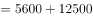；乙车间生产总量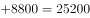。此时可知，甲车间生产总量并非最大，因此比重也并非最大，错误；

B项：，定位统计表，高级工劳动生产率=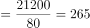；中级工劳动生产率；初级工劳动生产率。因此，劳动生产率最高的为高级工，并非中级工，错误；

C项：加强对丁车间工人的劳动生产率培训，说明丁车间工人的劳动生产率最低。定位统计表，甲车间劳动生产率；乙车间劳动生产率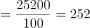；丙车间劳动生产率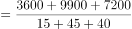；丁车间劳动生产率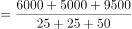；可以发现丁车间工人的劳动生产率最低，因此，最应当加强对丁车间工人的劳动生产率培训，正确；

D项：由C选项可知，丁车间的劳动生产率是最低的，因此不可能只有丙车间劳动生产率低于所在企业的平均劳动生产率，错误。

故正确答案为C。

---

### 材料 2

根据以下资料，回答下列问题。

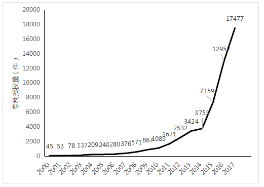

图1 2000-2017年中国人工智能专利授权情况（单位：件）

图2 2017年中国人工智能专利授权量排名前20国内专利权人（单位：件）

注：排名前20名的高校、科研院校有：北京工业大学、电子科技大学、哈尔滨工业大学、清华大学、北京航空航天大学、华南理工大学、浙江大学、西安电子科技大学及中国科学院，其余均为企业。

#### 第 6 题　qid 2377310 · 综合

从历年专利授权量变化趋势来看，2014至2017年我国人工智能领域专利处于：

- **A**. 起步萌芽期
- **B**. 发展停滞期
- **C**. 缓慢发展期
- **D**. 快速发展期　✅

**答案**：D

**官方解析**

根据题干“从历年专利授权量变化趋势来看······”，可以判定本题为直接找数问题。定位图1，2014年到2017年专利授权状况分别为，3753件，7359件，12952件，17477件，由此可以判出2014年到2017年专利授权量呈快速上涨趋势，对应选项为快速发展期。
故正确答案为D。

---

#### 第 7 题　qid 2377075 · 增长

下列年份中，中国人工智能专利授权量增速最快的是：

- **A**. 2007年
- **B**. 2012年
- **C**. 2015年　✅
- **D**. 2017年

**答案**：C

**官方解析**

根据题干“······增速最快”，可判断本题为增长率比较问题。根据增长率计算公式：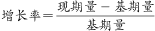，定位材料图1可得2007年的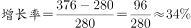，2012年的，2015年的，2017年的，所以增长最快的为2015年。

故正确答案为C。

---

#### 第 8 题　qid 2377080 · 比重

在位列中国人工智能专利授权量前20位的国内专利权人中，浙江大学专利授权量占比约为：

- **A**. 

- **B**. 

　✅
- **C**. 

- **D**. 

**答案**：B

**官方解析**

根据题干“······占比约为”，可判断本题为现期比重问题。定位图2，可得2017年浙江大学中国人工智能专利授权量为186件，位列中国人工智能专利授权量前20位的国内总量为。故位列中国人工智能专利授权量前20位的国内专利权人中，浙江大学专利授权量占比为，与B项最接近。

故正确答案为B。

---

#### 第 9 题　qid 2377081 · 综合

在位列中国人工智能专利授权量前20位的国内专利权人中，企业和高校、科研院校的授权量之比约为：

- **A**. 1:1　✅
- **B**. 2:3
- **C**. 1:2
- **D**. 1:3

**答案**：A

**官方解析**

由题干“企业和高校、科研院校的授权量之比约为”，可判定本题为比值计算问题。定位图2可得人工智能专利授权量排名前20国内专利权人及其专利授权量，定位文字材料可知，排名前20名的高校、科研院校有：北京工业大学、电子科技大学、哈尔滨工业大学、清华大学、北京航天航空大学、华南理工大学、浙江大学、西安电子科技大学及中国科学院，其余均为企业。则高校、科研院校的授权量为，结合本篇第3题，位列中国人工智能专利授权量前20位的国内总量为3046，可计算出企业的授权量约为。则企业和高校、科研院校的授权量之比约为，与A项最接近。

故正确答案为A。

---

#### 第 10 题　qid 2377082 · 综合

根据资料，下列关于我国2000-2017年相关信息说法正确的是：

- **A**. 
2014年是人工智能专利研发的第一个井喷年

- **B**. 
2014年至2017年人工智能领域专利授权量年均增速为

- **C**. 
2017年排名前20的国内专利权人，其人工智能专利授权量占当年人工智能专利授权总量的比例超过了

- **D**. 
中国科学院仅2017年的人工智能专利授权量就接近2000年到2004年5年全国授权量的总和
　✅

**答案**：D

**官方解析**

A项：定位图1可得，2000-2014年间人工智能专利授权量平缓上升，2015年增速大幅提高。可知2015年是人工智能专利研发的第一个井喷年，并非2014年，错误；

B项：定位图1可得，2014年人工智能领域专利授权量3753件，2017年为17477件。代入公式：，（），，。可知2014年至2017年人工智能领域专利授权量年均增速并非，错误；

C项：结合本篇第3题可知，2017年排名前20的国内专利权人，其人工智能专利授权量为3046件，，错误；

D项：定位图1可得，2000年到2004年5年全国授权量的总和为件；定位图2可得，中国科学院2017年的人工智能专利授权量为508件。中国科学院2017年的人工智能专利授权量接近2000年到2004年5年全国授权量的总和，正确。

故正确答案为D。

---
