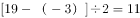
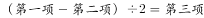
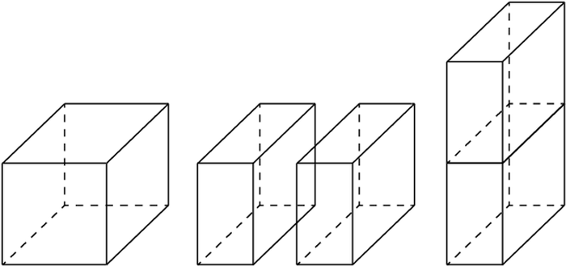

# 2019年420联考《行测》题（新疆卷）（网友回忆版）

> 联考 · 2019 年 · 6 个模块 · 共 116 题

- [政治理论](#%E6%94%BF%E6%B2%BB%E7%90%86%E8%AE%BA) · 4 题
- [常识判断](#%E5%B8%B8%E8%AF%86%E5%88%A4%E6%96%AD) · 21 题
- [言语理解与表达](#%E8%A8%80%E8%AF%AD%E7%90%86%E8%A7%A3%E4%B8%8E%E8%A1%A8%E8%BE%BE) · 25 题
- [数量关系](#%E6%95%B0%E9%87%8F%E5%85%B3%E7%B3%BB) · 16 题
- [判断推理](#%E5%88%A4%E6%96%AD%E6%8E%A8%E7%90%86) · 35 题
- [资料分析](#%E8%B5%84%E6%96%99%E5%88%86%E6%9E%90) · 15 题

---

## 政治理论

### 第 1 题　qid 2376461 · 新思想

习近平总书记在中央政治局第十三次集体学习时强调，要精准有效处置重点领域风险，深化金融改革开放，增强金融服务           能力，坚决打好防范化解包括金融风险在内的重大风险攻坚战，推动我国金融业健康发展。

- **A**. 实体经济　✅
- **B**. 私营经济
- **C**. 中小企业
- **D**. 国有企业

**答案**：A

**官方解析**

本题考查政治常识。
2019年2月22日，中共中央政治局就完善金融服务、防范金融风险举行第十三次集体学习。习近平总书记在主持学习时强调：“要深化对国际国内金融形势的认识，正确把握金融本质，深化金融供给侧结构性改革，平衡好稳增长和防风险的关系，精准有效处置重点领域风险，深化金融改革开放，增强金融服务实体经济能力，坚决打好防范化解包括金融风险在内的重大风险攻坚战，推动我国金融业健康发展。”
故正确答案为A。

---

### 第 2 题　qid 2377406 · 时事政治

新疆维吾尔自治区2019年政府工作报告强调，2019年要打好精准脱贫攻坚战，聚焦南疆四地州22个深度贫困县，确保实现    个贫困县摘帽。

- **A**. 22
- **B**. 20
- **C**. 12　✅
- **D**. 10

**答案**：C

**官方解析**

本题考查政治常识。
新疆维吾尔族自治区《2019自治区政府工作报告》中提出：打好精准脱贫攻坚战。聚焦南疆四地州22个深度贫困县，紧扣“两不愁、三保障”，咬定2020年脱贫攻坚目标任务，坚持维护稳定与脱贫攻坚紧密结合，落实“六个精准”，扎实推进“七个一批”“三个加大力度”，确保实现12个贫困县摘帽、976个贫困村退出、60.61万贫困人口脱贫。据此可知，C项符合题意，ABD三项均排除。
故正确答案为C。

---

### 第 3 题　qid 2377400 · 新思想

下列关于改革开放历史地位的表述正确的是：
①是决定当代中国命运的关键一招
②是党和人民大踏步赶上时代的重要法宝
③是坚持和发展中国特色社会主义的必由之路
④是决定实现“两个一百年”奋斗目标、实现中华民族伟大复兴的关键一招

- **A**. ①②③
- **B**. ①③④
- **C**. ②③④
- **D**. ①②③④　✅

**答案**：D

**官方解析**

本题考查政治常识。
习近平总书记在庆祝改革开放40周年大会上说：“ 40年的实践充分证明，改革开放是党和人民大踏步赶上时代的重要法宝，是坚持和发展中国特色社会主义的必由之路，是决定当代中国命运的关键一招，也是决定实现“两个一百年”奋斗目标、实现中华民族伟大复兴的关键一招。”
①②③④都正确。
故正确答案为D。

---

### 第 4 题　qid 2377403 · 时事政治

2019年3月5日，李克强总理在政府工作报告时强调，2019年国有大型商业银行<u>            </u>贷款要增长30以上。

- **A**. 制造业
- **B**. 高科技产业
- **C**. 服务业
- **D**. 小微企业　✅

**答案**：D

**官方解析**

本题考查政治常识。

2019年3月5日，李克强总理代表国务院在十三届全国人大二次会议上作《政府工作报告》。报告指出：“今年国有大型商业银行小微企业贷款要增长30以上。”

故正确答案为D。

---

## 常识判断

### 第 1 题　qid 2377402 · 地理国情

近年来，为助力新疆各地广大贫困农牧民实现脱贫，自治区与援疆省份采取多种方式解决新疆名优特产品销路，以精准扶贫、精准脱贫作为基本方略，创新推出“            ”模式，在援疆省份多个地市建设新疆特色农产品公共仓，辐射百家以上销售门店，形成了市场网络。

- **A**. 前置总仓
- **B**. 十城百店　✅
- **C**. 多路多销
- **D**. 卫星工厂

**答案**：B

**官方解析**

本题考查政治常识。
实施精准扶贫带动地区农牧民脱贫致富，是新一轮产业援疆的重要方向。统筹实施“十城百店”工程，通过多种合作模式，在省内10个地市有序建设新疆特色农产品公共仓，实施“五个统一”，计划形成100家以上市场销售门店，形成“十城百店”市场网络。据此可知，B项符合题意，ACD三项均排除。
故正确答案为B。

---

### 第 2 题　qid 2377407 · 地理国情

2016年8月12日，新疆唯一一座特等火车站              正式投入运营，该站站房总建筑面积约10万平方米，设计高峰日客流量可达24万人。

- **A**. 乌鲁木齐南站
- **B**. 乌鲁木齐东站
- **C**. 乌鲁木齐站　✅
- **D**. 乌鲁木齐西站

**答案**：C

**官方解析**

本题考查政治常识。
2016年8月12日，在试运营42天后，乌鲁木齐高铁客运站正式开通运营。开通运营的乌鲁木齐站是兰新高铁西端终点站，是一座新建的特等级高铁客运站。乌鲁木齐站建筑面积约10万平方米，是集高铁、普铁、轨道交通、公交、出租、长途客运等多种交通组织方式于一体、全疆最大的现代化城市综合交通枢纽，也是全疆最大的火车站、铁路客运最重要的旅客集散地，可满足高峰日客流量24万人乘车、候车需求。
故正确答案为C。

---

### 第 3 题　qid 2377409 · 地理国情

科技创新已成为推动新疆构建现代产业体系的第一动力。下列哪一项目获得了2018年度国家科技进步奖一等奖？

- **A**. 凹陷区砾岩油藏勘探理论技术与玛湖特大型油田发现　✅
- **B**. 超深水平井钻井配套技术研究
- **C**. 高纯晶体硅材料智能制造关键技术开发与应用
- **D**. 干旱区盐渍化控制与碳汇形式

**答案**：A

**官方解析**

本题考查政治常识。
由中国石油天然气股份有限公司新疆油田公司、中国石油天然气股份有限公司勘探开发研究院、中国石油集团东方地球物理勘探有限责任公司等10家单位联合完成的凹陷区砾岩油藏勘探理论技术与玛湖特大型油田发现项目，获得了2018年国家科技进步一等奖。这是中国石油践行国家战略，探索凹陷区砾岩这一全新勘探领域，取得的又一新成果。
克拉玛依油田位于新疆准噶尔盆地西北缘断裂带，是建国以来发现的第一个大油田。断裂带砾岩是主要勘探对象，储存于其中的环烷基原油可加工出国内独有的大比重煤油、超低温润滑油，这些都是航天和军工必需的稀缺油品。因此，砾岩油田的持续发现，对保障国防稀缺油品安全意义重大。
故正确答案为A。

---

### 第 4 题　qid 2376683 · 法律常识

关于全面依法治国，下列说法不准确的是：

- **A**. 到本世纪中叶，基本建成法治国家、法治政府、法治社会　✅
- **B**. 全面依法治国在“四个全面”中具有基础性、保障性作用
- **C**. 党的领导是社会主义法治最根本的保证
- **D**. 中国特色社会主义法治体系是中国特色社会主义制度的法律表现形式

**答案**：A

**官方解析**

本题考查政治常识。
A项错误，党的十九大报告指出：“综合分析国际国内形势和我国发展条件，从2020年到本世纪中叶可以分两个阶段来安排。第一个阶段，从2020年到2035年，在全面建成小康社会的基础上，再奋斗十五年，基本实现社会主义现代化。到那时，我国经济实力、科技实力将大幅跃升，跻身创新型国家前列；人民平等参与、平等发展权利得到充分保障，法治国家、法治政府、法治社会基本建成，各方面制度更加完善，国家治理体系和治理能力现代化基本实现······”因此，到2035年，基本建成法治国家、法治政府、法治社会。
B项正确，2018年8月24日中央全面依法治国委员会第一次会议顺利召开，习近平总书记作出重要讲话。他强调：“全面依法治国具有基础性、保障性作用，在统筹推进伟大斗争、伟大工程、伟大事业、伟大梦想，全面建设社会主义现代化国家的新征程上，要加强党对全面依法治国的集中统一领导，坚持以全面依法治国新理念新思想新战略为指导，坚定不移走中国特色社会主义法治道路，更好发挥法治固根本、稳预期、利长远的保障作用。”
C项正确，党的十八届四中全会通过的《中共中央关于全面推进依法治国若干重大问题的决定》指出：“党的领导是中国特色社会主义最本质的特征，是社会主义法治最根本的保证。”
D项正确，建设中国特色社会主义法治体系、建设社会主义法治国家是坚持和发展中国特色社会主义的内在要求。习近平总书记强调：“我们要建设的中国特色社会主义法治体系，本质上是中国特色社会主义制度的法律表现形式”。
本题为选非题，故正确答案为A。

---

### 第 5 题　qid 2377399 · 地理国情

世界上最大规模的，唯一建筑正规，保存完整的“八卦城”是新疆的        ，它自古以来就是祖国重要西部边陲重要战略要地，是新疆乃至全国的著名避暑和旅游胜地。

- **A**. 尼勒克县
- **B**. 特克斯县　✅
- **C**. 新源县
- **D**. 霍城县

**答案**：B

**官方解析**

本题考查人文常识。
特克斯县，位于我国西北边陲新疆伊犁，它是目前全世界唯一保存完好、卦爻完整、规模最大的八卦城。特克斯县城根据《周易》八卦图设计建成，布局呈八卦形态。有关部门1996年取消道路上的红绿灯，八卦城由此成为一座没有红绿灯的城市。同时特克斯县也是世界上唯一的乌孙文化与易经文化交织的地方；中国最西边的八卦城和易经文化所在地；中国道家文化传播最西端的地方等等。
故正确答案为B。

---

### 第 6 题　qid 2376476 · 人文常识

下列属于改革开放40年来我国经济建设所取得伟大成就的是：
①建立了最完整的现代工业体系
②成为了世界商品消费第一大国
③主要农产品的产量跃居世界前列
④外汇储备连续多年位居世界第一

- **A**. ①②④
- **B**. ①③④　✅
- **C**. ②③④
- **D**. ①②③④

**答案**：B

**官方解析**

本题考查政治常识。
2018年12月18日，习近平总书记在庆祝改革开放40周年大会上的讲话中指出：“我国主要农产品产量跃居世界前列，建立了全世界最完整的现代工业体系，科技创新和重大工程捷报频传。我国基础设施建设成就显著，信息畅通，公路成网，铁路密布，高坝矗立，西气东输，南水北调，高铁飞驰，巨轮远航，飞机翱翔，天堑变通途。现在，我国是世界第二大经济体、制造业第一大国、货物贸易第一大国、商品消费第二大国、外资流入第二大国（2020年我国成为外资流入第一大国），我国外汇储备连续多年位居世界第一，中国人民在富起来、强起来的征程上迈出了决定性的步伐！”所以，①③④表述正确，②错误。
故正确答案为B。

---

### 第 7 题　qid 2376469 · 人文常识

2018年我国科技界取得了一系列重大成果，这些成果中不包括：

- **A**. 第二艘航母出海试航
- **B**. 嫦娥四号探测器发射成功
- **C**. 造岛神器“天鲲号”下水　✅
- **D**. 国产大型水陆两栖飞机水上首飞

**答案**：C

**官方解析**

本题考查政治常识。
A项正确，2018年5月13日，我国第二艘航母从大连造船厂码头启航，赴相关海域执行海上试验任务，主要检测验证动力系统等设备的可靠性和稳定性。
B项正确，2018年12月8日2时23分，我国在西昌卫星发射中心用长征三号乙运载火箭成功发射嫦娥四号探测器，开启了月球探测的新旅程。嫦娥四号探测器后续将经历地月转移、近月制动、环月飞行，最终实现人类首次月球背面软着陆，开展月球背面就位探测及巡视探测，并通过已在使命轨道运行的“鹊桥”中继星，实现月球背面与地球之间的中继通信。
C项错误，2017年11月3日，由我国自主设计研发的新一代国之重器——“天鲲号”自航绞吸挖泥船成功下水。从被称为“造岛神器”的“天鲸号”，到目前亚洲最大最先进的“天鲲号”，中国自航绞吸挖泥船的自主研制实力再一次让世人惊叹。
D项正确，2018年10月20日，中国自主研制的大型水陆两栖飞机——“鲲龙”AG600在湖北荆门漳河机场成功实现水上首飞。至此，中国大飞机终于迈出“上天入海”完整步伐，建设航空强国轮廓愈发明晰。
本题为选非题，故正确答案为C。

---

### 第 8 题　qid 2376493 · 人文常识

关于生态文明建设，下列说法正确的是:

- **A**. 蓝天保卫战是全面建成小康社会的三大攻坚战之一
- **B**. 加快构建生态文明体系是解决污染问题的根本之策
- **C**. 生态环境安全是经济社会持续健康发展的重要保障　✅
- **D**. 地方政府主要领导是本行政区域生态环境保护第一责任人

**答案**：C

**官方解析**

本题考查政治常识。
A项错误，2017年10月18日，习近平总书记在十九大报告中指出：“要坚决打好防范化解重大风险、精准脱贫、污染防治的攻坚战，使全面建成小康社会得到人民认可、经得起历史检验。”蓝天保卫战并不是三大攻坚战之一。
B项错误，2018年5月18日至19日，习近平总书记在全国生态环境保护大会上强调：“要全面推动绿色发展。绿色发展是构建高质量现代化经济体系的必然要求，是解决污染问题的根本之策。”
C项正确，2018年5月18日至19日，习近平总书记在全国生态环境保护大会上强调：“要有效防范生态环境风险。生态环境安全是国家安全的重要组成部分，是经济社会持续健康发展的重要保障。”
D项错误，2018年5月18日至19日，习近平总书记在全国生态环境保护大会上强调：“各地区各部门要增强‘四个意识’，坚决维护党中央权威和集中统一领导，坚决担负起生态文明建设的政治责任。地方各级党委和政府主要领导是本行政区域生态环境保护第一责任人，各相关部门要履行好生态环境保护职责，使各部门守土有责、守土尽责，分工协作、共同发力。”
故正确答案为C。

---

### 第 9 题　qid 2376500 · 法律常识

下列法律法规中，哪一项不是从2019年1月1日起施行？

- **A**. 《中华人民共和国电子商务法》
- **B**. 《中华人民共和国土壤污染防治法》
- **C**. 新修订的《中华人民共和国公务员法》　✅
- **D**. 新修订的《中华人民共和国个人所得税法实施条例》

**答案**：C

**官方解析**

本题考查法律。
A项正确，《中华人民共和国电子商务法》是2018年8月31日第十三届全国人民代表大会常务委员会第五次会议通过，本法第八十九条规定：“本法自2019年1月1日起施行。”
B项正确，《土壤污染防治法》是2018年8月31日十三届全国人大常委会第五次会议全票通过，本法第九十九条规定：“本法自2019年1月1日起施行。”
C项错误，《中华人民共和国公务员法》已由中华人民共和国第十三届全国人民代表大会常务委员会第七次会议于2018年12月29日修订通过，自2019年6月1日起施行。
D项正确，《中华人民共和国个人所得税法实施条例》是国务院发布的法规，2018年12月18日中华人民共和国国务院令第707号第四次修订通过，第三十六条规定：“本条例自2019年1月1日起施行。”
本题为选非题，故正确答案为C。

---

### 第 10 题　qid 2376675 · 人文常识

下列关于全国经济普查的说法错误的是：

- **A**. 根据《全国经济普查条例》的规定，经济普查每5年进行一次
- **B**. 目的是全面调查我国第一、第二、第三产业的发展规模、布局和效益　✅
- **C**. 普查取得的单位和个人资料，不作为对普查对象实施处罚的依据
- **D**. 2019年1月1日，第四次全国经济普查现场登记工作正式启动

**答案**：B

**官方解析**

本题考查法律常识。
A项正确，《全国经济普查条例》第七条规定：“经济普查每5年进行一次，标准时点为普查年份的12月31日。”
B项错误，《全国经济普查条例》第二条规定：“经济普查的目的，是为了全面掌握我国第二产业、第三产业的发展规模、结构和效益等情况，建立健全基本单位名录库及其数据库系统，为研究制定国民经济和社会发展规划，提高决策和管理水平奠定基础。”
C项正确，《全国经济普查条例》第三十三条规定：“经济普查取得的单位和个人资料，严格限定用于经济普查的目的，不作为任何单位对经济普查对象实施处罚的依据。”
D项正确，2019年1月1日零时，第四次全国经济普查现场登记工作正式启动。按照部署，第四次全国经济普查标准时点为2018年12月31日，普查时期资料为2018年年度资料。
本题为选非题，故正确答案为B。

---

### 第 11 题　qid 2376678 · 科技常识

下列气体是人体能够产生的，能发挥抗炎、神经功能调节和血管松弛等作用，但若吸入过量会与血红素结合导致中毒的是：

- **A**. 一氧化氮　✅
- **B**. 一氧化碳
- **C**. 硫化氢
- **D**. 氨气

**答案**：A

**官方解析**

A项正确，一氧化氮是一种人体可以自然产生的物质，其具有三大功能：①内皮舒张因子。作为内皮舒张因子，一氧化氮主要产生于内皮细胞，对预防和控制心脑血管疾病有着显著的效果。具体而言，一氧化氮是一种脂溶性气体，可以快速渗透出细胞膜向下扩散，进入并作用于血管周围平滑肌细胞，随着平滑肌的舒张，血管得以扩张（使血管松弛），最终导致血压的下降；②神经传导因子。作为神经传导因子，一氧化氮产生于外周神经和大脑中，作为肾上腺素和胆碱以外的神经递质，在血管、海绵体、胃肠道、泌尿道、气管肌、肛尾肌等外周输出神经抑制反应中起到非常重要的作用；③免疫调节因子。作为免疫调节因子，一氧化氮产生于免疫系统中，合成产生的一氧化氮，通过多条途径调节炎症，在调控免疫反应中起到重要作用。具体而言，一氧化氮可辅助白细胞杀死细菌、真菌、寄生虫、肿瘤细胞等。综上可知，一氧化氮在人体内发挥血管松弛、神经功能调节、抗菌消炎的作用。同时，一氧化氮与血红蛋白有很高的亲和力，如果吸入过量，一氧化氮会夺取氧气与血红蛋白结合的位置，造成人体因缺氧而中毒。
B项错误，身体组织受毒素、紫外线辐射、激素和药物等侵害时，体内会自然地产生少量一氧化碳。一氧化碳与血红蛋白具有很高的亲和力，吸入过量会造成人体因缺氧而中毒，但一氧化碳在体内不具有血管松弛、神经功能调节、抗菌消炎的作用。
C项、D项错误，具有刺激性气味的硫化氢和氨气是人体代谢产生的废气，二者均不与血红蛋白结合，且不具有血管松弛、神经功能调节、抗菌消炎的作用。
故正确答案为A。

---

### 第 12 题　qid 2376475 · 人文常识

荷花虽生长于池塘的污泥中，但荷叶却出污泥而不染，其主要原因是：

- **A**. 荷叶含有大量的叶绿素，能与太阳光发生光合作用，产生自清洁
- **B**. 荷叶表面光滑，具有非常强的光洁度，污泥很难在它的表面吸附
- **C**. 荷叶含有疏水的纳米级蜡质，雨露落在上面会形成水珠清洁叶面　✅
- **D**. 荷花枝干细长，水珠落在荷叶上，容易造成荷叶晃动，甩出污泥

**答案**：C

**官方解析**

本题考查科技常识。
荷叶之所以能出污泥而不染是由荷叶叶面上存在着复杂的多重纳米和微米级的超微结构决定的：在超高分辨率显微镜下可以清晰看到，荷叶表面上有许多微小的乳突，它上面长满茸毛，乳突间的凹陷部分充满空气，这样就在紧贴叶面处形成一层极薄的只有纳米量级厚的空气层。这使得在尺寸上远大于这种结构的灰尘、雨水等降落在叶面上后，隔着一层极薄的空气，从而雨水会自动聚集成球形水珠，而水珠的滚动会把落在叶面上的尘土污泥吸附掉滚出叶面，使叶面始终保持干净，这就是著名的“荷叶自洁效应”。
故正确答案为C。

---

### 第 13 题　qid 2376482 · 科技常识

下列关于粉尘爆炸的说法错误的是：

- **A**. 颗粒越小越易燃烧，爆炸也越剧烈
- **B**. 越易氧化的物质，其粉尘越易爆炸
- **C**. 越易带电的物质，其粉尘越易爆炸
- **D**. 含卤素和钾、钠的粉尘，爆炸趋势增强　✅

**答案**：D

**官方解析**

本题考查科技常识。
呈细粉状的固体物质被称为粉尘，能燃烧和爆炸的粉尘叫做可燃粉尘。工厂内一些金属粉尘，如镁粉、铝粉，生活中常见的淀粉、木粉等都是可燃粉尘。粉尘在爆炸极限范围内，遇到热源（明火或高温），火焰瞬间传播于整个混合粉尘空间，化学反应速度极快，同时释放大量的热，形成高温高压。由于这一过程中不断有升高的压力会产生冲击波，因此，爆炸会造成很大的破坏力。
A项正确，粉尘的表面能够吸附空气中的氧，颗粒越细小，粉尘总的表面积就越大，从而表面吸附的氧就越多，越容易发生爆炸。
B、C项正确，粉尘爆炸的难易程度与粉尘的物理化学性质和环境条件等有关。一般认为氧化速度快的物质容易爆炸，如镁粉、铝粉等。容易带电的粉尘也很容易引起爆炸，如合成树脂粉末、纤维类粉尘等。
D项错误，根据实践分析，一般含有卤素和钾、钠的粉尘，爆炸趋势减弱。
本题为选非题，故正确答案为D。

---

### 第 14 题　qid 2376492 · 人文常识

下列表述正确的是：

- **A**. 鄱阳湖栖息着世界上最大的白鹤群　✅
- **B**. 我国最早出现的种植业位于松花江流域
- **C**. 被誉为“天上云霞,地下鲜花”的是四川蜀绣
- **D**. 东北平原是中国第二大平原，也是中国重要的粮棉生产基地

**答案**：A

**官方解析**

本题考查地理国情。

A项正确，鄱阳湖是全世界最大的白鹤集中越冬地，白鹤的数量占全世界总数的以上，堪称鹤之天堂。鄱阳湖区发现白鹤的最早记录是1980年。1985年，时任国际鹤类基金会会长的乔治·阿基博带队来鄱阳湖考察，观测到白鹤1350只，其中幼鹤119只。他们认定那是当时世界上发现的最大野生白鹤群。

B项错误，我国最早出现的种植业应位于黄河、长江流域。黄河、长江是中国的母亲河，这两条河流的冲积平原地区是中华文明的发祥地且两个平原处在温带湿润、半湿润地区，气候温暖湿润，比较适宜人类居住，所以种植业发展最早。 

C项错误，被誉为“天上云霞，地下鲜花”的是杭州的织锦。 

D项错误，东北平原是中国最大的平原，是中国三大平原之一。位于中国东北部，南北长约1000千米，东西宽约400千米，面积达35万平方千米。同时东北平原土地肥沃，是全球仅有的三大黑土区域之一，是中国重要的粮食、大豆、畜牧业生产基地，也是中国重要的钢铁、机械、能源、化工基地。 

故正确答案为A。 

---

### 第 15 题　qid 2376504 · 科技常识

下列哪一种现象的物理原理不同于其他三项：

- **A**. 水中的手指变粗
- **B**. 池水看起来比实际的浅
- **C**. 只有瞄准鱼的下方才能叉到鱼
- **D**. 小明在宁静的湖边看见“云在水中飘”　✅

**答案**：D

**官方解析**

本题考查科技常识。

光从一种透明介质斜射入另一种透明介质时，传播方向一般会发生变化，这种现象叫光的折射。

A项正确，盛水的玻璃杯中间厚、边缘薄，就如同一个凸透镜（放大镜），对手指有放大作用，使得水中部分手指看上去变粗了。凸透镜利用的是光的折射原理。

B、C项正确，从池底或鱼身上（S点）反射的光线由水中进入空气时，在水面上发生了折射，由于水的折射率大于空气，使得折射角大于入射角，折射光线进入人眼，人眼会逆着折射光线的方向看去，就会觉得池底或鱼的位置偏高（如图S’点），看上去池子变浅了，叉鱼时也须瞄准鱼的下方才能叉到鱼。

D项错误，宁静的湖水有平面镜的效果，能将天空中云朵反射进小明的眼中，体现的是光的反射原理。

本题为选非题，故正确答案为D。

---

### 第 16 题　qid 2376456 · 科技常识

下列说法错误的是：

- **A**. 
雷雨可使土壤的氮肥增加

- **B**. 
18K黄金制品的含金量为70
　✅
- **C**. 
聚四氟乙烯可用于制作不粘锅的涂层

- **D**. 
在金属表面喷漆可以防止金属被氧化腐蚀

**答案**：B

**官方解析**

本题考查科技常识。

A项正确，雷雨天气过程中的闪电温度极高，一般在三万度以上，并造成高电压。在高温高电压条件下，空气分子会发生电离，等它们重新结合时，其中的氮和氧就会化合为亚硝酸盐和硝酸盐分子，并溶解在雨水中降落地面，成为天然氮肥。

B项错误，K金是指黄金和其它金属混合在一起的合金。根据在首饰中的黄金含量可分为不同的K金，其中24K是指纯金，18K黄金制品的含黄金量就是18/24=75，因此选项中的70表述错误。 

C项正确，聚四氟乙烯俗称“塑料王”，是由四氟乙烯经聚合而成的高分子化合物，具有优良的化学稳定性、耐腐蚀性、密封性、高润滑不粘性，可用于制作不粘锅的涂层。

D项正确，金属被氧化腐蚀是指各类材料在环境作用下发生损坏、性能下降或状态的劣化。良好的喷漆涂装保护层能够成为抑制腐蚀介质侵入的屏障，使得金属保持连续完整，因此在金属表面喷漆是一种很重要的金属防腐蚀手段。

本题为选非题，故正确答案为B。

---

### 第 17 题　qid 2376487 · 科技常识

佛朗西斯·克里克提出的中心法则指明了遗传信息的流向，在科学发展中得到不断补充完善。根据该法则，下列哪一种遗传信息传递流程不可能发生：

- **A**. DNA通过转录把遗传信息传递给RNA
- **B**. RNA通过翻译把遗传信息传递给蛋白质
- **C**. RNA通过逆转录把遗传信息传递给DNA
- **D**. 蛋白质通过逆翻译把遗传信息传递给RNA　✅

**答案**：D

**官方解析**

本题考查科技常识。
A、B、C项正确，中心法则指出，遗传信息的转移可以分为两类：第一类，包括DNA的复制、RNA的转录和蛋白质的翻译，即①DNA→DNA(复制)；②DNA→RNA(转录)；③RNA→蛋白质(翻译)。这三种遗传信息的转移方向普遍地存在于所有生物细胞中。第二类，是特殊情况下的遗传信息转移，包括RNA的复制，RNA反向转录为DNA和从DNA直接翻译为蛋白质，即①RNA→RNA(复制)；②RNA→DNA(逆转录)；③DNA→蛋白质。RNA复制只在RNA病毒中存在。
D项错误，中心法则旨在详细说明连串信息的逐个传送，它指出遗传信息不能由蛋白质转移到蛋白质或核酸之中。
本题为选非题，故正确答案为D。

---

### 第 18 题　qid 2376498 · 人文常识

下列关于血糖的说法错误的是：

- **A**. 正常人进食后血糖浓度会升高
- **B**. 正常人空腹超过12小时会引起低血糖
- **C**. 南瓜能抑制葡萄糖吸收，具有降血糖作用　✅
- **D**. 胰岛素是人体产生的唯一能够降低血糖的激素

**答案**：C

**官方解析**

本题考查科技常识。
A项正确，食物中存在大量的淀粉等糖类。人在进食后，糖类被人体消化吸收，因此会使血糖含量升高。
B项正确，低血糖的常见原因包括进食过少、运动过度、药物使用不当、大量饮酒等。正常人空腹（禁食）时间过长，由于没有食入足够的糖，可能会引起低血糖。
C项错误，南瓜中含有丰富的营养物质，其中包含了蛋白质、多糖、果胶、纤维素、维生素以及微量元素等成分，在这些众多的营养物质中，蛋白质和多糖都可以提升自身免疫功能。部分多糖会被分解成单糖，可能导致人体血糖升高。
D项正确，胰岛素是体内唯一能够降低血糖浓度的激素，它不仅能够促使葡萄糖分解，还能抑制非糖物质转化为葡萄糖。
本题为选非题，故正确答案为C。

---

### 第 19 题　qid 2376474 · 科技常识

下列气体既会造成酸雨，又可用作防腐剂的是：

- **A**. 二氧化碳
- **B**. 二氧化氮
- **C**. 二氧化硫　✅
- **D**. 氮气

**答案**：C

**官方解析**

本题考查科技常识。
酸雨通常指pH值小于5.6的酸性降水。酸雨中含有多种无机酸和有机酸，绝大部分是硫酸和硝酸，由人为排放的大气污染物二氧化硫和氮氧化物转化而成。
A项错误，二氧化碳溶于水后虽然会使雨水呈弱酸性，但不会导致酸雨。
B项错误，二氧化氮会与大气中水反应生成硝酸，形成硝酸型酸雨；二氧化氮有剧毒，不可以作防腐剂。
C项正确，二氧化硫与大气中的水反应生成亚硫酸，亚硫酸又与大气中的氧气反应，生成硫酸，形成硫酸型酸雨；二氧化硫有还原性，易被氧化，因此常用作葡萄酒的防腐剂。
D项错误，氮气化学性质不活泼，常温下很难跟其他物质发生反应，所以常被用作薯片等食品的防腐剂；氮气难溶于水，不会造成酸雨。
故正确答案为C。

---

### 第 20 题　qid 2376709 · 科技常识

下列我国空间站发展的重要标志性事件按完成步骤排列正确的是：
①“天宫二号”空间实验室成功发射
②“神舟十一号”成功发射，完成与“天宫二号”对接
③陆续发射科学实验舱和空间站核心舱，组建中国空间站
④“天舟一号”货运飞船成功发射，完成与“天宫二号”对接

- **A**. ①②③④
- **B**. ④①②③
- **C**. ①③④②
- **D**. ①②④③　✅

**答案**：D

**官方解析**

本题考查科技常识。
①2016年9月15日22时04分，“天宫二号”空间实验室由长征二号FT2火箭发射升空。
②2016年10月19日3时31分，“神舟十一号”载人飞船与“天宫二号”空间实验室成功实现自动交会对接。
③建设具有国际先进水平的空间站，解决有较大规模的、长期有人照料的空间应用问题，是我国载人航天工程“三步走”发展战略中第三步的任务目标。按计划，空间站将于2022年前后建成，是我国长期在轨稳定运行的国家太空实验室，将全面提升我国载人航天综合应用效益水平。
④2017年4月20日19时11分，中国首架货运飞船——“天舟一号”成功发射升空，并在4月22日完成与“天宫二号”的首次对接。
由此可知，按照完成步骤的时间应该是①②④③。
故正确答案为D。

---

### 第 21 题　qid 2377441 · 人文常识

2019年，中共中央、国务院提出推进教育现代化的总体目标，要求到        ，总体实现教育现代化，迈入教育强国行列，推动我国成为学习大国、人力资源强国和人才强国。

- **A**. 2020年
- **B**. 2030年
- **C**. 2035年　✅
- **D**. 2050年

**答案**：C

**官方解析**

本题考查政治常识。
根据《中国教育现代化2035》提出的总体目标：到2020年，全面实现“十三五”发展目标，教育总体实力和国际影响力显著增强，劳动年龄人口平均受教育年限明显增加，教育现代化取得重要进展，为全面建成小康社会作出重要贡献。在此基础上，再经过15年努力，到2035年，总体实现教育现代化，迈入教育强国行列，推动我国成为学习大国、人力资源强国和人才强国，为到本世纪中叶建成富强民主文明和谐美丽的社会主义现代化强国奠定坚实基础。
故正确答案为C。

---

## 言语理解与表达

### 第 1 题　qid 2376897 · 逻辑填空

科学家将松力纤维蛋白原和可吸收材料共混后，采用静电纺技术制成具有超亲水性、类似细胞外基质的复合生物支架材料。由该材料制成的人工韧带具有良好的组织          和合适的机械强度，植入肌体后，可在逐层降解的同时进行组织再生，诱导肌体自身组织长入韧带中，逐步演变成自身韧带组织，实现腱骨融合，达到永久愈合的目的。
填入画横线部分最恰当的一项是：

- **A**. 相容性　✅
- **B**. 自愈性
- **C**. 亲和性
- **D**. 再生性

**答案**：A

**官方解析**

横线处所填词语搭配“人工韧带”，形容该材料制成的人工韧带所具有的属性。根据后文“长入韧带中”、“演变成自身韧带组织”、“实现腱骨融合，达到永久愈合的目的”可知，它可以与肌体实现融合，对应A项“相容性”。
B项“自愈性”指自我恢复的能力，文段未体现人工韧带能够自我恢复，与文意不符，排除；
C项“亲和性”在组织学上被视为表示组织对某种染料结合力强的一种术语，另外，在胚胎学上，表示细胞或组织相互连接的意思，“亲和性”只能体现出结合性强，容易接近，故“亲和性”程度太轻，与后文实现机体融合的语义不符，排除；
D项“再生性”指重新恢复生长的能力，与“人工韧带”搭配不当，且根据后文“可在逐层降解的同时进行组织再生，诱导肌体自身组织长入韧带中”可知，文段想体现的是让身体组织再生，而非让人工韧带再生，故该项与文意不符，排除。
故正确答案为A。
【文段出处】《探索让人体组织器官“起死回生”》

---

### 第 2 题　qid 2377359 · 逻辑填空

为应对全球气候变暖，各国科学家都在开展地球科学研究。最近，有科学家在《科学》上发表论文提出缓解温室效应的两种方案。其中一种方案是在稍低于卷云自然形成的上层大气中加入微小的沙尘颗粒，以        卷云的形成。卷云不同于会反射阳光的白云，而更像覆盖在地球上的毯子，困住从地球向太空辐射的热量，地球也就越来越        。
依次填入划横线部分最恰当的一项是：

- **A**. 减少  冷
- **B**. 增加  冷
- **C**. 减少  热　✅
- **D**. 增加  热

**答案**：C

**官方解析**

本题可从第二空入手，根据“卷云······像覆盖在地球上的毯子，困住从地球向太空辐射的热量”可知，地球无法向太空辐射热量，因此地球越来越热，排除AB两项。

根据后文可知，卷云会让地球变热，因此为应对全球气候变暖的一种方案应该是减少卷云的形成，排除D项。
故正确答案为C。
【文段出处】《中国拨款1448万设地球工程国家研究项目，旨在为地球降温》

---

### 第 3 题　qid 2376483 · 逻辑填空

说梵高是一个“圣徒式的画家”并不为过，他通过绘画仰望、接近上帝。        ，即便是这样一个具有宗教情怀、追求超越性的梵高，也从未试图远离人群、拥抱绝对的孤独。        ，他总在渴望人与人之间的温暖与爱，而始终未能得到。他的绘画也好，文字也好，除去遗传的因素，很大程度上就是表达此种“寻求”与“寻求不得”之间的落差及随之而来的痛苦。
依次填入划横线部分最恰当的一项是：

- **A**. 然而  因为
- **B**. 首先  其次
- **C**. 因为  于是
- **D**. 但是  相反　✅

**答案**：D

**官方解析**

第一空，由前文“他通过绘画仰望、接近上帝”以及后文“也从未试图远离人群、拥抱绝对的孤独”可知，横线前后语义相反，表达梵高接近上帝但也没有远离人群，故横线处应填入转折关系的引导词，A项“然而”、D项“但是”均可表示转折关系，保留；B项“首先”表示逻辑顺序，C项“因为”表示因果关系，均不符合文意，排除。
第二空，由前文“远离人群、拥抱绝对的孤独”以及后文“他总在渴望人与人之间的温暖与爱”可知，横线前后语义相反，表达梵高没有试图远离人群，相反他总是渴望人与人之间的温暖与爱，横线处要填入表达相反语义的词语，对应D项“相反”。A项“因为”表示因果关系，与文意不符，排除。
故正确答案为D。
【文段出处】《&lt;梵高传&gt;：艺术是“是其所信”》

---

### 第 4 题　qid 2376713 · 逻辑填空

一个艺术家真正的贡献是艺术语言的创新，如果说审美理想的构建是绘画法度和秩序建立的基石，那么绘画秩序的建立则是绘画风格成熟的      。风格的形成在于画面所搭建的整体构成必须有      的秩序和法则。
依次填入划横线部分最恰当的一项是：

- **A**. 途径  和谐
- **B**. 标志  内在　✅
- **C**. 方向  全新
- **D**. 目标  稳定

**答案**：B

**官方解析**

第一空，根据“如果说审美理想的构建是绘画秩序建立的基石”，说明审美理想对绘画法度和秩序的建立很重要，则根据“那么绘画秩序的建立则是绘画风格成熟的”，即绘画秩序的建立则是绘画风格成熟的重要体现、表现，故横线处要表达重要体现之意，B项“标志”，符合题意，保留。A项，“途径”，我们通常说做一件事情的具体解决办法，填入文段应表达为“建立绘画秩序则是绘画风格成熟的途径”，故用法不对，排除。C、D两项，文段强调“绘画风格成熟”是目标是追求的方向，而非“绘画秩序的建立”是目标是追求的方向，所以“方向”和“目标”填入文段则与文段意思相悖，排除C、D两项。
第二空，代入验证，B项，“必须有内在的秩序和法则”，搭配恰当，且“内在的秩序和法则”与前文“画面所搭建的整体构成”可以构成对应，当选。
故正确答案为B。
【文段出处】《寻求工笔新语境》

---

### 第 5 题　qid 2377365 · 逻辑填空

没有精神内核的娱乐，即便一时热闹，        流于空虚。网民需要文化产品、需要轻松娱乐，但不需要无下限、无道德的“秀”。应该肯定的是，依法净网，不只是约谈平台、关停账号，而是持续发力、        治理。
依次填入划横线部分最恰当的一项：

- **A**. 最终  固定化
- **B**. 难免  长效化
- **C**. 终归  常态化　✅
- **D**. 终将  平常化

**答案**：C

**官方解析**

第一空，横线处所填词语与“即便”构成对应，表达在“一时热闹”之后产生的结果，A项“最终”、C项“终归”、D项“终将”都可以体现出一个结果，符合文意；B项“难免”重在强调“无法避免”，与文意无关，排除。
第二空，与前文“持续发力”构成近义并列，要体现出一直在做的状态，对应C项“常态化”；A项“固定化”、D项“平常化”均不能与“持续发力”构成近义并列，排除A、D两项。
故正确答案为C。
【文段出处】《关停炒作账号，让娱乐走正道》

---

### 第 6 题　qid 2376473 · 片段阅读

大数据是科学决策的重要工具，是高精度对未来进行预测的手段。数据是记录人类行为的工具。靠大数据技术对未来做一个预测和参考是人类发展的成果。但是，人际的沟通和交流不该因为大数据技术而遭弃，而过于依赖大数据的预测和推理，放弃人际沟通过程，必然产生人际沟通的弱化，进而影响到人的自由意志。
这段文字旨在强调：

- **A**. 大数据是科学决策的重要工具
- **B**. 大数据将发挥越来越重要的作用
- **C**. 大数据不应弱化人际沟通　✅
- **D**. 大数据影响人的自由意志

**答案**：C

**官方解析**

文段开篇先引出了大数据的概念，并指出大数据带来了好处，后文通过转折关联词“但是”重点强调“人际的沟通和交流不该因为大数据技术而遭弃”，并通过“产生人际沟通的弱化”，“影响到人的自由意志”论证大数据弱化人际沟通后带来的危害，故文段主旨是在强调大数据不应该弱化人际沟通，对应C项。
A项，“大数据是科学决策的重要工具”为转折之前的内容，非重点，排除；
B项，“发挥越来越重要的作用”无中生有，且文段转折后强调的是大数据的危害，感情色彩相悖，排除；
D项，“大数据影响人的自由意志”仅对应尾句中大数据弱化人际沟通的危害的其中一个方面，且文段重在强调大数据不应该弱化人际沟通，非重点，排除。
故正确答案为C。
【文段出处】《大数据带来的是天堂还是地狱》

---

### 第 7 题　qid 2376720 · 片段阅读

从人口的空间布局看，城镇化是农村人口向城镇转移，是农民向市民的转变。农民向市民的转变过程，是人的素质的现代化过程。而人的素质的现代化离不开接受现代化的教育。人的教育的现代化是城镇化的基础和支撑。城镇化还意味着人们的就业和生产从农业领域向工业和服务业的转移。人的生产方式的现代化，是城镇化的本质特征，更是人的现代化的本质体现。而支撑人的生产方式现代化的基础则是现代职业教育的普及。
这段文字意在强调：

- **A**. 城镇化是人的生产方式的现代化
- **B**. 城镇化是人的素质教育的现代化　✅
- **C**. 城镇化时代的农民需要职业教育
- **D**. 城镇化是进城农民身份的市民化

**答案**：B

**官方解析**

文段开篇从人口空间布局的角度解释了城镇化，即农民向市民的转变，接着指出这一转变是人的素质的现代化过程，而素质现代化离不开接受现代化的教育，故文段前半部分强调人的教育的现代化对城镇化很重要。后文指出城镇化还意味着生产方式的现代化，生产方式现代化的基础是现代职业教育的普及，故文段后半部分依然在强调现代教育对于城镇化很重要。故文段重在强调现代化的教育对于城镇化很重要，对应B项。
A项“生产方式”，D项“进城农民身份的市民化”偏离文段核心话题，文段重在强调“现代教育”，排除A、D两项；C项“农民”概念缩小，文段强调“人”，且“职业教育”并非文段重点，文段强调“现代教育”，排除。
故正确答案为B。
【文段出处】《光明日报：建立城镇义务教育资源配置长效机制》

---

### 第 8 题　qid 2376495 · 片段阅读

完美主义者习惯于把各项标准都定得过高而不切实际，受到挫折打击后，变得逃避、拖延、自责而失去行动力。完美主义不仅拖后腿，还可能带来许多心理疾病。由于缺乏一种深刻且始终如一的自尊来源，接受失败的打击对于完美主义者来说尤其困难，而且可能导致一部分人长期抑郁和退缩。完美主义也与社交焦虑和社交恐怖显著相关，因为他们很担心自己是否能给别人留下好印象，容易出现羞怯、自卑、回避行为。完美主义也容易导致强迫症，因为完美主义者对每件事都要求完美无瑕。减少“全或无”的心理倾向，内心会更自在、从容，也更利于进步。
这段文字意在说明：

- **A**. 标准过高而且不切实际会损害自尊
- **B**. 羞怯自卑容易使人长期抑郁和退缩
- **C**. 社交焦虑和社交恐怖会导致强迫症
- **D**. 为了心理健康应避免完美主义倾向　✅

**答案**：D

**官方解析**

文段首先指出完美主义者在受到挫折打击后，变得逃避、拖延、自责而失去行动力，接着指出完美主义者不仅会拖后腿，还会带来很多心理疾病，后文通过“抑郁”、“社交焦虑”、“社交恐怖”、“强迫症”进行举例说明，尾句给出对策，即减少“全或无”这种完美主义的心理倾向会使人的内心更健康，故文段重在强调应避免完美主义倾向，对应D项。
A项“会损害自尊”，B项“使人长期抑郁和退缩”，C项“会导致强迫症”均为问题的表述，而文段重在强调解决问题的对策，故排除A、B、C三项。
故正确答案为D。
【文段出处】《完美主义拖后腿》

---

### 第 9 题　qid 2376518 · 片段阅读

科学家在100亿光年外的星系里发现一颗超亮超新星，其爆发于宇宙大爆炸后约35亿年，正值天文学家所称的“宇宙正午”时期。普通超新星是大质量恒星死亡时发生剧烈爆炸产生的。超亮超新星的亮度比普通超新星高10到100倍，目前还不太清楚其形成机制。以往发现的超亮超新星所在星系质量都较小，使科学家认为小星系缺乏重元素的环境有利于产生超亮超新星。此次发现的超亮超新星所在星系是普通的大质量星系，使人重新思考超亮超新星的形成问题。这意味着银河系也可能曾拥有产生超亮超新星的条件。
下列说法与原文相符的是：

- **A**. 超亮超新星产生于恒星形成最剧烈的“宇宙正午”时期
- **B**. 小星系缺乏重元素的环境事实上不利于产生超亮超新星
- **C**. 普通的大质量星系可能曾经拥有产生超亮超新星的条件　✅
- **D**. 大质量恒星死亡时发生剧烈爆炸并不能产生超亮超新星

**答案**：C

**官方解析**

C项，根据“此次发现的超亮超新星所在星系是普通的大质量星系，使人重新思考超亮超新星的形成问题”可知，普通大质量星系可能可以产生超亮超新星，符合文意，当选。
A项，“恒星形成最剧烈”文段没有提及，且文段只是说一颗超亮超新星爆发于“宇宙正午时期”，选项表述无中生有，排除；
B项，根据“小星系缺乏重元素的环境有利于产生超亮超新星”，选项说“不利于”，与文意相悖，排除；
D项，根据“普通超新星是大质量恒星死亡时发生剧烈爆炸产生的”可知，文段没有说过“大质量恒星死亡时发生剧烈爆炸”和“超亮超新星”的关系，无中生有，排除。
故正确答案为C。
【文段出处】《科学家解析“宇宙正午”的超亮超新星》

---

### 第 10 题　qid 2376719 · 片段阅读

随着装备信息化程度的提升，有别于当初的盲目技术堆砌，目前为航母加装相控阵雷达似乎已成为一种必要的“复古之风”。但与英俄将相控阵雷达部署在舰桥之上不同，无论是美国最初的“企业”号还是最新的“福特”级航母，他们都将相控阵雷达布置在了舰桥之下，从而保证了舰桥具有足够高度。尽管美国航母舰桥的这种布局会限制相控阵雷达的探测范围，但作为世界航母首强的美国很清楚，相控阵雷达与舰桥哪个更重要。
根据这段文字，下列说法不正确的是：

- **A**. 在舰桥高度上，英俄美三国之间有一定差距
- **B**. 英俄美三国都重视在航母上部署相控阵雷达
- **C**. 美国海军对航母的实际作战效能不是很重视　✅
- **D**. 相控阵雷达部署在舰桥下面比在上面更合理

**答案**：C

**官方解析**

C项，“美国海军对航母实际作战效能不是很重视”文段并未提及，无中生有，当选；
A项，根据“与英俄将相控雷阵雷达部署在舰桥之上不同，无论是美国······，从而保证了舰桥具有足够高度。”可知，表述与文意相符，排除；
B项，根据“目前为航母加装相控阵雷达······，与英俄······不同······”可知，表述与文意相符，排除；
D项，根据“他们都将相空阵雷达布置在舰桥之下”、“作为世界航母首强的美国很清楚，相控阵雷达与舰桥哪个更重要”可知，表述与文意相符，排除。
本题为选非题，故正确答案为C。
【文段出处】《001A甲板仅差滑跃，舰岛舰桥关乎战力高下》

---

### 第 11 题　qid 2376514 · 片段阅读

一部人类史，就是人与自然、科学与社会的互动史。在漫长的文明进程中，科学曾仅仅是“闲人”的志趣，科学普及无从谈起，人们在“非科学”的禁锢中艰难摸索。随着近现代科学兴起，人类对自然认识不断加深，科学与社会联系日趋紧密，科学普及在人与自然、科学与社会的结合点上顽强生长，科学在人类现代化道路上散发出璀璨的光芒。
上述文字主要阐述了：

- **A**. 人与自然、科学与社会的互动极大促进了科学普及　✅
- **B**. 在人类文明进程中，科学普及前进的道路异常艰辛
- **C**. 科学普及应紧密联系社会并且找准结合点和切入点
- **D**. 随着近现代科学兴起，科学普及前景更加灿烂辉煌

**答案**：A

**官方解析**

文段首句通过下定义引出“人与自然、科学与社会的互动”的话题，接下来阐述过去“科学普及”所面临的问题，即很少有人谈论。尾句指出在近代科学兴起的背景下，人与自然、科学与社会的联系更紧密，互动更强，根据“科学普及在人与自然、科学与社会的结合点上顽强生长”“散发出璀璨的光芒”可知，文段旨在强调“人与自然、科学与社会的互动”推动了“科学普及”的发展，对应A项。
B项，“道路艰辛”对应文段前文“科学普及无从谈起”，是在介绍以前的情况，非重点，排除；
C项，仅仅提到“联系社会”表述片面，文段中是“人与自然、科学与社会的互动”，并且“切入点”无中生有，文段未提及，排除；
D项，“随着近代科学兴起”为背景的内容，非重点，排除。
故正确答案为A。
【文段出处】《让科普这只“翅膀”硬起来——一论加强科学普及》

---

### 第 12 题　qid 2376509 · 片段阅读

为了帮助贫困地区脱贫，长期以来，社会各界以多种形式开展帮扶，扶贫思路更加清晰，扶贫手段更加多样，文化扶贫、旅游扶贫、电商扶贫等新方式效果显著，脱贫攻坚实现换挡提速。但一些尚未脱贫的地区，因为自然条件恶劣，发展脱贫产业难度较大。要啃下扶贫的“硬骨头”，还需打好科技牌。
最适合做这段文字标题的是：

- **A**. 打好脱贫攻坚科技牌　✅
- **B**. 啃下扶贫的“硬骨头”
- **C**. 选好脱贫攻坚新方式
- **D**. 脱贫攻坚实现换挡提速

**答案**：A

**官方解析**

文段开篇指出“社会各界以多种形式开展帮扶，脱贫效果显著，脱贫攻坚实现换挡提速”，即脱贫攻坚取得成效，然后文段通过转折词“但”强调在一些尚未脱贫的地区，难度较大，即存在问题，随后出现了对策标志词“要”，引出对策。故整个文段重点是对策，强调扶贫要通过科技牌，对应A项。
B项，没有提及文段重点强调的“科技”这样一种扶贫的对策，偏离文段重点，排除；
C项，“新方式”表述不明确，排除；
D项，“脱贫攻坚实现换挡提速”是转折之前的内容，转折之前内容非重点，排除。
故正确答案为A。
【文段出处】《人民日报纵横：打好脱贫攻坚科技牌》

---

### 第 13 题　qid 2376490 · 片段阅读

互联网深切地变革了媒体的内容生产方式，媒体环境呈现“移动化、社交化、视觉化”三大趋势，在这些趋势影响下所诞生的网络媒体是粉丝经济的基础。传播媒介更为迅速便捷，与粉丝的心理距离更为接近，粉丝的组织化程度大幅提高，这些都使得粉丝能更为顺利地介入偶像生活，甚至可以改变偶像的生活状态和演艺生涯。在电视剧等文化行业中，粉丝流量经济已是行业主推力：大剧单集售价从240-500万涨至400-1000万，增长的部分由粉丝来买单，艺人片酬和著作版权费从而暴涨。
这段文字意在说明：

- **A**. 粉丝经济基于网络媒体而诞生
- **B**. 传播媒介便捷促进粉丝组织化
- **C**. 偶像的演艺生涯深受粉丝影响
- **D**. 粉丝经济推动文化产业的发展　✅

**答案**：D

**官方解析**

开篇介绍互联网变革了媒体的内容生产方式，并指出网络媒体是粉丝经济的基础，即开篇引出粉丝经济的话题，然后通过“媒介更为便捷”“粉丝组织化程度提高”等来介绍粉丝经济的具体表现，最后指出粉丝经济是文化产业的主推力，并通过一系列数据来解释说明，故文段是分总结构，先引出粉丝经济的话题，并介绍粉丝经济的体现，最后重在强调粉丝经济对文化产业的推动作用，应选D项。A项“粉丝经济基于网络媒体而诞生”是背景介绍的内容，非重点，文段重在强调粉丝经济对于文化产业的作用，排除; B项“传播媒介、粉丝组织化”属于粉丝经济的表现，非重点，且“促进”无中生有，排除; C项“偶像的演艺生涯”属于解释说明的内容，非重点，排除。
故正确答案为D。
【文段出处】《价值观与亚文化：当我们讨论青年时我们在讨论什么？》

---

### 第 14 题　qid 2376491 · 片段阅读

20世纪以来，人类对弦的认识，发生了质的变革。弦就是振动，振动就会产生波，说明波构成了丰富多彩的大千世界，这为重新认识“美”提供了思想基础和技术方法。研究表明，自然美与物质的波长（或者频率）存在着深刻的内在联系，物体固有的频率与人自身的频率存在耦合关系，“美”是由不同类型波谱的频率与人的相互作用而产生的。
根据这段文字，下列说法不正确的是：

- **A**. 对同一个人的美丑认识不同，因审美主体的频率不同所致
- **B**. 阳光、鲜花一定时间内大致不变，因为振动频率没有变化
- **C**. 距离产生美，是因为审美主客体在一定频率范围内共振
- **D**. 见义勇为行为得到社会认可，因为审美主体振动频率一致　✅

**答案**：D

**官方解析**

文段开篇介绍了认识美的思想和方法，即通过物体的振动波，接着论述了审美中，物质自身的振动和人自身的频率之间存在相互作用的关系，即当审美客体与审美主体之间耦合的频率相同时，就会产生共振，进而使人觉得“美”。
A项，根据“‘美’是由不同类型波谱的频率与人的相互作用而产生的”可知，对同样一个审美客体，每个审美主体的美感不同，有的说漂亮，有的说丑，这是由于审美主体的频率不同所致，该项表述正确，排除；
B项，根据“弦就是振动，振动就会产生波，说明波构成了丰富多彩的大千世界”可知，大千世界是由波构成的，即波构成了万物，万物的变化也就意味着波的变化，波的变化也就意味着振动频率的变化，故万物一定时间内不变就是因为其振动频率没有变化，该项表述正确，排除；
C项，根据“物体固有的频率与人自身的频率存在耦合关系”可知，物体在一定的频率范围内，能够和人自身的频率产生共振，产生美感，“距离产生美”就是这个道理。该项表述正确，排除；
D项，文段论述的是审美与主客体之间的振动频率有关，即审美主体与审美客体耦合频率一致，该项中，“见义勇为”得到社会认可，是由于审美主体（不同的人们）的振动频率一致，且审美主体（不同的人们）与审美客体（见义勇为的行为）频率一致，而D项仅仅论述了原因中的主体间振动频率一致，故表述错误，当选。
本题为选非题，故正确答案为D。
【文段出处】《自然美的波谱学原理》

---

### 第 15 题　qid 2376899 · 片段阅读

近年来，保健品市场兴起了一场“鱼油热”。鱼油即不饱和脂肪酸，适当地食用不饱和脂肪酸可以预防动脉硬化的发生，减轻动脉硬化的症状。一方面，鱼油可以调节血脂，能降低总胆固醇及“坏胆固醇”——低密度脂蛋白胆固醇。另一方面，鱼油可以改善记忆、保护视网膜。有说法称大剂量摄入鱼油能够帮助高血压患者有效降低血压，但有研究者总结31项国外研究发现，每天摄入大剂量鱼油虽能轻度降低血压，但如果剂量过大，则会刺激人体的胃肠道。此外，鱼油摄入量超标，还会转化为人体的脂肪储存，使人发胖，从而对身体产生负面影响。
从这段文字可以推出：

- **A**. 每天大量摄入鱼油不能降低血压
- **B**. 充足食用鱼油可以治疗动脉硬化
- **C**. 摄入鱼油适当才有助于身体健康　✅
- **D**. 摄入不饱和脂肪酸不会使人发胖

**答案**：C

**官方解析**

A项，根据“有说法称大剂量摄入鱼油能够帮助高血压患者有效降低血压，但有研究者总结31项国外研究发现，每天摄入大剂量鱼油虽能轻度降低血压，但如果剂量过大，则会刺激人体的胃肠道”可知，每天大量摄入鱼油可以降低血压，选项表述错误，排除；
B项，根据“适当地食用不饱和脂肪酸可以预防动脉硬化的发生，减轻动脉硬化的症状”可知，“充足食用鱼油可以治疗动脉硬化”偷换概念，将“适当”偷换为“充足”，排除；
C项，根据“鱼油即不饱和脂肪酸，适当地食用不饱和脂肪酸可以预防动脉硬化的发生，减轻动脉硬化的症状”及“但如果剂量过大，则会刺激人体的胃肠道。此外，鱼油摄入量超标，还会转化为人体的脂肪储存，使人发胖，从而对身体产生负面影响”可知，选项表述正确，当选； 
D项，根据“此外，鱼油摄入量超标，还会转化为人体的脂肪储存，使人发胖，从而对身体产生负面影响”可知，摄入量超标时会使人发胖，选项偷换概念，排除。
故正确答案为C。
【文段出处】《国内外保健品市场兴起“鱼油热” 它真的如此神奇吗？》

---

### 第 16 题　qid 2376480 · 片段阅读

传统家训家规是我国古代以家庭为范围的道德教育形式，也是中华道德文化传承的一种方式。我国历史上流传下来的家训家规，始作者多是文化名人或著名官宦，社会影响较为广泛。这些家训家规的功能远远超出对本家族的教育作用，而成为社会教育的一种独特形式，为社会提供了家庭教育范本和楷模。尤其是这些家训家规对其家族的繁衍发展起到了重要保障作用，容易引起后世更多人的关注和效法，从而使得这些家族内的训规成为道德教育的普遍教材。
这段文字意在说明：

- **A**. 传统家训家规的社会功能　✅
- **B**. 传统家训家规的历史渊源
- **C**. 传统家训家规的历史影响
- **D**. 传统家训家规的教育作用

**答案**：A

**官方解析**

文段首先提出传统家训家规这一话题，接着指出家训家规社会影响广泛，后文进一步解释说明了传统家训家规对于社会的功能，故文段重点强调传统家训家规对整个社会的意义和作用，对应A项。
B项“历史渊源”指与历史的联系，C项“历史影响”指过去产生的影响，均非文段重点，文段重在强调传统家训家规对社会的作用，排除；D项“教育作用”，并未指出是对社会的作用，故偏离文段中心，排除。
故正确答案为A。
【文段出处】《人民日报人民要论：从传统家训家规中汲取优良家风滋养》

---

### 第 17 题　qid 2376488 · 片段阅读

在智能化无人超市，客人从进门到出门，一举一动都会被数字化，并且被捕捉记录。这些信息回流到云端后，通过算法模型，可以得到许多非常有价值的信息：比如男性顾客和女性顾客各自进店最集中的时间段是什么，哪些商品被拿起又放回去的频次最高等。甚至还能做出预测，比如，传感器感应到进店的女客人很多是穿高跟鞋的，敏锐的老板便会在女鞋区多放些半跟鞋垫和脚踝磨损修复霜。可见，数字化最终目的是实现商品供应链的优化以及店内货架与商品摆放的人性化。
这段文字主要介绍：

- **A**. 智能无人零售让超市变得更加聪明、更加善解人意
- **B**. 智能无人零售给线下实体商店的发展前景增添亮色
- **C**. 智能无人零售能够对用户购买行为进行记录与描画　✅
- **D**. 智能无人零售给消费者所带来的更良好的购物体验

**答案**：C

**官方解析**

本段语料介绍了智能化无人超市对客人的大数据统计，可以据此收集到很多有价值的信息，对用户的购买行为进行记录与描画，因此C选项正确。
A、B、D选项都是由C选项推测、演绎出的，而非这段文字主要介绍的内容，所以排除。
故正确答案为C。
【文段出处】《智能零售来了 消费体验变了》

---

### 第 18 题　qid 2376520 · 片段阅读

工匠精神，匠心为本。有没有工匠精神，关键是看有没有一颗安于默默无闻、执着于追求卓越的匠心。树匠心，就要坚守初心、执着专注，秉持赤子之心，摒弃浮躁喧嚣，在本职岗位上坐得住、做得好。怎样才能坐得住、做得好?关键是要做到专心专注、追求至精至善，将产品的每个细节都尽可能做到极致。
这段文字意在强调：

- **A**. 育匠人是传承工匠精神的基础
- **B**. 树匠心是弘扬工匠精神的根本
- **C**. 树匠心要坚守初心、执着专注　✅
- **D**. 树匠心需要良好的社会文化环境

**答案**：C

**官方解析**

文段首先引入“匠心”这一话题，并指出“匠心”对工匠精神来说是十分重要的。接着给出“树匠心”的对策，即“要坚守初心、执着专注······在本职岗位上坐得住、做得好”。文段尾句对“怎样才能坐得住、做得好”进行补充说明，依然强调“专心专注、追求至精至善”。故文段重点在于“树匠心”的对策，强调“树匠心”要坚守初心、专心专注，对应C项。A项“育匠人”在文段中并未提及，无中生有，排除；B项对应首句，仅是引出话题部分，非重点，排除；D项“良好的社会文化环境”，无中生有，文段并未提及，排除。
故正确答案为C。
【文段出处】《人民日报新知新觉：大力弘扬工匠精神》

---

### 第 19 题　qid 2376724 · 语句表达

将不能量化的诗歌（以及纯文学）评价标准和人工智能的算法标准拼接在一起，本来就是一件不伦不类的事。人工智能在科学研究、生产劳动等方面的贡献，足以证明其本领之强，                    。人类也完全没必要拿自己的优势去跟人工智能的缺点比较，即使科技再发达，想必在未来很长的一段时间内，诗歌与文学的世界依然是人类情感和灵魂最佳的栖息地，守卫好我们的心灵家园，依然要靠人类自身的智慧与创造力。
填入划横线部分最恰当的一项是：

- **A**. 却不能弥补人类智慧在诗歌创作上的缺陷
- **B**. 完全可以取代人类智慧自主开展诗歌创作
- **C**. 没必要和人类智慧在诗歌创作上一决高下　✅
- **D**. 毫无疑问将能够实现诗歌评价标准的量化

**答案**：C

**官方解析**

本题为语句填空题，横线在中间，联系前后文把握话题的一致性。横线前阐述将诗歌评价标准与人工智能算法标准拼接，人工智能在科学方面存在的优势，结合横线后，介绍人类也没必要拿自己的优势去跟人工智能的缺点去相比，后文详细解释诗歌与文学同人类的关系，指明人类的智慧与创造力的优势，依据横线后句子出现“也”，横线处应该与后文形成并列关系，即人工智能没必要和人类的优势去比较，对应C项。
A项，“人类智慧在诗歌创作上的缺陷”属于无中生有，排除；
B项，根据后文，人类在诗歌创作领域是有优势的，因此人工智能不能取代，表述错误，排除；
D项，根据前文可知，诗歌评价标准是不能量化的，与文意相悖，排除。
故正确答案为C。
【文段出处】《光明网：人工智能写诗与纯文学无关》

---

### 第 20 题　qid 2376505 · 语句表达

科学家认为，未来的仿生机器人并非是要完全模仿人类的所有功能，而是模仿某项功能。这些智能机器人有望成为“超人”，有的具有超强的记忆力，有的具有超强的学习能力，有的听觉功能特强，有的嗅觉功能特强······                    。
填入划横线部分最恰当的一项是：

- **A**. 智能机器将超越人类
- **B**. 不同功能的智能机器人可以用于不同的领域　✅
- **C**. 但它并不具备人类的情感，也不具备人脑的灵活性
- **D**. 人类受限于缓慢的生物学进化速度，无法与之竞争和对抗

**答案**：B

**官方解析**

横线在结尾，可知需基于前文得出结论。分析前文，文段开篇提出 “未来的仿生机器人并非···，而是模仿某项功能”，然后通过“这些”总结上文给出观点“智能机器人有望成为‘超人’”，即智能机器人应用于各个领域，后文“有的···有的···”举例子具体说明这些智能机器人分别具有哪些方面的功能，故基于文段，重点说明不同的机器人可以应用在不同的方面，对应B项。
A项，文段核心词为“智能机器人”而非“智能机器”，另外“超越人类”无中生有，排除；
C项，文段未提及机器人“情感”和“灵活性”，无中生有，故不能总结上文，排除；
D项，文段未提及“受限于生物学进化速度”和“人类无法与机器人竞争和对抗”，无中生有，排除。
故正确答案为B。
【文段出处】《智能机器会超越人类吗》

---

### 第 21 题　qid 2376900 · 语句表达

①然而，监管执法的覆盖面毕竟有限，执法成本也相对较高
②但这毕竟只是消极的自我保护，被侵犯的合法权益没有得到弥补，违法违规者也没有受到应有惩戒
③过去，用脚投票是很多“小散”的无奈选择，“惹不起总还躲得起”
④要从根本上保障小投资者的利益，固然要有强有力的外部保护，而增强其自我保护能力也同样重要
⑤随着监管力度加强，很多损害中小投资者利益的违法行为受到严厉处罚
⑥在A股市场，由于个人投资者数量庞大，如何有效保护“股微言轻”的小股东，就显得尤其重要
将以上6个句子重新排列，语序正确的是：

- **A**. ③②⑤①④⑥
- **B**. ③⑤②①⑥④
- **C**. ⑥③⑤②④①
- **D**. ⑥③②⑤①④　✅

**答案**：D

**官方解析**

首先对比选项判断首句，③句论述的话题是“过去，用脚投票是很多‘小散’的无奈选择”，⑥句重在强调保护小股东的重要性，没有明显的首句标志，无法直接确定首句。
进一步观察可知，①句通过转折关联词“然而”，强调“监管执法覆盖面有限，执法成本相对较高”，⑤强调的是“监管力度的加强使违法行为受到严厉处罚”，故⑤①两句构成关联词捆绑，排除B、C两项；
根据选项特征可知，需判断④、⑥两句谁更适合作为尾句，⑥句论述保护小股东的重要性，④句指出保护小投资者的具体办法，是对策的表述，因此④比⑥更适合作为尾句，对应D项。
故正确答案为D。
【文段出处】人民日报《小股东不能只“用脚投票”》

---

### 第 22 题　qid 2376726 · 语句表达

①透过中华文化发展史，不难发现，中华文化在几千年的演进过程中，虽历经劫难，但每次都能发扬光大、传承至今
②根据英国著名学者汤因比的著述，人类文明史上曾经存在26个文明形态
③可见，中华民族传统文化历久弥新的关键就在于其中蕴含着能够保持旺盛生命力的最根本的精神基因
④这种稳定与新生的辩证统一，是中华优秀传统文化的生命力所在
⑤中华民族最根本的精神基因深藏于中华民族文化的深层结构之中，具有相对恒久的稳定性，并且能够在新的时代条件下发出新的光彩
⑥其他古老文明或中断或湮灭，唯有中华文化体系没有中断而延续至今
将以上6个句子重新排列，语序正确的是：

- **A**. ③①②⑥⑤④
- **B**. ①②⑤④⑥③
- **C**. ⑤④①②⑥③　✅
- **D**. ②⑥①③⑤④

**答案**：C

**官方解析**

首先，对比首句，①句、②句、⑤句均可作为话题引入句，而③句中出现总结词“可见”，不适合做首句，排除A项；观察③句可知，③句在论述“中华民族传统文化历久弥新的关键”，即结论，故③句在形式上和内容上均适合做尾句，排除D项；对比B、C两项，区别在于⑤④与①②的顺序，⑤句和④句提出中华民族的精神是“稳定与新生的辩证统一”，是“有生命力”的，①句、②句、⑥句是列举“中华文化史”、“英国著名学者汤因比的著述”、“其他古老文明”的例子论述中华文化如何避开劫难持续具有生命力的，故①②⑥属于解释说明应捆绑并在⑤④后。
故正确答案为C。
【文段出处】《中华民族最根本的精神基因》

---

### 第 23 题　qid 2376506 · 语句表达

①但实际调查的匮乏，并不足以令那些笃定“甜食可以治愈”的人们完全信服
②“吃甜食会让人心情变好”似乎是人们口耳相传的一条“真理”
③但迄今还没有任何证据支持容易受抑郁症影响的人倾向于增加糖分摄入量的假设
④即高糖分的饮食全部或部分源于人们原本就糟糕的心理状态
⑤而换个角度说，心理疾病是否也可能导致人们摄入更多的糖分
⑥然而已经有多项研究表明，糖分摄入水平越高，抑郁症患病可能性越大
将以上6个句子重新排列，语序正确的是：

- **A**. ③④⑥⑤①②
- **B**. ③⑥④⑤①②
- **C**. ②⑥①③④⑤
- **D**. ②⑥①⑤④③　✅

**答案**：D

**官方解析**

对比选项，判断首句，②指出人们相信“吃甜食会让人心情变好”，③出现转折词“但”不适合做首句，排除A、B两项。
对比C、D两项，继续观察文段，寻找线索。③中出现“但”转折关联词，根据关联词捆绑，对比③前接①还是④，③“没有任何证据支持······”即没有证据说明抑郁症和糖分之间的关系，①“不足以······令人信服”是不认同甜食与抑郁症的关系，故①③观点一致，构不成转折关系，排除C项，验证D项，④“高糖分饮食源于糟糕的心理状态”认同抑郁症和糖分之间的关系，④③构成转折关系，故对应D项。
故正确答案为D。
【文段出处】《“吃甜食心情好”或有另说》

---

### 第 24 题　qid 2376725 · 语句表达

手机可能使一个孩子深陷其中不能自拔。近日，看到一个“标题党”：                    ，表达了人们的深深忧虑。因此，中小学都将大力治理学生手机问题纳入重难点，很多学校校规中明确规定禁止学生带手机进校园上课堂，违者将受重罚。即便如此，学生携带手机的现象还是依然呈现蔓延之势，拥有手机的学生越来越低龄化。
填入划横线部分最恰当的一项是：

- **A**. 未来让手机给毁了　✅
- **B**. 别让手机危害孩子
- **C**. 恐怖的手机危害
- **D**. 手机，身边的炸弹

**答案**：A

**官方解析**

横线出现在文段中间，需要结合前后文，且横线处前提到“标题党”，说明所填内容符合“标题党”特征，有夸大的成分且能够吸引大家眼球，以及通过连接的句子能够表达“人们的深深忧虑”。文段开篇的论述强调手机对孩子有危害，后文通过“因此”做总结，指出学校治理学生携带手机进入学校，但是仍然不能杜绝此类现象，且趋势还在继续蔓延。概括前后文语义即“手机对孩子有危害，学生携带手机问题呈蔓延趋势，令人担忧”，对应A项，且A项表述属于“标题党”的特征。
B项，是对问题的直接陈述，不能体现“标题党”的特征，排除；
C、D两项，仅指出手机危害，但未体现对孩子所造成的影响，均与文意不符，排除。
故正确答案为A。
【文段出处】《孩子上网尤其需要家庭启蒙教育》

---

### 第 25 题　qid 2376511 · 片段阅读

当前，我国科技事业实现了历史性、整体性、格局性重大变化，重大创新成果竞相涌现，一些前沿方向开始进入并行、领跑阶段。但也应看到，我国科技领域仍然存在一些亟待解决的问题，关键核心技术受制于人的局面没有得到根本性改变。现在，我们迎来了世界新一轮科技革命和产业变革同我国转变发展方式的历史性交汇期，科技创新角逐空前激烈，只有努力实现关键核心技术自主可控，才能抓住千载难逢的历史机遇，有力支撑世界科技强国建设，真正发挥创新引领发展的第一动力作用。
最适合做这段文字标题的是：

- **A**. 努力拼搏，获取关键核心技术
- **B**. 把关键核心技术掌握在自己手中　✅
- **C**. 重视激励原始创新和核心技术研发
- **D**. 发挥创新引领作用，掌握关键核心技术

**答案**：B

**官方解析**

文段首句为背景引入，介绍了我国科技事业的发展状况。接下来通过转折词“但”引出了科技领域存在的问题。尾句通过必要条件“只有······才”给出对策，意在强调“努力实现关键核心技术自主可控”的重要性。本题为对策类文段，故解决问题的对策是重点，对应B项。
A项，“获取”表述片面，文段强调的不仅是“取得”，更重要的是要做到“自主可控”，排除；
C项，“激励原始创新”无中生有，排除；
D项，文段只强调需要“实现关键技术自主可控”，“创新引领作用”属于对策带来的作用或有利影响，而非对策本身，非重点，排除。
故正确答案为B。
【文段出处】《把关键核心技术掌握在自己手中》

---

## 数量关系

### 第 1 题　qid 2377433 · 数学运算

13，19，-3，11，（  ）

- **A**. 8
- **B**. 5
- **C**. -4
- **D**. -7　✅

**答案**：D

**官方解析**

方法一：观察数列，无明显特征考虑作差。前一项减后一项作差得到新数列：-6，22，-14，观察发现新数列的每一项恰好为原数列下一项的二倍，即，，因此原数列规律为，故所求。

方法二：从第一项开始，每两项依次加和分别为32、16、8，这是一个等比数列，所以接下来应该是4。也就是，第五项7。

故正确答案为D。

---

### 第 2 题　qid 2376471 · 数学运算

小张用10万元购买某只股票1000股，在亏损时，又增持该只股票1000股。一段时间后，小张将该只股票全部卖出，不考虑交易成本，获利2万元。那么，这只股票在小张第二次买入到卖出期间涨了多少？

- **A**. 

- **B**. 

- **C**. 

　✅
- **D**. 

**答案**：C

**官方解析**

10万元购买1000股，即100元/股。在亏损时，即每股市值元，购得1000股，成本需要元，即8万元。

将这2000股全部卖出后获利2万元，共卖万元，即卖出价格为。那么小张第二次买入为80元/股，卖出为100元/股，共涨了。

故正确答案为C。

---

### 第 3 题　qid 2376451 · 数学运算

林先生要将从故乡带回的一包泥土分成小包装送给占其朋友总数的老年朋友。在分包过程中发现，如果每包200克，则少500克；如果每包150克，则多250克。那么，林先生的朋友共有多少人?

- **A**. 15
- **B**. 30
- **C**. 50　✅
- **D**. 100

**答案**：C

**官方解析**

设林先生的老年朋友为人，根据分包过程可得：，解得人。因老年朋友占朋友总数的，则林先生的朋友总共有：人。

故正确答案为C。

注：本题并未说明每人分1包，不够严谨；但是不按每人1包则有无数种可能，无法求解。

---

### 第 4 题　qid 2376452 · 数学运算

小王在商店消费了90元，口袋里只有1张50元、4张20元、8张10元的钞票，他共有几种付款方式，可以使店家不用找零钱?

- **A**. 5
- **B**. 6
- **C**. 7　✅
- **D**. 8

**答案**：C

**官方解析**

根据题干条件分析，付款方式可包含使用50元与不使用50元两种情况。对情况进行枚举可得：

可得共有7种付款方式，可以使店家不用找零钱。

故正确答案为C。

---

### 第 5 题　qid 2376449 · 数学运算

小张、小李和小王三人以擂台形式打乒乓球，每局2人对打，输的人下一局轮空。半天下来，小张共打了6局，小王共打了9局，而小李轮空了4局。那么，小李一共打了多少局？

- **A**. 5局
- **B**. 7局　✅
- **C**. 9局
- **D**. 11局

**答案**：B

**官方解析**

小李轮空4局，说明小王和小张打了4局。小王共打9局，则小王和小李打了9-4=5局。小张共打6局，则小张和小李打了6-4=2局，所以小李共打5+2=7局。
故正确答案为B。

---

### 第 6 题　qid 2376445 · 数学运算

小林在距家1.5公里的工厂上班。一天，小林出发10分钟后，父亲老林发现小林的手机没带，立即追出去，并在距离工厂500米的地方追上了他。如果老林追赶的速度比小林快6公里/小时，那么，下列关于小林速度，求值所列方程正确的是：

- **A**. 

　✅
- **B**. 

- **C**. 

- **D**. 

**答案**：A

**官方解析**

根据题意，老林从家到追上小林，老林和小林行驶的路程均为 公里，老林比小林少用 分钟，即 小时。小林速度为，老林速度为，则。

故正确答案为A。

---

### 第 7 题　qid 2376704 · 数学运算

甲、乙两个工程队共同参与一项建设工程。原计划由甲队单独施工30天完成该项工程三分之一后，乙队加入，两队同时再施工15天完成该项工程。由于甲队临时有别的业务，其参加施工的时间不能超过36天，那么为全部完成该项工程，乙队至少要施工多少天？

- **A**. 18　✅
- **B**. 20
- **C**. 24
- **D**. 30

**答案**：A

**官方解析**

根据题意可得，甲队单独完成这项工程需要天，则，得，则甲、乙效率之比为，赋值甲的效率为1，乙的效率为3，工程总量为。根据问题，乙队施工天数尽可能少，则甲队施工天数应尽可能多，其最多可为36天，则乙队施工天数至少天。

故正确答案为A。

---

### 第 8 题　qid 2376450 · 数学运算

某楼盘的地下停车位，第一次开盘时平均价格为15万元/个；第二次开盘时，车位的销售量增加了一倍、销售额增加了。那么，第二次开盘的车位平均价格为：

- **A**. 10万元/个
- **B**. 11万元/个
- **C**. 12万元/个　✅
- **D**. 13万元/个

**答案**：C

**官方解析**

赋值第一次车位销售量为1，则。根据题意，第二次开盘时，销售量增加了一倍、销售额增加了，可得第二次销售量为，销售额为，则第二次平均价格为。

故正确答案为C。

---

### 第 9 题　qid 2377412 · 数学运算

一家早餐店只出售粥、馒头和包子。粥有三种：大米粥、小米粥和绿豆粥，每份1元；馒头有两种：红糖馒头和牛奶馒头，每个2元；包子只有一种三鲜大肉包，每个3元。陈某在这家店吃早餐，花了4元钱，假设陈某点的早餐不重样，问他吃到包子的概率是多少？

- **A**. 

　✅
- **B**. 

- **C**. 

- **D**. 

**答案**：A

**官方解析**

花4元且不重样，可能分为3类：

1份馒头两种粥每种1份共有种情况；

两种馒头每种1份共有1种情况；

1个包子1份粥共有种，故总的情况有种。

其中吃到包子的情况为1个包子1份粥，有3种，所求概率。

故正确答案为A。

---

### 第 10 题　qid 2376467 · 数学运算

某河道由于淤泥堆积影响到船只航行安全，现由工程队使用挖沙机进行清淤工作，清淤时上游河水又会带来新的泥沙。若使用1台挖沙机300天可完成清淤工作，使用2台挖沙机100天可完成清淤工作。为了尽快让河道恢复使用，上级部门要求工程队25天内完成河道的全部清淤工作，那么工程队至少要有多少台挖沙机同时工作？

- **A**. 4
- **B**. 5
- **C**. 6
- **D**. 7　✅

**答案**：D

**官方解析**

假定每天每台挖沙机效率为1，每天新增泥沙的量为，原有泥沙量为。由于1台挖沙机300天可完成清淤工作，可得：；由于2台挖沙机100天可完成清淤工作，可得：。两式联立，解得，。若要求工程队25天内完成河道的全部清淤工作，此时，设所需的挖沙机台数为，则有，解得，至少需要7台挖沙机同时工作。

故正确答案为D。

---

### 第 11 题　qid 2376753 · 数学运算

甲、乙两部参加军事演习。甲部从大本营以60千米/小时的速度往西行进，乙部晚半小时由大本营往东行进，速度比甲部慢。两部同时接到军令紧急集合，集合地位于大本营正北某处。此时两部所在位置与集合地恰好构成有一角为30度的直角三角形。若两部同时调整方向往集合地行军，且保持速度不变，则可同时到达集合地。问集合地与大本营的距离约为多少千米？

- **A**. 38
- **B**. 41　✅
- **C**. 44
- **D**. 48

**答案**：B

**官方解析**

根据题意可得右图，

因甲部速度大于乙部且早出发半小时，故，则，。两部同时调整方向可同时到达集合地C，则甲部、乙部速度之比为，则乙部速度为千米/小时。

设乙部从B点到C点行驶时间为，则，，在直角三角形OCB中，，则，同理可得。因甲部比乙部早出发半小时即0.5小时，则，解得小时。，即约为41千米。

故正确答案为B。

---

### 第 12 题　qid 2376459 · 数学运算

甲乙两人相约骑共享单车运动健身。停车点现有9辆单车，分属3个品牌，各有2、3、4辆。假如两人选择每一辆单车的概率相同，两人选到同一品牌单车的概率约为：

- **A**. 

- **B**. 

- **C**. 

　✅
- **D**. 

**答案**：C

**官方解析**

假设三个品牌分别为A、B、C，两人各选一辆单车的情况数共有种。两人选到同一品牌的单车，包含三种情况：

（1）两人同时选到A品牌，情况数为；

（2）两人同时选到B品牌，情况数为；

（3）两人同时选到C品牌，情况数为；

则两人选到同一品牌单车的概率。

故正确答案为C。

---

### 第 13 题　qid 2376447 · 数学运算

调酒师调配鸡尾酒，先在调酒杯中倒入120毫升柠檬汁，再用伏特加补满，摇匀后倒出80毫升混合液备用，再往杯中加满番茄汁并摇匀，一杯鸡尾酒就调好了。若此时鸡尾酒中伏特加的比例是，问调酒杯的容量是多少毫升？

- **A**. 160
- **B**. 180
- **C**. 200　✅
- **D**. 220

**答案**：C

**官方解析**

假设调酒杯的容量为毫升，在原有120毫升柠檬汁的基础上，用伏特加补满，因此加入伏特加的量为，故伏特加浓度为。混匀后倒出80毫升后，还剩余毫升混合液，此时伏特加的量为。最后加入番茄汁，但是伏特加的量无变化，可得方程：。

由于本题属于分式方程，直接计算难度太高，故考虑代入选项验证。优先选择好算的选项入手，C项为整百的数，因此代入C项。，等式成立。

故正确答案为C。

---

### 第 14 题　qid 2376465 · 数学运算

某次田径运动会中，选手参加各单项比赛计入所在团体总分的规则为：一等奖得9分，二等奖得5分，三等奖得2分。甲队共有10位选手参赛，均获奖。现知甲队最后总分为61分，问该队最多有几位选手获得一等奖？

- **A**. 3
- **B**. 4
- **C**. 5　✅
- **D**. 6

**答案**：C

**官方解析**

设获得一等奖、二等奖、三等奖的人数分别为、、，根据题意得：，，整理两式，消去得：。

问获得一等奖人数最多，考虑从大到小代入：

代入D项，若，代入，为负且不是整数，排除；

代入C项，若，代入，解得，，符合题意。

故正确答案为C。

---

### 第 15 题　qid 2377444 · 数学运算

将一个表面积为72平方米的正方体平分两个长方体，再将这两个长方体拼成一个大长方体，则大长方体的表面积是多少平方米？

- **A**. 56
- **B**. 64
- **C**. 72
- **D**. 84　✅

**答案**：D

**官方解析**

正方体的表面积为：，则每个面的面积为12平方米。如下图所示，切开之后增加了两个截面，每个截面均与正方体各面相等，故共增加平方米。两个长方体拼接之后会减少两个接触面的面积，两个接触面均为原正方体各面的一半，故共减少了平方米。则大长方体的表面积是：平方米。

故正确答案为D。

---

### 第 16 题　qid 2376448 · 数学运算

一位学生在距离热气球100米处观看它起飞。在热气球起飞后，学生注意到热气球顶部从他的仰角上升到，再从上升到的位置分别用了11秒和17秒。则前后两段时间热气球平均上升速度的比值约为：

- **A**. 0.89　✅
- **B**. 0.91
- **C**. 1.12
- **D**. 1.10

**答案**：A

**官方解析**

如图所示：当仰角为时，在中，

米；当仰角为时，在中， 米；当仰角为时，在中，米。两段时间上升的距离分别为米，米，则两段时间平均上升速度比为。 

故正确答案为A。

---

## 判断推理

### 第 1 题　qid 2376521 · 图形推理

把下面的图形分为两类，使每一类图形都有各自的共同特征或规律，分类正确的一项是：

- **A**. ①④⑥，②③⑤　✅
- **B**. ①②③，④⑤⑥
- **C**. ①③⑥，②④⑤
- **D**. ①③④，②⑤⑥

**答案**：A

**官方解析**

本题为分组分类题目，图形均为明显两个图形相交，考虑图形间关系。观察发现，图①④⑥的公共边为短边，图②③⑤的公共边为长边，故①④⑥一组，②③⑤一组。
故正确答案为A。

---

### 第 2 题　qid 2376760 · 图形推理

把下面的图形分为两类，使每一类图形都有各自的共同特征或规律，分类正确的一项是：

- **A**. ①③⑥，②④⑤
- **B**. ①③⑤，②④⑥
- **C**. ①④⑥，②③⑤　✅
- **D**. ①②④，③⑤⑥

**答案**：C

**官方解析**

元素组成不同，优先考虑属性规律。对称、曲直均无明显规律，考虑开闭性。图①④⑥均为半开半封闭图形；图②③⑤均为全封闭图形。因此①④⑥一组，②③⑤一组。
故正确答案为C。

---

### 第 3 题　qid 2376553 · 图形推理

从所给四个选项中，选择最合适的一个填入问号处，使之呈现一定的规律性：

- **A**. A
- **B**. B
- **C**. C　✅
- **D**. D

**答案**：C

**官方解析**

元素组成相同，优先考虑位置规律。整体观察发现，小三角、小圆圈均在移动，可以分开看，先看小三角，小三角的移动规律为每次顺时针平移两格，只有C项符合要求。再通过小圆圈位置验证，小圆圈的移动规律为每次逆时针平移三格， C项当选。
故正确答案为C。

---

### 第 4 题　qid 2376468 · 图形推理

从所给四个选项中，选择最合适的一个填入问号处，使之呈现一定的规律性：

- **A**. A
- **B**. B
- **C**. C　✅
- **D**. D

**答案**：C

**官方解析**

元素组成不同，且无明显属性规律，考虑数量规律。图四、图五封闭面明显，考虑面数量。面数量依次为2、3、4、5、6，则问号处图形面数量为7，只有C符合要求。
故正确答案为C。

---

### 第 5 题　qid 2376754 · 图形推理

正方体切掉一块后剩余部分如下图左侧所示，右侧哪一项是其切去部分的形状？

- **A**. A
- **B**. B　✅
- **C**. C
- **D**. D

**答案**：B

**官方解析**

此题为立体图形拼合问题，解题原则为凹凸一致。根据题目要求，可知正确选项和左侧图形拼合后应为正方体。观察题干左侧图形，发现外侧斜坡和其内侧上方凸出的小矩形在同一侧，而A、C两项外侧斜坡和凹进去的小矩形不在同一侧，排除；比较B、D两项，仅在中间位置不同，题干左侧图形中间位置存在斜坡，根据凹凸一致的原则，选项也应存在斜坡，只有B项符合。
故正确答案为B。

---

### 第 6 题　qid 2376566 · 定义判断

虚拟现实技术是指一种可以创建和体验虚拟世界的仿真系统，它利用计算机生成可交互的三维环境，向使用者提供视觉、听觉、触觉等感官的模拟，从而让人有身临其境之感，这是一种360度视角的沉浸式体验。
根据上述定义，下列选项属于虚拟现实技术运用的是：

- **A**. 张三通过电脑与远在巴黎的父亲视频聊天，亲眼见到了埃菲尔铁塔
- **B**. 李四用手机微信与妻子视频聊天，亲耳听到了儿子背诵古诗的声音
- **C**. 刘五戴上特制头盔网购书桌，能够全方位地体验书桌摆进书房的效果　✅
- **D**. 王二用平板电脑看同学在西藏旅游的视频，感觉自己也到了布达拉宫

**答案**：C

**官方解析**

第一步：找出定义关键词。
“指一种可以创建和体验虚拟世界的仿真系统”、“它利用计算机生成可交互的三维环境，向使用者提供视觉、听觉、触觉等感官的模拟”、“从而让人有身临其境之感，是一种360度视角的沉浸式体验。”
第二步：逐一分析选项。
A项：张三通过电脑与远在巴黎的父亲视频聊天，亲眼见到了埃菲尔铁塔，看到的埃菲尔铁塔是现实世界的景物，并不是虚拟的，不符合“是一种可以创建和体验虚拟世界的仿真系统”，也不符合“向使用者提供视觉、听觉、触觉等感官的模拟”，不符合定义，排除；
B项：李四用微信与妻子视频聊天，亲耳听到了儿子背诵古诗的是声音，儿子背诵古诗的声音也是现实世界的声音，并不是虚拟的，不符合“是一种可以创建和体验虚拟世界的仿真系统”，也不符合“向使用者提供视觉、听觉、触觉等感官的模拟”，不符合定义，排除；
C项：刘五戴上特制头盔，能够全方位地体验书桌摆进书房的效果，符合“向使用者提供视觉、听觉、触觉等感官的模拟”、“是一种360度视角的沉浸式体验”，符合定义，当选；
D项：王二用平板电脑看同学在西藏旅游的视频，感觉自己也到了布达拉宫，王二观看视频的过程，不符合“创建和体验虚拟世界的仿真系统”，不符合定义，排除。
故正确答案为C。

---

### 第 7 题　qid 2376786 · 定义判断

投资市场相反理论是指投资市场本身并不创造新的价值，没有增值，甚至可以说是减值。如果一个投资者在投资行动时同多数投资者相同，那么他一定不是获利最大的，因为不可能多数人获利；要获得最大的利益，一定要同多数人的行动不一致。
根据上述定义，下列选项不符合投资市场相反理论的是：

- **A**. “已经跌这么多了，该到底了”　✅
- **B**. “在市场投资者爆满的时候，我们再离场”
- **C**. “只要你和多数投资者的意见相左，致富机会永远存在”
- **D**. “人弃我取，别人恐惧我贪婪”

**答案**：A

**官方解析**

第一步：找出定义关键词。
“投资市场本身并不创造新的价值，没有增值，甚至可以说是减值”、“要获得最大的利益，一定要同多数人的行动不一致”。
第二步：逐一分析选项。
A项：该项只说了投资产品价值的变化，并没有提及投资者人数是多还是少，以及投资者的策略是否相同，不符合定义，选非题，当选；
B项：该项提到在投资者非常多的时候我们再离场，表明我们与大多数投资者的策略是不相同的，符合 “要获得最大的利益，一定要同多数人的行动不一致”，符合定义，选非题，排除；
C项：该项说明投资者在投资时，选择和多数投资者不同的意见就可以成功，这符合“要获得最大的利益，一定要同多数人的行动不一致”，符合定义，选非题，排除；
D项：该项表明“我”和大多数投资者的投资策略是不同的，大家害怕投资失败选择放弃的时候，而“我”为了追求利润会选择购买，符合“要获得最大的利益，一定要同多数人的行动不一致”，符合定义，选非题，排除。
本题为选非题，故正确答案为A。

---

### 第 8 题　qid 2376584 · 定义判断

投射性认同指一个人诱导他人以一种限定的方式来作出反应的行为模式。体现在人际关系中，往往是甲方把内心中“好”或“坏”的客体投射到乙方身上，认为乙方“好”或“坏”，而乙方又接受了这一投射幻想，于是就以甲方所设想的方式来对待甲方。然后甲方又进一步验证了自己的假设，认为乙方就是他所认为的那样的人。
根据上述定义，下列选项属于投射性认同的是：

- **A**. 寒门亦可出贵子
- **B**. 严师方能出高徒
- **C**. 虎父果然无犬子　✅
- **D**. 慈母自古多败儿

**答案**：C

**官方解析**

第一步：找出定义关键词。
“甲方把内心中‘好’或‘坏’的客体投射到乙方身上”、“乙方接受这一幻想”、“甲方验证了假设”。
第二步：逐一分析选项。
A项：寒门也可以出贵子，是指出生微贱的年轻人在自身努力和外界条件支持下也可以获得成就，认为寒门可以出贵子，符合“甲方把内心中‘好’或‘坏’的客体投射到乙方身上”，但最终出身寒门的年轻人是否成为了贵子并没有得到验证，不符合“乙方接受这一幻想”、“甲方验证了假设”，不符合定义，排除；
B项：严师方能出高徒，是指严格的师傅或老师能教出本领高超的好徒弟或好学生，认为严师才能出高徒，符合“甲方把内心中‘好’或‘坏’的客体投射到乙方身上”，但该项没有涉及严师的徒弟最后到底是否成为了高徒的验证，不符合“乙方接受这一幻想”、“甲方验证了假设”，不符合定义，排除；
C项：虎父果然无犬子，是指出色的父亲果然不会生出一般的孩子，认为虎父无犬子，符合“甲方把内心中‘好’或‘坏’的客体投射到乙方身上”，且该项中的“果然”体现了虎父的孩子确实不是犬子，体现了进一步验证了自己的假设，符合“乙方接受这一幻想”、“甲方验证了假设”，符合定义，当选；
D项：慈母自古多败儿，是指宠溺孩子的母亲，教出的孩子多是很自私很任性，认为慈母多败儿，符合“甲方把内心中‘好’或‘坏’的客体投射到乙方身上”，但该项没有涉及慈母的儿子最后到底是否是自私任性的人的验证，不符合“乙方接受这一幻想”、“甲方验证了假设”，不符合定义，排除。
故正确答案为C。

---

### 第 9 题　qid 2376577 · 定义判断

关怀强迫症即一个人特别需要别人依赖自己，总是爱向别人提供别人不需要的关怀。并且，这种人还强迫别人接受自己的关怀，从而使别人不能独立。当别人依赖自己的时候，他就会感到满足，感到自己有价值。这种症状会压抑人的神经，并同时给身边的亲朋好友甚至一般的同事带来诸多不便。
根据上述定义，下列属于关怀强迫症的是：

- **A**. 张某说：“我一天没见到儿子就会发疯”
- **B**. 李某连哄带骗让感冒的女儿吃下感冒药
- **C**. 刘某从小学到大学期间都住自己家里
- **D**. 王某在女儿就读的大学附近租房陪读　✅

**答案**：D

**官方解析**

第一步：找出定义关键词。
“需要别人依赖自己”、“提供别人不需要的关怀”、“强迫别人接受”、“使别人不能独立”。
第二步：逐一分析选项。
A项：张某一天没见到儿子就会发疯，说明是张某依赖儿子，而并非是儿子依赖自己，不符合“需要别人依赖自己”，不符合定义，排除；
B项：李某连哄带骗让感冒的女儿吃下感冒药，没有体现“需要别人依赖自己”，且感冒的女儿需要被人关怀照顾，不符合“提供别人不需要的关怀”，不符合定义，排除；
C项：刘某上学期间住在家里，没有体现到强迫别人，不符合“强迫别人接受”，不符合定义，排除；
D项：王某在女儿就读的大学附近租房陪读，女儿已经读大学了，说明她已经能够独立地生活和学习，符合 “提供别人不需要的关怀”、“强迫别人接受”、“使别人不能独立”，符合定义，当选。
故正确答案为D。

---

### 第 10 题　qid 2376557 · 定义判断

组织认同是指组织成员在行为或观念等诸方面与其所加入的组织具有一致性，觉得自己在组织中既有理性的契约和责任感，也有非理性的归属和依赖感，以及在这种心理基础上表现出的对组织活动尽心尽力的行为结果。
根据上述定义，下列选项不属于组织认同的是：

- **A**. “我们要以共产党员的标准严格要求自己”
- **B**. “公司面临困难的时候，我们要不离不弃”
- **C**. “我要每时每刻自觉维护公司的良好形象”
- **D**. “今日我以母校为傲，明日母校以我为荣”　✅

**答案**：D

**官方解析**

第一步：找出定义关键词。
“组织成员与其所加入的组织具有一致性”、“既有理性的契约和责任感”、“也有非理性的归属和依赖感”、“对组织活动尽心尽力”。
第二步：逐一分析选项。
A项：用共产党员的标准要求自己，体现了党员的行为和观念与党组织的一致性，但说出此话的主体不一定是党员，非党员也可以表达这样的决心，该项主体不明确，可能符合“组织成员与其所加入的组织具有一致性”，保留；
B项：对公司不离不弃，体现了员工对公司的责任感和归属感，符合“既有理性的契约和责任感”、“也有非理性的归属和依赖感”，且面对困难也一直坚守，符合“对组织活动尽心尽力”，符合定义，排除；
C项：自觉维护公司的良好形象，符合“既有理性的契约和责任感”、“也有非理性的归属和依赖感”，符合定义，排除；
D项：学生和母校互相为各自取得的成绩骄傲，母校的定义是曾经在那里毕业或学习过的学校，即此刻已经不是该校的学生了，我们才会称之为“母校”，不符合“组织成员与其所加入的组织具有一致性”；另外学校和学生是教书育人的关系，一般也不会说二者有契约关系，不符合“既有理性的契约和责任感”，跟A项相比，A项可能符合，D项是更不符合的，当选。
本题为选非题，故正确答案为D。

---

### 第 11 题　qid 2376581 · 定义判断

时间感知扭曲是指对时间不正确的知觉。在生活中，受各种因素影响，人们对时间的感知往往会不符合实际，有时候觉得时间过长，有时候觉得时间太短。许多原因都可以造成时间感知扭曲，现实中一场糟糕的表演会让人如坐针毡、觉得终场遥遥无期，与此相反的是，人们对于美好愉快的时光总嫌太短。
根据上述定义，下列选项不符合时间感知扭曲的是：

- **A**. 一日不见，如三月兮
- **B**. 欢愉嫌夜短，寂寞恨更长
- **C**. 孤馆度日如年，风露渐变
- **D**. 入春才七日，离家已二年　✅

**答案**：D

**官方解析**

第一步：找出定义关键词。
“对时间不正确的知觉”。
第二步：逐一分析选项。
A项：“一日不见，如三月兮”指的是一天没见，就觉得过去了三个月，符合“对时间不正确的知觉”，符合定义，排除；
B项：“欢愉嫌夜短，寂寞恨更长”指的是欢乐时嫌夜里时间短促，寂寞时怨恨夜晚时间漫长，符合“对时间不正确的知觉”，符合定义，排除；
C项：“孤馆度日如年，风露渐变”指的是在驿馆里形单影只，度日如年，秋风和露水都开始变得寒冷，过一天就好像过了一年一样，符合“对时间不正确的知觉”，符合定义，排除；
D项：“入春才七日，离家已二年”指的是入春已经过了七天了，但离开家已经两年了，这是对于时间的客观陈述，不符合“对时间不正确的知觉”，不符合定义，当选。
本题为选非题，故正确答案为D。

---

### 第 12 题　qid 2376585 · 定义判断

元素指自然界中一百多种基本的金属和非金属物质，它们由一种原子组成，其原子中的每一个核子具有同样数量的质子，用一般的化学方法不能使之分解，并且能构成一切物质。原子是化学反应不可再分的基本微粒，原子在化学反应中不可分割，但在物理状态中可以分割，由原子核和绕核运动的电子组成。分子由原子构成，是构成物质的一种基本粒子的名称，是单独存在、保持化学性质最小的粒子。
根据上述定义，下列选项正确的是：

- **A**. 原子是构成物质的最小粒子
- **B**. 空气由各种细小的原子构成
- **C**. 具有不同数量质子的原子不是同一类元素　✅
- **D**. 一氧化碳分子（CO）由一个氧元素和一个碳元素构成

**答案**：C

**官方解析**

第一步：找出定义关键词。
“元素是指自然界中一百多种基本的金属和非金属物质”、“元素由一种原子组成，其原子中的每一个核子具有相同数量的质子”、“原子用一般的化学方法不能使之分解，并且能构成一切物质”、“原子是化学反应不可再分的基本微粒，原子在化学反应中不可分割，但在物理状态中可以分割，由原子核和绕核运动的电子组成”、“分子由原子构成，是构成物质的一种基本粒子的名称，是单独存在、保持化学性质最小的粒子”。
第二步：逐一分析选项。
A项：原子是构成物质的最小粒子，不符合“在物理状态中可以分割”，不符合定义，排除；
B项：空气是一种混合物，不可能是由细小的原子构成，不符合定义，排除；
C项：具有不同数量质子的原子不是同一类元素，符合“元素由一种原子组成，其原子中的每一个核子具有相同数量的质子”，符合定义，当选；
D项：选项不符合“分子由原子构成，是构成物质的一种基本粒子的名称，是单独存在、保持化学性质最小的粒子”，一氧化碳分子（CO）应该是由一个氧原子和一个碳原子构成，不符合定义，排除。
故正确答案为C。

---

### 第 13 题　qid 2377419 · 定义判断

妄想，指一种病态的信念，尽管不符合事实，但仍坚信不移。
根据上述定义，下列属于妄想的是：

- **A**. 尽管被拒绝许多次，但他想或许下次她就会买他的保险
- **B**. 尽管许多医院的专家都诊断他无病，但他还是认为自己患了不治之症，反复就医，并认为那些医生不负责任，有意害自己　✅
- **C**. 尽管他的老伴已去世多年，但他还是会经常想起她
- **D**. 她想如果再勤奋点，就能考得更好

**答案**：B

**官方解析**

第一步：找出定义关键词。
“不符合事实”、“仍坚信不移”。
第二步：逐一分析选项。
A项：“被拒绝很多次”属于事实，不符合关键词“不符合事实”，不符合定义，排除；
B项：“专家诊断他无病，而他还是认为自己患了不治之症”符合关键词“不符合事实”，而“反复就医”也说明了他“仍坚信不移”，符合定义，当选；
C项：“老伴已去世多年”属于事实，不符合关键词“不符合事实”，不符合定义，排除；
D项：“如果再勤奋点，就能考好”不符合关键词“不符合事实”、“仍坚信不移”，不符合定义，排除。
故正确答案为B。

---

### 第 14 题　qid 2376565 · 定义判断

消费滞后是指个人消费滞后于国家经济发展和个人家庭收入所应达到的平均消费水平。消费超前是指当下的收入水平不足以购买现在所需的产品或服务，以贷款、分期付款、预支等形式进行消费。
根据上述定义，下列属于消费超前的是：

- **A**. 职员小王以信用卡支付的形式在网上订购了火车票
- **B**. 大学生小李通过某借贷平台购买了某知名品牌电脑　✅
- **C**. 退休工人老张名下有商品房和汽车，但坚持只用老式的直板手机
- **D**. 青年教师小刘有十万元定期存款未到期，向同事借了八万元买车

**答案**：B

**官方解析**

第一步：找出定义关键词。
消费滞后：“指个人消费滞后于国家经济发展和个人家庭收入所应达到的平均消费水平”；
消费超前：“指当下的收入水平不足以购买现在所需的产品或服务”、“以贷款、分期付款、预支等形式进行消费”。
第二步：逐一分析选项。
A项：小王为职员说明小王已经工作，购买火车票应该是消费水平范围内，不符合“当下的收入水平不足以购买现在所需的产品或服务”，不符合定义，排除；
B项：小李是一名大学生，尚未参加工作，购买电脑符合“当下的收入水平不足以购买现在所需的产品或服务”，且通过“某借贷平台购买”属于“贷款”的支付方式，符合定义，当选；
C项：老张有房有车，却使用老式的直板手机，符合“个人消费滞后于国家经济发展和个人家庭收入所应达到的平均消费水平”，属于消费滞后，不属于消费超前，不符合定义，排除；
D项：小刘有十万元的存款，而车只有八万元，也就是当下的收入足以购买现在所需的产品，不符合“当下的收入水平不足以购买现在所需的产品或服务”，且向同事借钱不符合“以贷款、分期付款、预支等形式进行消费”，不符合定义，排除。
故正确答案为B。

---

### 第 15 题　qid 2377430 · 定义判断

预付定金：是指合同当事人一方，以保证合同履行为目的，于合同成立后，履行前向对方支付的一定数目的金钱，债务人履行债务后，定金应充抵价款或收回。给付定金一方不履行债务的无权要求返还定金；收受定金的一方不履行债务的应双倍返还定金。
根据上述定义，下列属于预付定金的是：

- **A**. 晓明妈妈给他报了培训班，培训机构要求提前支付一年的培训费用
- **B**. 老王与装修公司签订合同时因担心质量问题，于是在合同中写明，交工半年后，支付剩余1万元装修费
- **C**. 今年香梨减产，某水果收购商和果农签订合同后，因担心其以高价卖给他人，于是先给果农预付了3万元　✅
- **D**. 小李为创业，向银行贷款，并抵押了他的个人房产

**答案**：C

**官方解析**

第一步：找出定义关键词。
“保证合同履行”、“合同成立后，履行前向对方支付的一定数目的金钱”、“债务人履行债务后，定金应充抵价款或收回”。
第二步：逐一分析选项。
A项：培训机构要求支付一年的培训费用，不符合“向对方支付一定数目的金钱”、“债务人履行债务后，定金应充抵价款或收回”，不符合定义，排除；
B项：交工半年后支付剩余1万元装修费，不符合“合同成立后，履行前向对方支付的一定数目的金钱”，不符合定义，排除；
C项：收购商和果农签订合同后，因担心果农以高价卖给他人，先给果农预付3万元，符合“保证合同履行”，“合同成立后，履行前向对方支付的一定数目的金钱”，符合定义，当选； 
D项：小李向银行贷款抵押个人房产，不符合“合同成立后，履行前向对方支付的一定数目的金钱”，不符合定义，排除。
故正确答案为C。

---

### 第 16 题　qid 2376591 · 逻辑判断

有研究声称：癌细胞怕热，高体温可以抗癌。人体最容易罹癌的器官包括肺、胃、大肠、乳腺等都是体温较低的部位，心脏之类的“高温器官”不容易得癌症。因此，可以用运动、喝热水、泡澡等方法提高体温来抗癌。
以下哪项如果为真，最能反驳上述论断？

- **A**. 受呼吸、饮食等影响，人的口腔温度一般比直肠温度低，而世界范围内直肠癌的发生率要高于口腔癌　✅
- **B**. 人的体温存在精准的调控机制，基本保持平稳状态，体内各个脏器之间并没有什么明显的温度差异
- **C**. 热疗或许可以帮助放疗或一些化疗发挥更好的作用，但证明其可靠性的研究数据依然不足
- **D**. 心脏很少发生恶性肿瘤，是因为这里的心肌细胞不再进行分裂增殖，而与温度高低无关

**答案**：A

**官方解析**

第一步：找出论点和论据。
论点：可以用运动、喝热水、泡澡等方法提高体温来抗癌。
论据：人体最容易罹癌的器官包括肺、胃、大肠、乳腺等都是体温较低的部位，心脏之类的“高温器官”不容易得癌症。
本题的论点指出提高体温抗癌的方法，论据中也是在说“高温器官”不容易得癌症，所以论点、论据讨论话题一致，要想削弱优先考虑否定论点。
第二步：逐一分析选项。
A项：人的口腔温度一般比直肠温度低，而世界范围内直肠癌的发生率要高于口腔癌，说明直肠温度高，直肠癌发生率高，提高体温并不能抗癌，举反例削弱题干论点，保留；
B项：选项指出体内各个脏器之间并没有明显温度差异，那么肺、胃、大肠、乳腺等就不是体温“较低”的部位，也就没有“高温器官”之说，可以削弱题干论据，保留；
C项：热疗或许可以发挥更好的作用，但证明其可靠性的研究数据依然不足，因此不确定提高体温是否真的有利于抗癌，属于不明确选项，排除；
D项：指出心脏很少发生恶性肿瘤，是因为心肌细胞不再分裂增殖，而与温度高低无关，可以削弱题干论据，保留。
对比ABD三项，A项削弱论点的力度强于B项和D项的削弱论据。
故正确答案为A。

---

### 第 17 题　qid 2376779 · 逻辑判断

多数家长的投入对子女学业投入具有显著的正向预测作用，家长投入程度随子女学段升高而降低，同时多数家长更注重在家辅导的投入，对子女参与社区及学校活动的投入较欠缺。而家长自主支持或控制的教养风格在家长投入与子女学业投入的关系中起调节作用，且部分通过子女学业心理需要的满足这一中介变量产生作用。
由此可以推出：

- **A**. 多数家长对子女教育投入的减少，意味着子女学段的升高
- **B**. 家长的投入、教养风格必然会对子女的学业投入产生影响　✅
- **C**. 家中学习环境的创设、形成和学校、社区间的联系呈反比关系
- **D**. 子女学业心理需要的满足是影响其学业投入的内驱和首要因素

**答案**：B

**官方解析**

日常结论题，根据题干信息逐一分析选项。
A项：题干指出“家长投入程度随子女学段升高而降低”，先有子女学段升高，后有投入降低，而选项说的是家长对教育投入减少，意味着子女学段的升高，存在逻辑顺序错误，不能推出，排除； 
B项：题干指出“多数家长的投入对子女学业投入具有显著的正向预测作用”和 “家长自主支持或控制的教养风格在家长投入与子女学业投入的关系中起调节作用”，说明家长的投入、教养风格均会对子女学业的投入产生影响，虽然“必然”这一表述过于绝对，但产生的影响可大可小，哪怕是微乎其微的影响，也可以说“必然有影响”，因此该选项是可以推出的，当选；
C项：题干指出“多数家长更注重在家辅导的投入，对子女参与社区及学校活动的投入较欠缺”，这是单纯对两种投入的多少情况进行描述，并未体现两种投入之间存在反比关系，过度脑补，无法推出，排除；
D项：题干只是说 “子女学业心理需要的满足是中介变量”，无法推出其是内驱和首要因素，无中生有，排除。
故正确答案为B。
注：本题确实非常有争议，大部分同学在A项和B项中纠结，A项的顺序反了，B项说得太绝对，都有不能接受的问题，所以我们通过查询原文和多次教研发现，B项就是整篇论文想重点讨论的核心内容，从以往经验来看，如果出题人在出题时题干大量参考了某篇文章，一般选项就不会违背该论文的主旨来出题，故小粉笔择优把答案给到B项。争议题各说各有理，备考时间有限，该题可不作为备考重点题目。
原文网址：https://www.sohu.com/a/311522939_186472?sec=wd

---

### 第 18 题　qid 2376594 · 逻辑判断

如今，基于互联网的新型科普方式层出不穷。浅阅读、视频直播以及游戏互动等方式，使得如今获取科学知识的渠道越来越多、门槛也越来越低。研究者认为，尽管“互联网+科普”令科学知识的获取和传播方式发生了很大变化，但这不是对科普传播的一种颠覆，而是显示了公民科学素养的提升。
以下哪项如果为真，最能质疑研究者的观点？

- **A**. 新闻应用、微博等资讯类媒体是用户了解科学热点事件的最主要渠道
- **B**. 在许多科学热点事件的传播过程中，公众很难见到权威科学家的身影　✅
- **C**. 数据表明，用户普遍乐于通过图文资讯这样轻松愉悦的形式获取知识
- **D**. 比起明星八卦，在社交媒体转发科普内容更能为转发者本人形象加分

**答案**：B

**官方解析**

第一步：找出论点和论据。

论点：“互联网科普”不是对科普传播的一种颠覆，而是显示了公民科学素养的提升。

论据：无。

本题无论据，只能通过直接否论点进行削弱。可以说 “互联网科普”是对科普传播的一种颠覆，并没有显示出公民科学素养的提升。

第二步：逐一分析选项。

A项：该项说的是用户获取知识的最主要渠道是哪些，而论点说的是互联网传播科学知识是否会让公民科学素养的提升，与论点话题不一致，无法削弱，排除；

B项：该项说很难见到权威科学家的身影，说明公众接触到的科学知识是并不权威的，即科学素养没有提升，直接否定题干论点，当选；

C项：该项说的是用户喜欢用图文资讯的方式获取知识，而论点说的是互联网传播知识是否会让公民科学素养提升，话题不一致，无法削弱，排除；

D项：该项说的是转发科普内容会使转发者形象加分，说明比起转发明星八卦，公众对于转发科普内容的人评价更高，显示出公众更重视科学，即显示了公众科学素养的提升，属于加强，不能削弱，排除。

故正确答案为B。

注：本题通过查询原文，如下图所示，张谦女士提出了观点“互联网+科普”不是对科普传播的一种颠覆，而是有利于公民科学素养的提升。后面的便开始分析提出这个观点的原因，所以在此题中D项是加强项，而非削弱项。

 

---

### 第 19 题　qid 2376559 · 逻辑判断

近年来，意大利面被冠上导致肥胖的坏名声，因此很多人在面对这种地中海饮食时，都抱有一种又恨又爱的纠结心情。然而，意大利地中海神经病学研究所通过对2.3万人的研究发现，意大利面不像很多人想象的那样会导致体重增加。而且，意大利面非但不会导致肥胖，还可以起到相反的效果——降低体脂率。研究结果显示，如果人们能够适量摄入，并保证饮食多样性，意大利面对人们的身体健康大有裨益。
以下哪项如果为真，最能支持上述结论？

- **A**. 面条中所含碳水化合物是导致肥胖的重要因素
- **B**. 没有研究显示意大利面会导致人群肥胖率上升
- **C**. 地中海饮食采用的橄榄油对身体健康大有益处
- **D**. 酌量食用意大利面能够维持人们理想的体脂率　✅

**答案**：D

**官方解析**

第一步：找出论点和论据。
论点：如果人们能够适量摄入，并保证饮食多样性，意大利面对人们的身体健康大有裨益。
论据：意大利地中海神经病学研究所通过对2.3万人的研究发现，意大利面不像很多人想象的那样会导致体重增加。而且，意大利面非但不会导致肥胖，还可以起到相反的效果——降低体脂率。
本题论点论据讨论的都是意大利面和身体健康的关系，讨论话题一致，优先考虑补充论据，补充能够证明意大利面饮食多样，适量摄入，可以对身体健康有好处的理由。
第二步：逐一分析选项。
A项：虽然面条中碳水化合物是导致肥胖的重要因素，但是如果适量摄入意大利面，并保证饮食多样性，是否对人们身体健康有好处不确定，无法加强，排除；
B项：没有研究显示意大利面会导致人群肥胖率上升，不代表吃意大利面就会对身体有好处，如果适量摄入，并保证饮食多样性，是否对身体健康有好处不确定，话题不一致，无法加强，排除；
C项：选项说的是地中海饮食对健康有好处，论点说的是意大利面和健康之间的关系，话题不一致，无法加强，排除；
D项：酌量食用意大利面可以维持理想的体脂率，而体脂率理想代表着身体健康，说明适量摄入意大利面，确实对人身体健康有好处，可以加强，当选。
故正确答案为D。

---

### 第 20 题　qid 2376564 · 逻辑判断

快速、持续、无法预测的竞争环境要求企业规模小，结构简化，同时要有足够的技术储备和抵抗资金风险的能力。目前解决这一矛盾的途径通常是建立全球范围内的“基于双赢原则”的虚拟企业。虚拟企业是企业间的一种动态联盟，参加虚拟企业的各成员企业有一定的自主权。当出现了市场机会，各加盟企业就组织在一起，共同开发并生产销售新产品，一旦发现该产品无利可图，便自动解散。因此，虚拟企业被认为是21世纪最有竞争力的企业运行模式。
以下哪项如果为真，最能支持上述观点？

- **A**. 当今社会发达的现代信息技术和通讯手段为各企业间的沟通提供了便利
- **B**. 企业想在当前的竞争环境中生存发展扩大优势，需要一种新的运行模式
- **C**. 虚拟企业中的任一加盟企业生产上出现问题都会中断整个生产链的运行
- **D**. 虚拟企业可迅速集中最强设计加工与销售力量，实现对市场的快速反应　✅

**答案**：D

**官方解析**

第一步：找出论点和论据。
论点：虚拟企业被认为是21世纪最有竞争力的企业运行模式。
论据：当出现了市场机会，各加盟企业就组织在一起，共同开发并生产销售新产品，一旦发现该产品无利可图，便自动解散。
论点论据都在说虚拟企业的优势，话题一致，优先考虑补充论据，补充能够证明虚拟企业是最有竞争力的企业运营模式的理由进行加强。
第二步：逐一分析选项。
A项：现代发达的信息技术为各企业之间的沟通提供便利，但是提供便利不代表就有竞争力，话题不一致，无法加强，排除；
B项：企业想在竞争环境中生存发展扩大优势，需要新的运行模式，但新的运行模式是否指的是虚拟企业不清楚，无法加强，排除；
C项：虚拟企业中的任一加盟企业生产出现问题都会中断整个生产链的运行，说的是虚拟企业的缺点，但有缺点不代表没有竞争力，虚拟企业是否是最有竞争力的企业运行模式未知，话题不一致，无法加强，排除；
D项：虚拟企业能够快速集中最强的力量做出最快的反应，说明虚拟企业的优势，并且力量最强，速度最快，也可说明虚拟企业是最有竞争力的运营模式，补充论据，可以加强，当选。
故正确答案为D。

---

### 第 21 题　qid 2376554 · 逻辑判断

长久以来，心理学家都支持“数学天赋论”：数学能力是人类自打娘胎里出来就有的能力，就连动物也有这种能力。他们认为存在一种天生的数学内核，通过自我慢慢发展，这种数学内核最后会“长”成我们所熟悉的一切数学能力。最近有反对者提出了不同的看法：数学能力没有天赋，只能是文化的产物。
以下哪项如果为真，最能支持反对者的看法？

- **A**. 10~12个月的婴儿已经知道3个黑点和4个黑点是不一样的
- **B**. 数学是大脑的产物，而大脑的生长模式早已由基因“预设”
- **C**. 经过人为训练的大猩猩、海豚和大象等动物能处理数学问题
- **D**. 绝大多数的原始部落的居民只能表示5以下甚至更少的数量　✅

**答案**：D

**官方解析**

第一步：找出论点和论据。
论点：数学能力没有天赋，只能是文化的产物。
论据：无。
本题只有论点，没有论据，所以优先考虑补充论据的方式来加强。
第二步：逐一分析选项。
A项：说明婴儿可以区分数量不同的黑点，举例说明数学能力是有天赋的，否定论点，无法加强，排除；
B项：说明数学是大脑的产物，大脑已被基因预设，也就是说数学是有天赋的，否定论点，无法加强，排除；
C项：指出部分动物经过训练能处理数学问题，但是并不知道其是否有数学能力的天赋，不明确选项，无法加强，排除； 
D项：说明绝大多数的原始部落的居民只能表示5甚至以下的数字，通过举例子的方式说明数学能力确实是文化的产物，补充论据，可以加强，当选。
故正确答案为D。

---

### 第 22 题　qid 2376592 · 逻辑判断

研究发现，20到39岁的群体更热衷于使用智能手机中的运动类应用。最主要的原因在于该群体大部分都已经参加工作，且亚健康在该群体中较普遍，所以越来越多的白领和年轻人更注重身体健康；同时，年轻人肥胖率占比较高，而年轻人对美的追求远远超过中老年人，所以他们更在乎运动；此外，该年龄段的用户群体也更熟悉智能手机的操作。
以下哪项如果为真，最能削弱上述调研发现？

- **A**. 许多年轻人沉迷于智能手机中的游戏　✅
- **B**. 许多年轻人长期加班，睡眠远远不足
- **C**. 年轻人不坚持运动易引发亚健康问题
- **D**. 当代年轻人营养过于丰富，体型偏胖

**答案**：A

**官方解析**

第一步：找出论点和论据。
论点：20到39岁的群体更热衷于使用智能手机中的运动类应用。
论据：最主要的原因在于该群体大部分都已经参加工作，且亚健康在该群体中较普遍，所以越来越多的白领和年轻人更注重身体健康；同时，年轻人肥胖率占比较高。而年轻人对美的追求远远超过老年人，所以他们更在乎运动；此外，该年龄段的用户群体也更熟悉智能手机的操作。
本题的论点是20到39岁的群体更喜欢用智能手机中的运动类应用，其中的“更”表明了比较关系，因此削弱论点时要么削弱论点中的中心话题（年轻人不喜欢用手机中的运动类应用），要么直接削弱论点中比较关系（年轻人更喜欢用的不是智能手机中的运动类应用）。
第二步：逐一分析选项。
A项：论点说的是年轻人更喜欢用智能手机运动类应用，而该项说的是有很多年轻人沉迷的是智能手机中的游戏，削弱了论点中所说的运动类应用更受欢迎，削弱论点，当选；
B项：论点讨论的是年轻人更喜欢用智能手机的运动类应用，论据中第二句说的是年轻人大部分因工作处于亚健康状态，因此注重身体健康，本项说的是年轻人因经常加班而睡眠不足，因此本项支持了该论据，无法削弱，排除；
C项：本项说的是不坚持运动易导致亚健康，论据中第二句说的是年轻人大部分因工作处于亚健康状态，因此本项支持了该论据，无法削弱，排除；
D项：论据第二句是通过说明年轻人肥胖率占比高，年轻人更追求美来解释论点原因，本项说现在年轻人确实体型肥胖，加强了该论据，无法削弱，排除。
故正确答案为A。

---

### 第 23 题　qid 2376761 · 逻辑判断

下列动物如果都只能归属一种门类，并且满足以下条件：
（1）如果动物B不是鸟，那么动物A是哺乳动物
（2）或者动物C是哺乳动物，或者动物A是哺乳动物
（3）如果动物B不是鸟，那么动物D不是鱼
（4）或者动物D是鱼，或者动物E不是昆虫
（5）如果动物E不是昆虫，那么动物B不是鸟
以下哪项如果为真，可以得出“动物C是哺乳动物”的结论？

- **A**. 动物D不是鱼
- **B**. 动物E是昆虫　✅
- **C**. 动物B不是鸟
- **D**. 动物A是哺乳动物

**答案**：B

**官方解析**

题干条件只有（2）与动物C有关，（2）条件为：动物C是哺乳动物或动物A是哺乳动物；
根据否一推一，想要得出“动物C是哺乳动物”的结论，必须得到动物A不是哺乳动物；
则根据（1），如果动物B不是鸟，得到动物A是哺乳动物，则无法推出“动物C是哺乳动物”的结论，因此须满足动物B是鸟；
根据（5），如果动物E不是昆虫，则动物B不是鸟，无法推出结论，因此必须满足E是昆虫。
故正确答案为B。

---

### 第 24 题　qid 2376583 · 逻辑判断

牙医在治疗龋齿时，先要去除牙齿龋坏的部分，再填充材料以修补缺损的牙体。但是，至的补牙会失败，且所用的填充物并不具备使牙齿自愈的功能，甚至还有副作用。有鉴于此，研究人员研发出一种用合成生物材料制成的填充物，可以刺激牙髓中干细胞的生长，修复受损部位。这种填充物能刺激干细胞的增殖，并分化成牙本质。如果未来补牙的填充物都用这样的再生材料制成，将降低补牙失败率，也可减少蛀牙患者治疗牙髓之苦。

由此可以推出：

- **A**. 未来人们将不再患上蛀牙病
- **B**. 未来人们将不再受龋齿困扰
- **C**. 新研发的补牙填充物能刺激受损牙齿自愈　✅
- **D**. 新研发的补牙填充物能促进牙本质的生长

**答案**：C

**官方解析**

日常结论题，根据题干信息逐一分析选项。
A项：根据最后一句话可知，未来补牙的填充物将降低补牙失败概率，也可减少蛀牙患者治疗牙髓之苦，只是减少治疗的痛苦，但是没有提及将来会不会患上蛀牙病，无法推出，排除；
B项：题干中指出未来补牙的填充物可以减少治疗牙髓之苦，但是没有涉及将来会不会受龋齿困扰，无法推出，排除；
C项：根据第三句话可知，新研发的补牙填充物可以刺激牙髓中干细胞的生长，修复受损部位，可以推出新研发的补牙填充物能刺激受损牙齿自愈，当选；
D项：根据第四句话可知，新研发的补牙填充物可以刺激干细胞的增殖，并分化成牙本质，但并不是促进牙本质的生长，“分化”并不意味着“促进生长”，偷换概念，排除。
故正确答案为C。

---

### 第 25 题　qid 2376555 · 逻辑判断

自制力不仅关乎自我控制，还包括排除不相关刺激的干扰和坚持完成相关任务（即使是自己不喜欢的任务）的能力。自制力是稳定不变的，还是会被消耗的，学界各派的看法不一。心理学家把实验对象分为两组，让他们同场解决难题。一组解题时只能吃萝卜，另一组还可以吃饼干。结果只吃萝卜的这组坚持时间更短，因为他们在抵制饼干的诱惑的同时，消耗了自制力。他们由此得出结论：人们的自制力是有限的，过度使用会导致自制力下降。
上述结论的成立需要补充以下哪项作为前提？

- **A**. 实验对象对解决难题的兴趣不完全相同
- **B**. 饼干和萝卜对实验对象的诱惑力不相同　✅
- **C**. 饼干和萝卜补充人体能量的效果不相同
- **D**. 两组实验对象抗干扰的能力不完全相同

**答案**：B

**官方解析**

第一步：找出论点和论据。
论点：人们的自制力是有限的，过度使用会导致自制力下降。
论据：心理学家把实验对象分为两组，让他们同场解决难题。一组解题时只能吃萝卜，另一组还可以吃饼干。结果只吃萝卜的这组坚持时间更短，因为他们在抵制饼干诱惑的同时，消耗了自制力。
论据和论点话题一致，且问题为“前提”，优先考虑必要条件。
第二步：逐一分析选项。
A项：实验对象对于解决问题的兴趣不同，说明实验起点不一致，并不知道过度使用自制力是否会消耗自制力，无法加强，排除；
B项：饼干和萝卜对人们的诱惑力不同，如果相同的话，那么就无法通过对比饼干和萝卜得到抵制饼干的诱惑会消耗自制力，是论证成立的前提，当选；
C项：饼干和萝卜对人体的能量补充的效果，与题干论点无关，为无关选项，无法加强，排除； 
D项：实验对象抗干扰能力不同，说明实验起点不一致，并不知道过度使用自制力是否会消耗自制力，无法加强，排除。
故正确答案为B。

---

### 第 26 题　qid 2377456 · 类比推理

温度计∶气温

- **A**. 血压计∶高血压
- **B**. 磅秤∶重物　✅
- **C**. 天才∶画家
- **D**. 跳绳∶运动

**答案**：B

**官方解析**

第一步：判断题干词语间逻辑关系。
“温度计”是测量“气温”的工具，二者是工具对应关系。
第二步：判断选项词语间逻辑关系。
A项：“血压计”是测量“血压”的工具，“高血压”是经过血压计的测量后，医生依据测量值诊断出的一种慢性病，不符合题干逻辑关系，排除；
B项：“磅秤”是测量“重物”的工具，二者是工具对应关系，符合题干逻辑关系，当选；
C项：有的“天才”是“画家”，有的“天才”不是“画家”，有的“画家”是“天才”，有的“画家”不是“天才”，二者是交叉关系，不符合题干逻辑关系，排除；
D项：“跳绳”是一种“运动”，二者是种属关系，不符合题干逻辑关系，排除。
故正确答案为B。

---

### 第 27 题　qid 2376537 · 类比推理

玻璃幕墙：光污染

- **A**. 汽车尾气：酸雨　✅
- **B**. 海上风暴：海啸
- **C**. 火山喷发：地震
- **D**. 空气消毒：臭氧

**答案**：A

**官方解析**

第一步：判断题干词语间逻辑关系。
玻璃幕墙可以导致光污染，二者是因果关系，并且玻璃幕墙是人为产物。
第二步：判断选项词语间逻辑关系。
A项：汽车尾气可以导致酸雨，二者为因果关系，并且汽车尾气是人为产物，与题干逻辑关系一致，当选；
B项：海上风暴可以导致海啸，二者为因果关系，但海上风暴为天然现象，与题干逻辑关系不一致，排除；
C项：火山喷发可以导致地震，二者为因果关系，但火山喷发为天然现象，与题干逻辑关系不一致，排除；
D项：空气消毒不会导致臭氧，二者不是因果关系，与题干逻辑关系不一致，排除。
故正确答案为A。

---

### 第 28 题　qid 2377390 · 类比推理

军装：士兵

- **A**. 套装：女人
- **B**. 服装：场合
- **C**. 警服：警察　✅
- **D**. 制服：邮递员

**答案**：C

**官方解析**

第一步：判断题干词语间的逻辑关系。
军装是士兵特有的服装，两者为特定服装与特定职业的关系。
第二步：判断选项词语间的逻辑关系。
A项：套装不是女人的特定服装，男人也可以套装，与题干逻辑关系不一致，排除；
B项：服装可以根据场合进行分类，与题干逻辑关系不一致，排除；
C项：警服是警察特有的服装，两者为特定服装与特定职业的关系，与题干逻辑关系一致，当选；
D项：制服不是邮递员的特定的服装，除邮递员外的其他职业也可以穿制服，与题干逻辑关系不一致，排除。
故正确答案为C。

---

### 第 29 题　qid 2376569 · 类比推理

成长：衰亡

- **A**. 坚定：彷徨　✅
- **B**. 美好：苦难
- **C**. 深刻：纯真
- **D**. 复杂：单纯

**答案**：A

**官方解析**

第一步：判断题干词语间逻辑关系。
成长和衰亡是反义关系，并且成长是积极的，衰亡是消极的。
第二步：判断选项词语间逻辑关系。
A项：坚定和彷徨是反义关系，并且坚定是积极的，彷徨是消极的，与题干逻辑关系一致，当选；
B项：美好的反义词应该是丑陋，而苦难不一定是丑陋的，很多磨难是对人的一种历练，是对人生有益的，因此美好和苦难不是反义关系，与题干逻辑关系不一致，排除；
C项：深刻和纯真不是反义关系，与题干逻辑关系不一致，排除；
D项：复杂和单纯是反义关系，但是复杂和单纯没有积极和消极之分，与题干逻辑关系不一致，排除。
故正确答案为A。

---

### 第 30 题　qid 2376575 · 类比推理

老字号：新品牌：传承

- **A**. 老传统：新花样：质疑
- **B**. 老配方：新工艺：创新　✅
- **C**. 老问题：新思考：评价
- **D**. 老物件：新东西：区分

**答案**：B

**官方解析**

第一步：判断题干词语间逻辑关系。
老字号经过传承可以变为新品牌。
第二步：判断选项词语间逻辑关系。
A项：老传统被质疑不能变为新花样，与题干逻辑关系不一致，排除；
B项：老配方经过创新可以变为新工艺，与题干逻辑关系一致，当选；
C项：老问题被评价不能变为新思考，与题干逻辑关系不一致，排除；
D项：老物件被区分不能变为新东西，与题干逻辑关系不一致，排除。
注：此题有同学可能会纠结D项，认为老字号与新品牌都是品牌，老物件与新东西都是物品。但D项前两个词与区分无关。从题干三个词的关系看体现了新老物体之间的变化，而B项也是体现了新老事物之间的变化，因此粉笔更倾向于B项。
故正确答案为B。

---

### 第 31 题　qid 2377388 · 类比推理

糖精：糖

- **A**. 验光师：精神病人
- **B**. 果园：水果
- **C**. 客户：费用
- **D**. 人造黄油：黄油　✅

**答案**：D

**官方解析**

第一步：判断题干词语间逻辑关系。
糖精是人工合成甜味剂，糖是天然蔗糖，即天然甜味剂，二者是并列关系。
第二步：判断选项词语间逻辑关系。
A项：验光师是指能够使用验光仪器及辅助设备，对眼睛进行视力检查并能操作光学加工机械设备，进行眼镜研磨、加工和维修的人员，与精神病人，没有明显的逻辑关系，与题干逻辑关系不一致，排除；
B项：果园种植水果，是产地和产品的对应关系，与题干逻辑关系不一致，排除；
C项：客户消费会产生费用，二者是对应关系，与题干逻辑关系不一致，排除；
D项：人造黄油是指一些餐桌上用的涂抹油脂和一些用于起酥的油脂，黄油是用牛奶加工出来的一种固态油脂，二者都是油脂的一种，是并列关系，与题干逻辑关系一致，当选。
故正确答案为D。

---

### 第 32 题　qid 2376558 · 类比推理

效率：公平：市场经济

- **A**. 科学：理性：政治哲学
- **B**. 革命：改良：社会制度
- **C**. 民主：集中：组织原则　✅
- **D**. 美丑：善恶：审美范畴

**答案**：C

**官方解析**

第一步：判断题干词语间逻辑关系。
市场经济需要兼顾效率与公平。
第二步：判断选项词语间逻辑关系。
A项：政治哲学不需要兼顾科学与理性，且科学是理性的，与题干逻辑关系不一致，排除； 
B项：社会制度不需要兼顾革命与改良，与题干逻辑关系不一致，排除；
C项：组织原则需要兼顾民主与集中，与题干逻辑关系一致，当选；
D项：审美范畴不需要兼顾美丑与善恶，且善恶不属于审美的范畴，与题干逻辑关系不一致，排除。
故正确答案为C。

---

### 第 33 题　qid 2377453 · 类比推理

亚麻布：亚麻

- **A**. 衣服：旗袍
- **B**. 瓷器：粘土　✅
- **C**. 诗选：诗
- **D**. 壁虎：蛇

**答案**：B

**官方解析**

第一步：判断题干词语间逻辑关系。
亚麻是制作亚麻布的原材料，二者为原材料的对应关系。
第二步：判断选项词语间逻辑关系。
A项：旗袍是衣服，二者为种属关系，与题干逻辑关系不一致，排除；
B项：粘土是制作瓷器的原材料，二者为原材料的对应关系，与题干逻辑关系一致，当选；
C项：诗选是指诗的选集，二者不是原材料的对应关系，与题干逻辑关系不一致，排除；
D项：蛇吃壁虎，二者是天敌的对应关系，与题干逻辑关系不一致，排除。
故正确答案为B。

---

### 第 34 题　qid 2377431 · 类比推理

（  ） 对于  天山  相当于  湖泊  对于 （  ）

- **A**. 伊犁河——阿尔泰山
- **B**. 博格达峰——博湖
- **C**. 山脉——赛里木湖　✅
- **D**. 昆仑山——河流

**答案**：C

**官方解析**

逐一代入选项。
A项：新疆境内伊犁河流域位于天山北支婆罗科努山与南支哈尔克山之间,二者是地点的对应，阿尔泰山是山脉，与湖泊之间没有必然联系，前后逻辑关系不一致，排除；
B项：博格达峰是天山山脉东段的最高峰，二者是组成关系，博湖通常指的是新疆的博湖县，与湖泊之间没有必然联系，前后逻辑关系不一致，排除；
C项：天山是山脉，二者是种属关系，赛里木湖是湖泊，二者是种属关系，前后逻辑关系一致，保留；
D项：昆仑山和天山都是山脉，二者是并列关系，湖泊和河流都是水域，二者是并列关系，前后逻辑关系一致，保留
剩余两个选项，进行对比，D项前边两个词语都是特指某一个山脉，而后边的湖泊和河流没有特指，C项前后都是特指，所以对比择优，C项更好。
故正确答案为C。

---

### 第 35 题　qid 2377452 · 类比推理

（  ） 对于  脑袋  相当于  手套  对于 （  ）

- **A**. 帽子   袜子
- **B**. 头发   脚
- **C**. 耳环   脚
- **D**. 帽子   手　✅

**答案**：D

**官方解析**

逐一代入选项。
A项：帽子是保护脑袋的装备，但手套与袜子无明显逻辑关系，前后逻辑关系不一致，排除；
B项：头发生长在脑袋上，但手套与脚无明显逻辑关系，前后逻辑关系不一致，排除；
C项：耳环戴在耳朵上，与脑袋无明显关系。并且手套与脚无明显逻辑关系，前后逻辑关系不一致，排除；
D项：帽子是保护脑袋的装备，手套是保护手的装备。前后逻辑关系一致，当选。
故正确答案为D。

---

## 资料分析

### 材料 1

根据以下资料，回答下列问题。

        2014年我国实施“单独两孩”生育政策，出生人口1687万人，比上年增加47万人。2016 年实施“全面两孩”生育政策，出生人口1786万人，比上年增加131万人；出生率与“十二五”时期年平均出生率相比，提高了0.84个千分点。2017 年我国出生人口1723万人，虽然比上年减少63万人，但比“十二五”时期年平均出生人口多出79万人；出生率为，比上一年降低0.52个千分点。2017年二孩数量进一步上升至883万人，二孩占全部出生人口的比重达到，比2016年的占比提高了11个百分点。

        2017年出生人口最多的省份是山东，出生人口174.98万人，但是比2016年减少2.08万人。广东和河南出生人口也超过百万，其中广东出生人口151.63万人，同比增加22.18万人；河南出生人口140.13 万人，较上年减少2.48万人。此外，出生人口排名前十的省份依次还有河北、四川、湖南、安徽、广西、江苏、湖北。其中，河北、四川、湖南出生人口超90万人，湖北最少，为74.26万人。

        从人口增量来看，2017年广东出生人口增量最大，出生人口较2016年增加22.18万人。安徽、四川、河北出生人口增量超过5万，此外，江苏、湖南、山东、河南出生人口较2016年有所减少。其中，河南减少最多，出生人口减少2.48万人。

#### 第 1 题　qid 2376536 · 平均数

2013年我国出生人口比“十二五”时期年平均出生人口：

- **A**. 减少4万人　✅
- **B**. 增加5万人
- **C**. 减少9万人
- **D**. 增加47万人

**答案**：A

**官方解析**

定位文字资料第一段“2014年我国······出生人口1687万人，比上年增加47万人······2017年我国出生人口1723万人·······但比‘十二五’时期年平均出生人口多出79万人”，可知2013年我国出生人口为万人，“十二五”时期年平均出生人口为万人。万人，则2013年我国出生人口比“十二五”时期年平均出生人口减少4万人。

故正确答案为A。

---

#### 第 2 题　qid 2376539 · 增长

2015年我国出生人口同比：

- **A**. 
增长

- **B**. 
降低

- **C**. 
增长

- **D**. 
降低
　✅

**答案**：D

**官方解析**

根据题干“2015年……同比”，结合选项为，可判定本题为一般增长率问题。定位文字资料第一段“2014年……我国出生人口1687万人，2016年……我国出生人口1786万人，比上年增加131万人”，可知2015年我国人口为万人。代入公式：，即2015年我国出生人口同比降低。

故正确答案为D。

---

#### 第 3 题　qid 2376538 · 平均数

“十二五”时期我国年平均出生率为：

- **A**. 

- **B**. 

　✅
- **C**. 

- **D**. 

**答案**：B

**官方解析**

定位文字资料第一段“2016年······出生率与‘十二五’时期年平均出生率相比，提高了0.84个千分点；2017年······出生率为，比上一年降低0.52个千分点”，可知“十二五”期间年平均出生率为。

故正确答案为B。

---

#### 第 4 题　qid 2376541 · 综合

2016年我国二孩出生人口约为：

- **A**. 883万人
- **B**. 742万人
- **C**. 718万人　✅
- **D**. 693万人

**答案**：C

**官方解析**

根据题干“2016年我国二孩出生人口约为”，结合材料时间为2017年，且已知二孩出生人口占全部出生人口的比重，可判定题为基期比重问题。定位文字材料第一段“2016年实施‘全面两孩’生育政策，出生人口1786万人······2017年······二孩占全部出生人口的比重达到，比2016年的占比提高了11个百分点”，故2016年二孩占全部出生人口的比重为，则2016年我国二孩出生人口为万人，C项最接近。

故正确答案为C。

---

#### 第 5 题　qid 2376758 · 比重

2016年山东、广东和河南三省出生人口之和占当年全国出生人口的比重约为：

- **A**. 

- **B**. 

　✅
- **C**. 

- **D**. 

**答案**：B

**官方解析**

根据问题“2016年······占······的比重约为······”，且材料时间为2017年，可判定此题为基期比重问题。定位文字材料第一段可得“2016年······出生人口1786万人”；定位第二段可得“2017年出生人口最多的省份是山东，出生人口174.98万人，但是比2016年减少2.08万人······广东出生人口151.63万人，同比增加22.18万人；河南出生人口140.13万人，较上年减少2.48万人”则2016年山东省出生人口为万人，广东省出生人口为万人，河南省出生人口为万人。则2016年，三省出生人口之和占当年全国出生人口的比重为。

故正确答案为B。

---

### 材料 2

根据以下资料，回答下列问题。

        2017年全国举办马拉松赛事达1102场，其中，中国田径协会举办的A类赛事223场，B类赛事33场。2017年马拉松赛事的参与人次达到了498万人次，2016年、2015年马拉松赛事的参与人次分别为280万人次、150万人次。 

        2017年全年马拉松直接从业人口数72万，间接从业人口数200万。年度产业总规模达700亿元，比去年同期增长约，中国田径协会设置的发展目标是到2020年，全国马拉松规模赛事超过1900场，其中中国田径协会认证赛事达到350场，各类赛事参赛人数超过1000万人次，马拉松运动产业规模达到1200亿元。

        规模赛事数量方面，2017年排名前三的省份为浙江省、江苏省和广东省，分别为152场、149场和103场，而2016年的前三名分别为江苏省37场，北京市33场，广东省25场。

        从2017年全年赛事的覆盖区域来看，马拉松赛事地域分布更为广泛，中国境内马拉松及相关赛事已经涵盖了含西藏在内的全国31个省、区、市的234个城市，较上年增加了101个城市。

        在赛事类型方面，2017年1102场规模赛事中，全程马拉松参赛人次最高，突破了235万人次，其次为半程马拉松赛事，参赛人次超过134万人次。在中国田径协会认证的A类、B类赛事中，2017年全程马拉松项目完赛26.89万人次，同比增长；半程马拉松项目完赛45.29万人次，同比减少了0.03万人次。

        按照跑者户籍所在地统计，2017年参加中国田径协会认证赛事的跑者中，来自江苏的数量最多，共有76469人参赛，在全国占比。湖北、广东、山东、福建、浙江等省紧随其后。而在全部参赛选手中，共有3663人次的男选手在全程项目中跑进3小时，772人次女选手跑进3小时20分。

#### 第 6 题　qid 2376574 · 比重

2017年中国田径协会举办的A类与B类赛事占全国马拉松赛事的比例约为：

- **A**. 

- **B**. 

　✅
- **C**. 

- **D**. 

**答案**：B

**官方解析**

根据题干“2017年，···占···的比例约为”，结合材料中给了2017年的数据，可判定本题为现期比重问题。定位文字材料第一段可得：2017年全国举办马拉松赛事达1102场，其中，中国田径协会举办的A类赛事223场，B类赛事33场。根据比重，可得2017年的比重为。与B项最接近。

故正确答案为B。

---

#### 第 7 题　qid 2376600 · 增长

2017年我国马拉松赛事场次比2011年增加了：

- **A**. 约47倍
- **B**. 约49倍　✅
- **C**. 约51倍
- **D**. 约53倍

**答案**：B

**官方解析**

根据题干“2017年···比2011年增加了”，结合选项，可判定本题为一般增长率问题。定位图1可得：2017年、2011年我国马拉松赛场次分别为1102场、22场。根据增长率，可得2017年的增长率为倍。

故正确答案为B。

---

#### 第 8 题　qid 2376601 · 增长

2017年马拉松赛事参与人次的同比增速比2016年：

- **A**. 快约9个百分点
- **B**. 慢约9个百分点　✅
- **C**. 快约7个百分点
- **D**. 慢约7个百分点

**答案**：B

**官方解析**

根据题干“2017年···的同比增速比2016年”，可判定本题为一般增长率问题。定位文字材料第一段可得：2017年、2016年、2015年马拉松赛事的参与人次分别为498万人次、280万人次、150万人次。根据增长率，可得2017年的增长率为，2016年的增长率为，则，即2017年同比增速比2016年慢约9个百分点。

故正确答案为B。

---

#### 第 9 题　qid 2376602 · 综合

在中国田径协会认证的A类、B类赛事中，2016年全程马拉松项目完赛人次比同期半程马拉松项目完赛人次：

- **A**. 多23万
- **B**. 少23万
- **C**. 多21万
- **D**. 少21万　✅

**答案**：D

**官方解析**

根据题干“······2016年全程马拉松项目完赛人次比同期半程马拉松项目完赛人次”，并结合选项为“”，且材料数据为2017年，可判定本题为基期和差问题。定位文字材料第五段可得：“在中国田径协会认证的A类、B类赛事中，2017年全程马拉松项目完赛26.89万人次，同比增长；半程马拉松项目完赛人次45.29万人次，同比减少了0.03万人次”，代入基期量公式：，则2016年全程马拉松项目完赛人次为：万人次，2016年半程马拉松项目完赛人次为：万人次，故2016年全程马拉松项目完赛人次与同期半程马拉松项目完赛人次差为：，即少21万人次。

故正确答案为D。

---

#### 第 10 题　qid 2376605 · 综合

能够从上述资料中推出的是：

- **A**. 
2017年马拉松运动年度产业规模比2016年多200亿元

- **B**. 
2017年参加中国田径协会认证赛事的全国跑者数量少于75万人

- **C**. 
2011年至2016年我国马拉松赛事场次之和超过2017年赛事场次的
　✅
- **D**. 
在2016年与2017年马拉松规模赛事数量上，江苏省、北京市都有进入前三名

**答案**：C

**官方解析**

A项：定位文字材料第二段可得：“2017年全年马拉松······年度产业总规模达700亿元，比去年同期增长约。” 故2017年马拉松运动年度产业规模比2016年多：亿元，错误；

B项：定位文字材料第六段可得：“2017年参加中国田径协会认证赛事的跑者中，来自江苏的数量最多，共有76469人，在全国占比”，故2017年参加中国田径协会认证赛事的全国跑者数量为万，错误；

C项：定位图形材料可得：“2011年至2017年我国马拉松赛事场次分别为22、33、39、51、134、328、1102”，故2011年至2016年我国马拉松赛事场次之和：，2017年赛事场次的为，前者大于后者，正确；

D项：定位文字材料第三段可得：“规模赛事数量方面，2017年排名前三的省份为浙江省、江苏省和广东省······而2016年的前三名分别为江苏省、北京市、广东省”，故在2016年和2017年马拉松规模赛事数量上，北京市没有都进入前三名，错误。

故正确答案为C。

---

### 材料 3

        2017年我国成年国民图书阅读率为，比上年增加0.3个百分点；报纸阅读率为，比上年降低2.1个百分点；期刊阅读率为，比上年增加1个百分点。 

        2017年我国成年国民数字化阅读方式(网络在线阅读、手机阅读、电子阅读器阅读、平板电脑阅读等)的接触率为。其中，网络在线阅读接触率为，比上年增加4.4个百分点；手机阅读接触率为，比上年增加4.9个百分点；电子阅读器阅读接触率为，比上年增加6.5个百分点；平板电脑阅读接触率为，比上年增加2.2个百分点。

        传统纸质媒介中，2017年我国成年国民人均每天阅读纸质图书时长为20.38分钟，人均每天阅读报纸时长为12.00分钟，人均每天阅读期刊时长为6.88分钟。

#### 第 11 题　qid 2376766 · 综合

2016年我国成年国民报纸阅读率比期刊阅读率高：

- **A**. 11.1个百分点
- **B**. 12.3个百分点
- **C**. 15.4个百分点　✅
- **D**. 17.5个百分点

**答案**：C

**官方解析**

由题干“成年国民报纸阅读率比期刊阅读率高多少百分点”，可判定本题为简单加减计算问题。定位文字材料第一段“2017年报纸阅读率为，比上年降低2.1个百分点；2017年期刊阅读为，比上年增加1个百分点”，故2016年报纸阅读率为；2016年期刊阅读率为。因此，2016年我国成年国民报纸阅读率比期刊阅读率高，即15.4个百分点。

故正确答案为C。

---

#### 第 12 题　qid 2376750 · 综合

2016年我国成年国民数字化阅读四个方式的接触率按从高到低排列正确的是：

- **A**. 
网络在线阅读手机阅读电子阅读器阅读平板电脑阅读

- **B**. 
手机阅读网络在线阅读电子阅读器阅读平板电脑阅读

- **C**. 
网络在线阅读手机阅读平板电脑阅读电子阅读器阅读

- **D**. 
手机阅读网络在线阅读平板电脑阅读电子阅读器阅读
　✅

**答案**：D

**官方解析**

定位文字材料第二段可得，2017年我国成年国民网络在线阅读接触率为，比上年增加4.4个百分点，则2016年接触率为；手机阅读接触率为，比上年增加4.9个百分点，则2016年接触率为；电子阅读器阅读接触率为，比上年增加6.5个百分点，则2016年接触率为；平板电脑阅读接触率为，比上年增加2.2个百分点，则2016年接触率为。接触率从高到低排列为手机阅读网络在线阅读平板电脑阅读电子阅读器阅读，与D项一致。

故正确答案为D。

---

#### 第 13 题　qid 2376769 · 增长

下列年份中，我国成年国民人均报纸阅读量同比降速最快的是：

- **A**. 2014年
- **B**. 2015年
- **C**. 2016年
- **D**. 2017年　✅

**答案**：D

**官方解析**

由题干“我国成年国民人均报纸阅读量同比降速最快的是···”可知，本题为一般增长率比较大小问题。定位表格第四行，已知2013年-2017年报纸的人均阅读量，由公式可得，2014年：；2015年：；2016年：；2017年：；观察数据可知2017年降速分子最大、分母最小，所以2017年人均报纸阅读量同比降速最快。

故正确答案为D。

---

#### 第 14 题　qid 2376772 · 平均数

2013年至2017年我国成年国民人均期刊阅读量超过这五年平均水平的年份有：

- **A**. 2个
- **B**. 3个　✅
- **C**. 4个
- **D**. 5个

**答案**：B

**官方解析**

由题干“2013年至2017年···超过这五年平均水平的年份有”可知，本题为平均数问题。定位表格第五行，由公式可得，这五年人均期刊阅读的平均水平，2013年至2017年期刊人均阅读量超过这五年平均水平的有3个年份，分别为2013年、2014年、2015年。

故正确答案为B。

---

#### 第 15 题　qid 2376773 · 综合

能够从上述资料中推出的是：

- **A**. 2013年至2017年我国成年国民人均电子书阅读量逐年上升
- **B**. 2016年我国成年国民图书阅读率低于当年网络在线阅读接触率
- **C**. 2017年我国成年国民人均每天阅读纸质图书时长低于阅读报纸与阅读期刊时长之和
- **D**. 2014年至2017年我国成年国民人均期刊阅读量，增长率最高的年份为2017年　✅

**答案**：D

**官方解析**

A项：定位表格材料，2013年至2017年我国成年国民人均电子书阅读量分别为2.48、3.22、3.26、3.21和3.12。可见，2016年与2017年均比上年有所下降，错误；

B项：定位文字材料第一段和第二段可得，2017年我国成年国民图书阅读率为，比上年增加0.3个百分点，网络在线阅读接触率为，比上年增加4.4个百分点。则2016年我国成年国民图书阅读率为，2016年网络在线阅读接触率为，，错误；

C项：定位文字材料第三段可得，2017年我国成年国民人均每天阅读纸质图书时长为20.38分钟，人均每天阅读报纸时长为12.00分钟，人均每天阅读期刊时长为6.88分钟。则我国成年国民人均每天阅读报纸与阅读期刊时长之和为，，错误；

D项：定位表格材料，2013年至2017年每年我国成年国民人均期刊阅读量均已知，根据可得，2014年我国成年国民人均期刊阅读量增长率，2015年我国成年国民人均期刊阅读量增长率，2016年我国成年国民人均期刊阅读量增长率，2017年我国成年国民人均期刊阅读量增长率，2017年增长率最高，正确。

故正确答案为D。

---
