# 2019年420联考《行测》题（河南县级以上）（网友回忆版）

> 联考 · 2019 年 · 5 个模块 · 共 120 题

- [常识判断](#%E5%B8%B8%E8%AF%86%E5%88%A4%E6%96%AD) · 20 题
- [言语理解与表达](#%E8%A8%80%E8%AF%AD%E7%90%86%E8%A7%A3%E4%B8%8E%E8%A1%A8%E8%BE%BE) · 30 题
- [数量关系](#%E6%95%B0%E9%87%8F%E5%85%B3%E7%B3%BB) · 10 题
- [判断推理](#%E5%88%A4%E6%96%AD%E6%8E%A8%E7%90%86) · 40 题
- [资料分析](#%E8%B5%84%E6%96%99%E5%88%86%E6%9E%90) · 20 题

---

## 常识判断

### 第 1 题　qid 2377028 · 人文常识

让贫困人口和贫困地区同全国一道进入全面小康社会是我们党的庄严承诺。关于打赢脱贫攻坚战，下列说法准确的是：

- **A**. 强化行政一把手负总责的责任制
- **B**. 坚持先扶志，再扶智，后扶技的顺序
- **C**. 坚持中央统筹省负总责县乡抓落实的工作机制
- **D**. 动员全党全国全社会力量，坚持精准扶贫，精准脱贫　✅

**答案**：D

**官方解析**

本题考查政治常识。
党的十九大报告指出：“坚决打赢脱贫攻坚战。让贫困人口和贫困地区同全国一道进入全面小康社会是我们党的庄严承诺。要动员全党全国全社会力量，坚持精准扶贫、精准脱贫，坚持中央统筹省负总责市县抓落实的工作机制，强化党政一把手负总责的责任制，坚持大扶贫格局，注重扶贫同扶志、扶智相结合，深入实施东西部扶贫协作，重点攻克深度贫困地区脱贫任务，确保到二O二O年我国现行标准下农村贫困人口实现脱贫，贫困县全部摘帽，解决区域性整体贫困，做到脱真贫、真脱贫。”因此，D项正确，ABC项错误。
故正确答案为D。

---

### 第 2 题　qid 2377031 · 人文常识

加快生态文明体制改革，建设美丽中国必须要坚持的方针是：

- **A**. 节约优先、保护优先、自然恢复为主　✅
- **B**. 预防为主、治理优先、兼顾经济发展
- **C**. 节流为主、兼顾开源、环境友好优先
- **D**. 保护优先、保障发展、全区统筹为主

**答案**：A

**官方解析**

本题考查政治常识。
党的十九大报告指出：“加快生态文明体制改革，建设美丽中国。我们要建设的现代化是人与自然和谐共生的现代化，既要创造更多物质财富和精神财富以满足人民日益增长的美好生活需要，也要提供更多优质生态产品以满足人民日益增长的优美生态环境需要。必须坚持节约优先、保护优先、自然恢复为主的方针，形成节约资源和保护环境的空间格局、产业结构、生产方式、生活方式，还自然以宁静、和谐、美丽。”因此，A项正确，BCD项错误。
故正确答案为A。

---

### 第 3 题　qid 2377033 · 人文常识

新形势下党的思想宣传工作使命任务是：

- **A**. 举旗帜、聚民心、育新人、兴文化、展形象　✅
- **B**. 树新风、育新德、兴产业、建形象、顺民心
- **C**. 聚民声、育思想、兴文化、树新风、富产业
- **D**. 聚民心、顺时代、树新风、讲美德、育新人

**答案**：A

**官方解析**

本题考查政治常识。
2018年8月21日至22日在北京召开全国宣传思想工作会议。中共中央总书记、国家主席、中央军委主席习近平出席会议并发表重要讲话。他强调，完成新形势下宣传思想工作的使命任务，必须以新时代中国特色社会主义思想和党的十九大精神为指导，增强“四个意识”、坚定“四个自信”，自觉承担起举旗帜、聚民心、育新人、兴文化、展形象的使命任务，坚持正确政治方向，在基础性、战略性工作上下功夫，在关键处、要害处下功夫，在工作质量和水平上下功夫，推动宣传思想工作不断强起来，促进全体人民在理想信念、价值理念、道德观念上紧紧团结在一起，为服务党和国家事业全局作出更大贡献。
故正确答案为A。

---

### 第 4 题　qid 2377034 · 人文常识

下列最有可能不会受到治安管理处罚的是：

- **A**. 两人酒后打架斗殴，但均未受伤，酒醒后双方愿意和解　✅
- **B**. 房东发现房客在出租房内开赌场却不告知管理部门，反而提醒房客小心点
- **C**. 小明饲养了一只属于禁养犬只的大型犬，该犬性格温和从不咬人，民警多次提醒，小明仍然坚持饲养
- **D**. 在某足球比赛中，球迷不满“黑哨”，扔啤酒罐砸向裁判，但力度较轻，裁判未受伤

**答案**：A

**官方解析**

本题考查法律常识。
A项错误，根据《中华人民共和国治安管理处罚法》第九条规定：“对于因民间纠纷引起的打架斗殴或者损毁他人财物等违反治安管理行为，情节较轻的，公安机关可以调解处理。经公安机关调解，当事人达成协议的，不予处罚。经调解未达成协议或者达成协议后不履行的，公安机关应当依照本法的规定对违反治安管理行为人给予处罚，并告知当事人可以就民事争议依法向人民法院提起民事诉讼。”因此，对于两位打架斗殴后愿意和解的公民，可以不予处罚。
B项正确，根据《中华人民共和国治安管理处罚法》第五十七条第二款规定：“房屋出租人明知承租人利用出租房屋进行犯罪活动，不向公安机关报告的，处二百元以上五百元以下罚款；情节严重的，处五日以下拘留，可以并处五百元以下罚款。”该房东的行为属于违反《治安管理处罚法》的行为，会受到治安管理处罚。
C项正确，根据《中华人民共和国治安管理处罚法》第七十五条第一款规定：“饲养动物，干扰他人正常生活的，处警告；警告后不改正的，或者放任动物恐吓他人的，处二百元以上五百元以下罚款。”具体适用本条时，应当以他人的感受为判断标准，小明饲养了禁止饲养的大型犬，民警已多次提醒，可以看出该行为已经干扰了他人的正常生活，因此会受到治安管理处罚。
D项正确，根据《中华人民共和国治安管理处罚法》第二十四条规定：“有下列行为之一，扰乱文化、体育等大型群众性活动秩序的，处警告或者二百元以下罚款；情节严重的，处五日以上十日以下拘留，可以并处五百元以下罚款：（一）强行进入场内的；······（四）围攻裁判员、运动员或者其他工作人员的；（五）向场内投掷杂物，不听制止的；（六）扰乱大型群众性活动秩序的其他行为。因扰乱体育比赛秩序被处以拘留处罚的，可以同时责令其十二个月内不得进入体育场馆观看同类比赛；违反规定进入体育场馆的，强行带离现场。”因此，该球迷会受到治安管理处罚。
本题为选非题，故正确答案为A。

---

### 第 5 题　qid 2377035 · 人文常识

下列选项释义错误的是：

- **A**. 驽：性烈但跑得快的马　✅
- **B**. 驷：套有四匹马的车
- **C**. 驹：小马、少壮的马
- **D**. 骥：好马、千里马

**答案**：A

**官方解析**

本题考查人文常识。
A项错误，驽，读音nú，指劣马，走不快的马，比喻愚钝无能。
B项正确，驷，读音sì，古代同驾一辆车的四匹马；或套有四匹马的车。
C项正确，驹，读音jū，指两岁以下的小马，少壮的骏马。也比喻少年英俊的人。
D项正确，骥，读音jì，本意指好马，一种能一日行千里的良马，比喻贤能。
本题为选非题，故正确答案为A。

---

### 第 6 题　qid 2377037 · 人文常识

下列说法错误的是：

- **A**. 汉字是世界上唯一仍被广泛使用的象形文字
- **B**. 腓尼基字母是拉丁字母等的源头鼻祖
- **C**. 法语是世界上使用最广泛的语言　✅
- **D**. 葡萄牙语是巴西官方语言

**答案**：C

**官方解析**

本题考查人文常识。
A项正确，汉字是目前世界上唯一仍被广泛使用的高度发达的文字。汉字是世界上最古老的文字之一，大约已有六千年的历史。象形文字是由图画文字演化而来的，汉字是从三千多年前的甲骨文和之后的金文等演变而来的，汉字属于象形文字。
B项正确，腓尼基字母是腓尼基人在楔形字基础上将原来的几十个简单的象形字字母化形成，时间约在公元前1500年。现在的字母文字，几乎都可追溯到腓尼基字母，如希伯来字母、阿拉伯字母、希腊字母、拉丁字母等。
C项错误，法语被称为“世界上最美丽的语言”，法语虽为联合国6种工作语言之一，但法语不如英语使用的广泛。
D项正确，葡萄牙语，简称葡语，属于印欧语系。葡萄牙语的使用者绝大部分居住在巴西。以葡萄牙语为通用语言的国家和地区有：葡萄牙、巴西、安哥拉、莫桑比克、几内亚比绍、佛得角、圣多美和普林西比、东帝汶、中国澳门。
本题为选非题，故正确答案为C。

---

### 第 7 题　qid 2377049 · 人文常识

以下公文划横线部分有<b>错误</b>的是：

- **A**. 函
- **B**. 请予以支持为荷
- **C**. 2018年7月2日
- **D**. S县××族自治乡人民政府　✅

**答案**：D

**官方解析**

本题考查公文写作与处理。
A项正确，根据《党政机关公文处理工作条例》第八条的规定，函适用于不相隶属机关之间商洽工作、询问和答复问题、请求批准和答复审批事项。本题为乡人民政府给县财政局发公文商请拨付XXX经费，属于不相隶属机关之间商洽工作，用“函”文种。
B项正确，“请予以支持为荷”在本文中的意思是“感谢能给予资金支持”，可以作为本文的结束语。
C项正确，根据《党政机关公文格式》的规定，成文日期是用阿拉伯数字将年、月、日标全，年份标全称，月、日不编虚位，该题中的成文日期符合规定。
D项错误，根据《党政机关公文处理工作条例》第九条的规定，发文机关署名，应该署发文机关全称或规范化简称。该题中发文机关署名为“S县XX族自治乡人民政府”，在我国行政机关中有“民族乡”，但是不属于民族自治地方，应改为“S县XX族乡人民政府”。
本题为选非题，故正确答案为D。

---

### 第 8 题　qid 2377055 · 地理国情

下列说法正确的是：

- **A**. 阿拉伯数字由古罗马人发明，经阿拉伯人传入亚洲
- **B**. 一般认为，“尼德兰革命”是世界上最早成功的资产阶级革命　✅
- **C**. 亚洲耕地面积最大的国家为印度，其境内主要有阿拉伯河、恒河流经
- **D**. 文艺复兴起源于英国，后扩展到西欧各国；其与宗教改革、启蒙运动并称为西欧近代三大思想解放运动

**答案**：B

**官方解析**

本题考查人文常识。
A项错误，阿拉伯数字是现今国际通用数字，最初由古印度人发明，后由阿拉伯人传入欧洲，之后再经欧洲人将其现代化。正因阿拉伯人的传播，成为该种数字最终被国际通用的关键节点，所以人们称其为“阿拉伯数字”。
B项正确，尼德兰革命（今荷兰、比利时等国的资产阶级革命，约发生在1566-1609年），是历史上第一次成功的资产阶级革命。这次革命是通过民族解放战争的形式完成的，革命后建立了资产阶级共和国。
C项错误，印度从喜马拉雅山向南，一直伸入印度洋，北部是山地，中部是印度河—恒河平原，南部是德干高原及其东西两侧的海岸平原。平原面积广，而且山地、高原大部分海拔不超过1000米，耕地面积广，是亚洲耕地面积最大的国家。阿拉伯河属于伊拉克东南部的河流，由底格里斯和幼发拉底两河在古尔奈镇汇流而成，流经伊拉克的巴斯拉港和伊朗的阿巴丹港，注入波斯湾，阿拉伯河并不在印度境内。
D项错误，文艺复兴是发生在14世纪到16世纪的一场反映新兴资产阶级要求的欧洲思想文化运动，最先在意大利各城市兴起，然后扩展到西欧各国。文艺复兴与宗教改革、启蒙运动并称为西欧近代三大思想解放运动。
故正确答案为B。

---

### 第 9 题　qid 2377026 · 地理国情

男子足球国际比赛中，人们常结合各国的历史、地理、文化等因素，给予参赛队伍别称。据此，下列别称与其国家对应不恰当的是：

- **A**. 阿根廷：潘帕斯雄鹰
- **B**. 英格兰：三狮军团
- **C**. 意大利：高卢雄鸡　✅
- **D**. 伊朗：波斯铁骑

**答案**：C

**官方解析**

本题考查人文常识。
A项正确，潘帕斯是南美洲阿根廷最大草原，草原上生活着一种雄鹰，十分凶猛，由此大家都称阿根廷男子足球队是潘帕斯雄鹰，来赞美它的强大。
B项正确，英格兰男子足球国家队队徽是由三头狮子及十朵蔷薇花组成。因此，三狮军团也就成为英格兰男子足球国家队的昵称。
C项错误，高卢是法国古称，高卢雄鸡是法国第一共和国时代国旗上的标志，是当时法国人民的革命意识的象征，在国际男足比赛中，高卢雄鸡也被称为法国国家足球队的绰号。而意大利国家男子足球队的别称为蓝衣军团。
D项正确，伊朗是文明古国，在公元前550年，建立了世界历史上第一个领土横跨欧亚非三大洲的帝国——波斯帝国，在国际男足比赛中，波斯铁骑也被称为伊朗国家足球队的绰号。
本题为选非题，故正确答案为C。

---

### 第 10 题　qid 2377027 · 人文常识

在日常生活中，下列各项影响食品腐败变质速度的因素中，起最主要作用的是：

- **A**. 食品自身的成分
- **B**. 食品所含的水分
- **C**. 储存食品的环境温度　✅
- **D**. 储存食品的环境湿度

**答案**：C

**官方解析**

本题考查科技常识。引起食物腐败变质有多种原因，比如微生物、食物中的酶等等，但最主要影响因素还是微生物。因此影响食物腐败变质速度主要是看微生物的生长繁殖速度。影响微生物生长的主要因素有温度、氧气、辐射、渗透压等等。其中，温度的影响最大，主要是因为微生物的代谢活动在较小的温度范围内波动就会有很大的变化。
故正确答案为C。

---

### 第 11 题　qid 2377029 · 经济常识

下列说法正确的是：

- **A**. 未经相关主管机关批准，出版物不得使用人民币图样　✅
- **B**. 人民币由中国人民银行负责设计发行，其主币单位为元、角
- **C**. 一般情况下，本币汇率上升能起到促进出口，抑制进口的作用
- **D**. 我国古代先后出现了贝币、开元通宝、五铢钱、交子等流通货币

**答案**：A

**官方解析**

本题考查经济常识。
A项正确，《中华人民共和国人民币管理条例》第五条规定：“中国人民银行是国家管理人民币的主管机关，负责本条例的组织实施。”第二十六条：“禁止下列损害人民币的行为：（三）未经中国人民银行批准，在宣传品、出版物或者其他商品上使用人民币图样”。 
B项错误，《中华人民共和国人民币管理条例》第四条规定：“人民币的单位为元，人民币辅币单位为角、分。”
C项错误，本币汇率上升，即本币对外币的比值上升，有利于进口，不利于出口。
D项错误，我国古代最早的货币是海贝，西汉铸行五铢钱，唐高祖武德年间开铸开元通宝，北宋年间出现世界最早的纸币——交子。
故正确答案为A。

---

### 第 12 题　qid 2377032 · 科技常识

下列对各种现象（行为）原理解释错误的是：

- **A**. 百炼成钢——经高温，铁中的碳和氧气反应生成二氧化碳，其含碳量降低
- **B**. 雨后彩虹——阳光射到空中接近球形的水滴，造成散射及干涉　✅
- **C**. 热胀冷缩——分子空隙随温度升高而变大，随温度降低而缩小
- **D**. 煽风点火——扇动扇子使空气流通，为火焰燃烧补充氧气

**答案**：B

**官方解析**

A项正确，百炼成钢的主要反应原理是利用氧化还原反应，在高温下，铁中的碳和氧气反应生成二氧化碳，即用氧化剂把生铁里过多的碳和其它杂质氧化成气体或炉渣除去。炼钢时常用的氧化剂是空气、纯氧气或氧化铁，通过氧化反应降低碳含量。
B项错误，雨后彩虹是太阳光沿着一定角度射入空气中的水滴所引起的比较复杂的由折射和反射造成的一种色散现象。阳光射入水滴时会同时以不同角度入射，在水滴内亦以不同的角度反射。当中以40至42度的反射最为强烈，造成我们所见到的彩虹。阳光进入水滴，先折射一次，然后在水滴的背面反射，最后离开水滴时再折射一次，总共经过一次反射两次折射。因为水对光有色散的作用，不同波长的光的折射率有所不同。
C项正确，热胀冷缩是指物体受热时会膨胀，遇冷时会收缩的特性。而物体热胀冷缩的实质是物质的分子间隙受温度影响而变化。由于分子是不断运动的，温度越高，运动越快，分子之间有间隔，温度越高，间隔越大，反之，则间隔变小。
D项正确，燃烧是可燃物和氧发生激烈的氧化反应，无论固体、液体都是从表面开始燃烧，即在游离状态物质元素与氧混合，在达到适宜浓度的时候燃烧最为激烈，风吹过来会带来更多的氧气，从而起到助燃的作用。 
本题为选非题，故正确答案为B。

---

### 第 13 题　qid 2377038 · 科技常识

下列说法正确的是：

- **A**. 甲亢症患者应多食用富含碘元素的食物
- **B**. 一般情况下，将水煮沸能起到软化作用　✅
- **C**. 声呐利用次声波定位物体位置，探测水的深度等
- **D**. 洗洁精是利用表面活性剂将油污溶解成水的原理去污的

**答案**：B

**官方解析**

本题考查生物常识。
A项错误，甲亢是甲状腺功能亢进的简称。甲亢是由甲状腺激素分泌过多所致的一种分泌疾病。甲亢患者饮食应以高热量、高蛋白、高维生素，适量脂肪和钠盐摄入为原则，少用辛辣刺激性佐料食物和高碘食物，比如海带、紫菜、海蜇、海苔以及藻类食物等。
B项正确，硬水软化就是将硬水中的钙、镁等可溶性盐除去的过程，硬水软化的方法很多，常用的有煮沸法、化学软化法、离子交换软化法等。
C项错误，声呐是一种利用超声波在水下的传播特性，通过电声转换和信息处理，完成水下探测和通讯任务的电子设备。
D项错误，洗洁精去污主要是依据乳化原理。借助乳化剂，一般乳化剂是两亲分子（既亲水又亲油），乳化剂的亲油端可以将油污包裹在里面，而亲水端露在外面。根据相似相溶原理，被乳化剂包裹的一个个“油污”便可以分散到水中，被洗涤下来。
故正确答案为B。

---

### 第 14 题　qid 2377042 · 人文常识

下列做法正确的是：

- **A**. 用“201不锈钢”制成的锅炒菜
- **B**. 用家用“84消毒液”对白色织物消毒　✅
- **C**. 在牙龈肿痛时，以5摄氏度的凉水刷牙
- **D**. 用聚氯乙烯（PVC）保鲜膜包裹保存高温油炸食物

**答案**：B

**官方解析**

本题考查科技常识。

A项错误，“201不锈钢”含镍、铬少，防腐性能弱；含锰多，耐酸耐碱性能好，但对人体神经系统有害，不适合做炒锅。目前食用级的不锈钢都是“304不锈钢”和以上级别。

B项正确，“84消毒液”是以次氯酸钠为主要有效成分的消毒液，有效氯含量为-，可杀灭肠道致病菌、化脓性球菌和细菌芽孢。适用于一般物体表面、白色衣物、医院污染物品的消毒。

C项错误，牙齿进行新陈代谢的最佳温度为35-36.5摄氏度。牙龈肿痛时，倘若刷牙时不注意水温，使牙齿受到骤冷刺激，可能会诱发或加重病情。

D项错误，PVC保鲜膜在制作过程中，会加入大量增塑剂，当它在加热状态下或与油脂食品接触使用时，就会有增塑剂析出，对人体造成一定危害，甚至致癌。PVC保鲜膜一般用于生鲜果蔬保鲜等，PE保鲜膜可以用于温度不超过110摄氏度的食物保鲜。

故正确答案为B。

---

### 第 15 题　qid 2377046 · 人文常识

下列符合常识的是：

- **A**. 2000毫升矿泉水约重2斤
- **B**. 成人使用的标准筷子长度约为14厘米
- **C**. 仍在流动的淡水河其水温为零下3摄氏度　✅
- **D**. 弯道较多的盘山公路限速100公里每小时

**答案**：C

**官方解析**

本题考查科技常识。

A项错误，毫升是一个容积单位，跟立方厘米对应，容积单位的主单位是升（L）。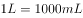，。500毫升水大约是1斤，即500、0.5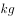。水的密度是1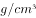，500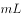，即500，质量是（），。故2000毫升矿泉水约重4斤。

B项错误，现在中国人使用的筷子，标准长度是七寸六分（约为22至24厘米左右）。

C项正确，因为淡水河中的水并不是纯净的水，里面可能溶解了很多物质，水的凝固点降低，水也有可能需在0以下才能冻结。因此流动中的淡水河其水温在零下3摄氏度是有可能的。

D项错误，《中华人民共和国道路交通安全法实施条例》第四十六条规定：“机动车行驶中遇有下列情形之一的，最高行驶速度不得超过每小时30公里，其中拖拉机、电瓶车、轮式专用机械车不得超过每小时15公里：（一）进出非机动车道，通过铁路道口、急弯路、窄路、窄桥时；（二）掉头、转弯、下陡坡时；（三）遇雾、雨、雪、沙尘、冰雹，能见度在50米以内时；（四）在冰雪、泥泞的道路上行驶时；（五）牵引发生故障的机动车时。”

故正确答案为C。

---

### 第 16 题　qid 2377051 · 人文常识

下列文物中，最可能是赝品的是：

- **A**. 拍摄于19世纪70年代的，展示沙俄宫廷的照片
- **B**. 制作于明代末年，起矫正视力作用的眼镜
- **C**. 战国时期记录如何制作青花瓷的竹简　✅
- **D**. 3000年前西亚赫梯人使用的铁器

**答案**：C

**官方解析**

本题考查科技常识中与历史相关的科技成就。
A项正确，沙俄时代是指1721年彼得一世加冕为皇帝后，至1917年尼古拉二世退位为止的俄罗斯国家，而照相机是1839年发明的，因此19世纪70年代（1870-1879年之间）是可以给沙俄宫廷拍照片的。
B项正确，眼镜最早在明朝中后期，由意大利传教士利玛窦传入中国，因此明朝末年，可能会有起矫正视力的眼镜。
C项错误，青花瓷最早起源于唐代，到明清时期逐渐达到制作工艺的巅峰。因此战国时期不可能有青花瓷的制作工艺。
D项正确，西亚的赫梯人是西亚地区乃至全球最早发明冶铁术和使用铁器的民族。考古记录显示，其铁器的生成和使用至少可以追溯到公元前14-20世纪。中国使用铁器也较早，但是在公元前5世纪（春秋末期）才开始普及。
本题为选非题，故正确答案为C。

---

### 第 17 题　qid 2377044 · 人文常识

19世纪60年代，某运河通航。当时，某作家赞叹其“是在一个有着5000多年文明的国家开通的，东方伟大之航道”。据此可知，其描述的是：

- **A**. 伊利运河
- **B**. 巴拿马运河
- **C**. 苏伊士运河　✅
- **D**. 曼彻斯特运河

**答案**：C

**官方解析**

本题考查地理国情。
A项错误，伊利运河是美国历史上著名的运河。于1817年国家立法机关通过建立，1825年10月25日通航。它通过哈得逊河将北美五大湖与纽约市连接起来，属于纽约州运河系统。运河对上中西部发展的影响不次于它对纽约市发展的影响。因此伊利运河通航时间并非19世纪60年代。排除。
B项错误，巴拿马运河由美国建造完成，1914年开始通航。该运河位于中美洲国家巴拿马，横穿巴拿马地峡，连接太平洋和大西洋，是重要的航运要道，被誉为世界七大工程奇迹之一的“世界桥梁”。因此巴拿马运河通航时间并非19世纪60年代。排除。
C项正确，苏伊士运河1869年修筑通航。在埃及贯通苏伊士地峡，沟通地中海与红海，提供从欧洲至印度洋和西太平洋附近土地的最近航线。该运河是世界使用最频繁的航线之一，也是亚洲与非洲的交界线，是亚洲与非洲、欧洲人民来往的主要通道。
D项错误，曼彻斯特运河1885年开工建设，1894年通航。是英国英格兰西北部的运河。从东哈姆到曼彻斯特，有5个船闸，可通海轮。由默西河和伊尔韦尔河供水。因此曼彻斯特运河通航时间并非19世纪60年代。排除。
故正确答案为C。

---

### 第 18 题　qid 2377048 · 人文常识

下列关于盐的说法错误的是：

- **A**. 盐又称“百味之王”，是咸味的载体，具有去腥增鲜之用
- **B**. 人体如果摄入过多的盐分，容易产生高血压、水肿等问题
- **C**. 按来源及开采方式分类，盐可分为：井盐、海盐、湖盐等
- **D**. 日常生活中的低钠盐加入了一定比例的氰化钾，其咸味较淡　✅

**答案**：D

**官方解析**

本题考查科技常识。

A项正确，食盐主要成分是氯化钠，味咸。食盐溶液渗透力很强，能提高各种食用原料中固有的鲜味，并且还有解腻、除膻、去腥的作用，有“百味之王”的美称。

B项正确，盐的主要成分是氯化钠。氯离子和钠离子在人体新陈代谢中发挥着重要作用。氯离子具有维持渗透压、调节酸碱平衡和组成胃酸等生理作用。钠离子在人体水量恒定上起主要调节作用，钠多则水也多，钠少水也应当减少。因此盐摄入过多时，容易引发水肿；另外人体盐分多了，对水分的需求会相应的增加，从而使过多的水分滞留在体内，导致血管内血浆容量增加，最终引发高血压。

C项正确，盐按照原料来源可分为4类：海盐、湖盐、井盐和矿盐。以海水为原料晒制而得的盐叫作海盐；从盐湖中直接采出的盐和以盐湖卤水为原料在盐田中晒制而成的盐叫作湖盐；通过打井的方式抽取地下卤水进而制成的盐叫作井盐；开采岩盐矿床制得的盐叫作矿盐。

D项错误，氰化钾有剧毒，不能作为添加剂使用。低钠盐与普通钠盐相比含钠低（氯化钠70左右），富含钾（氯化钾30左右），有助人体钠钾平衡，降低高血压、心血管疾病的风险。

本题为选非题，故正确答案为D。

---

### 第 19 题　qid 2377053 · 科技常识

将1000毫升水和1000毫升酒精混合成溶液，下列关于该溶液说法正确的是：
①质量小于2000克
②质量等于2000克
③质量大于2000克
④体积大于2000毫升
⑤体积等于2000毫升
⑥体积小于2000毫升

- **A**. ①⑥　✅
- **B**. ②⑤
- **C**. ③④
- **D**. ①⑤

**答案**：A

**官方解析**

本题考查科技常识。

①正确、②③错误，水的密度为1克每毫升（1/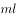），故1000毫升的水质量为1000克；酒精的密度比水小，因此1000毫升的酒精质量小于1000。因此1000毫升水和1000毫升酒精混合成溶液，总质量小于2000克。

⑥正确、④⑤错误，酒精和水不发生化学反应，但由于分子之间有间隔，当把酒精和水混合以后，两种物质的分子相互穿插渗透，进入彼此分子的间隔，所以总体积会小于二者体积之和。因此1000毫升水和1000毫升酒精混合成溶液，总体积小于2000毫升。

综上，①⑥表述正确。

故正确答案为A。

---

### 第 20 题　qid 2377057 · 人文常识

医务人员在给病人打针前，往往会将已经注入注射筒的药水往外推射掉少许。这么做的最主要原因是：

- **A**. 可以用此方式检测注射针管等有无异物堵塞，保证注射安全
- **B**. 从药瓶抽取药水可能会产生一些泡沫，往外推射药水可以将其挤出
- **C**. 从药瓶抽取药水难免会抽入少量空气，往外推射药水可以将其挤出　✅
- **D**. 用药瓶存放的药水，难免产生沉淀，用推射的方式能减少沉淀

**答案**：C

**官方解析**

本题考查与医学相关的生活常识。
医务人员在抽取药水时可能会不小心抽入少量的空气，如果空气混合着药水一起进入患者的血管内，空气可能会堵塞某些较细的血管，造成血液流速不畅，导致人体组织缺氧和功能异常，甚至危及生命。因此在注射前，必须把这部分空气彻底从针管里排出。
而A项中的异物、B项中的泡沫、D项中的沉淀等，都不是主要原因，这些因素要么可以通过肉眼观察发现从而得以处理，要么不会严重危及人的生命。
故正确答案为C。

---

## 言语理解与表达

### 第 1 题　qid 2377084 · 逻辑填空

短期来看，日趋激烈的竞争必将导致相应区域的主题公园            ；而从中长期来看，        了国内外主题公园精粹的集群区域将更有助于吸引来自国内外的增量游客，这对身处其中的本土主题公园而言，将是难得的机遇。
依次填入划横线部分最恰当的一项是：

- **A**. 此消彼长  会聚
- **B**. 弱肉强食  荟萃
- **C**. 优胜劣汰  聚集　✅
- **D**. 物竞天择  融汇

**答案**：C

**官方解析**

第一空，根据前文“竞争”及后文“集群区域将更有助于吸引来自国内外的增量游客”可知，横线处要体现出由于竞争使得主题公园有的生存下来，有的被淘汰。B项“弱肉强食”比喻弱的被强的吞并，C项“优胜劣汰”指生物在生存竞争中适应力强的保存下来，适应力差的被淘汰，两项均符合文意，保留。A项“此消彼长”意为这个下降，那个上升，与文意不符，排除。D项“物竞天择”意为生物相互竞争，能适应者生存下来，“竞”与前文“竞争”语意重复，排除。
第二空，由后文“集群区”可知，横线处要体现出汇集、集合之意，C项“聚集”指集合、凑在一起，符合文意，当选。B项“荟萃”指英俊的人物或精美的东西汇集、聚集，与后文“精粹”语意重复，且通常用法为“人才荟萃、群英荟萃”，排除。
故正确答案为C。
【文段出处】《“恐龙”转身记》

---

### 第 2 题　qid 2377090 · 逻辑填空

音乐教育疏导，是指在通过音乐对大学生进行心理健康教育的过程中，既强调            、发扬民主，又注重            、科学引导。加强音乐教育疏导是大学生思想、心理以及行为活动规律的客观要求。
依次填入划横线部分最恰当的一项是：

- **A**. 百家争鸣  循循善诱
- **B**. 广开言路  以理服人　✅
- **C**. 畅所欲言  诲人不倦
- **D**. 求同存异  集思广益

**答案**：B

**官方解析**

第一空，根据顿号可知，横线处所填成语与“发扬民主”构成并列，应体现出在音乐教育疏导过程中要让每一个大学生充分表达自己的想法。B项“广开言路”指尽量给人们创造发表意见的机会；C项“畅所欲言”指畅快地把要说的话都说出来，均符合文意，保留。A项“百家争鸣”指学术上不同学派之间自由论争，多搭配不同学派之间，与“音乐教育疏导”搭配不当，排除；D项“求同存异”指找出彼此间的共同点，各自保留不同的意见，强调“同”和“异”，而“发扬民主”侧重强调充分发表各自的意见，与文意不符，排除。
第二空，根据顿号可知，横线处所填成语与“科学引导”构成并列，应体现出指引、导向之意。B项“以理服人”指用道理说服人，可以体现出引导的意思，符合文意，当选；C项“诲人不倦”指教导人特别耐心，从不厌倦，侧重强调“不倦”，与文意不符，排除。
故正确答案为B。
【文段出处】《音乐与大学生心理健康教育》

---

### 第 3 题　qid 2377100 · 逻辑填空

有些海蚀洞的“天花板”上还有个大窟窿，阳光照进来，就像古罗马的万神殿一样，这可能是因为顶部岩石本身质地脆弱，更易被        。也可能是海水挤入岩石裂隙时，原本在里面的空气被压缩，水填满洞隙下方，压缩空气便        洞顶，直至将洞顶击穿，形成天窗。
依次填入划横线部分最恰当的一项是：

- **A**. 腐蚀  入侵
- **B**. 侵蚀  冲击　✅
- **C**. 侵袭  攻击
- **D**. 腐化  充盈

**答案**：B

**官方解析**

第一空，搭配“岩石”，A项“腐蚀”、B项“侵蚀”用在此处均可，C项“侵袭”指侵入并袭击，D项“腐化”指有机体腐烂，两项与“岩石”搭配不当，均排除。
第二空，表示“压缩空气”对“洞顶”的作用，且跟后文“直到将洞顶击穿”形成对应，B项“冲击”用在此处对应恰当，符合语境。A项“入侵”指未经邀请、允许或欢迎强行进入，强调从外向内进入，根据前面内容“海水挤入岩石裂隙时，原本在里面的空气被压缩，水填满洞隙下方”，说明空气本来就在洞隙内，与文意不符，排除。
故正确答案为B 。
【文段出处】《非主流洞穴》

---

### 第 4 题　qid 2377094 · 逻辑填空

考古学研究要充分结合文献记载，在历史时代考古学的研究中尤其如此。中国古代文献            ，自当按个人的专业需求，择要阅读，要紧的是必须懂得文献史、目录学等，以便在繁多的古籍中寻取确切相关的记载，加以        。
依次填入划横线部分最恰当的一项是：

- **A**. 比比皆是  考察
- **B**. 恒河沙数  审核
- **C**. 汗牛充栋  查证
- **D**. 浩如烟海  考核　✅

**答案**：D

**官方解析**

本题可从第二空入手，根据语境提示，横线处表示在繁多的古籍中寻找相关的记载对于考古学的研究发现进行核对，B项“审核”指审查核定、D项“考核”指研究考证，符合考古学做法，两项均能够体现出核对之意，符合文意，保留；A项“考察”指实地观察调查，文段并未体现出去实地调查，与文意不符，排除；C项“查证”指调查情况以求证实，文段并非表示调查情况，与文意不符，排除。
第一空，搭配“文献”，B项“恒河沙数”形容数量很多，D项“浩如烟海”形容典籍、图书等极为丰富，“恒河沙数”搭配对象较为广泛，不如“浩如烟海”与文段中“古代文献”的搭配更加准确，排除B项。
故正确答案为D。
【文段出处】《让中国考古面向世界——读&lt;王仲殊文集&gt;》

---

### 第 5 题　qid 2377104 · 逻辑填空

应该如何正确开展批评和自我批评呢？要无私无畏，敢于揭露问题。少数党员领导干部由于“老好人思想”作怪，在专题民主生活会上，往往选择对上级放“礼炮”，对同级放“哑炮”，对自己放“空炮”。三言两语听上去            ，实际上            、毫无价值，不但不能推动工作、维护党内团结，而且还会放任同志身上错误的滋长。
依次填入划横线部分最恰当的一项是：

- **A**. 春风化雨  无关痛痒
- **B**. 和颜悦色  扬汤止沸
- **C**. 和风细雨  隔靴搔痒　✅
- **D**. 洋洋盈耳  无足轻重

**答案**：C

**官方解析**

第一空，搭配“三言两语”，且根据“少数党员领导干部由于‘老好人思想’作怪，在专题民主生活会上，往往选择对上级放‘礼炮’，对同级放‘哑炮’，对自己放‘空炮’。三言两语听上去            ，”可知，此处需要一个词来形容这种看似温和、好听的说话方式。C项“和风细雨”比喻说话、做事的方式方法温和而不粗暴；D项“洋洋盈耳”形容讲话、读书的声音悦耳动听，均可搭配“三言两语”，符合文意，保留。A项“春风化雨”比喻良好的熏陶和教育，用于赞颂师长的教诲得当，与文段语境不符，排除；B项“和颜悦色”指和蔼喜悦的神色，和蔼可亲的面色，与“三言两语”搭配不当，排除。
第二空，横线处通过顿号与“毫无价值”构成近义并列，表达“三言两语”没有任何作用之意，C项“隔靴搔痒”比喻做事没有抓住关键，不解决问题，徒劳无功，符合文意，当选。D项“无足轻重”指无关紧要，侧重于强调事物的重要程度，而此处强调的是发言没有实际作用，不能解决问题，与文意不符，排除。
故正确答案为C。
【文段出处】《言论 | 用批评和自我批评搞好政治“年检”》

---

### 第 6 题　qid 2377107 · 逻辑填空

说起分布式存储，大家可能都会觉得这是一个            的问题。虽然分布式存储并不是一个全新的技术，许多人也对它            。但它是一个涉及到文件系统、存储系统、网络、算法、管理等多方面技术的汇聚。因此，要想真正掌握分布式存储技术，绝不是一件轻松的事。
依次填入划横线部分最恰当的一项是：

- **A**. 老生常谈  耳熟能详　✅
- **B**. 历久弥新  烂熟于心
- **C**. 陈词滥调  轻车熟路
- **D**. 流口常谈  驾轻就熟

**答案**：A

**官方解析**

第一空，横线处所填词语搭配“问题”，根据后文“虽然分布式存储并不是一个全新的技术”可知，横线处所填词语应表示大家觉得这是一个以前经常谈论的问题。A项“老生常谈”比喻听惯了的并无新意的老话，D项“流口常谈”意为人人挂在嘴上的老话，均符合文意，保留。B项“历久弥新”意为经历很长时间，更加显示出新的生机，指事物很有生命力，是褒义词，用于此处感情色彩不符，排除。C项“陈词滥调”意为陈旧而不切实际的空泛言论，该词只能作主语、宾语，不能形容“问题"，排除。
第二空，横线处所填词语搭配“分布式存储”这-概念，表达许多人对分布式存储熟悉之意。A项“耳熟能详”指听的次数多了，能熟悉地说出来，侧重于对事物很熟悉，符合文意，当选。D项“驾轻就熟"指驾轻车，走熟路，比喻承担熟悉、轻松的事务，往往搭配工作或某件事情，与“分布式存储”这一概念搭配不当，排除。
故正确答案为A。
【文段出处】《分布式存储绝不简单》

---

### 第 7 题　qid 2377083 · 逻辑填空

早期的智能手环厂商抛出了健康管理的概念，却并未进行深度的数据挖掘，智能手环的概念由热转冷，其在销量上的____便在意料之中。相应地，市场上涌入了大量的廉价产品，在市场不成熟状态下大打价格战，直接导致外界对于可穿戴行业的____。
依次填入划横线部分最恰当的一项是：

- **A**. 式微  质疑
- **B**. 滑坡  否定
- **C**. 衰退  低估
- **D**. 颓势  唱衰　✅

**答案**：D

**官方解析**

第一空，横线处所填词语搭配“销量”。根据前文“智能手环的概念由热转冷”可知横线处所填词语表达智能手环的销量下滑、下降之意。A项“式微”指事物由兴盛而衰落，B项“滑坡”比喻下降，走下坡路，C项“衰退”衰落退缩，D项“颓势”衰败的趋势，置于此处均符合文意，保留。
第二空，根据前文“在市场不成熟状态下大打价格战”可知，横线处所填词语应表达外界不看好可穿戴行业之意。且“相应”前后为并列关系，对应“意料之中”可见外界观点很明确。D项“唱衰”指让名声受损，置于此处符合文意，当选；A项“质疑”提出疑问,请人解答，侧重不确定，与文意不符，排除；B项“否定”置于此处程度过重，文段仅表达不看好之意，没有体现出全盘否定，排除；C项“低估”指估计过低，常用在对比语境，文段并没有体现之前外界对于可穿戴行业的看法，与文意不符，排除。
故正确答案为D。
【文段出处】《曾经盛极一时的智能手环，如今却被诟病为鸡肋》

---

### 第 8 题　qid 2377095 · 逻辑填空

“梨花节”、“牡丹节”······各地主办的各种各样的“节”频频亮相，热闹非凡。这些名目繁多的活动大多____，耗资不菲。各地利用自己得天独厚的地方特色或特产举办活动，打响品牌，促进地方经济发展，本____。但一些地方不顾实际，办节中讲排场、比阔气，形成公费办节的攀比之风。少数地方搞“拉郎配”，只要与本地沾点边，哪怕是传说、神话，都抬出来热炒一番。

- **A**. 兴师动众  无可非议　✅
- **B**. 劳民伤财  无可厚非
- **C**. 繁文缛节  无可争议
- **D**. 大动干戈  无可讳言

**答案**：A

**官方解析**

第一空，横线处所填成语与“耗资不菲”构成同义并列，语义相近，“耗资不菲”意为花费大量的人力、财力。A项“兴师动众”指动用很多力量去做一件事；B项“劳民伤财”意为既使人民劳苦，又浪费钱财；D项“大动干戈”比喻兴师动众或大张声势地做事，置于此处均可体现“开销大、花费大”之意，保留。C项“繁文缛节”意为繁琐而不必要的礼节，与文意无关，排除。
第二空，根据文意可知，一些地方在利用自己得天独厚的地方特色或特产举办活动，打响品牌，促进地方经济发展的做法是合乎情理的，且横线所在语句通过“但”与后文形成转折，指出一些地方在举办活动过程中出现了不良风气。A项“无可非议”意为没有什么可以指摘的，表示言行合乎情理，符合文意，当选。B项“无可厚非”指不可过分指摘，表示虽有缺点，但是可以理解或原谅，利用地方特色或特产促进地方积极发展的做法本身并不存在缺点，且置于此处无法与后文构成转折关系，排除；D项“无可讳言”意为没有什么需要忌讳掩饰的，可以坦率地讲出来，与文意无关，排除。
故正确答案为A。
【文段出处】《办节不要比场面》

---

### 第 9 题　qid 2377101 · 逻辑填空

专家们表示，很多划时代的科技成果____带来人们生活方式的改变，短期内很可能难以被接受，但若放眼历史长河，就会发现，所有重要的科技革命____都最终成为人类发展的加速器，同时也是人类生活品质提高的根本保障。
依次填入划横线部分最恰当的一项是：

- **A**. 肯定  毫不例外
- **B**. 必然  无一例外　✅
- **C**. 势必  无一幸免
- **D**. 必定  不出所料

**答案**：B

**官方解析**

本题可从第二空入手，根据文意，表达所有的科技革命都会成为加速器，没有能排除在外的，B项“无一例外”指都是这样，且“无一例外”的主语通常是多个对象，符合文意，保留；A项“毫不例外”指一点都不例外，主语通常是一个对象，排除；C项“无一幸免”没有一个人能幸运地躲过，一般多用于灾难，而文段搭配的是“人类发展的加速器”，排除；D项“不出所料”指的是事情变化，在预料之中，与文意不符，排除。
第一空代入验证B项，搭配恰当，当选。
故正确答案为B。
【文段出处】中国新闻网《写稿机器人1分钟“出活”，人工智能会取代人类吗》

---

### 第 10 题　qid 2377111 · 逻辑填空

据了解，最早在明朝，跪迎圣驾成了国家制度。清承明制，下跪日渐成为清朝人的“重要礼节”，打官司要跪，下级见上级要跪，地位低下的见尊贵的要跪。至于现在的唐宋古装电视剧中经常出现的古人        下跪的镜头，多是今人的         。

- **A**. 频繁  妄想
- **B**. 时常  假设
- **C**. 寻隙  杜撰
- **D**. 动辄  臆测　✅

**答案**：D

**官方解析**

第一空，横线处所填词语形容唐宋古装电视剧中古人下跪的情形。D项“动辄”意为动不动就，填入文段可体现出唐宋古装电视剧中古人动不动就下跪之意，符合文段语境，保留。A项“频繁”及B项“时常”均侧重间隔时间短、次数多，与前文的“经常”语义重复，排除。C项“寻隙”指找机会，古人并非主动找机会给别人下跪，不符合文意，排除。
第二空，代入验证。根据前文可知，“唐宋古装电视剧中经常出现······下跪的镜头”是错误的，是“今人”虚构的。D项“臆测”指主观地推测、猜测，凭想象揣测，没有任何根据，符合文意，当选。

故正确答案为D。

【文段出处】《透过茶里烟花回望宋时文明》

---

### 第 11 题　qid 2377114 · 逻辑填空

太阳能在地面上的利用率不高，因为其会受到大气的吸收和散射，季节、昼夜更替的影响而______很多，能量密度变化也巨大，很不稳定。发展空间太阳能电站，可为地面提供商业化的、大规模的电力供给，解决人类对于稳定的可再生能源的长期需求问题。同时，空间太阳能电站的发展也将为更为长远的月球太阳能电站的发展            基础。
依次填入划横线部分最恰当的一项是：

- **A**. 削弱  积累
- **B**. 缩小  打造
- **C**. 散逸  铸就
- **D**. 衰减  奠定　✅

**答案**：D

**官方解析**

本题从第二空入手，横线处需与“基础”搭配，D项“奠定”指建立，可与之搭配，保留。A项“积累”，通常搭配经验、知识等；B项“打造”可搭配具体事物，如首饰、兵器，也可搭配抽象概念，如文化、品牌等；C项“铸就”，是指把熔化的金属倒入特制的模子里，也指塑造人的性格或脾气，多指有益的性格或脾气，均与“基础”搭配不当，排除。
第一空，代入验证，D项“衰减”可与前文“太阳能在地面上的利用率不高，因其会受到大气的吸收和散射”形成对应，表示太阳能会逐渐减少，符合文意，当选。
故正确答案为D。
【文段出处】《什么是空间太阳能电站？为何在太空建造太阳能电站？》

---

### 第 12 题　qid 2377117 · 逻辑填空

现在的诗词普及，还有许多需要留心和甄别的地方。如今市面上诗词普及的图书尤其多，也尤为          。有不少普及读物，其中文字错漏百出，采用的故事也都是          ，甚至杜撰而来。作为读者，应该加以甄别，尽量选择学者编写的图书，他们的材料、解读都较为严谨扎实，采用的故事也都有正史作为依据。
依次填入划横线部分最恰当的一项是：

- **A**. 鱼目混珠  稗官野史
- **B**. 滥竽充数  逸闻轶事
- **C**. 鱼龙混杂  道听途说　✅
- **D**. 龙蛇混杂  胡编乱造

**答案**：C

**官方解析**

第一空，根据“有许多需要留心和甄别的地方”及“有不少普及读物，其中文字错漏百出······”可知，如今市面上诗词书籍质量有好有差。B项“滥竽充数”比喻无本领的冒充有本领，以次的冒充好的；C项“鱼龙混杂”、D项“龙蛇混杂”指好的、坏的掺杂在一起。这三项均符合文意，保留。A项“鱼目混珠”比喻以假乱真，无好坏并存之意，排除。
第二空，横线后出现“甚至”，表示程度加重，递进后的“杜撰而来”表示没有根据的编造，所以横线处所填成语要与“杜撰”语义相近但是程度较轻。C项“道听途说”泛指没有根据的传闻，符合文意，当选。B项“逸闻轶事”指未经史书记载的事迹、传闻，并不一定是完全没有根据的，与“杜撰”无直接对应，不能构成程度加重的递进关系，排除。D项“胡编乱造”泛指没有根据的编造，与“杜撰”意思一致，不能构成程度加重的递进关系，排除。
故正确答案为C。
【文段出处】《当诗词文化成为爆款之后》

---

### 第 13 题　qid 2377091 · 逻辑填空

最近几年，网红食品      。为了买到一杯奶茶、一块蛋糕，人们愿意花上几个小时排队，甚至出高价从“黄牛”手中拿货，拿到美食后，再拍照上传到社交平台“打卡”······这已经成为时下许多年轻人的饮食新时尚。但必须注意的是，部分商家在追求利益的同时无视食品安全问题。一些网红食品借助网络平台隐蔽销售，      于监管体系之外，存在较大的安全隐患。

- **A**. 方兴未艾  逃逸
- **B**. 炙手可热  隐匿
- **C**. 大行其道  游离　✅
- **D**. 异军突起  飘游

**答案**：C

**官方解析**

从第二空入手，根据前文“借助网络平台隐蔽销售”，且横线处搭配“于监管体系之外”，所以横线处表示网红食品没有受到监管，是离开了整体的监管体系。A项“逃逸”是指行为人在发生交通事故后，为逃避法律追究而逃跑的行为，搭配不当，排除；B项“隐匿”表示隐藏，躲起来，既然是“监管体系之外”则不需要进行隐藏，而是“隐匿于监管体系之中”才能表示不容易受到监管，排除；C项“游离”表示离开集体的事物，恰好对应文段“体系之外”，保留；D项“飘游”意思是飘浮游动，与文段意思不符，排除。
验证第一空，C项“大行其道”指某种新潮事物流行、盛行，成为一种风尚，能体现网红食品受欢迎，语义符合，当选。
故正确答案为C。
【文段出处】《“真金”or“镀金”？ 网红食品 需严守安全线》

---

### 第 14 题　qid 2377096 · 逻辑填空

瓦盆，是旧时常见的日用品，因为烧制时要将大小瓦盆一套一套摞起来，运输和店家卖时也是一套一套摞着，故而有句歇后语，说某人讲起话来滔滔不绝，是“卖瓦盆的出身——一套一套的”。“卖瓦盆”式的干部并不少见，这些人说起话来        ，讲起道理      。表面看很热闹，但仔细想想都是一些喊口号、使虚劲的嘴上功夫，根本就是“假大空”。
依次填入划横线部分最恰当的一项是：

- **A**. 舌灿莲花  闻一知十
- **B**. 旁征博引  举一反三
- **C**. 妙语连珠  声情并茂
- **D**. 口若悬河  引经据典　✅

**答案**：D

**官方解析**

本题从第二空入手，搭配“讲道理”，D项“引经据典”指用经典书籍作为论证的依据，用经典书籍作为自己道理的依据，与“讲道理”搭配恰当，保留。A项“闻一知十”指听到一点就能理解很多，强调听，而文段强调讲道理，与文意不符，排除；B项“举一反三”比喻从一件事情类推而知道其他许多事情，强调做事，与讲道理无关，排除；C项“声情并茂”指（演唱、朗读等）声音优美，感情丰富，与“讲道理”搭配不当，排除。
第一空，代入验证，搭配“说起话来”，D项“口若悬河”指讲起话来滔滔不绝，像瀑布不停地奔流倾泻，形容能说会辩，说起来没个完，与“说起话来”搭配恰当，当选。
故正确答案为D。
【文段出处】《让满口大话空话的"卖瓦盆"式干部没市场》

---

### 第 15 题　qid 2377099 · 逻辑填空

有的摄影者对“后期”的重视几乎超过前期拍摄，作品全都美得不行。当“美”      的时候，应该是有问题了。就像舞台上极为相似的明星一样，迷信“后期”只会消除自我，这样的作品创作，只是数量的      而已，创造者的个性被模糊了。
依次填入划横线部分最恰当的一项是：

- **A**. 千篇一律  叠加
- **B**. 俯仰可拾  堆砌　✅
- **C**. 不胜枚举  积累
- **D**. 一成不变  提升

**答案**：B

**官方解析**

第一空搭配“美”，并且根据文段当中“作品全都美得不行”、“就像相似的明星”可知，现在作品比较相似，美的作品比较多，A项“千篇一律”泛指事物只有一种形式，毫无变化，这个词语体现出相似的含义，B项“俯仰可拾”含义为低头就能捡到，形容数量多，到处都是，极易得到，C项“不胜枚举”表明无法一个一个全举出来，形容同一类的人或事物很多，均表达数量多的含义，均可，保留。D项“一成不变”强调一经形成，不再改变，文段当中未提及“美”从古至今从来没有发生改变，排除。
第二空搭配“数量”，文段中表示的含义为创作者个性被模糊了之后，作品创作只是数量上的增多而已，故第二空所填词语要能够体现出来数量“多”的含义，且感情色彩偏消极，B项“堆砌”含义为堆积，符合文意，当选。A项“叠加”强调使一物与另一物占有相同位置并与之共存，意思上可以，但是在感情色彩上堆砌更加合适，排除；C项“积累”，积累侧重于时间上的逐渐累积，文段不强调时间上的累积，排除。
故正确答案为B。
【文段出处】《喜欢那点粗粝》

---

### 第 16 题　qid 2377086 · 片段阅读

其实，大多数人都在沿着固有的一套路径和习惯生活，也就是“舒适区”，并且倾向于不打破它。特别是在互联网文化的影响下，人们更容易和持有相似观点的人抱团取暖，强化原有的认知方式，增强安全感。可生活的不确定因素那么多，在保持它的开放性的前提下顺其自然，才有更多的机会去拥抱美好的结局吧？因为你搞不清自己在什么节点会茅塞顿开，变成一个十分陌生但很开心的自己。
下列选项中，对这段文字理解正确的是：

- **A**. 打破“舒适区”，安享生活的不确定性，你会收获更多的快乐
- **B**. 摒除互联网文化影响，不与持相似观点的人抱团取暖，是让自己茅塞顿开的前提
- **C**. 承认并接受生活中的不确定因素，我们也许会因此改变成为一个自己都不认识的人
- **D**. 固守“舒适区”，与思想上的同类人“抱团”，执拗于原有习惯和安全感，等于拒绝了很多开放性的快乐　✅

**答案**：D

**官方解析**

A项，根据“才有更多的机会去拥抱美好的结局”可知，“机会”表示一种可能性，不代表一定发生，选项“会收获快乐”表述绝对，排除；
B项，“摒除互联网文化影响是让自己茅塞顿开的前提”无中生有，文段只是说抛开影响了可能会在某个节点茅塞顿开，而没说是前提，排除；
C项，“我们会因此改变成为一个自己都不认识的人”，因果关系无中生有，排除；
D项，根据“在不可抗拒它的开放性的前提下顺其自然，会变成一个十分陌生但很开心的自己”，在强调如果不抛开“舒适区”， 仍旧与思想上的同类人“抱团”，就会少很多快乐，表述正确，当选。
故正确答案为D。
【文段出处】《没有一个人类能逃脱“真香定律”》

---

### 第 17 题　qid 2377088 · 片段阅读

人工智能的数据垄断为反垄断理论提出了新的实践问题，换句话说，反垄断法的理论创新是一种现实的实践需求。具体而言，反垄断法的理论创新需求主要有以下几个方面：第一，双边市场理论。与单边市场相对应，经济学家所提出的双边市场理论，能够为多边性数据市场的反垄断执法提供有益思路。当前的双边市场理论，一方面需要关注实践动向进一步完善理论自身，另一方面需要探索双边市场理论如何转化为可供操作适用的反垄断法律法规。第二，相关市场理论。人工智能的数据反垄断，需要探讨单独界定“数据市场”的必要性和可行性，还需要正视传统相关市场界定工具 (如SSNIP测试法)在数据市场的无能为力，进而积极探索可替代性的分析工具。
这段文字接下来最可能讲述的是数据垄断的：

- **A**. 法律渊源
- **B**. 执法问题
- **C**. 立法问题　✅
- **D**. 法律界定

**答案**：C

**官方解析**

文段开篇指出目前人工智能的数据垄断要求反垄断法进行理论创新，接下来具体论述了需求表现在双边市场理论和相关市场理论两大方面，即从这两个方面进行反垄断法的理论创新。故文段接下来应该围绕这一话题论述如何创新即新的反垄断法怎么确立，对应C项。
A项“法律渊源”为无中生有，排除；
B项“执法问题”强调的是“执法”，而文段重点应该建立相关法律法规，排除；
D项“法律界定”，提及法律，但重点在“界定”文段未提及法律的界定问题，排除。
故正确答案为C。
【文段出处】《人工智能的数据垄断与反垄断法的时代使命》

---

### 第 18 题　qid 2377092 · 片段阅读

隐形飞机能“隐形”，主要是采用了一系列隐形高新技术，包括机体骨架和蒙皮的隐形材料、表面隐形涂敷材料、外形隐形结构、降红外辐射技术、降噪技术和电子干扰技术等。制造隐形飞机骨架和蒙皮的隐形材料有好几种。用得最多的是碳纤维增强树脂复合材料、碳纤维和碳素基体结合在一起的碳-碳复合材料、碳化硅丝增强铝复合材料等，这些复合材料质坚量轻，能够吸收雷达波。美国B-2隐形轰炸机机体蒙皮内，还将混杂特殊树脂压制成的一种蜂窝状夹芯材料作为衬里，以进一步提高机体吸收雷达波的能力。为了获得尽可能完善的双保险效果，还在整个机身外表面涂上一层镍钴铁氧体，或者金属和金属氧化物超细粉末组成的隐形涂料。这种涂料能使照射上来的雷达波的磁损耗加大，起到吸波、透波的作用。
最适合做这段文字标题的一项是：

- **A**. 外层涂料、机身材料助力飞机隐形
- **B**. 揭秘能使飞机隐形的隐形材料
- **C**. 特殊涂料是飞机能隐形的关键
- **D**. 隐形飞机能隐形的原因　✅

**答案**：D

**官方解析**

文段首先介绍了隐形飞机能“隐形”的原因，主要是因为一系列隐形高新技术，包括一些隐形材料和特殊技术等，之后通过制造隐形飞机骨架和蒙皮的隐形材料、美国B-2隐形轰炸机的蜂窝状夹芯材料以及机身外表面涂上的镍钴铁氧体等，举例说明了隐形高新技术是如何帮助隐形飞机“隐形”的，论证首句的观点。故文段重点强调隐形飞机为什么能“隐形”，对应D项。
A项“外层涂料、机身材料”、 B项“隐形材料”和C项“特殊涂料”均对应文段解释说明部分，非重点，且表述片面，排除。
故正确答案为D。
【文段出处】光明网《为什么隐形飞机能隐形？》

---

### 第 19 题　qid 2377109 · 片段阅读

全世界有超过15000个海洋保护区，绝大多数保护区都允许商业活动。人类已经充分利用甚至过度开采了全球的鱼类资源，并且摧毁了世界上近半数的珊瑚礁。科学家认为，为保护海洋生物的多样性，全球至少的海洋需要划入保护区。重要的是，大部分保护区应该靠近繁华的海岸。如果一片海域被隔离了足够长的时间，鱼类和生物多样性就会出现反弹。繁盛的鱼类也会逐渐向邻近的水域扩散。智能化的海洋保护区甚至可以在多种压力（如污染、变暖和酸化）下使海洋生态系统具有更强的恢复力。

从这段文字可以看出作者意在呼吁：

- **A**. 加大海洋保护区建设　✅
- **B**. 大力保护珊瑚礁
- **C**. 禁止海洋保护区商业活动
- **D**. 避免过度捕捞以保护鱼类资源

**答案**：A

**官方解析**

文段首先指出世界上绝大多数保护区都允许商业活动，接着通过具体的数据指出人类对海洋的破坏，后文介绍了专家的观点，提出需要将更多海洋区域划入保护区的对策，最后阐述了形成海洋保护区之后带来的意义和效果，对这一对策进行加强论证，故文段重点强调的是建设海洋保护区的必要性，对应A项。
B项“珊瑚礁”、D项“鱼类资源”均偏离文段核心话题，文段重点强调建设海洋保护区，排除；
C项，“禁止”无中生有，文段并未提及，排除。
故正确答案为A。

---

### 第 20 题　qid 2377113 · 语句表达

从抑郁到认知能力下降，到心脏问题和中风，越来越多的证据将孤独与心理、生理疾病联系在了一起。在某些时刻，我们都会感到“孤独”。但对于我们中的大多数人来说，孤独的感觉取决于我们的状态以及如何看待它。孤独被定义为可以感知的社交隔离和与他人切断联系的经历。大多数经历孤独的人，____________________，比如找到新朋友或开始一段新恋情。研究人员也提到过一些“长期孤独”人群，他们在一生中经历了沉重的孤独，即便所处的环境或人际关系发生变化也无法改变他们孤独的感觉。
填入划横线部分最恰当的一项是:

- **A**. 只要改变心态，就能改变感到孤独的状态　✅
- **B**. 只有改变心态，才能改变感到孤独的状态
- **C**. 通过改变心态，可以改变感到孤独的状态
- **D**. 只需改变心态，就能改变感到孤独的状态

**答案**：A

**官方解析**

横线出现在文段中间，需衔接上下文。文段开篇强调许多证据将孤独与心理、生理疾病联系在了一起，接着通过转折关联词“但”指出孤独的感觉取决于我们的状态以及如何看待它，横线后文“比如”针对所填内容举例，尾句再次举了“长期孤独”人群的例子，说明其孤独无法改变。联系前后语义可知，横线处表达我们的心态决定了孤独的状态，故只要改变心态就能改变孤独的状态，对应A项。
B项，文段强调改变心态就能改变孤独的状态，但并非强调只能通过改变心态去改变感到孤独，排除；
C项，与文段强调的“孤独取决于我们的心态”相比，程度较轻，与文段对应不及A项要好，排除；
D项，“只需······就能”强调改变孤独的状态很容易，只需改变心态即可，文段并非强调改变孤独的状态是否容易，而是强调心态是决定性因素，故不及A项要好，排除。
故正确答案为A。
【文段出处】《回家吧，孤独感致命！》

---

### 第 21 题　qid 2377115 · 片段阅读

恒星的形成需要气体，在星团中，由于大量的气体会在星团形成早期被耗散掉，星团一直以来被认为不能形成新的恒星，只有恒星之间的碰撞或者并合才有可能为年老的恒星补充燃烧物质，使得它们看起来比其余的恒星更加年轻。通过碰撞或者并合形成的这些恒星被称作“蓝离散星”，它们的名字来源于它们与绝大部分恒星相比截然不同的演化过程，这使得它们游离在理论预言的演化轨迹之外。某国际研究团队利用哈勃太空望远镜的观测数据，对年轻星团NGC2173中的蓝离散星进行了研究，首次在这个年轻星团中观测到了一族不同寻常的蓝离散星。根据这一发现，这一星团包含着突然爆发性形成的一支蓝离散星，这一结果发表于《天体物理杂志》上。
这段文字，作者意在说明：

- **A**. 恒星的形成需要气体
- **B**. 星团中存在着不同寻常的蓝离散星　✅
- **C**. 蓝离散星游离在理论预言的演化轨迹之外
- **D**. 通过碰撞或者并合形成的恒星被称作“蓝离散星”

**答案**：B

**官方解析**

文段首先介绍了一直以来星团被认为不能形成新的恒星，接下来介绍了何为“蓝离散星”，并指出它们游离于演化轨迹之外。后文介绍了一个对年轻星团NGC2173中的蓝离散星的研究，指出首次观测到了一族不同寻常的蓝离散星，最后指出星团包括蓝离散星这一结果被发表在杂志上，故文段重点强调星团中存在蓝离散星，对应B项。
A项，对应文段话题引入的部分，非重点，排除；
C项，对应解释说明部分，非重点，排除；
D项，是“蓝离散星”定义的表述，非重点，排除。
故正确答案为B。
【文段出处】《国家天文台科研团队揭开星团研究中的蓝离散星之谜》

---

### 第 22 题　qid 2377116 · 片段阅读

空气污染阻断了植物与昆虫间的正常交流，这一点对于像蜜蜂之类的传粉昆虫来说影响更大。虽然，单就蜜蜂种群数量因此而受到的破坏程度，现阶段还没有谁能够拿出一个完整的监测数据，但研究发现，常见的植物挥发性物质月桂烯极易被柴油机废气所破坏，而且月桂烯的缺失会让蜜蜂在寻找蜜源的途中迷失方向。研究人员在将花香中的月桂烯移除后，只有的蜜蜂还能识别出蜜源在哪儿。

根据文字，以下说法正确的是：

- **A**. 空气污染严重损害蜜蜂生存
- **B**. 空气污染严重影响蜜蜂采蜜　✅
- **C**. 空气污染让蜜蜂找不到蜜源
- **D**. 空气污染严重破坏蜜源

**答案**：B

**官方解析**

A项，“严重损害蜜蜂生存”文中并未提及，故表述无中生有，排除；

B项，根据“常见的植物挥发性物质月桂烯极易被柴油机废气所破坏······只有的蜜蜂还能识别出蜜源在哪儿”可知，空气污染导致月桂烯缺失后很多蜜蜂不能识别出蜜源在哪儿，因此严重影响蜜蜂采蜜，表述正确，当选；

C项，根据“只有的蜜蜂还能识别出蜜源在哪儿”可知，并非所有的蜜蜂都找不到蜜源，故表述过于绝对，排除；

D项，文段论述的是污染对蜜蜂的影响，“破坏蜜源”文段并未提及，故表述无中生有，排除。

故正确答案为B。

【文段出处】《植物“语言”遭遇污染》

---

### 第 23 题　qid 2377103 · 片段阅读

垃圾填埋场是厌氧细菌的滋生地，会产生大量的甲烷。甲烷的温室效应比二氧化碳更强，尽管可以将其捕捉并转化为能源，但是即使最高效的回收系统，仍有高达的甲烷发生逃逸。由于垃圾填埋场产生的甲烷大部分来自有机废弃物，因此可以用更绿色的方式处理，最简单的方法就是堆肥。实际上，垃圾填埋场里三分之二的垃圾可以堆肥，这就大大减少了甲烷的产量。由于堆肥过程中会产生高温、高压，有机废弃物中的碳可能部分转化为二氧化碳和一氧化碳。那么，我们可以考虑将这些有机物重新组合成液态燃料（乙醇或甲醇），或用作其他工业原料。

这段文字主要介绍了：

- **A**. 甲烷的温室效应比二氧化碳更甚
- **B**. 现阶段的甲烷回收系统对其的捕捉利用依旧有限
- **C**. 用堆肥方式处理垃圾填埋场的垃圾能有效减少甲烷的生成　✅
- **D**. 堆肥这种垃圾处理方式需要将其生成的有机废弃物重新组合

**答案**：C

**官方解析**

文段首句指出了垃圾填埋场会产生甲烷，接下来论述了甲烷对环境的危害并指出了甲烷回收难的问题，属于提出问题部分。随后给出了解决上述问题的对策，即“通过堆肥”解决甲烷问题。后文继续论述，即使堆肥过程中会产生一氧化碳和二氧化碳，但依然可以用作液态燃料和工业燃料，属于对前文对策进行补充论述。故整个文段重点强调“堆肥”这一对策，能够解决前文“甲烷”问题，对应C项。
A、B两项，位于对策之前，属于问题表述，非重点，排除；
D项“有机废弃物重新组合”属于补充说明中的内容，非重点，且尾句“或”字连接两个方面，选项表述片面，排除。
故正确答案为C。
【文段出处】《迈向“零垃圾”的世界》

---

### 第 24 题　qid 2377105 · 语句表达

①乡村的好家风越多，乡村文明才有厚德的土壤
②同时，好家风也能为更多人创造人生出彩的机会，提升农村精神文明建设水平
③好家风是宝贵的精神财富，不仅可以让仁义忠孝、尊老爱幼的家族文化和淳朴民风代代相传，而且能有力强化乡风文明的“内核”
④传承弘扬优良家风是乡风文明建设的“牛鼻子”
⑤抓好家风传承与建设，就是抓住了乡风文明的“牛鼻子”
⑥建设文明乡风，不单是基础设施建设要跟上，更要以注重家庭、注重家风、弘扬优秀传统文化为抓手，全面提升乡村文明素质
将上述6个句子重新排列，语序正确的是：

- **A**. ⑥④①③②⑤
- **B**. ⑥④⑤③②①
- **C**. ④⑤③②①⑥
- **D**. ④⑥③②①⑤　✅

**答案**：D

**官方解析**

观察选项，对比首句，④强调弘扬优良家风对做好乡风文明建设的重要性，⑥提出对策建设文明乡风要注重家风，按照逻辑顺序，应该强调重要性，再提出具体对策，④句应该在⑥句之前，排除A、B两项。对比C和D，判断④后面接⑤或⑥，均话题一致，不好判断。观察选项，结合③②①内容强调好家风可知，⑤句抓好家风，就是抓住“牛鼻子”就是对前文的总结，且和首句形成呼应。⑥句只是强调注重家风，对比⑤句抓好家风，和前文衔接没有那么恰当，排除。
验证D项逻辑顺序，恰当合理。
故正确答案为D。
【出处】《夯实基层基础 需注重传承弘扬优良家风》

---

### 第 25 题　qid 2377106 · 片段阅读

多年生植物进入休眠期后，①体内的生理代谢活动并未停止。②其营养物质、酶的活性和内源激素都在发生变化。③它们会在身体中积蓄起盐类物质和能变为糖的淀粉。④而盐类和含糖溶液有很强的抗寒能力。⑤有的植物还能增加体内不饱和脂肪酸或抗冻蛋白等。⑥它们能避免细胞内部结冰。⑦不同植物不同命。粗大的树木不怕冻可以用寒气不易侵入来解释；那么，细小的植物枝叶、娇嫩的蔬菜等不易冻死的主要原因就在于此。
在上述文字的最后一句中划线的“此”指代的是：

- **A**. ①⑦
- **B**. ②④
- **C**. ③⑤　✅
- **D**. ④⑥

**答案**：C

**官方解析**

根据题设需要重点理解“此”指代的内容。定位原文，“此”出现在文段结尾，结合尾句“此”指代的是细小的植物枝叶、娇嫩的蔬菜不易冻死的主要原因。结合前文让植物本身能够具有抗冻、抗寒能力的，通过③“它们会在身体中积蓄起盐类物质和能变为糖的淀粉”以及⑤“还能增加体内不饱和脂肪酸或抗冻蛋白”，可知不易冻死原因为③、⑤，C项当选。
A项，“体内的生理代谢活动并未停止”和“不同植物不同命”，为植物的客观表现，均非细小植物不易冻死的原因，排除；
B项，“其营养物质、酶的活性和内源激素都在发生变化”为植物的客观表现，且“盐类和含糖溶液有抗寒能力”属于介绍“盐类和含糖溶液”具有的功效，而非细小植物不易冻死的原因，排除；
D项，④和⑥只是客观阐释盐类、含糖溶液、不饱和脂肪酸以及抗冻蛋白等物质本身具有的功效，真正使细小植物具有抗寒能力的是植物内部的运作过程，排除。
故正确答案为C。
【文段出处】《耐寒植物过冬高招》

---

### 第 26 题　qid 2377108 · 片段阅读

在宏观尺度下，金刚石通常被认为表现不出丝毫变形行为，任何极端尝试对它进行变形的后果往往在还没有达到可见形变之前就发生脆性断裂。这使它在一些可能承受机械变形的应用中受到限制。为针对其进行纳米尺度力学测试，研究组设计了一套独特的纳米力学实验方法，对单晶和多晶金刚石纳米针样品进行了定量的“压缩—弯曲”测试。结果显示，测试样品均可实现远高于宏观金刚石数十倍以上的大变形，且在极大范围内可完全回复。实验结果经模拟分析，确认单晶金刚石纳米针在拉伸侧的弹性形变量达到约，对应强度亦接近其理论极限。此次发现将有助于进一步拓展金刚石在药物传输、生物探测和影像等生物医学领域的应用。

以下各项中，对上述文字理解正确的是：

- **A**. 
该实验中，多晶金刚石纳米针样品在拉伸侧的弹性形变达到约

- **B**. 
在宏观尺度下，任何极端尝试行为也无法让金刚石达到可见变形

- **C**. 
目前金刚石在生物探测和影像等生物医学领域的应用较为受限

- **D**. 
该实验结果发现得益于研究组设计的独特的纳米力学实验方法
　✅

**答案**：D

**官方解析**

D项，根据文段“研究组设计了一套独特的纳米力学研究方法······结果显示······”可知，实验结果得益于研究组设计的独特的纳米力学实验方法，符合文意，当选。

A项，文段为“单晶金刚石纳米针在拉伸侧的弹性变量达到约”，而非“多晶金刚石”，选项偷换概念，排除。

B项，文段首句论述“在宏观尺度下······任何极端尝试······发生脆性断裂······受到限制”，除了提及“任何”，还出现“往往”“受限”，说明并非绝对不可以变形，选项“任何······也”表述绝对化，排除。

C项，文段尾句论述“此次发现有助于······生物探测和影像等生物医学领域的应用”，并未提及目前在这两个领域的应用受限，选项无中生有，排除。

故正确答案为D。

【文段出处】《中外科学家在纳米尺度发现金刚石超弹性变形》

---

### 第 27 题　qid 2377087 · 语句表达

。我国正处于全面建成小康社会的决胜阶段，人口老龄化、资源环境约束等挑战依然严峻，人工智能在教育、医疗、养老、环境保护、城市运行、司法服务等领域广泛应用，将极大提高公共服务精准化水平，全面提升人民生活品质。人工智能技术可准确感知、预测、预警基础设施和社会安全运行的重大态势，及时把握群体认知及心理变化，主动决策反应，将显著提高社会治理的能力和水平，对有效维护社会稳定具有不可替代的作用。
划横线部分填入最恰当的是：

- **A**. 人工智能带来社会建设的新机遇　✅
- **B**. 人工智能促进公共服务管理水平提升
- **C**. 人工智能助力社会自动化、服务精准化
- **D**. 人工智能在教育、医疗、预警等领域应用拓展

**答案**：A

**官方解析**

此题为语句填空题，横线在开头，需结合后文内容进行分析。后文从两个角度分别介绍了人工智能带来的好处，即提高了公共服务水平和人民生活品质，以及对社会治理方面起到了突出作用，故后文重在强调人工智能对社会建设的有利影响。A项“社会建设”概括了后文内容，可作为首句统领全文，当选。
B项，仅对应了人工智能在公共服务方面的作用，表述片面，排除；
C项，“社会自动化”无中生有，排除；
D项，文段重在通过人工智能在社会公共服务以及社会治理两方面的作用，论述其对社会建设的重要意义，而非单纯介绍其在某些领域的应用情况，表述片面，排除。
故正确答案为A。
【文段出处】《新一代人工智能发展规划》

---

### 第 28 题　qid 2377089 · 片段阅读

中国古代的责任司法意味着司法人员必须对自己的行为负责，出了错案必须承担责任。在法家思想中，责任司法的理论源于责任行政的理论，因为当时司法权和行政权不分家。责任行政的理论要求行政执法主体必须为自己的行为承担责任。为此，秦朝制定了完善的监察制度，对行政执法进行了严密的监察，对执法主体的违法行为进行追究。当时，司法权是行政权的一部分，因此，对行政权的监察包括了对司法权的监察。监察主体如发现司法人员有司法不公问题，会对其惩戒。可以说，监察制度是当时司法责任制得以确立的前提。秦朝的司法责任制具有开创性，《秦律》中规定的“不直”等罪名就是例证。责任司法也是一种“治吏”司法，法家提倡“明主治吏不治民”（实际意思是治吏重于治民），要求将整治官员作风纳入法治化轨道。
这段文字主要讲述的是：

- **A**. 中国古代的责任司法的涵义
- **B**. 责任司法的本质和历史意义
- **C**. 责任司法内涵的产生和历史嬗变
- **D**. 我国古代责任司法和法家思想的渊源　✅

**答案**：D

**官方解析**

文段先简要介绍了中国古代责任司法，随后介绍其在法家思想中的理论来源。并以秦朝为例指出，当时以对行政权的监察来实现对司法权的监察，证明了古代责任司法源于法家的行政责任理论。尾句指出责任司法是一种“治吏”的司法，也符合法家的思想。且尾句的“也”字体现出文段为并列文段，两部分内容都在介绍中国古代责任司法与法家思想之间的关系，D项符合文意。
A项，“责任司法的涵义”对应文段首句，非重点，排除；
B项，“历史意义”在文段中没有论述，无中生有，排除；
C项，文段没有介绍中国古代责任司法的“历史嬗变”，排除。
故正确答案为D。
【文段出处】《传统法律文化孕育的司法智慧》

---

### 第 29 题　qid 2377093 · 片段阅读

合乎人类更高层次需求的社会救助，“皆有所养”是不够的，因为人类还有尊严，人的尊严是统领个人权利的核心价值。体面的、合乎人类尊严的基本生活，不仅体现在物质需求，还有精神需要。通俗地说，人不仅要“肚皮”，还要“脸皮”。反窥现实，不论是企业赞助、单位捐赠、政府慰问，都喜欢大张旗鼓地搞捐赠仪式，让领导、捐赠者与受赠人合照、录像，再大肆宣传，不太顾及受赠人的颜面。为了杜绝不合条件者申请救助款，主办单位往往采取将受助人张榜公示、接受举报的办法，让受助者的尊严荡然无存。一些贫困中学生、大学生怕打上贫穷烙印后被人瞧不起，干脆放弃申请救助。
这段文字，作者意在强调：

- **A**. 目前社会上一些救助行为没有顾及受助人的尊严
- **B**. 不顾及受助人颜面的救助行为可能会起到反作用
- **C**. 救助，应该满足受助人的物质需求和精神需要
- **D**. 社会救助中，受助人的尊严应该得到更多考虑　✅

**答案**：D

**官方解析**

文段开篇提出社会救助“皆有所养”是不够的，接下来指出人还有尊严，有精神需要，随后通过“要”提出对策，指出社会救助不仅要“肚皮”，还要“脸皮”，即要注重人的尊严。最后以“反窥现实”引出现实中不顾及尊严的反面例证，进一步论证社会救助应该考虑受助人的尊严，对应D项。
A项，是文段中例证部分的内容，非文段重点，排除；
B项，“不顾及受助人颜面的救助行为”为文段中例证部分，非文段重点，排除；
C项，“满足”的表述过于绝对，且没有提及文段核心话题“尊严”，排除。
故正确答案为D。
【文段出处】《社会救助，请开启尊严模式》

---

### 第 30 题　qid 2377098 · 片段阅读

现在经常听到一种说法，智商不敌情商。一个人能走到哪里，取得什么成就，关键在于情商，这种“情商决定论”甚嚣尘上，令人生疑。在我们身边，无论是生活中，还是工作中，只要一个人的事情没做好，都会跟情商不高挂起钩来。事实上，我们都夸大了情商的作用，忽视了智商、实力、勤奋，以为只要玩转情商就能步步高升，其实不然。人在职场，情商固然重要，但决定性因素还是智商和才华，玩情商可以让你八面玲珑，但毕竟玩不出实际业绩，也玩不出科研成果来。一个人有真才实学，本领过硬，工作勤奋，那么情商其实就是锦上添花的事情了。
这段文字，作者意在说明：

- **A**. 在职场中，智商比情商更加重要
- **B**. 情商只是锦上添花，智商方能决定成败
- **C**. “情商决定论”并不正确，情商的作用不应夸大　✅
- **D**. 成功靠的是真才实学，过硬本领，而不是玩转情商

**答案**：C

**官方解析**

文段首先介绍“情商决定论”甚嚣尘上，通过“事实上”转折，强调“情商决定论”夸大了情商的作用。接着通过“其实”进一步指出情商不能带来实际业绩，也不能带来科研成果，说明情商的作用不应被夸大，从而证明“情商决定论”并不正确，对应C项。
A项，文段除了强调智商的重要性，还强调了才华，表述片面，排除；
B项，文中强调了“智力、实力、勤奋”因素，选项“智商决定成败”表述过于绝对，排除；
D项，文段尾句强调了真才实学，本领过硬和工作勤奋，表述片面，排除。
故正确答案为C。
【文段出处】《情商和套路》

---

## 数量关系

### 第 1 题　qid 2377041 · 数学运算

某小学组织6个年级的学生外出参观包括A科技馆在内的6个科技馆，每个年级任选一个科技馆参观，则有且只有两个年级选择A科技馆的方案有：

- **A**. 1800种
- **B**. 18750种
- **C**. 3800种
- **D**. 9375种　✅

**答案**：D

**官方解析**

6个年级参观6个科技馆，每个年级任选一个，要求有且只有两个年级选择A馆。可先从6个年级中抽取两个参观A馆，有种选择；

剩余4个年级，随机参观剩余5个科技馆，因各年级之间可以选择相同的馆，故每个年级都有5种选择，共计种选择。

故6个年级总计选择方案有：种选择。

故正确答案为D。

备注：根据题意，6个年级之间有可能重复选择同一个科技馆，故剩余4个年级参观剩余5个科技馆，并非种选择。

---

### 第 2 题　qid 2377052 · 数学运算

已知某运动会田径综合赛以选手三项运动的综合积分高低决定排名。具体积分规则如下表1所示，而某队四位队员的模拟成绩如表2。据此，该代表队应选派参赛的队员是：

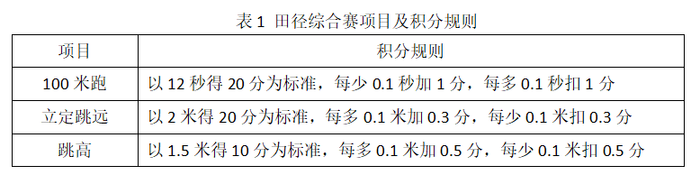

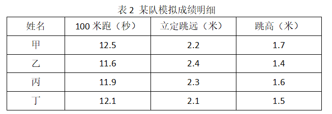

- **A**. 甲
- **B**. 乙　✅
- **C**. 丙
- **D**. 丁

**答案**：B

**官方解析**

根据题意，代表队选派参赛的队员应为总积分最高的选手。

因三项运动的标准分一定，故比较四位选手的总积分，直接比较该选手相对于标准分的差距即可。根据规则可计算四位选手相对于标准分的情况分别为：

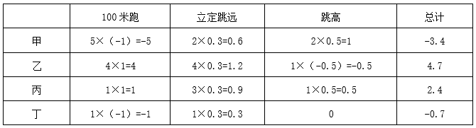

对比可得，乙高出标准分的分值最高，故乙的总积分最高，应选择乙选手进行参赛。

故正确答案为B。

---

### 第 3 题　qid 2377061 · 数学运算

某技校在每月首日招收学员，学习时限以月为周期，每月首日为考核日。考核通过即离校。据统计，每批学员学习1个月后，在次月初的考核通过的比例为，而学习2个月后，仍未通过考核的占该批学员的，学习3个月后该批学员全部考核通过离校。如果从3月份起，该技校每个月招收300名学员，则7月2日在该技校的学员有多少名？

- **A**. 540
- **B**. 600
- **C**. 720　✅
- **D**. 810

**答案**：C

**官方解析**

根据表格可知，7月2日在校的学员数量包括5月剩余150人，6月剩余270人，以及7月1日新招的300人，共计人。

故正确答案为C。

---

### 第 4 题　qid 2377058 · 数学运算

如下图所示，长度均为六分之五千米的三个圆形跑道汇聚于点O，若甲、乙、丙三人分别以5千米/小时、8千米/小时、12千米/小时的速度同时从O点出发分别绕三个圈奔跑，则三人再次相聚于O点需经过多少分钟？

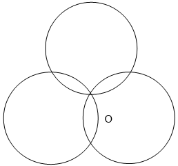

- **A**. 40
- **B**. 50　✅
- **C**. 52
- **D**. 60

**答案**：B

**官方解析**

已知圆形跑道长度六分之五千米，及甲、乙、丙三人速度，可求得三人跑一圈所用时间。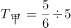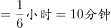，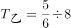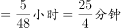，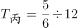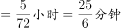。即甲用10分钟跑一圈，乙用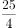分钟跑一圈，丙用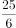 分钟跑一圈。那么三人再次相聚于O点所用时间，是三人跑一圈时间的最小公倍数50分钟。

故正确答案为B。

注：求分数最小公倍数的方法，先把三个分数的分母通分，统一为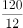 、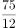 、 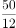，取分子120、75、50的最小公倍数600，再除以分母12即可。

---

### 第 5 题　qid 2377054 · 数学运算

某饮料厂生产的A、B两种饮料均需加入某添加剂，A饮料每瓶需加该添加剂4克，B饮料每瓶需加3克，已知370克该添加剂恰好生产了这两种饮料共计100瓶，则A、B两种饮料各生产了多少瓶？

- **A**. 30、70
- **B**. 40、60
- **C**. 50、50
- **D**. 70、30　✅

**答案**：D

**官方解析**

设A、B两种饮料各生产了、瓶，根据题意得：，，解得：，。即A、B两种饮料各生产了70、30瓶。

故正确答案为D。

---

### 第 6 题　qid 2377050 · 数学运算

现有5盒动画卡片，各盒卡片张数分别为：7、9、11、14、17。卡片按图案分为米老鼠、葫芦娃、喜羊羊和灰太狼4种，每个盒内装的是同图案的卡片。已知米老鼠的卡片只有一盒，而喜羊羊、灰太狼图案的卡片数之和比葫芦娃图案的多1倍。据此可知，图案为米老鼠的卡片张数为：

- **A**. 7　✅
- **B**. 9
- **C**. 14
- **D**. 17

**答案**：A

**官方解析**

根据题意，5个盒子中卡片总数为个。又因为总共四种卡片，且喜羊羊、灰太狼两种卡片数量之和比葫芦娃多1倍，即。因此这三种卡片的数量之和是3的整数倍，即是3的整数倍，代入选项，只有A选项米老鼠的卡片张数是7的时候满足，是3的整数倍，其余均不满足。

故正确答案为A。

---

### 第 7 题　qid 2377047 · 数学运算

某农户饲养有肉兔和宠物兔两种不同用途的兔子共计2200只，所有兔子的毛色分为黑、白两种。肉兔中有的毛色为黑色，宠物兔中有毛色为白。据此可知，毛色为白色的肉兔至少有多少只？

- **A**. 25　✅
- **B**. 50
- **C**. 100
- **D**. 200

**答案**：A

**官方解析**

肉兔中有毛色为黑，则有毛色为白。宠物兔中有毛色为白。设宠物兔有只，则肉兔有只。则肉兔的数量既是8的整数倍又是100的整数倍即200（8与100的最小公倍数）的整数倍，要使肉兔中毛色为白色的最少，应使肉兔的数量尽可能少，则肉兔最少为200只，故毛色为白色的肉兔至少为只。

故正确答案为A。

---

### 第 8 题　qid 2377045 · 数学运算

A、B两地各有一批相同数量的货物需由某运输队用卡车完成交换。假设每辆卡车运送的货物箱数量相同，运输队首先从A地出发，中途时有10辆卡车抛锚，其余车辆必须每辆车再多运2箱。到达B地卸货后有15辆卡车不返程。因此参与返程的卡车每辆都需比出发时多装运6箱。据此可知，两地共有货物多少箱？

- **A**. 2000
- **B**. 1800
- **C**. 3600　✅
- **D**. 4000

**答案**：C

**官方解析**

设运输队从A地出发时共有辆卡车，每辆卡车运货物箱。根据题意可得：

······①

······②

联立①②，化简之后得，

······③

······④

解得，，因此原来两地共有货物箱。

故正确答案为C。

---

### 第 9 题　qid 2377043 · 数学运算

在一次马拉松比赛中，某国运动员包揽了前四名，他们佩戴的参赛号码很有趣：一人的号码加4，另一人减4，第三人乘4，第四人除以8，其所得的数字都一样。且这四个号码中有1个三位数号码，2个两位数号码，1个一位数号码。而其中一位运动员在比赛中取得的名次也与自己的号码相同。据此可知，其中三位数的号码为：

- **A**. 120
- **B**. 128　✅
- **C**. 256
- **D**. 512

**答案**：B

**官方解析**

题干中四人对应的号码数分别设为、、、（均为正整数），根据题干条件可得，分析可知，一定是最大的，则一定是三位数。

代入A选项进行验证，时，，解得，非整数排除；

代入B选项进行验证，时，，解得，，，满足题干所有条件。

故正确答案为B。

---

### 第 10 题　qid 2377040 · 数学运算

某儿童剧以团购方式销售门票，其票价如下：

现有甲、乙两个小学组织学生观看，若两个学校以各自学生总数分别购票，则两个学校门票共计需花费6120元；若两个学校将各自学生合在一起购票，则门票费为5040元。据此可知，两个小学相差多少人？

- **A**. 18　✅
- **B**. 19
- **C**. 20
- **D**. 21

**答案**：A

**官方解析**

根据已知条件，总人数人，为偶数，根据知和求差，奇偶同性，则甲-乙也是偶数，排除B、D两项。将A项代入验证，即，结合，可以求出，，则分开购票总费用元，满足题干条件。

故正确答案为A。

---

## 判断推理

### 第 1 题　qid 2377135 · 图形推理

请从所给四个选项中选择一个最合适的选项填入问号处，使之呈现一定的规律性。

- **A**. A　✅
- **B**. B
- **C**. C
- **D**. D

**答案**：A

**官方解析**

元素组成相同，优先考虑位置规律。九宫格优先横行看，图形都是分内外的，内外分开看，观察外框发现，外部线条沿外框每次逆时针平移一步，观察内部发现，内部线条沿外框4个顶点每次顺时针旋转一个点；第二行满足此规律，外部线条沿外框每次逆时针平移一步，内部线条沿外框5个顶点每次顺时针旋转一个点；因此？处，外部线条应逆时针平移一步，排除BC项，内部线条应沿外框6个顶点每次顺时针旋转一个点，旋转到左上方，排除D项。故正确答案为A。

---

### 第 2 题　qid 2377136 · 图形推理

请从所给四个选项中选择一个最合适的填入第3，4行问号处，使之呈现一定的规律性。

- **A**. ：，玉
- **B**. 二，王
- **C**. 18，279
- **D**. 开，”　✅

**答案**：D

**官方解析**

元素组成不同，出现了很多字母、数字以及汉字，优先考虑笔画数。十六宫格优先横行看，观察发现，第一横行笔画数依次为1、2、3、4。第二横行笔画数满足此规律。故第三行？处选择笔画数为4的图形，第四行？处选择笔画数为2的图形。
故正确答案为D。

---

### 第 3 题　qid 2389784 · 图形推理

下列四个选项的图形，能由所给图形旋转而成的是：

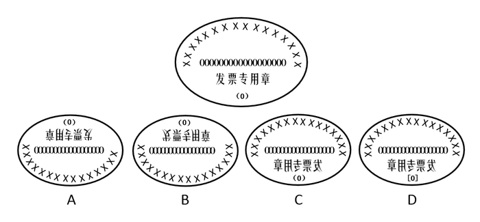

- **A**. A
- **B**. B
- **C**. C　✅
- **D**. D

**答案**：C

**官方解析**

首先观察题干图形特征，包括汉字“发票专用章”、“（0）”、16个“X”，以及18个“0”，共四类元素。
观察选项：
A项：图形包含15个“X”，比原图少一个“X”，故不可能是题干图形旋转180度而来，排除；
B项：图形包含17个“0”，比原图少一个“0”，故不可能是题干图形上下翻转而来，排除；
C项：所有元素齐全，为题干图形左右翻转而来，当选；
D项：将原图中的“（0）”改成了“[0]”，故不可能通过原图转动得到，排除；
故正确答案为C。
注：本题有同学认为选A，理由是要求找一个由题干图形“旋转”而来的选项，因此看似是A项，但经过仔细核对，A选项确实比原图少一个“X”，因此不严谨。且本题除2019河南省考考查，2019云南及其他联考省份也考查了，而其他省考卷恰好对提问方式进行了修改，改为“下列四个选项的图形，能由所给图形‘转动’而成的是”。明显改动了题干中“旋转”二字，改为了“转动”，但是选项没有任何变化。因此粉笔推测本题并非是只能“旋转”，题干要求选“转动”，其实可以包括旋转或者翻转（上下翻转或左右翻转，类似于“翻书页”）两种形式。因此，经过反复教研，认为本题题目不是很严谨，同时对比其他省份的同一道题，恰巧在提问方式上做了改变，粉笔还是倾向C选项。

---

### 第 4 题　qid 2377141 · 图形推理

请从所给四个选项中选择一个最合适的填入问号处，使之呈现一定的规律性。

- **A**. A
- **B**. B
- **C**. C
- **D**. D　✅

**答案**：D

**官方解析**

元素组成不同，优先考虑属性规律。观察发现题干都是轴对称图形并且都有一条竖直对称轴，只有D项符合。
故正确答案为D。

---

### 第 5 题　qid 2377144 · 图形推理

下面四个选项中，是题干图形的正面平视图的是：

- **A**. A　✅
- **B**. B
- **C**. C
- **D**. D

**答案**：A

**官方解析**

本题考查三视图。题干图形的正面平视图应该是最左侧有三个正方形且最上边是字母B所在的面，中间是字母A和D所在的两个面，最右侧是一个空白面，对应A选项。
故正确答案为A。

---

### 第 6 题　qid 2377148 · 图形推理

请从所给四个选项中选择一个最合适的填入问号处，使之呈现一定的规律性。

- **A**. 7，10
- **B**. 13，6
- **C**. 11，12　✅
- **D**. 11，9

**答案**：C

**官方解析**

观察题干图形，发现每一条直线上都有四个数字，优先考虑数字的加减运算。进一步观察发现每条直线上的四个数字相加之和都是26，故“？”处的两个数字应该分别是11、12，对应C选项。
故正确答案为C。

---

### 第 7 题　qid 2377152 · 图形推理

请从所给四个选项中选择一个最合适的填入问号处，使之呈现一定的规律性。

- **A**. A
- **B**. B
- **C**. C　✅
- **D**. D

**答案**：C

**官方解析**

观察左边的两个图，发现立体图形的最右边的一条竖线缺失，展开图中对应也有一条竖线缺失，右边的立体图形最右边也缺失一条竖线，因此展开图中也应缺少一条竖线，所以排除BD选项。对比AC，A选项上面的五边形与最左侧长方形之间的相邻边长度不一致，说明不能折成题干的立体图形，排除A。

故正确答案为C。

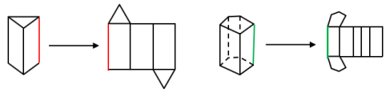

---

### 第 8 题　qid 2377155 · 图形推理

请从所给四个选项中选择一个最合适的填入1和2处，使之呈现一定的规律性。

- **A**. A
- **B**. B
- **C**. C
- **D**. D　✅

**答案**：D

**官方解析**

观察图形特征，九宫格优先横着看，第一行图1和图2相加得到图3，第二行图1到图3图形没有改变，说明图2不能在图1的基础上增加新的线条，因此排除A项。第三行图1和图2相加得到的图形应该是长斜线两边各有两根短线，因此选D。
故正确答案为D。

---

### 第 9 题　qid 2377150 · 图形推理

请从所给四个选项中选择一个最合适的填入问号处，使之呈现一定的规律性：

- **A**. A
- **B**. B　✅
- **C**. C
- **D**. D

**答案**：B

**官方解析**

观察图形特征，元素组成不同，发现题干图形部分数分别为：2、3、2、3、2、3、2，因此？处应该是一个三部分的图形，A、C、D都是一部分图形，只有B项符合。
故正确答案为B。

---

### 第 10 题　qid 2377154 · 图形推理

根据下列图形规律将图形分组，分组正确的是：

- **A**. ②③⑤；①④⑥
- **B**. ①④⑤；②③⑥
- **C**. ①②④；③⑤⑥
- **D**. ①②⑤；③④⑥　✅

**答案**：D

**官方解析**

本题为分组分类题目。元素组成不同，无明显属性规律，考虑数量规律。观察发现，图中出现了很多空白区域，考虑数面。图①②⑤的面数量都是1，图③④⑥的面数量都是0，即①②⑤一组，③④⑥一组。
故正确答案为D。

---

### 第 11 题　qid 2377156 · 定义判断

团队学习行为是团队成员为了满足团队和个人的发展需求，在分享各自经验的基础上，通过知识和信息交流等途径提出问题、寻求反馈、进行实验、反思结果，对失误或未预期结果进行讨论，促进团队与个人知识或技能水平不断提高，进而实现团队层面知识与技能的相对持久变化。
根据上述定义，下列属于团队学习行为的是：

- **A**. 某项目组为了在项目攻关阶段发挥团队的凝聚力和战斗力，每周末都举行野外拓展训练
- **B**. 小王为了今后的发展，在上班期间抽空和其他几位同事一起学习英语
- **C**. 为了获得奖学金，某宿舍全体女生约定大家相互监督，晚上一起去自习
- **D**. 销售部为提高部门整体业绩，推选优秀代表定期与大家分享销售经验　✅

**答案**：D

**官方解析**

第一步：找出定义关键词。
“为了满足团队和个人的发展需求”、“在分享各自经验的基础上，通过知识和信息交流等途径提出问题、寻求反馈、进行试验，反思结果”、“促进团队与个人知识或技能水平的不断提高，进而实现团队层面知识与技能的相对持久化”。
第二步：逐一分析选项。
A项：项目组进行野外拓展训练，不符合“在分享各自经验的基础上，通过知识和信息交流等途径提出问题、寻求反馈、进行试验，反思结果”，不符合定义，排除； 
B项：小王在上班期间和同事学英语，是为了个人能力的提升，不符合“促进团队与个人知识或技能水平的不断提高，进而实现团队层面知识与技能的相对持久化”，不符合定义，排除；
C项：宿舍全体女生为了获得奖学金互相监督自习，不符合“在分享各自经验的基础上，通过知识和信息交流等途径提出问题、寻求反馈、进行试验，反思结果”，不符合定义，排除；
D项：销售部定期分享销售经验，符合“在分享各自经验的基础上，通过知识和信息交流等途径提出问题、寻求反馈、进行试验，反思结果”、“促进团队与个人知识或技能水平的不断提高”，符合定义，当选。
故正确答案为D。

---

### 第 12 题　qid 2377160 · 定义判断

共享型领导指独立于组织正式的领导角色或层级结构，由组织内部成员主动参与的，一种自下而上的成员之间相互领导的非正式领导力团队过程模式。它不仅强调传统垂直领导行为或角色在成员之间的共享，如决策制定、共享结果、共担责任等，还强调成员之间的相互影响与相互协作，属于一种分布于成员之间的水平影响力。
根据上述定义，下列属于共享型领导的是：

- **A**. 某班级班主任在新学期发起由全班同学轮流做班长的活动
- **B**. 为了提高服务质量和办事效率，某部门将日常突发、应急事项从原来的几个科室流水处理，改由专人负责到底
- **C**. 在公司项目组项目设计过程中，小王主动承担技术攻关的任务
- **D**. 某研发部门为了提高研发效率、发挥员工的积极性而实行民主集中制，由员工共同行使权力，共同承担责任，共同分享利益　✅

**答案**：D

**官方解析**

第一步：找出定义关键词。
“独立于组织正式的领导角色或层级结构”、“由组织内部成员主动参与的”、“成员之间相互领导”、“非正式领导力团队过程模式”、“传统垂直领导行为或角色在成员之间共享”、“成员之间的相互影响与相互协作”。
第二步：逐一分析选项。
A项：班主任发起全班同学轮流做班长的活动，不符合“组织内部成员主动参与”，也未体现“成员之间的相互影响与相互协作”，不符合定义，排除； 
B项：某部门由专人负责应急事项，不符合“由组织内部成员主动参与的”，也不符合 “成员之间相互领导”，且没有体现成员之间领导行为共享，不符合定义，排除；
C项：小王主动承担技术攻关的任务，没有体现出来小王是领导，不符合“成员之间相互领导”，也未体现“角色在成员之间共享”，不符合定义，排除；
D项：研发部门发挥员工积极性，实行民主集中制，由员工共同行使权力，共同担责，共同分享利益，符合 “成员之间相互领导”、“非正式领导力团队过程模式”、“传统垂直领导行为或角色在成员之间共享”，符合定义，当选。
故正确答案为D。

---

### 第 13 题　qid 2377164 · 定义判断

消费者善意是指消费者基于自身直接经历或者主观上的认知而产生的对某一国家的喜爱、共鸣乃至情感依恋，而这种情感会让消费者对有关该国产品的消费决策产生影响。
根据上述定义，下列属于消费者善意的是：

- **A**. 德国人以严谨著称，小马很认可这一点，所以买电器类的产品一定要选德国品牌　✅
- **B**. 老刘因为从小喜欢俄罗斯歌曲而喜欢上了俄罗斯，在选择旅游目的地时，毫不犹豫地选择了俄罗斯
- **C**. 在南美旅游时喝了当地的马黛茶后，小张再也喝不惯国内的马黛茶了
- **D**. 张教授早年留学美国，儿子受他的影响也选择了去美国留学

**答案**：A

**官方解析**

第一步：找出定义关键词。
“基于自身直接经历或者主观上的认知”、“产生的对某一国家的喜爱、共鸣乃至情感依恋”、“这种情感会让消费者对有关该国产品的消费决策产生影响”。
第二步：逐一分析选项。
A项：小马认可德国人的严谨态度，符合“基于自身主观认识产生对国家的喜爱”， 因为认可德国人的态度，所以购买电器类的产品一定要选德国品牌，符合“这种情感会让消费者对有关该国产品的消费决策产生影响”，符合定义，当选； 
B项：老刘因为从小喜欢俄罗斯歌曲而喜欢俄罗斯，符合“基于自身经历产生对某一国家喜爱”，选择俄罗斯作为旅游的目的地，但没有明显体现出老刘做出消费决策，不符合“对有关该国产品的消费决策产生影响”，不符合定义，排除； 
C项：小张只是喜欢喝南美的马黛茶，并没有体现出“产生的对某一国家的喜爱、共鸣乃至情感依恋”，并且也没有做出消费决策，不符合定义，排除；
D项：张教授的儿子是受张教授的影响，不符合“基于自身直接经历或者主观上的认知”，不符合定义，排除。
故正确答案为A。

---

### 第 14 题　qid 2377165 · 定义判断

元刻板印象是指个体关于外群体成员对其所属群体所持刻板印象的信念。
根据上述定义，下列属于元刻板印象的是：

- **A**. 二班的任课教师们一致认为贫困儿童小豪存在交流障碍
- **B**. 经济学家们认为高房价影响80后夫妻生二孩意愿
- **C**. 刘大夫认为如今的患者普遍不太信任医生　✅
- **D**. 南方人小刘认为北方人都比较耐冻

**答案**：C

**官方解析**

第一步：找出定义关键词。
“个体认为外群体成员对其所属群体存在刻板印象”。
第二步：逐一分析选项。
A项：任课教师认为贫困儿童小豪存在交流障碍，这是任课教师对小豪的印象，而不是任课教师认为小豪对教师群体存在刻板印象，不符合“个体认为外群体成员对其所属群体存在刻板印象”，不符合定义，排除；
B项：经济学家认为高房价影响80后夫妻生二孩意愿，这是经济学家对80后夫妻的印象，而不是经济学家认为80后夫妻对经济学家群体存在刻板印象，不符合“个体认为外群体成员对其所属群体存在刻板印象”，不符合定义，排除；
C项：刘大夫认为患者不信任医生群体，刘大夫属于医生群体，患者是“外群体成员”，患者普遍不太信任医生，符合“个体认为外群体成员对其所属群体存在刻板印象”，符合定义，当选；
D项：南方人小刘认为北方人耐冻，这是小刘对北方人的印象，而不是小刘认为北方人对南方人群体存在刻板印象，不符合“个体认为外群体成员对其所属群体存在刻板印象”，不符合定义，排除。
故正确答案为C。

---

### 第 15 题　qid 2377166 · 定义判断

顾客主动社会化是指顾客为了有效参与到服务过程而主动学习与其扮演角色相关的知识和信息的过程。
根据上述定义，下列属于顾客主动社会化的是：

- **A**. 退休的张阿姨每天晚上收看电视养生节目学习养生
- **B**. 公司员工小刘为了提高在某片区的销售业绩，自学当地方言
- **C**. 小明的妈妈为了帮助小明提高奥数成绩，自己也报了奥数培训班
- **D**. 小谢不认同医生关于自己患有抑郁症的诊断，为此上网搜了很多资料　✅

**答案**：D

**官方解析**

第一步：找出定义关键词。
“顾客”、“为了有效参与到服务过程”、“主动学习与其扮演角色相关的知识和信息”。 
第二步：逐一分析选项。
A项：退休的张阿姨收看电视养生节目，张阿姨不是“顾客”，不符合定义，排除； 
B项：小刘是公司员工，不是“顾客”，为提高销售业绩而学习方言，不符合“为了有效参与到服务过程”，不符合定义，排除； 
C项：小明的妈妈是奥数培训班的“顾客”， 但她报奥数班的目的是为了帮助小明提高奥数成绩，不符合“为了有效参与到服务过程”，不符合定义，排除；
D项：小谢是一名患者，所以他是医生的“顾客”，小谢在网上搜了很多的资料是为了确认医生对自己的诊断是否正确，符合“为了有效参与服务过程”，也符合“主动学习与其扮演角色相关的知识和信息”，符合定义，当选。
故正确答案为D。

---

### 第 16 题　qid 2377168 · 定义判断

公众科学是指在科学公开化与科学政策公开化的必要基础上，公众直接参与科学知识产出过程。公共科学是指普通公众参与科学相关的科技政策审议、科学问题讨论以及科学成果转化等。
根据上述定义，下列属于公众科学的是：

- **A**. 某医学伦理委员会就基因编辑的道德风险向当地的科技工作者征询意见
- **B**. 某手机公司的研发部门就是否取消物理按键公开征询广大消费者意见
- **C**. 明镜调查公司就5G商业前景在车站广场等公共场所发放调查问卷
- **D**. 某公司为缩短研发的抗癌新药上市周期而招募试用志愿者　✅

**答案**：D

**官方解析**

第一步：找出定义关键词。
公众科学：“科学公开化与科学政策公开化”、“直接参与科学知识产出过程”；
公共科学：“普通公众参与”、“科学相关的科技政策审议、科学问题讨论以及科学成果转化等”。
第二步：逐一分析选项。
A项：医学伦理委员会向当地的科技工作者征询意见，不符合“直接参与科学知识产出过程”，不符合定义，排除；
B项：公司的研发部门征询广大消费者意见，不符合“直接参与科学知识产出过程”，不符合定义，排除；
C项：明镜调查公司在车站广场发放调查问卷，不符合“直接参与科学知识产出过程”，不符合定义，排除；
D项：某公司为研发抗癌新药招募试用志愿者，符合“直接参与科学知识产出过程”，符合定义，当选。
故正确答案为D。

---

### 第 17 题　qid 2377145 · 定义判断

生态系统反服务是指随着受损的自然生态系统结构和功能在人类主动干预保护措施的实施下，逐步得到恢复的同时，生态系统对人类日常生活和生产活动产生的负面影响。
根据上述定义，下列最不可能属于生态系统反服务的是：

- **A**. 城市干道种植的大量法国梧桐，是诱发市民过敏性鼻炎的重要因素
- **B**. 某地动物保护工作开展以来，猕猴数量剧增，它们常骚扰当地居民
- **C**. 修建水坝改善当地的经济状况的同时，也使一部分历史遗迹遭到破坏　✅
- **D**. 因禁止使用除草剂，农民不得不投入更大的人力成本来拔掉杂草

**答案**：C

**官方解析**

第一步：找出定义关键词。
“随着受损的自然生态系统结构和功能在人类主动干预保护措施的实施下”、“生态系统对人类日常生活和生产活动产生的负面影响”。
第二步：逐一分析选项。
A项：城市干道种植大量法国梧桐，符合“随着受损的自然生态系统结构和功能在人类主动干预保护措施的实施下”，诱发市民过敏性鼻炎，符合“生态系统对人类日常生活和生产活动产生的负面影响”，符合定义，排除；
B项：某地动物保护工作的开展，符合“随着受损的自然生态系统结构和功能在人类主动干预保护措施的实施下”，猕猴数量剧增，经常骚扰当地居民，符合“生态系统对人类日常生活和生产活动产生的负面影响”，符合定义，排除；
C项：修建水坝改善当地的经济状况，不符合“随着受损的自然生态系统结构和功能在人类主动干预保护措施的实施下”，使历史遗迹遭到破坏，不符合“生态系统对人类日常生活和生产活动产生的负面影响”，不符合定义，当选；
D项：禁止使用除草剂，符合“随着受损的自然生态系统结构和功能在人类主动干预保护措施的实施下”，农民投入更大的人力成本，符合“生态系统对人类日常生活和生产活动产生的负面影响”符合定义，排除。
本题为选非题，故正确答案为C。

---

### 第 18 题　qid 2377147 · 定义判断

确认偏差是指人一旦产生某个信念，就会努力寻找与它相符的例子，并无视那些不符的。
根据上述定义，下列最可能属于确认偏差的是：

- **A**. 尽管别人告诉厨师小黄所有泡菜坛里的泡菜原料、泡制时间都一样，但厨师小黄仍认为用黄色泡菜坛里的泡菜烹饪鱼香肉丝会更可口
- **B**. 股票经理人告诉客户小明某股票会涨的同时又背着小明告诉其他客户该股票会跌，结果该股票大涨，因此小明对经理人十分信任
- **C**. 小刚认为终有一天会天降横财，便痴迷于彩票，尽管从未中奖，他还是整日游手好闲，甚至贷款买彩票
- **D**. 小东听到某个所谓的“预言家”断定自己会遭遇车祸后时常感到担忧，终于在某天与其他车辆发生擦挂，于是小东更相信那位“预言家”了　✅

**答案**：D

**官方解析**

第一步：找出定义关键词。
“产生某个信念”、“努力寻找与它相符的例子”、“无视那些不符的”。
第二步：逐一分析选项。
A项：小黄的信念是认为黄色泡菜坛里的泡菜做鱼香肉丝更好吃，但没有寻找与之相符的例子，也没有无视不符合的例子，不符合“努力寻找与它相符的例子”、“无视那些不符的”，不符合定义，排除；
B项：股票经理人告诉客户小明某股票会涨，股票果然大涨，因此小明对经理人十分信任，是先有相符的例子后，才信任经理人，而题干是先产生信念，再找相符的例子，不符合“人一旦产生某个信念，就会努力寻找与它相符的例子”，不符合定义，排除；
C项：小刚认为终有一天会天降横财，痴迷于彩票，只是盲目买彩票，无视不符合的情况，但没有努力寻找与信念相符的例子来印证自己的信念是正确的，不符合“努力寻找与它相符的例子”，不符合定义，排除；
D项：小东听到“预言家”断定自己会遭遇车祸后时常感到担忧，说明小东相信自己会出车祸的预言，符合“产生某个信念”，与其他车辆发生擦挂后更相信那位“预言家”，说明小东认为擦挂证明了自己确实会出车祸，认为预言成真，却无视其它安全驾驶的情况，符合“努力寻找与它相符的例子”、“无视那些不符的”，符合定义，当选。
故正确答案为D。

---

### 第 19 题　qid 2377151 · 逻辑判断

析字，即把一个字析为音、形、义三个方面，看别的字有一面同它相合相连，随即借事代替或推演上去。
据此，下列选项中不包含析字的是：

- **A**. 愁莫渡江，秋心拆两半，怕你上不了岸，一辈子摇晃
- **B**. 来到江南，我又想起了汝，水乡泽国的姑娘，水边的女子
- **C**. 那对恋人本已定下婚期，不料却遭遇车祸，让婚礼变成了葬礼　✅
- **D**. 今儿我送给这对新人些红枣、花生、桂圆和莲子，寓意当然是祝他们早生贵子

**答案**：C

**官方解析**

第一步：找出定义关键词。
“把一个字析为音、形、义三个方面”，“看别的字有一面同它相合相连，随即借事代替或推演上去”。
第二步：逐一分析选项。
A项：愁莫渡江，秋心拆两半，由“愁”字的形推演为“秋心”，符合“把一个字析为音、形、义三个方面”“看别的字有一面同它相合相连，随即借事代替或推演上去”，符合定义，排除；
B项：我又想起了汝，水乡泽国的姑娘，由“汝”字的形推演为“水乡泽国的姑娘”，符合“把一个字析为音、形、义三个方面”“看别的字有一面同它相合相连，随即借事代替或推演上去”，符合定义，排除；
C项：本已定下婚期，不料遭遇车祸，不符合“把一个字析为音、形、义三个方面”，不符合“看别的字有一面同它相合相连，随即借事代替或推演上去”，不符合定义，当选；
D项：红枣、桂圆、莲子，寓意祝他们早生贵子，由“红枣”的音代替“早”，由“桂圆”的音代替“贵”，由“莲子”的音代替“子”，连起来推演为“早生贵子”，符合“把一个字析为音、形、义三个方面”“看别的字有一面同它相合相连，随即借事代替或推演上去”，符合定义，排除。
本题为选非题，故正确答案为C。

---

### 第 20 题　qid 2377162 · 定义判断

框架效应是指对于相同的事实信息，采用不同的表达方式，会使人产生不同的判断决策。一般来讲，在损失和收益方面，人们更倾向关注损失。
根据上述定义，下列情形描述最不可能存在框架效应的是：

- **A**. 
小明每天能得到一个面包，当被问“你吃了半个面包了，还吃吗”时，他选择不吃；而要是问“还有半个面包，你吃吗”，他会选择吃完

- **B**. 
小红看到A理财产品能地让自己获利，而B产品能让自己有的机会获利时，毅然选择了投资B产品
　✅
- **C**. 
鉴于消费者对脂肪的抵触情绪，某牛奶公司把所产牛奶产品相关描述从“含脂量”变为“脱脂量”，为此该公司销售业绩迅速上涨

- **D**. 
“甲汽车客运站的客车发生车祸的概率仅为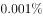，而乙汽车客运站的客车平安送达率为”看到这，乘客小坤选择乘坐乙汽车客运站的车

**答案**：B

**官方解析**

第一步：找出定义关键词。

“对于相同的事实信息，采用不同的表达方式，会使人产生不同的判断决断”、“在损失和收益面前，人们更倾向于关注损失”。

第二步：逐一分析选项。

A项：问的都是关于小明吃不吃面包的事，并且小明做出不同决断，符合“对于相同的事实信息，采用不同的表达方式，会使人产生不同的判断决断”，当被问“你吃了半个面包了，还吃吗”时，他选择不吃，被问“还有半个面包，你吃吗”，他选择吃完，体现了小明怕受损失的心理，符合“在损失和收益面前，人们更倾向于关注损失”，符合定义，排除；

B项：此选项是小红关于理财产品的选择，A产品能获利，B产品有的机会获利，两个产品获利不同，不符合“对于相同的事实信息，采用不同的表达方式，会使人产生不同的判断决断”，不符合定义，当选；

C项：牛奶公司对于牛奶脂肪含量的不同表述，影响人们购买，符合“对于相同的事实信息，采用不同的表达方式，会使人产生不同的判断决断”，把“含脂量”改为“脱脂量”，销量上涨，抓住了人们怕摄入脂肪的心理，符合“在损失和收益面前，人们更倾向于关注损失”，符合定义，排除；

D项：甲乙两客车站对于车祸概率的不同表述，影响人们的选择，符合“对于相同的事实信息，采用不同的表达方式，会使人产生不同的判断决断”，甲发生车祸率为，乙平安送达率，人们更多选择乙，体现了人们怕生命财产遭受损失的心理，符合“在损失和收益面前，人们更倾向于关注损失”，符合定义，排除。

本题为选非题，故正确答案为B。

---

### 第 21 题　qid 2377167 · 类比推理

嘈杂：环境安静

- **A**. 疲劳：驾驶安全
- **B**. 粗心：头脑清醒　✅
- **C**. 迟缓：工作效率
- **D**. 温暖：抵御寒冬

**答案**：B

**官方解析**

第一步：判断题干词语间逻辑关系。
嘈杂是环境不安静的一种表现，二者为对应关系。
第二步：判断选项词语间逻辑关系。
A项：疲劳可能会影响驾驶安全，二者为因果关系，与题干逻辑关系不一致，排除；
B项：粗心指疏忽大意，是头脑不清醒的一种表现，二者为对应关系，与题干逻辑关系一致，当选；
C项：工作效率有高低之分，迟缓是工作效率低的一种表现，但不是工作效率的表现，二者无明显逻辑关系，与题干逻辑关系不一致，排除； 
D项：温暖和抵御寒冬之间没有明显逻辑关系，与题干逻辑关系不一致，排除。
故正确答案为B。

---

### 第 22 题　qid 2377169 · 类比推理

助听器：眼镜

- **A**. 钢笔：日记
- **B**. 轮船：邮轮
- **C**. 房屋：别墅
- **D**. 冰箱：烤箱　✅

**答案**：D

**官方解析**

第一步：判断题干词语间逻辑关系。
助听器是辅助听力的工具，眼镜是矫正视力的工具，二者均为人体感官的辅助工具，是并列关系。
第二步：判断选项词语间逻辑关系。
A项：钢笔可以用来写日记，二者为工具的对应关系，与题干逻辑关系不一致，排除；
B项：邮轮是轮船的一种，二者为种属关系，与题干逻辑关系不一致，排除；
C项：别墅是房屋的一种，二者为种属关系，与题干逻辑关系不一致，排除； 
D项：冰箱是保持恒定低温的一种制冷设备，烤箱是一种密封的用来烤食物或烘干产品的电器，均为家用电器，二者为并列关系，与题干逻辑关系一致，当选。
故正确答案为D。

---

### 第 23 题　qid 2377170 · 类比推理

臭豆腐：香菇

- **A**. 热干面：凉水　✅
- **B**. 黑芝麻：白菜
- **C**. 小麦：大米
- **D**. 甜菜：苦瓜

**答案**：A

**官方解析**

第一步：判断题干词语间逻辑关系。
臭豆腐是经过人为加工后的产物，香菇是自然的产物。
第二步：判断选项词语间逻辑关系。
A项：热干面是经过人为加工后的产物，凉水是自然的产物，与题干逻辑关系一致，当选；
B项：黑芝麻和白菜均为自然的产物，与题干逻辑关系不一致，排除；
C项：小麦和大米均为自然的产物，与题干逻辑关系不一致，排除；
D项：甜菜和苦瓜均为自然的产物，与题干逻辑关系不一致，排除。
故正确答案为A。

---

### 第 24 题　qid 2377172 · 类比推理

冰：水

- **A**. 木：炭　✅
- **B**. 桑田：沧海
- **C**. 犬：獒
- **D**. 火：灰

**答案**：A

**官方解析**

第一步：判断题干词语间逻辑关系。
冰融化变成水，二者属于不同形态的转化。
第二步：判断选项词语间逻辑关系。
A项：木经过燃烧变为炭，二者属于不同形态的转化，与题干逻辑关系一致，当选；
B项：沧海即大海，桑田即为农田，二者为并列关系，与题干逻辑关系不一致，排除；
C项：獒是犬的一种，二者属于包容关系中的种属关系，与题干逻辑关系不一致，排除；
D项：灰是火烧后的产物，不是火的转化，二者无必然联系，与题干逻辑关系不一致，排除。
故正确答案为A。

---

### 第 25 题　qid 2377163 · 类比推理

轮椅：汽车

- **A**. 公路：马路
- **B**. 火车：水车
- **C**. 缆车：索道
- **D**. 飞机：坦克　✅

**答案**：D

**官方解析**

第一步：判断题干词语间逻辑关系。
轮椅和汽车都是一种出行工具，二者属于并列关系中的反对关系。
第二步：判断选项词语间逻辑关系。
A项：公路是现代术语，是可以行驶汽车的公用之路、公众的交通工具行驶之路，汽车、单车、人力车、马等众多交通工具及行人都可以走，民间也称作马路，因此二者可理解为全同关系；马路是指供人或车马出行的宽阔平整的道路、公路，此时马路的范围明显大于公路，二者可因此理解为包容关系中的种属关系。目前未有十分明确的定义可以准确地判断二者之间的关系，但全同关系、种属关系均与题干逻辑关系不一致，排除；
B项：火车是一种交通工具，水车是一种灌溉工具，二者无必然联系，与题干逻辑关系不一致，排除；
C项：词典中关于缆车的解释是指索道上用来运输的设备，现在也认为缆车即索道，二者为全同关系，但两种理解方式均与题干逻辑关系不一致，排除；
D项：飞机和坦克都可以当成作战工具，二者属于并列关系中的反对关系，与题干逻辑关系一致，当选。
故正确答案为D。

---

### 第 26 题　qid 2377161 · 类比推理

黄桃：水蜜桃：桃

- **A**. 红缨枪：冲锋枪：枪
- **B**. 地中海：大海：海
- **C**. 煎饼：烧饼：饼
- **D**. 雏菊：杭菊：菊　✅

**答案**：D

**官方解析**

第一步：判断题干词语间逻辑关系。
“黄桃”和“水蜜桃”都是“桃”的一种，二者属于并列关系中的反对关系，与“桃”都属于包容关系中的种属关系。
第二步：判断选项词语间逻辑关系。
A项：“红缨枪”属于古代的一种冷兵器，指在长柄的一端装有尖锐的金属枪头，枪头和柄相连的部分装饰着红缨；“冲锋枪”指单兵用的全自动枪，枪身较短，通常双手握持，用于近战和冲锋，二者均属于武器，为并列关系中的反对关系，与“枪”都属于包容关系中的种属关系，保留；
B项：“地中海”是“大海”的一种，二者属于包容关系中的种属关系，“大海”与“海”属于全同关系，与题干逻辑关系不一致，排除；
C项：“煎饼”指用高粱、小麦、小米或豆类等浸水磨成糊状，在鏊子上摊匀烙熟的薄饼；“烧饼”指烤熟的小的发面饼，二者属于并列关系中的反对关系，且与“饼”都属于包容关系中的种属关系，与题干逻辑关系一致，保留；
D项：“杭菊”是菊科，菊目的植物；“雏菊”是菊科雏菊属植物的一种，多年生草本植物，二者属于并列关系中的反对关系，且与“菊”都属于包容关系中的种属关系，与题干逻辑关系一致，保留。
比较A、C、D三项，题干均属于植物，且是天然产物，从二级辨析同一范畴的角度来看，只有D项符合。
故正确答案为D。

---

### 第 27 题　qid 2377159 · 类比推理

激发：激荡：激切

- **A**. 激化：激愤：激扬
- **B**. 激剧：激情：激增
- **C**. 激怒：激将：激昂　✅
- **D**. 激活：激流：激奋

**答案**：C

**官方解析**

第一步：判断题干词语间逻辑关系。
激发是指刺激使奋发，动词。激荡是指受到冲击而动荡，动词。激切是指激烈而直率，形容词。
第二步：判断选项词语间逻辑关系。
A项：激化是指向激烈尖锐的方向发展，动词。激愤是指激动而愤怒，形容词。激扬指激浊扬清时是动词，指激动昂扬时是形容词，与题干逻辑关系不一致，排除；
B项：激剧是指激烈、急剧，形容词。激情是指强烈激动的感情，名词。激增是急速地增长，动词，与题干逻辑关系不一致，排除；
C项：激怒是指刺激使发怒，动词。激将是指用刺激性的话或反面的话鼓动人去做，动词。激昂是指激动昂扬，形容词，与题干逻辑关系一致，当选；
D项：激活是指刺激某事物，使活跃起来，动词。激流是指湍急的水流，名词。激奋指激动振奋是形容词，与题干逻辑关系不一致，排除。
故正确答案为C。

---

### 第 28 题　qid 2377157 · 类比推理

电影院：观众：观影

- **A**. 广播：听众：主播
- **B**. 医生：病人：问诊
- **C**. 演唱会：歌手：演唱
- **D**. 发布会：记者：提问　✅

**答案**：D

**官方解析**

第一步：判断题干词语间逻辑关系。
本题可以造句：观众在电影院观影，电影院是个场所，且观影是动宾关系。
第二步：判断选项词语间逻辑关系。
A项：不能说听众在广播主播，且广播不是一个场所，与题干逻辑关系不一致，排除；
B项：不能说病人在医生问诊，且医生不是一个场所，与题干逻辑关系不一致，排除；
C项：可以造句：歌手在演唱会演唱，演唱会是个场所，但演唱是个动词，与题干逻辑关系不一致，排除；
D项：可以造句：记者在发布会提问，发布会是个场所，且提问是动宾关系，与题干逻辑关系一致，当选。
故正确答案为D。

---

### 第 29 题　qid 2377153 · 类比推理

头发：颜色：长度

- **A**. 狗：品种：性格
- **B**. 蔬菜：价格：营养
- **C**. 衣服：款式：尺码　✅
- **D**. 人：长相：气质

**答案**：C

**官方解析**

第一步：判断题干词语间逻辑关系。
颜色和长度可以区分头发，且颜色和长度是头发的外在表现形式。
第二步：判断选项词语间逻辑关系。
A项：品种可以区分狗的种类，品种是狗的外在表现形式，但性格多用来表达人，且是一种内在表现形式，与题干逻辑关系不一致，排除；
B项：价格和营养可以区分蔬菜，价格是蔬菜的外在表现形式，但营养是蔬菜的内在表现形式，与题干逻辑关系不一致，排除；
C项：款式和尺码区分衣服，且款式和尺码是衣服的外在表现形式，与题干逻辑关系一致，当选；
D项：长相和气质可以区分人，长相是人的外在表现形式，但气质是人的内在表现形式，与题干逻辑关系不一致，排除。
故正确答案为C。

---

### 第 30 题　qid 2377149 · 类比推理

设计：修建：高楼

- **A**. 痛恨：打击：仇敌
- **B**. 热爱：学习：书本
- **C**. 体检：判断：病人
- **D**. 勘探：开采：石油　✅

**答案**：D

**官方解析**

第一步：判断题干词语间逻辑关系。
设计和修建是两个动作，分别可以和高楼构成动宾结构，且存在先后顺序,即先设计高楼，再修建高楼。
第二步：判断选项词语间逻辑关系。
A项：痛恨和打击是两个动作，分别可以和“仇敌”构成动宾结构，但是痛恨仇敌和打击仇敌没有一定的先后顺序，与题干逻辑关系不一致，排除；
B项：热爱和学习是两个动作，但是热爱书本和学习书本搭配不当，与题干逻辑关系不一致，排除；
C项：体检和判断是两个动作，但体检病人和判断病人搭配不当，与题干逻辑关系不一致，排除。
D项：勘探和开采是两个动作，分别可以和石油构成动宾结构，且存在先后顺序,即先勘探石油，再开采石油，与题干逻辑关系一致，当选；
故正确答案为D。

---

### 第 31 题　qid 2377143 · 类比推理

某班分小组进行了摘草莓趣味比赛，甲、乙、丙3人分属3个小组。3人摘得的草莓数量情况如下：甲和属于第3小组的那位摘得的数量不一样，丙比属于第1小组的那位摘得少，3人中第3小组的那位比乙摘得多。据此，将3人按摘得的草莓数量从多到少排列，正确的是：

- **A**. 甲、乙、丙
- **B**. 甲、丙、乙　✅
- **C**. 乙、甲、丙
- **D**. 丙、甲、乙

**答案**：B

**官方解析**

此题为组合排列题型，从最大信息入手。题干中“第3组”出现次数最多。结合“甲和属于第3小组的那位摘的数量不一样”和“3人中第三小组那位比乙摘的多”可知：甲不在第3组，乙也不在第3组，所以只能丙在第3组，且丙大于乙；再结合“丙比属于第1小组的那位摘的少”可知，甲在第1组，且丙小于甲，因此草莓数量从多到少应是甲丙乙。

故正确答案为B。

---

### 第 32 题　qid 2377140 · 逻辑判断

有人认为，创造力和精神疾病是密不可分的。其理由是：尽管高智商是天才不可或缺的要素，但是仅当高智商与认知抑制解除相结合的情况下才能得到创造性的天才。
以下各项如果为真，最能质疑上述观点的是：

- **A**. 事实上，大部分杰出人物并没有表现出任何精神疾病症状
- **B**. 长期封闭式治疗精神疾病反而可能降低患者的认知能力和创造力
- **C**. 人生中的某些事件（如破产、失恋等）也能够提高人的创造潜能
- **D**. 大部分拥有高智商的精神疾病患者并没有表现出自己是创造性的天才　✅

**答案**：D

**官方解析**

论点：创造力和精神疾病是密不可分的。
论据：仅当高智商与认知抑制解除相结合的情况下才能得到创造性的天才。
本题论点和论据都是在讨论创造力和精神病之间的关系，讨论话题一致，要想削弱，可考虑否定论点，即创造力和精神疾病之间没有必然的联系。
第二步，逐一分析选项。
A项：说明大部分杰出人物没有表现出精神疾病症状，但不确定杰出人物是否为论点讨论的创造性天才，属于不明确选项，无法削弱，排除；
B项：该项说的是治疗精神疾病会带来的结果，题干讨论的是创造力和精神疾病之间的关系，话题不一致，无法削弱，排除；
C项：该项说的是某些事件可以提高创造力，题干讨论的是创造力和精神疾病之间的关系，话题不一致，无法削弱，排除；
D项：强调大部分高智商精神病患者并没有创造力，那么创造力和精神疾病之间就没有必然的联系，举例削弱论点，可以削弱，当选。
故正确答案为D。

---

### 第 33 题　qid 2377139 · 逻辑判断

科学家做了一个为期8周的实验：三批实验鼠在白天灯光照射16小时后，再在黑夜里分别处于全黑、暗光和开灯状态8小时，每日如此。在实验期间，所有实验鼠的食物类别及食量都完全相同。结论发现，夜间处于暗光环境、开灯环境的老鼠都出现体重增加的现象。据此，研究人员得出结论：西方人的普遍肥胖与晚上灯火通明的街景和电脑、电视机的光密切相关。
以下各项如果为真，最能质疑上述结论的是：

- **A**. 黑夜处于暗光、开灯环境的实验鼠和黑夜处于黑暗环境的实验鼠不一样，前者在夜间进食；而夜晚鼠类新陈代谢率低，能量消耗少，容易增重
- **B**. 实验时间仅8周，对幼鼠来说太过于短暂，应延长实验时间
- **C**. 西方人并不是普遍肥胖，中等及以上收入的人群非常重视体重问题，时常进行健身等身材管理
- **D**. 据统计，在晚上街景灯火通明的西方城市中，那些经常接受电脑、电视机光照射的人大部分并不肥胖　✅

**答案**：D

**官方解析**

第一步：找出论点和论据。
论点：西方人的普遍肥胖与晚上灯火通明的街景和电脑、电视机的光密切相关。
论据：三批实验鼠在白天灯光照射16小时后，再在黑夜里分别处于全黑、暗光和开灯状态8小时，每日如此。在实验期间，所有实验鼠的食物类别及食量都完全相同。结果发现，夜间处于暗光环境、开灯环境的老鼠都出现体重增加的现象。
本题论据是用三组老鼠进行试验，通过该实验结果推出论点的结论：西方人的肥胖也与光线有关。论点和论据主体不一致，可以考虑拆桥，即说明老鼠和人不一样，老鼠的实验结论不能代表人类，但是并没有这样的选项。还可以考虑削弱论据，即表明论据的实验不科学不合理。
第二步：逐一分析选项。
A项：该项说黑夜处于暗光、开灯环境的实验鼠和处于黑暗环境的实验鼠夜间进食情况不一样，前者在夜间进食，而夜间是否进食又影响了体重，说明论据中实验不科学，会影响实验结果，可以削弱论据，保留；
B项：该项指出论据中实验时间不够长，可能会影响到实验结果，但该选项说的是“幼鼠”，而题干中的“实验鼠”是否都是“幼鼠”并不明确，无法削弱，排除；
C项：该项说西方人中某些人会进行身材管理，但是并未说明肥胖是否与光线有关，无法削弱，排除；
D项：该项举了晚上街景灯火通明的西方城市中有些人并不肥胖的例子来说明灯光不会导致肥胖，举例削弱论点，保留。
对比A、D两项，A选项削弱论据，D选项削弱论点力度更强，对比择优选择D项。
故正确答案为D。

---

### 第 34 题　qid 2377142 · 逻辑判断

假设“如果张楠和林枫不是志愿者，那么杨梅是志愿者”是前提，“林枫是志愿者”为结论。
那么，下列各项中，是其必要前提的是：

- **A**. 张楠是志愿者
- **B**. 杨梅不是志愿者
- **C**. 杨梅和张楠都是志愿者
- **D**. 杨梅和张楠都不是志愿者　✅

**答案**：D

**官方解析**

第一步：找出论点和论据。

论点：林枫是志愿者。

论据：如果张楠和林枫不是志愿者，那么杨梅是志愿者。出现逻辑关联词，可以翻译为：张楠志愿者且林枫志愿者杨梅志愿者。

要想加强，力度最强的一定是搭桥，即在张楠不是志愿者、杨梅是志愿者和林枫是志愿者之间建立联系。

第二步：逐一分析选项。

A项： 张楠是志愿者，对于题干论据来说是否定了箭头前，但是否定箭头前得不到必然结论，无法加强，排除；

B项：杨梅不是志愿者，对于题干论据来说是否定了箭头后，否后必否前，可以得到张楠是志愿者或林枫是志愿者，但二者到底是谁不确定，无法加强，排除；

C项：杨梅是志愿者对于题干论据是肯定了箭头后，得不到必然结论，同时张楠是志愿者对于题干论据来说是否定了箭头前，也得不到必然结论，无法加强，排除；

D项：杨梅和张楠都不是志愿者，杨梅不是志愿者对于题干论据来说是否定箭头后，否后必否前，可以得到张楠是志愿者或林枫是志愿者，此时再结合张楠不是志愿者可以得到林枫是志愿者，在论点和论据之间建立联系，可以加强，当选。

故正确答案为D。

---

### 第 35 题　qid 2377146 · 逻辑判断

甲、乙、丙、丁每人只会编程、插花、绘画、书法四种技能中的两种，其中有一种技能只有一个人会，并且：
（1）乙不会插花；
（2）甲和丙会的技能不重复，乙和甲、丙各有一门相同的技能；
（3）甲会书法，丁不会书法，甲和丁有相同的技能；
（4）乙和丁中只有一人会插花；
（5）没有人同时会绘画和书法。
据此可知，下列推论错误的是：

- **A**. 甲会书法，也会编程
- **B**. 乙会绘画，也会编程
- **C**. 丙会绘画，也会插花
- **D**. 丁会绘画，也会编程　✅

**答案**：D

**官方解析**

根据条件（1）（4）可知，丁会插花；根据条件（3）可知，丁不会书法；
根据题干条件“每人只会四种技能中的两种”，可知在编程、绘画中，丁只能会一种，所以D项是错误的。
本题为选非题，故正确答案为D。

---

### 第 36 题　qid 2377158 · 逻辑判断

随着网络技术、数字技术的发展，人们的阅读方式、阅读途径更加多元化，并且不断深化与拓展，呈现出数字阅读的新态势。阅读本是一种极具个人风格的私事，但在社交媒体环境中，数字阅读成为了一件能够与他人共享、交流的事情；数字阅读的行为习惯，推广方式及平台等也都在发生变化。
以下各项如果为真，最能加强上述论证的是：

- **A**. 
有统计显示去年实体书店的销量下降了左右

- **B**. 
有数据显示去年电子书的购买率下降了左右

- **C**. 
社交媒体本身能为数字阅读找到更直接分享对象
　✅
- **D**. 
数字阅读的“智能”元素改变了传统阅读的本质

**答案**：C

**官方解析**

第一步：找出论点和论据。
论点：在社交媒体环境中，数字阅读成为了一件能够与他人共享、交流的事情；数字阅读的行为习惯，推广方式及平台等也都在发生变化。
论据：无。
本题只有一个论点，可以用补充论据的方式加强。
第二步：逐一分析选项。
A项：只说明去年实体书店的销量下降了，没有提及社交媒体对数字阅读的影响，无关项，排除；
B项：说明电子书购买率下降，反映出数字阅读量下降，而论点说的是社交媒体让数字阅读成为一件可以共享的事，没有说阅读量的问题，无关项，排除；
C项：社交媒体能为数字阅读找到更直接的分享对象，说明社交媒体可以让数字阅读成为一件能共享的事，补充论据加强，当选；
D项：说明数字阅读改变了传统阅读的本质，而论点说的是社交媒体让数字阅读成为一件可以共享的事，话题不一致，无法加强，排除。
故正确答案为C。

---

### 第 37 题　qid 2377175 · 逻辑判断

超级高铁与大众的出行密切相关，它最吸引人之处，就是其运行速度远超轮轨式高铁列车，时速可达600千米至1200千米，甚至有很多人断言能够达到4000千米以上。这类超级高铁有一个共同的特点，就是列车须在密闭的真空或者低气压管道中运行。具体而言就是通过抽取空气达到接近真空的低气压环境，采用气动悬浮或者磁悬浮驱动技术，让列车在全天候、无轮轨阻力、低空气阻力和低噪音模式下超高速运行。
以下各项如果为真，最能质疑超级高铁实现可能性的是：

- **A**. 超级高铁在某些线路中无法实现低气压管道的密封
- **B**. 在超级高铁运行的真空管道中设备维护将异常艰难和昂贵
- **C**. 在真空或低气压管道中超级高铁的某些必要设备将无法使用　✅
- **D**. 超级高铁一旦出现失控将对乘客的人身安全带来可怕的后果

**答案**：C

**官方解析**

第一步：找出论点和论据。
论点：超级高铁可能实现。
论据：通过抽取空气达到接近真空的低气压环境，采用气动悬浮或者磁悬浮驱动技术，让列车在全天候、无轮轨阻力、低空气阻力和低噪声模式下超高速运行。
本题的论点在讨论超级高铁可能实现，论据在讨论超级高铁实现的一系列原理，要削弱即要证明它不可能实现。
第二步：逐一分析选项。
A项：超级高铁共同特点就是须在密封的真空或低气压管道中运行，选项指出有些线路中无法实现密封，那么在这些线路超级高铁就无法运行，部分削弱，保留；
B项：设备维护异常艰难和昂贵，与超级高铁能否实现无关，话题不一致，无法削弱，排除；
C项：在真空或低气压管道中超级高铁的某些必要设备无法使用，必要设备无法使用，即无法实现超级高铁，直接削弱论点，保留；
D项：超级高铁一旦失控会带来可怕后果，与超级高铁能否实现无关，话题不一致，无法削弱，排除。
比较A、C两项，A项为部分削弱，C项从原理上削弱论点，C项力度更强。
故正确答案为C。

---

### 第 38 题　qid 2377171 · 逻辑判断

从理论上说，如果不考虑其他因素，“体型大”和“寿命长”是动物容易罹患癌症最合理的两个答案。因为“体型大”意味着组成身体的细胞数量更多，而“寿命长”意味着需要更多的新生细胞来更新换代；细胞越多，细胞分裂随机突变的概率就越高。
以下各项如果为真，最能质疑上述论证的是：

- **A**. 小白鼠等寿命短的小动物易患癌症
- **B**. 人类因吸烟而导致患癌症风险上升
- **C**. 寿命长、体型庞大的象罹患癌症的概率很低　✅
- **D**. 海牛与蹄兔是近亲，它们体型相差悬殊，却都不易罹患癌症

**答案**：C

**官方解析**

第一步：找出论点和论据。
论点：从理论上说，如果不考虑其他因素，“体型大”和“寿命长”是动物容易罹患癌症最合理的两个答案。
论据：“体型大”意味着组成身体的细胞数量更多，而“寿命长”意味着需要更多的新生细胞来更新换代；细胞越多，细胞分裂随机突变的几率就越高。
本题论点主要讨论是因为“体型大”和“寿命长”导致动物容易罹患癌症，论据也是围绕“体型大”和“寿命长”导致动物容易罹患癌症进行说明，论点和论据话题一致。要削弱即要么直接说明“体型大”和“寿命长”并不会或者不一定会导致癌症，要么举反例进行削弱。
第二步：逐一分析选项。
A项：小白鼠属于“体型小”且“寿命短”的动物，而题干讨论的是“体型大”和“寿命长”导致动物容易患癌症，主体不一致，无法削弱，排除；
B项：论点讨论“体型大”和“寿命长”导致动物容易患癌症，选项在讨论吸烟导致癌症风险上升，话题不一致，无法削弱，排除；
C项：“寿命长”且“体型大”的象罹患癌症的概率很低，即举反例进行削弱，可以削弱，保留；
D项：海牛与蹄兔是近亲，体型相差悬殊，却都不易罹患癌症，说明体型大小与癌症无关，可以削弱，保留。
比较C、D两项，C项为举反例削弱论点，说明“体型大”且“寿命长”不一定导致动物罹患癌症；D项虽然说明体型大小都与癌症无关，但寿命与癌症关系如何并不明确，因此C项力度强于D项。
故正确答案为C。

---

### 第 39 题　qid 2377173 · 逻辑判断

法国某公园准备“聘请”一批乌鸦作为“保洁员”。但部分人也对这些“乌鸦保洁员”能否起到作用表示怀疑。
以下各项如果为真，最能支持这部分人的怀疑的是：

- **A**. “乌鸦保洁员”可能引起人们的好奇，导致公园游客剧增，从而产生更多的垃圾
- **B**. 经实验，受训的“乌鸦保洁员”每天只能拾捡极其有限的重量轻、体积小的垃圾，对公园的保洁作用几乎为零　✅
- **C**. 据调查统计，为了亲眼目睹“乌鸦保洁员”如何拾捡垃圾，大部分游客有故意乱扔大量垃圾的倾向
- **D**. 哪怕是经过训练的乌鸦，也依然保留着乱衔树枝、小石头的本能，而且饲养乌鸦本身也会产生垃圾

**答案**：B

**官方解析**

第一步：找出论点和论据。
论点：“乌鸦保洁员”不能起到保洁作用。
论据：无。
本题只有论点，因此只能通过补充论据（如解释原因和举例子）的方式来加强。
第二步：逐一分析选项。
A项： “乌鸦保洁员”会带来更多游客从而产生更多垃圾，但没有提及乌鸦对于这些垃圾有没有清洁能力，能不能起到保洁作用，属于不明确选项，无法加强，排除 ；
B项：该项直接说明“乌鸦保洁员”对公园的保洁作用几乎为零，并且说明了乌鸦只能拾捡有限的重量轻、体积小的垃圾，即解释了为什么乌鸦没有保洁作用，可以加强，当选；
C项：该项说明“乌鸦保洁员”会引起更多游客扔垃圾的现象，说明垃圾会变多。但没有说明乌鸦对于这些垃圾有没有清洁能力，能不能起到保洁作用，不明确选项，无法加强，排除； 
D项：该项说明经过训练的乌鸦会保留本能，而且会产生垃圾，但垃圾多不能说明乌鸦自身保洁能力的强弱，无法加强，排除。
故正确答案为B。

---

### 第 40 题　qid 2377174 · 逻辑判断

鲨鱼一般都是肉食性的，但一些科学家称，他们在某海域发现了一种以植物作为食物重要组成部分的窄头双髻鲨鱼。
以下各项如果为真，最能支持这些科学家们发现的是：

- **A**. 
研究人员分析其胃内食物发现，一些窄头双髻鲨鱼的食物组成中有一半是植物

- **B**. 
以海草占比的特制饲料人工喂养的窄头双髻鲨鱼，在为期3周实验时间内体重均有增长

- **C**. 
研究发现窄头双髻鲨鱼的肠道里存在一种能对植物进行高效分解的酶，该种酶在其他鲨鱼肠道里并不存在

- **D**. 
窄头双髻鲨鱼的血液中含有大量的非自身合成的某种营养物质，在自然界中，仅海草含有少量的该营养物质
　✅

**答案**：D

**官方解析**

第一步：找出论点和论据。
论点：窄头双髻鲨鱼以植物为其食物的重要组成部分。
论据：无。
本题只有论点，因此只能通过补充论据（如解释原因和举例子）的方式来加强。
第二步：逐一分析选项。
A项：一些窄头双髻鲨鱼胃内发现了植物，并且鲨鱼食物组成的一半是植物，说明鲨鱼以植物为食，通过举例子的方式加强，保留 ；
B项：用海草比例大的饲料喂养窄头双髻鲨鱼，鲨鱼体重增长，但这不代表这种鲨鱼就以植物为主要食物，无关项，不能加强，排除；
C项：该项说明窄头双髻鲨鱼体内有消化植物的酶，但是有酶不能说明窄头双髻鲨鱼会吃植物或者会用到这种酶，无关项，不能加强，排除； 
D项：这种鲨鱼体内有一种大量的、自己不能生产的营养物质，而自然界中只有海草中有少量的这种营养物质，说明窄头双髻鲨鱼体内的营养物质来自于大量的海草，这就说明海草是窄头双髻鲨鱼食物的重要组成部分，该项通过解释原因的方式加强，保留。
对比AD项，A是举例子，D是解释原因，D的加强力度强于A。
故正确答案为D。

---

## 资料分析

### 材料 1

根据所给资料，回答下列问题。

        2016年全国供用水总量为6040.2亿立方米，较上年减少63.0亿立方米。其中，地表水源供水量4912.4亿立方米，占供水总量的；地下水源供水量1057.0亿立方米，占供水总量的；其他水源供水量70.8亿立方米，占供水总量的。与2015年相比，地表水源供水量减少57.1亿立方米，地下水源供水量减少12.2亿立方米，其他水源供水量增加6.3亿立方米。

        2016年，全国生活用水821.6亿立方米，占用水总量的；工业用水1308.0亿立方米，占用水总量的；农业用水3768.0亿立方米，占用水总量的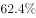；人工生态环境补水142.6亿立方米，占用水总量的。与2015年相比，农业用水量减少84.2亿立方米，生活用水量及人工生态环境补水量分别增加28.1亿立方米和19.9亿立方米。

        2016年全国万元国内生产总值（当年份）用水量81立方米，万元工业增加值（当年份）用水量52.8立方米，农田灌溉水有效利用系数0.542。按可比价计算，万元国内生产总值用水量和万元工业增加值用水量分别比2015年下降和。

        注：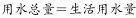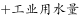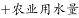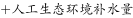

#### 第 1 题　qid 2377064 · 综合

2015年全国供用水总量为：

- **A**. 6040.2亿立方米
- **B**. 6103.2亿立方米　✅
- **C**. 5977.2亿立方米
- **D**. 1057.2亿立方米

**答案**：B

**官方解析**

根据题干所求“2015年全国···为”，结合材料时间为2016年，可判定此题为基期计算问题。定位第1段文字材料可知，2016年全国供用水总量为6040.2亿立方米，较上年减少63.0亿立方米，则2015年全国供用水总量为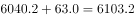亿立方米。

故正确答案为B。

---

#### 第 2 题　qid 2377067 · 比重

下列选项中，占2016年全国用水总量最大比重的是：

- **A**. 生活用水
- **B**. 工业用水
- **C**. 农业用水　✅
- **D**. 人工生态环境补水

**答案**：C

**官方解析**

定位第二段文字材料可得，生活用水占2016年全国用水总量比重为；工业用水占2016年全国用水总量比重为；农业用水占2016年全国用水总量比重为；人工生态环境补水占2016年全国用水总量比重为。则最大比重为农业用水。

故正确答案为C。

---

#### 第 3 题　qid 2377073 · 综合

与上一年相比，2016年用水量减少的两大领域是：

- **A**. 生活用水和农业用水
- **B**. 工业用水和农业用水　✅
- **C**. 农业用水和人工生态环境补水
- **D**. 人工生态环境补水和生活用水

**答案**：B

**官方解析**

定位第2段文字材料“与2015年相比，农业用水量减少84.2亿立方米，生活用水量及人工生态环境补水量分别增加28.1亿立方米和19.9亿立方米”可知，农业用水量减少，生活用水量及人工生态环境补水量增加，排除A、C、D三项。
故正确答案为B。

---

#### 第 4 题　qid 2377076 · 增长

2015年，我国万元国内生产总值用水量和万元工业增加值用水量之比约为：

- **A**. 

　✅
- **B**. 

- **C**. 

- **D**. 

**答案**：A

**官方解析**

根据题干“2015年······之比约为”，结合材料给出2016年的数据，可判定本题为基期比值计算问题。定位文字材料第三段可知，2016年全国万元国内生产总值用水量为81立方米，比2015年下降，则2015年万元国内生产总值用水量为立方米；2016年万元工业增加值用水量52.8立方米，比2015年下降，则2015年万元工业增加值用水量为。故2015年两者比值为，与A项最接近。

故正确答案为A。

---

#### 第 5 题　qid 2377078 · 综合

能够从上述资料中推出的是：

- **A**. 2017年，农业用水量将持续减少
- **B**. 2017年，人工生态环境补水量会增加
- **C**. 2016年，地下水源供水是我国供水的主体
- **D**. 2016年，我国水资源利用效率比上年有所提高　✅

**答案**：D

**官方解析**

A项：定位文字材料第二段可知，2016年农业用水量为3768.0亿立方米，但整篇材料找不到2017年数据，无法推断2017年增减情况，A项错误；

B项：定位文字材料第二段可知，2016年人工生态环境补水142.6亿立方米，但整篇材料找不到2017年数据，无法推断2017年增减情况，B项错误；

C项：定位文字材料第一段可知，2016年地下水源供水量占供水总量，而地表水源供水量占比为，地下水源供水占比远低于地表水源供水，故地表水源供水是我国供水的主体，C项错误；

D项：定位文字材料第三段可知，2016年万元国内生产总值用水量和万元工业增加值用水量均比2015年下降，用水量下降可推出2016年水资源利用效率提高，D项正确。（备注：水资源利用效率在材料中并没有明确表述，同学们在考场上可以先跳过D，排除ABC后确定选D）

故正确答案为D。

---

### 材料 2

根据以下资料，回答下列问题。

        某机械加工企业下设四个生产车间生产加工同种类型和型号的产品，并以人均产量评价劳动生产率。

#### 第 6 题　qid 2377056 · 比重

本车间中中级工占比最大的是：

- **A**. 甲　✅
- **B**. 乙
- **C**. 丙
- **D**. 丁

**答案**：A

**官方解析**

由题干“本车间······占比最大的是”，可判定此题为现期比重比较问题。

，定位表格可得，甲：；乙：；丙：；丁： ，则甲车间中中级工占比最大。

故正确答案为A。

---

#### 第 7 题　qid 2377059 · 综合

高级工劳动生产率最高的车间是：

- **A**. 甲
- **B**. 乙　✅
- **C**. 丙
- **D**. 丁

**答案**：B

**官方解析**

根据题干“劳动生产率最高的是”，结合文字材料“以人均产量评价劳动生产率”可判定本题为现期平均数比较问题。，定位表格可得，甲：；乙：；丙：；丁：，则乙车间高级工劳动生产率最高。

故正确答案为B。

---

#### 第 8 题　qid 2377060 · 综合

车间劳动生产率从高到低依次排列正确的是：

- **A**. 

- **B**. 

　✅
- **C**. 

- **D**. 

**答案**：B

**官方解析**

根据题干“劳动生产率从高到低排序正确的是”，结合文字材料“以人均产量评价劳动生产率”可判定本题为现期平均数比较问题。，定位表格可得，

甲：；乙：；

丙：；丁：。

则车间劳动生产率从高到低排序为：乙甲丙丁。

故正确答案为B。

---

#### 第 9 题　qid 2377062 · 综合

同车间中，初级工较高级工劳动率差距最小的是：

- **A**. 甲
- **B**. 乙
- **C**. 丙
- **D**. 丁　✅

**答案**：D

**官方解析**

根据题干中“初级工较高级工劳动率差距最小”，可判定此题为平均数比较问题。定位图表，甲车间初级工劳动率，高级工劳动率，两者差距为80；乙车间初级工劳动率，高级工劳动率，两者差距为80；丙车间初级工劳动率，高级工劳动率，两者差距为60；丁车间初级工劳动率，高级工劳动率，两者差距为50；因此丁车间劳动率差距最小。

故正确答案为D。

---

#### 第 10 题　qid 2377063 · 综合

根据资料，下列说法正确的是：

- **A**. 车间总产量占企业总产量比重最大的是甲车间
- **B**. 按工人级别来分，劳动生产率最高的是中级工
- **C**. 该企业最应当加强对丁车间工人的劳动生产率培训　✅
- **D**. 只有丙车间的劳动生产率低于所在企业的平均劳动生产率

**答案**：C

**官方解析**

A项：比重比较，总体相同，只需要比较部分量即可。定位统计表，甲车间生产总量；乙车间生产总量。此时可知，甲车间生产总量并非最大，因此比重也并非最大，错误；

B项：，定位统计表，高级工劳动生产率=；中级工劳动生产率；初级工劳动生产率。因此，劳动生产率最高的为高级工，并非中级工，错误；

C项：加强对丁车间工人的劳动生产率培训，说明丁车间工人的劳动生产率最低。定位统计表，甲车间劳动生产率；乙车间劳动生产率；丙车间劳动生产率；丁车间劳动生产率；可以发现丁车间工人的劳动生产率最低，因此，最应当加强对丁车间工人的劳动生产率培训，正确；

D项：由C选项可知，丁车间的劳动生产率是最低的，因此不可能只有丙车间劳动生产率低于所在企业的平均劳动生产率，错误。

故正确答案为C。

---

### 材料 3

根据以下资料，回答下列问题。

        CIER指数用来反映就业市场景气程度，其计算方法是：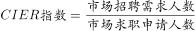。根据有关机构发布的数据，2018年第一季度CIER指数为1.91，第二季度为1.88，第三季度为1.97，第四季度为2.38。2018年第三季度，招聘需求人数环比下降，求职申请人数环比下降；第四季度招聘需求人数环比增加，求职申请人数环比增加。

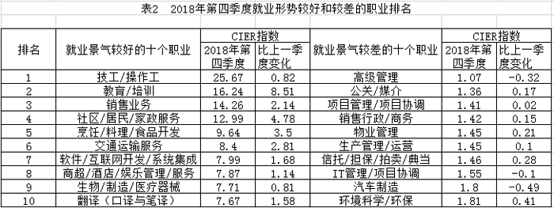

#### 第 11 题　qid 2377065 · 综合

2018年第四季度的CIER指数比第三季度有所上升，对其原因表述正确的是：

- **A**. 招聘需求人数增加比率大于求职申请人数增加比率　✅
- **B**. 招聘需求人数增加比率小于求职申请人数增加比率
- **C**. 招聘需求人数增加比率大于求职申请人数减少比率
- **D**. 招聘需求人数增加比率小于求职申请人数减少比率

**答案**：A

**官方解析**

定位文字材料，“”，及“第四季度招聘需求人数环比增加，求职申请人数环比增加”，，可知招聘需求人数增加比率大于求职申请人数增加比率。

故正确答案为A。

---

#### 第 12 题　qid 2377068 · 综合

下列选项中，对2018年四个季度CIER指数变化表达正确的是：

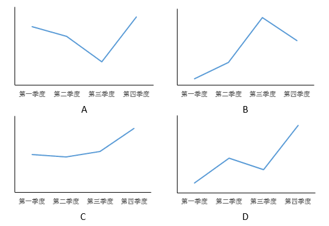

- **A**. A
- **B**. B
- **C**. C　✅
- **D**. D

**答案**：C

**官方解析**

定位文字材料可得：2018年第一季度CIER指数为1.91，第二季度为1.88，第三季度为1.97，第四季度为2.38。可知CIER的指数是一个先略微下降、再略微上升、再大幅上升的过程，C选项满足要求。
故正确答案为C。

---

#### 第 13 题　qid 2377070 · 综合

与第三季度相比，第四季度CIER指数上升最快的职业是：

- **A**. 社区/居民/家政服务
- **B**. 教育/培训　✅
- **C**. 技工/操作工
- **D**. 高级管理

**答案**：B

**官方解析**

根据题干“与第三季度相比，第四季度CIER指数上升最快的职业是”，可判定本题为增长率比较问题。定位表格2可得：2018年第四季度社区/居民/家政服务、教育/培训、技工/操作工、高级管理的指数分别为12.99、16.24、25.67、1.07，比上一季度变化量分别为4.78、8.51、0.82、-0.32。根据，可得各项增长率分别为：

A项，；

B项，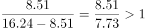；

C项，；

D项，。

可知增长率最大的为B项，即上升最快的职业为教育/培训。

故正确答案为B。

---

#### 第 14 题　qid 2377071 · 综合

根据第四季度数据，可以推断下列行业在第三季度CIER指数最高的是：

- **A**. 教育/培训/院校
- **B**. 医药/生物工程
- **C**. 互联网/电子商务
- **D**. 中介服务　✅

**答案**：D

**官方解析**

由题干“根据第四季度数据，可以推断······在第三季度CIER指数最高的是”，结合表格材料1给出的第四季度数据及比上一季度变化量，可判定本题为基期比较问题。，可知各选项第三季度CIER指数分别为：

A项，；

B项，

C项，；

D项，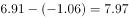。

可知第三季度CIER指数最高的是D项。

故正确答案为D。

---

#### 第 15 题　qid 2377072 · 综合

已列职业中，在第三季度CIER指数不低于1.5的个数为：

- **A**. 10
- **B**. 11
- **C**. 12　✅
- **D**. 13

**答案**：C

**官方解析**

题干“已列职业中，在第三季度CIER指数不低于1.5的个数为”，结合表格材料2给出的第四季度数据及比上一季度变化量，可判定本题为基期计算问题。根据，通过表格可知，就业景气较好的10个职业在第三季度的CIER指数均大于1.5；在就业景气较差的十个职业中，IT管理/项目协调、汽车制造这2个职业在第三季度的CIER指数分别为：、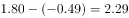也均大于1.5。故已列职业中，在第三季度CIER指数不低于1.5的个数为12。

故正确答案为C。

---

### 材料 4

根据以下资料，回答下列问题。

图1 2000-2017年中国人工智能专利授权情况（单位：件）

图2 2017年中国人工智能专利授权量排名前20国内专利权人（单位：件）

注：排名前20名的高校、科研院校有：北京工业大学、电子科技大学、哈尔滨工业大学、清华大学、北京航空航天大学、华南理工大学、浙江大学、西安电子科技大学及中国科学院，其余均为企业。

#### 第 16 题　qid 2377075 · 增长

下列年份中，中国人工智能专利授权量增速最快的是：

- **A**. 2007年
- **B**. 2012年
- **C**. 2015年　✅
- **D**. 2017年

**答案**：C

**官方解析**

根据题干“······增速最快”，可判断本题为增长率比较问题。根据增长率计算公式：，定位材料图1可得2007年的，2012年的，2015年的，2017年的，所以增长最快的为2015年。

故正确答案为C。

---

#### 第 17 题　qid 2377077 · 综合

2017年，中国人工智能专利授权量最多的企业是：

- **A**. 易瓦特
- **B**. 国家电网　✅
- **C**. 戴尔科技
- **D**. 联想

**答案**：B

**官方解析**

定位图2，可知2017年易瓦特中国人工智能专利授权量为60件，国家电网360件，戴尔科技243件，联想77件，所以2017年，中国人工智能专利授权量最多的企业是国家电网。
故正确答案为B。

---

#### 第 18 题　qid 2377080 · 比重

在位列中国人工智能专利授权量前20位的国内专利权人中，浙江大学专利授权量占比约为：

- **A**. 

- **B**. 

　✅
- **C**. 

- **D**. 

**答案**：B

**官方解析**

根据题干“······占比约为”，可判断本题为现期比重问题。定位图2，可得2017年浙江大学中国人工智能专利授权量为186件，位列中国人工智能专利授权量前20位的国内总量为。故位列中国人工智能专利授权量前20位的国内专利权人中，浙江大学专利授权量占比为，与B项最接近。

故正确答案为B。

---

#### 第 19 题　qid 2377081 · 综合

在位列中国人工智能专利授权量前20位的国内专利权人中，企业和高校、科研院校的授权量之比约为：

- **A**. 1:1　✅
- **B**. 2:3
- **C**. 1:2
- **D**. 1:3

**答案**：A

**官方解析**

由题干“企业和高校、科研院校的授权量之比约为”，可判定本题为比值计算问题。定位图2可得人工智能专利授权量排名前20国内专利权人及其专利授权量，定位文字材料可知，排名前20名的高校、科研院校有：北京工业大学、电子科技大学、哈尔滨工业大学、清华大学、北京航天航空大学、华南理工大学、浙江大学、西安电子科技大学及中国科学院，其余均为企业。则高校、科研院校的授权量为，结合本篇第3题，位列中国人工智能专利授权量前20位的国内总量为3046，可计算出企业的授权量约为。则企业和高校、科研院校的授权量之比约为，与A项最接近。

故正确答案为A。

---

#### 第 20 题　qid 2377082 · 综合

根据资料，下列关于我国2000-2017年相关信息说法正确的是：

- **A**. 
2014年是人工智能专利研发的第一个井喷年

- **B**. 
2014年至2017年人工智能领域专利授权量年均增速为

- **C**. 
2017年排名前20的国内专利权人，其人工智能专利授权量占当年人工智能专利授权总量的比例超过了

- **D**. 
中国科学院仅2017年的人工智能专利授权量就接近2000年到2004年5年全国授权量的总和
　✅

**答案**：D

**官方解析**

A项：定位图1可得，2000-2014年间人工智能专利授权量平缓上升，2015年增速大幅提高。可知2015年是人工智能专利研发的第一个井喷年，并非2014年，错误；

B项：定位图1可得，2014年人工智能领域专利授权量3753件，2017年为17477件。代入公式：，（），，。可知2014年至2017年人工智能领域专利授权量年均增速并非，错误；

C项：结合本篇第3题可知，2017年排名前20的国内专利权人，其人工智能专利授权量为3046件，，错误；

D项：定位图1可得，2000年到2004年5年全国授权量的总和为件；定位图2可得，中国科学院2017年的人工智能专利授权量为508件。中国科学院2017年的人工智能专利授权量接近2000年到2004年5年全国授权量的总和，正确。

故正确答案为D。

---
