# 2019年420联考《行测》题（重庆卷）（网友回忆版）

> 联考 · 2019 年 · 5 个模块 · 共 120 题

- [常识判断](#%E5%B8%B8%E8%AF%86%E5%88%A4%E6%96%AD) · 20 题
- [言语理解与表达](#%E8%A8%80%E8%AF%AD%E7%90%86%E8%A7%A3%E4%B8%8E%E8%A1%A8%E8%BE%BE) · 40 题
- [数量关系](#%E6%95%B0%E9%87%8F%E5%85%B3%E7%B3%BB) · 10 题
- [判断推理](#%E5%88%A4%E6%96%AD%E6%8E%A8%E7%90%86) · 30 题
- [资料分析](#%E8%B5%84%E6%96%99%E5%88%86%E6%9E%90) · 20 题

---

## 常识判断

### 第 1 题　qid 2376493 · 人文常识

关于生态文明建设，下列说法正确的是:

- **A**. 蓝天保卫战是全面建成小康社会的三大攻坚战之一
- **B**. 加快构建生态文明体系是解决污染问题的根本之策
- **C**. 生态环境安全是经济社会持续健康发展的重要保障　✅
- **D**. 地方政府主要领导是本行政区域生态环境保护第一责任人

**答案**：C

**官方解析**

本题考查政治常识。
A项错误，2017年10月18日，习近平总书记在十九大报告中指出：“要坚决打好防范化解重大风险、精准脱贫、污染防治的攻坚战，使全面建成小康社会得到人民认可、经得起历史检验。”蓝天保卫战并不是三大攻坚战之一。
B项错误，2018年5月18日至19日，习近平总书记在全国生态环境保护大会上强调：“要全面推动绿色发展。绿色发展是构建高质量现代化经济体系的必然要求，是解决污染问题的根本之策。”
C项正确，2018年5月18日至19日，习近平总书记在全国生态环境保护大会上强调：“要有效防范生态环境风险。生态环境安全是国家安全的重要组成部分，是经济社会持续健康发展的重要保障。”
D项错误，2018年5月18日至19日，习近平总书记在全国生态环境保护大会上强调：“各地区各部门要增强‘四个意识’，坚决维护党中央权威和集中统一领导，坚决担负起生态文明建设的政治责任。地方各级党委和政府主要领导是本行政区域生态环境保护第一责任人，各相关部门要履行好生态环境保护职责，使各部门守土有责、守土尽责，分工协作、共同发力。”
故正确答案为C。

---

### 第 2 题　qid 2376683 · 法律常识

关于全面依法治国，下列说法不准确的是：

- **A**. 到本世纪中叶，基本建成法治国家、法治政府、法治社会　✅
- **B**. 全面依法治国在“四个全面”中具有基础性、保障性作用
- **C**. 党的领导是社会主义法治最根本的保证
- **D**. 中国特色社会主义法治体系是中国特色社会主义制度的法律表现形式

**答案**：A

**官方解析**

本题考查政治常识。
A项错误，党的十九大报告指出：“综合分析国际国内形势和我国发展条件，从2020年到本世纪中叶可以分两个阶段来安排。第一个阶段，从2020年到2035年，在全面建成小康社会的基础上，再奋斗十五年，基本实现社会主义现代化。到那时，我国经济实力、科技实力将大幅跃升，跻身创新型国家前列；人民平等参与、平等发展权利得到充分保障，法治国家、法治政府、法治社会基本建成，各方面制度更加完善，国家治理体系和治理能力现代化基本实现······”因此，到2035年，基本建成法治国家、法治政府、法治社会。
B项正确，2018年8月24日中央全面依法治国委员会第一次会议顺利召开，习近平总书记作出重要讲话。他强调：“全面依法治国具有基础性、保障性作用，在统筹推进伟大斗争、伟大工程、伟大事业、伟大梦想，全面建设社会主义现代化国家的新征程上，要加强党对全面依法治国的集中统一领导，坚持以全面依法治国新理念新思想新战略为指导，坚定不移走中国特色社会主义法治道路，更好发挥法治固根本、稳预期、利长远的保障作用。”
C项正确，党的十八届四中全会通过的《中共中央关于全面推进依法治国若干重大问题的决定》指出：“党的领导是中国特色社会主义最本质的特征，是社会主义法治最根本的保证。”
D项正确，建设中国特色社会主义法治体系、建设社会主义法治国家是坚持和发展中国特色社会主义的内在要求。习近平总书记强调：“我们要建设的中国特色社会主义法治体系，本质上是中国特色社会主义制度的法律表现形式”。
本题为选非题，故正确答案为A。

---

### 第 3 题　qid 2376469 · 人文常识

2018年我国科技界取得了一系列重大成果，这些成果中不包括：

- **A**. 第二艘航母出海试航
- **B**. 嫦娥四号探测器发射成功
- **C**. 造岛神器“天鲲号”下水　✅
- **D**. 国产大型水陆两栖飞机水上首飞

**答案**：C

**官方解析**

本题考查政治常识。
A项正确，2018年5月13日，我国第二艘航母从大连造船厂码头启航，赴相关海域执行海上试验任务，主要检测验证动力系统等设备的可靠性和稳定性。
B项正确，2018年12月8日2时23分，我国在西昌卫星发射中心用长征三号乙运载火箭成功发射嫦娥四号探测器，开启了月球探测的新旅程。嫦娥四号探测器后续将经历地月转移、近月制动、环月飞行，最终实现人类首次月球背面软着陆，开展月球背面就位探测及巡视探测，并通过已在使命轨道运行的“鹊桥”中继星，实现月球背面与地球之间的中继通信。
C项错误，2017年11月3日，由我国自主设计研发的新一代国之重器——“天鲲号”自航绞吸挖泥船成功下水。从被称为“造岛神器”的“天鲸号”，到目前亚洲最大最先进的“天鲲号”，中国自航绞吸挖泥船的自主研制实力再一次让世人惊叹。
D项正确，2018年10月20日，中国自主研制的大型水陆两栖飞机——“鲲龙”AG600在湖北荆门漳河机场成功实现水上首飞。至此，中国大飞机终于迈出“上天入海”完整步伐，建设航空强国轮廓愈发明晰。
本题为选非题，故正确答案为C。

---

### 第 4 题　qid 2376675 · 人文常识

下列关于全国经济普查的说法错误的是：

- **A**. 根据《全国经济普查条例》的规定，经济普查每5年进行一次
- **B**. 目的是全面调查我国第一、第二、第三产业的发展规模、布局和效益　✅
- **C**. 普查取得的单位和个人资料，不作为对普查对象实施处罚的依据
- **D**. 2019年1月1日，第四次全国经济普查现场登记工作正式启动

**答案**：B

**官方解析**

本题考查法律常识。
A项正确，《全国经济普查条例》第七条规定：“经济普查每5年进行一次，标准时点为普查年份的12月31日。”
B项错误，《全国经济普查条例》第二条规定：“经济普查的目的，是为了全面掌握我国第二产业、第三产业的发展规模、结构和效益等情况，建立健全基本单位名录库及其数据库系统，为研究制定国民经济和社会发展规划，提高决策和管理水平奠定基础。”
C项正确，《全国经济普查条例》第三十三条规定：“经济普查取得的单位和个人资料，严格限定用于经济普查的目的，不作为任何单位对经济普查对象实施处罚的依据。”
D项正确，2019年1月1日零时，第四次全国经济普查现场登记工作正式启动。按照部署，第四次全国经济普查标准时点为2018年12月31日，普查时期资料为2018年年度资料。
本题为选非题，故正确答案为B。

---

### 第 5 题　qid 2376475 · 人文常识

荷花虽生长于池塘的污泥中，但荷叶却出污泥而不染，其主要原因是：

- **A**. 荷叶含有大量的叶绿素，能与太阳光发生光合作用，产生自清洁
- **B**. 荷叶表面光滑，具有非常强的光洁度，污泥很难在它的表面吸附
- **C**. 荷叶含有疏水的纳米级蜡质，雨露落在上面会形成水珠清洁叶面　✅
- **D**. 荷花枝干细长，水珠落在荷叶上，容易造成荷叶晃动，甩出污泥

**答案**：C

**官方解析**

本题考查科技常识。
荷叶之所以能出污泥而不染是由荷叶叶面上存在着复杂的多重纳米和微米级的超微结构决定的：在超高分辨率显微镜下可以清晰看到，荷叶表面上有许多微小的乳突，它上面长满茸毛，乳突间的凹陷部分充满空气，这样就在紧贴叶面处形成一层极薄的只有纳米量级厚的空气层。这使得在尺寸上远大于这种结构的灰尘、雨水等降落在叶面上后，隔着一层极薄的空气，从而雨水会自动聚集成球形水珠，而水珠的滚动会把落在叶面上的尘土污泥吸附掉滚出叶面，使叶面始终保持干净，这就是著名的“荷叶自洁效应”。
故正确答案为C。

---

### 第 6 题　qid 2376676 · 科技常识

下列关于仿生生物学的应用对应关系不正确的是：

- **A**. 发光纤维——萤火虫　✅
- **B**. 子弹头列车——翠鸟
- **C**. 维克罗尼龙搭扣——苍耳
- **D**. 全天然空调系统建筑——非洲白蚁巢穴

**答案**：A

**官方解析**

本题考查科技常识。
A项错误，发光纤维是指受到光和放射线的照射时能发出可见光的纤维。常见的发光纤维如：以发光玻璃作芯材的纤维、以发光塑料作芯材的纤维。而萤火虫有专门的发光细胞，在发光细胞中有两类化学物质，一类被称作荧光素，另一类被称为荧光素酶。荧光素能在荧光素酶的催化下消耗ATP（腺苷三磷酸），并与氧气发生反应，反应中产生激发态的氧化荧光素，当氧化荧光素从激发态回到基态时释放出光子。反应中释放的能量几乎全部以光的形式释放，只有极少部分以热的形式释放，萤火虫是通过这样的作用来发光的。由此可见，发光纤维并不是在仿生萤火虫。
B项正确，翠鸟拥有长而平的喙，使其可以从空气迅速潜入水中，同时并不会产生过多的扰动。日本工程师中津英治仿照翠鸟喙设计出了新干线子弹头列车的车头，使其更长更平，降低了火车的噪音。
C项正确，苍耳是一种植物，它的总苞具有钩状的硬刺，可以贴附于动物的身体上。尼龙搭扣的设计正是从苍耳获得的灵感，尼龙搭扣的两边都是尼龙做的，一边是一排排的小勾，另一边是密密麻麻的小线圈，两边贴在一起的时候，小勾就勾住小线圈，使其能贴在一起。
D项正确，非洲白蚁会建造巨大的巢穴系统，他们经常开启和关闭自己塔楼巢穴中的气口，使得巢穴内外的空气得以对流——冷空气从底部的气口流入塔楼，与此同时热空气从顶部的烟囱流出。从而使得巢穴中始终维持一个恒定的温度。在设计津巴布韦首都哈拉雷的约堡东门购物中心和办公大楼时，建筑大师麦克·皮尔斯研究了非洲白蚁巢穴的结构，设计出了全天然空调系统，使得购物中心常年维持适宜的温度。
本题为选非题，故正确答案为A。

---

### 第 7 题　qid 2376481 · 人文常识

下列成语和人物的对应关系错误的是：

- **A**. 口蜜腹剑——李义府　✅
- **B**. 十面埋伏——项羽
- **C**. 程门立雪——杨时
- **D**. 东床快婿——王羲之

**答案**：A

**官方解析**

本题考查人文常识。
A项错误，“口蜜腹剑”出自《资治通鉴·唐记》“口有蜜，腹有剑”，这是文中对奸相李林甫的评语。李林甫为宰相后，对于朝中百官凡是才能和功业在自己之上而受到玄宗宠信或官位快要超过自己的人，一定要想方设法除去，尤其忌恨由文学才能而进官的士人。有时表面上装出友好的样子，说些动听的话，而暗中却阴谋陷害。所以世人都称李林甫“口有蜜，腹有剑”。笑里藏刀是指李义府。
B项正确，“十面埋伏”出自楚汉相争的垓下之战（今安徽省宿州市灵璧县东南）。楚汉相争时期，汉王刘邦重用淮阴人韩信，先后活捉魏王豹、赵王歇、燕王臧荼、齐王田广。他被刘邦封为齐王后率30万大军和彭越的军队会师，把项羽围困在垓下（今安徽省宿州市灵璧县东南），他采取十面埋伏的战术，逼使项羽在乌江自刎，取得决定性的胜利。
C项正确，宋代的杨时考到进士后不愿做官，专心研究学问。他起先在颍昌（地名）拜理学家程颢为师，学到了不少知识。程颢死后，四十多岁的杨时又和同学游酢一起到洛阳请教另一位有名的理学家程颐（程颢的弟弟）。他们到程颐家时，程颐正在打瞌睡。两人不敢惊动他，就侍立在门口。程颐醒来后发现门外的雪已下了一尺多深。程门立雪由此而来，比喻尊师重道。
D项正确，“东床快婿”出自刘义庆《世说新语笺疏雅量第六》“王氏谱曰：逸少，羲之小字。羲之妻，太傅郗鉴女，名璿，字子房。”指为人豁达，才能出众的女婿，是女婿的美称。“东床快婿”王羲之就是大名鼎鼎的书法家，被后人称之为“书圣”。
本题为选非题，故正确答案为A。

---

### 第 8 题　qid 2376492 · 人文常识

下列表述正确的是：

- **A**. 鄱阳湖栖息着世界上最大的白鹤群　✅
- **B**. 我国最早出现的种植业位于松花江流域
- **C**. 被誉为“天上云霞,地下鲜花”的是四川蜀绣
- **D**. 东北平原是中国第二大平原，也是中国重要的粮棉生产基地

**答案**：A

**官方解析**

本题考查地理国情。

A项正确，鄱阳湖是全世界最大的白鹤集中越冬地，白鹤的数量占全世界总数的以上，堪称鹤之天堂。鄱阳湖区发现白鹤的最早记录是1980年。1985年，时任国际鹤类基金会会长的乔治·阿基博带队来鄱阳湖考察，观测到白鹤1350只，其中幼鹤119只。他们认定那是当时世界上发现的最大野生白鹤群。

B项错误，我国最早出现的种植业应位于黄河、长江流域。黄河、长江是中国的母亲河，这两条河流的冲积平原地区是中华文明的发祥地且两个平原处在温带湿润、半湿润地区，气候温暖湿润，比较适宜人类居住，所以种植业发展最早。 

C项错误，被誉为“天上云霞，地下鲜花”的是杭州的织锦。 

D项错误，东北平原是中国最大的平原，是中国三大平原之一。位于中国东北部，南北长约1000千米，东西宽约400千米，面积达35万平方千米。同时东北平原土地肥沃，是全球仅有的三大黑土区域之一，是中国重要的粮食、大豆、畜牧业生产基地，也是中国重要的钢铁、机械、能源、化工基地。 

故正确答案为A。 

---

### 第 9 题　qid 2376677 · 人文常识

下列历史事件与人物搭配正确的是：

- **A**. 锦帆未落干戈起——隋炀帝　✅
- **B**. 烽火四起戏诸侯——周宣王
- **C**. 一骑红尘妃子笑——唐睿宗
- **D**. 车同轨，书同文——周武王

**答案**：A

**官方解析**

本题考查人文常识。
A项正确，“锦帆未落干戈起”出自唐代胡曾的《咏史诗·汴水》，这首诗反映了：隋炀帝开凿京杭大运河，耗费了大量人力物力财力，惹得民不聊生，起义军掀起推翻隋朝统治的浪潮。
B项错误，“烽火四起戏诸侯”，指西周时周幽王，为褒姒一笑，点燃了烽火台，戏弄了诸侯。褒姒看了果然哈哈大笑。幽王很高兴，因而又多次点燃烽火。后来诸侯们都不相信了，也就渐渐不来了。对应的人物为周幽王，而非周宣王。
C项错误，“一骑红尘妃子笑”出自唐代杜牧的《过华清宫绝句三首》，讲的是杨贵妃喜欢荔枝，皇帝唐玄宗找人快马相运，意思是速度很快，只能看到滚滚烟尘却没有看到烈马掠过。对应的人物为唐玄宗和杨贵妃，而非唐睿宗。
D项错误，车同轨，书同文是一个汉语成语，是谓车轨相同，文字相同。形容天下统一。《史记·秦始皇本纪》：“一法度衡石丈尺。车同轨。书同文字。”对应的是秦始皇，而非周武王。
故正确答案为A。

---

### 第 10 题　qid 2376679 · 人文常识

下列哪一选项所描写的城市不是当前的省会城市？

- **A**. 豫章故郡，洪都新府。星分翼轸，地接衡庐。襟三江而带五湖，控蛮荆而引瓯越
- **B**. 东南形胜，三吴都会，钱塘自古繁华。烟柳画桥，风帘翠幕，参差十万人家
- **C**. 因念都城放夜。望千门如昼，嬉笑游冶。钿车罗帕。相逢处，自有暗尘随马　✅
- **D**. 自古帝王州，郁郁葱葱佳气浮。四百年来成一梦，堪愁，晋代衣冠成古丘

**答案**：C

**官方解析**

本题考查人文常识。
A项正确，“豫章故郡，洪都新府。星分翼轸，地接衡庐。襟三江而带五湖，控蛮荆而引瓯越。”出自唐代王勃的《滕王阁序》。滕王阁位于江西省南昌市赣江与抚河故道交汇处。南昌市是江西省的省会城市。
B项正确，“东南形胜，三吴都会，钱塘自古繁华，烟柳画桥，风帘翠幕，参差十万人家。”出自北宋柳永的《望海潮·东南形胜》，作品主要描写杭州的富庶与美丽。杭州市是浙江省的省会城市。
C项错误，“因念都城放夜。望千门如昼，嬉笑游冶。钿车罗帕。相逢处，自有暗尘随马。”出自北宋周邦彦的《解语花·上元》。词中“都城”是指汴京，今河南开封市。现在，河南省的省会城市是郑州市。
D项正确，“自古帝王州，郁郁葱葱佳气浮。四百年来成一梦，堪愁。晋代衣冠成古丘。”出自北宋王安石的《南乡子·自古帝王州》，词中的“帝王州”是指金陵，今江苏省南京市。南京市是江苏省的省会。
本题为选非题，故正确答案为C。

---

### 第 11 题　qid 2376479 · 人文常识

下列送别诗句中不属于描写目送友人场景的是:

- **A**. 孤帆远影碧空尽，唯见长江天际流
- **B**. 山回路转不见君，雪上空留马行处
- **C**. 日暮酒醒人已远，满天风雨下西楼　✅
- **D**. 青枫江上秋帆远，白帝城边古木疏

**答案**：C

**官方解析**

本题考查人文常识。
A项正确，“孤帆远影碧空尽，唯见长江天际流”出自唐代诗人李白的《送孟浩然之广陵》。这是首送别诗，不仅写出了友人所乘船孑然远逝的情景，而且写出诗人凭栏目送的情景，此刻，诗人伫立在黄鹤楼上，久久地注视着那渐行渐远，最终消失在茫茫水天相接之处的一片孤帆，他的心早已随船而去了。寄寓了诗人的惜别之情。
B项正确，“山回路转不见君，雪上空留马行处。”出自盛唐岑参的《白雪歌送武判官归京》。岑参在这首诗中，以诗人的敏锐观察力和浪漫奔放的笔调，描绘了祖国西北边塞的壮丽景色，以及边塞军营送别归京使臣的热烈场面，表现了诗人和边防将士的爱国热情，以及他们对战友的真挚感情。“山回路转不见君，雪上空留马行处”，用很平淡质朴的语言表现了将士们对战友的真挚感情，字字传神，含蓄隽永。这一部分虽然描写对友人依依惜别的深情，但也表现了边塞将士的豪迈精神。
C项错误，“日暮酒醒人已远，满天风雨下西楼。”出自唐代许浑的《谢亭送别》。这是一首送别诗。一觉醒来，已是薄暮时分。天色变了，下起了雨，四望一片迷蒙。眼前的江面，两岸的青山红叶都已经笼罩在蒙蒙雨雾和沉沉暮色之中。而朋友的船，此刻更不知道随着急流驶到云山雾嶂之外的什么地方去了。不仅写出身留谢亭而友人早已远去，而且写出暮色苍茫风雨凄迷的孤寂落寞的离愁情。
D项正确，“青枫江上秋帆远，白帝城边古木疏。”出自唐代高适的《送李少府贬峡中王少府贬长沙》。这是一首送别诗，同时也是一首边塞诗，同时送别两人，且两人均为遭贬而迁。“青枫江”指浏水，在长沙与湘江汇合。写王少府到了长沙，在秋高气爽的季节，望着那明净高远、略无纤尘的蓝天，自然会洗尽烦恼。想象李少府到了峡中，可以去古木参天、枝叶扶疏的白帝城凭吊古迹，以求慰藉。这一句是对离别的二人共同讲的，体现了目送的场景。
本题为选非题，故正确答案为C。

---

### 第 12 题　qid 2376474 · 科技常识

下列气体既会造成酸雨，又可用作防腐剂的是：

- **A**. 二氧化碳
- **B**. 二氧化氮
- **C**. 二氧化硫　✅
- **D**. 氮气

**答案**：C

**官方解析**

本题考查科技常识。
酸雨通常指pH值小于5.6的酸性降水。酸雨中含有多种无机酸和有机酸，绝大部分是硫酸和硝酸，由人为排放的大气污染物二氧化硫和氮氧化物转化而成。
A项错误，二氧化碳溶于水后虽然会使雨水呈弱酸性，但不会导致酸雨。
B项错误，二氧化氮会与大气中水反应生成硝酸，形成硝酸型酸雨；二氧化氮有剧毒，不可以作防腐剂。
C项正确，二氧化硫与大气中的水反应生成亚硫酸，亚硫酸又与大气中的氧气反应，生成硫酸，形成硫酸型酸雨；二氧化硫有还原性，易被氧化，因此常用作葡萄酒的防腐剂。
D项错误，氮气化学性质不活泼，常温下很难跟其他物质发生反应，所以常被用作薯片等食品的防腐剂；氮气难溶于水，不会造成酸雨。
故正确答案为C。

---

### 第 13 题　qid 2376456 · 科技常识

下列说法错误的是：

- **A**. 
雷雨可使土壤的氮肥增加

- **B**. 
18K黄金制品的含金量为70
　✅
- **C**. 
聚四氟乙烯可用于制作不粘锅的涂层

- **D**. 
在金属表面喷漆可以防止金属被氧化腐蚀

**答案**：B

**官方解析**

本题考查科技常识。

A项正确，雷雨天气过程中的闪电温度极高，一般在三万度以上，并造成高电压。在高温高电压条件下，空气分子会发生电离，等它们重新结合时，其中的氮和氧就会化合为亚硝酸盐和硝酸盐分子，并溶解在雨水中降落地面，成为天然氮肥。

B项错误，K金是指黄金和其它金属混合在一起的合金。根据在首饰中的黄金含量可分为不同的K金，其中24K是指纯金，18K黄金制品的含黄金量就是18/24=75，因此选项中的70表述错误。 

C项正确，聚四氟乙烯俗称“塑料王”，是由四氟乙烯经聚合而成的高分子化合物，具有优良的化学稳定性、耐腐蚀性、密封性、高润滑不粘性，可用于制作不粘锅的涂层。

D项正确，金属被氧化腐蚀是指各类材料在环境作用下发生损坏、性能下降或状态的劣化。良好的喷漆涂装保护层能够成为抑制腐蚀介质侵入的屏障，使得金属保持连续完整，因此在金属表面喷漆是一种很重要的金属防腐蚀手段。

本题为选非题，故正确答案为B。

---

### 第 14 题　qid 2376682 · 人文常识

下列我国古代国家行政机构不具有行政监察职能的是：

- **A**. 御史台
- **B**. 太常寺　✅
- **C**. 六科给事中
- **D**. 都察院

**答案**：B

**官方解析**

本题考查人文常识。
A项正确，御史台，古代官署名。御史台的职责是纠察弹劾百官过失，是封建国家专司弹劾的监察机关。
B项错误，太常寺，封建社会中掌管礼乐的最高行政机关，秦时称奉常。汉景帝六年改称太常。汉以后改称太常寺、太常礼乐官等。
C项正确，明代地方分区监察和中央按系统监察相结合，专设六科给事中，稽察六部百司之事，旨在加强皇帝对六部的控制。
D项正确，都察院，官署名。明清全国最高监察机构。掌纠劾百司，辩明冤枉，提督各道，为天子耳目风纪之司。
本题为选非题，故正确答案为B。

---

### 第 15 题　qid 2376484 · 人文常识

唐太宗李世民曾言:为官择人，唯才是与；苟或不才，虽亲不用。下列哪一人才选拔制度与其所言体现的用人理念最契合：

- **A**. 科举制　✅
- **B**. 察举制
- **C**. 世卿世禄制
- **D**. 九品中正制

**答案**：A

**官方解析**

本题考查人文常识。
唐太宗李世民曾言：为官择人，唯才是与；苟或不才，虽亲不用。是指用人的原则是看才能，而不管亲疏。
A项正确，科举制度是隋以后各封建王朝设科考试选拔官吏的制度，由于分科取士而得名。隋文帝废除为世族垄断的九品中正制，设志行修谨、清平干济二科。隋炀帝时始置进士科，科举制形成。1905年，袁世凯、张之洞奏请立停科举。至此，在中国历史上延续了约1300年的科举制度最终被废除，科举取士与学校教育实现了彻底分离。
B项错误，察举制是中国古代选拔官吏的一种制度，它的确立时间是汉武帝元光元年（公元前134年）。它的主要特征是由地方长官在辖区内随时考察、选取人才并推荐给上级或中央，经过试用考核再任命官职。
C项错误，世卿世禄制是古代高级官吏的称呼。世卿就是天子或诸侯国君之下的贵族，世世代代、父死子继，连任卿这样的高官。禄是官吏所得的享受财物。世禄就是官吏们世世代代、父死子继，享有所封的土地及其赋税收入。
D项错误，九品中正制，又称九品官人法，是魏晋南北朝时期重要的选官制度，从曹魏始至隋唐科举的确立，这期间约存在了四百年之久。九品中正制大体是指由各州郡分别推选大中正一人，所推举大中正必为在中央任职官员且德名俱高者。大中正再产生小中正。中正就是品评人才的官职名称。大、小中正产生后，由中央分发一种人才调查表，在该表中将人才分为九等，上上、上中、上下、中上、中中、中下、下上、下中、下下。此项制度使得当时的官吏选拔有了一客观标准，此标准其实依然是采取地方群众舆论和公共意见，保留了汉代乡举里选的遗意。
故正确答案为A。

---

### 第 16 题　qid 2376464 · 人文常识

管理大师杰克·韦尔奇有句名言：管得少，就是管得好。他主要强调管理应该注重：

- **A**. 沟通
- **B**. 分权　✅
- **C**. 组织
- **D**. 控制

**答案**：B

**官方解析**

本题考查管理学常识。
“管得少，就是管得好”强调的就是管理应该注重分权。管理的最终目标在于提高经营绩效，分权是管理学学者在近一百多年的企业管理研究与实践中，为提高效率而归纳出的一大规律性，管理学家认为企业在追求绩效时必须善于分权，担任一定管理职务的领导者在实际工作中为充分利用专门人才的知识和技能，应将部分解决问题和处理新增业务的权利委任给下属。据此可知，B项正确，ACD三项与题干无关。
故正确答案为B。

---

### 第 17 题　qid 2376487 · 科技常识

佛朗西斯·克里克提出的中心法则指明了遗传信息的流向，在科学发展中得到不断补充完善。根据该法则，下列哪一种遗传信息传递流程不可能发生：

- **A**. DNA通过转录把遗传信息传递给RNA
- **B**. RNA通过翻译把遗传信息传递给蛋白质
- **C**. RNA通过逆转录把遗传信息传递给DNA
- **D**. 蛋白质通过逆翻译把遗传信息传递给RNA　✅

**答案**：D

**官方解析**

本题考查科技常识。
A、B、C项正确，中心法则指出，遗传信息的转移可以分为两类：第一类，包括DNA的复制、RNA的转录和蛋白质的翻译，即①DNA→DNA(复制)；②DNA→RNA(转录)；③RNA→蛋白质(翻译)。这三种遗传信息的转移方向普遍地存在于所有生物细胞中。第二类，是特殊情况下的遗传信息转移，包括RNA的复制，RNA反向转录为DNA和从DNA直接翻译为蛋白质，即①RNA→RNA(复制)；②RNA→DNA(逆转录)；③DNA→蛋白质。RNA复制只在RNA病毒中存在。
D项错误，中心法则旨在详细说明连串信息的逐个传送，它指出遗传信息不能由蛋白质转移到蛋白质或核酸之中。
本题为选非题，故正确答案为D。

---

### 第 18 题　qid 2376498 · 人文常识

下列关于血糖的说法错误的是：

- **A**. 正常人进食后血糖浓度会升高
- **B**. 正常人空腹超过12小时会引起低血糖
- **C**. 南瓜能抑制葡萄糖吸收，具有降血糖作用　✅
- **D**. 胰岛素是人体产生的唯一能够降低血糖的激素

**答案**：C

**官方解析**

本题考查科技常识。
A项正确，食物中存在大量的淀粉等糖类。人在进食后，糖类被人体消化吸收，因此会使血糖含量升高。
B项正确，低血糖的常见原因包括进食过少、运动过度、药物使用不当、大量饮酒等。正常人空腹（禁食）时间过长，由于没有食入足够的糖，可能会引起低血糖。
C项错误，南瓜中含有丰富的营养物质，其中包含了蛋白质、多糖、果胶、纤维素、维生素以及微量元素等成分，在这些众多的营养物质中，蛋白质和多糖都可以提升自身免疫功能。部分多糖会被分解成单糖，可能导致人体血糖升高。
D项正确，胰岛素是体内唯一能够降低血糖浓度的激素，它不仅能够促使葡萄糖分解，还能抑制非糖物质转化为葡萄糖。
本题为选非题，故正确答案为C。

---

### 第 19 题　qid 2376709 · 科技常识

下列我国空间站发展的重要标志性事件按完成步骤排列正确的是：
①“天宫二号”空间实验室成功发射
②“神舟十一号”成功发射，完成与“天宫二号”对接
③陆续发射科学实验舱和空间站核心舱，组建中国空间站
④“天舟一号”货运飞船成功发射，完成与“天宫二号”对接

- **A**. ①②③④
- **B**. ④①②③
- **C**. ①③④②
- **D**. ①②④③　✅

**答案**：D

**官方解析**

本题考查科技常识。
①2016年9月15日22时04分，“天宫二号”空间实验室由长征二号FT2火箭发射升空。
②2016年10月19日3时31分，“神舟十一号”载人飞船与“天宫二号”空间实验室成功实现自动交会对接。
③建设具有国际先进水平的空间站，解决有较大规模的、长期有人照料的空间应用问题，是我国载人航天工程“三步走”发展战略中第三步的任务目标。按计划，空间站将于2022年前后建成，是我国长期在轨稳定运行的国家太空实验室，将全面提升我国载人航天综合应用效益水平。
④2017年4月20日19时11分，中国首架货运飞船——“天舟一号”成功发射升空，并在4月22日完成与“天宫二号”的首次对接。
由此可知，按照完成步骤的时间应该是①②④③。
故正确答案为D。

---

### 第 20 题　qid 2376499 · 人文常识

俗话说“不要将你的鸡蛋全都放在一只篮子里”。下列选项与该俗语蕴含的道理相吻合的是：

- **A**. 天有不测风云　✅
- **B**. 鱼与熊掌不可兼得
- **C**. 不入虎穴，焉得虎子
- **D**. 舍不得孩子，套不住狼

**答案**：A

**官方解析**

本题考查经济常识。
如果把所有鸡蛋都放在同一个篮子里，篮子翻了，所有的鸡蛋都会碎掉；如果不把所有的鸡蛋放在一个篮子里，篮子翻了，还会有其他鸡蛋剩下。即不要把所有的资本都投入到一件事情上，应该做多手准备，规避风险。
A项正确，天有不测风云比喻灾祸是无法预料的，即风险是随时存在的，我们应该懂得随时规避和防范风险。与题意相符合。
B项错误，鱼与熊掌不可兼得，意思是鱼和熊掌不能同时获得。强调的是我们在做选择的时候，应该如何取舍，在经济上对应的是机会成本。与风险无关。
C项错误，不入虎穴，焉得虎子比喻不经历艰险，就不能取得成功，也指需通过实践取得真知。与风险无关。
D项错误，舍不得孩子，套不住狼比喻要达到某一目的必须付出相应的代价。与风险无关。
故正确答案为A。

---

## 言语理解与表达

### 第 1 题　qid 2376519 · 逻辑填空

科学已经成为当下社会的主流命题，无论从事什么工作都无法忽视它、绕过它。因此从某种程度来说，科学与艺术，或者说理性与感性的边界正在        。艺术展上艺术家们摆弄起了宇宙爆炸、量子世界，而不少科学家也乐于把科学仪器下观察到的景象捕捉下来，展示到人们面前，其精美程度丝毫不亚于艺术家的加工描摹。
填入划横线部分最恰当的一项是：

- **A**. 消遁
- **B**. 消失
- **C**. 消除
- **D**. 消弭　✅

**答案**：D

**官方解析**

本题可根据完整语句提示做题。
根据首句“科学已经成为当下社会的主流命题，无论从事什么工作都无法忽视它、绕过它”可知，所有工作（包括艺术）与科学之间是没有界限的，换言之，边界不应该存在。
又根据后文的“艺术展上艺术家们摆弄起了宇宙爆炸、量子世界，而不少科学家也乐于把科学仪器下观察到的景象捕捉下来，展示到人们面前，其精美程度丝毫不亚于艺术家的加工描摹。”可知，科学与艺术的边界正在慢慢模糊。
分析横线处可知，“理性”对应“科学”，“感性”对应“艺术”，“科学”与“艺术”间无界限，即“感性”与“理性”间不应有界限。故横线处应表达“理性与感性的边界”这一不应该存在的事物慢慢消失了。
D项“消弭”意为清除，多与风险、隐患等不好的事物搭配，而在本题中，作者认为，“边界”是不应该存在的事物，即不好的事物（提示：勿根据常识判断，结合上下文判断作者对“边界”的倾向），搭配得当，符合文意，当选。
A项“消遁”指消失逃跑，与文意不符，排除；
C项“消除”指使不存在，多与误会、疑虑等搭配，与“边界”搭配不当，排除；
B项“消失”置于文段虽然语义合适，但是相比之下，不能体现出“边界”的不应存在，感情倾向不如D项恰当。
故正确答案为D。 
【文段出处】《“当李白遇见火星”会发生什么》
【原文摘录】欧阳自远认为，科学已经成为当下社会的主流命题，无论从事什么工作都无法忽视它、绕过它。因此从某种程度来说，科学与艺术，或者说理性与感性的边界正在消弭。君不见许多艺术展上，艺术家们摆弄起了宇宙爆炸、量子世界，而不少科学家也乐于把科学仪器下观察到的景象捕捉下来，展示到人们面前，其精美程度丝毫不亚于艺术家的加工描摹。

---

### 第 2 题　qid 2376525 · 逻辑填空

云南在西、巴蜀在北，贵州有着说不尽的历史。这片西南中国的广袤土地，呈现了华夏山河的            、见证了中国革命的风云际会、记录了多民族文化的交流激荡。现在，贵州正在以绿色发展谋求生态红利，率先推进了中国生态文明建设的地方探索。
填入划横线部分最恰当的一项是：

- **A**. 海晏河清
- **B**. 渊渟岳峙
- **C**. 钟灵毓秀　✅
- **D**. 瑕瑜互见

**答案**：C

**官方解析**

横线处所填的词语搭配对象为“华夏山河”，与后文两个并列结构共同说明在西南这片土地上有着说不尽的历史。C项“钟灵毓秀”指美好的山川孕育出优秀的人才，搭配“华夏山河”恰当，与文段语境相符，当选。
A项“海晏河清”比喻太平盛世、天下太平，与“华夏山河”搭配不当，与语境不符，排除；B项“渊渟岳峙”比喻人品德如渊水深沉，如高山耸立，不用于形容“华夏山河”，排除；D项 “瑕瑜互见”比喻优点、缺点都有，文段不强调“华夏山河”的缺点，与文意不符，排除。
故正确答案为C。
【文段出处】《让绿色成为发展的鲜明底色》

---

### 第 3 题　qid 2376717 · 逻辑填空

关于科学革命的讨论        于十七世纪。不过，其时革命尚在            地展开，相关讨论的焦点集中在科学的本性，而未有所谓“科学革命史”的理解。到十九世纪，现代科学的基本模式逐渐定型，一些学者便回到现代科学的源头做起了编史和整理工作。
依次填入划横线部分最恰当的一项是：

- **A**. 滥觞  如火如荼　✅
- **B**. 溯源  轰轰烈烈
- **C**. 起源  风起云涌
- **D**. 发端  方兴未艾

**答案**：A

**官方解析**

第一空，A项“滥觞”、C项“起源”、D项“发端”均有表达事物起源和开端的含义，均符合文意，保留；B项“溯源”后一般不加宾语，常表述为“对······进行溯源”，排除。
第二空，搭配“革命”，表达革命如何展开，A项“如火如荼”形容旺盛、热烈或激烈，可以体现革命开展很热烈，符合文意，当选；C项“风起云涌”形容事物迅速发展，声势浩大，可以说“改革风起云涌”，“风起云涌地展开”用法不当，排除；D项“方兴未艾”指事物正在兴起、发展，一时不会终止，若填入横线处，则与“展开”语义上重复，二者搭配不当，可表述为“科学革命方兴未艾”，排除。
故正确答案为A。
【文段出处】《科学史绝非科学的注脚：科学革命的人文理解》

---

### 第 4 题　qid 2376530 · 逻辑填空

有人曾        “人工智能是个筐，什么都能往里装”，虽然        ，但也说明了现状。通常，当解决问题需要推理、决策、理解、学习这类最基本的技能时，我们才认为它跟人工智能相关。常见的人工智能技术应用有指纹识别、人脸识别、机器翻译等。很多通过机械的计算和机械的记忆实现的东西，一般不把它看成人工智能的本质应用。
依次填入划横线部分最恰当的一项是：

- **A**. 嘲笑  苛刻
- **B**. 调侃  尖酸
- **C**. 揶揄  刻薄　✅
- **D**. 嘲弄  刻毒

**答案**：C

**官方解析**

本题可从第二空入手，横线处形容“人工智能是个筐，什么都能往里装”这句话。B项“尖酸”指用刻薄的话讥刺人，C项“刻薄”指（待人、说话）冷酷无情；过分苛求，均可形容前文“人工智能是个筐，什么都能往里装”这句话，符合文意，保留。A项“苛刻”，一般是指要求苛刻，不是说这句话对人工智能要求挑剔苛刻，排除；D项“刻毒”，毒是恶毒的意思，程度太重，排除。
第一空，同样形容“人工智能是个筐，什么都能往里装”，两空感情色彩、程度要一致，C项“揶揄”“刻薄”符合要求，当选。B项“调侃”程度比“揶揄”轻，排除。
故正确答案为C。
【文段出处】《人工智能：边原创冲刺边伦理“刹车”》

---

### 第 5 题　qid 2376710 · 逻辑填空

古人根据经验编制了许多脍炙人口的农谚，比如“清明前后，种瓜点豆”。不仅是农谚，与二十四节气相关的诗词歌赋也是            ，比如“蒹葭苍苍，白露为霜”，再比如“清明时节雨纷纷，路上行人欲断魂”。这些诗词歌赋            ，将二十四节气与天气现象巧妙地结合在一起，具有很好的传播性。
依次填入划横线部分最恰当的一项是：

- **A**. 俯拾皆是  沉思翰藻
- **B**. 不胜枚举  形神兼备　✅
- **C**. 不计其数  文采斐然
- **D**. 举不胜举  缀玉联珠

**答案**：B

**官方解析**

第一空，横线前“也”表示“诗词歌赋”与前面“农谚”并列，前面通过“比如”说明农谚的例子非常多，结合后文“比如······，再比如······”可知，横线处也要体现出诗词歌赋的例子非常多，B项“不胜枚举”、D项“举不胜举”都是强调可以举的例子数量特别多，符合文意，保留；A项“俯拾皆是”意思是只要低下头来捡取，到处都是，形容多而易得，C项“不计其数”指无法计算数目，形容极多，虽然都能体现多的含义，但与“例子”的对应不如B、D两项准确，排除。
第二空，横线前出现指代词“这些”，横线处要体现出诗词歌赋的特性，通过“将二十四节气与天气现象巧妙地结合在一起”可知，这些诗词与节气结合的非常好，不仅是诗歌，也有节气的内容包含在里面，B项“形神兼备”强调外在物象与内在神韵都具备，符合文意，当选。D项“缀玉联珠”形容诗文十分优美，仅能形容诗文的好，但体现不出包含节气的内容，没有B项对应准确，排除。
故正确答案为B。
【文段出处】《气象科普（176）：时间里的中国智慧—二十四节气》

---

### 第 6 题　qid 2376483 · 逻辑填空

说梵高是一个“圣徒式的画家”并不为过，他通过绘画仰望、接近上帝。        ，即便是这样一个具有宗教情怀、追求超越性的梵高，也从未试图远离人群、拥抱绝对的孤独。        ，他总在渴望人与人之间的温暖与爱，而始终未能得到。他的绘画也好，文字也好，除去遗传的因素，很大程度上就是表达此种“寻求”与“寻求不得”之间的落差及随之而来的痛苦。
依次填入划横线部分最恰当的一项是：

- **A**. 然而  因为
- **B**. 首先  其次
- **C**. 因为  于是
- **D**. 但是  相反　✅

**答案**：D

**官方解析**

第一空，由前文“他通过绘画仰望、接近上帝”以及后文“也从未试图远离人群、拥抱绝对的孤独”可知，横线前后语义相反，表达梵高接近上帝但也没有远离人群，故横线处应填入转折关系的引导词，A项“然而”、D项“但是”均可表示转折关系，保留；B项“首先”表示逻辑顺序，C项“因为”表示因果关系，均不符合文意，排除。
第二空，由前文“远离人群、拥抱绝对的孤独”以及后文“他总在渴望人与人之间的温暖与爱”可知，横线前后语义相反，表达梵高没有试图远离人群，相反他总是渴望人与人之间的温暖与爱，横线处要填入表达相反语义的词语，对应D项“相反”。A项“因为”表示因果关系，与文意不符，排除。
故正确答案为D。
【文段出处】《&lt;梵高传&gt;：艺术是“是其所信”》

---

### 第 7 题　qid 2376494 · 逻辑填空

形成有文化特色、有地域特色、可识别的小城镇发展模式，是一个长期的渐进过程。我们应尊重当地实际，            、远近结合、量力而行，不能盲目            。在模式选择上，可以借鉴国内外小城镇建设的经验，但更重要的是结合自身实际、体现自身特色。
依次填入划横线部分最恰当的一项是：

- **A**. 循规蹈矩  分庭抗礼
- **B**. 按部就班  投闲置散
- **C**. 循序渐进  贪大求快　✅
- **D**. 按图索骥  急于求成

**答案**：C

**官方解析**

第一空，根据文段首句完整语句“是一个长期的渐进过程”的提示，可知接下来整个文段也应围绕“长期”“渐进”展开。B项“按部就班”指按照一定的顺序、步骤进行，C项“循序渐进”即按照一定顺序逐渐深入或提高，置于此处均符合文意，保留。A项“循规蹈矩”比喻按规矩行事，或拘泥保守，不敢变通，侧重遵守规矩不逾越，D项“按图索骥”比喻按照线索去寻找事物，侧重于拘泥成法办事，均无法与“长期”“渐进”对应，与文意不符，排除。
第二空，根据“不能盲目”可知，横线处要体现“短期”“快速”之意，C项“贪大求快”对应恰当，当选。B项“投闲置散”指担当不重要的工作或不担任工作，不予重用，与“短期”“快速”无关，排除。
故正确答案为C。
【文段出处】人民网《小城镇建设须注重文化要素》

---

### 第 8 题　qid 2376711 · 逻辑填空

城市的文化形象是人们对一个城市的文化      的整体认知与印象，主要来源于城市的发展哲学、城市精神等构成的理念识别系统，城市各主体的行为方式所构成的行为识别系统以及公共文化空间、文化景观等构成的视觉识别系统。在新一轮的城市竞争中，城市的文化形象对城市的经济社会发展将起到      的作用。
依次填入划横线部分最恰当的一项是：

- **A**. 观感  撼天震地
- **B**. 气质  举足轻重　✅
- **C**. 禀赋  振聋发聩
- **D**. 特征  醍醐灌顶

**答案**：B

**官方解析**

本题可从第二空入手，横线处要体现出的是城市的文化形象对城市经济社会发展的作用很重要，B项“举足轻重”比喻所处地位重要，一举一动都关系着全局，符合语境，保留；A项“撼天震地”意为连天地都摇动了，形容力量强，声势大，C项“振聋发聩”比喻用语言文字唤醒糊涂麻木的人，使他们清醒过来，D项“醍醐灌顶”比喻给人灌输智慧，使人得到启发或感悟，均无“作用重要”之意，不符合语境，排除。
第一空，代入验证，B项“气质”用于此处，运用拟人化手法与“城市的文化”搭配得当，意指城市的文化内涵精神等，当选。 
故正确答案为B。
【文段出处】长江日报《以城市文化形象助力城市发展》

---

### 第 9 题　qid 2376708 · 逻辑填空

纪录片《苏东坡》以苏东坡贬谪黄州四年的生活为横切面，        其一生的心路历程，从文学、艺术、美食、情感等维度进行透视，多角度地        其生命感悟、精神嬗变和艺术升华的过程，以及对中国传统文化产生的深远影响。同时，辅之以当今最新的研究成果，再现了一个最丰富、最接近本真的苏东坡形象。
依次填入划横线部分最恰当的一项是：

- **A**. 关照  阐释
- **B**. 记载  解说
- **C**. 记录  阐述
- **D**. 观照  解读　✅

**答案**：D

**官方解析**

第一空，横线处所填词语用以修饰“纪录片”，强调其展现了苏东坡的心路历程，C项“记录”指把所见所闻通过一定的手段保留下来，D项“观照”指观察审视，均符合文意，保留；A项“关照”指关心照顾，与“纪录片”搭配不当，排除；B项“记载”多指用文字叙述，纪录片是影像、声音、文字的集合体，不是简单的文字描绘，排除。
第二空，由前文可知，强调纪录片从多个维度透视，对苏东坡的生命感悟进行多角度的分析，使我们更加深入地了解苏东坡，D项“解读”指分析研究，可以体现出纪录片的作用，符合文意，当选；C项“阐述”指述说、论述，通过前文可知，纪录片并非简单地述说苏东坡的生命感悟，而是对其进行多角度的分析，故不符合文意，排除。
故正确答案为D。
【文段出处】《大型人文历史纪录片&lt;苏东坡&gt;台前幕后的故事》

---

### 第 10 题　qid 2376713 · 逻辑填空

一个艺术家真正的贡献是艺术语言的创新，如果说审美理想的构建是绘画法度和秩序建立的基石，那么绘画秩序的建立则是绘画风格成熟的      。风格的形成在于画面所搭建的整体构成必须有      的秩序和法则。
依次填入划横线部分最恰当的一项是：

- **A**. 途径  和谐
- **B**. 标志  内在　✅
- **C**. 方向  全新
- **D**. 目标  稳定

**答案**：B

**官方解析**

第一空，根据“如果说审美理想的构建是绘画秩序建立的基石”，说明审美理想对绘画法度和秩序的建立很重要，则根据“那么绘画秩序的建立则是绘画风格成熟的”，即绘画秩序的建立则是绘画风格成熟的重要体现、表现，故横线处要表达重要体现之意，B项“标志”，符合题意，保留。A项，“途径”，我们通常说做一件事情的具体解决办法，填入文段应表达为“建立绘画秩序则是绘画风格成熟的途径”，故用法不对，排除。C、D两项，文段强调“绘画风格成熟”是目标是追求的方向，而非“绘画秩序的建立”是目标是追求的方向，所以“方向”和“目标”填入文段则与文段意思相悖，排除C、D两项。
第二空，代入验证，B项，“必须有内在的秩序和法则”，搭配恰当，且“内在的秩序和法则”与前文“画面所搭建的整体构成”可以构成对应，当选。
故正确答案为B。
【文段出处】《寻求工笔新语境》

---

### 第 11 题　qid 2376507 · 逻辑填空

夏季天气炎热，人很容易犯困、无精打采，这时不妨吃几颗葡萄来帮你提神、消除疲乏之意。因为在葡萄中含有丰富的葡萄糖成分，且很容易被人体吸收利用，从而为大脑供给所需能量，快速恢复大脑活力。同时，葡萄中还含有较多的氨基酸，能对神经产生良好的 ____，帮助人体____衰弱的神经，这也是提神醒脑的有效途径。
依次填入划横线部分最恰当的一项是：

- **A**. 刺激  调理　✅
- **B**. 应激  调节
- **C**. 激变  调整
- **D**. 激发  调剂

**答案**：A

**官方解析**

第一空，横线处所填词语搭配“产生”，用来形容葡萄中的氨基酸给神经带来的积极作用，A项“刺激”指现实的物体和现象作用于感觉器官，可与产生搭配，置于此处符合文意，保留；D项“激发”为动词，指刺激使奋发，“产生”也为动词，置于此处用法不当，排除；B项“应激”指由外界情况变化所引起的一种情绪状态，常见搭配为产生应激反应，置于此处搭配不当，排除；C项“激变”强调变化突然且激烈，置于此处程度过重，与文意不符，排除。
第二空，代入验证，A项“调理”指管理，料理，可与文段中“衰弱的神经”进行搭配，形容葡萄中的氨基酸为人体带来的积极作用，符合文意，当选。
故正确答案为A。
【文段出处】人民网《夏天吃葡萄有什么好处?教你正确清洗葡萄的方法》

---

### 第 12 题　qid 2376712 · 逻辑填空

儒学对生活的      ，体现在每一个细微的环节上，每个观念或者行为都可能有一些潜移默化的印记，有时候可能是比较清晰的一种灌输，有时候则是一种生活态度和行为细节上      的顺应。
依次填入划横线部分最恰当的一项是：

- **A**. 滋养  不自觉
- **B**. 影响  不期然
- **C**. 浸润  不经意　✅
- **D**. 渗透  不留神

**答案**：C

**官方解析**

第一空，根据后文“有一些潜移默化的印记”可知，横线处所填词语体现的是儒家思想对生活的逐渐的感染和影响，B项“影响”指以间接或无形的方式来作用或改变，C项“浸润”指逐渐发生作用，D项“渗透”比喻某种事物或势力逐渐进入其他方面，置于此处均符合文意，保留；A项“滋养”指供给养分，补养，文段中并未体现“儒学为生活提供了养分”之意，不符合文意，排除。
第二空，根据文段“有时候可能是······，有时候则是······”可知，横线处所填词语应与“清晰”相反，C项“不经意”形容在没意识到、没察觉到的情况下所发生的事情，也就是比较模糊的事情，符合文意，当选；B项“不期然”常用于“非常不希望这样，但是竟然这样”的语境中；D项“不留神”常用于“一不小心，放松警惕”的语境，文中并无此意，均排除。
故正确答案为C。
【文段出处】《儒学转型与民间社会的新维度》

---

### 第 13 题　qid 2376714 · 逻辑填空

极光多姿多彩，变化万千，任何彩笔都很难绘出那在严寒的两极空气中嬉戏无常、变幻莫测的炫目之光。在自然界中还没有哪种现象能与之        。极光有时出现时间极短，犹如节日的焰火，在空中闪现一下就消失得无影无踪；有时却可以在苍穹之中        几个小时；有时像一条彩带，有时像一团火焰，有时像一张五光十色的巨大银幕，仿佛上映一场球幕电影，给人视觉上极美的享受。
依次填入划横线部分最恰当的一项是：

- **A**. 匹敌  延宕
- **B**. 相较  迤逦
- **C**. 媲美  辉映　✅
- **D**. 抗衡  映照

**答案**：C

**官方解析**

第一空，表达没有哪种现象能比得上极光，A项“匹敌”，指双方地位平等、力量相当，B项“相较”指相比较，C项“媲美”美好的程度可以相比，类似比美之意，A、B、C三项均符合语境，保留；D项“抗衡”指彼此对抗，对立，与文意不符，排除。
第二空，文段搭配极光，C项“辉映”光辉映照、照耀，搭配恰当，当选；A项“延宕”指拖延，偏消极，与文段的感情色彩不符，排除；B项“迤逦”指曲折连绵，通常搭配为“山水迤逦”、“风景迤逦”，与“极光”搭配不当，排除。
故正确答案为C。
【文段出处】新华网《极光：最奇妙的天象之谜》

---

### 第 14 题　qid 2376716 · 逻辑填空

除了口误，笔误同样泄露了潜意识的秘密。短信聊天说到我爸身体不舒服却不去医院检查这一事实时，我想说“我爸就是太固执了”，但我键入的文字竟是“我爸就是太过分了”。那一刻，我突然呆住了。一词之别，却暴露出我内心深处的真实情绪。“固执”只是一种较为客观的        ，而“过分”却是饱含着情绪的        。
依次填入画横线部分最恰当的一项是：

- **A**. 判断  认识
- **B**. 体现  流露
- **C**. 显示  暗示
- **D**. 描述  表达　✅

**答案**：D

**官方解析**

本题可从第二空入手，根据文段信息“笔误同样泄露了潜意识的秘密”、“暴露出我内心深处的真实情绪”可知，“过分”应是内心深处对于父亲的一种情绪表达，B、D两项保留。A项“认识”指人的头脑对客观世界的反映，文段“过分”不是一种认识，而是情绪的表达，与文意不符，排除； C项“暗示”指用含蓄的言语或示意的举动使人领会，文段没有含蓄示意的意思，排除。
第一空，根据“我想说‘我爸就是太固执了’”可知，横线前的“固执”是作者对自己父亲的一种评价，D项“描述”指描写叙述，符合文意，当选。B项“体现”指某一事物具体地表现出的某种现象、性质或精神，是一种客观事实的表现，而文段是作者对父亲的评价，非事实的表现，排除。
故正确答案为D。
【文段出处】《潜意识如何泄露我们的秘密？》

---

### 第 15 题　qid 2376715 · 逻辑填空

美好的事物人人向往，若是缺少发现的眼睛，它也容易被      。某次儿童画展，一位小朋友的作品上有一个洞，评委们好奇地问，这是不是一幅破损的作品。小朋友说，这是进入世外桃源的入口。孩子的答案，耐人寻味。如何      发现美的眼睛，是一个需要全社会去回答的课题。
依次填入划横线部分最恰当的一项是：

- **A**. 蒙蔽  擦拭
- **B**. 遮蔽  擦亮　✅
- **C**. 掩饰  拂拭
- **D**. 遮掩  烛照

**答案**：B

**官方解析**

第一空，根据“缺少发现的眼睛”可知，所填词语应体现出美好事物就难以被发现之意。B项“遮蔽”指遮挡，挡住使看不到， D项“遮掩”亦有遮挡之意，均可以体现出难以发现之意，保留；A项“蒙蔽”指隐瞒真相，使人上当，通常与人搭配使用，与“美好事物”搭配不当，排除；C项“掩饰”设法遮盖、掩盖(真实情况)，不想让他人发现，文段没有设法掩盖之意，与文段语境不符，排除。
第二空，搭配“眼睛”，B项“擦亮”与“眼睛”为常见搭配，当选；D项“烛照”指照耀，照亮，与“眼睛”搭配不当，排除。
故正确答案为B。
【文段出处】《美是有力量的 美育是一种刚需》

---

### 第 16 题　qid 2376472 · 逻辑填空

打开书本，一股久违了的墨香扑面而来；摩挲纸张，淡淡的凹凸感非常舒服。味觉、视觉、触觉顿时都活泛起来，连脑细胞也显得格外活跃。读累了，就闭眼歇一歇，顺便回味刚读过的情节，思考作者的            ；看到精彩的描写和精辟的议论，就反复重读、吟咏再三，读到妙处更是            。
依次填入划横线部分最恰当的一项是：

- **A**. 春秋笔法  弹冠相庆
- **B**. 言外之意  低头折节
- **C**. 弦外之音  额手称庆
- **D**. 微言大义  击节赞叹　✅

**答案**：D

**官方解析**

本题可从第二空入手，横线处搭配“妙处”且横线前“更”表示递进，程度前轻后重，横线处要体现出读到精妙的地方，不仅要反复去读，还可能由衷赞叹。D项“击节赞叹”，形容对别人的诗文或艺术等的赞赏，符合文意，保留。
A项“弹冠相庆”，指官场中一人当了官或升了官，同伙就互相庆贺将有官可做，含贬义，与文段感情色彩不符，排除；
B项“低头折节”，指丧失气节，屈服于他人，与文意不符，排除；
C项“额手称庆”，指两手在胸前相握，举到额头，表示庆幸、庆贺，文段并无“庆幸”之意，排除。
第一空，代入验证，“思考作者的微言大义”，指思考作者在文字中所体现出来的深刻道理，符合文意，当选。
故正确答案为D。
【文段出处】《我们需要更纯粹的阅读》

---

### 第 17 题　qid 2376510 · 逻辑填空

圈椅是明代家具中最为经典的制作。明代圈椅，造型古朴典雅，线条简洁流畅，制作技艺达到了____的境地。“天圆地方”是中国文化中____的宇宙观，不但建筑受其影响，也____到了家具的设计之中。
依次填入划横线部分最恰当的一项是：

- **A**. 别有匠心  普遍  融合
- **B**. 巧夺天工  特殊  融会
- **C**. 炉火纯青  典型  融入　✅
- **D**. 入室升堂  独特  融化

**答案**：C

**官方解析**

第一空，根据空前的“最为经典”“古朴典雅”“简洁流畅”，可知此空用来形容制作技艺的水平很高，A项“别有匠心”，意为具有与众不同的巧妙的构思，侧重的是不同，排除；B项“巧夺天工”形容技巧的高超，C项“炉火纯青”比喻学问、技术或办事达到了纯熟完美的地步，D项“入室升堂”比喻人的学识技艺等方面有高深的造诣，B、C、D三项均能体现水平之高，保留。
第二空，B项“特殊”，C项“典型”，D项“独特”搭配“宇宙观”均可，保留。
第三空，横线前后分别对应“宇宙观”、“到了···之中”，意味着这种宇宙观进入到家具设计理念里面，B项“融会”，融会贯通，侧重点是领会、理解，体现不出宇宙观进入到设计理念之中的意思，排除；D项“融化”，通常指冰或者是雪由于温度或者是太阳光的照射使它化成水，不符合文段意思，且搭配、对应均不恰当，排除；而C项“融入”，融合、混入，可以体现出宇宙观进入到设计理念之中的意思，当选。
故正确答案为C。
【文段出处】《圈椅是明代家具中最为经典的制作》

---

### 第 18 题　qid 2378159 · 逻辑填空

故宫利用原创、金融和亚文化三驾马车，开拓出传统文化IP活化的新        ，揭示了优秀传统文化挖掘和        的巨大空间和可能性，也揭开传统文化市场开发庞大财富冰川的一角。
依次填入划横线部分最恰当的一项是：

- **A**. 途径 阐述
- **B**. 途经 阐释
- **C**. 路径 阐发　✅
- **D**. 路子 阐明

**答案**：C

**官方解析**

第一空，文段意在表明利用“三驾马车，开拓出新的方法”。A项“途径”指方法、路子，C项“路径”指通向某个目标的道路，D项“路子”指处事的办法，门路，三项均符合文意，保留；B项“途经”意为路过，为动词，不合文意，排除。
第二空，“和”表并列，所填词语应与“挖掘”表意相近，且根据后文“传统文化市场开发”可知，所填词语应体现出对“优秀传统文化”进一步的开发挖掘之意。C项，“阐发”指阐述开发，符合文意，当选；A项，“阐述”指阐明论述，体现不出“开发挖掘”之意，排除；D项，“阐明”指讲明白，亦体现不出“开发挖掘”之意，排除。
故正确答案为C。
【文段出处】《“故宫+金融”来了，将“加”出什么》

---

### 第 19 题　qid 2376513 · 逻辑填空

关于卫生健康创新发展的高峰论坛围绕“创新驱动，健康中国”主题，____国际和国内远程医学、“”等新技术和新产业，探讨“”服务新模式、____发展新业态，____人工智能、大数据等在医疗健康领域的创新之路，为努力提升我国整体医疗水平作出贡献。

依次填入划横线部分最恰当的一项是：

- **A**. 着笔  培养  探究
- **B**. 针对  养育  探查
- **C**. 对标  营造  探险
- **D**. 着眼  培育  探寻　✅

**答案**：D

**官方解析**

本题可从第三空入手，第三空搭配“创新之路”，A项“探究”表示深入探索并研究，通常搭配问题，奥秘等，C项“探险”指去没有人去过或环境恶劣的地方去考察，均不能搭配“创新之路”，排除A、C两项；B项“探查”指试图发现某种隐蔽的事物或情况，D项“探寻”指找寻追求，均可搭配“创新之路”，保留。
再看第二空，第二空搭配“新业态”，B项“养育”，通常搭配养育子女，不可与“新业态”搭配，排除；D项“培育”搭配合理，保留。
第一空代入验证，搭配合理，当选。
故正确答案为D。
【文段出处】人民网《远程医疗健康服务大会举行》

---

### 第 20 题　qid 2376718 · 逻辑填空

蚕蛾往往能巧妙避开捕食者，它们利用旋转的后翅来      蝙蝠的声呐系统，从而      捕食者对捕食目标的定位。但人们对蚕蛾的进化史以及它们后翅多样性形成的原因            。科学家对数百个基因组数据库的后翅形状进化过程进行了研究，发现了不同翅型的进化特征。
依次填入划横线部分最恰当的一项是：

- **A**. 躲避  引导  一知半解
- **B**. 折射  诱导  茫然不解
- **C**. 规避  引诱  不求甚解
- **D**. 反射  误导  知之甚少　✅

**答案**：D

**官方解析**

本题从第二空入手，根据“蚕蛾······避开捕食者”可知，横线处表达它们能够不被捕食者抓住，D项“误导”符合文意，保留；A项“引导”、B项“诱导”、C项“引诱”填入文段都是指让捕食者抓住，与文意相悖，排除。
第一空代入验证，蚕蛾利用后翅“反射”声纳系统，搭配恰当，符合文意。
第三空代入验证，“知之甚少”指对某方面知道得很少，与后文“科学家对数百个基因数据库”对应恰当，当选。
故正确答案为D。
【文段出处】《后翅形状成蚕蛾 巧避捕食者“武器”》

---

### 第 21 题　qid 2376720 · 片段阅读

从人口的空间布局看，城镇化是农村人口向城镇转移，是农民向市民的转变。农民向市民的转变过程，是人的素质的现代化过程。而人的素质的现代化离不开接受现代化的教育。人的教育的现代化是城镇化的基础和支撑。城镇化还意味着人们的就业和生产从农业领域向工业和服务业的转移。人的生产方式的现代化，是城镇化的本质特征，更是人的现代化的本质体现。而支撑人的生产方式现代化的基础则是现代职业教育的普及。
这段文字意在强调：

- **A**. 城镇化是人的生产方式的现代化
- **B**. 城镇化是人的素质教育的现代化　✅
- **C**. 城镇化时代的农民需要职业教育
- **D**. 城镇化是进城农民身份的市民化

**答案**：B

**官方解析**

文段开篇从人口空间布局的角度解释了城镇化，即农民向市民的转变，接着指出这一转变是人的素质的现代化过程，而素质现代化离不开接受现代化的教育，故文段前半部分强调人的教育的现代化对城镇化很重要。后文指出城镇化还意味着生产方式的现代化，生产方式现代化的基础是现代职业教育的普及，故文段后半部分依然在强调现代教育对于城镇化很重要。故文段重在强调现代化的教育对于城镇化很重要，对应B项。
A项“生产方式”，D项“进城农民身份的市民化”偏离文段核心话题，文段重在强调“现代教育”，排除A、D两项；C项“农民”概念缩小，文段强调“人”，且“职业教育”并非文段重点，文段强调“现代教育”，排除。
故正确答案为B。
【文段出处】《光明日报：建立城镇义务教育资源配置长效机制》

---

### 第 22 题　qid 2376719 · 片段阅读

随着装备信息化程度的提升，有别于当初的盲目技术堆砌，目前为航母加装相控阵雷达似乎已成为一种必要的“复古之风”。但与英俄将相控阵雷达部署在舰桥之上不同，无论是美国最初的“企业”号还是最新的“福特”级航母，他们都将相控阵雷达布置在了舰桥之下，从而保证了舰桥具有足够高度。尽管美国航母舰桥的这种布局会限制相控阵雷达的探测范围，但作为世界航母首强的美国很清楚，相控阵雷达与舰桥哪个更重要。
根据这段文字，下列说法不正确的是：

- **A**. 在舰桥高度上，英俄美三国之间有一定差距
- **B**. 英俄美三国都重视在航母上部署相控阵雷达
- **C**. 美国海军对航母的实际作战效能不是很重视　✅
- **D**. 相控阵雷达部署在舰桥下面比在上面更合理

**答案**：C

**官方解析**

C项，“美国海军对航母实际作战效能不是很重视”文段并未提及，无中生有，当选；
A项，根据“与英俄将相控雷阵雷达部署在舰桥之上不同，无论是美国······，从而保证了舰桥具有足够高度。”可知，表述与文意相符，排除；
B项，根据“目前为航母加装相控阵雷达······，与英俄······不同······”可知，表述与文意相符，排除；
D项，根据“他们都将相空阵雷达布置在舰桥之下”、“作为世界航母首强的美国很清楚，相控阵雷达与舰桥哪个更重要”可知，表述与文意相符，排除。
本题为选非题，故正确答案为C。
【文段出处】《001A甲板仅差滑跃，舰岛舰桥关乎战力高下》

---

### 第 23 题　qid 2376473 · 片段阅读

大数据是科学决策的重要工具，是高精度对未来进行预测的手段。数据是记录人类行为的工具。靠大数据技术对未来做一个预测和参考是人类发展的成果。但是，人际的沟通和交流不该因为大数据技术而遭弃，而过于依赖大数据的预测和推理，放弃人际沟通过程，必然产生人际沟通的弱化，进而影响到人的自由意志。
这段文字旨在强调：

- **A**. 大数据是科学决策的重要工具
- **B**. 大数据将发挥越来越重要的作用
- **C**. 大数据不应弱化人际沟通　✅
- **D**. 大数据影响人的自由意志

**答案**：C

**官方解析**

文段开篇先引出了大数据的概念，并指出大数据带来了好处，后文通过转折关联词“但是”重点强调“人际的沟通和交流不该因为大数据技术而遭弃”，并通过“产生人际沟通的弱化”，“影响到人的自由意志”论证大数据弱化人际沟通后带来的危害，故文段主旨是在强调大数据不应该弱化人际沟通，对应C项。
A项，“大数据是科学决策的重要工具”为转折之前的内容，非重点，排除；
B项，“发挥越来越重要的作用”无中生有，且文段转折后强调的是大数据的危害，感情色彩相悖，排除；
D项，“大数据影响人的自由意志”仅对应尾句中大数据弱化人际沟通的危害的其中一个方面，且文段重在强调大数据不应该弱化人际沟通，非重点，排除。
故正确答案为C。
【文段出处】《大数据带来的是天堂还是地狱》

---

### 第 24 题　qid 2376514 · 片段阅读

一部人类史，就是人与自然、科学与社会的互动史。在漫长的文明进程中，科学曾仅仅是“闲人”的志趣，科学普及无从谈起，人们在“非科学”的禁锢中艰难摸索。随着近现代科学兴起，人类对自然认识不断加深，科学与社会联系日趋紧密，科学普及在人与自然、科学与社会的结合点上顽强生长，科学在人类现代化道路上散发出璀璨的光芒。
上述文字主要阐述了：

- **A**. 人与自然、科学与社会的互动极大促进了科学普及　✅
- **B**. 在人类文明进程中，科学普及前进的道路异常艰辛
- **C**. 科学普及应紧密联系社会并且找准结合点和切入点
- **D**. 随着近现代科学兴起，科学普及前景更加灿烂辉煌

**答案**：A

**官方解析**

文段首句通过下定义引出“人与自然、科学与社会的互动”的话题，接下来阐述过去“科学普及”所面临的问题，即很少有人谈论。尾句指出在近代科学兴起的背景下，人与自然、科学与社会的联系更紧密，互动更强，根据“科学普及在人与自然、科学与社会的结合点上顽强生长”“散发出璀璨的光芒”可知，文段旨在强调“人与自然、科学与社会的互动”推动了“科学普及”的发展，对应A项。
B项，“道路艰辛”对应文段前文“科学普及无从谈起”，是在介绍以前的情况，非重点，排除；
C项，仅仅提到“联系社会”表述片面，文段中是“人与自然、科学与社会的互动”，并且“切入点”无中生有，文段未提及，排除；
D项，“随着近代科学兴起”为背景的内容，非重点，排除。
故正确答案为A。
【文段出处】《让科普这只“翅膀”硬起来——一论加强科学普及》

---

### 第 25 题　qid 2376721 · 片段阅读

在原始社会，人们唱歌、跳舞，但是不写诗，因为那时候没有文字。同理，史前时代的人也演剧，而且有文字之后多数中国戏剧演员并不识字，戏剧演出主要是以口传心授的方式传承与传播的。然而长时间以来，人们陷入了文字与文献崇拜的陷阱不能自拔，乃至文献考据一直成为文学史、戏剧史研究中最受推崇、最有效接近历史真实的研究方法。如果戏剧史研究领域有“新材料”的话，那一定不仅仅是文献。
这段文字主要强调了：

- **A**. 戏剧史研究要更新理念并创新研究方法　✅
- **B**. 戏剧史研究要对接传统研究并突破局限
- **C**. 戏剧史研究既要重文献又要重考证考据
- **D**. 戏剧史研究应扩大研究领域和研究方法

**答案**：A

**官方解析**

文段开篇先介绍了在原始社会是没有文字的，戏曲传播方式主要是口传心授。接着通过转折词“然而”指出现在对于戏剧史的研究过于局限于文献考据这样的研究方法，文段最后进行补充说明，“如果戏剧史研究领域有‘新材料’的话，那一定不仅仅是文献”，加强论述转折之后的观点，即仅局限于文献考据的研究方法是不正确的，故文段重点是围绕“戏剧史研究”和“研究方法”展开论述，旨在强调目前对于戏剧史研究的研究方法太过单一，我们应该更新现在的研究方法，对应A项。
B项，文段中提到“人们陷入了文字与文献崇拜的陷阱不能自拔”，可知作者对于传统的研究方法是不赞同的。因此，“对接传统研究”表述错误，排除；
C项，“重考证考据”无中生有，文段没有提及，排除；
D项，“扩大研究领域”表述错误，文段重点强调的是应该扩大研究的方法，排除。
故正确答案为A。
【文段出处】《百年中国戏剧史》

---

### 第 26 题　qid 2376491 · 片段阅读

20世纪以来，人类对弦的认识，发生了质的变革。弦就是振动，振动就会产生波，说明波构成了丰富多彩的大千世界，这为重新认识“美”提供了思想基础和技术方法。研究表明，自然美与物质的波长（或者频率）存在着深刻的内在联系，物体固有的频率与人自身的频率存在耦合关系，“美”是由不同类型波谱的频率与人的相互作用而产生的。
根据这段文字，下列说法不正确的是：

- **A**. 对同一个人的美丑认识不同，因审美主体的频率不同所致
- **B**. 阳光、鲜花一定时间内大致不变，因为振动频率没有变化
- **C**. 距离产生美，是因为审美主客体在一定频率范围内共振
- **D**. 见义勇为行为得到社会认可，因为审美主体振动频率一致　✅

**答案**：D

**官方解析**

文段开篇介绍了认识美的思想和方法，即通过物体的振动波，接着论述了审美中，物质自身的振动和人自身的频率之间存在相互作用的关系，即当审美客体与审美主体之间耦合的频率相同时，就会产生共振，进而使人觉得“美”。
A项，根据“‘美’是由不同类型波谱的频率与人的相互作用而产生的”可知，对同样一个审美客体，每个审美主体的美感不同，有的说漂亮，有的说丑，这是由于审美主体的频率不同所致，该项表述正确，排除；
B项，根据“弦就是振动，振动就会产生波，说明波构成了丰富多彩的大千世界”可知，大千世界是由波构成的，即波构成了万物，万物的变化也就意味着波的变化，波的变化也就意味着振动频率的变化，故万物一定时间内不变就是因为其振动频率没有变化，该项表述正确，排除；
C项，根据“物体固有的频率与人自身的频率存在耦合关系”可知，物体在一定的频率范围内，能够和人自身的频率产生共振，产生美感，“距离产生美”就是这个道理。该项表述正确，排除；
D项，文段论述的是审美与主客体之间的振动频率有关，即审美主体与审美客体耦合频率一致，该项中，“见义勇为”得到社会认可，是由于审美主体（不同的人们）的振动频率一致，且审美主体（不同的人们）与审美客体（见义勇为的行为）频率一致，而D项仅仅论述了原因中的主体间振动频率一致，故表述错误，当选。
本题为选非题，故正确答案为D。
【文段出处】《自然美的波谱学原理》

---

### 第 27 题　qid 2376488 · 片段阅读

在智能化无人超市，客人从进门到出门，一举一动都会被数字化，并且被捕捉记录。这些信息回流到云端后，通过算法模型，可以得到许多非常有价值的信息：比如男性顾客和女性顾客各自进店最集中的时间段是什么，哪些商品被拿起又放回去的频次最高等。甚至还能做出预测，比如，传感器感应到进店的女客人很多是穿高跟鞋的，敏锐的老板便会在女鞋区多放些半跟鞋垫和脚踝磨损修复霜。可见，数字化最终目的是实现商品供应链的优化以及店内货架与商品摆放的人性化。
这段文字主要介绍：

- **A**. 智能无人零售让超市变得更加聪明、更加善解人意
- **B**. 智能无人零售给线下实体商店的发展前景增添亮色
- **C**. 智能无人零售能够对用户购买行为进行记录与描画　✅
- **D**. 智能无人零售给消费者所带来的更良好的购物体验

**答案**：C

**官方解析**

本段语料介绍了智能化无人超市对客人的大数据统计，可以据此收集到很多有价值的信息，对用户的购买行为进行记录与描画，因此C选项正确。
A、B、D选项都是由C选项推测、演绎出的，而非这段文字主要介绍的内容，所以排除。
故正确答案为C。
【文段出处】《智能零售来了 消费体验变了》

---

### 第 28 题　qid 2376722 · 片段阅读

通过对海豚间通信联系的深入研究，科学家发现，齐普夫定律和信息论中的熵值概念可以很好地为分析外星信号服务。在接收到地外任何可疑信号后，应该首先用齐普夫定律分析是否存在一定斜率直线特征，如果有某种特征，则证明其并非毫无意义的噪声。然后进行熵值分析，这样可以不必破译信号便知晓其通信的复杂程度。假设截获到的某一可疑信号，不仅在齐普夫坐标系中具有斜率为的直线特征，而且拥有高阶熵值，那么这个信号极有可能就是我们寻找多时的地外文明。

对这段文字概括最恰当的一项是：

- **A**. 研究发现海豚间通信联系与外星信号极为相似
- **B**. 如何运用齐普夫定律和熵值概念分析外星信号　✅
- **C**. 如何判断可疑地外信号是否来自于外星文明
- **D**. 如何通过地外信号判断外星文明的智慧程度

**答案**：B

**官方解析**

文段开篇引出科学家的研究发现，即齐普夫定律和熵值概念可以分析外星信号服务。后文论述的“接收到可疑信号后，首先用齐普夫定律分析······然后进行熵值分析······”，进行具体详细分析，即齐普夫定律和熵值概念是如何进行分析的。因此文段为总分结构，对应B项正确。
A项，“极为相似”无中生有，文段未提及，排除；
C项，“如何判断”表述不明确，文段明确说是用齐普夫定律和熵值概念，且“是否来自外星文明”只是具体分析中的内容，非重点，排除；
D项，“智慧程度”无中生有，文段未提及，排除。
故正确答案为B。
【文段出处】《天文学家发现11光年外“奇特信号”：会是外星人吗》

---

### 第 29 题　qid 2376495 · 片段阅读

完美主义者习惯于把各项标准都定得过高而不切实际，受到挫折打击后，变得逃避、拖延、自责而失去行动力。完美主义不仅拖后腿，还可能带来许多心理疾病。由于缺乏一种深刻且始终如一的自尊来源，接受失败的打击对于完美主义者来说尤其困难，而且可能导致一部分人长期抑郁和退缩。完美主义也与社交焦虑和社交恐怖显著相关，因为他们很担心自己是否能给别人留下好印象，容易出现羞怯、自卑、回避行为。完美主义也容易导致强迫症，因为完美主义者对每件事都要求完美无瑕。减少“全或无”的心理倾向，内心会更自在、从容，也更利于进步。
这段文字意在说明：

- **A**. 标准过高而且不切实际会损害自尊
- **B**. 羞怯自卑容易使人长期抑郁和退缩
- **C**. 社交焦虑和社交恐怖会导致强迫症
- **D**. 为了心理健康应避免完美主义倾向　✅

**答案**：D

**官方解析**

文段首先指出完美主义者在受到挫折打击后，变得逃避、拖延、自责而失去行动力，接着指出完美主义者不仅会拖后腿，还会带来很多心理疾病，后文通过“抑郁”、“社交焦虑”、“社交恐怖”、“强迫症”进行举例说明，尾句给出对策，即减少“全或无”这种完美主义的心理倾向会使人的内心更健康，故文段重在强调应避免完美主义倾向，对应D项。
A项“会损害自尊”，B项“使人长期抑郁和退缩”，C项“会导致强迫症”均为问题的表述，而文段重在强调解决问题的对策，故排除A、B、C三项。
故正确答案为D。
【文段出处】《完美主义拖后腿》

---

### 第 30 题　qid 2376518 · 片段阅读

科学家在100亿光年外的星系里发现一颗超亮超新星，其爆发于宇宙大爆炸后约35亿年，正值天文学家所称的“宇宙正午”时期。普通超新星是大质量恒星死亡时发生剧烈爆炸产生的。超亮超新星的亮度比普通超新星高10到100倍，目前还不太清楚其形成机制。以往发现的超亮超新星所在星系质量都较小，使科学家认为小星系缺乏重元素的环境有利于产生超亮超新星。此次发现的超亮超新星所在星系是普通的大质量星系，使人重新思考超亮超新星的形成问题。这意味着银河系也可能曾拥有产生超亮超新星的条件。
下列说法与原文相符的是：

- **A**. 超亮超新星产生于恒星形成最剧烈的“宇宙正午”时期
- **B**. 小星系缺乏重元素的环境事实上不利于产生超亮超新星
- **C**. 普通的大质量星系可能曾经拥有产生超亮超新星的条件　✅
- **D**. 大质量恒星死亡时发生剧烈爆炸并不能产生超亮超新星

**答案**：C

**官方解析**

C项，根据“此次发现的超亮超新星所在星系是普通的大质量星系，使人重新思考超亮超新星的形成问题”可知，普通大质量星系可能可以产生超亮超新星，符合文意，当选。
A项，“恒星形成最剧烈”文段没有提及，且文段只是说一颗超亮超新星爆发于“宇宙正午时期”，选项表述无中生有，排除；
B项，根据“小星系缺乏重元素的环境有利于产生超亮超新星”，选项说“不利于”，与文意相悖，排除；
D项，根据“普通超新星是大质量恒星死亡时发生剧烈爆炸产生的”可知，文段没有说过“大质量恒星死亡时发生剧烈爆炸”和“超亮超新星”的关系，无中生有，排除。
故正确答案为C。
【文段出处】《科学家解析“宇宙正午”的超亮超新星》

---

### 第 31 题　qid 2376899 · 片段阅读

近年来，保健品市场兴起了一场“鱼油热”。鱼油即不饱和脂肪酸，适当地食用不饱和脂肪酸可以预防动脉硬化的发生，减轻动脉硬化的症状。一方面，鱼油可以调节血脂，能降低总胆固醇及“坏胆固醇”——低密度脂蛋白胆固醇。另一方面，鱼油可以改善记忆、保护视网膜。有说法称大剂量摄入鱼油能够帮助高血压患者有效降低血压，但有研究者总结31项国外研究发现，每天摄入大剂量鱼油虽能轻度降低血压，但如果剂量过大，则会刺激人体的胃肠道。此外，鱼油摄入量超标，还会转化为人体的脂肪储存，使人发胖，从而对身体产生负面影响。
从这段文字可以推出：

- **A**. 每天大量摄入鱼油不能降低血压
- **B**. 充足食用鱼油可以治疗动脉硬化
- **C**. 摄入鱼油适当才有助于身体健康　✅
- **D**. 摄入不饱和脂肪酸不会使人发胖

**答案**：C

**官方解析**

A项，根据“有说法称大剂量摄入鱼油能够帮助高血压患者有效降低血压，但有研究者总结31项国外研究发现，每天摄入大剂量鱼油虽能轻度降低血压，但如果剂量过大，则会刺激人体的胃肠道”可知，每天大量摄入鱼油可以降低血压，选项表述错误，排除；
B项，根据“适当地食用不饱和脂肪酸可以预防动脉硬化的发生，减轻动脉硬化的症状”可知，“充足食用鱼油可以治疗动脉硬化”偷换概念，将“适当”偷换为“充足”，排除；
C项，根据“鱼油即不饱和脂肪酸，适当地食用不饱和脂肪酸可以预防动脉硬化的发生，减轻动脉硬化的症状”及“但如果剂量过大，则会刺激人体的胃肠道。此外，鱼油摄入量超标，还会转化为人体的脂肪储存，使人发胖，从而对身体产生负面影响”可知，选项表述正确，当选； 
D项，根据“此外，鱼油摄入量超标，还会转化为人体的脂肪储存，使人发胖，从而对身体产生负面影响”可知，摄入量超标时会使人发胖，选项偷换概念，排除。
故正确答案为C。
【文段出处】《国内外保健品市场兴起“鱼油热” 它真的如此神奇吗？》

---

### 第 32 题　qid 2376480 · 片段阅读

传统家训家规是我国古代以家庭为范围的道德教育形式，也是中华道德文化传承的一种方式。我国历史上流传下来的家训家规，始作者多是文化名人或著名官宦，社会影响较为广泛。这些家训家规的功能远远超出对本家族的教育作用，而成为社会教育的一种独特形式，为社会提供了家庭教育范本和楷模。尤其是这些家训家规对其家族的繁衍发展起到了重要保障作用，容易引起后世更多人的关注和效法，从而使得这些家族内的训规成为道德教育的普遍教材。
这段文字意在说明：

- **A**. 传统家训家规的社会功能　✅
- **B**. 传统家训家规的历史渊源
- **C**. 传统家训家规的历史影响
- **D**. 传统家训家规的教育作用

**答案**：A

**官方解析**

文段首先提出传统家训家规这一话题，接着指出家训家规社会影响广泛，后文进一步解释说明了传统家训家规对于社会的功能，故文段重点强调传统家训家规对整个社会的意义和作用，对应A项。
B项“历史渊源”指与历史的联系，C项“历史影响”指过去产生的影响，均非文段重点，文段重在强调传统家训家规对社会的作用，排除；D项“教育作用”，并未指出是对社会的作用，故偏离文段中心，排除。
故正确答案为A。
【文段出处】《人民日报人民要论：从传统家训家规中汲取优良家风滋养》

---

### 第 33 题　qid 2376490 · 片段阅读

互联网深切地变革了媒体的内容生产方式，媒体环境呈现“移动化、社交化、视觉化”三大趋势，在这些趋势影响下所诞生的网络媒体是粉丝经济的基础。传播媒介更为迅速便捷，与粉丝的心理距离更为接近，粉丝的组织化程度大幅提高，这些都使得粉丝能更为顺利地介入偶像生活，甚至可以改变偶像的生活状态和演艺生涯。在电视剧等文化行业中，粉丝流量经济已是行业主推力：大剧单集售价从240-500万涨至400-1000万，增长的部分由粉丝来买单，艺人片酬和著作版权费从而暴涨。
这段文字意在说明：

- **A**. 粉丝经济基于网络媒体而诞生
- **B**. 传播媒介便捷促进粉丝组织化
- **C**. 偶像的演艺生涯深受粉丝影响
- **D**. 粉丝经济推动文化产业的发展　✅

**答案**：D

**官方解析**

开篇介绍互联网变革了媒体的内容生产方式，并指出网络媒体是粉丝经济的基础，即开篇引出粉丝经济的话题，然后通过“媒介更为便捷”“粉丝组织化程度提高”等来介绍粉丝经济的具体表现，最后指出粉丝经济是文化产业的主推力，并通过一系列数据来解释说明，故文段是分总结构，先引出粉丝经济的话题，并介绍粉丝经济的体现，最后重在强调粉丝经济对文化产业的推动作用，应选D项。A项“粉丝经济基于网络媒体而诞生”是背景介绍的内容，非重点，文段重在强调粉丝经济对于文化产业的作用，排除; B项“传播媒介、粉丝组织化”属于粉丝经济的表现，非重点，且“促进”无中生有，排除; C项“偶像的演艺生涯”属于解释说明的内容，非重点，排除。
故正确答案为D。
【文段出处】《价值观与亚文化：当我们讨论青年时我们在讨论什么？》

---

### 第 34 题　qid 2376520 · 片段阅读

工匠精神，匠心为本。有没有工匠精神，关键是看有没有一颗安于默默无闻、执着于追求卓越的匠心。树匠心，就要坚守初心、执着专注，秉持赤子之心，摒弃浮躁喧嚣，在本职岗位上坐得住、做得好。怎样才能坐得住、做得好?关键是要做到专心专注、追求至精至善，将产品的每个细节都尽可能做到极致。
这段文字意在强调：

- **A**. 育匠人是传承工匠精神的基础
- **B**. 树匠心是弘扬工匠精神的根本
- **C**. 树匠心要坚守初心、执着专注　✅
- **D**. 树匠心需要良好的社会文化环境

**答案**：C

**官方解析**

文段首先引入“匠心”这一话题，并指出“匠心”对工匠精神来说是十分重要的。接着给出“树匠心”的对策，即“要坚守初心、执着专注······在本职岗位上坐得住、做得好”。文段尾句对“怎样才能坐得住、做得好”进行补充说明，依然强调“专心专注、追求至精至善”。故文段重点在于“树匠心”的对策，强调“树匠心”要坚守初心、专心专注，对应C项。A项“育匠人”在文段中并未提及，无中生有，排除；B项对应首句，仅是引出话题部分，非重点，排除；D项“良好的社会文化环境”，无中生有，文段并未提及，排除。
故正确答案为C。
【文段出处】《人民日报新知新觉：大力弘扬工匠精神》

---

### 第 35 题　qid 2376723 · 语句表达

敦煌研究院将与外部机构进一步合作，开展敦煌壁画的保护和修复，为这个文化宝藏的永续保存探讨更多可能性。保护和修复也为了更好地传播，依托数字化，“数字敦煌”资源库在2016年上线。资源库第一期的30个经典石窟，跨越北魏、西魏、北周、隋、唐等多个时期，其中绝大多数石窟都是未对游客开放的，全球网友只需轻点鼠标，就可以免费360度漫游洞窟，足不出户便能近距离感受千年的文化。千年敦煌石窟，正借助科技的手段，                    ，焕发出新的生命与活力。
填入划横线部分最恰当的一项是：

- **A**. 力求重建用户沉浸式体验
- **B**. 以虚拟世界代替现实场景
- **C**. 突破时间、空间上的限制　✅
- **D**. 促进与传统文化深度融合

**答案**：C

**官方解析**

横线在文段末尾，起总结概括的作用。横线所在句子意在表明敦煌石窟正在借助科技的手段解决某些问题，使石窟重新焕发活力。文段开篇介绍敦煌研究院与外部机构合作探讨敦煌文化的永续保存，接着介绍依托数字化，全球网友只需轻点鼠标便可以漫游石窟文化，无需远行便可感受千年前的文化。由此可知，科技手段解决的是时间和空间上的限制，对应C项。
A项“重建用户沉浸式体验”、B项“虚拟世界代替现实场景”、D项“与传统文化深度融合”均无中生有，排除。
故正确答案为C。
【文段出处】光明网《不再高冷：科技让博物馆有张现代的脸》

---

### 第 36 题　qid 2376511 · 片段阅读

当前，我国科技事业实现了历史性、整体性、格局性重大变化，重大创新成果竞相涌现，一些前沿方向开始进入并行、领跑阶段。但也应看到，我国科技领域仍然存在一些亟待解决的问题，关键核心技术受制于人的局面没有得到根本性改变。现在，我们迎来了世界新一轮科技革命和产业变革同我国转变发展方式的历史性交汇期，科技创新角逐空前激烈，只有努力实现关键核心技术自主可控，才能抓住千载难逢的历史机遇，有力支撑世界科技强国建设，真正发挥创新引领发展的第一动力作用。
最适合做这段文字标题的是：

- **A**. 努力拼搏，获取关键核心技术
- **B**. 把关键核心技术掌握在自己手中　✅
- **C**. 重视激励原始创新和核心技术研发
- **D**. 发挥创新引领作用，掌握关键核心技术

**答案**：B

**官方解析**

文段首句为背景引入，介绍了我国科技事业的发展状况。接下来通过转折词“但”引出了科技领域存在的问题。尾句通过必要条件“只有······才”给出对策，意在强调“努力实现关键核心技术自主可控”的重要性。本题为对策类文段，故解决问题的对策是重点，对应B项。
A项，“获取”表述片面，文段强调的不仅是“取得”，更重要的是要做到“自主可控”，排除；
C项，“激励原始创新”无中生有，排除；
D项，文段只强调需要“实现关键技术自主可控”，“创新引领作用”属于对策带来的作用或有利影响，而非对策本身，非重点，排除。
故正确答案为B。
【文段出处】《把关键核心技术掌握在自己手中》

---

### 第 37 题　qid 2376506 · 语句表达

①但实际调查的匮乏，并不足以令那些笃定“甜食可以治愈”的人们完全信服
②“吃甜食会让人心情变好”似乎是人们口耳相传的一条“真理”
③但迄今还没有任何证据支持容易受抑郁症影响的人倾向于增加糖分摄入量的假设
④即高糖分的饮食全部或部分源于人们原本就糟糕的心理状态
⑤而换个角度说，心理疾病是否也可能导致人们摄入更多的糖分
⑥然而已经有多项研究表明，糖分摄入水平越高，抑郁症患病可能性越大
将以上6个句子重新排列，语序正确的是：

- **A**. ③④⑥⑤①②
- **B**. ③⑥④⑤①②
- **C**. ②⑥①③④⑤
- **D**. ②⑥①⑤④③　✅

**答案**：D

**官方解析**

对比选项，判断首句，②指出人们相信“吃甜食会让人心情变好”，③出现转折词“但”不适合做首句，排除A、B两项。
对比C、D两项，继续观察文段，寻找线索。③中出现“但”转折关联词，根据关联词捆绑，对比③前接①还是④，③“没有任何证据支持······”即没有证据说明抑郁症和糖分之间的关系，①“不足以······令人信服”是不认同甜食与抑郁症的关系，故①③观点一致，构不成转折关系，排除C项，验证D项，④“高糖分饮食源于糟糕的心理状态”认同抑郁症和糖分之间的关系，④③构成转折关系，故对应D项。
故正确答案为D。
【文段出处】《“吃甜食心情好”或有另说》

---

### 第 38 题　qid 2376725 · 语句表达

手机可能使一个孩子深陷其中不能自拔。近日，看到一个“标题党”：                    ，表达了人们的深深忧虑。因此，中小学都将大力治理学生手机问题纳入重难点，很多学校校规中明确规定禁止学生带手机进校园上课堂，违者将受重罚。即便如此，学生携带手机的现象还是依然呈现蔓延之势，拥有手机的学生越来越低龄化。
填入划横线部分最恰当的一项是：

- **A**. 未来让手机给毁了　✅
- **B**. 别让手机危害孩子
- **C**. 恐怖的手机危害
- **D**. 手机，身边的炸弹

**答案**：A

**官方解析**

横线出现在文段中间，需要结合前后文，且横线处前提到“标题党”，说明所填内容符合“标题党”特征，有夸大的成分且能够吸引大家眼球，以及通过连接的句子能够表达“人们的深深忧虑”。文段开篇的论述强调手机对孩子有危害，后文通过“因此”做总结，指出学校治理学生携带手机进入学校，但是仍然不能杜绝此类现象，且趋势还在继续蔓延。概括前后文语义即“手机对孩子有危害，学生携带手机问题呈蔓延趋势，令人担忧”，对应A项，且A项表述属于“标题党”的特征。
B项，是对问题的直接陈述，不能体现“标题党”的特征，排除；
C、D两项，仅指出手机危害，但未体现对孩子所造成的影响，均与文意不符，排除。
故正确答案为A。
【文段出处】《孩子上网尤其需要家庭启蒙教育》

---

### 第 39 题　qid 2376726 · 语句表达

①透过中华文化发展史，不难发现，中华文化在几千年的演进过程中，虽历经劫难，但每次都能发扬光大、传承至今
②根据英国著名学者汤因比的著述，人类文明史上曾经存在26个文明形态
③可见，中华民族传统文化历久弥新的关键就在于其中蕴含着能够保持旺盛生命力的最根本的精神基因
④这种稳定与新生的辩证统一，是中华优秀传统文化的生命力所在
⑤中华民族最根本的精神基因深藏于中华民族文化的深层结构之中，具有相对恒久的稳定性，并且能够在新的时代条件下发出新的光彩
⑥其他古老文明或中断或湮灭，唯有中华文化体系没有中断而延续至今
将以上6个句子重新排列，语序正确的是：

- **A**. ③①②⑥⑤④
- **B**. ①②⑤④⑥③
- **C**. ⑤④①②⑥③　✅
- **D**. ②⑥①③⑤④

**答案**：C

**官方解析**

首先，对比首句，①句、②句、⑤句均可作为话题引入句，而③句中出现总结词“可见”，不适合做首句，排除A项；观察③句可知，③句在论述“中华民族传统文化历久弥新的关键”，即结论，故③句在形式上和内容上均适合做尾句，排除D项；对比B、C两项，区别在于⑤④与①②的顺序，⑤句和④句提出中华民族的精神是“稳定与新生的辩证统一”，是“有生命力”的，①句、②句、⑥句是列举“中华文化史”、“英国著名学者汤因比的著述”、“其他古老文明”的例子论述中华文化如何避开劫难持续具有生命力的，故①②⑥属于解释说明应捆绑并在⑤④后。
故正确答案为C。
【文段出处】《中华民族最根本的精神基因》

---

### 第 40 题　qid 2376509 · 片段阅读

为了帮助贫困地区脱贫，长期以来，社会各界以多种形式开展帮扶，扶贫思路更加清晰，扶贫手段更加多样，文化扶贫、旅游扶贫、电商扶贫等新方式效果显著，脱贫攻坚实现换挡提速。但一些尚未脱贫的地区，因为自然条件恶劣，发展脱贫产业难度较大。要啃下扶贫的“硬骨头”，还需打好科技牌。
最适合做这段文字标题的是：

- **A**. 打好脱贫攻坚科技牌　✅
- **B**. 啃下扶贫的“硬骨头”
- **C**. 选好脱贫攻坚新方式
- **D**. 脱贫攻坚实现换挡提速

**答案**：A

**官方解析**

文段开篇指出“社会各界以多种形式开展帮扶，脱贫效果显著，脱贫攻坚实现换挡提速”，即脱贫攻坚取得成效，然后文段通过转折词“但”强调在一些尚未脱贫的地区，难度较大，即存在问题，随后出现了对策标志词“要”，引出对策。故整个文段重点是对策，强调扶贫要通过科技牌，对应A项。
B项，没有提及文段重点强调的“科技”这样一种扶贫的对策，偏离文段重点，排除；
C项，“新方式”表述不明确，排除；
D项，“脱贫攻坚实现换挡提速”是转折之前的内容，转折之前内容非重点，排除。
故正确答案为A。
【文段出处】《人民日报纵横：打好脱贫攻坚科技牌》

---

## 数量关系

### 第 1 题　qid 2376451 · 数学运算

林先生要将从故乡带回的一包泥土分成小包装送给占其朋友总数的老年朋友。在分包过程中发现，如果每包200克，则少500克；如果每包150克，则多250克。那么，林先生的朋友共有多少人?

- **A**. 15
- **B**. 30
- **C**. 50　✅
- **D**. 100

**答案**：C

**官方解析**

设林先生的老年朋友为人，根据分包过程可得：，解得人。因老年朋友占朋友总数的，则林先生的朋友总共有：人。

故正确答案为C。

注：本题并未说明每人分1包，不够严谨；但是不按每人1包则有无数种可能，无法求解。

---

### 第 2 题　qid 2376466 · 数学运算

太阳高度角是太阳光的入射方向和地平面之间的夹角。在正午时，太阳高度角为，为纬度，为太阳赤纬。已知小陈的身高为180厘米，他所在地的纬度为，当日太阳赤纬为。那么，在正午时他的影子长度约为：

- **A**. 60厘米
- **B**. 90厘米
- **C**. 104厘米　✅
- **D**. 208厘米

**答案**：C

**官方解析**

根据题干，正午时太阳高度角为。如下图所示，在中，AC代表小陈的身高，故为180厘米。AB代表太阳光，由于正午太阳高度角为，故为。为，BC即为影子的长度。根据直角三角形三边关系可知，，因此，则。

故正确答案为C。

---

### 第 3 题　qid 2376731 · 数学运算

一工厂生产的某规格齿轮的齿数是一个三位数的质数（除了1和它本身之外，不能被其他整数整除的正整数），其个、十、百位数字各不相同且均为质数。若将该齿数的百位数字与个位数字对调，所得新的三位数比该齿数大495，则该齿数的十位数字为：

- **A**. 7
- **B**. 5　✅
- **C**. 3
- **D**. 2

**答案**：B

**官方解析**

三位数数字各不相同且均为质数，可知三位数字应在2、3、5、7中选择。调换位置后所得新数字比原数字大495，根据尾数判断则原数字的个位（调换后的百位）应为7，原数字的百位（调换后的个位）应为2，则十位数字只能是3或5。如果是3，则原数字为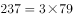，不是质数，不符合题意，因此原十位数字只能为5。

故正确答案为B。

---

### 第 4 题　qid 2376450 · 数学运算

某楼盘的地下停车位，第一次开盘时平均价格为15万元/个；第二次开盘时，车位的销售量增加了一倍、销售额增加了。那么，第二次开盘的车位平均价格为：

- **A**. 10万元/个
- **B**. 11万元/个
- **C**. 12万元/个　✅
- **D**. 13万元/个

**答案**：C

**官方解析**

赋值第一次车位销售量为1，则。根据题意，第二次开盘时，销售量增加了一倍、销售额增加了，可得第二次销售量为，销售额为，则第二次平均价格为。

故正确答案为C。

---

### 第 5 题　qid 2376446 · 数学运算

幼儿园老师设计了一个摸彩球游戏，在一个不透明的盒子里混放着红、黄两种颜色的小球，它们除了颜色不同，形状、大小均一致。已知随机摸取一个小球，摸到红球的概率为三分之一。如果从中先取出3红7黄共10个小球，再随机摸取一个小球，此时摸到红球的概率变为五分之二，那么原来盒中共有红球多少个？

- **A**. 5　✅
- **B**. 10
- **C**. 15
- **D**. 20

**答案**：A

**官方解析**

假设原来盒子中共有个红球，因随机摸取一个小球，摸到红球的概率为，则原来盒子中共有个小球。取出红黄共个小球后，红球剩下个，小球总个数为，此时随机摸取一个小球，摸到红球的概率为，则，解得。

故正确答案为A。

---

### 第 6 题　qid 2376704 · 数学运算

甲、乙两个工程队共同参与一项建设工程。原计划由甲队单独施工30天完成该项工程三分之一后，乙队加入，两队同时再施工15天完成该项工程。由于甲队临时有别的业务，其参加施工的时间不能超过36天，那么为全部完成该项工程，乙队至少要施工多少天？

- **A**. 18　✅
- **B**. 20
- **C**. 24
- **D**. 30

**答案**：A

**官方解析**

根据题意可得，甲队单独完成这项工程需要天，则，得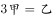，则甲、乙效率之比为，赋值甲的效率为1，乙的效率为3，工程总量为。根据问题，乙队施工天数尽可能少，则甲队施工天数应尽可能多，其最多可为36天，则乙队施工天数至少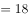天。

故正确答案为A。

---

### 第 7 题　qid 2377412 · 数学运算

一家早餐店只出售粥、馒头和包子。粥有三种：大米粥、小米粥和绿豆粥，每份1元；馒头有两种：红糖馒头和牛奶馒头，每个2元；包子只有一种三鲜大肉包，每个3元。陈某在这家店吃早餐，花了4元钱，假设陈某点的早餐不重样，问他吃到包子的概率是多少？

- **A**. 

　✅
- **B**. 

- **C**. 

- **D**. 
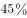

**答案**：A

**官方解析**

花4元且不重样，可能分为3类：

1份馒头两种粥每种1份共有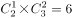种情况；

两种馒头每种1份共有1种情况；

1个包子1份粥共有种，故总的情况有种。

其中吃到包子的情况为1个包子1份粥，有3种，所求概率。

故正确答案为A。

---

### 第 8 题　qid 2376753 · 数学运算

甲、乙两部参加军事演习。甲部从大本营以60千米/小时的速度往西行进，乙部晚半小时由大本营往东行进，速度比甲部慢。两部同时接到军令紧急集合，集合地位于大本营正北某处。此时两部所在位置与集合地恰好构成有一角为30度的直角三角形。若两部同时调整方向往集合地行军，且保持速度不变，则可同时到达集合地。问集合地与大本营的距离约为多少千米？

- **A**. 38
- **B**. 41　✅
- **C**. 44
- **D**. 48

**答案**：B

**官方解析**

根据题意可得右图，

因甲部速度大于乙部且早出发半小时，故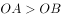，则，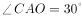。两部同时调整方向可同时到达集合地C，则甲部、乙部速度之比为，则乙部速度为千米/小时。

设乙部从B点到C点行驶时间为，则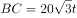，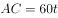，在直角三角形OCB中，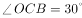，则，同理可得。因甲部比乙部早出发半小时即0.5小时，则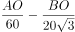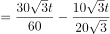，解得小时。，即约为41千米。

故正确答案为B。

---

### 第 9 题　qid 2376465 · 数学运算

某次田径运动会中，选手参加各单项比赛计入所在团体总分的规则为：一等奖得9分，二等奖得5分，三等奖得2分。甲队共有10位选手参赛，均获奖。现知甲队最后总分为61分，问该队最多有几位选手获得一等奖？

- **A**. 3
- **B**. 4
- **C**. 5　✅
- **D**. 6

**答案**：C

**官方解析**

设获得一等奖、二等奖、三等奖的人数分别为、、，根据题意得：，，整理两式，消去得：。

问获得一等奖人数最多，考虑从大到小代入：

代入D项，若，代入，为负且不是整数，排除；

代入C项，若，代入，解得，，符合题意。

故正确答案为C。

---

### 第 10 题　qid 2376448 · 数学运算

一位学生在距离热气球100米处观看它起飞。在热气球起飞后，学生注意到热气球顶部从他的仰角上升到，再从上升到的位置分别用了11秒和17秒。则前后两段时间热气球平均上升速度的比值约为：

- **A**. 0.89　✅
- **B**. 0.91
- **C**. 1.12
- **D**. 1.10

**答案**：A

**官方解析**

如图所示：当仰角为时，在中，

米；当仰角为时，在中， 米；当仰角为时，在中，米。两段时间上升的距离分别为米，米，则两段时间平均上升速度比为。 

故正确答案为A。

---

## 判断推理

### 第 1 题　qid 2376548 · 图形推理

把下面的图形分为两类，使每一类图形都有各自的共同特征或规律，分类正确的一项是：

- **A**. ①③⑤，②④⑥
- **B**. ①④⑥，②③⑤　✅
- **C**. ①④⑤，②③⑥
- **D**. ①②⑥，③④⑤

**答案**：B

**官方解析**

解析一：
本题为分组分类题目。题干均是里面有两条直线的立体图形，可以考虑两条直线之间的关系。观察发现，图①④⑥中两条直线不相交，图②③⑤中两条直线相交，故①④⑥一组，②③⑤一组，只有B项符合。
故正确答案为B。
解析二：
本题为分组分类题目。题干均是里面有两条直线的立体图形，可以考虑两条直线之间的关系。观察发现，图①③⑤中两条直线不垂直，图②④⑥中两条直线垂直，故①③⑤一组，②④⑥一组，只有A项符合。
故正确答案为A。
粉笔说明：方法一的分类更直观，而方法二的知识点在以前有所考查，故本题属于命题不严谨。

---

### 第 2 题　qid 2376760 · 图形推理

把下面的图形分为两类，使每一类图形都有各自的共同特征或规律，分类正确的一项是：

- **A**. ①③⑥，②④⑤
- **B**. ①③⑤，②④⑥
- **C**. ①④⑥，②③⑤　✅
- **D**. ①②④，③⑤⑥

**答案**：C

**官方解析**

元素组成不同，优先考虑属性规律。对称、曲直均无明显规律，考虑开闭性。图①④⑥均为半开半封闭图形；图②③⑤均为全封闭图形。因此①④⑥一组，②③⑤一组。
故正确答案为C。

---

### 第 3 题　qid 2376468 · 图形推理

从所给四个选项中，选择最合适的一个填入问号处，使之呈现一定的规律性：

- **A**. A
- **B**. B
- **C**. C　✅
- **D**. D

**答案**：C

**官方解析**

元素组成不同，且无明显属性规律，考虑数量规律。图四、图五封闭面明显，考虑面数量。面数量依次为2、3、4、5、6，则问号处图形面数量为7，只有C符合要求。
故正确答案为C。

---

### 第 4 题　qid 2376756 · 图形推理

从所给的四个选项中，选择最合适的一个填入问号处，使之呈现一定的规律性：

- **A**. A
- **B**. B　✅
- **C**. C
- **D**. D

**答案**：B

**官方解析**

解析1：元素组成不相同，不相似，优先考虑属性规律。题干均为轴对称图形，且对称轴数量均为3条。A项1条；B项3条；C项2条；D项2条。

故正确答案为B。

注：如上图所示，A项中蓝点处于圆与三角形的切点处，而红点并非处于圆与三角形的切点处，故此图只有1条对称轴，而不是3条。

解析2：元素组成不相同，不相似，优先考虑属性规律。题干有曲线有直线，考虑曲直性，图一为有曲有直图形，图二为全直线图形，图三为有曲有直图形，图四为全直线图形，因此“？”处选择一个有曲有直图形。A项有曲有直，B、C、D三项均为纯直线图形。

故正确答案为A。

解析3：元素组成不相同，不相似，考虑属性和数量规律。题干出现切圆，考虑笔画数，题干图形笔画数依次为2121？，故？处应为2笔画图形，只有D项为2笔画。

故正确答案为D。

本题有多种规律，但从图形特征和命题思路分析，考虑到题干几个图均是等边三角形的变形图，而等边三角形以及其变形图在近几年的考试中多用于考查对称性，故粉笔倾向对称性这一考点。

故正确答案为B。

---

### 第 5 题　qid 2376811 · 图形推理

从所给的四个选项中，选择最合适的一个填入问号处，使之呈现一定的规律性：

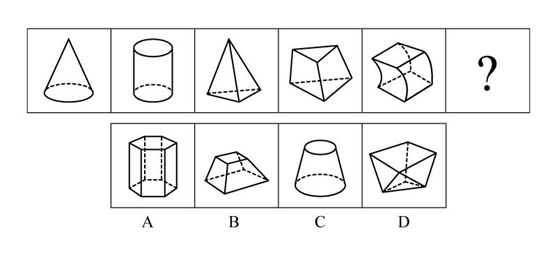

- **A**. A
- **B**. B
- **C**. C
- **D**. D　✅

**答案**：D

**官方解析**

解析一：元素组成不同，属性无明显规律，考虑数量规律。题干均为立体图形，且封闭区域较多，可数立体图形的外表面的面数量，即立体图形的外表面是由几个面构成的，观察发现分别由2、3、4、5、6个面构成，因此“？”处应该选择一个外表面为7的立体图形。A选项8个面，B选项6个面，C选项3个面，D选项7个面。D项当选。
故正确答案为D。
解析二：元素组成不同，属性无明显规律，考虑数量规律。观察发现题干立体图形均有下底面，图一和图二下底面形状相同，图三和图四下底面形状相同，因此“？”处应该选择一个与图五下底面形状相同的图形。B项当选。
故正确答案为B。
因为解析一中数立体图形的外表面的面数量呈现严谨的等差规律，故粉笔对于此题更倾向根据外表面的面数量，选择 D项。

---

### 第 6 题　qid 2376557 · 定义判断

组织认同是指组织成员在行为或观念等诸方面与其所加入的组织具有一致性，觉得自己在组织中既有理性的契约和责任感，也有非理性的归属和依赖感，以及在这种心理基础上表现出的对组织活动尽心尽力的行为结果。
根据上述定义，下列选项不属于组织认同的是：

- **A**. “我们要以共产党员的标准严格要求自己”
- **B**. “公司面临困难的时候，我们要不离不弃”
- **C**. “我要每时每刻自觉维护公司的良好形象”
- **D**. “今日我以母校为傲，明日母校以我为荣”　✅

**答案**：D

**官方解析**

第一步：找出定义关键词。
“组织成员与其所加入的组织具有一致性”、“既有理性的契约和责任感”、“也有非理性的归属和依赖感”、“对组织活动尽心尽力”。
第二步：逐一分析选项。
A项：用共产党员的标准要求自己，体现了党员的行为和观念与党组织的一致性，但说出此话的主体不一定是党员，非党员也可以表达这样的决心，该项主体不明确，可能符合“组织成员与其所加入的组织具有一致性”，保留；
B项：对公司不离不弃，体现了员工对公司的责任感和归属感，符合“既有理性的契约和责任感”、“也有非理性的归属和依赖感”，且面对困难也一直坚守，符合“对组织活动尽心尽力”，符合定义，排除；
C项：自觉维护公司的良好形象，符合“既有理性的契约和责任感”、“也有非理性的归属和依赖感”，符合定义，排除；
D项：学生和母校互相为各自取得的成绩骄傲，母校的定义是曾经在那里毕业或学习过的学校，即此刻已经不是该校的学生了，我们才会称之为“母校”，不符合“组织成员与其所加入的组织具有一致性”；另外学校和学生是教书育人的关系，一般也不会说二者有契约关系，不符合“既有理性的契约和责任感”，跟A项相比，A项可能符合，D项是更不符合的，当选。
本题为选非题，故正确答案为D。

---

### 第 7 题　qid 2376560 · 定义判断

似动是指在一定的时间和空间条件下，人们在静止的物体间看到了运动，或者在没有连续位移的地方，看到了连续位移。
根据上述定义，下列选项不属于似动现象的是：

- **A**. 两岸青山相对出
- **B**. 坐地日行八万里　✅
- **C**. 郡邑浮前浦，波澜动远空
- **D**. 明月却多情，随人处处行

**答案**：B

**官方解析**

第一步：找出定义关键词。
“在一定的时间和空间条件下”、“人们在静止的物体间看到了运动”、“或者在没有连续位移的地方，看到了连续位移”。
第二步：逐一分析选项。
A项：“两岸青山相对出”意思是两岸的青山相继出迎，一座座扑进眼帘。青山本是静止的物体，但是作者却看到了它的运动，符合“人们在静止的物体间看到了运动”，符合定义，排除；
B项：“坐地日行八万里”意思是人们住在地球上，因地球自转，于不知不觉中，一日已行了八万里路。依据科学理论，当我们处于赤道附近的时候，即使每天原地不动，也会运动八万华里，即人没有动，而且也看不见运动。所以不符合“在静止的物体间看到了运动”、“或在没有连续位移的地方，看到了连续位移”，不符合定义，当选；
C项：“郡邑浮前浦，波澜动远空”意思是远处的城郭好像在水面上飘动，波翻浪涌，辽远的天空也仿佛为之摇荡。但是事实上，城郭本身不会运动，天空也不会飘荡，符合“人们在静止的物体间看到了运动”，符合定义，排除；
D项：“明月却多情，随人处处行”意思是明月却是那么多情，不管人走到哪里，它都陪伴着你同行。但是我们用肉眼是看不到明月本身在运动的，所以符合“人们在静止的物体间看到了运动”，符合定义，排除。
本题为选非题，故正确答案为B。

---

### 第 8 题　qid 2376584 · 定义判断

投射性认同指一个人诱导他人以一种限定的方式来作出反应的行为模式。体现在人际关系中，往往是甲方把内心中“好”或“坏”的客体投射到乙方身上，认为乙方“好”或“坏”，而乙方又接受了这一投射幻想，于是就以甲方所设想的方式来对待甲方。然后甲方又进一步验证了自己的假设，认为乙方就是他所认为的那样的人。
根据上述定义，下列选项属于投射性认同的是：

- **A**. 寒门亦可出贵子
- **B**. 严师方能出高徒
- **C**. 虎父果然无犬子　✅
- **D**. 慈母自古多败儿

**答案**：C

**官方解析**

第一步：找出定义关键词。
“甲方把内心中‘好’或‘坏’的客体投射到乙方身上”、“乙方接受这一幻想”、“甲方验证了假设”。
第二步：逐一分析选项。
A项：寒门也可以出贵子，是指出生微贱的年轻人在自身努力和外界条件支持下也可以获得成就，认为寒门可以出贵子，符合“甲方把内心中‘好’或‘坏’的客体投射到乙方身上”，但最终出身寒门的年轻人是否成为了贵子并没有得到验证，不符合“乙方接受这一幻想”、“甲方验证了假设”，不符合定义，排除；
B项：严师方能出高徒，是指严格的师傅或老师能教出本领高超的好徒弟或好学生，认为严师才能出高徒，符合“甲方把内心中‘好’或‘坏’的客体投射到乙方身上”，但该项没有涉及严师的徒弟最后到底是否成为了高徒的验证，不符合“乙方接受这一幻想”、“甲方验证了假设”，不符合定义，排除；
C项：虎父果然无犬子，是指出色的父亲果然不会生出一般的孩子，认为虎父无犬子，符合“甲方把内心中‘好’或‘坏’的客体投射到乙方身上”，且该项中的“果然”体现了虎父的孩子确实不是犬子，体现了进一步验证了自己的假设，符合“乙方接受这一幻想”、“甲方验证了假设”，符合定义，当选；
D项：慈母自古多败儿，是指宠溺孩子的母亲，教出的孩子多是很自私很任性，认为慈母多败儿，符合“甲方把内心中‘好’或‘坏’的客体投射到乙方身上”，但该项没有涉及慈母的儿子最后到底是否是自私任性的人的验证，不符合“乙方接受这一幻想”、“甲方验证了假设”，不符合定义，排除。
故正确答案为C。

---

### 第 9 题　qid 2376577 · 定义判断

关怀强迫症即一个人特别需要别人依赖自己，总是爱向别人提供别人不需要的关怀。并且，这种人还强迫别人接受自己的关怀，从而使别人不能独立。当别人依赖自己的时候，他就会感到满足，感到自己有价值。这种症状会压抑人的神经，并同时给身边的亲朋好友甚至一般的同事带来诸多不便。
根据上述定义，下列属于关怀强迫症的是：

- **A**. 张某说：“我一天没见到儿子就会发疯”
- **B**. 李某连哄带骗让感冒的女儿吃下感冒药
- **C**. 刘某从小学到大学期间都住自己家里
- **D**. 王某在女儿就读的大学附近租房陪读　✅

**答案**：D

**官方解析**

第一步：找出定义关键词。
“需要别人依赖自己”、“提供别人不需要的关怀”、“强迫别人接受”、“使别人不能独立”。
第二步：逐一分析选项。
A项：张某一天没见到儿子就会发疯，说明是张某依赖儿子，而并非是儿子依赖自己，不符合“需要别人依赖自己”，不符合定义，排除；
B项：李某连哄带骗让感冒的女儿吃下感冒药，没有体现“需要别人依赖自己”，且感冒的女儿需要被人关怀照顾，不符合“提供别人不需要的关怀”，不符合定义，排除；
C项：刘某上学期间住在家里，没有体现到强迫别人，不符合“强迫别人接受”，不符合定义，排除；
D项：王某在女儿就读的大学附近租房陪读，女儿已经读大学了，说明她已经能够独立地生活和学习，符合 “提供别人不需要的关怀”、“强迫别人接受”、“使别人不能独立”，符合定义，当选。
故正确答案为D。

---

### 第 10 题　qid 2376786 · 定义判断

投资市场相反理论是指投资市场本身并不创造新的价值，没有增值，甚至可以说是减值。如果一个投资者在投资行动时同多数投资者相同，那么他一定不是获利最大的，因为不可能多数人获利；要获得最大的利益，一定要同多数人的行动不一致。
根据上述定义，下列选项不符合投资市场相反理论的是：

- **A**. “已经跌这么多了，该到底了”　✅
- **B**. “在市场投资者爆满的时候，我们再离场”
- **C**. “只要你和多数投资者的意见相左，致富机会永远存在”
- **D**. “人弃我取，别人恐惧我贪婪”

**答案**：A

**官方解析**

第一步：找出定义关键词。
“投资市场本身并不创造新的价值，没有增值，甚至可以说是减值”、“要获得最大的利益，一定要同多数人的行动不一致”。
第二步：逐一分析选项。
A项：该项只说了投资产品价值的变化，并没有提及投资者人数是多还是少，以及投资者的策略是否相同，不符合定义，选非题，当选；
B项：该项提到在投资者非常多的时候我们再离场，表明我们与大多数投资者的策略是不相同的，符合 “要获得最大的利益，一定要同多数人的行动不一致”，符合定义，选非题，排除；
C项：该项说明投资者在投资时，选择和多数投资者不同的意见就可以成功，这符合“要获得最大的利益，一定要同多数人的行动不一致”，符合定义，选非题，排除；
D项：该项表明“我”和大多数投资者的投资策略是不同的，大家害怕投资失败选择放弃的时候，而“我”为了追求利润会选择购买，符合“要获得最大的利益，一定要同多数人的行动不一致”，符合定义，选非题，排除。
本题为选非题，故正确答案为A。

---

### 第 11 题　qid 2376581 · 定义判断

时间感知扭曲是指对时间不正确的知觉。在生活中，受各种因素影响，人们对时间的感知往往会不符合实际，有时候觉得时间过长，有时候觉得时间太短。许多原因都可以造成时间感知扭曲，现实中一场糟糕的表演会让人如坐针毡、觉得终场遥遥无期，与此相反的是，人们对于美好愉快的时光总嫌太短。
根据上述定义，下列选项不符合时间感知扭曲的是：

- **A**. 一日不见，如三月兮
- **B**. 欢愉嫌夜短，寂寞恨更长
- **C**. 孤馆度日如年，风露渐变
- **D**. 入春才七日，离家已二年　✅

**答案**：D

**官方解析**

第一步：找出定义关键词。
“对时间不正确的知觉”。
第二步：逐一分析选项。
A项：“一日不见，如三月兮”指的是一天没见，就觉得过去了三个月，符合“对时间不正确的知觉”，符合定义，排除；
B项：“欢愉嫌夜短，寂寞恨更长”指的是欢乐时嫌夜里时间短促，寂寞时怨恨夜晚时间漫长，符合“对时间不正确的知觉”，符合定义，排除；
C项：“孤馆度日如年，风露渐变”指的是在驿馆里形单影只，度日如年，秋风和露水都开始变得寒冷，过一天就好像过了一年一样，符合“对时间不正确的知觉”，符合定义，排除；
D项：“入春才七日，离家已二年”指的是入春已经过了七天了，但离开家已经两年了，这是对于时间的客观陈述，不符合“对时间不正确的知觉”，不符合定义，当选。
本题为选非题，故正确答案为D。

---

### 第 12 题　qid 2376571 · 定义判断

意志的活动过程会体现以下两大定律。其中，意志强度边际效应定律是指意志的强度随着自身行为的活动规模的增长而下降；意志强度时间衰减定律是指意志的强度随着自身行为的持续时间的增长而呈现负指数下降。
根据上述定义，下列选项最能体现意志强度时间衰减定律的是：

- **A**. 锲而舍之，朽木不折
- **B**. 为山九仞，功亏一篑
- **C**. 穷且益坚，不坠青云之志
- **D**. 一鼓作气，再而衰，三而竭　✅

**答案**：D

**官方解析**

第一步：找出定义关键词。
意志强度边际效应定律：“意志强度”、“随自身行为的活动规模增长而下降”；
意志强度时间衰减定律：“意志强度”、“随自身行为的持续时间增长而呈现负指数下降”。
第二步：逐一分析选项。
A项：“锲而舍之，朽木不折”意思是说如果不坚持做一件事，就算是腐朽的木头也无法折断，说明人们不坚持做一件事的后果，不符合“随自身行为的持续时间增长”，不符合定义，排除；
B项：“为山九仞，功亏一篑”意思是说堆九仞高的山，只缺一筐土导致不能完成，是用来比喻做事情只差最后一点没能完成，说明没有一直坚持下去，不符合“随自身行为的持续时间增长”，不符合定义，排除；
C项：“穷且益坚，不坠青云之志”意思是说一个人处境越是艰难，就越是坚忍不拔，越是不丢失高远之志，没有体现与时间增长的关系，不符合“随着自身行为的持续时间的增长而呈现负指数下降”，不符合定义，排除；
D项：“一鼓作气，再而衰，三而竭”意思是说，第一次击鼓士气会大大的增加，第二次击鼓士气就会减弱了，第三次击鼓就没有士气了，说明士气随着时间的增加而减弱，符合“随时间增长而呈现负指数下降”，符合定义，当选。
故正确答案为D。

---

### 第 13 题　qid 2376789 · 定义判断

类脑计算技术总体分为三个层次：结构层次模仿脑、器件层次逼近脑、智能层次超越脑。其中，结构层次模仿脑是指将大脑作为一个物质和生理对象进行解析，获得基本单元(各类神经元和神经突触等)的功能及其连接关系（网络结构）；器件层次逼近脑是指研制能够模拟神经元和神经突触功能的器件，从而在有限的物理空间和功耗条件下构造出人脑规模的神经网络系统；智能层次超越脑是指通过对类脑计算机进行信息刺激、训练和学习，使其产生与人脑类似的智能。
根据上述定义，下列属于智能层次超越脑的是：

- **A**. 调整神经网络的突触连接关系及连接频率和强度　✅
- **B**. 绘制精确的人类大脑动态图谱以解析探测大脑
- **C**. 开发功能、密度与人类大脑皮层相当的电子装备
- **D**. 捕捉细微的单个神经元放电的非线性动力学过程

**答案**：A

**官方解析**

第一步：找出定义关键词。
结构层次模仿脑：“将大脑作为物质和生理对象进行解析”、“获得基本单元的功能及其连接关系”；
器件层次逼近脑：“研制能够模拟神经元和神经突触功能的器件”、“构造出人脑规模的神经网络系统”；
智能层次超越脑：“对类脑计算机进行信息刺激、训练和学习”、“产生与人脑类似的智能”。
第二步：逐一分析选项。
A项：调整神经网络的突触连接关系及连接频率和强度，符合“对类脑计算机进行信息刺激、训练和学习” ，符合“智能层次超越脑”定义，当选；
B项：绘制精确的人类大脑动态图谱，符合“将大脑作为物质和生理对象进行解析”，符合“结构层次模仿脑”定义，不符合“智能层次超越脑”定义，排除；
C项：开发功能、密度与人类大脑皮层相当的电子装备，符合“研制能够模拟神经元和神经突触功能的器件”，符合“器件层次逼近脑”定义，不符合“智能层次超越脑”定义，排除；
D项：捕捉细微的单个神经元放电的非线性动力学过程，符合“获得基本单元的功能及其连接关系”，符合“结构层次模仿脑”定义，不符合“智能层次超越脑”定义，排除。
故正确答案为A。
注：本题目来自于《类脑计算机的现在与未来》，各选项对应于该文章中的句子如下所示：
A项：所谓“智能层次超越脑”，属于类脑计算机应用软件层次的问题，是指通过对类脑计算机进行信息刺激、训练和学习，使其产生与人脑类似的智能甚至涌现出自主意识，实现智能培育和进化。刺激源可以是虚拟环境，也可以是来自现实环境的各种信息（例如互联网大数据）和信号（例如遍布全球的摄像头和各种物联网传感器），还可以是机器人“身体”在自然环境中探索和互动。在这个过程中，类脑计算机能够调整神经网络的突触连接关系及连接强度，实现学习、记忆、识别、会话、推理以及更高级的智能；
B项：所谓“结构层次模仿脑”，是将大脑作为一个物质和生理对象进行解析，获得基本单元（各类神经元和神经突触等）的功能及其连接关系（网络结构）；
C项：所谓“器件层次逼近人脑”，是指研制能够模拟神经元和神经突触功能的微纳光电器件，从而在有限的物理空间和功耗条件下构造出人脑规模的神经网络系统。这方面的代表性项目是美国国防部先进研究项目局（DARPA）2008年启动的“神经形态自适应可塑性可扩展电子系统”（即突触），其目标是研制出器件功能、规模与密度均与人类大脑皮层相当的电子装置；
D项：所谓“结构层次模仿脑”，是将大脑作为一个物质和生理对象进行解析，获得基本单元（各类神经元和神经突触等）的功能及其连接关系（网络结构）。这一阶段，主要通过神经科学实验采用先进的分析探测技术完成。1952年，英国科学家霍奇金和赫胥黎提出了以两人命名的HH方程，精确刻画了单个神经元放电的非线性动力学过程，这是神经元信息处理的标准数学模型。

---

### 第 14 题　qid 2376565 · 定义判断

消费滞后是指个人消费滞后于国家经济发展和个人家庭收入所应达到的平均消费水平。消费超前是指当下的收入水平不足以购买现在所需的产品或服务，以贷款、分期付款、预支等形式进行消费。
根据上述定义，下列属于消费超前的是：

- **A**. 职员小王以信用卡支付的形式在网上订购了火车票
- **B**. 大学生小李通过某借贷平台购买了某知名品牌电脑　✅
- **C**. 退休工人老张名下有商品房和汽车，但坚持只用老式的直板手机
- **D**. 青年教师小刘有十万元定期存款未到期，向同事借了八万元买车

**答案**：B

**官方解析**

第一步：找出定义关键词。
消费滞后：“指个人消费滞后于国家经济发展和个人家庭收入所应达到的平均消费水平”；
消费超前：“指当下的收入水平不足以购买现在所需的产品或服务”、“以贷款、分期付款、预支等形式进行消费”。
第二步：逐一分析选项。
A项：小王为职员说明小王已经工作，购买火车票应该是消费水平范围内，不符合“当下的收入水平不足以购买现在所需的产品或服务”，不符合定义，排除；
B项：小李是一名大学生，尚未参加工作，购买电脑符合“当下的收入水平不足以购买现在所需的产品或服务”，且通过“某借贷平台购买”属于“贷款”的支付方式，符合定义，当选；
C项：老张有房有车，却使用老式的直板手机，符合“个人消费滞后于国家经济发展和个人家庭收入所应达到的平均消费水平”，属于消费滞后，不属于消费超前，不符合定义，排除；
D项：小刘有十万元的存款，而车只有八万元，也就是当下的收入足以购买现在所需的产品，不符合“当下的收入水平不足以购买现在所需的产品或服务”，且向同事借钱不符合“以贷款、分期付款、预支等形式进行消费”，不符合定义，排除。
故正确答案为B。

---

### 第 15 题　qid 2376587 · 定义判断

水文节律指湖泊水情周期性、有节律的变化。广义水文节律包括昼夜、月运、季节和年际节律。正常情况下，由于流域气候和下垫面等因素较稳定，湖泊多年平均水位趋于稳定数值即湖泊正常年平均水位。所以湖泊年际节律以干扰因素驱动的突变性和适应干扰后的阶段稳定性为特点，无渐变趋向；而昼夜节律对生态系统影响微弱。因此，狭义水文节律特指月运节律与季节节律。
根据上述定义，下列涉及狭义水文节律的是：

- **A**. 
鄱阳湖受降雨持续减少和来水减少双重影响，水面面积持续萎缩

- **B**. 
洪泽湖历史年均水温，最高水温在9月，最低水温在1月
　✅
- **C**. 
洞庭湖去年年降水量1560毫米，其中4~6月降水约占全年一半

- **D**. 
巢湖流域年平均气温稳定在之间，有200天以上无霜期

**答案**：B

**官方解析**

第一步：找出定义关键词。
水文节律：“湖泊水情周期性、有节律的变化”；
广义水文节律：“昼夜、月运、季节和年际节律”；
狭义水文节律：“月运节律和季节节律”。
（注：水情是指江河湖泊的状况、特征及地理意义，如流量、水位、流速、水温与冰情等）
本题要选的是符合狭义水文节律的选项。
第二步：逐一分析选项。
A项：鄱阳湖水面面积持续萎缩，说明是一直在减小，不存在周期性的变化，不符合定义，排除；
B项：洪泽湖历史年均最高水温在9月，最低水温在1月，月份和季节不同水温也不同，而且是统计了历史上多年的水温，符合“湖泊水情周期性、有节律的变化”，符合“季节节律”，符合狭义水文节律，符合定义，当选（水情指江河湖泊的状况、特征及地理意义，如流量、水位、流速、水温与冰情等，水温是水文测验的基本项目之一）；
C项：只是给出洞庭湖去年一年的降水量，没有体现“周期性、有节律的变化”，不符合定义，排除；
D项：巢湖流域平均气温在15-16摄氏度之间，有200天以上无霜期，是湖泊流经区域的气温变化，而不是湖泊水情的变化，不符合定义，排除。
故正确答案为B。

---

### 第 16 题　qid 2376572 · 类比推理

孤本：书籍

- **A**. 正方形：长方形　✅
- **B**. 蔬菜：土地
- **C**. 显微镜：实验室
- **D**. 礼物：商品

**答案**：A

**官方解析**

第一步：判断题干词语间逻辑关系。
孤本，指某书刊仅有一份在世间流传的版本，亦指仅存的一份未刊手稿或原物已亡佚，仅存的一份拓本。孤本是特殊的书籍。
第二步：判断选项词语间逻辑关系。
A项：正方形是特殊的长方形，与题干逻辑关系一致，当选；
B项：蔬菜和土地，土地是蔬菜生长的场所，与题干逻辑关系不一致，排除；
C项：显微镜和实验室，显微镜是实验室需要用到的工具，与题干逻辑关系不一致，排除；
D项：有的礼物是商品，有的礼物不是商品，有的商品是礼物，有的商品不是礼物，二者为交叉关系，与题干逻辑关系不一致，排除。
故正确答案为A。

---

### 第 17 题　qid 2376537 · 类比推理

玻璃幕墙：光污染

- **A**. 汽车尾气：酸雨　✅
- **B**. 海上风暴：海啸
- **C**. 火山喷发：地震
- **D**. 空气消毒：臭氧

**答案**：A

**官方解析**

第一步：判断题干词语间逻辑关系。
玻璃幕墙可以导致光污染，二者是因果关系，并且玻璃幕墙是人为产物。
第二步：判断选项词语间逻辑关系。
A项：汽车尾气可以导致酸雨，二者为因果关系，并且汽车尾气是人为产物，与题干逻辑关系一致，当选；
B项：海上风暴可以导致海啸，二者为因果关系，但海上风暴为天然现象，与题干逻辑关系不一致，排除；
C项：火山喷发可以导致地震，二者为因果关系，但火山喷发为天然现象，与题干逻辑关系不一致，排除；
D项：空气消毒不会导致臭氧，二者不是因果关系，与题干逻辑关系不一致，排除。
故正确答案为A。

---

### 第 18 题　qid 2376531 · 类比推理

拥挤：水泄不通

- **A**. 清晰：洞见肺腑
- **B**. 严重：触目惊心
- **C**. 费力：举重若轻
- **D**. 伤心：肝肠寸断　✅

**答案**：D

**官方解析**

第一步：判断题干词语间逻辑关系。
水泄不通形容拥挤或包围的非常严密，与拥挤是近义关系。
第二步：判断选项词语间逻辑关系。
A项：洞见肺腑是指很清楚地看见人的内心，形容襟怀坦白，待人诚恳。与清晰不是近义关系，与题干逻辑关系不一致，排除；
B项：触目惊心是指看见某种严重情况而内心震惊，形容事态严重，引起轰动，该词强调的是震惊，与严重不是近义关系，与题干逻辑关系不一致，排除；
C项：举重若轻是比喻能力强，能够轻松地胜任繁重的工作或处理困难的问题。与费力不是近义关系，与题干逻辑关系不一致，排除；
D项：肝肠寸断是比喻伤心到极点，与伤心是近义关系，与题干逻辑关系一致，当选。
故正确答案为D。

---

### 第 19 题　qid 2376575 · 类比推理

老字号：新品牌：传承

- **A**. 老传统：新花样：质疑
- **B**. 老配方：新工艺：创新　✅
- **C**. 老问题：新思考：评价
- **D**. 老物件：新东西：区分

**答案**：B

**官方解析**

第一步：判断题干词语间逻辑关系。
老字号经过传承可以变为新品牌。
第二步：判断选项词语间逻辑关系。
A项：老传统被质疑不能变为新花样，与题干逻辑关系不一致，排除；
B项：老配方经过创新可以变为新工艺，与题干逻辑关系一致，当选；
C项：老问题被评价不能变为新思考，与题干逻辑关系不一致，排除；
D项：老物件被区分不能变为新东西，与题干逻辑关系不一致，排除。
注：此题有同学可能会纠结D项，认为老字号与新品牌都是品牌，老物件与新东西都是物品。但D项前两个词与区分无关。从题干三个词的关系看体现了新老物体之间的变化，而B项也是体现了新老事物之间的变化，因此粉笔更倾向于B项。
故正确答案为B。

---

### 第 20 题　qid 2376820 · 类比推理

巾帼 之于 （    ） 相当于 （    ） 之于 监狱

- **A**. 须眉；囚犯
- **B**. 英雄；犯罪
- **C**. 女子；铁窗　✅
- **D**. 头饰；惩罚

**答案**：C

**官方解析**

逐一代入选项。
A项：巾帼原指古代妇女的头巾和发饰，也借指妇女、女子，须眉指代男子，巾帼和须眉是并列关系；囚犯关押于监狱之中，二者是人物和场所的对应关系。前后逻辑关系不一致，排除；
B项：巾帼和英雄是交叉关系；犯罪之后可能会囚禁在监狱里，犯罪和监狱是对应关系。前后逻辑关系不一致，排除；
C项：巾帼原指古代妇女的头巾和发饰，也借指妇女、女子；铁窗是装上铁栅的窗户，比喻象征监狱。前后逻辑关系一致，当选；
D项：巾帼原指古代妇女的头巾和发饰，与头饰属于种属关系；惩罚与监狱无明显逻辑关系。前后逻辑关系不一致，排除。
故正确答案为C。

---

### 第 21 题　qid 2376564 · 逻辑判断

快速、持续、无法预测的竞争环境要求企业规模小，结构简化，同时要有足够的技术储备和抵抗资金风险的能力。目前解决这一矛盾的途径通常是建立全球范围内的“基于双赢原则”的虚拟企业。虚拟企业是企业间的一种动态联盟，参加虚拟企业的各成员企业有一定的自主权。当出现了市场机会，各加盟企业就组织在一起，共同开发并生产销售新产品，一旦发现该产品无利可图，便自动解散。因此，虚拟企业被认为是21世纪最有竞争力的企业运行模式。
以下哪项如果为真，最能支持上述观点？

- **A**. 当今社会发达的现代信息技术和通讯手段为各企业间的沟通提供了便利
- **B**. 企业想在当前的竞争环境中生存发展扩大优势，需要一种新的运行模式
- **C**. 虚拟企业中的任一加盟企业生产上出现问题都会中断整个生产链的运行
- **D**. 虚拟企业可迅速集中最强设计加工与销售力量，实现对市场的快速反应　✅

**答案**：D

**官方解析**

第一步：找出论点和论据。
论点：虚拟企业被认为是21世纪最有竞争力的企业运行模式。
论据：当出现了市场机会，各加盟企业就组织在一起，共同开发并生产销售新产品，一旦发现该产品无利可图，便自动解散。
论点论据都在说虚拟企业的优势，话题一致，优先考虑补充论据，补充能够证明虚拟企业是最有竞争力的企业运营模式的理由进行加强。
第二步：逐一分析选项。
A项：现代发达的信息技术为各企业之间的沟通提供便利，但是提供便利不代表就有竞争力，话题不一致，无法加强，排除；
B项：企业想在竞争环境中生存发展扩大优势，需要新的运行模式，但新的运行模式是否指的是虚拟企业不清楚，无法加强，排除；
C项：虚拟企业中的任一加盟企业生产出现问题都会中断整个生产链的运行，说的是虚拟企业的缺点，但有缺点不代表没有竞争力，虚拟企业是否是最有竞争力的企业运行模式未知，话题不一致，无法加强，排除；
D项：虚拟企业能够快速集中最强的力量做出最快的反应，说明虚拟企业的优势，并且力量最强，速度最快，也可说明虚拟企业是最有竞争力的运营模式，补充论据，可以加强，当选。
故正确答案为D。

---

### 第 22 题　qid 2376559 · 逻辑判断

近年来，意大利面被冠上导致肥胖的坏名声，因此很多人在面对这种地中海饮食时，都抱有一种又恨又爱的纠结心情。然而，意大利地中海神经病学研究所通过对2.3万人的研究发现，意大利面不像很多人想象的那样会导致体重增加。而且，意大利面非但不会导致肥胖，还可以起到相反的效果——降低体脂率。研究结果显示，如果人们能够适量摄入，并保证饮食多样性，意大利面对人们的身体健康大有裨益。
以下哪项如果为真，最能支持上述结论？

- **A**. 面条中所含碳水化合物是导致肥胖的重要因素
- **B**. 没有研究显示意大利面会导致人群肥胖率上升
- **C**. 地中海饮食采用的橄榄油对身体健康大有益处
- **D**. 酌量食用意大利面能够维持人们理想的体脂率　✅

**答案**：D

**官方解析**

第一步：找出论点和论据。
论点：如果人们能够适量摄入，并保证饮食多样性，意大利面对人们的身体健康大有裨益。
论据：意大利地中海神经病学研究所通过对2.3万人的研究发现，意大利面不像很多人想象的那样会导致体重增加。而且，意大利面非但不会导致肥胖，还可以起到相反的效果——降低体脂率。
本题论点论据讨论的都是意大利面和身体健康的关系，讨论话题一致，优先考虑补充论据，补充能够证明意大利面饮食多样，适量摄入，可以对身体健康有好处的理由。
第二步：逐一分析选项。
A项：虽然面条中碳水化合物是导致肥胖的重要因素，但是如果适量摄入意大利面，并保证饮食多样性，是否对人们身体健康有好处不确定，无法加强，排除；
B项：没有研究显示意大利面会导致人群肥胖率上升，不代表吃意大利面就会对身体有好处，如果适量摄入，并保证饮食多样性，是否对身体健康有好处不确定，话题不一致，无法加强，排除；
C项：选项说的是地中海饮食对健康有好处，论点说的是意大利面和健康之间的关系，话题不一致，无法加强，排除；
D项：酌量食用意大利面可以维持理想的体脂率，而体脂率理想代表着身体健康，说明适量摄入意大利面，确实对人身体健康有好处，可以加强，当选。
故正确答案为D。

---

### 第 23 题　qid 2376554 · 逻辑判断

长久以来，心理学家都支持“数学天赋论”：数学能力是人类自打娘胎里出来就有的能力，就连动物也有这种能力。他们认为存在一种天生的数学内核，通过自我慢慢发展，这种数学内核最后会“长”成我们所熟悉的一切数学能力。最近有反对者提出了不同的看法：数学能力没有天赋，只能是文化的产物。
以下哪项如果为真，最能支持反对者的看法？

- **A**. 10~12个月的婴儿已经知道3个黑点和4个黑点是不一样的
- **B**. 数学是大脑的产物，而大脑的生长模式早已由基因“预设”
- **C**. 经过人为训练的大猩猩、海豚和大象等动物能处理数学问题
- **D**. 绝大多数的原始部落的居民只能表示5以下甚至更少的数量　✅

**答案**：D

**官方解析**

第一步：找出论点和论据。
论点：数学能力没有天赋，只能是文化的产物。
论据：无。
本题只有论点，没有论据，所以优先考虑补充论据的方式来加强。
第二步：逐一分析选项。
A项：说明婴儿可以区分数量不同的黑点，举例说明数学能力是有天赋的，否定论点，无法加强，排除；
B项：说明数学是大脑的产物，大脑已被基因预设，也就是说数学是有天赋的，否定论点，无法加强，排除；
C项：指出部分动物经过训练能处理数学问题，但是并不知道其是否有数学能力的天赋，不明确选项，无法加强，排除； 
D项：说明绝大多数的原始部落的居民只能表示5甚至以下的数字，通过举例子的方式说明数学能力确实是文化的产物，补充论据，可以加强，当选。
故正确答案为D。

---

### 第 24 题　qid 2376761 · 逻辑判断

下列动物如果都只能归属一种门类，并且满足以下条件：
（1）如果动物B不是鸟，那么动物A是哺乳动物
（2）或者动物C是哺乳动物，或者动物A是哺乳动物
（3）如果动物B不是鸟，那么动物D不是鱼
（4）或者动物D是鱼，或者动物E不是昆虫
（5）如果动物E不是昆虫，那么动物B不是鸟
以下哪项如果为真，可以得出“动物C是哺乳动物”的结论？

- **A**. 动物D不是鱼
- **B**. 动物E是昆虫　✅
- **C**. 动物B不是鸟
- **D**. 动物A是哺乳动物

**答案**：B

**官方解析**

题干条件只有（2）与动物C有关，（2）条件为：动物C是哺乳动物或动物A是哺乳动物；
根据否一推一，想要得出“动物C是哺乳动物”的结论，必须得到动物A不是哺乳动物；
则根据（1），如果动物B不是鸟，得到动物A是哺乳动物，则无法推出“动物C是哺乳动物”的结论，因此须满足动物B是鸟；
根据（5），如果动物E不是昆虫，则动物B不是鸟，无法推出结论，因此必须满足E是昆虫。
故正确答案为B。

---

### 第 25 题　qid 2376576 · 逻辑判断

信天翁属于鹱形目，有着管状的鼻子，嗅觉灵敏，经常为了觅食在外海上长距离飞行。那些漂浮在海上的塑料垃圾看起来并非美味，可信天翁为什么会吃下它们，并为此付出沉重代价呢？研究人员认为原因在于：对于信天翁而言，这些塑料垃圾闻起来“很好吃”。“美食信号”是一种名叫二甲基硫醚（DMS）的化学物质，这种气味物质在海洋浮游植物的作用下产生。
以下哪项如果为真，无法支持研究人员的观点？

- **A**. 鹱形目鸟类当中有一部分物种常聚集在海洋浮游植物丰盛的地方
- **B**. 误食塑料垃圾会导致海鸟行动不便、消化道阻塞，健康慢性受损　✅
- **C**. 实验证明在海中浸泡三周后的塑料样品上都检测到了DMS成分
- **D**. 对DMS气味敏感的鹱形目鸟类可以探测到浓度极低的气味分子

**答案**：B

**官方解析**

第一步：找出论点和论据。
论点：信天翁吃塑料垃圾，是因为它们闻起来“很好吃”。
论据：“美食信号”是二甲基硫醚（DMS），这种气味物质在海洋浮游植物的作用下产生。
本题为选非题，需将三个能够加强的选项排除。论点说的是塑料垃圾闻起来“好吃”，论据在解释为什么闻起来“好吃”，论点论据说的是一回事，所以可以补充论据来加强。
第二步：逐一分析选项。
A项：讨论的是这类鸟中，有一部分聚集在海洋浮游植物丰盛的地方，而海洋浮游植物会产生“美食信号”，让鸟类闻起来“很好吃”，所以解释了题干的论点，可以加强，排除；
B项：讨论的是误食塑料垃圾会给海鸟带来的不良后果，与题干讨论的为什么垃圾闻起来“好吃”没有关系，不能加强，当选；
C项：说明塑料垃圾经过海水的浸泡会产生DMS，解释了为什么信天翁闻着塑料垃圾会觉得“很好吃”，可以加强，排除；
D项：如果鹱形目鸟类不能探测到浓度极低的气味分子，那就不会去吃那些垃圾，该项是论点成立的必要条件，可以加强，排除。
本题为选非题，故正确答案为B。

---

### 第 26 题　qid 2376594 · 逻辑判断

如今，基于互联网的新型科普方式层出不穷。浅阅读、视频直播以及游戏互动等方式，使得如今获取科学知识的渠道越来越多、门槛也越来越低。研究者认为，尽管“互联网+科普”令科学知识的获取和传播方式发生了很大变化，但这不是对科普传播的一种颠覆，而是显示了公民科学素养的提升。
以下哪项如果为真，最能质疑研究者的观点？

- **A**. 新闻应用、微博等资讯类媒体是用户了解科学热点事件的最主要渠道
- **B**. 在许多科学热点事件的传播过程中，公众很难见到权威科学家的身影　✅
- **C**. 数据表明，用户普遍乐于通过图文资讯这样轻松愉悦的形式获取知识
- **D**. 比起明星八卦，在社交媒体转发科普内容更能为转发者本人形象加分

**答案**：B

**官方解析**

第一步：找出论点和论据。

论点：“互联网科普”不是对科普传播的一种颠覆，而是显示了公民科学素养的提升。

论据：无。

本题无论据，只能通过直接否论点进行削弱。可以说 “互联网科普”是对科普传播的一种颠覆，并没有显示出公民科学素养的提升。

第二步：逐一分析选项。

A项：该项说的是用户获取知识的最主要渠道是哪些，而论点说的是互联网传播科学知识是否会让公民科学素养的提升，与论点话题不一致，无法削弱，排除；

B项：该项说很难见到权威科学家的身影，说明公众接触到的科学知识是并不权威的，即科学素养没有提升，直接否定题干论点，当选；

C项：该项说的是用户喜欢用图文资讯的方式获取知识，而论点说的是互联网传播知识是否会让公民科学素养提升，话题不一致，无法削弱，排除；

D项：该项说的是转发科普内容会使转发者形象加分，说明比起转发明星八卦，公众对于转发科普内容的人评价更高，显示出公众更重视科学，即显示了公众科学素养的提升，属于加强，不能削弱，排除。

故正确答案为B。

注：本题通过查询原文，如下图所示，张谦女士提出了观点“互联网+科普”不是对科普传播的一种颠覆，而是有利于公民科学素养的提升。后面的便开始分析提出这个观点的原因，所以在此题中D项是加强项，而非削弱项。

 

---

### 第 27 题　qid 2376568 · 逻辑判断

在抗生素大规模医用之前，耐药效果对细菌几乎没有意义，突变自身的有害效果更加重要。正常使用抗生素能杀死几乎所有的目标细菌，个别漏网之鱼通常也会被人体免疫系统消灭殆尽。其中一些细菌个体虽然已经带有耐药性的萌芽，但这些萌芽不足以抵御正常剂量抗生素，也会随着个体死去而消失。
由此可以推出：

- **A**. 基因突变是耐药细菌泛滥成灾的根本原因
- **B**. 细菌通过基因突变，来削弱抗生素的作用效果
- **C**. 致病菌产生耐药性之后，抗生素将无法攻击病菌
- **D**. 如果没有抗生素滥用，耐药性不会快速蔓延开来　✅

**答案**：D

**官方解析**

日常结论题，根据题干信息逐一分析选项。
A项：题干中没有涉及到耐药细菌泛滥成灾的根本原因，无中生有，排除；
B项：题干只说到“细菌突变自身的有害效果”，没有明确说明是否是基因突变，无中生有，排除；
C项：题干中指出有耐药性的细菌个体不足以抵御正常剂量抗生素，说明抗生素还是会去攻击病菌，并不是选项中表述的无法攻击病菌，排除；
D项：根据第一句可知，抗生素大规模使用之前，耐药性对细菌几乎没有意义，说明如果没有抗生素滥用，耐药性就不会快速蔓延，当选。
故正确答案为D。

---

### 第 28 题　qid 2376555 · 逻辑判断

自制力不仅关乎自我控制，还包括排除不相关刺激的干扰和坚持完成相关任务（即使是自己不喜欢的任务）的能力。自制力是稳定不变的，还是会被消耗的，学界各派的看法不一。心理学家把实验对象分为两组，让他们同场解决难题。一组解题时只能吃萝卜，另一组还可以吃饼干。结果只吃萝卜的这组坚持时间更短，因为他们在抵制饼干的诱惑的同时，消耗了自制力。他们由此得出结论：人们的自制力是有限的，过度使用会导致自制力下降。
上述结论的成立需要补充以下哪项作为前提？

- **A**. 实验对象对解决难题的兴趣不完全相同
- **B**. 饼干和萝卜对实验对象的诱惑力不相同　✅
- **C**. 饼干和萝卜补充人体能量的效果不相同
- **D**. 两组实验对象抗干扰的能力不完全相同

**答案**：B

**官方解析**

第一步：找出论点和论据。
论点：人们的自制力是有限的，过度使用会导致自制力下降。
论据：心理学家把实验对象分为两组，让他们同场解决难题。一组解题时只能吃萝卜，另一组还可以吃饼干。结果只吃萝卜的这组坚持时间更短，因为他们在抵制饼干诱惑的同时，消耗了自制力。
论据和论点话题一致，且问题为“前提”，优先考虑必要条件。
第二步：逐一分析选项。
A项：实验对象对于解决问题的兴趣不同，说明实验起点不一致，并不知道过度使用自制力是否会消耗自制力，无法加强，排除；
B项：饼干和萝卜对人们的诱惑力不同，如果相同的话，那么就无法通过对比饼干和萝卜得到抵制饼干的诱惑会消耗自制力，是论证成立的前提，当选；
C项：饼干和萝卜对人体的能量补充的效果，与题干论点无关，为无关选项，无法加强，排除； 
D项：实验对象抗干扰能力不同，说明实验起点不一致，并不知道过度使用自制力是否会消耗自制力，无法加强，排除。
故正确答案为B。

---

### 第 29 题　qid 2376591 · 逻辑判断

有研究声称：癌细胞怕热，高体温可以抗癌。人体最容易罹癌的器官包括肺、胃、大肠、乳腺等都是体温较低的部位，心脏之类的“高温器官”不容易得癌症。因此，可以用运动、喝热水、泡澡等方法提高体温来抗癌。
以下哪项如果为真，最能反驳上述论断？

- **A**. 受呼吸、饮食等影响，人的口腔温度一般比直肠温度低，而世界范围内直肠癌的发生率要高于口腔癌　✅
- **B**. 人的体温存在精准的调控机制，基本保持平稳状态，体内各个脏器之间并没有什么明显的温度差异
- **C**. 热疗或许可以帮助放疗或一些化疗发挥更好的作用，但证明其可靠性的研究数据依然不足
- **D**. 心脏很少发生恶性肿瘤，是因为这里的心肌细胞不再进行分裂增殖，而与温度高低无关

**答案**：A

**官方解析**

第一步：找出论点和论据。
论点：可以用运动、喝热水、泡澡等方法提高体温来抗癌。
论据：人体最容易罹癌的器官包括肺、胃、大肠、乳腺等都是体温较低的部位，心脏之类的“高温器官”不容易得癌症。
本题的论点指出提高体温抗癌的方法，论据中也是在说“高温器官”不容易得癌症，所以论点、论据讨论话题一致，要想削弱优先考虑否定论点。
第二步：逐一分析选项。
A项：人的口腔温度一般比直肠温度低，而世界范围内直肠癌的发生率要高于口腔癌，说明直肠温度高，直肠癌发生率高，提高体温并不能抗癌，举反例削弱题干论点，保留；
B项：选项指出体内各个脏器之间并没有明显温度差异，那么肺、胃、大肠、乳腺等就不是体温“较低”的部位，也就没有“高温器官”之说，可以削弱题干论据，保留；
C项：热疗或许可以发挥更好的作用，但证明其可靠性的研究数据依然不足，因此不确定提高体温是否真的有利于抗癌，属于不明确选项，排除；
D项：指出心脏很少发生恶性肿瘤，是因为心肌细胞不再分裂增殖，而与温度高低无关，可以削弱题干论据，保留。
对比ABD三项，A项削弱论点的力度强于B项和D项的削弱论据。
故正确答案为A。

---

### 第 30 题　qid 2376790 · 逻辑判断

某国际古生物学研究团队最新报告称，在2.8亿年前生活在南非的正南龟是现代乌龟的祖先，它们是在二叠纪至三叠纪大规模物种灭绝事件中幸存下来的。当时，为了躲避严酷的自然环境，它们努力向地下挖洞，同时为保证前肢的挖掘动作足够有力，身体需要一个稳定的支撑，从而导致了肋骨不断加宽。由此可知，乌龟有壳是适应环境的表现，只不过不是为了保护，而是为了向地下挖洞。
上述结论的成立需要补充以下哪项作为前提？

- **A**. 只有挖洞才能从大规模物种灭绝事件中幸存
- **B**. 现代乌龟继承了正南龟善于挖洞的某些习性
- **C**. 正南龟前肢足够有力因而并不需要龟壳保护
- **D**. 龟壳是由乌龟的肋骨逐渐加宽后进化而来的　✅

**答案**：D

**官方解析**

第一步：找出论点和论据。
论点：乌龟有壳是适应环境的表现，只不过不是为了保护，而是为了向地下挖洞。
论据：为了躲避严酷的自然环境，它们努力向地下挖洞，同时为保证前肢的挖掘动作足够有力，身体需要一个稳定的支撑，从而导致了肋骨不断加宽。
问前提，优先考虑搭桥。论点讨论的是乌龟有壳是为了向地下挖洞，论据讨论的是为了适应环境，导致了乌龟的肋骨不断加宽，论点论据讨论的不是一回事，在论点论据之间进行搭桥，可以说明肋骨加宽和有壳之间的关系。
第二步：逐一分析选项。
A项：讨论的是如何在大规模物种灭绝事件中幸存，没有说明龟壳与肋骨加宽之间的关系，无法加强，排除；
B项：讨论的是现代乌龟所继承的习性，没有说明龟壳与肋骨加宽之间的关系，无法加强，排除；
C项：只解释了正南龟的龟壳不是起到保护的作用，但没有说明龟壳与肋骨加宽之间的关系，没有搭桥，排除；
D项：说明龟壳是由肋骨加宽后进化而来的，在论点论据之间搭桥，当选。
故正确答案为D。

---

## 资料分析

### 材料 1

根据以下资料，回答下列问题。

        2014年我国实施“单独两孩”生育政策，出生人口1687万人，比上年增加47万人。2016 年实施“全面两孩”生育政策，出生人口1786万人，比上年增加131万人；出生率与“十二五”时期年平均出生率相比，提高了0.84个千分点。2017 年我国出生人口1723万人，虽然比上年减少63万人，但比“十二五”时期年平均出生人口多出79万人；出生率为，比上一年降低0.52个千分点。2017年二孩数量进一步上升至883万人，二孩占全部出生人口的比重达到，比2016年的占比提高了11个百分点。

        2017年出生人口最多的省份是山东，出生人口174.98万人，但是比2016年减少2.08万人。广东和河南出生人口也超过百万，其中广东出生人口151.63万人，同比增加22.18万人；河南出生人口140.13 万人，较上年减少2.48万人。此外，出生人口排名前十的省份依次还有河北、四川、湖南、安徽、广西、江苏、湖北。其中，河北、四川、湖南出生人口超90万人，湖北最少，为74.26万人。

        从人口增量来看，2017年广东出生人口增量最大，出生人口较2016年增加22.18万人。安徽、四川、河北出生人口增量超过5万，此外，江苏、湖南、山东、河南出生人口较2016年有所减少。其中，河南减少最多，出生人口减少2.48万人。

#### 第 1 题　qid 2376536 · 平均数

2013年我国出生人口比“十二五”时期年平均出生人口：

- **A**. 减少4万人　✅
- **B**. 增加5万人
- **C**. 减少9万人
- **D**. 增加47万人

**答案**：A

**官方解析**

定位文字资料第一段“2014年我国······出生人口1687万人，比上年增加47万人······2017年我国出生人口1723万人·······但比‘十二五’时期年平均出生人口多出79万人”，可知2013年我国出生人口为万人，“十二五”时期年平均出生人口为万人。万人，则2013年我国出生人口比“十二五”时期年平均出生人口减少4万人。

故正确答案为A。

---

#### 第 2 题　qid 2376539 · 增长

2015年我国出生人口同比：

- **A**. 
增长

- **B**. 
降低

- **C**. 
增长

- **D**. 
降低
　✅

**答案**：D

**官方解析**

根据题干“2015年……同比”，结合选项为，可判定本题为一般增长率问题。定位文字资料第一段“2014年……我国出生人口1687万人，2016年……我国出生人口1786万人，比上年增加131万人”，可知2015年我国人口为万人。代入公式：，即2015年我国出生人口同比降低。

故正确答案为D。

---

#### 第 3 题　qid 2376538 · 平均数

“十二五”时期我国年平均出生率为：

- **A**. 

- **B**. 

　✅
- **C**. 

- **D**. 

**答案**：B

**官方解析**

定位文字资料第一段“2016年······出生率与‘十二五’时期年平均出生率相比，提高了0.84个千分点；2017年······出生率为，比上一年降低0.52个千分点”，可知“十二五”期间年平均出生率为。

故正确答案为B。

---

#### 第 4 题　qid 2376541 · 综合

2016年我国二孩出生人口约为：

- **A**. 883万人
- **B**. 742万人
- **C**. 718万人　✅
- **D**. 693万人

**答案**：C

**官方解析**

根据题干“2016年我国二孩出生人口约为”，结合材料时间为2017年，且已知二孩出生人口占全部出生人口的比重，可判定题为基期比重问题。定位文字材料第一段“2016年实施‘全面两孩’生育政策，出生人口1786万人······2017年······二孩占全部出生人口的比重达到，比2016年的占比提高了11个百分点”，故2016年二孩占全部出生人口的比重为，则2016年我国二孩出生人口为万人，C项最接近。

故正确答案为C。

---

#### 第 5 题　qid 2376546 · 综合

能够从上述资料中推出的是：

- **A**. 
2016、2017两年山东出生人口数量均超过当年全国出生人口数量的

- **B**. 
2016年广东出生人口数量超过2017年湖北出生人口数量的2倍

- **C**. 
2017年出生人口增量超过5万的省份只有3个

- **D**. 
2017年出生人口比2013年增长超过
　✅

**答案**：D

**官方解析**

A项：定位文字材料第一段“2016年实施‘全面两孩’生育政策，出生人口1786万人······2017年我国出生人口1723万人”，定位文字材料第二段“2017年出生人口最多的省份是山东，出生人口174.98万人，但是比2016年减少2.08万人”。 2017年：；2016年：，则2016年山东出生人口数量没有超过当年全国出生人口数量的，错误；

B项：定位文字材料第二段“2017年出生人口······其中广东出生人口151.63万人，同比增加22.18万人······湖北最少，为74.26万人”，，错误；

C项：定位文字材料第三段“2017年广东出生人口增量最大，出生人口较2016年增加22.18万人。安徽、四川、河北出生人口增量超过5万”，可得2017年出生人口增量超过5万的省份至少有4个，错误；

D项：定位文字材料第一段可知：2014年出生人口1687万人，比上年增加47万人。2017年出生人口1723万人。可得2013年出生人口为万人，代入增长率公式：，故2017年出生人口比2013年增长了，正确。

故正确答案为D。

---

### 材料 2

根据以下资料，回答下列问题。

        2017年全国举办马拉松赛事达1102场，其中，中国田径协会举办的A类赛事223场，B类赛事33场。2017年马拉松赛事的参与人次达到了498万人次，2016年、2015年马拉松赛事的参与人次分别为280万人次、150万人次。 

        2017年全年马拉松直接从业人口数72万，间接从业人口数200万。年度产业总规模达700亿元，比去年同期增长约，中国田径协会设置的发展目标是到2020年，全国马拉松规模赛事超过1900场，其中中国田径协会认证赛事达到350场，各类赛事参赛人数超过1000万人次，马拉松运动产业规模达到1200亿元。

        规模赛事数量方面，2017年排名前三的省份为浙江省、江苏省和广东省，分别为152场、149场和103场，而2016年的前三名分别为江苏省37场，北京市33场，广东省25场。

        从2017年全年赛事的覆盖区域来看，马拉松赛事地域分布更为广泛，中国境内马拉松及相关赛事已经涵盖了含西藏在内的全国31个省、区、市的234个城市，较上年增加了101个城市。

        在赛事类型方面，2017年1102场规模赛事中，全程马拉松参赛人次最高，突破了235万人次，其次为半程马拉松赛事，参赛人次超过134万人次。在中国田径协会认证的A类、B类赛事中，2017年全程马拉松项目完赛26.89万人次，同比增长；半程马拉松项目完赛45.29万人次，同比减少了0.03万人次。

        按照跑者户籍所在地统计，2017年参加中国田径协会认证赛事的跑者中，来自江苏的数量最多，共有76469人参赛，在全国占比。湖北、广东、山东、福建、浙江等省紧随其后。而在全部参赛选手中，共有3663人次的男选手在全程项目中跑进3小时，772人次女选手跑进3小时20分。

#### 第 6 题　qid 2376574 · 比重

2017年中国田径协会举办的A类与B类赛事占全国马拉松赛事的比例约为：

- **A**. 

- **B**. 

　✅
- **C**. 

- **D**. 

**答案**：B

**官方解析**

根据题干“2017年，···占···的比例约为”，结合材料中给了2017年的数据，可判定本题为现期比重问题。定位文字材料第一段可得：2017年全国举办马拉松赛事达1102场，其中，中国田径协会举办的A类赛事223场，B类赛事33场。根据比重，可得2017年的比重为。与B项最接近。

故正确答案为B。

---

#### 第 7 题　qid 2376601 · 增长

2017年马拉松赛事参与人次的同比增速比2016年：

- **A**. 快约9个百分点
- **B**. 慢约9个百分点　✅
- **C**. 快约7个百分点
- **D**. 慢约7个百分点

**答案**：B

**官方解析**

根据题干“2017年···的同比增速比2016年”，可判定本题为一般增长率问题。定位文字材料第一段可得：2017年、2016年、2015年马拉松赛事的参与人次分别为498万人次、280万人次、150万人次。根据增长率，可得2017年的增长率为，2016年的增长率为，则，即2017年同比增速比2016年慢约9个百分点。

故正确答案为B。

---

#### 第 8 题　qid 2376755 · 平均数

在2017年马拉松运动年度产业总规模的基础上，从2018年开始，每年需要平均增长多少才能实现中国田径协会设置的2020年马拉松运动产业规模目标？

- **A**. 

- **B**. 

- **C**. 

　✅
- **D**. 

**答案**：C

**官方解析**

根据问题“从2018年开始，每年需要平均增长······才能实现······”结合选项为百分数，可判定本题为年均增长率问题。定位材料第二段“2017年······年度产业总规模达到700亿元······到2020年······产业规模达到1200亿元”。代入公式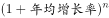 ，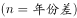，以2017年为基期的基础上，实现2020年的目标，所以年份差为3。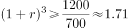。优先代入居中且好算（例如整十的数）的选项，即C选项，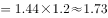，和1.71接近。

故正确答案为C。

---

#### 第 9 题　qid 2376602 · 综合

在中国田径协会认证的A类、B类赛事中，2016年全程马拉松项目完赛人次比同期半程马拉松项目完赛人次：

- **A**. 多23万
- **B**. 少23万
- **C**. 多21万
- **D**. 少21万　✅

**答案**：D

**官方解析**

根据题干“······2016年全程马拉松项目完赛人次比同期半程马拉松项目完赛人次”，并结合选项为“”，且材料数据为2017年，可判定本题为基期和差问题。定位文字材料第五段可得：“在中国田径协会认证的A类、B类赛事中，2017年全程马拉松项目完赛26.89万人次，同比增长；半程马拉松项目完赛人次45.29万人次，同比减少了0.03万人次”，代入基期量公式：，则2016年全程马拉松项目完赛人次为：万人次，2016年半程马拉松项目完赛人次为：万人次，故2016年全程马拉松项目完赛人次与同期半程马拉松项目完赛人次差为：，即少21万人次。

故正确答案为D。

---

#### 第 10 题　qid 2376605 · 综合

能够从上述资料中推出的是：

- **A**. 
2017年马拉松运动年度产业规模比2016年多200亿元

- **B**. 
2017年参加中国田径协会认证赛事的全国跑者数量少于75万人

- **C**. 
2011年至2016年我国马拉松赛事场次之和超过2017年赛事场次的
　✅
- **D**. 
在2016年与2017年马拉松规模赛事数量上，江苏省、北京市都有进入前三名

**答案**：C

**官方解析**

A项：定位文字材料第二段可得：“2017年全年马拉松······年度产业总规模达700亿元，比去年同期增长约。” 故2017年马拉松运动年度产业规模比2016年多：亿元，错误；

B项：定位文字材料第六段可得：“2017年参加中国田径协会认证赛事的跑者中，来自江苏的数量最多，共有76469人，在全国占比”，故2017年参加中国田径协会认证赛事的全国跑者数量为万，错误；

C项：定位图形材料可得：“2011年至2017年我国马拉松赛事场次分别为22、33、39、51、134、328、1102”，故2011年至2016年我国马拉松赛事场次之和：，2017年赛事场次的为，前者大于后者，正确；

D项：定位文字材料第三段可得：“规模赛事数量方面，2017年排名前三的省份为浙江省、江苏省和广东省······而2016年的前三名分别为江苏省、北京市、广东省”，故在2016年和2017年马拉松规模赛事数量上，北京市没有都进入前三名，错误。

故正确答案为C。

---

### 材料 3

根据以下资料，回答下列问题。

（注：顺差是指在国际收支上，一定时期内收入大于支出的差额；逆差指的是在国际收支上，一定时期内支出大于收入的差额；表中同比数据为正的代表同比增长，同比数据为负的代表同比下降）

#### 第 11 题　qid 2376556 · 综合

2011年至2017年，我国服务进出口逆差最大的年份是：

- **A**. 2017年　✅
- **B**. 2016年
- **C**. 2015年
- **D**. 2014年

**答案**：A

**官方解析**

定位表格材料1，根据“”可知，A项：2017年逆差，B项：2016年逆差，C项：2015年逆差，D项：2014年逆差，因此逆差最大年份为2017年。

故正确答案为A。

---

#### 第 12 题　qid 2376599 · 综合

2016年我国保险和养老金服务进出口额约为：

- **A**. 857亿元人民币
- **B**. 1112亿元人民币
- **C**. 1134亿元人民币　✅
- **D**. 1158亿元人民币

**答案**：C

**官方解析**

根据题干“2016年······进出口额”，材料给的是2017年的数据，可以判定本题为基期计算问题。定位表格材料2：2017年保险和养老金服务进出口额976.0亿元，同比增长率为，根据，可得2016年保险和养老金服务进出口额亿元。

故正确答案为C。

---

#### 第 13 题　qid 2377416 · 比重

2016年个人、文化和娱乐服务进口额占同期服务进口总额的比重约为：

- **A**. 0.1个百分点
- **B**. 0.3个百分点
- **C**. 0.5个百分点　✅
- **D**. 0.7个百分点

**答案**：C

**官方解析**

根据题干“2016年……占……比重为”，定位表格材料2的数据时间为2017年，可判定本题为基期比重问题。定位表格材料1可得2016年我国服务进口总额为30030亿元，定位表格材料2可得2017年个人文化娱乐进口额为186亿元，同比增长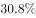，根据，2016年个人文化娱乐进口额为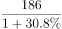，则2016年个人文化娱乐进口额占同期服务进口总额比重为：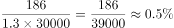。

故正确答案为C。

---

#### 第 14 题　qid 2376550 · 综合

下列关于2016年进口额大小排序错误的是：

- **A**. 
旅行运输其他商业服务

- **B**. 
知识产权使用费建筑运输
　✅
- **C**. 
运输金融服务加工服务

- **D**. 
建筑金融服务加工服务

**答案**：B

**官方解析**

定位表格材料二可得：2017年我国各服务分类进口额及同比增长。根据公式：可得：

A项：旅行进口额17210.0亿元，同比增长；运输进口额6278.0亿元，同比增长；其他商业服务进口额2895.0亿元，同比增长。故2016年旅行进口额亿元，运输进口额亿元，其他商业服务进口额，故2016年旅行运输其他商业服务，排序正确，排除；

B项：知识产权使用费进口额1930.0亿元，同比增长；建筑进口额579.0亿元，同比增长；2016年运输进口额A项已经计算，为5352.1亿元。故2016年知识产权使用费进口额亿元2016年运输进口额5352.1亿元，排序错误，当选；

C项：2016年运输进口额A项已经计算，为5352.1亿元；2017年金融服务进口额109.0亿元，同比增长；加工服务进口额12.0亿元，同比增长。故2016年金融服务进口额亿元，加工服务进口额亿元，故2016年运输金融服务加工服务，排序正确，排除；

D项：2017年建筑进口额579.0亿元，同比增长，故2016年进口额亿元；2016年金融服务进口额、加工服务进口额C项已经计算，分别为134.7亿元、10.5亿元。故2016年建筑金融服务加工服务，排序正确，排除。

本题为选非题，故正确答案为B。

---

#### 第 15 题　qid 2376552 · 综合

能够从上述资料中推出的是：

- **A**. 2011年至2017年，我国进出口总是出现逆差
- **B**. 2016年我国建筑服务进出口实现顺差1039亿元人民币
- **C**. 2017年我国服务进出口中，其他商业服务进出口实现的顺差最多　✅
- **D**. 2017年我国服务进出口中，别处未提及的政府服务进出口额占比最小

**答案**：C

**官方解析**

A项：定位表格材料一，材料中只给出了2011年至2017年我国服务进出口额，而非我国进出口额，故无法推出，错误；

B项：定位表格材料二，2017年我国建筑服务出口1618.0亿元，同比增长；进口579.0亿元，同比增长。则2016年我国建筑服务出口额=亿元，进口额亿元，故2016年我国建筑服务进出口实现顺差约293.4亿元，错误；

C项：定位表格材料二，2017年我国服务进出口中，实现顺差的有：加工服务：亿元；维护和维修服务：亿元；建筑：1亿元；金融服务：亿元；电信、计算机和信息服务：亿元；其他商业服务：亿元亿元。故2017年我国服务进出口中，实现顺差最多的为其他商业服务，正确。

D项：定位表格材料一，2017年我国服务进出口额46991亿元；定位表格材料二，2017年别处未提及的政府服务进出口额348亿元。根据公式：，别处未提及的政府服务进出口占比，而个人、文化和娱乐服务进出口占比，故别处未提及的政府服务进出口占比并非最小，错误。

故正确答案为C。

---

### 材料 4

        2017年我国成年国民图书阅读率为，比上年增加0.3个百分点；报纸阅读率为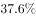，比上年降低2.1个百分点；期刊阅读率为，比上年增加1个百分点。 

        2017年我国成年国民数字化阅读方式(网络在线阅读、手机阅读、电子阅读器阅读、平板电脑阅读等)的接触率为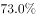。其中，网络在线阅读接触率为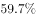，比上年增加4.4个百分点；手机阅读接触率为，比上年增加4.9个百分点；电子阅读器阅读接触率为，比上年增加6.5个百分点；平板电脑阅读接触率为，比上年增加2.2个百分点。

        传统纸质媒介中，2017年我国成年国民人均每天阅读纸质图书时长为20.38分钟，人均每天阅读报纸时长为12.00分钟，人均每天阅读期刊时长为6.88分钟。

#### 第 16 题　qid 2376766 · 综合

2016年我国成年国民报纸阅读率比期刊阅读率高：

- **A**. 11.1个百分点
- **B**. 12.3个百分点
- **C**. 15.4个百分点　✅
- **D**. 17.5个百分点

**答案**：C

**官方解析**

由题干“成年国民报纸阅读率比期刊阅读率高多少百分点”，可判定本题为简单加减计算问题。定位文字材料第一段“2017年报纸阅读率为，比上年降低2.1个百分点；2017年期刊阅读为，比上年增加1个百分点”，故2016年报纸阅读率为；2016年期刊阅读率为。因此，2016年我国成年国民报纸阅读率比期刊阅读率高，即15.4个百分点。

故正确答案为C。

---

#### 第 17 题　qid 2376767 · 平均数

2017年我国成年国民阅读一本纸质图书平均需要：

- **A**. 20.8小时
- **B**. 22.3小时
- **C**. 24.1小时
- **D**. 26.6小时　✅

**答案**：D

**官方解析**

由题干“2017年我国成年国民阅读一本纸质图书平均需要”，可判定本题为现期平均数计算。阅读一本纸质图书平均需要的时间=总时间÷书的数量。定位文字材料第三段可知，2017年我国成年国民每天阅读纸质图书为20.38分钟，则全年阅读纸质图书的总时间为；定位表格，2017年成年国民纸质图书人均阅读量为4.66（本）。因此，阅读一本书平均需要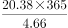分钟，即 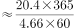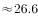小时。

故正确答案为D。

---

#### 第 18 题　qid 2376769 · 增长

下列年份中，我国成年国民人均报纸阅读量同比降速最快的是：

- **A**. 2014年
- **B**. 2015年
- **C**. 2016年
- **D**. 2017年　✅

**答案**：D

**官方解析**

由题干“我国成年国民人均报纸阅读量同比降速最快的是···”可知，本题为一般增长率比较大小问题。定位表格第四行，已知2013年-2017年报纸的人均阅读量，由公式可得，2014年：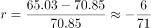；2015年：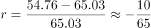；2016年：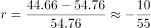；2017年：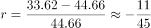；观察数据可知2017年降速分子最大、分母最小，所以2017年人均报纸阅读量同比降速最快。

故正确答案为D。

---

#### 第 19 题　qid 2376772 · 平均数

2013年至2017年我国成年国民人均期刊阅读量超过这五年平均水平的年份有：

- **A**. 2个
- **B**. 3个　✅
- **C**. 4个
- **D**. 5个

**答案**：B

**官方解析**

由题干“2013年至2017年···超过这五年平均水平的年份有”可知，本题为平均数问题。定位表格第五行，由公式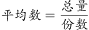可得，这五年人均期刊阅读的平均水平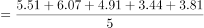，2013年至2017年期刊人均阅读量超过这五年平均水平的有3个年份，分别为2013年、2014年、2015年。

故正确答案为B。

---

#### 第 20 题　qid 2376773 · 综合

能够从上述资料中推出的是：

- **A**. 2013年至2017年我国成年国民人均电子书阅读量逐年上升
- **B**. 2016年我国成年国民图书阅读率低于当年网络在线阅读接触率
- **C**. 2017年我国成年国民人均每天阅读纸质图书时长低于阅读报纸与阅读期刊时长之和
- **D**. 2014年至2017年我国成年国民人均期刊阅读量，增长率最高的年份为2017年　✅

**答案**：D

**官方解析**

A项：定位表格材料，2013年至2017年我国成年国民人均电子书阅读量分别为2.48、3.22、3.26、3.21和3.12。可见，2016年与2017年均比上年有所下降，错误；

B项：定位文字材料第一段和第二段可得，2017年我国成年国民图书阅读率为，比上年增加0.3个百分点，网络在线阅读接触率为，比上年增加4.4个百分点。则2016年我国成年国民图书阅读率为，2016年网络在线阅读接触率为，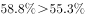，错误；

C项：定位文字材料第三段可得，2017年我国成年国民人均每天阅读纸质图书时长为20.38分钟，人均每天阅读报纸时长为12.00分钟，人均每天阅读期刊时长为6.88分钟。则我国成年国民人均每天阅读报纸与阅读期刊时长之和为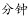，，错误；

D项：定位表格材料，2013年至2017年每年我国成年国民人均期刊阅读量均已知，根据可得，2014年我国成年国民人均期刊阅读量增长率，2015年我国成年国民人均期刊阅读量增长率，2016年我国成年国民人均期刊阅读量增长率，2017年我国成年国民人均期刊阅读量增长率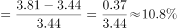，2017年增长率最高，正确。

故正确答案为D。

---
