# 2019年420联考《行测》题（陕西卷）（网友回忆版）

> 联考 · 2019 年 · 5 个模块 · 共 120 题

- [常识判断](#%E5%B8%B8%E8%AF%86%E5%88%A4%E6%96%AD) · 20 题
- [言语理解与表达](#%E8%A8%80%E8%AF%AD%E7%90%86%E8%A7%A3%E4%B8%8E%E8%A1%A8%E8%BE%BE) · 35 题
- [数量关系](#%E6%95%B0%E9%87%8F%E5%85%B3%E7%B3%BB) · 10 题
- [判断推理](#%E5%88%A4%E6%96%AD%E6%8E%A8%E7%90%86) · 35 题
- [资料分析](#%E8%B5%84%E6%96%99%E5%88%86%E6%9E%90) · 20 题

---

## 常识判断

### 第 1 题　qid 2377194 · 地理国情

陕西亦称“三秦”，源自秦制“三王”之封。西安地铁5号线修建过程中发现了“雍王”章邯的都城，除了“雍王”章邯，其他“二王”是指（  ）

- **A**. 翟王董翳和塞王司马欣　✅
- **B**. 翟王董翳和汉王刘邦
- **C**. 塞王司马欣和汉王刘邦
- **D**. 秦王子婴和霸王项羽

**答案**：A

**官方解析**

本题考查人文常识。
关中一带在春秋战国时为秦国发源地，秦朝灭亡后，项羽把原来秦国之地分封给秦朝的三个降将。封章邯为雍王，统治关中西部；封司马欣为塞王，统治关中东部；封董翳为翟王，统治上郡（今陕北地区），故陕西又称“三秦”。因此，BCD项不符合题意。
故正确答案为A。

---

### 第 2 题　qid 2377197 · 地理国情

2018年，《关中平原城市群发展规划》的发布，标志着关中平原城市群发展上升为国家战略，其中明确提出建设（  ）

- **A**. 西安国际化大都市
- **B**. 西安区域性节点城市
- **C**. 西安国家中心城市　✅
- **D**. 西安综合性门户城市

**答案**：C

**官方解析**

本题考查政治常识。
2018年2月2日，国家发改委和住建部印发《关中平原城市群发展规划》，该规划第三节优化城市规模结构中明确指出：“建设西安国家中心城市。加快西安中心城市建设步伐，加强西咸新区、西安高新区国家自主创新示范区、西安国家级经济技术开发区等建设，强化面向西北地区的综合服务和对外交往门户功能，提升维护西北繁荣稳定的战略功能，打造西部地区重要的经济中心、对外交往中心、丝路科创中心、丝路文化高地、内陆开放高地、国家综合交通枢纽。保护好古都风貌，统筹老城、新区发展，加快大西安都市圈立体交通体系建设，形成多轴线、多组团、多中心格局，建成具有历史文化特色的国际化大都市。”
因此，ABD项不符合题意。
故正确答案为C。

---

### 第 3 题　qid 2376476 · 人文常识

下列属于改革开放40年来我国经济建设所取得伟大成就的是：
①建立了最完整的现代工业体系
②成为了世界商品消费第一大国
③主要农产品的产量跃居世界前列
④外汇储备连续多年位居世界第一

- **A**. ①②④
- **B**. ①③④　✅
- **C**. ②③④
- **D**. ①②③④

**答案**：B

**官方解析**

本题考查政治常识。
2018年12月18日，习近平总书记在庆祝改革开放40周年大会上的讲话中指出：“我国主要农产品产量跃居世界前列，建立了全世界最完整的现代工业体系，科技创新和重大工程捷报频传。我国基础设施建设成就显著，信息畅通，公路成网，铁路密布，高坝矗立，西气东输，南水北调，高铁飞驰，巨轮远航，飞机翱翔，天堑变通途。现在，我国是世界第二大经济体、制造业第一大国、货物贸易第一大国、商品消费第二大国、外资流入第二大国（2020年我国成为外资流入第一大国），我国外汇储备连续多年位居世界第一，中国人民在富起来、强起来的征程上迈出了决定性的步伐！”所以，①③④表述正确，②错误。
故正确答案为B。

---

### 第 4 题　qid 2376493 · 人文常识

关于生态文明建设，下列说法正确的是:

- **A**. 蓝天保卫战是全面建成小康社会的三大攻坚战之一
- **B**. 加快构建生态文明体系是解决污染问题的根本之策
- **C**. 生态环境安全是经济社会持续健康发展的重要保障　✅
- **D**. 地方政府主要领导是本行政区域生态环境保护第一责任人

**答案**：C

**官方解析**

本题考查政治常识。
A项错误，2017年10月18日，习近平总书记在十九大报告中指出：“要坚决打好防范化解重大风险、精准脱贫、污染防治的攻坚战，使全面建成小康社会得到人民认可、经得起历史检验。”蓝天保卫战并不是三大攻坚战之一。
B项错误，2018年5月18日至19日，习近平总书记在全国生态环境保护大会上强调：“要全面推动绿色发展。绿色发展是构建高质量现代化经济体系的必然要求，是解决污染问题的根本之策。”
C项正确，2018年5月18日至19日，习近平总书记在全国生态环境保护大会上强调：“要有效防范生态环境风险。生态环境安全是国家安全的重要组成部分，是经济社会持续健康发展的重要保障。”
D项错误，2018年5月18日至19日，习近平总书记在全国生态环境保护大会上强调：“各地区各部门要增强‘四个意识’，坚决维护党中央权威和集中统一领导，坚决担负起生态文明建设的政治责任。地方各级党委和政府主要领导是本行政区域生态环境保护第一责任人，各相关部门要履行好生态环境保护职责，使各部门守土有责、守土尽责，分工协作、共同发力。”
故正确答案为C。

---

### 第 5 题　qid 2377200 · 人文常识

下列不属于2019年我国实施“减税降费”内容的是（  ）

- **A**. 个人所得税
- **B**. 增值税
- **C**. 社保费率
- **D**. 企业所得税　✅

**答案**：D

**官方解析**

本题考查政治常识。
2019年“减税降费”主要包括四个方面：一是对小微企业实施普惠性税收减免。二是深化增值税改革，继续推进实质性减税。三是全面实施修改后的个人所得税法及其实施条例，落实好6项专项附加扣除政策，减轻居民税负。四是配合相关部门，积极研究制定降低社会保险费率综合方案，进一步减轻企业的社会保险缴费负担。同时，清理规范收费，加大对乱收费查处力度。ABC项符合表述内容，D项没有提及。
本题为选非题，故正确答案为D。
（本题是争议题，根据单选题选最优的原则，本题答案选D）

---

### 第 6 题　qid 2376500 · 法律常识

下列法律法规中，哪一项不是从2019年1月1日起施行？

- **A**. 《中华人民共和国电子商务法》
- **B**. 《中华人民共和国土壤污染防治法》
- **C**. 新修订的《中华人民共和国公务员法》　✅
- **D**. 新修订的《中华人民共和国个人所得税法实施条例》

**答案**：C

**官方解析**

本题考查法律。
A项正确，《中华人民共和国电子商务法》是2018年8月31日第十三届全国人民代表大会常务委员会第五次会议通过，本法第八十九条规定：“本法自2019年1月1日起施行。”
B项正确，《土壤污染防治法》是2018年8月31日十三届全国人大常委会第五次会议全票通过，本法第九十九条规定：“本法自2019年1月1日起施行。”
C项错误，《中华人民共和国公务员法》已由中华人民共和国第十三届全国人民代表大会常务委员会第七次会议于2018年12月29日修订通过，自2019年6月1日起施行。
D项正确，《中华人民共和国个人所得税法实施条例》是国务院发布的法规，2018年12月18日中华人民共和国国务院令第707号第四次修订通过，第三十六条规定：“本条例自2019年1月1日起施行。”
本题为选非题，故正确答案为C。

---

### 第 7 题　qid 2377202 · 人文常识

下列成语及其出处的对应关系错误的是（  ）

- **A**. 大刀阔斧——《水浒传》
- **B**. 任人唯贤——《尚书》
- **C**. 天下太平——《史记》　✅
- **D**. 义不容辞——《三国演义》

**答案**：C

**官方解析**

本题考查人文常识。
A项正确，大刀阔斧出自施耐庵的《水浒传》第四十七回：“摇旗呐喊，擂鼓鸣锣，大刀阔斧，杀奔祝家庄来。”形容兵马凶猛的气势。后亦喻办事极富魄力，干练果断。
B项正确，任人唯贤的意思是只任用有德有才的人做官吏，后即以“任人唯贤”指用人只选任和提拔有德有才的人。该成语出自《尚书•咸有一德》：“任官惟贤才，左右惟其人。”
C项错误，天下太平意为普天下繁荣发达，人民安居乐业，社会生活安定。该成语出自《吕氏春秋•大乐》：“天下太平，万物安宁，皆化其上，乐乃可成。”而非《史记》。
D项正确，义不容辞的意思是指道义上不允许推辞，理应接受。该成语出自罗贯中《三国演义》第五十八回：“且玄德既为东吴之婿，亦义不容辞。”
本题为选非题，故正确答案为C。

---

### 第 8 题　qid 2377203 · 人文常识

人们常常用“黑天鹅”事件和“灰犀牛”事件来形容人类社会发展过程中不同的风险。下列表述中，属于“黑天鹅”事件特征的是（  ）。
①极其罕见的、出人意料的风险
②能够预测甚至让人习以为常的风险
③一旦发生，倾天覆地，对外界产生极大影响
④发生是一个漫长过程，初期便可察觉，却又让人视而不见

- **A**. ①②
- **B**. ①③　✅
- **C**. ②④
- **D**. ①④

**答案**：B

**官方解析**

本题考查经济常识。
黑天鹅事件指难以预测，且不寻常的事件，通常会引起市场连锁负面反应甚至颠覆。一般具备以下三个特点：一是具有意外性；二是产生重大影响；三是虽然具有意外性，但多事后为它的发生编造理由，并且或多或少认为它是可解释和可预测的。黑天鹅存在于金融市场、商业、经济、个人生活等各个领域。
“灰犀牛”与“黑天鹅”相互补足，“灰犀牛事件”是太过于常见以至于人们习以为常的风险，“黑天鹅事件”则是极其罕见的、出乎人们意料的风险。
因此①③符合“黑天鹅”事件。
故正确答案为B。

---

### 第 9 题　qid 2376475 · 人文常识

荷花虽生长于池塘的污泥中，但荷叶却出污泥而不染，其主要原因是：

- **A**. 荷叶含有大量的叶绿素，能与太阳光发生光合作用，产生自清洁
- **B**. 荷叶表面光滑，具有非常强的光洁度，污泥很难在它的表面吸附
- **C**. 荷叶含有疏水的纳米级蜡质，雨露落在上面会形成水珠清洁叶面　✅
- **D**. 荷花枝干细长，水珠落在荷叶上，容易造成荷叶晃动，甩出污泥

**答案**：C

**官方解析**

本题考查科技常识。
荷叶之所以能出污泥而不染是由荷叶叶面上存在着复杂的多重纳米和微米级的超微结构决定的：在超高分辨率显微镜下可以清晰看到，荷叶表面上有许多微小的乳突，它上面长满茸毛，乳突间的凹陷部分充满空气，这样就在紧贴叶面处形成一层极薄的只有纳米量级厚的空气层。这使得在尺寸上远大于这种结构的灰尘、雨水等降落在叶面上后，隔着一层极薄的空气，从而雨水会自动聚集成球形水珠，而水珠的滚动会把落在叶面上的尘土污泥吸附掉滚出叶面，使叶面始终保持干净，这就是著名的“荷叶自洁效应”。
故正确答案为C。

---

### 第 10 题　qid 2377195 · 人文常识

下列说法中，错误的是：

- **A**. 山东省与山西省因位于太行山东西两侧而得名
- **B**. 湖南省与湖北省因位于洞庭湖南北两侧而得名
- **C**. 河南省与河北省因位于黄河南北两侧而得名
- **D**. 广东省与广西省因位于珠江东西两侧而得名　✅

**答案**：D

**官方解析**

本题考查地理国情。
A项正确，山东因在太行山以东而得名，山西以在太行山之西而得名。
B项正确，湖南大部分区域处于洞庭湖以南，湖北大部分区域处于洞庭湖以北。
C项正确，河南省与河北省古时以黄河为界，河南省因历史上大部分位于黄河以南，故名河南，河北因位于黄河下游以北而得名。
D项错误，历史上，在宋太宗时期，将岭南道改名广南路，随后分成广南东路和广南西路，简称即是广东广西，故广东广西是以处于“岭南道”的地理位置来得名的，而和珠江并无关系。
本题为选非题，故正确答案为D。

---

### 第 11 题　qid 2376676 · 科技常识

下列关于仿生生物学的应用对应关系不正确的是：

- **A**. 发光纤维——萤火虫　✅
- **B**. 子弹头列车——翠鸟
- **C**. 维克罗尼龙搭扣——苍耳
- **D**. 全天然空调系统建筑——非洲白蚁巢穴

**答案**：A

**官方解析**

本题考查科技常识。
A项错误，发光纤维是指受到光和放射线的照射时能发出可见光的纤维。常见的发光纤维如：以发光玻璃作芯材的纤维、以发光塑料作芯材的纤维。而萤火虫有专门的发光细胞，在发光细胞中有两类化学物质，一类被称作荧光素，另一类被称为荧光素酶。荧光素能在荧光素酶的催化下消耗ATP（腺苷三磷酸），并与氧气发生反应，反应中产生激发态的氧化荧光素，当氧化荧光素从激发态回到基态时释放出光子。反应中释放的能量几乎全部以光的形式释放，只有极少部分以热的形式释放，萤火虫是通过这样的作用来发光的。由此可见，发光纤维并不是在仿生萤火虫。
B项正确，翠鸟拥有长而平的喙，使其可以从空气迅速潜入水中，同时并不会产生过多的扰动。日本工程师中津英治仿照翠鸟喙设计出了新干线子弹头列车的车头，使其更长更平，降低了火车的噪音。
C项正确，苍耳是一种植物，它的总苞具有钩状的硬刺，可以贴附于动物的身体上。尼龙搭扣的设计正是从苍耳获得的灵感，尼龙搭扣的两边都是尼龙做的，一边是一排排的小勾，另一边是密密麻麻的小线圈，两边贴在一起的时候，小勾就勾住小线圈，使其能贴在一起。
D项正确，非洲白蚁会建造巨大的巢穴系统，他们经常开启和关闭自己塔楼巢穴中的气口，使得巢穴内外的空气得以对流——冷空气从底部的气口流入塔楼，与此同时热空气从顶部的烟囱流出。从而使得巢穴中始终维持一个恒定的温度。在设计津巴布韦首都哈拉雷的约堡东门购物中心和办公大楼时，建筑大师麦克·皮尔斯研究了非洲白蚁巢穴的结构，设计出了全天然空调系统，使得购物中心常年维持适宜的温度。
本题为选非题，故正确答案为A。

---

### 第 12 题　qid 2377196 · 人文常识

国务院办公厅印发文件规定，按照用人单位参加生育保险和职工基本医疗保险的缴费比例之和确定新的用人单位（  ）费率，个人不缴纳生育保险费。

- **A**. 职工基本医疗保险　✅
- **B**. 生育保险
- **C**. 养老保险
- **D**. 失业保险

**答案**：A

**官方解析**

本题考查政治常识。
国务院办公厅发布《关于全面推进生育保险和职工基本医疗保险合并实施的意见》，其中规定：“生育保险基金并入职工基本医疗保险基金，统一征缴，统筹层次一致。按照用人单位参加生育保险和职工基本医疗保险的缴费比例之和确定新的用人单位职工基本医疗保险费率，个人不缴纳生育保险费。”
故正确答案为A。

---

### 第 13 题　qid 2376492 · 人文常识

下列表述正确的是：

- **A**. 鄱阳湖栖息着世界上最大的白鹤群　✅
- **B**. 我国最早出现的种植业位于松花江流域
- **C**. 被誉为“天上云霞,地下鲜花”的是四川蜀绣
- **D**. 东北平原是中国第二大平原，也是中国重要的粮棉生产基地

**答案**：A

**官方解析**

本题考查地理国情。

A项正确，鄱阳湖是全世界最大的白鹤集中越冬地，白鹤的数量占全世界总数的以上，堪称鹤之天堂。鄱阳湖区发现白鹤的最早记录是1980年。1985年，时任国际鹤类基金会会长的乔治·阿基博带队来鄱阳湖考察，观测到白鹤1350只，其中幼鹤119只。他们认定那是当时世界上发现的最大野生白鹤群。

B项错误，我国最早出现的种植业应位于黄河、长江流域。黄河、长江是中国的母亲河，这两条河流的冲积平原地区是中华文明的发祥地且两个平原处在温带湿润、半湿润地区，气候温暖湿润，比较适宜人类居住，所以种植业发展最早。 

C项错误，被誉为“天上云霞，地下鲜花”的是杭州的织锦。 

D项错误，东北平原是中国最大的平原，是中国三大平原之一。位于中国东北部，南北长约1000千米，东西宽约400千米，面积达35万平方千米。同时东北平原土地肥沃，是全球仅有的三大黑土区域之一，是中国重要的粮食、大豆、畜牧业生产基地，也是中国重要的钢铁、机械、能源、化工基地。 

故正确答案为A。 

---

### 第 14 题　qid 2376479 · 人文常识

下列送别诗句中不属于描写目送友人场景的是:

- **A**. 孤帆远影碧空尽，唯见长江天际流
- **B**. 山回路转不见君，雪上空留马行处
- **C**. 日暮酒醒人已远，满天风雨下西楼　✅
- **D**. 青枫江上秋帆远，白帝城边古木疏

**答案**：C

**官方解析**

本题考查人文常识。
A项正确，“孤帆远影碧空尽，唯见长江天际流”出自唐代诗人李白的《送孟浩然之广陵》。这是首送别诗，不仅写出了友人所乘船孑然远逝的情景，而且写出诗人凭栏目送的情景，此刻，诗人伫立在黄鹤楼上，久久地注视着那渐行渐远，最终消失在茫茫水天相接之处的一片孤帆，他的心早已随船而去了。寄寓了诗人的惜别之情。
B项正确，“山回路转不见君，雪上空留马行处。”出自盛唐岑参的《白雪歌送武判官归京》。岑参在这首诗中，以诗人的敏锐观察力和浪漫奔放的笔调，描绘了祖国西北边塞的壮丽景色，以及边塞军营送别归京使臣的热烈场面，表现了诗人和边防将士的爱国热情，以及他们对战友的真挚感情。“山回路转不见君，雪上空留马行处”，用很平淡质朴的语言表现了将士们对战友的真挚感情，字字传神，含蓄隽永。这一部分虽然描写对友人依依惜别的深情，但也表现了边塞将士的豪迈精神。
C项错误，“日暮酒醒人已远，满天风雨下西楼。”出自唐代许浑的《谢亭送别》。这是一首送别诗。一觉醒来，已是薄暮时分。天色变了，下起了雨，四望一片迷蒙。眼前的江面，两岸的青山红叶都已经笼罩在蒙蒙雨雾和沉沉暮色之中。而朋友的船，此刻更不知道随着急流驶到云山雾嶂之外的什么地方去了。不仅写出身留谢亭而友人早已远去，而且写出暮色苍茫风雨凄迷的孤寂落寞的离愁情。
D项正确，“青枫江上秋帆远，白帝城边古木疏。”出自唐代高适的《送李少府贬峡中王少府贬长沙》。这是一首送别诗，同时也是一首边塞诗，同时送别两人，且两人均为遭贬而迁。“青枫江”指浏水，在长沙与湘江汇合。写王少府到了长沙，在秋高气爽的季节，望着那明净高远、略无纤尘的蓝天，自然会洗尽烦恼。想象李少府到了峡中，可以去古木参天、枝叶扶疏的白帝城凭吊古迹，以求慰藉。这一句是对离别的二人共同讲的，体现了目送的场景。
本题为选非题，故正确答案为C。

---

### 第 15 题　qid 2377198 · 科技常识

下列说法中，错误的是（  ）。

- **A**. 雷雨可使土壤的氮肥增加
- **B**. 豆类植物的根瘤菌可以从空气中固氮
- **C**. 当厨房发生煤气泄漏时应打开抽油烟机　✅
- **D**. 在金属表面喷漆可以防止金属被氧化腐蚀

**答案**：C

**官方解析**

本题考查科技常识。
A项正确，雷雨天气过程中的闪电温度极高，一般在三万度以上，并造成高电压。在高温高电压条件下，空气分子会发生电离，等它们重新结合时，其中的氮和氧就会化合为亚硝酸盐和硝酸盐分子，并溶解在雨水中降落地面，成为天然氮肥。
B项正确，根瘤菌与豆科植物共生，形成根瘤并固定空气中的氮气为豆科植物提供营养。
C项错误，发生煤气泄漏时，一定要迅速打开门窗，使新鲜空气进来以大大降低室内煤气的浓度。要迅速关闭煤气的阀门，防止煤气的继续泄漏，同时禁止一切能引起火花的行为。打开抽油烟机容易引起电火花，会引燃煤气，发生爆炸。
D项正确，金属表面喷漆是一种保护金属不被氧化腐蚀的方法。良好的喷漆涂装保护层保持连续完整无损，结合良好，能够成为抑制腐蚀介质侵入的屏障。
本题为选非题，故正确答案为C。

---

### 第 16 题　qid 2376682 · 人文常识

下列我国古代国家行政机构不具有行政监察职能的是：

- **A**. 御史台
- **B**. 太常寺　✅
- **C**. 六科给事中
- **D**. 都察院

**答案**：B

**官方解析**

本题考查人文常识。
A项正确，御史台，古代官署名。御史台的职责是纠察弹劾百官过失，是封建国家专司弹劾的监察机关。
B项错误，太常寺，封建社会中掌管礼乐的最高行政机关，秦时称奉常。汉景帝六年改称太常。汉以后改称太常寺、太常礼乐官等。
C项正确，明代地方分区监察和中央按系统监察相结合，专设六科给事中，稽察六部百司之事，旨在加强皇帝对六部的控制。
D项正确，都察院，官署名。明清全国最高监察机构。掌纠劾百司，辩明冤枉，提督各道，为天子耳目风纪之司。
本题为选非题，故正确答案为B。

---

### 第 17 题　qid 2377199 · 人文常识

下列关于云计算的表述中，错误的是（  ）。

- **A**. 对网络连接的大量计算资源进行统一管理和调度
- **B**. 云计算的服务器为虚拟系统　✅
- **C**. 可为用户提供计算及存储服务
- **D**. 搜索引擎是云计算的典型应用

**答案**：B

**官方解析**

本题考查科技常识。
①云计算是一种通过Internet以服务的方式提供动态可伸缩的虚拟化的资源的计算模式。②云计算服务有三种：基础设施即服务(IaaS)，平台即服务(PaaS)和软件即服务(SaaS)。
A项正确，云计算的核心思想就是将大量用网络连接的计算资源统一管理和调度，构成一个计算资源池向用户按需服务。
B项错误，云计算的服务器是真实的物理服务器，不是虚拟系统，这区别于云计算的系统虚拟化，后者可以将一台物理服务器上的多个虚拟机完全隔离开来，提高资源利用效率。
C项正确，云计算平台可以提供计算服务、数据库服务、存储服务等。这属于云计算服务中的基础设施即服务。
D项正确，搜索引擎由线上部分和线下部分组成，它是云计算产生和发展的重要应用，代表有百度、谷歌等等。
本题为选非题，故正确答案为B。

---

### 第 18 题　qid 2376498 · 人文常识

下列关于血糖的说法错误的是：

- **A**. 正常人进食后血糖浓度会升高
- **B**. 正常人空腹超过12小时会引起低血糖
- **C**. 南瓜能抑制葡萄糖吸收，具有降血糖作用　✅
- **D**. 胰岛素是人体产生的唯一能够降低血糖的激素

**答案**：C

**官方解析**

本题考查科技常识。
A项正确，食物中存在大量的淀粉等糖类。人在进食后，糖类被人体消化吸收，因此会使血糖含量升高。
B项正确，低血糖的常见原因包括进食过少、运动过度、药物使用不当、大量饮酒等。正常人空腹（禁食）时间过长，由于没有食入足够的糖，可能会引起低血糖。
C项错误，南瓜中含有丰富的营养物质，其中包含了蛋白质、多糖、果胶、纤维素、维生素以及微量元素等成分，在这些众多的营养物质中，蛋白质和多糖都可以提升自身免疫功能。部分多糖会被分解成单糖，可能导致人体血糖升高。
D项正确，胰岛素是体内唯一能够降低血糖浓度的激素，它不仅能够促使葡萄糖分解，还能抑制非糖物质转化为葡萄糖。
本题为选非题，故正确答案为C。

---

### 第 19 题　qid 2376709 · 科技常识

下列我国空间站发展的重要标志性事件按完成步骤排列正确的是：
①“天宫二号”空间实验室成功发射
②“神舟十一号”成功发射，完成与“天宫二号”对接
③陆续发射科学实验舱和空间站核心舱，组建中国空间站
④“天舟一号”货运飞船成功发射，完成与“天宫二号”对接

- **A**. ①②③④
- **B**. ④①②③
- **C**. ①③④②
- **D**. ①②④③　✅

**答案**：D

**官方解析**

本题考查科技常识。
①2016年9月15日22时04分，“天宫二号”空间实验室由长征二号FT2火箭发射升空。
②2016年10月19日3时31分，“神舟十一号”载人飞船与“天宫二号”空间实验室成功实现自动交会对接。
③建设具有国际先进水平的空间站，解决有较大规模的、长期有人照料的空间应用问题，是我国载人航天工程“三步走”发展战略中第三步的任务目标。按计划，空间站将于2022年前后建成，是我国长期在轨稳定运行的国家太空实验室，将全面提升我国载人航天综合应用效益水平。
④2017年4月20日19时11分，中国首架货运飞船——“天舟一号”成功发射升空，并在4月22日完成与“天宫二号”的首次对接。
由此可知，按照完成步骤的时间应该是①②④③。
故正确答案为D。

---

### 第 20 题　qid 2377201 · 人文常识

下列关于“夏满芒夏暑相连”的说法中，错误的是（  ）。

- **A**. 上一句是“春雨惊春清谷天”
- **B**. 下一句是“秋处露秋寒霜降”
- **C**. 小满在五月下旬
- **D**. 夏至前后是一年中最热的时间　✅

**答案**：D

**官方解析**

本题考查地理国情。
A、B项正确，二十四节气歌（一）的内容是“春雨惊春清谷天，夏满芒夏暑相连；秋处露秋寒霜降，冬雪雪冬小大寒。每月两节不变更，最多相差一两天；上半年来六廿一，下半年是八廿三。”
C项正确，公历每年5月20-22日，当太阳到达黄径60°时为小满，是夏季的第二个节气。这个时候大地一片生机勃勃的景象，麦粒饱满，蚕结新茧。
D项错误，夏至是二十四节气中第十个节气，在每年的6月21-22日交节。天文专家表示，夏至除了是昼夜变化的界限之外，还是盛夏的起点，夏至过后，一年中最热的时期就要到了。从气象资料来看，大暑表示炎热至极，是一年中最热的时期。
本题为选非题，故正确答案为D。

---

## 言语理解与表达

### 材料 1

阅读以下文章，回答51-55题。

①一项调查显示，76.5%的受访者感觉自己的语言越来越贫乏了，受访者认为年轻人语言贫乏的表现是基本不会使用诗句（61.9%）和不会用复杂的修辞手法（57.6%）。亦如以往所有关于汉语命运的讨论，总是要有一个“替罪羊”被推出来，在许多受访者口中，这次轮到了网络语言。

②网络带给传统语言生活最大的改变，是大大加速了互联互通的效率，把每位网民都推向了______的广场，使面向公共空间说话，从少数精英的特权变成了人人可享的服务，网络大大加速了语言发展和演变，激发了全民的语言热情。然而，全民进入网络空间，难免______；来得太快，难免让人不适应，自然也带来焦虑。这种焦虑是全方位的，伦理的（如隐私），经济的（如虚拟货币），文化的，自然也少不了语言本身的。

③语言规划学的研究告诉我们，什么样的语言生活，塑造什么样的语言样态，也就培育什么样的语言能力。古诗词和复杂灵动的修辞有其恒久的价值与魅力，但不要忘记，在唐诗宋词滥觞的岁月，它们也是因适应当时的文人语言生活才获得发展的。回到今天，不论线上线下，我们都很难要求话语里也三句一成语，五句一典故，而恰恰相反，不同于直接生硬的引用，在这个网络时代，有恒久魅力的经典语言文化在以新的方式焕发生机。《经典咏流传》把古诗词唱出来，新造成语用四字格描述今人情绪，《中华新韵》让古体诗用普通话读着也有味道，突然爆火的夸夸群更让灵动的修辞炫出了天际，如此种种不胜枚举。模因理论告诉我们，经典的文化元素会在每个时代流行，其表现方式不同而已。语言生活依然在有序发展，我们的语言也很好地适应着语言生活。

④因此可以说，社会的语言能力并没有退化，而要进一步提高个体的语言能力，则有赖于建造良好的语言环境。给予有效的引导，而非强制的教育，没有语言使用的环境，就没有语言能力的提升，很多当代作家回忆，他们的写作能力在大学时获得了巨大发展，不因种种课程，纯是向家人、恋人、好友大量写信锻炼了语言的风格和魅力。我国的应试文化和教育现状让青少年很少有机会自由地使用语言，表情达意，言说心声。恰恰是网络空间，给了他们这样的机会。语言生活规划者需要做的就是鼓励更多优秀的语言作品产出，压制极少数低俗恶俗的词汇与表达方式，把最大的自由空间还给每一个语言使用者，去激发语言创造的热情。

⑤另外，有四分之三的受访者建议青年训练自己的语言，这实在是可喜的现象，证明全社会的语言意识正在觉醒，意识到语言和语言生活是需要规划，需要建设的。相信人人努力，营造自由开放，又有引导的语言生活，就可以既做心口一致的君子，也做美言美语的贤人。

#### 第 1 题　qid 2377326 · 片段阅读

以下这段话本是以上文章中的一部分，其应该位于(  )。
但若仔细思量，网络和网络语言真不能为这扼杀青年语言能力的大祸背锅。网络语言从来没有完备的界定。从新华网上的新闻与领导讲话，到微博上面红耳赤的唇枪舌剑，再到微信公众号里的鸡汤、鸡血，它们都是活跃在网络空间里的语言信息。即使聚焦到微博微信，平台上也是从庄雅到低俗无一不包的语言生活大杂院。

- **A**. ①与②之间　✅
- **B**. ②与③之间
- **C**. ③与④之间
- **D**. ④与⑤之间

**答案**：A

**官方解析**

所给文段通过转折词“但”强调了“网络和网络语言不能为扼杀青年语言能力的大祸背锅”，转折前后语义相反，那转折之前应当表明“青年语言能力下降的语言原因在于网络语言”。第①段中提及了“语言贫乏原因在于网络语言”，A项当选。
第②段说明了网络语言带来的优势以及带来的焦虑；第③段说明了经典的文化元素会在每个时代流行，其表现方式不同而已；第④段说明了社会语言的提高有赖于建造良好的语言环境，给予有效的指导；第⑤段说明提升语言能力的对策，均未提及“语言能力下降和网络语言有关”这一内容，排除B、C、D三项。
故正确答案为A。

---

#### 第 2 题　qid 2377327 · 逻辑填空

填入第②段中划横线部分最恰当的一项是（  ）。

- **A**. 人声鼎沸  参差不齐
- **B**. 熙熙攘攘  泥沙俱下　✅
- **C**. 热闹非凡  破绽百出
- **D**. 众说纷纭  人云亦云

**答案**：B

**官方解析**

第一空，根据文意可知，横线处表达网络就像“广场”，给每位网民提供了发表个人见解、与他人对话的机会，A项“人声鼎沸”指人群的声音吵吵嚷嚷；就像煮开了锅一样，B项“熙熙攘攘”形容人来人往，非常热闹，C项“热闹非凡”形容热闹的场面或景象，均可用来形容网民在网络上热情发言的场面。D项“众说纷纭”指人多嘴杂，各有各的说法，侧重强调意见不一致，文段中只强调互联网激发了网民发表言论的热情，未提及网民的言论观点是否一致，故排除。
第二空，根据转折关联词“然而”可知，横线处与前文意思相反，强调网络带来的消极影响，B项“泥沙俱下”比喻好坏不同的人或事物混杂在一起，一同显现出来，形容“全民进入网络空间”，难免好坏都有，语义恰当，当选。A项“参差不齐”侧重长短、高低、大小不齐，C项“破绽百出”比喻说话做事漏洞非常多，均与“网络空间”搭配不当，排除。
故正确答案为B。
【文段出处】光明日报《让网络激发语言热情》

---

#### 第 3 题　qid 2377328 · 片段阅读

作者举出《经典咏流传》与《中华新韵》的例子，目的在于（  ）。

- **A**. 说明中国传统语言具有恒久魅力的原因
- **B**. 说明现代人应该从传统语言中汲取精华
- **C**. 阐述经典语言在网络时代同样焕发生机　✅
- **D**. 阐述经典文化元素在每个时代都会流行

**答案**：C

**官方解析**

重点关注第三段。《经典咏流传》和《中华新韵》在文段中是以例子的形式存在，起到的作用为加强论述前文的观点。而在例子之前，文段明确指出观点，强调在网络时代，经典语言文化在以新的方式焕发生机。接下来举了三个例子，《经典咏流传》把古诗词唱出来，用新造成语描述今人情绪，《中华新韵》让古诗体用普通话读着也有味道，夸夸群更让灵动的修辞炫出了天际。这些例子都是在加强论证前文观点，故作者引用例子目的在于指出经典语言在网络时代也能够焕发生机。C项正确。
A项，“具有恒久魅力的原因”表述不明确，文段例子之前的观点明确指出是通过新的形式焕发生机，排除；
B项，文段没有体现出“汲取精华”，无中生有，排除；
D项，对应后文内容，且文段明确指出是“模因理论”告诉我们的，而非前文的例子论证的观点，排除。
故正确答案为C。
【文段出处】《让网络激发语言热情》

---

#### 第 4 题　qid 2377329 · 片段阅读

根据以上文章，下列表述中不准确的一项是（  ）。

- **A**. 四分之三以上的受访者感觉自身语言贫乏
- **B**. 唐诗宋词形成于当时文人的语言生活之中
- **C**. 作者并不赞同社会语言能力已经发生退化
- **D**. 作者认为语言生活是无法通过规划获得的　✅

**答案**：D

**官方解析**

D项，对应第五段，“这实在是可喜的现象，证明全社会的语言意识正在觉醒，意识到语言和语言生活是需要规划，需要建设的”，选项与文意相悖，当选。

A项，对应第一段“的受访者感觉自己的语言越来越贫乏了”，表述正确；

B项，对应第三段“在唐诗宋词滥觞的岁月，它们也是因适应当时的文人语言生活才获得发展的”，表述正确；

C项，对应第四段“因此可以说，社会的语言能力并没有退化”，表述正确；

本题为选非题，故正确答案为D。

【文段出处】《让网络激发语言热情》

---

#### 第 5 题　qid 2377330 · 片段阅读

下列各项中，最适合作为上文标题的是（  ）。

- **A**. 拿什么拯救我们的语言
- **B**. 让网络激发语言热情　✅
- **C**. 语言规划学的现实意义
- **D**. 值得深思的调查结果

**答案**：B

**官方解析**

篇章首先介绍了有人认为“网络语言”导致了人们语言匮乏，然后介绍了网络语言给人们带来焦虑，接着通过“语言规划学的研究”说明经典文化元素会在每个时代流行，在第四段通过“因此”提出观点，即社会的语言能力没有退化，恰恰是网络空间给了人们自由使用语言的机会，可以激发语言创造的热情，对应B项。
A项，缺少与“网络”相关的关键词，表述不够具体明确，排除；
C项，“规划学”相关内容为解释说明部分，非文段重点，排除；
D项，缺少与“网络”相关的关键词，且表述不够具体明确，排除。
故正确答案为B。
【文段出处】《让网络激发语言热情》

---

#### 第 6 题　qid 2377334 · 逻辑填空

关中的满腔      、陕南的婉约秀丽、陕北的浑厚      ······陕西各地市的特色展馆无不向游客讲述着动听的陕西故事。
依次填入划横线部分最恰当的一项是（    ）。

- **A**. 热血  质朴
- **B**. 豪情  淳朴　✅
- **C**. 激情  简朴
- **D**. 热忱  朴实

**答案**：B

**官方解析**

本题从第二空入手，搭配“陕北”，横线处与“浑厚”对应，体现出淳朴老实之意，对应B项“淳朴”指诚实朴素，常搭配“民风、外貌”，与“陕北”搭配恰当，且能与前文的“浑厚”形成对应，符合文意，保留；A项“质朴”意为朴实、不矫饰，不能与“浑厚”形成对应，排除；D项“朴实”意为质朴诚实，搭配主语为人，与“陕北”这个地区搭配不当，排除。C项“简朴”意为朴素简单，与文意不符，排除。
验证第一空，文段中通过关中、陕南、陕北三地，说明陕西各地具有不一样的特色，陕南婉约秀丽，陕北淳朴老实，故关中要体现出豪放、豪迈之意，B项“豪情”填入文段符合文意，当选。
此外，A项“满腔热血”含有心中充满为正义而工作的热情之意，文中没有体现“为正义而工作”的意思，第一空亦可排除。
故正确答案为B。
【文段出处】《打造品质文旅新引擎 彰显新形象》

---

#### 第 7 题　qid 2376525 · 逻辑填空

云南在西、巴蜀在北，贵州有着说不尽的历史。这片西南中国的广袤土地，呈现了华夏山河的            、见证了中国革命的风云际会、记录了多民族文化的交流激荡。现在，贵州正在以绿色发展谋求生态红利，率先推进了中国生态文明建设的地方探索。
填入划横线部分最恰当的一项是：

- **A**. 海晏河清
- **B**. 渊渟岳峙
- **C**. 钟灵毓秀　✅
- **D**. 瑕瑜互见

**答案**：C

**官方解析**

横线处所填的词语搭配对象为“华夏山河”，与后文两个并列结构共同说明在西南这片土地上有着说不尽的历史。C项“钟灵毓秀”指美好的山川孕育出优秀的人才，搭配“华夏山河”恰当，与文段语境相符，当选。
A项“海晏河清”比喻太平盛世、天下太平，与“华夏山河”搭配不当，与语境不符，排除；B项“渊渟岳峙”比喻人品德如渊水深沉，如高山耸立，不用于形容“华夏山河”，排除；D项 “瑕瑜互见”比喻优点、缺点都有，文段不强调“华夏山河”的缺点，与文意不符，排除。
故正确答案为C。
【文段出处】《让绿色成为发展的鲜明底色》

---

#### 第 8 题　qid 2376717 · 逻辑填空

关于科学革命的讨论        于十七世纪。不过，其时革命尚在            地展开，相关讨论的焦点集中在科学的本性，而未有所谓“科学革命史”的理解。到十九世纪，现代科学的基本模式逐渐定型，一些学者便回到现代科学的源头做起了编史和整理工作。
依次填入划横线部分最恰当的一项是：

- **A**. 滥觞  如火如荼　✅
- **B**. 溯源  轰轰烈烈
- **C**. 起源  风起云涌
- **D**. 发端  方兴未艾

**答案**：A

**官方解析**

第一空，A项“滥觞”、C项“起源”、D项“发端”均有表达事物起源和开端的含义，均符合文意，保留；B项“溯源”后一般不加宾语，常表述为“对······进行溯源”，排除。
第二空，搭配“革命”，表达革命如何展开，A项“如火如荼”形容旺盛、热烈或激烈，可以体现革命开展很热烈，符合文意，当选；C项“风起云涌”形容事物迅速发展，声势浩大，可以说“改革风起云涌”，“风起云涌地展开”用法不当，排除；D项“方兴未艾”指事物正在兴起、发展，一时不会终止，若填入横线处，则与“展开”语义上重复，二者搭配不当，可表述为“科学革命方兴未艾”，排除。
故正确答案为A。
【文段出处】《科学史绝非科学的注脚：科学革命的人文理解》

---

#### 第 9 题　qid 2376707 · 逻辑填空

说起乡愁，那是一种            的情怀，住在心中的故乡常常鲜活在那里。故乡是安放你的灵魂、温暖你的寂冷的地方，是接纳你的疲惫、抚慰你的忧伤的地方。翻开一页页被繁忙弄乱的过往，记忆中的余香总        于儿时的故乡。
依次填入划横线部分最恰当的一项是：

- **A**. 与生俱来  氤氲　✅
- **B**. 难以割舍  回荡
- **C**. 刻骨铭心  徘徊
- **D**. 永生难忘  徜徉

**答案**：A

**官方解析**

第一空，搭配“情怀”，D项“永生难忘”指一辈子也难以忘记，一般搭配“经历”、“事情”，与“情怀”搭配不当，排除。A项“与生俱来”指不依靠后天培养和教育，从一出生就拥有的特性或行为，B项“难以割舍”形容人对事或人的感情深，难以放弃或分开，C项“刻骨铭心”形容记忆深刻，均与“情怀”搭配恰当，保留。
第二空，搭配“余香”，A项“氤氲”形容烟或云气浓郁，与“余香”搭配恰当，当选。B项“回荡”指回响在耳边，发出回声，多指声音，与“余香”搭配不当，排除；C项“徘徊”指在一个地方来回地走，比喻犹豫不决，与“余香”搭配不当，排除。
故正确答案为A。
【文段出处】《乡愁文丛》

---

#### 第 10 题　qid 2376483 · 逻辑填空

说梵高是一个“圣徒式的画家”并不为过，他通过绘画仰望、接近上帝。        ，即便是这样一个具有宗教情怀、追求超越性的梵高，也从未试图远离人群、拥抱绝对的孤独。        ，他总在渴望人与人之间的温暖与爱，而始终未能得到。他的绘画也好，文字也好，除去遗传的因素，很大程度上就是表达此种“寻求”与“寻求不得”之间的落差及随之而来的痛苦。
依次填入划横线部分最恰当的一项是：

- **A**. 然而  因为
- **B**. 首先  其次
- **C**. 因为  于是
- **D**. 但是  相反　✅

**答案**：D

**官方解析**

第一空，由前文“他通过绘画仰望、接近上帝”以及后文“也从未试图远离人群、拥抱绝对的孤独”可知，横线前后语义相反，表达梵高接近上帝但也没有远离人群，故横线处应填入转折关系的引导词，A项“然而”、D项“但是”均可表示转折关系，保留；B项“首先”表示逻辑顺序，C项“因为”表示因果关系，均不符合文意，排除。
第二空，由前文“远离人群、拥抱绝对的孤独”以及后文“他总在渴望人与人之间的温暖与爱”可知，横线前后语义相反，表达梵高没有试图远离人群，相反他总是渴望人与人之间的温暖与爱，横线处要填入表达相反语义的词语，对应D项“相反”。A项“因为”表示因果关系，与文意不符，排除。
故正确答案为D。
【文段出处】《&lt;梵高传&gt;：艺术是“是其所信”》

---

#### 第 11 题　qid 2376711 · 逻辑填空

城市的文化形象是人们对一个城市的文化      的整体认知与印象，主要来源于城市的发展哲学、城市精神等构成的理念识别系统，城市各主体的行为方式所构成的行为识别系统以及公共文化空间、文化景观等构成的视觉识别系统。在新一轮的城市竞争中，城市的文化形象对城市的经济社会发展将起到      的作用。
依次填入划横线部分最恰当的一项是：

- **A**. 观感  撼天震地
- **B**. 气质  举足轻重　✅
- **C**. 禀赋  振聋发聩
- **D**. 特征  醍醐灌顶

**答案**：B

**官方解析**

本题可从第二空入手，横线处要体现出的是城市的文化形象对城市经济社会发展的作用很重要，B项“举足轻重”比喻所处地位重要，一举一动都关系着全局，符合语境，保留；A项“撼天震地”意为连天地都摇动了，形容力量强，声势大，C项“振聋发聩”比喻用语言文字唤醒糊涂麻木的人，使他们清醒过来，D项“醍醐灌顶”比喻给人灌输智慧，使人得到启发或感悟，均无“作用重要”之意，不符合语境，排除。
第一空，代入验证，B项“气质”用于此处，运用拟人化手法与“城市的文化”搭配得当，意指城市的文化内涵精神等，当选。 
故正确答案为B。
【文段出处】长江日报《以城市文化形象助力城市发展》

---

#### 第 12 题　qid 2376714 · 逻辑填空

极光多姿多彩，变化万千，任何彩笔都很难绘出那在严寒的两极空气中嬉戏无常、变幻莫测的炫目之光。在自然界中还没有哪种现象能与之        。极光有时出现时间极短，犹如节日的焰火，在空中闪现一下就消失得无影无踪；有时却可以在苍穹之中        几个小时；有时像一条彩带，有时像一团火焰，有时像一张五光十色的巨大银幕，仿佛上映一场球幕电影，给人视觉上极美的享受。
依次填入划横线部分最恰当的一项是：

- **A**. 匹敌  延宕
- **B**. 相较  迤逦
- **C**. 媲美  辉映　✅
- **D**. 抗衡  映照

**答案**：C

**官方解析**

第一空，表达没有哪种现象能比得上极光，A项“匹敌”，指双方地位平等、力量相当，B项“相较”指相比较，C项“媲美”美好的程度可以相比，类似比美之意，A、B、C三项均符合语境，保留；D项“抗衡”指彼此对抗，对立，与文意不符，排除。
第二空，文段搭配极光，C项“辉映”光辉映照、照耀，搭配恰当，当选；A项“延宕”指拖延，偏消极，与文段的感情色彩不符，排除；B项“迤逦”指曲折连绵，通常搭配为“山水迤逦”、“风景迤逦”，与“极光”搭配不当，排除。
故正确答案为C。
【文段出处】新华网《极光：最奇妙的天象之谜》

---

#### 第 13 题　qid 2376472 · 逻辑填空

打开书本，一股久违了的墨香扑面而来；摩挲纸张，淡淡的凹凸感非常舒服。味觉、视觉、触觉顿时都活泛起来，连脑细胞也显得格外活跃。读累了，就闭眼歇一歇，顺便回味刚读过的情节，思考作者的            ；看到精彩的描写和精辟的议论，就反复重读、吟咏再三，读到妙处更是            。
依次填入划横线部分最恰当的一项是：

- **A**. 春秋笔法  弹冠相庆
- **B**. 言外之意  低头折节
- **C**. 弦外之音  额手称庆
- **D**. 微言大义  击节赞叹　✅

**答案**：D

**官方解析**

本题可从第二空入手，横线处搭配“妙处”且横线前“更”表示递进，程度前轻后重，横线处要体现出读到精妙的地方，不仅要反复去读，还可能由衷赞叹。D项“击节赞叹”，形容对别人的诗文或艺术等的赞赏，符合文意，保留。
A项“弹冠相庆”，指官场中一人当了官或升了官，同伙就互相庆贺将有官可做，含贬义，与文段感情色彩不符，排除；
B项“低头折节”，指丧失气节，屈服于他人，与文意不符，排除；
C项“额手称庆”，指两手在胸前相握，举到额头，表示庆幸、庆贺，文段并无“庆幸”之意，排除。
第一空，代入验证，“思考作者的微言大义”，指思考作者在文字中所体现出来的深刻道理，符合文意，当选。
故正确答案为D。
【文段出处】《我们需要更纯粹的阅读》

---

#### 第 14 题　qid 2377336 · 逻辑填空

广大干部特别是年轻干部要在常学常新中加强理论修养，在真学真信中坚定理想信念，在        中牢记初心使命，在        中不断修炼自我，在        中主动担当作为，保持对党的忠诚心、对人民的感恩心、对事业的进取心、对法纪的敬畏心，做到信念坚、政治强、本领高、作风硬。
依次填入划横线部分最恰当的一项是（    ）。

- **A**. 学思践悟  细照笃行  知行合一　✅
- **B**. 细照笃行  学思践悟  知行合一
- **C**. 学思践悟  知行合一  细照笃行
- **D**. 细照笃行  知行合一  学思践悟

**答案**：A

**官方解析**

第一空，对应“牢记初心使命”，A、C项“学思践悟”指在学习中思考，在实践中领悟道理，侧重强调“思”和“悟”；B、D项“细照笃行”强调像照镜子一样从里到外、从上到下反复照一照，深入探查自己在思想境界、素质能力、作风形象等方面存在的问题和不足，通过行动进行改进，侧重强调“照”和“行”，“牢记初心使命”强调的是思想而非行为，故排除B、D两项。
第二空，对应“不断修炼自我”，A项“细照笃行”用在此处表示以别人为参照，可以知道自身的不足，采取措施不断改进，与“修炼自我”对应恰当，保留；C项“知行合一”意为将认识和实践统一起来，与“修炼自我”对应不当，排除。
第三空，代入验证A项，“知行合一”与“主动担当作为”对应恰当，当选。
故正确答案为A 。
【文段出处】《在常学常新中加强理论修养 在知行合一中主动担当作为》

---

#### 第 15 题　qid 2377337 · 逻辑填空

一件件小事，内里        ，密度厚度与内心情感相合；一片片大爱，格局        ，时间空间与国家民族相接。真切的生活、        的诚意，来自人民；向心的力量、美好的艺术，服务人民。
依次填入划横线部分最恰当的一项是（    ）。

- **A**. 水草丰茂  广袤无垠  真切
- **B**. 水丰草茂  山高水长  纯真
- **C**. 水草丰美  海阔天空  真挚
- **D**. 水丰草美  天高地阔  纯朴　✅

**答案**：D

**官方解析**

前两空，根据文段“一件件小事、一片片大爱”以及衔接的分号可知，前两空所在语句为并列关系，且形式为排比句，故横线处所填词语也应相互对应，格式保持一致，B项“水丰草茂”和“山高水长”，D项“水丰草美”和“天高地阔”格式均一致，保留；A项“水草丰茂”和“广袤无垠”，C项“水草丰美”和“海阔天空”格式均不同，排除。
第二空，横线处搭配“格局”，根据前文“大爱”及后文“时间空间与国家民族相接”可知，横线处应体现出格局很大之意，D项“天高地阔”意为天空高远，大地辽阔，形容空间大，符合文意，保留；B项“山高水长”一般比喻恩德、情意深厚，永远流传，与“格局”搭配不当，排除。
第三空，代入验证D项，“纯朴”意为纯洁质朴，与“诚意”搭配得当，当选。
故正确答案为D。
【文段出处】《人民文学》

---

#### 第 16 题　qid 2376478 · 逻辑填空

VR体验馆，动漫、动画等形式，从细节之处做设计，把故宫传统的文化元素        时尚新潮的当代工艺品中，就这样，故宫利用原创、金融和亚文化三驾马车，开拓出传统文化IP活化的新        ，揭示了优秀传统文化挖掘和        的巨大空间和可能性，也揭开传统文化市场开发庞大财富冰川的一角。
依次填入划横线部分最恰当的一项是：

- **A**. 注入  途径  阐述
- **B**. 融入  途经  阐释
- **C**. 植入  路径  阐发　✅
- **D**. 加入  路子  阐明

**答案**：C

**官方解析**

本题可从第二空入手，文段意在表明利用“三驾马车，开拓出新的方法”。A项“途径”指方法、路子，C项“路径”指通向某个目标的道路，D项“路子”指处事的办法，门路，三项均符合文意，保留；B项“途经”意为路过，为动词，不合文意，排除。

第三空，“和”表并列，所填词语应与“挖掘”表意相近，且根据后文“传统文化市场开发”可知，所填词语应体现出对“优秀传统文化”进一步的开发挖掘之意。C项，“阐发”指阐述开发，符合文意，保留；A项，“阐述”指阐明论述，体现不出“开发挖掘”之意，排除；D项，“阐明”指讲明白，亦体现不出“开发挖掘”之意，排除。

第一空，验证C项，“植入”置于文段，可以体现出“时尚新潮的当代工艺品中”出现了“故宫传统的文化元素”，符合文意，当选。

故正确答案为C。

【文段出处】《“”来了，将“加”出什么》

---

#### 第 17 题　qid 2377339 · 逻辑填空

生活水平节节攀升，带来精神文化需求        ，旅游散心成为不少人的生活常态，        成为人们追求美好生活的生动注脚，文明旅游也日益成为共识，但文明不是喊出来的，而要体现在举手投足之中，折枝、攀爬、踩踏等行为屡禁不止，原因就是一些游客自以为        ，忽视了对自身行为举止的约束。
依次填入划横线部分最恰当的一项是（    ）。

- **A**. 与日俱增  不负韶华  无足挂齿
- **B**. 水涨船高  不负春光  无伤大雅　✅
- **C**. 水涨船高  不负光阴  无足轻重
- **D**. 与日俱增  不负日月  无关紧要

**答案**：B

**官方解析**

本题可从第二空入手，根据后文“成为人们追求美好生活的生动注脚”可知，横线处体现人们不浪费美好时光之意，A项“不负韶华”、B项“不负春光”均指不辜负美好的时光，符合文意，保留；C项“不负光阴”、D项“不负日月”均指不浪费时间，并无“美好”之意，排除。
第三空，根据文段“文明要体现在举手投足之中···不止”可知，横线处体现游客自以为这些行为并未对追求文化产生影响，B项“无伤大雅”只有细小的毛病，对主要方面没有伤害，符合文意，保留；A项“无足挂齿”指不值得一提，是谦词，用于文段不符，排除。
第一空，代入验证B项，“水涨船高”比喻事物随着它所凭借基础的提高而提高，置于此处用以形容随着生活水平的提升，精神文化的需求也不断提高，符合文意，当选。
故正确答案为B。
【文段出处】《让十里春风温暖更多人的心田》

---

#### 第 18 题　qid 2377345 · 逻辑填空

蔬菜车间可以根据不同植物的生长特点，有针对性地为它们        生长元素。通过计算机        大棚内部的光照、温度、湿度等，为蔬菜智能化输送各种营养物质，用LED光源为蔬菜提供光照······这些措施，有效        了阴雨天气带来的生产障碍，保证了每棵蔬菜都能长势良好。
依次填入划横线部分最恰当的一项是（    ）。

- **A**. 配给  调节  缓解
- **B**. 供应  设置  消除
- **C**. 配置  控制  克服　✅
- **D**. 供给  改变  去除

**答案**：C

**官方解析**

第一空，根据文段“有针对性地为它们······”，可知，生长元素是根据其特点进行相应的合理分配，B项“供应”、D项“供给”均指提供，文段并非仅指“提供”之意，而是有针对性的合理分配，排除；A“配给”指分配，C项“配置”指配备布置使其合理恰当，均符合文意，保留。
第二空，A项“调节”、C项“控制”填入均可，保留。
第三空，搭配“生产障碍”，A项“缓解”搭配不当，常表述为“缓解压力、缓解疲劳”等，排除；C项“克服障碍”，为固定搭配，当选。
故正确答案为C。
【文段出处】《用“软科技”打造农业“硬实力”》

---

#### 第 19 题　qid 2377348 · 逻辑填空

亲情从来就没有“爆款”，它呈现的方式永远是沉默、隐秘却又        的，它朴素、单纯，甚至有些笨拙，时代的间隔、环境的差异，或许会让父辈对新鲜事物感到茫然无措，但即便是        ，从零开始，只要是能够让子女获得开心，拥有幸福，就再也没有丝毫的        和迟疑。
依次填入划横线部分最恰当的一项是（    ）。

- **A**. 朴实  一无所有  犹豫
- **B**. 深邃  一无是处  停顿
- **C**. 质朴  一无所获  游移
- **D**. 深刻  一无所知  退缩　✅

**答案**：D

**官方解析**

本题可从第二空入手。分析文意，父辈在遇到新鲜事物时感到茫然无措，即他们不知道怎么办才好，且横线后强调“从零开始”，即什么事都从头开始，故横线处应体现他们“不知道”之意， D项“一无所知”意为什么也不知道，符合文意，保留；
A项“一无所有”侧重形容一个人什么都没有，多搭配钱财、成绩等，但文段并未体现这一含义，排除；
B项“一无是处”侧重人或物没有一点用处，含贬义，文段并没有贬低父辈之意，与文段感情色彩不符，排除；
C项“一无所获”侧重于什么东西都没有获得，文段并没有强调做什么事后毫无收获，不符合文意，排除。
第一空代入验证，“深刻”与横线前的“沉默、隐秘”体现出亲情的低调却深厚，保留。
第三空代入验证，“退缩”与“迟疑”构成并列关系，符合文意，当选。
故正确答案为D。
【文段出处】《幸福快乐“佩奇”年》

---

#### 第 20 题　qid 2376510 · 逻辑填空

圈椅是明代家具中最为经典的制作。明代圈椅，造型古朴典雅，线条简洁流畅，制作技艺达到了____的境地。“天圆地方”是中国文化中____的宇宙观，不但建筑受其影响，也____到了家具的设计之中。
依次填入划横线部分最恰当的一项是：

- **A**. 别有匠心  普遍  融合
- **B**. 巧夺天工  特殊  融会
- **C**. 炉火纯青  典型  融入　✅
- **D**. 入室升堂  独特  融化

**答案**：C

**官方解析**

第一空，根据空前的“最为经典”“古朴典雅”“简洁流畅”，可知此空用来形容制作技艺的水平很高，A项“别有匠心”，意为具有与众不同的巧妙的构思，侧重的是不同，排除；B项“巧夺天工”形容技巧的高超，C项“炉火纯青”比喻学问、技术或办事达到了纯熟完美的地步，D项“入室升堂”比喻人的学识技艺等方面有高深的造诣，B、C、D三项均能体现水平之高，保留。
第二空，B项“特殊”，C项“典型”，D项“独特”搭配“宇宙观”均可，保留。
第三空，横线前后分别对应“宇宙观”、“到了···之中”，意味着这种宇宙观进入到家具设计理念里面，B项“融会”，融会贯通，侧重点是领会、理解，体现不出宇宙观进入到设计理念之中的意思，排除；D项“融化”，通常指冰或者是雪由于温度或者是太阳光的照射使它化成水，不符合文段意思，且搭配、对应均不恰当，排除；而C项“融入”，融合、混入，可以体现出宇宙观进入到设计理念之中的意思，当选。
故正确答案为C。
【文段出处】《圈椅是明代家具中最为经典的制作》

---

#### 第 21 题　qid 2376514 · 片段阅读

一部人类史，就是人与自然、科学与社会的互动史。在漫长的文明进程中，科学曾仅仅是“闲人”的志趣，科学普及无从谈起，人们在“非科学”的禁锢中艰难摸索。随着近现代科学兴起，人类对自然认识不断加深，科学与社会联系日趋紧密，科学普及在人与自然、科学与社会的结合点上顽强生长，科学在人类现代化道路上散发出璀璨的光芒。
上述文字主要阐述了：

- **A**. 人与自然、科学与社会的互动极大促进了科学普及　✅
- **B**. 在人类文明进程中，科学普及前进的道路异常艰辛
- **C**. 科学普及应紧密联系社会并且找准结合点和切入点
- **D**. 随着近现代科学兴起，科学普及前景更加灿烂辉煌

**答案**：A

**官方解析**

文段首句通过下定义引出“人与自然、科学与社会的互动”的话题，接下来阐述过去“科学普及”所面临的问题，即很少有人谈论。尾句指出在近代科学兴起的背景下，人与自然、科学与社会的联系更紧密，互动更强，根据“科学普及在人与自然、科学与社会的结合点上顽强生长”“散发出璀璨的光芒”可知，文段旨在强调“人与自然、科学与社会的互动”推动了“科学普及”的发展，对应A项。
B项，“道路艰辛”对应文段前文“科学普及无从谈起”，是在介绍以前的情况，非重点，排除；
C项，仅仅提到“联系社会”表述片面，文段中是“人与自然、科学与社会的互动”，并且“切入点”无中生有，文段未提及，排除；
D项，“随着近代科学兴起”为背景的内容，非重点，排除。
故正确答案为A。
【文段出处】《让科普这只“翅膀”硬起来——一论加强科学普及》

---

#### 第 22 题　qid 2376473 · 片段阅读

大数据是科学决策的重要工具，是高精度对未来进行预测的手段。数据是记录人类行为的工具。靠大数据技术对未来做一个预测和参考是人类发展的成果。但是，人际的沟通和交流不该因为大数据技术而遭弃，而过于依赖大数据的预测和推理，放弃人际沟通过程，必然产生人际沟通的弱化，进而影响到人的自由意志。
这段文字旨在强调：

- **A**. 大数据是科学决策的重要工具
- **B**. 大数据将发挥越来越重要的作用
- **C**. 大数据不应弱化人际沟通　✅
- **D**. 大数据影响人的自由意志

**答案**：C

**官方解析**

文段开篇先引出了大数据的概念，并指出大数据带来了好处，后文通过转折关联词“但是”重点强调“人际的沟通和交流不该因为大数据技术而遭弃”，并通过“产生人际沟通的弱化”，“影响到人的自由意志”论证大数据弱化人际沟通后带来的危害，故文段主旨是在强调大数据不应该弱化人际沟通，对应C项。
A项，“大数据是科学决策的重要工具”为转折之前的内容，非重点，排除；
B项，“发挥越来越重要的作用”无中生有，且文段转折后强调的是大数据的危害，感情色彩相悖，排除；
D项，“大数据影响人的自由意志”仅对应尾句中大数据弱化人际沟通的危害的其中一个方面，且文段重在强调大数据不应该弱化人际沟通，非重点，排除。
故正确答案为C。
【文段出处】《大数据带来的是天堂还是地狱》

---

#### 第 23 题　qid 2376721 · 片段阅读

在原始社会，人们唱歌、跳舞，但是不写诗，因为那时候没有文字。同理，史前时代的人也演剧，而且有文字之后多数中国戏剧演员并不识字，戏剧演出主要是以口传心授的方式传承与传播的。然而长时间以来，人们陷入了文字与文献崇拜的陷阱不能自拔，乃至文献考据一直成为文学史、戏剧史研究中最受推崇、最有效接近历史真实的研究方法。如果戏剧史研究领域有“新材料”的话，那一定不仅仅是文献。
这段文字主要强调了：

- **A**. 戏剧史研究要更新理念并创新研究方法　✅
- **B**. 戏剧史研究要对接传统研究并突破局限
- **C**. 戏剧史研究既要重文献又要重考证考据
- **D**. 戏剧史研究应扩大研究领域和研究方法

**答案**：A

**官方解析**

文段开篇先介绍了在原始社会是没有文字的，戏曲传播方式主要是口传心授。接着通过转折词“然而”指出现在对于戏剧史的研究过于局限于文献考据这样的研究方法，文段最后进行补充说明，“如果戏剧史研究领域有‘新材料’的话，那一定不仅仅是文献”，加强论述转折之后的观点，即仅局限于文献考据的研究方法是不正确的，故文段重点是围绕“戏剧史研究”和“研究方法”展开论述，旨在强调目前对于戏剧史研究的研究方法太过单一，我们应该更新现在的研究方法，对应A项。
B项，文段中提到“人们陷入了文字与文献崇拜的陷阱不能自拔”，可知作者对于传统的研究方法是不赞同的。因此，“对接传统研究”表述错误，排除；
C项，“重考证考据”无中生有，文段没有提及，排除；
D项，“扩大研究领域”表述错误，文段重点强调的是应该扩大研究的方法，排除。
故正确答案为A。
【文段出处】《百年中国戏剧史》

---

#### 第 24 题　qid 2376722 · 片段阅读

通过对海豚间通信联系的深入研究，科学家发现，齐普夫定律和信息论中的熵值概念可以很好地为分析外星信号服务。在接收到地外任何可疑信号后，应该首先用齐普夫定律分析是否存在一定斜率直线特征，如果有某种特征，则证明其并非毫无意义的噪声。然后进行熵值分析，这样可以不必破译信号便知晓其通信的复杂程度。假设截获到的某一可疑信号，不仅在齐普夫坐标系中具有斜率为的直线特征，而且拥有高阶熵值，那么这个信号极有可能就是我们寻找多时的地外文明。

对这段文字概括最恰当的一项是：

- **A**. 研究发现海豚间通信联系与外星信号极为相似
- **B**. 如何运用齐普夫定律和熵值概念分析外星信号　✅
- **C**. 如何判断可疑地外信号是否来自于外星文明
- **D**. 如何通过地外信号判断外星文明的智慧程度

**答案**：B

**官方解析**

文段开篇引出科学家的研究发现，即齐普夫定律和熵值概念可以分析外星信号服务。后文论述的“接收到可疑信号后，首先用齐普夫定律分析······然后进行熵值分析······”，进行具体详细分析，即齐普夫定律和熵值概念是如何进行分析的。因此文段为总分结构，对应B项正确。
A项，“极为相似”无中生有，文段未提及，排除；
C项，“如何判断”表述不明确，文段明确说是用齐普夫定律和熵值概念，且“是否来自外星文明”只是具体分析中的内容，非重点，排除；
D项，“智慧程度”无中生有，文段未提及，排除。
故正确答案为B。
【文段出处】《天文学家发现11光年外“奇特信号”：会是外星人吗》

---

#### 第 25 题　qid 2376518 · 片段阅读

科学家在100亿光年外的星系里发现一颗超亮超新星，其爆发于宇宙大爆炸后约35亿年，正值天文学家所称的“宇宙正午”时期。普通超新星是大质量恒星死亡时发生剧烈爆炸产生的。超亮超新星的亮度比普通超新星高10到100倍，目前还不太清楚其形成机制。以往发现的超亮超新星所在星系质量都较小，使科学家认为小星系缺乏重元素的环境有利于产生超亮超新星。此次发现的超亮超新星所在星系是普通的大质量星系，使人重新思考超亮超新星的形成问题。这意味着银河系也可能曾拥有产生超亮超新星的条件。
下列说法与原文相符的是：

- **A**. 超亮超新星产生于恒星形成最剧烈的“宇宙正午”时期
- **B**. 小星系缺乏重元素的环境事实上不利于产生超亮超新星
- **C**. 普通的大质量星系可能曾经拥有产生超亮超新星的条件　✅
- **D**. 大质量恒星死亡时发生剧烈爆炸并不能产生超亮超新星

**答案**：C

**官方解析**

C项，根据“此次发现的超亮超新星所在星系是普通的大质量星系，使人重新思考超亮超新星的形成问题”可知，普通大质量星系可能可以产生超亮超新星，符合文意，当选。
A项，“恒星形成最剧烈”文段没有提及，且文段只是说一颗超亮超新星爆发于“宇宙正午时期”，选项表述无中生有，排除；
B项，根据“小星系缺乏重元素的环境有利于产生超亮超新星”，选项说“不利于”，与文意相悖，排除；
D项，根据“普通超新星是大质量恒星死亡时发生剧烈爆炸产生的”可知，文段没有说过“大质量恒星死亡时发生剧烈爆炸”和“超亮超新星”的关系，无中生有，排除。
故正确答案为C。
【文段出处】《科学家解析“宇宙正午”的超亮超新星》

---

#### 第 26 题　qid 2376480 · 片段阅读

传统家训家规是我国古代以家庭为范围的道德教育形式，也是中华道德文化传承的一种方式。我国历史上流传下来的家训家规，始作者多是文化名人或著名官宦，社会影响较为广泛。这些家训家规的功能远远超出对本家族的教育作用，而成为社会教育的一种独特形式，为社会提供了家庭教育范本和楷模。尤其是这些家训家规对其家族的繁衍发展起到了重要保障作用，容易引起后世更多人的关注和效法，从而使得这些家族内的训规成为道德教育的普遍教材。
这段文字意在说明：

- **A**. 传统家训家规的社会功能　✅
- **B**. 传统家训家规的历史渊源
- **C**. 传统家训家规的历史影响
- **D**. 传统家训家规的教育作用

**答案**：A

**官方解析**

文段首先提出传统家训家规这一话题，接着指出家训家规社会影响广泛，后文进一步解释说明了传统家训家规对于社会的功能，故文段重点强调传统家训家规对整个社会的意义和作用，对应A项。
B项“历史渊源”指与历史的联系，C项“历史影响”指过去产生的影响，均非文段重点，文段重在强调传统家训家规对社会的作用，排除；D项“教育作用”，并未指出是对社会的作用，故偏离文段中心，排除。
故正确答案为A。
【文段出处】《人民日报人民要论：从传统家训家规中汲取优良家风滋养》

---

#### 第 27 题　qid 2376496 · 片段阅读

《白鹿原》以白、鹿两个家族三代人的人生历程为线，从时代变迁的角度呈现了乡土社会生活形态的历史发展轨迹，反映了中国传统宗法文化的坚守与变迁、撕裂与挣扎，也抒写出了诸多个体生命在特定时空和社会关系中的挣扎和痛苦，进而礼赞了我们民族文化传统和道德伦理中永远不灭的善良和温情。而且，作品对此深刻主题的呈现，是艺术的、饱满的、可感的。它以不愠不火、不疾不徐的生活流，融入时代、地域、风情、民俗等多种元素，丰富立体地展现了白鹿原上的本色生活，升腾起人世间的烟火气。
根据上述文字，下列说法正确的是：

- **A**. 《白鹿原》演绎出了乡土生活的真实与厚重　✅
- **B**. 《白鹿原》演绎出了个体生命的挣扎和痛苦
- **C**. 《白鹿原》演绎出了传统文化的斑驳与永恒
- **D**. 《白鹿原》演绎出了时代历史的躁动和变迁

**答案**：A

**官方解析**

文段向我们介绍了《白鹿原》这部作品呈现了乡土生活形态的发展轨迹，反映了一部分中国传统文化，同时抒写出了个体生命的状态，又礼赞了传统文化，丰富立体地展现了白鹿原的本色生活，故文段围绕《白鹿原》这部作品强调它既包含了很多内容，具有丰富内涵，又还原本色，立体真实。对比择优，优选概括文段主旨的选项，对应A项。
B项，“个体生命的挣扎和痛苦”对应文段“也抒写出了诸多个体生命在特定时空和社会关系中的挣扎和痛苦”，与B项相比较，A项概括更加全面，对比择优，故B项表述片面，排除；
C项，根据“反映了中国传统宗法文化的坚守与变迁、撕裂与挣扎”可知“传统文化”概念范围扩大，且“永恒”为永远存在，文段并未提及，故表述无中生有，排除；
D项，“躁动和变迁”，“躁动”即急躁不安，根据“从时代变迁的角度呈现了乡土社会生活形态的历史发展轨迹”可知，“躁动”表述无中生有，排除。
故正确答案为A。
【文段出处】《&lt;白鹿原&gt;演出时代和人物的质感》

---

#### 第 28 题　qid 2377353 · 片段阅读

目前我国的青光眼患者估计在2000万人左右，特别是原发性青光眼中的闭角型青光眼是危害我国中老年人视觉健康的主要疾病。青光眼是一种常见的严重危害人类视觉健康的致盲性眼病，是一组以特征性视神经萎缩和视野缺损为共同特征的疾病，病理性眼压增高是其主要危险因素。长期的高眼压可导致患者眼睛受到不可逆的永久损害。因此，了解青光眼的发病特点，及早发现和治疗是非常重要的。
接下来，作者最有可能阐述的是（    ）。

- **A**. 青光眼是如何引起的
- **B**. 青光眼的具体症状　✅
- **C**. 青光眼的检查内容
- **D**. 青光眼的治疗方法

**答案**：B

**官方解析**

根据提问方式可知，本题为接语选择题，应在通读全文的基础上，重点关注文段最后论述的核心话题。文段开篇通过数据引出青光眼的话题，并具体介绍了引起青光眼的因素及其危害。尾句通过“因此”总结前文，得出结论，强调了解青光眼的发病特点的重要性，根据话题一致性原则，接下来也应强调“青光眼的发病特点”，对应B项。A项，“青光眼是如何引起的”前文已论述，排除；C项，“青光眼的检查内容”和D项，“青光眼的治疗方法”与文段最后谈论的话题不一致，排除。
故正确答案为B。
【文段出处】《关注视觉健康 防治青光眼》

---

#### 第 29 题　qid 2376520 · 片段阅读

工匠精神，匠心为本。有没有工匠精神，关键是看有没有一颗安于默默无闻、执着于追求卓越的匠心。树匠心，就要坚守初心、执着专注，秉持赤子之心，摒弃浮躁喧嚣，在本职岗位上坐得住、做得好。怎样才能坐得住、做得好?关键是要做到专心专注、追求至精至善，将产品的每个细节都尽可能做到极致。
这段文字意在强调：

- **A**. 育匠人是传承工匠精神的基础
- **B**. 树匠心是弘扬工匠精神的根本
- **C**. 树匠心要坚守初心、执着专注　✅
- **D**. 树匠心需要良好的社会文化环境

**答案**：C

**官方解析**

文段首先引入“匠心”这一话题，并指出“匠心”对工匠精神来说是十分重要的。接着给出“树匠心”的对策，即“要坚守初心、执着专注······在本职岗位上坐得住、做得好”。文段尾句对“怎样才能坐得住、做得好”进行补充说明，依然强调“专心专注、追求至精至善”。故文段重点在于“树匠心”的对策，强调“树匠心”要坚守初心、专心专注，对应C项。A项“育匠人”在文段中并未提及，无中生有，排除；B项对应首句，仅是引出话题部分，非重点，排除；D项“良好的社会文化环境”，无中生有，文段并未提及，排除。
故正确答案为C。
【文段出处】《人民日报新知新觉：大力弘扬工匠精神》

---

#### 第 30 题　qid 2377355 · 片段阅读

“一个流动的中国，充满了繁荣发展的活力。”1979年春节期间，只有1亿人次乘火车出行；2006年达到20亿人次，被称为“人类史上最大规模的周期性迁徙”。与以往相比，如今探亲流、学生流保持稳定，旅游流强劲提升。大众旅游已成为中国人的新年味。从三四线城市到北上广深“反春运”、从国内游到出境游，过年的流动色彩越来越浓，人的流动必然伴随着经济活动。
这段文字的主旨是（    ）。

- **A**. 中国人春节出游越来越多
- **B**. 大众旅游成为中国人的新年味
- **C**. 春节成为人类史上最大规模的周期性迁徙
- **D**. 人的流动带来繁荣发展和经济活力　✅

**答案**：D

**官方解析**

文段开篇引出“流动的中国充满发展的活力”这一话题，接下来通过“1979年”、“2006年”具体数据资料论述中国现在人口流动越来越频繁，后文指出与以往相比，探亲流、学生流稳定，旅游流提升，并举了过年的例子，指出人口也是流动的，尾句“人的流动必然伴随着经济活动”告诉我们前文这一系列人的流动都必然伴随着经济流动，让经济更有活力，对前文进行总结，故整个文段在强调人的流动能让中国更有活力，主题词为“人的流动”，对应D项。
其他三项均缺乏文段主题词，且A项“春节出游”、B项“新年味”、C项“春节”为例子部分内容，非重点，是为了论证现在人口流动多，且表述片面，文段还提到了探亲游、学生游、旅游，排除。
故正确答案为D。

---

#### 第 31 题　qid 2376505 · 语句表达

科学家认为，未来的仿生机器人并非是要完全模仿人类的所有功能，而是模仿某项功能。这些智能机器人有望成为“超人”，有的具有超强的记忆力，有的具有超强的学习能力，有的听觉功能特强，有的嗅觉功能特强······                    。
填入划横线部分最恰当的一项是：

- **A**. 智能机器将超越人类
- **B**. 不同功能的智能机器人可以用于不同的领域　✅
- **C**. 但它并不具备人类的情感，也不具备人脑的灵活性
- **D**. 人类受限于缓慢的生物学进化速度，无法与之竞争和对抗

**答案**：B

**官方解析**

横线在结尾，可知需基于前文得出结论。分析前文，文段开篇提出 “未来的仿生机器人并非···，而是模仿某项功能”，然后通过“这些”总结上文给出观点“智能机器人有望成为‘超人’”，即智能机器人应用于各个领域，后文“有的···有的···”举例子具体说明这些智能机器人分别具有哪些方面的功能，故基于文段，重点说明不同的机器人可以应用在不同的方面，对应B项。
A项，文段核心词为“智能机器人”而非“智能机器”，另外“超越人类”无中生有，排除；
C项，文段未提及机器人“情感”和“灵活性”，无中生有，故不能总结上文，排除；
D项，文段未提及“受限于生物学进化速度”和“人类无法与机器人竞争和对抗”，无中生有，排除。
故正确答案为B。
【文段出处】《智能机器会超越人类吗》

---

#### 第 32 题　qid 2376502 · 语句表达

在今天的社会文化实践中，我们更要关注当下的传统文化热是否真正触及了传统文化的人文精神实质，是否真正提升了人们的精神境界。一般而言，文化的形式要自觉为文化的内容服务，如果忽略了文化的内容，尤其是忽略了对贯穿其中的人文精神的追求，就必然会走入歧途，背离我们弘扬传统文化的初衷。文化是活的，不能做简单的固化处理，更不能只注重形式而忽略对其内涵的传承。鉴于此，我们必须                    。
填入划横线部分最恰当的一项是：

- **A**. 改变过于强调传统文化的符号性的做法
- **B**. 注意纠正传统文化弘扬中的形式化倾向　✅
- **C**. 以实用心态凸显传统文化的工具性价值
- **D**. 借助现代电子技术手段来弘扬传统文化

**答案**：B

**官方解析**

横线出现在文段结尾，又根据“鉴于此，我们必须······”说明横线处需要根据上文给对策。分析上文，文段开篇提出问题，即“在今天的社会文化实践中······是否真正提升了人们的精神境界”，后文指出“如果忽略了文化的内容，就会走入歧途，背离初衷”，说明不能只重视形式，一定要重视文化的内容，结尾又通过“文化是活的，更不能只注重形式而忽略对其内涵的传承”再次强调传统文化不能只注重形式而忽略内容。所以，基于上文的对策应该是传统文化弘扬不能只重视形式而忽略内容，对应B项。
A项，“符号性”文段没有提到，无中生有，排除；
C项，文段没有提到“实用心态”，也没有提到“传统文化工具性”，无中生有，排除；
D项，文段中没有提到“电子技术手段”，属于无中生有，排除。
故正确答案为B。
【文段出处】《弘扬传统文化应注重人文精神的承传》

---

#### 第 33 题　qid 2376726 · 语句表达

①透过中华文化发展史，不难发现，中华文化在几千年的演进过程中，虽历经劫难，但每次都能发扬光大、传承至今
②根据英国著名学者汤因比的著述，人类文明史上曾经存在26个文明形态
③可见，中华民族传统文化历久弥新的关键就在于其中蕴含着能够保持旺盛生命力的最根本的精神基因
④这种稳定与新生的辩证统一，是中华优秀传统文化的生命力所在
⑤中华民族最根本的精神基因深藏于中华民族文化的深层结构之中，具有相对恒久的稳定性，并且能够在新的时代条件下发出新的光彩
⑥其他古老文明或中断或湮灭，唯有中华文化体系没有中断而延续至今
将以上6个句子重新排列，语序正确的是：

- **A**. ③①②⑥⑤④
- **B**. ①②⑤④⑥③
- **C**. ⑤④①②⑥③　✅
- **D**. ②⑥①③⑤④

**答案**：C

**官方解析**

首先，对比首句，①句、②句、⑤句均可作为话题引入句，而③句中出现总结词“可见”，不适合做首句，排除A项；观察③句可知，③句在论述“中华民族传统文化历久弥新的关键”，即结论，故③句在形式上和内容上均适合做尾句，排除D项；对比B、C两项，区别在于⑤④与①②的顺序，⑤句和④句提出中华民族的精神是“稳定与新生的辩证统一”，是“有生命力”的，①句、②句、⑥句是列举“中华文化史”、“英国著名学者汤因比的著述”、“其他古老文明”的例子论述中华文化如何避开劫难持续具有生命力的，故①②⑥属于解释说明应捆绑并在⑤④后。
故正确答案为C。
【文段出处】《中华民族最根本的精神基因》

---

#### 第 34 题　qid 2376902 · 语句表达

①凡是具有人文精神的作品，便是很好的教科书
②能培育人的认知能力和审美能力，提高人的精神素养，净化人的灵魂，给人以力量、智慧和愉悦
③早在先秦时代就有《诗经》的四言体和《楚辞》的骚体，尔后不断发展出各种体裁，到五四时期出现自由诗
④我国有“诗国”的美称，诗歌起源之早，数量之多，内容之丰富，艺术之精湛，对社会生活影响之大，在世界文化史上都是罕见的
⑤无论是山水诗、田园诗、边塞诗，还是言志诗、爱情诗、哲理诗
⑥诗歌是我国文化艺术的瑰宝
将以上6个句子重新排列，语序正确的是：

- **A**. ⑥①⑤②④③
- **B**. ④③⑥⑤①②　✅
- **C**. ④③⑤②⑥①
- **D**. ⑥③④①⑤②

**答案**：B

**官方解析**

从选项入手，判断首句。分析④⑥两句，④句在论述我国诗歌的情况，⑥句指出诗歌在我国的地位。不好确定首句。观察可知，⑤句提到“无论”，即可以通过关联词捆绑解题。结合选项观察，⑤句后接①句或者②句，①句出现“凡是······便是”相当于“都”，因此⑤①可以捆绑。锁定答案为B。
将B项代入验证，逻辑通顺。
故正确答案为B。
【文段出处】《充满人文精神的“诗经”》

---

#### 第 35 题　qid 2376511 · 片段阅读

当前，我国科技事业实现了历史性、整体性、格局性重大变化，重大创新成果竞相涌现，一些前沿方向开始进入并行、领跑阶段。但也应看到，我国科技领域仍然存在一些亟待解决的问题，关键核心技术受制于人的局面没有得到根本性改变。现在，我们迎来了世界新一轮科技革命和产业变革同我国转变发展方式的历史性交汇期，科技创新角逐空前激烈，只有努力实现关键核心技术自主可控，才能抓住千载难逢的历史机遇，有力支撑世界科技强国建设，真正发挥创新引领发展的第一动力作用。
最适合做这段文字标题的是：

- **A**. 努力拼搏，获取关键核心技术
- **B**. 把关键核心技术掌握在自己手中　✅
- **C**. 重视激励原始创新和核心技术研发
- **D**. 发挥创新引领作用，掌握关键核心技术

**答案**：B

**官方解析**

文段首句为背景引入，介绍了我国科技事业的发展状况。接下来通过转折词“但”引出了科技领域存在的问题。尾句通过必要条件“只有······才”给出对策，意在强调“努力实现关键核心技术自主可控”的重要性。本题为对策类文段，故解决问题的对策是重点，对应B项。
A项，“获取”表述片面，文段强调的不仅是“取得”，更重要的是要做到“自主可控”，排除；
C项，“激励原始创新”无中生有，排除；
D项，文段只强调需要“实现关键技术自主可控”，“创新引领作用”属于对策带来的作用或有利影响，而非对策本身，非重点，排除。
故正确答案为B。
【文段出处】《把关键核心技术掌握在自己手中》

---

## 数量关系

### 第 1 题　qid 2377367 · 数学运算

防火指挥小组中，男性比重为，党员比非党员多12人，那么该小组男性中党员的比重最高为（  ）。

- **A**. 

- **B**. 

- **C**. 

- **D**. 

- **E**. 

- **F**. 

　✅
- **G**. 

- **H**. 

**答案**：F

**官方解析**

设总人数为（为正整数），则男生人数为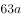。设党员人数为，则非党员人数为，根据题意得，解得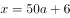。若使男性中党员的比重最高，则需男性中的党员人数最多，最多为人，男性中党员的比重最高为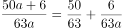。若使比重最大，则a取值最小，时，男性中党员的比重最高为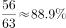。题干问最高，向下取整为。

故正确答案为F。

---

### 第 2 题　qid 2377368 · 数学运算

有一个三位数的质数（除了1和它本身之外，不能被其他整数整除的正整数），其个、十、百位数字各不相同且均为质数。若将该数的百位数字与个位数字对调，所得新数比该数大495，则该数的十位数字为（  ）。

- **A**. 0
- **B**. 1
- **C**. 2
- **D**. 3
- **E**. 4
- **F**. 5　✅
- **G**. 6
- **H**. 7

**答案**：F

**官方解析**

由这个三位数的个位、十位、百位均为质数可知：个位、十位、百位上的数可能为2、3、5、7，百位和个位对调后，得到的新数比该数字大495，即原来的百位-原来的个位得到的尾数为5，确定原来的百位为2，原来的个位为7，因为个位、十位、百位上的数字各不相同，十位只能从3和5中选择，如果十位为3，237为3倍数不是质数，排除，则该数只能为257。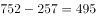，满足所有条件。

故正确答案为F。

---

### 第 3 题　qid 2377370 · 数学运算

制作一批风筝，甲需要12天完成，乙需要18天完成，两人共同制作，完成时甲比乙多制作了72个，如果按“甲制作一天、乙制作两天”的方式重复下去，当制作完成时，甲制作的风筝有（  ）个。

- **A**. 140
- **B**. 145
- **C**. 150
- **D**. 155
- **E**. 160　✅
- **F**. 165
- **G**. 170
- **H**. 175

**答案**：E

**官方解析**

设总量为36x，则甲效率为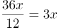，乙效率为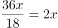，俩人合作完成时间为，根据题意可得：，解得。即总量为360，甲效率为30，乙效率为20。

按照“甲制作一天、乙制作两天”的方式重复工作，工作周期为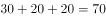，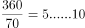，5个周期中，甲制作了个，最后10个也由甲完成，一共完成个。

故正确答案为E。

---

### 第 4 题　qid 2377371 · 数学运算

幼儿园老师设计了一个摸彩球游戏，在一个不透明的盒子里混放着红、黄两种颜色的小球，它们除了颜色不同，形状、大小均一致。已知随机摸取一个小球，摸到红球的概率为三分之一，如果从中先取出3红7黄共10个小球，再随机摸取一个小球，此时摸到红球的概率变为五分之二，那么原来盒中共有红球（  ）个。

- **A**. 2
- **B**. 3
- **C**. 4
- **D**. 5　✅
- **E**. 6
- **F**. 7
- **G**. 8
- **H**. 9

**答案**：D

**官方解析**

假设原来盒子中共有x个红球，因随机摸取一个小球，摸到红球的概率为1/3，则原来盒子中共有3x个小球。取出3红7黄共10个小球后，红球剩下个，小球总个数为，此时随机摸取一个小球，摸到红球的概率为，则，解得。

故正确答案为D。

---

### 第 5 题　qid 2377374 · 数学运算

汽车的经济时速是指汽车最省油的行驶速度，据某汽车公司测算，该公司一款新型汽车以每小时70~110公里的速度行驶时，其每公里耗油量公式为（为汽车速度，为耗油量），那么该款汽车在70~110公里/小时速度区间行驶时每百公里的最低耗油量约为（  ）。

- **A**. 9　✅
- **B**. 10
- **C**. 11
- **D**. 12
- **E**. 13
- **F**. 14
- **G**. 15
- **H**. 16

**答案**：A

**官方解析**

，即。若每百公里耗油量越小，则越大，即越大，且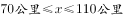。故当公里时，每百公里耗油量最小，与A项最接近。

故正确答案为A。

---

### 第 6 题　qid 2377373 · 数学运算

主人随机安排10名客人坐成一圈就餐，这10名客人中有两对情侣，那么这两对情侣恰好都被安排相邻而坐的概率约在（  ）。

- **A**. 
到之间

- **B**. 
到之间

- **C**. 
到之间

- **D**. 
到之间

- **E**. 
到之间
　✅
- **F**. 
到之间

- **G**. 
到之间

- **H**. 
以上

**答案**：E

**官方解析**

10人围成一圈就餐，构成圆桌排列，则总的情况数种情况；

所求情况分步考虑：①两对情侣要相邻而坐，用捆绑法有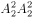种情况；②再将捆绑的两对情侣看成2个人，与剩余6个人一起，8个人进行圆桌排列，有种情况。

则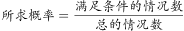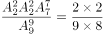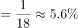。

故正确答案为E。

---

### 第 7 题　qid 2377376 · 数学运算

小明的步行速度为1米/秒，从A地到B地步行需要3小时，骑自行车需要1小时，电动车的速度是自行车的两倍。现在小明从A地出发，步行1.5小时后骑自行车到B地，然后返回途中先骑电动车走完一半路程，再步行返回A地，则小明的往返平均速度为（  ）千米/小时。

- **A**. 4.75
- **B**. 5.76　✅
- **C**. 5.96
- **D**. 6.25
- **E**. 6.75
- **F**. 7.24
- **G**. 8.18
- **H**. 9.20

**答案**：B

**官方解析**

分情况讨论往返的各种用时：

①小明去程走了1.5小时、返程走一半路程同样需要1.5小时，则步行时间为3小时；

②去程有一半路程骑自行车，因自行车走全程需1小时，则骑自行车时间为0.5小时；

③返程有一半路程骑电动车，电动车的速度是自行车的2倍，路程相同则时间与速度成反比，则骑电动车时间是骑自行车时间的一半，为小时；

所以往返总时间为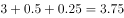小时。

而小明的步行速度为1米/秒=3.6千米/小时，根据题意，从A到B需要步行3小时，则单程为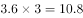千米，往返路程千米。

根据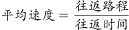，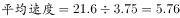千米/小时。

故正确答案为B。

---

### 第 8 题　qid 2377378 · 数学运算

甲乙两部队参加军事演习，甲部队从大本营以60千米/小时的速度往西行进，乙部队晚半小时由大本营往东行进，速度比甲部队慢，一段时间后，两部队同时接到军令紧急集合，集合地位于大本营正北某处。此时两部队所在位置与集合地恰好构成有一角为30度的直角三角形，若两部队同时调整方向往集合地行军，且保持速度不变，则可同时到达集合地，则集合地与大本营的距离约为（  ）千米。

- **A**. 41　✅
- **B**. 43
- **C**. 45
- **D**. 47
- **E**. 49
- **F**. 51
- **G**. 53
- **H**. 55

**答案**：A

**官方解析**

根据题意可得右图，

因甲部队速度大于乙部队且早出发半小时，故，则，。两部队同时调整方向可同时到达集合地C，则甲部队、乙部队速度之比为，则乙部队速度为千米/小时。

设乙部队从B点到C点行驶时间为，则，，在中，，则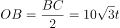，同理可得。因甲部队比乙部队早出发半小时即0.5小时，则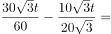，解得小时。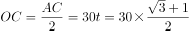，即约41千米。

故正确答案为A。

---

### 第 9 题　qid 2377379 · 数学运算

调酒师调配鸡尾酒，先在调酒杯中倒入120毫升柠檬汁，再用伏特加补满，摇匀后倒出80毫升混合液备用，再往杯中加满番茄汁并摇匀，一杯鸡尾酒就调好了。若此时鸡尾酒中伏特加的比例是，则调酒杯的容量是（    ）毫升。

- **A**. 165
- **B**. 170
- **C**. 175
- **D**. 180
- **E**. 185
- **F**. 190
- **G**. 195
- **H**. 200　✅

**答案**：H

**官方解析**

假设调酒杯的容量为毫升，在原有120毫升柠檬汁的基础上，用伏特加补满，因此加入伏特加的量为毫升，这时伏特加浓度为毫升。混匀后倒出80毫升后，还剩余毫升混合液，此时伏特加的量为。最后加入番茄汁，但是伏特加的量无变化，可得方程：。

由于本题属于分式方程，直接计算难度太高，故考虑代入选项验证。优先选择好算的选项入手，H项为整百的数，因此代入H项。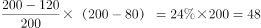，等式成立。

故正确答案为H。

---

### 第 10 题　qid 2377384 · 数学运算

某小学举行作文大赛，家长们对挑选出来的6篇作文进行不记名投票。每张选票可以选择6篇作文中的任意一篇或多篇，但只有选择不超过3篇作文的票才是有效票。6篇作文的得票数（不考虑是否有效）分别为总票数的、、、、、，那么本次投票的有效率最少为（  ）。

- **A**. 

- **B**. 

- **C**. 

- **D**. 

　✅
- **E**. 

- **F**. 

- **G**. 

- **H**. 

**答案**：D

**官方解析**

假设共有100位家长，每名家长有一张投票，在票上写出相应作文的编号。则6篇作文的总得票数票，人均投票数为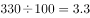票。

要使投票有效率（即有效票占比）最低，则应让无效率最高。因此，应让无效票的人均投票数尽可能靠近3.3票，取为一人4票；让有效票的人均投票数尽可能远离3.3票，取为一人1票。

设有效票观众人数为，无效票观众人数为，则总票数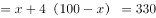票，解得：人，则最少为24人，即有效率最低为。

故正确答案为D。

---

## 判断推理

### 第 1 题　qid 2376521 · 图形推理

把下面的图形分为两类，使每一类图形都有各自的共同特征或规律，分类正确的一项是：

- **A**. ①④⑥，②③⑤　✅
- **B**. ①②③，④⑤⑥
- **C**. ①③⑥，②④⑤
- **D**. ①③④，②⑤⑥

**答案**：A

**官方解析**

本题为分组分类题目，图形均为明显两个图形相交，考虑图形间关系。观察发现，图①④⑥的公共边为短边，图②③⑤的公共边为长边，故①④⑥一组，②③⑤一组。
故正确答案为A。

---

### 第 2 题　qid 2376760 · 图形推理

把下面的图形分为两类，使每一类图形都有各自的共同特征或规律，分类正确的一项是：

- **A**. ①③⑥，②④⑤
- **B**. ①③⑤，②④⑥
- **C**. ①④⑥，②③⑤　✅
- **D**. ①②④，③⑤⑥

**答案**：C

**官方解析**

元素组成不同，优先考虑属性规律。对称、曲直均无明显规律，考虑开闭性。图①④⑥均为半开半封闭图形；图②③⑤均为全封闭图形。因此①④⑥一组，②③⑤一组。
故正确答案为C。

---

### 第 3 题　qid 2376468 · 图形推理

从所给四个选项中，选择最合适的一个填入问号处，使之呈现一定的规律性：

- **A**. A
- **B**. B
- **C**. C　✅
- **D**. D

**答案**：C

**官方解析**

元素组成不同，且无明显属性规律，考虑数量规律。图四、图五封闭面明显，考虑面数量。面数量依次为2、3、4、5、6，则问号处图形面数量为7，只有C符合要求。
故正确答案为C。

---

### 第 4 题　qid 2376756 · 图形推理

从所给的四个选项中，选择最合适的一个填入问号处，使之呈现一定的规律性：

- **A**. A
- **B**. B　✅
- **C**. C
- **D**. D

**答案**：B

**官方解析**

解析1：元素组成不相同，不相似，优先考虑属性规律。题干均为轴对称图形，且对称轴数量均为3条。A项1条；B项3条；C项2条；D项2条。

故正确答案为B。

注：如上图所示，A项中蓝点处于圆与三角形的切点处，而红点并非处于圆与三角形的切点处，故此图只有1条对称轴，而不是3条。

解析2：元素组成不相同，不相似，优先考虑属性规律。题干有曲线有直线，考虑曲直性，图一为有曲有直图形，图二为全直线图形，图三为有曲有直图形，图四为全直线图形，因此“？”处选择一个有曲有直图形。A项有曲有直，B、C、D三项均为纯直线图形。

故正确答案为A。

解析3：元素组成不相同，不相似，考虑属性和数量规律。题干出现切圆，考虑笔画数，题干图形笔画数依次为2121？，故？处应为2笔画图形，只有D项为2笔画。

故正确答案为D。

本题有多种规律，但从图形特征和命题思路分析，考虑到题干几个图均是等边三角形的变形图，而等边三角形以及其变形图在近几年的考试中多用于考查对称性，故粉笔倾向对称性这一考点。

故正确答案为B。

---

### 第 5 题　qid 2376754 · 图形推理

正方体切掉一块后剩余部分如下图左侧所示，右侧哪一项是其切去部分的形状？

- **A**. A
- **B**. B　✅
- **C**. C
- **D**. D

**答案**：B

**官方解析**

此题为立体图形拼合问题，解题原则为凹凸一致。根据题目要求，可知正确选项和左侧图形拼合后应为正方体。观察题干左侧图形，发现外侧斜坡和其内侧上方凸出的小矩形在同一侧，而A、C两项外侧斜坡和凹进去的小矩形不在同一侧，排除；比较B、D两项，仅在中间位置不同，题干左侧图形中间位置存在斜坡，根据凹凸一致的原则，选项也应存在斜坡，只有B项符合。
故正确答案为B。

---

### 第 6 题　qid 2376560 · 定义判断

似动是指在一定的时间和空间条件下，人们在静止的物体间看到了运动，或者在没有连续位移的地方，看到了连续位移。
根据上述定义，下列选项不属于似动现象的是：

- **A**. 两岸青山相对出
- **B**. 坐地日行八万里　✅
- **C**. 郡邑浮前浦，波澜动远空
- **D**. 明月却多情，随人处处行

**答案**：B

**官方解析**

第一步：找出定义关键词。
“在一定的时间和空间条件下”、“人们在静止的物体间看到了运动”、“或者在没有连续位移的地方，看到了连续位移”。
第二步：逐一分析选项。
A项：“两岸青山相对出”意思是两岸的青山相继出迎，一座座扑进眼帘。青山本是静止的物体，但是作者却看到了它的运动，符合“人们在静止的物体间看到了运动”，符合定义，排除；
B项：“坐地日行八万里”意思是人们住在地球上，因地球自转，于不知不觉中，一日已行了八万里路。依据科学理论，当我们处于赤道附近的时候，即使每天原地不动，也会运动八万华里，即人没有动，而且也看不见运动。所以不符合“在静止的物体间看到了运动”、“或在没有连续位移的地方，看到了连续位移”，不符合定义，当选；
C项：“郡邑浮前浦，波澜动远空”意思是远处的城郭好像在水面上飘动，波翻浪涌，辽远的天空也仿佛为之摇荡。但是事实上，城郭本身不会运动，天空也不会飘荡，符合“人们在静止的物体间看到了运动”，符合定义，排除；
D项：“明月却多情，随人处处行”意思是明月却是那么多情，不管人走到哪里，它都陪伴着你同行。但是我们用肉眼是看不到明月本身在运动的，所以符合“人们在静止的物体间看到了运动”，符合定义，排除。
本题为选非题，故正确答案为B。

---

### 第 7 题　qid 2376584 · 定义判断

投射性认同指一个人诱导他人以一种限定的方式来作出反应的行为模式。体现在人际关系中，往往是甲方把内心中“好”或“坏”的客体投射到乙方身上，认为乙方“好”或“坏”，而乙方又接受了这一投射幻想，于是就以甲方所设想的方式来对待甲方。然后甲方又进一步验证了自己的假设，认为乙方就是他所认为的那样的人。
根据上述定义，下列选项属于投射性认同的是：

- **A**. 寒门亦可出贵子
- **B**. 严师方能出高徒
- **C**. 虎父果然无犬子　✅
- **D**. 慈母自古多败儿

**答案**：C

**官方解析**

第一步：找出定义关键词。
“甲方把内心中‘好’或‘坏’的客体投射到乙方身上”、“乙方接受这一幻想”、“甲方验证了假设”。
第二步：逐一分析选项。
A项：寒门也可以出贵子，是指出生微贱的年轻人在自身努力和外界条件支持下也可以获得成就，认为寒门可以出贵子，符合“甲方把内心中‘好’或‘坏’的客体投射到乙方身上”，但最终出身寒门的年轻人是否成为了贵子并没有得到验证，不符合“乙方接受这一幻想”、“甲方验证了假设”，不符合定义，排除；
B项：严师方能出高徒，是指严格的师傅或老师能教出本领高超的好徒弟或好学生，认为严师才能出高徒，符合“甲方把内心中‘好’或‘坏’的客体投射到乙方身上”，但该项没有涉及严师的徒弟最后到底是否成为了高徒的验证，不符合“乙方接受这一幻想”、“甲方验证了假设”，不符合定义，排除；
C项：虎父果然无犬子，是指出色的父亲果然不会生出一般的孩子，认为虎父无犬子，符合“甲方把内心中‘好’或‘坏’的客体投射到乙方身上”，且该项中的“果然”体现了虎父的孩子确实不是犬子，体现了进一步验证了自己的假设，符合“乙方接受这一幻想”、“甲方验证了假设”，符合定义，当选；
D项：慈母自古多败儿，是指宠溺孩子的母亲，教出的孩子多是很自私很任性，认为慈母多败儿，符合“甲方把内心中‘好’或‘坏’的客体投射到乙方身上”，但该项没有涉及慈母的儿子最后到底是否是自私任性的人的验证，不符合“乙方接受这一幻想”、“甲方验证了假设”，不符合定义，排除。
故正确答案为C。

---

### 第 8 题　qid 2376577 · 定义判断

关怀强迫症即一个人特别需要别人依赖自己，总是爱向别人提供别人不需要的关怀。并且，这种人还强迫别人接受自己的关怀，从而使别人不能独立。当别人依赖自己的时候，他就会感到满足，感到自己有价值。这种症状会压抑人的神经，并同时给身边的亲朋好友甚至一般的同事带来诸多不便。
根据上述定义，下列属于关怀强迫症的是：

- **A**. 张某说：“我一天没见到儿子就会发疯”
- **B**. 李某连哄带骗让感冒的女儿吃下感冒药
- **C**. 刘某从小学到大学期间都住自己家里
- **D**. 王某在女儿就读的大学附近租房陪读　✅

**答案**：D

**官方解析**

第一步：找出定义关键词。
“需要别人依赖自己”、“提供别人不需要的关怀”、“强迫别人接受”、“使别人不能独立”。
第二步：逐一分析选项。
A项：张某一天没见到儿子就会发疯，说明是张某依赖儿子，而并非是儿子依赖自己，不符合“需要别人依赖自己”，不符合定义，排除；
B项：李某连哄带骗让感冒的女儿吃下感冒药，没有体现“需要别人依赖自己”，且感冒的女儿需要被人关怀照顾，不符合“提供别人不需要的关怀”，不符合定义，排除；
C项：刘某上学期间住在家里，没有体现到强迫别人，不符合“强迫别人接受”，不符合定义，排除；
D项：王某在女儿就读的大学附近租房陪读，女儿已经读大学了，说明她已经能够独立地生活和学习，符合 “提供别人不需要的关怀”、“强迫别人接受”、“使别人不能独立”，符合定义，当选。
故正确答案为D。

---

### 第 9 题　qid 2376786 · 定义判断

投资市场相反理论是指投资市场本身并不创造新的价值，没有增值，甚至可以说是减值。如果一个投资者在投资行动时同多数投资者相同，那么他一定不是获利最大的，因为不可能多数人获利；要获得最大的利益，一定要同多数人的行动不一致。
根据上述定义，下列选项不符合投资市场相反理论的是：

- **A**. “已经跌这么多了，该到底了”　✅
- **B**. “在市场投资者爆满的时候，我们再离场”
- **C**. “只要你和多数投资者的意见相左，致富机会永远存在”
- **D**. “人弃我取，别人恐惧我贪婪”

**答案**：A

**官方解析**

第一步：找出定义关键词。
“投资市场本身并不创造新的价值，没有增值，甚至可以说是减值”、“要获得最大的利益，一定要同多数人的行动不一致”。
第二步：逐一分析选项。
A项：该项只说了投资产品价值的变化，并没有提及投资者人数是多还是少，以及投资者的策略是否相同，不符合定义，选非题，当选；
B项：该项提到在投资者非常多的时候我们再离场，表明我们与大多数投资者的策略是不相同的，符合 “要获得最大的利益，一定要同多数人的行动不一致”，符合定义，选非题，排除；
C项：该项说明投资者在投资时，选择和多数投资者不同的意见就可以成功，这符合“要获得最大的利益，一定要同多数人的行动不一致”，符合定义，选非题，排除；
D项：该项表明“我”和大多数投资者的投资策略是不同的，大家害怕投资失败选择放弃的时候，而“我”为了追求利润会选择购买，符合“要获得最大的利益，一定要同多数人的行动不一致”，符合定义，选非题，排除。
本题为选非题，故正确答案为A。

---

### 第 10 题　qid 2376581 · 定义判断

时间感知扭曲是指对时间不正确的知觉。在生活中，受各种因素影响，人们对时间的感知往往会不符合实际，有时候觉得时间过长，有时候觉得时间太短。许多原因都可以造成时间感知扭曲，现实中一场糟糕的表演会让人如坐针毡、觉得终场遥遥无期，与此相反的是，人们对于美好愉快的时光总嫌太短。
根据上述定义，下列选项不符合时间感知扭曲的是：

- **A**. 一日不见，如三月兮
- **B**. 欢愉嫌夜短，寂寞恨更长
- **C**. 孤馆度日如年，风露渐变
- **D**. 入春才七日，离家已二年　✅

**答案**：D

**官方解析**

第一步：找出定义关键词。
“对时间不正确的知觉”。
第二步：逐一分析选项。
A项：“一日不见，如三月兮”指的是一天没见，就觉得过去了三个月，符合“对时间不正确的知觉”，符合定义，排除；
B项：“欢愉嫌夜短，寂寞恨更长”指的是欢乐时嫌夜里时间短促，寂寞时怨恨夜晚时间漫长，符合“对时间不正确的知觉”，符合定义，排除；
C项：“孤馆度日如年，风露渐变”指的是在驿馆里形单影只，度日如年，秋风和露水都开始变得寒冷，过一天就好像过了一年一样，符合“对时间不正确的知觉”，符合定义，排除；
D项：“入春才七日，离家已二年”指的是入春已经过了七天了，但离开家已经两年了，这是对于时间的客观陈述，不符合“对时间不正确的知觉”，不符合定义，当选。
本题为选非题，故正确答案为D。

---

### 第 11 题　qid 2376571 · 定义判断

意志的活动过程会体现以下两大定律。其中，意志强度边际效应定律是指意志的强度随着自身行为的活动规模的增长而下降；意志强度时间衰减定律是指意志的强度随着自身行为的持续时间的增长而呈现负指数下降。
根据上述定义，下列选项最能体现意志强度时间衰减定律的是：

- **A**. 锲而舍之，朽木不折
- **B**. 为山九仞，功亏一篑
- **C**. 穷且益坚，不坠青云之志
- **D**. 一鼓作气，再而衰，三而竭　✅

**答案**：D

**官方解析**

第一步：找出定义关键词。
意志强度边际效应定律：“意志强度”、“随自身行为的活动规模增长而下降”；
意志强度时间衰减定律：“意志强度”、“随自身行为的持续时间增长而呈现负指数下降”。
第二步：逐一分析选项。
A项：“锲而舍之，朽木不折”意思是说如果不坚持做一件事，就算是腐朽的木头也无法折断，说明人们不坚持做一件事的后果，不符合“随自身行为的持续时间增长”，不符合定义，排除；
B项：“为山九仞，功亏一篑”意思是说堆九仞高的山，只缺一筐土导致不能完成，是用来比喻做事情只差最后一点没能完成，说明没有一直坚持下去，不符合“随自身行为的持续时间增长”，不符合定义，排除；
C项：“穷且益坚，不坠青云之志”意思是说一个人处境越是艰难，就越是坚忍不拔，越是不丢失高远之志，没有体现与时间增长的关系，不符合“随着自身行为的持续时间的增长而呈现负指数下降”，不符合定义，排除；
D项：“一鼓作气，再而衰，三而竭”意思是说，第一次击鼓士气会大大的增加，第二次击鼓士气就会减弱了，第三次击鼓就没有士气了，说明士气随着时间的增加而减弱，符合“随时间增长而呈现负指数下降”，符合定义，当选。
故正确答案为D。

---

### 第 12 题　qid 2376585 · 定义判断

元素指自然界中一百多种基本的金属和非金属物质，它们由一种原子组成，其原子中的每一个核子具有同样数量的质子，用一般的化学方法不能使之分解，并且能构成一切物质。原子是化学反应不可再分的基本微粒，原子在化学反应中不可分割，但在物理状态中可以分割，由原子核和绕核运动的电子组成。分子由原子构成，是构成物质的一种基本粒子的名称，是单独存在、保持化学性质最小的粒子。
根据上述定义，下列选项正确的是：

- **A**. 原子是构成物质的最小粒子
- **B**. 空气由各种细小的原子构成
- **C**. 具有不同数量质子的原子不是同一类元素　✅
- **D**. 一氧化碳分子（CO）由一个氧元素和一个碳元素构成

**答案**：C

**官方解析**

第一步：找出定义关键词。
“元素是指自然界中一百多种基本的金属和非金属物质”、“元素由一种原子组成，其原子中的每一个核子具有相同数量的质子”、“原子用一般的化学方法不能使之分解，并且能构成一切物质”、“原子是化学反应不可再分的基本微粒，原子在化学反应中不可分割，但在物理状态中可以分割，由原子核和绕核运动的电子组成”、“分子由原子构成，是构成物质的一种基本粒子的名称，是单独存在、保持化学性质最小的粒子”。
第二步：逐一分析选项。
A项：原子是构成物质的最小粒子，不符合“在物理状态中可以分割”，不符合定义，排除；
B项：空气是一种混合物，不可能是由细小的原子构成，不符合定义，排除；
C项：具有不同数量质子的原子不是同一类元素，符合“元素由一种原子组成，其原子中的每一个核子具有相同数量的质子”，符合定义，当选；
D项：选项不符合“分子由原子构成，是构成物质的一种基本粒子的名称，是单独存在、保持化学性质最小的粒子”，一氧化碳分子（CO）应该是由一个氧原子和一个碳原子构成，不符合定义，排除。
故正确答案为C。

---

### 第 13 题　qid 2376789 · 定义判断

类脑计算技术总体分为三个层次：结构层次模仿脑、器件层次逼近脑、智能层次超越脑。其中，结构层次模仿脑是指将大脑作为一个物质和生理对象进行解析，获得基本单元(各类神经元和神经突触等)的功能及其连接关系（网络结构）；器件层次逼近脑是指研制能够模拟神经元和神经突触功能的器件，从而在有限的物理空间和功耗条件下构造出人脑规模的神经网络系统；智能层次超越脑是指通过对类脑计算机进行信息刺激、训练和学习，使其产生与人脑类似的智能。
根据上述定义，下列属于智能层次超越脑的是：

- **A**. 调整神经网络的突触连接关系及连接频率和强度　✅
- **B**. 绘制精确的人类大脑动态图谱以解析探测大脑
- **C**. 开发功能、密度与人类大脑皮层相当的电子装备
- **D**. 捕捉细微的单个神经元放电的非线性动力学过程

**答案**：A

**官方解析**

第一步：找出定义关键词。
结构层次模仿脑：“将大脑作为物质和生理对象进行解析”、“获得基本单元的功能及其连接关系”；
器件层次逼近脑：“研制能够模拟神经元和神经突触功能的器件”、“构造出人脑规模的神经网络系统”；
智能层次超越脑：“对类脑计算机进行信息刺激、训练和学习”、“产生与人脑类似的智能”。
第二步：逐一分析选项。
A项：调整神经网络的突触连接关系及连接频率和强度，符合“对类脑计算机进行信息刺激、训练和学习” ，符合“智能层次超越脑”定义，当选；
B项：绘制精确的人类大脑动态图谱，符合“将大脑作为物质和生理对象进行解析”，符合“结构层次模仿脑”定义，不符合“智能层次超越脑”定义，排除；
C项：开发功能、密度与人类大脑皮层相当的电子装备，符合“研制能够模拟神经元和神经突触功能的器件”，符合“器件层次逼近脑”定义，不符合“智能层次超越脑”定义，排除；
D项：捕捉细微的单个神经元放电的非线性动力学过程，符合“获得基本单元的功能及其连接关系”，符合“结构层次模仿脑”定义，不符合“智能层次超越脑”定义，排除。
故正确答案为A。
注：本题目来自于《类脑计算机的现在与未来》，各选项对应于该文章中的句子如下所示：
A项：所谓“智能层次超越脑”，属于类脑计算机应用软件层次的问题，是指通过对类脑计算机进行信息刺激、训练和学习，使其产生与人脑类似的智能甚至涌现出自主意识，实现智能培育和进化。刺激源可以是虚拟环境，也可以是来自现实环境的各种信息（例如互联网大数据）和信号（例如遍布全球的摄像头和各种物联网传感器），还可以是机器人“身体”在自然环境中探索和互动。在这个过程中，类脑计算机能够调整神经网络的突触连接关系及连接强度，实现学习、记忆、识别、会话、推理以及更高级的智能；
B项：所谓“结构层次模仿脑”，是将大脑作为一个物质和生理对象进行解析，获得基本单元（各类神经元和神经突触等）的功能及其连接关系（网络结构）；
C项：所谓“器件层次逼近人脑”，是指研制能够模拟神经元和神经突触功能的微纳光电器件，从而在有限的物理空间和功耗条件下构造出人脑规模的神经网络系统。这方面的代表性项目是美国国防部先进研究项目局（DARPA）2008年启动的“神经形态自适应可塑性可扩展电子系统”（即突触），其目标是研制出器件功能、规模与密度均与人类大脑皮层相当的电子装置；
D项：所谓“结构层次模仿脑”，是将大脑作为一个物质和生理对象进行解析，获得基本单元（各类神经元和神经突触等）的功能及其连接关系（网络结构）。这一阶段，主要通过神经科学实验采用先进的分析探测技术完成。1952年，英国科学家霍奇金和赫胥黎提出了以两人命名的HH方程，精确刻画了单个神经元放电的非线性动力学过程，这是神经元信息处理的标准数学模型。

---

### 第 14 题　qid 2376565 · 定义判断

消费滞后是指个人消费滞后于国家经济发展和个人家庭收入所应达到的平均消费水平。消费超前是指当下的收入水平不足以购买现在所需的产品或服务，以贷款、分期付款、预支等形式进行消费。
根据上述定义，下列属于消费超前的是：

- **A**. 职员小王以信用卡支付的形式在网上订购了火车票
- **B**. 大学生小李通过某借贷平台购买了某知名品牌电脑　✅
- **C**. 退休工人老张名下有商品房和汽车，但坚持只用老式的直板手机
- **D**. 青年教师小刘有十万元定期存款未到期，向同事借了八万元买车

**答案**：B

**官方解析**

第一步：找出定义关键词。
消费滞后：“指个人消费滞后于国家经济发展和个人家庭收入所应达到的平均消费水平”；
消费超前：“指当下的收入水平不足以购买现在所需的产品或服务”、“以贷款、分期付款、预支等形式进行消费”。
第二步：逐一分析选项。
A项：小王为职员说明小王已经工作，购买火车票应该是消费水平范围内，不符合“当下的收入水平不足以购买现在所需的产品或服务”，不符合定义，排除；
B项：小李是一名大学生，尚未参加工作，购买电脑符合“当下的收入水平不足以购买现在所需的产品或服务”，且通过“某借贷平台购买”属于“贷款”的支付方式，符合定义，当选；
C项：老张有房有车，却使用老式的直板手机，符合“个人消费滞后于国家经济发展和个人家庭收入所应达到的平均消费水平”，属于消费滞后，不属于消费超前，不符合定义，排除；
D项：小刘有十万元的存款，而车只有八万元，也就是当下的收入足以购买现在所需的产品，不符合“当下的收入水平不足以购买现在所需的产品或服务”，且向同事借钱不符合“以贷款、分期付款、预支等形式进行消费”，不符合定义，排除。
故正确答案为B。

---

### 第 15 题　qid 2376587 · 定义判断

水文节律指湖泊水情周期性、有节律的变化。广义水文节律包括昼夜、月运、季节和年际节律。正常情况下，由于流域气候和下垫面等因素较稳定，湖泊多年平均水位趋于稳定数值即湖泊正常年平均水位。所以湖泊年际节律以干扰因素驱动的突变性和适应干扰后的阶段稳定性为特点，无渐变趋向；而昼夜节律对生态系统影响微弱。因此，狭义水文节律特指月运节律与季节节律。
根据上述定义，下列涉及狭义水文节律的是：

- **A**. 
鄱阳湖受降雨持续减少和来水减少双重影响，水面面积持续萎缩

- **B**. 
洪泽湖历史年均水温，最高水温在9月，最低水温在1月
　✅
- **C**. 
洞庭湖去年年降水量1560毫米，其中4~6月降水约占全年一半

- **D**. 
巢湖流域年平均气温稳定在之间，有200天以上无霜期

**答案**：B

**官方解析**

第一步：找出定义关键词。
水文节律：“湖泊水情周期性、有节律的变化”；
广义水文节律：“昼夜、月运、季节和年际节律”；
狭义水文节律：“月运节律和季节节律”。
（注：水情是指江河湖泊的状况、特征及地理意义，如流量、水位、流速、水温与冰情等）
本题要选的是符合狭义水文节律的选项。
第二步：逐一分析选项。
A项：鄱阳湖水面面积持续萎缩，说明是一直在减小，不存在周期性的变化，不符合定义，排除；
B项：洪泽湖历史年均最高水温在9月，最低水温在1月，月份和季节不同水温也不同，而且是统计了历史上多年的水温，符合“湖泊水情周期性、有节律的变化”，符合“季节节律”，符合狭义水文节律，符合定义，当选（水情指江河湖泊的状况、特征及地理意义，如流量、水位、流速、水温与冰情等，水温是水文测验的基本项目之一）；
C项：只是给出洞庭湖去年一年的降水量，没有体现“周期性、有节律的变化”，不符合定义，排除；
D项：巢湖流域平均气温在15-16摄氏度之间，有200天以上无霜期，是湖泊流经区域的气温变化，而不是湖泊水情的变化，不符合定义，排除。
故正确答案为B。

---

### 第 16 题　qid 2377331 · 类比推理

玻璃幕墙：光源：光污染
正确的一项是（  ）。

- **A**. 汽车尾气：凝结核：酸雨　✅
- **B**. 海上风暴：气压：海啸
- **C**. 火山喷发：板块：地震
- **D**. 空气消毒：紫外线：臭氧

**答案**：A

**官方解析**

第一步：判断题干词语间逻辑关系。
阳光照射强烈时，城市里建筑物的玻璃幕墙等装饰反射光源，明晃白亮、眩眼夺目，形成白亮污染，为光污染的一种，即玻璃幕墙通过对光源的反射，从而形成光污染，即前两者共同作用形成第三个词。三者是原因结果的对应关系。玻璃幕墙是人为的环境污染。
第二步：判断选项词语间逻辑关系。
A项：汽车尾气形成凝结核，凝结核是一种悬浮颗粒，这种颗粒是由空气中的各种尘埃颗粒或各种离子结合而成。凝结核聚在一起形成酸雨。即汽车尾气通过形成凝结核，再与汽车尾气中的酸根离子共同形成酸雨。三者是原因结果的对应关系，汽车尾气是人为的环境污染，与题干逻辑关系一致，当选；
B项：海上风暴是指由于强烈的大气扰动（强风和气压骤变）引起的海面异常升高现象，海啸就是由海底地震、火山爆发、海底滑坡或气象变化产生的破坏性海浪，二者都是在海上发生的特殊天气，海上风暴可能导致海啸，但是气压骤变导致海上风暴，而不是气压本身导致海上风暴，与题干逻辑关系不一致，排除；
C项：板块运动（而非板块）可以导致火山喷发或地震，前两个词为因果关系，与题干逻辑关系不一致，排除；
D项：紫外线可以给空气消毒，臭氧也可以给空气消毒，与题干逻辑关系不一致，排除。
故正确答案为A。

---

### 第 17 题　qid 2377332 · 类比推理

闹钟：发条：计时
正确的一项是（  ）。

- **A**. 微生物：细菌：分解
- **B**. 工具：钳子：修理
- **C**. 空调：压缩机：制冷　✅
- **D**. 土豆：碳水化合物：营养

**答案**：C

**官方解析**

第一步：判断题干词语间逻辑关系。
发条是闹钟的组成部分，闹钟有计时的功能。前两词是组成关系，后两词是功能对应。
第二步：判断选项词语间逻辑关系。
A项：细菌是微生物的一种，二者是种属关系，与题干逻辑关系不一致，排除；
B项：钳子是工具的一种，二者是种属关系，与题干逻辑关系不一致，排除；
C项：压缩机是空调的组成部分，二者是组成关系，空调有制冷的功能，二者是功能对应，与题干逻辑关系一致，当选；
D项：碳水化合物是土豆的组成成分，营养不是土豆的功能，与题干逻辑关系不一致，排除。
故正确答案为C。

---

### 第 18 题　qid 2376575 · 类比推理

老字号：新品牌：传承

- **A**. 老传统：新花样：质疑
- **B**. 老配方：新工艺：创新　✅
- **C**. 老问题：新思考：评价
- **D**. 老物件：新东西：区分

**答案**：B

**官方解析**

第一步：判断题干词语间逻辑关系。
老字号经过传承可以变为新品牌。
第二步：判断选项词语间逻辑关系。
A项：老传统被质疑不能变为新花样，与题干逻辑关系不一致，排除；
B项：老配方经过创新可以变为新工艺，与题干逻辑关系一致，当选；
C项：老问题被评价不能变为新思考，与题干逻辑关系不一致，排除；
D项：老物件被区分不能变为新东西，与题干逻辑关系不一致，排除。
注：此题有同学可能会纠结D项，认为老字号与新品牌都是品牌，老物件与新东西都是物品。但D项前两个词与区分无关。从题干三个词的关系看体现了新老物体之间的变化，而B项也是体现了新老事物之间的变化，因此粉笔更倾向于B项。
故正确答案为B。

---

### 第 19 题　qid 2376558 · 类比推理

效率：公平：市场经济

- **A**. 科学：理性：政治哲学
- **B**. 革命：改良：社会制度
- **C**. 民主：集中：组织原则　✅
- **D**. 美丑：善恶：审美范畴

**答案**：C

**官方解析**

第一步：判断题干词语间逻辑关系。
市场经济需要兼顾效率与公平。
第二步：判断选项词语间逻辑关系。
A项：政治哲学不需要兼顾科学与理性，且科学是理性的，与题干逻辑关系不一致，排除； 
B项：社会制度不需要兼顾革命与改良，与题干逻辑关系不一致，排除；
C项：组织原则需要兼顾民主与集中，与题干逻辑关系一致，当选；
D项：审美范畴不需要兼顾美丑与善恶，且善恶不属于审美的范畴，与题干逻辑关系不一致，排除。
故正确答案为C。

---

### 第 20 题　qid 2376570 · 类比推理

瓮牖绳枢：粗茶淡饭：清寒

- **A**. 叠床架屋：衣锦食肉：奢华
- **B**. 箪食瓢饮：曲肱饮水：简朴　✅
- **C**. 轻车熟路：霜行草宿：轻松
- **D**. 金盆洗手：金屋藏娇：阔绰

**答案**：B

**官方解析**

第一步：判断题干词语间逻辑关系。
瓮牖绳枢指以破瓮作窗户，以草绳系户枢，比喻贫穷人家；粗茶淡饭形容饮食简单，生活简朴，二者都可以用来形容清寒。
第二步：判断选项词语间逻辑关系。
A项：叠床架屋比喻办事重复，自找麻烦；衣锦食肉形容生活富足，第一词与奢华无关，与题干逻辑关系不一致，排除；
B项：箪食瓢饮形容读书人安于贫穷的清高生活；曲肱饮水形容清心寡欲、安贫乐道的生活，二者都可以用来形容简朴，与题干逻辑关系一致，当选；
C项：轻车熟路比喻事情又熟悉又容易；霜行草宿指在霜露中行走，草野中息宿，形容奔波劳苦，第二词与轻松无关，与题干逻辑关系不一致，排除；
D项：金盆洗手指放弃以前长期从事的行业或某件事；金屋藏娇指十分宠爱妻子，也指男人纳妾或在外包养女人，二者均与阔绰无关，与题干逻辑关系不一致，排除。
故正确答案为B。

---

### 第 21 题　qid 2377333 · 类比推理

出其不意：正中下怀：攻其不备
正确的一项是（  ）。

- **A**. 初生牛犊：胆小如鼠：胆小怕事
- **B**. 处心积虑：想方设法：费尽心机
- **C**. 闲言碎语：弦外之音：流言蜚语
- **D**. 声色俱厉：和颜悦色：正言厉色　✅

**答案**：D

**官方解析**

第一步：判断题干词语间逻辑关系。
出其不意指出乎对方意料之外，突然行动；正中下怀指正好符合自己的心愿；攻其不备指趁敌人没有防备的时候进攻。第一个词与第二个词为反义关系，第一个词与第三个词为近义关系，第二个词与第三个词为反义关系。
第二步：判断选项词语间逻辑关系。
A项：初生牛犊指刚生下来的小牛，一般比作年轻人；胆小如鼠与胆小怕事都是指胆子非常小，二者为近义关系，与题干逻辑关系不一致，排除；
B项：处心积虑指长期谋划要干某件事；想方设法与费尽心机都是指用尽办法，二者为近义关系，与题干逻辑关系不一致，排除；
C项：闲言碎语与流言蜚语都是指在人背后说长道短，搬弄是非，二者为近义关系，但弦外之音比喻言外之意，即在话里间接透露而没有明说的意思，与其他两个词之间无明显语义关系，与题干逻辑关系不一致，排除；
D项：声色俱厉与正言厉色都是形容说话时声音和脸色都很严厉，二者为近义关系，和颜悦色形容和蔼喜悦的脸色，与其他两个词为反义关系，与题干逻辑关系一致，当选。
故正确答案为D。

---

### 第 22 题　qid 2376603 · 类比推理

（    ） 对于 聚集之处 相当于 捷径 对于 （    ）

- **A**. 荟萃；取巧之思
- **B**. 渊薮；速成之法　✅
- **C**. 辐辏；入门之路
- **D**. 囹圄；提升之梯

**答案**：B

**官方解析**

逐一代入选项。
A项：荟萃比喻优秀的人物或精美的东西会集、聚集，可以形容聚集之处，捷径比喻能较快地达到目的的巧妙手段或办法，与取巧之思无关，前后逻辑关系不一致，排除；
B项：渊薮比喻某种人或事、物聚集的地方，可以比喻聚集之处；捷径指近便的小路，形容便捷的方法，可以比喻速成之法，前后逻辑关系一致，当选；
C项：辐辏形容人或物聚集像车辐集中于车毂一样，可以形容聚集之处，入门之路与捷径无关，前后逻辑关系不一致，排除；
D项：囹圄原指监牢，后引申为束缚、困难，与聚集之处无关，捷径与提升之梯无关，前后逻辑关系不一致，排除。
故正确答案为B。

---

### 第 23 题　qid 2377320 · 类比推理

惊涛骇浪  对于 （  ） 相当于 （  ）对于  真诚
正确的一项是（  ）。

- **A**. 险恶  精诚团结　✅
- **B**. 波涛  齐心协力
- **C**. 危险  离心离德
- **D**. 环境  热肠古道

**答案**：A

**官方解析**

逐一代入选项。
A项：惊涛骇浪一般用来比喻险恶的环境或尖锐激烈的斗争，可以用惊涛骇浪来象征险恶；精诚团结是指真诚，一心一意，团结一致，可以用精诚团结来象征真诚，前后逻辑关系一致，当选；
B项：惊涛骇浪指的是汹涌吓人的浪涛，二者是对应关系；齐心协力指的是认识一致，共同努力，与真诚没有明显逻辑关系，前后逻辑关系不一致，排除；
C项：惊涛骇浪一般用来比喻险恶的环境或尖锐激烈的斗争，可以用惊涛骇浪形容危险；离心离德的意思是思想不统一，信念也不一致，与真诚没有明显逻辑关系，前后逻辑关系不一致，排除；
D项：惊涛骇浪一般用来比喻险恶的环境，二者是对应关系；热肠古道是指待人真诚、热情，二者是近义关系，前后逻辑关系不一致，排除。
故正确答案为A。

---

### 第 24 题　qid 2377322 · 类比推理

飞沙走石  对于（  ）相当于 火上浇油  对于（  ）

- **A**. 刀耕火种 铁杵磨针　✅
- **B**. 沙里淘金 百炼成钢
- **C**. 山崩地裂 水滴石穿
- **D**. 蜡炬成灰 千里冰封

**答案**：A

**官方解析**

逐一代入选项。
A项：飞沙走石是指沙土飞扬石块滚动，形容风势狂暴，刀耕火种是古时一种耕种方法，把地上的草烧成灰做肥料，就地挖坑下种。成语之间没有语义关系，考虑成语结构，飞沙、走石是两种现象，刀耕、火种是两种方式，二者结构相似；火上浇油比喻使人更加愤怒或使情况更加严重，铁杵磨针比喻只要有决心，肯下工夫，多么难的事情也能做成功，成语之间没有语义关系，考虑成语结构，火上浇油是在火上浇油，铁杵磨针是把铁杵磨成针，二者结构相似，前后逻辑关系一致，当选；
B项：飞沙走石是指沙土飞扬石块滚动，形容风势狂暴，沙里淘金是指从沙里淘出黄金。比喻好东西不易得。成语之间没有语义关系，考虑成语结构，飞沙、走石是两种现象，沙里淘金是在沙里淘金，二者结构不一致；火上浇油比喻使人更加愤怒或使情况更加严重，百炼成钢比喻经过长期锻炼，变得非常坚强，成语之间没有语义关系，考虑成语结构，火上浇油是在火上浇油，百炼成钢是百万次炼成钢，二者结构不一致，前后逻辑关系不一致，排除；
C项：飞沙走石是指沙土飞扬石块滚动，形容风势狂暴，山崩地裂指山岳倒塌，大地裂开形容响声巨大或变化剧烈。成语之间没有语义关系，考虑成语结构，飞沙、走石是两种现象，山崩、地裂也是两种现象，二者结构相似；火上浇油比喻使人更加愤怒或使情况更加严重，水滴石穿是指水不停地滴，石头也能被滴穿，比喻只要有恒心，不断努力，事情就一定能成功。成语之间没有语义关系，考虑成语结构，火上浇油是在火上浇油，水滴石穿是水滴导致石穿，二者结构不一致，前后逻辑关系不一致，排除；
D项：飞沙走石是指沙土飞扬石块滚动，形容风势狂暴，蜡炬成灰比喻自己为不能相聚而痛苦,无尽无休,仿佛蜡泪直到蜡烛烧成了灰，但蜡炬成灰不是成语，与题干逻辑关系不一致，排除。
故正确答案为A。
注：此题有同学会纠结B项，认为飞沙走石与沙里淘金中均有“沙”，火上浇油中有“火”，而百炼成钢的过程中需要“火”，认为前后逻辑关系一致。但是前后的逻辑关系是有一定区别的，倘若要考查“火”这个逻辑关系，所选的成语中应当出现“火”字，如火中取栗，这样的对应更符合出题人的思维，故粉笔倾向A选项。

---

### 第 25 题　qid 2376820 · 类比推理

巾帼 之于 （    ） 相当于 （    ） 之于 监狱

- **A**. 须眉；囚犯
- **B**. 英雄；犯罪
- **C**. 女子；铁窗　✅
- **D**. 头饰；惩罚

**答案**：C

**官方解析**

逐一代入选项。
A项：巾帼原指古代妇女的头巾和发饰，也借指妇女、女子，须眉指代男子，巾帼和须眉是并列关系；囚犯关押于监狱之中，二者是人物和场所的对应关系。前后逻辑关系不一致，排除；
B项：巾帼和英雄是交叉关系；犯罪之后可能会囚禁在监狱里，犯罪和监狱是对应关系。前后逻辑关系不一致，排除；
C项：巾帼原指古代妇女的头巾和发饰，也借指妇女、女子；铁窗是装上铁栅的窗户，比喻象征监狱。前后逻辑关系一致，当选；
D项：巾帼原指古代妇女的头巾和发饰，与头饰属于种属关系；惩罚与监狱无明显逻辑关系。前后逻辑关系不一致，排除。
故正确答案为C。

---

### 第 26 题　qid 2377324 · 逻辑判断

快速、持续、无法预测的竞争环境要求企业规模小，结构简化，同时要有足够的技术储备和抵抗资金风险的能力。目前解决这一矛盾的途径通常是建立全球范围内的“基于双赢原则”的虚拟企业。虚拟企业是企业间的一种动态联盟，参加虚拟企业的各成员企业有一定的自主权。当出现了市场机会，各加盟企业就组织在一起，共同开发并生产销售新产品，一旦发现该产品无利可图，便自动解散。因此，虚拟企业被认为是21世纪最有竞争力的企业运行模式。
以下各项如果为真，能够支持上述观点的有（  ）

- **A**. 当今社会发达的现代信息技术和通讯手段为各企业间的沟通提供了便利
- **B**. 企业想在当前的竞争环境中生存发展扩大优势，需要一种新的运行模式
- **C**. 虚拟企业中的任一加盟企业生产上出现问题都会中断整个生产链的运行
- **D**. 虚拟企业可迅速集中最强设计加工与销售力量，实现对市场的快速反应　✅

**答案**：D

**官方解析**

第一步：找出论点和论据。
论点：虚拟企业被认为是21世纪最有竞争力的企业运行模式。
论据：当出现了市场机会，各加盟企业就组织在一起，共同开发并生产销售新产品，一旦发现该产品无利可图，便自动解散。
论点论据都在说虚拟企业的优势，话题一致，优先考虑补充论据，补充能够证明虚拟企业是最有竞争力的企业运营模式的理由进行加强。
第二步：逐一分析选项。
A项：现代发达的信息技术为各企业之间的沟通提供便利，但是与虚拟企业无关，提供便利也不代表就有竞争力，话题不一致，无法加强，排除；
B项：企业想在竞争环境中生存发展扩大优势，需要新的运行模式，但新的运行模式是否指的是虚拟企业不清楚，无法加强，排除；
C项：虚拟企业中的任一加盟企业生产出现问题都会中断整个生产链的运行，说的是虚拟企业的缺点，而且这个缺点可以中断整个生产链，可见这种模式难以成为有竞争力的企业模式，可以削弱，排除；
D项：虚拟企业能够快速集中最强的力量做出最快的反应，说明虚拟企业的优势，并且力量最强，速度最快，也可说明虚拟企业是最有竞争力的运营模式，补充论据，可以加强，当选。
故正确答案为D。

---

### 第 27 题　qid 2377325 · 逻辑判断

研究发现，20到39岁的群体更热衷于使用智能手机中的运动类应用。最主要的原因在于该群体大部分都已经参加工作，且亚健康在该群体中较普遍，所以越来越多的白领和年轻人更注重身体健康；同时，年轻人肥胖率占比较高，而年轻人对美的追求远远超过中老年人，所以他们更在乎运动；此外，该年龄段的用户群体也更熟悉智能手机的操作。
以下各项如果为真，能够削弱上述调研发现的有（  ）。

- **A**. 许多年轻人沉迷于智能手机中的游戏　✅
- **B**. 许多年轻人长期加班，玩手机时间较少
- **C**. 年轻人不坚持运动易引发亚健康问题
- **D**. 当代年轻人营养过于丰富，体型偏胖

**答案**：A

**官方解析**

第一步：找出论点和论据。
论点：20到39岁的群体更热衷于使用智能手机中的运动类应用。
论据：最主要的原因在于该群体大部分都已经参加工作，且亚健康在该群体中较普遍，所以越来越多的白领和年轻人更注重身体健康；同时，年轻人肥胖率占比较高。而年轻人对美的追求远远超过老年人，所以他们更在乎运动；此外，该年龄段的用户群体也更熟悉智能手机的操作。
本题的论点是年轻人更喜欢用智能手机中的运动类应用，其中的“更”表明了比较关系，因此削弱论点时要么削弱论点中的中心话题（年轻人不喜欢用手机中的运动类应用），要么直接削弱论点中比较关系（年轻人更喜欢用的不是智能手机中的运动类应用）。
第二步：逐一分析选项。
A项：论点说的是年轻人更喜欢用智能手机运动类应用，而该项说的是有很多年轻人沉迷的是智能手机中的游戏，削弱了论点中所说的运动类应用更受欢迎，削弱论点，当选；
B项：许多年轻人长期加班，玩手机时间较少，玩手机时间少与论点讨论的年轻人是否更喜欢用智能手机的运动类应用无关，话题不一致，无法削弱，排除；
C项：本项说的是不坚持运动的影响是导致亚健康，论据中第一句说的是年轻人大部分因工作处于亚健康状态，本项支持了该论据，无法削弱，排除；
D项：论据第二句是通过说明年轻人肥胖率占比高，年轻人更追求美来解释论点原因，本项说现在年轻人确实体型肥胖，加强了该论据，无法削弱，排除。
故正确答案为A。

---

### 第 28 题　qid 2377335 · 逻辑判断

近年来，意大利面被冠上导致肥胖的坏名声，因此很多人在面对这种地中海饮食时，都抱有一种又恨又爱的纠结心情。然而，意大利地中海神经病学研究所通过对2.3万人的研究发现，意大利面不像很多人想象的那样会导致体重增加。而且，意大利面非但不会导致肥胖，还可以起到相反的效果——降低体脂率。研究结果显示，如果人们能够适量摄入，并保证饮食多样性，意大利面对人们的身体健康大有裨益。
以下各项如果为真，能够支持上述结论的有（  ）。

- **A**. 面条中所含碳水化合物是导致肥胖的重要因素
- **B**. 没有研究显示意大利面会导致人群肥胖率上升
- **C**. 地中海饮食采用的橄榄油对身体健康大有益处
- **D**. 酌量食用意大利面能够维持人们理想的体脂率　✅

**答案**：D

**官方解析**

第一步：找出论点和论据。
论点：如果人们能够适量摄入，并保证饮食多样性，意大利面对人们的身体健康大有裨益。
论据：意大利地中海神经病学研究所通过对2.3万人的研究发现，意大利面不像很多人想象的那样会导致体重增加。而且，意大利面非但不会导致肥胖，还可以起到相反的效果——降低体脂率。
本题论点论据讨论的都是意大利面和身体健康的关系，讨论话题一致，优先考虑补充论据，补充能够证明意大利面饮食多样，适量摄入，可以对身体健康有好处的理由。
第二步：逐一分析选项。
A项：虽然面条中碳水化合物是导致肥胖的重要因素，但是如果适量摄入意大利面，并保证饮食多样性，是否对人们身体健康有好处不确定，无法加强，排除；
B项：没有研究显示意大利面会导致人群肥胖率上升，不代表意大利面就不会导致肥胖，如果适量摄入，并保证饮食多样性，是否对身体健康有好处不确定，话题不一致，无法加强，排除；
C项：选项说的是地中海饮食对健康有好处，论点说的是意大利面和健康之间的关系，话题不一致，无法加强，排除；
D项：酌量食用意大利面可以维持理想的体脂率，而体脂率理想代表着身体健康，说明适量摄入意大利面，确实对人身体健康有好处，可以加强，当选。
故正确答案为D。

---

### 第 29 题　qid 2377366 · 逻辑判断

多数家长的投入对子女学业投入具有显著的正向预测作用。家长投入程度随着子女学段升高而降低，同时多数家长注重在家辅导的投入，对子女参与社区及学校活动的投入较欠缺，而家长自主支持或控制的教养风格在家长投入与子女学业投入的关系中起调节作用，且部分通过子女学业心理需要的满足这一中介变量产生作用。
由此可以推出（ ）。

- **A**. 家长的投入、教养风格必然会对子女的学业投入产生影响　✅
- **B**. 子女学段的升高意味着多数家长对子女教育投入的减少　✅
- **C**. 子女学业心理需要的满足是影响其学业投入的直接因素
- **D**. 家中学习环境的创设、形成和学校、社区间的联系呈反比关系

**答案**：AB

**官方解析**

日常结论题，根据题干信息逐一分析选项。
A项：题干指出“多数家长的投入对子女学业投入具有显著的正向预测作用”和“家长自主支持或控制的教养风格在家长投入与子女学业投入的关系中起调节作用”，说明家长的投入、教养风格均会对子女学业的投入产生影响，虽然“必然”这一表述过于绝对，但产生的影响可大可小，哪怕是微乎其微的影响，也可以说“必然有影响”，因此该项是可以推出的，当选；
B项：题干指出“家长投入程度随着子女学段升高而降低”，所以子女学段的升高意味着多数家长投入的减少，可以推出，当选；
C项：题干只是说“子女学业心理需要的满足是中介变量”，无法推出其是直接因素，无中生有，排除；
D项：题干指出“多数家长注重在家辅导的投入，对子女参与社区及学校活动的投入较欠缺”，这是单纯对两种投入的多少情况进行描述，并未体现两种投入之间存在反比关系，过度脑补，无法推出，排除。
故正确答案为A、B。

---

### 第 30 题　qid 2377338 · 逻辑判断

长久以来，心理学家都支持“数学天赋论”：数学能力是人类自打娘胎里出来就有的能力，就连动物也有这种能力。他们认为存在一种天生的数学内核，通过自我慢慢发展，这种数学内核最后会“长”成我们所熟悉的一切数学能力。最近有反对者提出了不同的看法：数学能力没有天赋，只能是文化的产物。
以下各项如果为真，能够支持反对者的看法的有（  ）。

- **A**. 10~12个月的婴儿已经知道3个黑点和4个黑点是不一样的
- **B**. 数学是大脑的产物，而大脑的生长模式早已由基因“预设”
- **C**. 经过人为训练的大猩猩、海豚和大象等动物能处理数学问题
- **D**. 绝大多数的原始部落的居民只能表示5以下甚至更少的数量　✅

**答案**：D

**官方解析**

第一步：找出论点和论据。

论点：数学能力没有天赋，只能是文化的产物。

论据：无。

本题只有论点，没有论据，所以优先考虑补充论据的方式来加强。

第二步：逐一分析选项。

A项：说明婴儿可以区分数量不同的黑点，举例说明数学能力是有天赋的，否定论点，无法加强，排除；

B项：说明数学是大脑的产物，大脑已被基因预设，也就是说数学是有天赋的，否定论点，无法加强，排除；

C项：指出部分动物经过人为训练能处理数学问题，但是人为训练并非文化产物，训练动物一般利用的是动物的天性即条件反射，无法加强，排除； 

D项：说明绝大多数的原始部落的居民只能表示5以下甚至更少的数量，通过举例子的方式说明数学能力确实是文化的产物，补充论据，可以加强，当选。

故正确答案为D。

注：本题通过查询原文，如下图所示，心理学家支持观点“数学天赋论”，后面列举了一些事例，此题中C项正是心理学家支持自己的例子。接着另一位教授表示反对，并指出反对的例证。

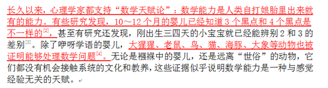

本题原文链接：https://www.guokr.com/article/442285/?page=2   数学能力是人类固有的天赋？有人不这么看

---

### 第 31 题　qid 2377318 · 逻辑判断

下列动物如果都只能归属一种门类，并且满足以下条件：
（1）如果动物B不是鸟，那么动物A是哺乳动物；
（2）或者动物C是哺乳动物，或者动物A是哺乳动物；
（3）如果动物B不是鸟，那么动物D不是鱼；
（4）或者动物D是鱼，或者动物E不是昆虫；
（5）如果动物E不是昆虫，那么动物B不是鸟；
以下各项如果为真，不能得出“动物A是哺乳动物”这一结论的有（  ）。

- **A**. 动物B不是鸟
- **B**. 动物C是哺乳动物　✅
- **C**. 动物D不是鱼
- **D**. 动物E是昆虫　✅

**答案**：BD

**官方解析**

第一步：翻译题干。

① B鸟A哺乳；

② C哺乳或A哺乳；

③ B鸟D鱼；

④ D鱼或E昆虫；

⑤ E昆虫B鸟。

第二步：逐一分析选项。

A项：B鸟，是对①的肯前，肯前必肯后，可以推出A是哺乳动物，排除；

B项：C哺乳，结合“题干下列动物如果都只能归属一种门类”，可以推出A一定不是哺乳动物，即“不能得出“动物A是哺乳动物”这一结论，当选；

C项：D鱼，是对④否定其中一项，否一推一，推出E昆虫，是对⑤的肯前，肯前必肯后，可以B鸟，是对①的肯前，可以推出A是哺乳动物，排除；

D项：E昆虫，是对④否定其中一项，否一推一，推出D鱼，是对③的否后，否后必否前，推出B是鸟，是对①的否前，无必然结论，不能推出A一定是哺乳动物，当选。

故正确答案为B、D。

---

### 第 32 题　qid 2377319 · 逻辑判断

如今，基于互联网的新型科普方式层出不穷。浅阅读，视频直播以及游戏互动等方式，使得如今获取科学知识的渠道越来越多，门槛也越来越低，研究者认为，尽管“互联网+科普”令科学知识的获取和传播方式发生了很大变化，但这不是对科普传播的一种颠覆，而是显示了公民科学素养的提升。
以下各项如果为真，能够质疑研究者观点的有（  ）。

- **A**. 在许多科学热点事件的传播过程中，公众往往曲解合理的科学解释　✅
- **B**. 新闻应用，微博等资讯类媒体是用户了解科学热点事件的主要渠道
- **C**. 比起明星八卦，在社交媒体转发科普内容更能为转发者本人形象加分
- **D**. 数据表明，用户普遍乐于通过图文资讯这样轻松愉悦的形式获取知识

**答案**：A

**官方解析**

第一步：找出论点和论据。

论点：“互联网+科普”不是对科普传播的一种颠覆，而是显示了公民科学素养的提升。

论据：无。

本题无论据，只能通过直接否论点进行削弱。可以说①“互联网+科普”是对科普传播的一种颠覆，或者②“互联网+科普”没有让公民科学素养的提升。

第二步：逐一分析选项。

A项：该项说的是公众曲解了合理的科学解释，说明“互联网+科普”没有让公民科学素养的提升，直接否定题干论点，当选；

B项：该项说的是用户获取知识的主要渠道是哪些，而论点说的是互联网传播知识是否会让公民科学素养的提升，与论点话题不一致，无法削弱，排除；

C项：该项说的是转发科普内容会使转发者形象加分，解释了为什么公民会通过转发科普内容显示自己的科学素养，不能削弱，排除；

D项：该项说的是用户喜欢用图文资讯的方式获取知识，而论点说的是互联网传播知识是否会让公民科学素养提升，话题不一致，无法削弱，排除。

故正确答案为A。

注：本题通过查询原文，如下图所示，张谦先生提出了观点“互联网+科普”不是对科普传播的一种颠覆，而是显示了公民科学素养的提升。后面的便开始分析提出这个观点的原因，所以在此题中C项是加强项，而非削弱项。

---

### 第 33 题　qid 2377340 · 逻辑判断

数学和语文两科考试结束后，三位老师讨论起学生的表现。A老师说：“小李取得了数学第一名。”B老师说：“小王取得了语文第一名。”C老师说：“小李没有取得数学第一名。”已知三位老师中只有一位老师说了真话，且小李、小王都只取得了一门课的第一名。
据此，可以推出（  ）。

- **A**. 小李取得数学第一名
- **B**. 小李取得语文第一名　✅
- **C**. 小王取得数学第一名　✅
- **D**. 小王取得语文第一名

**答案**：BC

**官方解析**

第一步：找出题干矛盾命题。
A老师说：“小李取得数学第一名”和C老师说：“小李没有取得数学第一名”是矛盾关系，必有一真，必有一假。已知只有一句是真话，说明真话一定在A老师和C老师中，所以B老师说的是假的。
第二步：看其余。
已知B老师说的是假的，可知：小王没有取得语文第一名，又因为题干只涉及数学、语文两科考试，且小李和小王都只取得了一门课的第一名，故小王是数学的第一名，小李是语文的第一名，B、C项可以推出。
故正确答案为BC。

---

### 第 34 题　qid 2377321 · 逻辑判断

有研究声称：癌细胞怕热，高体温可以抗癌。人体最容易罹患癌症的器官包括肺、胃、大肠、乳腺等都是体温较低的部位，心脏之类的“高温器官”不容易得癌症。因此，可以用运动、喝热水、泡澡等方法提高体温来抗癌。
以下各项如果为真，能够反驳上述论断的有（    ）。

- **A**. 受呼吸、饮食等影响，人的口腔温度一般比直肠温度低，而世界范围内直肠癌的发生率要高于口腔癌　✅
- **B**. 人的体温存在精准的调控机制，基本保持平稳状态，体内各个脏器之间并没有什么明显的温度差异　✅
- **C**. 热疗或许可以帮助放疗或一些化疗发挥更好的作用，但证明其可靠性的研究数据依然不足
- **D**. 心脏很少发生恶性肿瘤，是因为这里的心肌细胞不再进行分裂增殖，而与温度高低无关　✅

**答案**：ABD

**官方解析**

第一步：找出论点和论据。
论点：可以用运动、喝热水、泡澡等方法提高体温来抗癌。
论据：癌细胞怕热，高体温可以抗癌。人体最容易罹患癌症的器官包括肺、胃、大肠、乳腺等都是体温较低的部位，心脏之类的“高温器官”不容易得癌症。
本题的论点指出提高体温抗癌的方法，论据中也是在说“高温器官”不容易得癌症。所以论点、论据讨论话题一致，要想削弱，要么否定论点（提高体温不能抗癌），要么否定论据（心脏之类的“高温器官”不容易得癌症的原因不是因为温度高）。
第二步：逐一分析选项。
A项：人的口腔温度一般比直肠温度低，而世界范围内直肠癌的发生率要高于口腔癌，说明直肠温度高，直肠癌发生率高，提高体温并不能抗癌，举反例削弱题干论点，当选；
B项：选项指出体内各个脏器之间并没有明显温度差异，那么肺、胃、大肠、乳腺等就不是体温“较低”的部位，也就没有“高温器官”之说，可以削弱题干论据，当选；
C项：热疗或许可以发挥更好的作用，但证明其可靠性的研究数据依然不足，因此不确定是否提高温度真的有利于抗癌，属于不明确选项，排除；
D项：指出心脏很少发生恶性肿瘤，是因为心肌细胞不再分裂增殖，而与温度高低无关，可以削弱题干论据，当选。
故正确答案为ABD。

---

### 第 35 题　qid 2377342 · 逻辑判断

某国际古生物学研究团队最新报告称，在2.8亿年前生活在南非的正南龟是现代乌龟的祖先，它们是在二叠纪至三叠纪大规模物种灭绝事件中幸存下来的。当时，为了躲避严酷的自然环境，它们努力向地下挖洞，同时为保证前肢的挖掘动作足够有力，身体需要一个稳定的支撑，从而导致了肋骨不断加宽。由此可知，乌龟有壳是适应环境的表现，只不过不是为了保护，而是为了向地下挖洞。
以下各项如果为真，能够作为上述结论成立的前提的有（  ）。

- **A**. 只有挖洞才能从大规模物种灭绝事件中幸存
- **B**. 现代乌龟继承了正南龟善于挖洞的某些习性
- **C**. 正南龟前肢足够有力因而并不需要龟壳保护
- **D**. 龟壳是由乌龟的肋骨逐渐加宽后进化而来的　✅

**答案**：D

**官方解析**

第一步：找出论点和论据。
论点：乌龟有壳是适应环境的表现，只不过不是为了保护，而是为了向地下挖洞。
论据：为了躲避严酷的自然环境，它们努力向地下挖洞，同时为保证前肢的挖掘动作足够有力，身体需要一个稳定的支撑，从而导致了肋骨不断加宽。
问前提，优先考虑搭桥。论点讨论的是乌龟有壳是为了向地下挖洞，论据讨论的是为了适应环境，导致了乌龟的肋骨不断加宽，论点论据讨论的不是一回事，在论点论据之间进行搭桥，可以说明肋骨加宽和有壳之间的关系。
第二步：逐一分析选项。
A项：讨论的是如何在大规模物种灭绝事件中幸存，没有说明龟壳与肋骨加宽之间的关系，无法加强，排除；
B项：讨论的是现代乌龟所继承的习性，没有说明龟壳与肋骨加宽之间的关系，无法加强，排除；
C项：只解释了正南龟的龟壳不是起到保护的作用，但没有说明龟壳与挖洞之间的关系，没有搭桥，排除；
D项：说明龟壳是由肋骨加宽后进化而来的，在论点论据之间搭桥，当选。
故正确答案为D。

---

## 资料分析

### 材料 1

根据以下资料，回答下列问题。

        2014年我国实施“单独两孩”生育政策，出生人口1687万人，比上年增加47万人。2016 年实施“全面两孩”生育政策，出生人口1786万人，比上年增加131万人；出生率与“十二五”时期年平均出生率相比，提高了0.84个千分点。2017 年我国出生人口1723万人，虽然比上年减少63万人，但比“十二五”时期年平均出生人口多出79万人；出生率为，比上一年降低0.52个千分点。2017年二孩数量进一步上升至883万人，二孩占全部出生人口的比重达到，比2016年的占比提高了11个百分点。

        2017年出生人口最多的省份是山东，出生人口174.98万人，但是比2016年减少2.08万人。广东和河南出生人口也超过百万，其中广东出生人口151.63万人，同比增加22.18万人；河南出生人口140.13 万人，较上年减少2.48万人。此外，出生人口排名前十的省份依次还有河北、四川、湖南、安徽、广西、江苏、湖北。其中，河北、四川、湖南出生人口超90万人，湖北最少，为74.26万人。

        从人口增量来看，2017年广东出生人口增量最大，出生人口较2016年增加22.18万人。安徽、四川、河北出生人口增量超过5万，此外，江苏、湖南、山东、河南出生人口较2016年有所减少。其中，河南减少最多，出生人口减少2.48万人。

#### 第 1 题　qid 2376539 · 增长

2015年我国出生人口同比：

- **A**. 
增长

- **B**. 
降低

- **C**. 
增长

- **D**. 
降低
　✅

**答案**：D

**官方解析**

根据题干“2015年……同比”，结合选项为，可判定本题为一般增长率问题。定位文字资料第一段“2014年……我国出生人口1687万人，2016年……我国出生人口1786万人，比上年增加131万人”，可知2015年我国人口为万人。代入公式：，即2015年我国出生人口同比降低。

故正确答案为D。

---

#### 第 2 题　qid 2376538 · 平均数

“十二五”时期我国年平均出生率为：

- **A**. 

- **B**. 

　✅
- **C**. 

- **D**. 

**答案**：B

**官方解析**

定位文字资料第一段“2016年······出生率与‘十二五’时期年平均出生率相比，提高了0.84个千分点；2017年······出生率为，比上一年降低0.52个千分点”，可知“十二五”期间年平均出生率为。

故正确答案为B。

---

#### 第 3 题　qid 2376541 · 综合

2016年我国二孩出生人口约为：

- **A**. 883万人
- **B**. 742万人
- **C**. 718万人　✅
- **D**. 693万人

**答案**：C

**官方解析**

根据题干“2016年我国二孩出生人口约为”，结合材料时间为2017年，且已知二孩出生人口占全部出生人口的比重，可判定题为基期比重问题。定位文字材料第一段“2016年实施‘全面两孩’生育政策，出生人口1786万人······2017年······二孩占全部出生人口的比重达到，比2016年的占比提高了11个百分点”，故2016年二孩占全部出生人口的比重为，则2016年我国二孩出生人口为万人，C项最接近。

故正确答案为C。

---

#### 第 4 题　qid 2376758 · 比重

2016年山东、广东和河南三省出生人口之和占当年全国出生人口的比重约为：

- **A**. 

- **B**. 

　✅
- **C**. 

- **D**. 

**答案**：B

**官方解析**

根据问题“2016年······占······的比重约为······”，且材料时间为2017年，可判定此题为基期比重问题。定位文字材料第一段可得“2016年······出生人口1786万人”；定位第二段可得“2017年出生人口最多的省份是山东，出生人口174.98万人，但是比2016年减少2.08万人······广东出生人口151.63万人，同比增加22.18万人；河南出生人口140.13万人，较上年减少2.48万人”则2016年山东省出生人口为万人，广东省出生人口为万人，河南省出生人口为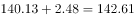万人。则2016年，三省出生人口之和占当年全国出生人口的比重为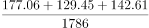。

故正确答案为B。

---

#### 第 5 题　qid 2376546 · 综合

能够从上述资料中推出的是：

- **A**. 
2016、2017两年山东出生人口数量均超过当年全国出生人口数量的

- **B**. 
2016年广东出生人口数量超过2017年湖北出生人口数量的2倍

- **C**. 
2017年出生人口增量超过5万的省份只有3个

- **D**. 
2017年出生人口比2013年增长超过
　✅

**答案**：D

**官方解析**

A项：定位文字材料第一段“2016年实施‘全面两孩’生育政策，出生人口1786万人······2017年我国出生人口1723万人”，定位文字材料第二段“2017年出生人口最多的省份是山东，出生人口174.98万人，但是比2016年减少2.08万人”。 2017年：；2016年：，则2016年山东出生人口数量没有超过当年全国出生人口数量的，错误；

B项：定位文字材料第二段“2017年出生人口······其中广东出生人口151.63万人，同比增加22.18万人······湖北最少，为74.26万人”，，错误；

C项：定位文字材料第三段“2017年广东出生人口增量最大，出生人口较2016年增加22.18万人。安徽、四川、河北出生人口增量超过5万”，可得2017年出生人口增量超过5万的省份至少有4个，错误；

D项：定位文字材料第一段可知：2014年出生人口1687万人，比上年增加47万人。2017年出生人口1723万人。可得2013年出生人口为万人，代入增长率公式：，故2017年出生人口比2013年增长了，正确。

故正确答案为D。

---

### 材料 2

根据以下资料，回答下列问题

        2008与2018年我国居民一天主要活动平均时间   单位：分钟

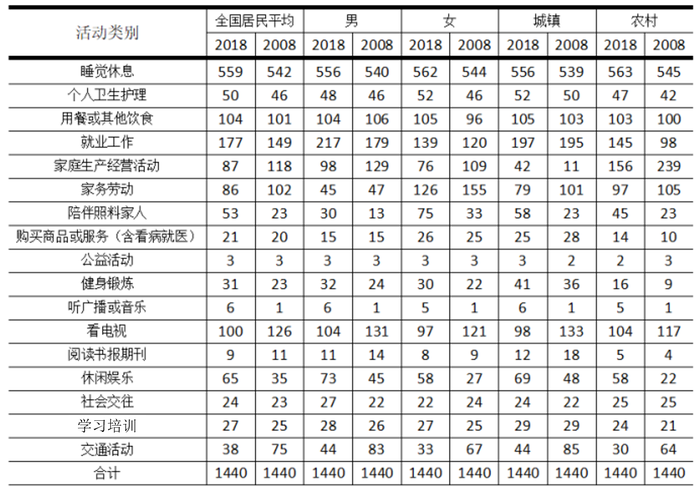

注：1.部分数据因四舍五入的原因，存在总计与分项合计不等的情况；

2.2008年数据根据2018年统计口径有所合并和调整。

#### 第 6 题　qid 2377381 · 增长

与2008年相比，2018年我国（  ）居民花费在睡觉休息上的平均时间的增速最低。

- **A**. 男　✅
- **B**. 女
- **C**. 城镇
- **D**. 农村

**答案**：A

**官方解析**

根据题干所求“与2008年相比，2018年……增速最低”，可判定此题为一般增长率比较问题。根据增长率公式，定位表格材料可得：男增速为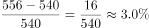；女增速为；城镇增速为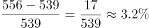；农村增速为，故增速最低为男。

故正确答案为A。

---

#### 第 7 题　qid 2377383 · 平均数

与2008年相比，2018年全国居民花费在（  ）上的平均时间减少幅度最大。

- **A**. 家庭生产经营活动
- **B**. 家务劳动
- **C**. 看电视
- **D**. 交通活动　✅

**答案**：D

**官方解析**

根据题干所求“与2008年相比，2018年……减少幅度最大”，可判定此题为增长率比较问题，比较减少幅度最大，即找降幅最大的活动。定位表格材料可得，家庭生产经营活动减少幅度为；家务劳动减少幅度为；看电视减少幅度为；交通活动减少幅度为，故减少幅度最大为交通活动。

故正确答案为D。

---

#### 第 8 题　qid 2377385 · 平均数

2018年，我国男性居民和女性居民花费在（  ）活动上的平均时间的绝对差异最大。

- **A**. 就业工作
- **B**. 家庭生产经营活动
- **C**. 家务劳动　✅
- **D**. 陪伴照料家人

**答案**：C

**官方解析**

定位表格材料可得，2018年我国男性居民和女性居民花费在就业工作活动上的平均时间的绝对差异为217-139=78；家庭生产经营活动为98-76=22；家务劳动为126-45=81；陪伴照料家人为75-30=45，故绝对差异最大为家务劳动。
故正确答案为C。

---

#### 第 9 题　qid 2377386 · 平均数

2018年，我国城镇居民和农村居民花费在上表中主要活动上的平均时间的占比均由高到低排序正确的是（  ）。

- **A**. 睡觉休息＞就业工作＞用餐或其他饮食＞看电视
- **B**. 就业工作＞用餐或其他饮食＞家务劳动＞休闲娱乐　✅
- **C**. 用餐或其他饮食＞看电视＞家务劳动＞休闲娱乐
- **D**. 家务劳动＞休闲娱乐＞陪伴照料家人＞个人卫生护理

**答案**：B

**官方解析**

根据题干“2018年……占比……”，结合材料给出2018年数据，可判定此题为现期比重问题。代入比重公式，，公式的分母均为1440分钟，故直接比较分子（各类活动平均时间）大小即可。

A项：农村：睡觉休息（563）、就业工作（145）、用餐或其他饮食（103）、看电视（104），用餐或其他饮食看电视，错误；

B项：城镇：就业工作（197）、用餐或其他饮食（105）、家务劳动（79）、休闲娱乐（69），正确；农村：就业工作（145）、用餐或其他饮食（103）、家务劳动（97）、休闲娱乐（58），正确；

C项：农村：用餐或其他饮食（103）、看电视（104）、家务劳动（97）、休闲娱乐（58），用餐或其他饮食看电视，错误；

D项：农村：家务劳动（97）、休闲娱乐（58）、陪伴照料家人（45）、个人卫生护理（47），陪伴照料家人个人卫生护理，错误。

故正确答案为B。

---

#### 第 10 题　qid 2377387 · 综合

根据以上资料，下列说法正确的是（  ）。

- **A**. 与2008年相比，2018年我国男性居民花费在8项活动上的平均时间有所增加，其中花费在陪伴家人上的平均时间的增速最高
- **B**. 与2008年相比，2018年我国女性居民花费在家庭生产经营活动上的平均时间减少最多，而陪伴照料家人的时间增长最多
- **C**. 与2008年相比，2018年我国城镇居民花费在工作和劳动上（就业工作、家庭生产经营活动、家务劳动的合计数）的平均时间减少了，花费在休闲活动上（健身锻炼、听广播和音乐、看电视、阅读书报期刊、休闲娱乐的合计数）的平均时间增加了
- **D**. 与2008年相比，2018年我国农村居民花费在休息睡觉、个人卫生护理、就业工作和休闲娱乐这四项活动上的平均时间的增幅均高于同期同类活动的全国居民平均水平的增幅　✅

**答案**：D

**官方解析**

A项： 2018年我国男性居民花费平均时间增加的有睡觉休息、个人卫生护理、就业工作、陪伴照料家人、健身锻炼、听广播或音乐、休闲娱乐、社会交往、教育培训共9项活动，不是8项，错误；

B项：2018年我国女性居民花费在家庭生产经营活动上的平均时间减少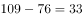分钟，而交通活动时间减少，交通活动时间减少更多，错误；

C项：定位表格可知，2018年我国城镇居民花费在工作和劳动上的平均时间为,2008年为，，故平均时间增加，错误；

D项：定位表格可知，与2008年相比，2018年我国农村居民花费在休息睡觉活动上的平均时间的增幅为；同期休息睡觉活动全国居民平均水平的增幅为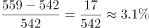，，满足要求；2018年我国农村居民花费在个人卫生护理的平均时间的增幅为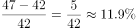；同期个人卫生护理活动全国居民平均水平的增幅为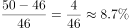，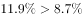，满足要求；

2018年我国农村居民花费在就业工作的平均时间的增幅为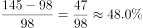；同期就业工作活动全国居民平均水平的增幅为，，满足要求；

2018年我国农村居民花费在休闲娱乐的平均时间的增幅为；同期休闲娱乐全国居民平均水平的增幅为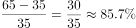，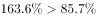，满足要求。

故正确答案为D。

---

### 材料 3

 根据以下资料，回答下列问题 

#### 第 11 题　qid 2377372 · 增长

我国西部地区的软件行业总收入2018年比2014年的增长额较同期中部地区的增长额多达约（  ）

- **A**. 1800亿元
- **B**. 1900亿元　✅
- **C**. 2000亿元
- **D**. 2100亿元

**答案**：B

**官方解析**

由题干“西部地区的……增长额较同期中部地区的增长额多达约”，可判定本题为增长量计算问题。定位表格可知：增长量=现期量-基期量，故西部地区增长额=7189-3782=3407，中部地区增长额=3163-1658=1505。则西部地区增长额较中部地区增长额多3407-1505=1902亿元。
故正确答案为B。

---

#### 第 12 题　qid 2377375 · 增长

2018年软件行业总收入较2015年的同比增速高于的地区有（  ）

- **A**. 1个
- **B**. 2个
- **C**. 3个　✅
- **D**. 4个

**答案**：C

**官方解析**

根据题干“同比增速高于50%的有”，可判定本题为一般增长率问题。，定位表格可得，东部地区：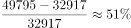；中部地区：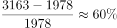；西部地区：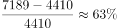；东北地区：，故同比增速高于的有3个。

故正确答案为C。

---

#### 第 13 题　qid 2377377 · 比重

2018年软件行业总收入中占比最高的地区的总收入是同年软件行业总收入中占比最低的子行业的总收入的约（  ）

- **A**. 4倍
- **B**. 6倍　✅
- **C**. 8倍
- **D**. 10倍

**答案**：B

**官方解析**

根据题干“2018年……的总收入是……的总收入”，结合选项为倍数，可判定本题为现期倍数问题。定位表格，根据总体相同时部分量最大的比重最大，可知占比最高的地区为东部地区，总收入为49795亿元。定位统计图可知，2018年总收入占比最低的子行业为嵌入式产品，占比为，且根据表格可知2018年总收入为63061亿元，故2018年嵌入式产品总收入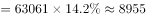亿元。则现期倍数倍。

故正确答案为B。

---

#### 第 14 题　qid 2377380 · 增长

2014-2018年，我国软件产品这一子行业收入的环比增速最高的年份是（  ）

- **A**. 2018年
- **B**. 2017年
- **C**. 2016年
- **D**. 2015年　✅

**答案**：D

**官方解析**

根据题干中“……的环比增速最高的年份是”，可判定此题为增长率比较问题。定位统计表及统计图，现期值、基期值已知，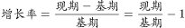，故只需要比较即可。

2018年：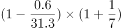

2017年：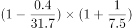

2016年：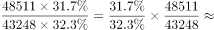

2015年：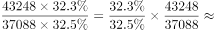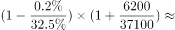

四个式子比较大小，乘号前后均为2015年最大，所以2015年的值最大，即2015年的r最大。

故正确答案为D。

---

#### 第 15 题　qid 2377382 · 综合

根据以上资料，下列说法中正确的是（  ）

- **A**. 2015-2018年，每年我国中部地区软件行业总收入较2014年的年度同比增速高于同期东部地区软件行业总收入较2014年的年度同比增速
- **B**. 2015-2018年，每年我国西部地区软件行业总收入的年度环比增速低于同期全国软件行业总收入的年度环比增速
- **C**. 2015-2018年，每年我国信息技术服务的总收入较2014年的年度同比增速都高于同期全国软件行业总收入较2014年的年度同比增速　✅
- **D**. 2015-2018年，每年我国软件产品总收入的年度环比增速都高于同期嵌入式产品总收入的年度环比增速

**答案**：C

**官方解析**

A项：定位统计表，15年中部地区的增长率为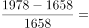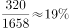，东部地区增长率为，满足；16年中部地区的增长率为，东部地区增长率为，满足；17年中部地区的增长率为，东部地区的增长率为，可以发现17年东部地区增长率大于中部地区，错误；

B项：定位统计表，15年西部地区的增长率为，全国的增长率为；16年西部地区增长率为，全国的增长率为，由此可以发现16年西部地区增速明显高于全国，错误； 

C项：定位图形和表格，现期值、基期值已知，，故只需要比较即可。，，则只需要比较信息技术即可。因为基期不变，都是14年，14年占比为，15-18年占比均大于，所以15-18年每年信息技术增速大于全国增速，正确；

D项：与C项同理，增长率比较，软件产品、嵌入式产品总体相同，只需要比较占比即可。15年，，满足；16年，，不满足，错误。

故正确答案为C。

---

### 材料 4

        2017年我国成年国民图书阅读率为，比上年增加0.3个百分点；报纸阅读率为，比上年降低2.1个百分点；期刊阅读率为，比上年增加1个百分点。 

        2017年我国成年国民数字化阅读方式(网络在线阅读、手机阅读、电子阅读器阅读、平板电脑阅读等)的接触率为。其中，网络在线阅读接触率为，比上年增加4.4个百分点；手机阅读接触率为，比上年增加4.9个百分点；电子阅读器阅读接触率为，比上年增加6.5个百分点；平板电脑阅读接触率为，比上年增加2.2个百分点。

        传统纸质媒介中，2017年我国成年国民人均每天阅读纸质图书时长为20.38分钟，人均每天阅读报纸时长为12.00分钟，人均每天阅读期刊时长为6.88分钟。

#### 第 16 题　qid 2376766 · 综合

2016年我国成年国民报纸阅读率比期刊阅读率高：

- **A**. 11.1个百分点
- **B**. 12.3个百分点
- **C**. 15.4个百分点　✅
- **D**. 17.5个百分点

**答案**：C

**官方解析**

由题干“成年国民报纸阅读率比期刊阅读率高多少百分点”，可判定本题为简单加减计算问题。定位文字材料第一段“2017年报纸阅读率为，比上年降低2.1个百分点；2017年期刊阅读为，比上年增加1个百分点”，故2016年报纸阅读率为；2016年期刊阅读率为。因此，2016年我国成年国民报纸阅读率比期刊阅读率高，即15.4个百分点。

故正确答案为C。

---

#### 第 17 题　qid 2376750 · 综合

2016年我国成年国民数字化阅读四个方式的接触率按从高到低排列正确的是：

- **A**. 
网络在线阅读手机阅读电子阅读器阅读平板电脑阅读

- **B**. 
手机阅读网络在线阅读电子阅读器阅读平板电脑阅读

- **C**. 
网络在线阅读手机阅读平板电脑阅读电子阅读器阅读

- **D**. 
手机阅读网络在线阅读平板电脑阅读电子阅读器阅读
　✅

**答案**：D

**官方解析**

定位文字材料第二段可得，2017年我国成年国民网络在线阅读接触率为，比上年增加4.4个百分点，则2016年接触率为；手机阅读接触率为，比上年增加4.9个百分点，则2016年接触率为；电子阅读器阅读接触率为，比上年增加6.5个百分点，则2016年接触率为；平板电脑阅读接触率为，比上年增加2.2个百分点，则2016年接触率为。接触率从高到低排列为手机阅读网络在线阅读平板电脑阅读电子阅读器阅读，与D项一致。

故正确答案为D。

---

#### 第 18 题　qid 2376767 · 平均数

2017年我国成年国民阅读一本纸质图书平均需要：

- **A**. 20.8小时
- **B**. 22.3小时
- **C**. 24.1小时
- **D**. 26.6小时　✅

**答案**：D

**官方解析**

由题干“2017年我国成年国民阅读一本纸质图书平均需要”，可判定本题为现期平均数计算。阅读一本纸质图书平均需要的时间=总时间÷书的数量。定位文字材料第三段可知，2017年我国成年国民每天阅读纸质图书为20.38分钟，则全年阅读纸质图书的总时间为；定位表格，2017年成年国民纸质图书人均阅读量为4.66（本）。因此，阅读一本书平均需要分钟，即 小时。

故正确答案为D。

---

#### 第 19 题　qid 2376772 · 平均数

2013年至2017年我国成年国民人均期刊阅读量超过这五年平均水平的年份有：

- **A**. 2个
- **B**. 3个　✅
- **C**. 4个
- **D**. 5个

**答案**：B

**官方解析**

由题干“2013年至2017年···超过这五年平均水平的年份有”可知，本题为平均数问题。定位表格第五行，由公式可得，这五年人均期刊阅读的平均水平，2013年至2017年期刊人均阅读量超过这五年平均水平的有3个年份，分别为2013年、2014年、2015年。

故正确答案为B。

---

#### 第 20 题　qid 2376773 · 综合

能够从上述资料中推出的是：

- **A**. 2013年至2017年我国成年国民人均电子书阅读量逐年上升
- **B**. 2016年我国成年国民图书阅读率低于当年网络在线阅读接触率
- **C**. 2017年我国成年国民人均每天阅读纸质图书时长低于阅读报纸与阅读期刊时长之和
- **D**. 2014年至2017年我国成年国民人均期刊阅读量，增长率最高的年份为2017年　✅

**答案**：D

**官方解析**

A项：定位表格材料，2013年至2017年我国成年国民人均电子书阅读量分别为2.48、3.22、3.26、3.21和3.12。可见，2016年与2017年均比上年有所下降，错误；

B项：定位文字材料第一段和第二段可得，2017年我国成年国民图书阅读率为，比上年增加0.3个百分点，网络在线阅读接触率为，比上年增加4.4个百分点。则2016年我国成年国民图书阅读率为，2016年网络在线阅读接触率为，，错误；

C项：定位文字材料第三段可得，2017年我国成年国民人均每天阅读纸质图书时长为20.38分钟，人均每天阅读报纸时长为12.00分钟，人均每天阅读期刊时长为6.88分钟。则我国成年国民人均每天阅读报纸与阅读期刊时长之和为，，错误；

D项：定位表格材料，2013年至2017年每年我国成年国民人均期刊阅读量均已知，根据可得，2014年我国成年国民人均期刊阅读量增长率，2015年我国成年国民人均期刊阅读量增长率，2016年我国成年国民人均期刊阅读量增长率，2017年我国成年国民人均期刊阅读量增长率，2017年增长率最高，正确。

故正确答案为D。

---
