# 2019年420联考《行测》题（黑龙江公检法卷）（网友回忆版）

> 联考 · 2019 年 · 6 个模块 · 共 125 题

- [政治理论](#%E6%94%BF%E6%B2%BB%E7%90%86%E8%AE%BA) · 1 题
- [常识判断](#%E5%B8%B8%E8%AF%86%E5%88%A4%E6%96%AD) · 19 题
- [言语理解与表达](#%E8%A8%80%E8%AF%AD%E7%90%86%E8%A7%A3%E4%B8%8E%E8%A1%A8%E8%BE%BE) · 35 题
- [数量关系](#%E6%95%B0%E9%87%8F%E5%85%B3%E7%B3%BB) · 15 题
- [判断推理](#%E5%88%A4%E6%96%AD%E6%8E%A8%E7%90%86) · 35 题
- [资料分析](#%E8%B5%84%E6%96%99%E5%88%86%E6%9E%90) · 20 题

---

## 政治理论

### 第 1 题　qid 2376461 · 新思想

习近平总书记在中央政治局第十三次集体学习时强调，要精准有效处置重点领域风险，深化金融改革开放，增强金融服务           能力，坚决打好防范化解包括金融风险在内的重大风险攻坚战，推动我国金融业健康发展。

- **A**. 实体经济　✅
- **B**. 私营经济
- **C**. 中小企业
- **D**. 国有企业

**答案**：A

**官方解析**

本题考查政治常识。
2019年2月22日，中共中央政治局就完善金融服务、防范金融风险举行第十三次集体学习。习近平总书记在主持学习时强调：“要深化对国际国内金融形势的认识，正确把握金融本质，深化金融供给侧结构性改革，平衡好稳增长和防风险的关系，精准有效处置重点领域风险，深化金融改革开放，增强金融服务实体经济能力，坚决打好防范化解包括金融风险在内的重大风险攻坚战，推动我国金融业健康发展。”
故正确答案为A。

---

## 常识判断

### 第 1 题　qid 2377391 · 法律常识

根据《中华人民共和国刑法修正案（九）》，下列说法正确的是：

- **A**. 组织恐怖活动培训的，处五年以上有期徒刑，并处罚金
- **B**. 代替他人或者让他人代替自己参加考试，处三年以下有期徒刑，并处或单处罚金
- **C**. 在道路上醉酒驾驶机动车的驾驶人，处拘役，并处罚金　✅
- **D**. 多次扰乱国家机关工作秩序，经行政处罚后仍不改正，造成严重后果的，处三年以上有期徒刑，并处罚金

**答案**：C

**官方解析**

本题考查法律常识。
A项错误，根据《刑法修正案（九）》第七条第二款规定：“第一百二十条之二有下列情形之一的，处五年以下有期徒刑、拘役、管制或者剥夺政治权利，并处罚金；情节严重的，处五年以上有期徒刑，并处罚金或者没收财产：······(二)组织恐怖活动培训或者积极参加恐怖活动培训的；······”
B项错误，根据《刑法修正案（九）》第二十五条第四款规定：“代替他人或者让他人代替自己参加第一款规定的考试的（法律规定的国家考试），处拘役或者管制，并处或者单处罚金。”
C项正确，根据《刑法修正案（九）》第八条第一款规定：“将刑法第一百三十三条之一修改为:‘在道路上驾驶机动车，有下列情形之一的，处拘役，并处罚金：(一)追逐竞驶，情节恶劣的； (二)醉酒驾驶机动车的；······’”
D项错误，根据《刑法修正案（九）》第三十一条第二款规定：“多次扰乱国家机关工作秩序，经行政处罚后仍不改正，造成严重后果的，处三年以下有期徒刑、拘役或者管制。”
故正确答案为C。

---

### 第 2 题　qid 2376675 · 人文常识

下列关于全国经济普查的说法错误的是：

- **A**. 根据《全国经济普查条例》的规定，经济普查每5年进行一次
- **B**. 目的是全面调查我国第一、第二、第三产业的发展规模、布局和效益　✅
- **C**. 普查取得的单位和个人资料，不作为对普查对象实施处罚的依据
- **D**. 2019年1月1日，第四次全国经济普查现场登记工作正式启动

**答案**：B

**官方解析**

本题考查法律常识。
A项正确，《全国经济普查条例》第七条规定：“经济普查每5年进行一次，标准时点为普查年份的12月31日。”
B项错误，《全国经济普查条例》第二条规定：“经济普查的目的，是为了全面掌握我国第二产业、第三产业的发展规模、结构和效益等情况，建立健全基本单位名录库及其数据库系统，为研究制定国民经济和社会发展规划，提高决策和管理水平奠定基础。”
C项正确，《全国经济普查条例》第三十三条规定：“经济普查取得的单位和个人资料，严格限定用于经济普查的目的，不作为任何单位对经济普查对象实施处罚的依据。”
D项正确，2019年1月1日零时，第四次全国经济普查现场登记工作正式启动。按照部署，第四次全国经济普查标准时点为2018年12月31日，普查时期资料为2018年年度资料。
本题为选非题，故正确答案为B。

---

### 第 3 题　qid 2376493 · 人文常识

关于生态文明建设，下列说法正确的是:

- **A**. 蓝天保卫战是全面建成小康社会的三大攻坚战之一
- **B**. 加快构建生态文明体系是解决污染问题的根本之策
- **C**. 生态环境安全是经济社会持续健康发展的重要保障　✅
- **D**. 地方政府主要领导是本行政区域生态环境保护第一责任人

**答案**：C

**官方解析**

本题考查政治常识。
A项错误，2017年10月18日，习近平总书记在十九大报告中指出：“要坚决打好防范化解重大风险、精准脱贫、污染防治的攻坚战，使全面建成小康社会得到人民认可、经得起历史检验。”蓝天保卫战并不是三大攻坚战之一。
B项错误，2018年5月18日至19日，习近平总书记在全国生态环境保护大会上强调：“要全面推动绿色发展。绿色发展是构建高质量现代化经济体系的必然要求，是解决污染问题的根本之策。”
C项正确，2018年5月18日至19日，习近平总书记在全国生态环境保护大会上强调：“要有效防范生态环境风险。生态环境安全是国家安全的重要组成部分，是经济社会持续健康发展的重要保障。”
D项错误，2018年5月18日至19日，习近平总书记在全国生态环境保护大会上强调：“各地区各部门要增强‘四个意识’，坚决维护党中央权威和集中统一领导，坚决担负起生态文明建设的政治责任。地方各级党委和政府主要领导是本行政区域生态环境保护第一责任人，各相关部门要履行好生态环境保护职责，使各部门守土有责、守土尽责，分工协作、共同发力。”
故正确答案为C。

---

### 第 4 题　qid 2377011 · 人文常识

下列有关工伤的说法正确的是：

- **A**. 上下班途中遭受的交通事故伤害不可认定为工伤
- **B**. 由于员工的重大过失造成的工伤，企业无需承担责任
- **C**. 职工认为是工伤，但单位不认为是工伤的，由单位承担举证责任　✅
- **D**. 购买“五险”后，因工伤引起的所有费用可由工伤保险报销，公司不承担费用

**答案**：C

**官方解析**

本题考查劳动法常识。
A项错误，《工伤保险条例》第十四条规定：“职工有下列情形之一的，应当认定为工伤：（六）在上下班途中，受到非本人主要责任的交通事故或者城市轨道交通、客运轮渡、火车事故伤害的。”因此，在上下班途中，受到非本人主要责任的交通事故，应当认定为工伤。
B项错误，《工伤保险条例》第十六条规定：“职工符合本条例第十四条、第十五条的规定，但是有下列情形之一的，不得认定为工伤或者视同工伤：（一）故意犯罪的；（二）醉酒或者吸毒的；（三）自残或者自杀的。”因此，由于员工的重大过失造成的伤害，并不是企业免责的事由。
C项正确，《工伤保险条例》第十九条第二款规定：“职工或者其近亲属认为是工伤，用人单位不认为是工伤的，由用人单位承担举证责任。”
D项错误，《工伤保险条例》第三十条第三、四款规定：“治疗工伤所需费用符合工伤保险诊疗项目目录、工伤保险药品目录、工伤保险住院服务标准的，从工伤保险基金支付。工伤保险诊疗项目目录、工伤保险药品目录、工伤保险住院服务标准，由国务院社会保险行政部门会同国务院卫生行政部门、食品药品监督管理部门等部门规定。职工住院治疗工伤的伙食补助费，以及经医疗机构出具证明，报经办机构同意，工伤职工到统筹地区以外就医所需的交通、食宿费用从工伤保险基金支付，基金支付的具体标准由统筹地区人民政府规定。”因此，并不是所有的费用都由工伤保险报销，公司也应当承担相应费用。
故正确答案为C。

---

### 第 5 题　qid 2377393 · 法律常识

下列行为不可能负刑事责任的是：

- **A**. 邮政工作人员私自开拆他人邮件
- **B**. 驾驶机动车肇事逃逸
- **C**. 在微信、微博等社交平台传播虚假消息造成严重后果
- **D**. 将自己所有的资金用于放高利贷　✅

**答案**：D

**官方解析**

本题考查法律。
A项正确，根据《刑法》第二百五十三条的规定：“邮政工作人员私自开拆或者隐匿、毁弃邮件、电报的，处二年以下有期徒刑或者拘役。”
B项正确，根据《刑法》第一百三十三条规定：“交通运输肇事后逃逸或者有其他特别恶劣情节的，处三年以上七年以下有期徒刑；因逃逸致人死亡的，处七年以上有期徒刑。”
C项正确，《刑法》第二百九十一条规定：“编造虚假险情、疫情、灾情、警情，在信息网络或其他媒体上传播，或明知是上述虚假信息，故意在信息网络或其他媒体上传播，严重扰乱社会秩序的，处三年以下有期徒刑、拘役或者管制；造成严重后果的，处三年以上七年以下有期徒刑。”
D项错误，私人用自己的钱放高利贷不构成犯罪。此处要注意区分高利转贷罪，刑法第一百七十五条规定了高利转贷罪。以转贷牟利为目的，套取金融机构信贷资金高利转贷他人，违法所得数额较大的，处三年以下有期徒刑或者拘役，并处违法所得一倍以上五倍以下罚金；数额巨大的，处三年以上七年以下有期徒刑，并处违法所得一倍以上五倍以下罚金。 单位犯前款罪的，对单位判处罚金，并对其直接负责的主管人员和其他直接责任人员，处三年以下有期徒刑或者拘役。
本题为选非题，故正确答案为D。

---

### 第 6 题　qid 2377395 · 人文常识

下列行为没有违反广告法的是：

- **A**. 某电视台养生节目推荐观众购买赞助商的按摩锤
- **B**. 某6岁童星代言著名厂商生产的学习机
- **C**. 某小学的校车车身上载有儿童手表的车体广告
- **D**. 某药品广告中已康复的患者分享自己的用药经历　✅

**答案**：D

**官方解析**

本题考查法律常识。
A项错误，《广告法》第十九条规定：“广播电台、电视台、报刊音像出版单位、互联网信息服务提供者不得以介绍健康、养生知识等形式变相发布医疗、药品、医疗器械、保健食品广告。”因此，该电视台养生节目推荐观众购买赞助商的按摩锤的行为违反广告法。
B项错误，《广告法》第三十八条第二款规定：“不得利用不满十周岁的未成年人作为广告代言人。”因此，某6岁的童星代言学习机的行为违反了广告法。
C项错误，《广告法》第三十九条规定：“不得在中小学校、幼儿园内开展广告活动，不得利用中小学生和幼儿的教材、教辅材料、练习册、文具、教具、校服、校车等发布或者变相发布广告，但公益广告除外。”在本选项中，儿童手表不是公益广告。因此，某小学的校车车身上载有儿童手表的车体广告违反了广告法。
D项正确，《广告法》第十六条规定：“医疗、药品、医疗器械广告不得含有下列内容：（一）表示功效、安全性的断言或者保证；（二）说明治愈率或者有效率；（三）与其他药品、医疗器械的功效和安全性或者其他医疗机构比较；（四）利用广告代言人作推荐、证明；（五）法律、行政法规规定禁止的其他内容。”在本选项中，药品广告中只是用已康复的患者分享了自己的用药经历，其中并无表示功效、安全性的断言或者保证等违反广告法的行为。
故正确答案为D。

---

### 第 7 题　qid 2376504 · 科技常识

下列哪一种现象的物理原理不同于其他三项：

- **A**. 水中的手指变粗
- **B**. 池水看起来比实际的浅
- **C**. 只有瞄准鱼的下方才能叉到鱼
- **D**. 小明在宁静的湖边看见“云在水中飘”　✅

**答案**：D

**官方解析**

本题考查科技常识。

光从一种透明介质斜射入另一种透明介质时，传播方向一般会发生变化，这种现象叫光的折射。

A项正确，盛水的玻璃杯中间厚、边缘薄，就如同一个凸透镜（放大镜），对手指有放大作用，使得水中部分手指看上去变粗了。凸透镜利用的是光的折射原理。

B、C项正确，从池底或鱼身上（S点）反射的光线由水中进入空气时，在水面上发生了折射，由于水的折射率大于空气，使得折射角大于入射角，折射光线进入人眼，人眼会逆着折射光线的方向看去，就会觉得池底或鱼的位置偏高（如图S’点），看上去池子变浅了，叉鱼时也须瞄准鱼的下方才能叉到鱼。

D项错误，宁静的湖水有平面镜的效果，能将天空中云朵反射进小明的眼中，体现的是光的反射原理。

本题为选非题，故正确答案为D。

---

### 第 8 题　qid 2377392 · 人文常识

甲、乙二人于2016年6月6日登记结婚，半年后因感情不和协议离婚。下列财产中属于二人共同财产的是：

- **A**. 甲婚前购买的汽车
- **B**. 甲于2016年10月购买彩票，中奖10万元　✅
- **C**. 乙于2014年用父母的钱全款购买的房子，用于婚后居住
- **D**. 乙的祖父于2016年6月1日为祝贺乙结婚，赠与乙的名人字画

**答案**：B

**官方解析**

本题考查法律常识。
根据《中华人民共和国民法典》一千零六十二条的规定：“夫妻在婚姻关系存续期间所得的下列财产，为夫妻的共同财产，归夫妻共同所有：（一）工资、奖金、劳务报酬；（二）生产、经营、投资的收益；（三）知识产权的收益；（四）继承或者受赠的财产，但是本法第一千零六十三条第三项规定的除外；（五）其他应当归共同所有的财产。夫妻对共同财产，有平等的处理权。”《民法典》第一千零六十三条规定：“下列财产为夫妻一方的个人财产：（一）一方的婚前财产；（二）一方因受到人身损害获得的赔偿或者补偿；（三）遗嘱或者赠与合同中确定只归一方的财产；（四）一方专用的生活用品；（五）其他应当归一方的财产。”
A项错误，甲婚前购买的汽车，属于甲婚前个人财产，不属于甲乙共同财产。
B项正确，甲在婚姻存续期间购买的彩票，所中的奖属于甲乙共同财产。
C项错误，乙于2014年用父母的钱全款购买的房子，属于乙婚前个人财产，不属于甲乙共同财产。
D项错误，乙的祖父赠与乙的名人字画，属于乙婚前个人财产，不属于甲乙共同财产。
故正确答案为B。

---

### 第 9 题　qid 2376677 · 人文常识

下列历史事件与人物搭配正确的是：

- **A**. 锦帆未落干戈起——隋炀帝　✅
- **B**. 烽火四起戏诸侯——周宣王
- **C**. 一骑红尘妃子笑——唐睿宗
- **D**. 车同轨，书同文——周武王

**答案**：A

**官方解析**

本题考查人文常识。
A项正确，“锦帆未落干戈起”出自唐代胡曾的《咏史诗·汴水》，这首诗反映了：隋炀帝开凿京杭大运河，耗费了大量人力物力财力，惹得民不聊生，起义军掀起推翻隋朝统治的浪潮。
B项错误，“烽火四起戏诸侯”，指西周时周幽王，为褒姒一笑，点燃了烽火台，戏弄了诸侯。褒姒看了果然哈哈大笑。幽王很高兴，因而又多次点燃烽火。后来诸侯们都不相信了，也就渐渐不来了。对应的人物为周幽王，而非周宣王。
C项错误，“一骑红尘妃子笑”出自唐代杜牧的《过华清宫绝句三首》，讲的是杨贵妃喜欢荔枝，皇帝唐玄宗找人快马相运，意思是速度很快，只能看到滚滚烟尘却没有看到烈马掠过。对应的人物为唐玄宗和杨贵妃，而非唐睿宗。
D项错误，车同轨，书同文是一个汉语成语，是谓车轨相同，文字相同。形容天下统一。《史记·秦始皇本纪》：“一法度衡石丈尺。车同轨。书同文字。”对应的是秦始皇，而非周武王。
故正确答案为A。

---

### 第 10 题　qid 2376962 · 人文常识

下列关于我国河流的说法不正确的是：

- **A**. 黑龙江是中国的内河　✅
- **B**. 长江最大的支流是汉江
- **C**. 黄果树瀑布、桂林山水都位于珠江流域
- **D**. “大漠孤烟直，长河落日圆”中的“河”指黄河

**答案**：A

**官方解析**

本题考查地理国情。
A项错误，黑龙江是流经蒙古、中国、俄罗斯的国际河流，位于亚洲东北部。黑龙江分为南北两源，南侧以额尔古纳河为河源（中国境内），北侧以石勒喀河为源头（俄罗斯境内），最后流入鄂霍次克海峡，入海口在俄罗斯的尼古拉耶夫斯克。黑龙江原为中国内河，19世纪中后期沙俄强行占领中国黑龙江以北、乌苏里江以东大片领土之后，成为中俄界河。2004年，我国和俄罗斯联邦签署最后边界协定，将两国国界以黑龙江为基本界限划清。
B项正确，汉江是长江长度最长的支流，在历史上占居重要地位，常与长江、淮河、黄河并列，合称“江淮河汉”。其多滩险峡谷、径流量大、水力资源丰富，航运条件好，是长江最大的支流。
C项正确，珠江位于我国南方地区，发源于云南省境内，流经云、黔、桂、粤等省（区）。黄果树瀑布位于贵州省（简称黔），桂林山水位于广西壮族自治区（简称桂），因此黄果树瀑布、桂林山水都位于珠江流域。
D项正确，“大漠孤烟直，长河落日圆”出自唐代诗人王维的《使至塞上》，诗句描绘的是浩瀚沙漠中孤烟直上云霄，黄河边上落日浑圆的景象。因此“河”指的是黄河。
本题为选非题，故正确答案为A。

---

### 第 11 题　qid 2376676 · 科技常识

下列关于仿生生物学的应用对应关系不正确的是：

- **A**. 发光纤维——萤火虫　✅
- **B**. 子弹头列车——翠鸟
- **C**. 维克罗尼龙搭扣——苍耳
- **D**. 全天然空调系统建筑——非洲白蚁巢穴

**答案**：A

**官方解析**

本题考查科技常识。
A项错误，发光纤维是指受到光和放射线的照射时能发出可见光的纤维。常见的发光纤维如：以发光玻璃作芯材的纤维、以发光塑料作芯材的纤维。而萤火虫有专门的发光细胞，在发光细胞中有两类化学物质，一类被称作荧光素，另一类被称为荧光素酶。荧光素能在荧光素酶的催化下消耗ATP（腺苷三磷酸），并与氧气发生反应，反应中产生激发态的氧化荧光素，当氧化荧光素从激发态回到基态时释放出光子。反应中释放的能量几乎全部以光的形式释放，只有极少部分以热的形式释放，萤火虫是通过这样的作用来发光的。由此可见，发光纤维并不是在仿生萤火虫。
B项正确，翠鸟拥有长而平的喙，使其可以从空气迅速潜入水中，同时并不会产生过多的扰动。日本工程师中津英治仿照翠鸟喙设计出了新干线子弹头列车的车头，使其更长更平，降低了火车的噪音。
C项正确，苍耳是一种植物，它的总苞具有钩状的硬刺，可以贴附于动物的身体上。尼龙搭扣的设计正是从苍耳获得的灵感，尼龙搭扣的两边都是尼龙做的，一边是一排排的小勾，另一边是密密麻麻的小线圈，两边贴在一起的时候，小勾就勾住小线圈，使其能贴在一起。
D项正确，非洲白蚁会建造巨大的巢穴系统，他们经常开启和关闭自己塔楼巢穴中的气口，使得巢穴内外的空气得以对流——冷空气从底部的气口流入塔楼，与此同时热空气从顶部的烟囱流出。从而使得巢穴中始终维持一个恒定的温度。在设计津巴布韦首都哈拉雷的约堡东门购物中心和办公大楼时，建筑大师麦克·皮尔斯研究了非洲白蚁巢穴的结构，设计出了全天然空调系统，使得购物中心常年维持适宜的温度。
本题为选非题，故正确答案为A。

---

### 第 12 题　qid 2376991 · 人文常识

下列有关京杭大运河的说法错误的是：

- **A**. 隋唐大运河运输最多的商品是茶叶和盐　✅
- **B**. “南水北调”的东线工程借助了京杭大运河
- **C**. 明清大运河与隋唐大运河相比，不再经过洛阳
- **D**. 是世界上开凿最早、长度最长的一条人工运河

**答案**：A

**官方解析**

本题考查人文常识。
A项错误，隋唐大运河的开通，使得贯通全国南北的大规模水运成为可能。大运河的开通本为政府调剂粮食所需，却间接地促进了农业的发展，同时带来了手工业和商业的繁荣，使洛阳城成为当时全国商品交易的中心，成为重要的粮食布帛贮藏地、瓷器集散地和茶叶转输地。由含嘉仓的建成和使用带来的粮食运输的需要，洛阳城新潭一带逐渐兴起了新的商业区。由此可知，大运河运输最多的是粮食，而非茶叶和盐。
B项正确，2002年12月27日，“南水北调”东线工程正式开工。“南水北调”东线工程是指，利用江苏省已有的江水北调工程，逐步扩大调水规模和延长调水线路，从长江下游扬州江都抽引长江水，利用京杭大运河及与其平行的河道逐级提水北送。
C项正确，京杭大运河肇始于春秋吴王夫差之凿邗沟，至隋代完成了以洛阳为中心的大运河，唐宋时极为繁盛，元代截弯取直，形成贯通南北的京杭大运河，不再经过洛阳。所以，明清大运河不再经过洛阳。
D项正确，京杭大运河，是中国古代一项伟大的水利工程，也是世界上开凿最早，里程最长的大运河。它南起浙江杭州，北至北京通县北关，全长1794公里，贯通六省市，流经钱塘江、长江、淮河、黄河、海河五大水系。
本题为选非题，故正确答案为A。

---

### 第 13 题　qid 2376481 · 人文常识

下列成语和人物的对应关系错误的是：

- **A**. 口蜜腹剑——李义府　✅
- **B**. 十面埋伏——项羽
- **C**. 程门立雪——杨时
- **D**. 东床快婿——王羲之

**答案**：A

**官方解析**

本题考查人文常识。
A项错误，“口蜜腹剑”出自《资治通鉴·唐记》“口有蜜，腹有剑”，这是文中对奸相李林甫的评语。李林甫为宰相后，对于朝中百官凡是才能和功业在自己之上而受到玄宗宠信或官位快要超过自己的人，一定要想方设法除去，尤其忌恨由文学才能而进官的士人。有时表面上装出友好的样子，说些动听的话，而暗中却阴谋陷害。所以世人都称李林甫“口有蜜，腹有剑”。笑里藏刀是指李义府。
B项正确，“十面埋伏”出自楚汉相争的垓下之战（今安徽省宿州市灵璧县东南）。楚汉相争时期，汉王刘邦重用淮阴人韩信，先后活捉魏王豹、赵王歇、燕王臧荼、齐王田广。他被刘邦封为齐王后率30万大军和彭越的军队会师，把项羽围困在垓下（今安徽省宿州市灵璧县东南），他采取十面埋伏的战术，逼使项羽在乌江自刎，取得决定性的胜利。
C项正确，宋代的杨时考到进士后不愿做官，专心研究学问。他起先在颍昌（地名）拜理学家程颢为师，学到了不少知识。程颢死后，四十多岁的杨时又和同学游酢一起到洛阳请教另一位有名的理学家程颐（程颢的弟弟）。他们到程颐家时，程颐正在打瞌睡。两人不敢惊动他，就侍立在门口。程颐醒来后发现门外的雪已下了一尺多深。程门立雪由此而来，比喻尊师重道。
D项正确，“东床快婿”出自刘义庆《世说新语笺疏雅量第六》“王氏谱曰：逸少，羲之小字。羲之妻，太傅郗鉴女，名璿，字子房。”指为人豁达，才能出众的女婿，是女婿的美称。“东床快婿”王羲之就是大名鼎鼎的书法家，被后人称之为“书圣”。
本题为选非题，故正确答案为A。

---

### 第 14 题　qid 2376469 · 人文常识

2018年我国科技界取得了一系列重大成果，这些成果中不包括：

- **A**. 第二艘航母出海试航
- **B**. 嫦娥四号探测器发射成功
- **C**. 造岛神器“天鲲号”下水　✅
- **D**. 国产大型水陆两栖飞机水上首飞

**答案**：C

**官方解析**

本题考查政治常识。
A项正确，2018年5月13日，我国第二艘航母从大连造船厂码头启航，赴相关海域执行海上试验任务，主要检测验证动力系统等设备的可靠性和稳定性。
B项正确，2018年12月8日2时23分，我国在西昌卫星发射中心用长征三号乙运载火箭成功发射嫦娥四号探测器，开启了月球探测的新旅程。嫦娥四号探测器后续将经历地月转移、近月制动、环月飞行，最终实现人类首次月球背面软着陆，开展月球背面就位探测及巡视探测，并通过已在使命轨道运行的“鹊桥”中继星，实现月球背面与地球之间的中继通信。
C项错误，2017年11月3日，由我国自主设计研发的新一代国之重器——“天鲲号”自航绞吸挖泥船成功下水。从被称为“造岛神器”的“天鲸号”，到目前亚洲最大最先进的“天鲲号”，中国自航绞吸挖泥船的自主研制实力再一次让世人惊叹。
D项正确，2018年10月20日，中国自主研制的大型水陆两栖飞机——“鲲龙”AG600在湖北荆门漳河机场成功实现水上首飞。至此，中国大飞机终于迈出“上天入海”完整步伐，建设航空强国轮廓愈发明晰。
本题为选非题，故正确答案为C。

---

### 第 15 题　qid 2376678 · 科技常识

下列气体是人体能够产生的，能发挥抗炎、神经功能调节和血管松弛等作用，但若吸入过量会与血红素结合导致中毒的是：

- **A**. 一氧化氮　✅
- **B**. 一氧化碳
- **C**. 硫化氢
- **D**. 氨气

**答案**：A

**官方解析**

A项正确，一氧化氮是一种人体可以自然产生的物质，其具有三大功能：①内皮舒张因子。作为内皮舒张因子，一氧化氮主要产生于内皮细胞，对预防和控制心脑血管疾病有着显著的效果。具体而言，一氧化氮是一种脂溶性气体，可以快速渗透出细胞膜向下扩散，进入并作用于血管周围平滑肌细胞，随着平滑肌的舒张，血管得以扩张（使血管松弛），最终导致血压的下降；②神经传导因子。作为神经传导因子，一氧化氮产生于外周神经和大脑中，作为肾上腺素和胆碱以外的神经递质，在血管、海绵体、胃肠道、泌尿道、气管肌、肛尾肌等外周输出神经抑制反应中起到非常重要的作用；③免疫调节因子。作为免疫调节因子，一氧化氮产生于免疫系统中，合成产生的一氧化氮，通过多条途径调节炎症，在调控免疫反应中起到重要作用。具体而言，一氧化氮可辅助白细胞杀死细菌、真菌、寄生虫、肿瘤细胞等。综上可知，一氧化氮在人体内发挥血管松弛、神经功能调节、抗菌消炎的作用。同时，一氧化氮与血红蛋白有很高的亲和力，如果吸入过量，一氧化氮会夺取氧气与血红蛋白结合的位置，造成人体因缺氧而中毒。
B项错误，身体组织受毒素、紫外线辐射、激素和药物等侵害时，体内会自然地产生少量一氧化碳。一氧化碳与血红蛋白具有很高的亲和力，吸入过量会造成人体因缺氧而中毒，但一氧化碳在体内不具有血管松弛、神经功能调节、抗菌消炎的作用。
C项、D项错误，具有刺激性气味的硫化氢和氨气是人体代谢产生的废气，二者均不与血红蛋白结合，且不具有血管松弛、神经功能调节、抗菌消炎的作用。
故正确答案为A。

---

### 第 16 题　qid 2376486 · 人文常识

下列选项对“夏满芒夏暑相连”中节气的表述错误的是：

- **A**. “小满”表明了降水的时间和强度
- **B**. “芒种”反映了自然物候现象或农事活动
- **C**. “立夏”“夏至”体现了寒来暑往的季节变化　✅
- **D**. “小暑”“大暑”标明了一年之中最热的时段

**答案**：C

**官方解析**

本题考查人文常识。
A项正确，小满具有多重含义，从小满开始，大麦、冬小麦等夏收作物，已经结果、籽粒饱满，但尚未成熟，所以叫小满。小满反映作物的成熟、收成情况，也可以表现降水的时间和强度。
B项正确，芒种的“芒”字，是指麦类等有芒植物的收获，“种”指谷黍类作物播种的节令。对中国大部分地区来说，芒种一到，夏熟作物要收获，夏播秋收作物要下地。反映作物的收成、播种情况，即农事活动。
C项错误，立夏是夏季的开始，从此进入夏天，万物生长旺盛。夏至是北半球白昼最长、黑夜最短的一天，从这一天起，进入炎热季节，天地万物在此时生长最旺盛。夏至是从天文角度划分的，反映了太阳高度变化的转折点。立夏体现了季节的变化，夏至体现了太阳高度的转折。
D项正确，小暑是天气已经很热了，但还不到最热的时候。大暑是一年中最热的节气。
本题为选非题，故正确答案为C。

---

### 第 17 题　qid 2377305 · 法律常识

下列关于我国地方性法规的表述，正确的是：

- **A**. 地方性法规特定情况下可由省、自治区和直辖市人民政府制定
- **B**. 部分地方性法规可由设区的市的人民代表大会及其常务委员会制定　✅
- **C**. 地方性法规只能由省、自治区和直辖市人民代表大会常务委员会制定
- **D**. 地方性法规必要时报全国人民代表大会常务委员会和国务院备案

**答案**：B

**官方解析**

本题考查法律常识。
《中华人民共和国立法法》第七十二条规定：“省、自治区、直辖市的人民代表大会及其常务委员会根据本行政区域的具体情况和实际需要，在不同宪法、法律、行政法规相抵触的前提下，可以制定地方性法规。设区的市的人民代表大会及其常务委员会根据本市的具体情况和实际需要，在不同宪法、法律、行政法规和本省、自治区的地方性法规相抵触的前提下，可以对城乡建设与管理、环境保护、历史文化保护等方面的事项制定地方性法规，法律对设区的市制定地方性法规的事项另有规定的，从其规定。设区的市的地方性法规须报省、自治区的人民代表大会常务委员会批准后施行。省、自治区的人民代表大会常务委员会对报请批准的地方性法规，应当对其合法性进行审查，同宪法、法律、行政法规和本省、自治区的地方性法规不抵触的，应当在四个月内予以批准。省、自治区的人民代表大会常务委员会在对报请批准的设区的市的地方性法规进行审查时，发现其同本省、自治区的人民政府的规章相抵触的，应当作出处理决定。除省、自治区的人民政府所在地的市，经济特区所在地的市和国务院已经批准的较大的市以外，其他设区的市开始制定地方性法规的具体步骤和时间，由省、自治区的人民代表大会常务委员会综合考虑本省、自治区所辖的设区的市的人口数量、地域面积、经济社会发展情况以及立法需求、立法能力等因素确定，并报全国人民代表大会常务委员会和国务院备案。自治州的人民代表大会及其常务委员会可以依照本条第二款规定行使设区的市制定地方性法规的职权。自治州开始制定地方性法规的具体步骤和时间，依照前款规定确定。省、自治区的人民政府所在地的市，经济特区所在地的市和国务院已经批准的较大的市已经制定的地方性法规，涉及本条第二款规定事项范围以外的，继续有效。”故地方性法规的制定主体为省、自治区、直辖市、设区的市及自治州的人民代表大会及常委会，B项正确，A、C两项错误。
《中华人民共和国立法法》第九十八条规定：“行政法规、地方性法规、自治条例和单行条例、规章应当在公布后的三十日内依照下列规定报有关机关备案：······（二）省、自治区、直辖市的人民代表大会及其常务委员会制定的地方性法规，报全国人民代表大会常务委员会和国务院备案；设区的市、自治州的人民代表大会及其常务委员会制定的地方性法规，由省、自治区的人民代表大会常务委员会报全国人民代表大会常务委员会和国务院备案； ······ ”故地方性法规不是必要时才报备案，而是必须报备案，D项错误。
故正确答案为B。

---

### 第 18 题　qid 2377005 · 人文常识

关于地球南北极，下列说法不正确的是：

- **A**. 南极是地球上唯一没有永久居民的大陆
- **B**. 每年6～8月是最适合去北极旅行的季节
- **C**. 中国在南极建立了长城站、黄河站和昆仑站　✅
- **D**. 雪龙2号是我国自主建造的首艘极地科考破冰船

**答案**：C

**官方解析**

本题考查地理国情

A项正确，南极常年温度在-80 ~ -60，经常有风力高达12级的暴风雪，是地球上唯一没有永久居民的大陆。

B项正确，每年6～8月北半球处于夏季，北极圈内许多地区处于极昼期，期间太阳24小时不落，为全天候观光提供了便利。此时气温为全年最高，海冰消融使船舶可深入北极海域，便于观赏北极熊、海象等极地动物，因此是常规意义上最适合北极旅行的季节。

C项错误，我国在南极相继建成长城站、中山站、昆仑站、泰山站。黄河站属于我国在北极建立的科考站。

D项正确，雪龙2号极地考察船是中国第一艘自主建造的极地科学考察破冰船。它能够在1.5米厚冰环境中连续破冰航行，交付使用后将填补我国在极地科考重大装备领域的空白。

本题为选非题，故正确答案为C。

---

### 第 19 题　qid 2377000 · 人文常识

下列关于绘画作品的描述错误的是：

- **A**. 《富春山居图》描绘的是初秋的景色
- **B**. 《吃土豆的人》是梵高早期的代表作
- **C**. 《自由引导人民》取材于法国七月革命
- **D**. 《虢国夫人游春图》描写的是杨玉环出游　✅

**答案**：D

**官方解析**

本题考查人文常识。
A项正确，《富春山居图》是元朝画家黄公望八十二岁前后创作的富春江山水长卷，被后世誉为“画中之兰亭”、“中国十大传世名画之一”。它以长卷的形式，描绘了富春江两岸初秋的秀丽景色。
B项正确，《吃土豆的人》是荷兰后期印象派画家文森特·威廉·梵高于1885年4月创作的油画，是梵高的第一幅著名作品，他早期接触社会下层，对劳动者的贫寒生活深有感触。这幅作品受荷兰现实主义画风的影响，画面深沉，有极强的乡土气息。
C项正确，《自由引导人民》是19世纪法国浪漫主义巨匠德拉克洛瓦最具有浪漫主义色彩的作品之一，是根据1830年7月28日巴黎平民发动的推翻波旁王朝的起义而作的，即取材于法国七月革命。
D项错误，《虢国夫人游春图》是盛唐画家张萱的著名作品，此图描绘的是天宝十一年(752年)，再现唐玄宗的宠妃杨玉环的三姊虢国夫人及其眷从盛装出游的场景。而非杨玉环出游。
本题为选非题，故正确答案为D。

---

## 言语理解与表达

### 第 1 题　qid 2376510 · 逻辑填空

圈椅是明代家具中最为经典的制作。明代圈椅，造型古朴典雅，线条简洁流畅，制作技艺达到了____的境地。“天圆地方”是中国文化中____的宇宙观，不但建筑受其影响，也____到了家具的设计之中。
依次填入划横线部分最恰当的一项是：

- **A**. 别有匠心  普遍  融合
- **B**. 巧夺天工  特殊  融会
- **C**. 炉火纯青  典型  融入　✅
- **D**. 入室升堂  独特  融化

**答案**：C

**官方解析**

第一空，根据空前的“最为经典”“古朴典雅”“简洁流畅”，可知此空用来形容制作技艺的水平很高，A项“别有匠心”，意为具有与众不同的巧妙的构思，侧重的是不同，排除；B项“巧夺天工”形容技巧的高超，C项“炉火纯青”比喻学问、技术或办事达到了纯熟完美的地步，D项“入室升堂”比喻人的学识技艺等方面有高深的造诣，B、C、D三项均能体现水平之高，保留。
第二空，B项“特殊”，C项“典型”，D项“独特”搭配“宇宙观”均可，保留。
第三空，横线前后分别对应“宇宙观”、“到了···之中”，意味着这种宇宙观进入到家具设计理念里面，B项“融会”，融会贯通，侧重点是领会、理解，体现不出宇宙观进入到设计理念之中的意思，排除；D项“融化”，通常指冰或者是雪由于温度或者是太阳光的照射使它化成水，不符合文段意思，且搭配、对应均不恰当，排除；而C项“融入”，融合、混入，可以体现出宇宙观进入到设计理念之中的意思，当选。
故正确答案为C。
【文段出处】《圈椅是明代家具中最为经典的制作》

---

### 第 2 题　qid 2376519 · 逻辑填空

科学已经成为当下社会的主流命题，无论从事什么工作都无法忽视它、绕过它。因此从某种程度来说，科学与艺术，或者说理性与感性的边界正在        。艺术展上艺术家们摆弄起了宇宙爆炸、量子世界，而不少科学家也乐于把科学仪器下观察到的景象捕捉下来，展示到人们面前，其精美程度丝毫不亚于艺术家的加工描摹。
填入划横线部分最恰当的一项是：

- **A**. 消遁
- **B**. 消失
- **C**. 消除
- **D**. 消弭　✅

**答案**：D

**官方解析**

本题可根据完整语句提示做题。
根据首句“科学已经成为当下社会的主流命题，无论从事什么工作都无法忽视它、绕过它”可知，所有工作（包括艺术）与科学之间是没有界限的，换言之，边界不应该存在。
又根据后文的“艺术展上艺术家们摆弄起了宇宙爆炸、量子世界，而不少科学家也乐于把科学仪器下观察到的景象捕捉下来，展示到人们面前，其精美程度丝毫不亚于艺术家的加工描摹。”可知，科学与艺术的边界正在慢慢模糊。
分析横线处可知，“理性”对应“科学”，“感性”对应“艺术”，“科学”与“艺术”间无界限，即“感性”与“理性”间不应有界限。故横线处应表达“理性与感性的边界”这一不应该存在的事物慢慢消失了。
D项“消弭”意为清除，多与风险、隐患等不好的事物搭配，而在本题中，作者认为，“边界”是不应该存在的事物，即不好的事物（提示：勿根据常识判断，结合上下文判断作者对“边界”的倾向），搭配得当，符合文意，当选。
A项“消遁”指消失逃跑，与文意不符，排除；
C项“消除”指使不存在，多与误会、疑虑等搭配，与“边界”搭配不当，排除；
B项“消失”置于文段虽然语义合适，但是相比之下，不能体现出“边界”的不应存在，感情倾向不如D项恰当。
故正确答案为D。 
【文段出处】《“当李白遇见火星”会发生什么》
【原文摘录】欧阳自远认为，科学已经成为当下社会的主流命题，无论从事什么工作都无法忽视它、绕过它。因此从某种程度来说，科学与艺术，或者说理性与感性的边界正在消弭。君不见许多艺术展上，艺术家们摆弄起了宇宙爆炸、量子世界，而不少科学家也乐于把科学仪器下观察到的景象捕捉下来，展示到人们面前，其精美程度丝毫不亚于艺术家的加工描摹。

---

### 第 3 题　qid 2377265 · 逻辑填空

互联网新技术新应用对文化产业进行全方位、全角度、全产业链的改造，释放数字化对文化产业发展的放大、叠加和倍增作用，推动互联网、移动网与文化之间形成      的新形态。

- **A**. 唇齿相依
- **B**. 休戚与共
- **C**. 同舟共济
- **D**. 水乳交融　✅

**答案**：D

**官方解析**

横线处搭配“新形态”，根据前文“互联网新技术新应用对文化产业进行全方位、全角度、全产业链的改造”可知，所填词语表示“互联网、移动网与文化”紧密结合，融为一体的状态。D项“水乳交融”比喻感情很融洽或结合十分紧密，“交融”有融为一体之意，符合语境，当选。
A项“唇齿相依”比喻关系密切，相互依存，B项“休戚与共”形容关系密切，利害相同，这两项均体现不出融为一体之意，排除；C项“同舟共济”比喻团结互助，同心协力，战胜困难，文段并没有出现“有困难”的语境，与文意不符，排除。
故正确答案为D。
【文段出处】《用大数据推动共享和融合》

---

### 第 4 题　qid 2376706 · 逻辑填空

某航天科工集团研制出的民航风切变预警系统，克服了预警难度大、精度低等现实问题，可以为飞机的起飞降落        提供风切变预警信息，还能够提供机场未来48小时的天气预报。
填入划横线部分最恰当的一项是：

- **A**. 及时
- **B**. 实时　✅
- **C**. 适时
- **D**. 即时

**答案**：B

**官方解析**

根据“可以为飞机的起飞降落······，还能够提供机场未来48小时的天气预报”可知，横线处表达除了可以提供未来的信息，也可以为飞机的起飞降落这一时间段内一直监测风向，提供当时的预警信息。B项“实时”意为在某事发生、发展的过程中的同一时间，符合语境，当选。
A项“及时”意为立刻、马上、不拖延，C项“适时”意为适合时宜，均无法对应当下一段时间内同步进行监测，排除；D项“即时”意为当下、立刻，与B项“实时”相比，“实时”更加侧重一段时间内的情况，且“实时信息”也为常见搭配，因此D项不符，排除。
故正确答案为B。
【文段出处】《航天技术来到你身边》

---

### 第 5 题　qid 2377269 · 逻辑填空

如果初创企业一味盲目地追求产品开发和获取早期客户的速度，而忽略了产品质量的话，到时往往会      。虽然表面看来产品是出来了，但是支撑产品的代码或硬件可能会变得难以维护和扩展，就算公司短期内看上去获得了成功，但产品里面的技术债务却积少成多，隐患也随之倍增，到时可能就会      。

- **A**. 过犹不及  功亏一篑
- **B**. 事与愿违  积重难返　✅
- **C**. 欲速不达  作茧自缚
- **D**. 得不偿失  于事无补

**答案**：B

**官方解析**

本题从第二空入手，横线处与“技术债务却积少成多，隐患也随之倍增”构成对应，要体现出不好的事情越积越多，对应B项“积重难返”指经过长时间形成的思想作风或习惯很难改变，多指恶习、弊端发展到难以革除的地步，符合文意。A项“功亏一篑”比喻做事情只差最后一点没能完成；C项“作茧自缚”比喻自己给自己找麻烦；D项“于事无补”指对于解决问题没有帮助，均体现不出不好的事情越积越多之意，与前文对应不当，排除。
第一空，代入验证，B项“事与愿违”指事情没能按照预想的方向发展，根据文段“虽然表面看来产品是出来了”“就算公司短期内看上去获得了成功”可知，实际上并未成功，符合文意。
故正确答案为B。
 【文段出处】《当技术债务vs.组织债务  怎么处理？》

---

### 第 6 题　qid 2376717 · 逻辑填空

关于科学革命的讨论        于十七世纪。不过，其时革命尚在            地展开，相关讨论的焦点集中在科学的本性，而未有所谓“科学革命史”的理解。到十九世纪，现代科学的基本模式逐渐定型，一些学者便回到现代科学的源头做起了编史和整理工作。
依次填入划横线部分最恰当的一项是：

- **A**. 滥觞  如火如荼　✅
- **B**. 溯源  轰轰烈烈
- **C**. 起源  风起云涌
- **D**. 发端  方兴未艾

**答案**：A

**官方解析**

第一空，A项“滥觞”、C项“起源”、D项“发端”均有表达事物起源和开端的含义，均符合文意，保留；B项“溯源”后一般不加宾语，常表述为“对······进行溯源”，排除。
第二空，搭配“革命”，表达革命如何展开，A项“如火如荼”形容旺盛、热烈或激烈，可以体现革命开展很热烈，符合文意，当选；C项“风起云涌”形容事物迅速发展，声势浩大，可以说“改革风起云涌”，“风起云涌地展开”用法不当，排除；D项“方兴未艾”指事物正在兴起、发展，一时不会终止，若填入横线处，则与“展开”语义上重复，二者搭配不当，可表述为“科学革命方兴未艾”，排除。
故正确答案为A。
【文段出处】《科学史绝非科学的注脚：科学革命的人文理解》

---

### 第 7 题　qid 2377357 · 逻辑填空

由于史料异常丰富、古今中西相互杂糅等因素，导致中国近代史愈研究愈错综纷纭，不知如何贯通。如果        于从某一角度进行宏观叙述，又会自觉或不自觉地遗漏掉许多本不应忽视的人物、学说与史事，一旦时移世易，便容易被有心之士以“恢复历史真相”为借口，将另一些或许本不能成为“主线”的因素聚焦放大，以史书为政论，            ，灌入自己心目中的济世良方。
依次填入划横线部分最恰当的一项是：

- **A**. 纠结  偷梁换柱
- **B**. 拘泥  移花接木
- **C**. 立足  避重就轻
- **D**. 着眼  暗度陈仓　✅

**答案**：D

**官方解析**

第一空，由后文“又会自觉或不自觉地遗漏掉许多本不应忽视的人物、学说与史事”可知，横线处应表达从某一角度进行宏观叙述之意，B项“拘泥”、C项“立足”、D项“着眼”均能体现出从某一角度叙述之意，保留；A项“纠结”意为使陷入困惑或混乱状态，若填入此处，表示“从某一角度进行宏观论述”的不确定性，文中并无此意，排除。
第二空，结合前后文可知，有心之士借着“恢复历史真相”这一表面借口，聚焦放大非“主线”因素，以史书为政论，灌入自己心中的想法，即有人用明显的表象迷惑对方，偷偷实现真实的想法。D项“暗度陈仓”指将真实的意图隐藏在表面的行动背后，用明显的行动迷惑对方，使敌人产生错觉，并忽略自己的真实意图，从而出奇制胜。文中“聚焦放大”“以史书为政论”是明显的表面行动，“自己心目中的济世良方”是真实的意图，故该项符合文意，当选。B项“移花接木”比喻暗中用手段更换人或事物来欺骗别人，文中无“更换”之意，排除；C项“避重就轻”指回避重的责任，只拣轻的来承担， 也指回避要点，只谈无关紧要的事情，涉及“轻”与“重”的对比，而横线前后文侧重的是“表象”与“真实意图”的对比，排除。
故正确答案为D。
【文段出处】《勿忘近代中国的时代主题》

---

### 第 8 题　qid 2376707 · 逻辑填空

说起乡愁，那是一种            的情怀，住在心中的故乡常常鲜活在那里。故乡是安放你的灵魂、温暖你的寂冷的地方，是接纳你的疲惫、抚慰你的忧伤的地方。翻开一页页被繁忙弄乱的过往，记忆中的余香总        于儿时的故乡。
依次填入划横线部分最恰当的一项是：

- **A**. 与生俱来  氤氲　✅
- **B**. 难以割舍  回荡
- **C**. 刻骨铭心  徘徊
- **D**. 永生难忘  徜徉

**答案**：A

**官方解析**

第一空，搭配“情怀”，D项“永生难忘”指一辈子也难以忘记，一般搭配“经历”、“事情”，与“情怀”搭配不当，排除。A项“与生俱来”指不依靠后天培养和教育，从一出生就拥有的特性或行为，B项“难以割舍”形容人对事或人的感情深，难以放弃或分开，C项“刻骨铭心”形容记忆深刻，均与“情怀”搭配恰当，保留。
第二空，搭配“余香”，A项“氤氲”形容烟或云气浓郁，与“余香”搭配恰当，当选。B项“回荡”指回响在耳边，发出回声，多指声音，与“余香”搭配不当，排除；C项“徘徊”指在一个地方来回地走，比喻犹豫不决，与“余香”搭配不当，排除。
故正确答案为A。
【文段出处】《乡愁文丛》

---

### 第 9 题　qid 2377250 · 逻辑填空

马达加斯加这个被世界遗忘了很多年的孤岛，由于动画电影《马达加斯加》而意外走红。其实绝大部分人都没去过马达加斯加，只能从一些            中构建自己心目中的那个世外桃源，和真实的马达加斯加往往            。

- **A**. 道听途说  背道而驰
- **B**. 只言片语  相去甚远　✅
- **C**. 细枝末节  大相径庭
- **D**. 遗文逸事  截然不同

**答案**：B

**官方解析**

第一空，根据前文“其实绝大部分人都没去过马达加斯加”可知，横线处表示绝大部分人只能从一些资料、别人的话当中构建自己心目中的那个世外桃源。A项“道听途说”意为没有根据的传闻；B项“只言片语”指零碎的材料或片段的话；D项“遗文逸事”指散逸的诗文和在民间流传的事迹，三项均符合文意，保留；C项“细枝末节”形容无关紧要的细节、小事，与文意不符，排除。
第二空，横线处搭配“真实的马达加斯加”，表示因为绝大部分人都没去过，所以了解到的和真实的差距很大，B项“相去甚远”意为互相之间存在很大差异，符合文意，当选；A项“背道而驰”比喻彼此方向与目标完全相反，且多比喻背离正确的目标、道路，文段中没有提及方向与目标的关系，排除；D项“截然不同”形容两种事物没有一点共同之处，程度过重，排除。
故正确答案为B。
【文段出处】三联生活周刊《马达加斯加：远不止那部动画片》

---

### 第 10 题　qid 2377359 · 逻辑填空

为应对全球气候变暖，各国科学家都在开展地球科学研究。最近，有科学家在《科学》上发表论文提出缓解温室效应的两种方案。其中一种方案是在稍低于卷云自然形成的上层大气中加入微小的沙尘颗粒，以        卷云的形成。卷云不同于会反射阳光的白云，而更像覆盖在地球上的毯子，困住从地球向太空辐射的热量，地球也就越来越        。
依次填入划横线部分最恰当的一项是：

- **A**. 减少  冷
- **B**. 增加  冷
- **C**. 减少  热　✅
- **D**. 增加  热

**答案**：C

**官方解析**

本题可从第二空入手，根据“卷云······像覆盖在地球上的毯子，困住从地球向太空辐射的热量”可知，地球无法向太空辐射热量，因此地球越来越热，排除AB两项。

根据后文可知，卷云会让地球变热，因此为应对全球气候变暖的一种方案应该是减少卷云的形成，排除D项。
故正确答案为C。
【文段出处】《中国拨款1448万设地球工程国家研究项目，旨在为地球降温》

---

### 第 11 题　qid 2377360 · 逻辑填空

连环画是大众艺术。然而，面对大众的需求，是迎合还是引导，也是连环画家必须面对的问题之一。回顾连环画从兴盛走向衰落的过程，不难发现，正是一些急功近利的出版商一味         、迎合大众的喜好，重数量轻质量，导致大批读者和作者流失，造成了连环画长时间            ，最终淡出大众视野。
依次填入划横线部分最恰当的一项是：

- **A**. 揣摩  青黄不接　✅
- **B**. 琢磨  墨守成规
- **C**. 研究  良莠不齐
- **D**. 推敲  停滞不前

**答案**：A

**官方解析**

本题可从第二空入手，根据横线前“导致大批读者和作者流失”可知，横线处表示连环画长时间缺少作者创作，也流失了大量读者，发展受阻。A项“青黄不接”指人才方面后继无人；D项“停滞不前”指不继续前进，停留不动，两项均符合文意，保留。B项“墨守成规”指守着老规矩不肯改变；C项“良莠不齐”指好的坏的混杂在一起，两项均与文意不符，排除。
第一空，根据前文“急功近利”可知，横线处所填词语感情色彩偏消极，且与“迎合”构成近义并列，A项“揣摩”指揣度对方，以相比合，可体现出“迎合”之意，且可用于消极语境，符合文意，当选。D项“推敲”如果要用应该是在迎合完大众喜好之后，再推敲连环画应该怎么写，排除。
故正确答案为A。
【文段出处】《连环画如何面向大众需求》

---

### 第 12 题　qid 2376708 · 逻辑填空

纪录片《苏东坡》以苏东坡贬谪黄州四年的生活为横切面，        其一生的心路历程，从文学、艺术、美食、情感等维度进行透视，多角度地        其生命感悟、精神嬗变和艺术升华的过程，以及对中国传统文化产生的深远影响。同时，辅之以当今最新的研究成果，再现了一个最丰富、最接近本真的苏东坡形象。
依次填入划横线部分最恰当的一项是：

- **A**. 关照  阐释
- **B**. 记载  解说
- **C**. 记录  阐述
- **D**. 观照  解读　✅

**答案**：D

**官方解析**

第一空，横线处所填词语用以修饰“纪录片”，强调其展现了苏东坡的心路历程，C项“记录”指把所见所闻通过一定的手段保留下来，D项“观照”指观察审视，均符合文意，保留；A项“关照”指关心照顾，与“纪录片”搭配不当，排除；B项“记载”多指用文字叙述，纪录片是影像、声音、文字的集合体，不是简单的文字描绘，排除。
第二空，由前文可知，强调纪录片从多个维度透视，对苏东坡的生命感悟进行多角度的分析，使我们更加深入地了解苏东坡，D项“解读”指分析研究，可以体现出纪录片的作用，符合文意，当选；C项“阐述”指述说、论述，通过前文可知，纪录片并非简单地述说苏东坡的生命感悟，而是对其进行多角度的分析，故不符合文意，排除。
故正确答案为D。
【文段出处】《大型人文历史纪录片&lt;苏东坡&gt;台前幕后的故事》

---

### 第 13 题　qid 2377275 · 逻辑填空

胰岛素是由胰岛分泌的一种激素，功能是促进细胞        葡萄糖。如果胰岛细胞受到损害，不能分泌足量胰岛素，那么人体血糖含量就会升高，多余的血糖会进入尿中，这就是I型糖尿病。糖尿病是一种对人体危害很大的慢性病，对于糖尿病患者来说，注射胰岛素显然是最        的疗法。

- **A**. 合成  直接
- **B**. 消耗  主流
- **C**. 转化  简单
- **D**. 分解  有效　✅

**答案**：D

**官方解析**

第一空，根据后文“如果胰岛细胞受到损害······那么人体血糖含量就会升高”可知，胰岛素会使葡萄糖减少，故第一空表达让葡萄糖减少之意，B项“消耗”指因使用或受损失而逐渐减少，C项“转化”指转变；改变，D项“分解”指一个整体分成它的各个组成部分，均符合文意，保留；A项“合成”指葡萄糖变多，与文意相悖，排除。
第二空，根据前文，胰岛素使葡萄糖减少，对糖尿病有良好的治疗效果，D项“有效”指有效果，符合文意，当选；B项“主流”指事物发展中本质的、主要的方面，C项“简单”指不复杂，均不符合文意，排除。
故正确答案为D。
【文段出处】《胰岛素、生长激素······原来这些药物都是用基因工程技术生产的！》

---

### 第 14 题　qid 2376507 · 逻辑填空

夏季天气炎热，人很容易犯困、无精打采，这时不妨吃几颗葡萄来帮你提神、消除疲乏之意。因为在葡萄中含有丰富的葡萄糖成分，且很容易被人体吸收利用，从而为大脑供给所需能量，快速恢复大脑活力。同时，葡萄中还含有较多的氨基酸，能对神经产生良好的 ____，帮助人体____衰弱的神经，这也是提神醒脑的有效途径。
依次填入划横线部分最恰当的一项是：

- **A**. 刺激  调理　✅
- **B**. 应激  调节
- **C**. 激变  调整
- **D**. 激发  调剂

**答案**：A

**官方解析**

第一空，横线处所填词语搭配“产生”，用来形容葡萄中的氨基酸给神经带来的积极作用，A项“刺激”指现实的物体和现象作用于感觉器官，可与产生搭配，置于此处符合文意，保留；D项“激发”为动词，指刺激使奋发，“产生”也为动词，置于此处用法不当，排除；B项“应激”指由外界情况变化所引起的一种情绪状态，常见搭配为产生应激反应，置于此处搭配不当，排除；C项“激变”强调变化突然且激烈，置于此处程度过重，与文意不符，排除。
第二空，代入验证，A项“调理”指管理，料理，可与文段中“衰弱的神经”进行搭配，形容葡萄中的氨基酸为人体带来的积极作用，符合文意，当选。
故正确答案为A。
【文段出处】人民网《夏天吃葡萄有什么好处?教你正确清洗葡萄的方法》

---

### 第 15 题　qid 2377253 · 逻辑填空

20多年过去，原始创新，集成创新，引进消化吸收再创新，中国迅速缩短了同发达国家的信息化差距，成为拥有近8亿网民的网络大国。一大批颇具竞争力的网信企业        ，一大批市场需求旺盛的新应用         ，引领着经济的转型升级，也倒逼着治理体系体制机制的改革创新。

- **A**. 如鱼得水  屡见不鲜
- **B**. 异军突起  层出不穷　✅
- **C**. 崭露头角  比比皆是
- **D**. 雨后春笋  数不胜数

**答案**：B

**官方解析**

根据文段中的“一大批······，一大批······”可知，两空所在分句构成相同句式的并列结构，故两空所填词语应语义相近。
A项，“如鱼得水”比喻得到跟自己十分投合的人或对自己很合适的环境；“屡见不鲜”形容事物看见过多次，就不会觉得新奇，不能构成近义并列，排除；
B项“异军突起”比喻一支新力量突然出现；“层出不穷”指接连不断地出现，尚未穷尽，都有“出现”之意，语义相近，当选；
C项“崭露头角”比喻突出地显露出才能和本领；“比比皆是”指到处都是，形容极其常见，不能构成近义并列，排除；
D项“雨后春笋”比喻新生事物迅速大量地涌现出来；“数不胜数”形容很多，虽都有“多”之意，但第一空的“雨后春笋”用法错误，一般用于“······如雨后春笋般······”的句式，排除。
故正确答案为B。
【文段出处】人民日报：《抓住信息化发展不能再有任何迟疑和懈怠》

---

### 第 16 题　qid 2376714 · 逻辑填空

极光多姿多彩，变化万千，任何彩笔都很难绘出那在严寒的两极空气中嬉戏无常、变幻莫测的炫目之光。在自然界中还没有哪种现象能与之        。极光有时出现时间极短，犹如节日的焰火，在空中闪现一下就消失得无影无踪；有时却可以在苍穹之中        几个小时；有时像一条彩带，有时像一团火焰，有时像一张五光十色的巨大银幕，仿佛上映一场球幕电影，给人视觉上极美的享受。
依次填入划横线部分最恰当的一项是：

- **A**. 匹敌  延宕
- **B**. 相较  迤逦
- **C**. 媲美  辉映　✅
- **D**. 抗衡  映照

**答案**：C

**官方解析**

第一空，表达没有哪种现象能比得上极光，A项“匹敌”，指双方地位平等、力量相当，B项“相较”指相比较，C项“媲美”美好的程度可以相比，类似比美之意，A、B、C三项均符合语境，保留；D项“抗衡”指彼此对抗，对立，与文意不符，排除。
第二空，文段搭配极光，C项“辉映”光辉映照、照耀，搭配恰当，当选；A项“延宕”指拖延，偏消极，与文段的感情色彩不符，排除；B项“迤逦”指曲折连绵，通常搭配为“山水迤逦”、“风景迤逦”，与“极光”搭配不当，排除。
故正确答案为C。
【文段出处】新华网《极光：最奇妙的天象之谜》

---

### 第 17 题　qid 2377259 · 逻辑填空

互联网发展初期，传统媒体出于新闻传播和培育新渠道的目的        网络媒体进行转载，“拿来主义”成为各大平台的“潜规则”。但过去一年来，这个定律似乎正在被打破。网络媒体迎来内容创业的风潮，付费社区、音频问答、在线课程等知识付费产品表现抢眼，互联网内容付费          。

- **A**. 支持  蔚然成风
- **B**. 允许  方兴未艾
- **C**. 默许  悄然兴起　✅
- **D**. 同意  深入人心

**答案**：C

**官方解析**

第一空，由文段可知传统媒体让网络媒体进行转载属于自己版权的内容，对于传统媒体来说并不是情愿的，而是出于“新闻传播和培育新渠道的目的”，在这样的形势之下才让它进行转载的，传统媒体并不会表态大力“支持”或者“允许”、“同意”，相比较而言C项“默许”更合适，且后文表明“拿来主义”成为了“潜规则”，与“潜规则”对应C项“默许”更加恰当，故锁定C项。
第二空代入验证，定律“似乎正在被打破”，网络媒体“迎来内容创业的风潮”、“表现抢眼”，说明网络内容开始付费了，而且目前表现不错，C项“悄然兴起”指某样事物开始流行或兴盛起来，通常形容新事物，符合文意。
故正确答案为C。
【文段出处】《版权保护与知识付费——从重报集团维权实践说起》

---

### 第 18 题　qid 2376472 · 逻辑填空

打开书本，一股久违了的墨香扑面而来；摩挲纸张，淡淡的凹凸感非常舒服。味觉、视觉、触觉顿时都活泛起来，连脑细胞也显得格外活跃。读累了，就闭眼歇一歇，顺便回味刚读过的情节，思考作者的            ；看到精彩的描写和精辟的议论，就反复重读、吟咏再三，读到妙处更是            。
依次填入划横线部分最恰当的一项是：

- **A**. 春秋笔法  弹冠相庆
- **B**. 言外之意  低头折节
- **C**. 弦外之音  额手称庆
- **D**. 微言大义  击节赞叹　✅

**答案**：D

**官方解析**

本题可从第二空入手，横线处搭配“妙处”且横线前“更”表示递进，程度前轻后重，横线处要体现出读到精妙的地方，不仅要反复去读，还可能由衷赞叹。D项“击节赞叹”，形容对别人的诗文或艺术等的赞赏，符合文意，保留。
A项“弹冠相庆”，指官场中一人当了官或升了官，同伙就互相庆贺将有官可做，含贬义，与文段感情色彩不符，排除；
B项“低头折节”，指丧失气节，屈服于他人，与文意不符，排除；
C项“额手称庆”，指两手在胸前相握，举到额头，表示庆幸、庆贺，文段并无“庆幸”之意，排除。
第一空，代入验证，“思考作者的微言大义”，指思考作者在文字中所体现出来的深刻道理，符合文意，当选。
故正确答案为D。
【文段出处】《我们需要更纯粹的阅读》

---

### 第 19 题　qid 2377361 · 逻辑填空

舞台就是程式化和生活化的结合，过度的程式化表演会让观众觉得虚假，过度的生活化表演又会让观众觉得        ，因此，要把握好程式化和生活化的        ，为观众呈现精彩有趣的戏曲艺术。
依次填入划横线部分最恰当的一项是：

- **A**. 庸俗  程度
- **B**. 随便  平衡　✅
- **C**. 琐碎  差异
- **D**. 枯燥  重心

**答案**：B

**官方解析**

第一空，根据前文“舞台就是程式化和生活化的结合，过度的程式化表演会让观众觉得虚假”，表达过度的“程式化”就没有“生活”即不真实，虚假，可知横线处要表达“过度的生活化”就没有“程式化”，B项“随便”就表达没有步骤，没有程序，符合文意，保留；A项“庸俗”指平庸鄙俗，对立面是“高雅”，和“程式化”无关；C项“琐碎”指细小繁多，D项“枯燥”指单调、没有趣味，都与缺乏“程式化”无关，排除。
第二空，体现“程式化和生活化”两者之间的关系，对应前文，过度的程式化和过度的生活化效果均不佳，故横线处应表示把握好程式化和生活化之间的“度”，不能过于生活化也不能过于程式化，B项“平衡”表述正确，当选。
故正确答案为B。
【文段出处】《接地气 扬正气 有喜气》

---

### 第 20 题　qid 2377257 · 逻辑填空

资源稀缺会产生相应的认知机制，改变人们观察事物和做出决策的方式。长期的资源稀缺会形成稀缺心态，导致与稀缺资源有关的问题自动      更多注意力，形成注意力“聚焦”。

- **A**. 分散
- **B**. 吸引　✅
- **C**. 集中
- **D**. 分配

**答案**：B

**官方解析**

横线处搭配“注意力”，且根据后文“形成注意力‘聚焦’”可知，资源稀缺形成的稀缺心态会让人们自动关注与稀缺资源有关的问题，B项“吸引”指引起别人的注意，符合文意，当选。
A项“分散”、D项“分配”与文意相悖，排除；根据文意，应当是先吸引注意力，再形成注意力“聚焦”，C项“集中”直接体现“聚焦”这一结果，故不如“吸引”更能体现先后的逻辑顺序，排除。
故正确答案为B。
【文段出处】《贫困问题：基于心理学的视角》

---

### 第 21 题　qid 2376721 · 片段阅读

在原始社会，人们唱歌、跳舞，但是不写诗，因为那时候没有文字。同理，史前时代的人也演剧，而且有文字之后多数中国戏剧演员并不识字，戏剧演出主要是以口传心授的方式传承与传播的。然而长时间以来，人们陷入了文字与文献崇拜的陷阱不能自拔，乃至文献考据一直成为文学史、戏剧史研究中最受推崇、最有效接近历史真实的研究方法。如果戏剧史研究领域有“新材料”的话，那一定不仅仅是文献。
这段文字主要强调了：

- **A**. 戏剧史研究要更新理念并创新研究方法　✅
- **B**. 戏剧史研究要对接传统研究并突破局限
- **C**. 戏剧史研究既要重文献又要重考证考据
- **D**. 戏剧史研究应扩大研究领域和研究方法

**答案**：A

**官方解析**

文段开篇先介绍了在原始社会是没有文字的，戏曲传播方式主要是口传心授。接着通过转折词“然而”指出现在对于戏剧史的研究过于局限于文献考据这样的研究方法，文段最后进行补充说明，“如果戏剧史研究领域有‘新材料’的话，那一定不仅仅是文献”，加强论述转折之后的观点，即仅局限于文献考据的研究方法是不正确的，故文段重点是围绕“戏剧史研究”和“研究方法”展开论述，旨在强调目前对于戏剧史研究的研究方法太过单一，我们应该更新现在的研究方法，对应A项。
B项，文段中提到“人们陷入了文字与文献崇拜的陷阱不能自拔”，可知作者对于传统的研究方法是不赞同的。因此，“对接传统研究”表述错误，排除；
C项，“重考证考据”无中生有，文段没有提及，排除；
D项，“扩大研究领域”表述错误，文段重点强调的是应该扩大研究的方法，排除。
故正确答案为A。
【文段出处】《百年中国戏剧史》

---

### 第 22 题　qid 2377346 · 片段阅读

中国当今的伦理学研究，至少有两种基本取向。一是接受西方的某些基本价值，按照西方的现代价值来探讨当代中国应该如何建构新的伦理与道德；另一种取向则是试图回归中国的传统价值，从儒家等传统思想中获得理论资源来重塑中国的伦理与道德。然而，目前的研究大都面临一个尴尬境地：理论与实践脱节。这些理论脱离实际太远，无法落地生根，对普通百姓的影响微乎其微。这其中的一个重要原因在于日常道德思维有其独有特点，如果忽略甚至违背这一特点，伦理学理论就很难为普通百姓理解和接受，形成日常的道德共识。
这段文字意在说明：

- **A**. 日常道德思维的独有特点
- **B**. 当今中国伦理学研究的瓶颈
- **C**. 中国伦理学研究的基本取向
- **D**. 伦理学研究应遵循的基本原则　✅

**答案**：D

**官方解析**

文段开头介绍了当今伦理学研究的两个基本取向，“接受西方价值”和“回归中国传统价值”。接下来通过转折词“然而”强调目前的伦理研究面临的问题，即理论与实践脱节。后文对其原因进行分析，并通过反面论证提出对策，即“不能忽略日常道德思维逻辑的独有特点”。整个文段为“提出问题分析问题反面论证提对策”，对策是重点，对应D项。

A项，对应原因分析的部分，非重点，排除；

B项，“伦理学研究的瓶颈”属于问题表述，非重点，排除；

C项，“基本取向”对应文段首句，转折之前，非重点，排除。

故正确答案为D。

【文段出处】《新纲常：探讨中国社会的道德根基》

---

### 第 23 题　qid 2377349 · 片段阅读

新闻舆论的传播力就是把一个新闻内容在规定时间内有效地传播到应该接受的对象手上。传播力跟不上，新闻就失去了价值，就会成为旧闻。纸媒时代，传播手段依靠印刷来表达，依靠印刷品的物理移动形成传播，所以新闻的生产和配送是集中方式。互联网特别是移动互联网的兴起和飞速发展，新闻的生产正在从集中向分散转变，新闻配送速度则以比特的方式按光速传播。这种由技术变迁引发的“传播手段”的变化，要求科技传媒人必须不断研发新的新闻生产和新闻配送技术，方能满足传播力的需要。
这段文字意在说明：

- **A**. 互联网时代的科技传媒人要满足传播力的新要求　✅
- **B**. 如今大众对新闻舆论传播力的要求越来越高
- **C**. 互联网时代要求有更高的传播力与其相匹配
- **D**. 新闻传播速度在互联网时代实现了升级

**答案**：A

**官方解析**

文段开头介绍了“新闻舆论传播力”的含义并指出了“传播力”的作用，接下来通过对比论证，指出了“纸媒时代”和“互联网时代”新闻传播的不同特征，即“互联网时代”更加注重速度。尾句针对“互联网时代”的特征，通过“必须”引导对策，强调“科技传媒人必须研发新技术”，对应A项。
B项，“大众的要求”，无中生有，排除；
C项，文段不是强调“要有更高传播力”，而是强调“如何提高传播力”，C项偏离文段核心话题，排除；
D项，“新闻传播速度”为对策之前内容，非重点，排除。
故正确答案为A。
【文段出处】《新时代科技传媒人的新使命》

---

### 第 24 题　qid 2376488 · 片段阅读

在智能化无人超市，客人从进门到出门，一举一动都会被数字化，并且被捕捉记录。这些信息回流到云端后，通过算法模型，可以得到许多非常有价值的信息：比如男性顾客和女性顾客各自进店最集中的时间段是什么，哪些商品被拿起又放回去的频次最高等。甚至还能做出预测，比如，传感器感应到进店的女客人很多是穿高跟鞋的，敏锐的老板便会在女鞋区多放些半跟鞋垫和脚踝磨损修复霜。可见，数字化最终目的是实现商品供应链的优化以及店内货架与商品摆放的人性化。
这段文字主要介绍：

- **A**. 智能无人零售让超市变得更加聪明、更加善解人意
- **B**. 智能无人零售给线下实体商店的发展前景增添亮色
- **C**. 智能无人零售能够对用户购买行为进行记录与描画　✅
- **D**. 智能无人零售给消费者所带来的更良好的购物体验

**答案**：C

**官方解析**

本段语料介绍了智能化无人超市对客人的大数据统计，可以据此收集到很多有价值的信息，对用户的购买行为进行记录与描画，因此C选项正确。
A、B、D选项都是由C选项推测、演绎出的，而非这段文字主要介绍的内容，所以排除。
故正确答案为C。
【文段出处】《智能零售来了 消费体验变了》

---

### 第 25 题　qid 2377301 · 片段阅读

“丝绸之路”是德国地理学家李希霍芬赋予汉代中国和中亚南部、西部以及印度之间以丝绸贸易为主的交通路线的名字。但是，随着学术研究的深入、考古发掘的进步，丝绸之路的含义越来越广，范围也越来越大。的确，丝绸之路早在汉代以前就存在于中西之间，也不仅仅局限于中国与中亚、南亚的交往，还包括西亚、地中海地区以及海上丝路所连接的朝鲜半岛、日本、东南亚等地；贸易物品也不仅仅有丝绸，还有各种手工制品、植物、动物、美术品等。“丝绸之路”正如同延伸开来的丝绸一样，有的线路清晰，有的断断续续；有时又像一张广阔的大网，时时出现绚烂的织锦。
这段文字主要介绍的是：

- **A**. “丝绸之路”是东西方文明的交汇之路
- **B**. 考古新发现拓宽了“丝绸之路”的范围
- **C**. “丝绸之路”密切了沿线国家的贸易往来
- **D**. “丝绸之路”的含义和范围是不断变化的　✅

**答案**：D

**官方解析**

文段首先论述了德国地理学家定义的“丝绸之路”，是汉代中国和中亚南部、西部以及印度之间以丝绸贸易为主的交通路线的名字，之后通过转折词“但是”强调丝绸之路的含义越来越广，范围也越来越大，随后具体介绍了“丝绸之路”的范围，由“中国与中亚、南亚”拓宽为“西亚、地中海地区”等地，以及贸易物品由“丝绸”延伸至“手工制品”等，最后指出“丝绸之路”如同不断延伸的丝绸一样，范围含义越来越广。故文段重点为转折之后，即丝绸之路的含义越来越广，范围也越来越大，对应D项。
A项，“东西方文明的交汇之路”文段未提及，无中生有，排除；
B项，“考古新发现”表述片面，文段还论述了“学术研究的深入”，排除；
C项，强调“丝绸之路”的意义，而文段重点论述的是其含义及范围不断变化，排除。
故正确答案为D。
【文段出处】北京日报《丝绸之路是一条活的道路》

---

### 第 26 题　qid 2376480 · 片段阅读

传统家训家规是我国古代以家庭为范围的道德教育形式，也是中华道德文化传承的一种方式。我国历史上流传下来的家训家规，始作者多是文化名人或著名官宦，社会影响较为广泛。这些家训家规的功能远远超出对本家族的教育作用，而成为社会教育的一种独特形式，为社会提供了家庭教育范本和楷模。尤其是这些家训家规对其家族的繁衍发展起到了重要保障作用，容易引起后世更多人的关注和效法，从而使得这些家族内的训规成为道德教育的普遍教材。
这段文字意在说明：

- **A**. 传统家训家规的社会功能　✅
- **B**. 传统家训家规的历史渊源
- **C**. 传统家训家规的历史影响
- **D**. 传统家训家规的教育作用

**答案**：A

**官方解析**

文段首先提出传统家训家规这一话题，接着指出家训家规社会影响广泛，后文进一步解释说明了传统家训家规对于社会的功能，故文段重点强调传统家训家规对整个社会的意义和作用，对应A项。
B项“历史渊源”指与历史的联系，C项“历史影响”指过去产生的影响，均非文段重点，文段重在强调传统家训家规对社会的作用，排除；D项“教育作用”，并未指出是对社会的作用，故偏离文段中心，排除。
故正确答案为A。
【文段出处】《人民日报人民要论：从传统家训家规中汲取优良家风滋养》

---

### 第 27 题　qid 2377307 · 片段阅读

“上海精神”将“互信”排在首位，充分体现了“和合”精神。这是因为不管是一个国家内部还是国与国之间，都是信任为先。《论语》中，子贡问孔子，作为执政者在“足食”“足兵”“民信”三者之间如何做选择，孔子认为“信”是优先的选择，因为“民无信不立”。“互信”的观念，超越了国际上流行的一般国际关系理念，让“做好邻居”深入人心。上合组织多年来的发展也充分证明了这一点。从最开始对于边界问题的成功解决，到应对恐怖主义、分裂主义和极端主义威胁，再到当前强调求同存异、合作共赢，“互信”都是基础。
这段文字介绍了：

- **A**. “互信”对现今国际关系理念的超越
- **B**. 儒家思想对解决当前国际问题的启示
- **C**. 上合组织在国际舞台上发挥作用的基础
- **D**. “上海精神”强调“互信”的背景和意义　✅

**答案**：D

**官方解析**

文段首先指出“上海精神”重视“互信”，接着对其原因进行解释，并列举了《论语》的例子进行论证，后文指出“互信”是上合组织取得一系列成就的基础，故文段重点强调“上海精神”对于“互信”的重视，对应D项。
A项，“对现今国际关系理念的超越”，对应文段解释说明的部分，非重点，且缺少“上海精神”这一主题词，排除；
B项，“儒家思想”仅能对应文段《论语》的部分，属于解释说明的部分，非重点，排除；
C项，“基础”表述不够明确，并未明确指出是“互信”的作用，排除。
故正确答案为D。
【文段出处】《人民日报：“上海精神”与儒家文化相合相通》

---

### 第 28 题　qid 2376724 · 语句表达

将不能量化的诗歌（以及纯文学）评价标准和人工智能的算法标准拼接在一起，本来就是一件不伦不类的事。人工智能在科学研究、生产劳动等方面的贡献，足以证明其本领之强，                    。人类也完全没必要拿自己的优势去跟人工智能的缺点比较，即使科技再发达，想必在未来很长的一段时间内，诗歌与文学的世界依然是人类情感和灵魂最佳的栖息地，守卫好我们的心灵家园，依然要靠人类自身的智慧与创造力。
填入划横线部分最恰当的一项是：

- **A**. 却不能弥补人类智慧在诗歌创作上的缺陷
- **B**. 完全可以取代人类智慧自主开展诗歌创作
- **C**. 没必要和人类智慧在诗歌创作上一决高下　✅
- **D**. 毫无疑问将能够实现诗歌评价标准的量化

**答案**：C

**官方解析**

本题为语句填空题，横线在中间，联系前后文把握话题的一致性。横线前阐述将诗歌评价标准与人工智能算法标准拼接，人工智能在科学方面存在的优势，结合横线后，介绍人类也没必要拿自己的优势去跟人工智能的缺点去相比，后文详细解释诗歌与文学同人类的关系，指明人类的智慧与创造力的优势，依据横线后句子出现“也”，横线处应该与后文形成并列关系，即人工智能没必要和人类的优势去比较，对应C项。
A项，“人类智慧在诗歌创作上的缺陷”属于无中生有，排除；
B项，根据后文，人类在诗歌创作领域是有优势的，因此人工智能不能取代，表述错误，排除；
D项，根据前文可知，诗歌评价标准是不能量化的，与文意相悖，排除。
故正确答案为C。
【文段出处】《光明网：人工智能写诗与纯文学无关》

---

### 第 29 题　qid 2377258 · 语句表达

迄今为止，还没有任何一个通用智能系统能接近人类水平。现有人工智能系统的通用性较差，这与其计算理论基础和系统设计原理有密不可分的关系。图灵机模型取决于人对物理世界的认知程度，因此人限定了机器描述问题、解决问题的水平；冯·诺依曼体系结构是存储程序式计算，程序也是预先设定好的，无法根据外界的变化和需求的变化进行自我演化。而我们的大脑却是一个出色的、能够长时间稳定工作的通用智能系统，不仅能举一反三，处理视觉、听觉、语言、学习、推理、决策、规划等各类问题，                    。
填入画横线部分最恰当的一项是：

- **A**. 还具有区别于其他高级物种的丰富情感
- **B**. 还能够主动调整与外界进行交流的方式
- **C**. 还可以在与自然的交互中不断提高认知的程度
- **D**. 还可以在学习和发育过程中不断自适应和进化　✅

**答案**：D

**官方解析**

文段先指出目前智能系统无法接近人类水平。随后分析人工智能系统通用性差的原因，包括两方面。一方面是计算机理论限制了机器描述问题、解决问题的水平，另一方面储存程序式计算导致程序无法根据客观情况进行自我演化。结合前文“通用性差”，可知这里强调的人工智能系统的缺点是无法通过自我调整去适应客观情况的变化。接下来分析大脑的特点，旨在与人工智能形成对比，指出大脑能够“举一反三”，即可以根据客观情况的变化去适应和自我演化，D项符合文意。
A项，“情感”与文段讨论的通用性无关，排除；
B项，“调整与外界进行交流的方式”并没有体现出“自我演化”，且“交流方式”也并不一定影响“描述问题、解决问题的水平”，故无法对应文段，排除；
C项，“提高认知程度”不一定意味着进行了“自我演化”，没有完美对应文段，排除。
故正确答案为D。
【文段出处】《类脑智能：让机器像人一样思考》

---

### 第 30 题　qid 2377352 · 片段阅读

中国古代书画中的许多旷世杰作都是一些尺幅很小的作品，但这并不妨碍后代书画家欣赏和膜拜。反观当下画坛，书画市场的火热吸引了大批对艺术品经验欠缺的新投资者加入，由于他们对书画的价值判断缺乏认知，误以为画越大，价值一定越高，便不加选择地购藏了一些毫无价值的“大作”，最终叫苦不迭。而一些书画家为了迎合这种市场喜好，亦不再一心专注于作品的内在质量，而是热衷于投其所好，盲目求大，于是大而空、缺乏笔墨与内涵表现的“巨制”不断涌向市场，既扰乱了市场，也使自己离真正的艺术创作距离越来越远。
根据这段文字，下列说法正确的是：

- **A**. 投资者大多对书画作品的价值缺乏认知
- **B**. 古代书画作品的尺幅越小越具收藏价值
- **C**. 部分艺术家的创作心态与市场价值密切相关　✅
- **D**. 现代书画作品的内在质量易受到市场的影响

**答案**：C

**官方解析**

C项，根据“一些书画家为了迎合这种市场喜好，亦不再一心专注于作品的内在质量”可知，C项表述正确，当选；
A项，根据文段“大批对艺术品经验欠缺的新投资者加入”可知，“投资者”范围扩大，排除；
B项，根据文段“许多旷世杰作都是一些尺幅很小的作品”可知，有的作品小但是价值很大，但并非“越小越具收藏价值”，无中生有，排除；
D项，根据文段“一些书画家······不再一心专注于作品的内在质量”可知，只是有一部分书画家“不再专注作品内在质量”，而“易受到市场影响”从文段中无从得知，排除。
故正确答案为C。
【文段出处】《如今的时代，看重的又何曾只是大小》

---

### 第 31 题　qid 2377280 · 片段阅读

火箭是人类进入太空的最主要方式。为了探索和利用更深远的宇宙，世界航天强国纷纷启动重型运载火箭研制计划，中国航天人也加紧研制自己的重型运载火箭。重型火箭的运载能力将在现有长征五号大型运载火箭的基础上大幅提升，主要瞄准深空探测，其月球转移轨道运载能力可达50吨。这样就可以满足未来建立月球基地、载人登月等方面的需求，并为我国火星探测和其他深空探测提供强大的运载平台。
这段文字主要介绍的是：

- **A**. 火箭运输系统将迎来技术革新
- **B**. 国际航天技术研究进入新阶段
- **C**. 我国重型运载火箭的研制将为深空探测提供支撑　✅
- **D**. 各国大力研制重型运载火箭旨在搭建深空探测平台

**答案**：C

**官方解析**

文段开头引出“火箭”这一话题，接下来通过中外对比强调“中国航天人也加紧研制自己的重型运载火箭”，并指出我国的重型火箭具备的特征。尾句通过指代词“这样”总结全文，重在说明重型火箭对我国太空探测起到的积极作用。C项是对文段中心句的概括，当选。
A项，文段围绕“重型运载火箭”展开，“火箭运输系统”偷换概念，排除；
B项，文段强调的是“我国”的重型运载火箭及其作用，而非“国际”航天技术，范围扩大，且未提及主题词“重型火箭”排除；
D项，偏离“我国”这一核心话题，且各国研制“重型火箭”的目的并非“搭建深空探测平台”，而是探索宇宙，表述错误，排除。
故正确答案为C。
【出处】《我国正研发更先进的运载火箭》

---

### 第 32 题　qid 2377252 · 片段阅读

中国接入国际互联网以来，互联网信息技术得到迅猛发展，在网络技术、移动芯片、智能终端、云计算、大数据、卫星导航等多个领域实现了重大突破，取得了一批显著的成就，网络技术自主创新能力显著增强、智能终端制造业加快赶超、不断培育新技术新应用形成新业态。但应该看到，与世界先进水平相比，我们还存在一定差距。目前世界局势波诡云谲，中国必须掌握核心技术，在新时代才能避免受制于人，掌握我国互联网发展的主动权。
这段文字意在说明：

- **A**. 核心技术突破才是一个国家科技实力的彰显
- **B**. 我们与世界先进水平之间依然存在一定差距
- **C**. 互联网发展的主动权应掌握在我们自己手里
- **D**. 新时代更需突破互联网核心技术这个“命门”　✅

**答案**：D

**官方解析**

文段开篇引出中国进入互联网相关话题，交代中国互联网技术有了突出成就，形成新业态，通过转折关联词“但”，强调中国和世界先进水平相比存在差距。最后尾句通过“必须”对前文提出总结性对策，强调面对当前互联网时代“中国必须掌握核心技术”，对应D项。
A项，“核心技术”，文段特指互联网的核心技术，概念扩大，排除；
B项，对策之前的内容，非重点，排除；
C项，对应尾句“掌握我国互联网发展的主动权”，为意义效果的阐述，非重点，排除。
故正确答案为D。
【文段出处】《新时代更需突破互联网核心技术这个“命门”》

---

### 第 33 题　qid 2377267 · 片段阅读

研究者认为，巨量的基性溢流玄武岩喷发至地表、火山喷发造成的温室气体浓度急剧升高等为全球性陆地风化作用增强提供了必要的条件。大陆风化作用将地表巨量的离子和营养盐输送至海洋，引发海水的富营养化和海洋酸化，进而导致海水缺氧、透光带降低等危及当时海洋中生命生存的环境系统，这一效应积累到阈值后，最终引发海洋生态系统的崩溃并造成二叠纪末生命大量灭绝。
根据这段文字，以下说法正确的是

- **A**. 火山爆发是二叠纪末生命灭绝的重要原因　✅
- **B**. 海洋酸化的直接原因是温室气体浓度急剧升高
- **C**. 陆地风化作用的增强使得二叠纪末火山大规模爆发
- **D**. 海水富营养化带来的海洋缺氧直接导致海洋生物的灭绝

**答案**：A

**官方解析**

A项，根据文段“火山喷发造成的温室气体浓度急剧升高等为···提供了必要条件”，“最终引发···二叠纪末生命大量灭绝”可知，二叠纪末生命灭绝的重要原因是火山喷发，表述正确，当选；
B项，根据文段“大陆风化作用将地表巨量的离子和营养盐输送至海洋，引发海水的富营养化和海洋酸化”可知，海洋酸化的直接原因是大陆风化作用，排除；
C项，根据文段首句“火山喷发···为全球性陆地风化作用增强提供了必要的条件”，即火山爆发带来陆地风化作用的增强，而C项逻辑关系表述与文段相反，排除；
D项，根据文段“引发海水的富营养化…危及当时海洋中生命生存的环境系统”故“海洋生物的灭绝”表述错误，排除。
故正确答案为A。
【文段出处】合肥晚报《谁是2.52亿年前生命大灭绝“元凶”》

---

### 第 34 题　qid 2377354 · 语句表达

①就是在智育方面的学习，也往往是揣摩科场文体和应试技巧
②在科举制下讲求功利的应考之风，使科举制的选拔功能逐渐下降，走到了穷途末路
③科举是一个影响重大且利弊都十分显著的考试制度
④许多考生读书的唯一目的就是应试，学校多是片面追求中举及第率
⑤科举制度在使人们重视读书应举的同时，也造成了过分重视考试结果的功利主义价值观
⑥科举考试不仅成为教育的手段，也成了教育的目的
将以上6个句子重新排列，语序正确的是：

- **A**. ⑤②⑥③④①
- **B**. ⑥①⑤③②④
- **C**. ④①③②⑥⑤
- **D**. ③⑤⑥④①②　✅

**答案**：D

**官方解析**

对比选项，确定首句。③句通过“科举是······”引出“科举”的话题，指出科举有利有弊，⑤句论述科举制度的利弊，④、⑥两句都在具体论述科举的弊端，故③句适合做首句，答案基本锁定D项。
验证D项，③句引出“科举”的话题，并指出科举有利有弊，⑤句对③句进行解释说明，具体论述科举制度的利弊，⑥、④、①三句论述科举的弊端，最后②句指出科举“走到了穷途末路”，逻辑恰当，验证无误。
故正确答案为D。
【文段出处】《科举停废110年祭》

---

### 第 35 题　qid 2376902 · 语句表达

①凡是具有人文精神的作品，便是很好的教科书
②能培育人的认知能力和审美能力，提高人的精神素养，净化人的灵魂，给人以力量、智慧和愉悦
③早在先秦时代就有《诗经》的四言体和《楚辞》的骚体，尔后不断发展出各种体裁，到五四时期出现自由诗
④我国有“诗国”的美称，诗歌起源之早，数量之多，内容之丰富，艺术之精湛，对社会生活影响之大，在世界文化史上都是罕见的
⑤无论是山水诗、田园诗、边塞诗，还是言志诗、爱情诗、哲理诗
⑥诗歌是我国文化艺术的瑰宝
将以上6个句子重新排列，语序正确的是：

- **A**. ⑥①⑤②④③
- **B**. ④③⑥⑤①②　✅
- **C**. ④③⑤②⑥①
- **D**. ⑥③④①⑤②

**答案**：B

**官方解析**

从选项入手，判断首句。分析④⑥两句，④句在论述我国诗歌的情况，⑥句指出诗歌在我国的地位。不好确定首句。观察可知，⑤句提到“无论”，即可以通过关联词捆绑解题。结合选项观察，⑤句后接①句或者②句，①句出现“凡是······便是”相当于“都”，因此⑤①可以捆绑。锁定答案为B。
将B项代入验证，逻辑通顺。
故正确答案为B。
【文段出处】《充满人文精神的“诗经”》

---

## 数量关系

### 第 1 题　qid 2376451 · 数学运算

林先生要将从故乡带回的一包泥土分成小包装送给占其朋友总数的老年朋友。在分包过程中发现，如果每包200克，则少500克；如果每包150克，则多250克。那么，林先生的朋友共有多少人?

- **A**. 15
- **B**. 30
- **C**. 50　✅
- **D**. 100

**答案**：C

**官方解析**

设林先生的老年朋友为人，根据分包过程可得：，解得人。因老年朋友占朋友总数的，则林先生的朋友总共有：人。

故正确答案为C。

注：本题并未说明每人分1包，不够严谨；但是不按每人1包则有无数种可能，无法求解。

---

### 第 2 题　qid 2376445 · 数学运算

小林在距家1.5公里的工厂上班。一天，小林出发10分钟后，父亲老林发现小林的手机没带，立即追出去，并在距离工厂500米的地方追上了他。如果老林追赶的速度比小林快6公里/小时，那么，下列关于小林速度，求值所列方程正确的是：

- **A**. 

　✅
- **B**. 

- **C**. 

- **D**. 

**答案**：A

**官方解析**

根据题意，老林从家到追上小林，老林和小林行驶的路程均为 公里，老林比小林少用 分钟，即 小时。小林速度为，老林速度为，则。

故正确答案为A。

---

### 第 3 题　qid 2377251 · 数学运算

商店购入一百多件A款服装，其单件进价为整数元，总进价为1万元。已知单件B款服装的定价为其进价的1.6倍，其进价为A款服装的，销售每件B款服装的利润正好为A款服装的一半。某日商店以定价销售A款服装的总销售额超过2500元。问当天至少销售了多少件A款服装？

- **A**. 13
- **B**. 15
- **C**. 17　✅
- **D**. 19

**答案**：C

**官方解析**

假设A款服装每件进价为，则B款服装每件进价为，定价为，每件利润为，A款服装每件定价为。假设某日A款服装销售量为，则，当取得最大值时，可取得最小值。因购进100多件A款服装，单件进价为整数元，总进价为1万元， 则10000能被整除且，满足条件的最大值为20，此时，则至少售出了17件A款服装。

故正确答案为C。

---

### 第 4 题　qid 2377279 · 数学运算

2016年某电子产品定价为n元/台，2017年由于技术升级成本降低，定价降低，每台产品利润提升，2017年全年销售这种产品的总利润较2016年增加了。那么，2017年的销量比2016年：

- **A**. 
提高了不到
　✅
- **B**. 
提高了或以上

- **C**. 
降低了不到

- **D**. 
降低了或以上

**答案**：A

**官方解析**

赋值2016年每台电子产品的利润为100元，则2017年每台产品利润提升之后利润为110元。设2016年的销量为台，则2016年的总利润为，由于2017年总利润比2016年增加了，因此2017年总利润为，则2017年销量为，即2017年的销量比2016年提高了。

故正确答案为A。

---

### 第 5 题　qid 2376465 · 数学运算

某次田径运动会中，选手参加各单项比赛计入所在团体总分的规则为：一等奖得9分，二等奖得5分，三等奖得2分。甲队共有10位选手参赛，均获奖。现知甲队最后总分为61分，问该队最多有几位选手获得一等奖？

- **A**. 3
- **B**. 4
- **C**. 5　✅
- **D**. 6

**答案**：C

**官方解析**

设获得一等奖、二等奖、三等奖的人数分别为、、，根据题意得：，，整理两式，消去得：。

问获得一等奖人数最多，考虑从大到小代入：

代入D项，若，代入，为负且不是整数，排除；

代入C项，若，代入，解得，，符合题意。

故正确答案为C。

---

### 第 6 题　qid 2376459 · 数学运算

甲乙两人相约骑共享单车运动健身。停车点现有9辆单车，分属3个品牌，各有2、3、4辆。假如两人选择每一辆单车的概率相同，两人选到同一品牌单车的概率约为：

- **A**. 

- **B**. 

- **C**. 

　✅
- **D**. 

**答案**：C

**官方解析**

假设三个品牌分别为A、B、C，两人各选一辆单车的情况数共有种。两人选到同一品牌的单车，包含三种情况：

（1）两人同时选到A品牌，情况数为；

（2）两人同时选到B品牌，情况数为；

（3）两人同时选到C品牌，情况数为；

则两人选到同一品牌单车的概率。

故正确答案为C。

---

### 第 7 题　qid 2377282 · 数学运算

小张从甲地出发匀速前往乙地，同时小李和小王从乙地出发匀速前往甲地，小张和小李在途中的丙地相遇，小张和小王在途中的丁地相遇。已知小张的速度比小李快一半，小王的速度比小李慢一半，则丙、丁两地之间的距离与甲、乙两地之间的距离之比为：

- **A**. 2:15
- **B**. 1:4
- **C**. 3:20　✅
- **D**. 1:15

**答案**：C

**官方解析**

设甲乙两地的距离为，小张、小李、小王的速度分别为、、，由下图可知，小张和小李相遇时用时为，小张和小王相遇时用时为，因此小张走丙、丁之间的路程所用时为，所以丙、丁之间的路程。故丙、丁两地之间的距离与甲、乙两地之间的距离之比为。

故正确答案为C。

---

### 第 8 题　qid 2376467 · 数学运算

某河道由于淤泥堆积影响到船只航行安全，现由工程队使用挖沙机进行清淤工作，清淤时上游河水又会带来新的泥沙。若使用1台挖沙机300天可完成清淤工作，使用2台挖沙机100天可完成清淤工作。为了尽快让河道恢复使用，上级部门要求工程队25天内完成河道的全部清淤工作，那么工程队至少要有多少台挖沙机同时工作？

- **A**. 4
- **B**. 5
- **C**. 6
- **D**. 7　✅

**答案**：D

**官方解析**

假定每天每台挖沙机效率为1，每天新增泥沙的量为，原有泥沙量为。由于1台挖沙机300天可完成清淤工作，可得：；由于2台挖沙机100天可完成清淤工作，可得：。两式联立，解得，。若要求工程队25天内完成河道的全部清淤工作，此时，设所需的挖沙机台数为，则有，解得，至少需要7台挖沙机同时工作。

故正确答案为D。

---

### 第 9 题　qid 2377410 · 数学运算

人行步道ABC如图所示，BC两地之间的距离为286米，D地为BC中点，AD两点间的直线距离为324米。现经B点作直线BE，从C点作垂直于BE的直线CE并与BE相交于E点。问EA之间的最短距离为多少米？

- **A**. 38
- **B**. 168
- **C**. 176
- **D**. 181　✅

**答案**：D

**官方解析**

由题意可知，D为BC中点，且角E为90度，故米。由三角形两边和大于第三边可知：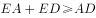，即米。

故正确答案为D。

---

### 第 10 题　qid 2377412 · 数学运算

一家早餐店只出售粥、馒头和包子。粥有三种：大米粥、小米粥和绿豆粥，每份1元；馒头有两种：红糖馒头和牛奶馒头，每个2元；包子只有一种三鲜大肉包，每个3元。陈某在这家店吃早餐，花了4元钱，假设陈某点的早餐不重样，问他吃到包子的概率是多少？

- **A**. 

　✅
- **B**. 

- **C**. 

- **D**. 

**答案**：A

**官方解析**

花4元且不重样，可能分为3类：

1份馒头两种粥每种1份共有种情况；

两种馒头每种1份共有1种情况；

1个包子1份粥共有种，故总的情况有种。

其中吃到包子的情况为1个包子1份粥，有3种，所求概率。

故正确答案为A。

---

### 第 11 题　qid 2376466 · 数学运算

太阳高度角是太阳光的入射方向和地平面之间的夹角。在正午时，太阳高度角为，为纬度，为太阳赤纬。已知小陈的身高为180厘米，他所在地的纬度为，当日太阳赤纬为。那么，在正午时他的影子长度约为：

- **A**. 60厘米
- **B**. 90厘米
- **C**. 104厘米　✅
- **D**. 208厘米

**答案**：C

**官方解析**

根据题干，正午时太阳高度角为。如下图所示，在中，AC代表小陈的身高，故为180厘米。AB代表太阳光，由于正午太阳高度角为，故为。为，BC即为影子的长度。根据直角三角形三边关系可知，，因此，则。

故正确答案为C。

---

### 第 12 题　qid 2376449 · 数学运算

小张、小李和小王三人以擂台形式打乒乓球，每局2人对打，输的人下一局轮空。半天下来，小张共打了6局，小王共打了9局，而小李轮空了4局。那么，小李一共打了多少局？

- **A**. 5局
- **B**. 7局　✅
- **C**. 9局
- **D**. 11局

**答案**：B

**官方解析**

小李轮空4局，说明小王和小张打了4局。小王共打9局，则小王和小李打了9-4=5局。小张共打6局，则小张和小李打了6-4=2局，所以小李共打5+2=7局。
故正确答案为B。

---

### 第 13 题　qid 2376450 · 数学运算

某楼盘的地下停车位，第一次开盘时平均价格为15万元/个；第二次开盘时，车位的销售量增加了一倍、销售额增加了。那么，第二次开盘的车位平均价格为：

- **A**. 10万元/个
- **B**. 11万元/个
- **C**. 12万元/个　✅
- **D**. 13万元/个

**答案**：C

**官方解析**

赋值第一次车位销售量为1，则。根据题意，第二次开盘时，销售量增加了一倍、销售额增加了，可得第二次销售量为，销售额为，则第二次平均价格为。

故正确答案为C。

---

### 第 14 题　qid 2376446 · 数学运算

幼儿园老师设计了一个摸彩球游戏，在一个不透明的盒子里混放着红、黄两种颜色的小球，它们除了颜色不同，形状、大小均一致。已知随机摸取一个小球，摸到红球的概率为三分之一。如果从中先取出3红7黄共10个小球，再随机摸取一个小球，此时摸到红球的概率变为五分之二，那么原来盒中共有红球多少个？

- **A**. 5　✅
- **B**. 10
- **C**. 15
- **D**. 20

**答案**：A

**官方解析**

假设原来盒子中共有个红球，因随机摸取一个小球，摸到红球的概率为，则原来盒子中共有个小球。取出红黄共个小球后，红球剩下个，小球总个数为，此时随机摸取一个小球，摸到红球的概率为，则，解得。

故正确答案为A。

---

### 第 15 题　qid 2377413 · 数学运算

某公交站台附近区域停放A型共享单车4辆，B型共享单车5辆，C型共享单车6辆。一公交车到站后，下车的乘客随机选择其中13辆单车骑走。问B型和C型单车全部被骑走的概率在以下哪个范围内？

- **A**. 
在以下
　✅
- **B**. 
在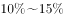之间

- **C**. 
在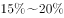之间

- **D**. 
超过

**答案**：A

**官方解析**

A型车4辆，B型车5辆，C型车6辆，则总的车辆数为。下车乘客从中选择13辆骑走，总的情况为从15辆车中任意选13辆，情况数为。B型单车和C型单车全被骑走，即已经骑走了辆，还需要骑走2辆A型车，情况数为从4辆A型车中任意选2辆，情况数为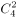。所求概率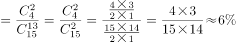，在以下。

故正确答案为A。

---

## 判断推理

### 第 1 题　qid 2376756 · 图形推理

从所给的四个选项中，选择最合适的一个填入问号处，使之呈现一定的规律性：

- **A**. A
- **B**. B　✅
- **C**. C
- **D**. D

**答案**：B

**官方解析**

解析1：元素组成不相同，不相似，优先考虑属性规律。题干均为轴对称图形，且对称轴数量均为3条。A项1条；B项3条；C项2条；D项2条。

故正确答案为B。

注：如上图所示，A项中蓝点处于圆与三角形的切点处，而红点并非处于圆与三角形的切点处，故此图只有1条对称轴，而不是3条。

解析2：元素组成不相同，不相似，优先考虑属性规律。题干有曲线有直线，考虑曲直性，图一为有曲有直图形，图二为全直线图形，图三为有曲有直图形，图四为全直线图形，因此“？”处选择一个有曲有直图形。A项有曲有直，B、C、D三项均为纯直线图形。

故正确答案为A。

解析3：元素组成不相同，不相似，考虑属性和数量规律。题干出现切圆，考虑笔画数，题干图形笔画数依次为2121？，故？处应为2笔画图形，只有D项为2笔画。

故正确答案为D。

本题有多种规律，但从图形特征和命题思路分析，考虑到题干几个图均是等边三角形的变形图，而等边三角形以及其变形图在近几年的考试中多用于考查对称性，故粉笔倾向对称性这一考点。

故正确答案为B。

---

### 第 2 题　qid 2376468 · 图形推理

从所给四个选项中，选择最合适的一个填入问号处，使之呈现一定的规律性：

- **A**. A
- **B**. B
- **C**. C　✅
- **D**. D

**答案**：C

**官方解析**

元素组成不同，且无明显属性规律，考虑数量规律。图四、图五封闭面明显，考虑面数量。面数量依次为2、3、4、5、6，则问号处图形面数量为7，只有C符合要求。
故正确答案为C。

---

### 第 3 题　qid 2377218 · 图形推理

从所给的选项中，选择最合适的一个填入问号处，使之呈现一定的规律性：

- **A**. A
- **B**. B
- **C**. C
- **D**. D　✅

**答案**：D

**官方解析**

元素组成相同，所有图形均由7个小黑点和6条线段组成，优先考虑位置规律。通过相邻比较发现，相邻两幅图之间只有两条线段位置发生变化，其余线段位置均没变，？处也应满足此规律，只有D项符合。 
故正确答案为D。

---

### 第 4 题　qid 2376652 · 图形推理

从所给四个选项中，选择最合适的一个填入问号处，使之呈现一定的规律性：

- **A**. A
- **B**. B
- **C**. C　✅
- **D**. D

**答案**：C

**官方解析**

本题考查三视图，第一组图形中第二个图形和第三个图形分别是第一个立体图形的主视图和俯视图。第二组应用规律，问号处所填图形应为第一个立体图形的俯视图。俯视图从上往下看，可以看到外框是一个类似矩形的轮廓，里面两个小圆圈加上一个小矩形，只有C项符合。
故正确答案为C。

---

### 第 5 题　qid 2376754 · 图形推理

正方体切掉一块后剩余部分如下图左侧所示，右侧哪一项是其切去部分的形状？

- **A**. A
- **B**. B　✅
- **C**. C
- **D**. D

**答案**：B

**官方解析**

此题为立体图形拼合问题，解题原则为凹凸一致。根据题目要求，可知正确选项和左侧图形拼合后应为正方体。观察题干左侧图形，发现外侧斜坡和其内侧上方凸出的小矩形在同一侧，而A、C两项外侧斜坡和凹进去的小矩形不在同一侧，排除；比较B、D两项，仅在中间位置不同，题干左侧图形中间位置存在斜坡，根据凹凸一致的原则，选项也应存在斜坡，只有B项符合。
故正确答案为B。

---

### 第 6 题　qid 2377225 · 定义判断

稻草人谬误，是在辩论或讨论中，有意或无意地曲解对方的论点，针对曲解后的论点(替身稻草人)进行攻击，然后宣称已推翻对方论点的一种错误的论证方式。
根据上述定义，下列属于稻草人谬误的是：

- **A**. 
甲：“我认为人都是自私的。” 

乙：“我不认为所有的人都是自私的，但我也不认为所有的人都不是自私的。”

- **B**. 
甲：“我认为小孩不应该在大街上乱跑。” 

乙：“把小孩关在家里，他们呼吸不到新鲜空气，岂不是更加愚蠢吗?”
　✅
- **C**. 
甲：“为什么我最近脸上总是长痘痘?”  乙：“因为你上火了。” 

甲：“你怎么知道我上火?”  乙：“因为你脸上总长痘痘。”

- **D**. 
甲：“学习语言多听是最重要的，只要每天都听，过几个月自然就能听明白了。” 

乙：“可是我天天在家听英语，已经听了好几年了，现在还是听不懂。”

**答案**：B

**官方解析**

第一步：找出定义关键词。

“在辩论或讨论中”、“有意或无意地曲解对方的论点”、“针对曲解后的论点(替身稻草人)进行攻击”、“宣称已推翻对方论点的一种错误的论证方式”。
第二步：逐一分析选项。
A项：该项甲说“人都是自私的”，强调的是所有人都是自私的，乙的回应也在强调“所有人”和“自私”的关系，所以不存在乙曲解甲的意思，不符合“有意或无意地曲解对方的论点”，不符合定义，排除；
B项：该项甲说“小孩不应该在大街上乱跑”，但是乙把“小孩不应该在大街上乱跑”曲解为“把小孩关在家里”，并且针对把小孩关在家里进行攻击，认为关在家里会导致“他们呼吸不到新鲜空气，更加愚蠢”，从而推翻甲的观点，符合定义，当选；
C项：该项甲都是在提问问题，而乙则是针对甲所问问题进行回应，告诉他原因，所以不存在曲解甲观点的事情，不符合定义，排除；
D项：该项甲阐述了多听对学习语言的好处，而乙则是阐述了多听对学习没有帮助，两者讨论的话题都是“多听”与“学习语言”之间的关系，不存在曲解的问题，不符合定义，排除；
故正确答案为B。

---

### 第 7 题　qid 2377216 · 定义判断

动机是人们行动的原因，它能唤起行动，使活动指向一定的目标。根据动机的来源可分为内在动机和外在动机，内在动机是指行为的目的是为了体验相应活动中带来的喜悦和满足；外在动机是指行为的目的是为了获得相应活动所带来的其他外在结果或者避免惩罚。
根据上述定义，下列行为中最可能体现内在动机的是：

- **A**. 为了保持身体健康，小赵坚持锻炼身体
- **B**. 张老师非常热爱他的职业，很享受教书育人的过程　✅
- **C**. 小芳参加游泳比赛获得了第一名，她为自己感到骄傲
- **D**. 为了不让父母失望，小明非常努力地学习，争取考上理想的学校

**答案**：B

**官方解析**

第一步：找出定义关键词。
内在动机：“行为的目的是为了体验相应活动中带来的喜悦和满足”；
外在动机：“行为的目的是为了获得相应活动所带来的其他外在结果或者避免惩罚”。
第二步：逐一分析选项。
A项：小赵坚持锻炼身体的目的是为了保持身体健康，不符合“行为的目的是为了体验相应活动中带来的喜悦和满足”，不符合定义，排除；
B项：张老师非常热爱他的职业是因为他很享受教书育人的过程，符合“行为的目的是为了体验相应活动中带来的喜悦和满足”，符合定义，当选；
C项：小芳为自己感到骄傲的原因是她在游泳比赛中获得了第一名，她是为行为的结果而自豪，不符合“行为的目的是为了体验相应活动中带来的喜悦和满足”，不符合定义，排除；
D项：小明非常努力地学习，争取考上理想的学校是为了不让父母失望，不符合“行为的目的是为了体验相应活动中带来的喜悦和满足”，不符合定义，排除。
故正确答案为B。

---

### 第 8 题　qid 2377229 · 定义判断

细分市场是指根据地理因素、人口因素、心理因素和行为因素等划分某一产品的市场之后形成的市场。细分市场定价是指针对同一商品或者服务，在不同的细分市场上定以不同的价格。
根据上述定义，下列属于细分市场定价的是：

- **A**. 母亲节当天康乃馨的售价比其他花高
- **B**. 在中国理发的收费比在美国理发的收费低很多
- **C**. 同样一种水果，在拉萨的售价比在武汉的售价贵得多　✅
- **D**. 同样的物品，从北京寄到天津的收费比从北京寄到广州低

**答案**：C

**官方解析**

第一步：找出定义关键词。
细分市场：“根据地理因素、人口因素、心理因素和行为因素等划分某一产品的市场之后形成的市场”；
细分市场定价：“同一商品或者服务”、“在不同的细分市场上定以不同的价格”。
第二步：逐一分析选项。
A项：母亲节当天康乃馨的售价比其他花高，康乃馨和其他花不是同一产品，不符合“同一商品或者服务”，不符合细分市场定价，排除；
B项：在中国理发的收费比在美国理发的收费低很多，理发服务形式有很多种，此处不明确两种理发是否符合“同一商品或者服务”，不符合“细分市场定价”定义，排除；
C项：同样一种水果，符合“同一商品或者服务”，在拉萨的售价比在武汉的售价贵得多，拉萨和武汉是不同地理因素划分形成的细分市场，符合 “在不同的细分市场上定以不同的价格”，符合“细分市场定价”定义，当选；
D项：同样的物品，从北京寄到天津的收费比从北京寄到广州低，两次的邮寄地点不同，而邮寄费用受到邮寄的距离影响，不符合“同一种产品或服务”，不符合“细分市场定价”定义，排除。
故正确答案为C。

---

### 第 9 题　qid 2376584 · 定义判断

投射性认同指一个人诱导他人以一种限定的方式来作出反应的行为模式。体现在人际关系中，往往是甲方把内心中“好”或“坏”的客体投射到乙方身上，认为乙方“好”或“坏”，而乙方又接受了这一投射幻想，于是就以甲方所设想的方式来对待甲方。然后甲方又进一步验证了自己的假设，认为乙方就是他所认为的那样的人。
根据上述定义，下列选项属于投射性认同的是：

- **A**. 寒门亦可出贵子
- **B**. 严师方能出高徒
- **C**. 虎父果然无犬子　✅
- **D**. 慈母自古多败儿

**答案**：C

**官方解析**

第一步：找出定义关键词。
“甲方把内心中‘好’或‘坏’的客体投射到乙方身上”、“乙方接受这一幻想”、“甲方验证了假设”。
第二步：逐一分析选项。
A项：寒门也可以出贵子，是指出生微贱的年轻人在自身努力和外界条件支持下也可以获得成就，认为寒门可以出贵子，符合“甲方把内心中‘好’或‘坏’的客体投射到乙方身上”，但最终出身寒门的年轻人是否成为了贵子并没有得到验证，不符合“乙方接受这一幻想”、“甲方验证了假设”，不符合定义，排除；
B项：严师方能出高徒，是指严格的师傅或老师能教出本领高超的好徒弟或好学生，认为严师才能出高徒，符合“甲方把内心中‘好’或‘坏’的客体投射到乙方身上”，但该项没有涉及严师的徒弟最后到底是否成为了高徒的验证，不符合“乙方接受这一幻想”、“甲方验证了假设”，不符合定义，排除；
C项：虎父果然无犬子，是指出色的父亲果然不会生出一般的孩子，认为虎父无犬子，符合“甲方把内心中‘好’或‘坏’的客体投射到乙方身上”，且该项中的“果然”体现了虎父的孩子确实不是犬子，体现了进一步验证了自己的假设，符合“乙方接受这一幻想”、“甲方验证了假设”，符合定义，当选；
D项：慈母自古多败儿，是指宠溺孩子的母亲，教出的孩子多是很自私很任性，认为慈母多败儿，符合“甲方把内心中‘好’或‘坏’的客体投射到乙方身上”，但该项没有涉及慈母的儿子最后到底是否是自私任性的人的验证，不符合“乙方接受这一幻想”、“甲方验证了假设”，不符合定义，排除。
故正确答案为C。

---

### 第 10 题　qid 2377231 · 逻辑判断

交互抑制法主要是诱导患者缓慢地暴露出导致神经症焦虑、恐惧的情境，并通过心理的放松状态来对抗这种焦虑情绪，从而达到消除焦虑或恐惧的目的。满灌疗法是鼓励患者直接接触引致恐怖、焦虑的情景，坚持到紧张感觉消失的一种快速行为治疗法。
下列对患乘车恐惧症的患者的治疗过程，使用了满灌疗法的是：

- **A**. 先试着让患者看汽车图片，进而坐上停止的汽车，然后坐上缓慢行驶的汽车，最后坐上快速行驶的汽车
- **B**. 让患者关注使自己焦虑、恐惧的思维活动，每当这些想法出现时，要求患者大声命令自己“停止”，从而使这些想法消失
- **C**. 将患者安置在汽车后座，驱车行驶数小时，使患者焦虑、恐惧的情绪逐渐减弱，直到患者完全习惯了乘车，不再感到恐惧　✅
- **D**. 让患者想象自己正坐在一辆汽车的后座，想象产生较轻焦虑的情境，适应后再想象产生较高焦虑的情境，直到患者在最恐惧情境中能保持放松状态

**答案**：C

**官方解析**

第一步：找出定义关键词。
交互抑制法：“诱导患者缓慢地暴露出导致神经症焦虑、恐惧的情境”、“通过心理的放松状态来对抗这种焦虑情绪”、“达到消除焦虑或恐惧的目的”；
满灌疗法：“鼓励患者直接接触引致恐怖、焦虑的情景”、“坚持到紧张感觉消失”、“快速行为治疗法”。
第二步：逐一分析选项。
A项：先试着让患者看汽车图片，不符合“鼓励患者直接接触引致恐怖、焦虑的情景”，先看汽车图片，进而坐上停止的汽车，然后坐上缓慢行驶的汽车，最后坐上快速行驶的汽车，该过程较为缓慢，不符合“快速行为治疗法”，不符合“满灌疗法”定义，也不符合“交互抑制法”定义，排除；
B项：让患者关注使自己焦虑、恐惧的思维活动，符合“诱导患者缓慢地暴露出导致神经症焦虑、恐惧的情境”，每当这些想法出现时，要求患者大声命令自己“停止”，从而使这些想法消失，符合“通过心理的放松状态来对抗这种焦虑情绪”，“达到消除焦虑或恐惧的目的”，符合“交互抑制法”定义，不符合“满灌疗法”定义，排除；
C项：将患者安置在汽车后座，符合“鼓励患者直接接触引致恐怖、焦虑的情景”。驱车行驶数小时，使患者焦虑、恐惧的情绪逐渐减弱，直到患者完全习惯了乘车，不再感到恐惧，符合 “坚持到紧张感觉消失”，符合“满灌疗法”定义，当选；
D项：让患者想象自己正坐在一辆汽车的后座，想象产生较轻焦虑的情境，符合“诱导患者缓慢地暴露出导致神经症焦虑、恐惧的情境”， 适应后再想象产生较高焦虑的情境，直到患者在最恐惧情境中能保持放松状态，符合“通过心理的放松状态来对抗这种焦虑情绪”，“达到消除焦虑或恐惧的目的”，符合“交互抑制法”定义，不符合“满灌疗法”定义，排除。
故正确答案为C。

---

### 第 11 题　qid 2376571 · 定义判断

意志的活动过程会体现以下两大定律。其中，意志强度边际效应定律是指意志的强度随着自身行为的活动规模的增长而下降；意志强度时间衰减定律是指意志的强度随着自身行为的持续时间的增长而呈现负指数下降。
根据上述定义，下列选项最能体现意志强度时间衰减定律的是：

- **A**. 锲而舍之，朽木不折
- **B**. 为山九仞，功亏一篑
- **C**. 穷且益坚，不坠青云之志
- **D**. 一鼓作气，再而衰，三而竭　✅

**答案**：D

**官方解析**

第一步：找出定义关键词。
意志强度边际效应定律：“意志强度”、“随自身行为的活动规模增长而下降”；
意志强度时间衰减定律：“意志强度”、“随自身行为的持续时间增长而呈现负指数下降”。
第二步：逐一分析选项。
A项：“锲而舍之，朽木不折”意思是说如果不坚持做一件事，就算是腐朽的木头也无法折断，说明人们不坚持做一件事的后果，不符合“随自身行为的持续时间增长”，不符合定义，排除；
B项：“为山九仞，功亏一篑”意思是说堆九仞高的山，只缺一筐土导致不能完成，是用来比喻做事情只差最后一点没能完成，说明没有一直坚持下去，不符合“随自身行为的持续时间增长”，不符合定义，排除；
C项：“穷且益坚，不坠青云之志”意思是说一个人处境越是艰难，就越是坚忍不拔，越是不丢失高远之志，没有体现与时间增长的关系，不符合“随着自身行为的持续时间的增长而呈现负指数下降”，不符合定义，排除；
D项：“一鼓作气，再而衰，三而竭”意思是说，第一次击鼓士气会大大的增加，第二次击鼓士气就会减弱了，第三次击鼓就没有士气了，说明士气随着时间的增加而减弱，符合“随时间增长而呈现负指数下降”，符合定义，当选。
故正确答案为D。

---

### 第 12 题　qid 2376577 · 定义判断

关怀强迫症即一个人特别需要别人依赖自己，总是爱向别人提供别人不需要的关怀。并且，这种人还强迫别人接受自己的关怀，从而使别人不能独立。当别人依赖自己的时候，他就会感到满足，感到自己有价值。这种症状会压抑人的神经，并同时给身边的亲朋好友甚至一般的同事带来诸多不便。
根据上述定义，下列属于关怀强迫症的是：

- **A**. 张某说：“我一天没见到儿子就会发疯”
- **B**. 李某连哄带骗让感冒的女儿吃下感冒药
- **C**. 刘某从小学到大学期间都住自己家里
- **D**. 王某在女儿就读的大学附近租房陪读　✅

**答案**：D

**官方解析**

第一步：找出定义关键词。
“需要别人依赖自己”、“提供别人不需要的关怀”、“强迫别人接受”、“使别人不能独立”。
第二步：逐一分析选项。
A项：张某一天没见到儿子就会发疯，说明是张某依赖儿子，而并非是儿子依赖自己，不符合“需要别人依赖自己”，不符合定义，排除；
B项：李某连哄带骗让感冒的女儿吃下感冒药，没有体现“需要别人依赖自己”，且感冒的女儿需要被人关怀照顾，不符合“提供别人不需要的关怀”，不符合定义，排除；
C项：刘某上学期间住在家里，没有体现到强迫别人，不符合“强迫别人接受”，不符合定义，排除；
D项：王某在女儿就读的大学附近租房陪读，女儿已经读大学了，说明她已经能够独立地生活和学习，符合 “提供别人不需要的关怀”、“强迫别人接受”、“使别人不能独立”，符合定义，当选。
故正确答案为D。

---

### 第 13 题　qid 2376565 · 定义判断

消费滞后是指个人消费滞后于国家经济发展和个人家庭收入所应达到的平均消费水平。消费超前是指当下的收入水平不足以购买现在所需的产品或服务，以贷款、分期付款、预支等形式进行消费。
根据上述定义，下列属于消费超前的是：

- **A**. 职员小王以信用卡支付的形式在网上订购了火车票
- **B**. 大学生小李通过某借贷平台购买了某知名品牌电脑　✅
- **C**. 退休工人老张名下有商品房和汽车，但坚持只用老式的直板手机
- **D**. 青年教师小刘有十万元定期存款未到期，向同事借了八万元买车

**答案**：B

**官方解析**

第一步：找出定义关键词。
消费滞后：“指个人消费滞后于国家经济发展和个人家庭收入所应达到的平均消费水平”；
消费超前：“指当下的收入水平不足以购买现在所需的产品或服务”、“以贷款、分期付款、预支等形式进行消费”。
第二步：逐一分析选项。
A项：小王为职员说明小王已经工作，购买火车票应该是消费水平范围内，不符合“当下的收入水平不足以购买现在所需的产品或服务”，不符合定义，排除；
B项：小李是一名大学生，尚未参加工作，购买电脑符合“当下的收入水平不足以购买现在所需的产品或服务”，且通过“某借贷平台购买”属于“贷款”的支付方式，符合定义，当选；
C项：老张有房有车，却使用老式的直板手机，符合“个人消费滞后于国家经济发展和个人家庭收入所应达到的平均消费水平”，属于消费滞后，不属于消费超前，不符合定义，排除；
D项：小刘有十万元的存款，而车只有八万元，也就是当下的收入足以购买现在所需的产品，不符合“当下的收入水平不足以购买现在所需的产品或服务”，且向同事借钱不符合“以贷款、分期付款、预支等形式进行消费”，不符合定义，排除。
故正确答案为B。

---

### 第 14 题　qid 2377435 · 定义判断

内隐记忆是指个体在无意识的情况下，过去经验对当前作业产生影响的，关于技术、过程或“如何做”的记忆。外显记忆是指需要有意识的努力才能使信息恢复的记忆。
根据上述定义，下列属于外显记忆的是：

- **A**. 昨晚背诵的课文，今天老师检查时还能隐约记得　✅
- **B**. 曾经在法国居住过，多年后在街上还能无意中听懂法国人的交谈
- **C**. 做英语阅读理解时能一眼认出“猫”这个单词
- **D**. 会骑自行车的人，即便很久不骑，再骑时也毫不费力

**答案**：A

**官方解析**

第一步：找出定义关键词。
内隐记忆：“无意识的情况下，过去经验对当前作业产生影响”
外显记忆：“有意识的努力才能使信息恢复的记忆”
第二步：逐一分析选项。
A项：老师检查时还能隐约记得昨天背诵的课文，符合 “有意识的努力才能使信息恢复的记忆”，符合“外显记忆”定义，当选； 
B项：多年后无意中还可以听懂法国人的交谈，符合“无意识的情况下，过去经验对当前作业产生影响”，符合“内隐记忆”定义，不符合“外显记忆”定义，排除；
C项：一眼认出“猫”这个单词，“一眼认出”说明是“无意识的情况下，过去经验对当前作业产生影响”，符合“内隐记忆”定义，不符合“外显记忆”定义，排除；
D项：很久不骑自行车，再骑时也毫不费力，“毫不费力”符合“无意识的情况下，过去经验对当前作业产生影响”，符合“内隐记忆”定义，不符合“外显记忆”定义，排除。
故正确答案为A。

---

### 第 15 题　qid 2377440 · 定义判断

犯罪目的是指犯罪人希望通过实施犯罪行为达到某种危害社会结果的心理态度。犯罪目的直接体现犯罪故意的内容，是犯罪动机的具体指向。
根据上述定义，下列说法正确的是：

- **A**. 甲报复乙致乙重伤，甲的犯罪目的是报复他人
- **B**. 甲嫉妒乙偷乙财物，甲的犯罪目的是占有乙的财物　✅
- **C**. 甲为兄弟义气杀人，巩固友情是甲的犯罪目的
- **D**. 甲为吸毒资金实施抢劫，满足吸毒需要是甲的犯罪目的

**答案**：B

**官方解析**

第一步：找出定义关键词。
“犯罪人”、“实施犯罪行为”、“危害社会结果”、“犯罪目的体现了犯罪内容”。
第二步：逐一分析选项。
A项：甲报复乙致乙重伤，因此甲的犯罪目的是重伤乙，而不是报复他人，不符合定义，排除； 
B项：甲嫉妒乙偷乙财物，因此甲的犯罪目的是占有乙的财物，符合定义，当选；
C项：甲为兄弟义气杀人，因此甲的犯罪目的是故意杀人，不是巩固友情，不符合定义，排除；
D项：甲为吸毒资金实施抢劫，因此甲的犯罪目的是抢劫，不是满足吸毒需要，不符合定义，排除。
故正确答案为B。

---

### 第 16 题　qid 2377446 · 类比推理

杀鸡：儆猴

- **A**. 凿壁：偷光　✅
- **B**. 唇亡：齿寒
- **C**. 居安：思危
- **D**. 得陇：望蜀

**答案**：A

**官方解析**

第一步：判断题干词语间逻辑关系。
杀鸡儆猴是指杀鸡给猴子看，比喻用惩罚某个个体的办法来警告别的人。杀鸡是方式，儆猴是目的，二者是方式目的对应关系，并且杀鸡和儆猴都是动宾结构。
第二步：判断选项词语间逻辑关系。
A项：凿壁偷光用来形容家贫而读书刻苦的人。凿壁是方式，偷光是目的，二者是方式目的对应关系，并且凿壁和偷光都是动宾结构，与题干逻辑关系一致，当选；
B项：唇亡齿寒是指唇没有了，牙齿就寒冷，比喻双方息息相关，荣辱与共。唇亡是原因，齿寒是结果，二者是原因结果的对应关系，与题干逻辑关系不一致，排除；
C项：居安思危意是指处在安乐的环境中，要想到可能有的危险，指要提高警惕，防止祸患。居安和思危二者是并列关系，与题干逻辑关系不一致，排除；
D项：得陇望蜀是指已经取得陇右，还想攻取西蜀，比喻得寸进尺，贪心不知满足，贪得无厌。得陇和望蜀二者是并列关系，与题干逻辑关系不一致，排除。
故正确答案为A。

---

### 第 17 题　qid 2376537 · 类比推理

玻璃幕墙：光污染

- **A**. 汽车尾气：酸雨　✅
- **B**. 海上风暴：海啸
- **C**. 火山喷发：地震
- **D**. 空气消毒：臭氧

**答案**：A

**官方解析**

第一步：判断题干词语间逻辑关系。
玻璃幕墙可以导致光污染，二者是因果关系，并且玻璃幕墙是人为产物。
第二步：判断选项词语间逻辑关系。
A项：汽车尾气可以导致酸雨，二者为因果关系，并且汽车尾气是人为产物，与题干逻辑关系一致，当选；
B项：海上风暴可以导致海啸，二者为因果关系，但海上风暴为天然现象，与题干逻辑关系不一致，排除；
C项：火山喷发可以导致地震，二者为因果关系，但火山喷发为天然现象，与题干逻辑关系不一致，排除；
D项：空气消毒不会导致臭氧，二者不是因果关系，与题干逻辑关系不一致，排除。
故正确答案为A。

---

### 第 18 题　qid 2377246 · 类比推理

影视作品：电视剧

- **A**. 苹果：芒果
- **B**. 教师：职工
- **C**. 权力：金钱
- **D**. 树木：白杨　✅

**答案**：D

**官方解析**

第一步：判断题干词语间逻辑关系。
电视剧是影视作品，二者为种属关系。
第二步：判断选项词语间逻辑关系。
A项：苹果和芒果都是水果，二者为并列关系，与题干逻辑关系不一致，排除；
B项：教师是职工，二者为种属关系，但两词顺序与题干相反，与题干逻辑关系不一致，排除；
C项：权力和金钱没有明显逻辑关系，与题干逻辑关系不一致，排除；
D项：白杨是树木，二者为种属关系，与题干逻辑关系一致，当选。
故正确答案为D。

---

### 第 19 题　qid 2377221 · 类比推理

雪：霜

- **A**. 荷花：莲花
- **B**. 国花：牡丹
- **C**. 雨滴：露珠　✅
- **D**. 白鹤：仙鹤

**答案**：C

**官方解析**

第一步：判断题干词语间逻辑关系。
雪是降落到地面的雪花形态的固体水，霜是接近地面的水汽遇冷在地面或物体上凝结成的固体水。二者都是水的固态形式，但形成过程不同，二者为并列关系。
第二步：判断选项词语间逻辑关系。
A项：荷花又称为莲花，二者是全同关系，与题干逻辑关系不一致，排除；
B项：国花是作为国家文化形象的花卉，而牡丹是一种花，二者不是并列关系，与题干逻辑关系不一致，排除；
C项：雨滴是云里的小水滴增大到不能浮悬在空中时，就下降形成的，露珠是空气中水汽凝结在地物上的液态水，二者都是水的液体形式，但形成过程不同，与题干逻辑关系一致，当选；
D项：白鹤与仙鹤都是鹤，二者是并列关系，但并无形成过程的不同，与题干逻辑关系不一致，排除。
故正确答案为C。

---

### 第 20 题　qid 2377293 · 类比推理

投资：风险：收益

- **A**. 考试：作弊：晋升
- **B**. 学习：疲劳：知识
- **C**. 决策：错误：正确
- **D**. 预警：误判：减灾　✅

**答案**：D

**官方解析**

第一步：判断题干词语间逻辑关系。
投资会有风险，投资的目的是为了获得收益。
第二步：判断选项词语间逻辑关系。
A项：作弊是考试中可能出现的违纪行为，与题干逻辑关系不一致，排除；
B项：学习时可能会疲劳，学习的目的是增长知识，与题干逻辑关系一致，保留；
C项：错误与正确是决策的两种结果，与题干逻辑关系不一致，排除；
D项：预警时可能会有误判，预警的目的是为了减灾，与题干逻辑关系一致，保留。
对比BD两项，B项学习知识，也可看做动宾结构，而题干投资和收益仅为对应关系，故D项和题干更为一致。
故正确答案为D。

---

### 第 21 题　qid 2377281 · 类比推理

线性振动：非线性振动：振动

- **A**. 花瓣：花蕊：牵牛花
- **B**. 食肉动物：食草动物：动物
- **C**. 投资者：经营者：市场主体
- **D**. 主要矛盾：次要矛盾：矛盾　✅

**答案**：D

**官方解析**

第一步：判断题干词语间逻辑关系。
线性振动与非线性振动是并列关系中的矛盾关系，二者都是振动的一种，与第三个词是包容关系。
第二步：判断选项词语间逻辑关系。
A项：花瓣和花蕊是牵牛花的组成部分，且花瓣与花蕊不是矛盾关系，与题干逻辑关系不一致，排除；
B项：食肉动物和食草动物不是矛盾关系，有的动物既吃肉也吃草，与题干逻辑关系不一致，排除；
C项：投资者和经营者不是矛盾关系，与题干逻辑关系不一致，排除；
D项：主要矛盾和次要矛盾是矛盾关系，二者均是矛盾的一种，与题干逻辑关系一致，当选。
故正确答案为D。

---

### 第 22 题　qid 2376575 · 类比推理

老字号：新品牌：传承

- **A**. 老传统：新花样：质疑
- **B**. 老配方：新工艺：创新　✅
- **C**. 老问题：新思考：评价
- **D**. 老物件：新东西：区分

**答案**：B

**官方解析**

第一步：判断题干词语间逻辑关系。
老字号经过传承可以变为新品牌。
第二步：判断选项词语间逻辑关系。
A项：老传统被质疑不能变为新花样，与题干逻辑关系不一致，排除；
B项：老配方经过创新可以变为新工艺，与题干逻辑关系一致，当选；
C项：老问题被评价不能变为新思考，与题干逻辑关系不一致，排除；
D项：老物件被区分不能变为新东西，与题干逻辑关系不一致，排除。
注：此题有同学可能会纠结D项，认为老字号与新品牌都是品牌，老物件与新东西都是物品。但D项前两个词与区分无关。从题干三个词的关系看体现了新老物体之间的变化，而B项也是体现了新老事物之间的变化，因此粉笔更倾向于B项。
故正确答案为B。

---

### 第 23 题　qid 2376604 · 类比推理

（    ） 对于 风险 相当于 精兵简政 对于 （    ）

- **A**. 亡羊补牢：效率
- **B**. 枕戈待旦：业绩
- **C**. 克己奉公：资源
- **D**. 曲突徙薪：成本　✅

**答案**：D

**官方解析**

逐一代入选项。
A项：亡羊补牢比喻出了问题以后想办法补救，可以防止继续受损失，能够减少风险，精兵简政比喻精简不必要的东西，可以提高效率，一个体现减少，一个体现增加，前后逻辑关系不一致，排除；
B项：枕戈待旦指时刻警惕，准备作战，连睡觉时也不放松戒备，与风险无关，精兵简政与业绩无关，前后逻辑关系不一致，排除；
C项：克己奉公比喻一个人对自己要求严格，一心为公，与风险无关，精兵简政，其实就是节约资源，前后逻辑关系不一致，排除；
D项：曲突徙薪比喻消除可能导致事故的因素，防患于未然，曲突徙薪的目的是减少风险，精兵简政的目的是减少成本，前后逻辑关系一致，当选。
故正确答案为D。

---

### 第 24 题　qid 2376820 · 类比推理

巾帼 之于 （    ） 相当于 （    ） 之于 监狱

- **A**. 须眉；囚犯
- **B**. 英雄；犯罪
- **C**. 女子；铁窗　✅
- **D**. 头饰；惩罚

**答案**：C

**官方解析**

逐一代入选项。
A项：巾帼原指古代妇女的头巾和发饰，也借指妇女、女子，须眉指代男子，巾帼和须眉是并列关系；囚犯关押于监狱之中，二者是人物和场所的对应关系。前后逻辑关系不一致，排除；
B项：巾帼和英雄是交叉关系；犯罪之后可能会囚禁在监狱里，犯罪和监狱是对应关系。前后逻辑关系不一致，排除；
C项：巾帼原指古代妇女的头巾和发饰，也借指妇女、女子；铁窗是装上铁栅的窗户，比喻象征监狱。前后逻辑关系一致，当选；
D项：巾帼原指古代妇女的头巾和发饰，与头饰属于种属关系；惩罚与监狱无明显逻辑关系。前后逻辑关系不一致，排除。
故正确答案为C。

---

### 第 25 题　qid 2377242 · 类比推理

荷花  对于（  ）相当于（  ）对于  地瓜

- **A**. 荷叶；红薯
- **B**. 池塘；土地
- **C**. 莲藕；中药
- **D**. 芙蕖；甘薯　✅

**答案**：D

**官方解析**

逐一代入选项。
A项：荷花，又名莲花、芙蕖、水芙蓉等。荷叶是荷花的组成部分，二者是组成关系；红薯又名地瓜，二者是全同关系。前后逻辑关系不一致，排除；
B项：池塘是荷花的生长环境，二者是地点的对应关系；土地是地瓜的生长环境，二者是地点的对应关系。但前后两组词顺序相反，排除；
C项：莲藕是荷花的组成部分，二者是组成关系；地瓜是中药的一种，二者是种属关系。前后逻辑关系不一致，排除；
D项：荷花与芙蕖是全同关系；甘薯即地瓜，二者是全同关系。前后逻辑关系一致，当选。
故正确答案为D。

---

### 第 26 题　qid 2377450 · 逻辑判断

红橙黄绿青蓝紫七个人站成一列，老师让七个人依次报数，根据报出的数字，首先让报到3的倍数的同学站到他前面两个同学之间；然后让报到2的倍数的同学从前向后依次站到身后两名同学的后面；最后让报到4的倍数的同学站到队伍的第一位，紫同学站到队伍的中间形成新的队伍。
由此可以推出：

- **A**. 红和橙中间有两个人　✅
- **B**. 黄和绿中间有两个人
- **C**. 蓝现在是队伍的第七位
- **D**. 青现在是队伍的第五位

**答案**：A

**官方解析**

根据题干信息可知，开始的顺序为红（1）、橙（2）、黄（3）、绿（4）、青（5）、蓝（6）、紫（7），报到3的倍数的同学，即黄（3）、蓝（6）站到他前面两个同学之间后的顺序为红、黄、橙、绿、蓝、青、紫，报到2的倍数的同学，即橙（2）、绿（4）、蓝（6）从前向后依次站到身后两名同学的后面后顺序为红、黄、橙、绿、蓝、青、紫，报到4的倍数的同学，即绿（4）站到第一位后顺序为绿、红、黄、橙、蓝、青、紫，紫同学站到队伍中间后的顺序为绿、红、黄、紫、橙、蓝、青，由此可知只有A项符合。
故正确答案为A。

---

### 第 27 题　qid 2376554 · 逻辑判断

长久以来，心理学家都支持“数学天赋论”：数学能力是人类自打娘胎里出来就有的能力，就连动物也有这种能力。他们认为存在一种天生的数学内核，通过自我慢慢发展，这种数学内核最后会“长”成我们所熟悉的一切数学能力。最近有反对者提出了不同的看法：数学能力没有天赋，只能是文化的产物。
以下哪项如果为真，最能支持反对者的看法？

- **A**. 10~12个月的婴儿已经知道3个黑点和4个黑点是不一样的
- **B**. 数学是大脑的产物，而大脑的生长模式早已由基因“预设”
- **C**. 经过人为训练的大猩猩、海豚和大象等动物能处理数学问题
- **D**. 绝大多数的原始部落的居民只能表示5以下甚至更少的数量　✅

**答案**：D

**官方解析**

第一步：找出论点和论据。
论点：数学能力没有天赋，只能是文化的产物。
论据：无。
本题只有论点，没有论据，所以优先考虑补充论据的方式来加强。
第二步：逐一分析选项。
A项：说明婴儿可以区分数量不同的黑点，举例说明数学能力是有天赋的，否定论点，无法加强，排除；
B项：说明数学是大脑的产物，大脑已被基因预设，也就是说数学是有天赋的，否定论点，无法加强，排除；
C项：指出部分动物经过训练能处理数学问题，但是并不知道其是否有数学能力的天赋，不明确选项，无法加强，排除； 
D项：说明绝大多数的原始部落的居民只能表示5甚至以下的数字，通过举例子的方式说明数学能力确实是文化的产物，补充论据，可以加强，当选。
故正确答案为D。

---

### 第 28 题　qid 2377245 · 逻辑判断

为什么有人乐于参加社交活动、结交朋友，有人却对此避之不及？有研究人员提出，与其他人相比，CD38基因表达量较高、CD157基因序列存在特定变异的人更乐于社交，所以这两种基因影响了人的社交能力。但是，有反对者提出，人的社交能力是由位于人类4号染色体长臂1区的催产素决定的，不论男性还是女性的大脑都能合成这种激素，它对人的社交能力有着重要影响。
以下哪项如果为真，最能削弱反对者的观点?

- **A**. CD38和CD157基因控制着催产素的分泌　✅
- **B**. 催产素的分泌影响着人的共情能力、信任和慷慨程度等
- **C**. 上述两种基因中哪一种对人的社交能力影响更大还不确定
- **D**. 基因表达是否能影响行为，在很大程度取决于人们所处的社会环境

**答案**：A

**官方解析**

第一步：找出论点和论据。
论点：人的社交能力是由位于人类4号染色体长臂1区的催产素决定的，不论男性还是女性的大脑都能合成这种激素，它对人的社交能力有着重要影响。
本题无明显论据。
本题只有论点没有论据，削弱优先考虑削弱论点，即削弱反对者的观点。
A项：该项说的是CD38和CD157决定着催产素的分泌，论点说影响人的社交能力的是催产素的分泌，而不是CD38和CD157，因此CD38和CD157对人的社交能力起根本作用，削弱反对者观点即削弱论点，当选；
B项：论点讨论的是影响人的社交能力的是催产素的分泌，而不是CD38和CD157，而本项说的是催产素分泌对除了人的社交能力以外的其他影响，与论点话题不一致，无法削弱，排除；
C项：该项说的是不确定哪种基因对于人的社交能力影响更大，而论点说的是催产素决定了人的社交能力，二者话题不一致，排除；
D项：该项讨论的是基因表达是否可以影响行为很大程度取决于社会环境，与论点话题不一致，无法削弱，排除。
故正确答案为A。

---

### 第 29 题　qid 2376559 · 逻辑判断

近年来，意大利面被冠上导致肥胖的坏名声，因此很多人在面对这种地中海饮食时，都抱有一种又恨又爱的纠结心情。然而，意大利地中海神经病学研究所通过对2.3万人的研究发现，意大利面不像很多人想象的那样会导致体重增加。而且，意大利面非但不会导致肥胖，还可以起到相反的效果——降低体脂率。研究结果显示，如果人们能够适量摄入，并保证饮食多样性，意大利面对人们的身体健康大有裨益。
以下哪项如果为真，最能支持上述结论？

- **A**. 面条中所含碳水化合物是导致肥胖的重要因素
- **B**. 没有研究显示意大利面会导致人群肥胖率上升
- **C**. 地中海饮食采用的橄榄油对身体健康大有益处
- **D**. 酌量食用意大利面能够维持人们理想的体脂率　✅

**答案**：D

**官方解析**

第一步：找出论点和论据。
论点：如果人们能够适量摄入，并保证饮食多样性，意大利面对人们的身体健康大有裨益。
论据：意大利地中海神经病学研究所通过对2.3万人的研究发现，意大利面不像很多人想象的那样会导致体重增加。而且，意大利面非但不会导致肥胖，还可以起到相反的效果——降低体脂率。
本题论点论据讨论的都是意大利面和身体健康的关系，讨论话题一致，优先考虑补充论据，补充能够证明意大利面饮食多样，适量摄入，可以对身体健康有好处的理由。
第二步：逐一分析选项。
A项：虽然面条中碳水化合物是导致肥胖的重要因素，但是如果适量摄入意大利面，并保证饮食多样性，是否对人们身体健康有好处不确定，无法加强，排除；
B项：没有研究显示意大利面会导致人群肥胖率上升，不代表吃意大利面就会对身体有好处，如果适量摄入，并保证饮食多样性，是否对身体健康有好处不确定，话题不一致，无法加强，排除；
C项：选项说的是地中海饮食对健康有好处，论点说的是意大利面和健康之间的关系，话题不一致，无法加强，排除；
D项：酌量食用意大利面可以维持理想的体脂率，而体脂率理想代表着身体健康，说明适量摄入意大利面，确实对人身体健康有好处，可以加强，当选。
故正确答案为D。

---

### 第 30 题　qid 2377436 · 类比推理

妈妈准备超市大减价活动日去购物，但她忘记活动的具体日期，于是她分别询问了如下五人，他们的回答分别是：
爷爷：是周末。
奶奶：是星期二、星期四或星期六中的一天。
爸爸：不对，是星期一。
儿子：是星期一、星期三、星期五或星期日中的一天。
女儿：是星期五。
如果这五个人中只有一个人说对了，那么超市大减价活动日可能是：

- **A**. 星期一
- **B**. 星期三　✅
- **C**. 星期五
- **D**. 星期六

**答案**：B

**官方解析**

第一步：找出题干矛盾关系。
根据题干可知，奶奶和儿子说的话是矛盾关系，矛盾关系必有一真，必有一假。
第二步：看其余。
已知只有一人说对了，可知爷爷、爸爸、女儿所说均为假话。即不是周末、不是周一、不是周五，排除ACD，只有B项符合。
故正确答案为B。

---

### 第 31 题　qid 2376583 · 逻辑判断

牙医在治疗龋齿时，先要去除牙齿龋坏的部分，再填充材料以修补缺损的牙体。但是，至的补牙会失败，且所用的填充物并不具备使牙齿自愈的功能，甚至还有副作用。有鉴于此，研究人员研发出一种用合成生物材料制成的填充物，可以刺激牙髓中干细胞的生长，修复受损部位。这种填充物能刺激干细胞的增殖，并分化成牙本质。如果未来补牙的填充物都用这样的再生材料制成，将降低补牙失败率，也可减少蛀牙患者治疗牙髓之苦。

由此可以推出：

- **A**. 未来人们将不再患上蛀牙病
- **B**. 未来人们将不再受龋齿困扰
- **C**. 新研发的补牙填充物能刺激受损牙齿自愈　✅
- **D**. 新研发的补牙填充物能促进牙本质的生长

**答案**：C

**官方解析**

日常结论题，根据题干信息逐一分析选项。
A项：根据最后一句话可知，未来补牙的填充物将降低补牙失败概率，也可减少蛀牙患者治疗牙髓之苦，只是减少治疗的痛苦，但是没有提及将来会不会患上蛀牙病，无法推出，排除；
B项：题干中指出未来补牙的填充物可以减少治疗牙髓之苦，但是没有涉及将来会不会受龋齿困扰，无法推出，排除；
C项：根据第三句话可知，新研发的补牙填充物可以刺激牙髓中干细胞的生长，修复受损部位，可以推出新研发的补牙填充物能刺激受损牙齿自愈，当选；
D项：根据第四句话可知，新研发的补牙填充物可以刺激干细胞的增殖，并分化成牙本质，但并不是促进牙本质的生长，“分化”并不意味着“促进生长”，偷换概念，排除。
故正确答案为C。

---

### 第 32 题　qid 2377239 · 逻辑判断

某研究团队招募了53名年龄在45岁到64岁之间的健康志愿者，参与一项为期两年的锻炼计划。结果发现，志愿者心脏健康指标特别是左心室功能有相应改善。这是由于左心室能将富含氧气的血液泵入大动脉，供应全身器官。缺乏运动和器官老化会使左心室肌肉收缩乏力。该研究团队认为，适当锻炼有助于逆转心肌老化带来的危害并降低心脏病发作风险。
以下哪项如果为真，最能支持上述结论？

- **A**. 越年轻开始锻炼，越能降低心脏病发作的风险
- **B**. 适当运动有助于提高氧气吸入量，增强代谢能力
- **C**. 有心脏病史的人经过适当锻炼后心脏功能得到明显改善　✅
- **D**. 出现左心室肌肉硬化的中老年人中大多数日常锻炼量不足

**答案**：C

**官方解析**

第一步：找出论点和论据。
论点：适当锻炼有助于逆转心肌老化带来的危害并降低心脏病发作风险。
论据：健康志愿者参与了一项为期两年的锻炼计划，发现志愿者心脏健康指标特别是左心室功能有相应改善。这是由于左心室能将富含氧气的血液泵入大动脉，供应全身器官。缺乏运动和器官老化会使左心室肌肉收缩乏力。
题干论点论据都是说适当锻炼对于心脏有好处，讨论话题一致，因此考虑补充论据，通过解释原因或者举例子的方式加强。
第二步：逐一分析选项。
A项：论点讨论的是适当锻炼和心脏病之间的关系，该选项说的是锻炼开始的年龄和心脏病之间的关系，话题不一致，无法加强，排除；
B项：论点讨论的是适当锻炼和心脏病之间的关系，该选项说的是适当运动和代谢能力的关系，话题不一致，无法加强，排除；
C项：有心脏病史的人锻炼后心脏功能得到改善，举例子说明锻炼确实有助于逆转心肌老化带来的危害并降低心脏病发作风险，可以加强，当选；
D项：出现左心室肌肉硬化的中老年人中大多数日常锻炼量不足，该项说明的是心脏病和缺乏锻炼有关系，但是不明确适当锻炼能否有助于逆转心肌老化带来的危害并降低心脏病发作风险，话题不一致，无法加强，排除。 
故正确答案为C。

---

### 第 33 题　qid 2376591 · 逻辑判断

有研究声称：癌细胞怕热，高体温可以抗癌。人体最容易罹癌的器官包括肺、胃、大肠、乳腺等都是体温较低的部位，心脏之类的“高温器官”不容易得癌症。因此，可以用运动、喝热水、泡澡等方法提高体温来抗癌。
以下哪项如果为真，最能反驳上述论断？

- **A**. 受呼吸、饮食等影响，人的口腔温度一般比直肠温度低，而世界范围内直肠癌的发生率要高于口腔癌　✅
- **B**. 人的体温存在精准的调控机制，基本保持平稳状态，体内各个脏器之间并没有什么明显的温度差异
- **C**. 热疗或许可以帮助放疗或一些化疗发挥更好的作用，但证明其可靠性的研究数据依然不足
- **D**. 心脏很少发生恶性肿瘤，是因为这里的心肌细胞不再进行分裂增殖，而与温度高低无关

**答案**：A

**官方解析**

第一步：找出论点和论据。
论点：可以用运动、喝热水、泡澡等方法提高体温来抗癌。
论据：人体最容易罹癌的器官包括肺、胃、大肠、乳腺等都是体温较低的部位，心脏之类的“高温器官”不容易得癌症。
本题的论点指出提高体温抗癌的方法，论据中也是在说“高温器官”不容易得癌症，所以论点、论据讨论话题一致，要想削弱优先考虑否定论点。
第二步：逐一分析选项。
A项：人的口腔温度一般比直肠温度低，而世界范围内直肠癌的发生率要高于口腔癌，说明直肠温度高，直肠癌发生率高，提高体温并不能抗癌，举反例削弱题干论点，保留；
B项：选项指出体内各个脏器之间并没有明显温度差异，那么肺、胃、大肠、乳腺等就不是体温“较低”的部位，也就没有“高温器官”之说，可以削弱题干论据，保留；
C项：热疗或许可以发挥更好的作用，但证明其可靠性的研究数据依然不足，因此不确定提高体温是否真的有利于抗癌，属于不明确选项，排除；
D项：指出心脏很少发生恶性肿瘤，是因为心肌细胞不再分裂增殖，而与温度高低无关，可以削弱题干论据，保留。
对比ABD三项，A项削弱论点的力度强于B项和D项的削弱论据。
故正确答案为A。

---

### 第 34 题　qid 2377240 · 逻辑判断

有人认为，一个人的年龄越大，体内积累的自由基会越多，氧化造成的伤害就越多，最后就会衰老死亡。葡萄籽提取物中含有的原花青素能有效清除体内自由基，保护人体细胞组织免受自由基的氧化损伤。因此，多吃葡萄籽提取物可以抗氧化防衰老。
以下哪项如果为真，最能削弱上述论证？

- **A**. 葡萄籽提取物中含有的多酚类物质易对肝脏造成损害
- **B**. 各种蔬菜水果等日常食物中，含有的抗氧化物质也比较多
- **C**. 年轻人、中年人和老年人体内的自由基浓度没有什么区别　✅
- **D**. 体内的歧化酶会结合一部分自由基，减轻其氧化造成的伤害

**答案**：C

**官方解析**

第一步：找出论点和论据。
论点：多吃葡萄籽提取物可以抗氧化防衰老。
论据：个人的年龄越大，体内积累的自由基会越多，氧化造成的伤害就越多，最后就会衰老死亡。葡萄籽提取物中含有的原花青素能有效清除体内自由基，保护人体细胞组织免受自由基的氧化损伤。
题干论点论据讨论的都是吃葡萄籽提取物可以抗氧化防衰老，话题一致，优先考虑削弱论点，其次考虑削弱论据。
第二步：逐一分析选项。
A项：葡萄籽提取物会对肝脏造成损害，只能说明有副作用，但是葡萄籽提取物到底能否抗氧化防衰老没有说明，无关项，排除；
B项：很多日常食物中，也有抗氧化物质，那吃葡萄籽提取物究竟能否抗氧化没有说明，无关项，排除；
C项：各类人体内自由基浓度没有区别，说明自由基多少与衰老没关系，削弱了论据，当选；
D项：歧化酶可以减轻氧化造成的伤害，与论点讨论的葡萄籽提取物能抗氧化防衰老无关，排除。
故正确答案为C。

---

### 第 35 题　qid 2377432 · 逻辑判断

蛇纹岩土干燥、营养成分低，通常含有对大多数物种来说有毒的镍、铬等重金属元素。研究人员发现拟南芥属植物的一个种群生长在蛇纹岩土中，这对它们而言是非常极端的环境。有研究人员分析了这种拟南芥属植物的基因，认为它们是从生长于附近的亲缘属群中“借”了一些有利的基因，以帮助它们应对极端环境的。但是，有反对者认为这种拟南芥属植物是通过原有基因变异的方式获得遗传变异来适应环境的。
以下哪项如果为真，最能削弱反对者的观点？

- **A**. 生长于蛇纹岩土中的其他植物都是完全独立地通过自然选择进行适应性进化的
- **B**. 并未见到生长于非蛇纹岩土中的该种拟南芥属植物通过改变基因的方式获得遗传变异以适应环境
- **C**. 生长于蛇纹岩土中的拟南芥属植物中检测出附近亲缘属植物的特征性基因片段，该基因片段增强了对重金属的耐受力　✅
- **D**. 未在生长于附近非蛇纹岩土中的植物中发现改变基因的现象

**答案**：C

**官方解析**

第一步：找出论点和论据。
论点：这种拟南芥植物是通过原有基因变异的方式获得遗传变异来适应环境的。
论据：无。
本题只有论点，因此只能通过削弱论点的方式来削弱。
第二步：逐一分析选项。
A项：生长于蛇纹岩土中的其他植物与论点中的拟南芥植物无关，不能削弱，排除；
B项：生长于非蛇纹岩土中的该种拟南芥属植物如何适应环境，与论点中讨论的拟南芥植物如何适应重金属含量多的极端环境无关，不能削弱，排除；
C项：生长于蛇纹岩土中的拟南芥属植物中检测出附近亲缘属植物的特征性基因片段，并且该基因片段增强了对重金属的耐受力，这说明蛇纹岩土中的拟南芥属植物还是借助生长于附近的亲缘属群体中的有利基因应对极端环境的，而不是通过原有基因变异的方式获得遗传变异来适应环境的，削弱论点，当选；
D项：附近非蛇纹岩土中的植物与论点中的拟南芥植物无关，不能削弱，排除。
故正确答案为C。

---

## 资料分析

### 材料 1

        2017年我国成年国民图书阅读率为，比上年增加0.3个百分点；报纸阅读率为，比上年降低2.1个百分点；期刊阅读率为，比上年增加1个百分点。 

        2017年我国成年国民数字化阅读方式(网络在线阅读、手机阅读、电子阅读器阅读、平板电脑阅读等)的接触率为。其中，网络在线阅读接触率为，比上年增加4.4个百分点；手机阅读接触率为，比上年增加4.9个百分点；电子阅读器阅读接触率为，比上年增加6.5个百分点；平板电脑阅读接触率为，比上年增加2.2个百分点。

        传统纸质媒介中，2017年我国成年国民人均每天阅读纸质图书时长为20.38分钟，人均每天阅读报纸时长为12.00分钟，人均每天阅读期刊时长为6.88分钟。

#### 第 1 题　qid 2376766 · 综合

2016年我国成年国民报纸阅读率比期刊阅读率高：

- **A**. 11.1个百分点
- **B**. 12.3个百分点
- **C**. 15.4个百分点　✅
- **D**. 17.5个百分点

**答案**：C

**官方解析**

由题干“成年国民报纸阅读率比期刊阅读率高多少百分点”，可判定本题为简单加减计算问题。定位文字材料第一段“2017年报纸阅读率为，比上年降低2.1个百分点；2017年期刊阅读为，比上年增加1个百分点”，故2016年报纸阅读率为；2016年期刊阅读率为。因此，2016年我国成年国民报纸阅读率比期刊阅读率高，即15.4个百分点。

故正确答案为C。

---

#### 第 2 题　qid 2376750 · 综合

2016年我国成年国民数字化阅读四个方式的接触率按从高到低排列正确的是：

- **A**. 
网络在线阅读手机阅读电子阅读器阅读平板电脑阅读

- **B**. 
手机阅读网络在线阅读电子阅读器阅读平板电脑阅读

- **C**. 
网络在线阅读手机阅读平板电脑阅读电子阅读器阅读

- **D**. 
手机阅读网络在线阅读平板电脑阅读电子阅读器阅读
　✅

**答案**：D

**官方解析**

定位文字材料第二段可得，2017年我国成年国民网络在线阅读接触率为，比上年增加4.4个百分点，则2016年接触率为；手机阅读接触率为，比上年增加4.9个百分点，则2016年接触率为；电子阅读器阅读接触率为，比上年增加6.5个百分点，则2016年接触率为；平板电脑阅读接触率为，比上年增加2.2个百分点，则2016年接触率为。接触率从高到低排列为手机阅读网络在线阅读平板电脑阅读电子阅读器阅读，与D项一致。

故正确答案为D。

---

#### 第 3 题　qid 2376767 · 平均数

2017年我国成年国民阅读一本纸质图书平均需要：

- **A**. 20.8小时
- **B**. 22.3小时
- **C**. 24.1小时
- **D**. 26.6小时　✅

**答案**：D

**官方解析**

由题干“2017年我国成年国民阅读一本纸质图书平均需要”，可判定本题为现期平均数计算。阅读一本纸质图书平均需要的时间=总时间÷书的数量。定位文字材料第三段可知，2017年我国成年国民每天阅读纸质图书为20.38分钟，则全年阅读纸质图书的总时间为；定位表格，2017年成年国民纸质图书人均阅读量为4.66（本）。因此，阅读一本书平均需要分钟，即 小时。

故正确答案为D。

---

#### 第 4 题　qid 2376772 · 平均数

2013年至2017年我国成年国民人均期刊阅读量超过这五年平均水平的年份有：

- **A**. 2个
- **B**. 3个　✅
- **C**. 4个
- **D**. 5个

**答案**：B

**官方解析**

由题干“2013年至2017年···超过这五年平均水平的年份有”可知，本题为平均数问题。定位表格第五行，由公式可得，这五年人均期刊阅读的平均水平，2013年至2017年期刊人均阅读量超过这五年平均水平的有3个年份，分别为2013年、2014年、2015年。

故正确答案为B。

---

#### 第 5 题　qid 2376773 · 综合

能够从上述资料中推出的是：

- **A**. 2013年至2017年我国成年国民人均电子书阅读量逐年上升
- **B**. 2016年我国成年国民图书阅读率低于当年网络在线阅读接触率
- **C**. 2017年我国成年国民人均每天阅读纸质图书时长低于阅读报纸与阅读期刊时长之和
- **D**. 2014年至2017年我国成年国民人均期刊阅读量，增长率最高的年份为2017年　✅

**答案**：D

**官方解析**

A项：定位表格材料，2013年至2017年我国成年国民人均电子书阅读量分别为2.48、3.22、3.26、3.21和3.12。可见，2016年与2017年均比上年有所下降，错误；

B项：定位文字材料第一段和第二段可得，2017年我国成年国民图书阅读率为，比上年增加0.3个百分点，网络在线阅读接触率为，比上年增加4.4个百分点。则2016年我国成年国民图书阅读率为，2016年网络在线阅读接触率为，，错误；

C项：定位文字材料第三段可得，2017年我国成年国民人均每天阅读纸质图书时长为20.38分钟，人均每天阅读报纸时长为12.00分钟，人均每天阅读期刊时长为6.88分钟。则我国成年国民人均每天阅读报纸与阅读期刊时长之和为，，错误；

D项：定位表格材料，2013年至2017年每年我国成年国民人均期刊阅读量均已知，根据可得，2014年我国成年国民人均期刊阅读量增长率，2015年我国成年国民人均期刊阅读量增长率，2016年我国成年国民人均期刊阅读量增长率，2017年我国成年国民人均期刊阅读量增长率，2017年增长率最高，正确。

故正确答案为D。

---

### 材料 2

根据以下资料，回答下列问题。

（注：顺差是指在国际收支上，一定时期内收入大于支出的差额；逆差指的是在国际收支上，一定时期内支出大于收入的差额；表中同比数据为正的代表同比增长，同比数据为负的代表同比下降）

#### 第 6 题　qid 2376556 · 综合

2011年至2017年，我国服务进出口逆差最大的年份是：

- **A**. 2017年　✅
- **B**. 2016年
- **C**. 2015年
- **D**. 2014年

**答案**：A

**官方解析**

定位表格材料1，根据“”可知，A项：2017年逆差，B项：2016年逆差，C项：2015年逆差，D项：2014年逆差，因此逆差最大年份为2017年。

故正确答案为A。

---

#### 第 7 题　qid 2376599 · 综合

2016年我国保险和养老金服务进出口额约为：

- **A**. 857亿元人民币
- **B**. 1112亿元人民币
- **C**. 1134亿元人民币　✅
- **D**. 1158亿元人民币

**答案**：C

**官方解析**

根据题干“2016年······进出口额”，材料给的是2017年的数据，可以判定本题为基期计算问题。定位表格材料2：2017年保险和养老金服务进出口额976.0亿元，同比增长率为，根据，可得2016年保险和养老金服务进出口额亿元。

故正确答案为C。

---

#### 第 8 题　qid 2376544 · 增长

按照2017年的同比增速，2018年知识产权使用费出口额约为：

- **A**. 992亿元人民币
- **B**. 1014亿元人民币
- **C**. 1336亿元人民币　✅
- **D**. 1588亿元人民币

**答案**：C

**官方解析**

根据题干“按照2017年的同比增速，2018年······出口额”材料给的是2017年的数据，可以判定本题为现期计算问题。定位表格材料2：2017年知识产权使用费出口额322.0亿元，同比增长率，根据，可得2018年知识产权使用费出口额亿元，与C选项最接近。

故正确答案为C。

---

#### 第 9 题　qid 2377416 · 比重

2016年个人、文化和娱乐服务进口额占同期服务进口总额的比重约为：

- **A**. 0.1个百分点
- **B**. 0.3个百分点
- **C**. 0.5个百分点　✅
- **D**. 0.7个百分点

**答案**：C

**官方解析**

根据题干“2016年……占……比重为”，定位表格材料2的数据时间为2017年，可判定本题为基期比重问题。定位表格材料1可得2016年我国服务进口总额为30030亿元，定位表格材料2可得2017年个人文化娱乐进口额为186亿元，同比增长，根据，2016年个人文化娱乐进口额为，则2016年个人文化娱乐进口额占同期服务进口总额比重为：。

故正确答案为C。

---

#### 第 10 题　qid 2376552 · 综合

能够从上述资料中推出的是：

- **A**. 2011年至2017年，我国进出口总是出现逆差
- **B**. 2016年我国建筑服务进出口实现顺差1039亿元人民币
- **C**. 2017年我国服务进出口中，其他商业服务进出口实现的顺差最多　✅
- **D**. 2017年我国服务进出口中，别处未提及的政府服务进出口额占比最小

**答案**：C

**官方解析**

A项：定位表格材料一，材料中只给出了2011年至2017年我国服务进出口额，而非我国进出口额，故无法推出，错误；

B项：定位表格材料二，2017年我国建筑服务出口1618.0亿元，同比增长；进口579.0亿元，同比增长。则2016年我国建筑服务出口额=亿元，进口额亿元，故2016年我国建筑服务进出口实现顺差约293.4亿元，错误；

C项：定位表格材料二，2017年我国服务进出口中，实现顺差的有：加工服务：亿元；维护和维修服务：亿元；建筑：1亿元；金融服务：亿元；电信、计算机和信息服务：亿元；其他商业服务：亿元亿元。故2017年我国服务进出口中，实现顺差最多的为其他商业服务，正确。

D项：定位表格材料一，2017年我国服务进出口额46991亿元；定位表格材料二，2017年别处未提及的政府服务进出口额348亿元。根据公式：，别处未提及的政府服务进出口占比，而个人、文化和娱乐服务进出口占比，故别处未提及的政府服务进出口占比并非最小，错误。

故正确答案为C。

---

### 材料 3

根据以下资料，回答下列问题

        2018年1季度，全国粗钢产量21215万吨，同比增长，增速同比提高0.8个百分点；钢材产量24693万吨，增长，提高2.6个百分点；铁合金产量815万吨，增长，提高6.6个百分点；焦炭产量10285万吨，下降，去年同期为增长。

        2018年1季度，钢材出口1515万吨，同比下降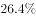；进口345万吨，下降；铁矿砂进口27051万吨，下降；焦炭出口227万吨，增长。

        2018年3月份，6.5mm高线、1.0mm冷轧板卷平均价格分别为3963元/吨和4741元/吨，比上月下跌121元/吨和66元/吨；20mm中板平均价格为4233元/吨，比上月上涨70元/吨。

        2018年1季度，全国十种有色金属产量1339万吨，同比增长，增速同比回落6.6个百分点。其中，铜产量221万吨，增长，提高1.4个百分点；电解铝产量812万吨，增长，回落10.6个百分点；铅产量127万吨，增长，提高1.2个百分点；锌产量142万吨，增长，回落1.3个百分点；氧化铝产量1589万吨，下降，去年同期为增长。

        2018年3月份，上海期货交易所当月期货铜、电解铝、铅、锌平均价格分别为52038元/吨、14103元/吨、18906元/吨和25797元/吨，比上月下跌、、和，同比上涨、、和。

#### 第 11 题　qid 2377418 · 增长

将以下产品按2017年1季度产量同比增速从高到低排序，正确的是：

- **A**. 铁合金＞粗钢＞钢材＞焦炭
- **B**. 粗钢＞铁合金＞钢材＞焦炭
- **C**. 钢材＞粗钢＞焦炭＞铁合金
- **D**. 焦炭＞粗钢＞铁合金＞钢材　✅

**答案**：D

**官方解析**

定位文字材料第一段，可知2018年1季度全国粗钢、钢材、铁合金、焦炭产量同比增速及变化百分点。加减计算可得2017年1季度各产品的同比增速，粗钢：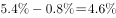；钢材：；铁合金：；焦炭为。显然焦炭增长最快，只有D项符合。

故正确答案为D。

---

#### 第 12 题　qid 2377414 · 平均数

2018年2月平均每吨1.0mm冷轧板卷价格比20mm中板：

- **A**. 高504元
- **B**. 高512元
- **C**. 高644元　✅
- **D**. 低662元

**答案**：C

**官方解析**

根据题干“2018年2月平均每吨1.0mm冷轧板卷价格比20mm中板”，而材料为2018年3月对应数据，因此判定本题为基期计算问题。定位文字材料第三段，可知2018年3月份，1.0mm冷轧板卷平均价格为4741元/吨，比上月下跌66元/吨，则2月份的平均价格=4741+66=4807元/吨；20mm中板平均价格为4233元/吨，比上月上涨70元/吨，则2月份的平均价格=4233-70=4163元/吨。前者平均每吨的价格比后者高4807-4163=644元。
故正确答案为C。

---

#### 第 13 题　qid 2377415 · 增长

2018年1季度全国铜产量同比增量是同期锌产量同比增量的：

- **A**. 不到2倍
- **B**. 2～4倍之间
- **C**. 4～6倍之间
- **D**. 6倍以上　✅

**答案**：D

**官方解析**

由题干“2018年1季度全国铜产量同比增量是……同比增量的多少倍”可判定本题为增长量计算问题。定位材料第四段可知：铜产量221万吨，增长，锌产量142万吨，增长。则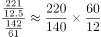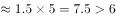。

故正确答案为D。

---

#### 第 14 题　qid 2377408 · 综合

某企业2017年3月和2018年2月以上海期货交易所当月均价分别购买价值1280万元的电解铝，则该企业第二次购买的量比第一次：

- **A**. 
少不到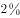

- **B**. 
少以上
　✅
- **C**. 
多不到

- **D**. 
多以上

**答案**：B

**官方解析**

由题干“某企业2017年3月和2018年2月……第二次购买的量比第一次”结合选项是多/少+，可判定本题为一般增长率问题。定位材料第五段，可知2018年3月份电解铝平均价格为14103，比上月下跌，同比增长。根据公式，可知2017年3月份电解铝平均价格，2018年2月份电解铝平均价格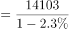 。根据公式，可知第二次购买量比第一次增长了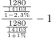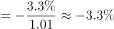。 

故正确答案为B。

---

#### 第 15 题　qid 2377411 · 综合

能够从上述资料中推出的是：

- **A**. 
2018年1季度，钢材产量超过了粗钢、焦炭产量之和

- **B**. 
2017年1季度，钢材进出口总量突破了2000万吨
　✅
- **C**. 
2018年3月，钢材中6.5mm高线价格同比降低约

- **D**. 
2018年1季度，铜、铅、锌产量占十种有色金属产量比重均高于上年水平

**答案**：B

**官方解析**

A项：定位材料第一段，2018年1季度，钢材产量24693万吨，粗钢产量21215万吨，焦炭产量10285万吨，，即钢材产量低于粗钢和焦炭之和，错误；

B项：定位材料第二段，2018年1季度，钢材出口1515万吨，同比下降，进口345万吨，下降，则2017年1季度，钢材进出口总量万吨，即超过2000万吨，正确；

C项：定位材料第三段，2018年3月，6.5mm高线平均价格为3963元/吨，比上月下跌121元/吨，无同比相关数据，无法推出同比情况，错误；

D项：两期比重问题，只需比较部分增长率和总体增长率的大小即可。定位文字材料第四段，2018年1季度，铜、铅、锌产量同比增速分别为、、，十种有色金属产量增长率为，由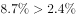， 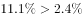，则铜、铅占比均高于上年；，则锌占比低于上年，则非均高于上年，错误；

故正确答案为B。

---

### 材料 4

根据以下资料，回答下列问题

#### 第 16 题　qid 2377284 · 综合

2017年第二季度成交土地规划建筑面积：

- **A**. 不到0.8亿平方米
- **B**. 在0.8~1.2亿平方米之间　✅
- **C**. 在1.2~1.6亿平方米之间
- **D**. 超过1.6亿平方米

**答案**：B

**官方解析**

根据题干所求“2017年第二季度成交土地规划建筑面积”，并根据容积率公式，可判定本题为现期比重问题。定位表格材料可得2017年第二季度（4-6月）成交土地面积和容积率，根据容积率=成交土地规划建筑面积/成交土地面积，则。故2017年第二季度成交土地规划建筑面积=，在0.8~1.2亿平方米区间内。

 故正确答案为B。

---

#### 第 17 题　qid 2377286 · 综合

2017年第一季度成交土地面积：

- **A**. 不到0.3 亿平方米
- **B**. 在0.3～0.4亿平方米之间
- **C**. 在0.4～0.5亿平方米之间　✅
- **D**. 超过0.5亿平方米

**答案**：C

**官方解析**

根据题干所求“2017年第一季度成交土地面积”，并结合材料时间为2017年3月~2018年2月，可判定此题为基期和差问题。定位表格材料可得2017年3月成交土地面积为12.2百万平方米，2018年1月成交土地面积为20.8百万平方米、增长率为；2018年2月成交土地面积为16.4百万平方米、增长率为。则2017年第一季度（1、2、3月）成交土地面积，在0.4~0.5亿平方米区间内。

 故正确答案为C。

---

#### 第 18 题　qid 2377287 · 综合

2017年3～6月间，全国住宅销售价格最贵的月份是：

- **A**. 3月
- **B**. 4月
- **C**. 5月　✅
- **D**. 6月

**答案**：C

**官方解析**

根据题干所求“2017年3～6月间，全国住宅销售价格最贵的月份”，并根据溢价率公式，可判定本题为现期比重问题。定位柱状图可得2017年3~6月楼面价和溢价率，，则。故2017年3~6月全国住宅销售价格分别为、、和，5月份楼面价和溢价率均是这4个月中最大，则2017年3～6月间，全国住宅销售价格最贵的月份是5月份。

故正确答案为C。

---

#### 第 19 题　qid 2377290 · 增长

下列折线图中，能准确反映2017年第四季度各月全国住宅用地楼面价环比增长率变化趋势的是：

- **A**. A
- **B**. B　✅
- **C**. C
- **D**. D

**答案**：B

**官方解析**

根据题干“能准确反映2017年第四季度······环比增长率变化趋势”，判定本题为一般增长率问题。定位统计图可得：2017年9月、10月、11月、12月的全国住宅用地楼面价分别为6540元/平方米、4706元/平方米、5229元/平方米、4660元/平方米，根据，可得2017年第四季度即10月、11月、12月的环比增速分别为：、、，根据计算结果可判定B项趋势图符合。

故正确答案为B。

---

#### 第 20 题　qid 2377291 · 综合

能够从上述资料中推出的是：

- **A**. 2017年12月，全国住宅销售价格高于10月水平
- **B**. 2017年下半年，全国住宅用地成交土地面积环比下降的月份有且仅有2个　✅
- **C**. 2017年下半年，全国住宅用地成交土地面积最高和容积率最高的月份是同一个
- **D**. 2017年下半年，全国住宅用地楼面价超过5000元/平方米的月份有且仅有3个

**答案**：B

**官方解析**

A项：，可得，定位统计图可得，2017年12月全国住宅销售价格为，2017年10月全国住宅销售价格，则全国住宅销售价格，错误；

B项：定位统计表可知，2017年下半年即7-12月，全国住宅用地成交土地面积（百万平方米）有：、，故环比下降的月份有且仅有7月和11月2个，正确；

C项：定位统计表可知，2017年下半年全国住宅用地成交土地面积最高的月份为12月，容积率最高的月份是11月，并非同一个，错误；

D项：定位统计图可知，2017年下半年即7-12月，其中全国住宅用地楼面价超过5000元/平方米的有：7月、8月、9月、11月，即有4个，错误。

故正确答案为B。

---
