# 2019年420联考《行测》题（黑龙江县乡卷）（网友回忆版）

> 联考 · 2019 年 · 6 个模块 · 共 120 题

- [政治理论](#%E6%94%BF%E6%B2%BB%E7%90%86%E8%AE%BA) · 1 题
- [常识判断](#%E5%B8%B8%E8%AF%86%E5%88%A4%E6%96%AD) · 19 题
- [言语理解与表达](#%E8%A8%80%E8%AF%AD%E7%90%86%E8%A7%A3%E4%B8%8E%E8%A1%A8%E8%BE%BE) · 35 题
- [数量关系](#%E6%95%B0%E9%87%8F%E5%85%B3%E7%B3%BB) · 10 题
- [判断推理](#%E5%88%A4%E6%96%AD%E6%8E%A8%E7%90%86) · 35 题
- [资料分析](#%E8%B5%84%E6%96%99%E5%88%86%E6%9E%90) · 20 题

---

## 政治理论

### 第 1 题　qid 2376461 · 新思想

习近平总书记在中央政治局第十三次集体学习时强调，要精准有效处置重点领域风险，深化金融改革开放，增强金融服务           能力，坚决打好防范化解包括金融风险在内的重大风险攻坚战，推动我国金融业健康发展。

- **A**. 实体经济　✅
- **B**. 私营经济
- **C**. 中小企业
- **D**. 国有企业

**答案**：A

**官方解析**

本题考查政治常识。
2019年2月22日，中共中央政治局就完善金融服务、防范金融风险举行第十三次集体学习。习近平总书记在主持学习时强调：“要深化对国际国内金融形势的认识，正确把握金融本质，深化金融供给侧结构性改革，平衡好稳增长和防风险的关系，精准有效处置重点领域风险，深化金融改革开放，增强金融服务实体经济能力，坚决打好防范化解包括金融风险在内的重大风险攻坚战，推动我国金融业健康发展。”
故正确答案为A。

---

## 常识判断

### 第 1 题　qid 2376469 · 人文常识

2018年我国科技界取得了一系列重大成果，这些成果中不包括：

- **A**. 第二艘航母出海试航
- **B**. 嫦娥四号探测器发射成功
- **C**. 造岛神器“天鲲号”下水　✅
- **D**. 国产大型水陆两栖飞机水上首飞

**答案**：C

**官方解析**

本题考查政治常识。
A项正确，2018年5月13日，我国第二艘航母从大连造船厂码头启航，赴相关海域执行海上试验任务，主要检测验证动力系统等设备的可靠性和稳定性。
B项正确，2018年12月8日2时23分，我国在西昌卫星发射中心用长征三号乙运载火箭成功发射嫦娥四号探测器，开启了月球探测的新旅程。嫦娥四号探测器后续将经历地月转移、近月制动、环月飞行，最终实现人类首次月球背面软着陆，开展月球背面就位探测及巡视探测，并通过已在使命轨道运行的“鹊桥”中继星，实现月球背面与地球之间的中继通信。
C项错误，2017年11月3日，由我国自主设计研发的新一代国之重器——“天鲲号”自航绞吸挖泥船成功下水。从被称为“造岛神器”的“天鲸号”，到目前亚洲最大最先进的“天鲲号”，中国自航绞吸挖泥船的自主研制实力再一次让世人惊叹。
D项正确，2018年10月20日，中国自主研制的大型水陆两栖飞机——“鲲龙”AG600在湖北荆门漳河机场成功实现水上首飞。至此，中国大飞机终于迈出“上天入海”完整步伐，建设航空强国轮廓愈发明晰。
本题为选非题，故正确答案为C。

---

### 第 2 题　qid 2377305 · 法律常识

下列关于我国地方性法规的表述，正确的是：

- **A**. 地方性法规特定情况下可由省、自治区和直辖市人民政府制定
- **B**. 部分地方性法规可由设区的市的人民代表大会及其常务委员会制定　✅
- **C**. 地方性法规只能由省、自治区和直辖市人民代表大会常务委员会制定
- **D**. 地方性法规必要时报全国人民代表大会常务委员会和国务院备案

**答案**：B

**官方解析**

本题考查法律常识。
《中华人民共和国立法法》第七十二条规定：“省、自治区、直辖市的人民代表大会及其常务委员会根据本行政区域的具体情况和实际需要，在不同宪法、法律、行政法规相抵触的前提下，可以制定地方性法规。设区的市的人民代表大会及其常务委员会根据本市的具体情况和实际需要，在不同宪法、法律、行政法规和本省、自治区的地方性法规相抵触的前提下，可以对城乡建设与管理、环境保护、历史文化保护等方面的事项制定地方性法规，法律对设区的市制定地方性法规的事项另有规定的，从其规定。设区的市的地方性法规须报省、自治区的人民代表大会常务委员会批准后施行。省、自治区的人民代表大会常务委员会对报请批准的地方性法规，应当对其合法性进行审查，同宪法、法律、行政法规和本省、自治区的地方性法规不抵触的，应当在四个月内予以批准。省、自治区的人民代表大会常务委员会在对报请批准的设区的市的地方性法规进行审查时，发现其同本省、自治区的人民政府的规章相抵触的，应当作出处理决定。除省、自治区的人民政府所在地的市，经济特区所在地的市和国务院已经批准的较大的市以外，其他设区的市开始制定地方性法规的具体步骤和时间，由省、自治区的人民代表大会常务委员会综合考虑本省、自治区所辖的设区的市的人口数量、地域面积、经济社会发展情况以及立法需求、立法能力等因素确定，并报全国人民代表大会常务委员会和国务院备案。自治州的人民代表大会及其常务委员会可以依照本条第二款规定行使设区的市制定地方性法规的职权。自治州开始制定地方性法规的具体步骤和时间，依照前款规定确定。省、自治区的人民政府所在地的市，经济特区所在地的市和国务院已经批准的较大的市已经制定的地方性法规，涉及本条第二款规定事项范围以外的，继续有效。”故地方性法规的制定主体为省、自治区、直辖市、设区的市及自治州的人民代表大会及常委会，B项正确，A、C两项错误。
《中华人民共和国立法法》第九十八条规定：“行政法规、地方性法规、自治条例和单行条例、规章应当在公布后的三十日内依照下列规定报有关机关备案：······（二）省、自治区、直辖市的人民代表大会及其常务委员会制定的地方性法规，报全国人民代表大会常务委员会和国务院备案；设区的市、自治州的人民代表大会及其常务委员会制定的地方性法规，由省、自治区的人民代表大会常务委员会报全国人民代表大会常务委员会和国务院备案； ······ ”故地方性法规不是必要时才报备案，而是必须报备案，D项错误。
故正确答案为B。

---

### 第 3 题　qid 2376500 · 法律常识

下列法律法规中，哪一项不是从2019年1月1日起施行？

- **A**. 《中华人民共和国电子商务法》
- **B**. 《中华人民共和国土壤污染防治法》
- **C**. 新修订的《中华人民共和国公务员法》　✅
- **D**. 新修订的《中华人民共和国个人所得税法实施条例》

**答案**：C

**官方解析**

本题考查法律。
A项正确，《中华人民共和国电子商务法》是2018年8月31日第十三届全国人民代表大会常务委员会第五次会议通过，本法第八十九条规定：“本法自2019年1月1日起施行。”
B项正确，《土壤污染防治法》是2018年8月31日十三届全国人大常委会第五次会议全票通过，本法第九十九条规定：“本法自2019年1月1日起施行。”
C项错误，《中华人民共和国公务员法》已由中华人民共和国第十三届全国人民代表大会常务委员会第七次会议于2018年12月29日修订通过，自2019年6月1日起施行。
D项正确，《中华人民共和国个人所得税法实施条例》是国务院发布的法规，2018年12月18日中华人民共和国国务院令第707号第四次修订通过，第三十六条规定：“本条例自2019年1月1日起施行。”
本题为选非题，故正确答案为C。

---

### 第 4 题　qid 2376960 · 法律常识

下列行为不符合我国法律规定的是：

- **A**. 小黄年满16周岁，被某销售公司聘为正式职员
- **B**. 因公司工作繁忙，小王每月加班时间达到24小时
- **C**. 劳务公司派遣到某单位工作的小李申请参加该单位工会
- **D**. 老板要求小张法定节假日在公司加班，之后为其发放了双倍工资　✅

**答案**：D

**官方解析**

本题考查劳动法常识。
A项正确，《劳动法》第十五条规定：“禁止用人单位招用未满十六周岁的未成年人。文艺、体育和特种工艺单位招用未满十六周岁的未成年人，必须遵守国家有关规定，并保障其接受义务教育的权利。”因此，销售公司聘年满16周岁小黄为职员符合法律规定。
B项正确，《劳动法》第四十一条规定：“用人单位由于生产经营需要，经与工会和劳动者协商后可以延长工作时间，一般每日不得超过一小时；因特殊原因需要延长工作时间的，在保障劳动者身体健康的条件下延长工作时间每日不得超过三小时，但是每月不得超过三十六小时。”因此，小王每月加班时间达到24小时符合法律规定。
C项正确，《劳动合同法》第六十四条规定：“被派遣劳动者有权在劳务派遣单位或者用工单位依法参加或者组织工会，维护自身的合法权益。”因此，小李可以申请参加用工单位的工会。
D项错误，《劳动法》第四十四条规定：“有下列情形之一的，用人单位应当按照下列标准支付高于劳动者正常工作时间工资的工资报酬：（一）安排劳动者延长工作时间的，支付不低于工资的百分之一百五十的工资报酬；（二）休息日安排劳动者工作又不能安排补休的，支付不低于工资的百分之二百的工资报酬；（三）法定休假日安排劳动者工作的，支付不低于工资的百分之三百的工资报酬。”因此，老板要求小张法定节假日在公司加班，之后应为其发放不低于三倍工资的报酬。
本题为选非题，故正确答案为D。

---

### 第 5 题　qid 2376475 · 人文常识

荷花虽生长于池塘的污泥中，但荷叶却出污泥而不染，其主要原因是：

- **A**. 荷叶含有大量的叶绿素，能与太阳光发生光合作用，产生自清洁
- **B**. 荷叶表面光滑，具有非常强的光洁度，污泥很难在它的表面吸附
- **C**. 荷叶含有疏水的纳米级蜡质，雨露落在上面会形成水珠清洁叶面　✅
- **D**. 荷花枝干细长，水珠落在荷叶上，容易造成荷叶晃动，甩出污泥

**答案**：C

**官方解析**

本题考查科技常识。
荷叶之所以能出污泥而不染是由荷叶叶面上存在着复杂的多重纳米和微米级的超微结构决定的：在超高分辨率显微镜下可以清晰看到，荷叶表面上有许多微小的乳突，它上面长满茸毛，乳突间的凹陷部分充满空气，这样就在紧贴叶面处形成一层极薄的只有纳米量级厚的空气层。这使得在尺寸上远大于这种结构的灰尘、雨水等降落在叶面上后，隔着一层极薄的空气，从而雨水会自动聚集成球形水珠，而水珠的滚动会把落在叶面上的尘土污泥吸附掉滚出叶面，使叶面始终保持干净，这就是著名的“荷叶自洁效应”。
故正确答案为C。

---

### 第 6 题　qid 2377304 · 法律常识

下列哪部法律不涉及公民个人信息保护？

- **A**. 刑法
- **B**. 网络安全法
- **C**. 民法总则
- **D**. 婚姻法　✅

**答案**：D

**官方解析**

本题考查法律常识。
A项正确，根据《刑法》第二百五十三条之一规定：“违反国家有关规定，向他人出售或者提供公民个人信息，情节严重的，处三年以下有期徒刑或者拘役，并处或者单处罚金；情节特别严重的，处三年以上七年以下有期徒刑，并处罚金。违反国家有关规定，将在履行职责或者提供服务过程中获得的公民个人信息，出售或者提供给他人的，依照前款的规定从重处罚。窃取或者以其他方法非法获取公民个人信息的，依照第一款的规定处罚。”
B项正确，根据《网络安全法》第四十四条规定：“任何个人和组织不得窃取或者以其他非法方式获取个人信息，不得非法出售或者非法向他人提供个人信息。”
C项正确，根据《民法总则》第一百一十一条规定：“自然人的个人信息受法律保护。任何组织和个人需要获取他人个人信息的，应当依法取得并确保信息安全，不得非法收集、使用、加工、传输他人个人信息，不得非法买卖、提供或者公开他人个人信息。”
D项错误，《婚姻法》中并未涉及有关公民个人信息保护的规定。
故正确答案为D。

---

### 第 7 题　qid 2376492 · 人文常识

下列表述正确的是：

- **A**. 鄱阳湖栖息着世界上最大的白鹤群　✅
- **B**. 我国最早出现的种植业位于松花江流域
- **C**. 被誉为“天上云霞,地下鲜花”的是四川蜀绣
- **D**. 东北平原是中国第二大平原，也是中国重要的粮棉生产基地

**答案**：A

**官方解析**

本题考查地理国情。

A项正确，鄱阳湖是全世界最大的白鹤集中越冬地，白鹤的数量占全世界总数的以上，堪称鹤之天堂。鄱阳湖区发现白鹤的最早记录是1980年。1985年，时任国际鹤类基金会会长的乔治·阿基博带队来鄱阳湖考察，观测到白鹤1350只，其中幼鹤119只。他们认定那是当时世界上发现的最大野生白鹤群。

B项错误，我国最早出现的种植业应位于黄河、长江流域。黄河、长江是中国的母亲河，这两条河流的冲积平原地区是中华文明的发祥地且两个平原处在温带湿润、半湿润地区，气候温暖湿润，比较适宜人类居住，所以种植业发展最早。 

C项错误，被誉为“天上云霞，地下鲜花”的是杭州的织锦。 

D项错误，东北平原是中国最大的平原，是中国三大平原之一。位于中国东北部，南北长约1000千米，东西宽约400千米，面积达35万平方千米。同时东北平原土地肥沃，是全球仅有的三大黑土区域之一，是中国重要的粮食、大豆、畜牧业生产基地，也是中国重要的钢铁、机械、能源、化工基地。 

故正确答案为A。 

---

### 第 8 题　qid 2376961 · 人文常识

关于政府信息公开，下列做法正确的是：

- **A**. 小明因出国需要打印个人所得税缴税记录，向税务部门说明后，税务部门拒绝提供
- **B**. 小张借给小吴50万元，到期后小吴无法还款。小张想用小吴的房产抵债，向房屋管理机关提出申请查看小吴名下房产，房屋管理机关拒绝提供　✅
- **C**. 小李因老家拆迁，想了解土地征用、拆迁补偿等方面的政策信息，但发现所在县、市网站上并没有相关信息，于是向所在县、市的有关部门提出查看申请，有关部门拒绝提供
- **D**. 小兰所在县发生洪水，省里为救灾专门提供了一笔救灾资金。救灾安置工作完成后，小兰想了解该笔资金的使用、分配情况，但县里并没有公布关于该笔资金的相关信息，小兰向县里有关部门提出申请，有关部门拒绝提供

**答案**：B

**官方解析**

本题考查法律常识。
A项错误，《政府信息公开条例》第二十七条规定：除行政机关主动公开的政府信息外，公民、法人或者其他组织可以向地方各级人民政府、对外以自己名义履行行政管理职能的县级以上人民政府部门申请获取相关政府信息。因此，税务部门拒绝公开说法错误。
B项正确，《政府信息公开条例》第十五条规定：涉及商业秘密、个人隐私等公开会对第三方合法权益造成损害的政府信息，行政机关不得公开。
C项错误，《政府信息公开条例》第二十一条规定：除本条例第二十条规定的政府信息外，设区的市级、县级人民政府及其部门还应当根据本地方的具体情况，主动公开涉及市政建设、公共服务、公益事业、土地征收、房屋征收、治安管理、社会救助等方面的政府信息；乡（镇）人民政府还应当根据本地方的具体情况，主动公开贯彻落实农业农村政策、农田水利工程建设运营、农村土地承包经营权流转、宅基地使用情况审核、土地征收、房屋征收、筹资筹劳、社会救助等方面的政府信息。
D项错误，《政府信息公开条例》第二十条规定：行政机关应当依照本条例第十九条的规定，主动公开本行政机关的下列政府信息：（十一）扶贫、教育、医疗、社会保障、促进就业等方面的政策、措施及其实施情况。
故正确答案为B。

---

### 第 9 题　qid 2376479 · 人文常识

下列送别诗句中不属于描写目送友人场景的是:

- **A**. 孤帆远影碧空尽，唯见长江天际流
- **B**. 山回路转不见君，雪上空留马行处
- **C**. 日暮酒醒人已远，满天风雨下西楼　✅
- **D**. 青枫江上秋帆远，白帝城边古木疏

**答案**：C

**官方解析**

本题考查人文常识。
A项正确，“孤帆远影碧空尽，唯见长江天际流”出自唐代诗人李白的《送孟浩然之广陵》。这是首送别诗，不仅写出了友人所乘船孑然远逝的情景，而且写出诗人凭栏目送的情景，此刻，诗人伫立在黄鹤楼上，久久地注视着那渐行渐远，最终消失在茫茫水天相接之处的一片孤帆，他的心早已随船而去了。寄寓了诗人的惜别之情。
B项正确，“山回路转不见君，雪上空留马行处。”出自盛唐岑参的《白雪歌送武判官归京》。岑参在这首诗中，以诗人的敏锐观察力和浪漫奔放的笔调，描绘了祖国西北边塞的壮丽景色，以及边塞军营送别归京使臣的热烈场面，表现了诗人和边防将士的爱国热情，以及他们对战友的真挚感情。“山回路转不见君，雪上空留马行处”，用很平淡质朴的语言表现了将士们对战友的真挚感情，字字传神，含蓄隽永。这一部分虽然描写对友人依依惜别的深情，但也表现了边塞将士的豪迈精神。
C项错误，“日暮酒醒人已远，满天风雨下西楼。”出自唐代许浑的《谢亭送别》。这是一首送别诗。一觉醒来，已是薄暮时分。天色变了，下起了雨，四望一片迷蒙。眼前的江面，两岸的青山红叶都已经笼罩在蒙蒙雨雾和沉沉暮色之中。而朋友的船，此刻更不知道随着急流驶到云山雾嶂之外的什么地方去了。不仅写出身留谢亭而友人早已远去，而且写出暮色苍茫风雨凄迷的孤寂落寞的离愁情。
D项正确，“青枫江上秋帆远，白帝城边古木疏。”出自唐代高适的《送李少府贬峡中王少府贬长沙》。这是一首送别诗，同时也是一首边塞诗，同时送别两人，且两人均为遭贬而迁。“青枫江”指浏水，在长沙与湘江汇合。写王少府到了长沙，在秋高气爽的季节，望着那明净高远、略无纤尘的蓝天，自然会洗尽烦恼。想象李少府到了峡中，可以去古木参天、枝叶扶疏的白帝城凭吊古迹，以求慰藉。这一句是对离别的二人共同讲的，体现了目送的场景。
本题为选非题，故正确答案为C。

---

### 第 10 题　qid 2376988 · 人文常识

下列诗词与所描写的花对应错误的是：

- **A**. 愿借天风吹得远，家家门巷尽成春——梅花
- **B**. 芙蓉不及美人妆，水殿风来珠翠香——荷花
- **C**. 他年我若为青帝，报与桃花一处开——菊花
- **D**. 长恨春归无觅处，不知转入此中来——牡丹　✅

**答案**：D

**官方解析**

本题考查人文常识。
A项正确，本句出自清代李方膺的《题画梅》，全诗是：挥毫落纸墨痕新，几点梅花最可人。愿借天风吹得远，家家门巷尽成春。意思是说：挥毫纵横，水墨淋漓，那纸上俨然是几朵绽开的梅花，美丽的梅花但愿天风把你吹到千家万户，门前屋后都能见到你报春的身影，让家家户户都能享受到你的清香，感受到春天的温暖。本句描写的是梅花。
B项正确，本句出自王昌龄的《西宫秋怨》，意思是与盛妆的美人相比，荷花也会黯然失色；水殿和风吹来，珠翠芳香四溢。本句描写的是荷花。
C项正确，本句选自黄巢《题菊花》，意思是梦想着自己能够成为掌管春天的仙神，可以使菊花与其他花都开在春天，不会受到冷落。本句描写的是菊花。
D项错误，本句选自白居易的《大林寺桃花》，全诗为：人间四月芳菲尽，山寺桃花始盛开。长恨春归无觅处，不知转入此中来。描写的是桃花。意思说：在人间四月里百花凋零已尽，高山古寺中的桃花才刚刚盛开。我常为春光逝去无处寻觅而怅恨却不知它已经转到这里来。本句描写的是桃花，而不是牡丹。
本题为选非题，故正确答案为D。

---

### 第 11 题　qid 2376456 · 科技常识

下列说法错误的是：

- **A**. 
雷雨可使土壤的氮肥增加

- **B**. 
18K黄金制品的含金量为70
　✅
- **C**. 
聚四氟乙烯可用于制作不粘锅的涂层

- **D**. 
在金属表面喷漆可以防止金属被氧化腐蚀

**答案**：B

**官方解析**

本题考查科技常识。

A项正确，雷雨天气过程中的闪电温度极高，一般在三万度以上，并造成高电压。在高温高电压条件下，空气分子会发生电离，等它们重新结合时，其中的氮和氧就会化合为亚硝酸盐和硝酸盐分子，并溶解在雨水中降落地面，成为天然氮肥。

B项错误，K金是指黄金和其它金属混合在一起的合金。根据在首饰中的黄金含量可分为不同的K金，其中24K是指纯金，18K黄金制品的含黄金量就是18/24=75，因此选项中的70表述错误。 

C项正确，聚四氟乙烯俗称“塑料王”，是由四氟乙烯经聚合而成的高分子化合物，具有优良的化学稳定性、耐腐蚀性、密封性、高润滑不粘性，可用于制作不粘锅的涂层。

D项正确，金属被氧化腐蚀是指各类材料在环境作用下发生损坏、性能下降或状态的劣化。良好的喷漆涂装保护层能够成为抑制腐蚀介质侵入的屏障，使得金属保持连续完整，因此在金属表面喷漆是一种很重要的金属防腐蚀手段。

本题为选非题，故正确答案为B。

---

### 第 12 题　qid 2376998 · 人文常识

下列诗句对应的传统节日，按时间先后排序正确的是：
①去年元夜时，花市灯如昼
②桃符呵笔写，椒酒过花斟
③马上逢寒食，途中属暮春
④九日黄花酒，登高会昔闻

- **A**. ④③①②
- **B**. ③④①②
- **C**. ①②④③
- **D**. ②①③④　✅

**答案**：D

**官方解析**

本题考查人文常识。
① 项出自北宋文学家、史学家欧阳修《生查子·元夕》。“元夜”即农历正月十五元夜，又称上元节、灯节，即现在的元宵节。
②项出自南宋诗人陆游的《己酉元旦》，诗中描写祝贺友人春节愉快的情景。“桃符”即指春联，古代元旦有贴春联的习俗，即现在的春节。
③项出自唐代诗人宋之问《途中寒食》，“寒食”，即寒食节，亦称“禁烟节”、“冷节”，在清明节前一二日。
④项出自唐代诗人岑参的《奉陪封大夫九日登高》，“九日”指农历九月初九，即重阳节。
正确顺序为春节、元宵节、寒食节、重阳节，所以②①③④顺序正确。
故正确答案为D。

---

### 第 13 题　qid 2376682 · 人文常识

下列我国古代国家行政机构不具有行政监察职能的是：

- **A**. 御史台
- **B**. 太常寺　✅
- **C**. 六科给事中
- **D**. 都察院

**答案**：B

**官方解析**

本题考查人文常识。
A项正确，御史台，古代官署名。御史台的职责是纠察弹劾百官过失，是封建国家专司弹劾的监察机关。
B项错误，太常寺，封建社会中掌管礼乐的最高行政机关，秦时称奉常。汉景帝六年改称太常。汉以后改称太常寺、太常礼乐官等。
C项正确，明代地方分区监察和中央按系统监察相结合，专设六科给事中，稽察六部百司之事，旨在加强皇帝对六部的控制。
D项正确，都察院，官署名。明清全国最高监察机构。掌纠劾百司，辩明冤枉，提督各道，为天子耳目风纪之司。
本题为选非题，故正确答案为B。

---

### 第 14 题　qid 2376985 · 人文常识

下列关于汽车安全驾驶的规定和其解释，对应错误的是：

- **A**. 严禁车辆超速——减小惯性，防止急刹车时造成车祸
- **B**. 汽车的司机和乘客必须系安全带——防止惯性造成的危害
- **C**. 严禁车辆超载——减少汽车对路面的破坏、增大摩擦和惯性　✅
- **D**. 同车道行驶的机动车，后车应当与前车保持一定的安全距离——防止急刹车时由于惯性造成车祸

**答案**：C

**官方解析**

本题考查科技常识。
A项错误，物体保持静止状态或匀速直线运动状态的性质，称为惯性。惯性是物体的一种固有属性，表现为物体对其运动状态变化的一种阻抗程度。质量是对物体惯性大小的量度，与超速与否无关。禁止超速的原因是：当车辆超速行驶时，遇到紧急情况要刹车时，由于汽车本身具有惯性，刹车的瞬间会保持原有的较高的速度，停下来需要时间会较长，时间较长，滑行的距离也就越长，容易产生交通事故。因此，“严禁车辆超速”是为了减小动能，防止急刹车时停下来的时间变长。
B项正确，当高速行驶中的车辆由于紧急情况需要急刹车时，车由运动突然变成静止，司机与乘客仍会由于惯性而前进，容易撞到挡风玻璃发生伤害。当司机与乘客系好安全带时，安全带的拉力会有效的保护人体，防止惯性带来的伤害。因此，“汽车的司机和乘客必须系安全带”是为了防止惯性造成的危害。
C项错误，首先，汽车超载，是指汽车装载的货物质量过大，汽车的总质量过大，汽车对地面的压力F=G=mg。根据P=F/S可知，在受力面积不变的情况下，车的质量越大，车对地面的压力越大，对地面的压强越大，路面受到的压强过大容易损坏路面。其次，由于质量是对物体惯性大小的量度。当超载的汽车质量越大时，也意味着惯性越大，急刹车后滑行距离大，容易产生交通事故。因此，“严禁超载”是为了减少汽车对路面的破坏、减小惯性，而不是增大惯性。
D项正确，由于汽车具有惯性，刹车后，汽车由于惯性要保持原来的运动状态继续前进，为了保证安全，在行车时要与前车保持一定距离。因此，“同车道行驶的机动车，后车应当与前车保持一定的安全距离”是为了防止急刹车时由于惯性造成车祸。
综上所述，本题A、C两项都有问题，出题不严谨。但本题是单选题，故粉笔认为选A或C选项均可。

---

### 第 15 题　qid 2376464 · 人文常识

管理大师杰克·韦尔奇有句名言：管得少，就是管得好。他主要强调管理应该注重：

- **A**. 沟通
- **B**. 分权　✅
- **C**. 组织
- **D**. 控制

**答案**：B

**官方解析**

本题考查管理学常识。
“管得少，就是管得好”强调的就是管理应该注重分权。管理的最终目标在于提高经营绩效，分权是管理学学者在近一百多年的企业管理研究与实践中，为提高效率而归纳出的一大规律性，管理学家认为企业在追求绩效时必须善于分权，担任一定管理职务的领导者在实际工作中为充分利用专门人才的知识和技能，应将部分解决问题和处理新增业务的权利委任给下属。据此可知，B项正确，ACD三项与题干无关。
故正确答案为B。

---

### 第 16 题　qid 2376499 · 人文常识

俗话说“不要将你的鸡蛋全都放在一只篮子里”。下列选项与该俗语蕴含的道理相吻合的是：

- **A**. 天有不测风云　✅
- **B**. 鱼与熊掌不可兼得
- **C**. 不入虎穴，焉得虎子
- **D**. 舍不得孩子，套不住狼

**答案**：A

**官方解析**

本题考查经济常识。
如果把所有鸡蛋都放在同一个篮子里，篮子翻了，所有的鸡蛋都会碎掉；如果不把所有的鸡蛋放在一个篮子里，篮子翻了，还会有其他鸡蛋剩下。即不要把所有的资本都投入到一件事情上，应该做多手准备，规避风险。
A项正确，天有不测风云比喻灾祸是无法预料的，即风险是随时存在的，我们应该懂得随时规避和防范风险。与题意相符合。
B项错误，鱼与熊掌不可兼得，意思是鱼和熊掌不能同时获得。强调的是我们在做选择的时候，应该如何取舍，在经济上对应的是机会成本。与风险无关。
C项错误，不入虎穴，焉得虎子比喻不经历艰险，就不能取得成功，也指需通过实践取得真知。与风险无关。
D项错误，舍不得孩子，套不住狼比喻要达到某一目的必须付出相应的代价。与风险无关。
故正确答案为A。

---

### 第 17 题　qid 2376498 · 人文常识

下列关于血糖的说法错误的是：

- **A**. 正常人进食后血糖浓度会升高
- **B**. 正常人空腹超过12小时会引起低血糖
- **C**. 南瓜能抑制葡萄糖吸收，具有降血糖作用　✅
- **D**. 胰岛素是人体产生的唯一能够降低血糖的激素

**答案**：C

**官方解析**

本题考查科技常识。
A项正确，食物中存在大量的淀粉等糖类。人在进食后，糖类被人体消化吸收，因此会使血糖含量升高。
B项正确，低血糖的常见原因包括进食过少、运动过度、药物使用不当、大量饮酒等。正常人空腹（禁食）时间过长，由于没有食入足够的糖，可能会引起低血糖。
C项错误，南瓜中含有丰富的营养物质，其中包含了蛋白质、多糖、果胶、纤维素、维生素以及微量元素等成分，在这些众多的营养物质中，蛋白质和多糖都可以提升自身免疫功能。部分多糖会被分解成单糖，可能导致人体血糖升高。
D项正确，胰岛素是体内唯一能够降低血糖浓度的激素，它不仅能够促使葡萄糖分解，还能抑制非糖物质转化为葡萄糖。
本题为选非题，故正确答案为C。

---

### 第 18 题　qid 2376709 · 科技常识

下列我国空间站发展的重要标志性事件按完成步骤排列正确的是：
①“天宫二号”空间实验室成功发射
②“神舟十一号”成功发射，完成与“天宫二号”对接
③陆续发射科学实验舱和空间站核心舱，组建中国空间站
④“天舟一号”货运飞船成功发射，完成与“天宫二号”对接

- **A**. ①②③④
- **B**. ④①②③
- **C**. ①③④②
- **D**. ①②④③　✅

**答案**：D

**官方解析**

本题考查科技常识。
①2016年9月15日22时04分，“天宫二号”空间实验室由长征二号FT2火箭发射升空。
②2016年10月19日3时31分，“神舟十一号”载人飞船与“天宫二号”空间实验室成功实现自动交会对接。
③建设具有国际先进水平的空间站，解决有较大规模的、长期有人照料的空间应用问题，是我国载人航天工程“三步走”发展战略中第三步的任务目标。按计划，空间站将于2022年前后建成，是我国长期在轨稳定运行的国家太空实验室，将全面提升我国载人航天综合应用效益水平。
④2017年4月20日19时11分，中国首架货运飞船——“天舟一号”成功发射升空，并在4月22日完成与“天宫二号”的首次对接。
由此可知，按照完成步骤的时间应该是①②④③。
故正确答案为D。

---

### 第 19 题　qid 2377002 · 人文常识

下列典故或事件与所涉及的人物对应正确的是：

- **A**. 长平之战：赵括、孙膑
- **B**. 图穷匕见：荆轲、嬴政　✅
- **C**. 破釜沉舟：项羽、刘邦
- **D**. 约法三章：商鞅、秦孝公

**答案**：B

**官方解析**

本题考查人文常识。需逐一分析选项。
A项错误。长平之战，是秦国名将白起率军在赵国的长平一带同赵国的军队（赵括）发生的战争。战争中，赵王弃用名将廉颇，而起用纸上谈兵的赵括代替廉颇；最终战败。对应的人物是赵括和白起。
B项正确，图穷匕见：战国时，荆轲奉燕国太子丹的命令，以燕国的地图作为礼物献给秦王嬴政，匕首就藏在地图卷里，试图伺机刺杀秦王，但最后失败。对应的人物是荆轲和嬴政。
C项错误，破釜沉舟是出自项羽一战成名的巨鹿之战。破釜沉舟是指把饭锅打破，把渡船凿沉。比喻不留退路，非打胜仗不可，下决心不顾一切地干到底。对应的人物是项羽，没有刘邦。
D项错误，约法三章：出自《史记·高祖本纪》。公元前206年，刘邦率军占领秦都咸阳，立即废秦严刑苛政，与秦民约法三章，规定“杀人者死，伤人及盗抵罪”。经此约法，刘邦得秦民拥护，在政治上赢得了统一全国的胜利。约法三章主要涉及的人物是刘邦。
故正确答案为B。

---

## 言语理解与表达

### 第 1 题　qid 2377270 · 逻辑填空

金砖是中国传统窑砖烧制业中的珍品，古时专供宫殿等重要建筑使用，因质地坚细、敲之有金石之声而得名。帝制结束后，金砖不再被需要，制作手艺        民间。上世纪80年代，砖瓦匠人金梅泉通过摸索，初步恢复了金砖的古法制作，令金砖“          ”。 该技艺被列入中国首批国家级非物质文化遗产名录。

- **A**. 散落  死而复生　✅
- **B**. 流落  柳暗花明
- **C**. 流传  重见天日
- **D**. 散失  卷土重来

**答案**：A

**官方解析**

第一空搭配“制作手艺”，并且表示因为不再被需要，制作手艺流失于民间，在民间消失了这样一层语义。A项“散落”表示因分散而失落，散失的意思，D项“散失”表示流散遗失，与文意相符，均能体现出制作手艺在民间消失了的含义，保留。B项“流落”强调穷困潦倒，漂泊外地，搭配的主体往往是人，与技艺搭配不当，排除；C项“流传”表示“某事传播开去”，而文段当中表示的含义为制作手艺在民间消失了，并没有传播下去，故该项与文意相悖，排除。
第二空，文段中说明了金梅泉恢复了金砖的古法制作，那意味着就能够让金砖重新出现了，A项“死而复生”表示死去了又活过来，既然又活过来了，那也就说明再次出现了，故A项符合文意，当选；D项“卷土重来”这一词语感情色彩偏消极，与文段感情色彩不相符，排除。
故正确答案为A。
【文段出处】《点泥成“金”的御窑女烧砖人》

---

### 第 2 题　qid 2376897 · 逻辑填空

科学家将松力纤维蛋白原和可吸收材料共混后，采用静电纺技术制成具有超亲水性、类似细胞外基质的复合生物支架材料。由该材料制成的人工韧带具有良好的组织          和合适的机械强度，植入肌体后，可在逐层降解的同时进行组织再生，诱导肌体自身组织长入韧带中，逐步演变成自身韧带组织，实现腱骨融合，达到永久愈合的目的。
填入画横线部分最恰当的一项是：

- **A**. 相容性　✅
- **B**. 自愈性
- **C**. 亲和性
- **D**. 再生性

**答案**：A

**官方解析**

横线处所填词语搭配“人工韧带”，形容该材料制成的人工韧带所具有的属性。根据后文“长入韧带中”、“演变成自身韧带组织”、“实现腱骨融合，达到永久愈合的目的”可知，它可以与肌体实现融合，对应A项“相容性”。
B项“自愈性”指自我恢复的能力，文段未体现人工韧带能够自我恢复，与文意不符，排除；
C项“亲和性”在组织学上被视为表示组织对某种染料结合力强的一种术语，另外，在胚胎学上，表示细胞或组织相互连接的意思，“亲和性”只能体现出结合性强，容易接近，故“亲和性”程度太轻，与后文实现机体融合的语义不符，排除；
D项“再生性”指重新恢复生长的能力，与“人工韧带”搭配不当，且根据后文“可在逐层降解的同时进行组织再生，诱导肌体自身组织长入韧带中”可知，文段想体现的是让身体组织再生，而非让人工韧带再生，故该项与文意不符，排除。
故正确答案为A。
【文段出处】《探索让人体组织器官“起死回生”》

---

### 第 3 题　qid 2376525 · 逻辑填空

云南在西、巴蜀在北，贵州有着说不尽的历史。这片西南中国的广袤土地，呈现了华夏山河的            、见证了中国革命的风云际会、记录了多民族文化的交流激荡。现在，贵州正在以绿色发展谋求生态红利，率先推进了中国生态文明建设的地方探索。
填入划横线部分最恰当的一项是：

- **A**. 海晏河清
- **B**. 渊渟岳峙
- **C**. 钟灵毓秀　✅
- **D**. 瑕瑜互见

**答案**：C

**官方解析**

横线处所填的词语搭配对象为“华夏山河”，与后文两个并列结构共同说明在西南这片土地上有着说不尽的历史。C项“钟灵毓秀”指美好的山川孕育出优秀的人才，搭配“华夏山河”恰当，与文段语境相符，当选。
A项“海晏河清”比喻太平盛世、天下太平，与“华夏山河”搭配不当，与语境不符，排除；B项“渊渟岳峙”比喻人品德如渊水深沉，如高山耸立，不用于形容“华夏山河”，排除；D项 “瑕瑜互见”比喻优点、缺点都有，文段不强调“华夏山河”的缺点，与文意不符，排除。
故正确答案为C。
【文段出处】《让绿色成为发展的鲜明底色》

---

### 第 4 题　qid 2377351 · 逻辑填空

以色列在网络安全、汽车科技、精细农业等领域都具有全球竞争力。该国技术创新            的关键是，科研机构、企业、政府部门、军队等方面共同形成了一个良好的“生态环境”，有允许        的文化氛围，还有培养创新人才的教育系统。
依次填入划横线部分最恰当的一项是：

- **A**. 层出不穷  试错　✅
- **B**. 厚积薄发  竞争
- **C**. 独领风骚  冒险
- **D**. 遍地开花  质疑

**答案**：A

**官方解析**

第一空，根据文段信息“······等领域都具有全球竞争力”“······等方面共同形成了一个良好的‘生态环境’”可知，以色列在多方面都进行了技术创新，横线所填词语要体现出多的含义，A项“层出不穷”形容事物连续出现，没有穷尽，D项“遍地开花”比喻好事情到处出现或普遍发展，均可体现多的含义，保留。B项“厚积薄发”形容只有准备充分才能办好事情，C项“独领风骚”形容超群出众，没有谁可与之相比，一般用于对比的语境，均与文意不符，排除。
第二空，根据文段核心话题“创新”可知，创新就要允许失败，A项“试错”与“创新”对应恰当，当选。D项“质疑”与“创新”这一话题对应不当，排除。
故正确答案为A。
【文段出处】光明日报《允许试错 鼓励“冒险”》

---

### 第 5 题　qid 2377273 · 逻辑填空

面对异质文化间的交流，特别是走出国门的艺术展示，我们常会想当然地选择      受众，在艺术观念与表现样式上有意融合甚至直接“迎合”，而这样做的结果往往得不到理想的效果。艺术风格的坚持、纯化与适度包容，更有利于我们向世界更好地展现中国艺术的精华，同时接收当地受众的文化      。

- **A**. 尊重  评论
- **B**. 迁就  反馈　✅
- **C**. 考虑  主张
- **D**. 顾及  观念

**答案**：B

**官方解析**

第一空，横线后的“在艺术观念与表现样式上有意融合甚至直接‘迎合’”为横线处的解释说明，故横线处应表达出迎合对方受众之意，“迎合”指想方设法奉承讨好别人。B项“迁就”指完全屈从于他人的愿望，而忽视自身的利益，符合文意，保留。A项“尊重“为积极感情色彩，与文意不符，排除；C项“考虑”、D项“顾及”均体现不出“迎合”之意，程度过轻，排除。
第二空，代入验证，接收当地受众的文化“反馈”搭配恰当，符合文意，当选。
故正确答案为B。
【文段出处】光明网《一带一路的图像表达与展陈之道》

---

### 第 6 题　qid 2376710 · 逻辑填空

古人根据经验编制了许多脍炙人口的农谚，比如“清明前后，种瓜点豆”。不仅是农谚，与二十四节气相关的诗词歌赋也是            ，比如“蒹葭苍苍，白露为霜”，再比如“清明时节雨纷纷，路上行人欲断魂”。这些诗词歌赋            ，将二十四节气与天气现象巧妙地结合在一起，具有很好的传播性。
依次填入划横线部分最恰当的一项是：

- **A**. 俯拾皆是  沉思翰藻
- **B**. 不胜枚举  形神兼备　✅
- **C**. 不计其数  文采斐然
- **D**. 举不胜举  缀玉联珠

**答案**：B

**官方解析**

第一空，横线前“也”表示“诗词歌赋”与前面“农谚”并列，前面通过“比如”说明农谚的例子非常多，结合后文“比如······，再比如······”可知，横线处也要体现出诗词歌赋的例子非常多，B项“不胜枚举”、D项“举不胜举”都是强调可以举的例子数量特别多，符合文意，保留；A项“俯拾皆是”意思是只要低下头来捡取，到处都是，形容多而易得，C项“不计其数”指无法计算数目，形容极多，虽然都能体现多的含义，但与“例子”的对应不如B、D两项准确，排除。
第二空，横线前出现指代词“这些”，横线处要体现出诗词歌赋的特性，通过“将二十四节气与天气现象巧妙地结合在一起”可知，这些诗词与节气结合的非常好，不仅是诗歌，也有节气的内容包含在里面，B项“形神兼备”强调外在物象与内在神韵都具备，符合文意，当选。D项“缀玉联珠”形容诗文十分优美，仅能形容诗文的好，但体现不出包含节气的内容，没有B项对应准确，排除。
故正确答案为B。
【文段出处】《气象科普（176）：时间里的中国智慧—二十四节气》

---

### 第 7 题　qid 2377363 · 逻辑填空

导致眼前相声难出精品的核心问题，是艺术观念和审美把握的错位，一些表演仅仅        在逗笑娱乐的浅表层面，缺乏相声应有的审美智慧和            的思想力量。
依次填入划横线部分最恰当的一项是：

- **A**. 停留  振聋发聩　✅
- **B**. 流连  鞭辟入里
- **C**. 徘徊  发人深省
- **D**. 局限  义正辞严

**答案**：A

**官方解析**

第一空，根据文意可知，一些表演仅仅是围绕在逗笑娱乐的浅表层面，A项“停留”、C项“徘徊”、D项“局限”均符合，保留。B项“流连”指留恋不止，依依不舍，文段并未体现“不舍”，不符合文意，排除。
第二空，填入横线成语与“思想力量”搭配，A项“振聋发聩”比喻唤醒糊涂麻木的人，置于文段体现出这种思想力量的重要性，当选。D项“义正辞严”指理由正当充分，措辞严正有力，与“思想力量”搭配不当，排除；C项“发人深省”指启发人深刻思考，有所醒悟，置于文段程度较轻，排除。
故正确答案为A。
【文段出处】《人民日报：相声的创演困境与发展出路》

---

### 第 8 题　qid 2376494 · 逻辑填空

形成有文化特色、有地域特色、可识别的小城镇发展模式，是一个长期的渐进过程。我们应尊重当地实际，            、远近结合、量力而行，不能盲目            。在模式选择上，可以借鉴国内外小城镇建设的经验，但更重要的是结合自身实际、体现自身特色。
依次填入划横线部分最恰当的一项是：

- **A**. 循规蹈矩  分庭抗礼
- **B**. 按部就班  投闲置散
- **C**. 循序渐进  贪大求快　✅
- **D**. 按图索骥  急于求成

**答案**：C

**官方解析**

第一空，根据文段首句完整语句“是一个长期的渐进过程”的提示，可知接下来整个文段也应围绕“长期”“渐进”展开。B项“按部就班”指按照一定的顺序、步骤进行，C项“循序渐进”即按照一定顺序逐渐深入或提高，置于此处均符合文意，保留。A项“循规蹈矩”比喻按规矩行事，或拘泥保守，不敢变通，侧重遵守规矩不逾越，D项“按图索骥”比喻按照线索去寻找事物，侧重于拘泥成法办事，均无法与“长期”“渐进”对应，与文意不符，排除。
第二空，根据“不能盲目”可知，横线处要体现“短期”“快速”之意，C项“贪大求快”对应恰当，当选。B项“投闲置散”指担当不重要的工作或不担任工作，不予重用，与“短期”“快速”无关，排除。
故正确答案为C。
【文段出处】人民网《小城镇建设须注重文化要素》

---

### 第 9 题　qid 2377261 · 逻辑填空

近年来，许多旅游演出的剧院和舞台充满新意和活力：舞台可搭在水面或山腰；座位席可移动、可旋转；观演方式有站着看的，还有走着看的······中国旅游演出舞台技术          ，不断探索突破“老套路”，走出新模式。一个个新创意、新技术将舞台变得美不胜收，          地丰富游客的体验，让文化变得可以亲近和触摸。

- **A**. 日新月异  身临其境
- **B**. 纷至沓来  千方百计
- **C**. 独树一帜  设身处地
- **D**. 突飞猛进  想方设法　✅

**答案**：D

**官方解析**

第一空，根据后文“不断探索突破‘老套路’，走出新模式”可知，横线处所填词语应表达舞台技术一直在更新，变化。A项“日新月异”指发展或进步迅速，不断出现新事物、新气象，D项“突飞猛进”形容进步和发展特别迅速，置于此均符合文意，保留；B项“纷至沓来”形容接连不断的到来，“纷”是多的含义，故该词语强调有多个主体到来，而文段中只有一个主体“舞台技术”，置于此处用法不当，排除；C项“独树一帜”比喻独特新奇，自成一家，多用于对比的语境，而文段并未将“中国旅游演出舞台技术”跟其他进行对比，不符合文意，排除。
第二空，横线处所填词语搭配“新创意、新技术”，D项“想方设法”指想尽办法，可与文段中“新创意、新技术”进行搭配，形容为丰富游客体验想尽各种方法，符合文意，当选；A项“身临其境”指亲身面临那种境地，多与人搭配，置于此处搭配不当，排除。
故正确答案为D。
【文段出处】光明日报《旅游演出：“新模式”莫成“老套路”》

---

### 第 10 题　qid 2376711 · 逻辑填空

城市的文化形象是人们对一个城市的文化      的整体认知与印象，主要来源于城市的发展哲学、城市精神等构成的理念识别系统，城市各主体的行为方式所构成的行为识别系统以及公共文化空间、文化景观等构成的视觉识别系统。在新一轮的城市竞争中，城市的文化形象对城市的经济社会发展将起到      的作用。
依次填入划横线部分最恰当的一项是：

- **A**. 观感  撼天震地
- **B**. 气质  举足轻重　✅
- **C**. 禀赋  振聋发聩
- **D**. 特征  醍醐灌顶

**答案**：B

**官方解析**

本题可从第二空入手，横线处要体现出的是城市的文化形象对城市经济社会发展的作用很重要，B项“举足轻重”比喻所处地位重要，一举一动都关系着全局，符合语境，保留；A项“撼天震地”意为连天地都摇动了，形容力量强，声势大，C项“振聋发聩”比喻用语言文字唤醒糊涂麻木的人，使他们清醒过来，D项“醍醐灌顶”比喻给人灌输智慧，使人得到启发或感悟，均无“作用重要”之意，不符合语境，排除。
第一空，代入验证，B项“气质”用于此处，运用拟人化手法与“城市的文化”搭配得当，意指城市的文化内涵精神等，当选。 
故正确答案为B。
【文段出处】长江日报《以城市文化形象助力城市发展》

---

### 第 11 题　qid 2376718 · 逻辑填空

蚕蛾往往能巧妙避开捕食者，它们利用旋转的后翅来      蝙蝠的声呐系统，从而      捕食者对捕食目标的定位。但人们对蚕蛾的进化史以及它们后翅多样性形成的原因            。科学家对数百个基因组数据库的后翅形状进化过程进行了研究，发现了不同翅型的进化特征。
依次填入划横线部分最恰当的一项是：

- **A**. 躲避  引导  一知半解
- **B**. 折射  诱导  茫然不解
- **C**. 规避  引诱  不求甚解
- **D**. 反射  误导  知之甚少　✅

**答案**：D

**官方解析**

本题从第二空入手，根据“蚕蛾······避开捕食者”可知，横线处表达它们能够不被捕食者抓住，D项“误导”符合文意，保留；A项“引导”、B项“诱导”、C项“引诱”填入文段都是指让捕食者抓住，与文意相悖，排除。
第一空代入验证，蚕蛾利用后翅“反射”声纳系统，搭配恰当，符合文意。
第三空代入验证，“知之甚少”指对某方面知道得很少，与后文“科学家对数百个基因数据库”对应恰当，当选。
故正确答案为D。
【文段出处】《后翅形状成蚕蛾 巧避捕食者“武器”》

---

### 第 12 题　qid 2377365 · 逻辑填空

没有精神内核的娱乐，即便一时热闹，        流于空虚。网民需要文化产品、需要轻松娱乐，但不需要无下限、无道德的“秀”。应该肯定的是，依法净网，不只是约谈平台、关停账号，而是持续发力、        治理。
依次填入划横线部分最恰当的一项：

- **A**. 最终  固定化
- **B**. 难免  长效化
- **C**. 终归  常态化　✅
- **D**. 终将  平常化

**答案**：C

**官方解析**

第一空，横线处所填词语与“即便”构成对应，表达在“一时热闹”之后产生的结果，A项“最终”、C项“终归”、D项“终将”都可以体现出一个结果，符合文意；B项“难免”重在强调“无法避免”，与文意无关，排除。
第二空，与前文“持续发力”构成近义并列，要体现出一直在做的状态，对应C项“常态化”；A项“固定化”、D项“平常化”均不能与“持续发力”构成近义并列，排除A、D两项。
故正确答案为C。
【文段出处】《关停炒作账号，让娱乐走正道》

---

### 第 13 题　qid 2377278 · 逻辑填空

随着改革的深入，军工企业逐步建立起适应市场经济的现代企业制度。但军工集团改制并不          。一方面，从事生产经营的军工企业基本完成了公司制改造，成立了股份制公司；另一方面，多数军工院所依然在事业单位体制内，独立于市场经济之外。产研          一定程度导致了科研成果市场化程度低、技术成果社会转换利用率不高的问题。
依次填入画横线处最恰当的一项是：

- **A**. 彻底  分离　✅
- **B**. 系统  互促
- **C**. 完善  共建
- **D**. 全面  脱节

**答案**：A

**官方解析**

本题从第二空入手，根据前文可知，“从事生产经营的军工企业基本完成了公司制改造”，而“多数军工院”并没有完成公司制改造，故所填词语应体现出“生产经营”与研发分割开来之意。A项“分离”、D项“脱节”均符合文意，保留；B项，“互促”指相互促进；C项，“共建”指共同建设，而文段意在表明两者分割开来，故B、C两项均与文段语义相悖，排除；
第一空，对比A、D两项。A项“彻底”指强调完全而无所遗留；D项“全面”指侧重兼顾各个方面，两项均可与后文“一方面······另一方面······”对应，故寻找其他解题线索。横线前出现否定表述“并不”，前后语义相反，根据前文“随着改革的深入”可知，文段强调改革不够深入，而非某一方面没有完成，故两项对比，A项更优。
故正确答案为A。
【文段出处】《军工科研院所转企进行时》

---

### 第 14 题　qid 2376715 · 逻辑填空

美好的事物人人向往，若是缺少发现的眼睛，它也容易被      。某次儿童画展，一位小朋友的作品上有一个洞，评委们好奇地问，这是不是一幅破损的作品。小朋友说，这是进入世外桃源的入口。孩子的答案，耐人寻味。如何      发现美的眼睛，是一个需要全社会去回答的课题。
依次填入划横线部分最恰当的一项是：

- **A**. 蒙蔽  擦拭
- **B**. 遮蔽  擦亮　✅
- **C**. 掩饰  拂拭
- **D**. 遮掩  烛照

**答案**：B

**官方解析**

第一空，根据“缺少发现的眼睛”可知，所填词语应体现出美好事物就难以被发现之意。B项“遮蔽”指遮挡，挡住使看不到， D项“遮掩”亦有遮挡之意，均可以体现出难以发现之意，保留；A项“蒙蔽”指隐瞒真相，使人上当，通常与人搭配使用，与“美好事物”搭配不当，排除；C项“掩饰”设法遮盖、掩盖(真实情况)，不想让他人发现，文段没有设法掩盖之意，与文段语境不符，排除。
第二空，搭配“眼睛”，B项“擦亮”与“眼睛”为常见搭配，当选；D项“烛照”指照耀，照亮，与“眼睛”搭配不当，排除。
故正确答案为B。
【文段出处】《美是有力量的 美育是一种刚需》

---

### 第 15 题　qid 2377256 · 逻辑填空

在产品广告和自媒体营销号中，我们经常看到对“防癌食品”“抗癌保健品”的        。许多营销文案还能列出一篇篇的科学文献，动不动就说“某著名大学发现”“某权威医学期刊证实”等，显得“很有科学依据”的样子。其实，科学领域说的“致癌”和“防癌”，跟广大公众心中所想的“致癌”“防癌”           。

- **A**. 鼓吹  相去甚远　✅
- **B**. 宣传  毫不相干
- **C**. 炒作  南辕北辙
- **D**. 正名  判若云泥

**答案**：A

**官方解析**

第一空，根据后文“动不动······显得‘很有科学依据’的样子”可知，广告和营销号对防癌食品起到不好的作用，横线处需填贬义词。A项“鼓吹”指宣传提倡或过分吹嘘，可用作消极倾向，符合文意；C项“炒作”指为扩大或事物的影响而通过媒体反复做夸大的宣传，往往带有消极倾向，符合文意；B项“宣传”为中性词，与文段感情倾向不符合，排除；D项“正名”指辨正名称和名分，一般带有积极感情倾向，不符合文意，排除。
第二空，分析文段可知，横线处要体现科学领域和大众所想是相反的。A项“相去甚远”指互相之间存在很大差异和距离，符合文意；C项“南辕北辙”指行动和目的相反，文段并无行动和目的的比较，排除。
故正确答案为A。
【文段出处】《癌症发病率为什么越来越高，那些“防癌食物”有用吗》

---

### 第 16 题　qid 2376898 · 逻辑填空

一个城市的建设发展，如果说建筑是她的脊梁，环境是她的容貌，那市民的文明素质就是她的        。而文化作为承载文明的基石，特别是当跨越时空的优秀传统文化理念、价值标准、审美风范被重新        ，转化为现代人们的精神追求和行为养成时，那她        的不仅是一个城市的文明，也增强了作为一名中国人立足世界的文化底气和骨气。
依次填入划横线部分最恰当的一项是：

- **A**. 佩饰  演绎  赋予
- **B**. 神采  弘扬  荡涤
- **C**. 灵魂  唤起  涵育　✅
- **D**. 冠冕  阐释  秉承

**答案**：C

**官方解析**

第一空，横线前文采用比喻的修辞手法，将城市比作人，建筑和环境分别比作脊梁与容貌，建筑和环境是一个城市外在的表现，而文明素质是一个城市内在的精神，B项“神采”、C项“灵魂”用在此处均可。A“佩饰”、D项“冠冕”是外在的饰品，不符合文意，排除。
第二空，搭配“优秀传统文化理念、价值标准、审美风范”，“弘扬”与“唤起”均可，保留。
第三空，搭配“文明”，涵育意为涵养化育，与“文明”搭配恰当，锁定C项。B项“荡涤”意为冲洗、清除，常搭配污泥、旧思想等，与“文明”搭配不当，排除。
故正确答案为C。
【文段出处】《“文化”是一座城市最好的名片》

---

### 第 17 题　qid 2377266 · 逻辑填空

即便是比较严肃的史学著作，在习惯了一种写作和思维路径后，也很难有别的考察和分析视角。这样一来，人们读到的史书就难免        ，这在一定程度上使读者          。

- **A**. 如出一辙  心不在焉
- **B**. 人云亦云  不求甚解
- **C**. 众口一词  味同嚼蜡
- **D**. 大同小异  兴味索然　✅

**答案**：D

**官方解析**

第一空根据“这”指代“习惯了一种写作思路和思维路径”，故横线处体现史书也都是类似的，A项“如出一辙”原意指好像出自同一个车辙，比喻两件事情非常相似，能体现史书内容差不多，保留；D项“大同小异”指大体相同，略有差异，符合文意，保留；B项“人云亦云”指人家怎么说，自己也跟着怎么说。指没有主见，只会随声附和，强调说话，与史书搭配不当，排除；C项“众口一词”指许多人都说同样的话，强调说话，搭配史书不当，排除。
第二空史书内容类似，读者读起来就会感觉无聊，对应D项 “兴味索然”指一点儿兴趣都没有，符合文意，锁定D项。A项“心不在焉”意思是心思不在这里，指思想不集中，强调态度问题，并非史书内容类似导致，语义不符，排除A项。
故正确答案为D。
【文段出处】《他者眼中的历史映像》

---

### 第 18 题　qid 2376513 · 逻辑填空

关于卫生健康创新发展的高峰论坛围绕“创新驱动，健康中国”主题，____国际和国内远程医学、“”等新技术和新产业，探讨“”服务新模式、____发展新业态，____人工智能、大数据等在医疗健康领域的创新之路，为努力提升我国整体医疗水平作出贡献。

依次填入划横线部分最恰当的一项是：

- **A**. 着笔  培养  探究
- **B**. 针对  养育  探查
- **C**. 对标  营造  探险
- **D**. 着眼  培育  探寻　✅

**答案**：D

**官方解析**

本题可从第三空入手，第三空搭配“创新之路”，A项“探究”表示深入探索并研究，通常搭配问题，奥秘等，C项“探险”指去没有人去过或环境恶劣的地方去考察，均不能搭配“创新之路”，排除A、C两项；B项“探查”指试图发现某种隐蔽的事物或情况，D项“探寻”指找寻追求，均可搭配“创新之路”，保留。
再看第二空，第二空搭配“新业态”，B项“养育”，通常搭配养育子女，不可与“新业态”搭配，排除；D项“培育”搭配合理，保留。
第一空代入验证，搭配合理，当选。
故正确答案为D。
【文段出处】人民网《远程医疗健康服务大会举行》

---

### 第 19 题　qid 2376705 · 逻辑填空

习近平主席在上海合作组织成员国元首理事会第十八次会议上的重要讲话，深刻分析了我们今天所共同面对的风险挑战：当今世界霸权主义和强权政治        存在；各种传统和非传统安全威胁不断        ；单边主义、贸易保护主义、逆全球化思潮不断有新的表现；文明冲突、文明优越等论调不时            。
依次填入划横线部分最恰当的一项是：

- **A**. 依旧  显现  拨云见日
- **B**. 仍然  出现  激浊扬清
- **C**. 依然  涌现  沉渣泛起　✅
- **D**. 仍旧  浮现  振臂高呼

**答案**：C

**官方解析**

本题可从第三空入手，根据前文“深刻分析了我们今天所共同面对的风险挑战”可知，后文主要是针对“风险挑战”的论述。根据“文明冲突、文明优越等论调”可知，横线处表达不好的论调出现，需体现消极的语义。C项“沉渣泛起”比喻已经绝迹了的腐朽、陈旧事物又重新出现，符合文意，当选；A项“拨云见日”比喻冲破黑暗见到光明，也比喻疑团消除，心里顿时明白，与“论调”搭配不当，排除；B项“激浊扬清”比喻清除坏的，发扬好的；D项“振臂高呼”指举起手欢呼，形容非常高兴。B、D两项均体现积极的感情色彩，与文意不符，排除。
第一空，代入验证，横线处表达世界霸权主义和强权政治存在的情况持续不变，C项“依然”指照往常、依旧，符合文意。
第二空，代入验证，横线处体现传统和非传统安全威胁不断出现之意，C项“涌现”指在同一时期大量、突然地出现，符合文意。
故正确答案为C。
【文段出处】《为携手建设人类命运共同体作出更大贡献》

---

### 第 20 题　qid 2377263 · 逻辑填空

文旅地产从字面上是“文化旅游地产”，但其本质和核心是“文旅”而非“地产”。文旅领域<u>      </u>，如何通过差异化战略来获取竞争优势，如何达到旅游和地产的平衡，是开发商们需持续思考的问题。

- **A**. 百花齐放
- **B**. 如火如荼
- **C**. 群雄逐鹿　✅
- **D**. 齐头并进

**答案**：C

**官方解析**

根据后文“如何通过差异化战略来获取竞争优势，如何达到旅游和地产的平衡”可知，横线处需体现文旅领域中的各主体是处于一种你追我赶的竞争环境当中，C项“群雄逐鹿”形容各派势力争夺最高统治地位，符合文意，当选。
A项“百花齐放”比喻各种不同风格的艺术自由发展，也形容艺术界的繁荣景象，与“文旅地产”发展的语境不符，排除。B项“如火如荼”形容气势旺盛，气氛热烈，D项“齐头并进”形容多方面同时进行，二者均无法体现“竞争”之意，排除。
故正确答案为C。
【文段出处】《房地产转型文旅之痛如何化解》

---

### 第 21 题　qid 2377289 · 片段阅读

葫芦谐音“福禄”，代表着中国人对美好生活的向往，是民族文化基因的重要组成部分。季羡林在对刘尧汉先生所著文章《论中华葫芦文化》的评述中提到，“我国民族确属兄弟民族，具有共同的原始葫芦文化传统”。葫芦外形柔和圆润、线条流畅，上下球体浑然天成，符合“尚和合”“求大同”的理念。“左瓢右瓢，可盛千百福禄；大肚小肚，能容天下万物”，葫芦蕴含着多层次的吉祥文化，幸福、平安、和谐、多子等。
这段文字意在说明葫芦文化：

- **A**. 源远流长
- **B**. 与时俱进
- **C**. 内涵丰富
- **D**. 寓意吉祥　✅

**答案**：D

**官方解析**

文段开篇引出话题，指出葫芦的谐音并阐明其美好寓意，并通过季羡林的话进行论证，强调我们有共同的葫芦文化。后文由葫芦的外形引出其代表的美好理念，文段尾句强调葫芦蕴含多层次的吉祥文化，故整个文段旨在强调葫芦寓意吉祥，对应D项。
A项，“源远流长”强调时间长，B项，“与时俱进”指随着时代的发展而进步，均无中生有，排除；
C项，“内涵丰富”表述不明确，文段重点强调葫芦内涵很吉祥，且“内涵丰富”对应文段“幸福、平安、和谐、多子等”，属于葫芦吉祥文化的具体体现，并非葫芦文化的内涵丰富，排除。
故正确答案为D。
【文段出处】《一带一路与葫芦文化》

---

### 第 22 题　qid 2377272 · 片段阅读

如今，写论文、投稿、出书，常有一个字数的下限要求。这固然有一定合理性，但另一方面，也是一种奇怪心理在作祟：仿佛字数多了才显得有学问，篇幅长了才能体现思考的深度，长篇大论才会把问题分析透彻。很多时候，文章字数的多少，并不能代表理论修养和学识储备。洋洋洒洒的长篇大论，如果缺乏独创性的理论贡献，只能算是文字的堆砌和知识的罗列。而许多有影响力的著作，就很短小精悍、简明扼要。《共产党宣言》仅仅一万多字，比现在一篇硕士生的论文字数都少，但这一万多字，却成为世界无产阶级的锐利思想武器。
最适合做这段文字标题的是：

- **A**. 莫以字数论长短　✅
- **B**. 浓缩的往往是精华
- **C**. 文章贵在少而精、简而深
- **D**. 归纳和总结，写作的两大利器

**答案**：A

**官方解析**

文段开篇指出字数设下限虽有合理性，紧接着通过“但”指出有奇怪心理在作祟，并进行解释，然后指出字数的多少不能代表理论修养和学识储备，紧接着以长篇大论和《共产党宣言》为例，从两个方面进行解释说明，故文段重在强调论文的好坏和字数多少无关，对应A项。
B项”浓缩的往往是精华”，C项“文章贵在少而精、简而深”偏离文段中心，文段不强调小的少的就是好的，而是文章好坏与字数无关，不能以字数多少进行判断，排除；
D项，“归纳和总结”无中生有，排除。
故正确答案为A。
【文段出处】《莫以字数论英雄》

---

### 第 23 题　qid 2376514 · 片段阅读

一部人类史，就是人与自然、科学与社会的互动史。在漫长的文明进程中，科学曾仅仅是“闲人”的志趣，科学普及无从谈起，人们在“非科学”的禁锢中艰难摸索。随着近现代科学兴起，人类对自然认识不断加深，科学与社会联系日趋紧密，科学普及在人与自然、科学与社会的结合点上顽强生长，科学在人类现代化道路上散发出璀璨的光芒。
上述文字主要阐述了：

- **A**. 人与自然、科学与社会的互动极大促进了科学普及　✅
- **B**. 在人类文明进程中，科学普及前进的道路异常艰辛
- **C**. 科学普及应紧密联系社会并且找准结合点和切入点
- **D**. 随着近现代科学兴起，科学普及前景更加灿烂辉煌

**答案**：A

**官方解析**

文段首句通过下定义引出“人与自然、科学与社会的互动”的话题，接下来阐述过去“科学普及”所面临的问题，即很少有人谈论。尾句指出在近代科学兴起的背景下，人与自然、科学与社会的联系更紧密，互动更强，根据“科学普及在人与自然、科学与社会的结合点上顽强生长”“散发出璀璨的光芒”可知，文段旨在强调“人与自然、科学与社会的互动”推动了“科学普及”的发展，对应A项。
B项，“道路艰辛”对应文段前文“科学普及无从谈起”，是在介绍以前的情况，非重点，排除；
C项，仅仅提到“联系社会”表述片面，文段中是“人与自然、科学与社会的互动”，并且“切入点”无中生有，文段未提及，排除；
D项，“随着近代科学兴起”为背景的内容，非重点，排除。
故正确答案为A。
【文段出处】《让科普这只“翅膀”硬起来——一论加强科学普及》

---

### 第 24 题　qid 2376720 · 片段阅读

从人口的空间布局看，城镇化是农村人口向城镇转移，是农民向市民的转变。农民向市民的转变过程，是人的素质的现代化过程。而人的素质的现代化离不开接受现代化的教育。人的教育的现代化是城镇化的基础和支撑。城镇化还意味着人们的就业和生产从农业领域向工业和服务业的转移。人的生产方式的现代化，是城镇化的本质特征，更是人的现代化的本质体现。而支撑人的生产方式现代化的基础则是现代职业教育的普及。
这段文字意在强调：

- **A**. 城镇化是人的生产方式的现代化
- **B**. 城镇化是人的素质教育的现代化　✅
- **C**. 城镇化时代的农民需要职业教育
- **D**. 城镇化是进城农民身份的市民化

**答案**：B

**官方解析**

文段开篇从人口空间布局的角度解释了城镇化，即农民向市民的转变，接着指出这一转变是人的素质的现代化过程，而素质现代化离不开接受现代化的教育，故文段前半部分强调人的教育的现代化对城镇化很重要。后文指出城镇化还意味着生产方式的现代化，生产方式现代化的基础是现代职业教育的普及，故文段后半部分依然在强调现代教育对于城镇化很重要。故文段重在强调现代化的教育对于城镇化很重要，对应B项。
A项“生产方式”，D项“进城农民身份的市民化”偏离文段核心话题，文段重在强调“现代教育”，排除A、D两项；C项“农民”概念缩小，文段强调“人”，且“职业教育”并非文段重点，文段强调“现代教育”，排除。
故正确答案为B。
【文段出处】《光明日报：建立城镇义务教育资源配置长效机制》

---

### 第 25 题　qid 2376491 · 片段阅读

20世纪以来，人类对弦的认识，发生了质的变革。弦就是振动，振动就会产生波，说明波构成了丰富多彩的大千世界，这为重新认识“美”提供了思想基础和技术方法。研究表明，自然美与物质的波长（或者频率）存在着深刻的内在联系，物体固有的频率与人自身的频率存在耦合关系，“美”是由不同类型波谱的频率与人的相互作用而产生的。
根据这段文字，下列说法不正确的是：

- **A**. 对同一个人的美丑认识不同，因审美主体的频率不同所致
- **B**. 阳光、鲜花一定时间内大致不变，因为振动频率没有变化
- **C**. 距离产生美，是因为审美主客体在一定频率范围内共振
- **D**. 见义勇为行为得到社会认可，因为审美主体振动频率一致　✅

**答案**：D

**官方解析**

文段开篇介绍了认识美的思想和方法，即通过物体的振动波，接着论述了审美中，物质自身的振动和人自身的频率之间存在相互作用的关系，即当审美客体与审美主体之间耦合的频率相同时，就会产生共振，进而使人觉得“美”。
A项，根据“‘美’是由不同类型波谱的频率与人的相互作用而产生的”可知，对同样一个审美客体，每个审美主体的美感不同，有的说漂亮，有的说丑，这是由于审美主体的频率不同所致，该项表述正确，排除；
B项，根据“弦就是振动，振动就会产生波，说明波构成了丰富多彩的大千世界”可知，大千世界是由波构成的，即波构成了万物，万物的变化也就意味着波的变化，波的变化也就意味着振动频率的变化，故万物一定时间内不变就是因为其振动频率没有变化，该项表述正确，排除；
C项，根据“物体固有的频率与人自身的频率存在耦合关系”可知，物体在一定的频率范围内，能够和人自身的频率产生共振，产生美感，“距离产生美”就是这个道理。该项表述正确，排除；
D项，文段论述的是审美与主客体之间的振动频率有关，即审美主体与审美客体耦合频率一致，该项中，“见义勇为”得到社会认可，是由于审美主体（不同的人们）的振动频率一致，且审美主体（不同的人们）与审美客体（见义勇为的行为）频率一致，而D项仅仅论述了原因中的主体间振动频率一致，故表述错误，当选。
本题为选非题，故正确答案为D。
【文段出处】《自然美的波谱学原理》

---

### 第 26 题　qid 2377306 · 片段阅读

《中国诗词大会》这档节目真正实现了“有意义”与“有意思”的融合，人们不仅增长了知识，而且增进了感情。实际上，“诗词综艺热”的出现有着深刻的时代背景。正如语文教育专家所说，这一热点与当代国人强烈呼唤传统文化回归的时代背景紧密相连，是国人文化自信的体现。在文化自觉、文化自信的背景下，优秀传统文化依然有着自己的受众，其关键就在于有没有人去做传播工作，能不能创新传播形式，做到既有趣味又有内涵。
这段文字意在强调：

- **A**. “诗词综艺热”体现了传统文化的回归
- **B**. 当代国人的文化需求呈现出多元化的特点
- **C**. 中国文化自信有着深远的历史和现实意义
- **D**. 中国传统文化的传播方式需要加大创新力度　✅

**答案**：D

**官方解析**

文段首先指出《中国诗词大会》实现了“有意义”与“有意思”的融合，使人们增长了知识、增进了感情，之后通过转折词“实际上”强调“诗词综艺热”的出现，有着时代背景，即当代国人强烈呼唤传统文化回归，体现出国人的文化自信，最后提出对策，即在当前的背景下，优秀传统文化需要创新传播形式，对应D项。
A项“诗词综艺热”、C项“中国文化自信”并非文段重点，文段重在强调“中国传统文化”，排除；
B项“多元化”文段未提及，无中生有，排除。
故正确答案为D。
【文段出处】北京晨报《诗词热是时代的声音》

---

### 第 27 题　qid 2376520 · 片段阅读

工匠精神，匠心为本。有没有工匠精神，关键是看有没有一颗安于默默无闻、执着于追求卓越的匠心。树匠心，就要坚守初心、执着专注，秉持赤子之心，摒弃浮躁喧嚣，在本职岗位上坐得住、做得好。怎样才能坐得住、做得好?关键是要做到专心专注、追求至精至善，将产品的每个细节都尽可能做到极致。
这段文字意在强调：

- **A**. 育匠人是传承工匠精神的基础
- **B**. 树匠心是弘扬工匠精神的根本
- **C**. 树匠心要坚守初心、执着专注　✅
- **D**. 树匠心需要良好的社会文化环境

**答案**：C

**官方解析**

文段首先引入“匠心”这一话题，并指出“匠心”对工匠精神来说是十分重要的。接着给出“树匠心”的对策，即“要坚守初心、执着专注······在本职岗位上坐得住、做得好”。文段尾句对“怎样才能坐得住、做得好”进行补充说明，依然强调“专心专注、追求至精至善”。故文段重点在于“树匠心”的对策，强调“树匠心”要坚守初心、专心专注，对应C项。A项“育匠人”在文段中并未提及，无中生有，排除；B项对应首句，仅是引出话题部分，非重点，排除；D项“良好的社会文化环境”，无中生有，文段并未提及，排除。
故正确答案为C。
【文段出处】《人民日报新知新觉：大力弘扬工匠精神》

---

### 第 28 题　qid 2377260 · 片段阅读

人类阅读文化经历了几次重大转变。一次是从口传文化向印刷文化转变，这是传统文化向现代转变的重要节点。今天又有了另一个转变，从印刷文化向电子媒介文化的转变。比较来说，印刷文化孕育的是一种沉浸式阅读，其认知模式是深度注意力；而电子媒介催生了一种全新浏览式阅读，它所建构的是超级注意力模式。浏览式阅读在不同对象间切换转移，无法忍耐阅读单一文本时的长时间单调。这有些像人们的美食体验，品尝美味佳肴之后，对粗茶淡饭便难以忍受。同理，习惯于浏览式“悦读”之后，对单一文本的长时阅读便会感到乏味。
这段文字主要介绍了：

- **A**. 人类阅读文化发展的历史进程
- **B**. 印刷文化与电子媒介文化的区别
- **C**. 阅读文化直接影响认知模式的转变　✅
- **D**. 文献载体变化会改变人们的阅读模式

**答案**：C

**官方解析**

文段首先指出人类阅读文化经历了几次转变，接着进行了详细的介绍，后文将印刷文化和电子媒介文化进行了比较，指出电子媒介文化带来了新的浏览式阅读，接着详细介绍了这种阅读模式会产生的影响，故文段重点强调阅读文化对阅读模式带来的影响和改变，对应C项。
A项，“发展的历史进程”并非重点，文段重点强调阅读文化转变后造成的影响，排除；
B项，文段不是单纯对比二者区别，而是重点强调阅读文化变化之后对阅读模式的影响，排除；
D项，“文献载体”偷换概念，文段重点强调的是阅读文化，排除。
故正确答案为C。
【文段出处】《人民日报：为什么“死活”读不下去&lt;红楼梦&gt;》

---

### 第 29 题　qid 2376723 · 语句表达

敦煌研究院将与外部机构进一步合作，开展敦煌壁画的保护和修复，为这个文化宝藏的永续保存探讨更多可能性。保护和修复也为了更好地传播，依托数字化，“数字敦煌”资源库在2016年上线。资源库第一期的30个经典石窟，跨越北魏、西魏、北周、隋、唐等多个时期，其中绝大多数石窟都是未对游客开放的，全球网友只需轻点鼠标，就可以免费360度漫游洞窟，足不出户便能近距离感受千年的文化。千年敦煌石窟，正借助科技的手段，                    ，焕发出新的生命与活力。
填入划横线部分最恰当的一项是：

- **A**. 力求重建用户沉浸式体验
- **B**. 以虚拟世界代替现实场景
- **C**. 突破时间、空间上的限制　✅
- **D**. 促进与传统文化深度融合

**答案**：C

**官方解析**

横线在文段末尾，起总结概括的作用。横线所在句子意在表明敦煌石窟正在借助科技的手段解决某些问题，使石窟重新焕发活力。文段开篇介绍敦煌研究院与外部机构合作探讨敦煌文化的永续保存，接着介绍依托数字化，全球网友只需轻点鼠标便可以漫游石窟文化，无需远行便可感受千年前的文化。由此可知，科技手段解决的是时间和空间上的限制，对应C项。
A项“重建用户沉浸式体验”、B项“虚拟世界代替现实场景”、D项“与传统文化深度融合”均无中生有，排除。
故正确答案为C。
【文段出处】光明网《不再高冷：科技让博物馆有张现代的脸》

---

### 第 30 题　qid 2377271 · 片段阅读

卫星在太空停留或移动需要推力。一般而言，卫星使用类似火箭的化学推进装置，但电推进器因效率更高而日益流行。然而，目前的电力推进系统仍要使用推进剂，而卫星能携带的推进剂有限，因此卫星的待机时间会受限于携带的推进剂数量。而且为了抵消大气阻力，在距离地球表面几百公里范围内运行的卫星消耗的推进剂会更多。但现在，欧洲空间局(ESA)研制出了一款新型电推进系统，能从地球大气层顶部攫取空气分子，压缩这些分子让其变成等离子体，施加电场可为等离子体流加速，从而为卫星提供推力，这就使卫星能在地球周围的极低海拔轨道上运行很长时间。
根据这段文字，下列说法正确的是:

- **A**. 化学推进装置因效率低而很少使用
- **B**. 卫星一般利用等离子体流进行加速
- **C**. 推进剂的数量决定了卫星的使用寿命
- **D**. ESA新型电推进系统减少了对推进剂的依赖　✅

**答案**：D

**官方解析**

文段首先提出卫星在太空需要推力的话题，接着论述电推进器因效率更高而日益流行，随后表明目前的电力推进系统仍要使用推进剂，而卫星能携带的推进剂有限且运行时消耗的推进剂会更多的问题。文段最后指出欧洲空间局（ESA）研制出了一款新型电推进系统解决了这一困扰。D项对应文段的中心句，当选。
A项，文段仅仅论述“电推进器因效率更高而日益流行”，却并未提到“化学推进装置因效率低而很少使用”，属于无中生有，排除；
B项，文段提到“离子体流加速，从而为卫星提供推力”，但并未提到“卫星一般利用”此方式，属于无中生有，排除；
C项，根据文段“卫星的待机时间会受限于携带的推进剂数量”，选项“卫星的使用寿命”偷换概念，排除。
故正确答案为D。
【文段出处】《太空动力技术重大突破，推进剂被取代，航天器可永久留在太空！》

---

### 第 31 题　qid 2377276 · 片段阅读

田野是儿童心灵向往的世界，是符合其天性生长的土壤。在早期的学习与生长中，儿童拥有自己的“内部教师”。从生物发生律看，儿童的生活是对远古祖先生活活动的浓缩与再现。远古祖先的早期生活是对自然环境与生物秩序的认识，由此发明出一套合乎人类社会的知识价值体系。幼儿重演这个阶段，意味着他们也要经历认识自然世界这个阶段，在此基础上探究和重构人类世界的自然法则与内部秩序。
这段文字意在说明:

- **A**. 童年是对人类认知历程的再现
- **B**. 田野生活符合儿童的成长天性　✅
- **C**. 幼儿在成长过程中需要自主学习
- **D**. 儿童的世界是与自然相通的世界

**答案**：B

**官方解析**

文段开篇提出田野是符合儿童生长的土壤，强调田野对儿童有意义。接下来通过“从生物发生律看······探究和重构人类世界的自然法则与内部秩序”论述了儿童对田野的探索是符合远古祖先对自然环境的认识，儿童可以通过探索自然探究人类社会法则，具体阐述田野对儿童到底有怎样的意义，对前文进行解释说明，故文段重点强调田野是符合儿童生长天性的土壤，对应B项。
A项，论述“童年”的作用，文段重点强调田野对儿童成长的意义，缺乏主题词“田野”，排除；
C项，“需要自主学习”文段并未提及，无中生有，排除；
D项，“与自然相通的世界”，文段强调幼儿成长中与田野的紧密联系，“自然”概念范围扩大，排除。
故正确答案为B。
【文段出处】《乡村园应用好用足“田野资源”》

---

### 第 32 题　qid 2377249 · 片段阅读

科学研究起源于哲学，而哲学研究所建立的逻辑化正是科学方法的一个关键内容。在使用哲学的逻辑化开展科学研究的过程中，定量化是必不可少的。没有定量化，就无法通过归纳建立模型，也无法通过对模型的演绎做出预言，并被进一步的观测或者实验检验。数学研究所建立的各种计算方法和工具，使得科学研究和现在一般意义上的哲学研究分道扬镳，而科学研究的定量化又使得科学研究的成果能够得到实际应用，这是科学和哲学彻底分离的最显著标志。
这段文字意在强调：

- **A**. 科学与哲学的渊源及区别
- **B**. 定量化在科学研究中的意义　✅
- **C**. 开展科学研究的基本方法
- **D**. 哲学和数学对科学研究的贡献

**答案**：B

**官方解析**

文段首句通过程度词“正是”，强调哲学的逻辑化对科学研究很重要。紧接着通过程度词“必不可少”，强调“定量化”对于使用逻辑化的重要作用，所以“逻辑化”相当于在中间搭桥，引出“定量化”，强调“定量化”对于科学研究的重要作用。后文分别从反面角度和正面角度，加强论证“定量化”对于科学研究的重要作用。整个文段旨在强调“定量化”对于开展科学研究的重要作用，对应B项。除此之外，把握文段的主题词“定量化”和“科学研究”，也可锁定B项。
A项，缺乏主题词“定量化”，排除；
C项，“基本方法”表述不明确，文段强调的是利用“定量化”开展科学研究，排除；
D项，缺乏主题词“定量化”，排除。
故正确答案为B。
【文段出处】科技日报《科学和宗教、伪科学的区别》

---

### 第 33 题　qid 2377254 · 语句表达

①人文关怀是一所大学最可爱的地方
②正直的情操、完满的人格，勇于担当责任，敢于坚守真理······到底该成为什么样的人，是远比学习具体知识更为重要的大学课程
③大学不仅要教书，更要育人，最高远的渴求除却知识，更应有智慧
④于细微处流露的真情与责任背后，是一所大学所秉持的价值观和所追求的精神气象
⑤虽然无形，却充盈各处，虽然柔软，却无比坚韧
⑥舆论场里热议的“清华温度”恰恰说明了今天人们对于“大学之道，在明明德”的向往与共识
将以上6个句子重新排列，语序正确的是：

- **A**. ②⑤⑥③①④
- **B**. ①⑤④⑥③②　✅
- **C**. ③②⑥④⑤①
- **D**. ⑥②①③⑤④

**答案**：B

**官方解析**

对比选项，确定首句，四个选项首句均不同，②“正直的情操······更为重要的大学课程”、①“人文关怀······最可爱的地方”、③“大学不仅······更要······”、⑥“恰恰说明了”，均无明显首句特征，不易辨析，保留。
整体浏览六个句子，发现⑤句首出现了转折词“虽然”，缺乏主语，故其前面句子应出现主语，且主语的特点是“无形、充盈各处、柔软、坚韧”，四个选项中⑤前分别是②、①、④、③，①出现明显的主语“人文关怀”，且⑤论述的特点符合“人文关怀”，①⑤衔接恰当，锁定B项。
②尾句出现“到底该成为什么样的人”，不可作为⑤的主语，二者衔接不当，排除A项。④“于细微处······背后······精神气象”在语法上与⑤衔接不当，排除C项。③论述“大学”的任务，主语是“大学”，“大学”的特点不是“无形、充盈各处、柔软、坚韧”，③⑤衔接不当，排除D项。
故正确答案为B。
【文段出处】《人文关怀是大学最可爱之处》

---

### 第 34 题　qid 2377369 · 片段阅读

从文化史上我们不难发现：当时的希腊人正遭遇强大而优越的东方文化，他们一度似乎要被这些外来文化压垮了，他们的宗教几乎就是各种东方宗教的一场混战。但是，希腊文化最终并没有成为"机械混合的文化”或“装饰性的文化”，那是因为希腊人牢记着德尔斐神庙的箴言——“认识你自己”，他们开始弄清楚自己的真实需要，没有长久地做东方的追随者。
这段文字给我们的启示是：

- **A**. 文化冲突中应坚持自身的文化主体性　✅
- **B**. 坚持文化自信是实现文化繁荣的根本原因
- **C**. 东西方文化的差异在文化结合过程中尤为凸显
- **D**. 本国文化应顺势而为避免成为外来文化的附庸

**答案**：A

**官方解析**

文段开篇论述古希腊文化曾经遭遇强大而优越的东方文化，几乎被外来文化压垮，“但是”表示转折，转折之后是重点，提及古希腊文化最终没有被压垮，没有成为混合文化，“因为”之后分析其原因，即“认识你自己”，清楚自己的真实需要，故文段启示我们要清楚自己的真实需要，不盲目追从别人，对应A项。
B项，“文化自信”指对自己的文化持有坚定的信心，文段未提及，且“根本原因”表述过于绝对，排除；
C项，“东西方文化差异凸显”文段未提及，无中生有，排除；
D项，“顺势而为”指做事顺应潮流，与文段重点强调“认识你自己”表述不同，排除。
故正确答案为A。
【文段出处】《中国学术要有自我主张》

---

### 第 35 题　qid 2377264 · 语句表达

在时空关系上，摄影和舞蹈是两种截然不同的艺术表现形式。舞蹈中的舞者并非如摄影作品中所呈现的那样，在空间中摆出某个单一、特定的造型，                    。舞者根据舞蹈情节及个人情绪从空间中的一个位置运动到另一个位置，而摄影能够记录的只是舞者舞动的精彩瞬间，但这个瞬间只是舞蹈在时空中的一个切片。舞蹈如同音乐一般，本身是一个绵延的过程；欣赏舞蹈如同欣赏交响乐，欣赏者面对的是完整的旋律，而非其中的某个音符。
填入画横线部分最恰当的一项是：

- **A**. 而是全情投入到对舞蹈情感的诠释之中
- **B**. 而是处于一种不断运动的舞蹈过程之中　✅
- **C**. 而是伴随音乐的律动做出特定舞蹈动作
- **D**. 而是在动与静的交替中传达舞蹈的神韵

**答案**：B

**官方解析**

空在中间，需要联系上下文。横线前的句子由“并非”引导，故所填句子与“摆出某个单一、特定的造型”相反，强调舞者的动作不是特定的造型。且横线后的句子说明“舞者从一个位置运动到另一个位置”，故所填句子应该强调舞者“运动”的特点，对应B项。
A项，强调的是“情感”而非“运动”，排除；
C项，“特定舞蹈动作”与横线前的句子表述一致，排除；
D项，文段强调的是“运动”而非“动静交替”，排除。
故正确答案为B。
【文段出处】《从〈另一种舞蹈方式〉谈摄影与舞蹈的关系：瞬间即是永恒》

---

## 数量关系

### 第 1 题　qid 2377401 · 数学运算

甲和乙两个工厂分别接到生产一批玩具的任务，其中甲工厂的任务量是乙工厂的1.5倍，甲工厂以乙工厂1.2倍的效率生产其任务量的后效率提升继续生产。在乙工厂完成生产任务时，甲工厂的任务完成了。问X的值在以下哪个范围内？

- **A**. 

- **B**. 
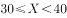
　✅
- **C**. 
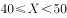

- **D**. 

**答案**：B

**官方解析**

根据甲工厂的任务量是乙工厂的1.5倍，赋值甲任务量为150，乙任务量为100，甲工厂以乙工厂1.2倍的效率生产，设乙工厂效率为，甲工厂效率为，甲生产任务量之后效率提升了，提升后甲效率为。在乙工厂完成生产任务时，甲工厂的任务完成，根据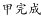：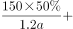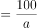，解得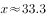，即，B选项符合。

故正确答案为B。

---

### 第 2 题　qid 2376731 · 数学运算

一工厂生产的某规格齿轮的齿数是一个三位数的质数（除了1和它本身之外，不能被其他整数整除的正整数），其个、十、百位数字各不相同且均为质数。若将该齿数的百位数字与个位数字对调，所得新的三位数比该齿数大495，则该齿数的十位数字为：

- **A**. 7
- **B**. 5　✅
- **C**. 3
- **D**. 2

**答案**：B

**官方解析**

三位数数字各不相同且均为质数，可知三位数字应在2、3、5、7中选择。调换位置后所得新数字比原数字大495，根据尾数判断则原数字的个位（调换后的百位）应为7，原数字的百位（调换后的个位）应为2，则十位数字只能是3或5。如果是3，则原数字为，不是质数，不符合题意，因此原十位数字只能为5。

故正确答案为B。

---

### 第 3 题　qid 2377255 · 数学运算

某企业员工编号为6位自然数，其中前两位代表入职年份的最后两位数，第3位代表所属部门，后3位代表员工当年在部门中的入职顺序。2018年入职的员工小张发现，自己的员工编号能同时被5、9和101整除。问当年他所在的部门最少可能有多少人入职？

- **A**. 不到250人
- **B**. 250～499人之间　✅
- **C**. 500～749人之间
- **D**. 超过749人

**答案**：B

**官方解析**

小张18年入职，则6位工号前两位为18。由于其员工编号能同时被5、9、101整除，因此，其6位工号组成的数是5、9、101的最小公倍数4545的倍数。前两位是18且是4545倍数的六位数只有4545的40倍为181800，及其41倍为186345。已知后三位为员工入职顺序，故其部门18年最少有345人入职，在B项的范围内。
故正确答案为B。

---

### 第 4 题　qid 2376501 · 数学运算

如右图所示，一条河流的两岸分别有A、B两处景点，河面宽80米，A与B的直线距离是100米。现需铺设一条观光栈道连接A与B。已知陆地栈道的铺设费用是0.1万元/米，河面栈道的铺设费用是0.125万元/米，则最少需要铺设费用：

- **A**. 12.5万元　✅
- **B**. 12万元
- **C**. 11.5万元
- **D**. 11万元

**答案**：A

**官方解析**

如图所示若沿AB建造观光栈道，则需建造河面栈道AB段100m，共需要铺设费用万元；若沿AO→OB铺设栈道，则需建造河面栈道AO段80m和陆地栈道OB段，共需要铺设费用万元。通过所给条件对比分析，最少铺设费用为12.5万元（沿AB段建造）。

故正确答案为A。

备注：如若讨论陆地与河面栈道的转折点：在OB段上取任意点C，设。沿AC→CB铺设栈道，则需建造河面栈道AC段和陆地栈道CB段，共需要铺设费用万元。取特值分析x和y的增减关系，取值如表：

由特值分析可知，x取值越大，费用y越小。故时（即C点与B点重合）， y可取得最小值12.5。

---

### 第 5 题　qid 2377247 · 数学运算

某助农项目从农民手中以1元/斤的价格收购一批芒果，通过网络平台销售，定价30元/10斤包邮，售出芒果的后调价为35元/10斤，售完全部芒果的总收入比调价前预计的多20万元。问这批芒果总重量为多少吨？

- **A**. 50
- **B**. 100
- **C**. 500　✅
- **D**. 1000

**答案**：C

**官方解析**

调价后，每10斤比预计多卖35-30=5元，总收入比预计多20万元，则调价后卖出的芒果量为，这批芒果的总重量为吨。

故正确答案为C。

---

### 第 6 题　qid 2376471 · 数学运算

小张用10万元购买某只股票1000股，在亏损时，又增持该只股票1000股。一段时间后，小张将该只股票全部卖出，不考虑交易成本，获利2万元。那么，这只股票在小张第二次买入到卖出期间涨了多少？

- **A**. 

- **B**. 

- **C**. 

　✅
- **D**. 

**答案**：C

**官方解析**

10万元购买1000股，即100元/股。在亏损时，即每股市值元，购得1000股，成本需要元，即8万元。

将这2000股全部卖出后获利2万元，共卖万元，即卖出价格为。那么小张第二次买入为80元/股，卖出为100元/股，共涨了。

故正确答案为C。

---

### 第 7 题　qid 2377404 · 数学运算

某企业从10名高级管理人员中选出3人参加国际会议。在10名高级管理人员中，有一线生产经验的有6人，有研发经验的有5人，另有2人既无一线生产经验也无研发经验。如果要求选出的人中，具备一线生产经验的人和具备研发经验的人都必须有，问有多少种不同的选择方式？

- **A**. 96
- **B**. 100
- **C**. 106　✅
- **D**. 112

**答案**：C

**官方解析**

在10名高级管理人员中，有一线生产经验的有6人，有研发经验的有5人，另有2人既无一线生产经验也无研发经验，根据两集合容斥原理公式：，代入数据，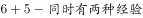，则。

要求选出的人中，具备一线生产经验和研发经验的人都必须有，从正面分析，情况较复杂，考虑从反面入手。

从10人中选出3人，要求选出具备一线生产经验和研发经验的人。

总情况数等于，总人数为10人，具备一线生产经验人数为6人，则不具备一线生产经验人数为4人，从中选出3人，因此不具备一线生产经验情况数等于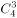；

同理，具备研发经验人数为5人，则不具备研发经验人数为5人，从中选出3人，因此不具备研发经验情况数等于；

两者都不具备人数为2人，不足3人，从中无法选出3人，因此都不具备的情况数为0。

则。

故正确答案为C。

（备注：本题从反面入手，不需要考虑容斥原理，若从正面分析，则需要利用容斥原理）

---

### 第 8 题　qid 2376447 · 数学运算

调酒师调配鸡尾酒，先在调酒杯中倒入120毫升柠檬汁，再用伏特加补满，摇匀后倒出80毫升混合液备用，再往杯中加满番茄汁并摇匀，一杯鸡尾酒就调好了。若此时鸡尾酒中伏特加的比例是，问调酒杯的容量是多少毫升？

- **A**. 160
- **B**. 180
- **C**. 200　✅
- **D**. 220

**答案**：C

**官方解析**

假设调酒杯的容量为毫升，在原有120毫升柠檬汁的基础上，用伏特加补满，因此加入伏特加的量为，故伏特加浓度为。混匀后倒出80毫升后，还剩余毫升混合液，此时伏特加的量为。最后加入番茄汁，但是伏特加的量无变化，可得方程：。

由于本题属于分式方程，直接计算难度太高，故考虑代入选项验证。优先选择好算的选项入手，C项为整百的数，因此代入C项。，等式成立。

故正确答案为C。

---

### 第 9 题　qid 2377283 · 数学运算

现用5700立方厘米的蜡制作二十多个同样大小，且长、宽、高均为整数厘米的长方体实心蜡块，问蜡块的尺寸有多少种不同的可能性？

- **A**. 4
- **B**. 6
- **C**. 10　✅
- **D**. 16

**答案**：C

**官方解析**

5700立方厘米的蜡制作二十多个同样大小的长方形实心蜡块，将5700因式分解为，其因数为二十多的只有一种情况，因此可以拆分为25个，每个体积为立方厘米。蜡块的尺寸分类讨论如下：

①若长宽高有两条为1厘米：，1种情况；

②若长宽高只有一条为1厘米：，，，，，5种情况；

③若长宽高均不为1厘米：，，，，4种情况。

所以共有种情况。

故正确答案为C。

---

### 第 10 题　qid 2376452 · 数学运算

小王在商店消费了90元，口袋里只有1张50元、4张20元、8张10元的钞票，他共有几种付款方式，可以使店家不用找零钱?

- **A**. 5
- **B**. 6
- **C**. 7　✅
- **D**. 8

**答案**：C

**官方解析**

根据题干条件分析，付款方式可包含使用50元与不使用50元两种情况。对情况进行枚举可得：

可得共有7种付款方式，可以使店家不用找零钱。

故正确答案为C。

---

## 判断推理

### 第 1 题　qid 2376548 · 图形推理

把下面的图形分为两类，使每一类图形都有各自的共同特征或规律，分类正确的一项是：

- **A**. ①③⑤，②④⑥
- **B**. ①④⑥，②③⑤　✅
- **C**. ①④⑤，②③⑥
- **D**. ①②⑥，③④⑤

**答案**：B

**官方解析**

解析一：
本题为分组分类题目。题干均是里面有两条直线的立体图形，可以考虑两条直线之间的关系。观察发现，图①④⑥中两条直线不相交，图②③⑤中两条直线相交，故①④⑥一组，②③⑤一组，只有B项符合。
故正确答案为B。
解析二：
本题为分组分类题目。题干均是里面有两条直线的立体图形，可以考虑两条直线之间的关系。观察发现，图①③⑤中两条直线不垂直，图②④⑥中两条直线垂直，故①③⑤一组，②④⑥一组，只有A项符合。
故正确答案为A。
粉笔说明：方法一的分类更直观，而方法二的知识点在以前有所考查，故本题属于命题不严谨。

---

### 第 2 题　qid 2376760 · 图形推理

把下面的图形分为两类，使每一类图形都有各自的共同特征或规律，分类正确的一项是：

- **A**. ①③⑥，②④⑤
- **B**. ①③⑤，②④⑥
- **C**. ①④⑥，②③⑤　✅
- **D**. ①②④，③⑤⑥

**答案**：C

**官方解析**

元素组成不同，优先考虑属性规律。对称、曲直均无明显规律，考虑开闭性。图①④⑥均为半开半封闭图形；图②③⑤均为全封闭图形。因此①④⑥一组，②③⑤一组。
故正确答案为C。

---

### 第 3 题　qid 2377236 · 图形推理

下面四个选项分别为立体图形的俯视图和左视图，均正确的是：

- **A**. A
- **B**. B
- **C**. C
- **D**. D　✅

**答案**：D

**官方解析**

本题考查三视图。

根据每个选项第一个俯视图可以得知，题干中两个立体图形应该是相邻的。

既然是相邻的，那么点a应该在边1上，而A选项和B选项的点a没有在边1上，排除。（如图1所示）

既然是相邻的，那么点b应该在边2的延长线上，因此从上往下观察该图形，点b与点b′应该是重合的。而C选项的点b与点b′并没有重合，排除。（如图2所示）

故正确答案为D。

---

### 第 4 题　qid 2376811 · 图形推理

从所给的四个选项中，选择最合适的一个填入问号处，使之呈现一定的规律性：

- **A**. A
- **B**. B
- **C**. C
- **D**. D　✅

**答案**：D

**官方解析**

解析一：元素组成不同，属性无明显规律，考虑数量规律。题干均为立体图形，且封闭区域较多，可数立体图形的外表面的面数量，即立体图形的外表面是由几个面构成的，观察发现分别由2、3、4、5、6个面构成，因此“？”处应该选择一个外表面为7的立体图形。A选项8个面，B选项6个面，C选项3个面，D选项7个面。D项当选。
故正确答案为D。
解析二：元素组成不同，属性无明显规律，考虑数量规律。观察发现题干立体图形均有下底面，图一和图二下底面形状相同，图三和图四下底面形状相同，因此“？”处应该选择一个与图五下底面形状相同的图形。B项当选。
故正确答案为B。
因为解析一中数立体图形的外表面的面数量呈现严谨的等差规律，故粉笔对于此题更倾向根据外表面的面数量，选择 D项。

---

### 第 5 题　qid 2376553 · 图形推理

从所给四个选项中，选择最合适的一个填入问号处，使之呈现一定的规律性：

- **A**. A
- **B**. B
- **C**. C　✅
- **D**. D

**答案**：C

**官方解析**

元素组成相同，优先考虑位置规律。整体观察发现，小三角、小圆圈均在移动，可以分开看，先看小三角，小三角的移动规律为每次顺时针平移两格，只有C项符合要求。再通过小圆圈位置验证，小圆圈的移动规律为每次逆时针平移三格， C项当选。
故正确答案为C。

---

### 第 6 题　qid 2376560 · 定义判断

似动是指在一定的时间和空间条件下，人们在静止的物体间看到了运动，或者在没有连续位移的地方，看到了连续位移。
根据上述定义，下列选项不属于似动现象的是：

- **A**. 两岸青山相对出
- **B**. 坐地日行八万里　✅
- **C**. 郡邑浮前浦，波澜动远空
- **D**. 明月却多情，随人处处行

**答案**：B

**官方解析**

第一步：找出定义关键词。
“在一定的时间和空间条件下”、“人们在静止的物体间看到了运动”、“或者在没有连续位移的地方，看到了连续位移”。
第二步：逐一分析选项。
A项：“两岸青山相对出”意思是两岸的青山相继出迎，一座座扑进眼帘。青山本是静止的物体，但是作者却看到了它的运动，符合“人们在静止的物体间看到了运动”，符合定义，排除；
B项：“坐地日行八万里”意思是人们住在地球上，因地球自转，于不知不觉中，一日已行了八万里路。依据科学理论，当我们处于赤道附近的时候，即使每天原地不动，也会运动八万华里，即人没有动，而且也看不见运动。所以不符合“在静止的物体间看到了运动”、“或在没有连续位移的地方，看到了连续位移”，不符合定义，当选；
C项：“郡邑浮前浦，波澜动远空”意思是远处的城郭好像在水面上飘动，波翻浪涌，辽远的天空也仿佛为之摇荡。但是事实上，城郭本身不会运动，天空也不会飘荡，符合“人们在静止的物体间看到了运动”，符合定义，排除；
D项：“明月却多情，随人处处行”意思是明月却是那么多情，不管人走到哪里，它都陪伴着你同行。但是我们用肉眼是看不到明月本身在运动的，所以符合“人们在静止的物体间看到了运动”，符合定义，排除。
本题为选非题，故正确答案为B。

---

### 第 7 题　qid 2377228 · 定义判断

演绎推理是指结论已经蕴含在前提中；前提为真，结论也必然为真的推理。归纳推理是指结论并不完全蕴含在前提中；前提为真，结论不必然为真的推理。
根据上述定义，下列属于归纳推理的是：

- **A**. 
如果并且，那么

- **B**. 
所有天鹅都是白的，因此在南极发现的天鹅也是白的

- **C**. 
样品的合格率是，因此这批产品的合格率也是
　✅
- **D**. 
甲生于1980年，而乙生于1981年，因此甲和乙不是同一个人

**答案**：C

**官方解析**

第一步：找出定义关键词。

演绎推理：“结论已经蕴含在前提中”、“前提为真，结论也必然为真”；

归纳推理：“结论并不完全蕴含在前提中”、“前提为真，结论不必然为真”。

第二步：逐一分析选项。

A项：该项中“如果”所在句子为前提，,，蕴含着这一结论，符合“结论已经蕴含在前提中”，属于演绎推理，不属于归纳推理，排除；

B项：该项“所有天鹅都是白的”为前提，强调的是所有天鹅，所以无论在哪发现的天鹅都是白的，符合“前提为真，结论也必然为真”，属于演绎推理，不属于归纳推理，排除；

C项：该项“样品的合格率是”为前提，强调的是全部的产品中的一部分，一部分产品的合格率为，并不能说明所有产品的合格率是，符合“前提为真，结论不必然为真”，符合归纳推理，当选；

D项：该项中“甲生于1980年，而乙生于1981年”为前提，出生年份不一样，那说明一定不是同一个人，符合“前提为真，结论也必然为真”,属于演绎推理，不属于归纳推理，不符合定义，排除。

故正确答案为C。

---

### 第 8 题　qid 2377316 · 定义判断

设p、q是任意命题。p因果蕴涵q指的是：如果p是真的，那么因为p是真的，q也是真的。p反事实蕴涵q指的是：如果p与事实相反，p是真的，那么q也是真的。p严格蕴涵q指的是：必然地，如果p是真的，那么q也是真的。
根据上述定义，下列不属于上述三种蕴涵关系的是：

- **A**. 
如果，那么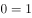 
　✅
- **B**. 
如果 且，那么

- **C**. 
如果甲从台阶上摔断了腿，那么当时他会感觉疼痛

- **D**. 
如果大气层本就不存在，那么地球上将不会有生命

**答案**：A

**官方解析**

第一步：找出定义关键词。

p因果蕴涵q：“如果p是真的，那么因为p是真的，q也是真的”；

p反事实蕴涵q：“如果p与事实相反，p是真的，那么q也是真的”；

p严格蕴涵q：“如果p是真的，那么q也是真的”。

第二步：逐一分析选项。

A项：“”是真的，但是“”是假的，不符合以上任何一种定义，不符合定义，当选；

B项：如果“且”为真，那么可以推出“”必然为真，符合“如果p是真的，那么q也是真的”，符合“p严格蕴涵q”，符合定义，排除；

C项：因为甲从台阶上摔断了腿，所以他当时会感觉到疼痛，符合“因为p是真的，q也是真的”，符合“p因果蕴涵q”，符合定义，排除；

D项：大气层本就不存在是“与事实相反的”，如果大气层本就不存在是真的，那么可以推出地球上将不会有生命也是真的，符合“如果p与事实相反，p是真的，那么q也是真的”，符合“p反事实蕴涵q”，符合定义，排除。

本题为选非题，故正确答案为A。

---

### 第 9 题　qid 2376577 · 定义判断

关怀强迫症即一个人特别需要别人依赖自己，总是爱向别人提供别人不需要的关怀。并且，这种人还强迫别人接受自己的关怀，从而使别人不能独立。当别人依赖自己的时候，他就会感到满足，感到自己有价值。这种症状会压抑人的神经，并同时给身边的亲朋好友甚至一般的同事带来诸多不便。
根据上述定义，下列属于关怀强迫症的是：

- **A**. 张某说：“我一天没见到儿子就会发疯”
- **B**. 李某连哄带骗让感冒的女儿吃下感冒药
- **C**. 刘某从小学到大学期间都住自己家里
- **D**. 王某在女儿就读的大学附近租房陪读　✅

**答案**：D

**官方解析**

第一步：找出定义关键词。
“需要别人依赖自己”、“提供别人不需要的关怀”、“强迫别人接受”、“使别人不能独立”。
第二步：逐一分析选项。
A项：张某一天没见到儿子就会发疯，说明是张某依赖儿子，而并非是儿子依赖自己，不符合“需要别人依赖自己”，不符合定义，排除；
B项：李某连哄带骗让感冒的女儿吃下感冒药，没有体现“需要别人依赖自己”，且感冒的女儿需要被人关怀照顾，不符合“提供别人不需要的关怀”，不符合定义，排除；
C项：刘某上学期间住在家里，没有体现到强迫别人，不符合“强迫别人接受”，不符合定义，排除；
D项：王某在女儿就读的大学附近租房陪读，女儿已经读大学了，说明她已经能够独立地生活和学习，符合 “提供别人不需要的关怀”、“强迫别人接受”、“使别人不能独立”，符合定义，当选。
故正确答案为D。

---

### 第 10 题　qid 2377233 · 定义判断

连续对比是指人眼在不同时间段内所观察与感受到的色彩对比视错现象。连续对比又分正残像和负残像两类。正残像是指在停止物体的视觉刺激后，视觉仍然暂时保留原有物色映像的视觉状态。负残像是指在停止物体的视觉刺激后，视觉依旧暂时保留与原有物色成补色（如红与绿、蓝与橙、黄与紫等互为补色）映像的视觉状态。
根据上述定义，下列属于负残像的是：

- **A**. 将静态画面按每秒24帧连续放映，就会在眼前形成动态画面
- **B**. 凝视红色物体之后，即使将物体移开，眼前还是会感到有红色浮现
- **C**. 久视红色后，将视觉迅速移向白色时，看到的并非白色而是绿色　✅
- **D**. 红色与黄色搭配，眼睛时而把红色感觉为带紫的颜色，时而又把黄色视为带绿的颜色

**答案**：C

**官方解析**

第一步：找出定义关键词。
正残像：“指在停止物体的视觉刺激后，视觉仍然暂时保留原有物色映像的视觉状态”；
负残像：“指在停止物体的视觉刺激后，视觉依旧暂时保留与原有物色成补色（如红与绿、蓝与橙、黄与紫等互为补色）映像的视觉状态”。
第二步：逐一分析选项。
A项：将静态画面连续放映就会形成动态画面，说的是画面的静态与动态，而非颜色，不符合“负残像”定义，排除；
B项：凝视红色物体之后，即使将物体移开，还是会感到红色浮现，符合“指在停止物体的视觉刺激后，视觉仍然暂时保留原有物色映像的视觉状态”，符合“正残像”定义，不符合“负残像”定义，排除；
C项：久视红色后，将视觉迅速移到白色时，看到的不是白色而是绿色，红色与绿色互为补色，符合“指在停止物体的视觉刺激后，视觉依旧暂时保留与原有物色成补色映像的视觉状态”，符合“负残像”定义，当选；
D项：红色与黄色搭配，眼睛时而把红色感觉为带紫的颜色，时而又把黄色视为带绿的颜色，没有明确体现是否“停止物体的视觉刺激”，不符合“负残像”定义，排除。
故正确答案为C。

---

### 第 11 题　qid 2376566 · 定义判断

虚拟现实技术是指一种可以创建和体验虚拟世界的仿真系统，它利用计算机生成可交互的三维环境，向使用者提供视觉、听觉、触觉等感官的模拟，从而让人有身临其境之感，这是一种360度视角的沉浸式体验。
根据上述定义，下列选项属于虚拟现实技术运用的是：

- **A**. 张三通过电脑与远在巴黎的父亲视频聊天，亲眼见到了埃菲尔铁塔
- **B**. 李四用手机微信与妻子视频聊天，亲耳听到了儿子背诵古诗的声音
- **C**. 刘五戴上特制头盔网购书桌，能够全方位地体验书桌摆进书房的效果　✅
- **D**. 王二用平板电脑看同学在西藏旅游的视频，感觉自己也到了布达拉宫

**答案**：C

**官方解析**

第一步：找出定义关键词。
“指一种可以创建和体验虚拟世界的仿真系统”、“它利用计算机生成可交互的三维环境，向使用者提供视觉、听觉、触觉等感官的模拟”、“从而让人有身临其境之感，是一种360度视角的沉浸式体验。”
第二步：逐一分析选项。
A项：张三通过电脑与远在巴黎的父亲视频聊天，亲眼见到了埃菲尔铁塔，看到的埃菲尔铁塔是现实世界的景物，并不是虚拟的，不符合“是一种可以创建和体验虚拟世界的仿真系统”，也不符合“向使用者提供视觉、听觉、触觉等感官的模拟”，不符合定义，排除；
B项：李四用微信与妻子视频聊天，亲耳听到了儿子背诵古诗的是声音，儿子背诵古诗的声音也是现实世界的声音，并不是虚拟的，不符合“是一种可以创建和体验虚拟世界的仿真系统”，也不符合“向使用者提供视觉、听觉、触觉等感官的模拟”，不符合定义，排除；
C项：刘五戴上特制头盔，能够全方位地体验书桌摆进书房的效果，符合“向使用者提供视觉、听觉、触觉等感官的模拟”、“是一种360度视角的沉浸式体验”，符合定义，当选；
D项：王二用平板电脑看同学在西藏旅游的视频，感觉自己也到了布达拉宫，王二观看视频的过程，不符合“创建和体验虚拟世界的仿真系统”，不符合定义，排除。
故正确答案为C。

---

### 第 12 题　qid 2377217 · 定义判断

主语是执行句子的行为或动作的主体，谓语是对主语动作或状态的陈述或说明，宾语则是指一个动作（动词）的接受者。当句子中的谓语部分包含两个动词（有的后一个是形容词），且对应两个不同的主语，即前一个谓语的宾语同时又作为后一个谓语的主语，等于一个动宾结构和主谓结构连环在一起，并且其中没有语音停顿，符合这样格式的句子叫兼语句。
根据上述定义，下列不属于兼语句的是：

- **A**. 风吹雪花飘
- **B**. 上级派工作组检查工作
- **C**. 公使阳处父追之
- **D**. 人不能两次踏进同一条河流　✅

**答案**：D

**官方解析**

第一步：找出定义关键词。 
主语：“执行句子的行为或动作的主体”；
谓语：“对主语动作或状态的陈述或说明”；
宾语：“一个动作（动词）的接受者”；
兼语句：“前一个谓语的宾语同时又作为后一个谓语的主语”、“一个动宾结构和主谓结构连环在一起，并且其中没有语音停顿”。
第二步：逐一分析选项。
A项：风吹雪花飘，风吹雪花，风是主语，吹是谓语，雪花是宾语，为主谓宾结构，雪花飘，雪花是主语，飘是谓语，为主谓结构，符合“前一个谓语的宾语同时又作为后一个谓语的主语”，也符合“一个动宾结构和主谓结构连环在一起，并且其中没有语音停顿”，符合定义，排除；
B项：上级是主语，派是谓语，工作组是宾语，为主谓宾结构，检查是谓语，工作是宾语，且工作组是检查的主语，符合“前一个谓语的宾语同时又作为后一个谓语的主语”，也符合“一个动宾结构和主谓结构连环在一起，并且其中没有语音停顿”，符合定义，排除；
C项：公使阳处父追之，公是主语，使是谓语，阳处父是宾语，为主谓宾结构，追是谓语，之是宾语，且阳处父是追的主语，符合“前一个谓语的宾语同时又作为后一个谓语的主语”，也符合“一个动宾结构和主谓结构连环在一起，并且其中没有语音停顿”，符合定义，排除；
D项：人不能两次踏进同一条河流，整体为主谓宾结构，不符合“前一个谓语的宾语同时又作为后一个谓语的主语”，不符合定义，当选。
本题为选非题，故正确答案为D。

---

### 第 13 题　qid 2376587 · 定义判断

水文节律指湖泊水情周期性、有节律的变化。广义水文节律包括昼夜、月运、季节和年际节律。正常情况下，由于流域气候和下垫面等因素较稳定，湖泊多年平均水位趋于稳定数值即湖泊正常年平均水位。所以湖泊年际节律以干扰因素驱动的突变性和适应干扰后的阶段稳定性为特点，无渐变趋向；而昼夜节律对生态系统影响微弱。因此，狭义水文节律特指月运节律与季节节律。
根据上述定义，下列涉及狭义水文节律的是：

- **A**. 
鄱阳湖受降雨持续减少和来水减少双重影响，水面面积持续萎缩

- **B**. 
洪泽湖历史年均水温，最高水温在9月，最低水温在1月
　✅
- **C**. 
洞庭湖去年年降水量1560毫米，其中4~6月降水约占全年一半

- **D**. 
巢湖流域年平均气温稳定在之间，有200天以上无霜期

**答案**：B

**官方解析**

第一步：找出定义关键词。
水文节律：“湖泊水情周期性、有节律的变化”；
广义水文节律：“昼夜、月运、季节和年际节律”；
狭义水文节律：“月运节律和季节节律”。
（注：水情是指江河湖泊的状况、特征及地理意义，如流量、水位、流速、水温与冰情等）
本题要选的是符合狭义水文节律的选项。
第二步：逐一分析选项。
A项：鄱阳湖水面面积持续萎缩，说明是一直在减小，不存在周期性的变化，不符合定义，排除；
B项：洪泽湖历史年均最高水温在9月，最低水温在1月，月份和季节不同水温也不同，而且是统计了历史上多年的水温，符合“湖泊水情周期性、有节律的变化”，符合“季节节律”，符合狭义水文节律，符合定义，当选（水情指江河湖泊的状况、特征及地理意义，如流量、水位、流速、水温与冰情等，水温是水文测验的基本项目之一）；
C项：只是给出洞庭湖去年一年的降水量，没有体现“周期性、有节律的变化”，不符合定义，排除；
D项：巢湖流域平均气温在15-16摄氏度之间，有200天以上无霜期，是湖泊流经区域的气温变化，而不是湖泊水情的变化，不符合定义，排除。
故正确答案为B。

---

### 第 14 题　qid 2377219 · 定义判断

数字家庭是指以计算机技术和网络技术为基础，各种电器通过不同的互连方式进行通信及数据交换，实现电器间的互联互通，使人们可以更加方便快捷地获取信息，从而极大提高人类居住的舒适性和娱乐性。
根据上述定义，下列不涉及数字家庭的是：

- **A**. 小王通过网络控制家里的打印机，实现远程打印
- **B**. 小李通过蓝牙将投影仪与笔记本电脑连接，在家里播放电影
- **C**. 小刘使用电饭煲预约定时功能，让电饭煲在预定时间自动开始工作　✅
- **D**. 小张在单位上班时，通过手机控制家里的电视，录制正在直播的体育节目

**答案**：C

**官方解析**

第一步：找出定义关键词。
“以计算机技术和网络技术为基础”、“各种电器通过不同的互连方式进行通信及数据交换，实现互联互通”、“提高人类居住的舒适性和娱乐性”。
第二步：逐一分析选项。
A项：通过网络控制家里的打印机，符合“以计算机技术和网络技术为基础”、“各种电器通过不同的互连方式进行通信及数据交换，实现互联互通”，实现远程打印，符合“提高人类居住的舒适性和娱乐性”，符合定义，排除；
B项：通过蓝牙将投影仪与笔记本电脑连接，符合“以计算机技术和网络技术为基础”、“各种电器通过不同的互连方式进行通信及数据交换，实现互联互通”，在家里播放电影，符合“提高人类居住的舒适性和娱乐性”，符合定义，排除；
C项：使用电饭煲预约定时功能，没有运用计算机和网络技术，不符合“以计算机技术和网络技术为基础”，也没有和其他电器连接，不符合“各种电器通过不同的互连方式进行通信及数据交换，实现互联互通”，不符合定义，当选；
D项：通过手机控制家里的电视，符合“以计算机技术和网络技术为基础”、“各种电器通过不同的互连方式进行通信及数据交换，实现互联互通”，录制正在直播的体育节目，符合“提高人类居住的舒适性和娱乐性”，符合定义，排除。
本题为选非题，故正确答案为C。

---

### 第 15 题　qid 2376789 · 定义判断

类脑计算技术总体分为三个层次：结构层次模仿脑、器件层次逼近脑、智能层次超越脑。其中，结构层次模仿脑是指将大脑作为一个物质和生理对象进行解析，获得基本单元(各类神经元和神经突触等)的功能及其连接关系（网络结构）；器件层次逼近脑是指研制能够模拟神经元和神经突触功能的器件，从而在有限的物理空间和功耗条件下构造出人脑规模的神经网络系统；智能层次超越脑是指通过对类脑计算机进行信息刺激、训练和学习，使其产生与人脑类似的智能。
根据上述定义，下列属于智能层次超越脑的是：

- **A**. 调整神经网络的突触连接关系及连接频率和强度　✅
- **B**. 绘制精确的人类大脑动态图谱以解析探测大脑
- **C**. 开发功能、密度与人类大脑皮层相当的电子装备
- **D**. 捕捉细微的单个神经元放电的非线性动力学过程

**答案**：A

**官方解析**

第一步：找出定义关键词。
结构层次模仿脑：“将大脑作为物质和生理对象进行解析”、“获得基本单元的功能及其连接关系”；
器件层次逼近脑：“研制能够模拟神经元和神经突触功能的器件”、“构造出人脑规模的神经网络系统”；
智能层次超越脑：“对类脑计算机进行信息刺激、训练和学习”、“产生与人脑类似的智能”。
第二步：逐一分析选项。
A项：调整神经网络的突触连接关系及连接频率和强度，符合“对类脑计算机进行信息刺激、训练和学习” ，符合“智能层次超越脑”定义，当选；
B项：绘制精确的人类大脑动态图谱，符合“将大脑作为物质和生理对象进行解析”，符合“结构层次模仿脑”定义，不符合“智能层次超越脑”定义，排除；
C项：开发功能、密度与人类大脑皮层相当的电子装备，符合“研制能够模拟神经元和神经突触功能的器件”，符合“器件层次逼近脑”定义，不符合“智能层次超越脑”定义，排除；
D项：捕捉细微的单个神经元放电的非线性动力学过程，符合“获得基本单元的功能及其连接关系”，符合“结构层次模仿脑”定义，不符合“智能层次超越脑”定义，排除。
故正确答案为A。
注：本题目来自于《类脑计算机的现在与未来》，各选项对应于该文章中的句子如下所示：
A项：所谓“智能层次超越脑”，属于类脑计算机应用软件层次的问题，是指通过对类脑计算机进行信息刺激、训练和学习，使其产生与人脑类似的智能甚至涌现出自主意识，实现智能培育和进化。刺激源可以是虚拟环境，也可以是来自现实环境的各种信息（例如互联网大数据）和信号（例如遍布全球的摄像头和各种物联网传感器），还可以是机器人“身体”在自然环境中探索和互动。在这个过程中，类脑计算机能够调整神经网络的突触连接关系及连接强度，实现学习、记忆、识别、会话、推理以及更高级的智能；
B项：所谓“结构层次模仿脑”，是将大脑作为一个物质和生理对象进行解析，获得基本单元（各类神经元和神经突触等）的功能及其连接关系（网络结构）；
C项：所谓“器件层次逼近人脑”，是指研制能够模拟神经元和神经突触功能的微纳光电器件，从而在有限的物理空间和功耗条件下构造出人脑规模的神经网络系统。这方面的代表性项目是美国国防部先进研究项目局（DARPA）2008年启动的“神经形态自适应可塑性可扩展电子系统”（即突触），其目标是研制出器件功能、规模与密度均与人类大脑皮层相当的电子装置；
D项：所谓“结构层次模仿脑”，是将大脑作为一个物质和生理对象进行解析，获得基本单元（各类神经元和神经突触等）的功能及其连接关系（网络结构）。这一阶段，主要通过神经科学实验采用先进的分析探测技术完成。1952年，英国科学家霍奇金和赫胥黎提出了以两人命名的HH方程，精确刻画了单个神经元放电的非线性动力学过程，这是神经元信息处理的标准数学模型。

---

### 第 16 题　qid 2377262 · 类比推理

烤箱：烘烤

- **A**. 卷尺：测量　✅
- **B**. 皮鞋：防水
- **C**. 铜镜：折射
- **D**. 软件：导航

**答案**：A

**官方解析**

第一步：判断题干词语间逻辑关系。
烤箱主要功能是用来烘烤，二者是功能的对应关系。
第二步：判断选项词语间逻辑关系。
A项：卷尺主要功能是用来测量，二者是功能的对应关系，与题干逻辑关系一致，当选；
B项：皮鞋主要功能不是用来防水，与题干逻辑关系不一致，排除；
C项：铜镜主要功能不是用来折射，与题干逻辑关系不一致，排除；
D项：不是所有软件都可以用来导航，与题干逻辑关系不一致，排除。
故正确答案为A。

---

### 第 17 题　qid 2376531 · 类比推理

拥挤：水泄不通

- **A**. 清晰：洞见肺腑
- **B**. 严重：触目惊心
- **C**. 费力：举重若轻
- **D**. 伤心：肝肠寸断　✅

**答案**：D

**官方解析**

第一步：判断题干词语间逻辑关系。
水泄不通形容拥挤或包围的非常严密，与拥挤是近义关系。
第二步：判断选项词语间逻辑关系。
A项：洞见肺腑是指很清楚地看见人的内心，形容襟怀坦白，待人诚恳。与清晰不是近义关系，与题干逻辑关系不一致，排除；
B项：触目惊心是指看见某种严重情况而内心震惊，形容事态严重，引起轰动，该词强调的是震惊，与严重不是近义关系，与题干逻辑关系不一致，排除；
C项：举重若轻是比喻能力强，能够轻松地胜任繁重的工作或处理困难的问题。与费力不是近义关系，与题干逻辑关系不一致，排除；
D项：肝肠寸断是比喻伤心到极点，与伤心是近义关系，与题干逻辑关系一致，当选。
故正确答案为D。

---

### 第 18 题　qid 2377222 · 类比推理

广场：广场舞

- **A**. 校园：教学楼
- **B**. 厂房：流水线
- **C**. 电视：演唱会
- **D**. 公路：马拉松　✅

**答案**：D

**官方解析**

第一步：判断题干词语间逻辑关系。
在广场上跳广场舞，广场舞是一种运动形式，广场是一个地点。
第二步：判断选项词语间逻辑关系。
A项：教学楼是校园的组成部分，二者为组成关系。与题干逻辑关系不一致，排除；
B项：流水线是厂房的一种工作模式。与题干逻辑关系不一致，排除；
C项：在电视上看演唱会，但电视不是地点。与题干逻辑关系不一致，排除；
D项：在公路上跑马拉松，马拉松是一种运动形式，公路是一个地点。与题干逻辑关系一致，当选。
故正确答案为D。

---

### 第 19 题　qid 2376569 · 类比推理

成长：衰亡

- **A**. 坚定：彷徨　✅
- **B**. 美好：苦难
- **C**. 深刻：纯真
- **D**. 复杂：单纯

**答案**：A

**官方解析**

第一步：判断题干词语间逻辑关系。
成长和衰亡是反义关系，并且成长是积极的，衰亡是消极的。
第二步：判断选项词语间逻辑关系。
A项：坚定和彷徨是反义关系，并且坚定是积极的，彷徨是消极的，与题干逻辑关系一致，当选；
B项：美好的反义词应该是丑陋，而苦难不一定是丑陋的，很多磨难是对人的一种历练，是对人生有益的，因此美好和苦难不是反义关系，与题干逻辑关系不一致，排除；
C项：深刻和纯真不是反义关系，与题干逻辑关系不一致，排除；
D项：复杂和单纯是反义关系，但是复杂和单纯没有积极和消极之分，与题干逻辑关系不一致，排除。
故正确答案为A。

---

### 第 20 题　qid 2377274 · 类比推理

局域网：计算机：文件共享

- **A**. 空间站：航天员：科学实验
- **B**. 图书馆：阅览室：文献检索
- **C**. 纺织厂：纺织设备：原料加工　✅
- **D**. 电视台：网络媒体：节目制作

**答案**：C

**官方解析**

第一步：判断题干词语间逻辑关系。
在局域网内，利用计算机进行文件共享，计算机是进行文件共享的工具。
第二步：判断选项词语间逻辑关系。
A项：航天员在空间站进行科学实验，航天员是进行科学实验的主体而非工具，与题干逻辑关系不一致，排除；
B项：在阅览室进行文献检索，阅览室是文献检索的场所而非工具，与题干逻辑关系不一致，排除；
C项：在纺织厂内，利用纺织设备进行原料加工，纺织设备是进行原料加工的工具，与题干逻辑关系一致，当选；
D项：网络媒体不能用来节目制作，与题干逻辑关系不一致，排除。
故正确答案为C。

---

### 第 21 题　qid 2376558 · 类比推理

效率：公平：市场经济

- **A**. 科学：理性：政治哲学
- **B**. 革命：改良：社会制度
- **C**. 民主：集中：组织原则　✅
- **D**. 美丑：善恶：审美范畴

**答案**：C

**官方解析**

第一步：判断题干词语间逻辑关系。
市场经济需要兼顾效率与公平。
第二步：判断选项词语间逻辑关系。
A项：政治哲学不需要兼顾科学与理性，且科学是理性的，与题干逻辑关系不一致，排除； 
B项：社会制度不需要兼顾革命与改良，与题干逻辑关系不一致，排除；
C项：组织原则需要兼顾民主与集中，与题干逻辑关系一致，当选；
D项：审美范畴不需要兼顾美丑与善恶，且善恶不属于审美的范畴，与题干逻辑关系不一致，排除。
故正确答案为C。

---

### 第 22 题　qid 2377220 · 类比推理

教授：副教授：讲师

- **A**. 开除：记过：警告　✅
- **B**. 刑法：民法：道德
- **C**. 商务手机：智能手机：4G手机
- **D**. 发动机：内燃机：电动机

**答案**：A

**官方解析**

第一步：判断题干词语间逻辑关系。
教授、副教授和讲师都是对老师的评级，三者是并列关系。并且教授比副教授的级别高，副教授比讲师的级别高。
第二步：判断选项词语间逻辑关系。
A项：开除、记过和警告都是处罚方式，三者是并列关系。并且开除比记过的程度重，记过比警告的程度重，与题干逻辑关系一致，当选；
B项：刑法和民法都是法律，二者为并列关系，但二者和道德不是并列关系，与题干逻辑关系不一致，排除；
C项：商务手机、智能手机和4G手机，三者是交叉关系，与题干逻辑关系不一致，排除；
D项：发动机是一种能够把其它形式的能转化为机械能的机器，包括内燃机（汽油发动机等）、外燃机（斯特林发动机、蒸汽机等）、电动机等。因此内燃机和电动机都是发动机的一种，第一个词与后面的两个词均为种属关系，与题干逻辑关系不一致，排除。
故正确答案为A。

---

### 第 23 题　qid 2376570 · 类比推理

瓮牖绳枢：粗茶淡饭：清寒

- **A**. 叠床架屋：衣锦食肉：奢华
- **B**. 箪食瓢饮：曲肱饮水：简朴　✅
- **C**. 轻车熟路：霜行草宿：轻松
- **D**. 金盆洗手：金屋藏娇：阔绰

**答案**：B

**官方解析**

第一步：判断题干词语间逻辑关系。
瓮牖绳枢指以破瓮作窗户，以草绳系户枢，比喻贫穷人家；粗茶淡饭形容饮食简单，生活简朴，二者都可以用来形容清寒。
第二步：判断选项词语间逻辑关系。
A项：叠床架屋比喻办事重复，自找麻烦；衣锦食肉形容生活富足，第一词与奢华无关，与题干逻辑关系不一致，排除；
B项：箪食瓢饮形容读书人安于贫穷的清高生活；曲肱饮水形容清心寡欲、安贫乐道的生活，二者都可以用来形容简朴，与题干逻辑关系一致，当选；
C项：轻车熟路比喻事情又熟悉又容易；霜行草宿指在霜露中行走，草野中息宿，形容奔波劳苦，第二词与轻松无关，与题干逻辑关系不一致，排除；
D项：金盆洗手指放弃以前长期从事的行业或某件事；金屋藏娇指十分宠爱妻子，也指男人纳妾或在外包养女人，二者均与阔绰无关，与题干逻辑关系不一致，排除。
故正确答案为B。

---

### 第 24 题　qid 2376603 · 类比推理

（    ） 对于 聚集之处 相当于 捷径 对于 （    ）

- **A**. 荟萃；取巧之思
- **B**. 渊薮；速成之法　✅
- **C**. 辐辏；入门之路
- **D**. 囹圄；提升之梯

**答案**：B

**官方解析**

逐一代入选项。
A项：荟萃比喻优秀的人物或精美的东西会集、聚集，可以形容聚集之处，捷径比喻能较快地达到目的的巧妙手段或办法，与取巧之思无关，前后逻辑关系不一致，排除；
B项：渊薮比喻某种人或事、物聚集的地方，可以比喻聚集之处；捷径指近便的小路，形容便捷的方法，可以比喻速成之法，前后逻辑关系一致，当选；
C项：辐辏形容人或物聚集像车辐集中于车毂一样，可以形容聚集之处，入门之路与捷径无关，前后逻辑关系不一致，排除；
D项：囹圄原指监牢，后引申为束缚、困难，与聚集之处无关，捷径与提升之梯无关，前后逻辑关系不一致，排除。
故正确答案为B。

---

### 第 25 题　qid 2377243 · 类比推理

肥皂  对于（  ）相当于  煤炭  对于（  ）

- **A**. 衣服；锅炉
- **B**. 水；火
- **C**. 污渍；能源
- **D**. 洗涤液；天然气　✅

**答案**：D

**官方解析**

逐一代入选项。
A项：肥皂是清洗衣服用到的工具，煤炭在锅炉中燃烧，前后逻辑关系不一致，排除；
B项：肥皂发挥作用需要用到水，煤炭经过燃烧产生火，煤炭只要达到一定燃点就能燃烧，不一定需要火，前后逻辑关系不一致，排除；
C项：肥皂的作用是去除污渍，二者属于物品和功能的对应关系，煤炭是能源的一种，二者属于种属关系，前后逻辑关系不一致，排除；
D项：肥皂和洗涤液是不同的清洁用品，二者属于并列关系，煤炭是古代植物埋藏在地下经历了复杂的生物化学和物理化学变化逐渐形成的固体可燃性矿物，天然气是指天然蕴藏于地层中的烃类和非烃类气体的混合物，二者分别是不同的能源，属于并列关系，前后逻辑关系一致，当选。
故正确答案为D。

---

### 第 26 题　qid 2377237 · 逻辑判断

一对中子星碰撞后抛出的碎片不仅合成了金、银等稳定元素，还合成了大量放射性元素，它们会衰变、裂变，释放出大量能量，将碎片自身加热，使其发光，最亮时虽然没有超新星那么亮，却可以达到新星亮度的一千倍左右，因此被称为千新星。2017年8月，天文学家首次观测到双中子星并合前后发出的引力波，并在大约10小时后发现了中子星碎片形成的千新星现象，从而彻底证实了中子星并合可以合成大量重元素这个猜想。
由此可以推出:

- **A**. 超新星比新星更亮　✅
- **B**. 引力波可以释放大量能量
- **C**. 千新星中含有大量的金、银元素
- **D**. 宇宙中的重元素都是由中子星碰撞后产生的

**答案**：A

**官方解析**

日常结论题，根据题干信息逐一分析选项。
A项：根据题干“最亮时虽然没有超新星那么亮，却可以达到新星亮度的一千倍左右，因此被称为千新星”可知，超新星比新星更亮，可以推出，当选；
B项：题干只是说明“双中子星并合前后发出的引力波”，并未提起引力波是否可以释放大量能量，无中生有，无法推出，排除；
C项：题干只是说明“一对中子星碰撞后抛出的碎片不仅合成了金、银等稳定元素，还合成了大量放射性元素，它们会衰变、裂变，释放出大量能量”，而不是千新星中含有大量的金、银元素，无中生有，无法推出，排除； 
D项：题干并未提及重元素的来源都是中子星并合，无中生有，无法推出，排除。
故正确答案为A。

---

### 第 27 题　qid 2376564 · 逻辑判断

快速、持续、无法预测的竞争环境要求企业规模小，结构简化，同时要有足够的技术储备和抵抗资金风险的能力。目前解决这一矛盾的途径通常是建立全球范围内的“基于双赢原则”的虚拟企业。虚拟企业是企业间的一种动态联盟，参加虚拟企业的各成员企业有一定的自主权。当出现了市场机会，各加盟企业就组织在一起，共同开发并生产销售新产品，一旦发现该产品无利可图，便自动解散。因此，虚拟企业被认为是21世纪最有竞争力的企业运行模式。
以下哪项如果为真，最能支持上述观点？

- **A**. 当今社会发达的现代信息技术和通讯手段为各企业间的沟通提供了便利
- **B**. 企业想在当前的竞争环境中生存发展扩大优势，需要一种新的运行模式
- **C**. 虚拟企业中的任一加盟企业生产上出现问题都会中断整个生产链的运行
- **D**. 虚拟企业可迅速集中最强设计加工与销售力量，实现对市场的快速反应　✅

**答案**：D

**官方解析**

第一步：找出论点和论据。
论点：虚拟企业被认为是21世纪最有竞争力的企业运行模式。
论据：当出现了市场机会，各加盟企业就组织在一起，共同开发并生产销售新产品，一旦发现该产品无利可图，便自动解散。
论点论据都在说虚拟企业的优势，话题一致，优先考虑补充论据，补充能够证明虚拟企业是最有竞争力的企业运营模式的理由进行加强。
第二步：逐一分析选项。
A项：现代发达的信息技术为各企业之间的沟通提供便利，但是提供便利不代表就有竞争力，话题不一致，无法加强，排除；
B项：企业想在竞争环境中生存发展扩大优势，需要新的运行模式，但新的运行模式是否指的是虚拟企业不清楚，无法加强，排除；
C项：虚拟企业中的任一加盟企业生产出现问题都会中断整个生产链的运行，说的是虚拟企业的缺点，但有缺点不代表没有竞争力，虚拟企业是否是最有竞争力的企业运行模式未知，话题不一致，无法加强，排除；
D项：虚拟企业能够快速集中最强的力量做出最快的反应，说明虚拟企业的优势，并且力量最强，速度最快，也可说明虚拟企业是最有竞争力的运营模式，补充论据，可以加强，当选。
故正确答案为D。

---

### 第 28 题　qid 2377244 · 逻辑判断

近日，某研究小组利用蓝色发光二极管（LED）成功研发出节能效果出众的半导体材料，制造出了约1毫米见方的一小块半导体，它能够稳定传输家电使用过程中所需的10安培电流。如果用在空调等电器上的话，可以节省近的耗电量。研究小组认为，利用这种新型半导体材料生产的家用电器，将比传统家用电器更具有市场竞争力。

以下哪项如果为真，最能支持上述结论？

- **A**. 这种新型半导体材料在未来也可应用于生产电动汽车
- **B**. 目前市场上销售的声称节能型的家用电器质量参差不齐
- **C**. 全球著名的几大家电企业已与该研究小组展开该研究成果的商业转化合作
- **D**. 利用这种新材料生产的家用电器的成本有望在未来达到与传统家用电器相近的程度　✅

**答案**：D

**官方解析**

第一步:找出论点和论据。
论点：利用这种新型半导体材料生产的家用电器，将比传统家用电器更具有市场竞争力。
论据：某研究小组利用蓝色发光二极管（LED）成功研发出节能效果出众的半导体材料，制造出了约1毫米见方的一小块半导体，它能够稳定传输家电使用过程中所需的10安培电流。如果用在空调等电器上的话，可以节省近10%的耗电量。
题干论据讨论的是新型材料可以更节能，论点讨论的是采用新型材料的家电相比传统家电更具有市场竞争力，其中节能确实是加强竞争力的一个重要层面。因此可以考虑在节能与竞争力之间搭桥，或者补充一个其他具有提升竞争力的条件来加强。
第二步:逐一分析选项。
A项:论点说的是这种新型半导体材料生产的家电非常有市场竞争力，甚至将超越传统家用电器，但该项说这种新型半导体材料将用在生产电动汽车上，只是在说这种新型半导体材料应用的领域更广，与论点话题不一致，无法加强，排除；
B项:论点的主体是新型半导体材料的家电，该项的主体是市场销售声称节能型的家电，但实际是否为节能型家电不明确，并且该项中的声称节能型的家电是否用到了论点中说的新型半导体材料不明确，与论点主体不一致，无关项，无法加强，排除；
C项:著名企业与研究小组展开研究成果的商业转化合作，只能说明可以进行生产，但是比传统家用电器更具有市场竞争力不明确，不明确选项，无法加强，排除；
D项:新材料生产的电器的成本与传统家电相近，说明在成本相近的条件下，新材料生产的家电更省电，因此会更有竞争力，补充论据加强题干观点，当选。
故正确答案为D。

---

### 第 29 题　qid 2376761 · 逻辑判断

下列动物如果都只能归属一种门类，并且满足以下条件：
（1）如果动物B不是鸟，那么动物A是哺乳动物
（2）或者动物C是哺乳动物，或者动物A是哺乳动物
（3）如果动物B不是鸟，那么动物D不是鱼
（4）或者动物D是鱼，或者动物E不是昆虫
（5）如果动物E不是昆虫，那么动物B不是鸟
以下哪项如果为真，可以得出“动物C是哺乳动物”的结论？

- **A**. 动物D不是鱼
- **B**. 动物E是昆虫　✅
- **C**. 动物B不是鸟
- **D**. 动物A是哺乳动物

**答案**：B

**官方解析**

题干条件只有（2）与动物C有关，（2）条件为：动物C是哺乳动物或动物A是哺乳动物；
根据否一推一，想要得出“动物C是哺乳动物”的结论，必须得到动物A不是哺乳动物；
则根据（1），如果动物B不是鸟，得到动物A是哺乳动物，则无法推出“动物C是哺乳动物”的结论，因此须满足动物B是鸟；
根据（5），如果动物E不是昆虫，则动物B不是鸟，无法推出结论，因此必须满足E是昆虫。
故正确答案为B。

---

### 第 30 题　qid 2377317 · 逻辑判断

研究人员为了考察聆听莫扎特音乐和空间推理能力之间的关系，进行了实验。第一组被试者聆听莫扎特音乐，第二组被试者聆听其他类型的音乐，第三组被试者没有聆听任何音乐。一段时间后，给每位被试者发放三套空间推理能力测试题。结果显示：第一组的平均分明显高于后两组。研究人员据此认为，聆听莫扎特音乐能够提高人们的空间推理能力。
以下哪项如果为真，最能削弱上述结论？

- **A**. 第一组被试者中男性比例较高，而男性的空间推理能力普遍高于女性　✅
- **B**. 上述测试题中只涉及空间推理能力，并不能全面反映被试者的智力水平
- **C**. 第一组被试者原本就是喜欢莫扎特音乐的爱好者
- **D**. 莫扎特的音乐比其他类型的音乐更容易使被试者获得愉悦感

**答案**：A

**官方解析**

第一步：找出论点和论据。
论点：聆听莫扎特音乐能够提高人们的空间推理能力。
论据：第一组聆听莫扎特音乐，第二组聆听其他音乐，第三组没有聆听任何音乐。第一组的平均分明显高于后两组。
论据为对比试验，要想削弱，优先考虑实验前对比对象情况不一致。
第二步：逐一分析选项。
A项：该项说第一组男性比例高且男性空间推理能力强，属于实验前对比对象情况不一致，可以削弱，当选；
B项：论点研究的是聆听莫扎特音乐与空间推理能力的关系，而该项说的是智力水平，无关项，排除；
C项：该项只是说第一组人是莫扎特音乐爱好者，未提及推理能力，无关项，排除； 
D项：该项说的是音乐与愉悦感的关系，未提及空间推理能力，无关项，排除。
故正确答案为A。

---

### 第 31 题　qid 2376568 · 逻辑判断

在抗生素大规模医用之前，耐药效果对细菌几乎没有意义，突变自身的有害效果更加重要。正常使用抗生素能杀死几乎所有的目标细菌，个别漏网之鱼通常也会被人体免疫系统消灭殆尽。其中一些细菌个体虽然已经带有耐药性的萌芽，但这些萌芽不足以抵御正常剂量抗生素，也会随着个体死去而消失。
由此可以推出：

- **A**. 基因突变是耐药细菌泛滥成灾的根本原因
- **B**. 细菌通过基因突变，来削弱抗生素的作用效果
- **C**. 致病菌产生耐药性之后，抗生素将无法攻击病菌
- **D**. 如果没有抗生素滥用，耐药性不会快速蔓延开来　✅

**答案**：D

**官方解析**

日常结论题，根据题干信息逐一分析选项。
A项：题干中没有涉及到耐药细菌泛滥成灾的根本原因，无中生有，排除；
B项：题干只说到“细菌突变自身的有害效果”，没有明确说明是否是基因突变，无中生有，排除；
C项：题干中指出有耐药性的细菌个体不足以抵御正常剂量抗生素，说明抗生素还是会去攻击病菌，并不是选项中表述的无法攻击病菌，排除；
D项：根据第一句可知，抗生素大规模使用之前，耐药性对细菌几乎没有意义，说明如果没有抗生素滥用，耐药性就不会快速蔓延，当选。
故正确答案为D。

---

### 第 32 题　qid 2377238 · 逻辑判断

糖生物电池作为一种燃料电池，可以将糖的化学能量转化为电流。一般来说，糖生物电池可以实现的能量转换，其能量存储密度大约是，相比之下，锂离子电池的能量存储密度为。这意味着糖生物电池比同等重量的现有锂离子电池持续使用至少多10倍的时间。因此，不少研究者认为糖生物电池将有效替代传统锂电池。

以下哪项如果为真，能够支持上述结论?

- **A**. 糖生物电池是微生物燃料电池，不可能在高温下工作，因此对生产环境有着比传统电池更严格的要求
- **B**. 糖生物电池转化电能效率高，但可重复性较低，而传统锂电池可反复充放电，因此能够使用较长的时间
- **C**. 糖生物电池依赖于人体酶进行化学反应产生电流，而传统锂电池利用重金属作为催化剂，因此前者更加低碳环保　✅
- **D**. 目前，糖生物电池仅应用在人造器官的供电装置中，而锂电池不但可用于人造器官供电，也广泛应用于各类电子设备供电

**答案**：C

**官方解析**

第一步：找出论点和论据。
论点：糖生物电池将有效替代传统锂电池。
论据：糖生物电池比同等重量的现有锂离子电池持续使用至少多10倍的时间。
论据通过指出糖生物电池比现有锂离子电池持续时间久，从而得出糖生物电池将取而代之，论据论点话题一致，所以优先考虑补充论据加强。
第二步：逐一分析选项。
A项：说明糖生物电池不能在高温下工作，对生产环境要求更严格，说明糖生物电池有局限性，无法有效替代传统锂电池，有一定的削弱力度，无法加强，排除；
B项：说明糖生物电池的可重复性不如传统电池，所以糖生物电池无法有效替代传统锂电池，否定了论点，无法加强，排除；
C项：说明糖生物电池比传统锂电池更加低碳环保，更加有优势，所以糖生物电池将有效替代传统锂电池，补充论据加强，当选； 
D项：说明糖生物电池的可应用领域不如传统锂电池广泛，所以糖生物电池无法有效替代传统锂电池，否定了论点，无法加强，排除。
故正确答案为C。

---

### 第 33 题　qid 2376555 · 逻辑判断

自制力不仅关乎自我控制，还包括排除不相关刺激的干扰和坚持完成相关任务（即使是自己不喜欢的任务）的能力。自制力是稳定不变的，还是会被消耗的，学界各派的看法不一。心理学家把实验对象分为两组，让他们同场解决难题。一组解题时只能吃萝卜，另一组还可以吃饼干。结果只吃萝卜的这组坚持时间更短，因为他们在抵制饼干的诱惑的同时，消耗了自制力。他们由此得出结论：人们的自制力是有限的，过度使用会导致自制力下降。
上述结论的成立需要补充以下哪项作为前提？

- **A**. 实验对象对解决难题的兴趣不完全相同
- **B**. 饼干和萝卜对实验对象的诱惑力不相同　✅
- **C**. 饼干和萝卜补充人体能量的效果不相同
- **D**. 两组实验对象抗干扰的能力不完全相同

**答案**：B

**官方解析**

第一步：找出论点和论据。
论点：人们的自制力是有限的，过度使用会导致自制力下降。
论据：心理学家把实验对象分为两组，让他们同场解决难题。一组解题时只能吃萝卜，另一组还可以吃饼干。结果只吃萝卜的这组坚持时间更短，因为他们在抵制饼干诱惑的同时，消耗了自制力。
论据和论点话题一致，且问题为“前提”，优先考虑必要条件。
第二步：逐一分析选项。
A项：实验对象对于解决问题的兴趣不同，说明实验起点不一致，并不知道过度使用自制力是否会消耗自制力，无法加强，排除；
B项：饼干和萝卜对人们的诱惑力不同，如果相同的话，那么就无法通过对比饼干和萝卜得到抵制饼干的诱惑会消耗自制力，是论证成立的前提，当选；
C项：饼干和萝卜对人体的能量补充的效果，与题干论点无关，为无关选项，无法加强，排除； 
D项：实验对象抗干扰能力不同，说明实验起点不一致，并不知道过度使用自制力是否会消耗自制力，无法加强，排除。
故正确答案为B。

---

### 第 34 题　qid 2376790 · 逻辑判断

某国际古生物学研究团队最新报告称，在2.8亿年前生活在南非的正南龟是现代乌龟的祖先，它们是在二叠纪至三叠纪大规模物种灭绝事件中幸存下来的。当时，为了躲避严酷的自然环境，它们努力向地下挖洞，同时为保证前肢的挖掘动作足够有力，身体需要一个稳定的支撑，从而导致了肋骨不断加宽。由此可知，乌龟有壳是适应环境的表现，只不过不是为了保护，而是为了向地下挖洞。
上述结论的成立需要补充以下哪项作为前提？

- **A**. 只有挖洞才能从大规模物种灭绝事件中幸存
- **B**. 现代乌龟继承了正南龟善于挖洞的某些习性
- **C**. 正南龟前肢足够有力因而并不需要龟壳保护
- **D**. 龟壳是由乌龟的肋骨逐渐加宽后进化而来的　✅

**答案**：D

**官方解析**

第一步：找出论点和论据。
论点：乌龟有壳是适应环境的表现，只不过不是为了保护，而是为了向地下挖洞。
论据：为了躲避严酷的自然环境，它们努力向地下挖洞，同时为保证前肢的挖掘动作足够有力，身体需要一个稳定的支撑，从而导致了肋骨不断加宽。
问前提，优先考虑搭桥。论点讨论的是乌龟有壳是为了向地下挖洞，论据讨论的是为了适应环境，导致了乌龟的肋骨不断加宽，论点论据讨论的不是一回事，在论点论据之间进行搭桥，可以说明肋骨加宽和有壳之间的关系。
第二步：逐一分析选项。
A项：讨论的是如何在大规模物种灭绝事件中幸存，没有说明龟壳与肋骨加宽之间的关系，无法加强，排除；
B项：讨论的是现代乌龟所继承的习性，没有说明龟壳与肋骨加宽之间的关系，无法加强，排除；
C项：只解释了正南龟的龟壳不是起到保护的作用，但没有说明龟壳与肋骨加宽之间的关系，没有搭桥，排除；
D项：说明龟壳是由肋骨加宽后进化而来的，在论点论据之间搭桥，当选。
故正确答案为D。

---

### 第 35 题　qid 2377241 · 逻辑判断

从老百姓反映的情况来看，我国各区域的民生服务水平有了很大提高。在民生服务中，树立了尊重人、理解人、关心人、依靠人的治理理念，将“为民作主”转变为“由民作主”；同时形成了普惠民生的治理格局，让民生工作惠及到千家万户。可见，我国的区域治理能力和成效大幅度提高。
上述论证成立需要补充以下哪项作为前提？

- **A**. 精准服务是提升民生服务水平的切入点
- **B**. 民生服务水平是衡量我国区域治理能力和成效的重要指标　✅
- **C**. 区域治理能力和成效的提升是国家治理体系和治理能力现代化的重要内容
- **D**. “由民作主”机制的形成标志着政府从注重“管理能力”向注重“治理能力”转变

**答案**：B

**官方解析**

第一步：找出论点和论据。
论点：我国的区域治理能力和成效大幅度提高。
论据：从老百姓反映的情况来看，我国各区域的民生服务水平有了很大提高。在民生服务中，树立了尊重人、理解人、关心人、依靠人的治理理念，将“为民作主”转变为“由民作主”；同时形成了普惠民生的治理格局，让民生工作惠及到千家万户。
本题提问为“前提”，论点讨论的是区域治理能力和成效，而论据讨论的是各区域的民生服务水平提高，所以论点论据话题不一致，要想加强，优先考虑搭桥，即在区域治理能力和成效与民生服务水平之间建立联系。
第二步：逐一分析选项。
A项：论点说的是区域治理能力和成效大幅度提高，该项说的是精准服务是提升民生服务水平的切入点，话题不一致，无法加强，排除；
B项：民生服务水平是衡量我国区域治理能力和成效的重要指标，说明民生水平提高，我国的区域治理能力和成效也会提高，在论点和论据之间建立联系，属于搭桥项，当选；
C项：强调区域治理能力和成效的提升是国家治理体系和治理能力现代化的重要内容，并没有提及论点中区域治理能力和成效是否提高，话题不一致，无法加强，排除；
D项：强调“由民作主”机制的形成标志着政府从注重“管理能力”向注重“治理能力”转变，没有提及论点中的区域治理能力和成效，属于无关选项，排除。
故正确答案为B。

---

## 资料分析

### 材料 1

根据以下资料，回答下列问题。

        2014年我国实施“单独两孩”生育政策，出生人口1687万人，比上年增加47万人。2016 年实施“全面两孩”生育政策，出生人口1786万人，比上年增加131万人；出生率与“十二五”时期年平均出生率相比，提高了0.84个千分点。2017 年我国出生人口1723万人，虽然比上年减少63万人，但比“十二五”时期年平均出生人口多出79万人；出生率为，比上一年降低0.52个千分点。2017年二孩数量进一步上升至883万人，二孩占全部出生人口的比重达到，比2016年的占比提高了11个百分点。

        2017年出生人口最多的省份是山东，出生人口174.98万人，但是比2016年减少2.08万人。广东和河南出生人口也超过百万，其中广东出生人口151.63万人，同比增加22.18万人；河南出生人口140.13 万人，较上年减少2.48万人。此外，出生人口排名前十的省份依次还有河北、四川、湖南、安徽、广西、江苏、湖北。其中，河北、四川、湖南出生人口超90万人，湖北最少，为74.26万人。

        从人口增量来看，2017年广东出生人口增量最大，出生人口较2016年增加22.18万人。安徽、四川、河北出生人口增量超过5万，此外，江苏、湖南、山东、河南出生人口较2016年有所减少。其中，河南减少最多，出生人口减少2.48万人。

#### 第 1 题　qid 2376539 · 增长

2015年我国出生人口同比：

- **A**. 
增长

- **B**. 
降低

- **C**. 
增长

- **D**. 
降低
　✅

**答案**：D

**官方解析**

根据题干“2015年……同比”，结合选项为，可判定本题为一般增长率问题。定位文字资料第一段“2014年……我国出生人口1687万人，2016年……我国出生人口1786万人，比上年增加131万人”，可知2015年我国人口为万人。代入公式：，即2015年我国出生人口同比降低。

故正确答案为D。

---

#### 第 2 题　qid 2376538 · 平均数

“十二五”时期我国年平均出生率为：

- **A**. 

- **B**. 

　✅
- **C**. 

- **D**. 

**答案**：B

**官方解析**

定位文字资料第一段“2016年······出生率与‘十二五’时期年平均出生率相比，提高了0.84个千分点；2017年······出生率为，比上一年降低0.52个千分点”，可知“十二五”期间年平均出生率为。

故正确答案为B。

---

#### 第 3 题　qid 2376541 · 综合

2016年我国二孩出生人口约为：

- **A**. 883万人
- **B**. 742万人
- **C**. 718万人　✅
- **D**. 693万人

**答案**：C

**官方解析**

根据题干“2016年我国二孩出生人口约为”，结合材料时间为2017年，且已知二孩出生人口占全部出生人口的比重，可判定题为基期比重问题。定位文字材料第一段“2016年实施‘全面两孩’生育政策，出生人口1786万人······2017年······二孩占全部出生人口的比重达到，比2016年的占比提高了11个百分点”，故2016年二孩占全部出生人口的比重为，则2016年我国二孩出生人口为万人，C项最接近。

故正确答案为C。

---

#### 第 4 题　qid 2376758 · 比重

2016年山东、广东和河南三省出生人口之和占当年全国出生人口的比重约为：

- **A**. 

- **B**. 

　✅
- **C**. 

- **D**. 

**答案**：B

**官方解析**

根据问题“2016年······占······的比重约为······”，且材料时间为2017年，可判定此题为基期比重问题。定位文字材料第一段可得“2016年······出生人口1786万人”；定位第二段可得“2017年出生人口最多的省份是山东，出生人口174.98万人，但是比2016年减少2.08万人······广东出生人口151.63万人，同比增加22.18万人；河南出生人口140.13万人，较上年减少2.48万人”则2016年山东省出生人口为万人，广东省出生人口为万人，河南省出生人口为万人。则2016年，三省出生人口之和占当年全国出生人口的比重为。

故正确答案为B。

---

#### 第 5 题　qid 2376546 · 综合

能够从上述资料中推出的是：

- **A**. 
2016、2017两年山东出生人口数量均超过当年全国出生人口数量的

- **B**. 
2016年广东出生人口数量超过2017年湖北出生人口数量的2倍

- **C**. 
2017年出生人口增量超过5万的省份只有3个

- **D**. 
2017年出生人口比2013年增长超过
　✅

**答案**：D

**官方解析**

A项：定位文字材料第一段“2016年实施‘全面两孩’生育政策，出生人口1786万人······2017年我国出生人口1723万人”，定位文字材料第二段“2017年出生人口最多的省份是山东，出生人口174.98万人，但是比2016年减少2.08万人”。 2017年：；2016年：，则2016年山东出生人口数量没有超过当年全国出生人口数量的，错误；

B项：定位文字材料第二段“2017年出生人口······其中广东出生人口151.63万人，同比增加22.18万人······湖北最少，为74.26万人”，，错误；

C项：定位文字材料第三段“2017年广东出生人口增量最大，出生人口较2016年增加22.18万人。安徽、四川、河北出生人口增量超过5万”，可得2017年出生人口增量超过5万的省份至少有4个，错误；

D项：定位文字材料第一段可知：2014年出生人口1687万人，比上年增加47万人。2017年出生人口1723万人。可得2013年出生人口为万人，代入增长率公式：，故2017年出生人口比2013年增长了，正确。

故正确答案为D。

---

### 材料 2

根据所给资料，回答下列问题。

        2018年4月全国手机产量达14366.7万部，同比增长；2018年1～4月全国手机累计产量为56479.3万部，累计增长。

#### 第 6 题　qid 2377296 · 综合

2018年4月，手机产量最高的3个省市手机产量约占全国总产量的：

- **A**. 五成
- **B**. 六成
- **C**. 七成　✅
- **D**. 八成

**答案**：C

**官方解析**

根据题干“2018年4月······占······”结合材料相应时间的数据，可以判定本题为现期比重问题。定位文字材料“2018年4月全国手机产量达14366.7万部”，定位表格材料可得手机产量最高的3个省分别为广东7093.52万部，河南1688.16万部，重庆1313.21万部。占比为，约为七成。

故正确答案为C。

---

#### 第 7 题　qid 2377297 · 平均数

2018年4月手机产量前12位的省市中，4月手机产量高于1~3月平均水平的有几个？

- **A**. 5
- **B**. 6　✅
- **C**. 7
- **D**. 8

**答案**：B

**官方解析**

根据题干“2018年4月······4月手机产量高于1-3月平均水平”，表格材料给出2018年4月和1-4月对应数据，可以判定此题为现期平均数问题。，即，不等式化简可得，，结合表格数据，广东：，浙江：，江西：，上海：，四川：，贵州：，共6个省份满足条件。

故正确答案为B。

---

#### 第 8 题　qid 2377298 · 综合

如将2018年4月手机产量前12位的省市按2018年1~4月产量重新排列，有几个省市的位次将不会发生变化？

- **A**. 5
- **B**. 6　✅
- **C**. 7
- **D**. 8

**答案**：B

**官方解析**

根据题干“······按2018年1-4月产量重新排列，有几个省市的位次将不会发生变化”可知本题是将12个省份按1-4月产量进行排序和之前按4月产量的排序进行比较，因此本题为直接找数比较问题。将12个省份按1-4月产量重新排列从大到小为：广东、河南、重庆、北京、江苏、江西、上海、浙江、天津、湖北、四川、贵州。位次没有发生变化的有：广东、河南、重庆、北京、江西、上海这6个省份。
故正确答案为B。

---

#### 第 9 题　qid 2377299 · 增长

2018年4月四个直辖市的手机产量之和同比：

- **A**. 上升了不到1000万部
- **B**. 上升了1000万部以上
- **C**. 下降了不到1000万部
- **D**. 下降了1000万部以上　✅

**答案**：D

**官方解析**

根据题干“2018年4月······同比”，结合选项“上升/下降”带单位，可判定本题为增长量计算问题。定位表格材料可得：2018年4月重庆、北京、上海、天津四个直辖市的手机产量和同比增速。根据公式：，2018年4月四个直辖市的手机产量同比增长量如下，重庆：万部；北京：万部；上海：万部；天津：万部。故2018年4月四个直辖市的手机产量之和同比万部，即同比下降了1000万部以上。

故正确答案为D。

---

#### 第 10 题　qid 2377300 · 增长

关于2018年4月手机产量前12位的省市手机产量，以下信息能够从上述资料中推出的有几条？
①2018年1~4月，有3个省市手机产量分别占全国的一成以上
②2018年1季度，广东手机产量高于上年同期水平
③2018年4月和2018年1~4月手机产量增速最高的省市不是同一个
④江西2018年4月手机产量占同年1~4月产量的比重高于2017年水平

- **A**. 1　✅
- **B**. 2
- **C**. 3
- **D**. 4

**答案**：A

**官方解析**

①：定位文字材料，2018年1~4月全国手机累计产量为56479.3万部。占全国的一成以上即超过万部，定位表格材料可知，广东、河南、重庆三个省市符合条件，正确；

②：定位表格材料，可知2018年4月及1~4月广东手机产量和同比增速，可知万部。根据公式：，，万部。故万部＞18100万部，即2018年一季度广东手机产量低于上年同期水平，并非高于，错误；

③：定位表格材料，2018年4月及1~4月手机产量增速最高的均为四川，是同一个，错误；

④：定位表格材料，可知2018年4月江西手机产量同比增速为，1~4月同比增速为。根据两期比重差结论，部分量增长率小于总量增长率时，今年比重下降，则江西2018年4月手机产量占1~4月的比重低于2017年水平，并非高于，错误。

综上，只有①一个说法正确。

故正确答案为A。

---

### 材料 3

根据以下资料，回答下列问题。

        2016年全年全国互联网保险收入为2299亿元，同比增加，占全国总保费收入的，较2016年上半年占比减少。其中互联网财产险收入为502亿元，同比减少，占全国财产险保费收入的，较2016年上半年占比减少；互联网人身险收入为1797亿元，同比增加，占全国人身险保费收入的，较2016年上半年占比增加。

        2017年上半年全国互联网保险收入为1346亿元，同比减少，占全国总保费收入的。其中互联网财产险收入为238亿元，同比减少，占全国财产险保费收入的；互联网人身险收入为1108亿元，同比减少，占全国人身险保费收入的。

#### 第 11 题　qid 2377292 · 综合

2016年全年全国总保费收入在以下哪个范围内？

- **A**. 不到2万亿元
- **B**. 2～4万亿元之间　✅
- **C**. 4～6万亿元之间
- **D**. 6万亿元以上

**答案**：B

**官方解析**

根据题干“2016年全年全国总保费收入……”，结合材料给出2016年全年全国互联网保险收入及其占全国总保费收入的比重，可判定本题为现期比重问题。定位文字材料第一段“2016年全年全国互联网保险收入为2299亿元，……，占全国总保费收入的”，则2016年全年全国总保费，在2~4万亿元之间。

故正确答案为B。

---

#### 第 12 题　qid 2377294 · 综合

2016年下半年全国互联网财产险收入约为多少亿元？

- **A**. 145
- **B**. 205　✅
- **C**. 264
- **D**. 304

**答案**：B

**官方解析**

根据题干“2016年下半年……亿元”，结合材料给出2016年全年和2017年上半年数据，可判定本题为基期计算问题。定位文字材料第一段可知：2016年全年互联网财产险收入为502亿元；定位文字材料第二段可知：2017年上半年互联网财产险收入为238亿元，同比减少。代入公式基期量，可得：2016年上半年互联网财产险收入亿元，则2016年下半年互联网财产险收入约为亿元，与B项最为接近。

故正确答案为B。

---

#### 第 13 题　qid 2377295 · 增长

2017年上半年互联网人身险收入占全国人身险保费收入的比重同比约下降了：

- **A**. 1.50个百分点　✅
- **B**. 1.78个百分点
- **C**. 2.06个百分点
- **D**. 2.30个百分点

**答案**：A

**官方解析**

定位文字材料第一段可知：2016年全年互联网人身险收入占全国人身险保费收入的，较2016年上半年占比增加；则2016年上半年互联网人身险收入占全国人身保险费收入的占比为；定位文字材料第二段可知：2017年上半年互联网人身险收入占全国人身险保费收入的。则题干所求，即2017年上半年互联网人身险收入占全国人身险保费收入的比重同比约下降了1.5个百分点。

故正确答案为A。

---

#### 第 14 题　qid 2377302 · 比重

以下饼图中，最能准确反映2015年财产险（黑色）和人身险（白色）在互联网保险收入中占比状况的是：

- **A**. A
- **B**. B
- **C**. C
- **D**. D　✅

**答案**：D

**官方解析**

根据题干“2015年财产险（黑色）和人身险（白色）在互联网保险收入中占比状况”，结合材料时间2016年，可判定本题为基期比重问题。定位文字材料第一段“2016年全年全国互联网保险收入为2299亿元，同比增加，······其中互联网财产收入为502亿元，同比减少，······互联网人身险收入为1797亿元，同比增加”，根据基期比重公式：，可得2015年财产险在互联网保险收入中占比为，和D项最为接近。

故正确答案为D。

---

#### 第 15 题　qid 2377405 · 综合

能够从上述资料中推出的是：

- **A**. 2016年全国总保费收入低于2015年水平
- **B**. 2016年全国财产险保费收入超过人身险保费收入的一半
- **C**. 2015年全国互联网财产险收入超过700亿元　✅
- **D**. 2017年上半年互联网财产险收入在同期互联网保险收入中的占比高于两成

**答案**：C

**官方解析**

A项：定位文字材料第一段“2016年全年全国互联网保险收入为2299亿元，同比增加，占全国总保费收入的，较2016年上半年占比减少”，没有2015年全国总保费相关的数据，故无法推出，错误；

B项：定位文字材料第一段可知：2016年全年互联网财产险收入为502亿元，占全国财产险保费收入的，互联网人身险收入为1797亿元，同比增加，占全国人身险保费收入。则2016年全国财产险保费收入为亿元，2016年全国人身险保费收入为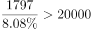亿元，故财产险保费收入小于人身险保费收入的一半，错误；

C项：定位文字材料第一段“2016年全年······互联网财产险收入为502亿元，同比减少”，根据基期公式：，可得2015年全国互联网财产险收入为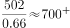亿元，正确；

 D项：定位文字材料第二段“2017年上半年全国互联网保险收入为1346亿元，······互联网财产险收入为238亿元”，故2017年上半年互联网财产险收入在同期互联网保险收入中占比为，错误。

故正确答案选C。

---

### 材料 4

根据以下资料，回答下列问题。

        2017年全国举办马拉松赛事达1102场，其中，中国田径协会举办的A类赛事223场，B类赛事33场。2017年马拉松赛事的参与人次达到了498万人次，2016年、2015年马拉松赛事的参与人次分别为280万人次、150万人次。 

        2017年全年马拉松直接从业人口数72万，间接从业人口数200万。年度产业总规模达700亿元，比去年同期增长约，中国田径协会设置的发展目标是到2020年，全国马拉松规模赛事超过1900场，其中中国田径协会认证赛事达到350场，各类赛事参赛人数超过1000万人次，马拉松运动产业规模达到1200亿元。

        规模赛事数量方面，2017年排名前三的省份为浙江省、江苏省和广东省，分别为152场、149场和103场，而2016年的前三名分别为江苏省37场，北京市33场，广东省25场。

        从2017年全年赛事的覆盖区域来看，马拉松赛事地域分布更为广泛，中国境内马拉松及相关赛事已经涵盖了含西藏在内的全国31个省、区、市的234个城市，较上年增加了101个城市。

        在赛事类型方面，2017年1102场规模赛事中，全程马拉松参赛人次最高，突破了235万人次，其次为半程马拉松赛事，参赛人次超过134万人次。在中国田径协会认证的A类、B类赛事中，2017年全程马拉松项目完赛26.89万人次，同比增长；半程马拉松项目完赛45.29万人次，同比减少了0.03万人次。

        按照跑者户籍所在地统计，2017年参加中国田径协会认证赛事的跑者中，来自江苏的数量最多，共有76469人参赛，在全国占比。湖北、广东、山东、福建、浙江等省紧随其后。而在全部参赛选手中，共有3663人次的男选手在全程项目中跑进3小时，772人次女选手跑进3小时20分。

#### 第 16 题　qid 2376574 · 比重

2017年中国田径协会举办的A类与B类赛事占全国马拉松赛事的比例约为：

- **A**. 

- **B**. 

　✅
- **C**. 

- **D**. 

**答案**：B

**官方解析**

根据题干“2017年，···占···的比例约为”，结合材料中给了2017年的数据，可判定本题为现期比重问题。定位文字材料第一段可得：2017年全国举办马拉松赛事达1102场，其中，中国田径协会举办的A类赛事223场，B类赛事33场。根据比重，可得2017年的比重为。与B项最接近。

故正确答案为B。

---

#### 第 17 题　qid 2376600 · 增长

2017年我国马拉松赛事场次比2011年增加了：

- **A**. 约47倍
- **B**. 约49倍　✅
- **C**. 约51倍
- **D**. 约53倍

**答案**：B

**官方解析**

根据题干“2017年···比2011年增加了”，结合选项，可判定本题为一般增长率问题。定位图1可得：2017年、2011年我国马拉松赛场次分别为1102场、22场。根据增长率，可得2017年的增长率为倍。

故正确答案为B。

---

#### 第 18 题　qid 2376755 · 平均数

在2017年马拉松运动年度产业总规模的基础上，从2018年开始，每年需要平均增长多少才能实现中国田径协会设置的2020年马拉松运动产业规模目标？

- **A**. 

- **B**. 

- **C**. 

　✅
- **D**. 

**答案**：C

**官方解析**

根据问题“从2018年开始，每年需要平均增长······才能实现······”结合选项为百分数，可判定本题为年均增长率问题。定位材料第二段“2017年······年度产业总规模达到700亿元······到2020年······产业规模达到1200亿元”。代入公式 ，，以2017年为基期的基础上，实现2020年的目标，所以年份差为3。。优先代入居中且好算（例如整十的数）的选项，即C选项，，和1.71接近。

故正确答案为C。

---

#### 第 19 题　qid 2376602 · 综合

在中国田径协会认证的A类、B类赛事中，2016年全程马拉松项目完赛人次比同期半程马拉松项目完赛人次：

- **A**. 多23万
- **B**. 少23万
- **C**. 多21万
- **D**. 少21万　✅

**答案**：D

**官方解析**

根据题干“······2016年全程马拉松项目完赛人次比同期半程马拉松项目完赛人次”，并结合选项为“”，且材料数据为2017年，可判定本题为基期和差问题。定位文字材料第五段可得：“在中国田径协会认证的A类、B类赛事中，2017年全程马拉松项目完赛26.89万人次，同比增长；半程马拉松项目完赛人次45.29万人次，同比减少了0.03万人次”，代入基期量公式：，则2016年全程马拉松项目完赛人次为：万人次，2016年半程马拉松项目完赛人次为：万人次，故2016年全程马拉松项目完赛人次与同期半程马拉松项目完赛人次差为：，即少21万人次。

故正确答案为D。

---

#### 第 20 题　qid 2376605 · 综合

能够从上述资料中推出的是：

- **A**. 
2017年马拉松运动年度产业规模比2016年多200亿元

- **B**. 
2017年参加中国田径协会认证赛事的全国跑者数量少于75万人

- **C**. 
2011年至2016年我国马拉松赛事场次之和超过2017年赛事场次的
　✅
- **D**. 
在2016年与2017年马拉松规模赛事数量上，江苏省、北京市都有进入前三名

**答案**：C

**官方解析**

A项：定位文字材料第二段可得：“2017年全年马拉松······年度产业总规模达700亿元，比去年同期增长约。” 故2017年马拉松运动年度产业规模比2016年多：亿元，错误；

B项：定位文字材料第六段可得：“2017年参加中国田径协会认证赛事的跑者中，来自江苏的数量最多，共有76469人，在全国占比”，故2017年参加中国田径协会认证赛事的全国跑者数量为万，错误；

C项：定位图形材料可得：“2011年至2017年我国马拉松赛事场次分别为22、33、39、51、134、328、1102”，故2011年至2016年我国马拉松赛事场次之和：，2017年赛事场次的为，前者大于后者，正确；

D项：定位文字材料第三段可得：“规模赛事数量方面，2017年排名前三的省份为浙江省、江苏省和广东省······而2016年的前三名分别为江苏省、北京市、广东省”，故在2016年和2017年马拉松规模赛事数量上，北京市没有都进入前三名，错误。

故正确答案为C。

---
