# 2016年3月四川省选调优秀大学生到基层工作考试 行政职业能力测验试卷（精选）

> 选调生 · 2016 年 · 6 个模块 · 共 91 题

- [政治理论](#%E6%94%BF%E6%B2%BB%E7%90%86%E8%AE%BA) · 2 题
- [常识判断](#%E5%B8%B8%E8%AF%86%E5%88%A4%E6%96%AD) · 13 题
- [言语理解与表达](#%E8%A8%80%E8%AF%AD%E7%90%86%E8%A7%A3%E4%B8%8E%E8%A1%A8%E8%BE%BE) · 26 题
- [数量关系](#%E6%95%B0%E9%87%8F%E5%85%B3%E7%B3%BB) · 10 题
- [判断推理](#%E5%88%A4%E6%96%AD%E6%8E%A8%E7%90%86) · 30 题
- [资料分析](#%E8%B5%84%E6%96%99%E5%88%86%E6%9E%90) · 10 题

---

## 政治理论

### 第 1 题　qid 2262667 · 新思想

2014年12月，习近平总书记在江苏调研时，首提了“四个全面”。以下关于“四个全面”的说法中，不正确的是：

- **A**. 全面深化改革的重点是政治体制改革　✅
- **B**. 全面推进依法治国，必须坚持依法治国和以德治国相结合的原则
- **C**. 全面建成小康社会，最艰巨最繁重的任务在农村，特别是在贫困地区
- **D**. 全面从严治党，核心是加强党的领导，基础在全面，关键在严，要害在治

**答案**：A

**官方解析**

本题考查政治常识。
A项错误，政治体制改革是全面深化改革的重要组成部分，对经济社会发展发挥着重要的保障和促进作用。经济体制改革是全面深化改革的重点，核心问题是处理好政府和市场的关系，使市场在资源配置中起决定性作用和更好发挥政府作用。
B项正确，把依法治国基本方略、依法执政基本方式落实好，把法治中国建设好，必须坚持依法治国和以德治国相结合，使法治和德治在国家治理中相互补充、相互促进、相得益彰，推进国家治理体系和治理能力现代化。
C项正确，全面建成小康社会，最艰巨最繁重的任务在农村，特别是在贫困地区。没有农村的小康，特别是没有贫困地区的小康，就没有全面建成小康社会。
D项正确，习近平总书记在十八届中央纪委六次全会上的重要讲话强调：全面从严治党是我们立下的军令状，其核心是加强党的领导，基础在全面，关键在严，要害在治。
备注：2020年党的十九届五中全会在北京胜利召开，会议审议通过了《中共中央关于制定国民经济和社会发展第十四个五年规划和二〇三五年远景目标的建议》。明确提出要“协调推进全面建设社会主义现代化国家、全面深化改革、全面依法治国、全面从严治党的战略布局”。
本题为选非题，故正确答案为A。

---

### 第 2 题　qid 2262690 · 时事政治

中央经济工作会议提出2016年的五大任务，位居首位的是：

- **A**. 化解房地产库存
- **B**. 扩大有效供给
- **C**. 防范化解金融风险
- **D**. 化解产能过剩　✅

**答案**：D

**官方解析**

本题考查经济常识。
2015年12月22日，中央经济工作会议于北京举行。会议提出了2016年五大任务：一是积极稳妥化解产能过剩；二是帮助企业降低成本；三是化解房地产库存；四是扩大有效供给；五是防范化解金融风险。其中居于首位的是化解产能过剩。
故正确答案为D。

---

## 常识判断

### 第 1 题　qid 2262666 · 地理国情

下列关于四川省的相关说法中，不正确的是：

- **A**. 四川省是我国的资源大省，人口大省，经济大省
- **B**. 四川省地貌东西差异大，地形复杂多样，高低悬殊，东高西低的特点明显　✅
- **C**. 四川省是承接华南、华中，连接西南、西北，沟通中亚、南亚、东南亚的重要交汇点和交通走廊
- **D**. 四川省奋力推进的“两个跨越”是指“由经济大省向经济强省跨越，由总体小康向全面小康跨越”

**答案**：B

**官方解析**

本题考查地理国情常识。
A项正确，四川省是我国的资源大省、人口大省、经济大省，具有产业基础、资源禀赋、科技人才、军工技术、市场需求等多方面的优势，已经形成了电子信息、装备制造、能源电力、油气化工等特色优势产业。
B项错误，四川位于我国大陆地势三大阶梯中的第一级和第二级，即处于第一级青藏高原和第二级长江中下游平原的过渡带，高差悬殊，西高东低的特点特别明显。西部为高原、山地，海拔多在4000米以上；东部为盆地、丘陵，海拔多在1000～3000米之间。全省可分为四川盆地、川西北高原和川西南山地三大部分。
C项正确，四川位于中国西南地区，是承接华南、华中，连接西南、西北，沟通中亚、南亚、东南亚的重要交汇点和交通走廊。
D项正确，四川省第十一届委员会第二次全体会议提出“一个愿景、两个跨越、三大发展战略、四项重点工程”的战略谋划。“两个跨越”是指从经济大省向经济强省跨越，从总体小康向全面小康跨越。
本题为选非题，故正确答案为B。

---

### 第 2 题　qid 2262673 · 法律常识

下列关于我国《宪法》的说法中，不正确的是：

- **A**. 全国人民代表大会为最高国家权力机关，是唯一有权修改宪法的机关
- **B**. 我国法律规定的行使解释宪法职权的是全国人民代表大会专门委员会　✅
- **C**. 宪法是其他法律的立法基础，其他法律是宪法的具体化，任何法律不得同宪法相抵触，否则无效
- **D**. 于1949年9月29日颁布的《中国人民政治协商会议共同纲领》具有临时宪法的作用

**答案**：B

**官方解析**

本题考查法律常识。
A项正确，根据《宪法》第五十七条规定：“中华人民共和国全国人民代表大会是最高国家权力机关。”第六十二条规定：“全国人民代表大会行使下列职权：（一）修改宪法。”第六十七条中规定的全国人民代表大会常务委员会无修改宪法的职权。
B项错误，《宪法》第六十七条规定：“全国人民代表大会常务委员会行使下列职权：（一）解释宪法，监督宪法的实施。”并非题目中提到的全国人民代表大会专门委员会。
C项正确，《宪法》序言中规定：“本宪法以法律的形式确认了中国各族人民奋斗的成果，规定了国家的根本制度和根本任务，是国家的根本法，具有最高的法律效力。”《宪法》第五条第三款规定：“一切法律、行政法规和地方性法规都不得同宪法相抵触。”
D项正确，1949年9月29日，中国人民政治协商会议第一届全体会议选举了中央人民政府委员会，宣告了中华人民共和国的成立，并且通过了起临时宪法作用的《中国人民政治协商会议共同纲领》。
本题为选非题，故正确答案为B。

---

### 第 3 题　qid 2262677 · 法律常识

下列关于法人的说法中，不符合法律规定的是：

- **A**. 法人以注册登记地为住所　✅
- **B**. 解散是企业法人终止的原因之一
- **C**. 法人应当具备自己的名称、组织机构和场所
- **D**. 法人的民事行为能力，从法人成立时产生，到法人终止时消灭

**答案**：A

**官方解析**

本题考查法律常识。
A项错误，《中华人民共和国民法典》第六十三条规定：“法人以其主要办事机构所在地为住所。依法需要办理法人登记的，应当将主要办事机构所在地登记为住所。”
B项正确，《中华人民共和国民法典》第六十八条第一款规定：“有下列原因之一并依法完成清算、注销登记的，法人终止：（一）法人解散；（二）法人被宣告破产；（三）法律规定的其他原因。”
C项正确，《中华人民共和国民法典》第五十八条第二款规定：“法人应当有自己的名称、组织机构、住所、财产或者经费。”
D项正确，《中华人民共和国民法典》第五十九条规定：“法人的民事权利能力和民事行为能力，从法人成立时产生，到法人终止时消灭。”
本题为选非题，故正确答案为A。

---

### 第 4 题　qid 2262680 · 人文常识

以下关于“三严三实”专题教育活动的说法中，不正确的是：

- **A**. “三严三实”专题教育要坚持以上率下、示范带动
- **B**. “三严三实”专题教育的成果如何，需用推动改革的实际成就来检验
- **C**. 在县处级以上领导干部中开展“三严三实”专题教育活动要分批次，分阶段实施　✅
- **D**. 在县处级以上领导干部中开展“三严三实”专题教育活动要坚持从严要求，强化问题导向

**答案**：C

**官方解析**

本题考查政治常识。
2015年4月，中共中央办公厅印发《关于在县处级以上领导干部中开展“三严三实”专题教育方案》。
A项正确，《方案》提出，坚持以上率下、示范带动。中央政治局带头开展“三严三实”专题教育。全国人大常委会党组、国务院党组、全国政协党组结合各自实际开展“三严三实”专题教育。同时，对省部级领导干部，市、县党政领导班子成员特别是党政主要负责同志，机关、企事业单位及其内设机构县处级以上领导干部和管理人员，分层提出要求。
B项正确，《方案》要求，把开展“三严三实”专题教育与做好当前改革发展稳定各项工作结合起来，与完成本地区本部门本单位重点工作任务结合起来。
C项错误，《方案》明确，“三严三实”专题教育作为党的群众路线教育实践活动的延展深化，作为加强党的思想政治建设和作风建设的重要举措，要融入领导干部经常性学习教育，不分批次、不划阶段、不设环节，不是一次活动。从2015年4月底开始，在各级党政机关、人民团体及其内设机构县处级以上领导干部和事业单位、国有企业中层以上领导人员中开展，各级同步进行。
D项正确，《方案》强调，坚持从严要求，强化问题导向。
本题为选非题，故正确答案为C。

---

### 第 5 题　qid 2262683 · 法律常识

张某因犯盗窃罪，被判处有期徒刑7年，刑罚执行2年后，因确有悔改表现，某县人民法院审核裁定缩短为6年有期徒刑，这是对张某：

- **A**. 改判
- **B**. 减轻处罚
- **C**. 减刑　✅
- **D**. 从轻处罚

**答案**：C

**官方解析**

本题考查法律常识。
A项错误，改判是指上级法院依照法律程序，以重新裁判形式对原审判决、裁定所做的变更，旨在对错误的判决、裁定直接纠正，以保证国家法律的正确实施。
B项错误，根据《刑法》第六十三条规定：“犯罪分子具有本法规定的减轻处罚情节的，应当在法定刑以下判处刑罚；本法规定有数个量刑幅度的，应当在法定量刑幅度的下一个量刑幅度内判处刑罚。”
C项正确，根据《刑法》第七十八条规定：“被判处管制、拘役、有期徒刑、无期徒刑的犯罪分子，在执行期间，如果认真遵守监规，接受教育改造，确有悔改表现的，或者有立功表现的，可以减刑。”题干中，张某在刑罚执行2年后，因确有悔改表现，刑期缩短为6年有期徒刑，属于减刑。
D项错误，从轻处罚是在法定刑范围内对犯罪分子适用刑种较轻或刑期较短的刑罚。
故正确答案为C。

---

### 第 6 题　qid 2262687 · 经济常识

下列哪项不属于宽松的货币政策？

- **A**. 降低存款利率
- **B**. 在公开市场赎回国债
- **C**. 缩减信贷支出规模　✅
- **D**. 降低存款准备金率

**答案**：C

**官方解析**

本题考查经济常识。
宽松的货币政策指的是增加市场货币供应量，比如直接发行货币、在公开市场上买债券、降低准备金率和贷款利率等。货币量多了需要贷款的企业和个人就更容易贷到款，能够促进经济更快发展。
A项正确，存款利率下调通常会使储蓄下降，流通中货币量增大，增加市场货币供应量，属于宽松的货币政策。
B项正确，在公开市场操作赎回债券旨在释出资金，借以提高货币供给成长率，增加市场的可借贷资金，属于宽松的货币政策。
C项错误，缩减信贷支出规模是指银行贷款的整体额度减少，属于紧缩的货币政策。
D项正确，存款准备金是指金融机构为保证客户提取存款和资金清算需要而准备的，是缴存在中央银行的存款，中央银行要求的存款准备金占其存款总额的比例就是存款准备金率。降低存款准备金率，有利于释放资金，属于宽松的货币政策。
本题为选非题，故正确答案为C。

---

### 第 7 题　qid 2262691 · 人文常识

关于“一带一路”，下列说法中错误的是：

- **A**. 指“丝绸之路经济带”和“21世纪海上丝绸之路”
- **B**. 是区域型经济组织　✅
- **C**. 不涉及政治、安全等领域
- **D**. 可以促进沿线国家的共同繁荣

**答案**：B

**官方解析**

本题考查经济常识。
A项正确，“一带一路”是“丝绸之路经济带”和“21世纪海上丝绸之路”的简称，秉承的是共商、共享、共建原则。
B项错误，“一带一路”是开放包容的经济合作倡议，不限国别范围，不是一个实体，更不是一个区域型经济组织，不搞封闭机制，有意愿的国家和经济体均可参与进来，成为“一带一路”的支持者、建设者和受益者。
C项正确，“一带一路”不涉及政治、安全等领域，依赖“丝绸之路”经济、人文、商贸的千年传承，并赋予其新的合作意义。
D项正确，“一带一路”建设密切了沿线国家的交往，有利于推动沿线国家实现共同繁荣。
本题为选非题，故正确答案为B。

---

### 第 8 题　qid 2262695 · 人文常识

下列关于大熊猫的说法中，正确的是：

- **A**. 属于肉食目、大熊猫科
- **B**. 睡觉时间没有进食时间长　✅
- **C**. 视觉非常发达，夜晚也能活动
- **D**. 目前的主要栖息地是四川、陕西、宁夏

**答案**：B

**官方解析**

本题考查科技常识。
A项错误，按目前的分类阶元，生物划分为：界、门、纲、目、科、属、种。大熊猫属于熊科（熊猫亚科）、大熊猫属的一种哺乳动物。
B项正确，野外的成年大熊猫一般每天花16小时左右来找寻和进食竹子，剩余时间用来游走、睡觉和休息。人工饲养的大熊猫每日用大约8－10小时左右的时间来进食竹子，其余时间用于用于睡觉、玩耍和休息等。
C项错误，大熊猫的视觉极不发达，这是由于大熊猫长期生活于密密的竹林里，光线很暗，障碍物又多，致使其目光变得十分短浅。
D项错误，大熊猫是中国特有物种，现存的主要栖息地是中国四川、陕西和甘肃的山区。
故正确答案为B。

---

### 第 9 题　qid 2262698 · 人文常识

关于我国公益电话，下列对应错误的是：

- **A**. 122——交通事故报警电话
- **B**. 12121——网络举报电话　✅
- **C**. 12315——消费者投诉举报电话
- **D**. 12306——全国铁路客户服务热线

**答案**：B

**官方解析**

本题考查科技常识。
A项正确，122是道路交通事故报警的客服电话，是我国公安交通管理机关为受理群众交通事故报警电话，指挥调度警员处理各种报警、求助、同时受理群众对交通管理和交通民警执法问题的举报、投诉、查询等而设。
B项错误，12121是气象信息查询电话，与气象台的天气预报电脑自动服务系统接通。
C项正确，12315是消费者投诉举报专线电话，国家工商行政管理总局设立的专门受理消费者投诉举报的专用电话号码。
D项正确，12306是全国铁路客户服务热线，是铁路服务客户的重要窗口，为社会和铁路客户提供客货运输业务和公共信息查询、预定等服务。
本题为选非题，故正确答案为B。

---

### 第 10 题　qid 2262701 · 人文常识

下列诗句所描写的时节对应不正确的是：

- **A**. 梨花自寒食，进节只愁余——清明
- **B**. 乳鸦啼散玉屏空，一枕新凉一扇风——立秋
- **C**. 天将小雨交春半，谁见枝头花历乱——立春　✅
- **D**. 篱边野菊正堪娱，戏把山楂串念珠——小雪

**答案**：C

**官方解析**

本题考查人文常识。
A项正确，“梨花自寒食，进节只愁余”出自《寒食上冢》，作者是宋代杨万里。全诗描写的是诗人在清明节时独自上坟的情景，表明孤独寂寞的心情。
B项正确，“乳鸦啼散玉屏空，一枕新凉一扇风”出自《立秋》，作者是唐朝诗人刘翰。全诗描写的是诗人在夏秋季节交替时细致入微的感受，表现秋风之凉爽。
C项错误，“天将小雨交春半，谁见枝头花历乱”出自《偷声木兰花·春分遇雨》，作者是五代的徐铉。该诗句描写的时节是春分，可由句中“春半”来推断。
D项正确，“篱边野菊正堪娱，戏把山楂串念珠”出自《小雪》，作者是当代诗人吴藕汀。全诗表现了虽然开始下雪，但雪量较小，夜冻昼化的景象。
本题为选非题，故正确答案为C。

---

### 第 11 题　qid 2262704 · 人文常识

下列成语与哲学思想对应错误的是：

- **A**. 天翻地覆——事物是变化发展的
- **B**. 按图索骥——矛盾双方在一定的条件下可以相互转化　✅
- **C**. 拔苗助长——认识和改造世界中，要按客观规律办事
- **D**. 一枕黄粱——想问题办事情应从实际出发，使主观符合客观

**答案**：B

**官方解析**

本题考查政治常识。
A项正确，“天翻地覆”用来形容变化巨大，与“事物是变化发展的”对应。
B项错误，按图索骥的意思是按照画像去寻求好马，比喻墨守成规办事，也比喻按照线索去寻求。这体现的是“联系是普遍的”这一哲学思想，与“矛盾”的哲学思想无关。
C项正确，“拔苗助长”比喻违反事物发展的客观规律，急于求成，反而坏事，与“要按客观规律办事”的哲学思想对应。
D项正确，“一枕黄粱”原比喻人生虚幻，后比喻不能实现的梦想，与“想问题办事情应从实际出发”的哲学思想对应。
本题为选非题，故正确答案为B。

---

### 第 12 题　qid 2262707 · 人文常识

下列成语与相关人物相对应的是：

- **A**. 破釜沉舟——刘备
- **B**. 问鼎中原——楚庄王　✅
- **C**. 九死未悔——韩非
- **D**. 约法三章——诸葛亮

**答案**：B

**官方解析**

本题考查人文常识。
A项错误，“破釜沉舟”出自《史记·项羽本纪》，描述人物为项羽。“项羽乃悉引兵渡河，皆沉船，破釜甑，烧庐舍，持三日粮，以示士卒必死，无一还心。”比喻下决心不顾一切地干到底。
B项正确，“问鼎中原”对应人物为楚庄王。春秋时楚庄王北伐，向周天子的使者询问九鼎的重量，大有夺取周朝天下之势。从此以后，人们就将企图夺取政权称为“问鼎”。
C项错误，“九死未悔”出自楚国屈原《离骚》中的“亦余心之所善兮，虽九死其犹未悔。”形容意志坚定，不论经历多少危险，也决不动摇退缩。
D项错误，“约法三章”出自《史记·高祖本纪》“与父老约法三章耳：杀人者死，伤人及盗抵罪。”即杀人者要处死，伤人者要抵罪，盗窃者也要判罪。由于坚决执行约法三章，刘邦得到了百姓的信任、拥护和支持，最后取得天下，建立了西汉王朝。
故正确答案为B。

---

### 第 13 题　qid 2262709 · 人文常识

下列与数学相关的著作与作者对应错误的是：

- **A**. 《缀术》——刘徽　✅
- **B**. 《数书九章》——秦九韶
- **C**. 《方法论》——阿基米德
- **D**. 《几何原本》——欧几里得

**答案**：A

**官方解析**

本题考查人文常识。
A项错误，《缀术》是中国南北朝时期的一部算经，汇集了祖冲之和祖暅之父子的数学研究成果。刘徽是魏晋期间伟大的数学家，中国古典数学理论的奠基人之一，他的杰作《九章算术注》和《海岛算经》，是中国最宝贵的数学遗产。
B项正确，秦九韶，南宋著名数学家，精研星象、音律、算术、诗词、弓剑、营造之学，1247年完成著作《数书九章》。《数书九章》中共列算题81问，分为9类，还涉及自然现象和社会生活，成为了解当时社会政治和经济生活的重要参考文献。该书在数学内容上颇多创新，是对《九章算术》的继承和发展，标志着中国古代数学的高峰。
C项正确，阿基米德，伟大的古希腊哲学家、百科式科学家、数学家、物理学家、力学家，静态力学和流体静力学的奠基人，曾著有《方法论》。阿基米德曾说过：“给我一个支点，我就能撬起整个地球。”
D项正确，《几何原本》是古希腊数学家欧几里得所著的一部数学著作，它是欧洲数学的基础，总结了平面几何五大公设，被广泛认为是历史上最成功的教科书。
本题为选非题，故正确答案为A。

---

## 言语理解与表达

### 第 1 题　qid 2262734 · 逻辑填空

直到最近，巴西都还在全球滥砍滥伐的乱潮中保持着        的形象，1990年—2010年，全球范围内62%的热带雨林都遭到了破坏，但巴西的雨林破坏率却在2004年—2011年实现了锐减。
填入画横线部分最恰当的一项是：

- **A**. 与众不同
- **B**. 明哲保身
- **C**. 独善其身　✅
- **D**. 洁身自好

**答案**：C

**官方解析**

后文对该空进行解释说明，说明巴西没有受到全球滥砍滥伐乱潮的影响，保持着自我。C项“独善其身”指在污浊的环境中能不受干扰地坚持自己的美好品格，也比喻只顾自身而不管他人的个人主义处世哲学。符合语境，当选。
A项“与众不同”表示与其他人不一样，文段重点不是在强调巴西的不同，而是强调不管全球大环境如何，巴西都在坚持做自己，与文意不符，排除。
B项“明哲保身”本意是明智的人善于保全自己，现比喻因怕连累自己而回避原则斗争的处世态度，多作贬义使用，与文意不符，排除。
D项“洁身自好”指保持自己纯洁，不同流合污，有“出淤泥而不染”之意，侧重于强调品质纯洁，而文段重在强调巴西坚持做自己，与文意不符，排除。
故正确答案为C。
【文段出处】《巴西雨林再陷危机》

---

### 第 2 题　qid 2262736 · 逻辑填空

美国拉什大学医学中心的研究小组对453名老年人进行长期追踪调查后发现，那些觉得人生有意义、积极追求实现人生目标的人发生脑卒中的风险要显著低于        、过一天算一天的人，从而减轻被失忆、运动障碍、失能和死亡等与衰老相关问题困扰的风险。
填入画横线部分最恰当的一项是：

- **A**. 随波逐流　✅
- **B**. 垂头丧气
- **C**. 日渐消沉
- **D**. 特立独行

**答案**：A

**官方解析**

根据文意可知，文段前后进行对比，该空与前文“觉得人生有意义、积极追求实现人生目标”构成反义并列，且此处出现“、”，与“过一天算一天”构成同义并列，故该空应表达“觉得人生没有目标，得过且过”的意思，对应选项，A项“随波逐流”比喻没有坚定的立场，缺乏判断是非的能力，只能随着别人走，可以形容人没有目标，麻木度日的意思，符合文意，当选。
B项“垂头丧气”形容因失败或不顺利而情绪低落、萎靡不振，丧失意志的样子，文段未强调经历了失败或不顺利，不符合文意，排除。
C项“日渐消沉”形容情绪一天一天逐渐地低落，文段未论述情绪方面的问题，排除。
D项“特立独行”泛指特殊的，与众不同的，普遍形容人的志向高洁，不同流俗，与文意无关，排除。
故正确答案为A。
【文段出处】《未找到》

---

### 第 3 题　qid 2262740 · 逻辑填空

描述新物种是生物学从诞生至今的几百年时间里最为         的工作。即便是在今天，使用多种研究手段的现代分类学仍然是一项重要的科学研究，因为它记录了地球的生物          。
填入画横线部分最恰当的一项是：

- **A**. 前沿  特异性
- **B**. 综合  复杂性
- **C**. 长久  遗传性
- **D**. 基础  多样性　✅

**答案**：D

**官方解析**

本题可从第二空入手。第二空是对“现代分类学”的解释，“现代分类学”是研究动植物分类的科学，可知它记录了地球上各种各样的生物，对应选项，D项“多样性”符合文意，保留。
A项“特异性”指区别于其他事物的性质，B项“复杂性”与简单相对，强调复杂，C项“遗传性”指类与子类之间属性的传递，均与文段语义无关，排除。
第一空，代入验证，“基础”指事物发展的根本或起点，与前文“从诞生至今”相对应，符合文段语境，当选。
故正确答案为D。
【文段出处】《四川短翅莺：来自四川的鸟类新种》

---

### 第 4 题　qid 2262743 · 逻辑填空

科研和科普虽然都以“科”为基础，但它们从思维方式到呈现方式都有           。事实上，放眼人类科技史，能兼为科学大师和科普大师者，也是              。
填入画横线部分最恰当的一项是：

- **A**. 天壤之别  凤毛麟角　✅
- **B**. 千差万别  寥寥无几
- **C**. 云泥之别  百里挑一
- **D**. 汇分类别  屈指可数

**答案**：A

**官方解析**

第一空，“但”表转折前后语义相反，前文提到“······都以‘科’为基础”，故转折后应表示他们从思维方式到呈现方式都有很大的差别，对应选项，A项“天壤之别”形容差别之大，B项“千差万别”形容种类多，差别大，均能形容差别大，符合文段语境，保留。C项“云泥之别”比喻地位的高下相差极大，“地位差别大”文段并未涉及，D项“汇分类别”指按照类别进行汇总，均与文段语义无关，排除。
第二空，由前文差别之大可知，能“兼为科学大师和科普大师”的优秀人才非常稀少，对应选项，A项“凤毛麟角”比喻珍贵而稀少的人或物，B项“寥寥无几”形容非常稀少，强调数量少，虽都表达稀少的意思，但只有“凤毛麟角”形容珍贵的人很稀少，对比发现，“凤毛麟角”更符合文段语境，排除B项。
故正确答案为A。
【文段出处】《光明日报：科普“脱困”不妨多点众创思维》

---

### 第 5 题　qid 2262745 · 逻辑填空

在互联网时代，          要鼓励技术创新和盈利模式创新，但基本的前提是不能______原创动力之源，更不能把别人的头条改头换面抄袭成自己的头条。
填入画横线部分最恰当的一项是：

- **A**. 固然  伤害　✅
- **B**. 自然  干扰
- **C**. 当然  侵犯
- **D**. 必然  破坏

**答案**：A

**官方解析**

第一空，分析语境可知，该空表达“技术创新和盈利模式创新”需要得到鼓励，对应选项，A项“固然”表示承认这一事实，引起下文转折，与后文“但”相呼应，符合文段语境，保留。D项“必然”表述过于绝对，排除。
第二空，由“更”可知，该空与“不能把别人的头条改头换面抄袭成自己的头条”构成递进，可知横线处的意思应比“抄袭”的程度轻，体现对他人成果的消极影响。对应选项，A项“伤害”指是受损伤，符合文意，当选。B项“干扰”指打扰，妨碍，使混乱，程度过轻，排除。C项“侵犯”指以伤害他人或他物为目的的行为，强调侵害的行为，而文段强调损害的结果，不符合文段语境，排除。
故正确答案为A。
【文段出处】《今日头条等网络应用新秀频出 版权法律红线不可侵犯》

---

### 第 6 题　qid 2262748 · 逻辑填空

自然科学的发展遵循着其固有的逻辑：无论你提出多复杂的问题，科学家也许只用一个伟大的公式就能让你        。关于文明的研究则        ，即便是最简单的问题，都需要科学家付出卓绝的努力，才能从浩如瀚海的资料中找到一个宏大的分析框架，而答案依旧不一定令人满意。
填入画横线部分最恰当的一项是：

- **A**. 如梦初醒  另辟蹊径
- **B**. 迎刃而解  举步维艰
- **C**. 恍然大悟  恰恰相反　✅
- **D**. 柳暗花明  殊途同归

**答案**：C

**官方解析**

本题可从第二空入手。通过“则”可知文段将自然科学和文明的研究作对比，前后语义相反，前文自然科学解决问题的方式为“只用一个伟大的公式”，而后文文明的研究则需要“付出卓绝的努力”，对应选项，C项“恰恰相反”指正好相反，符合文段语境，保留。A项“另辟蹊径”比喻另创一种风格或方法，B项“举步维艰”形容处境或行动十分艰难，D项“殊途同归”比喻采取不同的方法而得到相同的结果，均与文段语义无关，排除。
第一空，代入验证，“恍然大悟”形容人对某事一下子明白过来、突然醒悟，豁然开朗，这里指科学家用一个公式就能将问题解释清楚，让人明白。符合文段语境，当选。
故正确答案为C。
【文段出处】《研究历史就是为了平衡古今 ——专访美国国家地理学会首席探险官特里·加西亚》

---

### 第 7 题　qid 2262750 · 逻辑填空

自然一直在用她的血肉供养着人类。最早，我们从自然那里         食物、衣着和居所。之后，我们学会了从她的生物圈里           原材料来创造出我们自己的新的合成材料。而现在，自然又向我们敞开她的心智，让我们学习她的内在逻辑。
填入画横线部分最恰当的一项是：

- **A**. 获得  猎取
- **B**. 夺取  选取
- **C**. 争取  求取
- **D**. 获得  提取　✅

**答案**：D

**官方解析**

第一空，由“自然一直在用她的血肉供养着人类”可知，该空表达自然给人类提供了很多东西，对应选项，A项和D项“获得”指得到、取得，符合文段语义，均保留；B项“夺取”指使用力量强行取得，C项“争取”指力求得到或做到，“强行取得”“力求”文段未涉及，排除。
第二空，文段表达的是从自然取得原材料的意思， A项“猎取”指猎杀、夺取，与“原材料”搭配不当，排除。D项“提取”指通过其他化学或机械工艺过程从物质中制取（如组成成分或汁液），“提取原材料”搭配得当，当选。 
故正确答案为D。
【文段出处】《解勇：“植物医生”，靠研发崛起的中国化妆品牌》

---

### 第 8 题　qid 2262753 · 逻辑填空

冷冰冰的标语口号，不仅令人         ，起不到警示教育作用，反而让人产生反感和抵触情绪。在我们文明程度日益提高的今天，我们的口号标语是不是也应该         ，多一点感情和温度，多一点幸福的提醒呢？
填入画横线部分最恰当的一项是：

- **A**. 心生厌恶  顺应潮流
- **B**. 望而生畏  与时俱进　✅
- **C**. 侧目相视  推陈出新
- **D**. 发指眦裂  开拓创新

**答案**：B

**官方解析**

第一空，与后文“起不到警示教育作用”构成解释对应，且比“让人产生反感和抵触情绪”的语义程度要轻，分析选项，A项“心生厌恶”指内心产生厌恶的情绪，C项“侧目而视”形容憎恨、畏惧、愤恨的神情，D项“发指眦裂”形容非常愤怒，均与“反而”之后的内容程度相同，不符合文段语义，排除；B项“望而生畏”意为看见了就产生畏惧心理，形容人神态威严或事务艰难令人畏惧，符合文段语境，保留。
第二空，代入验证，“与时俱进”指观念、行动和时代一起进步，从而发生一些改变，与“文明程度日益提高的今天”相对应，符合文段语境，当选。
故正确答案为B。
【文段出处】《标语口号应提醒幸福》

---

### 第 9 题　qid 2262765 · 逻辑填空

经济全球化的背后是不同文化的冲撞和交融，是不同思想的          与扬弃，是不同文明的竞争和共存。从历史进化的角度来看，交融、扬弃、共存是大趋势，一个民族、一个国家总是在坚持自我          的同时，向其他民族、其他国家吸取异质文化的养分，从而与时俱进，发展壮大。
填入画横线部分最恰当的一项是：

- **A**. 激荡  特质　✅
- **B**. 交流  特点
- **C**. 较量  形象
- **D**. 冲突  品质

**答案**：A

**官方解析**

文段开头是三个并列，该空应与“冲撞”“竞争”表达相近的语义，“冲撞”指互相冲突撞击，“竞争”指个体或群体间力图胜过或压倒对方的心理需要和行为活动，对应选项，A项“激荡”指受到冲击而动荡，C项“较量”指通过比赛或打仗等方式分出双方高低上下，D项“冲突”指对立的、互不相容的力量或性质(如观念、利益、意志)的互相干扰，均能表达不同思想间的相互碰撞，符合文段语义，保留。B项“交流”指彼此间把自己有的提供给对方，相互沟通，与文段表达的语义相反，排除。
第二空，搭配“自我”，形容的是自己本身特有的东西，对应选项，A项“特质”指特有的内在素质，符合文段语义，当选。C项“形象”指能引起人的思想或感情活动的具体形态或姿态，D项“品质”指物品的质量，均与文段语义无关，排除。
故正确答案为A。
【文段出处】《"凤凰文库"首批图书124种出版》

---

### 第 10 题　qid 2262772 · 逻辑填空

新世纪头十年后半期最明显的特征就是中国的迅速崛起，中美双方实力对比变化大大        了美国在国际体系中的张力，引发了彼此战略定位的变化。金融危机后，美国经济遭受重创，转而振兴实业经济；中国则致力于产业升级和技术更新，中美互补性经贸关系朝着          方向发展。
依次填入画横线部分最恰当的一项是：

- **A**. 抵消 竞争性　✅
- **B**. 打消 积极性
- **C**. 削弱 相似性
- **D**. 减弱 趋同性

**答案**：A

**官方解析**

第一空，分析文意可知，随着中国的迅速崛起，中方实力不断增强，中美双方差距缩小从而大大消除了美国的张力，对应选项，A项“抵消”指由于作用相反而互相消除，C项“削弱”指力量、势力减弱，均能形容力量减弱，保留。B项“打消”指消除（如疑虑、顾虑等），D项“减弱”指气势、势力等变弱，均与“张力”搭配不当，排除。
第二空，美国着力振兴实业经济，而中国致力于产业升级和技术更新，二者发展的方向是不同的，故A项“竞争性”可体现中国实力不断增强，美国遭受重创后，不断形成的竞争关系，符合文段语境，当选。C项“相似性”不符合文段语义，排除。
故正确答案为A。
【文段出处】《专家解读中美战略关系：既竞争又合作》

---

### 第 11 题　qid 2262774 · 逻辑填空

人民群众的感受与评价最有说服力。党中央正风反腐给老百姓带来更多          ，人们感觉到歪风邪气在不断消散，清风正气在不断上升，好传统好作风在不断        。去年国家统计局问卷调查结果显示，91.5%的群众对党风廉政建设和反腐工作成效表示满意或比较满意。
依次填入画横线部分最恰当的一项是：

- **A**. 满足感 上演
- **B**. 获得感 回归　✅
- **C**. 幸福感 巩固
- **D**. 荣誉感 推广

**答案**：B

**官方解析**

第一空，根据文意可知，横线处应体现正风反腐给老百姓带来了很多好处之意。A项“满足感”、B项“获得感”、C项“幸福感”均符合文意，保留。D项“荣誉感”指个人做出杰出贡献后的自豪心情，并非正风反腐给老百姓带来的感受，与文意不符，排除。
第二空，搭配“作风”，且根据“歪风邪气在不断消散，清风正气在不断上升”可知，横线处应体现优良传统和良好作风重新显现、恢复常态的趋势。B项“回归”指回还，返回，符合文意，当选。A项“上演”指戏剧、电影、表演等向观众演出或放映，C项“巩固”指使坚固，均与“作风”搭配不当，排除。
故正确答案为B。
【文段出处】《正风反腐顺党心合民意》

---

### 第 12 题　qid 2262778 · 逻辑填空

在更广阔的互联网、移动互联网领域，除了数据量        ，还有数据类型愈发多样且复杂，企业正面临着前所未有的大数据分析的挑战。在这一趋势之下，企业        能够处理和分析大量结构化与非结构化数据、具备高可靠性和经济效益的认知系统。
依次填入画横线部分最恰当的一项是：

- **A**. 膨胀 需求
- **B**. 巨大 期盼
- **C**. 暴涨 期待
- **D**. 激增 亟需　✅

**答案**：D

**官方解析**

本题可从第二空入手。“这一趋势”指代前文“面临前所未有的大数据分析挑战”，可知当下的趋势是十分紧迫的，故此处应表达企业急迫需要的意思，对应选项，D项“亟需”指急切需要，符合文段语义，保留。A项“需求”、B项“期盼”和C项“期待”均无法体现十分紧迫的状态，不符合文段语境，排除。
第一空，代入验证，D项“激增”指数量急速增长，与“数据量”搭配恰当，符合文段语境，当选。
故正确答案为D。
【文段出处】《大数据也能抗霾》

---

### 第 13 题　qid 2262781 · 逻辑填空

考古学中，有“地层”之说。如同文明的遗迹，人类的历史同样是一层叠压一层，在岁月的        下，积淀为一个国家、一个民族的“心灵地层”，        了共同的记忆、共同的文化、共同的品性。
依次填入画横线部分最恰当的一项是：

- **A**. 磨砺 凝聚
- **B**. 淬炼 塑造　✅
- **C**. 洗礼 汇聚
- **D**. 冲刷 打造

**答案**：B

**官方解析**

第一空，对应“一层叠压一层”可知，该空表达反复经历岁月考验的意思，A项“磨砺”比喻人经受磨练或锻炼，无反复磨炼的意思，不符合文段语境，排除；B项“淬炼”指反复经受考验，磨练，符合文段语境，保留；C项“洗礼”比喻重大斗争的锻炼和考验，D项“冲刷”水流冲击，使土石流失或剥蚀，均与文段语义无关，排除。
第二空，代入验证，B项“塑造”指记忆、文化、品性，搭配恰当且符合文段语境，当选。
故正确答案为B。
【文段出处】《“让历史说话”才能走向未来》

---

### 第 14 题　qid 2262786 · 逻辑填空

在当今时代，关于解释鸟类结群飞行，呈“V”字飞行，迁徙的理论            ，但最终答案几乎没有。作为大量趋同进化例子中的一个，昆虫和哺乳动物也进化出了飞行能力，但鸟类的飞行能力却尤为让人感到        。
依次依次填入画横线部分最恰当的一项是：

- **A**. 比比皆是 困惑　✅
- **B**. 层出不穷 神秘
- **C**. 屡见不鲜 怀疑
- **D**. 汗牛充栋 疑虑

**答案**：A

**官方解析**

第一空，“但”表转折前后语义相反，转折后指出“最终答案几乎没有”，可知转折前关于迁徙的理论有很多，A项“比比皆是”意为到处都是，形容多，B项“层出不穷”指接连不断地出现，C项“屡见不鲜”指常常见到，并不新奇，该三项均能形容理论很多的语义，保留。D项“汗牛充栋”形容藏书很多，与文段语义无关，排除。
第二空，同为趋同进化的例子，昆虫和哺乳动物也都进化出了飞行能力，但却没有呈“V”字飞行，所以该空表达鸟类呈“V”字飞行的能力让人很不解，对应选项，A项“困惑”指感到疑惑，符合文段语义，当选。B项“神秘”指难以捉摸，高深莫测，与文段语义无关，排除；C项“怀疑”指心中存疑，一般为“让人怀疑”，与“感到”搭配不当，排除。
故正确答案为A。
【文段出处】《鸟类迁徙为何呈V字队形？》

---

### 第 15 题　qid 2262792 · 逻辑填空

狗狗到底能否感知其他同类以及人类的情绪，一直以来            。不过美国一个研究就为此找出了答案。他们发现狗狗透过听觉与视觉官感，不仅能        到同类的情绪，更会看主人甚至是陌生人的“喜怒哀乐”。
依次填入画横线部分最恰当的一项是：

- **A**. 众说纷纭 辨识　✅
- **B**. 莫衷一是 感受
- **C**. 言人人殊 领悟
- **D**. 各抒己见 理解

**答案**：A

**官方解析**

本题可从第二空入手。由“视觉”对应“会看”可知，该空对应“听觉”，表达通过声音识别的意思，对应选项，A项“辨识”指辨认识别，符合文段语义，保留。B项“感受”是触觉的体验，不符合文段语境，排除；C项“领悟”指领会晓悟，D项“理解”指了解、明白，均与文段语义无关，排除。
第一空，代入验证，A项“众说纷纭”指各有各的说法，议论纷纷，与后文“美国一个研究就为此找出了答案”形成转折对应，符合文段语境，当选。
故正确答案为A。
【文段出处】《美国研究证实狗狗能感受人类的“喜怒哀乐”》

---

### 第 16 题　qid 2262798 · 逻辑填空

“高分四号”是我国首颗地球同步轨道高分辨率光学成像卫星，也是目前世界上空间分辨率最高、幅宽最大的地区同步轨道遥感卫星，它可以长期“        ”目标区域获取动态数据，实现对中国及周边地区的高精度观测，还可以对动态目标的运行        、趋势进行捕获，成为一个“准摄像机”，        减灾、气象、地震、林业等应用需求。
依次填入画横线部分最恰当的一项是：

- **A**. 凝视  轨迹  满足　✅
- **B**. 观察  痕迹  适应
- **C**. 关注  轨迹  符合
- **D**. 探寻  方式  适合

**答案**：A

**官方解析**

本题可从第三空入手。搭配“应用需求”，对应选项，A项“满足”和C项“符合”搭配恰当，但文段表达的语义为“高分四号”这一系列的功能特点可以解决减灾、气象、地震、林业等方面的需求，而非与需求保持一致，故对比后，A项“满足”更符合文段语义，保留。B项“适应”和D项“适合”均与“需求”搭配不当，排除。
第一空和第二空，代入验证，A项“凝视”指聚精会神地观看，不眨眼睛，神情专注，与“高精度观测”对应，“运行”轨迹与“趋势”对应，均符合文段语境，当选。
故正确答案为A。
【文段出处】《美国航母在哪里？中国天眼告诉你》

---

### 第 17 题　qid 2262800 · 片段阅读

当罗密欧与朱丽叶正投入不可遇到的爱情中互诉衷肠的时候，墙外却有人用污秽下流的言辞谈论他们的“爱情”。而在《仲夏夜之梦》里，当有情人为纯洁而忠贞的爱情挣扎时，仙后却在魔法的催眠下与一头蠢驴同床共枕。哈姆雷特说：“这是一个混乱颠倒的世界，而倒霉的我却要肩负起重整乾坤的重任。”
这段文字意在说明：

- **A**. 莎士比亚的喜剧中总有着一种冷峭的讥讽　✅
- **B**. 莎士比亚的喜剧中总有着一种理性的反思
- **C**. 莎士比亚的喜剧中总有着一种悲观的情绪
- **D**. 莎士比亚的喜剧中总有着一种深刻的质疑

**答案**：A

**官方解析**

文段分别罗列了莎士比亚三部作品的内容，三个分句呈现并列结构，第一个分句通过“不可遇到的爱情中互诉衷肠”与“有人用污秽下流的言辞谈论他们的‘爱情’”作对比，第二个分句通过“有情人为纯洁而忠贞的爱情挣扎”与“仙后却在魔法的催眠下与一头蠢驴同床共枕”作对比，第三个分句通过“这是一个混乱颠倒的世界”与“倒霉的我却要肩负起重整乾坤的重任”作对比，前后反差巨大，共同体现出了讽刺的意味，对应A项。
B项，“理性的反思”只对应第三个分句的内容，表述片面，排除；
C项“悲观的情绪”和D项“深刻的质疑”均为无中生有，排除。
故正确答案为A。

---

### 第 18 题　qid 2262802 · 片段阅读

获得道德作用力的主要途径是：道德理性的认识和道德情感的培养。一方面，向所有人（包括理论上怀疑和行动上否定的人们）申明和论证诸如“不可杀人”等最基本规范的必要。另一方面，还可期望人的恻隐之情能成为人们履行这种规范的动力。孟子认为，作为“善之端”的恻隐之心在所有人那里都存在，但它也很容易放逸散失，所以我们要努力求其“放心”，这就是道德的工作。若能使这种恻隐之心充溢且经受理性的洗礼，就能为人们遏制不义提供强大的动力支持。
对这段文字的主旨概括最准确、全面的是：

- **A**. 加强人的道德理性认知，主要通过向人们申明和论证必要性，并辅以“放心”
- **B**. 对人的道德情感的培养，主要是保存人的“恻隐之心”，并经受理性洗礼　✅
- **C**. 对人的道德理性认识和道德情感进行培养，是获得道德作用力的主要途径
- **D**. 要充分显现道德作用力，人的“恻隐之心”是不可忽略的强大的动力支持

**答案**：B

**官方解析**

文段开篇论述获得道德作用力的两种途径是道德理性的认识和道德情感的培养，接下来对其进行解释说明，后文引用孟子的说法提出问题，即作为“善之端”的恻隐之心容易散失，也就是道德情感的培养存在问题。文段最后通过“所以”和反面论证引出解决问题的对策，即要保存恻隐之心并经受理性的洗礼。对应选项，B项为同义替换，当选。
A项，偏离主题，文段重在讨论如何培养人的道德情感，而非“加强人的道德理性认知”，排除；
C项，对应文段首句内容，非重点，排除；
D项，表述不明确，缺少主题词“道德情感的培养”，排除。
故正确答案为B。
【文段出处】《道德与法律偕行遏制犯罪》

---

### 第 19 题　qid 2262813 · 语句表达

①计算物理学采用一系列近似的模型，利用超级计算机的计算，在无法进行试验的情况下，也能模拟物质在特定条件下的性质和表现
②超级计算机的出现，则为物质结构与性质的研究提供了一个新的契机
③由于物质分子结构的复杂性，在微观程度上对物质进行精确的研究非常困难
④仿佛创造出“另一个现实”，帮助科学家解开了许多未知的物理学现象
⑤计算物理学是继实验物理、理论物理之后的第三种物理学研究方法
将以上5个句子重新排列，语序正确的是：

- **A**. ①③②⑤④
- **B**. ②⑤④③①
- **C**. ③①⑤④②
- **D**. ⑤③②①④　✅

**答案**：D

**官方解析**

分析选项，判断首句，①句描述计算物理学的具体应用，⑤句对计算物理学进行宏观介绍，对比发现，①句为具体论述应在⑤句之后，排除A、C两项。②句出现转折关联词“则”，“则”后讲的是为物质结构与性质的研究提供了一个新的契机，那么“则”前很可能讲物质结构研究中遇到的困难，③句与之衔接合适，故③②相连，排除B项。锁定答案为D项。
D项代入验证，符合文意。
故正确答案为D。

---

### 第 20 题　qid 2262836 · 片段阅读

哲学上所谓“全面”，并非要“穷尽”事物的一切属性，而是要“看到—理解到—意识到”凡事都向自己的相反方面“转化”，“冷”必然要“转化”为“非冷”。换句话说，“冷”的存在，必定要“转化”为“冷”的“非存在”。
对这段文字概括最准确的是：

- **A**. 解释哲学上的“全面”
- **B**. 展现哲学研究的常规思路
- **C**. 强调界定哲学概念的必要性
- **D**. 说明“转化”是事物固有的属性　✅

**答案**：D

**官方解析**

文段开篇引出哲学上所谓“全面”的含义，是要意识到凡事都向自己的相反方面“转化”，之后通过“冷”必然转化为“非冷”对其解释说明。所以文段强调的重点就是“转化”是事物固有的属性。对应选项，D项为同义替换。
A项，未解释具体内容，表述不明确，排除；
B项“哲学研究的常规思路”和C项“界定哲学概念的必要性”均为无中生有，排除。
故正确答案为D。

---

### 第 21 题　qid 2262843 · 片段阅读

“冷战”结束后，美国战略重心一直在由西向东转移。2010年，美国与亚洲的贸易额已大大超过欧洲。亚洲（特别是东亚地区）的经济利益与安全利益在美国的全球战略位置中急剧上升，突出表现在反恐、重返亚洲控制亚洲的“命门”。据不完全统计，仅2010年6月以来，美军与亚太盟国已举行近20场不同规模的联合军事演习，令整个亚太地区感到美国军事力量无处不在。
承接上述文字，接下来最不可能讲的是：

- **A**. 美军与盟国的军事演习
- **B**. 美军在全球的军事存在　✅
- **C**. 美国在东亚地区的安全利益
- **D**. 美国如何重返亚洲进行控制

**答案**：B

**官方解析**

本题为接语选择题，需通读全文，重点把握文段最后讨论的核心话题。文段开篇指出冷战后美国战略重心东移，之后具体从经济和军事两方面说明了美国对亚洲地区的控制。故文段接下来应围绕美国与亚洲地区的关系的相关内容展开。
A项，“美军与盟国的军事演习”，与尾句军演的内容相关，接下来有可能展开探讨，排除；
B项，“美军在全球的军事存在”，偏离文段聚焦的美国在亚太地区的相关话题，故后文最不可能讲述，当选；
C项，“美国在东亚地区的安全利益”，为文段提出的话题之一，后文可继续阐述，排除；
D项，“美国如何重返亚洲进行控制”，对应文段提及的美国战略重点，后文可围绕具体方式展开论述，排除。
本题为选非题，故正确答案为B。
【文段出处】《专家解读中美战略关系：既竞争又合作》

---

### 第 22 题　qid 2262846 · 片段阅读

人们对说话者意思的判断，55%来自对说话者举止的识别，即说话者看起来想要表达一层什么意思，也就是视觉判断。一些人是天生的交际家，十分活跃，善于建立良好的人际关系。例如，有些人说话时会配合手势，但其他人只会用嘴。如果你的说服对象坐着，你也应坐下；如果他们交叉双腿而你抱着胳膊，你就是在传递一个接近他们的信号。
这段话的主要意思是：

- **A**. 说话是一门艺术
- **B**. 说话的方式非常重要　✅
- **C**. 成功的说话取决于态度
- **D**. 正确地选择说话的对象

**答案**：B

**官方解析**

本文为观点+解释说明的结构。文段开篇提到“人们对说话者意思的判断，大部分来自对说话者举止的识别”，这说明说话时的举止方式很重要，之后由“例如”举例论证，再次强调说话时的方式影响着说话的效果，故文段的重点为开头的观点，即“说话的方式很重要”，对应选项为B。
A项，“说话是一门艺术”文中未体现，无中生有，排除；
C项，“态度”无中生有，且“取决于”说法过于绝对，排除；
D项，“选择说话的对象”无中生有，排除。
故正确答案为B。

---

### 第 23 题　qid 2262850 · 片段阅读

人们对家居环境从过去注重价格、实用性转变为如今追求个性、舒适、环保等。在此基础上，时尚元素开始大行其道。比如，传统意义上，厨房是犒劳个人味觉的地方，如今，它是一个能体现良好居家习惯和个人品位的空间，一个进行创新的工作室——在很多大厨看来，厨房不仅仅是做菜的地方，更是陈列艺术品的博物馆。
这段文字主要说明：

- **A**. 厨房家居的理念变革
- **B**. 家居环境的认识改变　✅
- **C**. 时尚元素的家居使用
- **D**. 厨房功能的时代变迁

**答案**：B

**官方解析**

本文为观点+解释说明的结构。文段开篇论述“人们对家居环境的态度发生转变”，由过去注重价格、实用性转变为如今追求个性、舒适、环保，并在此基础上添加时尚元素，后文通过“比如”举例说明，故文段的重点为开头的观点，即“人们对家居环境的态度发生转变”，对应选项，B项为同义替换，当选。
A项，“厨房家居”为解释说明中的内容，非重点，排除；
C项，“时尚元素”仅为家居环境变化中的一个特点，片面，排除；
D项，“厨房功能”为解释说明中的内容，非重点，排除。
故正确答案为B。
【文段出处】《家居行业发展趋势分解》

---

### 第 24 题　qid 2262852 · 片段阅读

财政审计是一个整体，必须把各种、各类审计项目和审计资源有效地组合起来。大型审计项目中的被审计单位具有跨地区、跨行业特点，组织结构复杂，业务量、资金量庞大，审计机构内部也涉及传统的财政审计、农业审计、资源保护审计等多个业务部分，同类项目往往聚集在同一个省份，操作平台广阔。对此，应对审计机构内部进行充分整合，避免交叉重复，实现审计工作有序推进。
这段文字意在说明：

- **A**. 财政审计的整体性
- **B**. 大型审计项目的复杂性
- **C**. 审计工作有序推进的实现
- **D**. 审计项目资源整合的思路　✅

**答案**：D

**官方解析**

本文为总分总结构。文段开篇提出对策“财政审计必须把各种、各类审计项目和审计资源有效地组合起来”，之后具体分析这样做的原因，文末再次强调“应对审计机构内部进行充分整合”，故文段的重点为开头和结尾的对策，即“应对审计机构内部进行资源的有效整合”，对应选项，D项“资源整合的思路”契合文段的对策，当选。
A项“整体性”和B项“复杂性”均为财政审计的特点，正是这些特点使得审计需要内部资源整合，故这两项均为原因分析的内容，非重点，排除；
C项，为对策产生的效果，是对对策的论证和支撑，非重点，排除。
故正确答案为D。

---

### 第 25 题　qid 2262854 · 片段阅读

中国至今不能生产模具钢，比如圆珠笔的圆珠都需要进口。从产量来说，中国已成为一个世界制笔生产出口的大国。但是我们生产的圆珠笔大多属于中低档类，出口平均价格仅为0.03美元/支，而美国著名的圆珠笔制造企业生产的圆珠笔最低价格在10美元/支以上。目前，中国的3000多家制笔企业中没有一家掌握高端笔头和高端墨水制作的核心技术。
这段话意在说明，我国经济发展需要进一步加大：

- **A**. 技术创新　✅
- **B**. 结构调整
- **C**. 技术植入
- **D**. 资金投入

**答案**：A

**官方解析**

文段开篇提出问题“中国至今不能生产模具钢”，之后具体分析问题并解释原因，“从产量看中国属于世界制笔大国，但是生产的圆珠笔大多数中低档，且价格低廉”，原因在于中国没有一家企业掌握高端笔头和高端墨水制作的核心技术，故本文为提出问题—分析问题的结构，由问题反推出的对策才是文段的重点，即“中国应加强技术创新，掌握制作模具钢的核心技术”，对应A项。
B项，“结构调整”范围太大，文段重在表述要加大技术创新，排除；
C项，“技术植入”即投入增加技术，表述不明确，文段重在谈论核心技术不足，所以要加大技术创新，排除；
D项，“资金投入”，无中生有，文段未提及资金紧缺，排除。
故正确答案为A。
【文段出处】《连圆珠笔头都生产不了？悉数国内只能进口的产品》

---

### 第 26 题　qid 2262856 · 片段阅读

互联网的发展和普及为解决优质资源短缺的问题、满足人民群众的迫切需要提供了有利的条件。“互联网+”的新时代，需要我们将互联网的规律和教育的规律有机结合和充分发挥，这样才能最大限度地发挥互联网在教育资源共建共享中的作用，才能实现互联网对教育发展的促进作用。
对这段文字的理解，不正确的一项是：

- **A**. 互联网不仅仅是一种手段
- **B**. 互联网发展不能脱离规律
- **C**. 互联网能够解决资源问题　✅
- **D**. “互联网+”是一种新思维

**答案**：C

**官方解析**

根据提问可知本题为细节判断题。
A项，对应文段开头“互联网的发展和普及为解决优质资源短缺的问题、满足人民群众的迫切需要提供了有利的条件”，说明互联网不仅仅是一种上网的手段，还能为解决问题提供有利条件，表述正确，排除；
B项，对应文段“‘互联网+’的新时代，需要我们将互联网的规律和教育的规律有机结合和充分发挥，这样······才能实现互联网对教育发展的促进作用”，说明互联网的发展不能脱离规律，表述正确，排除；
C项，对应文段开头“互联网的发展和普及为解决优质资源短缺的问题、满足人民群众的迫切需要提供了有利的条件”，可知互联网只是提供了有利的条件，并非能解决资源问题，偷换概念，当选；
D项，对应段“‘互联网+’的新时代，需要我们将互联网的规律和教育的规律有机结合和充分发挥”，说明互联网+的确是一种新思维，表述正确，排除。
本题为选非题，故正确答案为C。
【文段出处】《“互联网+”背景下教育资源共享的机制创新》

---

## 数量关系

### 第 1 题　qid 2262889 · 数学运算

的值的个位数是：

- **A**. 3
- **B**. 5　✅
- **C**. 6
- **D**. 7

**答案**：B

**官方解析**

口诀：底数留个位，指数除以4留余数，余数为0时指数为4，所得数字的尾数与原数尾数相同。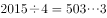，由口诀可得出原式的个位数等于的个位数。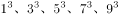的个位数分别为1、7、5、3、9，1+7+5+3+9=25，所以原式的个位数是5。

故正确答案为B。

---

### 第 2 题　qid 2262891 · 数学运算

有一只机械手表，每小时慢2分钟，某天中午11:50的时候，把手表调成了标准时间，那么当这只手表走到第二天中午12:00时，此时的标准时间是：

- **A**. 12:50　✅
- **B**. 13:00
- **C**. 12:48
- **D**. 13:02

**答案**：A

**官方解析**

根据题意可知，手表与标准时间的速度比为。从前一天11:50到第二天12点，手表共走了24小时10分钟，即1450分钟。则标准时间过了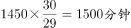，，此时标准时间为第二天的12:50。

故正确答案为A。

---

### 第 3 题　qid 2262894 · 数学运算

某设计公司设计了十款不同款式的运动鞋并把图纸送往工厂加工生产，其中有六个款式每个款式各加工生产运动鞋2双，有两个款式每个款式各加工生产运动鞋3双，有两个款式每个款式各加工生产运动鞋6双，若设计师要去厂里抽验运动鞋的生产质量，那么从中至少抽验(  )双运动鞋，才能保证抽出的运动鞋中至少3双的款式相同。

- **A**. 24
- **B**. 25
- **C**. 23
- **D**. 21　✅

**答案**：D

**官方解析**

最不利构造问题，想要保证抽出的运动鞋中至少3双的款式相同，可先考虑最不利情况。即每种款式各抽出两双，为2×10=20双，此时再抽出任意一双即可满足题意要求，为双。

故正确答案为D。

---

### 第 4 题　qid 2262972 · 数学运算

“六一”儿童节，某海洋公园到检票时间有许多家长和儿童在门口等候，假定每分钟到的游客人数一样多。从开始检票到等候的队伍消失，若同时开3个检票口需40分钟，若同时开5个检票口需20分钟，那么同时开6个检票口需（    ）分钟。

- **A**. 10
- **B**. 12
- **C**. 15
- **D**. 16　✅

**答案**：D

**官方解析**

设原有游客y，每分钟到达游客为x，根据牛吃草公式可得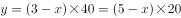，解得，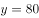。那么同时开放6个检票口时，解得分钟。

故正确答案为D。

---

### 第 5 题　qid 2262975 · 数学运算

桌上有甲乙两个水果篮，甲篮里有苹果40个，梨10个，乙篮里有苹果33个，梨47个，从乙篮里去取出一些水果放入甲篮，发现甲篮里的苹果和梨的数量之比变为7:3，乙篮变为2:3，则从乙篮中共取出了（    ）个水果放入甲篮。

- **A**. 15
- **B**. 20　✅
- **C**. 25
- **D**. 30

**答案**：B

**官方解析**

根据题意可知，从乙篮取出一部分放到甲篮后，甲篮比例变为7:3，则甲篮总数一定为的倍数。甲篮原有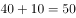个，是10的倍数，则从乙篮拿出来的部分也应是10的倍数，可排除A、C两项。

代入B项，甲篮总数变为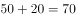个，苹果为个，梨为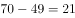个。分别增加个，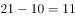个。乙篮总数变为个，苹果为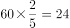个，梨为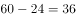个。分别减少个， 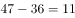个，且苹果与梨的比例为。

B项符合题意所有要求，无需验证D项。

故正确答案为B。

---

### 第 6 题　qid 2262977 · 数学运算

某公司春节7天假期安排员工值班，要求值班的员工每人任选不连续的2天值班，则至少需要安排（    ）人，才能保证每天至少有4人值班。

- **A**. 14　✅
- **B**. 21
- **C**. 45
- **D**. 63

**答案**：A

**官方解析**

每天有4人值班，一共有7天，则值班共需4×7=28人次，每个人都值班两天，所以共需要28÷2=14人。14人不连续2天值班，具体值班方式有很多，随机列举一种如下表：

注：数字1-14指的是14个不同的人

故正确答案为A。

---

### 第 7 题　qid 2262983 · 数学运算

甲、乙二人单独去做一件工作，如果甲工作效率提高，则可提前2天完工；如果乙工作效率降低，则要延后2天完工。若二人合作几天能完成？

- **A**. 3天
- **B**. 4天　✅
- **C**. 5天
- **D**. 6天

**答案**：B

**官方解析**

根据题意可知，甲工作效率提升前与提升后效率之比为。总量相同，效率与时间成反比，则时间之比为6:5。提升后比提升前时间少了1份，又已知工作提前2天完工，所以，可知甲提升前、后完成时间分别为12天、10天。

同理，乙工作效率降低前与降低后效率之比为，则时间之比为。降低后比降低前多了一份，又已知延后2天完工，所以，可知降低前、后时间分别为6天、8天。

甲单独完工需12天，乙单独完工需6天，12和6的最小公倍数12为工作总量，则效率分别为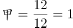，。故甲乙合作时间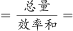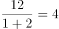天。

故正确答案为B。

---

### 第 8 题　qid 2262984 · 数学运算

小张的母亲买了一袋米，若只有小张和母亲在家18天吃完，若母亲和父亲在家15天吃完，若三人同时在家10天吃完。则小张一人在家时，吃完整袋大米需（    ）天。

- **A**. 32
- **B**. 30　✅
- **C**. 28
- **D**. 25

**答案**：B

**官方解析**

题干给定三个不同的完成时间，可用赋总量的方法解题。

第一步，赋总量，将总量赋为时间18、15、10的最小公倍数90。

第二步，求效率，小张与母亲的效率之和为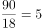，母亲与父亲的效率之和为，三人效率和为。

第三步，列式求解。，则小张单独吃完需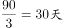。

故正确答案为B。

---

### 第 9 题　qid 2262987 · 数学运算

某公司为了增加员工凝聚力，将276名员工分成三个组搞活动，第一组与第二组的人数之比是4：5，第二组比第三组多4人。第三组有（    ）人。

- **A**. 96　✅
- **B**. 93
- **C**. 92
- **D**. 91

**答案**：A

**官方解析**

设第二组为5x人，则第一组为4x人，第三组为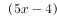人。根据题意可列方程，，解得人，则人。

故正确答案为A。

---

### 第 10 题　qid 2262989 · 数学运算

某公司组织一次健康知识普及竞赛，主办的部门准备了若干间教室作为考室，如果每间考室安排25人，还余15人没有考室，如果安排30人，不仅多了一个教室还有一间教室安排的人少于8人，则主办方准备了（    ）间教室。

- **A**. 10
- **B**. 12
- **C**. 14　✅
- **D**. 15

**答案**：C

**官方解析**

设共有x间教室，每间安排30人时，最后一间有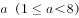人。根据题意可列方程，，化简得，根据倍数特性5x和75均为5的倍数，因此a也是5的倍数，又已知，所以，代入方程得。

故正确答案为C。

---

## 判断推理

### 第 1 题　qid 2262991 · 图形推理

从所给的四个选项中，选择最合适的一个填入问号处，使之呈现一定的规律性：

- **A**. A
- **B**. B　✅
- **C**. C
- **D**. D

**答案**：B

**官方解析**

元素组成相似，优先考虑样式规律。观察发现，第一组图中，第二个图叠加在第一个图之上，同时中间封闭空间内的线条与第二个图形封闭空间外部的线条相连，得到第三个图。第二组图应用规律，第二个图叠加在第一个图之上，同时中间封闭空间内的线条与第二个图形封闭空间外部的线条相连，得到B项图形。
故正确答案为B。

---

### 第 2 题　qid 2262993 · 图形推理

从所给的四个选项中，选择最合适的一个填入问号处，使之呈现一定的规律性：

- **A**. A
- **B**. B　✅
- **C**. C
- **D**. D

**答案**：B

**官方解析**

元素组成相同，优先考虑位置规律。观察发现，第一组图中，线条依次逆时针旋转，且线条尾端的小箭头依次增加一个。第二组图应用规律，线条依次逆时针旋转，且线条尾端的小箭头依次增加一个，得到B项图形。

故正确答案为B。

---

### 第 3 题　qid 2262995 · 图形推理

从所给的四个选项中，选择最合适的一个填入问号处，使之呈现一定的规律性：

- **A**. A　✅
- **B**. B
- **C**. C
- **D**. D

**答案**：A

**官方解析**

元素组成相似，优先考虑样式规律。观察发现，第一组图中，第二个图上下翻转后与第一个图相加得到第三个图。第二组图应用规律，第二个图上下翻转后与第一个图相加，得到A项图形。
故正确答案为A。

---

### 第 4 题　qid 2262997 · 图形推理

从所给的四个选项中，选择最合适的一个填入问号处，使之呈现一定的规律性：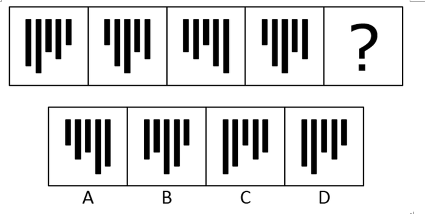

- **A**. A
- **B**. B
- **C**. C
- **D**. D　✅

**答案**：D

**官方解析**

元素组成相同，优先考虑位置规律。观察发现，每个柱子依次向右平移1、2、3、？步，故？处应选择一个在第三个图形基础上向右平移4步得到的图形，对应D项。
故正确答案为D。

---

### 第 5 题　qid 2262999 · 图形推理

从所给的四个选项中，选择最合适的一个填入问号处，使之呈现一定的规律性：

- **A**. A
- **B**. B
- **C**. C　✅
- **D**. D

**答案**：C

**官方解析**

元素组成相同，优先考虑位置规律。观察发现，外圈的圆弧依次顺时针旋转60°，中间部分的圆弧依次逆时针旋转45°，内圈的圆弧依次顺时针旋转60°，对应C项图形。
故正确答案为C。

---

### 第 6 题　qid 2263001 · 图形推理

从所给的四个选项中，选择最合适的一个填入问号处，使之呈现一定的规律性：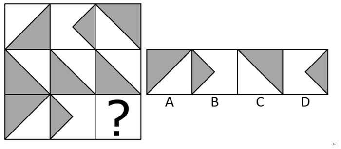

- **A**. A
- **B**. B　✅
- **C**. C
- **D**. D

**答案**：B

**官方解析**

元素组成相似，优先考虑样式规律。九宫格优先横行看，第一行图形中，第一个图形和第三个图形求同得到第二个图形；经验证，第二行也满足此规律；第三行应用规律，只有B项符合规律。
故正确答案为B。

---

### 第 7 题　qid 2263004 · 图形推理

把下面的六个图形分为两类，使每一类图形都有各自的共同特征或规律，分类正确的一项是：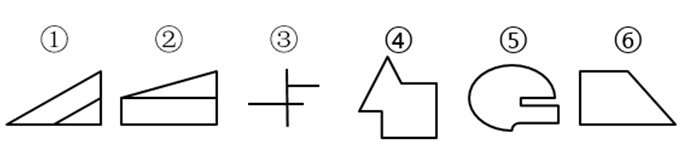

- **A**. ①②⑤  ③④⑥
- **B**. ①③⑤  ②④⑥
- **C**. ①④⑥  ②③⑤
- **D**. ①⑤⑥  ②③④　✅

**答案**：D

**官方解析**

元素组成不同，无明显属性规律，考虑数量规律。观察发现，图①⑤⑥的线条数依次为4、6、4，均为偶数，图②③④的线条数依次为5、3、7，均为奇数，即图①⑤⑥为一组，图②③④为一组，对应D项。
故正确答案为D。

---

### 第 8 题　qid 2263006 · 图形推理

把下面的六个图形分为两类，使每一类图形都有各自的共同特征或规律，分类正确的一项是：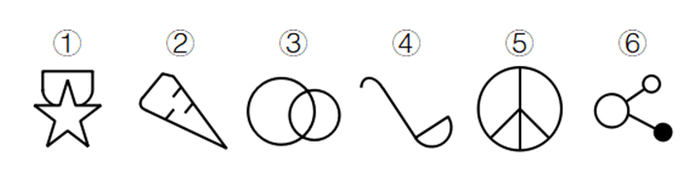

- **A**. ①②④  ③⑤⑥
- **B**. ①③⑥  ②④⑤　✅
- **C**. ①④⑥  ②③⑤
- **D**. ①⑤⑥  ②③④

**答案**：B

**官方解析**

元素组成不同，无明显属性规律，考虑数量规律。观察发现，图①③⑥均有2条曲线为一组，图②④⑤均有1条曲线为一组，对应B项。
故正确答案为B。

---

### 第 9 题　qid 2263009 · 图形推理

把下面的六个图形分为两类，使每一类图形都有各自的共同特征或规律，分类正确的一项是：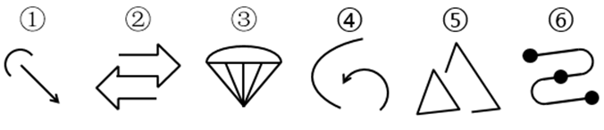

- **A**. ①②③  ④⑤⑥
- **B**. ①③④  ②⑤⑥
- **C**. ①③⑤  ②④⑥
- **D**. ①④⑤  ②③⑥　✅

**答案**：D

**官方解析**

元素组成不同，无明显属性规律，考虑数量规律。观察发现，图①④⑤均有2个部分为一组，图②③⑥均有1个部分为一组，对应D项。
故正确答案为D。

---

### 第 10 题　qid 2263011 · 图形推理

左边给定的是纸盒的外表面，右边哪一项能由它折叠而成？

- **A**. A
- **B**. B
- **C**. C
- **D**. D　✅

**答案**：D

**官方解析**

将原图标注如下图，逐一进行分析

A项：根据展开图所示的线条，折叠后应有一条与上下边平行的弧线，与A项所示线条不一致，错误，排除；

B项：如上图所示，展开图中黑色顶面到标红交点之间竖向弧线的方向为左上到右下，与B项所示线条方向不一致，错误，排除；

C项：根据展开图所示的线条，横线折叠后应为一条与上下边平行的弧线，与C项所示线条不一致，错误，排除；

D项：如上图所示，展开图中白色顶面到标红交点之间竖向弧线的方向为左上到右下，与D项所示线条方向一致，正确，当选。

故正确答案为D。

---

### 第 11 题　qid 2263014 · 定义判断

正迁移也叫“助长性迁移”，是指一种学习对另一种学习起到积极的、促进的作用。
根据上述定义，下列中属于正迁移的是：

- **A**. 懂得英语的人很容易掌握法语　✅
- **B**. 地方方言对学习普通话有消极影响
- **C**. 语文学习不能区分一字多义、一字多音
- **D**. 在数学负数运算时错误使用正数的规则

**答案**：A

**官方解析**

第一步：找出定义关键词。
“一种学习对另一种学习”、“起到积极的、促进的作用”。
第二步：逐一分析选项。
A项：英语学习对法语学习能够起到积极的、促进的作用，符合“一种学习对另一种学习起到积极的、促进的作用”，符合定义，当选；
B项：方言的学习对普通话的学习起到消极的作用，不符合“起到积极的、促进的作用”，不符合定义，排除；
C项：只涉及一种学习内容，不符合“一种学习对另一种学习”，不符合定义，排除；
D项：只涉及一种学习内容，不符合“一种学习对另一种学习”，不符合定义，排除。
故正确答案为A。

---

### 第 12 题　qid 2263016 · 定义判断

职业倦怠，是一种由工作引发的心理枯竭现象，指个体在工作重压下产生的身心疲惫与耗竭的状态。
根据上述定义，下列中属于职业倦怠的是：

- **A**. 小王在连续打了两个小时羽毛球的情况下身心俱疲
- **B**. 小李最近一周都在加班，感觉身体吃不消，想要休息
- **C**. 老吴从事岗位工作已经10年了，长期的工作压力使得他对工作的热情下降，对前途感到无望　✅
- **D**. 老张才华横溢，工作能力强，但总是强迫其他同事以他为中心，同事们都觉得跟他共事很累

**答案**：C

**官方解析**

第一步：找出定义关键词。
“由工作引发的心理枯竭”，“工作重压下产生的身心疲惫与耗竭”。
第二步：逐一分析选项。
A项：打羽毛球，不符合“由工作引发的心理枯竭”，不符合定义，排除；
B项：小李是因为加班，身体吃不消，所以想要休息，并非由工作引发的心理枯竭，不符合定义，排除；
C项：长期工作压力使老吴对工作的热情下降，对前途无望，符合“由工作引发的心理枯竭”、也符合“工作重压下产生的身心疲惫与耗竭”，符合定义，当选；
D项：同事们感到压力是由老张引发的，不符合“由工作引发的心理枯竭”，不符合定义，排除。
故正确答案为C。

---

### 第 13 题　qid 2263018 · 类比推理

代位继承：是指有继承权的子女先于其父母死亡并有晚辈直系血亲的，其父母死后的遗产按法定继承方式继承时，先亡子女的晚辈直系血亲代替其继承地位，取得其应继承的遗产份额。
转继承：是指被继承人死亡后，遗产分割前，未放弃继承权的继承人也死亡的，其应得遗产份额转由他的继承人继承。
遗嘱继承：是按被继承人生前所立合法遗嘱继承遗产的继承方式。
典型例证：
（1）王某生前自书遗嘱一份，决定将其遗产的三分之一由父亲继承，另外三分之二由妻子和女儿继承。
（2）赵某的父亲死后，遗产分割前赵某暴病死亡，其本应继承父亲的20万元遗产，由赵某的妻子、子女、母亲继承。
（3）孙某死亡后，妻子李某继承他的遗产。
上述典型例证与定义存在对应关系的数目有：

- **A**. 0个
- **B**. 1个
- **C**. 2个　✅
- **D**. 3个

**答案**：C

**官方解析**

第一步：找出定义关键词。
代位继承：“有继承权的子女先于其父母死亡”、“有继承权的子女有晚辈直系血亲”、“先亡子女的晚辈直系血亲代替其继承地位取得其应继承的遗产份额”；
转继承：“被继承人死亡后，遗产分割前”、“未放弃继承权的继承人也死亡的”、“其应得遗产份额转由他的继承人继承”；
遗嘱继承：“按被继承人生前所立合法遗嘱继承遗产”。
第二步：逐一分析例证。
（1）按王某生前所立遗嘱继承遗产，符合遗嘱继承。
（2）赵某的父亲死后，遗产分割前，赵某死亡，其遗产由其妻子、子女、母亲继承，符合转继承。
（3）孙某妻子继承孙某遗产，不符合所给定义。
典型例证与定义存在对应关系的数目有2个。
故正确答案为C。

---

### 第 14 题　qid 2263024 · 定义判断

情感营销，就是把消费者的个人情感差异和需求作为企业品牌营销战略的中心，通过借助情感包装、情感促销、情感广告、情感口碑、情感设计等策略来实现企业的目标。它主要是和顾客、消费者之间的感情互动。
根据上述定义，下列属于情感营销的是：

- **A**. 某医院的主任医师经常受电视台邀请在电视节目中为广大市民讲解健康养生的方法
- **B**. 某楼盘在开盘前，开发商通过让有意购房者登记、交诚意金、张榜公布销售情况等方式，形成临时性缺货或只剩少数存量现象，造成楼市恐慌
- **C**. 某火锅店专注于服务细节，让每位顾客从进门到出门都体会到“五星级”的贴心服务，这种服务方式深深地打动了每位顾客　✅
- **D**. 某企业在西部地区通过“对原住民儿童的关怀教育”和“部落孩童助学计划”等公益活动，大大提高了自己的知名度和美誉度，树立了良好的企业形象

**答案**：C

**官方解析**

第一步：找出定义关键词。
“把消费者的个人情感差异和需求作为企业品牌营销战略的中心”、“主要是和顾客、消费者之间的感情互动”。
第二步：逐一分析选项。
A项：电视台不属于企业，且讲解健康养生的方法也不符合“和顾客、消费者之间的感情互动”，不符合定义，排除；
B项：开发商通过一系列策略造成楼市恐慌，不符合“和顾客、消费者之间的感情互动”，不符合定义，排除；
C项：火锅店让每位顾客都体会到“五星级”的贴心服务，符合“把消费者的个人情感差异和需求作为企业品牌营销战略的中心”，符合定义，当选；
D项：某企业通过公益活动树立了企业的良好形象，但不符合“和顾客、消费者之间的感情互动”，不符合定义，排除。
故正确答案为C。

---

### 第 15 题　qid 2263027 · 定义判断

蝴蝶效应：是指一个动力系统中，初始条件下微小的变化能带动整个系统的长期的巨大的连锁反应。
根据上述定义，下列中不宜用蝴蝶效应来解释的是：

- **A**. 君子慎始，差若毫厘，谬以千里
- **B**. 一个人小时候受到微小的心理刺激，长大后这个刺激会无限扩大
- **C**. 洛伦兹将仅仅相差0.0001的两个初始条件输入一个数学方程，结果得出的两条曲线不久就分道扬镳，相差甚远
- **D**. 一个干净的地方，人们不好意思丢垃圾，但一旦地上有垃圾出现时，人们就会毫不犹豫地开始丢弃垃圾，丝毫不觉羞愧　✅

**答案**：D

**官方解析**

第一步：找出定义关键词。
“初始条件下微小的变化”、“带动整个系统的长期的巨大的连锁反应”。
第二步：逐一分析选项。
A项：差若毫厘，谬以千里是指开始时虽然相差很微小，结果会造成很大的错误，符合“初始条件下微小的变化”、“带动整个系统的长期的巨大的连锁反应”，符合定义，排除；
B项：小时候受到微小的心理刺激，长大后这个刺激会无限扩大，符合“初始条件下微小的变化”、“带动整个系统的长期的巨大的连锁反应”，符合定义，排除；
C项：开始仅仅相差0.0001，最后得出的两条曲线分道扬镳，相差甚远，符合“初始条件下微小的变化”、“带动整个系统的长期的巨大的连锁反应”，符合定义，排除；
D项：一旦地上有垃圾时，人们就会开始丢弃垃圾，丝毫不觉羞愧，属于对不好的行为的效仿，不符合“初始条件下微小的变化”、“带动整个系统的长期的巨大的连锁反应”，不符合定义，当选。
本题为选非题，故正确答案为D。

---

### 第 16 题　qid 2263032 · 定义判断

发散思维又称“辐射思维”“放射思维”“多向思维”“扩散思维”“求异思维”，是指从一个目标出发，沿着各种不同的途径去思考，探求多种答案的思维。
根据上述定义，下列中属于发散思维的是：

- **A**. 某广告公司的设计员由“点”想到太阳、五子棋、球等，由“线”联系到一根绳子、一根头发、蚯蚓、电线等，由“面”想到海面、平原、足球场、宇宙等　✅
- **B**. 历史上东北发生了蝗虫灾害，某官员为研究治蝗之策，搜集了自战国以来有关蝗灾的资料
- **C**. 鲁班从野草叶子上锋利的齿和蝗虫大板牙上的小齿得到启示，经过反复实验，发明了锯子
- **D**. 某数学老师经过层层推理，终于证明了一道同学们证明不了的数学难题

**答案**：A

**官方解析**

第一步：找出定义关键词。
“从一个目标出发”、“沿着各种不同的途径去思考”、“探求多种答案的思维”。
第二步：逐一分析选项。
A项：由“点”“线”“面”出发，分别想到多种事物，符合“从一个目标出发”、“探求多种答案的思维”，符合定义，当选；
B项：从研治蝗虫之策出发，搜集关于蝗虫的资料，没有体现“沿着各种不同的途径去思考”，也没有体现“探求多种答案的思维”，不符合定义，排除；
C项：由带齿的叶子和蝗虫的牙得到启发发明锯子，没有体现“探求多种答案的思维”，不符合定义，排除；
D项：经过层层推理，证明数学难题，没有体现“沿着各种不同的途径去思考”，也没有体现“探求多种答案的思维”，不符合定义，排除。
故正确答案为A。

---

### 第 17 题　qid 2263035 · 类比推理

美术家：颜料：绘画

- **A**. 音乐家：钢琴：演奏　✅
- **B**. 文学家：书店：阅读
- **C**. 科学家：数据：实验
- **D**. 航海家：大海：航行

**答案**：A

**官方解析**

第一步：判断题干词语间逻辑关系。
美术家用颜料进行绘画，三者是主体、工具、行为的对应关系。
第二步：判断选项词语间逻辑关系。
A项：音乐家用钢琴进行演奏，三者是主体、工具、行为的对应关系，与题干逻辑关系一致，当选；
B项：文学家在书店进行阅读，三者是主体、地点、行为的对应关系，与题干逻辑关系不一致，排除；
C项：科学家用实验得出数据，数据是一种结果，三者是主体、结果、方式的对应关系，与题干逻辑关系不一致，排除；
D项：航海家在大海进行航行，三者是主体、地点、行为的对应关系，与题干逻辑关系不一致，排除。
故正确答案为A。

---

### 第 18 题　qid 2263037 · 类比推理

医生：患者：诊疗

- **A**. 乘警：乘客：购票
- **B**. 农民：农场：耕作
- **C**. 售货员：顾客：购物
- **D**. 服务员：食客：服务　✅

**答案**：D

**官方解析**

第一步：判断题干词语间逻辑关系。
医生诊疗患者，三者构成主谓宾结构。
第二步：判断选项词语间逻辑关系。
A项：乘警的工作对象是乘客，二者是对应关系，乘客购票，二者是主谓结构，与题干逻辑关系不一致，排除；
B项：农民在农场耕作，三者是主体、地点、行为的对应关系，与题干逻辑关系不一致，排除；
C项：售货员的工作对象是顾客，二者是对应关系，顾客购物，二者是主谓结构，与题干逻辑关系不一致，排除；
D项：服务员服务食客，三者构成主谓宾结构，与题干逻辑关系一致，当选。
故正确答案为D。

---

### 第 19 题　qid 2263038 · 类比推理

木材：木匠：家具

- **A**. 钢铁：冶炼：铁轨
- **B**. 食材：厨师：菜品　✅
- **C**. 陶土：窖口：陶器
- **D**. 果园：浇灌：果实

**答案**：B

**官方解析**

第一步：判断题干词语间逻辑关系。
木匠用木材制作家具，木匠是主体，木材与家具是原材料与成品的对应关系。
第二步：判断选项词语间逻辑关系。
A项：钢铁通过冶炼被制作铁轨，三者是原材料、工艺与成品的对应关系，与题干逻辑关系不一致，排除；
B项：厨师用食材制作菜品，厨师是主体，食材与菜品是原材料与成品的对应关系，与题干逻辑关系一致，当选；
C项：陶土在窑口中被制作成陶器，三者是原材料、加工地点与成品的对应关系，与题干逻辑关系不一致，排除；
D项：浇灌果园里的果树从而得到果实，果园是地点，浇灌是一种行为，果实是最终结果，与题干逻辑关系不一致，排除。
故正确答案为B。

---

### 第 20 题　qid 2263041 · 类比推理

通讯：手机：华为

- **A**. 航行：播音：飞机
- **B**. 运输：卡车：东风　✅
- **C**. 办公：电脑：佳能
- **D**. 商场：房屋：租赁

**答案**：B

**官方解析**

第一步：判断题干词语间逻辑关系。
手机可以用于通讯，二者是功能对应关系，华为是手机的一种品牌，二者是品牌对应关系。
第二步：判断选项词语间逻辑关系。
A项：飞机航行时可能需要播音，三者是对应关系，与题干逻辑关系不一致，排除；
B项：卡车可以用于运输，二者是功能对应关系，东风是卡车的一种品牌，二者是品牌对应关系，与题干逻辑关系一致，当选；
C项：电脑可以用于办公，二者是功能对应关系，但佳能不是电脑的一种品牌，二者不是品牌对应关系，与题干逻辑关系不一致，排除；
D项：商场属于房屋的一种，二者是种属关系，房屋可以用于租赁，二者是功能对应关系，与题干逻辑关系不一致，排除。
故正确答案为B。

---

### 第 21 题　qid 2263042 · 类比推理

中国：吴敬梓：《儒林外史》

- **A**. 法国：司汤达：《忏悔录》
- **B**. 印度：广博：《吉檀迦利》
- **C**. 西班牙：但丁：《神曲》
- **D**. 德国：歌德：《少年维特的烦恼》　✅

**答案**：D

**官方解析**

第一步：判断题干词语间逻辑关系。
吴敬梓是中国人，二者是国籍对应关系，吴敬梓是《儒林外史》的作者，二者是作者与作品的对应关系。
第二步：判断选项词语间逻辑关系。
A项：司汤达是法国人，二者是国籍对应关系，但《忏悔录》的作者是卢梭，二者不是作者与作品的对应关系，与题干逻辑关系不一致，排除；
B项：广博是古印度人，二者是国籍对应关系，但《吉檀迦利》的作者是泰戈尔，二者不是作者与作品的对应关系，与题干逻辑关系不一致，排除；
C项：但丁是意大利人，不是西班牙人，二者不是国籍对应关系，与题干逻辑关系不一致，排除；
D项：歌德是德国人，二者是国籍对应关系，歌德是《少年维特的烦恼》的作者，二者是作者与作品的对应关系，与题干逻辑关系一致，当选。
故正确答案为D。

---

### 第 22 题　qid 2263045 · 类比推理

列车员：火车

- **A**. 护士：医院　✅
- **B**. 旅客：轮船
- **C**. 程序员：编程
- **D**. 售货员：贩卖机

**答案**：A

**官方解析**

第一步：判断题干词语间逻辑关系。
列车员的工作地点是火车，二者是工作地点的对应关系。
第二步：判断选项词语间逻辑关系。
A项：护士的工作地点是医院，二者是工作地点的对应关系，与题干逻辑关系一致，当选；
B项：旅客可以在轮船上，但旅客不是一种职业，二者不是工作地点的对应关系，与题干逻辑关系不一致，排除；
C项：程序员的工作内容是编程，二者是工作内容的对应关系，与题干逻辑关系不一致，排除；
D项：售货员与贩售机的功能一致，二者是功能的对应关系，与题干逻辑关系不一致，排除。
故正确答案为A。

---

### 第 23 题　qid 2263047 · 类比推理

苦瓜：凉瓜

- **A**. 矮瓜：茄子　✅
- **B**. 四季豆：荟豆
- **C**. 菱白：高笋
- **D**. 黄花菜：汤肠菜

**答案**：A

**官方解析**

第一步：判断题干词语间逻辑关系。
苦瓜又称凉瓜，二者是全同关系。
第二步：判断选项词语间逻辑关系。
A项：矮瓜又称茄子，二者是全同关系，与题干逻辑关系一致，当选；
B项：四季豆又称芸豆，而非荟豆，与题干逻辑关系不一致，排除；
C项：高笋又称茭白，而非菱白，与题干逻辑关系不一致，排除；
D项：黄花菜又称忘忧草，而非汤肠菜，与题干逻辑关系不一致，排除。
故正确答案为A。

---

### 第 24 题　qid 2263049 · 类比推理

油墨：印刷：书籍

- **A**. 汽油：汽车：驱动
- **B**. 混凝土：建造：房屋　✅
- **C**. 药物：医生：疾病
- **D**. 运动员：比赛：成绩

**答案**：B

**官方解析**

第一步：判断题干词语间逻辑关系。
印刷书籍时需要油墨，三者是对应关系，且印刷书籍是动宾结构。
第二步：判断选项词语间逻辑关系。
A项：驱动汽车时需要汽油，但汽车与驱动的顺序反了，与题干逻辑关系不一致，排除；
B项：建造房屋时需要混凝土，三者是对应关系，且建造房屋是动宾结构，与题干逻辑关系一致，当选；
C项：医生治疗疾病时需要药物，但医生与疾病是主宾结构，与题干逻辑关系不一致，排除；
D项：运动员比赛时会有成绩，且比赛成绩是偏正结构，与题干逻辑关系不一致，排除。
故正确答案为B。

---

### 第 25 题　qid 2263052 · 逻辑判断

想成为医生的同学都会报考医学专业，王刚报考医学专业，那么他一定是想成为一名医生。
下述(  )项为真，最能支持上述论断。

- **A**. 有些医生是心理专业的毕业生
- **B**. 想成为医生的同学不一定非得报考医学专业
- **C**. 所有报考医学专业的同学都想成为一名医生　✅
- **D**. 只有医学专业毕业的同学，才有资格成为医生

**答案**：C

**官方解析**

第一步：找出论点和论据。
论点：王刚想成为一名医生。
论据：王刚报考医学专业。
第二步：逐一分析选项。
A项：有些医生是心理专业毕业生，与题干讨论的报考医学专业是否能得出想成为医生无关，是无关项，排除；
B项：想成为医生的同学不一定非得报医学专业，指出论点与论据不一定具有必然联系，是削弱项，排除；
C项：翻译为报考医学专业→想成为一名医生，建立了论据与论点之间的必然联系，是搭桥项，当选；
D项：翻译为有资格成为医生→医学专业，与题干讨论的报考医学专业是否能得出想成为医生无关，是无关项，排除。
故正确答案为C。

---

### 第 26 题　qid 2263053 · 逻辑判断

某公司举办羽毛球比赛，公司员工甲、乙和丙三人最多有两个人不能参加此项目比赛。
由此可得出：

- **A**. 甲、乙和丙三人都有机会参加比赛　✅
- **B**. 如果甲参加比赛，那么乙和丙都不能参加比赛
- **C**. 如果甲和乙都参加了比赛，那么丙就不能参加比赛
- **D**. 如果甲没有参加比赛，那么乙和丙都可以参加比赛

**答案**：A

**官方解析**

第一步：翻译题干。
“三人最多有两个人不能参加比赛”，即三个人至少有一人参加比赛。
第二步：逐一分析选项。
A项：三个人至少有一人参加比赛，说明甲、乙和丙三人都有机会参加比赛，可以得出，当选；
B项：如果甲参加比赛，根据题干条件，无法确定其他两人是否参加，排除；
C项：如果甲和乙都参加了比赛，根据题干条件，无法确定丙是否参加，排除；
D项：如果甲没有参加比赛，根据题干条件，只能得出乙和丙至少有一人参加比赛，无法得出两人都参加比赛，排除。
故正确答案为A。

---

### 第 27 题　qid 2263056 · 逻辑判断

近期猪肉价格有所回落，但不能因此减少对生猪饲养的关注，要保证猪肉价格的稳定就必须在其价格最低的时候下工夫，只有在这时保护养殖户的积极性，让其不退出生产，才能最终保持猪肉价格稳定。
据此，可以推出：

- **A**. 只要关注生猪，就能保护养殖户们的生产积极性
- **B**. 如果养殖户们退出生产，那么就不能保证猪肉价格不上涨　✅
- **C**. 只要关注生猪饲养，那么就能保证猪肉价格不上涨
- **D**. 只有在猪肉价格最低的时候，保护养殖户们的生产积极性才最有效

**答案**：B

**官方解析**

第一步：翻译题干。

①保证猪肉价格的稳定在其价格最低的时候下工夫

②最终保持猪肉价格稳定保护养殖户的积极性，让其不退出生产

第二步：逐一分析选项。

A项：翻译为关注生猪保护养殖户们的生产积极性，根据题干条件，关注生猪无法推出保护养殖户们的生产积极性，排除；

B项：翻译为养殖户们退出生产猪肉价格上涨，养殖户们退出生产是对条件②的否后，否后必否前，可以推出猪肉价格不稳定，即会上涨，当选；

C项：翻译为关注生猪饲养保证猪肉价格不上涨，根据题干条件，关注生猪无法推出猪肉价格不上涨，排除；

D项：翻译为最有效猪肉价格最低时保护养殖户们的生产积极性，题干中未提及最有效，属于无中生有，排除。

故正确答案为B。

---

### 第 28 题　qid 2263059 · 逻辑判断

某市公安局发布工作人员招聘公告，要求如下：具有研究生学历或者两年及以上基层工作经历。招聘方式分笔试和面试，只有笔试达到60分及格线的才能参加面试。
据此可判断：

- **A**. 进入面试的考生全部都具有研究生学历
- **B**. 小李未进入面试，他肯定不具备研究生学历
- **C**. 小刘进入了面试，他一定具有两年以上的基层工作经验
- **D**. 进入面试的考生可能具有研究生学历和两年及以上基层工作经验　✅

**答案**：D

**官方解析**

第一步：翻译题干。

①参加招聘具有研究生学历或者两年及以上基层工作经历

②参加面试笔试达到60分及格线

第二步：逐一分析选项。

A项：进入面试说明一定可以参加招聘，根据条件①，只能推出研究生学历和两年及以上基层工作经历至少有一个成立，无法推出都具有研究生学历，排除；

B项：小李没进入面试，是对条件②的否前，否前无必然性结论，排除；

C项：小刘进入面试说明一定可以参加招聘，根据条件①，只能推出研究生学历和两年及以上基层工作经历至少有一个成立，无法推出一定具有两年以上的基层工作经验，排除；

D项：进入面试说明一定可以参加招聘，根据条件①，可以推出可能具有研究生学历和两年及以上基层工作经验，当选。

故正确答案为D。

---

### 第 29 题　qid 2263062 · 逻辑判断

有些男士吸烟，所有男士都喜欢运动。

据此，可推出：

- **A**. 有些吸烟的男士喜欢运动　✅
- **B**. 有些喜欢运动的男士不吸烟
- **C**. 有些男士不吸烟，但喜欢运动
- **D**. 有些男士吸烟，但不喜欢运动

**答案**：A

**官方解析**

第一步：翻译题干。

①有些男士吸烟 

②男士喜欢运动

将条件①换位得到：有些吸烟男士

可以递推出：③有些吸烟男士喜欢运动

第二步：逐一分析选项。

A项：翻译为有些吸烟的男士喜欢运动，有些吸烟的男士是对条件③的肯前，肯前必肯后，可以推出喜欢运动，当选；

B项：翻译为有些喜欢运动的男士吸烟，有些喜欢运动的男士是对条件③的肯后，肯后无必然性结论，排除；

C项：翻译为有些男士吸烟且喜欢运动，是对条件①和②的肯前，肯前必肯后，可以推出吸烟且喜欢运动，而非吸烟，排除；

D项：翻译为有些男士吸烟 且 喜欢运动，是对条件①和②的肯前，肯前必肯后，可以推出吸烟且喜欢运动，而非喜欢运动，排除。

故正确答案为A。

---

### 第 30 题　qid 2263096 · 逻辑判断

某地的一个花园小区在2013年以前经常发生盗窃事件，在该小区业主强烈要求下，2013年该小区的物业管理部门在各个路段安装了摄像头，结果该花园小区的盗窃事件发生率明显下降。于是有小区业主说：“在各个路段安装摄像头对防治盗窃事件的发生起到了很大作用。”
下列（    ）项为真，最能加强上述结论。

- **A**. 当地的另外一个小区也在各个路段安装了摄像头，但却时常发生盗窃事件
- **B**. 从2013年开始，当地各个小区物业管理部门加强了保安巡逻，盗窃案件有所减少
- **C**. 另一个时常发生盗窃的小区，采取了其他不同的防盗措施，也起到了一定的效果
- **D**. 从2013年开始，该地区的盗窃案件有明显上升的趋势　✅

**答案**：D

**官方解析**

第一步：找出论点和论据。
论点：在各个路段安装摄像头对防治盗窃事件的发生起到了很大作用。
论据：2013年该小区的物业管理部门在各个路段安装了摄像头，结果该花园小区的盗窃事件发生率明显下降。
第二步：逐一分析选项。
A项：举例说明安装摄像头也无法防治盗窃，削弱了论点，排除；
B项：加强保安巡逻后，减少了盗窃，与题干讨论的安装摄像头是否能防治盗窃无关，是无关项，排除；
C项：另一个小区采取其他措施得到一定的效果，与题干讨论的安装摄像头是否能防治盗窃无关，是无关项，排除；
D项：该地区2013年开始盗窃案件明显上升，但是该小区的盗窃案却减少了，说明摄像头确实起到了作用，补充论据加强，当选。
故正确答案为D。

---

## 资料分析

### 材料 1

        2013年，全国林产品出口644.55亿美元，同比增长，增幅比上年增加3.18个百分点，占全国商品出口额的。林产品进口640.88亿美元，同比增加，增幅比上年增加8.58个百分点，占全国商品进口额的。其中，非木质林产品出口162.3亿美元，同比增加，进口288.80亿美元，同比下降。

#### 第 1 题　qid 2263114 · 综合

2013年全国商品进出口总额约为多少亿美元？

- **A**. 1285
- **B**. 10891
- **C**. 25140
- **D**. 41553　✅

**答案**：D

**官方解析**

根据题干“2013年全国商品进出口总额”，结合材料“占全国商品出口额的2.92%、占全国商品进口额的”，可判定此题为现期比重问题。定位文字材料，“2013年，全国林产品出口644.55亿美元，占全国商品出口额的，林产品进口640.88亿美元，占全国商品进口额的”。根据总量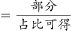，2013年全国商品进出口额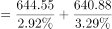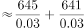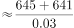亿美元，与D项最接近。

故正确答案为D。

---

#### 第 2 题　qid 2263117 · 比重

2013年木质林出口额占林产品出口总额的比重约为：

- **A**. 

- **B**. 

- **C**. 

- **D**. 
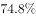
　✅

**答案**：D

**官方解析**

根据题干“2013年······占······的比重”，结合材料时间为2013年，可判定此题为现期比重问题。定位文字材料可得，“2013年全国林产品出口644.55亿美元，其中非木质林产品出口162.3亿美元”。可得木质林出口额亿美元，故2013年木质林出口额占林产品出口总额的比重为 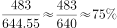，与D项最接近。

故正确答案为D。

---

#### 第 3 题　qid 2263118 · 增长

下列木质林产品中，2013年出口量同比增长最大的是：

- **A**. 原木
- **B**. 胶合板　✅
- **C**. 纤维板
- **D**. 刨花板

**答案**：B

**官方解析**

根据题干“······同比增长最大”，可判定本题为增长量比较问题。定位表格可得各项数据2013年具体出口量及增长率，根据增长量计算公式，，计算各项增长量进行比较即可。

A项：定位表格可得，2013年原木出口量1.31万立方米，同比增长。则增长量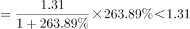万立方米；

B项：定位表格可得，2013年胶合板出口量1026.34万立方米，同比增长。则增长量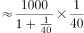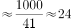万立方米；

C项：定位表格可得，2013年纤维板出口量306.87万立方米，同比增长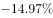。增长量为负数，排除；

D项：定位表格可得，2013年刨花板出口量27.13万立方米，同比增长。则增长量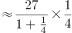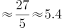万立方米。

比较可知，2013年出口量增长最多的为胶合板。

故正确答案为B。

---

#### 第 4 题　qid 2263119 · 增长

下列木质林产品中，2013年进出口差值的绝对量比上年有所缩小的是：

- **A**. 原木
- **B**. 锯材
- **C**. 刨花板　✅
- **D**. 纸和纸制品

**答案**：C

**官方解析**

根据题干“···进出口差值的绝对量比上年有所缩小”，可判定本题为基期和差问题。

A项：定位表格可得，2013年原木出口量1.31万立方米，同比增长，进口量4515.94万立方米，同比增长。现期差绝对值为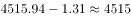，基期差为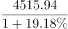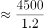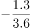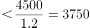，现期差大于基期差，即差值比上年扩大，排除；

B项：定位表格可得，2013年锯材出口量45.82万立方米，同比增长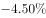，进口量2404.30万立方米，同比增长。现期差绝对值为，基期差为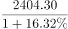，其中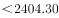，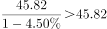，则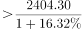，现期差大于基期差，即差值比上年扩大，排除；

C项：定位表格可得，2013年刨花板出口量27.13万立方米，同比增长。进口量58.68万立方米，同比增长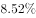。现期差绝对值为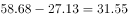，基期差为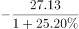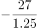。现期差小于基期差，即差值比上年缩小，正确；

D项：定位表格可得，2013年纸和纸制品出口量762.23万吨，同比增长，进口量297.12万吨，同比增长。现期差绝对值为，基期差为，其中，，则，现期差大于基期差，即差值比上年扩大，排除。

故正确答案为C。

---

#### 第 5 题　qid 2263120 · 综合

下列说法中与上述资料相符的是：

- **A**. 
2011年我国林产品进出口实现贸易顺差

- **B**. 
2013年木质林产品出口额同比增速超过

- **C**. 
2013年胶合板、纤维板和刨花板的出口总量低于上年
　✅
- **D**. 
2013年木家具进口额占木质林产品进口额的比重超过

**答案**：C

**官方解析**

A项：定位文字材料可得，2013年全国林产品出口644.55亿美元，同比增长，增幅比上年增加3.18个百分点，则2012年增长率。林产品进口640.88亿美元，同比增加，增幅比上年增加8.58个百分点，则2012年增长率。根据间隔增长率公式可得，2013年相较于2011年，林产品出口增长率为。进口增长率为。则2011年出口量为，进口量为，出口小于进口为逆差，错误；

B项：定位文字材料可得，2013年全国林产品出口644.55亿美元，同比增长，其中非木质林产品出口162.3亿美元，同比增加。根据混合口诀“混合居中但不中，偏向基数较大的”可知，2013年木质林产品出口额同比增速，错误；

C项：定位表格可得，2013年胶合板出口1026.34万立方米，同比增长，纤维板出口306.87万立方米，同比增长，刨花板出口27.13万立方米，同比增长。三者同比增长量分别为万立方米、万立方米、万立方米。根据可得，，，正确；

D项：定位文字材料可得，2013年全国林产品进口640.88亿美元，其中，非木质林产品进口288.80亿美元。则木质林产品进口亿美元。定位表格可得，2013年木家具进口额7.08亿美元，则2013年木家具进口额占木质林产品进口额的比重为，错误。

故正确答案为C。

---

### 材料 2

#### 第 6 题　qid 2263124 · 综合

2006-2013年，四川省粮食总产量从哪一年开始突破3000万吨？

- **A**. 2006年
- **B**. 2007年　✅
- **C**. 2008年
- **D**. 2009年

**答案**：B

**官方解析**

定位表格材料可得，2006年四川省粮食总产量为。2007年粮食总产量为，故从2007年开始粮食总产量突破3000万吨。

故正确答案为B。

---

#### 第 7 题　qid 2263126 · 增长

下列四项中，2013年产量同比下降幅度最大的是：

- **A**. 豆类　✅
- **B**. 薯类
- **C**. 棉花
- **D**. 甘蔗

**答案**：A

**官方解析**

根据题干“…同比下降幅度最大”，可判定本题为增长率比较问题。定位表格材料可得，2012、2013年各项产量具体数值，根据增长率计算公式，计算出各项增长率进行比较即可。

A项：定位表格材料可得，2012年豆类产量109.0万吨，2013年产量92.1万吨。；

B项：定位表格材料可得，2012年薯类产量483.7万吨，2013年产量479.7万吨。

C项：定位表格材料可得，2012年棉花产量1.33万吨，2013年产量1.31万吨。

D项：定位表格材料可得，2012年甘蔗产量61.3万吨，2013年产量56.9万吨。

比较可知，下降幅度最大的为豆类。

故正确答案为A。

---

#### 第 8 题　qid 2263127 · 增长

下列年份中，油料产量同比增速最快的是哪一年?

- **A**. 2007年
- **B**. 2008年　✅
- **C**. 2009年
- **D**. 2010年

**答案**：B

**官方解析**

根据题干“······同比增速最快”，可判定本题为增长率比较问题。定位表格材料可得，2006-2013年油料产量具体数值，根据增长率计算公式增长率，计算出各年增长率进行比较即可。

A项2007年：定位表格材料可得，2006年油料产量217.3万吨，2007年产量228.5万吨。增长率；

B项2008年：定位表格材料可得，2007年油料产量228.5万吨，2008年产量249.9万吨。增长率；

C项2009年：定位表格材料可得，2008年油料产量249.9万吨，2009年产量261.8万吨。增长率；

D项2010年：定位表格材料可得，2009年油料产量261.8万吨，2010年产量268.5万吨。增长率。

比较可知，同比增速最快的是2008年。

故正确答案为B。

---

#### 第 9 题　qid 2263129 · 比重

2013年谷物占粮食总产量的比重与上年相比：

- **A**. 降低了5个百分点
- **B**. 降低了1个百分点
- **C**. 提高了1个百分点　✅
- **D**. 提高了5个百分点

**答案**：C

**官方解析**

根据题干“2013年······占······的比重与上年相比”，可判定本题为两期比重比较问题。定位表格可得，2012年谷物产量2723.0万吨，豆类109.0万吨，薯类483.7万吨，2013年谷物产量2815.3万吨，豆类92.1万吨，薯类479.7万吨。2012年谷物占比为，2013年占比为。，即提高1个百分点。

故正确答案为C。

---

#### 第 10 题　qid 2263131 · 综合

关于2006-2013年间四川省部分农产品产量情况，下列说法正确的是：

- **A**. 棉花和甘蔗产量的变化趋势相同
- **B**. 薯类产量最高的年份油料产量也最高
- **C**. 2013年比2006年产量增幅最大的是谷物
- **D**. 谷物产量始终是豆类和薯类产量之和的4倍以上　✅

**答案**：D

**官方解析**

A项：定位表格可得，2011年棉花产量同比上升，甘蔗产量同比下降，两者变化趋势不同，错误；

B项：定位表格可得，薯类产量最高的年份为2012年，油料产量最高的年份为2013年，并不相同，错误；

C项：定位表格可得，2006年谷物产量2371.1万吨，豆类产量91.6万吨，薯类产量397.1万吨，油料产量217.3万吨，棉花产量1.57万吨，甘蔗产量124.6万吨。2013年谷物产量2815.3万吨，豆类产量92.1万吨，薯类产量479.7万吨，油料产量290.4万吨，棉花产量1.31万吨，甘蔗产量56.9万吨。其中豆类产量近乎相等，棉花、甘蔗为负增长，因此只需比较剩余三者。根据可得，谷物增长率为；薯类增长率为，，可知谷物增幅不是最大的，错误；

D项：定位表格可得，2006年谷物产量2371.1万吨，豆类产量91.6万吨，薯类产量397.1万吨。，同理可得，每年谷物产量均高于豆类和薯类产量之和的4倍，正确。

故正确答案为D。

---
