# 2016年天津选调生选拔考试 综合知识试卷（精选）

> 选调生 · 2016 年 · 5 个模块 · 共 131 题

- [政治理论](#%E6%94%BF%E6%B2%BB%E7%90%86%E8%AE%BA) · 7 题
- [常识判断](#%E5%B8%B8%E8%AF%86%E5%88%A4%E6%96%AD) · 83 题
- [言语理解与表达](#%E8%A8%80%E8%AF%AD%E7%90%86%E8%A7%A3%E4%B8%8E%E8%A1%A8%E8%BE%BE) · 19 题
- [数量关系](#%E6%95%B0%E9%87%8F%E5%85%B3%E7%B3%BB) · 7 题
- [判断推理](#%E5%88%A4%E6%96%AD%E6%8E%A8%E7%90%86) · 15 题

---

## 政治理论

### 第 1 题　qid 2262961 · 新思想

中国共产党党员标准主要是由（   ）决定的。

- **A**. 党的工人阶级先锋队性质　✅
- **B**. 党在各个时期的方针政策
- **C**. 党的优良传统和作风
- **D**. 党的初级阶段基本路线

**答案**：A

**官方解析**

本题考查政治常识。
A项正确，根据《中国共产党章程》第2条规定：中国共产党党员是中国工人阶级的有共产主义觉悟的先锋战士。中国共产党是中国工人阶级的先锋队，同时是中国人民和中华民族的先锋队，是中国特色社会主义事业的领导核心，代表中国先进生产力的发展要求，代表中国先进文化的前进方向，代表中国最广大人民的根本利益。
B项错误，该选项与共产党员的标准无关。
C项错误，党的三大优良作风是指理论与实际相结合的作风、与人民群众紧密地联系在一起的作风以及批评与自我批评的作风。选项与题干无关。
D项错误，1987中共第十三次全国代表大会指出：党的初级阶段基本路线是“一个中心、两个基本点”。一个中心，即以经济建设为中心；两个基本点，即四项基本原则和改革开放。选项与题干无关。
故正确答案为A。

---

### 第 2 题　qid 2262965 · 新思想

在党的全国代表大会闭会期间，（   ）执行全国代表大会的决议，领导党的全部工作，对外代表中国共产党。

- **A**. 党的中央委员会　✅
- **B**. 党的中央书记处
- **C**. 党的中央政治局
- **D**. 党的中央军事委员会

**答案**：A

**官方解析**

本题考查政治常识。
A项正确，根据《中国共产党章程》第22条规定：在全国代表大会闭会期间，中央委员会执行全国代表大会的决议，领导党的全部工作，对外代表中国共产党。
B项错误，中国共产党中央书记处是中央政治局和它的常务委员会的办事机构。与题干无关。
C项错误，中国共产党中央政治局，简称中共中央政治局或中央政治局，是中国共产党的中央领导机构之一。中央政治局的领导工作，严格按照党的全国代表大会和中央委员会的决议，按照民主集中制的原则进行。与题干无关。
D项错误，中国共产党中央军事委员会是中国共产党领导下的最高军事领导机构，简称（中共）中央军委。其主要职能是：直接领导全国武装力量。与题干无关。
故正确答案为A。

---

### 第 3 题　qid 2263017 · 时事政治

2015年10月12日，中共中央政治局召开会议，审议通过（   ），该法规是中国共产党执政以来第一部坚持正面倡导、面向全体党员的规范全党廉洁自律工作的重要基础性法规。

- **A**. 《中国共产党廉洁从政准则》
- **B**. 《中国共产党廉洁自律准则》　✅
- **C**. 《党员领导干部廉洁从政准则》
- **D**. 《党员领导干部廉洁自律准则》

**答案**：B

**官方解析**

本题考查政治常识。
A项错误，正确名称为《中国共产党党员领导干部廉洁从政若干准则》，于2009年12月29日，中共中央政治局召开会议审议通过，《中国共产党廉洁自律准则》自2016年1月1日起实施，《中国共产党党员领导干部廉洁从政若干准则》同时废止。
B项正确，2015年10月12日，中共中央政治局召开会议，研究制定国民经济和社会发展第十三个五年规划重大问题，审议通过《中国共产党廉洁自律准则》《中国共产党纪律处分条例》。《中国共产党廉洁自律准则》全文共8条、281字，包括导语、党员廉洁自律规范和党员领导干部廉洁自律规范。
C项错误，名称说法有误。
D项错误，名称说法有误。
故正确答案为B。

---

### 第 4 题　qid 2263028 · 新思想

党的十八大报告指出，解放和发展社会生产力是中国特色社会主义的：

- **A**. 本质特征
- **B**. 内在需求
- **C**. 必由之路
- **D**. 根本任务　✅

**答案**：D

**官方解析**

本题考查政治常识。
A项错误，中国共产党的领导是中国特色社会主义最本质的特征。
B项错误，公平正义是中国特色社会主义的内在要求。
C项错误，改革开放是坚持和发展中国特色社会主义的必由之路。
D项正确，解放和发展社会生产力是解决社会基本矛盾的根本手段、是促进社会进步的根本动力。中国特色社会主义道路的开辟和发展的关键是抓住了经济建设的中心，一以贯之地把解放和发展社会生产力当作社会主义的根本任务。
故正确答案为D。

---

### 第 5 题　qid 2263033 · 时事政治

2015年10月26日至29日，在北京召开中国共产党第十八届中央委员会第五次全体会议。下列选项属于该会议内容的是：

- **A**. 审议通过了《国务院机构改革和职能转变方案》
- **B**. 审议通过了《中共中央关于全面推进依法治国若干重大问题的决定》
- **C**. 审议通过了《中共中央关于全面深化改革若干重大问题的决定》
- **D**. 审议通过了《中共中央关于制定国民经济和社会发展第十三个五年规划的建议》　✅

**答案**：D

**官方解析**

本题考查政治常识。
A项错误，党的十八届二中全会和十二届全国人大一次会议审议通过了《国务院机构改革和职能转变方案》。
B项错误，党的十八届四中全会审议通过了《中共中央关于全面推进依法治国若干重大问题的决定》。
C项错误，党的十八届三中全会审议通过了《中共中央关于全面深化改革若干重大问题的决定》。
D项正确，第十八届中央委员会第五次全体会议研究了关于制定国民经济和社会发展第十三个五年规划的建议。通过了《中共中央关于制定国民经济和社会发展第十三个五年规划的建议》和《中国共产党第十八届中央委员会第五次全体会议公报》。
故正确答案为D。

---

### 第 6 题　qid 2263086 · 新思想

2015年9月3日，习近平总书记在纪念中国人民抗日战争暨世界反法西斯战争胜利70周年大会上的讲话中宣布：中国将裁减军队员额50万。（  ）

- （选项）[]

**答案**：B

**官方解析**

本题考查政治常识。
2015年9月3日，习近平在纪念中国人民抗日战争暨世界反法西斯战争胜利70周年大会讲话中宣布，中国将裁减军队员额30万，并提出了历史所启示的伟大真理，即正义必胜、和平必胜、人民必胜。故“中国将裁减军队员额50万”的说法不正确。
故表述错误。

---

### 第 7 题　qid 2263108 · 新思想

中国共产党在抗日战争时期实行的土地政策是减租减息。（    ）

- （选项）[]

**答案**：A

**官方解析**

本题考查毛中特。
抗日战争时期中华民族的主要矛盾是民族矛盾，即中华民族与日本侵略者的矛盾。为有利于全民族抗战，中国共产党在敌后抗日根据地实行了“地主减租减息，农民交租交息”的土地政策。
故表述正确。

---

## 常识判断

### 第 1 题　qid 2262930 · 人文常识

破坏了生态平衡就会使人类受到自然规律的惩罚，这说明：

- **A**. 地理环境决定社会的发展
- **B**. 人类对自然规律是无能为力的
- **C**. 地理环境对人类社会有重要影响　✅
- **D**. 人和自然界存在着不可调节的矛盾或对立

**答案**：C

**官方解析**

本题考查政治常识。
A项错误，马克思历史唯物主义认为，社会存在是社会物质条件的总和，是人类社会存在和发展的物质生活条件。社会存在包括地理环境、人口因素和物质生活资料的生产方式。其中，地理环境是人类社会存在和发展的必要前提，可以加速或延缓社会历史的发展。但是，地理环境的这种作用并不是决定性的。地理环境决定社会的发展夸大了地理环境的重要性。
B项错误，该说法仅承认了自然规律的客观性，却否认了人在自然规律面前的主观能动性，人可以根据规律发生作用的条件和形式，利用规律。
C项正确，题干强调了人们在实践活动中遵循规律、保护生态环境的重要性，而生态环境属于社会存在范畴，题干表明生态环境即地理环境对人类社会发展有重要作用。
D项错误，人与自然界之间存在着一定的矛盾和冲突，但是二者不是根本对立的，人可以根据现实状况和条件对矛盾进行调节，从而缓和二者之间的矛盾或冲突。
故正确答案为C。

---

### 第 2 题　qid 2262935 · 人文常识

“物质是标志客观实在的哲学范畴”，这是：

- **A**. 辩证唯物主义的观点　✅
- **B**. 古代朴素唯物主义的观点
- **C**. 近代形而上学唯物主义的观点
- **D**. 客观唯心主义的观点

**答案**：A

**官方解析**

本题考查政治常识。
A项正确，马克思主义哲学中的辩证唯物主义认为，物质是标志客观实在的哲学范畴，它不依赖于人的意识并能为人的意识所反映，客观实在性是其唯一特性。
B项错误，古代朴素唯物主义是把物质归结为一种或几种实物的一种观点。如：水为万物的始基；世界是一团永恒燃烧的活火；气者，理之依也；五行说等。
C项错误，近代形而上学唯物主义的观点是把物质归结为原子，认为原子的属性就是一切物质形态的共同属性。
D项错误，客观唯心主义的观点是把世界的本原归结为脱离物质世界，并在人之外而独立存在的“客观精神”。如：盘古开天地、上帝创世纪、绝对观念论等。
故正确答案为A。

---

### 第 3 题　qid 2262937 · 人文常识

规律的客观性体现在：

- **A**. 是不可认识的
- **B**. 是不可利用的
- **C**. 是没有主观意志参与的
- **D**. 是可以认识、利用，又是不以人的意志为转移的　✅

**答案**：D

**官方解析**

本题考查政治常识。
A项错误，马克思主义哲学认为，规律具有可知性，人类可以认识规律。
B项错误，马克思主义哲学认为，规律具有可利用性，人们在规律面前不是无能为力的，人们可以认识规律，并且创造或改变某些条件从而利用规律。
C项错误，规律具有客观性，但是人们可以在实践过程中根据现实条件和特点发现和认识规律，即规律是有人的主观意志参与的。
D项正确，马克思主义哲学认为，规律是事物本身所固有的、本质的、必然的、稳定的联系，不以人的意志为转移。由此可见，规律具有客观性，人们不能创造规律、也不能消灭规律。但是，人们可以通过发挥主观能动性来认识、利用规律为自己服务。
故正确答案为D。

---

### 第 4 题　qid 2262939 · 法律常识

请指出下列哪个属于政治上层建筑的范畴？

- **A**. 哲学
- **B**. 道德
- **C**. 政治法律观点
- **D**. 政治法律制度　✅

**答案**：D

**官方解析**

本题考查政治常识。上层建筑是指建立在一定经济基础上的社会意识形态以及与之相适应的政治法律制度和设施等的总和。上层建筑包括政治上层建筑和思想上层建筑。
A、B、C项错误，思想上层建筑是指适应经济基础的社会意识形态，包括政治思想、法律思想、道德、艺术、哲学、美学、宗教、文化传媒等等。
D项正确，政治上层建筑是指人们在一定经济基础上建起的政治、法律制度以及建立的军队、警察、法庭、监狱、政府部门、党派等国家机器和政治组织。
故正确答案为D。

---

### 第 5 题　qid 2262942 · 人文常识

马克思主义哲学的本质特征是实践性基础上的：

- **A**. 同一性和斗争性的统一
- **B**. 斗争性和科学性的统一
- **C**. 科学性和革命性的统一　✅
- **D**. 革命性和实践性的统一

**答案**：C

**官方解析**

本题考查政治常识。
实践的观点是马克思主义哲学首要的基本的观点，是认识和改造世界的强大武器。马克思主义哲学把实践引入自己的哲学框架中，创立了科学的哲学体系，经受实践的反复检验，并用来指导人类解放自己、改变世界，具有科学性和革命性，这是马克思主义哲学的本质特征。马克思主义哲学第一次在实践的基础上实现了唯物主义和辩证法的有机统一、第一次实现了唯物辩证的自然观和历史观的有机统一、实现了实践基础上科学性和革命性的统一。因此，C项正确，ABD三项错误。
故正确答案为C。

---

### 第 6 题　qid 2262943 · 经济常识

市场经济：

- **A**. 与私有制相联系
- **B**. 与公有制相联系
- **C**. 与小生产相联系
- **D**. 是商品经济发展到社会化的必然产物　✅

**答案**：D

**官方解析**

本题考查经济常识。
A项错误，市场经济是资源配置的一种方式，无论何种所有制的经济都可以采用这种方式来配置资源，所以市场经济和私有制无必然联系。
B项错误，市场经济和公有制无必然联系。
C项错误，市场经济是资源配置的一种方式，小生产和大生产都可以采用这种方式来配置资源，所以市场经济和小生产无必然联系。
D项正确，市场经济（又称市场取向的经济）是指由市场进行资源调配的商品经济。市场经济是高度社会化和高度市场化的商品经济，是市场居于支配地位、市场机制发挥基础性调节作用的商品经济，是商品经济发展的高级阶段和高级形式。
故正确答案为D。

---

### 第 7 题　qid 2262945 · 法律常识

在股份有限公司的企业中，公司债权人只能对（  ）提出还债要求。

- **A**. 公司经理
- **B**. 公司股东
- **C**. 公司的资产　✅
- **D**. 公司的法律代理人

**答案**：C

**官方解析**

本题考查法律常识。
《公司法》第三条第一款规定：“公司是企业法人，有独立的法人财产，享有法人财产权。公司以其全部财产对公司的债务承担责任。”因此，ABD三项不符合题意，排除。
故正确答案为C。

---

### 第 8 题　qid 2262947 · 人文常识

利息的本质是：

- **A**. 剩余价值的特殊转化形式　✅
- **B**. 使用借贷资本支付的报酬
- **C**. 借贷资本的所有权的产物
- **D**. 具有自身特殊的运作形式

**答案**：A

**官方解析**

本题考查政治常识。
利息的本质是剩余价值的一种特殊表现形式，是职能资本家为取得货币资本的使用权而交给借贷资本家的一部分剩余价值。它体现着职能资本家和借贷资本家瓜分剩余价值的关系。因此，A项正确，BCD三项错误。
故正确答案为A。

---

### 第 9 题　qid 2262950 · 人文常识

解决商品内在的使用价值和价值的矛盾的关键是：

- **A**. 社会分工的存在
- **B**. 商品顺利通过交换　✅
- **C**. 劳动产品成为商品
- **D**. 生产资料私有制的存在

**答案**：B

**官方解析**

本题考查政治常识。
商品的内在使用价值和价值的矛盾是指人们不能同时占有同一商品的使用价值和价值，这一矛盾只能通过交换来解决。对于商品生产者来说(卖方)，生产商品的目的是为了取得价值，而要取得价值，就必须生产出不是供自己需要的使用价值并让渡过去；而商品买方购买商品的目的是得到商品的使用价值，为此就必须支付商品的价值。交换成功了，商品的使用价值和价值才能够分别得到实现，商品内部的矛盾才能得到解决。因此，B项正确，ACD三项错误。
故正确答案为B。

---

### 第 10 题　qid 2262952 · 人文常识

劳动形成价值是：

- **A**. 社会分工的存在
- **B**. 劳动的自然属性
- **C**. 商品经济关系赋予劳动的一种社会形式　✅
- **D**. 劳动在任何经济形式下的社会形式

**答案**：C

**官方解析**

本题考查政治常识。
凝结在商品中的无差别的一般人类劳动形成商品的价值。一般人类劳动是价值实体，可以形成价值，但它本身不是价值。只有在商品经济关系，商品生产者之间相互交换劳动的生产关系，才能体现出商品的价值，因此，价值是商品经济关系赋予劳动的一种社会形式，是商品的社会属性，也是商品的本质属性。
故正确答案为C。

---

### 第 11 题　qid 2262954 · 法律常识

关于犯罪构成认识正确的是：

- **A**. 犯罪客体是指受害人
- **B**. 十五周岁的人也可能负刑事责任　✅
- **C**. 单位不能构成犯罪主体
- **D**. 犯罪的过失不构成犯罪的主观方面

**答案**：B

**官方解析**

本题考查法律常识。犯罪构成是指依照我国刑法规定，决定某一具体行为的社会危害性及其程度，为该行为构成犯罪所必需的一切客观和主观要件的有机统一，是使行为人承担刑事责任的根据。任何一种犯罪的成立都必须具备四个方面的构成要件，即犯罪主体、犯罪主观方面、犯罪客体和犯罪客观方面。
A项错误，犯罪客体是指我国刑法所保护而为犯罪行为所侵犯的社会关系。
B项正确，《刑法》第十七条第一、二款规定：“已满十四周岁不满十六周岁的人，犯故意杀人、故意伤害致人重伤或者死亡、强奸、抢劫、贩卖毒品、放火、爆炸、投放危险物质罪的，应当负刑事责任。”
C项错误，犯罪主体是指实施危害社会的行为，依法应当负刑事责任的自然人或单位，因此单位可构成犯罪主体。
D项错误，犯罪主观方面是指犯罪主体对自己危害行为及其危害结果所持的心理态度，包括故意和过失。
故正确答案为B。
（备注：根据2021年3月1日起施行的《刑法修正案（十一）》，已满十六周岁的人犯罪，应当负刑事责任。已满十四周岁不满十六周岁的人，犯故意杀人、故意伤害致人重伤或者死亡、强奸、抢劫、贩卖毒品、放火、爆炸、投放危险物质罪的，应当负刑事责任。已满十二周岁不满十四周岁的人，犯故意杀人、故意伤害罪，致人死亡或者以特别残忍手段致人重伤造成严重残疾，情节恶劣，经最高人民检察院核准追诉的，应当负刑事责任。）

---

### 第 12 题　qid 2262956 · 人文常识

行政主体在行使国家赋予的行政职权，实施行政管理活动的过程中，所必须承担的法定义务，称为：

- **A**. 行政职权
- **B**. 行政优益权
- **C**. 行政职责　✅
- **D**. 行政权限

**答案**：C

**官方解析**

本题考查法律常识。
A项错误，行政职权是指国家行政权的转化形式，是依法定位到具体行政主体身上的国家行政权，是各行政主体实施国家行政管理活动的资格及其权能。
B项错误，行政优益权是国家为确保行政主体有效地行使职权，切实地履行职责，而以法律法规等形式赋予行政主体享有各种职务上或物质上优益条件的资格。
C项正确，行政职责是指行政主体在行使国家赋予的行政职权，实施国家行政管理活动的过程中，所必须承担的法定义务。
D项错误，行政权限是指法律规定的行政主体行使职权所不能逾越的范围或界限。 
故正确答案为C。

---

### 第 13 题　qid 2262957 · 法律常识

国务院依据全国人大常委会授权在经济体制改革和对外开放方面制定的暂行规定和条例属于：

- **A**. 一般授权立法
- **B**. 特别授权立法　✅
- **C**. 自主性立法
- **D**. 职权性立法

**答案**：B

**官方解析**

本题考查法律常识。
A项错误，一般授权立法是指国家行政机关直接依照宪法和有关组织法规定的职权制定行政法规和行政规章的活动。
B项正确，特别授权立法是指依据特定法律、法规授权或者依据国家权力机关或上级国家行政机关通过专门决议的委托，制定规范性法律文件行为。国务院依全国人大常委会授权在经济体制改革和对外开放方面制定的暂行规定和条例即属于特别授权立法。
C项错误，自主性立法是行政机关为履行法律赋予的职权，确定管理对象一定的行为规则而进行的行政立法活动。它是行政机关依据法律规定，在自己职权范围内，独立、自主地进行的立法活动。
D项错误，职权性立法是指行政机关根据行政管理活动的需要，在其职权范围内制定的行政法规和规章的立法形式。 
故正确答案为B。

---

### 第 14 题　qid 2262958 · 法律常识

在我国，公有公共设施致害导致的赔偿属于：

- **A**. 行政赔偿
- **B**. 司法赔偿
- **C**. 国家赔偿
- **D**. 民事赔偿　✅

**答案**：D

**官方解析**

本题考查法律常识。
A项错误，有些公有公共设施虽然是行政机关建立的，但建设本身不属于具体行政行为，也没有明确的行政相对人，不存在行政赔偿的说法。
B项错误，司法赔偿是指司法活动中出现错判而对当事人采取赔偿的行为。
C项错误，国家赔偿是指国家机关及其工作人员因行使职权给公民、法人及其他组织的人身权或财产权造成损害，依法应给予的赔偿。
D项正确，公有公共设施的设立人和其他种类标的物的所有人一样对其拥有的财物应当负有保管、保持其安全状态的义务。因公有公共设施造成他人损害的，其所有人或保管人应当承担民事损害赔偿责任。关于公有公共设施致害的赔偿问题，大多数国家和地区都将其纳入国家赔偿的范围。我国2013年《国家赔偿法》的修改却仍未将公有公共设施致害纳入国家赔偿范围，相关赔偿问题仍接受民法的调整，适用于民事赔偿。其中，国有公共设施行政管理机关应当承担民事赔偿责任。
故正确答案为D。

---

### 第 15 题　qid 2262959 · 法律常识

根据我国《宪法》和其他有关规定，全国行政编制总额的核定权和调整权属于：

- **A**. 全国人大
- **B**. 国务院　✅
- **C**. 国家机构编制委员会
- **D**. 人社部

**答案**：B

**官方解析**

本题考查法律常识。根据宪法及有关规定，全国行政编制的核定权和调整权属于国务院。在中央核定的编制总额内，中央各部门和地方各级党委、政府还要逐级分别核定和下达本系统、本区划内下一级具体地区相应的编制总额。核定编制总额一般只在机构改革或国家政治、经济、文化及社会发展发生较大变化时才实行。因此，ACD项不符合题意。
故正确答案为B。

---

### 第 16 题　qid 2262962 · 人文常识

党作为工人阶级的先进的政治组织，它的首要的基本的职能是通过（  ）来发挥自己先锋队的作用。

- **A**. 政治领导　✅
- **B**. 思想领导
- **C**. 组织领导
- **D**. 纪律领导

**答案**：A

**官方解析**

本题考查政治常识。
A项正确，根据《中国共产党章程》总纲规定：党的领导主要是政治、思想和组织的领导。政治领导，就是政治方向、政治原则、重大决策的领导，集中体现在党的路线、方针、政策方面。党作为工人阶级的先进的政治组织，它的首要的基本的职能是通过政治领导来发挥自己先锋队的作用。
B项错误，党的思想领导，就是理论观点、思想方法以至精神状态的领导，就是坚持以马克思列宁主义、毛泽东思想、邓小平理论和“三个代表”重要思想作为党和国家的指导思想，教育和武装广大党员和人民群众，向人民群众宣传党的路线、方针、政策，把党的主张变成人民群众的自觉行动。与题干无关。
C项错误，党的组织领导，就是通过党的各级组织、党的干部和广大党员，组织和带领人民群众为实现党的任务和主张而奋斗。组织领导主要是对干部的选拔和任用。党的组织领导是政治领导、思想领导的保证。与题干无关。
D项错误，不存在纪律领导的说法。
故正确答案为A。

---

### 第 17 题　qid 2262964 · 人文常识

1915年9月，陈独秀在（  ）创办《青年杂志》（后改名《新青年》杂志），标志着新文化运动的开始。

- **A**. 北京
- **B**. 上海　✅
- **C**. 广州
- **D**. 重庆

**答案**：B

**官方解析**

本题考查人文常识。
1915年9月，陈独秀在上海出版《青年杂志》(第二卷改名《新青年》),标志着一场彻底反封建的新文化运动的兴起。新青年运动沉重打击了统治中国2000多年的传统礼教，启发了人们的民主觉悟，推动了现代科学在中国的发展，为马克思主义在中国的传播和五四爱国运动的爆发奠定了思想基础。因此，B项正确，ACD三项错误。
故正确答案为B。

---

### 第 18 题　qid 2262966 · 人文常识

我们党是执政的党，党的执政地位是通过党对（  ）的领导来实现的。

- **A**. 国家政权机关　✅
- **B**. 广大人民群众
- **C**. 社会团体
- **D**. 人民团体

**答案**：A

**官方解析**

本题考查政治常识。
A项正确，中华人民共和国的成立，标志着中国历史进入新时期，中国共产党成为执政党。我们党是执政的党，党的执政地位，是通过党对国家政权机关的领导来实现的。如果放弃了这种领导，就谈不上执政地位。各级政权机关，包括人大、政府、法院、检察院和军队，都必须接受党的领导，任何削弱、淡化党的领导的想法和做法都是错误的。 
B项错误，党代表我国最广大人民的根本利益,与题干无关。
C项错误，社会团体，是指为一定目的由一定人员组成的社会组织，社会团体属于人民群众，与题干无关。
D项错误，人民团体指除政府、政府官方机构、企业公司和事业单位以外的团体组织总称。人民团体属于人民群众，与题干无关。
故正确答案为A。

---

### 第 19 题　qid 2262968 · 人文常识

邓小平同志指出：“贫穷不是社会主义，社会主义是要消灭贫穷”。这个论断：

- **A**. 指出了社会主义的根本任务
- **B**. 概括了社会主义生产的目的
- **C**. 明确了社会主义的发展方向
- **D**. 体现了社会主义的本质要求　✅

**答案**：D

**官方解析**

本题考查政治常识。
A项错误，社会主义的根本任务是发展生产力,这是邓小平反复强调并阐明的一个根本观点。党的十五大再次明确指出:“社会主义的根本任务是发展生产力。”与题干无关。
B项错误，社会主义的生产目的是最大限度地满足整个社会经常增长的物质和文化需要。与题干无关。
C项错误，社会主义的发展方向是国家富强、民族振兴、人民幸福,逐步并最终顺利实现共产主义。与题干无关。
D项正确，社会主义的本质，是解放生产力，发展生产力，消灭剥削，消除两极分化，最终达到共同富裕。最终达到共同富裕，就是消灭贫穷。
故正确答案为D。

---

### 第 20 题　qid 2262969 · 人文常识

社会主义社会发展的直接动力是：

- **A**. 改革　✅
- **B**. 开放
- **C**. 解放生产力
- **D**. 科技

**答案**：A

**官方解析**

本题考查政治常识。
A项正确，改革是新时期最鲜明的特点之一，也是邓小平理论最具特色的内容之一。改革是社会主义社会发展的直接动力，是中国的第二次革命，是实现社会主义现代化的必由之路。
B项错误，对外开放是我国的一项基本国策。与题干无关。
C项错误，解放生产力属于社会主义本质内容和社会主义根本任务之一，不是社会主义社会发展的直接动力。与题干无关。
D项错误，1988年9月5日,邓小平同志在与捷克斯洛伐克总统胡萨克会见时,提出了“科学技术是第一生产力”的重要论断。与题干无关。
故正确答案为A。

---

### 第 21 题　qid 2262971 · 人文常识

在判断一切工作是非得失的标准中，最基本的是是否有利于：

- **A**. 发展社会主义社会的生产力　✅
- **B**. 增强社会主义国家的综合国力
- **C**. 提高人民生活水平
- **D**. 维护国家的安定团结

**答案**：A

**官方解析**

本题考查政治常识。
A项正确，邓小平在1992年视察南方发表重要谈话提出三个有利于，三个有利于指的是：是否有利于发展社会主义社会的生产力、是否有利于增强社会主义国家的综合国力、是否有利于提高人民的生活水平。其中最根本的是是否有利于发展社会主义社会的生产力。
故正确答案为A。

---

### 第 22 题　qid 2262973 · 法律常识

检验真理的唯一标准是：

- **A**. 中央文件
- **B**. 宪法
- **C**. 生产力
- **D**. 实践　✅

**答案**：D

**官方解析**

本题考查政治常识。
A项错误，中央文件就是中央制发的文件。与题干无关；
B项错误，宪法是国家的根本大法，是治国安邦的总章程，规定国家的根本任务和根本制度，即社会制度、国家制度的原则和国家政权的组织以及公民的基本权利义务等内容。与题干无关；
C项错误，生产力指人类在生产过程中征服和改造自然界的能力。包括劳动力、劳动资料、劳动对象。与题干无关；
D项正确，1978年5月11日，《光明日报》发表本报特约评论员文章《实践是检验真理的唯一标准》，由此引发了一场关于真理标准问题的大讨论。文章指出，检验真理的标准只能是社会实践，理论与实践的统一是马克思主义的一个最基本的原则，任何理论都要不断接受实践的检验。
故正确答案为D。

---

### 第 23 题　qid 2262976 · 人文常识

股份合作制是在我国经济体制改革中出现的一种新的：

- **A**. 私有制经济实现形式
- **B**. 民营经济实现形式
- **C**. 国有经济实现形式
- **D**. 公有制经济实现形式　✅

**答案**：D

**官方解析**

本题考查经济常识。
A项错误，私有制经济指的是资本归个人所有的经济，包括资本所有者参加劳动和不参加劳动两种情况，还包括混合经济中的私有经济成分。私有制经济实现形式的内涵是：财产组织形式、企业经营方式、权益保护形式、观念认同形式、产权演变形式、资本人格的形式。与题干无关。
B项错误，民营经济是指除了国有和国有控股企业、外商和港澳台商独资及其控股企业以外的多种所有制经济的统称，具体实现形式包括国有民营经济、个体经济、私营经济、混合所有民营经济、民营科技企业、农民专业合作社等类型。与题干无关。
C项错误，国有经济指生产资料归国家所有的一种经济类型，是社会主义公有制经济的重要成分。它包括中央和地方各级国家机关、事业单位和社会团体使用国有资产投资举办的企业，也包括实行企业化经营，国家不再核拨经费或核拨部分经费的事业单位和从事经营性活动的社会团体，以及上述企业、事业单位和社会团体使用国有资金投资举办的企业。与题干无关。
D项正确，公有制的实现形式可以而且应该多样化，一切符合社会经济发展规律的实现形式都能够而且应该使用。公有制的实现形式不会影响公有制的性质，具体实现形式有：租赁、承包、股份合作制、股份制。其中股份制是最主要的实现形式。其中，股份合作制是以合作制为基础，吸收股份制的一些做法，劳动者的劳动联合和资本联合相结合形成的新型企业的组织形式。
故正确答案为D。

---

### 第 24 题　qid 2262979 · 人文常识

我国对公务员的管理实行的是（   ）制度。

- **A**. 党政干部单一的管理模式
- **B**. 对公务员集中统一管理的模式
- **C**. 分类管理
- **D**. 根据职位分类管理　✅

**答案**：D

**官方解析**

本题考查法律常识。根据《公务员法》第十四条规定：“国家实行公务员职位分类制度。公务员职位类别按照公务员职位的性质、特点和管理需要，划分为综合管理类、专业技术类和行政执法类等类别。”因此，ABC项不符合题意。
故正确答案为D。

---

### 第 25 题　qid 2262980 · 人文常识

科学发展观的本质和核心是：

- **A**. 坚持全面协调可持续发展
- **B**. 坚持统筹兼顾
- **C**. 坚持以人为本　✅
- **D**. 坚持以经济建设为中心

**答案**：C

**官方解析**

本题考查政治常识。
A项错误，全面协调可持续发展是科学发展观的基本要求。全面协调可持续发展指全面推进经济建设、政治建设、文化建设、社会建设，促进现代化建设各个环节、各个方面相协调，促进生产关系与生产力、上层建筑与经济基础相协调。
B项错误，统筹兼顾是科学发展观的根本方法，统筹兼顾指正确认识和妥善处理中国特色社会主义事业中的重大关系，统筹个人利益和集体利益、局部利益和整体利益、当前利益和长远利益，充分调动各方面积极性。既要总揽全局、统筹规划，又要抓住牵动全局的主要工作、事关群众利益的突出问题，着力推进、重点突破。
C项正确，科学发展观的第一要义是发展，核心是以人为本，基本要求是全面协调可持续性，根本方法是统筹兼顾。要始终把实现好、维护好、发展好最广大人民的根本利益作为党和国家一切工作的出发点和落脚点，尊重人民主体地位，发挥人民首创精神，保障人民各项权益，走共同富裕道路，促进人的全面发展，做到发展为了人民、发展依靠人民、发展成果由人民共享。
D项错误，坚持以经济建设为中心并不属于科学发展观，以经济建设为中心属于党的基本路线。
故正确答案为C。

---

### 第 26 题　qid 2262982 · 人文常识

广州海关拟招录4名公务员。下面（  ）是这次录用工作的组织部门。

- **A**. 广州市委组织部
- **B**. 广州市人力资源和社会保障局
- **C**. 广东省人力资源和社会保障厅
- **D**. 中华人民共和国人力资源和社会保障部　✅

**答案**：D

**官方解析**

本题考查法律常识。
A项错误，市委组织部是各级市委主管组织、干部工作的职能部门。其主要任务是：坚决贯彻执行党的组织路线和各项方针政策，围绕党在新时期的总路线，抓好组织工作的各项改革。
B项错误，广州市人力资源和社会保障局只招聘地方公务员。
C项错误，地方各级机关公务员录用的主管部门是省级党委组织部和政府人事行政部门或者经其授权的设区的市级党委组织部和政府人事行政部门。省级人力资源和社会保障厅只招聘地方公务员。
D项正确，根据《公务员法》第二十二条规定：“中央机关及其直属机构公务员的录用，由中央公务员主管部门负责组织。地方各级机关公务员的录用，由省级公务员主管部门负责组织，必要时省级公务员主管部门可以授权设区的市级公务员主管部门组织。”中央机关及其直属机构公务员录用的主管部门是中共中央组织部、人力资源和社会保障部。广东省海关属于中华人民共和国海关总署在外派出机构，要求由国家人事部招聘，即中央人力资源和社会保障部组织招考。除了海关，中央垂直机构还有税务、工商、气象、民航管理局、出入境检验检疫等。
故正确答案为D。

---

### 第 27 题　qid 2262985 · 人文常识

录用公务员必须在规定的（  ）内进行招录。

- **A**. 权限范围
- **B**. 职位空缺
- **C**. 录用标准
- **D**. 编制限额　✅

**答案**：D

**官方解析**

本题考查法律常识。根据《公务员法》第二十七条规定：“录用公务员，应当在规定的编制限额内，并有相应的职位空缺。”因此，ABC项不符合题意。
故正确答案为D。

---

### 第 28 题　qid 2262986 · 人文常识

下面有关公务员兼职的规定，理解不正确的是：

- **A**. 公务员法对公务员在机关内兼职没有作出限制
- **B**. 公务员不得在企业兼职
- **C**. 公务员不得在事业单位中兼职　✅
- **D**. 公务员因工作需要可以在机关外兼职

**答案**：C

**官方解析**

本题考查法律常识。
A项正确，《公务员法》对公务员在机关内兼职没有作出限制。
B项正确，根据《公务员法》第五十三条规定：“公务员必须遵守纪律，不得有下列行为：（十四）从事或者参与营利性活动，在企业或者其他营利性组织中兼任职务。”
C项错误，根据《公务员法》第六十六条规定：“根据培养锻炼公务员的需要，可以选派公务员到下级机关或者上级机关、其他地区机关以及国有企业事业单位挂职锻炼。”
D项正确，根据《公务员法》第四十二条规定：“公务员因工作需要在机关外兼职，应当经有关机关批准，并不得领取兼职报酬。”
本题为选非题，故正确答案为C。

---

### 第 29 题　qid 2262988 · 地理国情

下列关于“中国之最”的表述正确的是：

- **A**. 四川盆地是中国陆地最低点
- **B**. 华北平原是中国面积最大的平原
- **C**. 洞庭湖是中国最深的湖泊
- **D**. 舟山渔场是中国最大的渔场　✅

**答案**：D

**官方解析**

本题考查地理国情。
A项错误，我国陆地最低点在新疆吐鲁番盆地的艾丁湖。吐鲁番盆地大部分海拔在500米以下，艾丁湖海拔为-155米，而四川盆地山地海拔多在1000米-3000米之间，所以吐鲁番盆地的艾丁湖才是中国陆地最低点。
B项错误，东北平原是中国面积最大的平原。东北平原或称松辽平原、关东平原，是中国三大平原之一，面积达35万平方千米，华北平原地势平坦，河湖众多，交通便利，经济发达，自古即为中国政治、经济、文化中心，面积约30万平方千米。
C项错误，长白山天池是中国最深的湖泊，湖面海拔2155米，面积9.2平方公里，平均水深204米，为中朝两国界湖。
D项正确，舟山渔场位于杭州湾以东，长江口东南的浙江东北部，面积约5.3万平方公里，是中国最大的渔场，是浙江省、江苏省、福建省和上海市三省一市及台湾渔民的传统作业区域，以大黄鱼、小黄鱼、带鱼和墨鱼（乌贼）四大经济鱼类为主要渔产。
故正确答案为D。

---

### 第 30 题　qid 2262990 · 地理国情

下列关于我国地理位置的表述，不正确的是：

- **A**. 中国领土东西跨经度有60多度，跨了5个时区
- **B**. 中国与尼泊尔等16个国家陆地接壤　✅
- **C**. 同中国隔海相望的国家共有6个
- **D**. 中国濒临渤海、黄海、东海、南海四大海域

**答案**：B

**官方解析**

本题考查地理国情。
中国位于亚洲东部、太平洋的西岸。领土辽阔广大，总面积约960万平方千米，仅次于俄罗斯、加拿大，居世界第3位。
A项正确，中国领土东西跨越经度60多度，最东端的乌苏里江畔和最西端的帕米尔高原相差5个时区；南北跨越的纬度近50度，大部分在温带，小部分在热带，没有寒带。
B项错误，我国陆上接壤的国家有14个：朝鲜、俄罗斯、蒙古、哈萨克斯坦、吉尔吉斯斯坦、塔吉克斯坦、阿富汗、巴基斯坦、印度、尼泊尔、不丹、缅甸、老挝、越南。
C项正确，同中国隔海相望的国家有六个：隔南海相望的有菲律宾、马来西亚、文莱、印度尼西亚；隔黄海相望的是韩国；隔东海相望的是日本。
D项正确，中国领海自北向南为渤海、黄海、东海和南海，渤海为内海。
本题为选非题，故正确答案为B。

---

### 第 31 题　qid 2262992 · 人文常识

下列关于我国民族政策的表述，不正确的是：

- **A**. 民族区域自治是中国政府解决民族问题采取的一项基本政策
- **B**. 各民族共同繁荣是解决民族问题的根本出发点和归宿
- **C**. 中国少数民族不可以在本民族聚居的地区以外单独建立自治地方　✅
- **D**. 民族平等是民族团结、各民族共同繁荣的前提和基础

**答案**：C

**官方解析**

本题考查政治常识。党和国家的民族政策，实际上是有关少数民族的政策，是党和政府根据马克思主义民族理论，结合我国国情制定的，其本质是促进各民族平等团结、发展进步和共同繁荣，是我们正确认识和处理民族问题的重要行为准则，是我国政策体系的重要组成部分。
A项正确，民族区域自治制度，是指在国家统一领导下，各少数民族聚居的地方实行区域自治，设立自治机关，行使自治权的制度。民族区域自治制度是我国的基本政治制度之一，是建设中国特色社会主义政治的重要内容。
B项正确，民族共同繁荣是指在民族平等、民族团结的前提下，实现各民族的共同发展、共同富裕、共同繁荣。
C项错误，少数民族建立自治地方主要有四种方式：（1）以一个少数民族聚居区为主建立的自治地方；（2）以一个大的少数民族聚居区为主，并包括一个或几个人口较少的少数民族建立的自治地方；（3）以两个或两个以上少数民族聚居区为基础建立的自治地方；（4）在某些汉族人口占大多数的地方也可以以汉族以外的少数民族聚居区为主建立自治地方。
D项正确，民族平等是实现民族团结的政治基础；民族平等和民族团结是实现各民族共同繁荣的前提条件；各民族共同繁荣特别是经济的发展，又是民族平等和团结的物质保证。
本题为选非题，故正确答案为C。

---

### 第 32 题　qid 2262998 · 人文常识

下列关于我国湿地的说法，不正确的是：

- **A**. 
中国拥有湿地的面积约占世界湿地面积的，居世界第一位
　✅
- **B**. 
近海与海岸湿地以杭州湾为界，分成杭州湾以北和杭州湾以南两个部分

- **C**. 
某些湿地上游地区的水土流失严重，淤积造成湿地防洪蓄水功能丧失

- **D**. 
中国是世界上湿地类型齐全、数量丰富的国家之一 

**答案**：A

**官方解析**

本题考查地理国情。

A项错误，中国湿地指中国境内的湿地。中国拥有湿地面积6600多万公顷，约占世界湿地面积的，居亚洲第一位，世界第四位。

B项正确，中国近海与海岸湿地主要分布于沿海的11个省（市、区）和港澳台地区。海域沿岸约有1500多条大中河流入海，形成了浅海滩涂、珊瑚礁、河口水域、三角洲、红树林等湿地生态系统。近海与海岸湿地以杭州湾为界，分成杭州湾以北和杭州湾以南两个部分。

C项正确，改革开放开始以后，由于不合理利用和破坏，湿地的面积急剧缩减。湿地上游地区的水土流失、淤积是造成湿地防洪蓄水功能丧失的原因之一。

D项正确，中国是世界上湿地类型齐全、数量丰富的国家之一。我国湿地类型有江河湖塘、沼泽、滩涂等。

本题为选非题，故正确答案为A。

---

### 第 33 题　qid 2263000 · 人文常识

我国外交政策的宗旨是：

- **A**. 互不侵犯、互不干涉内政
- **B**. 求同存异
- **C**. 维护世界和平、促进共同发展　✅
- **D**. 平等互利、和平共处

**答案**：C

**官方解析**

本题考查政治常识。外交政策指的是一国在处理同世界上一切其他国家和地区的政治、经济、文化、边界等各种关系中的措施和办法。我国始终奉行独立自主的和平外交政策，包括一贯坚持和平共处五项原则，以及在和平共处五项原则的基础上发展演变而来的其他政策措施处理办法。
A项错误，和平共处五项原则是我国外交政策的基本准则，互不侵犯、互不干涉内政是和平共处五项原则之一。
B项错误，求同存异方针是周恩来总理于1955年在亚非万隆会议上提出的，后通过了《亚非会议最后公报》。公报提出：尊重基本人权、尊重联合国宪章的宗旨和原则，尊重一切国家的主权和领土完整；承认一切种族的平等，承认一切大小国家的平等；不干预或干涉他国内政等10项原则。
C项正确，维护世界和平、促进共同发展是我国外交政策的宗旨，体现出中国是维护世界和平与稳定的积极因素和坚定力量，是促进世界经济发展的重要力量，对国际事务发挥着重要的影响和作用。
D项错误，平等互利、和平共处是和平共处五项原则内容。
故正确答案为C。

---

### 第 34 题　qid 2263002 · 人文常识

下面各项不宜采用多级行文方式的是：

- **A**. 上级主管业务部门答复下级主管业务部门的询问　✅
- **B**. 同一组织系统中的上级机关向若干层级的下级机关制发公文
- **C**. 同一组织系统中的下级机关向若干层级的上级机关制发公文
- **D**. 某一级政府机关向人民群众发布周知性通告

**答案**：A

**官方解析**

本题考查公文写作与处理。多级行文是指将公文同时发送给上几级或下几级机关，甚至直达基层与人民群众直接见面。此种方式多用于为加快文件的传递的上行文或部分不容许作任何变通和发挥的下行文。
A项错误，该种情况不适合多级行文，因为不需要将公文同时发送给多个机关。
B项正确，为加快文件的传递，可以由上级同时向若干下级机关发文。
C项正确，为加快文件的传递，可以由下级同时向若干上级机关发文。
D项正确，某一级政府机关向人民群众发布周知性通告可以多级行文，直达群众。
本题为选非题，故正确答案为A。

---

### 第 35 题　qid 2263003 · 法律常识

按照国务院《国家行政机关公文处理办法》的要求，写作请示，必须注明联系人的姓名和电话号码。注明的位置是：

- **A**. 发文字号右侧
- **B**. 正文结束之后
- **C**. 附注处　✅
- **D**. 版记处

**答案**：C

**官方解析**

本题考查公文写作与处理。
C项正确，按照国务院《国家行政机关公文处理办法》第十条第五款中规定：“请示”应当在附注处注明联系人的姓名和电话。
故正确答案为C。

---

### 第 36 题　qid 2263005 · 人文常识

要求下级机关办理或者执行的事项用：

- **A**. 命令
- **B**. 批复
- **C**. 通告
- **D**. 通知　✅

**答案**：D

**官方解析**

本题考查公文写作与处理。
公文的种类包括：决定、命令（令）、公告、通告、通知、通报、报告、请示、批复、议案、函、纪要等。
A项错误，命令（令）适用于依照有关法律公布行政法规和规章；宣布施行重大强制性行政措施；嘉奖有关单位及人员。
B项错误，批复适用于答复下级机关请示事项。
C项错误，通告适用于在一定范围内公布应当遵守或者周知的事项。
D项正确，通知适用于发布、传达要求下级机关执行和有关单位周知或者执行的事项，批转、转发公文。
故正确答案为D。

---

### 第 37 题　qid 2263007 · 人文常识

用于转达要求各有关方面周知的事项的公文文种是：

- **A**. 指示性通知
- **B**. 知照性通知
- **C**. 会议通知
- **D**. 通告　✅

**答案**：D

**官方解析**

本题考查公文写作与处理。
A项错误，指示性通知是上级机关对下级机关的工作进行部署、指示与指导的一种公文。内容较为重要、丰富，一般要求说明工作背景、工作内容与工作要求。
B项错误，知照性通知是指向有关单位告知某件事情、交代有关事项、不需要办理或执行时使用的通知。
C项错误，会议通知是以召开某次会议的有关事项为内容的通知。
D项正确，通告适用于在一定范围内公布应当遵守或者周知的事项。
故正确答案为D。

---

### 第 38 题　qid 2263008 · 人文常识

公文的成文时间，在写法上正确的是:

- **A**. 2001年10月15日　✅
- **B**. 二零零一年十月十五日
- **C**. 二〇〇一年十月十五日
- **D**. 2001年十月十五日

**答案**：A

**官方解析**

本题考查公文写作与处理。
A项正确，应用阿拉伯数字编写成文日期，如2013年7月9日，成文日期在正文之下一般空2行、右边空4个字，用3号仿宋体排印,发文单位署名在成文日期上一行和日期居中对齐。
B项错误，成文日期不用大写数字编写。
C项错误，应用阿拉伯数字编写。
D项错误，应用阿拉伯数字编写。
故正确答案为A。

---

### 第 39 题　qid 2263010 · 科技常识

2015年12月27日，第十二届全国人民代表大会常务委员会第十八次会议在北京举行。下列选项不属于该会议内容的是：

- **A**. 表决通过了《中华人民共和国国家勋章和国家荣誉称号法》
- **B**. 表决通过了《中华人民共和国反恐怖主义法》
- **C**. 表决通过了关于修改《中华人民共和国人口与计划生育法》的决定
- **D**. 表决通过了《中华人民共和国节约能源法》　✅

**答案**：D

**官方解析**

本题考查政治常识。
A项正确，表决通过了《中华人民共和国国家勋章和国家荣誉称号法》。
B项正确，表决通过了《中华人民共和国反恐怖主义法》。
C项正确，表决通过了关于修改《中华人民共和国人口与计划生育法》的决定。
D项错误，《中华人民共和国节约能源法》于1997年11月1日在第八届全国人民代表大会常务委员会第二十八次会议通过，2007年10月28日第十届全国人民代表大会常务委员会和2016年7月2日第十二届全国人民代表大会常务委员会第二十一次会议对其进行了修订。
本题为选非题，故正确答案为D。

---

### 第 40 题　qid 2263012 · 经济常识

2015年11月30日，国际货币基金组织宣布批准人民币加入特别提款权（SDR）货币篮子。人民币成为继美元、欧元、英镑和（    ）之后加入（SDR）货币篮子的第五种货币。

- **A**. 法郎
- **B**. 马克
- **C**. 日元　✅
- **D**. 卢布

**答案**：C

**官方解析**

本题考查政治常识。
C项正确，2015年11月30日，国际货币基金组织批准人民币加入特别提款权（SDR）货币篮子，2016年10月1日正式生效。人民币成为继美元、欧元、英镑和日元之后，加入SDR货币篮子的第五种货币。人民币在SDR货币篮子中的权重为10.92%，超出日元和英镑。这也标志着人民币成为第一个被纳入SDR篮子的新兴市场国家货币。
故正确答案为C。

---

### 第 41 题　qid 2263013 · 科技常识

2015年12月17日，我国在酒泉卫星发射中心用长征二号丁运载火箭成功将名为（    ）的暗物质粒子探测卫星送入太空。

- **A**. 盘古
- **B**. 天眼
- **C**. 悟空　✅
- **D**. 玉兔

**答案**：C

**官方解析**

本题考查科技常识。
 C项正确，2015年12月17日8时12分，中国在酒泉卫星发射中心用长征二号丁运载火箭成功将暗物质粒子探测卫星“悟空”发射升空，卫星顺利进入预定转移轨道。此次发射任务圆满成功，标志着中国空间科学研究迈出重要一步。“悟空”暗物质粒子探测卫星是中国科学院空间科学战略性先导科技专项中首批立项研制的4颗科学实验卫星之一，是目前世界上观测能段范围最宽、能量分辨率最优的暗物质粒子探测卫星。
故正确答案为C。

---

### 第 42 题　qid 2263015 · 科技常识

2015年诺贝尔生理学或医学奖由爱尔兰医学研究者威廉•坎贝尔、日本学者大村智以及中国医药学家屠呦呦荣获。其中，屠呦呦以其在（  ）的贡献首获诺贝尔奖，成为中国首位获得诺贝尔科学奖项的中国女科学家。

- **A**. 阿维菌素
- **B**. 链霉素
- **C**. 青霉素
- **D**. 青蒿素　✅

**答案**：D

**官方解析**

本题考查科技常识。
A项错误，阿维菌素是由日本北里大学大村智等和美国Merck公司首先开发的一类具有杀菌、杀虫、杀螨、杀线虫活性的十六元大环内酯化合物。
B项错误，链霉素是一种氨基糖苷类抗生素。1943年美国加州大学伯克利分校博士、罗格斯大学教授赛尔曼·A·瓦克斯曼从链霉菌中析离得到，是继青霉素后第二个生产并用于临床的抗生素，瓦克斯曼也因此获得1952年诺贝尔生理学或医学奖。
C项错误，1928年英国细菌学家弗莱明首先发现了世界上第一种抗生素—青霉素。
D项正确，青蒿素是从复合花序植物黄花蒿茎叶中提取的物质，曾被世界卫生组织称作是“世界上唯一有效的疟疾治疗药物”。
故正确答案为D。

---

### 第 43 题　qid 2263020 · 人文常识

2015年11月2日，中国经过7年研发的C919大型客机首架机正式下线。关于C919大型客机描述正确的一项是：

- **A**. 是中国研制的第一种国产大型客机
- **B**. C919中第二个“9”寓意天长地久
- **C**. C919中的首字母是China的首字母　✅
- **D**. 最大载客量为90座

**答案**：C

**官方解析**

本题考查科技常识。
A项错误，运-10是中国研制的第一种国产大型客机，C919是继运-10后的第二种国产大型客机。
B项错误，C919中第一个“9”的寓意是天长地久，而后的“19”则寓意C919大型客机最大载客量是190人。
C项正确，C919中C是China的首字母，也是主制造商中国商飞公司英文缩写COMAC的首字母。
D项错误，C919大型客机的最大载客量是190人。
故正确答案为C。

---

### 第 44 题　qid 2263026 · 经济常识

2015年10月23日，中国人民银行决定，对商业银行和农村合作金融机构等不再设置（  ）利率浮动上限。

- **A**. 公积金贷款
- **B**. 存款　✅
- **C**. 准备金
- **D**. 抵押贷款

**答案**：B

**官方解析**

本题考查经济常识。
在取消金融机构贷款利率浮动下限的基础上，中国人民银行决定，自2015年10月24日起，对商业银行和农村合作金融机构等不再设置存款利率浮动上限，并抓紧完善利率的市场化形成和调控机制。
故正确答案为B。

---

### 第 45 题　qid 2263030 · 法律常识

党的十八届四中全会强调，（  ）是依法治国的主体和力量源泉。

- **A**. 群众
- **B**. 干部
- **C**. 党员
- **D**. 人民　✅

**答案**：D

**官方解析**

本题考查政治常识。
党的十八届四中全会指出，要“坚持人民主体地位。人民是依法治国的主体和力量源泉，人民代表大会制度是保证人民当家作主的根本政治制度。”
故正确答案为D。

---

### 第 46 题　qid 2263040 · 人文常识

列宁曾经嘲讽唯心主义是“无头脑的哲学”，借此说明：

- **A**. 人脑是思想的源泉
- **B**. 人脑是思维的物质器官　✅
- **C**. 意识是人脑的机能　✅
- **D**. 意识依赖人脑这种高度精密的物质

**答案**：BC

**官方解析**

本题考查政治常识。
列宁曾讽刺唯心主义是“无头脑的哲学”。这是因为唯心主义把意识看成是可以离开头脑、离开物质而独立存在的东西。
A项错误，物质世界是思维的源泉。
B、C项正确，意识是人脑的机能，人脑是意识的物质器官，意识不能独立地存在，是以人脑为物质基础的。 
D项错误，意识的本质是人脑对客观存在的反映，离开了客观存在，人脑不会产生意识。
故正确答案为BC。

---

### 第 47 题　qid 2263043 · 人文常识

质变的复杂性是指：

- **A**. 质变形式的多样性　✅
- **B**. 质变过程中有量的特征　✅
- **C**. 质和量是统一的
- **D**. 质变和量变的相互转化

**答案**：AB

**官方解析**

本题考查政治常识。
A项正确，质变的复杂性首先表现在质变形式的多样性。质变形式的多样性体现在：①从质变过程中对抗与非对抗的角度，可以分为两种：一种是爆发式的质变，通常是解决对抗性矛盾的质变形式，如武装革命；另一种是非爆发式的质变，通常是解决非对抗性矛盾的质变形式，如经济体制改革。②从新事物产生的方式看，可以分为四种，一种是数量增减式质变，是指由于事物数量的增减而引起质变的形式，如水滴石穿；一种是结构变化式质变，是指事物的总量没有发生变化，但因其构成成分的排列次序发生变化而引起质变的形式，如田忌赛马；一种是换元式质变，是指由于事物的某些成分被另一事物的某些成分所取代而产生质变的形式，如器官移植；最后一种综合式质变指以上三种形式同时发生的质变。
B项正确，质变的复杂性还表现在，质变过程中具有量的特征。事物从发生质变到完成质变是一个实在的现实过程，这个过程中包含着新质要素的量的扩张，直至新质完全代替旧质。
C项错误，本身表述正确，任何事物发展都是质变与量变的统一，但未体现质变的复杂性。
D项错误，量变引起质变，在新质的基础上，事物又开始新的量变，如此交替循环，形成事物质量互变的规律性。质变和量变的相互转化，表述错误。
故正确答案为AB。

---

### 第 48 题　qid 2263046 · 人文常识

“前途是光明的，道路是曲折的”这个论断的哲学依据是：

- **A**. 新生事物不可战胜的原理　✅
- **B**. 肯定与否定相互渗透的原理
- **C**. 新陈代谢是宇宙间普遍的、不可抗拒的规律　✅
- **D**. 事物发展过程的前进性与曲折性相统一的原理　✅

**答案**：ACD

**官方解析**

本题考查政治常识。
“前途是光明的，道路是曲折的”出自《毛泽东选集》第四卷。新事物必将取代旧事物，所以发展的道路是光明的，但在发展过程中，由于旧事物很强大新事物还是很弱小的，所以道路是曲折的。
A项正确，只有发展才能产生新事物，唯物辩证法认为，前进性和上升性是事物发展的不可逆的基本方向和基本趋势，所以新生事物是不可战胜的。
B项错误，本题重在考查发展的相关知识点，选项与题干表述无关。
C项正确，新陈代谢的过程是新事物在同旧事物的斗争中曲折成长的过程，发展揭示了新陈代谢这一宇宙间普遍的、永远不可抗拒的客观规律，发展的本质是创新。
D项正确，事物发展不是一蹴而就的，而是前进性和曲折性的统一，发展的道路是曲折的，但总趋势是前进的，即前途是光明的，但道路是曲折的。
故正确答案为ACD。

---

### 第 49 题　qid 2263048 · 人文常识

人们相互交换商品，看起来是物与物之间的交换关系，实际上是：

- **A**. 商品生产者相互比较和交换各自劳动的关系　✅
- **B**. 具体劳动化为抽象劳动的关系　✅
- **C**. 复杂劳动化为简单劳动的关系　✅
- **D**. 个别劳动时间化为社会必要劳动时间的关系　✅

**答案**：ABCD

**官方解析**

本题考查经济常识。
商品是以物为媒介的商品生产者之间的经济关系。商品虽然是以自己的自然属性满足人们某种需要的物，但它不是单纯的物，而是在物的外壳掩盖下的商品生产者之间的社会经济关系。因为人们相互交换商品，看起来是物与物之间的交换关系，实际上是不同商品生产者之间相互比较劳动和交换劳动的关系，是具体劳动化为抽象劳动、复杂劳动化为简单劳动、个别劳动时间化为社会必要劳动时间、私人劳动或局部劳动化为社会劳动的关系。
同一生产部门内不同生产者生产同一商品所耗的个别劳动时间各不相同，但商品的价值量只能由社会必要劳动时间决定。不同生产部门生产不同商品，他们的具体劳动各不相同，劳动复杂程度也各不相同。他们之间进行商品交换时，通过价值关系，把不同的具体劳动转化为同一抽象劳动、复杂劳动转化为倍加的简单劳动。
故正确答案为ABCD。

---

### 第 50 题　qid 2263051 · 经济常识

经济全球化本质上是资源配置的国际化，其内容大体可以分为：

- **A**. 生产的全球化　✅
- **B**. 贸易的全球化　✅
- **C**. 销售的全球化
- **D**. 资本的全球化　✅

**答案**：ABD

**官方解析**

本题考查经济常识。经济全球化是指世界经济活动超越国界，通过对外贸易、资本流动、技术转移、提供服务、相互依存、相互联系而形成的全球范围的有机经济整体的过程。
经济全球化主要表现为四个方面：生产的全球化、贸易的全球化、金融的全球化和资本的全球化。
故正确答案为ABD。

---

### 第 51 题　qid 2263055 · 法律常识

下列提法中，符合我国《宪法》规定的有：

- **A**. 国家提倡公民从事义务劳动　✅
- **B**. 父母有抚养子女的义务
- **C**. 劳动是中华人民共和国公民的光荣职责
- **D**. 中华人民共和国公民享有受教育的权利和义务　✅

**答案**：AD

**官方解析**

本题考查法律常识。
A项正确，根据《宪法》第四十二条第三款规定：“国家提倡社会主义劳动竞赛，奖励劳动模范和先进工作者。国家提倡公民从事义务劳动。”
B项错误，根据《宪法》第四十九条第三款规定：“父母有抚养教育未成年子女的义务，成年子女有赡养扶助父母的义务。”
C项错误，根据《宪法》第四十二条第一款规定：“中华人民共和国公民有劳动的权利和义务。劳动是一切有劳动能力的公民的光荣职责。”
D项正确，根据《宪法》第四十六条第一款规定：“中华人民共和国公民有受教育的权利和义务。”
故正确答案为AD。

---

### 第 52 题　qid 2263057 · 法律常识

在民事法律关系主体中，“法人”的主要特征是：

- **A**. 独立的社会组织　✅
- **B**. 具有独立财产　✅
- **C**. 肩负一定职务
- **D**. 独立承担责任　✅

**答案**：ABD

**官方解析**

本题考查法律常识。
A项正确，根据《民法总则》第五十七条规定：“法人是具有民事权利能力和民事行为能力，依法独立享有民事权利和承担民事义务的组织。”
B项正确，根据《民法总则》第五十八条第二款规定：“法人应当有自己的名称、组织机构、住所、财产或者经费。”
C项错误，法人是由法律赋予法律人格的社会组织，因此法人是否担任职务并不属于法人的特征。
D项正确，根据《民法总则》第六十条规定：“法人以其全部财产独立承担民事责任。”
故正确答案为ABD。

---

### 第 53 题　qid 2263060 · 人文常识

毛泽东提出的“工农武装割据”思想的内容包括：

- **A**. 土地革命　✅
- **B**. 武装斗争　✅
- **C**. 农村根据地建设　✅
- **D**. 统一战线

**答案**：ABC

**官方解析**

本题考查政治常识。
A、B、C三项正确，“工农武装割据”是毛泽东提出的关于中国革命新道路理论的一个科学概念。它是指在中国共产党领导下，以武装斗争为主要形式，以土地革命为中心内容，以农村革命根据地为战略阵地的三者密切结合。武装斗争是中国民主革命的主要斗争形式，是进行土地革命，巩固和发展革命根据地的最有力的工具；土地革命是中国民主革命的中心内容，农民是民主革命的主力军，满足了农民的土地要求，才能最广泛地动员和组织农民群众参加武装斗争，巩固和扩大革命根据地；农村革命根据地是中国民主革命的战略阵地，是开展土地革命，进行武装斗争的基础和依托。三者相辅相成，缺一不可，是有机的统一体。
D项错误，统一战线、武装斗争、党的建设，这是中国革命的三大法宝，是毛泽东对中国新民主主义革命经验的基本总结。故统一战线属于中国革命的三大法宝，不属于“工农武装割据”思想的内涵。
故正确答案为ABC。

---

### 第 54 题　qid 2263063 · 人文常识

实事求是是：

- **A**. 毛泽东思想的精髓，毛泽东思想的出发点、根本点　✅
- **B**. 毛泽东思想活的灵魂三个方面最具特色、最根本的原则　✅
- **C**. 中国共产党始终坚持的马克思主义思想路线　✅
- **D**. 中国共产党根本的政治路线和组织路线

**答案**：ABC

**官方解析**

本题考查政治常识。
A项正确，实事求是就是一切从实际出发。理论联系实际，坚持实践是检验真理的唯一标准。它是毛泽东思想的精髓，是毛泽东思想的根本出发点。
B项正确，毛泽东思想的活的灵魂是贯穿于毛泽东思想各个组织部分的立场、观点和方法，它有三个基本方面：实事求是、群众路线和独立自主。其中实事求是是毛泽东思想的活的灵魂三个基本方面中最具特色、最根本的原则。
C项正确，马克思、恩格斯创立了辩证唯物主义和历史唯物主义的思想路线，毛泽东同志用中国语言概括为“实事求是”四个大字。实事求是就是一切从实际出发，理论联系实际，坚持实践是检验真理的标准，这就是我们党的思想路线。
D项错误，群众路线是中国共产党根本的政治路线和组织路线，是党的一切工作和一切组织必须坚持和贯彻的根本路线。
故正确答案为ABC。

---

### 第 55 题　qid 2263064 · 人文常识

政府的基本职能有：

- **A**. 文化职能　✅
- **B**. 领导职能
- **C**. 控制职能
- **D**. 社会职能　✅

**答案**：AD

**官方解析**

本题考查管理学常识。
政府职能也叫行政职能，是指行政主体作为国家管理的执法机关，在依法对国家政治、经济和社会公共事务进行管理时应承担的职责和所具有的功能。它体现着公共行政活动的基本内容和方向，是公共行政本质的反应。政府的基本职能主要可分为四大类：政治职能、经济职能、文化职能和社会职能。
A项正确，文化职能是指政府领导、组织、管理科学、教育、文化、卫生、体育等事业的职责。
B、C两项错误，不属于政府基本职能。
D项正确，社会职能是指政府所承担的社会管理、社会服务和社会保障等方面的职责。
故正确答案为AD。

---

### 第 56 题　qid 2263065 · 人文常识

国家公务员享有下列哪些权利？

- **A**. 获得履行职责所应有的工作条件　✅
- **B**. 对国家行政机关及其领导人员的工作提出批评和建议　✅
- **C**. 提出申诉和控告　✅
- **D**. 依法执行公务，努力工作，获得晋升

**答案**：ABC

**官方解析**

本题考查法律常识。
根据《公务员法》第十五条规定：“公务员享有下列权利：（一）获得履行职责应当具有的工作条件；（二）非因法定事由、非经法定程序，不被免职、降职、辞退或者处分；（三）获得工资报酬，享受福利、保险待遇；（四）参加培训；（五）对机关工作和领导人员提出批评和建议；（六）提出申诉和控告；（七）申请辞职；（八）法律规定的其他权利。”故D项错误。
故正确答案为ABC。

---

### 第 57 题　qid 2263066 · 人文常识

下列事项可以使用“意见”这一文种的是：

- **A**. 教育部就新时期加强高校教师队伍建设提出见解和办法　✅
- **B**. 国务院办公厅转发公安部有关第五次人口普查的文件
- **C**. 国务院同意某市人民政府驻地迁移
- **D**. 国家旅游局就进一步发展假日旅游提出建议　✅

**答案**：AD

**官方解析**

本题考查公文写作与处理。根据《党政机关公文处理工作条例》第八条规定：“公文种类主要有：······（七）意见。适用于对重要问题提出见解和处理办法······”
A项正确，教育部就新时期加强高校教师队伍建设提出见解和办法属于对重要问题提出见解和处理办法，可以使用“意见”这一文种。
B项错误，国务院办公厅转发公安部有关第五次人口普查的文件属于转发公文，应使用“通知”。
C项错误，国务院同意某市人民政府驻地迁移属于上级机关对下级机关请示的回复，应使用“批复”。
D项正确，国家旅游局就进一步发展假日旅游提出建议属于对重要问题提出见解和处理办法，可以使用“意见”这一文种。
故正确答案为AD。

---

### 第 58 题　qid 2263068 · 人文常识

关于公文文体，下列选项阐述正确的是：

- **A**. 新中国建立后规定公文以语文体为原则　✅
- **B**. 在1965年前，我国的公文文体是文白兼用
- **C**. 公文是一种特殊的应用文体　✅
- **D**. 公文常兼用议论、说明、叙述三种表达方式　✅

**答案**：ACD

**官方解析**

本题考查公文写作与处理。公务文书是法定机关与组织在公务活动中，按照特定的体式、经过一定的处理程序形成和使用的书面材料。
A项正确，在新中国建立之前的很长时间内，公文都采用文言或半文言作为表达信息的符号系统。新中国建立后，一改这种传统。政务院在建国的第二年就颁布了《公文处理暂行办法》，明确规定：“公文以语体文为原则”。
B项错误，1951年，《公文处理暂行办法》就已经要求统一使用白话文（语体文）。
C、D两项正确，公文是一种具有一定特色的特殊应用文。这种特殊性主要表现为：采用白话文形式；兼用议论、说明、叙述三种表达方式。
故正确答案为ACD。

---

### 第 59 题　qid 2263070 · 人文常识

下列选项中属于第二届世界互联网大会内容的是：

- **A**. 习近平主席会上提出推进全球互联网治理体系变革的四项原则　✅
- **B**. 主题是“互联互通•共享共治——构建网络空间命运共同体”　✅
- **C**. 世界互联网大会将永久选址确定在乌镇　✅
- **D**. 大会组委会提出《乌镇倡议》　✅

**答案**：ABCD

**官方解析**

本题考查政治常识。第二届世界互联网大会于2015年12月16日-18日在浙江省桐乡市乌镇举行。本届大会的主题是“互联互通·共享共治——共建网络空间命运共同体”。围绕全球互联网治理、网络安全、互联网与可持续发展、互联网知识产权保护、技术创新以及互联网哲学等诸多议题进行探讨交流。
A项正确，习近平出席第二届世界互联网大会开幕式并发表讲话，习近平指出，推进全球互联网治理体系变革，应该坚持尊重网络主权、维护和平安全、促进开放合作、构建良好秩序四项原则。
B项正确，“互联互通·共享共治——构建网络空间命运共同体”正是第二届世界互联网大会的主题。
C项正确，世界互联网大会由中国国家互联网信息办公室和浙江省人民政府联合主办，乌镇被确定为永久会址，每年举办一次。
D项正确，与会代表围绕互联网建设、发展和治理等问题展开讨论。经高级别专家咨询委员会讨论，大会组委会提出《乌镇倡议》。
故正确答案为ABCD。

---

### 第 60 题　qid 2263072 · 法律常识

下列选项中属于2016年1月1日起施行的法律法规的有：

- **A**. 《中华人民共和国大气污染防治法》　✅
- **B**. 《居住证暂行条例》　✅
- **C**. 《中华人民共和国种子法》　✅
- **D**. 《网络零售第三方平台交易规则制定程序规定（试行）》

**答案**：ABC

**官方解析**

本题考查法律常识。
A项正确，《中华人民共和国大气污染防治法》由第十二届全国人民代表大会常务委员会第十六次会议于2015年8月29日修订通过，修订后的《中华人民共和国大气污染防治法》自2016年1月1日起施行。
B项正确，《居住证暂行条例》经2015年10月21日国务院第109次常务会议通过，自2016年1月1日起施行。
C项正确，《中华人民共和国种子法》由第十二届全国人民代表大会常务委员会第十七次会议于2015年11月4日修订通过，修订后的《中华人民共和国种子法》自2016年1月1日起施行。
D项错误，《网络零售第三方平台交易规则制定程序规定（试行）》经2014年12月1日商务部第32次部务会议审议通过，自2015年4月1日起施行。
故正确答案为ABC。

---

### 第 61 题　qid 2263074 · 人文常识

哲学是科学的世界观和方法论。（   ）

- （选项）[]

**答案**：B

**官方解析**

本题考查政治常识。
哲学是关于世界观的学说，是具体知识的概括和总结。哲学是系统化的世界观和方法论，但哲学有正确和错误之分，错误的哲学不是科学的世界观和方法论，马克思主义哲学才是科学的世界观和方法论。
故表述错误。

---

### 第 62 题　qid 2263076 · 人文常识

斗争本身就是发展。（   ）

- （选项）[]

**答案**：B

**官方解析**

本题考查政治常识。
矛盾斗争性对事物发展起着重要作用，但并不意味着斗争本身就是发展，也不是所有的斗争都能推动事物的发展，只有新事物战胜旧事物的斗争才能推动事物的发展。
故表述错误。

---

### 第 63 题　qid 2263078 · 人文常识

人类社会是特殊的物质运动形态。（  ）

- （选项）[]

**答案**：A

**官方解析**

本题考查政治常识。
人类社会是自然界长期发展到一定阶段的产物，是从统一的物质世界中发展出来的最高、最复杂的物质运动形态。因此，人类社会是特殊的物质运动形态。
故表述正确。

---

### 第 64 题　qid 2263079 · 人文常识

真理的内容是客观的，所以客观的事物即真理。（  ）

- （选项）[]

**答案**：B

**官方解析**

本题考查政治常识。
真理是标志主观同客观相符合的哲学范畴，是人们对客观事物及其规律的正确反映，它反映的内容是客观的、真实的，但真理属于认识范畴，其在形式上是主观的。因此不能说客观的事物就是真理。
故表述错误。

---

### 第 65 题　qid 2263081 · 人文常识

国有企业改革是整个经济体制改革的中心环节。（  ）

- （选项）[]

**答案**：A

**官方解析**

本题考查政治常识。
1999年9月22日中国共产党第十五届中央委员会第四次全体会议通过了《中共中央关于国有企业改革和发展若干重大问题的决定》，会议指出：“国有企业改革是整个经济体制改革的中心环节。
故表述正确。

---

### 第 66 题　qid 2263082 · 人文常识

显著的变化就是质变。（  ）

- （选项）[]

**答案**：B

**官方解析**

本题考查政治常识。
质变是事物根本性质的变化。质变的特点是一种根本、显著的变化，是事物渐进过程的中断。但区分质变和量变的根本标志是事物的变化是否超出度，在度的范围内的变化是量变，超出度的变化是质变。因此，显著的变化就是质变的说法过于绝对。
故表述错误。

---

### 第 67 题　qid 2263084 · 经济常识

扩张性财政政策是指政府支出小于财政收入的—种财政政策。这种财政政策的目的在于刺激需求的增加，具有抑制经济过热的功能。（  ）

- （选项）[]

**答案**：B

**官方解析**

本题考查经济常识。
扩张性财政政策，是国家通过财政分配活动刺激和增加社会总需求的一种政策行为。主要是通过减税、增加支出进而扩大财政赤字，增加和刺激社会总需求，进而使经济尽快复苏。
故表述错误。

---

### 第 68 题　qid 2263088 · 法律常识

行政机关做出的准予行政许可决定，不应当予以公开，公众无权查阅。（   ）

- （选项）[]

**答案**：B

**官方解析**

本题考查法律常识。《行政许可法》第四十条规定：“行政机关作出的准予行政许可决定，应当予以公开，公众有权查阅。”
故表述错误。

---

### 第 69 题　qid 2263090 · 法律常识

依法取得的行政许可，一律不得转让。（  ）

- （选项）[]

**答案**：B

**官方解析**

本题考查法律常识。
《行政许可法》第九条规定：“依法取得的行政许可，除法律、法规规定依照法定条件和程序可以转让的外，不得转让。”因此，“依法取得的行政许可，一律不得转让”的说法过于绝对。
故表述错误。

---

### 第 70 题　qid 2263092 · 法律常识

法院通过审判国家行政机关及其公务员的违法犯罪行为，来实现对国家行政管理活动的监督。（  ）

- （选项）[]

**答案**：A

**官方解析**

本题考查法律常识。《人民法院组织法》第二条规定：《人民法院组织法》第三条规定：“人民法院的任务是审判刑事案件和民事案件，并且通过审判活动，惩办一切犯罪分子，解决民事纠纷，以保卫无产阶级专政制度，维护社会主义法制和社会秩序，保护社会主义的全民所有的财产、劳动群众集体所有的财产，保护公民私人所有的合法财产，保护公民的人身权利、民主权利和其他权利，保障国家的社会主义革命和社会主义建设事业的顺利进行。”因此，人民法院通过审判国家行政机关及其公务员的违法犯罪行为，可以实现对国家行政管理活动的监督。
故表述正确。

---

### 第 71 题　qid 2263094 · 人文常识

标志我国进入社会主义初级阶段的重大事件是中共十一届三中全会的召开。（  ）

- （选项）[]

**答案**：B

**官方解析**

本题考查毛中特。
1956年底我国对农业、手工业和资本主义工商业的社会主义改造的基本完成，实现了由新民主主义向社会主义的转变，社会主义基本制度在我国初步确立，标志着我国进入社会主义初级阶段。
故表述错误。

---

### 第 72 题　qid 2263095 · 人文常识

党的十五大载入史册的标志是提出社会主义初级阶段的基本纲领。（  ）

- （选项）[]

**答案**：B

**官方解析**

本题考查毛中特。
党的十五大首次使用“邓小平理论”这个科学称谓，把这一理论作为指引党继续前进的旗帜，确立为党的指导思想，并载入党章；明确规定中国共产党以马克思列宁主义、毛泽东思想、邓小平理论作为自己的行动指南。因此，党的十五大载入史册的标志是号召全党要高举邓小平理论的伟大旗帜。
故表述错误。

---

### 第 73 题　qid 2263097 · 人文常识

中共八大关于政治报告的决议指出：我们国内的主要矛盾是人民对建立先进的工业国的要求同落后的农业国的现实之间的矛盾，人民对于经济文化迅速发展的要求同当前经济文化不能满足人民需要的状况之间的矛盾。（  ）

- （选项）[]

**答案**：A

**官方解析**

本题考查政治常识。
1956年9月，中共八大的决议指出：我们国内的主要矛盾，已经是人民对于建立先进的工业国的要求同落后的农业国的现实之间的矛盾，已经是人民对于经济文化发展的需要同当前经济文化不能满足人民需要的状况之间的矛盾。这一矛盾的实质，在我国社会主义制度已经建立的情况下，也就是先进的社会主义制度同落后的社会生产力之间的矛盾。党和全国人民的当前的主要任务，就是要集中力量来解决这个矛盾，把我国尽快地从落后的农业国变为先进的工业国。
故表述正确。

---

### 第 74 题　qid 2263099 · 人文常识

邓小平理论形成的契机是借鉴其他社会主义国家兴衰成败的历史经验。（  ）

- （选项）[]

**答案**：B

**官方解析**

本题考查政治常识。
其他社会主义国家兴衰成败的历史经验是邓小平理论形成的历史依据之一，而不是契机。
故表述错误。

---

### 第 75 题　qid 2263100 · 人文常识

我国社会主义建设发展战略的出发点和归宿点是实现现代化。（  ）

- （选项）[]

**答案**：B

**官方解析**

本题考查政治常识。
胡锦涛同志指出，坚持以人为本，就是要以实现人的全面发展为目标，从人民群众的根本利益出发谋发展、促发展，不断满足人民群众日益增长的物质文化需要，切实保障人民群众的经济、政治、文化权益，让发展的成果惠及全体人民。所以我国社会主义建设的出发点和归宿是人民利益，是提高人民生活水平。
故表述错误。

---

### 第 76 题　qid 2263101 · 人文常识

在社会主义社会，国家、集体和个人的利益在根本上是一致的。（  ）

- （选项）[]

**答案**：A

**官方解析**

本题考查政治常识。
从根本上说，国家利益、集体利益和个人利益是统一的，是相辅相成和辩证发展的。国家和集体利益体现着个人长远的根本利益，是国家和集体中每一个成员的正当合理利益的有机统一，每一个成员的正当个人利益又是国家和集体利益的不可分割的组成部分。国家和集体利益的发展和实现，本身就蕴含着个人正当利益的发展和实现。
故表述正确。

---

### 第 77 题　qid 2263102 · 人文常识

“非领导职务层次在厅局级以下设置”，这意味着所有非领导职务的职务层次上限都要达到厅局级。（  ）

- （选项）[]

**答案**：B

**官方解析**

本题考查法律常识。
职务层次是根据工作繁简难易，责任轻重大小，所需资格高低设置的。由于非领导职务不承担领导职责，因此，在职务层次上不应、也不必设置到高等级的职务层次上。“非领导职务层次在厅局级以下设置”，这并不意味着所有非领导职务的职务层次上限都要达到厅局级。
故表述错误。

---

### 第 78 题　qid 2263104 · 法律常识

公务员如果执行明显违法的决定或命令的，应当依法承担相应的责任。（  ）

- （选项）[]

**答案**：A

**官方解析**

本题考查法律常识。
根据《公务员法》第六十条规定：“公务员执行公务时，认为上级的决定或者命令有错误的，可以向上级提出改正或者撤销该决定或者命令的意见；上级不改变该决定或者命令，或者要求立即执行的，公务员应当执行该决定或者命令，执行的后果由上级负责，公务员不承担责任；但是，公务员执行明显违法的决定或者命令的，应当依法承担相应的责任。”
故表述正确。

---

### 第 79 题　qid 2263106 · 人文常识

公务员集体的奖励适用于按照编制序列设置的机构或者为完成专项任务组成的工作集体。（  ）

- （选项）[]

**答案**：A

**官方解析**

本题考查法律常识。
根据《公务员法》第五十一条第二款规定：“公务员集体的奖励适用于按照编制序列设置的机构或者为完成专项任务组成的工作集体。”
故表述正确。

---

### 第 80 题　qid 2263107 · 人文常识

A处长就B局长询问就近安置的军转干部工作生活情况一事撰写了一份报告给予答复，顺便在报告中将近期的几项工作情况一并反映上去。（  ）

- （选项）[]

**答案**：B

**官方解析**

本题考查公文写作与处理。
报告，适用于向上级机关汇报工作，反映情况，回复上级机关的询问。本题所涉及的报告属于答复报告，是对上级机关或管理层询问作出回答的报告。这种报告要求问什么答什么，不涉及询问以外的问题或情况。
故表述错误。

---

### 第 81 题　qid 2263110 · 人文常识

请示在未获批准之前不能抄送给下级机关。（  ）

- （选项）[]

**答案**：A

**官方解析**

本题考查公文写作与处理。
请示，是下级机关向上级机关请求对某项工作、问题作出指示，对某项政策界限给予明确，对某事予以审核批准时使用的一种请求性公文。在未获批准之前，内容未确定，不能抄送给下级机关。
故表述正确。

---

### 第 82 题　qid 2263111 · 人文常识

党的十八大报告指出，初次分配和再分配都要兼顾效率和公平，再分配更加注重效率。（  ）

- （选项）[]

**答案**：B

**官方解析**

本题考查政治常识。
党的十八大报告指出，“初次分配和再分配都要兼顾效率和公平，再分配更加注重公平。”
故表述错误。

---

### 第 83 题　qid 2263113 · 人文常识

党的十八届四中全会指出，司法公正对社会公正具有重要引领作用。（  ）

- （选项）[]

**答案**：A

**官方解析**

本题考查政治常识。
党的十八届四中全会提出，公正是法治的生命线。司法公正对社会公正具有重要引领作用，司法不公对社会公正具有致命破坏作用。
故表述正确。

---

## 言语理解与表达

### 材料 1

        金属历来都是通过采矿、冶金制取的，可是80年代初期，科学家发现在聚乙炔中加入强氧化剂或还原剂后，它的导电性能大大提高。因为这种塑料具有金属的一般特性，所以人们称它为“人造金属”。近年来，它的发展极为神速，人们又先后研制成功了聚苯乙炔、聚苯硫醚和聚双炔类等。这种人造金属不仅具有金属光泽，还能导电传热，其用途十分引人瞩目。

        “人造金属”最奇特的功能是它的导电性。与普通塑料不同的是，“人造金属”塑料具有一种独特的线型结构，许多同样的分子能奇妙地结合起来，并带有较多的“自由”电子，这就使原来的塑料改变了物理性能，能够导电。它的导电率比铜、银还要高。普通金属的导电性，随着温度的降低而增大，在接近绝对零度时成为超导，但这种低温度很难得到。而人造金属却相反，随着温度升高，外围“自由”电子释放越来越多，因此导电性增大，在常温下呈现出超导电性能。实现超导，由低温变成常温，这是人造金属创造的一大奇迹，是科学家梦寐以求的目标，用超导体制造的发电机，它的效率可以从提高到，超导电线将使远距离无损耗输电的设想成为可能，使火车悬浮在轨道上高速运行，将使控热核聚变反应成为现实，最终解决能源问题。

        “人造金属”的另一突出贡献是，用它制成的新型电池代替笨重、硕大的铅蓄电池，可以使人们长期用蓄电池做汽车动力有了<u>    ①   </u>的可能。“人造金属”电池可提供相当常规电池10倍的电力，不需要维修，充电次数可达1000次以上，使用寿命比铅蓄电池长4〜5倍，而且不会污染环境。“人造金属”在外压和光的作用下，能产生电场效应，把它装在扩音器上，能将声音放大；把它放在红外摄像机上，在红外热能作用下，也能产生工作电流进行录像。此外，“人造金属”弹性大、易加工、重量轻、耐磨蚀性能好、强度高、成本低。

#### 第 1 题　qid 2262746 · 片段阅读

在文中的①处填入一个最恰当的词语是：

- **A**. 希望
- **B**. 实现　✅
- **C**. 成功
- **D**. 盼望

**答案**：B

**官方解析**

横线处填入的词语应与前面“人们长期用蓄电池做汽车动力”相对应，说明这是人们长期以来的愿望，B项“实现”与之搭配得当，符合文意，当选。
A项“希望”、D项“盼望”均与“可能”搭配不当，“可能”前应搭配的是确定的事物，排除；
C项“成功”较之“实现”程度过重，文段只是想表达人们长期以来的愿望能够实现，排除。
故正确答案为B。

---

#### 第 2 题　qid 2262747 · 片段阅读

下列判断正确的一项是：

- **A**. “人造金属”和普通金属的制作方法不同，但原料相同
- **B**. 强氧化剂是制取“人造金属”的重要材料之一　✅
- **C**. “人造金属”能够导电传热，因此具有金属光泽
- **D**. “人造金属”具有金属的一切性质

**答案**：B

**官方解析**

A项，“原料相同”表述错误，“人造金属”实际上是塑料，和普通金属原料完全不同，排除；
B项，根据“科学家发现在聚乙炔中加入强氧化剂或还原剂后，它的导电性能大大提高”可知，强氧化剂是制取“人造金属”的重要材料之一，表述正确，当选；
C项，“人造金属”的导电传热性和金属光泽都是其特性之一，二者之间不存在因果联系，表述错误，排除；
D项，“一切性质”表述错误，文段论述“人造金属”只是具有金属的一般特性，排除。
故正确答案为B。

---

#### 第 3 题　qid 2262749 · 片段阅读

下列对“人造金属”的用途判断正确的一项是：

- **A**. 
用“人造金属”制成的发电机，效率可以从提高到

- **B**. 
“人造金属”的超导功能实现了控热核聚变反应

- **C**. 
“人造金属”电池充电一次，就可提供相当常规电池10倍的电力
　✅
- **D**. 
“人造金属”可以直接成为红外摄像机的工作电源

**答案**：C

**官方解析**

A项表述错误，文段论述“用超导体制造的发电机，它的效率可以从提高到”，而非用“人造金属”制成的发电机，排除；

B项表述错误，原文说的是“将使控热核聚变反应成为现实”，而不是已经实现了控热核聚变反应，排除；

C项，根据“‘人造金属’电池可提供相当常规电池10倍的电力······而且不会污染环境”可知，选项表述正确，当选；

D项表述错误，根据“把它放在红外摄像机上，在红外热能作用下，也能产生工作电流进行录像”可知，“人造金属”不能直接成为红外摄像机的工作电源，排除。

故正确答案为C。

---

#### 第 4 题　qid 2262752 · 片段阅读

下列对“人造金属”导电性判断正确的一项是：

- **A**. “自由”电子，改变了塑料的物理性能，因而能够导电　✅
- **B**. 在接近绝对零度的相同条件下，“人造金属”仍比普通金属导电率高
- **C**. 温度越高，导电性越强
- **D**. “人造金属”实现超导的尝试要求是常温以下

**答案**：A

**官方解析**

A项，根据“与普通塑料不同的是，‘人造金属’塑料······带有较多的‘自由’电子，这就使原来的塑料改变了物理性能，能够导电”可知，选项表述正确，当选；
B项表述错误，文段只提及普通金属导电性随着温度的降低而增大，人造金属却随着温度升高导电性增大，而未将二者在接近绝对零度的情况作比较，排除；
C项表述片面，温度升高，外围“自由”电子释放越来越多，导电性增大，但如果温度升高到外围“自由”电子释放并不再越来越多时，导电性就不再增大了，排除；
D项偷换概念，原文提及超导尝试要求是“常温下”，而非“常温以下”，排除。
故正确答案为A。

---

#### 第 5 题　qid 2262754 · 片段阅读

下列判断正确的一项是：

- **A**. “人造金属”完全可以取代普通金属
- **B**. “人造金属”的制取带来了金属制造业的革命
- **C**. “人造金属”的主要经济效益是导电性强　✅
- **D**. “人造金属”可以创造新能源

**答案**：C

**官方解析**

A项表述错误，由“人造金属具有金属的一般特性”可知，人造金属不能完全取代普通金属，排除；
B项表述错误，原文谈及的主要是人造金属的导电导热性，而未提及带来了金属制造业的革命，排除；
C项，第二段提到“人造金属”最奇特的功能是它的导电性，然后详细阐述了人造金属的用途，故人造金属的主要经济效益的生成，在于它具有奇特的导电性，选项表述正确，当选；
D项“创造新能源”无中生有，排除。
故正确答案为C。

---

#### 第 6 题　qid 2262682 · 逻辑填空

古筝悠扬，清茶沁人，加之窗外的西湖美景，令人心旷神怡，（   ）。

- **A**. 乐不思蜀
- **B**. 感慨万千
- **C**. 诗兴大发
- **D**. 物我两忘　✅

**答案**：D

**官方解析**

括号处表示被古筝、清茶、美景所陶醉而产生了愉悦的心情，以致忘却一切，D项“物我两忘”表示被景物所陶醉以致遗忘其他一切，符合文意，当选。
A项“乐不思蜀”比喻在新环境中得到乐趣，不再想回到原来环境中去，文段没有新旧环境的对比，排除；
B项“感慨万千”指变化很大而引起许多感想、感触，文段没有变化之意，排除；
C项“诗兴大发”强调作诗的兴致，而填入的词语应体现被美景所陶醉的含义，不符合文意，排除。
故正确答案为D。

---

#### 第 7 题　qid 2262685 · 逻辑填空

我们要创造条件，使知识分子的才能得以充分的（    ）。

- **A**. 展现
- **B**. 发展
- **C**. 施展　✅
- **D**. 伸展

**答案**：C

**官方解析**

搭配“才能”，C项“施展”指发挥、展开、显示本领（发挥才能），符合文意，当选。
A项“展现”指显现出，展示；而“施展”包含了“展现”的含义，另外还包含“发挥”的含义，语义丰富，排除。B项“发展”与D项“伸展”均与“才能”搭配不当，排除。
故正确答案为C。

---

#### 第 8 题　qid 2262689 · 逻辑填空

中华民族在漫长的历史发展中，（    ）起了十分成熟的道德价值体系。

- **A**. 建构　✅
- **B**. 构筑
- **C**. 建立
- **D**. 构造

**答案**：A

**官方解析**

搭配“道德价值体系”，A项“建构”和C项“建立”都合适。B项“构筑”与“道德价值体系”搭配不当，一般表述为构筑蓝图、构筑中国梦，排除。D项“构造”指制造、建造，与“道德价值体系”搭配不当，排除。对比A、C两项，“建构”指的是在原有的文本上，对文化研究、社会科学和文学批评的分析，有建立和构筑的意思。比C项“建立”语义丰富，排除C项。
故正确答案为A。
【文段出处】《中国传统文化中的崇道尚德精神》

---

#### 第 9 题　qid 2262694 · 逻辑填空

对盗伐林木者要严肃查处，如果姑息肇事者，少数人得不到惩处，就会使更多的人（   ），最终使国家资源蒙受损失。

- **A**. 以身试法，肆无忌惮，群起效尤
- **B**. 肆无忌惮，以身试法，群起效尤
- **C**. 肆无忌惮，群起效尤，以身试法　✅
- **D**. 群起效尤，以身试法，肆无忌惮

**答案**：C

**官方解析**

根据文意，三个成语在语义上应是前后连贯，程度逐渐加深。“以身试法”指亲身去做触犯法律的事，“肆无忌惮”指非常放肆，一点没有顾忌，“群起效尤”指大家一起向坏的学习。根据正常的逻辑思维，如果犯了错误得不到惩处，就会积累肇事者的恶习，让他们在态度上更加无所顾忌，从而引发更多的人效仿这种不良的行为，故“肆无忌惮”在前，“群起效尤”在后。“以身试法”的感情色彩在三个成语中最强烈，触犯了法律，造成了重大的恶劣后果，最终使得国家资源造成了损失，应在最后。故正确顺序应为“肆无忌惮”“群起效尤”“以身试法”，锁定C项。
故正确答案为C。

---

#### 第 10 题　qid 2262697 · 逻辑填空

近日，禁止干部参赌成为热门话题。在春节来临之际，突出抓一下这个问题，（   ）。

- **A**. 适可而止
- **B**. 恰如其分
- **C**. 适逢其时　✅
- **D**. 及锋而试

**答案**：C

**官方解析**

根据语境中的“近日”“春节来临之际”可知，强调的是突出抓一下这个问题很符合这个时机，C项“适逢其时”表示恰巧碰上那个机会或时机，符合文意，当选。 
A项“适可而止”表示到了适当程度就停止，不过分，比喻做事恰到好处，文段重在强调时间合适，排除；
B项“恰如其分”表示办事或说话正合分寸，与时间无关，排除；
D项“及锋而试”原指趁士气高涨的时候使用军队，后比喻趁有利的时机行动，不符合文意，排除。
故正确答案为C。

---

#### 第 11 题　qid 2262700 · 语句表达

下列没有语病的一项是：

- **A**. 我国向太平洋预定海域发射的运载火箭圆满成功。
- **B**. 我国向太平洋预定海域发射运载火箭圆满成功。　✅
- **C**. 我国向太平洋预定海域发射的运载火箭圆满成功了。
- **D**. 我国向太平洋预定海域发射的运载火箭取得了圆满成功。

**答案**：B

**官方解析**

B项没有语病，表述正确，当选。
A、C、D项的主语均为“火箭”，火箭自身不可能圆满成功，应是发射火箭圆满成功，均排除。
故正确答案为B。

---

#### 第 12 题　qid 2262706 · 语句表达

下列有语病的一句是：

- **A**. 张强见自行车陷入轨道内，虽采取紧急措施，但为时已晚。事发突然，张强无责任。
- **B**. 由于苏XX的罪行，致使部分群众不敢乘地铁列车，引起他们的不安全感。　✅
- **C**. 根据原告阐述的事实，本庭认为：被告应负法律责任。
- **D**. 根据我国刑法，应判处被告有期徒刑3-5年。

**答案**：B

**官方解析**

B项主语缺失。“由于”放在句首挡住了主语，可将“由于”删掉。B项当选。
A、C、D项均表述恰当，排除。
故正确答案为B。

---

#### 第 13 题　qid 2262710 · 语句表达

下面四句话中，表达有歧义的一句是：

- **A**. 门外传来了急促的敲门声，李小龙与王虎的孩子先跑了出来。　✅
- **B**. 年终总结时，大家都觉得马亮进步很快。
- **C**. 学员们全神贯注地听班主任讲话。
- **D**. 大雪停了，他想马上回图书馆去。

**答案**：A

**官方解析**

A项表述存在歧义，可能是李小龙和王虎两个人共有的孩子先跑了出来，也可能是李小龙跑了出来，王虎的孩子也跑了出来，当选。
B、C、D项均无歧义，表述正确，排除。
故正确答案为A。

---

#### 第 14 题　qid 2262713 · 语句表达

下列新闻标题中语意明确的一句是：

- **A**. 政府有关部门明令禁止取缔药品交易市场
- **B**. 真正优秀的教师无一不是道德修养的模范　✅
- **C**. 独联体国家看不上2006年世界杯足球赛
- **D**. 警方对报案人称围观者坐视不管表示愤慨

**答案**：B

**官方解析**

A项，“禁止取缔”出现两个否定词，表肯定，意思是“政府有关部门允许药品交易市场存在”，不符常理。应去掉“禁止”，排除；
B项，语意明确，当选；
C项，“看不上”存在歧义，可能是指独联体国家对世界杯足球赛持轻视的态度；也可能是指没有转播权，看不到世界杯足球赛，排除；
D项，“对”指代的对象具有歧义，可能是警方对围观者表示愤慨，也可能是警方对报案人表示愤慨，排除。
故正确答案为B。

---

#### 第 15 题　qid 2262715 · 语句表达

下列句子中，划线的词语使用正确的一句是：

- **A**. 
事情发生后，顾主任立即同党支部研究，决定<u>就</u>这个问题进行一次讨论。
　✅
- **B**. 
这所医院组成一个<u>以</u>领导、医生、护士三结合的防治小组，经常深入农村。

- **C**. 
本品是用金银花、连翘等中药配制而成，<u>并且</u>具有祛寒退热的功能。

- **D**. 
<u>当</u>学习刚刚取得一点成绩，他就开始有点骄傲了。

**答案**：A

**官方解析**

A项，“就这个问题进行一次讨论”表述正确，当选；
B项，“以”字后缺少宾语中心语，应在“护士”后加“为成员的”，排除；
C项，前说配方，后说功能，并非是并列关系，应删去“并且”，排除；
D项，应去掉“当”，或者改为“当······的时候”，排除。
故正确答案为A。

---

#### 第 16 题　qid 2262719 · 片段阅读

有些基因使人们总的来说感到快乐一些或者悲伤一些。
这句话的意思是：

- **A**. 总的来说，有些基因使人感到快乐，有些基因使人感到悲伤　✅
- **B**. 有些基因总的来说使人们要么感到快乐，要么感到悲伤
- **C**. 有些基因总的来说使人们既感到快乐，又感到悲伤
- **D**. 总的来说，使人感到快乐和悲伤的原因是部分基因影响的

**答案**：A

**官方解析**

本题题干的内容是相容选言命题,只有A项为相容选言命题，当选。
B、C、D三项均不是相容选言命题，排除。
故正确答案为A。

---

#### 第 17 题　qid 2262722 · 片段阅读

所谓天才，我理解就是不屈从外力，由着自己的天性行事。他总爱在主体的能动性中，最大量地实现自己的价值，找到一种创造的美、表现的美、自我愉悦和自我欣赏的美。这美，主要体现为一种原始生命力，一种无功利的本我显现，与习俗意义的成功名利无缘，与中庸之道忤逆。故此，在世俗的眼中，天才是病态和怪异者；对社会结构和群体秩序来说，天才是异端和不稳定因素。天才的创造过程，就是一种同内外两界压抑与反压抑、反抗与顺从、堕落与升华的角力过程。
文中从不同角度说明了对“天才”的理解，其中，准确的一项是：

- **A**. 天才是不屈从外力，由着自己的天性行事
- **B**. 天才是伟大的创造者，是病态与怪异者，是异端与不稳定因素，是矛盾角力的产物　✅
- **C**. 天才是伟大的创造者，是病态与怪异者
- **D**. 天才是由着自己的天性行事，是异端与不稳定因素，是矛盾角力的产物

**答案**：B

**官方解析**

文段作者先提出自己对“天才”的总体理解，接着从各个角度进行具体论证，最后通过“故此”对“天才”的特征进行概括：天才是伟大的创造者；天才是病态与怪异者；天才是异端和不稳定因素；天才是矛盾角力的产物。故B项概括最全面，当选。
A、C、D三项均表述片面，排除。
故正确答案为B。

---

#### 第 18 题　qid 2262725 · 片段阅读

医学专家很早以前就开始研究音乐家的天才与其大脑的关系。认为音乐家左、右半球是均衡发展的，大脑由右半球负责旋律和音调的识别，左半球负责节奏和乐理的调节、实施。
这段文字主要支持了这样一个论点，即音乐家的天才：

- **A**. 是大脑的右半球负责旋律和音调识别的结果
- **B**. 是由于音乐家大脑左半球负责节奏和乐理的调节、实施的原因
- **C**. 与音乐家大脑左右脑半球是均衡发展有密切的关系　✅
- **D**. 是音乐家很早以前就具备了的条件

**答案**：C

**官方解析**

文段首句阐述音乐家的天才和大脑的关系，引出话题。接着提出医学专家的观点，即认为音乐家的左、右脑半球均衡发展，最后对这一观点进行解释说明。故文段重点为医学专家提出的观点，即音乐家的天才与其大脑左右脑半球是均衡发展有密切的关系，对应C项。
A、B项为具体解释说明的内容，非重点，且表述片面，均只提及其中一个半球，排除；
D项无中生有，排除。
故正确答案为C。

---

#### 第 19 题　qid 2262732 · 片段阅读

花儿为什么这样红？最后要归功于人工选择。自然选择进程缓慢，需要经过很长时间才能显示它的作用，人工选择大大加快了它的进程，能够在较短的时间内取得显著成果。人工栽培的历史仅二三百年，却已有上千种形状、颜色不同的品种。
这段文字主要支持了这样一个观点，即：

- **A**. 自然选择没有人工选择好
- **B**. 人工栽培的历史虽短，却成就非凡
- **C**. 人工选择能够使花的颜色更红
- **D**. 人工选择加快了花的变化进程　✅

**答案**：D

**官方解析**

文段开篇通过设问，引出核心话题“人工选择”；接着展开具体的解释说明，论证归功于人工选择的原因是加快了花的变化进程，对应D项。
A项为无中生有，文段仅是论述自然选择进程缓慢，并未论述没有人工选择好，排除；
B项“人工栽培”对应文段尾句，为解释说明的内容，非重点，文段主题词为“人工选择”，排除；
C项“颜色更红”无中生有，排除。
故正确答案为D。

---

## 数量关系

### 第 1 题　qid 2262647 · 数学运算

-3，-2，1，6，（  ）

- **A**. 8
- **B**. 11
- **C**. 13　✅
- **D**. 15

**答案**：C

**官方解析**

数列无明显特征，优先考虑作差。作差后得到新数列：1、3、5、？，此数列是公差为2的等差数列，？应为，所以所求项为。

故正确答案为C。

---

### 第 2 题　qid 2262650 · 数学运算

65，35，17，（  ），1

- **A**. 9
- **B**. 8
- **C**. 6
- **D**. 3　✅

**答案**：D

**官方解析**

各数据之间差距较大，且周围均有幂次数，考虑幂次数列。；；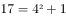；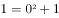。底数是公差为2的等差数列；指数均为2；修正项为+1、-1循环交替。所以所求项为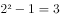。

故正确答案为D。

---

### 第 3 题　qid 2262653 · 数学运算

-1，0，1，2，9，（  ）

- **A**. 11
- **B**. 82
- **C**. 729
- **D**. 730　✅

**答案**：D

**官方解析**

数列整体呈现递增趋势，且部分数同常规的幂次数较为接近，可以考虑题干数列有幂次规律。；；；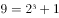。底数分别为-1、0、1、2、？，指数均为3，修正项均为+1。观察底数，底数构成的数列为原数列，故？处为9。所以所求项应为：。

故正确答案为D。

---

### 第 4 题　qid 2262662 · 数学运算

某市直属机关举行“健身杯”排球比赛，参赛的共九个单位，如果采取循环赛的方法，分别在九个球场进行比赛。请问每个球场平均进行几场比赛？

- **A**. 7场
- **B**. 6场
- **C**. 5场
- **D**. 4场　✅

**答案**：D

**官方解析**

根据循环赛比赛规则每两队均需要比一场，则一共比赛了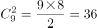场，每个球场平均进行了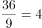场比赛。

故正确答案为D。

---

### 第 5 题　qid 2262670 · 数学运算

有三条同心圆跑道，里圈跑道长公里，中圈跑道长公里，外圈跑道长公里。甲、乙、丙三人分别在里、中、外圈同一起跑线同时同向跑步。甲每小时跑3.5公里，乙每小时跑4公里，丙每小时跑5公里，问何时后三人同时回到出发点？

- **A**. 8小时
- **B**. 7小时
- **C**. 6小时　✅
- **D**. 5小时

**答案**：C

**官方解析**

根据题意可知：甲每小时跑圈，乙每小时跑圈，丙每小时跑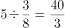圈，要使三人同时回到出发点，则三人所跑的圈数均为整数，甲、丙每小时分别跑了圈、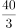圈，要让圈数为整数，则所跑时间是2、3的公倍数，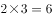，故6小时后三人同时回到出发点。

故正确答案为C。

---

### 第 6 题　qid 2262674 · 数学运算

假设地球是一个正球形，它的赤道长为4万公里，现在用一根比赤道长10米的绳子绕地球一周，假设在各处绳子离地面的距离都是相同的，请问绳子离地面大约多高？

- **A**. 1.5米
- **B**. 1.6米　✅
- **C**. 1.7米
- **D**. 1.4米

**答案**：B

**官方解析**

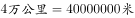，根据题意可设：绳子绕地球一周的半径为，地球的半径为，则绳子绕地球一周的，地球的，绳子离地面的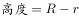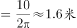。

故正确答案为B。

---

### 第 7 题　qid 2262679 · 数学运算

在一次有关汉语文学的研讨会上，与会人员中有10人是江浙人，有6人是北方人，与会的南方人占了参会总人数的以上，江浙人占了与会的南方人的以上。参会总人数是多少？

- **A**. 22人
- **B**. 21人
- **C**. 19人　✅
- **D**. 18人

**答案**：C

**官方解析**

根据题意可设参会总人数为人，则南方人为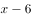人，由“与会的南方人占了参会总人数的以上”可得：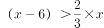，化简得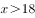；由“江浙人占了与会的南方人的以上”可得：，化简得，故，结合选项，只有C项满足。

故正确答案为C。

---

## 判断推理

### 第 1 题　qid 2262756 · 类比推理

海：水

- **A**. 写作：小说
- **B**. 画家：图画
- **C**. 太阳：光
- **D**. 旋律：音符　✅

**答案**：D

**官方解析**

第一步：判断题干词语间逻辑关系。
海是由水组成的，二者为包容关系中的组成关系。
第二步：判断选项词语间逻辑关系。
A项：小说是写作的成果，二者为方式与成果的对应关系，与题干逻辑关系不一致，排除；
B项：画家创作图画，图画是画家的劳动成果，二者为职业与成果的对应关系，与题干逻辑关系不一致，排除；
C项：太阳能够发出光，二者为属性的对应关系，与题干逻辑关系不一致，排除；
D项：旋律是由音符组成的，二者为包容关系中的组成关系，与题干逻辑关系一致，当选。
故正确答案为D。

---

### 第 2 题　qid 2262758 · 类比推理

伞骨：伞

- **A**. 柱：天花板
- **B**. 树干：树　✅
- **C**. 曲柄：引擎
- **D**. 建椽：屋顶

**答案**：B

**官方解析**

第一步：判断题干词语间逻辑关系。
伞骨是伞的组成部分，且伞靠伞骨来支撑，起到主要的支撑作用。
第二步：判断选项词语间逻辑关系。
A项：柱和天花板之间没有必然关系，与题干逻辑关系不一致，排除；
B项：树干是树的组成部分，树木高大的树冠全靠树干支撑，与题干逻辑关系一致，当选；
C项：曲柄是自行车中和牙盘相连的部分，引擎指的是发动机，二者无明显关系，与题干逻辑关系不一致，排除；
D项：椽是装于屋顶以支持屋顶盖材料的木条；虽然有支撑效果，但不是起到主要的支撑作用，需要房梁、檩子和椽结合在一起使用才能支撑起屋顶，而“建椽”是建造“屋顶”的一步工序，而不是其组成部分，与题干逻辑关系不一致，排除。
故正确答案为B。

---

### 第 3 题　qid 2262761 · 类比推理

音响：音量

- **A**. 性情：脆弱
- **B**. 哭叫：呼喊
- **C**. 小费：舞会
- **D**. 蒸馏：纯度　✅

**答案**：D

**官方解析**

第一步：判断题干词语间逻辑关系。
音响播放有音量高低之分，两者为对应关系。
第二步：判断选项词语间逻辑关系。
A项：脆弱是性情的一种，二者为包容关系中的种属关系，与题干逻辑关系不一致，排除；
B项：哭叫和呼喊为并列关系，与题干逻辑关系不一致，排除；
C项：小费和舞会之间没有必然关系，与题干逻辑关系不一致，排除；
D项：蒸馏有纯度之分，二者为对应关系，与题干逻辑关系一致，当选。
故正确答案为D。

---

### 第 4 题　qid 2262762 · 类比推理

射击：手枪

- **A**. 刺伤：匕首　✅
- **B**. 投掷：石头
- **C**. 失败：逃避
- **D**. 子弹：受伤

**答案**：A

**官方解析**

第一步：判断题干词语间逻辑关系。
用手枪射击，两者为工具与用途的对应关系。
第二步：判断选项词语间逻辑关系。
A项：用匕首刺伤他人，二者为对应关系中工具与用途的对应，与题干逻辑关系一致，保留；
B项：用石头投掷，二者为对应关系中工具与用途的对应，与题干逻辑关系一致，保留；
C项：逃避失败，二者是动宾关系，与题干逻辑关系不一致，排除；
D项：子弹能够使人受伤，但两词顺序与题干相反，与题干逻辑关系不一致，排除。
观察A、B两项，匕首是一种人工制造的武器，石头不是人工制造的武器，题干中手枪也是一种人工制造的武器，因此排除B项。
故正确答案为A。

---

### 第 5 题　qid 2262764 · 类比推理

鸟：蛋

- **A**. 鱼：虾
- **B**. 树：苗
- **C**. 蛙：卵　✅
- **D**. 甜：蜜

**答案**：C

**官方解析**

第一步：判断题干词语间逻辑关系。
鸟下蛋，蛋孵化出小鸟，二者是卵生动物与卵的对应。
第二步：判断选项词语间逻辑关系。
A项：鱼和虾为并列关系，与题干逻辑关系不一致，排除；
B项：苗为初生的树，但不是卵生动物与卵的对应关系，与题干逻辑关系不一致，排除；
C项：蛙产卵，卵变成小蝌蚪，最后变成青蛙，二者是卵生动物与卵的对应，与题干逻辑关系一致，当选；
D项：甜为蜜的属性，为对应关系中的属性关系，与题干逻辑关系不一致，排除。
故正确答案为C。

---

### 第 6 题　qid 39523 · 逻辑判断

赵、钱、孙、李四个人比谁的体重最重。已知：赵、钱的体重与孙、李的体重相等，当将钱、李互换后，赵、李的体重高于钱、孙的体重，钱的体重大于赵、孙的体重。
如果为真，以下哪项为真：

- **A**. 钱的体重最重
- **B**. 赵的体重最重
- **C**. 孙的体重最重
- **D**. 李的体重最重　✅

**答案**：D

**官方解析**

第一步：翻译题干。
①赵＋钱＝孙＋李，②赵＋李＞钱＋孙，③钱＞赵，钱＞孙。
第二步：根据题干信息得出结论。
由①赵＋钱＝孙＋李、②赵＋李＞钱＋孙可知李＞钱，又③钱＞赵、钱＞孙，得李＞钱＞赵&gt;孙。则李的体重最重。
故正确答案为D。

---

### 第 7 题　qid 2262768 · 逻辑判断

小曾、小孙、小石三个人是好朋友，他们每个人都有一个妹妹，且都比自己小11岁。三个妹妹的名字叫小英、小丽、小梅。已知小曾比小英大9岁，小曾与小丽年龄之和是52岁，小孙与小丽年龄之和是54岁。
由此可知，谁是谁的妹妹？

- **A**. 小梅是小孙的妹妹，小丽是小曾的妹妹，小英是小石的妹妹
- **B**. 小梅是小石的妹妹，小丽是小孙的妹妹，小英是小曾的妹妹
- **C**. 小梅是小曾的妹妹，小丽是小石的妹妹，小英是小孙的妹妹　✅
- **D**. 小梅是小曾的妹妹，小丽是小孙的妹妹，小英是小石的妹妹

**答案**：C

**官方解析**

第一步：分析题干。

①小曾、小孙、小石都有一个妹妹，且都比自己小11岁；

②三个妹妹的名字叫小英、小丽、小梅；

③小曾比小英大9岁；

④小曾与小丽年龄之和是52岁；

⑤小孙与小丽年龄之和是54岁。

第二步：结合题干分析选项。

题干中①③④都提到了小曾，从最大信息入手，根据③，小曾比小英大9岁，因此小曾的妹妹不是小英。排除B项。根据②，小曾与小丽的年龄之和为52，①小曾比妹妹大11岁，假设小丽是小曾妹妹，那她年龄应该为，结果不为整数，所以小曾的妹妹也不是小丽，排除A项。

因此小曾的妹妹只能为小梅，根据条件⑤，小孙与小丽年龄之和是54岁，条件①小孙比妹妹大11岁，假设小丽是小孙的妹妹，那她年龄应该为，结果不为整数，所以小孙的妹妹不是小丽，因此小孙的妹妹是小英，排除D项。

故正确答案为C。

---

### 第 8 题　qid 2255651 · 逻辑判断

某法院对某刑事案件有以下四种说法：①有证据表明赵刚没有作案；②作案者或者是赵刚，或者是王强，或者是李明；③也有证据表明王强没有作案；④电视画面显示，案发时李明在远离案发现场的一个足球赛的观众席上。
下列各项是对四种说法的不同描述，其中正确的一项是：

- **A**. 从上述说法中可以推出，只有一个人作案
- **B**. 上述说法中至少有一个是假的　✅
- **C**. 从这几种说法中可以推出，表明王强没有作案的证据是假的
- **D**. 李明肯定不在该足球赛的观众席上

**答案**：B

**官方解析**

第一步：找出题干矛盾关系。
本题突破口为“三个人都有证据表明没有作案”与“他们至少有一个人作案”之间的矛盾关系。
第二步：判断真假。
由“三个人都有证据表明没有作案”与“他们至少有一个人作案”之间的矛盾关系可知二者必有一假，故上述说法至少有一个是假的，但不能具体判断谁真谁假。
故正确答案为B。

---

### 第 9 题　qid 2262777 · 逻辑判断

经验告诉我们：天空的薄云，往往是天气晴朗的象征；那些低而厚密的云层，常常是阴雨风雪的预兆。
因此：

- **A**. 天空的云总是由薄变厚，反复无常
- **B**. 风雪来临之前总要给人以暗示
- **C**. 从天空云层的变化就可以预料天气的变化　✅
- **D**. 经验是人们在实践中积累起来的，没有十分把握

**答案**：C

**官方解析**

日常结论题，根据题干信息逐一分析选项。
A项：题干没有提到天空的云总是由薄变厚，反复无常，无中生有，排除；
B项：题干提到了天气晴朗和阴雨风雪时两种云层的变化，而选项只提到风雪，且给人暗示的到底是什么，表意不明，无法推出，排除；
C项：从天空云层的变化就可以预料天气的变化，是对题干的整体概括，可以推出，当选；
D项：题干谈论的是不同云层的变化可预示天气，并未提到经验、实践及是否有把握的问题，无中生有，排除。
故正确答案为C。

---

### 第 10 题　qid 2262779 · 逻辑判断

以下推断正确的一项是：

- **A**. 从我市目前的路面交通情况看，一般车辆较多的路段都比较拥挤，因此，一般比较拥挤的路段肯定车辆都比较多
- **B**. 因为甲班品学兼优的学生在物理考试中考试成绩都在90分以上，所以，乙班在物理考试中考试成绩在90分以上的学生肯定都是品学兼优的学生
- **C**. 几年来，某市每年考取清华北大的学生都在150人左右，因此每年清华、北大的新生中都有150左右的人是某市的学生　✅
- **D**. 冰箱一般对空气的制冷比对食物的制冷费电，因而在冰箱里放少量食物时最省电

**答案**：C

**官方解析**

A项：翻译选项：①车辆多拥挤，②拥挤车辆多，②是对①的肯后，肯后无必然结论，不能推出，排除；

B项：翻译选项：①品学兼优物理考试成绩90分以上，②物理考试成绩90分以上品学兼优，②是对①的肯后，肯后无必然结论，不能推出，排除；

C项：某市每年150人考上清华北大，那么清华北大每年一定有同样多的人来自某市，可以推出，当选；

D项：根据冰箱对空气制冷比对食物制冷费电得出结论：在冰箱里放少量食物时最省电，出现“最”，选项没有涉及到比较的问题，故放多少食物最省电无法推出，排除。

故正确答案为C。

---

### 第 11 题　qid 2262789 · 图形推理

从所给四个选项中，选择最合适的一个填入问号处，使之呈现一定的规律性：

- **A**. A
- **B**. B　✅
- **C**. C
- **D**. D

**答案**：B

**官方解析**

图一和图二同一位置有1个相同的图形，图二和图三同一位置有2个相同的图形，图三和图四同一位置有3个相同的图形，按照这个规律，图四到“？”处图形应有4个相同位置的图形。观察选项，只有B项符合题意。
故正确答案为B。

---

### 第 12 题　qid 2262791 · 图形推理

从所给四个选项中，选择最合适的一个填入问号处，使之呈现一定的规律性：

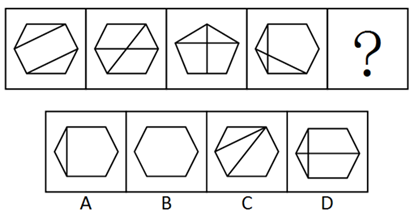

- **A**. A
- **B**. B
- **C**. C
- **D**. D　✅

**答案**：D

**官方解析**

本题为一组图题目，元素组成不同，且无明显属性规律，优先考虑数量规律。观察发现，图二、图三、图四,均为“田”字的变形图，考虑笔画数。题干图形均为两笔画图形，故？处也应填入一个两笔画的图形。A项、B项和C项均为一笔画，D项是两笔画，D项符合题意。
故正确答案为D。

---

### 第 13 题　qid 2262793 · 图形推理

从所给四个选项中，选择最合适的一个填入问号处，使之呈现一定的规律性：

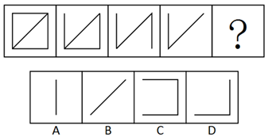

- **A**. A
- **B**. B　✅
- **C**. C
- **D**. D

**答案**：B

**官方解析**

本题为一组图题目，元素组成相似，优先考虑样式规律。观察发现，题干图形从左到右，依次减少一条直线，减少的直线位置依次为上、下、右，因此“？”处图形应该为第四个图形减少左边直线，符合题干的只有B项。
故正确答案为B。

---

### 第 14 题　qid 2262795 · 图形推理

从所给四个选项中，选择最合适的一个填入问号处，使之呈现一定的规律性：

- **A**. A　✅
- **B**. B
- **C**. C
- **D**. D

**答案**：A

**官方解析**

本题为一组图题目，元素组成相似，优先考虑样式规律。观察发现，前四个图形黑色方块均在外围，且位置都不相同，结合前四图，图形外围只有第一行第二格缺少黑块，选项中只有A项符合。
故正确答案为A。

---

### 第 15 题　qid 2262797 · 图形推理

从所给四个选项中，选择最合适的一个填入问号处，使之呈现一定的规律性：

- **A**. A
- **B**. B
- **C**. C
- **D**. D　✅

**答案**：D

**官方解析**

元素组成相同，优先考虑位置规律。经观察，题干图形中黑点和白点依次整体顺时针移动、、得到下一个图形，故？处图形应在题干中图4的基础上黑点和白点整体顺时针移动，只有A、D两项满足此规律。此外，观察发现，题干中黑点逐渐靠近圆心，白点逐渐远离圆心，只有D选项满足此规律。

故正确答案为D。

---
