# 2016年山东省选调应届优秀高校毕业生到基层工作考试《行测》试卷（精选）

> 选调生 · 2016 年 · 6 个模块 · 共 78 题

- [政治理论](#%E6%94%BF%E6%B2%BB%E7%90%86%E8%AE%BA) · 8 题
- [常识判断](#%E5%B8%B8%E8%AF%86%E5%88%A4%E6%96%AD) · 22 题
- [言语理解与表达](#%E8%A8%80%E8%AF%AD%E7%90%86%E8%A7%A3%E4%B8%8E%E8%A1%A8%E8%BE%BE) · 15 题
- [数量关系](#%E6%95%B0%E9%87%8F%E5%85%B3%E7%B3%BB) · 8 题
- [判断推理](#%E5%88%A4%E6%96%AD%E6%8E%A8%E7%90%86) · 15 题
- [资料分析](#%E8%B5%84%E6%96%99%E5%88%86%E6%9E%90) · 10 题

---

## 政治理论

### 第 1 题　qid 2262624 · 新思想

五大发展理念中，（  ）是中国特色社会主义的本质要求。

- **A**. 创新
- **B**. 协调
- **C**. 绿色
- **D**. 共享　✅

**答案**：D

**官方解析**

本题考查政治常识。
党的十八大以来，以习近平同志为核心的党中央高举中国特色社会主义伟大旗帜，科学把握当今世界和当代中国的发展大势，植根于马克思主义基本原理，着眼于新的实践和新的发展，提出了一系列治国理政新理念、新思想、新战略，其中关于“共享发展是中国特色社会主义的本质要求”的基本论断，既深刻阐明了“什么是发展，怎样发展”的出发点和落脚点，又对“什么是社会主义，怎样建设社会主义”做出了正确回答。
共享发展是坚持社会主义本质、走向共同富裕的实现途径，是中国共产党人对社会主义道路伟大探索的重要结论；共享发展是坚持社会主义价值追求、走向公平正义的重要路径，是中国共产党人直面时代课题、破解当代问题的理论成果；共享发展是坚持社会主义理想信念、走向民族伟大复兴的基本支撑，是中国共产党人沿着发展社会主义道路走向未来的伟大实践。
故正确答案是D。

---

### 第 2 题　qid 2262632 · 时事政治

今年的政府工作报告提出，到2020年，我国常住人口城镇化率达到（  ）、户籍人口城镇化率达到（  ）。

- **A**. 
；

- **B**. 
；
　✅
- **C**. 
；

- **D**. 
；

**答案**：B

**官方解析**

本题考查政治常识。

《2016年国务院政府工作报告》提出了“十三五”时期主要目标任务和重大举措，其中包括推进新型城镇化和农业现代化，促进城乡区域协调发展。缩小城乡区域差距，既是调整经济结构的重点，也是释放发展潜力的关键。要深入推进以人为核心的新型城镇化，实现1亿左右农业转移人口和其他常住人口在城镇落户，完成约1亿人居住的棚户区和城中村改造，引导约1亿人在中西部地区就近城镇化。到2020年，常住人口城镇化率达到、户籍人口城镇化率达到。

故正确答案是B。

---

### 第 3 题　qid 2262635 · 新思想

中国特色社会主义特就特在（  ）。
①道路、理论体系、制度上
②实现途径、行动指南、根本保障的内在联系上
③坚持人民当家作主和依法治国上
④始终坚持中国共产党的领导上

- **A**. ①②③
- **B**. ②③④
- **C**. ①②③④　✅
- **D**. ①②④

**答案**：C

**官方解析**

本题考查政治常识。
2012年11月17日习近平在主持十八届中央政治局第一次集体学习时的讲话中提到：中国特色社会主义特就特在其道路、理论体系、制度上，特就特在其实现途径、行动指南、根本保障的内在联系上，特就特在这三者统一于中国特色社会主义伟大实践上。这是习总书记总揽中国特色社会主义历史、理论与实践，对“中国特色社会主义特在何处”作出的历史性回答。
党的十九大报告指出：“人民代表大会制度是坚持党的领导、人民当家作主、依法治国有机统一的根本政治制度安排，必须长期坚持、不断完善。”坚持中国特色社会主义政治发展道路，关键是要坚持党的领导、人民当家作主、依法治国有机统一，这是社会主义政治发展的必然要求，是中国特色社会主义特在道路上的重要内容。
故正确答案为C。

---

### 第 4 题　qid 2262638 · 新思想

2015年1月，习近平同中央党校第一期县委书记研修班学员座谈时指出，做县委书记就要做焦裕禄式的县委书记，始终做到心中有党、心中有民、（  ）、心中有戒。

- **A**. 心中有国
- **B**. 心中有责　✅
- **C**. 心中有法
- **D**. 心中有爱

**答案**：B

**官方解析**

本题考查政治常识。
2015年1月12日，中共中央总书记、国家主席、中央军委主席习近平在京主持召开座谈会，同中央党校第一期县委书记研修班学员进行座谈并发表重要讲话。他强调，县级政权所承担的责任越来越大，尤其是在全面建成小康社会、全面深化改革、全面依法治国、全面从严治党进程中起着重要作用。焦裕禄同志以自己的实际行动塑造了一个优秀共产党员和优秀县委书记的光辉形象。做县委书记就要做焦裕禄式的县委书记，始终做到心中有党、心中有民、心中有责、心中有戒。
故正确答案为B。

---

### 第 5 题　qid 2262640 · 毛中特

习近平强调，我们现在干部队伍中也存在着延安时期毛泽东所说的“本领恐慌”。克服“本领恐慌”，首先要认真学习（  ），这是我们做好一切工作的看家本领。

- **A**. 党的路线方针政策和国家法律法规
- **B**. 马克思主义理论　✅
- **C**. 经济、政治、历史、文化、社会等方面的知识
- **D**. 科技、军事、外交等方面的知识

**答案**：B

**官方解析**

本题考查政治常识。
2013年3月1日，中央党校建校80周年庆祝大会暨2013年春季学期开学典礼在北京举行，习近平指出“首先要认真学习马克思主义理论，这是我们做好一切工作的看家本领，也是领导干部必须普遍掌握的工作制胜的看家本领。” 
故正确答案为B。

---

### 第 6 题　qid 2262651 · 时事政治

今年的政府工作报告提出了“十三五”时期主要目标任务，其中“双中高”的目标是指（    ）。
①保持经济中高速增长
②推进结构性改革迈向中高端水平
③推动产业迈向中高端水平
④推进生态环境治理迈向中高端水平

- **A**. ①②
- **B**. ①③　✅
- **C**. ①④
- **D**. ②③

**答案**：B

**官方解析**

本题考查政治常识。

《2016年政府工作报告》指出“保持经济中高速增长，推动产业迈向中高端水平。实现全面建成小康社会目标，到2020年国内生产总值和城乡居民人均收入比2010年翻一番，‘十三五’时期经济年均增长保持在以上。加快推进产业结构优化升级，实施一批技术水平高、带动能力强的重大工程。到2020年，先进制造业、现代服务业、战略性新兴产业比重大幅提升，全员劳动生产率从人均8.7万元提高到12万元以上。届时，我国经济总量超过90万亿元，发展的质量和效益明显提高。在我们这样一个人口众多的发展中国家，这将是非常了不起的成就。” 因此，①③正确。

故正确答案为B。

---

### 第 7 题　qid 2262654 · 时事政治

2015年10月18日中共中央印发了《中国共产党廉洁自律准则》，这是党执政以来第一部坚持正面倡导、面向（  ）的规范全党廉洁自律工作的重要基础性法规。

- **A**. 党员高级领导干部
- **B**. 党员领导干部
- **C**. 普通党员
- **D**. 全体党员　✅

**答案**：D

**官方解析**

本题考查政治常识。
2015年10月18日，中共中央印发《中国共产党廉洁自律准则》，这是党执政以来第一部坚持正面倡导、面向全体党员的规范全党廉洁自律工作的重要基础性法规，是对党章规定的具体化，体现了全面从严治党实践成果。
故正确答案为D。

---

### 第 8 题　qid 2262658 · 时事政治

山东省政府工作报告对十三五期间社会经济发展作出规划：经济保持中高速增长，全省生产总值年均增长（  ），（  ）经济总量和城乡居民人均收入比2010年翻一番。

- **A**. 
左右；提前实现

- **B**. 
左右；提前实现
　✅
- **C**. 
以上；实现

- **D**. 
以上；实现

**答案**：B

**官方解析**

本题考查政治常识。

《2016年山东省政府工作报告》指出“经济保持中高速增长。全省生产总值年均增长左右，提前实现经济总量和城乡居民人均收入比2010年翻一番。产业迈向中高端水平，服务业占比达到左右，发展的质量效益明显提高。创新型省份建设达到更高水平，全社会研发经费占比提高到。” 

故正确答案为B。

---

## 常识判断

### 第 1 题　qid 2262623 · 经济常识

十八届五中全会提出了全面建成小康社会新的目标要求，下列表述准确全面的是（  ）。
①到2020年国内生产总值和城乡居民人均收入比2010年翻一番
②到2020年国民生产总值和城乡居民人均收入比2010年翻一番
③我国现行标准下农村贫困人口实现脱贫，贫困县全部摘帽
④解决区域性整体贫困

- **A**. ①③
- **B**. ②③④
- **C**. ①③④　✅
- **D**. ②③

**答案**：C

**官方解析**

本题考查政治常识。
十八届五中全会上，《中共中央关于制定国民经济和社会发展第十三个五年规划的建议》对全面建成小康社会提出新的目标要求，包括五个方面：一是提出了经济保持中高速增长，确保到2020年实现国内生产总值和城乡居民人均收入比2010年翻一番的目标，必须保持必要的增长速度。经济保持中高速增长，有利于改善民生，让人民群众更加切实感受到全面建成小康社会的成果；二是人民生活水平和质量普遍提高；三是国民素质和社会文明程度显著提高；四是生态环境质量总体改善；五是各方面制度更加成熟更加定型。到2020年我国现行标准下农村贫困人口实现脱贫，贫困县全部摘帽，解决区域性整体贫困。
故②项表述错误，应是到2020年国内生产总值和城乡居民人均收入比2010年翻一番。
故正确答案是C。

---

### 第 2 题　qid 2262625 · 人文常识

党的十八大报告指出，我们“既不走封闭僵化的老路，也不走改旗易帜的邪路”，这里的“老路”是指（  ）。
①改革开放前所走的路
②改革开放前在所有制问题上求公求纯，在经济计划问题上统得过死的错误
③改革开放前30年封闭僵化的路
④“文革”时期把市场调节、个体经济统统当成资本主义，把学习外国当成是“洋奴哲学”的错误

- **A**. ①③
- **B**. ②④　✅
- **C**. ①②④
- **D**. ①②③④

**答案**：B

**官方解析**

本题考查政治常识。
“封闭僵化的老路”指的是改革开放前旧的社会主义发展路子，在所有制问题上求公求纯，在经济计划问题上统得过死，国家掌控所有资源，运用各种指令，忽视市场规律的作用，经济发展缺乏活力，把市场调节、个体经济统统当成资本主义，把学习外国当成是“洋奴哲学”的错误，关起门来搞建设，日益落后于其他国家的“路子”。
①③把改革开放前的道路和成就全盘否定，说法过于绝对，表述错误。
故正确答案是B。

---

### 第 3 题　qid 2262626 · 人文常识

全面实现小康社会，最艰巨的任务是（  ），最突出的短板在于农村还有（  ）多万的贫困人口。

- **A**. 实施创新驱动发展战略；7000
- **B**. 推动低碳循环发展；5000
- **C**. 实施脱贫攻坚工程；7000　✅
- **D**. 增加公共服务供给；5000

**答案**：C

**官方解析**

本题考查政治常识。
2016年12月，《“十三五”脱贫攻坚规划》印发，明确了“十三五”时期脱贫攻坚总体思路、基本目标、主要任务和保障措施。全面建成小康社会，最艰巨的任务是脱贫攻坚，最突出的短板在于农村还有7000多万贫困人口。党的十八届五中全会从实现全面建成小康社会奋斗目标出发，把“扶贫攻坚”改成“脱贫攻坚”，明确了新时期脱贫攻坚的目标，到2020年实现“两个确保”：确保农村贫困人口全部脱贫，确保贫困县全部脱贫摘帽。
故正确答案是C。

---

### 第 4 题　qid 2262627 · 人文常识

“四个全面”战略布局是一个整体，其中（  ）和（  ）是实现中华民族伟大复兴中国梦的“关键一步”和“关键一招”。

- **A**. 全面建成小康社会，全面深化改革　✅
- **B**. 全面建成小康社会，全面从严治党
- **C**. 全面从严治党，全面依法治国
- **D**. 全面依法治国，全面深化改革

**答案**：A

**官方解析**

本题考查政治常识。
全面建成小康社会是实现中华民族伟大复兴中国梦的关键一步。2015年2月，习近平总书记在省部级主要领导干部学习贯彻十八届四中全会精神全面推进依法治国专题研讨班开班式上，进一步把“四个全面”定位于党中央的战略布局。习近平总书记在中阿合作论坛第六届部长级会议开幕式上的讲话提到：“中国已经进入全面建成小康社会的决定性阶段，实现这个目标是实现中华民族伟大复兴中国梦的关键一步”。
全面深化改革是实现中华民族伟大复兴中国梦的关键一招。2013年11月中共十八届三中全会通过了《中共中央关于全面深化改革若干重大问题的决定》，在新的历史起点上为全面深化改革提供了总体规划和战略部署。“改革开放是决定当代中国命运的关键一招，也是决定实现‘两个一百年’奋斗目标、实现中华民族伟大复兴的关键一招。”
全面依法治国是实现中华民族伟大复兴中国梦的关键一环，全面从严治党是实现中华民族伟大复兴中国梦的关键所在。
备注：2020年党的十九届五中全会在北京胜利召开，会议审议通过了《中共中央关于制定国民经济和社会发展第十四个五年规划和二〇三五年远景目标的建议》。明确提出要“协调推进全面建设社会主义现代化国家、全面深化改革、全面依法治国、全面从严治党的战略布局”。
故正确答案为A。

---

### 第 5 题　qid 2262628 · 经济常识

2016年中央1号文件提出了加快培育新型职业农民的新举措，其主要内容有（  ）。
①将职业农民培育纳入国家教育培训发展规划
②依托高等教育、中等职业教育资源，鼓励农民通过“半农半读”等方式就地就近接受职业教育
③开展新型农业经营主体带头人培育行动，通过5年努力使他们基本得到培训
④优化财政支农资金使用，把一部分资金用于培养职业农民

- **A**. ①④
- **B**. ①②③
- **C**. ②③④
- **D**. ①②③④　✅

**答案**：D

**官方解析**

本题考查政治常识。
2016年中央1号文件，即《中共中央国务院关于落实发展新理念加快农业现代化，实现全面小康目标的若干意见》第一点第六条中提出：
持续夯实现代农业基础，提高农业质量效益和竞争力。加快培育新型职业农民。将职业农民培育纳入国家教育培训发展规划，基本形成职业农民教育培训体系，把职业农民培养成建设现代农业的主导力量。
办好农业职业教育，将全日制农业中等职业教育纳入国家资助政策范围。依托高等教育、中等职业教育资源，鼓励农民通过“半农半读”等方式就地就近接受职业教育。
开展新型农业经营主体带头人培育行动，通过5年努力使他们基本得到培训。加强涉农专业全日制学历教育，支持农业院校办好涉农专业，健全农业广播电视学校体系，定向培养职业农民。引导有志投身现代农业建设的农村青年、返乡农民工、农技推广人员、农村大中专毕业生和退役军人等加入职业农民队伍。
优化财政支农资金使用，把一部分资金用于培养职业农民。总结各地经验，建立健全职业农民扶持制度，相关政策向符合条件的职业农民倾斜。鼓励有条件的地方探索职业农民养老保险办法。
故正确答案是D。

---

### 第 6 题　qid 2262629 · 人文常识

在中国近代，第一次喊出“振兴中华”和“救亡”口号的分别是（  ）。

- **A**. 周恩来、陈独秀
- **B**. 周恩来、毛泽东
- **C**. 孙中山、严复　✅
- **D**. 孙中山、毛泽东

**答案**：C

**官方解析**

本题考查人文常识。
孙中山，中国近代民族民主主义革命的开拓者，中国民主革命伟大先行者，中华民国和中国国民党的缔造者，三民主义的倡导者。“振兴中华”的口号最早是由孙中山于1894年11月24日在美国檀香山建立兴中会时提出。孙中山在《檀香山兴中会章程》中写道：“是会之设，专为振兴中华，维持国体起见”。
严复，近代著名的翻译家、教育家，翻译了《天演论》，是中国近代史上向西方国家寻找真理的“先进的中国人”之一。“救亡”的口号是严复在1895年出版的《救亡决论》中第一次提出。
故正确答案是C。

---

### 第 7 题　qid 2262630 · 人文常识

（  ）是当前和今后一个时期我国经济发展的大逻辑。

- **A**. 认识新常态、适应新常态、决胜新常态
- **B**. 认识经济发展新常态
- **C**. 认识新常态、适应新常态、引领新常态　✅
- **D**. 认识新常态

**答案**：C

**官方解析**

本题考查政治常识。
2015年中央召开经济工作会议部署2016年经济工作，文件《五大政策——推进供给侧改革》中指出：“认识新常态、适应新常态、引领新常态，是当前和今后一个时期我国经济发展的大逻辑，这是我们综合分析世界经济长周期和我国发展阶段性特征及其相互作用作出的重大判断。”
故正确答案是C。

---

### 第 8 题　qid 2262631 · 科技常识

2015年我国科技领域的一批创新成果达到国际先进水平，它们是（  ）。
①量子通讯技术
②第三代核电技术取得重大进展
③屠呦呦获得诺贝尔生理学或医学奖
④国产C919大型科技总装下线

- **A**. ①②③
- **B**. ①③④
- **C**. ①②③④
- **D**. ②③④　✅

**答案**：D

**官方解析**

本题考查科技常识。
2016年8月16号，我国自主研制的世界首颗量子科学实验卫星“墨子号”成功发射，标志着我国的量子通信技术达到国际先进水平。
2015年5月7日，我国第三代核电技术华龙一号全球首堆示范项目正式开工建设，2015年12月22日，第二台示范机组福清核电6号机组开工。在海外，正式签订两台华龙一号机组合同即巴基斯坦卡拉奇核电厂2、3号机组，实现了百万千瓦级核电机组走出国门零的突破，使中国成为国际上第4个能独立出口三代核电技术的国家。
2015年10月5日，瑞典卡罗琳医学院在斯德哥尔摩宣布，中国女科学家屠呦呦和一名日本科学家及一名爱尔兰科学家分享2015年诺贝尔生理学和医学奖，以表彰他们在疟疾治疗研究中取得的成就。屠呦呦成为迄今为止第一位获得诺贝尔科学奖项的本土中国科学家，由此实现了中国人在自然科学领域诺贝尔奖零的突破。
2015年11月2日，我国自主研制的C919大型客机首架机，在中国商飞公司新建成的总装制造中心浦东基地厂房内正式下线。这不仅标志着C919首架机的机体大部段对接和机载系统安装工作正式完成，已经达到可进行地面试验的状态，更标志着C919大型客机项目工程发展阶段研制取得了阶段性成果，为下一步首飞奠定了坚实基础。
①属于2016年成果，②③④属于2015年成果。
故正确答案是D。

---

### 第 9 题　qid 2262633 · 地理国情

2015年12月第二届世界互联网大会在中国浙江乌镇举行，主题为（  ）。

- **A**. “互联互通·共享共治——共建网络空间美好家园”
- **B**. “互联互通·共享共治——开创网络空间美好未来”
- **C**. “互联互通·共享共治——构建网络空间命运共同体”　✅
- **D**. “互联互通·共享共治——构建网络空间共同家园”

**答案**：C

**官方解析**

本题考查政治常识。
2015年12月16日至18日，第二届世界互联网大会在浙江省桐乡市乌镇举行。本届大会的主题是“互联互通·共享共治——构建网络空间命运共同体”。
故正确答案是C。

---

### 第 10 题　qid 2262634 · 人文常识

2016年是全面建成小康社会决胜阶段的开局之年，我国经济社会发展主要抓好（  ）五大任务。
①去产能、去库存、去杠杆    ②防风险
③降成本                    ④补短板

- **A**. ①②③
- **B**. ①②④
- **C**. ①③④　✅
- **D**. ①②③④

**答案**：C

**官方解析**

本题考查政治常识。
2015年12月，中央经济工作会议在北京召开。会议指出，2016年是全面建成小康社会决胜阶段的开局之年，也是推进结构性改革的攻坚之年。经济社会发展特别是结构性改革任务十分繁重，战略上要坚持稳中求进、把握好节奏和力度，战术上要抓住关键点，主要是抓好去产能、去库存、去杠杆、降成本、补短板五大任务，即“三去一降一补”。
故正确答案是C。

---

### 第 11 题　qid 2262636 · 法律常识

《中华人民共和国慈善法》规定了自然人、法人或者其他组织开展慈善活动应当遵循的原则，下列准确全面的选项是（  ）。
①合法    ②自愿
③诚信    ④非营利

- **A**. ①②③
- **B**. ①②③④　✅
- **C**. ②③④
- **D**. ①③④

**答案**：B

**官方解析**

本题考查法律常识。
根据《中华人民共和国慈善法》第四条规定：“开展慈善活动，应当遵循合法、自愿、诚信、非营利的原则，不得违背社会公德，不得危害国家安全、损害社会公共利益和他人合法权益。”
故正确答案为B。

---

### 第 12 题　qid 2262637 · 人文常识

在我国传统道德中，被称为“立身之本”、“举政之目”、“进德修业之本”的是（  ）。

- **A**. 诚实守信　✅
- **B**. 重义轻利
- **C**. 仁爱宽厚
- **D**. 谦敬礼让

**答案**：A

**官方解析**

本题考查人文常识。
A项正确，诚实守信指的是忠诚老实、讲信用、信守承诺，它是中华民族的传统美德。在我国传统道德中，它一直以来被看做是“立身之本”、“举政之目”、“进德修业之本”。
B项错误，重义轻利是儒家对待社会伦理规范与人们物质利益之间关系的基本思想，提倡做人做事道义为先。义利本身无褒贬，是否正确对待义与利，在义与利矛盾面前能否心端行正，是识辨一个人正直与否、高尚与否、担当与否的“试金石”。
C项错误，仁爱宽厚，意思是宽仁慈爱、宽容厚道，是个人修养的基本要求。
D项错误，谦敬礼让，意思是谦虚、尊敬他人、讲礼貌，既是个人自身修养的美德，也是为人处世的道德要求。
故正确答案为A。

---

### 第 13 题　qid 2262639 · 人文常识

“政策好不好，要看乡亲是哭还是笑”，这句话体现的哲理是（  ）。
①实践是检验真理的唯一标准
②一切从实际出发，实事求是
③人民群众是历史的创造者
④事物发展是从量变到质变的过程

- **A**. ①②③④
- **B**. ②③④
- **C**. ①②③　✅
- **D**. ①②④

**答案**：C

**官方解析**

本题考查政治常识。
①表述正确，辩证唯物主义认识论认为实践是检验真理的唯一标准，百姓笑就是政策方向对，落实情况好，群众受益多；百姓哭，则或是政策制定有所偏差，这体现了实践是检验真理的唯一标准。
②表述正确，实践是认识的基础、认识的来源、认识发展的动力、检验认识真理性的唯一标准、认识的目的和归宿，方法论上要求做到一切从实际出发，实事求是。这就要求我们在实际工作中，一切要从实际出发，根据客观事实决定我们的工作方针、计划方案等主观的东西，使主观和客观相符合。本题中，政策的落实要符合具体的实际情况，才能取得实效，得到人民群众的支持和满意。
③表述正确，人民群众是先进生产力和先进文化的创造主体，是社会变革的主体，同时也是实现自身利益的根本力量。“政策好不好，要看乡亲们哭还是笑”这是把老百姓放在心中，放在最重要的位置，彰显了民意之重。
④表述正确，但与题意无关。量变是质变的前提和必要准备，质变是量变的必然结果。本题没有体现事物从量变到质变的过程，与题意无关。
故正确答案为C。

---

### 第 14 题　qid 2262641 · 人文常识

在社会主义核心价值观中，最深层、最根本、最永恒的是（  ）。

- **A**. 爱国主义　✅
- **B**. 诚实守信
- **C**. 爱好和平
- **D**. 自强不息

**答案**：A

**官方解析**

本题考查政治常识。
2014年10月15日，习近平总书记主持召开文艺工作座谈会并发表重要讲话时指出：“在社会主义核心价值观中，最深层、最根本、最永恒的是爱国主义。”
故正确答案为A。

---

### 第 15 题　qid 2262642 · 人文常识

2015年，中共中央、国务院印发《深化农村改革综合性实施方案》，从提高农村改革的系统性、（  ）、协同性出发，聚焦五大领域，进一步推进深化农村改革。

- **A**. 整体性　✅
- **B**. 区域性
- **C**. 创新性
- **D**. 持续性

**答案**：A

**官方解析**

本题考查政治常识。
《深化农村改革综合性实施方案》根据中央统一部署，从提高农村改革的系统性、整体性、协同性出发，特制定深化农村改革综合性实施方案。
故正确答案为A。

---

### 第 16 题　qid 2262643 · 人文常识

党的纪律是多方面的，但（  ）是最重要、最根本、最关键的纪律。

- **A**. 组织纪律
- **B**. 群众纪律
- **C**. 廉洁纪律
- **D**. 政治纪律　✅

**答案**：D

**官方解析**

本题考查政治常识。
《习近平关于严明党的纪律和规矩论述摘编》指出“严明党的纪律，首要的就是严明政治纪律。党的纪律是多方面的，但政治纪律是最重要、最根本、最关键的纪律，遵守党的政治纪律是遵守党的全部纪律的重要基础。政治纪律是各级党组织和全体党员在政治方向、政治立场、政治言论、政治行为方面必须遵守的规矩，是维护党的团结统一的根本保证。” 
故正确答案为D。

---

### 第 17 题　qid 2262645 · 人文常识

关于全面推进政务公开，下面不确切的表述是（  ）。

- **A**. 坚持以公开为常态，不公开为例外
- **B**. 依据权力清单公开政府权力
- **C**. 公开涉及公民、法人和其他组织权利义务的规范性文件　✅
- **D**. 推行行政执法公示制度和政务公开信息化

**答案**：C

**官方解析**

本题考查政治常识。
《中共中央关于全面推进依法治国若干重大问题的决定》指出“（六）全面推进政务公开。坚持以公开为常态、不公开为例外原则，推进决策公开、执行公开、管理公开、服务公开、结果公开。各级政府及其工作部门依据权力清单，向社会全面公开政府职能、法律依据、实施主体、职责权限、管理流程、监督方式等事项。重点推进财政预算、公共资源配置、重大建设项目批准和实施、社会公益事业建设等领域的政府信息公开。涉及公民、法人或其他组织权利和义务的规范性文件，按照政府信息公开要求和程序予以公布。推行行政执法公示制度。推进政务公开信息化，加强互联网政务信息数据服务平台和便民服务平台建设。”
A项正确，与《决定》中“坚持以公开为常态、不公开为例外原则”这一表述契合。
B项正确，与《决定》中“依据权力清单，向社会全面公开政府职能、法律依据、实施主体、职责权限、管理流程、监督方式等事项”这一表述契合。
C项错误，与《决定》中“涉及公民、法人或其他组织权利和义务的规范性文件，按照政府信息公开要求和程序予以公布”表述存在偏差，选项中只提到“公开”，未体现“按照政府信息公开要求和程序予以公布”这层含义，表述不确切。
D项正确，与《决定》中“推行行政执法公示制度。推进政务公开信息化”这一表述契合。
本题为选非题，故正确答案为C。

---

### 第 18 题　qid 2262646 · 法律常识

贯穿十八届四中全会《决定》全篇的一条主线是（  ）。

- **A**. 建设中国特色社会主义法治体系，建设社会主义法治国家　✅
- **B**. 坚定不移走中国特色社会主义法治道路，坚决维护宪法法律权威
- **C**. 实现党的领导、人民当家作主、依法治国的有机统一
- **D**. 实现科学立法、严格执法、公正司法、全面守法，促进国家治理体系和治理能力现代化

**答案**：A

**官方解析**

本题考查政治常识。
《十八届四中全会通过依法治国若干重大问题决定》提出“全面推进依法治国，总目标是建设中国特色社会主义法治体系，建设社会主义法治国家。这就是，在中国共产党领导下，坚持中国特色社会主义制度，贯彻中国特色社会主义法治理论，形成完备的法律规范体系、高效的法治实施体系、严密的法治监督体系、有力的法治保障体系，形成完善的党内法规体系，坚持依法治国、依法执政、依法行政共同推进，坚持法治国家、法治政府、法治社会一体建设，实现科学立法、严格执法、公正司法、全民守法，促进国家治理体系和治理能力现代化。实现这个总目标，必须坚持中国共产党的领导，坚持人民主体地位，坚持法律面前人人平等，坚持依法治国和以德治国相结合，坚持从中国实际出发。” 
故正确答案为A。

---

### 第 19 题　qid 2262648 · 法律常识

对改革与法治的关系，下列正确的表述是（    ）。
①现在的有些法律规范妨碍了改革，改革就是要不断冲破法律的禁区
②重大改革都要于法有据，立法要主动适应改革的需要
③二者是破与立的辩证统一过程
④法律要保持稳定性、权威性和适当的滞后性，法律不能引领改革

- **A**. ②③　✅
- **B**. ②③④
- **C**. ①②③
- **D**. ①④

**答案**：A

**官方解析**

本题考查政治常识。
①表述错误，任何改革都必须在法律允许的范围内进行，不得冲破法律的禁区。
②表述正确，党的十八届四中全会《决定》对立法工作作出部署，并提出，“实现立法和改革决策相衔接，做到重大改革于法有据、立法主动适应改革和经济社会发展需要”。
③表述正确，改革就是破除阻碍社会进步发展的弊端，“立”就是确立符合社会进步发展的新制度，改革和立法体现了破与立的辩证统一。
④表述错误，在法治下推进改革，在改革中完善法治，这就是我们说的改革和法治是两个轮子的含义。我们要坚持改革决策和立法决策相统一、相衔接，立法主动适应改革需要，积极发挥引导、推动、规范、保障改革的作用，做到重大改革于法有据，改革和法治同步推进，增强改革的穿透力。
因此②③说法正确。
故正确答案为A。

---

### 第 20 题　qid 2262649 · 人文常识

我国走和平发展的道路来源于中华文明的深厚土壤。体现这一说法的思想是（  ）。
①“贵和尚中、善解能容、厚德载物、和而不同”
②“协和万邦”、“己所不欲，勿施于人”
③“大道之行也，天下为公”
④“人而无信，不知其可也”

- **A**. ①②③　✅
- **B**. ①②④
- **C**. ①②③④
- **D**. ①②

**答案**：A

**官方解析**

本题考查人文常识。本题体现了中华文明的特质是“和”，即和合、和谐、中和的精神与理念。
①符合题意，“贵和尚中、善解能容、厚德载物、和而不同”的宽容品格，是中华民族始终坚持的文明理念，中华文化崇尚和谐，中华“和”文化源远流长，蕴涵着天人合一的宇宙观、协和万邦的国际观、和而不同的社会观。
②符合题意，中华文化崇尚和谐，蕴涵着协和万邦的国际观，追求和传承着己所不欲、勿施于人的理念。
③符合题意，意思是在大道施行的时候，天下是人们所共有的，表达的是一种大同的理想社会，体现了世界各国和平相处、共同发展的理念。
④不符合题意，意思是人要是失去了信用或不讲信用，不知道他还可以做什么。该句体现了守诚信的重要性，与题干强调的和平、和谐无关。
故①②③符合题意。
故正确答案为A。

---

### 第 21 题　qid 2262652 · 人文常识

国务院印发的《国家贫困地区儿童发展规划（2014-2020年）》强调，对集中连片特殊困难地区农村儿童的健康和教育，要从出生开始到（  ）阶段结束，实施全过程的保障和干预。

- **A**. 义务教育　✅
- **B**. 高中
- **C**. 初中
- **D**. 小学

**答案**：A

**官方解析**

本题考查政治常识。
《国家贫困地区儿童发展规划（2014-2020年）》强调，对集中连片特殊困难地区农村儿童的健康和教育，要从出生开始到义务教育阶段结束，实施全过程的保障和干预，编就一张保障贫困地区儿童成长的安全网，实现到2020年贫困地区儿童发展整体水平基本达到或接近全国平均水平的目标。
故正确答案为A。

---

### 第 22 题　qid 2262661 · 地理国情

山东省有300万左右的农村贫困人口，省委、省政府提出了集中开展扶贫工作的举措，主要是（  ）。
①通过发展生产实现150万人左右脱贫
②通过转移就业实现60万人左右脱贫
③通过易地搬迁实现6万人左右脱贫，通过生态补偿实现4万人左右脱贫
④其他农村贫困人口通过社会保障兜底脱贫

- **A**. ①②③
- **B**. ①②④
- **C**. ①②③④　✅
- **D**. ①③④

**答案**：C

**官方解析**

本题考查政治常识。
山东省委省政府日前下发关于贯彻落实中央扶贫开发工作部署意见，坚决打赢脱贫攻坚战。据山东广播电视台新闻中心《山东新闻联播》报道（2015年12月23日），意见指出，目前全省仍有300万左右农村贫困人口，总量较大、分布零散、脱贫任务艰巨。山东只有提前完成脱贫攻坚任务，才能在全面建成小康社会进程中走在前列。在精准识别、精准施策基础上，对建档立卡的300万左右农村贫困人口，集中开展扶贫工作，主要是：通过发展生产实现150万人左右脱贫，通过转移就业实现60万人左右脱贫，通过易地搬迁实现6万人左右脱贫，通过生态补偿实现4万人左右脱贫，其他农村贫困人口通过社会保障兜底脱贫。因此①②③④均正确。
故正确答案为C。

---

## 言语理解与表达

### 第 1 题　qid 2633390 · 片段阅读

英国诗人吉普林说过：“东方就是东方，当然，西方就是西方，两者永不相遇。”但是，一个世纪后的今天，两者相遇了。在商业上相遇了，在教育上相遇了，在艺术上相遇了。有些人不以为然，强调说这种相遇只不过是两者中择其一的相遇。而我认为，世界理想的未来就在两者创造性的结合之中。我们可以接触西方的思想、习俗和科技，同时也可以采纳并应用。我们有能力分享世界之最，何况从传统文化出发，选择最佳的为我运用才是真谛。
这段话表达的主要观点是：

- **A**. 东方和西方两者永不相遇
- **B**. 共存互赢，东西方创造性的结合　✅
- **C**. 西方的思想可以接触
- **D**. 东西方是两者择其一的相遇

**答案**：B

**官方解析**

文段首句先引用英国诗人吉普林的一句话，指出东方和西方两者永不相遇，接着通过转折关联词“但是”指出，今天东方和西方两者相遇了。紧接着指出有些人的观点，然后通过“而我认为”指出作者的观点，强调东西方应进行创造性的结合，互相分享借鉴。故文段表达的主要观点是东西方创造性的结合，对应B项。
A项，“两者永不相遇”对应转折前的内容，与文段表达的观点相悖，排除；
C项，“西方的思想”表述片面，文段中提及“我们可以接触西方的思想、习俗和科技”，且文段论述的是“东方和西方”两者，而非只论述“西方”，排除；
D项，“东西方是两者择其一的相遇”对应“有些人”的观点，而非文段作者要表达的观点，排除。
故正确答案为B。
【文段出处】《&lt;30而励&gt;试读：东方与西方，我们能在两种文化中共存吗？》

---

### 第 2 题　qid 2633368 · 片段阅读

曾经的国耻当然不能忘，也不会忘。每次去爬香山，看到被英法联军烧毁的香山寺的断壁残垣，所有的中国人都会感慨：如此恢宏的国家，当年竟然会被如此侮辱。我们所有中华民族的子孙，都应该去看看香山这样的爱国主义教育基地，去感受，去思考。但爱国主义教育的目的，应该不是一次又一次地揭开陈年的伤疤，更不是去种下仇恨，传播仇恨。
最适合做这段文字的标题是：

- **A**. 勿忘国耻
- **B**. 爱我中华
- **C**. 爱国主义教育永传承
- **D**. 铭记历史自强不息　✅

**答案**：D

**官方解析**

文段开篇指出勿忘国耻，然后以爬香山为例，倡导中华民族的子孙应多去看看爱国主义教育基地，多感受，多思考。最后通过转折关联词“但”强调爱国主义教育的目的并不是揭露伤疤，也不是传播仇恨。故文段为“提出问题分析问题”的结构，而“解决问题”的对策出现在正确选项中，D项“铭记历史自强不息”符合题意，“铭记历史”对应“勿忘国耻”，“自强不息”与爱国主义教育的目的呼应得当，当选。

A项，“勿忘国耻”与D项“铭记历史自强不息”对比，表述片面，内容较为淡薄，排除；

B项，与文段核心话题“爱国主义教育的目的”无关，排除；

C项，文段强调的是爱国主义教育的“目的”而非爱国主义教育“永传承”，排除。

故正确答案为D。

【文段出处】《我们最不了解的邻居——日本》

---

### 第 3 题　qid 2262669 · 逻辑填空

男女之间，韶华总会溜走，激情总会变淡，最终维持两个人一路走下去的，还是要看彼此对对方的责任。对方人性、智慧、经历使然的魅力，才会让你多少年后面对“白发皱纹”的他或她，<u>       </u>会有<u>               </u>的感觉。

依次填入画横线部分最恰当的一项是（  ）。

- **A**. 依然  怦然心动　✅
- **B**. 仍然  心跳加速
- **C**. 仍旧  心悦诚服
- **D**. 依旧  心心相依

**答案**：A

**官方解析**

本题从第二空入手，文段讲述男女之间相互扶持走下去的关键，而“对方人性、智慧、经历使然的魅力”也正是男女双方相互吸引、爱慕的关键，A项“怦然心动”指由于受某种事物的吸引，思想情感起了波动，符合题意；B项“心跳加速”仅体现心跳快，没有体现出“吸引、爱慕”的含义，排除；C项“心悦诚服”指真心地服气或服从，此处形容男女双方的爱慕之情不恰当，排除；D项“心心相依”形容：两颗心彼此慰藉、体贴、依靠，在心理上相互依赖，而此处强调爱慕之情，不符合题意，排除。
验证第一空，“依然”指照往常、依旧，置于此处，可体现直到白发暮年男女之间的感情始终如一，没有改变，符合题意。
故正确答案为A。
【文段出处】《做一个有趣的人》

---

### 第 4 题　qid 2633404 · 片段阅读

前联合国秘书长加利曾开玩笑地说美国的CNN应该是联合国里第六个常任理事国，CNN当时对世界的影响实在太大，世界很多国家的高层决策者几乎每天都在看CNN的新闻。加利还给出了一个比喻：同时有两个国家都遭遇了自然灾害，而CNN只报道了其中一个国家的新闻，第二天，全世界的救援支持和同情都会向这个被报道的国家蜂拥而至，同时，却几乎没有人去关注另一个同样受灾的国家。
这段文字意在说明：

- **A**. CNN对世界的影响实在太大　✅
- **B**. 媒体的影响力非同小可
- **C**. 被CNN报道的受灾国家得到了全世界的救援
- **D**. 世界许多国家的决策者都在看CNN的新闻

**答案**：A

**官方解析**

文段开篇通过前联合国秘书长加利开的玩笑引出观点，即CNN当时对世界的影响实在太大，并举例说明很多国家的高层决策者几乎每天都看CNN的新闻，最后又用了一个比喻再次论证该观点。故文段重在强调CNN对世界的影响巨大，对应A项。
B项：缺少文段主题词“CNN”，排除。
C项：为分句中解释说明部分的内容，非文段重点，排除。
D项：为中心句中的非重点内容，排除。
故正确答案为A。

---

### 第 5 题　qid 2633365 · 片段阅读

品质铸就品牌，品牌赢得未来。我省农产品的品种既有数量不多，也有影响力不大的建设问题；既有标准不够高，也有规模不够大的生产问题；既有品牌资源挖掘不够，也有资源宣传推广不到位的经营问题；既有认识不到位和扶持力度不大，也有保护不够的管理问题。要大力实施品牌引领战略，从品种改良、品质提升、品牌创建入手，以扩大品牌总量、提升品牌质量为主线，培育品牌创建主体、完善品牌发展机制，努力创造“齐鲁灵秀地，放心农产品”的整体品牌形象。
这段文字主要说明：

- **A**. 我国农产品建设诸方面还存有多种问题
- **B**. 要加强农产品的品牌建设　✅
- **C**. 提升品质，铸就品牌，赢得未来
- **D**. 努力塑造“齐鲁灵秀地，放心农产品”的整体形象

**答案**：B

**官方解析**

文段开篇引出品牌这一话题，接下来详细介绍了我省农产品存在的诸多问题，尾句通过“要”针对问题提出对策，指出应实施农产品的品牌引领战略，并对此展开详细论述。故文段强调的是要加强农产品的品牌建设，对应B项。
A项，为问题表述，非重点，排除；
C项，未提及“农产品”这一核心话题，排除；
D项，文段强调的是品牌建设这一对策，非重点，排除。
故正确答案为B。

---

### 第 6 题　qid 2633385 · 片段阅读

创新是引领发展的第一动力，必须把创新贯穿到发展全过程，以创新推动新旧动力转换，以创新破解“谁来种地，地怎么种，新农村谁来建”的难题，加快构建现代化农业生产经营体系和经济体系，着力打造农业农村发展新引擎。
这段文字主要阐明的观点是：

- **A**. 以创新破解难题
- **B**. 坚持创新发展，打造农业农村发展新引擎　✅
- **C**. 加快构建现代农业经营体系和经济体系
- **D**. 以创新推动新旧动力转换

**答案**：B

**官方解析**

文段开篇指出创新的重要性，通过“必须”提出应将创新贯穿到发展的全过程，以解决农村的一系列难题，为农业发展注入新动力，故文段强调的是应坚持创新助力农业农村的发展，对应B项。
A、D两项，均未提及“农业农村”这一话题，偏离中心，排除；C项，未提及“创新”这一主题词，偏离中心，排除。
故正确答案为B。

---

### 第 7 题　qid 2262681 · 逻辑填空

习近平总书记在《在党的群众路线教育实践活动第一批总结暨第二批部署会议上的讲话》中强调：要坚持对照理论理想、党章党纪、民心民声、先辈先进“四面镜子”，以补精神之“钙”、除“四风”之害、祛行为之垢、立为民之制为重点，推动思想认识进一步提高，作风进一步转变，党群关系进一步密切，为民务实清廉形象进一步树立，基层基础进一步夯实。习总书记在讲话中提出要坚持对照“四面镜子”，“以······为重点”，其中用四个动词表达了四个方面的重点，这四个动词是（    ）。

- **A**. 补  除  祛  立　✅
- **B**. 树立  坚持  对照  推动
- **C**. 转变  坚持  提高  树立
- **D**. 夯实  坚持  转变  推动

**答案**：A

**官方解析**

四个方面的重点分别是“以补精神之‘钙’、除‘四风’之害、祛行为之垢、立为民之制”，以补精神之“钙”对应“补”，除“四风”之害对应“除”，祛行为之垢对应“祛”，立为民之制对应“立”，选A项，其他三项均不符合题意，排除。
故正确答案为A。
【文段出处】《习近平在党的群众路线教育实践活动第一批总结暨第二批部署会议上》

---

### 第 8 题　qid 2262684 · 片段阅读

在有些人看来，占领别国领土而杀人是为解放这个国家的人民而不得不付出的代价，被占领国家的人民为反抗而杀人倒是一种恐怖主义，这真是奇怪的“逻辑”。
对这句话中的“逻辑”，正确的理解是（  ）。

- **A**. 指客观事物的发展规律
- **B**. 指某种理论、观点　✅
- **C**. 指人们主观思维的规律
- **D**. 指作为一门学科的逻辑学

**答案**：B

**官方解析**

文段讲述的是有些人对于入侵别国领土的一种观点和看法，结尾通过指代词“这”对上文进行总结，因此文段中的“逻辑”指某种理论、观点，对应B项。A项“客观事物发展规律”，文段为某些人的主观看法，排除；C项“人们主观思维的规律”，“规律”是客观的，不以人的意志为转移，“主观规律”表述错误，排除；D项“作为一门学科的逻辑学”“学科”文段未提及，无中生有，排除。
故正确答案为B。
【文段出处】《逻辑学》

---

### 第 9 题　qid 2262688 · 片段阅读

习近平同志反复强调，改善民生没有终点站，只有连续不断的新起点。群众是我们工作的出发点和落脚点，如果不能心系群众、情牵群众，发展有什么价值，改革又有什么意义？正所谓“民生连着民心，民心关系国运”。从推进公共服务均等化，到强调保护生态环境，再到矢志形成公平制度环境，习近平同志的系列论述，正在形成着眼于人的全面发展“大民生观”。
以下哪首古诗能体现上述精神实质？

- **A**. 杜甫《茅屋为秋风所破歌》：安得广厦千万间，大庇天下寒士俱欢颜
- **B**. 苏辙《上皇帝书》：去民之患，如除腹心之疾　✅
- **C**. 于谦《咏煤炭》：但愿苍生俱饱暖，不辞辛苦出山林
- **D**. 范仲淹《岳阳楼记》：先天下之忧而忧，后天下之乐而乐

**答案**：B

**官方解析**

文段开头指出习总书记的观点，改善民生不会终止，接着通过反问句再次强调群众是改革的重心，后两句同样围绕改善民生展开论述，故文段主要强调的是改善民生的重要性，体现领导者重视群众、百姓。B项“去民之患，如除腹心之疾”指去掉老百姓的祸患，如同除去自己的心病一样，凸显了要将民生问题放在突出的位置考量，最能体现上述精神实质，当选；A项，体现作者忧国忧民，心系天下高尚人格。同时也体现了他生活极度贫困，万般无奈的状态，而文段强调的是改善民生的重要性而非个人的高尚人格，也未体现出生活贫困无奈的状态，排除；C项，形容只要能够让天下的百姓都吃饱穿暖，煤炭就会不辞辛苦地走出山林，为百姓献身的博大胸怀，与文段的精神实质不符，排除；D项是把国家、民族的利益摆在首位，为祖国的前途、命运担忧分愁，为天底下的人民幸福出力，侧重远大的政治抱负和伟大的胸襟胆魄，和文段不符，排除。
故正确答案为B。
【文段出处】《广东倾力惠民生 百姓“获得感”倍增》

---

### 第 10 题　qid 2262693 · 语句表达

“非淡泊无以明志，非宁静无以致远”这一名言，世人多以为出自诸葛亮。其实，早在西汉初年，这句话就在记载在淮南王主持编写的《淮南子》中。罗贯中所撰《三国演义》第三十七回中，刘、关、张二顾茅庐，看到诸葛草庐中门上大书一联云：“淡泊以明志，宁静以致远。”
画横线部分与原典在句式上有所变动，意思相同。不符合典故本意的是（  ）。

- **A**. 原典采用逻辑学中“双重否定”的方法，强调“淡泊”“宁静”的重要性
- **B**. 《三国演义》中用典以肯定句式取代了否定之否定句式，使“淡泊明志，宁静致远”的理念广为流传
- **C**. 不把眼前的名利看得轻淡就不会有明确的志向，不能静下心来专心致志地学习就不能实现远大的目标
- **D**. 只要把眼前的名利看得轻淡就会有明确的志向，如果能静下心来专心致志地学习就能实现伟大的目标　✅

**答案**：D

**官方解析**

这句话语浅而意深，富有哲理，采用逻辑学中的“双重否定”方法，强调“淡泊”“宁静”的重要性。意思是，不把眼前的名利看得轻淡就不会有明确的志向，不能静下心来全神贯注地学习就不能实现远大的目标。现在的“淡泊”“宁静”，正是为了日后的“致远”。A、B、C三项，均表述无误，D项，“只要”把眼前的名利看得轻淡就会有明确的志向，表述过于绝对，与原文不符，当选。
本题为选非题，故正确答案为D。
【文段出处】《非淡泊无以明志，非宁静无以致远》

---

### 第 11 题　qid 2262696 · 语句表达

王维：人闲桂花落，夜静春山空：《鸟鸣涧》
下列与该语式结构相同的是（    ）。

- **A**. 孟浩然：春眠不觉晓，处处闻啼鸟：《春晓》　✅
- **B**. 李白：待到重阳日，还来就菊花：《过故人庄》
- **C**. 王维：白发三千丈，缘愁似个长：《秋浦歌》
- **D**. 白居易：空山不见人，但闻人语响：《鹿柴》

**答案**：A

**官方解析**

第一步：判断题干词语间逻辑关系。
王维是《鸟鸣涧》的作者，“人闲桂花落，夜静春山空”是《鸟鸣涧》中的诗句，三者为作者、诗句与作品的对应关系。
第二步：判断选项词语间逻辑关系。
A项：孟浩然是《春晓》的作者，“春眠不觉晓，处处闻啼鸟”是《春晓》中的诗句，三者为作者、诗句与作品的对应关系，与题干逻辑关系一致，当选；
B项：《过故人庄》的作者是孟浩然，不是李白，“待到重阳日，还来就菊花”是《过故人庄》中的诗句，与题干逻辑关系不一致，排除；
C项：《秋浦歌》的作者是李白，不是王维，“白发三千丈，缘愁似个长”是《秋浦歌》中的诗句，与题干逻辑关系不一致，排除；
D项：《鹿柴》的作者是王维，不是白居易，“空山不见人，但闻人语响”是《鹿柴》中的诗句，与题干逻辑关系不一致，排除。
故正确答案为A。

---

### 第 12 题　qid 2633389 · 片段阅读

一次演讲中，我问在座的大学生一个问题：作为中国人，你有自豪感吗？同学们一致回答：有！我接着问：那到底是什么让你产生这种自豪感呢？有人回答是长江，也有人回答是经济的高速发展，5000年的文明。我又问：假如你清晨醒来，你突然发现自己变成一个非洲人，经历过种族屠杀，营养不良，此时，你还能自信地面对全世界吗？会场顿时鸦雀无声。大多数人都不能从自我中寻求自信。如果自信只能从自身本质以外的特征与事物来获取，则自信就不能更加长久和坚实。外界的自信可以变迁，内在的自信则永恒存在。
这段话给你的启迪是：

- **A**. 人的自信是通过强调历史、强调遗产得来的
- **B**. 自信来自于和比自己落后的人或国家的比较中得来的
- **C**. 自信来自深植于心的一种信念：勇敢地面对现实，执著于自己的追求并不懈努力　✅
- **D**. 自信依赖国家GDP惊人的增长

**答案**：C

**官方解析**

文段首先通过问答的形式阐述很多人因我国的长江、经济的高速发展、5000年的文明而感到自豪，而贫瘠的非洲则让人不自信。接着指出问题，大多数人都不能从自我中寻求自信，外界的自信不会长久和坚实。尾句得出结论，强调内在的自信永恒存在。由此可知，文段重在强调要有内在的自信，对应C项。
A项“历史”“遗产”、B项“和比自己落后的人或国家的比较”、D项“国家GDP惊人的增长”均属于从自身本质以外的特征与事物来获取的自信，不能真正得到自信，排除。
故正确答案为C。
【文段出处】《你凭什么自信》

---

### 第 13 题　qid 2262703 · 片段阅读

“让我们也重新审视一下我们对苏联的态度，没有哪一个民族和制度本质上是邪恶的，以至于他的人民都是缺乏美德的，我们不应该只用一种扭曲的、极端的观点来看待对方，不能以为冲突是不可避免的，不能以为彼此体谅是不可能的，更不能把彼此威胁当作交流的唯一形式，我们不能对我们彼此的分歧视而不见，但是应该把注意力集中在我们共同的利益上，以及如何通过这些共同利益来消除我们的分歧。即使我们现在解决不了这些分歧，我们至少可以以多样化的名义让世界变得安全。归根结底，连接我们共同的根本纽带是：我们共同生活在这颗小小的星球上，都呼吸着同一种空气，我们都珍视我们孩子们的未来，我们也都是血肉之躯。”
这是英年早逝的美国总统肯尼迪在美利坚大学毕业典礼上作过的一次极具前瞻性的演讲。通过阅读这段演讲，你以为何谓真正的“大国心态”？
①有原则，讲情义，讲道义；    ②求同存异，和而不同；
③坚持正义，秉持公道；        ④守望相助，共同发展。

- **A**. ①②
- **B**. ①②③
- **C**. ①②③④　✅
- **D**. ①

**答案**：C

**官方解析**

文段开头“让我们也重新审视一下我们对苏联的态度······更不能把彼此威胁当作交流的唯一形式”体现的是坚持正义，秉持公道，接着“我们不能对我们彼此的分歧视而不见，但是应该把注意力集中在我们共同的利益上，以及如何通过这些共同利益来消除我们的分歧”体现的是求同存异，和而不同，然后“即使我们现在解决不了这些分歧，我们至少可以以多样化的名义让世界变得安全”体现了守望相助，共同发展，“我们共同生活在这颗小小的星球上，都呼吸着同一种空气，我们都珍视我们孩子们的未来，我们也都是血肉之躯”凸显了有原则，讲情义，讲道义，对应C项。
故正确答案为C。
【文段出处】《真正的大国心态》

---

### 第 14 题　qid 2262705 · 逻辑填空

人作为个体可能是理性的。形成群体并互相作用之后的行为就很可能是不理性的了。尤其在面对高额回报、面对巨大诱惑之时，就更加的不理性了。
以上是三个陈述句，依次说出第一、二句，第二、三句之间的复句关系。

- **A**. 递进  并列
- **B**. 并列  递进
- **C**. 转折  递进　✅
- **D**. 递进  转折

**答案**：C

**官方解析**

第一句中“理性的”和第二句中“不理性的”之间意思相反，是转折关系，第三句中“更加的不理性”比第二句中“不理性的”程度更重，是递进关系。选C项。
故正确答案为C。
【文段出处】《风暴主播思考中国与世界》

---

### 第 15 题　qid 2633396 · 语句表达

这个世界上也许不存在纯粹的、绝对的真相，有的只是事实以及因为看待事实的角度不同而得出的不同结论。正所谓：                    。因此，我们看待任何事物、任何事情都要有多个视角，不能因为只是看到事物的单一侧面而妄下结论。对一个人来说如此，对一个国家来说就更是如此，更要求我们要有独特观察和全面思考的视角。
填入画横线部分最恰当的一项是：

- **A**. 不识庐山真面目，只缘身在此山中
- **B**. 物有甘苦，尝之者识；道有夷险，履之者知
- **C**. 耳闻之不如目见之，目见之不如足践之
- **D**. 横看成岭侧成峰，远近高低各不同　✅

**答案**：D

**官方解析**

横线出现在文段中间，需要结合前后文内容进行分析。横线前强调世界上不存在纯粹的、绝对的真相，只是看待事实的角度不同而得出不同结论。横线后“因此”得出结论，强调要多视角看待事物。由此可知，文段主要围绕看待事情要多角度进行论述的，D项“横看成岭侧成峰，远近高低各不同”意思是从正面、侧面看庐山山岭连绵起伏、山峰耸立，从远处、近处、高处、低处看庐山，庐山呈现各种不同的样子，填入符合语境，当选。
A项，“不识庐山真面目，只缘身在此山中”意思是之所以认不清庐山真正的面目，是因为人身处在庐山之中，侧重强调认识事物的真相与全貌要超越狭小的范围，摆脱主观成见，并非强调多视角看待事物，排除；B项，“物有甘苦，尝之者识；道有夷险，履之者知”意思是事物是甜还是苦，尝试过的人才能辨别；道路有平坦与险阻，走过的人才知道。C项“耳闻之不如目见之，目见之不如足践之”意思是听到的不如看到的真实可靠，看到的不如自己去实践可靠。B、C两项均侧重强调应注重实践，与多视角看待事物无关，排除。
故正确答案为D。

---

## 数量关系

### 第 1 题　qid 2262757 · 数学运算

级数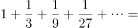（  ）。

- **A**. 

- **B**. 

　✅
- **C**. 

- **D**. 

**答案**：B

**官方解析**

原式可以看为n无穷大时，首项，公比为的等比数列求和，根据等比数列求和公式，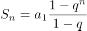。n无穷大时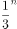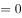，原式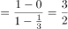。

故正确答案为B。

---

### 第 2 题　qid 2262769 · 数学运算

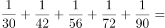（  ）。

- **A**. 

　✅
- **B**. 

- **C**. 

- **D**. 

**答案**：A

**官方解析**

原式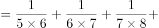。

故正确答案为A。

---

### 第 3 题　qid 2633405 · 数学运算

已知自然数a，b，c，d之和为80，a加3等于b减3等于c乘3等于d除以3，那么d等于：

- **A**. 24
- **B**. 36
- **C**. 39
- **D**. 45　✅

**答案**：D

**官方解析**

方法一：由题干可知，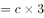，因此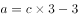，，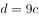。根据自然数a，b，c，d之和为80，则有，解得，因此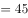。

方法二：由题干可知，，因此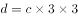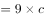，因为c为自然数，所以d是9的倍数，排除A、C两项。因为d的值较大，优先代入数字较大的D项。若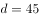，那么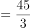，解得，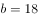，，则，符合。

故正确答案为D。

---

### 第 4 题　qid 2633439 · 数学运算

甲乙两棋手对弈，每局两人获胜的概率相同，规定5局3胜，获胜者得奖金1000元。下了3局后因故停止比赛，其中甲赢了2局，乙赢了1局。那么1000元奖金按照（    ）分配才算合理。

- **A**. 
甲元，乙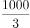元

- **B**. 
甲元，乙元
　✅
- **C**. 
甲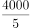元，乙元

- **D**. 
甲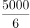元，乙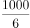元

**答案**：B

**官方解析**

每局两人获胜的概率相同，则甲、乙每局获胜的概率都为。若比赛正常进行，只有赢得3场胜利的选手才能获得奖金，乙已经赢了1局，如果乙要赢得奖金，那么剩下的2局都必须获胜。因此乙赢得奖金的概率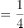，则甲赢得奖金的概率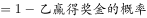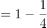。因此1000元奖金需要按照甲、乙赢得奖金的概率来进行分配才算合理，则甲获得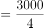元，乙获得元。

故正确答案为B。

---

### 第 5 题　qid 2262783 · 数学运算

某人工作一年的薪酬为6万元和一辆轿车，他干了10个月得到4万元和一辆轿车，那么这辆轿车值（    ）万元。

- **A**. 6　✅
- **B**. 7
- **C**. 8
- **D**. 9

**答案**：A

**官方解析**

设轿车的价格为万元，根据题意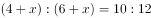，解得。

故正确答案为A。

---

### 第 6 题　qid 2633499 · 数学运算

有一工程50人计划65天完成，开工5天后，工程单位要求提前10天完工，如果每人工作效率不变，则需要增加施工人员（    ）名。

- **A**. 7
- **B**. 8
- **C**. 9
- **D**. 10　✅

**答案**：D

**官方解析**

方法一：赋值每人的工作效率为1，则开工5天后剩余的工程总量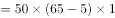，因为要求提前10天完工，所以剩余的工作时间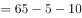天，则每天的工作量，因此需要增加的施工人员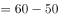名。

方法二：赋值每人的工作效率为1，因为要求提前10天完工，所以增加的人数用来完成50人10天的工作量，剩余的工作时间天，则需要增加的施工人员名。

故正确答案为D。

---

### 第 7 题　qid 2047800 · 数学运算

单位工会组织拔河比赛，每支参赛队都由3名男职工和3名女职工组成。假设比赛时要求3名男职工的站位不能全部连在一起，则每支队伍有几种不同的站位方式？

- **A**. 432
- **B**. 504
- **C**. 576　✅
- **D**. 720

**答案**：C

**官方解析**

6人排列，考虑顺序，共有种方法；

3名男职工全部连在一起，利用捆绑法有种方法；

则3名男职工不能全部连在一起的方法有：种。

故正确答案为C。

---

### 第 8 题　qid 2262790 · 数学运算

一果园共产苹果1000吨，要求全部装箱销售，箱子规格分为大箱（可装苹果20千克）、中箱（可装苹果15千克）、小箱（可装苹果10千克），规定所用大箱不得超过所用箱子总数的一半，中箱不得超过三分之一，那么至少用（    ）个箱子才能恰好把所有苹果装箱。

- **A**. 5000
- **B**. 6000
- **C**. 50000
- **D**. 60000　✅

**答案**：D

**官方解析**

由题意，问最少，采用极端假设法，设大箱子有个，中箱子有个，小箱子有个，则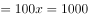吨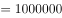千克，解得，则至少用的箱子个。

故正确答案为D。

---

## 判断推理

### 第 1 题　qid 2633369 · 逻辑判断

要使中国足球走出亚洲，关键是要有科学的精神。如果没有科学的精神，物质激励再多，也不可能在世界强队面前有好的突破。
请指出下面选项中与上面画线部分含义不等值的命题：

- **A**. 只有发扬科学精神，才能取得好的突破
- **B**. 除非有科学的精神，否则他不能取得好的突破
- **C**. 只要有了科学的精神，就能有好的突破　✅
- **D**. 如果取得了好的突破，一定树立了科学的精神

**答案**：C

**官方解析**

第一步：翻译题干。

本题问的是与上面画线部分含义不等值的命题，只需翻译画线句。

画线句翻译为：科学精神好的突破。

第二步：逐一分析选项。

A项：翻译为好的突破科学精神，是对画线句的否后，否后必否前，与画线句等值，排除；

B项：翻译为好的突破科学精神，是对画线句的否后，否后必否前，与画线句等值，排除；

C项：翻译为科学精神好的突破，是对画线句的否前，否前无法推出确定结论，与画线句不等值，当选；

D项：翻译为好的突破科学精神，是对画线句的否后，否后必否前，与画线句等值，排除。

本题为选非题，故正确答案为C。

---

### 第 2 题　qid 1771 · 定义判断

重大飞行事故罪是指航空人员违反规章制度，致使发生重大飞行事故，造成严重后果的行为。
根据定义，下列属于重大飞行事故罪的是：

- **A**. 逃犯甲用匕首胁迫飞机驾驶员在某乡镇降落，结果致使大量村民死亡
- **B**. 某客机在滑行途中突遭暴雨，驾驶员作出停止升空的决定，结果导致乘客滞留机场达48小时
- **C**. 驾驶员在和空姐聊天时，飞机偏离原定航线
- **D**. 飞机驾驶员为提神，在驾驶时吸烟，结果导致飞机着火坠毁　✅

**答案**：D

**官方解析**

第一步：找出定义关键词。
“航空人员违反规章制度”、“造成严重后果”。
第二步：逐一分析选项。
A项：飞机驾驶员是在被胁迫的情况下将飞机降落，没有违反航空公司的规章制度，不符合“航空人员违反规章制度”，不符合定义，排除；
B项：客机驾驶员遇到不可抗力因素（暴雨）作出停止升空的决定，没有违反航空公司的规章制度，不符合“航空人员违反规章制度”，且乘客滞留机场也不属于严重的后果，不符合“造成严重后果”，不符合定义，排除；
C项：飞机偏离原定航线不属于严重的后果，不符合“造成严重后果”，不符合定义，排除；
D项：飞机驾驶员在驾驶时吸烟是违反航空公司规章制度的行为，符合“航空人员违反规章制度”，飞机坠毁属于严重的后果，符合“造成严重后果”，符合定义，当选。
故正确答案为D。

---

### 第 3 题　qid 25411 · 逻辑判断

有经验的司机完全有能力并习惯以120公里的时速在高速公路上行驶，为了迅速提高道路的使用效率，某条高速公路的最高时速限制由原来100公里转为120公里。
以下各项如果为真，最能质疑上述主张的是：

- **A**. 统计表明行车速度达120公里时事故发生率明显增加，反而影响高速公路的使用效率　✅
- **B**. 限速每小时120公里不能迅速提高公路使用效率，因为高速驾车对技术的要求很高
- **C**. 时速达120公里时，汽车的油耗量将明显增加，考虑到油价，大多数司机还是放松油门
- **D**. 虽然时速限制放宽到120公里，但在不少路段上，很多司机对此速度有安全之虞

**答案**：A

**官方解析**

第一步：找出论点和论据。
论点：为了迅速提高道路的使用效率，某条高速公路的最高时速限制由原来100公里转为120公里。
论据：有经验的司机完全有能力并习惯以120公里的时速在高速公路上行驶。
本题论据和论点讨论的是都是高速公路的最高时速限制为120公里，二者话题一致，削弱首先考虑削弱论点，其次考虑削弱论据。
第二步：逐一分析选项。
A项：限速转为120公里会明显增加事故，影响高速公路使用效率，即降低使用效率，直接削弱论点，保留；
B项：指出不能迅速提高使用效率，但并不否定限速转为120公里以后有提高使用效率的可能性，削弱论点，保留；
C项：说的是大多数司机考虑到油价，通常不会开到时速120公里，说明限速120公里不一定能够提高使用效率，削弱论点，保留；
D项：说的是司机对车速的顾虑，没有说明是否影响道路使用效率，属无关选项，排除。
比较A、B、C三项，三项都是削弱论点，但B、C两项只说明不能提高公路使用效率，而A项强调的是会降低使用效率，对论点的削弱力度比B、C两项强。
故正确答案为A。

---

### 第 4 题　qid 2633375 · 逻辑判断

一种对传染病非常有效的药物，目前只能从一种叫ibora的树皮中提取，而这种树在自然界中很稀少，5000棵树的皮才能提取1公斤药物。因此，不断生产这种药，将不可避免地导致该物种的灭绝。
以下哪项为真，最能削弱上述理论？

- **A**. 把从ibora树皮中提取的药物通过一个权威机构直接发送给医生
- **B**. 从ibora树皮提取药物生产成本很高
- **C**. ibora的叶子在多种医学制品中都有应用
- **D**. ibora可以通过插枝繁衍，在人工培育下生长　✅

**答案**：D

**官方解析**

第一步：找出论点和论据。
论点：不断生产这种药，将不可避免地导致该物种的灭绝。
论据：这种树在自然界中很稀少，5000棵树的皮才能提取1公斤药物。
本题论点说的是不断生产此药会导致该物种的灭绝，论据是该物种稀少且5000棵树的皮才能提取1公斤药物，二者话题一致，优先考虑削弱论点，即不断生产这种药不会导致该物种的灭绝。
第二步：逐一分析选项。
A项：该项讨论的是将药物发送给医生，而论点讨论的是药物的不断生产会导致该物种灭绝，话题不一致，无法削弱，排除；
B项：该项讨论的是药物提取的成本，而论点讨论的是药物的不断生产会导致该物种灭绝，话题不一致，无法削弱，排除；
C项：该项讨论的是ibora的叶子在医学制品中的应用，而论点讨论的是药物的不断生产会导致该物种灭绝，话题不一致，无法削弱，排除；
D项：该项讨论的是ibora可以通过插枝繁衍，在人工培育下生长，证明药物的不断生产并不会导致该物种灭绝，削弱论点，当选。
故正确答案为D。

---

### 第 5 题　qid 2633380 · 逻辑判断

已知“某大学并非或者有哲学专业或者有逻辑学专业”，则可以得出以下哪项结论？

- **A**. 如果该所大学没有逻辑学专业，那么一定有哲学专业
- **B**. 如果该所大学没有哲学专业，那么一定有逻辑学专业
- **C**. 该所大学既有哲学专业又有逻辑学专业
- **D**. 该所大学既没有逻辑学专业，也没有哲学专业　✅

**答案**：D

**官方解析**

第一步：翻译题干。

题干翻译为：（哲学或逻辑学）哲学 且 逻辑学。

第二步：逐一分析选项。

A项：翻译为逻辑学哲学，无法推出，排除；

B项：翻译为哲学逻辑学，无法推出，排除；

C项：翻译为哲学 且 逻辑学，无法推出，排除；

D项：翻译为哲学 且 逻辑学，根据题干逻辑关系可以推出，当选。

故正确答案为D。

---

### 第 6 题　qid 2633384 · 类比推理

一天，一位上车不久的乘客发现自己的背包被人割开，刚取回的一万元钱不见了。据乘客说上车时还没事，因当时还没有乘客下车，司机于是把车开到附近的派出所。经过调查寻找，发现钱已被扒手丢在了座位下边。嫌疑人有甲、乙、丙、丁。
甲：“反正不是我干的。”
乙：“是丁干的。”
丙：“是乙干的。”
丁：“乙是诬告。”
他们当中只有一人说假话，扒手只有一个人，是：

- **A**. 甲
- **B**. 乙　✅
- **C**. 丙
- **D**. 丁

**答案**：B

**官方解析**

第一步：找矛盾。

甲：甲；

乙：丁；

丙：乙；

丁：丁。

乙和丁是矛盾关系，二者必有一真，必有一假。

第二步：看其余。

已知只有一人说假话，乙和丁一真一假，可以推出甲和丙二人说的都是真话，即乙是扒手。

故正确答案为B。

---

### 第 7 题　qid 2633387 · 类比推理

古希腊唯心主义不可知论者认为：一切都是虚假的。亚里土多德反驳道：如果一切都是虚假的，那么“一切都是虚假的”就是假的。这是一个归谬反驳的例子。
选项中与题干论证方式相同的是：

- **A**. 有人认为刑事犯罪率的高低与刑罚的严厉程度成反比趋势。若该结论成立，那就意味着刑罚最严厉的时代，就是犯罪率最低的时代；而刑罚最宽缓的时代，就是犯罪率最高的时代。但考察历史却发现，事实并非如此。秦朝和明代好像是刑罚最为严酷的时代，但犯罪率却并没有降至最低；而汉代的文景之治、唐朝的贞观之治时期好像是刑罚最宽缓的时期，其犯罪率也没有上升，反倒出现了下降的趋势，足见“反比说”不成立　✅
- **B**. “地心说”是不能怀疑的，因为亚里士多德就是这么说的
- **C**. 谁说中国的失业率高？在我认识的很多人中，没有一个是失业的，说明中国的失业率是很低的
- **D**. 鲁迅是一位伟大的文学家，又是一位伟大的思想家，所以说鲁迅是一位伟大的思想家和文学家

**答案**：A

**官方解析**

第一步：分析题干论证方式。
题干先给出观点“一切都是虚假的”，反驳方式是不直接反对对方的观点，而是按照对方的观点推导出该观点是错误的。
第二步：逐一分析选项。
A项：选项观点是“刑事犯罪率的高低与刑罚的严厉程度成反比趋势”，反驳方式是假设该结论成立，然后指出秦朝和明代、汉代的文景之治、唐朝的贞观之治这些时代的历史事实都不符合上述结论，证明上述观点是不成立的，属于归谬反驳，与题干论证方式一致，当选；
B项：选项观点是“地心说”是不能怀疑的，理由是亚里士多德就是这么说的，属于诉诸权威，与题干论证方式不一致，排除；
C项：选项通过“在我认识的很多人中，没有一个是失业的”，得出“中国的失业率是很低的”的结论，部分推出整体，属于不完全归纳，与题干论证方式不一致，排除；
D项：选项通过“鲁迅是一位伟大的文学家，又是一位伟大的思想家”，得出“鲁迅是一位伟大的思想家和文学家”的结论，只是在原来的观点上进行总结，与题干论证方式不一致，排除。
故正确答案为A。

---

### 第 8 题　qid 2633391 · 逻辑判断

某单位财务处共有11名工作人员（包括处长），有关这11名工作人员的原籍，以下三个断定中只有一个是真的：
①有人是山东的。
②有人不是山东的。
③处长不是山东的。
以下哪项为真？

- **A**. 11名工作人员都是山东人　✅
- **B**. 11名工作人员都不是山东人
- **C**. 只有一人不是山东人
- **D**. 只有一人是山东人

**答案**：A

**官方解析**

第一步：找关系。
①有人是山东的与②有人不是山东的，是反对关系，必有一真。
第二步：看其余。
已知三个断定中只有一个是真的，且①与②必有一真，则可以推出③为假，即处长是山东人。由处长是山东人可以推出①为真，②为假，②的矛盾为真，那么11名工作人员都是山东人，A项当选。
故正确答案为A。

---

### 第 9 题　qid 25295 · 类比推理

汽车：导航仪

- **A**. 电脑：鼠标　✅
- **B**. 相机：闪光灯
- **C**. 医生：护士
- **D**. 办公室：办公桌

**答案**：A

**官方解析**

第一步：判断题干词语间逻辑关系。
汽车和导航仪是或然组成关系，且后者为前者在屏幕上定位。
第二步：判断选项词语间逻辑关系。
A项：电脑和鼠标是或然组成关系，且后者为前者在屏幕上定位，与题干逻辑关系一致，当选；
B项：相机和闪光灯是或然组成关系，但是两词没有定位的关系，与题干逻辑关系不一致，排除；
C项：医生和护士是并列关系，与题干逻辑关系不一致，排除；
D项：办公室和办公桌是地点对应关系，与题干逻辑关系不一致，排除。
故正确答案为A。

---

### 第 10 题　qid 2653 · 类比推理

考试：学生：成绩

- **A**. 网络：网民：电子邮件
- **B**. 汽车：司机：驾驶执照
- **C**. 工作：职员：工资待遇　✅
- **D**. 饭菜：厨师：色香味美

**答案**：C

**官方解析**

第一步：判断题干词语之间逻辑关系。
题干词语之间是对应关系，第二个通过第一个达到第三个目的。学生通过考试取得成绩。
第二步：判断选项词语之间逻辑关系。
A、B、D三项组成的关系与题干逻辑关系不一致；
C项，职员通过工作获得工资待遇，符合题干逻辑关系。
故正确答案为C。

---

### 第 11 题　qid 2633371 · 图形推理

从所给的四个图形中选择最合适的一个填入问号处，使之呈现一定的规律性。

- **A**. A
- **B**. B
- **C**. C
- **D**. D　✅

**答案**：D

**官方解析**

元素组成不同，且无明显属性规律，优先考虑数量规律。观察发现图形明显被分割，考虑数面。面的数量依次是5、6、2、2、2、?，无规律。继续观察，每个图形均含有直线构成的多边形，考虑数直线。直线数依次是4、5、5、6、5、?，无规律。继续观察，直线构成的多边形形成很多夹角，考虑数角。角的数量依次是4、5、6、7、8、?，“?”处应选择角数量为9的图形，只有D项符合规律。
故正确答案为D。

---

### 第 12 题　qid 2633378 · 图形推理

左边给定的是正方体的外表面展开图，右边哪一项不能由它折叠而成？

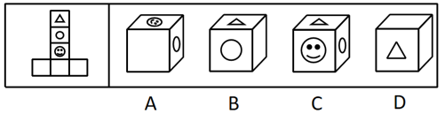

- **A**. A
- **B**. B
- **C**. C　✅
- **D**. D

**答案**：C

**官方解析**

将展开图标上序号如下图，逐一进行分析。

A项：选项由面b、面c与面f构成，选项与展开图一致，排除；

B项：选项由面a、面b与面f构成，选项与展开图一致，排除；

C项：选项由面a、面b与面c构成，展开图中面a和面c为相对面，不能同时出现，选项与展开图不一致，当选；

D项：选项由面a、面d与面f构成，选项与展开图一致，排除。

本题为选非题，故正确答案为C。

---

### 第 13 题　qid 2633394 · 图形推理

从所给的四个图形中选择最合适的一个填入问号处，使之呈现一定的规律性。

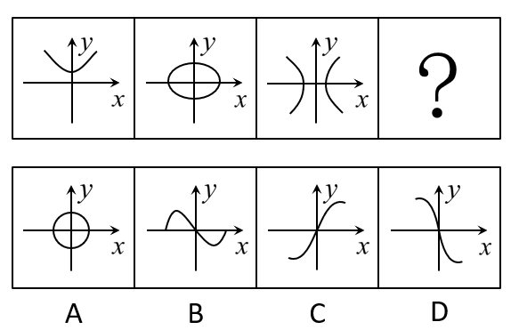

- **A**. A　✅
- **B**. B
- **C**. C
- **D**. D

**答案**：A

**官方解析**

解法一：图形元素组成不同，优先考虑属性规律，观察发现题干中曲线均关于轴对称，而选项中只有A项曲线关于轴对称。

解析二：题干图形均由坐标系和曲线构成，观察发现曲线图形都没有经过原点（轴与轴的交点），而选项中只有A项曲线没有经过原点。 

故正确答案为A。

---

### 第 14 题　qid 2633401 · 图形推理

从所给的四个图形中选择最合适的一个填入问号处，使之呈现一定的规律性。

- **A**. A
- **B**. B　✅
- **C**. C
- **D**. D

**答案**：B

**官方解析**

元素组成不同，优先考虑属性规律。观察发现有等腰三角形、等腰梯形等“等腰”元素，优先考虑对称性。题干图形均为轴对称图形，排除D项。再观察发现每个图形均含有内外两个图形，且内外图形的相交位置分别在下、左、上、右，？处图形应由内外两个图形组成，且相交位置应该在下，排除A、C两项。
故正确答案为B。

---

### 第 15 题　qid 2633409 · 图形推理

把下面的六个图形分为两类，使每一类图形都具有共同的特征或规律，分类正确的是：

- **A**. ①②③，④⑤⑥
- **B**. ①③⑤，②④⑥　✅
- **C**. ①②④，③⑤⑥
- **D**. ①⑤⑥，②③④

**答案**：B

**官方解析**

元素组成相同，考虑样式规律。观察发现题干小图形都在正六边形格子中，如下图所示。其中①③⑤中“心”“月亮”“笑脸”在1、3、5的位置，“太阳”“四角星”“五角星”在2、4、6的位置，②④⑥中“心”“月亮”“笑脸”在2、4、6的位置，“太阳”“四角星”“五角星”在1、3、5的位置。

故正确答案为B。

---

## 资料分析

### 材料 1

        山东省2010年至2014年的粮食、棉花、油料总产量（单位：万吨）和单产（单位：千克／公顷）如下表： 

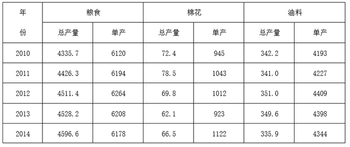

#### 第 1 题　qid 2633377 · 平均数

五年来山东省棉花产量平均增量是：

- **A**. 1.475
- **B**. -1.475　✅
- **C**. 1.18
- **D**. -1.18

**答案**：B

**官方解析**

由问题 “······平均增量是”，可判定本题为年均增长量问题。定位表格可得：2014年棉花总产量为66.5万吨，2010年棉花总产量为72.4万吨，代入年均增长量公式：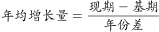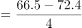万吨。

故正确答案为B。

备注：虽然题干表述是“五年来”，但实际上2010-2014年的年份差是4年。

---

#### 第 2 题　qid 2633379 · 增长

2010年至2014年山东省粮食总产量的增速最快的是（    ）年。

- **A**. 2011　✅
- **B**. 2012
- **C**. 2013
- **D**. 2014

**答案**：A

**官方解析**

根据题干 “······增速最快的是”，可判定本题为一般增长率比较问题。定位表格，2010年至2014年，山东省粮食总产量分别为：4335.7、4426.3、4511.4、4528.2、4596.6万吨。根据公式，。各年份增速如下：

2011年，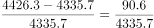；2012年，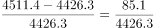；2013年，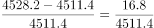；2014年，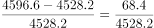；比较可得2011年分子最大分母最小，故分数最大，则增速最快的是2011年。

故正确答案为A。

---

#### 第 3 题　qid 2262820 · 综合

2010年至2014年山东省油料总产量和单产的趋势图是（  ）。

- **A**. 
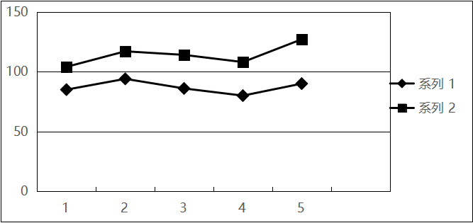

- **B**. 
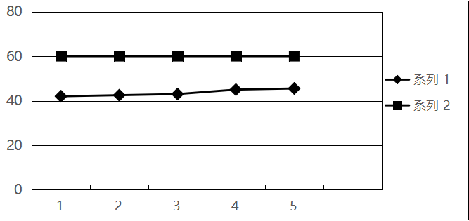

- **C**. 
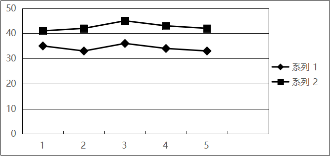
　✅
- **D**. 
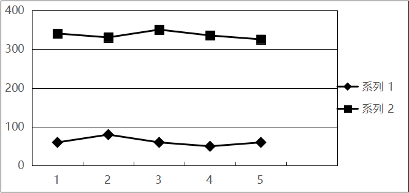

**答案**：C

**官方解析**

定位表格材料可知2010年至2014年山东省油料总产量的变化趋势为下降、上升、下降、下降；单量的变化趋势为上升、上升、下降、下降，符合题意的为C项。（注：总量为系列1，单量为系列2）
故正确答案为C。

---

#### 第 4 题　qid 2262821 · 综合

2014年山东省粮食种植面积在粮棉油总种植面积中约占（  ）成。

- **A**. 六
- **B**. 七
- **C**. 八　✅
- **D**. 九

**答案**：C

**官方解析**

由题意“2014年山东省粮食种植面积在粮棉油总种植面积中约占”判定此题为现期比重问题，定位表格材料可知2014年山东省粮食种植面积 公顷，棉花种植面积 公顷，油料种植面积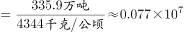公顷，则2014年山东省粮食种植面积占粮棉油总种植面积的比重，最接近于八成。

故正确答案为C。

---

#### 第 5 题　qid 2262822 · 综合

下列说法不准确的是（  ）。

- **A**. 自2010年至2014年山东省粮食总产量逐年增加
- **B**. 粮食单产增速最快的一年是2012年　✅
- **C**. 棉花单产增速最快的一年是2014年
- **D**. 油料单产增速最快的一年是2012年

**答案**：B

**官方解析**

A项：2010-2014年，粮食总产量依次是4335.7万吨、4426.3万吨、4511.4万吨、4528.2万吨、4596.6万吨，逐年增加，正确；

B项：2011年粮食单产增速：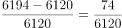；2012年粮食单产增速：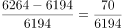；2013年与2014年粮食单产均下降，与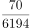相比，分子大分母小，则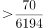，因此增速最快的是2011年。错误；

C项：2011年棉花单产增速：，2012年与2013年棉花单产均为下降，2014年：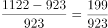，与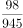相比，分子大分母小，则，因此增速最快的是2014年。正确；

D项：2011年油料单产增速：，2012年油料单产增速：，2013年与2014年油料单产均下降，与相比，分母差不多，分子明显前者大，则，因此增速最快的是2012年。正确。

本题为选非题，故正确答案为B。

---

### 材料 2

        根据国家统计局最新发布的数据，2016年2月份，全国工业生产者出厂价格环比下降，同比下降。工业生产者购进价格环比下降，同比下降。1-2月平均，工业生产者出厂价格同比下降，工业生产者购进价格同比下降。

 

1.工业生产者价格同比变动情况 

        工业生产者出厂价格中，生产资料价格同比下降，影响全国工业生产者出厂价格总水平下降约4.8个百分点。其中，采掘工业价格下降，原材料工业价格下降，加工工业价格下降。生活资料价格同比下降，影响全国工业生产者出厂价格总水平下降约0.1个百分点。其中，食品价格上涨，衣着价格上涨，一般日用品价格下降，耐用消费品价格下降。

        据测算，在2月份-的全国工业生产者出厂价格总水平同比降幅中，去年价格变动的翘尾因素约为-4.1个百分点，新涨价因素约为-0.8个百分点。

        工业生产者购进价格中，黑色金属材料类价格同比下降，燃料动力类价格下降，有色金属材料及电线类价格下降，化工原料类价格下降。

2.工业生产者价格环比变动情况

        工业生产者出厂价格中，生产资料价格环比下降，影响全国工业生产者出厂价格总水平下降约0.3个百分点。其中，采掘工业价格下降，原材料工业价格下降，加工工业价格下降。生活资料价格环比上涨。其中，食品价格上涨，衣着价格持平，一般日用品价格上涨，耐用消费品价格下降。

        工业生产者购进价格中，燃料动力类价格环比下降，黑色金属材料类价格下降，有色金属材料及电线类价格上涨，农副产品类价格上涨。

#### 第 6 题　qid 2262865 · 平均数

2015年2月份到2016年2月份生活资料出厂价格平均环比是（  ）。

- **A**. 
下降

- **B**. 
上升

- **C**. 
保持不变
　✅
- **D**. 
不能确定

**答案**：C

**官方解析**

由题意“2015年2月份到2016年2月份生活资料出厂价格平均环比”判定此题为一般增长率问题，定位图形三可知2015年2月份到2016年2月份生活资料出厂价格各月的环比中有三个为，三个为，其余均为0，即平均数为0，所以2015年2月份到2016年2月份生活资料出厂价格平均环比保持不变。

故正确答案为C。

---

#### 第 7 题　qid 2262870 · 增长

如果在2016年3月份生产资料出厂价格同比与2015年3月份有相同的变化量，那么可以预测2016年3月份的生产资料出厂价格同比是（  ）。

- **A**. 
下降
　✅
- **B**. 
下降

- **C**. 
下降

- **D**. 
下降

**答案**：A

**官方解析**

由题意“如果在2016年3月份生产资料出厂价格同比与2015年3月份有相同的变化量，那么可以预测2016年3月份的生产资料出厂价格同比是”判定此题为一般增长率问题，设2015年3月生产资料的出厂价格为A，定位图形四可知，2016年3月生产资料出厂价格的同比增长率，与A项最接近。

故正确答案为A。

---

#### 第 8 题　qid 2262880 · 增长

从2015年2月份到2016年2月份，工业生产者出厂价格和工业生产者购进价格同比变化的极差分别是（  ）。

- **A**. 
，

- **B**. 
，
　✅
- **C**. 
，

- **D**. 
，

**答案**：B

**官方解析**

定位图一、图二可知，工业生产者出厂价格同比极差，工业生产者购进价格同比极差。

故正确答案为B。

---

#### 第 9 题　qid 2262886 · 增长

在2016年2月份工业生产者出厂价格同比下降中，新涨价因素所占的比例是（  ）。

- **A**. 

- **B**. 

- **C**. 

- **D**. 

　✅

**答案**：D

**官方解析**

由题意“在2016年2月份工业生产者出厂价格同比下降中，新涨价因素所占的比例”判定此题为现期比重问题，定位文字材料第二段“在2月份的全国工业生产者出厂价格总水平同比降幅中，去年价格变动的翘尾因素约为-4.1个百分点，新涨价因素约为-0.8个百分点。”可知在2016年2月份工业生产者出厂价格同比下降中，新涨价因素所占的比例。

故正确答案为D。

---

#### 第 10 题　qid 2262887 · 综合

2016年2月份工业生产者出厂价格环比与生产资料出厂价格环比及生活资料出厂价格环比的关系分别是（  ）。

- **A**. 正相关和负相关　✅
- **B**. 正相关和正相关
- **C**. 负相关和正相关
- **D**. 负相关和负相关

**答案**：A

**官方解析**

定位图形材料一可知2016年2月份工业生产者出厂价格环比为，即2016年2月份工业生产者出厂价格环比下降，定位图形材料四可知2016年2月份生产资料出厂价格环比为，即2016年2月份生产资料出厂价格环比下降，定位图形材料三可知2016年2月份生活资料出厂价格环比为，即2016年2月份生活资料出厂价格环比上升，所以2016年2月份工业生产者出厂价格环比与生产资料出厂价格环比的关系为正相关，2016年2月份工业生产者出厂价格环比与生活资料出厂价格环比的关系为负相关。

故正确答案为A。

---
