# 2016年重庆市选调优秀大学生到基层工作考试《行测》题

> 选调生 · 2016 年 · 5 个模块 · 共 98 题

- [常识判断](#%E5%B8%B8%E8%AF%86%E5%88%A4%E6%96%AD) · 15 题
- [言语理解与表达](#%E8%A8%80%E8%AF%AD%E7%90%86%E8%A7%A3%E4%B8%8E%E8%A1%A8%E8%BE%BE) · 30 题
- [数量关系](#%E6%95%B0%E9%87%8F%E5%85%B3%E7%B3%BB) · 13 题
- [判断推理](#%E5%88%A4%E6%96%AD%E6%8E%A8%E7%90%86) · 30 题
- [资料分析](#%E8%B5%84%E6%96%99%E5%88%86%E6%9E%90) · 10 题

---

## 常识判断

### 第 1 题　qid 2262501 · 人文常识

《推动共建丝绸之路经济带和21世纪海上丝绸之路的愿景和行动》提出，陆上依托国际大通道共同打造亚欧大陆桥经济走廊。新亚欧大陆桥经济走廊，又称“第二亚欧大陆桥”：

- **A**. 起点是大连、沈阳、长春、哈尔滨，终点是满洲里和俄罗斯赤塔
- **B**. 起点是江苏连云港、山东日照，终点是荷兰鹿特丹港　✅
- **C**. 起点是新疆喀什，终点是巴基斯坦坦瓜达尔港
- **D**. 起点是重庆，终点是德国杜伊斯堡

**答案**：B

**官方解析**

本题考查政治常识。
新亚欧大陆桥经济走廊又称“第二亚欧大陆桥”，为欧洲与亚洲两侧海上运输线联结起来的便捷运输铁路，由中国陇海和兰新铁路与哈萨克斯坦铁路接轨，东起中国日照和连云港，向西经陇海铁路的徐州、商丘、郑州、洛阳、西安及兰新铁路的兰州、乌鲁木齐等站，经北疆铁路到达边境阿拉山口进入哈萨克斯坦，经俄罗斯、白俄罗斯、波兰、德国，至荷兰鹿特丹港，是目前亚欧大陆东西最为便捷的通道。
故正确答案为B。

---

### 第 2 题　qid 2262502 · 人文常识

2015年9月3日，天安门广场举行盛大阅兵式，纪念中国人民抗日战争暨世界反法西斯战争胜利70周年，三军仪仗队组成史上最大阵容亮相大阅兵，现代“三军”是指海军、陆军、空军，而“三军”的说法最早始于春秋时期。唐宋以后，“三军”是指：

- **A**. 前军、中军、后军　✅
- **B**. 步军、马军、水军
- **C**. 上军、中军、下军
- **D**. 步军、车军、骑军

**答案**：A

**官方解析**

本题考查人文常识。
A项正确，唐宋以后，“三军”指的是前、中、后军，前军是先锋部队；中军是主将统率的部队，也是主力；后军主要担任掩护和警戒任务。
B、D两项错误，步军、马（骑）军、水军、车军均是我国古代兵种。
C项错误，春秋时，各国对军队的称谓不同，齐国、鲁国和吴国称上、中、下三军，随着时代演进，上、中、下军被前、中、后军所代替。
故正确答案为A。

---

### 第 3 题　qid 2262503 · 人文常识

集中反映IT产业起伏的指数是：

- **A**. 道琼斯指数
- **B**. 纳斯达克指数　✅
- **C**. 克强指数
- **D**. 沪深指数

**答案**：B

**官方解析**

本题考查经济常识。
A项错误，道琼斯指数是一种算术平均股价指数。道琼斯指数是世界上历史最为悠久的股票指数，它由四种股价平均指数构成，其中以道琼斯工业股价平均指数最为著名，它被大众传媒广泛地报道，并作为道琼斯指数的代表加以引用。故道琼斯指数是用来反映工业起伏的指数。
B项正确，纳斯达克指数是反映纳斯达克证券市场行情变化的股票价格平均指数，基本指数为100。纳斯达克的上市公司涵盖所有新技术行业，包括软件和计算机、电信、生物技术、零售和批发贸易等。故常用其来反映IT行业的起伏。
C项错误，克强指数是英国著名政经杂志《经济学人》创造的用于评估中国GDP增长量的指标，以中国国务院总理李克强的名字命名。克强指数是三种经济指标：工业用电量新增、铁路货运量新增和银行中长期贷款新增的结合。
D项错误，沪深指数即股票价格指数，是由证券交易所或金融服务机构编制的表明股票行市变动的一种供参考的指示数字。
故正确答案为B。

---

### 第 4 题　qid 2262504 · 人文常识

“兰桂齐芳”的“兰桂”指：

- **A**. 子孙　✅
- **B**. 花草
- **C**. 理想
- **D**. 人才

**答案**：A

**官方解析**

本题考查人文常识。
“兰桂齐芳”语出明·胡文焕《群音类选·百顺记·王曾祝寿》：“与阶前兰桂齐芳，应堂上椿萱同茂。” 兰桂指的是子孙一辈；芳，比喻美德、美声。兰桂齐芳比喻儿孙同时显贵发达。另，椿萱同茂，指椿树和萱草都茂盛，比喻父母都健康。
故正确答案为A。

---

### 第 5 题　qid 2262505 · 科技常识

目前，重庆正在重点培育战略性新兴产业集群，形成一批新的经济增长点。所谓战略性新兴产业，是指以重大技术突破和重大发展需求为基础，对经济社会全局和长远发展具有重大引领带动作用，知识技术密集、物质资源消耗少、成长潜力大、综合效益好的产业。下列选项中，全部属于战略性新兴产业的是：

- **A**. 节能环保、生物、绿色食品
- **B**. 信息、文化创意、海洋产业
- **C**. 新能源、现代物流、高端生产性服务业
- **D**. 新能源汽车、新材料、高端装备制造　✅

**答案**：D

**官方解析**

本题考查政治常识
《“十三五”国家战略性新兴产业发展规划》指出，深化国际合作，进一步发展壮大新一代信息技术、高端装备、新材料、生物、新能源汽车、新能源、节能环保、数字创意等战略性新兴产业，推动更广领域新技术、新产品、新业态、新模式蓬勃发展，建设制造强国，发展现代服务业，为全面建成小康社会提供有力支撑。
A项错误，绿色食品不属于战略性新兴产业。
B项错误，海洋产业指以开发、利用和保护海洋资源和海洋空间为对象的产业部门。海洋产业不属于战略性新兴产业。
C项错误，现代物流是指将信息、运输、仓储、库存、装卸搬运以及包装等物流活动综合起来的一种新型的集成式管理。生产性服务业是指为保持工业生产过程的连续性、促进工业技术进步、产业升级和提高生产效率提供保障服务的服务行业。现代物流、高端生产性服务业均不属于战略性新兴产业。
D项正确，新能源汽车、新材料、高端装备制造都属于战略性新兴产业。
故正确答案为D。

---

### 第 6 题　qid 2262506 · 人文常识

“8·12天津爆炸”事故造成了重大伤亡，是由于危险品保存不当造成的事件。下列关于危险品贮存和保管的说法不正确的一项是：

- **A**. 远离高温以及太阳直射
- **B**. 存储容器必须贴有明显标识
- **C**. 尽量一并存放　✅
- **D**. 其仓库与生产、生活区保持一定距离

**答案**：C

**官方解析**

本题考查科技常识。
A项正确，根据《危险化学品安全管理条例》第二十条第一款规定：“生产、储存危险化学品的单位，应当根据其生产、储存的危险化学品的种类和危险特性，在作业场所设置相应的监测、监控、通风、防晒、调温、防火、灭火、防爆、泄压、防毒、中和、防潮、防雷、防静电、防腐、防泄漏以及防护围堤或者隔离操作等安全设施、设备，并按照国家标准、行业标准或者国家有关规定对安全设施、设备进行经常性维护、保养，保证安全设施、设备的正常使用。”因此危险品贮存和保管应远离高温以及太阳直射。
B项正确，根据《危险化学品安全管理条例》第二十条第二款规定：“生产、储存危险化学品的单位，应当在其作业场所和安全设施、设备上设置明显的安全警示标志。”因此，存储容器必须贴有明显标识。
C项错误，根据《危险化学品安全管理条例 》第二十四条第一款规定：“危险化学品应当储存在专用仓库、专用场地或者专用储存室（以下统称专用仓库）内，并由专人负责管理；剧毒化学品以及储存数量构成重大危险源的其他危险化学品，应当在专用仓库内单独存放，并实行双人收发、双人保管制度。”因此，危险品贮存和保管应尽量避免一并存放，剧毒化学品以及储存数量构成重大危险源的其他危险化学品必须分类单独储存。
D项正确，根据《危险化学品安全管理条例 》第十九条第一款规定：“危险化学品生产装置或者储存数量构成重大危险源的危险化学品储存设施（运输工具加油站、加气站除外），与下列场所、设施、区域的距离应当符合国家有关规定:（一）居住区以及商业中心、公园等人员密集场所；（二）学校、医院、影剧院、体育场（馆）等公共设施；（三）饮用水源、水厂以及水源保护区；（四）车站、码头（依法经许可从事危险化学品装卸作业的除外）、机场以及通信干线、通信枢纽、铁路线路、道路交通干线、水路交通干线、地铁风亭以及地铁站出入口······”因此，危险品贮存的仓库与生产、生活区要保持一定距离。
本题为选非题，故正确答案为C。

---

### 第 7 题　qid 2262507 · 地理国情

河南一大学生捕猎、贩卖国家二级保护动物燕隼鸟16只被判刑10年半并处以罚款的消息，令公众对濒危野生动物的保护有了更深层次的认识，下列不属于国家二级保护动物的有（  ）个。
（1）天鹅  （2）野猪  （3）大鲵  （4）黑熊
（5）扬子鳄  （6）虎  （7）海豚

- **A**. 2
- **B**. 3　✅
- **C**. 4
- **D**. 5

**答案**：B

**官方解析**

本题考查科技常识。
《国家重点保护野生动物名录》是最初由原林业部和农业部根据《中华人民共和国野生动物保护法》的相关规定，共同制定并发布的一份由国家重点保护的珍贵、濒危野生动物的名录。其中保护级别分为一级和二级，并且对水生、陆生动物作了具体划分，明确了由渔业、林业行政主管部门分别主管的具体种类。
（1）天鹅属于国家二级保护动物。
（2）野猪不属于国家级保护动物。
（3）大鲵属于国家二级保护动物。
（4）黑熊属于国家二级保护动物。
（5）扬子鳄属于国家一级保护动物。
（6）虎属于国家一级保护动物。
（7）海豚科下的中华白海豚属于国家一级保护动物，其他海豚为国家二级保护动物。本题题干仅提到海豚，而非特指中华白海豚，故可认为此处是对海豚的统称，倾向于归为国家二级保护动物。
综上，不属于国家二级保护动物的有3个：野猪、扬子鳄、虎。
本题为选非题，故正确答案为B。

---

### 第 8 题　qid 2262508 · 人文常识

随着“保税经济时代”的到来，重庆各保税物流中心、保税商品展示中心、大型免税店等纷纷建立，早就为市民打开了一条不出国门抢“洋货”的捷径。我们熟知的保税货物，是指经海关批准未办理纳税手续进境，在（  ）储存、加工、装配后复运出境的货物。

- **A**. 国内
- **B**. 境内　✅
- **C**. 保税区内
- **D**. 海关

**答案**：B

**官方解析**

本题考查法律常识。
根据《中华人民共和国海关法》第一百条规定：“保税货物，是指经海关批准未办理纳税手续进境，在境内储存、加工、装配后复运出境的货物。”
故正确答案为B。

---

### 第 9 题　qid 2262509 · 科技常识

“地表沙丘、砾石遍布，大气稀薄，以二氧化碳为主，昼夜温差大，常有尘暴发生······”上述文字最有可能描述的是：

- **A**. 金星
- **B**. 火星　✅
- **C**. 木星
- **D**. 土星

**答案**：B

**官方解析**

本题考查地理国情。

A项错误，金星是一颗类地行星，也是太阳系中唯一一颗没有磁场的行星。金星表面上有的平原，大气主要由二氧化碳组成，并含有少量的氮气。

B项正确，火星基本上是沙漠行星，地表沙丘、砾石遍布且没有稳定的液态水体。以二氧化碳为主的大气层很薄，难以通过大气运动传递表面的热量，所以其表面温度变化较大，昼夜温差约，且沙尘悬浮其中，每年常有尘暴发生。

C项错误，木星是太阳系八大行星中体积最大、自转最快的行星。木星为气态巨行星，其大气主要由氢气和氦气组成。

D项错误，土星在八大行星中体积则仅次于木星，属于气态巨行星，主要由氢组成，还有少量的氦与微量元素。

故正确答案为B。

---

### 第 10 题　qid 2262510 · 人文常识

歌剧《图兰朵》中采用了我国哪首民歌的曲调？

- **A**. 小白菜
- **B**. 兰花花
- **C**. 茉莉花　✅
- **D**. 采茶灯

**答案**：C

**官方解析**

本题考查人文常识。
A项错误，《小白菜》是一首流传在我国河北等北方的一首民歌小调，表现了一个失去亲娘而受人虐待、孤苦无依的女孩悲伤痛苦的心情，也是对旧社会不合理的家庭关系的控诉。歌剧《白毛女》中喜儿演唱的《北风吹》即以此歌为素材发展写成的。
B项错误，《兰花花》中国陕北地区的地方民歌，用叙述的方式讲述了兰花花坚决不屈服的刚烈性格，对周家的老猴子的鄙视，同时也反映了兰花花渴望爱情、追求爱情的决心。该曲是电视剧《平凡的世界》的插曲。
C项正确，《图兰朵》是意大利著名作曲家贾科莫·普契尼根据童话剧改编的三幕歌剧，是普契尼最伟大的作品之一，也是他一生中最后一部作品。《图兰朵》为人民讲述了一个西方人想象中的中国传奇故事。该歌剧吸收了江南民歌《茉莉花》的旋律，带有浓郁的东方韵味。
D项错误，《采茶灯》是流行于龙岩城乡的民间歌舞，融说唱、戏曲、舞蹈为一体的综合性群众文娱活动形式。2014年入选“第四批国家级非物质文化遗产代表性项目名录”。
故正确答案为C。

---

### 第 11 题　qid 2262511 · 科技常识

花卉常用于装饰城市公园、广场和街道，提高绿化面积，美化城市环境，给人以喜悦之感，请问在我市主城区，可以在同一时期欣赏以下哪些花卉？

- **A**. 紫荆  芙蓉  桂花
- **B**. 玉兰  广玉兰  黄桷兰
- **C**. 蓝花楹  紫竹海  木棉　✅
- **D**. 腊梅  海棠  山茶

**答案**：C

**官方解析**

本题考查科技常识。
A项错误，紫荆的花期在3-4月；芙蓉的花期在8-10月；桂花的花期在9-10月上旬。因此不可能在同一时期欣赏到这三种花。
B项错误，玉兰花花期为2-3月，在气温较高的南方，12月至翌年1月即可开花；广玉兰的花期在5-6月；黄桷兰的花期一般是在5-9月。因此不可能在同一时期欣赏到这三种花。
C项正确，蓝花楹的花期在5-6月；紫竹梅的花期在4-6月；木棉在3-4月开花。因此可以在同一时期欣赏到这三种花。
D项错误，腊梅的花期在11月至翌年3月；海棠的花期在4-5月；山茶的花期在1-4月。因此不可能在同一时期欣赏到这三种花。
故正确答案为C。

---

### 第 12 题　qid 2262512 · 人文常识

人工鱼礁是一种人为的海底堆积物，在渔业资源不断衰减的今天，这些人为放置在海中的堆积物成为大海的守护者。关于人工鱼礁被称为大海守护者的原因，解释最全面的是：

- **A**. 为鱼类等提供繁殖、生长、索饵和避敌的场所　✅
- **B**. 为鱼群提供躲避风浪和天敌的地方
- **C**. 可诱集鱼类，形成渔场，以供人们捕获
- **D**. 上升流将海底营养丰富的海水带了上来

**答案**：A

**官方解析**

本题考查地理国情。
A项正确，人工鱼礁是人为在海中设置的构造物，其目的是改善海域生态环境，营造海洋生物栖息的良好环境，为鱼类等提供繁殖、生长、索饵和避敌的场所，达到保护、增殖和提高渔获量的目的。因此该选项解释最全面。
B项错误，人工鱼礁不仅可以为鱼群提供躲避风浪和天敌的地方，还可以为鱼类提供繁殖、生长、索饵的场所。因此该选项解释不全面。
C项错误，人工鱼礁最初是为诱集鱼群，进行捕鱼作业而放置，但如今的其作用不再仅仅限于聚集鱼群增加渔获量，在增殖和优化渔业资源、修复和改善海洋生态环境、带动旅游及相关产业的发展、拯救珍稀濒危生物和保护生物多样性以及调整海洋产业结构、促进海洋经济持续健康发展等等诸多方面都有重要意义。因此该选项解释不全面。
D项错误，人工鱼礁能够聚集海洋生物原因在于：其表面附着有很多微生物，生长有大量的藻类，它可以作为鱼类等逃避敌害生物的隐蔽场所，也可以为海洋中的鱼类、虾类等提供丰富的饵料和良好的生长、繁殖环境；同时，它可以改变局部海流的流向和流速，使其产生上升涡流和背涡流等， 从而使海底的营养盐类翻起和扩散，并使海底丰富的营养物质随着海流传送到水体的各层中，从而使海水中营养物质的分布得到显著改善。故“上升流”仅是人工鱼礁的聚集海洋生物原因之一。
故正确答案为A。

---

### 第 13 题　qid 2262513 · 人文常识

在下列土地使用权出让的项目中，哪种用地得到的出让土地使用权的年限最高？

- **A**. 居住使用　✅
- **B**. 工业使用
- **C**. 教育使用
- **D**. 商业使用

**答案**：A

**官方解析**

本题考查法律常识。
根据《中华人民共和国城镇国有土地使用权出让和转让暂行条例》第十二条规定：“土地使用权出让最高年限按下列用途确定：（一）居住用地七十年；（二）工业用地五十年；（三）教育、科技、文化、卫生、体育用地五十年；（四）商业、旅游、娱乐用地四十年；（五）综合或者其他用地五十年。”因此，居住用地得到的出让土地使用权的年限最高。
故正确答案为A。

---

### 第 14 题　qid 2262514 · 人文常识

城市大气污染的浓度通常与风速：

- **A**. 成正比
- **B**. 成反比　✅
- **C**. 无关系
- **D**. 不定

**答案**：B

**官方解析**

本题考查科技常识。
城市大气污染的浓度通常与风速成反比，一般来说风速越大，空气流通交换速度越快，越有利于空气中污染物质的稀释扩散。
故正确答案为B。

---

### 第 15 题　qid 2262515 · 科技常识

下列有关生活常识的表述中，正确的一项是：

- **A**. 冰冻后的牛奶与鲜牛奶相比，其营养成分更容易被人吸收
- **B**. 24支针织品的纱线比100支纱的更细
- **C**. 人体最大的解毒器官是肾脏
- **D**. 移动通信设备与Internet相连接的应用协议是WAP　✅

**答案**：D

**官方解析**

本题考查科技常识。
A项错误，冰冻过的牛奶解冻后，奶中蛋白质易沉淀、凝固而变质，味道明显变淡，营养成分不易被吸收，所以鲜牛奶的营养成分比冷冻后的牛奶更容易被人吸收。
B项错误，棉纱的粗细用支数表示，支数就是单位重量面纱的长度，国内用S代表，如本题的24S、100S，支数越高，纱越细，所以100支纱比24支针织品的纱线更细。
C项错误，人体最大的解毒器官是肝脏。
D项正确，WAP即无线应用通讯协议，是一项全球性的网络通信协议。通过WAP这种技术，就可以将Internet 的大量信息及各种各样的业务引入到移动电话、PALM等无线终端之中。
故正确答案为D。

---

## 言语理解与表达

### 第 1 题　qid 2262516 · 逻辑填空

①西欧的政治与社会制度，在刚有文字记载的远古时代，即已表现出原始的民主            。
②如果我们只            于现实生活之内，则我们显然无法看清人生的全部，找不到自己的生命方向。
填入划横线部分最恰当的一项是：

- **A**. 意旨  限定
- **B**. 意旨  局限
- **C**. 意味  限定
- **D**. 意味  局限　✅

**答案**：D

**官方解析**

第一空，根据语境，所填词语修饰“政治与社会制度”与“民主”的关系，且应表达出“含义、意义、特点、特征”之意，C、D两项中“意味”有两层意思：①意义和情趣，如：意味深长；②表明和包含的意思，符合文意，保留。A、B两项中“意旨”：指目的、意向和意图，多指尊者的意向，如：秉承意旨。二者的区别在于“意旨”侧重旨意，“意味”侧重表示。 “制度”可体现“民主”这一含义或特点，但“旨意、主旨”无从得出，故排除A、B两项。
第二空，根据语境，含限制在狭隘范围内的意思，应填“局限”。局限就是限制在狭小的范围内的意思。限定：指一定范围、限度，不许超过或确定的界线或范围。一般搭配“限定于······之中”，与“······之内”搭配不当，排除。
故正确答案为D。
【文段出处】《民主制度与近代文明》

---

### 第 2 题　qid 2262517 · 逻辑填空

奥尔森认为，一个没有根据地的强盗每到一个新地方都会有强大的激励以“                ”的方式来掠取好处，反正这地方以后如何                。相反，如果有了自己的地盘，强盗就会思考地方的长远发展，因为这样才能长久地给他贡献稳定的收入。
填入划横线部分最恰当的一项是：

- **A**. 杀鸡取卵  事不关己　✅
- **B**. 赶尽杀绝  漠不关心
- **C**. 涸泽而渔  无关大局
- **D**. 覆军杀将  无关痛痒

**答案**：A

**官方解析**

第一空，根据“相反”可知，前后语意相反，根据后文“思考地方的长远发展”可知，横线处表达贪图眼前利益不顾长远之意，A项“杀鸡取卵”、C项“涸泽而渔”符合文意，保留。B项“赶尽杀绝”比喻残忍狠毒，不留余地；D项“覆军杀将”指消灭军队，杀死大将，均不表示贪图眼前的利益不顾长远的意思，不符合文意，排除。
第二空，横线处与“就会思考”构成对应，表示强盗不会思考这个地方以后是什么样子，觉得与自己无关，A项“事不关己”符合文意，当选。C项“无关大局”指对整个局势没有影响，不符合文意，排除。
故正确答案为A。

---

### 第 3 题　qid 2262518 · 逻辑填空

近年来多渠道、多形式、多层次的对外文化交流，积极地参与世界文明对话，促进不同文化体的相互借鉴，        中华文化在世界上的传播力、感召力和影响力，在        我国文明、民主、开放、进步形象的同时，也        了国际社会对我国基本国情、价值观念、发展道路、内外政策的了解和认识。
填入划横线部分最恰当的一项是：

- **A**. 增强  展现  增进　✅
- **B**. 扩大  呈现  促进
- **C**. 提升  展示  提高
- **D**. 增加  树立  推进

**答案**：A

**官方解析**

第一空，搭配“传播力、感召力和影响力”，D项“增加”指在原有的基础上加多，侧重强调数量，用在此处搭配不当，排除。
第二空，搭配“形象”，根据前文“积极地参与世界文明对话”可知，此处表示积极主动的表现之意，A项“展现”、C项“展示”均符合文意，保留。B项“呈现”指显出、露出，体现不出积极主动的表现之意，排除。
第三空，搭配“了解和认识”，A项“增进”与之搭配恰当，当选。C项“提高”通常搭配能力、水平等，与“了解和认识”搭配不当，排除。
故正确答案为A。
【文段出处】《文化传播须破除“认知逆差”》

---

### 第 4 题　qid 2262519 · 逻辑填空

①那时处处都是歌声和        的胡琴声，圆润的喉咙，确实是很少的。
②逛南京像逛古董铺子，到处都有些时代侵蚀的遗痕。你可以摩挲，可以凭吊，可以         遐想。
③一座依山傍水的江南宅院。在这个现代气息无所不在的时代里，它带着几分         ，想必此处已许久无人造访。
填入划横线部分最恰当的一项是：

- **A**. 凄厉  悠然  寂寞　✅
- **B**. 凄厉  怡然  寂静
- **C**. 凄凉  悠然  寂静
- **D**. 凄凉  怡然  寂寞

**答案**：A

**官方解析**

第一空，横线处所填词语形容“胡琴声”，“凄厉”形容声音悲惨而尖锐，符合文意，保留A、B两项；“凄凉”指环境寂寞、冷落，无法形容声音，排除C、D两项。
第三空，搭配“江南宅院”，“寂寞”指孤单冷清，与“已许久无人造访”衔接紧密，且与“现代气息无所不在”形成对比，符合文意，锁定A项。B项“寂静”指没有声音，很安静，体现不出孤单冷清的落寞之感，排除。
第二空代入验证，“悠然”形容悠闲的样子，填入文段符合语境。
故正确答案为A。
【文段出处】《桨声灯影里的秦淮河》《南京》

---

### 第 5 题　qid 2262520 · 逻辑填空

在知识大爆炸的今天，不少人已习惯于浅阅读，这虽在所难免，其        也是明显的。浅阅读虽能够收获一些印象式的谈资，但                之中透露出的是浮躁心气，很难        为提升阅读者主体素质的扎实“文化准备”。
填入划横线部分最恰当的一项是：

- **A**. 代价  走马观花  转换
- **B**. 影响  浅尝辄止  汲取
- **C**. 弊端  浮光掠影  沉淀　✅
- **D**. 局限  言谈举止  锤炼

**答案**：C

**官方解析**

第一空，根据“这虽在所难免”可知，横线处与前文构成转折关系，横线处体现浅阅读虽然在所难免，但也存在问题。C项“弊端”指由于规章制度上的毛病或工作上的漏洞而发生的损害公益的事情，D项“局限”指限制在某个范围内，均符合文意，保留。A项“代价”泛指为达到某种目的所耗费的物质或精力，形容“浅阅读”程度过重，排除；B项“影响”指对别人的思想或行动起作用，程度过轻，排除；
第二空，根据“印象式的谈资”及“透露出的是浮躁心气”可知，横线处体现浅阅读是囫囵吞枣、不求甚解的阅读方式，没有深入之意。C项“浮光掠影”比喻印象不深，符合文意，保留。D项“言谈举止”指人的言语、举动、行为，不符合文意，排除。
第三空，代入验证。根据“提升阅读者主体素质的扎实‘文化准备’”可知，横线处需体现知识转化为“扎实‘文化准备’”的过程。C项“沉淀”指积累、凝聚，体现知识经过深度吸收后形成稳固素养的过程，符合文意，当选。
故正确答案为C。

---

### 第 6 题　qid 2262521 · 逻辑填空

“80后”作家的作品很难成为经典，         因为他们的生活经验是封闭的、苍白的，         因为他们的写作技巧并不成熟、审美价值并不太高，         从代际更替的角度看，他们迟早要成为“主力军”，         除非他们介入现实和历史，除非他们赋予写作以更开阔的文化视野和更深刻的思想深度，否则他们很难成为真正具有主宰性和代表性的作家。
填入划横线部分最恰当的一项是：

- **A**. 不但  而且  即使  也
- **B**. 不仅  还  虽然  但　✅
- **C**. 不是  而是  尽管  可是
- **D**. 就是  还是  既然  就

**答案**：B

**官方解析**

根据文段语境可知，第一空与第二空所在句子构成递进关系，C、D两项并非递进关联词，排除。根据“他们迟早要成为‘主力军’”“否则他们很难成为真正具有主宰性和代表性的作家”可知，第三空和第四空所在的句子构成转折关系，前后语义相反，锁定B项。A项“即使······也······”不表示转折关系，排除。
故正确答案为B。
【文段出处】《青春文学为何难以经典化：要市场也要文学》

---

### 第 7 题　qid 2262522 · 语句表达

有人说：孤独是蚌病成珠。忍耐痛苦的结果是得到那颗美丽绝伦的珍珠，                    相反，乐于独处的人把独处看成是难得的享受。独处，最有利于想象力的发挥。独对自然，心灵会像宇宙一样深邃；独观书籍，思想会像电波一样通达古今；独赏音乐，情绪会像雪莲一样玉洁冰清；独坐静思，自我会像大山一样坚实稳固。
填入画横线部分最恰当的一项是：

- **A**. 可是并不是每个人都会感到孤独。
- **B**. 但独处并不意味着孤独。　✅
- **C**. 可是思考需要宁静的处所和静心的孕育。
- **D**. 问题是孤独一定是不好的吗？

**答案**：B

**官方解析**

本题为语句填空题。横线出现在文段中间，需结合上下文进行分析。横线前引出话题“孤独”，并阐述忍受了孤独最终会带来好的结果。横线后，是对横线处的进一步解释，同样阐述独处是难得的享受。而后文针对“独处”的各种好处进行解释说明。故横线处也应体现独处并不是一件坏事，对应B项。
A项，侧重不是每个人都会孤独，与后文无法构成反义关系，排除；
C项，没有包含核心话题“孤独”，且与后文无法构成反义关系，排除；
D项，侧重孤独是不好的，前文强调孤独的结果是好的，无法与前文衔接，排除。
故正确答案为B。
【文段出处】《独处与思考》

---

### 第 8 题　qid 2262523 · 语句表达

下列各句中，划线词语使用不恰当的是：

- **A**. 
活熊取胆汁，其状之惨<u>不忍卒读</u>。
　✅
- **B**. 
<u>薪尽火传</u>，经过漫长的岁月，儒学得以延续和发展。

- **C**. 
为了保护自然环境，这类工程的设计人员决定<u>改弦更张</u>，重新设计。

- **D**. 
增强安全意识，做好防护措施，才能真正<u>防患于未然</u>。

**答案**：A

**官方解析**

A项，“不忍卒读”意为不忍心读完，常用来形容文章内容悲惨动人，而“活熊取胆汁”是一件事并非文章，用在此处搭配不当，当选。
B项，“薪尽火传”指木柴虽烧尽，火种仍留传，比喻师父传业于弟子，一代代地传下去，与后文“延续和发展”形成对应，使用恰当。
C项，“改弦更张”比喻改革制度或变更方针政策，与后文“重新设计”形成对应，使用恰当。
D项，“防患于未然”指在祸患发生之前就加以预防，与“做好防护措施”形成对应，使用恰当。
故正确答案为A。

---

### 第 9 题　qid 2262524 · 语句表达

①随着人口增加，土地兼并日益严重，盲目的滥垦导致了对生态环境的破坏，而且吏治的腐败一直存在，影响着水工功效的发挥，到清后期灾害又频繁起来
②它对人类社会的影响既取决于自然系统的变异程度，又取决于人类社会对自然变异的综合承受能力
③清初由于灾害频繁发生，政府组织兴修了大量水利工程，加上清中期政治相对清明，水旱灾害程度得以减轻
④清代淮河流域旱涝灾害的发生与当时社会承受能力低下、社会各级管理效率不高以及政府的漕运政策密切相关
⑤自然灾害是相对于人事环境而言的
⑥自然界的异常若无人类承受其影响，便不能成为灾害
请将以上6个句子重新排列，语序正确的是：

- **A**. ⑤②⑥④①③
- **B**. ⑤⑥②④③①　✅
- **C**. ⑥④①③⑤②
- **D**. ⑥②③⑤①④

**答案**：B

**官方解析**

对比选项，判断首句，⑤句指出自然灾害与人事环境有关系，⑥句论述须有人类受到自然界的影响才算灾害，⑥句是对于⑤句观点的详细说明，故⑤句应在⑥句之前，排除C、D两项。
继续观察发现，③句论述“清初”“清中期”，①句论述“清后期”，且都围绕“灾害”展开，按照时间顺序，③句应在①句之前，排除A项。
故正确答案为B。
【文段出处】《清代淮河流域旱涝灾害的人为因素分析》

---

### 第 10 题　qid 2262525 · 片段阅读

只要没有东西在他手里一无用处地毁坏掉，他就不曾糟蹋，也不曾毁坏属于其他人的东西的任何部分。又假如他愿意将他的干果换取一块其颜色为他所喜欢的金属，将他的绵羊换取一些贝壳，或将羊毛换取一块闪闪发亮的卵石或一块钻石，由他终身加以收藏，他并不曾侵犯他人的权利。这些结实耐久的东西，他喜欢积聚多少都可以。
这段文字主要阐述的观点是：

- **A**. 确定私有财产的主要方式
- **B**. 确定共有财产的主要方法
- **C**. 判断一个人的正当财产的范围，不在于他占有多少，而在于是否侵犯他人权利　✅
- **D**. 一个人的财产来源于他能占有多少

**答案**：C

**官方解析**

根据关联词“又”可知，文段为并列结构，由两部分组成，由前文“不曾糟蹋，也不曾毁坏属于其他人的东西的······”、后文“并不曾侵犯他人的权利”可知，文段强调判断正当财产的范围，关键在于是否侵犯他人权利，对应C项。
A项“主要方式”文段没有提及，无中生有，排除； B项“共有财产”与文段话题不一致，文段谈论的是如何判断一个人的正当财产而非共有财产，排除； D项“财产来源”文段未提及，无中生有，排除。
故正确答案为C。
【文段出处】《政府论（下）》

---

### 第 11 题　qid 2262526 · 片段阅读

人性化的公共行政服务，不能依赖于具体公务人员的道德品行；改变传统的行政思维，也难以通过一纸通知就顺利实现。现代公共行政领域之宽泛、基层服务部门之繁杂、公务执法人员素质之不均，表明普遍意义上的服务行政很难通过简单的方式实现，持久性的效应必须确立在稳定的制度基石之上。所以，在中央政府行政指令的导向下，更需启动制度建设模式，将服务行政的各项要求纳入行政法律制度之中，成为各级部门依法行政的核心理念和自觉遵循。
这段文字主要想表达的是：

- **A**. 公共行政转型势在必然
- **B**. 必须树立人性化的公共行政服务理念
- **C**. 唯有依法行政，才能保证人性化的公共行政服务
- **D**. 对官员个体的道德伦理要求需要上升到制度层面　✅

**答案**：D

**官方解析**

文段先介绍人性化的公共行政服务不可依赖公务人员的的道德品行，随后介绍现代公共行政领域的现状，并通过“确立在稳定的······基石之上”强调了“制度”对服务行政的重要性。最后通过“所以”对前文进行总结，并通过“需”提出对策，意在强调需建立相关制度以保障各级部门依法行政的持久性，对应D项。
A项，“转型势在必然”表述不明确，排除；
B项，“人性化的公共行政服务理念”非重点，且偏离了文段核心话题，排除；
C项，“唯有······才”强调“依法行政”对保障人性化公共行政服务的唯一性，表述过于绝对，排除。
故正确答案为D。
【文段出处】《人民时评：依法浇铸“服务行政”理念》

---

### 第 12 题　qid 2262527 · 片段阅读

根据中央的十三五规划建议，重庆市深入分析了当前实际，明确了未来五年全市经济社会发展的奋斗目标。在十三个五年计划期间，重庆不仅要实现经济社会平稳较快发展，提高发展质量和效益，到2017年地区生产总值和城乡居民人均收入比2010年翻一番，到2020年城乡居民人均收入力争达到全国平均水平，还要加快建设国家重要现代制造业基地、国内重要功能性金融中心、西部创新中心和内陆开放高地，充分发挥西部开发开放战略支撑功能和长江经济带西部中心枢纽功能，基本建成长江上游地区经济中心。因此，实现“十三五规划建议”目标可谓是任重道远。
这段文字主要支持了这样一个观点，即：

- **A**. 重庆市明确了未来五年经济社会发展的奋斗目标、工作思路和重大任务
- **B**. 重庆市“十三五规划建议”包括很多内容
- **C**. 重庆市实现“十三五规划建议”目标任重道远　✅
- **D**. 未来五年重庆市经济社会发展的奋斗目标宏伟远大

**答案**：C

**官方解析**

文段开头指出重庆市根据中央的十三五规划建议明确了未来五年的奋斗目标，后文通过“不仅······还”具体分析了在十三个五年计划期间的奋斗目标，最后通过“因此”对前文进行总结，强调实现“十三五规划建议”目标任重道远，对应C项。
A项“奋斗目标、工作思路和重大任务”、B项“包括很多内容”均对应“因此”之前的内容，非重点，排除；
D项“目标宏伟远大”文段并未提及，无中生有，排除。
故正确答案为C。

---

### 第 13 题　qid 2262528 · 片段阅读

放任市场最大的弊端，是它会导致极大的贫富差距。市场竞争的逻辑，是优胜劣汰，弱肉强食，不平等遂无可避免。有人马上会说，结果不平等没问题，只要起点公平就行。但每个人的起点并不一样。我们的出生地点、自然禀赋、家庭背景、社会阶级等各有不同，这些差异必然导致竞争中的机会不平等，机会不平等必然导致结果不平等，这一代的结果不平等又会导致下一代更大的机会不平等，如此循环往复，遂贫者愈贫，富者愈富。也就是说，如果没有政府的调节补救，市场逻辑只会导致愈来愈大的机会不平等。很多人所谈的市场公平竞争，往往流于形式，却没有考虑到不同人在一开始进入市场时已经处于不公平的位置。
这段文字意在告诉我们：

- **A**. 在市场经济中政府宏观调控的重要性　✅
- **B**. 贫富差距的根源是放任市场
- **C**. 公平问题急需解决
- **D**. 市场竞争中每个人的起点不一样

**答案**：A

**官方解析**

文段开篇指出放任市场会导致贫富差距，然后进行具体的解释说明，随后通过“也就是说”进行总结，指出没有政府的调节补救，市场逻辑只会导致更大的机会不平等，尾句进一步补充说明市场竞争的不公平，即反面论证政府的重要性，故文段重在强调市场离不开政府的调节，对应A项。
B项，“贫富差距的根源是放任市场”对应文段开篇提出问题的部分，非重点，排除；
C项，“公平问题急需解决”表述不明确，排除；
D项，“市场竞争中每个人的起点不一样”对应文段解释说明部分的内容，非重点，排除。
故正确答案为A。
【文段出处】《贫穷、自由与公正》

---

### 第 14 题　qid 2262529 · 片段阅读

“微阅读”，是伴随手机短消息、网文、博文的出现而兴起的一种阅读方式。随着智能手机、平板电脑、电子阅读器等在家庭中的普及，少年儿童的“微阅读”渐成趋势。尽管关于“微阅读”价值的认定还处于争论阶段，但碎片化的信息导致碎片化思维这一结论显然是成立的，而且已经有了不少例证。如果过度沉溺于“微阅读”，其实用性和消遣性会在无形中消解少年儿童阅读时的沉潜心态，从而影响到少年儿童对知识的吸收。
这段文字意在：

- **A**. 揭示促使“微阅读”兴起的前提条件
- **B**. 说明“微阅读”在少年儿童中渐成趋势
- **C**. 提醒少年儿童不要被“微阅读”所掌控　✅
- **D**. 剖析“微阅读”对社会知识传承的影响

**答案**：C

**官方解析**

文段开篇引出“微阅读”的话题，说明现在少年儿童“微阅读”已渐成趋势，接着通过“但”转折引出重点，指出“微阅读”会导致碎片化思维的问题。尾句通过反面论证提出对策。故文段强调少年儿童不能过度沉溺于“微阅读”，不能被“微阅读”掌控，对应C项。
A项“前提条件”、B项“‘微阅读’在少年儿童中渐成趋势”均对应文段转折前的内容，非重点，排除；
D项，“对社会知识传承的影响”对应文段尾句过度沉溺于“微阅读”的后果，非重点，排除。
故正确答案为C。
【文段出处】《别让少年儿童被“微阅读”掌控》

---

### 第 15 题　qid 2262530 · 片段阅读

到过巴黎的人，都会经过那条塞纳河，它犹如一条长长的玉带，将左岸艾菲尔铁塔，右岸的卢浮宫，以及被塞纳河怀抱的巴黎圣母院等法兰西的文化瑰宝串连在一起。曾经，其污染状况和我国的太湖、巢湖、滇池等淡水湖泊污染状况非常相似，湖水明显变臭，湖泊的富营养化加剧，水功能退化等。与我国湖泊治理中各自为政的做法不同，自1830年以来为加强塞纳河流域水资源管理，法国成立了直接隶属环境部的流域管理机构——塞纳河流域水管局，经费由国家财政支持，经济独立，免受地方政府制约，是法国水资源环境管理体制中的核心机构。它的主要职责是代表国家环境部进行各省的监督和协调。在水管局主导下，塞纳河才慢慢恢复成今天洁净的面貌。
这段文字告诉我们的是：

- **A**. 我国湖泊治理可以借鉴法国的做法　✅
- **B**. 系统观、整体观在湖泊治理中的重要作用
- **C**. 因地制宜、因时制宜的重要性
- **D**. 工业的发展都会带来巨大的污染

**答案**：A

**官方解析**

文段首句论述塞纳河的地理位置与文化价值，接着论述塞纳河曾经的污染状况与我国相似，随后指出与我国湖泊治理各自为政的做法不同，法国成立了专门的流域管理机构进行监督和协调，使塞纳河恢复洁净，故文段意在强调法国治理塞纳河的方法值得我国借鉴，对应A项。
B项“系统观、整体观”强调的是观念，而文段强调的是成立具体的管理机构治理湖泊，且通过国外的成功经验为我国提供借鉴，排除； C项“因地制宜、因时制宜”强调差异性，法国的做法是通过统一的机构进行监督和协调，故于文意相悖，排除； D项，“都会”表述过于绝对，且为问题的表述，非重点，排除。
故正确答案为A。
【文段出处】《他们如何破解“九龙治水”》

---

### 第 16 题　qid 2262531 · 片段阅读

当前劳动密集型产业从沿海地区向中西部地区转移，说明劳动力成本因素起的作用越来越大，配套性和规模经济所起的作用相对变小。虽然中西部地区暂时还没有这种产业配套的聚集效应，但国内的中部省份和沿海地区，往往只有一河一山之隔，所以配套中心在国内范围的转移，比起向其他国家转移的可能性高得多，效率也高得多。
下面列举的中西部具有的优势在这段中没有涉及的是：

- **A**. 土地价格相对便宜　✅
- **B**. 工资水平较沿海低
- **C**. 劳动力相当丰富
- **D**. 与沿海地区相距并不遥远

**答案**：A

**官方解析**

本题考查细节判断。文段对劳动密集型产业从沿海地区向中西部转移的原因进行了阐述。对选项逐项进行判断，A项“土地价格相对便宜”在文中没有体现，当选。B项及C项“工资水平较沿海低”及“劳动力相当丰富”对应文段中“劳动力成本因素起的作用越来越大”和“劳动密集型产业从沿海地区向中西部转移”，体现了产业转移的原因；D项“与沿海地区距离不遥远”对应文段中“国内的中部省份和沿海地区，往往只有一河一山之隔”，均排除。
本题为选非题，故正确答案为A。

---

### 第 17 题　qid 2262532 · 片段阅读

普世价值被操控、被扭曲、被滥用的根源是不平等的世界权力关系。沃勒斯坦把迄今为止所有的普世主义统称为欧洲的普世主义，他认为，问题不是质疑世界上到底有没有普世价值，而是我们还不知道普世价值是什么。普世价值不是被给定的，而是被创造的。沃勒斯坦提出一个命题：我们应该追寻真正的普世的普世主义。这有赖于一个权利平等的世界格局的出现，而这个动荡的世界向何处走，将决定我们是离这一目标越来越近，还是越来越远。
这段文字中作者意在说明：

- **A**. 普世主义被强势者变成了一种压迫性的文化工具
- **B**. 构建权力平等的世界格局的重要性　✅
- **C**. 普世主义是虚伪和双重标准的
- **D**. 平等世界格局下的普世主义即将实现

**答案**：B

**官方解析**

文段指出普世价值出现问题的根源在于不平等的世界权力关系，接着通过沃勒斯坦的观点进行具体的分析，尾句通过代词“这”对前文进行总结，强调权利平等的世界格局对真正普世主义的重要性，故文段的重点对应B项。
A、C两项内容文段均未提及，无中生有，排除。D项“即将实现”表示快要实现，文段未有此意，排除。
故正确答案为B。
【文段出处】《普世主义：强权的说辞》

---

### 第 18 题　qid 2262533 · 片段阅读

阅读一本《论语》，甚至是厚厚的《史记》，为什么有人能一目十行，不到几分钟就可讲出书中的内容？2014年10月，中科院上海生命科学研究院某课题组采用先进的光遗传方法，证实了“瞬间记忆”的幕后“操控者”为大脑内侧的前额叶——额头后面的一片大脑区域。当“瞬间记忆”正在进行时，内侧前额叶负责信息的“暂时存储”，而当“瞬间记忆”任务基本完成后，信息的“续存储功能”就会转交给其他脑区。
这表明：

- **A**. 自在事物的联系具有“人化”的特点
- **B**. 意识是由生物的反应形式决定的
- **C**. 意识是人脑的机能　✅
- **D**. 世界上的一切事物都是物质的

**答案**：C

**官方解析**

文段开篇提出问题，即人的记忆为什么会有差别，接着通过科学研究得出结论，即大脑内侧的前额叶控制着瞬间记忆，并通过破折号指出大脑内侧的前额叶即是大脑的一片区域，尾句对前文的结论展开详细解释说明，故文段重点强调的是人的瞬间记忆是由大脑的区域控制的，对应C项，“意识”即瞬间记忆，“人脑的机能”即大脑内侧的前额叶区域可以控制记忆，符合文段中心，当选。
A、B、D三项，文段均未提及，无中生有，排除。
故正确答案为C。
【文段出处】《瞬间记忆，谁在“操纵”》

---

### 第 19 题　qid 2262534 · 片段阅读

口袋鼓了，脑袋空了——改革开放以来，乡村发生巨大改变，农民物质生活大多“翻了身”。在靠不成文的村规民约、乡邻道德约束的“熟人圈子”里，农村社会正静静地发生另一场深刻变革：流动时代、经济大潮下的重利轻义、城镇化生活方式的冲击，使得原本无处不在的乡村道德约束逐渐松弛、异化，甚至有人感叹乡村“道德已死”。作为乡土中国的价值核心——乡村道德，将何去何从？
文段接下来可能论述的是：

- **A**. 乡村道德的约束力
- **B**. 如何重建乡村道德　✅
- **C**. 乡村道德衰落的原因
- **D**. 重建乡村道德的意义

**答案**：B

**官方解析**

本题为接语选择题，重点关注文段最后讨论的核心话题。文段开篇指出改革开放以来，农民物质生活有了极大的提升，随后指出农村社会正发生另一场变革，并详细阐述了这场变革，尾句提出疑问，乡村道德将何去何从？根据话题一致的原则，后文应继续围绕“乡村道德”展开论述，应阐述如何重建乡村道德，对应B项。
A项，强调“约束力”，而文段最后强调的内容为“乡村道德将何去何从”，与文段最后讨论的内容无关，无法衔接，排除；
C项，对应“流动时代、经济大潮下的重利轻义······使得原本无处不在的乡村道德约束逐渐松弛、异化”，属于前文已经论述过的内容，接下来不会再次赘述，排除；
D项，按照逻辑顺序，应先论述如何重建乡村道德，再论述重建乡村道德的意义，故应置于B项之后，排除。
故正确答案为B。
【文段出处】《口袋鼓了，脑袋空了——有感于农村道德滑坡》

---

### 第 20 题　qid 2262535 · 片段阅读

基孔肯亚热是一种由蚊子传播的急性病毒性传染病。这种病是1952年在坦桑尼亚被首次发现的。当时坦桑尼亚的许多村庄60%至80%的人患病。“基孔肯亚”这一种病名就来自于坦桑尼亚语，意思是“曲肢痛”，表现出这种疾病严重的关节疼痛，使病人痛得曲着肢体的样子。20世纪50年代，这种疾病主要在非洲流行。20世纪60年代开始在东南亚地区流行。近年来，缅甸、泰国、柬埔寨、越南、印度尼西亚和马来西亚等东南亚许多国家都有流行。1987年，我国云南曾在西双版纳地区97例发热病人中确诊过1例基孔肯亚热患者。
对本文的理解，以下表述正确的是：

- **A**. 基孔肯亚热是一种传染性极强的病　✅
- **B**. 基孔肯亚热源自20世纪中叶的非洲
- **C**. 基孔肯亚热病现已逐步传遍了全球
- **D**. 基孔肯亚热病不可怕，可以治愈

**答案**：A

**官方解析**

A项，由“基孔肯亚热是一种由蚊子传播的急性病毒性传染病”及“当时坦桑尼亚的许多村庄60%至80%的人患病”可知，这种病的传染性是比较强的，表述正确，当选；
B项，由“这种病是1952年在坦桑尼亚被首次发现的”可知，这种病是在该地被首次发现，但是否来源于非洲，文段并未叙述，无中生有，排除；
C项，由“20世纪50年代，这种疾病······等东南亚许多国家都有流行”可知，文段仅介绍这种疾病在东南亚许多国家流行，“已逐步传遍了全球”范围扩大，排除；
D项，“基孔肯亚热病不可怕，可以治愈”无中生有，文段并未对其治愈情况进行介绍，排除。
故正确答案为A。
【文段出处】《基孔肯雅热——由蚊子传播的传染病》

---

### 第 21 题　qid 2262536 · 片段阅读

古人有立德、立功、立言之说。可是立德需要一世的修为，立功太过危险，立言则要皓首穷经，这都是太难的事，比不上立名来得容易。在这个市场的时代，成名可以很快，只要成了名人，没学问也可以成为大师，自有一帮徒众会去吹捧。市场时代会形成一种轻薄速食的文化，透过媒体来表演，已成为了唯一的标准，立名也就取代了立德立功立言。
作者对“立名”的态度是：

- **A**. 肯定
- **B**. 否定　✅
- **C**. 不置可否
- **D**. 既肯定又否定

**答案**：B

**官方解析**

文段开篇提出古人有立德、立功、立言的说法，接着通过转折词“可是”，强调立名更容易，由“没学问也可以成为大师”“吹捧”“轻薄速食”可知，作者对于“立名”持消极态度，对应B项“否定”。
A项“肯定”与文段感情色彩相悖，排除。C项“不置可否”指不表明态度，文段中作者持否定态度，排除。D项，不符合文段作者态度，排除。
故正确答案为B。
【文段出处】《出名是很可怕的事》

---

### 第 22 题　qid 2262537 · 片段阅读

美国的决策者认为，第三次工业革命使得产品升级换代的周期大大缩短，产品一般两年就会更新。每一次产品的重大更新，也预示着原有的核心技术被快速淘汰。因此，年轻人在大学学习的基础知识到毕业时已有很大部分过时了，造成了极大浪费。更何况，传统的、学院式的教学按一个模板培养人，教出的仅是大批高级蓝领，而创新竞争需要的是领导潮流的人才。鉴于此，美国许多大学把创意和实现创意的能力作为培养学生的主攻方向，在创新实验室中，把激情激励、善想象以及辨别、判断、捕捉机会作为重点教学内容。
这段文字主要说明：

- **A**. 第三次工业革命将引领新的人才和知识革命
- **B**. 美国进行教育革命是适应新的发展趋势的需要
- **C**. 与以往相比，美国现今的教育发展模式具有更强优势
- **D**. 美国进行创新模式改革，重点培养年轻人的创新能力　✅

**答案**：D

**官方解析**

文段开篇引用美国决策者的观点，指出第三次工业革命使得产品升级换代的周期缩短，原有的核心技术也被快速淘汰，“因此”总结前文，强调年轻人在大学学习的基础知识到毕业时已有很大部分过时，传统的教学模式无法满足创新竞争的需要，“鉴于此”总结整个文段，得出结论，强调美国大学把创意和实现创意的能力作为培养学生的重点，在创新实验室中进行创新教学，故文段为分总结构，重点在尾句的结论，即美国重视大学生创新能力的培养，对应D项。
A项，对应首句第三次工业革命的影响，非重点，排除；
B项，“是······的需要”强调美国进行教育革命的原因，非重点，排除；
C项，文段未将“现今的”与“以往的”进行对比，强调谁更有优势，属于无中生有，排除。
故正确答案为D。
【文段出处】《“再工业化”的背后是什么》

---

### 第 23 题　qid 2262538 · 片段阅读

很多人担心高校自主招生会导致腐败盛行，贫困学生利益受损。而真正的自主招生，是扩大学生的选择权，让一名学生可获得多张大学录取通知书再选择大学。当学生选择权扩大，也就落实了受教育者对学校的监督和评价，学校必须公开办学信息和招生信息，同时必须转变办学理念，以教育质量、声誉和服务吸引生源。大学在自主招生中，建立多元评价体系，结合统一高考成绩、学业成绩、中学综合素质和大学面试考察综合录取，可引导基础教育摆脱应试教育。
这段文字意在说明：

- **A**. 高校自主招生能提高学生的综合素质
- **B**. 解决腐败问题是推行高校自主招生的前提条件
- **C**. 推行真正的自主招生对多方面都有着积极的意义　✅
- **D**. 高校自主招生不会让腐败盛行

**答案**：C

**官方解析**

文段开篇论述“很多人”的担忧，即高校自主招生会导致腐败，随后通过程度词“真正”引出文段的重点，后文通过并列结构指出真正的自主招生会对学生、学校、基础教育三方面产生积极意义，故对后文的内容进行全面概括，对应C项。
A项，仅论述自主招生对学生的意义，表述片面，排除。B项“前提条件”无中生有，排除。D项，“不会让腐败盛行”表述不明确，文段指出高校自主招生会对多方面产生积极意义，排除。
故正确答案为C。
【文段出处】《高考全国统一考卷未必能增进公平》

---

### 第 24 题　qid 2262539 · 片段阅读

霍金认为，理论上讲，虫洞或时光隧道不仅仅能把我们带到别的星球。如果两端在同一个地方，且由时间而非距离分离，在遥远的过去，飞船就能在地球附近自由出入，或许恐龙会看到飞船登陆。但他同时又提出一个“疯狂科学家”悖论：一个科学家利用虫洞，仅需一分钟就来到过去，通过虫洞，科学家可以看到一分钟前的自己。如果这位科学家利用虫洞向以前的自己开枪，会发生什么？他现在已经一命呜呼。那又是谁开的枪呢？这便是悖论。这种时间机器会违反整个宇宙所遵循的基本规则。
下列哪项描述与霍金的观点一致？

- **A**. 任何通过“虫洞”和其他方式回到过去的时间旅行都是不可能的　✅
- **B**. 利用“虫洞”穿越时空是不可能的
- **C**. 利用“虫洞”进行任何形式的时间旅行是行不通的
- **D**. 宇宙飞船可以通过虫洞或时光隧道把我们带到地球以外的其他星球

**答案**：A

**官方解析**

文段开篇指出霍金认为理论上可以通过虫洞或时光隧道进行时间旅行，可以在遥远的过去自由出入，随后出现转折关联词“但”提出悖论，这种时间机器会违反整个宇宙遵循的基本规则，即回到过去这种时间旅行是不可行的，对应A项。
B、C两项，“穿越时空”“时间旅行”表述范围扩大，文段重点强调“回到过去”不可行，排除；
D项，“宇宙飞船”的重要作用，文段并未提及，无中生有，排除。
故正确答案为A。

---

### 第 25 题　qid 2262540 · 片段阅读

像《红楼梦》这样的经典名著，在世界文学史中是可以陈列满满一个艺廊的。我国古典诗文，从诗三百、楚辞，到李白、杜甫，到龚自珍，小说从“四大奇书”，到《聊斋志异》《儒林外史》；外国的名著，从荷马史诗到莎士比亚的戏剧，从塞万提斯的《堂吉诃德》，到托尔斯泰的《复活》，再到卡夫卡的《变形记》······几乎都是一座座永难挖掘尽的精神矿藏，其历史的深度和文化反思的力度，特别是它们永恒的艺术魅力与文化底蕴，值得我们和我们的后人反复品味。
下列对经典名著成为精神矿藏的原因，理解最肤浅的一项是：

- **A**. 在世界文学史中是可以陈列满满一个艺廊的　✅
- **B**. 具有历史的深度和文化反思的力度
- **C**. 拥有永恒的艺术魅力
- **D**. 具有浓厚的文化底蕴

**答案**：A

**官方解析**

A项对应文段首句，仅是强调经典名著的数量多，与名著成为精神矿藏的原因无关，当选。B、C、D三项对应尾句的表述，均是经典名著成为精神矿藏的原因，排除。
故正确答案为A。

---

### 第 26 题　qid 22343 · 片段阅读

哲学曾经是一种生活方式。所谓苏格拉底的哲学，不只是和别人对话的方法，以及他在对话中提出的种种理论，更是他不立文字、浪迹街头、四处与人闲聊的生活方式。哲学从一开始就不是一种书面的研究，而是一种过日子的办法。只不过我们后来都忘记了这段，把它变成远离日常的艰深游戏。即便是很多人眼中刻板的康德，也不忘区分“学院意义的哲学”和“入世意义的哲学”，并且以后者为尊。
这段文字意在说明：

- **A**. 哲学源于生活，应服务于民众　✅
- **B**. 如今的哲学发展偏离了他的本质
- **C**. 康德和苏格拉底的哲学观念一脉相承
- **D**. 当代人们对哲学的诠释方式发生了改变

**答案**：A

**官方解析**

文段首先指出“哲学曾经是一种生活方式”，并以苏格拉底的哲学为例进行论证，表明哲学来源于生活；接着进一步指出哲学一开始不是书面的研究，而是过日子的方法，后举出康德的例子，进一步表明要以“入世意义的哲学”为尊，故文段重点强调哲学是一种生活方式，应指导生活、服务群众，对应A项。
B、D两项文段通过对哲学认识现象的描述，重在强调哲学本质的解读，即“哲学是一种生活方式，应指导生活、服务群众”，而B、D两项均只论述了表面的现象，过于肤浅，排除；C项“康德和苏格拉底的哲学观念一脉相承”文段并未提及，无中生有，排除。
故正确答案为A。

---

### 第 27 题　qid 2262542 · 片段阅读

我们也许已经开始后悔，未能把过去那些珍贵的生活片段保存下来，殊不知，多少年后，我们又会后悔今天。如果有一天，我们突然发现，投身再大的事业也不如把自己的人生当作一个事业，聆听再好的故事也不如把自己的人生当作一个故事，我们一定会动手动笔，做一点有意思的事情。不妨把这样的事情称之为“收藏人生的游戏”。让今天收藏昨天，让明天收藏今天，在一截一截的收藏中，原来的断片连成了长线，原先的水潭连成了大河，而大河，就不会再有腐臭和干涸的危险。
文中划线的文字指代的是：

- **A**. 把自己的人生当作事业
- **B**. 停下来聆听自己的故事
- **C**. 把生活中珍贵的片段记录下来　✅
- **D**. 在生活中寻找有意思的事情

**答案**：C

**官方解析**

首先定位“这样的事情”所在的位置，重点关注代词之前的内容。文段开篇论述我们会后悔没有将珍贵的生活片段保存下来，“我们一定会动手动笔，做一点有意思的事情”即要把生活中珍贵的片段记录下来，接着出现指代词“这样的事情”，故其指代的内容为将珍贵的生活片段记录下来，对应C项。
A、B两项，对应文段 “也不如······也不如······”引导的并列结构的一个方面，表述片面，排除。D项，“有意思的事情”表述不明确，文段指出要记录珍贵的生活片段，排除。
故正确答案为C。
【文段出处】《收藏昨天》

---

### 第 28 题　qid 2262543 · 片段阅读

“法之必行”的真正动力来自哪里？有人说靠激励，也有人寄希望于惩戒。这些都不无道理，但还有一点往往被人忽视，那就是法治精神的作用。常见媒体有这样的报道，尽管有制度规范，严格监管，依然有一些不法商贩存在侥幸心理，寻机销售假冒伪劣产品。如果人们有心理契约，规则在人们心中，自然有良好的行为约束。
以上文字意在强调：

- **A**. “法之必行”有多重动力来源
- **B**. 法治精神是民众守法的内在动力　✅
- **C**. 制度规范本身不能杜绝违规行为
- **D**. 心理契约是人们心中的行为约束

**答案**：B

**官方解析**

文段开篇通过设问提出“‘法之必行’的真正动力来自哪里”，后文进行回答，并通过“但”转折，指出法治精神的重要作用，接着进行具体的解释说明论证前文，故文段重点在转折之后，强调法治精神的重要作用，对应B项。
A项，缺少文段核心话题“法治精神”，且相较于B项表述不明确，排除；
C项，缺少文段核心话题“法治精神”，且“制度规范”对应解释说明的内容，非重点，排除；
D项，缺少文段核心话题“法治精神”，且是给“心理契约”下定义，非重点，排除。
故正确答案为B。
【文段出处】《让法治成为一种全民信仰》

---

### 第 29 题　qid 2262544 · 片段阅读

艺术反过来必然要影响生活，由于中国文人将自然艺术化、将艺术生活化，那么这种影响就更加深刻。丰子恺先生在《从梅花说到艺术》中引用了一句哲语：“人们不是为了悲哀而哭泣，乃为了哭泣而悲哀的。”在艺术上也有同样的情形，人们不是感到了自然的美而表现为绘画的，乃是表现了绘画之后才感到自然的美。换言之，“绘画不是模仿自然，自然是模仿绘画的。”
对划线句子理解最正确的一项是：

- **A**. 说明悲哀与哭泣的关系，强调哭泣比悲哀更加重要
- **B**. 说明自然与艺术的关系，强调艺术对自然的模仿
- **C**. 说明生活与艺术的关系，强调艺术对生活的反作用　✅
- **D**. 说明园林与绘画的关系，强调园林对绘画的仿效

**答案**：C

**官方解析**

文段首句指出艺术反过来必然会影响生活，随后解释原因。接着以丰子恺的话进行举例说明，故划线句子是对首句的观点进行论证，强调的是艺术对生活的反作用，对应C项。
A项，悲哀与哭泣仅仅是划线句子的内容，非文段核心观点，排除；B项，“艺术对自然的模仿”与尾句的意思相悖，排除；D项，“园林”无中生有，文段未提及，排除。
故正确答案为C。
【文段出处】《中国古代文人的生态智慧走进书画艺术的境界》

---

### 第 30 题　qid 2262545 · 片段阅读

在追逐太阳飞行的路上，失败和不完美是一直存在着，即使面对诸多困难，依靠太阳能把人类带上天空翱翔的梦想也依然充满着无限诱惑。也许40多年后，太阳能飞机承载数百名乘客进行商业飞行将不再是梦想。正如冒险家、太阳驱动号项目负责人贝特朗·皮卡尔所言：“这不仅是航空业的一次彻底变化，也是我们社会的一次完全转变。”
本段文字意在说明：

- **A**. 追求太阳飞行的路途并不完美
- **B**. 太阳能飞机前景仍然广阔　✅
- **C**. 制造太阳能飞机困难重重
- **D**. 航空业将出现彻底变化

**答案**：B

**官方解析**

文段开篇指出依靠太阳能把人类带上天空的梦想充满诱惑，接下来指出太阳能飞机可以实现这一梦想，后文通过“正如”进行举例说明，故文段重点强调太阳能飞机市场前景广阔，对应B项。
A项“不完美”对应首句前半部分的表述，非重点，排除；C项“困难重重”无中生有，且与文段的感情倾向不一致，文段对太阳能飞机持积极肯定的态度，排除； D项“航空业”对应尾句例子的表述，非文段谈论的核心话题，文段的主题词为“太阳能飞机”，偏离文段中心，排除。
故正确答案为B。
【文段出处】《未来的飞行•追逐太阳之路》

---

## 数量关系

### 第 1 题　qid 2262546 · 数学运算

2，3，1，-4，-12，（  ）

- **A**. -14
- **B**. -20
- **C**. -23　✅
- **D**. -26

**答案**：C

**官方解析**

数列无明显特征，优先考虑作差。两两作差，得到新数列1，-2，-5，-8，（-11），为公差是-3的等差数列，则所求项。

故正确答案为C。

---

### 第 2 题　qid 2262547 · 数学运算

，，，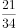，（    ）

- **A**. 

- **B**. 
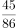

- **C**. 

　✅
- **D**. 
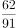

**答案**：C

**官方解析**

题干中数字均为分数，优先考虑分数数列。分子规律：前一项的分子与分母的和等于后一项的分子，，，，那么下一项分数的分子为。分母规律：前一项分母与后一项分子之和等于后一项分母，，，，那么下一项分数的分母为。则所求项。

故正确答案为C。

---

### 第 3 题　qid 2262548 · 数学运算

6，14，18，（    ），28，36

- **A**. 19
- **B**. 22
- **C**. 25
- **D**. 26　✅

**答案**：D

**官方解析**

两两分组，（6，14）、（18，（    ））、（28，36），，，，则所求项。

故正确答案为D。

---

### 第 4 题　qid 2262551 · 数学运算

从21，22，23，24，25，26，27，28，29中任意选出三个数，使他们和为奇数，可以有（  ）种选法。

- **A**. 44
- **B**. 42
- **C**. 40　✅
- **D**. 39

**答案**：C

**官方解析**

从5个奇数和4个偶数中选出任意三个数，保证其和为奇数，分情况讨论：

（1）一个奇数两个偶数：种；

（2）三个奇数：种。

分类用加法，共有种选法。

故正确答案为C。

---

### 第 5 题　qid 2262552 · 数学运算

在平面直角坐标系中，如果点P（，）在第三象限内，且横坐标纵坐标都是整数，则点P的坐标是：

- **A**. （-1，-3）
- **B**. （-3，-1）　✅
- **C**. （-3，-2）
- **D**. （-2，-3）

**答案**：B

**官方解析**

第三象限内的点横、纵坐标均为负数，则，，解得。由于横、纵坐标都是整数，那么a必须是整数，因此a只能为2。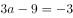，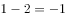，故P点坐标为（-3，-1）。

故正确答案为B。

---

### 第 6 题　qid 2262553 · 数学运算

某人以前走路上班，但是油价下跌后改为开车上班，速度较以前增长，那么其路上花费的时间减少了：

- **A**. 

- **B**. 

　✅
- **C**. 

- **D**. 

**答案**：B

**官方解析**

速度增长前后的速度比为，根据“路程一定，速度和时间成反比”可知，前后时间比为，故其路上花费的时间减少了。

故正确答案为B。

---

### 第 7 题　qid 2262554 · 数学运算

某公司有200名员工报名参加年会的竞赛活动，其中销售部、生产部、财务部、人力资源部分别有100、70、20、10人，问至少有多少人进入竞赛活动才能保证一定有30名员工工作部门相同？

- **A**. 88
- **B**. 78
- **C**. 90
- **D**. 89　✅

**答案**：D

**官方解析**

题目问“至少······才能保证”，为最值问题中的最不利构造题型。最不利的情况是每个部门最多只有29名员工，则最不利情况数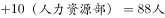，在此基础上再任意多取一人就可以满足30人工作部门相同的情况，即至少要有参加竞赛活动。

故正确答案为D。

---

### 第 8 题　qid 2262555 · 数学运算

出租车的起步价是2公里7元，往后每增加1公里车费增加2.6元，若不足1公里按1公里计费。某人从甲地到乙地乘坐出租车共支付车费20元，如果从甲地到乙地先步行800米，然后再乘坐出租车也是20元，那么乘出租车从甲、乙两地中点到乙地需要支付车费（  ）元。

- **A**. 9.6
- **B**. 14.8
- **C**. 12.2　✅
- **D**. 7

**答案**：C

**官方解析**

设甲、乙两地距离取整后为公里，则有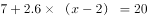，解得，说明两地距离满足。先步行，打车仍然是20元，说明两地距离S满足。综合①②可得，则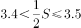，所以从甲、乙中点到乙地的路程应该按4公里计费，则所需车费为元。

故正确答案为C。

---

### 第 9 题　qid 2262556 · 数学运算

一项工程，甲单独完成需要60天，乙单独完成需要30天，丙单独完成需要15天，如果按照甲、乙、丙的顺序交替进行，那么需要多少天才能完成？

- **A**. 25
- **B**. 26
- **C**. 27　✅
- **D**. 28

**答案**：C

**官方解析**

赋值总工程量为60，则甲的效率为，乙的效率为，丙的效率为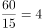。甲、乙、丙工作一轮完成的工程量为，先让他们做8轮，剩余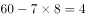，此后甲、乙又各工作一天，完成，还剩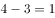，需要丙做天，则所需天数，26天无法完成，所以需要27天才能完成。

故正确答案为C。

---

### 第 10 题　qid 2262557 · 数学运算

有老师和甲、乙、丙三个学生，现在老师的年龄刚好是这三个学生的年龄之和；9年后，老师的年龄将是甲、乙两个学生的年龄之和；又5年后，老师的年龄将是甲、丙两个学生的年龄之和；再3年后，老师的年龄将是乙、丙两个学生的年龄之和。那么现在老师的年龄是（  ）岁。

- **A**. 36
- **B**. 40　✅
- **C**. 42
- **D**. 45

**答案**：B

**官方解析**

设目前老师的年龄为岁，甲的年龄为岁，乙的年龄为岁，丙的年龄为岁，根据题意，有以下关系：······①；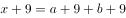，即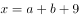······②；，即······③；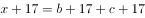，即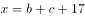······④。，解得。

故正确答案为B。

---

### 第 11 题　qid 2262558 · 数学运算

某作家在一书城举办签售会，已知签售会8:30开始，但是之前已有人提前排队等候，从第一个顾客来到时起，每分钟所到来的人数相同，如果开4个入场口，则在8:37时便不会有人排队，若开5个入场口，则在8:35时便不会有人排队，那么第一个顾客到达的时间是：（秒数四舍五入）

- **A**. 8:18　✅
- **B**. 8:11
- **C**. 8:12
- **D**. 8:16

**答案**：A

**官方解析**

设每个入场口每分钟进1人，每分钟来的顾客为人，在签售会开始之前聚集的人数为，那么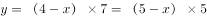，解得，。则从第一个顾客到达到签售会开始一共经历了，那么第一个人到达的时间为8:18分。

故正确答案为A。

---

### 第 12 题　qid 2262559 · 数学运算

为帮助果农解决销路，某企业年底买了一批水果，平均发给每部门若干筐之后还多了12筐，如果再买进8筐则每个部门可分得10筐，则这批水果共有（  ）筐。

- **A**. 192　✅
- **B**. 198
- **C**. 200
- **D**. 212

**答案**：A

**官方解析**

根据再买进8筐则可每个部门分10筐，可知总数加8后能被10整除，由此可排除B、C两项。将A项代入，若总数为192筐，则部门数为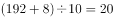个，可知总数减去12筐后能够实现平分。

故正确答案为A。

---

### 第 13 题　qid 2262560 · 数学运算

某单位在编一本年鉴，其页数需要用6869个数字，那么这本年鉴共有（  ）页。

- **A**. 1994　✅
- **B**. 1968
- **C**. 1942
- **D**. 1886

**答案**：A

**官方解析**

一本年鉴的第1-9页需要9个数字；第10-99页需要个数字；第100-999页需要个数字。则第1-999页共用个数字。剩下个数字，第1000页及以后都是4位数字，则有页，共页。

故正确答案为A。

---

## 判断推理

### 第 1 题　qid 414233 · 图形推理

下列选项中，符合所给图形的变化规律的是：

- **A**. A
- **B**. B
- **C**. C　✅
- **D**. D

**答案**：C

**官方解析**

本题考查的是图形的元素。
第一个图形和第二个图形去同存异得到第三个图形，且位置关系为第一图在上，第二图在下，并叠加至中心处。
故正确答案为C。

---

### 第 2 题　qid 2262562 · 图形推理

根据图形规律，填入问号处最合适的一项是：

- **A**. A　✅
- **B**. B
- **C**. C
- **D**. D

**答案**：A

**官方解析**

元素组成不同，无明显属性规律，考虑数量规律。观察发现，题干中图形的“窟窿”比较多，考虑数面，第一组图形面的数量均为4，第二组前两个图形面的数量均为5，因此问号处应填一个面的数量为5的图形，只有A项符合。
故正确答案为A。

---

### 第 3 题　qid 2262563 · 图形推理

根据图形规律，填入问号处最合适的一项是：

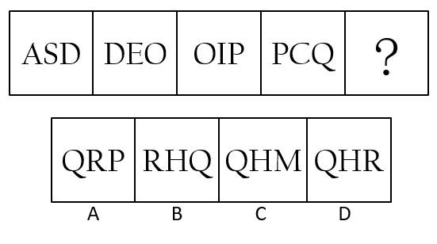

- **A**. A
- **B**. B
- **C**. C
- **D**. D　✅

**答案**：D

**官方解析**

观察发现，题干图形封闭空间明显，考虑数面，题干中所有图形的面数量均为2，因此？处也要选择一个面数量为2的图形，排除A、C两项。又发现，题干中每幅图前一个图形中最右边的字母都在相邻的后一个图形的最左边，依此规律，问号处所填图形最左边的字母应为Q，排除B项，只有D项符合。
故正确答案为D。

---

### 第 4 题　qid 2262564 · 图形推理

根据图形规律，填入问号处最合适的一项是：

- **A**. A　✅
- **B**. B
- **C**. C
- **D**. D

**答案**：A

**官方解析**

元素组成不同，无明显属性规律，考虑数量规律。题干图形中出现多边形，考虑数直线数，第一列依次为：6、1、7，第二列依次为：3、2、5，第三列依次为：3、0、？。每列前两个图形中的直线数相加之和等于是第三个图形中的直线数，因此问号处应填写一个直线数为3的图形，只有A项符合。
故正确答案为A。

---

### 第 5 题　qid 2262565 · 图形推理

把下面的六个图形分为两类，使每一类图形都有各自的共同特征或规律，分类正确的一项是：

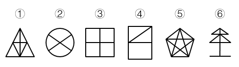

- **A**. ①②⑤，③④⑥
- **B**. ①④⑤，②③⑥　✅
- **C**. ①③⑥，②④⑤
- **D**. ①⑤⑥，②③④

**答案**：B

**官方解析**

本题为分组分类题目。元素组成相同，无明显属性规律，考虑数量规律。题干图形②、③为田字形的变形图，优先考虑笔画数，笔画数依次为：1、2、2、1、1、2，①④⑤均为一笔画，②③⑥均为两笔画，因此①④⑤为一组，②③⑥为一组，只有B项符合。
故正确答案为B。

---

### 第 6 题　qid 21903 · 定义判断

工作扩大化是指在横向水平上增加工作任务的数目或变化性，使工作多样化。工作丰富化是指从纵向上赋予员工更复杂、更系列化的工作，使员工有更大的控制权。
下列属于工作丰富化的是：

- **A**. 自助餐的伙计在面食、沙拉、蔬菜、饮品和甜点部轮换工作
- **B**. 邮政部门的员工从原来只专门负责分拣邮件增加到同时分送到各邮政部门
- **C**. 在某传输数据系统公司，员工可以经常提出自己喜欢的工作并随后转入新的岗位
- **D**. 在一家研究所，一个部门主管告诉她的下属，只要在预算内并且合法，他们就可以做想做的任何研究　✅

**答案**：D

**官方解析**

第一步：判断考查定义。
题目考查“工作丰富化”，所以仅需在题干中阅读“工作丰富化”相关内容。
第二步：抓住定义中的关键词。
关键词包括“纵向上”、“更复杂、更系列化的工作”、“更大的控制权”。
第三步：逐一判断选项。
A项中工作内容的变化，是横向的，不是纵向的；
B项中邮政部门的员工只是增加了工作任务，而且新增加的工作不是更复杂的；
C项工作任务的变化并不一定是更复杂、更系列化的工作。A、B、C三项均不符合定义。
故正确答案为D。

---

### 第 7 题　qid 456507 · 类比推理

暴力慈善是一种慈善的暴力行为，以牺牲受赠人的尊严来获得自己的满足，是对“现金救穷”“高调行善”行事方式的一种概括。
根据以上定义，下列哪项中的现象不属于暴力慈善：

- **A**. 某政府单位向敬老院送现金红包
- **B**. 捐款的时候将现金垒成人民币墙并进行展示
- **C**. 公司领导以命令的方式要求员工捐款　✅
- **D**. 朝每名受赠者鞠躬后送现金红包

**答案**：C

**官方解析**

第一步：找出定义关键词。
关键词为“牺牲受赠人的尊严”，包括“现金救穷”和“高调行善”。 
第二步：逐一分析选项。
A项：现金红包属于牺牲敬老院老人的尊严的“现金救穷”，属于暴力慈善，排除；
B项：用人民币墙展示属于“高调行善”，是暴力慈善的方式，排除；
C项：强制捐款牺牲的是捐赠人的利益，未体现受赠人，不符合定义，当选；
D项：公开鞠躬捐现金，牺牲被捐赠人的尊严，属于“现金救穷”，是暴力慈善，排除。
本题为选非题，故正确答案为C。

---

### 第 8 题　qid 10057 · 定义判断

生态移民是指为了保护某个地区特殊的生态或让某个地区的生态得到修复而进行的移民，也指因自然环境恶劣，不具备就地扶贫的条件而将当地人民整体迁出的移民。
下列属于生态移民的是：

- **A**. 贵州省某山区因土地出现石质化现象，该地区村民被迁往他乡　✅
- **B**. 几百年前，中原一带的居民为躲避战争，整体迁到南方，成为客家人
- **C**. 某村落位于山谷中，交通十分不便，为更快致富，村民集体研究决定移居山外
- **D**. 张三的父母家住三峡库区，由于修水库，其父母将家产变卖，来到上海与张三一起居住

**答案**：A

**官方解析**

第一步：抓住定义中的关键词。
该定义项中的关键词强调“为了保护某个地区特殊的生态或让某个地区的生态得到修复”、“因自然环境恶劣”。
第二步：逐一判断选项。
A项，村民迁往他乡的原因是“土地出现石质化现象”，符合定义，当选；
B项是“为躲避战争”、C项是因为“交通十分不便”、D项是因为“修水库”，与定义不对应，均排除。
故正确答案为A。

---

### 第 9 题　qid 24135 · 定义判断

水平一体化物流是指同一行业的多个企业，通过共同利用物流渠道，获得规模经济效益、提高物流效率。水平一体化物流须具备物流需求和物流供应的信息平台，要有大量企业参与并存在较多的商品量。
根据上述定义，下列选项属于水平一体化物流的是：

- **A**. 某家具厂要求原材料供应商和产品销售商使用同一家物流公司
- **B**. 某市屠宰企业将猪、牛肉混放入冷藏车并送往一百多家零售店
- **C**. 电子城百家商店签订协议，指定其中一家承担电子城送货业务　✅
- **D**. 某百货公司设立物流中心，统筹安排全公司各类货物发送工作

**答案**：C

**官方解析**

第一步：抓住定义中的关键词。
水平一体化物流的定义包含的重点关键词是“同一行业的多个企业”、“共同利用物流渠道”和“提高物流效率”。
第二步：逐一判断选项。
A项：原材料供应商和产品销售商不属于“同一行业的多个企业”， 比如做家具的，原材料供应商可能是生产钉子的，但是销售商是卖家具的，两者不是同一个行业，不符合定义；
B项：屠宰企业也是单个企业行为，不属于“同一行业的多个企业”，不符合定义；
C项：百家商店属于“同一行业的多个企业”，指定其中一家承担送货业务属于“共同利用物流渠道”，能够提高物流效率，符合定义；
D项：设立物流中心仍属于单个企业行为，并不是“同一行业的多个企业”，不符合定义。
故正确答案为C。

---

### 第 10 题　qid 2002404 · 定义判断

顶层设计是指统筹考虑系统各层次和各要素，追根溯源，统揽全局，在最高层次上寻求问题的系统解决之道。
根据上述定义，下列选项不符合顶层设计的是（    ）。

- **A**. 某市政府在有关园林绿化决策执行效果的检查过程中发现问题，有关领导指示对北区绿化方案进行优化　✅
- **B**. 某公司董事会就公司扩大经营范围，在海外收购项目等问题召集相关专家起草方案，在论证后董事会进行表决
- **C**. 某岛屿具有不冻不淤的深水港口与沙白滩阔等条件，辖区政府为利用好这些资源，组织海内外专家研究岛屿开发方案
- **D**. 软件公司在开发大型软件时，就软件的框架召集专家进行论证，在充分吸收专家意见的基础上，确立了软件设计思路

**答案**：A

**官方解析**

第一步：抓住定义中的关键词。
客体：系统各层次各要素。属性：系统解决之道。
第二步：逐一分析选项。
A项，对北区绿化方案的优化仅限于北区这一局部，而非整个系统的解决之道，不符合定义，当选；
B项，海外收购项目等问题是扩大经营范围的各个要素，起草方案是公司扩大经营范围的系统性方案，符合定义，排除；
C项，深水港口和白沙滩阔是整个岛屿的各个要素，开发方案是开发岛屿的系统性方案，符合定义，排除；
D项，软件的框架设计是软件的各个层次和要素，软件设计思路是开发整个软件的系统性方案，符合定义，排除。
本题为选非题，故正确答案为A。

---

### 第 11 题　qid 2262571 · 类比推理

生活应该是一系列冒险，它很有乐趣，偶尔让人感到兴奋，有时却好像是通向不可预知的未来的痛苦旅行。当你试图以一种创造性的方式生活时，即使你身处沙漠中，也会遇到灵感之井、妙想之泉，它们却不是能事先拥有的。
下面哪一选项所强调的意思与题干的主旨相同？

- **A**. 习惯是人生的伟大指南
- **B**. 观念的改变损失最小，成就最大
- **C**. 机遇只偏爱有准备的头脑
- **D**. 假如我知道写诗的结果，我就不会开始写诗　✅

**答案**：D

**官方解析**

日常结论题，根据题干信息逐一分析选项。
A项：题干中生活应该是一系列冒险，是通向不可预知的未来旅行，不是能事先拥有的，即文段意在强调生活的冒险性、不可预知性、未知性，而选项“习惯是人生的伟大指南”强调习惯对于人生的重要性，与题干的主旨内容不同，无法推出，排除；
B项：题干中生活应该是一系列冒险，是通向不可预知的未来旅行，不是能事先拥有的，即文段意在强调生活的冒险性、不可预知性、未知性，而选项“观念的改变损失最小，成功最大”强调观念的改变，与题干的主旨内容不同，无法推出，排除；
C项：题干中生活应该是一系列冒险，是通向不可预知的未来旅行，不是能事先拥有的，即文段意在强调生活的冒险性、不可预知性、未知性，而选项“机遇只偏爱有准备的头脑”强调做好准备对于抓住机遇的重要性，与题干的主旨内容不同，无法推出，排除；
D项：题干中生活应该是一系列冒险，是通向不可预知的未来旅行，不是能事先拥有的，即文段意在强调生活的冒险性、不可预知性、未知性，选项“假如我知道写诗的结果，我就不会开始写诗”由于不知道写诗的结果，所以才有了写诗的动力，也是在强调一种未知性、不可预知性，与题干的主旨内容相同，可以推出，当选。
故正确答案为D。

---

### 第 12 题　qid 2262572 · 逻辑判断

这里有一个控制农业杂草的新办法，它不是用合成的那种能杀死特殊野草而对谷物无害的除草剂，而是用对所有植物都有效的除草剂，同时运用特别的基因工程使谷物对这种除草剂具有免疫力。
以下哪项如果为真，对上文提出的新办法的实施构成了最严重的障碍？

- **A**. 最新的研究表明，进行基因重组并非像想象的那样可以使农作物中的营养成分有所提高
- **B**. 对某些特定种类的杂草有效的除草剂，施用后两年内会阻碍某些作物的生长
- **C**. 虽然基因的重组使单独的谷物植株免受万能除草剂的影响，但这些作物产出的种子却由于万能除草剂的影响而不能再发芽　✅
- **D**. 大部分只能除掉少数特定杂草的除草剂含有的有效成分对家禽、家畜及野生动物有害

**答案**：C

**官方解析**

第一步：找出论点和论据。
论点：控制农业杂草的新办法是一种对所有植物都有效的除草剂，同时运用特别的基因工程使谷物对这种除草剂具有免疫力。
论据：无。
第二步：逐一分析选项。
A项：题干讨论的是运用特别的基因工程使谷物对除草剂具有免疫力，而选项讨论的是基因重组和农作物营养成分，二者讨论的话题不一致，无法对新方法的实施构成障碍，排除；
B项：题干讨论的是对所有植物都有效的除草剂，而选项讨论的是“对某些特定种类的杂草有效的除草剂”，二者讨论的主体不一致，无法对新方法的实施构成障碍，排除；
C项：通过基因工程虽然可以使谷物对除草剂产生免疫力，但对除草剂产生免疫力的作物所产出的种子却不能再发芽，这就破坏了农作物的生产循环周期，最终造成农作物种植的不可持续性，可以对新方法的实施构成障碍，当选；
D项：题干讨论的是对所有植物都有效的除草剂，而选项讨论的是只能除掉少数特定杂草的除草剂，二者讨论的话题不一致，无法对新方法的实施构成障碍，排除。
故正确答案为C。

---

### 第 13 题　qid 2262573 · 逻辑判断

某工厂实验室对3种产品A、B、C进行撞击和拉伸测试，能通过这两种测试就是合格品。结果有两种产品通过撞击测试，有两种产品通过了拉伸测试。
根据上述测试结果，以下哪项一定为真？

- **A**. 产品A是合格品
- **B**. 至少有一种产品是合格品　✅
- **C**. 有两种产品是合格品
- **D**. 有可能3种产品都不是合格品

**答案**：B

**官方解析**

日常结论题，根据题干信息逐一分析选项。
A项：由题干可知“有两种产品通过撞击测试，有两种产品通过了拉伸测试”，可能存在A产品既没有通过撞击测试，又没有通过拉伸测试，选项不一定为真，排除；
B项：“有两种产品通过撞击测试，有两种产品通过了拉伸测试”说明至少有一种产品同时经过了撞击和拉伸测试，即在3种产品中至少有一种产品是合格品，当选；
C项：如果通过撞击测试的产品是A、B，通过拉伸测试的产品是B、C，那么只有B产品是合格产品，选项不一定为真，排除；
D项：“有两种产品通过撞击测试，有两种产品通过了拉伸测试”说明至少有一种产品、至多有两种产品同时经过了撞击和拉伸测试，不可能存在3种产品均不合格的情况，选项表述错误，排除。
故正确答案为B。

---

### 第 14 题　qid 2262574 · 逻辑判断

一项研究报告表明，随着经济的发展和改革开放，我国与种植、养殖有关的单位几乎都有从外国引进物种的项目。不过，我国华东等地作为饲料引进的空心莲子草，沿海省区为护滩引进的大米草等，很快蔓延疯长，侵入草场、林区和荒地，形成单种优势群落，导致原有植物群落的衰退。新疆引进的意大利黑蜂迅速扩散到野外，使原有的优良蜂种伊犁黑蜂几乎灭绝。
因此：
以下哪项可以最合乎逻辑地完成上面论述？

- **A**. 引进国外物种可能会对我国的生物多样性造成巨大危害　✅
- **B**. 应该设法控制空心莲子草、大米草等植物的蔓延
- **C**. 从国外引进物种是为了提高经济效益
- **D**. 我国34个省、市、自治区都有外来物种

**答案**：A

**官方解析**

日常结论题，根据题干信息逐一分析选项。
A项：文段首句阐述了我国与种植、养殖有关的单位几乎都从国外引进了项目，接着通过华东等地及沿海省区引进的植物和新疆引进的动物为例说明在引进这些动植物后，造成了当地动植物种群的衰落或灭绝，因此可以推出引进国外物种对于我国原生的动植物多样性产生了巨大危害，选项表述合乎题干逻辑，当选；
B项：由题干可知，文段主要强调的是我国各地在引进了国外的动植物物种后导致当地原有动植物群落衰退或灭绝，举了空心莲子草、大米草等植物为例，文段不仅论述了植物的引进，还论述了动物的引进，选项表述片面，不符合题干逻辑，排除；
C项：题干中并未说明我国引进国外物种的目的是为了提高经济效益，无中生有，且由题干可知，一些地区在引进了国外的动植物后都对当地原生物种群落造成了影响，说明可能会影响当地经济效益提高，不符合题干逻辑，排除；
D项：“我国34个省、市、自治区都有外来物种”无法从材料中推出，无中生有，不符合题干逻辑，排除。
故正确答案为A。

---

### 第 15 题　qid 2262575 · 逻辑判断

信贷消费在一些经济发达国家十分盛行，很多消费者通过预支他们尚未到手的收入满足对住房、汽车、家用电器等耐用消费品的需求。在消费信贷发达的国家中，人们的普遍观念是：不能负债说明你的信誉差。
如果上述论述为真，那么必须以下列哪项为前提？

- **A**. 在发达国家，消费信贷已成为商业银行扩大经营、加强竞争的重要手段
- **B**. 消费信贷于国于民都有利，国家可利用利率下调刺激消费者购买商品
- **C**. 社会已建立起完备、严密的信用网络，银行可对信贷者的经济状况进行查询和监督　✅
- **D**. 保险公司可向借贷人提供保险，以保障银行资产的安全

**答案**：C

**官方解析**

第一步：找出论点和论据。
论点：在消费信贷发达的国家中，人们的普遍观念是：不能负债说明你的信誉差。
论据：无。
第二步：逐一分析选项。
A项：题干讨论的是信贷与信誉之间的关系，而选项讨论的是消费信贷已成为商业银行扩大经营、加强竞争的重要手段，选项与题干讨论的话题不一致，无法加强，排除；
B项：题干讨论的是信贷与信誉之间的关系，而选项讨论的是消费信贷对于国家和国民所带来的积极意义，选项与题干讨论的话题不一致，无法加强，排除；
C项：“社会已建立起完备、严密的信用网络”说明消费者的信用情况是可以查询的，而“银行可对信贷者的经济状况进行查询和监督”则说明银行可以通过查询和监督来了解消费者的经济和负债情况，负债和信用的可查询是“不能负债说明你的信誉差”的必要条件，可以加强，当选；
D项：题干讨论的是信贷与信誉之间的关系，而选项讨论的是保险公司可以通过向借贷人提供保险，以保障银行资产安全，选项与题干讨论的话题不一致，无法加强，排除。
故正确答案为C。

---

### 第 16 题　qid 2262576 · 逻辑判断

对那些最先给封建主义定义的作家来说，封建主义的存在也就预先假定了贵族阶级的存在。然而正确的说来，贵族阶级是不可能存在的。除非那些表明较高的贵族地位的头衔和这些头衔的继承权被法律所认可。尽管封建主义早在8世纪时就已经存在，但是直到12世纪，当许多封建机构处于衰落时，法律上承认的世袭贵族头衔才第一次出现。
题干描述最有可能支持以下哪项结论？

- **A**. 认为从封建主义定义上讲要求贵族阶级的存在就是在使用一个歪曲历史的定义　✅
- **B**. 某个社会团体具有与众不同的法律地位的事实本身并不足以说明这个团体可被合情合理地认为是一个社会阶层
- **C**. 12世纪之前，欧洲的封建制度与机构是在没有统治阶级存在的情况下运行的
- **D**. 按照贵族阶级这一词的最严格的定义来讲，先前的封建机构的存在是贵族阶级出现的先决条件

**答案**：A

**官方解析**

日常结论题，根据题干信息逐一分析选项。
A项：由题干可知，封建主义存在→贵族阶级存在，贵族阶级存在→贵族地位的头衔和头衔的继承权被法律认可。从封建主义定义上讲，8世纪封建主义产生后，贵族地位的头衔和头衔的继承权即被法律认可，即贵族阶级也随之存在，但贵族头衔和头衔的继承权被法律认可却产生于12世纪，二者的产生存在时间差，因此，从封建主义定义上讲要求贵族阶级的存在就是在使用一个歪曲历史的定义，选项表述正确，当选；
B项：“某个社会团体具有与众不同的法律地位”指代不明确，且选项所述内容并不能从题干中推出，排除；
C项：题干中并未提及“封建制度”，且从题干所给信息也不能得出选项所述内容，排除；
D项：题干并未说明“封建机构”何时产生，也并未提及封建机构与贵族阶级二者之间的关系，排除。
故正确答案为A。

---

### 第 17 题　qid 2262577 · 逻辑判断

疲劳驾驶是造成交通事故的重要原因之一，很多货车司机经常连续驾驶超过8个小时，因此交警在一些高速公路收费站设置检查站点，检查货车司机的疲劳状态，以减少货车司机疲劳驾驶的情况。
以下选项如果为真，不能支持交警的这一做法的理由是：

- **A**. 一些货车司机会通过提前在服务站休息后再驾驶来应对交警的检查
- **B**. 一些货车司机会选择抽烟或找人聊天的方式驱除疲劳
- **C**. 货车司机身体的疲劳状态不一定是他连续驾驶时间的反映
- **D**. 人体的疲劳状态很难有一个确切的评价和对比指标　✅

**答案**：D

**官方解析**

第一步：找出论点和论据。
论点：交警在一些高速公路收费站设置检查站点，检查货车司机的疲劳状态，以减少货车司机疲劳驾驶的情况。
论据：疲劳驾驶是造成交通事故的重要原因之一，很多货车司机经常连续驾驶超过8个小时。
第二步：逐一分析选项。
A项：一些货车司机会通过提前在服务站休息后再驾驶来应对交警的检查，司机的这一做法可以有效避免疲劳驾驶，可以支持，排除；
B项：一些货车司机会选择抽烟或找人聊天的方式驱除疲劳，只是说明了司机驱逐疲劳的方式，不确定是否是为了应对交警检查，属于无关选项，保留；
C项：交警依据货车司机的连续驾驶时间来确定其疲劳状态，然后通过检查他们的疲劳状态来减少货车司机的疲劳驾驶情况，而疲劳状态不一定是货车司机连续驾驶时间的反映，可能性削弱论点，保留；
D项：交警依据货车司机的连续驾驶时间来确定其疲劳状态，但人体的疲劳状态很难有一个确切的评价和对比指标，直接削弱了论点，保留；
对比B、C、D三项，D项直接削弱论点，是最不能支持交警做法的。
本题为选非题，故正确答案为D。

---

### 第 18 题　qid 2262578 · 逻辑判断

在频繁地使用几星期后，吉他琴弦经常会“死掉”，即反应更加迟钝，音调不那么响亮。一个其职业为古典吉他演奏家的研究人员提出一个假想，认为这是由脏东西和油，而不是琴弦材料性质的改变而导致的结果。
以下哪一项调查最有可能得出有助于评价该研究人员假想的信息？

- **A**. 确定一根死掉的弦和一根新弦是否会产生不同音质的声音
- **B**. 确定古典吉他演奏家使他们的琴弦死掉的速度是否比通俗吉他演奏家快
- **C**. 确定把相同的标准长度相等的琴弦，安在不同品牌的吉他上，是否以不同的速度死掉
- **D**. 确定在新吉他弦上抹上不同的物质是否能使它们死掉　✅

**答案**：D

**官方解析**

第一步：找出论点和论据。
论点：琴弦在频繁使用几星期后，会出现反应迟钝、音调不响亮的情况，研究人员认为这是由脏东西和油引起的，而非琴弦材料性质的改变而导致的结果。
论据：无。
第二步：逐一分析选项。
A项：对比一根死掉的琴弦和一根新弦发出的声音并不能判断出琴弦死掉的原因，无法加强，排除；
B项：古典吉他演奏家和通俗吉他演奏家可能在使用吉他上存在差异，而不同的使用方法也可能造成琴弦死掉的速度不尽相同，选项无法证明琴弦死掉速度是因为脏东西和油还是因为琴弦材料性质，无法加强，排除；
C项：虽然把相同的标准长度相等的琴弦安在不同品牌的吉他上，但仍无法确定琴弦死掉速度到底是因为脏东西和油还是因为琴弦材料性质造成的，无法加强，排除；
D项：通过在相同的琴弦上涂抹不同的物质来检验不同物质对于吉他琴弦死掉速度的影响，可以加强，当选。
故正确答案为D。

---

### 第 19 题　qid 2262579 · 逻辑判断

按照我国城市当前水消费量来计算，如果每吨水增收5分钱的水费，则每年可增加25亿元收入。这显然是解决自来水公司年年亏损问题的好办法。这样做还可以减少消费者对水的需求，养成节约用水的良好习惯，从而保护我国非常短缺的水资源。
以下哪一项最清楚地指出了上述论证中的错误？

- **A**. 作者引用了无关的数据和材料
- **B**. 作者所依据的我国城市当前水消费量的数据不准确
- **C**. 作者作出了相互矛盾的假定　✅
- **D**. 作者错把结果当作了原因

**答案**：C

**官方解析**

日常结论题，根据题干信息逐一分析选项。
A项：从题干所给信息并不能判断出作者引用了无关的数据和材料，排除；
B项：从题干所给信息并不能得出作者所依据的我国城市当前水消费量的数据准确与否，排除；
C项：每吨水增加5分钱水费，一方面可以增加收入，解决自来水亏损问题；另一方面可以减少消费者对水的需求，养成节约用水的良好习惯。但水费的增加，会使消费者的用水量减少，则此时自来水公司可能不会增加收入，故水费增加所带来的两方面益处相互矛盾，当选；
D项：由题干可知，增加水费所带来的两方面益处之间存在矛盾，而并非作者错把结果当作了原因，排除。
故正确答案为C。

---

### 第 20 题　qid 2262580 · 逻辑判断

甲认为：快速而精确地处理订单的程序有助于我们的交易。为了增加利润，我们应该运用电子程序而不是手工操作，运用电子程序，客户的订单就会直接进入所相关的队列之中。
乙认为：如果我们启用电子订单程序，我们的收入将会减少。很多人在下订单时更愿意与人打交道。如果我们转换成电子订单程序，我们的交易会看起来冷漠而且非人性化，我们吸引的顾客就会减少。
甲和乙的意见分歧在于：

- **A**. 更快且更精确的订单程序是否会有益于他们的财政收益
- **B**. 对多数顾客而言，电子订单程序是否真的显得冷漠和非人性化
- **C**. 电子订单程序是否比手工订单程序更快、更精确
- **D**. 改用电子订单程序是否会有益于他们的财政收益　✅

**答案**：D

**官方解析**

日常结论题，根据题干信息逐一分析选项。
A项：甲、乙产生分歧的主体是电子订单程序，为非订单程序，偷换概念，排除；
B项：“电子订单程序是否真的显得冷漠和非人性化”是乙用来证明启用电子订单程序会减少其收入的例证，并非甲乙的意见分歧，排除；
C项：“电子订单程序是否比手工订单程序更快、更精确”是甲用来证明启用电子订单程序会增加其收入的例证，并非甲乙的意见分歧，排除；
D项：甲认为运用电子订单程序可以方便交易，将客户订单直接纳入相关队列中，最终可增加利润；而乙认为启用电子订单程序会使交易看起来冷漠且非人性化，降低对顾客的吸引，最终使收入减少。因此二者的分歧在于使用电子订单程序是否会增加收入，选项表述正确，当选。
故正确答案为D。

---

### 第 21 题　qid 2262581 · 类比推理

科学家：院士

- **A**. 长江：黄河
- **B**. 袋鼠：老鼠
- **C**. 大学生：军人　✅
- **D**. 跑步：散步

**答案**：C

**官方解析**

第一步：判断题干词语间逻辑关系。
有的科学家是院士，有的院士是科学家，二者为交叉关系。
第二步：判断选项词语间逻辑关系。
A项：长江和黄河是并列关系，与题干逻辑关系不一致，排除；
B项：袋鼠和老鼠是并列关系，与题干逻辑关系不一致，排除；
C项：有的大学生是军人，有的军人是大学生，二者是交叉关系，与题干逻辑关系一致，当选；
D项：跑步和散步是并列关系，与题干逻辑关系不一致，排除。
故正确答案为C。

---

### 第 22 题　qid 2262582 · 类比推理

氧气：生命

- **A**. 灯光：黑暗
- **B**. 振动：声音　✅
- **C**. 努力：成功
- **D**. 烛光：浪漫

**答案**：B

**官方解析**

第一步：判断题干词语间逻辑关系。
氧气是维持生命的必要条件，二者为必要条件对应关系。
第二步：判断选项词语间逻辑关系。
A项：灯光可以照亮黑暗，二者为功能对应关系，与题干逻辑关系不一致，排除；
B项：振动是声音产生的必要条件，二者为必要条件对应关系，与题干逻辑关系一致，当选；
C项：成功是努力的一种结果，二者为因果对应关系，与题干逻辑关系不一致，排除；
D项：烛光可以营造出浪漫的氛围，二者为功能对应关系，与题干逻辑关系不一致，排除。
故正确答案为B。

---

### 第 23 题　qid 2264188 · 类比推理

陡峭：山峰

- **A**. 简朴：生活　✅
- **B**. 精炼：态度
- **C**. 滥用：药物
- **D**. 闪耀：光芒

**答案**：A

**官方解析**

第一步：判断题干词语间逻辑关系。
陡峭的山峰，二者是形容词与其修饰的名词之间的语法关系，构成偏正结构。
第二步：判断选项词语间逻辑关系。
A项：简朴的生活，二者是形容词与其修饰的名词之间的语法关系，构成偏正结构，与题干逻辑关系一致，当选；
B项：精炼与态度不能搭配，与题干逻辑关系不一致，排除；
C项：滥用药物为动宾搭配关系，与题干逻辑关系不一致，排除；
D项：闪耀光芒为动宾搭配关系，与题干逻辑关系不一致，排除。
故正确答案为A。

---

### 第 24 题　qid 2262584 · 类比推理

歧视：自卑

- **A**. 调查：发现
- **B**. 差距：落后
- **C**. 惊吓：害怕　✅
- **D**. 分歧：谈判

**答案**：C

**官方解析**

第一步：判断题干词语间逻辑关系。
因歧视而导致自卑，二者为因果对应关系，且歧视和自卑不是同一主体。
第二步：判断选项词语间逻辑关系。
A项：调查和发现二者不存在因果上的对应关系，与题干逻辑关系不一致，排除；
B项：因落后而导致差距，二者为因果对应关系，但词语逻辑顺序与题干不同，题干逻辑关系不一致，排除；
C项：因惊吓而导致害怕，二者为因果对应关系，且惊吓和害怕不是同一主体，与题干逻辑关系一致，当选；
D项：因存在分歧所以进行谈判，二者为因果对应关系，但分歧和谈判的主体均为双方，与题干逻辑关系不一致，排除。
故正确答案为C。

---

### 第 25 题　qid 2262585 · 类比推理

马匹：驰骋

- **A**. 干扰：红外线
- **B**. 狮子：吼叫　✅
- **C**. 论文：质量
- **D**. 消化：排泄

**答案**：B

**官方解析**

第一步：判断题干词语间逻辑关系。
马匹驰骋，二者为语法关系中的主谓关系。
第二步：判断选项词语间逻辑关系。
A项：干扰红外线，二者为语法关系中的动宾关系，与题干逻辑关系不一致，排除；
B项：狮子吼叫，二者为语法关系中的主谓关系，与题干逻辑关系一致，当选；
C项：论文质量，二者为语法关系中的偏正结构，与题干逻辑关系不一致，排除；
D项：先消化，后排泄，二者不存在语法关系中的主谓关系，与题干逻辑关系不一致，排除。
故正确答案为B。

---

### 第 26 题　qid 2262586 · 类比推理

章程：选举

- **A**. 文章：阅读
- **B**. 素描：画画
- **C**. 规则：比赛　✅
- **D**. 法规：执法

**答案**：C

**官方解析**

第一步：判断题干词语间逻辑关系。
依照章程组织选举，二者为对应关系。
第二步：判断选项词语间逻辑关系。
A项：阅读文章，二者为语法关系中的动宾关系，与题干逻辑关系不一致，排除；
B项：素描是一种画画方式，二者是种属关系，与题干逻辑关系不一致，排除；
C项：依照规则组织比赛，二者为对应关系，保留；
D项：依照法规执法，二者为对应关系，保留。
对比C、D两项，选举和比赛均可以为动词和名词，而执法为动宾短语，相比较C项更符合题干逻辑关系。
故正确答案为C。

---

### 第 27 题　qid 2262587 · 类比推理

金属∶导电

- **A**. 冬天∶严寒
- **B**. 黄色∶收获
- **C**. 年轻∶激情
- **D**. 液体∶流动　✅

**答案**：D

**官方解析**

第一步：判断题干词语间逻辑关系。
金属具有导电的属性，二者为必然对应关系。
第二步：判断选项词语间逻辑关系。
A项：严寒指气候非常寒冷，冬天并非都非常寒冷，二者为或然对应关系，与题干逻辑关系不一致，排除；
B项：黄色和收获没有必然的关系，与题干逻辑关系不一致，排除；
C项：年轻并非都有激情，二者为或然对应关系，与题干逻辑关系不一致，排除；
D项：液体具有流动的属性，二者为必然对应关系，与题干逻辑关系一致，当选。
故正确答案为D。

---

### 第 28 题　qid 2262588 · 类比推理

培养 对于 （    ） 相当于 （    ） 对于 成绩

- **A**. 能力  提高　✅
- **B**. 培育  分数
- **C**. 兴趣  获得
- **D**. 提高  绩效

**答案**：A

**官方解析**

逐一代入选项。
A项：培养能力，二者为语法关系中的动宾关系；提高成绩，二者为语法关系中的动宾关系，前后逻辑关系一致，保留；
B项：培养和培育，二者为近义词关系；分数是评判成绩好坏的标准，二者为对应关系，前后逻辑关系不一致，排除；
C项：培养兴趣，二者为语法关系中的动宾关系；获得成绩，二者为语法关系中的动宾关系，前后逻辑关系一致，保留；
D项：培养和提高，二者没有必然的关系；绩效指成绩、成效，绩效和成绩二者为近义词关系，前后逻辑关系不一致，排除。
对比A、C两项，培养和提高都存在一个过程，而获得成绩只是拥有成绩，更偏重直接获得结果，相比较而言，A项的前后逻辑关系更为一致，当选。
故正确答案为A。

---

### 第 29 题　qid 22559 · 类比推理

锁具：保安员：安全

- **A**. 日月：星辰：光明
- **B**. 航母：导弹：战争
- **C**. 手镯：项链：美观　✅
- **D**. 画框：纽扣：装饰

**答案**：C

**官方解析**

第一步：判断题干词语之间逻辑关系。
题干词语间属于对应关系。“锁具”和“保安员”的作用都是“安全”。
第二步：判断选项词语之间逻辑关系。
A项中“星辰”的作用不是“光明”，排除；B项中“航母”和“导弹”都应用于战争，而非作用是战争，排除；C项中“手镯”和“项链”的作用都是“美观”，当选；D项中“纽扣”的作用并不是“装饰”，排除。
故正确答案为C。

---

### 第 30 题　qid 2262590 · 类比推理

侦查∶线索∶案件

- **A**. 评价∶排行榜∶歌手
- **B**. 定位∶地点∶地图
- **C**. 导航∶GPS∶汽车
- **D**. 搜索∶关键词∶网页　✅

**答案**：D

**官方解析**

第一步：判断题干词语间逻辑关系。
题干三词可造句子为：通过线索侦查案件。
第二步：判断选项词语间逻辑关系。
A项：通过排行榜评价歌手，保留；
B项：地图是定位地点的工具，二者为对应关系，与题干逻辑关系不一致，排除；
C项：GPS主要功能是提供实时、全天候和全球性的导航服务，导航和GPS，二者为功能对应关系，与题干逻辑关系不一致，排除；
D项：通过关键词搜索网页，保留；
对比A、D两项，题干侦查案件必须要通过线索，A项评价歌手不一定要通过排行榜，D项搜索网页必须要通过关键词。因此，相比于A项，D项更符合题干逻辑关系，当选。
故正确答案为D。

---

## 资料分析

### 材料 1

        虽然受到国家对一些投资过热的重点行业实行严格控制的影响，但由于国家对西部农业、能源、交通、水利以及教育、卫生等社会事业的支持与投入继续加大，同时西部各省区市也加大了地方投资力度，西部地区2014年的固定资产投资继续保持较高的增长速度。全年完成固定资产投资(不含农村和城乡个体投资，下同)125980亿元，同比增长，增速同比回落5.5个百分点。

        在西部各省区市中，固定资产投资总量最多的是四川省，共完成投资24692.08亿元，占西部投资总量的；其次是内蒙古，共完成投资17763.18亿元，占西部的；重庆完成投资15117.6亿元，占西部投资总量的，排在第三位。

        除新疆、贵州和甘肃外，西部其他地区2014年固定资产投资增长速度都在以上，内蒙古、重庆的固定资产投资增幅超过，分别比上年增长和，分列西部投资增幅的前两位；广西和云南的固定资产增长速度均为，并列居于西部第三位。

#### 第 1 题　qid 2262591 · 综合

西部地区2013年固定资产投资额约为（    ）亿元。

- **A**. 121291.39
- **B**. 112377.76
- **C**. 145603.50
- **D**. 107217.02　✅

**答案**：D

**官方解析**

根据题干“西部地区2013年固定资产投资额约为（    ）亿元”，结合材料所给时间为2014年，可判定本题为基期计算问题。定位文字材料第一段可得：西部地区2014年的固定资产投资125980亿元，同比增长，代入公式：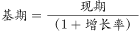，则2013年固定资产投资额为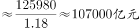，与D项最接近。

故正确答案为D。

---

#### 第 2 题　qid 2262592 · 综合

下列省区市中，2013年固定资产投资总量位居第二位的是：

- **A**. 四川
- **B**. 重庆
- **C**. 内蒙古　✅
- **D**. 广西

**答案**：C

**官方解析**

根据题干“······2013年固定资产投资总量位居第二位的是”，结合材料时间为2014年，可判定本题为基期比较问题。定位文字材料第二段可得，西部地区固定资产投资总量排在前三位的省份是四川、内蒙古、重庆，分别为24692.08、17763.18、15117.6亿元。则广西固定资产投资总量&lt;15117.6亿元。定位文字材料第三段可得，除新疆、贵州和甘肃外，西部其他地区2014年固定资产投资增长速度都在20%以上，内蒙古、重庆的固定资产投资增幅超过30%，分别比上年增长53.0%和41.3%······广西和云南的固定资产增长速度均为29.0%，并列居于西部第三位。则四川固定资产投资增幅介于20%~29%之间。根据公式：基期量可得，2013年内蒙古固定资产投资总量亿元，重庆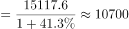亿元，广西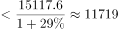亿元，四川亿元。故2013年固定资产投资总量最多的是四川，无法比较广西和内蒙古的大小关系，故本题无法确定正确答案。

---

#### 第 3 题　qid 2262593 · 增长

假设按照现在的增长趋势，重庆2015年固定资产投资额约为（    ）亿元。

- **A**. 21361　✅
- **B**. 19780
- **C**. 20990
- **D**. 22470

**答案**：A

**官方解析**

根据题干“重庆2015年固定资产投资额约为（    ）亿元”，可判定本题为现期计算问题。定位文字材料第二段和第三段可知：2014年重庆固定资产投资15117.6亿元，增长率为。按照现在的增长趋势，代入公式：，则2015年重庆固定资产投资基期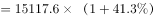

，计算时两个数字均缩小，故真实值略大于21000。

故正确答案为A。

---

#### 第 4 题　qid 2262594 · 综合

内蒙古自治区2013年固定资产投资额约占西部投资总量的：

- **A**. 

- **B**. 

　✅
- **C**. 

- **D**. 

**答案**：B

**官方解析**

根据题干“内蒙古自治区2013年固定资产投资额约占西部投资总量的······”，结合材料所给时间为2014年，判定本题为基期比重问题。定位材料可知，2014年内蒙古固定资产投资额占西部地区的比重为，内蒙古固定资产投资额的增速为，西部为。代入公式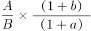，（是现期比重），则2013年内蒙古固定资产投资占西部投资总量的比重为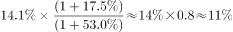。

故正确答案为B。

---

#### 第 5 题　qid 2262595 · 综合

能够从上述材料反映出的是：

- **A**. 重庆和云南2014年固定资产投资总量及增长速度并列居于西部第三位
- **B**. 甘肃省2014年社会固定资产投资增幅位列西部地区倒数第一位
- **C**. 2013年西部地区某些行业出现投资过热现象　✅
- **D**. 四川省2014年社会固定资产投资总额及增幅均居西部地区第一位

**答案**：C

**官方解析**

A项：定位文字材料第二段，重庆完成投资15117.6亿元，占西部投资总量的，排在第三位。定位材料最后一段，广西和云南的固定资产增长速度均为，并列居于西部第三位，错误。

B项：材料中未提及增幅列于西部地区倒数第一位的省份，无法判断，错误。

C项：定位文字材料第一段，“虽然受到国家对一些投资过热的重点行业实行严格控制的影响······西部地区2014年的固定资产投资继续保持较高的增长速度”,说明2013年西部地区的一些行业出现投资过热现象，正确。

D项：定位文字材料第三段，在西部各省区市中，固定资产投资增幅居西部地区第一位的是内蒙古，错误。

故正确答案为C。

---

### 材料 2

        2014年年末，A市规模以上工业企业2087户，全年实现工业增加值1653.54亿元，比上年增长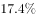。其中，轻工业增加值653.28亿元，增长；重工业增加值1000.26亿元，增长。战略性新兴产业完成产值1598.74亿元，比上年增长。

        规模以上工业企业主营业务收入6002.74亿元，比上年增长；利润总额358.55亿元，增长；亏损企业亏损额15.46亿元，下降。电气机械和器材制造业、通用设备制造业、专用设备制造业、金属制品业、汽车制造业等11个行业利润均超过10亿元，累计实现利润285.26亿元。

        A市36个工业增加值全部实现增长，六大主导产业实现增加值951.60亿元，比上年增长。全年规模以上工业出口交货值419.79亿元.比上年下降。

#### 第 6 题　qid 2262596 · 增长

2014年，A市战略性新兴产业完成产值比上年增加约（    ）亿元。

- **A**. 315.64　✅
- **B**. 364.76
- **C**. 378.42
- **D**. 389.23

**答案**：A

**官方解析**

根据题干“2014年，······比上年增加约（    ）亿元”，可判定本题为增长量计算问题。定位文字材料第一段可得：2014年年末，······战略性新兴产业完成产值1598.74亿元，比上年增长。则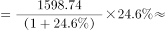亿元，与A项最接近。

故正确答案为A。

---

#### 第 7 题　qid 2262597 · 比重

2013年，A市重工业增加值占全年工业增加值的比重约为：

- **A**. 

- **B**. 

- **C**. 

　✅
- **D**. 

**答案**：C

**官方解析**

根据题干“2013年，······占······的比重约为”，结合材料所给时间为2014年，可判定本题为基期比重问题。定位文字材料第一段可得，2014年年末，······全年实现工业增加值1653.54亿元，比上年增长。······重工业增加值1000.26亿元，增长。代入公式，则2013年A市重工业增加值占全年工业增加值的比重约为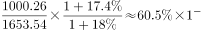，结果略小于，只有C项满足。

故正确答案为C。

---

#### 第 8 题　qid 2262598 · 增长

2013年，六大主导产业中增加值最多的产业的增加值比最少的多（  ）倍。

- **A**. 9.2
- **B**. 10.2
- **C**. 11.6　✅
- **D**. 12.6

**答案**：C

**官方解析**

根据题干“2013年，······比······多（    ）倍”，结合材料所给时间为2014年，可判定本题为基期倍数问题。定位表格可得，2014年A市六大主导产业增加值及增长率。根据公式：，可得2013年A市汽车产业增加值亿元，装备制造产业增加值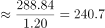亿元，家用电器产业增加值亿元，食品及农副产品加工产业增加值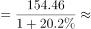亿元，新型平板显示产业增加值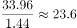亿元，新能源及光伏产业增加值亿元，则2013年家用电器产业增加值最大，新能源及光伏产业增加值最小。故所求倍数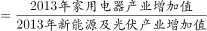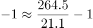倍，与C项最接近。

故正确答案为C。

---

#### 第 9 题　qid 2262599 · 综合

2013年，A市亏损企业亏损额为（  ）亿元。

- **A**. 11.4
- **B**. 13.9
- **C**. 23.8　✅
- **D**. 27.6

**答案**：C

**官方解析**

根据题干“2013年，A市亏损企业亏损额为（  ）亿元”，结合材料所给时间为2014年，可判定本题为基期计算问题。定位文字材料第二段可得，亏损企业亏损额15.46亿元，下降。根据公式：，则2013年A市亏损企业亏损额为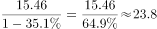亿元。

故正确答案为C。

---

#### 第 10 题　qid 2262600 · 综合

根据上述资料，下列表述不正确的是：

- **A**. 
2014年，A市六大主导产业中，增加值同比增速高于六大主导产业平均增速的有4个

- **B**. 
2014年，A市六大主导产业中，增加值占比较上年同期有所下降的有2个

- **C**. 
2013年，A市规模以上工业出口交货值约为412亿元
　✅
- **D**. 
2014年，A市11个利润均超过10亿元的行业，其利润额占规模以上工业企业利润总额的比重接近

**答案**：C

**官方解析**

A项：定位表格可得，2014年，A市六大主导产业平均增速为，那么六大主导产业中，增加值同比增速高于的有装备制造（）、食品及农副产品加工（）、新型平板显示（）、新能源及光伏（），共4个，正确。

B项：根据两期比重比较规律可得，可知当a（六大主导产业中的某一产业的增长率）b（六大主导产业的增长率）时，增加值占比较上年同期有所下降。定位表格，只有汽车增长率（）和家用电器增长率（）小于六大主导产业增长率（），正确（或者根据A项判断有4个高于的，剩余2个低于，判断B项正确）。

C项：定位文字材料第三段可得，全年规模以上工业出口交货值419.79亿元，比上年下降”,代入公式，亿元，错误。

D项：定位文字材料第二段可得，规模以上工业企业主营业务收入6002.74亿元，利润总额358.55亿元，······电气机械和器材制造业、通用设备制造业、专用设备制造业、金属制品业、汽车制造业等11个行业利润均超过10亿元，累计实现利润285.26亿元”。那么2014年，A市11个利润均超过10亿元的行业，其利润额占规模以上工业企业利润总额的比重为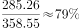，接近，正确。

本题为选非题，故正确答案为C。

---
