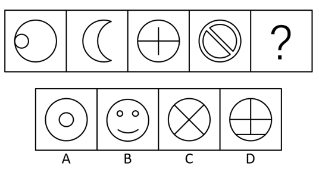
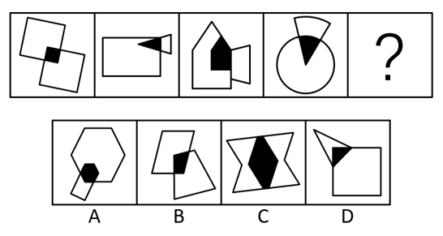
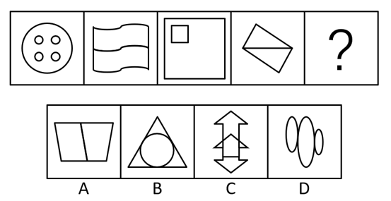
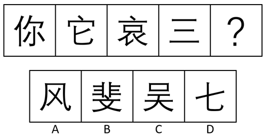
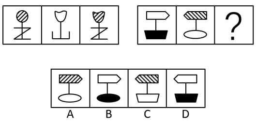
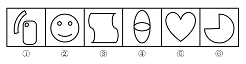

# 2016年青海省选调生行测题（精选）

> 选调生 · 2016 年 · 2 个模块 · 共 65 题

- [言语理解与表达](#%E8%A8%80%E8%AF%AD%E7%90%86%E8%A7%A3%E4%B8%8E%E8%A1%A8%E8%BE%BE) · 25 题
- [判断推理](#%E5%88%A4%E6%96%AD%E6%8E%A8%E7%90%86) · 40 题

---

## 言语理解与表达

### 第 1 题　qid 2262644 · 逻辑填空

近日，一名初中生因身穿奢侈品牌服装列席两会而引发网友关注，部分网友在        的仇富心理的作用下对其进行谴责，辱骂，甚至强行把贪污腐败的帽子扣在孩子及孩子家人的身上。
填入横线处最恰当的一项是：

- **A**. 阴暗
- **B**. 失常
- **C**. 病态
- **D**. 畸形　✅

**答案**：D

**官方解析**

分析文意可知，此空所填词语体现一种反常、不合常理的仇富心理，D项“畸形”泛指事物发展反常，当选。
A项“阴暗”、C项“病态”程度均过重，排除。
B项“失常”多指言行举止不合常理，用在此处没有“畸形”恰当，排除。
故正确答案为D。
【文段出处】《仇视阿玛尼少年是畸形的仇富心理》

---

### 第 2 题　qid 2262655 · 逻辑填空

改变最重要的就是重视民生细节，广开渠道        民意，兼听则明。
填入横线处最恰当的一项是：

- **A**. 征求
- **B**. 征召
- **C**. 征询　✅
- **D**. 咨询

**答案**：C

**官方解析**

根据后文“兼听则明”可知，横线词语应表达“多询问”之意，C项“征询”是指征求询问，符合文意，且“征询民意”为常见固定搭配，当选。
A项“征求”是指访求，体现不出“询问”之意，排除。
B项“征召”是指征求召集，多用于聘用他人，体现不出“询问”之意，排除。
D项“咨询”是指征求意见，与“民意”搭配不当，排除。
故正确答案为C。
【文段出处】人民网《人民日报民生观：“母婴室尴尬”折射管理傲慢》

---

### 第 3 题　qid 2262665 · 逻辑填空

在我国社会主义现代化建设中，改革是动力，发展是目的，稳定是前提，三者之间存在着            内在联系。
填入横线处最恰当的一项是：

- **A**. 不可替代
- **B**. 不可分割　✅
- **C**. 千丝万缕
- **D**. 千头万绪

**答案**：B

**官方解析**

横线处搭配“联系”，B项“不可分割”是指不容许把有联系的东西分开，搭配恰当，当选。
A项“不可替代”是指某人或某物是不能够用他人或他物来进行代替的，一般搭配“地位”，不与“联系”搭配，排除。
C项“千丝万缕”多形容相互之间种种密切而复杂的联系，文段未体现联系的复杂性，排除。
D项“千头万绪”比喻事情的开端、头绪非常多，也形容事情复杂纷乱，不能用来修饰“联系”，搭配不当，排除。
故正确答案为B。

---

### 第 4 题　qid 2262668 · 逻辑填空

过去三年里，每百户居民中就有4户居民没有再购买过白酒，白酒消费                。
填入横线处最恰当的一项是：

- **A**. 江河日下
- **B**. 穷途末路
- **C**. 日暮途穷
- **D**. 每况愈下　✅

**答案**：D

**官方解析**

根据“每百户居民中就有4户居民没有再购买过白酒”可知，横线处表达目前白酒消费的状况不好，在走下坡路，D项“每况愈下”指情况一天不如一天，符合语意，当选。
A项“江河日下”比喻事物日渐衰败，情况越来越糟，贬义词，而文段为客观陈述，故与文段感情色彩不符，排除。
B项“穷途末路”是指无路可走，C项“日暮途穷”比喻到了末日或衰亡的境地，用在此处均程度过重，排除。
故正确答案为D。
【文段出处】北京日报《白酒消费呈高龄化趋势》

---

### 第 5 题　qid 2262678 · 逻辑填空

四川省政府近日发出        ，要求各地按照国家部署做好出台省属国有企业负责人履职待遇、业务支出管理办法的工作，同时，        社会事业体制改革，建立健全生态文明制度体系。
依次填入横线处最恰当的一项是：

- **A**. 消息  开展
- **B**. 公告  深入
- **C**. 通知  深化　✅
- **D**. 通告  加强

**答案**：C

**官方解析**

本题可从第二空入手，搭配“改革”，C项“深化”指向更深的阶段发展，“深化······改革”为固定搭配，保留。
A项“开展”指从小向大发展，一般与“活动”搭配，而与“改革”搭配不当，排除。
B项“深入”是指深刻、透彻，一般为“深入推进······改革”，不直接搭配“改革”，排除。
D项“加强”是指变得更强更有效，与“改革”搭配不当，排除。
第一空代入验证C项，“政府发出通知”，搭配恰当，当选。
故正确答案为C。

---

### 第 6 题　qid 2262686 · 逻辑填空

大多数东欧国家对一些可能        东盟公信力和声誉、削弱东盟东亚合作主导地位的行为都有足够        。
依次填入横线处最恰当的一项是：

- **A**. 损害  警惕　✅
- **B**. 损害  警醒
- **C**. 伤害  警惕
- **D**. 伤害  警醒

**答案**：A

**官方解析**

第一空，搭配“公信力和声誉”，A、B两项“损害”指使受损失，搭配恰当，保留。C、D两项“伤害”多指心理或生理方面受损伤，与“公信力和声誉”搭配不当，排除。
第二空，横线处表达东欧国家对不利于东盟的行为有足够的警觉，A项“警惕”侧重于指思想上高度重视，加强戒备，十分谨慎小心，符合语意，当选。B项“警醒”是指使人警觉醒悟，体现不出对不利于东盟的行为应有的防备心理，故排除B项。
故正确答案为A。
【文段出处】人民日报《美国发展同东盟关系要端正心态》

---

### 第 7 题　qid 2262692 · 逻辑填空

子时的炮竹声还未远去，返程的脚步便        了起来。这个春节，近30亿人次中国人踏上回家又离家的旅程。人们归心似箭，日夜兼程，        了人类历史上最为壮观宏大，最为激动人心的迁徙。
依次填入横线处最恰当的一项是：

- **A**. 匆忙  完成
- **B**. 匆忙  成就　✅
- **C**. 急促  促成
- **D**. 急促  形成

**答案**：B

**官方解析**

第一空，根据“子时的炮竹声还未远去”以及后文“归心似箭，日夜兼程”可知，横线处表达人们仓促且忙碌地准备返程，A、B两项“匆忙”指匆促、忙碌，符合语意，保留。C、D两项“急促”指短促、速度快，体现不出“忙碌”之意，排除。
第二空，根据文意可知，横线处表达因为人们返程才有了最为壮观宏大的迁徙，B项“成就”是指造就，成全，符合语意，当选。A项“完成”是指事情按预定目标做成，文段中“最为壮观宏大，最为激动人心的迁徙”并非人们预定的目标，排除。
故正确答案为B。
【文段出处】人民网《人民日报文化世象：春节是株没有年轮的树》

---

### 第 8 题　qid 2262711 · 逻辑填空

近期，国际评级机构将对南非进行每年一度的        ，将全面        南非政府、社会、劳动力市场以及一些私人企业的情况，并对南非经济的中期发展作出判断。
依次填入横线处最恰当的一项是：

- **A**. 考查  估计
- **B**. 探察  估量
- **C**. 考察  评估　✅
- **D**. 探查  评估

**答案**：C

**官方解析**

本题可从第二空入手，搭配“情况”，且根据前文“国际评级机构”可知，横线处要体现“评判”之意，C、D两项“评估”是指评价估量，符合语意，保留。A项“估计”侧重强调预计，B项“估量”侧重强调衡量，均体现不出“评判”之意，排除。
第一空，根据文意，此空应体现“考核”之意，C项“考察”是指考核审查，符合语意，当选。D项“探查”是指试图发现某种隐蔽的事物或情况，体现不出“考核”之意，排除。
故正确答案为C。
【文段出处】中国新闻网《国际评级机构实地考察 南非重视将全力“保级”》

---

### 第 9 题　qid 2262717 · 逻辑填空

在桃花林中，听着桃花溪水潺潺的流淌，我的思绪早已飞翔，        梦幻和现实仔细寻觅着属于她的音容，凄苦的心儿猛然想起了晏几道的名句：“落花人独立，微雨燕双飞。”
依次填入横线处最恰当的一项是：

- **A**. 游弋  穿过
- **B**. 徘徊  跨越
- **C**. 漫步  穿越　✅
- **D**. 游离  翻阅

**答案**：C

**官方解析**

第一空，根据“听着桃花溪水潺潺的流淌”“思绪······飞翔”“落花人独立，微雨燕双飞”可知，横线处表达作者独自一人悠闲的置身于桃花林中，C项“漫步”指悠闲的随意走，符合语义，保留。B项“徘徊”是指在一个地方来回地走，比喻犹豫不决，文段并未体现“犹豫”之意，排除。A项“游弋”指巡逻或在水中游动，D项“游离”比喻无所依附，脱离，均与文段语境不符，排除。
第二空代入验证，搭配“梦幻和现实”，C项“穿越”指通过、穿过，可以搭配抽象词语，搭配恰当，当选。
故正确答案为C。
【文段出处】《沉香》

---

### 第 10 题　qid 2262723 · 逻辑填空

不知哪里的猫头鹰在啼叫，蝙蝠掠过夜空。东方的许多小星星在        着。每逢月圆之夜，我都不会安然就寝。吸引潮涨的力量也将我诱出户外，         在那清凉而神秘的光辉之中。
依次填入横线处最恰当的一项是：

- **A**. 闪耀  陶醉
- **B**. 闪烁  雕化
- **C**. 闪耀  崇拜
- **D**. 闪烁  沐浴　✅

**答案**：D

**官方解析**

第一空，搭配“星星”，四个选项均搭配恰当。
第二空，A项“陶醉”，由前文“将我诱出”可知，此处应使用“使我陶醉······”的句式，且与“光辉”搭配不当，排除。B项“雕化”、C项“崇拜”均与“光辉”搭配不当，排除。D项“沐浴”比喻受润泽，“沐浴在······光辉之中”符合文意，当选。
故正确答案为D。
【文段出处】《如幻的月光》

---

### 第 11 题　qid 2262728 · 逻辑填空

日本感冒药和国产感冒药在成分原料上差别并不大，         中国游客发现，日本感冒药的口感明显好很多，且有专门针对小孩的十几种不同口味，包装精致、设计也非常可爱、哄孩子吃药省力多了。
依次填入横线处最恰当的一项是：

- **A**. 如果  那么
- **B**. 尽管  但是　✅
- **C**. 因为  所以
- **D**. 不仅  而且

**答案**：B

**官方解析**

分析句意，根据“在成分原料上差别并不大”与“口感明显好很多，且有······十几种不同口味，包装精致，······哄孩子吃药省力多了。”可知，前后呈转折关系。
B项“尽管······但是······”表示转折，符合文意，当选。
A项“如果······那么”为假设关系，排除。
C项“因为······所以”为因果关系，排除。
D项“不仅······而且”为递进关系，排除。
故正确答案为B。
【文段出处】《中国人海外抢购似春运 消费者:日本感冒药口感好》

---

### 第 12 题　qid 2262738 · 逻辑填空

过去的2015年，中国购物者是全球奢侈品行业最大手笔的消费者。他们对于奢侈品的重要性                 。很多奢侈品牌将中国元素融入产品中，希望从心理上得到中国消费者的文化        。
依次填入横线处最恰当的一项是：

- **A**. 不可小觑  认可
- **B**. 不言而喻  肯定
- **C**. 不可小觑  首肯
- **D**. 不言而喻  认同　✅

**答案**：D

**官方解析**

第一空，根据“中国购物者是全球奢侈品行业最大手笔的消费者”可知，横线处表达中国购物者对于奢侈品的重要性是显而易见的，B、D两项“不言而喻”指不用说就可以明白，形容道理很浅显，符合语义。A、C两项“不可小觑”是指不可小看，未体现明显之意，排除。
第二空，搭配“文化”，D项“认同”是指认可，赞同，“文化认同”为固定搭配，当选。B项“肯定”是指完全的认同与赞赏，用在此处程度过重，排除。
故正确答案为D。
【文段出处】风尚中国《洋奢侈品“寻根”中国文化 迎合中国消费者需求》

---

### 第 13 题　qid 2262741 · 逻辑填空

站在金佛山高处向下         ，阳光照耀，蓝天映衬，白雪皑皑，阳光雪景                ，北坡药池坝犹如仙境一般，游客在山间行走。就好像步入梦幻的童话世界，不管是大人还是小孩。大家都                地玩滑雪、堆雪人。
依次填入横线处最恰当的一项是：

- **A**. 仰视  珠联璧合  不谋而合
- **B**. 雕塑  同放异彩  殊途同归
- **C**. 俯瞰  相得益彰  不约而同　✅
- **D**. 审视  交相辉映  心有灵犀

**答案**：C

**官方解析**

第一空，根据“站在金佛山高处向下”以及后文意思可知，横线处表达从高处向下看，C项“俯瞰”指从高处向下看，符合文意。A项“仰视”是指抬头向上看，与文意相悖，排除。B项“雕塑”是指用凿子或其他工具将木石、金属或其他材料雕刻塑造成一定形象，未体现看的意思，排除。D项“审视”是指仔细地看，反复分析，侧重于分析和琢磨，与文意不符，排除。
第二空代入验证，C项“相得益彰”意为两个人或两件事物互相配合，双方的能力和作用更能显示出来，用在这里形容阳光和雪景结合成更好的景象，符合语义。
第三空代入验证，根据“不管······都”可知，横线处表达大人和小孩行动一致，C项“不约而同”是指事先没有约定而相互一致，符合文意，当选。
故正确答案为C。
   【文段出处】中国网•东海咨询《金佛山阳光雪景相得益彰 游客山上乐翻天》

---

### 第 14 题　qid 2262751 · 逻辑填空

谦卑是            所显示的平静，是洞悉人心之后的        。谦卑不是让你向势高一头的人        ，不光彬彬有礼，也不光以笑颜悦人，它是一个人在历经沧海之后才有的一种亲切，大善盈胸之际的一份宽厚，物欲淘净之余呈现的一颗赤子之心。
依次填入划横线部分最恰当的一项是：

- **A**. 功成不居 坦然 奉承
- **B**. 虚怀若谷 安然 畏缩　✅
- **C**. 不骄不躁 安逸 迎合
- **D**. 不矜不伐 祥和 畏缩

**答案**：B

**官方解析**

本题可从第二空入手，根据“洞悉人心”可知，横线处表达清楚知道人的感情之后的心安，A项“坦然”是指坦白，心安，B项“安然”是没有顾虑，很放心，均符合文意，保留。C项“安逸”是指一个人的生活环境或者精神上的舒适与享受，文段并无“享受”之意，排除；D项“祥和”意为吉祥和睦，体现不出“心安”之意，排除。
第三空，根据“势高一头的人”可知，横线处表达不要向比自己势高的人害怕屈服，B项“畏缩”比喻因害怕而退缩，符合文意，保留。A项“奉承”是指用好听的话恭维人，体现不出“害怕屈服”之意，排除。
第一空，代入验证，修饰主语为“谦卑”，B项“虚怀若谷”指胸怀像山谷那样深而且宽广，形容十分谦虚，能采纳别人的意见，“谦卑是虚怀若谷所显示的平静”，搭配恰当，当选。
故正确答案为B。
【文段出处】《谦卑的人有福》

---

### 第 15 题　qid 2262755 · 逻辑填空

随着我国综合国力的不断增强。中华文化在世界文化格局中的地位越来越重要。当前，        中华文化走出去，        中华文化国际影响力。可谓            。
依次填入划横线部分最恰当的一项是：

- **A**. 推动 提高 正逢其时　✅
- **B**. 推动 增强 恰到好处
- **C**. 鼓励 强化 正逢其时
- **D**. 鼓励 提升 恰到好处

**答案**：A

**官方解析**

本题可从第三空入手，根据“随着我国综合国力······增强，中华文化······地位越来越重要”以及“当前”可知，横线处表达中华文化发展遇到时机，A、C两项“正逢其时”是指正好赶上时机，均符合文意，保留。B、D两项“恰到好处”指说话做事正好到了最合适的地步，均与文意无关，排除。
第二空，搭配“影响力”，A项“提高”是指使位置、水平等方面比原来高，“提高影响力”为常见搭配，保留。C项“强化”一般搭配“服务”、“技能”等，与“影响力”搭配不当，排除。
第一空，代入验证，A项“推动中华文化走出去”搭配恰当，当选。
故正确答案为A。
【文段出处】搜狐《张西平:中华文化走出去,需要认真应对西方的偏见、误解甚至挑衅》

---

### 第 16 题　qid 2262784 · 片段阅读

据报道，春节期间，600万出境过节的中国游客“刷出”了境外消费900亿元人民币的新纪录。往年，海淘热销产品集中在电饭煲、智能马桶盖、空气净化器等高端耐用商品，而新年伊始，电动剃须刀、保温瓶、美颜器、化妆品、食品、药品等国内常见的低价日用品纷纷登上了“爆买”榜单。
作者接下来最有可能讲述的是：

- **A**. “爆买”榜单上的常见日用品有哪些
- **B**. 中国游客为什么选择春节出境旅游
- **C**. 中国游客千里迢迢出境抢购日用品的原因　✅
- **D**. 中国春节期间日用品市场的黯淡光景

**答案**：C

**官方解析**

文段开头介绍境外消费刷出新纪录，接着指出往年的海淘热销产品有哪些，最后通过“而”指出，如今国内常见的日用品成为海淘热销产品，因此文段接下来应该论述中国游客海外“爆买”日用品的原因，对应C项。
A项，“‘爆买’榜单上的常见日用品”为前文论述过的内容，排除；
B项，“出境旅游”与尾句话题不一致，排除；
D项，“中国春节期间日用品市场”与尾句话题不一致，排除。
故正确答案为C。
【文段出处】深圳商报《新纪录：春节期间中国600万出境游客消费900亿元人民币》

---

### 第 17 题　qid 2262788 · 片段阅读

植物油在高温烹调过程中会产生大量的醛类物质，醛类物质有潜在的毒性，可导致心脏病、癌症、痴呆等相关疾病。研究发现，在加热到180摄氏度一段时间后，相比葵花籽油和玉米油，黄油、橄榄油、猪油产生的醛类物质会少很多，椰子油情况最好，食用油的脂肪酸分为饱和和不饱和两种。饱和脂肪多含于牛、羊、猪等动物脂肪中，有少数植物如椰子油、可可油、棕桐油等中也含此类脂肪酸。不饱和脂肪酸多含于红花籽油、核桃油、花生油、大豆油、阿甘油、橄榄油、茶油等植物油中。饱和脂肪酸摄入过多会增加心血管疾病的风险。
下列说法与原文相符的是：

- **A**. 食用葵花籽油和玉米油的人比食用黄油、橄榄油、猪油的人患癌症的概率高　✅
- **B**. 葵花籽和玉米本身还有醛类化学成分，所以在加热到180摄氏度一段时间后，会产生醛类物质
- **C**. 相比于葵花籽油、玉米油、可可油和棕桐油，橄榄油可能更不易引起某些心血管疾病
- **D**. 牛、羊、猪肉含有较多的饱和脂肪酸，我们应该少吃肉类以减少患有疾病的风险

**答案**：A

**官方解析**

A项，根据“醛类物质有潜在的毒性，可导致心脏病、癌症、痴呆等相关疾病”以及“相比葵花籽油和玉米油，黄油、橄榄油、猪油产生的醛类物质会少很多”可知，表述正确，当选；
B项，文段未提及“葵花籽和玉米本身还有醛类化学成分”，无中生有，排除；
C项，根据“饱和脂肪······有少数植物如椰子油、可可油、棕桐油等中也含此类脂肪酸。不饱和脂肪酸多含于······橄榄油······等植物油中”可知，文段并未论述“葵花籽油、玉米油”属于饱和脂肪还是不饱和脂肪，故无法得出“橄榄油更不易引起某些心血管疾病”，排除；
D项，根据“饱和脂肪多含于牛、羊、猪等动物脂肪中”可知，“我们应该少吃肉类”偷换概念，排除。
故正确答案为A。
【文段出处】中国知网《植物油高温烹调致癌?》

---

### 第 18 题　qid 2262794 · 片段阅读

生活质量的提高带动了收藏品市场的发展。有钱的人多了，买得起收藏品的人也多了，但真正懂得如何品鉴的人却不多，甚至演变成了附庸风雅的“烧钱文化”。近期，某电视台举办了一系列的“鉴宝”活动，请鉴宝专家为民间收藏爱好者鉴别藏品。携“宝”参加的人络绎不绝，但真正淘到真品的凤毛麟角，一些花费几十万至上百万买到的“传家之宝”居然是市值几百元的仿品，成为了别人眼中的笑话。
从这段文字可以推出：

- **A**. 收藏市场需要一批专业的“鉴宝”专家
- **B**. 收藏需要具备专业知识　✅
- **C**. “鉴宝”活动有利于净化收藏市场
- **D**. 收藏爱好者都是盲目的，需要加以正确的引导

**答案**：B

**官方解析**

文段开篇介绍随着人们生活水平提高，越来越多的人买收藏品，接着通过转折关联词“但”提出问题，即懂得鉴别珍藏品的不多，买收藏品演变成了“烧钱文化”，最后以“‘鉴宝’活动”为例，进行具体解释说明，故文段意在说明人们应该具有鉴别收藏品真假的能力，对应B项。
A项“‘鉴宝’专家”以及C项“‘鉴宝’活动”，均为文段例子中的内容，非重点，排除；
D项，“收藏爱好者都是盲目的”表述绝对，文段论述的是懂得品鉴收藏品的人不多，排除。
故正确答案为B。

---

### 第 19 题　qid 2262799 · 片段阅读

近来利用氰化物进行捕鱼的行为十分猖獗。氰化物每毒害一条热带鱼就会侵害近一平方米面积的珊瑚礁。所造成的危害至少是珊瑚白化，或者干扰珊瑚的生长；严重时就是大片死亡。珊瑚一旦死亡，整个生态环境就会崩塌。没有了珊瑚，岩礁鱼类，甲壳纲动物、植物以及其他动物就会相继失去食物来源和繁殖场所。
这段文字重在说明：

- **A**. 利用氰化物进行捕鱼的行为难以遏制
- **B**. 氰化物对海洋生物的危害性
- **C**. 珊瑚礁的生存正面临严峻的挑战
- **D**. 氰化物会破坏整个海洋生态系统　✅

**答案**：D

**官方解析**

文段开篇指出利用氰化物捕鱼会对珊瑚造成危害，接着具体介绍对珊瑚的危害，即严重时会使珊瑚大片死亡，最后指出珊瑚死亡会使海洋生态环境崩塌，还会使海洋动植物失去食物来源和繁殖场所，故文段意在说明氰化物会破坏整个海洋生态系统，对应D项。
A项，“难以遏制”文段未提及，无中生有，排除；
B项，“海洋生物的危害”仅对应没有珊瑚的后果之一，表述片面，排除；
C项，缺少文段主题词“氰化物”，排除。
故正确答案为D。
【文段出处】网易《氰化物捕鱼 观赏鱼亟待拯救》

---

### 第 20 题　qid 2262801 · 片段阅读

人们焚烧化石燃料，如石油、煤炭等，会产生大量的二氧化碳等温室气体，这些温室气体对来自太阳辐射的可见光具有高度透过性，而对地球发射出来的长波辐射具有高度吸收性，能强烈吸收地面辐射中的红外线，导致地球温度上升，即温室效应。而当温室效应的不断积累会导致地气系统吸收与发射的能量不平衡，使能量不断在地气系统累积，从而导致温度上升，造成全球变暖这一现象。
这段文字意在说明：

- **A**. 全球气候变暖形成的原因　✅
- **B**. 温室气体与温室效应的关系
- **C**. 温室效应产生的影响
- **D**. 温室气体产生的过程

**答案**：A

**官方解析**

文段首先指出燃烧化石燃料会产生温室气体，然后引出温室效应的概念，最后通过因果关联词“导致”引导结论，即全球气候变暖是由于温室效应不断积累，故文段意在说明形成全球气候变暖的原因，对应A项。
B、C、D三项均为结论前的内容，非重点，且缺少文段主题词“全球气候变暖”，排除。
故正确答案为A。
【文段出处】互动百科《全球气候变暖》

---

### 第 21 题　qid 2262803 · 片段阅读

猜猜看，去年哪家公司买了最多的清洁能源？没错，就是谷歌。这家科技巨头也是风能和太阳能的霸主。不过如今，其他一些巨头企业也逐一进入了这一领域，其中还有一些有着数十年历史的老牌企业和非硅谷企业。这些初入可再生能源领域的公司包括有着77年历史的建材生产商欧文斯科宁公司、老牌美国政府承包商洛克希德马丁公司和1897年成立的陶氏化学公司。
最能概括这段文字意思的是：

- **A**. 科技巨头谷歌领跑风能和太阳能领域
- **B**. 清洁能源越来越受投资者的青睐　✅
- **C**. 老牌企业大举挺进可再生能源领域
- **D**. 传统的科技企业已经开始探求转型

**答案**：B

**官方解析**

文段开篇介绍谷歌在清洁能源领域投资最多，处于霸主地位，接着通过转折关联词“不过”指出，其他巨头企业也陆续进入了清洁能源领域，尾句内容为对初入可再生能源的企业进行列举，故文段意在强调越来越多的企业重视清洁能源领域，对应B项。
A项，“谷歌”为转折前的内容，非重点，排除。
C项，“老牌企业”为进入清洁能源领域企业的一部分，表述片面，排除；
D项，“探求转型”文段未提及，无中生有，且“科技企业”表述片面，排除。
故正确答案为B。
【文段出处】国家地理中文网《老牌公司大举挺进风能和太阳能领域》

---

### 第 22 题　qid 2262811 · 片段阅读

就桥梁史的意义而言浙闽木拱桥最为核心的价值在于桥面板之下、不为普通游客所了解桥拱结构与蕴含其中的营造技术。正因如此，早在浙闽木拱桥列入我国申报世界文化遗产的预备名录之前，“中国木拱桥传统营造技艺”已经列入联合国“急需保护的非物质文化遗产”名录。
作者想要表达的主要观点是：

- **A**. “中国木拱桥传统营造技艺”已经列入世界非物质文化遗产名录　✅
- **B**. 国内对木拱桥的重视程度不及联合国
- **C**. 木拱桥的桥拱结构及其营造技术最能体现浙闽木拱桥的价值
- **D**. 普通游客对木拱桥知之甚少

**答案**：A

**官方解析**

文段开篇介绍浙闽木拱桥最为核心的价值在于其桥面板之下的营造技术，尾句以“正因如此”总结前文，引出结论：“中国木拱桥传统营造技艺”已经列入联合国“急需保护的非物质文化遗产”名录，A项为结论句的同义替换，当选。
B项，缺少主题词“中国木拱桥传统营造技艺”，且文段未体现国内与联合国对木拱桥态度的对比，无中生有，排除；
C项“浙闽木拱桥的价值”与D项“普通游客”均为结论前的内容，非重点，排除。
故正确答案为A。
【文段出处】国家地理中文网《浙闽木拱廊桥，秘密传承的造桥技艺》

---

### 第 23 题　qid 2262817 · 片段阅读

古时，桃花坞大约是苏州才子聚集地。桃花坞是荡在诗画中的风流。年画在人们的印象中，和春联是同一种类型，只不过是过年时贴在门上表达吉祥的装饰。而桃花坞年画，则是孕育于才子佳人聚集地姑苏城的民间艺术，把文人画的风雅用喜闻乐见的民俗形式来表述：传递祈福迎祥的《一团和善》、《花开富贵》；用来驱凶避邪的《神荼郁垒》、《钟馗捉鬼》······一幅年画，就是社会的一扇窗，透过它能看清当年的世间百态。
最适合作为这段文字标题的是：

- **A**. 孕育民间艺术的宝地
- **B**. 门上的吉祥装饰物
- **C**. 纸上的民俗艺术　✅
- **D**. 洞察世间百态的窗口

**答案**：C

**官方解析**

文段开篇介绍桃花坞在古代的地位，接着指出桃花坞年画与普通年画不同，即桃花坞年画是民间艺术，最后通过“：”进行具体解释说明，故文段中心应为介绍“桃花坞年画”的特点，对应C项。
A项，为文段中“姑苏城”的特点，非重点，排除；
B项，为人们印象中的年画形象，非重点，排除；
D项，对应文段解释说明的内容，表述片面，排除。
故正确答案为C。
【文段出处】《桃花坞年画：贴在门上的民俗风情画》

---

### 第 24 题　qid 2262818 · 片段阅读

2013年4月23日，一座蓝色的“音乐楼梯”在南京地铁二号线苜蓿园站亮相，引导地铁旅客多走楼梯、少乘电梯，节能降耗。据了解，这座“音乐楼梯”配有33对酷似小音箱的感应装置，分布在台阶两侧。感应装置里有发射器和接收器，可将地铁旅客上下楼梯的脚步感应信号转化成《梁祝》和《卡农》等中外钢琴名曲旋律。
最适合作为这段文字标题的是：

- **A**. “音乐阶梯”亮相南京地铁　✅
- **B**. “音乐阶梯”有利于节能降耗
- **C**. “音乐阶梯”配置现代化
- **D**. “音乐阶梯”可以弹奏世界名曲

**答案**：A

**官方解析**

本文段的文体为新闻类简讯，首句给出了文段的中心，即“音乐楼梯”在南京地铁二号线亮相，后文是对中心句的具体解释说明，故标题为中心句的同义替换，对应A项。
B项，“节能降耗”为“音乐楼梯”的好处，不能全面概括文段内容，表述片面，排除。
C项“配置现代化”以及D项“弹奏世界名曲”，均为后文解释说明内容，非重点，排除。
故正确答案为A。
【文段出处】中国江苏网《地铁苜蓿园站有个音乐楼梯》

---

### 第 25 题　qid 2262819 · 片段阅读

收藏界近十年来一直活跃着一个特殊的群体，人们都称之为“国宝帮”。“国宝帮”并不是指那些购买仿造瓷器，作为陈设欣赏的消费者，只有进入收藏界，收藏仿造国宝重器，以收藏家自居的人才有资格称为国宝帮。这个群体的出现和国内收藏热的兴起息息相关。
最能概括这段文字的是：

- **A**. “国宝帮”的来源
- **B**. “国宝帮”的特点
- **C**. 何谓“国宝帮”　✅
- **D**. “国宝帮”与国内收藏热的渊源

**答案**：C

**官方解析**

文段首句引出“国宝帮”的这一话题，接着具体介绍“国宝帮”，即“国宝帮”是收藏仿造国宝重器，以收藏家自居的一群人，最后尾句进行补充说明，故分析全文可知，文段主要介绍什么是“国宝帮”，对应C项。
A项“来源”与D项“国内收藏热的渊源”，均对应尾句补充说明内容，不能概括全文，表述片面，排除。
B项，“特点”，文段未提及，无中生有，排除。
故正确答案为C。
   【文段出处】国家地理中文网《收藏界的害群之马：国宝帮》

---

## 判断推理

### 第 1 题　qid 2262871 · 图形推理

根据所给图形的现有规律，选出一个最合理的答案：

- **A**. A
- **B**. B
- **C**. C　✅
- **D**. D

**答案**：C

**官方解析**

图形元素组成不相同，且无明显属性规律，考虑数量规律，图1中交点数明显，优先考虑交点数量，题干中图形交点数量从左到右依次为：1、2、3、4，所以？处的交点数量应该为5，只有C项符合。A、B项交点数均为0，D项交点数为7，均排除。
故正确答案为C。

---

### 第 2 题　qid 2262875 · 图形推理

根据所给图形的现有规律，选出一个最合理的答案：

- **A**. A　✅
- **B**. B
- **C**. C
- **D**. D

**答案**：A

**官方解析**

图形元素组成相似，优先考虑样式规律。相同线条重复出现，考虑加减同异。观察发现，第一组图中，图1和图2求异后得到图3，第二组图运用相同规律，图1和图2求异后，对应A项图形。
故正确答案为A。

---

### 第 3 题　qid 2262879 · 图形推理

根据所给图形的现有规律，选出一个最合理的答案：

- **A**. A　✅
- **B**. B
- **C**. C
- **D**. D

**答案**：A

**官方解析**

元素组成不同，图形均有明显相交的黑色区域，优先考虑图形间关系。观察发现，题干每幅图中的黑色部分与其中一个图形的形状相同，故？处图形黑色部分与其中一个图形的形状相同，只有A项符合。
故正确答案为A。

---

### 第 4 题　qid 2262882 · 图形推理

根据所给图形的现有规律，选出一个最合理的答案：

- **A**. A
- **B**. B
- **C**. C
- **D**. D　✅

**答案**：D

**官方解析**

图形元素组成不相同，且无明显属性规律，考虑数量规律，图形中均存在空白的封闭区域，考虑数面。第一行图中：面数量分别为1、2、3。第二行图形：面数量分别为：6、5、4，均构成等差数列，且相差为1，第三行图中：面数量分别为7、8、？，故？处图形的面数量为9个。A项7个，B项5个，C项6个，D项9个面，只有D项符合。
故正确答案为D。

---

### 第 5 题　qid 2262884 · 图形推理

根据所给图形的现有规律，选出一个最合理的答案：

- **A**. A
- **B**. B
- **C**. C
- **D**. D　✅

**答案**：D

**官方解析**

图形元素组成不相同，且无明显属性规律，考虑数量规律，每幅图形均由小元素组成，考虑数元素。观察发现，每幅图形都由一种小元素组成，故？处图形应该仅由一种小元素组成。A项、B项、C项图形均由两种小元素组成，D项图形由一种小元素组成，只有D项符合。
故正确答案为D。

---

### 第 6 题　qid 2262888 · 图形推理

根据所给图形的现有规律，选出一个最合理的答案：

- **A**. A
- **B**. B
- **C**. C　✅
- **D**. D

**答案**：C

**官方解析**

图形元素组成不相同，且无明显属性规律，考虑数量规律，观察发现，每幅图均为汉字，汉字的笔画分别为：7、5、9、3，均为奇数，故？处图形的笔画应该为奇数。A项为4，B项为12，C项为7，D项为2，只有C项符合。
故正确答案为C。

---

### 第 7 题　qid 2262893 · 图形推理

根据所给图形的现有规律，选出一个最合理的答案：

- **A**. A　✅
- **B**. B
- **C**. C
- **D**. D

**答案**：A

**官方解析**

元素组成相似，考虑样式规律。样式没有规律，继续观察发现，每幅图均由白五角星和黑五角星组成，白五角星数量依次为：1、1、3、1，黑五角星数量依次为：1、2、1、4，第一幅图中，白五角星－黑五角星=0；第二幅图中，白五角星－黑五角星=－1；第三幅图中，白五角星－黑五角星=2，第四幅图中，白五角星－黑五角星=－3，两种颜色五角星数量差的绝对值递增，所以问号处二者数量差的绝对值应为4，只有A项符合。
故正确答案为A。

---

### 第 8 题　qid 2262897 · 图形推理

根据所给图形的现有规律，选出一个最合理的答案：

- **A**. A
- **B**. B
- **C**. C
- **D**. D　✅

**答案**：D

**官方解析**

元素组成相似，考虑样式规律。观察第一组图，图3上半部分图形与图2上面图形形状相同，与图1上面图形阴影一样，下半部分与图1下半部分形状相同。第二组图运用规律，？处图形上半部分应该与图2上半部分形状相同，与图1上面图形阴影一样，下半部分与图1下半部分形状相同，只有D项符合。
故正确答案为D。

---

### 第 9 题　qid 2262900 · 图形推理

根据所给图形的现有规律，选出一个最合理的答案：

- **A**. A　✅
- **B**. B
- **C**. C
- **D**. D

**答案**：A

**官方解析**

将原展开图标上序号如下图，逐一进行分析。

A项：与题干展开图一致，当选；

B项：选项中包含面a，题干中面a和面c是相对面，不能同时出现，故选项正面和侧面为面e、面b，展开图中这三个面的公共点引出1条线，选项中公共点引出2条线，选项与题干不一致，排除；

C项：选项包含面b、面c、面e，构成直角的两条边是公共边，故题干中这三个面的公共点引出1条线，选项中这三个面的公共点引出0条线，选项与题干不一致，排除；

D项：选项正面为面d或面f，假设正面为面f，题干中面f中直角三角形的短直角边挨着面d，选项中该边没有挨着面d，假设不成立；同理，假设正面为面d，题干中面d中直角三角形的短直角边挨着面f，选项中该边没有挨着面f，故假设不成立，选项和题干不一致，排除。

故正确答案为A。

---

### 第 10 题　qid 2262903 · 图形推理

根据所给图形的现有规律，选出一个最合理的答案：

- **A**. ①②④，③⑤⑥
- **B**. ①③⑥，②④⑤　✅
- **C**. ①③④，②⑤⑥
- **D**. ①④⑤，②③⑥

**答案**：B

**官方解析**

解析一：元素组成不同，优先考虑属性规律。观察发现，图②④⑤均为全曲线图形，图①③⑥均为曲线+直线图形，故②④⑤为一组，①③⑥为另一组，对应B项。
故正确答案为B。
解析二：元素组成不同，题干图形均出现明显封闭面，考虑面数量。观察发现，图①②④面数量均为3，图③⑤⑥面数量均为1，故①②④为一组，③⑤⑥为另一组，对应A项。
粉笔说明：两种思路均可严谨的得到答案，且公务员考试中都出现过类似考法的题目，故两种答案粉笔都认可。

---

### 第 11 题　qid 2262913 · 逻辑判断

凉拌胡萝卜，将胡萝卜洗净、去皮，切成细丝，用盐腌洗后用清水冲净，拌入白糖、醋、香油、生菜丝即可食用。这种做法的胡萝卜，清脆爽口，富含营养，比炒熟更适合食用。
以下（  ）项最能削弱上述结论。

- **A**. 油脂摄入过多可导致肥胖，使心血管疾病、高血压和某些癌症发病率提高
- **B**. 胡萝卜炒熟后也很好吃
- **C**. 多吃凉拌菜易导致上火、腹泻等症状
- **D**. 胡萝卜对人类的最大贡献是富含β胡萝卜素，β胡萝卜素过油之后更容易被人体吸收　✅

**答案**：D

**官方解析**

第一步：找出论点和论据。
论点：凉拌胡萝卜比炒熟更适合食用。
论据：无。
第二步：逐一分析选项。
A项：讨论油脂摄入过多，题干中“炒熟”不代表油脂过多，二者讨论话题不一致，无关项，排除；
B项：说明炒熟也很好吃，没有说明胡萝卜的哪种做法更适合食用，无关项，排除；
C项：说明凉拌菜不宜多吃，但是没有讨论哪种做法的胡萝卜更适合食用，无关项，排除；
D项：说明过油之后，胡萝卜中的β胡萝卜素更容易被人体吸收，对人体更好，那么炒熟之后的胡萝卜更适合食用，削弱论点，当选。
故正确答案为D。

---

### 第 12 题　qid 2262917 · 类比推理

小明所有的考试不可能都是100分。
下列判断中与上述判断的含义最为接近的是：

- **A**. 有的考试必然不是100分　✅
- **B**. 有的考试不可能不是100分
- **C**. 所有考试必然都是100分
- **D**. 有的考试不必然不是100分

**答案**：A

**官方解析**

第一步：翻译题干。
“不可能都”=“必然不”，即题干等价于“小明必然不是所有考试都是100分”，“不是所有”=“有的不是”，即“小明有的考试不是100分”。
第二步：逐一分析选项。
A项：与题干判断的含义相同，当选；
B、C、D项均无法通过题干推出，排除。
故正确答案为A。

---

### 第 13 题　qid 2262922 · 类比推理

某国内旅行团中，所有去北京的游客都去过故宫，所有去承德避暑山庄的游客都没去过故宫，所有老年人游客都去了承德避暑山庄。
由此推出：

- **A**. 有些老年人游客去了故宫
- **B**. 所有老年人游客没去北京　✅
- **C**. 有些去北京的游客都去了承德避暑山庄
- **D**. 所有去承德避暑山庄的游客都是老年人

**答案**：B

**官方解析**

第一步：翻译题干。

①北京游客故宫；

②承德避暑山庄故宫；

③老年游客承德避暑山庄。

将①逆否和②③可递推出：老年游客承德避暑山庄故宫北京游客。

第二步：逐一分析选项。

A项：翻译为有的老年游客故宫，根据题干推出所有老年游客都没有去故宫，推不出该项，排除；

B项：翻译为老年游客北京，是对题干翻译的肯前，肯前必肯后，可以推出，当选；

C项：翻译为有的北京游客承德避暑山庄，根据“承德避暑山庄北京游客”逆否为“北京游客承德避暑山庄”可知所有北京游客都没去承德避暑山庄，推不出该项，排除；

D项：翻译为承德避暑山庄老年人，是对题干翻译的肯后，肯后得不到确定的结论，排除。

故正确答案为B。

---

### 第 14 题　qid 2262925 · 逻辑判断

所有购买格力电冰箱的顾客都获得了一张300元的购物券。所有获得购物券的人都消费了3000元以上。
假设上述命题为真，则下列命题正确的是：

- **A**. 消费了3000元以上的顾客都购买了格力电冰箱
- **B**. 所有消费了3000元以上的顾客都获得了一张300元的购物券
- **C**. 所有看过格力电冰箱的顾客都消费了3000元以上
- **D**. 可能有的获得购物券的顾客没有购买格力电冰箱，但消费了3000元以上　✅

**答案**：D

**官方解析**

第一步：翻译题干。

①购买格力电冰箱购物券（300元）；

②购物券消费3000元以上；

将①②连接得到③购买格力电冰箱购物券消费3000元以上。

第二步：逐一分析选项。

A项：翻译为消费3000元以上购买格力电冰箱，是对②的肯后无法得到确定结论，不能推出，排除；

B项：翻译为消费3000元以上300元的购物券，是对②的肯后无法得到确定结论，不能推出，排除；

C项：翻译为看过格力电冰箱消费3000元以上，看过格力电冰箱不代表购买了格力电冰箱，不能推出，排除；

D项：翻译为有的获得购物券消费3000元以上且没有购买格力电冰箱，获得购物券是对②的肯前，肯前必肯后，对①的肯后得不到确定性的结论，所以可能存在，可以推出，当选。

故正确答案为D。

---

### 第 15 题　qid 2262929 · 逻辑判断

世界上任何成功的发明都要经历无数次失败的试验，过去发明家的经历告诉我们，经历失败是获得成功的基础，如果善于在失败的试验中总结教训积累经验，那么就会成功。
由此可以推出：

- **A**. 如果没有经历失败的试验，就不可能善于在失败的试验中总结教训积累经验　✅
- **B**. 成功的发明一定是善于在失败的试验中总结教训积累经验
- **C**. 多经历失败的试验就会善于在失败的试验中总结教训积累经验
- **D**. 没有成功的发明当然就没有经历过失败的试验

**答案**：A

**官方解析**

第一步：翻译题干。

①成功经历失败；

②在失败中总结教训积累经验成功。

可递推为：在失败中总结教训积累经验成功经历失败。

第二步：逐一分析选项。

A项：翻译为经历失败在失败中总结教训积累经验，是对题干翻译的否后，否后必否前，可以推出，当选；

B项：翻译为成功在失败中总结教训积累经验，是对题干翻译的肯后，肯后得不到确定性的结论，不能推出，排除；

C项：翻译为经历失败在失败中总结教训积累经验，是对题干翻译的肯后，肯后得不到确定性的结论，不能推出，排除；

D项：翻译为成功经历失败，是对题干翻译的否前，否前得不到确定性的结论，不能推出，排除。

故正确答案为A。

---

### 第 16 题　qid 2262936 · 逻辑判断

某些鸟类在产卵之后，便会离巢飞走，不会亲自孵化和育养。另一些鸟类则在亲自孵化雏鸟之后还会继续生活在鸟巢中，在后一种鸟类中，包括那些具有重要经济、科研价值的黄嘴白鹭。
由此可推出：

- **A**. 对经济和科研贡献较小的鸟类逃避亲自孵化雏鸟
- **B**. 大多数鸟类在孵化雏鸟之后还会生活在鸟巢中
- **C**. 黄嘴白鹭通常不会在产卵之后离巢飞走　✅
- **D**. 大多数鸟类一出生就独立生活，不需要成年鸟类的保护

**答案**：C

**官方解析**

日常结论题，根据题干信息逐一分析选项。
A项：题干中指出有些具有重要经济、科研价值的鸟类会继续生活在鸟巢中，但没有提及对经济和科研贡献较小的鸟类，无中生有，排除；
B项：题干中指出有些鸟类会继续生活在鸟巢中，但是没有提及数量占比，无法推出，排除；
C项：根据题干第二句话可知黄嘴白鹭亲自孵化雏鸟之后还会继续生活在鸟巢中，可以推出黄嘴白鹭通常不会在产卵之后离巢飞走，当选；
D项：题干中未提及大多数鸟类一出生的状态，无中生有，排除。
故正确答案为C。

---

### 第 17 题　qid 2262940 · 逻辑判断

体育老师建议：“如果学校新建一个游泳池，那么篮球场也要新建一个。”副校长：“我不同意。”
下列描述中，表达副校长的意见最为准确的一项是：

- **A**. 游泳池、篮球场都不新建
- **B**. 新建篮球场，但不新建游泳池
- **C**. 新建游泳池，但不新建篮球场　✅
- **D**. 只有新建篮球场才不新建游泳池

**答案**：C

**官方解析**

第一步：分析题干。

①新建游泳池新建篮球场；

副校长“我不同意”，与副校长的意见表述最为相近的为①的矛盾命题，“新建游泳池→新建篮球场”的矛盾命题为“新建游泳池 且 新建篮球场”，对应C项。

故正确答案为C。

---

### 第 18 题　qid 2262944 · 逻辑判断

小红被确诊为白血病，全校师生都很关心她的情况。其中有一同学暗中捐款相助。小红转危为安，想知道是谁捐款了，她询问了四位同学，分别得到以下回答：
或者甲捐了，或者乙捐了；
如果乙捐了，那么丙也捐了；
如果乙没捐，那么丁捐了；
甲和乙都没捐；
实际上，四位同学的回答中只有一句是假的，
据此，可以推出：

- **A**. 丙捐了
- **B**. 丁捐了　✅
- **C**. 甲捐了
- **D**. 乙捐了

**答案**：B

**官方解析**

本题属于真假推理题。

第一步：找出题干矛盾命题。

题干可翻译为：

（1）甲捐 或 乙捐；

（2）乙捐丙捐；

（3）乙捐丁捐；

（4）甲捐 且 乙捐。

（1）和（4）是矛盾关系，已知只有一句是假的，矛盾关系必有一真一假，所以二者必有一真一假，（2）（3）为真。

第二步：看其余。

（2）为真，假设乙捐了，那么丙也捐了，此时不符合“其中有一同学暗中捐款相助”，因此假设不成立，即乙没捐。（3）为真，乙没捐，那么丁捐，且甲乙丙都没捐，此时（1）为假，（4）为真，同时满足（2）（3）为真，符合题干，因此丁捐了成立。

故正确答案为B。

---

### 第 19 题　qid 2262948 · 逻辑判断

如果购买股票必然赚大钱，那么股票市场不会如此动荡不安。
由此可推出：

- **A**. 股票市场如果稳定，说明购买股票必然不会赚大钱
- **B**. 股票市场动荡不安，说明购买股票可能难以赚大钱　✅
- **C**. 如果购买股票不必然赚大钱，那么股票市场就会动荡不安
- **D**. 股票市场不稳定，说明购买股票一定赚大钱

**答案**：B

**官方解析**

第一步：翻译题干。
必然赚大钱→-动荡不安。
第二步：逐一分析选项。
A项：翻译为稳定→必然不会赚大钱，“稳定”表示“-动荡不安”，是对题干翻译的肯后，肯后得不到确定性的结论，排除；
B项：翻译为动荡不安→-可能赚大钱，题干“必然赚大钱”的否定表述为“不必然赚大钱”=可能不赚大钱，故该项是对题干翻译的否后，否后必否前，可以推出，当选；
C项：翻译为-必然赚大钱→动荡不安，是对题干翻译的否前，否前得不到确定性的结论，排除；
D项：翻译为-稳定→一定赚大钱，“-稳定”表示“动荡不安”，利用逆否等价定律，否后必否前，那么根据题干可知“-稳定→-必然赚大钱”，该项否后，但是肯前了，不能推出，排除。
故正确答案为B。

---

### 第 20 题　qid 2262960 · 逻辑判断

销售员：“CPU是任何一台电脑的核心元件。W品牌电脑与S品牌使用的是相同质量的CPU。但W品牌电脑的售价较低，所以当你选择W品牌电脑而不是S品牌电脑时，就等于付了更低的价格却买了相同质量的电脑。”
下列选项中，最能支持销售员作出的结论的是：

- **A**. W品牌的电脑和S品牌的电脑都是在同一厂家组装的
- **B**. 销售员售卖一台W品牌的电脑所赚的钱少于售卖一台S品牌的电脑所赚的钱
- **C**. 每天W品牌电脑比S品牌电脑销售的多
- **D**. 电脑的质量由其CPU的质量决定　✅

**答案**：D

**官方解析**

第一步：找出论点和论据。
论点：W品牌电脑的售价较低，选择W品牌电脑而不是S品牌电脑时，就等于付了更低的价格却买了相同质量的电脑。
论据：CPU是任何一台电脑的核心元件。W品牌电脑与S品牌使用的是相同质量的CPU。
第二步：逐一分析选项。
A项：讨论电脑的组装，没有涉及电脑的价格与质量，属于无关项，排除；
B项：讨论销售员售卖电脑所赚的钱的多少，没有涉及电脑的价格与质量，属于无关项，不能加强，排除；
C项：比较电脑的销量，没有涉及电脑的价格与质量，属于无关项，不能加强，排除；
D项：说明电脑的质量由CPU的质量决定，那么使用相同质量CPU的W、S电脑的质量相同，在论点和论据之间搭桥，属于加强项，当选。
故正确答案为D。

---

### 第 21 题　qid 2262963 · 定义判断

一些年轻的夫妻一方面不愿养育子女，而另一方面又想享受为人父母的温馨与乐趣，于是纷纷养起了宠物，这些家庭被人们称为“丁宠”家庭。他们给自己的宠物提供优厚的生活待遇，并把宠物视为自己的精神寄托。
下列属于丁宠家庭的是：

- **A**. 李女士因丈夫常年出差在外，经常下班回到家后连个说话的人都没有，就到宠物市场买了一只兔子来养，经常跟兔子说说话
- **B**. 年轻的小张夫妇在村口新开了一家商店，因为商店晚上频繁被盗，就向朋友购买了一条狗守家看院
- **C**. 同事小杨因怀孕，把自己的宠物猫送给了小罗夫妇喂养，小罗细心照顾猫，经常给猫洗澡、喂牛奶
- **D**. 小刘夫妇新婚不久，达成共识暂不生养小孩，但又觉得两个人的生活有点单调，于是领养了一条狗一起生活　✅

**答案**：D

**官方解析**

第一步：找出定义关键词。
“年轻的夫妻一方面不愿养育子女”“另一方面又想享受为人父母的温馨与乐趣”“养起了宠物”。
第二步：逐一分析选项。
A项：李女士养宠物的原因是回家后没有说话的人，而不是想享受为人父母的温馨与乐趣，不符合定义，排除；
B项：小张夫妇是购买狗守家看院，而不是想享受为人父母的温馨与乐趣，不符合定义，排除；
C项：没有涉及小罗夫妇因为想享受为人父母的温馨与乐趣养宠物，而是因为同事送给他们喂养，不符合定义，排除；
D项：“小刘夫妇新婚不久，达成共识暂不生养小孩”对应“年轻的夫妻一方面不愿养育子女”，“觉得生活有点单调”说明小刘夫妇想享受温馨与乐趣，“领养一条狗”符合“养起了宠物”，符合定义，当选。
故正确答案为D。

---

### 第 22 题　qid 2262967 · 定义判断

职业倦息，是指个体在工作重压下产生的身心疲劳与耗竭的状态，是个体不能顺利应对工作压力时的一种反应，是在长期压力下而产生的情感、态度和行为的衰竭状态。
根据以上定义，下列不属于职业倦息的是：

- **A**. 李护士每天要护理照顾很多病人，超负荷的工作使她对病人的态度恶劣
- **B**. 李老师对于长期教高三数学感到疲倦，想放弃老师职业
- **C**. 会计小李因自己一时粗心大意致使账目错误，受到领导批评，他感到很挫败　✅
- **D**. 在某银行工作的小张面对每年都在增长的工作任务感到无力，每天上班都有种应付的感觉

**答案**：C

**官方解析**

第一步：找出定义关键词。
“个体在工作重压下产生的身心疲劳与耗竭的状态”、“个体不能顺利应对工作压力时的一种反应”、“在长期压力下而产生的情感、态度和行为的衰竭状态”。
第二步：逐一分析选项。
A项：“超负荷的工作使她对病人的态度恶劣”说明李护士工作压力大，在长期压力下产生了态度的衰竭状态，符合定义，排除；
B项：“长期教高三数学感到疲倦，想放弃老师职业”说明李老师不能顺利应对工作压力，产生了想要放弃老师职业的反应，符合定义，排除；
C项：小李是因为工作失误，产生挫败感，而不是因为工作压力，不符合定义，当选；
D项：“面对每年都在增长的工作任务感到无力”说明小张在工作重压下产生了身心疲惫与耗竭的状态，符合定义，排除。
本题为选非题，故正确答案为C。

---

### 第 23 题　qid 2262970 · 定义判断

学习障碍，是指因精神心理功能异常而呈现出注意、记忆、理解、推理、表达能力有显著问题，从而使儿童无法正常获得学习技能、以致在听、说、读、写、算等学习上出现显著困难。这种障碍并非因感官、智能、情绪等障碍因素或文化刺激不足、教学不当等环境因素所直接造成的。
根据以上定义，下列属于学习障碍的是：

- **A**. 10岁的李明原本成绩较好，但转学后，由于知识储备较少，听课困难，成绩大幅度下降
- **B**. 小阳一直学习成绩较好，但一次数学考试中出现失误，老师对其严厉批评，导致其丧失信心，成绩一路下滑
- **C**. 一年级的小王，在算术学习方面特别困难，怎么教也教不会　✅
- **D**. 张老师发现他班上有个同学上课时坐立不安，无法长时间坐在座位上，但其成绩较好

**答案**：C

**官方解析**

第一步：找出定义关键词。
“因精神心理功能异常而呈现出注意、记忆、理解、推理、表达能力有显著问题”“使儿童无法正常获得学习技能、以致在听、说、读、写、算等学习上出现显著困难”“并非因感官、智能、情绪等障碍因素或文化刺激不足、教学不当等环境因素所直接造成的”。
第二步：逐一分析选项。
A项：“由于知识储备较少”不符合“因精神心理功能异常”，不符合定义，排除；
B项：“老师对其严厉批评，导致其丧失信心，成绩一路下滑”说明小阳不是因为精神心理功能异常，不符合定义，排除；
C项：“在算术学习方面特别困难，怎么教也教不会”说明小王并非是因为因感官、智能、情绪等障碍因素或文化刺激不足、教学不当等环境因素所直接造成的，符合定义，当选；
D项：“成绩较好”说明学习上没有出现显著困难，不符合定义，排除。
故正确答案为C。

---

### 第 24 题　qid 2262974 · 定义判断

马太效应，是指强者愈强、弱者愈弱的两极分化现象。
根据以上定义，下列属于马太效应的是：

- **A**. 天之道，损有余而补不足
- **B**. 邓小平理论中“先富带动后富”的思想
- **C**. 富人甲和穷人乙在同一项理财投资中均获益一万元
- **D**. 公司规定，业绩最好的业务员获得的奖金将从业绩最差的业务员的工资里扣除　✅

**答案**：D

**官方解析**

第一步：找出定义关键词。
“强者愈强、弱者愈弱的两极分化现象”。
第二步：逐一分析选项。
A项：意思是天道，是减损有余的，用来补给不足的，不涉及两极分化，不符合定义，排除；
B项：“先富带动后富”不涉及两极分化，不符合定义，排除；
C项：“均获益一万元”没有两极分化，不符合定义，排除；
D项：“业绩最好的业务员获得的奖金将从业绩最差的业务员的工资里扣除”说明业绩好的业务员工资会越来越高，业绩最差的业务员工资会越来越低，会出现两极分化的现象，符合定义，当选。
故正确答案为D。

---

### 第 25 题　qid 2262978 · 定义判断

协同进化，是指两个互相作用的物种在进化过程中发展的相互适应的共同进化，即一个物种由于另一物种影响而发生遗传进化的进化类型。协同进化可以促进生物多样性的增加，也可以促进物种相互适应。
根据以上定义，下列属于协同进化的是：

- **A**. 无氧环境促使厌氧生物的出现
- **B**. 长筒状花朵致使蜂鸟的喙向长而弯曲型发展　✅
- **C**. 草原上的猎豹数量减少导致斑马数量增多
- **D**. 白蚁种群内的分工

**答案**：B

**官方解析**

第一步：找出定义关键词。
“两个互相作用的物种在进化过程中发展的相互适应的共同进化”“一个物种由于另一物种影响而发生遗传进化的进化类型”。
第二步：逐一分析选项。
A项：仅涉及厌氧生物一个物种，没有涉及两个物种，不符合定义，排除；
B项：涉及长筒状花朵和蜂鸟两个物种，蜂鸟的喙向长而弯曲型发展是在进化过程中发生了进化，符合定义，当选；
C项：涉及猎豹、斑马两个物种，但是数量一少一增不符合共同进化，不符合定义，排除；
D项：仅涉及白蚁一个物种，不涉及两个物种，不符合定义，排除。
故正确答案为B。

---

### 第 26 题　qid 2262981 · 定义判断

口红效应，经济不景气，口红这种比较廉价的消费品反而会直线上升，当经济不景气时，人们的消费就会转向购买廉价商品，而口红是生活必需品，却兼具廉价和粉饰的作用，来检测消费者带来的心理慰藉。根据上述定义，下列选项体现了口红效应的是：

- **A**. 胡老汉为了还取债务，卖掉了自己的高级轿车，并改骑自行车上班
- **B**. 为了应聘成功，贾某虽然工资不高，还是买了一身高级西装来粉饰
- **C**. 今年单位效益不好，小刘只好改出国旅游为周边旅游，结果感觉很不错　✅
- **D**. 为约会顺利，小黄到理发店理了个新发型，看上去朝气蓬勃

**答案**：C

**官方解析**

第一步：找出定义关键词。
“经济不景气”“比较廉价的消费品反而会直线上升”“带来心理慰藉”。
第二步：逐一分析选项。
A项：改骑自行车没有体现带来心理慰藉，不符合定义，排除；
B项：“高级西装”不是廉价的消费品，不符合定义，排除；
C项：“单位效益不好”说明经济不景气，改为周边旅游说明将消费转向购买廉价商品，“感觉很不错”说明带来了心理慰藉，符合定义，当选；
D项：没有说明经济不景气，不符合定义，排除。
故正确答案为C。

---

### 第 27 题　qid 2262994 · 定义判断

代理，是指代理人根据被代理人的委托，或根据法律规定，人民法院或有关单位的指定，以被代理人的名义，在代理人的权限内进行民事法律行为，这种行为产生的法律后果由被代理人承担。
根据上述情况，下列不属于代理行为的是：

- **A**. 张某与王某因发生法律纠纷而对簿公堂，考虑到自己对法律常识不太了解，王某请一位律师为自己全权代表打官司
- **B**. 20岁的小张被误以为是小偷而被围殴，其父母很生气，立即向法院起诉，要求对方给予赔偿
- **C**. 贾某以为国家某一知名大学招生为名，骗取了大量学费，携款私逃　✅
- **D**. 刘某的妻子因为受到同村流氓的侮辱而上吊自杀，遂花钱指定一名律师带他向法院提起诉讼

**答案**：C

**官方解析**

第一步：找出定义关键词。
“代理人根据被代理人的委托，或根据法律规定，人民法院或有关单位的指定，以被代理人的名义，在代理人的权限内进行民事法律行为，这种行为产生的法律后果由被代理人承担”。
第二步：逐一分析选项。
A项：律师根据张某的委托，以张某的名义，在代理人的权限内进行民事法律行为，并且产生的法律后果由张某承担，符合定义，排除；
B项：父母是小张的监护人，代表小张向法院起诉，是在代理人的权限内进行民事法律行为，且法律后果由小张承担，符合定义，排除；
C项：“贾某以为国家某一知名大学招生为名”不符合“代理人根据被代理人的委托”，不符合定义，当选；
D项：律师根据刘某的委托，以刘某的名义，在代理人的权限内进行民事法律行为，并且产生的法律后果由刘某承担，符合定义，排除。
本题为选非题，故正确答案为C。

---

### 第 28 题　qid 2262996 · 定义判断

双因素激励理论把影响人工作的原因归为两大类：一类是保健因素包括公司政策决策管理，工作监督薪水技术，工作环境人为原因等，一类是工作的性质激励因素，包括工作的性质和责任认可，这些因素涉及对工作的积极感情，又和工作本身的内容有关。
根据上述定义，下列选项的情形中，主要跟激励因素有关的是：

- **A**. 新员工小张一直很担心不能适应新环境，但是他和新同事相处得很融洽，为此他感到很开心
- **B**. 公司实行的新的考核制度太严厉，虽然增加了员工的年终奖，但大家仍感到不满
- **C**. 小贤虽然连续加班熬夜，但是他并不觉得累，因为他终于在截止时间前把项目方案提交了　✅
- **D**. 公司搬到了新的办公地点，新的办公室比以前的更加宽敞明亮，大大提高了员工的工作积极性

**答案**：C

**官方解析**

第一步：找出定义关键词。
保健因素：“公司政策决策管理”、“工作监督薪水技术”、“工作环境人为原因等”。
激励因素：“工作的性质和责任认可”、“涉及对工作的积极感情，又和工作本身的内容有关”。
第二步：逐一分析选项。
A项：“和同事相处的很融洽”与工作本身的内容无关，不符合“激励因素”定义，排除；
B项：“仍感到不满”不符合“涉及对工作的积极感情”，不符合“激励因素”定义，排除；
C项：“他并不觉得累，因为他终于在截止时间前把项目方案提交了”说明他对工作的性质和责任认可，符合“激励因素”定义，当选；
D项：“新的办公室比以前的更加宽敞明亮”属于环境因素，而非与工作本身的内容有关，不符合“激励因素”定义，排除。
故正确答案为C。

---

### 第 29 题　qid 2263122 · 定义判断

共生，是指两种不同的生物之间所形成的紧密互利关系，在共生关系中，一方为另一方提供有利于生存的帮助。
以下选项不属于共生关系的是：

- **A**. 蜂巢中蜂王负责繁衍后代，工蜂负责外出觅食和修筑巢穴，相互负责共同生活　✅
- **B**. 据报道某动物园出现奇观，山羊闯入老虎的地盘，和老虎共同相处
- **C**. 有一种鸟擅长以捕捉鳄鱼身上的寄生虫而出名，许多掠食者因为害怕鳄鱼而不敢攻击这些鸟类
- **D**. 鞭毛虫寄居在白蚁或其他动物的消化道里，消化纤维供给宿主，宿主则为其提供营养和栖所

**答案**：A

**官方解析**

第一步：找出定义关键词。
“两种不同的生物”、“一方为另一方提供有利于生存的帮助”。
第二步：逐一分析选项。
A项：蜂王、工蜂属于同一种生物，不涉及两种不同的生物，不符合定义，当选；
B项：山羊、老虎属于两种不同的生物，“共同相处”说明二者之间形成紧密关系，虽然未提及互利，但是与定义关键词不矛盾，排除；
C项：鸟、鳄鱼属于两种不同的生物，鸟类为鳄鱼提供帮助，同时也获得鳄鱼的帮助，符合定义，排除；
D项：鞭毛虫和其他动物属于两种不同的生物，“消化纤维供给宿主，宿主则为其提供营养和栖所”对应“一方为另一方提供有利于生存的帮助”，符合定义，排除。
本题为选非题，故正确答案为A。

---

### 第 30 题　qid 2263025 · 定义判断

进化适应行为，是指先辈对环境的适应情况而使其后代自动地变化以适应环境的行为。
根据下列行为，下列属于进化适应行为的是：

- **A**. 张强夫妇移居英国，因此他们4岁的孩子能说一口流利的英语　✅
- **B**. 在人类社会发展中，男女出现不同的择偶策略
- **C**. 小王的祖爷爷是革命老战士，因此他深知革命老故事
- **D**. 在生物的进化中，适合熊猫生长的自然环境越来越少

**答案**：A

**官方解析**

第一步：找出定义关键词。
“先辈对环境的适应情况而使其后代自动地变化以适应环境的行为”。
第二步：逐一分析选项。
A项：张强夫妇为了适应环境说流利的英语，使得其孩子说一口流利的英语以适应环境，张强夫妇是其孩子的先辈，符合定义，当选；
B项：不涉及先辈对环境的适应，不符合定义，排除；
C项：小王深知革命老故事，没有涉及自动变化以适应环境的行为，不符合定义，排除；
D项：适合熊猫生长的自然环境越来越少，没有涉及熊猫的变化，不符合定义，排除。
故正确答案为A。

---

### 第 31 题　qid 2263029 · 类比推理

楼梯：楼层

- **A**. 火车：火车站
- **B**. 桥梁：河岸　✅
- **C**. 电话：电话线
- **D**. 信件：邮局

**答案**：B

**官方解析**

第一步：判断题干词语间逻辑关系。
楼梯用于连接楼层，二者是连接的对应关系。
第二步：判断选项词语间逻辑关系。
A项：火车停靠在火车站，二者是地点的对应关系，与题干逻辑关系不一致，排除；
B项：桥梁用于连接河岸，二者是连接的对应关系，与题干逻辑关系一致，当选；
C项：电话线为电话的组成部分，二者是组成关系，与题干逻辑关系不一致，排除；
D项：在邮局寄信件，二者是地点的对应关系，与题干逻辑关系不一致，排除。
故正确答案为B。

---

### 第 32 题　qid 2263031 · 类比推理

篮球：篮筐

- **A**. 球拍：球门
- **B**. 箭：盾牌
- **C**. 飞镖：标盘　✅
- **D**. 猎枪：动物

**答案**：C

**官方解析**

第一步：判断题干词语间逻辑关系。
篮球投入篮筐，是一种得分游戏，属于对应关系。
第二步：判断选项词语间逻辑关系。
A项：球拍和球门没有必然的逻辑关系，与题干逻辑关系不一致，排除；
B项：箭、盾牌是两种功能不同的武器，二者是并列关系，与题干逻辑关系不一致，排除；
C项：飞镖击中标盘，是一种得分游戏，与题干逻辑关系一致，当选；
D项：猎枪猎杀动物，与题干逻辑关系不一致，排除。
故正确答案为C。

---

### 第 33 题　qid 2263034 · 类比推理

偷猎：物种灭绝

- **A**. 采伐：水土流失　✅
- **B**. 臭氧层：气候变化
- **C**. 森林：水土流失
- **D**. 酸雨：水源污染

**答案**：A

**官方解析**

第一步：判断题干词语间逻辑关系。
偷猎导致物种灭绝，二者是因果关系。
第二步：判断选项词语间逻辑关系。
A项：采伐导致水土流失，二者是因果关系，与题干逻辑关系一致，当选；
B项：臭氧层破坏会导致气候变化，但是臭氧层是名词，题干中偷猎是动词，与题干逻辑关系不一致，排除；
C项：森林减少会导致水土流失，但是森林是名词，题干中偷猎是动词，与题干逻辑关系不一致，排除；
D项：酸雨会造成水源污染，但是酸雨是名词，题干中偷猎是动词，与题干逻辑关系不一致，排除。
故正确答案为A。

---

### 第 34 题　qid 2263036 · 类比推理

熊猫：中国

- **A**. 牦牛：肯尼亚
- **B**. 狮子：蒙古
- **C**. 考拉：澳大利亚　✅
- **D**. 骆驼：越南

**答案**：C

**官方解析**

第一步：判断题干词语间逻辑关系。
熊猫是中国的国宝，二者是对应关系。
第二步：判断选项词语间逻辑关系。
A项：肯尼亚的国宝是北白犀，而不是牦牛，且牦牛不是肯尼亚独有的动物，与题干逻辑关系不一致，排除；
B项：蒙古的国宝是双龙抱，与题干逻辑关系不一致，排除；
C项：考拉是澳大利亚的国宝，与题干逻辑关系一致，当选；
D项：骆驼不是越南的国宝，与题干逻辑关系不一致，排除。
故正确答案为C。

---

### 第 35 题　qid 2263039 · 类比推理

中秋节：月饼

- **A**. 重阳节：插茱萸　✅
- **B**. 七夕节：包粽子
- **C**. 中元节：吃饺子
- **D**. 端午节：赏河灯

**答案**：A

**官方解析**

第一步：判断题干词语间逻辑关系。
中秋节的习俗是吃月饼，二者是对应关系。
第二步：判断选项词语间逻辑关系。
A项：重阳节的习俗是插茱萸，二者是对应关系，与题干逻辑关系一致，当选；
B项：七夕节的习俗不是包粽子，与题干逻辑关系不一致，排除；
C项：中元节的习俗不是吃饺子，与题干逻辑关系不一致，排除；
D项：端午节的习俗不是赏河灯，与题干逻辑关系不一致，排除。
故正确答案为A。

---

### 第 36 题　qid 2263044 · 类比推理

守株：待兔

- **A**. 卧虎：藏龙
- **B**. 刻舟：求剑　✅
- **C**. 无风：不起浪
- **D**. 三人行：必有我师

**答案**：B

**官方解析**

第一步：判断题干词语间逻辑关系。
守住树根，为了等待兔子，即守株的目的是待兔，二者是目的对应关系。
第二步：判断选项词语间逻辑关系。
A项：卧着的老虎，藏着的龙，二者是并列关系，与题干逻辑关系不一致，排除；
B项：刻舟的目的是求剑，二者是目的对应关系，与题干逻辑关系一致，当选；
C项：没有风，所以不会起浪，二者是因果关系，与题干逻辑关系不一致，排除；
D项：三个人一起，一定有一个是我老师，不是目的的对应，与题干逻辑关系不一致，排除。
故正确答案为B。

---

### 第 37 题　qid 2263050 · 类比推理

暗度陈仓：刘邦

- **A**. 纸上谈兵：赵奢
- **B**. 投笔从戎：班固
- **C**. 三顾茅庐：曹植
- **D**. 高山流水：俞伯牙　✅

**答案**：D

**官方解析**

第一步：判断题干词语间逻辑关系。
暗度陈仓的主人公是刘邦，二者是人物对应关系。
第二步：判断选项词语间逻辑关系。
A项：纸上谈兵的主人公是赵括，而不是赵奢，与题干逻辑关系不一致，排除；
B项：投笔从戎的主人公是班超，而不是班固，与题干逻辑关系不一致，排除；
C项：三顾茅庐的主人公是刘备，而不是曹植，与题干逻辑关系不一致，排除；
D项：高山流水的主人公是俞伯牙，与题干逻辑关系一致，当选。
故正确答案为D。

---

### 第 38 题　qid 2263054 · 类比推理

病人：治疗：健康

- **A**. 牙齿：矫正：美观　✅
- **B**. 塑料：加工：玩具
- **C**. 学生：优秀：上课
- **D**. 天然气：开采：运输

**答案**：A

**官方解析**

第一步：判断题干词语间逻辑关系。
病人通过治疗变得健康，治疗是病人变得健康的方式。
第二步：判断选项词语间逻辑关系。
A项：牙齿通过矫正变得美观，矫正是牙齿变得美观的方式，与题干逻辑关系一致，当选；
B项：塑料通过加工变成玩具，玩具是物品，为名词，题干是形容词，与题干逻辑关系不一致，排除；
C项：学生通过上课变得优秀，顺序与题干不同，与题干逻辑关系不一致，排除；
D项：天然气可以先开采后运输，与题干逻辑关系不一致，排除。
故正确答案为A。

---

### 第 39 题　qid 2263058 · 类比推理

雷达：电磁波：探测

- **A**. 电视机：液晶屏：电视剧
- **B**. 衣柜：木板：衣物
- **C**. 钢笔：墨水：写字　✅
- **D**. 电脑：键盘：鼠标

**答案**：C

**官方解析**

第一步：判断题干词语间逻辑关系。
雷达利用电磁波实现探测功能，雷达和探测是功能对应关系。
第二步：判断选项词语间逻辑关系。
A项：电视机利用液晶屏实现播放电视剧，电视剧不是电视机的功能，与题干逻辑关系不一致，排除；
B项：木板是衣柜的原材料，衣柜的功能是存放衣物，与题干逻辑关系不一致，排除；
C项：钢笔利用墨水实现写字的功能，与题干逻辑关系一致，当选；
D项：鼠标与电脑配套使用，二者为配套使用的对应关系，键盘与电脑可以是组成关系，也可以是配套使用的关系，与题干逻辑关系不一致，排除。
故正确答案为C。

---

### 第 40 题　qid 2263061 · 类比推理

纸张：平面图：比例尺

- **A**. 鞋子：皮革：袜子
- **B**. 布料：衣服：款式　✅
- **C**. 媒体：新闻：标题
- **D**. 杯子：可乐：汽水

**答案**：B

**官方解析**

第一步：判断题干词语间逻辑关系。
根据比例尺用纸张画平面图。
第二步：判断选项词语间逻辑关系。
A项：鞋子、袜子是并列关系，与题干逻辑关系不一致，排除；
B项：根据款式用布料制成衣服，与题干逻辑关系一致，当选；
C项：媒体传播具有标题的新闻，标题和新闻是组成关系，与题干逻辑关系不一致，排除；
D项：可乐是汽水，二者是种属关系，杯子具有盛放汽水的功能，与题干逻辑关系不一致，排除。
故正确答案为B。

---
