# 2017年天津市选调生选拔考试 综合知识试卷（精选）

> 选调生 · 2017 年 · 6 个模块 · 共 140 题

- [政治理论](#%E6%94%BF%E6%B2%BB%E7%90%86%E8%AE%BA) · 4 题
- [常识判断](#%E5%B8%B8%E8%AF%86%E5%88%A4%E6%96%AD) · 87 题
- [言语理解与表达](#%E8%A8%80%E8%AF%AD%E7%90%86%E8%A7%A3%E4%B8%8E%E8%A1%A8%E8%BE%BE) · 23 题
- [数量关系](#%E6%95%B0%E9%87%8F%E5%85%B3%E7%B3%BB) · 6 题
- [判断推理](#%E5%88%A4%E6%96%AD%E6%8E%A8%E7%90%86) · 15 题
- [资料分析](#%E8%B5%84%E6%96%99%E5%88%86%E6%9E%90) · 5 题

---

## 政治理论

### 第 1 题　qid 2261676 · 时事政治

2016年12月14日到16日，中央经济工作会议在北京举行，会议指出，供给侧结构性改革的最终目的是满足需求，主攻方向是（  ），根本路径是（  ）。

- **A**. 提升市场活力 发挥市场杠杆作用
- **B**. 提高供给质量 深化改革　✅
- **C**. 提升市场效率 完善市场制度
- **D**. 提高供给水平 鼓励市场创新

**答案**：B

**官方解析**

本题考查政治常识。
2016年12月14日至16日在北京举行的中央经济会议全面部署了2017年经济工作，明确要继续深化供给侧结构性改革。会议认为，我国经济运行面临的突出矛盾和问题，虽然有周期性、总量性因素，但根源是重大结构性失衡，导致经济循环不畅，必须从供给侧、结构性改革上想办法，努力实现供求关系新的动态均衡。供给侧结构性改革，最终目的是满足需求，主攻方向是提高供给质量，根本途径是深化改革。
故正确答案为B。

---

### 第 2 题　qid 2261678 · 时事政治

中国共产党第十八届中央委员会第六次全体会议于2016年10月24日至27日在北京举行。该全会审议通过了（    ）。

- **A**. 《关于新形势下党内政治生活的若干准则》　✅
- **B**. 《中共中央关于构建社会主义和谐社会若干重大问题的决定》
- **C**. 《加强和改进党的作风建设的决定》
- **D**. 《中共中央关于深化文化体制改革推动社会主义文化大发展大繁荣若干重大问题》

**答案**：A

**官方解析**

本题考查政治常识。
A项正确，《关于新形势下党内政治生活的若干准则》是在中国共产党第十八届中央委员会第六次全体会议通过的，自2016年11月2日全文发布实行。这是一部新形势下党内政治生活的准则。
B项错误，2006年10月11日中国共产党第十六届中央委员会第六次全体会议通过《中共中央关于构建社会主义和谐社会若干重大问题的决定》。
C项错误，2001年9月26日中国共产党第十五届中央委员会第六次全体会议通过《中共中央关于加强和改进党的作风建设的决定》。
D项错误，《中共中央关于深化文化体制改革推动社会主义文化大发展大繁荣若干重大问题的决定》是2011年10月18日在中国共产党第十七届中央委员会通过的文件。
故正确答案为A。

---

### 第 3 题　qid 2261683 · 新思想

党的十八大报告指出，（  ）是中国特色社会主义的本质属性。

- **A**. 社会和谐　✅
- **B**. 公有制
- **C**. 市场经济
- **D**. 公平正义

**答案**：A

**官方解析**

本题考查政治常识。
党的十八大报告指出，必须坚持促进社会和谐。社会和谐是中国特色社会主义的本质属性。要把保障和改善民生放在更加突出的位置，加强和创新社会管理，正确处理改革发展稳定关系，团结一切可以团结的力量，最大限度增加和谐因素，增强社会创造活力，确保人民安居乐业、社会安定有序、国家长治久安。
故正确答案为A。

---

### 第 4 题　qid 4756759 · 时事政治

2017年1月17日，国家主席习近平出席世界经济论坛2017年年会开幕式，发表题为《共担时代责任 共促全球发展》的主旨演讲。

- （选项）[]

**答案**：A

**官方解析**

本题考查政治常识。
2017年1月17日，国家主席习近平出席世界经济论坛2017年年会开幕式，并发表题为《共担时代责任 共促全球发展》的主旨演讲。
故表述正确。

---

## 常识判断

### 第 1 题　qid 4756543 · 人文常识

“少年安能长少年，海波尚变为桑田”，这一诗句体现了（    ）。

- **A**. 世界是物质的
- **B**. 运动是物质固有的根本属性和存在方式　✅
- **C**. 事物量的积累会引起质的飞跃
- **D**. 事物的运动是有规律可循的

**答案**：B

**官方解析**

本题考查政治常识。
A项错误，辩证唯物主义认为世界是物质的，物质决定意识，意识对物质具有反作用，正确的意识对客观事物的发展具有促进作用，错误的意识对事物的发展起阻碍作用。选项说法正确，但与题干无关。
B项正确，“少年安能长少年，海波尚变为桑田”出自唐朝李贺的《啁少年》，意思是少年不可能一辈子都是少年，总有一天是会长大的，就算是曾经的苍茫大海，到最后也会变成桑田的。体现了运动是物质的根本属性和存在方式，世界上不存在脱离运动的物质，世界上的一切事物无一不是处在运动中。物质世界的运动是无条件的、永恒的、绝对的。
C项错误，量变与质变规律表明量变是质变的必要准备、质变是量变的必然结果，量变达到一定的程度必然引起质变、量变和质变相互渗透。在质变中有量的扩张，在总的量变过程中包含着阶段性和局部性的部分质变。选项说法正确，但与题干无关。
D项错误，事物的运动是有规律可循的，但是选项未体现出规律。选项说法正确，但与题干无关。
故正确答案为B。

---

### 第 2 题　qid 4756547 · 人文常识

“拿事实说话”这一句名言体现的哲理是：

- **A**. 实践是认识的目的
- **B**. 实践是检验真理的唯一标准　✅
- **C**. 实践是发展的动力
- **D**. 实践是认识的本质

**答案**：B

**官方解析**

本题考查政治常识。
A、C、D三项错误，B项正确，认识论强调实践决定认识，认识对实践具有反作用。人们从实践中获得的对客观世界的认识，是否与客观对象相符合、相一致，是否正确地反映了客观事物的本质及其规律，必须通过实践的检验才能得到证明，实践才是检验认识真理性的唯一标准，“拿事实说话”意味着要用实践来检验我们的认识是否和客观对象符合，是否正确地反映了客观事物的本质及其规律。
故正确答案为B。

---

### 第 3 题　qid 4756540 · 人文常识

区分量变和质变的根本标志是：

- **A**. 事物的变化是否快速
- **B**. 事物的变化是否明显
- **C**. 事物的变化是否超越了度的范围　✅
- **D**. 事物的变化幅度的大小

**答案**：C

**官方解析**

本题考查政治常识。
A、B、D三项错误，C项正确，量变与质变规律表明，量变即事物的量的规定性的变化，是事物数量的增减和场所的变更，以及事物构成成分在空间上排列组合的变化。日常见到的相持、平衡、静止等等，都是事物在量变过程中呈现的面貌；质变即事物的质的规定性的变化，是事物由一种质态向另一种质态的飞跃，是根本性的、显著的突变。区分二者的标志为事物的变化是否超越了度的范围。
故正确答案为C。

---

### 第 4 题　qid 4756554 · 人文常识

历史唯物主义认为，真理是：

- **A**. 绝大多数人普遍同意的意见
- **B**. 客观事物发展的规律
- **C**. 对人类有贡献的一些理论
- **D**. 客观事物及其规律在人们意识中的正确反映　✅

**答案**：D

**官方解析**

本题考查政治常识。
D项正确，A、B、C三项错误，真理是标志主观同客观相符合的哲学范畴，是人们对客观事物及其规律的正确反映。
故正确答案为D。

---

### 第 5 题　qid 4756553 · 人文常识

物质的固有属性是：

- **A**. 客观实在性
- **B**. 质的规定性
- **C**. 运动　✅
- **D**. 时间和空间

**答案**：C

**官方解析**

本题考查政治常识。
C项正确，A、B、D三项错误，物质是运动的物质，运动是物质的固有属性和存在方式。
故正确答案为C。

---

### 第 6 题　qid 2261656 · 经济常识

马克思说：“货币作为价值尺度，是商品内在价值尺度即劳动时间的必然表现形式。”这句话的意思是（    ）。

- **A**. 劳动时间是商品的内在价值尺度，货币不过是商品的外在价值尺度　✅
- **B**. 货币直接代表劳动时间，所以可以衡量各种商品的价值
- **C**. 货币出现后，有了共同尺度，各种商品才可以作为价值相互比较
- **D**. 货币执行价值尺度的职能，只需要观念上的货币

**答案**：A

**官方解析**

本题考查经济常识。
A项正确，决定商品的价值最根本的是社会必要劳动时间，所以说，劳动时间是商品的内在的价值尺度，而货币不过是商品的外在的价值尺度。
B项错误，货币不能直接代表劳动时间，货币只是商品的外在价值尺度，而商品的价值的决定因素是社会必要劳动时间。
C项错误，商品的价值是商品的本质属性，是凝结在商品中的无差别的人类劳动，因为是无差别的，所以商品的价值可以相互比较，而不是货币出现后，各种商品才可以作为价值相互比较。
D项错误，这句话本身说法正确，货币在执行价值尺度职能时，只需要观念上的货币，但与题干无关。
故正确答案为A。

---

### 第 7 题　qid 2261657 · 经济常识

宏观调控体系是社会主义市场经济体制的（    ）。

- **A**. 市场构成
- **B**. 分配制度
- **C**. 有机组成部分　✅
- **D**. 社会保障制度

**答案**：C

**官方解析**

本题考查经济常识。
A项错误，市场构成要素是由可供交换的商品、提供商品的卖方、买方组成的。
C项正确，B、D两项错误，我国社会主义市场经济体制的基本框架主要由六部分构成：（1）所有制结构；（2）现代企业制度；（3）宏观调控体系；（4）价格制度和市场体系；（5）分配制度；（6）社会保障制度。
因此宏观调控体系是社会主义市场经济体制的有机组成部分。
故正确答案为C。

---

### 第 8 题　qid 2261658 · 人文常识

“地方保护主义”和“部门保护主义”违背了政府机构设置的原则是（    ）。

- **A**. 职能优先
- **B**. 完整统一　✅
- **C**. 管理幅度与管理层次相适应
- **D**. 权责一致

**答案**：B

**官方解析**

本题考查管理常识。
机构设置的原则一般包括下述六个方面：（1）职能优先原则。职能是机构存在的前提；科学界定政府总体职能；科学配置和划分政府职能；以政府职能是否顺利实现来检验政府机构设置的合理性。（2）完整统一原则。政府职能是完整统一的、行政权力是完整统一的、政府机构设置是完整统一的。（3）管理幅度与管理层次相适应的原则。在管理对象和内容不变的情况下，管理幅度与管理层次成反比；管理幅度与事务的难易程度成反比；管理幅度同管理者的能力以及管理手段的先进程度成正比；管理幅度与下属人员的能力成正比关系；管理层次与组织效率成反比。（4）权责一致原则。在机构设置中，要使机构的职权与职责相称、平衡，它包含三层意思：设计合理的职位体系、权责相称的制约机制、奖惩分明的激励机制。（5）精简与效能原则。做到机构设置要精简、人员编制要精干、办事程序要简化。（6）依法设置原则。
地方保护主义、部门保护主义，是指政权的地方机构及其成员，以违背中央、国家的政策、法规的方式去滥用或消极行使手中权力，以维护或扩大该地方局部或者该部门及其成员利益的倾向。地方保护主义和部门保护主义违背了政府机构设置的原则中的完整统一原则，造成行政权力不完整。
因此，B项正确，A、C、D三项错误。
故正确答案为B。

---

### 第 9 题　qid 2261659 · 人文常识

iPhone系列手机属于智能手机中的高端产品，其价格远远高于一般智能手机的价格，其价格高的根本原因是（    ）。

- **A**. 质量好，受到消费者热捧
- **B**. 生产该商品的社会必要劳动时间多　✅
- **C**. 功能多，使用价值大
- **D**. 消费者需求大，生产数量有限

**答案**：B

**官方解析**

本题考查经济常识。
从马克思主义政治经济学来讲，价值是价格的基础，价格是价值的货币表现。在其他条件不变的情况下，商品的价格与价值量成正比。而商品价值是由生产该商品的社会必要劳动时间决定的。单位商品的价值量与生产该商品的社会必要劳动时间成正比，与社会劳动生产率成反比，与个别劳动时间无直接关系。因此，B项正确，A、C、D三项错误。
故正确答案为B。

---

### 第 10 题　qid 2261660 · 人文常识

政府机构的主体是（    ）。

- **A**. 领导机构
- **B**. 办公、办事机构
- **C**. 职能机构　✅
- **D**. 派出机构

**答案**：C

**官方解析**

本题考查管理常识。政府机构是依照国家法律设立并享有行政权力、担负行政管理职能的那部分国家机构，在我国，亦称为“国家行政机关”。中华人民共和国政府机构包括中华人民共和国国务院和地方各级人民政府。
A项错误，领导机构是企业，事业和行政机构中起决策、监督、执行作用的重要部门，是企业、政府的核心部门。在我国，最高领导机构是“中央机构”，包括党中央、国务院等中央党政部门的机构，而“政府机构”则是指从中央到地方包括最基层在内的一切政府职能部门在内的机构。所以领导机构明显不可能是政府机构的主体。
B项错误，办公、办事机构是指在政府机构系统中，协助政府首长办理专门事项的机构。办事机构属于政府内部的组织机构，一般具有独立的行政管理职权。办公机构（办公部门）是领导机关根据工作需要而设置的内部办事机构，直接隶属于行政首长或机关负责人，是其全面辅助机构。这两者都是内部机构，不可能是政府机构的主体。
C项正确，职能机构，是国家行政机关为了具体地组织和管理属于自己职权范围内某一方面的业务或事务而设立的相应的各种工作部门。所以，政府机构的主体是职能机构。
D项错误，派出机构有权代表国家行政机关执行某种特定任务或从事某种专门业务，但不是一级国家行政机关。它是作为某一级人民政府职能工作部门的行政机关根据实际需要针对某项特定行政事务而设置的工作机构，不是政府机构的主体。
故正确答案为C。

---

### 第 11 题　qid 2261661 · 人文常识

（    ）是党在农村全部工作和战斗力的基础，是农村各种组织和各项工作的领导核心。

- **A**. 村民委员会
- **B**. 党的农村基层组织　✅
- **C**. 党支部书记
- **D**. 乡政府

**答案**：B

**官方解析**

本题考查政治常识。
十七届四中全会指出：“党的基层组织是党全部工作和战斗力的基础，是落实党的路线方针政策和各项工作任务的战斗堡垒。”农村基层党组织是党在农村工作的基础，是贯彻落实党的方针政策、推进农村改革发展的战斗堡垒，是领导农民群众建设社会主义新农村的核心力量。党的领导是建设社会主义新农村的根本保证，以党组织为核心的农村基层组织是建设社会主义新农村的基础和关键。因此，B项正确，A、C、D三项错误。
故正确答案为B。

---

### 第 12 题　qid 2261662 · 经济常识

“中国一切政党的政策及其实践在中国人民中所表现的作用的好坏、大小，归根到底，看它对于中国社会的生产力的发展是否有帮助及其帮助之大小，看它是束缚生产力的，还是解放生产力的。”这段著名的话是毛泽东主席在（  ）中提出来的。

- **A**. 《论联合政府》　✅
- **B**. 《<共产党人>发刊词》
- **C**. 《新民主主义论》
- **D**. 《论共产党员的修养》

**答案**：A

**官方解析**

本题考查政治常识。
A项正确，中国新民主主义革命的目的是从根本上解放被束缚的生产力，所以毛泽东在中共七大的政治报告《论联合政府》中指出：“中国一切政党的政策及其实践在中国人民中所表现的作用的好坏、大小，归根到底，看它对于中国人民的生产力的发展是否有帮助及其帮助之大小，看它是束缚生产力的，还是解放生产力的。消灭日本侵略者，实行土地改革，解放农民，发展现代工业，建立独立、自由、民主、统一和富强的新中国，只有这一切，才能使中国社会生产力获得解放，才是中国人民所欢迎的。”
B项错误，1939年10月毛泽东在《&lt;共产党人&gt;发刊词》中提出统一战线、武装斗争、党的建设是中国共产党在中国革命中战胜敌人的三个法宝。
C项错误，《新民主主义论》是毛泽东1940年1月9日在陕甘宁地区文化协会第一次代表大会上的演讲稿。《新民主主义论》是马列主义普遍真理同中国革命具体实践相结合的伟大成果，第一次旗帜鲜明地提出了新民主主义的完整理论，实现了马克思主义中国化过程中的一次飞跃，丰富和发展了马列主义有关民族和殖民地革命的理论，标志着毛泽东思想的成熟。
D项错误，《论共产党员的修养》是刘少奇论述共产党员党性锻炼和修养的著作。《论共产党员的修养》的主题是从党性的高度，教育共产党员必须牢固地树立共产主义世界观，用以指导自己的行动，并从理论和实践的结合上，阐明了共产党员加强党性锻炼和修养的目的、方法和基本要求。
故正确答案为A。

---

### 第 13 题　qid 2261663 · 人文常识

社会主义初级阶段，马克思主义执政党的根本任务是领导（    ）。

- **A**. 政治建设
- **B**. 经济建设　✅
- **C**. 文化建设
- **D**. 思想建设

**答案**：B

**官方解析**

本题考查政治常识。
B项正确，A、C、D三项错误，中国共产党在社会主义初级阶段的基本路线，又称“中国共产党建设有中国特色的社会主义的基本路线”。从1987年10月中共第十三次全国代表大会开始，在邓小平建设中国特色社会主义理论指导下逐步形成：“领导和团结全国各族人民，以经济建设为中心，坚持四项基本原则，坚持改革开放，自力更生，艰苦创业，为把我国建设成为富强、民主、文明、和谐、美丽的社会主义现代化强国而奋斗。”因此，社会主义初级阶段，马克思主义执政党的根本任务是领导经济建设。
故正确答案为B。

---

### 第 14 题　qid 2261664 · 人文常识

我国民主革命的基本问题是（    ）。

- **A**. 武装斗争问题
- **B**. 党的建设问题
- **C**. 统一战线问题
- **D**. 农民问题　✅

**答案**：D

**官方解析**

本题考查政治常识。
A、B、C三项错误，1939年10月，毛泽东在《〈共产党人〉发刊词》中指出：武装斗争、统一战线、党的建设，是中国共产党在中国革命中战胜敌人的三个法宝。
D项正确，农民问题是中国革命的基本问题，也是实现无产阶级领导权的中心问题，中国民主革命实质上就是农民革命。第一，中国是农业大国，农民是无产阶级最可靠的同盟军，是中国革命的主力军，无产阶级对革命的领导权，主要是广大农民的领导。第二，中国民主革命的主要任务之一就是反封建，而反封建的核心是解决农民的土地问题。第三，中国革命必须走农村包围城市的革命道路。
故正确答案为D。

---

### 第 15 题　qid 2261665 · 人文常识

1936年10月，中国工农红军三大主力会师的地点是（    ）。

- **A**. 懋功地区
- **B**. 甘孜
- **C**. 会宁　✅
- **D**. 陕甘宁革命根据地

**答案**：C

**官方解析**

本题考查毛中特。
A项错误，1935年6月18日，在长征途中，中共中央、中央军委率领一方面红军主力与前来接应的红四方面军在懋功地区成功会师。
B项错误，1935年11月，红二、六军团主力由湖南出发，开始长征；1936年6月22日，红六军团在甘孜的普玉隆与红四方面军指挥部会师；同年6月30日，红二军团在甘孜的甘海与红四方面军部队会合。此次会师对加强红军团结并挥师北上抗日具有重要意义。
C项正确，1936年10月，红二、四方面军到达甘肃会宁地区，同红一方面军会师。红军三大主力会师，标志着万里长征的胜利结束。
D项错误，陕甘宁抗日根据地是抗日战争时期，中国共产党在陕西、甘肃和宁夏三省交界地区建立的抗日根据地，也称陕甘宁边区。1935年10月，中央红军长征到达陕北，同陕甘红军会师，取得了直罗镇战役的胜利，粉碎了敌人对陕甘革命根据地的第三次围剿，极大地巩固了革命根据地。1936年10月，红二、四方面军长征到达甘肃会宁地区，与中央红军胜利会师，陕甘宁革命根据地从此成为中国革命的大本营。
故正确答案为C。

---

### 第 16 题　qid 2261666 · 人文常识

某行政机关违法扣押某企业价值10万元轿车一辆，扣押期间，由于保管不善使汽车损坏，修复费需2万元，如果该企业提出赔偿要求，那么该行政机关应采取的赔偿方式是（    ）。

- **A**. 返还汽车
- **B**. 把汽车修好后返还　✅
- **C**. 折价赔偿
- **D**. 赔礼道歉

**答案**：B

**官方解析**

本题考查法律常识。
《国家赔偿法》第三十六条规定：“侵犯公民、法人和其他组织的财产权造成损害的，按照下列规定处理：······（二）查封、扣押、冻结财产的，解除对财产的查封、扣押、冻结，造成财产损坏或者灭失的，依照本条第三项、第四项的规定赔偿；（三）应当返还的财产损坏的，能够恢复原状的恢复原状，不能恢复原状的，按照损害程度给付相应的赔偿金；······”在本案中，该行政机关由于保管不善使汽车遭到损坏，应当首先恢复原状，将汽车修好再返还。因此，B项正确，A、C、D三项错误。
故正确答案为B。

---

### 第 17 题　qid 2261667 · 法律常识

某公安机关依据《治安管理处罚法》对甲某给予行政拘留的处罚，在处理该案中干警乙某违纪，被公安机关依据《中华人民共和国公务员法》给予开除处分，此案例中，可申请行政复议的是（    ）。

- **A**. 《治安管理处罚法》
- **B**. 行政拘留处罚　✅
- **C**. 《中华人民共和国公务员法》
- **D**. 行政开除处分

**答案**：B

**官方解析**

本题考查法律常识。
A、C两项错误，《行政复议法》第十三条规定：“公民、法人或者其他组织认为行政机关的行政行为所依据的下列规范性文件不合法，在对行政行为申请行政复议时，可以一并向行政复议机关提出对该规范性文件的附带审查申请：（一）国务院部门的规范性文件；（二）县级以上地方各级人民政府及其工作部门的规范性文件；（三）乡、镇人民政府的规范性文件；（四）法律、法规、规章授权的组织的规范性文件。前款所列规范性文件不含规章。规章的审查依照法律、行政法规办理。”因此，行政复议可附带审查行政机关的具体行政行为所依据的规范性文件，但仅限定为《行政复议法》第十四条规定的范围。在本题中，《治安管理处罚法》和《中华人民共和国公务员法》都是法律，不能申请行政复议。
B项正确，《行政复议法》第十一条第一项规定：“有下列情形之一的，公民、法人或者其他组织可以依照本法申请行政复议：（一）对行政机关作出的行政处罚决定不服；”在本案中，若甲不服公安机关对其作出的行政拘留的处罚，可申请行政复议。
D项错误，《行政复议法》第十二条第三项规定：“下列事项不属于行政复议范围：（三）行政机关对行政机关工作人员的奖惩、任免等决定；”对干警乙作出的行政开除处分，干警乙可以对行政处分提出申诉，但不能申请行政复议。 
故正确答案为B。

---

### 第 18 题　qid 2261668 · 人文常识

甲、乙二青年上山游玩，为寻求刺激甲欲将一圆木滚下山，乙表示同意，于是两人共同将此圆木从山上扔下，不料正好砸伤下山的路人丙，此事应由谁来承担民事责任？

- **A**. 甲
- **B**. 乙
- **C**. 甲乙　✅
- **D**. 甲乙丙

**答案**：C

**官方解析**

本题考查法律常识。
《中华人民共和国民法典》第一千一百六十八条规定：“二人以上共同实施侵权行为，造成他人损害的，应当承担连带责任。”本案中，甲为寻求刺激提议将圆木滚下山，乙表示同意。此时，甲乙两人达成合意。甲乙二人共同将圆木扔下山，甲乙二人共同故意实施侵害，路人丙对于损害的发生并没有过错，丙为受害人。因此，对丙的侵权损害，应当由甲、乙二人共同承担民事责任。因此，C项正确，ABD项错误。
故正确答案为C。

---

### 第 19 题　qid 2261669 · 法律常识

下列关于宪法的表述正确的是（    ）。

- **A**. 宪法的制定程序同其他法律的制定程序一样
- **B**. 宪法具有其他法律相等的法律效力
- **C**. 宪法是根本大法　✅
- **D**. 宪法的修改过程同其他法律相同

**答案**：C

**官方解析**

本题考查法律常识。
A、D项错误，根据《宪法》第六十四条规定：“宪法的修改，由全国人民代表大会常务委员会或者五分之一以上的全国人民代表大会代表提议，并由全国人民代表大会以全体代表的三分之二以上的多数通过。法律和其他议案由全国人民代表大会以全体代表的过半数通过。”以及根据《宪法》第六十七条第二款规定：“全国人民代表大会常务委员会负责修改制定和修改除应当由全国人民代表大会制定的法律以外的其他法律。”由此可见，宪法的制定和修改程序比其他法律更为严格，并不相同。
B项错误，根据《宪法》第五条第三款规定：“一切法律、行政法规和地方性法规都不得同宪法相抵触。”宪法具有最高法律效力，和其他法律的法律效力不相等。
C项正确，宪法是我们国家的根本大法，体现在宪法规定了国家的根本问题，具有最高的法律效力，制定和修改程序更为严格。
故正确答案为C。

---

### 第 20 题　qid 2261670 · 法律常识

下列关于民事法律行为，阐述错误的一项是（    ）。

- **A**. 民事法律行为是意思表示行为
- **B**. 民事法律行为是合法行为
- **C**. 民事法律行为包括合法行为和不合法行为两个要素　✅
- **D**. 民事法律行为不包括无效民事法律行为或可撤销、可变更民事行为以及效力未定民事行为

**答案**：C

**官方解析**

本题考查法律常识。《中华人民共和国民法典》第一百三十三条规定：“民事法律行为是指民事主体通过意思表示设立、变更、终止民事法律关系的行为。”民事法律行为以设立、变更、终止民事权利和民事义务为目的，具有法律约束力，属于合法民事行为。
A项正确，意思表示行为是民事法律行为的核心。其中，意思表示是指当事人想要实现一定效果的内心意思对外表示。任何民事法律行为都必须具备意思表示这一要素，若不具备意思表示，就不是民事法律行为。
B项正确，民事法律行为必须具有合法性，因为它必须是合法行为，才能为国家法律所确认和保护，从而能够产生行为人预期的民事法律后果。
C项错误，民事法律行为以设立、变更、终止民事权利和民事义务为目的，具有法律约束力，是合法民事行为。因此，民事法律行为不包含不合法行为。
D项正确，民事法律行为属于合法行为，以适法性为特征，不包括无效民事法律行为或可撤销、可变更民事行为以及效力未定民事行为。
本题为选非题，故正确答案为C。

---

### 第 21 题　qid 2261671 · 法律常识

根据《中华人民共和国公务员法》的规定，国家职务序列的设置是根据（    ）。

- **A**. 级别层次
- **B**. 职位类别　✅
- **C**. 领导和非领导职务
- **D**. 职能要求

**答案**：B

**官方解析**

本题考查法律常识。
根据《中华人民共和国公务员法》第十五条的规定：“国家根据公务员职位类别设置公务员职务序列”。对应B项。新《公务员法》中已经取消了职务序列的表述。国家实行公务员职务与职级并行制度，根据公务员职位类别和职责设置公务员领导职务、职级序列。
故正确答案为B。

---

### 第 22 题　qid 2261672 · 法律常识

根据《中华人民共和国公务员法》的规定，领导成员职务按照国家规定实行（    ）。

- **A**. 委任制
- **B**. 选任制
- **C**. 聘任制
- **D**. 任期制　✅

**答案**：D

**官方解析**

本题考查法律常识。
根据《公务员法》第四十条规定：“公务员领导职务实行选任制、委任制和聘任制。公务员职级实行委任制和聘任制。领导成员职务按照国家规定实行任期制。”
故正确答案为D。

---

### 第 23 题　qid 2261673 · 人文常识

关于公务员降职，下列哪种说法是正确的？

- **A**. 降职不属于公务员的任用方式
- **B**. 降职是公务员制度中的一种行政处分
- **C**. 公务员被降职使用的在一定期限内不得晋升职务级别和工资档次
- **D**. 公务员在定期考核中被确定为不称职的，按照规定程序降低一个职务层次任职　✅

**答案**：D

**官方解析**

本题考查法律常识。
A项错误，公务员降职指的是公务员管理机构，根据国家的法律规定，以及工作需要和用量才适用原则，将由于各种原因不能胜任现职又不宜转任同级其他职务的公务员，改任一种较低的职务。其属于公务员的任用方式。
B项错误，根据《公务员法》第六十二条规定：“处分分为：警告、记过、记大过、降级、撤职、开除。”降职不是行政处分的一种。
C项错误，根据《公务员法》第六十四条规定：“公务员在受处分期间不得晋升职务、职级和级别，其中受记过、记大过、降级、撤职处分的，不得晋升工资档次。”降职并不是行政处分的一种，晋升职务级别和工资档次不受影响。
D项正确，根据《中华人民共和国公务员法》第五十条的规定：“公务员的职务、职级实行能上能下。对不适宜或者不胜任现任职务、职级的，应当进行调整。公务员在年度考核中被确定为不称职的，按照规定程序降低一个职务或者职级层次任职。”
故正确答案为D。

---

### 第 24 题　qid 4756556 · 人文常识

从狭义上讲，我国的行政监督，是指（    ）对行政机关行政行为和公务人员的职务行为的监督。

- **A**. 立法机关
- **B**. 司法机关
- **C**. 行政监督机关　✅
- **D**. 社会舆论

**答案**：C

**官方解析**

本题考查法律常识。
C项正确，A、B、D三项错误，根据《行政监察法》第二条规定：“监察机关是人民政府行使监察职能的机关，依照本法对国家行政机关及其公务员和国家行政机关任命的其他人员实施监察。”
故正确答案为C。
（注：因为2018年《宪法》的修改，我国目前由监察机关对包括行政机关的行政行为和公务人员的职务行为在内的行为进行独立监察，已经没有“行政监督机关”这一概念，《行政监察法》也已经失效，故本题现在没有正确答案，在出题当年应选C项。）

---

### 第 25 题　qid 4756580 · 人文常识

下列与行政机关有分工与合作关系的机构是：

- **A**. 政党机关
- **B**. 工会
- **C**. 人民政协
- **D**. 法院　✅

**答案**：D

**官方解析**

本题考查法律常识。
A项错误，政党机关，包括党的机关、人大机关、行政机关、政协机关、审判机关、检察机关，也包括各级党政机关派出机构、直属事业单位及工会、共青团、妇联等人民团体。狭义上是指中国共产党机关和国家行政机关。因此，行政机关与政党机关是包含的关系。
B项错误，根据《中华人民共和国劳动法》第七条第二款规定：“工会代表和维护劳动者的合法权益，依法独立自主地开展活动。”因此，工会自主开展活动而不是与行政机关分工合作。
C项错误，中国人民政治协商会议是中国人民爱国统一战线的组织，是中国共产党领导的多党合作和政治协商的重要机构，是中国发扬社会主义民主的重要形式，组织参加政协的各党派、团体和各族各界人士协商国家大事，对国家机关及其工作人员的工作提出意见和批评。因此，人民政协并不会与行政机关分工合作。
D项正确，根据《中华人民共和国宪法》第一百四十条规定：“人民法院、人民检察院和公安机关办理刑事案件，应当分工负责，互相配合，互相制约，以保证准确有效地执行法律。”因此，法院在办理特定事项时会与行政机关有分工和合作关系。
故正确答案为D。

---

### 第 26 题　qid 2261674 · 人文常识

中国目前正在进行的行政管理体制和机构改革能否成功的关键是（    ）。

- **A**. 减少机构和部门的数量
- **B**. 裁减人员的数量
- **C**. 政府职能的转变　✅
- **D**. 行政效率的提高

**答案**：C

**官方解析**

本题考查政治常识。
胡锦涛在中共中央政治局第四次集体学习时强调，建设服务型政府，首先要创新行政管理体制。要着力转变职能、理顺关系、优化结构、提高效能，把政府主要职能转变到经济调节、市场监管、社会管理、公共服务上来，把公共服务和社会管理放在更加重要的位置，努力为人民群众提供方便、快捷、优质、高效的公共服务。要优化政府组织结构，加强公共服务部门建设，推进以公共服务为主要内容的政府绩效评估和行政问责制度，完善公共服务监管体系，加快法治政府建设，全面推进依法行政，依法规范政府职能和行政行为。要加快推进政企分开、政资分开、政事分开、政府与市场中介组织分开，发挥公益类事业单位提供公共服务的重要作用，支持社会组织参与公共服务和社会管理，形成公共服务供给的社会和市场参与机制。因此，中国目前正在进行的行政管理体制和机构改革能否成功的关键是政府职能的转变，对应C项。A、B、D三项都属于政府职能转变的具体做法，均排除。
故正确答案为C。

---

### 第 27 题　qid 2261675 · 地理国情

二十国集团（G20）领导人第十一次峰会于2016年9月4日至5日在浙江省杭州市举行。这次峰会（    ）。

- **A**. 达成了《二十国集团关于反恐问题的声明》
- **B**. 制定了《2016-2017年G20反腐败行动计划》
- **C**. 发起了《二十国集团支持非洲和最不发达国家工业化倡议》　✅
- **D**. 通过了《G20经济增长与就业计划》

**答案**：C

**官方解析**

本题考查政治常识。
杭州G20峰会发起了《二十国集团支持非洲和最不发达国家工业化倡议》，通过自愿政策选项，强化包容增长，提升发展潜力。
故正确答案为C。

---

### 第 28 题　qid 2261677 · 人文常识

2016年10月19日凌晨，神舟十一号飞船与（  ）自动交会对接成功。

- **A**. 天宫一号
- **B**. 天宫二号　✅
- **C**. 嫦娥一号
- **D**. 嫦娥二号

**答案**：B

**官方解析**

本题考查科技常识。
2016年10月19日3时31分，神舟十一号载人飞船与天宫二号空间实验室成功实现自动交会对接。这是天宫二号自9月15日发射入轨以来，与神舟飞船开展的首次交会对接。
故正确答案为B。

---

### 第 29 题　qid 2261679 · 人文常识

2016年2月，党中央决定在全体党员中开展“两学一做”学习教育。其中的“两学”是指（    ）。

- **A**. 学党章党规、学党的理论知识
- **B**. 学党规党纪、学党的理论知识
- **C**. 学党章党规、学系列讲话　✅
- **D**. 学党规党纪、学系列讲话

**答案**：C

**官方解析**

本题考查政治常识。
2016年2月，中共中央办公厅印发了《关于在全体党员中开展“学党章党规、学系列讲话，做合格党员”学习教育方案》，并发出通知，要求各地区各部门认真贯彻执行。“两学”指的是“学党章党规、学系列讲话”。
故正确答案为C。

---

### 第 30 题　qid 2261680 · 地理国情

下列关于“辽宁舰”表述不正确的是（    ）。

- **A**. 前身是苏联海军瓦良格号航母
- **B**. 又称001型航空母舰
- **C**. 是中国人民解放军海军隶下第一艘可以搭载固定翼飞机的航空母舰
- **D**. 2016年12月24日，正式服役　✅

**答案**：D

**官方解析**

本题考查科技常识。
A项正确，辽宁号航空母舰前身是苏联海军的库兹涅佐夫元帅级航空母舰次舰瓦良格号，1999年，中国购买了瓦良格号，于2002年3月4日抵达大连港。2005年4月26日，开始由中国海军继续建造改进。
B项正确，辽宁号航空母舰（代号：001型航空母舰），是中国第一艘服役的航空母舰。
C项正确，辽宁号航空母舰是中国人民解放军海军隶下的第一艘可以搭载固定翼飞机的航空母舰。
D项错误，2012年9月25日，中华人民共和国国防部宣布，中国首艘航空母舰辽宁号25日正式交接入列。2016年12月24日，中国人民解放军海军辽宁舰编队赴西太平洋海域开展远海训练，此次训练是根据年度训练计划组织实施的。
本题为选非题，故正确答案为D。

---

### 第 31 题　qid 2261681 · 人文常识

下列关于2016年巴西里约热内卢奥运会表述不正确的是（    ）。

- **A**. 是奥运史上第31届夏季奥林匹克运动会
- **B**. 中国代表团以26块金牌名列奥运金牌榜第三名
- **C**. 张梦雪夺得巴西里约奥运会中国代表团第一枚金牌
- **D**. 巴西里约奥运会的口号是“激励一代人”　✅

**答案**：D

**官方解析**

本题考查政治常识。
A项正确，2016年里约热内卢奥运会是第31届夏季奥林匹克运动会。
B项正确，2016年里约热内卢奥运会中国代表团获得26枚金牌，位于金牌榜的第三名。
C项正确，张梦雪在里约热内卢奥运会女子10米气手枪决赛中夺冠，用打破奥运会纪录的方式夺得里约奥运会中国代表团第一枚金牌。
D项错误，2016年巴西里约热内卢奥运会的口号是“一个新世界”。“激励一代人”是2012年伦敦奥运会的口号。
本题为选非题，故正确答案为D。

---

### 第 32 题　qid 2261682 · 地理国情

2016年9月，《长江经济带发展规划纲要》正式印发，该《纲要》确立了长江经济带（  ）的发展新格局。

- **A**. “一轴，两带，多极”
- **B**. “一轴，两翼，三极，多点”　✅
- **C**. “一心，两带，多格局”
- **D**. “一心，两市，全方位”

**答案**：B

**官方解析**

本题考查政治常识。
2016年9月印发的《长江经济带发展规划纲要》确立了长江经济带“一轴、两翼、三极、多点”的发展新格局：“一轴”是以长江黄金水道为依托，发挥上海、武汉、重庆的核心作用，“两翼”分别指沪瑞和沪蓉南北两大运输通道，“三极”指的是长江三角洲、长江中游和成渝三个城市群，“多点”是指发挥三大城市群以外地级城市的支撑作用。
故正确答案为B。

---

### 第 33 题　qid 2261684 · 经济常识

《中华人民共和国国民经济和社会发展第十三个五年规划纲要》指出，到2020年国内生产总值和城乡居民人均收入比（  ）年翻一番，主要经济指标平衡协调，发展质量和效益明显提高。

- **A**. 2015
- **B**. 2010　✅
- **C**. 2005
- **D**. 2000

**答案**：B

**官方解析**

本题考查政治常识。
《中华人民共和国国民经济和社会发展第十三个五年规划纲要》第三章中指出，按照全面建成小康社会新的目标要求，今后五年经济社会发展的主要目标是：经济保持中高速增长。在提高发展平衡性、包容性、可持续性基础上，到2020年国内生产总值和城乡居民人均收入比2010年翻一番，主要经济指标平衡协调，发展质量和效益明显提高。产业迈向中高端水平，农业现代化进展明显，工业化和信息化融合发展水平进一步提高，先进制造业和战略性新兴产业加快发展，新产业新业态不断成长，服务业比重进一步提高。
故正确答案为B。

---

### 第 34 题　qid 2261685 · 科技常识

下列关于雾和霾说法不正确的是（  ）。

- **A**. 雾是由大量悬浮在近地面空气中的微小水滴或冰晶组成的气溶胶系统
- **B**. 霾是由空气中的灰尘、硫酸、硝酸、有机碳氢化合物等粒子组成的
- **C**. 任何条件下，霾都不可能转化为雾　✅
- **D**. 雾和霾都是视程障碍物

**答案**：C

**官方解析**

本题考查环境常识。
A项正确，雾是由大量悬浮在近地面空气中的微小水滴或冰晶组成的气溶胶系统，是近地面层空气中水汽凝结(或凝华)的产物。
B项正确，霾指的是由空气中的灰尘、硫酸、硝酸、有机碳氢化合物等粒子组成的能使大气混浊，视野模糊并导致能见度恶化的现象。
C项错误，雾和霾在一定情况下，可以相互转化。在稳定的天气条件下，排放入大气中的污染颗粒物浓度越大，霾就会越重，此时如果水汽达到饱和，污染颗粒物就会作为凝结核形成雾滴。而雾形成之后，水汽被阳光蒸发，凝结核却仍然留在空气里，此时雾又转化成了霾。
D项正确，雾和霾相同之处就是二者都是视程障碍物。
本题为选非题，故正确答案为C。

---

### 第 35 题　qid 2261686 · 人文常识

下列属于可回收利用垃圾的是（    ）。

- **A**. 食品类废物
- **B**. 陶器
- **C**. 油漆颜料
- **D**. 报纸　✅

**答案**：D

**官方解析**

本题考查生活常识。可回收垃圾就是可以再生循环的垃圾，包括本身或材质可再利用的纸类、硬纸板、玻璃、塑料、金属、人造合成材料包装，以及与这些材质有关的物品，主要包括废纸、塑料、玻璃、金属和布料五大类。
不可回收垃圾指除可回收垃圾之外的垃圾，常见的有在自然条件下易分解的垃圾，如烟头、煤渣、建筑垃圾、油漆颜料、食品残留物等废弃后没有多大利用价值的物品。厨余垃圾、有毒有害垃圾也属于不可回收垃圾。厨余垃圾包括果皮、菜叶、剩菜剩饭、饭后垃圾等。有毒有害垃圾包括油漆颜料、废弃电池、废弃灯管等。
A项错误，食品类废物属于不可回收垃圾。
B项错误，陶器、瓷器及石砖难以回收，属于不可回收垃圾。
C项错误，油漆颜料属于不可回收垃圾。
D项正确，报纸属于可回收垃圾。
故正确答案为D。

---

### 第 36 题　qid 2261687 · 科技常识

负离子空气净化器是一种利用自身产生的负离子对空气进行净化灭菌的环境优化电器。下列关于负离子空气净化器表述不正确的是（    ）。

- **A**. 是以负离子作为作用因子，主动出击捕捉空气中的有害物质
- **B**. 需要定期更换滤网和滤芯　✅
- **C**. 产生负离子的时候会产生臭氧这一衍生物
- **D**. 具有低功率、零噪音的特点

**答案**：B

**官方解析**

本题考查物理常识。
A项正确，负离子空气净化器是一种利用自身产生的负离子对空气进行净化、除尘、除味、灭菌的环境优化电器，以负离子作为作用因子，主动出击捕捉空气中的有害物质。
B项错误，传统的空气净化机是风机抽风，利用滤网过滤粉尘来净化空气，称为被动吸附过滤式的净化原理，需要定期更换滤网，而负离子空气净化器则无需耗材。
C项正确，传统的负离子产品由于技术局限，采用钢针或者普通碳纤维的释放端，由于释放端的电阻较大，需要很强电流释放，会电离空气，从而会有臭氧、正离子、氮氧化物这些衍生污染物的产生。
D项正确，专业的负离子空气净化器没有风机，避免了风机运转带来的高能耗，加之先进离子释放技术的运用，使得产品能耗进一步降低，普遍功率不到5W；无风机式设计也使得专业的负离子空气净化器在运行过程中没有噪音产生，真正做到零噪音。
本题为选非题，故正确答案为B。

---

### 第 37 题　qid 4756559 · 科技常识

下列属于人工智能的应用是：

- **A**. 指纹识别解锁手机　✅
- **B**. 在键盘上人工输入汉字
- **C**. 用录音笔录音
- **D**. 使用扫描仪扫描纸质文档

**答案**：A

**官方解析**

本题考查科技常识。
人工智能是计算机科学的一个分支，它企图了解智能的实质，并生产出一种新的能以人类智能相似的方式做出反应的智能机器，该领域的研究包括机器人、语言识别、图像识别、自然语言处理和专家系统等。
A项正确，指纹识别技术属于人工智能学科中的模式识别。模式识别是指对表征事物或现象的各种形式的(数值的、文字的和逻辑关系的)信息进行处理和分析,以对事物或现象进行描述、辨认、分类和解释的过程。
B项错误，键盘是最常用也是最主要的输入设备，通过键盘可以将英文字母、汉字、数字、标点符号等输入到计算机中，从而向计算机发出命令、输入数据等。手写识别类属于人工智能，但是键盘输入不属于人工智能的应用。
C项错误，数码录音笔通过对模拟信号的采样、编码将模拟信号通过数模转换器转换为数字信号，并进行一定的压缩后进行存储。而数字信号即使经过多次复制，声音信息也不会受到损失，保持原样不变。智能录音笔是基于人工智能技术，集高清录音、录音转文字、同声传译、云端存储等功能为一体的智能硬件，是AI落地应用场景的代表性产品。与第一代数码录音笔相比，新一代的智能录音笔的特点是可以将录音实时转写为文字。题干仅表述为录音笔，不属于人工智能的应用。
D项错误，扫描仪是一种捕获影像的装置，作为一种光机电一体化的电脑外设产品，扫描仪是继鼠标和键盘之后的第三大计算机输入设备，它可将影像转换为计算机可以显示、编辑、存储和输出的数字格式，是功能很强的一种输入设备。使用扫描仪扫描纸质文档不属于人工智能的应用。
故正确答案为A。

---

### 第 38 题　qid 4756566 · 科技常识

下列关于海水淡化表述不正确的一项是：

- **A**. 太阳能海水淡化技术具有不消耗常规能源、无污染的特点
- **B**. 蒸馏法是通过加热海水使之沸腾汽化，再把蒸汽冷凝成淡水的方法
- **C**. 海水淡化的反渗透膜法具有投资高、能耗高的特点　✅
- **D**. 食用盐也可以作为海水淡化副产品被生产出来

**答案**：C

**官方解析**

本题考查科技常识。
A项正确，人类早期利用太阳能进行海水淡化，主要是利用太阳能对海水进行蒸馏，所以早期的太阳能海水淡化装置一般都称为太阳能蒸馏器。蒸馏系统被动式太阳能蒸馏系统的例子就是盘式太阳能蒸馏器，人们对它的应用有了近150年的历史。由于它结构简单、取材方便，至今仍被广泛采用。太阳能海水淡化技术由于不消耗常规能源、无污染、所得淡水纯度高等优点而逐渐受到人们重视。
B项正确，蒸馏法是通过加热海水使之沸腾汽化，再把蒸汽冷凝成淡水的方法。蒸馏法海水淡化技术是最早投人工业化应用的淡化技术，特点是即使在污染严重、高生物活性的海水环境中也适用，产水纯度高。
C项错误，反渗透膜是一种模拟生物半透膜制成的具有一定特性的人工半透膜，是反渗透技术的核心构件。反渗透技术是在高于溶液渗透压的作用下，依据其他物质不能透过半透膜的原理，将这些物质和水分离开来。反渗透膜法具有投资低、能耗低等优点，但海水预处理要求高。
D项正确，海水淡化主要是为了提供饮用水和农业用水，有时食用盐也会作为副产品被生产出来。
本题为选非题，故正确答案为C。

---

### 第 39 题　qid 4756582 · 人文常识

下列关于无线充电技术表述不正确的是：

- **A**. 利用无线磁电感应充电的设备可以做到隐形，设备磨损率低
- **B**. 利用磁共振在充电器与设备之间的空气中传输电荷
- **C**. 设备的经济成本投入较高，维修费用大
- **D**. 电磁的空间磁损率低　✅

**答案**：D

**官方解析**

本题考查科技常识。
A项正确，B项正确，无线充电技术源于无线电能传输技术，由于充电器与用电装置之间以磁场传送能量，两者之间不用电线连接，因此充电器及用电的装置都可以做到无导电接点外露。目前主流的无线充电技术利用的是磁共振的原理，利用磁共振在充电器与设备之间的空气中传输电荷，线圈和电容器则在充电器与设备之间形成共振，实现电能的传输。利用无线磁电感应充电的设备可做到隐形，设备磨损率低，应用范围广，公共充电区域面积相对的减小。
C项正确，无线充电技术设备的经济成本投入较高，维修费用大，并且要实现远距离大功率无线磁电转换，所以设备的耗能较高。
D项错误，无线充电技术设备本身实现的是二次能源转换，也就是将网电降压（或直接）变为直流电后再进行一次较高频率的开关控制交流变换输出。由于大功率的交直交电流转换是进行电能的二次性无线传输原因，所以电磁的空间磁损率太大。
本题为选非题，故正确答案为D。

---

### 第 40 题　qid 4756576 · 地理国情

下列关于五岳表述正确的是：

- **A**. 泰山是“五岳”之首，有“寿岳”之称
- **B**. “五岳”中，西岳华山的海拔最高　✅
- **C**. 北岳恒山位于山西省太原市
- **D**. 南岳黄山有“天下第一奇山”之美称

**答案**：B

**官方解析**

本题考查地理国情。
中国五岳分别是中岳嵩山、东岳泰山、西岳华山、南岳衡山、北岳恒山。
A项错误，泰山贯穿山东中部，绵亘于泰安市、济南市之间，古称“岱山”、“岱宗”，是“五岳”之首。而俗语“福如东海，寿比南山”中的“南山”是湖南衡阳的南岳衡山。几千年来，无论文人雅士，或帝王将相，皆常以“比寿之山”、“主寿之山”等敬称南岳衡山，将其视为“长寿、昌荣”的象征。《辞源》一书明释“寿岳”即“南岳衡山”。
B项正确，西岳华山南峰的海拔达到了2154.9米，是五岳中最高的山峰。另外四座山峰的海拔分别为：北岳恒山的海拔是2016.1米，东岳泰山的海拔是1532.7米，中岳嵩山的海拔是1491.71米，南岳衡山的海拔是1300.2米。
C项错误，北岳恒山位于山西省大同市浑源县，东岳泰山位于山东省泰安市泰山区，西岳华山位于陕西省渭南市华阴市，南岳衡山位于湖南省衡阳市南岳区，中岳嵩山位于河南省郑州市登封市。
D项错误，黄山千峰竞秀，万壑峥嵘，有“天下第一奇山”的美称，以奇松、怪石、云海、温泉这四绝闻名。明朝旅行家徐霞客登临黄山时，曾对黄山的秀丽这样赞叹：“薄海内外之名山，无如徽之黄山。”后被民间引申为“五岳归来不看山，黄山归来不看岳”的美誉。但黄山不属于五岳之一，不是南岳。
故正确答案为B。

---

### 第 41 题　qid 4756597 · 人文常识

下列风景名胜对应的所在省份正确的是：

- **A**. 张家界武陵源旅游区 湖北省
- **B**. 天山天池风景名胜区 吉林省
- **C**. 西塘古镇 江苏省
- **D**. 龙门石窟 河南省　✅

**答案**：D

**官方解析**

本题考查地理国情。
A项错误，张家界武陵源风景名胜区位于中国湖南省西北部，由张家界市的张家界国家森林公园、慈利县的索溪峪自然保护区和桑植县的天子山自然保护区组合而成，后又发现了杨家界新景区。景区北部大片石灰岩喀斯特地貌，经亿万年河流变迁降位侵蚀溶解，形成了无数的溶洞、落水洞、天窗、群泉。1992年被列入《世界自然遗产名录》，2004年被列为国家首批世界地质公园，2007年被列入首批国家AAAAA级旅游景区。
B项错误，天山天池风景名胜区位于新疆维吾尔自治区昌吉回族自治州阜康市境内，距乌鲁木齐约110公里，是古代冰川泥石流堵塞河道形成的高山湖泊，位于新疆天山东段最高峰博格达峰的山腰，是世界著名的高山湖泊。现为世界自然遗产，国家AAAAA级旅游景区，国家地质公园。
C项错误，西塘古镇属浙江省嘉兴市嘉善县，地处江浙沪三省市交界处，地理位置优越。交通便捷，东距上海90公里，西距杭州110公里，北距苏州85公里。是中国首批历史文化名镇，国家AAAAA级旅游景区，获世界遗产保护杰出成就奖。西塘历史悠久，是古代吴越文化的发祥地之一。
D项正确，龙门石窟位于河南省洛阳市，是世界上造像最多、规模最大的石刻艺术宝库，被联合国科教文组织评为“中国石刻艺术的最高峰”，位居中国各大石窟之首，与莫高窟、云冈石窟并称中国三大石窟。现为世界文化遗产，全国重点文物保护单位，国家AAAAA级旅游景区。
故正确答案为D。

---

### 第 42 题　qid 4756593 · 地理国情

下列说法正确的是：

- **A**. 四川盆地是我国面积最大的内陆盆地
- **B**. 塔克拉玛干沙漠是我国最大的沙漠　✅
- **C**. 华北平原是我国最大的平原
- **D**. 壮族是我国分布最广的少数民族

**答案**：B

**官方解析**

本题考查地理国情。
A项错误，塔里木盆地位于中国新疆南部，是中国面积最大的内陆盆地。盆地处于天山、昆仑山和阿尔金山之间。南北最宽处520千米，东西最长处1400千米，面积约40多万平方千米。四川盆地位于四川省内，总面积约26万多平方千米。
B项正确，塔克拉玛干沙漠位于新疆南疆的塔里木盆地中心，是中国最大的沙漠，同时亦是世界第二大流动沙漠。整个沙漠东西长约1000公里，南北宽约400公里，面积达33万平方公里。
C项错误，东北平原是中国三大平原之一，也是中国最大的平原，位于中国东北部，由三江平原、松嫩平原、辽河平原组成，面积达35万平方千米。华北平原是中国三大平原之一，中国人口最多的平原，总面积30万平方千米。
D项错误，回族是中国分布最广的少数民族。主要聚居于宁夏回族自治区，在新疆、青海、甘肃、陕西、山西、河北、天津、北京、上海、江苏、云南、河南、山东、内蒙古、辽宁、吉林、黑龙江也有不少聚居区。回族有小集中、大分散的居住特点。壮族是中国人口最多的一个少数民族。
故正确答案为B。

---

### 第 43 题　qid 4756715 · 人文常识

批复在制发前必须进行充分调查，调查的内容包括：

- **A**. 调查研究请示的理由、事项与具体要求　✅
- **B**. 查阅有关的规定与指示　✅
- **C**. 如属已处理过的问题，应查阅前案处理材料　✅
- **D**. 同其他部门协商的情况　✅

**答案**：ABCD

**官方解析**

本题考查公文写作与处理。
A、B、C、D四项均正确。根据《党政机关公文处理工作条例》“第二章 公文种类”里“（十二）批复。适用于答复下级机关请示事项。”在写作要求中，首先应在批复前进行充分的调查研究工作。第一，应认真研究来文的内容及其背景，审核其真实性、准确性与必要性；其次，应查阅有关的规定与指示，以便使批复的意见符合有关的方针政策与法律法规；第三，如属已经处理过的问题，则应查阅前案处理的材料，以便对问题的处理具有连续性；第四，如请示的内容涉及有关机关（部门）的职权范围，在批复时应与有关机关（部门）对有关问题进行协商并取得一致意见，避免相互矛盾与抵触。
故正确答案为ABCD。

---

### 第 44 题　qid 4756612 · 人文常识

2016年5月，中共中央、国务院印发了《国家创新驱动发展战略纲要》，该纲要指出，要把创新驱动发展作为国家的优先战略，以（    ）为核心带动全面创新，以（    ）激发创新活力，以（    ）支撑高水平的创新型国家建设。

- **A**. 科技创新 人才创新 高效率的创新体系
- **B**. 科技创新 体制机制改革 高效率的创新体系　✅
- **C**. 体制机制改革 科技创新 高效率的创新体系
- **D**. 体制机制改革 人才创新 科技创新

**答案**：B

**官方解析**

本题考查政治常识。
B项正确，A、C、D三项错误，《国家创新驱动发展战略纲要》在“二、战略要求”中的“（一）指导思想”部分指出：“以邓小平理论、‘三个代表’重要思想、科学发展观为指导，深入贯彻习近平总书记系列重要讲话精神，按照‘四个全面’战略布局的要求，坚持走中国特色自主创新道路，解放思想、开放包容，把创新驱动发展作为国家的优先战略，以科技创新为核心带动全面创新，以体制机制改革激发创新活力，以高效率的创新体系支撑高水平的创新型国家建设，推动经济社会发展动力根本转换，为实现中华民族伟大复兴的中国梦提供强大动力。”
故正确答案为B。

---

### 第 45 题　qid 4756609 · 人文常识

2016年，我国高速公路通车总里程达到13万公里，超过（    ）居于世界第一。

- **A**. 俄罗斯
- **B**. 加拿大
- **C**. 美国　✅
- **D**. 澳大利亚

**答案**：C

**官方解析**

本题考查政治常识。
C项正确，A、B、D三项错误，2016年我国新增高速公路6000多公里，通车总里程突破13万公里，高于美国，居于世界第一。
故正确答案为C。

---

### 第 46 题　qid 4756605 · 人文常识

我国外交部长在联合国大会一般性辩论中的发言属于（    ）。

- **A**. 记述文体
- **B**. 议论文体　✅
- **C**. 说明文体
- **D**. 应用文体

**答案**：B

**官方解析**

本题考查公文写作与处理。
A项错误，记叙文是以记人、叙事、写景、状物为主，以写人物的经历和事物发展变化为主要内容的一种文体形式。
B项正确，议论文，又叫说理文，是一种剖析事理，论述事理，发表意见，提出主张的文体。作者通过摆事实、讲道理、辨是非、举例子等方法，来确定某观点正确或错误，树立或否定某种主张。外交部长王毅在第74届联合国大会一般性辩论上发表题为《今日之中国，世界之中国》的讲话，论点鲜明，论据充分，属于议论文。
C项错误，说明文是一种以说明为主要表达方式的文章体裁。对客观事物做出说明或对抽象事理的阐释，使人们对事物的形态、构造、性质、种类、成因、功能、关系或对事理的概念、特点、来源、演变、异同等能有科学的认识，说明文的中心鲜明突出，文章具有科学性，条理性，严谨性，语言确切生动。
D项错误，应用文的含义通常是指各级国家机关、企事业单位、社会团体以及个人处理公私事务、传播信息、表达意愿等所应用的具有一定格式的文体总称。
故正确答案为B。

---

### 第 47 题　qid 4756626 · 人文常识

某地方税务局公布关于对稽查各分局进行调整，应用（    ）发文。

- **A**. 决定
- **B**. 通报
- **C**. 通告
- **D**. 通知　✅

**答案**：D

**官方解析**

本题考查公文写作与处理。
A项错误，决定适用于对重要事项作出决策和部署、奖惩有关单位和人员、变更或者撤销下级机关不适当的决定事项。
B项错误，通报适用于表彰先进、批评错误、传达重要精神和告知重要情况。
C项错误，通告适用于在一定范围内公布应当遵守或者周知的事项。
D项正确，通知适用于发布、传达要求下级机关执行和有关单位周知或者执行的事项，批转、转发公文。某地方税务局公布关于对稽查各分局进行调整，属于下级机关周知并执行的事项，应用通知发文。
故正确答案为D。

---

### 第 48 题　qid 4756647 · 人文常识

随着自然科学的每一个计划时代的发展，唯物主义必然要改变自己的形式。这说明（    ）。

- **A**. 哲学以各门具体科学为基础
- **B**. 哲学随着各门具体科学的发展而发展　✅
- **C**. 哲学对各门具体科学的研究具有指导作用
- **D**. 哲学是对各门具体科学知识的概括和总结　✅

**答案**：BD

**官方解析**

本题考查政治常识。
B、D两项正确，A、C两项错误，哲学是系统化、理论化的世界观，哲学是对自然、社会和思维知识的概括和总结。所以哲学会随着各门具体科学的发展而发展。
故正确答案为BD。

---

### 第 49 题　qid 4756646 · 人文常识

哲学范畴的“关节点”和“临界点”是（    ）。

- **A**. 度中任何一点
- **B**. 度中最佳点
- **C**. 度的极限　✅
- **D**. 量变到质变的转折点　✅

**答案**：CD

**官方解析**

本题考查政治常识。
C、D两项正确，A、B两项错误，度是事物保持质的稳定性的数量界限，度的两端（极限）叫关节点或临界点，超出了度的范围，此物就转化为他物。区分质变和量变的根本标志是事物的变化是否超出度，即关节点。
故正确答案为CD。

---

### 第 50 题　qid 4756667 · 人文常识

导致市场失灵的主要原因有（    ）。

- **A**. 市场中的垄断　✅
- **B**. 市场不能有效提供公共产品和服务　✅
- **C**. 市场不能解决收入不公平的问题　✅
- **D**. 市场调节本身具有一定的盲目性、滞后性

**答案**：ABC

**官方解析**

本题考查经济常识。
A、B、C三项正确，D项错误，市场失灵是指由于市场机制不能充分地发挥作用而导致的资源配置缺乏效率，或资源配置失当的情况。市场机制资源配置的缺陷具体表现如下：（1）收入与财富分配不公；（2）外部负效应问题，即某一主体在生产和消费活动的过程中，对其它主体造成的损害；（3）竞争失败和市场垄断的形成；（4）失业问题；（5）区域经济不协调问题；（6）公共产品供给不足；（7）公共资源的过度使用。市场调节本身具有一定的盲目性、滞后性，这属于市场调节的局限性，与题目无关。
故正确答案为ABC。

---

### 第 51 题　qid 4756695 · 人文常识

我国现阶段的私营经济是（    ）。

- **A**. 以个人劳动为基础的经济
- **B**. 实行雇佣劳动关系的经济　✅
- **C**. 社会主义性质的经济
- **D**. 必须由国家引导、监督和管理的经济　✅

**答案**：BD

**官方解析**

本题考查经济常识。
A项错误，以个人劳动为基础的经济是指个体经济，指在劳动者个人占有生产资料的基础上，从事个体劳动和个体经营的私有制经济。个体经济的生产资料和劳动成果归个人所有，劳动者以自己的劳动为基础。它属于私有制经济，但不等同于私营经济。
B、D两项正确，私营经济是指以生产资料私有和雇工劳动为基础的，并以盈利为目的和按资分配为主的一种经济类型，在本质上也是一种私有制的经济形式。私营经济具有以下特征：生产资料私有；以雇工劳动为基础；以追求利润为目的；以按资分配为主。私营经济也必须由国家引导、监督和管理。
C项错误，社会主义性质的经济是指公有制经济，是一种生产资料归劳动者共同占有的经济形式。
故正确答案为BD。

---

### 第 52 题　qid 4756645 · 人文常识

抗日民族统一战线中的进步势力包括（    ）。

- **A**. 无产阶级　✅
- **B**. 农民阶级　✅
- **C**. 城市小资产阶级　✅
- **D**. 八路军、新四军

**答案**：ABC

**官方解析**

本题考查毛中特。
A、B、C三项正确，D项错误，中国共产党关于抗日民族统一战线的策略总方针是发展进步势力，争取中间势力，孤立顽固势力。进步势力是指工人、农民、革命知识分子和城市小资产阶级。中间势力主要是指民族资产阶级、民主党派、一部分地方实力派和其他爱国分子。顽固势力指的是蒋介石为代表的国民党内的英美派大地主、大资产阶级。
故正确答案为ABC。

---

### 第 53 题　qid 4756664 · 法律常识

行政复议期间具体行政行为不停止执行，有（    ）情形之一的，可以停止执行。

- **A**. 被申请人认为需要停止执行的　✅
- **B**. 行政复议机关认为需要停止执行的　✅
- **C**. 申请人申请停止执行，行政复议机关认为其要求合理，决定停止执行的　✅
- **D**. 行政法规规定停止执行的　✅

**答案**：ABCD

**官方解析**

本题考查法律常识。
A、B、C、D四项正确，根据《中华人民共和国行政复议法》第四十二条规定：“行政复议期间行政行为不停止执行；但是有下列情形之一的，应当停止执行：（一）被申请人认为需要停止执行；（二）行政复议机关认为需要停止执行；（三）申请人、第三人申请停止执行，行政复议机关认为其要求合理，决定停止执行；（四）法律、法规、规章规定停止执行的其他情形。”
故正确答案为ABCD。

---

### 第 54 题　qid 4756680 · 法律常识

在以下选项中反映刑法性质的是（    ）。

- **A**. 规定什么行为是犯罪和犯罪者适用何种刑罚的法律　✅
- **B**. 建立在一定经济基础之上的上层建筑的组成部分
- **C**. 反映统治阶级的意志　✅
- **D**. 是统治阶级实现阶级专政的重要工具　✅

**答案**：ACD

**官方解析**

本题考查法律常识。
A、C、D三项正确，B项错误，刑法是规定犯罪、刑事责任和刑罚的法律，具体些说，也就是掌握政权的阶级即统治阶级，为了维护本阶级政治上的统治和经济上的利益，根据自己的意志，规定哪些行为是犯罪和应负刑事责任，并给犯罪人以何种刑罚处罚的法律。刑法的性质具有两方面的含义：一是刑法的阶级性质；二是刑法的法律性质。前者体现在刑法是统治阶级根据自己的意志和利益制定的，是统治阶级对被统治阶级实行专政的工具。
故正确答案为ACD。

---

### 第 55 题　qid 4756656 · 法律常识

根据《中华人民共和国公务员法》规定，对国家公务员的考核，应当坚持（    ）。

- **A**. 客观公正的原则　✅
- **B**. 平时考核和年度考核
- **C**. 实行领导和群众相结合　✅
- **D**. 平时与定期相结合

**答案**：AC

**官方解析**

本题考查法律常识。
A项正确，根据《中华人民共和国公务员法》第三十五条规定：“公务员的考核应当按照管理权限，全面考核公务员的德、能、勤、绩、廉，重点考核政治素质和工作实绩。考核指标根据不同职位类别、不同层级机关分别设置。”同时，规定了考核的程序，体现了客观公正的原则。
C项正确，B、D两项错误，根据《中华人民共和国公务员法》第三十六条规定：“公务员的考核分为平时考核、专项考核和定期考核等方式。定期考核以平时考核、专项考核为基础。”第三十七条规定：“非领导成员公务员的定期考核采取年度考核的方式。先由个人按照职位职责和有关要求进行总结，主管领导在听取群众意见后，提出考核等次建议，由本机关负责人或者授权的考核委员会确定考核等次。领导成员的考核由主管机关按照有关规定办理。”
故正确答案为AC。

---

### 第 56 题　qid 4756686 · 法律常识

根据《中华人民共和国公务员法》规定，国家公务员有效执行能力的关键是：

- **A**. 收集信息
- **B**. 增强依法行政能力　✅
- **C**. 增强依法行政的意识　✅
- **D**. 结合本部门的实际创造性的执行

**答案**：BC

**官方解析**

本题考查法律常识。
根据《中华人民共和国公务员法》第十四条规定：“公务员应当履行下列义务：······（四）忠于职守，勤勉尽责，服从和执行上级依法作出的决定和命令，按照规定的权限和程序履行职责，努力提高工作质量和效率；······”可知，对上级依法作出的决定和命令，公务员应当服从和执行，而非创造性的执行，D项错误；公务员执行决定和命令，应当按照规定的权限和程序，也即依法行政，B、C两项正确；收集信息是执行决策过程中应当提前做的一项准备工作，并非有效执行能力的关键，A项错误。
故正确答案为BC。

---

### 第 57 题　qid 4756743 · 人文常识

“四个全面”战略布局，确立了新的历史条件下党和国家各项工作的战略目标和战略举措，是我们党在新形势下治国理政的总方略，是事关党和国家产期发展的总战略。下列选项属于“四个全面”内容的是：

- **A**. 全面建成小康社会
- **B**. 全面深化改革　✅
- **C**. 全面加强监督
- **D**. 全面依法治国　✅

**答案**：BD

**官方解析**

本题考查政治常识。
B、D两项正确，A、C两项错误，党的十九届五中全会强调，“统筹推进经济建设、政治建设、文化建设、社会建设、生态文明建设的总体布局，协调推进全面建设社会主义现代化国家、全面深化改革、全面依法治国、全面从严治党的战略布局”，并指出“全党全国各族人民要再接再厉、一鼓作气，确保如期打赢脱贫攻坚战，确保如期全面建成小康社会、实现第一个百年奋斗目标，为开启全面建设社会主义现代化国家新征程奠定坚实基础”。这表明“四个全面”战略布局的内涵，正式由“全面建成小康社会、全面深化改革、全面依法治国、全面从严治党”发展为“全面建设社会主义现代化国家、全面深化改革、全面依法治国、全面从严治党”。
故正确答案为BD。

---

### 第 58 题　qid 4756693 · 人文常识

2016年11月21日，天津市委召开“深入推进圈子文化和好人主义问题专项整治工作会议”。会上，天津市委书记李鸿忠强调：要把整治圈子文化、好人主义作为（    ）的要害之举、关键之举来落实，撕开脸皮、动起真格、直起腰杆，把党员干部从形形色色的枷锁中解放出来，营造干事创业强大气场。

- **A**. 严肃党内政治生活　✅
- **B**. 维护党的政治地位
- **C**. 营造风清气正政治生态　✅
- **D**. 维护党的集中统一领导

**答案**：AC

**官方解析**

本题考查政治常识。
李鸿忠强调，要把讲政治贯穿整改的各方面和全过程，突出政治整改、聚焦政治整改，以政治担当、政治标准、政治勇气和智慧切实解决问题，确保整改质量在政治上过关过硬。要把整治圈子文化、好人主义放到增强“四个意识”、维护党中央权威和党的集中统一领导的高度来定位，坚决同违反党的政治纪律和政治规矩、削弱党的集中统一领导的现象作斗争。要把整治圈子文化、好人主义作为永葆党的先进性纯洁性的治本之策来推动，不断自我净化、自我完善、自我革新、自我提高。要把整治圈子文化、好人主义作为严肃党内政治生活、营造风清气正政治生态的要害之举、关键之举来落实，撕开脸皮、动起真格、直起腰杆，把党员干部从形形色色的枷锁中解放出来，营造干事创业强大气场。
故正确答案为AC。

---

### 第 59 题　qid 4756676 · 科技常识

核能发电相对于其他发电具有（    ）的优点。

- **A**. 核燃料能量密度高　✅
- **B**. 热转化效率高
- **C**. 排放污染物质少
- **D**. 发电成本相对稳定　✅

**答案**：AD

**官方解析**

本题考查科技常识。
核能发电是利用核反应堆中核裂变所释放出的热能进行发电的方式。它与火力发电极其相似。只是以核反应堆及蒸汽发生器来代替火力发电的锅炉，以核裂变能代替矿物燃料的化学能。其优点有：1.核能发电不像化石燃料发电那样排放巨量的污染物质到大气中，因此核能发电不会造成空气污染；2.核能发电不会产生加重地球温室效应的二氧化碳；3.核燃料能量密度比起化石燃料高上几百万倍，故核能电厂所使用的燃料体积小，运输与储存都很方便；4.核能发电的成本中，燃料费用所占的比例较低，核能发电的成本较不易受到国际经济形势影响，故发电成本较其他发电方法为稳定。核能发电厂热转化效率较低，因而比一般化石燃料电厂排放更多废热到环境中，故核能电厂的热污染较严重。
故正确答案为AD。

---

### 第 60 题　qid 4756678 · 人文常识

通报适用于（    ）。

- **A**. 表彰先进　✅
- **B**. 批评错误　✅
- **C**. 反映工作情况
- **D**. 告知重要情况　✅

**答案**：ABD

**官方解析**

本题考查公文写作与处理。
公文的种类包括：条例、规定、办法、决定、命令、指示、批复、通知、通报、公告、通告、议案、请示、报告、调查报告、总结报告、函、会议纪要等，它们性质不同，各有特定的适用范围。其中通报适用于表彰先进、批评错误、传达重要精神和告知重要情况，报告适用于向上级机关汇报工作、反映情况，回复上级机关的询问。
故正确答案为ABD。

---

### 第 61 题　qid 4756720 · 经济常识

“科学技术是第一生产力”意味着（    ）。

- **A**. 还有第二、第三生产力存在
- **B**. 科学技术在历史发展中起第一位的决定作用　✅
- **C**. 现代科学日益成为科学的先导　✅
- **D**. 人文社会科学并不重要

**答案**：BC

**官方解析**

本题考查政治常识。
“科学技术是第一生产力”是邓小平提出的重要论断。“科学技术是生产力”是指自然科学、社会科学和技术发明在生产过程中被应用，变为巨大的物质力量，从而转化为现实的直接的生产力。现代生产越来越依靠科学技术的进步；在促进现代生产效率改善的各种生产要素中，科学技术的贡献率越来越大，越来越成为占支配地位的生产要素；其他生产要素效能的改善也越来越依靠科学技术的进步。“科学技术是第一生产力”意味着科学技术在历史发展中起第一位的决定作用，现代科学日益成为科学的先导。
故正确答案为BC。

---

### 第 62 题　qid 4756758 · 人文常识

邓小平同志关于社会主义的概括，是在以下哪种情况下逐步揭示出来的？

- **A**. 在总结建国后前32年我国社会主义建设经验教训的基础上　✅
- **B**. 在改革开放的实践中　✅
- **C**. 在深入思考什么是社会主义和怎样建设社会主义的过程中　✅
- **D**. 解决社会主义初级阶段主要矛盾的过程中　✅

**答案**：ABCD

**官方解析**

本题考查政治常识。
A项正确，1978年12月，中共十一届三中全会确立了以邓小平为核心的党中央领导集体，冲破了教条主义和个人崇拜的严重束缚，重新确立了解放思想、实事求是的思想路线，果断停止使用“以阶级斗争为纲”的口号，作出了把工作重点转移到社会主义现代化建设上来的战略决策。1981年党的十一届六中全会作出的《关于建国以来党的若干历史问题的决议》，标志着党在指导思想上拨乱反正的胜利完成。决议在系统总结三十二年正反两方面经验的基础上，提出了适合我国情况的社会主义现代化建设正确道路的十点经验。这十点经验，成为邓小平理论的雏形。邓小平同志1992年初视察南方的重要谈话，科学地总结了十一届三中全会以来党的基本实践经验，鲜明地回答了经常困扰和束缚人们思想的许多重大思想理论问题，从而使邓小平理论的主线和轮廓更加清晰。
B项正确，改革开放，是1978年12月十一届三中全会中国开始实行的对内改革、对外开放的政策。中国的对内改革先从农村开始，1978年11月，安徽省凤阳县小岗村实行“分田到户，自负盈亏”的家庭联产承包责任制（大包干），拉开了中国对内改革的大幕。1979年7月15日，中央正式批准广东、福建两省在对外经济活动中实行特殊政策、灵活措施，迈开了改革开放的历史性脚步。改革开放在全国蓬勃发展起来，成为党和国家长期坚持的战略方针和基本国策。在此基础上，邓小平形成了一系列关于社会主义的论述。
C项正确，邓小平同志提出“贫穷不是社会主义”“社会主义的本质，是解放生产力，发展生产力，消灭剥削，消除两极分化，最终达到共同富裕”。1987年党的十三大系统阐述了邓小平理论的基本轮廓，明确提出我国处于社会主义初级阶段，概括和全面阐述了党的“一个中心、两个基本点”的基本路线，并明确提出了我国现代化建设“三步走”的战略目标。
D项正确，1981年中国共产党第十一届六中全会指出：“在社会主义初级阶段，我国社会的主要矛盾是人民日益增长的物质文化需要同落后的社会生产之间的矛盾。”这个主要矛盾，贯穿于我国社会主义初级阶段的整个过程和社会生活的各个方面，决定了我们的根本任务是集中力量发展社会生产力。只有牢牢抓住这个主要矛盾，才能清醒地观察和把握社会矛盾的全局，有效地促进各种社会矛盾的解决。“解放生产力，发展生产力”就是为了解决社会主义初级阶段的主要矛盾。
故正确答案为ABCD。

---

### 第 63 题　qid 2261688 · 经济常识

衡量社会生产力发展水平和发展状况的主要标志是科学技术。

- （选项）[]

**答案**：B

**官方解析**

本题考查经济常识。
生产工具是劳动资料中最主要、最具有决定意义的因素，在生产者加工改造生产对象的过程中发挥着直接的作用，因此生产工具是衡量社会生产力发展水平和发展状况的主要标志。
故表述错误。

---

### 第 64 题　qid 4756727 · 人文常识

人们认识自然规律的目的在于利用经济规律能动地改造世界。

- （选项）[]

**答案**：A

**官方解析**

本题考查政治常识。
规律指事物之间的内在的必然联系，决定着事物发展的必然趋向。规律是客观的，不以人的意志为转移，既不能被创造，也不能被消灭，但是可以利用规律。经济规律从属于自然规律，人们认识自然规律的目的在于利用经济规律能动地改造世界。
故表述正确。

---

### 第 65 题　qid 2261690 · 人文常识

人多地少、人均资源的相对短缺是本国经济实行对外开放的根本依据。

- （选项）[]

**答案**：B

**官方解析**

本题考查政治常识。
我国对外开放的根本依据在于现代社会生产力的发展已超出一国范围，形成生产的国际化；我国社会主义商品经济的发展要求扩大对外经济技术交流。人多地少，人均资源相对短缺，是我国社会经济发展的不利因素，对外开放利用国际分工和交换，有利于克服它与加快我国经济发展的矛盾，但并不是我国经济实行对外开放的根本依据。
故表述错误。

---

### 第 66 题　qid 2261691 · 人文常识

现阶段个人消费品分配方式多样化是由所有制实现形式的多样性决定的。

- （选项）[]

**答案**：A

**官方解析**

本题考查经济常识。
生产方式决定分配方式，生产资料所有制结构决定分配结构。以公有制为主体、多种所有制经济长期共同发展的所有制结构，决定了以按劳分配为主体、多种分配方式同时并存的分配结构。在社会主义初级阶段，我国个人消费品分配方式多样化是由所有制实现形式的多样性决定的。
故表述正确。

---

### 第 67 题　qid 2261692 · 人文常识

党的最高理想和最终目标是社会主义替代资本主义。

- （选项）[]

**答案**：B

**官方解析**

本题考查政治常识。
2017年10月24日，中国共产党第十九次全国代表大会通过了关于《中国共产党章程（修正案）》的决议，习近平新时代中国特色社会主义思想写入党章。总纲中明确指出，党的最高理想和最终目标是实现共产主义。共产党把共产主义作为自己的最高理想和最终目标，不仅代表了工人阶级和广大人民群众的最高利益，而且表明了共产党人所从事的事业，是人类历史上最伟大的、最壮丽的事业，表明共产党人的理想是最崇高的理想，是最值得为之奋斗和引以自豪的理想。
故表述错误。

---

### 第 68 题　qid 2261689 · 人文常识

人们认识经济规律的目的在于利用经济规律能动地改造世界。

- （选项）[]

**答案**：A

**官方解析**

本题考查政治常识。
人们在认识客观经济规律的基础上，根据客观规律的运动趋势和要求，制定经济工作的方针和政策，安排自己的经济活动，从而在实践中达到更好地实现经济利益的目的。人们认识经济规律的目的就在于利用经济规律能动地改造世界。
故表述正确。

---

### 第 69 题　qid 4756725 · 人文常识

全心全意为人民服务是我们党执政兴国的第一要务。

- （选项）[]

**答案**：B

**官方解析**

本题考查政治常识。
党的十九大报告指出，实现“两个一百年”奋斗目标、实现中华民族伟大复兴的中国梦，不断提高人民生活水平，必须坚定不移把发展作为党执政兴国的第一要务，坚持解放和发展社会生产力，坚持社会主义市场经济改革方向，推动经济持续健康发展。
故表述错误。

---

### 第 70 题　qid 4756738 · 法律常识

对当事人的同一违法行为，不得给予两次以上罚款的行政处罚。

- （选项）[]

**答案**：A

**官方解析**

本题考查法律常识。
根据《中华人民共和国行政处罚法》第二十九条规定：“对当事人的同一个违法行为，不得给予两次以上罚款的行政处罚。同一个违法行为违反多个法律规范应当给予罚款处罚的，按照罚款数额高的规定处罚。”
故表述正确。

---

### 第 71 题　qid 4756751 · 法律常识

公民因被限制人身自由而不能提起行政诉讼的，其近亲属可以用自己的名义起诉。

- （选项）[]

**答案**：B

**官方解析**

本题考查法律常识。
根据《最高人民法院关于适用&lt;中华人民共和国行政诉讼法&gt;的解释》第十四条第二款规定：“公民因被限制人身自由而不能提起诉讼的，其近亲属可以依其口头或者书面委托以该公民的名义提起诉讼。近亲属起诉时无法与被限制人身自由的公民取得联系，近亲属可以先行起诉，并在诉讼中补充提交委托证明。”
故表述错误。

---

### 第 72 题　qid 4756745 · 法律常识

法的制定一般也称为法律的立、改、废活动。

- （选项）[]

**答案**：A

**官方解析**

本题考查法律常识。
法的制定是指法定的国家机关，依照法定的职权和程序创制、认可、修改和废止法律和规范性法律文件的活动。
故表述正确。

---

### 第 73 题　qid 4756753 · 人文常识

公务员晋升职务，应当逐级晋升。特别优秀的或者工作特殊需要的，可以按照规定破格或者越一级晋升职务。

- （选项）[]

**答案**：A

**官方解析**

本题考查法律常识。
根据《中华人民共和国公务员法》第四十五条第二款规定：“公务员领导职务应当逐级晋升。特别优秀的或者工作特殊需要的，可以按照规定破格或者越级晋升。”
故表述正确。

---

### 第 74 题　qid 4756761 · 人文常识

个人权利是组织所授予的、为履行职能的需要而具有的影响和改变他人心理和行为的能力。

- （选项）[]

**答案**：A

**官方解析**

本题考查管理常识。
个人权利来自于人们在组织层级中的地位，是组织所授予的。当个人接受了组织中的一个职位，他们就要承担正式的职责来完成已商定的任务和责任，也即履行职能。作为回报，组织给予他们正式的职权来控制员工和其他资源以完成与工作有关的任务和责任，在此过程中，他们有权利去影响和改变他人的心理和行为。
故表述正确。

---

### 第 75 题　qid 4756768 · 人文常识

联合国教科文组织保护非物质文化遗产政府间委员会第11届常会2016年11月30日通过审议，批准中国申报的“十二生肖”列入联合国教科文组织人类非物质文化遗产代表作名录。

- （选项）[]

**答案**：B

**官方解析**

本题考查人文常识。
2016年11月28日至12月2日，联合国教科文组织保护非物质文化遗产政府间委员会第11届常会在埃塞俄比亚首都亚的斯亚贝巴联合国非洲经济委员会会议中心召开。2016年11月30日，委员会通过决议，将中国申报的“二十四节气”列入联合国教科文组织人类非物质文化遗产代表作名录。“十二生肖”还未被列入联合国教科文组织人类非物质文化遗产代表作名录。
故表述错误。

---

### 第 76 题　qid 4756760 · 科技常识

杂种优势是生物界的普遍现象，利用杂种优势来提高农作物产量和品质是现代农业的主要成就之一。

- （选项）[]

**答案**：A

**官方解析**

本题考查科技常识。
杂种优势是杂合体在一种或多种性状上优于两个亲本的现象。例如不同品系、不同品种、甚至不同种属间进行杂交所得到的杂种一代往往比它的双亲表现更强大的生长速率和代谢功能，从而导致器官发达、体型增大、产量提高，或者表现在抗病、抗虫、抗逆力、成活力、生殖力、生存力等的提高。这是生物界普遍存在的现象，利用杂种优势来提高农作物产量和品质是现代农业的主要成就之一，比如杂交水稻。
故表述正确。

---

### 第 77 题　qid 4756765 · 科技常识

现在常用的发射卫星（飞船）的火箭燃料要体积小，重量轻，但发出的热量要大，这样才能减轻火箭的重量。因此，发射卫星（飞船）的火箭大都采用气体燃料。

- （选项）[]

**答案**：B

**官方解析**

本题考查科技常识。
发射卫星（飞船）的火箭即运载火箭。它们一般为2—4级，用于把人造地球卫星、载人飞船、航天站或行星际探测器等送入预定轨道，主要是用煤油、酒精、偏二甲肼、液态氢等作为燃烧剂，而用硝酸、液态氮等提供的氧化剂帮助燃烧的。这是因为同种燃料，相同质量时，液体的体积比气体体积更小，便于携带。
故表述错误。

---

### 第 78 题　qid 4756772 · 科技常识

LED是light Emitting Diode（发光二极管）的缩写，是一种能够将电能转化为可见光的固态的半导体器件，它可以直接把电转化为光。

- （选项）[]

**答案**：A

**官方解析**

本题考查科技常识。
LED，是一种固态的半导体器件，它可以直接把电能转化为光能，它的核心部件是一个半导体晶片，晶片的一端附着在一个支架上，是负极；另一端连接电源的正极，整个晶片被环氧树脂封装起来。半导体晶片由两部分组成，一部分是P型半导体，其中主要有空穴，另一端是N型半导体，在这边主要是电子。当这两种半导体连接起来的时候，它们之间就会形成一个“P-N结”。当电流通过导线作用于这个晶片的时候，电子就会被推向P区，在P区里电子跟空穴复合，然后就会以光子的形式发出能量。
故表述正确。

---

### 第 79 题　qid 4756766 · 人文常识

京杭大运河是世界上里程最长、工程最大的古代运河。

- （选项）[]

**答案**：A

**官方解析**

本题考查人文常识。
京杭大运河始建于春秋时期，是世界上里程最长、工程最大的古代运河，也是最古老的运河之一，与长城、坎儿井并称为中国古代的三项伟大工程，并且使用至今。大运河南起余杭（今杭州），北到涿郡（今北京），途经今浙江、江苏、山东、河北四省及天津、北京两市，贯通海河、黄河、淮河、长江、钱塘江五大水系，全长约1797公里，对中国南北地区之间的经济、文化发展与交流，特别是对沿线地区工农业经济的发展起了巨大作用。2014年6月22日，中国大运河项目成功入选《世界文化遗产名录》，成为中国第46个世界遗产项目。
故表述正确。

---

### 第 80 题　qid 4756770 · 人文常识

资本主义社会的发展大体可分为两个阶段，即资本原始积累阶段和自由竞争资本主义阶段。

- （选项）[]

**答案**：B

**官方解析**

本题考查政治常识。
资本主义社会的发展大体可分为两个大的阶段，即自由竞争资本主义和垄断资本主义两个阶段。自资本主义经济制度产生到19世纪末20世纪初垄断资本主义形成之前，资本主义的发展处于自由竞争阶段。19世纪后半叶开始，主要资本主义国家相继出现垄断现象，19世纪末20世纪初，资本主义发展进入到垄断阶段。
故表述错误。

---

### 第 81 题　qid 4756777 · 人文常识

通知对行文的限制非常严格，基本上是下行文，但也允许主送上级和不相隶属的机关。

- （选项）[]

**答案**：B

**官方解析**

本题考查公文写作与处理。
通知的应用极为广泛。下达指示、布置工作、传达有关事项、传达领导意见、任免干部、决定具体问题，都可以用通知。上级机关对下级机关可以用通知；平行机关之间有时也可以用通知。
故表述错误。

---

### 第 82 题　qid 4756774 · 人文常识

公文处理中的分办实质是为公文确定运转方向。

- （选项）[]

**答案**：A

**官方解析**

本题考查公文写作与处理。
分办是机关在处理公文的过程中，对公文分类办理的一种方法。它主要根据文件的性质、重要程度、涉密程度、缓急时限要求、内容所涉及的职责范围等，将收文分门别类地分送给有关部门阅知办理。分办的实质是为公文确定运转方向。
故表述正确。

---

### 第 83 题　qid 4756787 · 人文常识

行文规则是指国家有关部门制定的控制行文数量及行文方向的有关规定。

- （选项）[]

**答案**：B

**官方解析**

本题考查公文写作与处理。
根据《党政机关公文处理工作条例》行文规则部分：行文应当确有必要，讲求实效，注重针对性和可操作性；行文关系根据隶属关系和职权范围确定；向上级机关及下级机关行文时，应当遵循规则；同级党政机关、党政机关与其他同级机关联合行文时应当遵循有关规定；部门内设机构除办公厅（室）外不得对外正式行文。因此行文规则是国家有关部门为了确保公文迅速而准确地传递，避免行文紊乱，防止公文“旅行”而制定的控制行文数量、行文方向、行文方式的有关规定。题干表述不全面。
故表述错误。

---

### 第 84 题　qid 4756791 · 人文常识

解放思想、实事求是贯穿于邓小平理论形成和发展的各个阶段。

- （选项）[]

**答案**：A

**官方解析**

本题考查政治常识。
邓小平理论是以邓小平为主要创立者、以建设有中国特色社会主义为主题的理论，是马克思主义中国化的一大理论成果。解放思想、实事求是是邓小平理论的精髓，集中体现了邓小平同志运用马克思主义立场、观点、方法研究新情况、解决新问题的科学态度，贯穿于他的整个理论的各个层次、各个方面和全部内容的始终，是这一理论具有盎然生机的源泉。
故表述正确。

---

### 第 85 题　qid 4756795 · 人文常识

社会主义初级阶段是任何国家进入社会主义都会经历的起始阶段。

- （选项）[]

**答案**：B

**官方解析**

本题考查政治常识。
社会主义初级阶段不是泛指任何国家进入社会主义都会经历的起始阶段，而是特指我国在生产力落后、商品经济不发达条件下建设社会主义必然要经历的特定阶段。即从1956年社会主义改造基本完成到21世纪中叶社会主义现代化基本实现的整个历史阶段。社会主义初级阶段的理论是邓小平理论的重要组成部分。
故表述错误。

---

### 第 86 题　qid 4756812 · 人文常识

社会主义民主的本质是全体公民都享有参政议政的权利。

- （选项）[]

**答案**：B

**官方解析**

本题考查政治常识。
社会主义民主的本质是人民当家作主。我国《宪法》规定国家的一切权力属于人民，人民有权管理国家和社会各项事务，监督国家机关及其工作人员，依法享有人身、言论、出版、集会、结社、游行、示威等自由权利，在法律面前人人平等。
故表述错误。

---

### 第 87 题　qid 4756560 · 人文常识

绝对剩余价值是在各个资本家追求超额剩余价值的过程中实现的。

- （选项）[]

**答案**：（缺）

**官方解析**

本题考查经济常识。
该说法错误。绝对剩余价值指在必要劳动时间不变的条件下，通过绝对延长工作日，从而绝对延长剩余劳动时间来生产出来的剩余价值。相对剩余价值是“绝对剩余价值”的对称，是在工作日长度不变的条件下，由于缩短必要劳动时间、相应延长剩余劳动时间而产生的剩余价值。相对剩余价值生产的实现以全社会劳动生产率的提高为前提。而全社会劳动生产率的提高是通过各个资本家追求超额剩余价值实现的。因此，相对剩余价值才是在各个资本家追求超额剩余价值的过程中实现的。
故表述错误。

---

## 言语理解与表达

### 材料 1

        我们生活于其中的那个物的世界，在它同爱的世界之间断绝交通的时候，便失去了它的平衡。于是我们就不得不为极低廉的东西，付出灵魂的代价。而这种事情只能发生在物的监狱以其铜墙铁壁永远牢不可破威胁吓唬我们的时候，于是就引起了可怕的战斗、嫉妒和压迫、争夺空间和机会，因为这些都是有限的。我们痛苦地意识到这种事情的邪恶，努力采取一切措施，在一个残缺不全的真理的狭窄范围内加以调整。这种努力导致失败。只有它帮助了我们，它以它的一生给我们证明，我们有个灵魂，它的住所在爱的王国里，当我们达到精神上自由的境界时，物就无法以其虚假的价值霸道地欺压我们了。

#### 第 1 题　qid 2261639 · 片段阅读

这段话的主题是（    ）。

- **A**. 我们的物的世界丰富多彩，应该珍惜
- **B**. 人们应该有一个爱人的心，去抵制物质所带来的诱惑　✅
- **C**. 人应该有感情
- **D**. 物质是战斗、嫉妒和压迫的来源

**答案**：B

**官方解析**

文段首先提到了物的世界与爱的世界交通断绝会失去平衡，然后后文论述在失去平衡之后，我们就会为廉价的物付出灵魂的代价。最后通过“我们痛苦地意识到”引出结论，即物的世界与爱的世界失去平衡是邪恶的，所有的努力都会失败，应该让物的世界的“住所在爱的王国里”，精神的自由可以引导物的世界，我们才不会被物的虚假价值欺压，也就是说，人们应该在爱的引导下抵御物的虚假价值，B项是文段中心的同义替换，当选。
A项，未提及文段核心“爱的世界”，文段主要论述的是爱的世界对物的世界的重要意义，偏离文段中心，排除；
C项，文段重点论述“爱的世界”与“物的世界”之间的关系，“人应该有感情”表述片面，排除；
D项，“物质是战斗、嫉妒和压迫的来源”，是物的世界与爱的世界失去平衡之后会产生的后果，为补充论证的内容，非重点，排除。
故正确答案为B。

---

#### 第 2 题　qid 2261640 · 片段阅读

文中“断绝交通的时候”是什么意思？

- **A**. 物的诱惑使人们失去理智而做出不应该的事情　✅
- **B**. 两个世界没有联系的方式了
- **C**. 物的世界和情感世界被隔断了
- **D**. 人们陶醉在物的世界里而看不到其他美好的东西

**答案**：A

**官方解析**

“断绝交通”字面上是指物的世界与爱的世界失去联系，根据后文可知，两者失去平衡之后，物的世界不能被爱的世界引导，物的廉价会让人付出灵魂的代价，会产生严重的后果，A项概括全面，符合文段主题，当选。
B、C两项，为字面意思的解释，没有契合文段核心内容，均排除；
D项，文段未提及“看不到其他的美好”，无中生有，排除。
故正确答案为A。

---

#### 第 3 题　qid 2261641 · 片段阅读

在文中“吓唬我们”是什么意思？

- **A**. 有人威胁他们
- **B**. 因为犯罪而受到身心上的惩罚　✅
- **C**. 他们受到自己内心深处的谴责
- **D**. 大众舆论让他们内心感到难受和内心谴责

**答案**：B

**官方解析**

首先定位“吓唬我们”在原文的语句，根据前后文“这种事情只能发生在物的监狱以其铜墙铁壁永远牢不可破威胁吓唬我们的时候”可知，“吓唬我们”的是“物的监狱”，只有因为犯罪才会被关入监狱，对应B项。
A项，仅为“吓唬”的字面意思，未契合语境，排除。
C、D两项，“内心的谴责”并不是“物的监狱”引起的，而是自责，与文意不符，均排除。
故正确答案为B。

---

#### 第 4 题　qid 2261642 · 片段阅读

本文中的“狭窄范围内加以调整”指的是（  ）。

- **A**. 因为不合实情而做出调整
- **B**. 因为范围空间太小而做出调整
- **C**. 人类从狭窄的认识范围内不断吸取教训而不断进步　✅
- **D**. 真理是一个比较狭窄的空间，需不断做出调整

**答案**：C

**官方解析**

首先在原文中定位该句“我们痛苦地意识到这种事情的邪恶，努力采取一切措施，在一个残缺不全的真理的狭窄范围内加以调整”，根据前后文可知，我们意识到物与爱的世界失去平衡会产生严重的后果，因此要采取措施去努力弥补这种不平衡、去弥补爱的世界的缺失，C项理解正确，契合文段主题，当选；
A项，“不合实情”无中生有，文段并没有说我们是否了解实情，而是痛苦地意识到了问题的严重性，排除；
B项，范围小与是否做出调整没有因果关系，不是因为范围小才去做调整，而是物与爱失去平衡之后，我们对事情的看待只能存在一个狭窄的范围内，并不是真理的全部，逻辑错误，排除；
D项，表述错误，真理并不是一个狭窄的空间，与文意不符，排除。
故正确答案为C。

---

#### 第 5 题　qid 2261643 · 片段阅读

本文中作者强调的是（  ）。

- **A**. 物质，它是人们生活中不可或缺的东西
- **B**. 真理的世界要不断地开拓
- **C**. 人们应该有一颗爱心，去爱这个世界，不再局限于物的世界，让世界更加美丽　✅
- **D**. 人们应抛弃物的世界，用爱心去建设一个新的精神世界

**答案**：C

**官方解析**

根据文段可知，文段重点强调的是物的世界与爱的世界失去平衡是邪恶的，所有的努力都会失败，应该让物的世界的“住所在爱的王国里”，精神的自由可以引导物的世界，我们才不会被物的虚假价值欺压，也就是说，要有爱，且不被物的世界束缚，对应C项。
A项，文段并未提及物质是人们生活中不可或缺的东西，无中生有，排除；
B项，“真理的世界”为解释说明的内容，加强论证爱的世界的重要性，非重点，排除；
D项，“抛弃物的世界”无中生有，且表述过于绝对，与文意不符，排除。
故正确答案为C。

---

#### 第 6 题　qid 2262685 · 逻辑填空

我们要创造条件，使知识分子的才能得以充分的（    ）。

- **A**. 展现
- **B**. 发展
- **C**. 施展　✅
- **D**. 伸展

**答案**：C

**官方解析**

搭配“才能”，C项“施展”指发挥、展开、显示本领（发挥才能），符合文意，当选。
A项“展现”指显现出，展示；而“施展”包含了“展现”的含义，另外还包含“发挥”的含义，语义丰富，排除。B项“发展”与D项“伸展”均与“才能”搭配不当，排除。
故正确答案为C。

---

#### 第 7 题　qid 2262689 · 逻辑填空

中华民族在漫长的历史发展中，（    ）起了十分成熟的道德价值体系。

- **A**. 建构　✅
- **B**. 构筑
- **C**. 建立
- **D**. 构造

**答案**：A

**官方解析**

搭配“道德价值体系”，A项“建构”和C项“建立”都合适。B项“构筑”与“道德价值体系”搭配不当，一般表述为构筑蓝图、构筑中国梦，排除。D项“构造”指制造、建造，与“道德价值体系”搭配不当，排除。对比A、C两项，“建构”指的是在原有的文本上，对文化研究、社会科学和文学批评的分析，有建立和构筑的意思。比C项“建立”语义丰富，排除C项。
故正确答案为A。
【文段出处】《中国传统文化中的崇道尚德精神》

---

#### 第 8 题　qid 2261629 · 逻辑填空

大脑具有把化学信号从一条神经（  ）到另一条神经的传输功能。

- **A**. 传递　✅
- **B**. 传送
- **C**. 传输
- **D**. 输送

**答案**：A

**官方解析**

填入括号内的词语与“信号”搭配，强调大脑具有将化学信号传至另一条神经的功能。A项“化学信号传递”为常见固定搭配，当选。B项“传送”常见搭配为“数据传送”，C项“传输”常见搭配为“信息传输”，D项“输送”常见搭配为“输送物资”，均与“信号”搭配不当，排除。
故正确答案为A。

---

#### 第 9 题　qid 4757916 · 逻辑填空

依次填入下列横线处的词语，最恰当的是：
①这一场戏真演得            ，赢得了满场观众的喝彩。
②王大伯            地讲起了当年打鬼子的故事，我们都听得入迷了。
③小说通过典型的语言描写，把几个有着不同性格特点的妇女形象            地展现在读者面前。
④他擅长京剧，模拟各派唱腔，无不            。

- **A**. 绘声绘色 有声有色 惟妙惟肖 活灵活现
- **B**. 活灵活现 绘声绘色 有声有色 惟妙惟肖
- **C**. 有声有色 惟妙惟肖 绘声绘色 活灵活现
- **D**. 有声有色 绘声绘色 活灵活现 惟妙惟肖　✅

**答案**：D

**官方解析**

第一空，搭配“演”，且根据“赢得了满场观众的喝彩”可知，横线处应体现出这场戏演得好之意。B项“活灵活现”指描述或模仿的人或事物生动逼真，C、D两项“有声有色”指表现得十分生动，均符合文意，保留。A项“绘声绘色”指叙述、描写生动逼真，常指讲故事、说话，与“演”搭配不当，排除。
第二空，搭配“讲故事”，B、D两项“绘声绘色”与之搭配得当，均保留。C项“惟妙惟肖”指描写或模仿得非常好，非常逼真，多搭配“扮演”“模仿”等，与“讲故事”搭配不当，排除。
第三空，搭配“妇女形象”，且根据前文可知，横线处应体现出小说将不同性格特点的妇女形象描述得比较鲜活，D项“活灵活现”符合文意，保留。B项“有声有色”指表现得十分生动，多搭配“表演”“说话”等，与“妇女形象”搭配不当，排除。
第四空，代入验证，D项“惟妙惟肖”指描写或模仿得非常好，非常逼真，置于文段可以体现出模拟各派唱腔模拟得逼真之意，符合文意，当选。
故正确答案为D。

---

#### 第 10 题　qid 4757906 · 逻辑填空

依次填入下列各句横线上的成语，恰当的一组是：
我们各级领导干部，都是人民的公仆，绝对不允许在人民面前摆出            的样子，对于人民群众，要平等相待；对他们提出的要求，必须仔细分析，有些要求即使不合理，也要            反复讲清道理，而不能            。

- **A**. 自命不凡 因势利导 泰然处之
- **B**. 唯我独尊 因势利导 置之不理
- **C**. 自命不凡 循循善诱 泰然处之
- **D**. 唯我独尊 循循善诱 置之不理　✅

**答案**：D

**官方解析**

第一空，根据文意可知，横线处成语与后文“平等相待”意思相反，体现自认为地位高、了不起。A、C两项“自命不凡”指自以为很了不起，自以为比别人高明，B、D两项“唯我独尊”指认为只有自己最了不起，形容极端自高自大，均符合文意，保留。
第二空，根据文意可知，横线处成语应体现出仔细、耐心地“反复讲清道理”之意。C、D两项“循循善诱”意思是善于有步骤地引导别人进行学习，可以用来形容“讲道理”，保留。A、B两项“因势利导”指顺着事情发展的趋势向有利的方向引导，横线处强调要仔细分析、讲清道理，而非顺应趋势，与文意不符，排除。
第三空，“不能”表示与前文意思相反，横线前指出对于人民群众的要求要认真对待，故横线处成语应体现出不认真，不重视之意。D项“置之不理”指放在一边，不理不睬，符合文意，当选。C项“泰然处之”形容毫不在意，沉着镇定，侧重心态上的沉着，文段并无“沉着”之意，排除。
故正确答案为D。

---

#### 第 11 题　qid 2262700 · 语句表达

下列没有语病的一项是：

- **A**. 我国向太平洋预定海域发射的运载火箭圆满成功。
- **B**. 我国向太平洋预定海域发射运载火箭圆满成功。　✅
- **C**. 我国向太平洋预定海域发射的运载火箭圆满成功了。
- **D**. 我国向太平洋预定海域发射的运载火箭取得了圆满成功。

**答案**：B

**官方解析**

B项没有语病，表述正确，当选。
A、C、D项的主语均为“火箭”，火箭自身不可能圆满成功，应是发射火箭圆满成功，均排除。
故正确答案为B。

---

#### 第 12 题　qid 2262706 · 语句表达

下列有语病的一句是：

- **A**. 张强见自行车陷入轨道内，虽采取紧急措施，但为时已晚。事发突然，张强无责任。
- **B**. 由于苏XX的罪行，致使部分群众不敢乘地铁列车，引起他们的不安全感。　✅
- **C**. 根据原告阐述的事实，本庭认为：被告应负法律责任。
- **D**. 根据我国刑法，应判处被告有期徒刑3-5年。

**答案**：B

**官方解析**

B项主语缺失。“由于”放在句首挡住了主语，可将“由于”删掉。B项当选。
A、C、D项均表述恰当，排除。
故正确答案为B。

---

#### 第 13 题　qid 2262710 · 语句表达

下面四句话中，表达有歧义的一句是：

- **A**. 门外传来了急促的敲门声，李小龙与王虎的孩子先跑了出来。　✅
- **B**. 年终总结时，大家都觉得马亮进步很快。
- **C**. 学员们全神贯注地听班主任讲话。
- **D**. 大雪停了，他想马上回图书馆去。

**答案**：A

**官方解析**

A项表述存在歧义，可能是李小龙和王虎两个人共有的孩子先跑了出来，也可能是李小龙跑了出来，王虎的孩子也跑了出来，当选。
B、C、D项均无歧义，表述正确，排除。
故正确答案为A。

---

#### 第 14 题　qid 2262713 · 语句表达

下列新闻标题中语意明确的一句是：

- **A**. 政府有关部门明令禁止取缔药品交易市场
- **B**. 真正优秀的教师无一不是道德修养的模范　✅
- **C**. 独联体国家看不上2006年世界杯足球赛
- **D**. 警方对报案人称围观者坐视不管表示愤慨

**答案**：B

**官方解析**

A项，“禁止取缔”出现两个否定词，表肯定，意思是“政府有关部门允许药品交易市场存在”，不符常理。应去掉“禁止”，排除；
B项，语意明确，当选；
C项，“看不上”存在歧义，可能是指独联体国家对世界杯足球赛持轻视的态度；也可能是指没有转播权，看不到世界杯足球赛，排除；
D项，“对”指代的对象具有歧义，可能是警方对围观者表示愤慨，也可能是警方对报案人表示愤慨，排除。
故正确答案为B。

---

#### 第 15 题　qid 2262715 · 语句表达

下列句子中，划线的词语使用正确的一句是：

- **A**. 
事情发生后，顾主任立即同党支部研究，决定<u>就</u>这个问题进行一次讨论。
　✅
- **B**. 
这所医院组成一个<u>以</u>领导、医生、护士三结合的防治小组，经常深入农村。

- **C**. 
本品是用金银花、连翘等中药配制而成，<u>并且</u>具有祛寒退热的功能。

- **D**. 
<u>当</u>学习刚刚取得一点成绩，他就开始有点骄傲了。

**答案**：A

**官方解析**

A项，“就这个问题进行一次讨论”表述正确，当选；
B项，“以”字后缺少宾语中心语，应在“护士”后加“为成员的”，排除；
C项，前说配方，后说功能，并非是并列关系，应删去“并且”，排除；
D项，应去掉“当”，或者改为“当······的时候”，排除。
故正确答案为A。

---

#### 第 16 题　qid 2261635 · 片段阅读

原子结构很像太阳系，中心是原子核，周围环绕着一些带负电荷的电子。原子的质量几乎全部集中在原子核，它由一些带正电荷的质子和不带电的中子所组成。
对这段话表述准确的是（    ）。

- **A**. 原子核处于太阳系的中心
- **B**. 原子核由带负电荷的电子以及带正电荷的质子和不带电的中子所组成
- **C**. 原子由电子和带正电荷的质子与不带电的中子所组成的原子核组成　✅
- **D**. 原子核由核外电子、质子和中子组成

**答案**：C

**官方解析**

A项，根据文段首句“原子结构很像太阳系”可知，原子核像太阳系中的太阳一样，在原子结构中处于中心，并不是原子核处于太阳系中心，表述错误，排除 。
B项，根据“周围环绕着一些带负电荷的电子”可知，电子不是原子核的组成部分，表述错误，排除。
C项，原子的原子结构中包含电子、质子和中子，表述正确，当选。
D项，电子不是原子核的组成部分，表述错误，排除。 
故正确答案为C。

---

#### 第 17 题　qid 2261636 · 片段阅读

目前人造关节所用的材料不外乎金属和塑料两大类。由于人体内钾、钠、氯等化学物质可能使金属材料腐蚀生锈，塑料老化，所以选用的金属和塑料的化学性质必须高度稳定。
这段话的主要观点是（    ）。

- **A**. 人造关节用金属或塑料制造不合适
- **B**. 塑料人造关节容易老化
- **C**. 人体内钾、钠、氯等化学物质很活跃，有腐蚀作用
- **D**. 制造人造关节必须选用化学性质高度稳定的金属和塑料　✅

**答案**：D

**官方解析**

文段首句说明了人造关节的两种材料，接着说明人体内的化学物质可能导致相关的材料出现的问题，最后“所以”引导结论，即“选用的金属和塑料的化学性质必须高度稳定”，故文段强调选用的金属和塑料的化学性质要高度稳定，对应D项。
A项，文段并未提及“人造关节用金属或塑料制造不合适”，无中生有，排除。
B、C两项，是结论词“所以”之前的表述，非重点，排除。
故正确答案为D。

---

#### 第 18 题　qid 2261637 · 片段阅读

人的世界观的形成有一定的轨迹，人的一切言行总是一定“轨迹”的体现，资产阶级的唯我主义的形成是圆内半径运行轨迹的结果。这个“圆”的圆心就是“我”，“半径”则是个人的利害得失。
对文字中画横线句子理解正确的一项是（    ）。

- **A**. 资产阶级世界观的表现是自我标榜
- **B**. 资产阶级世界观的形成是唯我主义的表现
- **C**. 资产阶级世界观的表现是“唯我”，一切利害得失均以“我”为核心
- **D**. 资产阶级世界观是由总以“我”为核心去处理利害得失而形成的　✅

**答案**：D

**官方解析**

横线后的句子是对画横线部分的具体解释说明，通过“圆心就是‘我’，‘半径’则是个人的利害得失”可知，横线处句子可以理解为“资产阶级的唯我主义的形成是以自我为圆心，以个人利益得失为半径运行的结果”，对应D项。
A项，“自我标榜”无中生有，且与“利害得失”无关，排除；
B项，文段并未提及“唯我主义的表现”，无中生有，排除；
C项，文段并未提及资产阶级世界观的表现是“唯我”，无中生有，排除。
故正确答案为D。

---

#### 第 19 题　qid 2261638 · 片段阅读

读书时，即使书中的字都认得了，话全懂了，也未必就知道作书人的意思。意思是离不开语言的，但有些是语言文字所不能完全表达出来的。如果仅局限于语言文字，死抓住语言文字不放，那就成死读书了。语言文字是帮助了解书的意思的拐杖。这就是古人所说的“得意忘言”，在读书中，就是要过河拆桥。
对文中，“得意忘言”一词的含义，理解正确的一项是（    ）。

- **A**. 明白了文句的字面意思，就要忘记文句
- **B**. 明白了文句精神实质，就要忘掉文句
- **C**. 懂得了文句精神实质，就不拘泥于文句　✅
- **D**. 懂得了文句的字面意思，就不受文句限制

**答案**：C

**官方解析**

文段首先引出“读书”“识字”的话题，并通过转折词“但”表达观点“有些是语言文字所不能完全表达出来的”，后文进行具体的解释说明，即语言是帮助了解意思的工具，不应该局限于文字，理解意思之后就应该“扔掉拐杖”，“得意忘言”即理解意思就可以不拘泥于文字，对应C项。
A、B两项，“就要忘记文句”是字面意思，文段重点强调“不仅限于文字”，且表述过于绝对，均不符合文意，排除；
D项，文段重点强调了解文句的内涵实质，而“懂得了文句的字面意思”与文意不符，排除。
故正确答案为C。

---

#### 第 20 题　qid 4757915 · 片段阅读

在现实生活中，做一件事往往有利也有弊，只有利而无弊的事情几乎是很少的，甚至是没有的。《淮南子·人间训》云：“众人皆知利利而病病，惟圣人知病之为利，利之为病也。”一般人只知道利是好事，弊是坏事，却不懂利中有弊、弊中有利的辩证法。因此，我们做事一定要全面分析利弊，务求利大于弊。
下列表述符合文意的是（    ）。

- **A**. 现实生活中的任何事情都有利有弊
- **B**. 做事有利有弊是无法实现的空想
- **C**. 要善于分析，争取做到利大于弊　✅
- **D**. 我们应当努力争取做到有利无弊

**答案**：C

**官方解析**

A项，根据“在现实生活中，做一件事往往有利也有弊，只有利而无弊的事情几乎是很少的，甚至是没有的”可知，文段并非强调“任何事情都有利有弊”，而是通过“甚至”论述“有利而无弊的事情几乎是很少的”，故“任何事情都”表述过于绝对，排除；

B项，根据“在现实生活中，做一件事往往有利也有弊”可知，“做事有利有弊是无法实现的空想”与文意相悖，排除；
C项，根据“我们做事一定要全面分析利弊，务求利大于弊”可知，“争取做到利大于弊”表述正确，当选；
D项，根据“只有利而无弊的事情几乎是很少的，甚至是没有的”及“我们做事一定要全面分析利弊，务求利大于弊”可知，“做到有利无弊”表述错误，排除。
故正确答案为C。

---

#### 第 21 题　qid 4756536 · 逻辑填空

运动、变化和发展是同等程度的概念，它们彼此无实质区别。

- （选项）[]

**答案**：（缺）

**官方解析**

本题考查人文常识。
运动是标志一切事物和现象的变化及其过程的哲学范畴。运动是物质的根本属性和存在方式。物质是运动的物质，运动是物质的运动。离开物质的运动和离开运动的物质都是不存在的。事物的运动包括前进性、上升性的运动，也包括后退，下降的运动。
一切事物都处在永不停息的运动、变化和发展之中，整个世界就是一个无限变化和永恒发展的物质世界。发展是变化的一种特殊形式，是一种前进性、上升性的运动，实质是新事物的产生和旧事物的灭亡。新事物是指符合历史前进方向、具有远大前途的事物；旧事物则是指丧失了存在的必然性、日趋灭亡的事物。是否符合发展的必然趋势，这是区别新旧事物的根本标志。新事物是不可战胜的。
故表述错误。

---

#### 第 22 题　qid 4756564 · 逻辑填空

某市国税局对该市一家企业做出罚款处罚，该企业不服，向市政府请求复议，市政府予以受理并作出复议决定。

- （选项）[]

**答案**：（缺）

**官方解析**

本题考查法律常识。
该市政府予以受理并作出复议决定的做法错误。根据《中华人民共和国行政复议法》第二十七条规定：“对海关、金融、外汇管理等实行垂直领导的行政机关、税务和国家安全机关的行政行为不服的，向上一级主管部门申请行政复议。”题中，某市国税局对该市一家企业作出罚款处罚，该企业不服的，应当向上一级主管部门，即省国税局申请行政复议，市政府并无受理权限。
故表述错误。

---

#### 第 23 题　qid 4756568 · 逻辑填空

简政放权就是政府把该放的权利放掉，让权力“放任自流”。

- （选项）[]

**答案**：（缺）

**官方解析**

本题考查政治常识。
“简政放权”指精简政府机构，把经营管理权下放给企业，处理好政府与市场、政府与社会的关系，把该放的权力放掉，把该管的事务管好，激发市场主体创造活力，增强经济发展内生动力，关键要做到对经济社会各方面做好估量分析及科学预测，判断哪些该放手，哪些该加强，做到“放而不乱”，绝不是让权力“放任自流”。
2015年，我国继续三管齐下，在简政放权、放管结合、优化服务上纵深推进，持续为企业松绑减负，为大众创业、万众创新清障搭台，在行政审批、投资审批、职业资格、收费清理、商事制度、教科文卫体等改革领域，成效不断显现。
简政放权不能一放了之，有“放”还要有“管”。2015年国家明确了“谁审批、谁监管，谁主管、谁监管”的原则，构建了以信息归集共享为基础、以信息公示为手段、以信用监管为核心的新型监管制度。38个中央部门共同建立了失信联合惩戒，实现了对企业跨部门、跨地区、跨行业的信用约束和联合惩戒。10月底，全国统一的信用信息共享交换平台正式运行。简政放权是厘清政府和市场边界的“先手棋”，也是推进供给侧结构性改革、扩大有效需求的重要举措。
故表述错误。

---

## 数量关系

### 第 1 题　qid 2261619 · 数学运算

3.02，4.03，6.05，9.08，（    ）

- **A**. 12.11
- **B**. 13.14
- **C**. 14.13　✅
- **D**. 15.14

**答案**：C

**官方解析**

观察数列，发现数列为小数数列，可将整数与小数部分分别找规律。发现小数部分，，即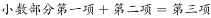，则所求项小数部分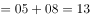，只有C项符合题意。

故正确答案为C。

---

### 第 2 题　qid 2261623 · 数学运算

若两个数的平方差为19，之和为19，那么这两个数的积是多少？

- **A**. 86
- **B**. 90　✅
- **C**. 100
- **D**. 120

**答案**：B

**官方解析**

设这两个数为、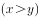，由题意可知，，则，解得，，则。

故正确答案为B。

---

### 第 3 题　qid 2261624 · 数学运算

有一个分数，分子加1，分母减1，就变成；以分母、分子的差做分子，以分母、分子的和做分母，所得分数为，问原分数值是多少？

- **A**. 

- **B**. 

- **C**. 

　✅
- **D**. 

**答案**：C

**官方解析**

本题选项为分数，相当于是由分子和分母组成的一组数，优先考虑代入排除。代入A项，，不符合题意，排除；代入B项，，不符合题意，排除；代入C项，，且，符合题意，当选；代入D项，，不符合题意，排除。

故正确答案为C。

---

### 第 4 题　qid 2261625 · 数学运算

一个五位数，左边三位数是右边两位数的5倍，如果把右边两位数移到前面，所得到的新的五位数要比原来的五位数的2倍还多75，原来五位数的值是多少？

- **A**. 22545
- **B**. 17535
- **C**. 12525　✅
- **D**. 11575

**答案**：C

**官方解析**

根据题意使用代入排除法，依次代入四个选项。代入C项：原五位数为12525，新五位数为25125，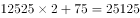，符合题意，当选。

故正确答案为C。

---

### 第 5 题　qid 2261626 · 数学运算

有甲、乙两个工程队，乙队任务临时加重时，从甲队抽调了四分之一的队员支援乙队。此后甲队任务也有所加重，于是又从乙队现有人员中调回了十分之一的人员，此时甲乙两队人数相等。由此可以得出结论：

- **A**. 甲队原有16人，乙队原有11人
- **B**. 甲乙两队原有人数比为16：11　✅
- **C**. 甲队原有11人，乙队原有16人
- **D**. 甲乙两队原有人数比为11：16

**答案**：B

**官方解析**

由题意设甲工程队人数为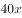，乙工程队人数为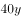，则

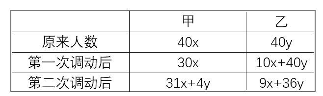

根据题意可知，，化简得。

故正确答案为B。

---

### 第 6 题　qid 4742999 · 数学运算

某生物项目工作组有12名外国人，其中6人会说英语，5人会说法语，5人会说西班牙语；有3人既会说英语又会说法语，有2人既会说法语又会说西班牙语，有2人既会说西班牙语又会说英语；有1人这三种语言都会说。则只会说一种语言的人比一种语言都不会说的人多（    ）。

- **A**. 1人
- **B**. 2人
- **C**. 3人　✅
- **D**. 5人

**答案**：C

**官方解析**

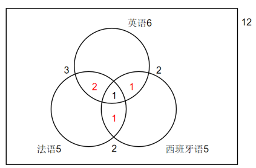

如图所示，有3人既会说英语又会说法语，其中有1人这三种语言都会说，则有3-1=2人只会说英语和法语；同理，只会说英语和西班牙语的有2-1=1人，只会说法语和西班牙语的有2-1=1人。故只会说英语的有6-2-1-1=2人，只会说法语的有5-2-1-1=1人，只会说西班牙语的有5-1-1-1=2人，则只会说一种语言的有2+1+2=5人。工作组共有12名外国人，则一种语言都不会说的有12-6-1-1-2=2人，故所求为5-2=3人。

故正确答案为C。

---

## 判断推理

### 第 1 题　qid 2261644 · 类比推理

滑板：运动

- **A**. 药：治病　✅
- **B**. 饮料：果汁
- **C**. 电影：广告
- **D**. 新闻：报纸

**答案**：A

**官方解析**

第一步：判断题干词语间逻辑关系。
滑板是用来运动的，二者之间为物品与用途之间的对应关系。
第二步：判断选项词语间逻辑关系。
A项：药是用来治病的，二者之间为物品与用途之间的对应关系，与题干逻辑关系一致，当选；
B项：果汁是一种饮料，二者为包容关系中的种属关系，与题干逻辑关系不一致，排除；
C项：电影中间可以插播广告，电影是广告宣传的一种载体，与题干逻辑关系不一致，排除；
D项：报纸是刊登新闻的一种载体，与题干逻辑关系不一致，排除。
故正确答案为A。

---

### 第 2 题　qid 2261645 · 类比推理

侵蚀：削弱

- **A**. 压缩：服从
- **B**. 联合：净化
- **C**. 增加：扩大　✅
- **D**. 坚持：改进

**答案**：C

**官方解析**

第一步：判断题干词语间逻辑关系。
侵蚀是指逐渐侵害使受消耗或损害，与削弱为近义词关系。
第二步：判断选项词语间逻辑关系。
A项：压缩是指加以压力，以减小体积、大小、持续时间、密度和浓度等，与服从无明显的逻辑关系，与题干逻辑关系不一致，排除；
B项：联合是指结合在一起的，共同的意思，与净化无明显的逻辑关系，与题干逻辑关系不一致，排除；
C项：增加和扩大为近义关系，与题干逻辑关系一致，当选；
D项：坚持是指坚决保持、维护或进行，与改进没有明显的逻辑关系，与题干逻辑关系不一致，排除。
故正确答案为C。

---

### 第 3 题　qid 2261646 · 类比推理

阅读：技能

- **A**. 种瓜：技巧
- **B**. 焊接：技术　✅
- **C**. 浏览：才华
- **D**. 作诗：天赋

**答案**：B

**官方解析**

第一步：判断题干词语间逻辑关系。
阅读是一种技能，二者之间为包容关系的种属关系。
第二步：判断选项词语间逻辑关系。
A项：种瓜需要技巧，但是种瓜本身不是一种技巧，与题干逻辑关系不一致，排除；
B项：焊接是一种技术，二者之间为包容关系的种属关系，与题干逻辑关系一致，当选；
C项：浏览和才华没有直接的逻辑关系，与题干逻辑关系不一致，排除；
D项：作诗需要天赋，但其本身不是一种天赋，与题干逻辑关系不一致，排除。
故正确答案为B。

---

### 第 4 题　qid 2261647 · 类比推理

面粉：小麦

- **A**. 大米：稻谷　✅
- **B**. 桔子：葡萄
- **C**. 饼干：面粉
- **D**. 罐头：菠萝

**答案**：A

**官方解析**

第一步：判断题干词语间逻辑关系。
面粉由小麦磨制而成，小麦是面粉的原材料，并且是必然原材料，二者为对应关系。
第二步：判断选项词语间逻辑关系。
A项：大米是由稻谷去壳后而成，稻谷是大米的原材料，并且是必然原材料，二者为对应关系，与题干逻辑关系一致，当选；
B项：桔子和葡萄都属于水果，二者为并列关系，与题干逻辑关系不一致，排除；
C项：饼干是由面粉、水、鸡蛋、牛奶等烤制而成，面粉是制成饼干的一种配料，与题干逻辑关系不一致，排除；
D项：罐头可以是菠萝、水、糖调制而成的菠萝罐头，菠萝是制成罐头的一种材料，但并不是必然原材料，与题干逻辑关系不一致，排除。
故正确答案为A。

---

### 第 5 题　qid 2261648 · 类比推理

水果：苹果

- **A**. 香梨：黄梨
- **B**. 树木：树枝
- **C**. 宝马：奔驰
- **D**. 山：高山　✅

**答案**：D

**官方解析**

第一步：判断题干词语间逻辑关系。
苹果是一种水果，二者为包容关系中的种属关系。
第二步：判断选项词语间逻辑关系。
A项：香梨和黄梨都是梨的一种，二者为并列关系，与题干逻辑关系不一致，排除；
B项：树枝是树木的一部分，二者为包容关系中的组成关系，与题干逻辑关系不一致，排除；
C项：奔驰和宝马是汽车的两个品牌，二者为并列关系，与题干逻辑关系不一致，排除；
D项：高山是山的一种，二者为包容关系中的种属关系，与题干逻辑关系一致，当选。
故正确答案为D。

---

### 第 6 题　qid 2261649 · 逻辑判断

四个人在讨论一位明星的年龄。甲说：她不会超过25岁；乙说：她不会超过30岁；丙说：她的年龄绝对在35岁以上；丁说：她的岁数在40岁以下。实际上只有一个人说对了。那么正确的是（  ）。

- **A**. 甲说得对
- **B**. 她的年龄在40岁以上　✅
- **C**. 她的岁数在35-40岁之间
- **D**. 丁说得对

**答案**：B

**官方解析**

第一步：分析题干条件。
①甲：小于或等于25；
②乙：小于或等于30；
③丙：大于35；
④丁：小于40。
第二步：根据题干条件分析选项。
根据题干“只有一个人说对了”，说明题干条件不确定，优先代入法。
A项代入：如果甲说的对的话，那么乙和丁说的也一定正确，与题干条件不符，排除；
B项代入：如果年龄在40岁以上的话，甲、乙、丁一定说错，只有丙说对，符合题干条件，当选；
C项代入：如果在35-40岁之间，那么甲、乙说错，丙、丁说对，与题干条件不符，排除；
D项代入：如果丁说对了，那么甲、乙、丙三个人的说法不确定是否正确，与题干条件不符，排除。
故正确答案为B。

---

### 第 7 题　qid 4754711 · 逻辑判断

科学家在运用理性的逻辑思维进行创造发明的过程中，其丰富的想象力、对客观世界敏锐的洞察、表现真理的方式和执着求索的热情，无不与艺术的形象思维相连。同样，艺术家在展开想象的翅膀自由翱翔之际，如果没有科学的世界观和方法论为先导，不借助逻辑思维，其艺术作品也难以显示崇高的精神境界与无穷的魅力。
由此可以推出：

- **A**. 科学与艺术正在逐渐趋同
- **B**. 学习文学艺术之前，首先要进行基础的逻辑思维训练
- **C**. 科学与艺术需相互借鉴各自的思维方式　✅
- **D**. 学习物理、化学之前，应先学习音乐、绘画等基础艺术科目

**答案**：C

**官方解析**

本题为日常结论题，根据题干信息逐一分析选项。
A项：题干说的是科学家和艺术家会相互借鉴对方的思维方式，没有提及科学和艺术是否趋同，无法推出，排除；
B项：根据题干第二句话可知，艺术家会借助逻辑思维，并未说明学习艺术之前“首先”要进行逻辑思维训练，无法推出，排除；
C项：题干第一句描述了科学家运用艺术家的思维，第二句描述了艺术家运用科学家的思维，说明科学与艺术会相互借鉴思维方式，可以推出，当选；
D项：根据题干第一句话可知，科学家会运用艺术思维，并未说明学习物理、化学之前应“先”学习艺术科目，无法推出，排除。
故正确答案为C。

---

### 第 8 题　qid 2261650 · 逻辑判断

小魏、小雷和小李三个同学在讨论刚参加完的高考。小魏很有把握地说：“我肯定能考上重点大学。”小雷犹豫了一下才说：“重点大学我考不上了。”小李说：“要是不论重点或不重点，我考上是没问题的。”结果表明，三人中一人考上了重点大学，一人考上一般大学，另一人则没考上大学。而且预言中只有一个人说对了，而另外两人的预言都与事实相反。
如果上述情况属实，那么考上重点大学、一般大学和没考上大学的名单顺序是（  ）。

- **A**. 小魏、小李和小雷
- **B**. 小雷、小李和小魏　✅
- **C**. 小魏、小雷和小李
- **D**. 小雷、小魏和小李

**答案**：B

**官方解析**

第一步：翻译题干。
①小魏：小魏能考上重点；
②小雷：小雷考不上重点；
③小李：小李能考上大学。
根据题干“预言中只有一个人说对了，而另外两人的预言都与事实相反”，说明题干条件不确定，优先代入法。
第二步：逐一分析选项。
A项代入：小魏、小李和小雷三个人都预言对了，与题干条件不符，排除；
B项代入：小雷、小魏预言错误，小李预言对了，符合题干条件，当选；
C项代入：小魏、小雷预言对了，小李预言错误，与题干条件不符，排除；
D项代入：小魏、小李和小雷三个人都预言错误，与题干条件不符，排除。
故正确答案为B。

---

### 第 9 题　qid 4754704 · 逻辑判断

写作要有题目，就是要有中心思想，要有内容，目的性要明确。没有目的的文章，尽管文理通顺，语气连贯，但是内容空洞，只能归为废话一类，不写为好。因此：

- **A**. 写作必须要有题目，这是最重要的
- **B**. 有些文章全篇都是废话，不知他在说什么
- **C**. 有内容的文章才有目的性
- **D**. 写作要有一个明确的目的，这样才有内容　✅

**答案**：D

**官方解析**

本题为日常结论题，根据题干信息逐一分析选项。
A项：根据题干第一句可知“写作要有题目”，但选项中的“最重要”表述过于绝对，无法推出，排除；
B项：根据题干可以推出有些文章“只能归为废话一类”，但没有提及别人是否能理解这些文章，无法推出“不知他在说什么”，排除；
C项：题干第二句话“没有目的的文章，尽管文理通顺，语气连贯，但是内容空洞”，强调了目的对内容的重要性，即有目的才有内容，选项与题干表述不一致，无法推出，排除；
D项：题干第二句话“没有目的的文章，尽管文理通顺，语气连贯，但是内容空洞”，强调了目的对内容的重要性，即有目的才有内容，可以推出，当选。
故正确答案为D。

---

### 第 10 题　qid 4754717 · 逻辑判断

金刚石与石墨同属于碳元素构成，但性质相差极远。金刚石坚硬无比，石墨却比较柔软。研究发现，其性能差异的根源在于碳原子的排列结构不同。
这说明：

- **A**. 金刚石比石墨更具有军事和工业价值
- **B**. 排列顺序和结构的不同可能引起物质的飞跃　✅
- **C**. 金刚石中的碳原子排列紧密，石墨中的碳原子排列松散
- **D**. 任何事物都是矛盾的统一体

**答案**：B

**官方解析**

本题为日常结论题，根据题干信息逐一分析选项。
A项：题干中没有涉及到金刚石和石墨的军事和工业价值，无中生有，无法推出，排除；
B项：根据“金刚石坚硬无比，石墨却比较柔软”和“研究发现，其性能差异的根源在于碳原子的排列结构不同”可知，以金刚石和石墨为例，可以推出排列顺序和结构的不同可能引起物质的飞跃，可以推出，当选；
C项：题干中只是说“碳原子的排列结构不同”，没有具体指出金刚石中和石墨中的碳原子排列是紧密还是松散，无法推出，排除；
D项：题干没有涉及任何事物都是矛盾的统一体，无中生有，无法推出，排除。
故正确答案为B。

---

### 第 11 题　qid 2631957 · 图形推理

从所给四个选项中，选出唯一的一项作为题干的第五个图，使之呈现一定规律性：

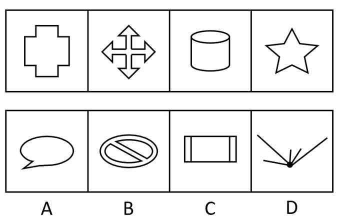

- **A**. A　✅
- **B**. B
- **C**. C
- **D**. D

**答案**：A

**官方解析**

解析一：元素组成不同，优先考虑属性规律。题干图形比较规整，考虑对称性。观察发现，题干图形均为轴对称图形，且只有一条竖直对称轴，因此第五个图也应为只有一条竖直对称轴的轴对称图形，只有C项符合。
故正确答案为C。
解析二：观察图形特征，题干中第三个图为“日”字变形图，第四个图为五角星，选项中出现多端点图形，均为笔画数特征图，考虑笔画数。观察发现，题干图形均为一笔画图形，只有A项符合。
故正确答案为A。
本题不是特别严谨，两种规律都有答案，考生重点学习解题思路即可。因笔画数特征更为明显，且同套题目的五道题目中已经出现考查对称性的题目，因此粉笔更倾向于选A。

---

### 第 12 题　qid 2631962 · 图形推理

从所给四个选项中，选出唯一的一项作为题干的第五个图，使之呈现一定规律性：

- **A**. A
- **B**. B　✅
- **C**. C
- **D**. D

**答案**：B

**官方解析**

元素组成不同，优先考虑属性规律。观察发现，题干图形中出现等腰三角形，选项中出现等腰梯形和平行四边形，均为对称性特征图，因此考虑对称性。题干中第一、三个图形仅为轴对称图形，第二、四个图形既为轴对称又为中心对称图形，因此第五个图形应仅为轴对称图形，只有B项符合。
故正确答案为B。

---

### 第 13 题　qid 2631968 · 图形推理

从所给四个选项中，选出唯一的一项作为题干的第五个图，使之呈现一定规律性：

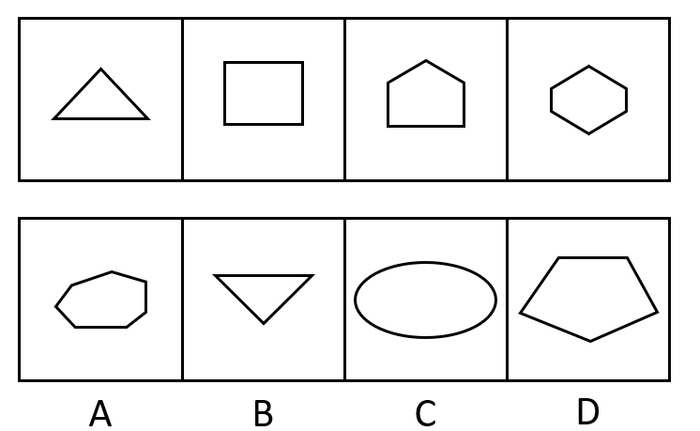

- **A**. A　✅
- **B**. B
- **C**. C
- **D**. D

**答案**：A

**官方解析**

方法一：元素组成不同，优先考虑属性规律。观察发现，题干图形比较规整，考虑对称性。题干图形分别为仅轴对称，轴对称+中心对称，仅轴对称，轴对称+中心对称，接下来应为仅轴对称图形。
故正确答案为B。
方法二：元素组成不同，且出现较多的多边形，每个图形均由直线组成，考虑数直线数。题干图形直线数量分别为3、4、5、6，故第五个图应为直线数量为7的图形，A项为7条直线，B项为3条直线，C项为1条曲线，D项为5条直线。
故正确答案为A。
本题不是特别严谨，两种规律都有答案，考生重点学习解题思路即可。因多边形特征和直线数递减规律明显，且同套题目的五道题目中已经出现考查对称性的题目，因此粉笔更倾向于选A。

---

### 第 14 题　qid 2631971 · 图形推理

从所给四个选项中，选出唯一的一项作为题干的第五个图，使之呈现一定规律性：

- **A**. A
- **B**. B
- **C**. C
- **D**. D　✅

**答案**：D

**官方解析**

方法一：元素组成不同，优先考虑属性规律。观察发现题干图形比较规整，考虑对称性。题干图形分别为轴对称中心对称，仅轴对称，轴对称中心对称，仅轴对称，第五个图应为轴对称中心对称图形，只有C项符合。

故正确答案为C。

方法二：观察发现图中出现菱形和三角形两种小元素，图二和图四中三角形面数为4、5，图一和图三中菱形的个数依次为1、2，故第五个图应为3个菱形，排除A、C两项。再次观察，图四中增加的三角形出现在上方，排除B项。

故正确答案为D。

本题不是特别严谨，两种规律都有答案，考生重点学习解题思路即可。因相同元素特征比较明显，且同套题目的五道题目中已经出现考查对称性的题目，因此粉笔更倾向于选D。

---

### 第 15 题　qid 2631977 · 图形推理

从所给四个选项中，选出唯一的一项作为题干的第五个图，使之呈现一定规律性：

- **A**. A
- **B**. B　✅
- **C**. C
- **D**. D

**答案**：B

**官方解析**

元素组成不同，且无明显属性规律，考虑数量规律。题干出现较多直线和封闭区间，但是直线和面数量都没有规律。继续观察每幅图都出现明显的线线相交，考虑交点数。题干图形交点数分别为4、5、6、9，整体数无规律，且题干图形存在明显的外框，考虑内外交点数。观察发现，题干图形内部交点分别为0、1、0、1，故第五个图应为0个内部交点的图形，只有B项符合。
故正确答案为B。

---

## 资料分析

### 材料 1

<b>根据下图提供的信息回答问题（其中</b><b>A</b><b>代表大学，</b><b>B</b><b>代表中专，</b><b>C</b><b>代表师范，</b><b>D</b><b>代表普通中学，</b><b>E</b><b>代表职业中专，</b><b>F</b><b>代表小学，</b><b>G</b><b>代表民办学校）：</b>

#### 第 1 题　qid 2261651 · 综合

农村学校分布率最高的是（    ）。

- **A**. 小学　✅
- **B**. 普通中学
- **C**. 师范
- **D**. 民办学校

**答案**：A

**官方解析**

定位图形材料可知，离农村100%最近的是F点，其代表小学，所以农村学校分布率最高的是小学。
故正确答案为A。

---

#### 第 2 题　qid 2261652 · 综合

农村学校分布率最低的是（    ）。

- **A**. 民办学校
- **B**. 职业中学
- **C**. 中专
- **D**. 大学　✅

**答案**：D

**官方解析**

定位图形材料可知，离农村100%最远的是A点，其代表大学，所以农村学校分布率最低的是大学。
故正确答案为D。

---

#### 第 3 题　qid 2261653 · 综合

在城市学校的分布率中，师范与普通中学之比是（  ）。

- **A**. 1：2
- **B**. 1：3　✅
- **C**. 1：4
- **D**. 1：5

**答案**：B

**官方解析**

定位图形材料可知，在城市学校的分布率中，师范C点占一格，普通中学D点占三格，则师范与普通中学之比是1：3。
故正确答案为B。

---

#### 第 4 题　qid 2261654 · 综合

哪一类学校在城市、郊区、农村的分布率基本相同？

- **A**. 师范
- **B**. 普通中学
- **C**. 小学　✅
- **D**. 职业中专

**答案**：C

**官方解析**

定位图形材料可得：

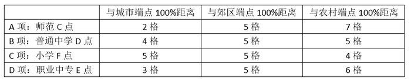

A、D两项距三个端点距离相差较大，说明师范和职业中专在城市、郊区、农村的分布率相差较大，排除；B、C两项距离三个端点均为5格、5格、4格，说明普通中学和小学在城市、郊区、农村的分布率基本相同，因两项都符合题目要求，所以均当选。

故正确答案为BC。

备注：因B、C两项数据结果一致，无法选出最优，故有两个答案。

---

#### 第 5 题　qid 2261655 · 综合

以下叙述不正确的是（  ）。

- **A**. 民办学校和大学在城市的分布率相同
- **B**. 在农村学校的分布率相同的有师范和普通中学
- **C**. 郊区学校的分布率相同的有大学、职业中专和普通中学
- **D**. 师范在郊区和农村分布比城市少　✅

**答案**：D

**官方解析**

A项：定位图形材料可知，民办学校和大学相对于城市距离相等，所以分布率相同，正确；

B项：定位图形材料可知，民办学校和大学相对于城市距离相等，所以分布率相同，正确；

C项：定位图形材料可知，大学、职业中专和普通中学相对于郊区距离相等，所以分布率相同，正确；

D项：定位图形材料可知，师范相对于郊区距离更近，所以师范在郊区比农村和城市多，错误。

本题为选非题，故正确答案为D。

---
