# 2017年山东省选调应届优秀高校毕业生到基层工作考试《行测》试卷（精选）

> 选调生 · 2017 年 · 6 个模块 · 共 78 题

- [政治理论](#%E6%94%BF%E6%B2%BB%E7%90%86%E8%AE%BA) · 7 题
- [常识判断](#%E5%B8%B8%E8%AF%86%E5%88%A4%E6%96%AD) · 23 题
- [言语理解与表达](#%E8%A8%80%E8%AF%AD%E7%90%86%E8%A7%A3%E4%B8%8E%E8%A1%A8%E8%BE%BE) · 15 题
- [数量关系](#%E6%95%B0%E9%87%8F%E5%85%B3%E7%B3%BB) · 8 题
- [判断推理](#%E5%88%A4%E6%96%AD%E6%8E%A8%E7%90%86) · 15 题
- [资料分析](#%E8%B5%84%E6%96%99%E5%88%86%E6%9E%90) · 10 题

---

## 政治理论

### 第 1 题　qid 2261694 · 新思想

习近平总书记在全国高校思想政治工作会议上强调，要坚持把（  ）作为中心环节，把思想政治工作贯穿教育教学全过程。

- **A**. 教学科研
- **B**. 立德树人　✅
- **C**. 教书育人
- **D**. 校园文化

**答案**：B

**官方解析**

本题考查政治常识。
全国高校思想政治工作会议于12月7日至8日在北京召开，中共中央总书记、国家主席、中央军委主席习近平出席会议并发表重要讲话。他强调，高校思想政治工作关系高校培养什么样的人、如何培养人以及为谁培养人这个根本问题，要坚持把立德树人作为中心环节，把思想政治工作贯穿教育教学全过程，实现全程育人、全方位育人，努力开创我国高等教育事业发展新局面。
故正确答案为B。

---

### 第 2 题　qid 2261697 · 时事政治

2016年12月中央经济工作会议指出，必须坚定不移地推进供给侧结构性改革，全面落实“三去一降一补”五大重点任务，其中“一降”指的是：

- **A**. 降产能
- **B**. 降率存
- **C**. 降成本　✅
- **D**. 降供给

**答案**：C

**官方解析**

本题考查政治常识。
“三去一降一补”是推行供给侧结构性改革过程中的重要政策，其中“三去”指去产能、去库存、去杠杆；“一降”指降成本；“一补”指补短板。
国务院印发的《降低实体经济企业成本工作方案》中指出，要努力降低企业的税费负担、融资成本、制度性交易成本、人工成本、用能用地成本、物流成本等六大成本。
故正确答案为C。

---

### 第 3 题　qid 2261703 · 新思想

为确保党成为中国特色社会主义事业的坚强领导核心，全党必须牢固树立政治意识、大局意识、（  ）意识、看齐意识，坚定不移维护党中央权威和党中央集中统一领导。

- **A**. 纪律
- **B**. 核心　✅
- **C**. 廉洁
- **D**. 法治

**答案**：B

**官方解析**

本题考查政治常识。
中国共产党第十八届中央委员会第六次全体会议，于2016年10月24日至27日在北京举行。全会号召，全党同志紧密团结在以习近平同志为核心的党中央周围，牢固树立政治意识、大局意识、核心意识、看齐意识，坚定不移维护党中央权威和党中央集中统一领导。核心意识要求在思想上认同核心、在政治上围绕核心、在组织上服从核心、在行动上维护核心。
故正确答案为B。

---

### 第 4 题　qid 2261705 · 时事政治

李克强总理在2017年《政府工作报告》中指出，贫困地区和贫困人口是全面建成小康社会最大的短板，要深入实施精准扶贫，今年再减少贫困人口（  ）以上，完成易地扶贫搬迁340万人。

- **A**. 1000万　✅
- **B**. 900万
- **C**. 1050万
- **D**. 1100万

**答案**：A

**官方解析**

本题考查政治常识。
李克强总理在《2017年政府工作报告》中指出，贫困地区和贫困人口是全面建成小康社会最大的短板。要深入实施精准扶贫精准脱贫，今年再减少农村贫困人口1000万以上，完成易地扶贫搬迁340万人。中央财政专项扶贫资金增长30%以上。加强集中连片特困地区、革命老区、边疆和民族地区开发，改善基础设施和公共服务，推动特色产业发展、劳务输出、教育和健康扶贫，做好因病等致贫返贫群众帮扶，实施贫困村整体提升工程，增强贫困地区和贫困群众自我发展能力。
故正确答案为A。

---

### 第 5 题　qid 2261708 · 新思想

《中国共产党党内监督条例》提出的监督体系包括：
①党委（党组）全面监督    ②纪律检查机关专责监督
③党的工作部门职能监督    ④党的基层组织日常监督
⑤党员民主监督

- **A**. ①②③④⑤　✅
- **B**. ①③④
- **C**. ②③④
- **D**. ①②④

**答案**：A

**官方解析**

本题考查政治常识。
根据《中国共产党党内监督条例》第九条规定：“建立健全党中央统一领导，党委（党组）全面监督，纪律检查机关专责监督，党的工作部门职能监督，党的基层组织日常监督，党员民主监督的党内监督体系。”
故正确答案为A。

---

### 第 6 题　qid 2261719 · 新思想

刘少奇在著名的《论共产党员的修养》里批判地继承了古人“吾日三省吾身”的修养方法。提出“吾日三省吾身”修养方法的是：

- **A**. 曾子　✅
- **B**. 颜子
- **C**. 孔子
- **D**. 子思

**答案**：A

**官方解析**

本题考查人文常识。
“吾日三省吾身”出自《论语·学而》，原文为：曾子曰：“吾日三省吾身——为人谋而不忠乎？与朋友交而不信乎？传不习乎？”因此，提出此观点的人物为曾子。
A项正确，曾子，名参，字子舆，春秋末年鲁国南武城人（山东嘉祥县），是中国著名的思想家，孔子的晚期弟子之一，曾子参与编制了《论语》、著写了《大学》、《孝经》、《曾子十篇》等作品。
B项错误，颜回，字子渊，春秋末期鲁国人，是孔子最得意的门生。
C项错误，孔子，春秋时期思想家、教育家，儒家学派创始人，被称为“圣人”。孔子打破了教育垄断，开创了私学。他的哲学思想提倡“仁义”、“礼乐”、“德治教化”、“君以民为体”，儒学思想渗入中国人的生活、文化领域。孔子去世后，他的弟子们把孔子言行和弟子之间的对话整理编成儒家经典——《论语》。
D项错误，孔伋，字子思，孔子的嫡孙、孔子之子孔鲤的儿子。孔伋是中国春秋时期著名的思想家，受教于孔子的高足曾参，孔子的思想学说由曾参传子思，子思的门人再传孟子。后人把子思、孟子并称为思孟学派，因而子思上承曾参，下启孟子，在孔孟“道统”的传承中有重要地位。
故正确答案为A。

---

### 第 7 题　qid 2261721 · 毛中特

中央大力推进理论工作“四大平台”建设，“四大平台”是指，马克思主义理论研究与建设工程、中国特色社会主义理论体系研究中心、马克思主义学院和：

- **A**. 报刊网络理论宣传阵地　✅
- **B**. 网络
- **C**. 思政队伍
- **D**. 报刊

**答案**：A

**官方解析**

本题考查政治常识。
2015年7月28日，中共中央政治局委员、中央书记处书记、中宣部部长刘奇葆出席推进理论工作“四大平台”建设工作会议并讲话。刘奇葆指出，马克思主义理论研究和建设工程、中国特色社会主义理论体系研究中心、马克思主义学院、报刊网络理论宣传阵地“四大平台”，是新形势下汇集力量深化拓展马克思主义理论研究和宣传教育、加强党的思想理论工作的重要抓手。推进“四大平台”建设，要把推动思想理论工作创新发展作为共同使命，把研究重大理论和现实问题作为共同任务，用中国理论回答中国问题，用中国话语解读中国道路，更好地适应新的伟大实践对理论工作提出的新要求。
故正确答案为A。

---

## 常识判断

### 第 1 题　qid 2261693 · 人文常识

党的十八届六中全会公报引发的人们最为关注的一个新提法是：

- **A**. 把权力关进制度的“笼子”
- **B**. 全面从严治党
- **C**. 以习近平同志为核心的党中央　✅
- **D**. 苍蝇老虎一起打

**答案**：C

**官方解析**

本题考查政治常识。
党的第十八届六中全会于2016年10月24日至27日在北京举行。
A项错误，2013年1月22日，习近平总书记在十八届中央纪委二次全会上发表重要讲话强调，要加强对权力运行的制约和监督，把权力关进制度的笼子里，形成不敢腐的惩戒机制、不能腐的防范机制、不易腐的保障机制。
B项错误，2014年10月8日，习近平同志在党的群众路线教育实践活动总结大会上发表讲话，首先提出“全面推进从严治党”。2014年12月，习近平同志在江苏调研时首次提出“全面从严治党”这个新命题，把全面从严治党跟全面建成小康社会、全面深化改革、全面推进依法治国并列来提，也就是“四个全面”。 
C项正确，党的十八届六中全会公报正式提出“以习近平同志为核心的党中央”，在这个公报之前一直都是“以习近平同志为总书记的党中央”。一个国家、一个政党，领导核心至关重要,我们这样的大国、大党，要凝聚全党、团结人民、战胜挑战、破浪前进，保证我们党始终成为坚强有力的马克思主义执政党、始终成为中国特色社会主义的坚强领导力量，党中央、全党必须有一个核心。习近平总书记在新的伟大斗争实践中已经成为党中央的核心、全党的核心。
D项错误，习近平在第十八届中央纪律检查委员会第二次全会上的讲话时提出：要坚持“老虎”、“苍蝇”一起打，既坚决查处领导干部违纪违法案件，又切实解决发生在群众身边的不正之风和腐败问题。要坚持党纪国法面前没有例外，不管涉及到谁，都要一查到底，决不姑息。
故正确答案为C。

---

### 第 2 题　qid 2261695 · 地理国情

1927年秋收起义后，毛泽东在率部队转移途中，于江西永新县领导了举世闻名的（  ），保证了党对军队的绝对领导。

- **A**. 三湾改编　✅
- **B**. 永新改编
- **C**. 连队改编
- **D**. 支部改编

**答案**：A

**官方解析**

本题考查毛中特。
A项正确，1927年9月29日至10月3日，毛泽东在江西永新县三湾村，领导了举世闻名的“三湾改编”。三湾改编是我党建设新型人民军队最早的一次成功探索和实践，标志着毛泽东建设人民军队思想的开始形成，保证了党对军队的绝对领导，奠定了政治建军的基础。
B项错误，这次改编以三湾村命名，称“三湾改编”，没有“永新改编”这一说法。
C、D项错误，“三湾改编”的内容之一就是将党支部建立在连队上，确立了中国共产党对军队的绝对领导的组织系统，但没有“连队改编”、“支部改编”的说法。
故正确答案为A。

---

### 第 3 题　qid 2261696 · 人文常识

《关于新形势下党内政治生活的若干准则》强调（  ）纪律是党最根本最重要的纪律。

- **A**. 政治　✅
- **B**. 组织
- **C**. 廉洁
- **D**. 群众

**答案**：A

**官方解析**

本题考查政治常识。
办好中国的事情，关键在党，关键在党要管党、从严治党。党要管党必须从党内政治生活管起，从严治党必须从党内政治生活严起。开展严肃认真的党内政治生活，是我们党的优良传统和政治优势。新形势下，为了更好进行伟大斗争、推进党的建设新的伟大工程、推进中国特色社会主义伟大事业，党的十八届六中全会制定了《关于新形势下党内政治生活的若干准则》。《准则》中强调政治纪律是党最根本、最重要的纪律，遵守党的政治纪律是遵守党的全部纪律的基础。全党特别是高级干部必须严格遵守党的政治纪律和政治规矩。
故正确答案为A。

---

### 第 4 题　qid 2261698 · 法律常识

为直面世情、国情、党情的巨大变化，回应全国人民的热切期待，我们党提出“全面建成小康社会、全面深化改革、全面依法治国、全面（  ）”的战略布局。

- **A**. 惩治贪腐
- **B**. 推进祖国统一
- **C**. 推进社会进步
- **D**. 从严治党　✅

**答案**：D

**官方解析**

本题考查政治常识。
党的十八大以来，以习近平同志为总书记的党中央从坚持和发展中国特色社会主义全局出发，提出并推动形成了“四个全面”全新战略布局，即全面建成小康社会、全面深化改革、全面推进依法治国、全面从严治党，确立了新形势下党和国家各项工作的战略目标和战略举措，开辟了党中央治国理政的新境界，奏响了实现中华民族伟大复兴中国梦的强劲旋律。
在“四个全面”战略布局中全面从严治党是全面建成小康社会、全面深化改革、全面依法治国顺利推进的根本保证。全面从严治党，基础在全面，关键在严，要害在治。
故正确答案为D。

---

### 第 5 题　qid 2261699 · 人文常识

历史上齐鲁大地涌现出无数伟大的教育家、思想家、军事家、科学家。这里有存在一百多年的（  ），它是世界上最早的公立大学、国家研究院和政府智库，学士百千，流派纷呈，开创了百家争鸣、兼容并蓄的学术先河。

- **A**. 稷下学府
- **B**. 稷下学宫　✅
- **C**. 杏坛
- **D**. 尼山书院

**答案**：B

**官方解析**

本题考查人文常识。
A项错误，没有“稷下学府”这一说法。
B项正确，“稷下学宫”，又称稷下之学，战国时期齐国的官办高等学府，始建于齐桓公，位于齐国国都临淄（今山东省淄博市）稷门附近。稷下学宫是世界上第一所由官方举办、私家主持的特殊形式的高等学府。稷下学宫的学术博大精深，凡到稷下学宫的文人学者都可以自由发表自己的学术见解。中国学术思想史上的“百家争鸣”就是以齐国稷下学宫为中心的，官学为黄老之学，它作为当时百家学术争鸣的中心园地，有力地促成了天下学术争鸣局面的形成。
C项错误，“杏坛”是传说中孔子聚徒讲学的地方，现今曲阜孔庙的“杏坛”始建于宋朝，是孔子第四十五代孙孔道辅改建孔庙时所建。
D项错误，“尼山书院”，又名尼山诞育书院，位于山东曲阜市东南六十里尼山。尼山书院始建于元代，明清时重修，是祭祀孔子的庙宇。
故正确答案为B。

---

### 第 6 题　qid 2261700 · 人文常识

科学发展观的本质和核心是：

- **A**. 以人为本　✅
- **B**. 共同富裕
- **C**. 绿色健康
- **D**. 实现人民群众的愿望

**答案**：A

**官方解析**

本题考查政治常识。
在党的十七大上，胡锦涛总书记在《高举中国特色社会主义伟大旗帜，为夺取全面建设小康社会新胜利而奋斗》的报告中提出，科学发展观第一要义是发展，核心是以人为本，基本要求是全面协调可持续，根本方法是统筹兼顾。
以人为本是科学发展观的本质和核心，是解决发展中其他一切问题的前提和基础。
故正确答案为A。

---

### 第 7 题　qid 2261701 · 人文常识

全党开展的“两学一做”学习教育的要求是，基础在学：

- **A**. 知行合一
- **B**. 学以致用
- **C**. 关键在做　✅
- **D**. 学思践悟

**答案**：C

**官方解析**

本题考查政治常识。
“两学一做”具体是指“学党章党规、学系列讲话、做合格党员”。
中共中央总书记、国家主席、中央军委主席习近平对在全党开展“两学一做”学习教育作出重要指示强调，“两学一做”学习教育是加强党的思想政治建设的一项重大部署，是协调推进“四个全面”战略布局特别是推动全面从严治党向基层延伸的有力抓手，基础在学，关键在做，各级党组织要履行抓好“两学一做”学习教育的主体责任，坚持区分层次，突出问题导向，确保取得实际成效。
故正确答案为C。

---

### 第 8 题　qid 2261702 · 人文常识

二十国集团（G20）杭州峰会的主题是：构建创新、活力、（  ）、包容的世界经济。

- **A**. 联动　✅
- **B**. 双赢
- **C**. 合作
- **D**. 共享

**答案**：A

**官方解析**

本题考查政治常识。
二十国集团（G20）是一个国际经济合作论坛，于1999年9月25日由八国集团（G8）的财长在华盛顿宣布成立，属于布雷顿森林体系框架内非正式对话的一种机制，由原八国集团以及其余12个重要经济体组成。
2016年9月4日—5日在杭州举办二十国集团领导人第十一次峰会，习近平总书记对中国主办2016年峰会提出了“4个I”主题，即希望推动各方共同构建创新(innovative)、活力(invigorated)、联动(interconnected)、包容(inclusive)的世界经济。
故正确答案为A。

---

### 第 9 题　qid 2261704 · 人文常识

《国家创新驱动发展战略纲要》提出，到2020年进入创新型国家行列，到2030年跻身创新型国家前列，到2050年建成（  ）三步走的目标。

- **A**. 科技强国
- **B**. 创新强国
- **C**. 文化强国
- **D**. 世界科技创新强国　✅

**答案**：D

**官方解析**

本题考查政治常识。
为了加快实施国家创新驱动发展战略，中共中央、国务院于2016年5月印发了《国家创新驱动发展战略纲要》。
《国家创新驱动发展战略纲要》将创新驱动发展战略目标分三步走：第一步，到2020年进入创新型国家行列，基本建成中国特色国家创新体系，有力支撑全面建成小康社会目标的实现；第二步，到2030年跻身创新型国家前列，发展驱动力实现根本转换，经济社会发展水平和国际竞争力大幅提升，为建成经济强国和共同富裕社会奠定坚实基础；第三步，到2050年建成世界科技创新强国，成为世界主要科学中心和创新高地，为我国建成富强民主文明和谐的社会主义现代化国家、实现中华民族伟大复兴的中国梦提供强大支撑。
故正确答案为D。

---

### 第 10 题　qid 2261706 · 人文常识

当今世界有不少地区由于民族冲突，教派厮杀，导致社会动荡，战乱不断，人民流离失所。在这种背景下，我国各族人民团结友爱，和睦相处，共同为实现“中国梦”奋斗。这主要是因为：
①我国形成了平等、互助、团结、和谐的新型民族关系
②民族矛盾的根源已完全消除
③社会主义制度的确立消灭了民族压迫
④我国实行了民族区域自治

- **A**. ①②
- **B**. ①③④　✅
- **C**. ①③
- **D**. ①④

**答案**：B

**官方解析**

本题考查政治常识。
①正确，我国处理民族关系的基本原则是民族平等、民族团结、各民族共同繁荣，形成了平等、互助、团结、和谐的新型民族关系，各族人民团结友爱，和睦相处。
②错误，我国进入社会主义初级阶段后，剥削阶级被消灭，民族矛盾是人民内部在根本利益一致基础上的非对抗性矛盾，具体可分为：汉族与少数民族之间的矛盾和少数民族相互之间的矛盾，民族经济矛盾、民族政治矛盾和民族文化矛盾，民族隔阂和民族纠纷。我国社会主义初级阶段的民族矛盾具有复杂性、重要性、敏感性、长期性等一般特征，民族矛盾已经不是主要矛盾了，但会长期存在，其根源并没有完全消除。
③正确，社会主义的本质就是解放生产力、发展生产力、消灭剥削、消除两极分化。我国社会主义制度建立以后,消灭了剥削制度和剥削阶级，铲除了民族压迫，各民族和谐相处，一起投身于政治、经济、文化和社会建设中。
④正确，民族区域自治制度不仅有利于维护国家统一和安全，还增强了中华民族的凝聚力，使各族人民，特别是少数民族把热爱本民族与热爱祖国的深厚感情结合起来，更加自觉地担负起捍卫祖国统一、实现祖国伟大复兴的光荣职责。
可知①③④符合题意。
故正确答案为B。

---

### 第 11 题　qid 2261707 · 地理国情

2016年住房和城乡建设部公布了首批国家生态园林城市名单，徐州、苏州、昆山、珠海、南宁、宝鸡和山东省的（  ），这7个城市榜上有名。

- **A**. 威海
- **B**. 烟台
- **C**. 寿光　✅
- **D**. 青岛

**答案**：C

**官方解析**

本题考查政治常识。
寿光市是山东省县级市，由潍坊市代管。
2016年1月29日，住房和城乡建设部公布了中国首批国家生态园林城市名单，徐州、苏州、昆山、珠海、南宁、宝鸡和山东省的寿光7个城市榜上有名。“生态园林城市”的评估注重城市生态环境质量，注重一个地区生态保护、生态建设与恢复水平的综合物种指数，本地植物指数，建成区道路广场用地中透水面积的比重，城市热岛效应程度，公众对城市生态环境的满意度等。
故正确答案为C。

---

### 第 12 题　qid 2261709 · 人文常识

我国农村承包地确权登记颁证工作逐步推进，截至2016年年底，全国2582个县（市区）开展了试点，确权面积近8.5亿亩，（    ）两省区已率先向中央报告基本完成。

- **A**. 山东、广西
- **B**. 山东、宁夏　✅
- **C**. 山东、内蒙
- **D**. 山东、新疆

**答案**：B

**官方解析**

本题考查政治常识。

2017年2月21日，农村承包地确权登记办证工作视频会议召开，农业部部长韩长赋对过去3年农村承包地确权登记颁证工作进展做了通报，并部署了下一步工作。他指出，我国农村承包地确权登记颁证工作稳步推进，截至2016年年底，全国2582个县（市、区）开展了试点，确权面积近8.5亿亩，约占全国二轮承包合同面积的。其中，山东、宁夏两省区已率先向中央报告基本完成当地确权登记颁证。

故正确答案为B。

---

### 第 13 题　qid 2261710 · 地理国情

山东省为推进“一带一路”发展战略，进一步拓展区域发展空间，提出要扎实推进（    ）发展战略。

- **A**. “两区一圈一带”　✅
- **B**. “一区两圈一带”
- **C**. “两区两圈一带”
- **D**. “两区一圈两带”

**答案**：A

**官方解析**

本题考查政治常识。
2015年1月27日，山东省十二届人大第四次会议在济南开幕。省长郭树清在作《政府工作报告》时表示，山东将进一步拓展区域发展空间，扩大对内对外开放，扎实推进“两区一圈一带”发展战略。其中，“两区”是指山东半岛蓝色经济区和黄河三角洲高效生态经济区，“一圈”是指省会都市圈，“一带”是指鲁南城市带。
故正确答案为A。

---

### 第 14 题　qid 2261711 · 人文常识

《关于新形势下党内政治生活的若干准则》强调，必须高度重视思想政治建设，把坚定（    ）作为开展党内政治生活的首要任务。

- **A**. 维护团结
- **B**. 理想信念　✅
- **C**. 推进党内民主
- **D**. 维护领导权威

**答案**：B

**官方解析**

本题考查政治常识。
《关于新形势下党内政治生活的若干准则》第一部分“坚定理想信念”指出：“共产主义远大理想和中国特色社会主义共同理想，是中国共产党人的精神支柱和政治灵魂，也是保持党的团结统一的思想基础。必须高度重视思想政治建设，把坚定理想信念作为开展党内政治生活的首要任务。”
故正确答案为B。

---

### 第 15 题　qid 2261712 · 人文常识

中共中央、国务院2017年一号文件继续把关注的焦点锁定于“三农”工作，与时俱进，把深入推进（    ）作为新的历史阶段农村农业工作的主线。

- **A**. 农业现代化建设
- **B**. 农村供给侧结构改革
- **C**. 社会主义新农村建设
- **D**. 农业供给侧结构性改革　✅

**答案**：D

**官方解析**

本题考查政治常识。
2017年2月5日，中央一号文件《中共中央、国务院关于深入推进农业供给侧结构性改革加快培育农业农村发展新动能的若干意见》发布。这份中央一号文件继续锁定“三农”工作，把深入推进农业供给侧结构性改革作为新的历史阶段农业农村工作主线。
故正确答案为D。

---

### 第 16 题　qid 2261713 · 人文常识

当前世界经济增长低迷态势仍在延续，（    ）思潮和保护主义倾向抬头，主要经济体政策走向及外溢效应变数较大，不稳定不确定因素明显增加，我国发展处在爬坡过坎的关键阶段。

- **A**. 虚无主义
- **B**. 民粹主义
- **C**. 逆全球化　✅
- **D**. 自由主义

**答案**：C

**官方解析**

本题考查政治常识。
2017年3月5日，李克强总理在《政府工作报告》中指出：“世界经济增长低迷态势仍在延续，‘逆全球化’思潮和保护主义倾向抬头，主要经济体政策走向及外溢效应变数较大，不稳定不确定因素明显增加。我国发展处在爬坡过坎的关键阶段，经济运行存在不少突出矛盾和问题。困难不容低估，信心不可动摇。我国物质基础雄厚、人力资源充裕、市场规模庞大、产业配套齐全、科技进步加快、基础设施比较完善，经济发展具有良好支撑条件，宏观调控还有不少创新手段和政策储备。我们坚信，有党的坚强领导，坚持党的基本路线，坚定不移走中国特色社会主义道路，依靠人民群众的无穷创造力，万众一心、奋力拼搏，我国发展一定能够创造新的辉煌。”
故正确答案为C。

---

### 第 17 题　qid 2261714 · 人文常识

联合国教科文组织保护非物质文化遗产政府间委员会第十一届常会于2016年11月30日通过审议，批准中国申报的（    ）列入联合国教科文组织人类非物质文化遗产代表作名录。

- **A**. 元宵节
- **B**. 清明节
- **C**. 二十四节气　✅
- **D**. 重阳节

**答案**：C

**官方解析**

本题考查政治常识。
2016年11月28日至12月2日，联合国教科文组织保护非物质文化遗产政府间委员会第十一届常会在埃塞俄比亚首都亚的斯亚贝巴联合国非洲经济委员会会议中心召开。11月30日通过审议，批准中国申报的“二十四节气”列入联合国教科文组织人类非物质文化遗产代表作名录。二十四节气是中国古代订立的一种用来指导农事的补充历法，是中华民族劳动人民长期经验的积累成果和智慧的结晶。
故正确答案为C。

---

### 第 18 题　qid 2261715 · 经济常识

面对日益激烈的东西方思想文化交流、交融、交锋，面对改革开放和发展社会主义市场经济条件下思想意识的多元、多样、多变，积极培育和践行社会主义核心价值观，有利于：
①巩固马克思主义在意识形态领域的指导地位
②巩固全党全国人民团结奋斗的共同思想基础
③集聚实现中华民族伟大复兴中国梦的强大正能量
④促进人的全面发展和引领社会全面进步

- **A**. ①②③④　✅
- **B**. ①③④
- **C**. ②③④
- **D**. ①②④

**答案**：A

**官方解析**

本题考查政治常识。
党的十八大提出，倡导富强、民主、文明、和谐，倡导自由、平等、公正、法治，倡导爱国、敬业、诚信、友善，积极培育和践行社会主义核心价值观。
2013年12月23日，中共中央办公厅印发的《关于培育和践行社会主义核心价值观的意见》指出：“面对世界范围思想文化交流交融交锋形势下价值观较量的新态势，面对改革开放和发展社会主义市场经济条件下思想意识多元多样多变的新特点，积极培育和践行社会主义核心价值观，对于巩固马克思主义在意识形态领域的指导地位、巩固全党全国人民团结奋斗的共同思想基础，对于促进人的全面发展、引领社会全面进步，对于集聚全面建成小康社会、实现中华民族伟大复兴中国梦的强大正能量，具有重要现实意义和深远历史意义。”
故正确答案为A。

---

### 第 19 题　qid 2261716 · 人文常识

2017年2月26日晚，第八十九届奥斯卡金像奖颁奖典礼在美国洛杉矶杜比剧院举行，反映贫民区非洲裔男孩成长题材的小成本电影（    ）赢得年度最佳影片。

- **A**. 《阳光男孩》
- **B**. 《月光男孩》　✅
- **C**. 《坚强男孩》
- **D**. 《幽默男孩》

**答案**：B

**官方解析**

本题考查政治常识。
2017年2月26日晚，第八十九届奥斯卡金像奖颁奖典礼在美国洛杉矶杜比剧院举行，反映贫民区非洲裔男孩成长题材的小成本电影《月光男孩》赢得年度最佳影片。该片讲述了喀戎从孩童到青年时期，逐步发现自己的性取向，经受外界非议和内心挣扎后，找到真正自我的故事。
故正确答案为B。

---

### 第 20 题　qid 2261717 · 人文常识

国务院关于完善农村土地所有权、承包权、经营权分置的办法，是继家庭联产承包责任制后农村改革的又一重大制度，有利于明晰土地（    ）关系，有利于促进土地资源合理利用。

- **A**. 经营
- **B**. 承包
- **C**. 产权　✅
- **D**. 生产

**答案**：C

**官方解析**

本题考查政治常识。
2016年10月30日，中共中央办公厅、国务院办公厅发布《关于完善农村土地所有权承包权经营权分置办法的意见》（以下简称《意见》）。《意见》指出：现阶段深化农村土地制度改革，顺应农民保留土地承包权、流转土地经营权的意愿，将土地承包经营权分为承包权和经营权，实行所有权、承包权、经营权（以下简称“三权”）分置并行，着力推进农业现代化，是继家庭联产承包责任制后农村改革又一重大制度创新。“三权分置”是农村基本经营制度的自我完善，符合生产关系适应生产力发展的客观规律，展现了农村基本经营制度的持久活力，有利于明晰土地产权关系，有利于促进土地资源合理利用。
故正确答案为C。

---

### 第 21 题　qid 2261718 · 人文常识

国家统计局发布的“PPI”是指：

- **A**. 中国制造业采购经理指数
- **B**. 全国居民消费价格指数
- **C**. 工业生产者出厂价格指数　✅
- **D**. 农业生产者售粮价格指数

**答案**：C

**官方解析**

本题考查经济常识。
A项错误，采购经理指数（简称PMI)是一个综合指数，按照国际上通用的做法，由五个扩散指数即新订单指数（简称订单）、生产指数（简称生产）、从业人员指数（简称雇员）、供应商配送时间指数（简称配送）、主要原材料库存指数（简称存货）加权而成。采购经理指数已成为世界经济运行活动的重要评价指标和世界经济变化的晴雨表，建立中国采购经理指数对于完善中国经济乃至世界经济监测体系具有积极的推动作用。
B项错误，居民消费价格指数（简称CPI）是一个反映居民家庭一般所购买的消费品和服务项目价格水平变动情况的宏观经济指标。它是在特定时段内度量一组代表性消费商品及服务项目的价格水平随时间而变动的相对数，是用来反映居民家庭购买消费商品及服务的价格水平的变动情况。
C项正确，工业生产者出厂价格指数，又称生产价格指数（简称PPI）是衡量工业企业产品出厂价格变动趋势和变动程度的指数，是反映某一时期生产领域价格变动情况的重要经济指标，也是制定有关经济政策和国民经济核算的重要依据。
D项错误，不存在农业生产者售粮价格指数。
故正确答案为C。

---

### 第 22 题　qid 2261720 · 科技常识

2016年8月16日1时40分，我国在酒泉卫星发射中心用长征二号丁运载火箭成功将世界首颗量子科学实验卫星（  ）发射升空，人类将首次完成卫星和地面之间的量子通信，标志着我国的空间科学研究又迈出重要的一步。

- **A**. “荀子号”
- **B**. “孟子号”
- **C**. “老子号”
- **D**. “墨子号”　✅

**答案**：D

**官方解析**

本题考查科技常识。
2016年8月16日1时40分，我国在酒泉卫星发射中心用长征二号丁运载火箭成功将世界首颗量子科学实验卫星“墨子号”发射升空，这将使我国在世界上首次实现卫星和地面之间的量子通信，构建天地一体化的量子保密通信与科学实验体系，标志着我国的空间科学研究又迈出重要的一步。
首颗量子通信卫星以我国古代科学家墨子的名字来命名。墨子最早提出了光线沿直线传播的观点，进行了小孔成像实验，用他的名字命名以纪念他在早期物理光学方面的成就。
故正确答案为D。

---

### 第 23 题　qid 2261722 · 经济常识

马克思把商品转换成货币称为“商品的惊险的跳跃”，这个跳跃如果不成功，摔坏的不是商品，但一定是商品的占有者。这是因为只有商品变为货币：

- **A**. 货币才能转化为资本
- **B**. 价值才能转化为使用价值
- **C**. 抽象劳动才能转化为具体劳动
- **D**. 私人劳动才能转化为社会劳动　✅

**答案**：D

**官方解析**

本题考查经济常识。
A项错误，劳动力成为商品是货币转化为资本的前提条件，此选项与本题没有关联。
B项错误，选项本身说法错误。商品的使用价值与价值共处于商品的统一体中，互相依赖、不可分割。价值是体现在商品里的社会必要劳动，使用价值是价值的物质承担者。当商品变为货币也就是商品交换成功时，使用价值可以转化成价值，但是价值不可转化为使用价值。
C项错误，选项本身说法错误。具体劳动反映的是人与自然的关系，抽象劳动反映的是社会生产关系。商品变为货币也就是商品交换成功时，具体劳动才能转化为抽象劳动，但是抽象劳动不能转化为具体劳动。
D项正确，任何商品在没有通过货币交易前，都属于私人物品，或为私人劳动成果，通过货币交易，私有物品变成了社会共享的商品。通过这种转变，所有私人劳动就变成了社会劳动。
故正确答案为D。

---

## 言语理解与表达

### 第 1 题　qid 2261723 · 片段阅读

从文化上讲，“中国方案”是一种倡导世界大同、协和万邦、和而不同理念的方案。这些理念深深根植于中国传统文化之中。中国传统文化在中国方案中具有基因的地位和作用，因为文化是中华民族的血脉和精神家园，是人的一切行为活动的深层原因。中国传统文化向世界展示了贵和尚中、和而不同、天人合一的“仁义”“和合”文化。这种文化更具有世界道义性，更有利于世界和平。中国的崛起，实际上代表着中国文化精神的崛起；中华民族的伟大复兴，实际上意味着中华文明的复兴；中国的成功，实际上表达着一套价值观念的成功。
提出中国方案重大命题的背景基础是：

- **A**. 中国为什么能为人类对更好社会制度的探索提供中国方案
- **B**. 中国方案有着深厚文化滋养，优秀传统文化在中国方案中具有基因的作用和地位　✅
- **C**. 中国方案是一种倡导世界大同、协和万邦、和而不同理念的方案
- **D**. 中国传统文化向世界展示了贵和尚中、和而不同、天人合一的“仁义”“和合”文化，更具有世界道义性和魅力

**答案**：B

**官方解析**

文段开篇介绍了“中国方案”的内涵，随后强调“中国方案”中蕴含的理念根植于中国传统文化之中，通过“中国传统文化在中国方案中具有基因的地位和作用”指出中国传统文化是中国方案的基础，随后分析原因进行解释说明，因此提出中国方案重大命题的背景基础是“中国方案有着深厚文化滋养，优秀传统文化在中国方案中具有基因的作用和地位”，对应B项。
A项表述不明确，是一个问题的表述，排除。
C项介绍的是中国方案的内涵，不是中国方案重大命题的背景基础，排除。
D项是中国传统文化的内涵和意义，属于解释说明的部分，非文段重点，排除。
故正确答案B。
【文段出处】《为人类对更好社会制度的探索提供中国方案》

---

### 第 2 题　qid 2261724 · 片段阅读

下面语句中，没有“不合逻辑”语病的是：

- **A**. 今年我们乡镇的粮食产量超过了任何一年。
- **B**. 凡是有效证件的照片一律不得佩戴眼镜，长期佩戴眼镜的除外。
- **C**. 没有人否认党的惠民政策大大提高和改善了农民的生活收入，不是政府的农村政策调动了广大农民的劳动积极性。
- **D**. 今年冬季空气得到了一定程度的净化，不能不说与相当一部分锅炉使用了有效的消烟除尘装置有关。　✅

**答案**：D

**官方解析**

A项“超过了任何一年”不合逻辑，只可能是超过“以往的任何一年”，题目中的“任何一年”也包括以后的所有年份，排除。
B项“一律不得佩戴眼镜”和“长期佩戴眼镜的除外”前后语句矛盾，排除。
C项，第一句“没有人否认”是双重否定表肯定，肯定了党的惠民政策对农民有积极作用，后一句却说明政府的农村政策没有起作用，前后语句矛盾，排除。
D项，符合逻辑，没有语病，当选。
故正确答案为D。

---

### 第 3 题　qid 2261725 · 片段阅读

多个人住在一起，每天共用一桶粥，粥总是不够吃，于是他们决定选一位道德高尚的人来分粥。过了几天，他们发现，这个人总是为自己分得最多，于是换了一个人。又过了几天，他们发现还是分粥的人为自己分得最多。谁都信不过，于是他们决定轮流分粥。一周下来，只有自己分粥的那一天能吃饱，而其他时间则饥肠辘辘。最后他们讨论再三，决定还是轮流分粥，但分粥的那个人最后拿粥。在这一制度下，每次分的粥几乎都是一样的，因为每个主持分粥的人都意识到，如果自己分粥不均，他自己将会享用那碗最少的，于是这被认为是最好的分粥办法。
符合上面故事观点的选项是：

- **A**. 权力导致腐败
- **B**. 绝对的权力导致绝对的腐败
- **C**. 讲道德的社会就是文明的社会
- **D**. 规则和制度是公平的保障　✅

**答案**：D

**官方解析**

文段讲述了一个分粥的故事，其中在一开始没有一个科学合理的规则和制度的情况下，每个人“只有自己分粥的那一天能吃饱，而其他时间则饥肠辘辘”，体现了一种不公平的情况。随后通过讨论，制定了一个非常科学合理的规则和制度，“决定还是轮流分粥，但分粥的那个人最后拿粥”，最后“每次分的粥几乎都是一样的”，充分体现了公平性，因此D项“规则和制度是公平的保障”最符合上述故事的观点，当选。
A项和B项表述片面，没有体现出后文在合理的分配制度下产生的公平，排除。
C项表述错误，文段重点强调的是规则和制度的重要性，而不是道德的重要性，排除。
故正确答案为D。
【文段出处】《只谈道德不讲规则的社会很虚伪》

---

### 第 4 题　qid 2261726 · 语句表达

《大林寺桃花》【唐】白居易
人间四月芳菲尽，山寺桃花始盛开。
完整该诗词的选项是：

- **A**. 长恨春归无觅处，不知转入此中来　✅
- **B**. 草树知春不久归，百般红紫斗芳菲
- **C**. 最是一年春好处，绝胜烟柳满皇都
- **D**. 但愿苍生俱饱暖，不辞辛苦出山林

**答案**：A

**官方解析**

A项，《大林寺桃花》：人间四月芳菲尽，山寺桃花始盛开。长恨春归无觅处，不知转入此中来。当选。
B项，《晚春》：草树知春不久归，百般红紫斗芳菲。杨花榆荚无才思，惟解漫天作雪飞。排除。
C项，《早春呈水部张十八员外 / 初春小雨》：天街小雨润如酥，草色遥看近却无。最是一年春好处，绝胜烟柳满皇都。排除。
D项，《咏煤炭》：凿开混沌得乌金，蓄藏阳和意最深。爝火燃回春浩浩，洪炉照破夜沉沉。鼎彝元赖生成力，铁石犹存死后心。但愿苍生俱饱暖，不辞辛苦出山林。排除。
故正确答案为A。

---

### 第 5 题　qid 2261727 · 逻辑填空

关心，不需要______，真诚就好；友谊，不需要______，记得就好；朋友，______交，______处，才能长久；感情，______尝，______品，才有回味。
填入画横线部分最恰当的一项是：

- **A**. 朝朝暮暮  甜言蜜语  浅浅  淡淡  细细  慢慢
- **B**. 甜言蜜语  朝朝暮暮  细细  慢慢  浅浅  淡淡
- **C**. 甜言蜜语  朝朝暮暮  淡淡  慢慢  浅浅  细细　✅
- **D**. 朝朝暮暮  甜言蜜语  细细  淡淡  慢慢  浅浅

**答案**：C

**官方解析**

第一空，根据“关心，不需要······，真诚就好”可知，横线处所填词语与“真诚”含义相反，“甜言蜜语”比喻为了讨人喜欢或哄骗人而说好听的话，符合文意；“朝朝暮暮”指每天的早晨和黄昏，形容短暂的时间，与“真诚”无关，排除A、D两项；接着可从第六空入手，论述感情如何品，才有回味，B项“淡淡”指冷淡、不热情，无法修饰“品味感情”，排除；C项“细细”指仔细，“仔细品”搭配得当，当选。
故正确答案为C。
【文段出处】《真正的朋友，淡淡交慢慢处》

---

### 第 6 题　qid 2261728 · 片段阅读

下面选项中，不能反映全体参与式管理的是：

- **A**. 人心齐，泰山移
- **B**. 众人拾柴火焰高
- **C**. 三个臭皮匠，顶个诸葛亮
- **D**. 人多乱，龙多旱　✅

**答案**：D

**官方解析**

D项“人多乱，龙多旱”指人多了，人浮于事，无所事事，互相扯皮，其结果是乱了秩序，耽误了正事。龙多了，相互攀比，出工不出力，其结果是谁也不施雨，导致田园干旱，强调的是相互推诿，没有反映全体参与式管理，当选。
A项“人心齐，泰山移”形容只要人们心向一处，共同努力，就能发挥出移动高山的巨大力量，克服任何困难，排除；B项“众人拾柴火焰高”形容众多人都往燃烧的火里添柴，火焰就必然很高，比喻人多力量大，排除；C项“三个臭皮匠，顶个诸葛亮”意思是三个才能平庸的人，若能同心协力集思广益，也能提出比诸葛亮还周到的计策，三者都反映全体参与式管理，排除。
本题为选非题，故正确答案D。

---

### 第 7 题　qid 2261729 · 片段阅读

一名几十年党龄的老党员，他的退休金从最初的274元涨到了2800元，但他生活依然简朴，一条裤子打满了大大小小的补丁。就是这么“吝啬”的一位老人，却在退休后的二十多年里先后拿出退休金22万元，捐给残疾人贫困户，为村民修建洗衣池和洗菜池，资助贫困学生上学，多次给地震灾区捐款等等。
给这段感人的故事确定一个标题，较为恰当的是：

- **A**. 勿以善小而不为
- **B**. 莫道桑榆晚，为霞尚满天
- **C**. 奉献余热，撒播文明
- **D**. “不差钱”的“吝啬”老党员　✅

**答案**：D

**官方解析**

文段首先讲述了一个老党员退休金上涨后，自己的生活依然过的很简朴，但是却将自己的退休金捐助给了很多需要帮助的人。这个故事主要讲述了一个“老党员”对自己吝啬，却对需要帮助的人舍得掏钱，体现了老党员助人为乐，对他人乐于慷慨解囊的高尚品格，文段的主题词是“老党员”。标题与原文保持主题词一致且能概括文段重点，对应D项。
A项，“勿以善小而不为”意思是不要以为是很小的好事就不去做，而文段中“退休后的二十多年里先后拿出退休金22万元”已经不能用“善小”来形容了，不符合题意，排除；
B项，“莫道桑榆晚，为霞尚满天”比喻老当益壮，老有所为，积极进取。文段强调的是老党员不舍得为自己花钱，却对他人慷慨，并非强调老党员积极进取的精神，不符合题意，排除；
C项，强调的是老党员退休后仍发挥余热，不能体现老党员对他人的慷慨之情，排除。
故正确答案为D。

---

### 第 8 题　qid 2261730 · 片段阅读

刘大爷在小区里乱堆杂物，引起居民反感。刘大爷却说：“在自家门前放东西，又不违法，凭什么让我搬走？这些个旧家具，跟随我几十年了，我舍不得扔！你们爱咋办咋办！”邻里之间充满了火药味。
下面哪项不利于问题的解决：

- **A**. 理直气壮讲明道理：国有国法，家有家规，小区有小区的公约，你也是老同志了，应带头遵守才是
- **B**. 充满人情味的诱导劝慰：人美看心灵，区美靠大家，你堆他也堆，岂不是占用了公共空间，影响了小区环境；邻里好，赛金宝，低头喜，抬头笑
- **C**. 大家小家都是家，大家不兴小家差。动员邻里齐动手，大爷杂物瞬搬家
- **D**. 道德非议满天飞，扶正祛邪戳脊背，进门躲，出门绕　✅

**答案**：D

**官方解析**

文段讲述了一个邻里之间关于杂物放置引发的矛盾。D项“道德非议满天飞，扶正祛邪戳脊背”会加深矛盾，而“进门躲，出门绕”不能够解决矛盾，因此最不利于问题的解决。
A项是通过讲道理，讲规矩的方式来解决矛盾，B项是通过讲人情的方式来解决矛盾，C项是通过相互帮助和理解的方式解决矛盾，都有利于问题的解决，排除。
本题为选非题，故正确答案为D。
【文段出处】《夕阳生辉成风化人》

---

### 第 9 题　qid 2261731 · 片段阅读

将中国与其他国家进行比较，有两种方式：一种是横向的，平行的；一种是纵向的，垂直的。如果用横向来比较，没错，中国的确有许多地方存在不足，但是，纵向来看，用今天的中国和三十年前的中国比较，哪怕用十年前来比较，甚至用三年前来比较，你都可以发现巨大的变化，这种变化才是中国的进步。
这段论述，意在告诉世人：

- **A**. 应变换不同的视角来看待中国的进步　✅
- **B**. 应该从垂直纵向的视角来看待中国的进步
- **C**. 将中国与其他国家进行比较有两种方式
- **D**. 不能用一种方式将中国与其他国家进行比较

**答案**：A

**官方解析**

文段开篇强调将中国与其他国家进行比较，有两种方式，随后指出通过横向来比较中国存在很多不足，但是纵向比较中国的变化非常大，因此文段意在告诉世人，看待中国的进步不能单从一个角度看，要变换不同视角，横向和纵向的看，对应A项。
B项表述片面，文段重在强调应该从不同角度看待中国的进步，排除。
C项不是文段重点，文段重点是通过两种不同方式，来看待中国的进步，排除。
D项“不能用······”表述不明确，应该指出要变换不同视角来看待中国的进步，排除。
故正确答案为A。
【文段出处】《30而励》

---

### 第 10 题　qid 2261732 · 语句表达

下面句子中标点符号使用正确的一项是：

- **A**. 有专家担心转基因作物可能对环境有危害。比如：在美国种植的那种能抗虫害的玉米和棉花，可能会导致出现一些更难对付的害虫。　✅
- **B**. 生活从来不是想象中的那么好，也并非想象中的那么坏。有时，生活就像一团麻，总有解不开的疙瘩。有时，生活就像一条路，总有走不完的坑洼。有时，生活就像一根藤，总开着一朵朵希望之花。
- **C**. 上帝在给我们关上一扇门的同时，总忘不了给我们打开一扇窗。依门观景和凭窗远眺，角度不同，方位各异，自然就有了“窗含西岭千秋雪，门泊东吴万里船”之别。谁能说得清楚，是门外的景色优，还是窗口的风景美？
- **D**. 所有人都希望“雷锋班”继承和发扬雷锋的优良传统，完成雷锋“没有完成的事业。”

**答案**：A

**官方解析**

B项3个有时为并列关系，不能用句号，要用分号。C项末尾应用句号，因为是陈述语气。D项末尾句号应放在引号之外。A项标点使用正确。
故正确答案A。

---

### 第 11 题　qid 2261733 · 逻辑填空

影片中霍元甲临死前，徒弟们怒不可遏，要去报仇。而他对徒弟们是这样说的：“你们要做的不是去报仇，仇恨只能生出更多的仇恨，我不想看到仇恨，最重要的是强壮自己。”归根结底，还是要自强不息，自身的强大才是最硬的道理。______，靠的是实力，______，靠的是胸怀。
填入画横线部分最恰当的一项是：

- **A**. 经济  道德
- **B**. 强大  伟大　✅
- **C**. 自信  和谐
- **D**. 繁荣  品格

**答案**：B

**官方解析**

第一空所填词语与“实力”对应，由前文提示语句“要自强不息，自身的强大才是最硬的道理”可知，强调自身的强大要以实力为依托，对应B项；A项“经济”、C项“自信”、D项“繁荣”均与文意无关，排除。
第二空代入验证，“伟大”与“胸怀”构成对应，符合文意，B选项当选。
故正确答案为B。
【文段出处】《每一个中国人都应该看的关于日本的文章》

---

### 第 12 题　qid 2261734 · 语句表达

下列各句中画横线的成语使用恰当的一项是：

- **A**. 
回顾我国粮食生产形势的变化，不难发现，每次粮食形势好的时期，往往也在酝酿着粮食紧张的因素。如今我们虽然顶着十二连冠的光环，但要保持<u>如履薄冰</u>之态，才能永看稻菽千重浪。

- **B**. 
没有哪一个人的生活是一帆风顺的，我们要<u>居安思危</u>，才能成就一番事业。
　✅
- **C**. 
一个剧团因为人才流失，管理比较混乱，多年已经没有演出任务了，两年多来，由于各级领导支持，新任团长带领大家四处<u>招兵买马</u>，很快又恢复了生机。

- **D**. 
经过招考录用，小李到村任职已经有半年多了，半年多来，他<u>处心积虑</u>地为村里做出了很大的贡献。

**答案**：B

**官方解析**

B项“居安思危”指随时有应付意外事件的思想准备，而前文指出“没有哪一个人的生活是一帆风顺的”，强调随时可能遇到意外的事件，要想成就一番事业，就必须随时做好应付意外事件的思想准备，使用恰当，当选。
A项“如履薄冰”比喻行事极为谨慎，存有戒心，存有戒心文段中没有体现出来，排除。
C项“招兵买马”比喻组织或扩充人力，而文段强调的是新任团长带领大家四处演出，而不是扩充人力，不符合题意，排除。
D项“处心积虑”形容蓄谋已久，为贬义词，文段谈到小李为村里做贡献，不符合文段的感情色彩，排除。
故正确答案为B。

---

### 第 13 题　qid 2261735 · 片段阅读

著名画家举办个人画展，展出的《牡丹图》被人高价买走。过了两天，买者打电话对画家说，我能不能退掉在您画展上卖的那幅《牡丹图》？那画上有一朵牡丹花正好被画在边沿上，只有半朵，人们都说这叫“富贵不全”不吉利。画家听后故作惊讶地说，哎呀！我可没想到您叫它“富贵不全”，我在动笔之前，可是按“富贵无边”来构思的，您愿意退就退吧。对方一听，啊！“富贵无边”啊！不退了，不退了！
听到这个故事你想到了：

- **A**. 富贵与贫穷
- **B**. 富贵与贫贱
- **C**. 贫困与愚昧
- **D**. 富有与无知　✅

**答案**：D

**官方解析**

文段讲述一位富有的人高价买了一幅《牡丹图》，因为有一朵牡丹花正好被画在边沿上，只有半朵，认为是“富贵不全”不吉利要退画，却被画家解释为“富贵无边”，又不退了，体现了买家对画的一无所知，因此对应D项。A项“贫穷”，B项“贫贱”，C项的“贫困”文段都没有体现出来，排除。
故正确答案为D。

---

### 第 14 题　qid 2261736 · 片段阅读

与题干修辞手法、形式结构和内容完全相同的是：
红杏妩媚：满园春色关不住，一枝红杏出墙来

- **A**. 彩蝶翩跹：桃红李白一番新，对舞花前亦可人　✅
- **B**. 紫燕呢喃：娇姿常伴垂杨柳，柳外双飞紫燕高
- **C**. 熏风温婉：风柔日薄春犹早，夹衫乍著心情好
- **D**. 翠柳含情：碧玉妆成一树高，万条垂下绿丝绦

**答案**：A

**官方解析**

题干中“春色关不住”“红杏出墙来”都体现了拟人的修辞手法。
A项“桃红李白一番新，对舞花前亦可人”这句诗的意思是绯红的桃花和雪白的李花相映开放，在花前翩翩起舞也颇为迷人。诗中花朵起舞采用了拟人的修辞手法，与题干相符，当选。
B项“娇姿常伴垂杨柳，柳外双飞紫燕高”这句诗的意思是燕子娇美的身姿常和垂杨柳相伴，垂杨柳的旁边有成双成对的紫燕展翅高飞。诗中没有体现拟人的修辞手法，排除。
C项“风柔日薄春犹早，夹衫乍著心情好”这句诗的意思是早春时节，天气温和，风光柔丽，女词人刚刚卸去冬装，换上夹衫，心情轻快而又愉悦。这句诗描述了早春天气宜人的情景，没有采用拟人的修辞手法，排除。
D项“碧玉妆成一树高，万条垂下绿丝绦”这句诗的意思是高高的柳树长满了翠绿的新叶，轻柔的柳枝垂下来，就像万条轻轻飘动的绿色丝带。诗中将柳叶比喻为“绿色丝带”，采用的是比喻的修辞手法，与题干的修辞手法不符，排除。
故正确答案为A。

---

### 第 15 题　qid 2261737 · 片段阅读

据报道，微软的研究人员通过统计1.28亿人之间的300亿个电子信息后发布，“六度分离”理论是成立的。所谓“六度分离”，就是说地球上60多亿人之间的任意两个人，最多通过六个人就能建立起联系。
对“六度分离”最恰当的解释是：

- **A**. 信息的裂变式传播让我们在食指轻划触屏时，需要慎思量
- **B**. 这是一个“天罗地网”的时代，需要净化自己的虚拟空间
- **C**. 地球上60多亿人之间的任意两个人，最多通过6个人就能建立联系　✅
- **D**. 与朋友建立圈子时提醒自己：圈诤友不圈损友，传播正能量而不放大负效应

**答案**：C

**官方解析**

“六度分离”出现在文段尾句，且后文“就是说”所引出的内容是对“六度分离”的具体解释，由后文“地球上60多亿人之间的任意两个人，最多通过六个人就能建立起联系”可知，C项解释正确，当选。
A、B、D三项无中生有，文段没有提到，排除。
故正确答案为C。
【文段出处】《“朋友圈”不可随便“圈”》

---

## 数量关系

### 第 1 题　qid 2261755 · 数学运算

在高架桥上用绳子测量高架桥的高度，把绳子对折垂到地面时尚余10米，把绳子三折垂到地面时尚余2米，则高架桥高度和绳长分别是：

- **A**. 13米和46米
- **B**. 14米和48米　✅
- **C**. 15米和50米
- **D**. 16米和52米

**答案**：B

**官方解析**

方法一：设绳长为，则根据题意可列方程：，解得，此时高架桥高度为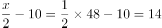。

方法二：根据题意，选项都为整数，可知绳子既可被2整除，也可被3整除，根据倍数特性，只有B选项符合条件。

故正确答案为B。

---

### 第 2 题　qid 2261756 · 数学运算

某农户家庭一年的总收入中，种植收入占四分之一，养殖收入占六分之一，已知其种植收入和养殖收入共计12000元，这个家庭一年的总收入是：

- **A**. 25500元
- **B**. 26600元
- **C**. 27700元
- **D**. 28800元　✅

**答案**：D

**官方解析**

设这个家庭一年的总收入为，则根据题意可得：，解得。

故正确答案为D。

---

### 第 3 题　qid 2261757 · 数学运算

一投资者用部分资金购买了股票和基金，一年后股票下跌了，基金升值了，此时他将全部股票和基金卖出获利，则他购买股票和基金所投入的资金比为：

- **A**. 1:4
- **B**. 1:5　✅
- **C**. 1:6
- **D**. 1:7

**答案**：B

**官方解析**

方法一：设投资者购买了元的股票，元的基金。则根据题目条件有，解得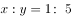。

方法二：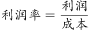，根据线段法，成本之比与利润率差之比成反比，有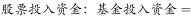。

故正确答案为B。

---

### 第 4 题　qid 2261758 · 数学运算

某大型跨国连锁零售企业在世界8个城市共有76家超市，每个城市的超市数量都不相同。如果超市数量排名第四的城市有10家超市，那么超市数量排名最后的城市最多有几家超市？

- **A**. 3
- **B**. 4
- **C**. 5
- **D**. 6　✅

**答案**：D

**官方解析**

在世界共有76家超市，要使排名最后的城市超市数量最多，则应使其他城市的超市数量最少。设排名最后的城市最多有家超市， 如表所示，

则有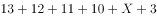，解得。因排名最后的城市最多有6家超市。

故正确答案为D。

---

### 第 5 题　qid 2261759 · 数学运算

今有水平相当的棋手甲和棋手乙参加某项大奖赛，奖金总额12000元。比赛规定下满五局获胜多者将赢得全部12000元奖金，已比赛三局，其中棋手甲两胜一负，现因故无法进行下面的比赛，试问如何分配奖金才算合理？

- **A**. 棋手甲7000元，棋手乙5000元
- **B**. 棋手甲8000元，棋手乙4000元
- **C**. 棋手甲9000元，棋手乙3000元　✅
- **D**. 棋手甲10000元，棋手乙2000元

**答案**：C

**官方解析**

根据题意，现已经比赛三局且需下满五局，甲已两胜一负，则只有当乙剩余两场全胜利时乙才能赢得比赛。因为二人水平相当，则乙赢得比赛的概率为，甲赢得比赛的概率，故甲应分得奖金元，乙应分得奖金元。

故正确答案为C。

---

### 第 6 题　qid 2261760 · 数学运算

某基地A年产水果7000吨，要运到400千米外的城市B，现基地A具有大型运输车和小型运输车各一辆，大型运输车的速度为80千米/小时，载重1000吨，小型运输车的速度为100千米/小时，载重500吨，那么，这批水果运到城市B的最短时间是：

- **A**. 47小时
- **B**. 48小时
- **C**. 44小时　✅
- **D**. 45小时

**答案**：C

**官方解析**

大型运输车的速度为80千米/小时，载重1000吨，则大型车运输到B地需要小时，则运送一次往返需要10小时，运送1000吨。小型运输车的速度为100千米/小时，载重500吨，则小型车运输到B地需要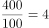小时，往返运送一次需要8小时，运送500吨。因此40小时后，大型车运送吨，小型车运送吨。此时还剩吨，且大小型车都在A地，只需小型车再运送一次就可以了。因此时间为小时。

故正确答案为C。

---

### 第 7 题　qid 2261761 · 数学运算

4名学生和2名教师排成一排照相，2名教师不在两端且要相邻的排法共有多少种？

- **A**. 72
- **B**. 108
- **C**. 144　✅
- **D**. 288

**答案**：C

**官方解析**

2名老师要相邻，则考虑先捆绑，为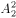 种情况；剩余4名学生和捆绑的老师进行排列，老师不在两头，则考虑插空法，为种情况。则共有排法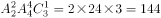种排法。

故正确答案为C。

---

### 第 8 题　qid 2261762 · 数学运算

某养鸡场出售每千克鸡蛋毛利0.8元时，每日能卖出1620千克，每千克毛利1.2元时，每日能卖出1000千克。如果两种情况的销售收入比为3：2，则每千克鸡蛋的成本是多少？

- **A**. 4.2元　✅
- **B**. 4.4元
- **C**. 4.6元
- **D**. 4.8元

**答案**：A

**官方解析**

设每千克鸡蛋的成本为，，则根据题意，可得：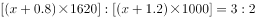，解得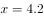。

故正确答案为A。

---

## 判断推理

### 第 1 题　qid 2261738 · 逻辑判断

日本从未对侵略进行过真正反省。没有认识到自己是作孽的民族，将来一定还会是作孽的民族。
下面哪个推理不是这段话所包含的？

- **A**. 如果没有认识到自己是一个作孽的民族，将来还会是作孽的民族。日本没有认识到自己是一个作孽的民族，所以，日本将来还会是一个作孽的民族
- **B**. 只有认识到自己是一个作孽的民族，将来才不会成为作孽的民族，日本没有认识到自己是一个作孽的民族，所以，日本将来还会成为一个作孽的民族
- **C**. 认识到自己是作孽的民族，将来一定不会是作孽的民族。日本没认识到自己是个作孽的民族，所以，日本将来还会是个作孽的民族　✅
- **D**. 日本将来一定还会是一个作孽的民族。因为日本从未对侵略进行过反省

**答案**：C

**官方解析**

第一步：翻译题干。

题干翻译为：从未对侵略进行过反省没有认识到自己是作孽的民族将来一定还会是作孽的民族。

第二步：逐一分析选项。

A项：翻译为：没有认识到自己是一个作孽的民族将来还会是作孽的民族，与题干逻辑关系一致，排除；

B项：只有······才······翻译为“后前”：不会是作孽的民族认识到是作孽的民族，前后否后否前，与题干逻辑关系一致，排除；

C项：翻译为：认识到是作孽的民族一定不会是作孽的民族，否前不能推出否后，与题干逻辑关系不一致，当选；

D项：翻译为：从未对侵略进行过反省将来一定还会是作孽的民族，与题干逻辑关系一致，排除。

本题为选非题，故正确答案为C。

---

### 第 2 题　qid 2261739 · 逻辑判断

2015年，我国粮食产量历史性的实现“十二连增”，既保障了中国的粮食安全，又为经济基本面增添了亮色，让粮食生产的中国经验生动而厚重。然而，“十二连增”背后凸显出来的我国粮食生产特点值得我们深思，要辩证的看粮食的多与少。表面看是多了，但实际看是少了。
下面哪项成立，可支持以上观点？

- **A**. 
2015年，我国粮食产量达到12400亿斤，比1978年翻了一番

- **B**. 
三大谷物稻谷、小麦和玉米合计产量10280亿斤，足以覆盖2015年9280亿斤的国内消费量

- **C**. 
库存玉米约5000亿斤，稻谷约2000亿斤，小麦约800亿斤，均处于历史高位

- **D**. 
粮食的基本自给是以减少粮食以外的农作物种植面积为代价的。2003年，粮食播种面积为14.92亿亩，占播种总面积的比重为，2014年增至16.91亿亩，占播种总面积的比重达到以上
　✅

**答案**：D

**官方解析**

第一步：找出论点和论据。
论点：（粮食）表面看是多了，但实际看是少了。
论据：无。 
第二步：逐一分析选项。
A项：2015年我国粮食产量比1978年翻了一番，只说明粮食多了，没有体现粮食少了，属于无关选项，排除；
B项：三大谷物合计足以覆盖国内消费量，只说明粮食多了，没有体现粮食少了，属于无关选项，排除；
C项：库存均处于历史高位，只说明粮食多了，没有体现粮食少了，属于无关选项，排除；
D项：粮食的基本自给以减少粮食以外的农作物种植面积为代价，说明粮食多了，但其他农作物少了，补充论据支持论点，当选。
故正确答案为D。

---

### 第 3 题　qid 2261740 · 逻辑判断

人社部不久前公布了新的《公务员考试录用违纪违规行为处理办法》，加大了对考试作弊行为的惩处力度，报考者如果有串通作弊或者参与有组织作弊等特别严重的违纪违规行为，将永远不允许进入公务员队伍。
“公考”作为国家选拔工作人员的考试，其重要性不言而喻，绝不能容忍作弊。只有考试纪律严明，对广大考生才公平。那些在“公考”中作弊的人，德与才的缺失在作弊中暴露无遗，确实应该永不录用。其实，“永不录用”只是惩戒措施之一，根据刑法修正案（九）规定，作弊者很可能还被追究法律责任，但仅靠“永不录用”，“作弊入刑”等惩戒措施还不够，应该进一步增加法律法规的威慑力。
当然，加大惩戒力度的目的是创造公平公正的考试环境，并不是故意让考试者“永不翻身”，如果每个考生都遵守考试纪律，规定再严厉也“伤”不到自己。
上述短文中，第一自然段“报考者如果有串通作弊或者参与有组织作弊等特别严重违纪违规行为，将永远不允许进入公务员队伍”中，含有一个逻辑命题，选择其中一项：

- **A**. 选言命题，其公式为：P或者Q
- **B**. 充分条件假言命题，其公式为：如果P那么Q
- **C**. 复合式充分条件假言命题，其公式为：（P或者Q），那么（将）S　✅
- **D**. 必要条件假言命题，其公式为：（P或者Q），才（将）S

**答案**：C

**官方解析**

第一步：翻译题干。

翻译题干第一段最后一句：（1）······或者······选言命题：串通作弊或者有组织作弊；（2）如果······将（就）······充分条件命题：串通作弊或者有组织作弊永远不允许进入公务员队伍。

第二步：逐一分析选项。

A项：选言命题P或者Q，正确，但没有充分条件命题，排除；

B项：充分假言命题即充分条件命题，PQ，但没有选言命题，排除；

C项：复合式充分选言命题，包含了选言命题P或者Q，也包含充分条件命题（P或者Q）S，当选；

D项：题干翻译为充分条件命题，而不是必要条件命题，排除。

故正确答案为C。

---

### 第 4 题　qid 2261741 · 逻辑判断

第48题短文第一第二自然段中，包含有复合型的逻辑推理，找出正确的选项：
①直言三段论推理    ②充分条件假言推理
③必要条件假言推理  ④选言推理

- **A**. ①④
- **B**. ①②
- **C**. ①③
- **D**. ②④　✅

**答案**：D

**官方解析**

第一步：翻译题干。

翻译题干第一段：充分条件选言命题：（串通作弊或者有组织作弊）永远不允许进入公务员队伍。

翻译题干第二段：必要条件命题“只有······才······”：对广大考生公平考试纪律严明。

第二步：逐一分析选项。

A项：并没有体现①直言三段论，即PQ、QS，可得“PS”，排除；

B项：并没有体现①直言三段论，即PQ、QS，可得“PS”，排除；

C项：并没有体现①直言三段论，即PQ、QS，可得“PS”，排除；

D项：第一段是（串通作弊或者有组织作弊）永远不允许进入公务员队伍，有②充分条件假言推理和④选言命题，当选。

故正确答案为D。

---

### 第 5 题　qid 2261742 · 逻辑判断

学校的一项调查发现，有许多大三同学仍然没有明确个人的就业方向。若该命题为真，则下列陈述不能确定真假的是：
①所有大三同学都没有明确个人的就业方向
②所有大三同学都有个人的就业方向
③有的大三同学有个人的就业方向
④大三同学郭强有个人的就业方向

- **A**. ①②③④
- **B**. ①③④　✅
- **C**. ①②③
- **D**. ②③④

**答案**：B

**官方解析**

第一步：分析题干条件。
题干为：许多大三同学没有明确个人的就业方向，可理解为：有的大三学生没有明确个人的就业方向。
第二步：根据题干条件进行推理。
①所有大三同学没有明确个人的就业方向，有的不是无法推出所有不是，不能判断命题真假；
②所有大三同学有明确个人的就业方向，有的不是与所有是互为矛盾关系，则这句话一定为假；
③有的大三同学有个人的就业方向，有的不是无法推出有的是，不能判断命题真假；
④大三同学郭强有个人的就业方向，有的不是无法推出某个是，所以不能判断命题真假。
综上，①③④不能判断命题真假。
故正确答案为B。

---

### 第 6 题　qid 2261743 · 逻辑判断

合法：不合法
在内在逻辑关系上最为相似的选项：

- **A**. 赞成：反对
- **B**. 农业：工业
- **C**. 教授：党员
- **D**. 有偿：无偿　✅

**答案**：D

**官方解析**

第一步：判断题干词语间逻辑关系。
“合法”与“不合法”为矛盾关系，不存在其他情况。
第二步：判断选项词语间逻辑关系。
A项：“赞成”和“反对”为反对关系，存在其他情况，例如“弃权”等，与题干逻辑关系不一致，排除；
B项：“农业”与“工业”为反对关系，存在其他情况，例如“商业”等，与题干逻辑关系不一致，排除；
C项：“教授”与“党员”为交叉关系，有的教授是党员，有的教授不是党员，有的党员是教授，有的党员不是教授，与题干逻辑关系不一致，排除； 
D项：“有偿”与“无偿”为矛盾关系，不存在其他情况，与题干逻辑关系一致，当选。
故正确答案为D。

---

### 第 7 题　qid 2261744 · 逻辑判断

杜甫：《茅屋为秋风所破歌》，安得广厦千万间，大庇天下寒士俱欢颜
与题干逻辑关系相同的选项是：

- **A**. 马致远：《竹枝词》，东边日出西边雨，道是无晴却有晴
- **B**. 李煜：《虞美人》，问君能有几多愁，恰似一江春水向东流　✅
- **C**. 曹禹：《故乡》，杨柳青青江水平，闻郎江上踏歌声
- **D**. 白居易：《鹿柴》，待到重阳日，还来就菊花

**答案**：B

**官方解析**

第一步：判断题干词语间逻辑关系。
题干为作者、作品和诗句的对应关系。
第二步：判断选项词语间逻辑关系。
A项：《竹枝词》的作者是刘禹锡，作者与作品不对应，与题干逻辑关系不一致，排除；
B项：作者与作品对应，与题干逻辑关系一致，当选；
C项：诗句是刘禹锡《竹枝词》中的句子，诗句与作品作者不对应，与题干逻辑关系不一致，排除；
D项：诗句为孟浩然《过故人庄》中的句子，诗句与作品作者不对应，与题干逻辑关系不一致，排除。
故正确答案为B。

---

### 第 8 题　qid 2261745 · 逻辑判断

会展农业是以会议、展览、展销、节庆等活动为表征，是都市型现代农业的高端产业形式和经济形态。
下列不属于会展农业的是：

- **A**. 北京成功举办了世界草莓大会和种子大会
- **B**. 平谷区借助国际桃花音乐节，带动10万农民走上致富道路
- **C**. 目前，一些乡镇搞起了养生山吧和古村聚落等特色业态　✅
- **D**. 有些市区以农业节庆为平台，举办花博会、葡萄大会等农业会展，起到了以会兴业的目的

**答案**：C

**官方解析**

第一步，找出定义关键词。
“以会议、展览、展销、节庆等活动为表征”、“都市型现代农业”。
第二步，逐一分析选项。
A项：北京举办世界草莓大会和种子大会，符合“以会议、展览、展销、节庆等活动为表征”、“都市型现代农业”，符合定义，排除；
B项：平谷区借助国际桃花音乐节，带动10万农民走上致富道路，符合“以会议、展览、展销、节庆等活动为表征”、“都市型现代农业”，符合定义，排除；
C项：一些乡镇搞养生山吧和古村聚落等特色业态，不符合“都市型现代农业”，且没有体现会议、展览、展销、节庆等形式，不符合“以会议、展览、展销、节庆等活动为表征”，不符合定义，当选；
D项：市区以农业节庆为平台，举办农业会展，符合“以会议、展览、展销、节庆等活动为表征”、“都市型现代农业”，符合定义，排除。
本题为选非题，故正确答案为C。

---

### 第 9 题　qid 2261746 · 逻辑判断

以下四个前提成立：
①如果小王是选调生，那么小张不是大学毕业生。
②或者小李是医生，或者小王是选调生。
③如果小张不是大学毕业生，那么小赵不是教师。
④或者小赵是教师，或者小周不是部长。
以下哪项如果为真，可得出“小李是医生”的结论：

- **A**. 小周不是部长
- **B**. 小王不是选调生
- **C**. 小赵不是教师
- **D**. 小周是部长　✅

**答案**：D

**官方解析**

第一步：翻译题干。

①：小王是选调生小张不是大学毕业生；

②：小李是医生或者小王是选调生；

③：小张不是大学毕业生小赵不是教师；

④：小赵是教师或者小周不是部长。

第二步：逐一分析选项。

A项：如果小周不是部长为真，则根据④不能确定小赵是不是教师，所以A项推不出“小李是医生”，排除；

B项：如果小王不是选调生为真，则根据②得小李是医生，当选；

C项：如果小赵不是教师为真，则根据③肯后，肯后推不出确定性结论；根据④推出小周不是部长，但无论根据哪个条件都推不出“小李是医生”，排除；

D项：如果小周是部长为真，则根据④得小赵是教师，根据③得小张是大学毕业生，根据①得小王不是选调生，根据②得小李是医生，当选。

故正确答案为D。（本题出题有误，B、D项均为正确）

---

### 第 10 题　qid 2261747 · 逻辑判断

对于合作社而言，如果实行了土地托管模式，就能使农民获得较高的农业收入并降低经营成本和风险。只有与农户建立高度互信的合作关系，形成紧密的利益联结机制，才能较好地实行土地托管模式。该县去年没有使农民获得比前年更高的农业收入。
如果上述判断是真的，则以下哪些选项也一定是真的？
①没有实行土地托管模式
②没与农民形成紧密的利益联结机制
③与农户没有建立高度互信的合作关系

- **A**. 只有①　✅
- **B**. 只有②
- **C**. 只有③
- **D**. ①②③

**答案**：A

**官方解析**

第一步：翻译题干。

（1）实行了土地托管模式使农民获得较高的农业收入并降低经营成本和风险；

（2）实行土地托管模式与农户建立高度互信的合作关系，形成紧密的利益联结机制；

（3）该县去年没有使农民获得比前年更高的农业收入。

第二步：逐一分析。

①：根据（1）（3）可以推出：没有使农民获得比前年更高的农业收入没有实行土地托管模式，符合题干推理，当选；

②：根据（1）（3）推出没有实行土地托管模式，没有实行土地托管模式是对（2）的否前，否前推不出确定结论，不能推出是否与农民形成紧密的利益联结机制，不符合题干推理，排除；

③：根据（1）（3）推出没有实行土地托管模式，没有实行土地托管模式是对（2）的否前，否前推不出确定结论，不能推出是否与农户建立高度互信的合作关系，不符合题干推理，排除；因此只有①可以推出。

故正确答案为A。

---

### 第 11 题　qid 2261748 · 逻辑判断

从所给四个选项中，选择最合适的一个填入问号处，使之呈现一定的规律性:

- **A**. A
- **B**. B
- **C**. C
- **D**. D　✅

**答案**：D

**官方解析**

图形组成相同，考虑位置规律。观察发现，图形中黑色方块每次只移动一个。则？处图形与前一个图形相比，只有D项移动了一处黑色方块。
故正确答案为D。

---

### 第 12 题　qid 2261749 · 逻辑判断

把下面的六个图形分成两类，使每一类图形都有各自的共同特征或规律，分类正确的一项是：

- **A**. ①③⑥，②④⑤
- **B**. ①③④，②⑤⑥　✅
- **C**. ①②⑤，③④⑥
- **D**. ①②⑥，③④⑤

**答案**：B

**官方解析**

图形组成不同，优先考虑属性规律。通过观察发现，①③④为轴对称图形，②⑤⑥为非对称图形。
故正确答案为B。

---

### 第 13 题　qid 2261750 · 逻辑判断

从所给四个选项中，选择最合适的一个填入问号处，使之呈现一定的规律性：

- **A**. A　✅
- **B**. B
- **C**. C
- **D**. D

**答案**：A

**官方解析**

先观察前一组图形，第一个图为立体图形，后两个图分别为立体图形的俯视图和主视图。同理后一组图形第一个图为立体图形，后两个图分别为立体图形的俯视图和？，则立体图形的主视图应为A项所示图形。
故正确答案为A。

---

### 第 14 题　qid 2261751 · 逻辑判断

从所给四个选项中，选择最合适的一个填入问号处，使之呈现一定的规律性：

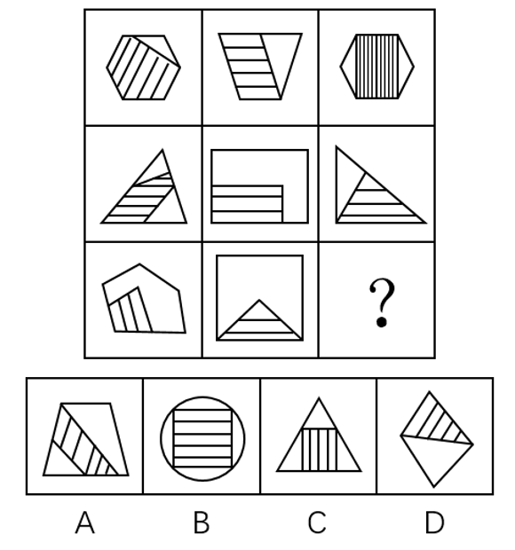

- **A**. A
- **B**. B　✅
- **C**. C
- **D**. D

**答案**：B

**官方解析**

观察题干图形特征，每个图形均为外框和内部阴影相交，且相交产生了公共边，因此考虑公共边数量。九宫格横着看无规律，考虑竖着看，第一列图形中外框和阴影相交的公共边数量分别为5、3、2，第二列分别为3、2、1，第三列分别为2、2、？，单独数无规律，考虑运算。由、可知：每列第一个图形中公共边数量第二个图形中公共边数量第三个图形中公共边数量，则“？”处图形外框和阴影相交的公共边数应为0，只有B项符合。

故正确答案为B。

---

### 第 15 题　qid 2261752 · 逻辑判断

从所给四个选项中，选择最合适的一个填入问号处，使之呈现一定的规律性：

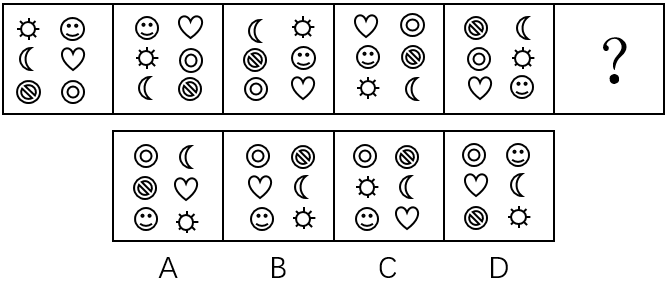

- **A**. A
- **B**. B　✅
- **C**. C
- **D**. D

**答案**：B

**官方解析**

图形组成元素相同，考虑位置规律。观察发现，第一个图形到第二个图形，各元素逆时针平移一格；第二个图形到第三个图形，各元素又顺时针平移两格；后面每次分别：逆时针平移三格、顺时针平移四格。则？处各元素应逆时针平移五格。
故正确答案为B。

---

## 资料分析

### 材料 1

（1）房地产开发投资完成情况

        2017年1-2月份，全国房地产开发投资9854亿元，同比名义增长，增速比去年全年提高2个百分点。其中，住宅投资6571亿元，增长，增速提高2.6个百分点。住宅投资占房地产开发投资的比重为。

        1-2月份，东部地区房地产开发投资5966亿元，同比增长，增速比去年全年提高2.2个百分点；中部地区投资1907亿元，增长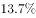，增速提高3个百分点；西部地区投资1982亿元，增长，增速提高1.6个百分点。

        1-2月份，房地产开发企业房屋施工面积622950万平方米，同比增长，增速与去年全年持平。其中，住宅施工面积423185万平方米，增长。房屋新开工面积17238万平方米，增长，增速提高2.3个百分点。其中，住宅新开工面积12410万平方米，增长。房屋竣工面积16141万平方米，增长，增速提高9.7个百分点。其中，住宅竣工面积11674万平方米，增长。

        1-2月份，房地产开发企业土地购置面积2374万平方米，同比增长，去年全年为下降；土地成交价款794亿元，增长，增速回落7.1个百分点。

（2）商品房销售和待售情况

        1-2月，商品房销售面积14054万平方米，同比增长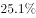，增速比去年全年提高2.6个百分点。其中，住宅销售面积增长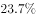，办公楼销售面积增长，商业营业用房销售面积增长。商品房销售额10806亿元，增长，增速回落8.8个百分点。其中，住宅销售额增长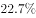，办公楼销售额增长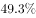，商业营业用房销售额增长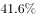。

        1-2月份，东部地区商品房销售面积6595万平方米，同比增长，增速比去年全年回落6.8个百分点；销售额6645亿元，增长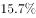，增速回落23个百分点。中部地区商品房销售面积3680万平方米，增长，增速提高4.6个百分点；销售额2073亿元，增长44.1%，增速提高5.4个百分点。西部地区商品房销售面积3779万平方米，增长，增速提高20.6个百分点；销售额2088亿元，增长，增速提高31.2个百分点。

        2月末，商品房待售面积70555万平方米，比去年末增加1015万平方米。其中，住宅待售面积增加468万平方米，办公楼待售面积增加155万平方米，商业营业用房待售面积增加260万平方米。

（3）房地产开发企业到位资金情况

        1-2月份，房地产开发企业到位资金22880亿元，同比增长，增速比去年全年回落8.2个百分点。其中，国内贷款4985亿元，增长;利用外资48亿元，增长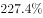；自筹资金6897亿元，下降；其他资金10950亿元，增长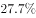。在其他资金中，定金及预收款6108亿元，增长；个人按揭贷款3391亿元，增长。

（4）房地产开发景气指数

        2月份，房地产开发景气指数（简称“国房景气指数”，今年起发布的是基期修定后的值）为100.78，比1月份提高0.02点。

#### 第 1 题　qid 2261763 · 综合

2016年1-2月份全国房地产开发投资总额约是：

- **A**. 9046亿元
- **B**. 9047亿元
- **C**. 9048亿元
- **D**. 9049亿元　✅

**答案**：D

**官方解析**

根据题干“2016年1-2月份······投资总额约是”，结合选项带单位且材料时间为2017年1-2月份，可判定本题为基期计算问题。定位材料文字第一段：“2017年1-2月份，全国房地产开发投资9854亿元，同比名义增长”。故2016年1-2月份全国房地产开发投资总额（选项差距极小，需要精确计算）。

故正确答案为D。

---

#### 第 2 题　qid 2261764 · 综合

2015年1-2月份，全国房地产开发企业土地购置面积（  ）万平方米。

- **A**. 2927.3
- **B**. 2773.5　✅
- **C**. 2235.4
- **D**. 1976.5

**答案**：B

**官方解析**

据题干“2015年1-2月份······万平方米”，结合材料时间为2017年1-2月份，可判定本题为间隔基期问题。定位文字材料第四段：“2017年1-2月份房地产开发企业土地购置面积2374万平方米，同比增长率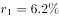”；定位表格材料全国房地产开发企业土地购置面积增速可知：2016年1-2月房地产开发企业土地购置面积同比增长率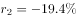。根据间隔增长率公式，与2015年1-2月相比，2017年1-2月全国房地产开发企业土地购置面积增长率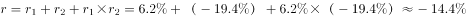，故2015年1-2月份，全国房地产开发企业土地购置面积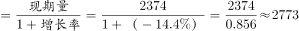万平方米，与B项最接近。

故正确答案为B。

---

#### 第 3 题　qid 2261765 · 综合

2016年末全国商品房的待售面积（  ）万平方米。

- **A**. 68450
- **B**. 69540　✅
- **C**. 79987
- **D**. 70295

**答案**：B

**官方解析**

定位材料文字第七段可知：2017年2月末，商品房待售面积70555万平方米，比去年末增加1015万平方米。故2016年末全国商品房的待售面积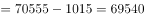万平方米。

故正确答案为B。

---

#### 第 4 题　qid 2261766 · 综合

2016年1-2月，全国房地产开发企业到位资金大约是：

- **A**. 21383亿元　✅
- **B**. 21384亿元
- **C**. 24633亿元
- **D**. 24634亿元

**答案**：A

**官方解析**

根据题干“2016年1-2月······资金大约是”，结合选项带单位且材料时间为2017年1-2月，可判定本题为基期计算问题。定位文字材料第八段可知：2017年1-2月份，房地产开发企业到位资金22880亿元，同比增长。故2016年1-2月，全国房地产开发企业到位资金亿元（选项差距极小，需要精确计算）。

故正确答案为A。

---

#### 第 5 题　qid 2261767 · 增长

自2016年2月至2017年2月，国房景气指数的极差是（  ），2017年2月国房景气指数环比增加了：

- **A**. 
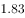  
　✅
- **B**. 
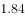  

- **C**. 
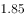  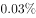

- **D**. 
  

**答案**：A

**官方解析**

根据题干“2017年2月……环比增加了”，结合选项第二个空带百分号，可判定本题为一般增长率问题。定位材料最后一个表格可知：2016年2月至2017年2月，国房景气指数最高值为2016年12月（101.01），最低值为2016年2月（99.18），故自2016年2月至2017年2月，国房景气指数的极差。定位材料文字最后一段和最后一个表格可知：2017年2月房地产开发景气指数比1月分提高0.02点，1月份国房景气指数为100.76。故2017年2月国房景气指数环比增长率，只有A项符合。

故正确答案为A。

---

### 材料 2

根据以下资料，完成第76～80题。

#### 第 6 题　qid 2631489 · 比重

2014年各类农作物播种面积比例的饼形图为：

- **A**. 
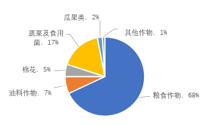

- **B**. 

　✅
- **C**. 

- **D**. 
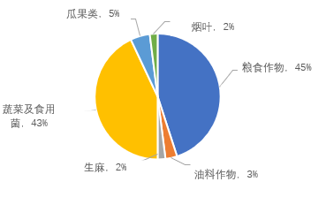

**答案**：B

**官方解析**

根据题干“2014年各类农作物播种面积比例的饼形图”，可判定本题为现期比重问题。定位表格数据可知，2014年粮食作物种植面积为7440033公顷，总种植面积为11037922公顷，则粮食作物种植面积占比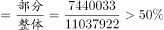，排除C、D两项。对比A、B两项，粮食作物和瓜果类作物所占比例不同，可根据二者倍数关系进行排除。瓜果类种植面积为282005公顷，则粮食作物种植面积与瓜果类的倍数关系应为：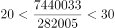，因为总体相同，故二者所占比例的倍数关系30倍，A项：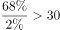，排除。

故正确答案为B。

---

#### 第 7 题　qid 2631497 · 综合

2015年，在秋收粮食作物中，单产增量最多的农作物是：

- **A**. 高粱　✅
- **B**. 玉米
- **C**. 大豆
- **D**. 薯类

**答案**：A

**官方解析**

根据题干“单产增量最多的农作物是”，可判定本题为增长量比较问题。定位表格数据可知，高粱、玉米、大豆、薯类2014年单产分别为3316千克/公顷、6360千克/公顷、2456千克/公顷、7528千克/公顷；2015年分别为3462千克/公顷、6462千克/公顷、2540千克/公顷、7659千克/公顷。根据公式：增长量现期基期，则各类农作物单产增量如下：高粱：千克/公顷；玉米：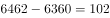千克/公顷；大豆：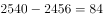千克/公顷；薯类：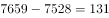千克/公顷。则单产增量最多的农作物是高粱。

故正确答案为A。

---

#### 第 8 题　qid 2631503 · 增长

2015年粮食总产量的增长率是：

- **A**. 

- **B**. 

- **C**. 

　✅
- **D**. 

**答案**：C

**官方解析**

根据题干“······的增长率是”，可判定本题为增长率计算问题。定位表格数据可知，2015年、2014年粮食总产量分别为47127000吨、45966000吨。根据公式：增长率，则2015年粮食总产量的增长率。

故正确答案为C。

---

#### 第 9 题　qid 2631506 · 综合

2014年的粮食作物种植面积是非粮食作物种植面积的（    ）倍。

- **A**. 2.04
- **B**. 2.05
- **C**. 2.06
- **D**. 2.07　✅

**答案**：D

**官方解析**

根据题干“2014年的······是······的（    ）倍”，可判定本题为现期倍数问题。定位表格数据可知，2014年农作物总播种面积、粮食作物播种面积分别为11037922公顷、7440033公顷，则非粮食作物种植面积公顷。根据公式：倍数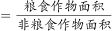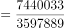，与D项最接近。

故正确答案为D。

---

#### 第 10 题　qid 2631510 · 综合

2015年非粮食作物种植面积减少了：

- **A**. 

- **B**. 

- **C**. 
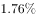
　✅
- **D**. 
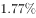

**答案**：C

**官方解析**

根据题干“2015年······减少了”，结合选项为百分数，可判定本题为一般增长率计算问题。定位表格数据可知，2015年农作物总播种面积、粮食作物播种面积分别为11026572公顷、7492100公顷，则2015年非粮食作物种植面积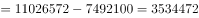公顷，从第79题可知，2014年非粮食作物种植面积为3597889公顷。根据公式：增长率，即2015年非粮食作物种植面积减少了1.76%。

故正确答案为C。

---
