# 2017年河南省选调生选拔考试《行测》试卷（网友回忆版）

> 选调生 · 2017 年 · 5 个模块 · 共 120 题

- [常识判断](#%E5%B8%B8%E8%AF%86%E5%88%A4%E6%96%AD) · 15 题
- [言语理解与表达](#%E8%A8%80%E8%AF%AD%E7%90%86%E8%A7%A3%E4%B8%8E%E8%A1%A8%E8%BE%BE) · 30 题
- [数量关系](#%E6%95%B0%E9%87%8F%E5%85%B3%E7%B3%BB) · 15 题
- [判断推理](#%E5%88%A4%E6%96%AD%E6%8E%A8%E7%90%86) · 40 题
- [资料分析](#%E8%B5%84%E6%96%99%E5%88%86%E6%9E%90) · 20 题

---

## 常识判断

### 第 1 题　qid 2049432 · 人文常识

下列关于食品药品监管说法正确的是：

- **A**. 获得“驰名商标”称号，且连续5年产品抽检合格的食品生产厂家，其所生产的食品可获免检资格
- **B**. 药品包装上印有“OTC”字样的，表明该药品为处方药
- **C**. 保健品、药品分别由国家市场监督管理总局、国家药品监督管理局批准注册　✅
- **D**. 个人姓名不可注册为食品商标

**答案**：C

**官方解析**

本题考查法律常识。
A项错误，《食品安全法》第八十七条：“县级以上人民政府食品安全监督管理部门应当对食品进行定期或者不定期的抽样检验，并依据有关规定公布检验结果，不得免检。进行抽样检验，应当购买抽取的样品，委托符合本法规定的食品检验机构进行检验，并支付相关费用；不得向食品生产经营者收取检验费和其他费用。”根据规定，不得免检。
B项错误，OTC是英文Over The Counter，是可在柜台上买到的药物的缩写，即那些不需要医生处方，消费者可直接在药房或药店中购取的药物。
C项正确，根据我国《保健食品注册与备案管理办法》第五条的规定，国家市场监督管理总局负责保健食品注册管理。根据我国《药品注册管理办法》第五条的规定，国家药品监督管理局主管全国药品注册管理工作，负责建立药品注册管理工作体系和制度，制定药品注册管理规范，依法组织药品审评审批以及相关的监督管理工作。
D项错误，《商标法》第十一条规定：“下列标志不得作为商标注册：（一）仅有本商品的通用名称、图形、型号的；（二）仅直接表示商品的质量、主要原料、功能、用途、重量、数量及其他特点的；（三）其他缺乏显著特征的。”我国法律并未规定个人姓名不可注册为食品商标，个人姓名注册为食品商标并未违反国家禁止性规定，典型的反例是“王守义十三香”。
故正确答案为C。

---

### 第 2 题　qid 2049422 · 人文常识

教练给某学员的便条上写道：今天你表现不错，跑位积极，速度达到每秒7米，全场跑动距离达到1.3千米，但要更注意与队友们的配合，毕竟60分钟的比赛不是你一个人的战斗。据此可知，该教练最可能从事的运动是：

- **A**. 足球
- **B**. 马拉松
- **C**. 篮球
- **D**. 橄榄球　✅

**答案**：D

**官方解析**

本题考查运动常识，需结合题目具体分析。
A项：错误，足球运动分为上下半场，每个半场时间为45分钟，全场比赛为90分钟，与题干中的60分钟的比赛时间不符。
B项：错误，学员速度达到每秒7米，全场跑动距离达到1.3千米，表明是一项爆发力的运动，马拉松全长42.195千米，是耐力型运动，速度不可能达到每秒7米，且与全场跑动距离1.3千米不符。
C项：错误，篮球运动比赛共分4节，每节10分钟或12分钟，总共比赛时长为40分钟或48分钟，跟题干中所说的60分钟的比赛时间不符合。
D项：正确，橄榄球运动属于爆发性的运动，需要运动员具备很快的速度，且是一项团体运动，需要队员配合才能取得胜利。标准的美式橄榄球比赛分为四节，每节15分钟，共60分钟。
故正确答案为D。

---

### 第 3 题　qid 2049444 · 科技常识

从生物学角度来讲，下列骨髓配对移植成功概率最大的是：

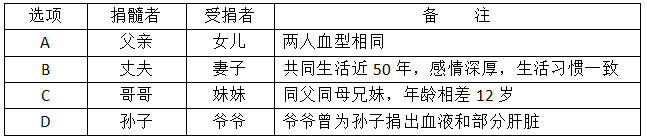

- **A**. A
- **B**. B
- **C**. C　✅
- **D**. D

**答案**：C

**官方解析**

骨髓移植即造血干细胞移植，是指正常人的造血干细胞通过静脉输注到患者体内，重建患者的造血功能和免疫功能，达到治疗某些疾病的目的。

在移植过程中人类白细胞抗原（HLA），是决定移植排斥反应高低的重要因素。在进行骨髓和其它器官移植时，供者和受者之间人类白细胞抗原（HLA）相容程度越高，排斥反应的发生率就越低，移植成功率和移植器官长期存活率就越高；反之，就越容易发生排斥反应。

A项错误，骨髓配型是做HLA分型，和血型无关，且子女与父母之间只有一半HLA抗原相合的机会（因为染色体一半来自父亲、另一半来自母亲），不可能有完全相合的机会，医学上叫做半相合，通常不能相互移植。

B项错误，丈夫和妻子之间没有血缘关系，而人类非血缘关系的HLA型别中，相合几率是四百分之一到万分之一。

C项正确，理论上说，HLA配型完全相合在同卵（同基因）双生兄弟姐妹间最高为，在非同卵（异基因）双生或亲生兄弟姐妹间其次，为1/4。兄妹二人虽然年龄相差12岁，但由于同父同母，配对移植成功率相比其它三个选项是最高的。

D项错误，爷爷为孙子献血和肝脏只能说明血型一致以及肝脏匹配度高，并不能说明HLA配型相合度高。

故正确答案为C。

---

### 第 4 题　qid 2049402 · 人文常识

下列表述正确的是：

- **A**. 内陆国也可拥有并发展海军力量　✅
- **B**. 参与联合国维和行动的经费由各派驻国负担，但前提是派驻国的参谋军官、军事观察员及维和分队人员可以在被派驻国境内使用重武器
- **C**. 当发生超过里氏8级的地震时，国际医疗卫生组织及救援队伍可以不经地震发生国同意直接进入该国领土进行搜救工作
- **D**. 根据动力分类，潜艇可分为常规潜艇和核潜艇，其中常规潜艇属于战略潜艇，核潜艇属于攻击型潜艇

**答案**：A

**官方解析**

A项正确，首先主权国家有权发展自己武装力量；其次世界上有蒙古、巴拉圭等至少8个内陆国有成建制的海军部队。
B项错误，传统的维和行动基本可分为两类：一是由非武装的军事观察员组成的观察团监督停火、撤军或有关协定的执行；二是派出装备用于自卫的轻型武器的维和部队，以确保停火，缓和局势，为解决争端创造条件。维和部队的人员可以携带轻武器，不能携带重武器，而军事观察员是不能携带武器的。维和行动的经费由联合国负担，但最终由各成员国按照一定的标准分摊成本。
C项错误，自然灾害发生后，只有在灾害发生国同意且发出请求的情况下，其他国家或政府间国际组织的救援队伍及其人员方可入境实施救援，现行国际法尚未将“保护的责任”适用于自然灾害。
D项错误，战略潜艇和攻击型潜艇是按照用途分类的，核潜艇和常规潜艇是按照动力分类的。核潜艇和常规潜艇均可以既有战略潜艇，又有攻击型潜艇。
故正确答案为A。

---

### 第 5 题　qid 2049420 · 法律常识

根据我国现有法律规定，下列最有可能被判处有期徒刑（实刑）的是：

- **A**. 19岁的周某持刀抢劫他人现金10元　✅
- **B**. 林某受人胁迫，首次偷窃就盗取了价值400元的食物
- **C**. 王某精神病发作，在神志不清时赤手空拳地打伤无辜的路人
- **D**. 张某为朋友担保，向他人无息借款5万元，在朋友无法偿还后也未还款

**答案**：A

**官方解析**

A项：正确，首先19岁是负完全刑事责任；其次按照《刑法》第二百六十三条规定，抢劫罪至少判处三年以上有期徒刑。
B项：错误，首先按照《刑法》第二十八条：对于被胁迫参加犯罪的，应当按照他的犯罪情节减轻处罚或者免除处罚。其次按照《刑法》第二百六十四条：盗窃公私财物，数额较大的，或者多次盗窃、入户盗窃、携带凶器盗窃、扒窃的，处三年以下有期徒刑、拘役或者管制，并处或者单处罚金。按照《最高人民法院、最高人民检察院关于办理盗窃刑事案件适用法律若干问题的解释》第一条规定，盗窃公私财物价值一千元至三千元以上，认定为刑法第二百六十四条规定的“数额较大”。因林某受胁迫、且盗窃数额达不到较大数额标准，综合判定林某判处有期徒刑的概率较小。
C项：错误，按照《刑法》第十八条第一款的规定，精神病人在不能辨认或者不能控制自己行为的时候造成危害结果，经法定程序鉴定确认的，不负刑事责任。题中，精神病人王某在不能控制自己行为情况下打伤路人，不负刑事责任。
D项：错误，担保归民法调整，不属于刑法调整范围。
故正确答案为A。

---

### 第 6 题　qid 2049330 · 人文常识

对联是中华语言独特的艺术形式，它要求两行文字字数相同，意义相关，词性相当，结构相称，对仗工整，如能藏典更佳。下列选项是以不同地方为题材所作的对联，其中最恰当的一项是：

- **A**. 安徽和陕西：黄山为九州增色；瓷器与中国同名
- **B**. 湖南和湖北：八百里洞庭凭岳阳壮阔；两千年赤壁览黄鹤风流　✅
- **C**. 四川和贵州：川肴蜀绣渝州城，花径草堂；苗寨黔山黄果树，茅台赤水
- **D**. 内蒙古和黑龙江：碧草毡房，春风马背牛羊壮；苍松雪岭，沃野豆谷千里香

**答案**：B

**官方解析**

A项错误，黄山位于安徽，上联正确；与中国同名中的“瓷器”指的是景德镇的瓷器，下联描述的应当为江西省，故排除。
B项正确，上联中的洞庭湖和岳阳楼均位于湖南省；下联黄鹤楼和赤壁古战场均位于湖北省，且运用了三国时期“赤壁之战”的典故，符合题意。
C项错误，上联中渝州城指今重庆，重庆为直辖市，不属于四川省，故排除。
D项错误，上下联分别描述了内蒙古和黑龙江的景象，但是“牛羊壮”与“千里香”对仗不工整，“壮”是“牛羊”的特征，而“香”并不是“千里”特征，故排除。
故正确答案为B。

---

### 第 7 题　qid 2049466 · 科技常识

下列诗句体现了环境对生物影响的是：

- **A**. 梅子留酸软齿牙，芭蕉分绿与窗纱
- **B**. 花到岭南无月令，撞水撞粉透性灵　✅
- **C**. 秋阴不散霜飞晚，留得枯荷听雨声
- **D**. 芳树无人花自落，春山一路鸟空啼

**答案**：B

**官方解析**

B项正确：因为岭南地区得天独厚，气候温和雨水丰沛，肥沃而湿润的土壤，适宜各类花木生长，一年四季花开不断，以致“花到岭南无月令”，从而出现了“十月梅菊齐发，冬腊芙蕖更香”的独特景观。体现了环境对花期的影响，符合题干要求。
A项错误：“梅子留酸软齿牙，芭蕉分绿与窗纱”出自宋代杨万里的《闲居初夏午睡起》。意思是：梅子味道很酸，吃过之后，余酸还残留在牙齿之间；芭蕉初长，而绿荫映衬到纱窗上。此句选用梅子、芭蕉等物象来表现初夏的时令特点，不符题干要求。
C项错误：“秋阴不散霜飞晚，留得枯荷听雨声”出自唐代李商隐的《宿骆氏亭寄怀崔雍崔衮》。意思是：深秋的天空一片阴霾，霜飞的时节也来迟了。水中的荷叶早已凋残，只留了几片枯叶供人聆听雨珠滴响的声音。此句仅描述了阴沉霜晚的景象，不符题干要求。
D项错误：“芳树无人花自落，春山一路鸟空啼”出自唐代李华《春行寄兴》。意思是：春山之中，树木繁茂芬芳，然空无一人，花儿自开自落，一路上鸟儿空自鸣啼。此句只描述了诗人所见眼前景物，不符题干要求。
故正确答案为B。

---

### 第 8 题　qid 2049488 · 人文常识

下图左边为某工业园区区域指示牌内容，右边框内四个长方形为园区内各功能区域面积大小及分布大致示意，据此，指示牌所在位置最可能是：

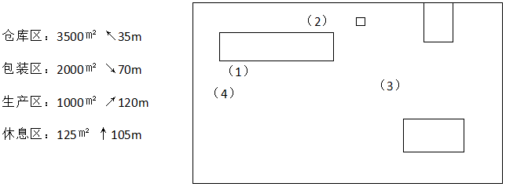

- **A**. （1）
- **B**. （2）
- **C**. （3）　✅
- **D**. （4）

**答案**：C

**官方解析**

根据题干给出的四个区域的面积大小以及图例示意，可确定仓库区、包装区、生产区、休息区分布如下图所示：

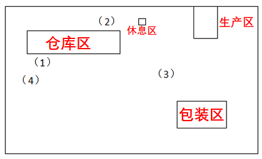

看图角度一般正面面对试卷。根据题干给出四个区域的箭头指示，左上方为仓库区，右下方为包装区，右上方为生产区，休息区为正上方，所以指示牌应该在（3）处。

故正确答案为C。

（注：试卷所给四个区域为大致分布，如若从题干所给的指示牌与各个区域的距离为解题切入口，不能完全一一对应，则此题无解。另据一般人看指示牌习惯，应该先确定目标方向，所以在解此题时以箭头方向为主。）

---

### 第 9 题　qid 2050686 · 科技常识

在农业生产中若长期使用某种杀虫剂，会导致害虫的抗药性增强、杀虫效果减弱，其最主要原因是：

- **A**. 害虫体内积累的杀虫剂增强了自身的抗药性
- **B**. 杀虫剂造成害虫基因突变，产生了抗药性基因
- **C**. 抗药性强的害虫所产生的后代一定具有很强的抗药性
- **D**. 杀虫剂对害虫有选择作用，使抗药性强的害虫被保留下来　✅

**答案**：D

**官方解析**

A项错误：害虫体内积累的杀虫剂增加了害虫自身的耐药性，而非抗药性。
B项错误：基因突变是本来就存在的，是不定向的，并不是由于用了杀虫剂产生了抗药性基因。
C项错误：选项说法过于绝对，由于变异是不定向的，所产生的后代不一定都具有很强的抗药性。
D项正确：当使用某种杀虫剂后，绝大多数害虫被杀死，少数具有抗药性的个体生存下来并繁殖；抗药性害虫大量繁殖后，再用该种杀虫剂，会有比以前更多的个体生存下来。因此，杀虫剂对害虫起到一个定向选择的作用。
故正确答案为D。

---

### 第 10 题　qid 2050688 · 科技常识

某调查小组对部分生物进行了归类，他们把胡狼、棕熊和狮子归为一类，把丹顶鹤、蝙蝠、麻雀归为一类，把黄鳝、蛇和蚯蚓归为一类，这样归类的依据最可能是：

- **A**. 生活环境
- **B**. 肢体形态　✅
- **C**. 运动速度
- **D**. 繁殖方式

**答案**：B

**官方解析**

B项正确：按肢体形态来分，胡狼、棕熊和狮子均有四肢，四条腿行走；丹顶鹤、蝙蝠和麻雀都有翅膀，可飞行；黄鳝、蛇和蚯蚓都无足无翅。
A项错误：若按生活环境分，胡狼、狮子多分布于草原，而棕熊多分布于森林，不能归为一类；丹顶鹤多栖息于湿地，蝙蝠栖息于洞穴，麻雀喜欢靠近农田，不能归为一类；黄鳝在水中生存，蛇能水陆两栖，蚯蚓只能生存在泥土中，不能归为一类。
C项错误：若按运动速度分，蚯蚓的运动速度明显比黄鳝和蛇要慢，不能归为一类。
D项错误：若按繁殖方式分，蝙蝠为胎生，丹顶鹤、麻雀为卵生，不能归为一类。
故正确答案为B。

---

### 第 11 题　qid 2049396 · 科技常识

人造骨要求作为原料的金属具有耐热性、韧性和生物相容性等特点。据此，下列材料最适合制作人造骨的是：

- **A**. 钛合金　✅
- **B**. 青铜
- **C**. 焊锡
- **D**. 不锈钢

**答案**：A

**官方解析**

A项：正确。钛是20世纪50年代发展起来的一种重要的结构金属，无毒、质轻、强度高且具有优良的生物相容性，钛合金因具有强度高、耐蚀性好、耐热性高等特点，是非常理想的医用金属材料，可用作植入人体的植入物、矫形器等。
B项：错误，青铜是3000多年前人类掌握的第一种合金（铜和锡或铅），韧性、生物相容性较差。
C项：错误，焊锡是在焊接线路中连接电子元器件的重要工业原材料，广泛应用于电子工业、家电制造业、汽车制造业、维修业和日常生活中。
D项：错误，不锈钢主要用于建筑、工业生产和日常生活中，不适用于人造骨。
故正确答案为A。

---

### 第 12 题　qid 2049362 · 科技常识

下列表述错误的是：

- **A**. 长期饮用缺氟的水容易患上龋齿
- **B**. 纤维素属于糖类，是植物的主要成分　✅
- **C**. 锌、钙、铁等在人的生长发育期是必不可少的
- **D**. 油脂在体内经氧化放出能量，为维持恒定体温提供能量

**答案**：B

**官方解析**

A项：正确，龋齿俗称虫牙、蛀牙，是细菌性疾病，可以继发牙髓炎和根尖周炎。氟是人体重要的微量元素，是形成坚硬骨骼的必需元素，长期饮用缺氟的水容易患上龋齿，中老年人缺氟还会导致骨骼变脆而骨折。
B项：错误，纤维素是由葡萄糖组成的大分子多糖，不溶于水及一般有机溶剂，是植物细胞壁的主要成分，并非植物的主要成分。
C项：正确，钙铁锌都是人体必需的微量元素，钙，促进成骨和骨质强壮，还是神经肌肉等必不可少的物质；铁，合成血红蛋白必不可少的物质，缺乏会致贫血、乏力等；锌，亦是人体内环境中必不可少的微量元素，缺乏会致发育不良、头发枯黄、注意力分散等。
D项：正确，油脂的主要生理功能是贮存和供应热能，在代谢中可以提供的能量比糖类和蛋白质约高一倍。一克油脂在体内完全氧化时，大约可以产生39.8千焦的热能。
本题为选非题，故正确答案为B。

---

### 第 13 题　qid 2049390 · 人文常识

我国自古就非常重视非物质文化遗产的保护，西汉时期所设立的相应保护机构是：

- **A**. 秘府
- **B**. 乐府　✅
- **C**. 鸿胪寺
- **D**. 大理寺

**答案**：B

**官方解析**

《非物质文化遗产法》第二条第一款规定：“本法所称非物质文化遗产，是指各族人民世代相传并视为其文化遗产组成部分的各种传统文化表现形式，以及与传统文化表现形式相关的实物和场所。包括：（一）传统口头文学以及作为其载体的语言；（二）传统美术、书法、音乐、舞蹈、戏剧、曲艺和杂技；（三）传统技艺、医药和历法；（四）传统礼仪、节庆等民俗；（五）传统体育和游艺；（六）其他非物质文化遗产。”
A项错误，秘府是指古代称禁中藏图书秘籍之所，非文化保护机构。秘府一称最早见于《汉书·艺文志》：“於是建藏书之策，置写书之官，下及诸子传说，皆充秘府。”
B项正确，乐府是西汉汉武帝时正式设立的管理音乐的官方机构，其任务是收集编纂各地民间音乐、整理改编与创作音乐、进行演唱及演奏等。音乐是种表演艺术，属于非物质文化遗产，故而乐府属于非物质文化遗产保护机构。
C项错误，鸿胪寺，北齐始置，掌诸侯王及少数民族首领迎送、接待、朝会、封授等礼仪，及赞导郊庙行礼，管理郡国计吏等事宜。主官为鸿胪寺卿，历代沿置。鸿胪寺相当于外交部门，非文化保护机构。
D项错误，大理寺是魏晋南北朝时期北齐初设，西汉尚无。大理寺是司法机构，掌刑狱案件审理，非文化保护机构。
故正确答案为B。

---

### 第 14 题　qid 2049496 · 人文常识

下列选项对烹饪方式的解释表述正确的是：

- **A**. 煸——将食物放在沸水中烫
- **B**. 煨——将各种食物混合加水煮
- **C**. 烩——用小火将食物慢慢地煮
- **D**. 焗——利用蒸汽使密闭容器中的食物变熟　✅

**答案**：D

**官方解析**

A项错误：煸，是原料投入锅中后中火热油不断翻炒至原料干香滋润而成菜的烹调方法，是一种较短时间加热成菜的方法。
B项错误：煨，是用小火（文火）慢慢地煮的烹调方法。
C项错误：烩，是指把米饭等和荤菜、素菜混在一起加水煮；也指炒菜后加少量的水和芡粉的一种烹饪方法。
D项正确：焗，是利用蒸汽使密闭容器中的食物变熟的烹调方法。
故正确答案为D。

---

### 第 15 题　qid 2049386 · 人文常识

以下各项按时间先后顺序排列正确的是：

- **A**. 秦朝-南朝-北朝-唐朝
- **B**. 三叠纪-泥盆纪-侏罗纪-白垩纪
- **C**. 法国大革命-美国南北战争-辛亥革命-五四青年运动　✅
- **D**. 《论语》-《百年孤独》-《三国志》-《战争与和平》

**答案**：C

**官方解析**

A项：错误，秦朝（公元前221年－公元前207年），是由战国后期的秦国发展起来的中国历史上第一个大一统王朝；南朝（公元420年－公元589年），是中国南北朝时期存在于南方建立于建康（今南京）的宋、齐、梁、陈四个朝代的总称；北朝（公元386年—公元581年），指中国南北朝时期存在于北方五个朝代的总称，包括北魏、东魏、西魏、北齐和北周；唐朝（公元618年—907年），与当时的阿拉伯帝国并列为世界上最强盛的帝国，声誉远扬海外，与亚欧国家均有往来，唐朝以后海外多称中国人为唐人。因此按照出现的先后顺序排列正确的应为：秦朝—北朝—南朝—唐朝。
B项：错误，地质时代，可分为太古代、元古代、古生代、中生代和新生代5个时期。古生代包括寒武纪、奥陶纪、志留纪、泥盆纪、石炭纪、二叠纪；中生代可分为三叠纪，侏罗纪和白垩纪三个纪。因此正确排序应为：泥盆纪—三叠纪—侏罗纪—白垩纪。
C项：正确，法国大革命（1789年—1799年），法国特定历史时期，旧贵族旧观念逐渐被全新的天赋人权、三权分立等的民主思想所取代；美国南北战争（1861—1865）即美国内战，战争之初，北方为了维护国家统一而战，后来，演变为一场消灭奴隶制的革命战争；辛亥革命（1911—1912），是指发生于中国农历辛亥年，旨在推翻清朝专制帝制、建立共和政体的全国性革命；五四运动是1919年5月4日发生在北京的一场以青年学生为主，广大群众、市民、工商人士等中下阶层共同参与的，通过示威游行、请愿、罢工、暴力对抗政府等多种形式进行的爱国运动，是中国人民彻底的反对帝国主义、封建主义的爱国运动，又称“五四风雷”。
D项：错误，《论语》由孔子弟子及再传弟子编写而成，约成书于战国。《百年孤独》是20世纪哥伦比亚作家马尔克斯的代表作。《三国志》为西晋陈寿所做，大约成书于3世纪，晚于《论语》。《战争与和平》由托尔斯泰创作于19世纪，早于《百年孤独》。因此正确的排序应该是《论语》—《三国志》—《战争与和平》—《百年孤独》。
故正确答案为C。

---

## 言语理解与表达

### 第 1 题　qid 2049406 · 逻辑填空

雾霾问题是个棘手难题，但再棘手也得解决，而且难题破解还得摁下“快进键”。虽然从客观规律上看，治霾难                ，可就紧迫性而言，治霾还必须得                ，抓住那些核心症结对症施治。
依次填入画横线部分最恰当的一项是：

- **A**. 一劳永逸  釜底抽薪
- **B**. 一马当先  根治病灶
- **C**. 一蹴而就  只争朝夕　✅
- **D**. 一步登天  刻不容缓

**答案**：C

**官方解析**

第一空，根据前文“雾霾问题是个棘手难题”“摁下‘快进键’”，可知雾霾难以解决，但还要加快进行，故横线处成语表达“容易”“轻松”“快速”的意思，A项“一劳永逸”指形容一次把事情做好，以后就不用再做，C项“一蹴而就”比喻事情轻而易举，一下子就成功，均符合文意，保留。B项“一马当先”形容领先，也比喻工作走在群众前面，积极带头，与文意不符，排除；D项“一步登天”指比喻一下子达到极高的境界，横线处表达容易、轻松之意，而非“达到很高境界”，语意不符，排除。
第二空，根据“紧迫性”可知，横线处要体现时间上的紧迫性，C项“只争朝夕”指比喻抓紧时间，力争在最短的时间内达到目的，符合文意，当选。A项“釜底抽薪”比喻从根本上解决问题，体现不出“时间上的紧迫”之意，排除。
故正确答案为C。
【文段出处】《为雾霾天“自责”：问题再难且直面》

---

### 第 2 题　qid 2050736 · 逻辑填空

玛格丽特·米切尔的畅销书既不是纸浆也不是高等艺术，这部作品足够获得普利策奖，但即使是普通的读者也能感受到它那种感伤的情节不能够和伟大的文学作品              。像《飘》这种        了艺术、商业、量产化的书籍，“通俗”是它最好的定义词。
依次填入画横线部分最恰当的一项是：

- **A**. 比肩同行  汇集
- **B**. 相提并论  融合　✅
- **C**. 不分轩轾  杂糅
- **D**. 等量齐观  荟萃

**答案**：B

**官方解析**

第一空，根据“不是高等艺术”及“不能够和伟大的文学作品”可知，横线处所填成语表示米切尔的畅销书与“高等”“伟大的文学作品”有一定的差距，B项“相提并论”指把不同的人或不同的事放在一起谈论或看待，D项“等量齐观”指把有差别的事物同等看待，均符合文意。A项“比肩同行”指在生活中共同进退，同甘共苦，常用于形容人，与“作品”搭配不当，排除；C项“不分轩轾”比喻对待二者的态度或看法差不多，一般不用于否定句式中，排除。
第二空，横线处所填词语表示《飘》同时具备“艺术、商业、量产化”的特点，B项“融合”指融成一体，符合文意，当选。D项“荟萃”指杰出的人物或精美的东西会集，褒义词，而文段仅仅为客观的、中性的陈述，排除。
故正确答案为B。
【文段出处】《为何好莱坞&lt;乱世佳人&gt;一度辉煌》

---

### 第 3 题　qid 2049446 · 逻辑填空

对于社会性动物人类来说，社交的重要性                ，而社交活动中必不可少的技能就是要认清别人的脸。不幸得脸盲症的话，真是会                。
依次填入画横线部分最恰当的一项是：

- **A**. 昭然若揭  见笑于人
- **B**. 毋庸赘述  贻笑大方
- **C**. 不言而喻  窘态百出　✅
- **D**. 显而易见  羞愧难当

**答案**：C

**官方解析**

第一空，根据“社会性动物”可知，社交的重要性是很明显的，B项“毋庸赘述”指用不着多说，C项“不言而喻”指不用说话就能明白，D项“显而易见”指形容事情或道理很明显，极容易看清楚，均符合文意，保留。A项“昭然若揭”形容真相全部暴露，一切都明明白白，含贬义，与文段感情色彩不符，且常搭配罪恶真相，与文段中“重要性”搭配不当，排除。
第二空，根据“必不可少的技能就是要认清别人的脸”可知，横线处所填成语表示“脸盲症”人群在社交活动中会遭遇各种尴尬、难堪，C项“窘态百出”指尴尬无语、郁闷的状态，与文意相符，当选。B项“贻笑大方”指让内行人笑话，辨识人脸一事并无内行外行之分，排除；D项“羞愧难当”指感到十分羞愧内疚，置于文段处语义过重，与文意不符，排除。
故正确答案为C。
【文段出处】《人长大了，识别人脸的大脑区域也在变大》

---

### 第 4 题　qid 2049456 · 逻辑填空

“自由想象力崇拜”的背后，是“顿悟崇拜”。这种思想认为一般人终日被自己的知识所        ，而一旦跳出就能取得重大突破。费曼说，相对论流行以后，很多哲学家跳出来说：“坐标系是相对的，这难道不是最自然的哲学要求吗？这个我们早就知道了！”可是如果你告诉他们光速在所有坐标系下不变，他们就会                。
依次填入画横线部分最恰当的一项是：

- **A**. 羁绊  怅然若失
- **B**. 束缚  目瞪口呆　✅
- **C**. 钳制  呆若木鸡
- **D**. 禁锢  追悔莫及

**答案**：B

**官方解析**

第一空，根据“一旦跳出就能取得重大突破”可知，横线处所填词语表示一般人被自己的知识所约束，C项“钳制”指用强力限制或以兵力和火力拖住敌人，通常强调外力限制，与文段中“自己的知识”搭配不当，排除。“羁绊”“束缚”“禁锢”用在此处均可，保留。
第二空，根据转折关联词“可是”可知，横线处所填成语与“早就知道了”语义相反，表示哲学家惊讶的样子，B项“目瞪口呆”形容因吃惊或害怕而发愣的样子，当选。A项“怅然若失”指形容心情失落的样子，D项“追悔莫及”表示后悔也来不及了，文段并非强调哲学家失落、后悔，与文意不相符，均排除。
故正确答案为B。
【文段出处】《最高级的想象力是不自由的》

---

### 第 5 题　qid 2049468 · 逻辑填空

当年的美丽楼兰，这个绿洲上的王国，丝绸之路的要塞，总是驼铃叮当，人迹熙攘，多么地令人眼热而起兵戎呢。周边的游牧民族厮杀终年不歇，北方的匈奴汹汹如潮肆意南侵，连大汉王朝也皇皇挺兵饮马于此。说话间，                的谋略，                的交响，绿野上驰骋的一世之雄，而今安在哉？
依次填入画横线部分最恰当的一项是：

- **A**. 纵横捭阖  金戈铁马　✅
- **B**. 经天纬地  秣马厉兵
- **C**. 汪洋恣肆  戎马倥偬
- **D**. 尔虞我诈  万马奔腾

**答案**：A

**官方解析**

第一空，“起兵戎”“南侵”“皇皇挺兵饮马于此”都体现文段为打仗的语境。故横线处应体现打仗语境且搭配“谋略”。B项“经天纬地”指以天为经,以地为纬，比喻人的才智极大。多表述为“经天纬地之人”“经天纬地之才”，确与“谋略”搭配不恰当，且不符合打仗的语境，故排除。C项“汪洋恣肆”形容文章、言论、书法等气势豪放，潇洒自如，与“谋略”搭配不当，且未体现打仗的语境，排除。A项“纵横捭阖”指用辞令测探、打动别人，形容在政治和外交上运用联合或分化的手段，符合语境且搭配谋略，保留；D项“尔虞我诈”表示彼此互相欺骗，能够体现打仗的语境，保留。
第二空，要符合打仗语境，且搭配“交响”，A项“金戈铁马”形容战士持枪驰马的雄姿，与“交响”搭配恰当，符合语境，当选。D项“万马奔腾”指形容群众性的活动声势浩大或场面热烈，与文意无关，排除。
故正确答案为A。

---

### 第 6 题　qid 2051242 · 逻辑填空

虽然没有法律强制力做支撑的道德是虚妄的，但是法律在面对道德问题时，也总是会显得             ，这种力不从心的根本原因还是由于法律的外在属性与道德的内在属性之间的矛盾，社会秩序的大厦是法理与道德共同支撑的，如果道德不立，人心善变，法律终会             。
依次填入画横线部分最恰当的一项是：

- **A**. 相形见绌  回天乏力
- **B**. 爱莫能助  孤立无援
- **C**. 左支右绌  独木难支　✅
- **D**. 捉襟见肘  力所不逮

**答案**：C

**官方解析**

第一空，根据代词“这种”可知，横线处词语要体现“力不从心”之意，且与“显得”搭配，说明法律在面对道德问题的时候，想解决解决不了，能力不足，力量不够。C项“左支右绌”和D项“捉襟见肘”均指力量不够，应付不过来，符合文意，保留。A项“相形见绌”指跟同类相比，显出不足，与“力不从心”无关，排除；B项“爱莫能助”指心中关切同情，却没有力量帮助，文中“法律面对道德问题”并不是要帮助，而是解决不了，意思不符，且与“显得”搭配不当，排除。
第二空，“社会秩序的大厦是法理与道德共同支撑的”，说明法律和道德共同支撑社会秩序，没有道德，法律就会孤立无援，C项“独木难支”比喻单个力量单薄，维持不住全局，符合文意，表意形象，当选。D项“力所不逮”指力量达不到，不能体现“法律与道德”的密切关系，排除。
故正确答案为C。
【文段出处】《扶不扶，法律不能规范道德》

---

### 第 7 题　qid 2049312 · 逻辑填空

30岁时，纳什突然出现了许多古怪的举动……最终，他因为幻听被确诊为严重的精神分裂症，后来是接二连三的诊治与复发。1962年，当他被认为是           的菲尔兹奖获得者时，他的精神状况却使他与奖项            。
依次填入画横线部分最恰当的一项是：

- **A**. 无可辩驳  饮恨败北
- **B**. 实至名归  擦肩而过
- **C**. 名正言顺  抱憾终身
- **D**. 理所当然  失之交臂　✅

**答案**：D

**官方解析**

第一空，表示当时的人对于纳什是否会获得菲尔兹奖的看法，A项“无可辩驳”指没有理由或根据来否定对方的意见，形容事实确凿，理由充足；C项“名正言顺”指做某事名义正当，道理也说得通；D项“理所当然”指按道理应当这样。三项置于文段处均符合文意，保留。B项“实至名归”是指有了真正的学识、本事就自然有了声誉，用于已经获得奖项的语境，根据后文转折可知其并未获奖，排除。
第二空，根据转折词“却”可知，所填词语表示纳什错失了这一奖项，D项“失之交臂”形容错过，符合文意，且形象生动。A项“饮恨败北”是含恨失败；C项“抱憾终身”指心存遗憾，主语常常是人，文段表示“他与奖项”的关系，用在此处搭配不当，排除。
故正确答案为D。
【文段出处】《约翰·纳什的一生：在得失博弈中获得均衡》

---

### 第 8 题　qid 2049308 · 逻辑填空

纵观现代化历程，中国改革一直是在争论中推进的，之所以能够顺利推进并取得举世瞩目的成就，就是因为主流意识形态具有强大的        力量，总是能够超越左与右，促使社会形成新的共识。而主流意识形态有这样强大的力量，恰恰是从不同社会思潮中汲取智慧，而不是              的“任性”。
依次填入画横线部分最恰当的一项是：

- **A**. 吸收  泥古不化
- **B**. 平衡  剑走偏锋
- **C**. 整合  刚愎自用　✅
- **D**. 柔化  恃才放旷

**答案**：C

**官方解析**

本题可从第二空入手，根据“是······而不是······”反义并列关联词可知，所填成语表示不汲取别人的智慧，且修饰“任性”，C项“刚愎自用”是指完全固执己见不听取别人的意见，与前文对应恰当，符合语境。A项“泥古不化”比喻拘泥于古代的成规或说法，不知根据具体情况，加以变通，文中并非是古人的说法，而是固执己见，排除；B项“剑走偏锋”是指寻找新的、不同以往的办法来解决问题，以求出奇制胜，侧重方法奇特而非“任性”，排除；D项“恃才放旷”是指倚仗自己的才能而对行为不加约束，文中并非强调倚仗才能，排除。基本锁定C项。
第一空代入验证，“整合”与“超越左与右，促使社会形成新的共识”对应准确，契合文意。
故正确答案为C。
【文段出处】《思潮是飘荡在社会中的幽灵》

---

### 第 9 题　qid 2050722 · 逻辑填空

母亲一生始终未离开武陵山区，我也随着她和父亲在武陵山水间         。当我从武陵边镇来到乌江边的县城，被大家称为来自小河的人；当我从乌江来到长江边的涪陵区，仍被称为小河的边民。后来我明白，到了沿海，你来自内地；到了海外，你来自大陆，一个人一生就是载着家乡山水的           。
依次填入画横线部分最恰当的一项是：

- **A**. 迁徙  漂泊
- **B**. 游走  流浪
- **C**. 流连  远足
- **D**. 辗转  漂流　✅

**答案**：D

**官方解析**

第一空，根据文段“从武陵边镇来到乌江边的县城”“从乌江来到长江边的涪陵区”可知，作者在武陵山区经过很多地方，D项“辗转”指经过很多地方，填入文段语义合适，保留。A项“迁徙”指从一个地区迁移到另一个地区，通常规模较大，如动物迁徙、人口迁徙等，与文意不符，排除；B项“游走”指短暂地在一个地区游玩行走，而文段中并非强调作者在这些地区游玩，与文意不符，排除；C项“流连”指依恋而舍不得离去，无法体现出经过了很多地方，排除。
第二空，代入验证，D项“漂流”指漂泊，行踪无定，填入文段语义恰当，当选。
故正确答案为D。

---

### 第 10 题　qid 2049470 · 逻辑填空

全面的发展和自由却并不意味着毫无底线——尤其是一些媒体对西方工业化流水线生产的娱乐节目亦步亦趋，其作品之低俗令人愤怒。此时此刻，我们的监管部门更需              ，谨防不法分子借恶搞之名        传统价值。
依次填入画横线部分最恰当的一项是：

- **A**. 严阵以待  颠覆　✅
- **B**. 全民皆兵  蚕食
- **C**. 严防死守  侵蚀
- **D**. 全线狙击  污蔑

**答案**：A

**官方解析**

第一空，根据“其作品之低俗令人愤怒”及“谨防不法分子借恶搞之名        传统价值”可知，横线处所填成语应体现监管部门要做好防范与准备。A项“严阵以待”指严密部署、高度戒备，常用于形容对潜在威胁保持警惕并积极准备应对，C项“严防死守”指非常严格地防护并坚定地守住，均符合文意，保留。B项“全民皆兵”指将全体具备战斗能力的人民进行武装，形成随时可抗击外敌入侵的军事体系，与“监管部门”搭配不当，排除。D项“
全线狙击”多用于军事对抗场景，隐含冲突已发生，与“谨防”所体现的预防性立场不一致，排除。
第二空，根据“令人愤怒”“更需”“谨防”可知，文段的语义程度较重，A项“颠覆”指从根本上倾覆推翻，C项“侵蚀”指逐渐侵害使变坏，强调渐进的过程，“颠覆”比“侵蚀”程度更重，与文段对应更为恰当，A项当选。
故正确答案为A。
【文段出处】《评论：经典作品岂容恶搞》

---

### 第 11 题　qid 2049474 · 逻辑填空

“旧时茅店社林边，路转溪桥忽见”——月光、蝉鸣、蛙声与稻香，都是夏夜田间的        景物，遭遇罢官的辛弃疾在此一住十几年，心性渐渐         ，词句变得安详平实。
依次填入画横线部分最恰当的一项是：

- **A**. 寻常  淡然　✅
- **B**. 平凡  索然
- **C**. 平常  安然
- **D**. 常见  了然

**答案**：A

**官方解析**

本题可从第二空入手，所填词语应与“心性”搭配，且与“安详平实” 对应。A项“淡然”形容心情平静，不在意，搭配恰当，符合语境，保留； B项“索然”形容乏味，没有兴趣，感情色彩偏消极，与文意不符，且与“心性”搭配不当，排除；C项“安然”形容没有顾虑，很放心，文段并非强调没有顾虑，且“安然”与 “心性”搭配不当，排除； D项“了然”指清楚明白，与文意不符，且与“心性”搭配不当，排除。 
第一空，代入验证，A项“寻常”与“景物”搭配恰当，契合文意，当选。 
故正确答案为A。

---

### 第 12 题　qid 2050724 · 逻辑填空

远眺试飞机场，天地混为一体，这就是“彩虹”无人机       的起点，更是放飞梦想的舞台。每一名科研人员，都会在试飞成功后，站在这里静静凝视，让热情       平静，平静的背后是一份更高的期许。
依次填入画横线部分最恰当的一项是：

- **A**. 高飞  荣归
- **B**. 遨游  回复
- **C**. 腾空  恢复
- **D**. 翱翔  回归　✅

**答案**：D

**官方解析**

本题可从第二空入手，根据横线前的“静静凝视”可知，横线处所填词语表示由“热情”后退到“平静”的状态。D项“回归”能够表示倒退、后退的意思，符合语境，保留。A项“荣归”指载誉而归，B项“回复”表示答复，通常用于回答别人的问题或要求，均与“热情”搭配不当，排除。C项“恢复”指使变成原来的样子，文段并未提及初始状态就是“平静”，排除。
第一空，代入验证。D项“翱翔”指在空中飞行，填入文段语义合适且搭配恰当，当选。
故正确答案为D。
【文段出处】《“彩虹”无人机在国际市场步步腾飞 希望进一步打开国内市场》

---

### 第 13 题　qid 2050734 · 逻辑填空

这也许有些             ，男性和女性都把自己和对方看作平等的人，才是正常的、自然的态度。但文学本来有异于科学。文学家写的是活生生的人，是活的感受和感发，它们是否合乎科学，不是一眼看得出来的。有时看似       ，恰好包含着合乎科学的内容。
依次填入画横线部分最恰当的一项是：

- **A**. 矫枉过正  偏颇　✅
- **B**. 荒诞不经  偏私
- **C**. 过犹不及  偏激
- **D**. 无理取闹  偏执

**答案**：A

**官方解析**

本题可从第二空入手，横线处形容文学家写作的内容，根据“看似”可知，横线处所填词语与“合乎科学”语义相反，表示不够科学和合理，即存在偏差，A项“偏颇”指不公正，偏袒，填入文段语义合适，保留；C项“偏激”、D项“偏执”均形容人的性格，无法形容作品中的内容，用在此处搭配不当，排除；B项“偏私”指偏袒徇私，与“无私”相对，文段并非强调徇私，而是不够科学、存在偏差，排除。
第一空，代入验证，“矫枉过正”比喻纠正错误超过了应有的限度，根据后文“才是正常的”可知，横线处表达不太正常、有些过头的情况，A项填入文段和后文对应恰当，当选。
故正确答案为A。

---

### 第 14 题　qid 2049472 · 逻辑填空

阿兹特克文明的帝国都城——特诺奇蒂特兰，在给人以神秘感的同时，也透出一丝淡淡的忧伤。神话传说与真实故事的         ，光辉帝国史与悲惨殖民史的         ，令人在心驰神往的同时，感慨时过境迁、沧海桑田……
依次填入画横线部分最恰当的一项是：

- **A**. 纠缠  消散
- **B**. 交织  更迭　✅
- **C**. 重叠  嬗变
- **D**. 合契  幻灭

**答案**：B

**官方解析**

第一空，横线处应体现“神话传说与真实故事”的关系，B项“交织”意为错综复杂地合为一体，符合文意，保留。A项“纠缠”指相互缠绕、搅扰，感情色彩偏消极，排除；C项“重叠”指同样的东西层层堆叠，互相覆盖，侧重内容的重复、重合，D项“合契”指相符合、相一致，侧重完全契合、没有差异，而神话传说与真实故事不可能完全一样，排除C、D两项。
验证第二空，B项“更迭”指交换、交替，能体现出帝国从辉煌到被殖民的历史阶段的更替、转换，且与后文“时过境迁、沧海桑田”形成对应，符合文意，当选。
故正确答案为B。
【文段出处】北方网《阿兹特克文明的兴衰》

---

### 第 15 题　qid 2049428 · 逻辑填空

大连人直面历史，表现出了应有的        ，采取了极为        的做法，他们没有“砸碎一个旧世界，建立一个新世界”，而是完好地保留了那些欧式建筑、广场和绿地。
依次填入画横线部分最恰当的一项是：

- **A**. 气度  睿智
- **B**. 理智  开明　✅
- **C**. 魄力  大胆
- **D**. 胸襟  另类

**答案**：B

**官方解析**

本题可从第二空入手，后文是对横线处的解释说明，根据后文“没有砸碎旧世界”和“完好保留欧式建筑、广场、绿地”，体现出大连人在面对历史时“不守旧”、“包容”的做法，对应B项“开明”。A项“睿智”指聪颖明智，C项“大胆”指不畏惧困难，二者均体现不出“包容”的含义，排除；D项“另类”偏消极，和文段积极的感情色彩不符，排除。
第一空，代入验证，“理智”对应后文“没有砸碎旧世界”，语义相符。
故正确答案为B。
【文段出处】《大连，再不浪漫就老了》

---

### 第 16 题　qid 2049482 · 片段阅读

喀拉拉的自然美景无与伦比，人情练达、古风犹存的民风也颇令当地人引以为傲。这里的人民友善而充满活力，受教育率在全印度位居第一。虽然整个印度的妇女识字率只有，但是喀拉拉邦的所有居民，包括女性，识字率已高达，印度其他地区常见的重男轻女现象在喀拉拉邦很难寻到踪迹。“民众科学运动”的科学家们自豪地说：“在喀拉拉，没有人不读报，没有人不谈政治，没有人不唱歌。”

这段文字主要讲述了喀拉拉地区：

- **A**. 人文环境和自然风光一样优越　✅
- **B**. 人们热爱读书、讨论政治和唱歌，崇尚精神文明
- **C**. 人文环境的独特之处在于既具有复古的淳朴，又具有现代的开放
- **D**. 女性较高的社会地位和受教育水平是喀拉拉邦民风淳朴友善的重要原因

**答案**：A

**官方解析**

文段开篇指出“喀拉拉”这一地区自然风景优美，而此地“民风”也让当地人引以为傲。接着后文对于“民风”具体展开论述，论述民风“友善”“不重男轻女”“爱唱歌”等等。故文段为总分结构，旨在说明喀拉拉民风让人骄傲，对应A项。
B项，对应尾句科学家们的话，非重点，且“崇尚精神文明”文段并未提及，排除；
C项，“复古的淳朴”、“现代的开放”文段并未提及，无中生有，排除；
D项，“女性地位较高”文段并未体现，且文段中“民风友善”和“受教育率”之间为并列关系，并非因果关系，选项表述与文意不符，排除。
故正确答案为A。
【文段出处】《最好的时光在路上》

---

### 第 17 题　qid 2049424 · 片段阅读

2016年是全球气候充满极端状况的一年。大气中的二氧化碳平均浓度已经超过400ppm（1ppm为百万分之一）警示线，甲烷浓度也飙升破纪录。气候变化的长期指标上升至新水平。南极和北极地区的海冰面积缩减严重，打破了最低纪录。俄罗斯、北极地区气温比长期平均温度高，格陵兰冰川开始融化的时间提前，且速度更快，北极地区正以全球平均值两倍的速度变暖。

与这段文字意思相符的一项是：

- **A**. 2016年全球气候变化最为极端
- **B**. 2016年大气中的二氧化碳含量创新高
- **C**. 2016年南北极的海冰面积创出新低　✅
- **D**. 2016年俄罗斯地区气温比格陵兰地区高

**答案**：C

**官方解析**

C项“2016年南北极的海冰面积创出新低”对应文段“南极和北极地区的海冰面积缩减严重，打破了最低记录。”表述正确，当选。

A项中的“最为极端”表述绝对，文段并无体现，排除。B项表述错误，文段讲述“大气中的二氧化碳平均浓度已经超过400ppm”不能得出“二氧化碳含量创新高”，排除。D项表述错误，俄罗斯、北极地区气温比长期平均温度高，不能得出“2016年俄罗斯地区气温比格陵兰地区高”，排除。

故正确答案为C。

【文段出处】《2016将成为史上最热年》

---

### 第 18 题　qid 2049478 · 片段阅读

文字概率相对于数字概率具有模糊性、非概率运算性和语义特性等特征。数字概率是一种更精确的风险表达方式，在风险沟通时人们对其能比较客观地传递、解释和利用。文字概率和数字概率在进化历史上出现时间不同，隶属的发展领域（语言和数学）也不同，所以其特征上的差异可能不止于以上所述。例如文字概率的非概率运算性表明，人们传达或接受文字概率表征的信息时不会按照概率规则进行审慎地运算，文字概率更多地引发直觉式思考，数字概率更多地引发分析式思考。
对这段文字概括最恰当的一项是：

- **A**. 文字概率与数字概率分属不同领域
- **B**. 数字概率其实优于文字概率
- **C**. 文字概率与数字概率不同　✅
- **D**. 数字概率与文字概率的思考方式不同

**答案**：C

**官方解析**

文段开篇介绍了文字概率和数字概率的特征，说明文字概率是模糊的，而数字概率更精确，表明两者特征的不同。接着说明文字概率和数字概率的出现时间不同、发展领域不同，随后通过“所以”得出结论，说明其特征上的差异可能还有更多，并举例详细说明。故文段意在表明文字概率和数字概率的特征是不同的，对应选项为C项。
A项中的“分属不同领域”、D项中的“思考方式”均为文字概率与数字概率之间差异的一个方面，无法完全概括文意，排除。
B项，文段仅仅是对比两者间的差异，而并未说明两者的好与坏，故“优于”表述无中生有，排除。
故正确答案为C。
【文段出处】《用文字概率衡量不确定性：特征和问题》

---

### 第 19 题　qid 2050750 · 片段阅读

凡是到达了的地方，都属于昨天。哪怕那山再青，那水再秀，那风再温柔。太深的流连便成了一种羁绊，绊住的不仅仅有双脚，还有未来。没见过大山的巍峨，真是遗憾；见了大山的巍峨没见过大海的浩瀚，仍然是遗憾；见了大海的浩瀚没见过大漠的广袤，依旧遗憾；见了大漠的广袤没见过森林的神秘，还是遗憾。
这段文字作者意在说明：

- **A**. 风光无限，在昨日更在明天
- **B**. 昨天已然过去，可怀念不可流连
- **C**. 只有不断出发，未来的精彩才会继续　✅
- **D**. 最美的风景，不是终点，而是在路上的自己

**答案**：C

**官方解析**

文段开篇通过“凡是到达了的地方，都属于昨天”，说明昨天不那么重要。后文提出问题“太深的流连会成为一种羁绊，不仅仅牵绊双脚还有羁绊未来”。随后通过并列的分述分析了“流连过去会产生遗憾”。本题为“提出问题—分析问题”的结构，故解决问题的对策是重点，即“只有不断出发，未来的精彩才会继续”，对应C项。
A项，强调美好的风景在哪，而文段重在强调对策，即不断向前出发，故非重点，排除；
B项，仅指出“不能流连过去”，表述不明确，未提到应重视“未来”，排除；
D项，强调“自己”，而文段强调“未来”，偏离中心，排除。
故正确答案为C。
【文段出处】《我喜欢出发》

---

### 第 20 题　qid 2050720 · 语句表达

①近地表气温递减率（NLR）是将气温由站点向网络进行插值过程中的重要参数，是影响气温空间分布的重要因素
②研究发现MODIS的夜间地表温度LST与站点观测的气温有很好的一致性，而且有较高的空间分辨率便于计算NLR，适用于分布式水文模型的模拟
③在高寒地区，气温影响积雪融化、冰川消融、冻土转化以及陆气之间的水分和能量交换等过程，使得该区域水文过程对气温非常敏感
④通常可以采用观测站点数据来获取NLR，而在观测站点较为缺乏的青藏高原等高海拔地区，可以采用遥感卫星数据（如MODIS的地表温度LST）来进行推算
⑤因此，获取准确的气温空间分布对于寒区水文模拟至关重要
将以上5个句子重新排序，语序正确的是：

- **A**. ①③④⑤②
- **B**. ③⑤①④②　✅
- **C**. ②①④③⑤
- **D**. ④②①③⑤

**答案**：B

**官方解析**

首先根据选项判断首句，①句介绍NLR的概念及其重要性，②指出较高的空间分辨率便于计算NLR，③指出水文过程与气温的关系，④介绍获取NLR的方式，分析内容可知，①是对“NLR”下定义引出话题，②④是对“NLR”的具体表述，故①在②④之前，排除C、D两项。对比A、B两项，区别在于③、⑤是否捆绑，根据文意可知，③、⑤均讲述寒区水文与气温的关系，故话题一致，需捆绑，对应B项。
故正确答案为B。
【文段出处】《青藏高原所基于卫星遥感估算的近地表气温递减率改进积雪过程的模拟》

---

### 第 21 题　qid 2049412 · 片段阅读

转变发展理念，切实增强协调发展的自觉性和坚定性。我们党提出协调这一发展理念，旨在补齐发展短板，解决发展不平衡问题。尽管我国经济社会发展取得巨大成就，但也出现了发展不平衡、不协调、不可持续问题，迫切需要转变发展理念，特别是增强发展的整体性、协调性。在当前全面建成小康社会的决胜时期，我们必须转变观念，把思想和行动统一到新发展理念上来，正确处理发展中的重大关系，在协调发展中拓宽发展空间，在补齐短板中增强发展后劲，在增强国家硬实力的同时提升国家软实力，使物质文明和精神文明协调发展，同步提升。
这段文字意在强调我们要：

- **A**. 转变发展理念，解决发展不平衡问题　✅
- **B**. 推动物质文明与精神文明协调发展
- **C**. 增强协调发展的自觉性与坚定性
- **D**. 转变发展理念，提升国家软实力

**答案**：A

**官方解析**

文段开篇指出“我们党提出协调这一发展理念”是要解决“发展不平衡问题”，随后通过“但”进行转折，仍然强调我国存在不平衡、不协调、不可持续的问题，接着通过“迫切需要”提出对策，即“转变观念”，后文围绕这一核心主张展开，通过处理重大关系、补齐短板等具体举措，并论述意义效果，故文段重点是对策，整体围绕“转变发展理念”这一关键举措以及“解决发展不平衡问题”这一核心目标展开，对应A项。
B项，“物质文明与精神文明”对应意义效果部分内容，非文段重点，排除。
C项，“增强协调发展的自觉性与坚定性”为开头话题引入部分内容，非文段重点，排除。
D项，根据文段“在增强硬实力的同时提升软实力”可知，“软实力”表述片面，排除。
故正确答案为A。
【文段出处】《推动物质文明和精神文明协调发展》

---

### 第 22 题　qid 2049400 · 片段阅读

土星的光环系统就是目前我们所拥有的最接近45.5亿年前诞生地球和其他行星的尘埃、碎石盘的东西。这个原行星盘成形于一团由超低温气体和尘埃组成的星云在自身引力作用下的坍缩。随着这个转动的星云逐渐收缩，它就成了一个围绕新生太阳的盘，一旦太阳吹散了这些气体，盘中作轨道运动的碎石就和土星的光环系统极为相似。
这段文字主要介绍了土星光环的：

- **A**. 形状
- **B**. 运行
- **C**. 构成
- **D**. 形成　✅

**答案**：D

**官方解析**

文段开篇引出“土星光环”这一核心话题，并指出它与诞生地球和其他行星的尘埃、碎石盘的东西最为接近，接着具体讲述这一原行星盘的形成过程，尾句再次强调盘中作轨道运动的碎石就和土星的光环系统极为相似，可知，文段通过对于原行星盘的介绍，揭示了土星光环的形成过程，对应D项。
如果实在读不懂，可以发现，文段中多次出现“成形”、“成了”等词语，亦可对应D项“形成”。
A项：“形状”非文段重点，文段主要强调土星光环系统的形成，排除；
B项：“运行”在原文中没有提及，为无中生有的表述，排除；
C项：“构成”对应文段“由超低温气体和尘埃组成”，强调的是“星云”的构成，而非“土星光环”的构成，偷换概念，排除。
故正确答案为D。
【文段出处】《土星的奇怪“螺旋桨”》

---

### 第 23 题　qid 2049416 · 片段阅读

长时间保持同一个姿势，容易导致下肢血液回流不畅，形成血栓。静脉血栓是血栓把血管堵塞，造成血液无法流通，从而引起肢体肿胀、疼痛，以及浅静脉扩张、曲张等临床表现。静脉血回流到心脏后，会进入肺部来完成氧气的交换。深静脉血栓在血管的一端与血管壁仅有轻度粘连，血栓另一端则自由地漂浮在血管壁内。热敷、按摩和挤压下肢，容易使血栓脱落，随血流流经心脏，最后“卡”在肺动脉里面，导致肺动脉的血流受阻，进而引发咳嗽、胸闷等症状，甚至导致窒息死亡，即肺栓塞。
对这段文字理解错误的是：

- **A**. 用热敷、按摩的方法来缓解静脉血栓是错误的
- **B**. 深静脉血栓比浅静脉扩张更加危险　✅
- **C**. 预防静脉血栓，需要人们运动起来
- **D**. 具有堵塞性是血栓的“原罪”

**答案**：B

**官方解析**

A项，根据尾句“热敷、按摩和挤压下肢，容易使血栓脱落······”可知，表述正确；
B项，无中生有，文段未将“深静脉血栓”与“浅静脉扩张”进行对比，表述错误；
C项，根据首句“长时间保持同一个姿势，容易导致下肢血液回流不畅，形成血栓”，可知表述正确；
D项，根据“静脉血栓是血栓把血管堵塞”，可知“堵塞性是血栓的‘原罪’”表述正确。
本题为选非题，故正确答案为B。
【文段出处】生命时报《小腿肿胀乱揉很危险》

---

### 第 24 题　qid 2049490 · 语句表达

医生诊疗费用的低下与药品加成的过高，共同形成了以药养医的现状。它保证了公共医院在数据上的收支平衡，却导致了“大处方”“新特贵药”“过度医疗”等现象的出现，让医生和患者都容易成为扭结的医疗制度及以其为轴的社会冲突的代偿者。前一段时间，患者魏则西的去世和医生陈仲伟的遇害先后引起舆论大潮，两件新闻被附会了各种情绪，最终                    。其所展现出的，正是医患双输局面长久酝酿出的情绪瞬间决堤的效果。
填入画横线部分最恰当的一项是：

- **A**. 导致医患关系的紧张和对立局面
- **B**. 形成了喧闹的群体舆论冲突事件
- **C**. 异化成为群体对群体的谴责和喊话　✅
- **D**. 造成了医患之间矛盾的形成与扩散

**答案**：C

**官方解析**

横线在文段中间，需要分析上下文。文段首句指出当前存在以药养医的现状，接着论述以药养医引发的问题，即既损伤了医生的利益，也损伤了患者的利益。尾句中的“其”代指横线处，指出是医患长期矛盾导致情绪爆发的结果。C项“群体对群体”指的是医生与患者群体，“谴责和喊话”对应“情绪爆发”，“异化”一词现用来形容事情发展偏离了其原来的样子，故C项与前后文衔接恰当，且符合整个文段的语体风格，当选。
A项，“医患关系的紧张和对立”不能体现“情绪瞬间爆发”这层含义，与后文对应不当，排除；
B项，“群体舆论冲突事件”不能体现文段“医生和患者”这两种不同身份的人，且“喧闹的”一词相较于C项的用语显得过于随意，与文段的语体风格不符，排除；
D项，医患矛盾的“形成”并非两件新闻造成的，排除。
故正确答案为C。
【文段出处】《在医疗改革中彰显“人的尺度”》

---

### 第 25 题　qid 2049320 · 语句表达

迁都是件大事，有“牵一发动千钧”的效果。不仅迁都国家的政治经济格局将随着新都的诞生而发生改变，其他国家也将依照新都的情况而改变与这个国家的联络方式，比如驻该国的使馆要迁到新都啦，随着该国的政治经济和人口分布的改变，对该国的经济政策也要变化啦等等。因此，迁都实际上牵扯到许多人的现实利益，                    ，由于众口难调，实施起来就格外困难。
填入画横线部分最恰当的一项是：

- **A**. 会有连锁反应
- **B**. 堪比世界难题
- **C**. 是个系统工程　✅
- **D**. 易致恶性循环

**答案**：C

**官方解析**

横线部分为尾句中的一个分句，需与其他分句共同构成对文段内容的总结。文段开头讲述迁都有“牵一发动千钧”的效果，然后进行解释说明，并以使馆迁都为例进行论证。“因此”引导结论，根据横线前“迁都实际上牵扯到许多人的现实利益”和横线后“实施困难”，可知横线表达迁都很复杂的意思，B项“堪比世界难题”程度过重，排除；D项“易致恶性循环”无中生有，文段没有提及，排除。
对比A、C两项，A项“连锁反应”侧重于一环扣一环的改变，文段只是表达迁都带来其他方面的改变，而没有类似于“迁都使政治经济改变，政治经济又导致其他方面改变”的意思，故“连锁反应”表述错误。而C项“系统工程”既可以表达前文“牵一发动千钧”的语意，又与“复杂”“实施困难”等对应准确，当选。
故正确答案为C。
【文段出处】《中国国家地理：世界大迁都》

---

### 第 26 题　qid 2049370 · 片段阅读

个人认为，电动汽车的部件品种应该由企业选择，市场来裁判。电池、电机、电控等部件的品种都很多，都应该由企业根据总体设计和市场进行选择，没有必要由标准来越俎代庖。欧、美、日法规当中低速电动车标准里面都没有限定电池，未排斥铅酸电池，而装有铅酸电池的中国品牌低速电动车畅销国外。因此，中国的低速电动车标准不应该限制铅酸电池。
文中“越俎代庖”的“庖”指的是：

- **A**. 装有铅酸电池的中国品牌低速电动车畅销国外的事实
- **B**. 欧、美、日法规里的中低速电动车标准
- **C**. 市场以及企业的总体设计　✅
- **D**. 国内对低速电动车的限定

**答案**：C

**官方解析**

词语理解题，先理解“越俎代庖”这一成语的意思，即比喻超出自己的业务范围去处理别人所管的事，“庖”字的意思就是别人应该处理的事情。明确之后，定位原文，重点关注“越俎代庖”前后句，根据前句可知，作者的观点是部件都应该根据设计和市场来选择，不应该由标准即国内对于电动车的限制来代替，“庖”是指本应该作为参考的“企业和市场”的选择，对应C项。
A项，仅是阐述事实，而并非标准所替代的某个行为，不符合文意，排除；
B项，为国外法规内设置的标准，文段阐述的是由标准代替市场与企业的选择，而非标准本身，排除；
D项“国内对低速电动车的限定”，未提到企业和市场的选择，排除。
故正确答案为C。
【文段出处】《院士谈电动汽车：限定品种不利新电池发展》

---

### 第 27 题　qid 2049306 · 片段阅读

“治人者必先自治，责人者必先自责”，纪委是党风廉政建设的重要参与者和反腐败工作的组织协调者，纪检监察干部是党的纪律的执行者和捍卫者，手中掌握着监督执纪权力，更是时刻都面临着腐蚀与反腐蚀的考验。如若在作风和纪律问题上偏离一尺，党风廉政建设离党中央的要求就会偏离一丈。因此，要做好纪检监察工作，纪检监察干部首先就要加强自律、服从他律。
接下来最可能讲的是：

- **A**. 如何加强党风廉政建设
- **B**. 如何做好纪检监察工作
- **C**. 如何做好纪检干部队伍建设　✅
- **D**. 如何加强纪委工作作风建设

**答案**：C

**官方解析**

文段开篇提出纪委与纪检监察干部是廉政反腐的重要组成部分，时刻面临着考验。尾句通过“因此”引导结论，指出要做好纪检监察工作，重点在于纪检监察干部，后文应保持话题的一致，应继续围绕“纪检监察干部”来展开，详细论述如何建设好纪检监察干部的队伍，对应C项。
A、B、D三项：A项“党风廉政建设”、B项“纪检监察工作”、D项“纪委工作作风”均与文段最后论述的核心话题“纪检监察干部”不一致，排除。
故正确答案为C。
【文段出处】《如何真正发挥好纪委的作用？》

---

### 第 28 题　qid 2049398 · 片段阅读

常识告诉我们，越是高雅的艺术，越是经得起历史检验的经典，一开始接触都有点欣赏不了，要学会欣赏，得靠熏陶。从不懂到懂，从不会欣赏到学会欣赏，从无意识地懂得知识与道理，到有意识地进学堂接受传道授业，正是文明的台阶。审美的过程说到底，就是一个从审不懂到审得懂的过程。读书亦是如此，常识还告诉我们，读懂读透一本难懂的好书，特别是读进去一部经典作品，胜读很多本一般的书。传统的中国教育讲究记诵之学，读私塾要“念背打”。现在看来，除了“打”可以商榷之外，念书、背书的好处之多就不必多说了。
从以上文字可以推出作者的意图是：

- **A**. 说明读书在精不在多
- **B**. 劝导大家看点看不懂的东西　✅
- **C**. 指出文化修养的提升需要经典作品的熏陶
- **D**. 肯定中国传统教育的“念背”之法

**答案**：B

**官方解析**

文段开篇指出高雅的艺术，经得起检验的经典一开始欣赏不了，然后指出要靠熏陶，从不懂到懂很正常，并进一步论述，也就是说对于不懂的艺术慢慢弄懂很正常，接着说明读书亦是如此，前后表达并列，然后指出难懂的好书价值很大，好处很多，即搞懂难懂的书好处多多，所以文段是并列结构，前面指出不懂到懂很正常，后面指出搞懂不懂的好处多多，故作者对于难懂的不懂的东西倾向于要面对，慢慢搞懂，对应B项。
A项“在精”和C项“经典作品”偏离文段核心话题，排除；D项对应解释说明部分，非重点，排除。
故正确答案为B。
【文段出处】《人民日报悦读：看点看不懂的东西》

---

### 第 29 题　qid 2049310 · 片段阅读

假若没有来自于碰撞的热储备，“地球发电机”就根本不会启动，地球也就不会拥有一个保护着地球生命的磁场了。太阳辐射会毫不留情地剥离大气层并冲击地球表面，地球不可避免地会遭遇和现在火星相同的命运。由此看来，我们这个适于居住的世界就好像是由一些互不相干的现象构建起来的，包括月亮的诞生、磁场的形成、板块构造和水的存在等等。假若没有那次碰撞，地球就没有足够的热能在地核中驱动热的对流运动，地球磁场也不会形成；假若没有水，地壳就可能太浓稠从而不会分解成构造板块。看看金星吧！它没有板块构造，没有水，没有磁场。
最适合做这段文字标题的一项是：

- **A**. 地球，宇宙的孤例
- **B**. 地球，碰撞的奇迹　✅
- **C**. 地球，必然的偶遇
- **D**. 地球，偶然的侥幸

**答案**：B

**官方解析**

文段首先通过反面论证指出没有碰撞的热储备就会产生许多不好的结果，引出文段的核心话题“碰撞”，接着通过“由此看来”进行分析，最后再次强调如果没有碰撞、没有水，地球就不会像现在这样适宜居住，并将地球与金星进行了对比，强调由于碰撞地球具备了适宜的条件。因此整个文段都在强调“碰撞”的重要性，对应B项。
A项“孤例”强调唯一性，文段并未提及地球是宇宙中的唯一，且没有体现出碰撞对于地球的作用，排除；C项“必然的偶遇”与D项“偶然的侥幸”表述均不明确，未提及碰撞，排除。
故正确答案为B。
【文段出处】《探索神秘的地下世界》

---

### 第 30 题　qid 2049388 · 片段阅读

传统经验医学正遭遇“不确定性”技术瓶颈，造成医疗资源浪费和医疗效果不尽如人意。相比传统诊疗手段，精准医学具有精准性和便捷性，一方面通过基因测序可以找出疾病相关的突变基因，从而迅速确定对症药物，减少弯路，提高疗效，同时还能够在患者遗传背景的基础上降低药物副作用；另一方面，精准医学检测所需的组织样本较少，可以减少诊断过程中对患者身体的损伤。可以预见，精准医学技术的出现，将显著改善疾病，尤其是癌症患者的诊疗体验和诊疗效果。
根据以上文字，对精准医学理解正确的是：

- **A**. 能减少药物使用，提高医疗效果，增强医疗的确定性
- **B**. 具有精准性和便捷性，因此拥有传统经验医学无可比拟的优越性
- **C**. 减少对患者的损伤和降低副作用，是其改善诊疗体验和效果的关键
- **D**. 可减少医源性损害，降低医疗资源耗费，获得优化的病患治疗效益　✅

**答案**：D

**官方解析**

文段开篇首先通过传统医学引出本文的核心话题精准医学，接着通过与传统医疗手段的对比突出精准医学的优势，并由“一方面······另一方面······”的并列结构进行具体列举，即一方面可以提高疗效，降低药品副作用，另一方面可以减少诊断过程对患者的身体损伤，尾句进一步强调精准医学的意义。
文段强调精准医学能够迅速确定对症药物，提高疗效，降低无谓的医疗资源消耗，减少诊断过程中对患者身体的损伤，显著改善病患治疗效果，D项概括最为精准全面。
A项，精准医学能够“迅速确定对症药物，减少弯路，提高疗效”，并不等于能够减少药物使用，曲解文意，排除；
B项“无可比拟”表述绝对，由原文可知，传统经验医学只是遭遇不确定性的技术瓶颈，排除；
C项“是其改善诊疗体验和效果的关键”文段未提及，无中生有，排除。
故正确答案为D。
【文段出处】《詹启敏：精准医学是未来社会发展的制高点》

---

## 数量关系

### 第 1 题　qid 2050796 · 数学运算

如下图所示，将一个长8米，宽4米的长方形店铺划分为A、B、C三个小店铺，其中店铺B是面积为8平方米的等腰三角形，若店铺装修按每平方米500元计价，那么店铺C装修费为：

- **A**. 16000元
- **B**. 14000元
- **C**. 12000元
- **D**. 10000元　✅

**答案**：D

**官方解析**

根据题意，，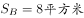，三角形A和三角形B高相等，三角形A的底边是三角形B的一半，所以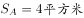，。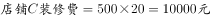。 

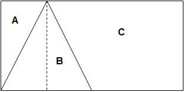

故正确答案为D。 

---

### 第 2 题　qid 2049290 · 数学运算

在一块四边形水田里，以连接四条边中点的形式划出了矩形区域种植莲藕，由此可知这块水田一定是：

- **A**. 对角线互相垂直的四边形　✅
- **B**. 菱形
- **C**. 对角线相等的四边形
- **D**. 矩形

**答案**：A

**官方解析**

所要求的结果为“连接四条边的中点后形成矩形”，简单画图可得C、D两种图形均无法形成矩形，而A、B两种图形均可以形成矩形。由下列A图可见，水田四边不一定相等，故不一定是菱形，排除B项。

故正确答案为A。

---

### 第 3 题　qid 2050716 · 数学运算

甲乙两车的出发点相距360千米，如果甲乙在上午8点同时出发，相向行驶，分别在12点和17点到达对方出发点。但两车在到达对方出发点后，分别将行驶速度降低到原来的三分之一和一半，再返回各自出发点，那么在当日18点时，甲乙相距：

- **A**. 120千米
- **B**. 160千米　✅
- **C**. 200千米
- **D**. 240千米

**答案**：B

**官方解析**

由题干得，甲乙两地相距360千米，甲上午8点出发，12点即经过4小时到达乙出发点，则甲车速度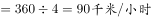；乙车8点出发，17点即经过9小时到达甲出发点，则乙车速度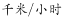。到达后甲车速度降为原来的三分之一，故，乙车速度降为原来的一半，故。18点时，甲车返回的路程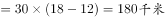，乙车返回的路程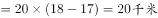，因此两车共行驶，则两车相距。

故正确答案为B。

---

### 第 4 题　qid 2049294 · 数学运算

如下图，一个正方体的表面上分别写着连续的6个整数，且每两个相对面上的两个数的和都相等，则这6个整数的和为：

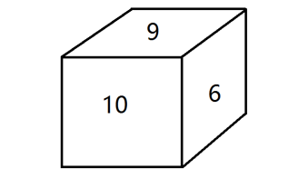

- **A**. 53
- **B**. 52
- **C**. 51　✅
- **D**. 50

**答案**：C

**官方解析**

方法一：由条件“连续6个整数”，结合图形可得，6个整数中应包含“6-10”五个数，五个数的加和为。另外一个数应为5或11，所有数之和应为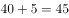或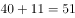，若为5则两两加和为15，但此时9和6是相邻面而不是相对面，排除；则C项满足。

方法二：由条件“每两个相对面上的两个数加和相等”，设每组相对面的数字加和为，一共3组相对面，3组相对面的总和应为，所求值应可被3整除，只有C项满足。

故正确答案为C。

---

### 第 5 题　qid 2049286 · 数学运算

在小李等车期间，有豪华型、舒适型、标准型三种旅游车随机开过。小李不知道豪华型的标准，只能通过前后两辆车进行对比。为此，小李采取的策略是：不乘坐第一辆，如果发现第二辆比第一辆更豪华就乘坐；如果不是，就乘坐最后一辆。那么，他能乘坐豪华型旅游车的概率是：

- **A**. 

　✅
- **B**. 

- **C**. 

- **D**. 

**答案**：A

**官方解析**

设标准型、舒适型、豪华型三种旅游车的代号分别为A、B、C。则三辆车依次通过的顺序有ABC、ACB、BAC、BCA、CAB、CBA六种。按照小李的策略，第一辆车不坐，如果第二辆车比第一辆豪华就坐，则ACB、BCA两种情况可以坐到豪华车；反之坐最后一辆，则BAC一种情况可以坐到豪华车。共有6种情况，其中有3种情况可以坐到豪华车，故可以坐到豪华车的概率。

故正确答案为A。

---

### 第 6 题　qid 2049274 · 数学运算

一次长跑比赛在周长为400米的环形跑道上进行。比赛中，最后一名在距离第3圈终点150米处被第1名完成超圈（即比他多跑1圈），50秒后，他又在距离第3圈终点45米处被第2名完成超圈。假定所有选手均是匀速，那么第2名速度约为：

- **A**. 
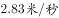
　✅
- **B**. 

- **C**. 

- **D**. 

**答案**：A

**官方解析**

由题意可得：最后一名50秒跑了米，故最后一名的速度为。从开始至被第2名超圈，最后一名跑了米；第2名跑了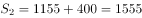米，相同时间，路程与速度成正比，即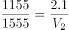，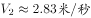。

故正确答案为A。

---

### 第 7 题　qid 2050740 · 数学运算

某饮料店有纯果汁（即浓度为）10千克，浓度为的浓缩还原果汁20千克。若取纯果汁、浓缩还原果汁各10千克倒入10千克纯净水中，再倒入10千克的浓缩还原果汁，则得到的果汁浓度为：

- **A**. 

　✅
- **B**. 

- **C**. 

- **D**. 

**答案**：A

**官方解析**

方法一：根据题干可得，一共倒入纯果汁（即浓度为）10千克，纯净水10千克，浓度为的浓缩还原果汁20千克。可知最终溶液的量为千克，根据溶质，最终溶液溶质为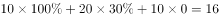千克。则最终果汁浓度。

方法二：根据题干可得，一共倒入纯果汁（即浓度为）10千克，纯净水10千克，浓度为的浓缩还原果汁20千克。先考虑纯果汁（即浓度为）10千克，纯净水10千克混合。两个溶液量相同，则混合后溶液浓度为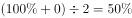，量为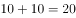千克。再将20千克的溶液与20千克浓度为的浓缩还原果汁混合。两个溶液量相同，则混合后溶液浓度为。

故正确答案为A。

---

### 第 8 题　qid 2051104 · 数学运算

商场以每件80元的价格购进了某品牌衬衫500件，并以每件120元的价格销售了400件，要达到盈利的预期目标，剩下的衬衫最多可以降价：

- **A**. 15元
- **B**. 16元
- **C**. 18元
- **D**. 20元　✅

**答案**：D

**官方解析**

，预期利润至少为。设最多可降价元，根据题意可得：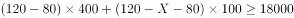，解得，因此最多为20元。

故正确答案为D。

---

### 第 9 题　qid 2049282 · 数学运算

某电信公司推出两种手机收费方式：A种方式是月租20元，B种方式是月租0元。一个月的本地网内通话时间（分钟）与电话费（元）的函数关系如图所示，当通话150分钟时，这两种方式的电话费相差：

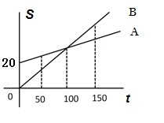

- **A**. 10元　✅
- **B**. 15元
- **C**. 20元
- **D**. 30元

**答案**：A

**官方解析**

方法一：假设A种方式每分钟电话费为元，B种方式每分钟电话费为元，根据图中100分钟，二者电话费用相等，则，即元，则150分钟时，二者电话费相差元。

方法二：如下图所示：由题意可得，三角形OMN相似于三角形PQN，N点到OM的横轴距离为100，到PQ的横轴距离为50，则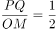，已知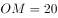，则，即两种方式的电话费相差10元。

故正确答案为A。

---

### 第 10 题　qid 2049288 · 数学运算

小王、小张、小李3人进行了多轮比赛，比赛按名次高低计分，得分均为正整数。多轮比赛结束后，小王得22分，小张和小李各得9分且小张在其中一轮比赛中获第一名。那么，三人共进行了多少轮比赛？

- **A**. 2
- **B**. 3
- **C**. 4
- **D**. 5　✅

**答案**：D

**官方解析**

由条件“每一轮的比赛按名次高低计分”，故每一轮的总得分为定值。多轮比赛结束后，三人总得分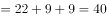分。

若进行2轮比赛，小张得了一次第一名，则第一名的得分应该小于9分。小王一共得22分，即平均每轮11分，则必有一场得分超过9分，与第一名得分应该小于9分矛盾，排除A项；

若进行3轮比赛，则总得分应为3的倍数，40不是3的倍数，排除B项；

若进行4轮比赛，则小王平均每轮分，则第一名的得分至少6分。每轮得分分，根据得分各不相同，则一到三名分别6、3、1分。还有另一种情况，若第一名至第三名的得分分别为7、2、1分，则小张至少得10分（），凑不出小王的22分（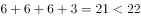），排除C项；

若进行了5轮比赛，则每轮的总得分分。假设按名次高低每人的得分分别为5、2、1分，三人得分情况可分别为：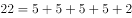，，，D项满足构造。

故正确答案为D。

---

### 第 11 题　qid 2049280 · 数学运算

如下图，正方形的迷你轨道边长为1米，1号电子机器人从点A以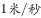的速度顺时针绕轨道移动，2号电子机器人从点A以的速度逆时针绕轨道移动，则它们的第2017次相遇在：

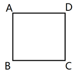

- **A**. 点A
- **B**. 点C
- **C**. 点B
- **D**. 点D　✅

**答案**：D

**官方解析**

在环形跑道相遇问题当中，相遇一次即共跑一圈。故所求“第2017次相遇”应为两人共跑了2017圈。一圈的路程。结合相遇问题公式可得：，即，解得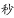。此时，1号机器人共跑了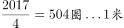。因顺时针移动，故应出现在D点位置，两人相遇。

故正确答案为D。

---

### 第 12 题　qid 2049284 · 数学运算

某兴趣组有男女生各5名，他们都准备了表演节目。现在需要选出4名学生各自表演1个节目，这4人中既要有男生、也要有女生，且不能由男生连续表演节目。那么，不同的节目安排有多少种？

- **A**. 3600
- **B**. 3000
- **C**. 2400　✅
- **D**. 1200

**答案**：C

**官方解析**

若有1个男生、3个女生表演节目，情况数为种；

若有2个男生、2个女生表演节目，先排女生，然后2个男生在女生的空中间排，情况数为种；

若有3个男生、1个女生表演节目，则一定会出现男生连续表演的情况，排除。

故总的情况数为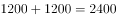种。

故正确答案为C。

---

### 第 13 题　qid 2049276 · 数学运算

下边是空心圆有规律生成的一个树形图，由此可知，第10行的空心圆的个数是：

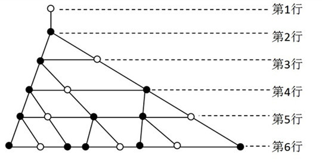

- **A**. 34
- **B**. 21　✅
- **C**. 13
- **D**. 8

**答案**：B

**官方解析**

由图中树形图可得，自上而下空心圆的数量分别是1、0、1、1、2、3，观察可知，该数列是一个求和得下一项的数列，故接下来第7-10项分别是5、8、13、21，则第10行的空心圆个数为21。
故正确答案为B。

---

### 第 14 题　qid 2050728 · 数学运算

小张、小赵购物习惯不同，小张每次购买固定量的面粉，小赵每次购买固定金额的面粉。有两次小张、小赵同时购买同一种面粉，但两次面粉的价格不同，从这两次面粉的均价角度分析：

- **A**. 小张的均价低
- **B**. 小赵的均价低　✅
- **C**. 若价格先高后低，小张的均价低
- **D**. 无法得知

**答案**：B

**官方解析**

本题没有给出单价、购买量、购买固定金额等任何一个真实的量，而答案也只是分析大小关系，不需要求出具体数值，故采用赋值法求解。

面粉价格不同，只有先高后低和先低后高两种情况。

考虑先高后低的情况，设两次面粉价格先后为10元/公斤和5元/公斤，设小张每次购买1公斤，小赵每次购买10元。则小张两次共购买了2公斤，共花了15元，均价为。小赵两次共购买了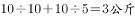，共花了20元，均价为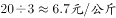。说明当价格先高后低时，小赵的均价更低。观察选项，该特例与A、C两项矛盾，排除A、C两项。

考虑先低后高的情况，设两次面粉价格先后为5元/公斤和10元/公斤，其余条件不变，会发现两人的均价依然是7.5元/公斤和6.7元/公斤，结论不变。故均价高低是可以得知的，排除D项。

故正确答案为B。

---

### 第 15 题　qid 2051392 · 数学运算

将号码分别为1、2、…6的6个小球放入一个袋中，这些小球仅号码不同，其余完全相同。首先，从袋中摸出一个球，号码为；放回后，再从此袋再摸出一个球，其号码为，则使不等式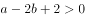成立的事件发生的概率为：

- **A**. 

- **B**. 

- **C**. 

　✅
- **D**. 

**答案**：C

**官方解析**

，由于是有放回摸球，所以全部情况有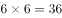种。满足情况为，整理得：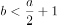，情况如下：

当时，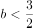，满足的号码只有1。

当时，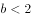，满足的号码只有1。

当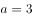时，，满足的号码有1和2。

当时，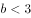，满足的号码有1和2。

当时，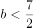，满足的号码有1、2和3。

当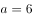时，，满足的号码有1、2和3。

一共有12种情况满足，因此。

故正确答案为C。

---

## 判断推理

### 第 1 题　qid 2050694 · 图形推理

从所给的四个选项中，选择最合适的一个填入问号处，使之呈现一定的规律性：

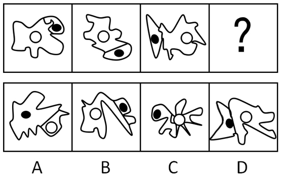

- **A**. A
- **B**. B
- **C**. C
- **D**. D　✅

**答案**：D

**官方解析**

观察题干图形发现，每幅图都有黑圆和白圆，外框被线条分隔为两个区域，且两圆都在两个不同的区域内，观察选项，只有B项的外框被线条分隔为3个区域，据此排除B项；再次观察发现，白圆所在的区域大小远远大于黑圆所在的区域大小，A项相反，C项不好确定谁的区域更大，而D项非常明显地满足白圆所在的区域远远大于黑圆，择优选择D项。
故正确答案为D。

---

### 第 2 题　qid 2050690 · 图形推理

从所给的四个选项中，选择最合适的一个填入问号处，使之呈现一定的规律性：

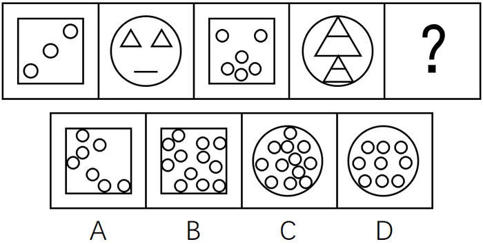

- **A**. A
- **B**. B　✅
- **C**. C
- **D**. D

**答案**：B

**官方解析**

元素组成不同，观察发现图形的外边框依次为正方形、圆形、正方形、圆形、？，故问号处应为正方形边框。排除C、D项，在正方形图形内的元素个数依次为3、6、？，圆形图形内的三角形个数为2、4，观察发现都是呈2倍递增。故问号处正方形内的元素个数为12，A项内的个数为7，排除。
故正确答案为B。

---

### 第 3 题　qid 2050684 · 图形推理

从所给的四个选项中，选择最合适的一个填入问号处，使之呈现一定的规律性：

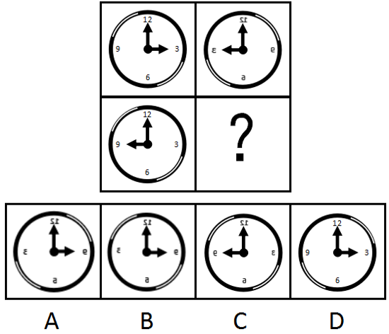

- **A**. A　✅
- **B**. B
- **C**. C
- **D**. D

**答案**：A

**官方解析**

元素组成相同，考虑位置规律。第一横行：图一左右翻转得到图二。同样，第二横行：图一左右翻转得到？处图形，所以？处时针应该指向右边，排除C。数字12应该发生左右翻转，排除D，对比A、B发现钟表的外圈圆颜色不一样，第二横行图一中的圆弧是右上黑、左下黑，左右翻转后应该是左上黑、右下黑，排除B项。
故正确答案为A。

---

### 第 4 题　qid 2049346 · 图形推理

从所给的四个选项中，选择最合适的一个填入问号处，使之呈现一定规律。

- **A**. A
- **B**. B
- **C**. C　✅
- **D**. D

**答案**：C

**官方解析**

图形元素组成不同，属性无明显规律，考虑数量规律。题干图形中面数量明显，考虑数面。题干已知图形中面的数量依次为2、4、6，则问号处的图形应为8个面，A项5个面，B项5个面，D项9个面，只有C项是8个面。
故正确答案为C。

---

### 第 5 题　qid 2050680 · 图形推理

从所给的四个选项中，选择最合适的一个填入问号处，使之呈现一定的规律性：

- **A**. A
- **B**. B
- **C**. C　✅
- **D**. D

**答案**：C

**官方解析**

元素组成相同，考虑位置规律。第一组图中第一幅图中的钥匙上下翻转得到第二幅图，同样，第二组图中把第一幅图的钥匙上下翻转得到？处图形，C项符合。
故正确答案为C。

---

### 第 6 题　qid 2049368 · 图形推理

从所给的四个选项中，选择最合适的一个填入问号处，使之呈现一定规律。

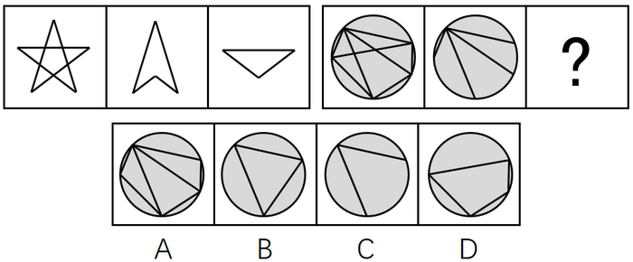

- **A**. A
- **B**. B
- **C**. C
- **D**. D　✅

**答案**：D

**官方解析**

图形元素组成相似，考虑样式规律。在前一组图形中，第一个图形减去第二个图形得到第三个图形，后一组应该满足同样的规律。因为选项中都有圆形的外框，所以我们只需要考虑内部线条的关系，符合条件的只有D项。
故正确答案为D。

---

### 第 7 题　qid 2049384 · 图形推理

从所给的四个选项中，选择最合适的一个填入问号处，使之呈现一定规律。

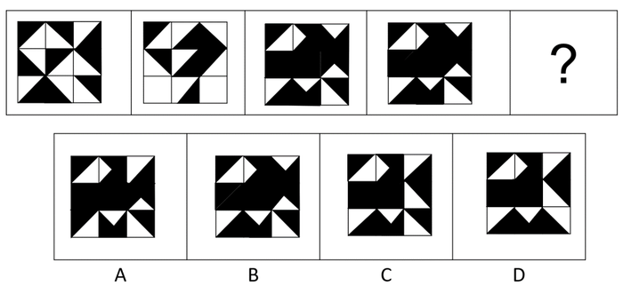

- **A**. A
- **B**. B　✅
- **C**. C
- **D**. D

**答案**：B

**官方解析**

观察图形，元素组成相似，考虑样式规律。第一个图形加上第二个图形得到第三个图形，第二个图形加上第三个图形得到第四个图形，答案应该是第三个图形与第四个图形相加。我们发现第三个图与第四个图是相同的，相加应该跟第四个图形相同。
故正确答案为B。

---

### 第 8 题　qid 2049410 · 图形推理

从所给的四个选项中，选择最合适的一个填入问号处，使之呈现一定规律。

- **A**. A
- **B**. B　✅
- **C**. C
- **D**. D

**答案**：B

**官方解析**

观察图形，元素组成不同，并且题干中的图形都是字母，可优先考虑属性规律。第一行的字母比较规整，优先考虑对称性。第一行都是竖轴对称图形，第二行都是不对称图形，第三行前两个为横轴对称图形，那答案应该也是横轴对称图形。
故正确答案为B。

---

### 第 9 题　qid 2049508 · 定义判断

机器视觉，是指通过光学的装置和非接触的传感器自动地接收和处理一个真实物体的图像，以获得所需信息或用于控制机器人运动的装置。
根据上述定义，下列选项涉及机器视觉的是：

- **A**. 扁平化的摄像头通过暗光拍摄，发现沙发底部灰尘很多，向主人发出需要清洗的红色警报　✅
- **B**. 车载智能设备在路上通过定位系统、导航系统等语音提醒司机行车路线、各路段车速限制及前方天气情况等
- **C**. 新型眼镜在主人探险进入黑暗洞穴后捕捉到大量蝙蝠发出的超声波，立刻启动了面部保护模式
- **D**. 带有拍摄装置的迷你智能机器人进入考古人员难以到达的墓穴深处，拍摄到许多珍贵图像

**答案**：A

**官方解析**

第一步：找出定义关键词。

方式：“通过光学的装置和非接触的传感器”、“自动地接收和处理真实物体的图像”。

目的：“获得信息”、“控制机器人运动”。

第二步：逐一分析选项。

A项：通过摄像头暗光拍摄，符合关键词“通过光学的装置和非接触的传感器”，发现灰尘并汇报，符合关键词“自动地接收和处理真实物体的图像”和“获得信息”，符合定义，保留；

B项：通过定位系统、导航系统等不符合关键词“通过光学的装置和非接触的传感器”，不符合定义，排除；

C项：新型眼镜接收到蝙蝠发出的超声波，不符合关键词“自动地接收和处理真实物体的图像”，不符合定义，排除；

D项：带有拍摄装置的迷你智能机器人符合关键词“通过光学的装置和非接触的传感器”，拍摄到许多珍贵图像，符合关键词“自动地接收真实物体的图像”和“获得信息”，符合定义，保留。

<b>【备注】</b>

本题属于争议题，根据以下两点原因，我们粉笔给出的倾向性答案为A。

首先题干定义的方式为“接收和处理”，A项的“发现灰尘并汇报”符合“接收和处理”，但D项的“拍摄到许多珍贵图像”，更倾向于“接收真实物体的图像”，而非“接收和处理”，D项没有A项与定义更加贴切。

其次，我们通过查找原文，如下图所示，A项就是我们常说的“扫地机器人”，它是运用了机器视觉的。

故正确答案为A。 

---

### 第 10 题　qid 2049494 · 定义判断

拟态，是指某些生物在进化过程中具有与另一种生物或周围自然界物体的相似的形态，这种相似性很高，几乎难以分辨，可以保护某一物种或两个物种。
根据上述定义，下列选项属于拟态的是：

- **A**. 海豚、企鹅和带鱼虽然分别属于鲸类、鸟类和鱼类，但为了适应海洋生活，都进化出了流线形的身体
- **B**. 北极熊生活在白雪皑皑的北极，为了掩护自己捕食时不被猎物过早发现，皮毛逐渐变成与周围环境相似的白色
- **C**. 大鲵，俗名娃娃鱼，已在地球上生活了数亿年，其受到刺激时的叫声酷似人类婴儿哭声，让人听到不忍心伤害，对一些猎食动物也有威慑作用
- **D**. 杜鹃会将与宿主卵酷似的卵产在宿主巢内，其雏鸟在孵出后不久就会将宿主雏鸟挤出巢外，独享体型只有自己一半大小的宿主父母的喂食　✅

**答案**：D

**官方解析**

第一步，找出定义关键词。
“某些生物在进化过程中具有与另一种生物或周围自然界物体的相似的形态”、“相似性很高，几乎难以分辨”、“可以保护某一物种或两个物种”。
第二步，逐一分析选项。
A项：海豚、企鹅和带鱼这三种不同的物种都具有流线形身体这一相似性，但相似性是否很高，是否难以分辨不明确，不符合定义，排除；
B项：北极熊的皮毛逐渐变为与周围的环境相似的白色，只是颜色发生变化，但形态并没有发生改变，这是北极熊的保护色，没有体现了“某些生物在进化过程中具有与另一种生物或周围自然界物体的相似的形态”，不符合定义，排除；
C项：大鲵的叫声与婴儿相似，并不是形态的相似，不符合“某些生物在进化过程中具有与另一种生物或周围自然界物体的相似的形态”，不符合定义，排除；
D项：杜鹃产的卵与宿主卵酷似，符合“相似性很高，几乎难以分辨”，将宿主雏鸟挤出巢外符合“可以保护某一物种或两个物种”，符合定义，当选。
故正确答案为D。

---

### 第 11 题　qid 2049504 · 定义判断

沉默行为是指面对管理制度或生产活动等方面的隐患，为了避免人际冲突，害怕遭受打击报复或维护自身脸面等原因而有意保留自己想法的行为。
根据上述定义，下列属于沉默行为的是：

- **A**. 小王看到同事小赵的计划书有个明显的错误而没有指出来，在接下来与小赵的评比中小王的计划方案获得通过
- **B**. 老张意识到小明最近老是上班时间唱歌已经影响到了别人工作，但考虑到他是自己的徒弟，老张不但不向领导报告，还和其他抱怨的同事争辩　✅
- **C**. 尽管小马就如何提高顾客对公司服务的满意度有见解，由于前面发言的同事已经基本谈到该问题，所以小马也就没再接着说
- **D**. 小刘尽管在新产品开发报告会上有想法，但考虑到该想法尚不成熟，贸然提出可能会影响工作进度，因此在会上也就没发表意见

**答案**：B

**官方解析**

第一步，找出定义关键词。
“面对管理制度或生产活动等方面的隐患”、“为了避免人际冲突，害怕遭受打击报复或维护自身脸面”、“有意保留自己的想法的行为”。
第二步，逐一分析选项。
A项：两人参与评比属于竞争关系，并不是“为了避免人际冲突，害怕遭受打击报复或维护自身脸面”而没有指出来，而是为了自己赢，不符合定义，排除；
B项：小明上班时间唱歌已经影响到了别人工作，属于“管理制度或生产活动等方面的隐患”，老张不向领导报告的原因是小明是自己的徒弟，说明老张是为了维护自己作为师傅的脸面，属于“为了避免人际冲突，害怕遭受打击报复或维护自身脸面”，符合定义，当选；
C项：小马没有提出见解的原因是前面发言的同事已经谈到了这个问题，并不是“为了避免人际冲突，害怕遭受打击报复或维护自身脸面”，不符合定义，排除；
D项：小刘在会上没发表意见的原因是自己想法尚不成熟，并不是“为了避免人际冲突，害怕遭受打击报复或维护自身脸面”，不符合定义，排除。
故正确答案为B。

---

### 第 12 题　qid 2049510 · 定义判断

小推车管理法是指通过把服务对象纳入到服务系统中，并挖掘服务对象潜在资源，与服务提供者共同提高管理服务水平的创新管理模式，该模式对服务提供者和服务接受者来说是一种双赢策略。
根据上述定义，下列选项属于小推车管理法的是：

- **A**. 学生家长群安排家长轮流给班级免费做清洁，学校为此节省了开支
- **B**. 某书店鼓励来购书和阅读的顾客自带小折叠凳，顾客感觉很贴心，书店的销售业绩有很大提升　✅
- **C**. 老张辞掉保姆，自己做起了家务，既锻炼了身体又节约了一笔开销
- **D**. 超市为了树立“环保、节能、负责”的企业形象，对自带环保包装袋的消费者发放电子红包

**答案**：B

**官方解析**

第一步：找出定义关键词。
方式：“把服务对象纳入到服务系统”、“挖掘服务对象潜在资源”。
目的：“与服务提供者共同提高管理服务水平”、“对服务提供者和接受者来说是双赢”。
第二步：逐一分析选项。
A项：学校的服务对象应该是“学生”，而非学生家长，不符合关键词“把服务对象纳入到服务系统”，不符合定义，排除；
B项：书店的服务对象是“顾客”，鼓励他们自带小折叠凳，符合关键词“把服务对象纳入到服务系统”、“挖掘服务对象潜在资源”，顾客觉得贴心，书店销售业绩提高，符合关键词“对服务提供者和接受者来说是双赢”，符合定义，当选；
C项：只提到了老张一个人，只是他有双重身份，既是服务提供者也是接受者，不满足关键词“把服务对象纳入到服务系统”，不符合定义，排除；
D项：超市对自带包装袋的消费者发放电子红包，消费者获利了，但是超市的环保形象有没有树立成功，并不知道，没有B项直接明确，排除。
故正确答案为B。

---

### 第 13 题　qid 2050714 · 定义判断

正式学习，是指学习者在教师的组织和引导下有目的、有计划地开展以接受间接知识为内容的学历或非学历教育学习活动。
根据上述定义，下列属于正式学习的是：

- **A**. 公司为了新员工能顺利上岗，提供了形式多样的经验交流渠道供员工自由选择学习
- **B**. 小王给儿子播放了《动物世界》等节目，无形中儿子学习到了很多生物、地理知识
- **C**. 小宝对学校课堂学习提不起兴趣，后来被父母送到少林寺武校学习武术
- **D**. 保安小牛利用免费网络公开课，系统学习了法律知识并通过了司法考试，如愿成为了一名律师　✅

**答案**：D

**官方解析**

第一步，找出定义关键词。
“学习者在教师的组织和引导下”、“有目的、有计划”、“接受间接知识的教育学习活动”。
第二步，逐一分析选项。
A项：提供形式多样的经验交流渠道供员工自由学习，没有教师的组织和引导，不符合定义，排除；
B项：小王给儿子播放《动物世界》等节目，没有教师的组织和引导，不符合定义，排除；
C项：“小宝对学校课堂学习提不起兴趣，后来被父母送到少林寺武校学习武术”没有体现目的，不明确，保留；
D项：保安小牛利用免费网络公开课系统学习了法律知识并通过了司法考试，符合“学习者在教师的组织和引导下有计划的学习”，如愿成为了一名律师，说明保安小牛学习的目的是为了做律师，符合定义，保留。
比较C、D选项，D选项比C选项更加明确符合定义。
故正确答案为D。

---

### 第 14 题　qid 2049506 · 定义判断

逆向激励是指政策设计初衷与实际执行效果呈现“事与愿违”的现象，逆向激励效应一旦被激发，不仅会导致现状恶化，损害政策制定者的信用，还将进一步强化相关负面后果，最终造成恶性循环。
根据上述定义，下列不属于逆向激励的是：

- **A**. 为了扭转治安问题，上世纪美国颁布了禁酒令，然而酒的销量不跌反升，而且由此又引发了新的犯罪问题
- **B**. 宋神宗为了整肃吏治、严明司法审判，下令凡是能找到错判事实的官员官升一级，结果这项举措却成了新旧官员相互攻讦的武器
- **C**. 为了更有利孩子成长而提供优裕的物质条件，然而却让其养成了好逸恶劳的恶习
- **D**. 老师在课堂上通过有意对害羞学生提问而帮助其克服容易紧张的问题　✅

**答案**：D

**官方解析**

第一步，找出定义关键词。
“政策设计初衷与实际执行效果呈现事与愿违的现象”、“导致现状恶化，强化了相关负面后果，造成恶性循环”。
第二步，逐一分析选项。
A项：为扭转治安问题颁布禁酒令，但酒的销量不降反升，符合“实际执行效果呈现事与愿违”，引发新的犯罪问题符合“现状恶化”，符合题干定义，排除；
B项：“为了整肃吏治、严明司法审判”是该项政策的设计初衷，新旧官员互相攻讦的武器符合“实际执行效果呈现事与愿违”并且“强化了相关负面后果”，符合题干定义，排除；
C项：“为了更有利于孩子成长”是设计初衷，“孩子养成了好逸恶劳的恶习”，符合“实际执行效果呈现事与愿违”并且“强化了相关负面后果”，符合题干定义，排除；
D项：“老师提问害羞的孩子帮助其克服容易紧张的问题”是设计初衷，但是没有说明实际执行效果是否出现事与愿违的现象，不符合题干定义，当选。
本题为选非题，故正确答案为D。

---

### 第 15 题　qid 2049512 · 定义判断

流量，是指单位时间内通过特定表面的流体（液体或气体）的量（体积或质量）。当流体量以体积表示时称为体积流量；当流体量以质量表示时称为质量流量。
根据上述定义，下列选项含有对体积流量描述的是：

- **A**. 亚马逊河蜿蜒6440千米，流域面积达691.5万平方公里，每年注入大西洋的水流占世界河流注入大洋总量的六分之一
- **B**. 日本暖流在台湾岛东面的外海处，其宽度约有100～200千米，深200米，最大流速每昼夜可达60～90千米
- **C**. 维多利亚大瀑布位于非洲赞比亚和津巴布韦接壤区，在赞比西河河水充盈时，会有每秒7500立方米的水汹涌越过　✅
- **D**. 里海位于欧亚内陆交界处，是世界上最大的咸水湖，拥有130条入海河流，也因此蓄水量达到了7.6万平方千米

**答案**：C

**官方解析**

第一步：找出定义关键词。
流量：“单位时间内通过特定表面的流体（液体或气体）的量（体积或质量）”。
体积流量：“流体量以体积表示”。
第二步：逐一分析选项。
A项：提到了长度的单位“千米”、流域面积的单位“平方公里”，不符合“流体量以体积表示”，不符合定义，排除；
B项：提到了宽度的单位“千米”、深度的单位“米”、最大流速的单位“千米”， 不符合“流体量以体积表示”，不符合定义，排除；
C项：提到的“立方米”是一个体积单位，符合“流体量以体积表示”，符合定义，当选；
D项：提到的“平方千米”是一个面积单位，不符合“流体量以体积表示”，不符合定义，排除。
故正确答案为C。

---

### 第 16 题　qid 2049498 · 定义判断

谶纬之学即对未来的一种政治预言，谶纬本身并不是科学的，但受现实条件的局限，常被人们利用。
根据上述定义，下列利用了谶纬之学的是：

- **A**. 大泽乡起义前，吴广在深夜模仿狐狸的声音大喊“大楚兴，陈胜王”　✅
- **B**. 汉武帝在位期间拓西域，退匈奴，史学家们将“武”字巧妙地诠释为“止戈为武”，以此来称赞他为华夏赢得平稳发展时间的历史功绩
- **C**. 国外一些不法分子编写预言某时某地将发生地质灾难的藏头诗并发布在网络上，以达到扰乱民心的效果
- **D**. 某位老人在家中财物被盗之后将自己的遭遇告诉了老李，老李看了老人手相后表示他还有大难，需要破财才能化解

**答案**：A

**官方解析**

第一步，找出定义关键词。
“对未来的一种政治预言”、“本身并不是科学的”、“受现实条件的局限，常被人们利用”。
第二步，逐一分析选项。
A项：“大楚兴，陈胜王”是在起义前出现的，并且起义是政治活动，体现了“对未来的一种政治预言”和“本身并不是科学的”，符合定义，当选；
B项：史学家们给汉武帝在位期间的功绩作出了极高的称赞和评价，这是对已发生事情的评价，不符合“对未来的一种政治预言”，不符合定义，排除；
C项：编写预言符合“对未来预测”，但是预言内容是地质灾难，不是政治内容或者活动，不符合定义，排除；
D项：老李给某位老人看手相符合“对未来预测”，但是预言内容是老人自身的灾难，不是政治内容或者活动，不符合定义，排除。
故正确答案为A。

---

### 第 17 题　qid 2049500 · 定义判断

镶嵌，是指为了把话说得轻缓或郑重些，有时故意用几个无关紧要的字有规则地镶在一个词或语句里，一般以镶加虚词和数词最为常见。它可分为镶字、嵌字和拼字三类。镶字，指在词语中插进别的词以延长音节或强调语意，以镶加虚字和数字最为常见；嵌字，指将一句话或一组相关的词语分散插入不同的语句之中，使其隐晦曲折，精巧风趣，发人深思；拼字，指将联合词组中的两个词或合成词中的两个语素分开来间错使用。
根据上述定义，下列属于拼字的是：

- **A**. 他比我学问高，但办起事来，我不输他一丝一毫
- **B**. 现在呀，老百姓过日子还是会精打细算、前思后想　✅
- **C**. 一去二三里，烟村四五家，亭台六七座，八九十枝花
- **D**. 他们这一路嘻嘻哈哈、打打闹闹的，真是人老心不老啊

**答案**：B

**官方解析**

第一步：找出定义关键词。
镶字：“词语中插进别的词”、“延长音节或强调语意”；
嵌字：“一句话或一组相关的词语”、“分散插入不同的语句之中”；
拼字：“联合词组、合成词”、“两个词或语素分开间错使用”。
第二步：逐一分析选项。
A项：“一丝一毫”只是在丝毫之间添加了数词“一”，属于镶字，不符合定义，排除；
B项：“精打细算”是将“精细”和“打算”这两个词分开间错来使用，“前思后想”是将“前后”和“思想”两个词分开间错来使用，符合定义，当选；
C项：“二三、四五、六七、八九十”是数词，将这几个数词插进了别的词中，属于镶字，不符合定义，排除；
D项：“嘻嘻哈哈”和“打打闹闹”，是将“嘻哈”和“打闹”两个词重复使用，并没有分开间错使用，不符合定义，排除。
故正确答案为B。

---

### 第 18 题　qid 2049502 · 定义判断

隐性饥饿，是指机体由于营养不平衡或者缺乏某种维生素及人体必需矿物质，同时又存在其他营养成分过度摄入，从而产生隐蔽性营养需求的饥饿症状。
根据上述定义，下列属于隐性饥饿的是：

- **A**. 陈大爷下定决心节食，他最近以青菜和苹果代替主食，不沾油荤，终于有一天因饥饿难耐晕倒在地
- **B**. 小白为了获得健美身材，坚持每日六餐，每餐分量很少，分别含有主食、蔬果、蛋奶等，但同时高强度的健身训练还是让他浑身酸痛、疲惫不堪
- **C**. 王大爷因为肠胃虚弱，以清粥热汤作为主要饮食养生，不常吃大鱼大肉和生冷瓜果，后来因饮食缺少蛋白质和维他命而导致记忆力减退　✅
- **D**. 小李喜欢高盐、高糖分、高热量的垃圾食品，对医生的劝说无动于衷，在数年后的体检中发现自己存在高血糖、高血脂、高血压等问题

**答案**：C

**官方解析**

第一步：找到定义关键词。
原因：营养不平衡或缺乏某种维生素及必需矿物质，同时其他营养成分过度摄入。
结果：产生隐蔽性营养需求的饥饿症状。
第二步：逐一分析选项。
A项：陈大爷以青菜和苹果代替主食，不沾油荤，并没有体现缺乏某种维生素及人体必需矿物质，而是将饥饿症状表现了出来，不属于隐蔽性营养需求的饥饿症状，不符合定义，排除；
B项：小白是因为高强度的健身训练导致疲惫不堪，并没有体现出营养不平衡或其他营养成分过度摄入而产生饥饿症状，不符合定义，排除；
C项：王大爷因饮食缺少蛋白质和维他命导致记忆力减退，说明其机体营养不平衡且缺乏必需矿物质，记忆力减退属于隐蔽性饥饿症状，符合定义，当选；
D项：小李是盐、糖、热量摄入过度，但没有体现其营养不平衡或缺乏维生素或必需矿物质，不符合定义，排除。
故正确答案为C。

---

### 第 19 题　qid 2050726 · 定义判断

触景生情是指受到某些情景的触动而产生某种情感；触景伤情是指受到某些情景的触动，而产生某种悲伤的情感。
根据上述定义，下列诗句符合触景伤情定义的有：
①老去风光不属身，黄金莫惜买青春 ②游丝一断浑无力，莫向东风怨别离
③葛岭花开二月天，游人来往说神仙 ④伤心桥下春波绿，曾是惊鸿照影来
⑤杨柳共春旗一色，落花与芝盖同飞 ⑥笑渐不闻声渐悄，多情却被无情恼
⑦劝君更尽一杯酒，西出阳关无故人 ⑧最是人间留不住，朱颜辞镜花辞树

- **A**. 0个
- **B**. 1个
- **C**. 2个
- **D**. 3个　✅

**答案**：D

**官方解析**

第一步：找出定义关键词。
受到某些情景的触动，而产生某种悲伤的情感。
第二步：逐一分析各个诗句。
①作者雍陶的《劝行乐》意思是当你老去的时候，虚名不属于你自己，这里青春指的是时间，做些有意义的事情，没有描写具体的景物，且后半句也只是劝人要爱护时间，不符合定义，排除；
②此诗句是《红楼梦》里探春命运的写照，远离家人远嫁他乡，亲情被割断，一个人孤孤单单天水飘摇，无法选择自己的归宿，就像一只风筝一样，充满悲伤情怀，用“风筝”之景描写探春命运，符合定义；
③这是袁枚的《湖上杂诗》意思是二月份葛岭花开了,来来往往的游客都在谈论神仙的事情，具体描写了景物，没有体现作者的悲伤情感，不符合定义，排除；
④这是陆游七十五岁时重游沈园（在今浙江绍兴）写下的悼亡诗《沈园》，意思是那座令人伤心的桥下，春水依然碧绿，当年这里我曾经见到她美丽的侧影惊鸿一现，作者看到情景触发了悲伤情感，符合定义；
⑤这是庾信的《三月三日华林园马射赋》王勃仿照本句写出落霞与孤鹜齐飞,秋水共长天一色,都是描写环境的上乘之作,讲究一个意境，没有体现悲伤的情感，不符合定义，排除；
⑥苏轼的《蝶恋花》墙里佳人的笑声慢慢越变越小，墙外的行人再也听不见了。多情的行人得不到回应，不由感到沮丧，为佳人的无情所懊恼，表现了悲伤的情感，符合定义；
⑦唐朝大诗人王维的《送元二使安西》再干了这杯酒吧,出了阳关,可就再也见不到老朋友了。这两句诗是诗人在一位朋友要去安西时所作的诗,表达了作者与友人依依惜别的神情，依依惜别不能等同于悲伤，不符合定义；
⑧王国维的一首词《蝶恋花》人逐渐老去，照镜子的时候已找不到年轻时候的脸庞；花谢了，纷纷从树枝上掉落下来，这些才最是人世间所不可挽回的自然规律的表现。这句话充分表达了作者对于岁月蹉跎催人老的感慨和无奈之情，表达的并非悲伤之情，不符合定义。
综上，诗句②④⑥符合定义触景伤情的定义，即符合触景伤情定义的诗句有3个。
故正确答案为D。

---

### 第 20 题　qid 2049486 · 定义判断

机械类比，就是将两个本质不同的事物，按其表面的相似来机械地加以比较而得出某些结论。
根据上述定义，下列不属于机械类比的是：

- **A**. 百姓无粟米充饥，何不食肉糜
- **B**. 无情最是台城柳，依旧烟笼十里堤
- **C**. 子子孙孙无穷匮也，而山不加增，何苦而不平　✅
- **D**. 西施病心而颦其里，其里之丑人见而美之，归亦捧心而颦其里

**答案**：C

**官方解析**

第一步，找出定义关键词。
“两个本质不同的事物”、“按其表面的相似来机械地加以比较而得出某些结论”。
第二步，逐一分析选项。
A项：“百姓无粟米充饥，何不食肉糜”意思是百姓肚子饿没米饭吃，为什么不去吃肉粥呢。 “粟米”和“肉糜”本质不同，符合“两个本质不同的事物”；二者都是食物，却没有考虑到百姓的现实生活条件，就认为百姓没米吃可以去吃肉粥，符合“按其表面的相似来机械地加以比较而得出某些结论”，符合定义，排除；
B项：“无情最是台城柳，依旧烟笼十里堤”的意思是大唐帝国江河日下，最无情的还是台城外的垂柳，依旧轻烟般地笼罩十里长堤。“台城柳”和“轻烟”本质不同，符合“两个本质不同的事物”；柳条和轻烟都很轻柔，却没有考虑到二者物理性质不同，就认为垂柳也会像轻烟一样笼罩着长堤，符合“按其表面的相似来机械地加以比较而得出某些结论”，符合定义，排除；
C项：“子子孙孙无穷匮也，而山不加增，何苦而不平”意思是子子孙孙没有穷尽，然而山却不会加大增高，愁什么山挖不平？“子孙”和“山”本质不同，符合“两个本质不同的事物”；但得出结论时并未提及二者表面相似性，不符合“按其表面的相似来机械地加以比较而得出某些结论”，不符合定义，当选；
D项：“西施病心而颦其里，其里之丑人见而美之，归亦捧心而颦其里”意思是西施患心口痛的病，难受地皱起了眉头走过乡里。乡里有个丑女人认为这样很美，也模仿西施，故意按着胸口，皱着眉头，走过乡里。“西施”和“丑人”，本质不同，符合“两个本质不同的事物”；二者都是人，丑人却没有考虑到两人相貌不同，就认为西施这么做好看，自己这么做也会好看，符合“按其表面的相似来机械地加以比较而得出某些结论”，符合定义，排除。
本题为选非题，故正确答案为C。

---

### 第 21 题　qid 2049342 · 类比推理

词典：词语

- **A**. 地图：地点　✅
- **B**. 盲文：阅读
- **C**. 电影：台词
- **D**. 电脑：游戏

**答案**：A

**官方解析**

第一步：判断题干词语间逻辑关系。
词典是查询词语的工具，词语是名词。二者是逻辑关系中的对应关系。
第二步：判断选项词语间逻辑关系。
A项：地图是查询地点的工具，地点是名词。二者是逻辑关系中的对应关系，与题干逻辑关系一致，当选；
B项：盲文是一种特殊形式的文字，可以作为盲人阅读的对象，但是阅读是动词，与题干逻辑关系不一致，排除；
C项：电影包含台词和剧情等等，是组成关系，不是对应关系，与题干逻辑关系不一致，排除；
D项：电脑可以用来打游戏，是打游戏的工具，可以说电脑查询资料、文献等，但是不能说查询游戏，与题干逻辑关系不一致，排除。
故正确答案为A。

---

### 第 22 题　qid 2049364 · 类比推理

美丽：沉鱼落雁

- **A**. 独特：举世无双　✅
- **B**. 灵活：身手敏捷
- **C**. 厌恶：嗤之以鼻
- **D**. 粗心：三心二意

**答案**：A

**官方解析**

第一步：判断题干词语间逻辑关系。
沉鱼落雁，鱼见之沉入水底，雁见之降落沙洲，可以形容女子容貌极其美丽。沉鱼落雁比美丽的程度更深。
第二步：判断选项词语间逻辑关系。
A项：举世无双，是指全世界找不到第二个，可以形容人或事物极其独特。举世无双比独特的程度更深，与题干逻辑关系一致，当选；
B项：灵活可以形容敏捷，不呆板。灵活和身手敏捷并不存在程度上的差异，且身手敏捷并非成语，而题干第二个词为成语，因此与题干逻辑关系不一致，排除；
C项：嗤之以鼻，用鼻子吭声冷笑，表示轻蔑，不能用来形容厌恶，与题干逻辑关系不一致，排除；
D项：三心二意，又想这样又想那样，犹豫不定。常指不安心，不专一，不能用来形容粗心，与题干逻辑关系不一致，排除。
故正确答案为A。

---

### 第 23 题　qid 2049352 · 类比推理

儿童：女童：未成年

- **A**. 房屋：桥梁：建筑
- **B**. 小狗：狗崽：犬　✅
- **C**. 佐料：酱油：调料
- **D**. 植物油：椰子油：菜籽油

**答案**：B

**官方解析**

第一步：判断题干词语间逻辑关系。
女童是儿童的一种，二者是种属关系。未成年是指未满十八周岁，儿童是未成年人，二者是种属关系。
第二步：判断选项词语间逻辑关系。
A项：房屋和桥梁是并列关系，房屋和桥梁二者并列与建筑是种属关系，与题干逻辑关系不一致，排除；
B项：狗崽是指刚出生的狗，与小狗是种属关系，小狗是犬的一种，二者也是种属关系，与题干逻辑关系一致，当选；
C项：酱油是调料的一种，与调料是种属关系，调料是指调味用的佐料，调料与佐料是种属关系，但与题干顺序不同，与题干逻辑关系不一致，排除；
D项：椰子油是植物油的一种，二者是种属关系，菜籽油是植物油的一种，二者也是种属关系，但与题干顺序不同，与题干逻辑关系不一致，排除。
故正确答案为B。

---

### 第 24 题　qid 2049378 · 类比推理

储存：光盘：硬盘

- **A**. 晾晒：绳索：衣架
- **B**. 吃饭：钢叉：锅铲
- **C**. 书写：签字笔：毛笔　✅
- **D**. 游泳：泳圈：泳衣

**答案**：C

**官方解析**

第一步：判断题干词语间逻辑关系。
光盘和硬盘两者是并列关系，主要功能都是储存数据，光盘和硬盘与储存是功能对应关系。
第二步：判断选项词语间逻辑关系。
A项：绳索和衣架两者是并列关系，衣架的主要功能是晾晒衣物，而绳索的主要功能是连接、牵引，不是晾晒，与题干逻辑关系不一致，排除；
B项：钢叉和锅铲两者是并列关系，钢叉的主要功能是协助吃饭，而锅铲的主要功能是炒菜，与题干逻辑关系不一致，排除；
C项：签字笔和毛笔两者是并列关系，主要功能是书写文字，签字笔和毛笔与书写是功能对应关系，与题干逻辑关系一致，当选；
D项：泳圈和泳衣两者是并列关系，泳圈的主要功能是协助游泳，泳衣是指游泳时专用的衣服，与题干逻辑关系不一致，排除。
故正确答案为C。

---

### 第 25 题　qid 2049426 · 类比推理

机密：保密：安全

- **A**. 肥胖：健身：成长
- **B**. 无知：学习：追赶
- **C**. 落后：努力：进步　✅
- **D**. 乐观：笑话：开朗

**答案**：C

**官方解析**

第一步：判断题干词语间逻辑关系。
机密形容重要的秘密，保密是指保护秘密不被泄露，保密是为了让机密的事物能够安全，安全是保密的目的。
第二步：判断选项词语间逻辑关系。
A项：健身是一种体育运动，健身是为了让肥胖的身体能够健康，与成长不对应，与题干逻辑关系不一致，排除；
B项：学习是为了让无知的人获得知识或技能，与追赶不对应，与题干逻辑关系不一致，排除；
C项：努力是让落后的事物能够进步，进步是努力的目的，与题干逻辑关系一致，当选；
D项：笑话有讥笑、讽刺的意思，开朗不是笑话的目的，与题干逻辑关系不一致，排除。
故正确答案为C。

---

### 第 26 题　qid 2049414 · 类比推理

火：火热

- **A**. 土：土气
- **B**. 水：水润　✅
- **C**. 金：金黄
- **D**. 木：木讷

**答案**：B

**官方解析**

第一步：判断题干词语间逻辑关系。
“火”是五行之一，“火”具有“火热”的必然属性，二者为属性对应关系。
第二步：判断选项词语间逻辑关系。
A项：“土”是五行之一，但“土气”不是“土”的属性，与题干逻辑关系不一致，排除；
B项：“水”是五行之一，且“水”具有“水润”的必然属性，与题干逻辑关系一致，当选；
C项：“金”是五行之一，但这里的“金”泛指一切金属，金属有很多种颜色，所以“金黄”并非“金”的必然属性，与题干逻辑关系不一致，排除；
D项：“木”是五行之一，但“木讷”不是“木”的属性，与题干逻辑关系不一致，排除。
故正确答案为B。
注：五行包括：金、木、水、火、土。

---

### 第 27 题　qid 2050698 · 类比推理

少小离家：老大回乡

- **A**. 日落而息：日出而作　✅
- **B**. 今日高歌：明朝忧愁
- **C**. 三日打鱼：两天晒网
- **D**. 春种秋收：夏耕冬藏

**答案**：A

**官方解析**

第一步：判断题干词语间逻辑关系。
“少小”与“老大”是反义关系，“离家”与“回乡”也是反义关系。
第二步：判断选项词语间逻辑关系。
A项：“日落”与“日出”是反义关系，“而息”与“而作”也是反义关系，与题干逻辑关系一致，当选；
B项：“今日”与“明朝”不是反义关系，“高歌”和“忧愁”也不是反义关系，与题干逻辑关系不一致，排除；
C项：“三日”与“两天”不是反义关系，与题干逻辑关系不一致，排除；
D项：“春种”与“夏耕”不是反义关系，是事件的先后顺序，与题干逻辑关系不一致，排除。
故正确答案为A。

---

### 第 28 题　qid 2049392 · 类比推理

旅行：交通

- **A**. 生活：工作
- **B**. 吃饭：食物　✅
- **C**. 睡觉：休息
- **D**. 病愈：康复

**答案**：B

**官方解析**

第一步：判断题干词语间逻辑关系。
交通是旅行的必要条件。
第二步：判断选项词语间逻辑关系。
A项：工作是生活的一部分，但并不是生活的必要条件，与题干逻辑关系不一致，排除；
B项：食物是吃饭的必要条件，与题干逻辑关系一致，当选；
C项：睡觉是休息的一种方式，两者是种属关系，与题干逻辑关系不一致，排除；
D项：病愈和康复两者是近义词，与题干逻辑关系不一致，排除。
故正确答案为B。

---

### 第 29 题　qid 2049404 · 类比推理

猪肉：肥肉：脂肪

- **A**. 电视机：遥控器：辐射
- **B**. 树木：树叶：叶绿素　✅
- **C**. 蜜蜂：蜂蜜：糖分
- **D**. 花朵：花蕊：花香

**答案**：B

**官方解析**

第一步：判断题干词语间逻辑关系。
猪肉包含肥肉，肥肉是猪肉的一部分，二者是组成关系；肥肉包含脂肪，脂肪也是肥肉的组成部分，二者是组成关系。
第二步：判断选项词语间逻辑关系。
A项：电视机与遥控器是对应关系，与题干逻辑关系不一致，排除；
B项：树叶是树木的组成部分，二者是组成关系，叶绿素又是树叶的组成部分，二者是组成关系，与题干逻辑关系一致，当选；
C项：蜜蜂产出蜂蜜，二者是对应关系，与题干逻辑关系不一致，排除；
D项：花蕊是花朵的组成部分，二者是组成关系，但花香是花朵产生的香气，与花蕊无法构成组成关系，与题干逻辑关系不一致，排除。
故正确答案为B。

---

### 第 30 题　qid 2049408 · 类比推理

爸爸：叔父：兄弟

- **A**. 哥哥：婶婶：夫妻
- **B**. 妈妈：嫂子：婆媳　✅
- **C**. 姨妈：伯伯：兄妹
- **D**. 奶奶：姑姑：子女

**答案**：B

**官方解析**

第一步：判断题干词语间逻辑关系。
“叔父”是“爸爸”的弟弟，叔父与爸爸是兄弟关系。
第二步：判断选项词语间逻辑关系。
A项：婶婶是父亲的弟弟的妻子，与哥哥并不是夫妻关系，与题干逻辑关系不一致，排除；
B项：嫂子是哥哥的妻子，妈妈与嫂子是婆媳关系，与题干逻辑关系一致，当选；
C项：姨妈是母亲的姐姐或妹妹，伯伯是父亲的哥哥，姨妈和伯伯二者不是兄妹关系，与题干逻辑关系不一致，排除；
D项：姑姑是父亲的姐妹，奶奶与姑姑是母女关系，与子女一词不对应，与题干逻辑关系不一致，排除。
故正确答案为B。

---

### 第 31 题　qid 2049418 · 类比推理

为虎添翼：如虎添翼

- **A**. 好为人师：善为人师　✅
- **B**. 一字不差：一字不落
- **C**. 无所不至：无所不知
- **D**. 耸人听闻：骇人听闻

**答案**：A

**官方解析**

第一步：判断题干词语间逻辑关系。
为虎添翼是指替老虎加上翅膀，比喻帮助坏人，增加恶人的势力。如虎添翼如同老虎长了翅膀，比喻强大的事物更加强大了，二者虽不是近义关系，但都是围绕同一个事件，表达了不同的意思，且为虎添翼是贬义词。
第二步：判断选项词语间逻辑关系。
A项：好为人师是指喜欢做别人的老师，形容不谦虚，自以为是，爱摆老资格，喜欢以教育者自居。善为人师是指善于做别人的老师，二者不是近义关系，同样也是围绕“为人师”这件事表达了不同的意思，且好为人师是贬义词，与题干逻辑关系一致，当选；
B项：一字不差是指一个字也没有更改，与原文雷同。一字不落是指整篇文章都仔细逐字逐句地阅读或背诵，一个字也不落下，二者是近义关系，与题干逻辑关系不一致，排除；
C项：无所不至与无所不知不是近义关系，但无所不至是指没有不到的地方，也指什么坏事都做绝了，无所不知是说什么事情都知道，二者并不是围绕同一件事表达不同的意思，与题干逻辑关系不一致，排除；
D项：耸人听闻和骇人听闻都是形容使人十分吃惊，二者是近义关系，与题干逻辑关系不一致，排除。
故正确答案为A。

---

### 第 32 题　qid 2050696 · 类比推理

报纸：新闻：时效

- **A**. 饭店：食物：口感
- **B**. 电视：广告：效果　✅
- **C**. 车站：汽车：速度
- **D**. 展会：照片：像素

**答案**：B

**官方解析**

第一步：判断题干词语间逻辑关系。
报纸是新闻的载体，新闻有时效性，题干为对应关系。
第二步：判断选项词语间逻辑关系。
A项：饭店是售卖食物的场所，与题干逻辑关系不一致，排除；
B项：电视是广告的载体，广告有效果，为对应关系，与题干逻辑关系一致，当选；
C项：车站是汽车停泊的场所，不是载体，与题干逻辑关系不一致，排除；
D项：展会不是照片的载体，照片是展会展示的一种形式，像素的高低决定照片的清晰度，与题干逻辑关系不一致，排除。
故正确答案为B。

---

### 第 33 题　qid 2049454 · 逻辑判断

据报道，国际上有不少科学家声称，在新西兰周围发现了一块名为“西兰洲”的新大陆，它符合大洲认定标准的全部要求，是世界第八大洲，相信在不久的将来，各国的地理课本将会被改写。
得出“各国的地理课本将会被改写”的结论必须基于的前提是：

- **A**. 各国地理课本会因为“大陆”“大洲”等相关知识内容变化而改写　✅
- **B**. 认定大洲的标准具有权威性，并且在课本发行前不会改变
- **C**. 各国地理课本目前没有关于“世界第八大洲”的任何内容
- **D**. 各国地理课本本身都有关于“大陆”“大洲”等的内容

**答案**：A

**官方解析**

第一步：找出论点和论据。
 论点：相信在不久的将来，各国的地理课本将会被改写。
 论据：在新西兰周围发现了一块名为“西兰洲”的新大陆，它符合大洲认定标准的全部要求，是世界第八大洲。
 第二步：逐一分析选项。
 A项：各国的地理课本会因为“大陆”“大洲”等相关知识的内容变化而改写，建立了论点与论据之间的联系，搭桥项，保留；
 B项：强调认定大洲的标准具有权威性，证明论据“该大陆符合大洲认定标准的全部要求”具有可靠性，补充论据，保留；
 C项：各国地理课本目前没有关于“世界第八大洲”的任何内容，与发现新大洲，地理课本是否会被改写无关，无关选项，排除；
 D项：各国地理课本本身都有关于“大陆”“大洲”等的内容，与发现新大洲，地理课本是否会被改写无关，无关项，排除。
对比A、B两项，搭桥的加强力度大于补充论据，因此A项加强力度更大。
 故正确答案为A。

---

### 第 34 题　qid 2049394 · 逻辑判断

某考生正在填报志愿，有法律、管理、经济、金融、审计和会计6个专业是考虑填报的专业，但是综合各方面因素，有如下的考虑：
如果填报法律专业，那么就不填报管理专业，但要填报会计专业；
只有不填报审计专业时，才填报金融或经济专业；
如果不填报经济专业，那么也不填报会计专业；
法律专业一直是自己想读的专业，一定要填。
由此可以推出该考生：

- **A**. 填报了金融和经济专业
- **B**. 管理专业和经济专业都没填报
- **C**. 填报了法律专业，还填报了金融专业
- **D**. 填报了会计专业，但没填报审计专业　✅

**答案**：D

**官方解析**

第一步：先翻译题干。 

 ①法律专业管理专业且会计专业；

 ②金融或经济专业审计专业；

 ③经济专业会计专业；

 ④一定填报法律专业。

 第二步：根据题干条件分析选项。

 根据④①可以得出：考生填报法律、会计专业，不填报管理专业；根据③否后推否前，考生填报了会计专业，那也应该填报了经济专业；再根据②得出：考生没有填报审计专业。综合上述结论为：考生填报了法律、会计、经济专业，没有填报管理、审计专业，金融专业不确定。把结论代入选项，D项正确。

 故正确答案为D。

---

### 第 35 题　qid 2049458 · 逻辑判断

目前，英国科学家提出一种观点，认为海绵这种没有大脑，甚至没有任何神经细胞，在地球生活了数亿年的动物在远古时代也曾经拥有神经细胞，但在随后的进化中放弃掉了。
如果以下各项为真，最能支持上述观点的是：

- **A**. 海绵拥有打造神经系统所需要的基因，而对于海绵来说，无论是大脑还是简单的神经系统，都可能是“累赘”，是对能量的浪费　✅
- **B**. 现在研究发现，拥有复杂神经系统的栉水母，才是其他所有动物的“姊妹群”，是动物祖先的最佳代表
- **C**. 已知年代最久远的拥有复杂大脑的动物出现时间远远早于海绵，它们拥有精密的类大脑结构，并拥有专门的神经网络
- **D**. 一些寄生虫与它们的近亲相比，就因为寄生这种生活方式失去了复杂的神经系统；而海绵与它们的近亲相比，生活方式类似于寄生

**答案**：A

**官方解析**

第一步：找出论点和论据。
 论点：海绵这种没有大脑，甚至没有任何神经细胞，在地球生活了数亿年的动物在远古时代也曾经拥有神经细胞，但在随后的进化中放弃掉了。
 论据：无。
 第二步：逐一分析选项。
 A项：海绵拥有打造神经系统所需要的基因，但大脑或简单的神经系统对于海绵来说都是“累赘”，是对能量的浪费，所以在进化的过程中可能会放弃大脑与神经系统，补充论据，当选；
 B项：题干讨论的是海绵，B项讨论的是拥有复杂神经系统的栉水母，为无关项，排除；
 C项：最久远的拥有复杂大脑的动物出现时间早于海绵，与海绵是否拥有大脑无关，为无关项，排除；
 D项：寄生这种生活方式使寄生虫失去了复杂的神经系统，海绵的生活方式类似于寄生，但是海绵是否因此失去神经系统不明确，为不明确选项，排除。
故正确答案为A。
【文段出处】《有些动物的大脑为何丢了？浪费能量无作用》

---

### 第 36 题　qid 2049350 · 逻辑判断

没有出席今晚宴会的人，要么没有被邀请，要么没有时间。
据此，可以推出：

- **A**. 被邀请的即使有时间也不一定出席今晚宴会
- **B**. 有时间且被邀请的不会参加今晚宴会
- **C**. 没被邀请的也不一定不出席今晚宴会　✅
- **D**. 被邀请的才能参加今晚的宴会

**答案**：C

**官方解析**

第一步：翻译题干。

没有出席今晚宴会的人→要么没有被邀请，要么没有时间；

“要么······要么······”的翻译为：两者选其一，也就是说二者都为真的时候，“要么······要么······”为假，二者都为假的时候，“要么······要么······”也为假。

第二步：逐一判断选项。

A项：根据题干已知条件可以推出：被邀请且有时间出席今晚宴会，“被邀请且有时间”属于否后，否后必否前，推出“出席今晚宴会”，A项说不一定出席，排除；

B项：根据题干已知条件可以推出：被邀请且有时间出席今晚宴会，“被邀请且有时间”属于否后，否后必否前，推出“出席今晚宴会”，B项说不出席，排除；

C项：没被邀请的人也不一定不出席今晚宴会，根据题干可以推出：没有被邀请且没有时间出席今晚宴会，意味着没被邀请的人也是有机会出席今晚宴会的，能推出，当选；

D项：参加今晚宴会被邀请，结合题干可知，“参加今晚宴会”属于否前，否前不能得到一个确定性的结论，不能推出，排除。

故正确答案为C。

---

### 第 37 题　qid 2049448 · 逻辑判断

在学术交流会上，一位国外学者以没有遗迹、缺乏相应年代的文字记载而否定夏朝的存在。
以下各项如果为真，最能反驳这位国外学者的是：

- **A**. 曾经外国考古界以同样的理由否定商朝的存在，但随着对甲骨文研究的加深和殷墟的发现，他们不得不改写对中国历史的记录
- **B**. 与西方以石头为建筑材料、记录载体不同，我国古代多以木头为建筑材料、记录载体，此外我们还受到地质气候等影响，保存遗迹、文字等难度要更大
- **C**. 我国有很多关于夏朝的记载和传说，春秋时候杞国人在当时就被认为是夏人后裔，《史记》也有关于夏后氏（夏朝国王）称号等的准确记载　✅
- **D**. 该学者和团队前不久在爱琴海某小岛发现了尚未明确年代的小型石头建筑，他们结合当地人口头传说故事就认定这是史书记载的某文明

**答案**：C

**官方解析**

第一步：找到论点和论据。
论点：夏朝并不存在。
论据：没有遗迹、缺乏相应年代的文字记载。
第二步：逐一分析选项。
A项：试图用与商朝考古例子的类比，来削弱论点，商朝的考古经历是否一定也能在夏朝考古中重现不得而知，类比是一种非常弱的可能性削弱，需要比较其他选项，保留；
B项：说明中西方的遗迹和文字记录载体不同，且中国遗迹和文字保存难度大，但保存难度大并不意味着一定没有相应的遗迹和文字，不直接，排除；
C项：举例说明关于夏朝的文字准确记载在历史上确实是存在的，直接否定论据，相比于A项削弱力度更强，当选；
D项：爱琴海某小岛与夏朝完全无关，排除。
故正确答案为C。

---

### 第 38 题　qid 2049376 · 逻辑判断

在传统社会，社会能够提供的文化产品很少，公众的可选择性也很小，公众的兴趣爱好主动或被动地被聚拢到一起；进入现代社会，伴随着文化产业、网络和传媒的快速发展，娱乐方式也从传统的人际直接互动转变为借助于机器的人际间接互动，甚至是人机互动。公众的选择范围在极大扩展的同时，公众因选择的多样性而出现大量分流，随之而来的是共同兴趣爱好的消逝。
以下各项如果为真，最能反驳上述论证的是：

- **A**. 网络社会的来临彻底改变了人与人之间的互动模式
- **B**. 借助于移动互联网，日常交往最多的人可能根本就不在身边
- **C**. 现代技术突破了传统差序格局，人际关系不再以地域为基础
- **D**. 社会组织可以通过搭建联络平台组织相关活动来培养兴趣爱好　✅

**答案**：D

**官方解析**

第一步：找出论点和论据。
论点：随之而来的是共同兴趣爱好的消逝。
论据：公众的选择范围在极大扩展的同时，公众因选择的多样性而出现大量分流。
第二步：逐一分析选项。
A项：网络社会的来临彻底改变了人与人之间的互动模式，与公众的共同兴趣爱好是否消失无关，排除；
B项：借助于移动互联网，日常交往最多的人可能根本就不在身边，与公众的共同兴趣爱好是否消失无关，排除；
C项：现代技术突破了传统差序格局，人际关系不再以地域为基础，与公众的共同兴趣爱好是否消失无关，排除；
D项：社会组织可以通过搭建联络平台组织相关活动来培养兴趣爱好，意味着网络的发展、人机互动的出现可以营造人们相处和交流的平台，而这个平台可以组织相关活动来培养兴趣，就不存在公众共同兴趣爱好的消逝，直接削弱论点，当选。
故正确答案为D。

---

### 第 39 题　qid 2049450 · 逻辑判断

目前，有一种观点认为市面上以活性乳酸菌为卖点的酸奶其实很难补充乳酸菌，对肠道健康并没有什么益处。
以下各项如果为真，最能反驳这一观点的是：

- **A**. 不管是常温酸奶还是冷藏酸奶，其中乳酸、钙及蛋白质等有益物质都得到了很好保留
- **B**. 现在市面上大部分酸奶都是常温型、添加型的，在制作过程中大部分乳酸菌都被杀死了，不能被称为“酸奶”
- **C**. 酸奶中的蛋白质已经被乳酸菌凝冻化，因此很容易被吸收，这就减轻了肠胃消化负担　✅
- **D**. 酸奶的食用后血糖反应比米饭馒头等主食都低，而血糖反应异常可能引起多种症状

**答案**：C

**官方解析**

第一步：找到论点论据。
论点：市面上以活性乳酸菌为卖点的酸奶其实很难补充乳酸菌，对肠道健康并没有什么益处。
论据：无。
第二步：逐一分析选项。
A项：乳酸并非乳酸菌，有益物质得到了很好保留，但并不明确对肠道健康是否有益，为不明确选项，排除；
B项：说明市面上的酸奶并不能补充乳酸菌，加强了论点，排除；
C项：乳酸菌能够冻化蛋白质，间接说明酸奶中的乳酸菌能够起到减轻肠胃负担的作用，削弱了论点，当选；
D项：血糖反应与乳酸菌、肠道健康无关，排除。
故正确答案为C。

---

### 第 40 题　qid 2049452 · 逻辑判断

有人认为“意象”是一个外来词，是英文“image”的译文，并把它和20世纪初的英美意象派诗歌联系起来。但其实，意象是中国古代文艺理论固有的概念和词语，并不是外来的东西。
以下各项如果为真，最能证明“意象”在我国的原生性的是：

- **A**. 英美意象派所提倡的“image”是指运用想象、幻想、譬喻所构成的各种具体鲜明的、可以感知的诗歌形象，与中国的“意象”含义不相同
- **B**. 很多主张把自己的情绪全部隐藏在意象背后，通过意象将它们暗示出来的英美意象派诗人实际上是深受中国古代诗歌的影响
- **C**. 我国古代诗歌诞生远远早于英美诗歌，我国古代的传说故事是很多英美意象派诗人创作的灵感来源
- **D**. 意象在南朝《文心雕龙》等著作中有提及，它没有确定的涵义和一致用法，有的指意中之象，有的指意和象，有的接近于今天所说的艺术形象　✅

**答案**：D

**官方解析**

第一步：找出论点和论据。
论点：意象是中国古代文艺理论固有的概念和词语，并不是外来的东西。
论据：无。
第二步：逐一分析选项。
A项：指出英美的“image”和中国的“意象”并非同一概念，但并不能直接说明“意象”在中国的原生性，为不明确选项，排除；
B项：英美意象派诗人深受中国古代诗歌的影响与意象一词是否来自中国无关，属于无关选项，排除；
C项：指出我国古代诗歌作为英美意象派诗人创作的灵感来源，但是并未明确说明“意象”这一概念是来自中国，为不明确选项，排除；
D项：南朝的《文心雕龙》等著作中提及意象一词，明确指出意象是中国古代文艺理论固有的概念和词语，不是外来的东西，补充论据，可以加强，当选。 
故正确答案为D。

---

## 资料分析

### 材料 1

       2016年，全国民间固定资产投资为365219亿元，比上年名义增长，增速比1—11月份提高0.1个百分点，民间固定资产投资占全国固定资产投资的比重为，比1—11月份降低0.3个百分点，比上年降低3个百分点。

       分地区看，东部地区民间固定资产投资164674亿元，比上年增长；中部地区107881亿元，比上年增长，增速回落0.1个百分点；西部地区71056亿元，比上年增长，增速回落0.5个百分点；东北地区21608亿元，比上年下降，降幅收窄1.6个百分点。

       分产业看，第一产业民间固定资产投资15039亿元，比上年增长，增速比1—11月份回落0.5个百分点；第二产业增长，增速较去年提高0.3个百分点；第三产业167673亿元，年度增长，增速与1—11月份持平。第二产业中，工业民间固定投资180970亿元，比上年增长，比1—11月份提高0.3个百分点。

#### 第 1 题　qid 2050706 · 综合

东北地区2014年民间固定资产投资额为：

- **A**. 28582亿元
- **B**. 29200亿元
- **C**. 35864亿元
- **D**. 38624亿元　✅

**答案**：D

**官方解析**

根据材料所给数据是2016年，而题干所求为“东北地区2014年民间固定资产投资额”，可判定此题为间隔基期问题。

定位文字材料第二段“东北地区21608亿元，比上年下降，降幅收窄1.6个百分点”可知，2016年增长率，2015年增长率，则间隔增长率

则东北地区2014年民间固定资产投资额亿元，与D项最接近。

故正确答案为D。

---

#### 第 2 题　qid 2050708 · 比重

2015年，民间固定资产投资占全国固定资产投资的比重为：

- **A**. 

　✅
- **B**. 

- **C**. 

- **D**. 

**答案**：A

**官方解析**

定位文字材料首段末句，“2016年民间固定资产投资占全国固定资产投资的比重为······比上年降低3个百分点”，则2015年民间固定资产投资占全国固定资产投资的比重为。

故正确答案为A。

---

#### 第 3 题　qid 2050710 · 增长

表格中绝对量最大和最小的行业2016年增长额之差约为：

- **A**. 647亿元
- **B**. 688亿元
- **C**. 786亿元
- **D**. 827亿元　✅

**答案**：D

**官方解析**

由题干“2016年增长额之差”可知，本题为增长量计算问题。定位表格，绝对量最大的行业为公共设施管理业，2016年绝对量13441亿元，比上年增长，绝对量最小的行业为铁路运输业，2016年绝对量212亿元，比上年增长。两者增长额之差为亿元，与D选项最接近。

故正确答案为D。

---

#### 第 4 题　qid 2050712 · 综合

表格中投资较去年变幅最大的是：

- **A**. 煤炭开采和洗选业
- **B**. 黑色金属矿采选业　✅
- **C**. 铁路运输业
- **D**. 公共管理、社会保障和社会组织

**答案**：B

**官方解析**

由题干“较去年变幅最大”可知本题为一般增长率问题。定位表格材料可知，煤炭开采和洗选业为：，黑色金属矿采选业：，铁路运输业：，公共管理、社会保障和社会组织：。问的是变幅即变化幅度，变化幅度最大的是黑色金属矿采选业：。

故正确答案为B。

---

#### 第 5 题　qid 2050718 · 综合

根据所给资料，下列判断正确的是：

- **A**. 
2016年度，三大产业中，第三产业民间固定资产投资月增速最为平稳

- **B**. 
工业民间固定资产投资占第二产业民间固定资产投资的

- **C**. 
民间固定资产投资的主力是东部地区的民间固定资产投资
　✅
- **D**. 
各地区民间固定资产投资水平差距不明显

 

**答案**：C

**官方解析**

A项：定位文字材料第三段，“第三产业167673亿元，年度增长，增速与1—11月份持平”，无法知道每个月份的增速，无法判断，错误；

B项：定位文字材料第三段，第二产业中，工业民间固定投资180970亿元，第二产业民间固定资产投资，工业民间固定资产投资占第二产业民间固定资产投资的比重，错误；

C项：定位文字材料第二段，“东部地区民间固定资产投资164674亿元，中部地区107881亿元，西部地区71056亿元，东北地区21608亿元”，东部地区的民间固定资产投资额远远高于别的地区，是民间固定资产投资的主力, 正确；

D项：定位材料第二段，“东部地区民间固定资产投资164674亿元，中部地区107881亿元，西部地区71056亿元，东北地区21608亿元”，各地区民间固定资产投资额差距很大，错误。

故正确答案为C。

---

### 材料 2

        某年度某机构关于中国宠物主人消费行为及倾向调查回收的10680份有效问卷显示：女性养宠者占，宠物主人为“80-90后”占。将宠物定义为“孩子”“亲人”“朋友”和“宠物”的分别为、、和。的人月开销在100元以内，的人开销在101至500元之间，而花费在501至1000元之间的达到，月消费1000元以上的人群达到。在购买物品方面，购买宠物食物的人数达到有效问卷总人数的，其次为药品、保健品，以及日用品、玩具、服饰五项，均接近。宠物主人外出时，四成“委托亲朋照顾”，三成“一起带走”，委托寄养还不到。在训练方面，的宠物处于自主训练或放任生长的状态，但近一半人希望爱宠得到专业训练。在购买渠道方面，的被访问者选择综合电商平台，选择线下综合商店或专卖店者为，选择宠物类垂直电商平台的占，但其复购率更高。值得注意的是，目前宠物主人对购物类O2O服务有选择意向的不足。

#### 第 6 题　qid 2051084 · 比重

问卷中，男性养宠者占养宠人群的比重为：

- **A**. 

- **B**. 

- **C**. 

　✅
- **D**. 

**答案**：C

**官方解析**

根据问题中“男性养宠者占养宠人群的比重”可判定此题为现期比重问题。定位文字材料首句，“女性养宠者占”，则男性养宠物者占比为。

故正确答案为C。

---

#### 第 7 题　qid 2051086 · 综合

问卷中对宠物没有花费的人数约为：

- **A**. 38
- **B**. 36
- **C**. 34
- **D**. 32　✅

**答案**：D

**官方解析**

由题干“问卷中对宠物没有花费的人数约为”，而且材料中给出不同开销人员占比及问卷总人数，问没有花费的人数，可判定此题为现期比重问题。定位材料中“的人月开销在100元以内，的人……”，可知有消费的人占比为，则没有花费的人数占比为，所以，没有花费的人数总人数没有花费的人数占比人。

故正确答案为D。

---

#### 第 8 题　qid 2051088 · 综合

问卷中，选择综合电商平台和选择购物类O2O服务的消费者人数之比为：

- **A**. 
小于

- **B**. 
大于

- **C**. 
小于

- **D**. 
大于
　✅

**答案**：D

**官方解析**

由题干“……和……人数之比”，可知本题为比值计算问题。定位文字材料“的被访问者选择综合电商平台……对购物类O2O服务有选择意向的不足”，则两者之比为：，分母不足，分母变小，分数值变大，故两者之比大于。

故正确答案为D。

---

#### 第 9 题　qid 2051090 · 综合

问卷中，在药品、保健品，以及日用品、玩具、服饰方面有花销的总人次最可能有：

- **A**. 6408
- **B**. 9612
- **C**. 16020
- **D**. 32040　✅

**答案**：D

**官方解析**

由题干“······方面有花销的总人次······”，定位材料“回收的10680份有效问卷”“购买宠物食物的人数达到有效问卷总人数的，其次为药品、保健品，以及日用品、玩具、服饰五项，均接近”，可知本题为现期比重问题。，故药品、保健品、日用品、玩具、服饰这五项部分量的总和。

故正确答案为D。

---

#### 第 10 题　qid 2051092 · 综合

根据问卷，下列判断错误的是：

- **A**. 
只有的宠物接受过训练，专业训练消费潜力巨大
　✅
- **B**. 
绝大部分宠物主人对宠物的定义超越了宠物本身

- **C**. 
月均消费在101-1000元的是宠物消费的主流

- **D**. 
购物类O2O服务的市场还有待培育

**答案**：A

**官方解析**

逐项分析如下：

A项：定位文字材料后半段，“在训练方面，的宠物处于自主训练或放任生长的状态”，则自主训练的宠物占比小于，但自主训练和专业训练都属于训练，所以接受过训练的宠物占比小于，有可能超过，故A项说法“只有的宠物接受过训练”与其不符，错误；

B项：定位材料前半段，对宠物的定义超越宠物本身，定义为“孩子”“亲人”“朋友”的比重分别占到、、，合计占比超过，可以认定为“绝大部分宠物主人”，正确；

C项：定位材料前半段，101至500元和501至1000元的消费人群占比分别为和，合计占比超过，可以认定为“主流”，正确；

D项：定位材料最后一句，对购物类O2O服务有选择意向的不足，说明有超过的人暂时没有选择意向，符合“市场有待培育”，正确。

本题为选非题，故正确答案为A。

---

### 材料 3

        截至2015年末，全国水果（含瓜果，下同）种植总面积1536.71万公顷，较“十二五”（即2011-2015年）期初增加143.38万公顷，增长了约。其中，园林水果种植面积1281.67万公顷，比“十二五”期初增加127.28万公顷，增长，年均增长。从全国园林水果种植面积的地区分布情况看，在主要大宗果品中，苹果“十二五”期初种植面积214万公顷，期末232.8万公顷，增长；柑橘期初种植面积221.1万公顷，期末251.3万公顷，增长；梨期初种植面积106.3万公顷，期末112.4万公顷，增长；葡萄期初种植面积55.2万公顷，期末79.9万公顷，增长；香蕉期初种植面积35.7万公顷，期末40.9万公顷，增长。

        2015年我国水果总产量达到2.71亿吨，比上一年增长。其中苹果产量达到4261.3万吨，比上年增长169万吨，增长幅度为。需要注意的是，在2010-2015年期间，2010年苹果产量仅为3326.3万吨，2014年突破4000万吨，达到4092.3万吨。

#### 第 11 题　qid 2049374 · 增长

“十二五”期间全国水果种植面积的年均增长率约为：

- **A**. 

　✅
- **B**. 

- **C**. 

- **D**. 

**答案**：A

**官方解析**

由题干“‘十二五’期间······年均增长率约为”，可判断该题是年均增长率问题。定位文字材料第一段，截至2015年末，全国水果种植总面积1536.71万公顷，较“十二五”期初增加143.38万公顷，所以。代入选项A，，接近1.103。年均增长率一般用估算的方法，但是选项过于接近，无法估算，因此解析给出年均增长率的精确计算方法，所以年均增长率为。

故正确答案为A。

---

#### 第 12 题　qid 2049382 · 综合

2015年全国水果的公顷单产量为：

- **A**. 17.64吨　✅
- **B**. 17.75吨
- **C**. 17.86吨
- **D**. 17.97吨

**答案**：A

**官方解析**

由题干“2015年全国水果的公顷单产量为”，可判定该题是现期平均数问题。定位文字材料一、二段，2015年末，全国水果种植总面积1536.71万公顷，水果总产量达到2.71亿吨，。

故正确答案为A。

---

#### 第 13 题　qid 2049328 · 增长

“十二五”期间，下列增幅最大的是：

- **A**. 水果种植总面积
- **B**. 柑橘种植面积
- **C**. 苹果产量　✅
- **D**. 水果销量

**答案**：C

**官方解析**

由题干“下列增幅最大的是······”，可判定该题是一般增长率问题。定位文字材料第一段，“十二五”期间，全国种植水果总面积增长了约，柑橘种植面积增长，定位文字材料第二段，2010年苹果产量3326.3万吨，2015年苹果产量4261.3万吨，，定位数据表，2010年水果销量2.13亿吨，2015年水果销量2.66亿吨，，所以苹果产量增幅最大。

故正确答案为C。

---

#### 第 14 题　qid 2049334 · 增长

对“十二五”期间水果种植面积增长贡献最大的果品是：

- **A**. 苹果
- **B**. 柑橘　✅
- **C**. 梨
- **D**. 香蕉

**答案**：B

**官方解析**

由题干“‘十二五’期间······面积增长贡献最大的是······”，增长贡献就是增长贡献率。，由于总体增长量是定值，因此只需要比较分子即部分增长量。定位文字材料第一段，“十二五”期初苹果种植面积214万公顷，期末232.8万公顷，；“十二五”期初柑橘种植面积221.1万公顷，期末251.3万公顷，；“十二五”期初梨种植面积106.3万公顷，期末112.4万公顷，；“十二五”期初香蕉种植面积35.7万公顷，期末40.9万公顷，，所以增长面积贡献最大的是柑橘。

故正确答案为B。

---

#### 第 15 题　qid 2049348 · 综合

根据所给资料，下列判断正确的是：

- **A**. 
在2015年，苹果、梨、柑橘、香蕉及葡萄种植面积超过水果种植总面积的

- **B**. 
按“十二五”期间增长势头，在2025年，葡萄种植面积将超过柑橘

- **C**. 
“十二五”期间，我国每年的水果产量都高于销量

- **D**. 
2015年，苹果公顷单产量高于水果的平均公顷单产量
　✅

**答案**：D

**官方解析**

A项：定位文字材料第一段，截至2015年末，全国水果种植总面积1536.71万公顷，苹果、梨、柑橘、香蕉及葡萄，错误；

B项：定位文字材料第一段，“十二五”期末葡萄种植面积79.9万公顷，增长，所以按“十二五”期间增长势头，在2025年，（“十二五”期末柑橘种植面积），而按“十二五”期间增长势头（增长率），2025年柑橘种植面积会更大，错误；

C项：定位数据图中数据，2013年，错误；

D项：定位文字材料第一段和第二段，；，正确。

故正确答案为D。

---

### 材料 4

#### 第 16 题　qid 2049338 · 综合

表一中，冰雪旅游综合得分最高的城市是：

- **A**. 乌鲁木齐
- **B**. 张家口
- **C**. 哈尔滨　✅
- **D**. 呼伦贝尔

**答案**：C

**官方解析**

求“表一中……冰雪旅游综合得分最高”，综合得分为，所以定位表一第4、5、6、7列。结合选项，只需将乌鲁木齐、张家口、哈尔滨、呼伦贝尔四个城市的相关数据进行比较即可。

方法一：

哈尔滨的综合得分最高。

方法二：比较选项对应的各项指标可以发现，哈尔滨的旅游期待指数远高于其他城市，同时哈尔滨的其他指数在四个城市中相对较高且与最高的城市相差不多，可直接判定哈尔滨的冰雪旅游综合得分最高。

故正确答案为C。

---

#### 第 17 题　qid 2049344 · 综合

表一中，游客期待指数和美誉度相差最大的是：

- **A**. 延庆　✅
- **B**. 哈尔滨
- **C**. 伊春
- **D**. 长春

**答案**：A

**官方解析**

定位表一第四列和第五列即可得出各城市对应游客期待指数和美誉度，延庆区两指数相差；哈尔滨市两指数相差；伊春市两指数相差；长春市两指数相差。因此，延庆区的游客期待指数和美誉度相差最大。

故正确答案为A。

---

#### 第 18 题　qid 2049332 · 平均数

表二中的各营销事件美誉度平均得分约为：

- **A**. 89.85
- **B**. 88.6　✅
- **C**. 86.7
- **D**. 83.3

**答案**：B

**官方解析**

由题干求“表二中······平均得分”可知，本题为现期平均数问题。根据“美誉度”，定位到表二第四列，各营销事件美誉度分别为89，87，88，91，88，90，90，89，88，86。

方法一：根据平均数公式，

。

方法二：求平均数采用削峰填谷法。观察数据，各营销事件美誉度多在88附近，取88为基准线，各事件的美誉度与之分别相差：1、-1、0、3、0、2、2、1、0、-2，相加的和为6，平均为,所以最终结果应比88多0.6，为88.6。

故正确答案为B。

---

#### 第 19 题　qid 2049356 · 综合

假定舆论声量、美誉度和创新指数得分分别占综合竞争力权重的、、，那么最具竞争力的3个营销事件分别是：

- **A**. 哈尔滨国际冰雪节、长春净月潭瓦萨国际滑雪节、黑龙江大型冰雪旅游直播show
- **B**. 哈尔滨国际冰雪节、长春净月潭瓦萨国际滑雪节、黑龙江全民冰雪活动日　✅
- **C**. 中国新疆冰雪旅游节暨冬季旅游产业博览会、鸟巢欢乐冰雪季、查干湖冬捕旅游节
- **D**. 哈尔滨国际冰雪节、长春净月潭瓦萨国际滑雪节、内蒙古冰雪那达慕

**答案**：B

**官方解析**

题干给出每种指数的权重计算总体竞争力，可判定此题为现期比重问题。由题干可知，。根据舆论声量、美誉度、创新指数定位表二，哈尔滨国际冰雪节各项指数基本都是最大，所以加权后也较大，排除C选项。余下选项中都有长春净月潭瓦萨国际滑雪节，不需要计算，三个选项的不同事件竞争力分别为：

；

；

。

故正确答案为B。

---

#### 第 20 题　qid 2049366 · 综合

根据所给资料，下列分析正确的是：

- **A**. 
所有城市游客期待指数和传播影响力均呈正相关

- **B**. 
美誉度最高的4个城市其核心竞争力也分列前四名

- **C**. 
得分最高的营销事件其分数高出第4名

- **D**. 
黑龙江的营销事件舆论声量高于吉林
　✅

**答案**：D

**官方解析**

A项：定位表一，游客期待指数与传播影响力变化趋势不一致，没有呈正相关，错误；

B项：美誉度最高的4个城市分别为呼伦贝尔、哈尔滨、吉林、沈阳，核心竞争力最高的4个城市分别为哈尔滨、长春、张家口、乌鲁木齐，二者不完全相同，错误；

C项：得分最高的营销事件为，第4名为，，错误；

D项：定位表二第三列， ，，黑龙江的高于吉林的，正确。

故正确答案为D。

---
