# 2017年福建省选调生考试《行政职业能力测验》

> 选调生 · 2017 年 · 6 个模块 · 共 110 题

- [政治理论](#%E6%94%BF%E6%B2%BB%E7%90%86%E8%AE%BA) · 2 题
- [常识判断](#%E5%B8%B8%E8%AF%86%E5%88%A4%E6%96%AD) · 28 题
- [言语理解与表达](#%E8%A8%80%E8%AF%AD%E7%90%86%E8%A7%A3%E4%B8%8E%E8%A1%A8%E8%BE%BE) · 20 题
- [数量关系](#%E6%95%B0%E9%87%8F%E5%85%B3%E7%B3%BB) · 9 题
- [判断推理](#%E5%88%A4%E6%96%AD%E6%8E%A8%E7%90%86) · 30 题
- [资料分析](#%E8%B5%84%E6%96%99%E5%88%86%E6%9E%90) · 21 题

---

## 政治理论

### 第 1 题　qid 4738992 · 时事政治

党的十八届六中全会于2016年10月24日至27日举行，会议通过的主要文件有：
①《中国共产党问责条例》
②《中国共产党党内监督条例》
③《中国共产党纪律处分条例》
④《关于新形势下党内政治生活的若干准则》

- **A**. ①②
- **B**. ②③
- **C**. ②④　✅
- **D**. ①④

**答案**：C

**官方解析**

本题考查政治常识。
②④正确，①③错误，中国共产党第十八届中央委员会第六次全体会议，于2016年10月24日至27日在北京举行。中央委员会总书记习近平作了重要讲话。全会听取和讨论了习近平受中央政治局委托作的工作报告，审议通过了《关于新形势下党内政治生活的若干准则》和《中国共产党党内监督条例》，审议通过了《关于召开党的第十九次全国代表大会的决议》。习近平就《准则（讨论稿）》和《条例（讨论稿）》向全会作了说明。
故正确答案为C。

---

### 第 2 题　qid 4739051 · 马克思主义

习近平总书记引用“芳林新叶催陈叶，流水前波让后波”来强调新老交替是自然规律，也是党的事业继往开来的必然要求。这体现的哲学道理是：

- **A**. 质量互变规律
- **B**. 对立统一规律
- **C**. 事物是普遍联系的
- **D**. 事物是不断发展的　✅

**答案**：D

**官方解析**

本题考查政治常识。
D项正确，A、B、C三项错误，“芳林新叶催陈叶，流水前波让后波”意思是芳林中的新叶不断催换着旧叶，流水里前波总是让位给后波。比喻新事物代替旧事物，后人接替前人的自然规律。体现的哲学道理是事物是不断发展的。
故正确答案为D。

---

## 常识判断

### 第 1 题　qid 4738687 · 人文常识

2016年8月21日，里约奥运会倒数第二个比赛日，在女排决赛中中国女排在先失一局的情况下连扳三局，以3-1逆转战胜塞尔维亚女排，为中国代表团拿到里约奥运会第26枚金牌。正是因为女排精神的“魂”一直都在，所以我们能看到中国女排的一次次奋起、一次次荣耀回归、一次次让国人心潮澎湃。这充分说明了（    ）。

- **A**. 意识决定物质，正确的社会意识能够决定现实最终的成败
- **B**. 运动是有条件的，永恒的和绝对的
- **C**. 主观意志是事物发展的决定因素
- **D**. 意识对物质具有能动作用，正确社会意识能促进客观实物发展　✅

**答案**：D

**官方解析**

本题考查政治常识。
“正是因为女排精神的‘魂’一直都在，所以我们能看到中国女排的一次次奋起、一次次荣耀回归、一次次让国人心潮澎湃。”体现了意识对物质具有反作用，正确的意识对事物的发展起促进作用。
A项错误，唯物史观强调：“物质决定意识，意识对物质具有反作用，正确的意识促进客观事物的发展，错误的意识阻碍客观事物的发展”，认为意识决定物质则陷入了唯心主义的错误。
B项错误，运动是物质的根本属性和存在方式，世界上不存在脱离运动的物质，世界上的一切事物无一不是处在运动中。物质世界的运动是无条件的、永恒的、绝对的。
C项错误，唯物史观强调：“物质决定意识，意识对物质具有反作用”，故客观物质是事物发展的决定性因素。
D项正确，物质决定意识，意识是客观存在在人脑中的主观映象；同时，意识又具有能动作用，正确的意识对客观事物的发展具有促进作用，错误的意识对事物的发展起阻碍作用。女排精神的“魂”指正确的意识，在正确的意识的促进下，女排不断拼搏取得了胜利。
故正确答案为D。

---

### 第 2 题　qid 4738932 · 科技常识

下列哪种疾病可能是由于碘元素摄入过多引发的？

- **A**. 糖尿病
- **B**. 甲状腺亢进　✅
- **C**. 肥胖症
- **D**. 坏血病

**答案**：B

**官方解析**

本题考查科技常识。
A项错误，糖尿病是一组以高血糖为特征的代谢性疾病。高血糖则是由于胰岛素分泌缺陷或其生物作用受损，或两者兼有引起。长期存在的高血糖，导致各种组织，特别是眼、肾、心脏、血管、神经的慢性损害和功能障碍。
B项正确，甲状腺亢进一般指甲状腺功能亢进症，简称“甲亢”，是由于甲状腺合成释放过多的甲状腺激素，造成机体代谢亢进和交感神经兴奋，引起心悸、出汗、进食和便次增多和体重减少的病症。碘是维持人体甲状腺正常功能所必需的元素，碘过多会刺激甲状腺激素的合成。
C项错误，肥胖症是一组常见的代谢症群。当人体进食热量多于消耗热量时，多余热量以脂肪形式储存于体内，其量超过正常生理需要量，且达一定值时遂演变为肥胖症。常见病因包括饮食过多活动过少、脂肪代谢紊乱、遗传等。
D项错误，坏血病是由于人体缺乏维生素C所引起的疾病。长期摄入不足或腹泻、呕吐等情况，都可造成缺乏维生素C，使胶原蛋白不能正常合成导致细胞联结障碍，使毛细血管的脆性增加，从而引起皮、粘膜下出血，医学上称为坏血病。
故正确答案为B。

---

### 第 3 题　qid 4738938 · 人文常识

2016年杭州G20峰会主题是（    ）。

- **A**. 构建创新、活力、联动、包容的世界经济　✅
- **B**. 构建和谐、有序、创新、共享的世界经济
- **C**. 构建绿色、活力、创新、贡献的世界经济
- **D**. 构建创新、发展、联动、贡献的世界实际

**答案**：A

**官方解析**

本题考查政治常识。
A项正确，B、C、D三项错误，2016中国杭州G20峰会是指2016年9月4日-5日在中国杭州召开的G20峰会，峰会主题确定为“构建创新、活力、联动、包容的世界经济”。20国集团（G20）是一个国际经济合作论坛，于1999年9月25日由八国集团（G8）的财长在德国柏林成立，于华盛顿举办了第一届G20峰会，属于非正式对话的一种机制，由原八国集团以及其余12个重要经济体组成。
故正确答案为A。

---

### 第 4 题　qid 4738924 · 法律常识

下列行为中，不可以提起行政诉讼的是：

- **A**. 罚款
- **B**. 内部行政行为　✅
- **C**. 没收
- **D**. 强行摊派

**答案**：B

**官方解析**

本题考查法律常识。
A、C、D三项均可以提起行政诉讼，根据《行政诉讼法》第十二条第一款规定：“人民法院受理公民、法人或者其他组织提起的下列诉讼：（一）对行政拘留、暂扣或者吊销许可证和执照、责令停产停业、没收违法所得、没收非法财物、罚款、警告等行政处罚不服的；······（九）认为行政机关违法集资、摊派费用或者违法要求履行其他义务的；······”
B项不可以提起行政诉讼，根据《行政诉讼法》第十三条规定：“人民法院不受理公民、法人或者其他组织对下列事项提起的诉讼：······（三）行政机关对行政机关工作人员的奖惩、任免等决定；······”行政机关对行政机关工作人员的奖惩、任免等决定是内部行政行为，不得提起行政诉讼。
本题为选非题，故正确答案为B。

---

### 第 5 题　qid 4738930 · 人文常识

2016年里约奥运会上中国队哪个项目实现了金牌零的突破？

- **A**. 蹦床
- **B**. 拳击
- **C**. 自行车　✅
- **D**. 网球

**答案**：C

**官方解析**

本题考查政治常识。
C项正确，A、B、D三项错误，里约时间2016年8月12日，在里约奥运会场地自行车女子团体竞速赛决赛中，由宫金杰和钟天使组成的中国队以32秒107的成绩夺冠，实现了中国自行车队奥运金牌零的突破。
故正确答案为C。

---

### 第 6 题　qid 4738948 · 人文常识

按先后顺序正确排列红军长征中的战斗历程的是（    ）。
①四渡赤水
②强渡大渡河
③翻雪山过草地
④飞夺泸定桥
⑤巧渡金沙江
⑥会宁会师

- **A**. ①②④⑤③⑥
- **B**. ①③⑤④②⑥
- **C**. ①⑥⑤④③②
- **D**. ①⑤②④③⑥　✅

**答案**：D

**官方解析**

本题考查毛中特。

1934年10月，第五次反“围剿”失败后，中央主力红军为摆脱国民党军队的包围追击，被迫实行战略性转移，退出中央根据地，进行长征。基本路线是瑞金出发突破敌四道防线强渡乌江占领遵义四渡赤水巧渡金沙江强渡大渡河飞夺泸定桥翻雪山过草地陕北吴起会师（1935年10月）甘肃会宁会师（1936年10月9日）宁夏西吉县将台堡会师（1936年10月22日）。故正确排序为①⑤②④③⑥。

故正确答案为D。

---

### 第 7 题　qid 4738952 · 地理国情

在下列四处景点中选出符合丹霞地貌特征的是：

- **A**. 武夷山　✅
- **B**. 九华山
- **C**. 罗布泊
- **D**. 黄土高原

**答案**：A

**官方解析**

本题考查地理国情。
丹霞地貌即以陆相为主（可能包含非陆相夹层）的红层（不限制红层年代）发育的具有陡崖坡的地貌。红色陡崖坡是丹霞地貌最重要的识别要素，不同形态和体量的陡崖坡组合成堡状、墙状、柱状等各类丹霞地貌的基本坡面。在幼年期和青年期丹霞地貌区，大部分陡崖坡则构成峡谷的谷壁。
A项正确，武夷山位于江西与福建西北部两省交界处，是中国著名的风景旅游区和避暑胜地，属典型的丹霞地貌，是首批国家级重点风景名胜区之一。
B项错误，九华山，古称陵阳山、九子山，为“中国佛教四大名山”之一，位于安徽省池州市青阳县境内，素有“东南第一山”之称，整个九华山主体由花岗岩石构成，盆地峡谷众多，地质环境优越。
C项错误，罗布泊是中国新疆维吾尔自治区东南部湖泊，由于形状宛如人耳，被誉为“地球之耳”，又被称作“死亡之海”，雅丹地貌是新疆罗布泊地区的一种特殊的地貌形态，是一种典型的风蚀性地貌。
D项错误，黄土高原位于中国中部偏北部，为中国四大高原之一。黄土高原面积广阔，土层深厚，地貌复杂，水土流失严重，除许多石质山地外，大部分为厚层黄土覆盖。经流水长期强烈侵蚀，逐渐形成千沟万壑、地形支离破碎的特殊自然景观。
故正确答案为A。

---

### 第 8 题　qid 4738962 · 人文常识

将下列四个战役按照时间的先后顺序排序，正确的是：
①四渡赤水
②血战湘江
③飞夺泸定桥
④巧渡金沙江

- **A**. ①②③④
- **B**. ②③④①
- **C**. ②①④③　✅
- **D**. ④①③②

**答案**：C

**官方解析**

本题考查毛中特。
①四渡赤水，发生在1935年1月19日至1935年3月22日，是遵义会议之后，中央红军在长征途中，处于国民党几十万重兵围追堵截的艰险条件下，进行的一次决定性运动战战役。毛泽东指挥中央红军三个月的时间六次穿越三条河流，转战川贵滇三省，巧妙地穿插于国民党军重兵集团围剿之间，不断创造战机，在运动中大量歼灭敌人，牢牢地掌握战场的主动权，取得了红军长征史上以少胜多，变被动为主动的光辉战例。
②血战湘江，发生在1934年11月27日至12月1日，中央红军在湘江上游广西境内的兴安县、全州县、灌阳县，与国民党军苦战五昼夜，最终从全州、兴安之间强渡湘江，突破了国民党军的第四道封锁线，粉碎了蒋介石围歼中央红军于湘江以东的企图。
③飞夺泸定桥，发生于1935年5月29日，是中国工农红军长征中的一场重要战役。中央红军部队在四川省中西部强渡大渡河成功，沿大渡河东岸北上，主力由安顺场沿大渡河西岸北上，红四团战士在天下大雨的情况下，在崎岖陡峭的山路上一昼夜奔袭竟达240里，终于按时到达泸定桥西岸。第2连连长和22名突击队员沿着枪林弹雨和火墙密布的铁索踩着铁链夺下桥头，并与东岸部队合围占领了泸定桥。
④巧渡金沙江，发生于1935年5月3日，长征途中，中央红军军委干部团接到抢夺皎平渡的任务。任务成功后，红军主力在七天七夜的时间里，靠七只小船从皎平渡顺利过江。
按照时间排序为②①④③。
故正确答案为C。

---

### 第 9 题　qid 4739221 · 科技常识

2016年8月16日1时40分，我国在酒泉卫星发射中心用长征二号丁运载火箭成功将世界首颗量子科学实验卫星（    ）发射升空。

- **A**. “墨子号”　✅
- **B**. “量子号”
- **C**. “黑子号”
- **D**. “孟子号”

**答案**：A

**官方解析**

本题考查政治常识。
2016年8月16日1时40分，我国在酒泉卫星发射中心用长征二号丁运载火箭成功将世界首颗量子科学实验卫星“墨子号”发射升空，将在世界上首次实现卫星和地面之间的量子通信。“墨子号”将由火箭发射至高度为500千米的预定圆形轨道。此前6月在西昌卫星发射中心成功发射了第二十三颗北斗导航卫星G7，G7属地球静止轨道卫星（高度约为36000千米），它将使北斗系统的可靠性进一步提高。
故正确答案为A。

---

### 第 10 题　qid 27637 · 人文常识

在寒冷的冬天，可以看到户外的人不断呼出“白气”，这属于下列哪一种现象？

- **A**. 汽化
- **B**. 升华
- **C**. 凝华
- **D**. 液化　✅

**答案**：D

**官方解析**

液化是物质由气态转变为液态的过程。注意：“白气”不是水蒸气，水蒸气是看不见摸不着的，下面所列举的“白气”都是水蒸气降低温度液化形成的小水滴悬浮在空气中形成的，如烧开水冒“白气”、冬天呼“白气”、冬天湖面上冒“白气”等。
故正确答案为D。
本题相关知识点：
1、汽化指物质由液态转变为气态的相变过程。
2、升华指物质从固态直接变成气态的相变过程。
3、凝华指物质从气态不经过液态而直接变成固态的现象，是物质在温度和气压高于三相点的时候发生的一种物态变化。凝华过程物质要放出热量。

---

### 第 11 题　qid 4738958 · 人文常识

世界最大的单口径射电望远镜位于：

- **A**. 贵州黔南　✅
- **B**. 安徽凤阳
- **C**. 甘肃酒泉
- **D**. 海南文昌

**答案**：A

**官方解析**

本题考查科技常识。
A项正确，B、C、D三项错误，500米口径球面射电望远镜，简称“FAST”，被誉为“中国天眼”。其位于中国贵州省黔南布依族苗族自治州境内，是中国国家“十一五”重大科技基础设施建设项目，目前世界上最大的也是最灵敏的单口径射电望远镜。
故正确答案为A。

---

### 第 12 题　qid 4738959 · 人文常识

在某些意外情况下，我们的身体在发生心跳、呼吸中止后会造成血液循环的停止。这时候就要进行心肺复苏的操作，以下不属于心肺复苏流程步骤的是：

- **A**. 判断意识和畅通呼吸道
- **B**. 拍打背部　✅
- **C**. 人工呼吸
- **D**. 胸外心脏按压

**答案**：B

**官方解析**

本题考查科技常识。
A、C、D三项正确，B项错误。心肺复苏（CPR）是最基本的和最重要的抢救呼吸、心搏骤停者生命的医学方法，可以通过徒手、辅助设备及药物来实施，以维持人工循环、呼吸和纠正心律失常。心肺复苏操作流程包括：意识判断和打开气道、人工呼吸、人工循环（通过胸外心脏按压形成胸腔内外压差，维持血液循环动力，并将人工呼吸后带有氧气的血液供给脑部及心脏以维持生命）。
本题为选非题，故正确答案为B。

---

### 第 13 题　qid 4738972 · 法律常识

老王的儿子小王（13岁）跟老李的儿子小李（12岁）发生口角纠纷，小王将小李打伤。关于赔偿责任下列说法正确的是（   ）。

- **A**. 如果监护人老王尽了监护责任则应当适当减轻他的民事责任
- **B**. 监护人无过错，无需担责赔偿
- **C**. 如果小王自己有财产，应先从小王的财产中支付赔偿费用　✅
- **D**. 监护责任是一种垫付行为，即老王为小王先垫付，等小王成年之后再偿还

**答案**：C

**官方解析**

本题考查法律常识。
根据《中华人民共和国民法典》第一千一百八十八条规定：“无民事行为能力人、限制民事行为能力人造成他人损害的，由监护人承担侵权责任。监护人尽到监护职责的，可以减轻其侵权责任。有财产的无民事行为能力人、限制民事行为能力人造成他人损害的，从本人财产中支付赔偿费用；不足部分，由监护人赔偿。”
A项错误，如果监护人老王尽了监护责任，可以适当减轻他的民事责任，而不是应当减轻。
B、D两项错误，限制民事行为能力人造成他人损害的，由监护人承担侵权责任，并不是垫付行为。
C项正确，小王虽然是限制民事行为能力人，但如有财产，应先从小王的财产中支付赔偿，不足部分，由监护人赔偿。
故正确答案为C。

---

### 第 14 题　qid 4738973 · 人文常识

根据历史知识，以下说法可能发生的是：

- **A**. 张骞出使西域的时候带着一本齐民要术
- **B**. 官渡之战中曹操用玉米给士兵充当粮食
- **C**. 郑和下西洋的时候船队都配备了指南针　✅
- **D**. 玄奘前往印度取经时带去了活字印刷术

**答案**：C

**官方解析**

本题考查人文常识。
A项错误，张骞出使西域又称张骞通西域，指的是西汉汉武帝时期希望联合月氏夹击匈奴，派遣张骞出使西域各国的历史事件。《齐民要术》大约成书于北魏末年，是中国杰出农学家贾思勰所著的一部综合性农学著作，是中国现存最早的一部完整的农书。张骞出使西域的时候不可能带着齐民要术。
B项错误，官渡之战是东汉末年“三大战役”之一，也是中国历史上著名的以弱胜强的战役之一。建安五年，曹操军与袁绍军相持于官渡，在此展开战略决战。曹操奇袭袁军在乌巢的粮仓，继而击溃袁军主力。而玉米在16世纪时传入中国，最早记载见于明朝嘉靖三十四年成书的《巩县志》。官渡之战中曹操不可能用玉米给士兵充当粮食。
C项正确，郑和下西洋是明代永乐、宣德年间的一场海上远航活动，首次航行始于永乐三年，末次航行结束于宣德八年，共计七次。指南针，古代叫司南，起先应用于祭祀、礼仪、军事和占卜与看风水时确定方位。应用于航海的指南针（罗盘）大致发明于唐朝末年北宋初期。郑和下西洋的时候船队配备指南针是可能的。
D项错误，玄奘为唐代高僧，中国汉传佛教唯识宗创始人，曾从唐朝都城长安出发去往印度学习佛法。而北宋庆历间毕昇发明的泥活字，标志着活字印刷术的诞生。玄奘前往印度取经时不可能带去活字印刷术。
故正确答案为C。

---

### 第 15 题　qid 4738999 · 人文常识

（    ）是我国最古老的戏种之一，源于唐，成于宋，盛于明清，被誉为“宋元南戏的活化石”。

- **A**. 莆仙戏　✅
- **B**. 南戏
- **C**. 歌仔戏
- **D**. 髙甲戏

**答案**：A

**官方解析**

本题考查人文常识。
A项正确，B、C、D三项错误。莆仙戏（旧称“兴化杂剧”“兴化戏”）是福建省传统地方戏曲剧种，国家级非物质文化遗产之一，是中国现存古老剧种之一。莆仙戏是在古代“百戏”的基础上发展形成的。莆仙戏源于唐、成于宋，盛于明清，闪光于现代，流行于古称兴化的莆田、仙游二县及闽中、闽南的兴化方言地区，现仍保留不少宋元南戏音乐元素，被誉为“宋元南戏的活化石”。莆仙戏表演古朴优雅，不少动作深受木偶戏影响，富有独特的艺术风格；其唱腔丰富，综合了莆仙的民间歌谣俚曲、十音八乐、佛曲法曲、宋元词曲和大曲歌舞的艺术特点，用方言演唱，具有浓厚的地方色彩。
故正确答案为A。

---

### 第 16 题　qid 4738990 · 地理国情

2016年5月我国第一批双创示范基地公布，福建的（    ）在名单之中。

- **A**. 泉州
- **B**. 厦门
- **C**. 福州新区　✅
- **D**. 平潭

**答案**：C

**官方解析**

本题考查政治常识。
C项正确，A、B、D三项错误，2016年5月，国务院办公厅发布了《关于建设大众创业万众创新示范基地的实施意见》，确定了首批双创示范基地，包括17个区域示范基地、4个高校和科研院所示范基地、7个企业示范基地。其中，福建福州新区入选区域示范基地。
故正确答案为C。

---

### 第 17 题　qid 4738993 · 人文常识

物质与意识的关系，下列说法错误的是（    ）。

- **A**. 意识可以创造物质　✅
- **B**. 物质决定意识
- **C**. 意识对物质有能动作用
- **D**. 意识活动具有目的性、计划性

**答案**：A

**官方解析**

本题考查政治常识。
A项错误，B、C、D三项正确，唯物史观强调：“物质决定意识，意识是客观存在在人脑中的映象；同时，意识又具有能动作用，正确的意识对客观事物的发展具有促进作用，错误的意识对事物的发展起阻碍作用。意识的能动作用主要表现为意识活动具有目的性和计划性、意识活动具有创造性、意识具有指导实践改造客观世界的作用、意识具有调控人的行为和生理活动的作用。”意识可以创造物质的观点夸大了意识的作用，属于唯心主义的观点。
本题为选非题，故正确答案为A。

---

### 第 18 题　qid 4738997 · 法律常识

某人在因为故意伤害被审讯期间，还如实交代了办案机关还未曾掌握的其他犯罪事实。那么该人的行为属于：

- **A**. 坦白
- **B**. 立功
- **C**. 自首　✅
- **D**. 重大立功

**答案**：C

**官方解析**

本题考查法律常识。
A项错误，C项正确，根据《刑法》第六十七条规定：“犯罪以后自动投案，如实供述自己的罪行的，是自首。对于自首的犯罪分子，可以从轻或者减轻处罚。其中，犯罪较轻的，可以免除处罚。被采取强制措施的犯罪嫌疑人、被告人和正在服刑的罪犯，如实供述司法机关还未掌握的本人其他罪行的，以自首论。犯罪嫌疑人虽不具有前两款规定的自首情节，但是如实供述自己罪行的，可以从轻处罚；因其如实供述自己罪行，避免特别严重后果发生的，可以减轻处罚。”题中，某人是被采取强制措施的犯罪嫌疑人，如实交代了办案机关还未曾掌握的其他犯罪事实，构成自首。
B项错误，根据《刑法》第六十八条规定：“犯罪分子有揭发他人犯罪行为，查证属实的，或者提供重要线索，从而得以侦破其他案件等立功表现的，可以从轻或者减轻处罚；有重大立功表现的，可以减轻或者免除处罚。”
D项错误，根据《刑法》第七十八条第一款规定：“······有下列重大立功表现之一的，应当减刑：（一）阻止他人重大犯罪活动的；（二）检举监狱内外重大犯罪活动，经查证属实的；（三）有发明创造或者重大技术革新的；（四）在日常生产、生活中舍己救人的；（五）在抗御自然灾害或者排除重大事故中，有突出表现的；（六）对国家和社会有其他重大贡献的。”
故正确答案为C。

---

### 第 19 题　qid 4738994 · 法律常识

以下哪个行为属于不当得利？

- **A**. 领养的子女向父母给付生活费
- **B**. 甲购买六合彩赢取的奖金
- **C**. 将路上捡到的100元钱收归己有　✅
- **D**. 房东主动免去的房客这个月的房租

**答案**：C

**官方解析**

本题考查法律常识。
根据《民法典》第九百八十五条规定：“得利人没有法律根据取得不当利益的，受损失的人可以请求得利人返还取得的利益，但是有下列情形之一的除外：（一）为履行道德义务进行的给付；（二）债务到期之前的清偿；（三）明知无给付义务而进行的债务清偿。”
A项错误，领养的子女向父母给付生活费属于为履行道德义务进行的给付，不属于不当得利。
B项错误，甲购买六合彩应取得奖金是基于购买彩票这一法律行为而获得的利益，有法律上的依据，不属于不当得利。
C项正确，将捡到的100元钱收归己有，获得该100元无法律根据，属于不当得利。
D项错误，“租客不用交房租”这一利益是因为房东主动免除房租这一法律行为，有法律上的根据，不属于不当得利。
故正确答案为C。

---

### 第 20 题　qid 4739000 · 人文常识

下列的说法错误的是：

- **A**. “相濡以沫，不如相忘于江湖”出自《庄子》
- **B**. “学而不思则罔，思而不学则殆”出自《论语》
- **C**. “非礼勿视，非礼勿听，非礼勿言，非礼勿动”出自《道德经》　✅
- **D**. “孔子登东山而小鲁，登泰山而小天下，故观于海者难为水，游于圣人之门者难为言”出自《孟子》

**答案**：C

**官方解析**

本题考查人文常识。
A项正确，“相濡以沫，不如相忘于江湖”出自《庄子·内篇·大宗师》及《庄子·外篇·天运》，意思是泉水干了，鱼吐沫互相润湿，何不各自到大江大湖里去更自由。比喻一同在困难的处境里，用微薄的力量互相帮助；有时不妨放弃执著以全新的自我迎接世界。
B项正确，“学而不思则罔，思而不学则殆”典出《论语·为政》，意思是只一味地读书学习而不主动思考问题，就会迷惑而无所得；只空想却不去学习钻研、积累知识，也会陷入困境而无所获。
C项错误，“非礼勿视，非礼勿听，非礼勿言，非礼勿动”出自《论语·颜渊》，意思是不合礼数的东西不要看，不合礼数的话不要听，不合礼数的话不要说，不合礼数的事不要做。
D项正确，“孔子登东山而小鲁，登泰山而小天下，故观于海者难为水，游于圣人之门者难为言”出自《孟子·尽心上》，意思是孔子登上东山，就觉得鲁国变小了；登上泰山，就觉得整个天下都变小了。所以，观看过大海的人，便难以被其它水所吸引了；在圣人门下学习过的人，便难以被其它言论所吸引了。
本题为选非题，故正确答案为C。

---

### 第 21 题　qid 4739003 · 人文常识

自2016年7月1日起，我国全面推进（    ）改革，这是继营改增试点全面推开后，我国推出的又一重大税制改革。

- **A**. 所得税
- **B**. 流转税
- **C**. 财产税
- **D**. 资源税　✅

**答案**：D

**官方解析**

本题考查政治常识。
D项正确，A、B、C三项错误，2016年7月1日起，我国全面推进资源税改革，这是继营改增试点全面推开后，我国推出的又一重大税制改革。
故正确答案为D。

---

### 第 22 题　qid 4739012 · 人文常识

关于党的历史，下列表述正确的是：

- **A**. 中国共产党第一次全国代表大会于1921年7月31日在上海举行
- **B**. 中国共产党第二次全国代表大会通过了中国共产党历史上的第一部党章　✅
- **C**. 中国共产党第二次全国代表大会提出了“枪杆子里面出政权”的著名论断
- **D**. 中国共产党第五次全国代表大会在莫斯科召开

**答案**：B

**官方解析**

本题考查毛中特。
A项错误，中国共产党第一次全国代表大会于1921年7月23日至8月初在上海法租界和浙江嘉兴召开。上海的李达、李汉俊，北京的张国焘、刘仁静，武汉的董必武、陈潭秋，长沙的毛泽东、何叔衡，广州的陈公博，济南的王尽美、邓恩铭，旅日的周佛海，以及由陈独秀指定的代表包惠僧出席会议，代表全国50多名党员。
B项正确，1922年，中共二大在上海的辅德里625号召开，第一次提出了党的民主革命纲领，制定了第一部党章，该章程共有六章29条，详细规定了党员条件和入党手续，对党的组织原则、组织机构、党的纪律和制度等也都作出具体的规定。它的诞生，标志着党的创建工作的最终完成，党的事业由此走向更广阔的新天地。
C项错误，“枪杆子里面出政权”是毛泽东在党的八七会议（1927年8月7日）上提出的一个重要论断。在会议谈到军事斗争问题时，他批评党过去“不做军事运动专做民众运动”的偏向，提出“以后要非常注意军事。须知政权是由枪杆子中取得的”。这是中国共产党从大革命失败的血的教训中得出的宝贵经验。从此，党开始把创建人民武装、领导军事斗争作为工作的重心。
D项错误，中共六大于1928年6月18日至7月11日在莫斯科近郊五一村召开。由于当时国内白色恐怖严重，难以找到一个能够保证安全的地方开会。中共中央希望能够得到共产国际的及时指导，遂将中共六大放在莫斯科召开。
故正确答案为B。

---

### 第 23 题　qid 4739064 · 经济常识

我国社会分配的机制主要分为：初次分配、再分配、第三次分配三个层次。下列选项中，属于初次分配的是：

- **A**. 税收
- **B**. 社会保险
- **C**. 社会救助
- **D**. 市场机制　✅

**答案**：D

**官方解析**

本题考查经济常识。
D项正确，A、B、C三项错误，初次分配是指国民总收入直接与生产要素相联系的分配。任何生产活动都离不开劳动力、资本、土地和技术等生产要素，在市场经济条件下，取得这些要素必须支付一定的货币，这种货币报酬就形成各要素提供者的初次分配收入。在社会分配中，初次分配注重效率，主要由市场机制起作用。A项“税收”和B项“社会保险”属于再分配，C项“社会救助”属于第三次分配。
故正确答案为D。

---

### 第 24 题　qid 4739025 · 人文常识

下面诗句与节气对应错误的一项是：

- **A**. 凉风绕曲房，寒蝉鸣高柳——立秋
- **B**. 浮甘瓜于清泉，沉朱李于寒水——大暑
- **C**. 湖光迷翡翠，草色醉蜻蜓——谷雨
- **D**. 晴日暖风生麦气，绿荫幽草胜花时——惊蛰　✅

**答案**：D

**官方解析**

本题考查人文常识。
A项正确，立秋是秋季的第一个节气，分三候：一候凉风至；二候白露生；三候寒蝉鸣。意思是说立秋过后，刮风时人们会感觉到凉爽，此时的风已不同于夏天中的热风；接着，大地上早晨会有雾气产生，并且秋天感阴而鸣的寒蝉也开始鸣叫。从诗句中“凉风”“寒蝉”可知该句对应节气为立秋。
B项正确，“暑”是炎热的意思，大暑，指炎热之极。大暑相对小暑，更加炎热，是一年中日照最多、最炎热的节气，“湿热交蒸”在此时到达顶点。诗句中，把瓜和李子放到水中，称之为沉李浮瓜，是古代夏季最热时避暑的一种方式。与大暑对应无误。
C项正确，谷雨取自“雨生百谷“之意，此时降水明显增加，田中的秧苗初插、作物新种，最需要雨水的滋润，降雨量充足而及时，谷类作物能茁壮成长。“湖光迷翡翠，草色醉蜻蜓”意思是湖面像翡翠一样光亮，青草迷醉了蜻蜓。该诗下一句为“鸟弄桐花日，鱼翻谷雨萍”，与谷雨对应无误。
D项错误，惊蛰是二十四节气中的第三个节气，反映的是自然生物受节律变化影响而出现萌发生长的现象。“晴日暖风生麦气，绿荫幽草胜花时”意思是晴天暖风微拂，麦子的气息迎面扑来，绿树青草远胜春天百花烂漫的时节。诗句描写的是初夏，与惊蛰对应错误。
本题为选非题，故正确答案为D。

---

### 第 25 题　qid 4739033 · 法律常识

王某是一起民事诉讼的被告，因为突发洪灾而下落不明，对于王某涉及的这一民事诉讼，法院应该：

- **A**. 决定延期审理
- **B**. 裁定中止审理　✅
- **C**. 裁定诉讼终结
- **D**. 缺席审判

**答案**：B

**官方解析**

本题考查法律常识。
A项错误，根据《民事诉讼法》第一百四十九条规定：“有下列情形之一的，可以延期开庭审理：（一）必须到庭的当事人和其他诉讼参与人有正当理由没有到庭的；（二）当事人临时提出回避申请的；（三）需要通知新的证人到庭，调取新的证据，重新鉴定、勘验，或者需要补充调查的；（四）其他应当延期的情形。”题中王某下落不明不属于延期审理的情形。
B项正确，根据《民事诉讼法》第一百五十三条规定：“有下列情形之一的，中止诉讼：（一）一方当事人死亡，需要等待继承人表明是否参加诉讼的；（二）一方当事人丧失诉讼行为能力，尚未确定法定代理人的；（三）作为一方当事人的法人或者其他组织终止，尚未确定权利义务承受人的；（四）一方当事人因不可抗拒的事由，不能参加诉讼的；（五）本案必须以另一案的审理结果为依据，而另一案尚未审结的；（六）其他应当中止诉讼的情形。中止诉讼的原因消除后，恢复诉讼。”题中王某的情况属于因不可抗拒的事由，不能参加诉讼的，应中止诉讼，待事由消除后，恢复诉讼。
C项错误，根据《民事诉讼法》第一百五十四条规定：“有下列情形之一的，终结诉讼：（一）原告死亡，没有继承人，或者继承人放弃诉讼权利的；（二）被告死亡，没有遗产，也没有应当承担义务的人的；（三）离婚案件一方当事人死亡的；（四）追索赡养费、扶养费、抚养费以及解除收养关系案件的一方当事人死亡的。”
D项错误，根据《民事诉讼法》第一百四十六条规定：“原告经传票传唤，无正当理由拒不到庭的，或者未经法庭许可中途退庭的，可以按撤诉处理；被告反诉的，可以缺席判决。”第一百四十七条规定：“被告经传票传唤，无正当理由拒不到庭的，或者未经法庭许可中途退庭的，可以缺席判决。”第一百四十八条规定：“宣判前，原告申请撤诉的，是否准许，由人民法院裁定。人民法院裁定不准许撤诉的，原告经传票传唤，无正当理由拒不到庭的，可以缺席判决。”
故正确答案为B。

---

### 第 26 题　qid 4739042 · 人文常识

我国是一个富有诗情的国度，从古至今许多文人墨客都不吝文笔，给“雪”冠以不少美名。下列诗句所描写的内容与雪无关的是：

- **A**. 玉花飞半夜，翠浪舞明年
- **B**. 闲招好客斟香蚁，闷对琼华咏散盐
- **C**. 忽如一夜春风来，千树万树梨花开
- **D**. 新年鸟声千种啭，二月杨花满路飞　✅

**答案**：D

**官方解析**

本题考查人文常识。
A项正确，“玉花飞半夜，翠浪舞明年”出自宋朝苏轼的《和田国博喜雪》，意思是雪花在半夜飘然遗落，禾苗随风起伏似绿浪连波，预示着明年的好收成。故诗句与雪有关。
B项正确，“闲招好客斟香蚁，闷对琼华咏散盐”出自唐朝韦庄的《冬日长安感志寄献虢州崔郎中二十韵》，意思是没有雪时不必学人间暖阁围炉那些俗态，让我们如静静飘落的雪花一样，放下自我，冷却内心的燥热，远离喧嚣，回归宁静、祥和。故诗句与雪有关。
C项正确，“忽如一夜春风来，千树万树梨花开”出自唐朝岑参的《白雪歌送武判官归京》，它的前一句是“北风卷地白草折，胡天八月即飞雪。”联系起来的意思是北风席卷大地吹折了白草，塞北的天空八月就飘降大雪。仿佛一夜之间春风吹来，树上有如梨花争相开放。故诗句与雪有关。
D项错误，“新年鸟声千种啭，二月杨花满路飞”出自南北朝庾信的《春赋》，文中描写统治阶级春游时的狂欢极乐，辞藻则备极绚丽，对仗亦工，充分表现了六朝的绮靡文风。啭的意思是鸟鸣，杨花指的是柳絮。故诗句描写的是春季景色，与雪无关。
本题为选非题，故正确答案为D。

---

### 第 27 题　qid 4739060 · 人文常识

《史记》中，刘邦对于韩信的描述是：“连百万之众，战必胜，攻必取，吾不如韩信”。以下所列内容，与韩信有关的成语为：

- **A**. 隔岸观火
- **B**. 背水一战　✅
- **C**. 破釜沉舟
- **D**. 围魏救赵

**答案**：B

**官方解析**

本题考查人文常识。
A项错误，隔岸观火故事源于战国时期，当白起围赵国国都邯郸时，秦国国内本无“火”，可是苏代点燃范睢的妒忌之火，制造秦国内乱，文武失和。赵国隔岸观火，使自己免遭灭亡。现用来比喻对别人的急难不加救助，而采取看热闹的态度。与韩信无关。
B项正确，背水一战出自西汉司马迁的《史记·淮阴侯列传》：“汉将韩信率兵攻赵，出井陉口，令万人背水列阵，大败赵军。”现多指处于绝境之中，为求出路而决一死战。
C项错误，破釜沉舟最早出自西汉司马迁的《史记·项羽本纪》：“项羽乃悉引兵渡河，皆沉船，破釜甑，烧庐舍，持三日粮，以示士卒必死，无一还心。”后人由“皆沉船，破釜甑”提炼出成语“破釜沉舟”。现比喻不留退路，做事果决。与韩信无关。
D项错误，围魏救赵最早出自西汉司马迁的《史记·孙子吴起列传》，原指战国时齐军用围攻魏国的方法，迫使魏国撤回攻赵部队而使赵国得救。后指袭击敌人后方的据点以迫使进攻之敌撤退的战术。与韩信无关。
故正确答案为B。

---

### 第 28 题　qid 4739041 · 法律常识

下列属于行政强制措施的是：

- **A**. 罚金
- **B**. 扣押财物　✅
- **C**. 划拨存款
- **D**. 代履行

**答案**：B

**官方解析**

本题考查法律常识。
A项错误，根据《中华人民共和国刑法》第三十四条规定：“附加刑的种类如下：（一）罚金；（二）剥夺政治权利；（三）没收财产。附加刑也可以独立适用。”因此，罚金属于刑事处罚中的附加刑。
B项正确，根据《中华人民共和国行政强制法》第九条规定：“行政强制措施的种类：（一）限制公民人身自由；（二）查封场所、设施或者财物；（三）扣押财物；（四）冻结存款、汇款；（五）其他行政强制措施。”
C、D两项错误，根据《中华人民共和国行政强制法》第十二条规定：“行政强制执行的方式：（一）加处罚款或者滞纳金；（二）划拨存款、汇款；（三）拍卖或者依法处理查封、扣押的场所、设施或者财物；（四）排除妨碍、恢复原状；（五）代履行；（六）其他强制执行方式。”
故正确答案为B。

---

## 言语理解与表达

### 第 1 题　qid 4734820 · 逻辑填空

中国将坚定维护亚洲和世界和平稳定，中国人民对战争和动荡带来的苦难有着            的记忆，对和平有着            的追求。中国将通过争取和平国际环境发展自己，又以自身发展维护和促进世界和平；中国将继续妥善处理同有关国家的分歧和摩擦，在坚定捍卫国家主权、安全、领土完整的基础上，努力维护同周边国家关系和地区和平稳定大局。
依次填入画横线处最恰当的一项是：

- **A**. 气吞斗牛 坚忍不拔
- **B**. 气吞斗牛 孜孜不倦
- **C**. 刻骨铭心 坚忍不拔
- **D**. 刻骨铭心 孜孜不倦　✅

**答案**：D

**官方解析**

第一空，搭配“记忆”，且根据文意可知，横线处所填成语应体现中国人民对苦难记忆深刻，C、D两项“刻骨铭心”形容记忆深刻，永远难忘，符合文意，保留。A、B两项“气吞斗牛”形容精力旺盛，意气高昂，精神焕发的样子，与“记忆”搭配不当，排除。
第二空，根据“中国将通过······中国将继续妥善处理······和平稳定大局”可知，中国在追求和平的道路上一直在不断努力，D项“孜孜不倦”指工作或学习勤奋不知疲倦，符合文意，当选。C项“坚韧不拔”形容意志坚定顽强，与文意不符，排除。
故正确答案为D。
【文段出处】《构建人类命运共同体的价值内涵》

---

### 第 2 题　qid 4734834 · 逻辑填空

当前国际形势发生复杂变化，我国正处在应对国际金融危机冲击、保持经济平稳较快发展的关键时刻，改革发展稳定面临新的重要机遇和严峻挑战。我们要进一步增强忧患意识，始终            ，保持清醒头脑，做到            ，充分估计前进道路上种种可以预料和难以预料的困难和风险，切实提高抓住机遇、化解挑战、驾驭复杂局面的能力，不断开创工作新局面。
依次填入画横线处最恰当的一项是：

- **A**. 居安思危 未雨绸缪　✅
- **B**. 未雨绸缪 居安思危
- **C**. 防患未然 有备无患
- **D**. 有备无患 防患未然

**答案**：A

**官方解析**

第一空，根据横线前“进一步增强忧患意识”可知，横线处成语体现的是要有忧患的意识，A项“居安思危”意为处在安定的环境中，也要想到可能产生的危难和祸害，符合文意，保留。B项“未雨绸缪”意为趁着天没下雨，先修缮房屋门窗，比喻事先做好准备，C项“防患未然”意为在事故、灾害发生之前做好防范准备，D项“有备无患”意为事先有准备或防范，就可以避免祸患，均体现在行动层面上，与横线前的“意识“不符，排除。
第二空，代入验证，A项“未雨绸缪”意为趁着天没下雨，先修缮房屋门窗，比喻事先做好准备，可对应横线后“估计······困难和风险，提高······能力”，符合文意，当选。
故正确答案为A。
【文段出处】《第十一次驻外使节会议在京召开》

---

### 第 3 题　qid 4734842 · 逻辑填空

北京历史上名人辈出，现存的名人故居，一部分纳入到文物保护的范畴，但这其中只有少数名人故居得到很好的关照；其余的故居虽列入文保单位，但多年的演变已成为大杂院，保护难度巨大。而游离于文保“光环”之外的那些名人故居，保护状况更是令人担忧。该篇报道，引发了人们对名人故居保护的        关注。说多了，不免泛上些许悲凉：这些文明常识，前辈早就有过            的呼吁，半个世纪过去了，为何还经常原地踏步？
依次填入画横线处最恰当的一项是：

- **A**. 再度 痛心疾首　✅
- **B**. 广泛 咬牙切齿
- **C**. 广泛 痛心疾首
- **D**. 再度 咬牙切齿

**答案**：A

**官方解析**

第一空，根据后文“前辈早就有过······的呼吁”可知，横线处词语表达该篇报道再次引发了人们对此问题的关注，A、D两项“再度”指又一次，符合文意，保留。B、C两项“广泛”指涉及的方面广、范围大，无法体现“再次”之意，不符合文意，排除。
第二空，搭配“呼吁”，且根据“说多了，不免泛上些许悲凉”以及“半个世纪过去了，为何还经常原地踏步”可知，横线处成语表达前辈们看到令人担忧的名人故居保护现状十分痛心，A项“痛心疾首”形容痛恨到了极点或形容悲痛、伤心到了极点，可形容文化界的态度，符合文意，当选。D项“咬牙切齿”指极端愤恨或仇视，程度过重，且与“呼吁”搭配不当，排除。
故正确答案为A。
【文段出处】《北京308处名人故居仅有近三成挂牌保护》

---

### 第 4 题　qid 4734822 · 逻辑填空

麦盖提县被誉为中国刀郎农民画之乡，刀郎农民画工作室里，前来作画的农民以80后、90后居多。会画刀郎农民画，成为刀郎农民画家，成为麦盖提年轻人的一种时尚。文化旅游产业引领着刀郎农民画家有了自己的展示舞台，刀郎木卡姆艺人被推崇至高雅艺术殿堂，刀郎麦西来甫被大众            地热爱着，刀郎文化绣更在刀郎文化产业园区内        起所有刀郎文化元素，刀郎文化已经走上现代文化产业之路。
依次填入画横线处最恰当的一项是：

- **A**. 前赴后继 串联
- **B**. 前赴后继 联系
- **C**. 前所未有 串联　✅
- **D**. 前所未有 联系

**答案**：C

**官方解析**

第一空，横线处体现刀郎麦西来甫被大众热爱的现状，C、D两项“前所未有”指从来没有发生过的，可以表示刀郎麦西来甫受到大众的热爱，符合文意，保留。A、B两项“前赴后继”指前面的人冲上去了，后面的人就迅速跟上去，形容奋勇前进，与文意无关，排除。
第二空，搭配“刀郎文化元素”，C项“串联”指一个一个地联系，相继连接起来，可以体现“刀郎文化绣”把“刀郎文化元素”串起来连接之意，符合文意，当选。D项“联系”指事物之间发生的关系，文段并非强调有了“刀郎文化绣”，“刀郎文化元素”之间才产生关系，而是强调“刀郎文化绣”把“刀郎文化元素”连接起来，不符合文意，排除。
故正确答案为C。
【文段出处】《“让刀郎文化成为中国人的骄傲”——记新疆麦盖提的文化自信》

---

### 第 5 题　qid 4734832 · 逻辑填空

在互联网金融如火如荼的发展过程中，央行、证监会等监管部门始终秉持着积极、开明、宽容的态度。互联网金融的蓬勃发展恰恰是为利率市场化提供了一个很好的试验田，可以说，互联网金融        了我国利率市场化改革的方向，其发挥的“鲶鱼效应”所引发的自主利率市场化进程，要比监管部门自上而下地        容易得多。
依次填入画横线处最恰当的一项是：

- **A**. 契合 鼓励
- **B**. 吻合 怂恿
- **C**. 契合 推动　✅
- **D**. 吻合 鼓动

**答案**：C

**官方解析**

第一空，横线处形容“互联网金融”与“利率市场化改革的方向”的关系，A、C两项“契合”指符合，投合，符合文意，保留。B、D两项“吻合”指完全符合，通常用法为“······与······相吻合”，置于此处用法不当，排除。
第二空，横线处形容监管部门在利率市场化进程中所发挥的作用，根据前文可知，横线处表达在监管部门作用下的利率市场化是非自主的，C项“推动”指使事物前进，使工作展开，可以表达利率市场化并非自主的，符合文意，当选。A项“鼓励”指鼓舞、激励，并未体现促使加快进程之意，与文意不符，排除。
故正确答案为C。
【文段出处】《互联网金融推进利率市场化》

---

### 第 6 题　qid 4734840 · 逻辑填空

如何才能做到以人为核心的新型城镇化？重要的是避免城市病。如果城市空间无序开发、人口过度集聚，重经济发展、轻环境保护，重城市建设、轻管理服务，交通拥堵问题严重，公共安全事件频发，城市污水和垃圾处理能力不足，大气、水、土壤等环境污染加剧，这样的城镇化令人望而却步，因此，我们必须通过规划，稳扎稳打，避免染上各类疾病，使城镇化既能成为发展引擎，更能提高国民的生活质量和尊严，新型城镇化才            。
填入画横线部分最恰当的一项是：

- **A**. 名副其实　✅
- **B**. 货真价实
- **C**. 名不虚传
- **D**. 不孚众望

**答案**：A

**官方解析**

根据文段可知，做到以人为核心的新型城镇化要避免城市病问题，尾句针对如何避免提出了具体对策，故横线处要体现出通过正确的方式，新型城镇化得以实现的意思。A项“名副其实”指名声或名称与实际相符合，符合文意，当选。B项“货真价实”指货物不是冒牌的，价钱也是实在的，文段与价钱无关，与文意不符，排除；C项“名不虚传”指流传开的名声与实际相符合。侧重强调名声、名气，与文意不符，排除；D项“不孚众望”指不能使群众信服，与文意相悖，排除。
故正确答案为A。
【文段出处】《别让新型城镇化染上城市病》

---

### 第 7 题　qid 4734856 · 逻辑填空

拍卖公司在书信作者仍然在世并且强烈反对的情况下，为了商业利益仍然            的做法，令世人        。若拍卖如期进行，不仅让原作者心寒，更对整个社会的道德风尚、法制建设有着负面的影响。因此我们反对任何不尊重法律、不尊重他人权利的侵权行为，支持作者维权。希望相关个人和公司悬崖勒马，别让老人伤心，更别对不起自己的良心。
依次填入画横线处最恰当的一项是：

- **A**. 一意孤行 不耻
- **B**. 一意孤行 不齿　✅
- **C**. 独树一帜 不耻
- **D**. 独树一帜 不齿

**答案**：B

**官方解析**

第一空，根据“在书信作者仍然在世并且强烈反对”可知，横线处要体现拍卖公司为了自己的利益不顾别人反对依然要去做这件事，A、B两项“一意孤行”指不听劝告，固执地照自己的意思行事，符合文意，保留。C、D两项“独树一帜”比喻创造出独特的风格、主张，自成一家，感情色彩偏积极，而文段感情色彩偏消极，排除。
第二空，根据“不仅让原作者心寒，更对整个社会的道德风尚、法制建设有着负面的影响”可知，横线处应体现世人认为这种做法会带来负面影响，B项“不齿”指不愿意提到，表示鄙视，符合文意，当选。A项“不耻”指不认为羞耻，与文意无关，排除。
故正确答案为B。
【文段出处】《钱钟书夫人杨绛“被逼”维权》

---

### 第 8 题　qid 4734957 · 逻辑填空

招聘的过程其实是平等的对话，是打破了时空        的对话，是心灵的交流与撞击。去年，我市41家大型企业派人专程到职业院校表达了对210名在校大三学生的招聘        。        职业教育能将科学技术与现实生产力结合，使科技成果迅速地转化为生产力，        备受重视。
依次填入画横线处最恰当的一项是：

- **A**. 界限 意向 由于 因而　✅
- **B**. 界限 意见 因为 从而
- **C**. 界线 意见 由于 因而
- **D**. 界线 意向 因为 从而

**答案**：A

**官方解析**

第一空，搭配“时空”，且根据“交流与撞击”可知，横线处所填词语应体现招聘的过程打破了时空的边界。A、B两项“界限”指不同事物的分界，多用于抽象事物，与“时空”搭配得当，保留。C、D两项“界线”指两个地区分界的线，多搭配具体事物，如“城市”“河流”等，与“时空”搭配不当，排除。
第二空，根据“41家大型企业派人专程到职业院校表达了······”可知，横线处所填词语应体现企业有招聘在校大三学生的想法和打算。A项“意向”指意图、打算，符合文意，保留。B项“意见”指对事情的一定的看法或想法，与文意无关，排除。
第三、四空，代入验证。A项“由于······因而······”是表因果关系的关联词，符合文意，当选。
故正确答案为A。
【文段出处】《实施对话教学的几点认识》《关于我国高等教育和职业教育发展的几点思考》

---

### 第 9 题　qid 4734868 · 逻辑填空

人要善于把握自我，一个人到世界上去奋斗，去追求，也许        ，也许败归。我国中小学生也从家长那里知道，必须得奋斗，但是学习负担之重是有目共睹的，大家对这一点颇有        。一位老师        发现两个学生因压力大死在学校的操场上，这不得不引起全社会的深思。
依次填入画横线处最恰当的一项是：

- **A**. 凯旋 微辞 偶然　✅
- **B**. 胜利 微辞 偶尔
- **C**. 胜利 微言 偶然
- **D**. 凯旋 微言 偶尔

**答案**：A

**官方解析**

第一空，由“也许······也许······”可知，所填词语与“败归”构成反义并列。A、D两项“凯旋”指战胜归来，其中“凯”对应“败”，“旋”对应“归”，填入恰能呼应“败归”，保留。B、C两项“胜利”指在斗争或竞赛中打败对方，与之相对的是“失败”，而非“败归”，无法与“败归”构成反义并列，排除。
第二空，由“但是学习负担之重是有目共睹的”可知，此处强调大家对沉重的学习负担是不满的，A项“微辞”指隐晦的批评，“颇有微辞”指有很多（隐晦的）批评和不满的话语，表示对某人某事不满，符合语境，保留。D项“微言”指精深微妙的言辞，如“微言大义”，体现不出不满的意思，不符合语境，排除。
第三空，代入验证。所填词语搭配“发现”，表示一位老师是如何发现两个学生因压力大死在学校的操场上。A项“偶然”指事理上不一定要发生而发生的，超出一般规律的，置于此处表示老师发现的突然性、意外性，符合语境，当选。
故正确答案为A。

---

### 第 10 题　qid 4735000 · 逻辑填空

历史人物总能给我们许多启示：阿Q这个人物是有生活        的，更重要的是他反映了那个时代国民精神的一些弊病。屈原披头散发，形容枯槁，神情悲怆，他        于汨罗江畔，放不下故国热土和自己永远挚爱的人民。列夫·托尔斯泰说过，爱的嫩芽是细弱的，        长起来的时候，它        强大无比，所以必须精心呵护。
依次填入画横线处最恰当的一项是：

- **A**. 原形 留连 只要 就
- **B**. 原型 留连 只有 才　✅
- **C**. 原形 留恋 只要 就
- **D**. 原型 留恋 只有 才

**答案**：B

**官方解析**

第一空，由文意可知，横线处词语应体现出阿Q这个人物在现实生活中具有依据之意。B、D两项“原型”指原来的类型或模型，特指叙事性文学作品中塑造人物形象所依据的现实生活中的人，符合文意，保留。A、C两项“原形”指原来的形状或本来的面目，与文意不符，排除。
第二空，搭配“汨罗江畔”，且根据“放不下故国热土和自己永远挚爱的人民”可知，横线处词语应体现出屈原徘徊于汨罗江畔之意。B项“留连”指徘徊不忍离去或一再挽留，侧重不愿离开某一个地方，搭配“汨罗江畔”合适，保留；D项“留恋”指有所眷恋而舍不得，文段语义并不是眷恋汨罗江畔，而是在汨罗江畔徘徊，不愿离去，因此“留连”更合适，排除。
第三、四空，代入验证，“只有长起来的时候，它才强大无比”符合必要条件关系，与文意相符，B项当选。
故正确答案为B。
【文段出处】《托尔斯泰：爱的细芽》

---

### 第 11 题　qid 4734968 · 片段阅读

正如人类长期呼吸和接触空气，但直到18世纪才通过科学实验认识空气一样，信息也是在科学技术发展到一定阶段，特别是在人类发明和运用计算机之后，才通过科学实验认识它。
对这段话最准确的复述是：

- **A**. 人类是采用先进的科学技术，通过科学实验认识信息的
- **B**. 信息直到18世纪才跟空气一样被人类科学实验所证实
- **C**. 在人类发明和运用计算机之后，才出现信息
- **D**. 科学技术的发展对于认识信息具有重要作用　✅

**答案**：D

**官方解析**

A项，侧重于“采用先进的科学技术”来认识信息，未体现出“在科学技术发展到一定阶段”这一关键因素，“发展到一定阶段”不等于“先进技术”，表述错误，排除；

B项，根据文意可知，直到18世纪才通过科学实验“认识”空气，而非“证实”，偷换概念，且文段强调的是空气和信息的认识途径一致，而非时间一致，且文段并未提及信息被科学实验证实的时间点，无中生有，排除；
C项，根据文意可知，应为“认识信息”，而非“出现信息”，偷换概念，排除；
D项，根据“信息也是在科学技术发展到一定阶段，特别是在人类发明和运用计算机之后，才通过科学实验认识它”可知，表述正确，当选。
故正确答案为D。

---

### 第 12 题　qid 4734992 · 片段阅读

石油是液体，比重小于水，比其他燃料容易开采，并且占的容积小，容易运输。同时，和一般燃料比较，它的可燃性好，发热量高，比如燃烧1公斤石油可以产生1万大卡的热量。燃烧1公斤木柴只有2000~2500大卡的热量。石油燃烧的热量比最好的煤要高出一倍。石油还有易燃烧、燃烧充分和燃烧后不留灰烬的特点。
这段话主要支持这样一个论点，即石油：

- **A**. 比其他燃料易燃
- **B**. 比其他燃料燃烧得更充分
- **C**. 是一种价格低廉的燃料
- **D**. 是一种优良的燃料　✅

**答案**：D

**官方解析**

文段开篇介绍石油与其他燃料相比，有易开采、所占容积小、易运输的特点，接着通过并列关联词“同时”，强调石油还具有可燃性好、发热量高的特点，通过“比如”举例，论证石油燃烧产生的热量比木柴和煤高，尾句通过“还”继续强调，石油还有易燃烧、燃烧充分和燃烧后不留灰烬的特点，故文段为并列结构，重点强调石油是一种优良的燃料，对应D项。
A项，“易燃”仅为石油自身优势的一个方面，表述片面，排除；
B项，“燃烧得更充分”仅为石油自身优势的一个方面，表述片面，排除；
C项，文段并未提及石油“价格低廉”的特点，无中生有，排除。
故正确答案为D。
【文段出处】《石油用途》

---

### 第 13 题　qid 33141 · 片段阅读

新中国成立以来，我国高等教育机制几经变动，但基本上是由政府统包统办和直接的行政管理。改革开放十几年来，高教体制改革迈出了重要步伐，取得了很大成绩。但从总体上看，仍然滞后于经济体制改革进程和社会发展。
这段话主要支持了这样一个论点，即：

- **A**. 我国高等教育体制需要进行配套改革以适应经济体制改革和社会发展　✅
- **B**. 改革开放以来，我国高等教育体制改革已经取得了很大的成就
- **C**. 原来的高等教育体制从来就没有适应社会发展的需要
- **D**. 新中国成立以来，我国的高等教育体制发生过多次变动

**答案**：A

**官方解析**

根据提问“主要”可知本题为中心理解题。
根据转折关联词“但”可知，在肯定前面论述的基础上，材料主要强调的是“但”之后的内容，即“从总体上看，仍然滞后于经济体制改革进程和社会发展”，所以我国高等教育体制需要进一步改进。
因此，结合选项应该选择A。
B、D项为转折之前的内容，不是文段重点，故排除；C项表述本身错误，与原文“高教体制改革迈出了重要步伐，取得了很大成绩”矛盾，排除。
故正确答案为A。

---

### 第 14 题　qid 2262730 · 片段阅读

人们常说：“开卷有益”，就一般情况而言这是对的。其实，开卷未必均有益，问题是开什么卷？好书如“圣水”；坏书如“魔鬼”，可以使人产生邪念，诱使读者沿坡下滑，甚至会坠入阴暗的深渊。因此，在茫茫书海中，我们要学会提纯拔萃、弃莠存良的本领，做到“博学之，审问之，慎思之，明辨之，笃行之。”
这段文字主要支持了这样一个观点，即：

- **A**. 读书要善于思考
- **B**. 读书要善于提问
- **C**. 读书要善于学以致用
- **D**. 读书要善于选择　✅

**答案**：D

**官方解析**

文段开篇先介绍“开卷有益”就一般情况而言是对的，然后通过“其实”转折指出所开之“卷”也有好坏之分，最后通过“因此”总结前文，强调要在书海中学会提纯拔萃、弃莠存良，多思多辨。故文段为分总结构，强调要有选择地去读书，对应D项。
A项“思考”、B项“提问”、C项“学以致用”均只对应尾句“博学之，审问之，慎思之，明辨之，笃行之”的部分内容，表述片面，排除。
故正确答案为D。
【文段出处】《高考语文模拟题》

---

### 第 15 题　qid 4734960 · 片段阅读

文化是人行为的一种规则。从博弈论的角度看，简单地说，文化是一种人群行为的稳定预期和共同信念。当你预期别人干什么，别人预期你会干什么，倘若这种预期成为一种共同信念，我们就归结为一种文化。
下列选项有误的一项是：

- **A**. 人在行为中产生文化
- **B**. 人在预期过程中受文化影响
- **C**. 文化在博弈论中最为简单地得以阐述　✅
- **D**. 文化是一组人群行为规范的稳定预期和共同信念

**答案**：C

**官方解析**

A、B两项，根据“当你预期别人干什么，别人预期你会干什么，倘若这种预期成为一种共同信念，我们就归结为一种文化”可知，人在行为中产生文化，并在预期过程中受文化影响，均表述正确，排除；
C项，根据“从博弈论的角度看，简单地说”可知，“最为简单地得以阐述”表述错误，当选；
D项，根据“文化是一种人群行为的稳定预期和共同信念”可知，表述正确，排除。
本题为选非题，故正确答案为C。
【文段出处】《经济学家看法律、文化与历史》

---

### 第 16 题　qid 2270524 · 片段阅读

在现代社会中，当一个人追求幸福生活时不应忽视接受教育方面的需求。如果没有对于人类在科学、文学和艺术等方面的成就的欣赏能力并从这种欣赏中获得满足，那么，一个人就算不上获得真正的生活，只不过是生存而已。
这段话主要支持了这样一种观点，即教育（    ）。

- **A**. 可以使人获得维持生活的基本能力
- **B**. 可以使人更充分地享受生活的乐趣　✅
- **C**. 主要教授有关科学、文学和艺术方面的内容
- **D**. 并不关注于某些具体的内容

**答案**：B

**官方解析**

文段首句提出观点，即“追求幸福生活时不应忽视接受教育”，强调教育对于幸福生活的重要性，接下来通过反面论证，指出如果没有对科学、文学和艺术等方面的欣赏能力并从中获得满足，就不算获得真正的生活。其中，“科学、文学和艺术等方面”即是教育，由此可知文段重在强调真正的生活应懂得从教育中欣赏和满足，对应B项。
A项，“维持生活的基本能力”文段并未提及，无中生有，排除；
C项，文段主要阐述教育对生活的影响，主要教授的内容不是文段的重点，排除；
D项，“不关注于某些具体的内容”文段并未提及，无中生有，文段主要阐述的是教育对生活的重要作用，排除。
故正确答案为B。

---

### 第 17 题　qid 2010892 · 片段阅读

能源技术是第一次技术革命和第二次技术革命时期的带头技术。虽然能源技术在当代已失去先导技术的地位，但作为现代工业技术基石的能源技术仍然举足轻重，尤其在当今石化能源逐渐短缺的条件下，其发展对整个人类社会的发展是至关重要的。
这段话主要支持了这样一种论点，即能源技术：

- **A**. 是科技革命的带头技术
- **B**. 已经失去以前的先导作用
- **C**. 对人类社会的发展至关重要　✅
- **D**. 有广阔的发展前景

**答案**：C

**官方解析**

文段开篇指出能源技术是第一、二次技术革命时期的带头技术，随后指出其如今已失去先导技术的地位，紧接着通过转折关联词“但”强调能源技术依旧十分重要，并通过程度词“尤其”表明在当今石化能源逐渐短缺的大背景下，能源技术的发展对人类社会发展的重要性。故文段重点强调能源技术对于人类社会发展有重要作用，对应C项。
A项，对应文段首句的内容，属于话题引入部分，非重点，排除；
B项，对应转折之前的内容，非重点，排除；
D项，“发展前景”文段并未提及，无中生有，排除。
故正确答案为C。

---

### 第 18 题　qid 4734993 · 片段阅读

服装新标志是由人的身高、胸围和体型三部分组成的。如172/90A，斜线前面的数字表示身高172厘米，斜线后面的数字表示胸围90厘米，最后的英文字母表示体型。A表示一般体型，B表示微胖型，C表示胖体型，Y表示胸大腰细的体型。
这段话谈的是有关哪方面的内容？

- **A**. 介绍服装的标志　✅
- **B**. 介绍172/90A是什么意思
- **C**. 介绍英文字母所表示的体型
- **D**. 介绍172表示身高

**答案**：A

**官方解析**

文段开篇引出观点，介绍服装新标志是由人的身高、胸围和体型三部分组成的，然后通过举例子的方式论证观点。故文段为总分结构，重点强调服装新标志是由人的身高、胸围和体型三部分组成的，对应A项。
B、C、D三项，均对应文段举例子的内容，为解释说明部分，非重点，排除。
故正确答案为A。

---

### 第 19 题　qid 4734980 · 片段阅读

情感教育是指教育者的教育态度与教育行为必须在少年心中引起积极的情绪反应。它没有固定的模式，几乎包括所有的教育手段，也包括严格的纪律甚至惩罚，它不完全等同爱的教育，而是具有明显的操作性。
这段话主要支持了这样一个论点，即情感教育：

- **A**. 是一种以教育者的主观情绪代替传统教育方法的教育
- **B**. 是一种以家庭教育方法为主要形式的教育
- **C**. 是一种以教育者的情绪感染为主要形式的教育　✅
- **D**. 是“爱”与“严”相结合的教育

**答案**：C

**官方解析**

文段开篇引出“情感教育”的话题，并通过“必须”强调教育者的教育态度与教育行为应在少年心中引起积极的情绪反应。接着围绕“情感教育”展开具体论述，指出其没有固定的模式，几乎包括所有的教育手段，并具有明显的操作性。故文段重点强调“情感教育”必须引起积极的情绪反应，对应C项。
A、B两项，文段并未提及“主观情绪代替传统教育”和“以家庭教育方法为主”，均无中生有，排除；
D项，根据“几乎包括所有的教育手段······而是具有明显的操作性”可知，文段并非仅强调要将“爱”与“严”这两种教育手段相结合，表述片面，排除。 
故正确答案为C。

---

### 第 20 题　qid 4735242 · 片段阅读

农村工业化和城市化的同步发展，将从根本上解决不发达地区农村剩余劳动力转移问题。经济发展的进程表明，流入城市的农民所积累的资金，是乡镇企业启动资金的主要来源。乡镇企业的发展使位罝优越、交通便利的城镇规模不断扩大，从而使农村的小镇逐步发展成为小城市，进而发展成为中等城市。城市化步伐的加快又进一步促进乡镇企业的发展。如此相辅相成，为我国农村工业化、乡村城镇化铺平了道路。
最能准确复述这段短文内容的是：

- **A**. 乡镇企业的发展带动了乡村城镇化
- **B**. 农村工业化和城市化的同步发展是相辅相成的举措
- **C**. 城市化步伐的加快将促进乡镇企业的进一步发展
- **D**. 应当坚持农村工业化和城市化的同步发展　✅

**答案**：D

**官方解析**

文段开篇指出“农村工业化和城市化的同步发展”可以从根本上解决不发达地区农村剩余劳动力转移问题，随后展开说明乡镇企业启动资金的来源，并指出乡镇企业有利于促进城市化，而城市化发展也可进一步促进乡镇企业的发展，二者相辅相成，故文段为总分结构，意在强调应落实“农村工业化和城市化的同步发展”的举措，对应D项。
A项，“乡镇企业”对应后文解释说明部分，非重点，排除；
B项，“相辅相成”对应尾句解释说明部分，非重点，且文段论述的是“城市化”与“乡镇企业”相辅相成，偷换概念，排除；
C项，“城市化步伐的加快将促进乡镇企业的进一步发展”对应后文解释说明部分，非重点，排除。
故正确答案为D。

---

## 数量关系

### 第 1 题　qid 4737631 · 数学运算

有一列数字，其中第一项是2，第二项是6，从第二项开始后的每一项是其前后两项的和再减去4，请问此数列的第2017项是多少？

- **A**. 0
- **B**. 2　✅
- **C**. 6
- **D**. 8

**答案**：B

**官方解析**

根据题意，此数列从第一项开始依次为2、6、8、6、2、0、2、6······，观察发现，该列数字为周期数列，每一个循环是“2、6、8、6、2、0”这6个数字。2017÷6=336······1，即第2017项是经过了336个循环后的第1个数字，每一个周期的第一个数字是2。
故正确答案为B。

---

### 第 2 题　qid 4737627 · 数学运算

A、B两地离小东的直线距离均为2米，A在小东的北偏东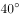，B在小东的南偏东，请问AB两地之间的直线距离是多少米？

- **A**. 
1

- **B**. 
2

- **C**. 
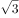

- **D**. 

　✅

**答案**：D

**官方解析**

如图所示，小东在O点，OA=OB=2米，为等腰三角形，OA与y轴正方向的夹角为，OB与y轴负方向的夹角为，则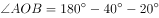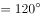。由O点向AB作垂线交AB于C点，则AC=BC=AB，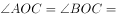。为直角三角形，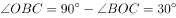，则，米，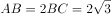米。

故正确答案为D。

---

### 第 3 题　qid 4737617 · 数学运算

一个班级一共有50人，其中参加A项目的有45人，参加B项目的有35人，参加C项目的有40人，请问这个班级中至少有多少人三个项目都参加？

- **A**. 10
- **B**. 20　✅
- **C**. 30
- **D**. 35

**答案**：B

**官方解析**

根据“至少······都”可判定本题为多集合反向构造问题。
第一步反向：没有参加A项目、B项目、C项目的人数分别为：50-45=5人、50-35=15人、50-40=10人。
第二步作和：没有参加A项目、B项目、C项目的人数最多为：5+15+10=30人。
第三步作差：A项目、B项目、C项目都参加的人数至少有50-30=20人。
故正确答案为B。

---

### 第 4 题　qid 4737654 · 数学运算

一件商品原成本是100元，售价为300元，但是因为原材料价格的上调，使成本提高了10%，商家为了多销售商品，做出了八折的活动，问此时商家每件商品的利润比原来少了多少元？

- **A**. 60
- **B**. 70　✅
- **C**. 80
- **D**. 90

**答案**：B

**官方解析**

商品原来每件利润=300-100=200元，成本提高且打折后每件利润=300×0.8-100×（1+10%）=240-110=130元。200-130=70元，故此时商家每件商品的利润比原来少了70元。
故正确答案为B。

---

### 第 5 题　qid 4737626 · 数学运算

某次心理测试一共有20题，其中每答对一题得2分，每答错一题扣1分，不答不给分也不扣分。小明同学做完这次测试共得22分，并知道自己不答的题目小于5题，请问，小明这次测试一共答错几道题目？

- **A**. 3
- **B**. 4　✅
- **C**. 6
- **D**. 13

**答案**：B

**官方解析**

设小明答对x题，答错y题，则不答（20-x-y）题。根据题意可列方程：2x-y=22······①，因“不答的题目小于5题”，则20-x-y&lt;5······②。因2和22均为2的倍数，故y为2的倍数，排除A、D两项。代入B项：y=4，则x=13，此时20-x-y=20-13-4=3&lt;5，符合题意。
故正确答案为B。
备注：代入C项：y=6，则x=14，此时不答的题目数量为20-x-y=20-14-6=0，虽然符合小于5的条件，但结合题意和B项，默认不答的题目数量不为0，故B项更优。

---

### 第 6 题　qid 4737637 · 数学运算

小王和小张一共需要搬28本书。小王看小张搬太多，主动要求帮小张拿一半；然后小张不好意思，就要回了小王手里的一半书；最后公平起见，小王又向小张要了四本书，这样两人的书就一样多了。请问，小王最初手里有多少本书？

- **A**. 20
- **B**. 12　✅
- **C**. 8
- **D**. 16

**答案**：B

**官方解析**

方法一：小王和小张最终每人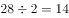本，根据题意，倒推如下表：

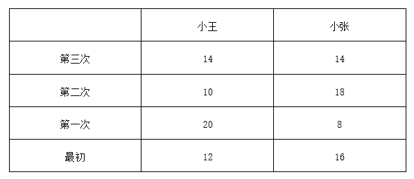

方法二：设小王、小张最初手里分别有x本、（28-x）本，由小王最终有本，根据题意可列方程：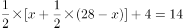，解得x=12。

故正确答案为B。

---

### 第 7 题　qid 4737638 · 数学运算

一个班级共有60名学生，其中少数民族人数占全班总人数的，男生和女生的比例是3：2。现从班级里面随机抽取一个人去参如数学知识竞赛．请问此人是非少数民族女生的概率至多是多少？

- **A**. 

- **B**. 

　✅
- **C**. 

- **D**. 

**答案**：B

**官方解析**

根据题意，可得少数民族人，非少数民族=60−10=50人；男生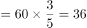人，女生=60−36=24人。此人是非少数民族女生的概率至多的情况就是女生全部都是非少数民族，故所求为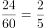。

故正确答案为B。

---

### 第 8 题　qid 4737644 · 数学运算

某人花费了360元购买了乒乓球和网球共100个。己知网球每个5元并且得到九折优惠；而乒乓球每个2元，最后还减免20元。问：此人一共买了多少个网球？

- **A**. 28
- **B**. 40
- **C**. 60
- **D**. 72　✅

**答案**：D

**官方解析**

设一共买了x个网球，则买了（100-x）个乒乓球，根据题意可列方程：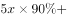，解得x=72。

故正确答案为D。

---

### 第 9 题　qid 4737665 · 数学运算

一个圆形花圃外围周长一共有108米，并且其边上等间隔共插有12根彩旗。现需要增加6根彩旗，但仍要求所有彩旗等间隔分布。问：原来的12根彩旗中最多能有几根不需要移动位置？

- **A**. 6　✅
- **B**. 7
- **C**. 8
- **D**. 9

**答案**：A

**官方解析**

根据题意，可知当圆形花圃边上等间隔共插有12根彩旗时，间隔为108÷12=9米；现需要增加6根彩旗，变成12+6=18根彩旗，则间隔为108÷18=6米。不需要移动的彩旗一定是9和6的公倍数（公倍数最小为18），则原来的12根彩旗中最多能有108÷18=6根彩旗不需移动。
故正确答案为A。

---

## 判断推理

### 第 1 题　qid 4733950 · 图形推理

左边展开平面图折不成右边的哪个立体图形？

- **A**. A
- **B**. B
- **C**. C　✅
- **D**. D

**答案**：C

**官方解析**

将题干展开图标上序号，如下图所示，逐一进行分析。

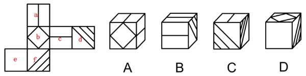

A项：选项由面a、面b和面c组成，选项与题干展开图一致，排除；

B项：选项必然包含面a和面c，展开图中面a和面f为相对面，相对面不能同时出现，故选项的右侧面应为面d，即选项由面a、面c和面d组成，选项与题干展开图一致，排除；

C项：选项必然包含面d和面f，展开图中面a和面f为相对面，相对面不能同时出现，故选项的顶面应为面c，即选项由面c、面d和面f组成。在选项和展开图中，以三个面的公共点为起点沿面c顺时针画边，展开图中边1与面c上线段平行，而选项中边1与面c上线段垂直，选项与题干展开图不一致，当选；

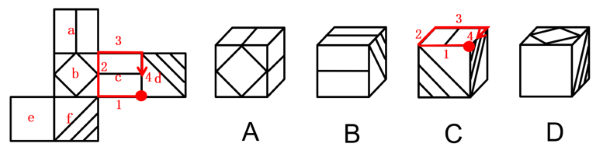

D项：选项必然包含面b和面e，展开图中面b和面d为相对面，相对面不能同时出现，故选项的右侧面应为面f，即选项由面b、面e和面f组成，选项与题干展开图一致，排除。

本题为选非题，故正确答案为C。

---

### 第 2 题　qid 4733945 · 图形推理

从所给的四个选项中，选择最合适的一个填入问号处，使之呈现一定的规律性：

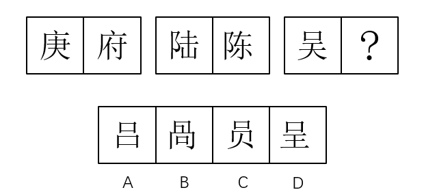

- **A**. A
- **B**. B
- **C**. C　✅
- **D**. D

**答案**：C

**官方解析**

解法一：元素组成不同，且无明显属性规律，优先考虑数量规律。观察发现题干第一组图的部分数分别为2、4，第二组图的部分数也分别为2、4，故？处图形的部分数应为4，只有C项符合规律。
解法二：题干图形均为汉字，观察发现第一组部首均为“广”，第二组部首均为“阝”，第三组部首应为“口”，排除B项；继续观察发现题干第一组笔画数均为8，第二组笔画数均为7，第三组第一个图的笔画数为7，故？处图形的笔画数应为7，排除A项；比较C、D两项，发现部分数存在区别，题干第一组图的部分数分别为2、4，第二组图的部分数也分别为2、4，故？处图形的部分数应为4，排除D项，只有C项满足所有规律。
故正确答案为C。
注：本题不够严谨，将汉字当成“图形”时，解法一更加严谨，但本题汉字部首相同的特征较为明显，可先根据此考点进行排除，再考虑汉字的笔画以及部分数，因此解法二可能更符合出题人的思路，故写两种解法供大家参考。

---

### 第 3 题　qid 4733938 · 图形推理

从所给的四个选项中，选择最合适的一个填入问号处，使之呈现一定的规律性：

- **A**. O
- **B**. N
- **C**. L
- **D**. R　✅

**答案**：D

**官方解析**

观察发现题干图形均为字母，且在字母表中的顺序存在规律。九宫格题目优先看横行，第一行中相邻字母在字母表中间隔0个字母，第二行中相邻字母在字母表中间隔2个字母，按此规律，第三行中相邻字母在字母表中间隔4个字母，故？处应为R，对应D项。
故正确答案为D。

---

### 第 4 题　qid 2405606 · 图形推理

从所给四个选项中，选择最合适的一个填入问号处，使之呈现一定规律性：

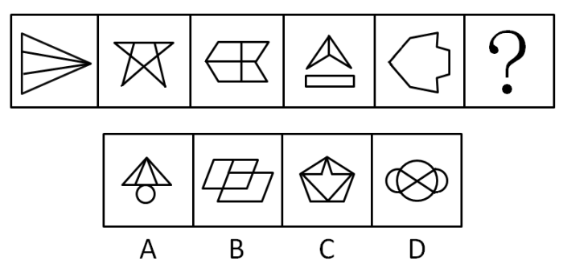

- **A**. A
- **B**. B
- **C**. C　✅
- **D**. D

**答案**：C

**官方解析**

元素组成不同，优先考虑属性规律。题干图形均为对称图形，考虑对称轴的方向和数量。经观察发现，对称轴数量均为一条，方向依次为横向、竖向、横向、竖向、横向、？，因此问号处应选择一个仅有一条竖向对称轴的图形，排除B、D两项。又因题干图形均为直线图形，排除A项，只有C项满足。
故正确答案为C。

---

### 第 5 题　qid 4735151 · 图形推理

从所给的四个选项中，选择最合适的一个填入问号处，使之呈现一定的规律性：

- **A**. A
- **B**. B
- **C**. C　✅
- **D**. D

**答案**：C

**官方解析**

元素组成不同，且无明显属性规律，考虑数量规律。观察题干图形，窟窿比较多，考虑面数量。从图1到图4，面数量分别为1、2、3、4，故？处图形面数量应为5，排除A、B两项。继续观察发现，题干图形都是一部分，排除D项，只有C项符合。
故正确答案为C。

---

### 第 6 题　qid 4733952 · 逻辑判断

“洼地效应”就是利用比较优势，创造理想的经济和社会人文环境，使之对各类生产要素具有更强的吸引力，从而形成独特竞争优势，吸引外来资源向本地区汇聚、流动，弥补本地资源结构上的缺陷，促进本地区经济和社会的快速发展。简单地说，指一个区域与其他区域相比，环境质量更高，对各类生产要素具有更强的吸引力，从而形成独特竞争优势。
根据以上定义，下面属于洼地效应的是:

- **A**. 一些知名跨国公司跑到中国办公司　✅
- **B**. 天津静海地区传销比较多
- **C**. XX省假鞋泛滥
- **D**. 某明星被曝光吸毒，于是微博粉丝纷纷取消关注

**答案**：A

**官方解析**

第一步：找出定义关键词。
“利用比较优势”、“形成独特竞争优势”、“吸引外来资源向本地区汇聚、流动”、“促进本地区经济和社会的快速发展”。
第二步：逐一分析选项。
A项：跨国公司来中国办公司，是中国对外来资源的吸引，符合“吸引外来资源向本地区汇聚、流动”，也可以促进中国的经济发展，符合“促进本地区经济和社会的快速发展”，符合定义，当选；
B项传销、C项假鞋泛滥以及D项明星吸毒均属于违法行为，不符合“形成独特竞争优势”，也不符合“促进本地区经济和社会的快速发展”，不符合定义，排除。
故正确答案为A。

---

### 第 7 题　qid 4733956 · 逻辑判断

近因效应是指当人们识记一系列事物时对末尾部分项目的记忆效果优于中间部分项目的现象。这种现象是由于近因效应的作用。前后信息间隔时间越长，近因效应越明显。
根据以上定义，下面属于近因效应的是：

- **A**. “压轴戏”是舞台演出安排在最后的最精彩的节目，整个舞台的演出都会因这最后一刻的精彩而变得辉煌起来，能给人留下深刻的印象　✅
- **B**. 一位心理学家曾做过这样一个实验：他让两个学生都做对30道题中的一半，但是让学生A做对的题目尽量出现在前15道题，而让学生B做对的题目尽量出现在后15道题，然后让一些被试对两个学生进行评价：两相比较，谁更聪明一些？结果发现，多数被试都认为学生A更聪明
- **C**. 小林与小红第一次见面，小林觉得小红处理事情不卑不亢，对她十分欣赏
- **D**. 王与张长期合作，二者在合作过程中建立了深厚的友谊

**答案**：A

**官方解析**

第一步：找出定义关键词。
“对末尾部分项目的记忆效果优于中间部分项目”。
第二步：逐一分析选项。
A项：整个舞台的演出都会因压轴戏的精彩而变得辉煌起来，能给人留下深刻的印象，说明最后的压轴戏给人带来的的记忆效果最好，符合“对末尾部分项目的记忆效果优于中间部分项目”，符合定义，当选；
B项：让学生A做对的题目尽量出现在前15道题，而让学生B做对的题目尽量出现在后15道题，而大多数被试认为学生A更聪明，说明受到了先入为主的影响，不涉及中间和末尾项目二者记忆效果的比较，不符合“对末尾部分项目的记忆效果优于中间部分项目”，不符合定义，排除；
C项：小林在与小红第一次见面时就对她十分欣赏，不涉及中间和末尾项目，更不涉及二者记忆效果的比较，不符合“对末尾部分项目的记忆效果优于中间部分项目”，不符合定义，排除；
D项：王与张在长期合作中建立了深厚的友谊，不涉及中间和末尾项目二者记忆效果的比较，不符合“对末尾部分项目的记忆效果优于中间部分项目”，不符合定义，排除。
故正确答案为A。

---

### 第 8 题　qid 4733940 · 定义判断

社会信心就是相信和敢于将自己完全委托给社会。主要表现为对社会在不久的将来能解决好现在最突出的社会问题的信心，包括：人口问题、生态环境问题、劳动就业问题、青少年犯罪问题和人口老龄化问题等等。
以下符合社会信心的是：

- **A**. 王琳自从上次被别人欺负了之后，一直不敢出门与人交流
- **B**. 谢增春对于自己未来的生活充满了幻想
- **C**. 更多社会力量介入高考，提升贫困大学生就业率，防止贫穷代际传递　✅
- **D**. 有些地方政府为了GDP不惜牺牲环境资源

**答案**：C

**官方解析**

第一步：找出定义关键词。
“相信和敢于将自己完全委托给社会”、“对社会在不久的将来能解决好现在最突出的社会问题的信心”。
第二步：逐一分析选项。
A项：王琳自从上次被别人欺负了之后，一直不敢出门与人交流，说明她不敢将自己完全委托给社会，对社会能解决问题没有信心，不符合“相信和敢于将自己完全委托给社会”、“对社会在不久的将来能解决好现在最突出的社会问题的信心”，不符合定义，排除；
B项：谢增春对于自己未来的生活充满了幻想，但是否为和社会相关的幻想并不明确，不符合“相信和敢于将自己完全委托给社会”、“对社会在不久的将来能解决好现在最突出的社会问题的信心”，不符合定义，排除；
C项：贫困大学生就业问题和贫穷代际传递都属于现在突出的社会问题，更多社会力量介入高考，提升贫困大学生就业率，防止贫穷代际传递，不仅能提升贫困大学生本身的社会信心，更能够提升社会各个阶层的社会发展信心，符合“对社会在不久的将来能解决好现在最突出的社会问题的信心”，符合定义，当选；
D项：有些地方政府为了GDP不惜牺牲环境资源，说明了这些地方政府对社会将来能解决问题没有信心，因此不惜牺牲环境资源，不符合“对社会在不久的将来能解决好现在最突出的社会问题的信心”，不符合定义，排除。
故正确答案为C。

---

### 第 9 题　qid 2030868 · 定义判断

机体的运动分为随意运动和不随意运动。不随意运动是指生来就有的、不经意识支配的、不自主的运动和动作，其生理机制主要是通过种族遗传获得的先天性的非条件反射。随意运动是指受意识调节、具有一定目的和方向的运动，是人和动物行为的基础。
根据以上定义，下列不属于随意运动的是：

- **A**. 患有智力残障的小明特别喜欢画画，他总是央求院长多给自己买一些不同颜色的画笔
- **B**. 临近年级期末考试大会战，学习成绩一向名列前茅的小王总是感觉有种莫名的焦躁感
- **C**. 哭是人类生理情绪的一种表达或表露，新生儿出生后的啼哭，其实是一种本能的反应　✅
- **D**. 患有多重人格障碍症的比利，特别喜欢向某护士小姐讲述自己童年的乡村经历和趣事

**答案**：C

**官方解析**

第一步：找出定义关键词。
“受意识调节、具有一定目的和方向的运动”。
第二步：逐一分析选项。
A项：“央求院长多给自己买一些不同颜色的画笔”说明是一种“受意识调节、具有一定目的和方向的运动”，符合定义“随意运动”关键词，符合题干定义，排除；
B项：“焦躁”是欲望受到压抑形成的神经衰弱症的症状。“感觉有种莫名的焦躁感”是一种受意识调节的运动，符合关键词，符合题干定义，故排除；
C项：婴儿啼哭是“一种本能的反应”，符合“不随意运动”关键词：“生来就有的、不经意识支配的、不自主的运动和动作”，属于不随意运动，不符合题干定义，当选；
D项：比利喜欢向某护士小姐讲述自己童年的乡村经历和趣事，符合关键词“受意识调节、具有一定目的和方向的运动”，属于随意运动，符合题干定义，排除。
本题为选非题，故正确答案为C。

---

### 第 10 题　qid 2030872 · 定义判断

雷达诱饵是指模拟被保护目标的雷达信号特征，引诱敌方雷达受骗的假目标装置，通常在飞机、舰船、导弹等受到敌方雷达探测和跟踪时才发射和投放，以提高其生存能力。
根据上述定义，下列涉及雷达诱饵的是：

- **A**. 在一次例行军事训练中，安装有雷达的海浪号导弹护卫舰，其舰身可以通过反射和吸收电磁波来干扰敌方的雷达
- **B**. 某部研制的一种小型无人驾驶飞行器，机上装有干扰装置，能模拟各种攻击飞机的雷达回波来诱骗敌方　✅
- **C**. 某部歼击机飞入战区危险地域时，通过发射高强度红外辐射，诱使敌方导弹跟踪诱饵，从而保护载体免遭导弹攻击
- **D**. 某导弹安装有高精密雷达系统，通过准确定位可以快速锁定攻击目标的具体地理位置，从而予以精准打击

**答案**：B

**官方解析**

第一步：找出定义关键词。
“模拟被保护目标的雷达信号特征”、“引诱敌方雷达受骗的假目标装置”、“通常在飞机、舰船、导弹等受到敌方雷达探测和跟踪时才发射和投放”。
第二步：逐一分析选项。
A项：“舰身可以通过反射和吸收电磁波来干扰敌方的雷达”并未体现关键词“模拟被保护目标的雷达信号特征”、“引诱敌方雷达受骗的假目标装置”，不符合定义，排除；
B项：机身上的装置能“模拟各种攻击飞机的雷达回波”，符合“模拟被保护目标的雷达信号特征”、“引诱敌方雷达受骗的假目标装置”，当选；
C项：“通过发射高强度红外辐射”，是一种主动发射的干扰，不符合“通常在飞机、舰船、导弹等受到敌方雷达探测和跟踪时才发射和投放”，排除；
D项：是对导弹性能的陈述，没有涉及关键词“模拟被保护目标的雷达信号特征”、“引诱敌方雷达受骗的假目标装置”，不符合定义，排除。
故正确答案为B。

---

### 第 11 题　qid 2030878 · 定义判断

责任推卸定律是人们一旦预测到在不久的将来自己会与某件事情产生瓜葛，就会从这一分钟开始推卸掉与此事有关的一切责任，而承担责任的往往是对情况一无所知的人。
根据以上定义，下列属于责任推卸定律的是：

- **A**. 小刘在得知这次的设计方案最终没有通过客户的审核后，感到非常庆幸，因为他从一开始就被迫退出了此次方案的起草设计
- **B**. 预感到事情处理起来会比较麻烦后，小赵向经理说明了情况，最终还是给公司造成了损失，但经理说不需要他承担责任
- **C**. 暴雨带来水位的不断攀升，为了避免刚出生不久的小鼠崽们被淹死，鼠妈妈将他们一一转移到安全的地方
- **D**. 班长小郑在得知这次任务的执行结果会影响职位晋升后，谎称自己身体不舒服，将此次任务转交给不知情的副班长处理　✅

**答案**：D

**官方解析**

第一步：找出定义关键词。
“人们一旦预测到在不久的将来自己会与某件事情产生瓜葛”、“从这一分钟开始推卸掉与此事有关的一切责任”、“承担责任的往往是对情况一无所知的人”。
第二步：逐一分析选项。
A项：题干说的是“预测到在不久的将来自己会与某件事情产生瓜葛”，是对未来事情的预测，而A项是对已经过去的行为的庆幸，且小刘是被迫退出方案的起草设计，而非主动选择，不能体现出对未来的“预测性”。与题干关键词不符，排除；
B项：小赵虽然从一开始就预测到问题，但他并没有“从这一分钟开始推卸掉与此事有关的一切责任”，与题干关键词不符，排除；
C项：“鼠妈妈”“小鼠崽”都不属于人，主体错误，排除；
D项：班长小郑得知任务执行的结果会影响职位晋升后，谎称生病，并将任务转交给不知情的副班长处理，符合题干所有关键词，当选。
故正确答案为D。

---

### 第 12 题　qid 2030882 · 定义判断

并列结合学习是指个体所要学习的新知识与当前认知结构中的原有观念既非类属关系，也非总括关系，而是在横向上存在某种吻合或对应关系时所进行的学习，是处于同一概念层次的新旧知识间产生联合意义的学习。
根据以上定义，下列属于并列结合学习的是：

- **A**. 喜欢园林艺术的小琴在大学期间主修生物医药，升入研究生后她决定选择园林艺术专业
- **B**. 为了提升小张在音乐方面的涵养，妈妈同时为他报了民乐和西洋乐两个基础知识培训班
- **C**. 经济管理专业的课程安排是大一学习经济学基础知识，大二学习经济学相关专业知识
- **D**. 小明在学习完基因遗传的有关知识后，在父母的建议下开始学习基因变异的有关知识　✅

**答案**：D

**官方解析**

第一步：找出定义关键词。
“个体所要学习的新知识与当前认知结构中的原有观念既非类属关系，也非总括关系”、“在横向上存在某种吻合或对应关系时所进行的学习”。
第二步：逐一分析选项。
A项：“生物医药”与“园林艺术”不符合关键词“在横向上存在某种吻合或对应关系时所进行的学习”，二者之间并没有直接关系，不符合定义，排除；
B项：“同时”指的是同时学习民乐和西洋乐，都是新知识，没有原有观念，不符合定义，排除；
C项：“大学课程安排”不符合关键词“个体所要学习的新知识与当前认知结构中的原有观念”，且“经济学基础知识”是“经济学相关专业知识”的基础和前提，不符合关键词“在横向上存在某种吻合或对应关系时所进行的学习”，不符合定义，排除；
D项：符合所有关键词，“基因遗传”和“基因变异”都属于基因学的一个分支，当选。
故正确答案为D。

---

### 第 13 题　qid 2030886 · 定义判断

稳定化选择，亦称“常态化选择”。是自然选择消除偏离平均值异常个体的一种选择。生物群体的遗传组成在环境条件不变的情况下一般维持稳定，这是自然选择的一般特性。
根据以上定义，下列属于稳定化选择的是：

- **A**. 对伦敦3000名新生儿体重与其后的死亡率间关系的研究，发现死亡率最低的是中间体重的婴儿，体重过大和过轻的婴儿在发育中途死亡率高　✅
- **B**. 育种专家为了达到育种目标，通常都会对其所饲养的动物、栽培的植物进行定向选择，使其群体的平均值发生定向移动
- **C**. 马的祖先是一种躯体不大的小动物，其前肢有四趾，后肢有三趾。随着时间的推移，不论马的前肢还是后肢仅其中趾逐渐发达，两侧的其它趾则逐渐退化
- **D**. 寄生在人或动物肠内的绦虫，由于退化，既无运动器官，又无感觉器官、消化器官，虽在形态和生理方面退化，但有利于种族的繁衍

**答案**：A

**官方解析**

第一步：找出定义关键词。
“自然选择”、“消除偏离平均值异常个体的一种选择”。
第二步：逐一分析选项。
A项：“体重过大和过轻的婴儿在发育中途死亡率高”，而中间体重的婴儿死亡率最低，符合所有关键词“自然选择”“消除偏离平均值异常个体的一种选择”，符合定义，当选；
B项：“育种专家为了达到育种目标”说明不是自然选择的结果，不符合定义，排除；
C项：属于“自然选择”，但并没有体现“消除偏离平均值异常个体的一种选择”，不符合定义，排除；
D项：属于“自然选择”，但并没有体现“消除偏离平均值异常个体的一种选择”，不符合定义，排除。
故正确答案为A。

---

### 第 14 题　qid 2030902 · 定义判断

书证是指以其内容来证明待证事实的有关情况的文字材料。凡是以文字来记载人的思想和行为以及采用各种符号、图案来表达人的思想，其内容对待证事实具有证明作用的物品都是书证。物证，是指证明案件真实情况的一切物品和痕迹。物证的特点是以其外部特征、物质属性、存在状况等来发挥证明作用。
根据上述定义，下列属于物证的是：

- **A**. 某盗窃案，公诉方出示的对犯罪嫌疑人审问的录音
- **B**. 某走私案，公安机关依法没收犯罪嫌疑人的境外书刊　✅
- **C**. 某金融案，为查明账册涂改人而进行鉴定得到的笔迹鉴定书
- **D**. 某杀人案，在犯罪嫌疑人住处收集到的记载着其作案经过的日记本

**答案**：B

**官方解析**

第一步：找出定义关键词。
“证明案件真实情况的一切物品和痕迹”、“以其外部特征、物质属性、存在状况等来发挥证明作用”。
第二步：逐一分析选项。
A项：录音是根据其内容证明事实，不符合以其外部特征、物质属性、存在状况等来发挥证明作用，不属于物证，排除；
B项：没收的书刊属于证明走私案件真实情况的物品，是通过其存在状态来发挥证明作用的，属于物证，当选；
C项：笔迹鉴定书属于以其鉴定内容来证明待证事实的文字材料，属于书证，排除；
D项：记载作案经过的日记本是以其日记内容来证明杀人事实的有关情况的文字材料，而不是以日记本的外部特征、物质属性、存在状况等来发挥证明作用，属于书证，排除。
故正确答案为B。

---

### 第 15 题　qid 2030910 · 定义判断

媒介依存症是伴随着媒介技术日益发展而产生的作用于人的心理的一种社会病理现象。它是指过度沉迷于媒介接触而不能自拔的行为，是现代人的一种社会病理现象。媒介传播的信息深刻地影响着人们的思想，而人们也加重了对信息的依赖，对于媒体介质的过分依赖，失去了与某媒体介质的接触后便出现心理或生理问题产生生活障碍的症候。
根据上述定义，下列不属于媒介依存症的是：

- **A**. 小王是个手机达人，哪怕上课时也不放下手机，当无法使用手机或者忘带手机时，便会焦虑不安
- **B**. 杜鹃是个网络达人，整天就泡在网上聊天，如果离开了网络，便感觉到生活无所适从
- **C**. 李文最近迷上了网络直播，每天的时间就是追看各类网络直播，如果网络速度变慢，出现卡顿，便会焦躁不安　✅
- **D**. 刘霞每天都会定点去看某综艺节目，如果节目停播，整个人便会变得郁郁寡欢

**答案**：C

**官方解析**

第一步：找出定义关键词。
“过度沉迷于媒介接触而不能自拔”、“失去了与某媒体介质的接触后便出现心理或生理问题”。
第二步：逐一分析选项。
A项：小王上课也不放下手机属于“过度沉迷于手机接触”，当无法使用手机或者忘带手机时，便会焦虑不安体现了“失去了与某媒体介质的接触后便出现心理或生理问题”，符合定义，排除；
B项：杜鹃整天泡在网上聊天属于“过度沉迷于网络接触”，如果离开了网络，便感觉到生活无所适从体现了“失去了与某媒体介质的接触后便出现心理或生理问题”，符合定义，排除；
C项：李文每天的时间就是追看各类网络直播属于“过度沉迷于网络直播接触”，如果网络速度变慢，便会焦躁不安，虽然出现了心理问题，但是并没有失去与网络直播的接触，不符合定义，当选；
D项：刘霞定点看综艺节目属于“过度沉迷于节目接触”，如果节目停播或无法看到，整个人便会变得郁郁寡欢体现了“失去了与某媒体介质的接触后便出现心理或生理问题”，符合定义，排除。
本题为选非题，故正确答案为C。

---

### 第 16 题　qid 4733942 · 类比推理

破旧：立新

- **A**. 深入：浅出
- **B**. 去伪：存真　✅
- **C**. 东张：西望
- **D**. 南征：北战

**答案**：B

**官方解析**

第一步：判断题干词语间逻辑关系。
破旧立新的意思是破除旧的，建立新的，通过“破旧”来达到“立新”的目的，二者是方式目的的对应关系。
第二步：判断选项词语间逻辑关系。
A项：深入浅出指言论或文章的内容很深刻，措辞却浅显易懂，“深入”的目的不是“浅出”，与题干逻辑关系不一致，排除；
B项：去伪存真的意思是除掉虚假的，留下真实的，通过“去伪”来达到“存真”的目的，二者是方式目的的对应关系，与题干逻辑关系一致，当选；
C项：东张西望的意思是这里那里地到处看，“东张”的目的不是“西望”，与题干逻辑关系不一致，排除；
D项：南征北战的意思是到处出征作战，形容经历的战斗很多，“南征”的目的不是“北战”，与题干逻辑关系不一致，排除。
故正确答案为B。

---

### 第 17 题　qid 4733953 · 类比推理

麦克风：话筒

- **A**. 付账：买单
- **B**. 粉刺：青春痘　✅
- **C**. 灯笼：走马灯
- **D**. 巧克力：糖果

**答案**：B

**官方解析**

第一步：判断题干词语间逻辑关系。
麦克风又称话筒，二者为全同关系，且均为名词。
第二步：判断选项词语间逻辑关系。
A项：买单指在饭馆用餐后结账付款，与付账为全同关系，但二者均为动词，与题干逻辑关系不一致，排除；
B项：粉刺又名青春痘，二者为全同关系，且均为名词，与题干逻辑关系一致，当选；
C项：走马灯是一种供观赏的花灯，是灯笼的一种，二者为种属关系，与题干逻辑关系不一致，排除；
D项：巧克力是以可可浆和可可脂为主要原料制成的一种甜食，与糖果不是全同关系，与题干逻辑关系不一致，排除。
故正确答案为B。

---

### 第 18 题　qid 4733944 · 类比推理

密度：质量：体积

- **A**. 路程：速度：时间
- **B**. 电阻：电流：电压
- **C**. 溶液：溶质：浓度
- **D**. 效率：工作量：时间　✅

**答案**：D

**官方解析**

第一步：判断题干词语间逻辑关系。
密度乘以体积等于质量，三者为运算的对应关系。
第二步：判断选项词语间逻辑关系。
A项：速度乘以时间等于路程，但词语顺序与题干不同，与题干逻辑关系不一致，排除；
B项：电阻乘以电流等于电压，但词语顺序与题干不同，与题干逻辑关系不一致，排除；
C项：溶液是一种或几种物质分散到另一种物质里形成的均一、稳定的混合物，溶质是溶液中被溶剂溶解的物质，二者都是具体的事物，不能与浓度进行运算，与题干逻辑关系不一致，排除；
D项：效率乘以时间等于工作量，三者为运算的对应关系，与题干逻辑关系一致，当选。
故正确答案为D。

---

### 第 19 题　qid 4733947 · 类比推理

中医：病人

- **A**. 餐馆：服务员
- **B**. 汽车：司机
- **C**. 高铁：旅客　✅
- **D**. 老师：校长

**答案**：C

**官方解析**

第一步：判断题干词语间逻辑关系。
“中医”的服务对象是“病人”，二者为服务主体与服务对象的对应关系。
第二步：判断选项词语间逻辑关系。
A项：“餐馆”里面有“服务员”，二者不是服务主体与服务对象的对应关系，与题干逻辑关系不一致，排除；
B项：“司机”可以驾驶“汽车”，二者不是服务主体与服务对象的对应关系，与题干逻辑关系不一致，排除；
C项：“高铁”的服务对象是“旅客”，二者为服务主体与服务对象的对应关系，与题干逻辑关系一致，当选；
D项：有的“老师”是“校长”，有的“老师”不是“校长”，有的“校长”是“老师”，有的“校长”不是“老师”，二者为交叉关系，与题干逻辑关系不一致，排除。
故正确答案为C。

---

### 第 20 题　qid 4733964 · 类比推理

（    ）对于 田径 相当于 雕塑 对于（    ）

- **A**. 冰壶；三维
- **B**. 游泳；欣赏
- **C**. 跳远；艺术　✅
- **D**. 竞走；平面

**答案**：C

**官方解析**

逐一代入选项。
A项：冰壶是一种冰上体育运动项目，田径是指由走、跑、跳跃、投掷等运动项目及其由部分项目组成的全能运动项目的总称，二者没有明显的逻辑关系；三维是指在平面二维系中又加入了一个方向向量构成的空间系，雕塑是三维的，二者为属性的对应关系，前后逻辑关系不一致，排除；
B项：游泳是人在水里用各种不同的姿势划水前进或进行表演的运动项目的总称，田径是指由走、跑、跳跃、投掷等运动项目及其由部分项目组成的全能运动项目的总称，二者为并列关系中的反对关系；雕塑具有欣赏的功能，二者为功能的对应关系，前后逻辑关系不一致，排除；
C项：跳远是一种田径运动项目，二者为包容关系中的种属关系；雕塑是一种艺术，二者为包容关系中的种属关系，前后逻辑关系一致，当选；
D项：竞走是一种田径运动项目，二者为包容关系中的种属关系；雕塑一般是立体的，而非平面的，二者没有明显的逻辑关系，前后逻辑关系不一致，排除。
故正确答案为C。

---

### 第 21 题　qid 4733987 · 逻辑判断

专家推测中国正在迎来第四次单身热潮。
下列选项最能支持上述推测的是：

- **A**. 中国独居人口已从20年前6%上升至14.6%　✅
- **B**. 中国45-49岁的未婚女性已从10年前12%降至4.9%
- **C**. 单身男性比单身女性多得多
- **D**. 婚姻不是必需品，一个人的生活更多意味着独立、时尚、自由

**答案**：A

**官方解析**

第一步：找出论点和论据。
论点：中国正在迎来第四次单身热潮。
论据：无。
本题只有论点没有论据，优先考虑补充论据。
第二步：逐一分析选项。
A项：选项指出独居人口较20年前大幅度上升，补充论据说明我国正迎来单身热潮，可以加强，当选；
B项：45-49岁的未婚女性所占比例下降，说明该年龄段的单身人数减少，总体的单身人数无法得知，无法加强，排除；
C项：选项在比较单身男女的多少，而论点讨论的是总体的单身人数，话题不一致，无法加强，排除；
D项：该项指出婚姻的含义，与论点讨论的我国正迎来单身热潮无关，话题不一致，无法加强，排除。
故正确答案为A。

---

### 第 22 题　qid 4733968 · 逻辑判断

一项新研究显示，父亲肥胖可能影响孩子在幼儿园和学校交友的能力。美国科学家发现，父母如果肥胖，孩子到三岁时发育迟缓的风险会大幅增加。母亲肥胖时，孩子通不过精细运动技能测试的可能性将大大提高。这种测试考查儿童用双手和手指操作物体的能力。同样，父亲肥胖（但母亲不肥胖）的儿童不容易通过社交技能测试，也就是说，他们会在社交场合感到局促，会觉得很难交到朋友。
下列最能对研究者结论提出质疑的是：

- **A**. 幼儿园老师要求小朋友不要歧视肥胖小朋友
- **B**. 晓东在接受心理辅导后克服了交友恐惧症
- **C**. 小红父亲很胖很宅，但小红喜欢邀请同班孩子到家里玩　✅
- **D**. 小明的同学因为小明父亲很肥胖而拒绝与他交往

**答案**：C

**官方解析**

第一步：找出论点和论据。
论点：父亲肥胖可能影响孩子在幼儿园和学校交友的能力。
论据：父亲肥胖（但母亲不肥胖）的儿童不容易通过社交技能测试，也就是说，他们会在社交场合感到局促，会觉得很难交到朋友。
论点和论据均在讨论父亲肥胖和孩子的社交能力之间的关系，二者话题一致，削弱优先考虑削弱论点。
第二步：逐一分析选项。
A项：幼儿园老师要求不要歧视肥胖小朋友，该项讨论的是肥胖的孩子，而论点讨论的是父亲肥胖的孩子，主体不一致，无法削弱，排除；
B项：晓东克服了交友恐惧症，并未指出晓东的父亲是否肥胖，为不明确项，无法削弱，排除；
C项：举例说明虽然小红的父亲肥胖，但小红的社交能力很强，即父亲的肥胖并未影响到小红的社交能力，削弱论点，当选；
D项：小明的同学因为小明父亲很肥胖而拒绝与他交往，举例说明小明因为父亲很肥胖影响到了自己的社交状况，使小明很难交到朋友，补充论据加强，无法削弱，排除。
故正确答案为C。

---

### 第 23 题　qid 4734004 · 逻辑判断

美国佛罗里达州的一些社区几乎全部是退休人员居住，即使有也只有很少的带小孩的家庭居住。然而这些社区聚集了很多欣欣向荣的专门出租婴儿和小孩使用的家具的企业。
以下哪项如果是正确的，能最好地调和以上描述的表面矛盾？

- **A**. 专门出租小孩用的家具的企业是从佛罗里达州外的批发商那里买来的家具
- **B**. 居住在这些社区的为数不多的孩子都相互认识，并经常到其他人的房子里过夜
- **C**. 这些社区的许多居民经常搬家，更愿意租用他们的家具而不愿意去买
- **D**. 这些社区的许多居民必须为一年来访几个星期的孙子或孙女们提供必要的用品　✅

**答案**：D

**官方解析**

第一步：找出题干矛盾。
在几乎全部是退休人员、很少有带小孩的家庭居住的社区，聚集了很多欣欣向荣的专门出租婴儿和小孩使用的家具的企业。
第二步：逐一分析选项。
A项：该项指出出租小孩用的家具的企业是从哪里进货的，而题干讨论的是为什么出租婴儿和小孩使用的家具的企业选择在很少有小孩居住的社区开店，无法解释题干矛盾，排除；
B项：该项指出居住在这些社区的为数不多的孩子会在其他人的房子里过夜，但社区内孩子的总数量不会发生变化，不能解释为什么在几乎全部是退休人员、很少有带小孩的家庭居住的社区，聚集了很多欣欣向荣的专门出租婴儿和小孩使用的家具的企业，无法解释题干矛盾，排除；
C项：该项指出许多经常搬家的居民更愿意租用家具，但是这些搬家的居民是否有小孩，是否租用了婴儿和小孩使用的家具不明确，不能解释为什么在几乎全部是退休人员、很少有带小孩的家庭居住的社区，聚集了很多欣欣向荣的专门出租婴儿和小孩使用的家具的企业，无法解释题干矛盾，排除；
D项：该项指出这些社区的许多居民必须要为一年来访几个星期的孙子或孙女们提供必要的用品，说明该社区虽然居住的都是退休人员，但每年都会有小孩来，小孩来时为了给孩子提供必备用品，就会去专门出租婴儿和小孩使用的家具的企业租用，可以解释题干矛盾，当选。
故正确答案为D。

---

### 第 24 题　qid 4734046 · 逻辑判断

用外泌体分子对那些出生时患有疾病的（骨质疏松）老鼠进行实验，骨折率降低了78%。研究者称，外泌体可作为防止骨折的常规注射物。
科研人员得到这一结论的前提是：

- **A**. 对于外泌体分子是否能够降低骨折率正在研究当中
- **B**. 老鼠跟人类身体构造不同
- **C**. 小林通过外泌体分子注射，治好了他的骨质疏松
- **D**. 骨质疏松是导致骨折的罪魁祸首　✅

**答案**：D

**官方解析**

第一步：找出论点和论据。
论点：外泌体可作为防止骨折的常规注射物。
论据：用外泌体分子对那些出生时患有疾病的（骨质疏松）老鼠进行实验，骨折率降低了78%。
论点讨论的是外泌体可作为防止骨折的常规注射物，隐含的针对对象是人类；论据讨论的是外泌体可降低患有骨质疏松老鼠的骨折率，论点、论据话题不一致，提问为“前提”，加强优先考虑搭桥。
第二步：逐一分析选项。
A项：外泌体分子能否降低骨折率正在研究中，不清楚研究结果能否证明外泌体分子可降低骨折率，不明确项，无法加强，排除；
B项：老鼠跟人类身体构造不同，说明论据中老鼠的实验结论不一定能用到人类身上，拆开了论点和论据的关系，拆桥项，无法加强，排除；
C项：小林通过外泌体分子注射治好了骨质疏松，但论点讨论的是外泌体对骨折的预防作用，骨质疏松和骨折间的关系并不明确，无法加强，排除；
D项：骨质疏松是导致骨折的罪魁祸首，该项没有特定的指向对象，说明和老鼠一样，人类的骨质疏松也是导致骨折的重要原因，因此针对老鼠的实验结论也可应用到人身上，在论点和论据间建立了联系，搭桥项，可以加强，当选。
故正确答案为D。

---

### 第 25 题　qid 4734081 · 逻辑判断

由女医生治疗的老年住院患者入院后30天内，死亡的概率低于男医生照顾的患者。研究人员推测，如果男医生能够达到女医生的治疗效果，美国每年医保患者死亡人数将减少32000人。
下列选项如果正确，能够对结论提出质疑的是：

- **A**. 老年住院患者只是全部患者的一小部分　✅
- **B**. 美国每年医疗事故造成死亡人数远不止32000人
- **C**. 女医生占多数的部分医院老年住院患者的死亡率高于其他医院
- **D**. 由女医生治疗的老年住院患者的整体死亡率高于男医生治疗的患者

**答案**：A

**官方解析**

第一步：找出论点和论据。
论点：如果男医生能够达到女医生的治疗效果，美国每年医保患者死亡人数将减少32000人。
论据：由女医生治疗的老年住院患者入院后30天内，死亡的概率低于男医生照顾的患者。
本题论点讨论提高男医生的治疗效果可减少医保患者死亡人数，论据讨论由女医生治疗的老年住院患者入院30天内的死亡概率更低，二者话题不一致，削弱优先考虑拆桥。
第二步：逐一分析选项。
A项：指出老年住院患者在全部患者中占比很小，说明即使男医生治疗的老年住院患者入院30天内死亡概率降低，但因为老年住院患者并不能代表全部患者，也就无法得出医保患者死亡人数将减少32000人的结论，断开了老年住院患者与全部患者（医保患者）间的联系，为拆桥项，可以削弱，保留；
B项：指出美国每年因医疗事故死亡的人数更多，但论点讨论提高男医生的治疗效果可减少医保患者死亡人数，话题不一致，为无关项，无法削弱，排除；
C项：指出有些医院女医生占多数，但其老年住院患者的死亡率却高于其他医院，这些医院中老年住院患者是否均由女医生治疗并不确定，而且题干说的是女医生群体的整体治疗效果，这与其他医院的具体情况并不冲突，为不明确项，无法削弱，排除；
D项：指出由女医生治疗的老年住院患者的整体死亡率高于男医生治疗的患者，说明30天内的死亡概率不足以作为治疗效果的评判依据，质疑了论据的有效性，削弱论据，可以削弱，保留。
对比A、D两项，A项为拆桥，D项为削弱论据，拆桥的削弱力度大于削弱论据，因此优选A项。
故正确答案为A。

---

### 第 26 题　qid 4734064 · 类比推理

西班牙大气研究中心专家表示，1989年生效的《蒙特利尔议定书》，在一定程度上遏制了臭氧层的破坏，避免了全世界数千万人罹患皮肤癌。他说，这只是一个估算，但如果未遵守议定书，臭氧层必定进一步遭到破坏，全球紫外线辐射指数也会不断提高，由此可以推知：

- **A**. 所有的缔约国都遵守了《蒙特利尔议定书》
- **B**. 目前臭氧层修复程度大大提升
- **C**. 议定书的影响在其生效10年后开始显现
- **D**. 人类活动产生的一些气体使得臭氧层遭到破坏　✅

**答案**：D

**官方解析**

日常结论题，根据题干信息逐一分析选项。
A项：题干第一句话中“1989年生效的《蒙特利尔议定书》，在一定程度上遏制了臭氧层的破坏”，说明确实有国家遵守了该议定书，但并不清楚缔约国是否都遵守了议定书，选项中“所有”的表述过于绝对，无法推出，排除；
B项：题干第一句话中“1989年生效的《蒙特利尔议定书》，在一定程度上遏制了臭氧层的破坏”，仅能说明臭氧层被破坏的趋势得到了缓解，选项却说臭氧层得到了“修复”，属于偷换概念，且选项中“大大提升”是对程度的描述，但根据题干无法得出臭氧层被修复的具体程度，无法推出，排除；
C项：题干没有提及《蒙特利尔议定书》生效后会在何时显现出影响，但选项却给出了具体的年份，无中生有，无法推出，排除；
D项：题干第二句话中“如果未遵守议定书，臭氧层必定进一步遭到破坏”，“进一步遭到破坏”说明臭氧层被破坏与人类活动有关，且根据常识可知，氟利昂等制冷剂变为气体挥发后会破坏臭氧层，因此人类活动产生的一些气体会破坏臭氧层，可以推出，当选。
故正确答案为D。

---

### 第 27 题　qid 4734056 · 类比推理

据学校工作人员说，有新来的老师没有办理图书馆证。那么以下不能直接判断真假的是：
①所有新来的老师都没办图书馆证
②所有图书馆的老师都办了图书馆证
③有的新来的老师办了图书馆证
④有的新来的老师没有办理图书馆证

- **A**. ①②
- **B**. ①②③　✅
- **C**. ②③
- **D**. ③④

**答案**：B

**官方解析**

第一步：翻译题干已知信息。

有的新老师没有办理图书馆证。

第二步：逐一分析题干条件。

①所有新老师没有办理图书馆证，“有的”无法推出“所有”，不能直接判断真假；

②所有图书馆的老师办了图书馆证，但题干中未提及“图书馆的老师”，不能直接判断真假；

③有的新老师办了图书馆证，但根据题干，可能所有新老师都没有办理图书馆证，无法根据“有的A不是B”推出“有的A是B”，不能直接判断真假；

④有的新老师没有办理图书馆证，与题干已知信息表述一致，一定为真，可以直接判断真假。

综上，根据题干已知信息无法直接判断出①②③的真假。

故正确答案为B。

---

### 第 28 题　qid 4734088 · 类比推理

在一次羽毛球赛中，甲、乙、丙、丁四人晋级四强。至于谁能最终问鼎冠军，小张、小李、小王三人作了如下预测：
小张：冠军是甲或者乙；
小李：如果冠军不是丙，那么冠军也不是丁；
小王：冠军不是甲。
已知小张、小李、小王三人中有并且只有一人的预测准确，那么下列哪项成立？

- **A**. 冠军是丁　✅
- **B**. 冠军是乙
- **C**. 冠军是丙
- **D**. 冠军是甲

**答案**：A

**官方解析**

第一步：找关系。

（1）小张：甲 或 乙；

（2）小李：丙丁；

（3）小王：甲。

因为三人中有且仅有一人预测准确，而条件（1）和条件（3）不可能同时为假，因此其中必有一真，则条件（2）为假。

第二步：看其余。

根据条件（2）为假可知，冠军不是丙，是丁，对应A项。

故正确答案为A。

---

### 第 29 题　qid 1688596 · 逻辑判断

根据《2015-2024的农业展望》报告，发展中国家对粮食的需求将会发生重大变化。因为随着人口、人均收入和城镇化的弊端扩大，对食品的需求也将增加。收入的提高将促进消费者的饮食进一步多样化，尤其是增加相对于淀粉类食物的动物蛋白的消费。
由此可以推出：

- **A**. 发展中国家今后必须面对肥胖以及其他与饮食相关的疾病问题
- **B**. 随着收入的提高，发展中国家对生活质量的要求将与日俱增
- **C**. 如果消费者饮食进一步多样化，就会引起主粮作物价格下降
- **D**. 肉类和奶制品的需求会进一步增加，其价格可能会一路攀升　✅

**答案**：D

**官方解析**

逐一分析比较选项。
A项：面对疾病问题在题干中没有提及，属于无中生有，排除；
B项：谈的是收入的提高对生活质量的要求提高，而题干中说的是对食品的需求，概念扩大，排除；
C项：讨论对主粮作物价格的影响，在题干中没有提及，属于无中生有，且“就会引起”过于绝对，排除；
D项：谈论对于肉类和奶制品的需求会增加，可以由题干中的“增加相对于淀粉类食物的动物蛋白的消费”推出，肉类与奶制品属于动物蛋白，需求增加可能会引起价格攀升，满足推断，当选。
故正确答案为D。

---

### 第 30 题　qid 42737 · 类比推理

在某高速公路的一段，一字相逢地搭列着五个小镇，已知：
（1）落霞镇既不要临着古井镇，也不临着荷花镇；
（2）浣溪镇既不临着紫微镇，也不临着荷花镇；
（3）紫微镇既不要临着古井镇；也不要临着荷花镇；
（4）落霞镇没有木塔；
（5）有木塔的是排在第一和第四的小镇。
由此可见，排在第二的小镇是：

- **A**. 落霞镇　✅
- **B**. 荷花镇
- **C**. 浣溪镇
- **D**. 紫微镇

**答案**：A

**官方解析**

第一步：抓住题干主要信息。
（1）落霞镇不临古井镇和荷花镇，（2）浣溪镇不临紫微镇和荷花镇，（3）紫微镇不临古井镇和荷花镇，（4）落霞镇没有木塔，（5）有木塔的是排在第一和第四的小镇。
第二步：找突破口。
本题突破口是信息量最大对象，即荷花镇。由第一步中（1）落霞镇不临荷花镇，（2）中浣溪镇不临荷花镇，（3）中紫微镇不临荷花镇可知只能是古井镇临荷花镇，且只能是荷花镇在1位置，古井镇在2位置或荷花镇在5位置，古井镇在4位置。
第三步：从突破口继续分析推导，并结合选项得出答案。
假设荷花镇在1位置，古井镇在2位置，又知第一步中（1）落霞镇不临古井镇，（4）落霞镇没有木塔，（5）有木塔的是排在第一和第四的小镇，因此落霞镇只能在5位置；又知（3）紫微镇不临古井镇，因此紫微镇只能在4位置，从而浣溪镇只能在3位置，此时浣溪镇与紫微镇相临，这与（2）浣溪镇不临紫微镇不符，因此假设错误，从而只能有荷花镇在5位置，古井镇在4位置。
已知荷花镇在5位置，古井镇在4位置，又知（1）落霞镇不临古井镇，（4）落霞镇没有木塔，（5）有木塔的是排在第一和第四的小镇，因此落霞镇只能在2位置；又知（3）紫微镇不临古井镇，因此紫微镇只能在1位置，从而浣溪镇只能在3位置，此时符合（2）浣溪镇不临紫微镇，因此假设成立。
综上，紫微镇在1位置，落霞镇在2位置，浣溪镇在3位置，古井镇在4位置，荷花镇在5位置。因此排在第二的小镇是落霞镇。
故正确答案为A。

---

## 资料分析

### 材料 1

        2015年，全国民航运输机场完成旅客吞吐量9.15亿人次，比上年增长10.0%，增速较上年回落了0.4个百分点。西部增长13.5%；中部增长8.5%；东北增长8.2%；东部增长8.8%。全国民航年吞吐量1000万人次以上的运输机场26个，比上年增加2个，吞吐量占全国的77.9%，100-1000万人次的运输机场44个，比上年增加4个，吞吐量占全国的17.6%。2015年，民航基本建设和技术改造投资769.3亿元，比上年增长4.8%。其中：机场系统完成固定资产投资总额656.1亿元，比上年增长17.0%；空管系统完成固定资产投资17.7亿元，比上年减少6.2亿元；民航其他系统完成固定资产投资总额95.5亿元，比上年减少54亿元。

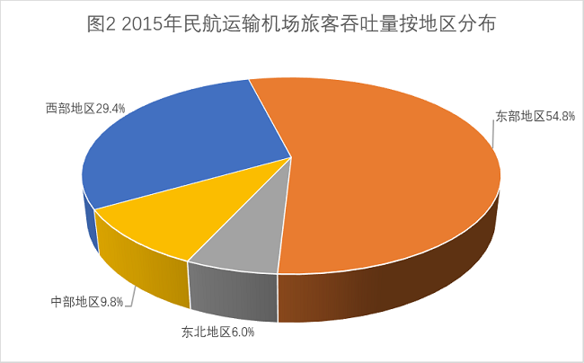

#### 第 1 题　qid 4737703 · 平均数

2015年平均每个吞吐量100万-1000万人次的运输机场吞吐量约多少人次 ？

- **A**. 470 万
- **B**. 370 万　✅
- **C**. 570 万
- **D**. 270 万

**答案**：B

**官方解析**

根据题干“2015年平均每个······吞吐量约多少人次”，结合材料时间是2015年，可判定本题为现期平均数问题。定位文字材料可得：“2015年，全国民航运输机场完成旅客吞吐量9.15亿人次······100-1000万人次的运输机场44个，比上年增加4个，吞吐量占全国的17.6%”。根据公式：平均数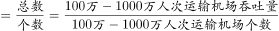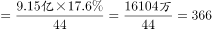万人次，与B项最接近。

故正确答案为B。

---

#### 第 2 题　qid 4737707 · 增长

2015年，全国民航运输机场完成旅客吞吐量在100万人次以上的运输机场同比增长了：

- **A**. 0.8%
- **B**. 9%　✅
- **C**. 1%
- **D**. 2%

**答案**：B

**官方解析**

根据题干“2015年······同比增长了”，结合选项为百分数，可判定本题为一般增长率问题。定位文字材料可得：“2015年······全国民航年吞吐量1000万人次以上的运输机场26个，比上年增加2个······100-1000万人次的运输机场44个，比上年增加4个”。根据公式：增长率，则所求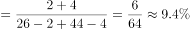，与B项最接近。

故正确答案为B。

---

#### 第 3 题　qid 4737714 · 比重

关于2014年各地区的旅客吞吐量占全国比重的描述，说法正确的是：

- **A**. 西部地区低于29.4%　✅
- **B**. 中部地区低于9.8%
- **C**. 东北地区低于6%
- **D**. 东部地区低于54.8%

**答案**：A

**官方解析**

根据题干“2014年······比重的描述······”，结合材料时间是2015年，可判定本题为基期比重问题。定位图形材料可得：2015年西部、中部、东北、东部地区旅客吞吐量占全国的比重分别为29.4%、9.8%、6.0%、54.8%。定位文字材料可得：“2015年，全国民航运输机场完成旅客吞吐量9.15亿人次，比上年增长10.0%，增速较上年回落了0.4个百分点。西部增长13.5%；中部增长8.5%；东北增长8.2%；东部增长8.8%。”根据两期比重结论“部分增长率＞整体增长率，比重上升；部分增长率＜整体增长率，比重下降”可知，西部地区增长率13.5%＞整体增长率10.0%＞其余地区增长率，因此2014年西部地区比重低于2015年西部地区比重29.4%。
故正确答案为A。

---

#### 第 4 题　qid 4737721 · 增长

2011-2015年民航基本建设和技术改造投资增长额超过30亿元的有几个？

- **A**. 0
- **B**. 1
- **C**. 2　✅
- **D**. 3

**答案**：C

**官方解析**

根据题干“2011-2015年······增长额超过30亿元的有几个”，可判定本题为增长量计算问题。定位图1可得：2011-2015年民航基本建设和技术改造投资额分别为687.7亿元、712.2亿元、716.6亿元、734.2亿元、769.3亿元，2011年民航基本建设和技术改造投资额比上年增长6.4%。根据公式：增长量、增长量=现期量-基期量，则2011年民航基本建设和技术改造投资增长额为：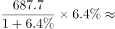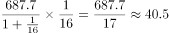亿元；2012年为：712.2-687.7=24.5亿元；2013年为：716.6-712.2=4.4亿元；2014年为：734.2-716.6=17.6亿元；2015年为：769.3-734.2=35.1亿元。综上，超过30亿元的有2011年、2015年，共2个。

故正确答案为C。

---

#### 第 5 题　qid 4737726 · 综合

根据以上材料，可以推出的是：

- **A**. 2014年，空管系统完成固定资产投资为11.5亿元
- **B**. 2014年，机场系统完成固定资产投资总额超过600亿元
- **C**. 2015年西部地区民航运输机场旅客吞吐量超过中部地区的三倍
- **D**. 2015年东部地区民航运输机场旅客吞吐量与其他地区吞吐量之和相差不到1亿人次　✅

**答案**：D

**官方解析**

A项：定位文字材料可得，2015年空管系统完成固定资产投资17.7亿元，比上年减少6.2亿元。根据公式：基期量=现期量-增长量，可得2014年空管系统完成固定资产投资17.7-(-6.2)=23.9亿元，错误；

B项：定位文字材料可得，2015年机场系统完成固定资产投资总额656.1亿元，比上年增长17.0%。根据公式：基期量，可得2014年机场系统完成固定资产投资总额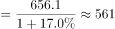亿元&lt;600亿元，错误；

C项：定位图2可得，2015年西部地区民航运输机场旅客吞吐量占比29.4%，中部地区占比9.8%，则2015年西部地区民航运输机场旅客吞吐量是中部地区的：倍，并非超过三倍，错误；

D项：定位文字材料可得，2015年全国民航运输机场完成旅客吞吐量9.15亿人次；定位图2，2015年东部地区民航运输机场旅客吞吐量占比54.8%，则2015年其他地区旅客吞吐量占比之和=1-54.8%=45.2%。则2015年东部地区民航运输机场旅客吞吐量与其他地区吞吐量之和相差9.15×(54.8%-45.2%)=9.15×9.6%&lt;10×10%=1亿人次，即不到1亿人次，正确。

故正确答案为D。

---

### 材料 2

        2014年我国快递服务企业业务量完成139.6亿件，同比增长51.9%；快递业务收入完成2045.4亿元，同比增长41.9%。快递业务收入占邮政行业总收入的比重为63.9%，比上年提高7.3个百分点。

        全年同城快递业务量完成35.5亿件，同比增长55.1%；实现业务收入265.9亿元，同比增长59.8%。异地快递业务快速增长。全年异地快递业务量完成100.9亿件，同比增长52.0%；实现业务收入1130.6亿元，同比增长36.4%。国际及港澳台快递业务稳定增长。全年国际及港澳台快递业务量完成3.3亿件，同比增长24.7%；实现业务收入315.9亿元，同比增长16.7%。同城快递业务占比上升。同城、异地、国际及港澳台快递业务量占全部比例分别为25.4%、72.3%和2.3%，业务收入占全部比例分别为13.0%、55.3%和15.4%。

        全年东部地区完成快递业务量114.5亿件，同比增53.2%；实现业务收入1694.3亿元，同比增长41.3%。中部地区完成快递业务量14.8亿件，同比增长49.2%；实现业务收入191.6亿元，同比增长44.3%。西部地区完成快递业务量10.3亿件，同比增长42.4%；实现业务收入159.5亿元，同比增长45.3%。东、中、西部地区快递业务量比重分别为82.0%、10.6%和7.4%，快递业务收入比重分别为82.8%、9.4%和7.8%。

        民营快递企业持续快速发展。全年国有快递企业业务量完成18.7亿件，实现业务收入300亿元；民营快递企业业务量完成119.5亿件，实现业务收入1541亿元；外资快递企业业务量完成1.4亿件，实现业务收入204.2亿元。国有、民营、外资快递企业业务量市场份额分别为13.4%、85.6%和1.0%，业务收入市场份额分别为14.7%、75.3%和10.0%。

#### 第 6 题　qid 4737717 · 平均数

2014年平均每件快递业务收入约为（    ）元。

- **A**. 低于15　✅
- **B**. 15-17
- **C**. 17-19
- **D**. 19-21

**答案**：A

**官方解析**

根据题干“2014年平均每件······元”，结合材料时间为2014年，可判定本题为现期平均数问题。定位文字材料第一段可得：2014年我国快递服务企业业务量完成139.6亿件，快递业务收入完成2045.4亿元。则2014年平均每件快递业务收入元，即低于15元。

故正确答案为A。

---

#### 第 7 题　qid 4737723 · 平均数

2014年，平均每件快递业务收入较上年增长最快的是：

- **A**. 同城　✅
- **B**. 异地
- **C**. 国际及港澳台
- **D**. 无法确定

**答案**：A

**官方解析**

根据题干“2014年，平均每件快递业务收入较上年增长最快······”，可判定本题为平均数的增长率问题。定位文字材料第二段可知：2014年，全年同城快递业务量同比增长55.1%（）；实现业务收入同比增长59.8%（）。全年异地快递业务量同比增长52.0%（）；实现业务收入同比增长36.4%（）。全年国际及港澳台快递业务量同比增长24.7%（）；实现业务收入同比增长16.7%（）。根据公式：平均数的增长率，则2014年各选项平均每件快递业务收入较上年的增长率分别为：

同城：；

异地：；

国际及港澳台：。

则2014年，平均每件快递业务收入较上年增长最快的是同城。

故正确答案为A。

---

#### 第 8 题　qid 4737727 · 平均数

在东部、中部、西部地区中，2014年平均每件快递业务收入高于整体业务收入的有（    ）个。

- **A**. 0
- **B**. 1
- **C**. 2　✅
- **D**. 3

**答案**：C

**官方解析**

根据题干“······2014年平均每件快递业务收入高于整体业务收入的有······”，可判定本题为现期平均数问题。

方法一：定位文字材料第一、三段可知：2014年我国快递服务企业业务量完成139.6亿件；快递业务收入完成2045.4亿元。全年东部地区完成快递业务量114.5亿件；实现业务收入1694.3亿元。中部地区完成快递业务量14.8亿件；实现业务收入191.6亿元。西部地区完成快递业务量10.3亿件；实现业务收入159.5亿元。根据公式：平均数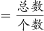，则全国平均每件快递业务收入为元，东部地区平均每件快递业务收入为元＞14.61元，符合题意；中部地区平均每件快递业务收入为元＜14.61元，不符合题意；西部地区平均每件快递业务收入为元＞14.61元，符合题意，故2014年平均每件快递业务收入高于整体业务收入的有东部和西部，共2个地区。

方法二：定位文字材料第三段可知：2014年，东、中、西部地区快递业务量比重分别为82.0%、10.6%和7.4%，快递业务收入比重分别为82.8%、9.4%和7.8%。根据公式：部分=整体×比重，平均数，则东部地区平均每件快递业务收入为：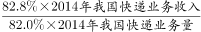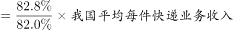＞我国平均每件快递业务收入，符合题意；

中部地区平均每件快递业务收入为：＜我国平均每件快递业务收入，不符合题意；

西部地区平均每件快递业务收入为：＞我国平均每件快递业务收入，符合题意。

则2014年平均每件快递业务收入高于整体业务收入的有东部和西部，共2个地区。

故正确答案为C。

---

#### 第 9 题　qid 4737735 · 比重

2014年快递业务量占比相差最大的是：

- **A**. 异地、国有
- **B**. 中部、同城
- **C**. 西部、国际及港澳台
- **D**. 东部、外资　✅

**答案**：D

**官方解析**

根据题干“2014年快递业务量占比相差最大的是”，结合材料时间为2014年，可判定本题为现期比重问题。定位文字材料第二、三、四段可得：2014年，同城、异地、国际及港澳台快递业务量占全部比例分别为25.4%、72.3%和2.3%；东、中、西部地区快递业务量比重分别为82.0%、10.6%和7.4%；国有、民营、外资快递企业业务量市场份额分别为13.4%、85.6%和1.0%。快递业务量占比的差值分别为，A项：72.3%-13.4%=58.9%；B项：25.4%-10.6%=14.8%；C项：7.4%-2.3%=5.1%；D项：82.0%-1.0%=81%，即2014年快递业务量占比相差最大的是D项。
故正确答案为D。

---

#### 第 10 题　qid 4737739 · 综合

关于我国快递业务发展情况，能够从上述材料推出的是：

- **A**. 2013年我国快递服务企业业务量超过100亿件
- **B**. 2014年快递业务收入增速超过邮政行业总收入　✅
- **C**. 2014年国有快递业务收入超过民营的2成
- **D**. 2014年中部地区的业务量及收入增速均超过西部地区

**答案**：B

**官方解析**

A项：定位文字材料第一段，2014年我国快递服务企业业务量完成139.6亿件，同比增长51.9%。根据公式：基期量，故2013年我国快递服务企业业务量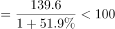亿件，错误；

B项：定位文字材料第一段，快递业务收入占邮政行业总收入的比重为63.9%，比上年提高7.3个百分点。根据两期比重比较结论，当a＞b时比重上升，反推当比重上升时，a＞b，即2014年快递业务收入增速超过邮政行业总收入，正确；

C项：定位文字材料第四段，全年国有快递企业实现业务收入300亿元；民营快递企业实现业务收入1541亿元。，故2014年国有快递业务收入未超过民营的2成，错误；

D项：定位文字材料第三段，中部地区完成快递业务量14.8亿件，同比增长49.2%；实现业务收入191.6亿元，同比增长44.3%。西部地区完成快递业务量10.3亿件，同比增长42.4%；实现业务收入159.5亿元，同比增长45.3%。49.2%＞42.4%，故2014年中部地区的业务量增速超过西部地区；44.3%＜45.3%，故2014年中部地区的业务收入增速未超过西部地区，错误。

故正确答案为B。

---

### 材料 3

        2015年某市全年用于研究与试验发展（R&amp;D）经费支出925亿元，与上年同期相比增长了11%，增速较全国高出1.8个百分点。该市R&amp;D经费支出在该市生产总值中占比为3.7%，比全国水平高出1.6个百分点。

        全年受理专利申请100006件，比上年增长22.5%，其中受理发明专利申请46976件，增长20%。全年专利授权量为60623件，增长20.1%，其中发明专利授权量为17601件，增长51.5%。至年末，全市有效发明专利达69982件。全市科技小巨人企业和小巨人培育企业共1427家，高新技术企业6071家，技术先进型服务企业253家。年内全市认定和复审高新技术企业2089家。年内认定高新技术成果转化项目613项，其中电子信息、生物医药、新材料等重点领域项目占83.4%。至年末，共认定高新技术成果转化项目10500项。全年经认定登记的各类技术交易合同2.25万件，比上年下降10.8%；合同成交金额707.99亿元，增长6.0%。

#### 第 11 题　qid 4737815 · 比重

若该市R&D经费支出占全国同类经费支出的6.5%，则2015年该市生产总值约占国内生产总值的：

- **A**. 1%-2%
- **B**. 3%-4%　✅
- **C**. 5%-6%
- **D**. 6%-7%

**答案**：B

**官方解析**

根据题干“2015年······占······”，结合材料时间为2015年，可判定本题为现期比重问题。定位文字材料第一段可得：2015年该市R&amp;D经费支出在该市生产总值中占比为3.7%，比全国水平高出1.6个百分点。根据公式：比重，可得，，又由题干可知，则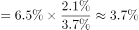，在3%-4%之间。

故正确答案为B。

---

#### 第 12 题　qid 4737823 · 增长

2015年该市发明专利授权增长数量约占专利授权总增长量的：

- **A**. 3成
- **B**. 4成
- **C**. 5成
- **D**. 6成　✅

**答案**：D

**官方解析**

根据题干“2015年······占······”，结合材料时间为2015年，可判定本题为现期比重问题。定位文字材料第二段可得：2015年全年专利授权量为60623件，增长20.1%，其中发明专利授权量为17601件，增长51.5%。根据公式：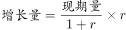，可得2015年该市发明专利授权增长数量件，专利授权总增长量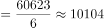件。根据公式：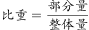，可得2015年该市发明专利授权增长数量占专利授权总增长量的，即约占6成。

故正确答案为D。

---

#### 第 13 题　qid 4737828 · 平均数

2015年，该市平均每件经认定登记的技术合同成交额较上年增长了：

- **A**. 12%
- **B**. 16%
- **C**. 19%　✅
- **D**. 23%

**答案**：C

**官方解析**

根据题干“2015年······平均每件······较上年增长了”，结合选项为百分数，可判定本题为平均数的增长率问题。定位文字材料第二段可得：2015年全年经认定登记的各类技术交易合同2.25万件，比上年下降10.8%（b）；合同成交金额707.99亿元，增长6.0%（a）。根据公式：平均数的增长率，可得2015年，该市平均每件经认定登记的技术合同成交额较上年增长了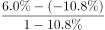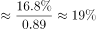。

故正确答案为C。

---

#### 第 14 题　qid 4737839 · 增长

2011-2015年，该市R&D经费支出增速高于该市生产总值的有（    ）年。

- **A**. 1
- **B**. 3
- **C**. 2
- **D**. 4　✅

**答案**：D

**官方解析**

根据题干“2011-2015年······增速高于······的有（    ）年”，结合图形材料中给出2011-2015年R&D经费支出相当于该市生产总值的比例，可判定本题为两期比重比较问题。定位图形材料可知，2011-2015年，该市R&D经费支出相当于该市生产总值的比例依次为3.11%、3.37%、3.56%、3.66%、3.7%，即2012、2013、2014、2015年，R&D经费支出占该市生产总值的比重均高于上年，根据两期比重比较结论，当a＞b时，比重上升，可知若比重上升，则a＞b，因此这四年该市的R&D经费支出增速（a）＞生产总值增速（b）。
故正确答案为D。

---

#### 第 15 题　qid 4737843 · 综合

根据上述材料，以下说法可以推出的是：

- **A**. 
2014年，全国经费同比增速为9.2%

- **B**. 
2015年，该市专利申请授权率超过4成
　✅
- **C**. 
2015年，技术先进型服务企业数量超过小巨人企业和小巨人培育企业之和的20%

- **D**. 
2015年，电子信息、生物医药、新材料等重点领域项目不到500个

**答案**：B

**官方解析**

A项：材料中未给出“2014年全国R&amp;D经费”的相关数据，无法推出其2014年的同比增速，错误；

B项：定位文字材料第二段，全年受理专利申请100006件······全年专利授权量为60623件。故2015年，专利申请授权率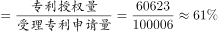，超过4成，正确；

C项：定位文字材料第二段，至年末······全市科技小巨人企业和小巨人培育企业共1427家······技术先进型服务企业253家。小巨人企业和小巨人培育企业之和的20%=1427×20%=285.4＞253，错误；

D项：定位文字材料第二段，年内认定高新技术成果转化项目613项，其中电子信息、生物医药、新材料等重点领域项目占83.4%。根据公式：部分量=总量×比重，则电子信息、生物医药、新材料等重点领域项目=613×83.4%511个＞500个，错误。

故正确答案为B。

---

### 材料 4

        2015年，全国电话用户净增121.1万户，总数达到15.37亿户，增长0.1%，比上年回落2.5个百分点。其中，移动电话用户净增1964.5万户，总数达13.06亿户，移动电话用户普及率达95.5部／百人。固定电话用户总数2.31亿户。

        2015年，2G移动电话用户减少1.83亿户，是上年净减数的1.5倍，占移动电话用户的比重由上年的54.7%下降至39.9%。4G移动电话用户新增28894.1万户，总数达38622.5万户。

#### 第 16 题　qid 4737852 · 增长

与上年相比，2015年固定电话用户数约下降了：

- **A**. 7.4%　✅
- **B**. 8.7%
- **C**. 10.7%
- **D**. 17.6%

**答案**：A

**官方解析**

根据题干“与上年相比······约下降了”，结合选项为百分数，可判定本题为一般增长率问题。定位文字材料第一段可得：2015年，全国电话用户净增121.1万户······移动电话用户净增1964.5万户······固定电话用户总数2.31亿户。因全国电话用户净增量=移动电话用户净增量+固定电话用户净增量，故2015年固定电话用户净增量=121.1-1964.5=-1843.4万户。代入公式：增长率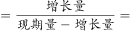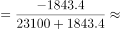，即约下降了7.4%。

故正确答案为A。

---

#### 第 17 题　qid 4737854 · 综合

2013年全国2G移动电话用户数约为多少亿户？

- **A**. 5.6
- **B**. 6.2
- **C**. 7.5
- **D**. 8.3　✅

**答案**：D

**官方解析**

根据题干“2013年······约为多少亿户”，结合材料时间为2015年，可判定本题为基期计算问题。定位文字材料第一、二段可得：2015年，全国移动电话用户总数达13.06亿户；2015年，2G移动电话用户减少1.83亿户，是上年净减数的1.5倍，占移动电话用户的比重由上年的54.7%下降至39.9%。根据公式：部分=整体×比重，可得2015年全国2G移动电话用户数亿户，2015年全国2G移动电话用户减少1.83亿户，是上年净减数的1.5倍，则2014年全国2G移动电话用户减少量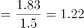亿户，根据公式：基期量=现期量−增长量，则2013年全国2G移动电话用户数=5.2−（−1.83）−（−1.22）=8.25亿户，与D项最接近。

故正确答案为D。

---

#### 第 18 题　qid 4737857 · 增长

2010-2015年，每个移动电话用户去话通话时长同比增长率低于3%有几年？

- **A**. 3
- **B**. 2
- **C**. 4　✅
- **D**. 1

**答案**：C

**官方解析**

根据题干“2010-2015年，每个移动电话用户去话通话时长同比增长率······”，可判定本题为平均数的增长率问题。定位图一可得2010-2015年移动电话去话通话时长同比增速（a）和移动电话用户同比增速（b）。根据公式：平均数的增长率，代入数据可得，2010年：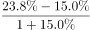；2011年：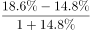；2012-2015年，由于移动电话去话通话时长同比增速（a）均小于移动电话用户同比增速（b），则平均数的增长率均同比下降，即增速小于0，故2012-2015年每个移动电话用户去话通话时长同比增长率均低于3%。符合要求的有2012年、2013年、2014年、2015年，共计4年。

故正确答案为C。

---

#### 第 19 题　qid 4737860 · 增长

移动互联网接入流量增长最快的那一年，年户均移动互联网接入流量同比增长了（    ）M。

- **A**. 180
- **B**. 2200　✅
- **C**. 60
- **D**. 720

**答案**：B

**官方解析**

根据题干“······同比增长了······M”，可判定本题为增长量计算问题。定位图二可得2010-2015年每年移动互联网接入流量及月户均移动互联网接入流量。根据公式：增长率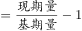，越大，增长率越大，观察数据，仅有2015年移动互联网接入流量的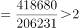，其他年份均小于2，所以2015年是增长最快的年份；根据公式：增长量=现期量-基期量，故2015年年户均移动互联网接入流量同比增长量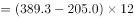M，与B项最接近。

故正确答案为B。

---

#### 第 20 题　qid 4737862 · 综合

根据材料，以下说法正确的一项是：

- **A**. 2015年全国人口接近13.5亿人
- **B**. 2015年，4G移动电话用户中，新入4G用户占比近7成
- **C**. 移动电话去话通话时长与移动电话用户同比增长率差值最小是2012年　✅
- **D**. 2015年移动互联网接入流量较5年前翻了4番

**答案**：C

**官方解析**

A项：定位文字材料第一段可得：2015年全国移动电话用户总数为13.06亿户，移动电话用户普及率达95.5部／百人。则2015年全国人口数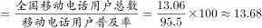亿人，错误；

B项：定位文字材料第二段可得：2015年，4G移动电话用户新增28894.1万户，总数达38622.5万户。根据公式：比重，则2015年新入4G用户占4G移动电话用户的占比为，则2015年新入4G用户占4G移动电话用户的占比超过7成，错误；

C项：定位图一可得：2010-2015年移动电话去话通话时长增速与移动电话用户增速。则2010-2015年两者增速差值分别为23.8%-15%=8.8%、18.6%-14.8%=3.8%、12.8%-10.2%=2.6%、10.5%-5%=5.5%、4.6%-1.0%=3.6%、1.5%-（-2.6%）=4.1%，故移动电话去话通话时长与移动电话用户同比增长率差值最小是2012年，正确；

D项：定位图二可得：2015年移动互联网接入流量为418680万G，2010年移动互联网接入流量为39935万G。则所求倍数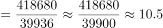倍，而翻四番应为倍，错误。

故正确答案为C。

---

#### 第 21 题　qid 4737645 · 比重

一个人徒步上山，体重加上负重一共有175斤，其中负重占28%，下山时体力不支，需要减轻部分负重，使得负重的占比为10%。请问下山的负重比上山的负重减少了多少斤？（假定体重全程都没有发生改变）

- **A**. 14
- **B**. 35　✅
- **C**. 49
- **D**. 126

**答案**：B

**官方解析**

根据题意，上山时负重为175×28%=49斤，可得其体重为175-49=126斤。设下山时负重x斤，可知：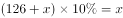，解得x=14。故下山的负重比上山的负重减少了49-14=35斤。

故正确答案为B。

---
