# 2017年重庆市选调优秀大学生到基层工作考试《行测》题

> 选调生 · 2017 年 · 6 个模块 · 共 98 题

- [政治理论](#%E6%94%BF%E6%B2%BB%E7%90%86%E8%AE%BA) · 1 题
- [常识判断](#%E5%B8%B8%E8%AF%86%E5%88%A4%E6%96%AD) · 14 题
- [言语理解与表达](#%E8%A8%80%E8%AF%AD%E7%90%86%E8%A7%A3%E4%B8%8E%E8%A1%A8%E8%BE%BE) · 30 题
- [数量关系](#%E6%95%B0%E9%87%8F%E5%85%B3%E7%B3%BB) · 13 题
- [判断推理](#%E5%88%A4%E6%96%AD%E6%8E%A8%E7%90%86) · 30 题
- [资料分析](#%E8%B5%84%E6%96%99%E5%88%86%E6%9E%90) · 10 题

---

## 政治理论

### 第 1 题　qid 2261488 · 新思想

习近平总书记在“七一”重要讲话中指出：中国将积极参与      体系建设，努力为完善       贡献中国智慧，同世界各国人民一道，推动国际秩序和      体系朝着更加公正合理方向发展。画横线部分应填入的是：

- **A**. 全球治理　✅
- **B**. 人类命运共同体
- **C**. 新型国际关系
- **D**. “一带一路”

**答案**：A

**官方解析**

本题考查政治常识。
2016年7月1日，中共中央在人民大会堂举行了庆祝中国共产党成立95周年纪念大会，习近平在会上作了一万余字的重要讲话，内涵丰富。习近平总书记在重要讲话中指出，中国将积极参与全球治理体系建设，努力为完善全球治理贡献中国智慧，同世界各国人民一道，推动国际秩序和全球治理体系朝着更加公正合理方向发展。
故正确答案为A。

---

## 常识判断

### 第 1 题　qid 2261485 · 法律常识

党的十八届五中全会提出了“创新、协调、绿色、开放、共享”五大发展理念，下列措施中属于落实“共享发展”这一理念的是：

- **A**. 最高人民法院、最高人民检察院联合发布环境污染刑事案件新的司法解释
- **B**. 某些高科技研究院所开始探索将科技成果转化情况纳入高校和研发机构绩效考评
- **C**. G省组建国际经济合作高会，多渠道动员更多民营企业参与“一带一路”建设
- **D**. 针对有一定专长和技术的低收入农户，L区落实创业补贴和小额担保贷款等扶持政策，引导“五小”创业　✅

**答案**：D

**官方解析**

本题考查政治常识。党的十八届五中全会将共享作为五大发展理念之一提出，并强调“坚持共享发展，必须坚持发展为了人民、发展依靠人民、发展成果由人民共享，作出更有效的制度安排，使全体人民在共建共享发展中有更多获得感，增强发展动力，增进人民团结，朝着共同富裕方向稳步前进。”
A项错误，该措施属于绿色发展。坚持绿色发展，全面节约和高效利用资源，加大环境治理力度，实行最严格的环境保护制度，支持节能环保等新兴产业发展，支持传统产业优化升级。
B项错误，该措施属于创新发展。坚持创新发展，培育发展新动力，拓展发展新空间，推进经济发展模式的转型，通过创新使制造业从中低端向中高端转变，从政策上支持中小企业发展。
C项错误，该措施属于开放发展。坚持开放发展，完善对外开放战略布局，形成对外开放新体制，积极参与全球经济治理，加快实施自由贸易区战略。
D项正确，该措施属于共享发展。坚持共享发展，增强全体人民获得感，增加公共服务供给，实施脱贫攻坚工程，促进就业创业，建立更加公平更可持续的社会保障制度，推进健康中国建设，重视培育青少年的创新意识、动手能力、合作精神和人文素养，切实提高国民素质。
故正确答案为D。

---

### 第 2 题　qid 2261486 · 经济常识

某省深化价格改革，探索建立农产品目标价格制度，在市场价格过高时补贴低收入消费者，在市场价格低于目标价格时按价格跌幅补贴生产者，这一探索的意义在于：

- **A**. 降低农业生产成本，提高资本利用效率
- **B**. 坚持市场定价机制，发挥市场自发作用
- **C**. 平衡社会供求关系，促进经济稳定增长　✅
- **D**. 充分利用货币政策，刺激消费，扩大内需

**答案**：C

**官方解析**

本题考查经济常识。
A项错误，价格补贴与降低农业生产成本，提高资源利用效率无关。
B项错误，价格补贴属于财政政策，不是发挥市场的自发作用。
C项正确，在价格过高时补贴消费者，避免出现价格过高，需求小于供给的现象。价格过低时补贴生产者，避免出现供给小于需求的现象。价格补贴意义主要在于平衡社会供求关系，促进经济稳定增长。
D项错误，价格补贴是国家宏观调控的经济手段，但其属于财政政策，而不是货币政策。
故正确答案为C。

---

### 第 3 题　qid 2261487 · 法律常识

下列选项中不可以作为政府作出重大行政决策时的法律顾问的是：

- **A**. 某高校法学教授
- **B**. 某律所的职业律师
- **C**. 政府法制办工作人员
- **D**. 某高校法学专业学生　✅

**答案**：D

**官方解析**

本题考查法律常识。根据《关于推行法律顾问制度和公职律师的意见》的规定：“······（四）积极推行党政机关法律顾问制度，建立以党内法规工作机构、政府法制机构人员为主体，吸收法学专家和律师参加的法律顾问队伍。党政机关内部专门从事法律事务的工作人员和机关外聘的法学专家、律师，可以担任法律顾问。党内法规工作机构、政府法制机构以集体名义发挥法律顾问作用。（五）在党政机关已担任法律顾问但未取得法律职业资格或者律师资格的人员，可以继续履行法律顾问职责。国家统一法律职业资格制度实施后，党政机关拟担任法律顾问的人员应当具有法律职业资格或者律师资格······”
A项正确，某高校法学教授作为法学专家，可以作为政府作出重大行政决策时的法律顾问。
B项正确，某律所的职业律师可以作为政府作出重大行政决策时的法律顾问。
C项正确，政府法制办工作人员可以作为政府作出重大行政决策时的法律顾问。
D项错误，某高校法学专业学生不可以作为政府作出重大行政决策时的法律顾问。
本题为选非题，故正确答案为D。

---

### 第 4 题　qid 2261490 · 人文常识

2016年是中国工农红军长征胜利80周年。1936年10月，红军三大主力会师，标志着长征的胜利结束。这三大主力分别是：

- **A**. 红一方面军，红二方面军，红三方面军
- **B**. 中央红军，红二方面军，红四方面军　✅
- **C**. 红二方面军，红四方面军，红六方面军
- **D**. 红二方面军，红四方面军，红二十五军

**答案**：B

**官方解析**

本题考查毛中特。1936年10月，红一、二、四方面军历经千辛万苦，在甘肃会宁胜利会师，长征胜利结束，从此中国革命转危为安，红一方面军曾称“中央红军”。
故正确答案为B。

---

### 第 5 题　qid 2261491 · 人文常识

著名历史故事田忌赛马中田忌使用的是“三十六计”中的哪一计？

- **A**. 瞒天过海
- **B**. 笑里藏刀
- **C**. 李代桃僵　✅
- **D**. 反客为主

**答案**：C

**官方解析**

本题考查人文常识。田忌赛马出自《史记》卷六十五《孙子吴起列传第五》，讲的是孙膑让田忌用下等马对付他们的上等马，用上等马对付他们的中等马，用中等马对付他们的下等马。田忌一场败而两场胜，最终赢得齐王的千金赌注。
A项错误，瞒天过海的意思是瞒住上天，偷渡大海。比喻用谎言和伪装向别人隐瞒自己的真实意图，在背地里偷偷地行动。与题意不符。
B项错误，笑里藏刀形容对人外表和气，内心却阴险毒辣，比喻外表和气而内心阴险。与题意不符。
C项正确，李代桃僵的意思是李树代替桃树而死，原比喻兄弟互相爱护互相帮助，后转用来比喻以此代彼或代人受过。在军事战略上，指在敌我双方势均力敌，或者敌优我劣的情况下，用小的代价，换取大的胜利的谋略。
D项错误，反客为主的意思是客人反过来成为主人。比喻变被动为主动。与题意不符。 
故正确答案为C。

---

### 第 6 题　qid 2261492 · 人文常识

最高人民法院决定在设立第一、第二巡回（深圳，沈阳）法庭的基础上，分别在四个城市增设巡回法庭，其中，在重庆市设立的为：

- **A**. 第三巡回法庭
- **B**. 第四巡回法庭
- **C**. 第五巡回法庭　✅
- **D**. 第六巡回法庭

**答案**：C

**官方解析**

本题考查政治常识。
A项错误，第三巡回法庭设在江苏省南京市，巡回区为江苏、上海、浙江、福建、江西五省市。
B项错误，第四巡回法庭设在河南省郑州市，巡回区为河南、山西、湖北、安徽四省。
C项正确，第五巡回法庭设在重庆市，是全国唯一设在直辖市的巡回法庭，于2016年12月29日正式挂牌办公，巡回区为重庆、四川、贵州、云南、西藏5省区市。
D项错误，第六巡回法庭设在陕西省西安市，巡回区为陕西、甘肃、青海、宁夏、新疆五省区。
故正确答案为C。

---

### 第 7 题　qid 2261494 · 科技常识

2016年8月16日，我国用长征二号运载火箭成功将量子科学实验卫星“墨子号”发射升空，这是世界上首颗开展（  ）实验和研究的卫星。

- **A**. 量子雷达
- **B**. 量子成像
- **C**. 量子通信　✅
- **D**. 量子计算

**答案**：C

**官方解析**

本题考查科技常识。2016年8月16日，我国在酒泉卫星发射中心用长征二号丁运载火箭成功将世界首颗量子科学实验卫星“墨子号”发射升空。这将使我国在世界上首次实现卫星和地面之间的量子通信，构建天地一体化的量子保密通信与科学实验体系。
故正确答案为C。

---

### 第 8 题　qid 2261495 · 人文常识

下列关于我国历史文化表述正确的一项是：

- **A**. 饕餮是我国古代传说中贪食的恶兽，始记载于《山海经》　✅
- **B**. 我国有文字可考的历史从夏朝开始
- **C**. 唐三彩指的是唐朝烧制的具有三种釉色的瓷器
- **D**. 我国古代著名长篇小说《红楼梦》又名《金陵记》

**答案**：A

**官方解析**

本题考查人文常识。
A项正确，饕餮是古代中国神话传说中的一种神秘怪物，别名叫狍鸮，古书《山海经·北次二经》介绍其特点是：其形状如羊身人面，眼在腋下，虎齿人手。饕餮是贪欲的象征，所以常用来形容贪食或贪婪的人。
B项错误，甲骨文是汉字的书体之一，也是现存中国最古老的一种成熟文字。甲骨文主要指中国商朝晚期王室用于占卜或者记事在龟甲或是兽骨上契刻的文字，是中国已知最早的成体系的文字形式。
C项错误，唐三彩全名唐代三彩釉陶器，是盛行于唐代的一种低温釉陶器。在同一器物上，黄、绿、白或黄、绿、蓝、赭、黑等基本釉色同时交错使用，形成绚丽多彩的艺术效果。“三彩”是多彩的意思，并不专指三种颜色。
D项错误，《红楼梦》，中国古代章回体长篇小说，作者为清代曹雪芹，又名《石头记》、《情僧录》、《风月宝鉴》、《金陵十二钗》等。
故正确答案为A。

---

### 第 9 题　qid 2261496 · 地理国情

在建的中巴铁路北起中国新疆喀什，南至巴基斯坦瓜达尔港，修建该铁路难度比较大，因为沿线地区：

- **A**. 气候高寒，冻土广阔
- **B**. 地势起伏大，地质条件复杂　✅
- **C**. 连接内陆与太平洋，工程最大
- **D**. 有印度河流经，洪涝灾害频发

**答案**：B

**官方解析**

本题考查地理国情。
A项错误，中巴铁路沿线地区气候高寒，存在一部分冻土区域，但巴基斯坦境内大部分地区气候炎热，没有冻土。
B项正确，中巴铁路北起中国新疆喀什，南至巴基斯坦瓜达尔港，经过地中海——喜马拉雅地震带，所以沿线地势起伏大，地质条件复杂。
C项错误，中巴铁路连接内陆与太平洋，工程最大，表述正确，但不是该铁路修建难度大的主要原因。
D项错误，印度河主要流经南亚西北干旱地区，很少发生洪涝灾害，故说法错误。
故正确答案为B。

---

### 第 10 题　qid 2261498 · 人文常识

黄喉是重庆火锅常见的一道涮烫菜品，实为猪、牛等家禽的：

- **A**. 喉管
- **B**. 气管
- **C**. 食管
- **D**. 大血管　✅

**答案**：D

**官方解析**

本题考查生活常识。黄喉是重庆火锅中的一种食物，来自于猪、牛等家畜的大血管，一般为主动脉，又称心管。黄喉的学名叫主动脉弓，即心室出来的大动脉血管，左心室出来的动脉血管较厚，右心室出来的动脉血管较薄，都可用火锅涮烫。
故正确答案为D。

---

### 第 11 题　qid 2261499 · 人文常识

液体的蒸发速度与三个因素有关：其一与温度有关，温度越高则蒸发越快；其二与液体的表面积大小有关，液体表面积越大则蒸发越快；其三与液体上方空气流动速度有关，液体上方空气流动速度越快则蒸发越快。下列做法没有应用到上述原理的是：

- **A**. 晾晒衣服时尽量将衣服放在阳光下
- **B**. 利用甩干桶甩干衣服　✅
- **C**. 晒粮食时要在晴天放在平房顶上摊开
- **D**. 给切开后未吃完的西瓜套上保鲜膜

**答案**：B

**官方解析**

本题考查科技常识。
A项正确，晾晒衣服把衣服放在阳光下，温度越高，则蒸发越快。
B项错误，甩干桶利用的是衣服对水的附着力远不能提供高速转动的水所需的向心力，因此产生离心作用，水分离开衣物，从而达到甩干衣服的效果。
C项正确，晒粮食在晴天放在平房顶上摊开，晴天温度高，在平房顶上摊开，表面积增大，则蒸发加快。
D项正确，在切开的西瓜上套上保鲜膜，使西瓜表面处于一个相对密封的空间，从而保存西瓜内部水分，减少西瓜水分蒸发。
本题为选非题，故正确答案为B。

---

### 第 12 题　qid 2261500 · 科技常识

在环境问题受到广泛关注的今天，缺乏科学依据和事实支撑的环保谣言也相继出现。以下说法中属于谣言的有几个？
Ⅰ.手机基站越多辐射越大
Ⅱ.机动车污染不是北京空气污染的主要原因
Ⅲ.锂电池会产生有毒有害重金属元素和物质，污染较大
Ⅳ.地下水资源八成不能饮用

- **A**. 1个
- **B**. 2个
- **C**. 3个
- **D**. 4个　✅

**答案**：D

**官方解析**

本题考查科技常识。

Ⅰ.手机基站越多辐射越大，此说法错误。目前移动通信所用900MHz频率带宽，其电场强度只要小于每米12伏或功率密度每平方厘米小于40微瓦就符合安全标准。移动基站天线的辐射相对较弱，且通常安装在建筑物的顶端，所释放的辐射大部分会被建筑物吸收，不会对生活在基站天线下的人产生危害。

Ⅱ.机动车污染不是北京空气污染的主要原因，此说法错误。《中国机动车环境管理年报(2017)》公布了2016年全国机动车环境管理情况，年报显示，我国已连续八年成为世界机动车产销第一大国，机动车污染已成为我国空气污染的重要来源，是造成细颗粒物、光化学烟雾污染的重要原因，机动车污染防治的紧迫性日益凸显。

Ⅲ.锂电池会产生有毒有害重金属元素和物质，污染较大，此说法错误。根据人民网《锂电池不可怕  其实挺耐用》报道，锂电池相比如铅酸、镍铬、镍氢等传统电池，不产生任何铅、汞、镉等有毒有害重金属元素和物质，相对污染较小。且其电解液为有机溶剂和锂盐，大多为无毒或低毒，但锂电池分解或水解产物为氢氟酸和其它含氟化合物，具有一定腐蚀性和毒性。

Ⅳ.地下水资源八成不能饮用，此说法错误。根据新华网《“八成地下水资源不能饮用”入选十大环保谣言》正在编制的《全国水资源保护规划》显示，全国4748个城镇饮用水水源地，有地下水饮用水水源地1817个，水质达标率为左右。监测显示，2014年，175个供水人口50万以上的全国重要饮用水水源地中，共有33个地下水水源地，水质全部达标。总的来看，我国地下水饮用水水源地水质良好。

以上四种说法均错误， 均属于谣言。

故正确答案为D。

---

### 第 13 题　qid 2261501 · 地理国情

我国测量海拔是以（    ）的平均海平面作为零点的。

- **A**. 南海
- **B**. 东海
- **C**. 渤海
- **D**. 黄海　✅

**答案**：D

**官方解析**

本题考查地理国情常识。
海拔高度也称绝对高度，就是某地与海平面的高度差，通常以平均海平面做标准来计算，是表示地面某个地点高出海平面的垂直距离。海拔的起点叫海拔零点或水准零点，是某一滨海地点的平均海水面。它是根据当地测潮站的多年记录，把海水面的位置加以平均而得出的。我国现在用的是黄海海平面，海平面的基准点在青岛。因此，D项正确。
故正确答案为D。

---

### 第 14 题　qid 2261503 · 人文常识

我们购买电视或播放设备时，常看到诸如720p、1080i、1080p等高清标志。请问，1080p的高清分辨率是多少？

- **A**. 

- **B**. 

- **C**. 
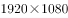
　✅
- **D**. 
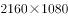

**答案**：C

**官方解析**

本题考查科技常识。

屏幕分辨率是指屏幕显示的分辨率。屏幕分辨率确定计算机屏幕上显示多少信息的设置，以水平和垂直像素来衡量。1080P是由美国电影电视公司工程协会所制定的格式标准。1080P是一种逐行扫描达到的分辨率格式。因此选项C正确。

故正确答案为C。

---

## 言语理解与表达

### 材料 1

        在宇宙大爆炸的初期，整个宇宙都处在极小的范围内和极高的温度条件下，不可能形成中性原子，光子、电子和质子只能是以等离子体的形式存在，类似于一种液态的“离子汤”，在这种条件下，量子效应占主导地位。随后在宇宙暴涨过程中产生的扰动使液态宇宙中的物质密度有所不同，在其中高密度的区域由于光子和重子（质子和中子）之间的耦合作用会产生向外的压力，因而向外扩张，这些区域在向外扩张的过程中造成内部压力减小，随后又要反过来受到周围相对高压区域的挤压，<u>这个过程实际上就是一种波动</u>，它传播的方式非常类似于声波，这种“声波”，此前就被理论学家们预测存在，被称为“重子声波振荡”。

#### 第 1 题　qid 2261520 · 片段阅读

画线句子中的“这个过程”指的是：

- **A**. 宇宙暴涨及其扰动的过程
- **B**. 光子和重子之间的耦合
- **C**. 高密度区域扩张和挤压　✅
- **D**. 液态宇宙中声波的传播

**答案**：C

**官方解析**

首先定位原文找到代词所在的位置，接下来往前寻找其指代对象。前一句话指出在宇宙暴涨过程中产生的扰动使液态宇宙中的物质密度发生了改变，高密度区域的光子和重子之间的耦合作用会向外扩张，同时内部压力的减小反过来又会受到外部高压区域的挤压，因此“这个过程”指的是液态宇宙中由于区域密度的不同导致的向外扩张和向内挤压的过程，对应C项。
A项，“宇宙暴涨及扰动的过程”会使液态宇宙区域密度有所不同，是“这个过程”出现的前提条件，并非“这个过程”本身，排除。
B项，“光子和重子之间的耦合”会产生向外的压力，表述不全面，排除。
D项，“声波的传播”位于“这个过程”之后，非其指代的内容，排除。
故正确答案为C。
【文段出处】《宇宙的涟漪》

---

#### 第 2 题　qid 2261521 · 片段阅读

根据这段文字，对于“重子声波振荡”来说：

- **A**. 其传播形式缘于质子、电子和光子之间的耦合作用
- **B**. 它可能出现在极小的宇宙范围和极高的温度条件下
- **C**. 声波传播速度受到宇宙膨胀程度和温度高低的影响
- **D**. 液态宇宙内部产生的量子扰动现象是其形成的原因　✅

**答案**：D

**官方解析**

A项，“电子和光子之间的耦合作用”会产生向外扩张的压力，而对于“重子声波振荡”的产生，还要受到外部挤压，二者的共同作用才是其产生的原因，表述片面，排除。
B项，“极小的宇宙范围和极高的温度条件”是宇宙大爆炸初期的情况，“重子声波振荡”是在宇宙暴涨过程中出现的，故宇宙大爆炸初期不可能出现这一现象，表述错误，排除。
C项，“声波传播速度”文段没有提及，无中生有，排除。
D项，根据“随后在宇宙暴涨过程中产生的扰动使液态宇宙中的物质密度有所不同，在其中高密度的区域由于光子和重子（质子和中子）之间的耦合作用会产生向外的压力”可知，“重子声波振荡”形成的原因是液态宇宙内部产生的量子扰动现象，表述正确，当选。
故正确答案为D。
【文段出处】《宇宙的涟漪》

---

### 材料 2

        影视史学的诞生有着史学自身发展变化的背景。20世纪70年代以来，西方新史学在其发展进程中日渐弊端丛生，历史著作中栩栩如生的人物与引人入胜的情节没有了，史学变成了“没有人的历史学”。在这种情况下，学界“让历史回归历史”的呼声不绝于耳。到了80年代，叙事体史书又为史学界所看重，相关著作陆续问世。这种史学发展的嬗变对以叙述为专长的影视史学的产生，无疑起到了某种推波助澜的作用。同时，影视文学还是时代发展与社会变革的产物，特别是近百年来媒体革命的结果。当历史学家还沉湎于档案文书、在尘埃扑面的故纸堆中爬梳的时候，1895年电影悄然诞生了，观众被那些“移动照片”所产生的视觉冲击震撼了。以电影发明为滥觞的媒体革命，将人类视觉图像文化不断推向一个又一个新阶段。这种延续不断的媒体革命，也日益在史学中引起连锁反应。现代媒体与史学开始了“联姻”。

#### 第 3 题　qid 2261528 · 片段阅读

对这段文字概括最准确的是：

- **A**. 史学与现代媒体的“联姻”
- **B**. 影视史学的缘起和发展趋势　✅
- **C**. 史学发展的嬗变历程及作用
- **D**. 媒体革命助推影视史学发展

**答案**：B

**官方解析**

首句指出影视史学的诞生与史学自身发展变化的背景相关，然后具体阐述了史学的发展变化以及对影视史学产生的作用，接下来通过“同时”表并列，阐述了“影视文学还是时代发展与社会变革的产物，特别是近百年来媒体革命的结果”，然后详细阐述了媒体革命对影视史学发展的影响。最后指出延续不断的媒体革命会引起史学的连锁反应，现代媒体和史学开始了“联姻”，即指出影视史学发展的趋势，因此文段论述了影视史学的产生原因以及发展趋势，对应B项。
A、C两项主题词错误，文段谈论的核心话题为“影视史学”，选项偏离文段中心，均排除。
D项，“媒体革命助推影视史学发展”是对应“同时”之后的内容，表述片面，排除。
故正确答案为B。
【文段出处】《影视史学：亲近公众的史学新领域》

---

#### 第 4 题　qid 2261530 · 片段阅读

下列说法与原文不相符的是：

- **A**. 视觉图像文化营造了史学新世界
- **B**. 电影发明冲击了传统“书写史学”
- **C**. 史学和现代科技结合势不可挡　✅
- **D**. 影视史学已发展成为独立学科

**答案**：C

**官方解析**

A项，根据“以电影发明为滥觞的媒体革命，将人类视觉图像文化不断推向一个又一个新阶段。这种延续不断的媒体革命，也日益在史学中引起连锁反应。现代媒体与史学开始了‘联姻’”可知，视觉图像文化对史学的发展产生了重要影响，表述正确，排除；
B项，根据“当历史学家还沉湎于档案文书、在尘埃扑面的故纸堆中爬梳的时候，1895年电影悄然诞生了，观众被那些‘移动照片’所产生的视觉冲击震撼了”可知，表述正确，排除；
C项，根据“这种延续不断的媒体革命，也日益在史学中引起连锁反应”可知，媒体革命影响了史学的发展，“现代科技”扩大范围，与原文不符，当选；
D项，根据“影视史学的诞生有着史学自身发展变化的背景”说明影视史学已发展成为一门独立的学科，表述正确，排除。
本题为选非题，故正确答案为C。
【文段出处】《影视史学：亲近公众的史学新领域》

---

### 材料 3

        改革开放以来，我国哲学研究取得喜人成就，但也存在值得关注和解决的突出问题：一些研究没有真正直面并破解“中国问题”，缺乏问题意识和问题导向。一个时期以来，哲学研究中既有“口号”哲学，也有“文本”哲学；既有“抽象”哲学，也有“概念”哲学。这些哲学和哲学研究在某种意义上具有一定合理性，但存在一些共同缺陷，就是不怎么接“中国地气”，较少关注“中国问题”；多见“学术”，少见“思想”；多见“理论文章”，少见“现实社会”；多见“学院派”，少见“实践派”等等。例如，一些研究人学的学者，较少研究现实社会中活生生的、感性的人，注重的多是些抽象的人学概念或范畴；一些研究实践唯物主义的学者，用很多精力研究实践唯物主义的范畴、理论，却较少关注和研究真正的社会实践。这样的哲学研究<u>      </u>，现实的人和现实生活世界也会远离这样的哲学研究。结果，我们的一些哲学研究变成了自言自语、自卖自夸，这样的教训值得总结。

#### 第 5 题　qid 2261532 · 片段阅读

这段文字意在强调，对于哲学研究而言：

- **A**. 长远出路在于理论结合实践
- **B**. 需从抽象文本转向社会实践
- **C**. 应秉持“理论优先”的原则
- **D**. 应增强问题意识和问题向导　✅

**答案**：D

**官方解析**

文段首先指出我国哲学研究的问题，表现为没有真正直面并破解“中国问题”，缺乏问题意识和问题导向，接着进行具体分析并通过举例的方式阐述了哲学研究中存在的问题，尾句指出这种不接地气的哲学研究所导致的后果。因此文段意在强调哲学研究应直面“中国问题”，增强问题意识和问题导向，对应D项。
A项“理论结合实践”、B项“转向社会实践”、C项“理论优先”均没有提及文段的核心话题“问题意识和问题导向”，偏离文段的中心，排除。
故正确答案为D。
【文段出处】《哲学需直面“中国问题”》

---

#### 第 6 题　qid 2261533 · 语句表达

填入画横线部分最恰当的一项是：

- **A**. 过于侧重纯理论探索和文本解读
- **B**. 远离了现实的人和现实的生活世界　✅
- **C**. 忽视了对现实问题及原因的反思
- **D**. 因对象的局限性而缺乏现实根基

**答案**：B

**官方解析**

横线出现在文段中间，需要结合前后文内容进行分析。“这样的研究”是对前文举例的内容进行概括，后文出现“也”表示并列，后文说“现实的人和现实生活世界也会远离这样的哲学研究”，横线处表示哲学研究先远离了现实的人和现实生活世界，对应B项。
A项 “过于侧重纯理论探索和文本解读”为前文举例中的一个方面，表述片面，且无法概括前文的内容，排除。
C项“忽视了对现实问题及原因的反思”、D项 “因对象的局限性而缺乏现实根基”均与后文衔接不当，排除。
故正确答案为B。
【文段出处】《哲学需直面“中国问题”》

---

#### 第 7 题　qid 2261505 · 逻辑填空

近年来，杭州大力实施城市国际化战略，着力      东方生活品质之城，以其开放的姿态和优厚的待遇招募并集聚了大量高端人才。
填入画横线部分最恰当的一项是：

- **A**. 建造
- **B**. 打造　✅
- **C**. 制造
- **D**. 营造

**答案**：B

**官方解析**

横线处所填词语搭配“城市”，C项“制造”指将原材料加工成为可供使用的物品或有意识地造成某种氛围、局面，D项“营造”现在通常用于搭配环境、气氛、氛围，C、D两项均与“城市”搭配不当，排除；对比A、B两项，“建造”与“打造”均可与“城市”搭配，但“打造”着力突显人们创造事物的决心、对事物品质的关注以及所采用的制造方式的力度，相较于“建造”语义更丰富，用在此处更为恰当，锁定B项。
故正确答案为B。
【文段出处】《杭州连续五年当选“外籍人才最爱城市”》

---

#### 第 8 题　qid 2261506 · 逻辑填空

“世事洞明皆学问，人情练达皆文章”，自古以来，中国人就讲究得体说话，灵活办事，       ，不管是说话，还是与人交往、办事，都蕴藏着深奥的玄机。
填入画横线部分最恰当的一项是：

- **A**. 一个萝卜一个坑
- **B**. 落地有声
- **C**. 可钉可铆　✅
- **D**. 见风使舵

**答案**：C

**官方解析**

横线前提到中国人自古以来就讲究得体说话、灵活办事，横线后接着进行了纵深说明，阐述了不只是说话，在其他方面也同样讲究得体说话、灵活办事，因此横线处应填一个表示办事说话适度、灵活、不死板意思的词语，C项“可钉可铆”同“可丁可卯”，指恰好、不多不少，可体现灵活、适度之意，符合语境，当选。
A项，“一个萝卜一个坑”比喻一个人有一个位置，没有多余，与文意不符，排除；
B项，“落地有声”形容人说话做事坚强有力，强调的是有力而非灵活适度，不符合文段语境，排除；
D项，“见风使舵”比喻看势头或看别人的眼色行事，为贬义词，文段强调说话得体、灵活办事并非坏事，选项与文段感情色彩不符，排除。
故正确答案为C。

---

#### 第 9 题　qid 2727291 · 逻辑填空

著名社会学家费孝通先生所             的乡土中国，正在发生改变。在我们的传统社会里，人际关系织成了一张张庞大而复杂的网，或因血缘，或因地缘，或因姻亲……，各种“缘”让彼此熟悉、彼此关照，乡土中国是一张通过“熟人”             的网络。
填入画横线部分最恰当的一项是：

- **A**. 描写 汇聚
- **B**. 描绘 织就　✅
- **C**. 形容 写就
- **D**. 描摹 织成

**答案**：B

**官方解析**

第一空，搭配“乡土中国”。A项“描写”指用语言文字等把事物的形象或客观事实表现出来、B项“描绘”指描画、C项“形容”指对事物的形象或性质加以描述，均与“乡土中国”搭配恰当，保留。D项“描摹”指照着底样写和画，也指用语言文字表现人或事物的形象、情状、特性等，强调的是临摹，通常搭配具体的事物，与“乡土中国”搭配不当，排除。
第二空，搭配“网络”。B项“织就”与“网络”搭配恰当，符合语境，当选。A项“汇聚”指汇集、聚集，与“网络”搭配不当，排除。C项“写就”与“网络”搭配不当，排除。
故正确答案为B。

---

#### 第 10 题　qid 2261508 · 逻辑填空

历史上的许多变革往往不是一帆风顺的，会因为不被理解而引起一些人的非议甚至      ，特别是当      到某些集团的利益时，还会受到猛烈的攻击。
填入画横线部分最恰当的一项是：

- **A**. 抵制  触动　✅
- **B**. 反抗  触动
- **C**. 抵制  触发
- **D**. 抵抗  触碰

**答案**：A

**官方解析**

第一空，根据递进关联词“甚至”可知，横线处所填词语语义应比“非议”程度重，且根据后文“特别是”“还会受到猛烈的攻击”可知，横线处所填词语的语义要比“攻击”程度轻，A项和C项“抵制”指阻止，不让侵入，符合文段语境，保留；B项“反抗”指反对并抵抗，D项“抵抗”指用力量制止对方的进攻，均对应后文的“攻击”，是受到攻击时采取的做法，二者均无法与“攻击”构成递进关系，排除。
第二空，搭配“利益”，A项“触动”指接触到，碰、撞，与“利益”搭配恰当，当选。C项“触发”指因触动而激发起某种反应，后面一般搭配情感或某种反应，如“触发乡愁”“触发连锁反应”，也可搭配具体的事物，如“触发地雷”“触发电路”等，与“利益”搭配不当，排除。
故正确答案为A。

---

#### 第 11 题　qid 2261891 · 逻辑填空

地球是一个不规则的椭圆体，想要把球体        在平面上，必须要经过投影。所谓投影，就是将地球椭圆上的点        到地图平面上的点的方法。而经过投影呈现出的地图，最终都会不同程度地出现        的现象。
填入画横线部分最恰当的一项是：

- **A**. 显露 调换 偏差
- **B**. 展现 改换 畸变
- **C**. 呈现 转换 失真　✅
- **D**. 表现 更换 扭曲

**答案**：C

**官方解析**

第一空，所填词语表示用平面来表示球体，B、C、D三项均可填入，保留；A项“显露”意为明显表露，有由原来看不见的变成看得见之意，而文中只是变换一种表现方法，无法与文段形成对应，排除。
第二空，此处“地球椭圆上的点”和“地图平面上的点”实质上是一个点，B项“改换”和D项“更换”都是指改掉原来的，换成别的，因此不能对应文意，排除；而C项“转换”可以指从一种形式变成另一种形式，符合文意，保留。
第三空，代入验证，投影的方式会出现“失真”的情况，即强调失去了本来的面貌，符合文意，C项当选。
故正确答案为C。
【文段出处】《网曝常用世界地图“错得离谱”专家反驳》

---

#### 第 12 题　qid 2261509 · 逻辑填空

现行“以药养医”制度使得部分医疗机构成为逐利机构。医院收入、科室奖金相当一部分来自于药品创收，部分医疗机构和医生在利益的诱惑下，或明或暗地向企业索要回扣。       “以药养医”的制度不解决，滋生腐败的土壤      不可能铲除，治理商业贿赂的效果      只能是表面的和暂时的。
填入画横线部分最恰当的一项是：

- **A**. 即使  也  也
- **B**. 因为  就  就
- **C**. 如果  就  也　✅
- **D**. 因为  也  就

**答案**：C

**官方解析**

本题可从前两空入手，文段首先阐述了“以药养医”制度所带来的弊端，后文通过“‘以药养医’的制度不解决”、“滋生腐败的土壤······不可能铲除”从反面的角度进行假设，故需填入表示假设关系的关联词，C项“如果······就”符合语境。A项如果填入“即使······也”，后文应为肯定的表达，与文意矛盾，排除；B、D两项“因为”引导原因，不表示假设，均排除。
第三空代入验证，“也”填入此处与前一分句形成并列，表意恰当。故正确答案为C。
【文段出处】《关于改革“以药养医”机制的建议》

---

#### 第 13 题　qid 2261607 · 逻辑填空

矛盾不可避免，问题总是存在，但我们既不能因为畏惧困难就      ，也不能只凭      的一腔血勇。
填入画横线部分最恰当的一项是：

- **A**. 高歌猛进  临危不惧
- **B**. 如履薄冰  赤手空拳
- **C**. 裹足不前  暴虎冯河　✅
- **D**. 故步自封  匹夫之勇

**答案**：C

**官方解析**

第一空，横线处所填词语与“畏惧困难”对应，强调因害怕困难而不敢上前，需填入消极色彩的词语，A项“高歌猛进”形容在前进的道路上，充满乐观精神，排除；B项“如履薄冰”比喻行事极为谨慎，存有戒心，强调主观心态上的小心谨慎，感情色彩均与文段不符，排除。C项“裹足不前”形容有所顾虑而止步不敢向前，D项“故步自封”比喻守着老一套，不求进步，二者均符合文意，保留。
第二空，横线处所填词语与后文的“一腔血勇”对应，强调空有一番勇气，C项“暴虎冯河”比喻有勇无谋，鲁莽冒险，置于此处符合文意，当选。D项“匹夫之勇”指不用智谋单凭个人的勇力，与文意不符且与后文重复，排除。
故正确答案为C。
【文段出处】《让改革带着温度落地》

---

#### 第 14 题　qid 2261510 · 逻辑填空

千年古树前排起      的长队，白发苍苍的老人，对着古树闭目祈福，神情专注，良久方罢。一棵古树，为什么能激发人们最为深沉的敬畏之心？或许是因为，古树是时间的一个      符号，人们向古树祈祷，实际上是在向时间表达敬畏。而时间的深沉力量，正在于其涵养了文化，塑造了一个民族的精神与心灵。
填入画横线部分最恰当的一项是：

- **A**. 顶礼膜拜  具象　✅
- **B**. 奉若神明  意象
- **C**. 毕恭毕敬  表象
- **D**. 肘行膝步  形象

**答案**：A

**官方解析**

第一空，根据后文信息“对着古树闭目祈福，神情专注，良久方罢”、“敬畏之心”可知，横线处应填写一个积极色彩的词汇，“顶礼膜拜”指虔诚地跪拜，“毕恭毕敬”形容态度十分恭敬，二者均符合语境。B项“奉若神明”形容对某些人或事物的盲目尊重，含贬义，排除；D项“肘行膝步”指匍匐前行，表示虔诚或哀戚，文段强调的是闭目祈福，而非匍匐向前，与文意不符，排除。
第二空，搭配“符号”，表示古树与时间的关系，“古树”是代表时间具体的事物， A项“具象”指具体的形象，符合语境。C项“表象”指经过感知的客观事物在脑中再现的形象，与“本质”相对，“时间”并非“古树”的本质，且和“符号”搭配不当，排除。
故正确答案为A。
【文段出处】《是历史赞美了时间》

---

#### 第 15 题　qid 2261511 · 逻辑填空

“旧时王谢堂前燕，飞入寻常百姓家”。唐代诗人刘禹锡在朱雀桥边、乌衣巷口，      历史的沧桑无言。繁华落寞间，多少亭台楼榭在历史的烟雨中      。后世之人在秦淮河的粼粼碎影中      ，缅怀着六朝淡去的风景，寄托着平凡的生命个体对于国家前途命运的关照。
填入画横线部分最恰当的一项是：

- **A**. 感喟  泯灭  浅吟低唱　✅
- **B**. 哀叹  湮灭  高谈阔论
- **C**. 痛悼  埋没  长吁短叹
- **D**. 惋惜  消逝  千言万语

**答案**：A

**官方解析**

第一空，诗人刘禹锡通过诗句表达了自己对历史的沧桑无言，B项“哀叹”指呜咽地悲叹、悲哀地叹息；C项“痛悼”指沉痛哀悼；D项“惋惜”指可惜，引以为憾，三者与文段语境不符，语义过重，排除；A项“感喟”指有所感触而叹息，符合语境，基本锁定A项。
后两空，代入验证，“泯灭”指消亡净尽；“浅吟低唱”指淡淡地诉说，对应前文诗人通过诗句来发出对历史感叹，符合语境。
故正确答案为A。
【文段出处】《南京秦淮河重现桨声灯影 映衬城市快速发展》

---

#### 第 16 题　qid 2261512 · 语句表达

下列各句中，划线成语使用不恰当的一句是：

- **A**. 
此旅游的人们，面对着太湖的水色山光，又焉能不为大自然<u>巧夺天工</u>的造化而惊叹呢！
　✅
- **B**. 
<u>毋庸置疑</u>，中国传统文化是人类历史上的一笔宝贵财富。

- **C**. 
集电话、电脑、相机、信用卡等功能于一体，手机在生活中的作用被发挥得<u>淋漓尽致</u>。

- **D**. 
作者诚恳地说，书中不少看法都是<u>一孔之见</u>。

**答案**：A

**官方解析**

A项“巧夺天工”指人工的精巧胜过天然，形容技艺十分巧妙，而文段说的是太湖的水色山光是“大自然”的“造化”，而非人工形成，与成语使用的语境不符，当选。
B项“毋庸置疑”指不必怀疑，C项“淋漓尽致”形容文章或说话表达得非常充分、透彻，或非常痛快，D项“一孔之见”比喻狭隘片面的见解，用在此处是作者的自谦表达，均符合语境，排除。
本题为选非题，故正确答案为A。
【文段出处】文汇报《太湖，你为何不平静》

---

#### 第 17 题　qid 2261608 · 语句表达

①这种含有人体活体细胞的生物芯片，是微流控技术、细胞生物学、生物材料与干细胞技术的结合体
②在我国这种技术尚处于探索阶段，但是非常值得肯定的
③但毕竟动物不是人类本身，其对药物的反应与人体对药物的反应还是有差异的，这也造成了动物实验在药物筛选上的缺陷
④作为一种具有功能化的缩微组织器官类型，器官芯片专门用于药效评价等方面的研究
⑤研发一种新药，首先要通过动物实验，之后进入临床实验，被验证是安全、有效后，才可批准上市
⑥为了解决这一缺陷，一种结合电子技术与生物科学技术的器官芯片走进了生物医药领域
将以上6个句子重新排列，语序正确的是：

- **A**. ⑤②③⑥①④
- **B**. ④①⑤③⑥②
- **C**. ④②①⑤③⑥
- **D**. ⑤③⑥①④②　✅

**答案**：D

**官方解析**

首先对比选项，首句不好判断。接着进一步观察发现，⑤句强调研发新药要首先通过动物实验，再进行临床实验，而③句论述动物实验存在缺陷，由关联词“但是”连接，两者构成语义上的转折关系，且提到“动物”这一共同信息，故应将⑤③进行捆绑，排除A项；继续分析可知，⑥句论述“器官芯片”走进生物医药领域，①句中的“这种器官芯片”指代⑥句内容，④句继续论述“器官芯片”的功能，三句围绕同一话题展开，故⑥①④构成捆绑，即可锁定D项，排除B、C两项。
故正确答案为D。
【文段出处】《器官芯片能否取代动物实验？》

---

#### 第 18 题　qid 2261514 · 语句表达

下列各句中没有语病的一句是：

- **A**. 中医药学以天地人整体观来把握人的健康维护与疾病防治。　✅
- **B**. 在保障个人信息安全的整个链条上，我们不能苛求作为信息源头的个人高度“自保”，更是要严厉打击依靠信息泄露来获取非法利益的行为。
- **C**. 中华文明深厚丰美，用电视节目将它呈现给更多人，让更多人找寻到自己的文化归宿和文化自信，是对一代电视人的文化使命。
- **D**. 理论的温度来自火热的社会生活，来自人民群众；一旦离开社会实践和人民群众，理论就会变得冰冷、僵硬的感觉。

**答案**：A

**官方解析**

A项没有语病，当选；
B项关联词使用错误，“更”表示递进，原文前后句子成分之间语义相反，而非递进关系，应将“更是”改为“而是”，排除；
C项从句子成分看，最后一句的“是”字与“对”字重复，应去掉最后一句的“对”字，排除；
D项或者去掉“的感觉”或者把“变得”改为“有”，排除。
故正确答案为A。
【文段出处】光明日报《公众信息保管者当筑牢防火墙》

---

#### 第 19 题　qid 2261609 · 语句表达

一种错误的认识是，只有热情开朗乃至经常喋喋不休的人，才有更强的适应性，也更容易在群体中受欢迎，这种印象让那些内向的人有些自卑，甚至怀疑自己有社交障碍，转而求助于心理医生或抗抑郁药物。但大可不必如此，因为      。有研究显示，大约有30%的人生性内向，而这是从出生起就注定了的。
填入画横线部分最恰当的一句是：

- **A**. 并非所有的人都天生热情开朗
- **B**. 内向从来都不是一种心理疾病　✅
- **C**. 内向是可以在后天得到改善的
- **D**. 内向和开朗同样可以卓有成效

**答案**：B

**官方解析**

横线在文段中间，起到承上启下的作用，前文首先讲述很多内向的人求助于心理医生或抗抑郁药物，然后通过转折关联词“但是”强调“大可不必如此”，即告知读者这种求医的做法是不必要的，“此”指代的便是“求助于心理医生或抗抑郁药物”，由横线前的“因为”可知，应填入不必求医的原因，且后文通过研究进一步解释很多人的内向是天生的，故联系上下文，此处的原因应为内向很多为天生，本就不是疾病，因此不必求医，对应B项。
A项，“并非所有的人都天生热情开朗”不能作为不必求医的原因，排除；
C项“后天得到改善”、D项“同样可以卓有成效”在文段中均未提及，无中生有，排除。
故正确答案为B。
【文段出处】《内向者社交行为“简易指南”》

---

#### 第 20 题　qid 2261610 · 片段阅读

考古学是根据古代人类各种活动遗留下来的实物包括遗迹和遗物来研究古代社会历史的一门学科。考古学是历史学的重要组成部分，其研究对象是实物，但含义同时包括获得这种知识的考古方法和技术。因此，考古学的发展同自然科技有着紧密联系。考古学发展史也充分证明，现代自然科技应用于考古工作，能极大推动考古学的发展。
这段文字意在强调：

- **A**. 科技考古是考古工作的重要组成部分
- **B**. 自然科技应用于考古可替代考古学研究
- **C**. 考古学研究要善于借助自然科技　✅
- **D**. 考古学必须同众多相关学科互相借鉴

**答案**：C

**官方解析**

文段首先介绍考古学的定义、研究对象和含义，进而通过因果关联词“因此”得出结论，强调“考古学”和“自然科技”联系紧密、“自然科技”对“考古学”有推动作用，对应C项。
A项，“科技考古”在文段中并未提及，无中生有，排除；
B项，“可替代考古学研究”表意过于绝对，文段只强调自然科技对于考古具有重要作用，排除；
D项，“众多相关学科”无中生有，文中仅提及自然科技这一门学科技术，排除。
故正确答案为C。
【文段出处】《考古学研究要善于借助自然科技》

---

#### 第 21 题　qid 2261515 · 片段阅读

随着网购业务的火爆和监管层原则不再新增数量，第三方支付牌照近来成了“香饽饽”。在相关人士看来，网络支付必然涉及客户信息，客户是电商最强劲的竞争力，也是其最在意的商业秘密。委托其他第三方支付系统帮助完成交易，一方面要支付相关费用，另一方面又要严防客户信息泄露，商业模式被复制。比较之下，不如收购一家支付公司，进而取得相关支付牌照，既解决了现实支付问题，也保证了客户信息安全，还可借此开拓自身的商业圈子，可谓一举多得。
这段文字意在说明：

- **A**. 在互联网时代，客户信息是电商最在意的商业秘密
- **B**. 第三方支付存在支付费用高和信息安全隐患等弊端
- **C**. 支付牌照交易火热与互联网金融及公司业务扩张有关　✅
- **D**. 若要进军支付领域就得通过收购原持牌公司这一途径

**答案**：C

**官方解析**

文段开篇提出第三方支付牌照近年来成为“香饽饽”，接着解释了网络支付对于电商企业发展的重要意义，后文指出委托其他第三方支付系统对企业发展电商业务带来的不利影响，尾句通过“相较之下”指出收购一家支付公司取得支付牌照能为电商企业发展带来更多好处，故后文通过对比强调第三方支付牌照交易火热的原因，因此文段主要强调的是第三方支付牌照的火热与企业发展电商业务有密切的关系，对应C项。
A项，“客户信息”非重点，文段谈论的核心话题是“支付牌照”交易，排除； 
B项，“第三方支付”非重点，文段通过对比强调的是“支付牌照”交易，排除； 
D项，文段并未说要进军支付领域一定要通过收购，选项表述过于绝对，排除。
故正确答案为C。
【文段出处】《第三方支付公司并购频繁身价飙升》

---

#### 第 22 题　qid 2261611 · 片段阅读

据英国每日邮报报道，目前，科学家发现俄罗斯境内陨石中有“不可能存在的晶体”，它具有奇特的循环结构，多年以来，科研人员认为这种准晶体只能人工制造。这项最新发现表明，该晶体是自然界存在的第三种奇特材料。这种准晶体是5年前在俄罗斯远东哈泰尔卡地区的陨石中发现的，研究小组称，使用扫描电子显微镜分析这种陨石，显示微小的准晶体样本宽度仅有几微米。之前科学家在相同陨石中发现两种天然准晶体，它们具有不同的结构类型。目前最新发现的准晶体具有独特均匀性，与之前存在的晶体结构不一样，它被称为“二十面体对称”。这种准晶体具有60个旋转对称点，是由铝、铜和铁矿物质构成。
根据这段文字，可以推知：

- **A**. 第三种准晶体并非天然存在的晶体
- **B**. 三种准晶体都具有相同的化学成分
- **C**. 三种准晶体间存在显著的结构差异　✅
- **D**. 陨石是迄今准晶体样本的唯一来源

**答案**：C

**官方解析**

C项，由“之前科学家在相同陨石中发现两种天然准晶体，它们具有不同的结构类型”以及“目前最新发现的准晶体具有独特均匀性，与之前存在的晶体结构不一样”可知，三种准晶体间有显著的结构差异，表述正确，当选。
A项，由“该晶体是自然界存在的第三种奇特材料”可知，第三种准晶体为天然存在的晶体，表述有误，排除；
B项，由“这种准晶体具有60个旋转对称点，是由铝、铜和铁矿物质构成”仅可知道第三种晶体的化学成分，不能推知三种准晶体成分是否相同，排除；
D项，“唯一来源”表述有误，文段仅就这一个样本讨论，无法推出是否为唯一的样本来源，排除。
故正确答案为C。
【文段出处】《科学家在陨石中发现第三种“不可能存在”的准晶体!》

---

#### 第 23 题　qid 2261516 · 片段阅读

在中国文学史上，为“正蒙养而裨后学”的《古文观止》确实是古代文言文之集大成者，而叙述魏晋名士轶闻琐事和玄言清谈的《世说新语》却也不失为一部清新脱俗的传世经典。除了最著名的《兰亭集序》，王羲之留下的字帖，很多都是他日常写给朋友的书信，寥寥数语，短小精悍，字体流畅自在，展现出一种浓厚的生活气息。“奉橘三百枚，霜未降，未可多得”——《奉橘帖》共十二个字，不加修饰，毫无矫揉造作，却是字字可圈可点。张旭的《肚痛帖》也仅仅记载了一件似乎难登大雅之堂的琐事：“忽肚痛不可堪，不知是冷热所致，欲服大黄汤，冷热俱有益。如何为计，非临床。”这篇一气呵成、放纵恣肆的草书，却成了传世佳作。
对这段文字概括最恰当的是：

- **A**. 鸿篇巨制是好的文艺创作的最重要标准
- **B**. 古代书法艺术给现代文艺创作带来启示
- **C**. 中国文艺史包罗万象，创世经典蔚为大观
- **D**. “接地气儿”是文艺创作的重要元素之一　✅

**答案**：D

**官方解析**

文段开篇通过对比引出叙述魏晋名士轶闻琐事和玄言清谈的《世说新语》，即文学作品并非是鸿篇巨制，也可以记录生活的琐事，接着介绍了王羲之所留下的具有浓厚生活气息的字帖《奉橘帖》，以及张旭描述的难登大雅之堂的琐事草书《肚痛帖》，因此文段通过三个事例来说明真实的生活描写也是文艺创作的一种重要元素，对应D项。
A项，“鸿篇巨制”与作者的观点相悖，且“最重要”无中生有，排除； 
B项，“古代书法艺术”仅是例子表述，且“带来启示”表述不明确，文段强调的是文艺创作可以贴近生活，排除；
C项，“中国文艺史包罗万象”文段并未提及，无中生有，排除。
故正确答案为D。
【文段出处】《从古代书法看当代文艺创作》

---

#### 第 24 题　qid 2261517 · 片段阅读

一项研究显示，某些病原体可能演化出对女性造成的疾病严重程度和致死率低于男性的特性。除了可以通过和男性一样的方式将病原体传递给其他人群外，女性还可以在怀孕、生产和哺乳期将病原体传递给子女。研究显示，女性较男性额外拥有的病原体传播机会可能对病原体产生充分的演化压力，推动病原体的性别特异病毒性演化。
最适合做这段文字标题的是：

- **A**. 女性的免疫反应比男性更强
- **B**. 女性拥有更多的病原体传播途径
- **C**. 病原体或对女性更为“宽容”　✅
- **D**. 病原体不会在女性体内引发严重疾病

**答案**：C

**官方解析**

文段开篇指出一项研究结果，即有些病原体对女性所造成的疾病严重程度和致死率要低于男性，接着介绍了女性拥有更多的病原体传播途径，尾句进一步阐述了女性较男性额外拥有的病原体传播机会可能会推动病原体的性别差异演化，后文的内容是对首句的观点进行解释说明。因此文段主要强调的是相较于男性，病原体对于女性的危害要轻，对应C项。
A项，文段的主题词是“病原体”，选项表述偏离文段中心，排除；
B项，文段主要是通过女性拥有更多的病原体传播途径来证明病原体对女性的危害要轻，选项为论证部分的内容，非重点，排除；
D项， “不会在女性体内引发严重疾病”，表述过于绝对，文段只是说病原体对女性的危害比男性轻，故排除。
故正确答案为C。
【文段出处】《病原体对女性比较“宽容”》

---

#### 第 25 题　qid 2261612 · 片段阅读

内容为王，虽是老生常谈，但并不过时。对文化消费而言，排在第一位的永远是内容。如果故宫博物院的展出没有什么可看的内容，那么不管是直播还是VR都无法吸引观众；如果一部电影没有好的故事内核作支撑，那么再酷炫的科技手段也无法拯救其不理想的口碑；如果戴上VR眼镜却看不到吸引人的任何内容，那么所谓的新科技设备也只能沦为摆设。
根据这段文字可知作者想说的是：

- **A**. 传统元素若要玩出新花样就得走科技道路
- **B**. 新技术正全方位地改变着文化的消费方式
- **C**. 文化内容本身越来越多地被打上技术的烙印
- **D**. 在文化消费领域追逐技术不能忽视内容的供给　✅

**答案**：D

**官方解析**

文段开篇首先指出在文化消费中，内容应该排在第一位，继而通过三个具体例子进行论证，重点强调在文化消费中，没有内容而徒有科技是不可取的，对应D项。
A项，“传统元素”表述片面，且未提及文段主题词“内容”，偏离中心，排除；
B项，未提及文段核心话题“内容”，排除；
C项，“文化内容本身越来越多地被打上技术的烙印”在文段中并未提及，无中生有，排除。
故正确答案为D。
【文段出处】《追逐技术莫忘内容》

---

#### 第 26 题　qid 2261613 · 片段阅读

炭黑是化石燃料和生物燃料燃烧产生的特殊物质。研究人员发现证据证明，化石燃料和生物燃料——例如植物和动物粪便——燃烧是“第三极”炭黑的来源。在喜马拉雅地区，这两种来源基本持平，大部分炭黑来自于印度北部印度河——恒河平原，而在青藏高原北部，大部分炭黑来自于中国燃烧的化石燃料。但是在青藏高原中部内陆地区，三分之二的炭黑样本来自于生物燃料而不是化石燃料，康世昌说，这一发现“非常令人惊讶”。这意味着西藏中部的燃料燃烧行为，例如每天做饭取暖燃烧的牦牛粪便，给“第三极”某些部分带来的污染比专家之前想象得更多。
与这段文字最相符的一项是：

- **A**. “第三极”冰川融化的肇因是烧牛粪
- **B**. 空气污染对冰川的威胁超过温室效应
- **C**. 西藏中部的污染源主要来自生物燃料　✅
- **D**. 化石燃料和生物燃料的污染基本持平

**答案**：C

**官方解析**

C项，由文段“在青藏高原中部内陆地区，三分之二的炭黑样本来自于生物燃料而不是化石燃料······这意味着西藏中部的燃料燃烧行为······给‘第三极’某些部分带来的污染比专家之前想象得更多”可知，C项表意正确，当选；
A项，“冰川融化的肇因是烧牛粪”表述有误，“烧牛粪”仅是一个例子；B项，“空气污染对冰川的威胁超过温室效应”文中并无表述，无中生有，排除；D项，忽略了地区前提，文段中为“在喜马拉雅地区，这两种来源基本持平”，排除。
故正确答案为C。
【文段出处】《青藏高原冰川因“烧牛粪”面临融化威胁》

---

#### 第 27 题　qid 2261614 · 片段阅读

作为经济转型发展的一支重要力量，体育产业近年来在国家层面得到了前所未有的重视，政策利好不断出台。体育产业打通了旅游、娱乐、文化、科技、教育等诸多领域，搭建起全新平台，体育的多元价值也由此得到挖掘。如果说政策面的引导和扶持打开了一扇门，指明了一条路，那么，无数创业主体、创新思路，则是将之发扬光大的最重要内生动力。他们的开拓精神和聪明才智，从涓涓细流汇成奔涌大潮，为体育产业的发展注入了源源不竭的力量。
作者接下来最有可能讲述的是：

- **A**. 体育创业者做出的努力　✅
- **B**. 体育产业的蓬勃发展
- **C**. 体育产业的相关政策
- **D**. 人们参与体育的热情

**答案**：A

**官方解析**

文段首先阐述了体育产业在政策的引导和扶持下得到了充分的发展，文段尾句通过“如果······那么······”，引出“无数创业主体、创新思路”发挥了重要作用，保持话题的一致性，后文应该论述“无数创业主体” 如何“为体育产业的发展注入了源源不竭的力量”，对应A项。
B项，前文已提及“蓬勃发展”的内容，即“打通了旅游、娱乐、文化、科技、教育等诸多领域，搭建起全新平台，体育的多元价值也由此得到挖掘”，后文不会再讲述，排除；
C项，“相关政策”前文已经论述过，排除；
D项，“人们参与体育的热情”与文段尾句话题不能衔接，排除。
故正确答案为A。
【文段出处】《体育产业需要创新引擎》

---

#### 第 28 题　qid 2261518 · 片段阅读

改革开放以来，我国史学发生了整体性变化，其中一个特征就是从以政治史为中心转向以社会史为中心。社会史尤其是社会文化史的研究需要特别关注人，不能只看到社会的变化而看不到人的变化。而在研究人的过程中，势必要运用心理学的理论和方法，探究人的心理特征和整个社会心理，唯有如此才能深化对社会史的研究。
这段文字意在强调：

- **A**. 我国史学研究出现整体性范式转型
- **B**. 史学研究不能局限于阐述社会变化
- **C**. 心理学是深化史学研究的重要方法　✅
- **D**. 人的心理状况属于史学研究的范畴

**答案**：C

**官方解析**

文段开篇交代背景，指出中国史学发生了变化，从政治史为中心转为社会史为中心，接着强调社会史尤其是社会文化史需要特别关注人，尾句提出具体对策，在研究人的过程中要运用心理学的理论和方法，最后通过“唯有如此”强调运用心理学的理论和方法对于史学研究的重要性，故文段的重点对应C项。
A项，“我国史学研究出现整体性范式转型”为文段的背景内容，非重点，排除；
B项，文段并未阐述“史学研究不能局限于阐述社会变化”，且选项表述也不明确，排除；
D项，“人的心理状况”是心理学的理论和方法关注的对象之一，非文段谈论的重点，且表述片面，排除。
故正确答案为C。
【文段出处】《心理史学：深化历史解释的重要方法（学科走向）》

---

#### 第 29 题　qid 2261615 · 片段阅读

国外许多有影响的指数都高度依赖数据的测量，但在测量过程中并不总是客观的，往往都有较强的意识形态色彩和主观性。比如，一些带有倾向性的测量通过问卷来采集数据，可以让某些缺乏客观数据的领域产生一定的具有态度性的测量结果，并使这样的结果数据化。然而，这种测量最让人存疑的地方在于，样本选择依据的科学性以及样本选择人群背后的意识形态问题。相比而言，客观采集的数据尽管也存在数据真实性的问题，但会相对真实一些。
这段文字意在强调：

- **A**. 指数构建高度依赖数据的测量
- **B**. 数据测量不可避免存在主观性
- **C**. 指数构建应注重客观数据采集　✅
- **D**. 两种数据测量方式之间的差异

**答案**：C

**官方解析**

文段首先指出指数构建高度依赖数据测量，然后提出在测量过程中存在较多意识形态和主观性的问题，最后通过对比指出“客观采集的数据会相对真实一些”，故文段重在强调指数构建应该注重真实性、客观性，对应C项。
A项，对应文段开头话题引入内容，非重点，排除；
B项，为问题表述，非重点，且“不可避免”表述过于绝对，排除；
D项，文段重在强调应注重客观数据采集，“两种数据测量方式的差异”偏离文段中心，排除。
故正确答案为C。
【文段出处】《构建中国自己的评价指数体系》

---

#### 第 30 题　qid 2261519 · 片段阅读

相对于“学者”而言，“评论家”常常会给人一种特定的印象：短平快的犀利文风，敏感度极高，对作品的形式、技巧、风格、流派如数家珍；但同时也会显出“浮躁”的所谓“评论家”做派，凭印象感觉率性发声，缺少严格的学理支撑，从而坠入肤浅的窠臼。相对于扎实的考史订伪的学者风范，许多评论文章作为成果在历史上留不下来，发表后如过眼烟云，转瞬即逝，无法形成有效的学术积累。作为评论家队伍中的一员，我们应该以高度的自省来直面这样的问题，并在今后的努力中逐渐纠正这类似的弊端。
对这段文字的主旨概括最恰当的是：

- **A**. 率性发声是“评论家”的魅力所在
- **B**. 评论文章因缺乏学术积累很难流传
- **C**. 评论不能忽视学理分析和逻辑演绎　✅
- **D**. “学者”和“评论家”有本质差异

**答案**：C

**官方解析**

文段开篇通过与“学者”的对比，指出“评论家”给人的特定印象，文风犀利、敏感度高，但同时也存在“浮躁”、“凭印象感觉率性发声，缺少严格的学理支撑”、“肤浅”等问题，接着通过与“扎实的考史订伪的学者风范”相比，指出许多评论文章无法形成有效的学术积累，尾句提出对策，阐述作为评论家应高度重视这些问题，并逐渐纠正这些弊端。因此文段主要强调评论家在评论时不能缺少学理支撑和“扎实的考史订伪风范”，对应C项。
A项，“率性发声”是文段陈述的评论家存在的问题之一，非重点，且表述片面，排除；
B项，“评论文章因缺乏学术积累很难流传”对应尾句之前存在的问题表述，非重点，排除；
D项，对应首句的内容，文段通过两者的对比引出评论家存在的问题，并针对问题提出对策，故非文段的重点，偏离中心，排除。
故正确答案为C。
【文段出处】《中国文艺需要怎样的“评论家”》

---

## 数量关系

### 第 1 题　qid 2261535 · 数学运算

-3，21，-105，（    ），-315

- **A**. -210
- **B**. 210
- **C**. 315　✅
- **D**. -315

**答案**：C

**官方解析**

观察数列相邻两项有明显倍数关系，，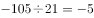，猜测后一项除以前一项所得到的新数列是公差为2的等差数列。故所求项。

故正确答案为C。

---

### 第 2 题　qid 2261544 · 数学运算

2，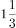，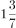，，（    ）

- **A**. 

- **B**. 

　✅
- **C**. 

- **D**. 
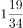

**答案**：B

**官方解析**

题干数列为分数数列。各项统一形式，为，，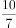，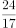。观察数列，分母的规律：前一项的分子与分母的和等于后一项的分母，，，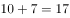，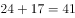，因此下一项的分母为。分子规律：前一项分母和后一项分母之和等于后一项分子，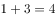，，，下一项的分子为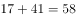。则所求项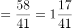。

故正确答案为B项。

---

### 第 3 题　qid 2261545 · 数学运算

12.6，22.8，34.14，45.18，（  ）

- **A**. 50.32
- **B**. 56.56
- **C**. 61.25
- **D**. 89.34　✅

**答案**：D

**官方解析**

题干均为小数，考虑机械划分。每一项的整数部分各位数字求和分别为：，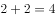，，。小数部分分别为6，8，14，18，则小数部分数字等于整数部分数字之和的2倍，观察选项，只有D项满足。

故正确答案为D。

---

### 第 4 题　qid 2261546 · 数学运算

长江三峡沿岸两个港口相距240千米，一艘轮船在它们之间行进，其逆水速度是18千米/小时，顺水速度是26千米/小时，如果一艘汽艇在静水中的速度是20千米/小时，那么该汽艇往返于两港之间共需（  ）

- **A**. 10小时
- **B**. 23小时
- **C**. 24小时
- **D**. 25小时　✅

**答案**：D

**官方解析**

设船速为，水流的速度为，①，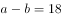②，联立①②，解得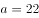千米/小时，千米/小时。已知汽艇在静水中的速度是20千米/小时，则小时，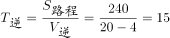小时，往返于两港时间共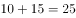小时。

故正确答案为D。

---

### 第 5 题　qid 2261547 · 数学运算

某单位组织工会活动，30名员工自愿参加做游戏。游戏规则：按1～30号编号并报数，第一次报数后，单号全部站出来，然后每次余下的人中第一个开始站出来，隔一人站出来一个人。最后站出来的人给大家唱首歌。那么给大家唱歌的员工编号是（  ）

- **A**. 14
- **B**. 16　✅
- **C**. 18
- **D**. 20

**答案**：B

**官方解析**

第一次报数后，单号全部站出来，剩余号码为2、4、6、8、10······30，均为2的倍数；每次余下的人中第一个开始站出来，隔一人站出来一个人，剩余号码为4、8、12、16、20、24、28，均为4的倍数；再从余下的号码中第一个人开始站出来，隔一个人站出来一个人，剩余号码为8、16、24，均为8的倍数；重复上一次的步骤，剩余16号，为16的倍数。所以最后站出来给大家唱歌的员工编号是16。（结论：第n次报数后，剩下人的编号为的倍数）

故正确答案为B。

---

### 第 6 题　qid 2261549 · 数学运算

何镇长决定召集甲乙丙丁四个村干部开会，这四个村每两个村相距4.5千米，参加会议的人数是甲村8人，乙村5人，丙村3人，丁村7人，何镇长准备选择其中一个村委会作为开会地点，以使所有参会人员路程最少，那么选择开会地点是（  ）

- **A**. 甲
- **B**. 乙　✅
- **C**. 丙
- **D**. 丁

**答案**：B

**官方解析**

所有人集中一个地点开会，只与每个地点的人数有关，与距离无关。先考虑甲乙两村人数和、丙丁两村人数和，前者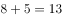人，后者人，，说明丙丁两村的人数要向甲乙方向移动；同理，甲村8人，乙丙丁三村之和人，，说明甲村的人需要向乙丙丁方向移动。综合以上可知选择开会地点为乙村。

故正确答案为B。

---

### 第 7 题　qid 2261892 · 数学运算

某市电费标准是，若月用电量不超过100千瓦时，则每千瓦时电费0.5元，若月用电量超过100千瓦时，则超过部分每千瓦时0.8元。今年9月份，小玲家比小桃家多交电费6.3元，那么小桃家这个月用电量是（  ）千瓦时。

- **A**. 89　✅
- **B**. 91
- **C**. 93
- **D**. 95

**答案**：A

**官方解析**

多交的6.3元电费，不能被0.5整除，也不能被0.8整除，说明小玲家比小桃家多用的电量一部分算0.5元/千瓦时，一部分算0.8元/千瓦时。假设小桃家用电量比100千瓦时少千瓦时，小玲家比100千瓦时多千瓦时，要使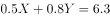，则有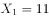，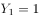，或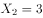，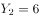。当时，小桃家用电量为千瓦时，当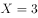时，小桃家用电量为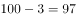千瓦时。观察选项，只有A选项成立。

故正确答案为A。

---

### 第 8 题　qid 2261552 · 数学运算

摆钟每隔半小时敲击一次，整点敲击的次数与时针指示的时刻相同，其钟面指示的最大时刻是12，那么一昼夜摆钟敲击次数一共是（  ）下。

- **A**. 90
- **B**. 170
- **C**. 180　✅
- **D**. 190

**答案**：C

**官方解析**

摆钟每隔半小时敲击一次，那么一点钟敲1下，半点敲1下，；根据整点敲击的次数与时针指示的时刻相同，那么两点敲2下，半点敲1下，；依次类推，十二点时敲了12下，半点敲1下，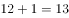，则12小时共敲击了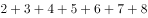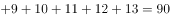下，一昼夜指的是24个小时，那么共敲击下。另一个角度：12小时内，整点敲击次，半点共敲击次，则一昼夜（24小时）共敲击次。

故正确答案为C。

---

### 第 9 题　qid 2261554 · 数学运算

某金店用一杆不标准的天平（两边臂不等长）称黄金，顾客购买10g黄金，售货员先将5g砝码放在左盘，将黄金放于右盘使之平衡后给顾客，然后又将5g砝码放于右盘，将另一黄金放于左盘使之平衡后又给顾客，则顾客实际所得黄金重量：

- **A**. 大于10g　✅
- **B**. 大于等于10g
- **C**. 小于10g
- **D**. 小于等于10g

**答案**：A

**官方解析**

设天平的左、右臂长分别为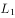和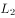，天平平衡状态下，合力为0，则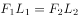(F表示天平左、右两侧所放物体的重力)。设黄金第一次的重量为，则有，解得；设第二次黄金重量为，则有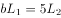，解得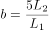。所以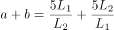。天平两边臂不等长，那么，即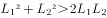，所以，则g。

故正确答案为A项。

---

### 第 10 题　qid 2261616 · 数学运算

某企业需要从A地运132吨货物到B地，有两种货车可以使用，大卡车载重量5吨，小卡车载重量2吨，每个车次的耗油量分别是10升和5升，那么理论上运完货物至少需要耗油：

- **A**. 260升
- **B**. 265升　✅
- **C**. 270升
- **D**. 275升

**答案**：B

**官方解析**

由题意可得本题为统筹规划问题，只需要比较几种运输方案的耗油量从中选出最优即可。若选择大卡车运则每吨耗油量为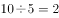升，选择小卡车则每吨耗油量为，则尽可能选用大卡车运输比较省油，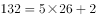，恰好使用26辆大卡车和１辆小卡车，则总耗油量升。

故正确答案为B。

---

### 第 11 题　qid 2261557 · 数学运算

两个半径不同的圆柱形玻璃杯内均盛有一定量的水，甲杯的水位比乙杯高了5厘米。甲杯底部沉没着一个石块，当石块被取出并放进乙杯沉没后，乙杯的水位上升了5厘米，并且比这时甲的水位还高10厘米，则可得知甲杯与乙杯底面积之比为：

- **A**. 3:5
- **B**. 2:3
- **C**. 3:2
- **D**. 1:2　✅

**答案**：D

**官方解析**

由题意可得本题为几何问题，需要明确石块取出前后甲乙烧杯的水位变化，再利用体积公式转换为底面积比即可。假设石块取出后甲杯水位下降厘米，则以乙杯原水位为基准，分析甲杯水位的变化可得：，解得厘米。可设甲乙两杯底面积分别为，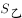，则由圆柱形体积公式可得：，则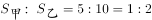。

故正确答案为D。

---

### 第 12 题　qid 2261559 · 数学运算

一项农村家庭的调查显示，电冰箱拥有率为，电视机拥有率为，洗衣机拥有率为，至少有两种电器的占，三种电器齐全的占，则一种电器都没有的比例为：

- **A**. 

　✅
- **B**. 

- **C**. 

- **D**. 

**答案**：A

**官方解析**

“至少有两种电器的占”说明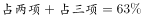，占两项电器的为。利用三集合非标准型公式：，代入数据，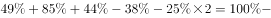都不，即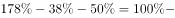都不，则都不。

故正确答案为A。

---

### 第 13 题　qid 2261617 · 数学运算

某画廊设计展出10幅不同的画，其中5幅国画，4幅油画，1幅水彩画，展览时排成一行，要求同一品种的画必须靠在一起，且水彩画不放在两端，那么不同的陈列方式有（  ）种。

- **A**. 
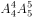

- **B**. 
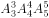

- **C**. 
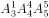

- **D**. 
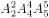
　✅

**答案**：D

**官方解析**

由题意可得本题为排列组合问题，分步排列即可。同一品种的放一起，则5幅国画捆绑在一起，内部全排为，4幅油画捆绑在一起，内部全排为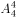，由于水彩画只能摆中间，则国画和油画全排为，总排列数为。

故正确答案为D。

---

## 判断推理

### 第 1 题　qid 2261560 · 图形推理

根据图形规律，填入问号处最适合的一项是：

- **A**. A
- **B**. B　✅
- **C**. C
- **D**. D

**答案**：B

**官方解析**

元素组成不同，且无明显属性规律，考虑数量规律。观察发现，题干图形均为多边形被分割，面数量明显，优先考虑数面，题干图形面的数量依次为：1、2、3、4、？，问号处应填写一个面的数量为5的图形，没有答案。再次观察发现题干图形均由直线构成，考虑数直线数，题干图形直线数依次为4、5、6、7、？，因此问号处应填写一个直线数为8的图形，只有B项符合。
故正确答案为B。

---

### 第 2 题　qid 2261562 · 图形推理

根据图形规律，填入问号处最适合的一项是：

- **A**. A
- **B**. B
- **C**. C
- **D**. D　✅

**答案**：D

**官方解析**

观察图形发现，题干每幅图都两个面拼接在一起，可以考虑图形间关系。第一组的图形间关系为：两个小图形都有一条完整的公共边；第二组的图形间关系为：两个小图有一部分公共边。只有D项符合。
故正确答案为D。

---

### 第 3 题　qid 2261563 · 图形推理

根据图形规律，填入问号处最合适的一项是：

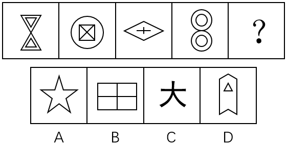

- **A**. A
- **B**. B　✅
- **C**. C
- **D**. D

**答案**：B

**官方解析**

解析一：元素组成不同，优先考虑属性规律。观察发现，题干所有图形既是轴对称图形，又是中心对称图形，A、C、D三项都仅为轴对称图形，B项既是轴对称图形，又是中心对称图形，只有B项符合。
故正确答案为B。
解析二：元素组成不同，且出现多端点、五角星、“田”字等特征图，可考虑笔画数，题干每一幅图都是3笔画图形，只有C项符合。
故正确答案为C。
此题从图形特征上来看，每一幅图画的比较规整，考查对称性的趋势是要更明显一点的，因此粉笔倾向于答案给B。

---

### 第 4 题　qid 2261565 · 图形推理

根据图形规律，填入问号处最合适的一项是：

- **A**. A
- **B**. B
- **C**. C　✅
- **D**. D

**答案**：C

**官方解析**

观察发现，题干所有图形均内部都有一个黑色阴影小元素，且黑色阴影小元素的形状与图形中一个图形的形状相同，只有C项符合。
故正确答案为C。

---

### 第 5 题　qid 2261567 · 图形推理

根据图形规律，填入问号处最合适的一项是：

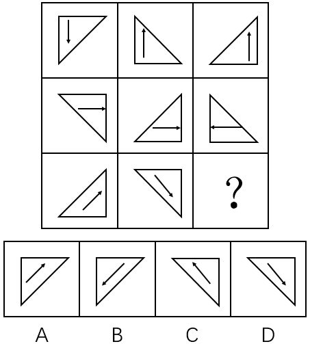

- **A**. A
- **B**. B　✅
- **C**. C
- **D**. D

**答案**：B

**官方解析**

元素组成相同，优先考虑位置规律。观察发现，第一行第一个图形通过上下翻转可以得到第二图形，第二个图形通过左右翻转可以得到第三个图形，经验证第二行符合此规律，因此第三行？处应选择一个第二个图形经过左右翻转得到的图形，只有B项符合。
故正确答案为B。

---

### 第 6 题　qid 2261568 · 定义判断

垃圾邮件是指批量发送的内容违法或违规的邮件，或者违背用户主观意志接收到的并且客观上对用户造成骚扰的邮件。
下列属于垃圾邮件的是：

- **A**. 小李是某航空公司的白金会员，他不定期收到的航空公司打折促销的邮件
- **B**. 小张在某房产网注册后，每天收到的各类广告邮件　✅
- **C**. 小马在银行办理信用卡后，银行每月向他发送的电子对账单和还账提醒账单
- **D**. 小赵在某婚恋网站注册并发布交友条件后，网站根据其交友条件向其电子邮箱推送的会员信息

**答案**：B

**官方解析**

第一步：找出定义关键词。
“批量发送的内容违法或违规的邮件”、“违背用户主观意志接收到的并且客观上对用户造成骚扰的邮件”。
第二步：逐一分析选项。
A项：航空公司不定期向其白金会员发送打折促销邮件，其所发送的内容并不构成违法或违规，打折促销邮件客观上也不会造成对小李的骚扰，不符合定义，排除；
B项：小张在某房产网注册的初衷并不是接收各类广告邮件，发送各类广告邮件的行为违背了小张的主观意愿，且小张每天都会收到各类广告邮件，也造成了对小张的骚扰，符合定义，当选；
C项：小马在银行办理信用卡后，银行每月会向他发送电子账单和还账提醒账单，银行作为信用卡发放主体，有义务向客户及时提供各类账单信息，且银行发送的邮件内容并不构成违法和违规，不符合定义，排除；
D项：小赵在某婚恋网注册并发布交友信息的初衷是希望该网站向其推送符合自身交友条件的会员信息，婚恋网站的这种行为本身符合小赵的主观意愿，不符合定义，排除。
故正确答案为B。

---

### 第 7 题　qid 2261569 · 定义判断

公共利益是一定社会条件下或特定范围内不特定多数主体利益相一致的方面，它不同于国家利益和集团（体）利益，也不同于社会利益和共同利益，具有主体数量的不确定性、实体上的共享性等特征。
下列不属于公共利益的是：

- **A**. 国家进行公共设施及公益事业建设需要集体所有的土地
- **B**. 国有企业事业单位需要使用集体所有土地　✅
- **C**. 政府组织实施的保障性安居工程建设
- **D**. 政府组织实施的科技、教育、文化、卫生、体育、环境和资源保护、防灾减灾、文物保护、社会福利、市政公用等公共事业

**答案**：B

**官方解析**

第一步：找出定义关键词。
“一定社会条件下或特定范围内不特定多数主体利益相一致的方面”、“具有主体数量的不确定性、实体上的共享性等特征”。
第二步：逐一分析选项。
A项：国家进行公共设施及公益事业建设，其所面对的主体数量是不确定的，且公共设施和公益事业建设完成后，实体上是公民共享，符合定义，排除；
B项：国有企业事业单位需要使用集体所有土地，其所面对的主体数量是确定的，且国有企事业单位并不具有共享性，不符合定义，当选；
C项：政府组织实施保障性安居工程建设，所面对的主体数量是不确定的，且保障性安居工程建成后，实体上是公民共享，符合定义，排除；
D项：政府组织实施的教科文卫等公共事业，其所面对的主体数量是不确定的，且这些公共事业在实体上具有共享性，符合定义，排除。
本题为选非题，故正确答案为B。

---

### 第 8 题　qid 2261570 · 定义判断

饥饿营销，是指商品提供者有意调低产量，以期达到调控供求关系、制造供不应求“假象”、以维护产品形象并维持商品较高售价和利润率的营销策略。
下列选项中属于饥饿营销的是：

- **A**. 某知名手机厂商因生产链故障而实行限量销售
- **B**. 2011年福岛核泄漏事故发生后商场对食盐实行限量销售
- **C**. 我国的烟酒企业及营业场所不向未成年人出售烟酒
- **D**. 某知名服装品牌定期推出限量版服装　✅

**答案**：D

**官方解析**

第一步：找出定义关键词。
“商品提供者有意调低产量”、“以期达到调控供求关系、制造供不应求‘假象’、以维护产品形象并维持商品较高售价和利润率”。
第二步：逐一分析选项。
A项：某知名手机厂商因生产链故障而实行限量销售说明手机厂商并非有意调低产量，而是因为生产链故障原因这一客观因素造成限量销售，不符合定义，排除；
B项：商场是销售商并非食盐的生产商，无法有意调低产量，销量的降低也不是主观行为，是福岛核泄漏事故这一客观事实造成的，不符合定义，排除；
C项：烟草企业及营业场所不得向未成年人出售香烟，这是《中华人民共和国未成年人保护法》中所规定的内容，并非商品提供者有意限制销售人群，不符合定义，排除；
D项：某服装品牌商推出限量版服装，其行为符合商品提供者有意调低产量，符合关键词“以期达到调控供求关系、制造供不应求‘假象’、以维护产品形象并维持商品较高售价和利润率”，符合定义，当选。
故正确答案为D。

---

### 第 9 题　qid 2261571 · 定义判断

增强现实技术，它是一种将真实世界信息和虚拟世界信息“无缝”集成的新技术，是把原本在现实世界的一定时间空间范围内很难体验到的实体信息（视觉信息、声音、味道、触觉等），通过电脑等科学技术，模拟仿真后再叠加，将虚拟的信息应用到真实世界，被人类感官所感知，从而达到超越现实的感官体验。
根据上述定义，下列属于增强现实技术的是：

- **A**. 利用虚拟人体学习解剖
- **B**. 部队官兵利用虚拟战场系统训练协同作战
- **C**. 利用投影仪将电脑显示的内容投放至幕布
- **D**. 文物遗址上残缺部分的虚拟重构　✅

**答案**：D

**官方解析**

第一步：找出定义关键词。
“将真实世界信息和虚拟世界信息‘无缝’集成”、“把原本在现实世界的一定时间空间范围内很难体验到的实体信息”、“模拟仿真后再叠加”。
第二步：逐一分析选项。
A项：利用虚拟人体学习解剖，并未与现实进行重叠，不符合“模拟仿真后再叠加”，不符合定义，排除；
B项：利用虚拟战场系统训练协同作战，并未与现实进行重叠，不符合“模拟仿真后再叠加”，不符合定义，排除；
C项：利用投影仪将电脑显示的内容投放至幕布，不是原本在现实世界很难体验到的实体信息，同时并未与现实进行重叠，不符合“将真实世界信息和虚拟世界信息‘无缝’集成”、“把原本在现实世界的一定时间空间范围内很难体验到的实体信息”、“模拟仿真后再叠加”，不符合定义，排除；
D项：文物遗址上残缺部分的虚拟重构，是将虚拟的部分，套在现实残缺部分之上，体现了与现实进行重叠，符合“将真实世界信息和虚拟世界信息‘无缝’集成”、“把原本在现实世界的一定时间空间范围内很难体验到的实体信息”、“模拟仿真后再叠加”，符合定义，当选。
故正确答案为D。

---

### 第 10 题　qid 2261572 · 定义判断

同果异因是指不同原因都可以导致相同的一个结果。同因异果则指相同的原因可以导致不同的结果，一果多因是指一个结果的产生，是由多种因素综合作用的结果，一因多果则指一个原因可以导致多个结果。
根据上述定义，下列属于同因异果的是：

- **A**. 资金、人才以及核心竞争力的缺乏制约着这家公司的发展
- **B**. 这场灾难给该国的工业、农业和交通运输业等产业造成了巨大的损失
- **C**. 有的企业倒闭由于债务危机，有的企业倒闭由于违法
- **D**. 同一个老师上课，不同的学生却有不同的成绩　✅

**答案**：D

**官方解析**

第一步：找出定义关键词。
同果异因：“不同的原因导致相同的结果”；
同因异果：“相同的原因导致不同的结果”；
一果多因：“一个结果的产生，是由多种因素综合作用的结果”；
一因多果：“一个原因导致多个结果”。
第二步：逐一分析选项。
A项：资金、人才以及核心竞争力的缺乏制约着这家公司的发展，说明这家公司发展受到制约的这一结果，是由多种因素综合作用造成的，符合“一果多因”定义，不符合“同因异果”定义，排除；
B项：这场灾难给该国的工业、农业和交通运输业等产业造成了巨大的损失，说明由灾难这一个原因，导致了多个结果，符合“一因多果”定义，不符合“同因异果”定义，排除；
C项：企业发生倒闭既有债务原因，也有违法的原因，属于不同的原因导致相同的结果，符合“同果异因”定义，不符合“同因异果”定义，排除；
D项：同一个老师上课，符合相同的原因，不同的学生却有不同的成绩，符合不同的结果，符合“相同的原因导致不同的结果”，符合“同因异果”定义，当选。
故正确答案为D。

---

### 第 11 题　qid 2261573 · 逻辑判断

在一次讨论职工工会工作方案大会上，投票表决讨论，工会主席依据统计结果说：“参加大会的人员对方案都赞同，该方案全票通过！”如果以上不是事实，下面哪项必为事实：

- **A**. 该单位职工都不赞同此方案
- **B**. 该单位有些职工赞同，有些不赞同
- **C**. 该单位至少有职工赞同此方案
- **D**. 该单位至少有职工反对此方案　✅

**答案**：D

**官方解析**

第一步：翻译题干。
参加大会的人员对方案都赞同。
第二步：逐一分析选项。
A项：“参加大会的人员对方案都赞同”为假，可以推出：有的参加大会的人员不赞同该方案，无法推出“该单位职工都不赞同此方案”，排除；
B项：“参加大会的人员对方案都赞同”为假，可以推出：有的参加大会的人员不赞同该方案，无法推出“该单位有些职工赞同”，排除；
C项：“参加大会的人员对方案都赞同”为假，可以推出：有的参加大会的人员不赞同该方案，无法推出“该单位至少有职工赞同此方案”，排除；
D项：“参加大会的人员对方案都赞同”为假，可以推出：有的参加大会的人员不赞同该方案，可以推出“该单位至少有职工反对此方案”，当选。
故正确答案为D。

---

### 第 12 题　qid 4695843 · 逻辑判断

王刚说，除非想出国，否则不会每天晚上去外语培训班上课，秦娟说：不会吧，邻居老李就快退休了想出国，但并没有每天晚上去外语培训班听课。
事实上，秦娟把王刚的话误解为（    ）。

- **A**. 去外语培训班听课的人都是想出国的人
- **B**. 所有想出国的人都得参加外语培训班　✅
- **C**. 只有想出国，才会每天晚上去外语培训班听课
- **D**. 不想出国的人，不会去听外语课

**答案**：B

**官方解析**

第一步：翻译题干。 

王刚：每天晚上去外语培训班上课想出国；

秦娟：想出国 且 每天晚上去外语培训班上课。

第二步：逐一分析选项。

根据秦娟的话可知她在反驳王刚，即“想出国 且 每天晚上去外语培训班上课”是她误解意思的矛盾，那么她把王刚的话误解成：想出国每天晚上去外语培训班上课，对应B项。

A项翻译为：去外语培训班听课想出国，C项翻译为：每天晚上去外语培训班上课想出国，D项翻译为：去听外语课想出国，均可排除。

故正确答案为B。

---

### 第 13 题　qid 4695848 · 逻辑判断

开学第一周，李明正在考虑选修哪些选修课。当看到王教授开设的《线性代数》时，他突然想起他的同学王伟选修过王教授的这门课并且得到了A。李明推断：他也将从王教授那里得到A。
如果以下陈述为真，它们将加强李明的论证，除了（    ）。

- **A**. 李明在高中时是理科生，而王伟是文科生
- **B**. 张强、赵华和孙敏选修王教授的这门课得到了A
- **C**. 王伟在去年的校级数学知识竞赛中获得了一等奖　✅
- **D**. 王伟在高中没有上过线性代数的预备知识赛

**答案**：C

**官方解析**

第一步：找出论点和论据。
论点：李明也将从王教授那里得到A。
论据：李明的同学王伟选修过王教授的这门课并且得到了A。
本题论点讨论的是李明，论据讨论的是王伟，主体不一致，加强可优先考虑搭桥，也可以考虑补充论据，且本题为选非题，排除加强选项，选择剩余的选项即可。
第二步：逐一分析选项。
A项：指出高中时李明是理科生，而王伟是文科生，说明李明可能比王伟更擅长理科，且王伟《线性代数》得了A，那么李明也得A的可能性就增加了，具有加强作用，排除；
B项：指出张强、赵华和孙敏选修王教授的这门课得到了A，说明选修王教授的这门课程得到A的概率比较高，补充论据，具有加强作用，排除；
C项：指出王伟去年获得数学知识竞赛一等奖，说明王伟数学能力较强，这可能是他《线性代数》得到A的原因，但无法判断李明的数学能力如何，也就无法判断李明选修王教授开设的《线性代数》是否也会得到A，无法加强，当选；
D项：指出王伟在高中没有上过线性代数的预备知识赛，说明王伟之前可能不具有《线性代数》的相关知识但也得了A，无论李明是否具有相关知识，都有利于其《线性代数》得A，具有一定的加强作用，排除。
本题为选非题，故正确答案为C。

---

### 第 14 题　qid 4695851 · 逻辑判断

iphone7发布已经3个月时间，依靠新的iphone带动销量可能会令苹果失望，据悉，苹果已经砍掉了iphone7的不少订单，这可能与库存压力较大有关，然而出现这一情况并不能说明苹果正在走下坡路。
以下哪项不能支持上述结论？

- **A**. 全球经济不景气，消费者购买新手机的意愿降低
- **B**. 苹果iphone发布十周年即将到来，消费者对于来年新品的预期较强
- **C**. 苹果既有产品可以满足消费者性能需要
- **D**. 新产品多年未变的外观和不足的创新　✅

**答案**：D

**官方解析**

第一步：找出论点和论据。
论点：苹果已经砍掉了iphone7的不少订单事件并不能说明苹果正在走下坡路。
论据：无。
本题只有论点，没有论据，加强优先考虑补充论据，且本题为加强选非题，找到可证明苹果没有走下坡路的三个选项排除即可。
第二步：逐一分析选项。
A项：指出全球经济不景气让消费者购买手机的意愿降低，说明是整个市场环境的问题，不代表苹果公司在走下坡路，补充论据，可以加强，排除；
B项：指出消费者等待苹果新产品的上市，仍然具有很强的购买欲望，证明iPhone7的情况不能说明苹果公司在走下坡路，补充论据，可以加强，排除；
C项：指出苹果手机能够满足消费者的需求，说明消费者对苹果的既有产品感到满意，那么仅凭iPhone7的情况不能证明苹果公司在走下坡路，可以加强，排除；
D项：指出苹果公司存在外观多年没变和创新不足的问题，这些苹果自身的问题会影响销量，不利于苹果公司的发展，具有削弱作用，无法加强，当选。
本题为选非题，故正确答案为D。

---

### 第 15 题　qid 4695856 · 逻辑判断

一高中英语教师在最后的一次试验中，把一些真正的、通常使用的格言散置于几个他自己编造的、无意义的听起来像格言的句子之中。接着，他让学生对所有列出的句子进行评价。学生普遍都认为伪造的格言与真正的格言一样的具有哲理和意义。这个老师于是就推论出这样的结论：格言之所以得到了格言的地位，主要是因为它们经常被使用，而不是因为它们具有内在的哲理。
下面哪一项如果正确的话，最能质疑老师的结论？

- **A**. 在所列出的句子中，真正的格言的数量比伪造的格言的数量多
- **B**. 有些格言使用的频率比其他格言高
- **C**. 那些被选择作为评价者的学生，缺乏判断句子哲理性的经验　✅
- **D**. 一些学生以一种方式来考虑句子，另一些学生会以另一种截然不同的方式来考虑它

**答案**：C

**官方解析**

第一步：找出论点和论据。
论点：格言之所以得到了格言的地位，主要是因为它们经常被使用，而不是因为它们具有内在的哲理。
论据：学生普遍都认为伪造的格言与真正的格言一样的具有哲理和意义。
本题论点说的是“经常被使用”让格言得到了地位，而不是“内在的哲理”，论据是试验中的学生对句子的评价，即学生认为伪造的格言与真正的格言一样的具有哲理和意义，论点论据都在说不是“内在的哲理”让格言有意义，话题一致，削弱优先考虑否定论点，且论据是试验结果，也可以从试验对象没有代表性、试验设计不科学等方面进行削弱。
第二步：逐一分析选项。
A项：该项说的是试验中真伪格言数量之间的比较，但数量差并不影响学生对句子的评价，对试验结果不具有削弱作用，排除；
B项：该项说的是格言之间使用频率的比较，不是真伪格言使用频率的比较，且无法判断“有些”的具体数量有多少，不能确定是不是“经常被使用”让格言得到了地位，无法削弱，排除；
C项：该项指出作为评价者的学生缺乏判断句子哲理性的经验，证明论据中的试验结果不准确，削弱论据，可以削弱，当选；
D项：该项说的是学生考虑句子的方式不同，但没有提及考虑方式对试验结果的影响，无法确定是否会对试验结果产生影响，无法削弱，排除。
故正确答案为C。

---

### 第 16 题　qid 4695863 · 逻辑判断

为响应全民健身活动，某公司组织员工进行了一次登山比赛。为此，营销部、财务部、物流部三个部门均派出三名登山高手参加比赛。赛前，公司张、王、李、赵四位员工分别预测了一下比赛结果。
张：营销部经常组织登山活动，这次比赛，他们一定会揽得第1、2、3名；
王：这次参赛的登山高手很多，前三名营销部最多拿一个；
李：财务部或者物流部也不错，也会进前三名的；
赵：我预测第1名如果不是营销部的，那就会是财务部。
登山比赛结束后，四人中只有一人预测准确。
请问，以下哪项最可能是比赛结果？

- **A**. 前三名都被营销部包揽了
- **B**. 冠军营销部、亚军物流部、第三名财务部
- **C**. 冠军物流部、亚军营销部、第三名营销部　✅
- **D**. 冠军财务部、亚军营销部、第三名物流部

**答案**：C

**官方解析**

第一步：分析题干条件。

（1）张：营销部揽得前三名；

（2）王：前三名营销部最多拿一个；

（3）李：财务部或者物流部会进前三名；

（4）赵：营销部第1名财务部第1名。

分析题干条件，条件（3）“财务部或者物流部会进前三名”，即营销部不会揽得前三名，故条件（1）和条件（3）为矛盾关系，必有一真一假。

第二步：根据题干条件进行推理。

根据题干条件可知，只有一人预测正确，而真话一定在矛盾关系当中，故条件（2）和（4）均为假话；根据条件（2）为假话可知，其矛盾命题为真，即前三名营销部最少拿两个；根据条件（4）为假话可知，其矛盾命题“营销部第1名 且 财务部第1名”为真，故物流部第1名；继续推理可知，第2名和第3名都是营销部，只有C项符合。

故正确答案为C。

---

### 第 17 题　qid 2261574 · 逻辑判断

研究发现，人体中的胆固醇与心脑血管疾病风险相关。为了降低膳食胆固醇对心脑血管疾病的影响，各国营养界提倡将膳食胆固醇摄入量控制在300毫克以内。因此，每天只吃一个中等大的鸡蛋（约200毫克胆固醇）有助于身体健康。
以下哪项为真最能削减上述论述？

- **A**. 每个人对食物中胆固醇的反应是不一样的，有些“高反应者”每天只吃一个鸡蛋，胆固醇也会升高　✅
- **B**. 鸡蛋中的胆固醇存在于蛋黄
- **C**. 某国人的鸡蛋摄入量大幅下降，但心脏病并未因此减少
- **D**. 鸡蛋中其他成分不会对身体造成不良影响

**答案**：A

**官方解析**

第一步：找出论点和论据。
论点：每天只吃一个中等大的鸡蛋（约200毫克胆固醇）有助于身体健康。
论据：为了降低膳食胆固醇对心脑血管疾病的影响，各国营养界提倡将膳食胆固醇摄入量控制在300毫克以内。
第二步：逐一分析选项。
A项：有些“高反应者”，即使每天只吃一个鸡蛋，也会引起胆固醇的升高，而人体中的胆固醇又与心脑血管疾病风险相关，说明对于“高反应者”，每天只吃一个鸡蛋也不利于其身体健康，通过举反例，削弱了论点，当选；
B项：论点讨论的是胆固醇的摄入量与身体健康之间的关系，而选项讨论的是胆固醇存在于蛋黄中，话题不一致，无法削弱，排除；
C项：鸡蛋的摄入量大幅下降，但并未说明鸡蛋的摄入量是多少，选项并未表述清楚，且“鸡蛋摄入量大幅下降，但心脏病并未因此减少”并不能说明每天吃一个中等大的鸡蛋不利于身体健康，无法削弱，排除；
D项：论点讨论的是胆固醇的摄入量与身体健康之间的关系，而选项讨论的是鸡蛋中其他成分不会对身体造成不良影响，话题不一致，无法削弱，排除。
故正确答案为A。

---

### 第 18 题　qid 2261575 · 逻辑判断

某街道当前正在开展“十佳社区评选活动”，评选方法是选择8个方面，包括：物业管理、人际关系、清洁程度、绿化程度、建筑设施安全性、社会治安指标等等，评以1分至10分之间的某—分值，然后求得8个分值的平均数即该社区得分。
以下哪项是实施上述活动需要预设的前提？
Ⅰ.社区各种舒适性质量程度都可以用准确的数字表达
Ⅱ.社区的各种指标对于社区居民来说都是同等重要的
Ⅲ.其他社区均以同一标准来考核

- **A**. 仅Ⅰ
- **B**. 仅Ⅱ
- **C**. 仅Ⅲ
- **D**. 仅Ⅰ、Ⅱ和Ⅲ　✅

**答案**：D

**官方解析**

逐一分析题干所给条件。
Ⅰ.如果社区各种舒适性质量程度都不可以用准确的数字表达，则评选活动将无法开展，“社区各种舒适性质量程度都可以用准确的数字表达”是实施上述活动的必要条件；
Ⅱ.如果社区的各种指标对于社区居民来说不是同等重要，则评选的结果就缺乏科学性，“社区的各种指标对于社区居民来说都是同等重要的”是实施上述活动的必要条件；
Ⅲ.十佳社区评选活动，如果各社区的考核标准不同，则评选结果既不公平，也缺乏科学性，“其他社区均以同一标准来考核”是实施上述活动的必要条件。
故正确答案为D。

---

### 第 19 题　qid 24929 · 逻辑判断

气候变暖后，一般中高纬度地区粮食产量增加，而热带和亚热带只能以一些耐高温作物为主，产量下降，尤其是非洲和拉丁美洲。全球最贫穷的地区饥荒危机将增加，饥饿和营养不良引起机体免疫力下降，增加人们对疾病的易感性。
由此能推出：

- **A**. 中高纬度并非是全球最贫困的地区　✅
- **B**. 非洲和拉丁美洲存在全球最贫困地区
- **C**. 全球变暖对中高纬度气候的影响小于对热带和亚热带气候的影响
- **D**. 全球变暖对非洲和拉丁美洲粮食产量的影响高于世界平均水平

**答案**：A

**官方解析**

第一步：抓住每句话中的对象及主要内容。
第一句说明气候变暖导致中高纬度地区粮食产量增加，非洲和拉丁美洲等热带和亚热带地区产量下降；第二句说明全球最贫穷的地区饥荒危机将增加。
第二步：逐一判断选项的作用。
A项，由题干可知，中高纬度地区粮食产量增加，全球最贫穷的地区饥荒危机将增加。根据“最贫穷的地区饥荒危机将增加”可以推出，中高纬度地区不会是最贫困地区，正确，当选；
B项，粮食产量下降的地方有很多，包括非洲和拉丁美洲，通过“尤其”可知非洲和拉丁美洲的产量下降较为严重，但是最贫困地区，题干没有提及，也有可能是位于热带和亚热带的其他洲的地区，排除；
C项，题干提及的是全球变暖对粮食的影响，不是气候，无关选项，排除；
D项，根据题干，不知道全球变暖对粮食产量的世界平均水平的影响，所以不能推出是否全球变暖对非洲和拉丁美洲粮食产量的影响高于世界平均水平，排除。
故正确答案为A。

---

### 第 20 题　qid 2261580 · 逻辑判断

2007年以来，北京地铁不分路途远近，不管是否换乘，票价一律两元，2013年3月8日，北京地铁客运量首次突破1000万人次，并稳定下来，早晚上下班高峰时段，地铁站台内等四五趟车是家常便饭，于是有人提议：地铁票价应该上涨，通过价格杠杆来分散高峰时段客流压力，并将轨道交通人流向地面交通进行分流，以使城市公共交通结构趋于合理。
以下各项陈述都将削弱上述观点，除了：

- **A**. 较高的地铁票价又将促使许多上下班者开车上班，这将加速北京的空气污染，增加地面交通的拥挤程度
- **B**. 坐地铁的乘客绝大多数都是刚性需要，没有人愿意没事时来地铁观光，体验地铁里的拥挤或呼吸车厢里的污浊空气
- **C**. 许多坐地铁的乘客都是低票价的受益者，他们强烈反对提高地铁票价　✅
- **D**. 地面公共交通已经趋于饱和，如果地铁出行成本昂贵，那么公交车将和地铁车厢一样拥挤

**答案**：C

**官方解析**

第一步：找出论点和论据。
论点：地铁票价应该上涨。
论据：通过价格杠杆来分散高峰时段客流压力，并将轨道交通人流向地面交通进行分流，以使城市公共交通结构趋于合理。
第二步：逐一分析选项。
A项：较高的地铁票价会使一部分原本乘坐地铁的人通过开车上下班，最终会造成地面交通的拥挤，说明提高票价并不能使公共交通结构趋于合理，削弱了论据，排除；
B项：“坐地铁的乘客绝大多数都是刚性需要”说明大多数乘客不会因为票价的上涨而换成其他交通方式，因此并不能达到使城市交通结构趋于合理的目的，削弱了论据，排除；
C项：乘坐低票价的乘客反对提高地铁票价，并不能否认提高地铁票价可以缓解轨道交通压力，使城市公共交通结构趋于合理，不能削弱论点，属于无关项，当选；
D项：“地面公共交通已趋于饱和”，如果提高票价，则会进一步加重地面交通压力，从而无法达到使公共交通结构趋于合理的目标，削弱了论据，排除。
本题为选非题，故正确答案为C。

---

### 第 21 题　qid 2261581 · 类比推理

佛教∶宗教

- **A**. 商品∶交换
- **B**. 化学∶科学　✅
- **C**. 系统∶整体
- **D**. 社区∶社会

**答案**：B

**官方解析**

第一步：判断题干词语间逻辑关系。
佛教是一种宗教，二者为种属关系。
第二步：判断选项词语间逻辑关系。
A项：商品是用于交换的劳动产品，交换是商品的必然属性，二者为对应关系，与题干逻辑关系不一致，排除；
B项：化学是一种科学，二者为种属关系，与题干逻辑关系一致，当选；
C项：系统是指由要素组成的有机整体，整体性是其最基本的属性，二者为对应关系，与题干逻辑关系不一致，排除；
D项：社区是社会的一部分，二者为组成关系，与题干逻辑关系不一致，排除。
故正确答案为B。

---

### 第 22 题　qid 2261582 · 类比推理

产品∶商品

- **A**. 金属∶木头
- **B**. 工人∶党员
- **C**. 工具∶锄头　✅
- **D**. 学生∶学者

**答案**：C

**官方解析**

第一步：判断题干词语间逻辑关系。
商品是一种产品，二者为种属关系。
第二步：判断选项词语间逻辑关系。
A项：金属和木头都是一种材质，二者为并列关系，与题干逻辑关系不一致，排除；
B项：有的工人是党员，有的党员是工人，二者为交叉关系，与题干逻辑关系不一致，排除；
C项：锄头是一种工具，二者为种属关系，与题干逻辑关系一致，当选；
D项：学者指做学问的人，求学的人；学生指在学校肄业或在其他教育、研究机构学习的人。有的学生是学者，有的学者是学生，二者为交叉关系，与题干逻辑关系不一致，排除。
故正确答案为C。

---

### 第 23 题　qid 2261583 · 类比推理

运动员∶裁判

- **A**. 消费者∶消费者协会
- **B**. 候选人∶计票员
- **C**. 股民∶企业
- **D**. 商贩∶城管　✅

**答案**：D

**官方解析**

第一步：判断题干词语间逻辑关系。
运动员对应裁判，裁判对运动员做出判罚，二者在工作上是主客体的对应关系。
第二步：判断选项词语间逻辑关系。
A项：消费者协会是对商品和服务进行社会监督的保护消费者合法权益的全国性社会组织。消费者协会保护消费者的权益，不是工作上的主客体的对应关系，与题干逻辑关系不一致，排除；
B项：计票员和候选人是并列关系，不存在主客体关系，与题干逻辑关系不一致，排除；
C项：股民指从事股票交易的个人投资者。股民对应发行股票的企业，而不是所有企业，且股民和企业在工作上也不存在主客体的对应关系，与题干逻辑关系不一致，排除；
D项：商贩对应城管，城管对商贩进行管理，二者在工作上是主客体的对应关系，与题干逻辑关系一致，当选。
故正确答案为D。

---

### 第 24 题　qid 2261584 · 类比推理

下里巴人∶通俗

- **A**. 差强人意∶失望
- **B**. 千钧一发∶沉重
- **C**. 目无全牛∶熟练　✅
- **D**. 七月流火∶炎热

**答案**：C

**官方解析**

第一步：判断题干词语间逻辑关系。
下里巴人比喻通俗的文学艺术，形容比较通俗。
第二步：判断选项词语间逻辑关系。
A项：差强人意指勉强使人满意，与失望是反义词关系，与题干逻辑关系不一致，排除；
B项：千钧一发比喻情况万分危急，与沉重没有必然的关系，与题干逻辑关系不一致，排除；
C项：目无全牛比喻技术熟练到了得心应手的境地，形容比较熟练，与题干逻辑关系一致，当选；
D项：七月流火指夏去秋来，寒天将至，与炎热没有必然的关系，与题干逻辑关系不一致，排除。
故正确答案为C。

---

### 第 25 题　qid 2261585 · 类比推理

街市∶熙熙攘攘

- **A**. 教室∶勤奋好学
- **B**. 医院∶医术精湛
- **C**. 寺庙∶信仰虔诚
- **D**. 沙滩∶金光灿灿　✅

**答案**：D

**官方解析**

第一步：判断题干词语间逻辑关系。
熙熙攘攘的街市，熙熙攘攘是对街市的描绘，二者为对应关系。
第二步：判断选项词语间逻辑关系。
A项：勤奋好学的学生，而非教室，与教室没有必然的关系，与题干逻辑关系不一致，排除；
B项：医术精湛的医生，而非医院，与医院没有必然的关系，与题干逻辑关系不一致，排除；
C项：信仰虔诚的信众，而非寺庙，与寺庙没有必然的关系，与题干逻辑关系不一致，排除；
D项：金光灿灿的沙滩，金光灿灿是对沙滩的描绘，二者为对应关系，与题干逻辑关系一致，当选。
故正确答案为D。

---

### 第 26 题　qid 2261586 · 类比推理

紧急 对于（  ）相当于 危机 对于（  ）

- **A**. 未雨绸缪  生死攸关
- **B**. 生死攸关  火烧眉毛
- **C**. 雷霆万钧  危若累卵
- **D**. 迫在眉睫  千钧一发　✅

**答案**：D

**官方解析**

逐一代入选项。
A项：未雨绸缪比喻事先做好准备工作，与紧急没有必然的关系；生死攸关指生死存亡的关键，生死攸关可以修饰危机，前后逻辑关系不一致，排除；
B项：生死攸关指生死存亡的关键，与紧急没有必然的关系；火烧眉毛比喻事到眼前，非常急迫，与危机没有必然的关系，前后逻辑关系不一致，排除；
C项：雷霆万钧形容威力极大，无法阻挡，与紧急没有必然的关系；危若累卵比喻形势非常危险，如同堆起来的蛋，随时都有塌下打碎的可能，可以形容危机，前后逻辑关系不一致，排除；
D项：迫在眉睫形容事情已到眼前，情势十分紧迫，形容很紧急；千钧一发比喻情况万分危急，形容很危急，前后逻辑关系一致，当选。
故正确答案为D。

---

### 第 27 题　qid 2261587 · 类比推理

勤以补拙 对于（  ）相当于（  ）对于 品逸若梅

- **A**. 废寝忘食  人心向背
- **B**. 焚膏继晷  人情世故
- **C**. 克勤克俭  人穷志短
- **D**. 俭以养廉  人淡如茶　✅

**答案**：D

**官方解析**

逐一代入选项。
A项：勤以补拙指勤奋能够弥补不足，废寝忘食形容专心努力，二者没有必然逻辑的关系；人心向背指人民大众的拥护或反对，品逸若梅是人心向背的一个条件，二者为对应关系，前后逻辑关系不一致，排除；
B项：勤以补拙指勤奋能够弥补不足，焚膏继晷形容勤奋地工作或读书，二者为近义词关系；人情世故指为人处世的道理，与品逸若梅没有必然的逻辑关系，前后逻辑关系不一致，排除；
C项：克勤克俭指既能勤劳，又能节俭，与勤以补拙没有必然的关系；人穷志短指人的处境困厄，志向也就小了，与品逸若梅没有必然的逻辑关系，前后逻辑关系不一致，排除；
D项：勤以补拙，勤是补拙的一种方式，俭以养廉，俭是养廉的一种方式，二者的结构相同；人淡如茶，人如茶水一样清淡，品逸若梅，品格如梅花一样高尚，二者结构相同，前后逻辑关系一致，当选。
故正确答案为D。

---

### 第 28 题　qid 2261588 · 类比推理

出：入：出入

- **A**. 拼：凑：拼凑
- **B**. 攻：守：攻守　✅
- **C**. 手：脚：手脚
- **D**. 仇：恨：仇恨

**答案**：B

**官方解析**

第一步：判断题干词语间逻辑关系。
出和入是反义关系，出入指出进、往来，既包括出，也包括入。
第二步：判断选项词语间逻辑关系。
A项：拼和凑是近义词关系，与题干逻辑关系不一致，排除；
B项：攻和守是反义词关系，攻守指攻取与守卫，既包括攻，也包括守，与题干逻辑关系一致，当选；
C项：手和脚是并列关系，与题干逻辑关系不一致，排除；
D项：仇和恨是近义词关系，与题干逻辑关系不一致，排除。
故正确答案为B。

---

### 第 29 题　qid 2261589 · 类比推理

政策：促进：约束

- **A**. 生命：繁殖：死亡
- **B**. 书房：书架：电脑
- **C**. 观点：新颖：创意
- **D**. 口号：倡导：禁止　✅

**答案**：D

**官方解析**

第一步：判断题干词语间逻辑关系。
政策可以促进，也可以约束，促进和约束是政策的两种功能，且促进和约束为反义关系。
第二步：判断选项词语间逻辑关系。
A项：繁殖和死亡是生命的两种状态，但繁殖和死亡不是反义词关系，与题干逻辑关系不一致，排除；
B项：书架放在书房中，二者为地点上的对应关系，与题干逻辑关系不一致，排除；
C项：新颖和创意是观点的属性，新颖和创意与观点是对应关系，与题干逻辑关系不一致，排除；
D项：口号可以倡导，也可以禁止，倡导和禁止是口号的两种功能，属于功能上的对应关系；倡导和禁止，二者属于反义关系，与题干逻辑关系一致，当选。
故正确答案为D。

---

### 第 30 题　qid 2261590 · 类比推理

月季：鲜花：芬芳

- **A**. 学生：学校：学习
- **B**. 冰箱：家电：保鲜　✅
- **C**. 石头：房屋：宏伟
- **D**. 胶卷：相机：摄像

**答案**：B

**官方解析**

第一步：判断题干词语间逻辑关系。
月季是一种鲜花，二者为种属关系；芬芳指香、香气，月季可以散发出香气，二者为功能对应关系。
第二步：判断选项词语间逻辑关系。
A项：学生在学校学习，学生和学校是地点上的对应关系，与题干逻辑关系不一致，排除；
B项：冰箱是一种家电，二者为种属关系；冰箱具有保鲜的功能，二者为功能对应关系，与题干逻辑关系一致，当选；
C项：石头是建造房屋的一种原材料，二者为原料上的对应关系，与题干逻辑关系不一致，排除；
D项：胶卷和相机属于或然对应关系，与题干逻辑关系不一致，排除。
故正确答案为B。

---

## 资料分析

### 材料 1

        2014年，国家下拨农村义务教育经费保障资金为878.97亿元，2013、2014年依次增长、。

        2014年，农村、城市小学生均预算内事业性经费分别比2010年增长、，农村小学增幅超过城市；农村、城市初中生均预算内事业性经费分别比2010年增长、，农村增长幅度高出城市。2014年，农村、城市小学生均预算内公用教育经费支出分别比2010年增长、，农村小学增幅超过城市；2014年，农村、城市初中生均预算内公用教育经费支出分别比2010年增长、，农村增长幅度高出城市。

        2014年，全国小学生均校舍建筑面积为6.85平方米，比2010年增长；全国初中生均校舍建筑面积为11.99平方米，比2010年增长。其中全国小学生均教学与辅助用房面积增长，初中增长；全国小学生均生活用房面积增长，初中增长；全国小学生均体育馆面积增长，初中增长。

        据对全国14省（区、市）10万余名中小学生的抽样调查显示（以小学四年级、初中二年级为代表，以下同），2010—2014年，每周课时数超过30节的小学比例由下降到，每学期统一考试次数超过1次的小学比例由下降到，每天在校时间超过6小时的小学比例由下降到，每天家庭作业时间超过1小时的学生比例由下降到，每天体育锻炼时间超过1小时的学生比例由上升到。

#### 第 1 题　qid 2261597 · 增长

与2012年相比，2014年国家下拨农村义务教育经费保障资金增长（  ）。

- **A**. 6.45
- **B**. 7.38
- **C**. 8.53
- **D**. 8.66　✅

**答案**：D

**官方解析**

根据题干“与2012年相比，2014年······增长······”，判断本题为间隔增长率问题。定位材料第一段可知，2013年国家下拨农村义务教育经费保障资金增长率为，2014年增长率为，代入间隔增长率公式。

故正确答案为D。

---

#### 第 2 题　qid 2261598 · 增长

下列各项中，农村增幅超过城市最多的是：

- **A**. 小学生均预算内事业性经费
- **B**. 初中生均预算内事业性经费
- **C**. 小学生均预算内公用教育经费支出　✅
- **D**. 初中生均预算内公用教育经费支出

**答案**：C

**官方解析**

根据题干“增幅超过……最多”，判断本题为增长率比较问题，比对材料发现增长率差值材料已经给出，则本题为直接查找数据类型题目。定位材料第二段，A选项，小学生均预算内事业性经费农村增幅超过城市；B选项，初中生均预算内事业性经费农村增幅超过城市；C选项，小学生均预算内公用教育经费支出农村增幅超过城市；初中生均预算内公用教育经费支出农村增长幅度高出城市。判断可知，增幅超过城市最多的为C选项。

故正确答案为C。

---

#### 第 3 题　qid 2261599 · 综合

2010年全国初中生均校舍建筑面积比2010年全国小学生均校舍建筑面积大（  ）平方米。

- **A**. 3.25　✅
- **B**. 3.86
- **C**. 4.12
- **D**. 5.14

**答案**：A

**官方解析**

根据题干“2010年全国初中生……比2010年全国小学生……大……平方米”，结合材料所给时间为2011年，可判定本题为基期计算问题。定位材料第三段可得：2014年，全国小学生均校舍建筑面积为6.85平方米，比2010年增长；全国初中生均校舍建筑面积为11.99平方米，比2010年增长。则题干所求  ，与A项最接近。

故正确答案为A。

---

#### 第 4 题　qid 2261600 · 综合

2010-2014年，表现学生课业负担的下列各项指标中，变化最小的是：

- **A**. 每周课时数超过30节的小学比例
- **B**. 每天家庭作业时间超过1小时的学生比例
- **C**. 每天在校时间超过6小时的小学比例　✅
- **D**. 每天体育锻炼时间超过1小时的学生比例

**答案**：C

**官方解析**

由题干“变化最小”和选项“比例”，判断本题为比重比较问题。定位材料第四段，A选项：每周课时数超过30节的小学比例由下降到，变化了个百分点。

B选项：每天家庭作业时间超过1小时的学生比例由下降到，变化了个百分点。

C选项：每天在校时间超过6小时的小学比例由下降到，变化了个百分点。

D选项：每天体育锻炼时间超过1小时的学生比例由上升到，变化了个百分点。变化最小的是C选项。

故正确答案为C。

---

#### 第 5 题　qid 2261601 · 综合

下列说法不正确的是：

- **A**. 2010-2014年这5年来，小学生课业负担总体呈现下降趋势
- **B**. 教育经费支出城乡差距仍在进一步扩大　✅
- **C**. 全国均校舍面积大幅增加，办学条件改善
- **D**. 义务教育经费投入明显增加，办学经费得到保障

**答案**：B

**官方解析**

A项：定位材料最后一段，发现每周课时数超过30节的小学比例、每学期统一考试次数超过1次的小学比例、每天在校时间超过6小时的小学比例、每天家庭作业时间超过1小时的学生比例都是下降的，说明2010-2014年这5年来，小学生课业负担总体呈现下降趋势，说法正确。

B项：定位材料第二段，农村的增幅均比城市的高，说明城乡差距在缩小，说法错误。

C项：定位材料第三段，2014年全国小学生均校舍建筑面积为6.85平方米，比2010年增长；全国初中生均校舍建筑面积为11.99平方米，比2010年增长。说明校舍面积大幅增加，办学条件得到改善，正确。

D项：定位材料第一段，2014年，国家下拨农村义务教育经费保障资金为878.97亿元，2013、2014年依次增长、。说明义务教育经费投入增加，办学经费得到保障，正确。

本题为选非题，故正确答案为B

---

### 材料 2

        其中“少儿抚养比”为0～14岁人口数和15～59岁人口数的比值；“老年抚养比”为60岁及以上人口数和15～59岁人口数的比值；“总抚养比”为“少儿抚养比”和“老年抚养比”之和。

#### 第 6 题　qid 2261602 · 增长

已知2010年全国0～14岁人口为22253万人，到2015年全国总人口达到137349万人，那么，2015年全国总人口比2010年增加（    ）。

- **A**. 0.86
- **B**. 1.91
- **C**. 2.52　✅
- **D**. 3.14

**答案**：C

**官方解析**

根据题干“······2015年全国总人口比2010增加······”，可判定本题为增长率问题。定位表格可得：2010年全国0-14岁占总人口的比重为，根据题干，2010年全国0～14岁人口为22253万人，到2015年全国总人口达到137349万人。那么2010年全国总人口，则。 

故正确答案为C。

---

#### 第 7 题　qid 2261603 · 综合

如果将60岁及以上人口数与0～14岁人口数的比值定义为老少比，那么下列地区中老少比最高的地区是：

- **A**. 北京
- **B**. 上海　✅
- **C**. 重庆
- **D**. 广东

**答案**：B

**官方解析**

选项中四个地区的老少比如下：A项，北京：；B项，上海：；C项，重庆：；D项，广东：，比较数字大小，明显上海的老少比接近2，是四个地区中最高的。

故正确答案为B。

---

#### 第 8 题　qid 2261604 · 综合

根据0～14岁，15～59岁，60岁以上人口数绘制饼图，以下这个饼图最有可能是下列哪个地区的人口年龄构成图？

- **A**. 浙江　✅
- **B**. 北京
- **C**. 西藏
- **D**. 海南

**答案**：A

**官方解析**

观察题目中的饼状图，0-14岁与≥60岁的占比相差不多。

A项，浙江：0-14岁占比，15-59岁占比，60岁占比，0-14岁与≥60岁的占比相差不多，正确；

B项，北京：0-14岁占比，15-59岁占比，60岁占比，错误；

C项，西藏：0-14岁占比，15-59岁占比，60岁占比，错误；

D项，海南：0-14岁占比，15-59岁占比，60岁占比，错误。

故正确答案为A。

---

#### 第 9 题　qid 2261605 · 比重

人口老龄化是指总人口中因年轻人口数量减少，年长人口数量增加而导致的老年人口比例相应增长的动态。国际上通常把60岁以上的人口占总人口比重达到或65岁以上人口占总人口的比重达到作为国家或地区进入老龄化社会的标准。那么依据该标准，上述省（区、市）中进入老龄化社会的共有几个？

- **A**. 9
- **B**. 10　✅
- **C**. 11
- **D**. 12

**答案**：B

**官方解析**

60岁以上的人口占总人口比重达到，即0-14岁和15-59岁的占比之和小于即可。定位表格第二列和第三列，经简单口算有10个地区满足条件，分别为：北京、天津、辽宁、上海、浙江、河南、湖南、海南、重庆、贵州，则进入老龄化社会的省（区、市）共有10个。

故正确答案为B。

---

#### 第 10 题　qid 2261606 · 综合

根据资料不能推出的是：

- **A**. 辽宁的60岁及以上人口占比明显高于全国
- **B**. 西藏的60岁及以上人口占比最低
- **C**. 北京的总抚养比最低，主要是0～14岁人口比重小
- **D**. 重庆的60岁及以上人口占比最高，所以重庆的老年人口最多　✅

**答案**：D

**官方解析**

A项：定位表格，辽宁的60岁及以上人口占比：，全国60岁及以上人口占比：，，正确。

B项：定位表格，要找出60岁及以上占比最低的地区，反之找到0-14岁和15-59岁之和最大的地区即可。西藏地区：，观察其他地区，两者之和在90%附近的还有广东和海南地区，广东地区：，海南地区：，因此西藏地区60岁及以上占比的人最少，正确。

C项：定位表格，北京的总抚养比为，是总抚养比最低的地区，而且0-14岁的比重最小，正确。

D项：定位表格，重庆市60岁以上人口占比最高，但总人口数未知，因此不能推出重庆老年人口最多，错误。

本题为选非题，故正确答案为D项。

---
