# 2018年山东省选调应届优秀高校毕业生到基层工作笔试行政职业能力测验

> 选调生 · 2018 年 · 6 个模块 · 共 62 题

- [政治理论](#%E6%94%BF%E6%B2%BB%E7%90%86%E8%AE%BA) · 7 题
- [常识判断](#%E5%B8%B8%E8%AF%86%E5%88%A4%E6%96%AD) · 12 题
- [言语理解与表达](#%E8%A8%80%E8%AF%AD%E7%90%86%E8%A7%A3%E4%B8%8E%E8%A1%A8%E8%BE%BE) · 8 题
- [数量关系](#%E6%95%B0%E9%87%8F%E5%85%B3%E7%B3%BB) · 10 题
- [判断推理](#%E5%88%A4%E6%96%AD%E6%8E%A8%E7%90%86) · 15 题
- [资料分析](#%E8%B5%84%E6%96%99%E5%88%86%E6%9E%90) · 10 题

---

## 政治理论

### 第 1 题　qid 2659436 · 新思想

中国共产党的初心和使命是：

- **A**. 为中国人民谋幸福，为中华民族谋复兴　✅
- **B**. 为中国人民谋幸福，为中华民族谋未来
- **C**. 实现中华民族伟大复兴的中国梦
- **D**. 为人民服务

**答案**：A

**官方解析**

本题考查政治常识。
党的十九大报告指出：“中国共产党人的初心和使命，就是为中国人民谋幸福，为中华民族谋复兴。这个初心和使命是激励中国共产党人不断前进的根本动力。全党同志一定要永远与人民同呼吸、共命运、心连心，永远把人民对美好生活的向往作为奋斗目标，以永不懈怠的精神状态和一往无前的奋斗姿态，继续朝着实现中华民族伟大复兴的宏伟目标奋勇前进。”
故正确答案为A。

---

### 第 2 题　qid 2659443 · 新思想

党的十八大以来，以习近平同志为主要代表的共产党人顺应时代发展，从实践和理论结合上回答了新时代        这个重大的时代课题，创立了习近平新时代中国特色社会主义思想。
填入画横线处正确的一项是：

- **A**. 坚持和发展什么样的社会主义，怎样坚持和发展社会主义
- **B**. 坚持和发展什么样的中国特色社会主义，怎样坚持和发展中国特色社会主义　✅
- **C**. 实现什么样的发展，怎样实现发展
- **D**. 建设什么样的党，怎样建设党

**答案**：B

**官方解析**

本题考查政治常识。
A项错误、B项正确，《中国共产党章程》总纲部分指出：“十八大以来，以习近平同志为主要代表的中国共产党人，顺应时代发展，从理论和实践结合上系统回答了新时代坚持和发展什么样的中国特色社会主义、怎样坚持和发展中国特色社会主义这个重大时代课题，创立了习近平新时代中国特色社会主义思想。”
C项错误，《中国共产党章程》总纲部分指出：“十六大以来，以胡锦涛同志为主要代表的中国共产党人，坚持以邓小平理论和‘三个代表’重要思想为指导，根据新的发展要求，深刻认识和回答了新形势下实现什么样的发展、怎样发展等重大问题，形成了以人为本、全面协调可持续发展的科学发展观。”
D项错误，《中国共产党章程》总纲部分指出：“十三届四中全会以来，以江泽民同志为主要代表的中国共产党人，在建设中国特色社会主义的实践中，加深了对什么是社会主义、怎样建设社会主义和建设什么样的党、怎样建设党的认识，积累了治党治国新的宝贵经验，形成了‘三个代表’重要思想。”
故正确答案为B。

---

### 第 3 题　qid 2659448 · 新思想

中国特色社会主义进入了新时代，我国经济发展也进入了新时代，基本特征就是我国经济已由：

- **A**. 高速增长阶段转向高质量发展阶段　✅
- **B**. 高速增长阶段转向中高速增长阶段
- **C**. 要素驱动、投资驱动转向创新驱动
- **D**. 粗放式发展阶段转向集约型发展阶段

**答案**：A

**官方解析**

本题考查政治常识。
党的十九大报告指出：“我国经济已由高速增长阶段转向高质量发展阶段，正处在转变发展方式、优化经济结构、转换增长动力的攻关期，建设现代化经济体系是跨越关口的迫切要求和我国发展的战略目标。”
故正确答案为A。

---

### 第 4 题　qid 2659456 · 新思想

习近平总书记曾形象的指出：“当高楼大厦在我国大地上遍地林立时，中华民族精神大厦也应该巍然耸立，        是更基础、更持久、更深厚的自信。”
填入画横线处正确的一项是：

- **A**. 道路自信
- **B**. 理论自信
- **C**. 制度自信
- **D**. 文化自信　✅

**答案**：D

**官方解析**

本题考查政治常识。
2016年7月，习近平总书记在庆祝中国共产党成立95周年大会上的讲话中深刻指出：“文化自信，是更基础、更广泛、更深厚的自信。在5000多年文明发展中孕育的中华优秀传统文化，在党和人民伟大斗争中孕育的革命文化和社会主义先进文化，积淀着中华民族最深层的精神追求，代表着中华民族独特的精神标识。我们要弘扬社会主义核心价值观，弘扬以爱国主义为核心的民族精神和以改革创新为核心的时代精神，不断增强全党全国各族人民的精神力量。” 
故正确答案为D。

---

### 第 5 题　qid 2659464 · 新思想

中国共产党第一次提出建立一个“群众性政党组织”是在：

- **A**. 党的一大
- **B**. 党的二大　✅
- **C**. 党的三大
- **D**. 党的四大

**答案**：B

**官方解析**

本题考查毛中特。
A项错误，1921年7月23日，中国共产党第一次全国代表大会在上海开幕，后转移到浙江嘉兴南湖的一艘游船上召开，党的一大通过中国共产党纲领，确定党的名称为“中国共产党”。中国共产党第一次全国代表大会宣告中国共产党正式成立，是近代中国革命历史上划时代的里程碑。
B项正确，1922年7月16日至23日，中国共产党在上海举行第二次全国代表大会。大会指出党的最高纲领是实现社会主义、共产主义，但在现阶段的纲领即最低纲领是：打倒军阀；推翻国际帝国主义的压迫；统一中国为真正的民主共和国。大会通过的《中国共产党章程》，是党成立后的第一个党章。大会首次明确提出“我们便要‘到群众中去’，要组成一个大的‘群众党’”，“党的一切工作都必须深入到广大的群众里面去”。
C项错误，1923年6月12日至20日，中国共产党在广州举行第三次全国代表大会。大会接受共产国际关于同国民党合作的指示，决定采取共产党员以个人身份加入国民党的方式实现国共合作。
D项错误，1925年1月11日至22日，中国共产党在上海举行第四次全国代表大会。大会总结国共合作一年来的经验教训，提出了无产阶级在民主革命中的领导权问题和工农联盟问题，并对民主革命的内容作了比较完整的规定，指出在反对帝国主义的同时，还要反对封建的军阀政治和经济关系。大会还明确提出要建设一个“以宣传为主的政治小团体”逐渐成为全国性的群众性政党。
故正确答案为B。

---

### 第 6 题　qid 2659475 · 新思想

习近平总书记在参加重庆代表团审议时指出，政德是整个社会道德建设的风向标，立政德就要：
①明大德  ②明大义  ③守公德  ④严私德

- **A**. ②③④
- **B**. ①②④
- **C**. ①②③
- **D**. ①③④　✅

**答案**：D

**官方解析**

本题考查政治常识。
2018年3月，习近平总书记在参加重庆代表团审议时指出：“政德是整个社会道德建设的风向标。立政德，就要明大德、守公德、严私德。”
所谓明大德，就是要对党忠诚，铸牢理想信念、锤炼坚强的党性，在大是大非面前旗帜鲜明，在风浪考验面前无所畏惧，在各种诱惑面前立场坚定。
所谓守公德，就是要强化宗旨意识，全心全意为人民服务，恪守立党为公、执政为民理念，自觉践行人民对美好生活的向往就是我们的奋斗目标的承诺，做到心底无私天地宽。
所谓严私德，就是要严格约束自己的操守和行为。所有党员、干部都要戒贪止欲、克己奉公，切实把人民赋予的权力用来造福于人民。
综上，①③④正确。
故正确答案为D。

---

### 第 7 题　qid 2659497 · 新思想

党的十九大报告指出，要建设（    ）干部队伍，注重培养专业能力、专业精神，增强干部队伍适应新时代中国特色社会主义发展的要求的能力。

- **A**. 专业化、年轻化、知识化
- **B**. 德才兼备、以德为先
- **C**. 高素质专业化　✅
- **D**. 高水平专业化

**答案**：C

**官方解析**

本题考查政治常识。
党的十九大报告指出：“建设高素质专业化干部队伍。党的干部是党和国家事业的中坚力量。要坚持党管干部原则，坚持德才兼备、以德为先，坚持五湖四海、任人唯贤，坚持事业为上、公道正派，把好干部标准落到实处。坚持正确选人用人导向，匡正选人用人风气，突出政治标准，提拔重用牢固树立‘四个意识’和‘四个自信’、坚决维护党中央权威、全面贯彻执行党的理论和路线方针政策、忠诚干净担当的干部，选优配强各级领导班子。注重培养专业能力、专业精神，增强干部队伍适应新时代中国特色社会主义发展要求的能力。”
故正确答案为C。

---

## 常识判断

### 第 1 题　qid 2659432 · 人文常识

下列选项中表述不正确的一项是：

- **A**. 从十九大到二十大，是两个一百年奋斗目标的历史交汇期
- **B**. 新时代我国社会的主要矛盾是人民日益增长的美好生活需要和不平衡不充分的发展之间的矛盾
- **C**. “四个意识”是指政治意识、大局意识、核心意识、看齐意识
- **D**. 到本世纪中叶，把我国建成富强民主文明和谐的社会主义现代化强国　✅

**答案**：D

**官方解析**

本题考查政治常识。
A项正确，党的十九大报告指出：“从十九大到二十大，是‘两个一百年’奋斗目标的历史交汇期。我们既要全面建成小康社会、实现第一个百年奋斗目标，又要乘势而上开启全面建设社会主义现代化国家新征程，向第二个百年奋斗目标进军。”
B项正确，党的十九大报告指出：“中国特色社会主义进入新时代，我国社会主要矛盾已经转化为人民日益增长的美好生活需要和不平衡不充分的发展之间的矛盾。”
C项正确，“四个意识”是2016年1月29日中共中央政治局会议最早提出来的，是指政治意识、大局意识、核心意识、看齐意识。
D项错误，党的十九大报告指出：“第二个阶段，从2035年到本世纪中叶，在基本实现现代化的基础上，再奋斗十五年，把我国建成富强民主文明和谐美丽的社会主义现代化强国。”
本题为选非题，故正确答案为D。

---

### 第 2 题　qid 2659438 · 地理国情

2018年春节上班第一天，山东省委省政府召开大会，动员全省各级部门、广大党员干部和各方力量，思想再升级，改革再深入，工作再抓实，迅速全面开展        ，吹响山东向高质量发展的进军号，迈出经济文化强省新步伐。
填入画横线处正确的一项是：

- **A**. 新旧动能转换重大工程　✅
- **B**. 质量提升年活动
- **C**. 山东海洋强省建设行动
- **D**. 大学习、大调研、大改进

**答案**：A

**官方解析**

本题考查政治常识。
2018年2月22日，春节后上班第一天，山东省委省政府召开山东省全面展开新旧动能转换重大工程动员大会，动员全省各级各部门、广大党员干部和各方力量，思想再解放、改革再深入、工作再抓实，迅速全面展开新旧动能转换重大工程，吹响山东向高质量发展的进军号，迈出经济文化强省建设的新步伐。
故正确答案为A。

---

### 第 3 题　qid 2659451 · 人文常识

近代中国，帝国主义列强不能灭亡和瓜分中国最根本的原因是：

- **A**. 帝国主义列强之间的矛盾和相互制约
- **B**. 中华民族进行的不屈不挠的反侵略战争　✅
- **C**. 清政府部分官僚的有效抵制
- **D**. 中国共产党的领导

**答案**：B

**官方解析**

本题考查人文常识。
帝国主义列强不能灭亡和瓜分中国的原因包括两方面：第一，最根本的原因是中华民族进行的不屈不挠的反侵略斗争。正是包括义和团在内的中华民族为反抗侵略所进行的前赴后继、视死如归的战斗，才粉碎了帝国主义列强灭亡和瓜分中国的图谋。第二，帝国主义列强之间的矛盾和互相制约，也是列强不能瓜分中国的一个重要原因。因为帝国主义列强在世界各地争夺殖民地时，都存在着利害冲突和相互制约，这在一定程度上加深了帝国主义列强之间的矛盾。
故正确答案为B。

---

### 第 4 题　qid 2659461 · 人文常识

下列诗句中，描述的是“重阳节”这一节日的是：

- **A**. 清明时节雨纷纷，路上行人欲断魂
- **B**. 九日黄花酒，登高会昔闻　✅
- **C**. 桃符呵笔写，椒酒过花斟
- **D**. 梧桐叶上三更雨，叶叶声声是别离

**答案**：B

**官方解析**

本题考查人文常识。
A项错误，“清明时节雨纷纷，路上行人欲断魂”出自唐代诗人杜牧《清明》，意思是说江南清明时节细雨纷纷飘洒，路上羁旅行人个个落魄断魂。因此，该项描述的是“清明节”。
B项正确，“九日黄花酒，登高会昔闻”出自唐代诗人岑参《奉陪封大夫九日登高》，意思是说重阳之日，大家一起喝菊花酒、登高山，这与传统的习俗是一样的。因此，该项描述的是“重阳节”。
C项错误，“桃符呵笔写，椒酒过花斟”出自南宋诗人陆游《己酉元日》，意思是说轻轻对着笔呵着热气来写对联，喝一口椒浸制的酒发现新写的花已经倾斜了。桃符指代春联。因此，该项描述的是“春节”。
D项错误，“梧桐叶上三更雨，叶叶声声是别离”出自南宋文学家周紫芝《鹧鸪天》，意思是说外面下起了雨，雨滴到梧桐树叶上，仿佛每片树叶都在诉说离别。因此，该项所描写的是秋夜怀人，与节日无关。
故正确答案为B。

---

### 第 5 题　qid 2659467 · 人文常识

党员小王，经支部民主评议被推荐为优秀党员，经组织考察，认为他不符合优秀党员条件，没有审批，小王不满，根据党章规定党员享有的权利，小王：

- **A**. 只能服从组织决定，不能声明保留意见
- **B**. 只能服从组织决定，可以把自己的意见向党的上级组织提出
- **C**. 可以声明保留意见，可以把自己的意见向党的上级组织提出　✅
- **D**. 可以声明保留意见，不可以把自己的意见向党的上级组织提出

**答案**：C

**官方解析**

本题考查政治常识。
根据《中国共产党章程》第四条第一款第（七）项规定：“对党的决议和政策如有不同意见，在坚决执行的前提下，可以声明保留，并且可以把自己的意见向党的上级组织直至中央提出。”因此，小王可以声明保留意见，可以把自己的意见向党的上级组织提出。
故正确答案为C。

---

### 第 6 题　qid 2659470 · 人文常识

谷歌开发的阿尔法狗程序和韩国顶尖棋手进行了一次围棋对决，结果震惊全球。阿尔法狗以四比一的绝对优势击败了集14个国际冠军头衔于一身的人类代表，这给予我们的启示是：

- **A**. 阿尔法狗具有比人脑更高级的运动形式
- **B**. 阿尔法狗可以自主进行某些实践活动
- **C**. 阿尔法狗具有自主学习、研究、分析的意识，因此能找到破绽，并击败人脑
- **D**. 阿尔法狗是物化了的人的意识，它能战胜人脑，实质上是人类自己战胜了自己　✅

**答案**：D

**官方解析**

本题考查政治常识。
A项错误，人脑是高度发达的物质系统，是意识和思维的物质器官。阿尔法狗属于人工智能，是人类意识活动的必然产物，其灵活性、社会性等都比不上人脑。
B项错误，选项本身表述有误，实践是人们改造客观世界的物质活动，凡是实践，都是以人为主体。不管人工智能多么先进，也不能从事实践活动。
C项错误，选项本身表述有误，意识是人脑特有的机能。只有人类才有意识和思维，人工智能没有。
D项正确，人工智能是人的意识的创造物，它的模拟思维永远从属于人类意识活动，它能战胜人脑，实质上是人类自己战胜了自己。
故正确答案为D。

---

### 第 7 题　qid 2659472 · 人文常识

抗日民主政权的“三三制”是：

- **A**. 进步势力、中间势力、顽固势力各占三分之一
- **B**. 共产党、国民党、民主党派各占三分之一
- **C**. 共产党、党外进步分子、中间分子各占三分之一　✅
- **D**. 工人、农民、小资产阶级各占三分之一

**答案**：C

**官方解析**

本题考查政治常识。
1940年3月，毛泽东同志在《抗日根据地的政权问题》中指出：在抗日时期，我们所建立的政权的性质，是民族统一战线的，根据抗日民族统一战线政权的原则，要求在人员分配上实行“三三制”，即共产党员(代表工人阶级和农民)、非党的左派进步分子(代表小资产阶级)、中间分子及其他代表(代表中等资产阶级和开明绅士)在政权中大体各占三分之一。 
故正确答案为C。

---

### 第 8 题　qid 2659476 · 人文常识

“这是最好的时代，也是最坏的时代”，英国文学家狄更斯这样描述工业革命发生后的世界。当今时代，我们前所未有地处在一个矛盾集中的世界之中。面对复杂多变的世界局势，中国领导人提出了构建（    ）的中国方案。

- **A**. 和谐世界
- **B**. 美好家园
- **C**. 人类命运共同体　✅
- **D**. 合作共赢新秩序

**答案**：C

**官方解析**

本题考查政治常识。
A项错误，“和谐世界”理念，是以胡锦涛同志为总书记的中央领导集体提出的，明确了与各国人民携手努力，推动建立持久和平、共同繁荣的和谐世界的长远目标。
B项错误，我国领导人提出的全球价值观中没有“美好家园”的说法，“美好家园”主要是针对我国城市建设过程中提出的理念。
C项正确，面对复杂多变的世界局势，中国领导人提出了构建人类命运共同体，让世界听到了中国声音，看到了中国方案，感受到了中国智慧。
D项错误，以合作共赢理念构建国际新秩序是我国的外交新理念。
故正确答案为C。

---

### 第 9 题　qid 2659477 · 法律常识

根据《中华人民共和国公务员法》的规定，下列情形符合辞退公务员条件的是：

- **A**. 李某患胃癌，在医院治疗半年时间
- **B**. 王某因公出差途中发生车祸致残，丧失了部分工作能力，影响了工作
- **C**. 在年度考核中，张某连续两年被确定为不称职　✅
- **D**. 孙某因正在孕期，年度工作任务完成不合格

**答案**：C

**官方解析**

本题考查法律常识。
A项、B项、D项错误，《公务员法》第八十九条规定：“对有下列情形之一的公务员，不得辞退：（一）因公致残，被确认丧失或者部分丧失工作能力的；（二）患病或者负伤，在规定的医疗期内的；（三）女性公务员在孕期、产假、哺乳期内的；（四）法律、行政法规规定的其他不得辞退的情形。”李某在患病医疗期间不可以被辞退。
C项正确，《公务员法》第八十八条规定：“公务员有下列情形之一的，予以辞退：（一）在年度考核中，连续两年被确定为不称职的；（二）不胜任现职工作，又不接受其他安排的；（三）因所在机关调整、撤销、合并或者缩减编制员额需要调整工作，本人拒绝合理安排的；（四）不履行公务员义务，不遵守法律和公务员纪律，经教育仍无转变，不适合继续在机关工作，又不宜给予开除处分的；（五）旷工或者因公外出、请假期满无正当理由逾期不归连续超过十五天，或者一年内累计超过三十天的。”张某连续两年不称职，可以被辞退。
故正确答案为C。

---

### 第 10 题　qid 2659484 · 人文常识

某乡镇政府遇到了权限范围内无法解决的问题，拟向上级反映困难，请求上级机关给予支持、帮助和明确的指示，如果由你起草该公文，你打算用：

- **A**. 函
- **B**. 请示　✅
- **C**. 汇报
- **D**. 意见

**答案**：B

**官方解析**

本题考查公文写作与处理。
请示是下级机关向上级机关请求对某项工作、问题作出指示，对某项政策界限给予明确，对某事予以审核批准时使用的一种请求性公文。题干中乡镇请求上级机关给予指示，适用请示。
A项错误，根据《党政机关公文处理工作条例》第八条第（十四）项规定：“函。适用于不相隶属机关之间商洽工作、询问和答复问题、请求批准和答复审批事项。”
B项正确，根据《党政机关公文处理工作条例》第八条第（十一）项规定：“请示。适用于向上级机关请求指示、批准。”
C项错误，汇报是指向上级机关汇报本单位、本部门、本地区工作情况、做法、经验以及问题的报告。
D项错误，根据《党政机关公文处理工作条例》第八条第（七）项规定：“意见。适用于对重要问题提出见解和处理办法。”
故正确答案为B。

---

### 第 11 题　qid 2659487 · 人文常识

2017年，中共中央、国务院发布《关于加强耕地保护和改进占补平衡的意见》，强调耕地红线不能破，到2020年，全国耕地保有量不少于（    ）亿亩，永久基本农田保护面积不少于（    ）亿亩，确保建成8亿亩、力争建成10亿亩高标准农田。

- **A**. 18.65  13.46
- **B**. 20.65  17.46
- **C**. 19.65  16.46
- **D**. 18.65  15.46　✅

**答案**：D

**官方解析**

本题考查政治常识。
《关于加强耕地保护和改进占补平衡的意见》在总体目标中指出，到2020年，全国耕地保有量不少于18.65亿亩，永久基本农田保护面积不少于15.46亿亩，确保建成8亿亩、力争建成10亿亩高标准农田，稳步提高粮食综合生产能力，为确保谷物基本自给、口粮绝对安全提供资源保障。
故正确答案为D。

---

### 第 12 题　qid 2659490 · 人文常识

2018年，博鳌亚洲论坛有来自50多个国家的2000多位各界嘉宾参加，为亚洲和世界提供了“博鳌智慧”。论坛的主题是：

- **A**. 革新、责任、合作：亚洲寻求共同发展
- **B**. 开放创新的亚洲，繁荣发展的世界　✅
- **C**. 亚洲新未来：迈向命运共同体
- **D**. 亚洲新未来：新活力与新愿景

**答案**：B

**官方解析**

本题考查政治常识。
2018年4月8日-11日，博鳌亚洲论坛2018年年会在海南省博鳌镇召开。此届博鳌亚洲论坛的主题为“开放创新的亚洲，繁荣发展的世界”。围绕这一主题，年会设置了“全球化与一带一路”“开放的亚洲”“创新”“改革再出发”四大板块，展开60多场正式讨论。
A项错误，“革新、责任、合作：亚洲寻求共同发展”是2013年博鳌亚洲论坛的主题。
B项正确，“开放创新的亚洲，繁荣发展的世界”是2018年博鳌亚洲论坛的主题。
C项错误，“亚洲新未来：迈向命运共同体”是2015年博鳌亚洲论坛的主题。
D项错误，“亚洲新未来：新活力与新愿景”是2016年博鳌亚洲论坛的主题。
故正确答案为B。

---

## 言语理解与表达

### 第 1 题　qid 2659869 · 片段阅读

研究所、实验室里新经济科研频频立项，成果迭出，而生产车间里关键设备、核心部件难关却久攻不下，受制于人；传统制造提档升级，动力不强、技术不够、人员不力，而创新范式、创新企业却难觅伙伴、应用无门。对于苦撑已久的传统制造来说，新兴技术如水中之月，中国向制造强国迈进的步伐更显艰难。
这段文字反映的主要问题是：

- **A**. 企业转型升级困难重重
- **B**. 传统制造与新兴技术割裂　✅
- **C**. 中国制造发展步履维艰
- **D**. 创新技术成果转化运用率低

**答案**：B

**官方解析**

文段首句通过分号引导的并列结构指出传统制造存在的问题，即传统制造领域很难创新。尾句进行总结，指出“新兴技术如水中之月”使得“中国向制造强国迈进的步伐更显艰难”，“水中月”比喻虚幻的景象，意为新兴技术对于传统制造来说就像水中月一样，是虚幻的，无法应用于实践，也就是二者之间存在鸿沟，把握文段核心话题“传统制造”“新兴技术”，B项当选。
A项，“企业”对应首句并列结构的第二个分句，表述片面，且缺少主题词“传统制造”“新兴技术”，排除；
C项，“中国制造”扩大范围，文段强调“传统制造”，且缺少主题词“新兴技术”，排除；
D项，缺少主题词“传统制造”“新兴技术”，排除。
故正确答案为B。
【文段出处】《新旧融合，激活发展“双引擎”》

---

### 第 2 题　qid 2659879 · 片段阅读

我国结构性问题主要表现为存量结构问题。过去长期的高增长主要是追求增加产量，忽视质量和效率，产生了大量的低效GDP或低水平的过剩产能，成为经济体内部的一个大“肿块”。它们吸附了大量资源要素，却不带来产出或产出很少。与此同时，它们还挤压了新产业、新业态的发展空间，破坏了经济发展的整体环境。
这段文字强调的是：

- **A**. 我国结构性问题主要是存量问题
- **B**. 高增长不能只追求产量，忽视质量和效率
- **C**. 结构性矛盾突出，影响了经济发展质量和效益　✅
- **D**. 过去长期的高增长破坏了经济发展的整体环境

**答案**：C

**官方解析**

文段开篇指出我国结构性问题表现为存量问题，接下来针对该问题进行具体阐述，“它们吸附了······与此同时，它们还挤压了······破坏了······”通过并列结构指出前文“肿块”带来的不良影响，整个文段为并列结构，重点强调我国的结构性问题及其带来的不好影响，C项概括全面，当选。
A项，只提到了问题，没有提及问题带来的影响，表述片面，排除；
B项，对应“与此同时”前的内容，表述片面，排除；
D项，“破坏了经济发展的整体环境”对应“与此同时”后面的影响，即对于影响的概括不够全面，排除。
故正确答案为C。
【文段出处】《高质量发展亟须制度环境护航》

---

### 第 3 题　qid 2659888 · 语句表达

“                  。”宪法的根基在于人民发自内心的拥护，宪法的伟力在于人民出自真诚的信仰。唯有人民尊重和热爱宪法，宪法铭刻在公民的内心，全国上下唯宪法为最高行为准则，我们才有真正意义上的依宪治国。十九届二中全会要求广泛开展尊崇宪法、学习宪法、遵守宪法、维护宪法、运用宪法的宣传教育活动，在全社会大力弘扬宪法精神，不断增强人民群众宪法意识。
填入画横线部分最恰当的一项是：

- **A**. 让宪法落实在新征程的每一步
- **B**. 法与时转则治，治与世宜则有功
- **C**. 奉法者强则国强，奉法者弱则国弱　✅
- **D**. 法治权威能不能树立起来，首先要看宪法有没有权威

**答案**：C

**官方解析**

横线出现在文段开头，需概括全文。后文先指出宪法的根基在于人民的拥护、宪法的伟力在于人民的信仰，接着通过“唯有······才”的必要条件句式依然强调“人民、公民”对于依宪治国的重要性，最后通过十九届二中全会的具体例子继续强调要增强人民群众的宪法意识。所以整个文段重在论述“人民”“公民”“人民群众”对于宪法的重要性，把握核心话题“人”，只有C项体现出“人”的作用，“奉法者强则国强，奉法者弱则国弱”意为只有执行法律的人依法行事，国家才会强大，C项当选。
A、B、D三项均无法体现“人”的作用，与文段重点内容不符，排除。
故正确答案为C。
【文段出处】《让宪法落实到新征程的每一步》

---

### 第 4 题　qid 2659896 · 片段阅读

孩子不愿意做爸爸布置的作业，于是爸爸灵机一动说：“儿子，我来做作业，你来检查，好吗？”孩子高兴地答应了，并且把爸爸的“作业”认真地检查了一遍，还列出了公式，给爸爸讲解了一遍。不过，他可能怎么也不明白，为什么爸爸所有的作业都是错的。
这段文字给我们的启示是：

- **A**. 巧妙转换角度，后退一步是另一种前进　✅
- **B**. 你看待自己的方式，决定了自身的价值
- **C**. 要学会换位思考，站在大局思考问题
- **D**. 不识庐山真面目，只缘身在此山中

**答案**：A

**官方解析**

文段寓言故事主要讲述了一位父亲在教育孩子写作业的时候，并不是一味的强制，而是转换了思维，不让孩子自己写作业，而是父亲自己来做，让儿子来检查，后文指出父亲做的全错，孩子认真的检查并与父亲进行讲解，这样的方式同样起到了让孩子写好作业的作用，故文段强调的是换一种角度，其实也能很好的完成任务，对应A项。
B项：“自身价值”文段并未提及，无中生有，排除；
C项：“站在大局”文段没有关于大局观的内容，无中生有，排除；
D项：强调认识事物的真相与全貌，要超越狭小的范围，摆脱主观成见，并非文段强调的重点内容，排除。
故正确答案为A。
【文段出处】《多运用逆向思维，换个角度看问题》

---

### 第 5 题　qid 2659900 · 片段阅读

有一种理论认为，证券市场在走向成熟时会使市场参与者的赢利趋向平均化。但是我们知道几乎国内外所有证券市场的价格都存在一定程度的扭曲。如果用更通俗的语言来表达，就是市场永远不会走到真正成熟的那一天，股票价格的定位根本不能用所谓理性的计算来获得。所以，我们将无法界定绩优股与垃圾股在价格和投资价值上的差异，也几乎不可能清除那些为了获得超额利润而大肆造假的上市公司。就算是已经发展了一百多年的美国证券市场，不也冒出了诸多丑闻。
对这段文字理解正确的是：

- **A**. 证券市场会使市场参与者的赢利趋向平均化
- **B**. 证券市场不会走到真正成熟　✅
- **C**. 所有证券市场都存在价格扭曲
- **D**. 不可能清除大肆造假的上市公司

**答案**：B

**官方解析**

A项，文段转折之后重点阐述了“赢利趋向平均化”的观点并不成立，表述错误，排除；
B项，根据“如果用更通俗的语言来表达，就是市场永远不会走到真正成熟的那一天”可知，作者认为证券市场不会真正的成熟，表述正确，当选；
C项，根据“几乎国内外所有证券市场”可知，“所有证券市场”表述过于绝对，排除；
D项，根据“几乎不可能清除那些为了获得超额利润而大肆造假的上市公司”可知，“不可能清除”表述过于绝对，排除。
故正确答案为B。
【文段出处】《成熟离我们有多远》

---

### 第 6 题　qid 2659907 · 片段阅读

“等、攻、阁、灯、登、各、书”，7个字排列组合成上联“等灯登阁各攻书”，这其中体现了古人一定的言语逻辑规律，请你仔细体会。
如果让你用“移、月、桐、椅、同、倚、赏”7个字排列组合成对称下联，你认为应该是：

- **A**. 倚椅移桐同赏月
- **B**. 倚桐移椅月同赏
- **C**. 移桐倚椅同赏月
- **D**. 移椅倚桐同赏月　✅

**答案**：D

**官方解析**

由文段可知上联为“等灯登阁各攻书”，意为等灯亮起来上阁楼各自发奋念书，且上联前三个字的拼音一致，由此可排除B、C两项。对比A、D两项可知，A项中“桐”为桐树之意，因此“移桐”逻辑不通顺，排除A项。
故正确答案为D。

---

### 第 7 题　qid 2659909 · 语句表达

①在相对论出现之前，人们解释说太阳内部的物质燃烧而释放出能量
②相对论诞生后，则解释为原子核的聚变产生出的巨大的能量
③太阳在亿万年的历史长河中忠于职守地为地球提供着热量，它的能源是什么
④这两种解释使人类面临的抉择将是痛苦的
⑤这是一个催人探索的问题
将以上5个句子重新排列，语序正确的是：

- **A**. ①②③④⑤
- **B**. ①②④③⑤
- **C**. ③④①②⑤
- **D**. ③⑤①②④　✅

**答案**：D

**官方解析**

对比选项，确定首句。①句讲到“解释说”，那么前文应该提出问题，故不适合做首句，排除A、B两项。③句提出一个问题，起到话题引入的作用，可以做首句，保留C、D两项。
对比C、D两项，③句后面是④句和⑤句。④句开头讲到“这两种解释”，①句和②句分别提到一种“解释”，故这三句应捆绑，且④句在①②两句之后，排除C项。
验证D项，③⑤两句首先提出一个问题，①②④三句分别从“相对论出现之前”和“相对论诞生后”进行两种解释，逻辑合理，当选。
故正确答案为D。
【文段出处】《浅谈现代文阅读》

---

### 第 8 题　qid 2659915 · 片段阅读

下列语句运用了排比修辞手法的是：

- **A**. 不入虎穴，焉得虎子？不下农村，怎知农民疾苦？
- **B**. 习近平总书记在博鳌亚洲论坛2018年年会上宣布：“中国改革开放的大门不会关闭，只会越开越大”。
- **C**. 不奋斗，你的才华如何配得上你的任性；不奋斗，你成长的脚步如何赶上父母老去的速度；不奋斗，世界那么大，你靠什么去看看？　✅
- **D**. 经过艰苦生活磨砺的人比没有经过艰苦生活磨砺的人往往更具有坚韧的品质。

**答案**：C

**官方解析**

排比是把三个或以上结构和长度均类似、语气一致、意义相关或相同的句子排列起来。
A项：该项运用了反问的修辞手法，反问是用疑问的句式表达肯定的观点，排除。
B项：“大门”运用了比喻的修辞手法，比喻是用跟甲事物有相似之点的乙事物来描写或说明甲事物，排除。
C项：该项利用分号表示前后的并列关系，且句式结构类似，运用了排比的修辞手法，排比是把三个或三个以上的句式相同、结构相同或相似、语气一致的句子或短语接连说出来，当选。
D项：该项运用了对比的修辞手法，对比是把具有明显差异、矛盾和对立的双方安排在一起进行对照比较的修辞手法，排除。
故正确答案为C。

---

## 数量关系

### 第 1 题　qid 2660807 · 数学运算

某火车站的始发车一般是提前若干分钟进行检票，假设每分钟到车站检票的乘客数一样多。从开始检票到等候队伍消失，若同时开启2个检票口需要30分钟；若同时开启3个检票口需要15分钟。问：若同时开启4个检票口需要几分钟？

- **A**. 9
- **B**. 10　✅
- **C**. 11
- **D**. 12

**答案**：B

**官方解析**

设开始检票前原有乘客数为人，每分钟新增加的乘客人数为人。则代入牛吃草公式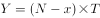可得，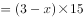，解得，。设若同时开启4个检票口需要分钟，则有：，解得，即需要10分钟。

故正确答案为B。

---

### 第 2 题　qid 2660808 · 数学运算

设有A、B两项工程，甲队单独完成A工程需要15天，单独完成B工程需要10天；乙队单独完成A工程需要5天，单独完成B工程需要15天。统筹安排甲、乙两队分工协作，以有效方式完成这两项工程，最少需要多少天？

- **A**. 7
- **B**. 7.5
- **C**. 8　✅
- **D**. 9

**答案**：C

**官方解析**

赋值A工程的工程总量为15和5的最小公倍数15，则甲完成A工程的效率为，乙完成A工程的效率为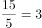；赋值B工程的工程总量为10和15的最小公倍数30，则甲完成B工程的效率为，乙完成B工程的效率为。因为乙完成A工程的效率更高，甲完成B工程的效率更高，所以优先让乙做A工程，甲做B工程。乙单独完成A工程需要5天，此时甲已做B工程的工程量为，剩下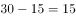的工程量由甲、乙共同完成，还需要天。因此以有效方式完成这两项工程最少需要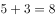天。

故正确答案为C。

---

### 第 3 题　qid 2660810 · 数学运算

某高校举办春季运动会，共有1000名学生报名参加竞赛项目。为从运动员中选拔人员参加开幕式和闭幕式队列，现把所有运动员从1到1000进行编号，选出编号为3的倍数的运动员参加开幕式队列，而编号为7的倍数的运动员参加闭幕式队列。问：既不参加开幕式队列也不参加闭幕式队列的运动员有多少人？

- **A**. 428
- **B**. 475
- **C**. 525
- **D**. 572　✅

**答案**：D

**官方解析**

编号为3的倍数的运动员共有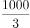取整，为333人；

编号为7的倍数的运动员共有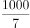取整，为142人；

两者都满足的运动员共有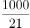取整，为47人。

根据两集合容斥原理公式：，可得到关系：参加开幕式的人数参加闭幕式的人数开闭幕式都参加的人数总人数开闭幕式都不参加的人数，代入数字：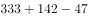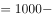开闭幕式都不参加的人数，解得：开闭幕式都不参加的运动员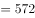人。

故正确答案为D。

---

### 第 4 题　qid 2660815 · 数学运算

一台全自动咖啡机打八折销售，利润为进价的，如打七折出售，利润为50元。则这台咖啡机的原价是多少元？

- **A**. 250　✅
- **B**. 240
- **C**. 210
- **D**. 200

**答案**：A

**官方解析**

设这台咖啡机的原价为x元，进价为y元，根据“打八折销售，利润为进价的60%”，可得：0.8x-y=0.6y······①；根据“如打七折出售，利润为50元”，可得：0.7x-y=50······②，联立①和②，解得x=250。
故正确答案为A。

---

### 第 5 题　qid 2660818 · 数学运算

小王开车上班必须经过3个带有交通信号灯的路口，在每个路口遇到红灯的概率为0.2。如果小王一路遇到的红灯数不超过1个，上班将不会迟到。那么小王上班迟到的概率为：

- **A**. 0.04
- **B**. 0.048
- **C**. 0.104　✅
- **D**. 0.128

**答案**：C

**官方解析**

方法一：小王迟到的概率小王不迟到的概率。不迟到的情况有两种：没有遇到红灯和遇到1个红灯。没有遇到红灯的概率为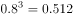。遇到1个红灯的概率为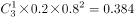。故上班迟到的概率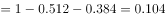。

方法二：小王迟到的情况为遇到超过1个红灯，即他遇到2个红灯或3个红灯。遇到2个红灯的概率为。遇到3个红灯的概率为。故他上班迟到的概率为。

故正确答案为C。

---

### 第 6 题　qid 2660828 · 数学运算

某企业产品成本和产量的关系为：，产品销售收入和产量的关系为：。问：该企业产量为多少时才能获得最大利润？

- **A**. 
1
　✅
- **B**. 
2

- **C**. 
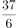

- **D**. 
8

**答案**：A

**官方解析**

设该企业的利润为，则利润和产量的关系为：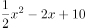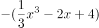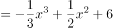，对函数求导，并令其导数为0，即，解得或，将这两个的值代入原函数，可得或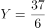，由于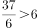，因此当产量为1时，获得最大利润。

故正确答案为A。

---

### 第 7 题　qid 2660835 · 数学运算

在一次马拉松比赛中，男子组和女子组从同一起点开始沿相同路线行进。已知男子组和女子组在前半程所用时间之比为5：6，跑后半程所用时间之比为4：5；男子组跑前、后半程所用时间之比为3：4。假定男子组和女子组前、后半程都是匀速跑，则女子组跑前、后半程所用时间之比为：

- **A**. 25：32
- **B**. 2：3
- **C**. 7：8
- **D**. 18：25　✅

**答案**：D

**官方解析**

由题意可知，，，，则可赋值为5和3的最小公倍数15，那么，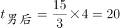，，因此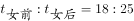。

故正确答案为D。

---

### 第 8 题　qid 2660838 · 数学运算

某纸箱加工厂具有三种规格的原材料，大型原材料9平方米，可以制作6个纸箱；中型原材料7平方米，可以制作4个纸箱；小型原材料6平方米，可以制作3个纸箱。现要加工1000个纸箱，则纸箱加工厂最少使用多少平方米的原材料？

- **A**. 1503
- **B**. 1502
- **C**. 1501　✅
- **D**. 1500

**答案**：C

**官方解析**

由题意可知，用大型原材料制作每个纸箱需要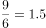平方米，用中型原材料需要平方米，用小型原材料需要平方米。对比可知，用大型原材料相对比较节省，因此制作纸箱尽可能多的使用大型原材料。

大型原材料可看成6个纸箱为一组，组······4个，则166组纸箱需要的原材料为：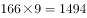平方米。剩下4个纸箱，用大型原材料需要9平方米，用中型原材料需要7平方米，用小型原材料需要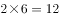平方米，可知用中型原材料最节省。

则加工1000个纸箱，最少使用原材料平方米。

故正确答案为C。

---

### 第 9 题　qid 2660842 · 数学运算

某单位在植树节组织职工参加义务植树活动，每人至少参加挖树坑和运树苗两项活动中的一项。只挖树坑的人数和没挖树坑的人数相同，且两者之和是既挖树坑又运树苗的人数的4倍。则只参加一项活动的人数占参加植树活动总人数的比例为：

- **A**. 4:5　✅
- **B**. 2:3
- **C**. 3:4
- **D**. 5:6

**答案**：A

**官方解析**

设既挖树坑又运树苗的人为人，则只挖树坑的人、没挖树坑的人均是人，因为每人至少参加挖树坑和运树苗两项活动中的一项，则没挖树坑即只运树苗。只挖树苗的人也为人。参加活动的总人数只挖树坑的人只运树苗的人既挖树坑又运树苗的人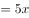人。所求比例为。

故正确答案为A。

---

### 第 10 题　qid 2660845 · 数学运算

赵先生今年80岁，他有一个45岁的儿子、一个15岁的孙子、一个10岁的孙女。问：多少年后儿子、孙子、孙女三者的年龄之和恰好等于赵先生的年龄？

- **A**. 2
- **B**. 3
- **C**. 4
- **D**. 5　✅

**答案**：D

**官方解析**

设年后儿子、孙子、孙女三者的年龄之和等于赵先生。根据每过一年长一岁可知：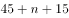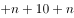，解得。

故正确答案为D。

---

## 判断推理

### 第 1 题　qid 2659921 · 类比推理

兼顾：坚固 相对于 散步：散布
下面选项和题干逻辑结构相同的是：

- **A**. 情谊：情意 相对于 督查：督察
- **B**. 隔壁：戈壁 相对于 占有：战友
- **C**. 终生：钟声 相对于 报仇：报酬
- **D**. 著名：注明 相对于 公司：公私　✅

**答案**：D

**官方解析**

第一步：判断题干词语间逻辑关系。
“兼顾与坚固”、“散步与散布”之间均存在同音不同义的关系。
第二步：判断选项词语间逻辑关系。
A项：情谊是指人与人相互关心、相互敬爱的感情；情意是指对人的感情，二者为近义关系，并不是同音不同义词，与题干逻辑关系不一致，排除；
B项：隔壁的“隔”与戈壁的“戈”读音不同，与题干逻辑关系不一致，排除；
C项：“终生与钟声”、“报仇与报酬”均存在同音不同义的关系，与题干逻辑关系一致，保留；
D项：“著名与注明”、“公司与公私”均存在同音不同义的关系，与题干逻辑关系一致，保留。
对比C、D两项：题干后一组词中存在相同的汉字“散”，而散步的“散”是指随意、不专注，散布的“散”是指分散，二者含义不同，而C项中报仇的“报”与报酬的“报”均有回报的含义，D项中公司是一个外来译词，是指企业的组织形式，公私的“公”是指公方，二者含义不同，因此D项比C项与题干逻辑关系更一致。
故正确答案为D。

---

### 第 2 题　qid 2659927 · 逻辑判断

四人立于某人出门必经之途，见某人来，故作吃惊之状，谓之曰：“足下脸色如此难看，恐有疾病，须重视加以治疗！”众口一词。此人回家，果然疾作。
下列选项使用同一逻辑方法的是：

- **A**. 告狱中一死囚：汝明日须受死刑，但不用刀枪，只在腿上挖一洞，使血流出。血尽身死。次日，绑赴刑场，以布蒙其眼，以锥刺其骨，使稍出血，然后以水壶滴水于其伤口上，下方以桶盛之，淙淙有声。约半小时，其人死矣　✅
- **B**. 从前有一书商，欲刊一部“中华文化名人传”，通告一百名文人，请其自写传记，并购买预约书十册，每册十元。文人想凭此出名，皆乐从。书商收得一万元。此出版者无本营商，可谓精明之至
- **C**. 光线的照射有助于缓解冬季抑郁症。研究人员曾对九名患者进行研究，它们均因冬季白天变短而患上了抑郁症。研究人员让患者在清早和晚上各接受了三个小时伴有花香的强光照射。一周之内，七名患者完全摆脱了抑郁，另外两名也有了明显好转
- **D**. 硕鼠通常不患血癌，然而在一项实验中发现，给三百只硕鼠等量的辐射后，将他们平均分为两组，第一组可以不受限制的吃食物，第二组限量吃食物，结果第一组有七十五只患血癌，第二组只有五只患血癌。我们可以得出的结论是，通过限制硕鼠的进食量，能够控制由实验辐射导致的硕鼠血癌发生

**答案**：A

**官方解析**

第一步：分析题干。
有人告诉某人会生病，其信以为真，最后真的生病，即个人的心理作用造成了相应的结果。
第二步：逐一分析选项。
A项：有人告诉死囚在腿上挖洞会让其死亡，死囚被绑赴刑场后，仅为死囚营造出在腿上挖洞致其死亡的假象，死囚就真的死亡了，即个人心理作用造成了相应的结果，与题干逻辑方法一致，当选；
B项：指出精明书商如何利用手段达到自己的目的，并未涉及心理作用导致的结果，与题干逻辑方法不一致，排除；
C项：通过实验证明光线的照射有助于缓解冬季抑郁症，并未涉及心理作用导致的结果，与题干逻辑方法不一致，排除；
D项：通过做实验得出限制硕鼠的进食量，能够控制由实验辐射导致的硕鼠血癌发生，并未涉及心理作用导致的结果，与题干逻辑方法不一致，排除。
故正确答案为A。

---

### 第 3 题　qid 2659932 · 逻辑判断

某大学为了提高学生主动的学习积极性，开展了以宿舍为单位的“舍赛”活动，最近一次是男生甲宿舍和女生乙宿舍开展的四级英语通过率比赛，两舍同学都在积极备考并相互激励着对方。“如果你们宿舍的张强和王刚通过，那么我们宿舍的四名同学将全部通过！”女生强势的发出了挑战。
发生以下哪种情况，将使挑战者失败？

- **A**. 张强通过了，王刚没通过，四名女生全部通过了
- **B**. 王刚通过了，张强没通过，四名女生其中两名没通过
- **C**. 张强和王刚都没通过，四名女生无一人通过
- **D**. 张强和王刚都通过了，女生只有三人通过　✅

**答案**：D

**官方解析**

第一步：翻译题干。

如果你们宿舍的张强和王刚通过，那么我们宿舍的四名同学将全部通过。

翻译为:①张强通过 且 王刚通过四名女生全部通过。

若要使挑战者失败，找出题干的矛盾命题即可，即张通过且王通过但是四名女生有人没通过。

第二步：逐一分析选项。

A项：翻译为张强通过 且 王刚通过且四名女生全部通过，不是①的矛盾命题，不能证明挑战者失败，排除；

B项：翻译为王刚通过 且 张强通过且两名没通过，不是①的矛盾命题，不能证明挑战者失败，排除；

C项：翻译为王刚通过 且 张强通过且四名女生都没通过，不是①的矛盾命题，不能证明挑战者失败，排除；

D项：翻译为张强通过 且 王刚通过且四名女生有人没通过，是①的矛盾命题，可以证明挑战者失败，当选。

故正确答案为D。

---

### 第 4 题　qid 2659934 · 定义判断

所谓自制力，就是一个人控制自己的思想感情和举止行为的能力。
根据上述定义，下列选项不属于自制力的是：
①某人在一朋友家做客，看到主人家四岁的小孩子毫无征兆的爬到桌上，将满桌的美味佳肴破坏殆尽。
②一只红狐狸为了捕获野鸭子，连续几天潜伏在冰天雪地的沼泽中，毫无声息的贴在地上缓慢的接近野鸭子。当野鸭游开时，红狐狸就用舌头舔一下嘴，失望的退回原处继续守候着。它可以连续一个多月保持这种状态，直到野鸭子一时疏忽终于被它抓到吃掉为止。
③有人决心要在今年减肥成功。坚持每周至少锻炼三次，每次不低于一小时。可他说每天晚上记日记时，恨不能抽自己一记耳光，因为他只坚持了两天就失去了兴趣，之后的每一天他都在睡懒觉。
④张先生今年计划要读五十本书，现在到了四月份却只摸了一本书的书皮，连作者是谁都没有记清。

- **A**. ①②　✅
- **B**. ②③
- **C**. ①④
- **D**. ③④

**答案**：A

**官方解析**

第一步：找出定义关键词。
“一个人控制自己的思想感情和举止行为的能力”。
第二步：分析题干。
①中讲述的是四岁小孩将满桌的美味佳肴破坏殆尽，说明年龄过小只是随心情做事并不知道对错，不符合“控制自己的思想感情和举止行为的能力”，不属于自制力；
②中讲述的是红狐狸为了目的用尽手段，主体是红狐狸，而题干的自制力说的是人，主体不一致，不属于自制力；
③中讲述的是某人决心减肥，但是最后因没有自制力以失败告终，说明这个人“控制自己的思想感情和举止行为的能力”差，属于自制力；
④中讲述的是某人计划看书，但是最后因没有自制力以失败告终，说明这个人“控制自己的思想感情和举止行为的能力”差，属于自制力。
因此①②不涉及自制力，而③④属于自制力差的情况。
本题为选非题，故正确答案为A。

---

### 第 5 题　qid 2659936 · 逻辑判断

关于一个班参加会计资格证书测试的通过情况有如下断定：
①学习委员通过了。
②该班所有人都通过了。
③有些人通过了。
④有些人没通过。
经调查，发现上述断定只有两个是正确的，可见：

- **A**. 该班有人通过了，有人没通过　✅
- **B**. 学习委员通过了
- **C**. 所有人都通过了
- **D**. 所有人都没通过

**答案**：A

**官方解析**

第一步：找矛盾。
①学习委员通过；
②所有人通过；
③有些人通过；
④有些人没通过。
②和④是矛盾关系，二者必有一真，必有一假。
第二步：看其余。
已知两真两假，矛盾②和④必有一真，必有一假，那么①和③必有一真，必有一假。
假设①为真，即学习委员通过了，那么③也为真，与题干两真两假矛盾，故①一定为假，即学习委员没通过，可以推出有的人没有通过，那么④为真；
根据①为假，可以推出③一定为真，即有些人通过了为真，A项当选。
故正确答案为A。

---

### 第 6 题　qid 2659938 · 类比推理

下面是甲、乙、丙三位专家关于录取选调生的意见。
甲：“如果不录取李正，那么不录取王兴。”
乙：“如果不录取王兴，那么录取李正。”
丙：“如果录取李正，那么不录取王兴。”
应该选择哪种录取方案，使甲、乙、丙三位专家的要求同时得到满足？

- **A**. 只录取王兴
- **B**. 只录取李正　✅
- **C**. 都录取
- **D**. 都不录取

**答案**：B

**官方解析**

第一步：翻译题干。

①甲：李正王兴；

②乙：王兴李正；

③丙：李正王兴。

第二步：根据题干信息进行推导。

根据①③可知，无论李正是否录取，王兴一定不录取，再根据②可以推出李正录取，B项当选。

故正确答案为B。

---

### 第 7 题　qid 2659942 · 类比推理

写遗嘱的人有四个继承人：S、T、U、V。遗产是七套房子，编号为1～7号。七套房子按以下条件分配：
①谁继承了2号房子，就不能继承其他房子。
②没有一个继承者既可以继承3号房子，又可以继承4号房子。
③如果S继承了一套或数套房子，那么U就不能继承其他房子。
④如果S继承了2号房子，那么T必须继承4号房子。
现已知S继承了2号房子，那么谁必须继承3号房子？

- **A**. S
- **B**. T
- **C**. U
- **D**. V　✅

**答案**：D

**官方解析**

第一步：分析题干条件。

①继承2号房不能继承其它房子；

②非3号房或非4号房；

③S继承了一套或数套房子U就不能继承其他房子；

④S继承了2号房子T必须继承4号房子；

⑤S继承了2号房子。

第二步：根据题干条件进行推理。

条件⑤为题干确定信息，可由此开始进行推理。

根据①⑤可知S不能继承其它房子，排除A项；

根据③⑤可知U不能继承其他的房子，排除C项；

根据④⑤可知T必须继承4号房，再结合条件②可以推出T不能继承3号房，排除B项。

故正确答案为D。

---

### 第 8 题　qid 2659954 · 逻辑判断

小何和小钱是要好的朋友，小何是学气象的，每天要做天气预报，小钱是学哲学的，爱和人辩论。某周日中午，两人在一起吃饭，小何急着要走，说要去加班，准备明天的天气预报。小钱说：“何必着急？做天气预报还不容易，你只要说明天有的概率降水就行了。如果真的下了雨，你可以说‘我预报准确’，因为你说过有的降水率；如果明天没有下雨，你也没错，因为你预言有的概率不下雨。因此，你总是对的。”

如果以下论证为真，哪项最能削弱小钱的论断？

- **A**. 
如果明天下雨了，只有预报明天降水率才算预报准确

- **B**. 
如果明天不下雨，只有预报降水率为才算预报准确

- **C**. 
天气预报的准确率不是仅靠某一次是否符合天气实际情况来判断的

- **D**. 
用概率预报天气是不科学的
　✅

**答案**：D

**官方解析**

第一步：找到论点和论据。

论点：只要小何说明天有的概率降水，无论是否降水，小何总是对的。

论据：如果真的下了雨，你可以说‘我预报准确’，因为你说过有的降水率；如果明天没有下雨，你也没错，因为你预言有的概率不下雨。

本题论点和论据说的都是预报的概率降水是对的，二者话题一致，优先考虑削弱论点，即预报明天有的概率降水不是对的。

第二步：逐一分析选项

A项：指出下雨的情况下预报降水率才算预报准确，说明下雨的情况下预报的概率降水是不准确的，削弱论据，保留；

B项：指出不下雨的情况下预报降水率才算预报准确，说明不下雨的情况下预报的概率降水是不准确的，削弱论据，保留；

C项：说明准确率不能靠一次来判断，研究的是准确率与次数之间的关系，与概率降水是否准确无关，话题不一致，排除；

D项：说明用概率预报不科学，预报明天有的概率降水是不科学的，直接否定论点，保留。

比较A、B、D三项，D项削弱论点的作用大于A、B两项的削弱论据，且A、B两项极为相似，属于同构选项，均可排除。

故正确答案为D。

---

### 第 9 题　qid 2660457 · 逻辑判断

小何和小钱是要好的朋友，小何是学气象的，每天要做天气预报，小钱是学哲学的，爱和人辩论。某周日中午，两人在一起吃饭，小何急着要走，说要去加班，准备明天的天气预报。小钱说：“何必着急？做天气预报还不容易，你只要说明天有的概率降水就行了。如果真的下了雨，你可以说‘我预报准确’，因为你说过有的降水率；如果明天没有下雨，你也没错，因为你预言有的概率不下雨。因此，你总是对的。”

下列选项中，与小钱所用推理形式完全相同的是：

- **A**. 有人说，凡是伟大优秀的音乐作品都会让人民大众喜欢并长久流传；也有人说，“曲高和寡”，水准越高的作品，欣赏的人越少
- **B**. 拐卖妇女、儿童集团的首要分子或拐卖妇女、儿童3人以上的处10年以上有期徒刑或无期徒刑，并处罚金或没收财产。赵某不是拐卖妇女、儿童集团的首要分子，拐卖妇女、儿童7人，被判10年以上有期徒刑并没收财产
- **C**. 一盗贼入室劫财，出逃时发现屋内有人，用预先准备好的绳子将其勒死以杀人灭口。该贼必死无疑
- **D**. 老师向学生收取学成前未交付的另一半学费，学生不肯。双方发生争执，欲打官司。学生说：“如果我胜诉，我不会交付另一半学费；如果我败诉，我也不会交付另一半学费。总之，你将得不到你想要的那一半学费。”　✅

**答案**：D

**官方解析**

第一步:分析题干推理形式。

小钱的推理形式为：下雨有的降水率是对的，下雨有的降水率是对的，推出有的概率降水总是对的，即AB，AB，推出B恒成立。

第二步：逐一分析选项。

A项：伟大优秀的音乐作品会让人民大众喜欢且长久流传，水准越高的作品欣赏的人越少，即AB，CD，与题干推理形式不相同，排除；

B项：拐卖妇女、儿童集团的首要分子或拐卖妇女、儿童3人以上（处10年以上有期徒刑或无期徒刑）且（处罚金或没收财产），即A或B（C或D）且（E或F）；赵某不是拐卖妇女、儿童集团的首要分子，拐卖妇女、儿童7人，被判10年以上有期徒刑并没收财产，即A或BC且F，与题干推理形式不相同，排除；

C项：盗贼杀人灭口必死无疑，即AB，与题干推理形式不相同，排除；

D项：胜诉交付另一半学费，败诉（即胜诉）交付另一半学费，推出该学生不会交另一半学费，即AB，AB，推出B恒成立，与题干推理形式相同，当选。

故正确答案为D。

---

### 第 10 题　qid 2660465 · 逻辑判断

某卫生系统要在全市几家大医院联合开展一次意外伤病事故急救竞赛。竞赛报名事宜里有一条规定：工作不满三年或未曾评为先进工作者的不能参加本次比赛。李欣工作已满五年却不是先进工作者。
那么，关于李欣，以下哪项是根据上文能推出的结论？

- **A**. 她一定能够参加本次比赛并获得优异成绩
- **B**. 她的参赛成绩取决于她五年来丰富的工作经验
- **C**. 她可能具有参加本次比赛的资格
- **D**. 她没有先进工作者称号不能参加本次比赛　✅

**答案**：D

**官方解析**

第一步：分析题干条件。

（1）工作不满三年或未曾评为先进工作者不能参加本次比赛；

（2）李欣工作已满五年却不是先进工作者。

第二步：根据题干条件进行推理。

结合条件（1）工作不满三年或未曾评为先进工作者不能参加本次比赛，由确定信息（2）可知，李欣不是先进工作者，是对（1）的肯前，肯前必肯后，可推知李欣不能参加本次比赛，因此排除A项、B项和C项，D项符合。

故正确答案为D。

---

### 第 11 题　qid 2660488 · 图形推理

把下面的六个图形分为两类，使每一类图形都有各自的共同特征或规律，分类正确的一项是：

- **A**. ①②③，④⑤⑥
- **B**. ①③⑥，②④⑤　✅
- **C**. ①③⑤，②④⑥
- **D**. ①③④，②⑤⑥

**答案**：B

**官方解析**

题干元素组成不同，观察发现，每个图形中均出现生活化图形和封闭面明显的图形，优先考虑数面。①③⑥图形中的面数量均是5，面数量均为奇数，而②④⑤图形中的面数量分别为6、6、8，面数量均为偶数，因此①③⑥一组，②④⑤一组。
故正确答案为B。

---

### 第 12 题　qid 2660500 · 图形推理

从所给的四个选项中，选择最合适的一个填入问号处，使图形呈现一定的规律性：

- **A**. A
- **B**. B
- **C**. C　✅
- **D**. D

**答案**：C

**官方解析**

题干元素组成不相同，且无明显属性规律，优先考虑数量规律。每幅图均由多种元素组成，考虑元素的种类和个数。观察发现，题干中每幅图均由三种元素构成，排除B、D两项；继续观察可发现，题干每幅图中，每种元素的个数分别为2、2、2，3、2、1，2、2、2，3、2、1，2、2、2，为交替规律，因此“？”处三种元素的个数应分别为3、2、1。A项为2、2、2，排除；C项为3、2、1，当选。
故正确答案为C。

---

### 第 13 题　qid 2660510 · 图形推理

从所给的四个选项中，选择最合适的一个填入问号处，使图形呈现一定的规律性：

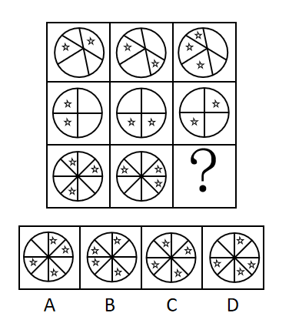

- **A**. A　✅
- **B**. B
- **C**. C
- **D**. D

**答案**：A

**官方解析**

元素组成相似，考虑样式规律。本题为九宫格题目，优先看横行。观察发现，题干每行图形外部轮廓相同，内部分割区域相同，空白和五角星个数不同，优先考虑黑白运算。第一行寻找规律：五角星五角星五角星，空白空白五角星，五角星空白空白，空白五角星空白；第二行验证规律成立。第三行前两个图形应用上述运算规律得到A项。

故正确答案为A。

---

### 第 14 题　qid 2660514 · 图形推理

从所给的四个选项中，选择最合适的一个填入问号处，使图形呈现一定的规律性：

- **A**. A
- **B**. B
- **C**. C
- **D**. D　✅

**答案**：D

**官方解析**

题干元素组成不同，优先考虑属性规律。观察可知每幅图都有横纵坐标，不同的地方在于坐标轴上曲线的对称性分别是轴对称、中心对称、轴对称、中心对称、轴对称，为交替规律，所以？处应为一条中心对称的曲线。B项和C项的曲线都是轴对称，排除。A项虽为中心对称，但是直线不是曲线，排除。
故正确答案为D。

---

### 第 15 题　qid 2660518 · 图形推理

从所给的四个选项中，选择最合适的一个填入问号处，使图形呈现一定的规律性：

- **A**. A
- **B**. B
- **C**. C
- **D**. D　✅

**答案**：D

**官方解析**

本题考查三视图，第一组图形中，第二个图形和第三个图形分别是第一个图的俯视图和左视图。第二组应用规律，？处应该是第一个图的左视图。根据图形大小可以排除A、C两项。再根据图形上方圆锥与圆柱的关系，可以排除B项。
故正确答案为D。

---

## 资料分析

### 材料 1

        2017年，原油和天然气生产一降一升。受国际原油市场和国内石油生产开采条件变化等多种因素影响，国内原油产量下降。在相关环保政策和“煤改气”工程的拉动下，天然气需求旺盛；加之非居民用天然气价格下调，企业用气积极性提高，天然气生产持续快速增长。

1.原油生产下降，进口保持较快增长

        2017年，我国原油产量19151万吨，比上年下降，降幅较上年收窄2.8个百分点。2012年以来，原油生产基本稳定，近两年虽略有减产，但仍保持在1.9亿吨以上。

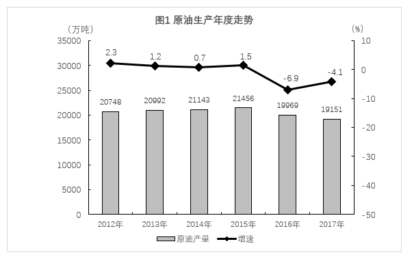

        2017年在国内原油减产、原油加工能力增加等因素推动下，原油进口量突破4亿吨。原油进口量与国内产量之比持续扩大，由2012年的1.3：1扩大到2.2：1。

        原油加工量稳步增长。随着国内新增炼厂相继投产，地方炼厂原油进口量增加，2017年原油加工量及成品油生产稳步增长。2017年原油加工量5.7亿吨，比上年增长，增速比上年加快2.2个百分点。成品油生产方面，汽油、煤油和柴油分别比上年增长、和。

        自2015年开始，获得原油进口权和进口原油使用权的地方炼厂连续两年增加，地方炼厂占原油加工份额不提高。2017年，非国有控股企业原油加工量占全部的比重为，比上年提高了1.8个百分点。

2.天然气生产和进口快速增长 

        受《加快推进天然气利用的意见》《京津冀及周边地区2017年大气污染防治工作方案》等相关政策以及煤炭消费减量替代工作、工业和民用“煤改气”工程全力推进影响，国内天然气消费需求旺盛，拉动天然气产量快速增长。2017年，天然气产量1480.3亿立方米，比上年增长，增速较上年加快6.5个百分点；与2012年相比，产量增加374.3亿立方米，年均增长。

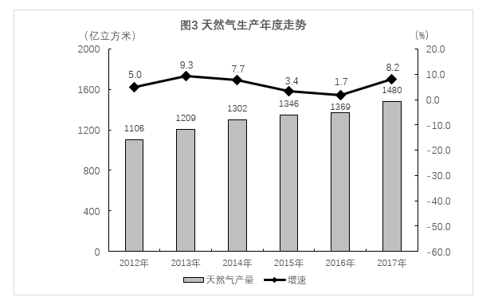

        天然气进口持续快速增长。2017年，天然气进口946.3亿立方米，比上年增长；进口量与国内产量之比由2012年的0.4：1扩大到0.6：1。

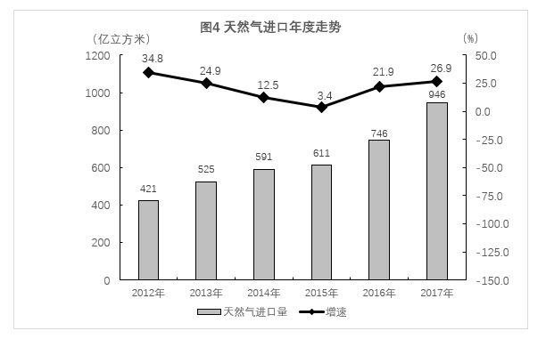

#### 第 1 题　qid 2661073 · 综合

2011年，我国的原油产量是：

- **A**. 20280万吨
- **B**. 20281万吨
- **C**. 20282万吨　✅
- **D**. 20283万吨

**答案**：C

**官方解析**

根据题干“2011年，我国的原油产量是”，结合材料时间为2012-2017年，可判定本题为基期计算问题。定位图1可得，2012年我国原油产量20748万吨，同比增长。则2011年我国的原油产量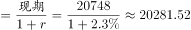万吨，与C项最接近。

故正确答案为C。

---

#### 第 2 题　qid 2661075 · 综合

从2012年到2017年，我国原油产量环比变化最大的年份是：

- **A**. 2016年　✅
- **B**. 2015年
- **C**. 2012年
- **D**. 2017年

**答案**：A

**官方解析**

根据题干“从2012年到2017年······产量环比变化最大的年份是”，可判定本题为增长量比较问题。定位图1可得2012年-2017年我国原油产量及2012年我国原油产量的同比增速，根据公式：增长量，增长量=现期量-基期量，变化量即增长量的绝对值，则2012年到2017年，我国原油产量的变化量分别为：

2012年：万吨；

2013年：万吨；

2014年：万吨；

2015年：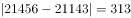万吨；

2016年：万吨；

2017年：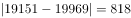万吨。

综上，从2012年到2017年，我国原油产量环比变化最大的年份是2016年。

故正确答案为A。

备注：以年为统计单位时，同比、环比均是和上一年做比较，故同比变化量就是环比变化量。

---

#### 第 3 题　qid 2661076 · 综合

从2012年到2017年，我国原油产量极差和原油进口量极差之比是：

- **A**. 1：6
- **B**. 1：6.44　✅
- **C**. 1：6.5
- **D**. 1：6.4

**答案**：B

**官方解析**

根据题干“从2012年到2017年···和···极差之比是”，可判定本题为比值计算问题。定位图1可得，2012-2017年我国原油产量最高值为21456万吨，最低值为19151万吨；定位图2可得，2012-2017年我国原油进口量最高值为41957万吨，最低值为27103万吨。则原油产量极差为万吨，进口量极差为万吨，极差之比为2305：148541：6.44。

故正确答案为B。

备注：极差为统计术语，用以表示某项数据最大值与最小值之间的差距。

---

#### 第 4 题　qid 2661077 · 平均数

从2012年到2017年，我国平均天然气产量和平均天然气进口量之差是：

- **A**. 660亿立方米
- **B**. 661亿立方米
- **C**. 662亿立方米　✅
- **D**. 663亿立方米

**答案**：C

**官方解析**

根据题干“从2012年到2017年，我国平均···和平均···之差是”，结合材料给出2012-2017年相关数据，可判定本题为现期平均数问题。定位图3、图4可得，2012-2017年我国天然气产量分别为1106、1209、1302、1346、1369、1480亿立方米，天然气进口量分别为421、525、591、611、746、946亿立方米。则所求平均数之差为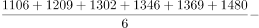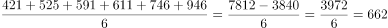亿立方米。

故正确答案为C。

---

#### 第 5 题　qid 2661079 · 综合

2015年，我国的原油加工量大约是：

- **A**. 5.58亿吨
- **B**. 5.54亿吨
- **C**. 5.43亿吨
- **D**. 5.28亿吨　✅

**答案**：D

**官方解析**

根据题干“2015年，我国的原油加工量大约是”，结合材料给出2017年加工量，可判定本题为间隔基期计算问题。定位文字材料第四段可得，2017年原油加工量5.7亿吨，比上年增长，增速比上年加快2.2个百分点。可知2016年原油加工量同比增速为，则2017年相对于2015年的间隔增长率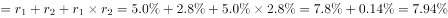，2015年原油加工量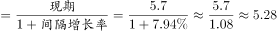亿吨。

故正确答案为D。

---

### 材料 2

        我国自2013年1月开始按照《环境空气质量标准》（GB3095-2012）开展空气质量监测和评价，2018年1月部分城市的评价结果如下表：

        2018年1月部分城市空气质量综合指数与各项污染物指标月均浓度及排名情况

#### 第 6 题　qid 2661083 · 综合

在表中所列32个城市中空气质量综合指数最后三名的城市月均PM2.5均值比前三名的城市月均PM2.5均值约高出多少倍？

- **A**. 2.31
- **B**. 3.31　✅
- **C**. 4.31
- **D**. 5.31

**答案**：B

**官方解析**

根据题干“······比······约高出多少倍”，可判定本题为现期倍数问题。定位表格可得空气质量综合指数最后三名的城市月均PM2.5数值分别是111、136、141，均值为；前三名的城市月均PM2.5数值分别是23、28、39，均值为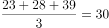。则最后三名的城市月均PM2.5均值比前三名的城市月均PM2.5均值约高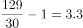倍，与B项最接近。

故正确答案为B。 

---

#### 第 7 题　qid 2661084 · 综合

在表中所列32个城市中各项空气质量指标的极差的最大值和最小值分别是：

- **A**. 118，7.82
- **B**. 118，2.9
- **C**. 151，7.82
- **D**. 151，2.9　✅

**答案**：D

**官方解析**

定位表格可知：综合指数的第1名和第32名分别是2.52、10.34，极差为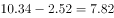；PM2.5数值的第1名和第32名分别是23、141，极差为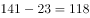；PM10数值的第1名和第32名分别是40、191，极差为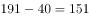；数值的第1名和第32名分别是5、69，极差为；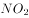数值的第1名和第32名分别是15、76，极差为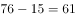；数值的第1名和第32名分别是0.8、3.7，极差为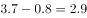；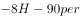数值的第1名和第32名名分别是42、129，极差为。则表中所列32个城市中各项空气质量指标的极差的最大值和最小值分别是151与2.9。

故正确答案为D。 

---

#### 第 8 题　qid 2661087 · 综合

2018年1月，北京、上海、广州三城市空气质量各项指标及排名的折线图，正确的是：

- **A**. 
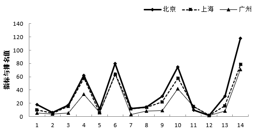

- **B**. 
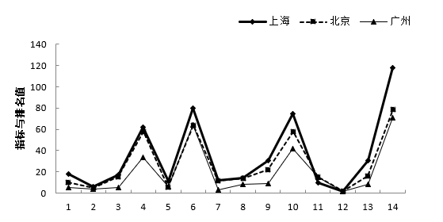

- **C**. 

- **D**. 

　✅

**答案**：D

**官方解析**

定位表格第2列可知：北京、上海、广州三城市综合指数的排名分别为5、10、18，只有D项符合。
故正确答案为D。

---

#### 第 9 题　qid 2661089 · 综合

2018年1月，北京、上海、广州三城市空气质量各项指标的柱形图正确的是：

- **A**. 

　✅
- **B**. 

- **C**. 

- **D**. 

**答案**：A

**官方解析**

定位表格最后1列可知，北京、上海、广州三城市的数值分别为71、79、118，只有A项符合。

故正确答案为A

---

#### 第 10 题　qid 2661090 · 综合

在表中所列32个城市中，空气质量的各项指标的相对差异最大的指标是（    ），相对差异是（    ）倍。

- **A**. 
，5.13

- **B**. 
PM2.5，5.13

- **C**. 
，12.8
　✅
- **D**. 
PM2.5，12.8

**答案**：C

**官方解析**

根据题干“······相对差异最大的指标是（    ），相对差异是（    ）倍”，可判定本题为现期倍数问题。结合选项，只需要比较和PM2.5两项即可。定位表格可知：PM2.5数值的第1名和第32名分别是23、141，相对差异为；数值的第1名和第32名分别是5、69，相对差异为。则表中所列32个城市中空气质量的各项指标的相对差异最大的指标是，相对差异是12.8倍。

故正确答案为C。

---
