# 2018年山东省选调生优选计划笔试综合测试（节选）

> 选调生 · 2018 年 · 5 个模块 · 共 46 题

- [政治理论](#%E6%94%BF%E6%B2%BB%E7%90%86%E8%AE%BA) · 14 题
- [常识判断](#%E5%B8%B8%E8%AF%86%E5%88%A4%E6%96%AD) · 20 题
- [言语理解与表达](#%E8%A8%80%E8%AF%AD%E7%90%86%E8%A7%A3%E4%B8%8E%E8%A1%A8%E8%BE%BE) · 6 题
- [数量关系](#%E6%95%B0%E9%87%8F%E5%85%B3%E7%B3%BB) · 2 题
- [判断推理](#%E5%88%A4%E6%96%AD%E6%8E%A8%E7%90%86) · 4 题

---

## 政治理论

### 第 1 题　qid 2657188 · 新思想

面对新时代坚持和发展什么样的中国特色社会主义、怎样坚持和发展中国特色社会主义这一重大时代课题，我们党形成的重大理论创新成果是（    ）。

- **A**. 邓小平理论
- **B**. “三个代表”重要思想
- **C**. 科学发展观
- **D**. 习近平新时代中国特色社会主义思想　✅

**答案**：D

**官方解析**

本题考查政治常识。
经过中国共产党第十九次全国代表大会部分修改，2017年10月24日通过了《中国共产党章程》。总纲中指出：“十八大以来，以习近平同志为主要代表的中国共产党人，顺应时代发展，从理论和实践结合上系统回答了新时代坚持和发展什么样的中国特色社会主义、怎样坚持和发展中国特色社会主义这个重大时代课题，创立了习近平新时代中国特色社会主义思想。”
纵观中国特色社会主义理论的发展，总而论之，一个共同的问题就是探索和回答“什么是马克思主义、怎样对待马克思主义”。分而观之，可以说邓小平理论主要是探索和回答“什么是社会主义、怎样建设社会主义”的问题，“三个代表”重要思想主要是探索和回答“建设什么样的党、怎样建设党”的问题，科学发展观主要是探索和回答“实现什么样的发展、怎样发展”的问题，而习近平新时代中国特色社会主义思想主要是探索和回答“新时代坚持和发展什么样的中国特色社会主义、怎样坚持和发展中国特色社会主义”的问题。
故正确答案为D。

---

### 第 2 题　qid 2657192 · 新思想

我国的社会主义建设，必须从我国的国情出发，走中国特色社会主义道路。新时代我国的基本国情是（    ）。

- **A**. 我国处于半殖民地半封建社会阶段
- **B**. 我国仍处于并将长期处于社会主义初级阶段　✅
- **C**. 我国处于从社会主义初级阶段到中级阶段的过渡时期
- **D**. 我国已进入社会主义中级阶段

**答案**：B

**官方解析**

本题考查政治常识。
党的十九大报告指出：“必须认识到，我国社会主要矛盾的变化，没有改变我们对我国社会主义所处历史阶段的判断，我国仍处于并将长期处于社会主义初级阶段的基本国情没有变，我国是世界最大发展中国家的国际地位没有变。”
故正确答案为B。

---

### 第 3 题　qid 2657193 · 新思想

习近平总书记在党的十九大报告中明确提出：弘扬马克思主义学风，推进“两学一做”学习教育常态化制度化，以县处级以上领导干部为重点，在全党开展（    ）。

- **A**. 党的群众路线教育实践活动
- **B**. “三严三实”专题教育
- **C**. “不忘初心、牢记使命”主题教育　✅
- **D**. 落实中央“八项规定”活动

**答案**：C

**官方解析**

本题考查政治常识。
党的十九大报告指出：“弘扬马克思主义学风，推进‘两学一做’学习教育常态化制度化，以县处级以上领导干部为重点，在全党开展‘不忘初心、牢记使命’主题教育，用党的创新理论武装头脑，推动全党更加自觉地为实现新时代党的历史使命不懈奋斗。”
故正确答案为C。

---

### 第 4 题　qid 2657196 · 毛中特

《中国共产党章程》明确指出，中国共产党领导全国各族人民，统揽伟大斗争、伟大工程、伟大事业、伟大梦想。“四个伟大”紧密联系、相互贯通、相互作用，其中起决定性作用的是（    ）。

- **A**. 面对新时代的伟大斗争
- **B**. 党的建设新的伟大工程　✅
- **C**. 社会主义的伟大事业
- **D**. 中华民族的伟大梦想

**答案**：B

**官方解析**

本题考查政治常识。
习近平总书记在党的十九大报告中指出：“伟大斗争，伟大工程，伟大事业，伟大梦想，紧密联系、相互贯通、相互作用，其中起决定性作用的是党的建设新的伟大工程。”
故正确答案为B。

---

### 第 5 题　qid 2657197 · 新思想

2017年8月，山东省（    ）综合管理服务平台正式开通。平台围绕党建宣传引领、党务工作在线、网上学习培训、党员精准管理、服务科学决策五项功能，整合全省党建信息化资源，实现对全省各级党组织和广大党员的“一网覆盖”“同网管理”。

- **A**. “灯塔—党建在线”　✅
- **B**. “互联网党建云”
- **C**. “党群翼家”
- **D**. “山东e支部”

**答案**：A

**官方解析**

本题考查政治常识。
山东“灯塔—党建在线”综合管理服务平台2017年8月31日在济南正式开通。该平台整合多方面党建信息化资源，为党员群众、各级党组织等提供服务，实现对山东全省各级党组织和广大党员的“一网覆盖”“同网管理”。
故正确答案为A。

---

### 第 6 题　qid 2657200 · 时事政治

2018年中央经济工作会议指出，中国特色社会主义进入了新时代。这是我国发展新的历史方位，基本特征就是我国经济已由高速增长阶段转向（    ）。

- **A**. 中低速发展阶段
- **B**. 中高速发展阶段
- **C**. 高质量发展阶段　✅
- **D**. 高效率发展阶段

**答案**：C

**官方解析**

本题考查政治常识。
2018年中央经济工作会议于2017年12月18日至20日在北京举行，会议指出：中国特色社会主义进入了新时代，我国经济发展也进入了新时代，基本特征就是我国经济已由高速增长阶段转向高质量发展阶段。推动高质量发展，是保持经济持续健康发展的必然要求，是适应我国社会主要矛盾变化和全面建成小康社会、全面建设社会主义现代化国家的必然要求，是遵循经济规律发展的必然要求。
故正确答案为C。

---

### 第 7 题　qid 2657201 · 时事政治

2018年中央农村工作会议指出，（    ）是我们党“三农”工作一系列方针政策的继承和发展，是中国特色社会主义进入新时代做好“三农”工作的总抓手。

- **A**. 千方百计增加农民收入
- **B**. 完善承包地“三权分置”制度
- **C**. 推进农业供给侧结构性改革
- **D**. 实施乡村振兴战略　✅

**答案**：D

**官方解析**

本题考查政治常识。
2018年中央农村工作会议指出：实施乡村振兴战略，是我们党“三农”工作一系列方针政策的继承和发展，是中国特色社会主义进入新时代做好“三农”工作的总抓手。
故正确答案为D。

---

### 第 8 题　qid 2657203 · 新思想

习近平总书记在学习贯彻党的十九大精神研讨班开班式上发表重要讲话时说：“时代是出卷人，我们是答卷人，人民是阅卷人。”这体现出（    ）。

- **A**. 尊重客观规律的科学发展观
- **B**. 社会主义的荣辱观
- **C**. 以人民利益为核心的群众史观　✅
- **D**. 强调社会利益的价值观

**答案**：C

**官方解析**

本题考查政治常识。
时代出卷是提出问题，我们答卷是解决问题，人民阅卷是评价效果。时代不断演进，出题的内容不断更新；人民对美好生活的需要逐步提高，评卷的标准必然随之抬升——这就决定了执政的共产党作为答卷的考生，只有进行时，没有完成时，总是奔波在迎考答题的征程中。能不能让老百姓满意，是我们从事每项工作的出发点和落脚点，只有老百姓满意了，我们的工作才算做好了，体现了以人民利益为核心的群众史观。
故正确答案为C。

---

### 第 9 题　qid 2657206 · 新思想

中国共产党的领导是中国特色社会主义最本质的特征。没有共产党，就没有新中国，就没有新中国的繁荣富强。这一论断体现了（    ）。

- **A**. 事物的性质是由主要矛盾决定的
- **B**. 事物的性质是由主要矛盾的主要方面决定的　✅
- **C**. 事物发展的规律是不以人的意志为转移的
- **D**. 事物发展的道路总是曲折的

**答案**：B

**官方解析**

本题考查政治常识。
A项错误，事物的性质是由主要矛盾的主要方面决定的，该项表述本身不恰当。
B项正确，同一矛盾有两个方面，矛盾的主要方面，是指在同一矛盾中处于支配地位的方面，起主导作用，决定事物的性质。“最本质的特征”体现了事物的性质是由主要矛盾的主要方面决定的。
C项错误，事物发展的规律是不以人的意志为转移的，说明规律的客观性，但与题干无关。
D项错误，事物发展的道路总是曲折的，但与题干无关。
故正确答案为B。

---

### 第 10 题　qid 2657214 · 新思想

中国特色社会主义政治经济学立足于中国改革发展的成功实践，是研究和揭示现代化社会主义经济发展和运行规律的科学，是在长期的经济发展实践中，初步形成的科学完整的理论体系。下列选项中，属于中国特色社会主义政治经济学要坚持的重大原则是（    ）。
①解放和发展社会生产力原则
②共同富裕原则
③发展社会主义市场经济原则
④公有制为主体、多种所有制经济共同发展原则

- **A**. ①②
- **B**. ①②③
- **C**. ②③④
- **D**. ①②③④　✅

**答案**：D

**官方解析**

本题考查经济常识。
2015年12月21日结束的中央经济工作会议提出：要坚持中国特色社会主义政治经济学的重大原则。这是中国特色社会主义政治经济学首次出现在中央层面的会议上，它的提出，具有鲜明的时代意义和深远的理论意义。
①正确，社会主义的根本任务是解放和发展生产力。习总书记指出：全面建成小康社会，实现社会主义现代化，实现中华民族伟大复兴，最根本最紧迫的任务还是进一步解放和发展社会生产力。
②正确，共同富裕是社会主义的本质要求、根本原则和最终目标。“共同富裕”不是传统意义上的“均富”“共富”思想，而是消除两极分化、真正实现人的全面发展的“共同富裕”。
③正确，发展社会主义市场经济主要有三个原则：其一，使市场在资源配置中起决定性作用；其二，将市场经济与社会主义基本制度结合起来；其三，社会主义国家要从宏观层次上对市场经济进行调控，以减少市场的盲目性和自发性，要用“看得见的手”引导“看不见的手”。
④正确，以公有制为主体、多种所有制经济共同发展的基本经济制度，是中国特色社会主义制度的重要支柱，也是社会主义市场经济体制的根基。
故正确答案为D。

---

### 第 11 题　qid 2657235 · 新思想

郑板桥在山东做官时，留下一首著名的爱民诗，习近平同志多次引用此语来劝勉党员干部，“衙斋卧听萧萧竹，疑是民间疾苦声。（    ）。”

- **A**. 欲识醉乡真乐地，是非荣辱不关情
- **B**. 些小吾曹州县吏，一枝一叶总关情　✅
- **C**. 杖策翩然归去也，尊前雨泪不胜情
- **D**. 人生飘忽百年内，且须酣畅万古情

**答案**：B

**官方解析**

本题考查人文常识。
该句出自清代郑板桥的《潍县署中画竹呈年伯包大丞括》（又名《墨竹图题诗》），表达了诗人忧国忧民的情怀。全文是：衙斋卧听萧萧竹，疑是民间疾苦声。些小吾曹州县吏，一枝一叶总关情。意思是：在衙门里休息的时候，听见竹叶萧萧作响，仿佛听见了百姓啼饥号寒的怨声。我们虽然只是州县里的小官吏，但百姓的每一件小事都在牵动着我们的感情。
故正确答案为B。

---

### 第 12 题　qid 2657238 · 新思想

中国共产党人的初心和使命，就是为中国人民谋幸福，为中华民族谋复兴。这个初心和使命是激励中国共产党人不断前进的根本动力。怀揣这样的初心和使命参加党的一大的山东代表是（    ）。

- **A**. 邓恩铭　✅
- **B**. 陈潭秋
- **C**. 李达
- **D**. 刘仁静

**答案**：A

**官方解析**

本题考查毛中特。
中国共产党第一次全国代表大会于1921年7月23日至31日在上海法租界贝勒路树德里3号和浙江嘉兴南湖召开，出席大会的各地代表共13人。其中邓恩铭、王尽美是山东代表。
故正确答案为A。

---

### 第 13 题　qid 2657240 · 新思想

中国共产党山东省第十一次代表大会指出，今后五年是我省经济转型升级的重要窗口期、我们要实现腾笼换鸟、凤凰涅槃、浴火重生，必须牢牢抓住供给侧结构性改革这条主线，把加快（    ）作为统领经济发展的重大工程。

- **A**. 科技创新驱动
- **B**. 全面深化改革
- **C**. 新旧动能转换　✅
- **D**. 全面从严治党

**答案**：C

**官方解析**

本题考查政治常识。
加快新旧动能转换，关系经济转型升级，关乎山东发展未来。中共山东省第十一次党代会在部署今后五年的工作时，把“加快新旧动能转换”写入报告总体要求，强调“要实现腾笼换鸟、凤凰涅槃、浴火重生，必须牢牢抓住供给侧结构性改革这条主线，把加快新旧动能转换作为统领经济发展的重大工程”。这一重大部署，是适应经济新常态、践行新发展理念、贯彻党中央决策部署的重大战略举措，抓住了山东经济发展的关键。
故正确答案为C。

---

### 第 14 题　qid 2657242 · 新思想

弘扬中华优秀传统文化，是习近平总书记对山东的殷切期望和要求。要勇于担当、不辱使命，大力实施（    ），推动优秀传统文化创造性转化、创新性发展，在中华文化繁荣兴盛进程中当好排头兵。

- **A**. 儒家文化优化再造工程
- **B**. 中华优秀传统文化传承发展工程　✅
- **C**. 沂蒙红色革命文化时代转化工程
- **D**. 中国特色社会主义先进文化创新工程

**答案**：B

**官方解析**

本题考查政治常识。
弘扬中华优秀传统文化，是习近平总书记对山东的殷切期望和要求。2013年11月26日，习近平总书记在山东考察时指出，一个国家、一个民族的强盛，总是以文化兴盛为支撑的，中华民族伟大复兴需要以中华文化发展繁荣为条件。他强调要加强对中华优秀传统文化的挖掘和阐发，努力实现创造性转化、创新性发展。近年来，山东牢记总书记嘱托，以高度的文化自觉主动作为、勇于担当，大力推进优秀传统文化传承发展，努力在中华文化繁荣兴盛进程中当好排头兵。
故正确答案为B。

---

## 常识判断

### 材料 1

        2017年某县人大代表选举中，位于其辖区的某高校被确定为一个选区，分配1名代表名额。选举委员会以该校学生赵某曾发表过不当言论、不热爱祖国为由未将其列入选民名单。赵某不服，拟维护其合法权益。

#### 第 1 题　qid 2657330 · 人文常识

下列关于赵某维护其权益途径的表述，正确的是（    ）。

- **A**. 向选举委员会申诉，申诉决定为最后决定
- **B**. 向选举委员会申诉，对申诉不服的可向法院起诉　✅
- **C**. 向县人大常委会申诉，申诉决定为最后决定
- **D**. 向县人大常委会申诉，对申诉不服的可向法院起诉

**答案**：B

**官方解析**

本题考查法律常识。
根据《全国人民代表大会和地方各级人民代表大会选举法》第二十八条规定：“对于公布的选民名单有不同意见的，可以在选民名单公布之日起五日内向选举委员会提出申诉。选举委员会对申诉意见，应在三日内作出处理决定。申诉人如果对处理决定不服，可以在选举日的五日以前向人民法院起诉，人民法院应在选举日以前作出判决。人民法院的判决为最后决定。”赵某可以向选举委员会申诉，对申诉不服的可向法院起诉。
故正确答案为B。

---

#### 第 2 题　qid 2657331 · 人文常识

本次选举中，该选区可以推荐的代表候选人，最多不超过（    ）。

- **A**. 4人
- **B**. 3人
- **C**. 2人　✅
- **D**. 1人

**答案**：C

**官方解析**

本题考查法律常识。
根据《全国人民代表大会和地方各级人民代表大会选举法》第三十条规定：“全国和地方各级人民代表大会代表实行差额选举，代表候选人的人数应多于应选代表的名额。由选民直接选举人民代表大会代表的，代表候选人的人数应多于应选代表名额三分之一至一倍；由县级以上的地方各级人民代表大会选举上一级人民代表大会代表的，代表候选人的人数应多于应选代表名额五分之一至二分之一。”
该选区为选民直接选举的，分配的代表名额为1人，差额推荐代表候选人最多不超过2人。
故正确答案为C。

---

#### 第 3 题　qid 2657332 · 人文常识

假设该高校选区推荐的代表候选人超过了法定人数，则据（    ）确定正式代表候选人。

- **A**. 较多选民的意见　✅
- **B**. 推荐各方协商的结果
- **C**. 选举委员会的决定
- **D**. 人大常委会的决定

**答案**：A

**官方解析**

本题考查法律常识。
根据《全国人民代表大会和地方各级人民代表大会选举法》第三十一条第一款规定：“由选民直接选举人民代表大会代表的，代表候选人由各选区选民和各政党、各人民团体提名推荐。选举委员会汇总后，将代表候选人名单及代表候选人的基本情况在选举日的十五日以前公布，并交各该选区的选民小组讨论、协商，确定正式代表候选人名单。如果所提代表候选人的人数超过本法第三十条规定的最高差额比例，由选举委员会交各该选区的选民小组讨论、协商，根据较多数选民的意见，确定正式代表候选人名单；对正式代表候选人不能形成较为一致意见的，进行预选，根据预选时得票多少的顺序，确定正式代表候选人名单。正式代表候选人名单及代表候选人的基本情况应当在选举日的七日以前公布。”
故正确答案为A。

---

#### 第 4 题　qid 2657190 · 人文常识

（    ）是改革开放以来党的全部理论和实践的主题，是党和人民历尽千辛万苦、付出巨大代价取得的根本成就。

- **A**. 中华民族伟大复兴
- **B**. 改革
- **C**. 中国特色社会主义　✅
- **D**. 发展

**答案**：C

**官方解析**

本题考查政治常识。
党的十九大报告指出：“中国特色社会主义是改革开放以来党的全部理论和实践的主题，是党和人民历尽千辛万苦、付出巨大代价取得的根本成就。中国特色社会主义道路是实现社会主义现代化、创造人民美好生活的必由之路，中国特色社会主义理论体系是指导党和人民实现中华民族伟大复兴的正确理论，中国特色社会主义制度是当代中国发展进步的根本制度保障，中国特色社会主义文化是激励全党全国各族人民奋勇前进的强大精神力量。”
故正确答案为C。

---

#### 第 5 题　qid 2657195 · 人文常识

我国社会主要矛盾已经转化为（    ）。

- **A**. 经济社会发展与生态文明建设之间的矛盾
- **B**. 经济社会发展与人的自由而全面发展之间的矛盾
- **C**. 人民日益增长的物质文化需要与落后的社会生产之间的矛盾
- **D**. 人民日益增长的美好生活需要和不平衡不充分的发展之间的矛盾　✅

**答案**：D

**官方解析**

本题考查政治常识。
党的十九大报告指出：“中国特色社会主义进入新时代，我国社会主要矛盾已经转化为人民日益增长的美好生活需要和不平衡不充分的发展之间的矛盾。我国稳定解决了十几亿人的温饱问题，总体上实现小康，不久将全面建成小康社会，人民美好生活需要日益广泛，不仅对物质文化生活提出了更高要求，而且在民主、法治、公平、正义、安全、环境等方面的要求日益增长。同时，我国社会生产力水平总体上显著提高，社会生产能力在很多方面进入世界前列，更加突出的问题是发展不平衡不充分，这已经成为满足人民日益增长的美好生活需要的主要制约因素。”
故正确答案为D。

---

#### 第 6 题　qid 2657205 · 人文常识

马克思主义哲学强调，内因是事物变化发展的根据，外因是变化发展的条件，内因起决定作用。下列选项中，强调内因作用的是（    ）。

- **A**. 橘生淮南则为橘，生于淮北则为枳
- **B**. 蓬生麻中，不扶自直；白沙在涅，与之俱黑
- **C**. 物必先腐，而后虫生　✅
- **D**. 鸟随鸾凤飞腾远，人伴贤良品自高

**答案**：C

**官方解析**

本题考查政治常识。
A项错误，“橘生淮南则为橘，生于淮北则为枳”意思是淮河以南的橘树，移植到淮河以北就变为枳树。比喻环境变了，事物的性质也变了。说明外因是事物变化发展的条件，强调外因的作用。
B项错误，“蓬生麻中，不扶自直；白沙在涅，与之俱黑”意思是蓬昔日长在大麻田里，不用扶持，自然挺直；白色的细沙混在黑土中，也会跟它一起变黑。比喻环境对于事物的巨大影响，强调外因的作用。
C项正确，“物必先腐，而后虫生”意思是东西总是自身先腐烂，然后虫子才可以寄生。比喻自己先有弱点而后为外物所侵害，强调内因的作用。内因是事物变化发展的根据，是第一位的原因。
D项错误，“鸟随鸾凤飞腾远，人伴贤良品自高”意思是飞鸟跟随着凤凰才能飞得更高更远，人只要与贤良者相伴，人品就会自然提高。比喻人要选择正确的朋友，才能提高自己，强调外因的作用。
故正确答案为C。

---

#### 第 7 题　qid 2657207 · 人文常识

根据经济学理论中需求的交叉弹性理论，在不考虑其他因素的情况下，若一种商品价格的上升（或下降）会导致另一种商品需求量的增加（或减少），则认为这两种商品互为替代品。以下各组商品中互为替代品的是（    ）。

- **A**. 汽车和汽油
- **B**. 香烟和苹果
- **C**. 步枪和子弹
- **D**. 橙子和香蕉　✅

**答案**：D

**官方解析**

本题考查经济常识。
A项错误，互补品是指两种商品必须互相配合，才能共同满足消费者的同一种需要，汽车和汽油属于互补品。
B项错误，香烟和苹果之间并没有经济学关联。
C项错误，步枪和子弹属于互补品。
D项正确，橙子和香蕉互为替代品。橙子价格上升，人们就会少购买橙子而多购买香蕉。
故正确答案为D。

---

#### 第 8 题　qid 2657209 · 经济常识

税收是政府财政收入的重要组成部分，具有三个缺一不可的基本特征，其中不包括（    ）。

- **A**. 固定性
- **B**. 收益性　✅
- **C**. 强制性
- **D**. 无偿性

**答案**：B

**官方解析**

本题考查经济常识。
税收与其他形式的财政收入相比，具有三项基本特征，即强制性、无偿性和固定性，这是税收区别于其他形式的财政收入的最重要的标志。
A项正确，税收的固定性是指税收是国家按照法律规定的标准向纳税人征收的，任何纳税人和征收机关都无权改变法律规定的征税标准，不能想收多少就收多少，想缴多少就缴多少。
B项错误，税收不具有收益性。
C项正确，税收的强制性是指税法是通过一定的立法程序制定的，纳税人有依法纳税的义务，不能想缴就缴，不想缴就不缴。如果纳税人不依法履行纳税义务，国家就要依法强制征收，并对纳税人予以必要的处罚。
D项正确，税收的无偿性是指税收是国家向纳税人无偿征收的资金，税款一经征收，即转归国家所有，不再直接归还给纳税人。
本题为选非题，故正确答案为B。

---

#### 第 9 题　qid 2657211 · 经济常识

下列四家银行中属于政策性银行的是（    ）。

- **A**. 浦东发展银行
- **B**. 中国光大银行
- **C**. 中国进出口银行　✅
- **D**. 中国农业银行

**答案**：C

**官方解析**

本题考查经济常识。
A、B两项错误，浦东发展银行（简称浦发银行）和中国光大银行都是中国人民银行批准设立的全国性股份制商业银行。
C项正确，政策性银行是指由政府创立，以贯彻政府的经济政策为目标，在特定领域开展金融业务的不以盈利为目的的专业性金融机构。1994年中国政府设立了国家开发银行、中国进出口银行、中国农业发展银行三大政策性银行，均直属国务院领导。
D项错误，中国农业银行是中央管理的大型国有商业银行，国家副部级单位，是中国四大银行之一。
故正确答案为C。

---

#### 第 10 题　qid 2657212 · 经济常识

下列经济指标中，能够反映一个国家总体经济实力，为政府制定经济发展战略和调控管理经济提供重要参考依据的是（    ）。

- **A**. 国内生产总值　✅
- **B**. 外汇储备
- **C**. 基尼系数
- **D**. 汇率

**答案**：A

**官方解析**

本题考查经济常识。
A项正确，国内生产总值（GDP）是在一定时期内（一个季度或一年），一个国家或地区的经济中所生产出的全部最终产品和劳务的价值，常被公认为衡量国家经济状况的最佳指标。它不但可以反映一个国家的经济表现，还可以反映一国的国力与财富。它反映了一国（或地区）的经济实力和市场规模，为政府制定经济发展战略和调控管理经济提供重要参考依据。
B项错误，外汇储备指为了应付国际支付的需要，各国的中央银行及其他政府机构所集中掌握并可以随时兑换成外国货币的外汇资产。外汇储备是一个国家货币当局所持有的用于弥补国际收支赤字、维持该国货币汇率稳定的国际间普遍接受的外国货币，是国际储备的一部分。
C项错误，基尼系数是指国际上通用的、用以衡量一个国家或地区居民收入差距的常用指标。基尼系数最大为“1”，最小为“0”。基尼系数越接近0表明收入分配越是趋向平等。
D项错误，汇率又称外汇利率，指的是两种货币之间兑换的比率，亦可视为一个国家的货币对另一种货币的价值，具体是指一国货币与另一国货币的比率或比价，或者说是用一国货币表示的另一国货币的价格。汇率变动对一国进出口贸易有着直接的调节作用。
故正确答案为A。

---

#### 第 11 题　qid 2657216 · 经济常识

亚当·斯密被称为经济学之父，他在1776年出版了（    ），标志着经济学作为一门学科的诞生。

- **A**. 《就业、利息和货币通论》
- **B**. 《国民财富的性质和原因的研究》　✅
- **C**. 《经济学原理》
- **D**. 《道德情操论》

**答案**：B

**官方解析**

本题考查经济常识。
A项错误，《就业、利息和货币通论》是英国经济学家凯恩斯创作的经济学著作，它是现代西方经济崛起的原动力，标志着现代西方宏观经济学的产生。
B项正确，1776年，亚当·斯密的经济学著作《国民财富的性质和原因的研究》（即《国富论》）终于完成并出版，它的发表标志着古典自由主义经济学的正式诞生，也标志着经济学作为一门学科的诞生。
C项错误，《经济学原理》的作者是曼昆。该书以“学生导向”而著称，多有案例分析、“新闻摘要”，重点亦不在经济学概念，而在经济学的应用和政策分析。
D项错误，《道德情操论》是英国思想家亚当·斯密创作的伦理学著作，该书是情感伦理学的早期代表作，对现代西方情感主义伦理学有重要影响。
故正确答案为B。

---

#### 第 12 题　qid 2657218 · 人文常识

某公安分局发生了以下事实，公务员甲2015年和2017年两年被确定为不称职，公务员乙2017年10月怀孕、不能胜任现职，公务员丙2017年累计旷工35天，公务员丁在执行公务时受伤致残、无法胜任现职。2018年1月公安局可以对（    ）作辞退处理。

- **A**. 甲
- **B**. 乙
- **C**. 丙　✅
- **D**. 丁

**答案**：C

**官方解析**

本题考查法律常识。
A项错误，根据《公务员法》第八十八条规定：“公务员有下列情形之一的，予以辞退：（一）在年度考核中，连续两年被确定为不称职的······”公务员甲虽在2015年和2017年两年被确定为不称职，但并没有连续两年。
B项错误，根据《公务员法》第八十九条规定：“对有下列情形之一的公务员，不得辞退：······（三）女性公务员在孕期、产假、哺乳期内的······”公务员乙2017年10月怀孕、不能胜任现职，符合该规定。
C项正确，根据《公务员法》第八十八条规定：“公务员有下列情形之一的，予以辞退：······（五）旷工或者因公外出、请假期满无正当理由逾期不归连续超过十五天，或者一年内累计超过三十天的。”公务员丙2017年累计旷工35天，符合“一年内累计超过三十天”，所以2018年1月公安局可以对丙作辞退处理。
D项错误，根据《公务员法》第八十九条规定：“对有下列情形之一的公务员，不得辞退：（一）因公致残，被确认丧失或者部分丧失工作能力的······”公务员丁在执行公务时受伤致残符合该情况。
故正确答案为C。

---

#### 第 13 题　qid 2657230 · 人文常识

燕子山村村民甲于2012年3月承包了本村15亩苹果园，并投入大量资金、技术和人力。2017年3月，村里以农村土地长期未做调整，已经不适应当前条件为由，决定重新调整，并将系争的15亩果园承包给了乙。甲既对村委会有意见，也对乙不满，不仅阻止其经营果园，还以各种借口找茬将乙打伤。
燕子山村民委员会（    ）。

- **A**. 是燕子山村民的自治组织　✅
- **B**. 是燕子山村民的自治机关
- **C**. 可代表村民行使各项权利
- **D**. 受乡人民政府领导

**答案**：A

**官方解析**

本题考查法律常识。
根据《宪法》第一百一十一条规定：“城市和农村按居民居住地区设立的居民委员会或者村民委员会是基层群众性自治组织。居民委员会、村民委员会的主任、副主任和委员由居民选举。居民委员会、村民委员会同基层政权的相互关系由法律规定。居民委员会、村民委员会设人民调解、治安保卫、公共卫生等委员会，办理本居住地区的公共事务和公益事业，调解民间纠纷，协助维护社会治安，并且向人民政府反映群众的意见、要求和提出建议。”
故正确答案为A。

---

#### 第 14 题　qid 2657232 · 人文常识

郭沫若先生有副对联说：“大明湖畔，趵突泉边，故居在垂杨深处；漱玉集中，金石录里，文采有后主遗风。”这里称赞的名人是（    ）。

- **A**. 辛弃疾
- **B**. 秦观
- **C**. 晏殊
- **D**. 李清照　✅

**答案**：D

**官方解析**

本题考查人文常识。
A项错误，辛弃疾，南宋豪放派词人，有“词中之龙”之称，与苏轼合称“苏辛”，与李清照并称“济南二安”。
B项错误，秦观，字少游，北宋婉约派词人，被尊为婉约派一代词宗，又被称为“儒客大家”、“淮海居士”。
C项错误，晏殊，北宋政治家、文学家，以词著于文坛，风格含蓄婉丽，与欧阳修并称“晏欧”。
D项正确，李清照，号易安居士，宋代女词人，婉约词派代表，有“千古第一才女”之称。“大明湖畔，趵突泉边，故居在垂杨深处”指李清照故乡在山东济南；《漱玉集》是她的词集；《金石录》是她和丈夫赵明诚以毕生心血撰写而成的集子（著录其所见从上古三代至隋唐五代以来，钟鼎彝器的铭文款识和碑铭墓志等石刻文字，是中国最早的金石目录和研究专著之一）；“文采有后主遗风”指她文采有南唐后主李煜的风格。
故正确答案为D。

---

#### 第 15 题　qid 2657244 · 人文常识

2017年5月，我国首次自主研制的C919客机在浦东机场首飞。以下关于C919客机的说法，不正确的是（    ）。

- **A**. C919客机是我国具有完全自主知识产权的民用客机
- **B**. C919机舱座位布局采用双通道，载客300人左右　✅
- **C**. C919客机是中国首款按照最新国际适航标准，与美国、法国等国的企业合作研制组装的干线民用飞机
- **D**. C919的设计理念绿色环保，飞机碳排放量大幅低于同类飞机

**答案**：B

**官方解析**

本题考查科技常识。
A、C两项正确，C919大型客机，全称COMAC C919，是中国首款按照最新国际适航标准，具有自主知识产权的干线民用飞机，与美国、法国等国企业合作研制组装。
B项错误，C是中国英文名称“China”的首字母，也是中国商飞英文缩写COMAC的首字母，第一个“9”的寓意是天长地久，“19”代表的是中国首型大型客机最大载客量为190座。
D项正确，C919的设计原则为确保安全性、突出经济性、提高可靠性、改善舒适性、强调环保性，飞机碳排放量大幅低于同类飞机。
本题为选非题，故正确答案为B。

---

#### 第 16 题　qid 2657245 · 地理国情

山东是儒家文化的发源地，孔子和孟子的言行都对后世影响深远。下列选项中属于孔子名言的是（    ）。

- **A**. 民为贵，社稷次之，君为轻
- **B**. 得道者多助，失道者寡助
- **C**. 三军可夺帅也，匹夫不可夺志也　✅
- **D**. 仁者无敌

**答案**：C

**官方解析**

本题考查人文常识。
A项错误，“民为贵，社稷次之，君为轻”出自《孟子·尽心章句下》，“民贵君轻”成为后世广泛流传的名言，一直为人引用。国君和社稷都可以改立更换，只有老百姓是不可更换的，所以百姓最为重要。
B项错误，“得道者多助，失道者寡助”出自《孟子·公孙丑下》，意思是站在正义、仁义方面，会得到多数人的支持帮助；违背道义、仁义，必然陷于孤立。
C项正确，“三军可夺帅也，匹夫不可夺志也”出自《论语·子罕》，意思是军队的首领可以被改变，但是男子汉（有志气的人）的志向是不能被改变的。
D项错误，“仁者无敌”出自《孟子·梁惠王上篇》，意思是施行仁政的君王，必然赢得民众的拥戴；上下一心，众志成城，是无敌于天下的。
故正确答案为C。

---

#### 第 17 题　qid 2657247 · 人文常识

清代诗人王士祯写诗：“姑妄言之姑听之，豆棚瓜架雨如丝。料应厌作人间语，爱听秋坟鬼唱诗。”这是对中国小说（    ）的评价。

- **A**. 《子不语》
- **B**. 《阅微草堂笔记》
- **C**. 《姑妄言》
- **D**. 《聊斋志异》　✅

**答案**：D

**官方解析**

本题考查人文常识。
清代诗人王士祯的这首诗是对蒲松龄《聊斋志异》的评论。因蒲松龄写的是狐怪鬼魅，都是不存在的，所以说“姑妄言之姑听之”（姑且让他随意说，姑且听他这么说）；“豆棚瓜架雨如丝”是写聊斋的故事谈论的场所，在豆棚瓜架之下人们听着雨谈着聊斋解闷，这句道出了聊斋接地气，老百姓喜闻乐道；“料应厌作人间语，爱听秋坟鬼唱诗”意思是想必人们已经厌倦人世间的话，而喜欢听那些鬼魅的言论。
故正确答案为D。

---

#### 第 18 题　qid 2657250 · 人文常识

下列关于网络募捐的说法正确的是（    ）。

- **A**. 网络求助行为均属于慈善募捐
- **B**. 以志愿者的名义在网上筹集医药费，是合情合理的
- **C**. 在平台上进行募捐的主体应是获得公开募捐资格的慈善组织　✅
- **D**. 公开募捐信息不应与商业筹款信息混杂，但可与网络互助信息混杂

**答案**：C

**官方解析**

本题考查人文常识。
网络募捐是实时通信工具和互联网经济蓬勃发展催生的募捐的形式。
A项错误，慈善募捐是慈善组织基于慈善宗旨募集财产的活动，包括面向社会公众的公开募捐和面向特定对象的定向募捐，并非所有网络求助行为都属于慈善募捐。
B项错误，按照我国《公益事业捐赠法》规定，只有“公益性社会团体”和“公益性非营利事业单位”可以依法接受捐赠，不能以志愿者的名义筹集医药费。
C项正确，慈善组织是依法成立，以面向社会开展慈善活动为宗旨的非营利性组织，包括基金会、社会团体、社会服务机构等组织形式。
D项错误，公开募捐信息不应与商业筹款信息混杂，也不应与网络互助信息混杂。
故正确答案为C。

---

#### 第 19 题　qid 2657254 · 科技常识

中国暗物质粒子探测卫星（    ）在太空中测量到电子宇宙射线的一处异常波动，秘密讯号首次为人类所观测，意味着中国科学家取得了一项开创性发现。

- **A**. “悟空”　✅
- **B**. “墨子”
- **C**. “天宫”
- **D**. “天眼”

**答案**：A

**官方解析**

本题考查科技常识。
A项正确，2017年11月30日，国际权威学术期刊《自然》在线发布，暗物质粒子探测卫星“悟空”在太空中测量到电子宇宙射线的一处异常波动。这一神秘讯号首次为人类所观测，意味着中国科学家取得了一项开创性发现。
B项错误，“墨子”号量子科学实验卫星于2016年8月16日1时40分，在酒泉用长征二号丁运载火箭成功发射升空。此次发射任务的圆满成功，标志着我国空间科学研究又迈出重要一步。
C项错误，“天宫”是我国空间站系统。
D项错误，侦察卫星“天眼”被称为“天基空间监视卫星”（SBSS），主要用于监控地球周遭的物体及太空陨石。
故正确答案为A。

---

#### 第 20 题　qid 2657258 · 人文常识

下列获得2017年度国家最高科学技术奖的是（    ）。

- **A**. 赵忠祥  屠呦呦
- **B**. 王泽山  侯云德　✅
- **C**. 黄旭华  黄大年
- **D**. 李术才  陈子江

**答案**：B

**官方解析**

本题考查政治常识。
2018年1月8日，在人民大会堂举行2017年度国家科学技术奖励大会。国家最高科学技术奖、国家自然科学奖、国家技术发明奖、国家科技进步奖和国际科技合作奖五项大奖结果公布，王泽山和侯云德共同获得2017年度国家最高科学技术奖。王泽山，男，1935年9月出生，吉林省吉林市人，现为南京理工大学教授，博士研究生导师。1999年当选中国工程院院士。侯云德，男，1929年7月出生，江苏常州人，1962年回国后，历任中国预防医学科学院病毒学研究所所长、中国工程院医药卫生学部主任、副院长等职务。现任国家“艾滋病和病毒性肝炎等重大传染病防治”科技重大专项技术总师。1994年当选中国工程院院士。
故正确答案为B。

---

## 言语理解与表达

### 第 1 题　qid 2657334 · 逻辑填空

雅文化和俗文化是        的，二者没有高低贵贱之分。所谓高级与低级的区分，在于百姓是否欢迎，内容是否引人向上。俗文化是艺术的源头之一，雅文化是在俗文化的基础上形成的。在两百多年前，京剧是唱野台子戏的，进京后经过            才最终形成雅文化。雅文化是从俗文化中吸取营养而提高，反过来再推动俗文化。

- **A**. 交叉  推陈出新
- **B**. 融合  千锤百炼
- **C**. 互动  精雕细琢　✅
- **D**. 交融  去伪存真

**答案**：C

**官方解析**

本题可由第二空入手，根据“俗文化是艺术的源头之一，雅文化是在俗文化的基础上形成的”“雅文化是从俗文化中吸取营养而提高”可知，雅文化是在俗文化的基础上的优化，A项“推陈出新”指去掉旧事物的糟粕，取其精华，并使它向新的方向发展，B项“千锤百炼”原意指铸剑需要千百次的锤打和冶炼，比喻文章多次润饰，人生历经磨炼，C项“精雕细刻”指精心细致地雕刻，均符合文意，保留。D项“去伪存真”指去掉虚假的、表面的，保存真实的、本质的，文段不涉及“真假”，故与文意无关，排除。
第一空，根据“雅文化是从俗文化中吸取营养而提高，反过来再推动俗文化”可知两者可以相互作用，C项“互动”能概括两者之间的关系，当选。A项“交叉”、B项“融合”均不能体现两者相互作用的关系，排除。
故正确答案为C。
【文段出处】《许嘉璐：在快速发展中最易丢失精神和传统》

---

### 第 2 题　qid 2657335 · 片段阅读

正月十五元宵节，汉魏时期形成，唐宋有了明显发展，道教将它视为三元节之首，为上元节，为天官赐福之辰。明清时期成为杭州新年期间与元旦呼应的重要节日。元宵张灯习俗由汉代祭星与佛教燃灯礼佛仪式融合而成，南宋时期的杭州元宵灯会繁盛，明清元宵的灯会虽然从规模上不及前朝宏阔，但其张灯时间更长，灯具品类更多，灯会设计更精巧，元宵张灯习俗也更为丰富多彩。
以下说法，不符合材料内容的一项是（    ）。

- **A**. 元宵节在唐宋时期也称上元节，是道教的重要节日之一
- **B**. 明清时期元宵节是与元旦同等重要的节日
- **C**. 元宵张灯习俗与佛教的燃灯礼佛仪式有关
- **D**. 元宵灯会形成于汉魏，唐宋有明显发展，明清时期开始衰落　✅

**答案**：D

**官方解析**

A项，由“唐宋有了明显发展，道教将它视为三元节之首，为上元节”可知，表述正确，排除；
B项，由“明清时期成为杭州新年期间与元旦呼应的重要节日”可知，表述正确，排除；
C项，由“元宵张灯习俗由汉代祭星与佛教燃灯礼佛仪式融合而成”可知，表述正确，排除；
D项，“明清时期开始衰落”表述错误，文段只是说“明清元宵的灯会虽然从规模上不及前朝宏阔，但其张灯时间更长······元宵张灯习俗也更为丰富多彩”，规模缩小并不等同于选项的“衰落”，且由“但”转折后的内容可知，明清时期元宵节的张灯习俗更为丰富多彩，故选项表述错误，当选。
本题为选非题，故正确答案为D。
【文段出处】《明清时代的新年节俗》

---

### 第 3 题　qid 2657337 · 片段阅读

父母经常告诉孩子，天冷时不戴帽子和手套就会感冒，然而事实上，感冒和穿戴之间却没有直接的联系。有时我们在某个餐馆用餐后生了病，就会自然而然地觉得这是餐馆食物的问题。事实上，我们肚子痛也许是因为其他的传染途径，比如和患者握手之类的。然而，我们的快速思维模式使我们直接将其归于任何我们能在第一时间想起来的因果关系，因此，这经常导致我们做出错误的决定。
这段文字意在说明（    ）。

- **A**. 感冒和穿戴没有直接关系
- **B**. 肚子痛的原因会有多种
- **C**. 快速思维模式往往导致错误决定　✅
- **D**. 凭直觉而来的因果关系并不正确

**答案**：C

**官方解析**

文段开篇列举两个例子，将感冒归因于天冷时不戴帽子和手套、用餐后肚子痛归因于餐馆食物有问题。接着利用转折词“然而”和结论词“因此”强调快速思维模式经常导致我们做出错误的决定，对应C项。
A、B两项分别对应第一个和第二个例子部分的内容，非重点，排除；
D项，文段论述的是“快速思维模式”，而非选项的“直觉”，偷换概念，且未涉及到“因此”后的结果“导致我们做出错误的决定”，排除。
故正确答案为C。
【文段出处】《大数据时代》

---

### 第 4 题　qid 2657338 · 片段阅读

随着数据成本的大幅下降，企业拥有了更强的经济动机来保存数据，并再次用于相同或类似的用途，但其有效性是有限的。随着时间的推移，大多数数据都会失去一部分基本用途。在这种情况下，继续依赖于旧的数据不仅不能增加价值，实际上还会破坏新数据的价值。比如你十年前在亚马逊买了一本书，而现在你可能已经完全对它不感兴趣，如果亚马逊继续用这个数据向你推荐书籍，你会担心该网站之后的推荐是否合理。
这段文字意在说明（    ）。

- **A**. 企业保存数据的成本越来越低
- **B**. 新旧数据之间的关系
- **C**. 大多数数据会随着时间的推移不断贬值　✅
- **D**. 亚马逊网站推荐的书籍并不合理

**答案**：C

**官方解析**

文段首先介绍背景，指出企业有更强的经济动机来保存数据，然后转折关联词“但”指出数据的有效性是有限的，随着时间的推移，会“失去一部分基本用途”。紧接着指代词“在这种情况下”引出其带来的不良后果，即会破坏新数据的价值。尾句列举了亚马逊的例子进行解释说明，故文段论述的重点是数据有效性是有限的，会随着时间的推移而贬值，对应C项。
A项，“保存数据的成本”对应文段首句背景引入的部分，非重点，排除；
B项，文段中提及依赖旧数据会破坏新数据的价值，但并未具体介绍“新旧数据之间的关系”，非重点，排除；
D项，“亚马逊网站”对应文段尾句举例说明的部分，非重点，排除。
故正确答案为C。
【文段出处】《大数据：理解数据的几种创新方法》

---

### 第 5 题　qid 2657339 · 语句表达

传统岁时节日，是民众集体创造的文化产品。它是古代信仰物化形态的一种遗留；同时，                    ，一种逐渐形成的自我调节机制。大自然的一切都是有节奏的，人的生活不可能没有张弛。生活中不可无节日，节日里不可无活动。
填入划横线部分最恰当的一句是（    ）。

- **A**. 它也是一种历史的记忆
- **B**. 它也是一种生活的节奏　✅
- **C**. 它也是一种精神的慰藉
- **D**. 它也是一种文化的传承

**答案**：B

**官方解析**

横线出现在文段中间，需联系前后文进行分析。文段首句引出“传统岁时节日”这一话题，接着指出“它是古代······”，“同时”表并列，故横线处所填句子应介绍“传统岁时节日”的另一方面内容，横线后指出它是一种“自我调节机制”，然后指出人的“生活”要有张驰、有节奏，生活不能没有节日，它是生活的节奏，对应B项。
A、D两项“历史的记忆”“文化的传承”均与前文“遗留”表述语义一致，并非两方面，排除；
C项“精神的慰藉”，文段并未提及，排除。
故正确答案为B。
【文段出处】《绚丽多姿的节庆歌舞乐文化》

---

### 第 6 题　qid 2657340 · 语句表达

①但是这种定义是有误导性的
②它通常被视为人工智能的一部分，或者更确切地说，被视为一种机器学习
③这些预测系统之所以能够成功，关键在于它们是建立在海量数据的基础之上的
④大数据的核心就是预测
⑤大数据不是要教机器像人一样思考。相反，它是把数学算法运用到海量的数据上来预测事情发生的可能性
⑥一封邮件被作为垃圾邮件过滤掉的可能性，输入的“teh”应该是“the”的可能性，都是大数据可以预测的范围
将以上6个句子重新排列，语序正确的是（    ）。

- **A**. ④②①⑤⑥③　✅
- **B**. ⑤②①④⑥③
- **C**. ④⑥②⑤①③
- **D**. ⑤③④②①⑥

**答案**：A

**官方解析**

对比首句，④句指出大数据的核心是“预测”，⑤句指出“大数据不是······，它是······来预测事情发生的可能性”，先否定“大数据是教机器像人一样思考”这一观点，故其前面应先提出此观点，观察其它句子，②句中提及“机器学习”，⑤句应在②句之后，故⑤句不适合作首句，④句适合作首句，排除B、D两项。
接着观察选项，发现①句出现在转折关联词“但是”，结合A、C两项发现，①②⑤的顺序，要么为②①⑤，要么为②⑤①，结合三句表述，明显应该先通过②句指出“被视为一种机器学习”，之后通过转折指出“误导性”，然后通过⑤句具体论述“大数据不是要教机器像人一样思考”，故A项当选。
验证A项，文段先指出大数据的核心是预测，接着提出一种误导性定义，然后进行否定，指出大数据是预测事情发生的可能性，并举例说明，最后尾句进行总结，指出预测成功的关键是建立在海量数据上，A项符合逻辑，当选。
故正确答案为A。
【文段出处】《大数据时代》

---

## 数量关系

### 第 1 题　qid 2657345 · 数学运算

某单位要从机关抽点6名女干部，20名男干部到基层锻炼。其中从事技术工作的女干部和男干部的人数比为2：7，从事行政工作的女干部和男干部的人数比为1：3。问从事行政工作的干部共有多少人？

- **A**. 4
- **B**. 8　✅
- **C**. 12
- **D**. 16

**答案**：B

**官方解析**

方法一：方程法。设从事技术工作的女干部和男干部的人数为和，从事行政工作的女干部和男干部的人数为和，根据题意可知，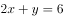①，②，联立①②解得，。因此从事行政工作的干部一共有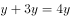人。

方法二：倍数特性法。根据题意可知，从事技术工作的干部人数为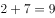的倍数，从事行政工作的干部为的倍数。设技术干部和行政干部分别为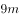和，则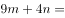。根据倍数特性，和26均为2的倍数，则9m为2的倍数。当时，；当时，，排除。故行政工作的干部人数为人。

方法三：代入排除法。根据题意可知，从事行政工作的干部为的倍数，设为人。代入选项。

A项，若，则，从事行政工作的女干部有1份即1人，那么从事技术工作的女干部为人，与从事技术工作的女干部是2的倍数矛盾，排除；

B项，若，则，从事行政工作的女干部有1份即2人，那么从事技术工作的女干部为人，根据从事技术工作的女干部和男干部的人数比为2：7，那么男干部总数为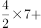人，符合题意，当选；

C项，若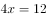，则，从事行政工作的女干部有1份即3人，那么从事技术工作的女干部为人，与从事技术工作的女干部是2的倍数矛盾，排除；

D项，若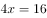，则，从事行政工作的女干部有1份即4人，那么从事技术工作的女干部为人，那么男干部总数为，排除。

故正确答案为B。

---

### 第 2 题　qid 2657346 · 数学运算

小王到商场购买7件甲商品，9件乙商品，按照定价需要支付285元。由于商场做促销活动，甲商品8折销售，乙商品9折销售。但收银员在收款时将两种商品的件数弄反，少收了12元钱。问小王实际应该支付的金额是多少元？

- **A**. 246　✅
- **B**. 234
- **C**. 270
- **D**. 258

**答案**：A

**官方解析**

方法一：方程法。设甲的定价为，乙的定价为，则有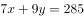······①；打完折应该支付的金额为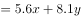，收营员弄反件数后所收的金额为：，根据比实际金额少收12元得：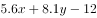，整理为：······②，联立①②解得，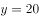。则小王实际应该支付的金额为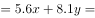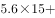元。

方法二：倍数特性法。根据题意，设甲的定价为，乙的定价为，小王实际支付金额为。根据“收银员在收款时将两种商品的件数弄反，少收了12元钱”可得。因为、均为正整数，则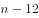能被0.9除尽。代入选项。

A项，，满足，当选；

B项，，不能除尽，排除；

C项，，不能除尽，排除；

D项，，不能除尽，排除。

故正确答案为A。

---

## 判断推理

### 第 1 题　qid 2657341 · 图形推理

把下面的六个图形分成两类，使每一类图形都有各自的共同特征或规律，分类正确的一项是（    ）。

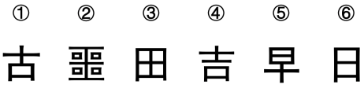

- **A**. ①④⑥，②③⑤
- **B**. ①④⑤，②③⑥
- **C**. ①⑤⑥，②③④
- **D**. ①②④，③⑤⑥　✅

**答案**：D

**官方解析**

元素组成不同，且无明显属性规律，优先考虑数量规律。观察发现，题干图形中的汉字第一笔出现规律，即图①②④中汉字的第一笔均为“一”，图③⑤⑥中汉字的第一笔均“丨”。故①②④为一组，③⑤⑥为一组。
故正确答案为D。

---

### 第 2 题　qid 2657342 · 定义判断

天使投资是一种私人权益性的资本投资，是指富有的个人出资协助具有专门技术或独特概念的原创项目或小型初创企业，进行一次性的前期投资。
根据上述定义，下列属于天使投资的是（    ）。

- **A**. 投资人一次性投入大笔资金用于收购企业的转型
- **B**. 银行贷款给一家新创立的孵化公司用于产品开发
- **C**. 某软件公司高管一次性投资某新型种子培育方案　✅
- **D**. 某企业家持续投资某新型软件的开发

**答案**：C

**官方解析**

第一步：找出定义关键词。
“富有的个人出资协助具有专门技术或独特概念的原创项目或小型初创企业”、“进行一次性的前期投资”。
第二步：逐一分析选项。
A项：投资人投入资金用于收购企业的转型，不符合“出资协助具有专门技术或独特概念的原创项目或小型初创企业”，不符合定义，排除；
B项：银行贷款，不符合“富有的个人出资协助具有专门技术或独特概念的原创项目或小型初创企业”，不符合定义，排除；
C项：某软件公司高管一次性投资某新型种子培育方案，符合“富有的个人出资协助具有专门技术或独特概念的原创项目或小型初创企业”，也符合“进行一次性的前期投资”，符合定义，当选；
D项：某企业家持续投资某新型软件的开发，不符合“进行一次性的前期投资”，不符合定义，排除。
故正确答案为C。

---

### 第 3 题　qid 2657343 · 定义判断

花盆效应是指花盆作为一个半人工、半自然的小生态环境，在空间上有很大的局限性，在人为的适宜环境条件下可以长得很好，离开人的照料会很快枯竭。花盆效应常见于持续依赖他人指导、照顾的群体。
根据上述定义，下列存在花盆效应的是（    ）。

- **A**. 小学生在老师和家长的指导下成长　✅
- **B**. 贫困家庭的孩子受到社会各界的捐助
- **C**. 孤单的流浪者沿途乞讨维持生存
- **D**. 山林中的小猴在母亲的喂养下长大

**答案**：A

**官方解析**

第一步：找出定义关键词。
“在人为的适宜环境条件下可以长得很好，离开人的照料会很快枯竭”、“持续依赖他人指导、照顾”。
第二步：逐一分析选项
A项：在老师和家长的指导下成长，符合“在人为的适宜环境条件下可以长得很好，离开人的照料会很快枯竭”，小学生，也符合“持续依赖他人指导、照顾”，符合定义，当选；
B项：贫困家庭的孩子受到社会各界的捐助，不符合“持续依赖他人指导、照顾”，不符合定义，排除；
C项：孤单的流浪者沿途乞讨维持生存，不符合“在人为的适宜环境条件下可以长得很好”、也不符合“持续依赖他人指导、照顾”，不符合定义，排除；
D项：山林中的小猴在母亲的喂养下长大，母猴是动物，不符合“离开人的照料会很快枯竭”，不符合定义，排除。
故正确答案为A。

---

### 第 4 题　qid 2657344 · 逻辑判断

美国宇航局深空任务的探测器群多数使用了核电池，即放射性同位素热电发生器，这种热电发射器以钚-238为核燃料，是制造核武器过程中的副产品。该装置能够为探测器提供足够的电力供应，持续时间可长达十年以上。然而目前钚-238核燃料已所剩不足，研究者认为一旦这些燃料用完，深空任务就会受到严重影响。
以下哪项如果为真，不能支持上述结论？

- **A**. 和其他替代燃料相比，钚-238半衰期长，因而支持了长距离不间断的空间飞行，其稳定供能的特性尚无法替代
- **B**. 目前宇航局一些探测器的深空任务被暂时搁置，剩余三块电池中已确定为2020年火星车任务提供一块，另外两块的使用就变得更加慎重
- **C**. 钚是一种毒性很强的超铀元素，在被吞食或者被吸入人体后可危及生命，因此钚燃料的使用因危害公众健康而备受指责　✅
- **D**. 钚-238的生产主要来自冷战时期，在核武器的制造过程中能够获得钚-238，不过受到核不扩散条约的影响，钚-238已经停产

**答案**：C

**官方解析**

第一步：找出论点和论据。
论点：钚-238核燃料一旦用完，深空任务会受到严重影响。
论据：钚-238核燃料已所剩不足。
本题论点和论据话题一致，优先考虑补充论据，即以解释原因或者举例子的方式加强。
第二步：逐一分析选项。
A项：该项说明钚-238半衰期长，可以支持长距离不间断的空中飞行，且稳定供能的特性无法替代，解释原因，可以加强，排除；
B项：该项举出火星车的例子，说明钚-238所剩不足，举例加强论据，排除；
C项：该项说的是钚燃料的使用因危害公众健康而备受指责，与钚燃料短缺是否会影响深空任务无关，不能加强，当选；
D项：该项说的是钚-238已经停产，说明钚-238核燃料已所剩不足，补充论据，可以加强，排除。
本题为选非题，故正确答案为C。

---
