# 2018年湖北省选调生招录考试综合知识和行政职业能力测验试卷（网友回忆版）

> 选调生 · 2018 年 · 6 个模块 · 共 125 题

- [政治理论](#%E6%94%BF%E6%B2%BB%E7%90%86%E8%AE%BA) · 10 题
- [常识判断](#%E5%B8%B8%E8%AF%86%E5%88%A4%E6%96%AD) · 60 题
- [言语理解与表达](#%E8%A8%80%E8%AF%AD%E7%90%86%E8%A7%A3%E4%B8%8E%E8%A1%A8%E8%BE%BE) · 15 题
- [数量关系](#%E6%95%B0%E9%87%8F%E5%85%B3%E7%B3%BB) · 10 题
- [判断推理](#%E5%88%A4%E6%96%AD%E6%8E%A8%E7%90%86) · 20 题
- [资料分析](#%E8%B5%84%E6%96%99%E5%88%86%E6%9E%90) · 10 题

---

## 政治理论

### 第 1 题　qid 2671887 · 新思想

中国共产党第十九次全国代表大会的主题是：（    ），高举中国特色社会主义伟大旗帜，决胜全面建成小康社会，夺取新时代中国特色社会主义伟大胜利，为实现中华民族伟大复兴的中国梦不懈奋斗。

- **A**. 不忘初衷，继续前行
- **B**. 不忘初衷，牢记使命
- **C**. 不忘初心，方得始终
- **D**. 不忘初心，牢记使命　✅

**答案**：D

**官方解析**

本题考查政治常识。
中国共产党第十九次全国代表大会于2017年10月18日至10月24日在北京召开。党的十九大报告指出：“中国共产党第十九次全国代表大会，是在全面建成小康社会决胜阶段、中国特色社会主义进入新时代的关键时期召开的一次十分重要的大会。大会的主题是：不忘初心，牢记使命，高举中国特色社会主义伟大旗帜，决胜全面建成小康社会，夺取新时代中国特色社会主义伟大胜利，为实现中华民族伟大复兴的中国梦不懈奋斗。”
故正确答案为D。

---

### 第 2 题　qid 2671889 · 新思想

从十九大到二十大，是“两个一百年”奋斗目标的历史交汇期。我们既要全面建成小康社会、实现第一个百年奋斗目标，又要乘势而上开启全面建设（    ）新征程，向第二个百年奋斗目标进军。

- **A**. 中国特色社会主义现代化强国
- **B**. 社会主义现代化国家　✅
- **C**. 社会主义现代化强国
- **D**. 中华民族伟大复兴

**答案**：B

**官方解析**

本题考查政治常识。
党的十九大报告指出：“从十九大到二十大，是‘两个一百年’奋斗目标的历史交汇期。我们既要全面建成小康社会、实现第一个百年奋斗目标，又要乘势而上开启全面建设社会主义现代化国家新征程，向第二个百年奋斗目标进军。”
故正确答案为B。

---

### 第 3 题　qid 2671890 · 新思想

党的十九大首次把党的（    ）纳入党的建设总体布局，突出了其统领地位，是马克思主义党建理论的重大创新，意义重大而深远。

- **A**. 思想建设
- **B**. 政治建设　✅
- **C**. 组织建设
- **D**. 纪律建设

**答案**：B

**官方解析**

本题考查政治常识。
党的十九大报告指出：“新时代党的建设总要求是：坚持和加强党的全面领导，坚持党要管党、全面从严治党，以加强党的长期执政能力建设、先进性和纯洁性建设为主线，以党的政治建设为统领······把党的政治建设摆在首位。旗帜鲜明讲政治是我们党作为马克思主义政党的根本要求。党的政治建设是党的根本性建设，决定党的建设方向和效果。”党的十九大报告第一次把党的政治建设纳入党的建设总体布局，强调以党的政治建设为统领，是马克思主义党建理论的重大创新。
故正确答案为B。

---

### 第 4 题　qid 2671891 · 新思想

坚持和发展中国特色社会主义的总任务是实现社会主义现代化和中华民族伟大复兴，在全面建成小康社会的基础上，分两步走，在本世纪中叶建成富强民主（    ）的社会主义现代化强国。
①文明
②和谐
③幸福
④美好
⑤美丽

- **A**. ①②⑤　✅
- **B**. ①②③
- **C**. ②③⑤
- **D**. ①②④

**答案**：A

**官方解析**

本题考查政治常识。
党的十九大报告指出：“新时代中国特色社会主义思想，明确坚持和发展中国特色社会主义，总任务是实现社会主义现代化和中华民族伟大复兴，在全面建成小康社会的基础上，分两步走在本世纪中叶建成富强民主文明和谐美丽的社会主义现代化强国。”因此，①②⑤正确，③④错误。
故正确答案为A。

---

### 第 5 题　qid 2671893 · 新思想

党的十九大提出，决胜全面建成小康社会必须打好（    ）三大攻坚战。
①区域协调发展
②防范化解重大风险
③精准脱贫
④污染防治
⑤乡村振兴

- **A**. ①③④
- **B**. ①④⑤
- **C**. ②④⑤
- **D**. ②③④　✅

**答案**：D

**官方解析**

本题考查政治常识。
党的十九大报告指出：“从现在到二〇二〇年，是全面建成小康社会决胜期。要按照十六大、十七大、十八大提出的全面建成小康社会各项要求，紧扣我国社会主要矛盾变化，统筹推进经济建设、政治建设、文化建设、社会建设、生态文明建设，坚定实施科教兴国战略、人才强国战略、创新驱动发展战略、乡村振兴战略、区域协调发展战略、可持续发展战略、军民融合发展战略，突出抓重点、补短板、强弱项，特别是要坚决打好防范化解重大风险、精准脱贫、污染防治的攻坚战，使全面建成小康社会得到人民认可、经得起历史检验。”因此，②③④正确，①⑤错误。
故正确答案为D。

---

### 第 6 题　qid 2671896 · 马克思主义

创新、协调、绿色、开放、共享的发展理念被写入新修改的宪法。五大新发展理念是辩证统一的整体，创新是引领发展的第一动力，协调是持续发展的内在要求，绿色是永续发展的必要条件，开放是国家繁荣发展的必由之路，共享是中国特色社会主义的本质要求。
上述新理念体现了唯物辩证法的：
①普遍联系和永恒发展的观点
②两点论和重点论统一的原理
③实践是检验真理的唯一标准
④具体情况具体分析的基本方法

- **A**. ①②
- **B**. ②③④
- **C**. ①②④　✅
- **D**. ①②③

**答案**：C

**官方解析**

本题考查政治常识。
坚持新发展理念。发展是解决我国一切问题的基础和关键，发展必须是科学发展，必须坚定不移贯彻创新、协调、绿色、开放、共享的发展理念。
①正确，唯物辩证法认为，物质世界是普遍联系的，并处于永恒的发展过程之中。联系指的是一切事物、现象之间，以及事物内部诸要素之间的相互依存、相互制约、相互作用的关系，事物联系是普遍的、客观的、多样的；发展是指事物从低级到高级、从简单到复杂的运动变化过程。结合题干材料，五大发展理念虽然有各自的地位，但他们是相互促进、相互依赖、相互作用的，作为一个整体共同引领着发展，所以实施五大发展理念，必须要树立整体观、联系观，实现相互促进共促发展。
②正确，唯物辩证法认为，复杂事物有很多矛盾，这些矛盾根据其在事物发展中的地位和作用分为主要矛盾和次要矛盾。“重点论”认为事物的性质主要由取得支配地位的主要矛盾的主要方面所决定，因此，要抓主要矛盾，抓中心工作，抓重点；“两点论”认为要统筹兼顾，不能忽视次要矛盾的解决。两点论和重点论是辩证统一的。重点论以两点论为前提，两点论内在地包含着重点论。结合题干材料，坚持“两点论”和“重点论”的统一在五法发展理念当中，就是要实现整体推进和重点突破。
③错误，马克思主义认为，实践具有把主观和客观联系起来的特征，认识是否正确，不是依主观上觉得如何而定的，而是依客观上社会实践的结果如何而定。除了实践没有别的东西能够成为检验真理的标准。结合题干材料，五大新发展理念未体现出该哲理，错误；
④正确，马克思主义认为，矛盾具有普遍性和特殊性，这就要求我们要坚持具体问题具体分析。结合题干材料，五大发展理念是我们党在对全国发展的普遍原则要求和特殊的情况中提炼出来的，对我们的发展工作进行指导，如面临创协、协调、绿色、开放、共享问题的时候各地区要因时因地因条件进行具体的落实。
故正确答案为C。

---

### 第 7 题　qid 2671900 · 马克思主义

十九大报告提出，我国社会主要矛盾已经转化为“人民日益增长的美好生活需要和不平衡不充分的发展之间的矛盾”。
这在哲学上表明：

- **A**. 主要矛盾起决定作用，规定或影响其他矛盾存在和发展
- **B**. 制订战略决策或开展具体工作，都要抓住当前主要矛盾
- **C**. 有些事物的主要矛盾在其全部发展过程中是不会变化的
- **D**. 社会发展过程的不同发展阶段，主要矛盾是发展变化的　✅

**答案**：D

**官方解析**

本题考查政治常识。
马克思主义认为，矛盾是事物自身所包含的既相互排斥又相互依存，既对立又统一的关系。在复杂事物发展过程中包含着许多矛盾，其中在事物发展过程中处于支配地位、对事物发展起决定作用的矛盾，叫主要矛盾；其他处于从属地位、对事物发展不起决定作用的矛盾，叫次要矛盾。
A项错误，唯物辩证法认为，在事物发展的任何阶段上，必有且只有一种矛盾居于支配地位，起着规定或影响其他矛盾的作用，这种矛盾就是主要矛盾。表述本身正确，但题干主要体现的是主要矛盾的变化。
B项错误，主要矛盾和非主要矛盾相互关系的原理具有重大的方法论意义，它告诉人们在观察和处理任何事物或过程的诸种矛盾时，必须善于以主要精力从多种矛盾中找出和抓住主要矛盾，提出主要的任务，从而掌握工作的中心环节。表述本身正确，但题干主要体现的是主要矛盾的变化。
C项错误，选项本身表述有误，事物是不断向前发展的，在不同的时期，不同的条件下，主要的矛盾和矛盾的主要方面也会不断地变化。
D项正确，马克思主义认为，主要矛盾和次要矛盾是对立统一的关系，它们既相互排斥，又相互依赖，并且在一定条件下可以相互转化。题干提到社会主要矛盾发生了变化，说明社会发展过程的不同发展阶段，主要矛盾是发展变化的。
故正确答案为D。

---

### 第 8 题　qid 2671901 · 新思想

中国特色社会主义先进文化是在社会主义革命、建设尤其是在改革的伟大实践中，创造面向现代化、面向世界、面向未来的民族化的大众的文化，反映了最广大人民群众的根本利益，反映了当今社会发展的时代特征和历史需求。
从社会存在和社会意识的关系看，以上叙述表明中国特色社会主义文化是：

- **A**. 我国社会物质生活条件的反映　✅
- **B**. 人们进行社会物质交往的产物
- **C**. 社会意识相对独立性集中体现
- **D**. 人们的意识取决于人们的存在

**答案**：A

**官方解析**

本题考查政治常识。
社会存在和社会意识是辩证统一的。社会存在决定社会意识，社会意识是社会存在的反映，并反作用于社会存在。社会存在是社会意识内容的客观来源，社会意识是社会物质生活过程及其条件的主观反映；社会意识是人们社会物质交往的产物；随着社会存在的发展，社会意识也相应地或迟或早地发生变化和发展。社会意识又有其相对独立性，即它在反映社会存在的同时，还有自己特有的发展形式和规律。社会意识对社会存在还具有能动的反作用。
A项正确，根据题干“中国特色社会主义先进文化是在社会主义革命、建设尤其是在改革的伟大实践中······反映了最广大人民群众的根本利益，反映了当今社会发展的时代特征和历史需求”可以得出，中国特色社会主义文化是我国社会物质生活条件的反映。
B项错误，社会意识是人们社会物质交往的产物，意思是说社会意识同语言一样，是在生产中由于交往活动的需要而产生的。表述本身正确，但题干并未强调这一点。
C项错误，社会意识有其相对独立性，即它在反映社会存在的同时，还有自己特有的发展形式和规律，主要表现在：社会意识发展变化与社会存在发展变化的不完全同步性；社会意识发展同社会经济发展水平的不平衡性；社会意识的发展具有历史继承性；社会意识各种形式之间相互作用和相互影响。题干并未反映中国特色社会主义文化的相对独立性。
D项错误，物质决定意识，物质是第一性的，意识是第二性的，马克思也曾说过：“不是人们的意识决定人们的存在，而是人们的社会存在决定人们的意识。”选项表述正确，但题干并未体现。
故正确答案为A。

---

### 第 9 题　qid 2671914 · 新思想

扎实推进抓党建促乡村振兴，要突出政治功能，提升（    ），把农村基层党组织建成坚强战斗堡垒。

- **A**. 组织力　✅
- **B**. 战斗力
- **C**. 凝聚力
- **D**. 宣传力

**答案**：A

**官方解析**

本题考查政治常识。
《中共中央国务院关于实施乡村振兴战略的意见》指出：“加强农村基层党组织建设。扎实推进抓党建促乡村振兴，突出政治功能，提升组织力，抓乡促村，把农村基层党组织建成坚强战斗堡垒。”
故正确答案为A。

---

### 第 10 题　qid 2672090 · 时事政治

电信运营企业拟落实政府工作报告要求，将移动网络流量资费降低。下列说法正确的是：

- **A**. 该企业的营业收入肯定下降
- **B**. 移动网络流量的使用量会增加　✅
- **C**. 该企业的营业利润肯定减少
- **D**. 单位产品摊销的固定成本不变

**答案**：B

**官方解析**

本题考查经济常识。

A项错误，营业收入是从事主营业务或其他业务所取得的收入，指在一定时期内，商业企业销售商品或提供劳务所获得的货币收入。营业收入产品销售量（或服务量）产品单价（或服务单价）。虽然移动网络流量资费降低，但是如果流量使用量增加到一定程度，就能实现营业收入的增长。

B项正确，根据需求定理，在其他条件不变的情况下，某种正常商品的需求量与价格成反方向变化，即商品的价格越低，需求量越大。移动网络流量属于正常商品，因此资费降低，移动网络流量的使用量会增加。

C项错误，营业利润是指企业从事生产经营活动中取得的利润，营业利润与营业收入、营业成本、公允价值变动损益、投资损益及其他损益密切相关，因此网络流量资费降低不能确定营业利润增减。

D项错误，固定成本是指成本总额在一定时期和一定业务量范围内，不受业务量增减变动影响而能保持不变的成本。网络流量资费降低会增加产品业务量，虽然固定成本总量不变，但单位产品摊销的固定成本会减少。

故正确答案为B。

---

## 常识判断

### 第 1 题　qid 2671888 · 人文常识

伟大斗争，伟大工程，伟大事业，伟大梦想，紧密联系、相互贯通、相互作用，其中起决定性作用的是（    ）。

- **A**. 具有许多新的历史特点的伟大斗争
- **B**. 党的建设新的伟大工程　✅
- **C**. 中国特色社会主义伟大事业
- **D**. 实现中华民族伟大复兴的伟大梦想

**答案**：B

**官方解析**

本题考查政治常识。
党的十九大报告指出：“伟大斗争，伟大工程，伟大事业，伟大梦想，紧密联系、相互贯通、相互作用，其中起决定性作用的是党的建设新的伟大工程。推进伟大工程，要结合伟大斗争、伟大事业、伟大梦想的实践来进行，确保党在世界形势深刻变化的历史进程中始终走在时代前列，在应对国内外各种风险和考验的历史进程中始终成为全国人民的主心骨，在坚持和发展中国特色社会主义的历史进程中始终成为坚强领导核心。”
故正确答案为B。

---

### 第 2 题　qid 2671892 · 人文常识

目前，我国经济已由高速增长阶段转向高质量发展阶段。（    ）是当前我国经济发展跨越由“量”到“质”关口的迫切要求，也是建设社会主义现代化国家的坚实基础。

- **A**. 转变经济发展方式
- **B**. 优化经济结构
- **C**. 供给侧结构性改革
- **D**. 建设现代化经济体系　✅

**答案**：D

**官方解析**

本题考查政治常识。
党的十九大报告指出：“我国经济已由高速增长阶段转向高质量发展阶段，正处在转变发展方式、优化经济结构、转换增长动力的攻关期，建设现代化经济体系是跨越关口的迫切要求和我国发展的战略目标。必须坚持质量第一、效益优先，以供给侧结构性改革为主线，推动经济发展质量变革、效率变革、动力变革，提高全要素生产率，着力加快建设实体经济、科技创新、现代金融、人力资源协同发展的产业体系，着力构建市场机制有效、微观主体有活力、宏观调控有度的经济体制，不断增强我国经济创新力和竞争力。”
故正确答案为D。

---

### 第 3 题　qid 2671894 · 人文常识

监督执纪“四种形态”体现了我们党惩前毖后、治病救人的一贯方针。其中第一种形态是指：
①经常开展批评和自我批评
②约谈函询
③群众民主评议
④组织调整

- **A**. ①②　✅
- **B**. ③④
- **C**. ②④
- **D**. ①③

**答案**：A

**官方解析**

本题考查政治常识。
2016年10月27日，中国共产党第十八届中央委员会第六次全体会议审议通过了《中国共产党党内监督条例》（以下简称《条例》）。《条例》第七条规定：“党内监督必须把纪律挺在前面，运用监督执纪“四种形态”，经常开展批评和自我批评、约谈函询，让“红红脸、出出汗”成为常态；党纪轻处分、组织调整成为违纪处理的大多数；党纪重处分、重大职务调整的成为少数；严重违纪涉嫌违法立案审查的成为极少数。”
“四种形态”第一种形态是指经常开展批评和自我批评、约谈函询，让“红红脸、出出汗”成为常态；第二种形态是指党纪轻处分、组织调整成为违纪处理的大多数；第三种形态是指党纪重处分、重大职务调整的成为少数；第四种形态是指严重违纪涉嫌违法立案审查的成为极少数。因此，①②正确，③④错误。
故正确答案为A。

---

### 第 4 题　qid 2671895 · 人文常识

深化国家监察体制改革，组建国家、省、市、县监察委员会，同党的纪律检查机关合署办公，实现对（    ）监察全覆盖。

- **A**. 所有行使公权力的公职人员　✅
- **B**. 所有行使公权力的国家干部
- **C**. 所有行使国家权力的公务员
- **D**. 所有行使管理权力的工作人员

**答案**：A

**官方解析**

本题考查政治常识。
党的十九大报告指出：“健全党和国家监督体系。深化国家监察体制改革，将试点工作在全国推开，组建国家、省、市、县监察委员会，同党的纪律检查机关合署办公，实现对所有行使公权力的公职人员监察全覆盖。”
故正确答案为A。

---

### 第 5 题　qid 2671897 · 人文常识

党的思想路线的核心是实事求是。毛泽东同志指出，“‘实事’就是客观存在着的一切事物，‘是’就是客观事物的内部联系，即规律性，‘求’就是我们去研究”。
从马克思主义认识论的角度看，实事求是的哲学内涵是：

- **A**. 解放思想，与时俱进，不断研究新情况，解决新问题
- **B**. 从客观存在着的“实事”中找到事物运动发展的规律　✅
- **C**. 理论和工作要体现时代性、把握规律性和富于创造性
- **D**. 从群众中来，到群众中去，在实践中检验和发展真理

**答案**：B

**官方解析**

本题考查政治常识。
马克思主义认识论认为，客观的不依赖于人的意识而存在的物质世界是认识的对象和源泉，认识是主体对客体的反映，是客观世界的主观映象。和形而上学唯物主义不同，辩证唯物主义认为反映不是对客观世界的消极被动的直观，而是主体在改造客体的实践基础上发生的积极地、能动地再现客体的本质和规律的过程。
A项错误，题干中对“实事求是”的解释并未涉及“新情况”和“新问题”。
B项正确，根据题干中对“实事求是”的解释，结合马克思主义认识论的内容，可以得出实事求是的哲学内涵是从客观存在着的“实事”中找到事物运动发展的规律。
C项错误，题干中对“实事求是”的解释并未涉及“时代性”。
D项错误，题干中对“实事求是”的解释强调“客观事物”，并非“群众”和“实践”。
故正确答案为B。

---

### 第 6 题　qid 2671898 · 人文常识

以下哪句话表达了“以人民为中心”发展思想的哲学内涵？

- **A**. 依靠人民共创物质和精神成果
- **B**. 一切为了人民，一切服从人民利益
- **C**. 坚持人民至上，尊重群众首创精神
- **D**. 人民群众是历史创造者和实践主体　✅

**答案**：D

**官方解析**

本题考查政治常识。
2015年10月26日至29日，党的十八届五中全会在北京召开，全会通过的《中共中央关于制定国民经济和社会发展第十三个五年规划的建议》强调，必须坚持以人民为中心的发展思想，把增进人民福祉、促进人的全面发展作为发展的出发点和落脚点，发展人民民主，维护社会公平正义，保障人民平等参与、平等发展权利，充分调动人民积极性、主动性、创造性。11月23日，习近平总书记在主持中央政治局第二十八次集体学习时指出，坚持以人民为中心的发展思想，这是马克思主义政治经济学的根本立场。
A项错误，唯物史观认为，人民群众是社会物质财富和精神财富的创造者，因此只有人民群众可以创造物质和精神成果，该项中“共创”的表述有误。
B项错误，并不是人民群众的一切利益都是合理的，“一切服从人民利益”的说法过于绝对。
C项错误，表述片面，过于强调“首创精神”。
D项正确，马克思主义哲学唯物史观认为，人民群众是实践的主体，是历史的创造者。人民群众是社会物质财富的创造者，因而从根本上推动了社会的发展；人民群众是社会精神财富的创造者，从而推动了社会的全面进步；人民群众是社会变革的决定力量，在社会变革中起主体作用，因此要树立群众观点，坚持群众路线。人民群众是历史创造者和实践主体表达了“以人民为中心”发展思想的哲学内涵。
故正确答案为D。

---

### 第 7 题　qid 2671899 · 人文常识

某教授给大学新生出了一道测试题，一加一等于几？学生们想：这么简单的题，三岁小孩都会，看来其中必有他意。结果的同学都没给出答案，的同学回答是“三”，的同学答案五花八门。教授公布答案是“二！”同学们面面相觑。教授说：“一加一等于二，这是真理，不能、也不会因为外界因素的改变而改变。”

教授的话体现了：

- **A**. 真理的客观性
- **B**. 真理的一元性　✅
- **C**. 真理的相对性
- **D**. 真理的绝对性

**答案**：B

**官方解析**

本题考查政治常识。
马克思主义认为，真理是人对于客观事物及其规律的正确反映。
A项错误，真理具有客观性，凡真理都是客观真理，真理的客观性或客观真理有两层含义：真理的内容是客观的，真理中包括不以人的意志为转移的客观内容；真理的标准是客观的，客观的社会实践是检验真理的唯一标准。
B项正确，真理的一元性是指对于特定认识客体来说，真理只有一个，它不因主体认识的差别和变化而改变。在任何情况下，对于特定实践活动中特定的认识对象来说，只能有一种认识是与特定的认识客体的状态、本质和规律相一致的，这种认识就是真理。教授说：“一加一等于二，这是真理，不能、也不会因为外界因素的改变而改变”体现了真理的一元性。
C项错误，真理的相对性是指人们在一定条件下的正确认识是有限度的，有三层含义：从广度上说，真理只是对客观世界的一定范围、方面的正确认识，有待于扩展；从深度上说，真理只是对特定事物的一定程度、层次的近似正确的认识，有待于深化；从进程上说，真理只是对事物的一定发展阶段的正确认识，有待发展。
D项错误，真理的绝对性有三层含义：就真理的客观性而言，任何真理都是对客观事物及其规律的正确认识，都包含不依赖于人的意识的客观内容，这是无条件的、绝对的；就人类认识的本性来说，完全可以正确认识无限发展的物质世界；从真理的发展来说，无数相对真理的总和构成绝对真理。
故正确答案为B。

---

### 第 8 题　qid 2671903 · 人文常识

新“四大发明”——高铁、网购、支付宝、共享单车，已经深入到人们的生活里。高铁跑出“中国速度”，拉近城市之间的距离；优质商品通过发达的电商平台，到达世界各地消费者的手中；扫码支付引领消费时尚，让不带钱包出门成为常态；共享单车为出行“最后一公里”提供解决方案，有效缓解交通拥堵······
从历史唯物主义角度看，上述变化表明科学技术是：

- **A**. 人类社会生活和全部历史的基础
- **B**. 推动经济和社会发展的强大杠杆
- **C**. 改变生产和生活方式的内在条件　✅
- **D**. 改造自然使其成为社会需要的力量

**答案**：C

**官方解析**

本题考查政治常识。
A项错误，选项本身表述有误，人类要生存繁衍、追求美好生活、获得自身的解放和发展，首先必须解决衣食住行等物质生活资料问题。马克思认为，人类第一个历史活动就是生产满足这些需要的物质资料，生产力是人类社会生活和全部历史的基础。
B项错误，选项本身表述有误，科学技术是第一生产力，科学技术革命才是推动经济和社会发展的强大杠杆。纵观人类文明的发展史，每一次重大的科学技术革命，都会引起生产方式、生活方式、思维方式的深刻变革和社会的巨大进步。
C项正确，题干提出，新“四大发明”从不同的方面改变了人们的生产和生活方式，表明科学技术是改变生产和生活方式的内在条件。
D项错误，选项本身表述有误，生产力是人类改造自然使其适应社会需要的物质力量，是标志人类改造自然的实际程度和实际能力的范畴。
故正确答案为C。

---

### 第 9 题　qid 2671905 · 经济常识

党和国家机构改革是推进国家治理体系和治理能力现代化的一场深刻变革，是党和国家工作重心转移、社会主义市场经济发展和各方面工作不断深入的必然要求。
我国改革开放以来共进行了七次机构改革，其所依据的哲学理论基础是：

- **A**. 当生产关系不适应生产力发展时就要变革生产关系
- **B**. 经济基础的变革决定上层建筑的变革及其变革方向　✅
- **C**. 社会发展的客观必然性造成了社会发展的基本趋势
- **D**. 改革的目的是解放生产力发展生产力促进社会进步

**答案**：B

**官方解析**

本题考查政治常识。
A项错误，生产力决定生产关系，生产关系对生产力有反作用，生产关系一定要适合生产力发展的状况，是人类社会发展的普遍规律。但题干中党和国家机构改革是上层建筑的调整，而非生产关系的调整。
B项正确，经济基础与上层建筑的关系：经济基础是上层建筑赖以存在的根源，是第一性的；上层建筑是经济基础在政治上和思想上的表现，是第二性的、派生的。经济基础决定上层建筑，上层建筑反作用于经济基础。经济基础对上层建筑的决定作用表现在：经济基础决定上层建筑的产生；经济基础决定上层建筑的性质；经济基础决定上层建筑的变革。党和国家机构改革是党和国家工作重心转移、社会主义市场经济发展和各方面工作不断深入的必然要求，体现了经济基础的变革决定上层建筑的变革及其变革方向。
C项错误，社会发展的客观必然性造成了一定历史阶段社会发展的基本趋势，从而为人们的历史选择提供了基础、范围和可能性空间。题干并未体现这一点。
D项错误，改革是对一些不适应生产力发展的生产关系，以适应生产力的发展水平，从而促进生产发展。题干强调的是改革的必要性，而非改革的目的。
故正确答案为B。

---

### 第 10 题　qid 2671906 · 人文常识

明代王阳明与友人郊游。友人指着悬崖峭壁上的一棵花树问他，这根树上的花在山中自开自落，与我们的心有什么关系呢？王答，你没来看此树的花时，此花同你的心一样“同归于寂”。现在你来看时，此花颜色形态顿时明白起来，可见此花不在你心外，而在你心中。心外无物、心外无事、心外无理。
王阳明的观点属于（    ）典型代表。

- **A**. 朴素唯物主义
- **B**. 客观唯心主义
- **C**. 主观唯心主义　✅
- **D**. 唯心的辩证法

**答案**：C

**官方解析**

本题考查政治常识。
A项错误，朴素唯物主义认为世界是由物质构成的，而不是由超自然“神”或神秘力量创造，肯定了世界的本源是物质；并试图从物质的发展变化过程中说明万物的产生，具有朴素的辩证法思想；将世界本源规定为具体的物质形态，具有一定的局限性。
B项错误，客观唯心主义认为在物质世界和人类产生之前就独立存在着一种客观精神，这种客观精神在其发展过程中，产生了物质世界，认为客观精神在先，是物质世界的本原，是第一性的；物质世界在后，是客观精神的表现和派生物，是第二性的。
C项正确，主观唯心主义认为，主体的心灵，如其感觉、经验、意识、观念或意志等是世界中事物产生和存在的根源与基础，而外部世界中的一切事物则是由这些主观精神所派生的，是这些主观精神的显现。根据题干可以看出，王阳明认为花的存在离不开人对花的感觉，主张人对花的感觉是第一性的，这是主观唯心主义的观点。
D项错误，唯心的辩证法是建立在唯心主义基础上的辩证法学说，其特点是在把客观物质世界归结为精神的基础上论证精神、概念的辩证运动和发展。如古希腊的唯心辩证法家柏拉图认为，理念是世界的基础，辩证法就是通过“有”和“无”、“一”和“多”、“同”和“异”等理念的排比，从低级的、矛盾的理念上升到高级的理念，即善的理念的发展过程。黑格尔是唯心辩证法的主要代表，认为“绝对理念”是世界的基础，绝对理念是一个自身充满矛盾的辩证发展过程，矛盾是发展的源泉，发展是有规律的。
故正确答案为C。

---

### 第 11 题　qid 2671909 · 人文常识

一个单位发展的好坏是由领导的决策水平、职工的主观努力以及外部环境等多方面造成的。从因果关系来看，这是：

- **A**. 一因多果
- **B**. 一果多因　✅
- **C**. 异因同果
- **D**. 异果同因

**答案**：B

**官方解析**

本题考查政治常识。
马克思主义哲学中原因和结果的关系是指事物之间的因果联系，即两者既是先行后续的关系，又是引起和被引起的关系，在一定条件下，两者可以互相转化。因果联系主要有一因多果、一果多因、异果同因、异因同果、互为因果、系列因果六种类型。
A项错误，一因多果，即由一种原因引起多种结果。
B项正确，一果多因，即一种结果由多种同时起作用的原因所引起。一个单位发展的好坏由多方原因造成，属于一果多因。
C项错误，异因同果即同样的结果是由不同原因引起的。
D项错误，异果同因即同样的原因在不同的条件下产生了不同的结果。
故正确答案为B。

---

### 第 12 题　qid 2671911 · 人文常识

坚持党管农村工作，确保党在农村工作中始终（    ），为乡村振兴提供坚强有力的政治保障。

- **A**. 统筹协调、政策指导
- **B**. 总揽全局、协调各方　✅
- **C**. 统筹协调、推动落实
- **D**. 总揽全局、政策指导

**答案**：B

**官方解析**

本题考查政治常识。
2018年1月2日发布的《中共中央国务院关于实施乡村振兴战略的意见》指出，要坚持党管农村工作、坚持农业农村优先发展、坚持农民主体地位、坚持乡村全面振兴、坚持城乡融合发展、坚持人与自然和谐共生、坚持因地制宜、循序渐进的基本原则。其中，坚持党管农村工作，要毫不动摇地坚持和加强党对农村工作的领导，健全党管农村工作领导体制机制和党内法规，确保党在农村工作中始终总揽全局、协调各方，为乡村振兴提供坚强有力的政治保障。
故正确答案为B。

---

### 第 13 题　qid 2671916 · 人文常识

缩小城乡收入差距，关键要拓宽农民增收渠道，鼓励农民勤劳守法致富，增加农村低收入者收入，扩大农村中等收入群体，保持农村居民收入（    ）城镇居民。

- **A**. 来源多于
- **B**. 增速快于　✅
- **C**. 结构优于
- **D**. 总量高于

**答案**：B

**官方解析**

本题考查政治常识。
《中共中央国务院关于实施乡村振兴战略的意见》指出：“促进农村劳动力转移就业和农民增收。······拓宽农民增收渠道，鼓励农民勤劳守法致富，增加农村低收入者收入，扩大农村中等收入群体，保持农村居民收入增速快于城镇居民。”
故正确答案为B。

---

### 第 14 题　qid 2671920 · 人文常识

落实农村土地承包关系稳定并长久不变政策，第二轮土地承包到期后再延长（    ）。这个政策安排与（    ）战略构想在时间节点上高度契合。

- **A**. 15年 第一个百年
- **B**. 30年 第一个百年
- **C**. 15年 第二个百年
- **D**. 30年 第二个百年　✅

**答案**：D

**官方解析**

本题考查政治常识。
两个一百年奋斗目标是：“在新世纪新时代，经济和社会发展的战略目标是，到建党一百年时（2021年），全面建成小康社会；到新中国成立一百年时（2049年），全面建成社会主义现代化强国。”
《中共中央国务院关于实施乡村振兴战略的意见》指出：“巩固和完善农村基本经营制度。落实农村土地承包关系稳定并长久不变政策，衔接落实好第二轮土地承包到期后再延长30年的政策，让农民吃上长效‘定心丸’。”这个政策安排与第二个百年战略构想在时间节点上高度契合。新一轮承包期再延长30年，时间上大体是在2050年前后、第二个百年目标实现的时候，届时我们国家将建成社会主义现代化强国，那时候国家的经济结构、社会结构、城乡人口结构，包括城乡关系、工农关系都会发生更大的变化。再延长30年，既稳定了农民的预期，也为届时进一步完善政策预留了空间。
故正确答案为D。

---

### 第 15 题　qid 2671923 · 人文常识

实施食品安全战略，要健全农产品质量和食品安全监管体制，重点提高（    ）监管能力。

- **A**. 宏观
- **B**. 微观
- **C**. 高层
- **D**. 基层　✅

**答案**：D

**官方解析**

本题考查政治常识。
《中共中央国务院关于实施乡村振兴战略的意见》指出：“实施食品安全战略，完善农产品质量和食品安全标准体系，加强农业投入品和农产品质量安全追溯体系建设，健全农产品质量和食品安全监管体制，重点提高基层监管能力。”
故正确答案为D。

---

### 第 16 题　qid 2671926 · 人文常识

促进小农户和现代农业发展有机衔接的有效措施是：
①培育各类专业化市场化服务组织
②发展经营者多样化的联合与合作
③推动土地经营权流转和集中
④发挥新型农业经营主体带动作用

- **A**. ①②③
- **B**. ②③④
- **C**. ①③④
- **D**. ①②④　✅

**答案**：D

**官方解析**

本题考查政治常识。
《中共中央国务院关于实施乡村振兴战略的意见》指出：“促进小农户和现代农业发展有机衔接。统筹兼顾培育新型农业经营主体和扶持小农户，采取有针对性的措施，把小农生产引入现代农业发展轨道。培育各类专业化市场化服务组织，推进农业生产全程社会化服务，帮助小农户节本增效。发展多样化的联合与合作，提升小农户组织化程度。注重发挥新型农业经营主体带动作用，打造区域公用品牌，开展农超对接、农社对接，帮助小农户对接市场。”推动土地经营权流转和集中属于巩固和完善农村基本经营制度的措施。
故正确答案为D。

---

### 第 17 题　qid 2671930 · 人文常识

坚持精准扶贫、精准脱贫，要注重扶贫同扶志、扶智相结合，把（    ）放在首位。

- **A**. 增加脱贫人数
- **B**. 扩大脱贫区域
- **C**. 提高脱贫质量　✅
- **D**. 加快脱贫速度

**答案**：C

**官方解析**

本题考查政治常识。
2018年中央农村工作会议指出：“必须打好精准脱贫攻坚战，走中国特色减贫之路。坚持精准扶贫、精准脱贫，把提高脱贫质量放在首位，注重扶贫同扶志、扶智相结合，瞄准贫困人口精准帮扶，聚焦深度贫困地区集中发力，激发贫困人口内生动力，强化脱贫攻坚责任和监督，开展扶贫领域腐败和作风问题专项治理，采取更加有力的举措、更加集中的支持、更加精细的工作，坚决打好精准脱贫这场对全面建成小康社会具有决定意义的攻坚战。”
故正确答案为C。

---

### 第 18 题　qid 2671935 · 人文常识

确保国家粮食安全是治国理政的头等大事，必须深入实施“藏粮于地”“藏粮于技”战略，把中国人的饭碗牢牢端在自己手中。以下属于“藏粮于地”“藏粮于技”的措施是：
①建设高标准农田
②繁育新型良种
③开荒扩种
④推进农业机械化

- **A**. ①②③
- **B**. ②③④
- **C**. ①③④
- **D**. ①②④　✅

**答案**：D

**官方解析**

本题考查政治常识。
《中共中央国务院关于实施乡村振兴战略的意见》指出：“夯实农业生产能力基础。深入实施藏粮于地、藏粮于技战略，严守耕地红线，确保国家粮食安全，把中国人的饭碗牢牢端在自己手中。······大规模推进农村土地整治和高标准农田建设，稳步提升耕地质量，强化监督考核和地方政府责任。······高标准建设国家南繁育种基地。推进我国农机装备产业转型升级，加强科研机构、设备制造企业联合攻关，进一步提高大宗农作物机械国产化水平，加快研发经济作物、养殖业、丘陵山区农林机械，发展高端农机装备制造。”
故正确答案为D。

---

### 第 19 题　qid 2671937 · 人文常识

处理好农民和（    ）的关系，是深化农村改革的主线，也是实施乡村振兴战略的重大政策问题。

- **A**. 工人
- **B**. 资金
- **C**. 土地　✅
- **D**. 环境

**答案**：C

**官方解析**

本题考查政治常识。
乡村振兴战略是2017年在党的十九大报告中提出的战略，目的就是权利解决好“三农”问题，确保当地群众长期稳定增收、安居乐业。其中土地和农民的关系是最为重要的。土地是农民的“命根子”，只有解决完善好土地相关政策，老百姓才会受益，实现乡村振兴才指日可待。
故正确答案为C。

---

### 第 20 题　qid 2671940 · 人文常识

完善村民自治制度，坚持自治为基，加强农村群众性自治组织建设，健全和创新（    ）领导的充满活力的村民自治机制。

- **A**. 村党组织　✅
- **B**. 村民委员会
- **C**. 村民代表会议
- **D**. 村民理事会

**答案**：A

**官方解析**

本题考查政治常识。
《中共中央国务院关于实施乡村振兴战略的意见》指出：“深化村民自治实践。坚持自治为基，加强农村群众性自治组织建设，健全和创新村党组织领导的充满活力的村民自治机制。”
故正确答案为A。

---

### 第 21 题　qid 2671945 · 人文常识

2018年中央一号文件提出，坚持物质文明和精神文明一起抓，提升农民精神风貌，培育（    ），不断提高乡村社会文明程度。
①文明乡风
②清新村风
③良好家风
④淳朴民风

- **A**. ①②③
- **B**. ②③④
- **C**. ①③④　✅
- **D**. ①②④

**答案**：C

**官方解析**

本题考查政治常识。
《中共中央国务院关于实施乡村振兴战略的意见》指出：“乡村振兴，乡风文明是保障。必须坚持物质文明和精神文明一起抓，提升农民精神风貌，培育文明乡风、良好家风、淳朴民风，不断提高乡村社会文明程度。”
故正确答案为C。

---

### 第 22 题　qid 2671968 · 人文常识

加强农村思想道德建设，要加强（    ）教育，深化民族团结进步教育，加强农村思想文化阵地建设。
①爱国主义
②集体主义
③社会主义
④共产主义

- **A**. ①②③　✅
- **B**. ②③④
- **C**. ①③④
- **D**. ①②④

**答案**：A

**官方解析**

本题考查政治常识。
《中共中央国务院关于实施乡村振兴战略的意见》指出：“加强农村思想道德建设。以社会主义核心价值观为引领，坚持教育引导、实践养成、制度保障三管齐下，采取符合农村特点的有效方式，深化中国特色社会主义和中国梦宣传教育，大力弘扬民族精神和时代精神。加强爱国主义、集体主义、社会主义教育，深化民族团结进步教育，加强农村思想文化阵地建设。”
故正确答案为A。

---

### 第 23 题　qid 2671974 · 人文常识

在构建农村一二三产业融合发展体系时，大力开发农业多种功能，通过保底分红、股份合作、利润返还等多种形式，让农民合理分享全产业链增值收益的方法是：
①延长产业链
②扩展销售链
③提升价值链
④完善利益链

- **A**. ①②③
- **B**. ②③④
- **C**. ①③④　✅
- **D**. ①②④

**答案**：C

**官方解析**

本题考查政治常识。
《中共中央国务院关于实施乡村振兴战略的意见》指出：“构建农村一二三产业融合发展体系。大力开发农业多种功能，延长产业链、提升价值链、完善利益链，通过保底分红、股份合作、利润返还等多种形式，让农民合理分享全产业链增值收益。”
故正确答案为C。

---

### 第 24 题　qid 2671978 · 人文常识

实施农村人居环境整治三年行动计划，以（    ）为主攻方向，稳步有序推进农村人居环境突出问题治理。
①农村垃圾
②污水治理
③厕所革命
④村容村貌提升

- **A**. ①②③
- **B**. ②③④
- **C**. ①③④
- **D**. ①②④　✅

**答案**：D

**官方解析**

本题考查政治常识。
《中共中央国务院关于实施乡村振兴战略的意见》指出：“持续改善农村人居环境。实施农村人居环境整治三年行动计划，以农村垃圾、污水治理和村容村貌提升为主攻方向，整合各种资源，强化各种举措，稳步有序推进农村人居环境突出问题治理。”
故正确答案为D。

---

### 第 25 题　qid 2671982 · 人文常识

走乡村善治之路，要建立健全现代乡村社会治理体制，健全（    ）相结合的乡村治理体系。
①自治
②法治
③德治
④共治

- **A**. ①②③　✅
- **B**. ②③④
- **C**. ①③④
- **D**. ①②④

**答案**：A

**官方解析**

本题考查政治常识。
2017年12月28日—29日，中央农村工作会议在北京举行，会议强调要创新乡村治理体系，走乡村善治之路。建立健全党委领导、政府负责、社会协同、公众参与、法治保障的现代乡村社会治理体制，健全自治、法治、德治相结合的乡村治理体系，加强农村基层基础工作，加强农村基层党组织建设，深化村民自治实践，严肃查处侵犯农民利益的“微腐败”，建设平安乡村，确保乡村社会充满活力、和谐有序。
故正确答案为A。

---

### 第 26 题　qid 2671988 · 人文常识

强化乡村振兴规划引领，要加强各类规划的统筹管理和系统衔接，形成（    ）的规划体系。
①工农互补
②城乡融合
③区域一体
④多规合一

- **A**. ①②③
- **B**. ②③④　✅
- **C**. ①③④
- **D**. ①②④

**答案**：B

**官方解析**

本题考查政治常识。
《中共中央国务院关于实施乡村振兴战略的意见》指出：“强化乡村振兴规划引领。制定国家乡村振兴战略规划（2018－2022年），分别明确至2020年全面建成小康社会和2022年召开党的二十大时的目标任务，细化实化工作重点和政策措施，部署若干重大工程、重大计划、重大行动。各地区各部门要编制乡村振兴地方规划和专项规划或方案。加强各类规划的统筹管理和系统衔接，形成城乡融合、区域一体、多规合一的规划体系。”
故正确答案为B。

---

### 第 27 题　qid 2671997 · 法律常识

全面依法治国是国家治理的一场深刻革命，必须坚持厉行法治，推进：
①有法可依
②科学立法
③严格执法
④执法必严
⑤公正司法
⑥全民守法

- **A**. ①③⑤⑥
- **B**. ②③⑤⑥　✅
- **C**. ①④⑤⑥
- **D**. ②③④⑤

**答案**：B

**官方解析**

本题考查政治常识。
党的十九大报告指出：“全面依法治国是国家治理的一场深刻革命，必须坚持厉行法治，推进科学立法、严格执法、公正司法、全民守法。”故②③⑤⑥正确。
故正确答案为B。

---

### 第 28 题　qid 2671999 · 法律常识

国务院及各部门和地方各级人民政府要带头维护宪法法律权威，无论履行哪一项职能，从行为到程序、从内容到形式、从决策到执行都必须符合法律规定，让行政权力在法律和制度的框架内运行。所以：

- **A**. 政府既要遵守实体法，也要遵守程序法　✅
- **B**. 政府只是维护和执行法律，不需要服从法律
- **C**. 政府必须全面严格履行法定职能，程序只是服从和服务于其一般职责需要而已
- **D**. 在没有法律、法规、规章规定的情形下，政府不得作出任何决定

**答案**：A

**官方解析**

本题考查法律常识。
A项正确，行政权的行使既要遵守实体法，也要遵守程序法。国务院及各部门和地方各级人民政府要带头维护宪法法律权威，无论履行哪一项职能，从行为到程序、从内容到形式、从决策到执行都必须符合法律的规定。某种程度上，遵守程序法更重要。因为行政行为是由一系列的步骤、方式、形式、时限等要素构成的，这些要素的优化组合，将保障行政行为的质量和效果。
B项错误，遵守宪法和法律是政府一切工作的根本原则，政府进行一切工作，必须符合合法性原则。政府只有自觉接受法律约束，行使法定职权，遵循法定程序，并承担法定责任，才能树立守规则、可信任的良好形象，形成稳定的社会预期，并有效引导其他社会主体的行为。
C项错误，依法全面履行政府职能是深入推进依法行政、加快建设法治政府的必然要求。但程序并非只是服从和服务于其一般职责需要，而是依法全面履行政府职能的重要保障。十八大以前，对行政处罚、行政许可、行政强制以外的行政行为尚欠缺程序规定，行政机关自由裁量权较大。因此对宪法和法律法规赋予的权限、职权范围和程序等进行全面梳理，明晰各部门法定权限和程序，是依法全面履行政府职能的前提和基础。
D项错误，行政机关实施行政管理，应当依照法律、法规、规章的规定进行；没有法律、法规、规章的规定，行政机关不得作出影响公民、法人和其他组织合法权益或者增加公民、法人和其他组织义务的决定。“不得作出任何决定”的说法过于绝对。
故正确答案为A。

---

### 第 29 题　qid 2672002 · 法律常识

新修订的宪法规定，监察机关办理职务违法和职务犯罪案件，应当与审判机关、检察机关、执法部门：

- **A**. 分工负责，互相配合
- **B**. 互相配合，互相制约　✅
- **C**. 分工负责，互相制约
- **D**. 互相制约，互相监督

**答案**：B

**官方解析**

本题考查法律常识。
根据《宪法》第一百二十七条第二款规定：“监察机关办理职务违法和职务犯罪案件，应当与审判机关、检察机关、执法部门互相配合，互相制约。”
故正确答案为B。

---

### 第 30 题　qid 2672010 · 法律常识

设区的市的人民代表大会和它们的常务委员会，在不同宪法、法律、行政法规和本省、自治区的地方性法规相抵触的前提下，可以依照法律规定制定（    ），报本省、自治区人民代表大会常务委员会批准后施行。

- **A**. 法律
- **B**. 行政法规
- **C**. 地方性规章
- **D**. 地方性法规　✅

**答案**：D

**官方解析**

本题考查法律常识。
根据《宪法》第一百条第二款规定：“设区的市的人民代表大会和它们的常务委员会，在不同宪法、法律、行政法规和本省、自治区的地方性法规相抵触的前提下，可以依照法律规定制定地方性法规，报本省、自治区人民代表大会常务委员会批准后施行。”
故正确答案为D。

---

### 第 31 题　qid 2672013 · 法律常识

各级人民代表大会及县级以上各级人民代表大会常务委员会选举或者决定任命的国家工作人员，以及各级人民政府、监察委员会、人民法院、人民检察院任命的国家工作人员，在就职时应当公开进行：

- **A**. 法律宣誓
- **B**. 宪法宣誓　✅
- **C**. 廉政宣言
- **D**. 勤政宣言

**答案**：B

**官方解析**

本题考查法律常识。
根据《宪法》第二十七条第三款规定：“国家工作人员就职时应当依照法律规定公开进行宪法宣誓。”
故正确答案为B。

---

### 第 32 题　qid 2672019 · 法律常识

关于法律的正式生效时间及效力，说法正确的是：

- **A**. 自法律通过之日起生效
- **B**. 自法律公布之日起生效
- **C**. 在公布之前肯定不产生法的效力　✅
- **D**. 法律公布前规定一定期限生效试行

**答案**：C

**官方解析**

本题考查法律常识。
A、B、D三项错误，法律生效的时间一般是根据法律的具体性质和实际需要来决定的。主要有以下几种形式：（1）自法律颁发之日起生效；（2）由该法来规定具体生效时间；（3）由专门法决定规定该法的具体生效时间；（4）规定法律颁布后到达一定期限开始生效。
C项正确，法律公布是法律生效的前提，未经正式公布的法律，不为人们所知晓，就不具有法律约束力，也不可能得到人们的普遍遵守。
故正确答案为C。

---

### 第 33 题　qid 2672022 · 法律常识

县直机关党员王某在未核实真伪的情况下，编写了一条“某县城连续发生抢小孩案件”的信息，在微信群和朋友圈发布，引发群众恐慌，事后证明这完全是谣言。公安机关和纪检部门分别给予其治安拘留五日和党内警告。对两种措施的定性，正确的选项是：

- **A**. 违宪制裁 政纪处分
- **B**. 刑事处罚 党纪处分
- **C**. 行政处罚 党纪处分　✅
- **D**. 民事制裁 纪律处罚

**答案**：C

**官方解析**

本题考查法律常识。
根据《中华人民共和国行政处罚法》第九条规定：“行政处罚的种类：（一）警告、通报批评；（二）罚款、没收违法所得、没收非法财物；（三）暂扣许可证件、降低资质等级、吊销许可证件；（四）限制开展生产经营活动、责令停产停业、责令关闭、限制从业；（五）行政拘留；（六）法律、行政法规规定的其他行政处罚。”治安拘留是行政处罚之一，也称为行政拘留。行政拘留是指公安机关对于违反了行政法律规范的公民，所作出的在短期内限制其人身自由的一种处罚措施。
根据《中国共产党纪律处分条例》第八条规定：“对党员的纪律处分种类：（一）警告；（二）严重警告；（三）撤销党内职务；（四）留党察看；（五）开除党籍。”
因此，对王某给予的治安拘留和党内警告，分别属于行政处罚和党纪处分。
故正确答案为C。

---

### 第 34 题　qid 2672028 · 人文常识

张某以个人名义向彭某借款10万元，后彭某以该10万元属夫妻共同债务为由，起诉要求张某夫妻偿还债务。在彭某能够证明该债务（    ）的情况下，人民法院不支持彭某的主张。

- **A**. 超过张某家庭日常所需　✅
- **B**. 用于张某夫妻双方共同生活
- **C**. 用于家庭共同生产经营
- **D**. 系夫妻双方共同意思表示

**答案**：A

**官方解析**

本题考查法律常识。
根据《最高人民法院关于审理涉及夫妻债务纠纷案件适用法律有关问题的解释》第三条规定：“夫妻一方在婚姻关系存续期间以个人名义超出家庭日常生活需要所负的债务，债权人以属于夫妻共同债务为由主张权利的，人民法院不予支持，但债权人能够证明该债务用于夫妻共同生活、共同生产经营或者基于夫妻双方共同意思表示的除外。”所以，张某以个人名义向彭某借款10万元，彭某作为债权人只有能够证明该债务用于张某夫妻共同生活、共同生产经营或者基于夫妻双方共同意思表示的情况下，人民法院才会支持彭某以夫妻共同债务为由，起诉要求张某夫妻偿还债务的主张。因此，A项正确，B、C、D三项均错误。
故正确答案为A。

---

### 第 35 题　qid 2672031 · 法律常识

某机关中层干部选拔任用中，党员干部杨某通过微信群进行拉票，并发放一个总金额180元的微信红包。该行为：

- **A**. 是朋友之间娱乐行为，不属于拉票贿选情形
- **B**. 涉及金额较小，不属于拉票贿选情形
- **C**. 属于拉票贿选情形，可给予党纪政纪处分　✅
- **D**. 属于拉票贿选情形，应追究刑事法律责任

**答案**：C

**官方解析**

本题考查法律常识。
A、B两项错误，拉票贿选是一种不法行为，指为了在选举中达到个人目的，在选举之前对投票人行贿。
C项正确，根据《中国共产党纪律处分条例》第七十五条第一款规定：“有下列行为之一的，给予警告或者严重警告处分；情节较重的，给予撤销党内职务或者留党察看处分；情节严重的，给予开除党籍处分：（一）在民主推荐、民主测评、组织考察和党内选举中搞拉票、助选等非组织活动的；（二）在法律规定的投票、选举活动中违背组织原则搞非组织活动，组织、怂恿、诱使他人投票、表决的；（三）在选举中进行其他违反党章、其他党内法规和有关章程活动的。”根据《行政机关公务员处分条例》第十八条第一款规定：“有下列行为之一的，给予记大过处分；情节较重的，给予降级或者撤职处分；情节严重的，给予开除处分：······（四）以暴力、威胁、贿赂、欺骗等手段，破坏选举的；······”杨某在机关干部选拔任用中拉票贿选，应给予党纪政纪处分。
D项错误，根据《中华人民共和国刑法》第二百五十六条规定：“在选举各级人民代表大会代表和国家机关领导人员时，以暴力、威胁、欺骗、贿赂、伪造选举文件、虚报选举票数等手段破坏选举或者妨害选民和代表自由行使选举权和被选举权，情节严重的，处三年以下有期徒刑、拘役或者剥夺政治权利。”杨某在机关干部选拔任用中拉票贿选，但未达到情节严重，不构成刑事犯罪。
故正确答案为C。

---

### 第 36 题　qid 2672034 · 法律常识

某机关公职人员刘某上班经常迟到早退，业余时间忙于开网店、做生意。对刘某的行为，界定正确的是：

- **A**. 国家鼓励停薪留职，做法值得肯定
- **B**. 手段不正确，但结果正当的合法行为
- **C**. 违反法律，依法应当被追究刑事责任
- **D**. 以营利为目的违规经商的违纪行为　✅

**答案**：D

**官方解析**

本题考查法律常识。
A、B两项错误，根据《中共中央、国务院关于进一步制止党政机关和党政干部经商、办企业的规定》第二条第二项规定：“在职干部、职工一律不许停薪留职去经商、办企业。已停薪留职的，或者辞去企业职务回原单位复职，或者辞去机关公职。”
C项错误，根据《中华人民共和国刑法》第十三条规定：“一切危害国家主权、领土完整和安全，分裂国家、颠覆人民民主专政的政权和推翻社会主义制度，破坏社会秩序和经济秩序，侵犯国有财产或者劳动群众集体所有的财产，侵犯公民私人所有的财产，侵犯公民的人身权利、民主权利和其他权利，以及其他危害社会的行为，依照法律应当受刑罚处罚的，都是犯罪，但是情节显著轻微危害不大的，不认为是犯罪。”公职人员刘某并没有犯罪行为，不应当被追究刑事责任。
D项正确，根据《行政机关公务员处分条例》第二十七条规定：“从事或者参与营利性活动，在企业或者其他营利性组织中兼任职务的，给予记过或者记大过处分；情节较重的，给予降级或者撤职处分；情节严重的，给予开除处分。”根据《行政机关公务员处分条例》第二十八条规定：“严重违反公务员职业道德，工作作风懈怠、工作态度恶劣，造成不良影响的，给予警告、记过或者记大过处分。”所以，公职人员刘某迟到早退、违反职业道德、违规从事营利性活动，属于以营利为目的违规经商的违纪行为。
故正确答案为D。

---

### 第 37 题　qid 2672036 · 法律常识

以下选项中，属于我国著作权法保护的作品是：

- **A**. 《中华人民共和国宪法》及其官方正式译文
- **B**. 工程设计图、产品设计图、地图等图形作品　✅
- **C**. 中央电视台、各省市电视台播出的时事新闻
- **D**. 万年历法，通用数学图表、通用表格和公式

**答案**：B

**官方解析**

本题考查法律常识。
B项正确，根据《中华人民共和国著作权法》第三条规定：“本法所称的作品，包括以下列形式创作的文学、艺术和自然科学、社会科学、工程技术等作品：（一）文字作品；（二）口述作品；（三）音乐、戏剧、曲艺、舞蹈、杂技艺术作品；（四）美术、建筑作品；（五）摄影作品；（六）电影作品和以类似摄制电影的方法创作的作品；（七）工程设计图、产品设计图、地图、示意图等图形作品和模型作品；（八）计算机软件；（九）法律、行政法规规定的其他作品。”
A、C、D三项错误，根据《中华人民共和国著作权法》第五条规定：“本法不适用于：（一）法律、法规，国家机关的决议、决定、命令和其他具有立法、行政、司法性质的文件，及其官方正式译文；（二）时事新闻；（三）历法、通用数表、通用表格和公式。”
故正确答案为B。

---

### 第 38 题　qid 2672038 · 法律常识

诊疗活动致患者有损害，不能推定医疗机构有过错的情形是：

- **A**. 医疗机构伪造、篡改或销毁病例资料
- **B**. 医疗机构拒绝提供与纠纷有关的病例资料
- **C**. 违反法律、行政法规、规章以及其他有关诊疗规范的规定
- **D**. 无法联系患者家属，为抢救垂危患者经医疗机构负责人批准实施医疗措施　✅

**答案**：D

**官方解析**

本题考查法律常识。
A、B、C三项正确，根据《中华人民共和国侵权责任法》第五十八条规定：“患者有损害，因下列情形之一的，推定医疗机构有过错：（一）违反法律、行政法规、规章以及其他有关诊疗规范的规定；（二）隐匿或者拒绝提供与纠纷有关的病历资料；（三）伪造、篡改或者销毁病历资料。”
D项错误，根据《中华人民共和国侵权责任法》第五十六条规定：“因抢救生命垂危的患者等紧急情况，不能取得患者或者其近亲属意见的，经医疗机构负责人或者授权的负责人批准，可以立即实施相应的医疗措施。”
本题为选非题，故正确答案为D。

---

### 第 39 题　qid 2672040 · 法律常识

行政机关应当在法律授权范围内行使职权，并履行法律规定的义务和责任，既不能乱作为、滥作为，也不能不作为，否则应当承担相应的：

- **A**. 民事责任
- **B**. 经济责任
- **C**. 法律责任　✅
- **D**. 党纪责任

**答案**：C

**官方解析**

本题考查法律常识。
行政机关依法履行经济、社会和文化事务管理职责，要有法律、法规赋予其相应的执法手段，依法做到执法有保障、有权必有责、用权受监督、违法受追究、侵权须赔偿。行政机关违法或者不当行使职权，应当依法承担法律责任，实现权力和责任的统一。
故正确答案为C。

---

### 第 40 题　qid 2672043 · 法律常识

各级行政机关应当全面推进依法行政、加快建设法治政府。作为行政行为依据的“法”是指：

- **A**. 宪法和法律规定，不包括法规、规章的规定
- **B**. 宪法、法律和法规规定，不包括规章的规定
- **C**. 宪法法律法规规章等法律规范，不包括法律的一般原则、法律精神和法律目的　✅
- **D**. 宪法法律法规规章等法律规范，也包括法律的一般原则、法律精神和法律目的

**答案**：C

**官方解析**

本题考查法律常识。
所谓行政法，是指行政主体在行使行政职权和接受行政法制监督过程中而与行政相对人、行政法制监督主体之间发生的各种关系，以及行政主体内部发生的各种关系的法律规范的总称。行政法渊源是指行政法律规范的产生与存在形式。其应包括实质渊源与形式渊源，就法律的适用而言，通常讲行政法渊源是指形式渊源，即行政法律规范的载体。凡载有行政法规范的各种法律文件或其他行政法的形式均为行政法的法源。我国是一个成文法国家，行政法的法源主要是成文法。包括宪法、法律、行政法规、地方性法规和自治条例、单行条例、部门规章和地方政府规章、法律解释、国际条约与协定。不包括法律的一般原则、法律精神和法律目的。
故正确答案为C。

---

### 第 41 题　qid 2672045 · 人文常识

两位城管执法人员巡查时，发现有人违规在人来人往的路口设点擦皮鞋。你认为他们的做法正确的是：

- **A**. 视而不见，不予处理
- **B**. 立即上前没收其擦鞋工具，强行驱离
- **C**. 出示执法证件，表明身份，说明理由和依据，责令其立即离开　✅
- **D**. 立即拨打报警电话，等待警察到达后与警察一起将其驱离

**答案**：C

**官方解析**

本题考查法律常识。
A、D两项错误，根据《中华人民共和国行政处罚法》第三条第一款规定：“公民、法人或者其他组织违反行政管理秩序的行为，应当给予行政处罚的，依照本法由法律、法规或者规章规定，并由行政机关依照本法规定的程序实施。”有人违规摆摊，行政执法人员应根据职责依法给予相应行政处罚。
B项错误，根据《中华人民共和国行政处罚法》第五条规定：“实施行政处罚，纠正违法行为，应当坚持处罚与教育相结合，教育公民、法人或者其他组织自觉守法。”所以，实施行政处罚时不能强行执法。
C项正确，根据《中华人民共和国行政处罚法》第三十一条规定：“行政机关在作出行政处罚决定之前，应当告知当事人作出行政处罚决定的事实、理由及依据，并告知当事人依法享有的权利。”根据《中华人民共和国行政处罚法》第五十五条规定：“执法人员在调查或者进行检查时，应当主动向当事人或者有关人员出示执法证件。当事人或者有关人员有权要求执法人员出示执法证件。执法人员不出示执法证件的，当事人或者有关人员有权拒绝接受调查或者检查。当事人或者有关人员应当如实回答询问，并协助调查或者检查，不得拒绝或者阻挠。询问或者检查应当制作笔录。”
故正确答案为C。

---

### 第 42 题　qid 2672048 · 法律常识

根据我国宪法和法律，行政机关是权力机关的执行机关，其职权是（    ）授予的。

- **A**. 人民代表大会　✅
- **B**. 党中央
- **C**. 上一级权力机关
- **D**. 人民通过法律

**答案**：A

**官方解析**

本题考查法律常识。
根据《宪法》第三条规定：“中华人民共和国的国家机构实行民主集中制的原则。全国人民代表大会和地方各级人民代表大会都由民主选举产生，对人民负责，受人民监督。国家行政机关、监察机关、审判机关、检察机关都由人民代表大会产生，对它负责，受它监督。中央和地方的国家机构职权的划分，遵循在中央的统一领导下，充分发挥地方的主动性、积极性的原则。”行政机关由人民代表大会产生，职权是人民代表大会授予的。
故正确答案为A。

---

### 第 43 题　qid 2672049 · 法律常识

赵某寻衅滋事被甲市乙县公安局丙镇派出所民警制止，随后又送达乙县公安局对其作出拘留5日的治安处罚决定书。赵某对处罚决定不服，提起行政诉讼，应当以（    ）为被告。

- **A**. 甲市公安局
- **B**. 乙县公安局　✅
- **C**. 丙镇派出所
- **D**. 甲市公安局、乙县公安局以及丙镇派出所

**答案**：B

**官方解析**

本题考查法律常识。
《行政诉讼法》第二十六条第一款规定：“公民、法人或者其他组织直接向人民法院提起诉讼的，作出行政行为的行政机关是被告。”
A项错误，甲市公安局不是作出拘留5日决定的行政机关，不能作为行政诉讼的被告。
B项正确，乙县公安局对赵某作出拘留5日的处罚决定，乙县公安局是作出行政行为的机关，故乙县公安局是行政诉讼的被告。
C、D两项错误，《治安处罚法》第九十一条规定：“治安管理处罚由县级以上人民政府公安机关决定；其中警告、五百元以下的罚款可以由公安派出所决定。”丙镇派出所对拘留5日决定没有决定权，不是作出行政行为的行政机关，不能作为行政诉讼的被告。
故正确答案为B。

---

### 第 44 题　qid 2672053 · 法律常识

用人单位拖欠或者未足额支付劳动报酬时，劳动者可以依法向当地人民法院申请：

- **A**. 支付令　✅
- **B**. 保护令
- **C**. 法律援助
- **D**. 司法救济

**答案**：A

**官方解析**

本题考查法律常识。
《劳动合同法》第三十条规定：“用人单位应当按照劳动合同约定和国家规定，向劳动者及时足额支付劳动报酬。用人单位拖欠或者未足额支付劳动报酬的，劳动者可以依法向当地人民法院申请支付令，人民法院应当依法发出支付令。”
故正确答案为A。

---

### 第 45 题　qid 2672055 · 人文常识

行政生态因素中，政治因素指一个社会内的政治体制与政治过程中影响行政的因素，下列不属于政治因素的是：

- **A**. 非行政权力
- **B**. 政治状况
- **C**. 政治传统
- **D**. 价值观念　✅

**答案**：D

**官方解析**

本题考查管理常识。
A项正确，非行政权力属于政治因素。非行政权力与行政权力共同构成行政权力体系。非行政权力是指管理者通过行政权力以外的途径，即主要通过思想政治工作和其他情感因素来激发被管理者的觉悟的调动人们积极性的方式与方法。行政权力是政治权力的一种，它是国家行政机关依靠特定的强制手段，为有效执行国家意志而依据宪法原则对全社会进行管理的一种能力。
B项正确，政治状况属于政治因素。政治状况的变化和政治形势的稳定程度影响着行政系统的运行状态。
C项正确，政治传统属于政治因素。政治传统包括国体、政体、政党制度、政治生活的民主和平等程度、法律的完善化和科学化程度等，这些因素在一定程度上制约行政系统的发展。
D项错误，价值观念属于行政生态因素中文化因素范畴。文化因素是指在特定社会里，社会成员在社会化过程中所形成的关于行政系统的成因、结构、运行方式及其与公民间关系的认知、情感、态度和价值取向等心理活动的综合。
本题为选非题，故正确答案为D。

---

### 第 46 题　qid 2672057 · 人文常识

“先谋后事者昌，先事后谋者亡”这句话强调的是要重视行政执行步骤中：

- **A**. 准备阶段　✅
- **B**. 实施阶段
- **C**. 总结阶段
- **D**. 审查阶段

**答案**：A

**官方解析**

本题考查管理常识。
从过程来看，行政执行可大致分为准备阶段和实施阶段。从功能活动的角度来看，实施阶段又可分为沟通、协调和监控等环节。在执行过程中必须使用各种方法或手段。
（1）准备阶段：具体包括宣传动员、任务分解、资源的准备、试验。（2）实施阶段：涉及沟通、协调和监控三个功能环节。（3）行政执行的手段：包括行政、法律、经济和思想教育等方面的手段。
“先谋后事者昌，先事后谋者亡”的意思是谋划好了再做事，就会昌盛；做了事情再谋划，就会衰亡。指无论做什么事情，都应该事先谋划好了再进行。谋划不是空想，而是要做大量的调查研究工作，即强调的是要重视行政执行步骤中的准备阶段。
故正确答案为A。

---

### 第 47 题　qid 2672060 · 法律常识

根据我国税收法法律制度，下列不属于我国现行税收种类的是：

- **A**. 耕地占用税
- **B**. 个人所得税
- **C**. 车船使用税
- **D**. 农村土地使用税　✅

**答案**：D

**官方解析**

本题考查法律常识。
中国现行的税种共18种，分别是：增值税、消费税、企业所得税、个人所得税、资源税、城市维护建设税、房产税、印花税、城镇土地使用税、土地增值税、车船使用税、船舶吨税、车辆购置税、关税、耕地占用税、契税、烟叶税、环保税。
A项正确，耕地占用税是对占用耕地建房或从事其他非农业建设的单位和个人征收的税。采用定额税率，其标准取决于人均占有耕地的数量和经济发展程度。目的是为了合理利用土地资源，加强土地管理，保护农用耕地。
B项正确，个人所得税是国家对本国公民、居住在本国境内的个人的所得和境外个人来源于本国的所得征收的一种所得税。
C项正确，车船使用税是以车船为特征对象，向车辆、船舶的所有人或者管理人征收的一种税。
D项错误，我国有城镇土地使用税，农村不属于土地使用税开征范围。
本题为选非题，故正确答案为D。

---

### 第 48 题　qid 2672063 · 人文常识

行政组织运行的物质基础是：

- **A**. 人口
- **B**. 生产力　✅
- **C**. 生产关系
- **D**. 组织结构

**答案**：B

**官方解析**

本题考查管理常识。
A项错误，人口的发展状况影响着行政组织的发展战略和人口管理功能。人口的多少直接决定着行政组织的人口管理政策及部门设置，还影响着行政组织的编制数量及改革的难易。
B项正确，生产力的发展状况提供了行政组织运行的物质基础。行政组织总是在一定的物质条件基础上开展活动的。物质条件是否充裕，尤其是技术装备是否精良，直接关系到行政组织管理效率的高低。而物质条件与技术装备的发展与特定时期生产力的发展状况密切相关。因此，生产力与科技发展的水平直接影响与制约着行政组织的运行方式和管理手段。
C项错误，生产关系直接决定着行政组织的性质和变化。社会的基本经济结构，也就是构成社会经济制度的基本生产关系，是生产力发展一定阶段之上的、占统治地位的生产关系各方面的总和，是社会中一切上层建筑赖以建立的经济基础。行政组织属于社会的上层建筑，是政治上层建筑中的一个组成部分，其性质与变化，是由其经济基础的性质与变化所决定的。
D项错误，行政组织结构是指构成行政组织各要素的配合和排列组合方式，包括行政组织各成员、单位、部门和层级之间的分工协作，以及联系、沟通方式。在行政机制的运行中，良好的行政组织结构是完成行政组织目标、提高行政效率的物质基础。
故正确答案为B。

---

### 第 49 题　qid 2672065 · 人文常识

在行政管理实践中，某行政管理人员受上司指导朝一个方向活动，而公众却希望他朝相反的方向活动，这时产生的冲突是：

- **A**. 利益冲突
- **B**. 权利冲突
- **C**. 权力冲突　✅
- **D**. 角色冲变

**答案**：C

**官方解析**

本题考查管理常识。
当代行政伦理学权威学者库珀认为面临冲突性的责任是公共行政人员体验伦理困境的最典型的方式。他把这种行政责任冲突主要分为三种形式：权力冲突、角色冲突和利益冲突。
A项错误，利益冲突是指个人利益、组织利益和公共利益之间会有冲突。作为行政人员的公共角色要求，会与同时作为个人的私人利益要求之间产生冲突，会在担任公共的客观责任与自己的可能利益之间发生冲突。
B项错误，权利冲突是指两个或两个以上具有同样法律上依据的权利之间，因法律未对它们之间的关系作出明确的界定所导致的权利边界的不确定性、模糊性，而引起的它们之间的不和谐状态、矛盾状态。
C项正确，权力冲突是指两种或以上的权力来源强加给行政人员的行为要求而导致的权力之间的冲突，如法律要求一个公共管理人员这样做而上级却又要求他那样做，或者上司指导一个公共管理人员朝某一个方向活动但公众却希望他朝相反的方向活动，这就明显地产生权力冲突。
D项错误，角色冲突，是指在特定的情形中，公共管理者所体验到的特定角色的价值观是不相容的或者是相互排斥的。
故正确答案为C。

---

### 第 50 题　qid 2672068 · 法律常识

行政惩处是指行政机关工作人员在确定违反职务义务或责任而未触犯法律的情况下所受的惩罚，是工作责任的追究方式。下列不属于行政惩处的是：

- **A**. 批评　✅
- **B**. 警告
- **C**. 降职
- **D**. 开除

**答案**：A

**官方解析**

本题考查管理常识。
行政惩处的范围仅限于未触犯法律的情况，在触犯法律的情况下，公务人员应接受法律制裁。行政惩处的目的是保证行政管理法规的执行和实现，维护社会秩序，保障国家的安全和公民的合法权益。我国尚无统一的行政惩处法典，至今仍沿用1957年国务院特别法规的规定，即在十二种违法失职情况下，国家行政工作人员将受到八种惩处，分别为警告、记过、记大过、降级、降职、撤职、开除留用察看、开除。
本题为选非题，故正确答案为A。

---

### 第 51 题　qid 2672073 · 人文常识

领导不仅要向下属布置工作任务，还要与下属商讨如何推进和完成任务。这种领导方式被称为：

- **A**. 命令型
- **B**. 说服型
- **C**. 参与型　✅
- **D**. 授权型

**答案**：C

**官方解析**

本题考查管理常识。
A项错误，命令型表现为高工作低关系型领导方式。领导者对下属进行分工并具体指点下属应当干什么、如何干、何时干，它强调直接指挥。
B项错误，说服型表现为高工作高关系型领导方式。领导者既给下属以一定的指导，又注意保护和鼓励下属的积极性。
C项正确，参与型表现为低工作高关系型领导方式。领导者与下属共同参与决策，领导者着重给下属以支持及其内部的协调沟通。领导与下属共同商讨如何推进和完成任务属于参与型领导方式。
D项错误，授权型表现为低工作低关系型领导方式。领导者几乎不加指点，由下属自己独立地开展工作，完成任务。
故正确答案为C。

---

### 第 52 题　qid 2672077 · 人文常识

小张大学毕业后有三种选择：选择在民企工作，年收入5万元；选择在机关工作，年收入4万元；最终他选择了就读研究生，需要年缴纳学费1万元。请问他这一选择的机会成本是：

- **A**. 4万元
- **B**. 5万元　✅
- **C**. 9万元
- **D**. 6万元

**答案**：B

**官方解析**

本题考查经济常识。
机会成本是指为了得到某种东西而所要放弃的另一些东西的最大价值。可以理解为在面临多方案择一的决策时，被舍弃的选择中的最高价值者即是本次决策的机会成本。
题干中，小张最终选择读研究生，机会成本为他所放弃的其他选择中的最大收益，即在民企工作年收入的5万元。
故正确答案为B。

---

### 第 53 题　qid 2672086 · 人文常识

某镇有A、B、C三个景区，如果每个景区门票价格都上涨，A、B、C景区的游客人数分别减少、、。该镇想增加景区的门票收入，A、B、C景区的定价策略应分别为：

- **A**. 涨价、不变、降价　✅
- **B**. 降价、涨价、不变
- **C**. 降价、不变、涨价
- **D**. 不变、涨价、涨价

**答案**：A

**官方解析**

本题考查经济常识。

根据题意，景区收入门票价格人数，如果各景区门票价格都上涨，则：

A景区收入门票价格人数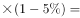门票价格人数，涨价后总收入增加，需求量变动对于价格变动的反应不敏感，故A景区门票涨价利于增收。

B景区收入门票价格人数门票价格人数，涨价后总收入减少，需求量变动对于价格变动的反应程度相当，故B景区维持原价利于增收。

C景区收入门票价格人数门票价格人数，涨价后总收入减少，需求量变动对于价格变动的反应较为敏感，故C景区门票降价，需求量会增加更多，从而利于总收入增加。

综上所述，该镇想增加景区的门票收入，A、B、C景区的定价策略应分别为涨价、不变、降价。

故正确答案为A。

---

### 第 54 题　qid 2672098 · 人文常识

许多成语来源于故事，下列成语故事按出现先后排序正确的是：
①悬梁刺股②李广难封③世外桃源④煮豆燃萁

- **A**. ③①②④
- **B**. ①②④③　✅
- **C**. ②①③④
- **D**. ④①②③

**答案**：B

**官方解析**

本题考查人文常识。
①悬梁刺股：是由“头悬梁”和“锥刺股”两个故事组成，分别讲的是西汉的孙敬和战国的苏秦勤奋学习的故事。比喻废寝忘食地刻苦学习。
②李广难封：出自王勃《秋日登洪府滕王阁饯别序》。李广是西汉时期的名将，多次抗击匈奴，保卫国家，但未能封侯。“李广难封”多用于慨叹功高不爵，命运乖舛。
③世外桃源：是东晋文学家陶渊明在《桃花源记》描述的一个与世隔绝、没有遭到祸乱的美好地方。比喻理想中环境幽静、不受外界影响、生活安逸的地方。现用来比喻一种虚幻的超脱社会现实的安乐美好的境界。
④煮豆燃萁：出自三国时期曹植的《七步诗》。意思是用豆萁做燃料煮豆子，比喻兄弟间自相残杀。
综上所述，按典故出现先后排序正确的是：①②④③。
故正确答案为B。

---

### 第 55 题　qid 2672103 · 人文常识

下列场景可能出现在东汉的是：

- **A**. 私塾先生为学生讲解《三字经》
- **B**. 一艘官船正在大运河上悠然行驶
- **C**. 百姓们在春节期间燃放烟花爆竹
- **D**. 边关将士痛饮葡萄美酒庆祝大捷　✅

**答案**：D

**官方解析**

本题考查人文常识。
A项错误，《三字经》是中国的传统启蒙教材。关于《三字经》的成书年代和作者历代说法不一，大多数后代学者倾向的意见是《三字经》成书于宋元。
B项错误，大运河形成于隋朝。隋朝以前，中国早期的运河规模都不大，而且没有形成一个完整的水运系统。隋统一中国后，充分利用早期运河和天然河流，凿成和疏通了以国都洛阳为中心，北抵河北涿郡、南达浙江余杭的大运河。
C项错误，火药是我国古代的炼丹家在长期的炼制丹药过程中发现的，世界上关于火药的最早文字记载是唐朝炼丹家的《太上圣祖金丹秘诀》。火药除了用于制作武器以外还用来做鞭炮。
D项正确，一般认为葡萄是西汉丝绸之路开辟后引入中国的，所以东汉边关将士痛饮葡萄美酒可能出现。
故正确答案为D。

---

### 第 56 题　qid 2672108 · 人文常识

关于中华人民共和国的外交，下列表述错误的是：

- **A**. 新时期我国提出了构建“人类命运共同体”的重大理念
- **B**. 迄今为止，中国已经与所有邻国都建立了外交关系　✅
- **C**. 邓小平同志提出了“搁置争议，共同开发”的外交策略
- **D**. 中华人民共和国成立后，苏联是和中国最早建交的国家

**答案**：B

**官方解析**

本题考查政治常识。
A项正确，“构建人类命运共同体”是习近平总书记于2015年9月提出的治国理政方针理论。2017年10月，习近平在十九大报告中呼吁“各国人民同心协力，构建人类命运共同体。”
B项错误，中国共有14个陆地邻国，分别为朝鲜、蒙古、俄罗斯、哈萨克斯坦、吉尔吉斯斯坦、塔吉克斯坦、阿富汗、巴基斯坦、印度、尼泊尔、不丹、缅甸、老挝、越南。其中，不丹是唯一与中国没有建交的邻国。
C项正确，1979年6月，中方通过外交渠道正式向日方提出共同开发钓鱼岛附近资源的设想，首次公开表明了中方愿以“搁置争议，共同开发”模式解决同周边邻国间领土和海洋权益争端的立场。“搁置争议，共同开发”的基本含义是：第一，主权属我；第二，对领土争议，在不具备彻底解决的条件下，可以先不谈主权归属，而把争议搁置起来。搁置争议，并不是要放弃主权，而是将争议先放一放；第三，对有些有争议的领土，进行共同开发；第四，共同开发的目的是，通过合作增进相互了解，为最终合理解决主权的归属创造条件。
D项正确，1949年10月2日，新中国和苏联建交，苏联是中华人民共和国成立后，和中国最早建交的国家。
本题为选非题，故正确答案为B。

---

### 第 57 题　qid 2672114 · 人文常识

关于人文常识，下列表达错误的是：

- **A**. “祸兮福之所倚，福兮祸之所伏”这句话出自《老子》
- **B**. 《最后的审判》和《蒙娜丽莎》是达·芬奇的代表作　✅
- **C**. 《怎么办》是俄国作家车尔尼雪夫斯基的代表作
- **D**. “杏林”是中医学界的代称，其传说与名医董奉相关

**答案**：B

**官方解析**

本题考查人文常识。
A项正确，“祸兮福之所倚，福兮祸之所伏”这句话出自《老子·五十八章》。意思是祸与福互相依存，可以互相转化。比喻坏事可以引出好的结果，好事也可以引出坏的结果。
B项错误，《最后的审判》是意大利文艺复兴大师米开朗基罗为西斯廷天主堂绘制的壁画。《蒙娜丽莎》是意大利文艺复兴时期画家列奥纳多·达·芬奇创作的油画代表作。
C项正确，《怎么办》是俄国革命家、哲学家、作家和批评家车尔尼雪夫斯基在狱中创作的长篇小说。这部小说的显著特色是以欢乐的情调、明朗的画面展示了新人的故事。人物新、故事新、思想新，正是俄国解放运动进入第二阶段的反映。
D项正确，杏林是中医学界的代称，其传说与三国时期名医董奉相关。董奉在行医时从不索取酬金，每当治好一个重病患者时，就让病家在山坡上栽五颗杏树；看好一个轻病，只需栽一颗杏树。所以四乡闻讯前来求治的病人云集，而董奉均以栽杏作为医酬。根据董奉的传说，人们用“杏林”称颂医生。
本题为选非题，故正确答案为B。

---

### 第 58 题　qid 2672117 · 人文常识

下列关于古诗词的解读，表述正确的是：

- **A**. “独在异乡为异客，每逢佳节倍思亲”中“佳节”指中秋节
- **B**. “东边日出西边雨，道是无晴却有晴”其实是一种对流雨现象　✅
- **C**. “御马牵来亲自试，珠球到处玉蹄知”描绘的是踢足球场面
- **D**. “但愿人长久，千里共婵娟”抒写的是夫妇之间的离愁别恨

**答案**：B

**官方解析**

本题考查人文常识。
A项错误，“独在异乡为异客，每逢佳节倍思亲”出自唐代诗人王维所作的《九月九日忆山东兄弟》，其中“佳节”指重阳节。
B项正确，“东边日出西边雨，道是无晴却有晴”出自唐代诗人刘禹锡的《竹枝词二首·其一》。夏季气候闷热，空气对流强烈，雷雨天气往往持续时间较短、分布范围较小，可能出现“东边日出西边雨”的对流雨现象。
C项错误，“御马牵来亲自试，珠球到处玉蹄知”出自唐代诗人王建的《朝天词十首寄上魏博田侍中》，描绘的是踢马球场面。
D项错误，“但愿人长久，千里共婵娟”出自宋代苏轼的《水调歌头》，表达的意思是希望自己思念的人平安长久，不管相隔千山万水，都可以一起看到皎洁美好的明月。抒写的是对远方亲人的思念之情以及美好祝愿。
故正确答案为B。

---

### 第 59 题　qid 2672123 · 科技常识

关于科技常识，下列表述错误的是：

- **A**. 
激光扫描器和红外感应器都是具有信息传感功能的仪器

- **B**. 
核电站的能量转换过程是：核能内能机械能电能

- **C**. 
石化燃料属不可再生资源，如天然气、沼气、煤炭、石油等
　✅
- **D**. 
磁悬浮列车是靠磁悬浮力即磁的吸力和排斥力来推动的列车

**答案**：C

**官方解析**

本题考查科技常识。

A项正确，激光扫描器是一种光学远距离条码阅读设备，红外传感器是一种以红外线为介质来完成测量功能的传感器，两者都是具有信息传感功能的仪器。

B项正确，核电站能量转化的过程是：通过核反应把核能转化为内能，得到高温水蒸气；水蒸气推动气轮机转动，把内能又转化为机械能；气轮机再带动发电机发电，得到电能。故能量转换过程是：核能内能机械能电能。

C项错误，石化燃料是千百万年前的微生物或动植物残骸，经过地壳的变动逐渐被埋藏在地底下，经过细菌的分解及长期在高压、高温的作用下，产生了化学变化而变成构造复杂的碳氢化合物，如天然气、煤炭、石油等。而沼气是各种有机物质在隔绝空气，在适宜的温度等条件下，经过微生物的发酵作用产生的一种可燃烧气体。沼气属于可再生能源。

D项正确，磁悬浮列车是一种靠磁悬浮力（即磁的吸力和排斥力）来推动的列车。由于其轨道的磁力使之悬浮在空中，行走时不需接触地面，因此其阻力只有空气的阻力。

本题为选非题，故正确答案为C。

---

### 第 60 题　qid 2672125 · 科技常识

关于生物常识，下列表述错误的是：

- **A**. 人体血液呈红色是因为血液中血红蛋白的存在
- **B**. 艾滋病、非典、禽流感都是由病毒引起的传染病
- **C**. 四十岁以后女性的骨量流失量明显高于男性
- **D**. 多云天进行户外活动，紫外线辐射不会对人体造成伤害　✅

**答案**：D

**官方解析**

本题考查科技常识。

A项正确，人体的血液之所以是红色的，是因为血液中的红细胞内含有血红蛋白，血红蛋白是一种红色含铁的蛋白质。

B项正确，艾滋病、非典、禽流感都是由病毒引起的传染病。艾滋病的病原体是人类免疫缺陷病毒，此病毒能攻击并严重损伤人体的免疫功能。传染性非典型肺炎为一种由新型冠状病毒引起的急性呼吸道传染病。禽流感是由甲型流感病毒的一种亚型（也称禽流感病毒）引起的一种急性传染病，也能感染人类。

C项正确，四十岁以后，女性的卵巢功能逐渐衰退，分泌的雌性激素相应减少，严重影响骨代谢，且女性在妊娠及哺乳过程中有明显的骨量丢失，而男性在生育期却没有类似的变化，加上男性生殖功能的下降是一个缓慢的过程，故男性的骨量快速丢失期较女性晚，即四十岁以后女性的骨量流失量明显高于男性。

D项错误，紫外线的穿透能力非常强，的紫外线都能够穿透云层，云层对紫外线难以起到隔离作用。所以多云天进行户外活动，也要防止紫外线辐射对人体造成伤害。

本题为选非题，故正确答案为D。

---

## 言语理解与表达

### 第 1 题　qid 2672400 · 逻辑填空

古代丝绸之路大体有草原道、绿洲道、茶马道及海上道四条。除了汉族，北方和西北游牧民族也是丝绸之路的重要            ，他们的马队和骆驼队踏出了一条        欧亚大陆的草原丝路。
填入画横线部分最恰当的一项是：

- **A**. 开拓者  横贯　✅
- **B**. 建设者  纵贯
- **C**. 参与者  连通
- **D**. 使用者  跨越

**答案**：A

**官方解析**

第一空，搭配“丝绸之路”，并且根据后文“他们的马队和骆驼队踏出了一条丝路”可知，他们的日常游牧行为，无意识间形成了一条路，使丝绸之路范围扩大到了欧亚大陆。A项“开拓者”指开辟、扩展的人，与文意相符，保留。B项“建设者”指建立、陈设布置的人，搭配“丝绸之路”不恰当，排除；C项“参与者”指介入、参加的人，D项“使用者”指运用、利用的人，丝绸之路形成之后，才可以参加或使用，均不符合文意，排除。
第二空，代入验证，A项“横贯”指横向贯穿，与“欧亚大陆”搭配恰当，当选。
故正确答案为A。
【文段出处】《丝绸之路是民族交流融合的舞台》

---

### 第 2 题　qid 2672403 · 逻辑填空

在“重刑轻民”传统依然            的中国，编纂民法典首先就要更新观念，强化对公民私权利的立法        ，弘扬权利平等、意思自治、诚实信用、契约自由等民法的精神。
填入画横线部分最恰当的一项是：

- **A**. 源远流长  解释
- **B**. 根深蒂固  保障　✅
- **C**. 薪火相传  认识
- **D**. 陈陈相因  宗旨

**答案**：B

**官方解析**

第一空，根据“依然”以及可知，现在的中国仍然存在重刑轻民的传统，且根据后文“要更新观念，强化公民私权利”等表述可知，作者对这种传统持有消极的感情倾向。B项“根深蒂固”指基础稳固，不容易动摇；D项“陈陈相因”指沿袭老一套，无创造革新，均符合中国仍然存在这种传统的语意，保留。A项“源远流长”指历史悠久，根底深厚，一般用在表意积极的语境中，与文段感情色彩相悖，排除；C项“薪火相传”指学问和技艺代代相传，与“传统”搭配不当，排除。
第二空，根据文意可知，要编纂民事法律保护公民的私权力。B项“保障”指保护（权利、生命、财产等），使不受侵害，填入文段可体现出要保护公民私权利的意思，符合文意，当选。D项“宗旨”指主导思想，主要旨趣，文段不是强调民法的主要思想，而是要表达保护公民私权利，排除。
故正确答案为B。
【文段出处】《用大国工匠精神打造民法典》

---

### 第 3 题　qid 2672406 · 逻辑填空

春节期间播出的《舌尖上的中国3》，因夸大“药食同源”“药膳”“食疗”的效应，一经播出就引发        。有观众认为，里面所提到的煲汤养生并非人人适用；草药入菜也绝非“缺啥补啥”那么简单，随意食补可能            。
填入画横线部分最恰当的一项是：

- **A**. 异议  不无裨益
- **B**. 质疑  画蛇添足
- **C**. 共鸣  于事无补
- **D**. 争议  适得其反　✅

**答案**：D

**官方解析**

第一空，根据前后文可知，节目夸大了药膳效果，人们对此有怀疑。A项“异议”指不同的意见，B项“质疑”指提出疑问，D项“争议”指争辩、争论，均符合文意，保留。C项“共鸣”指由别人的某种情绪引起相同的情绪，与文意相悖，排除。
第二空，根据前文“并非人人适用”等表述可知，随意食补可能会危害人体健康。D项“适得其反”指结果跟希望正好相反，符合文意，当选。A项“不无裨益”指多少有些好处，与文意相悖，排除；B项“画蛇添足”指做多余的事，反而弄巧成拙，意在强调在已经正确的事情上再做多余的事情，文段没有表明食补是正确的，排除。
故正确答案为D。
【文段出处】《药膳养生靠不靠谱？》

---

### 第 4 题　qid 2672408 · 逻辑填空

应对老龄化，化解养老难题，政府            。通常说来，这种责任更多地体现于足够的政策        ，以此促进养老市场的发育和壮大。
填入画横线部分最恰当的一项是：

- **A**. 责无旁贷  倾斜　✅
- **B**. 首当其冲  配套
- **C**. 任重道远  制定
- **D**. 义不容辞  导向

**答案**：A

**官方解析**

第一空，搭配“政府”，跟着后文指代词“这种责任”可知，前文意在强调政府的责任。A项“责无旁贷”指自己应尽的责任，不能推卸给别人，符合文意，保留；C项“任重道远”指责任重大，需要经过长期的艰苦奋斗，符合文意，保留。B项“首当其冲”指处于首先受到攻击或压力的地位，解决老年问题并非政府的攻击或压力，不符合文意，排除；D项“义不容辞”指从道义上讲不允许推托、拒绝，而非必须履行的责任，不符合文意，排除。
第二空，搭配“政策”，根据后文“促进养老市场的发育和壮大”可知，需填入表示有比以往更多关于养老政策的词语。A项“倾斜”指偏向于某一方，符合文意，当选。C项“制定”定出（法律、章程、计划等），对比A项，无法体现出出台更多关于养老的政策的语意，故A项更符合文意，排除C项。
故正确答案为A。

---

### 第 5 题　qid 2672415 · 逻辑填空

教育问题不仅是教育系统内的问题，也与社会其他领域有着            的联系。教育改革需要每个人对教育存有        之心，发自内心地尊重教育规律，给孩子成长提供相对宽松的环境，为教育改革尽            。
填入画横线部分最恰当的一项是：

- **A**. 盘根错节  感恩  最大努力
- **B**. 千丝万缕  敬畏  一己之力　✅
- **C**. 息息相关  赤子  洪荒之力
- **D**. 千头万绪  虔诚  绵薄之力

**答案**：B

**官方解析**

第一空，搭配“联系”。B项“千丝万缕”指彼此之间关系复杂，难以割断，搭配合适，保留；C项“息息相关”指彼此的关系非常密切，搭配合适，保留。A项“盘根错节”指事情繁难复杂，不易处理，文段未表明这种联系是不容易处理的，故与文意无关，排除；D项“千头万绪”指事物纷繁复杂，一般搭配事物、思绪等，与“联系”搭配不当，排除。
第二空，形容人对教育应怀有的心情，根据后文“发自内心地尊重教育规律”可知，横线处词语表示对教育尊重的词语。B项“敬畏”指又敬重又畏惧，符合文意，保留。C项“赤子”指人心地纯洁善良，无法体现尊重的语意，排除。锁定B项。
第三空，代入验证，B项“一己之力”指凭借自己一个人的力量，与前文“每个人”对应合适，搭配恰当，符合文意，当选。
故正确答案为B。
【文段出处】《教育还需轻装前行》

---

### 第 6 题　qid 2672420 · 逻辑填空

近代，随着西方科学技术在中国传播，对科举考试落伍保守的批评             ，兴办新式学堂的实践也逐步推进。二十世纪初，终于结束了        一千三百年的科举制度。
填入画横线部分最恰当的一项是：

- **A**. 接踵而至  延续
- **B**. 各执己见  长达
- **C**. 甚嚣尘上  沿袭
- **D**. 不绝于耳  绵延　✅

**答案**：D

**官方解析**

第一空，搭配“批评”。A项“接踵而至”指人接连而来或事情持续发生；D项“不绝于耳”指声音在耳边鸣响不断，均搭配恰当，保留。B项“各执己见”指各人都坚持自己的意见，与“批评”搭配不当，排除；C项“甚嚣尘上”指某种传闻或谬论十分嚣张，根据文意可知，作者对这种批评并没有有消极的感情倾向，与文意不符，排除。
第二空，搭配“科举制度”。D项“绵延”指接连不断，搭配恰当，当选；A项“延续”指照原来的样子持续下去，对比D项，“绵延”更能体现连续不绝、时间长之意，对应到“一千三百年”的长时间段，情感更加丰富，故D项更符合文意，排除A项。
故正确答案为D。
【文段出处】《绵延千年的科举制度，是怎么消失的》

---

### 第 7 题　qid 2672424 · 逻辑填空

希腊悲剧诗人埃斯库罗斯的《俄瑞斯忒亚》反映了古代社会中始终            的两种正义观之间的紧张关系。一种观念认为，只有故意作恶才应当承担责任；另一种观念是，如果要阻止众怒，作恶者不论        如何都应当受到惩罚。
填入画横线部分最恰当的一项是：

- **A**. 分道扬镳  罪行
- **B**. 相持不下  意图　✅
- **C**. 大相径庭  立场
- **D**. 针锋相对  身份

**答案**：B

**官方解析**

第一空，所填词语形容两种正义观之间紧张关系的词语。B项“相持不下”指彼此争持，不肯让步；D项“针锋相对”指双方意见、观点等尖锐对立，均符合文意，搭配恰当，保留。A项“分道扬镳”指目标不同，各走各的路或各干各的事，与“关系”搭配不当，排除；C项“大相径庭”指彼此相差很远，大不相同，与“关系”搭配不当，排除。
第二空，与“只有故意作恶才应当承担责任”的观念相对，横线处词语表示不管是不是想故意作恶的词语。B项“意图”指希望达到某种目的打算，符合文意，当选。D项“身份”指人的出身和社会地位，文段意在强调目的如何，而非出身地位，不符合文意，排除。
故正确答案为B。
【文段出处】《以正义之名》

---

### 第 8 题　qid 2672428 · 片段阅读

“明者因时而变，知者随事而制。”中国特色社会主义进入新时代，我国社会主要矛盾已经转化为人民日益增长的美好生活需要和不平衡不充分的发展之间的矛盾，我国经济已由高速增长阶段转向高质量发展阶段。面对新时代新任务提出的新要求和人民群众的新期盼，通过改革使政府机构设置和职能配置适应经济社会的发展变化，进一步理顺政府与市场、政府与社会的关系，才能有力推动经济发展质量变革、效率变革、动力变革，切实解决发展不平衡不充分问题，更好满足人民对美好生活的需要。
这段文字意在强调：

- **A**. 我国社会主要矛盾发生重大转化
- **B**. 我国的经济发展已进入新的阶段
- **C**. 新时代新任务提出新要求新期盼
- **D**. 改革政府机构及职能的重要意义　✅

**答案**：D

**官方解析**

文段首先交代背景，说明中国特色社会主义进入新时代后，我国社会主要矛盾和经济所发生的变化。接着文段提出对策，说明在这一新时代新要求的背景下，要通过改革来适应变化、理顺关系，最后文段指出改革这一对策能达到的效果，即这样才能推动变革、解决问题、满足需要。故可知文段意在强调新时代新任务下改革的重要性，对应D项。
A、B两项，均为背景内容，非文段论述重点，排除；
C项，“新要求新期盼”非文段论述重点，文段意在强调达到新要求新期盼的对策，即“改革”的重要性及意义，排除。
故正确答案为D。

---

### 第 9 题　qid 2672431 · 片段阅读

当前，我国尚未脱贫人口大多是条件较差、基础较弱、贫困程度较深地区的群众。这部分人口彻底脱贫需要因地、因人施策，需要经历一个比较长的过程。但有些地方和部门领导为了提升政绩，把层层夯实脱贫攻坚责任搞成“层层加码”，不切实际地将脱贫任务增多、项目拓宽、标准拔高，把压力和矛盾交给基层干部，大幅加重基层负担。少数地方甚至直接玩起“人头”脱贫的数字游戏，一些农户年初刚戴上贫困户“帽子”，年底就宣布成功“摘帽”。这些忽视时序节奏和质量要求的冒进做法，与中央要求以及人民群众尤其是困难群众的实际诉求背道而驰，必须坚决予以纠正。
这段文字意在强调脱贫攻坚应：

- **A**. 正视困难
- **B**. 避免浮夸
- **C**. 强化责任
- **D**. 实事求是　✅

**答案**：D

**官方解析**

文段开头讲述我国未脱贫人口各方面条件较差，彻底脱贫需要因地、因人施策，转折词“但”之后指出现在存在的问题，工作“层层加码”，玩“人头”游戏，背离人民的实际诉求，必须坚决予以纠正，即重视时序节奏和质量要求的冒进做法、满足人民的实际诉求。因此文段意在强调脱贫攻坚应实事求是，对应D项。
A项，文段重点强调的是“脱贫攻坚应实事求是”，即问题如何解决，而非面对问题，排除。
B项，文段提到的“将脱贫任务增多、项目拓宽、标准拔高，把压力和矛盾交给基层干部，大幅加重基层负担。少数地方甚至直接玩起‘人头’脱贫的数字游戏”并不是浮夸的表现，而是一种不切实际的表现，且“避免浮夸”较之“实事求是”，表述不够直接明确，排除。
C项，文段并没有提到脱贫攻进工作中的责任不强，无中生有，排除。
故正确答案为D。
【文段出处】《如何破解基层脱贫攻坚中出现的难题和怪相》

---

### 第 10 题　qid 2672436 · 片段阅读

《中国地理国情蓝皮书》近日发布。以蓝皮书形式，出版第一次全国地理国情普查成果，这在国内尚属首次。全书借助大量的色彩图表，系统直观地描述了我国地表自然资源禀赋与利用、地表生态格局、基本公共服务均等化、区域经济发展和城市建设的空间分布整体状况，对比了地域之间的差异，在宏观尺度上反映了生态环境与经济发展的关系，以及自然要素与人文要素的耦合程度。蓝皮书由中国测绘科学研究院等机构策划出版，旨在为国家和地方提供一套客观、科学的数据和分析结果。
下列说法与这段文字相符的是：

- **A**. 以往的地理国情普查成果用调研报告形式发布
- **B**. 该蓝皮书的最大特色是借助彩色图表进行描述
- **C**. 该蓝皮书首次由中国测绘科学研究院策划出版
- **D**. 科学的地理国情普查可以为政府提供决策依据　✅

**答案**：D

**官方解析**

A项，无中生有，文段并没有提到以往的地理国情普查成果是如何发布的，排除。
B项，无中生有，文段并没有体现出“借助彩色图表进行描述”是“该蓝皮书的最大特色”，排除。
C项，表述错误，文段强调的是“蓝皮书由中国测绘科学研究院等机构策划出版”，“首次”没有体现出来，排除。
D项，根据文段“旨在为国家和地方提供一套客观、科学的数据和分析结果”可知，“科学的地理国情普查可以为政府提供决策依据”，表述正确，当选。
故正确答案为D。
【文段出处】《我国首次出版第一次全国地理国情普查统计分析成果》

---

### 第 11 题　qid 2672438 · 逻辑填空

清代有个叫叶存仁的官员，从政三十余年，甘于淡泊，从不苟取。一次离任时，僚属临别馈赠礼品，为避人耳目，特地夜里送来。叶存仁见状将馈赠品原封退回，并赋诗一首相赠：“月白风清夜半时，扁舟相送故迟迟。感君情重还君赠，不畏人知畏己知。”
这个故事可以用来佐证为官从政应：

- **A**. 淡泊名利
- **B**. 谨言慎行
- **C**. 重义轻财
- **D**. 廉洁自律　✅

**答案**：D

**官方解析**

这则故事讲述了一位甘于淡泊，从不苟取的官员，在收到别人馈赠时委婉拒绝的故事，“从不苟取”“不畏人知畏己知”，体现作为官员应当清廉自律，对应D项。
A项，“淡泊名利”指轻视在外的名声与利益，不追求名利，文段没有提到不追求、轻视名利，排除。
B项，“谨言慎行”指言语行动小心谨慎，而文段强调的是廉洁，排除。
C项，“重义”文段没有体现出来，排除。
故正确答案为D。
【文段出处】《修身自律功在平常》

---

### 第 12 题　qid 2672441 · 片段阅读

古人云：“春秋之治天下也，天下为公，选贤与能，讲信修睦，禁攻寝兵，勤政爱民，劝商惠工，土地辟，田野治，学校昌，人伦明，道路修，游民少，废疾养，盗贼息，由乎此者，谓之中国。反乎此者，谓之夷狄。”范文澜亦认为：“中国、夏、华三个名称，最基本的含义还在于文化。”
这段文字意在强调：

- **A**. “中国”在古代主要是指一种文化形态　✅
- **B**. “中国”常被用来确定华夏与夷狄之分
- **C**. “中国”是知识分子一种理想政治形态
- **D**. “中国”的内涵在古代重文化而轻政治

**答案**：A

**官方解析**

文段开篇引用古人言论，后尾句明确指出，“范文澜亦认为：‘中国、夏、华三个名称，最基本的含义还在于文化。’”。因此文段意在强调“中国”这一名称的背后主要的含义在于文化，对应A项。
B项，“常被用来确定华夏与夷狄之分”；C项，“知识分子的政治形态”，均无中生有，排除。
D项，“轻政治”，无中生有，排除。
故正确答案为A。
【文段出处】《“红海行动”与“战狼2”，都是好莱坞的虔诚信徒》

---

### 第 13 题　qid 2672450 · 片段阅读

中国古代文人画家在具体的画面处理中，比单纯追求形象与色彩变化的西方绘画艺术显得更有广度和深度。它不仅追求表现对象的“实”处，还以太极中的“阴阳”的理念追求其相对“虚”的空间，提出了“计白当黑”的画论，将其表现的形象延伸到一个更大的审美空间，达到了“此时无声胜有声”的诗意境界。
在这段话之后，作者最有可能谈及的是：

- **A**. 中国古代文人画家的理论及创作对世界绘画史的贡献
- **B**. 中国古代文人画作表现由实到虚的诗意境界的代表作　✅
- **C**. 中国古代文人画与西方绘画艺术在审美空间上的区别
- **D**. 中国古代文人画与道家哲学、传统诗论间的密切关联

**答案**：B

**官方解析**

文段开头讲述了中国古代文人画与西方绘画艺术的区别，随后指出中国古代文人画作由“实”到“虚”的的特点，故后文应围绕由“实”到“虚”讨论，与文段最后论述的内容衔接紧密。B项“中国古代文人画作表现由实到虚的诗意境界的代表作”，和前文衔接最为紧密，当选。
A、C、D三项，均未体现中国古代文人画作“由实到虚”的特点，与文段最后论述的内容衔接不当，排除。
故正确答案为B。
【文段出处】《文人画是用诗人的思考方式去绘画，源于“迁想妙得”》

---

### 第 14 题　qid 2672455 · 片段阅读

“生态包袱”是指生产单位重量产品所需要投入的物质总量。如：一个10克重的金戒指，生态包袱是3500千克；一件170克重的汗衫，生态包袱是226千克。在生态系统最下游减少一个单位的产品消耗，不但可以减少大量的资源投入，而且可以减少数十倍、数百倍甚至数千倍的污染排放，这对于保护生态环境、实现可持续发展意义重大。因此，应引导人们树立勤俭节约的消费观，形成以绿色消费、保护生态环境为荣，以铺张浪费、加剧生态包袱为耻的社会氛围。
根据这段文字，对“生态包袱”理解有误的是：

- **A**. 单位重量的产品与所需投入的物质总量正相关
- **B**. 生产首饰比生产名牌服装造成的生态包袱更重　✅
- **C**. 从消费终端减少产品消耗有利于减轻生态包袱
- **D**. 减轻生态包袱既能节约资源又可降低污染排放

**答案**：B

**官方解析**

A项，根据“‘生态包袱’是指生产单位重量产品所需要投入的物质总量”可知，单位产品重量越多，所需投入的物质总量也就越多，符合文意，排除。
B项，根据文意可知，文段仅列举了“金戒指”与“汗衫”的生态包袱，金戒指不能代表所有首饰，汗衫也不能代表所有名牌服装，表述有误，当选。
C项，“消费终端”即终端消费者定位，根据“应引导人们树立勤俭节约的消费观，形成以绿色消费、保护生态环境为荣，以铺张浪费、加剧生态包袱为耻的社会氛围”可知，人们减少消费会有助于减轻生态包袱，符合文意，排除。
D项，根据“不但可以减少大量的资源投入，而且可以减少数十倍、数百倍甚至数千倍的污染排放”可知，符合文意，排除。
本题为选非题，故正确答案为B。
【文段出处】《以绿色消费助推生态文明建设》

---

### 第 15 题　qid 2672462 · 片段阅读

①可见开普勒在壮大系外行星系统家族的过程中扮演了重要角色
②据NASA官网的数据显示，开普勒发现了4496位“候选者”
③它已对超过15万个恒星系统展开了持续监控，产生了海量数据
④其中2341颗得到确认，而目前总共确认的系外行星约为3704颗
⑤通过数据分析，科学家们遴选出了众多系外行星“候选者”
⑥开普勒太空望远镜是世界首个用于探测太阳系外类地行星的飞行器

- **A**. ②③⑤①⑥④
- **B**. ⑥②④③⑤①
- **C**. ②③⑤④①⑥
- **D**. ⑥③⑤②④①　✅

**答案**：D

**官方解析**

根据选项判断首句，②介绍了根据数据显示，开普勒发现了很多“候选者”，⑥对“开普勒太空望远镜”解释定义，引出话题。应先引出话题，后在分析利用开普勒的发现，故相比②，⑥更适合作为首句，排除A项和C项。对比选项，判别⑥后衔接语句。③介绍它通过对超过15万个恒星系统持续监控，产生了海量数据；②据数据显示，开普勒发现了“候选者”。应先监控产生数据，后再对数据进行分析，发现“候选者”，故③应在②之前，排除B项。
故正确答案为D。
【文段出处】《寻找另一个地球的四大法宝》

---

## 数量关系

### 第 1 题　qid 2672491 · 数学运算

某市2017财政收入1000亿，财政赤字占当年财政收入比率为；2018年该比率降为，预算赤字为2017年的。该市2018年财政支出预算为：

- **A**. 1200亿
- **B**. 1220亿
- **C**. 1224亿　✅
- **D**. 1230亿

**答案**：C

**官方解析**

由题意可知，2017年财政赤字亿，则2018年的财政赤字亿。根据“2018年该比率降为”可知，2018年财政收入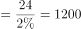亿，则该市2018年财政支出预算财政收入财政赤字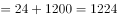亿。

故正确答案为C。

---

### 第 2 题　qid 2672518 · 数学运算

某电信营业厅，全年营业利润符合以下模型：

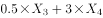，其中，为营业利润，为短信量，为网络流量，为通话量，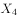为其它业务。

以下解释正确的是：

- **A**. 
四种业务均对营业利润有贡献

- **B**. 
业务发展优先次序为，，，

- **C**. 
各项业务都应当同等发展

- **D**. 
各变量的单位增量中，对贡献最大
　✅

**答案**：D

**官方解析**

A项：由营业利润模型“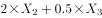”可知，短信量的值越大，营业利润的值就越小，因此短信量对营业利润没有贡献，错误；

B项：由营业利润模型可知，、、、前的系数分别为-0.3、2、0.5、3，系数越大，对利润的贡献越大，因此业务发展优先次序为，因为前的系数为负值，故业务不应该发展，应该缩减此业务，错误；

C项：不同业务的系数不同，对利润产生的贡献也不同，应当优先发展系数更大的业务，才能有更高的利润，错误；

D项：每增加1，就增加3，前的系数是最大的，因此对的贡献也是最大的，正确。

故正确答案为D。

【备注】本题的B项可能存在争议，优先选择正确且无争议的D项。

---

### 第 3 题　qid 2672521 · 数学运算

去年小李年工资收入4万元，今年预计增加。今年居民消费价格指数（CPI）预计为，据此推算，今年小李的实际购买力约增加：

- **A**. 

- **B**. 

- **C**. 

　✅
- **D**. 

**答案**：C

**官方解析**

方法一：由题意可知，小李今年收入为去年的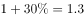倍，今年居民消费价格指数（CPI）预计为去年的倍，则今年小李的实际购买力增加了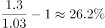。

方法二：由题意可知，小李去年的收入为4万元，则今年的收入为万元，设去年小李的收入可以购买价格为4万元的商品，则今年小李的收入可以购买原价为万元的商品，则今年小李的实际购买力增加了。

故正确答案为C。

---

### 第 4 题　qid 2672522 · 数学运算

某单位投入100000元用于植树，每人每天可植树30棵，人员费用40元/天，树苗每棵10元。该单位在预算范围内最多可植树：

- **A**. 8740棵
- **B**. 8780棵　✅
- **C**. 8823棵
- **D**. 3920棵

**答案**：B

**官方解析**

问最多，从最大的选项逐一代入验证。代入C项，种植8823棵树需要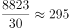人（向上取整），总费用，不符合；代入B项，种植8780棵树需要人（向上取整），总费用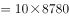，符合，A、D两项无需验证。

故正确答案为B。

【备注】方程法：设该单位植树课，则由题意可列式：，解得，因此总的植树数量8823，此时人数为294.1人，但人数为整数，所以向下取整为294人，此时植树数量为8820颗，故实际最多可植树8820棵，但选项中没有，选择符合条件的最大值B项。

---

### 第 5 题　qid 2672525 · 数学运算

小张接手一项扶贫任务，这项任务包括A、B、C、D、E、F六部分的内容，完成这些内容所需时间分别为3天、5天、2天、1天、7天、2天，各部分之间的序次关系如下图所示。完成这项任务最少需要：

- **A**. 13天
- **B**. 12天　✅
- **C**. 11天
- **D**. 10天

**答案**：B

**官方解析**

由题意可知，首先需要完成A任务，耗时3天；接下来可以同时进行B、C、E任务，E任务耗时最长需要7天；B、C任务耗时5天都完成后，可以继续耗时1天完成D任务，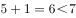，此时需要等待E任务完成后，才可以进行F任务，F任务需要2天来完成。因此完成这项任务最少需要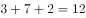天。

故正确答案为B。

---

### 第 6 题　qid 2672574 · 数学运算

四件相同包装的快递包裹，装有不同重量的商品，每件和其他一件合称一次，得到的重量依次为8、9、10、11、12、13，已知4件空包裹的重量之和以及里面商品的重量之和均为质数。则最重的两个包裹里的商品的总重量和为：

- **A**. 10
- **B**. 11
- **C**. 12　✅
- **D**. 13

**答案**：C

**官方解析**

由题意可知，最轻的两件包裹重量之和为8，最重的两件包裹重量之和为13，因此四件包裹的重量之和为。因为“已知4件空包裹的重量之和以及里面商品的重量之和均为质数”，即4件空包裹的重量商品总重量，系数一奇一偶且都为质数，因此4件空包裹的重量，2件空包裹的重量，故最重的两个包裹里的商品的总重量和为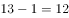。

故正确答案为C。

---

### 第 7 题　qid 2672592 · 数学运算

如下图，有正方形ABCD，点E和点F分别在正方形AD和DC边上，。正方形ABCD的面积与三角形EFB的面积之比是12：5，则（    ）。

- **A**. 

- **B**. 
1

- **C**. 
2

- **D**. 
3
　✅

**答案**：D

**官方解析**

设，则，正方形ABCD的面积。根据“正方形ABCD的面积与三角形EFB的面积之比是12：5”，可求出三角形EFB的面积为。设DF的长度为，则FC的长度为，因为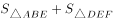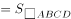，所以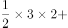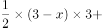，解得，因此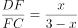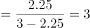。

故正确答案为D。

---

### 第 8 题　qid 2672607 · 数学运算

张大妈买了一篮子菜，包含A、B、C三个品种，其中A菜品1斤，单价40元/斤；B菜品2斤，单价5元/斤；C菜品2.5斤，单价2元/斤。这一篮子菜的平均价格为：

- **A**. 约8.54元/斤
- **B**. 10元/斤　✅
- **C**. 约15.67元/斤
- **D**. 15元/斤

**答案**：B

**官方解析**

根据题干可知，这一篮子菜的总价格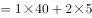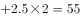元，这一篮子菜的总重量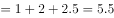斤，因此这一篮子菜的平均价格为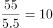元/斤。

故正确答案为B。

---

### 第 9 题　qid 2673107 · 数学运算

大学生张明开办网店，他购买了一批夜光灯，每台8元购进20元售出。当他卖出进货量的时，不仅收回了全部购买成本，还赢利了224元。张明共购进这批夜光灯：

- **A**. 32台　✅
- **B**. 31台
- **C**. 30台
- **D**. 25台

**答案**：A

**官方解析**

设共购进了4x台，则卖出3x时收回总成本，且赢利了224元。根据利润总售价总成本，可得，解得。因此共购进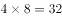台。

故正确答案为A。

---

### 第 10 题　qid 2672618 · 数学运算

小杰学习制作泡菜，他需要用浓度分别为和的盐水来调制300克浓度为的盐水，则需要使用的盐水：

- **A**. 90克
- **B**. 100克
- **C**. 110克
- **D**. 150克　✅

**答案**：D

**官方解析**

方法一：根据线段法，混合溶液的浓度之差与溶液质量成反比，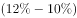，因此混合前的溶液质量相等，则需要使用的盐水克。

方法二：设需要的盐水克，的盐水克，则由题意可列式：······①，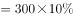······②，①式和②式联立方程组，解得，，则需要使用的盐水150克。

故正确答案为D。

---

## 判断推理

### 第 1 题　qid 2673979 · 图形推理

从选项中选择最合适的一个填入问号处，使之呈现出一定的规律性。

- **A**. A
- **B**. B
- **C**. C　✅
- **D**. D

**答案**：C

**官方解析**

元素组成不同，且无明显属性规律，优先考虑数量规律。观察发现，题干图形均由独立小图形组成，考虑元素的种类和数量，无明显规律或答案。再观察发现题干中只出现了2种小元素，考虑元素换算。题干中图2图1◇△，若1◇2△，那么图2与图1之间的差为1个△，此时将题干中菱形全部换算为三角形，那么三角形数量依次为3、4、5、6、？，故？处应有7个三角形。A项换算为4个三角形，排除；B项换算为6个三角形，排除；C项换算为7个三角形，当选；D项换算为6个三角形，排除。

故正确答案为C。

---

### 第 2 题　qid 2673987 · 图形推理

从选项中选择最合适的一个填入问号处，使之呈现出一定的规律性。

- **A**. A
- **B**. B　✅
- **C**. C
- **D**. D

**答案**：B

**官方解析**

元素组成不同，且无明显属性规律，优先考虑数量规律。观察发现，黑色图形数量依次为1、2、4、2、？，故？处黑色图形数量应为1，排除A、C两项；对比B、D两项，黑色图形位置不同，考虑位置规律，观察发现第一个图形的黑色图形顺时针平移一格得到第二个图形的黑色图形（其中1个），以此类推，该黑色图形每次顺时针平移一格，排除D项。
故正确答案为B。

---

### 第 3 题　qid 2673991 · 图形推理

把下面图形分为两类，使每一类都有共同特征或者规律，正确的选项是：

- **A**. ①②③，④⑤⑥
- **B**. ①⑤⑥，②③④
- **C**. ①④⑥，②③⑤
- **D**. ①④⑤，②③⑥　✅

**答案**：D

**官方解析**

本题为分组分类题目。元素组成不同，且无明显属性规律，优先考虑数量规律。观察发现，图形都有2个黑色区域，无法进行分组分类。再观察发现，图①④⑤图形整体为平面图形，且黑色区域均处于同一个平面内，图②③⑥图形整体为立体图形，且黑色区域均处于立体图形的两个平面内，即图①④⑤为一组，图②③⑥为一组。
故正确答案为D。

---

### 第 4 题　qid 2673994 · 定义判断

碳汇是指通过植树造林、种草、种植农作物、保护湿地等方式，利用植物光合作用吸收大气中的二氧化碳，并将其固定在植被和土壤中，从而降低温室气体浓度的活动或机制。主要包括森林碳汇、草地碳汇、耕地碳汇、湿地碳汇、海洋碳汇等。
根据上述定义，以下属于碳汇的是：

- **A**. 经半个世纪三代人努力，塞罕坝地区由荒原变林海、由沙漠变绿洲　✅
- **B**. 某少数民族自治州在退耕还草过程中，累计拨付种苗费2351万元
- **C**. 秸秆不及时处理会影响农田耕种，因此每年都有农民大规模焚烧秸秆
- **D**. 我国在南海试采用可燃冰获得成功，这为发展海洋经济奠定了坚实基础

**答案**：A

**官方解析**

第一步：找出定义关键词。
“植树造林、种草、种植农作物、保护湿地”、“降低温室气体浓度的活动或机制”、“主要包括森林碳汇、草地碳汇、耕地碳汇、湿地碳汇、海洋碳汇”。
第二步：逐一分析选项。
A项：塞罕坝地区由荒原变林海、由沙漠变绿洲是通过“植树造林”方式进行的，林海和绿洲已经存在，可以实现“降低温室气体浓度”的目的，属于森林碳汇，符合定义，当选；
B项：“退耕还草”指停止耕种，种树种草，但选项中只提到了这个过程中的花费，并没有体现最后结果，不如A项更明显符合定义，排除；
C项：“焚烧秸秆”不符合“植树造林、种草、种植农作物、保护湿地”，不符合定义，排除；
D项：“试采用可燃冰”不符合“植树造林、种草、种植农作物、保护湿地”，不符合定义，排除。
故正确答案为A。

---

### 第 5 题　qid 2673997 · 定义判断

淘宝村是指这样一类村子。电子商务年交易额达到1000万元人民币以上；活跃网店数量达到100个，或者占本村村民户数的以上。淘宝村在带动村民致富，促进农村经济设施建设，实现乡村振兴发展。

根据上述定义，下面哪个村是淘宝村？

- **A**. 张庄村300户人家有230户玩“淘宝”卖演出服，户均年销售额达20000元
- **B**. 东山村五分之一家庭电商生意火爆，仅该村首家电商年营业额就达七百万欧元　✅
- **C**. 李村有家网店，专营本地生产的户外用品如帐篷、睡袋等，年交易额达两千万
- **D**. 苗寨村通过网络推介吊龙舞、苗乡油茶等非遗项目，年创旅游收入千万以上

**答案**：B

**官方解析**

第一步：找出定义关键词。

“电子商务年交易额达到1000万元人民币以上”、“活跃网店数量达到100个，或者占本村村民户数的以上”。

第二步：逐一分析选项。

A项：户均年销售额达20000元，共230户，合计交易额为460万，不符合“电子商务年交易额达到1000万元人民币以上”，不符合定义，排除；

B项：首家电商年营业额达七百万欧元，换算成人民币约为5600万，符合“电子商务年交易额达到1000万元人民币以上”，东山村五分之一家庭电商生意火爆，符合“占本村村民户数的以上”，符合定义，当选；

C项：只是在说一家网店的情况，不符合“活跃网店数量达到100个，或者占本村村民户数的以上”，不符合定义，排除；

D项：收入千万的是旅游收入，不属于电子商务，不符合定义，排除。

故正确答案为B。

---

### 第 6 题　qid 2673999 · 定义判断

英法两国政府曾联合投资开发协和飞机。项目开展不久发现，继续投吧，费用剧增，且不知市场前景如何；停止投吧，以前的投入将付诸东流，结果两国不断追加投资填补漏洞，无法脱身。经济学上把这种现象称为“协和效应”，现在被用来泛指在某件事情上投入了金钱，时间或精力后，即使发现不宜继续，因各种原因还是继续投入、欲罢不能的现象。
根据上述定义，以下哪项不属于协和效应？

- **A**. 张某投资股市连年亏损，不愿就此罢手，因此连年追加投入
- **B**. 王某等了半个小时公交车，想不等，又怕车来了，只好等下去
- **C**. 李某连续两年报考热门专业研究生未录取，决定先工作再说　✅
- **D**. 罗某觉得电影不好看，为对得起买票钱，只好硬着头皮看下去

**答案**：C

**官方解析**

第一步：找出定义关键词。
“在某件事情上投入了金钱，时间或精力”、“发现不宜继续，因各种原因还是继续投入”。
第二步：逐一分析选项。
A项：股市亏损但还是连年追加投入，符合“在某件事情上投入了金钱，时间或精力”、“发现不宜继续，因各种原因还是继续投入”，符合定义，排除；
B项：等公交的时候不想等，但是怕车来了，只好继续等，符合“在某件事情上投入了金钱，时间或精力”、“发现不宜继续，因各种原因还是继续投入”，符合定义，排除；
C项：连续两年报考未录取，决定先找工作，放弃了之前的选择，不符合“发现不宜继续，因各种原因还是继续投入”，不符合定义，当选；
D项：罗某觉得电影不好看，但硬着头皮看下去，符合“在某件事情上投入了金钱，时间或精力”、“发现不宜继续，因各种原因还是继续投入”，符合定义，排除。
本题为选非题，故正确答案为C。

---

### 第 7 题　qid 2674001 · 定义判断

近年来，我国分享经济发展呈现出百花齐放、多种模式并存的局面，其中众筹分享是一种比较典型的分享经济模式，主要指利用互联网平台进行资金的大众筹集，目标不仅仅是为了筹集资金，也包含了分享投资所蕴含的风险或利润。目前，这种模式主要集中在电影视频、音乐出版、文化创意和房地产等开发项目上。
根据上述定义，以下哪项属于众筹分享？

- **A**. 刘某在QQ群请大家每天扫自己的支付宝红包二维码，赚了不少赏金
- **B**. 张某通过微信朋友圈在48小时内集资123万元，开了一个创意茶楼　✅
- **C**. 校园网为某重症同学发起医疗费募捐活动，全校师生共捐款10万元
- **D**. 王某现在居住的房屋有100平方米，这是单位15年前集资建的房子

**答案**：B

**官方解析**

第一步：找出定义关键词。
“利用互联网平台”、“筹集资金”、“分享投资所蕴含的风险或利润”。
第二步：逐一分析选项。
A项：刘某在QQ群邀请大家扫二维码、赚赏金，不符合“筹集资金”、“分享投资所蕴含的风险或利润”，不符合定义，排除；
B项：张某在朋友圈内集资123万元，开创意茶楼，符合“利用互联网平台”、“筹集资金”以及“分享投资所蕴含的风险或利润”，符合定义，当选；
C项：校园网发起医疗费募捐活动，是募捐帮助同学，不符合“分享投资所蕴含的风险或利润”，不符合定义，排除；
D项：王某现在住的房子是单位15年前集资建的，不符合“利用互联网平台”，不符合定义，排除。
故正确答案为B。

---

### 第 8 题　qid 2674003 · 定义判断

认养农业是指消费者预付生产费用，生产者为消费者提供绿色、有机食品，在生产者和消费者之间建立一种风险共担、收益共享的生产方式，实现农村与城市、土地与餐桌的直接对接。
根据上述定义，下列情形属于认养农业的是：

- **A**. 小徐周末到农户李某家采摘黄瓜后付费
- **B**. 小陈从网上预付费用，购买农户王某家的有机蔬菜
- **C**. 小罗预付费给农户周某下种草莓，种植成功后带走草莓　✅
- **D**. 小刘预付费给农户张某种苹果树，若种植失败小刘可以得到经济赔偿

**答案**：C

**官方解析**

第一步：找出定义关键词。
“消费者预付生产费用”、“生产者为消费者提供绿色、有机食品”、“风险共担、收益共享”。
第二步：逐一分析选项。
A项：黄瓜已经成熟，小徐是直接购买的，不符合“消费者预付生产费用”，不符合定义，排除；
B项：小陈在网上预付的是购买蔬菜的费用，而不是种植蔬菜的生产费用，不符合“消费者预付生产费用”，不符合定义，排除；
C项：小罗预付费种草莓，符合“消费者预付生产费用”，种植成功后带走草莓，符合“生产者为消费者提供绿色、有机食品”，也符合“建立一种风险共担、收益共享的生产方式”，符合定义，当选；
D项：种植失败小刘可以得到经济赔偿，说明没有共同承担风险，不符合“风险共担、收益共享”，不符合定义，排除。
故正确答案为C。

---

### 第 9 题　qid 2674005 · 类比推理

泥人：黏土：泥塑

- **A**. 牙雕：象牙：大象
- **B**. 笔墨：纸砚：书写
- **C**. 根艺：树根：雕刻　✅
- **D**. 房屋：破瓦：修造

**答案**：C

**官方解析**

第一步：判断题干词语间逻辑关系。
黏土是泥人的原材料，二者构成对应关系，泥人是泥塑的一种，二者构成包容关系中的种属关系。
第二步：判断选项词语间逻辑关系。
A项：牙雕是指在象牙上进行的一系列的雕刻，象牙是牙雕的原材料，二者构成对应关系，大象与象牙为组成关系，但与牙雕并非种属关系，与题干逻辑关系不一致，排除；
B项：笔墨与纸砚是并列关系，且书写需要笔墨、纸砚，书写与笔墨、纸砚均是对应关系，与题干逻辑关系不一致，排除；
C项：树根是根艺（一般指根雕艺术）的原材料，二者构成对应关系，根艺是雕刻的一种，二者构成种属关系，与题干逻辑关系一致，当选；
D项：破瓦可能是建造房屋的原材料，但修造与房屋构成动宾关系，与题干逻辑关系不一致，排除。
故正确答案为C。

---

### 第 10 题　qid 2674008 · 类比推理

革故鼎新：墨守成规

- **A**. 扑朔迷离：异曲同工
- **B**. 饮水思源：叶落归根
- **C**. 百花齐放：推陈出新
- **D**. 融会贯通：囫囵吞枣　✅

**答案**：D

**官方解析**

第一步：判断题干词语间逻辑关系。
革故鼎新是指去除旧的，建立新的，革除旧弊，创立新制。墨守成规是指思想保守，守着老规矩不肯改变。二者是反义关系。
第二步：判断选项词语间逻辑关系。
A项：扑朔迷离形容事情错综复杂，难以辨别清楚。异曲同工比喻话的说法不一而用意相同，或一件事情的做法不同而都巧妙地达到目的。二者无明显逻辑关系，与题干逻辑关系不一致，排除；
B项：饮水思源比喻不忘本。叶落归根多指作客他乡的人最终要回到本乡。二者是近义关系，与题干逻辑关系不一致，排除；
C项：百花齐放形容百花盛开，丰富多彩。推陈出新是指对旧的文化进行批判地继承，剔除其糟粕，吸取其精华，创造出新的文化。二者无明显逻辑关系，与题干逻辑关系不一致，排除；
D项：融会贯通是指把各方面的知识和道理融化汇合，得到全面透彻的理解。囫囵吞枣比喻对事物不加分析思考。二者是反义关系，与题干逻辑关系一致，当选。
故正确答案为D。

---

### 第 11 题　qid 2674473 · 类比推理

疏浚：畅通：河道

- **A**. 盛夏：炎热：消暑
- **B**. 清扫：洁净：马路　✅
- **C**. 口干：舌燥：饮料
- **D**. 云开：雨霁：彩虹

**答案**：B

**官方解析**

第一步：判断题干词语间逻辑关系。
疏浚的目的是为了让河道更畅通，疏浚和畅通为方式目的对应关系，其中疏浚是方式，畅通是目的。
第二步：判断选项词语间逻辑关系。
A项：盛夏是炎热的，炎热需要消暑，前者是属性的对应关系，后者是方式对应关系，与题干逻辑关系不一致，排除；
B项：清扫的目的是为了让马路更洁净，清扫和洁净为方式目的对应关系，其中清扫是方式，洁净是目的，与题干逻辑关系一致，当选；
C项：口干舌燥形容非常干渴，口干和舌燥是并列关系，与题干逻辑关系不一致，排除；
D项：云开雨霁是指云散开了、雨也停了，云开和雨霁是并列关系，与题干逻辑关系不一致，排除。
故正确答案为B。

---

### 第 12 题　qid 2674477 · 类比推理

深入：浅出

- **A**. 大同：小异　✅
- **B**. 瞻前：顾后
- **C**. 青山：绿水
- **D**. 内忧：外患

**答案**：A

**官方解析**

第一步：判断题干词语间逻辑关系。
深入浅出是指用浅显易懂的话把深刻的道理表达出来，其中“深”和“浅”、“出”和“入”是反义关系。
第二步：判断选项词语间逻辑关系。
A项：大同小异是指大体相同略有差异，其中“大”和“小”、“同”和“异”是反义关系，与题干逻辑关系一致，当选；
B项：瞻前顾后是指做事犹豫不决，其中“瞻”和“顾”都是指看的意思，二者为近义关系，与题干逻辑关系不一致，排除；
C项：“青”和“绿”、“山”和“水”是并列关系，与题干逻辑关系不一致，排除；
D项：“内”和“外”是反义关系，但“忧”和“患”不是反义关系，与题干逻辑关系不一致，排除。
故正确答案为A。

---

### 第 13 题　qid 2674482 · 类比推理

（    ） 对于 星系 相当于 （    ） 对于 山脉

- **A**. 星星：水流
- **B**. 银河：山川
- **C**. 星球：山峰　✅
- **D**. 光速：黄山

**答案**：C

**官方解析**

逐一代入选项。
A项：星星是指肉眼可见的宇宙中的天体，星系是指由无数恒星和星际物质组成的天体系统，包括恒星、气体、宇宙尘埃和暗物质等，所以星星是星系的必要组成部分，而山脉是指沿一定方向延伸、包括若干条山岭和山谷组成的山体，水流不是山脉的必要组成部分，前后逻辑关系不一致，排除；
B项：银河是由大量恒星构成的天体系统，它是银河系的一部分，而银河系是星系的一种，因此银河和星系没有必然的逻辑关系，山川是指山岳与河流，这里的山岳是指高耸入云而延绵不断的山岭，而不是山脉，前后逻辑关系不一致，排除；
C项：星球是星系的组成部分，山峰是山脉的组成部分，前后逻辑关系一致，当选；
D项：光速和星系之间没有必然的逻辑关系，黄山指的是黄山山脉，是山脉的一种，前后逻辑关系不一致，排除。
故正确答案为C。

---

### 第 14 题　qid 2674486 · 类比推理

工人：工作：工资

- **A**. 学生：学习：学识　✅
- **B**. 职员：职业：职称
- **C**. 保姆：保安：保护
- **D**. 师长：师资：师范

**答案**：A

**官方解析**

第一步：判断题干词语间逻辑关系。
工人是一种身份，工人通过工作获得工资，工作是获得工资的方式。
第二步：判断选项词语间逻辑关系。
A项：学生是一种身份，学生通过学习获得学识，学习是获得学识的方式，与题干逻辑关系一致，当选；
B项：职员通过职业不一定有职称，与题干逻辑关系不一致，排除；
C项：保姆和保安是并列关系，与题干逻辑关系不一致，排除；
D项：师长是对老师的尊称，师资是指能当教师的人才，师资不是方式，与题干逻辑关系不一致，排除。
故正确答案为A。

---

### 第 15 题　qid 2674490 · 逻辑判断

联合国气象组织发布报告说，受厄尔尼诺影响，2016年是有记录以来最热年份，2017年超过2015年成为最热的非厄尔尼诺年。长期气温趋势远比单个年份的气温排名重要，而长期趋势是上升的。虽然某些地区平均气温降低，但全球总体气温是快速上升的。报告据此得出结论，地球气温自2010年以来，呈现出加速上升的趋势。
以下哪项如果为真，最能支持上述结论？

- **A**. 2015年、2016年和2017年是有记录以来三个最热年份
- **B**. 2017年全球平均气温比工业革命前的水平高1.1摄氏度
- **C**. 有系统记录以来的五个最温暖年份都出现在2010年之后　✅
- **D**. 联合国气象组织的结论与其他五家主要国际气象机构一致

**答案**：C

**官方解析**

第一步：找出论点和论据。
论点：地球气温自2010年以来，呈现出加速上升的趋势。
论据：联合国气象组织发布报告说，受厄尔尼诺影响，2016年是有记录以来最热年份，2017年超过2015年成为最热的非厄尔尼诺年。长期气温趋势远比单个年份的气温排名重要，而长期趋势是上升的。虽然某些地区平均气温降低，但全球总体气温是快速上升的。
论点和论据讲的都是地球气温加速上升的事，因此话题一致，可以考虑补充论据进行加强。
第二步：逐一分析选项。
A项：2015年、2016年和2017年是有记录以来三个最热年份，可知15年、16年、17年这三年地球气温比起之前是上升的，说明自2010年以来存在气温不断上升的三年，补充论据可以加强，保留；
B项：2017年全球平均气温比工业革命前的水平高，只能说明17年的气温变高了，并不能说明自2010年以来地球气温是否是加速上升的趋势，无法加强，排除；
C项：五个最温暖年份都出现在2010年之后，说明自2010年以来存在气温不断上升的五年，可以说明，地球气温自2010年以后存在上升的趋势，补充论据可以加强，保留；
D项：与其他气象组织的结论一致，说明论据可靠，可以加强论据，但力度不及A、C两项，排除；
对比A、C两项，其中C项说的是5年情况，比A项的3年情况范围更广，加强力度更强，因此，优选C项。
故正确答案为C。

---

### 第 16 题　qid 2674495 · 逻辑判断

年初，A跨国公司宣布，到2030年回收再利用所有塑料包装。B跨国公司宣布，到2025年全部采用可再生和循环利用的包装材料。其他一些国际消费品巨头也纷纷作出类似承诺。媒体评论说，企业这样做并不完全是出于对环境的考虑，而是为了赢得年轻消费群体，是年轻一代的环保意识改变了企业态度。
以下哪项如果为真，最能支持媒体的意见？

- **A**. 
调查表明55岁以上人群中有表示，他们在意自己的生活习惯对环境造成的影响

- **B**. 
调查表明35岁以下年轻人中有表示，他们在意自己的生活习惯对环境造成的影响

- **C**. 
随着更有环保意识年轻一代成为消费主力军，企业开始更关注公众对环境污染的担忧
　✅
- **D**. 
联合国有关部门指出，各行业企业新近对循环利用的热情是“力争上游”不是“自甘落后”

**答案**：C

**官方解析**

第一步：找出论点和论据。
论点：企业这样做并不完全是出于对环境的考虑，而是为了赢得年轻消费群体，是年轻一代的环保意识改变了企业态度。
论据：无。
题干只有论点没有论据，考虑补充论据进行加强。
第二步：逐一分析选项。
A项：题干的主体是年轻消费群体，而选项是55岁以上人群，主体不一致，无法加强，排除；
B项：选项提到了年轻人在意自己的生活习惯对环境造成的影响，但未提及企业的做法，无法加强，排除；
C项：选项中提到企业开始更关注公众对环境污染的担忧，说明年轻一代的环保意识影响了企业的态度，补充论据，可以加强，当选；
D项：选项未提到年轻消费群体的环保意识，话题不一致，无法加强，排除。
故正确答案为C。

---

### 第 17 题　qid 2674497 · 逻辑判断

埃及新近发现了一座4400年前第五王朝时期某王室女性的墓葬。古墓内有保存完好的壁画，描绘了女主人观看狩猎和捕鱼场景。引人注意的是，壁画中有一只猴子在摘果子。考古人员还在属于第十二王朝的其他王室和贵族墓葬中发现过类似壁画场景，如猴子在乐队前面跳舞。这些说明在古代埃及，猴子是王公贵族特有的宠物。
以下哪项如果为真，最能削弱上述判断？

- **A**. 有些埃及古墓壁画中，除了有猴子还有其他动物
- **B**. 相比猴子，古埃及人更喜欢的宠物是狮子等猛兽
- **C**. 猴子只是埃及古墓壁画中烘托气氛的一个点缀物
- **D**. 古埃及社会，猴子普遍被人们作为宠爱动物饲养　✅

**答案**：D

**官方解析**

第一步：找出论点和论据。
论点：在古代埃及，猴子是王公贵族特有的宠物。
论据：在古墓壁画中的场景里发现了猴子。
论点说的是猴子是王公贵族特有的宠物，论据说的是某王室古墓壁画中的场景里发现了猴子，论点论据讨论话题一致，考虑削弱论点，即猴子不是王公贵族特有的宠物。
第二步：逐一分析选项。
A项：题干主体的是场景中的猴子，而选项是其他动物，主体不一致无法削弱，排除；
B项：选项讨论的是埃及人更喜欢的宠物是什么，与猴子是否是王公贵族特有的宠物无关，无法削弱，排除；
C项：选项提到猴子是壁画中的点缀物，但是否是王公贵族特有的宠物是不明确的，无法削弱，排除；
D项：选项提到猴子普遍被人们作为宠爱动物饲养，因此就不是王公贵族特有的宠物，直接否论点削弱，当选。
故正确答案为D。

---

### 第 18 题　qid 2674500 · 逻辑判断

大约5.4亿到53亿年前的寒武纪地层中，一下子出现了各种无脊椎多细胞动物化石，这被称为寒武纪大爆发。大爆发表明，尽管生命在40亿年前就在地球诞生，但多细胞动物直到寒武纪才出现，并迅速演化出各种门类。对导致寒武纪大爆发的原因，曾有一种假说认为，是因为当时大气中氧气浓度增加，可以支持更复杂、体型更大的动物。
以下哪项如果为真，最能质疑上述假说？

- **A**. 低氧对动物细胞没有问题，高氧环境才会对复杂的多细胞体系构成根本性威胁
- **B**. 有性生殖的出现提供了遗传变异性，增加了生物多样性，才造成寒武纪大爆发
- **C**. 海洋钙含量在寒武纪比之前至少高出3倍，在寒武纪大爆发中发挥了巨大作用
- **D**. 最新研究表明，地球在寒武纪之前就有了足够多的氧气，寒武纪时氧气没变化　✅

**答案**：D

**官方解析**

第一步:找出论点和论据。
论点：导致寒武纪大爆发的原因是因为当时大气中氧气浓度增加，可以支持更复杂、体型更大的动物。
论据：无。
本题只有论点，没有论据，所以优先考虑否论点；另外本题论点是因果关系的表述，所以属于因果论证，可以考虑选项是否有因果倒置或他因削弱。
第二步：逐一分析选项。
A项：论点说的是大气中氧气浓度增加，而选项说高氧环境，氧气浓度增加不代表就是高氧环境，与论点话题不一致，无法削弱，排除；
B项：论点说导致寒武纪大爆发的原因是因为当时大气中氧气浓度增加，可以支持更复杂、体型更大的动物，选项在没有否定题干论点的基础上提出了另一个可能导致寒武纪大爆发的原因，即有性生殖出现增加了生物多样性，是他因削弱，保留；
C项：论点讨论的是大气中氧含量的情况，选项讨论的是海洋钙含量，与论点话题不一致，并且发挥巨大作用无法说明其是否是寒武纪大爆发的原因，无法削弱，排除；
D项：论点说寒武纪大爆发的原因是当时大气中氧气浓度增加，而选项说寒武纪时氧气没变化，否定了论点，可以削弱，保留。
B项是他因削弱，D项是否定论点，否定论点削弱力度大于他因削弱，所以答案为D项。
故正确答案为D。

---

### 第 19 题　qid 2674508 · 逻辑判断

当前，各地正积极推进特色小镇建设。特色小镇的核心“内功”是特色产业。有些小镇为营造特色进入创建名单，大力宣传当地传统产业，如皮革、毛纺、茶叶、陶瓷等。有评论指出，实际上，一些传统产业如不进行升级改造，并嫁接互联网平台，很难焕发生机、持续增长。
从上述评论观点，可推出下面哪项结论？

- **A**. 特色小镇一定是一个有产业基础和发展潜力的平台
- **B**. 特色小镇必须具有可持续发展的特色产业
- **C**. 特色小镇应该发展软件、科技、环保等现代化特色产业
- **D**. 小镇传统产业并非都能焕发生机、持续增长、支撑特色小镇建设　✅

**答案**：D

**官方解析**

日常结论题，根据题干信息逐一分析选项。
A项：题干只是客观描述特色小镇宣传了哪些传统产业，并没有提出特色小镇是一个有产业基础和发展潜力的平台，无中生有，且“一定”表述过于绝对，排除；
B项：题干只是客观描述特色小镇宣传了哪些传统产业，并没有提出特色小镇必须具有可持续发展的特色产业，无中生有，且“必须”表述过于绝对，排除；
C项：题干指出一些传统产业如不进行升级改造，并嫁接互联网平台，很难焕发生机、持续增长，但并没有说明特色小镇是否将传统产业升级改造、升级改造哪些传统产业、升级改造为什么样的产业等，无法推出，排除；
D项：题干说有些小镇在大力宣传当地传统产业，有评论指出一些传统产业如不进行升级改造，并嫁接互联网平台，很难焕发生机、持续增长，说明小镇当前的传统产业并不是都能焕发生机、持续增长并且可以支撑特色小镇建设，可以推出，当选。
故正确答案为D。

---

### 第 20 题　qid 2674513 · 逻辑判断

某省响应建设“田园综合治理体”试点，统筹兼顾推进农业供给侧结构性改革，公布了2017年61家共享农庄的试点名单。共享农庄可以利用农村闲置资源，吸纳农村剩余劳动力，不但可以增加经营性收入，更能增加财产性收入，是解决农民持续稳定脱贫致富的有效途径，是农村经济发展的新机遇。
据此可推出：

- **A**. 建设共享农庄是解决农民脱贫致富的根本途径
- **B**. 只要建设“田园综合治理体”，就能实现脱贫致富
- **C**. 吸纳农村剩余劳动力是利用农村闲置资源的最有效途径
- **D**. 建设共享农庄，可以提升农民经营收入与财产性收入　✅

**答案**：D

**官方解析**

日常结论题，根据题干信息逐一分析选项。
A项：题干说共享农庄是解决农民持续稳定脱贫致富的有效途径，而非根本途径，偷换概念，排除；
B项：题干说共享农庄是解决农民持续稳定脱贫致富的有效途径，选项说只要建设“田园综合治理体”，就能实现脱贫致富，表述过于绝对，无法推出，排除；
C项：题干说共享农庄可以利用农村闲置资源，吸纳农村剩余劳动力，没有说吸纳农村剩余劳动力是利用农村闲置资源的最有效途径，无中生有，排除；
D项：题干说共享农庄不但可以增加经营性收入，更能增加财产性收入，可以推出，当选。
故正确答案为D。

---

## 资料分析

### 材料 1

        2017年，我国文化产品和服务进出口总额1265.1亿美元，同比增长。其中，文化产品进出口总额971.2亿美元，同比增长。文化服务进出口总额293.9亿美元，同比增长。

        文化产品方面，出口881.9亿美元，同比增长；进口89.3亿美元，同比下降。出口的技术含量有所提升，具有较高附加值的游艺器材和娱乐用品、广播电影电视设备出口同比增长，占比提升2个百分点至。美国、中国香港、荷兰、英国和日本为中国文化产品进出口前五大市场，进出口额合计占比为。这样比较上年下降1.8个百分点。我国与“一带一路”沿线国家进出口额达到176.2亿美元，同比增长，占比提高1.2个百分点至；与金砖国家进出口额43亿美元，同比增长。

        文化服务方面，进口232.2亿美元，同比增长。其中视听及相关产品许可费、著作权等研发成果使用费进口分别同比增长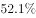和。出口61.7亿美元，同比下降；其中处于核心层的文化和娱乐服务、研发成果、使用费、视听及相关产品许可费等三项服务出口15.4亿美元，同比增长，占比增提升5.7个百分点至。

#### 第 1 题　qid 2676488 · 增长

若保持2017年同比增速不变，我国文化产业和服务进出口总额将在哪年突破1500亿美元？

- **A**. 2018年
- **B**. 2019年　✅
- **C**. 2020年
- **D**. 2021年

**答案**：B

**官方解析**

根据题干“若保持······同比增速不变，······将在······年突破·······”，可判定本题为现期追赶问题。定位文字材料第一段，2017年，我国文化产品和服务进出口总额1265.1亿美元，同比增长。代入公式，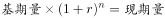，则，即，解得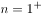，则文化产业和服务进出口总额将在2年后，即2019年突破1500亿美元。

故正确答案为B。

---

#### 第 2 题　qid 2676496 · 比重

2016年我国文化产品进出口总额中，我国与一带一路沿线国家进出口额占比为：

- **A**. 

　✅
- **B**. 

- **C**. 

- **D**. 

**答案**：A

**官方解析**

根据题干“2016年······中，占比为”，结合材料时间为2017年，可判定本题为基期比重问题。定位文字材料第二段，我国与“一带一路”沿线国家进出口额达到176.2亿美元，同比增长18.5%，占比提高1.2个百分点至18.1%。可以计算出2016年我国与一带一路沿线国家进出口额占比为18.1%-1.2%=16.9%。
故正确答案为A。
备注：文字材料第二段，“我国与‘一带一路’沿线国家进出口额达到176.2亿美元，同比增长18.5%，占比提高1.2个百分点至18.1%”，经查询后占比提高为1.3个百分点，但1.3没有答案，所以材料无需修改。

---

#### 第 3 题　qid 2676507 · 综合

2016年我国与金砖国家文化产品进出口额约占2017年的：

- **A**. 

- **B**. 

- **C**. 

- **D**. 

　✅

**答案**：D

**官方解析**

根据题干“2016年······约占2017年的”，可判定本题为比值计算问题。定位文字材料第二段，与金砖国家进出口额同比增长，根据公式，现期量可知，2017年进出口额2016年进出口额，则比值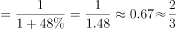。

故正确答案为D。

---

#### 第 4 题　qid 2676510 · 综合

2017年我国文化产品进出口总额比文化服务进出口总额多约：

- **A**. 2.3倍　✅
- **B**. 2.4倍
- **C**. 3.3倍
- **D**. 3.4倍

**答案**：A

**官方解析**

根据题干“文化产品进出口总额比文化服务进出口总额多约”，结合选项，可判定本题为现期倍数问题。定位文字材料第一段，文化产品进出口总额971.2亿美元，同比增长。文化服务进出口总额293.9亿美元，同比增长。故所求倍数为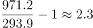倍。

故正确答案为A。

---

#### 第 5 题　qid 2676514 · 综合

根据所给资料，下列表述错误的是：

- **A**. 2017年我国文化产品出口国际市场呈多元格局
- **B**. 2017年我国文化产品出口结构更趋优化
- **C**. 2016年我国文化服务进出口出现顺差　✅
- **D**. 2017年我国文化服务进口增势明显

**答案**：C

**官方解析**

A项：定位文字材料第二段可知，美国、中国香港、荷兰、英国和日本为中国文化产品进出口前五大市场，我国与“一带一路”沿线国家进出口额达到176.2亿美元，同比增长；与金砖国家进出口额43亿美元，同比增长。由此可见我国文化产品出口国际市场呈现多元格局，正确；

B项：定位文字材料第二段可知，出口的技术含量有所提升，具有较高附加值的游艺器材和娱乐用品、广播电影电视设备出口同比增长，占比提升2个百分点至。由此可见，我国文化产品出口结构更趋优化，正确；

C项：贸易顺差，即出口额进口额，定位材料第三段，文化服务方面，进口232.2亿美元，同比增长，出口61.7亿美元，同比下降。根据公式基期量，则2016年进口额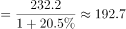亿元；2016年出口额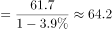亿元，则2016年文化服务出口额64.2亿元文化服务进口额192.7亿元，为贸易逆差，错误；

D项：定位文字材料第三段可知，文化服务方面，进口232.2亿美元，同比增长，可知进口增势明显，正确。

本题为选非题，故正确答案为C。

---

### 材料 2

        2017年6月，我国在线教育用户规模达14426万人，在线教育使用率（占网民比率）达。在线教育用户中，在线教育月花费500元以内、500—1000元、1001—1999元、2000元及以上的用户占比分别为、、和。

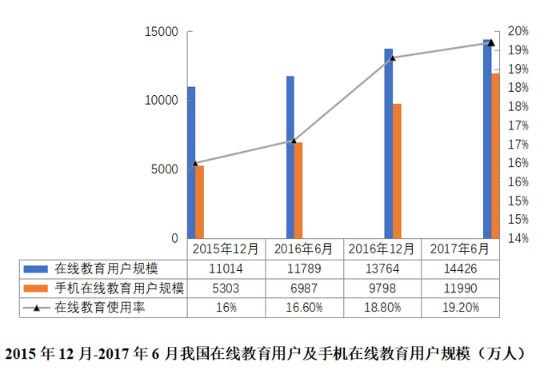

#### 第 6 题　qid 2676661 · 综合

2017年6月，我国网民人数约达到：

- **A**. 6.59亿人
- **B**. 6.93亿人
- **C**. 7.09亿人
- **D**. 7.51亿人　✅

**答案**：D

**官方解析**

根据题干“2017年6月，我国网民人数约达到”，结合材料给出在线教育用户数及占网民比例，可判定本题为现期比重问题。定位文字材料第一段，2017年6月，我国在线教育用户规模达14426万人，在线教育使用率（占网民比率）达。可知网民人数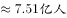，对应D项。

故正确答案为D。

---

#### 第 7 题　qid 2676663 · 综合

2017年中国在线教育用户中选择职业技能培训课和学历教育课程的人数之比约为：

- **A**. 5：3
- **B**. 3：2
- **C**. 3：1　✅
- **D**. 4：3

**答案**：C

**官方解析**

根据题干“2017年······之比约为”，可判定本题为比值计算问题。由统计表可知，2017年选择职业技能培训课的用户占中国在线教育用户，选择学历教育课程用户占中国在线教育用户。可得人数之比。

故正确答案为C。

---

#### 第 8 题　qid 2676664 · 增长

2013—2016年我国在线教育市场规模增速最快的是：

- **A**. 2016年　✅
- **B**. 2015年
- **C**. 2014年
- **D**. 2013年

**答案**：A

**官方解析**

根据题干“······增速最快的是”，可判定本题为一般增长率的比较问题。定位饼状图可知，2013—2016年各年数据，根据公式可得：

A项，2016年；

B项，2015年；

C项，2014年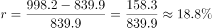；

D项，2013年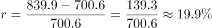。

所以2013—2016年我国在线教育市场规模增速最快的是2016年，对应A项。

故正确答案为A。

---

#### 第 9 题　qid 2676668 · 综合

截至2017年6月我国手机在线教育用户：

- **A**. 
人数同比实现了翻番

- **B**. 
近半年来月均增量约为420万人

- **C**. 
人数在同期我国在线教育用户总数中占比超过九成

- **D**. 
在线教育月花费超过千元的人数占总人数的
　✅

**答案**：D

**官方解析**

A项：定位图表1可知，2017年6月与2016年6月我国手机在线教育用户规模分别为11990万人、6987万人。翻番即2倍，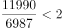，即人数同比未实现翻番，错误；

B项：定位图表1可知，2017年6月与2016年12月我国手机在线教育用户规模分别为11990万人、9798万人，则近半年来月均增量约为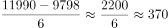万人，错误；

C项：定位图表1可知，2017年6月我国手机在线教育用户规模为11990万人，在线教育用户规模为14426万人，题干占比为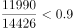，未超过九成，错误；

D项：定位文字材料第一段可知，在线教育月花费1001—1999元、2000元及以上的用户占比分别为和，则月花费超过千元的人数占总人数的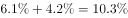，正确。

故正确答案为D。

备注：本题存在问题，在题干背景下D项中“在线教育月花费超过千元”应指我国手机在线教育用户中在线教育月花费超过千元的人数，其占总人数的比重应小于在线教育用户中在线教育月花费超过千元的人数占总人数的比重，即。此时没有答案，故粉笔考虑D项不受题干背景影响。

---

#### 第 10 题　qid 2676669 · 综合

下列选项中，不能根据所给资料推出的是：

- **A**. 2013—2017年我国在线教育行业市场规模的年均增速
- **B**. 2017年6月我国网民中选择语言培训在线教育的人数占比
- **C**. 2012年我国在线教育行业市场规模的环比增速　✅
- **D**. 2016年12月我国在线教育使用率同比增幅

**答案**：C

**官方解析**

A项：定位饼状图可知，2013—2017年我国在线教育行业的市场规模。根据年均增长率公式：年均增长率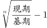，则2013—2017年我国在线教育行业市场规模的年均增速为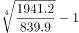，可推出；

B项：定位文字材料可知，“2017年6月，我国在线教育用户规模达14426万人，在线教育使用率（占网民比率）达。”；定位图表3可知，2017年6月中国在线教育用户参与语言培训的占比为。代入公式比重，则网民规模为万人，选择语言培训在线教育的规模为万人。题干所求占比为，可推出；

C项：定位饼状图可知，2012年我国在线教育行业的市场规模，无法得到2011年的市场规模，无法推出；

D项：定位图表1可知，2016年12月与2015年12月的在线教育使用率分别为、。现期量与基期量都已给出，则在线教育使用率同比增幅为可推出。

本题为选非题，故正确答案为C。

备注：本题存在问题，图表3为2017年中国在线教育用户参与课程情况，故B项中“中国在线教育用户参与语言培训的占比”为2017年数据，非2017年6月数据，无法推出。此时存在B、C两个正确选项，故粉笔考虑图表3的时间是2017年6月。

---
