# 2018年福建省选调生考试《行政职业能力测验》

> 选调生 · 2018 年 · 6 个模块 · 共 110 题

- [政治理论](#%E6%94%BF%E6%B2%BB%E7%90%86%E8%AE%BA) · 2 题
- [常识判断](#%E5%B8%B8%E8%AF%86%E5%88%A4%E6%96%AD) · 28 题
- [言语理解与表达](#%E8%A8%80%E8%AF%AD%E7%90%86%E8%A7%A3%E4%B8%8E%E8%A1%A8%E8%BE%BE) · 20 题
- [数量关系](#%E6%95%B0%E9%87%8F%E5%85%B3%E7%B3%BB) · 10 题
- [判断推理](#%E5%88%A4%E6%96%AD%E6%8E%A8%E7%90%86) · 30 题
- [资料分析](#%E8%B5%84%E6%96%99%E5%88%86%E6%9E%90) · 20 题

---

## 政治理论

### 第 1 题　qid 4715459 · 时事政治

2017年9月4日，金砖国家领导人第九次会晤在厦门国际会议中心举行。习近平发表重要讲话，积极评价金砖合作走过的10年光辉历程，强调要开启金砖合作第二个“金色十年”，使金砖合作造福五国人民，惠及各国人民。目前，金砖合作机制进入“三轮驱动”的新阶段。即除了加强传统的经济、政治安全合作的同时，将        合作纳入金砖合作的体系中，成为金砖合作的第三支柱。

- **A**. 生态
- **B**. 人文　✅
- **C**. 教育
- **D**. 医疗

**答案**：B

**官方解析**

本题考查政治常识。
B项正确，A、C、D三项错误，习近平总书记在会上指出，金砖合作之所以得到快速发展，关键在于互尊互助，携手走适合本国国情的发展道路；秉持开放包容、合作共赢的精神，持之以恒推进经济、政治、人文合作；倡导国际公平正义，同其他新兴市场国家和发展中国家和衷共济，共同营造良好外部环境。
故正确答案为B。

---

### 第 2 题　qid 4715473 · 新思想

2018年1月5日，在学习贯彻党的十九大精神研讨班开班式上，习近平总书记发表重要讲话。在讲话中，他引用了典故“备豫不虞，为国常道”，下列哪句话和这句话表达了同样的道理。（ ）

- **A**. 行百里者半九十
- **B**. 新故相推，日生不滞
- **C**. 泾溪石险人兢慎，终岁不闻倾覆人　✅
- **D**. 褚小者不可以怀大，绠短者不可以汲深

**答案**：C

**官方解析**

本题考查政治常识。
“备豫不虞，为国常道”意思是事先防备意外之事，是治理国家的常道。体现了矛盾双方在一定条件下可以相互转化，要求我们树立忧患意识。
A项错误，“行百里者半九十”意思是百里路程走九十里只能算一半，比喻做事越接近成功越困难，因此越要坚持到最后去争取胜利。激励人们做事时要一鼓作气，以免功败垂成。体现了量变达到一定程度才会引起质变，与题干不一致。
B项错误，“新故相推，日生不滞”意思是新旧事物交替变更，不会随着时间的变化而停滞不前。体现了时间的一维性，与题干不一致。
C项正确，该句完整为“泾溪石险人兢慎，终岁不闻倾覆人。却是平流无石处，时时闻说有沉沦”，意思是泾溪里面礁石很险浪很急，人们路过的时候都非常小心，所以终年都不会听到有人不小心掉到里面淹死的消息；恰恰是在水流缓慢没有礁石的地方，却常常听到有人被淹死的消息。体现了矛盾双方在一定条件下可以相互转化，即矛盾的同一性原理，与题干一致。
D项错误，“褚小者不可以怀大，绠短者不可以汲深”意思是口袋小了装不下大的东西，井绳短了打不到深处的水，告诫人们做事要依据自己的实际情况，量力而为。体现了矛盾的特殊性，与题干不一致。
故正确答案为C。

---

## 常识判断

### 第 1 题　qid 4715471 · 人文常识

与邓小平理论、“三个代表”重要思想、科学发展观是一脉相承的理论是（    ）。

- **A**. 习近平新时代中国特色社会主义思想　✅
- **B**. 马克思列宁主义
- **C**. 毛泽东思想
- **D**. 以爱国主义为核心的民族精神和以改革开放为核心的时代精神

**答案**：A

**官方解析**

本题考查政治常识。
A项正确，B、C、D三项错误，习近平新时代中国特色社会主义思想作为马克思主义中国化最新成果，与马克思列宁主义、毛泽东思想、邓小平理论、“三个代表”重要思想、科学发展观是既一脉相承又与时俱进的辩证统一关系。
故正确答案为A。

---

### 第 2 题　qid 4722045 · 人文常识

人类命运共同体理念继承和发展了马克思、恩格斯的共同体思想。马克思、恩格斯曾把无产阶级为之奋斗的共产主义社会确立为：（    ）

- **A**. 无产者联合体
- **B**. 自由人联合体　✅
- **C**. 无产阶级共同体
- **D**. 世界公民联合体

**答案**：B

**官方解析**

本题考查政治常识。
人类命运共同体理念是在继承马克思主义与中华传统文化思想精髓的基础上所形成的理论创新成果。马克思、恩格斯明确提出并系统阐释了共同体思想。他们把作为无产阶级奋斗目标的共产主义社会确立为“自由人联合体”。在这种共同体中，个人是“世界历史性的、经验上普遍的个人”，是自由而全面发展并因此具有丰富个性的“自由人”。马克思、恩格斯的共同体思想，为人类命运共同体理念奠定了坚实的理论基础。
故正确答案为B。

---

### 第 3 题　qid 4715458 · 人文常识

今年是实施“十三五”规划的重要一年，也是推进供给侧结构性改革的深化之年，要全面深化改革，就要抓住牵一发动全身的改革突破口，这样才能事半功倍，启示是（    ）。

- **A**. 在认识具体的矛盾时要善于把握主流
- **B**. 实践是判断认识是否正确的唯一标准
- **C**. 在认识复杂事物时要善于抓住主要矛盾　✅
- **D**. 局部的发展可以决定整体的发展变化

**答案**：C

**官方解析**

本题考查政治常识。
A项错误，在每一对矛盾中，有一方处于支配地位，起着主导作用，这是矛盾的主要方面，处于被支配一方的则是矛盾的次要方面。事物的性质主要是由主要矛盾的主要方面所决定的。矛盾的主次方面要求我们看问题要分清主流和支流。选项说的是认识具体矛盾时的情况，但题干的描述并不属于抓具体矛盾。
B项错误，实践是检验认识是否具有真理性的唯一标准，选项本身说法正确，但与题干无关，题干并未体现实践与认识的辩证关系。
C项正确，事物是由多种矛盾构成的。主要矛盾是矛盾体系中处于支配地位、对事物发展起决定作用的矛盾。材料中“要全面深化改革，就要抓住牵一发动全身的改革突破口”体现了我们在全面深化改革的过程中要抓住主要矛盾，且要重视局部的作用，用局部的发展推动整体的发展。
D项错误，选项本身表述有误，局部的发展可以影响但无法决定整体的发展变化。只有在特殊情况下，当某一部分成为整体的主要环节时，对整体起决定作用。
故正确答案为C。

---

### 第 4 题　qid 2032192 · 人文常识

某村是贫困村，县扶贫工作队调研后认为该村有种植天麻的先天优势，遂决定将推动天麻种植作为扶贫工作的重要内容。县扶贫工作队采取的下列措施中不正确的是：

- **A**. 加强宣传引导，调动村民种植天麻的积极性
- **B**. 确定种植任务，规定每户村民的种植面积　✅
- **C**. 统筹扶贫资金，做好良种引进和技术服务
- **D**. 吸引社会资本，推进天麻产品的深度加工

**答案**：B

**官方解析**

本题考查管理常识。
B项错误：县扶贫工作队定点做好扶贫工作，应当按照精准扶贫的工作要求，进一步加大资金投入、智力支持、技术服务以及信息与政策指导，着力增强贫困地区造血功能，使贫困群众更好实现自我发展、参与发展、共享发展。B项的措施是强制性规定任务，不能从根本上帮助贫困户通过自我发展来实现脱贫，与“增强贫困地区造血功能”的扶贫理念相悖。
A、C、D三项正确：这三项措施均能有效推动该村结合实际，因地制宜实现脱贫。A项“加强宣传引导”能帮助贫困村民认清本村的优势，理清发展思路；C、D两项通过借助技术服务和社会资本的投入，能帮助村民实现良性持续地发展，共享发展成果，实现集体脱贫。
本题为选非题，故正确答案为B。

---

### 第 5 题　qid 4715464 · 地理国情

关于福建省部分城市有通过国务院行政区划调整，撤县改区或撤市改区的是（    ）。

- **A**. 宁德霞浦县
- **B**. 龙岩长汀县
- **C**. 南平建阳县　✅
- **D**. 漳州长泰县

**答案**：C

**官方解析**

本题考查政治常识。
C项正确，A、B、D三项错误，2014年5月27日，国务院批复同意南平市行政区划调整方案，同意撤销建阳市，设立南平市建阳区，以原建阳市的行政区域为建阳区的行政区域。
故正确答案为C。
注：2020年，经报国务院同意，撤销长泰县，设立漳州市长泰区。因本题出自2018年，故选择C项。

---

### 第 6 题　qid 4715468 · 经济常识

（    ）自隋唐起就是东南沿海重要对外贸易中转地，是国家首批历史文化名城，是闽南文化发祥地。

- **A**. 福州
- **B**. 泉州　✅
- **C**. 厦门
- **D**. 漳州

**答案**：B

**官方解析**

本题考查人文常识。
B项正确，A、C、D三项错误。泉州历史悠久，经济开发早在周秦时期就已开始。西晋末年，中原战乱，中原士族大批入泉。南朝梁天监间（502-519年）置南安郡作郡治，为本地设置县、郡治之始。宋元时期，泉州一度成为世界第一大港。泉州是联合国唯一认定的海上丝绸之路起点，列入国家“一带一路”战略的21世纪海上丝绸之路先行区。泉州是首批国家历史文化名城、首届东亚文化之都、是世界遗产城市、全国文明城市。2013年11月21日，“闽南文化研究基地”在闽南文化重要发祥地福建泉州揭牌成立。
故正确答案为B。

---

### 第 7 题　qid 2039690 · 人文常识

下列成语与哲学原理对应错误的是：

- **A**. 望梅止渴——物质决定意识　✅
- **B**. 好事多磨——事物发展是前进性与曲折性的统一
- **C**. 乐极生悲——矛盾双方相互转化
- **D**. 朝令夕改——否认事物的相对静止

**答案**：A

**官方解析**

本题考查政治常识。
A项错误：“望梅止渴”原意是梅子酸，人想吃梅子就会流涎，从而止渴；后比喻愿望无法实现，用空想安慰自己。该成语体现的是意识对物质具有能动的反作用。
B项正确：“好事多磨”指事物最终的结果是好的，只是过程比较坎坷，体现了事物发展是前进性与曲折性相统一的哲学原理。
C项正确：“乐极生悲”指高兴过度会导致悲伤，体现了矛盾的双方在一定条件下相互转化。
D项正确：“朝令夕改”指早上下达的命令傍晚就更改，忽视了事物的相对稳定和相对静止。
本题为选非题，故正确答案为A。

---

### 第 8 题　qid 4715469 · 人文常识

以下哪一个选项不属于中国“大飞机家族三兄弟”：

- **A**. 运-20（新一代战略军用大型运输机）
- **B**. AG600（水陆两用飞机）
- **C**. C919（大型客机）
- **D**. CR929（远程宽体客机）　✅

**答案**：D

**官方解析**

本题考查科技常识。
运20、C919、AG600被称为中国“大飞机家族三兄弟”。
A项正确，运-20，代号鲲鹏，是中国研究制造的新一代军用大型运输机，于2013年1月26日首飞成功。该机作为大型多用途运输机，可在复杂气象条件下，执行各种物资和人员的长距离航空运输任务。
B项正确，AG600，全称大型灭火/水上救援水陆两栖飞机AG600，是中国为满足森林灭火和水上救援的迫切需要，首次研制的大型特种用途飞机，于2017年12月24日首飞成功。该飞机采用“水陆两栖、一机多型、系列发展”的设计思路，最大特点是既能在陆地上起降，又能在水面上起降，可在水源与火场之间多次往返投水灭火，除水面低空搜索外，还可在水面停泊实施救援行动，水上应急救援一次可救护50名遇险人员。
C项正确，C919飞机是我国首款完全按照国际先进适航标准研制的单通道大型干线客机，具有我国完全的自主知识产权。最大航程超过5500公里，性能与国际新一代的主流单通道客机相当，于2017年5月5日成功首飞。
D项错误，CR929是中国商用飞机有限责任公司和俄罗斯联合航空制造集团公司携手研制的远程宽体客机，CR为两国英文首字母，基本型航程为12000公里，标准三舱280座。2018年11月6日，在第十二届中国国际航空航天博览会上，CR929远程宽体客机样机亮相。
本题为选非题，故正确答案为D。

---

### 第 9 题　qid 4715491 · 科技常识

最新版本的微信登陆页面上的背景图是用什么拍摄的：

- **A**. 哈苏照相机
- **B**. 风云四号气象卫星　✅
- **C**. 哈勃望远镜
- **D**. 墨子号量子卫星

**答案**：B

**官方解析**

本题考查科技常识。
A项错误，哈苏照相机与沃尔沃汽车一起，被称为瑞典哥德堡市的骄傲。哈苏照相机是资深专业摄影师的宠儿，特别是在风光、静物、肖像、广告及特殊用途摄影中。
B项正确，风云四号卫星是由中国航天科技集团公司第八研究院（上海航天技术研究院）抓总研制的第二代地球静止轨道（GEO）定量遥感气象卫星。新版微信启动图是由新一代静止轨道气象卫星“风云四号”所拍摄，寓意着从“人类起源”到“华夏文明”的历史发展，旨在向微信用户展示我国大好河山风貌，同时也是为了庆祝我国“风云四号”所取得的科技成果。
C项错误，哈勃空间望远镜是以美国天文学家爱德温·哈勃为名，于1990年4月24日成功发射，位于地球的大气层之上的光学望远镜。2019年5月，哈勃太空望远镜科学家公布了最新的宇宙照片——“哈勃遗产场”（HLF），这是迄今最完整最全面的宇宙图谱。
D项错误，墨子号量子科学实验卫星在酒泉卫星发射中心用长征二号丁运载火箭于2016年8月16日发射升空，是由我国自主研制的世界上首颗空间量子科学实验卫星。
故正确答案为B。

---

### 第 10 题　qid 4715475 · 地理国情

在余光中的《乡愁》中，他没有把下列哪一项比喻成乡愁？

- **A**. 邮票
- **B**. 船票
- **C**. 海峡
- **D**. 港湾　✅

**答案**：D

**官方解析**

本题考查人文常识。
A、B、C三项正确，D项错误，《乡愁》是现代诗人余光中于1972年创作的一首现代诗歌。诗中通过“小时候”“长大后”“后来啊”“而现在”这几个时序语贯串全诗，借邮票、船票、坟墓、海峡这些实物，把抽象的乡愁具体化，概括了诗人漫长的生活历程和对祖国的绵绵怀念，流露出诗人深沉的爱国思乡情感。
本题为选非题，故正确答案为D。

---

### 第 11 题　qid 4715462 · 人文常识

某地为了缓解交通压力，开通潮汐车道，早上增设进城车道，晚上增设出城车道，请问这是以下哪一个交通标志：

- **A**. 

　✅
- **B**. 

- **C**. 

- **D**. 

**答案**：A

**官方解析**

本题考查科技常识。
A项正确，该项为潮汐车道标志。潮汐车道就是可变车道，城市内部根据早晚交通流量不同情况，对有条件的道路设置一个或多个车辆行驶方向规定随不同时段变化的车道。
B项错误，该项为双向交通标志。双向交通，是指双向行驶的道路上，采用天然的或人工的隔离措施，把上下行交通完全分离，由于某种原因（施工、桥、隧道）形成无隔离的双向车道时，须设置此标志。
C项错误，该项为环形交叉标志。环形交叉指的是道路交会处设有中心岛，所有横穿交通流都被交织运行所代替，形成一个单向行驶的环行交通系统，其中心岛称环岛。
D项错误，该项为两侧变窄标志。两侧变窄标志是一种交通警告标志，其含义是车行道两侧变窄主要指沿道路中心线对城缩窄的道路。此标志设在窄路以前适当位置。
故正确答案为A。

---

### 第 12 题　qid 2075868 · 地理国情

长江和黄河是中华民族著名的两大河流，孕育了灿烂的中华文明。下列关于长江与黄河的说法正确的是：

- **A**. 庾岭是长江流域与黄河流域的分水岭
- **B**. 黄河最终流入渤海，长江最终流入东海　✅
- **C**. 长江、黄河的干流都流经青海省和甘肃省
- **D**. 长江、黄河的干流上建成的最大水利枢纽分别是三峡工程和三门峡工程

**答案**：B

**官方解析**

本题考查地理国情。
A项错误，长江流域和黄河流域中下游以秦岭—淮河一线为界，上游分水岭是巴颜喀拉山，黄河的下游流经华北平原，长江的下游流经长江中下游平原；
B项正确，黄河发源于青藏高原的巴颜喀拉山脉，呈“几”字形，最后流入渤海。长江发源于青藏高原的唐古拉山脉，最后流入东海；
C项错误，长江干流流经青海、西藏、四川、云南、重庆、湖北、湖南、江西、安徽、江苏、上海11个省、自治区、直辖市。黄河干流流经青海、四川、甘肃、宁夏、内蒙古、陕西、山西、河南、山东9个省、自治区。甘肃省不属于长江干流流经的省份；
D项错误，小浪底水利枢纽是黄河流域最大的水利工程，三门峡水利枢纽是新中国第一个大型水利工程，也是新中国治理黄河的第一个大型工程。三峡工程是长江干流上的最大水利枢纽。
故正确答案为B。

---

### 第 13 题　qid 4715466 · 人文常识

2017年度国家最高科学技术奖获奖人为王泽山和（    ）。

- **A**. 师昌绪
- **B**. 赵忠贤
- **C**. 屠呦呦
- **D**. 侯云德　✅

**答案**：D

**官方解析**

本题考查政治常识。
D项正确，A、B、C三项错误，在2018年1月8日举行的2017年度国家科学技术奖励大会上，南京理工大学王泽山院士和中国疾病预防控制中心病毒病预防控制所侯云德院士摘得“国家最高科学技术奖”这一中国科技界的最高荣誉。
故正确答案为D。

---

### 第 14 题　qid 4715474 · 人文常识

下列哪一个成语不可以用来形容书法：

- **A**. 颜筋柳骨
- **B**. 丁真永草
- **C**. 郊寒岛瘦　✅
- **D**. 胡肥钟瘦

**答案**：C

**官方解析**

本题考查人文常识。
A项正确，颜筋柳骨指颜柳两家书法挺劲有力，但风格有所不同，也泛称书法极佳。颜指唐朝书法家颜真卿，因其书法筋肉丰满所以称为“颜筋”，柳指唐朝书法家柳公权，其书法刚劲有力，谓之“柳骨”。
B项正确，南朝梁丁觇善隶书，南朝陈智永善草书，时人称“丁真永草”，后用以称赞人书法的工妙。
C项错误，“郊寒岛瘦”由孟郊、贾岛简啬孤峭的诗风而来，后人用“寒”和“瘦”来形容两位诗人的诗风，孟郊、贾岛的诗风清奇悲凄、幽峭枯寂，讲究苦吟推敲，锤炼字句，往往让人觉得寒瘦窘迫。
D项正确，胡指三国时的胡昭，钟指三国时的钟繇。胡昭的字体肥，钟繇的字体瘦，形容书法各擅其美。
本题为选非题，故正确答案为C。

---

### 第 15 题　qid 4715477 · 科技常识

下面哪一个选项不会产生温室气体：

- **A**. 汽车尾气
- **B**. 农村沼气池
- **C**. 植物光合作用产生的气体　✅
- **D**. 空调制冷

**答案**：C

**官方解析**

本题考查科技常识。
温室效应，又称“花房效应”，是大气保温效应的俗称。大气能使太阳短波辐射到达地面，但地表受热后向外放出的大量长波热辐射线却被大气吸收，这样就使地表与低层大气温度增高，因其作用类似于栽培农作物的温室，故名温室效应。地球大气中起温室作用的气体称为温室气体，主要有二氧化碳、甲烷、臭氧、一氧化二氮、氟利昂以及水汽等。
A项正确，汽车尾气是汽车使用时产生的废气，含有上百种不同的化合物，其中的污染物有固体悬浮微粒、一氧化碳、二氧化碳、碳氢化合物、氮氧化合物、铅及硫氧化合物等。
B项正确，沼气是各种有机物质，在隔绝空气（还原条件），并在适宜的温度、PH值下，经过微生物的发酵作用产生的一种可燃烧气体，主要成分是甲烷。
C项错误，光合作用通常是指绿色植物（包括藻类）吸收光能，把二氧化碳和水合成富能有机物，同时释放氧气的过程。
D项正确，空调制冷原理是压缩机将气态的氟利昂压缩为高温高压的气态氟利昂，然后送到冷凝器（室外机）散热后成为常温高压的液态氟利昂，所以室外机吹出来的是热风。液态的氟利昂经毛细管，进入蒸发器（室内机），空间突然增大，压力减小，液态的氟利昂就会汽化，变成气态低温的氟利昂，从而吸收大量的热量，蒸发器就会变冷，室内机的风扇将室内的空气从蒸发器中吹过，所以室内机吹出来的就是冷风。
本题为选非题，故正确答案为C。

---

### 第 16 题　qid 4715470 · 科技常识

松土是农作物栽培的传统耕作措施，相关看法不合理的是：

- **A**. 可以增加土壤的透气性，促进植物对无机盐的吸收
- **B**. 能加快枯枝落叶、动物遗体和粪便等有机物的分解
- **C**. 容易造成水土流失，可能成为沙尘暴的一种诱发因素
- **D**. 降低土壤微生物的呼吸作用强度，减少二氧化碳排放　✅

**答案**：D

**官方解析**

本题考查科技常识。
A项正确，松土能够增加土壤的通气量，有利于植物的根系进行有氧呼吸，并能促进其吸收土壤中的无机盐。
B项正确，D项错误，松土能够增加土壤的通气量，促进土壤中微生物的有氧呼吸，使其呼吸作用加强，二氧化碳排放量增加，同时能加快微生物对枯枝落叶、动物遗体和粪便等有机物的分解。
C项正确，松土是我国农业生产中一项传统的耕作措施，但是松土容易造成水土流失，因而可能成为沙尘暴的一种诱发因素。
本题为选非题，故正确答案为D。

---

### 第 17 题　qid 2174799 · 人文常识

关于噪声下列说法正确的是（   ）。

- **A**. 噪声的振动杂乱无章　✅
- **B**. 工业机器的声音均属于噪声
- **C**. 大于80分贝的噪声会破坏听力
- **D**. 球场震天的呐喊助威声属于噪声

**答案**：A

**官方解析**

本题考查科技常识。
A项正确，从物理学角度看，噪声是指发声体做无规则振动时发出的声音；从环境保护的角度看，凡是妨碍到人们正常休息、学习和工作的声音，以及对人们要听的声音产生干扰的声音，都属于噪声。
B项错误，工业机器所发出的声音如果干扰了人们的正常工作、休息则属于噪声；如果在人们需要时，比如通过机器发声判断故障时，则工业机器的声音不属于噪声。
C项错误，噪声强弱有三条界线，大于50分贝时，会影响睡眠、休息；大于70分贝时，会影响学习和工作；大于90分贝时，会破坏听力。
D项错误，球场呐喊助威声虽然震天响，但不会妨碍比赛，也不会影响球员，相反还能激发球员斗志，因此不属于噪声。
故正确答案为A。

---

### 第 18 题　qid 4715486 · 人文常识

今年1月，王福满为了赶上期末考试，一大早在零下9摄氏度的低温环境中，走了4公里多山路到学校。走进教室，他被拍下一张头顶冰花、脸蛋通红、衣着单薄的照片，照片在网络上广泛流传并引发高度关注，他也因此被网友称为“冰花男孩”。请问冰花是怎么形成的？（    ）

- **A**. 升华
- **B**. 凝华　✅
- **C**. 凝结
- **D**. 汽化

**答案**：B

**官方解析**

本题考查科技常识。
A项错误，升华，是指物质从固态不经过液态直接变成气态的相变过程。冰花属于固体，其形成与升华无关。
B项正确，凝华，是指物质跳过液态直接从气态变为固态的现象。它是物质在温度和气压低于三相点的时候发生的一种物态变化。题中，早上的天气在零下9摄氏度，空气中的水蒸气遇冷凝华成小冰晶，即为冰花。
C项错误，凝结，是气体遇冷而变成液体，如水蒸气遇冷变成水。温度越低，凝结速度越快。冰花属于固体，其形成与凝结无关。
D项错误，汽化，是指物质从液态变为气态的过程。冰花属于固体，其形成与汽化无关。
故正确答案为B。

---

### 第 19 题　qid 4715513 · 人文常识

央视《国家宝藏》第一件藏品让我们看到了北宋的青山绿水，这一幅画作是（    ）。

- **A**. 千里江山图　✅
- **B**. 八骏图
- **C**. 清明上河图
- **D**. 富春山居图

**答案**：A

**官方解析**

本题考查人文常识。
A项正确，《千里江山图》是北宋王希孟创作的绢本设色画，该作品以长卷形式，立足传统，画面细致入微，烟波浩渺的江河、层峦起伏的群山构成了一幅美妙的江南山水图。《千里江山图》不但代表着青绿山水发展的里程，而且集北宋以来水墨山水之大成。
B项错误，《八骏图》是从六朝起就很流行的一幅画。画的是周穆王游昆仑山时为之驾车的八匹良马。
C项错误，《清明上河图》为北宋风俗画，是北宋画家张择端仅见的存世精品，生动记录了中国十二世纪北宋都城东京的城市面貌和当时社会各阶层人民的生活状况，是北宋时期都城东京当年繁荣的见证。
D项错误，《富春山居图》是元代画家黄公望于1350年创作的纸本水墨画，以浙江富春江为背景。
故正确答案为A。

---

### 第 20 题　qid 21927 · 人文常识

美国次贷危机中的“次”是指：

- **A**. 贷款人的第二次贷款
- **B**. 贷款人的收入较低，信用等级较低　✅
- **C**. 贷款机构的实力和规模较小
- **D**. 贷款机构的信用等级较低

**答案**：B

**官方解析**

次贷即“次级按揭贷款”，“次”的意思是与“高”“优”相对应的。美国抵押贷款市场的“次级”（Subprime）及“优惠级”（Prime）是以借款人的信用条件作为划分界限的。根据信用的高低，放贷机构对借款人区别对待，从而形成了两个层次的市场。信用低的人申请不到优惠贷款，只能在次级市场寻求贷款。
故正确答案为B。

---

### 第 21 题　qid 4715507 · 人文常识

关于纳米材料的说法，正确的是：

- **A**. 纳米材料中的“纳米”是一个表示长度的计量单位　✅
- **B**. 纳米材料的主要成分是从某种谷物中提取的
- **C**. 一纳米相当于一亿分之一米
- **D**. 在汽车表面进行纳米镀膜就可以防止不同程度的刮伤

**答案**：A

**官方解析**

本题考查科技常识。
A项正确，C项错误，纳米如同厘米、分米和米一样，是长度的度量单位，一纳米等于十亿分之一米。纳米材料是指在三维空间中至少有一维处于纳米尺寸(1-100nm)或由它们作为基本单元构成的材料，这大约相当于10-1000个原子紧密排列在一起的尺度。
B项错误，科学家们在研究物质构成的过程中，发现在纳米尺度下隔离出来的几个、几十个可数原子或分子，显著地表现出许多新的特性，而利用这些特性制造具有特定功能设备的技术，就称为纳米技术。纳米材料就是三维空间中有一个维度是纳米尺寸，而不是从成分角度考虑的。
D项错误，纳米镀膜是一种汽车镀膜美容，其漆面保护效果十分明显，可以避免车漆氧化，达到漆面增亮、抗酸碱、抗氧化、抗紫外线等多重功效。防止不同程度的刮伤表述过于绝对。
故正确答案为A。

---

### 第 22 题　qid 1503465 · 科技常识

关于计算机，下列说法不正确的是：

- **A**. 平板电脑属于小型计算机　✅
- **B**. 计算机断电后内存中的信息会丢失
- **C**. 计算机的性能并非完全依靠于CPU
- **D**. 机器语言可以被计算机硬件直接执行

**答案**：A

**官方解析**

平板电脑、个人PC等属于微型计算机的范畴，而小型计算机是相对于大型计算机而言的一种概念，仍比微型计算机的硬件规模、计算能力等高出很多。
本题为选非题，故正确答案为A。

---

### 第 23 题　qid 4715502 · 人文常识

关于24节气的谚语，下列说法有误的是：（    ）。

- **A**. 清明前后种瓜点豆
- **B**. 立秋节日雾，长河做大路
- **C**. 小寒寒，惊蛰暖
- **D**. 夏至大烂，好酒好饭　✅

**答案**：D

**官方解析**

本题考查人文常识。
A项正确，清明，是春季的第5个节气。清明前后种瓜点豆是一句农业谚语。清明节与农业生产有着密切的关系，清明一到，气温升高，雨量增多，正是春耕春种的大好时节。故有“清明前后种瓜点豆”的农谚。
B项正确，立秋，是二十四节气中第13个节气，秋季的第1个节气。“立秋节日雾，长河做大路”，这句话说的是立秋的时候如果有大雾，就很容易是大晴天，大河就会水干，跟路一样了，意思就是会干旱少雨。
C项正确，小寒，是二十四节气中的第23个节气，也是冬季的第5个节气。小寒寒，惊蛰暖，这句农谚的意思是说如果小寒天气寒冷的话，那来年到了惊蛰节气的时候，天气就会变暖和了，不会出现倒春寒的天气。
D项错误，夏至，是二十四节气的第10个节气。相关谚语应该为“夏至大烂，梅雨当饭”。夏至容易出现阴雨天气，小麦要是淋雨了很快就会发霉，严重影响收成。这句谚语的意思就是要告诫大家夏至到来时都是烂雨天气，梅雨十分频繁，农民朋友要早做准备，提前做好防范措施，才能有个好收成。
本题为选非题，故正确答案为D。

---

### 第 24 题　qid 2042030 · 人文常识

下列古文中能够体现领导者榜样效应的是：

- **A**. 止宿公署，夜则祷于天，昼则出赈饥民，终日无少怠
- **B**. 为政以德，譬如北辰，居其所而众星共之
- **C**. 其身正，不令而行；其身不正，虽令不从　✅
- **D**. 乐民之乐者，民亦乐其乐；忧民之忧者，民亦忧其忧

**答案**：C

**官方解析**

本题考查人文常识。
A 项：该句语出《元史· 列传六十二· 张养浩传》，意思是（张养浩）一直住在官府，晚上便向上天祈祷，白天就外出救济灾民，一天到晚没有丝毫的懈怠。体现领导者为国为民、鞠躬尽瘁的精神。不符合题意，排除。 
B 项：该句语出《论语 · 为政篇》，意思是（周君）以道德教化来治理政事，就会像北极星那样，自己居于一定的方位，而群星都会环绕在它的周围。体现儒家治国的基本原则是德治，而非严刑峻法。不符合题意，排除。 
C 项：该句语出《论语 · 子路篇》，意思是自身品行端正了，即使不发布命令，老百姓也会去实行；若自身品行不端正，即使发布命令，老百姓也不会服从。体现领导者以身作则，率先垂范，发挥模范带头的榜样作用。符合题意，当选。 
D 项：该句语出《孟子· 梁惠王下》，意思是执政者如果以顺应民众的快乐为快乐， 民众就会为执政者的快乐而快乐；执政者如果把民众的忧苦当作自己的忧苦，民众也会为执政者的忧苦而忧苦。体现执政者要与民众同甘苦共患难，才会受到民众的拥护和爱戴。不符合题意，排除。 
故正确答案为C。

---

### 第 25 题　qid 764211 · 人文常识

在发生泥石流时，下列做法正确的是：

- **A**. 发现泥石流后，要马上向与泥石流成垂直方向一边的山坡爬　✅
- **B**. 发生山体滑坡时，要马上沿着滑坡方向尽力奔跑
- **C**. 发生泥石流时，在沟底尽力爬到大树上进行躲避，等待救援
- **D**. 沿山谷徒步行走时，一旦遭遇大雨，发现山谷有异常的声音或听到警报时，应立即找寻较大的洞穴或巨石躲避，等大雨过后再走

**答案**：A

**官方解析**

本题考查科技常识。
遇到泥石流灾害，采取脱险逃生的办法有：沿山谷徒步行走时，一旦遭遇大雨，发现山谷有异常的声音或听到警报时，要立即向坚固的高地或泥石流的旁侧山坡跑去，不要在谷底停留。一定要设法从房屋里跑出来，到开阔地带，尽可能防止被埋压。发现泥石流后，要马上向与泥石流成垂直方向一边的山坡上面爬，爬得越高越好，跑得越快越好，绝对不能向泥石流的流动方向走。发生山体滑坡时，同样要向垂直于滑坡的方向逃生。要选择平整的高地作为营地，尽可能避开有滚石和大量堆积物的山坡下面，不要在山谷和河沟底部扎营。
故正确答案为A。

---

### 第 26 题　qid 4715519 · 人文常识

下列公文标题不正确的是：

- **A**. 《XX县人民政府第X次常务会议纪要》
- **B**. 《关于开展向XXX同志学习活动的决定》
- **C**. 《XX市人民政府关于请求解决重大项目建设用地的请示报告》　✅
- **D**. 《XX关于进一步做好XX工作的通知》

**答案**：C

**官方解析**

本题考查公文写作与处理。《党政机关公文处理工作条例》，以下简称《条例》。
A项正确，《条例》中规定：纪要。适用于记载会议主要情况和议定事项。县人民政府召开的常务会议可以使用纪要。
B项正确，《条例》中规定：决定。适用于对重要事项作出决策和部署、奖惩有关单位和人员、变更或者撤销下级机关不适当的决定事项。在机关内开展学习活动，一般学习的都是比较重大的奖励或事件，可以使用决定。
C项错误，《条例》中规定：请示。适用于向上级机关请求指示、批准。报告。适用于向上级机关汇报工作、反映情况，回复上级机关的询问。请示具有期复性，需要得到上级机关的及时回复；而报告具有单向性，上级机关无需对下级机关的报告进行回复。请示、报告文种不能混用，也不能杂糅使用。
D项正确，《条例》中规定：通知。适用于发布、传达要求下级机关执行和有关单位周知或者执行的事项，批转、转发公文。做好XX工作是给下级机关布置某项工作，可以使用通知。
本题为选非题，故正确答案为C。

---

### 第 27 题　qid 4715517 · 人文常识

房子是用来住的，不是用来炒的。“住有所居”是人民的期待，也是维护社会和谐安定的重要保障。下列无助于实现住房市场健康发展的是（    ）。

- **A**. 确保住房的制度框架全国统一，具体政策保持差异性
- **B**. 以市场为主满足多层次需求，以政府为主提供保障性住房
- **C**. 建立租售并举的住房制度，提高政府调控的精准性
- **D**. 加快房地产市场长效机制建设，确保房价稳步下降　✅

**答案**：D

**官方解析**

本题考查经济常识。
A项正确，住房具有十分显著的当地化属性，中国幅员辽阔、人口众多，不同的区域在人口规模、收入水平、资源环境、发展趋势等方面千差万别。因此在住房制度框架和基本政策实行全国统一的基础上，住房具体制度、政策和标准，应因地制宜地保持差异性。
B项正确，中共中央政治局于2013年10月29日下午就加快推进住房保障体系和供应体系建设进行第十次集体学习。习近平在会上强调，从我国国情看，总的方向是构建以政府为主提供基本保障、以市场为主满足多层次需求的住房供应体系。
C项正确，党的十九大开幕式，习近平总书记在大会报告中针对房地产市场做出最新指示：“加快建立多主体供给、多渠道保障、租购并举的住房制度，让全体人民住有所居。”
D项错误，建设房地产市场长效机制是正确的，但房价一直下降并不代表着住房市场健康发展，房价应该根据市场发展在合理的价格范围内变动。
本题为选非题，故正确答案为D。

---

### 第 28 题　qid 4715512 · 人文常识

近年来，分期购物平台和助学、创业P2P贷款平台等“校园贷”颇受大学生欢迎，但也出现了大学生无力偿还而离校出走甚至自杀的悲剧。下列处理“校园贷”的方法中不可行的是：

- **A**. 建立学校担保制度，监督大学生贷款行为　✅
- **B**. 培养科学消费观，营造理性消费的社会氛围
- **C**. 自觉抵制攀比消费、盲目消费的不良风气
- **D**. 大学生创业应量力而行，合理规避风险

**答案**：A

**官方解析**

本题考查法律常识。
A项错误，根据《中华人民共和国民法典》第六百八十三条规定：“机关法人不得为保证人，但是经国务院批准为使用外国政府或者国际经济组织贷款进行转贷的除外。以公益为目的的非营利法人、非法人组织不得为保证人。”学校作为以公益为目的的事业单位，不得作为保证人。
B、C、D三项正确，均为从大学生层面积极引导、处理“校园贷”的正确方法。
本题为选非题，故正确答案为A。

---

## 言语理解与表达

### 第 1 题　qid 4714269 · 片段阅读

下列句中划线的成语，使用不恰当的一项是：

- **A**. 
每当夜幕降临，饭店里<u>灯红酒绿</u>，热闹非常。

- **B**. 
高考落榜，有的人听到这个消息后会<u>嚎啕大哭</u>，但有的人会暗下工夫，振奋精神，变压力为动力，明年再考。

- **C**. 
爷爷虽然年纪大了，可听到音乐也还是会<u>情不自禁</u>地跟着打节拍。

- **D**. 
冬天老年人要增加营养，也要适当运动，在户外锻炼时一定要<u>量入为出</u>，以步行为宜，时间最好选在傍晚，还要注意保暖，防止着凉。
　✅

**答案**：D

**官方解析**

A项，“灯红酒绿”形容奢侈糜烂的生活，也形容都市或娱乐场所夜晚的繁华热闹的景象，可用来形容饭店环境，故“灯红酒绿”符合语义，用在此处恰当，排除；
B项，“嚎啕大哭”形容放声大哭，可用来形容高考落榜后，人们大哭的状态，故“嚎啕大哭”符合语义，用在此处恰当，排除；
C项，“情不自禁”指感情激动，控制不住自己，符合听到音乐后不受控制地跟着打节拍的语境，故“情不自禁”符合语义，用在此处恰当，排除；
D项，“量入为出”指根据收入的多少来决定开支的限度，体现不出户外运动要适度之意，故“量入为出”与语境不符，用在此处不恰当，当选。
本题为选非题，故正确答案为D。

---

### 第 2 题　qid 4714258 · 语句表达

下列没有错别字的一项是：

- **A**. 粗犷 磨厉
- **B**. 震憾 蓦然
- **C**. 踌躇 驰骋　✅
- **D**. 苍桑 湮没

**答案**：C

**官方解析**

A项，“磨厉”错误，正确书写方式应为“磨砺”，排除；
B项，“震憾”错误，正确书写方式应为“震撼”，排除；
C项，“踌躇”“驰骋”书写均正确，没有错别字，当选；
D项，“苍桑”错误，正确书写方式应为“沧桑”，排除。
故正确答案为C。

---

### 第 3 题　qid 4714302 · 逻辑填空

全民关注、参与高考作文的盛况，说到底还是件好事情。一个社会当然应该崇尚文化、具有情怀，不要斯文扫地、粗鄙低俗。然而        的是，这种热情每年都不过高考前后的三五天，犹如            。在剩下的时间里，文化和情怀很难成为社会话题的中心。人们津津乐道的，更多还是金钱财富和八卦娱乐。
填入划横线最恰当的一项：

- **A**. 尴尬 空中楼阁
- **B**. 遗憾 昙花一现　✅
- **C**. 可惜 望梅止渴
- **D**. 可悲 海市蜃楼

**答案**：B

**官方解析**

本题可从第二空入手，根据“这种热情每年都不过高考前后的三五天”可知，横线处成语应体现持续时间比较短的意思，B项“昙花一现”指美好的事物出现的时间很短，符合文意，保留；A项“空中楼阁”多用来比喻虚幻的事物或脱离实际的理论、计划等，C项“望梅止渴”比喻用空想或假象来安慰自己，D项“海市蜃楼”比喻虚幻的事物，文段并未体现“热情”是虚幻的、空想的，均不符合文意，排除。
第一空，代入验证，B项“遗憾”指不满意、悔恨、不甘心的事情，可与“然而”之前的“全民关注、参与高考作文的盛况”构成转折关系，符合文意，当选。
故正确答案为B。
【文段出处】《“作文盛事”不该昙花一现》

---

### 第 4 题　qid 4714264 · 逻辑填空

随着中职教育免学费政策的深入推进，免学费政策在全国范围内已基本        ，其效果初步显现。但是在调研中发现，“一刀切”的中职免费政策也带来了一些问题，政府拨付的免学费补助主要用于保障学校的日常运转，包括水电气、维修、劳务、差旅等，很难再有经费用于学校专业建设和改善办学条件，很多发展中职内涵、提升软实力的政策措施变成“            ”。
填入划横线最恰当的一项：

- **A**. 涵盖 一纸空文
- **B**. 涉及 名存实亡
- **C**. 覆盖 无米之炊　✅
- **D**. 包涵 形同虚设

**答案**：C

**官方解析**

本题可从第二空入手。根据“很难再有经费用于学校专业建设和改善办学条件”可知，横线处表示政策措施缺乏经费支撑，无法实现，且根据双引号可知，所填词语具有形象表达的含义。C项“无米之炊”比喻缺少必要条件无法办成的事，“无米”对应文段“缺少资金”，“炊”对应文段“中职内涵、提升软实力的政策措施”，生动形象地体现了政策措施缺乏经费支撑，无法实现之意，保留。A项“一纸空文”指写在纸上无法兑现的东西，侧重于表示不能实现的规定，文段并非仅强调政策措施无法实现，而是强调其因缺少资金无法落实，与文意不符且无法体现出形象表达，排除；B项“名存实亡”指名义上还有，实际上已经不存在，文段并未强调政策措施已不存在，只是强调政策措施难以落实，与文意不符且无法体现出形象表达，排除；D项“形同虚设”指形式上虽有，但却起不了作用，侧重强调存在却无法发挥作用，而文段侧重强调其无法落实，与文意不符且无法体现出形象表达，排除。
第一空，代入验证，C项“覆盖”本义指遮盖，比喻有所涉及，有所影响，对应“随着中职教育免学费政策的深入推进”，可体现政策在全国范围内普及之意，当选。
故正确答案为C。
【文段出处】《中职免学费“一刀切”结果事与愿违》

---

### 第 5 题　qid 4714268 · 逻辑填空

一直以来，杂技的表演设计要充分彰显夸大难度动作，这在过去是太正常不过了。然而，当前杂技的设计和表现已经发生悄然变化。董争臻在第十届国际马戏论坛上作主旨发言时说，“看了今年吴桥杂技节的参赛节目，我似乎更在意四个身着蓝色西装小伙子演绎的《四人技巧》，编排上是近来兴起于欧洲的轻松、幽默的男子风，表现出            的魅力。”
填入划横线最恰当的一项：

- **A**. 举重若轻　✅
- **B**. 无与伦比
- **C**. 游刃有余
- **D**. 别具一格

**答案**：A

**官方解析**

横线处修饰《四人技巧》这一节目的魅力，由前文可知，以往杂技的表演设计彰显夸大难度动作，而当前杂技的设计和表现发生变化，《四人技巧》不再追求夸大难度动作，而是体现轻松、幽默的男子风，横线处需对应“轻松、幽默”这一特点，体现其中魅力，A项“举重若轻”指举起重的东西好像很轻的样子，比喻处理艰难问题或进行繁重的工作时都显得很轻松，能够体现以“轻松、幽默”的方式去表演难度大的杂技，符合文意，当选。B项“无与伦比”指没有能够比得上的，文段并未涉及比较，排除；C项“游刃有余”比喻工作熟练，实际经验很丰富，解决困难问题毫不费事，与“魅力”搭配不当，排除；D项“别具一格”指另有一种独特风格，文段并未体现《四人技巧》与其他表演均不相同，排除。
故正确答案为A。
【文段出处】《世界杂技新趋势：不再夸张“炫技”，走向“举重若轻”化表达》

---

### 第 6 题　qid 4714276 · 逻辑填空

随着国家对新型农业经营主体和新型职业农民的大力培育，现代化        经营取代“散户”经营已经是大势所趋。而随着信息技术的进步，近年来互联网对农业领域的渗透已扩大到土地领域，为土地的合理规划利用提供科学分析和依据，为“农地流转+轮作休耕”打下基石，避免“            ”。
填入划横线最恰当的一项：

- **A**. 科学 杀鸡取卵
- **B**. 规模 竭泽而渔　✅
- **C**. 专业 缘木求鱼
- **D**. 产业 饮鸩止渴

**答案**：B

**官方解析**

第一空，根据“取代”可知，横线处应与“散户”的特点相反，即体现聚集、集中化。B项“规模”指范围、大小达到了一定的标准，D项“产业”指系列化和品牌化的经营方式和组织形式，均符合文意，保留。A项“科学”指符合客观规律，C项“专业”指符合专业标准的，“散户”不一定是不科学、不专业的，均与文意不符，排除。
第二空，根据前文“为‘农地流转+轮作休耕’打下基石”可知，互联网为农业的发展打好基础，横线处应表示没有根基、发展不持续的意思。B项“竭泽而渔”比喻取之不留余地，只图眼前利益，不作长远打算，符合文意，当选。D项“饮鸩止渴”比喻只求解救眼前困难，而不顾将来的大祸患，侧重只顾眼前、不顾严重的后果，文段没有体现会产生严重的后果，与文意不符，排除。
故正确答案为B。
【文段出处】《农地流转不应"竭泽而渔"，轮作休耕更增效益》

---

### 第 7 题　qid 4714277 · 逻辑填空

广德生态环境优越，为传统农业生产提供了得天独厚的条件。但如果让你在稻田中旅游，你一定感觉枯燥无味。那么，有没有什么办法让稻田游变得            ？首届中国花鼓稻田文化艺术节给我们展示了这样的景象：广袤的稻田里，以稻草为原料创作的艺术形象遍布田野，有童话故事、农耕文化、时空科幻、太极迷宫、动物世界、军事兵器等各大主题艺术景观，造型            ，让人叹为观止。
填入划横线最恰当的一项：

- **A**. 引人入胜 美轮美奂
- **B**. 丰富多彩 栩栩如生
- **C**. 标新立异 异彩纷呈
- **D**. 妙趣横生 惟妙惟肖　✅

**答案**：D

**官方解析**

第一空，根据文意可知，横线处与前文“枯燥无味”语义相反，意为有趣，A项“引人入胜”指吸引人进入美妙的境地，形容优美的风景或文艺作品十分吸引人，D项“妙趣横生”形容洋溢着美妙的意趣，均符合文意，保留；B项“丰富多彩”形容花样很多，内容丰富，C项“标新立异”指提出新的主张、见解或创造出新奇的样式，均无法与“枯燥无味”形成反义，排除。
第二空，搭配“造型”，D项“惟妙惟肖”意为模仿或描写得非常美妙，非常逼真，可体现出稻草的艺术形象非常精致，且搭配得当，当选；A项“美轮美奂”形容建筑物宏伟壮丽、富丽堂皇，与“造型”搭配不当，排除。
故正确答案为D。
【文段出处】《长三角主流媒体走进安徽广德》

---

### 第 8 题　qid 4714299 · 逻辑填空

暑假过半，在夏令营市场上，短期海外游学夏令营十分火热。十余天的游学，价格动辄数万，由于是学校组织，一些经济条件好的家长自然            ，也有不少家境一般的家长，为了孩子融入集体，也咬着牙勉为其难。根据《2016年国际游学发展报告》显示，中国国际游学每年以20%以上的速度增长，国际游学逐渐成为家长对孩子的刚性教育投资。
填入划横线最恰当的一项：

- **A**. 前仆后继
- **B**. 纷至沓来
- **C**. 趋之若鹜　✅
- **D**. 络绎不绝

**答案**：C

**官方解析**

根据“十余天的游学，价格动辄数万，由于是学校组织，一些经济条件好的家长自然”“咬着牙勉为其难”可知，横线处成语应体现这些家长为孩子报名参加“高价游学”一事并非一件积极的事情，横线处感情色彩偏消极。C项“趋之若鹜”比喻许多人争着去追逐某些不好的事物，感情色彩偏消极，与文段感情色彩相符，当选。A项“前仆后继”指前面的倒下了，后面的紧跟上去，形容英勇奋斗，不怕牺牲，B项“纷至沓来”指连续不间断地到来，D项“络绎不绝”形容行人车马来来往往，接连不断，感情色彩均与文段不符，排除。
故正确答案为C。
【文段出处】《家长为何对天价海外游学夏令营趋之若鹜？》

---

### 第 9 题　qid 4714266 · 逻辑填空

中国消费者在社交媒体和电商领域已变得何其精明老练——而西方尚未普遍意识到这点。这也是        在中国“硅谷龙”——总部位于珠三角的众多大型科技公司——成功背后的推动力之一。这些巨头正在创造堪与谷歌和脸谱        的收入增长。
填入划横线最恰当的一项：

- **A**. 躲藏 比肩
- **B**. 隐藏 媲美　✅
- **C**. 潜藏 匹敌
- **D**. 暗藏 较量

**答案**：B

**官方解析**

本题可从第二空入手，横线处搭配“堪与”，且根据“成功背后的推动力”和“巨头正在创造······收入增长”等表述可知，横线处需填入积极色彩的词汇，B项“媲美”指美好的程度可以相比，为褒义词，符合文意，保留。A项“比肩”比喻地位相等，C项“匹敌”意为双方地位平等、力量相当，D项“较量”指通过比赛或打仗等方式分出双方高低上下，均为中性词，排除。
第一空，代入验证，横线处搭配“在成功背后”，B项“隐藏在成功背后”为常见搭配，当选。
故正确答案为B。
【文段出处】《澳媒：令我们望尘莫及的中国科技》

---

### 第 10 题　qid 4714270 · 逻辑填空

浦口左所老街上的大众照相馆已经有30来年的历史，老板王根林，算是见证了整个行业的        。随着数码相机的普及，以及网络冲印业务的扩张，传统的照相馆的日子越来越艰难。而与之相反的是，各种影楼和摄影工作室在数码时代            。巨大的反差，让人不得不反思，传统的照相馆，是不是已经失去了存在的意义呢？
填入划横线最恰当的一项：

- **A**. 发展 风生水起
- **B**. 兴衰 如鱼得水　✅
- **C**. 繁荣 游刃有余
- **D**. 起落 声名鹊起

**答案**：B

**官方解析**

第一空，根据“大众照相馆已经有30来年的历史”以及“传统的照相馆的日子越来越艰难”可知，老板王根林见证了传统照相馆行业从繁荣到衰落的过程。B项“兴衰”指兴盛和衰落，D项“起落”指升起和降落，均符合文意，保留。A项“发展”指事物由小到大、由简单到复杂、由低级到高级的变化，C项“繁荣”通常指经济或事业蓬勃发展，两项通常用来形容行业由弱到强，而传统照相馆已走向衰落，与文意不符，均排除。
第二空，根据“与之相反的是”以及“巨大的反差”可知，不同于传统照相馆，影楼和摄影工作室在数码时代发展较好。B项“如鱼得水”比喻得到跟自己很投合的人或对自己很合适的环境，符合文意，当选。D项“声名鹊起”形容知名度迅速提高，文段未涉及“知名度”这一话题，与文意不符，排除。
故正确选项为B。
【文段出处】《数码时代，传统照相馆该何去何从》

---

### 第 11 题　qid 4714298 · 逻辑填空

农贸市场建设是百姓的民生工程，农贸市场关系百姓的日常“菜篮子”。在五指山市装修一新的4200余平方米的河北农贸市场无商户问津，而“马路市场”却            。记者走访调查，为全面推进“双创”建设，五指山市多部门将联合推动农贸市场升级改造，彻底取缔“马路市场”。然而，就是这样的农贸市场却没有商户入驻，令人        。
填入划横线最恰当的一项：

- **A**. 门可罗雀 尴尬
- **B**. 车马盈门 惊讶
- **C**. 门庭若市 费解　✅
- **D**. 形影相吊 无奈

**答案**：C

**官方解析**

第一空，“却”表示转折，根据前文“无商户问津”可知，转折前表示农贸市场没有商户问询，故所填成语应体现出马路市场人多热闹之意。C项“门庭若市”形容来的人很多，非常热闹，符合文意，保留。A项“门可罗雀”形容门庭冷落，宾客稀少，与文意相反，排除；B项“车马盈门”比喻来的宾客很多，文段讨论的是市场人多热闹，而非上门做客的宾客数量多，与文意不符，排除；D项“形影相吊”形容无依无靠，非常孤单，不符合文意，排除。
第二空，代入验证。C项“费解”指不易理解，根据前文“多部门将联合推动农贸市场升级改造”，而“这样的农贸市场却没有商户入驻”可知，这件事让人不易理解，符合文意，当选。
故正确答案为C。
【文段出处】《马路市场闹哄哄 农贸市场冷清清》

---

### 第 12 题　qid 4714292 · 片段阅读

西医药学，它是由于传入我国以后，相对于原来的中医药学而言的。西药，就是相对于我国的传统药物——中药而言的。这种按起源或地域来源划分中药和西药，在西药传入我国的初期，是可以理解的，在现代，随着我国药物科学研究和制药工业的发展，我国不仅能制造和生产外国人最先制造和生产的药物，同时也研制和生产了很多为我国首创的药物，这些药物再按地域来源划分，称之为西药，显然是不合适了。中药和西药的概念，就目前实际情况来看，应当结合不同的医药学体系来划分：以中医药理论体系的术语表示药物的性能和功效，从而能按中医药理论体系来使用的药物，称作中药；以现代科学术语来表示药物的性能和功效，从而能按西医药理论体系来使用的药物，称作西药。
这段文字主要说明了：

- **A**. 西医和中医的由来
- **B**. 中医药已不能适应现代药学的发展
- **C**. 中药和西药概念的差异
- **D**. 应按不同医药学体系区分中西药的概念　✅

**答案**：D

**官方解析**

文段开篇通过下定义引出“西医药学”和“西药”的话题，并介绍西药传入我国的初期，我们按起源或地域来源划分中药和西药，紧接着提出问题，现在按地域来源划分西药和中药已经不合适，随后通过“应当”提出对策，需要结合不同的医药学体系来划分中药和西药的概念，后文围绕这一对策进行解释说明。故文段重点强调对策部分内容，即应当结合不同的医药学体系来划分中药和西药的概念，对应D项。
A项，文段并未提及“西医和中医的由来”，无中生有，排除；
B项，文段强调对策，而“不能适应······发展”为问题表述，非文段重点，且缺少另一核心话题“西药”，排除；
C项，文段强调中西药学体系的划分标准，而非概念的差异，偏离文段核心话题，排除。
故正确答案为D。
【文段出处】《试论西药中药化》

---

### 第 13 题　qid 4714319 · 片段阅读

近年来，关爱留守者和关爱外来人员，在输入与输出两个层面都得到了倡导。不过，政策愿景与现实之间却存在着极大的落差，看似多元而系统的关爱工程，其实未能发挥应有的功能性作用。让他们感受到一座城市的温暖，是对公共责任最直接的要求，也是对执行力最现实的考验。给予出租屋里的“候鸟”们以温暖，离不开输入地所在地方的重视与努力。其实要做到这点并不难，比如以社区或者学校为单位，开展一点联谊性活动；或者与城市的孩子结成对子，进行互相体验与帮助；或者发动孩子家长所供职的单位或者企业，自发性开展一些活动，要么给父母适当放一点假，给一点经济上的补偿，让他们有时间和精力多陪陪孩子，带他们去看一看风景，既满足了形式又升华了内涵，可谓一举两得。
这段文字意在强调：

- **A**. 呼吁社会共同关爱留守者和外来人员
- **B**. 关爱城市“候鸟”，输入地需要作出的努力　✅
- **C**. 对留守者的人文关怀考验政府的执行力
- **D**. 给予城市“候鸟”温暖需要多元而系统的关爱工程

**答案**：B

**官方解析**

文段开篇介绍关爱留守者和关爱外来人员这两方面都得到了倡导这一背景，随后通过转折词“不过”指出关爱工程在现实中没有发挥出作用的问题。紧接着通过“离不开”提出对策，表示对“候鸟”们予以温暖，需要输入地所在地方的重视和努力。最后通过“比如”从多方面进行举例说明。所以文段中间的对策为重点，意在强调对“候鸟”们予以关爱需要输入地作出努力，对应B项。
A项，缺少核心话题“输入地”，偏离文段中心，排除；
C项，“留守者”非重点，文段中心句表示对“候鸟”予以温暖，且“政府”偷换概念，排除；
D项，缺少核心话题“输入地”，且“多元而系统的关爱工程”为开篇背景中的内容，非重点，排除。
故正确答案为B。
【文段出处】《出租屋里的“候鸟”需要获得城市的温暖》

---

### 第 14 题　qid 4714420 · 片段阅读

在所有的人为污染中，大气污染最为严重。而且还是现在全球变暖的主要因素之一，举个实例：1943年5月至10月，美国洛杉矶发生了光化学烟雾导致大多数居民患病，65岁以上的老人死亡400多人，中毒症状为刺激眼、鼻、喉，引起眼病、喉头炎，公害成因是汽车多，每天有1000多吨碳氢化合物进入大气，空气水平流动缓慢，竟是石油工业和汽车废气惹的祸，远离城市100千米以外的海拔2000米高山上的大片松林也因此枯死。1970年，约有75%以上的居民患上了红眼病，从而得知罪魁祸首就是工业废气和汽车尾气，因为汽车尾气中的烯烃类碳氢化合物和二氧化氮被排放到大气中后，在强烈的阳光紫外线照射下，吸收太阳光所具有的能量后，会变得不稳定起来。原有的化学链遭到破坏，形成新的物质，其产物为含剧毒的光化学烟雾。
这段文字说法正确的是：

- **A**. 大气污染是所有污染中最严重的
- **B**. 汽车尾气排放到大气中即产生剧毒
- **C**. 美国洛杉矶的光化学污染极易引起眼病和喉头炎　✅
- **D**. 大气污染是导致全球变暖的罪魁祸首

**答案**：C

**官方解析**

A项，根据“在所有的人为污染中，大气污染最为严重”可知，“所有污染中”范围扩大，排除；
B项，根据“汽车尾气中的烯烃类······其产物为含剧毒的光化学雾”可知，表述错误，排除；
C项，根据“美国洛杉矶发生了光化学烟雾导致大多数居民患病”、“引起眼病、喉头炎”可知，表述正确，当选；
D项，根据“大气污染······还是现在全球变暖的主要因素之一”可知，表述过于绝对，排除。
故正确答案为C。
【文段出处】《保护环境人人有责》

---

### 第 15 题　qid 4714343 · 片段阅读

经典作品中的美食，是一道耐人寻味的存在。比如在《白鹿原》中，为什么新娘会做一手好面条，是给娘家“长脸”必需的本领？又比如《京华烟云》中，经历了那么多社会动荡和家庭变故的姚木兰，为什么还会有心思慢条斯理地花费一下午的时间，料理一道焖鸡榨菜蒸笋？对于中国人来说，吃饭不仅是为了果腹，也是一种生活方式，体现着生活智慧和生命尊严。而《中国味道》试图寻找一个崭新的充满烟火气息的温暖角度，感受经典作品字里行间透露出的优雅和从容，领略千百年的寻常日子里，一茶一饭的生动气韵，在日用饮食之间带给人们强有力的文化归属感。
这段文字表达的主要意思是：

- **A**. 《中国味道》从新的角度感受经典作品中的饮食文化　✅
- **B**. 《中国味道》中折射出寻常日子的饮食文化归属感
- **C**. 经典作品中耐人寻味的美食
- **D**. 经典作品中体现的生活智慧

**答案**：A

**官方解析**

文段开篇引出经典作品中的美食这一话题，接着通过“比如”“又比如”举例说明经典作品中的美食值得思考，并指出中国人吃饭体现了生活智慧和生命尊严，尾句提出作者的观点，即《中国味道》从崭新的角度解读经典作品中的日用饮食，带给人们文化归属感。故文段重在强调《中国味道》从新的角度解读经典作品中的饮食文化，对应A项。
B项，文段强调《中国味道》从新的角度解读经典作品中的饮食文化，“寻常日子的饮食文化归属感”为意义表述，非重点，排除；
C项，“经典作品中耐人寻味的美食”对应文段首句，非重点，且缺少主题词“《中国味道》”，排除；
D项，“生活智慧”对应文段分述部分的内容，非重点，且缺少主题词“《中国味道》”，排除。
故正确答案为A。
【文段出处】《在“中国味道”中感受文化自信》

---

### 第 16 题　qid 4714352 · 片段阅读

推动义务教育均衡发展，也要做到“精准灌溉”。地区、学校、学生不同，存在的教育发展问题也是千差万别。一位教育领域的干部坦言，西部农村地区教学点多、小规模学校多，学校撤并往往面临两难：撤了容易造成上学远、上学难，甚至引起辍学；不撤又无法解决学校规模小、师资差、质量低的窘况。如果没有经过事先周密调研，政策上搞“一刀切”，盲目调整学校布局，无疑给农家孩子上学平添了不少负担。从这个角度来看，有了普惠性的政策，还需因地制宜、因人而异，更加注重改革的系统性、整体性、协同性，兼顾教育发展需求与群众便利需要，确保教育公平稳步推进。
这段文字意在说明：

- **A**. 普及义务教育需要经过精准调研
- **B**. 西部农村地区教育发展的两难选择
- **C**. 普惠性政策对教育均衡发展的重要性
- **D**. 义务教育均衡发展需要统筹兼顾　✅

**答案**：D

**官方解析**

文段开篇指出推动义务教育均衡发展需要“精准灌溉”，接下来指出各地区实际情况不同，存在的教育发展问题也不一样，并详细介绍了西部农村学校撤并面临的两难问题，随后指出不经调研、“一刀切”、盲目调整会给农家孩子上学增添负担。尾句通过指代词“从这个角度来看”总结全文，指出要因地制宜、因人而异，注重改革的系统性、整体性、协同性，兼顾教育发展需求与群众便利需要，确保教育公平。故文段中心句在尾句，概括对策，对应D项。
A项，“精准调研”对应结论前内容，且属于整个均衡发展义务教育工作的一部分，表述片面，排除；
B项，“两难选择”为问题表述，文段重在强调对策，排除；
C项，强调“普惠性政策”的重要性，偏离文段重点，且“重要性”无中生有，排除。
故正确答案为D。
【文段出处】《人民日报人民时评：以“精准灌溉”确保教育公平》

---

### 第 17 题　qid 4714347 · 片段阅读

作为拥有60多年造车经验的老国企，中国第一汽车集团公司也是智能车辆产业技术创新战略联盟的发起单位之一。中国一汽技术中心安全研究室主任李红建接受记者采访时表示，“智能网联汽车产业技术创新战略联盟”的成立，为各单位智能汽车的技术研发和共享提供了平台，节约了我国智能汽车研发的时间和成本，取得了积极成效。以中国一汽为例，通过与国防科大、清华大学等联盟高校合作，率先攻克发动机电控共轨技术难题，使我国成为继德国、美国、日本后，第四个全面自主掌握了电控共轨系统的国家；基于燃烧系统基因的红旗汽油机系列化技术创新，实现了国内自主高端乘用车汽油发动机系列化的“零”的突破。
这段文字说法正确的是：

- **A**. 与高校联盟合作是攻克智能车辆技术的关键
- **B**. 中国的智能电控共轨技术已进入世界领先地位
- **C**. 中国已实现高端乘用车汽油发动机的“零”的突破　✅
- **D**. 红旗汽油机是目前国内最先进的技术创新

**答案**：C

**官方解析**

A项，根据文段“通过与国防科大、清华大学等联盟高校合作，率先攻克发动机电控共轨技术难题”可知，与高校联盟攻克的是发动机电控共轨技术难题，“智能车辆技术”偷换概念，且“关键”无中生有，排除；
B项，根据文段“使我国成为继德国、美国、日本后，第四个全面自主掌握了电控共轨系统的国家”可知，“进入世界领先地位”无中生有，排除；
C项，根据文段“实现了国内自主高端乘用车汽油发动机系列化的‘零’的突破”可知，表述正确，当选；
D项，文段并未涉及红旗汽油机是否是国内最先进的技术创新，无中生有，排除。
故正确答案为C。
【文段出处】新华网《智能网联汽车产业技术创新战略联盟：助力中国智能汽车领跑世界》

---

### 第 18 题　qid 4714362 · 片段阅读

①“照着讲”，能够溯本求源，明白古代圣贤的本初意蕴，去除后人的附会曲解，实现扬弃性的传承；
②君子文化能够实现这种时代性的转化，一是因为新的时代背景提出了新的问题和要求。二是君子文化具有与时俱进的品质，能够顺应时代要求，实现创新发展。
③实现君子文化时代性转化的路径，就是要在传统文化和当代文化的碰撞中找到连接点；
④弘扬君子文化，既要“照着讲”，又要“接着讲”，坚持“我注六经”和“六经注我”的结合。
⑤要在东方文明与西方文明的激荡中找到融合点；要在精英文化与大众文化的价值取向上找到兴奋点；
⑥“接着讲”，就是在把握经典本蕴的前提下，直面时代问题，反映时代要求，回应时代呼声，体现时代精神，实现君子文化的时代性转化。
⑦要在理论探索与现实问题的结合上找准切入点，使其成为新时代文化建设的重要载体，成为弘扬社会主义核心价值观的重要抓手。
上述文字排列最恰当的是：

- **A**. ④①⑥②③⑤⑦　✅
- **B**. ①⑥④②③⑤⑦
- **C**. ③⑤⑦②④①⑥
- **D**. ②③④①⑥⑤⑦

**答案**：A

**官方解析**

对比选项，确定首句。①句介绍“照着讲”的好处，③句介绍“实现君子文化时代性转化”的方式，④句强调弘扬君子文化需要多措并举，均可作为首句，保留A、B、C三项；②句“这种时代性的转化”包含指示代词，不能作首句，排除D项。
结合选项分析②句的前一句，应体现出“时代性的转化”这一话题，⑥句阐述“接着讲”的含义，指出要实现君子文化的时代性转化，与②句衔接紧密，故⑥②两句构成捆绑，A项当选；④句强调弘扬君子文化需要多措并举，⑦句强调要理论结合实际，均没有关于“时代性转化”的表述，与②句衔接不当，排除B、C两项。
故正确答案为A。
【文段出处】《君子文化 中华民族千锤百炼的文化基因》

---

### 第 19 题　qid 4714364 · 片段阅读

东汉和帝以后社会走下坡路，整个社会动荡不安，党锢之祸使文人与社会逐渐疏远，加之自然灾害频发，地震、蝗灾、水灾、瘟疫等随时威胁着人们的生命，文人士大夫内心世界发生了重要变化，深感人生迷茫。此期经学衰落，道家思想又占据了重要位置。社会的剧变带来汉赋的新变，文人鸿篇巨制形式的大赋作品逐渐减少，代之而起的是以抒情为主的小赋。
这段文字接下来最有可能说的是：

- **A**. 社会剧变对汉赋新变的影响
- **B**. 抒情小赋的特点　✅
- **C**. 道家思想引发的社会剧变
- **D**. 大赋作品逐渐减少的深层次原因

**答案**：B

**官方解析**

根据提问方式可知，本题为接语选择题，需通读全文，重点关注文段最后谈论的核心话题。文段首先介绍社会背景的变化引起文人内心世界的变化，道家思想随之占据重要位置，尾句指出社会剧变引起了“汉赋的新变”，“抒情小赋”逐渐增多，故接下来应继续围绕“抒情小赋”这一话题展开论述，对应B项。
A、C、D三项，均偏离文段最后谈论的核心话题“抒情小赋”，排除。
故正确答案为B。
【文段出处】《汉赋与汉代》

---

### 第 20 题　qid 4714361 · 片段阅读

日前，解放军总医院手术室传来双胞胎新生儿的啼哭声，北京的一对常染色体隐性遗传枫糖尿病基因携带的正常夫妇，历时5年，4次妊娠，终于迎来了他们家庭中一对正常的宝宝。这对新生儿的诞生，标志着我国对枫糖尿病这种单基因遗传疾病出生缺陷的产前诊断及干预上升到新的台阶。枫糖尿病又称支链酮酸尿症，是一种遗传性支链氨基酸代谢障碍疾病，新生儿发病率为1：185000。枫糖尿病这样的单基因遗传疾病，大部分具有致畸、致残或致死性，虽然发病率低，但是种类多，目前人类已知的单基因病有7000多种，此次对患者实施的胚胎植入前遗传学诊断是目前已知最有效的可以阻断疾病垂直传播从而预防出生缺陷发生的技术，对减少出生缺陷，提高人口素质具有重要意义。
这段文字说法不准确的是：

- **A**. 胚胎植入前遗传学诊断能有效预防出生缺陷发生
- **B**. 枫糖尿病出生缺陷的产前诊断及干预有了新的进展
- **C**. 枫糖尿病是一种基因遗传疾病，新生儿发病率较高　✅
- **D**. 目前已知的单基因疾病种类很多

**答案**：C

**官方解析**

A项，根据文段“此次对患者实施的胚胎植入前遗传学诊断是目前已知最有效的可以阻断疾病垂直传播从而预防出生缺陷发生的技术”可知，表述正确，排除；
B项，根据文段“这对新生儿的诞生，标志着我国对枫糖尿病这种单基因遗传疾病出生缺陷的产前诊断及干预上升到新的台阶”可知，表述正确，排除；
C项，根据文段“新生儿发病率为1：185000”“虽然发病率低，但是种类多”可知，“新生儿发病率较高”与文意相悖，当选；
D项，根据文段“虽然发病率低，但是种类多，目前人类已知的单基因病有7000多种”可知，表述正确，排除。
本题为选非题，故正确答案为C。
【文段出处】《枫糖尿病出生缺陷产前诊断获突破》

---

## 数量关系

### 第 1 题　qid 4713905 · 数学运算

有19个连续整数，其总和为4009。那么，最大的数是（    ）。

- **A**. 217
- **B**. 218
- **C**. 219
- **D**. 220　✅

**答案**：D

**官方解析**

根据题意可知，19个连续整数恰好构成等差数列。根据等差数列求和公式：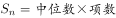，则这19个连续整数的中位数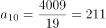。根据等差数列通项公式：，假设这19个数由小到大排列，则最大数为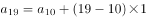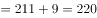。

故正确答案为D。

---

### 第 2 题　qid 4713935 · 数学运算

工程队A的工作方式是工作4天休息2天，工程队B的工作方式是工作5天休息3天。现一项工程交给A单独做需要34天，而B单独做需要29天，那么，这项工程A、B一起施工，需要多少天完成？

- **A**. 15
- **B**. 16　✅
- **C**. 17
- **D**. 18

**答案**：B

**官方解析**

根据题意，A工程队4+2=6天为一个工作周期，天，即A工程队单独完成该项工程需工作4×5+4=24天；B工程队5+3=8天为一个工作周期，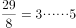天，即B工程队单独完成该项工程需工作5×3+5=20天。赋值这项工程的工作总量为120，则A工程队的工作效率为，B工程队的工作效率为。当A、B工程队一起施工时，可列表如下：

由上表可知，这项工程A、B一起施工，需要16天完成。

故正确答案为B。

---

### 第 3 题　qid 4713954 · 数学运算

有一个正方形边长1厘米，将正方形的每条边进行6等分，如下图所示，那么正中间这个阴影部分的面积是多少平方厘米？

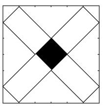

- **A**. 

- **B**. 

　✅
- **C**. 

- **D**. 

**答案**：B

**官方解析**

如下图所示，连接正方形的等分线。根据题意可知，在中，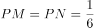，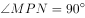，则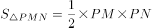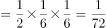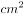，。

故正确答案为B。

---

### 第 4 题　qid 4713904 · 数学运算

有一个数列，第一项是2、第二项是6，后面的数都是其前面两项的和的个位数。那么，第2018项是多少？

- **A**. 2
- **B**. 4
- **C**. 6　✅
- **D**. 8

**答案**：C

**官方解析**

根据题意，该数列前两项依次为2、6，第三项为2+6=8，第四项为6+8=14的个位数4，第五项为8+4=12的个位数2，第六项到第八项依次为6、8、4。观察可得，此数列以2、6、8、4四个数字周期循环， ，即经过504个周期后，剩余2项，则第2018项是6。

故正确答案为C。

---

### 第 5 题　qid 4713921 · 数学运算

有两种瓶子，体积之比为1：2。大瓶子和小瓶子分别装满浓度为20%和50%的酒精溶液。现将大瓶子中的酒精溶液倒掉后和小瓶子中的溶液混合，那么，此时混合溶液浓度是多少？

- **A**. 25%
- **B**. 30%
- **C**. 35%
- **D**. 40%　✅

**答案**：D

**官方解析**

题干给比例求比例，考虑赋值法，根据题意可赋值小瓶子和大瓶子的体积分别为2和4，大瓶子剩余酒精溶液体积为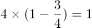，因此题干所求为大瓶子中体积为1的20%酒精溶液与小瓶子中体积为2的50%酒精溶液混合。

方法一：根据公式：浓度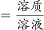，可得混合溶液浓度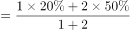。

方法二：设混合溶液浓度为x，根据线段法，混合溶液的浓度之差与溶液质量成反比，则，解得x=40%。

故正确答案为D。

---

### 第 6 题　qid 4713923 · 数学运算

自然数1-2018中，数位上含有0的自然数有多少个？

- **A**. 470　✅
- **B**. 479
- **C**. 551
- **D**. 1199

**答案**：A

**官方解析**

①0在个位：当数字为10的倍数时，其个位为0，有，即201个；

②0在十位：百位是1的有101-109，有9个；同理百位是2到9的各有9个，共有9×9=81个；

千位、百位均是1的有1101-1109，有9个；同理千位是1，百位是2到9的各有9个，共有9×9=81个；

③0在百位：千位是1，十位是1的有1011-1019，有9个；同理千位是1，十位是2到9的各有9个，共有9×9=81个；

千位是2，十位是1的有2011-2018，有8个；

④0在十位、百位：千位是1的有1001-1009，有9个；千位是2的有2001-2009，有9个，共有9×2=18个。

数位上含有0的数共有201+81+81+81+8+18=470个。

故正确答案为A。

---

### 第 7 题　qid 4713916 · 数学运算

集合A={1，2，3，4，5，6，7，8，9｝，集合B={1，2，3，6，9｝，集合C={1，2，4，7，8，9｝。那么，属于集合A，但不属于集合B和集合C的集合一共有多少个？

- **A**. 421
- **B**. 422
- **C**. 423
- **D**. 424　✅

**答案**：D

**官方解析**

n个元素的集合，一共有个子集。由题意可知，集合A中有9个元素，则属于集合A的集合有个；集合B中有5个元素，则属于集合B的集合有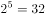个；集合C中有6个元素，则属于集合C的集合有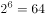个。设集合D为集合B和集合C的交集，则，集合D中有3个元素，则属于集合D的集合有个。根据两集合容斥原理可知，属于集合B或属于集合C的集合一共有32+64-8=88个；因此属于集合A，但不属于集合B和集合C的集合一共有512-88=424个。

故正确答案为D。

---

### 第 8 题　qid 4713955 · 数学运算

有一个00后的孩子，其今年年龄的20倍加上18，然后乘以5，再加365，减去其出生的月份后得到的数字是1646，那么，这个孩子的出生日期是多少？

- **A**. 2006年9月　✅
- **B**. 2007年8月
- **C**. 2008年7月
- **D**. 2009年6月

**答案**：A

**官方解析**

设这个孩子今年的年龄为x岁，出生月份为y月。则由题意可列式：（20x+18）×5+365-y=1646，化简后可得：100x=1191+y。等式左边尾数为0，因此右边尾数1+y=0，y是月份，即y只能取9。结合选项，月份为9的只有A项。
故正确答案为A。

---

### 第 9 题　qid 22939 · 数学运算

一副扑克牌有52张，最上面一张是红桃A。如果每次把最上面的10张移到最下面而不改变它们的顺序及朝向，那么，至少经过多少次移动，红桃A会出现在最上面：

- **A**. 27
- **B**. 26　✅
- **C**. 25
- **D**. 24

**答案**：B

**官方解析**

每次移动扑克牌张数为10，因此移动的扑克牌总数必然是10的倍数；又因红桃A从最上面再回到最上面，则移动的扑克牌总数必然是52的倍数。10与52的最小公倍数是260，即移动扑克牌数达到260后，红桃A再次出现在最上面，移动次数为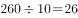次。

故正确答案为B。

---

### 第 10 题　qid 4713922 · 数学运算

在下图中，三个圆的半径分别为1厘米、2厘米、3厘米 ，AB和CD垂直且过这三个圆的共有圆心O。图中阴影部分面积与非阴影部分的面积之比是多少？

- **A**. 11：7　✅
- **B**. 10：7
- **C**. 12：5
- **D**. 13：6

**答案**：A

**官方解析**

半径为1厘米的圆面积平方厘米，其阴影部分面积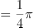平方厘米。半径为2厘米的圆面积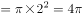平方厘米，则中间圆环的面积平方厘米，中间圆环阴影部分面积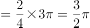平方厘米。半径为3厘米的圆面积平方厘米，则外侧圆环的面积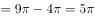平方厘米，外侧圆环阴影部分面积平方厘米。因此图中阴影部分的总面积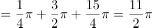平方厘米，非阴影部分的总面积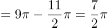平方厘米，则阴影部分面积与非阴影部分的面积之比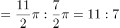。

故正确答案为A。

---

## 判断推理

### 第 1 题　qid 4714947 · 图形推理

从所给的四个选项中，选择最合适的一个填入问号处，使之呈现一定的规律性：

- **A**. A
- **B**. B
- **C**. C
- **D**. D　✅

**答案**：D

**官方解析**

观察发现，题干图形均为字母，且在字母表中的顺序存在规律。第一行中相邻字母在字母表中间隔0个字母，第二行中相邻字母在字母表中间隔1个字母，第三行中相邻字母在字母表中间隔2个字母，按此规律，第四行中相邻字母在字母表中应间隔3个字母，故？处应为T，只有D项符合。
故正确答案为D。

---

### 第 2 题　qid 4714960 · 图形推理

从所给的四个选项中，选择最合适的一个填入问号处，使之呈现一定的规律性：

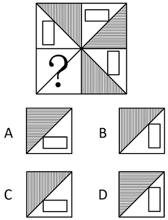

- **A**. A　✅
- **B**. B
- **C**. C
- **D**. D

**答案**：A

**官方解析**

元素组成相同，优先考虑位置规律。观察发现，左上角的阴影三角形和矩形顺时针旋转得到右上角图形，右上角图形顺时针旋转得到右下角图形，因此？处图形应由右下角图形顺时针旋转得到，只有A项符合。

故正确答案为A。

---

### 第 3 题　qid 4714949 · 图形推理

从所给的四个选项中，选择最合适的一个填入问号处，使之呈现一定的规律性：

- **A**. A
- **B**. B　✅
- **C**. C
- **D**. D

**答案**：B

**官方解析**

元素组成相同，优先考虑位置规律。九宫格优先看横行，第一行图形中，上面三行的黑块依次向右平移一格（到头循环走），第四行黑块位置保持不变；经验证第二行图形满足此规律，第三行图形应用此规律，对应B项。
故正确答案为B。

---

### 第 4 题　qid 4714952 · 图形推理

从所给的四个选项中，选择最合适的一个填入问号处，使之呈现一定的规律性：

- **A**. A
- **B**. B
- **C**. C　✅
- **D**. D

**答案**：C

**官方解析**

元素组成不同，且无明显属性规律，优先考虑数量规律。观察发现图2为明显一笔画图形，图3包括“田”字变形图，考虑笔画数。题干图形均为一笔画图形，故？处也应为一笔画图形，只有C项符合。
故正确答案为C。

---

### 第 5 题　qid 4714994 · 图形推理

以下为立方体的外表面，下列哪个立方体可以由此折成（    ）。

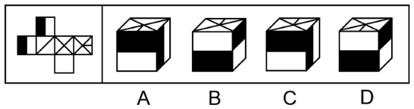

- **A**. A　✅
- **B**. B
- **C**. C
- **D**. D

**答案**：A

**官方解析**

将题干展开图标上序号，如下图所示：

观察发现，四个选项均由面a、面d和面e组成，展开图中面d上最短的线段与面a中黑色长方形相交，而B项、C项和D项中面d上最短的线段均未与面a中黑色长方形相交，与题干展开图不一致，排除。A项与题干展开图一致，当选。

故正确答案为A。

---

### 第 6 题　qid 2187609 · 定义判断

甜柠檬效应就是个体在追求预期目标失败时，为了冲淡自己内心的不安，就百般提高现已实现的目标的价值，从而达到心理平衡的现象。
根据上述定义，下列属于“甜柠檬效应”的是：

- **A**. 小明本来想买一台笔记本电脑，结果却在导购员的劝说下购买了平板电脑，使用后他很满意，并一直向朋友推荐
- **B**. 这几周，小红为自己的销售业绩不断下滑而苦恼；但当她知道自己仍是公司的销售状元时，变得放心多了
- **C**. 小文的数学成绩又让他的辅导老师失望了，老师最后只能用“比起上一次，还是有进步”来安慰自己　✅
- **D**. 据教练估计，小张需要减肥到60千克才能达到他想要的健身效果，可是小张在减到63千克时就放弃了，因为他觉得自己足够健美了

**答案**：C

**官方解析**

第一步：找出定义关键词。

“个体追求预期目标失败”、“为了冲淡自己内心的不安”、“百般提高现已实现的目标的价值”、“达到心理平衡”。

第二步：逐一分析选项。

A项：小明本来想买电脑最后买了平板电脑，没有实现预期目标，但是使用后很满意，不符合“为了冲淡自己内心的不安”、“百般提高现已实现的目标的价值”，不符合定义，排除；

B项：小红为销售业绩下滑而苦恼符合“个人追求预期目标失败”，但小红为销售状元是客观事实，不符合“为了冲淡自己内心的不安”、“百般提高现已实现的目标的价值”，不符合定义，排除；

C项：小文数学成绩让辅导老师失望，老师对小文的成绩的心理预期没有达到，符合“个体追求预期目标失败”，老师最后只能安慰自己小文比上一次进步了，符合“百般提高现已实现的目标的价值”，符合定义，当选；

D项：减肥到60千克才能达到效果是教练提出的目标，小张在63千克时放弃了，是小张自己主动放弃了，并不符合追求个人目标失败，不符合定义，排除。

故正确答案为C。

---

### 第 7 题　qid 4715058 · 定义判断

边际效应是指经济上在最小成本的情况下达到最大经济利润，从而达到帕累托最优，指的是物品或劳务的最后一单位比起前一单位的效用。如果后一单位的效用比起前一单位的效用大则是边际效用递增，反之则为边际效用递减。感恩边际效应递减指第一次受到来自陌生人的帮助会心存感激，但是多次帮助之后感恩心理便会递减。递减到一定程度上，受助者几乎已经坦然地接受别人的馈赠，并认为这理所应当。
下列属于感恩边际效应递减的一项是：

- **A**. 一个馒头店主，看到很多环卫工人和流浪汉吃不上热乎饭，开办了“爱心馒头”，免费送热乎慢头，这些环卫工人和流浪汉表示非常感激
- **B**. 一个人吃第一碗面条特别香，第二碗面条很香，第三碗面条还可以，第四碗面条饱了，第五碗面条吃不下，看到第六碗面条产生一种厌倦的心理
- **C**. 一名患者5年前被查出癌症晚期，一直在一家医院治疗。医院考虑到患者家庭经济条件，5年来给患者垫付了10多万元医疗费，家属备受感动。后来患者不治身亡，其家属不仅不支付拖欠的医疗费用，还向医院索赔　✅
- **D**. 国产迈腾上市之前，大众汽车公司已经将进口迈腾引进中国，用进口车的售价先拉高消费者的心理接受度，随后再公布国产迈腾汽车的价格，达到对市场的刺激

**答案**：C

**官方解析**

第一步：找出定义关键词。
边际效应：“在最小成本的情况下达到最大经济利润”；
边际效用递增：“后一单位的效用比起前一单位的效用大”；
边际效用递减：“后一单位的效用比起前一单位的效用小”；
感恩边际效应递减：“第一次受到来自陌生人的帮助会心存感激”、“多次帮助之后感恩心理递减”、“坦然接受别人的馈赠，并认为理所应当”。
第二步：逐一分析选项。
A项：选项只表述了环卫工人和流浪汉表示感激，未体现多次帮助之后的想法，不符合“多次帮助之后感恩心理递减”、“坦然接受别人的馈赠，并认为理所应当”，不符合“感恩边际效应递减”的定义，排除；
B项：人吃面条的次数越多，越感到厌倦，不涉及陌生人的帮助，不符合“第一次受到来自陌生人的帮助会心存感激”，不符合“感恩边际效应递减”的定义，排除；
C项：医院5年来给患者垫付了10多万元医疗费，家属备受感动，符合“第一次受到来自陌生人的帮助会心存感激”，但长时间的资助使得家属认为是理所应当的，不仅不支付拖欠的医疗费用，还向医院索赔，符合“多次帮助之后感恩心理递减”、“坦然接受别人的馈赠，并认为理所应当”，符合“感恩边际效应递减”的定义，当选；
D项：用进口车的售价拉高消费者的心理接受度是一种营销手段，不涉及来自陌生人的帮助，不符合“第一次受到来自陌生人的帮助会心存感激”，不符合“感恩边际效应递减”的定义，排除。
故正确答案为C。

---

### 第 8 题　qid 4715037 · 定义判断

恶魔效应：在印象形成过程中对不好的一面加以夸大化的感觉和看法，是由于某一点或某些不好印象而扩大到全部印象的知觉现象；对一个人进行评价时，往往会因某一品质特征的强烈、清晰的不良感知和印象，而对这个人的其他品质、特性也会给予否定性、妖魔化的评价。
下列符合上述定义的一项是：

- **A**. 那些有名的歌星、影星拍的广告片很容易得到认同，而那些名不见经传的小人物不被信任
- **B**. 同事小张在一次工作汇报中为了突显自己的成绩故意夸大事实，自此以后小张被同事们一致认为他就是一个不诚实的人　✅
- **C**. 童童经常跟小朋友吹牛说：“我们家的房子有这么大，有十个房间，还有一个大大的车库，我爸爸有两辆车，一辆是奔驰一辆是宝马”
- **D**. 本月，中国2000所高校的毕业生人数达到创纪录的700万人，很多中国媒体把这个月称为史上最难就业季

**答案**：B

**官方解析**

第一步：找出定义关键词。
“在印象形成过程中”、“某一点或某些不好印象”、“扩大到全部印象”。
第二步：逐一分析选项。
A项：“有名”的歌星、影星拍的广告片很容易得到认同，“名不经传”的小人物不被信任，说明受众对广告的认同取决于代言人的有名程度，不涉及“扩大到全部印象”，不符合定义，排除；
B项：小张一次不诚实的行为，符合“某一点或某些不好印象”，同事因此认为他就是一个不诚实的人，符合“扩大到全部印象”，符合定义，当选；
C项：选项只描述了童童的行为，不涉及别人所产生的印象，不符合“在印象形成过程中”，也不符合“扩大到全部印象”，不符合定义，排除；
D项：媒体称这个月为史上最难就业季，是针对就业现象的描述，不涉及“某一点或某些不好印象”，也没有体现“扩大到全部印象”，不符合定义，排除。
故正确答案为B。

---

### 第 9 题　qid 4715042 · 定义判断

货币幻觉：是货币政策的通货膨胀效应，是指人们只注意货币工资的提高或降低，而意识不到货币的实际购买力是否发生了变化，因而只抵制货币工资下降的心理现象。
以下符合上述定义的一项是：

- **A**. 小李花40万元买了一套房子，后来把房子卖掉了，小李卖房子时，当时有25%的贬值率——商品和服务平均降低25%，小李卖得30.8万元，比买价低23%，小李认为自己的实际购买能力下降了
- **B**. 小李花40万元买了一套房子，后来把房子卖掉了，小李卖房子时，当时有25%的贬值率——商品和服务平均降低25%，小李卖得30.8万元，比买价低23%，小李认为自己的货币工资降低了　✅
- **C**. 小王花40万元买了一套房子，后来把房子卖掉了，小王卖房子时，物价上涨了25%，结果房子卖了49.2万元，比买房价高23%，小王认为自己的货币降低了
- **D**. 小王花40万元买了一套房子，后来把房子卖掉了，小王卖房子时，物价上涨了25%，结果房子卖了49.2万元，比买房价高23%，小王认为自己的实际购买能力降低了

**答案**：B

**官方解析**

第一步：找出定义关键词。
“只注意货币工资的提高或降低”、“意识不到货币的实际购买力是否发生了变化”、“只抵制货币工资下降”。
第二步：逐一分析选项。
A项：小李认为自己的实际购买能力下降了，意识到了货币的实际购买力发生了变化，不符合“意识不到货币的实际购买力是否发生了变化”，不符合定义，排除；
B项：房子的卖价比买价低了23%，其下降程度比不上25%的贬值率，因此虽然货币量少了，但实际上货币的购买力比以前更高，而小李只看到了自己货币工资降低了，没有看到现在30.8万元的购买力超过了以前40万元的购买力，符合“只注意货币工资的提高或降低”、“意识不到货币的实际购买力是否发生了变化”，符合定义，当选；
C项：房子的卖价比买价高了23%，其上升程度不如25%的物价上涨率，因此虽然货币量增加了，但实际上货币的购买力在降低，小王认为自己的货币降低了，说明小王意识到了货币的实际购买力发生了变化，不符合“只注意货币工资的提高或降低”、“意识不到货币的实际购买力是否发生了变化”，不符合定义，排除；
D项：小王认为自己的实际购买能力降低了，意识到了货币的实际购买力发生了变化，不符合“意识不到货币的实际购买力是否发生了变化”，不符合定义，排除。
故正确答案为B。

---

### 第 10 题　qid 4714945 · 定义判断

文化扩散：指思想观念、经验技艺和其他文化特质从一个社会传到另一个社会，从一地传到另一地的过程。文化扩散分为扩展扩散和迁移扩散：其中扩展扩散又可进一步分成传染扩散、等级扩散和刺激扩散。传染扩散如同疾病传播那样不分等级地将文化传播给每一个地区社会所有接触者；等级扩散是指一种文化现象在不同划分标准的空间等级中，由高至低或者由低至高的扩散过程；刺激扩散是指一种文化现象由一地传到他地后，保留了思想实质而摒弃了具体形式的扩散过程。 
下列属于传染扩散的一项是：

- **A**. 1848年欧洲殖民者在加州发现黄金后，众多白人向西迁移，进驻加州，随之将其宗教、生活方式等带到了加州
- **B**. 7世纪中期，日本天皇下令仿效中国唐朝教育制度，在中央设立太学，在地方设立国学
- **C**. 随着近代中国现代化转型期的到来，基督教传入国内，虽然形式各异但是传播福音的实质未曾发生改变
- **D**. 马克思主义在中国的传播　✅

**答案**：D

**官方解析**

第一步：找出定义关键词。
文化扩散：“思想观念、经验技艺和其他文化特质”、“从一个社会传到另一个社会”、“从一地传到另一地”；
传染扩散：“不分等级”、“将文化传播给每一个地区社会所有接触者”；
等级扩散：“在不同划分标准的空间等级中”、“由高至低或者由低至高的扩散过程”；
刺激扩散：“由一地传到他地后”、“保留了思想实质”、“摒弃了具体形式”。 
第二步：逐一分析选项。
A项：众多白人向西迁移，进驻加州，随之将其宗教、生活方式等带到了加州，只说明了白人将文化带到新的地方，并没有体现将文化传播给其他接触者，不符合“将文化传播给每一个地区社会所有接触者”，不符合“传染扩散”定义，排除；
B项：日本天皇下令，是由高到低的扩散过程，且在中央设立太学，在地方设立国学，体现了存在等级划分，符合“在不同划分标准的空间等级中”、“由高至低或者由低至高的扩散过程”，符合“等级扩散”定义，不符合“传染扩散”定义，排除；
C项：基督教传入国内，虽然形式各异但是传播福音的实质未曾发生改变，体现了没有具体形式，但思想实质不变，符合“由一地传到他地后”、“保留了思想实质”、“摒弃了具体形式”，符合“刺激扩散”定义，不符合“传染扩散”定义，排除；
D项：马克思主义在中国的传播是不分等级的，各个地区、各个阶层的人民均有受到马克思主义思想的影响，符合“不分等级”、“将文化传播给每一个地区社会所有接触者”，符合“传染扩散”定义，当选。
故正确答案为D。

---

### 第 11 题　qid 4714959 · 定义判断

间接融资是指资金盈余单位与资金短缺单位之间不发生直接关系，而是分别与金融机构发生一笔独立的交易，即资金盈余单位通过存款，或者购买银行、信托、保险等金融机构发行的有价证券，将其暂时闲置的资金先行提供给这些金融中介机构，然后再由这些金融机构以贷款、贴现等形式，或通过购买需要资金的单位发行的有价证券，把资金提供给这些单位使用，从而实现资金融通的过程。
根据上述定义，下列属于间接融资的是：

- **A**. 你向太平洋人寿保险公司支付人寿保险的保费，该公司向购房人发放抵押贷款　✅
- **B**. 你通过经纪人买入通用电气公司的债券
- **C**. 你购买了微软的股票
- **D**. 你将钱投入了集资公司，便于该公司缓解资金紧张的状况

**答案**：A

**官方解析**

第一步：找出定义关键词。
“通过存款，或者购买银行、信托、保险等金融机构发行的有价证券”、“暂时闲置的资金先行提供给这些金融中介机构”、“金融机构以贷款、贴现等形式，或通过购买需要资金的单位发行的有价证券，把资金提供给这些单位使用”。
第二步：逐一分析选项。
A项：你向保险公司支付保费，符合“通过存款，或者购买银行、信托、保险等金融机构发行的有价证券”、“暂时闲置的资金先行提供给这些金融中介机构”，该公司向购房人发放抵押贷款，符合“金融机构以贷款、贴现等形式，或通过购买需要资金的单位发行的有价证券，把资金提供给这些单位使用”，符合定义，当选；
B项：你通过经纪人买入债券，经纪人是通过介绍买卖双方交易，以获取佣金的中间人，不是金融中介机构，不符合“暂时闲置的资金先行提供给这些金融中介机构”，不符合定义，排除；
C项：你购买股票，是否存在金融中介机构未体现，且也不符合“金融机构以贷款、贴现等形式，或通过购买需要资金的单位发行的有价证券，把资金提供给这些单位使用”，不符合定义，排除；
D项：将钱投入集资公司，集资公司不是金融中介机构，该行为是与资金紧张单位之间发生了直接关系，不符合“暂时闲置的资金先行提供给这些金融中介机构”、“金融机构以贷款、贴现等形式，或通过购买需要资金的单位发行的有价证券，把资金提供给这些单位使用”，不符合定义，排除。
故正确答案为A。

---

### 第 12 题　qid 4715006 · 定义判断

本能是指一个生物体趋向于某一特定行为的内在倾向。其固定的行为模式非学习得来，也不是继承而来。固定行为模式的实例可从动物的行为观察得到。它们进行各种活动（有时非常复杂），不是基于此前的经验。
以下不属于本能的是：

- **A**. 藏羚羊之间为了求偶而进行的战斗
- **B**. 燕子的筑巢行为
- **C**. 把食物放在玻璃板的后面，狒狒只要看过人类取物一次就可以很快明白阻隔的存在和解决的办法　✅
- **D**. 出现火烧森林的时候，动物四下散开逃跑

**答案**：C

**官方解析**

第一步：找出定义关键词。
“趋向于某一特定行为的内在倾向”、“固定的行为模式非学习得来，也不是继承而来”、“进行各种活动不是基于此前的经验”。
第二步：逐一分析选项。
A项：藏羚羊之间为了求偶而进行的战斗，符合“趋向于某一特定行为的内在倾向”、“固定的行为模式非学习得来，也不是继承而来”、“进行各种活动不是基于此前的经验”，符合定义，排除；
B项：燕子的筑巢行为，符合“趋向于某一特定行为的内在倾向”、“固定的行为模式非学习得来，也不是继承而来”、“进行各种活动不是基于此前的经验”，符合定义，排除；
C项：狒狒学会如何把食物从玻璃板的后面取出，是通过观察人类的行为学习的，不符合“固定的行为模式非学习得来，也不是继承而来”，不符合定义，当选；
D项：动物在发生火灾时四下散开逃跑，符合“趋向于某一特定行为的内在倾向”、“固定的行为模式非学习得来，也不是继承而来”、“进行各种活动不是基于此前的经验”，符合定义，排除。
本题为选非题，故正确答案为C。

---

### 第 13 题　qid 4715016 · 类比推理

气质是表现在心理活动的强度、速度、灵活性与指向性等方面的一种稳定的心理特征，气质主要有四类：
①多血质：灵活性高，易于适应环境变化，善于交际，在工作、学习中精力充沛而且效率高；对什么都感兴趣，但情感兴趣易于变化；有些投机取巧，易骄傲，受不了一成不变的生活。
②黏液质：反应比较缓慢，坚持而稳健地辛勤工作；动作缓慢而沉着，能克制冲动，严格恪守既定的工作制度和生活秩序；情绪不易激动，也不易流露感情；自制力强，不爱显露自己的才能；固定性有余而灵活性不足。
③胆汁质：情绪易激动，反应迅速，行动敏捷，暴而有力；性急，有一种强烈而迅速燃烧的热情，不能自制；在克服困难上有坚忍不拔的劲头，但不善于考虑能否做到，工作有明显的周期性，能以大的热情投身于事业，但当精力消耗殆尽时，便失去信心，情绪顿时转为沮丧而一事无成。
④抑郁质：高度的情绪易感性，主观上把很弱的刺激当作强作用来感受，常为微不足道的原因而动感情，且有力持久；行动表现上迟缓，有些孤僻；遇到困难时优柔寡断，面临危险时极度恐惧。
以下对应的代表人物正确的是：

- **A**. 王熙凤属于多血质　✅
- **B**. 孙悟空属于黏液质
- **C**. 张飞属于抑郁质
- **D**. 韦小宝属于胆汁质

**答案**：A

**官方解析**

第一步：找出定义关键词。
①多血质：“灵活性高”、“善于交际”、“有些投机取巧，易骄傲”；
②黏液质：“反应比较缓慢，坚持而稳健地辛勤工作”、“情绪不易激动，也不易流露感情”、“自制力强，不爱显露自己的才能”；
③胆汁质：“情绪易激动，反应迅速，行动敏捷，暴而有力”、“性急”、“当精力消耗殆尽时，便失去信心，情绪顿时转为沮丧而一事无成”；
④抑郁质：“高度的情绪易感性，主观上把很弱的刺激当作强作用来感受，常为微不足道的原因而动感情”、“行动表现上迟缓，有些孤僻”、“遇到困难时优柔寡断，面临危险时极度恐惧”。
第二步：逐一分析选项。
A项：王熙凤爽利泼辣、八面玲珑、能言善辩，符合“灵活性高”、“善于交际”、“有些投机取巧，易骄傲”，符合多血质的定义，当选；
B项：孙悟空聪明活泼、嫉恶如仇、争强好胜、不够谦虚，不符合“反应比较缓慢，坚持而稳健地辛勤工作”、“情绪不易激动，也不易流露感情”、“自制力强，不爱显露自己的才能”，不符合黏液质的定义，排除；
C项：张飞粗狂、易怒、勇猛，不符合“高度的情绪易感性，主观上把很弱的刺激当作强作用来感受，常为微不足道的原因而动感情”、“行动表现上迟缓，有些孤僻”、“遇到困难时优柔寡断，面临危险时极度恐惧”，不符合抑郁质的定义，排除；
D项：韦小宝处事油滑、讲信义、执着，不符合“情绪易激动，反应迅速，行动敏捷，暴而有力”、“性急”、“当精力消耗殆尽时，便失去信心，情绪顿时转为沮丧而一事无成”，不符合胆汁质的定义，排除。
故正确答案为A。

---

### 第 14 题　qid 4714941 · 逻辑判断

对比是指故意把两个相反、相对的事物或同一事物相反、相对的两个方面放在一起，用比较的方法加以描述或说明以提示事物的本质，使好的显得更好，使坏的显得更坏，对比是表明对立现象的，两种对立的事物是平行的并列关系。
根据以上定义，下列哪项没有运用对比：

- **A**. 政之所兴，在顺民心；政之所废，在逆民心
- **B**. 亲贤臣，远小人，此先汉所以兴隆也；亲小人，远贤臣，此后汉所以倾颓也
- **C**. 有缺点的战士终究是战士，完美的苍蝇终究不过是苍蝇
- **D**. 海鸥在大海上飞窜，轰隆隆的雷声把海鸥吓坏了，企鹅胆怯地把肥胖的身躯躲藏在悬崖底······只有那高傲的海燕，勇敢地、自由自在地在泛起白沫的大海上飞翔　✅

**答案**：D

**官方解析**

第一步：找出定义关键词。
“两个相反、相对的事物”、“同一事物相反、相对的两个方面”、“用比较的方法”、“以提示事物的本质”、“使好的显得更好，使坏的显得更坏”。
第二步：逐一分析选项。
A项：选项将“政兴”和“政废”进行比较，从而得到“政权兴废的关键在于民心”，符合“同一事物相反、相对的两个方面”、“用比较的方法”、“以提示事物的本质”，符合定义，排除；
B项：选项将“先汉兴隆”和“后汉倾颓”进行比较，从而得到“国家兴衰的关键在于对贤臣和小人的态度”，符合“两个相反、相对的事物”、“用比较的方法”、“以提示事物的本质”，符合定义，排除；
C项：选项将“有缺点的战士”和“完美的苍蝇”进行比较，以此“颂扬战士，抨击苍蝇”，符合“两个相反、相对的事物”、“用比较的方法”、“使好的显得更好，使坏的显得更坏”，符合定义，排除；
D项：选项将“吓坏的海鸥”、“胆怯的企鹅”和“勇敢的海燕”三者进行比较，以衬托出海燕的勇敢，这三者并不是相对的，不符合“两个相反、相对的事物”、“同一事物相反、相对的两个方面”，不符合定义，当选。
本题为选非题，故正确答案为D。

---

### 第 15 题　qid 4714951 · 逻辑判断

泡菜效应是指同样的蔬菜在不同的水中浸泡一段时间后，将它们分开煮，其味道是不一样的，根据这个原理可知，人在不同的环境里，由于长期耳濡目染，其性格、气质、素质和思维的方式等方面都会有明显的差别。
根据以上定义，下列哪项不属于泡菜效应？

- **A**. 入芝兰之室，久而不闻其香；入鲍鱼之肆，久而不闻其臭
- **B**. 千磨万击还坚劲，任尔东西南北风　✅
- **C**. 孟母三迁
- **D**. 近朱者赤，近墨者黑

**答案**：B

**官方解析**

第一步：找出定义关键词。
“人在不同的环境里会有明显的差别”。
第二步：逐一分析选项。
A项：选项的含义是进入充满兰花香气的房间，久而久之就闻不到兰花的香味了，进入卖臭咸鱼的店铺，久而久之就闻不到咸鱼的臭味了，表明不同的环境可以使人发生不同的改变，符合“人在不同的环境里会有明显的差别”，符合定义，排除；
B项：选项的含义是竹子任凭风雨的打击磨砺，依然不改坚劲本色，其中既没有体现出不同的环境，也没有体现出明显的差别，不符合“人在不同的环境里会有明显的差别”，不符合定义，当选；
C项：孟母三迁讲的是孟子开始居住于墓地附近，常常玩办理丧事的游戏，而后孟母将家搬至集市旁，孟子便学起商人做生意的样子，最后孟母又将家搬至学校附近，孟子就学习了许多礼仪，符合“人在不同的环境里会有明显的差别”，符合定义，排除；
D项：选项的含义是靠近朱砂易染成红色，靠近墨汁就会变黑，比喻接近好人使人变好，接近坏人使人变坏，符合“人在不同的环境里会有明显的差别”，符合定义，排除。
本题为选非题，故正确答案为B。

---

### 第 16 题　qid 4714984 · 类比推理

出卷人：答卷人：阅卷人

- **A**. 报修人：修理人：核查人　✅
- **B**. 制作方：出品方：群众
- **C**. 老师：校长：教育局
- **D**. 守护者：窃贼：盗取

**答案**：A

**官方解析**

第一步：判断题干词语间逻辑关系。
先是出卷人出卷，然后答卷人答卷，再是阅卷人阅卷，三个主体承担的动作具有先后顺序。
第二步：判断选项词语间逻辑关系。
A项：先是报修人报修，然后修理人修理，再是核查人核查，三个主体承担的动作具有先后顺序，与题干逻辑关系一致，当选；
B项：制作方是整部影片的筹建负责人，负责剧组的日常生活与维持剧组的拍摄活动，以及成片之后的宣传与播放等一系列事务；出品方负责影片前期的市场调查，通过调查来决定是否值得出品该影片，如果合适，就找电影集团投资制片人及相关人员，开始选导演、剧本、演员、赞助商等，所以出品方承担的动作要先于制作方，与题干逻辑关系不一致，排除；
C项：老师、校长、教育局三个主体承担的动作不具有明显的先后顺序，与题干逻辑关系不一致，排除；
D项：盗取是动词，不是名词主体，与题干逻辑关系不一致，排除。
故正确答案为A。

---

### 第 17 题　qid 4714995 · 类比推理

福州：榕城

- **A**. 重庆：山城
- **B**. 济南：泉城　✅
- **C**. 江苏：水城
- **D**. 南京：江城

**答案**：B

**官方解析**

第一步：判断题干词语间逻辑关系。
福州的别称是榕城，二者为全同关系，且福州是福建省省会。
第二步：判断选项词语间逻辑关系。
A项：重庆的别称是山城，二者为全同关系，但重庆是直辖市，与题干逻辑关系不一致，排除；
B项：济南的别称是泉城，二者为全同关系，且济南是山东省省会，与题干逻辑关系一致，当选；
C项：江苏是省级行政区，别名是“苏”，而非水城，与题干逻辑关系不一致，排除；
D项：南京的别称是金陵、建康、石头城等，而非江城，与题干逻辑关系不一致，排除。
故正确答案为B。

---

### 第 18 题　qid 4714946 · 类比推理

月亮：婵娟：蟾宫

- **A**. 父亲：家严：令堂
- **B**. 荷花：菡萏：芙蕖　✅
- **C**. 冠军：折桂：鳌头
- **D**. 成年：弱冠：而立

**答案**：B

**官方解析**

第一步：判断题干词语间逻辑关系。
“月亮”又称“婵娟”“蟾宫”，三者是全同关系。
第二步：判断选项词语间逻辑关系。
A项：“家严”是指在别人面前对自己父亲的谦称，与“父亲”是全同关系，但“令堂”指对别人母亲的尊称，与前两个词不是全同关系，与题干逻辑关系不一致，排除；
B项：“荷花”又称“菡萏”“芙蕖”，三者是全同关系，与题干逻辑关系一致，当选；
C项：“折桂”在科举时代指考取进士，现多借指竞赛或考试获得第一名，与“冠军”不是全同关系，与题干逻辑关系不一致，排除；
D项：“成年”指到了成人的年龄，“弱冠”指20岁左右的男子，“而立”指年至三十，学有成就，后来用“而立”指人30岁，三者不是全同关系，与题干逻辑关系不一致，排除。
故正确答案为B。
注：“婵娟”和“蟾宫”均借指月亮，第一个词与后两个词构成比喻象征义，从这个角度来看无严谨的对应答案，故可以将题干看成全同关系，其中“婵娟”和“蟾宫”都是古代对于月亮的称呼。

---

### 第 19 题　qid 4714957 · 类比推理

凿壁：偷光

- **A**. 杀鸡：骇猴　✅
- **B**. 打草：惊蛇
- **C**. 水落：石出
- **D**. 落井：下石

**答案**：A

**官方解析**

第一步：判断题干词语间逻辑关系。
“凿壁偷光”出自西汉大文学家匡衡幼时凿穿墙壁引邻舍之烛光读书，终成一代文学家的故事，现用来形容家贫而读书刻苦的人。凿壁是方式，偷光是目的，二者是方式目的的对应关系。
第二步：判断选项词语间逻辑关系。
A项：“杀鸡骇猴”指杀鸡给猴子看，比喻用惩罚某个个体的办法来警告别的人。杀鸡是方式，骇猴是目的，二者是方式目的的对应关系，与题干逻辑关系一致，当选；
B项：“打草惊蛇”比喻行动不够机密、严谨，使对方有所警觉和准备。打草不是为了惊蛇，二者不是方式目的的对应关系，与题干逻辑干系不一致，排除；
C项：“水落石出”指水落下去，石头就露出来了，原用以描写枯水季节的自然景色，现比喻事情真相大白。水落是原因，石出是结果，二者是因果的对应关系，与题干逻辑关系不一致，排除；
D项：“落井下石”指看见有人要掉进陷阱里，不伸手救他，反而推他下去，又扔下石头，比喻乘人有危难时加以陷害。落井和下石是并列关系，与题干逻辑关系不一致，排除。
故正确答案为A。

---

### 第 20 题　qid 4714963 · 类比推理

微信：MSN

- **A**. 淘宝：易趣　✅
- **B**. 一号店：qq
- **C**. 京东：唯品会
- **D**. 饿了么：美团

**答案**：A

**官方解析**

第一步：判断题干词语间逻辑关系。
微信和MSN均为即时通讯软件，二者为并列关系，并且微信属于国内公司旗下的运营产品，MSN属于国外公司旗下的运营产品。
第二步：判断选项词语间逻辑关系。
A项：淘宝和易趣均为电商平台，二者为并列关系，并且淘宝属于国内公司旗下的运营平台，易趣属于国外公司旗下的运营平台，与题干逻辑关系一致，当选；
B项：一号店为电商平台，qq为即时通讯软件，二者涉及领域不同，与题干逻辑关系不一致，排除；
C项：京东和唯品会均为电商平台，二者为并列关系，但京东和唯品会均属于国内公司旗下的运营平台，与题干逻辑关系不一致，排除；
D项：饿了么和美团均为生活服务电子商务平台，二者为并列关系，但饿了么和美团均属于国内公司旗下的运营平台，与题干逻辑关系不一致，排除。
故正确答案为A。

---

### 第 21 题　qid 4714968 · 逻辑判断

一个慈善机构收到两份匿名捐款，经过询问四个人得到这样的结论。刘星说：“不是陆明捐的”，陈春说：“是陆明捐的”，王璐说：“是刘星捐的”，陆明说：“或者是刘星捐的，或者是王璐捐的”。其中只有两个人说真话，以下选项正确的是：

- **A**. 王璐捐了，刘星一定没捐　✅
- **B**. 刘星捐了，陆明一定也捐了
- **C**. 刘星捐了，王璐一定没捐
- **D**. 陆明捐了，王璐没有捐款

**答案**：A

**官方解析**

第一步：找出题干矛盾关系。

（1）刘星：陆明；

（2）陈春：陆明；

（3）王璐：刘星；

（4）陆明：刘星或王璐。

条件（1）“陆明”和条件（2）“陆明”是一组矛盾关系，二者必有一真必有一假。

第二步：看其余。

已知条件中两句真话、两句假话，除去条件（1）、条件（2）这一组矛盾关系中的一真一假，条件（3）“刘星”和条件（4）“刘星或王璐”中也必有一真必有一假。

可以通过假设法来确定：如果假设条件（3）“刘星”为真，则可以推出条件（4）“刘星或王璐”也为真，与上文推理的条件（3）和条件（4）中一真一假不符。因此条件（3）为假，条件（4）为真，故刘星一定没捐，代入条件（4），根据否一推一可知：王璐捐了，A项当选。

故正确答案为A。

---

### 第 22 题　qid 4715007 · 类比推理

张、王、李三位老师分别教数学、英语、阅读、劳技、语文、思品这六门课，每位老师教两门课。已知：1、阅读老师和数学老师住在一起；2、张老师是三位老师中最年轻的；3、数学老师经常和李老师在一起下象棋；4、英语老师比劳技老师年长，比王老师年轻；5、最年长的老师的家比其他两位老师家离学校远。
问：李老师教哪两门课？

- **A**. 数学、思品
- **B**. 语文、劳技
- **C**. 英语、阅读　✅
- **D**. 英语、劳技

**答案**：C

**官方解析**

第一步：分析题干条件。
1、张、王、李三位老师分别教数学、英语、阅读、劳技、语文、思品这六门课，每位老师教两门课；
2、阅读老师和数学老师住在一起；
3、张老师最年轻；
4、数学老师经常和李老师在一起下象棋，即李老师不是数学老师；
5、王老师的年龄＞英语老师的年龄＞劳技老师的年龄；
6、最年长的老师的家比其他两位老师家离学校远。
第二步：根据题干条件进行推理。
根据条件3、5、6可知，张老师是劳技老师，李老师是英语老师，且王老师是最年长的老师；再根据条件2、4可知，王老师不教阅读和数学，那么张老师是数学老师，李老师是阅读老师，故李老师教英语和阅读，只有C项符合。
故正确答案为C。

---

### 第 23 题　qid 9081 · 逻辑判断

H市的交通管理部门表示，和去年相比，今年我市市区的道路通行有明显改善。该部门负责人认为，这是由于我市聘用了大量的交通协管员。
以下哪项最不能削弱该负责人的结论：

- **A**. 今年初，H市专门召开会议对交通问题进行认真研究和整理
- **B**. 许多专家认为，聘用大量的交通协管员的成本巨大，得不偿失　✅
- **C**. 今年初，H市市区的道路新建扩建工程刚刚结束
- **D**. 今年H市对驶入市区的车辆进行了严格的限制，许多大货车、外地车在交通“高峰”时期不能进入市区

**答案**：B

**官方解析**

第一步：找到论点和论据。
论点：由于我市聘用了大量的交通协管员，今年我市市区的道路通行有明显改善。
论据：无。
本题只有论点，无论据，削弱优先考虑削弱论点，但论点为明显的因果关系，削弱还可以考虑因果倒置与他因削弱。
第二步：逐一分析选项。
A项：指出H市专门召开会议对交通问题进行认真研究和整理，提出了一个可能使市区的道路通行有明显改善的另外的原因，属于他因削弱，排除；
B项：选项中提到的成本与道路通行改善无关，属于无关选项，无法削弱，当选；
C项：指出H市市区的道路新建扩建工程刚刚结束，提出了一个可能使市区的道路通行有明显改善的另外的原因，属于他因削弱，排除；
D项：指出H市对驶入市区的车辆进行了严格的限制，提出了一个可能使市区的道路通行有明显改善的另外的原因，属于他因削弱，排除。
本题为选非题，故正确答案为B。

---

### 第 24 题　qid 4715073 · 类比推理

有四个外表看起来没有分别的小球，它们的重量可能各有不同。取一个天平将1、2放一组，3、4为另一组分别放在天平的两边，天平是基本平衡的。将2和4对调一下，1、4一边明显的要比2、3一边重很多。可奇怪的是我们将天平的一边放上1、3，而另一边刚放上2，还没有来得及放上4时天平就压向了2一边。
则四个球由重到轻的顺序是：

- **A**. 2、4、1、3
- **B**. 4、2、3、1
- **C**. 2、1、4、3
- **D**. 4、2、1、3　✅

**答案**：D

**官方解析**

第一步：分析题干条件。
①1＋2＝3＋4；
②1＋4＞2＋3；
③1＋3＜2。
第二步：根据题干条件进行推理。
将①②相加可得：1＋1＋2＋4＞2＋3＋3＋4，两边分别消去相同小球可得：1＋1＞3＋3，即1＞3。结合①可知，当1球比3球重量大时，为保持平衡，则2球需比4球重量小，即4＞2。结合③可知，2球的重量比1、3球都大，综上，四个球由重到轻的顺序为4、2、1、3。
故正确答案为D。

---

### 第 25 题　qid 4715011 · 逻辑判断

2018年刚开始，顶尖杂志《自然》一篇最新论文指出：剑桥大学科学家通过动物模型，发现酒精会显著提高患癌症的概率。
以下各项如果为真，最能加强上述观点的是：

- **A**. 大量数据早已证明长期酗酒的人，造血能力有明显缺陷
- **B**. 酒精进入体内后，由乙醇脱氢酶代谢为乙醛，乙醛能直接诱发造血干细胞中的基因突变，甚至可能直接癌变，导致各种血癌　✅
- **C**. 保健酒和啤酒在成分以及口感上有着巨大差别
- **D**. 研究表明不同种类酒混合喝的危害比大量饮单一种类酒的危害大

**答案**：B

**官方解析**

第一步：找出论点和论据。
论点：酒精会显著提高患癌症的概率。
论据：无。
本题只有论点，没有论据，加强优先考虑补充论据。
第二步：逐一分析选项。
A项：指出有数据证明长期酗酒的人，造血能力有明显缺陷，但造血能力有缺陷是否与癌症有关并不明确，为不明确项，无法加强，排除；
B项：指出酒精进入人体后导致各种癌症的原因及过程，解释了酒精是如何提高患癌概率的，补充论据，可以加强，当选；
C项：指出保健酒与啤酒在成分、口感上有差别，但二者是否有差别与酒精是否会提高患癌概率无关，为无关项，无法加强，排除；
D项：指出不同种类的酒混合喝危害更大，但饮酒方式与酒精是否会提高患癌概率无关，且危害大是否与癌症有关并不明确，为不明确项，无法加强，排除。
故正确答案为B。

---

### 第 26 题　qid 4715063 · 逻辑判断

研究者给24位60岁以上的健康男性注射生长激素（GH），每周三次，并用24位状况相似的人作为空白对照。半年之后，发现注射生长激素的人体内的类胰岛素生长因子（IGF-1）的含量上升到了青年人的水平，而且肌肉和皮肤厚度增加，脂肪下降。因此，研究人员认为通过促进激素产生或者直接补充激素能够延缓衰老而无明显的副作用。
以下各项如果为真，最能加强研究人员观点的是：

- **A**. 生长激素是人脑垂体分泌的一种激素，会刺激IGF-1的产生，而IGF-1能促进生长，延缓衰老　✅
- **B**. 注射GH会引起软组织水肿、关节痛以及糖尿病等风险疾病
- **C**. 儿童和青少年体内的GH和IGF-1的含量较高
- **D**. 补充GH所带来的肌肉增加和脂肪减少并没有改善身体机能

**答案**：A

**官方解析**

第一步：找出论点和论据。
论点：通过促进激素产生或者直接补充激素能够延缓衰老而无明显的副作用。
论据：给24位60岁以上的健康男性注射生长激素（GH），每周三次，并用24位状况相似的人作为空白对照。半年之后，发现注射生长激素的人体内的类胰岛素生长因子（IGF-1）的含量上升到了青年人的水平，而且肌肉和皮肤厚度增加，脂肪下降。
本题论点和论据都在讨论激素能够延缓衰老的情况，二者话题一致，加强优先考虑补充论据。
第二步：逐一分析选项。
A项：说明生长激素通过刺激IGF-1的产生来延缓衰老，解释了激素能够延缓衰老的原因，补充论据，可以加强，当选；
B项：说明注射生长激素会引起各种风险疾病，即注射激素有副作用，削弱论点，无法加强，排除；
C项：说明年轻人体内的生长激素含量较高，但身体中激素含量高低与激素能否延缓衰老无关，为无关项，无法加强，排除；
D项：说明补充生长激素后不会改善身体机能，无法延缓衰老，削弱论点，无法加强，排除。
故正确答案为A。

---

### 第 27 题　qid 4714987 · 类比推理

小张在整理自己的书柜发现：并非所有的书都是教科书，文史类图书都是小张在网上购买，有的青春文学类小说是他的好友送给他的，所有的书柜中的自然科技类图书都是他喜欢的，小张喜欢的图书都是通过在线下实体书店购买。
由此不能断定真假的是：

- **A**. 有些书是小张通过网络购买
- **B**. 小张不喜欢文史类图书
- **C**. 有些青春文学类小说是在网上购买　✅
- **D**. 书柜中有些自然科技类图书不是小张最喜欢的

**答案**：C

**官方解析**

第一步：翻译题干。

①有的书教科书；

②文史类图书网上购买；

③有的青春文学类小说好友赠送；

④自然科技类图书小张喜欢；

⑤小张喜欢线下实体书店购买；

将④和⑤串联后得到：⑥自然科技类图书小张喜欢线下实体书店购买。

第二步：逐一分析选项。

A项：翻译为“有些书网络购买”，题干中出现了文史类、青春文学类、自然科技类等图书，所以文史类图书是其中一部分。再结合条件②可知，文史类图书网上购买，因此可以推出：有些书网络购买，该项为真，排除；

B项：根据条件②可知，文史类图书网上购买，而网上购买是对条件⑤的否后，否后必否前，可得：线下实体书店购买小张喜欢，因此可以推出：小张不喜欢文史类图书，该项为真，排除；

C项：翻译为“有些青春文学类小说网上购买”，根据条件③可以推出“好友赠送”，但无法推出与“网上购买”的关系，因此无法判断真假，当选；

D项：翻译为“有些自然科技类图书小张喜欢”，与条件④矛盾，该项为假，排除。

本题为选非题，故正确答案为C。

---

### 第 28 题　qid 4715040 · 逻辑判断

最近有研究显示，强迫购物行为已经感染了发达国家近5%的成人群体，低收入的年轻女性受害尤深。而且这种疾病的发病率正在上升，最新的估测显示，约14%的人都有轻度强迫购物症。冲动性购物我们都很熟悉：超市结账时顺手再拿一条巧克力，或者在发薪的日子狠狠地买一大笔。但是和这些相比，强迫性购物行为还是很不一样的。大多数人购物都是因为物品的价值和效用。而购物强迫症患者购物是为了缓解压力、得到社会认可，并提升自我形象。这种购物举动是一种行为成瘾，它的特征是自我控制减弱、对外界的诱惑难以招架。对于患病者和他们的家人，这会造成严重的心理、社会和经济危害。
依据上文，可以推出下列哪项？

- **A**. 高收入的年轻女性不会感染强迫购物症
- **B**. 强迫性购物行为，所购物品往往不会有价值和效用
- **C**. 强迫性购物行为者与普通购物行为者购物目的不同　✅
- **D**. 强迫购物行为已经感染了发达国家近5%的低收入的年轻女性

**答案**：C

**官方解析**

A项：题干中指出低收入的年轻女性受强迫购物行为的影响颇深，但没有提及高收入的年轻女性是否会感染强迫购物症，无中生有，排除；
B项：题干中指出购物强迫症患者购物是为了缓解压力、得到社会认可，并提升自我形象，但是不代表其所购买的物品没有价值和效用，无法推出，排除；
C项：题干中指出大多数人购物是为了物品的价值和效用，但购物强迫症患者购物是为了缓解压力、得到社会认可，并提升自我形象，能够推出强迫性购物行为者与普通购物行为者购物目的不同，可以推出，当选；
D项：题干第一句指出强迫购物行为已经感染了发达国家近5％的成人群体，而不是5％的低收入的年轻女性，偷换概念，排除。
故正确答案为C。

---

### 第 29 题　qid 4715069 · 类比推理

在一个办公室里，小王和几个同事在探讨即将举办的演讲比赛。小王说：如果小刘能得奖，那么小李也可以得奖。小李说：如果小刘能得奖，那么我不能得奖。小明说：小刘得奖与我得奖是相容的命题。小春说：如果小明得奖，那么小军不能得奖。最终结果出来，发现他们四人说的都对。
请问以下选项一定正确的是：

- **A**. 小刘得奖了
- **B**. 小李一定得奖了
- **C**. 小明没有得奖
- **D**. 小军不能得奖　✅

**答案**：D

**官方解析**

第一步：翻译题干。

①小刘得奖小李得奖

②小刘得奖小李得奖

③小刘得奖 或 小明得奖

④小明得奖小军得奖

将①逆否可以推出：⑤小李得奖小刘得奖

将②逆否可以推出：⑥小李得奖小刘得奖

第二步：根据题干条件进行推理。

根据条件⑤和条件⑥可知，无论小李是否得奖，小刘一定没有得奖，再结合条件③，根据或关系否一推一可知，小明得奖了，小明得奖是对条件④的肯前，根据肯前必肯后可知，小军没有得奖，因此D项可以推出。

故正确答案为D。

---

### 第 30 题　qid 4715072 · 逻辑判断

地球有南北极磁场，很多人以为它们是固定不变的。其实，在地球演化史中，“磁极倒转”事件经常发生，即地磁的北极变成地磁的南极，而地磁的南极变成了地磁的北极。仅在近450万年里，就可以分出4个磁场极性不同的时期。有2次和现在基本一样的“正向期”，有2次和现在正好相反的“反向期”。地球磁极倒转造成的后果相当严重，最大的灾难莫过于强烈的太阳辐射。平时，这些宇宙射线在太空中就被地球磁场吞没了。然而地球两极倒转过程中一旦地球磁场消失，这些太阳粒子风将会袭击地球大气层，对地球气候和人类命运产生致命的影响。
从以上文段中可以推出以下哪项：

- **A**. 在更古老的年代中地球磁场同样发生过这种磁极变化　✅
- **B**. 地球马上将要面临下一次地磁倒转
- **C**. 如果发生地磁倒转，除了宇宙射线外，还可能有其它严重后果
- **D**. 火星之所以没有生命就是因为磁场消失，宇宙射线杀死了所有生命

**答案**：A

**官方解析**

日常结论题，根据题干信息逐一分析选项。
A项：题干中第二句话指出在地球演化史中，磁极倒转的事件经常发生，紧接着第三句话就说在近450万年里出现过磁极倒转的现象，题中第二句话和第三句话出现了地球演化史和近450万年这两个时间，且前面说在地球演化史中磁极倒转现象经常发生，所以可以推出除了近450万年这个时间，之前的时间也发生过这种磁极变化，可以推出，当选；
B项：题干仅指出在近450万年里发生过磁极倒转，但是没有提及地球是否即将面临下一次磁极倒转，无中生有，无法推出，排除；
C项：题干中后三句指出地球磁极倒转造成的后果相当严重，最大的灾难是强烈的太阳辐射，平时这些宇宙射线在正常磁场的情况下会被吞没，但是一旦磁极倒转，原本被吞没的宇宙射线则因为磁极倒转无法被吞没，所以这个时候太阳粒子风（即前面的宇宙射线）就会袭击大气层，对地球气候和人类命运有致命影响，所以能够推出地磁倒转对宇宙射线有严重的危害后果，但是无法推出还会有其他严重后果，无法推出，排除；
D项：题干仅指出地球的磁场消失可能会危及人类命运，但是没有提及火星，无中生有，无法推出，排除。
故正确答案为A。

---

## 资料分析

### 材料 1

        2016年全国粮食情况如下：

        全国粮食总产量61623.9万吨（12324.8亿斤），比2015年减少520.1万吨（104.0亿斤），减少0.8%。其中谷物产量56516.5万吨（11303.3亿斤），比2015年减少711.5万吨（142.3亿斤），减少1.2%。

        全国粮食播种面积113028.2千公顷（169542.3万亩），比2015年减少314.7千公顷（472.1万亩），减少0.3%。其中谷物播种面积94370.8千公顷（141556.2万亩），比2015年减少1265.1千公顷（1897.7万亩），减少1.3%。

        对此，国家统计局解读称，2016年粮食产量下降同时受到播种面积减少和单产下降的影响。2016年，全国粮食播种面积比上年减少了472万亩，因播种面积减少而减产34亿斤，占粮食减产总量的33.2%；全国粮食产量因单产下降而减产70亿斤，占粮食减产总量的66.8%。

        粮食单产下降的主要原因：

        一是高产作物面积减少。按可食用的籽粒玉米统计，玉米播种面积5.51亿亩，比上年减少2039万亩，减少3.6%。低产作物大豆播种面积1.08亿亩，比上年增加1046万亩，增长10.7%。2016年，玉米平均亩产398.2公斤，是大豆的3.3倍，仅玉米改种大豆就可拉低粮食亩产约1.7公斤。

        二是全国农业气象灾害较上年偏重，部分地区受灾较重。夏粮、早稻因灾减产。秋粮生长前期，南方多地遭受强降水，湖北、安徽等地受灾较重，部分农田反复受淹，作物倒伏严重。7月下旬至8月中下旬，南方一些地区又遭受持续高温天气，导致水稻空壳率增加；东北、西北部分地区出现不同程度旱情，对玉米后期生产和灌浆不利。据民政部统计，今年1-10月份，全国农作物受灾面积3.97亿亩，比上年同期增加5410万亩；绝收面积6218万亩，增加1719万亩。

#### 第 1 题　qid 4713985 · 比重

2015年我国粮食非谷物播种面积占全国的比重约为：

- **A**. 8%
- **B**. 16%　✅
- **C**. 84%
- **D**. 92%

**答案**：B

**官方解析**

根据题干“2015年······占······的比重约为”，结合材料时间为2016年，可判定本题为基期比重问题。

方法一：定位文字材料第三段可得：2016年全国粮食播种面积113028.2千公顷（B），比2015年减少0.3%（b）；谷物播种面积94370.8千公顷（A），比2015年减少1.3%（a）。根据公式：基期比重，则2015年谷物播种面积占全国的比重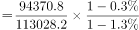，故2015年非谷物播种面积占比，与B项最接近。

方法二：定位文字材料第三段可得：2016年全国粮食播种面积113028.2千公顷，比2015年减少314.7千公顷；谷物播种面积94370.8千公顷，比2015年减少1265.1千公顷。根据公式：基期量=现期量-增长量，比重，则2015年谷物播种面积占全国的比重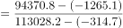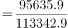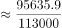，故2015年非谷物播种面积占比，与B项最接近。

故正确答案为B。

---

#### 第 2 题　qid 4713993 · 综合

2015年我国玉米播种面积约是大豆的多少倍？

- **A**. 5.1
- **B**. 5.9　✅
- **C**. 7
- **D**. 4.3

**答案**：B

**官方解析**

根据题干“2015年······约是······的多少倍”，结合材料时间为2016年，可判定本题为基期倍数问题。

方法一：定位文字材料第六段可得：2016年玉米播种面积5.51亿亩（A），比上年减少3.6%（a）；大豆播种面积1.08亿亩（B），比上年增长10.7%（b）。根据公式：基期倍数，则所求倍数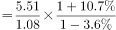，与B项最接近。

方法二：定位文字材料第六段可得：2016年玉米播种面积5.51亿亩，比上年减少2039万亩；大豆播种面积1.08亿亩，比上年增加1046万亩。2039万亩0.204亿亩，1046万亩0.105亿亩。根据公式：基期量=现期量-增长量，则所求倍数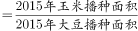，与B项最接近。

故正确答案为B。

---

#### 第 3 题　qid 4714000 · 比重

2016年，我国谷物产量占粮食总产量的比重比上年约：

- **A**. 提高0.37个百分点
- **B**. 提高2.08个百分点
- **C**. 降低0.37个百分点　✅
- **D**. 降低2.08个百分点

**答案**：C

**官方解析**

根据题干“2016年，······占······的比重比上年约”，结合选项均为“提高/降低······个百分点”，可判定本题为两期比重问题。定位文字材料第二段可得：2016年全国粮食总产量61623.9万吨（B），比2015年减少0.8%（b）；谷物产量56516.5万吨（A），比2015年减少1.2%（a）。根据公式：两期比重差，则所求比重差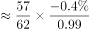，即约降低了0.37个百分点。

故正确答案为C。

---

#### 第 4 题　qid 4714012 · 增长

2016年我国粮食单位面积产量约同比：

- **A**. 增长0.56%
- **B**. 增长1.12%
- **C**. 减少0.56%　✅
- **D**. 减少1.12%

**答案**：C

**官方解析**

根据题干“2016年······单位面积产量约同比”，结合选项给出增长/减少+%，可判定本题为平均数的增长率问题。定位文字材料第二段可知，2016年全国粮食总产量比2015年减少0.8%（a）；定位文字材料第三段可知，2016年全国粮食播种面积比2015年减少0.3%（b）。根据平均数的增长率公式：，可得：2016年我国粮食单位面积产量同比增长率，即约同比减少0.5%，与C项最接近。

故正确答案为C。

---

#### 第 5 题　qid 4714015 · 综合

以下说法正确的是：

- **A**. 2016年，除谷物外我国其他粮食播种面积之和有所增加　✅
- **B**. 假设粮食总产量以每年10%的速度增长，2019年将首次突破7万万吨
- **C**. 2016年粮食产量下降主要是播种面积减少造成的
- **D**. 2016年全国农作物受灾面积同比增长约为16%

**答案**：A

**官方解析**

A项：定位文字材料第三段可知，2016年全国粮食播种面积比2015年减少314.7千公顷；其中谷物播种面积比2015年减少1265.1千公顷。2016年除谷物外我国其他粮食播种面积之和变化量为（-314.7）-（-1265.1）=950.4＞0，即2016年，除谷物外我国其他粮食播种面积之和有所增加，正确；

B项：定位文字材料第二段可知，2016年全国粮食总产量61623.9万吨，若粮食总产量以每年10%的速度增长，根据公式：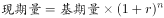，设n年后粮食总产量首次突破7万万吨，，即，当n=2时不等式成立，即2016+2=2018年全国粮食总产量首次突破7万万吨，错误；

C项：定位文字材料第四段可知，2016年，全国粮食播种面积比上年减少了472万亩，因播种面积减少而减产34亿斤，占粮食减产总量的33.2%。由于因播种面积减少而减产的产量占粮食减产总量的比重少于一半，故播种面积减少不是粮食产量下降的主要原因，错误；

D项：定位文字材料最后一段可知，2016年1-10月份，全国农作物受灾面积3.97亿亩，未给出2016年全年的相关数据，故无法计算，错误。

故正确答案为A。

---

### 材料 2

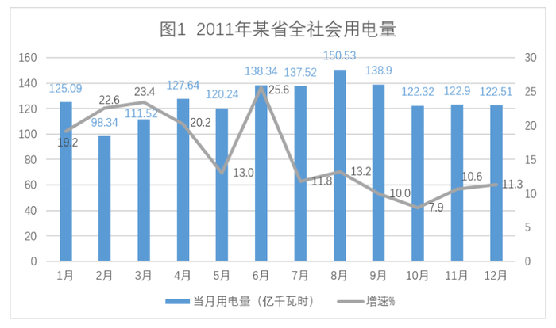

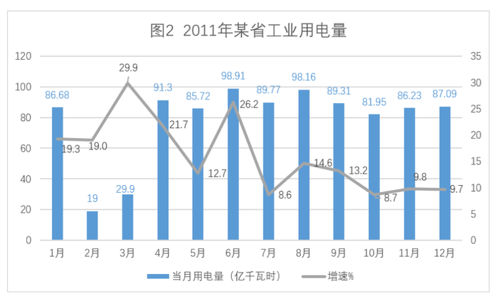

#### 第 6 题　qid 4713973 · 综合

2011年某省工业用电量最多的季度是：

- **A**. 第一季度
- **B**. 第二季度
- **C**. 第三季度　✅
- **D**. 第四季度

**答案**：C

**官方解析**

定位图2可得，2011年某省各月工业用电量。则：

第一季度工业用电量=1月+2月+3月=86.68+19+29.9＜200亿千瓦时；

第二季度工业用电量=4月+5月+6月=91.3+85.72+98.91276亿千瓦时；

第三季度工业用电量=7月+8月+9月=89.77+98.16+89.31277亿千瓦时；

第四季度工业用电量=10月+11月+12月=81.95+86.23+87.09255亿千瓦时。

综上所述，2011年某省工业用电量最多的季度是第三季度。

故正确答案为C。

---

#### 第 7 题　qid 4713988 · 增长

2011年工业用电量增速高于全社会用电量增速的月份有：

- **A**. 6 个
- **B**. 7 个　✅
- **C**. 8 个
- **D**. 9 个

**答案**：B

**官方解析**

下表所示为2011年某省工业用电量和全社会用电量的增速：

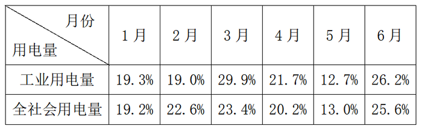

符合条件的有：1月，3月，4月，6月，8月，9月，10月，共7个。

故正确答案为B。

---

#### 第 8 题　qid 4713994 · 增长

2011年第一季度全社会用电量同比增长量和增速分别约为：

- **A**. 59.43亿千瓦时，17.7%
- **B**. 59.43亿千瓦时，21.6%　✅
- **C**. 72.80亿千瓦时，26.4%
- **D**. 72.80亿千瓦时，21.7%

**答案**：B

**官方解析**

根据题干“2011年第一季度······同比增长量和增速分别约为”，结合图形材料可知2011年1-3月全社会用电量的同比增速，可判定本题为增长量计算和混合增长率问题。

1.求混合增长率：定位图1可知，2011年1-3月全社会用电量的增速分别为：19.2%，22.6%，23.4%。根据混合后的增长率居中，则2011年第一季度全社会用电量的增速r：19.2%&lt;r&lt;23.4%，排除A、C两项。

2.求增长量：

方法一：定位图1可知，2011年1-3月全社会用电量及其增速分别为：125.09亿千瓦时，19.2%；98.34亿千瓦时，22.6%；111.52亿千瓦时，23.4%。根据公式：，则2011年1-3月全社会用电量的同比增长量分别为：1月：亿千瓦时；2月：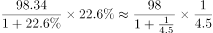亿千瓦时；3月：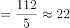亿千瓦时。因此2011年第一季度全社会用电量同比增长量约为21+18+22=61亿千瓦时，与B项最接近。

方法二：根据B、D两项可确定2011年第一季度全社会用电量的增速为21.6%或21.7%。定位图1可知，2011年1-3月全社会用电量分别为：125.09亿千瓦时，98.34亿千瓦时，111.52亿千瓦时。则2011年第一季度全社会用电量为亿千瓦时。根据公式：，则2011年第一季度全社会用电量的同比增长量约为：（或）亿千瓦时，与B项最接近。

故正确答案为B。

---

#### 第 9 题　qid 4714002 · 比重

2011年工业用电量占全社会用电量的比重最小的月份是：

- **A**. 2 月份　✅
- **B**. 3 月份
- **C**. 8 月份
- **D**. 9 月份

**答案**：A

**官方解析**

根据题干“2011年······占······的比重最小的月份是”，结合材料时间为2011年，可判定本题为现期比重问题。定位图形材料可知，2011年某省2月、3月、8月和9月的全社会用电量和工业用电量分别为：98.34亿千瓦时，19亿千瓦时；111.52亿千瓦时，29.9亿千瓦时；150.53亿千瓦时，98.16亿千瓦时；138.9亿千瓦时，89.31亿千瓦时。根据公式：比重，则所求比重分别为：2月：；3月：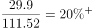；8月：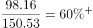；9月：，故比重最小的月份是2月份。

故正确答案为A。

---

#### 第 10 题　qid 4714005 · 综合

以下说法正确的是：

- **A**. 2011年全社会用电量环比变动的趋势与工业用电量完全一致　✅
- **B**. 2011年和2010年年度工业用电量的峰值均出现在6月份
- **C**. 2011年度全社会用电量达到峰值的月份，其非工业用电量增速最高
- **D**. 2011年全社会用电量增速与工业用电量增速差距最大的月份，其非工业用电量为当年最小值

**答案**：A

**官方解析**

A项：定位统计图1和图2可得，2011年11月全社会用电量为122.9亿千瓦时，12月为122.51亿千瓦时，12月全社会用电量环比下降；11月工业用电量为86.23亿千瓦时，12月为87.09亿千瓦时，12月工业用电量环比上升。即2011年二者环比变动的趋势不完全一致，错误；

B项：定位统计图2可得，2011年工业用电量最大值为6月，为98.91亿千瓦时，同比增长26.2%；8月为98.16亿千瓦时，同比增长14.6%。根据公式：基期量，则2010年6月工业用电量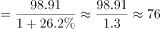亿千瓦时，8月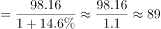亿千瓦时，2010年8月工业用电量更大，即2010年工业用电量的峰值不是6月份，错误；

C项：定位统计图1可得，达到峰值的月份为8月，同比增长13.2%。定位统计图2，8月同比增长14.6%。根据混合增长率口诀“混合后居中”可得：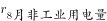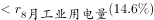。同理，2011年度全社会用电量2月同比增长22.6%，2011年度工业用电量2月同比增长19%，因此：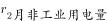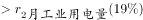。2月非工业用电量增速高于8月，即2011年度全社会用电量达到峰值的月份，其非工业用电量增速不是最高，错误；

D项：定位统计图1和图2可得，2011年1-12月全社会用电量增速与工业用电量增速之差分别为： 

1月：|19.2%-19.3%|=0.1%；

2月：22.6%-19%=3.6%；

3月：|23.4%-29.9%|=6.5%；

4月：|20.2%-21.7%|=1.5%；

5月：13%-12.7%=0.3%；

6月：|25.6%-26.2%|=0.6%；

7月：11.8%-8.6%=3.2%；

8月：|13.2%-14.6%|=1.4%；

9月：|10%-13.2%|=3.2%；

10月：|7.9%-8.7%|=0.8%；

11月：10.6%-9.8%=0.8%；

12月：11.3%-9.7%=1.6%。

差值最大的是3月，3月非工业用电量=111.52-29.9=81.62亿千瓦时，而4月非工业用电量=127.64-91.3=36.34亿千瓦时，4月非工业用电量低于3月，即2011年二者增速差距最大的月份，其非工业用电量不是当年最小值，错误。

备注：本题四个选项均错误，故无正确答案。

---

### 材料 3

        2012年末福建省常住人口3748万人，比上年增长。农村居民人均纯收入9967元，比上年增长13.5%，扣除价格因素，实际增长10.8%，城镇居民人均可支配收入28055元，比上年增长12.6%，扣除价格因素，实际增长10.0%，农村居民食品消费支出占消费总支出比重为46.0%，城镇为39.4% 。

        全省领取失业保险金人数4.61万人，比上年增长1.04万人，全省纳入城镇最低生活保障的居民16.89万人，减少1.20万人，纳入农村最低生活保障的居民73.68万人，增加0.73万人：“五保”供养对象9.14万人。

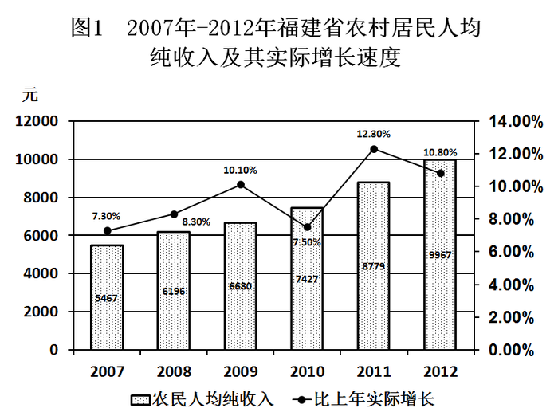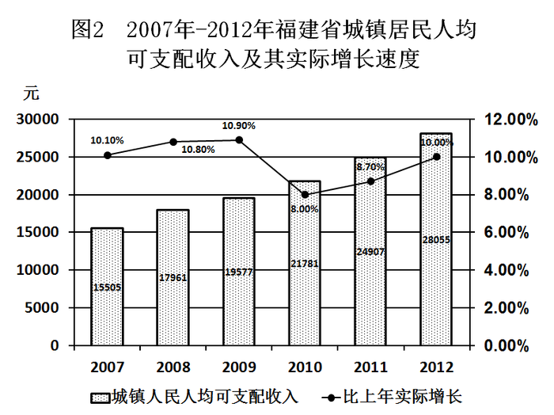

#### 第 11 题　qid 1992332 · 综合

2012年纳入最低生活保障的居民人数与2011年相比约：

- **A**. 减少7.1%
- **B**. 增加1.0%
- **C**. 减少0.5%　✅
- **D**. 减少5.1%

**答案**：C

**官方解析**

第一步：分析问题。
观察选项，数据相差较大，可采取估算法。增长率=增长量÷基期量。
第二步：定位数据。
文字材料第二段：“全省纳入城镇最低生活保障的居民16.89万人，减少1.20万人，纳入农村最低生活保障的居民73.68万人，增加0.73万人”。
第三步：计算过程。
2012年全省纳入最低生活保障居民人数=16.89+73.68=90.57万人，全省纳入最低生活保障居民人数比去年增加人数=-1.2+0.73=-0.47，即减少了0.47万人。
2011年全省纳入最低生活保障居民人数=90.57+0.47=91.04万人。
2012年纳入最低生活保障的居民人数与2011年相比的增长率=（-0.47）÷91.04≈-0.5%。
（因选项相差较大，可将-0.47简化为-0.5，91.04简化为90，计算出来结果为-0.005左右，即-0.5%，即减少了0.5%。)
第四步：再次标注答案 。
故正确答案为C。

---

#### 第 12 题　qid 1992346 · 比重

2011年纳入最低生活保障的居民人数占全省常住人口的比重约为：

- **A**. 2.4%　✅
- **B**. 0.5%
- **C**. 1.9%
- **D**. 2.7%

**答案**：A

**官方解析**

根据“2011年纳入最低生活保障的居民人数占全省常住人口的比重”，结合材料时间为2012年，可判定本题为基期比重问题。定位文字材料第一段：2012年末福建省常住人口3748万人，比上年增长；定位文字材料第二段：全省纳入城镇最低生活保障的居民16.89万人，减少1.20万人，纳入农村最低生活保障的居民73.68万人，增加0.73万人。根据公式：基期量=现期量-增长量，则2011年纳入最低生活保障的居民人数=2011年纳入城镇最低生活保障的居民人数+2011年纳入农村最低生活保障的居民人数=（16.89+1.20）+（73.68-0.73）=91.04万人。根据公式：基期量，则2011年全省常住人口为万人。故所求比重，与A项最接近。

故正确答案为A。

---

#### 第 13 题　qid 1992348 · 平均数

2012年农村居民人均纯收入与城镇居民人均可支配收入间的差距与2011年相比约：

- **A**. 增大12%　✅
- **B**. 减少12%
- **C**. 增大21%
- **D**. 减少21%

**答案**：A

**官方解析**

根据题干“2012年······与2011年相比约”，结合选项为增大/减少+百分数，可判定本题为一般增长率计算问题。定位图1可得：2012年与2011年福建省农村居民人均纯收入分别为9967元与8779元；定位图2可得：2012年与2011年福建省城镇居民人均可支配收入分别为28055元与24907元。则2012年二者差距为28055-9967=18088元，2011年二者差距为24907-8779=16128元。根据公式：增长率，则2012年二者差距与2011年增长，与A项最接近。

故正确答案为A。

---

#### 第 14 题　qid 1992354 · 增长

2007-2010年，农村居民人均纯收入年平均增长率约为：

- **A**. 10.7%　✅
- **B**. 9.9%
- **C**. 8.3%
- **D**. 8.6%

**答案**：A

**官方解析**

根据“年平均增长率约为”，判断本题为年均增长率计算问题。定位图1：2007年农村居民人均纯收入为5467元，2010年农村居民人均纯收入为7427元。根据公式：，可得：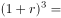，即。

年均增长率的计算，采用代入排除法，由于B项，优先代入。。所以年均增长率r应，仅有A项符合。

故正确答案为A。

---

#### 第 15 题　qid 1992356 · 综合

根据上述材料，下列描述错误的是：

- **A**. 2007-2012年，农村居民人均纯收入与城镇居民人均可支配收入间的绝对差距呈增大趋势
- **B**. 2007-2012年，农村居民人均纯收入与城镇居民人均可支配收入增长趋势大致相同
- **C**. 2007-2012年，农村居民人均纯收入与城镇居民人均可支配收入相比增速慢的年份有3年　✅
- **D**. 2011年，农村居民人均纯收入与城镇居民人均可支配收入增长速度间的差距最大

**答案**：C

**官方解析**

第一步：分析问题。
根据两个柱状图表进行做题。增长趋势相同是指城乡的增长率同时增长或同时下降，增长趋势大致相同是指可能有部分年份趋势不同，但大部分是相同的。
第二步：定位数据。
两个柱状图表。
第三步：计算过程。
通过计算每年的城乡差额发现2007-2012年间农村和城镇的收入差距越来越大，A项正确；
观察表格发现2007-2011年农村和城镇的收入增长趋势都是相同的（增长-增长-下降-增长），只有2011-2012年的趋势不同，但符合大致相同的说法，B项正确；
2007-2012年，农村居民人均纯收入与城镇居民人均可支配收入相比增速慢的年份有4年，分别是2007、2008、2009、2010四年，C项错误；
2011年，农村居民人均纯收入的增速是12.3%，城镇居民人均可支配收入的增速是8.7%，增长速度相差3.6%，是2007-2012年间增速差距最大的，D项正确。
第四步：再次标注答案 。
本题为选非题，故正确答案为C。

---

### 材料 4

        国家统计局2015年2月25日发布2014年国民经济和社会发展统计公报，各项社会事业取得新的进展。初步核算，全年国内生产总值335353亿元，比上年增长8.7%。

        统计公报分综合、农业、工业和建筑业、固定资产投资、国内贸易、对外经济、交通邮电和旅游、金融、教育和科学技术、文化卫生和体育、人口、人民生活和社会保障，以及资源、环境和安全生产等十二部分，展示了2014年中国国民经济和社会发展状况。

        公报显示，截至2014年年末，国家外汇储备23992亿美元，比上年末增加4531亿美元，增速减慢4个百分点；全年财政收入68477亿元，比上年增加7147亿元，增长11.7%；全国就业人员77995万人，比2013年末增加515万人，比2012年末增加1005万人。

        中国政府2014年推出四万亿元的剌激计划。公报显示，2014年全年全社会固定资产投资224846亿元，比上年增长30.1%。其中，中西部投资增长高于东部和东北地区。

#### 第 16 题　qid 4714016 · 增长

根据2014年国民经济和社会发展统计公报初步核算的结果，2014年全年国内生产总值比上年增加了约：

- **A**. 26841亿元　✅
- **B**. 26897亿元
- **C**. 26954亿元
- **D**. 26995亿元

**答案**：A

**官方解析**

方法一：根据题干“······2014年······比上年增加了约”，可判定本题为增长量计算问题。定位文字材料第一段可得：2014年，全年国内生产总值335353亿元，比上年增长8.7%。根据公式：增长量=现期量-基期量=，可得2014年全年国内生产总值比上年增加了亿元，与A项最接近。

方法二：根据题干“······2014年······比上年增加了约”，可判定本题为增长量计算问题。定位文字材料第一段可得：2014年，全年国内生产总值335353亿元，比上年增长8.7%。根据公式：增长量，可得2014年全年国内生产总值比上年增加了亿元，与A项最接近。

故正确答案为A。

---

#### 第 17 题　qid 4714068 · 综合

2012年末我国国家外汇储备是：

- **A**. 15288亿元
- **B**. 15676亿元
- **C**. 15288亿美元　✅
- **D**. 15676亿美元

**答案**：C

**官方解析**

根据题干“2012年末我国国家外汇储备是”，结合材料时间为2014年末，可判定本题为基期计算问题。定位文字材料第三段可得：2014年末，国家外汇储备23992亿美元，比上年末增加4531亿美元，增速减慢4个百分点。2013年末国家外汇储备=23992-4531=19461亿美元，根据公式：增长率，可得2014年末国家外汇储备同比增长率：，2013年末国家外汇储备同比增长率=23.2%+4%=27.2%。根据公式：基期量，可得2012年末国家外汇储备亿美元，与C项最接近。

故正确答案为C。

---

#### 第 18 题　qid 4714079 · 增长

2013年末就业人员比上年增长了：

- **A**. 2.53%
- **B**. 1.97%
- **C**. 1.26%
- **D**. 0.64%　✅

**答案**：D

**官方解析**

根据题干“2013年末······比上年增长了”，结合选项为百分数，可判定本题为一般增长率计算问题。定位文字材料第三段可得：2014年末，全国就业人员77995万人，比2013年末增加515万人，比2012年末增加1005万人。根据公式：增长率，可得2013年末就业人员比上年增长了，与D项最接近。

故正确答案为D。

---

#### 第 19 题　qid 4714082 · 综合

2013年全年全社会固定资产投资约为：

- **A**. 172475亿元
- **B**. 172826亿元　✅
- **C**. 173056亿元
- **D**. 173217亿元

**答案**：B

**官方解析**

根据题干“2013年全年······约为”，结合材料时间为2014年，可判定本题为基期计算问题。定位文字材料第四段可得：2014年全年全社会固定资产投资224846亿元，比上年增长30.1%。根据公式：基期量，则2013年全年全社会固定资产投资亿元，与B项最接近。

故正确答案为B。

---

#### 第 20 题　qid 4714084 · 综合

以下说法错误的是：

- **A**. 2014年我国国民经济形势总体回升向好，各项社会事业取得新的进展
- **B**. 2013年全年财政收入为61330亿元
- **C**. 2013年末全国就业人员比2012年末全国就业人员增加490万人
- **D**. 2014年全年中西部的全社会固定资产投资增长低于东部和东北地区　✅

**答案**：D

**官方解析**

A项：定位材料第一段可得：国家统计局发布2014年国民经济和社会发展统计公报，各项社会事业取得新的进展。初步核算，全年国内生产总值335353亿元，比上年增长8.7%。国内生产总值是国民经济核算的核心指标，由于2014年全年国内生产总值同比增长率为正数，即经济形势总体回升向好，正确；
B项：定位材料第三段可得：2014年全年财政收入68477亿元，比上年增加7147亿元。根据公式：基期量=现期量-增长量，则2013年全年财政收入=68477-7147=61330亿元，正确；
C项：定位材料第三段可得：2014年全国就业人员77995万人，比2013年末增加515万人，比2012年末增加1005万人。根据公式：基期量=现期量-增长量，则2013年末全国就业人员为77995-515=77480万人，2012年末全国就业人员为77995-1005=76990万人，那么2013年末全国就业人员比2012年末全国就业人员增加77480-76990=490万人，正确；
D项：定位材料第四段可得：2014年中西部投资增长高于东部和东北地区，错误。
本题为选非题，故正确答案为D。

---
