# 2018年重庆市选调优秀大学生到基层工作考试《行测》题

> 选调生 · 2018 年 · 6 个模块 · 共 98 题

- [政治理论](#%E6%94%BF%E6%B2%BB%E7%90%86%E8%AE%BA) · 3 题
- [常识判断](#%E5%B8%B8%E8%AF%86%E5%88%A4%E6%96%AD) · 12 题
- [言语理解与表达](#%E8%A8%80%E8%AF%AD%E7%90%86%E8%A7%A3%E4%B8%8E%E8%A1%A8%E8%BE%BE) · 30 题
- [数量关系](#%E6%95%B0%E9%87%8F%E5%85%B3%E7%B3%BB) · 13 题
- [判断推理](#%E5%88%A4%E6%96%AD%E6%8E%A8%E7%90%86) · 30 题
- [资料分析](#%E8%B5%84%E6%96%99%E5%88%86%E6%9E%90) · 10 题

---

## 政治理论

### 第 1 题　qid 4695841 · 新思想

党的十九大提出，中国特色社会主义进入新时代，我国社会主要矛盾是（    ）之间的矛盾。

- **A**. 人民日益增长的物质文化需要同落后的发展
- **B**. 人民日益增长的物质文化需要同落后的社会生产
- **C**. 人民日益增长的美好生活需要和不平衡不充分的发展　✅
- **D**. 人民日益增长的美好生活需要和不协调不充分的发展

**答案**：C

**官方解析**

本题考查政治常识。
C项正确，A、B、D三项错误，十九大报告在“一、过去五年的工作和历史性变革”部分指出：“中国特色社会主义进入新时代，我国社会主要矛盾已经转化为人民日益增长的美好生活需要和不平衡不充分的发展之间的矛盾。我国稳定解决了十几亿人的温饱问题，总体上实现小康，不久将全面建成小康社会，人民美好生活需要日益广泛，不仅对物质文化生活提出了更高要求，而且在民主、法治、公平、正义、安全、环境等方面的要求日益增长。”
故正确答案为C。

---

### 第 2 题　qid 4695842 · 新思想

习近平总书记在党的十九大报告中指出，从现在到二〇二〇年，是：

- **A**. 大发展大变革大调整时期
- **B**. 全面建成小康社会决胜期　✅
- **C**. “两个一百年”奋斗目标的历史交汇期
- **D**. 中国特色社会主义进入新时代的关键时期

**答案**：B

**官方解析**

本题考查政治常识。
B项正确，A、C、D三项错误，十九大报告在“一、过去五年的工作和历史性变革”部分指出：“这个新时代，是承前启后、继往开来、在新的历史条件下继续夺取中国特色社会主义伟大胜利的时代，是决胜全面建成小康社会、进而全面建设社会主义现代化强国的时代，是全国各族人民团结奋斗、不断创造美好生活、逐步实现全体人民共同富裕的时代，是全体中华儿女勠力同心、奋力实现中华民族伟大复兴中国梦的时代，是我国日益走近世界舞台中央、不断为人类作出更大贡献的时代。”
故正确答案为B。

---

### 第 3 题　qid 4695846 · 新思想

习近平总书记曾指出，长江和长江经济带的地位和作用，说明推动长江经济带发展必须坚持（    ）的战略定位。

- **A**. 开放先行、创新发展
- **B**. 区域优先、协调发展
- **C**. 生态优先、绿色发展　✅
- **D**. 文明先行、健康发展

**答案**：C

**官方解析**

本题考查政治常识。
C项正确，A、B、D三项错误，2016年1月5日，习近平总书记在重庆召开推动长江经济带发展座谈会，听取对推动长江经济带发展的意见和建议并发表重要讲话。他强调，长江、黄河都是中华民族的发源地，都是中华民族的摇篮。通观中华文明发展史，从巴山蜀水到江南水乡，长江流域人杰地灵，陶冶历代思想精英，涌现无数风流人物。千百年来，长江流域以水为纽带，连接上下游、左右岸、干支流，形成经济社会大系统，今天仍然是连接丝绸之路经济带和21世纪海上丝绸之路的重要纽带。新中国成立以来特别是改革开放以来，长江流域经济社会迅猛发展，综合实力快速提升，是我国经济重心所在、活力所在。长江和长江经济带的地位和作用，说明推动长江经济带发展必须坚持生态优先、绿色发展的战略定位，这不仅是对自然规律的尊重，也是对经济规律、社会规律的尊重。
故正确答案为C。

---

## 常识判断

### 第 1 题　qid 4695850 · 人文常识

按照国际标准，目前我国人均国民总收入超过8000美元，属于：

- **A**. 中等收入国家
- **B**. 中等偏上收入国家　✅
- **C**. 接近高收入国家
- **D**. 高收入国家

**答案**：B

**官方解析**

本题考查政治常识。
B项正确、A、C、D三项错误，按世界银行公布的数据，2018年的最新收入分组标准为：人均国民总收入低于995美元为低收入国家，在996至3895美元之间为中等偏下收入国家，在3896至12055美元之间为中等偏上收入国家，高于12055美元为高收入国家。我国属于中等偏上收入国家。
故正确答案为B。
（注：2021年国家统计局发布的数据显示，人均国内生产总值80976元，按年平均汇率折算，达12551美元，突破了1.2万美元。年末，外汇储备余额32502亿美元，稳居世界第一。值得注意的是，2021年人均国内生产总值超过1.2万美元，已接近世界银行高收入标准。）

---

### 第 2 题　qid 4695854 · 法律常识

《中华人民共和国民法典》规定，（    ）以上的未成年人为限制民事行为能力人。

- **A**. 两周岁
- **B**. 八周岁　✅
- **C**. 十四周岁
- **D**. 十六周岁

**答案**：B

**官方解析**

本题考查法律常识。
B项正确，A、C、D三项错误，根据《中华人民共和国民法典》第十九条规定：“八周岁以上的未成年人为限制民事行为能力人，实施民事法律行为由其法定代理人代理或者经其法定代理人同意、追认；但是，可以独立实施纯获利益的民事法律行为或者与其年龄、智力相适应的民事法律行为。”
故正确答案为B。
注：本题为2018年考试的真题，那时候《中华人民共和国民法典》还未施行，故原题考查《中华人民共和国民法总则》。但该法现已失效，故粉笔将题目改为《中华人民共和国民法典》，建议掌握知识点即可。

---

### 第 3 题　qid 4695857 · 人文常识

关于大数据分析，下列哪一表述是不正确的？

- **A**. 大数据分析经常用来进行预测性分析
- **B**. 大数据分析会经常采用抽样调查的方法来分析数据　✅
- **C**. 大数据分析能分析语音和图像的数据
- **D**. 大数据分析需要在大量的经过专业处理后数据基础上进行分析

**答案**：B

**官方解析**

本题考查科技常识。
A项正确，大数据分析的产生旨在于IT管理，企业可以将实时数据流分析和历史相关数据相结合，然后分析并发现它们所需的模型，帮助预测和预防未来运行中断和性能问题。进一步来讲，他们可以利用大数据了解使用模型以及地理趋势，进而加深大数据对重要用户的洞察力。
B项错误，大数据分析是指对规模巨大的数据进行分析。大数据可以概括为5个V，数据量大(Volume)、速度快(Velocity)、类型多(Variety)、价值（Value）、真实性（Veracity）。抽样调查是一种非全面调查，它是从全部调查研究对象中，抽选一部分单位进行调查，并据以对全部调查研究对象做出估计和推断的一种调查方法。
C项正确，大数据分析是指对规模巨大的数据进行分析，这些数据可以是文字类、语言类或者图片类等。
D项正确，大数据处理流程主要包括数据收集、数据预处理、数据存储、数据处理与分析、数据展示/数据可视化、数据应用等环节，其中数据质量贯穿于整个大数据流程，每一个数据处理环节都会对大数据质量产生影响作用，需要在大量的经过专业处理后数据基础上进行分析。
本题为选非题，故正确答案为B。

---

### 第 4 题　qid 4695860 · 人文常识

下列我国古代器具中，不属于炊具的是：

- **A**. 鼎
- **B**. 釜
- **C**. 鬲
- **D**. 盉　✅

**答案**：D

**官方解析**

本题考查人文常识。
A项正确，鼎是古代我国一些地方古人用以烹煮肉和盛贮肉类的器具，是古代最重要青铜器物种之一。最早的鼎是黏土烧制的陶鼎，后来又有了用青铜铸造的铜鼎，有三足圆鼎，也有四足方鼎。自从有了禹铸九鼎的传说，鼎就从一般的炊具而发展为传国重器。
B项正确，釜圆底而无足，必须安置在炉灶之上或是以其他物体支撑煮物，釜口也是圆形，可以直接用来煮、炖、煎、炒等，可视为现代所使用“锅”的前身。随着冶铁业的发展，铁制釜的耐火、导热性能更好，而逐渐取代鼎、鬲成为主要炊具。
C项正确，鬲是一种古陶器，用于蒸煮食物，其最基本的特征是三个肥大形似布袋（也有说形似牛乳房）的足。
D项错误，盉是中国古代盛酒器，是古人调和酒、水的器具，用水来调和酒味的浓淡。盉的形状较多，一般是圆口，深腹，有盖，前有流，后有鋬，下有三足或四足，盖和鋬之间有链相连接。青铜盉最早出现于二里头文化时期（即夏文化），盛行于商晚期和西周，流行到春秋战国。
本题为选非题，故正确答案为D。

---

### 第 5 题　qid 4695867 · 地理国情

位于印度尼西亚巴厘岛东部的阿贡火山持续喷发导致当地超过10万民众被迫撤离，以下关于火山的说法正确的是：

- **A**. 岩浆上升过程中，越靠近地表压力越大
- **B**. 阿贡火山是由于洋脊上的岩石圈断开，造成岩浆溢出而形成的
- **C**. 我国火山分布和活动主要集中在东北地区和青藏高原　✅
- **D**. 我国活火山数量较少，基本处于休眠状态，因此火山监测工作不太重要

**答案**：C

**官方解析**

本题考查地理国情。
A项错误，火山喷发是岩浆等喷出物在短时间内从火山口向地表的释放。由于岩浆中含大量挥发分，加之上覆岩层的围压，使这些挥发分溶解在岩浆中无法溢出，当岩浆上升靠近地表时，压力减小，挥发分急剧被释放出来，于是形成火山喷发。在岩浆上升过程中，越靠近地表压力越小。
B项错误，阿贡火山是一座位于印度尼西亚巴厘岛东部的活火山，海拔3142米，为巴厘岛的最高峰，被当地人奉为圣山，喷发周期约为50年。一般认为火山的成因主要有三种，第一种是洋脊上的岩石圈裂开，岩浆溢出，形成火山，比如冰岛；第二种是板块俯冲挤压作用形成火山，比如阿贡火山；第三种是某个局部的地幔热柱式热点喷发形成火山，比如夏威夷火山岛链。
C项正确，我国地处欧亚板块东南部，位于太平洋板块、印度板块和西伯利亚板块之间。由于板块运动，我国的火山分布和活动主要集中在东北地区和青藏高原。
D项错误，从中新世到更新世以来2000多万年的地质历史中，中国是个多火山国家。目前，我国活火山的数量较少，基本处于休眠或休眠期扰动状态，虽然短期内可能没有喷发风险，但由于火山喷发活动周期较长，火山喷发原因多种多样，造成危害大，我们仍应加强监测，不能掉以轻心。
故正确答案为C。

---

### 第 6 题　qid 4695872 · 人文常识

“月上柳梢头，人约黄昏后”描写的是我国哪个传统节日?

- **A**. 元宵节　✅
- **B**. 端午节
- **C**. 七夕节
- **D**. 中秋节

**答案**：A

**官方解析**

本题考查人文常识。
A项正确，B、C、D三项错误，题干中的诗句出自宋代欧阳修的《生查子·元夕》，诗句意为与佳人相约在黄昏之后、月上柳梢头之时同叙衷肠。诗句前一句为“去年元夜时，花市灯如昼”，即去年元宵节的时候，花市被灯光照的如同白昼。可知描写的是元宵节。
故正确答案为A。

---

### 第 7 题　qid 4695876 · 科技常识

2017年11月30日，我国首颗暗物质科学卫星——“（    ）”号在轨运行近两年后，成功获取了目前国际上精度最高的电子宇宙射线探测结果。

- **A**. 墨子
- **B**. 天宫
- **C**. 天眼
- **D**. 悟空　✅

**答案**：D

**官方解析**

本题考查科技常识。
A项错误，“墨子号”量子科学实验卫星于2016年8月16日1时40分在酒泉卫星发射中心用长征二号丁运载火箭发射升空，是我国自主研制的世界上首颗空间量子科学实验卫星，也是中科院空间科学战略性先导科技专项于2011年首批确定的五颗科学实验卫星之一。
B项错误，中国空间站又叫天宫空间站，预计在2022年前后建成。1992年，中国政府就制定了载人航天工程“三步走”发展战略，建成空间站是发展战略的重要目标。2011年9月，天宫一号空间实验室发射升空。2016年9月天宫二号空间实验室发射升空。2021年4月29日，空间站天和核心舱发射成功。2021年6月17日18时48分，神舟十二号载人飞船航天员聂海胜、刘伯明、汤洪波先后进入天和核心舱，标志着中国人首次进入自己的空间站。
C项错误，500米口径球面射电望远镜（天眼）于2011年3月25日动工兴建；于2016年9月25日进行落成启动仪式，该科技基础设施进入试运行、试调试工作；于2020年1月11日通过中国国家验收工作，正式开放运行。
D项正确，2015年12月17日8时12分，我国在酒泉卫星发射中心用长征二号丁运载火箭成功将暗物质粒子探测卫星“悟空”发射升空。它具有能量分辨率高、测量能量范围大和本底抑制能力强等优势，将中国的暗物质探测提升至新的水平。
故正确答案为D。

---

### 第 8 题　qid 4695878 · 人文常识

宰相是我国古代最高的行政官员，主要任务是辅佐帝王掌管国事。宰相最初起源于春秋时期，在随后的历朝历代中，宰相都发挥着重要作用。然而，废除宰相一职的皇帝是：

- **A**. 唐高宗
- **B**. 宋徽宗
- **C**. 明太祖　✅
- **D**. 清太宗

**答案**：C

**官方解析**

本题考查人文常识。
C项正确，A、B、D三项错误，明太祖朱元璋在位期间为强化中央集权，废除宰相和行中书省，设三司分掌地方权力。
故正确答案为C。

---

### 第 9 题　qid 4695882 · 科技常识

我国目前的能源结构以（    ）为主。

- **A**. 煤电　✅
- **B**. 水电
- **C**. 核电
- **D**. 风电

**答案**：A

**官方解析**

本题考查科技常识。
能源结构指能源总生产量或总消费量中各类一次能源、二次能源的构成及其比例关系。我国的资源类型是“富煤缺油少气”，因此目前我国化石能源大幅偏重于煤炭，能源结构以煤电为主。
故正确答案为A。

---

### 第 10 题　qid 4695887 · 人文常识

俗话“数九寒天”中的“数九”是从（    ）开始的。

- **A**. 冬至那天　✅
- **B**. 冬至次日
- **C**. 立冬那天
- **D**. 立冬次日

**答案**：A

**官方解析**

本题考查人文常识。
A项正确，B、C、D项错误，冬至日是每年的12月22日，冬至后即开始“数九”，俗称“交九”，意味进入到一年中最寒冷的时节。所谓“数九”，是指从“冬至”当天算起，九天为一个单位，谓之“九”，过了九个“九”，刚好八十一天，即为“出九”。从“一九”数到“九九”，冬寒就变成春暖了。
故正确答案为A。

---

### 第 11 题　qid 4695895 · 人文常识

Word文档的编辑中，以下键盘命令不属于剪贴板操作命令的是：

- **A**. Ctrl+X
- **B**. Ctrl+A　✅
- **C**. Ctrl+C
- **D**. Ctrl+V

**答案**：B

**官方解析**

本题考查科技常识。
A、C、D三项正确，B项错误，在Word文档的编辑中，Ctrl+X是剪切数据的命令，Ctrl+C是复制数据的命令，Ctrl+V是粘贴数据的命令。Ctrl+A是全选数据的命令，不属于剪贴板操作命令。
本题为选非题，故正确答案为B。

---

### 第 12 题　qid 4695898 · 科技常识

下列说法正确的一项是：

- **A**. 就银行卡来说，芯片卡的安全性要高于磁条卡　✅
- **B**. 在“自由港”进出的任何商品都不需要交关税
- **C**. 天然气是一种清洁能源，燃烧将不产生污染物
- **D**. 就医过程中常常用酒精来消毒，其浓度为90%

**答案**：A

**官方解析**

本题考查科技常识。
A项正确，芯片银行卡就是以芯片作为介质的银行卡。芯片卡容量大，其工作原理类似于微型计算机，能够同时具备多种功能，且每次的校验值不同，复制的可能性小。芯片银行卡的安全性比传统磁条卡大大提高。因为磁卡的信息读写相对简单容易，但其信息存储量小、磁条易读出和伪造、保密性差，磁条卡一旦丢失，极其容易被复制，从而造成钱财上的损失。
B项错误，自由港是指不受海关管辖的港口或港区。自由港依贸易管制情况分为完全自由港和有限自由港。前者对所有商品进出口都实行免税，后者对少数商品征收少量关税并有某些贸易限制。世界大多数自由港属于后者。
C项错误，天然气的主要成分是烷烃，其中甲烷占绝大多数，另有少量的乙烷、丙烷和丁烷，此外一般有硫化氢、二氧化碳、氮、水汽和少量一氧化碳及微量的稀有气体，如氦和氩等。天然气完全燃烧产生二氧化碳，不完全燃烧会产生一氧化碳。
D项错误，医用酒精的纯度有多种，常见的为95%和75%。95%的酒精常用于擦拭紫外线灯，75%的酒精用于消毒。这是因为，过高浓度的酒精会在细菌表面形成一层保护膜，阻止其进入细菌体内，难以将细菌彻底杀死。
故正确答案为A。

---

## 言语理解与表达

### 材料 1

        《春秋》是我国古代著名的史书，它与时代是什么关系呢？孟子这样说过：“王者之迹熄而《诗》亡，《诗》亡然后《春秋》作。”在这里，“王者之迹熄而《诗》亡”可以说是《春秋》作的时代背景。西周至春秋时期，《诗》不仅与政事有关，而且是周王室与诸侯国之间以及诸侯国使者相互交往中传递思想的工具，是统治阶层人物不可缺少的修养，故有“《诗》以言志”的传统。正因为《诗》有如此重要的分量，在“《诗》亡”的时代背景下，孔子作《春秋》。《春秋》与时代的这种关系，反映了史学发展的基本规律：时代的变动及其特点，影响着一代代史学家，促使他们撰写出各具特色的历史著作。

#### 第 1 题　qid 4695953 · 片段阅读

最适合做这段文字标题的是：

- **A**. 时代孕育史学　✅
- **B**. 史学滋养时代
- **C**. 史学蕴含历史智慧
- **D**. 史书传承中华文明

**答案**：A

**官方解析**

文段首先提出问题“《春秋》与时代是什么关系？”，接着通过引用孟子的话指出《春秋》的创作时代背景，后文具体阐述《春秋》和时代的关系，尾句通过《春秋》与时代的关系揭示了史学发展的基本规律，即时代的变动及其特点促使史学家撰写出历史著作。故文段属于分总结构，重点强调时代孕育史学，对应A项。
B项，“史学滋养时代”强调史学对于时代的作用，文段并未提及，无中生有，排除；
C、D两项，均缺少主题词“时代”，排除。
故正确答案为A。
【文段出处】《与时代互动是史学发展的动力》

---

#### 第 2 题　qid 4695957 · 片段阅读

文中史学与时代的关系不可以解释下列哪一现象？

- **A**. “汉兴，海内统一”是《史记》产生的最重要条件
- **B**. 南宋史学家面对半壁江山撰写《建炎以来系年要录》
- **C**. 鸦片战争后救国图存的时代精神孕育了《海国图志》
- **D**. 《贞观政要》因记载了治国理政方略为历代所重视　✅

**答案**：D

**官方解析**

根据文意可知，史学与时代的关系为“时代的变动及其特点，影响着一代代史学家,促使他们撰写出各具特色的历史著作”。
A项，指出在“汉兴，海内统一”的影响下《史记》产生了，可以体现时代的变动及其特点促使史学家撰写历史著作，排除；
B项，指出“史学家面对半壁江山撰写《建炎以来系年要录》”，可以体现时代的变动及其特点促使史学家撰写历史著作，排除；
C项，指出“时代精神孕育了《海国图志》”，可以体现时代的变动及其特点促使史学家撰写历史著作，排除；
D项，指出“《贞观政要》为历代所重视”，强调历史著作被历代重视，并未体现在时代的影响下史学家撰写历史著作，故文中史学与时代的关系无法解释这一现象，当选。
本题为选非题，故正确答案为D。
【文段出处】《瞿林东：与时代互动是史学发展的动力》

---

### 材料 2

        比起凶猛的大型动物，其实人类最危险的敌人仍是自己的“堂兄弟”黑猩猩等动物。因为人类控制世界最大的倚仗，就是几千年的科学积淀并由此生产出来的各种工具。其他动物由于生物构造的原因，即使大脑变得聪明，也难以借用人类的工具，只能白手起家，这无疑大大增加了与人类对抗的难度。而灵长类动物的优势在于，可以直接将人类的一些工具拿来用，而且还能在人类技术的基础上，进一步改造成更适合猩猩使用习惯的工具。这就大大增加了与人类对抗的底气。但真正可能成为人类对手的，可能是老鼠或者蟑螂等适应能力强且繁殖能力同样强悍的生物。一旦它们拥有相当的智慧，可能真是人类的灾难——当然，这会是科幻小说的题材。

#### 第 3 题　qid 4695962 · 片段阅读

这段文字最合适的标题是：

- **A**. 谁是人类真正的灾难　✅
- **B**. 黑猩猩对抗人类的底气
- **C**. 动物也可能具有智慧
- **D**. 使用工具是智慧的象征

**答案**：A

**官方解析**

文段开篇指出人类最危险的敌人是黑猩猩等动物，接着阐释其原因，后文通过转折关联词“但”强调人类的真正对手可能是老鼠或者蟑螂等生物，他们可能是人类真正的灾难。故文段重点围绕“谁是人类真正的灾难”这一话题论述，对应A项。
B项，为文段转折之前的内容，非重点，排除；
C、D两项，均未提及“人类”这一主题词，偏离文段中心，排除。
故正确答案为A。
【文段出处】《如果动物变聪明了，怎么办》

---

#### 第 4 题　qid 4695965 · 片段阅读

灵长类动物是人类最危险的敌人，因为它们：

- **A**. 与人类是近亲
- **B**. 能使用和改造工具　✅
- **C**. 进化了聪明的大脑
- **D**. 能生产出各种工具

**答案**：B

**官方解析**

根据“其实人类最危险的敌人仍是自己的‘堂兄弟’黑猩猩等动物”和“灵长类动物的优势在于，可以直接将人类的一些工具拿来用，而且还能在人类技术的基础上，进一步改造成更适合猩猩使用习惯的工具”可知，“灵长类动物是人类最危险的敌人”的原因是它们会使用和改造工具，故B项表述正确，当选。
A项“与人类是近亲”并非是灵长类动物危险的原因，排除；
C项“进化了聪明的大脑”、D项“能生产出各种工具”无中生有，均排除。
故正确答案为B。
【文段出处】《如果动物变聪明了，怎么办》

---

### 材料 3

        艺术家的学养是提高其艺术品质的关键，更直接影响到艺术作品的精神内容和审美意旨。而学养不仅需要技巧上的熟练和文化的渊博，更重要的是陈寅恪所说的“独立之精神，自由之思想”。只有在社会与文化层面上保持独立思考的艺术家，只有在精神领域自由驰骋的人，方可透视历史矛盾在人类精神文化层面上留下的轨迹，只有也必须站立在这样的高度，才能踵事增华、高屋建瓴，用想象的自由去超越经验的事实，才能在艺术层面上实现真正的突破和超越。一个敢于严肃审视社会与历史的艺术家，才能在表层的物象背后触及到存在的本质，发现天地人世间可为之倾身寄命的大美。

#### 第 5 题　qid 4695974 · 片段阅读

根据文段内容，作者意在强调：

- **A**. 熟练的技巧和渊博的文化是学养的重要内容
- **B**. 艺术层面的突破和超越需凭借想象而非经验
- **C**. 独立思考和精神自由是实现艺术超越的关键　✅
- **D**. 艺术家的勇气和担当是触及物象本质的条件

**答案**：C

**官方解析**

文段开篇表明艺术家的学养对于艺术的重要性，紧接着通过程度词“更”指出在学养的养成中“独立之精神，自由之思想”是最为重要的一环，随后通过“只有······方可”“只有······才”论证独立思考和精神自由对艺术的重要性。故文段为分总分结构，强调独立思考和精神自由的重要性，对应C项。
A项，对应程度词之前的内容，非重点，排除；
B项，“需凭借想象而非经验”对应后文解释说明的内容，非重点，排除；
D项，文段并未提及“勇气和担当”，无中生有，排除。
故正确答案为C。
【文段出处】《天地大美 艺泱大风——周天黎的艺与境》

---

#### 第 6 题　qid 4695976 · 片段阅读

对于“学养”，以下说法符合题意的是：

- **A**. 熟练的技巧和渊博的文化是学养的最重要内容
- **B**. 精神内容和审美意旨直接决定着艺术家的学养
- **C**. 艺术学养是历史在精神文化层面上留下的轨迹
- **D**. 提高“学养”必须要增强独立精神和自由思想　✅

**答案**：D

**官方解析**

A项，根据“而学养不仅······更重要的是陈寅恪所说的‘独立之精神，自由之思想’”可知，表述错误，排除；
B项，根据“艺术家的学养是提高其艺术品质的关键,更直接影响到艺术作品的精神内容和审美意旨”可知，“精神内容和审美意旨直接决定着艺术家的学养”偷换逻辑，排除；
C项，根据“只有在社会与文化层面上······留下的轨迹”可知，历史矛盾会在人类精神文化层面上留下轨迹，无法推出艺术学养的概念是什么，无中生有，排除；
D项，根据“只有在社会与文化层面上······实现真正的突破和超越”可知，表述正确，当选。
故正确答案为D。
【文段出处】《天地大美 艺泱大风——周天黎的艺与境》

---

#### 第 7 题　qid 4695870 · 逻辑填空

共享时代，对社会诚信“质地不均”的问题，不能            。诚信是市场经济的基石，共享经济要行稳致远，重中之重就在于打牢诚信的基石。
填入画横线部分最恰当的一项是：

- **A**. 心不在焉
- **B**. 有目共睹
- **C**. 视若无睹　✅
- **D**. 掩人耳目

**答案**：C

**官方解析**

根据横线后“共享经济要行稳致远，重中之重就在于打牢诚信的基石”可知，“诚信”很重要，故横线处所填成语应表达对社会诚信“质地不均”的问题不能不重视的意思，C项“视若无睹”指虽然看见了，却像没有看见一样，指不重视或漠不关心，符合文意，当选。
A项“心不在焉”形容思想不集中，B项“有目共睹”比喻事实非常明显，D项“掩人耳目”比喻以假象来蒙蔽别人，均不符合文意，排除。
故正确答案为C。
【文段出处】《共享单车怎样骑得更远？基石是诚信，管理要绣花般精细》

---

#### 第 8 题　qid 4695879 · 逻辑填空

那些美好的回忆深深地        鲁迅的心头，像闪光的露珠        于清晨的片片花瓣。
依次填入画横线部分最恰当的一项是：

- **A**. 留在 散落
- **B**. 烙在 散落　✅
- **C**. 印在 停留
- **D**. 存于 停驻

**答案**：B

**官方解析**

第一空，根据横线前“深深地”可知，美好的回忆对于鲁迅而言是深深刻在心中，非常难忘的，B项“烙在”指用火烧铁在牲畜或器物上烫成痕迹，比喻深刻地留下印象，C项“印在”指用油墨、染料之类把文字或图画留在纸、布、器皿等材料上，也可表示留下深刻的痕迹，保留。A项“留在”、D项“存于”表示存在，未消失，程度较轻，排除。
第二空，根据“清晨的片片花瓣”可知，横线处表示清晨的露珠出现在许多花瓣上，B项“散落”指分散的往下掉落、不集中，与“片片花瓣”对应恰当，当选。C项“停留”指停住不前进，与“片片花瓣”的对应不如“散落”紧密，排除。
故正确答案为B。
【文段出处】《在这里，看到不同的鲁迅》

---

#### 第 9 题　qid 4695891 · 逻辑填空

在城墙的横断面上，依稀可见从商周到明清各朝代夯筑的墙体。这些墙体层层堆积，构成了护卫这座城池的        ，也写下了这片土地久远的历史。······走进河南，会让人立刻        到深邃的历史与文化的海洋中。
依次填入画横线部分最恰当的一项是：

- **A**. 天堑 沉溺
- **B**. 屏障 沉浸　✅
- **C**. 屏风 沉醉
- **D**. 遮挡 陶醉

**答案**：B

**官方解析**

第一空，由横线前内容可知，横线处应体现墙体护卫城池之意。B项“屏障”泛指遮蔽、阻挡之物，C项“屏风”指放在室内用来挡风或者隔断视线的用具，均可体现出保护、护卫之意，符合文意，保留。A项“天堑”指天然形成的隔断交通的大沟渠，无法由“墙体”构成，不符合文意，排除；D项“遮挡”指遮蔽阻拦，无法体现保护之意，排除。
第二空，由横线后内容可知，文段将“历史与文化”比喻为“海洋”，横线处需形象体现出人们沉入海洋之中。对比B、C两项，B项“沉浸”指像浸入水中那样，带有形象色彩，符合文意，当选。C项“沉醉”比喻处于美好的境界或情意中，不能形象地与“海洋”进行搭配，与B项相比不够贴切，排除。
故正确答案为B。
【文段出处】《河南以传承和创新深耕中华优秀传统文化沃土》

---

#### 第 10 题　qid 4695908 · 逻辑填空

历代格言警句有如哲学小语，给人沉思的空间，对人也是一种心理支持。《叔本华的治疗》中，男主人公就是通过从存在主义哲学中汲取营养，自我疗愈。温暖的心灵鸡汤具有        功能，仿佛红尘浊世中的一缕清风，抚慰        忙碌的身心，给人们一个富有禅意的愿景和片刻的宁静。
依次填入画横线部分最恰当的一项是：

- **A**. 抚慰 焦急
- **B**. 安慰 焦躁
- **C**. 安定 孤寂
- **D**. 安抚 焦灼　✅

**答案**：D

**官方解析**

第一空，横线处搭配“功能”，并要体现“温暖的心灵鸡汤”带来的功能。根据后文“仿佛红尘浊世中的一缕清风”“抚慰身心”“给人们宁静”可知，横线处要体现出安慰、抚慰之意。C项“安定”指（生活、形势等）平静，与安慰、抚慰无关，排除。对比其余三项，A项“抚慰”指抚恤安慰，B项“安慰”指安顿抚慰，D项“安抚”指安慰、抚慰发怒或焦虑的人，其语义均包含“安慰”“抚慰”，因此对比A、B两项，D项语义更丰富，优选语义丰富选项，D项保留。
第二空，代入验证。D项“焦灼”指非常焦急，焦躁忧虑，“抚慰焦灼忙碌的身心”搭配得当，符合文段语境，当选。
故正确答案为D。
【文段出处】《90后“心灵砒霜”为何盛行：说出了不敢说出的话？》

---

#### 第 11 题　qid 4695940 · 逻辑填空

随着移动互联网的发展，公益搭上了“互联网+”的快车道，网络公益众筹平台如            般应运而生，成为新的求助信息“发布窗口”。众筹平台“轻松筹”创始人于亮表示：“网络公益众筹        了传统公益在时间和空间上的限制，通过社交熟人关系为大病患者提供了高效便捷、‘随手公益’的筹款渠道。”
依次填入画横线部分最恰当的一项是：

- **A**. 寥若星辰 突破
- **B**. 浩如烟海 破除
- **C**. 雨后春笋 打破　✅
- **D**. 星罗棋布 冲破

**答案**：C

**官方解析**

第一空，根据“公益搭上了‘互联网+’的快车道”以及“成为新的求助信息‘发布窗口’”可知，横线处成语需表达“网络公益众筹平台”这一新兴事物不断出现的意思。C项“雨后春笋”比喻新生事物大量地涌现出来，符合文意，保留。A项“寥若星辰”指为数极少，与文意相悖，排除；B项“浩如烟海”形容文献、资料等非常丰富，与“网络公益众筹平台”搭配不当，排除；D项“星罗棋布”形容数量多，分布广，与文意不符，排除。
第二空，代入验证，搭配“限制”，C项“打破”指突破原有的限制和约束，与“限制”搭配恰当，当选。
故正确答案为C。
【文段出处】《人民日报怒批公益众筹：竟成某些人“致富新路”？》

---

#### 第 12 题　qid 4695944 · 逻辑填空

八年前差点登上美国总统宝座的希拉里，她的竞选背景和演讲技能似乎            ，最后却屈尊为国务卿。2016年大选，接近希拉里的人士认为，希拉里一向给人过分        的女强人印象，这对参选总统来说未必是件好事。她还需要让选民看到其亲民的一面，让人觉得她更有人情味儿。
依次填入画横线部分最恰当的一项是：

- **A**. 无可争辩 强硬
- **B**. 无坚不摧 强悍
- **C**. 无懈可击 硬朗　✅
- **D**. 无与伦比 强势

**答案**：C

**官方解析**

第一空，由“和”可知，横线处需要同时搭配“竞选背景”和“演讲技能”，C项“无懈可击”指没有可以被人攻击或挑剔的缝隙，形容非常严密，与“竞选背景”“演讲技能”搭配恰当，保留。A项“无可争辩”指没有什么可争辨的，表示确实无疑，与“演讲技能”搭配不当，排除；B项“无坚不摧”形容力量非常强大，没有什么坚固的东西不能摧毁，与“竞选背景”搭配不当，排除；D项“无与伦比”指事物非常完美，没有能跟它相比的，程度过重，排除。
第二空，代入验证，C项“硬朗”指身体健壮、强硬有力，与后文的“亲民”形成对应，当选。
故正确答案为C。
【文段出处】《示弱，你敢吗？》

---

#### 第 13 题　qid 4695947 · 逻辑填空

较大的孩子若还未有阅读习惯，那么每天试着关掉电视、计算机半小时、一小时，陪他静坐在桌前一起阅读，你看你的书、他看他的书，        “一目十行”地快速阅读，一天两天、一周两周下来，他便能慢慢进入状况，静下心看完手中的书了，这期间别去考察他看了多少，        他主动想讨论、分享，        父母就仅仅作一个伴读者就可以了。
依次填入画横线部分最恰当的一项是：

- **A**. 尤其 只有 其实
- **B**. 或 除非 不然　✅
- **C**. 特别是 要么 否则
- **D**. 尤其 要么 否则

**答案**：B

**官方解析**

第一空，根据“陪他静坐在桌前一起阅读，你看你的书、他看他的书”与“‘一目十行’地快速阅读”可知，文段是在列举不同的阅读方式。B项“或”指或者，符合文意，保留。A、D两项的“尤其”以及C项的“特别是”均表示递进关系，不符合文意，排除。
第二空、第三空，代入验证。根据“他主动想讨论、分享”与“父母就仅仅作一个伴读者就可以了”可知，文段是条件关系，B项“除非······不然”表示唯一条件关系，符合文意，当选。
故正确答案为B。
【文段出处】《对小学生的阅读和写作要多点容忍，多点自由》

---

#### 第 14 题　qid 4695951 · 逻辑填空

媒体人并非正义化身，也无需对        键盘革命、引领所谓舆论导向自喜，但职业属性却赋予了其某些不可替代性：他们在记录社会中，也内蕴了“道成肉身”的向度；他们编织的或是琐屑文字、质朴真章，却是在        公众知情、监督等权利上的伤口。锁镣之下，他们唯有以某些刺破脓疮的尖锐为道场；        之中，他们不得不背起责任行囊······这些是宣传文本和养生帖无法代偿的社会价值溢出。
依次填入画横线部分最恰当的一项是：

- **A**. 号召 吮吸 革新
- **B**. 发动 舔舐 鼎革　✅
- **C**. 动员 吮吸 变革
- **D**. 策划 舔舐 改革

**答案**：B

**官方解析**

本题从第二空入手，搭配“伤口”，B、D两项，“舔舐”指用舌头舔，与“伤口”搭配恰当，保留。A、C两项，“吮吸”指合拢嘴唇吸取液体或半流体，常搭配“乳汁”、“营养”，与“伤口”搭配不当，排除。
第一空，根据顿号表并列可知，横线处所填词语与“引领”意思接近，体现媒体人的作用，B项“发动”意思是使开始，符合文意，保留。D项“策划”指积极主动地想办法，定计划，媒体人通过报道可能会引发革命，但不会去主动策划革命，不符合文意，排除。
第三空，代入验证，B项“鼎革”建立新的，革除旧的，符合文意，当选。
故正确答案为B。
【文段出处】《真正的新闻人不会有“寒冬”》

---

#### 第 15 题　qid 4695956 · 逻辑填空

没有定力，难成大事。生活中不难看到这样的例子，有的人构想美好人生愿景，规划宏伟人生蓝图，但            、三天打鱼两天晒网，最终一事无成；有的人在人生道路上遇到困难挫折，不是奋发有为、愈挫愈勇，而是怨天尤人、            ，甚至自暴自弃、悲观厌世，结果            、毫无建树。
依次填入画横线部分最恰当的一项是：

- **A**. 心猿意马 自怨自艾 蹉跎岁月　✅
- **B**. 心不在焉 悔不当初 虚度年华
- **C**. 见异思迁 引咎自责 马齿徒增
- **D**. 朝三暮四 任劳任怨 徒劳无功

**答案**：A

**官方解析**

第一空，顿号引导近义并列，横线处成语与“三天打鱼两天晒网”意思相近，“三天打鱼两天晒网”比喻对学习、工作没有恒心，经常中断，不能长期坚持，A项“心猿意马”形容心思不定，好像猴子跳、马奔跑一样难以控制，C项“见异思迁”指见到另一个事物就想改变原来的主意，比喻意志不坚定，D项“朝三暮四”比喻常常变卦，反复无常，均符合文意，保留。B项“心不在焉”指思想不集中，与文意不符，排除。
第二空，顿号引导近义并列，横线处成语与“怨天尤人”意思相近，“怨天尤人”指遇到挫折或困难时，一味埋怨天，责怪别人，A项“自怨自艾”指自我悔恨，“埋怨天，责怪别人”与“埋怨自己”构成对应，且两个“怨”形成呼应，保留。C项“引咎自责”指主动承担错误的责任并作自我批评，D项“任劳任怨”指做事能够经受劳苦和别人的抱怨，均与文段消极的感情色彩不符，排除。
第三空，代入验证，A项“蹉跎岁月”指虚度光阴，符合文意，当选。
故正确答案为A。
【文段出处】《定力决定竞争力》

---

#### 第 16 题　qid 4695968 · 语句表达

下列各句中，加横线词语使用不恰当的一项是：

- **A**. 
听说这家晚报将举办高校招生咨询会，请有关专家答疑解惑，考生和家长都<u>喜出望外</u>。

- **B**. 
中国茶艺和日本茶艺各有特点，但是<u>异曲同工</u>，都强调“和”的精神。

- **C**. 
短暂的绘画生涯能取得如此<u>令人侧目</u>的成就，凡高应该感谢他那手足情深的弟弟——提奥。
　✅
- **D**. 
沿着乌江且行且看，能够领略沿江两岸<u>鲜为人知</u>的民族文化。

**答案**：C

**官方解析**

A项，“喜出望外”指遇到出乎意料的喜事而特别高兴，在此形容考生和家长听说是专家答疑解惑时的状态，故“喜出望外”使用恰当，排除；
B项，“异曲同工”比喻不同的人的辞章或言论同样精彩，或者不同的做法收到同样好的效果，在此形容中国茶艺和日本茶艺都强调“和”的精神，故“异曲同工”使用恰当，排除；
C项，“令人侧目”形容憎恨或又怕又愤恨，感情色彩偏消极，文段形容的是“成就”，与文段感情色彩不符，故“令人侧目”使用不当，当选；
D项，“鲜为人知”指很少有人知道，在此形容大家对乌江两岸的民族文化了解较少，故“鲜为人知”使用恰当，排除。
本题为选非题，故正确答案为C。

---

#### 第 17 题　qid 4695972 · 语句表达

①因为自然科学是反映自然规律的知识体系，能经得起科学实验的检验，具有客观性，并能被广泛应用于社会生产领域以创造价值
②但科技史由于是自然科学的历史，具有自然科学的特点，因此也就有了自己独特的一面，其中就包括特殊的实用性和应用性
③史学是研究人类历史及其发展规律的学科，察往知来、古为今用是史学的重要功能，但这并不是主张史学要有实用性、应用性
④毕竟，“人不能两次踏入同一条河流”，任何发生过的事情都不会一成不变地重演，史学的以古鉴今、古为今用指的是从历史中汲取智慧，而不是拿历史来硬套今天的事
⑤这也是为什么中医历史文献的相关记载能够启发1600多年后的科学家们开展提取青蒿素的医学实验
⑥与自然科学一样，科技史也具有较强的应用价值
将以上6个句子重新排列，语序正确的是：

- **A**. ⑥②①⑤③④
- **B**. ③①④⑥②⑤
- **C**. ③④②①⑥⑤　✅
- **D**. ⑥③②①④⑤

**答案**：C

**官方解析**

观察选项，判断首句。③句对史学下定义，指出史学是研究人类历史及其发展规律的学科，并指出不主张史学要有实用性、应用性，⑥句指出科技史具有较强的应用价值，按正常逻辑顺序，应先引出“史学”概念，再进一步论述其中的“科技史”概念，故③句适合作首句，排除A、D两项。
继续观察发现，①句“因为”为原因解释，考虑日常逻辑顺序，即比较①句、②句、③句的衔接，①句指出自然科学具有客观性，并能被广泛应用于社会生产领域，②句指出科技史是自然科学的历史，具有实用性和应用性，②①两句衔接恰当，符合正常的逻辑顺序，③句指出不主张史学要有实用性、应用性，与①句话题不一致，无法与①句衔接，排除B项。
故正确答案为C。
【文段出处】《深究中国科技史的应用价值》

---

#### 第 18 题　qid 4695979 · 语句表达

下列各句中，用语正确的一句为：

- **A**. 人们是文艺创作的源头活水，一旦离开人们，文艺就会变成无根的浮萍、无病的呻吟、无魂的躯壳。
- **B**. 如果说像箍桶巷这样的老地名是城市空间文化记忆的延续，那么诸如杏花村这样已经消失的地名则是文脉支流的延续。
- **C**. 汉字，是人类文明里唯一继承了超过五千年的文字，是我们中华民族文艺史上的深根。
- **D**. 若论创作技巧，伟大的艺术家大概都有过对生活最深的感触和体察。　✅

**答案**：D

**官方解析**

A项，可以成为文艺创作的源头活水的应该是“人民”，“人民”指的是以劳动群众为主体的社会基本成员，“人们”指的是许多人，用语错误，排除；
B项，已经消失的地名应该是文脉支流的“断层”，“延续”指照原来样子继续下去、延长下去，与“已经消失”矛盾，用法错误，排除；
C项，与“超过五千年的文字”衔接的应该是“传承”，“继承”指把前人的作风、文化、知识等接受过来，不与时间连用，常用于“继承文化遗产”等，用法错误，排除；
D项，用语正确，当选。
故正确答案为D。

---

#### 第 19 题　qid 4695990 · 语句表达

基础科学的精神在于穷理。基础科学研究需要经过刻苦训练、需要有深度的看法，才会有新的结果、好的创意。因此，基础科学研究不经过旷日持久的付出,很难有成功的机会。有些人因而认为，与其如此辛苦，不如等别人做好基础科学研究后拿过来用。但持此观点的人忘记了一点：                    ，才最了解其长短，才能掌握其中的精髓，应用起来才能得心应手。
填入画横线部分最恰当的一句是：

- **A**. 只有经历过实践证明
- **B**. 只有自己体悟出来的理论　✅
- **C**. 只有不断挖掘深度
- **D**. 只有持久付出

**答案**：B

**官方解析**

横线出现在段尾，且横线前由“但”与前文衔接，构成转折。文段开篇引出基础科学的话题，随后通过论述得出结论，指出基础科学研究需要持久的付出。接下来提出一些人的观点，即辛苦研究不如直接将他人的研究成果拿来用，故横线处与该观点意思相反，强调基础科学研究应当靠自己，应用起来才能得心应手，B项符合文意，当选。
A项，转折前的观点强调使用他人的研究成果，故横线处应强调靠自己得出研究成果，而非强调“实践证明”，排除；
C项，没有体现靠自己得出研究成果，无法与前文构成转折，排除；
D项，没有体现靠自己得出研究成果，无法与前文构成转折，排除。
故正确答案为B。
【文段出处】《基础科学研究需要哲学滋养》

---

#### 第 20 题　qid 4696000 · 语句表达

有些话很消极，却又都是真相。 比如：“你努力过后才发现，智商的鸿沟无法逾越。”努力了也不一定就成功，这是现实的一部分，一件事情的成功取决于多个因素，自身条件、环境因素、经济条件，等等。 所以，这种话令我们看到事情真实的一面，我们可以脚踏实地，作出更实际的选择。灰姑娘不一定非要找白马王子。一旦你特别努力，却依然没有得到，更容易崩溃。                    。
填入画横线部分最恰当的一句是（    ）。

- **A**. 因此，有人觉得“心灵鸡汤”段子其实味同嚼蜡
- **B**. 因此，有人觉得“心灵砒霜”段子更发人深省　✅
- **C**. 因此，有人觉得“心灵砒霜”段子存在一定的摧毁性
- **D**. 因此，有人觉得“心灵鸡汤”段子不如“心灵砒霜”段子实在

**答案**：B

**官方解析**

横线出现在文段末尾，是对前文的总结。文段首先介绍“有些话很消极，却又都是真相”，然后由“比如”引导，对首句进行举例论证，随后通过“所以”进行总结，强调消极的话具有积极作用，最后通过“灰姑娘”的例子，从反面再次论证前文观点，故横线前的内容强调“有些话很消极，却都是真相，有一定的积极作用”这一论点，所以横线处所填句子也应包含这个意思，对应B项，“心灵砒霜”对应“消极的话”，“更发人深省”对应“是真相，有一定的积极作用”。
A项，“心灵鸡汤”，与前文话题不一致，排除；
C 项，文段强调“心灵砒霜”的积极作用，而非“摧毁性”，与文意相悖，排除;
D项，文段未对“心灵鸡汤”与“心灵砒霜”进行对比，无关对比，排除。
故正确答案为B。
【文段出处】《90后“反鸡汤”盛行 说出了不敢说出的话？》

---

#### 第 21 题　qid 4696005 · 片段阅读

有人强调，中国需要软实力建设，这个提法总体上是正确的。然而必须看到，中国作为一个五千年文明“香火”从未间断的大国，一个崇尚哲理而非宗教的大国，一个几千年就拥有“世界大同”理念并懂得“修身、齐家、治国、平天下”的大国，并不缺软实力，而是面对数百年来西方主导的硬实力文明，我们必须从硬实力上超过他们，才能发挥中国软实力的作用。
对上述文字理解正确的是：

- **A**. 软实力是建立在硬实力基础之上的　✅
- **B**. 对中国而言，软实力和硬实力建设并重
- **C**. 中国不缺乏软实力，因此需要建设硬实力
- **D**. 西方的硬实力和软实力均超过了我国

**答案**：A

**官方解析**

A项，根据“我们必须从硬实力上超过他们，才能发挥中国软实力的作用”可知，软实力发挥作用需要以硬实力为基础，表述正确，当选；
B项，根据“我们必须从硬实力上超过他们，才能发挥中国软实力的作用”可知，文段对于“硬实力”和“软实力”是有侧重的，而非“并重”，表述错误，排除；
C项，文段并未提及“不缺乏软实力”与“建设硬实力”之间存在因果关系，强加因果，排除；
D项，文段并未提及西方软实力超过我国，无中生有，排除。
故正确答案为A。

---

#### 第 22 题　qid 4696009 · 片段阅读

在城市民谣势头正盛之时，民谣界似乎也在逆势而动，涌动着一股“去都市化”的暗潮。南北方、理想、姑娘，构成了当下热门民谣的三大主题。而承载着这类意象的城市却不是北京这样的一线都市，也不是西北或东北地域文化特色鲜明的二线城市。“去都市化”的主战场集中在丽江、大理等这样的“小众”情怀爆棚的袖珍型地区，以及山川河流、不知名的乡镇、村落。它们作为民谣里的抒情对象，集中体现了人们对“远方”的向往。
作者接下来最有可能谈论的内容是：

- **A**. 城市民谣的繁荣兴盛
- **B**. 民谣“去都市化”的原因　✅
- **C**. 民谣对众生世相的描摹
- **D**. 不同地域特色的民谣主题

**答案**：B

**官方解析**

本题为接语选择题，应在阅读全文基础上，重点关注文段最后谈论的核心话题。文段论述了当前民谣界涌动着“去都市化”暗潮，一些袖珍型地区和一些不知名的乡镇、村落等“去都市化”后的地区成为了民谣里的抒情对象，接着尾句强调，这些“去都市化”的抒情对象体现了人们对“远方”的向往，且前文一直在论述“去都市化”，因此接下来论述的话题应与“去都市化”紧密相关，对应B项。
A项，文段论述的核心话题是“去都市化”，“城市民谣”与文段核心话题不符，排除；
C项“众生世相”、D项“不同地域特色”均范围扩大，文段重点论述的是“去都市化”后的地区，与文段核心话题无法保持一致，排除。
故正确答案为B。
【文段出处】《民谣的“返城高峰”》

---

#### 第 23 题　qid 4696012 · 片段阅读

在人类社会的整个发展过程中，语言有着举足轻重的关键作用，同时也是将人类与其他动物区别开来的重要工具。而在科技产业中，虽然我们非常关注产品的视觉设计和用户体验，但语言对于一款产品能否大卖同样至关重要。以苹果公司为例，在其举办新品发布会时，并不只是在会上播放多支绚丽的广告或将新品提供给与会者把玩，通常还会准备数段图文并茂的演讲来为大家灌输更多的信息，而这些语言信息大多经过了精雕细琢，能够从另一个层面赋予产品新的活力。
根据这段文字，以下说法正确的是：

- **A**. 在人类的发展过程中语言起到了最关键的作用
- **B**. 语言艺术在某些时候要比视觉设计更为重要
- **C**. 现在许多公司都开始重视语言艺术
- **D**. 在科技产业中语言艺术能够给产品带来新的活力　✅

**答案**：D

**官方解析**

A项，根据“在人类社会的整个发展过程中，语言有着举足轻重的关键作用”可知，语言虽有着关键作用，但并非“最”关键，表述过于绝对，排除；
B项，根据“虽然我们非常关注产品的视觉设计和用户体验，但语言对于一款产品能否大卖同样至关重要”可知，语言与设计同等重要，表述错误，排除；
C项，“许多公司”文段未提及，无中生有，排除；
D项，根据“而在科技产业中，虽然我们非常关注产品的视觉设计和用户体验，但语言对于一款产品能否大卖同样至关重要”以及“而这些语言信息大多经过了精雕细琢，能够从另一个层面赋予产品新的活力”可知，表述正确，当选。
故正确答案为D。
【文段出处】《苹果范儿发布会中的用词艺术你学会了吗？》

---

#### 第 24 题　qid 4695930 · 片段阅读

人的失败、失意、失恋、失分有许多原因，但有一个很常见的原因则是说话不注意自己的身份与对方的身份，常常造成隔阂，造成误会，造成不良效果，令人十分后悔与不安。于是，有的人干脆下定决心，准备戒口、守嘴，免得祸从口出。但也因此有的人被搞得神经紧张，一紧张便不知如何表达，往往词不达意，张冠李戴。
这段文字意在说明：

- **A**. 说话不当很不好但不能因此不敢说话　✅
- **B**. 说话不注意分寸危害很大
- **C**. 祸从口出告诉我们要少说话多做事
- **D**. 不成功有很多种原因

**答案**：A

**官方解析**

文段开篇通过转折词“但”指出人失败、失意、失恋、失分的一个常见原因是说话不注意自己的身份与对方的身份，并论述其不良影响。接着通过“于是”提出对策，即有人决定闭口不言，后文通过“但”进一步针对这种做法强调了作者的观点，表明这种做法同样存在问题，作者不认可这种行为。故文段重在强调说话不当存在很多问题，并且不能因此不说话，对应A项。
B项，仅对应结论前的内容，非重点，排除；
C项，“少说话多做事”文段未提及，无中生有，排除；
D项，对应转折前的内容，非重点，排除。
故正确答案为A。
【文段出处】《说话，心里要装着对方》

---

#### 第 25 题　qid 4695933 · 片段阅读

自然系统是一个整体，自然系统的可持续生存与进化离不开系统内部子系统之间的协同作用。自然系统复杂的内部结构和不同层级多样的组成往往会通过突现作用产生更高级的功能属性。高层级功能属性的产生是低层级子系统之间非线性相互作用的结果，而非子系统功能的简单加和。维持系统结构的完整是保证系统功能正常发挥的基本前提。因此，只有维护自然系统的结构完整，才能保证自然系统发挥整体功能，并突现出更高意义上的整体价值。
从这段文字我们可以推知：

- **A**. 自然系统的整体功能大于各子系统功能之和
- **B**. 自然系统的整体价值大于各子系统功能之和
- **C**. 破坏自然系统完整性将无法发挥其整体功能　✅
- **D**. 自然系统的整体价值对人类的意义更为重大

**答案**：C

**官方解析**

A、B两项，根据“自然系统复杂的内部结构和不同层级多样的组成往往会通过突现作用产生更高级的功能属性······而非子系统功能的简单加和”可知，自然系统的整体功能、自然系统的整体价值无法与各子系统功能之和进行比较，表述错误，均排除；
C项，根据“维持系统结构的完整是保证系统功能正常发挥的基本前提。因此，只有维护自然系统的结构完整，才能保证自然系统发挥整体功能”可知，表述正确，当选；
D项，文段并未提及“对人类的意义”，无中生有，排除。
故正确答案为C。
【文段出处】《中国绿色发展价值观及其生态红利的构建》

---

#### 第 26 题　qid 4695937 · 片段阅读

黑洞是太空中的恶霸。他们如此巨大，任何光线都逃不过它们的引力。最大的超大黑洞有10亿个太阳那么重。它们似乎位于包括银河系在内的每个星系的中心，它们控制着恒星的形成，并且能使时空发生扭曲，要驱动黑洞可是件费劲的事。不过天文学家发现，在离地球80亿光年的一个名为3C186的星系里，一个超大黑洞被赶下了中心宝座。现在，它正以每小时近500万英里的速度在太空中穿行。研究人员说，只有一个事物能以这样的方式撼动一个超大黑洞，那就是引力波。引力波是宇宙中最为剧变性的事件形成的时空涟漪。
以下关于“黑洞”的说法与原文相符的是：

- **A**. 黑洞始终位于星系的中心
- **B**. 引力波是唯一能撼动黑洞的事物　✅
- **C**. 黑洞的巨大能量源自其飞行速度
- **D**. 黑洞是宇宙剧变形成的时空涟漪

**答案**：B

**官方解析**

A项，根据文段“不过天文学家发现，在离地球80亿光年的一个名为3C186的星系里，一个超大黑洞被赶下了中心宝座”可知，“黑洞始终位于星系的中心”说法错误，排除；
B项，根据文段“研究人员说，只有一个事物能以这样的方式撼动一个超大黑洞，那就是引力波”可知，说法正确，当选；
C项，文段并未提到黑洞巨大能量的来源，无中生有，排除；
D项，根据文段“引力波是宇宙中最为剧变性的事件形成的时空涟漪”可知，“黑洞”偷换概念，排除。
故正确答案为B。
【文段出处】《天文学家发现超大黑洞：以500万英里时速穿行于太空》

---

#### 第 27 题　qid 4695939 · 片段阅读

与犯罪分子在境外实施的电信诈骗案件相比，境内电信诈骗案件的作案人员多是个人或小作坊方式，有些地方以亲戚同乡关系为纽带，形成地域性职业犯罪群体。他们除了利用网络、电话诈骗外，还利用木马病毒远程盗取受害人的通讯录、手机绑定银行账号，截取短信验证码等，继而实施冒充熟人诈骗、退税诈骗、中奖诈骗等；一旦得手，迅速通过网银转账、第三方支付平台、赌博网站、购买网络游戏点卡装备等方式套现洗钱。
对这段文字的主旨概括最准确的是：

- **A**. 电信诈骗有境外和境内两种
- **B**. 电信诈骗罪就是典型的跨区域犯罪
- **C**. 境内电信诈骗案件的显著特征　✅
- **D**. 电信诈骗犯罪成本低、利润大、易复制

**答案**：C

**官方解析**

文段开篇引出境内电信诈骗的话题，分析了其作案人员的特征，接着详细论述了这些境内电信诈骗团伙会利用多种方式进行诈骗，接下来又论述得手之后会如何进行洗钱。故文段为并列结构，核心话题为境内电信诈骗案件，通过作案团伙特征、诈骗手段、洗钱方式三方面介绍了该类案件的特征，对应C项。
A项，“境外电信诈骗”为首句引出话题部分，非文段重点，排除；
B项，“跨区域犯罪”文段并未提及，无中生有，且“电信诈骗罪”范围扩大，文段主要论述境内电信诈骗，排除；
D项，“成本低、利润大、易复制”文段并未提及，无中生有，且“电信诈骗犯罪”范围扩大，文段主要论述境内电信诈骗，排除。
故正确答案为C。
【文段出处】《如何扼住电信诈骗犯罪的“咽喉”》

---

#### 第 28 题　qid 4695941 · 片段阅读

新媒体时代，媒介信息日益碎片化，受众接触媒介时间日益碎片化。我们看似比过去获得了更多的信息，但未经整合的碎片化信息往往只能提供观察真相的一个维度，有时难免流于表面化肤浅化。因此，媒体不能一味给受众提供他想看的内容，而是应该为他构建一个相对完整的全画幅社会图景，警惕被互联网放大的各种偏见和认知误导人们的行为和选择。
最适合做这段文字标题的是：

- **A**. 媒体推送不能为聚合而迎合　✅
- **B**. 新媒体增加了受众的选择权
- **C**. 受众阅读存在路径依赖问题
- **D**. 媒体还需要承担相应社会责任

**答案**：A

**官方解析**

文段开篇指出在新媒体时代，媒介信息日益碎片化的现象，随后指出碎片化信息有时会流于表面化、肤浅化，接下来通过结论词“因此”总结，并提出对策，即媒体应该为受众提供相对完整的信息，不应误导受众的选择。故文段重点在尾句，强调媒体推送信息不应该为了吸引受众而一味迎合受众的喜好，对应A项。
B项，“增加了受众的选择权”与文段“媒体不能一味给受众提供他想看的内容”文意相悖，排除；
C项，文段重在指出“媒体”存在的问题，“受众阅读存在的问题”偏离文段的核心话题，排除；
D项，“相应社会责任”表述不明确，排除。
故正确答案为A。
【文段出处】《媒体推送 不能为聚合而迎合》

---

#### 第 29 题　qid 4695943 · 片段阅读

当工业化水平不高时，在技术路线的选择上往往更注重其成本竞争要求，而难以更多地注重其环境友好性，往往不得不以牺牲环境来获得成本竞争优势。此时，生产与环保之间的相斥性非常突出，将生产控制在同环境相容的范围内都得进行很大的努力和做出困难的抉择。权衡中往往“紧迫性超过了重要性”，其后果是产业的大规模发展导致地区生态环境的严重破坏，实际上是以很高的环境成本求得较低的企业生产内部成本，而环境成本的外部性却在技术选择中被降低了其重要性。
能够从上述文字推知的是：

- **A**. 企业生产必须采取高内部成本而非低内部成本
- **B**. 环境成本外部化意味着企业不必承担环保责任
- **C**. 企业发展与环境改善两者是鱼和熊掌不可兼得
- **D**. 承担更多环境成本往往削弱企业成本竞争优势　✅

**答案**：D

**官方解析**

A项，“必须采取······”表述过于绝对，文段只是说企业在权衡中会选择以牺牲环境来求得较低的内部成本，并非强调企业必须采取高内部成本而非低内部成本，排除；
B项，“企业不必承担环保责任”无中生有，且不符合常识，排除；
C项，“不可兼得”无中生有，文段只是在论述企业在生产过程中会为了求得较低的企业生产内部成本，而忽视环境成本的外部性，并未涉及企业发展与环境改善是否可以兼得，排除；
D项，由“当工业化水平不高时，在技术路线的选择上往往更注重其成本竞争要求，而难以更多地注重其环境友好性，往往不得不以牺牲环境来获得成本竞争优势”可知，企业在承担更多环境成本时，其企业成本竞争优势会降低，表述正确，当选。
故正确答案为D。
【文段出处】《金碚：探索区域发展工具理性与价值目标的相容机制》

---

#### 第 30 题　qid 4695946 · 片段阅读

据官方解释，WattUp基于一系列的混合无线电频率、蓝牙和其他专利技术，其发射器能够通过低功耗蓝牙和周边兼容设备通讯和定位，一旦连接，发射器就可以和发射频率和Wi-Fi信号一致的集中射频信号，接收设备通过专门的内置接收器芯片来接收这些信号并将其转化为直流电能。此外，WattUp还能优先为电量少的设备先充电，当充到指定比例时，就能为下一个设备充电，最多能对12台设备充电。WattUp充电范围最广可达到15英尺、也就是4.57米大小。
根据这段文字，WattUp最可能是：

- **A**. 一种远程充电技术　✅
- **B**. 一种类似发射器之类的东西
- **C**. 一种定位系统
- **D**. 一种信号设备

**答案**：A

**官方解析**

文段开篇阐述了WattUp的充电原理，即利用一系列专利技术接收发射频率一致的信号，并最终将这些信号转化为直流电能，随后通过并列关联词“此外”介绍了WattUp可实现智能化以及远距离充电，充电范围最广可达到4.57米。故文段为并列结构，旨在说明WattUp是一种远程充电技术，对应A项。
B、C、D三项，均对应“此外”之前的内容，表述片面，排除。
故正确答案为A。
【文段出处】《除了iPhone耳机口 也许苹果还想干掉这些东西》

---

## 数量关系

### 第 1 题　qid 4695864 · 数学运算

7，5，3，-1，-7，-17，（    ）

- **A**. -19
- **B**. -24
- **C**. -35
- **D**. -33　✅

**答案**：D

**官方解析**

数列无明显规律，优先考虑多级数列。前项减后项可得新数列：2，2，4，6，10，观察发现新数列为简单递推和数列，则下一项为6+10=16，故所求项为-17-16=-33。
故正确答案为D。

---

### 第 2 题　qid 2262548 · 数学运算

6，14，18，（    ），28，36

- **A**. 19
- **B**. 22
- **C**. 25
- **D**. 26　✅

**答案**：D

**官方解析**

两两分组，（6，14）、（18，（    ））、（28，36），，，，则所求项。

故正确答案为D。

---

### 第 3 题　qid 2005246 · 数学运算

1/2，1，1，（ ），9/11，11/13

- **A**. 2
- **B**. 3
- **C**. 1　✅
- **D**. 7/9

**答案**：C

**官方解析**

第一步：分析题干
题干数列是一个分数数列，所以可以考虑将原数列拆分成分子数列和分母数列分开寻找规律。
第二步：寻找规律
观察题干数列发现有相同的两项均为1，可以考虑将该数列反约分得到：1/2，3/3，5/5，（），9/11，11/13；所以分子组成的数列是1，3，5，？，9，是公差为2的等差数列，则分子数列中？项表示的数为5+2=7；分母组成的数列是2，3，5，？，11，13，是质数数列，则分母数列中？项表示的数为7。
第三步：得出答案
题干括号所求数字分子为7，分母为7，所以题干括号所求数字应为7/7=1。
第四步：再次标注答案
故正确答案为C。

---

### 第 4 题　qid 4695873 · 数学运算

嘉陵江是长江的支流，嘉陵江的水流速度为每小时3千米，长江的水流速度为每小时4千米，一艘船上午8点钟从起点出发，沿嘉陵江顺水航行2小时，行驶了56千米达到长江，在长江上还要逆水航行126千米才能到达终点。这艘船到达终点的时间是（    ）点钟。

- **A**. 13
- **B**. 14
- **C**. 15
- **D**. 16　✅

**答案**：D

**官方解析**

设船速为x千米/时，则在嘉陵江顺水航行的速度为（x+3）千米/时，在长江逆水航行的速度为（x-4）千米/时。沿嘉陵江顺水航行2小时，行驶了56千米，可得：（x+3）×2=56，解得x=25。在长江上逆水航行126千米还需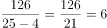小时。则整个航行过程需要2+6=8小时，结合出发时间为上午8点钟，故这艘船到达终点的时间是16点钟。

故正确答案为D。

---

### 第 5 题　qid 4695881 · 数学运算

一社区居委会为丰富居民的业余生活，专门设立了多个俱乐部邀请居民自愿参加。统计结果如下：22人参加了棋类俱乐部、27人参加了音乐俱乐部、50人参加了戏剧俱乐部、10人参加了棋类和音乐俱乐部、14人参加了音乐和戏剧俱乐部、10人参加了戏剧和棋类俱乐部、8人参加了这三个俱乐部。那么参与活动的居民人数是（    ）。

- **A**. 57
- **B**. 68
- **C**. 73　✅
- **D**. 84

**答案**：C

**官方解析**

根据题意，设参与活动的居民人数是x人，由三集合容斥原理标准型公式：，可得22+27+50-10-14-10+8=x-0，解得x=73。

故正确答案为C。

---

### 第 6 题　qid 4695904 · 数学运算

某大学一高年级学生准备在新生报到期间勤工俭学，从批发市场购进80件衬衫，购进价每件40元，起初以每件68.5元的价格售出60件，为了促销，他准备把剩下的衬衫按售价不变但以“买一赠一”的方式全部售出，那么售完该批衬衫一共赚得（    ）元。

- **A**. 4795
- **B**. 1995
- **C**. 1595　✅
- **D**. 1853

**答案**：C

**官方解析**

根据题意，“从批发市场购进80件衬衫，购进价每件40元”，则购入衬衫共花费80×40=3200元。未促销时“以每件68.5元的价格售出60件”，销售额为68.5×60=4110元，还剩80-60=20件未卖出，此时进行“买一赠一”促销活动，销售额为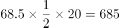元。故售完这批衬衫一共赚得4110+685-3200=1595元。

故正确答案为C。

---

### 第 7 题　qid 4695912 · 数学运算

某加油站每次只能对一辆车进行加油，加满一辆大卡车的油需要7分钟，加满一辆客车的油需要5分钟，加满一辆小汽车的油需要3分钟。现有一辆大卡车、一辆客车、一辆小汽车同时来到加油站加油，合理安排加油顺序，使三辆车总的加油和等待时间最短共需要（    ）分钟。

- **A**. 29
- **B**. 26　✅
- **C**. 21
- **D**. 32

**答案**：B

**官方解析**

三辆车的加油时间固定，要想使总时间最短，那么等待时间要尽可能短。要想使等待时间最短，应使加油时间短的在前，加油时间长的在后，则顺序为小汽车、客车、大卡车。此时三辆车总的加油和等待时间最短，为3+（3+5）+（3+5+7）=26分钟。
故正确答案为B。

---

### 第 8 题　qid 4695915 · 数学运算

某公路的一侧从一端到另一端每隔3米植一棵树，一共挖了49个坑。现在要改成每隔4米植一棵树，那么可以不重新挖的坑共有（    ）个。

- **A**. 8
- **B**. 9
- **C**. 11
- **D**. 13　✅

**答案**：D

**官方解析**

两端植树的棵树。根据题意，间隔长度为3米，共挖49个坑，即可种植49棵树，则公路的长度为（49-1）×3=144米。现间隔改为4米，两次间隔3和4的最小公倍数为12，根据两端植树不移动棵数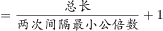，可得不需要重新挖的坑有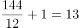个。

故正确答案为D。

---

### 第 9 题　qid 16677 · 数学运算

把一根线绳对折、对折、再对折，然后从对折后线绳的中间剪开，这根线绳被剪成了几小段：

- **A**. 6
- **B**. 7
- **C**. 8
- **D**. 9　✅

**答案**：D

**官方解析**

对折3次，剪1刀，绳子变成。

剪绳问题：若初始为1根绳子，则绳子段数为切口数加1。一根绳子连续对折次，剪刀，则绳子被剪成段。

故正确答案为D。

---

### 第 10 题　qid 4695923 · 数学运算

某射击运动员每次射击命中10环的概率是75%，5次射击有4次命中10环的概率是（    ）。

- **A**. 31.64%
- **B**. 39.55%　✅
- **C**. 43.66%
- **D**. 50%

**答案**：B

**官方解析**

根据题意，5次射击有4次命中10环，则有1次没有命中，命中10环的概率为75%，没有命中10环的概率为1-75%=25%。故满足题意的概率为：，与B项最接近。

故正确答案为B。

---

### 第 11 题　qid 4695925 · 数学运算

某地公交车站顶棚长4米，宽2米，已知该顶棚材料能承受的最大压强为800帕。时下该地正值大雪天气，那么，顶棚上的积雪厚度不超过（    ）厘米，才不会导致顶棚坍塌。（假定积雪密度与水相同）

- **A**. 1
- **B**. 8　✅
- **C**. 10
- **D**. 80

**答案**：B

**官方解析**

设顶棚上的积雪厚度为h，质量为m，密度为，顶棚面积为S，由压强公式：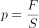可知，顶棚承受的压强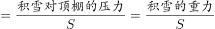，因为积雪的重力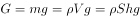，所以顶棚承受的压强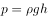，将顶棚材料能承受的最大压强800帕、雪的密度（等于水的密度）、重力加速度g取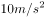代入该公式，可得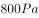，即h=0.08m=8cm，因此顶棚上的积雪厚度不能超过8厘米。

故正确答案为B。

---

### 第 12 题　qid 4695928 · 数学运算

一瓶碳酸饮料，一次喝掉饮料后，连瓶共重600克。如果喝掉剩余饮料的后，连瓶共重500克。那么，空瓶子重（    ）克。

- **A**. 100
- **B**. 200
- **C**. 350
- **D**. 400　✅

**答案**：D

**官方解析**

根据题意，设整瓶饮料的重量为3x克，空瓶子重量为y克。在喝掉饮料的后，瓶内饮料还剩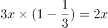克，连瓶共重600克，可得：2x+y=600；继续喝掉剩余饮料的后，瓶内饮料还剩克，连瓶共重500克，可得：x+y=500。联立方程，解得x=100，y=400，则空瓶子的重量为400克。

故正确答案为D。

---

### 第 13 题　qid 4695935 · 数学运算

一个六边形点阵，它中心的一个点算作第一层，从内往外依次为第二层，第三层······那么第五十层的点的个数是（    ）。

- **A**. 294　✅
- **B**. 300
- **C**. 306
- **D**. 312

**答案**：A

**官方解析**

根据题干图形，可梳理出点阵层数n与点的个数m的具体关系为：

分析可得，除第一层外，其他层点的个数m=6（n-1），则第五十层的点的个数为6×（50-1）=294个。

故正确答案为A。

---

## 判断推理

### 第 1 题　qid 4695885 · 图形推理

依据图形规律，填入问号处最合适的一项是：

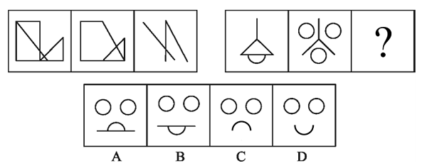

- **A**. A　✅
- **B**. B
- **C**. C
- **D**. D

**答案**：A

**官方解析**

元素组成相似，且相同线条重复出现，优先考虑样式规律中的加减同异。观察发现，第一组图形中的图1和图2去同存异之后得到图3，第二组图形应用此规律，图1和图2去同存异之后得到？处图形，只有A项符合。
故正确答案为A。

---

### 第 2 题　qid 4695900 · 图形推理

依据图形规律，填入问号处最合适的一项是：

- **A**. A
- **B**. B
- **C**. C　✅
- **D**. D

**答案**：C

**官方解析**

元素组成不同，观察发现，题干图形被分割、窟窿明显，优先考虑面数量。题干图形面数量均为4，故“？”处应该选择有4个面的图形，观察选项，只有C项符合。
故正确答案为C。

---

### 第 3 题　qid 4695910 · 图形推理

根据图形规律，填入问号处最合适的一项是：

- **A**. A
- **B**. B
- **C**. C　✅
- **D**. D

**答案**：C

**官方解析**

元素组成不同，且无明显属性规律，考虑数量规律。观察发现，第一组图形中图2和图3为“日”字变形图，第二组图形中图1为五角星，考虑笔画数。第一组图形均为一笔画，第二组图形中前两个图形也为一笔画，故？处图形也应该是一笔画，只有C项符合。
故正确答案为C。

---

### 第 4 题　qid 4695920 · 图形推理

根据图形规律，填入问号处最合适的一项是：

- **A**. A
- **B**. B　✅
- **C**. C
- **D**. D

**答案**：B

**官方解析**

元素组成不同，优先考虑属性规律。观察发现，第一组图形均为对称图形，且存在一条对称轴与图形中的一条线重合，经验证，第二组图形中图1、图2 也符合此规律，故“？”处应选择一个图形，其对称轴与图形中的一条线重合，只有B项符合。

故正确答案为B。

---

### 第 5 题　qid 4695924 · 图形推理

请把下面的六个图形分成两类，使每一类图形都有各自的共同特征或规律，分类正确的一项是：

- **A**. ①③④，②⑤⑥　✅
- **B**. ①③⑥，②④⑤
- **C**. ①④⑥，②③⑤
- **D**. ①②④，③⑤⑥

**答案**：A

**官方解析**

元素组成不同，且无明显属性规律，优先考虑数量规律。观察发现，题干图形均由白块和黑块两种元素构成，整体数元素个数无规律，考虑黑白分开数。从图①至图⑥，白块的数量分别为1、1、3、5、3、4，黑块的数量分别为3、2、5、7、6、8。观察发现，图①③④中黑块数量比白块数量多2，图②⑤⑥中黑块数量是白块数量的两倍。故图①③④为一组，图②⑤⑥为一组。
故正确答案为A。

---

### 第 6 题　qid 4695926 · 定义判断

信息茧房：是指在信息传播中，因公众自身的信息需求并非全方位的，公众只注意自己选择的东西和使自己愉悦的通讯领域，久而久之，会将自身桎梏于像蚕茧一般的“茧房”中。
根据以上定义，下列现象没有体现信息茧房的是（    ）。

- **A**. 在今日头条客户端，点击一条茶叶的消息之后就会不停收到各种关于茶的养生知识和广告推送
- **B**. 不少幼儿教育机构曝出的虐童事件引发了社会广泛关注　✅
- **C**. 通过RSS订阅自己喜欢的新闻栏目的内容
- **D**. 加入豆瓣的运动、摄影等兴趣小组

**答案**：B

**官方解析**

第一步：找出定义关键词。
“在信息传播中”、“因公众自身的信息需求并非全方位的”、“公众只注意自己选择的东西和使自己愉悦的通讯领域”、“将自身桎梏于像蚕茧一般的‘茧房’中”。
第二步：逐一分析选项。
A项：今日头条推送知识和广告，符合“在信息传播中”，点击一条茶叶消息后收到的也都是关于茶的消息，符合“因公众自身的信息需求并非全方位的”、“公众只注意自己选择的东西和使自己愉悦的通讯领域”、“将自身桎梏于像蚕茧一般的‘茧房’中”，符合定义，排除；
B项：幼儿教育机构曝出的虐童事件虽然引发了社会广泛关注，但公众关注该事件并不是因为自身的信息需求，虐童事件也不会使公众愉悦，不符合“因公众自身的信息需求并非全方位的”、“公众只注意自己选择的东西和使自己愉悦的通讯领域”，不符合定义，当选；
C项：订阅新闻栏目，符合“在信息传播中”，订阅自己喜欢的内容，符合“因公众自身的信息需求并非全方位的”、“公众只注意自己选择的东西和使自己愉悦的通讯领域”，符合定义，排除；
D项：豆瓣是信息传播的媒介，符合“在信息传播中”，加入自己感兴趣的小组，符合“因公众自身的信息需求并非全方位的”、“公众只注意自己选择的东西和使自己愉悦的通讯领域”，符合定义，排除。
本题为选非题，故正确答案为B。

---

### 第 7 题　qid 4695927 · 定义判断

贝勃定律：是指第一次大刺激能冲淡第二次的小刺激，人们一开始受到的刺激越强，对以后的刺激也就越迟钝。
根据上述定义，下列属于贝勃定律的是（    ）。

- **A**. 公司想赶走被视为眼中钉的人，先对这些人降薪，后将他们裁掉
- **B**. 公司想赶走被视为眼中钉的人，先对这些人无关的部门进行大规模的人事变动或裁员，然后在后续的裁员时再将矛头指向原定目标　✅
- **C**. 某公司的新产品进入市场后，市场反应良好，但是该公司经过调查认为市场趋于饱和遂决定减少该产品的产量
- **D**. 某公司的新产品进入市场后，由于市场反应良好所以扩大该产品的生产

**答案**：B

**官方解析**

第一步：找出定义关键词。
“第一次大刺激能冲淡第二次的小刺激”、“一开始受到的刺激越强，对以后的刺激也就越迟钝”。
第二步：逐一分析选项。
A项：公司想赶走被视为眼中钉的人，先对这些人降薪，后将他们裁掉，“降薪”相比于“被裁掉”，刺激是较弱的，不符合“第一次大刺激能冲淡第二次的小刺激”、“一开始受到的刺激越强，对以后的刺激也就越迟钝”，不符合定义，排除；
B项：公司想赶走被视为眼中钉的人，先对这些人无关的部门进行大规模的人事变动或裁员，然后在后续的裁员时再将矛头指向原定目标，“大规模的人事变动或裁员”相比于“在后续被裁掉的少数人”，前者是大刺激，后者是小刺激，符合“第一次大刺激能冲淡第二次的小刺激”，符合定义，当选；
C项：某公司的新产品进入市场后，市场反应良好，但是该公司经过调查认为市场趋于饱和，并没有体现出“市场反应良好”比“经过调查认为市场趋于饱和”的刺激更强，做出决定减少该产品产量的决策也说明对新的刺激并没有迟钝，不符合“一开始受到的刺激越强，对以后的刺激也就越迟钝”，不符合定义，排除；
D项：某公司的新产品进入市场后，由于市场反应良好所以扩大该产品的生产，只体现了受到“市场反应良好”这个刺激后做出了进一步的决策，不符合“一开始受到的刺激越强，对以后的刺激也就越迟钝”，不符合定义，排除。
故正确答案为B。

---

### 第 8 题　qid 4695929 · 定义判断

精准扶贫，是指针对不同贫困区域环境、不同贫困农户状况，运用科学有效的程序对扶贫对象实施精准识别、精准帮扶、精准管理的治贫方式。一般来说，精准扶贫主要是就贫困居民而言的，谁贫困就扶持谁。
根据上述定义，下列属于精准扶贫对象的是（    ）。

- **A**. 西部山区某村资源匮乏，各家各户的年轻人几乎都外出务工，只留下老人和小孩在家
- **B**. 小王文化水平不高，也没有太多技能，其所在工厂倒闭后就一直待业在家，靠领取失业金度日
- **C**. 贵州某村庄位于山谷之中，交通十分不便，除了种田之外，该村20余户村民几乎没有其他经济来源
- **D**. 张家沟的张大爷和老伴儿相依为命，去年老伴儿不慎摔倒致残，治病几乎花光了家里所有积蓄　✅

**答案**：D

**官方解析**

第一步：找出定义关键词。
“贫困居民”。
第二步：逐一分析选项。
A项：该项中的老人和小孩不明确是否为贫困居民，不符合定义，排除；
B项：该项中的小王能领失业金，说明小王不是贫困居民，不符合定义，排除；
C项：该项中的20余户村民靠种田为生，几乎没有其他经济来源不意味着是贫困居民，不符合定义，排除；
D项：该项中的张大爷的老伴儿摔倒致残，因治病几乎花光了家里所有积蓄，属于因病致贫的情况，张大爷和老伴儿属于贫困居民，符合定义，当选。
故正确答案为D。

---

### 第 9 题　qid 4695936 · 定义判断

元语言：是指描写和分析某种语言所使用的一种语言或符号集合。元语言与对象语言是相对的，任何语言，无论它是多么简单或多么复杂，当它作为被谈论的对象的时候，它就是对象语言；当它用来讨论一种语言的时候，它就是元语言。
根据上述定义，下列判断正确的是（    ）。

- **A**. 用汉语翻译一段英语时，英语是元语言
- **B**. 用英语翻译一段汉语时，英语是对象语言
- **C**. 描述某一对象所用的语言是对象语言
- **D**. 以上判断均不正确　✅

**答案**：D

**官方解析**

第一步：找出定义关键词。
元语言：“描写和分析某种语言所使用的一种语言或符号集合”、“用来讨论一种语言”；
对象语言：“作为被谈论的对象”。
第二步：逐一分析选项。
A项：该项中用汉语翻译一段英语，英语是被谈论的对象，符合“作为被谈论的对象”，符合对象语言的定义，不符合元语言的定义，排除；
B项：该项中用英语翻译一段汉语，英语是分析汉语时所用的语言，符合“描写和分析某种语言所使用的一种语言或符号集合”、“用来讨论一种语言”，符合元语言的定义，不符合对象语言的定义，排除；
C项：该项中描述某一对象所用的语言，符合“描写和分析某种语言所使用的一种语言或符号集合”、“用来讨论一种语言”，符合元语言的定义，不符合对象语言的定义，排除；
D项：A、B、C三项均错误，所以该项说法正确。
故正确答案为D。

---

### 第 10 题　qid 4695942 · 定义判断

价格歧视，通常指商品或服务的提供者在向消费者提供相同质量、相同成本的商品或服务时，在不同的消费者之间实行不同的销售价格或收费标准。
根据上述定义，下列选项中属于价格歧视的是（    ）。

- **A**. 某高校恒温游泳馆，为了吸引顾客，在冬季的时候执行优惠票价，比夏季票价便宜5元
- **B**. 某电影院在某城市新开了一家分店，为了吸引顾客，票价按另一门店的五折销售
- **C**. 某航空公司推出了会员卡服务，持有会员卡的顾客在购票时可以享受八折优惠　✅
- **D**. 某出版社再版了鲁迅文集《呐喊》，精装版定价60元，简装版定价40元

**答案**：C

**官方解析**

第一步：找出定义关键词。
“提供相同质量、相同成本的商品或服务时”、“在不同的消费者之间”、“实行不同的销售价格或收费标准”。
第二步：逐一分析选项。
A项：游泳馆冬季票价比夏季优惠，是将相同的服务按不同季节来区分收费标准，并非是按不同的消费者进行区分，不符合“在不同的消费者之间”，不符合定义，排除；
B项：电影院分店的票价按另一门店的五折销售，是将相同的服务按不同门店来区分收费标准，并非是按不同的消费者进行区分，不符合“在不同的消费者之间”，不符合定义，排除；
C项：持有会员卡的顾客在购票时可以享受八折优惠，是将消费者区分为“持有会员卡”与“不持有会员卡”两种，是将相同的服务按两种不同的消费者来区分收费标准，符合“提供相同质量、相同成本的商品或服务时”、“在不同的消费者之间”、“实行不同的销售价格或收费标准”，符合定义，当选；
D项：《呐喊》的精装版与简装版在质量与成本上不同，不符合“提供相同质量、相同成本的商品或服务时”，不符合定义，排除。
故正确答案为C。

---

### 第 11 题　qid 4695948 · 逻辑判断

如果俄罗斯参加该集团，那么美国和英国会抵制该集团；如果美国和英国有一国抵制该集团，那么该集团就不能继续存在。事实上是该集团还将继续存在。
如果上述断定为真，那么以下哪项一定为真？

- **A**. 美国参加了该集团
- **B**. 美国没有参加该集团
- **C**. 俄罗斯没有参加该集团　✅
- **D**. 美国和英国至少有一国没有参加该集团

**答案**：C

**官方解析**

第一步：翻译题干。

（1）俄罗斯参加该集团美国 且 英国抵制该集团；

（2）美国 或 英国抵制该集团该集团不能继续存在；

（3）该集团继续存在。

第二步：根据题干条件进行推理。

从确定信息进行推理，条件（3）是对条件（2）的“否后”，根据“否后必否前”和德摩根定律可得：美国 且 英国抵制该集团。在且关系中否定其中一项即可否定整个且关系，因此“美国 且 英国抵制该集团”是对条件（1）的“否后”，根据“否后必否前”可得“俄罗斯参加该集团”，对应C项。

故正确答案为C。

---

### 第 12 题　qid 4695959 · 逻辑判断

卫生部门统计，近年来癌症患者的数目不断增加，有人指出，这是因为空气污染导致的。
以下哪项如果为真，最不能削弱上述观点？

- **A**. 近年来，S市的空气污染明显加剧，但癌症患者的数目没有明显增加
- **B**. 近年来，T市的空气没有明显污染，但癌症患者的数目增加明显
- **C**. 近年来，Y市癌症患者增加了，虽然空气污染加剧了，但其水污染更严重
- **D**. 近年来，N市的空气质量得到了较大改善，其癌症患者的数目也逐年减少　✅

**答案**：D

**官方解析**

第一步：找出论点和论据。
论点：近年来癌症患者的数目不断增加是因为空气污染导致的。
论据：无。
本题只有论点，没有论据，削弱优先考虑削弱论点，且论点为因果关系，也可以考虑因果倒置（癌症患者的数目不断增加导致了空气污染）和他因削弱（其他原因导致癌症患者的数目不断增加）。
第二步：逐一分析选项。
A项：S市的空气污染加剧，但是癌症患者数目没有明显增加，说明空气污染和癌症患者数目增加之间没有明显的关系，削弱论点，可以削弱，排除；
B项：T市的空气没有明显污染，但是癌症患者数目却增加了，说明癌症患者数目增加与空气污染之间没有必然联系，削弱论点，可以削弱，排除；
C项：Y市的癌症患者数目增加了，但是其空气污染和水污染都存在，且水污染更严重，说明癌症患者数目增加也可能是水污染导致的，他因削弱，可以削弱，排除；
D项：N市的空气质量改善后其癌症患者数目也减少了，说明癌症患者数目增加和空气污染之间有关系，具有加强力度，无法削弱，当选。
本题为选非题，故正确答案为D。

---

### 第 13 题　qid 4695971 · 逻辑判断

“没有买卖就没有杀害”，这是贝克汉姆、姚明和威廉王子所作的公益广告。尽管市场上部分可以获得的象牙来自于非法捕杀的野象，但有的象牙的来源是合法的，如大象的自然死亡。所以当那些在批发市场上购买象牙的人只买合法象牙的时候，世界上所剩很少的野象群也就不会受到伤害了。
上述论断所依据的假设前提是：

- **A**. 通常象牙产品批发商没有意识到象牙供应减少的原因
- **B**. 今后对合法象牙的需要将持续增加
- **C**. 试图只买合法象牙的批发商能够准确区分合法象牙和非法象牙　✅
- **D**. 目前世界上，合法象牙的批发源较非法象牙少

**答案**：C

**官方解析**

第一步：找出论点和论据。
论点：当那些在批发市场上购买象牙的人只买合法象牙的时候，世界上所剩很少的野象群也就不会受到伤害了。
论据：尽管市场上部分可以获得的象牙来自于非法捕杀的野象，但有的象牙的来源是合法的，如大象的自然死亡。
本题论点讨论的是批发市场上只买合法象牙能使野生象群不受伤害，论据讨论的是市场上的象牙有非法象牙和合法象牙，二者话题一致，且提问为“假设前提”，加强可以考虑必要条件。
第二步：逐一分析选项。
A项：该项讨论的是象牙产品批发商意识不到象牙供应减少的原因，而论点讨论的是购买合法象牙能使野生象群不受伤害，话题不一致，无法加强，排除；
B项：该项指出今后对合法象牙的需求将持续增加，而合法象牙的需求增加不代表购买象牙的人只购买合法象牙，话题不一致，无法加强，排除；
C项：该项指出只买合法象牙的批发商能够准确区分合法象牙和非法象牙，如果只买合法象牙的批发商不能够准确区分合法象牙和非法象牙，就无法避免非法象牙的买卖，也就无法避免非法捕杀对野象群的伤害，该项为论点成立的必要条件，可以加强，当选；
D项：该项讨论的是合法象牙和非法象牙批发源的数量，而论点讨论的是购买合法象牙能使野生象群不受伤害，话题不一致，无法加强，排除。
故正确答案为C。

---

### 第 14 题　qid 828595 · 类比推理

近50年来，某市户籍人口的平均寿命提高了38岁，达到了82岁，居全国最高水平。与此同时，该市恶性肿瘤的总体发病率和死亡率也逐年上升，目前已相当于欧美等发达国家和地区的~，在世界范围内处于中等水平，在全国则处于较高水平。

由此可以推出：

- **A**. 目前该市对于恶性肿瘤的治疗水平是全国最高的
- **B**. 该市恶性肿瘤的总体发病率和死亡率其实比欧美等发达国家和地区低　✅
- **C**. 该市恶性肿瘤的总体发病率和死亡率虽逐年上升，但此类疾病并不是造成该市目前人口死亡的主要原因
- **D**. 如果50年前导致该市人口死亡的主要疾病发病率目前没有降低，那么对这些疾病的治疗水平在50年间一定有提高

**答案**：B

**官方解析**

日常结论题，根据题干信息逐一分析选项。

A项：题干第二句指出该市恶性肿瘤的总体发病率和死亡率在全国处于较高的水平，但没有提及该市对于恶性肿瘤的治疗水平是否为全国最高的，无法推出，排除；

B项：题干第二句指出该市恶性肿瘤的总体发病率和死亡率相当于欧美等发达国家和地区的~，说明该市恶性肿瘤的总体发病率和死亡率比欧美等发达国家和地区低，可以推出，当选；

C项：选项说恶性肿瘤并不是造成该市目前人口死亡的主要原因，这个“主要”是个程度性的敏感词，从文段中无法推知恶性肿瘤是否是造成该市人口死亡的主要原因，无法推出，排除；

D项：题干没有提及恶性肿瘤是否为导致该市人口死亡的主要疾病，且没有提及对疾病的治疗水平如何，无法推出，排除。

故正确答案为B。

---

### 第 15 题　qid 4696015 · 逻辑判断

很多人认为，从军是一项危险的事情。但某国军方统计数据显示，去年军人的死亡率是0.2%，而市民的死亡率为0.55%。所以，从军比不从军更安全。
以下哪项为真，最能质疑上述结论？

- **A**. 该国军方的统计数据不一定准确
- **B**. 现在是和平年代，军人的死亡率相对较低
- **C**. 近年来，环境污染和食品卫生问题导致市民死亡率较高
- **D**. 能从军的都是身体健康的青年，而市民中有很多身体虚弱的老人和病人，从而使得市民死亡率高于军人死亡率　✅

**答案**：D

**官方解析**

第一步：找出论点和论据。
论点：从军比不从军更安全。
论据：某国军方统计数据显示，去年军人的死亡率是0.2%，而市民的死亡率为0.55%。
本题论点讨论的是从军是否安全，论据讨论的是从军的死亡率比市民的死亡率低，安全一般用出事故的概率衡量而不是死亡率，论点和论据话题不一致，削弱优先考虑拆桥，即拆断死亡率低和从军安全之间的联系。
第二步：逐一分析选项。
A项：指出统计数据不一定准确，削弱论据，可以削弱，保留；
B项：指出现在军人的死亡率相对较低，和论据表述内容一致，无法削弱，排除；
C项：指出其他能够导致市民死亡率高的因素，但不确定这些因素是否会对军人有影响，无法得出从军和不从军谁更安全，无法削弱，排除；
D项：指出从军的都是身体健康的青年，市民中身体虚弱的老人和病人很多，一般身体健康的人群要比身体虚弱的老人和病人的死亡率低，即体质不同会导致死亡率不同，因此用死亡率的比较就无法得出从军与不从军谁更安全的论点，拆断了论点和论据的联系，属于拆桥项，可以削弱，保留。
对比A、D两项，拆桥的力度大于削弱论据，且A项中出现“不一定”的表述为可能性削弱，力度比较弱，因此D项力度更强，当选。
故正确答案为D。

---

### 第 16 题　qid 4696020 · 类比推理

四个商人在谈生意，他们分别是江苏人、云南人、北京人和上海人。他们做的生意分别是加工、批发、零售。其中:
①上海人单独做批发；
②北京人不做加工；
③江苏人和另外某省人同做一类生意；
④云南人不和江苏人做同一类生意；
⑤每个人只能做一种生意。
根据以上条件，推出江苏人所做的生意是：

- **A**. 加工
- **B**. 批发
- **C**. 零售　✅
- **D**. 和北京人不做同一类生意

**答案**：C

**官方解析**

第一步：分析题干条件。
①江苏人、云南人、北京人和上海人分别做加工、批发、零售；
②上海人单独做批发；
③北京人不做加工；
④江苏人和另外某省人做相同生意；
⑤云南人不和江苏人做相同生意；
⑥每个人只做一种生意。
第二步：根据题干条件进行推理。
“江苏人”出现次数最多，为最大信息，可作为突破口。根据条件①⑥可知，四个人做三种生意，每个人只做一种生意，那么只有两个人做相同生意，另两个人与其他人做的生意不同。结合条件②④⑤可知，江苏人和另外某省人做相同生意，且和云南人、上海人做的生意不同，因此江苏人和北京人做相同生意。根据条件②③可知，北京人不能做批发和加工，因此北京人只能做零售，因此江苏人也做零售。对应C项。
故正确答案为C。

---

### 第 17 题　qid 4696026 · 逻辑判断

加拿大的古动物学家戴尔·罗素认为，如果6500万年前没有陨石撞击地球，导致恐龙全部灭绝，伤齿龙就完全可能进化成为代替人类的一种动物——“恐人”，成为地球的主宰。这就是曾经风行一时的“恐人学说”。
以下哪项如果为真，最能支持上述专家结论?

- **A**. 研究证明，一些恐龙在陨石撞击地球后生存下来
- **B**. 伤齿龙是一种长相呆笨的恐龙
- **C**. 伤齿龙的大脑是恐龙中最大的，而且它的感觉器官非常发达，它被认为是最聪明的恐龙　✅
- **D**. 恐龙灭绝的原因是一个讨论至今仍未有定论的问题

**答案**：C

**官方解析**

第一步：找出论点和论据。
论点：如果6500万年前没有陨石撞击地球，导致恐龙全部灭绝，伤齿龙就完全可能进化成为代替人类的一种动物——“恐人”，成为地球的主宰。
论据：无。
本题只有论点，没有论据，加强优先考虑补充论据，即指出为什么伤齿龙就完全可能进化成为代替人类的一种动物。
第二步：逐一分析选项。
A项：该项只是说一些恐龙在陨石撞击地球后生存下来，但是没有提到伤齿龙的存活情况，也没有提到伤齿龙是否可能进化成为代替人类的一种动物，无法加强，排除；
B项：该项只是说伤齿龙的长相呆笨，但是没有提到伤齿龙是否可能进化成为代替人类的一种动物，无法加强，排除；
C项：该项说伤齿龙的大脑是恐龙中最大的，且被认为是最聪明的恐龙，指出了为什么伤齿龙完全可能进化成为代替人类的一种动物，属于补充论据，可以加强，当选；
D项：该项说恐龙灭绝的原因没有定论，不清楚是否陨石撞击地球导致恐龙灭绝，也没有提到伤齿龙是否可能进化成为代替人类的一种动物，无法加强，排除。
故正确答案为C。

---

### 第 18 题　qid 4696030 · 逻辑判断

一切有利于发展的方针政策都是符合人民根本利益的，反腐败斗争有利于发展，所以反腐败斗争是符合人民根本利益的。
以下哪一个论证与上述论证的推理最为类似?

- **A**. 凡是超越代理人权限所签订的都是无效合同，这份房地产开发合同是超越代理人权限签订的，所以它是无效的　✅
- **B**. 一切行动听指挥是一支队伍能够战无不胜的保证，所以一个地方要发展，必须提倡令行禁止，服从大局
- **C**. 如果某产品的供给超过了市场需求，就可能出现滞销。当前手机的供应量超过市场需求，因此，手机出现滞销现象
- **D**. 一切反动派都是纸老虎。所以有的纸老虎并不是反动派

**答案**：A

**官方解析**

第一步：分析题干推理形式。

题干翻译为：有利于发展的方针政策符合人民根本利益；

推理为：反腐败斗争有利于发展，所以，反腐败斗争符合人民根本利益。

所遵循的推理形式是“肯前推肯后”。

第二步：逐一分析选项。

A项：翻译为“超越代理人权限所签订的合同无效合同”，推理为：房地产开发合同是超越代理人权限签订的，所以它是无效的。推理遵循“肯前推肯后”的形式，与题干逻辑关系一致，当选；

B项：翻译为“一支队伍能够战无不胜一切行动听指挥”，推理为：地方要发展提倡令行禁止，服从大局。“地方要发展”并非“肯前”，与题干逻辑关系不一致，排除；

C项：翻译为“产品的供给超过了市场需求可能出现滞销”，推理为：手机的供应量超过市场需求，所以手机出现滞销现象。但手机出现滞销与手机可能出现滞销不同，并非“肯后”，与题干逻辑关系不一致，排除；

D项：翻译为“反动派纸老虎”，推理为：有的纸老虎反动派。并非“肯前推肯后”的形式，与题干逻辑关系不一致，排除。

故正确答案为A。

---

### 第 19 题　qid 4696037 · 逻辑判断

南方某市在提倡全民健身活动中，把爬山作为一种大家喜爱的健身活动广泛开展起来。一项调查表明，那些称自己每周固定去爬山1-2次的人近两年来由25%增加到32%，而对该市市民常去的几座主要的山进行实际的调查则显示，近两年来去该市几座主要的山爬山的市民人数却下降。
以下哪项如果为真，最有助于解释上述看来矛盾的断定?

- **A**. 调研时，没有考虑调研对象，即爬山的对象主要是青壮年
- **B**. 随着人们生活改善，大部分市民喜欢开车自驾去爬其他省、市的山　✅
- **C**. 该市在人们常去的几座山改善了相关设施，方便人们爬山
- **D**. 受调查的登山爱好者只占全市登山爱好者的10%

**答案**：B

**官方解析**

第一步：找出题干矛盾。
某市每周固定爬山1-2次的人近两年占比增加，但在该市几座主要的山爬山的市民人数却下降。
第二步：逐一分析选项。
A项：说明爬山的对象主要是青壮年，但即使调研对象选择得不科学，每周固定去爬山1-2次的人占比确实在增加，无法解释为什么去该市几座主要的山爬山的市民人数反而下降了，不能解释题干矛盾，排除；
B项：说明大部分市民喜欢去其他省、市爬山，所以即使每周固定去爬山1-2次的人占比增加，但去该市几座主要的山爬山的市民人数却下降了，可以解释题干矛盾，当选；
C项：说明本市的几座山相关设施完善，设施完善本可以吸引更多人，无法解释为什么去该市几座主要的山爬山的市民人数反而下降了，不能解释题干矛盾，排除；
D项：说明受调查的登山爱好者占全市登山爱好者的比例低，但即使调研对象选择得不科学，每周固定去爬山1-2次的人占比确实在增加，无法解释为什么去该市几座主要的山爬山的市民人数反而下降了，不能解释题干矛盾，排除。
故正确答案为B。

---

### 第 20 题　qid 4696047 · 逻辑判断

前不久，广药集团董事长宣布：喝王老吉凉茶可以延长寿命大约10%。据称，通过对576只大鼠样本为期两年的安全性实验，发现实验组给出喝王老吉凉茶的雌性大鼠的统计存活时间为708.2天，而对照组雌性大鼠统计存活时间为675.1天，实验组比对照组高出33.1天，显示王老吉凉茶具有延长动物寿命的作用。因此得出该结论。
以下哪项如果为真，最能够推翻上述结论?

- **A**. 动物实验中得出的结论不能直接推广到人身上　✅
- **B**. 实验中只用雌性大鼠，缺少雄性大鼠的数据支持
- **C**. 对照组的食谱中缺乏碳水化合物，而实验组摄取的王老吉含有大量糖
- **D**. 王老吉凉茶含糖量很高，长期饮用将会摄入大量糖分，不利于健康

**答案**：A

**官方解析**

第一步：找出论点和论据。
论点：喝王老吉凉茶可以延长寿命大约10％。
论据：通过对576只大鼠样本为期两年的安全性实验，发现实验组给出喝王老吉凉茶的雌性大鼠的统计存活时间为708.2天，而对照组雌性大鼠统计存活时间为675.1天，实验组比对照组高出33.1天，显示王老吉凉茶具有延长动物寿命的作用。
论点讨论喝王老吉凉茶可以延长寿命，论据讨论对大鼠的实验显示喝王老吉凉茶可延长动物寿命，二者主体不一致，削弱优先考虑拆桥。
第二步：逐一分析选项。
A项：动物实验的结论不能直接推广到人身上，说明大鼠喝王老吉凉茶能延长寿命不代表人类喝王老吉凉茶也能延长寿命，切断了论点和论据之间的关系，拆桥项，可以削弱，保留；
B项：实验缺少雄性大鼠的数据支持，说明实验数据有漏洞，削弱论据，可以削弱，保留；
C项：对照组的食谱缺乏碳水化合物，而实验组摄取的王老吉凉茶含有大量糖，糖属于碳水化合物，说明王老吉凉茶含有的碳水化合物可能是实验组老鼠寿命更长的原因，是对题干的加强，无法削弱，排除；
D项：长期饮用王老吉凉茶不利于健康，而论点讨论喝王老吉凉茶可延长寿命，不利于健康不代表无法延长寿命，无法削弱，排除。
比较A、B两项，A项拆桥的削弱力度大于B项削弱论据的削弱力度，因此优选A项。
故正确答案为A。

---

### 第 21 题　qid 4696054 · 类比推理

生产：利润

- **A**. 投入：效益　✅
- **B**. 经营：税收
- **C**. 资本：收益
- **D**. 本金：回报

**答案**：A

**官方解析**

第一步：判断题干词语间逻辑关系。
通过生产获得利润，二者为方式目的的对应关系。
第二步：判断选项词语间逻辑关系。
A项：通过投入获得效益，二者为方式目的的对应关系，与题干逻辑关系一致，当选；
B项：经营不是为了获得税收，二者并非方式目的的对应关系，与题干逻辑关系不一致，排除；
C项：通过投入资本获得收益，而非资本，与题干逻辑关系不一致，排除；
D项：通过投入本金获得回报，而非本金，与题干逻辑关系不一致，排除。
故正确答案为A。

---

### 第 22 题　qid 7291 · 类比推理

颓废：奋发

- **A**. 厌恨：发怒
- **B**. 爱戴：憎恨　✅
- **C**. 恋爱：分手
- **D**. 隐藏：发现

**答案**：B

**官方解析**

第一步：判断题干词语间逻辑关系。
题干两词为反义词。颓废和奋发是反义词。
第二步：判断选项词语间逻辑关系。
A项厌恨和发怒词意相近，不符合题干逻辑；
B项爱戴和憎恨是一对反义词；
C项恋爱和分手不是反义词关系，分手的反义词应是和好；
D项隐藏的反义词应该是暴露而不是发现。
故正确答案为B。

---

### 第 23 题　qid 4696061 · 类比推理

联合：合作

- **A**. 淡然：淡泊　✅
- **B**. 学习：努力
- **C**. 同事：朋友
- **D**. 满意：幸福

**答案**：A

**官方解析**

第一步：判断题干词语间逻辑关系。
联合指联系使不分散、结合；合作指互相配合做某事或共同完成某项任务，二者为近义关系。
第二步：判断选项词语间逻辑关系。
A项：淡然形容不经心，不在意；淡泊指不追求名利，不热衷，二者为近义关系，与题干逻辑关系一致，当选；
B项：努力地学习，二者为偏正结构，与题干逻辑关系不一致，排除；
C项：同事指在同一单位工作的人；朋友指彼此有交情的人，二者为交叉关系，与题干逻辑关系不一致，排除；
D项：满意指愿望得到满足，符合心意；幸福指生活、境遇称心如意，二者无明显逻辑关系，与题干逻辑关系不一致，排除。
故正确答案为A。

---

### 第 24 题　qid 4696073 · 类比推理

医生：病人

- **A**. 加油站：汽油
- **B**. 法官：原告
- **C**. 股民：企业
- **D**. 师傅：徒弟　✅

**答案**：D

**官方解析**

第一步：判断题干词语间逻辑关系。
医生治疗病人，二者构成主宾结构，且医生和病人是一一对应的关系。
第二步：判断选项词语间逻辑关系。
A项：加油站里有汽油，二者为地点与事物的对应关系，与题干逻辑关系不一致，排除；
B项：法官审问原告，二者构成主宾关系，但法官的对象除了原告，还有被告，且被告和原告地位平等，法官和原告不是一一对应的关系，与题干逻辑关系不一致，排除；
C项：股民指从事股票交易的个人投资者，可以买进或卖出企业发行的股票，二者为对应关系，与题干逻辑关系不一致，排除；
D项：师傅教徒弟，二者构成主宾关系，且师傅和徒弟是一一对应的关系，与题干逻辑关系一致，当选。
故正确答案为D。

---

### 第 25 题　qid 4696075 · 类比推理

伤心 对于 （    ） 相当于 悲痛 对于 （    ）

- **A**. 唏嘘不已：呼天抢地
- **B**. 椎心泣血：潸然泪下
- **C**. 唏嘘不已：破涕为笑
- **D**. 椎心泣血：呼天抢地　✅

**答案**：D

**官方解析**

逐一代入选项。
A项：唏嘘不已指伤心地哭泣，难以自止，与伤心为近义关系；呼天抢地指大声叫天，用头撞地，形容极度悲痛，与悲痛为近义关系，前后逻辑关系一致，保留；
B项：椎心泣血指捶打胸膛，哭得眼中出血，形容极度悲痛的样子，与伤心为近义关系；潸然泪下形容哀伤的样子，与悲痛为近义关系，前后逻辑关系一致，保留；
C项：唏嘘不已指伤心地哭泣，难以自止，与伤心为近义关系；破涕为笑指停止哭泣而笑了起来，形容转悲为喜，与悲痛为反义关系，前后逻辑关系不一致，排除；
D项：椎心泣血指捶打胸膛，哭得眼中出血，形容极度悲痛的样子，与伤心为近义关系；呼天抢地指大声叫天，用头撞地，形容极度悲痛，与悲痛为近义关系，前后逻辑关系一致，保留。
对比A、B、D三项，D项中椎心泣血形容极度伤心，呼天抢地形容极度悲痛，前后两组词语在程度上均有加深，而A项中的唏嘘不已仅指伤心，没有程度上的加深，B项中的潸然泪下在程度上比悲痛轻，故D项前后两组词语的逻辑关系更一致，当选。
故正确答案为D。

---

### 第 26 题　qid 4696080 · 类比推理

（    ） 对于 凤梨 相当于 服装 对于 （    ）

- **A**. 果树：毛衣
- **B**. 苹果：衣服
- **C**. 梨树：鞋帽
- **D**. 水果：T恤　✅

**答案**：D

**官方解析**

逐一代入选项。
A项：凤梨生长在地上，并非生长在果树上，二者无明显逻辑关系；毛衣是服装，二者是种属关系，前后逻辑关系不一致，排除；
B项：苹果与凤梨都是水果，二者是并列关系；服装是衣服鞋帽的总称，衣服是服装，二者是种属关系，但现在服装多指衣服，也可以看成是全同关系，此处不管是看成全同关系还是种属关系，前后逻辑关系均不一致，排除；
C项：凤梨生长在地上，并非生长在梨树上，二者无明显逻辑关系；鞋帽是服装，二者是种属关系，前后逻辑关系不一致，排除；
D项：凤梨是水果，二者是种属关系；T恤是服装，二者是种属关系，前后逻辑关系一致，当选。
故正确答案为D。

---

### 第 27 题　qid 4696084 · 类比推理

台风 对于 （    ） 相当于 飓风 对于 （    ）

- **A**. 大西洋：太平洋
- **B**. 印度洋：太平洋
- **C**. 大西洋：印度洋
- **D**. 太平洋：大西洋　✅

**答案**：D

**官方解析**

逐一代入选项。
A项：台风发生于南海与西北太平洋，与大西洋无明显逻辑关系，二者无明显逻辑关系；飓风发生于大西洋和东太平洋，二者为地点的对应关系，前后逻辑关系不一致，排除；
B项：台风发生于南海与西北太平洋，与印度洋无明显逻辑关系，二者无明显逻辑关系；飓风发生于大西洋和东太平洋，二者为地点的对应关系，前后逻辑关系不一致，排除；
C项：台风发生于南海与西北太平洋，与大西洋无明显逻辑关系，二者无明显逻辑关系；飓风发生于大西洋和东太平洋，与印度洋无明显逻辑关系，二者无明显逻辑关系，前后逻辑关系不一致，排除；
D项：台风发生于南海与西北太平洋，二者为地点的对应关系；飓风发生于大西洋和东太平洋，二者为地点的对应关系，前后逻辑关系一致，当选。
故正确答案为D。

---

### 第 28 题　qid 4696091 · 类比推理

处理器：硬盘：计算机

- **A**. 大海：湖泊：河流
- **B**. 话筒：听筒：电话　✅
- **C**. 单词：句子：文章
- **D**. 水分：光照：植物

**答案**：B

**官方解析**

第一步：判断题干词语间逻辑关系。
处理器一般指中央处理器（简称CPU），与硬盘均为计算机的组成部件，二者为并列关系，且二者与计算机均构成组成关系。
第二步：判断选项词语间逻辑关系。
A项：大海、湖泊与河流是三种不同的水体，三者为并列关系，与题干逻辑关系不一致，排除；
B项：话筒和听筒均为电话的的组成部件，二者为并列关系，且二者与电话均构成组成关系，与题干逻辑关系一致，当选；
C项：单词是句子的组成部分，句子是文章的组成部分，均构成组成关系，与题干逻辑关系不一致，排除；
D项：水分和光照是植物生长的必要条件，二者与植物均为必要条件的对应关系，与题干逻辑关系不一致，排除。
故正确答案为B。

---

### 第 29 题　qid 4696098 · 类比推理

人大代表：会议：提案

- **A**. 赛车手：场地：赛车　✅
- **B**. 歌手：演唱会：道具
- **C**. 员工：谈判：胜利
- **D**. 运动员：运动会：记录

**答案**：A

**官方解析**

第一步：判断题干词语间逻辑关系。
可以造句为：人大代表在会议上提案，且提案是人大代表的工作职责。
第二步：判断选项词语间逻辑关系。
A项：可以造句为：赛车手在场地上赛车，且赛车是赛车手的工作职责，与题干逻辑关系一致，当选；
B项：不能造句为：歌手在演唱会上道具，且道具不是歌手的工作职责，与题干逻辑关系不一致，排除；
C项：不能造句为：员工在谈判上胜利，与题干逻辑关系不一致，排除；
D项：不能造句为：运动员在运动会上记录，且记录为动词，不是运动员的工作职责，可造句为运动员在运动会上打破“纪录”，与题干逻辑关系不一致，排除。
故正确答案为A。

---

### 第 30 题　qid 4696101 · 类比推理

岩石：地壳：地理

- **A**. 热带：赤道：雨林
- **B**. 洛杉矶：好莱坞：电影
- **C**. 单词：句子：文章　✅
- **D**. 植物：光照：生物学

**答案**：C

**官方解析**

第一步：判断题干词语间逻辑关系。
地壳由岩石组成，二者为组成关系；地理是世界或某一地区的自然环境及社会要素的统称，地壳是地球固体地表构造的最外圈层，因此，地壳与地理也是组成关系。
第二步：判断选项词语间逻辑关系。
A项：热带地处赤道两侧，二者为对应关系，与题干逻辑关系不一致，排除；
B项：好莱坞位于洛杉矶，二者为地点对应关系，与题干逻辑关系不一致，排除；
C项：句子是由单词组成的，文章是由句子组成的，均为组成关系，与题干逻辑关系一致，当选； 
D项：植物的生长需要光照，二者为条件对应关系，与题干逻辑关系不一致，排除。
故正确答案为C。

---

## 资料分析

### 材料 1

#### 第 1 题　qid 4695871 · 综合

2012—2016年，乡村就业人员与城镇就业人员数量相差最大的是哪一年？

- **A**. 2012年
- **B**. 2014年
- **C**. 2015年
- **D**. 2016年　✅

**答案**：D

**官方解析**

定位统计图可得，2012—2016年全国乡村、城镇就业人员数量。计算每年，可得该年份就业人员数量差值。

A项2012年：万人；B项2014年：万人；C项2015年：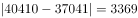万人；D项2016年：万人。比较可知，乡村就业人员与城镇就业人员数量相差最大的是2016年。

故正确答案为D。

---

#### 第 2 题　qid 4695874 · 增长

2014年，乡村就业人员数量的同比增长率最接近下列哪一选项？

- **A**. 2.5%
- **B**. 2.8%　✅
- **C**. 3.4%
- **D**. 4.4%

**答案**：B

**官方解析**

根据题干“2014年······同比增长率······”，结合选项为百分数，可判定本题为一般增长率计算问题。定位统计图可得：2013年乡村就业人员数量为38240万人，2014年为39310万人。根据公式：增长率，则所求增长率为。

故正确答案为B。

---

#### 第 3 题　qid 4695877 · 比重

2012—2016年，城镇就业人员数量占全国就业人员数量比重最高曾达到约（    ）。

- **A**. 47.8%
- **B**. 48.4%
- **C**. 50.3%　✅
- **D**. 51.6%

**答案**：C

**官方解析**

根据题干“2012—2016年······占······比重······”，结合材料时间为2012—2016年，可判定本题为现期比重问题。定位统计图可得，2012—2016年全国乡村、城镇就业人员数量。城镇就业人员数量占全国就业人员数量比重最高，则城镇就业人员数量应尽量多，乡村就业人员数量尽量少。定位统计图可知，只有2013年城镇就业人员数量＞乡村就业人员数量，则该年所求比重最高，比重为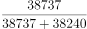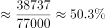。

故正确答案为C。

---

#### 第 4 题　qid 4695883 · 增长

2012—2016年，全国就业人员数量同比增长率最高的是哪一年？

- **A**. 2013年
- **B**. 2014年　✅
- **C**. 2015年
- **D**. 2016年

**答案**：B

**官方解析**

根据题干“2012-2016年······同比增长率最高的是哪一年”，可判定本题为一般增长率比较问题。定位统计图可知：2012-2016年城镇就业人员与乡村就业人员人数。则2012-2016年全国就业人员数量分别为39602+37102=76704万人、38240+38737=76977万人、39310+37943=77253万人、40410+37041=77451万人、41428+36175=77603万人。根据公式：增长率，则2013-2016年全国就业人员数量同比增长率分别为、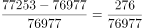、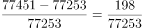、，比较可知，2014年全国就业人员数量同比增长率最高。

故正确答案为B。

备注：本题各年全国就业人员数量差距较小，建议加法精确计算。

---

#### 第 5 题　qid 4695889 · 综合

以下对图中数据分析正确的是：

- **A**. 2012—2016年，乡村就业人员数量均多于城镇就业人员数量
- **B**. 2012—2016年，乡村就业人员数量占全国就业人员数量比重呈逐年递增趋势
- **C**. 2012—2016年，乡村就业人员数量的同比增长率最高的一年是2015年　✅
- **D**. 假设2017年全国就业人员数量的同比增长率与2016年相同，则2017年全国就业人员数量约为92813万人

**答案**：C

**官方解析**

A项：定位统计图可知：2013年城镇就业人员数量为38737万人，乡村就业人员数量为38240万人，乡村就业人员数量少于城镇就业人员数量，错误；

B项：定位统计图可知：2012年、2013年乡村就业人员数量分别为39602万人、38240万人。城镇就业人员数量分别为37102万人、38737万人。2012年乡村就业人员数量＞城镇就业人员数量，则2012年乡村就业人员数量占全国就业人员数量的比重超过50%；2013年乡村就业人员数量＜城镇就业人员数量，则2013年乡村就业人员数量占比不到50%，比重下降，错误；

C项：定位统计图可知：2012-2016年乡村就业人员数量分别为39602万人、38240万人、39310万人、40410万人、41428万人。根据公式：，则2013-2016年乡村就业人员数量同比增长率分别为、、、，比较可知，2015年乡村就业人员数量同比增长率最高，正确；

D项：由本篇材料第四题可知，2016年、2015年全国就业人员数量分别为77603万人、77451万人。根据公式：，则2016年全国就业人员数量同比增长率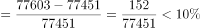。根据公式：现期量=基期量×（1+r），则2017年全国就业人员数量＜77603×（1+10%）＜80000×（1+10%）=88000万人，错误。

故正确答案为C。

备注：对于本题C选项，根据材料数据无法计算2012年乡村就业人员数量同比增长率，因此无法比较2012年与其他年份增长率的大小关系。但结合其他选项的明显错误，粉笔择优选择C项为正确答案。

---

### 材料 2

        2016年我国基础研究经费为822.9亿元，比上年增长14.9%，明显高于应用研究经费（5.4%）和试验发展经费（11.1%）的增速。基础研究、应用研究和试验发展经费所占科技经费总投入比重分别为5.2%、10.3%和84.5%。

        2016年各类企业研发经费支出12144亿元，比上年增长11.6%；政府属研究机构经费支出2260.2亿元，比上年增长5.8%；高等学校科研经费支出1072.2亿元，比上年增长7.4%。企业研发、政府属研究机构、高等学校科研经费支出所占比重分别为77.5%，14.4%和6.8%。

        2016年我国东部地区研发经费为10689.4亿元，首次迈上万亿台阶，比上年增长11%，占全社会研发经费的比重为68.2%；中部、西部和东北地区研发经费分别为2378.1亿元、1944.3亿元和664.9亿元，分别比上年增长10.8%、12.3%和0.4%，所占全社会研发经费的比重分别为15.2%、12.4%和4.2%。

#### 第 6 题　qid 4695901 · 综合

2015年我国应用研究经费约为多少亿元？

- **A**. 1546　✅
- **B**. 1683
- **C**. 833
- **D**. 1142

**答案**：A

**官方解析**

根据题干“2015年······约为多少亿元”，结合材料时间为2016年，可判定本题为基期计算问题。定位材料第一段可得：2016年我国基础研究经费为822.9亿元，比上年增长14.9%，明显高于应用研究经费（5.4%）······基础研究、应用研究和试验发展经费所占科技经费总投入比重分别为5.2%、10.3%和84.5%。根据公式：整体量，则2016年我国科技经费总投入为亿元，则2016年我国应用研究经费投入为亿元。根据公式：基期量，则2015年我国应用研究经费投入为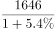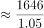亿元，与A项最接近。

故正确答案为A。

---

#### 第 7 题　qid 4695909 · 增长

2016年各类企业研发经费支出增长速度比政府属研究机构经费支出增长速度（    ）。

- **A**. 高1倍　✅
- **B**. 高2倍
- **C**. 高3倍
- **D**. 高4倍

**答案**：A

**官方解析**

根据题干“2016年······比······”，结合选项为高几倍，可判定本题为现期倍数问题。定位文字材料第二段可得：2016年各类企业研发经费支出12144亿元，比上年增长11.6%；政府属研究机构经费支出2260.2亿元，比上年增长5.8%。根据公式：A比B高的倍数，则2016年各类企业研发经费支出增长速度比政府属研究机构经费支出增长速度高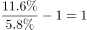倍。

故正确答案为A。

---

#### 第 8 题　qid 4695914 · 比重

2016年地区研发经费占全社会研发经费的比重与2015年相比降低了的是（    ）。

- **A**. 东部地区
- **B**. 中部地区
- **C**. 西部地区
- **D**. 东北地区　✅

**答案**：D

**官方解析**

根据题干“2016年······占······的比重与2015年相比降低······”，可判定本题为两期比重问题。定位文字材料第三段可得：2016年我国东部地区研发经费比上年增长11%，中部、西部和东北地区研发经费分别比上年增长10.8%、12.3%和0.4%。根据两期比重比较结论：部分的增长率＜整体的增长率，比重降低。由于题目为单选题，可判定选项四个地区中只有一个地区研发经费占全社会研发经费的比重降低，即只有一个地区研发经费小于全社会研发经费的增长率，应为增长率最小（0.4%）的东北地区。
故正确答案为D。

---

#### 第 9 题　qid 4695918 · 比重

若各地区保持2016年研发经费增长速度不变，2017年西部地区研发经费占全社会研发经费的比重约为（    ）。

- **A**. 12%
- **B**. 12.4%
- **C**. 12.6%　✅
- **D**. 13%

**答案**：C

**官方解析**

根据题干“······2017年······占······的比重约为”，可判定本题为现期比重问题。定位文字材料第三段可得：2016年我国东部地区研发经费为10689.4亿元，比上年增长11%，占全社会研发经费的比重为68.2%；中部、西部和东北地区研发经费分别为2378.1亿元、1944.3亿元和664.9亿元，分别比上年增长10.8%、12.3%和0.4%，所占全社会研发经费的比重分别为15.2%、12.4%和4.2%。根据公式：比重，则2017年西部地区研发经费占全社会研发经费的比重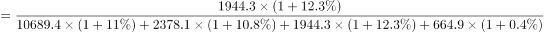，与C项最接近。

故正确答案为C。

---

#### 第 10 题　qid 4695922 · 综合

从上述资料中可以推出的是（    ）。

- **A**. 2016年我国应用研究经费比上年增长超过100亿元
- **B**. 2016年各类企业研发经费支出是高等学校科研经费支出的10倍
- **C**. 2016年中部、西部和东北地区累计研发经费还不及东部地区研发经费的一半　✅
- **D**. 各地区研发经费占全社会研发经费的比重是逐年递增的

**答案**：C

**官方解析**

A项：根据本材料第一题可知，2015年我国应用研究经费约为1546亿元，定位文字材料第一段可得，2016年我国应用研究经费经费同比增速为5.4%。根据公式：增长量＝基期量×增长率，则2016年我国应用研究经费比上年增长：1546×5.4%＜1600×6%=96亿元，故增长不足100亿元。错误；

B项：定位文字材料第二段可得，2016年各类企业研发经费支出12144亿元，高等学校科研经费支出1072.2亿元，前者是后者的：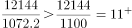倍，即大于11倍。错误；

C项：定位文字材料第三段可得，2016年我国东部地区研发经费占全社会研发经费的比重为68.2%，则中部、西部和东北地区占比应为1-68.2%=31.8%。。正确；

D项：全国各地区研发经费占全社会研发经费的比重必然是有增有减，不可能所有地区占比全部增加。错误。

故正确答案为C。

---
