# 天津市选调2018年应届优秀大学毕业生到基层培养锻炼考试题（网友回忆版）

> 选调生 · 2018 年 · 6 个模块 · 共 144 题

- [政治理论](#%E6%94%BF%E6%B2%BB%E7%90%86%E8%AE%BA) · 6 题
- [常识判断](#%E5%B8%B8%E8%AF%86%E5%88%A4%E6%96%AD) · 85 题
- [言语理解与表达](#%E8%A8%80%E8%AF%AD%E7%90%86%E8%A7%A3%E4%B8%8E%E8%A1%A8%E8%BE%BE) · 23 题
- [数量关系](#%E6%95%B0%E9%87%8F%E5%85%B3%E7%B3%BB) · 10 题
- [判断推理](#%E5%88%A4%E6%96%AD%E6%8E%A8%E7%90%86) · 15 题
- [资料分析](#%E8%B5%84%E6%96%99%E5%88%86%E6%9E%90) · 5 题

---

## 政治理论

### 第 1 题　qid 2166059 · 新思想

习近平总书记指出：“要把培育和弘扬（    ）作为凝魂聚气、强基固本的基础工程，作为一项根本任务，切实抓紧抓好。”

- **A**. 八荣八耻
- **B**. 社会主义核心价值观　✅
- **C**. 社会主义核心价值体系
- **D**. 中华优秀传统文化

**答案**：B

**官方解析**

本题考查时政常识。习近平在中共中央政治局第十三次集体学习时强调，“把培育和弘扬社会主义核心价值观作为凝魂聚气、强基固本的基础工程······”。
故正确答案为B。

---

### 第 2 题　qid 2166073 · 新思想

新时代中国特色社会主义思想，明确中国特色社会主义最本质的特征是：

- **A**. “五位一体”总体布局
- **B**. 建设中国特色社会主义法治体系
- **C**. 中国共产党领导　✅
- **D**. 人民利益为根本出发点

**答案**：C

**官方解析**

本题考查时事政治。主要涉及十九大报告相关内容。
习近平总书记在十九大报告中指出：“中国特色社会主义最本质的特征是中国共产党领导，中国特色社会主义制度的最大优势是中国共产党领导，党是最高政治领导力量，提出新时代党的建设总要求，突出政治建设在党的建设中的重要地位。”
故正确答案为C。

---

### 第 3 题　qid 2166079 · 时事政治

中国共产党与世界政党高层对话会于2017年11月30日至12月3日在北京举行，会议主题是：

- **A**. 携手建设更加美好的世界
- **B**. 汇聚构建人类命运共同体的强大力量
- **C**. 在世界政党间架起桥梁并培养相互间的伙伴关系文化
- **D**. 构建人类命运共同体、共同建设美好世界：政党的责任　✅

**答案**：D

**官方解析**

本题考查时政。2017年中国共产党与世界政党高层对话会于11月30日至12月3日在北京举行。主题为“构建人类命运共同体、共同建设美好世界：政党的责任”。 12月1日，中共中央总书记、国家主席习近平在北京人民大会堂出席中国共产党与世界政党高层对话会开幕式，并发表题为《携手建设更加美好的世界》的主旨讲话。因此，ABC项说法错误，D项正确。
故正确答案为D。

---

### 第 4 题　qid 2166081 · 新思想

党的十九大报告指出，建设现代化经济体系，必须把发展经济的着力点放在（    ）上，把提高供给体系质量作为主攻方向，显著增强我国经济质量优势。

- **A**. 国有经济
- **B**. 实体经济　✅
- **C**. 公有制经济
- **D**. 国民经济

**答案**：B

**官方解析**

本题考查新思想。
B项正确，A、C、D三项错误，党的十九大报告在“五、贯彻新发展理念，建设现代化经济体系”中指出：“（一）深化供给侧结构性改革。建设现代化经济体系，必须把发展经济的着力点放在实体经济上，把提高供给体系质量作为主攻方向，显著增强我国经济质量优势。”
故正确答案为B。

---

### 第 5 题　qid 2166097 · 新思想

党的十九大报告指出，加大生态系统保护力度，完成（  ）三条控制线划定工作。

- **A**. 生态保护红线　✅
- **B**. 永久基本农田　✅
- **C**. 城镇开发边界　✅
- **D**. 空气安全质量底线

**答案**：ABC

**官方解析**

本题考查政治常识。党的十九大报告在谈到加大生态系统保护力度时提出，“完成生态保护红线、永久基本农田、城镇开发边界三条控制线划定工作。”
故正确答案为ABC。

---

### 第 6 题　qid 2166098 · 新思想

党的十九大报告指出，要尊崇党章，严格执行新形势下党内政治生活若干准则，增强党内政治生活的（    ），自觉抵制商品交换原则对党内生活的侵蚀，营造风清气正的良好政治生态。

- **A**. 政治性　✅
- **B**. 时代性　✅
- **C**. 原则性　✅
- **D**. 战斗性　✅

**答案**：ABCD

**官方解析**

本题考查政治常识。
党的十九大报告中提出，“全党要坚定执行党的政治路线，严格遵守政治纪律和政治规矩，在政治立场、政治方向、政治原则、政治道路上同党中央保持高度一致。要尊崇党章，严格执行新形势下党内政治生活若干准则，增强党内政治生活的政治性、时代性、原则性、战斗性，自觉抵制商品交换原则对党内生活的侵蚀，营造风清气正的良好政治生态。”
故正确答案为ABCD。

---

## 常识判断

### 第 1 题　qid 2166034 · 人文常识

董仲舒认为“古之天下，亦今之天下；今之天下，亦古之天下。”这是：

- **A**. 唯物论观点
- **B**. 唯心论观点
- **C**. 辩证法观点
- **D**. 形而上学观点　✅

**答案**：D

**官方解析**

本题主要考查哲学常识。“古之天下，亦今之天下；今之天下，亦古之天下”意为古今之天下没有什么变化，只是具有相同内涵的同一模式随时间的推移进行简单重复。其看不到事物之间的相互联系、运动、变化和发展，是在孤立地、静止地、片面地看待客观事物，属于形而上学的观点。
故正确答案为D。

---

### 第 2 题　qid 2166035 · 人文常识

主张“世界上除了运动着的物质之外，什么也没有”的观点是：

- **A**. 否认人的意识存在的自然唯物主义
- **B**. 主张世界统一于物质的辩证唯物主义　✅
- **C**. 否认时间与空间存在性的唯心主义
- **D**. 把人的意识理解为某种特殊的“精细物质”的机械唯物主义

**答案**：B

**官方解析**

本题主要考查哲学常识。“世界上除了运动着的物质之外，什么也没有”意为世界是由运动着的物质构成，世界是物质的，而物质又是运动的，世界上所有的物质都在以各种不同的方式运动，除此以外，再无其他。
A项错误，题干中只提到运动与物质的关系，并没有涉及到意识。
B项正确，世界上的一切事物和现象，都是物质的种种表现形态，世界的本质是物质的，题干属于主张世界统一于物质的辩证唯物主义。
C项错误，唯心主义主张精神、意识第一性，物质第二性，即物质依赖意识而存在，题干中并未涉及到。
D项错误，机械唯物主义用机械的力学解释一切，认为一切物质的运动都是外力推动的，割裂了物质与运动的关系，与题干不符。
故正确答案为B。

---

### 第 3 题　qid 2166036 · 人文常识

“没有革命的理论，就没有革命的行动。”这句话说明的哲学道理是：

- **A**. 理论高于实践活动
- **B**. 科学理论对实践有指导作用　✅
- **C**. 理论是革命工作的出发点
- **D**. 理论对实践起决定作用

**答案**：B

**官方解析**

本题主要考查理论与实践的关系。
A项错误，实践是认识的来源，为认识的产生提出了需要，而认识对实践具有能动的反作用，“理论高于实践活动”本身说法是错误的。
B项正确，“没有革命的理论，就没有革命的行动”说明认识能够反映实践，同时也能够指导实践，正确的认识能够积极的推动实践的发展，因此科学理论对实践具有指导作用。
C项错误，实践是认识的起点，也是认识的归宿，是全部认识的基础。“理论是革命工作的出发点”本身说法不正确。
D项错误，实践是认识发展的动力，是检验认识是否具有真理性的唯一标准，因此“理论对实践起决定作用”表述不正确。
故正确答案为B。

---

### 第 4 题　qid 2166037 · 人文常识

黑格尔说：“割下来的手就不是真正的人手了。”这句话表达的哲学道理是：

- **A**. 承认世界的统一性
- **B**. 承认世界的本原是物质的
- **C**. 否认联系的形而上学观点
- **D**. 承认普遍联系的辩证法观点　✅

**答案**：D

**官方解析**

本题主要考查哲学常识。
A项错误，世界是统一的，统一的基础是物质，其以具体物质形态的差异性、多样性为前提。选项表述无误，但“割下来的手就不是真正的人手”体现了整体与部分的关系，与选项联系不紧密，因此排除。
B项错误，世界的本原是物质，物质的根本特性是客观实在性。选项表述无误，但题干中并没有涉及到这一观点，因此排除。
C项错误，“割下来的手就不是真正的人手了”意为手离开了身体就不再具备原来的功能，不能割裂整体与部分的关系，即体现了联系的系统性原理，属于辩证法的观点。
D项正确，整体与部分是相互联系的，整体是由部分构成，离开了部分，整体就不复存在；部分是整体的部分，离开了整体，部分就不能成为部分。“割下来的手就不是真正的人手了”体现了普遍联系的辩证法观点。
故正确答案为D。

---

### 第 5 题　qid 2166038 · 经济常识

我国社会主义初级阶段实行以公有制为主体、多种所有制经济共同发展的基本经济制度，促进了生产力的发展，说明实行这种制度遵循了：

- **A**. 生产力决定生产关系的原理　✅
- **B**. 经济基础决定上层建筑的原理
- **C**. 社会存在决定社会意识的原理
- **D**. 经济制度决定生产力状况的原理

**答案**：A

**官方解析**

本题主要考查唯物史观相关内容。我国社会主义初级阶段实行以公有制为主体，多种所有制经济共同发展的基本经济制度主要是因为我国是社会主义国家，必须坚持公有制为主体，同时因为我国生产力的现实是总体水平比较低，发展不平衡，层次比较多，这就需要发展多种所有制经济来适应不同层次的生产力，推动生产力的发展，为社会主义服务。
A项正确，生产力决定生产关系的性质，生产力的发展和变化，决定着生产关系的发展和变化。生产关系一定要适应生产力的状况，这是人类社会发展的普遍规律，它决定着人类社会由低级形态向高级形态的发展，一种旧的生产关系向另一种新的生产关系的过渡。我国实行以公有制为主体，多种所有制经济共同发展的基本经济制度，正是遵循了生产力决定生产关系的原理，才促进了生产力的发展。
B项错误，经济基础是指由社会一定发展阶段的生产力所决定的生产关系的总和，是构成一定社会的基础；上层建筑是建立在经济基础之上的意识形态以及与其相适应的制度、组织和设施，在阶级社会主要指政治法律制度和设施。题干并未体现经济基础和上层建筑的关系。
C项错误，社会存在指社会的物质生活过程，其核心是物质资料的生产方式。社会意识指社会的精神生活过程，广义指社会的一切意识要素和观念形态，包括社会心理和社会意识形式；狭义则专指关于社会关系的意识，即意识形态。题干并未体现社会存在决定社会意识的原理。
D项错误，说法不正确。经济制度是一定社会占统治地位的生产关系的总和，而生产力决定生产关系。
故正确答案为A。

---

### 第 6 题　qid 2166039 · 法律常识

法律调整是一种：

- **A**. 个别性调整
- **B**. 规范性调整　✅
- **C**. 习惯性调整
- **D**. 具体性调整

**答案**：B

**官方解析**

本题考查法理学相关内容。法律调整是国家根据自己的价值评断，以法的形式对人的行为进行规范，对现实社会生活关系施加影响，以期建立理想的社会生活秩序的活动。它有两个特点：（1）法律调整是与国家和法同时产生的，是统治阶级运用国家权力对社会关系所作是带有价值判断的规范性和组织性的中介；（2）法律调整具有有目的、有组织、有结果的性质，并有国家强制力作为后盾。由此可以看出，法律调整是一种规范性调整。
故正确答案为B。

---

### 第 7 题　qid 2166040 · 法律常识

甲将其电脑借给乙使用，乙却将该电脑卖给丙。依据我国《合同法》的规定，下列关于乙丙之间买卖电脑的合同效力的表述，正确的是：

- **A**. 无效
- **B**. 有效　✅
- **C**. 效力待定
- **D**. 可变更或撤销

**答案**：B

**官方解析**

本题考查合同法。
根据《合同法》第一百三十二条规定，出卖的标的物，应当属于出卖人所有或者出卖人有权处分。 法律、行政法规禁止或者限制转让的标的物，依照其规定。可知本题中乙为无权处分人。又因《最高人民法院关于审理买卖合同纠纷案件适用法律问题的解释》第三条【无权处分·买卖合同效力】规定，当事人一方以出卖人在缔约时对标的物没有所有权或者处分权为由主张合同无效的，人民法院不予支持。故可知该合同为有效合同。
故正确答案为B。
备注：关于无权处分的买卖合同的效力，在实践中有一定的争议。有些学者认为应当依据《合同法》第五十一条规定：“无处分权的人处分他人财产，经权利人追认或者无处分权的人订立合同后取得处分权的，该合同有效。”认为是效力待定。有些学者认为应当依据《最高人民法院关于审理买卖合同纠纷案件适用法律问题的解释》第三条【无权处分·买卖合同效力】规定，当事人一方以出卖人在缔约时对标的物没有所有权或者处分权为由主张合同无效的，人民法院不予支持。认定有效。目前粉笔采取的是司法考试的观点，依照合同法司法解释，认定为有效。

---

### 第 8 题　qid 2166041 · 法律常识

在行政诉讼中，人民法院认为规章之间不一致的，应报请（  ）作出解释或者裁决。

- **A**. 全国人民代表大会及其常务委员会
- **B**. 国务院　✅
- **C**. 最高人民法院
- **D**. 司法部

**答案**：B

**官方解析**

本题考查立法法相关内容。《立法法》第九十五条第三项规定：“部门规章之间、部门规章与地方政府规章之间对同一事项的规定不一致时，由国务院裁决。”所以当规章之间不一致的，由国务院裁决。
故正确答案为B。

---

### 第 9 题　qid 2166042 · 法律常识

我国《民法典》规定，继承人对于被继承人生前的合法债务：

- **A**. 应当负责全额偿还
- **B**. 可以负责全额偿还
- **C**. 可以不负责偿还
- **D**. 应当在遗产的实际价值范围内负责清偿　✅

**答案**：D

**官方解析**

本题考查法律常识。
《民法典》第一千一百六十一条规定：“继承人以所得遗产实际价值为限清偿被继承人依法应当缴纳的税款和债务。超过遗产实际价值部分，继承人自愿偿还的不在此限。继承人放弃继承的，对被继承人依法应当缴纳的税款和债务可以不负清偿责任。”所以，继承人对于被继承人生前的合法债务应当在遗产的实际价值范围内负责清偿。因此D项正确，A、B、C三项错误。
故正确答案为D。
【备注】因之前法典已失效，题目根据最新民法典进行调整。

---

### 第 10 题　qid 2166043 · 人文常识

国家工作人员在国内公务活动或者对外交往中接受礼物，依照国家规定应当交公而不交公且数额较大的，应以（  ）定罪处罚。

- **A**. 受贿罪
- **B**. 贪污罪　✅
- **C**. 职务侵占罪
- **D**. 徇私枉法罪

**答案**：B

**官方解析**

本题考查法律常识，主要考查刑法分则中的具体罪名。根据《刑法》第三百九十四条规定，国家工作人员在国内公务活动或者对外交往中接受礼物，依照国家规定应当交公而不交公，数额较大的，依照贪污罪定罪处罚。因此，B项正确，A、C、D项错误。
故正确答案为B。

---

### 第 11 题　qid 2166044 · 经济常识

在社会主义市场经济条件下，我国宏观经济调控的主要手段是：

- **A**. 计划手段
- **B**. 行政手段
- **C**. 法律手段
- **D**. 经济手段　✅

**答案**：D

**官方解析**

本题考查经济常识，主要考查宏观经济。我国宏观经济调控是指国家综合运用各种手段对国民经济进行的调节和控制。
A项错误，计划手段，是指政府根据国内外经济环境，在对经济社会发展趋势预测基础上，对未来国民发展具有指导意义的安排，是宏观调控主体从国民经济运行和发展的实际出发，制定的国民经济和社会发展计划。
B项错误，行政手段，是指国家行政机关按照行政区划、行政系统、行政层次来对国民经济进行管理的手段，具有直接性、权威性、强制性和速效性等特点。
C项错误，法律手段，是指依靠经济立法和经济司法来监督管理经济的手段，具有权威性和强制性。一方面，国家通过经济立法，规范经济活动参与者的行为，调整社会经济关系；另一方面，国家通过经济司法活动，保证各项经济政策的执行、经济合同的履行，打击各种经济违法犯罪行为。
D项正确，经济手段，是指按照客观经济规律要求，依靠各种经济组织，实施各种经济政策和运用各种经济杠杆，来调控经济的手段。财政政策、货币政策是国家在宏观调控中最常用的经济手段。它是一种间接调控手段，而且是最主要的调控手段。
故正确答案为D。

---

### 第 12 题　qid 2166045 · 人文常识

现代企业制度的基本特征是：

- **A**. 自主经营、自负盈亏、自我发展、自我约束
- **B**. 产权清晰、权责明确、政企分开、科学管理　✅
- **C**. 政企分开、宏观管住、微观放开
- **D**. 面向市场、自由经营、自由发展

**答案**：B

**官方解析**

本题考查经济常识。主要考查社会主义市场经济。
中国共产党第十四届中央委员会第三次全体会议1993年11月14日通过的《中共中央关于建立社会主义市场经济体制若干问题的决定》指出，社会主义市场经济体制是同社会主义基本制度结合在一起的。建立社会主义市场经济体制，就是要使市场在国家宏观调控下对资源配置起基础性作用。为实现这个目标，必须坚持以公有制为主体、多种经济成分共同发展的方针，进一步转换国有企业经营机制，建立适应市场经济要求，产权清晰、权责明确、政企分开、管理科学的现代企业制度。可见，现代企业制度的基本特征是“产权清晰、权责明确、政企分开、管理科学”，所以B项正确，A、C、D均不符合题干要求。
故正确答案为B。

---

### 第 13 题　qid 2166046 · 经济常识

当社会总需求大于社会总供给时，一般不宜采取：

- **A**. 均衡的货币政策
- **B**. 趋紧的货币政策
- **C**. 宽松的货币政策　✅
- **D**. 松紧搭配的货币政策

**答案**：C

**官方解析**

本题考查经济常识，主要考查宏观经济。当社会总需求大于社会总供给时，其表现为产品供不应求，价格上升，即造成通货膨胀，容易出现经济过热，物价上涨，这时应该采取的是紧缩性的货币政策和财政政策来降低社会总需求，从而实现经济均衡，稳定物价；而不应该采取扩张性政策，包括宽松（积极）的财政政策和货币政策，C项错误。
B项正确，通货膨胀时期应该采取紧缩性的货币政策；A、D两项正确，均衡或者松紧搭配的货币政策都可以促进总需求和总供给的平衡。
本题为选非题，故正确答案为C。

---

### 第 14 题　qid 2166047 · 人文常识

转变政府职能的关键是：

- **A**. 处理好中央和地方的关系
- **B**. 处理好计划和市场的关系
- **C**. 处理好国家和企业的关系
- **D**. 政企职能分开　✅

**答案**：D

**官方解析**

本题考查管理常识。
党的十九届三中全会提出，转变政府职能，优化政府机构设置和职能配置，是深化党和国家机构改革的重要任务。转变政府职能，关键是政企分开。
故正确答案为D。

---

### 第 15 题　qid 2166048 · 经济常识

我国自改革开放以来，在对市场经济认识上的重大突破是：

- **A**. 市场经济不属于社会基本制度范畴　✅
- **B**. 市场机制对资源配置起基础性作用
- **C**. 市场经济是法制经济
- **D**. 市场经济是有国家干预的经济

**答案**：A

**官方解析**

改革开放以来，对市场经济认识上的重大突破就是市场经济不属于社会基本制度范畴。以前我们认为市场经济是资本主义，计划经济是社会主义，现在认识到资本主义也有计划，社会主义也有市场，计划与市场都是资源配置的手段，和社会基本制度没有内在的联系，这就是改革开放以来我国对市场经济的认识的重大突破。B项错误，十八届三中全会之前，市场在资源配置中起基础性作用，十八届三中全会之后，市场在资源配置中起决定性作用。C项错误，这是市场经济的特点。D项错误，这并非是认识上的重大突破。
故正确答案为A。

---

### 第 16 题　qid 2166049 · 人文常识

一种商品与另一种商品相交换时的量的比例或关系称为：

- **A**. 使用价值
- **B**. 价值
- **C**. 交换价值　✅
- **D**. 价格

**答案**：C

**官方解析**

A项错误，使用价值是指能够满足人们某种需要的物品的效用。使用价值是物品的自然属性，无法体现交换时的比例或关系。
B项错误，价值是指凝结在商品中的无差别的人类劳动，价值量的大小决定于生产这一商品所需的社会必要劳动时间的多少，跟交换无关。
C项正确，交换价值指的是当一种产品在进行交换时，能换取到其他产品的价值，首先表现为一种使用价值同另一种使用价值交换的量的关系或比例，即商品交换时的量的比例或关系。
D项错误，价格是商品同货币交换时单位商品量货币的多少，或者说价格是价值的表现。
故正确答案为C。

---

### 第 17 题　qid 2166050 · 人文常识

商品经济的基本矛盾是（  ）之间的矛盾。

- **A**. 私人劳动和社会劳动　✅
- **B**. 具体劳动和抽象劳动
- **C**. 使用价值和价值
- **D**. 个别劳动时间和社会必要劳动时间

**答案**：A

**官方解析**

本题主要考查经济常识。
商品经济是指直接以交换为目的的经济形态，包括商品生产和商品交换。商品经济的产生要具备两个条件：一是社会分工；二是生产资料和产品属于不同的所有者。因此，生产商品的劳动同时具有私人劳动和社会劳动两重性质。
A项正确，私人劳动只有经过交换才能转换为社会劳动，反映了私有制商品经济的本质。同时私人劳动和社会劳动的矛盾决定和影响着私有制商品经济的其他一切矛盾，决定着商品生产者的命运。因此，私人劳动与社会劳动的矛盾是商品经济的基本矛盾。
B项错误，具体劳动和抽象劳动是劳动的二重属性。具体劳动是人类特殊的、具体的劳动，它创造商品的使用价值，抽象劳动是一般的抽象的人类劳动，它形成商品的价值。
C项错误，使用价值和价值是商品的二重性，使用价值是能满足人们某种需要的属性，价值是凝结在商品中的无差别的人类劳动。
D项错误，个别劳动时间是指个别商品生产者生产某种商品所耗费的劳动时间。社会必要劳动时间是在当时社会正常的生产条件下，按社会平均的劳动熟练程度和劳动强度生产某种商品所需要的时间。
故正确答案为A。

---

### 第 18 题　qid 2166051 · 人文常识

一切社会经济共有的经济规律是：

- **A**. 价值规律
- **B**. 剩余价值规律
- **C**. 按劳分配规律
- **D**. 生产关系一定要适应生产力性质规律　✅

**答案**：D

**官方解析**

A项错误，价值规律的基本内容是指商品的价值量是由生产商品的社会必要劳动时间决定，商品的交换要以价值量为基础，实行等价交换。价值规律是商品经济的基本规律。
B项错误，剩余价值是雇佣工人创造的被资本家无偿占有的超过劳动力价值的价值。剩余价值规律是资本主义经济的规律。
C项错误，按劳分配是指在生产资料社会主义公有制条件下，对社会总产品作了各项必要的社会扣除以后，按照个人提供给社会的劳动的数量和质量分配个人消费品。按劳分配规律是社会主义经济的规律。
D项正确，生产力和生产关系的相互作用及其矛盾运动，表明了生产力和生产关系之间内在的本质的必然的联系，这就是生产关系一定要适合生产力状况的规律。生产关系一定要适合生产力状况的规律，是在任何社会中都起作用的普遍规律。
故正确答案为D。

---

### 第 19 题　qid 2166052 · 人文常识

一切有用物品包括商品所共有的属性是：

- **A**. 价值
- **B**. 个别价值
- **C**. 使用价值　✅
- **D**. 社会价值

**答案**：C

**官方解析**

A项错误，价值是指凝结在商品中无差别的人类劳动，价值是商品的特有属性，只有商品才有价值，因此并非一切有用物品都有价值。
B项错误，个别价值是生产同一种商品的个别生产者在不等的个别劳动时间内形成的价值。只有商品才有个别价值，所以并非一切有用物品都有个别价值。
C项正确，使用价值是指能满足人们某种需要的物品的效用。使用价值是一切有用物品包括商品所共有的属性，是商品的自然属性，反映的是人与自然的关系。
D项错误，社会价值是指商品的价值是由社会必要劳动时间决定的，即在现有的正常的生产条件下，在平均的社会劳动熟练程度、劳动强度下制造某种商品需要的时间。只有商品才有社会价值，所以并非一切有用物品都有社会价值。
故正确答案为C。

---

### 第 20 题　qid 2166053 · 人文常识

国民收入经过初次分配和再分配后，按最终用途可分为：

- **A**. 工资收入和福利收入
- **B**. 投资和储蓄
- **C**. 积累和消费　✅
- **D**. 进口和出口

**答案**：C

**官方解析**

国民收入经过初次分配和再分配以后，按其最终用途分为积累基金和消费基金，分别用于积累和消费。积累基金是国民收入中用于追加生产资本的部分，形成投资需求，用于扩大再生产、非生产性基本建设和社会后备基金。消费基金形成消费需求，用于居民的个人消费和社会消费。
故正确答案为C。

---

### 第 21 题　qid 2166054 · 人文常识

公务员的任用，坚持的原则是：

- **A**. 勤能并重
- **B**. 管理与监督并重
- **C**. 唯才是用
- **D**. 任人唯贤，德才兼备　✅

**答案**：D

**官方解析**

根据《公务员法》第七条规定：“公务员的任用，坚持德才兼备、以德为先，坚持五湖四海、任人唯贤，坚持事业为上、公道正派，突出政治标准，注重工作实绩。”
故正确答案为D。

---

### 第 22 题　qid 2166055 · 人文常识

我国对公务员管理实行的制度是：

- **A**. 党政干部单一的管理
- **B**. 集中统一管理
- **C**. 分类管理　✅
- **D**. 职位管理

**答案**：C

**官方解析**

本题考查法律常识。根据《公务员法》第十六条规定：“国家实行公务员职位分类制度。公务员职位类别按照公务员职位的性质、特点和管理需要，划分为综合管理类、专业技术类和行政执法类等类别。根据本法，对于具有职位特殊性，需要单独管理的，可以增设其他职位类别。各职位类别的适用范围由国家另行规定。”
故正确答案为C。

---

### 第 23 题　qid 2166056 · 经济常识

公务员法对公务员的范围重新做了界定，根据规定，公务员必须具备三个条件，其中体现公务员最本质特征的是：

- **A**. 依法履行公职　✅
- **B**. 纳入国家行政编制
- **C**. 由国家财政负担工资福利
- **D**. 三项均属于

**答案**：A

**官方解析**

本题考查法律常识。《公务员法》第二条第二款：“本法所称公务员，是指依法履行公职、纳入国家行政编制、由国家财政负担工资福利的工作人员。”根据《公务员法释义》对本条的释义，是否属于公务员，必须符合三个条件：
一是依法履行公职。即依法从事公务活动的人员，他不是为自己工作，也不是为某个私人的企业或者组织工作或者服务，故A选项正确。
二是纳入国家行政编制。有一些非行政编制的工作人员，例如法院法官等，也属于公务员，故B选项错误。
三是由国家财政负担工资福利。公务员属于国家财政供养的人员，但并不是财政供养的人员都是公务员。财政供养人员的很大一部分，如公立学校的老师、科研院所的科研人员等，虽然由国家负担其工资福利，但不属于公务员，故C选项错误。
故正确答案为A。

---

### 第 24 题　qid 2166057 · 人文常识

公务员的行为规范是指公务员在任职期间必须遵守和履行的行为准则和：

- **A**. 工作方法
- **B**. 工作作风
- **C**. 工作程序
- **D**. 工作纪律　✅

**答案**：D

**官方解析**

本题考查法律常识。
公务员行为规范，从广义上讲，是指公务员的言谈举止在任何时候、任何场合都要进行一定的约束和限制。从狭义上讲，是指公务员在公务活动中必须自觉遵守和遵循的各项基本准则和纪律，包括政治思想、工作作风、办事规则、行政程序等等。
出处：公共管理系列教材 《国家公务员制度教程》（舒放 王克良 主编），中国人民大学出版社 2001年第1版。
故正确答案为D。

---

### 第 25 题　qid 2166058 · 法律常识

关于机关对聘任制公务员的管理，以下说法正确的是：

- **A**. 与委任制公务员的管理规定相同
- **B**. 公务员法的管理规定均适用于聘任制公务员
- **C**. 聘任合同的内容中可以有不执行公务员法管理规定的部分　✅
- **D**. 聘任合同一经签订不得更改或者解除

**答案**：C

**官方解析**

本题考查行政法。
A项错误，根据《公务员法》第四十条规定：“公务员领导职务实行选任制、委任制和聘任制。公务员职级实行委任制和聘任制。领导成员职务按照国家规定实行任期制。”该法第四十二条规定：“委任制公务员试用期满考核合格，职务、职级发生变化，以及其他情形需要任免职务、职级的，应当按照管理权限和规定的程序任免。”该法第一百条规定：“机关根据工作需要，经省级以上公务员主管部门批准，可以对专业性较强的职位和辅助性职位实行聘任制。前款所列职位涉及国家秘密的，不实行聘任制。”所以，聘任制公务员管理和委任制公务员管理规定不完全相同。
B项错误，C项正确。根据《公务员法》第一百零四条规定：“机关依据本法和聘任合同对所聘公务员进行管理。”可知，聘任制公务员的管理适用的是公务员管理的一般原则和制度精神，公务员法的管理规定并不均适用于聘任制公务员，聘任合同的内容中可以有不执行公务员法规定的部分，例如聘任制公务员在聘任期间，没有职务晋升的问题，但可以按照聘任合同的约定，定期增长工资和其他福利待遇。
D项错误，根据《公务员法》第一百零二条规定：“机关聘任公务员，应当按照平等自愿、协商一致的原则，签订书面的聘任合同，确定机关与所聘公务员双方的权利、义务。聘任合同经双方协商一致可以变更或者解除。聘任合同的签订、变更或者解除，应当报同级公务员主管部门备案。”
故正确答案为C。

---

### 第 26 题　qid 2166060 · 人文常识

关于我国的国家制度，下列说法错误的是：

- **A**. 我国是人民民主专政的社会主义国家
- **B**. 我国人民行使国家权力的机关是各级人民政府　✅
- **C**. 我国的国家机构实行民主集中制原则
- **D**. 我国经济制度的基础是全民所有制和劳动群众集体所有制

**答案**：B

**官方解析**

本题考查法律常识。
A项正确，我国《宪法》第一条第一款规定：“中华人民共和国是工人阶级领导的、以工农联盟为基础的人民民主专政的社会主义国家。”
B项错误，根据我国《宪法》第二条第一款和第二款规定：“中华人民共和国的一切权力属于人民。人民行使国家权力的机关是全国人民代表大会和地方各级人民代表大会。”
C项正确，我国《宪法》第三条第一款规定：“中华人民共和国的国家机构实行民主集中制的原则。”
D项正确，根据我国《宪法》第六条第一款规定：“中华人民共和国的社会主义经济制度的基础是生产资料的社会主义公有制，即全民所有制和劳动群众集体所有制。社会主义公有制消灭人剥削人的制度，实行各尽所能、按劳分配的原则。”
本题为选非题，故正确答案为B。

---

### 第 27 题　qid 2166061 · 法律常识

近年来，实名认证的政务机构微博越来越多，“微博问政”已渐成新趋势，政府通过微博受公众质询，推动政府积极解决市民关心的问题。对此，下列哪一说法是不正确的？

- **A**. 社会主义法治是“治权之治”，微博问政有利于强化人民群众对官员的监督
- **B**. 微博问政体现了高效便民的原则
- **C**. 微博问政是公民对国家机关及工作人员监督的有效法律手段　✅
- **D**. 微博问政有助于引导市民规范有序地参与国家和社会事务管理

**答案**：C

**官方解析**

本题考查政治常识。
A项正确，建设社会主义法治，必先规范和约束公权。微博问政是群众对政府的质询、监督，可以督促官员认真落实各项政策，推动地方经济社会发展，体现了人民群众监督的强化。
B项正确，高效便民原则即行政效率高、便利当事人，体现在时间短而且办事效率高。微博问政，群众足不出户即可了解政府工作，快捷监督国家权力的实施，属于高效便民的一种措施。
C项错误，法律手段是指国家依靠法律的强制力量来规范经济社会各方面活动的手段；微博问政主体是人民群众，且不具有法律效力，不属于法律手段，属于社会监督。
D项正确，微博问政有利于引导公民积极行使自己的民主政治权利，参与社会治理、献言献策。
本题为选非题，故正确答案为C。

---

### 第 28 题　qid 2166062 · 人文常识

党的十八大从国家、社会、个人三个层面对社会主义核心价值观作了阐述，从个人层面倡导的是：

- **A**. 富强、民主、文明、和谐
- **B**. 自由、平等、公正、法治
- **C**. 爱国、敬业、诚信、友善　✅
- **D**. 和平、发展、合作、共赢

**答案**：C

**官方解析**

本题考查政治常识。
社会主义核心价值观是社会主义核心价值体系的内核。党的十八大提出，社会主义核心价值观的基本内容是倡导富强、民主、文明、和谐，倡导自由、平等、公正、法治，倡导爱国、敬业、诚信、友善，积极培育和践行社会主义核心价值观。
A项错误，富强、民主、文明、和谐是国家层面的价值目标。
B项错误，自由、平等、公正、法治是社会层面的价值取向。
C项正确，爱国、敬业、诚信、友善是公民个人层面的价值准则。
D项错误，不属于社会主义核心价值观的基本内容。十八大报告指出，中国将继续高举和平、发展、合作、共赢的旗帜，坚定不移地致力于维护世界和平、促进共同发展。
故正确答案为C。

---

### 第 29 题　qid 2166063 · 人文常识

下列事件按时间先后顺序排列正确的是：
①十一届三中全会召开
②家庭联产承包责任制确立
③开始设立经济特区
④提出“一个中心，两个基本点”

- **A**. ①②③④
- **B**. ②①③④
- **C**. ①③②④　✅
- **D**. ①④②③

**答案**：C

**官方解析**

本题考查政治常识。
①中国共产党第十一届中央委员会第三次全体会议简称十一届三中全会，于1978年12月18日-22日在北京举行。②家庭联产承包责任制是80年代初期，在中国大陆农村推行的一项重要的改革，是农村土地制度的一项转折，1978年从安徽省凤阳县小岗村开始试点，1982年家庭联产承包责任制确立。③1980年5月，中共中央和国务院决定将深圳、珠海、汕头和厦门四个出口特区改称为经济特区，这是我国设立经济特区的开始。④“一个中心”指以经济建设为中心，“两个基本点”指坚持四项基本原则、坚持改革开放。在1987年中国共产党第十三次全国代表大会作出这一概括。
故正确排序应为①③②④。A、B、D三项错误，C项正确。
故正确答案为C。

---

### 第 30 题　qid 2166064 · 人文常识

由我国天文学家南仁东于1994年提出构想，历时22年建成，于2016年9月25日落成启用的FAST工程，是由中国科学院国家天文台主导建设，具有我国自主知识产权、世界最大单口径、最灵敏的射电望远镜，也被称为天眼工程。FAST意为：

- **A**. 感光快
- **B**. 建设快
- **C**. 世界最大望远镜
- **D**. 500米口径球面射电望远镜　✅

**答案**：D

**官方解析**

本题考查科技常识。
FAST是Five-hundred-meter Aperture Spherical radio Telescope的英文简称，其意思为500米口径球面射电望远镜。
故正确答案为D。

---

### 第 31 题　qid 2166065 · 人文常识

现在实施的国际急救指南心肺复苏术中，胸外心脏按压与人工呼吸的比例为：

- **A**. 
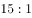

- **B**. 

- **C**. 
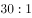

- **D**. 

　✅

**答案**：D

**官方解析**

本题考查生活常识。

根据2015版心肺复苏指南：心肺复苏抢救顺序为CAB（即胸外心脏按压-开放气道-人工呼吸），胸外心脏按压和人工呼吸比例为，按压频率为100-120次／分，按压深度为5-6cm，并要求胸廓充分回弹。只有在出现室颤和无脉室速时才进行除颤。

故正确答案为D。

---

### 第 32 题　qid 2166066 · 科技常识

狂犬病是一种人兽共患的病毒性传染病，死亡率很高，在高达的人类感染病例中，狂犬病毒都是由家养狗传播的，通常是通过咬伤或抓伤致病，主要经由（  ）传染给人。

- **A**. 血液
- **B**. 唾液　✅
- **C**. 毛发
- **D**. 呼吸

**答案**：B

**官方解析**

本题考查生物常识。
狂犬病乃狂犬病毒所致的急性传染病，人兽共患，多见于犬、狼、猫等肉食动物，人多因被病兽咬伤而感染。狂犬病毒含5种蛋白，即糖蛋白（G）、核蛋白（N）、聚合酶（L）、磷蛋白（NS）及基质（M）等。狂犬病病毒的糖蛋白能与乙酰胆碱结合，决定了狂犬病毒的噬神经性。人被患病动物咬伤或抓伤后，动物唾液中的病毒通过伤口进入人体而引发疾病，少数患者也可因眼结膜被病兽唾液污染而患病。
故正确答案为B。

---

### 第 33 题　qid 2166067 · 地理国情

2017年8月，强台风“天鸽”吹袭我国，暴雨肆虐香港、澳门、广东等地，部分城市相继出现“城市内涝”，造成人员伤亡及财产损失。大城市（  ），由于做好了“上流截流，中流蓄洪，下流拓渠”，减少了灾害损失，成为许多城市学习的榜样。

- **A**. 深圳
- **B**. 广州
- **C**. 香港　✅
- **D**. 台北

**答案**：C

**官方解析**

本题考查时事政治。
香港的防洪策略可总括为“三招”：上流截流、中流蓄洪及下流拓渠。“上流截流”，即把上、中游集水区的雨水截取，引流绕道集中起来，再直接排放入海。“中流蓄洪”是指，进一步缓解下游排水管道的负荷，兴建地下蓄洪池暂存雨水，待暴雨过后再排(抽)走。“下流拓渠”，是适合一些普遍地段的传统治水方法，重点在改善、扩建及提升现有雨水排放系统。通过这三招，在“天鸽”来临时，香港大大减少了灾害损失。
故正确答案为C。

---

### 第 34 题　qid 2166068 · 人文常识

古希腊数学家在二千多年前确定了一种美的标准，被誉为“巧妙的比例”，并赋予各种瑰丽诡秘的色彩，许多文艺复兴时期的艺术作品比较注重这一比例的运用，我们称这个比例为：

- **A**. 勾股定理
- **B**. 正态分布
- **C**. 形式美
- **D**. 黄金分割　✅

**答案**：D

**官方解析**

本题考查文化常识。
A项错误，勾股定理是指在任何一个平面直角三角形中的两直角边的平方之和一定等于斜边的平方，中国是发现和研究勾股定理最古老的国家之一。
B项错误，正态分布是一个统计学概念，是在数学、物理及工程等领域都非常重要的概率分布，在统计学的许多方面有着重大的影响力。正态分布的概率密度函数曲线呈钟形，因此人们又经常称之为钟形曲线。
C项错误，形式美是指构成事物的物质材料的自然属性(色彩、形状、线条、声音等)及其组合规律(如整齐一律、节奏与韵律等)所呈现出来的审美特性，不是由古希腊数学家确定的。 
D项正确，2000多年前，古希腊雅典学派的第三大算学家欧道克萨斯首先提出黄金分割。所谓黄金分割，指的是把长为L的线段分为两部分，使其中一部分对于全部之比，等于另一部分对于该部分之比。黄金分割在文艺复兴前后，经过阿拉伯人传入欧洲，受到了欧洲人的欢迎。它在造型艺术中具有美学价值，采用这一比值能够引起人们的美感，因此在文艺复兴时期许多艺术作品都比较注重这一比例的运用。现在我们的实际生活中黄金分割的应用也非常广泛，比如舞台上的报幕员并不是站在舞台的正中央，而是偏在台上一侧，以站在舞台长度的黄金分割点的位置最美观。
故正确答案为D。

---

### 第 35 题　qid 2166069 · 人文常识

标志中国新民主主义革命开端的是：

- **A**. 新文化运动
- **B**. 中国共产党的诞生
- **C**. 五四运动　✅
- **D**. 辛亥革命

**答案**：C

**官方解析**

本题考查中国近代史知识。
A项错误，新文化运动是从1915年陈独秀在上海创办《新青年》（原名《青年杂志》）开始的，提倡“民主”与“科学”的基本口号，是一次“反传统、反儒教、反文言”的思想文化革新、文学革命运动。这次运动动摇了传统礼教的思想统治地位，为马克思主义在中国的传播开辟了道路。
B项错误，1921年7月，在上海和浙江嘉兴南湖召开的中国共产党的第一次全国代表大会，宣告中国共产党的诞生。
C项正确，五四运动是1919年5月4日发生在北京的一场以青年学生为主，广大群众、市民、工商人士等共同参与的爱国运动，是中国人民彻底的反对帝国主义、封建主义的爱国运动。五四运动标志着中国新民主主义革命的开端，标志着中国无产阶级开始登上历史舞台。
D项错误，辛亥革命是指发生于中国农历辛亥年，即公元1911年至1912年初，旨在推翻清朝专制帝制、建立共和政体的全国性革命。这次革命结束了中国长达两千年之久的君主专制制度，使民主共和的观念深入人心。
故正确答案为C。

---

### 第 36 题　qid 2166070 · 人文常识

下列哪次会议的决议案确立了党对军队的绝对领导原则？

- **A**. 八七会议
- **B**. 古田会议　✅
- **C**. 遵义会议
- **D**. 瓦窑堡会议

**答案**：B

**官方解析**

本题考查毛中特。党对军队的绝对领导的根本原则和制度，发端于南昌起义，奠基于三湾改编，定型于古田会议。
A项错误，八七会议是1927年8月7日于汉口召开的紧急会议，会议批判和纠正了陈独秀右倾机会主义错误，确定了土地革命和武装斗争的总方针，决定发动秋收起义。毛泽东出席了这次会议，并提出了“枪杆子里面出政权”的著名论断。
B项正确，古田会议于1929年12月在福建古田召开，大会一致通过了毛泽东代表前委起草的决议案，即古田会议决议。古田会议决议创造性地回答和解决了“党指挥枪”等军队建设的一系列基本问题，开辟了新型人民军队政治建军的成功之路，铸造了人民军队的军魂，重申了党对军队实行绝对领导的原则。
C项错误，遵义会议是1935年在红军第五次反“围剿”失败和长征初期严重受挫的情况下，为了纠正王明“左倾”领导在军事指挥上的错误而召开的。这次会议是中国共产党第一次独立自主地运用马克思列宁主义基本原理解决自己的路线、方针政策的会议，会议确立毛泽东在党内的领导地位，是中国共产党历史上生死攸关的转折点，标志着中国共产党从幼稚走向成熟。
D项错误，瓦窑堡会议于1935年12月在陕北瓦窑堡召开，会议分析了华北事变后国内阶级关系的新变化，讨论了抗日民族统一战线、国防政府和抗日联军等问题，确定了建立抗日民族统一战线的政策，为党领导全国人民迎接伟大的抗日战争奠定了政治基础。
故正确答案为B。

---

### 第 37 题　qid 2166071 · 人文常识

中国进入社会主义社会的主要标志是：

- **A**. 中华人民共和国的成立
- **B**. 过渡时期总路线的提出
- **C**. 第一届全国人民代表大会的召开
- **D**. 社会主义三大改造的完成　✅

**答案**：D

**官方解析**

本题考查毛泽东思想有关社会主义改造理论的知识。
A项错误，1949年中华人民共和国的成立，标志着半殖民地半封建社会的结束，标志着中国新民主主义革命已经取得了基本的胜利，中国进入了新民主主义社会，并开始了新民主主义向社会主义转变的时期。
B项错误，1952年底党中央按照毛泽东同志的建议，提出了党在过渡时期的总路线，指明了中国新民主主义过渡到社会主义的任务、途径和步骤，它的实质是改变生产关系，解决生产资料的所有制问题，为进一步解放和发展生产力、进入社会主义创造条件。
C项错误，1954年9月15日，第一届全国人民代表大会第一次会议在北京召开，标志着我国以人民代表大会制度为根本的政治制度得到全面确立。
D项正确，1956年底，随着农业、手工业和资本主义工商业社会主义改造的基本完成，我国实现了生产资料私有制向社会主义公有制的转变，标志着社会主义制度在中国的基本确立，中国已经从新民主主义社会进入社会主义社会。
故正确答案为D。

---

### 第 38 题　qid 2166072 · 人文常识

马克思主义中国化理论成果的精髓是：

- **A**. 解放思想
- **B**. 实事求是　✅
- **C**. 群众路线
- **D**. 独立自主

**答案**：B

**官方解析**

本题考查政治常识。
马克思主义中国化就是将马克思主义的基本原理和中国革命与建设的实际情况相结合。这一概念由毛泽东在1938年中共六届六中全会上作《论新阶段》的报告时首次提出。毛泽东思想是马克思主义中国化第一次历史性飞跃的理论成果；中国特色社会主义理论体系，是马克思主义中国化第二次历史性飞跃的理论成果。毛泽东思想的精髓是实事求是；邓小平理论的精髓是解放思想、实事求是；“三个代表”重要思想的精髓是解放思想、实事求是、与时俱进；科学发展观的精髓是解放思想、实事求是、与时俱进、求真务实。因此“实事求是”贯穿了马克思主义中国化两大成果基本观点的始终。
故正确答案为B。

---

### 第 39 题　qid 2166074 · 人文常识

下列不属于公文附件标记范围的选项是：

- **A**. 附件标题
- **B**. 附件件数
- **C**. 附件注释　✅
- **D**. 附件份数

**答案**：C

**官方解析**

本题考查公文常识，主要涉及公文格式的知识点。附件是公文正文的说明、补充或者参考资料。
A项正确，根据《党政机关公文处理工作条例》第九条第十款规定：附件说明包括公文附件的顺序号和名称。所谓名称，即附件标题。
B项正确，根据《党政机关公文处理工作条例》第九条第十款规定：附件说明包括公文附件的顺序号和名称。所谓顺序号，即件数，指附件含有的文件资料个数，用阿拉伯数字标注。
C项错误，注释非法定的公文内容，在本题中是一个干扰项。法定的公文内容中有个相似的“附注”。根据《党政机关公文处理工作条例》第九条第十四款规定：附注是公文印发传达范围等需要说明的事项。
D项正确，附件份数是指同一版附件有几份复制件，如一式三份。
本题为选非题，故正确答案为C。

---

### 第 40 题　qid 2166075 · 人文常识

用于向上级有所呈请，并请其给予答复的公文是：

- **A**. 函
- **B**. 报告
- **C**. 请示　✅
- **D**. 批复

**答案**：C

**官方解析**

本题考查公文常识，主要涉及公文文种的知识点。题意即上行文且请求答复的公文类型。
A项错误，函适用于不相隶属机关之间商洽工作、询问和答复问题、请求批准和答复审批事项，故不能向上级发函；
B项错误，报告适用于向上级机关汇报工作、反映情况，回复上级机关的询问，“报告”中不得夹带请示事项，故报告不可用于向上级有所呈请；
C项正确，请示适用于向上级机关请求指示、批准，符合题意。
D项错误，批复适用于答复下级机关请示事项，不合题意；
故正确答案为C。

---

### 第 41 题　qid 2166076 · 人文常识

要求下级机关办理或者执行的事项，用：

- **A**. 命令
- **B**. 批复
- **C**. 通告
- **D**. 通知　✅

**答案**：D

**官方解析**

本题考查公文常识。
A项错误，根据《党政机关公文处理工作条例》第八条第三项规定，“命令”，适用于公布行政法规和规章、宣布施行重大强制性措施、批准授予和晋升衔级、嘉奖有关单位和人员。
B项错误，根据《党政机关公文处理工作条例》第八条第十二项规定，“批复”适用于答复下级机关请示事项。
C项错误，根据《党政机关公文处理工作条例》第八条第六项规定，“通告”适用于在一定范围内公布应当遵守或者周知的事项。
D项正确，根据《党政机关公文处理工作条例》第八条第八项规定，“通知”适用于发布、传达要求下级机关执行和有关单位周知或者执行的事项，批转、转发公文。
故正确答案为D。

---

### 第 42 题　qid 2166077 · 法律常识

国务院发布行政法规，采用：

- **A**. 逐级行文
- **B**. 越级行文
- **C**. 直达行文　✅
- **D**. 直接行文

**答案**：C

**官方解析**

本题考查公文常识。
A项错误，逐级行文是为了维护正常的领导关系，有隶属关系或业务指导关系的机关之间应采取的行文方式，按级逐级上报或下发文件,即只对直属上一级机关或下一级机关制发公文。
B项错误，公文一般情况下不得越级行文，特殊情况需要越级行文的，应当同时抄送被越过的机关。
C项正确，直达行文是指领导机关将文件发至基层组织或直接传达给人民群众。政府发布的行政法规和重要政策措施等，往往采用这种方式。
D项错误，直接行文是指发文机关直接向需要承办或执行公文中有关公务的受文机关行文。
故正确答案为C。

---

### 第 43 题　qid 2166078 · 人文常识

计划的最显著特点是：

- **A**. 预见性　✅
- **B**. 可行性
- **C**. 理论性
- **D**. 指导性

**答案**：A

**官方解析**

本题考查管理常识，主要涉及计划特点。
A项正确，现代经营管理之父、管理过程学派的开山鼻祖--亨利·法约尔认为：管理意味着展望未来，预见是管理的一个基本要素，预见的目的就是制定行动计划。因此，预见性是计划最明显的特点。计划的预见是否准确，决定了计划的成败。
B项错误，预见准确、针对性强的计划，在现实中才真正可行，可行性并非计划最显著的特点。
C项错误，计划应符合党和国家的路线、方针和政策，符合有关的法律条文，但理论性不是计划最显著的特征。
D项错误，计划经过上级机关审批以后，就具有权威性，它既是行动的方向，又是指导工作的根据，具有一定的指导性，但并不是最显著的特点。
故正确答案为A。

---

### 第 44 题　qid 2166080 · 法律常识

下列属于2018年1月1日开始实施的法律是：

- **A**. 《中华人民共和国环境保护税法》　✅
- **B**. 《中华人民共和国野生动物保护法》
- **C**. 《中华人民共和国国防交通法》
- **D**. 《中华人民共和国中医药法》

**答案**：A

**官方解析**

本题考查法律常识。《中华人民共和国环境保护税法》于2018年1月1日起施行，依照该法规定征收环境保护税，故A项正确。
B项错误，《中华人民共和国野生动物保护法》经1988年11月8日七届全国人大常委会第4次会议修订通过，自1989年3月1日起施行。
C项错误，《中华人民共和国国防交通法》自2017年1月1日起施行。
D项错误，《中华人民共和国中医药法》自2017年7月1日起施行。
故正确答案为A。

---

### 第 45 题　qid 2166082 · 人文常识

2017年11月24日，（  ）顺利通过联合国教科文组织世界记忆工程国际咨询委员会的评审，成功入选《世界记忆名录》。

- **A**. 《本草纲目》
- **B**. 甲骨文　✅
- **C**. 《黄帝内经》
- **D**. 南京大屠杀档案

**答案**：B

**官方解析**

本题考查时政。人民网北京11月24日电日前，联合国教科文组织网站发布消息，我国申报的甲骨文顺利通过联合国教科文组织世界记忆工程国际咨询委员会的评审，成功入选《世界记忆名录》。故B项正确。
A项错误，《本草纲目》2011年入选《世界记忆名录》。
C项错误，《黄帝内经》2011年入选《世界记忆名录》。
D项错误，南京大屠杀档案2015年入选《世界记忆名录》。
故正确答案为B。

---

### 第 46 题　qid 2166083 · 人文常识

2017年，国务院扶贫办《科技扶贫行动方案》，动员全社会科技资源投身服务于脱贫攻坚，在科技系统实施科技扶贫“百千万”工程：即在贫困地区建设“一百个”科技园区、星创天地等平台载体，动员组织高校、院所、园区、企业等与贫困地区建立“一千个”科技扶贫帮扶结对，实现“一万个”贫困村（  ）全覆盖。

- **A**. 帮扶责任人
- **B**. 驻村工作队
- **C**. 科技特派员　✅
- **D**. 帮扶责任单位

**答案**：C

**官方解析**

C项正确，国务院扶贫办《科技扶贫行动方案》，动员全社会科技资源投身服务于脱贫攻坚，经研究，在科技系统实施科技扶贫“百千万”工程：在贫困地区建设“一百个”科技园区、星创天地等平台载体，动员组织高校、院所、园区、企业等与贫困地区建立“一千个”科技扶贫帮扶结对，实现“一万个”贫困村科技特派员全覆盖。
故正确答案为C。

---

### 第 47 题　qid 2166084 · 人文常识

辩证唯物主义关于物质和意识关系的全面看法是（    ）。

- **A**. 物质第一性，意识第二性　✅
- **B**. 物质决定意识，意识是人脑的机能　✅
- **C**. 物质决定意识，意识反作用于物质　✅
- **D**. 物质是意识的根源，意识是对物质的反映　✅

**答案**：ABCD

**官方解析**

本题考查哲学常识。辩证唯物主义认为，世界是物质的，物质决定意识，意识对物质具有反作用。意识能够能动地认识和改造世界，正确的意识能够促进社会发展和人的全面发展，错误的意识会阻碍社会和人的发展。
A项正确，辩证唯物主义认为，物质决定意识，意识对物质具有能动作用。物质是第一性的，意识是第二性的。
B项正确，辩证唯物主义认为，物质决定意识，意识是人脑的机能和属性，是人脑对客观世界的主观映像。
C项正确，辩证唯物主义认为，物质决定意识，意识对物质具有反作用，意识能够能动地认识和改造世界，即意识反作用于物质。
D项正确，辩证唯物主义认为，物质决定意识，因此物质是意识的根源；意识对物质具有反作用，意识能够能动地认识世界和改造世界，因此意识是对物质的反映。
故正确答案为ABCD。

---

### 第 48 题　qid 2166085 · 人文常识

下列选项中体现量变引起质变这一哲学道理的有（    ）。

- **A**. 千里之堤，溃于蚁穴　✅
- **B**. 水滴石穿，绳锯木断　✅
- **C**. 近朱者赤，近墨者黑
- **D**. 不积细流，无以成江海　✅

**答案**：ABD

**官方解析**

本题考查哲学常识。唯物辩证法认为，事物的发展总是从量变开始的，量变是质变的必要准备，质变是量变的必然结果。质变又为新的量变开辟道路，使事物在新质的基础上开始新的量变。事物的发展就是这样由量变到质变，又在新质的基础上开始新的量变，如此循环往复，不断前进。
A项正确，千里之堤，溃于蚁穴，意思是千里长的大堤，往往因蚂蚁洞穴而崩溃，比喻小事不慎将酿成大祸。“蚁穴”是量的积累，到一定程度就会使千里之堤崩溃，体现了事物的发展总是从量变开始的，量变最终引起了质变。
B项正确，水滴石穿，绳锯木断，意思是水滴在石头上，时间久了能把石头滴穿；用绳子锯木头，时间久了能把木头锯断。意思是只要有毅力，长久坚持，就能成功。“水滴”和“绳锯”是量的积累，到一定程度就能穿透石头、断了木头，体现了事物的发展总是从量变开始的，量变最终引起了质变。
C项错误，近朱者赤，近墨者黑，意思是靠近朱砂的东西会变红，靠近墨的东西会变黑，比喻接近好人可以使人变好，接近坏人可以使人变坏，强调环境对事物发展的重要作用，体现了内因和外因的辩证关系。
D项正确，不积细流，无以成江海，意思是广阔的江河湖海，都是从一个个小河细流汇聚而成的，强调做事要从小事做起，日积月累，才有可能成就大业。体现了事物的发展总是从量变开始的，量变最终引起了质变。
故正确答案为ABD。

---

### 第 49 题　qid 2166086 · 法律常识

关于宪法的效力，下列选项的说法不正确的有：

- **A**. 对于在美国居住的华裔也适用我国宪法　✅
- **B**. 只有中华人民共和国公民才适用我国宪法　✅
- **C**. 宪法同等地适用于居住在我国境内的美国人　✅
- **D**. 我国宪法的效力及于包括台湾在内的所有中国领土

**答案**：ABC

**官方解析**

本题考查法律常识。《中华人民共和国宪法》第三十三条规定：“凡具有中华人民共和国国籍的人都是中华人民共和国公民。中华人民共和国公民在法律面前一律平等。国家尊重和保障人权。任何公民享有宪法和法律规定的权利，同时必须履行宪法和法律规定的义务。”
A项错误，居住在美国的华裔不是中华人民共和国的公民，不适用我国宪法。
B项错误，在我国外国人和法人在一定的条件下，也能成为某些基本权利的主体，在其享有基本权利的范围内，宪法效力适用于外国人和法人的活动。
C项错误，《中华人民共和国宪法》第三十二条规定：“中华人民共和国保护在中国境内的外国人的合法权利和利益，在中国境内的外国人必须遵守中华人民共和国的法律。”虽然宪法保护在中国境内的外国人的合法权利和利益，但是他们不是中华人民共和国公民，不能同等地适用我国宪法。
D项正确，我国宪法在序言规定：“台湾是中华人民共和国的神圣领土的一部分。完成统一祖国的大业是包括台湾同胞在内的全中国人民的神圣职责。”这一表述意味着宪法明确了台湾是中国领土的一部分，宪法效力涉及包括台湾在内的所有中国领土。
本题为选非题，故正确答案为ABC。

---

### 第 50 题　qid 2166087 · 人文常识

相对人的参与权是一种程序权利体系，下列属于相对人的参与权的有：

- **A**. 获得通知权
- **B**. 陈述权　✅
- **C**. 申辩权　✅
- **D**. 申请权

**答案**：BC

**官方解析**

本题考查法律常识。
相对人，又称行政相对人，指在行政法律关系中与行政主体相对应一方的公民、法人和其他组织。行政相对人的参与权是指受行政权力影响的个人或组织有权参与行政权力主体做出行政行为的过程，以保证自己的合法权益。
A项错误，《中华人民共和国行政处罚法》第四十四条规定：“行政机关在作出行政处罚决定之前，应当告知当事人拟作出的行政处罚内容及事实、理由、依据，并告知当事人依法享有的陈述、申辩、要求听证等权利。”这通常称为知情权，而不是获得通知权，获得通知权是指辩护人在办案机关在进行相应诉讼活动时有接获相应通知的权利。
B项正确，《中华人民共和国行政处罚法》第七条第一款规定：“公民、法人或者其他组织对行政机关所给予的行政处罚，享有陈述权、申辩权；对行政处罚不服的，有权依法申请行政复议或者提起行政诉讼。”
C项正确，相对人对行政机关所给予的行政处罚享有申辩权。
D项错误，根据B项所示法律条文，相对人对行政处罚不服的，有权依法申请行政复议或者提起行政诉讼，称为复议权、诉讼权而不是申请权。
故正确答案为BC。

---

### 第 51 题　qid 2166088 · 经济常识

在市场经济条件下，对资源配置起基础性作用的手段有：

- **A**. 供求关系　✅
- **B**. 价格竞争　✅
- **C**. 宏观调控
- **D**. 竞争机制　✅

**答案**：ABD

**官方解析**

本题考查经济常识。资源配置是指社会通过一定的方式把有限的资源合理分配到社会的各个领域中去，以实现资源的最佳利用，获取最佳的效益。价格机制是资源配置的核心机制。市场经济条件下，市场机制作为资源配置的基本手段在资源配置中起决定性作用。
A项正确，供求关系是指在商品经济条件下，商品供给和需求之间的相互联系、相互制约的关系，它是生产和消费之间的关系在市场上的反映。商品的供求影响商品的价格，当市场上某种商品供不应求时，商品价格上涨；供过于求时，商品价格下降。市场通过自发调整供求关系影响商品价格，进行资源配置。
B项正确，价格竞争是指企业运用价格手段，通过价格的提高、维持或降低，以及对竞争者定价或变价的灵活反应等，来与竞争者争夺市场份额的一种竞争方式。市场通过企业进行的价格竞争，影响商品价格，进行资源配置。
C项错误，宏观调控是政府运用政策、法规、计划等手段对经济运行状态和经济关系进行调节和干预，是资源配置的一种，为了弥补市场调节的不足。社会主义公有制及共同富裕要求国家必须发挥宏观调控职能，保障经济平稳运行。因而宏观调控不是对资源配置起基础性作用的手段。
D项正确，在市场经济中，经济活动参与者通过相互竞争，在同一生产部门内主要是价格竞争，以较低廉的价格战胜对手，占领市场，因而会影响商品价格，进行资源配置。
故正确答案为ABD。

---

### 第 52 题　qid 2166089 · 经济常识

以下部门中，属于第三产业的有：

- **A**. 商业　✅
- **B**. 畜牧业
- **C**. 金融保险业　✅
- **D**. 制造业

**答案**：AC

**官方解析**

本题考查经济常识。按照人类生产活动的历史顺序和各种行业的性质，世界各国把产业划分三大类：第一产业、第二产业、第三产业。第一产业，又称第一次产业，指以利用自然力为主，生产不必经过深度加工就可消费的产品或工业原料的部门，如农业、林业、渔业、畜牧业。第二产业是对第一产业和本产业提供的产品（原料）进行加工的部门，如采矿业，制造业等。第三产业指不生产物质产品的行业，即服务业、交通运输业、金融业、批发零售业等。
A项正确，商业属于第三产业。
B项错误，畜牧业属于第一产业。
C项正确，金融保险业属于第三产业。
D项错误，制造业属于第二产业。
故正确答案为AC。

---

### 第 53 题　qid 2166090 · 经济常识

同一经济现象或措施，产生的效果是复杂的。下列选项之间具有“双刃剑”作用的是：

- **A**. 增加国家财政收入　✅
- **B**. 合理的收入差距
- **C**. 增加货币发行　✅
- **D**. 优化经济结构

**答案**：AC

**官方解析**

本题考查经济常识。
A项正确，社会财富一定的情况下，增加国家财政收入，市场上的货币会减少，企业和个人的收入会减少，可能导致总需求不足、供给绝对过剩，抑制经济增长，甚至导致经济衰退。但另一方面，增加国家财政收入有利于国家集中力量办大事，组织经济建设。
B项错误，合理的收入差距有利于社会经济发展，不是双刃剑。
C项正确，一方面，增加货币发行会使流通中的货币量超过实际需要的货币量，从而引起货币贬值，物价持续上涨。另一方面，增加货币发行可以减少国家的财政赤字，在通货紧缩的情况下可以刺激消费。
D项错误，优化经济结构有利于社会经济发展，不是双刃剑。
故正确答案为AC。

---

### 第 54 题　qid 2166091 · 人文常识

下列关于价值规律的正确表述是：

- **A**. 价值规律是商品经济的客观规律　✅
- **B**. 价值规律的表现形式是价格围绕价值上下波动　✅
- **C**. 价格围绕价值上下波动是对价值规律的否定
- **D**. 价值规律会引起和促进优胜劣状　✅

**答案**：ABD

**官方解析**

本题考查经济常识。
A项正确，价值规律是商品经济的基本规律，价值规律是客观的。
B项正确，价值规律表现形式是价格永远围绕价值上下波动。当供过于求，价格可能低于价值；当供小于求，价格可能高于价值。
C项错误，价格围绕价值上下波动是价值规律的表现形式，而不是对价值规律的否定。
D项正确，价值规律会引起和促进商品生产者的两极分化，造成优胜劣汰的结果。例如如果某企业生产某一商品的时间远远超出该商品的社会必要劳动时间，长此以往，这家生产率低的企业就会被市场淘汰。
故正确答案为ABD。

---

### 第 55 题　qid 2166092 · 人文常识

除了剩余价值外，资本主义社会总产品在价值上的组成部分还包括：

- **A**. 不变资本　✅
- **B**. 固定资本
- **C**. 可变资本　✅
- **D**. 流动资本

**答案**：AC

**官方解析**

本题考查经济常识。资本主义社会总产品在价值上分为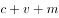三部分，可以表现为不变资本（c）、可变资本（v）、剩余价值（m）三部分。其中，不变资本与可变资本是按照能否带来剩余价值而划分的。

A项正确，不变资本是指除工人工资以外的一切资本，不变资本不能带来剩余价值，是资本主义社会总产品在价值上的组成部分。

B项错误，固定资本的成本比较高，卖出商品后不能一次收回成本，需要今后不断的磨损、反复使用，慢慢收回成本。如厂房、机器。固定资本与流动资本是根据资本周转速度的快慢进行划分的。

C项正确，可变资本是指工人工资，可以带来剩余价值，是资本主义社会总产品在价值上的组成部分。

D项错误，流动资本是指卖出商品后，一次可以收回的成本。如原材料、燃料。固定资本与流动资本是根据资本周转速度的快慢进行划分的。

故正确答案为AC。

---

### 第 56 题　qid 2166093 · 法律常识

以下人员中不属于《公务员法》管理范围的是：

- **A**. 中国共产党机关工作人员
- **B**. 民主党派机关工作人员
- **C**. 政府机关里的工勤人员　✅
- **D**. 进行公共事务管理的事业单位中的工作人员　✅

**答案**：CD

**官方解析**

本题考查法律常识。
《中华人民共和国公务员法》第二条规定：“本法所称公务员，是指依法履行公职、纳入国家行政编制、由国家财政负担工资福利的工作人员。”根据《公务员范围规定》第四条规定：“下列机关中除工勤人员以外的工作人员列入公务员范围：（一）中国共产党各级机关；（二）各级人民代表大会及其常务委员会机关；（三）各级行政机关；（四）中国人民政治协商会议各级委员会机关；（五）各级监察机关；（六）各级审判机关；（七）各级检察机关；（八）各民主党派和工商联的各级机关。”
A项，中国共产党机关工作人员是公务员，属于《公务员法》管理范围，排除；
B项，民主党派机关工作人员是公务员，属于《公务员法》管理范围，排除；
C项，政府机关里的工勤人员不是公务员，不属于《公务员法》管理范围，当选；
D项，进行公共事务管理的事业单位的工作人员是事业编制，不是公务员，不属于《公务员法》管理范围，当选。
本题为选非题，故正确答案为CD。

---

### 第 57 题　qid 2166094 · 人文常识

戊戌变法和辛亥革命是中国近代史上的重大运动，两者的共同点有：

- **A**. 是爱国救亡的政治运动　✅
- **B**. 主张在中国建立资本主义制度　✅
- **C**. 主张改革君主专制制度
- **D**. 未提出彻底的反帝反封建的纲领　✅

**答案**：ABD

**官方解析**

本题考查人文常识。
主要考查中国近代史上的两个重大政治运动。戊戌变法是中国近代史上一次重要的政治改革，也是一次思想启蒙运动，目的是学习西方文化、科学技术和经营管理制度，发展资本主义，建立君主立宪政体，使国家富强。
辛亥革命开创了完全意义上的近代民族民主革命，推翻了统治中国几千年的君主专制制度，建立起共和政体，结束君主专制制度，传播了民主共和理念，极大推动了中华民族思想解放和中国社会变革。
A项正确，二者都是爱国救亡的政治运动。
B项正确，二者都主张在中国建立资本主义制度。
C项错误，戊戌变法主张君主立宪，依靠皇帝变法，而辛亥革命则是用暴力推翻君主专制制度，建立共和国。
D项正确，二者都未提出彻底的反帝反封建的纲领。
故正确答案为ABD。

---

### 第 58 题　qid 2166095 · 人文常识

在生活空间内，人们受污染空气伤害最严重的地方不是室外，而是室内，尤其对生活在城市里的多数人来说，以上的工作和生活区间是在室内，所以，室内空气污染主要由（    ）等造成的。

- **A**. 室外空气污染　✅
- **B**. 室内装修　✅
- **C**. 室内物品　✅
- **D**. 生活燃气　✅

**答案**：ABCD

**官方解析**

本题考查生活常识。
“室内”主要指居室内，室内空气污染是指各种原因导致室内空气中的有害物质超标，进而影响人体健康的室内环境污染。
A项正确，随着大气的严重污染和生态环境的破坏，室外空气污染十分严重，而这也致使人类的生存条件十分恶劣，加剧室内空气的污染。
B项正确，室内装修材料的污染是造成室内空气污染的主要方面，很多装修材料，例如油漆、胶合板、刨花板、泡沫填料、内墙涂料、塑料贴面等材料中均含有甲醛、苯、甲苯、乙醇、氯仿等有害物质，这些物质都具有一定的致癌性，导致室内空气污染，对人体造成伤害。
C项正确，室内使用的人造板材、大理石地板以及新购买的家具等物品，都会散发出酚、甲醛、石棉粉尘、放射性物质等，它们可导致人们头疼、失眠、皮炎和过敏等反应，使人体免疫功能下降，因此，室内物品也是造成室内环境污染的主要方面。
D项正确，生活燃气也是造成室内主要污染源之一。不同种类的燃气燃料，其化学组成以及燃烧产物的成分虽有不同，但成分里都包含对人体有害的硫、磷等有害元素。当燃烧不充分时，就会产生二氧化硫、二氧化氮、一氧化碳等有害物质，对室内空气造成污染，对人体造成伤害。
故正确答案为ABCD。

---

### 第 59 题　qid 2166096 · 科技常识

今年年初，“墨子号”量子科学实验卫星，在我国和奥地利之间首次实现距离达7600公里的洲际量子密钥分发，并利用共享密钥实现（    ），该成果标志着“墨子号”已具备实现洲际量子保密通信的能力。

- **A**. 加密数据传输　✅
- **B**. 加密技术共享
- **C**. 加密算法共识
- **D**. 加密视频通信　✅

**答案**：AD

**官方解析**

本题考查科技常识。主要考查科技理论与成就。
量子卫星是中国科学院空间科学先导专项首批科学实验卫星之一，其主要科学目标：一是借助卫星平台，进行星地高速量子密钥分发实验，并在此基础上进行广域量子密钥网络实验，以期在空间量子通信实用化方面取得重大突破；二是在空间尺度进行量子纠缠分发和量子隐形传态实验，开展空间尺度量子力学完备性检验的实验研究。
量子保密通信，能够从三个方面保障信息安全：第一，发送者和接收者之间的信息交互是安全的，不会被窃听或盗取；第二，“主仆”身份能够自动确认，只有主人才能够使唤“仆人”，而其他人无法指挥“仆人”；第三，一旦发送者和接收者之间的传递口令被恶意篡改，使用者会立刻知晓，从而重新发送和接收指令。
2018年1月，在中国和奥地利之间首次实现距离达7600公里的洲际量子密钥分发，并利用共享密钥实现加密数据传输和视频通信。该成果标志着“墨子号”已具备实现洲际量子保密通信的能力。
故正确答案为AD。

---

### 第 60 题　qid 2166099 · 人文常识

马克思主义是真理，因而可以用它来作为判断认识对错的标准。

- （选项）[]

**答案**：B

**官方解析**

本题考查马克思主义。
判断认识的真理性，必须把主观认识和客观对象联系起来加以对照比较。真理的客观性，不仅在于真理的内容是客观的，而且在于真理的标准也是客观的。只有实践才是检验认识正确与否的唯一标准。马克思主义是真理，但是不能以它作为判断认识对错的标准。
故表述错误。

---

### 第 61 题　qid 2166100 · 人文常识

量变是质变的必然结果，质变是量变的必要准备。

- （选项）[]

**答案**：B

**官方解析**

本题考查量变与质变之间的关系。
量变是质变的前提和必要准备，没有量变就没有质变。质变是量变的必然结果，量变达到一定程度必然引起质变。故量变是质变的必要准备，质变是量变的必然结果。
故表述错误。

---

### 第 62 题　qid 2166101 · 法律常识

法律上的权利是指法律所允许的权利人为了满足自己的利益而采取的、由其他人的法律义务所保证的一种资格和能力。

- （选项）[]

**答案**：A

**官方解析**

本题考查权利与义务中的权利。
马克思主义权利观认为，权利就是一定的社会物质生活条件所制约的行为自由，是法律允许权利人为满足自己的利益而采取的由义务人所保证实现的法律手段。因此，可以将法律权利概括为，权利主体依法要求义务主体作出某种行为或者不作出某种行为的资格。
故表述正确。

---

### 第 63 题　qid 2166102 · 法律常识

甲对其儿子乙说，若乙考上大学，甲将给乙买一台电脑。甲对乙的这种行为属于附义务法律行为。

- （选项）[]

**答案**：B

**官方解析**

本题考查法律常识。
附条件民事法律行为是指当事人以将来不确定发生的事实的发生与否限制民事法律行为效力的发生或存续的意思表示。乙未来是否能考上大学是不确定的，是可能发生也可能不发生的事实，具有未来性和或然性，故甲对儿子的允诺实际上是将某一条件的成就作为法律行为效力发生的根据，所以甲对乙的行为是附条件民事法律行为。甲对乙的这种行为之所以不属于附义务法律行为是因为附义务法律行为中的义务具有强制性，必须加以履行，而考上大学并不具有强制性，这仅仅是一种客观事实。故此行为属于附条件民事法律行为而非附义务法律行为。
故表述错误。

---

### 第 64 题　qid 2166103 · 法律常识

根据我国民事法律制度的规定，16周岁以上不满18周岁、以自己的劳动收入为主要生活来源的公民，应视为完全民事行为能力人。

- （选项）[]

**答案**：A

**官方解析**

本题考查法律常识。
根据《中华人民共和国民法典》第十八条规定：成年人为完全民事行为能力人，可以独立实施民事法律行为。十六周岁以上的未成年人，以自己的劳动收入为主要生活来源的，视为完全民事行为能力人。
故表述正确。

---

### 第 65 题　qid 2166104 · 人文常识

中国的政党制度是一党领导，多党合作；一党执政，多党参政。

- （选项）[]

**答案**：A

**官方解析**

本题主要考查中国的政党制度的相关内容。
在中国多党合作制度中，中国共产党与各民主党派长期共存、互相监督、肝胆相照、荣辱与共，共同致力于建设中国特色社会主义，形成了“共产党领导、多党派合作，共产党执政、多党派参政”的基本特征。中国共产党是执政党，民主党派是参政议政党，中国共产党对民主党派实行政治领导。
故表述正确。

---

### 第 66 题　qid 2166105 · 人文常识

在市场机制体系中，价格机制是核心。

- （选项）[]

**答案**：A

**官方解析**

本题考查经济常识，主要涉及市场机制的相关内容。
市场机制包含了诸如竞争机制、供求机制、价格机制、激励机制等。价格机制是对市场机制调节作用的集中体现，是市场机制实现调节作用的枢纽。市场经济有效配置稀缺资源和形成兼容激励机制的两大基本功能，都是通过价格机制实现的，因此价格机制是核心。
故表述正确。

---

### 第 67 题　qid 2166106 · 人文常识

合伙制企业的合伙人对企业盈亏负完全责任，是指以合伙人的全部投资作为企业担保。

- （选项）[]

**答案**：B

**官方解析**

本题考查经济常识，主要涉及企业类型的相关内容。
根据《合伙企业法》第二条规定：“本法所称合伙企业，是指自然人、法人和其他组织依照本法在中国境内设立的普通合伙企业和有限合伙企业。普通合伙企业由普通合伙人组成，合伙人对合伙企业债务承担无限连带责任。本法对普通合伙人承担责任的形式有特别规定的，从其规定。有限合伙企业由普通合伙人和有限合伙人组成，普通合伙人对合伙企业债务承担无限连带责任，有限合伙人以其认缴的出资额为限对合伙企业债务承担责任。”可知，仅有限合伙人全部投资作为企业担保，而普通合伙人不以出资（投资）额为限。
故表述错误。

---

### 第 68 题　qid 2166107 · 人文常识

经济体制改革确定什么样的目标，其核心是正确选择资源的配置方式。

- （选项）[]

**答案**：A

**官方解析**

本题考查经济常识，主要涉及经济体制改革的相关内容。
社会经济发展的过程中，资源配置的方式可分为计划和市场。资源配置以计划为基础的经济称为计划经济，以市场配置为基础的经济称为市场经济。以我国经济体制改革为例，将计划经济改革为社会主义市场经济，其主要就是资源配置方式的改革。所以选择经济体制改革目标的关键就是正确选择资源配置方式。
故表述正确。

---

### 第 69 题　qid 2166108 · 人文常识

相对地租是租种较优土地的农业资本家所获得的，归土地所有者占有的农业超额利润，是农产品的个别生产价格低于社会生产价格的差额。

- （选项）[]

**答案**：B

**官方解析**

本题考查经济常识，主要涉及相对地租的相关内容。
相对地租是直接生产者在农业中所创造的生产物被土地所有者占有的相对部分，是土地所有权借以实现的经济形式。
级差地租是租种较优土地的农业资本家所获得的，归土地所有者占有的农业超额利润，是农产品的个别生产价格低于社会生产价格的差额。
马克思按照地租产生的原因和条件的不同，将地租分为三类：级差地租、绝对地租和垄断地租。级差地租和相对地租是两个不同的概念。
故表述错误。

---

### 第 70 题　qid 2166109 · 人文常识

使用价值是凝结在商品中的无差别的一般人类劳动商品。

- （选项）[]

**答案**：B

**官方解析**

本题考查经济常识，主要考查马克思主义政治经济学中商品的二重属性。
商品是使用价值和价值的统一体。价值是凝结在商品中一般的无差别的人类劳动，是商品的社会属性，而使用价值是指能满足人们某种需要的物品的效用，是商品的自然属性。
故表述错误。

---

### 第 71 题　qid 2166110 · 人文常识

资本主义生产过程中的价值增殖过程是指活劳动创造使用价值的过程。

- （选项）[]

**答案**：B

**官方解析**

本题考查经济常识，主要考查马克思主义政治经济学中价值增殖的相关知识点。
价值增殖过程即剩余价值的生产过程，指超过劳动力价值的那部分价值的形成过程（即工人创造的价值超过了他的劳动力价值）。工人工作日分两部分：一部分是必要劳动时间，用来生产劳动力的价值；另一部分是剩余劳动时间，用来生产剩余价值，这部分被资本家无偿占有，即价值增值。
故表述错误。

---

### 第 72 题　qid 2166111 · 人文常识

公务员要按照规定的权力和程序认真履行职责，努力提高工作效率。

- （选项）[]

**答案**：B

**官方解析**

本题考查法律常识，主要考查《公务员法》的相关知识点。
我国《公务员法》第十二条第（二）款规定：“公务员应当履行下列义务……（二）按照规定的权限和程序认真履行职责，努力提高工作效率”。即题干中的“权力”正确表述应为“权限”。
故表述错误。

---

### 第 73 题　qid 2166112 · 人文常识

根据公务员法的规定，调任是公务员交流的方式之一，是机关外与机关内人员的双方交流。

- （选项）[]

**答案**：B

**官方解析**

根据《公务员法》第六十九条规定：
国家实行公务员交流制度。 公务员可以在公务员和参照本法管理的工作人员队伍内部交流，也可以与国有企业和不参照本法管理的事业单位中从事公务的人员交流。交流的方式包括调任、转任。
但调任是指机关外部从事公务的人员调入机关内部的交流方式，而非机关外与机关内人员的双方交流。
故表述错误。

---

### 第 74 题　qid 2166113 · 人文常识

现代公务员制度的基础是选任制。

- （选项）[]

**答案**：B

**官方解析**

本题考查公务员制度的相关知识。
根据《国家公务员制度》第二版（舒克、王克良编，中国人民大学出版社，21世纪公共管理系列教材）：现代公务员制度于19世纪50年代，在英国起源和形成，其次被各国所效仿。是在反对“恩赐官职制”和“政党分肥制”的过程中，实行以考任制为核心的任用制度，逐步确定的公务员制度。
故表述错误。

---

### 第 75 题　qid 2166114 · 人文常识

实现“两个一百年”奋斗目标、实现中华民族伟大复兴的中国梦，不断提高人民生活水平，必须坚定不移把改革作为党执政兴国的第一要务。

- （选项）[]

**答案**：B

**官方解析**

本题考查政治常识，主要考查十九大报告中的相关知识点。
习近平总书记在中国共产党第十九次全国代表大会上的报告中指出：实现“两个一百年”奋斗目标、实现中华民族伟大复兴的中国梦，不断提高人民生活水平，必须坚定不移把发展作为党执政兴国的第一要务，坚持解放和发展社会生产力，坚持社会主义市场经济改革方向，推动经济持续健康发展。
故表述错误。

---

### 第 76 题　qid 2166115 · 经济常识

银行以存款、贷款等形式提供的，以货币形式为主的信用称为国家信用。

- （选项）[]

**答案**：B

**官方解析**

本题考查经济常识，主要考查政治经济学中信用制度的相关知识点。
国家信用是指国家借助于举债向社会公众筹集资金的一种信用形式。而银行以存款、放款等形式提供的以货币形式为主的信用形式指的是银行信用。
故表述错误。

---

### 第 77 题　qid 2166116 · 人文常识

2018年中央一号文件提出：加强农村专业人才队伍建设。推行乡村教师“乡管校聘”。

- （选项）[]

**答案**：B

**官方解析**

本题考查政治常识，主要考查2018年中央一号文件的相关知识点。
2018年1月2日，中共中央、国务院发布了题为《中共中央国务院关于实施乡村振兴战略的意见》的中央一号文件，文中指出：加强农村专业人才队伍建设。建立县域专业人才统筹使用制度，提高农村专业人才服务保障能力。推动人才管理职能部门简政放权，保障和落实基层用人主体自主权。推行乡村教师“县管校聘”。而非题干中的“乡管校聘”。
故表述错误。

---

### 第 78 题　qid 2166117 · 人文常识

2018年2月，国务院办公厅印发《关于推进社会公益事业建设领域政府信息公开的意见》。

- （选项）[]

**答案**：A

**官方解析**

本题考查时事政治常识。
2018年2月26日国务院办公厅印发《关于推进社会公益事业建设领域政府信息公开的意见》（国办发〔2018〕10号），提出经过3年左右的努力，使社会公益事业建设各领域、各环节实现公开内容全覆盖，社会公益资源配置更加公平公正，社会公益事业公益属性得到更好体现，全社会关心公益、支持公益、参与公益的氛围更加浓厚。
故表述正确。

---

### 第 79 题　qid 2166118 · 人文常识

5G技术主要是为通信发展提供新动力。

- （选项）[]

**答案**：A

**官方解析**

本题考查科技常识。
5G即第五代移动电话行动通信标准，也称第五代移动通信技术，是4G之后的延伸。5G技术主要应用于通讯技术领域，将为通信及移动互联网、物联网等的发展提供新动力。
故表述正确。

---

### 第 80 题　qid 2166119 · 地理国情

青藏高原是我国水土流失最严重和生态环境最为脆弱的地区之一。

- （选项）[]

**答案**：B

**官方解析**

本题考查地理常识。
黄土高原是我国水土流失最严重和生态环境最为脆弱的地区，经流水长期强烈侵蚀，逐渐形成千沟万壑、地形支离破碎的特殊自然景观。而青藏高原则是世界最高的高原，有“世界屋脊”之称。
故表述错误。

---

### 第 81 题　qid 2166120 · 法律常识

《导游管理办法》于2018年2月1正式施行。

- （选项）[]

**答案**：B

**官方解析**

本题考查时事政治常识。
国家旅游局于2017年11月1日发布《导游管理办法》，自2018年1月1日起正式施行。
故表述错误。

---

### 第 82 题　qid 2166121 · 人文常识

第24届冬季奥林匹克运动会，简称“平昌冬奥会”，于2018年2月9日-25日在平昌举行。

- （选项）[]

**答案**：B

**官方解析**

本题考查政治常识。
2018年平昌冬季奥运会是第23届冬季奥林匹克运动会，简称“平昌冬奥会”，已于2018年2月9日至25日在韩国平昌举行。而第24届冬季奥林匹克运动会为2022年北京-张家口冬季奥运会，简称“北京张家口冬奥会”，将在2022年02月04日至2022年02月20日在中国北京市和张家口市联合举行。
故表述错误。

---

### 第 83 题　qid 2166122 · 法律常识

新修订的《中华人民共和国反不正当竞争法》于2017年1月1日施行。

- （选项）[]

**答案**：B

**官方解析**

本题考查法律常识。
《中华人民共和国反不正当竞争法》已由中华人民共和国第十二届全国人民代表大会常务委员会第三十次会议于2017年11月4日修订通过，修订后的《中华人民共和国反不正当竞争法》已通过第七十七号主席令公布，自2018年1月1日起施行。
故表述错误。

---

### 第 84 题　qid 2166123 · 人文常识

2018年2月28日，雄安新区首个重大交通项目——北京至雄安城际铁路正式开工建设。

- （选项）[]

**答案**：A

**官方解析**

本题考查政治常识。
2018年2月28日上午，雄安新区首个重大交通项目——北京至雄安城际铁路正式开工建设。项目全线建成后，北京城区与雄安新区的铁路通达时间仅约30分钟。
故表述正确。

---

### 第 85 题　qid 2166124 · 人文常识

有一种观点认为，在革命战争年代应当提倡“斗争哲学”，在和平建设时期则应提倡“和谐哲学”。

- （选项）[]

**答案**：B

**官方解析**

本题考查政治常识。
“斗争哲学”一词最早出现是上个世纪30年代国民党高级将领邓宝珊讲的话，本来带有贬义，但是毛泽东主席接过这句话，说道：“有人说我们党的哲学叫做斗争哲学，我说，你讲对了，自从有了奴隶主、封建主、资本家、他们就向被压迫的人民进行了斗争，斗争哲学就是他们先发明出的。被压迫人民的斗争哲学出来的比较晚，那是斗争了几千年，才有了马克思主义。”在革命战争年代毛泽东主席提倡斗争哲学，是为了争取民的独立和解放。“和谐哲学”重点强调和谐，回避了斗争问题。
习近平总书记在十九大报告中指出：实现伟大梦想，必须进行伟大斗争。社会是在矛盾运动中前进的，有矛盾就会有斗争。我们党要团结带领人民有效应对重大挑战、抵御重大风险、克服重大阻力、解决重大矛盾，必须进行具有许多新的历史特点的伟大斗争，任何贪图享受、消极懈怠、回避矛盾的思想和行为都是错误的。······全党要充分认识这场伟大斗争的长期性、复杂性、艰巨性，发扬斗争精神，提高斗争本领，不断夺取伟大斗争新胜利。由此可见即便是进入了新时代，我们依然要在党的领导下进行伟大的斗争，夺取伟大斗争的新胜利。在和平战争时期，依然存在斗争，不能简单的认为和平战争时期就要提倡“和谐哲学”。
故表述错误。

---

## 言语理解与表达

### 材料 1

①艺术接触者掌握艺术语言的内涵，并不容易。主体的感觉与判断虽是由客体的特定形态所引起的，但客体自身的特殊内容即未直接说出，它对观赏主体来说就带有模糊性。

②四川民谣里的“扯倒叶叶藤藤动”，和成语“一叶知秋”相似，当作局部与全局的关系的一种生动概括来理解，当作对于复杂得多的社会现象的一种比喻来理解，不能否认这些用语有模糊性。

③那么为什么它能普遍流行为人们所乐于应用而赋予概括作用？这是因为社会经验有个性的主体，拥有特殊的主观条件，在接触这些带一般性的语言时，结合着自己的特殊感受，经过或迟或速的思索，领悟其中的深刻意蕴。因为它的意蕴可能普遍作用于广大的语言接触者的领悟，所以它的意蕴有广泛的社会作用。

④习惯语中的“不假思索”，其实有片面性。不论接受者多么聪明，当他掌握对象的内在意义时，也不能没有即使短暂得不曾自觉的思索。所谓审美的敏感，也是以有所思索引起来的。

⑤大家都承认，白居易的语言形式通俗。通俗得不识字的老妪都能听懂，但是老妪所能听懂的诗意，对诗意的深度的掌握，是否可能和更有理解能力的读者的理解深度相等同？

⑥当然不能。即使同样熟悉诗词的知识分子，对白居易的名作《草》的意蕴的理解也有矛盾。例如其中诗句“野火烧不尽，春风吹又生”，有人把这些原上草当作卑微小人的象征来理解，有人却认为这是对战斗者的顽强意志的比喻。为什么同一客体可能引起这种对立的理解？这种理解的审美个性的差别，主要是以不同主体在社会生活中形成的感受个性为条件的。

#### 第 1 题　qid 2166009 · 片段阅读

文中所说的客体是指：

- **A**. 白居易
- **B**. 艺术　✅
- **C**. 诗词
- **D**. 四川民谣

**答案**：B

**官方解析**

根据①中“艺术接触者掌握艺术语言的内涵，并不容易。主体的感觉与判断虽是由客体的特定形态所引起的，但客体自身的特殊内容即未直接说出，它对观赏主体来说就带有模糊性。”可知，文段的主体为艺术的接触者，客体为艺术本身，对应B项。
A项“白居易”为艺术接触者，属于主体，排除；C项“诗词”与D项“四川民谣”均属艺术中的一种形式，即客体的一个表现，而非客体本身，均排除。
故正确答案为B。
【文段出处】《月与指月》

---

#### 第 2 题　qid 2166010 · 片段阅读

以下不能作为“它（艺术客体）对观赏主体来说就带有模糊性”的依据的一项是：

- **A**. 观赏主体是有个性的、有社会经验的，且拥有特殊的主观条件。
- **B**. 观赏主体在社会生活中，所形成的感受个性常常是千差万别的。
- **C**. 观赏主体掌握艺术客体的内在意义时，会有哪怕是短暂的思索。　✅
- **D**. 观赏主体在接触艺术客体的时候，结合着自己的特殊感受。

**答案**：C

**官方解析**

文章①中提出“它对观赏主体来说就带有模糊性”，后文进行解释说明，通过对文段分析可知，“模糊性”即艺术客体具有主观性，并非客观，不同主体在面对时会产生不同理解。
A项，由③中“这是因为社会经验有个性的主体，拥有特殊的主观条件”可知，主体带有个性且具有主观性，由此“客体”带有模糊性，该项为其具有模糊性的依据，排除。
B项，由⑥中“为什么同一客体可能引起这种对立的理解？这种理解的审美个性的差别，主要是以不同主体在社会生活中形成的感受个性为条件的”可知，对于同一诗词，理解能力不同的人的理解同样不同，该项为其具有模糊性的依据，排除。
C项，选项仅客观陈述观赏主体在掌握艺术客体的内在意义时会有所思考，并不能作为“艺术客体对观赏主体来说就带有模糊性”的依据，当选。
D项，由③中“在接触这些带一般性的语言时，结合着自己的特殊感受”可知，观赏主体在接受艺术客体时，会结合“自己的特殊感受”，该项为其具有模糊性的依据，排除。
本题为选非题，故正确答案为C。
【文段出处】《月与指月》

---

#### 第 3 题　qid 2166011 · 片段阅读

⑤⑥段中引用白居易诗句的例子想要说明的一项是：

- **A**. 熟悉诗词的知识分子，比不识字的老妪对诗歌的理解要深刻得多。
- **B**. 不同主体在社会生活中形成的感受个性，决定了审美个性的差别。　✅
- **C**. 白居易诗歌语言通俗，内容贴近生话，就连不识字的老妪都能听懂。
- **D**. 对同一艺术客体的理解可能是完全对立的，而这正是其魅力之所在。

**答案**：B

**官方解析**

文段⑤首先指出白居易的诗通俗易懂，接着通过不识字的老妪和有理解能力的读者之间的对比，针对审美个性差别这一话题提出问题，文段⑥首先举例对这一话题进行分析，尾句则给出答案，强调是不同主体感受个性的不同造成了审美个性的差别，对应B项。
A、C两项“不识字的老妪”均对应文段中例子部分的内容，非重点，排除；D项，文段重点强调对艺术客体理解的不同是因为不同主体感受个性的差异，而“艺术客体的魅力”文段并未提及，无中生有，排除。
故正确答案为B。
【文段出处】《月与指月》

---

#### 第 4 题　qid 2166012 · 片段阅读

下列说法不符合原文意思的一项是：

- **A**. 全文是讲审美主体对同一客体理解的模糊性及消除模糊性的方法。　✅
- **B**. “扯倒叶叶藤藤动”这类艺术语言生动，富有概括性，能够普遍地流行。
- **C**. 造成艺术语言的模糊性的根本原因在于它未能直接说出客体自身的特殊内容。
- **D**. 有所思索才能引起审美的敏感，“不假思索”的说法有片面性。

**答案**：A

**官方解析**

A项，根据篇章可知，模糊性是指客体未直接表述清楚时，主体会产生的模糊的感受与判断。篇章仅仅阐述了模糊性普遍流行的原因并通过习惯语、白居易的名作等举例解释何为模糊性，故“消除模糊性”表述无中生有，当选；
B项，根据篇章第③段可知，能够普遍流行的语言，具有能够让广大语言接触者产生自己的特殊感受、从而领悟其中深刻意蕴的特点。而根据篇章第②段可知，“扯倒叶叶藤藤动”这类艺术语言，表述生动，可当作局部与全局关系的一种生动概括来理解，具有一定的语言模糊性，故可以让不同主体产生不同的感受，故能够普遍流行，表述正确，排除；
C项，根据篇章首段“客体自身的特殊内容即未直接说出，它对观赏主体来说就带有模糊性。”，可知表述正确，排除；
D项，根据篇章第④段“习惯语中的‘不假思索’，其实有片面性。”“审美的敏感，也是以有所思索引起来的。”，可知表述正确，排除。
本题为选非题，故正确答案为A。
【文段出处】《月与指月》

---

#### 第 5 题　qid 2166013 · 片段阅读

根据原文所给的信息，以下推断不正确的一项是：

- **A**. 古人说的“以我之眼观世界，则世界著我之色彩”，正体现了艺术鉴赏中的感受个性。
- **B**. “主观条件”，“特殊感受”，“有所思索”是领悟所有艺术客体意蕴的先决条件。
- **C**. 凡是具有广泛社会作用的艺术意蕴，都是因为它能使广大语言接触者有所领悟。
- **D**. 如果观赏主体具备了审美的敏感性，那么就有可能改变由观赏客体带来的模糊性。　✅

**答案**：D

**官方解析**

A项，根据篇章第①段可知，对于艺术，“主体的感觉与判断虽是由客体的特定形态所引起的，但客体自身的特殊内容即未直接说出”。故“以我之眼所观的世界”并未直接阐明其自身的主要内容，则不同的人可能有不同的见解，即“世界著我之色彩”，体现了在艺术欣赏中的感受特性，表述正确，排除；
B项，根据文段“拥有特殊的主观条件，在接触这些带一般性的语言时，结合着自己的特殊感受，经过或迟或速的思索，领悟其中的深刻意蕴”“所谓审美的敏感，也是以有所思索引起来的”可知，领悟艺术时，主观条件、感受以及自身的思索是其先决条件，表述正确，排除；
C项，根据文段“因为它的意蕴可能普遍作用于广大的语言接触者的领悟，所以它的意蕴有广泛的社会作用”可知，表述正确，排除；
D项，分析文段可知，“改变客体模糊性”表述无中生有，当选。
本题为选非题，故正确答案为D。
【文段出处】《月与指月》

---

#### 第 6 题　qid 2165994 · 逻辑填空

在现代化的生活里，有人每一天都_____在一系列数字里，BP机号码、手机号码、电脑密码、信用卡密码······

- **A**. 困扰
- **B**. 锁定　✅
- **C**. 固定
- **D**. 纠缠

**答案**：B

**官方解析**

根据“在一系列数字里”可知，文段主要表达“数字”将人们束缚在一定的范围内。B项“锁定”指选择受到当前范围的约束，符合文意，当选。
A项“困扰”指纷扰不安。常见表述为“······困扰着我”、“受到······的困扰”，与横线后的“在······里”无法搭配，排除；C项“固定”意为使处在特定位置,不能移动。文段给出了范围，即“在一系列数字里”，故“特定位置”程度过重，排除； D项“纠缠”一是指交互缠绕，二是指遭人搅扰不休，第一层意思主语为多个，与“有人”搭配不当；第二层意思，“搅扰不休”语义过于消极，文段只是陈述了“数字”对人们影响的客观事实，故与文段的语境不符，排除。
故正确答案为B。

---

#### 第 7 题　qid 2165995 · 逻辑填空

该地区对环境保护采取了强有力的措施，使水土流失现象得到______，生态环境向良性循环转变。

- **A**. 治理
- **B**. 控制　✅
- **C**. 遏制
- **D**. 改变

**答案**：B

**官方解析**

根据“生态环境向良性循环转变”可知，该地区采取的措施产生了良好的效果，即水土流失状况不再恶化或向好的方向转变， B项“控制”解释为掌握住对象不使任意活动或超出范围，或使其按控制者的意愿活动，即表达水土流失状况不再恶化之意，当选。A项“治理”指整治处理，侧重表达整治的过程；D项“改变”是指更改、变动，两项均表达不出良好的效果，与文意不符，排除；C项“遏制”指阻止、控制，文段表达“生态环境向良性循环转变”，目前还存在水土流失现象，故没有完全制止，选项程度过重，排除。
故正确答案为B。

---

#### 第 8 题　qid 2165996 · 逻辑填空

各级政府主管部门和财政机关不再把企业置于直接管理之下，并不等于完全放弃对企业经营活动的_____和_____。

- **A**. 领导、控制
- **B**. 引导、控制
- **C**. 管理、限制
- **D**. 引导、制约　✅

**答案**：D

**官方解析**

根据文段“不再把企业置于直接管理之下”可知，转变政府职能主要体现在对企业从直接干预转向了间接引导。所以两个空格的词语都需要体现“间接引导”的意思。A项的“领导”、“控制”均为直接干预，排除；B项的“控制”属于直接干预的手段，故排除；C的“管理”属于直接干预的手段，排除。
故正确答案为D。

---

#### 第 9 题　qid 2165997 · 逻辑填空

我们要认真       、       、       考试的内容和形式，使它逐步完善起来。

- **A**. 研究  实验  改进　✅
- **B**. 试验  改进  研究
- **C**. 改进  试验  研究
- **D**. 试验  研究  改进

**答案**：A

**官方解析**

根据文意可知，要想使得考试的内容和形式逐步完善起来需要经过三个过程或三个步骤，先对当前考试内容和形式进行研究，研究之后对研究出来的结果进行实验，实验出结果之后再进行改进和完善，从而达到考试内容形式逐步完善的目的，对应A项。
邓小平同志早在1978年教育工作会议上明确指出要认真研究、试验、改进考试的内容和形式，使它的作用完善起来。
实验：为了检验某种理论灵活假设是否具有预想效果而进行的活动；也指实验的工作，比如化学实验、物理实验。
试验：为了达到某种效果先做探测行动。
“试验”和“实验”均符合文意，故通过三个步骤的前后顺序可知，A项符合文意。
故正确答案为A。

---

#### 第 10 题　qid 2165998 · 逻辑填空

保持前四个短语的协调，依次填入横线处的词语，恰当的一项是：
有应变的______，有______的竞争性，有______的兼容性，有继承的创造性——这些都是新世纪青年人必备的品质要素。

- **A**. 灵活性  协作  个性
- **B**. 适应性  节制  宽泛
- **C**. 灵活性  节制  宽泛
- **D**. 适应性  协作  个性　✅

**答案**：D

**官方解析**

第一空，分析已知分句“有继承的创造性”，“继承”与“创造”语义相反，推知文段每一分句中的两个词语构成语义相反的对应，故横线处应填入“应变”的反义词，“应变”指灵活应对突然发生的情况，“适应性”指适合、顺应不同的环境、形势，两者可构成相反对应，而“灵活性”与“应变”语义接近，故排除A、C两项。
第二空，根据文意可知，横线处与“竞争性”构成相反的对应，D项“协作”符合文意。而“节制”指限制、控制，与“竞争性”不构成语义相反的对应，故排除B项。
第三空，代入验证“个性”，与“兼容性”可构成语义相反的对应，符合文意，故当选D项。
故正确答案为D。

---

#### 第 11 题　qid 2165999 · 语句表达

找出下列句子中有语病的一句：

- **A**. 上山的路和下山的路一样难走
- **B**. 两位老人走得很缓慢，以致于让人感到他们的衰老是那样的明显
- **C**. 全明星比赛中一些年轻队员得到了锻炼
- **D**. 工作的时候和休息的时候他都很用心地去投入工作　✅

**答案**：D

**官方解析**

D项“休息的时候”与“他都很用心地去投入工作”搭配不当，且构成前后矛盾，当选。
其他三项均无语病，表述正确。
本题为选非题，故正确答案为D。

---

#### 第 12 题　qid 2166000 · 语句表达

从给出的几句话中选出没有语病的一句：

- **A**. 运动员成功的关键，在于能否持之以恒。
- **B**. 为了尽快发展文教卫生事业，应该大力提高专业技术人员的业务水平。　✅
- **C**. 无论干部和群众，毫无例外，都必须遵守社会主义法制。
- **D**. 南瓜子、西瓜子和花生果等炒货，都是小学生们深受欢迎的食品。

**答案**：B

**官方解析**

A项，“一面对两面”，“成功”是一面词，“能否”是两面词，应该改为“运动员成功的关键，在于能持之以恒”或者“运动员成败的关键，在于能否持之以恒”。
B项，无语病，表述准确。
C项，关联词“无论”与“和”搭配不当，“无论干部和群众”可以改为“无论干部或群众”。
D项，语序不当，应该改为“都是深受小学生们欢迎的食品”。
故正确答案为B。

---

#### 第 13 题　qid 2166001 · 语句表达

下列句子中，习惯用语使用正确的一项是：

- **A**. 感谢贵方邀请，届时敝人一定光临。
- **B**. 我们一定提供一流的服务，欢迎各位光顾。　✅
- **C**. 你们的态度很好，下一次我们一定惠顾。
- **D**. 明天我到贵府拜访，你可要在家恭候哟。

**答案**：B

**官方解析**

B项，“光顾”是敬词，“光”是“使增光彩”的意思，“顾”义为“访问”。“光顾”就是说 “（你）到来使（我）增添光彩”，是对别人讲的，用在这里合适，故B项正确。
A项，“光临”是敬词，指他人的来访，宾客来到。是对别人讲的，用于自己不合适，排除。
C项，“惠顾”是敬词，指光临，惠临。多用于商家欢迎顾客。是对别人讲的，用于自己不合适，排除。
D项，“恭候”是敬词，指恭敬地等候。是对别人讲的，用于自己不合适，排除。
故正确答案为B。
【文段出处】高中模拟题

---

#### 第 14 题　qid 2166002 · 语句表达

选出下列运用修辞方法不当的一句：

- **A**. 一个没有远大理想的人就像一台没有马达的机器，一只没有翅膀的小鸟，一个没有钨丝的灯泡。
- **B**. 知识如同沙石下面的泉水，掘得越深就越清澈。
- **C**. 人家那些打仗的人，谁又没有家，没有老人呢？人家肯为国家献身，我就应当去打仗！
- **D**. 天虽然还有点冷，蒲公英却已经开花了，柔弱的茎上顶着一朵小花，雄赳赳地站在野地里。　✅

**答案**：D

**官方解析**

A项运用了比喻的修辞方法，将“没有远大理想的人”比喻为“没有马达的机器”、“没有翅膀的小鸟”、“没有钨丝的灯泡”，修辞方法使用正确，排除；
B项运用了比喻的修辞方法，将“知识”比喻为“沙石下面的泉水”，修辞方法使用正确，排除；
C项运用了对比的修辞方法，将“我”与“那些打仗的人”进行对比，修辞方法使用恰当，排除；
D项运用了拟人的修辞方法，将“蒲公英”拟化为人的“柔弱”，但与后面“雄赳赳”相矛盾，修辞方法使用不当，当选。
本题为选非题，故正确答案为D。

---

#### 第 15 题　qid 2166003 · 语句表达

下列选项中标点符号使用正确的一项是：

- **A**. 我国月球探测工程将分三步实施：一是“绕”，即卫星绕月；二是“落”，即探测装置登上月球；三是“回”，即采集月壤样品返回地球。　✅
- **B**. 我国第一座自主设计、自行建造的国产化商业核电站“秦山第二核电厂”的2号机组核反应堆首次临界试验获得成功，将于年内并网发电。
- **C**. 近年来，随着经济的发展，城市的扩大，人口的猛增和生活质量的提高，城市垃圾不断增加，“城市垃圾处理”已成为环境保护的一大难题。
- **D**. 《地质灾害防治条例》正式确立了：“自然因素造成的地质灾害，由各级政府负责治理；人为因素引发的地质灾害，谁引发谁治理”的原则。

**答案**：A

**官方解析**

A项，标点符号使用正确，当选；
B项，“秦山第二核电站”为前面“商业核电站”的进一步解释说明，应将双引号改为破折号，标点符号使用错误，排除；
C项，“经济的发展”与“城市的扩大”为并列关系，应将逗号改为顿号，标点符号使用错误，排除；
D项，标点符号使用错误，应将冒号删除，排除。
故正确答案为A。

---

#### 第 16 题　qid 2166004 · 片段阅读

我们的一些科普文章常常激不起公众的兴趣，原因之一便是枯燥。要把科普文章写得“郁郁乎文哉”，就需要作家的笔。科学的飞速发展，为文学写作提供了一座富矿。相信有眼光的文学家一旦领略科学题材的广阔富饶，便会陶醉在它的无限风光中乐而忘返。
这段文字谈论的是：

- **A**. 科普文章对作家的依赖。
- **B**. 科学和文学互相依赖的关系。
- **C**. 科学和文学的互相激励作用。　✅
- **D**. 科学发展为文学提供了丰富的素材。

**答案**：C

**官方解析**

文段开篇指出科普文章之所以激不起公众的兴趣是因为枯燥，随后通过“需要”强调“作家的笔”能促进科普文章的发展，即文学对科学有促进的作用。紧接着指出科学的发展为文学写作提供了丰富的素材，即强调科学对文学的促进作用。故文段旨在强调科学和文学的互相促进关系，对应C项。
A项“科普文章依赖作家”、D项“科学发展为文学提供了丰富素材”均仅对应文段中某一方面的内容，表述片面，排除；B项“依赖”指相互依存，而文段强调的是有了文学，科学能被更多人接受；有了科学，文学的素材会更丰富，即两者是相互促进的，而非依存，排除。
故正确答案为C。

---

#### 第 17 题　qid 2166005 · 片段阅读

科学家研究发现，惟有传统中药枸杞其“固本、温平、无毒”的特性能担当“换一种方式补肾”的重任，几千年来人们对枸杞情有独钟。
这段文字中应当删去的一个词是：

- **A**. 科学家研究发现的“发现”。
- **B**. 惟有传统中药枸杞的“惟有”。
- **C**. 惟有传统中药枸杞的“传统”。
- **D**. 其“固本、温平、无毒”的“其”。　✅

**答案**：D

**官方解析**

D项“其”指代前文“枸杞”，“枸杞其”成分多余，故这段文字应当删去“其”字。
其他内容均无需删除。
故正确答案为D。
【文段出处】《夏季补肾到底怎么补》

---

#### 第 18 题　qid 2166006 · 片段阅读

从事写作的人，应当像追求真理一样去追求语言，应当把语言大量储存起来。应当经常把你的语言放在纸上，放在你的心里，用纸的砧、心的锤来锤炼它们。要熟悉你的语言，像熟悉你的军队，一旦用兵，你就知道谁可以担任什么角色，连战连捷。写作，实际就是检阅你的军队，把那些无用的、在战场上不活跃的分子，当场抹去它们的名字，叫能行的来代替吧。所谓要慎重，就是指的这个。
对文中画线句子的含义，理解正确的一项是：

- **A**. 锤炼语言离不开写作实践
- **B**. 锤炼语言离不开积极思考
- **C**. 锤炼语言离不开写作实践中的积极思考
- **D**. 锤炼语言离不开写作实践和积极思考　✅

**答案**：D

**官方解析**

划线句子出现在文段中间，需要结合上下文来判定。文段开篇指出“写作的人需要追求语言”，后又将写作比喻成检阅军队，指出需要心中熟知“文字”、善于使用，写作才能得心应手。结合“用纸的砧、心的锤来锤炼它们”可知，划线句子体现出锤炼语言离不开“纸的砧和心的锤”，即实践磨炼和积极思考，对应D项。
A项“写作实践”、B项“积极思考”均对应了“纸的砧，心的锤”的一部分，表述片面，排除；C项侧重强调的是“积极思考”，但文中还强调了“写作实践”，故表述片面，排除。
【文段出处】《语言的好与坏》

---

#### 第 19 题　qid 2166007 · 片段阅读

在现代社会中，当一个人追求幸福生活时不应忽视接受教育方面的需求。如果没有对于人类在科学、文学和艺术等方面的成就的欣赏能力并从这种欣赏中获得满足，那么一个人就算不上获得真正的生活，只不过是生存而已。
这段话主要支持了这样一种观点，即教育：

- **A**. 可以使人获得持续生活的基本能力
- **B**. 可以使人更充分地享受生活的乐趣　✅
- **C**. 主要教育有关科学、文学和艺术方面的内容
- **D**. 并不关注于某些具体的内容

**答案**：B

**官方解析**

文段开篇指出“追求幸福生活应重视教育”。后通过“如果”从反面的角度进一步论证首句观点，“没有对于人类在科学、文学和艺术等方面的成就的欣赏能力······那么一个人就算不上获得真正的生活”，即没有良好的教育就不能获得真正的生活。故文段是“观点+解释说明”的结构，重在强调教育可以更好地帮助人们寻求生活中的幸福，对应B项。
A项，文段重点阐述的是教育对追求幸福生活的作用，而不是“生活的基本能力”，故偏离文段中心，排除；C项，“科学、文学和艺术”是后文解释说明的内容，非文段重点，且“主要”一词在文中无从体现，排除；D项，“不关注具体内容”在文段中并未提及，属于无中生有，排除。
故正确答案为B。

---

#### 第 20 题　qid 2166008 · 片段阅读

文化中心的嬗变和逆转是一个发人深省的话题，成为一个难解的文化之谜。
下列理解最恰当的一项是：

- **A**. 发人深省的话题就会变成为文化之谜。
- **B**. 文化中心的嬗变和逆转往往成为一个难解的文化之谜。　✅
- **C**. 表明了关于文化中心的建设问题。
- **D**. 说明了当前文化的困惑。

**答案**：B

**官方解析**

根据文段可知“文化中心的嬗变和逆转成为一个难解的文化之谜”，对应B项。
A项，文段主题词为“文化中心的嬗变和逆转”，“发人深省的话题”偏离文段核心话题，此外，“就会变成文化之谜”表述过于绝对，排除；C项，“文化中心的建设问题”、D项，“当前文化的困惑”无中生有，文段并未提及，排除。
故正确答案为B。

---

#### 第 21 题　qid 2166125 · 逻辑填空

资本主义生产过程是劳动过程与价值形成过程的统一。

- （选项）[]

**答案**：B

**官方解析**

本题考查政治常识。
资本主义生产是以雇佣劳动为基础，以获取剩余价值为目的的生产，其生产过程具有两重性：一方面是物质资料的生产过程；另一方面是生产剩余价值的生产过程，即价值增值过程。也就是说资本主义生产过程是劳动过程和价值增值过程的统一，而不是劳动过程和价值形成过程的统一。
故表述错误。

---

#### 第 22 题　qid 2166126 · 逻辑填空

上海海关拟招录8名公务员，上海市公务员局组织了这次招录工作。

- （选项）[]

**答案**：B

**官方解析**

本题考查法律常识，主要涉及海关公务员招录常识。根据《中华人民共和国公务员法》第二十二条规定：“中央机关及其直属机构公务员的录用，由中央公务员主管部门负责组织。地方各级机关公务员的录用，由省级公务员主管部门负责组织，必要时省级公务员主管部门可以授权设区的市级公务员主管部门组织。”我国海关是国家进出关境监督管理机关，实行垂直管理体制。各级海关公务员招录由国家公务员局负责，报考者应参加国家公务员考试（国考）。因此，上海市公务员局无权单独招录上海海关公务员。
故表述错误。

---

#### 第 23 题　qid 2166127 · 逻辑填空

民事诉讼程序规定，在法院执行过程中，当事人不可以达成和解协议。

- （选项）[]

**答案**：B

**官方解析**

本题考查法律常识，主要涉及民事执行和解协议。根据《中华共和国民事诉讼法》第二百三十条规定：“在执行中，双方当事人自行和解达成协议的，执行员应当将协议内容记入笔录，由双方当事人签名或者盖章。申请执行人因受欺诈、胁迫与被执行人达成和解协议，或者当事人不履行和解协议的，人民法院可以根据当事人的申请，恢复对原生效法律文书的执行。”据此，在民事执行阶段，当事人可以达成和解协议。
故表述错误。

---

## 数量关系

### 第 1 题　qid 2165984 · 数学运算

101  203  210  250  310  （    ）

- **A**. 324　✅
- **B**. 352
- **C**. 385
- **D**. 410

**答案**：A

**官方解析**

数列作差或递推均无规律，观察发现数列较长，考虑分组。交叉分组后，奇数项为：101、210、310，将每项各位数相加，其和组成新数列为：2、3、4，是公差为1的等差数列。偶数项为：203、250、（    ），将每项各位数相加，其和组成的数列为：5、7、（    ），猜测是公差为2的等差数列，故题目所求项各位数相加之和应为9，只有A选项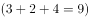满足要求。

故正确答案为A。

---

### 第 2 题　qid 2165985 · 数学运算

-1  0  1  2  9  （  ）

- **A**. 11
- **B**. 82
- **C**. 720
- **D**. 730　✅

**答案**：D

**官方解析**

数列本身没有特点，但连同选项一起观察，数列变化幅度可能较大，考虑幂次。从相对较大项着手查找规律，观察可发现：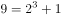，继续验证可知：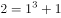，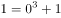，。因此规律为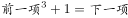，故。

故正确答案为D。

---

### 第 3 题　qid 2165986 · 数学运算

1  196  27  144  25  100  （  ）

- **A**. 7　✅
- **B**. 8
- **C**. 9
- **D**. 11

**答案**：A

**官方解析**

数列较长，考虑分组。交叉分组后，奇数项为：1、27、25、（ ），各项均为幂次数，可表达为：、、、（ ），底数为连续奇数，指数是公差为-1的等差数列，故推断所求项为。偶数项为：196、144、100，各项均为平方数，可表达为：、、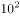，底数为递减的连续偶数列。

故正确答案为A。

---

### 第 4 题　qid 2165987 · 数学运算

2  3  11  124  （  ）

- **A**. 16367
- **B**. 15943
- **C**. 15387　✅
- **D**. 14269

**答案**：C

**官方解析**

数列起伏较大，考虑幂次。从较大项着手查找规律，观察可发现：，代入其他验证：，因此规律为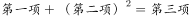。故所求项。

故正确答案为C。

---

### 第 5 题　qid 2165988 · 数学运算

0  0  2  12  （    ）

- **A**. 8
- **B**. 36　✅
- **C**. 12
- **D**. 32

**答案**：B

**官方解析**

数列变化幅度不大且大部分呈递增趋势，优先考虑作差，无规律，则考虑因式分解。原数列各项因式分解：，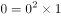，，。分解后的数列左子列为，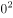，，，该数列是平方数列，底数是公差为1的等差数列；右子列为0，1，2，3，是公差为1的等差数列，故所求项的，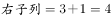，即。

故正确答案为B。

---

### 第 6 题　qid 2165989 · 数学运算

在一块直角三角形绿地的周边上植树，共植了12棵树，如果树间距为一米，绿地面积是，问在绿地的斜边上最多能植多少棵树？

- **A**. 7
- **B**. 5
- **C**. 6　✅
- **D**. 8

**答案**：C

**官方解析**

方法一：根据题意可知，该直角三角形的周长为12米，两直角边的乘积为米，故该绿地两条直角边边长分别为3米，4米，斜边长为5米。要使斜边上种树最多，则斜边两头需各栽一棵，故在绿地的斜边上最多能植棵。

方法二：根据题意可知，该直角三角形的周长为12，两直角边的乘积为12。设直角三角形两直角边长为a、b，斜边长为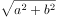，则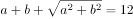，。解得，则斜边长。要使斜边上种树最多，则斜边两头需各栽一棵，故在绿地的斜边上最多能植棵。

故正确答案为C。

---

### 第 7 题　qid 2165990 · 数学运算

一个停车场有50辆汽车，其中红色轿车35辆，夏利轿车28辆，既不是红色轿车又不是夏利轿车8辆，问停车场有红色夏利轿车多少辆？

- **A**. 14辆
- **B**. 21辆　✅
- **C**. 15辆
- **D**. 22辆

**答案**：B

**官方解析**

两者容斥问题，套用公式：。红色轿车夏利轿车红色夏利轿车总数既不是红色轿车又不是夏利轿车，即，故停车场有红色夏利轿车辆。

故正确答案为B。

---

### 第 8 题　qid 2165991 · 数学运算

某职业大学的750名学生或上计算机课，或上规划设计课，或两门都上。如果有489名学生上计算机课，606名学生上规划设计课，问两门都上的学生是多少？

- **A**. 118人
- **B**. 114人
- **C**. 261人
- **D**. 345人　✅

**答案**：D

**官方解析**

由题意可知此题为两集合容斥问题。根据两集合容斥公式，代入数据，则两门都上的。

故正确答案为D。

---

### 第 9 题　qid 2165992 · 数学运算

三个游泳运动员一起练习，当甲游1圈时，乙正好超过甲半圈，丙超过甲圈，按此速度三人共游了15圈。问丙游了多少圈？

- **A**. 7圈
- **B**. 6圈
- **C**. 5圈　✅
- **D**. 4圈

**答案**：C

**官方解析**

由题意可知，时间相同时，则丙游的圈数圈。

故正确答案为C。

---

### 第 10 题　qid 2165993 · 数学运算

一个边长为8的正立方体，由若干个边长为1的立方体组成，现在要将大立方体表面涂成黄色，问一共有多少个小立方体涂上了黄色？

- **A**. 384
- **B**. 328
- **C**. 324
- **D**. 296　✅

**答案**：D

**官方解析**

由题意可知，该正方体共由个小立方体组成，去除被涂色的小立方体，剩下没被涂色的是一个棱长为6的立方体，即有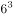个小立方体。因此一共有个小立方体涂上了黄色。

故正确答案为D。

---

## 判断推理

### 第 1 题　qid 2377390 · 类比推理

军装：士兵

- **A**. 套装：女人
- **B**. 服装：场合
- **C**. 警服：警察　✅
- **D**. 制服：邮递员

**答案**：C

**官方解析**

第一步：判断题干词语间的逻辑关系。
军装是士兵特有的服装，两者为特定服装与特定职业的关系。
第二步：判断选项词语间的逻辑关系。
A项：套装不是女人的特定服装，男人也可以套装，与题干逻辑关系不一致，排除；
B项：服装可以根据场合进行分类，与题干逻辑关系不一致，排除；
C项：警服是警察特有的服装，两者为特定服装与特定职业的关系，与题干逻辑关系一致，当选；
D项：制服不是邮递员的特定的服装，除邮递员外的其他职业也可以穿制服，与题干逻辑关系不一致，排除。
故正确答案为C。

---

### 第 2 题　qid 2166015 · 类比推理

跳跃：动作

- **A**. 富豪：奢侈
- **B**. 风俗：习惯　✅
- **C**. 大楼：木屋
- **D**. 蜡笔：图画

**答案**：B

**官方解析**

第一步：判断题干词语间的逻辑关系。
跳跃是动作的一种，两者为种属关系。
第二步：判断选项词语间的逻辑关系。
A项：富豪不是奢侈的一种，与题干逻辑关系不一致，排除；
B项：风俗是习惯的一种，两者为种属关系，与题干逻辑关系一致，当选；
C项：大楼与木屋是并列关系，与题干逻辑关系不一致，排除；
D项：蜡笔不是图画的一种，是图画工具的一种，与题干逻辑关系不一致，排除。
故正确答案为B。

---

### 第 3 题　qid 2166016 · 类比推理

焊接工：护目镜

- **A**. 水生物：鲸鱼
- **B**. 技工：扳手
- **C**. 妇女：泼妇
- **D**. 骑士：盾牌　✅

**答案**：D

**官方解析**

第一步：判断题干词语间的逻辑关系。
护目镜是焊接工工作的辅助工具，起到保护作用，两者属于对应关系。
第二步：判断选项词语间的逻辑关系。
A项：鲸鱼是水生物的一种，两者属于种属关系，与题干逻辑关系不一致，排除；
B项：扳手是技工工作的主要工具，并非起到保护作用，与题干逻辑关系不一致，排除；
C项：泼妇是妇女的一种，两者属于种属关系，与题干逻辑关系不一致，排除；
D项：盾牌是骑士作战时的辅助工具，起到保护作用，与题干逻辑关系一致，当选。
故正确答案为D。

---

### 第 4 题　qid 2166017 · 类比推理

紫竹：植物学家

- **A**. 电影：影迷
- **B**. 页岩：地质学者　✅
- **C**. 昆虫学家：昆虫
- **D**. 瓷砖：镶嵌

**答案**：B

**官方解析**

第一步：判断题干词语间的逻辑关系。
紫竹是植物学家研究的对象，两者属于对应关系。
第二步：判断选项词语间的逻辑关系。
A项：影迷是喜欢看电影而入迷的人，且影迷不是一种职业，与题干逻辑关系不一致，排除；
B项：页岩是地质学者研究的对象，两者属于对应关系，与题干逻辑关系一致，当选；
C项：昆虫是昆虫学家研究的对象，但两者顺序反了，与题干逻辑关系不一致，排除；
D项：瓷砖是被镶嵌于附着面上，两者并非研究对象与人物的对应关系，与题干逻辑关系不一致，排除。
故正确答案为B。

---

### 第 5 题　qid 2166018 · 类比推理

义务警员：警察

- **A**. 小偷：扒手
- **B**. 踏板：自行车
- **C**. 肖像：装饰　✅
- **D**. 刑罚：死刑

**答案**：C

**官方解析**

第一步：判断题干词语间的逻辑关系。
义务警员不是警察，但是具有警察的职能，二者是对应关系。
第二步：判断选项词语间的逻辑关系。
A项：扒手是小偷的别称，二者是全同关系，与题干逻辑关系不一致，排除；
B项：踏板属于自行车的一部分，二者是组成关系，与题干逻辑关系不一致，排除；
C项：肖像不是装饰，但是具有装饰的功能，二者是对应关系，与题干逻辑关系一致，当选；
D项：死刑是刑罚的一种，二者是种属关系，与题干逻辑关系不一致，排除。
故正确答案为C。

---

### 第 6 题　qid 2166019 · 逻辑判断

有一天，甲、乙、丙、丁、戊五个外国商人坐在一起聊天。甲说：“我们五人中有一个人在撒谎”；乙说：“我们五人中有两个人在撒谎”；丙说：“我们五人中有三个人在撒谎”；丁说：“我们五人中有四个人在撒谎”；戊说：“我们五个人全都在撒谎”。由此，可推出他们之中说真话的是：

- **A**. 甲和戊
- **B**. 丁　✅
- **C**. 乙和丙
- **D**. 戊

**答案**：B

**官方解析**

第一步：翻译题干信息。
甲：有一个人在撒谎，其他四个说的是真话；
乙：有两个人在撒谎，其他三个说的是真话；
丙：有三个人在撒谎，其他两个说的是真话；
丁：有四个人在撒谎，有一个说的是真话；
戊：五个人都在撒谎。
甲乙丙丁戊说的话真假存在相关性，假设甲说的是真话，那么乙丙丁戊说的都是假话，与甲矛盾，排除A项；假设乙说的是真话，那么甲丙丁戊说的都是假话，与乙矛盾，排除C项；假设戊说的是真话，那么甲乙丙丁说的都是假话，与戊矛盾，排除D项；只有当丁说的是真话，那么甲乙丙戊说的都是假话，与丁相符，B项当选。
故正确答案为B。

---

### 第 7 题　qid 2166020 · 逻辑判断

在一次摩托车比赛中，有五位运动员的名次可能是这样的（每个名次只能一人)：①赵爱武第二，钱堂江第三；②钱堂江第一，孙达胜第四；③李积红第三，周关群第五；④赵爱武第二，孙达胜第四；⑤周关群第一，李积红第二。比赛结果证明，上述猜测中各有一句是正确的。
由此可知，冠军是谁?

- **A**. 赵爱武　✅
- **B**. 钱堂江
- **C**. 孙达胜
- **D**. 李积红

**答案**：A

**官方解析**

根据题干信息：上述猜想中各有一句是正确的，假设②中钱堂江第一为真，那么②中孙达胜第四为假，所以⑤中周关群第一为假，李积红第二为真。④中孙达胜第四为假，赵爱武第二为真。与⑤中李积红第二为真矛盾。故假设钱堂江第一错误，排除B项。那么②中孙达胜第四为真，推出④中孙达胜第四为真，赵爱武第二为假。①中钱堂江第三为真，③中李积红第三为假，周关群第五为真，推出⑤中李积红第二为真，那么剩下的赵爱武为第一。
故正确答案为A。

---

### 第 8 题　qid 2166021 · 逻辑判断

桌上放着红桃、黑桃和梅花三种牌，共二十张。①桌上至少有一种花色的牌少于6张；②桌上至少有一种花色的牌多于6张；③桌上任意两种花色的牌的总数不超过19张。
以上论述中正确的是：

- **A**. ①②
- **B**. ②③　✅
- **C**. ①③
- **D**. ①②③

**答案**：B

**官方解析**

根据题干信息：先将20张平分为三种花色，每种花色至少分的六张，所以②正确，①错误，排除A、C、D三项，因为存在三种花色，每种花色至少有一张，所以③正确。
故正确答案为B。

---

### 第 9 题　qid 2166022 · 逻辑判断

某机关要编辑论文集，共收录十五篇论文，各篇论文的页数分别是一页，二页，三页······十四页，十五页稿纸。如果将这些论文按某种顺序装订成册，并统一编上页码，则每篇文章的第一页是偶数页码的最多篇数是：

- **A**. 5篇
- **B**. 6篇
- **C**. 7篇
- **D**. 8篇　✅

**答案**：D

**官方解析**

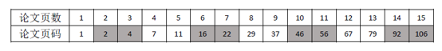

由于，所以如果某篇论文前面一共有奇数页论文，则该论文第一页为偶数页码。根据题干“将这些论文按某种顺序装订成册”，若按照1页、2页、3页、……、15页的顺序编排，由于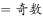，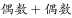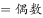，则如上表所示，论文页数为2页、3页、6页、7页、10页、11页、14页、15页的这8篇论文之前的总论文页数之和均为奇数，由于，故有8篇论文的第一页为偶数页码。

故正确答案为D。

粉笔说明：

这其实是一道数学题目，而这道题命题人关于“将这些论文按某种顺序装订成册”的表述并不严谨，按照他设置的答案，“某些顺序”其实指的是“1-15”的顺序，否则最正确的解题思路应该如下所示：

要保证每篇文章的第一页是偶数页码的篇数最多，则应该页码1放1页的论文，后面放上全部的偶数页的论文（依次为2页、4页、6页、……、14页），此时有7篇论文第一页为偶数页码。随后只能再放剩余奇数页的论文（3页、5页、7页、……、15页），按照顺序排好以后发现是呈“第一页是奇数偶数”交替的规律，则3页、7页、11页、15页4篇论文第一页也为偶数页码。

所以按某种顺序装订成册，第一页是偶数页码的篇数最多为篇。故本题实际上没有正确答案。

---

### 第 10 题　qid 2166023 · 逻辑判断

四个人正在打桥牌。已知其中一个人手上的13张牌四种花色样样都有，且各种花色的牌的张数不一样，红桃和方块合起来有5张，红桃和黑桃合起来有6张，梅花有3张。问此人手上哪种花色最少？

- **A**. 黑桃
- **B**. 方块
- **C**. 梅花
- **D**. 红桃　✅

**答案**：D

**官方解析**

根据题干已知信息可知此人手中有13张牌，且梅花有3张，即可得到①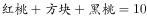。又根据题干已知②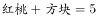，③。将②式和③式相加减去①式可得红桃数量为1张。且此人手上每个花色的牌都有，因此花色数量最少的为红桃。

故正确答案为D。

---

### 第 11 题　qid 2166024 · 图形推理

<b>从所给的四个选项中选择最适合的一项，使之呈现一定的规律性：</b>

- **A**. A
- **B**. B
- **C**. C
- **D**. D　✅

**答案**：D

**官方解析**

元素组成不同，属性无明显规律，考虑数量规律。点、线、面在数量上不构成规律性，考虑数角。由于每个图形都有锐角，考虑数锐角个数，题干依次为2、3、4、5、？，因此，应该选择一个锐角数是6个的图形，只有D选项符合。
故正确答案为D。
注：一般考数角的题都是不重复数的，但是题干图4的锐角重复数了，此题不常规，以后数角还是优先不重复数。

---

### 第 12 题　qid 2166025 · 图形推理

<b>从所给的四个选项中选择最适合的一项，使其与以下四幅图呈现一定的规律性：</b>

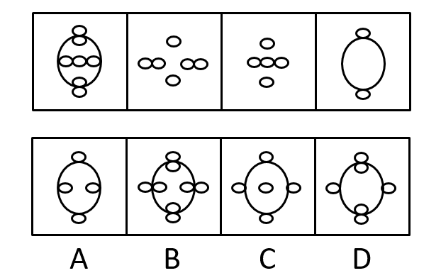

- **A**. A
- **B**. B　✅
- **C**. C
- **D**. D

**答案**：B

**官方解析**

元素组成相似，相同线条重复出现，优先考虑样式规律中的加减同异。观察发现，图一与图三去同求异得到图四，那么图二应该和图四去同求异得到答案，即B项。
故正确答案为B。

---

### 第 13 题　qid 2166026 · 图形推理

<b>从所给的四个选项中选择最适合的一项，使之呈现一定的规律性：</b>

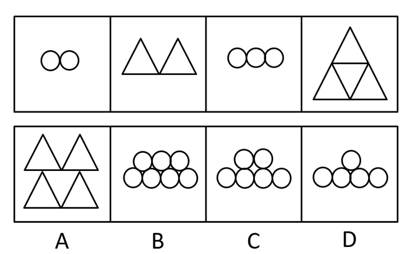

- **A**. A
- **B**. B
- **C**. C　✅
- **D**. D

**答案**：C

**官方解析**

元素组成不同，数量特征明显，考虑数量规律，题干元素的个数分别是2、2、3、4、？，单独看数量不成规律，考虑做运算，前两图数量相加，减1等于下一幅图，故？处应该填入数量为6，只有C项符合。
故正确答案为C。

---

### 第 14 题　qid 2166027 · 图形推理

<b>从所给的四个选项中选择最适合的一项，使之呈现一定的规律性：</b>

- **A**. A
- **B**. B
- **C**. C　✅
- **D**. D

**答案**：C

**官方解析**

元素组成不同，且无属性规律。观察发现，每个图形都是由同一种小元素组成，考虑小元素数量，4，4，3，4无数量规律。将每个图形中的小元素相连，发现都在一条直线上，并且选项中每个图形也符合这一规律，于是将每个图形小元素的组成看成一条直线发现，相邻两个图形，呈逆时针旋转的规律，移动角度为45度，90度，135度，故？处应逆时针旋转180度，只有C项满足。
故正确答案为C。

---

### 第 15 题　qid 2166028 · 图形推理

<b>从所给的四个选项中选择最适合的一项，使之呈现一定的规律性：</b>

- **A**. A
- **B**. B　✅
- **C**. C
- **D**. D

**答案**：B

**官方解析**

图形元素组成不同，但属性与数量没有明显规律。观察发现，题干图形出现较多箭头，且前三幅图箭头指向明显，分别指向下、右、上，第四幅图存在变形，可将月亮左侧突出的弧线看成指向左边的箭头，所以题干图形的规律为箭头指向依次逆时针旋转（如下图所示），故问号处应选择箭头指向为下的图形，只有B项满足规律。

故正确答案为B。

---

## 资料分析

### 材料 1

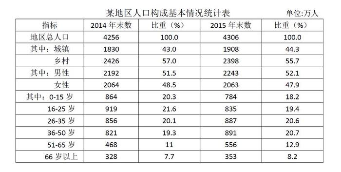

#### 第 1 题　qid 2166029 · 增长

某地区城镇人口自然增长率是多少？

- **A**. 

- **B**. 

- **C**. 

- **D**. 

　✅

**答案**：D

**官方解析**

由题干“······城镇人口自然增长率是······”，可判定本题为一般增长率计算问题。定位统计表中第三行，已知2014年末城镇人口数为1830万人，2015年末城镇人口数为1908万人，根据公式：，可得某地区城镇人口自然增长率，与D项最为接近。

故正确答案为D。

---

#### 第 2 题　qid 2166030 · 增长

某地区城镇人口增长的幅度比乡村人口增长的幅度多几个百分点？

- **A**. 5.5　✅
- **B**. 5.3
- **C**. 4.6
- **D**. 3.1

**答案**：A

**官方解析**

由题干“······城镇人口增长的幅度比乡村人口增长的幅度多·····个百分点”，可判定本题为一般增长率计算问题。由上题可得某地区城镇人口增长的幅度为；定位统计表中第四行，已知2014年末乡村人口数为2426万人，2015年末乡村人口数为2398万人，根据公式可得某地区乡村人口增长的幅度；故某地区城镇人口增长的幅度比乡村人口增长的幅度多个百分点。

故正确答案为A。

---

#### 第 3 题　qid 2166031 · 增长

从人口的年龄结构分析，出现负增长的有几个年龄段？

- **A**. 1个
- **B**. 2个　✅
- **C**. 3个
- **D**. 4个

**答案**：B

**官方解析**

定位统计表的年龄结构分析部分，0-15岁的2014年末比重（）2015年末比重（），16-25岁的2014年末比重（）2015年末比重（），其它年龄段都是正增长，故从人口的年龄结构分析出现负增长的有2个年龄段。

故正确答案为B。

备注：人口年龄结构指一定时点、一定地区各年龄组人口在全体人口中的比重，又称人口年龄构成。

---

#### 第 4 题　qid 2166032 · 增长

根据人口年龄段的划分，哪一年龄段人口增长的幅度最大？

- **A**. 26-35岁
- **B**. 36-50岁
- **C**. 51-65岁　✅
- **D**. 66岁以上

**答案**：C

**官方解析**

由题干“哪一年龄段人口增长的幅度最大”，可判定此题为一般增长率比较问题。定位统计表的最后四行，根据公式：，可得26-35岁年龄段的人口增长率；36-50岁年龄段的人口增长率；51-65岁年龄段的人口增长率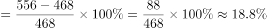；65岁以上年龄段的人口增长率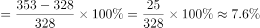。故51-65岁年龄段的人口增长的幅度最大。

故正确答案为C。

---

#### 第 5 题　qid 2166033 · 增长

增长最快和最慢的两个年龄段的人口数占总人口的百分之多少？

- **A**. 
18

- **B**. 
25

- **C**. 
31
　✅
- **D**. 
34

**答案**：C

**官方解析**

根据题干“增长最快和最慢······”，可判定本题为一般增长率问题。定位统计表第二列和第四列数据，0-15岁年龄段的增长率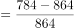，16-25岁年龄段的增长率，26-35岁年龄段的增长率，36-50岁年龄段的增长率，51-65岁年龄段的增长率，65岁以上年龄段的增长率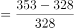。可得增长最快的年龄段是51-65岁，增长最慢的年龄段是0-15岁。定位统计表最后一列，可得0-15岁和51-65岁年龄段的人口数占总人口数的，与C选项最接近。

故正确答案为C。

---
