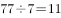
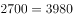
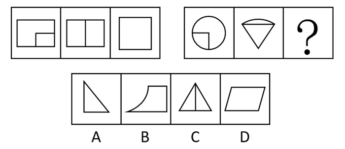
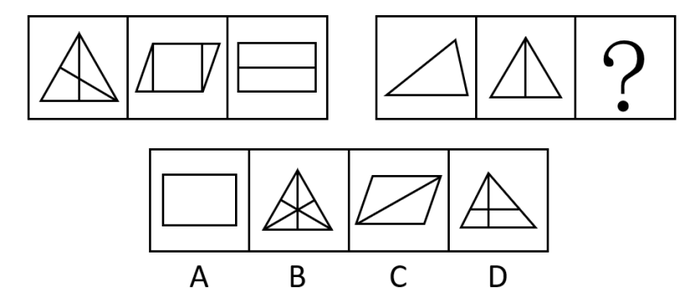
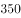

# 2019年1月天津市定向招录选调生考试综合能力测试试卷（精选）

> 选调生 · 2019 年 · 5 个模块 · 共 45 题

- [政治理论](#%E6%94%BF%E6%B2%BB%E7%90%86%E8%AE%BA) · 8 题
- [常识判断](#%E5%B8%B8%E8%AF%86%E5%88%A4%E6%96%AD) · 12 题
- [言语理解与表达](#%E8%A8%80%E8%AF%AD%E7%90%86%E8%A7%A3%E4%B8%8E%E8%A1%A8%E8%BE%BE) · 10 题
- [数量关系](#%E6%95%B0%E9%87%8F%E5%85%B3%E7%B3%BB) · 5 题
- [判断推理](#%E5%88%A4%E6%96%AD%E6%8E%A8%E7%90%86) · 10 题

---

## 政治理论

### 第 1 题　qid 2667360 · 新思想

中国共产党第十九次全国代表大会的主题是：不忘初心，（    ），高举中国特色社会主义伟大旗帜，决胜全面建成小康社会，夺取新时代中国特色社会主义伟大胜利，为实现中华民族伟大复兴的中国梦不懈奋斗。

- **A**. 继续前进
- **B**. 牢记使命　✅
- **C**. 方得始终
- **D**. 砥砺前行

**答案**：B

**官方解析**

本题考查政治常识。
2017年10月18日，中国共产党第十九次全国代表大会在北京召开。这次大会的主题是：不忘初心，牢记使命，高举中国特色社会主义伟大旗帜，决胜全面建成小康社会，夺取新时代中国特色社会主义伟大胜利，为实现中华民族伟大复兴的中国梦不懈奋斗。
故正确答案为B。

---

### 第 2 题　qid 2667362 · 新思想

中国共产党第十九次全国代表大会，是在全面建成小康社会决胜阶段、中国特色社会主义进入（    ）的关键时期召开的一次十分重要的大会。

- **A**. 新时期
- **B**. 新阶段
- **C**. 新征程
- **D**. 新时代　✅

**答案**：D

**官方解析**

本题考查政治常识。
习近平总书记在党的十九大报告中指出：“中国共产党第十九次全国代表大会，是在全面建成小康社会决胜阶段、中国特色社会主义进入新时代的关键时期召开的一次十分重要的大会。”
同时还指出：“从十九大到二十大，是‘两个一百年’奋斗目标的历史交汇期。我们既要全面建成小康社会、实现第一个百年奋斗目标，又要乘势而上开启全面建设社会主义现代化国家新征程，向第二个百年奋斗目标进军。”
故正确答案为D。

---

### 第 3 题　qid 2667370 · 新思想

党的十九大报告指出，五年来，我们统筹推进（    ）总体布局，协调推进（    ）战略布局，“十二五”规划胜利完成，“十三五”规划顺利实施，党和国家事业全面开创新局面。

- **A**. 五位一体  四个全面　✅
- **B**. 五位一体  全面发展
- **C**. 四位一体  四个全面
- **D**. 四位一体  全面发展

**答案**：A

**官方解析**

本题考查政治常识。
党的十九大报告指出：“五年来，我们统筹推进‘五位一体’总体布局、协调推进‘四个全面’战略布局，‘十二五’规划胜利完成，‘十三五’规划顺利实施，党和国家事业全面开创新局面。”
“五位一体”总体布局是指经济建设、政治建设、文化建设、社会建设和生态文明建设五位一体，全面推进；“四个全面”是指全面建成小康社会、全面深化改革、全面依法治国、全面从严治党。
备注：2020年党的十九届五中全会在北京胜利召开，会议审议通过了《中共中央关于制定国民经济和社会发展第十四个五年规划和二〇三五年远景目标的建议》。明确提出要“协调推进全面建设社会主义现代化国家、全面深化改革、全面依法治国、全面从严治党的战略布局”。
故正确答案为A。

---

### 第 4 题　qid 2343431 · 新思想

中国共产党人的初心和使命，就是为中国人民            ，为中华民族            。这个初心和使命是激励中国共产党人不断前进的根本动力。

- **A**. 谋幸福  谋未来
- **B**. 谋生活  谋复兴
- **C**. 谋幸福  谋复兴　✅
- **D**. 谋生活  谋未来

**答案**：C

**官方解析**

本题考查政治常识。
习近平总书记在十九大报告中指出：“中国共产党人的初心和使命，就是为中国人民谋幸福，为中华民族谋复兴。这个初心和使命是激励中国共产党人不断前进的根本动力。全党同志一定要永远与人民同呼吸、共命运、心连心，永远把人民对美好生活的向往作为奋斗目标，以永不懈怠的精神状态和一往无前的奋斗姿态，继续朝着实现中华民族伟大复兴的宏伟目标奋勇前进。”
故正确答案为C。

---

### 第 5 题　qid 2667378 · 新思想

《中国共产党章程》规定，企业、农村、机关、学校、科研院所、街道社区、社会组织、人民解放军连队和其他基层单位，凡是有正式党员（    ）的，都应当成立党的基层组织。

- **A**. 二人以上
- **B**. 三人以上　✅
- **C**. 四人以上
- **D**. 五人以上

**答案**：B

**官方解析**

本题考查政治常识。
《中国共产党章程》第三十条第一款规定：“企业、农村、机关、学校、科研院所、街道社区、社会组织、人民解放军连队和其他基层单位，凡是有正式党员三人以上的，都应当成立党的基层组织。”
故正确答案为B。
注：2022年10月份更新党章内容如下：　第三十条　企业、农村、机关、学校、医院、科研院所、街道社区、社会组织、人民解放军连队和其他基层单位，凡是有正式党员三人以上的，都应当成立党的基层组织。

---

### 第 6 题　qid 2667384 · 新思想

《中国共产党章程》规定，党的各级委员会实行集体领导和个人分工负责相结合的制度，凡属重大问题都要按照集体领导、民主集中、个别酝酿、（    ）的原则。

- **A**. 相互沟通
- **B**. 各司其职
- **C**. 监督决策
- **D**. 会议决定　✅

**答案**：D

**官方解析**

本题考查政治常识。
《中国共产党章程》第十条第（五）项规定：“党的各级委员会实行集体领导和个人分工负责相结合的制度。凡属重大问题都要按照集体领导、民主集中、个别酝酿、会议决定的原则，由党的委员会集体讨论，作出决定；委员会成员要根据集体的决定和分工，切实履行自己的职责。”
故正确答案为D。

---

### 第 7 题　qid 2270839 · 新思想

中国共产党的领导地位是由（  ）决定的。

- **A**. 党的执政地位
- **B**. 我国的政党制度
- **C**. 党的性质　✅
- **D**. 我国的国情

**答案**：C

**官方解析**

本题考查毛中特。
中国共产党是中国工人阶级的先锋队，同时也是中国人民和中华民族的先锋队。党不仅代表中国工人阶级的利益，而且代表整个中华民族和中国最广大人民的根本利益。从诞生的那一天起，党就把最广大人民的利益放在第一位，把全心全意为人民服务作为自己的根本宗旨，把实现好、维护好、发展好最广大人民的根本利益作为自己一切行动的根本出发点和落脚点。中国共产党95载波澜壮阔的伟大历程雄辩证明：党的领导地位不是自封的，是由党的性质和宗旨决定的，是历史和人民的选择。
故正确答案为C。

---

### 第 8 题　qid 2667398 · 新思想

共产党的党性是（    ）的最高表现。

- **A**. 工人阶级的阶级性
- **B**. 先进分子的先进性
- **C**. 革命分子的革命性
- **D**. 无产阶级的阶级性　✅

**答案**：D

**官方解析**

本题考查政治常识。
党性是一个政党所固有的本性，是其所代表的阶级属性的集中体现。无产阶级政党的党性，是无产阶级阶级性最高、最集中的表现，是无产阶级性的自觉表现。
中国共产党是中国工人阶级的先锋队，是中国各族人民利益的忠实代表，是中国社会主义事业的领导核心。《刘少奇论党的建设》中指出：“共产党员的党性就是无产阶级性最高而集中的体现，就是无产者本质的最高表现，就是无产阶级利益最高而集中的表现”。
故正确答案为D。

---

## 常识判断

### 第 1 题　qid 2667388 · 人文常识

在党的领导的内容中，（    ）是核心和根本。同时，也必须坚持其他方面的领导。

- **A**. 政治领导　✅
- **B**. 思想领导
- **C**. 组织领导
- **D**. 纪律领导

**答案**：A

**官方解析**

本题考查政治常识。
党的领导主要是政治、思想和组织领导。政治领导是党的领导的领导原则，思想领导是党的政治领导、组织领导的前提和基础，组织领导是党的政治领导、思想领导的保证。
A项正确，政治领导，就是政治方向、政治原则、重大决策的领导，集中体现在党的路线、方针、政策方面，是党的领导的核心和根本所在。
B项错误，思想领导，就是理论观点、思想方法以至精神状态的领导，就是坚持以马克思列宁主义、毛泽东思想、邓小平理论和“三个代表”重要思想作为党和国家的指导思想，教育和武装广大党员和人民群众，向人民群众宣传党的路线、方针、政策，把党的主张变成人民群众的自觉行动。有了正确的思想领导，才能制定和执行正确的政治路线和组织路线。所以，党的思想领导是党的政治领导、组织领导的前提和基础。
C项错误，组织领导，就是通过党的各级组织、党的干部和广大党员，组织和带领人民群众为实现党的任务和主张而奋斗。党的组织领导是政治领导、思想领导的保证。
D项错误，纪律领导不属于党的领导的主要内容。
故正确答案为A。

---

### 第 2 题　qid 2667393 · 人文常识

党在社会主义初级阶段的基本路线的核心内容是：

- **A**. “一个中心，两个基本点”　✅
- **B**. 自力更生，艰苦创业
- **C**. 把我国建设成为富强、民主、文明的社会主义现代化国家
- **D**. 坚持改革开放，坚持社会主义道路

**答案**：A

**官方解析**

本题考查政治常识。
1987年10月，党的十三大在北京召开。十三大的突出贡献，是系统地阐述了关于社会主义初级阶段的理论，完整地概括了党在社会主义初级阶段的基本路线，即“领导和团结全国各族人民，以经济建设为中心，坚持四项基本原则，坚持改革开放，自力更生，艰苦创业，为把我国建设成为富强、民主、文明的社会主义现代化国家而奋斗。”
“一个中心、两个基本点”是对基本路线的简明概括，也是基本路线的核心内容。“一个中心”指以经济建设为中心，“两个基本点”指坚持四项基本原则，坚持改革开放。
故正确答案为A。

---

### 第 3 题　qid 2667401 · 人文常识

辩证唯物主义认为，物质的唯一特征是：

- **A**. 相对静止性
- **B**. 客观实在性　✅
- **C**. 形式的多样性
- **D**. 运动的永恒性

**答案**：B

**官方解析**

本题考查政治常识。
A、D两项错误，运动是物质的根本属性和存在方式，运动是绝对的，静止是相对的，运动和静止是辩证统一的。
B项正确，客观实在性是指物质不依赖于意识而独立存在，是物质的唯一特性，是物质与意识的本质区别。
C项错误，辩证唯物主义认为，物质是世界的本原，而物质的表现形式、运动方式都具有多样性。
故正确答案为B。

---

### 第 4 题　qid 2667407 · 人文常识

从哲学角度看，“运动”是一切物质的：

- **A**. 主要特点
- **B**. 根本属性　✅
- **C**. 外在形式
- **D**. 内部状态

**答案**：B

**官方解析**

本题考查政治常识。
辩证唯物主义认为，运动是物质的固有性质和存在方式，是物质所固有的根本属性，没有不运动的物质，也没有离开物质的运动。万事万物都处在这样或那样的运动中，它们只有在运动中才能保持自己的存在，没有运动就没有事物，不做任何运动的事物是没有的。所以，运动是一切物质的根本属性。
故正确答案为B。

---

### 第 5 题　qid 2667412 · 法律常识

行政许可就其特征而言，它是一种：

- **A**. 依职权的行为
- **B**. 依授权的行为
- **C**. 依委托的具体行政行为
- **D**. 依申请的具体行政行为　✅

**答案**：D

**官方解析**

本题考查法律常识。
《中华人民共和国行政许可法》第二条规定：“本法所称行政许可，是指行政机关根据公民、法人或者其他组织的申请，经依法审查，准予其从事特定活动的行为。”
A项错误，行政行为是指行政主体行使行政职权，作出的能够产生行政法律效果的行为，以是否可由行政主体主动实施为依据可以把行政行为分为依职权行政行为和依申请行政行为。而行政许可均需要行政相对方提出申请，属于依申请的行政行为，而不属于依职权的行政行为。
B项错误，行政许可是一种授益性具体行政行为，即行政主体赋予行政相对方某种法律资格或法律权利的具体行政行为。
C项错误、D项正确，行政许可是依申请的具体行政行为，是指在法律一般禁止的情况下，行政主体根据行政相对方的申请，经依法审查，通过颁发许可证、执照等形式，赋予或确认行政相对方从事某种活动的法律资格或法律权利的一种具体行政行为。行政许可是一种由行政相对人提出申请才能实施的具体行政行为，相对人的申请是行政许可行为作出的必经程序和条件，没有相对人的申请，行政机关就不能实施该行为。
故正确答案为D。

---

### 第 6 题　qid 2667416 · 法律常识

现行宪法规定，制定和修改基本法律的职权属于：

- **A**. 全国人民代表大会　✅
- **B**. 全国人大常委会
- **C**. 全国人大及其常委会
- **D**. 全国人大法律委员会

**答案**：A

**官方解析**

本题考查法律常识。
根据《中华人民共和国宪法》第六十二条规定：“全国人民代表大会行使下列职权：（一）修改宪法；（二）监督宪法的实施；（三）制定和修改刑事、民事、国家机构的和其他的基本法律；（四）选举中华人民共和国主席、副主席······”
故正确答案为A。

---

### 第 7 题　qid 2667448 · 经济常识

社会资本是：

- **A**. 相互联系和相互依存的所有单个资本的总和　✅
- **B**. 产业资本、商业资本、借贷资本的总和
- **C**. 生产部门的资本和非生产部门资本的总和
- **D**. 货币资本、生产资本、商品资本的总和

**答案**：A

**官方解析**

本题考查经济常识。

A项正确，社会资本指相互联系、相互制约的所有各个个别资本的总和。马克思在《马克思恩格斯全集》第24卷中提出：“社会资本单个资本（包括股份资本；如果政府在采矿业、铁路等等上面使用生产的雇佣劳动，起产业资本家的作用，那也包括国家资本）之和”。社会总资本的运动，反映着个别资本的相互联系、相互制约的关系。个别资本在增殖价值中互相争夺，彼此对立，但在运动中又相互依存，互为条件。一个资本家买进生产资料，同时就是另一个资本家卖出生产资料，个别资本在运动中相互交错。一个不买进，另一个就不能卖出，它们互为前提，互为条件。

B项错误，产业资本是投入物质生产部门的资本，商业资本是在流通领域内发生作用的资本，二者共同构成职能资本；而借贷资本是在职能资本运动的基础上产生并为职能资本服务的一种特殊资本。

C项错误，国民经济指社会物质生产和非物质生产各部门的总和。

D项错误，货币资本、生产资本、商品资本是产业资本在资本循环中的三种不同的职能形式。产业资本在运动中依次经过购买、生产和销售三个阶段，相应采取货币资本、生产资本、商品资本三种职能形式，实现价值增殖，最后又回到货币资本的形式，完成资本的循环运动。

故正确答案为A。

---

### 第 8 题　qid 2667456 · 经济常识

货币转化为资本的前提是：

- **A**. 货币在运动中发生了价值增殖
- **B**. 货币投入流通的目的是带来剩余价值
- **C**. 货币所有者购买到劳动力商品　✅
- **D**. 货币可以购买到生产资料

**答案**：C

**官方解析**

本题考查经济常识。
根据马克思主义政治经济学的观点，资本是可以带来剩余价值，但货币不是生来就是资本，当它能够带来剩余价值时才成为资本。资本主义生产条件下劳动力是商品，它和其他商品一样具有使用价值和价值。劳动力商品的使用价值的特殊性在于它不仅能创造出价值，而且能够创造出比劳动力自身的价值更大的价值。资本家的货币只要和劳动力进行交换，就能使其带来剩余价值，成为资本。因此，劳动力成为商品是货币转化为资本的前提。
故正确答案为C。

---

### 第 9 题　qid 2270849 · 人文常识

政府机构改革的难点是（    ）。

- **A**. 精简机构
- **B**. 裁减人员
- **C**. 提高效率
- **D**. 转变政府职能　✅

**答案**：D

**官方解析**

本题考查行政管理。
党的十八大以来，以习近平同志为总书记的党中央对深化行政体制改革提出了明确要求。十八届二中全会指出，转变政府职能是深化行政体制改革的核心。
故正确答案为D。

---

### 第 10 题　qid 2667432 · 科技常识

中国在世界上：

- **A**. 动物种类最多　✅
- **B**. 植物种类最多
- **C**. 微生物种类最多
- **D**. 森林种类最多

**答案**：A

**官方解析**

本题考查地理国情。

A项正确，我国是世界上动物种类最多的国家，约有10.4万种，动物资源主要包括野生动物、家畜家禽、鱼类资源。

B项错误，据2003年《中国环境状况公报》公布，我国有高等植物约30000种，仅次于世界植物最丰富的马来西亚和巴西，居世界第三位。

C项错误，微生物的繁殖极快而且变异力强，且难观察，难以知晓种类。

D项错误，俄罗斯是世界上国土面积最大的国家，同时也是森林面积最大的国家，其森林面积达776万平方千米，占其国土面积的。

故正确答案为A。

---

### 第 11 题　qid 2667435 · 人文常识

我国自行设计制造的第一座核电站是：

- **A**. 大亚湾核电站
- **B**. 亚龙湾核电站
- **C**. 秦山核电站　✅
- **D**. 巫山核电站

**答案**：C

**官方解析**

本题考查科技常识。

A项错误，大亚湾核电站位于中国广东省深圳市大鹏新区大鹏半岛，由广东核电投资有限公司和香港核电投资有限公司合资建设与运营，隶属中国广核集团管辖，拥有两台百万千瓦级压水堆机组，所生产电力供应香港，供应广东。大亚湾核电站是中国大陆第一座大型商用核电站，也是中国大陆首座使用国外技术和资金建设的核电站。

B项错误，截止目前，我国建成投产的核电站，没有亚龙湾核电站。

C项正确，秦山核电站是中国自行设计、建造和运营管理的第一座30万千瓦压水堆核电站，位于浙江省嘉兴市海盐县。秦山核电站的建成发电，结束了中国大陆无核电的历史，实现了零的突破。标志着“中国核电从这里起步”，同时被誉为“国之光荣”。秦山核电站的建成，标志着中国核工业的发展上了一个新台阶，成为中国军转民、和平利用核能的典范，使中国成为继美国、英国、法国、前苏联、加拿大、瑞典之后世界上第7个能够自行设计、建造核电站的国家。

D项错误，截止目前，我国建成投产的核电站，没有巫山核电站。

故正确答案为C。

---

### 第 12 题　qid 1998336 · 人文常识

公文的作者是指(    )。

- **A**. 签发人
- **B**. 审核人
- **C**. 发文机关　✅
- **D**. 撰写人

**答案**：C

**官方解析**

本题考查公文作者的概念辨析。公文是指行政机关、社会团体和企事业单位在行政管理活动或处理公务活动中产生的，按照严格的、法定的生效程序和规范的格式制定的具有传递信息和记录作用的载体文件。由此可知，公文的主体是组织，而非个人。即使公文是由个人撰写或发布，也是一种组织行为。
A项，公文的签发人是组织的代表，但并非公文的作者。该项应排除。
B项，公文的审核人对公文的内容、形式进行审查，但不是公文的作者。该项应排除。
C项，发文机关在管理活动和公务处理的过程中组织人员撰写、审核、发出公文，是公文的组织主体和发出者，即公文的作者。该项应选。
D项，撰写人受组织委托起草文字的内容，是公文内容的起草者，但不是公文的作者。该项应排除。
故正确答案为C。

---

## 言语理解与表达

### 第 1 题　qid 2661753 · 逻辑填空

在自然科学中，经典的动力学规律是        决定论的。
填入画横线部分最恰当的一项是：

- **A**. 严肃
- **B**. 严谨
- **C**. 严格　✅
- **D**. 严密

**答案**：C

**官方解析**

搭配“决定论”。C项“严格”既可搭配“措施、要求等”，也可搭配“理论、制度等”，搭配合理，当选。
A项“严肃”常形容“表情、态度”，搭配不当，排除；
B项“严谨”常形容“思想、行为”，搭配不当，排除；
D项“严密”常形容“组织、纪律”，搭配不当，排除。
故正确答案为C。
拓展：“严格决定论”为固定搭配，观点起源于十八世纪的法国启蒙时代，认为人是物质的自然的一部分，完全受制于自然律，而不是由上帝来主宰命运。

---

### 第 2 题　qid 2661755 · 逻辑填空

乐观地说，先不论孩子们写了什么，仅就这种想象的本身，就        着多彩的光芒：教育的成就、文学的繁荣、出版的敏锐。
填入画横线部分最恰当的一项是：

- **A**. 影射
- **B**. 照射
- **C**. 映射　✅
- **D**. 映衬

**答案**：C

**官方解析**

搭配“多彩的光芒”。C项“映射”多指在光线的映照下，折射出的影像，可引申为由表象反映到内涵、本质的一个过程，文段中从“想象的本身”到“教育的成就、文学的繁荣、出版的敏锐”便体现了一种由表象到本质的过程，符合文意，当选。
A项“影射”指用一种事物暗示或说明另一种事物，与文意不符，排除；
B项“照射”指光线直射在物体上，不能体现一种由外到内的反映过程，排除；
D项“映衬”指映托、衬托，与文意不符，排除。
故正确答案为C。
【文段出处】《关注，以爱的名义》

---

### 第 3 题　qid 2661760 · 逻辑填空

乡村干部逐渐从以前的催种催收的“四季歌”中        出来，开始思考自己今后的作为。
填入画横线部分最恰当的一项是：

- **A**. 解脱　✅
- **B**. 释放
- **C**. 解放
- **D**. 脱离

**答案**：A

**官方解析**

根据“以前的催种催收”以及“开始思考自己今后的作为”可知，乡村干部之前被“催种催收”的工作所束缚，对接下来的工作缺少思考，故横线处应体现乡村干部现在摆脱了以前的束缚。A项“解脱”指解除烦恼，摆脱束缚，从而获得身心自由，符合文意，当选。
B项“释放”指把所含的物质或能量放出来，文段搭配的主语为“乡村干部”，搭配不当，排除；
C项“解放”指解除束缚，得到自由或发展，根据文意可知，乡村干部之前被“催种催收”束缚的无法思考今后作为，与A项相比，程度较轻，且“从中······出来”，搭配“解脱”更为常见，排除；
D项“脱离”指离开（某种环境或情况）；断绝（某种联系），中性词，根据文意可知，乡村干部之前被“催种催收”束缚的无法思考今后作为，感情色彩偏消极，与A项相比，感情色彩不符，且A项语义更丰富，排除。
故正确答案为A。
【文段出处】《乡深入推进农村综合改革的相关意见和建议》

---

### 第 4 题　qid 2165995 · 逻辑填空

该地区对环境保护采取了强有力的措施，使水土流失现象得到______，生态环境向良性循环转变。

- **A**. 治理
- **B**. 控制　✅
- **C**. 遏制
- **D**. 改变

**答案**：B

**官方解析**

根据“生态环境向良性循环转变”可知，该地区采取的措施产生了良好的效果，即水土流失状况不再恶化或向好的方向转变， B项“控制”解释为掌握住对象不使任意活动或超出范围，或使其按控制者的意愿活动，即表达水土流失状况不再恶化之意，当选。A项“治理”指整治处理，侧重表达整治的过程；D项“改变”是指更改、变动，两项均表达不出良好的效果，与文意不符，排除；C项“遏制”指阻止、控制，文段表达“生态环境向良性循环转变”，目前还存在水土流失现象，故没有完全制止，选项程度过重，排除。
故正确答案为B。

---

### 第 5 题　qid 2661766 · 逻辑填空

建立现代农业的过程，        就是逐步提高农业综合生产能力、完善农业支撑系统的过程。
填入画横线部分最恰当的一项是：

- **A**. 实际
- **B**. 实质　✅
- **C**. 其实
- **D**. 本意

**答案**：B

**官方解析**

根据横线后“就是”可知，后文是对“建立现代农业的过程”含义的解释说明，B项“实质”指某一对象或事物本身所必然固有的性质，或事物的内在含义，符合文意，当选。
A项“实际”、C项“其实”，均具有“转折”作用，横线前后内容并非“转折关系”，排除；
D项“本意”指本来的想法或意图，后文论述的“过程”就是对“建立现代农业的过程”含义的具体解释，并未表明“原本的想法或意图”，且一般不会表述为本意是一个“过程”，排除。
故正确答案为B。
【文段出处】《建设农业“七大体系”：提高农业综合生产能力的基础保障》

---

### 第 6 题　qid 2661768 · 语句表达

生态环境保护与人们的现实经济利益之间往往存在着矛盾。退耕还林、野生动植物保护等方面的政策或措施从长远来看是符合人类利益的，但常常要牺牲一部分人的现实利益，                    。
填入画横线部分最恰当的一项是：

- **A**. 因此人们应当以生态环境为重
- **B**. 因此人们要有长远眼光
- **C**. 因此人们要有自我牺牲精神
- **D**. 因此矛盾不可避免　✅

**答案**：D

**官方解析**

横线出现在文段结尾，且为尾句中的一个分句，需与尾句话题保持一致。文段开篇提出生态环境保护与人们现实利益之间存在矛盾，接着后文提到“退耕还林、野生动植物保护”等生态环境保护的措施从长远看是好的，然后“但”表示转折，提出需要牺牲一部分人的利益，具体论述了存在着怎样的矛盾。故横线处总结前文得出结论，即在“现实利益”和“长远的人类利益”之间的矛盾不可避免，对应D项。
A项“以生态环境为重”，文段没有直接体现出以谁为重，无中生有，排除。
B项“有长远眼光”、C项“自我牺牲精神”，仅仅对应矛盾双方的其中一个方面，表述片面，排除。
故正确答案为D。

---

### 第 7 题　qid 769203 · 片段阅读

尽管新儒家学者无一例外地夸大了儒家哲学的精神义理在现代社会中可能产生的作用和影响，因而是需要否定和批判的；但此种影响的实际存在倒确实是毋庸置疑的。
这段话中的“此种影响”是指：

- **A**. 儒家哲学的精神义理可能对社会发生的影响　✅
- **B**. 对儒家哲学作用的夸大所造成的影响
- **C**. 新儒家学者对人类社会发展的影响
- **D**. 儒家哲学在过去产生过的实际影响

**答案**：A

**官方解析**

“此种影响”在文段最后一句，指前文提到的内容，即：“新儒家学者无一例外地夸大了儒家哲学的精神义理在现代社会中可能产生的作用和影响，因而是需要否定和批判的”，也就是说新儒家学者虽然夸大了某种影响，但此种影响确实存在，并对社会产生了一些影响。
对照选项发现，只有A项符合题意。
B项，文段并未提及夸大造成了哪些影响；C项，文中提到的是儒家哲学的精神义理，而不是新儒家学者对人类社会发展的影响；D项，文中没有提到。
故正确答案为A。

---

### 第 8 题　qid 2661776 · 片段阅读

古史不是断片的杂记，便是顺接年月的纂录；自出机杼，创立规模，以驾驭去取各种史料的，从《史记》始。司马迁的确能够贯穿经传，整齐百家杂语，成一家言。他明白“整齐”的必要，并知道怎样去“整齐”：这实在是创作，是以述为作。他这样将自有文化以来的三千年间君臣士庶的行事，“合一炉而冶之”，却反映着秦汉大一统的局势。
本文中“整齐”指的意思是：

- **A**. 裁剪文章，使中心明确，重点突出，结构完整
- **B**. 对材料加以取舍和裁剪，使结构完整，体例划一
- **C**. 指按照一定的标准取舍材料，建立自己的体系
- **D**. “整”指内容的条理性，“齐”指体例的一致性　✅

**答案**：D

**官方解析**

“整齐”出现在文段第二句，即司马迁的做法，“整齐百家杂语”，并说明他为什么要“整齐”。接着尾句出现“这样”指代前文司马迁的做法，解释 “整齐”的具体做法，即“将自有文化以来的三千年间君臣士庶的行事，‘合一炉而冶之’”，将所有内容整合在一起，合成统一的体系，对应D项。
A项，“裁剪文章，使中心明确，重点突出”，文段中没有提到，无中生有，排除；
B项，“对材料加以取舍和裁剪” ，文段中没有提到，无中生有，排除；
C项，“指按照一定的标准取舍材料” ，文段中没有提到，无中生有，排除。
故正确答案为D。
【文段出处】《班马优劣论》

---

### 第 9 题　qid 5435 · 语句表达

所谓科学精神，不过是哲学上的多元主义的另一种说法而已。哲学上的多元主义，就是         ，否认有什么事物第一原因和宇宙、人类的什么终极目的。
填入横线上最恰当的是：

- **A**. 否认绝对真理的存在　✅
- **B**. 认为这个世界无须认识
- **C**. 政治上权威主义的根据
- **D**. 一种绝对化的主张

**答案**：A

**官方解析**

此题考查语句填空。
联系下文“否认有什么事物第一原因和宇宙、人类的什么终极目的”，“第一”、“终极”都带有“绝对”的意思，故科学精神是否认绝对真理的存在，可知A项最合适，不仅衔接流畅，而且在内容上是并列的。
文段中没有支持B、C、D观点的描述。
故正确答案为A。

---

### 第 10 题　qid 2262719 · 片段阅读

有些基因使人们总的来说感到快乐一些或者悲伤一些。
这句话的意思是：

- **A**. 总的来说，有些基因使人感到快乐，有些基因使人感到悲伤　✅
- **B**. 有些基因总的来说使人们要么感到快乐，要么感到悲伤
- **C**. 有些基因总的来说使人们既感到快乐，又感到悲伤
- **D**. 总的来说，使人感到快乐和悲伤的原因是部分基因影响的

**答案**：A

**官方解析**

本题题干的内容是相容选言命题,只有A项为相容选言命题，当选。
B、C、D三项均不是相容选言命题，排除。
故正确答案为A。

---

## 数量关系

### 第 1 题　qid 2661738 · 数学运算

一个边长为8的立方体，由若干个边长为1的正立方体组成，现在要在表面涂上颜色，问被涂上颜色的小立方体有多少个？

- **A**. 296　✅
- **B**. 325
- **C**. 328
- **D**. 384

**答案**：A

**官方解析**

由题意可知，该正方体共由个小立方体组成，去除被涂色的小立方体，剩下没被涂色的是一个棱长为6的立方体，即有个小立方体。因此一共有个小立方体被涂上了颜色。

故正确答案为A。

---

### 第 2 题　qid 34637 · 数学运算

某一天，小张发现办公桌上的台历已经有7天没有翻了，就一次翻了7张，这7张的日期加起来之和是77，那么这一天是：

- **A**. 13日
- **B**. 14日
- **C**. 15日　✅
- **D**. 17日

**答案**：C

**官方解析**

这7个日期是连续的自然数，构成等差数列，则这7个日期的中位数为，即没翻日历的第四天是11日，则这7天分别为8、9、10、11、12、13、14日，所以今天应该是15日。

故正确答案为C。 

---

### 第 3 题　qid 15755 · 数学运算

一试卷有50道判断题，规定每做对一题得3分，不做或做错一题扣1分。某学生共得82分，问做对的题与不做或做错的题数相差几题：

- **A**. 15题
- **B**. 16题　✅
- **C**. 17题
- **D**. 18题

**答案**：B

**官方解析**

设做对题，不做或做错题，根据题意可得：······①，······②，联立①②解得：，。则做对的题与不做或做错的题数相差题。

故正确答案为B。

---

### 第 4 题　qid 15747 · 数学运算

汽车从甲地到乙地用了4小时，从乙地返回甲地用了3小时，返回时的速度比去时快百分之几：

- **A**. 20%
- **B**. 18.26%
- **C**. 33.3%　✅
- **D**. 36.4%

**答案**：C

**官方解析**

题干中只给出了时间，路程和速度都是未知且路程不变，故可赋值不变量路程为，则去时速度为，返回时速度为，返回时的速度比去时快。

故正确答案为C。 

---

### 第 5 题　qid 2661742 · 数学运算

某局机关正在组织人力编辑一本《文本汇编》，其页数需用6869个数字，请问，这本《文本汇编》具体是多少页？

- **A**. 1994　✅
- **B**. 1968
- **C**. 1942
- **D**. 1886

**答案**：A

**官方解析**

1-9页每页需要1个数字，共需要个数字；

10-99页每页需要2个数字，共需要个数字；

100-999页每页需要3个数字，共需要个数字。

1000页以上的每页需要4个数字，剩下的数字有个，需要的页数为。因此本书的总页数为：页。

故正确答案为A。

---

## 判断推理

### 第 1 题　qid 2661759 · 图形推理

从所给的四个选项中，选择最合适的一个填入问号处，使之呈现一定的规律性。

 

- **A**. A
- **B**. B
- **C**. C　✅
- **D**. D

**答案**：C

**官方解析**

元素组成不同，优先考虑属性规律。图形整体比较规整，优先考虑对称性。第一组图，图形均为轴对称图形，且对称轴的数量依次为5、4、3，对称轴数量呈递减规律；第二组图，前两个图均为轴对称图形，且对称轴数量依次为4、3，故？处应填入有2条对称轴的图形，只有C项符合。
故正确答案为C。

---

### 第 2 题　qid 2661761 · 图形推理

从所给的四个选项中，选择最合适的一个填入问号处，使之呈现一定的规律性。

 

- **A**. A
- **B**. B　✅
- **C**. C
- **D**. D

**答案**：B

**官方解析**

元素组成不同，优先考虑属性规律。观察发现，第一组图中每幅图均为纯直线图形，第二组图中前两幅图既包含直线又包含曲线，故？处应填入既包含直线又包含曲线的图形，只有B项符合。
故正确答案为B。

---

### 第 3 题　qid 2661764 · 图形推理

从所给的四个选项中，选择最合适的一个填入问号处，使之呈现一定的规律性。

 

- **A**. A　✅
- **B**. B
- **C**. C
- **D**. D

**答案**：A

**官方解析**

元素组成不同，且无明显属性规律，优先考虑数量规律。题干每幅图都是由直线构成，存在直线相交且出现明显的直角，优先考虑数直角数。第一组图中，三个图形的直角数分别为4、6、8；第二组图中，前两个图形的直角数分别为0、2，故？处应选择一个直角数为4的图形。A、B、C、D四项图形中的直角数分别为4、6、0、6，只有A项符合。
故正确答案为A。

---

### 第 4 题　qid 4688446 · 图形推理

从所给的四个选项中，选择最合适的一个填入问号处，使之呈现一定的规律性：

- **A**. A
- **B**. B　✅
- **C**. C
- **D**. D

**答案**：B

**官方解析**

元素组成不同，无明显属性规律，考虑数量规律。观察发现，第一组图中，每幅图形均由2种不同的元素构成；第二组图中，前2幅图形均由3种不同的元素构成，故？处延续此规律，只有B项符合。
故正确答案为B。

---

### 第 5 题　qid 17499 · 图形推理

从所给四个选项中，选择最合适的一个填入问号处，使之呈现一定的规律性：

- **A**. A　✅
- **B**. B
- **C**. C
- **D**. D

**答案**：A

**官方解析**

元素组成相同，考查位置规律。
每组图形中黑白三角形和黑白圆圈 4个小元素在每个图形中的位置不重复。
故正确答案为A。

---

### 第 6 题　qid 30163 · 类比推理

作为意识的“本体”的人脑，必然是现实的人脑；现实的人脑总是长在现实的人身上的；而现实的人又总是处在一定的社会关系之中的。所以：

- **A**. 人脑是意识的真正本体
- **B**. 人本身是意识的真正本体
- **C**. 社会关系是意识的真正本体　✅
- **D**. 意识没有真正的本体

**答案**：C

**官方解析**

本题为日常结论题。题干信息指出，意识的“本体”是现实的人脑，现实的人脑离不开现实的人，现实的人依附于社会关系存在，即人脑、人都只是意识的中间载体，追到最终根源，社会关系才是意识的真正本体。
故正确答案为C。

---

### 第 7 题　qid 34075 · 逻辑判断

诚然，西方是人类很多文明成就的展示台，有一些价值观是人类壮举的注脚，如对科学实验的信仰，向假说挑战的意志。但对实践这些价值的迷信会导致一种特有的盲目；无法理解某些夹杂在其中的价值可能是有害的。但要看清这一点，人们必须站在西方之外，所谓“当局者迷，旁观者清”。
这说明：

- **A**. 西方的价值观已走到尽头
- **B**. 西方的价值观比其它文明的价值观优越
- **C**. 只有从非西方文明的价值及观点出发，才能真正认清西方价值观的问题之所在　✅
- **D**. 非西方价值观比西方价值观优越

**答案**：C

**官方解析**

第一步：抓住题干主要信息。
题干主要信息为要看清西方价值观的问题所在，人们必须站在西方之外，所谓“当局者迷，旁观者清”。
第二步：分析题干信息，并结合选项得出答案。
“已走到尽头”、孰劣孰优，均无法从题干推知，A、B、D均属于无关项；
C中的“非西方”为题干中“站在西方以外”的同意替换，推论正确。
故正确答案为C。

---

### 第 8 题　qid 2661772 · 逻辑判断

现代市场经济所倡导的是“管得最合适的政府是最好的政府”。改革开放的实践告诉人们，在我国社会主义市场经济中，完全依靠市场机制是不明智的选择，我们的起点不应当是古典市场经济，而应是现代市场经济。
因此：

- **A**. 政府干预与市场机制内在统一于现代市场经济之中　✅
- **B**. 以政府宏观调控为主，市场机制为辅
- **C**. 以市场机制为主，政府宏观调控为辅
- **D**. 发展市场经济必须不断削弱政府宏观调控

**答案**：A

**官方解析**

日常结论题，根据题干信息逐一分析选项。
A项：根据题干中“完全依靠市场机制是不明智的选择”可知政府干预也是有必要的，可以推出“政府干预与市场机制内在统一于现代市场经济之中”，当选；
B项：根据题干可知政府干预也是有必要的，但题干未指出政府宏观调控为主，无中生有，排除；
C项：题干未指出市场机制为主，无中生有，排除；
D项：根据题干可知政府干预也是有必要的，未提及是否需要削弱政府宏观调控，无中生有，排除。
故正确答案为A。

---

### 第 9 题　qid 2270808 · 逻辑判断

制度包括正式的法律原则和非正式的风俗习惯两方面。它是交易的结果，制度确立之后便形成相对稳定的利益格局，从而产生制度惯性。在这种惯性中，风俗习惯的变迁与法律规则的变迁都是比较缓慢的。所以（    ）。

- **A**. 制度的变迁是渐进的过程　✅
- **B**. 制度形成后便不会发生变化
- **C**. 制度变迁是自发式的
- **D**. 随着制度的完善，制度变迁会越来越慢，甚至“终结”

**答案**：A

**官方解析**

根据题干所给信息逐一分析选项。
A项：由“制度包含正式的法律规则和非正式的风俗习惯两个方面”和“风俗习惯的变迁与法律规则的变迁都比较缓慢”可以推出制度的变迁是渐进的过程，当选；
B项：由“风俗习惯的变迁与法律规则的变迁都比较缓慢”可以推出制度是会发生变化的，选项错误，排除；
C项：没有提到风俗习惯的变迁与法律规则的变迁的自发的问题，无中生有，无法推出，排除；
D项：由“风俗习惯的变迁与法律规则的变迁都比较缓慢”可以推出制度是会发生变化的，虽然缓慢，但会不会终结，没有提到，无中生有，排除。
故正确答案为A。

---

### 第 10 题　qid 2661774 · 类比推理

调查报告显示，某市近三年来的严重刑事犯罪案件都为已记录在案的350名惯犯所为。报告同时揭示，严重刑事犯罪案件的作案者半数以上是吸毒者。

如果上述断定都是真的，那么，下列哪项断定一定是真的？

- **A**. 350名惯犯中一定有吸毒者
- **B**. 350名惯犯中大多数是吸毒者
- **C**. 350名惯犯中可能没有吸毒者　✅
- **D**. 吸毒者大多数在350名惯犯中

**答案**：C

**官方解析**

题干第二句话“严重刑事犯罪案件的作案者半数以上是吸毒者”等价于“严重刑事犯罪案件的作案者以上是吸毒者”。

整理题干信息：

（1）“严重刑事犯罪案件中都为已记录在案的350名惯犯所为”；

（2）“严重刑事犯罪案件的作案者以上是吸毒者”。

严重刑事犯罪案件数量名

严重刑事犯罪案件作案者吸毒者

因为案件数量和作案者数量无法确定，因此无法推出确定的情况和人数是否为大多数，而当350名惯犯小于严重刑事犯罪案件作案者时，350名惯犯中可能没有吸毒者，只有C项符合。

故正确答案为C。

---
