# 2019年湖北省选调生招录考试《综合知识和行政职业能力测验》题

> 选调生 · 2019 年 · 6 个模块 · 共 125 题

- [政治理论](#%E6%94%BF%E6%B2%BB%E7%90%86%E8%AE%BA) · 10 题
- [常识判断](#%E5%B8%B8%E8%AF%86%E5%88%A4%E6%96%AD) · 60 题
- [言语理解与表达](#%E8%A8%80%E8%AF%AD%E7%90%86%E8%A7%A3%E4%B8%8E%E8%A1%A8%E8%BE%BE) · 15 题
- [数量关系](#%E6%95%B0%E9%87%8F%E5%85%B3%E7%B3%BB) · 10 题
- [判断推理](#%E5%88%A4%E6%96%AD%E6%8E%A8%E7%90%86) · 20 题
- [资料分析](#%E8%B5%84%E6%96%99%E5%88%86%E6%9E%90) · 10 题

---

## 政治理论

### 第 1 题　qid 2365804 · 时事政治

中央经济工作会议2018年12月19日至21日在北京举行，会议强调：
①坚持稳中求进工作总基调  ②坚持新发展理念  ③坚持推动高质量发展  ④坚持以供给侧结构性改革为主线  ⑤坚持深化市场化改革、扩大高水平开放

- **A**. ①④⑤
- **B**. ②③④
- **C**. ①②⑤
- **D**. ①②③④⑤　✅

**答案**：D

**官方解析**

本题考查政治。
中央经济工作会议2018年12月19日至21日在北京举行。会议强调，2019年是新中国成立70周年，是全面建成小康社会关键之年，做好经济工作至关重要。要以习近平新时代中国特色社会主义思想为指导，全面贯彻党的十九大和十九届二中、三中全会精神，统筹推进“五位一体”总体布局，协调推进“四个全面”战略布局，坚持稳中求进工作总基调，坚持新发展理念，坚持推动高质量发展，坚持以供给侧结构性改革为主线，坚持深化市场化改革、扩大高水平开放，加快建设现代化经济体系，继续打好三大攻坚战。
故正确答案为D。

---

### 第 2 题　qid 2365806 · 时事政治

2018年4月，习近平总书记在视察湖北时对湖北提出的“四个切实”的要求是：
①切实推动高质量发展  ②切实实施乡村振兴战略  ③切实做好民生工作  ④切实加强作风建设  ⑤切实推动长江经济带发展

- **A**. ①②③④　✅
- **B**. ①②③⑤
- **C**. ②③④⑤
- **D**. ①④⑤

**答案**：A

**官方解析**

本题考查政治。
2018年4月，习近平总书记视察湖北时对湖北提出的“四个切实”的要求，要求湖北切实推动高质量发展、切实实施乡村振兴战略、切实做好民生工作、切实加强作风建设。习近平总书记的殷殷嘱托，为湖北的改革发展进一步指明了方向。
故正确答案为A。

---

### 第 3 题　qid 2365811 · 新思想

党的十九大报告明确中国特色社会主义事业战略布局是：

- **A**. “五位一体”
- **B**. “四个全面”　✅
- **C**. “四个意识”
- **D**. “四个自信”

**答案**：B

**官方解析**

本题考查政治。
十九大报告明确中国特色社会主义事业总体布局是“五位一体”，即经济建设、政治建设、文化建设、社会建设、生态文明建设“五位一体”，战略布局是“四个全面”，即全面建成小康社会，全面深化改革，全面依法治国，全面从严治党。
故正确答案为B。
备注：2020年党的十九届五中全会在北京胜利召开，会议审议通过了《中共中央关于制定国民经济和社会发展第十四个五年规划和二〇三五年远景目标的建议》。明确提出要“协调推进全面建设社会主义现代化国家、全面深化改革、全面依法治国、全面从严治党的战略布局”。

---

### 第 4 题　qid 2365822 · 马克思主义

习近平总书记在哲学社会科学工作座谈会上说“在解读中国实践、构建中国理论上，我们应该最有发言权。”中国实践给理论创造、学术繁荣提供了强大动力和广阔空间，中国哲学社会科学唯有深深植根于中国实践，从中国特色社会主义伟大实践的源头汲取活水，方能具有强大的理论生命力。
以上论述所蕴含的认识论原理是：

- **A**. 认识是否有客观真理性，这是个实践问题
- **B**. 实践是认识的基础，对认识具有决定作用　✅
- **C**. 认识只有回到实践中去才能得到检验发展
- **D**. 认识是在实践基础上不断深化的发展过程

**答案**：B

**官方解析**

本题考查政治。
实践与认识的辩证关系原理：实践决定认识，实践是认识的基础，是认识的来源，是认识发展的动力，是检验认识的真理性的唯一标准，是认识的最终目的。认识对实践具有反作用。正确的认识促进实践的发展，错误的认识阻碍实践的发展。
A项错误，题干强调的是实践的重要性，而非讨论认识是否具有客观真理性这一问题。
B项正确，题干强调的是实践的重要性，“中国哲学社会科学唯有深深植根于中国实践，从中国特色社会主义伟大实践的源头汲取活水，方能具有强大的理论生命力”强调实践对于理论认识的重要性，植根实践方能有理论生命力。
C项错误，题干强调的是实践的重要性，并未讨论认识如何检验这一问题。
D项错误，选项表述正确，但题干强调的是实践的重要性，选项与题干无关。
故正确答案为B。

---

### 第 5 题　qid 2365828 · 马克思主义

我们既对全面建成小康社会作出全面部署，又强调“小康不小康，关键看老乡”；既对全面深化改革作出顶层设计，又强调突出抓好重要领域和关键环节的改革；既对全面推进依法治国作出系统部署，又强调以中国特色社会主义法治体系为总目标和总抓手；既对全面从严治党提出系列要求，又把党风廉政建设作为突破口，着力解决人民群众反映强烈的“四风”问题，着力解决不敢腐、不能腐、不想腐的问题。
从唯物辩证法的角度看，这坚持了：

- **A**. 对具体问题具体分析的工作方法
- **B**. “两点论”和“重点论”的统一　✅
- **C**. “唯物论”和“辩证法”的统一
- **D**. 从实际出发实事求是的思想路线

**答案**：B

**官方解析**

本题考查政治。
根据主要矛盾和次要矛盾、矛盾的主要方面和次要方面关系的原理，要求我们在实际工作中坚持“两点论”"和“重点论”的统一。“两点论”是指认识复杂事物的发展过程时，既要看到主要矛盾，又不能忽视次要矛盾；在认识某一矛盾时，既要看到矛盾的主要方面，又不能忽视次要方面。“重点论”是指认识复杂事物的发展过程时，要着重抓住它的主要矛盾；在认识某一矛盾时，要着重把握矛盾的主要方面。
A项错误，矛盾的特殊性即指具体事物所包含的矛盾以及每一矛盾的各个方面都有其特点，因此要坚持具体问题具体分析。与题干所述内容无关。
B项正确，辩证法的两点论就是研究复杂事物的发展过程时，既要研究主要矛盾，又要研究次要矛盾；在研究某一种矛盾时，既要研究矛盾的主要方面，又要研究矛盾的次要方面。辩证法的重点论，就是在研究复杂事物的发展过程中，要着重把握它的主要矛盾；在研究某一种矛盾时，要着重把握它矛盾的主要方面。辩证法要求两点论和重点论的统一。“四个全面”即是坚持了“两点论”，把握矛盾着的事物的各个方面；在坚持“四个全面”的过程中重点把握某几个关键点即是坚持了“重点论”。
C项错误，本题考查辩证法，与“唯物论”无关。
D项错误，实事求是强调从实际情况出发，不夸大，不缩小，正确地对待和处理问题，与题干无关。
故正确答案为B。

---

### 第 6 题　qid 2365831 · 马克思主义

我们党强调理想信念是共产党人精神上的“钙”，强调“革命理想高于天”，这就是精神变物质、物质变精神的辩证法。广大党员、干部理想信念坚定、干事创业精气神足，人民群众精神振奋、发愤图强，就可以创造出很多人间奇迹。如果党员、干部理想动摇、宗旨淡化，人民群众精神萎靡、贪图安逸，那往往可以干成的事情也干不成。
这段论述包含的哲学原理是：

- **A**. 社会意识既依赖于社会存在又有其相对独立性
- **B**. 物质决定意识，意识对物质具有能动的反作用
- **C**. 社会意识与社会存在的发展具有不完全同步性
- **D**. 先进社会意识对社会发展起着积极的促进作用　✅

**答案**：D

**官方解析**

本题考查政治。
思维和存在的关系问题是哲学的基本问题。在社会历史领域中，这个问题表现为社会存在和社会意识的关系问题。社会存在和社会意识的相互关系体现在：社会存在是社会意识的基础和根源，社会意识的全部内容，都是社会存在决定的。社会意识对社会存在具有能动的反作用，能够阻碍或促进社会发展。社会意识具有相对独立性。
A项错误，材料反映了党的理想信念作为精神上的“钙”对社会发展的作用，强调先进的社会意识可以促进社会的发展。
B项错误，选项说的是物质与意识的辩证关系，属于唯物论的内容，且没有体现题干强调的先进的意识对物质社会发展的促进作用。
C项错误，社会意识可能落后于社会存在，也可能先于社会存在，存在不完全同步性，选项表述正确，但没有体现出题干所强调的先进的社会意识对社会存在的促进作用。
D项正确，广大党员、干部理想信念坚定、干事创业精气神足，人民群众精神振奋、发愤图强，就可以创造出很多人间奇迹，这体现了先进社会意识对社会发展起着积极的促进作用。
故正确答案为D。

---

### 第 7 题　qid 2365873 · 新思想

2018年3月11日，第十三届全国人民代表大会第一次会议通过了《中华人民共和国宪法修正案（2018）》，该修正案指出，中国特色社会主义最本质的特征是：

- **A**. 坚持人民民主专政
- **B**. 坚持民主集中制原则
- **C**. 坚持人民代表大会制度
- **D**. 坚持中国共产党的领导　✅

**答案**：D

**官方解析**

本题考查政治常识。
十三届全国人大第一次会议表决通过了《中华人民共和国宪法修正案》，这是以习近平同志为核心的党中央从新时代坚持和发展中国特色社会主义全局和战略高度作出的重大决策，是推进全面依法治国、推进国家治理体系和治理能力现代化的重大举措。宪法修正案把“中国共产党领导是中国特色社会主义最本质的特征”写入宪法总纲第一条第二款，体现了对习近平新时代中国特色社会主义思想和党的十九大精神的贯彻落实，为坚持党的领导提供了强有力的宪法保障。
故正确答案为D。

---

### 第 8 题　qid 2365883 · 新思想

2018年3月20日，第十三届全国人民代表大会第一次会议通过了《中华人民共和国监察法》。根据该法，以下关于监察工作的表述正确的是：
①要坚持中国共产党对国家监察工作的领导
②监察工作要坚持惩前毖后、治病救人和刚柔相济
③监察机关对所有行使公权力的公职人员进行监察
④监察工作要构建不敢腐、不能腐、不想腐的长效机制

- **A**. ②④
- **B**. ①③
- **C**. ①③④
- **D**. ①②③④　✅

**答案**：D

**官方解析**

本题考查法律常识。
①正确，《监察法》第二条规定：“坚持中国共产党对国家监察工作的领导，以马克思列宁主义、毛泽东思想、邓小平理论、‘三个代表’重要思想、科学发展观、习近平新时代中国特色社会主义思想为指导，构建集中统一、权威高效的中国特色国家监察体制。”
②正确，《监察法》第五条规定：“国家监察工作严格遵照宪法和法律，以事实为根据，以法律为准绳；在适用法律上一律平等，保障当事人的合法权益；权责对等，严格监督；惩戒与教育相结合，宽严相济。” 
③正确，《监察法》第三条规定：“各级监察委员会是行使国家监察职能的专责机关，依照本法对所有行使公权力的公职人员（以下称公职人员）进行监察，调查职务违法和职务犯罪，开展廉政建设和反腐败工作，维护宪法和法律的尊严。”
④正确，《监察法》第六条规定：“国家监察工作坚持标本兼治、综合治理，强化监督问责，严厉惩治腐败；深化改革、健全法治，有效制约和监督权力；加强法治教育和道德教育，弘扬中华优秀传统文化，构建不敢腐、不能腐、不想腐的长效机制。”
可知，表述正确的是①②③④，故A、B、C三项错误，D项正确。
故正确答案为D。

---

### 第 9 题　qid 2365904 · 新思想

根据《中国共产党重大事项请示报告条例》，下列表述不正确的是：

- **A**. 党组织请示报告工作不得以党组织负责同志名义代表党组织进行　✅
- **B**. 请示报告制度是中国共产党的一项重要政治纪律、组织纪律、工作纪律
- **C**. 超出党组织和党员、领导干部自身职权范围的重要事情和情况属于重大事项
- **D**. 开展重大事项请示报告工作应当坚持政治导向、权责明晰、客观真实、规范有序

**答案**：A

**官方解析**

本题考查政治常识。
A项错误，根据《中国共产党重大事项请示报告条例》第六条第一款规定：“党组织请示报告工作一般应当以组织名义进行，向负有领导或者监督指导职责的上级党组织请示报告。特殊情况下，可以根据工作需要以党组织负责同志名义代表党组织请示报告。”
B项正确，中共中央印发了《中国共产党重大事项请示报告条例》并发出通知。通知指出，请示报告制度是我们党的一项重要政治纪律、组织纪律、工作纪律，是执行民主集中制的有效工作机制，对于坚决维护习近平总书记党中央的核心、全党的核心地位，坚决维护党中央权威和集中统一领导，保证全党团结统一和行动一致，具有重要意义。
C项正确，根据《中国共产党重大事项请示报告条例》第三条第二款规定：“本条例所称重大事项，是指超出党组织和党员、领导干部自身职权范围，或者虽在自身职权范围内但关乎全局、影响广泛的重要事情和重要情况，包括党组织贯彻执行党中央决策部署和上级党组织决定、领导经济社会发展事务、落实全面从严治党责任，党员履行义务、行使权利，领导干部行使权力、担负责任的重要事情和重要情况。”
D项正确，根据《中国共产党重大事项请示报告条例》第四条规定，开展重大事项请示报告工作应当遵循以下原则：（一）坚持政治导向；（二）坚持权责明晰；（三）坚持客观真实；（四）坚持规范有序。
本题为选非题，故正确答案为A。

---

### 第 10 题　qid 2365953 · 时事政治

2019年3月，李克强总理在十三届全国人大二次会议所作的政府工作报告中，宣布实施更大规模减税时，人民大会堂内接连响起两次掌声。“减税降费”主要有利于：

- **A**. 提高财政收入
- **B**. 提振实体经济　✅
- **C**. 提振股市行情
- **D**. 保持社会稳定

**答案**：B

**官方解析**

本题考查经济常识。
A项错误，2019年的政府工作报告中指出：“全年减轻企业税收和社保缴费负担近2万亿元。这会给各级财政带来很大压力。为支持企业减负，各级政府要过紧日子，想方设法筹集资金。”
B项正确，“减税降费”政策是近年来我国重要的财政政策手段,有利于进一步减轻企业负担，促进经济结构转型升级，释放了进一步提高内需潜力、提振消费信心、优化营商环境的信号。“减税降费”将重点降低制造业和小微企业税收负担，有利于提振实体经济。
C项错误，“减税降费”可以一定程度上提振市场情绪，改善市场对企业盈利的预期，但股市行情受多方面因素影响，“减税降费”的影响非常有限。
D项错误，“减税降费”主要作用于经济领域，对社会稳定并无直接影响。
故正确答案为B。

---

## 常识判断

### 材料 1

        2018年6月，某市发生重大洪涝灾害。市领导亲临现场指挥，并由市政府授权市水利局全权负责抢险救灾实施工作。在严重的自然灾害面前，市水利局局长黄某勇于担当，积极组织当地干部群众，团结一心，奋力抢险救灾。黄某多次到相关街道进行宣传教育、沟通协调，保证了救灾工作的顺利进行，圆满地完成了抢险救灾任务。2018年水利局绩效考核中，群众满意度位居前列。

#### 第 1 题　qid 2365928 · 人文常识

行政指挥者必须具备的能力素质有：
①敢于指挥②善于指挥③精于指挥④亲临指挥

- **A**. ①②③　✅
- **B**. ②③④
- **C**. ①②
- **D**. ①③

**答案**：A

**官方解析**

本题考查管理学常识。
行政指挥是指行政领导者按照既定的目标和计划，对所属下级的行政活动进行指导，以实现行政目标的行为。指挥者必须具备的条件：1、足够的权威基础；2、运用权威的能力：（1）敢于指挥，（2）善于指挥，（3）精于指挥。因此选择①②③，行政指挥不要求指挥者亲临指挥，故A项符合题意。
故正确答案为A。

---

#### 第 2 题　qid 2365931 · 人文常识

案例中黄某采取的行政方法属于：

- **A**. 强制性行政方法
- **B**. 诱导性行政方法　✅
- **C**. 参与管理方法
- **D**. 行政责任方法

**答案**：B

**官方解析**

本题考查管理学常识。
A项错误，强制性行政方法是指以事为中心的事务至上的行政方法，这种方法将人置于从属的地位，其作用的结果是人们不得不服从于行政目标并为之努力工作。
B项正确，诱导性行政方法是一种以人为中心的人本主义管理方法，它通过利用非强制手段使机关工作人员和广大群众自觉自愿地去从事政府所鼓励的工作和活动。案例中黄某“积极组织群众，团结一心抢险救灾，沟通协调”等行为体现了诱导性行政方法。
C项错误，参与管理方法是通过由下级行政主体或行政客体参加管理和决策来提高人们的积极性和管理效率的一种行政管理方法。
D项错误，行政责任方法是现代行政管理当中一种综合性管理方法，它用行政体制中的权责机制将组织中的目标与人事中的职位有机地结合起来，从而使行政工作中的权、责、利诸要素达到一致，包括机关责任制与岗位责任制两个方面。
故正确答案为B。

---

#### 第 3 题　qid 2365933 · 人文常识

在全部行政管理实践工作中，最实际、最经常、最具体的活动是：

- **A**. 行政实施　✅
- **B**. 行政控制
- **C**. 行政协调
- **D**. 行政计划

**答案**：A

**官方解析**

本题考查管理学常识。
A项正确，行政实施指行政组织采取相应的手段和措施实现行政决策的过程。行政实施在行政管理活动中是非常重要的。在全部的行政管理工作中,最实际、最经常、最具体的活动就是行政实施。
B项错误，行政控制指行政领导者以行动计划为标准衡量实际工作，采取必要的措施纠正偏差，以确保决策目标实现的管理活动。
C项错误，行政协调指调整行政系统内各机构之间、人员之间、行政运行各环节之间、行政系统与行政环境之间的关系，以提高行政效能，实现行政目标的行为。
D项错误，行政计划指行政机关为达成特定的行政目的，为履行行政职能就所面临的问题，从实际出发，对有关方法、步骤或措施等所做的设计与规划。
故正确答案为A。

---

#### 第 4 题　qid 2365934 · 人文常识

市政府对市水利局的行政授权属于：

- **A**. 特定授权
- **B**. 充分授权　✅
- **C**. 复合授权
- **D**. 柔性授权

**答案**：B

**官方解析**

本题考查管理学常识。
A项错误，特定授权也称不充分授权或刚性授权，是指上级领导对下级的工作范围、内容、应达到的绩效目标，完成工作的具体途径都有详细的规定，下级必须严格按照上级领导的意图开展工作，执行上级领导发布的各项指示。
B项正确，充分授权也称一般授权，是指上级行政主体在给下级分派任务时，允许下级按照自己的思路和想法决定行动方案，发挥自己的积极性和创造性去努力工作，达到目标。本题目的为抢险救灾，时间紧迫，“市政府授权市水利局全权负责抢险救灾实施工作”，而水利局局长充分发挥创造性和积极性，灵活应变，动员群众，在最短时间内解除了灾情。因此这种授权属于充分授权。
C项错误，复合授权也称制约授权，是把某项任务的职权，分解授予两个或多个子系统，使子系统之间产生互相制约的作用，以避免出现疏漏。
D项错误，柔性授权指领导者对工作的具体安排，仅指示出一个大纲或轮廓，被授权者有较大的自由做随机应变的处理。
故正确答案为B。

---

#### 第 5 题　qid 2365808 · 法律常识

深化党和国家机构改革，要遵循的原则是：
①坚持党的全面领导  ②坚持以人民为中心  ③坚持改革创新、激发活力  ④坚持优化协同高效  ⑤坚持全面依法治国

- **A**. ①②③
- **B**. ①③⑤
- **C**. ②③④⑤
- **D**. ①②④⑤　✅

**答案**：D

**官方解析**

本题考查政治。
党的十九届三中全会强调，深化党和国家机构改革必须遵循坚持党的全面领导、坚持以人民为中心、坚持优化协同高效、坚持全面依法治国的原则。学习贯彻党的十九届三中全会精神，就要牢牢把握深化党和国家机构改革的四个原则，增强推进改革的自觉性和坚定性。
故正确答案为D。

---

#### 第 6 题　qid 2365810 · 人文常识

党的根本性建设是：

- **A**. 党的思想建设
- **B**. 党的作风建设
- **C**. 党的政治建设　✅
- **D**. 党的组织建设

**答案**：C

**官方解析**

本题考查政治。
党的十九大报告指出：“把党的政治建设摆在首位。旗帜鲜明讲政治是我们党作为马克思主义政党的根本要求。党的政治建设是党的根本性建设，决定党的建设方向和效果。保证全党服从中央，坚持党中央权威和集中统一领导，是党的政治建设的首要任务。” 
故正确答案为C。

---

#### 第 7 题　qid 2365813 · 人文常识

我国社会主要矛盾已经转化为人民日益增长的美好生活需要和不平衡不充分的发展之间的矛盾。这表明：

- **A**. 我国基本国情已经发生变化
- **B**. 我国的国际地位发生了改变
- **C**. 我国已进入到社会主义中级阶段
- **D**. 我国仍处于并将长期处于社会主义初级阶段　✅

**答案**：D

**官方解析**

本题考查政治。
习近平总书记在十九大报告中指出：“中国特色社会主义进入新时代，我国社会主要矛盾已经转化为人民日益增长的美好生活需要和不平衡不充分的发展之间的矛盾。”这一重要论断反映了我国社会发展的巨大进步，反映了发展的阶段性特征，对党和国家工作提出了新要求。习近平总书记在十九大报告中强调：“必须认识到，我国社会主要矛盾的变化，没有改变我们对我国社会主义所处历史阶段的判断，我国仍处于并将长期处于社会主义初级阶段的基本国情没有变，我国是世界最大发展中国家的国际地位没有变。”
A项错误，我国社会主要矛盾的变化，并没有改变我国的基本国情，我国仍处于并将长期处于社会主义初级阶段。
B项错误，我国社会主要矛盾的变化，并未改变我国是世界最大发展中国家的国际地位。
C项错误，我国仍处于并将长期处于社会主义初级阶段的基本国情没有变，我国并未进入社会主义中级阶段。
D项正确，我国仍处于并将长期处于社会主义初级阶段的基本国情没有变。
故正确答案为D。

---

#### 第 8 题　qid 2365815 · 人文常识

全面深化改革的总目标是：

- **A**. 着力解决好发展不平衡不充分问题
- **B**. 实现社会主义现代化和中华民族伟大复兴
- **C**. 推动我国经济实力、科技实力、国防实力、综合国力进入世界前列
- **D**. 完善和发展中国特色社会主义制度，推进国家治理体系和治理能力现代化　✅

**答案**：D

**官方解析**

本题考查政治。
党的十八届三中全会《中共中央关于全面深化改革若干重大问题的决定》提出，全面深化改革的总目标是完善和发展中国特色社会主义制度，推进国家治理体系和治理能力现代化。“明确全面深化改革总目标是完善和发展中国特色社会主义制度、推进国家治理体系和治理能力现代化”是党的十九大报告中“八个明确”之一，是习近平新时代中国特色社会主义思想的重要内容，对于保证全面深化改革始终沿着正确方向和道路行进，至关重要。
故正确答案为D。

---

#### 第 9 题　qid 2365817 · 人文常识

我国经济正在发生深刻变化，深化供给侧结构性改革要更多采取改革的办法，更多运用市场化、法治化手段，在        上下功夫。这八字方针是当前和今后一个时期深化供给侧结构性改革、推动经济高质量发展管总的要求。

- **A**. 深化、激活、提高、加速
- **B**. 巩固、激活、提升、加速
- **C**. 巩固、增强、提升、畅通　✅
- **D**. 深化、增强、提高、畅通

**答案**：C

**官方解析**

本题考查政治。
我国经济正在发生深刻变化，深化供给侧结构性改革要更多采取改革的办法，更多运用市场化、法治化手段，在巩固、增强、提升、畅通上下功夫，具体而言：巩固——要巩固“三去一降一补”成果，推动更多产能过剩行业加快出清，降低全社会各类营商成本，加大基础设施等领域补短板力度；增强——要增强微观主体活力，发挥企业和企业家主观能动性，建立公平开放透明的市场规则和法治化营商环境，促进正向激励和优胜劣汰，发展更多优质企业；提升——要提升产业链水平，注重利用技术创新和规模效应形成新的竞争优势，培育和发展新的产业集群；畅通——要畅通国民经济循环，加快建设统一开放、竞争有序的现代市场体系，提高金融体系服务实体经济能力，形成国内市场和生产主体、经济增长和就业扩大、金融和实体经济良性循环。
故正确答案为C。

---

#### 第 10 题　qid 2365820 · 地理国情

湖北省委十一届四次全会暨全省经济工作会议提出，要大力实施的区域和产业发展布局是：
①一芯驱动  ②双核驱动  ③两带支撑  ④三区协同  ⑤多点支撑

- **A**. ①③⑤
- **B**. ②④⑤
- **C**. ②③⑤
- **D**. ①③④　✅

**答案**：D

**官方解析**

本题考查政治。
湖北省委十一届四次全体会议暨全省经济工作会议上，省委省政府提出以“一芯驱动、两带支撑、三区协同”为主要内容的区域和产业发展战略布局。“一芯驱动”，要大力发展以集成电路为代表的高新技术产业、战略性新兴产业和高端成长型产业，培育国之重器的“芯”产业集群，将武汉、襄阳、宜昌等地打造成为综合性国家产业创新中心、“芯”产业智能创造中心、制造业高质量发展国家级示范区，加快形成中心带动、多极支撑的“心”引擎，加快形成高质量发展的“新”动能体系；“两带支撑”，要以长江经济带、汉江生态经济带为依托，以沿线重要城镇为节点，打造长江绿色经济和创新驱动发展带、汉随襄十制造业高质量发展带；“三区协同”，要按照区域统筹、产业集聚的思路，推动鄂西绿色发展示范区、江汉平原振兴发展示范区、鄂东转型发展示范区竞相发展，形成全省东、中、西三大片区高质量发展的战略纵深。
故正确答案为D。

---

#### 第 11 题　qid 2365825 · 人文常识

山水林田湖草是生命共同体。生态是统一的自然系统，是相互依存、紧密联系的有机链条。人的命脉在田，田的命脉在水，水的命脉在山，山的命脉在土，土的命脉在林和草，这个生命共同体是人类生存发展的物质基础。
以上论述体现的历史唯物主义观点是：
①人类是自然界长期发展的产物和有机组成部分
②生产方式是社会存在和发展的基础和决定力量
③人们离开一定的自然条件就不可能生活和生产
④一定的自然条件对社会发展起促进和延缓作用

- **A**. ③④
- **B**. ②③
- **C**. ①④
- **D**. ①③　✅

**答案**：D

**官方解析**

本题考查政治。
①正确，题干强调人与自然是有机统一的生命共同体，换言之，人类是自然界长期发展的产物和有机组成部分。
②错误，生产方式是指人类使用什么样的工具，在什么样的社会关系下从事物质生产活动，即生产力和生产关系的统一。生产方式是社会发展的决定力量。这一表述本身正确，但与题干无关。
③正确，生命共同体是人类生存发展的物质基础，意味着人们离开一定的自然条件就不可能生活和生产。
④错误，题干并未论述自然条件对社会发展的促进和延缓作用，而是强调自然条件是人类生存发展的基础。
故正确答案为D。

---

#### 第 12 题　qid 2365826 · 人文常识

人民是共和国的坚实根基，人民是我们执政的最大底气。一路走来，中国人民自力更生、艰苦奋斗，创造了举世瞩目的中国奇迹。新征程上，不管乱云飞渡、风吹浪打，我们都要紧紧依靠人民，坚持自力更生、艰苦奋斗，以坚如磐石的信心，只争朝夕的劲头、坚忍不拔的毅力，一步一个脚印把前无古人的伟大事业推向前进。
以上论述的哲学依据是：

- **A**. 尊重人民的主体地位，把人民利益放在首位
- **B**. 依靠人民，相信人民的创造力是无穷无尽的
- **C**. 人民群众是社会历史的主体和历史的创造者　✅
- **D**. 群众路线是我们党的生命线和根本工作路线

**答案**：C

**官方解析**

本题考查政治。
马克思主义哲学认为：人民群众是历史的创造者，是历史的主体，是推动社会发展的决定力量。人民群众历史作用具体体现在：人民群众是社会物质财富的创造者；人民群众是社会精神财富的创造者；人民群众是实现社会变革的决定力量。
A、B、D项错误，所述内容是历史唯物主义群众史观指导下的具体实践，不是题干所述内容的哲学依据。
C项正确，题干中“人民是共和国的坚实根基”“紧紧依靠人民”的依据都是“人民群众是历史的创造者，是历史的主体，是推动社会发展的决定力量”。
故正确答案为C。

---

#### 第 13 题　qid 2365830 · 科技常识

马克思主义哲学是研究中国国情最根本的科学的思想武器。掌握了这个思想武器，我们就有了观察宏观中国、外部中国的“望远镜”，也有了观察微观中国、内部中国的“显微镜”，才能够从宏观与微观、内部与外部等不同视角广泛而深刻地了解正在发展变化的当代中国。
这段话表明马克思主义哲学是：

- **A**. 科学世界观和方法论　✅
- **B**. 马克思主义理论基础
- **C**. 改造世界的精神武器
- **D**. 当今时代精神的精华

**答案**：A

**官方解析**

本题考查政治。
马克思主义哲学是科学世界观和方法论，擅长于用矛盾冲突的观点分析社会中利益存在冲突的社会群体，是一套“经典”的社会学理论。
A项正确，马克思主义哲学深刻揭示了客观世界特别是人类社会发展一般规律。题干反映了马克思主义哲学是我们观察世界、认识世界的科学世界观和方法论。
B项错误，题干强调的是马克思主义哲学作为思想武器在实践中的重要作用，而不是作为理论基础的重要性。
C项错误，题干强调马克思主义作为思想武器，在观察中国的具体实践中发挥的重要作用，而非改造世界，选项扩大了话题范围。
D项错误，题干强调的是马克思主义哲学作为思想武器在观察中国的具体实践中的重要作用，未直接体现其在时代精神中的重要性，选项偷换了话题。
故正确答案为A。

---

#### 第 14 题　qid 2365833 · 人文常识

一个盲人到亲戚家做客。天黑回家时，亲戚点了个灯笼给他，说：“路黑，你打个灯笼回家吧！”盲人气愤地说：“你明知我是瞎子，还让我打灯笼照路，这不是奚落我吗！”亲戚说：“你在路上走，许多人也在路上走，你打着灯笼，别人可以看到你，就不会撞到你了。”
在这件事中，盲人和他亲戚看问题方法的不同点表现为：
①孤立还是联系地看问题
②抽象还是具体地看问题
③片面还是全面地看问题
④主观还是客观地看问题

- **A**. ②③
- **B**. ③④
- **C**. ①②
- **D**. ①③　✅

**答案**：D

**官方解析**

本题考查政治。
①正确，联系是事物之间以及事物内部诸要素之间的相互影响、相互制约和相互作用。盲人只孤立地从自己的角度看问题，而他亲戚是联系地看待问题，将盲人与路人联系起来。
②错误，抽象是指在认识上把事物的规定、属性、关系从原来有机联系的整体中孤立地抽取出来。抽象是从众多的事物中抽取出共同的、本质性的特征，以达到对具体事物的某种本质方面的认识。具体是指尚未经过这种抽象的感性对象。盲人和他亲戚都是具体地看待问题，都是针对有无必要打灯笼这一具体问题。
③正确，盲人只从自己角度片面看问题，他亲戚却还能考虑到路人，考虑问题全面。 
④错误，主观地看问题是指不依据实际情况，单凭自己的偏见来看待问题；客观地看问题是指按照事物的本来面目去看待或考察，不加个人偏见。盲人认为自己夜行不需打灯笼符合其实际情况，属客观看待问题；亲戚认为盲人夜行打灯笼可以避免被人撞到也符合实际情况，亦属客观看待问题。故二者不存在主观看待问题与客观看待问题的区别。
故正确答案为D。

---

#### 第 15 题　qid 2365834 · 人文常识

十七世纪末以前，欧洲人认为——所有天鹅都是白色的。因为当时他们在实践中看到的天鹅的确都是白色的，直到1697年探险家在澳大利亚发现了黑天鹅，人们才知道错了。马克思主义哲学有关理论认为，实践具有历史性和局限性，不可能对现有一切认识都作出确定的检验，既不能完全证实也不能完全驳倒一定时期提出的各种认识结论。
这种哲学理论被称为：

- **A**. 实践作为真理标准的唯一性
- **B**. 实践标准的绝对性和确定性
- **C**. 实践标准的相对性和不确定性　✅
- **D**. 实践的客观性、意识性和社会性

**答案**：C

**官方解析**

本题考查政治。
A项错误，实践作为真理标准的唯一性是指实践是检验真理的唯一标准，但与题干无关。
B项错误，实践标准的绝对性和确定性是指只有实践才是检验认识真理性的唯一标准；实践最终一定能检验认识的真理性；凡经实践证实的一切认识都是客观真理，都有不可推翻的性质。这一理论与题干无关。
C项正确，实践标准的相对性和不确定性是指实践是历史的、发展着的实践，具体的实践有其局限性，任何一个时代的实践往往又不能充分证实或驳倒人类认识的一切理论和观点；实践检验真理是一个过程，不是一次能够完成的；已被检验过的真理还要经受实践的检验。题干中，一开始实践证明了天鹅都是白色的，后来经实践的进一步检验，发现也有黑天鹅，体现了实践标准的相对性和不确定性。
D项错误，实践具有客观性、意识性（主观能动性）和社会性，具体而言，客观性：实践是以客观事物为对象的物质性活动，是主体对于客体的改造；意识性：实践又是自觉能动的活动，与动物本能的、被动的适应性活动不同，人的活动总是有意识的、有目的的；社会性：实践还是社会的历史的活动，人只有结成一定的社会关系，构成一定的社会力量，才能进行改造自然的生产活动。选项表述正确，但与题干无关。
故正确答案为C。

---

#### 第 16 题　qid 2365835 · 人文常识

“一带一路”倡议提出6年来，已成为世界上规模最大的合作和发展平台，目前已有123个国家和29个国际组织签署了共建“一带一路”合作文件，“七国集团”成员国意大利表态参与“一带一路”建设。通过合作，东非有了第一条高速公路，马尔代夫有了第一座跨海大桥，肯尼亚的世纪工程蒙内铁路建成通车······大量事实证明，参与“一带一路”合作，加快了相关各国和地区发展进程，改善了沿线民生需求，开辟了互利共赢的前景。
从哲学角度看，这彰显出：

- **A**. 相互联系必然促进事物运动发展
- **B**. 事物多样性决定了联系的多样性
- **C**. 整个世界是相互联系的统一整体　✅
- **D**. 发展有前进性、上升性和永恒性

**答案**：C

**官方解析**

本题考查政治。
A项错误，选项本身说法过于绝对，事物之间的联系不一定都能促进事物的发展，只有那些符合事物发展规律的联系才能促进事物的发展。
B项错误，题干并未体现联系的多样性。 
C项正确，众多国家参与“一带一路”合作，说明国家与国家之间是普遍联系的，整个世界是普遍联系的统一整体，沿线国家利用联系的这一特点促进了本国的发展，改善了民生的需求。
D项错误，发展是具有前进性的运动，是事物由低级到高级、由简单到复杂、由无序到有序的上升运动，世界上的任何事物都处在发展之中，都有其产生、发展、灭亡的历史，世界是永恒发展的。选项说法正确，但是题干并未体现。
故正确答案为C。

---

#### 第 17 题　qid 2365836 · 人文常识

关于认识辩证运动过程的哲学理论说，认识世界的目的是改造世界，此外再无别的目的。毛泽东同志指出：“马克思主义的哲学认为十分重要的问题，不在于懂得了客观世界的规律性，因而能够解释世界，而在于拿了这种对于客观规律性的认识去能动地改造世界”。同时指出：“如果有了正确的理论，只是把他空谈一阵束之高阁，并不实行，那么，这种理论再好也是没有意义的”。
以下哪项体现了上述哲学理论？
①理论不能用理论检验，只有回到实践中去才能得到检验、完善和发展
②实现中国梦，必须苦干实干拼命干，否则再好的蓝图只能是一纸空文
③把已经掌握的关于事物规律性的认识运用于实践，以“知”促“行”
④社会主义是亿万人民撸起袖子干出来的，不干，半点马克思主义也没有

- **A**. ①③
- **B**. ②④
- **C**. ②③④　✅
- **D**. ①②③④

**答案**：C

**官方解析**

本题考查政治。
题干中毛泽东同志的两段话都体现了实践是认识的最终目的和归宿这一哲学理论。
①实践是检验认识（理论）真理性的唯一标准，选项表述正确，但题干并未讨论以实践检验认识（理论）这一话题，题干强调的是应将认识（理论）转变为实践，至于实践能否检验认识（理论）并未直接涉及。故①未体现题干中包含的哲学理论。
②“苦干实干拼命干”强调实践的重要性，“否则再好的蓝图只能是一纸空文”则说明不注重实践，认识（理论）将失去意义，这一表述体现了实践是认识的最终目的和归宿这一哲学理论。
③“把已经掌握的关于事物规律性的认识运用于实践”体现了认识（理论）的最终目的和归宿是实践这一哲学理论。
④“社会主义是亿万人民撸起袖子干出来的”强调实践的重要性，“不干，半点马克思主义也没有”则说明不注重实践，认识（理论）将失去意义，这一表述体现了实践是认识的最终目的和归宿这一哲学理论。
故正确答案为C。

---

#### 第 18 题　qid 2365837 · 人文常识

量变和质变辩证关系原理指出，量变是质变的必要准备。任何事物的变化都有一个量变的过程，没有量变的积累，质变就不会发生；质变是量变的必然结果。单纯的量变不会永远持续下去，量变达到一定程度必然引起质变。
以下哪句话与上述原理无关？

- **A**. 九层之台，从平地垒土起
- **B**. 千丈之堤，以蝼蚁之穴溃
- **C**. 百尺之室，以突隙之烟焚
- **D**. 故夫变者，古今之公理也　✅

**答案**：D

**官方解析**

本题考查政治。
量变和质变，是事物发展变化的两种基本形式，二者既有区别又有联系，在事物发展过程中，它们是相互依存、相互渗透的。
A项正确，“九层之台，从平地垒土起”意思是九层的高台，是一筐土一筐土筑起来的，是量的积累，最终导致质变。
B项正确，“千丈之堤，以蝼蚁之穴溃”意思是千里长的大堤，往往因蚂蚁洞穴而崩塌。比喻小事不慎将酿成大祸，体现了量变和质变的关系。
C项正确，“百尺之室，以突隙之烟焚”意思是百尺高楼，可能因为烟囱的缝隙冒出火星引起火灾而焚毁，比喻小事不慎将酿成大祸，体现了量变和质变的关系。
D项错误，“故夫变者，古今之公理也”意思是万事都不是一成不变的，每时每刻都处在变化之中，没有体现量变与质变之间的关系。
本题为选非题，故正确答案为D。

---

#### 第 19 题　qid 2365838 · 人文常识

2019年中央1号文件强调，坚持农业农村优先发展，各级党委和政府必须把落实“四个优先”的要求作为做好“三农”工作的头等大事。“四个优先”是指：
①在政策制定上优先决策  ②在干部配备上优先考虑  ③在规划布局上优先编制  ④在要素配置上优先满足  ⑤在资金投入上优先保障  ⑥在公共服务上优先安排

- **A**. ①②③④
- **B**. ①③⑤⑥
- **C**. ②④⑤⑥　✅
- **D**. ②③④⑤

**答案**：C

**官方解析**

本题考查政治。
2019年中央1号文件指出：各级党委和政府必须把落实“四个优先”的要求作为做好“三农”工作的头等大事，扛在肩上、抓在手上，同政绩考核联系到一起，层层落实责任。优先考虑“三农”干部配备，把优秀干部充实到“三农”战线，把精锐力量充实到基层一线，注重选拔熟悉“三农”工作的干部充实地方各级党政班子；优先满足“三农”发展要素配置，坚决破除妨碍城乡要素自由流动、平等交换的体制机制壁垒，改变农村要素单向流出格局，推动资源要素向农村流动；优先保障“三农”资金投入，坚持把农业农村作为财政优先保障领域和金融优先服务领域，公共财政更大力度向“三农”倾斜，县域新增贷款主要用于支持乡村振兴；优先安排农村公共服务，推进城乡基本公共服务标准统一、制度并轨，实现从形式上的普惠向实质上的公平转变。
故正确答案为C。

---

#### 第 20 题　qid 2365839 · 人文常识

根据打赢脱贫攻坚战的任务目标，到2020年，要确保现行标准下农村贫困人口实现脱贫，消除                ；确保贫困县全部摘帽，解决                。

- **A**. 相对贫困  集中连片贫困
- **B**. 绝对贫困  区域性整体贫困　✅
- **C**. 绝对贫困  集中连片贫困
- **D**. 相对贫困  区域性整体贫困

**答案**：B

**官方解析**

本题考查政治。
中共中央、国务院《关于打赢脱贫攻坚战三年行动的指导意见》明确指出：到2020年，巩固脱贫成果，通过发展生产脱贫一批，易地搬迁脱贫一批，生态补偿脱贫一批，发展教育脱贫一批，社会保障兜底一批，因地制宜综合施策，确保现行标准下农村贫困人口实现脱贫，消除绝对贫困；确保贫困县全部摘帽，解决区域性整体贫困。
故正确答案为B。

---

#### 第 21 题　qid 2365840 · 人文常识

实施乡村振兴战略，必须坚持城乡融合发展，加快形成新型工农城乡关系。新型工农城乡关系的内涵包括：
①工农互促  ②以工促农  ③城乡互补  ④以城带乡
⑤全面融合  ⑥一体统筹  ⑦共同繁荣  ⑧协调均衡

- **A**. ②④⑥⑧
- **B**. ①③⑥⑧
- **C**. ②④⑤⑦
- **D**. ①③⑤⑦　✅

**答案**：D

**官方解析**

本题考查政治常识。
习近平总书记在2017年底召开的中央农村工作会议上指出，农业强不强、农村美不美、农民富不富，决定着亿万农民的获得感和幸福感，决定着我国全面小康社会的成色和社会主义现代化的质量。走中国特色社会主义乡村振兴道路，必须重塑城乡关系，走城乡融合发展之路；推动新型工业化、信息化、城镇化、农业现代化同步发展，加快形成工农互促、城乡互补、全面融合、共同繁荣的新型工农城乡关系。
故正确答案为D。
（备注：2020年党的十九届五中全会在北京胜利召开，党的十九届五中全会提出要全面推进乡村振兴，强化“以工补农、以城带乡，推动形成工农互促、城乡互补、协调发展、共同繁荣的新型工农城乡关系”。只有将乡村放在新型工农城乡关系格局中理解，才能从全局上推进乡村振兴战略，促进乡村全面振兴。）

---

#### 第 22 题　qid 2365841 · 人文常识

在实施乡村振兴战略中要注意处理好的关系是：
①长期目标和短期目标的关系  ②总体谋划和久久为功的关系
③顶层设计和基层探索的关系  ④自身发展和协同发展的关系
⑤充分发挥市场决定性作用和更好发挥政府作用的关系
⑥增强群众获得感和适应发展阶段的关系

- **A**. ①③⑤⑥　✅
- **B**. ②③④⑤
- **C**. ②③④⑥
- **D**. ①④⑤⑥

**答案**：A

**官方解析**

本题考查政治。 
习近平总书记强调，在实施乡村振兴战略中要注意处理好以下关系：一是长期目标和短期目标的关系。要遵循乡村建设规律，坚持科学规划、注重质量、从容建设，一件事情接着一件事情办，一年接着一年干，切忌贪大求快、刮风搞运动，防止走弯路、翻烧饼；二是顶层设计和基层探索的关系。党中央已经明确了乡村振兴的顶层设计，各地要制定符合自身实际的实施方案，科学把握乡村的差异性，因村制宜，发挥亿万农民的主体作用和首创精神，善于总结基层的实践创造。科学把握乡村的差异性，因村制宜，发挥亿万农民的主体作用和首创精神；三是充分发挥市场决定性作用和更好发挥政府作用的关系。要进一步解放思想，推进新一轮农村改革，发挥政府在规划引导、政策支持、市场监管、法治保障等方面的积极作用；四是增强群众获得感和适应发展阶段的关系。要围绕农民群众最关心最直接最现实的利益问题，加快补齐农村发展和民生短板，让亿万农民有更多实实在在的获得感、幸福感、安全感，同时要形成可持续发展的长效机制，坚持尽力而为、量力而行，不能提脱离实际的目标，更不能搞形式主义和“形象工程”。
故正确答案为A。

---

#### 第 23 题　qid 2365842 · 人文常识

农业农村工作，说一千、道一万，        是关键。

- **A**. 发展农业生产
- **B**. 完善乡村治理
- **C**. 美化农村环境
- **D**. 增加农民收入　✅

**答案**：D

**官方解析**

本题考查政治。 
2018年6月12日至14日，习近平总书记在山东考察时指出：农业农村工作，说一千、道一万，增加农民收入是关键。要加快构建促进农民持续较快增收的长效政策机制，让广大农民都尽快富裕起来。
故正确答案为D。

---

#### 第 24 题　qid 2365846 · 人文常识

巩固和完善农村基本经营制度，要坚持                基础性地位，赋予双层经营体制新的内涵。

- **A**. 企业经营
- **B**. 家庭经营　✅
- **C**. 集体经营
- **D**. 合作经营

**答案**：B

**官方解析**

本题考查政治常识。
2019年中央一号文件《中共中央　国务院关于坚持农业农村优先发展做好“三农”工作的若干意见》指出：“巩固和完善农村基本经营制度。坚持家庭经营基础性地位，赋予双层经营体制新的内涵。突出抓好家庭农场和农民合作社两类新型农业经营主体，启动家庭农场培育计划，开展农民合作社规范提升行动，深入推进示范合作社建设，建立健全支持家庭农场、农民合作社发展的政策体系和管理制度。”
故正确答案为B。

---

#### 第 25 题　qid 2365848 · 人文常识

农村承包地“三权分置”中的“三权”是指：
①所有权  ②承包权  ③使用权  ④经营权

- **A**. ①②④　✅
- **B**. ②③④
- **C**. ①③④
- **D**. ①②③

**答案**：A

**官方解析**

本题考查政治常识。
2016年，国务院印发《关于完善农村土地所有权承包权经营权分置办法的意见》，将农村土地产权中的土地承包经营权进一步划分为承包权和经营权，实行所有权、承包权、经营权分置并行，这一意见的出台在现阶段具有非常重要的意义，是继家庭联产承包责任制后农村改革又一重大制度创新。党的十九大报告提出，巩固和完善农村基本经营制度，深化农村土地制度改革，完善承包地“三权”分置制度。2018年的中央一号文件《关于实施乡村振兴战略的意见》再次强调，完善农村承包地“三权分置”制度，在依法保护集体土地所有权和农户承包权前提下，平等保护土地经营权。
故正确答案为A。

---

#### 第 26 题　qid 2365850 · 人文常识

大力发展现代农产品加工业，要以“粮头食尾”、“农头工尾”为抓手，支持主产区依托县域形成农产品加工产业集群，尽可能把        留在县域，改变农村卖原料、城市搞加工的格局。

- **A**. 价值链
- **B**. 产业链　✅
- **C**. 创新链
- **D**. 销售链

**答案**：B

**官方解析**

本题考查政治常识。
2019年中央一号文件《中共中央　国务院关于坚持农业农村优先发展做好“三农”工作的若干意见》指出：“大力发展现代农产品加工业。以‘粮头食尾’、‘农头工尾’为抓手，支持主产区依托县域形成农产品加工产业集群，尽可能把产业链留在县域，改变农村卖原料、城市搞加工的格局。支持发展适合家庭农场和农民合作社经营的农产品初加工，支持县域发展农产品精深加工，建成一批农产品专业村镇和加工强县。”
故正确答案为B。

---

#### 第 27 题　qid 2365852 · 人文常识

抓实建强农村基层党组织，要落实村党组织    年任期规定，推动全国                换届与县乡换届同步进行。

- **A**. 3  村党组织
- **B**. 5  村“两委”　✅
- **C**. 5  村委会
- **D**. 3  村级组织

**答案**：B

**官方解析**

本题考查政治常识。
2019年中央一号文件《中共中央　国务院关于坚持农业农村优先发展做好“三农”工作的若干意见》指出，强化农村基层党组织领导作用。落实村党组织5年任期规定，推动全国村“两委”换届与县乡换届同步进行。优化农村党员队伍结构，加大从青年农民、农村外出务工人员中发展党员力度。健全县级党委抓乡促村责任制，县乡党委要定期排查并及时解决基层组织建设突出问题。加强和改善村党组织对村级各类组织的领导，健全以党组织为领导的村级组织体系。全面推行村党组织书记通过法定程序担任村委会主任，推行村“两委”班子成员交叉任职，提高村委会成员和村民代表中党员的比例。加强党支部对村级集体经济组织的领导。全面落实“四议两公开”，健全村级重要事项、重大问题由村党组织研究讨论机制。
故正确答案为B。

---

#### 第 28 题　qid 2365856 · 人文常识

把提高脱贫质量放在首位，要强化        和        扶持，帮助有劳动能力的贫困人口摆脱贫困，这是可持续脱贫的根本之策。

- **A**. 产业  就业　✅
- **B**. 技术  资金
- **C**. 健康  教育
- **D**. 项目  政策

**答案**：A

**官方解析**

本题考查政治常识。
2018年的中央一号文件《关于实施乡村振兴战略的意见》指出：“乡村振兴，摆脱贫困是前提。必须坚持精准扶贫、精准脱贫，把提高脱贫质量放在首位。”“对有劳动能力的贫困人口，强化产业和就业扶持，着力做好产销衔接、劳务对接，实现稳定脱贫。”“把扶贫同扶志、扶智结合起来，把救急纾困和内生脱贫结合起来，提升贫困群众发展生产和务工经商的基本技能，实现可持续稳固脱贫。” 
故正确答案为A。

---

#### 第 29 题　qid 2365861 · 人文常识

土地集体所有权的权利主体是：

- **A**. 村党组织
- **B**. 村民委员会
- **C**. 农民集体　✅
- **D**. 村“两委”

**答案**：C

**官方解析**

本题考查法律常识。《宪法》第十条规定：“城市的土地属于国家所有，农村和城市郊区的土地，除由法律规定属于国家所有的以外，属于集体所有；宅基地和自留地、自留山，也属于集体所有。”因此，我国土地集体所有权的权利主体是农民集体。
故正确答案为C。

---

#### 第 30 题　qid 2365864 · 人文常识

调整优化农业结构，需要大力发展紧缺和绿色优质农产品生产，推进农业由        导向转向        导向。

- **A**. 增量  提效
- **B**. 增速  提质
- **C**. 增收  提效
- **D**. 增产  提质　✅

**答案**：D

**官方解析**

本题考查政治常识。
2019年中央一号文件《中共中央　国务院关于坚持农业农村优先发展做好“三农”工作的若干意见》指出：“调整优化农业结构。大力发展紧缺和绿色优质农产品生产，推进农业由增产导向转向提质导向。深入推进优质粮食工程。实施大豆振兴计划，多途径扩大种植面积。实施农产品质量安全保障工程，健全监管体系、监测体系、追溯体系。”
故正确答案为D。

---

#### 第 31 题　qid 2365866 · 人文常识

加强农村基层基础工作，要健全自治、法治、德治相结合的乡村治理体系。自治、法治、德治三者之间的关系是：

- **A**. 自治为本、法治为先、德治为基
- **B**. 自治为基、法治为先、德治为本
- **C**. 自治为先、法治为本、德治为基
- **D**. 自治为基、法治为本、德治为先　✅

**答案**：D

**官方解析**

本题考查政治常识。
党的十九大报告指出：“加强农村基层基础工作，健全自治、法治、德治相结合的乡村治理体系。”这是一种以乡村振兴战略为方向，以聚焦“三农”问题为导向，以实现“产业兴旺、生态宜居、乡风文明、治理有效、生活富裕”为总要求的现代化乡村治理体系。在“三治结合”的乡村治理体系中，要贯彻自治为基、法治为本、德治为先的原则。
故正确答案为D。

---

#### 第 32 题　qid 2365871 · 人文常识

加强社区治理体系建设，要推动社会治理重心向基层下移，打造        的社区治理格局。
①共建  ②共创  ③共治  ④共生  ⑤共享

- **A**. ①②③
- **B**. ②④⑤
- **C**. ①③⑤　✅
- **D**. ①②⑤

**答案**：C

**官方解析**

本题考查政治常识。
党的十九大报告指出：“要加强社区治理体系建设，推动社会治理重心向基层下移，发挥社会组织作用，实现政府治理和社会调节、居民自治良性互动。”理解和把握好“推动社会治理重心向基层下移”的要求，打造共建共治共享的社会治理格局，对于推进我国基层治理体系和治理能力的现代化，进一步提升人民群众的获得感、幸福感、安全感，具有十分重要的意义。
故正确答案为C。

---

#### 第 33 题　qid 2365881 · 人文常识

根据《中华人民共和国民法总则》，以下行为中属于无效民事行为的是：

- **A**. 年满10周岁的周某接受他人赠予的铅笔一支
- **B**. 年满7周岁的李某到村头的小商店购买酱油一瓶　✅
- **C**. 年满9周岁的赵某到村头的小商店购买饮料一瓶
- **D**. 年满16周岁，以自己的劳动收入为主要生活来源的王某到超市购买了彩电一台

**答案**：B

**官方解析**

本题考查法律常识。《民法总则》第一百四十四条规定：“无民事行为能力人实施的民事法律行为无效。”第一百四十五条第一款规定：“限制民事行为能力人实施的纯获利益的民事法律行为或者与其年龄、智力、精神健康状况相适应的民事法律行为有效；实施的其他民事法律行为经法定代理人同意或者追认后有效。”
A项错误，《民法总则》第十九条规定：“八周岁以上的未成年人为限制民事行为能力人，实施民事法律行为由其法定代理人代理或者经其法定代理人同意、追认，但是可以独立实施纯获利益的民事法律行为或者与其年龄、智力相适应的民事法律行为。”年满10周岁的周某属于限制民事行为能力人，接受他人赠予属于纯获利益民事行为，故其民事行为有效。
B项正确，《民法总则》第二十条规定：“不满八周岁的未成年人为无民事行为能力人，由其法定代理人代理实施民事法律行为。”年满7周岁的李某为无民事行为能力人，其实施的民事法律行为无效。
C项错误，年满9周岁的赵某属于限制民事行为能力人，购买饮料属于与其年龄、智力、精神健康状况相适应的民事法律行为，故其民事行为有效。
D项错误，《民法总则》第十八条规定：“成年人为完全民事行为能力人，可以独立实施民事法律行为。十六周岁以上的未成年人，以自己的劳动收入为主要生活来源的，视为完全民事行为能力人。”故年满16周岁，以自己的劳动收入为主要生活来源的王某被视为完全民事行为能力人，其买彩电的民事行为有效。
故正确答案为B。

---

#### 第 34 题　qid 2365887 · 法律常识

王某是某纺织公司员工，一日上班时间，王某在车间内突然晕倒，随即被紧急送往医院，并于当天晚上经医院抢救无效身亡。医院诊断其为脑溢血。经查，王某在纺织公司工作的半年时间里，纺织公司没有与其签订劳动合同，也没有为其购买任何保险。王某家属与纺织公司在事故是否属于工伤方面各执一词。
请根据以上事实以及相关法律，判断以下说法正确的是：
①因为王某没有和纺织公司签订劳动合同，所以和纺织公司不存在事实上的劳动关系
②在没有签订劳动合同的情况下，根据“谁主张谁举证”的原则，王某的家属应该搜集工作证、工资条、工友证言等证据以证明双方存在事实上的劳动关系
③根据《工伤保险条例》，职工在工作时间和工作岗位，突发疾病死亡或者在48小时以内经抢救无效死亡的，视同工伤。故本案中的王某属于视同工伤的情形
④根据《工伤保险条例》，职工虽然符合工伤或视同工伤的情形，但有故意犯罪、醉酒或吸毒、自残或自杀等情形的，不得认定为工伤。因此，本案中的王某不存在该类被否定为工伤的事由

- **A**. ①②③④
- **B**. ②③④　✅
- **C**. ①③
- **D**. ②④

**答案**：B

**官方解析**

本题考查法律常识。
①错误，《劳动合同法》第七条规定：“用人单位自用工之日起即与劳动者建立劳动关系。用人单位应当建立职工名册备查。”即法律对于没有订立书面劳动合同的情况视为劳动关系已建立，并加以保护。王某已在该公司工作半年，虽未签订劳动合同，但仍和纺织公司存在事实上的劳动关系。
②正确，原劳动部《关于确立劳动关系有关事项的通知》第二条第（二）、（五）项规定：“用人单位未与劳动者签订劳动合同，认定双方存在劳动关系时可参照下列凭证：（二）用人单位向劳动者发放的‘工作证‘、’服务证‘等能够证明身份的证件；······（五）其他劳动者的证言等。”
③正确，《工伤保险条例》第十五条第（一）项规定：“职工有下列情形之一的，视同工伤：（一）在工作时间和工作岗位，突发疾病死亡或者在48小时之内经抢救无效死亡的”。王某上班时在车间内晕倒，并于当天晚上抢救无效身亡。
④正确，《工伤保险条例》第十六条规定：“职工符合本条例第十四条、第十五条的规定，但是有下列情形之一的，不得认定为工伤或者视同工伤：（一）故意犯罪的；（二）醉酒或者吸毒的；（三）自残或者自杀的。”
故正确答案为B。

---

#### 第 35 题　qid 2365888 · 法律常识

下列关于行政许可的说法不正确的是：

- **A**. 实施行政许可，应当遵循便民的原则，提高办事效率，提供优质服务
- **B**. “行政机关可以通过事后监督等管理方式解决的事项”可以不设行政许可
- **C**. 行政许可法定是行政合法性原则的具体表现
- **D**. 行政许可既可以是依职权的行为也可以是依申请的行为　✅

**答案**：D

**官方解析**

本题考查法律常识。《行政许可法》第四条规定：“设定和实施行政许可，应当依照法定的权限、范围、条件和程序。”
A项正确，《行政许可法》第六条规定：“实施行政许可，应当遵循便民的原则，提高办事效率，提供优质服务。”
B项正确，《行政许可法》第十三条规定：“本法第十二条所列事项，通过下列方式能够予以规范的，可以不设行政许可：（四）行政机关采用事后监督等其他行政管理方式能够解决的。”
C项正确，行政合法性原则是指行政权力的设立、行使、运用必须依据法律，符合法律要求，不能与法律相抵触。行政主体必须严格遵守行政法律规范，不得享有行政法规范以外的特权。依法制定行政许可正是这一原则的具体表现。
D项错误，《行政许可法》第二条规定：“本法所称行政许可，是指行政机关根据公民、法人或者其他组织的申请，经依法审查，准予其从事特定活动的行为。”故行政许可是依申请的行为。而依职权的行政行为是指行政主体根据法律赋予的职权，不待相对一方当事人的请求而主动为之的行为，如行政命令、行政处罚等。
本题为选非题，故正确答案为D。

---

#### 第 36 题　qid 2365891 · 法律常识

根据《中华人民共和国行政强制法》，以下不属于行政强制执行的是：

- **A**. 甲行政机关对拒不履行罚款义务的乙依法加处罚款
- **B**. 乙行政机关对拒不履行罚款义务的丙依法加处滞纳金
- **C**. 丙行政机关对实施行政违法行为的丁处以500元的罚款　✅
- **D**. 丁行政机关对拒不履行排除妨碍、恢复原状义务的戊施以代履行

**答案**：C

**官方解析**

本题考查法律常识。《行政强制法》第十二条规定：“行政强制执行的方式：（一）加处罚款或者滞纳金；（二）划拨存款、汇款；（三）拍卖或者依法处理查封、扣押的场所、设施或者财物；（四）排除妨碍、恢复原状；（五）代履行；（六）其他强制执行方式。”
A项正确，甲行政机关对拒不履行罚款义务的乙依法加处罚款的行为符合《行政强制法》第十二条第（一）项的规定，属于行政强制执行。
B项正确，乙行政机关对拒不履行罚款义务的丙依法加处滞纳金的行为符合《行政强制法》第十二条第（一）项的规定，属于行政强制执行。
C项错误，丙行政机关对实施行政违法行为的丁处以500元的罚款属于行政处罚，而非行政强制执行。
D项正确，丁行政机关对拒不履行排除妨碍、恢复原状义务的戊施以代履行的行为符合《行政强制法》第十二条第（五）项的规定，属于行政强制执行。
本题为选非题，故正确答案为C。

---

#### 第 37 题　qid 2365895 · 法律常识

在公交车上，一位古稀老人对一位没有及时让座的少年予以掌掴。该事件被媒体报道后引起了很大的社会反响。有人认为，该老人倚老卖老，掌掴少年的行为是违法行为；也有人认为，该老人获得座位的优先权利应该被社会尊重；也有人认为，本案中少年买票乘车后对空座临时占有的法律权利更应该受到法律的保护。
从法律和道德角度分析，以下说法正确的是：
①该案中老人获得座位的优先权利并不必然高于少年买票乘车坐座的法律权利
②尊重老人、为老弱病残孕让座是中华民族的传统美德，但本案中老人强行要求让座的行为并不存在法律上的依据
③少年和老年人一样同属于弱势群体，其合法权利应该得到保护，不应受到来自同属于弱势群体中他方的侵害
④在坚持依法治国的大背景下，“法律和道德相冲突的时候法律优先”不失为解决本案中法律与道德冲突困境的有效方法

- **A**. ①②③④　✅
- **B**. ③④
- **C**. ①②④
- **D**. ①②③

**答案**：A

**官方解析**

本题考查法律常识。
①正确，虽然法律规定老人有享受社会服务和社会优待的权利，但其权利并不必然高于少年买票乘车坐座的法律权利。
②正确，因为法和道德的调整规范不尽相同，让座是道德要求，但法律并未强制规定让座义务。
③正确，老人掌掴少年的行为侵害了少年的人身权，少年和老年人一样同属于弱势群体，其合法权利应该得到保护，不应受到来自同属于弱势群体中他方的侵害。
④正确，“在依法治国的大背景下，”法律和道德相冲突的时候应优先遵照法律。
故正确答案为A。

---

#### 第 38 题　qid 2365896 · 法律常识

《中华人民共和国行政诉讼法》规定，公民、法人或者其他组织认为行政机关和行政机关工作人员的行政行为侵犯其合法权益，有权向人民法院提起行政诉讼。以下提起的诉讼中不属于行政诉讼受案范围的是：

- **A**. 甲公民对乙公安机关对其作出的行政拘留决定不服
- **B**. 乙公民对丙市政府制定、发布的地方政府规章不服　✅
- **C**. 丙公司对丁行政机关侵犯其经营自主权的行为不服
- **D**. 丁公司对戊行政机关滥用行政权力排除或限制竞争的行为不服

**答案**：B

**官方解析**

本题考查法律常识。
A项正确，《行政诉讼法》第十二条规定：“人民法院受理公民、法人或者其他组织提起的下列诉讼：（一）对行政拘留、暂扣或者吊销许可证和执照、责令停产停业、没收违法所得、没收非法财物、罚款、警告等行政处罚不服的。”
B项错误，丙市政府制定、发布的地方政府规章不属于行政诉讼法规定的行政诉讼受案范围，故选项错误。
C项正确，《行政诉讼法》第十二条规定：“人民法院受理公民、法人或者其他组织提起的下列诉讼：（七）认为行政机关侵犯其经营自主权或者农村土地承包经营权、农村土地经营权的。”
D项正确，《行政诉讼法》第十二条规定：“人民法院受理公民、法人或者其他组织提起的下列诉讼：（八）认为行政机关滥用行政权力排除或者限制竞争的。”
本题为选非题，故正确答案为B。

---

#### 第 39 题　qid 2365898 · 法律常识

根据《中华人民共和国刑法》的规定，下列主体中不应该承担刑事责任的是：

- **A**. 已满十八周岁的公民甲持刀抢劫
- **B**. 已满七十五周岁的公民乙因为过失致人死亡
- **C**. 十五周岁的公民丙多次盗窃公私财物，数额较大　✅
- **D**. 丁公司明知对方是黑社会性质组织犯罪所得，还协助其将资金汇往境外

**答案**：C

**官方解析**

本题考查法律常识。《刑法》第十七条规定：“已满十六周岁的人犯罪， 应当负刑事责任。已满十四周岁不满十六周岁的人，犯故意杀人、故意伤害致人重伤或者死亡、强奸、抢劫、贩卖毒品、放火、爆炸、投放危险物质罪的，应当负刑事责任。已满十二周岁不满十四周岁的人，犯故意杀人、故意伤害罪，致人死亡或者以特别残忍手段致人重伤造成严重残疾，情节恶劣， 经最高人民检察院核准追诉的，应当负刑事责任。对依照前三款规定追究刑事责任的不满十八周岁的人，应当从轻或者减轻处罚。因不满十六周岁不予刑事处罚的，责令其父母或者其他监护人加以管教；在必要的时候，依法进行专门矫治教育。”《刑法》第十七条之一规定：“已满七十五周岁的人故意犯罪的，可以从轻或者减轻处罚；过失犯罪的，应当从轻或者减轻处罚。”
A项正确，公民甲已满十八周岁，持刀抢劫应当承担抢劫罪的刑事责任。
B项正确，已满七十五周岁的公民乙因为过失致人死亡，应当承担过失致人死亡罪的刑事责任，但当从轻或者减轻处罚。
C项错误，多次盗窃公私财物属于盗窃罪，不在我国刑法第十七条规定的已满十四周岁不满十六周岁应当负刑事责任的八种罪行之中，故十五周岁的公民丙不应该承担刑事责任。
D项正确，丁公司明知对方是黑社会性质组织犯罪所得，还协助其将资金汇往境外，应当承担洗钱罪的刑事责任。
本题为选非题，故正确答案为C。

---

#### 第 40 题　qid 2365901 · 法律常识

某公务员钱某饮酒后驾驶机动车交通肇事，后经检测构成醉驾。根据相关法律的规定，以下关于该公务员可能受到的处理或承担的法律责任，正确的是：
①监察机关对公务员钱某进行政务处分
②司法机关追究公务员钱某的刑事责任
③公安机关交通管理部门对钱某进行相应的行政处罚
④若交通肇事中的受害人提起民事诉讼，人民法院还可能追究钱某的民事责任

- **A**. ①④
- **B**. ①③
- **C**. ②③
- **D**. ①②③④　✅

**答案**：D

**官方解析**

本题考查法律常识。
①正确，《监察法》第十一条第三项规定：“监察委员会依照本法和有关法律规定履行监督、调查、处置职责：（三）对违法的公职人员依法作出政务处分决定；对履行职责不力、失职失责的领导人员进行问责；对涉嫌职务犯罪的，将调查结果移送人民检察院依法审查、提起公诉；向监察对象所在单位提出监察建议。”故检察机关应对公务员钱某的违法行为进行政务处分。
②正确，《刑法》第一百三十三条规定：“违反交通运输管理法规，因而发生重大事故，致人重伤、死亡或者使公私财产遭受重大损失的，处三年以下有期徒刑或者拘役；交通运输肇事后逃逸或者有其他特别恶劣情节的，处三年以上七年以下有期徒刑；因逃逸致人死亡的，处七年以上有期徒刑。”钱某醉驾且交通肇事，符合交通肇事罪构成要件，司法机关应追究公务员钱某的刑事责任。
③正确，《道路交通安全法》第九十一条第二款、第五款规定：“醉酒驾驶机动车的，由公安机关交通管理部门约束至酒醒，吊销机动车驾驶证，依法追究刑事责任；五年内不得重新取得机动车驾驶证。饮酒后或者醉酒驾驶机动车发生重大交通事故，构成犯罪的，依法追究刑事责任，并由公安机关交通管理部门吊销机动车驾驶证，终生不得重新取得机动车驾驶证。”钱某的行为违反《道路交通安全法》的规定，公安机关交通管理部门应依法对钱某进行相应的行政处罚。
④正确，钱某交通肇事侵害受害人的生命健康权，受害人有权提起民事诉讼主张权利，人民法院追究钱某的民事责任。
故正确答案为D。

---

#### 第 41 题　qid 2365902 · 法律常识

根据我国农村土地承包相关法律规定，下列表述不正确的是：

- **A**. 林地的承包期限为30年至70年
- **B**. 农村土地承包后，承包方可以流转其土地经营权
- **C**. 农村土地家庭承包的承包方是本集体经济组织的农民　✅
- **D**. 农村土地中不宜采取家庭承包方式的荒山可以采取公开协商承包方式

**答案**：C

**官方解析**

本题考查法律常识。
A项正确，《农村土地承包法》第二十一条第一款规定：“耕地的承包期为三十年。草地的承包期为三十年至五十年。林地的承包期为三十年至七十年。”
B项正确，《农村土地承包法》第九条规定：“承包方承包土地后，享有土地承包经营权，可以自己经营，也可以保留土地承包权，流转其承包地的土地经营权，由他人经营。”
C项错误，《农村土地承包法》第十六条第一款规定：“家庭承包的承包方是本集体经济组织的农户。”故承包方不应为本集体经济组织的农民。
D项正确，《农村土地承包法》第四十八条规定：“不宜采取家庭承包方式的荒山、荒沟、荒丘、荒滩等农村土地，通过招标、拍卖、公开协商等方式承包的，适用本章规定。”第五十条规定：“荒山、荒沟、荒丘、荒滩等可以直接通过招标、拍卖、公开协商等方式实行承包经营，也可以将土地经营权折股分给本集体经济组织成员后，再实行承包经营或者股份合作经营。”故农村土地中不宜采取家庭承包方式的荒山可以采取公开协商承包方式。
本题为选非题，故正确答案为C。

---

#### 第 42 题　qid 2365906 · 人文常识

根据我国农业法相关规定，下列行为合法的是：

- **A**. 甲县政府向辖区农民收取摊派性费用
- **B**. 乙县政府在辖区农村开展集资活动
- **C**. 丙县政府应该督促有关部门保障农产品运输畅通　✅
- **D**. 丁县教育局通过村小学向学生家长收教育费附加

**答案**：C

**官方解析**

本题考查法律常识。
A项错误，《农业法》第六十七条第三款规定：“任何机关或者单位不得以任何方式向农民或者农业生产经营组织进行摊派。除法律、法规另有规定外，任何机关或者单位以任何方式要求农民或者农业生产经营组织提供人力、财力、物力的，属于摊派。农民和农业生产经营组织有权拒绝任何方式的摊派。”
B项错误，《农业法》第六十八条规定：“各级人民政府及其有关部门和所属单位不得以任何方式向农民或者农业生产经营组织集资。没有法律、法规依据或者未经国务院批准，任何机关或者单位不得在农村进行任何形式的达标、升级、验收活动。”
C项正确，《农业法》第二十八条第二款条规定：“县级以上人民政府应当采取措施，督促有关部门保障农产品运输畅通，降低农产品流通成本。有关行政管理部门应当简化手续，方便鲜活农产品的运输，除法律、行政法规另有规定外，不得扣押鲜活农产品的运输工具。”
D项错误，《农业法》第七十条规定：“农村义务教育除按国务院规定收取的费用外，不得向农民和学生收取其他费用。禁止任何机关或者单位通过农村中小学校向农民收费。”
故正确答案为C。

---

#### 第 43 题　qid 2365908 · 人文常识

关于我国现行个人所得税法，下列表述不正确的是：

- **A**. 我国个人所得税实行超额累进税率
- **B**. 继续教育支出可以在个人所得税应纳税所得中扣除
- **C**. 个人取得单位发放的实物不属于个人所得税的应纳税所得　✅
- **D**. 非独生子女在进行个人所得税的赡养老人专项附加扣除时最高不超过1000元

**答案**：C

**官方解析**

本题考查法律常识。
A项正确，《个人所得税法》第三条规定：“个人所得税的税率：（一）综合所得，适用百分之三至百分之四十五的超额累进税率；（二）经营所得，适用百分之五至百分之三十五的超额累进税率；（三）利息、股息、红利所得，财产租赁所得，财产转让所得和偶然所得，适用比例税率，税率为百分之二十。”因此，我国个人所得税实行超额累进税率。此外，超额累进税率是把征税对象的数额划分为若干等级，对每个等级部分的数额分别规定相应税率，分别计算税额，各级税额之和为应纳税额。
B项正确，《个人所得税法》第六条第四款规定：“本条第一款第一项规定的专项扣除，包括居民个人按照国家规定的范围和标准缴纳的基本养老保险、基本医疗保险、失业保险等社会保险费和住房公积金等；专项附加扣除，包括子女教育、继续教育、大病医疗、住房贷款利息或者住房租金、赡养老人等支出，具体范围、标准和实施步骤由国务院确定，并报全国人民代表大会常务委员会备案。”
C项错误，《个人所得税法实施条例》第八条规定：“个人所得的形式，包括现金、实物、有价证券和其他形式的经济利益；所得为实物的，应当按照取得的凭证上所注明的价格计算应纳税所得额，无凭证的实物或者凭证上所注明的价格明显偏低的，参照市场价格核定应纳税所得额；所得为有价证券的，根据票面价格和市场价格核定应纳税所得额；所得为其他形式的经济利益的，参照市场价格核定应纳税所得额。”因此，个人取得单位发放的实物属于个人所得税的应纳税所得。
D项正确，《个人所得税专项附加扣除暂行办法》第二十二条规定：“纳税人赡养一位及以上被赡养人的赡养支出，统一按照以下标准定额扣除：（一）纳税人为独生子女的，按照每月2000元的标准定额扣除；（二）纳税人为非独生子女的，由其与兄弟姐妹分摊每月2000元的扣除额度，每人分摊的额度不能超过每月1000元。可以由赡养人均摊或者约定分摊，也可以由被赡养人指定分摊。约定或者指定分摊的须签订书面分摊协议，指定分摊优先于约定分摊。具体分摊方式和额度在一个纳税年度内不能变更。”
本题为选非题，故正确答案为C。

---

#### 第 44 题　qid 2365910 · 法律常识

根据我国城乡建设规划相关法律，下列表述不符合规定的是：

- **A**. 县政府所在镇的总体规划由县政府编制
- **B**. 乡规划中应当包括本行政区域内的村庄发展布局
- **C**. 直辖市的城市总体规划应由该市政府报省政府审批　✅
- **D**. 镇政府编制的镇总体规划应先经镇人大审议再报上一级政府审批

**答案**：C

**官方解析**

本题考查法律常识。
A项正确，《城乡规划法》第十五条规定：“县人民政府组织编制县人民政府所在地镇的总体规划，报上一级人民政府审批。其他镇的总体规划由镇人民政府组织编制，报上一级人民政府审批。”
B项正确，《城乡规划法》第十八条规定：“乡规划、村庄规划应当从农村实际出发，尊重村民意愿，体现地方和农村特色。乡规划、村庄规划的内容应当包括：规划区范围，住宅、道路、供水、排水、供电、垃圾收集、畜禽养殖场所等农村生产、生活服务设施、公益事业等各项建设的用地布局、建设要求，以及对耕地等自然资源和历史文化遗产保护、防灾减灾等的具体安排。乡规划还应当包括本行政区域内的村庄发展布局。”
C项错误，《城乡规划法》第十四条规定：“城市人民政府组织编制城市总体规划。直辖市的城市总体规划由直辖市人民政府报国务院审批。省、自治区人民政府所在地的城市以及国务院确定的城市的总体规划，由省、自治区人民政府审查同意后，报国务院审批。其他城市的总体规划，由城市人民政府报省、自治区人民政府审批。”因此该项中的“报省政府审批”表述错误。
D项正确，《城乡规划法》第十六条第二款规定：“镇人民政府组织编制的镇总体规划，在报上一级人民政府审批前，应当先经镇人民代表大会审议，代表的审议意见交由本级人民政府研究处理。”
本题为选非题，故正确答案为C。

---

#### 第 45 题　qid 2365914 · 人文常识

根据我国商标法相关规定，下列表述正确的是：

- **A**. 声音不可以作为商标申请注册
- **B**. 行政机关可以成为商标权的主体
- **C**. 注册商标的有效期自核准注册之日起计算　✅
- **D**. 商标的地理标志主要由该地区的经济因素所决定

**答案**：C

**官方解析**

本题考查法律常识。
A项错误，根据《商标法》第八条规定：“任何能够将自然人、法人或者其他组织的商品与他人的商品区别开的标志，包括文字、图形、字母、数字、三维标志、颜色组合和声音等，以及上述要素的组合，均可以作为商标申请注册。”
B项错误，根据《商标法》第四条规定：“自然人、法人或者其他组织在生产经营活动中，对其商品或者服务需要取得商标专用权的，应当向商标局申请商标注册。本法有关商品商标的规定，适用于服务商标。”行政机关不能作为商标权的主体。
C项正确，根据《商标法》第三十九条规定：“注册商标的有效期为十年，自核准注册之日起计算。”
D项错误，根据《商标法》第十六条规定：“商标中有商品的地理标志，而该商品并非来源于该标志所标示的地区，误导公众的，不予注册并禁止使用；但是，已经善意取得注册的继续有效。前款所称地理标志，是指标示某商品来源于某地区，该商品的特定质量、信誉或者其他特征，主要由该地区的自然因素或者人文因素所决定的标志。”
故正确答案为C。

---

#### 第 46 题　qid 2365917 · 人文常识

根据我国村民委员会组织法和居民委员会组织法，下列表述正确的是：

- **A**. 村民委员会委员可以由上级政府委派
- **B**. 居民会议有权撤换和补选居民委员会成员　✅
- **C**. 村集体的宅基地使用方案应由村民委员会讨论决定
- **D**. 机关、团体、部队、企业事业组织可以参加所在地的居民委员会

**答案**：B

**官方解析**

本题考查法律常识。
A项错误，《村民委员会组织法》第十一条第一款规定：“村民委员会主任、副主任和委员，由村民直接选举产生。任何组织或者个人不得指定、委派或者撤换村民委员会成员。”因此，村民委员会委员不能由上级政府委派。
B项正确，《城市居民委员会组织法》第十条第三款规定：“居民会议有权撤换和补选居民委员会成员。”
C项错误，《村民委员会组织法》第二十四条第一款第六项规定：“涉及村民利益的下列事项，经村民会议讨论决定方可办理：（六）宅基地的使用方案。”因此，宅基地使用方案应由村民会议讨论决定。
D项错误，《城市居民委员会组织法》第十九条第一款规定：“机关、团体、部队、企业事业组织，不参加所在地的居民委员会，但是应当支持所在地的居民委员会的工作。所在地的居民委员会讨论同这些单位有关的问题，需要他们参加会议时，他们应当派代表参加，并且遵守居民委员会的有关决定和居民公约。”
故正确答案为B。

---

#### 第 47 题　qid 2365919 · 法律常识

根据我国土地管理相关法律，下列表述不正确的是：

- **A**. 村集体的荒地属于国家所有　✅
- **B**. 土地登记资料可以公开查询
- **C**. 镇人民政府应当按照土地利用总体规划组织制定土地整理方案
- **D**. 开发未确定土地使用权的国有荒滩从事林业应经县级以上政府批准

**答案**：A

**官方解析**

本题考查法律常识。
A项错误，《土地管理法》第八条规定：“城市市区的土地属于国家所有。农村和城市郊区的土地，除由法律规定属于国家所有的以外，属于农民集体所有；宅基地和自留地、自留山，属于农民集体所有。”故村集体的荒地属于农民集体所有。
B项正确，《土地管理法实施条例》第三条第三款规定：“土地登记资料可以公开查询。”
C项正确，《土地管理法实施条例》第十八条第一款规定：“县、乡（镇）人民政府应当按照土地利用总体规划，组织农村集体经济组织制定土地整理方案，并组织实施。”
D项正确，《土地管理法》第四十条规定：“开发未确定使用权的国有荒山、荒地、荒滩从事种植业、林业、畜牧业、渔业生产的，经县级以上人民政府依法批准，可以确定给开发单位或者个人长期使用。”
本题为选非题，故正确答案为A。

---

#### 第 48 题　qid 2365920 · 人文常识

现代行政管理多应用系统工程思想和方法，以减少人力、物力、财力和时间的支出，提高行政管理的：

- **A**. 水平
- **B**. 效率　✅
- **C**. 技巧
- **D**. 效益

**答案**：B

**官方解析**

本题考查管理常识。
行政管理是运用国家权力对社会事务以及自身内部的一种管理活动，也可以泛指一切企业、事业单位的行政事务管理工作。行政管理系统是一类组织系统。它是社会系统的一个重要分系统。随着社会的发展，行政管理的对象日益广泛，包括经济建设、文化教育、市政建设、社会秩序、公共卫生、环境保护等各个方面。现代行政管理多应用系统工程思想和方法，以减少人力、物力、财力和时间的支出和浪费，提高行政管理的效能和效率。因此，A、C、D三项错误，B项正确。
故正确答案为B。

---

#### 第 49 题　qid 2365941 · 人文常识

近年来，“大众创业，万众创新”方兴未艾。各地政府为促进“以创业带动就业”，从工商登记、资金筹措、信息咨询、技能培训、经营用地方面对农民工返乡创业给予大力支持，这主要体现了政府行政管理中的        职能。

- **A**. 市场监管
- **B**. 社会管理
- **C**. 公共服务　✅
- **D**. 经济调节

**答案**：C

**官方解析**

本题考查管理学常识。
A项错误，市场监管即政府为确保市场运行畅通、保证公平竞争和公平交易、维护企业合法权益而对企业和市场所进行的管理和监督。
B项错误，社会管理指政府对社会公共事务的一系列管理活动或过程，以改善和保障人民物质和文化生活为依归。
C项正确，公共服务指提供公共产品和服务，包括加强城乡公共设施建设，发展社会就业、社会保障服务和教育、科技、文化、卫生、体育等公共事业，发布信息等，为公众生活和参与经济、政治、文化等活动提供保障和创造条件。题干中政府对农民工返乡创业的大力支持体现公共服务职能。
D项错误，即宏观调控职能，政府通过制定和运用财政税收政策和货币政策，对整个国民经济运行进行间接的、宏观的调控。
故正确答案为C。

---

#### 第 50 题　qid 2365944 · 人文常识

某市通过电视问政或电话调查了解公民对政府公共服务和公共管理的满意程度。公民满意度属于政府部门绩效考核的：

- **A**. 业绩指标　✅
- **B**. 效能指标
- **C**. 效率指标
- **D**. 成本指标

**答案**：A

**官方解析**

本题考查管理学常识。政府部门的绩效考核指标可以分四方面：业绩、效率、效能和成本。
A项正确，业绩指标通常包括：公共服务的数量和质量、公共管理目标的实现情况、政策制定水平与实施效果、公共管理的效益、公民对公共管理和公共服务的满意程度等。故公民满意度属于业绩指标的考核范围。
B项错误，效能指标从两方面考核：（1）行为的合理化水平；（2）政府机关效能。
C项错误，效率指标通常包括：提供公共服务与产品的单位成本、服务与产品的数目、公共政策执行的开支、政府部门的办公物品损耗费用等。
D项错误，成本指标包括政府部门占用的人力、物力和财力，以及政府部门的支出。
故正确答案为A。

---

#### 第 51 题　qid 2365946 · 人文常识

当前信息技术支持下，在一定规模组织中，管理层次与管理幅度的变化趋势是：

- **A**. 管理层次增加，管理幅度变大
- **B**. 管理层次减少，管理幅度变大　✅
- **C**. 管理层次减少，管理幅度变小
- **D**. 管理层次增加，管理幅度变小

**答案**：B

**官方解析**

本题考查管理学常识。
在组织规模一定的条件下，管理层次与管理幅度成反比：管理层次越多，管理幅度就越小；管理层次越少，管理幅度就越大。每个主管能直接控制的下属人数越多，所需的管理层次就越少，而管理幅度越大，这是其变化趋势。
故正确答案为B。

---

#### 第 52 题　qid 2365948 · 经济常识

2019年1月初，中国人民银行决定下调金融机构存款准备金率1个百分点，这可以：

- **A**. 保持流动性合理充裕　✅
- **B**. 减轻通货膨胀压力
- **C**. 提高直接融资比重
- **D**. 提高货币购买能力

**答案**：A

**官方解析**

本题考查经济常识。
A项正确，中国人民银行下调存款准备金率表明其将继续实施稳健的货币政策，维持松紧适度，不搞大水漫灌，注重定向调控，保持流动性合理充裕，保持货币信贷和社会融资规模合理增长，稳定宏观杠杆率，兼顾内外平衡，为高质量发展和供给侧结构性改革营造适宜的货币金融环境。
B项错误，下调存款准备金率会使中国人民银行的存钱变少，市场中的货币增多，不利于减轻通货膨胀压力。
C项错误，提高直接融资比重是积极支持符合条件的企业通过资本市场进行股权融资，解决融资难融资贵的问题。直接融资比重和存款准备金率不存在必然联系。
D项错误，货币的购买能力本质上讲是一定数量的货币能在市场上买多少东西或者支付劳务费用的能力，是由市场决定，取决于货币价值和商品价值。与题干不符。
故正确答案为A。

---

#### 第 53 题　qid 2365949 · 经济常识

古人云：“必物与币两相当值，而无轻重悬绝之偏，然后可以久行而无弊。”这句话体现的是：

- **A**. 等价交换　✅
- **B**. 供求关系
- **C**. 社会分工
- **D**. 货币职能

**答案**：A

**官方解析**

本题考查经济常识。

该句话出自丘浚《制国用铜楮之币上》，是指货币价值与商品价值均等，强调出入公平（买卖公平），即等价交换，这是价值规律的根本要求。也反映中国历来提倡公平交易。因此，B、C、D三项错误。

故正确答案为A。

---

#### 第 54 题　qid 2365951 · 经济常识

国家统计局公布的2018年全国居民恩格尔系数为，比上年下降0.9个百分点。该数据表明：

- **A**. 消费升级特征明显　✅
- **B**. 经济结构调整优化
- **C**. 需求结构调整优化
- **D**. 产业结构持续升级

**答案**：A

**官方解析**

本题考查经济常识。

恩格尔系数是食品支出总额占个人消费支出总额的比重，是衡量一个家庭或一个国家富裕程度的主要标准之一。全国居民恩格尔系数下降反映我国居民家庭食品消费支出占家庭消费总支出的比重降低。恩格尔系数低于，展现出消费升级的未来趋势，表明居民消费结构日益合理。因此，B、C、D三项错误。

故正确答案为A。

---

#### 第 55 题　qid 2365957 · 科技常识

下列说法正确的是：

- **A**. 卫星指宇宙中环绕恒星轨道运行的天体
- **B**. 目前国际天文组织公认的星座有88个　✅
- **C**. 金星、天王星、海王星都属于远日行星
- **D**. 太阳光包括可见光、不可见光和红外线

**答案**：B

**官方解析**

本题考查地理国情常识。
A项错误，卫星是指在围绕一颗行星轨道并按闭合轨道做周期性运行的天然天体，并非环绕恒星。
B项正确，国际天文联盟把全天的星座定为88个。
C项错误，金星属于类地行星，天王星、海王星属于远日行星。
D项错误，太阳光是一种电磁波，分为可见光和不可见光。红外线属于不可见光。
故正确答案为B。

---

#### 第 56 题　qid 2365958 · 人文常识

下列典故中，与古人勤学无关的是：

- **A**. 韦编三绝
- **B**. 凿壁偷光
- **C**. 悬梁刺股
- **D**. 寻章摘句　✅

**答案**：D

**官方解析**

本题考查人文常识。
A项正确，“韦编三绝”是指孔子反复阅读《周易》而使编联简册的牛皮带子多次断开，用来比喻读书勤奋。
B项正确，“凿壁偷光”是指西汉文学家匡衡幼时凿穿墙壁引邻舍之烛光读书，终成一代文学家，用来形容家贫而读书刻苦。
C项正确，“悬梁”是指东汉时孙敬将绳子的一头绑在自己头发上，另一头绑在房梁上，打瞌睡时一低头绳子就会扯痛头皮，他就会因疼痛而清醒继续读书；“刺股”指战国时苏秦读书疲倦想要打盹时，就用锥子往大腿上刺一下，突然的疼痛使他猛然清醒继续读书。“悬梁刺股”用来形容刻苦学习。
D项错误，“寻章摘句”是指写作时套用现成词句，缺乏创造性，而非用来形容勤学。
本题为选非题，故正确答案为D。

---

#### 第 57 题　qid 2365960 · 地理国情

以下诗句与湖北有关的是：

- **A**. 日暮乡关何处是？烟波江上使人愁　✅
- **B**. 旧时王谢堂前燕，飞入寻常百姓家
- **C**. 沧海月明珠有泪，蓝田日暖玉生烟
- **D**. 日出江花红胜火，春来江水绿如蓝

**答案**：A

**官方解析**

本题考查人文常识。
A项正确，“日暮乡关何处是？烟波江上使人愁” 出自唐朝崔颢的《黄鹤楼》，意为天色将晚，暮色弥漫，我的家乡哪里呢？烟波浩渺的江上，一片迷漾，引起我无数的忧愁。黄鹤楼旧址位于今湖北省武汉市长江大桥武昌桥头，此诗句与湖北有关。
B项错误，“旧时王谢堂前燕，飞入寻常百姓家”出自唐朝刘禹锡的《乌衣巷》，意为当年豪门檐下的燕子啊，如今已飞进寻常百姓家里 。这是一首怀古诗，用来凭吊东晋时南京秦淮河上朱雀桥和南岸的乌衣巷的繁华鼎盛，而今野草丛生，荒凉残照，此诗句与湖北无关。
C项错误，“沧海月明珠有泪，蓝田日暖玉生烟”出自唐朝李商隐的《锦瑟》，意为大海里明月的影子像是眼泪化成的珍珠，只有在彼时彼地的蓝田才能生成犹如生烟似的良玉。“蓝田”，山名，在今陕西蓝田东南，是有名的产玉之地，此诗句与湖北无关。
D项错误，“日出江花红胜火，春来江水绿如蓝”出自唐朝白居易的《忆江南》，意为春天的时候，太阳从江面升起，把江花照得比火还红，碧绿的江水绿得胜过蓝草。此诗句展现了鲜艳夺目的江南春景，与湖北无关。
故正确答案为A。

---

#### 第 58 题　qid 2365963 · 科技常识

下列表述错误的是：

- **A**. 世界四大通讯社之一的路透社创立于英国
- **B**. 意大利和加拿大的国球分别为足球、冰球
- **C**. 诺贝尔奖设有物理学奖、数学奖等奖项　✅
- **D**. 自由女神像是法国送给美国的国庆礼物

**答案**：C

**官方解析**

本题考查人文常识。

A项正确，世界四大通讯社分别为美国的美联社和合众国际社、英国的路透社、法国的法新社。其中，路透社由保罗朱利斯路透于1851年在英国伦敦创社。

B项正确，意大利的国球是足球，意大利队曾四次加冕世界杯冠军，意大利足球甲级联赛是世界上水平最高的职业足球联赛之一，被誉为“小世界杯”；加拿大的国球是冰球，冰球运动于1850-1860年起源于加拿大，冰球在加拿大迅速成为最流行的项目，从少儿到初中、高中每个年龄段都有完善的冰球进阶体制，同时1912年加拿大国家冰球协会首创的六人制打法被国际冰联沿用至今。

C项错误，诺贝尔奖最初分设物理、化学、生理或医学、文学、和平五个奖项。1968年瑞典国家银行向诺贝尔基金捐赠大额资金，增设“瑞典国家银行纪念诺贝尔经济科学奖”，又被称为“诺贝尔经济学奖”。因此，诺贝尔奖没有设立数学奖。

D项正确，1775年，北美13个殖民地的人民开始掀起推翻英国殖民统治的独立战争。1776年7月4日，殖民地代表在费城召开了第二次大陆会议，通过了《独立宣言》，正式宣布建立美利坚合众国，这一天被确定为美国的国庆“独立日”。自由女神像正是法国于1876年为纪念美国独立战争胜利一百周年而赠送给美国的礼物。 

本题为选非题，故正确答案为C。

---

#### 第 59 题　qid 2365964 · 人文常识

下列说法错误的是：

- **A**. 《知否？知否？应是绿肥红瘦》的电视剧名来源于李清照词
- **B**. 莎士比亚的经典剧作《李尔王》又被称作“王子复仇记”　✅
- **C**. 纪晓岚著有《阅微草堂笔记》，“阅微草堂”是其书斋名
- **D**. 鲁滨逊是英国作家丹尼尔·笛福塑造的小说人物形象

**答案**：B

**官方解析**

本题考查人文常识。

A项正确，“知否？知否？应是绿肥红瘦”出自宋代词人李清照的《如梦令》 。该词全文为“昨夜雨疏风骤，浓睡不消残酒。试问卷帘人，却道海棠依旧。知否？知否？应是绿肥红瘦。”

B项错误，莎士比亚四大悲剧是指《哈姆雷特》、《奥赛罗》、《李尔王》、《麦克白》，其中《哈姆雷特》又被称为《王子复仇记》。

C项正确，《阅微草堂笔记》是清代纪晓岚于乾隆五十四年（1789年）至嘉庆三年（1798年）间以笔记形式所编写成的文言短篇志怪小说集，而“阅微草堂”则是纪晓岚为自己的书斋所题之名。 

D项正确，《鲁滨逊漂流记》是英国作家丹尼尔笛福的一部长篇小说，该小说的主人公为鲁滨逊。

本题为选非题，故正确答案为B。

---

#### 第 60 题　qid 2365965 · 科技常识

关于科技常识，下列表述错误的是：

- **A**. 基因芯片目前主要是应用于基因检测
- **B**. 风能的产生与太阳能有着密切的关系
- **C**. 我国目前的磁悬浮属于超导电动式磁悬浮　✅
- **D**. 人工智能是工业机器人发展的关键技术之一

**答案**：C

**官方解析**

本题考查科技常识。
A项正确，基因芯片（又称DNA芯片、生物芯片），该技术是指将大量探针分子固定于支持物上后与标记的样品分子进行杂交，通过检测每个探针分子的杂交信号强度进而获取样品分子的数量和序列信息。通俗地说，就是通过微加工技术将数以万计、乃至百万计的特定序列的DNA片段（基因探针）有规律地排列固定于玻片等支持物上，构成的一个二维DNA探针阵列，与计算机的电子芯片十分相似，所以被称为基因芯片，基因芯片主要用于基因检测工作。
B项正确，风能是指地球表面大量空气流动所产生的动能。由于地面各处受太阳辐照后气温变化不同和空气中水蒸气的含量不同，因而引起各地气压的差异，在水平方向是高压空气向低压地区流动，即形成风，因此风能的产生与太阳能密切相关。
C项错误，目前世界上有三种类型的磁悬浮，一是以德国为代表的常导电动式磁悬浮，二是以日本为代表的超导电动式磁悬浮，这两种磁悬浮都需要用电力来产生磁悬浮动力。而第三种，就是中国的永磁悬浮，它利用特殊的永磁材料，不需要任何其他动力支持。
D项正确，人工智能是研究、开发用于模拟、延伸和拓展人的智能的理论、方法、技术及应用系统的一门新的技术科学。智能机器人应发展具有记忆能力、语言理解能力、图像识别能力等人工智能。因此，人工智能是工业机器人发展的关键技术之一。
本题为选非题，故正确答案为C。

---

## 言语理解与表达

### 第 1 题　qid 2365970 · 逻辑填空

近年来，信息技术的发展日新月异，数字化、网络化、智能化成为知识呈现新方式，面对信息技术带来的海量知识内容与多元知识类型，如何                ，撷取最有价值的知识内容与知识类型，成为个体知识学习面临的新挑战。
填入画横线部分的词语，最恰当的一项是：

- **A**. 兼收并蓄
- **B**. 披沙拣金　✅
- **C**. 扬长避短
- **D**. 薪火相传

**答案**：B

**官方解析**

根据后文解释可知，需填入表示在海量内容中，挑选出最有价值的知识的词语。B项“披沙拣金”指从大量的东西中选取精华，符合文意，当选。
A项“兼收并蓄”指把不同内容、不同性质的东西收下来，保存起来。即不挑选，将知识全部留下，不符合只留下最有价值知识的文意，排除；
C项“扬长避短”指发扬长处，回避短处，文段未提到长处与短处，故不符合文意，排除；
D项“薪火相传”指学问和技艺代代相传，文段仅说明要筛选并留下最有价值的知识，未说明要将这些知识代代相传，故不符合文意，排除。
故正确答案为B。

---

### 第 2 题　qid 2365971 · 逻辑填空

随着改革开放的不断深入，老百姓的获得感、幸福感、安全感明显增强。几十年间，老百姓对“安全”的认知已经发生了深刻的        。如果说几十年前老百姓对“安全”的憧憬是鸡犬相闻、路不拾遗，那么近些年来，老百姓对“安全”的认知已经有了更进一步的        ，既包含良好的乡镇、社区治安环境，更意味着在更为宏观的风险社会背景下，让制度具有更好的        作用。
填入画横线部分的词语，最恰当的一项是：

- **A**. 变革  拓展  协调
- **B**. 变化  扩大  推动
- **C**. 转变  延伸  庇护　✅
- **D**. 转化  深入  支撑

**答案**：C

**官方解析**

第一空，根据后文可知，老百姓之前对“安全”的憧憬比较简单，而现在老百姓对安全的认知有了提高，故需填入表示改变词意的词语。B项“变化”指发生改变，符合文意，保留；C项“转变”指从一种形式、状态或特点变为另一种形式、状态或特点，符合文意，保留；A项“变革”指改变事物的本质，多指社会制度而言，与“安全认知”搭配不当，排除；D项“转化”指将事物A通过某种方法或途径转变为事物B的一种解决问题的手段，文段未出现表明将安全认知变为其他事物的表述，故不符合文意，排除。
第二空，搭配“认知”，B项“扩大”指使范围、规模等增大，通常搭配具体事物，与“认知”搭配不当，排除；C项“延伸”指在宽度、大小、范围上向外延长、伸展，这一变化既可用在客观事物上，也可以用于抽象的诸如话题上，符合文意，保留。
第三空，代入验证，C项“庇护”指包庇、保护，与“风险的社会背景”对应合适，当选。
故正确答案为C。

---

### 第 3 题　qid 2365972 · 逻辑填空

随着移动互联网时代的到来，各大APP已经逐渐占据了流量的主要入口，搜索引擎能吸引的流量越来越少；加之，基于用户兴趣的推荐引擎兴起，让传统搜索引擎几乎                。用户点开推荐引擎，目光就无法移开，        之高让老牌搜索引擎公司眼热，传统搜索引擎应对的招数就是复制这一模式，让自家搜索优先推荐自家内容。
填入画横线部分的词语，最恰当的一组是：

- **A**. 难以招架  黏性　✅
- **B**. 全盘崩溃  效率
- **C**. 不名一钱  热度
- **D**. 退无可退  效益

**答案**：A

**官方解析**

第一空，根据“加之”可知，前后表意相近，故需填入表示传统搜索引擎情况不佳，不敌各大APP的词语。A项“难以招架”指招架不住，难以对付，D项“退无可退”指没有退路，均符合文意，保留；B项“全盘崩溃”指彻底破坏或垮台，语意程度过重，排除；C项“不名一钱”指非常贫穷，与文意无关，排除。
第二空，形容用户点开推荐引擎后无法移开目光的情况，A项“黏性”用于此处指用户对互联网产品的参与程度大，符合文意，当选；D项“效益”指效果与利益，文段没有关于利益的表述，故不符合文意，排除。
故正确答案为A。
【文段出处】《百度一下，只有百家号知道？》

---

### 第 4 题　qid 2365973 · 逻辑填空

我国建国初期，美术作品中中国画逐渐占据重要地位，题材广泛多样，拓展了中国画的表现领域，出现了一批直接表现新时代现实生活和精神风貌的国画作品，一扫传统国画的荒寒落寞，表现出                的态势，为国画艺术最终摆脱传统        奠定了基础。
填入画横线部分的词语，最恰当的一组是：

- **A**. 扶摇直上  桎梏
- **B**. 间不容息  颓势
- **C**. 蒸蒸日上  窠臼　✅
- **D**. 瞬息万变  惯例

**答案**：C

**官方解析**

第一空，搭配“态势”，根据前文可知，这种态势与“荒寒落寞”相对，是非常强劲、积极向上的。C项“蒸蒸日上”指一天天地向上发展，形容发展速度快，符合文意，保留；A项“扶摇直上”指地位、名声、价值等迅速往上升，比喻仕途得意，与文意无关，排除；B项“间不容息”指时机紧迫，不容延误，与文意无关，排除；D项“瞬息万变”指变化很快、很多，文段未体现变化非常多，排除。
第二空，代入验证，C项“窠臼”指旧有的现成格式，与“传统”搭配恰当，当选。
故正确答案为C。

---

### 第 5 题　qid 2365974 · 逻辑填空

为了让基层干部敢于担当作为，让他们感到有关心、有支持，上级领导要多一些俯下身子的耐心，少一些高高在上的盲目指挥；多一些换位思考的理解包容，少一些                的简单问责。在管理干部时，        必不可少，但要与厚爱有机结合，尤其应当注重厚爱。
填入画横线部分的词语，最恰当的一组是：

- **A**. 不分皂白  薄惩
- **B**. 罔顾实际  严管　✅
- **C**. 咄咄逼人  问责
- **D**. 草草了事  教育

**答案**：B

**官方解析**

第一空，与“简单问责”搭配，B项“罔顾实际”指不顾及实际，搭配合适，保留；D项“草草了事”指草率地把事情结束了，符合文意，保留；A项“不分皂白”指不分是非曲直，根据前文换位思考的理解可知，基层干部确实出现了一些问题，故不符合文意，排除；C项“咄咄逼人”指气势汹汹，使人恐惧，与“简单问责”表意相反，排除。
第二空，与“厚爱”对应，对比B、D两项，B项“严管”指严厉地管理，与“厚爱”表意相反，语意合适，当选；D项“教育”也可以是一种关爱，故无法与厚爱形成反义对应，排除。
故正确答案为B。

---

### 第 6 题　qid 2365975 · 语句表达

科学管理是认识管理对象的动态过程。管理活动特别是现代管理活动，可以根据具体需要，已有知识的指导、前人的管理经验和科学的管理预判有序安排。然而，与按既定规程运作的物质生产过程不同，        ，因而难以完全按预定的目的和计划进行，有其不确定性和强烈的探索性。
填入画横线部分最恰当的一句是：

- **A**. 管理活动面对的经常是极为复杂的管理对象　✅
- **B**. 管理活动则是以精神生产为直接目的的活动
- **C**. 管理活动的具体形式比预想的更加多种多样
- **D**. 管理活动往往需要各级管理者不断推陈出新

**答案**：A

**官方解析**

横线出现在文段中间，需要结合前后文内容进行分析。文段开篇指出科学管理是认识管理对象的动态过程，可以根据需要进行有序安排，接着又指出有序安排与按既定规程运作的物质生产过程存在不同，横线后“因而”引出结论，指出管理活动有不确定性和强烈的探索性，故横线处应该体现出科学管理对象的特点，且导致的结果是不确定性，对应A项。
B项，“精神生产”在文段中并未提及，无中生有，排除；
C项，“具体形式”在文段中并未提及，无中生有，排除；
D项，“需要各级管理者不断推陈出新”与后文构不成因果关系，排除。
故正确答案为A。

---

### 第 7 题　qid 2365976 · 片段阅读

当面临问题时，有些人在外界压力下试图追求极致的问题解决方法。而事实上，如果他们可以排除外界影响，避免追求那些极致的问题解决方法，转而在理性的基础上限定自己的探索，发现满意的问题解决方法即可，那么他们就能最大程度地提升效率。
这段文字意在强调：

- **A**. 面临问题时，不应该因外界压力追求极致的问题解决方法
- **B**. 面临问题时，应排除外界影响，基于理性来限定自己的探索　✅
- **C**. 有时候，追求极致的解决问题的方法并不一定是最经济的
- **D**. 有时候，不一定要在外界压力下找到极致的问题解决方法

**答案**：B

**官方解析**

文段开篇引出以往通常情况的观点，接下来通过转折词“而事实上”指出，在面对压力时，如果排除外界影响，避免追求极致的问题解决方法，转而在理性的基础上限定自己的探索，可以在最大程度上提升效率，故文段旨在强调在面对外界压力时，应基于理性来限定自己的探索，对应B项。
A项，文段中明确指出，在面对压力时应基于理性来限定自己的探索，选项表述不明确，排除；
C项，选项对应转折之前的内容，非重点，且文段中明确指出，在面对压力时应基于理性来限定自己的探索，选项表述不明确，排除；
D项，“不一定要在外界压力下找到极致的问题解决方法”表述不明确，文段中明确指出在面对压力时应基于理性来限定自己的探索，排除。
故正确答案为B。

---

### 第 8 题　qid 2365977 · 片段阅读

近些年，网络小说读者越来越多。相关调查表明，网络小说读者之所以对网络小说产生浓厚的阅读兴趣，甚至成为“网络小说迷”，一是因为在商业化运营模式下，不少网络小说情节设置委婉曲折、引人入胜，类似于以前盛行一时的说评书，关键时刻总是“请听下回分解”，让网络小说读者欲罢不能；二是因为网络小说通常都非常通俗化，阅读网络小说不需要太多思考，对网络小说读者而言就是一种消遣、一种娱乐。
这段文字意在强调：

- **A**. 网络小说读者阅读网络小说成瘾的原因
- **B**. 网络小说阅读成为新的娱乐方式的理由
- **C**. 网络小说引发网络小说读者兴趣的原因　✅
- **D**. 网络小说吸引网络小说读者的具体途径

**答案**：C

**官方解析**

文段开篇提出观点“近些年，网络小说读者越来越多”，接着分别从两个层面进行了解释，一是因为网络小说的情节设置委婉曲折、引人入胜，二是因为网络小说都非常通俗化，故文段主要阐述的是网络小说能够吸引网络小说读者的原因，对应C项。
A项，“网络小说成瘾”程度过重，在文段中并未提及，文段只是说感兴趣，而非成瘾，排除；
B项，“娱乐方式”对应文段中的第二个原因，表述片面，且本身非重点，排除；
D项，“具体途径”文段中并未提及，文段主要阐述的是网络小说能够吸引网络小说读者的原因，排除。
故正确答案为C。

---

### 第 9 题　qid 2365978 · 片段阅读

党和国家高度重视推进新型城镇化。在城市发展规划方面，一味追求成为特大城市，反而容易适得其反，给城市发展带来重重困境。国外的一些特大城市，比如墨西哥城、孟买、雅加达等，就是这方面的负面典型。相反，国外一些中小城市，比如温哥华、日内瓦、维也纳等，以其独特的历史文化风貌，深厚的人类文明精神积淀而世界知名，它们的文明程度、宜居程度、城市发展程度都非常高，是众所公认的精神家园和幸福乐园。
这段文字意在说明：

- **A**. 城市发展规划应摆脱一味追求特大城市的思路　✅
- **B**. 城市人口的增减不应成为城市发展规划的指标
- **C**. 文明程度较高的城市就是发展规划成功的城市
- **D**. 国外一些中小城市并不是靠城市人口规模知名

**答案**：A

**官方解析**

文段开篇指出党和国家高度重视推进新型城镇化，接着提出观点，即城市发展规划不应一味追求特大城市，然后举正反两方面的例子进行了说明，故文段重在强调在城市发展规划过程中不应一味追求特大城市，对应A项。
B项，“城市人口的增减不应成为城市发展规划的指标”在文段中并未提及，无中生有，排除；
C项，“文明程度”对应文段尾句，为解释说明的内容，非重点，且表述片面，排除；
D项，“国外一些中小城市”对应文段尾句，为解释说明的内容，非重点，排除。
故正确答案为A。

---

### 第 10 题　qid 2365979 · 片段阅读

我们的工作、生活节奏不断加快；有些人做事往往追求立竿见影，生活不自觉地迈入加急时代。效率就是生命演变为众所公认的价值观。外出是飞机、高铁，上网要极速体验，吃饭需争分夺秒，就连咿呀学语的孩子，都不能输在起跑线上。这份急夹杂着对过程的忽视，衍生出对规则的漠视，同时催生出各种问题。
这段文字的主旨是：

- **A**. 节奏提速导致人们做事追求立竿见影
- **B**. 效率就是生命成为众所公认的价值观
- **C**. 人们必须争分夺秒以免输在起跑线上
- **D**. 加急时代生活催生出各种各样的问题　✅

**答案**：D

**官方解析**

文段开篇指出我们的工作、生活节奏不断加快，催生了效率就是生命演变的价值观，接着进行了举例说明，尾句“这”指代前文的内容，引出文段的重点，即加速时代会导致人们对过程的忽视、对规则的漠视，同时也会引发各种问题，对应D项。
A项，“节奏提速导致人们做事追求立竿见影”与文段逻辑相反，应该是人们追求立竿见影所以才加急，变成快节奏，排除；
B项，“效率就是生命成为众所公认的价值观”对应结论之前的内容，非重点，排除；
C项，“人们必须争分夺秒以免输在起跑线上”对应文段的例子，非重点，且对策无中生有，排除。
故正确答案为D。

---

### 第 11 题　qid 2365980 · 片段阅读

冕洞是太阳磁场的开放区域，这里的磁力线向宇宙空间扩散，大量的等离子体顺着磁力线跑出去，形成高速运动的粒子流。粒子流在冕洞底部速度为每秒16km左右，当到达地球轨道附近时，速度可达每秒300至400km以上。这种高速运动的等离子体流就是太阳风，当它从冕洞喷发而出后，夹带着被裹挟在其中的太阳磁场向四周迅速吹散，至少可以吹遍整个太阳系。
最适合做这段文字标题的是：

- **A**. 冕洞的原理
- **B**. 粒子流的形成
- **C**. 太阳风的形成　✅
- **D**. 太阳磁场的形成

**答案**：C

**官方解析**

文段开篇引出冕洞这一话题，指出冕洞这一太阳磁场开放区域能形成高速运动的粒子流，并指出粒子流运动速度快，文段尾句通过指代词“这”表示总结，强调上述高速运动的等离子体就是太阳风，后面补充介绍其喷发的威力很大。故文段就是在介绍太阳风的形成，对应C项。
A项“冕洞”、B项“粒子流”、D项“太阳磁场”主题词错误，均排除。
故正确答案为C。
【文段出处】《太阳风》

---

### 第 12 题　qid 2365981 · 片段阅读

粉丝力量的崛起，是一个无论喜不喜欢都需要正视的现象。业内人士认为，粉丝的力量是双刃剑。近年来部分叫好又叫座的影视剧产生，粉丝力量起到很重要的作用。但粉丝改变了文化产业的生态，以往由文化产业精英人员决定文化产品，现在逐步转向自带粉丝流量的IP。这个趋势本身已泥沙俱下，危机频现。当下，如果我们希望今天的粉丝文化现象被历史看见，粉丝就应正视和善用自己的权力。
接下来最可能讲的是：

- **A**. 粉丝力量的作用
- **B**. 粉丝力量的反思　✅
- **C**. 粉丝力量的重要性
- **D**. 粉丝力量的危险性

**答案**：B

**官方解析**

根据提问方式可知，本题为接语选择题，应在阅读全文基础上，重点关注文段最后谈论的核心话题。文段开篇引出粉丝力量这一话题，随后表述其有着双面性，存在着一些问题。尾句用“应”表示对策，指出粉丝要正视和善用自己的权力，根据话题一致性，后文应该具体指出粉丝如何正视、善用自己权力，即进行反思，对应B项。
A项“粉丝力量的作用”、C项“重要性”、D项“危险性”均为前文论述的内容，并非文段最后讨论的核心话题，均排除。
故正确答案为B。
【文段出处】《粉丝权力崛起搅动娱乐圈 我们该反思什么？》

---

### 第 13 题　qid 2365982 · 语句表达

仪式感使得某一天与其他日子不同，使某一时刻与其他时刻不同。当下仪式感的缺失似乎成了传统春节年味儿变淡的根本原因，过年和平时相比不再特殊。但随着社会的发展变化，一些专家认为，        ，家族的小型化使得人们越来越注重个人权利和感受，这使仪式感越来越在小范围、乃至在个人生活中得以体现。相应的，过年的仪式感也渐渐从“四世同堂的大家宴”转向“三口之家的小团圆”。
填入画横线部分最恰当的一项是：

- **A**. 仪式感缺失逐渐转向仪式感变迁　✅
- **B**. 仪式感缺失成为突出的家庭问题
- **C**. 仪式感使得年味重新变得浓郁
- **D**. 仪式感使得家庭变得更加团结

**答案**：A

**官方解析**

横线出现在文段中间，注意与上下文的联系。
横线之前引出仪式感这一话题，并指出仪式感缺失成为年味变淡的根本原因，横线之后指出人们注重个人权利和感受，仪式感在个人生活中体现，过年的仪式转向“三口之家的小团圆”，故横线处表达仪式感发生了变化，对应A项“仪式感缺失逐渐转向仪式感变迁”，当选。
B项“仪式感缺失”为转折之前的内容且“突出的家庭问题”无中生有，排除；
C项“年味重新变得浓郁”无中生有，排除；
D项“更加团结”无中生有，文段只是尾句提到从大家宴变为小团圆，排除。
故正确答案为A。
【文段出处】《年味儿变淡，仪式感缺失惹的祸？》

---

### 第 14 题　qid 2365983 · 片段阅读

甲市依河傍海，丰富的水系和分布广泛的湿地是城市的灵韵所在。近年来，该市以湿地修复和保护作为生态文明建设的重要抓手，持续闯关探路。甲市下辖秀丽区美景镇风光村曾是该市最偏远、经济较落后、生态破坏较严重的村，引入社会投资建设“湖塘绿园”环境综合治理项目后，已成为一个集湿地、生态农业、民俗文化等多元素融合发展的乡村生态旅游区，通过旅游服务、旅游区务工和土地租金分红等，风光村户均年增收2万元人民币，目前该村面貌焕然一新，生活水平显著提升，成为人们向往的旅游胜地。
最适合做这段文字标题的是：

- **A**. “湿”意生活助增收
- **B**. “湿”地回归促发展　✅
- **C**. 乡村振兴，发展旅游
- **D**. 保护湿地，经济腾飞

**答案**：B

**官方解析**

文段开篇指出甲市具有丰富的水系和广泛的湿地，接着指出该市开展湿地修复和保护工作促进生态文明建设，后面用其下辖村为例，介绍了通过建设成湿地乡村生态旅游区使得该村较好发展，故文段旨在强调湿地修复促进了地区的发展，对应B项，当选。
A项未体现湿地修复且“助增收”表述片面，排除；
C项没有“湿地”这一主题词，排除；
D项“经济腾飞”表述片面，排除。
故正确答案为B。
【文段出处】《“湿地海口”的生态文明建设实践》

---

### 第 15 题　qid 2365984 · 语句表达

①地外天体水一直是月球和深空探测的重要内容
②无论在月球表面还是月球样品中都没有发现水存在的明显证据
③水是生命活动赖以维持的基础，也是揭示太阳系天体形成演化过程的重要依据
④但一些研究者的探测结果表明月球是一个极其干燥的天体
⑤月球水的探测却经历了漫长曲折的过程
⑥有人认为月球永久阴影极区的低温环境有助于保存水冰
将上述文字重新排序，最为恰当的是：

- **A**. ③①⑤⑥④②　✅
- **B**. ①③⑤④②⑥
- **C**. ③①⑤④②⑥
- **D**. ①⑤⑥③④②

**答案**：A

**官方解析**

对比选项，判断首句，①句介绍了地外天体水，③句介绍了水的定义，按照逻辑顺序，应先给“水”下定义，再介绍“地外天体水”，故③在①前面，排除B、D项。
观察发现，④句中出现转折关联词“但”，指出月球干燥，转折前后语意相反，⑥句指出月球永久阴影极区有助于保存水冰，转折关联词捆绑，故⑥④相连，排除C项，A项当选。
故正确答案为A。
【文段出处】《月表太阳风成因水的研究现状和意义》

---

## 数量关系

### 第 1 题　qid 2365985 · 数学运算

某商店以5元/斤的价格购入一批蔬菜，上午以8元/斤的价格卖出总进货量的，中午以上午售出价的8折卖出总进货量的，下午以中午售出价的一半卖出剩余货量的一半，最后获利210元。则该商店一共购入多少斤蔬菜？

- **A**. 140
- **B**. 150　✅
- **C**. 160
- **D**. 180

**答案**：B

**官方解析**

设一共购入斤蔬菜，可将蔬菜出售情况列表如下：

根据，可列方程：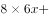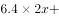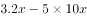，解得，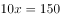，即一共购入150斤蔬菜。

故正确答案为B。

---

### 第 2 题　qid 2365986 · 数学运算

甲乙两仓库分别有粮食45吨和122吨，现甲仓库第一天运入3吨，往后每天运入的吨数比前一天多2吨，乙仓库每天运出2吨，则至少多少天后甲仓库的粮食比乙仓库多？

- **A**. 6
- **B**. 7
- **C**. 8　✅
- **D**. 9

**答案**：C

**官方解析**

设天后甲仓库的粮食比乙仓库多，根据等差数列求和公式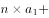，可列式如下：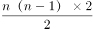，化简为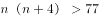。问至少从最小开始代入，代入A项，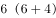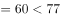，排除；代入B项，，排除；代入C项，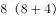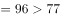，符合题意，无需验证D项。

故正确答案为C。

---

### 第 3 题　qid 2365987 · 数学运算

某足球比赛售出40元、80元、120元门票共2000张，其中80元的门票数是120元的门票数的2倍，比赛门票收入共12万元。则40元门票售出多少张？

- **A**. 1000
- **B**. 1150
- **C**. 1200
- **D**. 1250　✅

**答案**：D

**官方解析**

设120元门票售出张，则80元门票售出张，40元门票售出张，可列方程：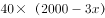，解得，，即40元门票售出1250张。

故正确答案为D。

---

### 第 4 题　qid 2365988 · 数学运算

甲超市某次抽奖活动仅限于情侣参加。活动规则如下：白、蓝、红三色小球分别有4个、3个和2个，情侣两人先后从9个小球中拿1个（每次取出小球后不放回），都拿白球为三等奖，都拿到蓝球为二等奖，都拿到红球为一等奖，其他情形不获奖。则每对情侣一次参加活动中奖的概率为：

- **A**. 

　✅
- **B**. 

- **C**. 

- **D**. 

**答案**：A

**官方解析**

根据题意可知，两人先后均取出白球可获得三等奖，概率为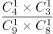，均取出蓝球可获得二等奖，概率为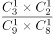，均取出红球可获得一等奖，概率为。则获奖概率为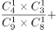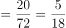。

故正确答案为A。

---

### 第 5 题　qid 2365989 · 数学运算

有一块三角形菜地如下图，现计划将其分为四块区域种植不同蔬菜，如果，，三角形和三角形的面积之差为10平方米，则三角形的面积为：

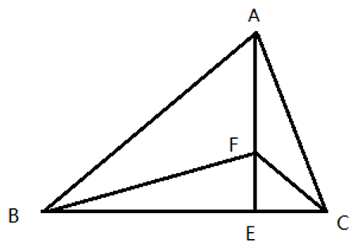

- **A**. 100平方米
- **B**. 120平方米　✅
- **C**. 140平方米
- **D**. 150平方米

**答案**：B

**官方解析**

因，和此条边上对应的高相等，则，同理， ，可知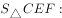，，整理得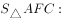。由题干三角形和三角形的面积之差为10平方米，可知平方米，平方米，则平方米，平方米，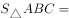平方米。

故正确答案为B。

---

### 第 6 题　qid 2365990 · 数学运算

某商场会员全年购买该商场商品可享8折优惠，近日该商场举行店庆优惠活动。全场商品满199元减50元，满399元减100元，满599元减200元，会员优惠和店庆优惠每次只能享受一项。活动期间会员小兴分三次购买了价值260元、480元、640元商品各一件，则小兴最少需支付：

- **A**. 1024元
- **B**. 1026元
- **C**. 1028元　✅
- **D**. 1030元

**答案**：C

**官方解析**

想要支付的钱数最少，需选择最优惠的活动。260元的商品打八折为元，参加满减为元，应选择8折优惠；480元的商品打八折为元，参加满减为元，应选择满减优惠；640元的商品打八折为元，参加满减为元，应选择满减优惠。则最少需支付元。

故正确答案为C。

---

### 第 7 题　qid 2365991 · 数学运算

某工厂加工零件，每个零件有正反两面，每台机床每次能同时加工两个零件，每次只能加工零件的一面，加工一次需要1.5分钟，则每台机床加工9个零件最少需要多少时间？

- **A**. 13.5分钟　✅
- **B**. 14分钟
- **C**. 14.5分钟
- **D**. 15分钟

**答案**：A

**官方解析**

方法一：每次可以加工2面，耗时1.5分钟。9个零件共有面，至少需要加工次，至少耗时分钟。

方法二：本题也可以枚举出所有情况，第1次至第6次分别加工前6个零件的正反两面，第7次加工第7个零件的正面和第8个零件的正面，第8次加工第7个零件的反面和第9个零件的正面，第9次加工第8个零件的反面和第9个零件的反面，一共9次，至少用时分钟。

故正确答案为A。

---

### 第 8 题　qid 2365992 · 数学运算

吕某回乡开办土鸡养殖基地，某天他收获一筐土鸡蛋。每4个一组取出则多2个；每5个一组取出则少1个；每6个一组取出则刚好；每7个一组取出多1个。已知一筐最多能装500个土鸡蛋，如果每6个一组取出，需要多少次刚好取完？

- **A**. 67
- **B**. 69　✅
- **C**. 70
- **D**. 72

**答案**：B

**官方解析**

由题意可知，土鸡蛋每5个一组取出少1个，所以土鸡蛋数量加1是5的倍数。直接代入选项，，得到的结果分别为403、415、421、433，只有415是5的倍数，故土鸡蛋总数为414个，需要取69次。

故正确答案为B。

---

### 第 9 题　qid 2365993 · 数学运算

因电路改造，电力公司计划未来十天对某小区选择三天停电，要求不能连续两天停电，则共有多少种停电方案？

- **A**. 35
- **B**. 56　✅
- **C**. 84
- **D**. 120

**答案**：B

**官方解析**

10天里面，7天正常供电，3天停电，要求不能连续2天停电，考虑插空法。7天的排布共有8个空，将停电的3天分别插入8个空，则有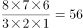种停电方案。

故正确答案为B。

---

### 第 10 题　qid 2365994 · 数学运算

甲、乙、丙三人分别骑自行车同时同地沿同一公路追赶前面的骑车人丁。甲、乙、丙分别用了6分钟、10分钟、15分钟追赶上丁。已知甲每分钟行0.4千米，乙每分钟行0.3千米，则丙每分钟行多少千米？

- **A**. 0.24
- **B**. 0.25　✅
- **C**. 0.26
- **D**. 0.27

**答案**：B

**官方解析**

由题意可知，甲、乙、丙分别跟丁做追及运动。设甲、乙、丙和丁的追及距离为，丁的速度为每分钟行千米。根据追及公式，甲和丁可得方程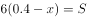 ，乙和丁可得方程，联立方程组解得，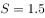。设丙每分钟行千米，单独考虑丙和丁，代入追及公式可得，解得。

故正确答案为B。

---

## 判断推理

### 第 1 题　qid 2365995 · 图形推理

请将下面六个图形分为两类，使每一类图形都有各自的共同特征或规律，分类正确的一项是：

 

- **A**. ①②⑤，③④⑥
- **B**. ①④⑤，②③⑥
- **C**. ①③⑥，②④⑤　✅
- **D**. ①②③，④⑤⑥

**答案**：C

**官方解析**

元素组成不同，优先考虑属性规律。图2出现等腰三角形，可优先考虑对称性，图①③⑥是既轴对称又中心对称图形，图②④⑤为轴对称图形，故图①③⑥一组，图②④⑤一组。
故正确答案为C。

---

### 第 2 题　qid 2365996 · 图形推理

从下列所给四个选项中选择最合适的一个填入问号处，使之呈现一定的规律性。

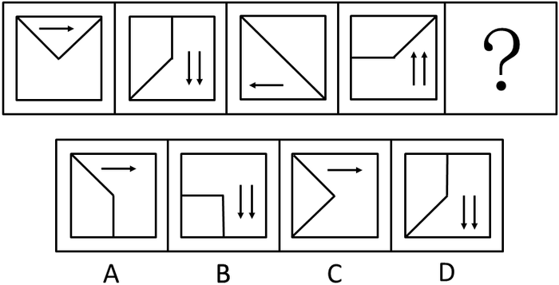 

- **A**. A
- **B**. B
- **C**. C　✅
- **D**. D

**答案**：C

**官方解析**

观察题干图形，每幅图的正方形的内部均由2条线段，及若干箭头构成，考虑位置规律。将题干中的线段进行标号，线段1每次逆时针旋转，线段2每次逆时针旋转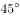，到？处线段1旋转至左上角，线段2旋转至左下角，对应C项。且题干中的箭头数量为1，2，1，2，箭头的指向为右，下，左，上，所以问号处箭头的数量为1，且方向指向右边，对应答案也为C项。

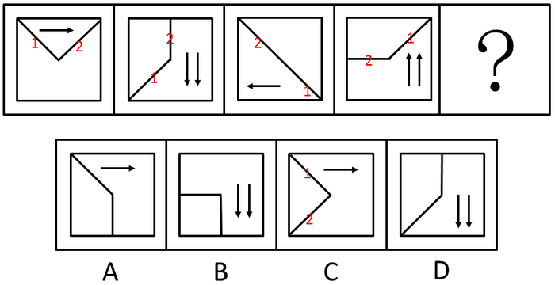

 故正确答案为C。 

---

### 第 3 题　qid 2365997 · 图形推理

从下列所给四个选项中选择最合适的一个填入问号处，使之呈现一定的规律性。

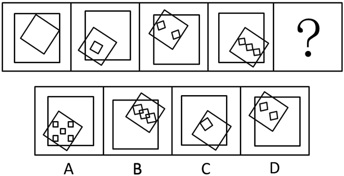 

- **A**. A
- **B**. B　✅
- **C**. C
- **D**. D

**答案**：B

**官方解析**

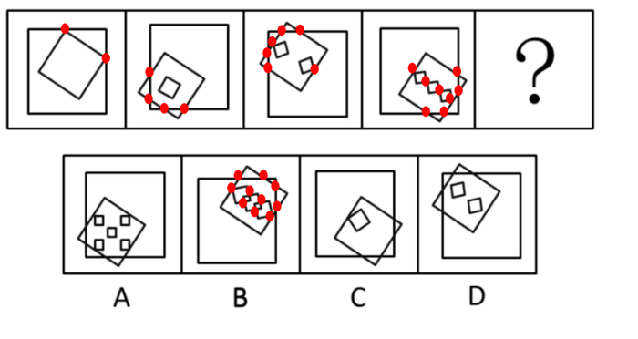

观察题干图形，每幅图均由一个大正方形，一个中正方形，若干个小正方形组成。小正方形的数量依次为0、1、2、3、？，有规律但无对应选项。再次观察发现，每个图形中的正方形都产生了相交，考虑数正方形与正方形相交产生的交点个数（无需数正方形本身的顶点）， 图1有2个交点，图2有4个交点，图3有6个，图4有8个，？处应该有10个交点，对应B项。

故正确答案为B。

---

### 第 4 题　qid 2365998 · 定义判断

研究表明，城市化率越高，消费需求就越多元化，消费时间就越长；发达城市人群以上的消费发生在夜间。据此，经济学界提出了“夜间经济”概念，即一种基于时段划分的商业形态，指从每日下午6点到次日凌晨6点所发生的三产服务业方面的商业活动，包括购物、餐饮、旅游、娱乐等。

根据上述定义，以下属于夜间经济打造项目的是：

- **A**. H市计划打造9条特色商业示范街区，并在街区内培育100家连锁品牌商业企业
- **B**. N市今年的施政议题之一是让城市夜晚亮起来，人气聚起来，市民夜生活火起来
- **C**. M拟于今年年底前建成4个能满足市民和国内外游客多元消费需求的地标型夜市　✅
- **D**. S市围绕三处名胜古迹建设三条商业步行街，方便所有人昼夜购物、进餐、娱乐

**答案**：C

**官方解析**

第一步：找出定义关键词。
“从每日下午6点到次日凌晨6点所发生的三产服务业方面的商业活动”、“购物、餐饮、旅游、娱乐”等。
第二步：逐一分析选项。
A项：H市计划打造9条特色商业示范街区，培育100家连锁品牌商业企业，没有提及具体的营业时间，不明确是否为“从每日下午6点到次日凌晨6点所发生的商业活动”，不符合定义，排除； 
B项：让城市夜晚亮起来，人气聚起来，市民夜生活火起来，市民的夜生活可以是多样的，比如健身、广场舞等休闲活动等，不一定会有商业行为，不符合“从每日下午6点到次日凌晨6点所发生的三产服务业方面的商业活动”，不符合定义，排除；
C项：满足市民和国内外游客多元消费需求的地标型夜市，夜市就是夜间做买卖的市场，符合“从每日下午6点到次日凌晨6点所发生的商业活动”符合定义，当选；
D项：方便所有人昼夜购物、进餐、娱乐，昼夜购物，说明不仅夜间有活动，而且白天也有活动，不符合“从每日下午6点到次日凌晨6点所发生的三产服务业方面的商业活动”，不符合定义，排除。
故正确答案为C。

---

### 第 5 题　qid 2365999 · 定义判断

近几年，大学生“慢就业”渐渐成为一种现象。慢就业是指一些大学生毕业后既不打算马上就业也不打算继续深造，而是暂时选择游学、支教、备考、社区服务、在家陪父母或者创业考察等，慢慢考虑人生道路的现象。
根据上述定义，以下各位应届大学毕业生中哪位选择的不是慢就业？

- **A**. 张毅已开始北上广深游，打算边考察边学习边思考未来发展方向
- **B**. 李明正积极备考选调生、公务员和事业单位，直到考上一个为止
- **C**. 王莉在社区做义工，拟做到暑假结束，再去办理研究生入学手续　✅
- **D**. 赵芳一直找不到理想工作，决定先在家陪陪父母，等待合适机会

**答案**：C

**官方解析**

第一步：找出定义关键词。
“大学生毕业后既不打算马上就业也不打算继续深造”、“暂时选择游学、支教、备考、社区服务、在家陪父母或者创业考察等”。
第二步：逐一分析选项。
A项：张毅开始北上广深游，打算边考察边学习边思考未来发展方向，说明张毅毕业后没有就业和深造的打算，选择了“游学”，符合定义，排除； 
B项：李明积极备考选调生、公务员和事业单位，直到考上为止，符合“大学生毕业后既不打算马上就业也不打算继续深造”，而是备考公务员，符合“暂时选择备考”，符合定义，排除；
C项：王莉在社区做义工，做到暑假结束，再去办理研究生入学手续，说明王莉选择了“继续深造”，不符合“大学生毕业后既不打算马上就业也不打算继续深造”，不符合定义，当选；
D项：赵芳一直找不到理想工作，决定先在家陪陪父母，等待合适机会，说明赵芳毕业后没有马上找工作，符合“大学生毕业后既不打算马上就业也不打算继续深造”、“暂时选择在家陪父母”，符合定义，排除。
本题为选非题，故正确答案为C。

---

### 第 6 题　qid 2366000 · 定义判断

“C位”是2018年度十大网络用语之一。其中“C”有多种解释，最普遍的一种认为是英文单词center的缩写，是中央、中心的意思。“C位”一般指舞台中央或艺人在宣传海报的中间位置，现被引申为各种场合中最重要、最核心和最受关注的位置。
根据上述定义，以下哪项表述没有涉及C位？

- **A**. 专家合影时，德高望重的M院士坐在中间位置
- **B**. 上海中心大厦高632米位于上海市东部功能区　✅
- **C**. 腾讯、阿里巴巴、百度是中国互联网核心企业
- **D**. B院士是我国量子通信研究领域的首席科学家

**答案**：B

**官方解析**

第一步：找出定义关键词。
“各种场合中最重要、最核心和最受关注的位置”。
第二步：逐一分析选项。
A项：德高望重的M院士坐在中间位置，符合“最重要、最核心和最受关注的位置”，符合定义，排除；
B项：“上海中心大厦”只是大厦的名字，位于上海市东部功能区，未体现“最重要、最核心和最受关注的位置”，不符合定义，当选；
C项：中国互联网核心企业，符合“最重要、最核心和最受关注的位置”，符合定义，排除；
D项：首席科学家，符合“最重要、最核心和最受关注的位置”，符合定义，排除。
本题为选非题，故正确答案为B。

---

### 第 7 题　qid 2366001 · 定义判断

随意后注意是注意的一种，是指一种自觉的、有预定目的的、不需要意志努力的注意。
根据上述定义，下列属于随意后注意的是：

- **A**. 小明为买到某歌手的演唱会门票，熬夜关注网上售票信息
- **B**. 小红因故上课迟到了，在进门的时候，全班的人都看着她
- **C**. 小华不知不觉中被“夕阳西下，小桥流水”的美景所吸引
- **D**. 小亮在掌握了文言文知识后，主动开始欣赏古典文学名著　✅

**答案**：D

**官方解析**

第一步：找出定义关键词。
“自觉的、有预定目的的、不需要意志努力的”。
第二步：逐一分析选项。
A项：熬夜关注网上售票信息，不符合“不需要意志努力的”，不符合定义，排除；
B项：在进门的时候，全班的人都看着她，不符合“自觉的、有预定目的”，不符合定义，排除；
C项：不知不觉中被“夕阳西下，小桥流水”的美景所吸引，不符合“自觉的、有预定目的的”，不符合定义，排除；
D项：小亮主动开始欣赏古典文学名著，符合“自觉的、有预定目的的”，且在掌握文言文知识的基础上欣赏古典文学名著是相对容易的，符合“不需要意志努力的”，符合定义，当选。
故正确答案为D。

---

### 第 8 题　qid 2366002 · 定义判断

所谓手段善，也可以称之为“结果善”，它表现为手段自身为恶，而结果通常为善，并且结果的善与自身的恶相减，净余额为善。
依据上述定义，以下不属于手段善的是：

- **A**. 大风预警　✅
- **B**. 外科手术
- **C**. 冬季冬泳
- **D**. 断尾求生

**答案**：A

**官方解析**

第一步：找出定义关键词。
“手段自身为恶，而结果通常为善”、“结果的善与自身的恶相减，净余额为善”。
第二步：逐一分析选项。
A项：“大风预警”指气象部门通过气象监测在大风到来之前做出预警，未体现“手段自身为恶”，不符合定义，当选；
B项：“手术”指医生用医疗器械对病人身体进行的切除、缝合等治疗，体现了“手段自身为恶”，且手术之后一般会达到比较好的效果，体现了“结果通常为善”，符合定义，排除；
C项：“冬季冬泳”对人体会产生强烈刺激，体现了“手段自身为恶”，且冬季冬泳有一定的好处，体现了“结果通常为善”，符合定义，排除；
D项：“断尾”指壁虎、蜥蜴等动物被天敌咬住尾巴或遭遇危险的时候，往往会自断尾巴，体现了“手段自身为恶”，“断尾”吸引敌人的注意，乘机逃跑而得以逃生，体现了“结果通常为善”，符合定义，排除。
本题为选非题，故正确答案为A。

---

### 第 9 题　qid 2366003 · 类比推理

卫星：月亮：皎洁

- **A**. 行星：太阳：温暖
- **B**. 柿子：水果：香甜
- **C**. 家具：书桌：学习
- **D**. 动物：乌龟：缓慢　✅

**答案**：D

**官方解析**

第一步：判断题干词语间逻辑关系。
月亮是卫星，二者是种属关系；皎洁是月亮的属性，二者是属性的对应关系。
第二步：判断选项词语间逻辑关系。
A项：太阳是恒星，不是行星，二者不是种属关系，与题干逻辑关系不一致，排除；
B项：柿子是水果，二者是种属关系，但词语顺序与题干相反，与题干逻辑关系不一致，排除；
C项：书桌是家具，二者是种属关系，书桌是供人伏案学习的，学习不是书桌的属性，与题干逻辑关系不一致，排除；
D项：乌龟是动物，二者是种属关系；缓慢是乌龟的属性，二者是属性的对应关系，与题干逻辑关系一致，当选。
故正确答案为D。

---

### 第 10 题　qid 2366004 · 类比推理

青蛙：水蛇：变温动物

- **A**. 鳄鱼：蜥蜴：爬行动物　✅
- **B**. 海豚：企鹅：海洋动物
- **C**. 海龟：鲸鱼：两栖动物
- **D**. 羚羊：狮子：草原动物

**答案**：A

**官方解析**

第一步：判断题干词语间逻辑关系。
青蛙和水蛇是两种不同的动物，二者是并列关系中的反对关系；青蛙和水蛇都是变温动物，二者均与第三个词构成种属关系，且变温是青蛙和水蛇具有的属性。
第二步：判断选项词语间逻辑关系。
A项：鳄鱼和蜥蜴是两种不同的动物，二者是并列关系中的反对关系；鳄鱼和蜥蜴都是爬行动物，二者均与第三个词构成种属关系，且爬行是鳄鱼和蜥蜴具有的属性，与题干逻辑关系一致，当选；
B项：海豚和企鹅是两种不同的动物，二者是并列关系中的反对关系；但海洋是海豚和企鹅生活的场所而非属性，与题干逻辑关系不一致，排除；
C项：海龟和鲸鱼是两种不同的动物，二者是并列关系中的反对关系；但海龟和鲸鱼都不是两栖动物，与题干逻辑关系不一致，排除；
D项：羚羊和狮子是两种不同的动物，二者是并列关系中的反对关系；但草原是羚羊和狮子生活的场所而非属性，与题干逻辑关系不一致，排除。
故正确答案为A。
注：本题为争议题，有同学选D项，理由如下：青蛙和水蛇都属于变温动物，为种属关系，且水蛇是青蛙的天敌；而D项羚羊和狮子都是草原动物，为种属关系，且狮子是羚羊的天敌。其它选项均不符合。
以上两种思路都各有道理，由于本题存在争议，建议考生不必过分纠结，重点学习解题思路即可。

---

### 第 11 题　qid 2366005 · 类比推理

相信：坚信：质疑

- **A**. 希望：盼望：奢望
- **B**. 报道：报告：封杀
- **C**. 微词：批判：赞扬　✅
- **D**. 诚恳：诚信：伪装

**答案**：C

**官方解析**

第一步：判断题干词语间逻辑关系。
“相信”和“坚信”是近义关系，二者和“质疑”是反义关系。
第二步：判断选项词语间逻辑关系。
A项：“希望”和“盼望”是近义关系，但“希望”和“奢望”不是反义关系，与题干逻辑关系不一致，排除；
B项：“报道”、“报告”和“封杀”之间没有关系，与题干逻辑关系不一致，排除；
C项：“微词”指隐含批评和不满的话语，和“批判”是近义关系，二者和“赞扬”是反义关系，与题干逻辑关系一致，当选；
D项：“诚恳”指人的态度不虚伪，“诚信”泛指待人处事真诚、老实、讲信用等，二者不是近义关系，与题干逻辑关系不一致，排除。
故正确答案为C。

---

### 第 12 题　qid 2366006 · 类比推理

下单：付款：送货

- **A**. 寄件：收件：派件
- **B**. 撰稿：改稿：投稿
- **C**. 耕地：施肥：播种
- **D**. 复习：考试：阅卷　✅

**答案**：D

**官方解析**

第一步：判断题干词语间逻辑关系。
先“下单”，其次“付款”，然后被“送货”，共涉及两个主体。
第二步：判断选项词语间逻辑关系。
A项：先“寄件”，其次“收件”，然后“派件”，先后顺序正确，但是共涉及三个主体，与题干逻辑关系不一致，排除；
B项：先“撰稿”，其次“改稿”，然后“投稿”，先后顺序正确，但共涉及一个主体，与题干逻辑关系不一致，排除；
C项：先“耕地”，“施肥”和“播种”没有严格的先后顺序，并且共涉及一个主体，与题干逻辑关系不一致，排除；
D项：先“复习”，其次“考试”，最后“阅卷”，共涉及两个主体，与题干逻辑关系一致，当选。
故正确答案为D。

---

### 第 13 题　qid 2366007 · 类比推理

青年：村官：基层锻炼

- **A**. 党史：国史：史海耕耘
- **B**. 工人：农民：财富创造
- **C**. 学者：儒商：市场打拼　✅
- **D**. 巾帼：须眉：同台竞技

**答案**：C

**官方解析**

第一步：判断题干词语间逻辑关系。
有的青年是村官，有的村官是青年，有的青年不是村官，有的村官不是青年，“青年”和“村官”是交叉关系；“村官”在“基层锻炼”，二者是对应关系。
第二步：判断选项词语间逻辑关系。
A项：“党史”是党派自成立以来的发展过程，“国史”是一国或一个朝代的历史，二者是并列关系，与题干逻辑关系不一致，排除；
B项：“工人”和“农民”是不同的职业，二者是并列关系，与题干逻辑关系不一致，排除；
C项：“儒商”是儒与商的结合体，既有儒者的道德和才智，又有商人的财富与成功，“学者”指的是具有一定学识水平、能在相关领域表达思想、提出见解的人，有的学者是儒商，有的儒商是学者，有的学者不是儒商，有的儒商不是学者，二者是交叉关系；“儒商”在“市场打拼”，二者是对应关系，与题干逻辑关系一致，当选；
D项：“巾帼”是对女子的代称，“须眉”是对男子的代称，二者是并列关系，与题干逻辑关系不一致，排除。
故正确答案为C。

---

### 第 14 题　qid 2366008 · 类比推理

望到青山：看见碧水：记住乡愁

- **A**. 产业兴旺：生态宜居：生活富裕
- **B**. 改善乡风：治理环境：建设乡村　✅
- **C**. 风土人情：方言俚语：田园牧歌
- **D**. 良好家风：淳朴民风：文明习俗

**答案**：B

**官方解析**

第一步：判断题干词语间逻辑关系。
“望到青山”、“看见碧水”和“记住乡愁”均为动宾结构。
第二步：判断选项词语间逻辑关系。
A项：“产业兴旺”、“生态宜居”和“生活富裕”均为主谓结构，与题干逻辑关系不一致，排除；
B项：“改善乡风”、“治理环境”和“建设乡村”均为动宾结构，与题干逻辑关系一致，当选；
C项：“风土人情”、“方言俚语”和“田园牧歌”均为名词并列短语，与题干逻辑关系不一致，排除；
D项：“良好家风”、“淳朴民风”和“文明习俗”均为形容词加名词构成的偏正短语，与题干逻辑关系不一致，排除。
故正确答案为B。

---

### 第 15 题　qid 2366009 · 逻辑判断

《自然》期刊发表的一项新研究表明，基因改造过的猪心脏，在被同位移植到狒狒体内后，保持完整功能地跳动了195天。这预示着未来人类也能受益于此，可以解决人类器官供应短缺的棘手问题。
以下哪项如果为真，最能支持上述结论？

- **A**. 猪心脏与人的心脏在解剖学结构上非常相似　✅
- **B**. 猪心脏移植到狒狒身上具有非常高的生存率
- **C**. 猪心脏异种移植距离实验成功仅仅一步之遥
- **D**. 猪心脏可以在人类以外的灵长动物体内存活

**答案**：A

**官方解析**

第一步：找出论点和论据。
论点：这预示着未来人类也能受益于此，可以解决人类器官供应短缺的棘手问题。
论据：基因改造过的猪心脏，在被同位移植到狒狒体内后，保持完整功能地跳动了195天。
本题是通过论据的一个动物实验得到论点中人类的情况。如果要支持论点，需要在动物实验和人类之间进行搭桥，需要补充从这个动物实验得出人类可以因此受益的理由。
第二步：逐一分析选项。
A项：说明猪心脏和人的心脏在解剖学结构上非常相似，所以通过猪心脏成功被移植并成活的实验，可以得到人类也能受益于此，在论点和论据之间进行搭桥，可以加强，当选；
B项：说明猪心脏移植到狒狒身上具有非常高的生存率，和论点讨论的此实验是否对人类未来有益无关，话题不一致，无法加强，排除；
C项：说明猪心脏异种移植距离实验成功仅仅一步之遥，但这个实验成功与否，和论点讨论的人类是否会因此受益无关，话题不一致，无法加强，排除；
D项：猪心脏是否可以在人类以外的灵长类动物体内存活，和论点讨论的人类是否会因此受益无关，话题不一致，无法加强，排除。
故正确答案为A。

---

### 第 16 题　qid 2366010 · 逻辑判断

一项长达20年的研究表明，爱做家务的求职者比不爱做家务的求职者更容易成功就业，就业后的收入前者也比后者高。此外，爱做家务的求职者比不爱做家务的求职者生活幸福感更高。通过做家务，求职者能养成合理规划的习惯和不骄不躁的品质。从这个角度看，做家务有助于培养更多的社会精英。

下列哪项如果为真，最能够加强上述论证？

- **A**. 养成合理规划和不骄不躁的习惯为求职者所必需
- **B**. 非常多的求职者都在被他们父母积极鼓励做家务
- **C**. 合理规划和保持不骄不躁是社会精英的必备品质　✅
- **D**. 做家务可以提升求职者的规划能力和生活幸福感

**答案**：C

**官方解析**

第一步：找出论点和论据。
论点：做家务有助于培养更多的社会精英。
论据：爱做家务的求职者比不爱做家务的求职者更容易成功就业，就业后的收入高，生活幸福感更高。通过做家务，求职者能养成合理规划的习惯和不骄不躁的品质。
本题论据告知了爱做家务使求职者养成合理规划的习惯和不骄不躁的品质，论点是做家务有助于培养社会精英。要想加强论证，应说明合理规划的习惯和不骄不躁的品质和成为社会精英有关联。
第二步：逐一分析选项。
A项：合理规划和不骄不躁的习惯为求职者所必需，说的是求职者应具备的条件，与论点中说的社会精英无关，无关项，排除；
B项：求职者被父母积极鼓励做家务，与论点中说的社会精英无关，无关项，无法加强，排除；
C项：合理规划和保持不骄不躁是社会精英的必备品质，论据表明做家务，求职者能养成合理规划的习惯和不骄不躁的品质，选项在论据和论点中搭桥，可以加强，当选；
D项：做家务可以提升求职者的规划能力和生活幸福感，重复论据观点，与论点社会精英无关，无法加强，排除。
故正确答案为C。

---

### 第 17 题　qid 2366011 · 逻辑判断

A单位的一项实证调查指出，应当对单位内不断上升的差旅费用采取措施。这项实证调查的理由是，单位内人均差旅费用，每天高达52元。而在同等人数规模的B单位里，其人均差旅费则都在20元以内。
下列哪项如果为真，最能构成对上述论点的驳斥？

- **A**. 据其他调查，A单位人均差旅费用实际为每天35元
- **B**. 实际上很难找到人均差旅费像B单位那么低的机构
- **C**. A单位的差旅费用和B单位的差旅费用标准完全不同　✅
- **D**. 对A单位不断上升的差旅费采取措施可能会不得人心

**答案**：C

**官方解析**

第一步：找出论点和论据。
论点：应对A单位的差旅费用采取措施。
论据：A单位人均差旅费用每天高达52元，同等人数规模的B单位里，其人均差旅费则都在20元以内。
本题根据A单位和B单位人均差旅费不同而决定对A单位的差旅费用采取措施，论点论据话题不一致。削弱题，可以优先考虑拆桥，即说明通过人均差旅费用不同，不能得出应对A单位的差旅费用采取措施。
第二步：逐一分析选项。
A项：A单位人均差旅费用实际为每天35元，仍比B单位人均差旅费则都在20元以内要高，无法削弱，排除；
B项：很难找到人均差旅费像B单位那么低的机构，只能说明B单位差旅费低，但是A单位是否应该采取措施未知，无法削弱，排除；
C项：A单位的差旅费用和B单位的差旅费用标准完全不同，说明A单位和B单位标准不同，A单位和B单位没有比较的必要，不能通过两个单位人均差旅费用不同，得出应对A单位的差旅费用采取措施，拆桥项，可以削弱，当选；
D项：A单位不断上升的差旅费采取措施可能会不得人心，是否得人心和是否需要对差旅费采取措施无关，无关项，无法削弱，排除。
故正确答案为C。

---

### 第 18 题　qid 2366012 · 逻辑判断

一位地铁安检员声称，他通过长期的地铁安检工作养成了一种特殊技能。即，他能够准确地识别一位乘客是否在欺骗他。他的根据是，在地铁安检入口检查时，他只需要与乘客进行短短的几句对话就能断定对方是否可疑；而在他认为可疑的乘客身上，无一例外地都查出了违禁物品。
下列哪项如果为真，最能削弱上述地铁安检员的论证？

- **A**. 在他认为不可疑而未经检查的乘客中有人无意地携带了违禁物品
- **B**. 在他认为可疑而进行检查的乘客中大部分有意地携带了违禁物品
- **C**. 在他认为可疑并查出违禁物品的乘客中有人无意地携带违禁物品　✅
- **D**. 在他认为不可疑而未经检查的乘客中大部分都没有携带违禁物品

**答案**：C

**官方解析**

第一步:：找出论点和论据。

论点：该地铁安检员能够准确地识别一位乘客是否在欺骗他。
论据：该地铁安检员只需要与乘客进行短短的几句对话就能断定对方是否可疑；而在他认为可疑的乘客身上，无一例外地都查出了违禁物品。
本题通过地铁安检员可以判断乘客可疑，且可疑的乘客都查出来违禁物品，得出他能识别乘客是否在欺骗他，论点论据话题不一致。削弱题，可以优先考虑拆桥，即说明通过地铁安检员认为可疑的乘客都查出来违禁物品，无法得出这个乘客在欺骗他。
第二步：逐一分析选项。
A项：该地铁安检员认为不可疑而未经检查的乘客，则没有进行对话，不存在判定其是否欺骗，无法削弱，排除；
B项：该地铁安检员在他认为可疑而进行检查的乘客中大部分有意地携带了违禁物品，说明他认为可疑并进行对话的乘客有意携带并对他进行欺骗，说明安检员能够准确地识别一位乘客是否在欺骗他，加强选项，排除；
C项：该地铁安检员在他认为可疑而进行检查的乘客中有人无意地携带了违禁物品，说明他认为可疑并进行对话的乘客虽然查出来违禁物品，但是并没对他进行欺骗，因为乘客是无意的，说明论据不能得出论点，拆桥项，当选；
D项：该地铁安检员认为不可疑而未经检查的乘客，则没有进行对话，不存在判定其是否欺骗，无法削弱，排除。
故正确答案为C。

---

### 第 19 题　qid 2366013 · 逻辑判断

一项针对两组行政单位科级职员的调查发现，第一组职员在10周内户外活动的次数不少于7次；第二组职员则10周内户外活动的次数不多于3次。调查结果显示，第二组职员面临的工作压力大于第一组职员。因此，调查得出结论，科级职员户外活动次数少导致他们工作压力大。
下列哪项如果为真，最能对上述调查结论提出质疑？

- **A**. 第一组中有的职员感到自己的工作压力并不大
- **B**. 第一组中有职员工作压力比第二组的职员还高
- **C**. 第二组中有一些职员的工作压力并不是非常大
- **D**. 第二组职员因工作压力大导致户外活动次数少　✅

**答案**：D

**官方解析**

第一步：找出论点和论据。
论点：科级职员户外活动次数少导致工作压力大。
论据：10周内户外活动的次数不多于3次的职员压力大于10周内户外活动的次数不少于7次的职员。
本题论点中存在因果关系，因为压力大，所以活动次数少。要想削弱论点，可以考虑因果倒置削弱方式。
第二步：逐一分析选项。
A项：有的职员感到自己的工作压力并不大，并不能代表该组的整体压力情况，无法削弱，排除；
B项：第一组中有职员工作压力比第二组的职员还高，不能说明一组二组的整体压力情况，无法削弱，排除；
C项：有一些职员的工作压力并不是非常大，并不能代表该组的整体压力情况，无法削弱，排除；
D项：第二组职员因工作压力大导致户外活动次数少，因果倒置削弱论点，当选。
故正确答案为D。

---

### 第 20 题　qid 2366014 · 逻辑判断

某地方政府计划削减财政预算，原计划削减。为此，计划撤销两个部门，这两个部门的预算正好占地方政府总预算的。计划实施后，上述两个部门被撤销，整个地方政府预算实际削减。在此过程中，地方政府各部门预算有所调整。

如果上述判定为真，则以下哪项一定为真？

①上述计划实施后，有的职能部门预算增加。

②上述计划实施后，没有一个职能部门预算增加额度超出地方政府原来总预算的。

③上述计划实施后，被削减的财政预算，都来自于被撤销的两个部门原有的预算。

- **A**. 只有①　✅
- **B**. 只有①和②
- **C**. 只有②和③
- **D**. 全部都为真

**答案**：A

**官方解析**

日常结论题，根据题干信息逐一分析选项。

①项：撤销占地方政府总预算的的两个部门后，预算实际削减，比原预算减少削减比例，说明有的部门预算增加，此项可以推出，为真；

②项：撤销占地方政府总预算的的两个部门后，预算实际削减，可知其余职能部门整体预算增加，但无法确定是否有个别职能部门预算增加额度超出地方政府原来总预算的，此项过于绝对，为假；

③项：撤销占地方政府总预算的的两个部门后，预算实际削减，可知其余职能部门整体预算增加，但无法确定其他部门的预算的具体变化，可能也存在个别增加或者削减的可能，此项过于绝对，为假。

故正确答案为A。

---

## 资料分析

### 材料 1

        自改革开放以来，外商在华投资势头良好。今年两会期间，《中华人民共和国外商投资法（草案）》成为重要议题。2018年，外商直接在华投资（非金融类）新设立企业60533家。外商直接在华投资金额8856亿元，折1350亿美元。其中“一带一路”沿线国家对华直接投资新设立企业4479家，对华直接投资424亿元。全年高技术制造业实际使用外资（非金融类）898亿元，增长。

        2018年，我国对外非金融类直接投资7974亿元，同比下降，其中对“一带一路”沿线国家非金融类直接投资156亿美元，同比增长。

#### 第 1 题　qid 2366015 · 综合

2018年，在非金融领域，我国对外直接投资额和外商在华直接投资额之比约为：

- **A**. 10：9
- **B**. 9：10　✅
- **C**. 9：8
- **D**. 8：9

**答案**：B

**官方解析**

根据题干“2018年······之比”，结合材料给出2018年数据，可判定本题为比值计算问题。定位文字材料第二段可知：2018年我国对外非金融类直接投资7974亿元，定位文字材料第一段可知：外商在华投资金额为8856亿元，两者之比约为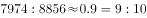。

故正确答案为B。

---

#### 第 2 题　qid 2366016 · 平均数

2018年，外商直接在华投资（非金融类）新设企业的平均投资额（单位：万元）在以下哪个区间内？

- **A**. （1450，1500）　✅
- **B**. （1500，1550）
- **C**. （1600，1650）
- **D**. （1650，1700）

**答案**：A

**官方解析**

根据题干“2018年······平均投资额”，可判定本题为现期平均数计算问题。定位文字材料第一段，2018年外商直接在华投资金额为8856亿元，新设立企业60533家，则平均投资额，在1450万元至1500万元区间。

故正确答案为A。

---

#### 第 3 题　qid 2366017 · 综合

下列行业中，2018年我国对外非金融类直接投资额与外商在华投资额差值最大的是：

- **A**. 批发和零售业
- **B**. 电力、热力、燃气及水生产和供应业
- **C**. 租赁和商务服务业　✅
- **D**. 交通运输、仓储和邮政业

**答案**：C

**官方解析**

定位统计表，分别计算四个选项的投资差值。由于单位不同，先进行单位换算，根据材料文字“外商直接在华投资金额8856亿元，折1350亿美元”，可知1美元元

A项：批发和零售业为亿元；

B项：电力、热力、燃气及水生产和供应业为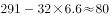亿元；

C项：租赁和商务服务业为亿元；

D项：交通运输、仓储和邮政业为亿元。

租赁和商务服务业的投资额差值最大。

故正确答案为C。

---

#### 第 4 题　qid 2366018 · 增长

将下列行业中2018年外商直接在华非金融类投资额按增幅从大到小排序，正确的是：

- **A**. 农林牧渔业＞电力、热力、燃气及水生产和供应业＞批发和零售业
- **B**. 房地产业＞电力、热力、燃气及水生产和供应业＞制造业　✅
- **C**. 信息传输、软件和信息技术服务业＞房地产业＞制造业
- **D**. 农林牧渔业＞批发和零售业＞交通运输、仓储和邮政业

**答案**：B

**官方解析**

定位第一个统计表可知，2018年外商直接在华非金融类投资额增速分别为：

A项：农林牧渔业（）、电力、热力、燃气及水生产和供应业（）、批发和零售业（）；

B项：房地产业（）、电力、热力、燃气及水生产和供应业（）、制造业（）；

C项：信息传输、软件和信息技术服务业（）、房地产业（）、制造业（）；

D项：农林牧渔业（）、批发和零售业（）、交通运输、仓储和邮政业（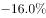）。

按照从大到小排序，只有B选项满足题意。

故正确答案为B。

---

#### 第 5 题　qid 2366019 · 综合

下列说法正确的是：

- **A**. 2018年，外商直接在华投资（非金融类）新设交通运输、仓储和邮政企业同比增量大于房地产企业
- **B**. 2018年我国对外非金融类直接投资额中，对“一带一路”沿线国家投资额占比达两成
- **C**. 2018年，我国对外投资（非金融类）领域，投资额总体增速低于建筑业投资额增速　✅
- **D**. 2017年，我国高技术制造业实际使用外资（非金融类）额超过700亿元

**答案**：C

**官方解析**

A项：定位表1，可知：2018年外商直接在华投资（非金融类）新设交通运输、仓储和邮政企业数为754，增长率为，2018年外商直接在华投资（非金融类）新设房地产企业数为1053，增长率为。那么2018年外商直接在华投资（非金融类）新设交通运输、仓储和邮政企业同比增量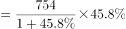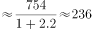，2018年外商直接在华投资（非金融类）房地产企业同比增量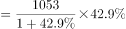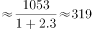，2018年，外商直接在华投资（非金融类）新设交通运输、仓储和邮政企业同比增量小于房地产企业，说法错误，排除；

B项：定位文字材料第二段，可知：2018年，我国对外非金融类直接投资7974亿元，······其中对“一带一路”沿线国家非金融类直接投资156亿美元,根据表2，2018年我国对外非金融类投资1213亿美元。因此2018年我国对外非金融类直接投资额中，对“一带一路”沿线国家投资额占比为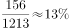，未达到两成（），说法错误，排除；

C项：定位表2，可知：2018年，我国对外投资（非金融类）领域，投资额总体增速为，建筑业同比增速为，，说法正确，当选；

D项：定位文字材料第一段，可知：2018年全年高技术制造业实际使用外资（非金融类）898亿元，增长。那么2017年，我国高技术制造业实际使用外资（非金融类）额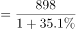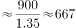亿元，未超过700亿元，说法错误，排除。

故正确答案为C。

---

### 材料 2

        2018年，我国软件和信息技术服务业运行态势良好，收入和效益增长较快，吸纳就业人数稳定增长。2018年，全国软件和信息技术服务业规模以上企业3.78万家，累计完成软件业务收入63061亿元，软件和信息技术服务业实现利润总额8079亿元，同比增长，从业人数比上年增加25万人。

#### 第 6 题　qid 2366020 · 增长

2013-2018年，我国软件和信息技术服务业人均创收额同比增速回落超过5个百分点的年度有：

- **A**. 3个
- **B**. 2个
- **C**. 1个　✅
- **D**. 0个

**答案**：C

**官方解析**

“回落”代表增长率减少，定位图2折线图，同比增速减少的只有2014年和2017年，2014年：个百分点，回落了5.5个百分点，符合；2017年：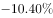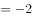个百分点，回落了2个百分点，排除。因此只有1个年度符合。

故正确答案为C。

---

#### 第 7 题　qid 2366021 · 综合

2017年，我国软件和信息技术服务业从业人员人数约为多少万人？

- **A**. 701
- **B**. 652
- **C**. 633
- **D**. 618　✅

**答案**：D

**官方解析**

根据问题“2017年，我国软件和信息技术服务业从业人员人数约为多少万人”，结合两个图形中的完成业务收入和人均创收额，可判断本题为现期平均数问题。定位图1，可知：2017年我国软件和信息技术服务业完成业务收入为55103亿元，定位图2，可知：2017年我国软件和信息技术服务业人均创收额89.22万元，那么2017年，我国软件和信息技术服务业从业人员人数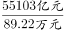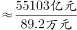。

故正确答案为D。

---

#### 第 8 题　qid 2366022 · 增长

2014-2018年，我国软件和信息技术服务业完成业务收入同比增速最接近的是：

- **A**. 2014年和2018年
- **B**. 2017年和2018年　✅
- **C**. 2015年和2016年
- **D**. 2016年和2017年

**答案**：B

**官方解析**

定位图1，时间段为2014～2018年，因没有直接给同比增速，需要进行计算之后再进行比较。

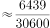；

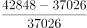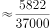；

；

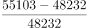；

。

通过以上数据可以发现，我国软件和信息技术服务业完成业务收入同比增速最接近的是2017年和2018年。

故正确答案为B。

---

#### 第 9 题　qid 2366023 · 增长

如果我国2019年要实现在2014年基础上软件和信息技术服务业业务收入翻番的目标，则2019年业务收入同比增速要达到约：

- **A**. 

　✅
- **B**. 

- **C**. 

- **D**. 

**答案**：A

**官方解析**

根据问题“2019年业务收入同比增速要达到约”，可判断为一般增长率问题。定位图1，根据“我国2019年要实现在2014年基础上软件和信息技术服务业业务收入翻番的目标”，可得2019年软件和信息技术服务业业务收入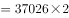（翻番指的是变为原来的2倍）亿元，则2019年业务收入同比增速要达到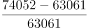，A选项最接近。

故正确答案为A。

---

#### 第 10 题　qid 2366024 · 综合

下列不能根据所给资料推出的是：

- **A**. 2015年，我国软件和信息技术服务业从业人员人数的同比增速
- **B**. 2015-2018年，我国软件和信息技术服务业完成业务收入年均增量
- **C**. 2013-2017年，我国软件和信息技术服务业人均创收额的年均增速
- **D**. 2012-2016年，我国软件和信息技术服务业年均完成业务收入额　✅

**答案**：D

**官方解析**

A项：定位图1，已知2015年、2014年的软件和信息技术服务业完成业务收入，定位图2，已知2015年、2014年的软件和信息技术服务业人均创收额，那么2015年我国软件和信息技术服务业从业人员人数的同比增速，可以推出，排除；

B项：定位图1，可知：2015年、2018年我国软件和信息技术服务业完成业务收入分别为42848亿元、63061亿元，那么年均增量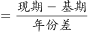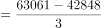，可以推出，排除；

C项：定位图2，可知：2013年、2017年我国软件和信息技术服务业人均创收额分别为65.05万元、89.22万元，由年均增长率公式，代入数据，，即，可以求出，排除；

D项：要求2012～2016年我国软件和信息技术服务业年均完成业务收入额，需要把2012～2016年的每个年份的收入额相加再除以5个年份。定位图1，没有给出也无法求出2012年我国软件和信息技术服务业完成业务收入额，无法推出，当选。

本题为选非题，故正确答案为D。

---
