# 2019年福建省选调生考试《行政职业能力测验》

> 选调生 · 2019 年 · 6 个模块 · 共 110 题

- [政治理论](#%E6%94%BF%E6%B2%BB%E7%90%86%E8%AE%BA) · 4 题
- [常识判断](#%E5%B8%B8%E8%AF%86%E5%88%A4%E6%96%AD) · 26 题
- [言语理解与表达](#%E8%A8%80%E8%AF%AD%E7%90%86%E8%A7%A3%E4%B8%8E%E8%A1%A8%E8%BE%BE) · 20 题
- [数量关系](#%E6%95%B0%E9%87%8F%E5%85%B3%E7%B3%BB) · 10 题
- [判断推理](#%E5%88%A4%E6%96%AD%E6%8E%A8%E7%90%86) · 30 题
- [资料分析](#%E8%B5%84%E6%96%99%E5%88%86%E6%9E%90) · 20 题

---

## 政治理论

### 第 1 题　qid 4706409 · 新思想

中国共产党第十九次全国代表大会，是在全面建成小康社会决胜阶段、中国特色社会主义进入新时代的关键时期召开的一次十分重要的大会。大会的主题是：不忘初心，牢记使命。则十九大的初心与使命是（    ）。

- **A**. 为中国人民谋幸福，为中华民族谋复兴　✅
- **B**. 决胜全面建成小康社会，夺取新时代中国特色社会主义伟大胜利
- **C**. 高举中国特色社会主义伟大旗帜，以中国特色社会主义理论为指导，解放思想，改革开放，凝聚力量，攻坚克难，坚定不移沿着中国特色社会主义道路前进，为全面建成小康社会而奋斗
- **D**. 决胜全面建成小康社会、开启全面建设社会主义现代化国家新征程、实现中华民族伟大复兴的中国梦

**答案**：A

**官方解析**

本题考查政治常识。
A项正确，B、C、D三项错误，习近平总书记《十九大报告》开头部分指出：“大会的主题是：不忘初心，牢记使命，高举中国特色社会主义伟大旗帜，决胜全面建成小康社会，夺取新时代中国特色社会主义伟大胜利，为实现中华民族伟大复兴的中国梦不懈奋斗······中国共产党人的初心和使命，就是为中国人民谋幸福，为中华民族谋复兴。这个初心和使命是激励中国共产党人不断前进的根本动力。”
故正确答案为A。

---

### 第 2 题　qid 4706350 · 马克思主义

习近平总书记2018年新年团拜会说道“芳林新叶催陈叶，流水前波让后波。”改革开放40年来，我们以敢闯敢干的勇气和自我革新的担当，闯出了一条新路、好路，实现了从“赶上时代”到“引领时代”的伟大跨越。下列选项中，和“芳林新叶催陈叶，流水前波让后波”所蕴含的哲理一致的是：

- **A**. 夕阳无限好，只是近黄昏
- **B**. 蝉噪林逾静，鸟鸣山更幽
- **C**. 野火烧不尽，春风吹又生　✅
- **D**. 挽弓当挽强，用箭当用长

**答案**：C

**官方解析**

本题考查政治常识。
“芳林新叶催陈叶，流水前波让后波”意思是芳林中新叶不断催换着旧叶，流水里前波总是让位给后波，体现的哲学原理是新事物是不可战胜的。
A项错误，“夕阳无限好，只是近黄昏”出自唐代李商隐的《登乐游原》，意思是虽然夕阳无限美好，可惜的是已接近黄昏时刻，体现了时间的一维性，即时间流逝一去不复返。
B项错误，“蝉噪林逾静，鸟鸣山更幽”出自南朝王籍的《入若耶溪》，意思是蝉声高唱，树林却显得格外宁静；鸟鸣声声，深山里倒比往常更清幽，体现了矛盾的同一性，即矛盾的对立面之间相互联结、相互吸引、相互渗透的倾向。
C项正确，“野火烧不尽，春风吹又生”出自唐代白居易的《赋得古原草送别》，意思是不管烈火怎样无情地焚烧，只要春风一吹，又是遍地青青的野草，体现的哲学原理是新事物是不可战胜的。
D项错误，“挽弓当挽强，用箭当用长”出自唐代杜甫的《前出塞》，意思是拉弓要拉最坚硬的，射箭要射最长的，体现的哲学原理是要抓住主要矛盾。主要矛盾是与其它矛盾相比较而言，处于支配地位，对事物发展起决定作用的矛盾。
故正确答案为C。

---

### 第 3 题　qid 4706351 · 马克思主义

2017年10月31日，习近平在瞻仰中共一大会址时重新强调：其作始也简，其将毕也必巨。以下哪句话蕴含的哲理与“其作始也简，其将毕也必巨”相近?（    ）

- **A**. 行者常至，为者常成
- **B**. 靡不有初，鲜克有终
- **C**. 勿以善小而不为，勿以恶小而为之　✅
- **D**. 行百里者半九十

**答案**：C

**官方解析**

本题考查政治常识。
“其作始也简，其将毕也必巨”出自《庄子》，意思是一个事物开始时单纯细微，临近结束时变得纷繁巨大。强调了量变质变中重视量的积累。
A项错误，“行者常至，为者常成”出自《晏子春秋·内篇杂下》，意思是不倦前行的人常常可以达到目的，努力去做的人常常可以成功。强调了认识论中实践的重要性。
B项错误，“靡不有初，鲜克有终”出自《诗经》，原意是指凡事不是没有好好开始，但很少有人有（或鲜有）好的结果，后借此语以讽谕持志不终的人，用以告诫人们为人做事要有头有尾、善始善终。强调了量变质变中要重视促成质的变化。
C项正确，“勿以善小而不为，勿以恶小而为之”意思是不要因为是件较小的善事就毫不关心，不要因为是件较小的坏事就去做。强调了量变质变中重视量的积累。
D项错误，“行百里者半九十”最早见于刘向《战国策》，原义是走一百里的路程走到九十里只能算走了一半，比喻做事越接近成功越困难，越要认真对待。强调了量变质变中要重视促成质的变化。
故正确答案为C。

---

### 第 4 题　qid 4706367 · 时事政治

2019年1月2日，国家主席习近平在纪念《告台湾同胞书》发表40周年的大会上指出台湾和大陆同属一个中国的事实从未改变，发展两岸关系的政治基础是（    ）。

- **A**. 一个中国原则　✅
- **B**. 一国两制方针
- **C**. 和平统一方式
- **D**. 民族复兴目标

**答案**：A

**官方解析**

本题考查政治常识。
A项正确，B、C、D三项错误。《告台湾同胞书》发表40周年纪念会于2019年1月2日上午10时在北京人民大会堂举行，中共中央总书记、国家主席、中央军委主席习近平出席纪念会并发表重要讲话。讲话中提到：“尽管海峡两岸尚未完全统一，但中国主权和领土从未分割，大陆和台湾同属一个中国的事实从未改变。一个中国原则是两岸关系的政治基础。坚持一个中国原则，两岸关系就能改善和发展，台湾同胞就能受益。背离一个中国原则，就会导致两岸关系紧张动荡，损害台湾同胞切身利益。”
故正确答案为A。

---

## 常识判断

### 第 1 题　qid 4706334 · 科技常识

2018年国家科学技术奖刘永坦、钱七虎，都是因为（    ）做出贡献而获得最高科学技术奖。

- **A**. 航天技术
- **B**. 核物理学
- **C**. 国防科技　✅
- **D**. 热动力学

**答案**：C

**官方解析**

本题考查政治常识。
C项正确，A、B、D三项错误，2019年1月8日上午，中共中央、国务院在北京隆重举行国家科学技术奖励大会，刘永坦、钱七虎获得2018年度国家最高科学技术奖。刘永坦一生胸怀爱国心、强国梦，长期致力于我国对海远程预警技术研究和装备发展。自力更生研制了我国首部全天时、全天候、超视距、海空兼容的海防预警装备，创建了我国新体制超视距探测理论体系，实现了国家海防预警科技的重大原始创新，培育凝聚了一支掌握海防科技主动权的战略创新力量，铸就了捍卫国家领土主权的海防重器，极大拓展了我国的海防战略纵深，为加快建设海洋强国、全面建设社会主义现代化强国作出了突出贡献。钱七虎对国家和国防事业有强烈的使命感和责任感，长期致力于我国防护工程研究与应用。系统建立了从浅埋到深埋、从单体到体系、从常规抗力到超高抗力的工程防护体系，解决了核武器空中、触地、钻地爆炸以及新型钻地弹侵彻爆炸等关键工程防护技术难题，培养造就了一支防护工程领域铸盾强军的国际一流科技创新队伍，确保了我国首脑指挥工程和战略武器洞库等地下工程的安全稳定，对我国国防和人防工程各个时期的建设发展作出了杰出贡献。
故正确答案为C。

---

### 第 2 题　qid 4706341 · 人文常识

迄今世界最长的跨海大桥——港珠澳大桥已正式通车，全长55公里，是中国桥梁在设计、施工、材料研发等各方面成果的集中展示，体现了大国工匠对国家重大工程精雕细琢、精益求精、开拓创新的精神理念。以下哪一个不能体现港珠澳大桥之最（    ）。

- **A**. 钢结构最长
- **B**. 最长海隧道（沉管隧道最长）
- **C**. 最长跨海大桥
- **D**. 公铁共用的路最长　✅

**答案**：D

**官方解析**

本题考查科技常识。
A项正确，港珠澳大桥主体桥梁总用钢量达到了42万吨，是世界钢结构最长的大桥。
B项正确，港珠澳大桥的海底隧道长约6.7公里，是世界最长海隧道。
C项正确，港珠澳大桥全长为49.968公里，是世界最长跨海大桥。
D项错误，平潭海峡公铁大桥位于海坛海峡北口，全长16.323千米，跨海段长11.15千米，是世界最长跨海公铁两用大桥。
本题为选非题，故正确答案为D。

---

### 第 3 题　qid 4706343 · 地理国情

2018年2月7日，罗斯海新站在恩克斯堡岛正式选址奠基，这是中国第五个南极科考站。位于南极三大湾系之一的罗斯海区域沿岸，面向太平洋扇区，是南极地区岩石圈、冰冻圈、生物圈、大气圈等典型自然地理单元集中相互作用的区域，具有重要的科研价值。以下哪一个不是中国已经建成的南极科考站（    ）。

- **A**. 中国南极长城站
- **B**. 中国南极中山站
- **C**. 中国南极黄山站　✅
- **D**. 中国南极昆仑站

**答案**：C

**官方解析**

本题考查科技常识。
A项正确，中国南极长城站是中国在南极建立的第一个科学考察站，位于南极洲南设得兰群岛乔治王岛西部，其地理坐标为南纬62度12分59秒、西经58度57分52秒，于1985年2月20日落成。
B项正确，中国南极中山站建立于1989年2月26日，位于东南极大陆拉斯曼丘陵，地理坐标为南纬69度22分24秒、东经76度22分40秒，是中国第二个南极考察站。
C项错误，中国在南极已经建成的科考站包括中国南极长城站、中国南极中山站、中国南极昆仑站和中国南极泰山站，并没有黄山站。
D项正确，中国南极昆仑站是中国首个南极内陆考察站，地理坐标为南纬80度25分01秒，东经77度06分58秒，位于南极内陆冰盖最高点冰穹A西南方向约7.3公里，是中国继在南极建立长城站、中山站以来，建立的第三个南极考察站。
本题为选非题，故正确答案为C。

---

### 第 4 题　qid 4706354 · 人文常识

“靡不有初，鲜克有终。”实现中华民族伟大复兴，需要一代又一代人为之努力。中华民族创造了具有5000多年历史的灿烂文明，也一定能够创造出更加灿烂的明天。和“靡不有初，鲜克有终”含义不相同的是哪个选项：

- **A**. 行百里者半九十
- **B**. 善始者实繁，克终者盖寡
- **C**. 为之，则难者亦易矣；不为，则易者亦难矣　✅
- **D**. 善妖善老，善始善终

**答案**：C

**官方解析**

本题考查政治常识。
题干所述出自习近平总书记在纪念中国人民抗日战争暨世界反法西斯战争胜利70周年大会上的讲话。“靡不有初，鲜克有终”出自《诗经·大雅》，“靡”的意思是无；“初”的意思是始；“鲜”的意思是少；“克”的意思是能。意思是做事、为人、做官、为政，没有不能好好开头的，却少见能有好好到头的。这句话是提醒人们，善始容易、善终不易，虎头不难、蛇尾常见。
A项正确，“行百里者半九十”最早见于刘向《战国策·秦策五》。原意是走一百里的路程走到九十里只能算走了一半，比喻做事越接近成功越困难，越要认真对待，常用以勉励人做事情要坚持到底不松劲。与题干句子含义相同。
B项正确，“善始者实繁，克终者盖寡”出自唐代大臣魏徵写给唐太宗的奏章《谏太宗十思疏》，意思是国君开头做得好的确实很多，能够坚持到底的大概不多。在现代用来指很多人做同一件事开始做得很好的有很多，但是能坚持到底把一整件事做好的人就很少了。与题干句子含义相同。
C项错误，“为之，则难者亦易矣；不为，则易者亦难矣”出自清代彭端淑的《为学一首示子侄》，意思是只要肯做，那么困难的事情也变得容易了；如果不做，那么容易的事情也变得困难了。劝勉子侄读书求学不要受资昏材庸、资聪材敏的限制，要发挥主观能动性。与题干句子含义不同。
D项正确，“善妖善老；善始善终“出自《庄子·大宗师》，意思是既要好好对待年幼的人，也要好好对待年老的人；做事情要有好的开头，也要有好的结尾。提醒人们要坚持一以贯之、做到不忘初心、有头有尾、全始全终。与题干句子含义相同。
本题为选非题，故正确答案为C。

---

### 第 5 题　qid 4706360 · 地理国情

2018年8月5日10时，福建向金门供水工程正式通水，“两岸一家亲，共饮一江水”愿景成为现实，请问向金门供水的是福建的哪所城市？

- **A**. 厦门
- **B**. 漳州龙海市
- **C**. 泉州惠安市
- **D**. 泉州晋江市　✅

**答案**：D

**官方解析**

本题考查地理国情。
2018年8月5日10时，福建向金门供水工程通水现场会在泉州晋江市举行。福建正式开机向金门供水，金门同胞期盼多年的愿望得以实现，“两岸一家亲、共饮一江水”成为现实。福建向金门供水工程取水于福建第二大天然淡水湖——晋江龙湖。源自晋江山美水库的水，经龙湖抽水泵站抽水输水至围头入海点，再经海底管道输送至金门。输水线路总长约28公里。
故正确答案为D。

---

### 第 6 题　qid 4706355 · 地理国情

2018年12月18日上午，庆祝改革开放40周年大会在人民大会堂举行。100名“改革先锋”称号获得者和10名“中国改革友谊奖章”获得者在大会上受到表彰。福建籍有3人，请问以下哪一个不是福建人（    ）。

- **A**. 钟南山
- **B**. 吴荣男
- **C**. 林毅夫　✅
- **D**. 陈景润

**答案**：C

**官方解析**

本题考查政治常识。
A项正确，钟南山，男，汉族，中共党员，1936年10月出生，福建厦门人，广州医科大学附属第一医院国家呼吸系统疾病临床医学研究中心原主任，中国工程院院士。2003年抗击“非典”中，他不顾生命危险救治危重病人，奔赴疫区指导医疗救治工作，倡导与国际卫生组织合作，主持制定我国“非典”等急性传染病诊治指南，为战胜“非典”疫情作出重要贡献。此外，他主动承担突发公共卫生事件代言人角色，向公众普及卫生知识，积极建言献策推动公共卫生应急体系建设，为夺取应对甲型流感、H7N9禽流感等突发公共卫生事件的胜利发挥了重要作用。他曾两次荣获“全国先进工作者”称号，荣获国家科学技术进步奖一等奖。
B项正确，吴荣南，男，汉族，中共党员，1942年6月出生，福建厦门人，厦门航空有限公司党委原副书记、总经理。他始终以改革创新的精神推动厦航发展，带领厦航从无到有、从弱到强，探索出一条具有厦航特色的发展之路。他率先在中国民航改革重组中实施有偿兼并，实行全员劳动合同制，建立一套完整而科学的现代企业制度。在他的努力下，厦航的发展壮大，被视为中国民用航空体制改革和厦门经济特区改革开放相结合的成果，成为当时全国民航系统“政企合一、航港合一”体制改革的创举。1998年厦航被评为全国民航系统唯一的“金雁杯”三连冠单位，成为福建及厦门特区改革开放的亮丽名片。吴荣南荣获福建省“突出贡献企业家”称号。
C项错误，林毅夫，男，汉族，无党派人士，1952年10月出生，台湾宜兰人，北京大学教授，国务院参事，第十三届全国政协常委、经济委员会副主任，全国工商联原专职副主席，世界银行原高级副行长、首席经济学家。他植根于改革开放实际，自主创立并实践了新结构经济学理论体系，在国际上产生重要影响力；积极推动中非合作新模式，帮助有关发展中国家成功实现经济结构转型；参与创立北京大学南南合作与发展学院，推动了合作转型和深化发展。他荣获“全国先进工作者”“有突出贡献的中青年专家”称号。
D项正确，陈景润，男，汉族，无党派人士，1933年5月出生，1996年3月去世，福建福州人，中国科学院原数学研究所研究员，中国科学院原学部委员。他在逆境中潜心学习，忘我钻研，取得解析数论研究领域多项重大成果；1973年在《中国科学》发表了“1+2”详细证明，引起世界巨大轰动，被公认是对哥德巴赫猜想研究的重大贡献，是筛法理论的光辉顶点，国际数学界称之为“陈氏定理”，至今仍在“哥德巴赫猜想”研究中保持世界领先水平。
本题为选非题，故正确答案为C。

---

### 第 7 题　qid 4706366 · 地理国情

2018年福建省第十六届运动会在福建宁德举行，此次运动会的主题是（    ）。

- **A**. 激情省运  健康福建
- **B**. 相约三都澳  逐梦新时代　✅
- **C**. 八闽新跨越  山海竞风流
- **D**. 绿色省运  清新福建

**答案**：B

**官方解析**

本题考查政治常识。
B项正确，A、C、D三项错误。2018年10月19日20时，福建省第十六届运动会开幕式在福建宁德市举行。这届省运会主题口号为“相约三都澳 逐梦新时代”，是党的十九大之后我省举办的规格最高、规模最大的综合体育盛会。
故正确答案为B。

---

### 第 8 题　qid 4706353 · 人文常识

2018年9月23日，经党中央批准、国务院批复，自2018年起设立“中国农民丰收节”，请问这一天丰收节是指：

- **A**. 立秋
- **B**. 秋分　✅
- **C**. 立暑
- **D**. 白露

**答案**：B

**官方解析**

本题考查政治常识。
B项正确，A、C、D三项错误，“中国农民丰收节”是第一个在国家层面专门为农民设立的节日，于2018年设立（国函〔2018〕80号），节日时间为每年“秋分”。
故正确答案为B。

---

### 第 9 题　qid 4706364 · 科技常识

2019年1月3日上午10点26分，我国嫦娥四号月球探测器不负众望，成功地在月球背面软着陆，有关嫦娥四号说法错误的是（    ）。

- **A**. 中国第一次月球背面软着陆
- **B**. 选择棉花、油菜、土豆、拟南芥、酵母和果蝇六种生物作为样本进行培育
- **C**. 首次证明月球没有水　✅
- **D**. 证实了月幔富含橄榄石的推论的正确性

**答案**：C

**官方解析**

本题考查科技常识。
A项正确，嫦娥四号是中国探月工程二期发射的月球探测器，也是人类第一个着陆月球背面的探测器，于2018年12月8日由长征三号乙运载火箭在西昌卫星发射中心发射升空，于2018年12月12日完成近月制动，被月球捕获，于2019年1月3日在月球背面预选区着陆，嫦娥四号着陆器于2019年1月11日与玉兔二号完成两器互拍工作，实现了人类首次月球背面软着陆和巡视勘察。
B项正确，嫦娥四号在月球上进行的生物科普试验选择了棉花、油菜、土豆、拟南芥、酵母和果蝇六种生物作为样本，将它们的种子和虫卵带到月球上进行培育。根据传回的图片显示，棉花的嫩芽长势良好，这是在经历月球低重力、强辐射、高温差等严峻环境考验后，在月球上长出的第一株植物嫩芽，实现了人类首次月面的生物生长培育实验。
C项错误，嫦娥三号是中国探月工程二期发射的月球探测器，由着陆器和巡视器（“玉兔号”月球车）组成。2013年12月2日，长征三号乙加强型火箭成功将嫦娥三号探测器发射升空；12月14日，嫦娥三号着陆月面，着陆器和巡视器分离；12月15日，嫦娥三号着陆器和巡视器互拍成像，标志着嫦娥三号任务圆满成功。嫦娥三号实现了中国首次地外天体软着陆和巡视探测，嫦娥三号上的月基光学望远镜首次证明月球没有水（此处指的是截至到2016年，嫦娥三号证明月球没有水）。
D项正确，嫦娥四号利用红外成像光谱仪的就位光谱探测数据，成功揭示了月球背面的物质组成，验证了月幔富含橄榄石，加深了人类对月球形成与演化的认识。
本题为选非题，故正确答案为C。

---

### 第 10 题　qid 4706362 · 人文常识

她一生亲自接生了5万多婴儿，被称为“万婴之母”，堪称中国版的特蕾莎修女。请问被称为“万婴之母”的是（    ）。

- **A**. 林巧稚　✅
- **B**. 乐以成
- **C**. 凌筱瑛
- **D**. 苏祖斐

**答案**：A

**官方解析**

本题考查政治常识。
A项正确，B、C、D三项错误，林巧稚是一名医学家，在胎儿宫内呼吸、女性盆腔疾病、妇科肿瘤、新生儿溶血症等方面的研究做出了贡献，是中国妇产科学的主要开拓者、奠基人之一。她是北京协和医院第一位中国籍妇产科主任及首届中国科学院唯一的女学部委员（院士），虽然一生没有结婚，却亲自接生了5万多婴儿，被尊称为“万婴之母”“生命天使”“中国医学圣母”，又与梁毅文被合称为“南梁北林”。2019年9月25日，她被评选为“最美奋斗者”。
故正确答案为A。

---

### 第 11 题　qid 4706373 · 人文常识

某男按当地习俗，向某女支付了结婚彩礼现金10万元及金银首饰数件，婚后不久，某男即主张离婚并要求返还彩礼。关于该彩礼的返还，下列选项说法正确的是（    ）。

- **A**. 因双方已办理结婚登记，故不能主张返还
- **B**. 某男主张彩礼返还，不以双方离婚为条件
- **C**. 已办理结婚登记，未共同生活的，可主张返还　✅
- **D**. 已办理结婚登记，并已共同生活的，仍可主张返还

**答案**：C

**官方解析**

本题考查法律常识。
根据《最高人民法院关于适用〈中华人民共和国民法典〉婚姻家庭编的解释（一）》中第五条规定：“当事人请求返还按照习俗给付的彩礼的，如果查明属于以下情形，人民法院应当予以支持：（一）双方未办理结婚登记手续；（二）双方办理结婚登记手续但确未共同生活；（三）婚前给付并导致给付人生活困难。适用前款第二项、第三项的规定，应当以双方离婚为条件。”
A项错误，即使双方办理结婚登记，在离婚时符合上述规定第二项、第三项规定的情形时仍可以要求返还彩礼。
B项错误，题中男女双方已登记结婚，某男要求返还彩礼应以离婚为条件。
C项正确，题中男女双方如果未共同生活，某男可以依据上述规定第二项要求返还彩礼。
D项错误，题中男女双方如果共同生活后，某男不得主张返还彩礼。
故正确答案为C。

---

### 第 12 题　qid 4706380 · 人文常识

朋友圈是当下最潮的生活方式，假如古人也有朋友圈，以下哪一个可能给李白的朋友圈点赞（    ）。

- **A**. 阎立本
- **B**. 狄仁杰
- **C**. 白居易
- **D**. 王昌龄　✅

**答案**：D

**官方解析**

本题考查人文常识。
李白（701年—762年12月），字太白，号青莲居士，又号“谪仙人”，唐代伟大的浪漫主义诗人，被后人誉为“诗仙”，与杜甫并称为“李杜”。
A项错误，阎立本（601年—673年），唐朝时期宰相、画家。阎立本擅长工艺，富于巧思，工篆隶书，对绘画、建筑都很擅长。代表作品《步辇图》《历代帝王像》等。故阎立本不可能给李白的朋友圈点赞。
B项错误，狄仁杰（630年－700年），字怀英，唐代政治家、武周时期的宰相。狄仁杰著有文集十卷，《家范》一卷。此外，《全唐诗》、《全唐文》等文集还收录有他的诗词、奏疏、文告等作品。故狄仁杰不可能给李白的朋友圈点赞。
C项错误，白居易（772年－846年），字乐天，号香山居士，又号醉吟先生，是唐代伟大的现实主义诗人，有“诗魔”和“诗王”之称。代表诗作有《长恨歌》《卖炭翁》《琵琶行》等。故白居易不可能给李白的朋友圈点赞。
D项正确，王昌龄（698年—757年），字少伯，唐朝时期大臣，著名边塞诗人。其诗以七绝见长，尤以边塞诗最为著名，有“诗家夫子”、“七绝圣手”之称。故王昌龄可能给李白的朋友圈点赞。
故正确答案为D。

---

### 第 13 题　qid 2042296 · 人文常识

下列现象对应的光学原理错误的是：

- **A**. 汽车后视镜扩大驾驶员视野——折射　✅
- **B**. 雨夜路灯出现一圈圈的光环——色散
- **C**. 看立体电影需戴上特殊眼镜——偏振
- **D**. 使用闪光灯拍照时出现红眼——反射

**答案**：A

**官方解析**

A项错误，汽车后视镜利用光的反射原理观察车后情况，同时利用凸面镜对光有发散作用的原理，可以扩大视野，从而更好地注意到后方车辆的情况。而光的折射是光从一种介质斜射入另一种介质时，传播方向发生改变，从而使光线在不同介质的交界处发生偏折。
B项正确，色散是指白色的复合光（如阳光），经过介质被折射，形成单色光的现象。雨天水雾笼罩着路灯，灯光发射出来，发生了色散，不同颜色的光线被分开，从而形成五颜六色的光环。 
C项正确，偏振式3D技术是利用光线有“振动方向”的原理来分解原始图像的，它先把图像分为垂直向偏振光和水平向偏振光两组画面，3D眼镜左右镜片分别采用不同偏振方向的偏光镜片，这样人的左右眼就能接收到两组画面，再经过大脑合成立体影像。 
D项正确，当人长时间地待在较黑暗的环境中，瞳孔为适应视觉需要而放大，这 时如果闪光灯的位置与人的眼睛一般高低，被拍摄者又是正面对着镜头，瞳孔与闪光灯处于同一直线上。那么，在拍摄时，当闪光灯的强光照射到眼睛时，就会直射视网膜，其红色的反射光就很有可能进入相机的拍摄视角，从而产生“红眼”。
本题为选非题，故正确答案为A。

---

### 第 14 题　qid 4706387 · 人文常识

以下哪一个不属于宋代四大书院（    ）。

- **A**. 岳麓书院
- **B**. 东林书院　✅
- **C**. 应天书院
- **D**. 白鹿洞书院

**答案**：B

**官方解析**

本题考查人文常识。
北宋四大书院为衡阳石鼓书院、江西庐山白鹿洞书院、湖南长沙岳麓书院、河南商丘应天书院。
A项正确，岳麓书院是中国历史上赫赫闻名的四大书院之一，坐落于湖南长沙湘江西岸的岳麓山脚下。北宋开宝九年，潭州太守朱洞在僧人办学的基础上，由官府捐资兴建，正式创立岳麓书院。北宋祥符八年，宋真宗召见岳麓山长周式，御笔赐书“岳麓书院”四字门额。
B项错误，东林书院创建于北宋政和元年，是当时知名学者杨时长期讲学的地方。后废。明朝万历三十二年（1604年），由东林学者顾宪成等人重兴修复并在此聚众讲学，他们倡导“读书、讲学、爱国”的精神，引起全国学者普遍响应，一时声名大著。东林书院成为江南地区人文荟萃之区和议论国事的主要舆论中心。
C项正确，应天府书院又称应天书院、睢阳书院，位于河南省商丘市睢阳区商丘古城南湖畔，是中国古代著名的四大书院之一，史载“州郡置学始于此”。北宋大中祥符二年，宋真宗改升应天书院为府学，称为“应天府书院”，并正式赐额“应天府书院”。
D项正确，白鹿洞书院，位于江西省九江市庐山五老峰南麓，享有“海内第一书院”之誉。始建于南唐升元年间，李善道、朱弼等人在白鹿书院置田聚徒讲学，称为“庐山国学”。宋初，扩为书院，与睢阳、石鼓、岳麓并称四大书院。
本题为选非题，故正确答案为B。

---

### 第 15 题　qid 4706431 · 人文常识

以下按照时间节点，排序正确的是：

- **A**. 
从实行家庭联产承包农村承包地“三权”分置乡镇企业异军突起取消农业税牧业税和特产税打赢脱贫攻坚战实施乡村振兴战略

- **B**. 
从实行家庭联产承包乡镇企业异军突起取消农业税牧业税和特产税农村承包地“三权”分置打赢脱贫攻坚战实施乡村振兴战略
　✅
- **C**. 
从实行家庭联产承包取消农业税牧业税和特产税乡镇企业异军突起农村承包地“三权”分置打赢脱贫攻坚战实施乡村振兴战略

- **D**. 
从实行家庭联产承包乡镇企业异军突起农村承包地“三权”分置取消农业税牧业税和特产税实施乡村振兴战略打赢脱贫攻坚战

**答案**：B

**官方解析**

本题考查政治常识。

“实行家庭联产承包”指1978年开始的家庭联产承包责任制，1978年安徽、四川一些农村，开始实行包产到组、包产到户的农业生产责任制。这种责任制使农民有了生产和分配的自主权，克服过去分配中的平均主义弊端，极大调动了农民的生产积极性。这种生产责任制的经营方式得到中央的肯定。不久，在全国普遍实行以家庭承包经营为主要形式的责任制。

“农村承包地‘三权’分置”是2014年印发的《关于引导农村土地经营权有序流转发展农业适度规模经营的意见》中提出的，在2016年的《关于完善农村土地所有权承包权经营权分置办法的意见》通知则要求各地区结合当地实际落实。“三权”分置将农村土地产权中的土地承包经营权进一步划分为承包权和经营权，实行所有权、承包权、经营权分置并行，这一意见的出台是继家庭联产承包责任制后农村改革又一重大制度创新。

“乡镇企业异军突起”：1987年，乡镇企业发展到1750多万个，年总产值4764亿元，占农村社会总产值的50.4%，第一次超过了农业总产值，其中工业产值占全国工业总产值的1/4。乡镇企业从业人员达到近9000万人，实现税利640多亿元，其中上交国家税金185亿元，占全国各种税收比重的8.7%。随着乡镇企业的发展，兴起了一大批小城镇。这为缩小工农差距创出了一条新路。正是在这种情况下，邓小平作出了关于乡镇企业“异军突起”的论断。

“取消农业税牧业税和特产税”：2005年12月29日，十届全国人大常委会第十九次会议高票通过决定，自2006年１月１日起废止《农业税条例》，取消除烟叶以外的农业特产税、全部免征牧业税。从2006年起，中国全面取消农业税，比原定用五年时间取消农业税的时间表，整整提前了三年。

“打赢脱贫攻坚战”：2015年11月23日，中共中央政治局审议通过《关于打赢脱贫攻坚战的决定》。《决定》提出的目标是，到2020年，稳定实现农村贫困人口不愁吃、不愁穿，义务教育、基本医疗和住房安全有保障。实现贫困地区农民人均可支配收入增长幅度高于全国平均水平，基本公共服务主要领域指标接近全国平均水平。确保我国现行标准下农村贫困人口实现脱贫，贫困县全部摘帽，解决区域性整体贫困。

“实施乡村振兴战略”是习近平同志2017年10月18日在党的十九大报告中提出的战略。十九大报告指出，农业农村农民问题是关系国计民生的根本性问题，必须始终把解决好“三农”问题作为全党工作的重中之重，实施乡村振兴战略。

故按照时间节点排列正确的是：从实行家庭联产承包乡镇企业异军突起取消农业税牧业税和特产税农村承包地“三权”分置打赢脱贫攻坚战实施乡村振兴战略。

故正确答案为B。

---

### 第 16 题　qid 4706389 · 人文常识

下列诗句与所代表的节日对应错误的是：(    )

- **A**. 月色灯山满帝都，香车宝盖隘通衢。——元宵节
- **B**. 春城无处不飞花，寒食东风御柳斜。——清明节
- **C**. 彩线轻缠红玉臂，小符斜挂绿云鬟。——端午节
- **D**. 他乡共酌金花酒，万里同悲鸿雁天。——中秋节　✅

**答案**：D

**官方解析**

本题考查人文常识。
A项正确，该句出自唐代李商隐的《观灯乐行》，意为帝王之都，到处月光如水，花灯如山，装饰华丽的香艳的马车堵塞了宽敞大道。描写了元宵节的场景。
B项正确，该句出自唐代韩翃的《寒食》，意为暮春时节，长安城处处柳絮飞舞、落红无数，寒食节东风吹拂着皇家花园的柳枝。寒食节在清明节前一到两天，本为两个节日，但由于日期相邻，逐渐合二为一。
C项正确，该句出自宋代苏轼的《浣溪沙·端午》，意为将那五彩花线轻轻地缠在玉色手臂上，小小的符篆斜挂在发髻上。缠线、挂符活动为端午节习俗。
D项错误，该句出自唐代卢照邻的《九月九日登玄武山》，意为身在他乡我们一起喝下这菊花酒，我们离家万里，望着大雁飞过的天空，心中有着一样的悲伤。饮菊花酒是重阳节的习俗。
本题为选非题，故正确答案为D。

---

### 第 17 题　qid 2033528 · 人文常识

关于成语或俗语所揭示的声学、热学现象，下列表述错误的是：

- **A**. 长啸一声，山鸣谷应：声音在山谷之间发生多次反射，形成回声
- **B**. 曲高和寡：频率越大，所发声音的音调越高，能跟着唱的人越少
- **C**. 瑞雪兆丰年：雪覆盖在农作物上面，防止热传导和空气对流，起到保温作用
- **D**. 弦外之音：声音在传播过程中，会发生衍射，所以有些声音我们听不到　✅

**答案**：D

**官方解析**

本题考查科技常识。
A项正确：“长啸一声，山鸣谷应”是回声现象，声音遇到障碍物会被反射回来。具体说是声音的反射现象，声音从人口中啸出会经过多次反射，而每次反射都会有一部分进入你的耳朵，所以山反射的像是山在回应，谷反射的像是谷在回应。
B项正确：“曲高和寡”的字面意思是乐曲的音调越高，能跟着唱的人就越少。曲高指的是音乐的音调高，音调就是指声音的高低，频率是指发声体一秒钟振动的次数。音调主要由声音的频率决定，同时也与声音强度有关。对一定强度的纯音，音调随频率的升降而升降；对一定频率的纯音、低频纯音的音调随声强增加而下降，高频纯音的音调却随强度增加而上升。
C项正确：“瑞雪兆丰年”的科学道理是，对于北方来说，秋季种的冬小麦，在冬天里，如果下雪的话，雪不易融化，盖在土壤上的雪是比较松软的，雪花和雪花之间留有空隙，空隙中充满空气，空气又具有不良的热传导特性，这样就像给庄稼盖了一条棉被，外面天气再冷，下面的温度也不会降得很低，起到一种保温作用。
D项错误：“弦外之音”原指音乐的余音，比喻言外之意，即在话里间接透露，而不是明说出来的意思。用物理常识来解释就是指人的听觉频率范围之外的（如超声、次声）确实存在且我们是听不到的声音。声衍射是指声波传播过程中遇到障碍物时，部分声波会绕至障碍物背后并继续向前传播的一种现象，又称声绕射。衍射和听不到之间没有因果关系。
本题为选非题，故正确答案为D。

---

### 第 18 题　qid 4706398 · 人文常识

下列哪项运动与其他三项运动动能与势能转换不同？

- **A**. 射箭
- **B**. 蹦床
- **C**. 铁饼　✅
- **D**. 跳高

**答案**：C

**官方解析**

本题考查科技常识。
动能是指物体因运动而具有的能量，重力势能是物体因被抬高而具有的能量，弹性势能是物体因为弹性形变而具有的能量。
A项正确，射箭的过程是利用弹性势能转化为动能和势能。
B项正确，蹦床的过程是利用弹性势能转化为动能和势能。
C项错误，掷铁饼的过程是利用掷铁饼时所具有的惯性。
D项正确，跳高的过程是利用弹性势能转化为动能和势能。
本题为选非题，故正确答案为C。

---

### 第 19 题　qid 2274529 · 人文常识

作为热带海洋和大气共同作用的产物，拉尼娜现象指的是：

- **A**. 赤道太平洋东部和中部海面温度持续异常偏冷　✅
- **B**. 赤道太平洋东部和中部海面温度持续异常偏热
- **C**. 赤道太平洋西部和中部海面温度持续异常偏冷
- **D**. 赤道太平洋西部和中部海面温度持续异常偏热

**答案**：A

**官方解析**

本题考查地理国情。
拉尼娜现象是赤道太平洋东部和中部海面温度持续异常偏冷的现象。拉尼娜（西班牙语原意“圣女”）是厄尔尼诺现象的反相，也称为“反厄尔尼诺现象”或“冷事件”。是热带海洋与大气共同作用的产物。东南信风将表面被太阳晒热的海水吹向太平洋西部，致使西部比东部海平面增高将近60厘米，东部底层海水上翻，致使太平洋东部和中部海水变冷。
故正确答案为A。

---

### 第 20 题　qid 2274527 · 人文常识

地球可视为一个大磁体，地磁场是指地球内部存在的天然磁性现象。下列现象或应用与地磁场无关的是：

- **A**. 北宋时期发明的指南针
- **B**. 鸽子识归巢，候鸟辨迁途
- **C**. 使用核磁共振断层成像装置诊断疾病　✅
- **D**. 极光大多出现在地理南北极附近上空

**答案**：C

**官方解析**

本题考查地理国情。地磁场是指地球内部存在的天然磁性现象。地球可视为一个磁偶极，其中一极位于地理北极附近，另一极位于地理南极附近。
A项正确，指南针是中国古代四大发明之一。早在战国时期，人们已发现磁铁在地球磁场中的南北指极性能，因而利用天然磁石制成司南。北宋时，人们发明了指南鱼及指南针，并应用于航海。指南针即于12世纪末、13世纪初由海路传入阿拉伯，再由阿拉伯传入欧洲。
B项正确，鸽子、候鸟等动物能够“识归巢”、“辨迁途”，在旅行中测定精确的位置，主要是通过地球磁场、太阳及其他星体的位置来辨别方向。
C项错误，核磁共振断层成像是断层成像的一种，它是通过对人体施加某种特定频率的射频脉冲，使人体中的氢原子核受到激发而发生磁共振现象，并重建出人体信息，从而诊断疾病。其与地磁场无关。
D项正确，极光是南北极地区特有的一种大气发光现象。极光与地球高空大气和地磁场的大规模相互作用有关，也与太阳喷发出来的高速带电粒子流有关。
本题为选非题，故正确答案为C。

---

### 第 21 题　qid 2274525 · 地理国情

长江是我国第一大江，沿长江发展形成了许多城市。以下城市中，不在长江边的是：

- **A**. 宜昌
- **B**. 南京
- **C**. 九江
- **D**. 长沙　✅

**答案**：D

**官方解析**

本题考查地理国情。

由下图可知，宜昌、南京、九江分别位于长江边，而长沙位于湖南省东部偏北，长江南部，并非位于长江边。

本题为选非题，故正确答案为D。

---

### 第 22 题　qid 2274587 · 人文常识

下列关于中国古代著名科技文献的说法中，错误的是：

- **A**. 《授时历》——元代郭守敬等天文学家修订的历法
- **B**. 《营造法式》——我国古代最完整的建筑技术书籍
- **C**. 《伤寒杂病论》——药王孙思邈确立了中医临床基本原则　✅
- **D**. 《天工开物》——世界上第一部关于农业和手工业生产的综合性著作

**答案**：C

**官方解析**

本题考查科技常识。
A项正确，《授时历》是元代颁行的历法，由元代天文学家郭守敬等人在科学观测的基础上，参考历代历法修订而成，是我国古代优秀的历法。
B项正确，《营造法式》是宋代李诫在两浙工匠喻皓《木经》的基础上编成的，是北宋官方颁布的一部建筑设计、施工的规范书。《营造法式》是我国古代最完整的建筑技术书籍，标志着我国古代建筑已经发展到了较高阶段。
C项错误，《伤寒杂病论》是由东汉张仲景撰写的一部医学专著。从辨症、立法、拟方、用药等各个环节，建立了完整的医疗原则。所以此书并不是药王孙思邈所著，孙思邈的代表作是《千金方》。
D项正确，《天工开物》是世界上第一部关于农业和手工业生产的综合性著作，是我国古代一部综合性的科学著作，作者是明朝的宋应星。外国学者称它为“中国17世纪的工艺百科全书”。
本题为选非题，故正确答案为C。

---

### 第 23 题　qid 2402765 · 地理国情

关于我国山脉走向对应错误的是（    ）。

- **A**. 弧形走向——喜马拉雅山
- **B**. 东西走向——六盘山　✅
- **C**. 西北—东南走向——祁连山
- **D**. 东北—西南走向——武夷山

**答案**：B

**官方解析**

本题考查地理常识。

A项正确，喜马拉雅山脉分布在我国西藏自治区和巴基斯坦、印度、尼泊尔、锡金、不丹的边境，大致为东西走向并向南凸出，略呈弧形。

B项错误，六盘山屹立在宁夏南端及宁、陕、甘交界地带，是我国主要的南北走向山地之一。

C项正确，祁连山脉位于中国青海省东北部与甘肃省西部边境，由多条西北—东南走向的平行山脉和宽谷组成。因位于河西走廊南侧，又名南山。

D项正确，武夷山位于福建、江西两省边境。北连仙霞岭，南接九连山，呈东北—西南走向。

本题为选非题，故正确答案为B。

---

### 第 24 题　qid 24455 · 经济常识

关于中国交通建设，下列说法不正确的是：

- **A**. 目前国道线采用数字编号，分别以1、2、3、4开头　✅
- **B**. 我国自建的第一条铁路——京张铁路由詹天佑主持设计修建
- **C**. 20世纪50年代，新中国第一架自制飞机在南昌试飞成功
- **D**. 宋元时期的泉州港是当时世界上最大的贸易港口之一

**答案**：A

**官方解析**

本题考查地理国情。
A项错误，中国国道采用数字编号，分为四种编号方式，第一类是放射状的，这些公路排序都是“1”字开头；第二类是南北向的，以“2”字开头；第三类是东西向的，以“3”字开头，第四类是“五纵七横”主干线，以“0”字开头。B、C、D三项均正确。
本题为选非题，故正确答案为A。

---

### 第 25 题　qid 24511 · 人文常识

下列有关地震的表述，不正确的是：

- **A**. 2008年四川汶川地震是我国自1949年以来破坏性最强、波及范围最广的一次地震
- **B**. 我国位于世界两大地震带——环太平洋地震带与欧亚地震带之间
- **C**. 我国的地震带主要分布在台湾、西南、西北、华北、东南沿海等五个区域
- **D**. 震源的深度越浅，地震破坏力越大，波及范围也越广　✅

**答案**：D

**官方解析**

本题考查地理国情。
A、B、C三项正确。D项错误，震中到震源的距离叫作震源深度。通常震源深度小于60公里的叫浅源地震，震源深度在60~300公里的叫中源地震，深度大于300公里的叫深源地震。对于同样大小的地震，由于震源深度不一样，对地面造成的破坏程度也不一样。震源的深度越浅，破坏力越大，但波及范围也越小，反之亦然。
本题为选非题，故正确答案为D。

---

### 第 26 题　qid 24553 · 人文常识

下列有关书法艺术的表达，正确的是：

- **A**. 东汉著名书法家张芝被称为“书圣”
- **B**. 唐代书法家颜真卿是楷书四大家之一　✅
- **C**. 《真书千字文》是唐代著名书法家怀素的代表作
- **D**. “苏、黄、米、蔡”中的“黄”指的是黄公望

**答案**：B

**官方解析**

本题考查人文常识。
A项错误，被称为“书圣”的是东晋书法家王羲之；
B项正确，“楷书四大家”指的是唐朝的欧阳询（欧体）、颜真卿（颜体）、柳公权（柳体）和元朝的赵孟頫（赵体）；
C项错误，《真书千字文》是南朝陈与隋朝间僧人智永的代表作；
D项错误，“苏、黄、米、蔡”即书法宋四家，指的是苏轼、黄庭坚、米芾、蔡襄四人，黄公望为元代大画家。
故正确答案为B。

---

## 言语理解与表达

### 第 1 题　qid 4704629 · 语句表达

下列词语中没有错别字的一组是（    ）。

- **A**. 针贬——别出心裁——阴霾——查言观色
- **B**. 功迹——真知卓见——暖昧——明知故犯
- **C**. 安排——贻然自得——斗殴——滔天罪行
- **D**. 邦交——川流不息——谗言——出类拔萃　✅

**答案**：D

**官方解析**

此题属于字形辨析题。
A项，第一个词语应该是“针砭”，第四个成语应该是“察言观色”，排除。
B项，第一个词语应该为“功绩”，第二个成语应该是“真知灼见”，第三个词语应该为“暧昧”，排除。
C项，第二个成语应该是“怡然自得”，排除。
D项无错别字，当选。
本题为选非题，故正确答案为D。

---

### 第 2 题　qid 4704609 · 逻辑填空

地瓜叶的藤蔓向四周扩散，是为了        阳光、雨露和养分。
填入划横线部分最恰当的一项是（    ）。

- **A**. 吸收
- **B**. 吸取
- **C**. 汲取　✅
- **D**. 争取

**答案**：C

**官方解析**

横线处表明地瓜叶的藤蔓向四周扩散，努力获取阳光、雨露和养分的状态。C项“汲取”指吸取、吸收，更侧重需要花费一番力气、精力才可获得对象的，常用于书面表达，与其他三个选项相比，能更形象地体现出“藤蔓向四周扩散”的努力状态，当选。
A项“吸收”指把外界的某些物质吸到内部或者接纳、接受，主要体现藤蔓的作用，但无法体现出“藤蔓向四周扩散”的努力状态，排除；
B项“吸取”是指吸收、采取，侧重于吸收，与“汲取”相比，无法很好的体现出藤蔓努力的状态，且多用于口头语中，往往搭配“教训”等，和“阳光、雨露和养分”搭配不当，排除；
D项“争取”表示力求获得，力求实现，文段并未体现出“争取”之意，排除。
故正确答案为C。
【文段出处】《从“地瓜理论”看党员干部成长路径》

---

### 第 3 题　qid 4704606 · 语句表达

下列各句中，划线的成语使用恰当的一句是(    )。

- **A**. 
在班主任的耐心教导帮助下，小鸣终于和他的同桌和好如初，<u>破镜重圆</u>了。

- **B**. 
中国女足在前不久结束的世界女足大赛中惨遭失败，她们立志要<u>卷土重来</u>，争取下一次的胜利。

- **C**. 
这个曾被认为<u>有教无类</u>、不堪造就的孩子，在本次国际钢琴比赛中竟然脱颖而出。

- **D**. 
我们对秦陵开展现代意义上的考古调查已经四十多年，多次震惊中外的考古大发现，只是<u>冰山一角</u>，大量珍宝还珍藏地下。
　✅

**答案**：D

**官方解析**

A项“破镜重圆”比喻夫妻失散后重新团聚或决裂后重新和好，用来形容夫妻，此处不能用来形容小鸣和他的同桌，故成语使用不恰当，排除；
B项“卷土重来”形容失败或遭到挫折后重新组织力量反击过来，多用于贬义，此处用来形容中国女足要争取胜利，属于感情色彩使用错误，故成语使用不恰当，排除；
C项“有教无类”指不论哪一类人都应当受到教育，后文的“不堪造就”意思是没有培养前途，用在此处无法与后文“不堪造就”构成同义并列，故成语使用不恰当，排除；
D项“冰山一角”比喻事情真相初现的一部分，用在此处可表达考古调查发现的珍宝只是一小部分，大部分还珍藏在地下，符合文意，故成语使用恰当，当选。
故正确答案为D。

---

### 第 4 题　qid 4704615 · 逻辑填空

任何一项伟大的事业，都不会一帆风顺。在历史进程中，突破与阻力、        与守旧，永远是对相生相克的孪生姐妹。古代被称为贤君的，用今天的话讲，都是能        社会矛盾的成功者。
填入划横线部分最恰当的一项是（    ）。

- **A**. 创新 调和　✅
- **B**. 前进 缓和
- **C**. 开放 化解
- **D**. 革新 解决

**答案**：A

**官方解析**

第一空，根据顿号“、”及横线前“突破与阻力”可知，横线处所填词语应与“守旧”语义相反，A项“创新”指抛开旧的，创造新的，D项“革新”指革除旧的，创造新的，均能体现出“新”之意，符合文意，保留。B项“前进”指向前行进或向前发展，C项“开放”多表示打开，释放，解除限制等含义，均无法体现出“新”之意，与文意不符，排除。
第二空，搭配“社会矛盾”，且根据横线前“在历史进程中······永远是对相生相克的孪生姐妹”可知，横线处所填词语应体现出古代的贤君可以较好地处理社会矛盾之意，A项“调和”指调解使缓和，符合文意且搭配恰当，当选。D项“解决”指处理问题使有结果，侧重消灭、完成，根据“永远是对相生相克的孪生姐妹”可知社会矛盾无法完全消失，置于此处程度过重，排除。
故正确答案为A。
【文段出处】《党员干部该有什么样的底色？》

---

### 第 5 题　qid 2011804 · 逻辑填空

大自然能给我们许多启示：青松不惧风雪，是在告诉我们做人要坚毅刚强；成熟的稻穗低着头，那是在启示我们要谦虚；一群蚂蚁抬走骨头，那是在启示我们要            。
填入括号内最恰当的一项是（    ）。

- **A**. 共同努力
- **B**. 自食其力
- **C**. 齐心协力　✅
- **D**. 尽心尽力

**答案**：C

**官方解析**

“一群蚂蚁抬走骨头”可知是在强调一群蚂蚁共同协作，完成任务的一种团队协作精神，C项“齐心协力”就是在讲认识一致，共同努力的团队协作，符合文意，当选。
故正确答案为C。

【词汇积累】
自食其力依靠自己的能力而生活。
尽心尽力一般比喻一个人做事非常的卖力，或为一人非常的卖命，以用尽了自己所有的能力。

---

### 第 6 题　qid 4704608 · 逻辑填空

由于环境污染，很多城市饮用水水源地的品质在        。
填入划横线部分最恰当的一项是（    ）。

- **A**. 退化　✅
- **B**. 蜕化
- **C**. 蜕变
- **D**. 消解

**答案**：A

**官方解析**

横线处搭配“品质”，根据“由于环境污染”可知，横线处所填词语应体现环境污染给水源地带来的消极影响，即水源地品质变差，A项“退化”泛指事物由优变劣，由好变坏，符合文意，当选。B项“蜕化”指虫类蜕皮，借指事物向坏的方面变化，多指腐化堕落，D项“消解”指消释、消除，均与“品质”搭配不当，排除；C项“蜕变”指（人或事物）发生质变，文段并未体现水源地的品质发生本质的变化，与文意不符，排除。
故正确答案为A。

---

### 第 7 题　qid 17159 · 逻辑填空

随着科学技术在农村的迅速普及，近年来，一大批优秀乡土人才在农村        。他们既有勤奋学习、刻苦研究的精神，又有丰富的实践经验，成为科学致富的一代新型农民。
填入划横线部分最恰当的一项是（    ）。

- **A**. 脱颖而出　✅
- **B**. 崭露头角
- **C**. 闻名遐迩
- **D**. 扬名天下

**答案**：A

**官方解析**

此题考查选择成语填空的能力。
A项“脱颖而出”比喻才能完全显露出来；B项“崭露头角”比喻突出地显示出才能和本领；C项“闻名遐迩”形容名声很大，远近都知道；D项“扬名天下”形容名气传播得非常广。
句中是说一大批优秀人才在农村显露出来，而不是说这些人才的名声大或传播得广，据词义可排除C、D两项；“脱颖而出”与“崭露头角”的区别在于前者强调人才，后者则强调才能。由后句“既有······又有······成为”可知这些优秀人才的才能全面，“脱颖而出”最为恰当。
故正确答案为A。

---

### 第 8 题　qid 4704625 · 逻辑填空

在面对二战造成的灾难时，日本政府往往一味        日本受到的伤害，而对被侵略的国家人民遭受的创伤，却            ，而且，根本不提谢罪之事。
填入划横线部分最恰当的一项是（    ）。

- **A**. 强调 轻描淡写　✅
- **B**. 强辩 一笔带过
- **C**. 强化 蜻蜓点水
- **D**. 强加 浮光掠影

**答案**：A

**官方解析**

第一空，形容“日本政府”对“日本受到的伤害”的态度，根据转折关联词“却”可知，横线处与“根本不提”语义相反，表达日本着重提出自己受到伤害之意，A项“强调”意为着重提出，符合文意，保留。B项“强辩”意为硬辩，把无理的事硬说成有理，文段仅表达着重提起之意，并未强调硬辩，与文意不符，排除；C项“强化”意为加强，使巩固，文段并未体现让伤害加强之意，与文意不符，排除；D项“强加”意为强迫人家接受某种意见或做法，与文意不符，排除。
第二空，代入验证，根据后文“根本不提”可知，横线处表达日本政府不提自己给别人带来的创伤，A项“轻描淡写”意为说话写文章把重要问题轻轻带过，符合文意，当选。
故正确答案为A。

---

### 第 9 题　qid 4704610 · 片段阅读

有人认为，所有的人文素质，最后都在是否“自知”的内化中得到印证。人难免会迷茫、做错事、遇到各种挫折，关键就在于，能否有足够的、合理的文化资源和文化能力来纾解压力，以说服自我、超越自我。人要活出幸福的滋味，就必须得对自己有充分的认知。所谓自知之明，自知之后，才能明白自己的所作所为，也才能指导自己的所作所为。只有当我们客观地认知自己之后，许多事情才不会庸人自扰，才会安守本分，乐在其中。
这段文字意在说明的是（    ）。

- **A**. 最困难的事情就是认识自己
- **B**. 我们应学会充分认知自己　✅
- **C**. 庸人自扰多源于没有自知之明
- **D**. 人文素质最终体现在“自觉”上

**答案**：B

**官方解析**

文段开篇引出“自知”这一话题，并指出人们面对生活中的种种不如意，关键在于是否有足够的能力去纾解压力，接着通过“必须”强调，人要幸福就要对自己有充分的认知，后文则对“自知”的重要性展开论述，尾句通过“只有······才······”再次强调我们应充分认知自己，才能得到快乐。故文段重点强调的是人要学会认知自己，对应B项。
A项，为问题表述，非重点，且“最困难”文段未提及，无中生有，排除；
C项，为问题表述，非重点，排除；
D项，文段说明“所有的人文素质，最后都在是否‘自知’的内化中得到印证”，“自觉”偷换概念，排除。
故正确答案为B。
【文段出处】《有感于生活的哲学》

---

### 第 10 题　qid 4704620 · 片段阅读

合法移民并不会构成严重的社会问题。相反，合法的自由迁徙，是社会开放的体现。然而，问题的另一面是，在现代社会的格局中，原本应该是一个社会支柱的财富和知识精英，纷纷选择远走他乡，一旦潮成，对于移出地社会而言，是一种灾难。他们带走的，不仅有他们自身数十年发展所累积的知识和财富，更严重地说，他们在一定程度上甚至带走了这个社会的灵魂，带走了那种激励个体奋发向上并努力改造社会的精神。这三重流失的严重化，势必带来社会的某种“空心化”现象。
对以上这段文字理解正确的一项是（    ）。

- **A**. 移民势必带来社会“空心化”
- **B**. 合法移民不会构成社会问题
- **C**. 精英移民相对移出地来说是一种灾难
- **D**. 合法移民一定程度上体现了社会开放　✅

**答案**：D

**官方解析**

A项，根据“这三重流失的严重化，势必带来社会的某种‘空心化’现象”可知，“移民势必带来‘空心化’”偷换概念，排除；
B项，根据“合法移民并不会构成严重的社会问题”可知，“不会构成社会问题”表述过于绝对，排除；
C项，根据“一旦潮成，对于移出地社会而言，是一种灾难”可知，表述缺乏前提条件“一旦潮成”，表述错误，排除；
D项，根据“合法的自由迁徙，是社会开放的体现”可知，表述正确，当选。
故正确答案为D。
【文段出处】《移民何以成为问题》

---

### 第 11 题　qid 2009324 · 片段阅读

掌握不到足够的讯息而妄断是危险的，不经自己独立思考而盲从他人意见是愚蠢的，可是社会的运转与生活的恒常，有时却不得不依照这种盲从和妄断。举个例子，你生病去医院，那么多医生你会选哪一位，肯定是“专家门诊”或是熟人介绍的“名医”。世界如此复杂，每个配件彼此依赖，我们所有人都不得不依靠别人的专业意见，这种信赖固然是人与人之间的关系，但它更是对一套系统，规则和制度的信任。
这段文字主要的观点是：

- **A**. 提倡独立思考的批判精神，反对盲目听从他人妄断
- **B**. 人们常常不得不为现实生活而盲目听从和依靠别人的意见
- **C**. 信任是建立在一套大家共同认可的系统、规则或制度上的社会信任　✅
- **D**. 信任如同“专家门诊”或熟人的“名医”介绍，是生活中的常态

**答案**：C

**官方解析**

本题属于中心理解题。文段首先批判了妄断与盲从的危害，然后用“可是”进行转折，引出社会的运转与生活的恒常有时又必须依照这种盲从和妄断，接下来通过生病去医院这样一个例子加以论证，最后提出观点，即这种信赖实质上是对系统，规则，制度的信任。文段的重点也就是文段最后提出的观点。结合选项，C项是对文段重点的同义转换，当选。
A项，与原文观点矛盾，原文指出“社会的运转与生活的恒常，有时却不得不依照这种盲从和妄断”，且该项没有围绕文段的中心论述，排除；
B项，表述是正确的，但未能把握文段中心，排除；
D项，未把握文段中心，排除。
故正确答案为C。

---

### 第 12 题　qid 4704611 · 语句表达

近日有政府出台《见义勇为奖励和保护条例》，明确规定见义勇为受益人应对恩人答谢、予以慰藉，给路见不平者吃了一颗“定心丸”。实则，在一个充满信任且法制健全的社会中，“路见不平无人相助”和做好事被诬陷都不应成为常态。做好事被反咬一口，既失了私德，更伤了公德。“一方有难八方支援”并非一句口号，需要建立在大家互相信任的基础之上，只有当人人都以真诚相待，都怀感恩之心，在伸出援手的时候知道“好人有好报”，而不会担心对方以怨报德时，助人为乐才能真正成为社会共识。
文字主要说明的是（    ）。

- **A**. 有健全的法律制度作保障，社会和谐、美好才不至沦为空谈
- **B**. 《见义勇为奖励和保护条例》的出台非常必要，应加以推广
- **C**. 弘扬助人为乐的传统美德，需要每个公民的共同努力
- **D**. 常怀感恩之心，建立信任桥梁，才能让助人为乐真正成为社会共识　✅

**答案**：D

**官方解析**

文段开篇介绍了出台《见义勇为奖励和保护条例》为见义勇为者提供了保障，并对“路见不平无人相助”和“做好事被诬陷”的不良现象进行了批判，接着通过对策标志词“需要”强调了彼此信任，并通过“只有······才”必要条件关系，强调常怀真诚和感恩之心这一对策。故文段重在强调对策，即相互信任以及常怀感恩之心，对应D项。
A项，文段围绕“见义勇为”“助人为乐”展开论述，“社会和谐、美好”概念扩大，排除；
B项，《见义勇为奖励和保护条例》仅为文段引出话题的内容，非重点，且“加以推广”无中生有，排除；
C项，“每个公民的共同努力”侧重强调共同参与，而文段重点强调“相互信任、怀有感恩之心”，偏离文段中心，排除。
故正确答案为D。
【文段出处】《常怀感恩之心 建立信任桥梁》

---

### 第 13 题　qid 4704613 · 片段阅读

王祁咏竹诗“叶垂千口剑，干耸万条枪”，可谓深得古诗对仗和中国传统语言意境之美，但聪明的苏东坡却以一句戏评曲终奏雅：诗是好诗，但竹子太差，十根才一叶耳！金岳霖少年时就发现传统谚语“金钱如粪土，朋友值千金”实在有违逻辑，照此推理便是朋友如粪土。或许我们的传统文化一般都不会这么较真，但偶尔来这么一下，要么带来东坡似的黑色幽默，要么启发了天才逻辑学家的少年天赋。
这段话主要支持了这样一个观点，即（    ）。

- **A**. 中国传统文化如果细品，大多经不起较细致的逻辑推敲
- **B**. 中国传统文化独一无二的魅力恰好就在于它的模糊美
- **C**. 习惯了传统文化的模糊美后，“较真”一下会收到奇效　✅
- **D**. 传统文化应当在逻辑严密性方面加强，使人较真不得

**答案**：C

**官方解析**

文段开篇通过苏东坡和金岳霖二人的例子，引出部分古诗和传统谚语中存在有违逻辑的情况，尾句通过转折词“但”引出观点句，即对传统文化偶尔“较真”，可能会产生黑色幽默或者启发天赋。故文段为分总结构，重点在结论，强调对传统文化“较真”，可能会产生奇特的效果，对应C项。
A项，“经不起较细致的逻辑推敲”对应文段例子部分，非重点，并且文段并非是批判传统文化，感情色彩与文段不符，排除；
B项，“中国传统文化独一无二的魅力”无中生有，排除；
D项，“使人较真不得”与文意相悖，根据“偶尔来这么一下”可知，是可以较真的，排除。
故正确答案为C。
【文段出处】《世说新语之诗词那些事（二）》

---

### 第 14 题　qid 8557 · 片段阅读

社会冲突扮演了一个激发器的角色，它激发了新规范、规则和制度的建立，从而充当了促使敌对双方社会化的代理人。此外，冲突重新肯定了潜伏着的规范，从而强化了对社会生活的参与。作为规范改进和形成的激发器，冲突使得调整已经发生变化了的社会关系成为可能。但是，社会冲突是否有利于内部适应，取决于是在什么样的问题上发生冲突，以及冲突发生的社会结构。
这段文字主要说明：

- **A**. 社会冲突有助于社会整合
- **B**. 社会冲突的整合功能是需要条件的　✅
- **C**. 社会冲突是社会化不充分的表现
- **D**. 社会冲突是参与社会生活的方式之一

**答案**：B

**官方解析**

据提问可知该题为中心理解题。
文段用“但是”表达转折关系，前三句指出社会冲突扮演了一个激发器的角色，使得调整社会关系成为可能。
最后一句通过“但是”指出，社会冲突究竟是否有利于内部适应，取决于在什么样的问题上发生冲突，以及冲突发生的社会结构，这说明社会冲突的整合功能是需要条件的，故B项当选；
A项未表达出“但是”之后的意思，排除；C、D两项的说法均在题目中找不到根据，排除。
故正确答案为B。

---

### 第 15 题　qid 4704642 · 片段阅读

有些谣言，不只需要科学知识去粉碎，更需要还原真相，以“请看事实”的底气予以还击、驳斥。这就需要公权力的介入，需要高水准的信息管理和危机公关手段。否则，即便有心辟谣，手中没有“王牌”，也只能心有余而力不足。因此，应该呼唤更多功能、更强大功率的“谣言粉碎机”亮相网络。公权力机构不应回避自己的责任，至少面对草根型“谣言粉碎机”，不能冷眼旁观，无动于衷，而亟需助其一臂之力，使之效率倍增，公信力更高，正能量更足，真正实现“捍卫真相与细节，一切谣言将在这里被终结”的目标。
这段文字主要说明的是（    ）。

- **A**. 公权力机构和草根结合有利于粉碎谣言
- **B**. 面对谣言，公权力机构应承担起自己的责任　✅
- **C**. 辟谣不仅需要科学知识，更需要还原真相
- **D**. 铲除网络谣言之毒，公权力当为主力军

**答案**：B

**官方解析**

文段开篇提到谣言不仅需要科学知识去粉碎，更需要还原真相，这需要公权力的介入，并论述其必要性。接着通过“因此”提出应该让更强大功率的“谣言粉碎机”亮相网络，进而提到公权力机构不应回避自己的责任，要助力草根型“谣言粉碎机”，从而实现捍卫真相与细节、终止谣言的目标。故文段重在强调公权力机构应该在粉碎谣言中承担自己的责任，对应B项。
A项，文段重点强调公权力机构，“和草根结合”文段并未提及，无中生有，排除；
C项，对应文段首句引出话题部分，非重点，且缺少文段核心话题“公权力机构”，排除；
D项，“公权力当为主力军”文段并未提及，文段仅强调公权力机构应承担自己的责任，无中生有，排除。
故正确答案为B。

---

### 第 16 题　qid 4704619 · 片段阅读

论及各个学科的普及传播效果，天文学是做得比较好的。天文学之所以吸引普通人，首先是因为它体现的令人敬畏的自然之力。如果说研究对象本身的特殊性，加之现代传播方式之快速多元，是天文吸引大众的客观有利条件，那么科普工作者的全情参与，则是天文科普热逐年升温的更主要原因。
文段接下来最有可能论述的是（    ）。

- **A**. 天文科普热逐年升温的具体表现
- **B**. 天文科普工作者为天文学普及做出的努力　✅
- **C**. 天文学与其他学科传播方式的比较
- **D**. 天文科普热带给其他学科的启示

**答案**：B

**官方解析**

根据提问方式可知，本题为接语选择题，需通读全文，重点关注文段最后谈论的核心话题。文段首先指出天文学的普及传播效果做得比较好，接着指出天文学的魅力是其吸引大众的一个原因。文段最后指出科普工作者的全情参与是天文科普热逐年升温的更主要原因，根据话题一致原则，接下来最有可能围绕天文科普工作者都做了哪些工作展开论述，对应B 项。
A、C、D 三项：均未提及文段最后谈论的核心话题“科普工作者”，故与最后谈论的话题衔接不当，排除。
故正确答案为B。
【文段出处】《天文热的启示》

---

### 第 17 题　qid 8597 · 片段阅读

人类是一种文化动物。人类的行为不仅被先天的生物本能所决定，而且也受到后天的文化和社会等诸多因素的影响。爱美之心，人皆有之。然而，任何美妙的东西背后，都有并不美好的本质或起源，不管你是否能意识到。美丽往往是谎言，而实话往往很难听。浏览网页，你可能被华丽的页面吸引。如果从浏览器的菜单中查看源代码，你会发现一堆乱七八糟的东西，对你来说，没有任何意义。
这段文字表达的主要意思是：

- **A**. 人类的行为受到后天的文化和社会等诸多因素的影响
- **B**. 人类是一种文化动物
- **C**. 任何美妙的东西背后，都有并不美好的本质或起源　✅
- **D**. 美丽往往是谎言，而实话往往很难听

**答案**：C

**官方解析**

文段首先引出话题，指出人的行为受先天和后天因素的影响，爱美之心，人皆有之。接着通过转折词“然而”指出，任何美妙的东西背后，都有并不美好的本质或起源。后文以美丽的谎言和网页为例进行举例论证，故文段重点强调任何美妙的东西背后，都有并不美好的本质或起源，对应C项。
A、B两项，均为转折前的内容，非重点，排除；
D项，为举例论证的内容，非重点，排除。
故正确答案为C。

---

### 第 18 题　qid 7583 · 片段阅读

一切历史都是现实，现实之外别无历史。所谓“现实之外”同“世界之外”一样，只在纯语言学意义上和逻辑学意义上才有可能。现实之外并不是“非历史”，现实之前也不是“前历史”。我们不能说先有历史后有现实，而只能说有历史就有现实；既不能笼统地说历史先在于现实，也不能抽象地说历史使现实得以存在。
下列说法不符合文意的是：

- **A**. 历史存在于现实之中
- **B**. 没有现实就没有历史
- **C**. 历史与现实并无差别　✅
- **D**. “现实之外”并不存在

**答案**：C

**官方解析**

根据提问方式可知本题为细节判断题。
C项“历史与现实并无差别”在文中毫无提及，无从得知。
根据文中表述“现实之外别无历史”可知A项“历史存在于现实之中”表述是正确的；此外也可推知历史依托于现实，“没有现实就没有历史”，即B项也是正确的；根据文中的表述“现实之外”只在纯粹的语言学意义上和逻辑学意义上才有可能可知D项“现实之外”并不存在，故D项正确。
本题为选非题，故正确答案为C。

---

### 第 19 题　qid 4704633 · 片段阅读

p53是迄今为止发现的细胞中最为重要的肿瘤抑制因子之一。近年来，研究人员发现p53在细胞中的一条葡萄糖代谢旁路即磷酸戊糖途径的调控中也起着重要作用。他们通过实验证明，p53可以与磷酸戊糖途径上第一步反应的关键酶葡萄糖-6-磷酸脱氢酶相结合，并抑制其活性。在细胞正常的情况下，p53参与阻止这一旁路的进行，细胞中的葡萄糖因此被主要用于酵解和三羧酸循环，产生细胞生长所需的能量。但在p53发生突变或缺失的肿瘤细胞中，p53失去了与葡萄糖-6-磷酸脱氢酶结合的能力和对该酶的抑制，细胞中平时较少使用、被p53抑制的磷酸戊糖途径因此被激活。大量的葡萄糖通过这一旁路被消耗，却不能产生细胞生长所需要的能量，而产生大量还原剂及戊糖，满足了肿瘤细胞的快速、无限生长。
以下说法不符合文意的是：

- **A**. 肿瘤抑制因子p53通过直接抑制葡萄糖-6-磷酸脱氢酶的活性调控细胞的生物合成
- **B**. 在正常细胞中，葡萄糖的主要作用是参与酵解和三羧酸循环，是细胞的能量来源
- **C**. 在p53发生突变的肿瘤细胞中，大量还原剂和戊糖的产生，消耗了细胞生长的能量，细胞快速、无限生长　✅
- **D**. 在正常细胞中，葡萄糖代谢旁路磷酸戊糖途径是较少使用的

**答案**：C

**官方解析**

A项，根据“p53可以与······葡萄糖-6-磷酸脱氢酶相结合，并抑制其活性”以及“p53参与阻止这一旁路的进行······产生细胞生长所需的能量”可知，符合文意，排除；
B项，根据“在细胞正常的情况下······用于酵解和三羧酸循环，产生细胞生长所需的能量”可知，符合文意，排除；
C项，根据“但在p53发生突变或缺失的肿瘤细胞中······满足了肿瘤细胞的快速、无限生长”可知，“细胞快速、无限生长”扩大范围，与文意不符，当选；
D项，根据“细胞中平时较少使用、被p53抑制的磷酸戊糖途径因此被激活”可知，符合文意，排除。
本题为选非题，故正确答案为C。
【文段出处】《中美发现肿瘤抑制重要因子工作机制》

---

### 第 20 题　qid 4704627 · 片段阅读

我们今天所处的新媒体时代，堪称信息爆炸的时代。人们获取信息的方式早已告别“被灌输”，而是“自由猎取”。在这样的背景下，“三秒钟原则”近乎残酷地起着作用：如果一条新闻在三秒钟之内不能吸引注意，新闻就会从受众眼前溜走，所花费的编采功夫等同白费。对于媒体来说，谁抓住了眼球谁就赢得了生存的基础。求关注、求影响固然没有错，但这也并不是说，媒体就要被受众的“眼球”所左右。如果媒体都染上“眼球情结”，唯“眼球”是从，舆论生态就会在人为的“拔苗助长”和“乱砍滥伐”中不断被破坏。
这段文字意在说明的是（    ）。

- **A**. 新媒体时代人们获取信息的方式发生了根本变革
- **B**. 吸引眼球不应成为评价新闻价值的唯一标准
- **C**. 媒体应冲破受众“眼球”的绝对限制，维护舆论生态　✅
- **D**. 作为现今媒体的生存基础，“三秒钟原则”至关重要

**答案**：C

**官方解析**

文段开篇指出我们身处信息爆炸的新媒体时代，人们获取信息的方式早已改变，随后引出新闻界的“三秒钟原则”，并指出其所起的作用，紧接着通过转折词“但”，强调媒体不能被受众的“眼球”所左右，尾句从反面提对策，表明媒体不能唯“眼球”是从，应冲破这种限制，对应C项。
A项“获取信息的方式发生了根本变革”，D项“‘三秒钟原则’至关重要”，均为对策之前的内容，非重点，排除；
B项，缺少核心话题“媒体”，且“不应”表述不明确，排除。
故正确答案为C。
【文段出处】《化解媒体“眼球情结”》

---

## 数量关系

### 第 1 题　qid 4708122 · 数学运算

求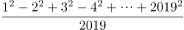此式的余数是多少？

- **A**. 0　✅
- **B**. 1
- **C**. 2
- **D**. 3

**答案**：A

**官方解析**

根据平方差公式：，化简分子进行计算，可得原式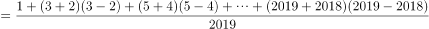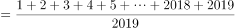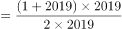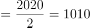，余数为0。

故正确答案为A。

---

### 第 2 题　qid 4708126 · 数学运算

有100名职工投票，从甲、乙、丙三人中选举一人，每人只能投一次，且只能选一个人，得票最多的人当选。统计票数的过程中发现，前50票中，甲得10票，乙得17票，丙得23票。在余下的选票中，丙至少再得几张选票就一定能当选?

- **A**. 22
- **B**. 23　✅
- **C**. 24
- **D**. 25

**答案**：B

**官方解析**

方法一：设丙还要得到x张选票。由题意得，乙和丙票数最接近，则考虑最糟糕的情况，剩余的100-50=50票除了投给丙，其他全投给乙，不投给甲，则有23+x＞17+50-x，解得x＞22，故丙至少再得23张选票就一定能当选。
方法二：前50票中，丙比乙多23-17=6票，则剩余50票中先补6票给乙，使乙和丙票数相等，还剩50-6=44票，此时丙只要再得44÷2+1=23票就一定能当选。
故正确答案为B。

---

### 第 3 题　qid 4708146 · 数学运算

目前我国个人所得税改革，个人税起征点由3500元提至5000元。原来的超额累进税率为：3500-5000元的部分按3％，超过5000元的部分按10％；改革后的超额累进税率为：超过5000元的部分按3％。现有某人月工资是7000元，问此人比改革前节省了多少元？

- **A**. 245
- **B**. 185　✅
- **C**. 60
- **D**. 50

**答案**：B

**官方解析**

已知某人月工资为7000元，改革前我国个税起征点为3500元，3500元以内不需要纳税，3500-5000元的部分按3%，超过5000元的部分按10%，纳税总额=1500×3%+2000×10%=245元；改革后我国个税起征点为5000元，5000元以内不需要纳税，超过5000元的部分按3％，纳税总额=2000×3%=60元。则此人比改革前节省了245-60=185元。
故正确答案为B。

---

### 第 4 题　qid 4708151 · 数学运算

三个人做一批零件，如果让甲来做，每天做4个，最后这批零件余1个；乙来做，每天做5个，最后这批零件余2个；丙来做，每天做6个，最后这批零件余3个。问这批零件甲、乙、丙三个人一起做，最后这批零件余多少个?

- **A**. 11
- **B**. 12　✅
- **C**. 13
- **D**. 14

**答案**：B

**官方解析**

根据题意，这批零件总数除以4余1，除以5余2，除以6余3。根据同余问题口诀：差同减差（即除数余数的差相同，均为3），最小公倍数做周期，可知零件总数可表示为60n-3（4、5、6最小公倍数为60）。则甲、乙、丙三个人一起做这批零件，可列式：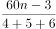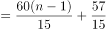，60（n-1）恰好被15整除没有余数，57÷15=3······12，即最后这批零件余12个。

故正确答案为B。

---

### 第 5 题　qid 4708121 · 数学运算

某个社区的肝癌患病率0.04％，现用甲胎蛋白法进行普查，医学研究表明，化验结果是存在错误的。患有肝癌的人其化验结果99％成阳性（有病），而没有患肝癌的人其化验结果99.9％为阴性（没病）。现某人的检查结果为阳性，问他真的患肝癌的概率约是多少？

- **A**. 0.04
- **B**. 0.284　✅
- **C**. 0.716
- **D**. 0.99

**答案**：B

**官方解析**

根据题意，若某人的检查结果为阳性，包含两种情况：①真患有肝癌；②未患有肝癌。真患有肝癌且阳性概率为0.04%×99%，未患有肝癌且阳性概率为（1-0.04%）（1-99.9%）=99.96%×0.1%，故所求为，与B项最接近。

故正确答案为B。

---

### 第 6 题　qid 4708141 · 数学运算

某人住在t市，在s市工作，每天下班后乘火车到达t市，然后于下午6时到t市地铁站，他的妻子驾车准时到地铁站接他回家。一日他提前下班，搭早一班车于下午5：30到t市地铁站，随即步行回家，他的妻子像往常一样驾车前来，在地铁站与家的中点B点遇到他，接回家时，发现比往常提前了10分钟，问他步行了多长时间？

- **A**. 10
- **B**. 25　✅
- **C**. 30
- **D**. 40

**答案**：B

**官方解析**

根据题意，若地铁站与家的距离记为一个全程，妻子在正常情况下从家驾车到地铁站再接丈夫回家共行驶了两个全程，而某天妻子驾车到中点B点接到丈夫回家，接回家时发现比往常提前了10分钟，相比往常少走了一个全程，可知妻子驾车行驶一个全程的时间为10分钟。丈夫提前30分钟到达地铁站，若仍乘车回家，则到家时间应该比正常时间提前30分钟，但实际只比往常提前了10分钟，说明丈夫从地铁站到中点B点步行比乘车多花20分钟，妻子驾车从地铁站到中点B点所花时间为5分钟，故丈夫步行从地铁站到中点B点所花时间为25分钟。
故正确答案为B。

---

### 第 7 题　qid 4708145 · 数学运算

管理人员从一池塘中捞出50条鱼做上标记，然后放回池塘，将带标记的鱼完全混合于鱼群中。10天后，再捕上20条，发现其中带标记的鱼有10条。请问根据以上数据可以估计该池塘有多少条鱼？

- **A**. 70
- **B**. 80
- **C**. 90
- **D**. 100　✅

**答案**：D

**官方解析**

设该池塘有x条鱼，根据带标记的鱼占总鱼数的比例不变，可列等式：，解得x=100，故估计该池塘有100条鱼。

故正确答案为D。

---

### 第 8 题　qid 4708170 · 数学运算

有个水龙头匀速地向下图A、B、C、D四种容器注水，如果用h代表高度，t代表时间，请问下图的坐标曲线代表哪个容器的注水情况？

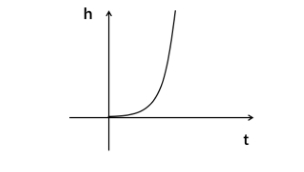

- **A**. 

- **B**. 

- **C**. 

　✅
- **D**. 

**答案**：C

**官方解析**

观察坐标曲线可知，h（高度）随t（时间）的变化为先慢后快。由于水龙头匀速注水，所以横截面越大，h变化越慢。观察选项，A项容器h随t的变化为先快后慢；B项容器h随t变化速度保持不变；C项容器h随t的变化为先慢后快；D项容器h随t的变化为先快后慢而后又变快。故只有C项符合题意。
故正确答案为C。

---

### 第 9 题　qid 4708128 · 数学运算

现行世界杯比赛规则：48支球队会分成16个小组，每组有3支球队，这3支球队进行3场比赛，小组第一名出线，然后继续进行淘汰决赛、淘汰决赛、半决赛淘汰赛、第3名与第4名决赛、冠亚军决赛。问现行规则下，世界杯一共需要打多少场比赛？

- **A**. 64　✅
- **B**. 63
- **C**. 65
- **D**. 66

**答案**：A

**官方解析**

根据题意，小组赛每组进行3场比赛，16个小组进行48场比赛；小组第一名出线，16支球队进行淘汰决赛，进行8场比赛；获胜的8支球队进行淘汰决赛，进行4场比赛；获胜的4支球队进行半决赛淘汰赛，进行2场比赛；获胜的2支球队进行冠亚军决赛，失败的2支球队进行第3名与第4名决赛。则现行规则下，世界杯一共需要打48+8+4+2+2=64场比赛。

故正确答案为A。

---

### 第 10 题　qid 4708144 · 数学运算

城墙外有A、B两个灯塔，灯塔A在灯塔B的南偏西60度的方向。A、B两灯塔相距20海里，现有一轮船C在灯塔B的正北方向，在灯塔A的北偏东45度方向。问轮船C距离A灯塔多少海里？

- **A**. 
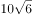
　✅
- **B**. 

- **C**. 
10

- **D**. 
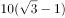

**答案**：A

**官方解析**

根据题意，灯塔位置如图所示，过A点向南北方向做垂线，交纵轴于D点。根据为直角三角形，，且AB相距20海里，可推出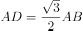海里；根据为直角三角形，，可推出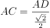海里。

故正确答案为A。

---

## 判断推理

### 第 1 题　qid 4705670 · 图形推理

从所给的四个选项中，选择最合适的一个填入问号处，使之呈现一定的规律性：

- **A**. A　✅
- **B**. B
- **C**. C
- **D**. D

**答案**：A

**官方解析**

元素组成不同，且无明显属性规律，考虑数量规律。观察发现，题干图2为多端点图形，且是“田”字变形图，考虑笔画数。题干图形的笔画数依次为1、2、3、？、5，故“？”处图形的笔画数应为4，只有A项符合。
故正确答案为A。

---

### 第 2 题　qid 4705674 · 图形推理

从所给的四个选项中，选择最合适的一个填入问号处，使之呈现一定的规律性：

- **A**. A
- **B**. B
- **C**. C　✅
- **D**. D

**答案**：C

**官方解析**

元素组成不同，优先考虑属性规律。题干图形整体比较规整，考虑对称性。第一组图形均为轴对称图形，且对称轴的数量依次为1、2、3，第二组前两个图形的对称轴数量依次为1、2，故？处图形对称轴数量应为3，只有C项符合。
故正确答案为C。

---

### 第 3 题　qid 4705692 · 图形推理

从所给的四个选项中，选择最合适的一个填入问号处，使之呈现一定的规律性：

- **A**. A
- **B**. B　✅
- **C**. C
- **D**. D

**答案**：B

**官方解析**

元素组成不同，优先考虑属性规律。观察发现，图1、图2和图5存在三角形、箭头等明显的等腰元素，优先考虑对称性。题干图形均有1条对称轴，对称轴方向分别为横轴、竖轴、横轴、竖轴、横轴，故？处图形应有1条对称轴，且对称轴方向为竖轴，只有B项符合。
故正确答案为B。

---

### 第 4 题　qid 4705679 · 图形推理

从所给的四个选项中，选择最合适的一个填入问号处，使之呈现一定的规律性：

- **A**. A
- **B**. B　✅
- **C**. C
- **D**. D

**答案**：B

**官方解析**

元素组成不同，且无明显属性规律，考虑数量规律。观察发现，题干图形均由多个独立小元素构成，优先考虑元素的数量和种类。继续观察发现，题干每幅图形的元素种类均为4，只有B项满足此规律。
故正确答案为B。

---

### 第 5 题　qid 4705688 · 图形推理

从所给的四个选项中，选择最合适的一个填入问号处，使之呈现一定的规律性：

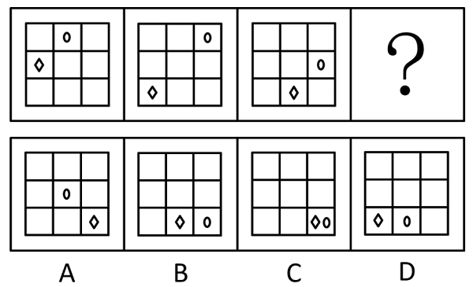

- **A**. A
- **B**. B
- **C**. C　✅
- **D**. D

**答案**：C

**官方解析**

元素组成相同，优先考虑位置规律。观察发现，椭圆形沿外圈每次顺时针移动1格，菱形沿外圈每次逆时针移动1格，故？处图形中椭圆形和菱形都应移动到右下角，只有C项符合。
故正确答案为C。

---

### 第 6 题　qid 4705684 · 定义判断

建设性冲突是指冲突各方目标一致，实现目标的途径、手段不同而产生的冲突。建设性冲突可以使组织中存在的不良功能和问题充分暴露出来，防止事态的进一步演化。
根据上述定义，下列属于建设性冲突的是（    ）。

- **A**. 两国外交代表团谈判破裂致使两国关系恶化
- **B**. 大专辩论会的某次比赛中反方辩手贏得胜利
- **C**. 某公司管理层经过激烈争论后确定了新产品营销方案　✅
- **D**. 夫妻俩因每年给父母的赡养费数额意见不同发生争吵

**答案**：C

**官方解析**

第一步：找出定义关键词。
“冲突各方目标一致”、“实现目标的途径、手段不同而产生的冲突”。
第二步：逐一分析选项。
A项：两国外交代表团谈判破裂，外交谈判中两国都是为了各自的利益，不符合“冲突各方目标一致”，不符合定义，排除；
B项：反方辩手赢得胜利，反方辩手与正方辩手的目标不一致，不符合“冲突各方目标一致”，不符合定义，排除；
C项：公司管理层的目标一致，都是想要一个更好的新产品营销方案，符合“冲突各方目标一致”，产生激烈争论，说明大家存在冲突，可能符合“实现目标的途径、手段不同而产生的冲突”，符合定义，当选；
D项：夫妻双方对赡养费数额有不同意见，不确定双方的目标是否一致，不符合“冲突各方目标一致”，不符合定义，排除。
故正确答案为C。

---

### 第 7 题　qid 4705669 · 定义判断

工厂布置，是指工厂在厂区范围内，对车间（科室）、仓库、设施、厂内运输线路、动力线路、供气管道、三废处理、绿化等各组成部分进行合理安排和组合。
下列不属于工厂布置的一项是（    ）。

- **A**. 化工厂的烟囱由东边挪到西边，以避免将灰尘吹向城区
- **B**. 厂长与副厂长进出大门时可以不登记　✅
- **C**. 为了降尘，厂里决定购买树种在厂区布置一条绿化带
- **D**. 工厂按其功能被划分为行政办公区、职工宿舍区和生活娱乐区

**答案**：B

**官方解析**

第一步：找出定义关键词。
“车间（科室）、仓库、设施、厂内运输线路、动力线路、供气管道、三废处理、绿化等各组成部分”、“合理安排和组合”。
第二步：逐一分析选项。
A项：挪动化工厂的烟囱避免将灰尘吹向城区，是对工业废气的合理安排，符合“车间（科室）、仓库、设施、厂内运输线路、动力线路、供气管道、三废处理、绿化等各组成部分”、“合理安排和组合”，符合定义，排除；
B项：厂长与副厂长进出大门时可以不登记，不是对组成部分的合理安排和组合，不符合“车间（科室）、仓库、设施、厂内运输线路、动力线路、供气管道、三废处理、绿化等各组成部分”、“合理安排和组合”，不符合定义，当选；
C项：工厂为降尘布置绿化带，是对绿化的合理安排，符合“车间（科室）、仓库、设施、厂内运输线路、动力线路、供气管道、三废处理、绿化等各组成部分”、“合理安排和组合”，符合定义，排除；
D项：工厂按功能划分区域，是对车间（科室）的合理安排，符合“车间（科室）、仓库、设施、厂内运输线路、动力线路、供气管道、三废处理、绿化等各组成部分”、“合理安排和组合”，符合定义，排除。
本题为选非题，故正确答案为B。

---

### 第 8 题　qid 4705685 · 定义判断

旁观者效应，指在紧急情况下，个体在有他人在场时，出手帮助的可能性降低，援助的几率与旁观者人数成反比。换句话说，旁观者数量越多，他们当中任何一人进行援助的可能性越低。
下列不属于旁观者效应的一项是（    ）。

- **A**. 小孩在商场与父母走丢后，在拐卖者的哄骗下与拐卖者离开商场，众保安竟无人阻拦　✅
- **B**. 一小孩落水时，周围有不少年轻人在聊天，却没有人出手相救
- **C**. 路边突然有人心脏病发，在围观者众多的情况下居然没有人叫救护车
- **D**. 纽约一妇女在公园被杀死，38名凶杀目击者没有人报警

**答案**：A

**官方解析**

第一步：找出定义关键词。
“在紧急情况下”、“旁观者数量越多”、“进行援助的可能性越低”。
第二步：逐一分析选项。
A项：与父母走丢的小孩，被拐卖者哄骗与其一起离开商场，众保安竟无人阻拦，很可能是因为他们不知道与孩子一起离开的是拐卖者而非其父母，不符合“旁观者数量越多”、“进行援助的可能性越低”，不符合定义，当选；
B项：小孩落水，属于紧急情况，周围有不少年轻人，却没有人出手相救，符合“在紧急情况下”、“旁观者数量越多”、“进行援助的可能性越低”，符合定义，排除；
C项：有人心脏病突发，属于紧急情况，围观者众多却没有人叫救护车，符合“在紧急情况下”、“旁观者数量越多”、“进行援助的可能性越低”，符合定义，排除；
D项：妇女在公园被杀死，38名凶杀目击者却没有人报警，符合“在紧急情况下”、“旁观者数量越多”、“进行援助的可能性越低”，符合定义，排除。
本题为选非题，故正确答案为A。

---

### 第 9 题　qid 4705682 · 定义判断

心理干预是指在心理学理论指导下有计划、有步骤地对一定对象的心理活动、个性特征或心理问题施加影响，使之发生朝向预期目标变化的过程。心理干预的手段包括心理治疗、心理咨询、心理康复、心理危机干预等。
根据上述定义，下列属于心理干预的是（    ）。

- **A**. 某地发生未成年人侵害未成年人的事件，事发后专家呼吁对肇事者进行心理辅导
- **B**. 李兴小时候做道简单的加减乘除题往往要花比其他同龄孩子多数倍的时间，但由于他的母亲总是鼓励他，长大后他考上了重点大学的理科专业
- **C**. 由于老王在地震时目睹房屋变成废墟，地震之后产生了不断闪回当时场景的心理反应，心理专家根据他的情况制订了针对性的干预措施，经过治疗，他恢复了正常的情绪　✅
- **D**. 小张新买的手机丢失，同事知道后纷纷安慰他，他反而更加感到自己不走运

**答案**：C

**官方解析**

第一步：找出定义关键词。
“在心理学理论指导下”、“有计划、有步骤地对一定对象的心理活动、个性特征或心理问题施加影响”、“使之发生朝向预期目标变化”。
第二步：逐一分析选项。
A项：专家只是呼吁对肇事者进行心理辅导，但心理辅导是否进行了并不明确，不符合“在心理学理论指导下”、“有计划、有步骤地对一定对象的心理活动、个性特征或心理问题施加影响”、“使之发生朝向预期目标变化”，不符合定义，排除；
B项：母亲鼓励落后于同龄孩子的李兴，后来他考上了重点大学，没有体现是“在心理学理论指导下”和“有计划、有步骤地对一定对象的心理活动、个性特征或心理问题施加影响”，不符合定义，排除；
C项：老王在目睹地震后不断闪回当时的场景，心理专家制定了针对性的干预措施，体现了“在心理学理论指导下”、“有计划、有步骤地对一定对象的心理活动、个性特征或心理问题施加影响”，经过治疗，他恢复了正常的情绪，符合“使之发生朝向预期目标变化”，符合定义，当选；
D项：小张丢失了新手机，同事安慰他，未体现“在心理学理论指导下”、“有计划、有步骤地对一定对象的心理活动、个性特征或心理问题施加影响”，之后他反而更感到自己不走运，不符合“使之发生朝向预期目标变化”，不符合定义，排除。
故正确答案为C。

---

### 第 10 题　qid 4705693 · 定义判断

选择性注意是指在外界诸多刺激中仅仅注意某些刺激或刺激的某些方面，而忽略了其他刺激。
根据上述定义，下列属于选择性注意的是（    ）。

- **A**. 万绿丛中一点红，动人春色不须多　✅
- **B**. 不识庐山真面目，只缘身在此山中
- **C**. 山重水复疑无路，柳暗花明又一村
- **D**. 不畏浮云遮望眼，只缘身在最高层

**答案**：A

**官方解析**

第一步：找出定义关键词。
“在外界诸多刺激中”、“仅仅注意某些刺激或刺激的某些方面”、“忽略了其他刺激”。
第二步：逐一分析选项。
A项：在众多绿叶中的红花是动人的春色，即当红花、绿叶同时出现时，只关注到红花，而忽略绿叶，符合“在外界诸多刺激中”、“仅仅注意某些刺激或刺激的某些方面”、“忽略了其他刺激”，符合定义，当选；
B项：因为身在庐山，才没有认清庐山的面目，没有体现“在外界诸多刺激中”，不符合定义，排除；
C项：在山峦重叠、水流曲折时，柳绿花艳，忽然出现一个村庄，指注意到某一突然出现的刺激，但不代表忽略了其他刺激，没有体现“仅仅注意某些刺激或刺激的某些方面”、“忽略了其他刺激”，不符合定义，排除；
D项：因为身在山的最高层，所以不怕浮云会遮住视线，“不怕浮云”不是忽略浮云，不符合“仅仅注意某些刺激或刺激的某些方面”、“忽略了其他刺激”，不符合定义，排除。
故正确答案为A。

---

### 第 11 题　qid 4705680 · 定义判断

近因效应是指在总体印象形成的过程中，新近获得的信息比原来获得的信息影响更大的现象。
根据上述定义，下列属于近因效应的是（    ）。

- **A**. 喜新厌旧　✅
- **B**. 情人眼里出西施
- **C**. 先入为主
- **D**. 唯女子与小人难养也

**答案**：A

**官方解析**

第一步：找出定义关键词。
“新近获得的信息比原来获得的信息影响更大”。
第二步：逐一分析选项。
A项：“喜新厌旧”意思是当出现新事物的时候，就会更加喜欢新的，而厌弃旧的，说明新近获得的信息影响更大，符合“新近获得的信息比原来获得的信息影响更大”，符合定义，当选；
B项：“情人眼里出西施”意思是在有情人眼里，不论对方外表如何，都会觉得对方外表美丽，不涉及新近获得的信息与原来获得的信息的对比，不符合“新近获得的信息比原来获得的信息影响更大”，不符合定义，排除；
C项：“先入为主”意思是先接受了一种说法或思想，后来就不容易再接受不同的说法或思想，说明原来获得的信息影响更大，不符合“新近获得的信息比原来获得的信息影响更大”，不符合定义，排除；
D项：“唯女子与小人难养也”不涉及新近获得的信息与原来获得的信息的对比，不符合“新近获得的信息比原来获得的信息影响更大”，不符合定义，排除。
故正确答案为A。

---

### 第 12 题　qid 20063 · 定义判断

口红效应是指每当经济不景气，人们的消费就会转向购买廉价商品，而口红虽非生活必需品，却兼具廉价和粉饰的作用，能够给消费者带来心理慰藉。
下列符合口红效应的是：

- **A**. 近来公司效益不好，胡老板卖掉了自己的高级轿车，改骑自行车上班，既环保又锻炼身体
- **B**. 为了约会，小刘虽然工资不高，还是买了一身名牌西装来装扮
- **C**. 今年单位效益不好，小杨取消了假期带全家到国外旅行的计划，改为到近郊旅游，结果感觉还不错　✅
- **D**. 为了明天的面试，小黄到理发店理了一个新发型，看上去朝气蓬勃，使他信心十足

**答案**：C

**官方解析**

第一步：找出定义关键词。
“经济不景气”、“转向购买廉价商品”、“非生活必需品”。
第二步：逐一分析选项。
A项，“卖掉高级轿车，改骑自行车”并未体现购买廉价商品，不符合定义，排除；
B项，“名牌西装”不是“廉价商品”，不符合定义，排除；
C项，“单位效益不好”对应“经济不景气”，把“国外旅行计划”改成“近郊旅游”对应“转向购买廉价商品”，旅行是“非生活必需品”，符合定义，当选；
D项，只说了小黄为了面试去理发，没提及定义中的关键因素，属于无关项，排除。
故正确答案为C。

---

### 第 13 题　qid 20091 · 定义判断

学习迁移即一种学习对另一种学习的影响，它广泛地存在于知识、技能、态度和行为规范的学习中。任何一种学习都会受到学习者已有知识经验、技能、态度等的影响，只要有学习，就有迁移。
下列属于学习迁移的是：

- **A**. 小王的父亲是著名的画家，受父亲影响，他从小就对绘画产生了兴趣，后来也成为一名画家
- **B**. 某大学生在人多的教室里复习功课总容易分心，于是换到一个独处的安静环境，学习效率非常高
- **C**. 小芳学会了拉二胡，自己尝试拉小提琴，结果也很快学会　✅
- **D**. 某学生沉迷于网络游戏致使学习成绩下降，后来通过老师的教育和同学的帮助，改掉了毛病，学习进步非常快

**答案**：C

**官方解析**

第一步：找出定义关键词。
“一种学习对另一种学习的影响”，而且这种影响来自“学习者已有知识经验、技能、态度等”。
第二步：逐一分析选项。
A项，小王对绘画产生兴趣是“受父亲影响”，不是受自身已有技能的影响，不符合定义，排除；
B项，说的是某大学生改变学习环境之后学习效率提高，不符合定义，排除；
C项，小芳很快学会拉小提琴是受已经会拉二胡的影响，符合定义，当选；
D项，是某学生在老师和同学的帮助下提高学习成绩，这两种情况都没有体现出“一种学习对另一种学习的影响”，不符合定义，排除。
故正确答案为C。

---

### 第 14 题　qid 18897 · 定义判断

依据能力补偿的途径对能力系统整体作用效果的不同，可以将能力间的相互补偿途径分为非衡性补偿和平衡性补偿两种。非衡性补偿是指以优势能力弥补弱势能力，从而加强整体能力的方式。平衡性补偿是指通过提高弱势能力以加强整体能力的方式。
根据上述定义，下列各项中属于非衡性补偿的是：

- **A**. 小张刚来到汽车修配厂的时候，对维修发动机的技术只是略懂皮毛，后来在师傅的带领下，他勤奋学习，终于熟练掌握了这一技术
- **B**. 王明和几个同学组建了一支乐队，为了培养彼此的默契，更好地互相配合，他们经常在业余时间进行排练
- **C**. 小丽经常在网上浏览娱乐新闻，久而久之，她对各种娱乐消息了然于胸
- **D**. 排球队5号运动员的特点是进攻和拦网较强，但防守、一传较弱，教练将其安排在一号位防守，用前排拦网封住直线的方法掩盖他的不足　✅

**答案**：D

**官方解析**

第一步：找出定义关键词。
非衡性补偿强调用“优势能力弥补弱势能力”。
第二步：逐一分析选项。
A项中小张学习了维修发动机的技术，从而提高了自己的弱势能力，加强了自己的整体维修能力，这属于平衡性补偿，排除；
B、C两项中并未体现用“优势能力弥补弱势能力”，排除；

D项中5号运动员的优势是进攻和拦网，弱势是防守和一传，“教练将其安排在一号位防守，用前排拦网封住直线的方法掩盖他的不足”，教练是用5号运动员的优势能力弥补他的弱势能力，这符合非衡性补偿的定义，当选。
故正确答案为D。

---

### 第 15 题　qid 622855 · 定义判断

行政法律关系根据行政权力的作用范围不同分为外部行政法律关系和内部行政法律关系。行政机关与公民、法人和其他组织之间作为管理和被管理关系的是外部行政法律关系；双方当事人作为上下级的从属关系是内部行政法律关系。
根据上述定义，下列行为属于内部行政法律关系的是：

- **A**. 某省公安厅表彰省交警大队的“英模干警”　✅
- **B**. 某卫生局检查所辖范围内的餐饮企业
- **C**. 某大学对违纪学生进行处罚
- **D**. 某企业到税务局纳税

**答案**：A

**官方解析**

第一步：找出定义关键词。
“上下级的从属关系”。
第二步：逐一分析选项。
A项：省公安厅和省交警大队是属于上下级的从属关系，符合定义，当选；
B项：卫生局和餐饮企业是管理和被管理关系，属于外部行政法律关系，不符合定义，排除；
C项：大学不属于行政机关，不符合定义，排除；
D项：税务局和企业是管理和被管理关系，属于外部行政法律关系，不符合定义，排除。
故正确答案为A。

---

### 第 16 题　qid 4705678 · 类比推理

藤条：藤椅

- **A**. 岩壁：岩画
- **B**. 豆子：豆腐　✅
- **C**. 竹子：桌子
- **D**. 橡胶：铜笔

**答案**：B

**官方解析**

第一步：判断题干词语间逻辑关系。
藤条是制作藤椅的原材料，二者为原材料与成品的对应关系，且藤条是制作藤椅的必然原材料。
第二步：判断选项词语间逻辑关系。
A项：岩壁是岩画的载体，二者不是原材料与成品的对应关系，与题干逻辑关系不一致，排除；
B项：豆子是制作豆腐的原材料，二者为原材料与成品的对应关系，且豆子是制作豆腐的必然原材料，与题干逻辑关系一致，当选；
C项：竹子是制作桌子的原材料，二者为原材料与成品的对应关系，但竹子不是制作桌子的必然原材料，与题干逻辑关系不一致，排除；
D项：橡胶是制作铜笔的原材料，二者为原材料与成品的对应关系，但橡胶不是制作铜笔的必然原材料（有的铜笔全部是铜制作的，有的铜笔手握的地方是橡胶制作的），与题干逻辑关系不一致，排除。
故正确答案为B。

---

### 第 17 题　qid 4705689 · 类比推理

生日：诞辰

- **A**. 卡通：国画
- **B**. 荷花：菡萏　✅
- **C**. 一年：春秋
- **D**. 奶奶：外祖母

**答案**：B

**官方解析**

第一步：判断题干词语间逻辑关系。
生日和诞辰都是指出生的日子，二者为全同关系。
第二步：判断选项词语间逻辑关系。
A项：卡通是指动画片或漫画，国画是指中国的传统绘画形式，是用毛笔蘸水、墨、彩作画于绢或纸上，二者不是全同关系，与题干逻辑关系不一致，排除；
B项：荷花又称菡萏，二者为全同关系，与题干逻辑关系一致，当选；
C项：春秋是指春季和秋季，可泛指一年，同时春秋也指人的年岁、历史上的春秋时期等，二者不是全同关系，与题干逻辑关系不一致，排除；
D项：外祖母是指母亲的母亲，奶奶是指父亲的母亲，二者为并列关系，与题干逻辑关系不一致，排除。
故正确答案为B。

---

### 第 18 题　qid 4705677 · 类比推理

按图：索骥

- **A**. 一筹：莫展
- **B**. 拔苗：助长　✅
- **C**. 抓耳：挠腮
- **D**. 盲人：摸象

**答案**：B

**官方解析**

第一步：判断题干词语间逻辑关系。
“按图索骥”指照图上画的样子去寻求好马，比喻办事机械、死板，不知变通，后也比喻依照一定的线索去寻找事物。“按图”是为了“索骥”，二者为方式目的的对应关系。
第二步：判断选项词语间逻辑关系。
A项：“一筹莫展”形容遇事拿不出一点办法，没有任何进展。“一筹”和“莫展”不是方式目的的对应关系，与题干逻辑关系不一致，排除；
B项：“拔苗助长”指把苗拔起来，帮助其成长，比喻违反事物的发展规律，急于求成，最后事与愿违。“拔苗”是为了“助长”，二者为方式目的的对应关系，与题干逻辑关系一致，当选；
C项：“抓耳挠腮”指乱抓耳朵和腮帮子，形容焦急、忙乱或苦闷又没有办法的样子。“抓耳”和“挠腮”为并列关系，与题干逻辑关系不一致，排除；
D项：“盲人摸象”比喻只凭对事物的片面了解，便妄加推断。“盲人”和“摸象”为主谓宾结构，二者不是方式目的的对应关系，与题干逻辑关系不一致，排除。
故正确答案为B。

---

### 第 19 题　qid 4705681 · 类比推理

庄周：游刃有余

- **A**. 曹操：望梅止渴　✅
- **B**. 项羽：柳暗花明
- **C**. 陆游：霸王别姬
- **D**. 王维：狡兔三窟

**答案**：A

**官方解析**

第一步：判断题干词语间逻辑关系。
游刃有余最早出自于《庄子·养生主》，其作者为庄周，该成语的典故与庄周有关，二者为对应关系。
第二步：判断选项词语间逻辑关系。
A项：望梅止渴的故事内容为曹操利用了人对酸梅子的条件反射，让士兵们看到了希望，鼓舞了士气，该成语的典故与曹操有关，二者为对应关系，与题干逻辑关系一致，当选；
B项：柳暗花明最早出自唐朝诗人王维的《早朝》“柳暗百花明，春深五凤城。”后来宋朝诗人陆游的《游山西村》中的“山重水复疑无路，柳暗花明又一村。”也与该成语有关，与项羽无关，与题干逻辑关系不一致，排除；
C项：霸王别姬出自于《史记·项羽本纪》，其作者为司马迁，霸王别姬的故事内容为西楚霸王项羽心高气傲，性格单纯，最终与爱妻生离死别、兵败刘邦，与陆游无关，与题干逻辑关系不一致，排除；
D项：狡兔三窟出自于《战国策·齐策四》，其作者为刘向，与王维无关，与题干逻辑关系不一致，排除。
故正确答案为A。

---

### 第 20 题　qid 4705687 · 逻辑判断

直言不讳：打开天窗说亮话

- **A**. 后来居上：做梦吃星星，想得不低
- **B**. 好高骛远：后长的犄角比先长的耳朵长
- **C**. 越俎代庖：四下起火，八下冒烟
- **D**. 寡不敌众：好虎抵不住群狼　✅

**答案**：D

**官方解析**

第一步：判断题干词语间逻辑关系。
“直言不讳”指直截了当地说出来，没有丝毫顾忌，“打开天窗说亮话”指直率而明白地讲出来，二者为近义关系。
第二步：判断选项词语间逻辑关系。
A项：“后来居上”指后起的超过先前的，“做梦吃星星，想得不低”指想法不切实际、异想天开，二者不是近义关系，与题干逻辑关系不一致，排除；
B项：“好高骛远”指不切实际地追求过高的目标，“后长的犄角比先长的耳朵长”比喻后来的人或事物超过先前的，二者不是近义关系，与题干逻辑关系不一致，排除；
C项：“越俎代庖”比喻超过自己的职务范围，去处理别人所管的事情，“四下起火，八下冒烟”形容局面混乱，到处闹事，无法收拾，二者不是近义关系，与题干逻辑关系不一致，排除；
D项：“寡不敌众”比喻人少的抵挡不住人多的，“好虎抵不住群狼”也比喻人少的抵挡不住人多的，二者为近义关系，与题干逻辑关系一致，当选。
故正确答案为D。

---

### 第 21 题　qid 2002478 · 逻辑判断

美国鸟类学基金会在不久前公布了《美国鸟类状况》的报告。他们认为，全球变暖正促使鸟类调整生物钟，提前产蛋期，而上述变化中会使这些鸟无法为其刚破壳而出的后代提供足够的食物，比如蓝冠山雀主要以蛾和蝴蝶的幼虫为食，而蛾和蝴蝶的产卵时间没有相应提前，“早产”的小蓝冠山雀会在破壳后数天内持续挨饿。
下列哪项如果为真，最能支持上述论证？

- **A**. 最近40年的英国的平均气温不断上升
- **B**. 很多鸟类的产蛋期确实提前了
- **C**. 除了蛾和蝴蝶的幼虫外，蓝冠山雀很少吃其他食物　✅
- **D**. 蛾和蝴蝶的产卵期不同

**答案**：C

**官方解析**

第一步：找到论点和论据。
论点：鸟类提前产蛋期，无法为其刚破壳而出的后代提供足够的食物。
论据：蓝冠山雀主要以蛾和蝴蝶的幼虫为食，而蛾和蝴蝶的产卵时间没有相应提前，“早产”的小蓝冠山雀会在破壳后数天内持续挨饿。
第二步：逐一分析选项。
A项：最近40年的英国的平均气温不断上升，平均气温升高与产蛋期提前出生的后代没有足够的食物无直接关系，属无关选项，排除；
B项：很多鸟类的产蛋期确实提前了，与产蛋期提前出生的后代没有足够的食物无直接关系，属无关选项，排除；
C项：如果除了蛾和蝴蝶的幼虫外，蓝冠山雀还吃其他食物，那么鸟类提前产蛋期，也可以为其刚破壳而出的后代提供足够的食物，论点就不成立，故该项为论点成立的必要条件，可以加强，当选；
D项：蛾和蝴蝶的产卵期不同，与产蛋期提前出生的后代没有足够的食物无直接关系，属无关选项，排除。
故正确答案为C。

---

### 第 22 题　qid 765609 · 类比推理

航天局认为优秀宇航员应具备三个条件：第一，丰富的知识；第二，熟练的技术；第三，坚强的意志。现有至少符合条件之一的甲、乙、丙、丁四位优秀飞行员报名参选，已知：①甲、乙意志坚强程度相同②乙、丙知识水平相当③丙、丁并非都是知识丰富④四人中三人知识丰富、两人意志坚强、一人技术熟练。航天局经过考查，发现其中只有一人完全符合优秀宇航员的全部条件。他是：

- **A**. 甲
- **B**. 乙
- **C**. 丙　✅
- **D**. 丁

**答案**：C

**官方解析**

由条件②③④得，丁的知识不丰富，因为如果丁的知识丰富的话，由条件③丙的知识不丰富，再由条件②乙的知识也不丰富，与条件④“有三人知识丰富”矛盾。丁的技术也不熟练，因为如果丁的技术熟练，则由条件④“只有一人技术熟练”，则甲、乙和丙三人技术都不熟练，这样就没有符合条件的了。因为甲、乙、丙和丁四人至少符合条件之一，所以，丁意志坚强。由条件①，甲和乙意志坚强程度相同，推得，甲和乙意志不坚强。因为如果都坚强的话，则就有甲、乙和丁三人意志坚强了，与条件④“只有两人意志坚强”矛盾，所以，甲和乙意志不坚强。那么，丙的意志坚强。因此，只有丙完全符合条件。
故正确答案为C。

---

### 第 23 题　qid 47679 · 类比推理

品学兼优的学生不都读研究生。
如果以上论述为真，则下列命题能判断真假的有几个?
Ⅰ.有些品学兼优的学生读研究生
Ⅱ.有些品学兼优的学生不读研究生
Ⅲ.所有品学兼优的学生都读研究生
Ⅳ.所有品学兼优的学生都不读研究生

- **A**. 1
- **B**. 2　✅
- **C**. 3
- **D**. 4

**答案**：B

**官方解析**

第一步：翻译题干。
品学兼优的学生不都读研究生，等价于：有些品学兼优的学生不读研究生。
第二步：逐一分析选项。
Ⅰ.通过题干“有些品学兼优的学生不读研究生”，其中“有些”无法判定具体是多少，因此无法判定“有些品学兼优的学生读研究生”的真假情况，故Ⅰ无法判断真假；
Ⅱ.“有些品学兼优的学生不读研究生”，与题干一致，故可判断Ⅱ为真；
Ⅲ.“所有品学兼优的学生都读研究生”与题干“有些品学兼优的学生不读研究生”为矛盾关系，矛盾关系必有一真必有一假，题干条件为真，故可判断Ⅲ为假；
Ⅳ.通过题干“有些品学兼优的学生不读研究生”，其中“有些”无法判定具体是多少，因此无法判定“所有品学兼优的学生都不读研究生”的真假情况，故Ⅳ无法判断真假。
综上分析，可判断Ⅱ为真，Ⅲ为假，Ⅰ和Ⅳ无法判断真假，即可确定真假的有两个。
故正确答案为B。

---

### 第 24 题　qid 4705713 · 逻辑判断

A股市场的投资者乐于使用大宗交易的方式，因为这种交易方式往往是定制式交易，两个账户间可以“无缝拼接”，但苦于其门槛过高，上交所近日发布新政，内容是将大宗交易的门槛大幅降低。业内人士认为这有利于降低A股市场股价波动。因为根据以往的规定，A股大宗交易最低额度为50万股或300万元人民币，这样大笔的交易一旦进入二级市场套现无疑将对个股股价产生冲击。因此交易所把门槛降低尽量避免批量的买卖交易影响个股股价，这是从稳定市场价格方面来考虑的。
以下哪项如果为真，能够削弱新政的作用（    ）。

- **A**. 随着交易门槛降低，大宗交易行情火爆，有投资者盈利超过30％
- **B**. 没有降低门槛之前，大宗交易的数量一直保持在一个较为稳定的范围内
- **C**. 门槛降低后，基金可以通过这样的方式来减仓，同时也可以降低建仓成本
- **D**. 50万股或300万元人民币以下集中抛售个股的大宗交易明显增多　✅

**答案**：D

**官方解析**

第一步：找出论点和论据。
论点：把门槛降低尽量避免批量的买卖交易影响个股股价，可以稳定市场价格。
论据：A股大宗交易最低额度为50万股或300万元人民币，这样大笔的交易一旦进入二级市场套现无疑将对个股股价产生冲击。
本题论点和论据都是在讨论大宗交易对市场股价的影响，论点论据话题一致，考虑削弱论点，即把门槛降低不能避免批量的个股大宗交易，不能稳定市场价格。
第二步：逐一分析选项。
A项：指出门槛降低后有投资者盈利的情况，但是只是个别投资者盈利，不明确整体股价是否稳定，无法削弱，排除；
B项：指出没有降低门槛之前的情况，而论点讨论的是门槛降低之后的作用，与论点讨论话题不一致，无法削弱，排除；
C项：指出门槛降低后基金可以减仓、降低建仓成本，但是基金的这一操作对股市的价格是否存在影响是不明确的，无法削弱，排除；
D项：50万股或300万元人民币以下的交易属于门槛降低后的交易，集中抛售属于批量交易，而门槛降低后集中抛售的批量交易增加，说明降低门槛并没有达到避免批量个股大宗交易的作用，直接削弱论点，可以削弱，当选。
故正确答案为D。

---

### 第 25 题　qid 4705737 · 逻辑判断

高脂肪、高糖含量的食品有害于人的健康。因此，既然越来越多的国家明令禁止未成年人吸烟和喝含酒精的饮料，那么，为什么不用同样的方法对待那些有害健康的食品呢？应该禁止18岁以下的人食用高脂肪、高糖食品。
以下哪项如果是真的，最能削弱上述论证（    ）。

- **A**. 许多国家已把成年人的标准定到16岁以上
- **B**. 烟、酒对人体的危害比高脂肪、高糖食品的危害要严重得多
- **C**. 并非所有的国家都禁止未成年人吸烟、喝酒
- **D**. 高脂肪、高糖食品主要有害中老年人的健康　✅

**答案**：D

**官方解析**

第一步：找出论点和论据。
论点：应该禁止18岁以下的人食用高脂肪、高糖食品。
论据：高脂肪、高糖含量的食品有害于人的健康。
本题论点讨论的是禁止18岁以下的人食用高脂肪、高糖食品，论据讨论的是高脂肪、高糖含量的食品有害于人的健康，二者话题一致，削弱可以优先考虑削弱论点。
第二步：逐一分析选项。
A项：许多国家把成年人的标准定到了16岁以上，选项不涉及高脂肪、高糖食品，而论点讨论禁止18岁以下的人食用高脂肪、高糖食品，话题不一致，无关项，无法削弱，排除；
B项：烟、酒的危害更严重，比较烟、酒和高脂肪、高糖食品的危害程度，而论点讨论禁止18岁以下的人食用高脂肪、高糖食品，话题不一致，无关项，无法削弱，排除；
C项：有的国家不禁止未成年人吸烟、喝酒，论点讨论禁止18岁以下的人食用高脂肪、高糖食品，二者话题不一致，无关项，无法削弱，排除；
D项：高脂肪、高糖食品主要对中老年人健康有害而非对未成年人有害，即禁止18岁以下的人食用高脂肪、高糖食品对维护未成年人健康作用不大，直接削弱论点，可以削弱，当选。
故正确答案为D。

---

### 第 26 题　qid 4705707 · 逻辑判断

在美国，近年来在电视卫星的发射和操作中事故不断，这使得不少保险公司不得不面临巨额赔偿，这不可避免地导致了电视卫星的保险金的猛涨，使得发射和操作电视卫星的费用变得更为昂贵。为了应付昂贵的成本，必须进一步开发电视卫星更多的尖端功能来提高电视卫星的售价。以下哪项，如果为真，和题干的断定一起，最能支持这样一个结论，即电视卫星的成本将继续上涨？

- **A**. 承担电视卫星保险业风险的只有为数不多的几家大公司，这使得保险金必定很高
- **B**. 美国电视卫星业面临的问题，在西方发达国家带有普遍性
- **C**. 电视卫星目前具备的功能已能满足需要，用户并没有对此提出新的要求
- **D**. 电视卫星具备的尖端功能越多，越容易出问题　✅

**答案**：D

**官方解析**

第一步：找出论点和论据。
论点：电视卫星的成本将继续上涨。
论据：在美国，近年来在电视卫星的发射和操作中事故不断，这使得不少保险公司不得不面临巨额赔偿，这不可避免地导致了电视卫星的保险金的猛涨，使得发射和操作电视卫星的费用变得更为昂贵。为了应付昂贵的成本，必须进一步开发电视卫星更多的尖端功能来提高电视卫星的售价。
论点论讨电视卫星的成本将继续上涨，是一种对未来情况的预判；论据先解释了现在电视卫星成本上涨的原因，然后提出了解决方法——进一步开发尖端功能，即未来采取的措施，二者话题不一致，加强优先考虑搭桥。
第二步：逐一分析选项。
A项：承担电视卫星保险业风险的公司较少，因此保险公司必定大幅提高保险金，但这只解释了为什么现在电视卫星成本上涨，未来是否会继续上涨并不明确，无法加强，排除；
B项：美国电视卫星业面临的问题在西方发达国家比较普遍，而论点讨论未来电视卫星的成本将继续上涨，二者话题不一致，无关项，无法加强，排除；
C项：用户对电视卫星的功能没有新要求，说明通过增加尖端功能无法解决现在电视卫星成本上涨的问题，而论点讨论未来电视卫星成本会继续上涨，二者话题不一致，无关项，无法加强，排除；
D项：电视卫星具备的尖端功能越多，越容易出问题，说明未来增加尖端功能的措施只会让成本上涨，在“成本继续上涨”和“更多的尖端功能”间建立了联系，搭桥项，可以加强，当选。
故正确答案为D。

---

### 第 27 题　qid 4705715 · 逻辑判断

纯种的蒙古奶牛一般每年产奶400升；如果蒙古奶牛与欧洲奶牛杂交，其后代一般每年可产2700升牛奶。为此，一个国际组织计划通过杂交的方式，帮助蒙古牧民提高其牛奶产量。以下哪项如果为真，对该国际组织的计划提出了最严重的质疑？

- **A**. 并不是欧洲所有奶牛品种都可以成功地同蒙古奶牛杂交
- **B**. 许多年轻的蒙古人认为饲养奶牛是一种很低贱的职业，因为它不如其他许多职业更有利可图
- **C**. 蒙古地区的放牧条件只适于饲养当地品种的奶牛，不适合杂交奶牛生长　✅
- **D**. 蒙古牧民出口到欧洲的主要产品的牛皮和牛角，而不是牛奶

**答案**：C

**官方解析**

第一步：找出论点和论据。
论点：一个国际组织计划通过杂交的方式，帮助蒙古牧民提高其牛奶产量。
论据：纯种的蒙古奶牛一般每年产奶400升；如果蒙古奶牛与欧洲奶牛杂交，其后代一般每年可产2700升牛奶。
本题论点和论据讨论的都是杂交可提高蒙古奶牛的牛奶产量，论点论据话题一致，削弱可以优先考虑削弱论点，即杂交的方式并不能帮助蒙古奶牛提高牛奶产量。
第二步：逐一分析选项。
A项：并不是欧洲所有奶牛品种都可以成功地同蒙古奶牛杂交，但只要有些品种能够杂交成功，就能提高蒙古奶牛的牛奶产量，事实上是否存在能够杂交成功的品种并不明确，不明确项，无法削弱，排除；
B项：许多年轻的蒙古人对饲养奶牛这一职业并不认可，而论点讨论的是通过杂交提高蒙古奶牛的牛奶产量，二者话题不一致，无关项，无法削弱，排除；
C项：蒙古地区的放牧条件不适合杂交奶牛生长，说明即使杂交成功，杂交奶牛也无法顺利成长，其牛奶产量也就无法提高，直接削弱论点，可以削弱，当选；
D项：牛奶并非蒙古牧民出口到欧洲的主要产品，而论点讨论的是通过杂交提高蒙古奶牛的牛奶产量，二者话题不一致，无关项，无法削弱，排除。
故正确答案为C。

---

### 第 28 题　qid 4705741 · 逻辑判断

汉斯、亚瑟、古力三个学生来自美国、德国和意大利，其中一个学法律，一个学经济，一个学管理。
已知：
1.汉斯不是学法律的，亚瑟不是学管理的；
2.学法律的不是来自德国；
3.学管理的来自美国；
4.亚瑟不是来自意大利。
以上条件成立，以下哪项为真？

- **A**. 汉斯学管理，亚瑟学经济，古力学法律　✅
- **B**. 汉斯学经济，亚瑟学管理，古力学法律
- **C**. 汉斯学法律，亚瑟学经济，古力学管理
- **D**. 汉斯学管理，亚瑟学法律，古力学经济

**答案**：A

**官方解析**

第一步：分析题干条件。
（1）汉斯不学法律，亚瑟不学管理；
（2）学法律的不来自德国；
（3）学管理的来自美国；
（4）亚瑟不来自意大利。
第二步：根据题干条件进行推理。
选项信息充分，优先考虑排除法。
根据条件（1）可知，汉斯不学法律，亚瑟不学管理，排除B、C两项；
结合条件（1）（3）可知，亚瑟不来自美国，再结合条件（4）可知，亚瑟也不来自意大利，故亚瑟只能来自德国；然后结合条件（2）可知，来自德国的不学法律，因此，亚瑟不学法律，排除D项。
故正确答案为A。

---

### 第 29 题　qid 4705720 · 逻辑判断

只有经过体检并合格的人才能加入冬泳协会。所有加入冬泳协会的人都被评为全民健身积极分子。有的退休老同志是冬泳协会成员。王府大厦的保安都没有经过体检。
如果以上断定成立，那么下列各项都能从中推出，除了（    ）。

- **A**. 有的退休老同志被评为全民健身积极分子
- **B**. 王府大厦的保安中，有人被评为全民健身积极分子　✅
- **C**. 王府大厦的保安都没有加入冬泳协会
- **D**. 有的退休老同志经过体检

**答案**：B

**官方解析**

第一步：翻译题干。

①冬泳协会体检 且 合格

②冬泳协会健身积极分子

③有的退休老同志冬泳协会

④保安体检

第二步：逐一分析选项。

A项：翻译为有的退休老同志健身积极分子，通过条件③与条件②串联可以得出：有的退休老同志冬泳协会健身积极分子，可以推出，排除；

B项：翻译为有的保安健身积极分子，由条件④可知，保安体检，“体检”否定了条件①箭头后“体检 且 合格”的其中一项，且关系一项否定可以得出整项不成立，即否后，因此将条件④与条件①串联可以得出：保安体检冬泳协会，“冬泳协会”对于条件②来说是否前，否前得不出必然结论，所以无法确定是否为健身积极分子，无法推出，当选；

C项：翻译为保安冬泳协会，由条件④可知，保安体检，“体检”否定了条件①箭头后“体检 且 合格”的其中一项，且关系一项否定可以得出整项不成立，即否后，因此将条件④与条件①串联可以得出：保安体检冬泳协会，可以推出，排除；

D项：翻译为有的退休老同志体检，通过条件③与条件①串联可以得出：有的退休老同志冬泳协会体检 且 合格，且关系整项成立可以得出其中一项必然成立，可以推出，排除。

本题为选非题，故正确答案为B。

---

### 第 30 题　qid 4705738 · 逻辑判断

计算机程序的不同寻常之处是它既被专利保护，又被版权保护。专利权保护发明背后的思想，而版权保护那种思想的表达。但是，为了赢得任一项保护，思想必须清楚地与其表达区分开来。
由此，可以推出：

- **A**. 一些计算机程序背后的思想能与表达区分开来　✅
- **B**. 任何写计算机程序的人是该程序思想的发明者
- **C**. 计算机程序专利权像版权一样不难获得
- **D**. 很少有发明者既是专利权又是版权的所有人

**答案**：A

**官方解析**

日常结论题，根据题干信息逐一分析选项。
A项：结合题干第一句话与最后一句话可知，为了赢得保护就必须把思想与表达区分开来，而计算机程序已经获得了专利和版权保护，说明一些计算机程序可以做到将思想与表达区分开来，可以推出，当选；
B项：题干中没有涉及到写计算机程序的人，无中生有，排除；
C项：题干中没有涉及到获得计算机程序专利权的难易程度，无中生有，排除；
D项：题干中没有涉及到发明者是否为专利权和版权的所有人，无中生有，排除。
故正确答案为A。

---

## 资料分析

### 材料 1

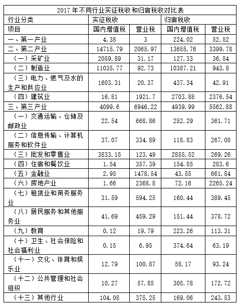

#### 第 1 题　qid 4708172 · 综合

2017年实征营业税收合计为：

- **A**. 9015.19亿元　✅
- **B**. 9804.58亿元
- **C**. 18819.77亿元
- **D**. 27834.96亿元

**答案**：A

**官方解析**

定位统计表可得：2017年第一产业实征营业税收为3亿元，第二产业实征营业税收为2065.97亿元，第三产业实征营业税收为6946.22亿元。则2017年实征营业税收合计为3+2065.97+6946.22=9015.19亿元。
故正确答案为A。

---

#### 第 2 题　qid 4708175 · 综合

2017年第三产业营业税的转出规模（实征税收-归宿税收）约为        亿元，占其产业实征营业税的        ？

- **A**. 1383.34 20%　✅
- **B**. 1383.34 25%
- **C**. 840.39 20%
- **D**. 840.39 17%

**答案**：A

**官方解析**

定位统计表可得：2017年第三产业实征营业税收为6946.22亿元，归宿营业税收为5562.88亿元。则2017年第三产业营业税的转出规模为6946.22-5562.88=1383.34亿元。

根据题干“2017年······占其······”，可判定本题为现期比重问题。则所求比重。

故正确答案为A。

---

#### 第 3 题　qid 4708182 · 平均数

根据表格信息，第三产业营业税净转出方（归宿税收小于实征税收）行业共有（    ）个，这行业转出比例的平均值约为（    ）。

- **A**. 4 12%
- **B**. 9 27%　✅
- **C**. 10 30%
- **D**. 13 39%

**答案**：B

**官方解析**

定位统计表可知，第三产业营业税净转出方行业，即归宿营业税小于实征营业税的行业有：交通运输、仓储及邮政业（361.71亿元＜668.86亿元），信息传输、计算机服务和软件业（267.08亿元＜334.89亿元），住宿和餐饮业（283.6亿元＜357.39亿元），金融业（661.84亿元＜1478.54亿元），房地产业（2265.24亿元＜2368.8亿元），租赁业和商务服务业（389.45亿元＜594.25亿元），居民服务和其他服务业（378.72亿元＜459.29亿元），文化、体育和娱乐业（93.24亿元＜100.87亿元），其他行业（243.53亿元＜375.25亿元），共9个。

根据题干“······的平均值约为”，可判定本题为现期平均数问题。则该9个行业转出比例分别为：

交通运输、仓储及邮政业：；

信息传输、计算机服务和软件业：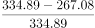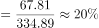；

住宿和餐饮业：；

金融业：；

房地产业：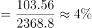；

租赁业和商务服务业：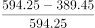；

居民服务和其他服务业：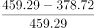；

文化、体育和娱乐业：；

其他行业：。

则所求平均值。

故正确答案为B。

注：问题2中的“转出”指经济学中的税负转移，即税收的转嫁，意指纳税人通过各种途径将应缴税金全部或部分转给他人负担从而造成纳税人与负税人不一致的经济现象。因此本题转出比例或可参考92题“转出规模”的定义进行引申。

---

#### 第 4 题　qid 4708191 · 比重

若比较对各自所属产业实征国内增值税的比重，2017年，制造业约比批发和零售业 （    ）？

- **A**. 高38％
- **B**. 低38％
- **C**. 高19％
- **D**. 低19％　✅

**答案**：D

**官方解析**

根据题干“若比较······的比重，2017年······”，结合选项为高/低+%，可判定本题为现期比重问题。定位统计表可知：2017年第二产业实征国内增值税14715.79亿元，其中，制造业实征国内增值税11035.77亿元；第三产业实征国内增值税4099.6亿元，其中，批发和零售业实征国内增值税3833.15亿元。根据公式：比重，可知2017年制造业占第二产业实征国内增值税的比重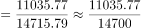，批发和零售业占第三产业实征国内增值税的比重，题目所求比重差=75%-94%=-19%，即约低19%。

故正确答案为D。

---

#### 第 5 题　qid 4708194 · 综合

关于2017年不同行业实征税收和归宿税收，以下说法不正确的是（    ）。

- **A**. 第二产业是营业税的主要转入产业
- **B**. 第三产业是营业税的主要转出产业
- **C**. 在所有行业中，营业税转出比例最大的是房地产行业　✅
- **D**. 建筑业属于营业税的转入行业

**答案**：C

**官方解析**

A项：定位统计表，第一产业、第二产业、第三产业营业税的实征税收分别为3亿元、2065.97亿元、6946.22亿元；归宿税收分别为52.52亿元、3399.78亿元、5562.88亿元。三大产业营业税的转入规模分别为52.52-3=49.52亿元、3399.78-2065.97=1333.81亿元、5562.88-6946.22=-1383.34亿元，第二产业营业税的转入规模最大，为主要转入产业，正确；

B项：定位统计表，第一产业、第二产业、第三产业营业税的实征税收分别为3亿元、2065.97亿元、6946.22亿元；归宿税收分别为52.52亿元、3399.78亿元、5562.88亿元。三大产业中只有第三产业的实征税收大于归宿税收，是主要转出产业，正确；

C项：定位统计表，金融业营业税的实征税收和归宿税收分别为1478.54亿元、661.84亿元；房地产业营业税的实征税收和归宿税收分别为2368.8亿元、2265.24亿元。金融业的营业税转出比例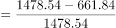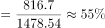，房地产业的营业税转出比例，房地产行业不是营业税转出比例最大的行业，错误；

D项：定位统计表，建筑业营业税的实征税收和归宿税收分别为1921.7亿元、2376.54亿元，归宿税收大于实征税收，是营业税的转入行业，正确。

本题为选非题，故正确答案为C。

注：结合本篇材料第二题及第三题，可引申出转入产业/行业为归宿税收大于实征税收的产业/行业、转出产业/行业为实征税收大于归宿税收的产业/行业、转入规模为（归宿税收-实征税收）、转出比例为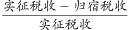。

---

### 材料 2

        2012年F省社会消费品零售总额7149.54亿元，比上年增长15.9％，其中12月份的社会消费品零售总额645.36亿元。按经营地统计，城镇消费品零售额6563.57亿元，增长16.0％；乡村消费品零售额585.97亿元，增长14.6％。按消费形态统计，商品零售额6276.04亿元，增长15.7％；餐饮收入额873.50亿元，增长17.6％。

        在限额以上企业商品零售额中，家具类零售额比上年增长47.8％，金银珠宝类增长47.4％，服装鞋帽针织纺织品类增长32.5％，食品饮料烟酒类增长24.9％，其中食品类增长24.4％，日用品类增长22.8％，化妆品类增长18.6％，汽车类增长14.7％，石油及制品类增长13.8％，通讯器材类增长8.1％，家用电器和音响器材类增长6.1％，体育、娱乐用品类下降6.1％。

#### 第 6 题　qid 4708226 · 增长

2012年，F省社会消费品零售总额同比增速最慢的月份是？

- **A**. 3月
- **B**. 7月　✅
- **C**. 10月
- **D**. 12月

**答案**：B

**官方解析**

定位统计图可知，2012年F省3月、7月、10月、12月的社会消费品零售总额同比增速分别为17.4%、14.1%、16.4%、15.7%，其中，同比增速最慢的月份是7月。
故正确答案为B。

---

#### 第 7 题　qid 4708227 · 增长

2012年12月份，F省社会消费品零售总额同比增量约为：

- **A**. 120.2亿元
- **B**. 101.3亿元
- **C**. 87.6亿元　✅
- **D**. 557.8亿元

**答案**：C

**官方解析**

根据题干“2012年12月份······同比增量约为”，可判定本题为增长量计算问题。定位文字材料第一段可得：（2012年）12月份，F省社会消费品零售总额645.36亿元；定位统计图可得：（2012年）12月份，F省社会消费品零售总额同比增长15.7%。根据公式：增长量，则2012年12月份，F省社会消费品零售总额同比增量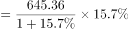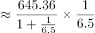亿元，与C项最接近。

故正确答案为C。

---

#### 第 8 题　qid 4708228 · 综合

2011年，F省城镇消费品零售额比乡村消费品零售额高约：

- **A**. 5147亿元　✅
- **B**. 5543亿元
- **C**. 5978亿元
- **D**. 6065亿元

**答案**：A

**官方解析**

根据题干“2011年······比······高约”，结合材料时间为2012年，可判定本题为基期和差问题。定位文字材料第一段可得：2012年，F省城镇消费品零售额6563.57亿元，增长16.0％；乡村消费品零售额585.97亿元，增长14.6％。根据公式：基期量，则2011年，F省城镇消费品零售额比乡村消费品零售额高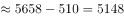亿元，与A项最接近。

故正确答案为A。

---

#### 第 9 题　qid 4708229 · 综合

下列说法正确的是：

- **A**. 2012年有10个月份社会消费品零售总额月底同比增长速度超过15％
- **B**. 2012年餐饮收入额占社会消费品零售总额的比重不超过10％
- **C**. 在2012年限额以上企业商品零售额相比上年的增长速度的排行上，服装鞋帽针织纺织品类位居第四
- **D**. 与2011年相比，2012年商品零售额比餐饮收入额增量多　✅

**答案**：D

**官方解析**

A项：定位统计图，2012年1-2月，F省社会消费品零售总额同比增长14.9%。材料给出2012年1-2月的混合增长率，不能确定1月和2月单独的同比增长率，则无法判断其增长速度是否超过15%，错误；

B项：定位文字材料第一段，2012年F省社会消费品零售总额7149.54亿元，比上年增长15.9％；餐饮收入额873.50亿元，增长17.6％。根据公式：，则2012年餐饮收入额占社会消费品零售总额的比重，错误；

C项：定位文字材料第二段，（2012年）在限额以上企业商品零售额中，家具类零售额比上年增长47.8％，金银珠宝类增长47.4％，服装鞋帽针织纺织品类增长32.5％，食品饮料烟酒类增长24.9％，其中食品类增长24.4％，日用品类增长22.8％，化妆品类增长18.6％，汽车类增长14.7％，石油及制品类增长13.8％，通讯器材类增长8.1％，家用电器和音响器材类增长6.1％，体育、娱乐用品类下降6.1％。观察数据发现，服装鞋帽针织纺织品类增长32.5％，增长速度位居第三，错误；

D项：定位文字材料第一段，（2012年）商品零售额6276.04亿元，增长15.7％；餐饮收入额873.50亿元，增长17.6％。根据公式：，则2012年商品零售额同比增量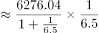亿元；2012年餐饮收入额同比增量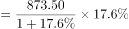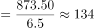亿元。故与2011年相比，2012年商品零售额比餐饮收入额增量多，正确。

故正确答案为D。

---

#### 第 10 题　qid 4708235 · 增长

下列说法中，正确的有几个？
I：2012年限额以上企业商品零售额中，家具类零售额的增量大于服装鞋帽针织纺织品类
II：2012年F省社会消费品零售总额不是6000亿元
III：2012年11月社会消费品零售总额环比增长约50亿元
IV：2012年所有类别的限额以上企业商品零售额都有不同程度的上涨

- **A**. 0个
- **B**. 1个　✅
- **C**. 2个
- **D**. 3个

**答案**：B

**官方解析**

I：定位文字材料第二段可知，（2012年）在限额以上企业商品零售额中，家具类零售额比上年增长47.8％，服装鞋帽针织纺织品类增长32.5％。仅有增长率，无对应的现期量，无法求解同比增长量，故无法推出家具类零售额的增量大于服装鞋帽针织纺织品类，错误；
II：定位文字材料第一段可知，2012年F省社会消费品零售总额7149.54亿元。不是6000亿元，正确；
III：定位图1可知，材料仅给出2012年10月和11月F省社会消费品零售总额的同比增速，无法求解出2012年11月和10月的具体值，故无法推出2012年11月社会消费品零售总额的环比增量，错误；
IV：定位文字材料第二段可知，（2012年）在限额以上企业商品零售额中，体育、娱乐用品类下降6.1％。并非所有类别的限额以上企业商品零售额都有不同程度的上涨，错误。
则正确的有1个。
故正确答案为B。

---

### 材料 3

        2012年我国粮食种植面积11127万公顷，比上年增加69万公顷；棉花种植面积470万公顷，减少34万公顷，油科种植面积1398万公顷，增加12万公顷；糖料种植面积203万公顷，增加9万公顷。

        全年粮食产量58957万吨，比上年增加1836万吨，增产3.2%。全年棉花产量684万吨，比上年增产3.8%，油料产量3476万吨，比上年增产5.1%，糖料产量13493万吨，比上年增产7.8%，烤烟产量320万吨，比上年增产11.5%；茶叶产量180万吨，比上年增产11.2%。

        全年肉类产量8384万吨，比上年增产5.4%；禽蛋产量2861万吨，比上年增产1.8%，牛奶产量3744万吨，比上年增产2.3%；水产品产量5906万吨，比上年增产5.4%；全年木材产量8088万立方米，比上年下降0.7%；全年新增产效灌溉面积172万公顷，新增节水灌溉面积235万公顷。

#### 第 11 题　qid 2047654 · 综合

2007年我国的粮食产量约为（    ）。

- **A**. 55889万吨
- **B**. 50162万吨　✅
- **C**. 55726万吨
- **D**. 52866万吨

**答案**：B

**官方解析**

第一步：分析问题

材料中给出现期量和增长率，求基期量，为基期量的计算。现期量为2008年我国粮食产量，增长率为2008年相对2007年的增长率。基期量。

第二步：计算过程

根据图形材料可知，2008年我国粮食产量为52871万吨，增长率为5.4%，故2007年我国粮食产量为：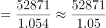，首位商50，只有B项符合。

第三步：再次标注答案

故正确答案为B。

---

#### 第 12 题　qid 2047656 · 综合

2011年我国粮食的单位面积产量约为（    ）。

- **A**. 5.13万吨/公顷
- **B**. 5.13吨/公顷
- **C**. 5.17万吨/公顷
- **D**. 5.17吨/公顷　✅

**答案**：D

**官方解析**

第一步：分析问题

图形材料中给出2011年我国粮食产量，文字材料中给出2012年粮食种植面积及增长量，故可得出2011年粮食种植面积。2011年我国粮食的单位面积产量，注意单位。

第二步：计算过程

根据图形材料可知，2011年我国粮食产量57121万吨；

根据文字型材料“2012年我国粮食种植面积11127万公顷，比上年增加69万公顷”，可知2011年我国粮食种植面积为：11127-69=11058万公顷。

可得：2011年我国粮食的单位面积产量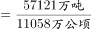，首三位商5.16，单位为吨/公顷，最接近的为D项。

第三步：再次标注答案

故正确答案为D。

---

#### 第 13 题　qid 2047658 · 综合

能够从上述资料推出的是（    ）。

- **A**. 2009年我国粮食的种植面积
- **B**. 2010年我国水产品的产量
- **C**. 2011年我国木材产量　✅
- **D**. 2011年我国猪肉产量

**答案**：C

**官方解析**

第一步：分析问题

根据材料，找出能算出结果的一项即可。

第二步：计算过程

A项：错误，材料中只给了2012年我国粮食种植面积及增长量，得不出2009年粮食种植面积；

B项：错误，材料中给出2012年我国水产品的产量及2012年相对2011年的增长率，无法求出2010年的我国水产品产量；

C项：正确，根据材料“全年木材产量8088万立方米，比上年下降0.7%”，故可得2011年木材产量为：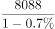，是可以得出的；

D项：错误，材料中只给出肉类整体的产量及增长率，并未涉及到猪肉的信息，因此无法得出2011年猪肉的产量。

第三步：再次标注答案

故正确答案为C。

---

#### 第 14 题　qid 2047660 · 增长

与2011年相比，下列农作物中在2012年产量增加最多的是（    ）。

- **A**. 棉花
- **B**. 油料
- **C**. 烤烟
- **D**. 糖料　✅

**答案**：D

**官方解析**

第一步：分析问题
材料中给出各农作物的现期量及增长率，比较增长量大小。现期量为2013年农作物的产量。1.若现期量大、增长率大，则对应的增长量大；2.若现期量大，增长率小，一般情况下比较现期量×增长率即可。
第二步：计算过程
根据“全年棉花产量684万吨，比上年增产3.8%，油料产量3476万吨，比上年增产5.1%，糖料产量13493万吨，比上年增产7.8%，烤烟产量320万吨，比上年增产11.5%”。
可知棉花的现期量为684万吨，增长率为3.8%，油料的现期量为3476万吨，增长率为5.1%，棉花与油料相比，油料的现期量3476万吨&gt;棉花的现期量684万吨，油料的增长率5.1%&gt;棉花的增长率3.8%，因此油料的增长量大于棉花的增长量；
糖料的现期量13493万吨，增长率7.8%，糖料与油料相比，糖料的现期量13493万吨&gt;油料的现期量3476万吨，糖料的增长率7.8%&gt;油料的增长率5.1%，因此糖料的增长量大于油料的增长量；
烤烟的现期量320万吨，增长量11.5%，糖料与烤烟相比，糖料的现期量13493万吨&gt;烤烟的现期量320万吨，糖料的增长率7.8%&lt;烤烟的增长率11.5%，因此，比较：13493×7.8%与320×11.5%，显然13493×7.8%&gt;320×11.5%，故糖料的增长量最大。
第三步：再次标注答案
故正确答案为D。

---

#### 第 15 题　qid 2047662 · 增长

下列说法中，正确的有（    ）。
I.2008~2012年我国粮食产量是逐年增加的
II.2008~2012年我国年均粮食产量增加不到1000万吨
III.2012年各种农作物的产量比上年都有不同程度的增长
Ⅳ.2011年茶叶产量不超过170万吨

- **A**. 1个
- **B**. 2个　✅
- **C**. 3个
- **D**. 4个

**答案**：B

**官方解析**

第一步：分析问题

根据材料，找出正确表述的个数即可。

第二步：计算过程

I.根据图形材料可知，2008~2012年我国粮食产量是逐年增加的，表述正确；

II.根据图形材料可知，2008年、2012年我国粮食产量分别为52871万吨、58957万吨，则2008~2012年我国年均粮食产量增长量为：，表述错误；

III.题目中只列举了几种农作物，不代表各种农作物，表述错误；

Ⅳ.根据“茶叶产量180万吨，比上年增产11.2%”，可知2011年茶叶产量为：，表述正确。

第三步：再次标注答案

故正确答案为B。

---

### 材料 4

        近岸海域298个海水水质监测点，在2015年监测中，达到国家一、二类海水水质标准的监测点占62.8%，比上年下降10.1个百分点；三类海水占14.1％，上升8.1个百分点；四类、劣四类海水占23.1％，上升2.1个百分点。

        在监测的330个城市中，有273个城市空气质量达到二级以上(含二级)标准，占监测城市数的82.7％；有53个城市为三级，占16.1％；有4个城市为劣三级，占1.2％。在监测的331个城市中，城市区域声环境质量好的城市占6.3％，较好的占67.4％，轻度污染的占25%，中度污染的占0.9％。

        2015年年末城市污水处理厂日处理能力达10262万立方米，比上年末增长13.4％；城市污水处理率达到76.9％，提高1.6个百分点。集中供热面积39.1亿平方米，增长3.0％。建成区绿地率达到34.5％，提高0.3个百分点。

        2015年全年各类自然灾害造成直接经济损失5340亿元，比上年增加1.1倍，占国内生产总值的1.31％。全年农作物受灾面积3743万公顷，减少20.7％。其中，绝收486万公顷，减少1.1％。全年因洪涝、滑坡和泥石流灾害造成直接经济损失3505亿元，增加4.4倍；死亡3101人。全年因旱灾造成直接经济损失757亿元，下降31.2％。全年因低温冷冻和雪灾造成直接经济损失318亿元，死亡51人。全年因海洋灾害造成直接经济损失149.4亿元，增加49.1％。全年累计发生赤潮面积10892平方公里，减少22.8％。全年大陆地区共发生5级以上地震17次，成灾10次，造成直接经济损失235.7亿元，死亡2705人。全年共发生森林火灾7723起，下降12.8％。

        2015年全年各类生产安全事故共死亡79552人，比上年下降4.4％。亿元国内生产总值生产安全事故死亡人数为0.201人，下降19.0％；工矿商贸企业就业人员10万人生产安全事故死亡人数为2.13人，下降11.3％；道路交通万车死亡人数为3.2人，下降11.1％；煤矿百万吨死亡人数为0.749人，下降16.0％。

#### 第 16 题　qid 4708236 · 综合

2014年海水质量达到三类及以上海水水质标准的监测点的数量为：

- **A**. 187
- **B**. 223
- **C**. 229
- **D**. 235　✅

**答案**：D

**官方解析**

根据题干“2014年······数量为”，结合材料时间是2015年，同时给出了海水水质监测点总数和各类占比，可判定本题为基期比重问题。定位文字材料第一段可知：近岸海域298个海水水质监测点，在2015年监测中，达到国家一、二类海水水质标准的监测点占62.8％，比上年下降10.1个百分点；三类海水占14.1％，上升8.1个百分点。故2014年达到国家一、二类海水水质标准的监测点占比=62.8%+10.1%=72.9%；三类海水占比=14.1％-8.1%=6%，则2014年海水质量达到三类及以上的海水水质监测点占比为72.9%+6%=78.9%。根据公式：部分量=总量×比重，可知所求个。

故正确答案为D。

---

#### 第 17 题　qid 4708239 · 综合

2014年全年因旱灾造成直接经济损失是该年度因海洋灾害造成直接经济损失的多少倍？

- **A**. 0.8
- **B**. 5.0
- **C**. 7.3
- **D**. 11.0　✅

**答案**：D

**官方解析**

根据题干“2014年······是······”，可判定本题为基期倍数问题。定位文字材料第四段可知：（2015年）全年因旱灾造成直接经济损失757亿元（A），下降31.2％（a）。全年因海洋灾害造成直接经济损失149.4亿元（B），增加49.1％（b）。根据公式：基期倍数，可知所求。

故正确答案为D。

---

#### 第 18 题　qid 4708242 · 综合

2015年国内生产总值约为（    ）万亿？

- **A**. 28.9
- **B**. 33.6
- **C**. 41.6　✅
- **D**. 50.7

**答案**：C

**官方解析**

根据题干“2015年······约为······万亿”，结合材料给出了各类自然灾害造成直接经济损失及其占国内生产总值的比重，可判定本题为现期比重问题。定位文字材料第四段可知：2015年全年各类自然灾害造成直接经济损失5340亿元，占国内生产总值的1.31%。根据公式：总量，可知所求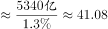万亿，与C项最为接近。

故正确答案为C。

---

#### 第 19 题　qid 4708244 · 综合

2014年年末城市污水处理厂日处理能力为（    ）万立方米。

- **A**. 11849.9
- **B**. 9049.4　✅
- **C**. 8862.5
- **D**. 8563.6

**答案**：B

**官方解析**

根据题干“2014年年末······为······万立方米”，结合材料时间2015年，可判定本题为基期计算问题。定位文字材料第三段可知：2015年年末城市污水处理厂日处理能力达10262万立方米，比上年末增长13.4％。根据公式：基期量，代入数据可得，2014年年末城市污水处理厂日处理能力为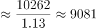万立方米，与B项最接近。

故正确答案为B。

---

#### 第 20 题　qid 4708247 · 综合

根据材料，以下说法正确的是（    ）。

- **A**. 2015年全年各类自然灾害造成直接经济损失较上年度相比均有所增加
- **B**. 2015年全年因洪涝、滑坡和泥石流灾害造成经济损失3505亿元，同比增加了2856亿元　✅
- **C**. 2014年全年农作物受灾面积为4228.6万公顷
- **D**. 2014年全年发生森林火灾次数比2010年全年发生森林火灾次数多12.8％

**答案**：B

**官方解析**

A项：定位文字材料第四段可知，（2015年）全年因旱灾造成直接经济损失757亿元，下降31.2％，并非各类自然灾害造成直接经济损失较上年度相比均有所增加，错误；

B项：定位文字材料第四段可知，（2015年）全年因洪涝、滑坡和泥石流灾害造成直接经济损失3505亿元，增加4.4倍。则同比增加了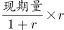亿元，正确；

C项：定位文字材料第四段可知，（2015年）全年农作物受灾面积3743万公顷，减少20.7％。则2014年全年农作物受灾面积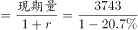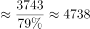万公顷，错误；

D项：定位文字材料第四段可知，（2015年）全年共发生森林火灾7723起，下降12.8%。无2010年相关的数据，无法推出2014年全年发生森林火灾次数比2010年多12.8％，错误。

故正确答案为B。

---
