# 2019年重庆市选调优秀大学生到基层工作考试《行测》题

> 选调生 · 2019 年 · 6 个模块 · 共 98 题

- [政治理论](#%E6%94%BF%E6%B2%BB%E7%90%86%E8%AE%BA) · 1 题
- [常识判断](#%E5%B8%B8%E8%AF%86%E5%88%A4%E6%96%AD) · 14 题
- [言语理解与表达](#%E8%A8%80%E8%AF%AD%E7%90%86%E8%A7%A3%E4%B8%8E%E8%A1%A8%E8%BE%BE) · 30 题
- [数量关系](#%E6%95%B0%E9%87%8F%E5%85%B3%E7%B3%BB) · 13 题
- [判断推理](#%E5%88%A4%E6%96%AD%E6%8E%A8%E7%90%86) · 30 题
- [资料分析](#%E8%B5%84%E6%96%99%E5%88%86%E6%9E%90) · 10 题

---

## 政治理论

### 第 1 题　qid 2668470 · 新思想

从全面建成小康社会到基本实现现代化，再到全面建成（    ），是新时代中国特色社会主义发展的战略安排。

- **A**. 世界一流强国
- **B**. 社会主义现代化强国　✅
- **C**. 社会主义现代化大国
- **D**. 社会主义创新型国家

**答案**：B

**官方解析**

本题考查政治。
十九大报告指出：“从全面建成小康社会到基本实现现代化，再到全面建成社会主义现代化强国，是新时代中国特色社会主义发展的战略安排。我们要坚忍不拔、锲而不舍，奋力谱写社会主义现代化新征程的壮丽篇章！”
故正确答案为B。

---

## 常识判断

### 第 1 题　qid 2668473 · 经济常识

以下是改革开放以来，我国历届党和国家领导人的重要论断，对其按时间先后排序，排列正确的一项是：
①改革开放是决定当代中国命运的关键一招，也是决定实现“两个一百年”奋斗目标，实现中华民族伟大复兴的关键一招。
②经济全球化是世界经济发展的客观趋势，对我国的发展有利也有弊。不能看到有风险，有不利因素，就因噎废食，不敢参与进去，同时又要对风险保持清醒认识，坚持独立自主，加强防范工作，增强抵御和化解能力。
③判断姓“社”还是姓“资”的标准，应该主要看是否有利于发展社会主义社会的生产力，是否有利于增强社会主义国家的综合国力，是否有利于提高人民的生活水平。
④落实好人才强国战略，必须树立适应新形势新任务要求的科学人才观，使我国由人口大国转化为人才资源强国。

- **A**. ③①②④
- **B**. ③②①④
- **C**. ③②④①　✅
- **D**. ③④②①

**答案**：C

**官方解析**

本题考查政治。
①：2018年12月18日，习近平总书记在庆祝改革开放40周年大会上的讲话中指出：“40年的实践充分证明，改革开放是党和人民大踏步赶上时代的重要法宝，是坚持和发展中国特色社会主义的必由之路，是决定当代中国命运的关键一招，也是决定实现‘两个一百年’奋斗目标、实现中华民族伟大复兴的关键一招。”
②：1998年8月28日，江泽民同志在第九次驻外使节会议上的讲话指出：“经济全球化是世界经济发展的客观趋势，对我国的发展有利也有弊。不能看到有风险、有不利因素，就因噎废食，不敢参与进去，同时又要对风险保持清醒认识，坚持独立自主，加强防范工作，增强抵御和化解能力。”
③：1992年1月18日―2月21日，邓小平同志在南巡中发表重要讲话，讲话指出：“（是姓‘资’还是姓‘社’）判断的标准，应主要看是否有利于发展社会主义社会的生产力，是否有利于增强社会主义国家的综合国力，是否有利于提高人民的生活水平。”
④：2003年12月19日至20日，胡锦涛同志在全国人才工作会议上的讲话指出：“做好人才工作，落实好人才强国战略，必须以马克思主义为指导，从当代世界和中国深刻变化着的实际出发，根据党和国家事业发展的迫切需要，解放思想、实事求是、与时俱进，树立适应新形势新任务要求的科学人才观。”
综上所述，按时间先后排序顺序为③②④①。
故正确答案为C。

---

### 第 2 题　qid 2668475 · 经济常识

下列经济常识不正确的是：

- **A**. 物价水平的持续下降意味着实际利率的上升
- **B**. 通过公开市场业务出售政府证券属于紧缩性货币政策
- **C**. 当通货膨胀严重时提高存款准备金率
- **D**. 经济衰退时期，应提高税率以扩大内需　✅

**答案**：D

**官方解析**

本题考查经济常识。
A项正确，物价水平的持续下降意味着实际利率的上升，投资成本变得昂贵，投资项目的吸引力下降，投资减少必然导致经济增长的下降，可能形成经济衰退。
B项正确，紧缩性的货币政策是通过货币供应的增长率来降低总需求水平，在这种政策下，取得信贷较为困难，利息率也随之提高。公开市场业务是货币政策工具之一，是指中央银行通过买进或卖出有价证券，吞吐基础货币，调节货币供应量的活动。题干中，通过公开市场业务出售政府证券，吸收市场中的货币，从而降低市场中的货币供应量，属于紧缩性货币政策。常见的紧缩性货币政策还有提高存款准备金率、提高再贴现率等。
C项正确，通货膨胀是指在货币流通条件下，因货币实际需求小于货币供给，也即现实购买力大于产出供给,导致货币贬值，而引起的一段时间内物价持续而普遍地上涨现象。其实质是社会总供给小于社会总需求（供远小于求）。提高存款准备金率，商业银行需要上缴中央银行的法定存款准备金增加，商业银行的可用资金减少，在其他情况不变的条件下，商业银行贷款或投资下降，导致货币供应量减少，有助于缓解通货膨胀。
D项错误，在经济衰退时期，通过降低税率、增加公共投资、完善社会保障等方法能够有效刺激消费、扩大内需。
本题为选非题，故正确答案为D。

---

### 第 3 题　qid 2668477 · 法律常识

十三届全国人民代表大会第一次会议通过了宪法修正案，完成了宪法修改的重大历史任务，实现了我国宪法的又一次与时俱进。下列哪一项不属于我国第五次宪法修改的内容？

- **A**. 将“健全社会主义法制”修改为“健全社会主义法治”
- **B**. 将“全国人民代表大会设立法律委员会”修改为“全国人民代表大会设立宪法和法律委员会”
- **C**. 增加“国家倡导社会主义核心价值观”
- **D**. 增加“国家尊重和保护人权”　✅

**答案**：D

**官方解析**

本题考查法律常识。
A项正确，2018年《宪法修正案（五）》第三十二条规定：“······‘健全社会主义法制’修改为‘健全社会主义法治’；······”
B项正确，2018年《宪法修正案（五）》第四十四条规定：“······宪法第七十条第一款中‘全国人民代表大会设立民族委员会、法律委员会、财政经济委员会、教育科学文化卫生委员会、外事委员会、华侨委员会和其他需要设立的专门委员会。’修改为：‘全国人民代表大会设立民族委员会、宪法和法律委员会、财政经济委员会、教育科学文化卫生委员会、外事委员会、华侨委员会和其他需要设立的专门委员会。’”
C项正确，2018年《宪法修正案（五）》第三十九条规定：“宪法第二十四条第二款中‘国家提倡爱祖国、爱人民、爱劳动、爱科学、爱社会主义的公德’修改为‘国家倡导社会主义核心价值观，提倡爱祖国、爱人民、爱劳动、爱科学、爱社会主义的公德’。这一款相应修改为：‘国家倡导社会主义核心价值观，提倡爱祖国、爱人民、爱劳动、爱科学、爱社会主义的公德，在人民中进行爱国主义、集体主义和国际主义、共产主义的教育，进行辩证唯物主义和历史唯物主义的教育，反对资本主义的、封建主义的和其他的腐朽思想。’”
D项错误，2004年《宪法修正案（四）》第二十四条规定：“宪法第三十三条增加一款，作为第三款：‘国家尊重和保障人权。’第三款相应地改为第四款。”
本题为选非题，故正确答案为D。

---

### 第 4 题　qid 2668480 · 人文常识

在中国古代，一支从长安出发的和平使团，开始打通东方通往西方的道路，完成了“凿空之旅”，这就是著名的：

- **A**. 张骞出使西域　✅
- **B**. 王昭君出塞和亲
- **C**. 郑和七下西洋
- **D**. 唐玄奘西天取经

**答案**：A

**官方解析**

本题考查人文常识。
A项正确，张骞出使西域，指的是汉武帝时期希望联合月氏夹击匈奴，派遣张骞出使西域各国的历史事件。张骞出使西域本为贯彻汉武帝联合大月氏抗击匈奴之战略意图，但出使西域后汉夷文化交往频繁，中原文明通过“丝绸之路”迅速向四周传播。张骞对开辟从中国通往西域的丝绸之路有卓越贡献，被称为“凿空之旅”，至今举世称道。
B项错误，公元前33年，匈奴单于呼韩邪稽侯珊第三次来到汉朝的京师长安城，觐见汉元帝刘奭，表示归附中央王朝的诚意和对汉元帝的尊敬，并且请求“婿汉氏以自亲”。元帝应允，后宫宫女王昭君挺身而出“请掖庭令求行”，担当“和蕃使者”的角色。这就是中国历史上著名的“昭君出塞和亲”。昭君到匈奴后，被封为“宁胡阏氏”（意思是王后），象征她将给匈奴带来和平、安宁和兴旺。
C项错误，郑和下西洋是明代永乐、宣德年间的一场海上远航活动，首次航行始于永乐三年（1405年），末次航行结束于宣德八年（1433年），共计七次。郑和下西洋是中国古代规模最大、船只和海员最多、时间最久的海上航行，也是15世纪末欧洲的地理大发现的航行以前世界历史上规模最大的一系列海上探险。
D项错误，玄奘，唐代著名高僧，法相宗创始人，是我国历史上伟大的思想家、哲学家、外交家、中外文化交流的使者。玄奘西行5万里，历时17年，到印度取真经，并穷一生译经，其足迹遍布印度，影响远至日本、韩国以至全世界，其思想与精神如今已是中国、亚洲乃至世界人民的共同财富。
故正确答案为A。

---

### 第 5 题　qid 2668481 · 人文常识

去年8月，挪威和芬兰的北极圈内区域多次记录到了超过的高温，比往年均温高出，然而北极熊并没有受到热潮的威胁。其原因有可能是：

- **A**. 北极熊分布很广，不局限于挪威和芬兰的北极圈内区域
- **B**. 斯堪的纳维亚北部区域属于北极圈中较暖的地方，北极圈中心区域依然比较凉爽　✅
- **C**. 春天到初夏才是北极熊捕食的主要时期
- **D**. 热浪对于海冰覆盖率的影响是需要时间累积的

**答案**：B

**官方解析**

本题考查地理国情。
作为地理区划，北极圈占据了23.5个纬度，它的边缘地区在夏天其实并不是很冷，7月均温通常在10摄氏度左右；斯堪的纳维亚北部区域属于北极圈中较暖的地方，如挪威北部的巴纳克位于北纬70度，夏季最高温通常在17摄氏度左右。2018年的热浪打破了多地的夏季气温记录，虽然北极圈局部地区面临异常高温，但此刻北极圈的中心地区还比较凉爽，因而北极熊并没有受到热潮的威胁。
故正确答案为B。

---

### 第 6 题　qid 2668482 · 人文常识

2016年，启动5G技术研究试验；2018年，多地开展5G试点；2020年，5G全面投入商用······中国5G正按照规划时间表有序发展，并走在世界前列。5G主要有三类典型业务场景，其中不包括：

- **A**. 超密集组网　✅
- **B**. 增强型移动宽带
- **C**. 海量机器类通信
- **D**. 高可靠低时延通信

**答案**：A

**官方解析**

本题考查科技常识。
A项错误，未来5G应用有三大场景，包括增强型移动宽带、海量机器类通信、高可靠低时延通信。超密集组网是5G的关键技术，不属于应用场景。
B项正确，增强型移动宽带，是指5G的峰值速率将达到4G网络的10倍以上。增强型移动宽带是为了发挥5G传输速率快与网络连接容量大的优势、满足人们对多媒体产品与服务等的接入需求与消费。
C项正确，海量机器类通信，是指5G将实现从消费到生产的全环节、从人到物的全场景覆盖，即“万物互联”。
D项正确，高可靠低时延通信，是指5G的通信响应速度将降至毫秒级，如自动驾驶汽车探测到障碍后的响应速度将比人的反应更快，将助推自动驾驶汽车从实验室开到路上。
本题为选非题，故正确答案为A。

---

### 第 7 题　qid 2668486 · 人文常识

入夏以来，强对流天气造成严重灾害的事件时有发生。以下不属于强对流天气的是：

- **A**. 雷雨大风
- **B**. 冰雹
- **C**. 台风　✅
- **D**. 短时强降水

**答案**：C

**官方解析**

本题考查地理国情。
强对流天气是指出现短时强降水、雷雨大风、龙卷风、冰雹和飑线等现象的灾害性天气，它发生在对流云系或单体对流云块中，在气象上属于中小尺度天气系统。
A项正确，雷雨大风，指在出现雷、雨天气现象时，平均风力大于等于6级、阵风大于等于8级的天气现象。当雷雨大风发生时，乌云滚滚，电闪雷鸣，狂风夹伴强降水，有时伴有冰雹，风速极大。它涉及的范围一般只有几公里至几十公里。
B项正确，冰雹也叫“雹”，是一种天气现象，夏季或春夏之交最为常见。冰雹是一些小如绿豆、黄豆，大似栗子、鸡蛋的冰粒。
C项错误，台风，属于热带气旋的一种。热带气旋是发生在热带或副热带洋面上的低压涡旋，是一种强大而深厚的“热带天气系统”。我国把南海与西北太平洋的热带气旋按其底层中心附近最大平均风力（风速）大小划分为6个等级，其中风力达12级或以上的，统称为台风。
D项正确，短时强降雨，指的是1小时内某地降雨量超过20毫米，短时强降雨是一种强对流天气。
本题为选非题，故正确答案为C。

---

### 第 8 题　qid 2668487 · 人文常识

中国传统节日形式多样，内容丰富，蕴涵着深邃丰厚的文化内涵，是中华民族悠久历史文化的重要组成部分。下列古诗词描写的传统节日中，对应有误的一项是：

- **A**. 春节——爆竹声中一岁除，春风送暖入屠苏
- **B**. 上元节——众里寻他千百度，蓦然回首，那人却在，灯火阑珊处
- **C**. 中秋节——暮云收尽溢清寒，银汉无声转玉盘
- **D**. 下元节——尘世难逢开口笑，菊花须插满头归　✅

**答案**：D

**官方解析**

本题考查人文常识。
A项正确，“爆竹声中一岁除，春风送暖入屠苏”出自宋代王安石的《元日》，意思是阵阵轰鸣的爆竹声中，旧的一年已经过去；和暖的春风吹来了新年，人们欢乐地畅饮着新酿的屠苏酒。此诗描写的是春节除旧迎新的景象。
B项正确，“众里寻他千百度，蓦然回首，那人却在，灯火阑珊处”出自南宋辛弃疾的《青玉案·元夕》，意思是对着众多走过的女人一一辨认，偶一回头，却发现自己的心上人站立在昏黑的幽暗之处。此词描绘出元宵佳节通宵灯火的热闹场景。元宵节，又称上元节、小正月、元夕或灯节，是中国的传统节日之一，时间为每年农历正月十五。
C项正确，“暮云收尽溢清寒，银汉无声转玉盘”出自宋代苏轼的《阳关曲·中秋月》，意思是夜幕降临，云气收尽，天地间充满了寒气；银河流泻无声，皎洁的月儿转到了天空，就像玉盘那样洁白晶莹。月到中秋分外明，是中秋月的特点，两句并没有写赏月的人，但全是赏心悦目之意，而人自在其中。
D项错误，“尘世难逢开口笑，菊花须插满头归”出自唐代杜牧的《九日齐山登高》，意思是尘世烦扰平生难逢让人开口一笑的事，满山盛开的菊花我定要插满头才归。九日指旧历九月九日，为重阳节。下元节，又称“下元日”、“下元”，是中国民间传统节日之一，为农历十月十五。
本题为选非题，故正确答案为D。

---

### 第 9 题　qid 2668490 · 人文常识

我们通常认为，声音传播的速度为340米/秒，其实这是在气温且干燥的空气中的声速。空气的温度、湿度以及传播的介质都会影响声速。下列有关声速的判断中，错误的一项是：

- **A**. 
声速在的干燥空气中比在的干燥空气中传播得快

- **B**. 
声速在的干燥空气中比在的氦气中传播得快
　✅
- **C**. 
声速在水中比在水蒸气中传播得快

- **D**. 
声速在冰中比在水中传播得快

**答案**：B

**官方解析**

本题考查科技常识。

A项正确，声音在空气中的传播速度与温度有关，气温越高，声音的传播速度越快。时海平面声音在空气中的传播速度约为331.5米/秒，时为340米/秒。温度每升高，声速约增加0.6米/秒。

B项错误，构成气体的原子和分子组成发生变化时，声速也会随之改变。比如在的氦气中，声速为970米/秒，接近干燥空气中的3倍。

C、D两项正确，物质的状态不同，声速会有很大的区别，如水蒸气中声速为473米/秒，水中声速为1500米/秒，冰中声速为3230米/秒。一般来说，在固体中声速最快、液体次之、气体最慢。

本题为选非题，故正确答案为B。

---

### 第 10 题　qid 2668491 · 人文常识

草书、行书、楷书、隶书四种字体中哪一种是其余三种的起源？

- **A**. 草书
- **B**. 行书
- **C**. 楷书
- **D**. 隶书　✅

**答案**：D

**官方解析**

本题考查人文常识。
草书、行书、楷书、隶书四种字体中，“隶书”是其余三种的起源。一般认为隶书由篆书发展而来，时间上早于行书、草书和楷书。
A项错误，草书，作为一种特定的字体，形成于汉代，是为了书写简便，在隶书基础上演变出来的。草书代表人物是唐朝的张旭和怀素，合称“颠张狂素”。
B项错误，行书，是一种书法统称，分为行楷和行草两种。它在楷书的基础上发展起源，是介于楷书、草书之间的一种字体，是为了弥补楷书的书写速度太慢和草书的难于辨认而产生的。行书代表人物是东晋书法家王羲之，他的《兰亭序》被誉为“天下第一行书”。
C项错误，楷书，由隶书逐渐演变而来，更趋简化，横平竖直。《辞海》中解释说它“形体方正，笔画平直，可作楷模”。这种汉字字体端正，就是现代通行的汉字手写正体字。著名的“楷书四大家”为：唐朝的欧阳询、唐颜真卿、柳公权和元朝的赵孟頫。
D项正确，隶书，一般认为由篆书发展而来，字形多呈宽扁，横画长而竖画短，讲究“蚕头燕尾”、“一波三折”。唐代隶书历来有韩择木、蔡有邻、李潮、史惟则四家平分秋色。
故正确答案为D。

---

### 第 11 题　qid 2668492 · 人文常识

2018年12月13日，维珍银河公司一架载有两名宇航员的飞船到达了距离地面82.7千米高的天空，相当于已到达地球大气层的哪一层？

- **A**. 对流层
- **B**. 平流层
- **C**. 中间层　✅
- **D**. 外层

**答案**：C

**官方解析**

本题考查地理国情。

A项错误，对流层，是指最接近地球表面的一层大气，也是大气的最下层，密度最大，所包含的空气质量几乎占整个大气质量的，以及几乎所有的水蒸气及气溶胶。其下界与地面相接，上界高度随地理纬度和季节而变化，它的高度因纬度而不同，在低纬度地区平均高度为17～18公里，在中纬度地区平均为10～12公里，极地平均为8～9公里，并且夏季高于冬季。

B项错误，平流层，亦称同温层，是地球大气层里上热下冷的一层，此层被分成不同的温度层，当中高温层置于顶部，而低温层置于低部。它与位于其下贴近地表的对流层刚好相反，对流层是上冷下热。在中纬度地区，平流层位于离地表10公里至50公里的高度，而在极地，此层则始于离地表8公里左右。

C项正确，中间层，又称中层，是指自平流层顶到85千米之间的大气层。该层内因臭氧含量低，同时，能被氮、氧等直接吸收的太阳短波辐射已经大部分被上层大气所吸收，所以温度垂直递减率很大，对流运动强盛。

D项错误，散逸层，又称“外层”、“逃逸层”，是热层（暖层）以上的大气层，也是地球大气的最外层。这层空气在太阳紫外线和宇宙射线的作用下，大部分分子发生电离，使质子和氦核的含量大大超过中性氢原子的含量。逃逸层空气极为稀薄，其密度几乎与太空密度相同，故又常称为外大气层。散逸层的下界距离地表800千米以上，而顶界约为2000~3000千米的高度。

故正确答案为C。

---

### 第 12 题　qid 2668493 · 科技常识

化学与人类生活密切相关，下列说法正确的是：

- **A**. 苯酚有一定毒性，不能做消毒剂和防腐剂
- **B**. 白磷着火点高且无毒，可用于制造安全火柴
- **C**. 油脂发生皂化反应生成的高级脂肪酸钠是肥皂的有效成分　✅
- **D**. 用食醋去除水壶中的水垢时所发生的反应是水解反应

**答案**：C

**官方解析**

本题考查科技常识。

A项错误，苯酚是一种有机化合物，是具有特殊气味的无色针状晶体，有毒，是生产某些树脂、杀菌剂、防腐剂以及药物（如阿司匹林）的重要原料。也可用于消毒外科器械和排泄物的处理，皮肤杀菌、止痒及中耳炎。

B项错误，白磷的着火点是，白磷易自燃且有毒，所以不能用于制造安全火柴，用于制造安全火柴的是红磷。

C项正确，油脂在碱溶液的作用下发生水解，叫皂化反应。皂化反应生成硬脂酸钠，硬脂酸钠用于制造肥皂，即肥皂的主要成分是硬脂酸钠。

D项错误，水垢的主要成分是碳酸钙、氢氧化镁，用食醋去除水壶中的水垢时所发生的反应是复分解反应。复分解反应是由两种化合物互相交换成分，生成另外两种化合物的反应，其实质是发生复分解反应的两种化合物在水溶液中交换离子，结合成难电离的沉淀、气体或弱电解质（最常见的为水），使溶液中离子浓度降低，化学反应向着离子浓度降低的方向进行的反应。

故正确答案为C。

---

### 第 13 题　qid 2668496 · 人文常识

2018年11月，第26届国际计量大会正式更新，包括国际标准质量单位“千克”在内的4项基本单位定义，至此，国际计量单位制的7个基本单位全部实现由常数定义。国际单位制和市制都是我国的基本计量制度，下列计量单位与我国市制计量单位的换算正确的一项是：

- **A**. 

- **B**. 
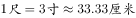

- **C**. 
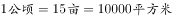
　✅
- **D**. 
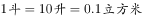

**答案**：C

**官方解析**

本题考查科技常识。

A项错误，钱是最小的重量单位，在中药方、黄金、食谱中仍沿用这一计量单位。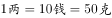。

B项错误，最早用大指与中指的跨度为一尺，一尺相当于八寸，但不利于计算。后改成一尺为十寸并规制沿用而成为市尺。。

C项正确，公顷为面积的公制单位（国际单位）。一块面积一公顷的土地为10000平方米。。

D项错误，斗的本义是一种盛酒的器具，又用作计量粮食的工具，后来才引申为单位。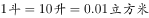。

故正确答案为C。

---

### 第 14 题　qid 2668497 · 人文常识

下列有关饮食的常识，说法正确的一项是：

- **A**. 粗粮富含膳食纤维，脂肪很少，吃粗粮有助于降低血糖
- **B**. 反式脂肪在炸鸡、爆米花、饼干、蛋糕等食品中比较常见　✅
- **C**. 人体内的胆固醇主要经膳食摄入
- **D**. 食品一旦过期，便会对人体健康造成危害，因此不能食用

**答案**：B

**官方解析**

本题考查科技常识。
A项错误，粗粮是相对精米白面等细粮而言的，主要包括谷类中的玉米、紫米、高粱、以及各种干豆类，如黄豆、青豆、绿豆等。食用粗粮血糖上升较慢，有助于控制血糖，但是并不能降低血糖。
B项正确，反式脂肪，又称为反式脂肪酸、逆态脂肪酸，是一种不饱和脂肪酸（单元不饱和或多元不饱和）。反式脂肪存在于植物油、糖果、巧克力、蛋糕、面包、披萨、人造奶油、曲奇饼等常见食物中。
C项错误，人体胆固醇的来源有两种，一种是从食物中获取，一种是机体以乙酰辅酶A为原料自身合成的。食物的主要来源是动物的内脏、蛋黄、奶油及肉等动物性食品。
D项错误，食品包装上的保质期是指食品的最佳食用期，一般是指在生产厂家规定的贮藏条件下，能够保持食品优良品质的期限。有些食物虽已过了保质期，也是可以食用的，但它的品质可能有某种程度的下降。
故正确答案为B。

---

## 言语理解与表达

### 材料 1

        中国是茶的故乡。茶树原生于秀美的川滇山区，是智慧的古人从葳蕤草木中择出了茶叶，自此<u>        </u>世人种茶、制茶、品茶的历史。在千百年的漫长岁月中，茶叶<u>        </u>着泱泱中华文明，跨越无尽的山海，推动各个民族以茶会友、因茶结缘。正如日本思想家冈仓天心所说：“东西方彼此差异的人心，在茶碗里才真正地相知相遇。”茶与茶文化走出国门、走向世界的历史，也是中华文明参与构建人类命运共同体的历史。

#### 第 1 题　qid 2669061 · 逻辑填空

填入画横线部分最恰当的一项是：

- **A**. 启迪  承受
- **B**. 开启  承载　✅
- **C**. 开放  承袭
- **D**. 启发  承担

**答案**：B

**官方解析**

第一空，搭配“历史”。B项“开启”指开始、从某一点起，与“历史”搭配得当，保留。A项“启迪”指开导、启发，与“历史”搭配不当，排除；C项“开放”指打开，释放，解除限制等含义，与“历史”搭配不当，排除；D项“启发”指开导其心，使之领悟，强调引导他人领悟，不符合语境，排除。
第二空，代入验证，B项“承载”与“中华文明”搭配得当，当选。
故正确答案为B。
【文段出处】《一杯茶的世界之路》

---

#### 第 2 题　qid 2669066 · 片段阅读

接下来最不可能重点讲述的是：

- **A**. 中国人吃茶习俗的崛起
- **B**. 各时各地茶文化的多样性
- **C**. 不同种类茶的功效比较　✅
- **D**. 中外“茶马”互市的历史

**答案**：C

**官方解析**

接语选择题重点关注尾句。尾句话题为茶与茶文化走向世界，故下文应对茶与茶文化的内容进行展开。A项“吃茶习俗”为茶文化的一个方面，后文可以进行论述，排除；B项“各时各地”的茶文化，对应茶文化的海外传播，与尾句话题一致，排除；C项“不同种类茶的功效”，与茶文化无关，与尾句话题不一致，当选；D项“中外‘茶马’互市”对应茶与茶文化的海外传播，与尾句话题一致，排除。
本题为选非题，故正确答案为C。
【文段出处】《一杯茶的世界之路》

---

### 材料 2

        对于互联网平台而言，以最低的成本谋求最大的效益是其存在的意义，一般不会主动降低对利益的诉求。这就导致数据收集对象难以获得收益的索取权利，只能选择付出最少成本的平台，即实质上的“用脚投票”。这样互联网平台又进入了传统的企业间成本领先或者差异化的竞争。然而互联网平台的崛起实质上源于共享经济的理念，而现在共享性随着垄断收益的增加而逐渐消失，聚集效应成为主导。

        问题的核心在于从互联网平台的崛起到大数据收集进入瓶颈的期间内，到底是什么发生了改变。终端从计算机变成手机等一系列智能设备，它们不仅更方便，而且更快，功能更多；人们无论从事什么行业，多大年龄，都主动或被动地完成了信息技术技能的更新，整个人类社会在极短的时间里完成了大范围的信息科技设备的“高端化”；同时，随着信息和知识总量的增加以及获取信息渠道的拓宽，人类社会也整体得到了大幅度的知识水平提高和思想意识觉醒。这会使互联网平台不再满足其中介的身份，而是力争获取大部分甚至全部的数据收益。同时，人们也具备了参与价值分配的能力、设备和技术。在这种情况下，区块链的应运而生与其说是区块链的技术被发现或得到了突破，不如说是这种技术普及和推广的条件已经成熟。

#### 第 3 题　qid 2669071 · 片段阅读

上述文段主要介绍了：

- **A**. 区块链的发展潜力
- **B**. 区块链的现实基础
- **C**. 互联网平台式微和区块链的崛起　✅
- **D**. 互联网平台与区块链的竞争关系

**答案**：C

**官方解析**

文章分两个自然段，第一自然段通过转折指出，互联网平台的崛起源于共享经济理念，但共享性却在逐渐消失。第二自然段详细分析了互联网平台大数据收集进入瓶颈的原因，并指出“在这种情况下”，区块链应运而生。故文段详细分析了互联网平台的衰落和区块链崛起的现象，C项当选。
A项，文段主要围绕互联网平台进行详细论述，分析区块链应运而生的背景和原因，并没有介绍其“发展潜力”，排除；B项，文段从互联网发展的角度介绍了区块链是如何应运而生的，并非全面介绍区块链的现实基础，排除；D项，文段并未着重论述二者的“竞争关系”，无中生有，排除。
故正确答案为C。
【文段出处】《基于区块链的互联网平台大数据收集研究》

---

#### 第 4 题　qid 2669075 · 片段阅读

根据上述文字，区块链技术将有望：

- **A**. 创造更多的数据价值
- **B**. 削弱互联网平台存在的价值
- **C**. 实现数据创造者利益均分
- **D**. 突破互联网平台大数据收集的困境　✅

**答案**：D

**官方解析**

第二自然段分析了互联网平台大数据收集进入瓶颈的原因，随后指出在这种情况下区块链应运而生，故可以推断出，区块链的出现可以突破大数据收集的瓶颈，D项当选。
A、B、C三项均为无中生有，文段并未提及，排除。
故正确答案为D。

---

### 材料 3

        <u>                    </u>，当存在其他基因序列与需要编辑的目的基因相似时，就有可能被基因组编辑错误识别，产生意料之外的基因改变。也就是说，基因组编辑有可能会偏离目标，这被称作“脱靶”。在受精卵的阶段开展基因组编辑，如果偏离目标基因的变异没有被发现的话，就会波及婴儿全身细胞，产生难以预料的后果。如果真的发生这样的事情，就是重大的医疗事故了。另一种情况是，在接受基因组编辑之前受精卵便发生了细胞分裂，这样就可能产生没有被编辑的细胞。随着胚胎发育，胎儿全身就将部分由编辑过的细胞、部分由未编辑的细胞构成，这被称作“胚胎嵌合”。这或许不会造成更严重的后果，但基因组编辑治疗的目标却很有可能无法达成。此外，基因组编辑的效率也是一个问题，在最早的人类胚胎基因组编辑研究中，只有大约一半的胚胎中致病基因被剔除，极少数成功表达了加入的正确基因。

#### 第 5 题　qid 2669087 · 语句表达

填入画横线部分最恰当的一项是：

- **A**. 基因组编辑技术的效率和准确率并非完美无缺　✅
- **B**. 基因组编辑技术的关键在于准确识别目的基因
- **C**. 基因组编辑存在较大风险且在道德上不可接受
- **D**. 基因组编辑作为治疗手段，其必要性值得探讨

**答案**：A

**官方解析**

横线出现在文段开头，需结合后文内容分析。横线后指出在特定情况下，基因组编辑会产生意料之外的基因改变，也就是可能会“脱靶”，接下来详细介绍可能会“脱靶”的情况。“此外”指出基因组编辑的“效率”也是一个问题。A项“效率和准确率”对应后文的两个方面，当选。
B项，横线后着重讲基因组编辑可能导致的不良后果，而非介绍技术的关键，排除；C项，后文没有涉及“道德”问题，排除；D项，后文介绍的是技术方面的问题，而非“必要性”，排除。
故正确答案为A。
【文段出处】《“设计婴儿”还有多远?》

---

#### 第 6 题　qid 2669092 · 片段阅读

对上文理解不准确的一项是：

- **A**. “脱靶”可能比“胚胎嵌合”的后果更为严重
- **B**. 早期人类基因组编辑很难发现偏离目标基因的变异　✅
- **C**. 对基因组编辑后的受精卵进行详细的基因检查是十分必要的
- **D**. 基因组编辑进入临床应用值得审慎

**答案**：B

**官方解析**

A项，根据文段，“脱靶”会“产生难以预料的后果”，“胚胎嵌合”“或许不会造成更严重的后果”，可以推断“脱靶”可能后果更严重，表述正确，排除；B项，原文表述为“如果偏离目标基因的变异没有被发现的话”，而非“很难发现”，表述错误，当选；C项，根据文意，基因组编辑后可能会“产生意料之外的基因改变”，因此进行详细的基因检查是十分必要的，表述正确，排除；D项，根据文意，基因组编辑可能会出现很多严重后果，因此进入临床应用应当审慎，表述正确，排除。
本题为选非题，故正确答案为B。
【文段出处】《“设计婴儿”还有多远? 》

---

#### 第 7 题　qid 2668909 · 逻辑填空

一些人对于书法传统的“离经叛道”，导致书法艺术价值和审美标准            ，趋于解构，广大群众觉得书法变得越来越看不懂。《光明日报》此前曾发问“书法的美学标准变了吗？”“当今书法艺术评价标准在哪儿？”表达了许多书法爱好者和书法教育工作者所共同关心的问题。
填入画横线部分最恰当的一项是：

- **A**. 众口一词
- **B**. 莫衷一是　✅
- **C**. 鞭辟入里
- **D**. 异口同声

**答案**：B

**官方解析**

根据横线后的内容可知，书法的审美标准和艺术价值没有定论，没有统一的标准和观点。B项“莫衷一是”指意见有分歧，没有一致的看法，符合文意，当选。
A项“众口一词”指所有的人都说同样的话，与文意相悖，排除。
C项“鞭辟入里”指分析透彻，切中要害，形容“深入”，与文意无关，排除。
D项“异口同声”指大家说的完全一致，与文意相悖，排除。
故正确答案为B。
【文段出处】《书法教育的当务之急是“守正”》

---

#### 第 8 题　qid 2668917 · 逻辑填空

从概念迈向应用，从            到广受追捧，诞生于德国的工业4.0已进入第七个发展年头。根据德国信息技术、电信和新媒体协会的数据，工业4.0相关产值增长迅速，2018年预计达70亿欧元。
填入画横线部分最恰当的一项是：

- **A**. 阳春白雪
- **B**. 趋之若鹜
- **C**. 万人空巷
- **D**. 曲高和寡　✅

**答案**：D

**官方解析**

根据“从概念迈向应用”可知，横线处与“广受追捧”为反义并列，表示没有什么人知道，D项“曲高和寡”可以形容了解的人很少，符合文意，当选。
A项“阳春白雪”指高深的文学艺术，与文段“德国工业”搭配不当，排除。
B项“趋之若鹜”比喻许多人争着去追逐，与文意相悖，排除。
C项“万人空巷”指庆祝欢迎的盛况，与文意不符，排除。
故正确答案为D。
【文段出处】《体验德国工业4.0》

---

#### 第 9 题　qid 2668926 · 逻辑填空

“诗和远方终于走在了一起！”文化和旅游部的挂牌与职责整合，引发不少网友点赞。贵州的“赤水竹编杯”、杭州的“宋城千古情”、查干湖的冬捕、傣族的泼水节、青海的花儿、南宁的民歌······旅游离不开文化的        ，文化也需要旅游的        。让文化牵手旅游、把文化基因注入旅游资源，更有利于实现良性循环、合作增值。
填入画横线部分最恰当的一项是：

- **A**. 引导  丰富
- **B**. 体验  承载　✅
- **C**. 体验  传承
- **D**. 引导  承载

**答案**：B

**官方解析**

第一空，B项和C项“体验”指亲身经历，实地领会，填入文段中，说明旅游离不开体验、感受文化，搭配恰当，符合文意，均保留。A项和D项的“引导”指带领、启发，与“旅游”和“文化”搭配不当，均排除。
第二空，B项“承载”指承受支撑，置于文段中，形容文化需要旅游的支撑，符合文意，当选。C项“传承”指传授和继承，与“旅游”和“文化”搭配不当，排除。
故正确答案为B。
【文段出处】《让文化和旅游更好融合》

---

#### 第 10 题　qid 2668931 · 逻辑填空

在互联网这棵大树上，新模式、新业态的长势越是欣欣向荣，就越要创新监管方式。把握节奏和关键，        市场和趋势，以监管之剪        那些歪枝烂花，才能让新模式、新业态更好地服务于人民、契合于时代。
填入画横线部分最恰当的一项是：

- **A**. 洞察  修剪
- **B**. 明察  剔除
- **C**. 洞察  剔除　✅
- **D**. 明察  修剪

**答案**：C

**官方解析**

第一空，搭配“市场和趋势”，“洞察”指观察得非常透彻、清楚，形容把市场和趋势看得清楚，与文段搭配恰当，符合文意，保留A、C两项。“明察”指观察入微、不受蒙蔽，严明苛察，与文段缺少对应，文段没有观察入微、不受蒙蔽的语境，排除B、D两项。
第二空，对应后文“歪枝烂花”，说明要除掉不好的，C项“剔除”指去除、清除，符合文意，当选。A项“修剪”没有除掉的含义，与文意不符，排除。
故正确答案为C。
【文段出处】《“粉丝集资”别成糊涂账》

---

#### 第 11 题　qid 2668937 · 逻辑填空

著名社会学家费孝通曾将中国社会概括为“熟人社会”，而今天，这种社会关系结构正面临冲击。现代商业社会为老楼带来新房客的同时，也逐渐        着传统的邻里关系。虽一墙之隔，互相却并不了解，虽两门相对，见面也未曾说话。从熟人到陌生人，从有机连接的邻里到鲜有往来的          生存，人与人之间的谅解与共识，似乎比从前更难达成。
填入画横线部分最恰当的一项是：

- **A**. 消解  个体化
- **B**. 稀释  原子化　✅
- **C**. 分化  原始化
- **D**. 离散  大众化

**答案**：B

**官方解析**

本题可以从第二空入手，对应“有机连接的邻里”和“鲜有往来”，说明横线处表示独自生存，C项“原始化”和D项“大众化”都没有独自、孤独的含义，与文段语境不符，排除。保留A项“个体化”和B项“原子化”。
第一空，搭配“传统的邻里关系”，B项“稀释”置于文段中指邻里关系变淡了，符合文意，当选。A项“消解”指消释、消除，与“邻里关系”搭配不当，排除。
故正确答案为B。
【文段出处】《给老楼房安上“心”电梯》

---

#### 第 12 题　qid 2668944 · 逻辑填空

那个很有主见的少年天子，就这样一步步沦为被海瑞唾骂的“竭民脂膏，滥兴土木，二十余年不视朝，法纪弛矣”的腐朽皇帝。杨金英或许不会想到，她们的弑君行为，不仅成为嘉靖皇帝个人生涯的拐点，也让大明王朝的剧情            ，从此走向            。
填入画横线部分最恰当的一项是：

- **A**. 一波三折  万丈深渊
- **B**. 急转直下  万劫不复　✅
- **C**. 跌宕起伏  穷途末路
- **D**. 峰回路转  日暮途穷

**答案**：B

**官方解析**

第一空，根据文意，可知弑君行为让嘉靖皇帝从很有主见的少年天子，变成了一个腐朽皇帝，大明王朝也同时走向了不好的方向，B项“急转直下”形容突然转变，并且很快地顺势发展下去，符合文意，保留。A项“一波三折”指事物进行中意外很多，C项“跌宕起伏”指事物多变，不稳定，均强调变化和意外多，与文意不符，排除；D项“峰回路转”指事情经历挫折之后出现新的转机，语义积极，与文段感情色彩不符，排除。
第二空，代入验证，B项“万劫不复”强调无法挽救，符合文意，当选。
故正确答案为B。
【文段出处】《午门以深》

---

#### 第 13 题　qid 2668951 · 逻辑填空

随着日军的包围圈越来越小，张将军的右肩、左臂先后被炸伤。看到卫兵们            ，张将军按住了伤口，满不在乎地说：“没什么，不要大惊小怪。我是上将衔，今天如果牺牲了，明年的今天一定很热闹喽！”            ，下午4时左右，张将军“身受七伤，腹为之穿”，英勇殉国。
填入画横线部分最恰当的一项是：

- **A**. 惊慌失措  一语成谶　✅
- **B**. 失魂落魄  果不其然
- **C**. 束手无策  一语中的
- **D**. 胆战心惊  一语成谶

**答案**：A

**官方解析**

第一空，对应“随着日军的包围圈越来越小，张将军的右肩、左臂先后被炸伤”“不要大惊小怪”，说明士兵们面对这种情况都很害怕，不知道该怎么办。A项“惊慌失措”指吓得慌了手脚，不知道怎么办好，符合文意，保留。B项“失魂落魄”指极度惊慌，心神不宁的样子，D项“胆战心惊”形容非常害怕，均只能体现害怕，但是不能体现不知道该怎么办，排除；C项“束手无策”形容遇到问题毫无解决的办法，不能体现出士兵们害怕，排除。
代入第二空验证，A项“一语成谶”指不吉利的话应验了，符合文意，当选。
故正确答案为A。
【文段出处】《1937.暗战北平》

---

#### 第 14 题　qid 2668958 · 逻辑填空

唐代文学家段成式有言：“人不读书，其犹夜行。”当前，人们对文化的需求已呈井喷之势，        与其比较碎片化与严肃阅读的高低优劣，        顺应碎片化阅读这一难以逆转的趋势，不断丰富优质精神食粮的供给，        地满足不同群体的多元阅读需求。
填入画横线部分最恰当的一项是：

- **A**. 所以  不如  更好　✅
- **B**. 因为  不如  更快
- **C**. 所以  不如  更快
- **D**. 因为  不如  更好

**答案**：A

**官方解析**

第一空，“人们对文化的需求已呈井喷之势”为当前的情况，“与其比较碎片化与严肃阅读的高低优劣，不如顺应碎片化阅读这一难以逆转的趋势”为结论，A项和C项“所以”表结论，均保留。B项和D项“因为”表原因，均与文段不符，排除。
第三空，根据“不断丰富优质精神食粮的供给”可知，后文应该为更好地满足不同群体的多元阅读需求，A项符合文意，当选。C项“更快”强调速度，与文段缺少对应，排除。
故正确答案为A。
【文段出处】《向碎片化阅读要质量》

---

#### 第 15 题　qid 2668967 · 逻辑填空

走近这片被岁月        的艺术品，逼人的炫美令人顿生敬意：墙壁上        着《旧约》中的耶和华与大力神赫利克斯，栩栩如生，不能不称之为雕刻中的神品，而墙顶上站着的日月二神，更是神采飞扬，飘飘欲仙。不难想象，在曾经围合得            的高墙之内，奥多汉尼克宫的屋宇厅堂必是金碧辉煌，珍宝无数，现在虽断壁残垣，依然不失端庄威严，富丽堂皇。
填入画横线部分最恰当的一项是：

- **A**. 驳蚀  雕刻  神秘莫测　✅
- **B**. 剥蚀  篆刻  水泄不通
- **C**. 腐蚀  镌刻  神秘莫测
- **D**. 侵蚀  雕琢  水泄不通

**答案**：A

**官方解析**

第一空，搭配“岁月”和“艺术品”，A项“驳蚀”和B项“剥蚀”指古代碑刻因年久和风化而剥落，均符合文意，保留。C项“腐蚀”指在周围介质作用下产生损耗与破坏的过程，与“岁月”搭配不当，排除。D项“侵蚀”指侵入腐蚀，与“岁月”搭配不当，排除。
第二空，搭配“墙壁”，A项“雕刻”指雕塑，符合文意，保留。B项“篆刻”是汉字独有的一种艺术形式，用来制作印章，与文意不符，排除。
第三空，代入验证，A项“神秘莫测”指非常神秘、难以推测，常用来形容一些不可理解的事物或现象，符合文意，当选。
故正确答案为A。
【文段出处】《本真之美》

---

#### 第 16 题　qid 2668975 · 语句表达

经济发展带动了社会的流动性，人才与市场有了充分的双向选择，于是辞职不再是以前老一辈所说的“天要塌下来”的那种境况，反而是有了“                    ”的自由维度。但“裸辞”又不尽然，它没有计划表，也没有线路图，几乎就是“一言不合”之下的产物。
填入画横线部分最恰当的一项是：

- **A**. 柳暗花明又一村
- **B**. 良禽择木而栖　✅
- **C**. 春风又绿江南岸
- **D**. 女为悦己者容

**答案**：B

**官方解析**

“不再是······反而是”表反义并列，横线处应与前文内容表意相反，前文指出以前辞职就会出现“天要塌下来”的境况，故横线处应表示不会出现“天要塌下来”的不好情况，而是体现一种“人才与市场可双向选择”的自由维度，B项，“良禽择木而栖”比喻优秀的人才应该选择能发挥自己才能的好单位和善用自己的好领导，可体现人才的自由选择，符合文意，当选。
A项，“柳暗花明又一村”原形容前村的美好春光，后借喻突然出现新的好形势，表意不明确，排除；
C项，“春风又绿江南岸”指春风吹来了，吹绿了江南岸边的花草树木，形容的是一种思乡之情，与文意无关，排除；
D项，“女为悦己者容”指女孩子喜欢为了取悦那些喜欢自己的人梳妆打扮，与文意无关，排除。
故正确答案为B。
【文段出处】《青年任性“裸辞”需要实力兜底》

---

#### 第 17 题　qid 2668981 · 语句表达

①这是典型的神话宇宙观的表现
②提起中国的神话，人们会联想到“女娲补天”“后羿射日”“嫦娥奔月”等故事
③但神话是作为文化基因而存在的，比如构成我们国名的两个汉字，“中”和“国”，均出于神话想象，华夏先民把大地想象成四方形的，四边之外有海环绕（所谓“四海五洲”），而自认为是大地上的中央之国（九州或神州）
④从这个意义上讲，神话遗产，是我们进入中国传统本源的有效门径
⑤神话是文化和文学的源头
⑥许多人认为，与西方神话相比，中国的神话只是远古时代人类的思考与探索自然并结合自己的想象所产生的并不成体系的东西
将以上6个句子重新排列，语序正确的是：

- **A**. ⑥②③①④⑤
- **B**. ④⑤⑥②③①
- **C**. ②①⑥③⑤④
- **D**. ⑤②⑥③①④　✅

**答案**：D

**官方解析**

先判断首句，④句出现指代词“这个意义”，不适合作首句，排除B项。②句论述提及中国的神话会联想到一系列的故事，⑤句阐述神话的内涵，⑥句论述许多人对中国神话的看法，对比可发现，⑤句是对神话下定义，②句和⑥句均在具体阐述中国神话的内容，故⑤句更适合作首句，排除A、C两项。
验证D项，文段先提出“神话”的话题，然后引出别人的观点认为中国的神话是不成体系的，紧接着利用转折词“但”强调神话是进入中国传统本源的有效门径，逻辑通顺，当选。
故正确答案为D。
【文段出处】《重新解读中国神话：进入中国传统本源的有效门径》

---

#### 第 18 题　qid 2668992 · 语句表达

下列选项中没有语病的是：

- **A**. 乡村是农耕经济的载体，也是继承乡愁记忆和农耕文明的载体。
- **B**. 真实的情境往往都是逻辑的、线性的，也是多变的、复杂的，是结构不良的现实情境。
- **C**. 随着高等教育普及和人才流动，地域符号逐渐成为身份认同的文化资源。　✅
- **D**. 当产能过剩与经营不善互相叠加，后果就是：开门时好不热闹，不久前门庭若市，最终锈迹斑斑。

**答案**：C

**官方解析**

本题为病句辨析题。
A项，“继承”与“乡愁记忆”搭配不当，可将“继承”改为“传承”，排除；
B项，真实的情境并不都是逻辑的、线性的，往往是多变的、复杂的，排除；
C项，句子没有语病，句意明确，当选；
D项，根据“产能过剩与经营不善”可知，会产生两种相反的后果，而“开门时好不热闹”和“不久前门庭若市”均表示热闹的意思，语意重复，应把“门庭若市”改为“门可罗雀”，排除。
本题为选非题，故正确答案为C。
【文段出处】《留住农耕文明的乡愁记忆》

---

#### 第 19 题　qid 4695897 · 片段阅读

昆曲，毫无疑问是古典戏曲的代表，极端者甚至认为昆曲只保留和传承古典的文学、音乐和表演艺术，就能实现在当代乃至后世的无限延续。虽然一个时代需要有一个时代的创造，昆曲也试图在不同的时代中与时俱进，但历史却显示出近百年来“昆班所演，无非旧曲”的尴尬，众多的新创作品在古典经典的映衬下，多少显得黯淡无光。由此，观曲界似乎更加坚信了一点：                    。
填入画线部分最恰当的一句是：

- **A**. 昆曲只属于古典　✅
- **B**. 昆曲依托其古典品质能无限延续
- **C**. 当前时代不适合昆曲创作
- **D**. 古典戏曲无法超越

**答案**：A

**官方解析**

横线出现在文段结尾，且由“由此”引导观曲界的观点，可知横线处所填句子是对前文的总结。文段开篇指出昆曲是古典戏曲的代表，并介绍了极端者的观点。接着说明了昆曲试图在不同的时代中与时俱进，但都没能成功，依然是古典经典作品更具魅力。文段尾句通过“由此”对前文进行总结，故横线处所填句子强调昆曲与古典密不可分，对应A项。
B项，“依托其古典品质能无限延续”仅对应前文极端者的观点，并非是对前文内容的总结，且无法与尾句“观曲界”衔接，排除；
C项，“当前时代”非重点，文段提到昆曲试图在不同时代中与时俱进都没能成功，并未强调“当前时代”，排除；
D项，缺少文段主题词“昆曲”，排除。
故正确答案为A。
【文段出处】《创造的光彩 现代的光彩——看昆曲&lt;春江花月夜&gt;》

---

#### 第 20 题　qid 4695902 · 片段阅读

“复兴号”是我国具有完全自主知识产权的中国标准动车组，它的成功研制生产，标志着我国的铁路成套技术装备特别是高速动车组已经走在世界先进行列。目前，“复兴号”中国标准动车组有“CR400AF”和“CR400BF ”两种型号，“CR”是中国铁路总公司英文缩写，也是指覆盖不同速度等级的中国标准动车组系列化产品平台，型号中的“400” 为速度等级代码，代表该型动车组试验速度可达400km/h及以上，持续运行速度为350km/h。“A”和“B”为企业标识代码，代表生产厂家；“F”为技术类型代码，代表动力分散电动车组，红色车头的是中车四方的AF，黄色车头是中车长客的BF。
根据这段文字可知，不正确的一项是：

- **A**. 目前，“复兴号”中国标准动车组有“CR400AF” 和“CR400BF”两种型号
- **B**. “复兴号”的顺利生产，标志着我国的铁路成套技术装备特别是高速动车组已经走在世界先进行列
- **C**. “CR400AF”和“CR400BF”中的“A”和“B”为企业标识代码，代表生产厂家
- **D**. “复兴号”是我国具有完全自主知识产权的中国标准动车组.其运行速度为400km/h及以上，持续运行速度为350km/h　✅

**答案**：D

**官方解析**

A项，根据 “目前，‘复兴号’中国标准动车组有‘CR400AF’和‘CR400BF ’两种型号”可知，表述正确，排除；
B项，根据 “‘复兴号’······它的成功研制生产，标志着我国的铁路成套技术装备特别是高速动车组已经走在世界先进行列” 可知，表述正确，排除；
C项，根据“‘A’和‘B’为企业标识代码，代表生产厂家”可知，表述正确，排除；
D项，根据“型号中的‘400’为速度等级代码，代表该型动车组试验速度可达400km/h及以上”可知，“运行速度为400km/h”表述错误，当选。
本题为选非题，故正确答案为D。
【文段出处】《＂复兴号＂具有完全自主知识产权》

---

#### 第 21 题　qid 4695907 · 片段阅读

毫无疑问，美国应该发展他们具有贸易优势的高科技产业，这样不仅可以提高美国的福利水平，提高世界各国的福利水平，而且能使美国维持自身的优势，使企业获得丰厚的利润，目前美国对中国的贸易逆差恰恰是对中国出口高科技产品进行人为限制的困境，也就是说，是美国自身的政策限制了他们发挥自己的贸易优势，显然，美国贸易优势并不在于普通制造业，这些部门的盲目回归不符合国际贸易的原理，也不符合美国的利益。美国受教育程度不高的非熟练工人失业是经济模式转型造成的阵痛，是一种结构性失业，不能单纯指望保护贸易政策得到解决。底特律的衰败就是一个典型的例子。
不符合文段所表达意思的是：

- **A**. 中国实现对美国贸易顺差主要归功于高科技产品的出口　✅
- **B**. 美国采取以邻为壑的贸易保护政策不利于其应对自身危机
- **C**. 美国对中国的贸易逆差是其作茧自缚的后果
- **D**. 美国将国内的失业问题归咎于中国制造业的崛起

**答案**：A

**官方解析**

A项，根据文段“目前美国对中国的贸易逆差······发挥自己的贸易优势”可知，中国对美国实现贸易顺差是因为美国人为制造的贸易保护政策，而非“中国出口高科技产品”本身这一行为，偷换概念，当选；
B项，根据文段“也就是说······也不符合美国的利益”可知，美国贸易保护政策并不能解决其自身危机，表述正确，排除；
C项，根据文段“目前美国对中国的贸易逆差······发挥自己的贸易优势”可知，美国对中国的贸易逆差是其自身原因导致的，表述正确，排除；
D项，根据文段“也就是说······不在于普通制造业”“美国受教育程度······保护贸易政策得到解决”可知，美国出台贸易保护政策的目的是解决其国内失业问题，具体做法是限制中国制造业发展，所以可理解为美国将其国内失业问题归咎为中国制造业的发展，表述正确，排除。
本题为选非题，故正确答案为A。
【文段出处】《以治理推进全球化：评估与展望》

---

#### 第 22 题　qid 2668999 · 片段阅读

夜晚的西部大沙漠，显得无边的苍茫、无边的寂寥，如同踏上另外一个星球。仿佛就在一刹那，嘈杂和纷乱的世俗生活消失了。冥冥之中，似闻天籁之声。此间，你会真正用大宇宙的角度来观照生命，观照人类的历史和现实。在这个孤寂而无声的世界里，你期望生活的场景会无比开阔，你体会生命的意义会更加深刻。你感到人是这样渺小，又感到人的不可思议的巨大。
文段意在告知我们：

- **A**. 沙漠旅行是一种很好的心灵治愈方式　✅
- **B**. 要打破自己固有的思维局限
- **C**. 人对于宇宙万物而言是极其渺小的
- **D**. 要以更广阔的视野来看待生活和生命

**答案**：A

**官方解析**

文段开篇阐述在夜晚的大沙漠就像踏上了另一个星球，之后具体阐述在沙漠生活期间对人身心的影响，一是会让嘈杂的世俗生活消失，世界变得宁静，二是在这期间，人们会用大宇宙的角度来观照生命，期望生活的场景会更加开阔，感受到更深刻的生命意义，故文段强调的是在沙漠生活对于人身心的益处，对应A项。
B、C、D三项均为沙漠旅行对人身心好处的一方面，表述片面，排除。
故正确答案为A。
【文段出处】《大漠石油花》

---

#### 第 23 题　qid 3938948 · 片段阅读

孩子们需要培养，但更需要高质量的陪伴，一些家长或因工作繁忙，或为休闲娱乐，和孩子们在一起时，也不愿放下手机，关上电脑。让陪伴仅限于空间上的“在一起”，而忽略了心理上的“零距离”。实际上，更好的陪伴，是在面对面的交流中，营造积极互动的语言环境，温润孩子的思想，爱抚幼小的心灵，让他们能更真切地感受到家庭的温暖、亲情的润泽。优质的教育，莫不源于用心的投入。孩子只有一个童年，别让手机阻碍情感的交融，把专注的目光更多投射到孩子身上，才能陪伴子女度过一段好时光。
根据文段内容，作者旨在呼吁：

- **A**. 给予孩子高质量的陪伴　✅
- **B**. 家长应兼顾工作和孩子
- **C**. 别让手机毁了孩子童年
- **D**. 关注孩子们的心理问题

**答案**：A

**官方解析**

文段开篇介绍问题，指出很多家长的陪伴都仅限于空间上的“在一起”，而忽略了心理上的“零距离”，存在陪伴低质量的现象。之后“实际上”表转折，提出解决问题的对策，即通过营造积极互动的语言环境，温润孩子的思想等方面，给予孩子高质量的家庭陪伴，尾句再次强调要将更多的精力放在陪伴孩子身上，故文段重点讲述的是要给予孩子高质量的陪伴，对应A项。
B项，文段并未阐述“工作”与“孩子”的关系，无中生有，排除；
C项，文段强调的是家长对孩子的陪伴，并非手机对孩子的影响，非重点，排除；
D项，“心理问题”无中生有，排除。
故正确答案为A。
【文段出处】《给孩子高质量陪伴》

---

#### 第 24 题　qid 2669012 · 片段阅读

《世说新语》讲过割席断交的故事，管宁、华歆“尝同席读书，有乘轩冕过门者，宁读如故，歆废书出看。宁割席分坐，曰：‘子非吾友也。’”故事表达了对待无聊无谓的事物，管宁是漠视不理，华歆是趋之若鹜。从当前的舆论场来说，就存在不少无聊无谓的话题，经常形成现象级的话题旋涡，动辄成千上万人参与进来，一起制造出一场场金玉其外、败絮其中的舆论盛宴。我们参与无谓的话题，不经意间可能就汇聚成人家的流量。往小里说，浪费大家的时间和精力；往大里说，不利于社会不良情绪的疏导，甚至会撕裂社会情绪，不可不察。当然，应对之道也简单，漠视、无视、蔑视。任凭你跳脚喊叫，我自岿然不动。
根据文段内容，作者意在强调：

- **A**. 要学会漠视无谓的话题　✅
- **B**. 不要贪慕荣华富贵
- **C**. 注意力是可以变现的资源
- **D**. 制造无谓的话题能收割流量

**答案**：A

**官方解析**

文段开篇通过《世说新语》中的故事引出当下舆论场中存在的问题，即经常出现一些无聊无谓的话题，之后分析参与无谓话题会出现的危害，尾句提出对策，应对之道就是漠视、无视、蔑视这种无谓的话题，故文段为提出问题—分析问题—解决问题的结构，解决问题的对策是文段的重点，对应A项。
B项，“贪慕荣华富贵”无中生有，排除；
C项，“注意力是资源”无中生有，排除；
D项，为分析问题部分的内容，非重点，排除。
故正确答案为A。
【文段出处】《学会漠视无谓的话题》

---

#### 第 25 题　qid 2669023 · 片段阅读

结束了暴胀的区域会变成大爆炸宇宙，但是，在两个大爆炸宇宙之间的空间里，暴胀仍然在持续，而且，<u>那个空间</u>的暴胀速度应该远远高于我们生活的宇宙的膨胀速度，正在迅猛地急剧膨胀。结果，两个大爆炸宇宙之间的距离会随着时间的流逝而越来越远，所以，两个大爆炸宇宙是不会相撞的，这意味着，即便在未来，我们也不可能观测到位于我们生活的宇宙尽头之外的另一个宇宙。

对于文段中加横线的“那个空间”，下列哪个图的标示是正确的？

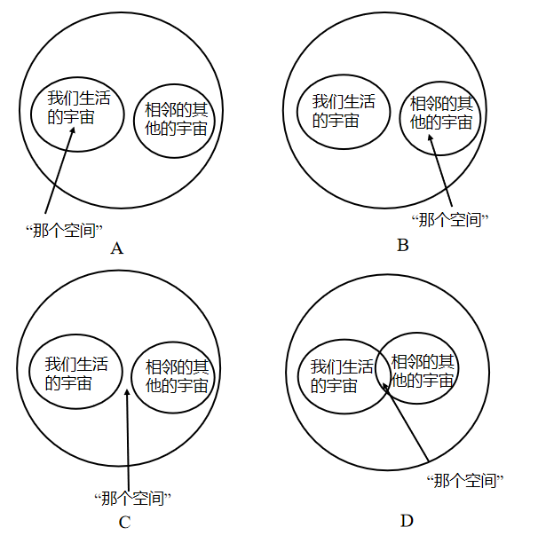

- **A**. A
- **B**. B
- **C**. C　✅
- **D**. D

**答案**：C

**官方解析**

“那个空间”中的“那个”指代的是前文的内容，定位文段可得，此空间指的是“两个大爆炸宇宙之间的空间”，对应C项。根据“两个大爆炸宇宙之间的空间”，可排除A、B两项。D项，根据“两个大爆炸宇宙之间的距离会随着时间的流逝而越来越远，所以，两个大爆炸宇宙是不会相撞的”可知，不会出现相交的空间，排除。
故正确答案为C。
【文段出处】《一个大难题！宇宙膨胀率的宇宙学》

---

#### 第 26 题　qid 2669028 · 片段阅读

很难说哪种思想，乐观的或悲观的，是对人工智能导致的“创造性破坏”的正确评价。希望是乐观的观点，概括了未来发展的创造性特征。正如历史所展示的，革命性的技术运动在最后实现时，能发展出更好的社会，即使其曾经是非常具有破坏性的，伴随着公司的起起伏伏，熟练技术代替大量的非娴熟技术。因此，对于积极的观点，一个重要的前提是这个社会准备好通过教育、学习和研究来掌控未来，愿意接纳变化，有应对未来不确定性，包括“创造性破坏”的弹性。
根据文段内容，以下与作者观点最为接近的一项是：

- **A**. 应该审慎对待革命性的技术运动
- **B**. 人工智能对未来技术革新造成的影响是难以被评价的
- **C**. 乐观看待技术革新带来的“创造性破坏”，并积极应对　✅
- **D**. 未来的社会有能力承受一系列变化，包括“创造性破坏”

**答案**：C

**官方解析**

文段开篇阐述很难判断哪种思想是对人工智能导致的“创造性破坏”的正确评价，之后指出乐观的观点，概括了未来发展的创造性特征，并具体解释，尾句通过“因此”引出结论，指出积极观点的前提是社会准备好通过教育、学习等来掌控未来，愿意接纳变化，有应对未来不确定的能力，故文段强调的重点是要想有积极的观点，人们要做好积极应对的准备，对应C项。
A项，文段是对“积极观点”的阐述，并未体现出作者认为应该持“审慎对待”的态度，无中生有，排除；
B项，对应文段开头，非重点，且尾句作者给出了结论，只要人类做好准备，积极应对，是可以持积极观点的，非重点，排除；
D项，文段并未提及“有能力”，而是指准备好获得这个承受能力，表述过于绝对，排除。
故正确答案为C。
【文段出处】《重新审视大国工业化运行机制》

---

#### 第 27 题　qid 2669031 · 片段阅读

人们常对哲学寄予不切实际的期待和希望，认为哲学将提供其他具体学科无法提供的更高级的“特等知识”或解决问题的“万能方法”，这种观点所体现的正是马克思所批判的“解释世界”的哲学观。但如果从“改变世界”这一哲学视角出发，我们就会将自觉放弃哲学的这种自我理解，并自觉到：通过“思想治疗”，揭示人们思维与观念中所存在的“病症”及其种种症候，改变人们看待事物的视角和眼光，转变人们理解世界的思维方式，并以此为“改变世界”开辟现实的道路，是哲学的重要功能之一。
对上述文字理解最准确的一项是：

- **A**. 世界是因人们的思维方式改变而改变的
- **B**. 哲学能够通过改变人们的思维方式进而改变世界　✅
- **C**. 哲学的功能是改变世界而非解释世界
- **D**. 哲学并不有助于我们理解世界

**答案**：B

**官方解析**

文段开篇论述传统上人们认为哲学是解决问题的万能方法的观点，正是马克思批判的哲学观，之后转折强调，如果从“改变世界”这一哲学视角出发，就会发现哲学会通过改变人们看待事物的视角和眼光，转变理解世界的思维方式，进而改变世界，故文段强调的重点是哲学具有的功能之一，就是可以通过转变人们理解世界的思维方式来改变世界，对应B项。
A项，文段强调的是哲学对世界的影响，缺少哲学，排除；
C项，文段未提及哲学不具有解释世界的功能，无中生有，排除；
D项，“哲学并不有助于我们理解世界”与文意相悖，排除。
故正确答案为B。
【文段出处】《贺来:哲学以何种方式改变世界》

---

#### 第 28 题　qid 2669037 · 片段阅读

囊链藻细胞中产生蓝色和绿色是通过一种常规方式将微小的油粒紧密地包裹在一起。这种结构类似于猫眼石中紧密包裹着的硅球体，它会产生衍射光，并产生令人渴望的宝石般的颜色。这些类似于猫眼石的光子晶体的功能尚不清楚。一条线索是：在强烈的光线下，这种有序的结构会进入无序状态，让颜色很快消失。但当黑暗条件回归时，颜色也会回归。科学家表示，这可能有助于植物应对低光照条件。
根据文章内容可以推知：

- **A**. 硅球体是囊链藻细胞发光的关键
- **B**. 包裹在一起的油粒呈无序状态
- **C**. 囊链藻在黑暗环境下会闪烁光芒　✅
- **D**. 海藻通常呈现蓝色和绿色的光泽

**答案**：C

**官方解析**

A项，原文表述为“这种结构类似于猫眼石中紧密包裹着的硅球体”，可知“硅球体”是猫眼石中的结构，而非囊链藻细胞中的，排除；
B项，原文表述为“在强烈的光线下，这种有序的结构会进入无序状态”，可知油粒可以呈“有序”和“无序”状态，排除；
C项，根据原文“但当黑暗条件回归时，颜色也会回归”，可以推断出囊链藻在黑暗环境下会发光，当选；
D项，原文表述为“囊链藻细胞中产生蓝色和绿色”，而非海藻呈现蓝色和绿色，偷换概念，排除。
故正确答案为C。
【文段出处】《海藻发光秘密揭示》

---

#### 第 29 题　qid 2669040 · 片段阅读

有学者认为，大数据的长项是对资料进行相关分析，而不用进行详尽的因果分析。但对此，学界尚有争议。因果关系需要两个变量在统计上有相关性，在时间上有先后顺序，即自变量在前，因变量在后；在逻辑上自变量的发生导致因变量的发生，即如果自变量没出现则因变量也不会出现。在传统的回归分析中，统计学注重对假设的检验和模型的显著性，但是在大数据时代，机器学习采用交叉验证的方法，根据结果的准确程度来判断模型好坏，不会深入分析各变量间的关系。因此，在大数据应用中，即使研究人员不知道变量间的因果关系，也可以根据数据间的相关关系得到想要的模型。
由上文可以推知：

- **A**. 相关分析和因果分析都能够建立模型
- **B**. 在大数据时代，对数据进行因果分析已不重要
- **C**. 统计意义上的相关不能代替因果关系，这一规则将在大数据时代被改写　✅
- **D**. 机器学习的方法显著优于传统回归分析

**答案**：C

**官方解析**

A项，原文表述为“在大数据应用中，即使研究人员不知道变量间的因果关系，也可以根据数据间的相关关系得到想要的模型”，可知二者均可以建立模型，但需要以“大数据应用”为前提，选项表述过于绝对，排除；
B项，文段并没有指出因果分析“已不重要”，无中生有，排除；
C项，根据“在传统的回归分析中，统计学注重对假设的检验和模型的显著性，但是在大数据时代，机器学习采用交叉验证的方法，根据结果的准确程度来判断模型好坏，不会深入分析各变量间的关系。”可知，传统统计分析中需要分析各变量因果关系，也就是相关不能替代因果，又根据“在大数据应用中，即使研究人员不知道变量间的因果关系，也可以根据数据间的相关关系得到想要的模型。”可知，在大数据时代相关分析可以替代因果关系，由此可知C项表述正确，当选；
D项，文段并没有对二者进行比较，排除。
故正确答案为C。
【文段出处】《漆海霞：大数据与国际关系研究创新》

---

#### 第 30 题　qid 2669051 · 片段阅读

提倡“用头脑作画”的塞尚，将看到的风景和静物做了主观性的加工，简化成圆柱体、圆锥体和其他几何体；立体主义大师毕加索更是把人（物）分解得支离破碎。倘若我们从精神科学的角度来分析他们的画，不难发现他们探索视觉机制的尝试。我们已经知道，视网膜把接收到的信息传递给大脑的初级视皮层后，视皮层就会对视觉信息进行筛选，初步识别出一些垂直线、水平线和拐角等简单特征。然后大脑启用“自下而上”方式对这些信息进行粗加工，这时候就可能获取更多关于图像里的几何体分层、切片的信息，就跟毕加索的立体主义绘画差不多。最后大脑再用“自上而下”方式，借助存储的信息库对视觉信息做进一步加工，最后得到栩栩如生，看起来十分真切，然而并不真实的画面。由于人类完成这样一个视觉过程的时间只能以千分之一秒来计量，根本来不及发现中间的过渡性画面。设想如果我们能够用高科技使这一过程放慢1000倍也就是视觉的图像转换在一秒内完成，那么也许我们真的可以看到其中有类似于塞尚、毕加索的作品的图像呢！
从上文我们可以得出：

- **A**. 接收、加工和识别视觉信息都是靠大脑来完成的
- **B**. 塞尚、毕加索的作品是对我们大脑形成的初步视觉图像的还原
- **C**. 塞尚、毕加索都对视觉机制进行了深入的探索和研究
- **D**. 塞尚、毕加索的艺术创作过程和追求效果与视觉的运作过程是类似的　✅

**答案**：D

**官方解析**

A项，根据文段所述“视网膜把接收到的信息传递给大脑的初级视皮层后”，可知“接受”视觉信息不是靠大脑完成的，排除；
B项，根据文段所述，大脑形成初步视觉图像是“视皮层就会对视觉信息进行筛选”，而毕加索的立体主义绘画还需要“自下而上”的大脑加工，排除；
C项，文段并没有介绍塞尚、毕加索对视觉机制进行过直接的研究，无中生有，排除；
D项，文段将塞尚、毕加索的作品作为例子，介绍这一类型的作品涉及的内在的视觉机制，故可以推断出二者具有相似性，当选。
故正确答案为D。
【文段出处】《几何抽象画：追求秩序与平衡》

---

## 数量关系

### 第 1 题　qid 2668504 · 数学运算

-2，7，6，19，22，（    ）

- **A**. 33
- **B**. 39　✅
- **C**. 42
- **D**. 54

**答案**：B

**官方解析**

数列无明显特征，且作差无规律，考虑作和。两两作和形成新数列：5、13、25、41、（    ），新数列的后项减去前项可得：8、12、16、（20），是公差为4的等差数列，则新数列的下一项为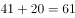，所求项为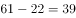。

故正确答案为B。

---

### 第 2 题　qid 2668510 · 数学运算

-3，，，2，，（    ）

- **A**. 
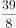

- **B**. 

　✅
- **C**. 

- **D**. 

**答案**：B

**官方解析**

题干为分数数列且存在整数，考虑反约分，得到新数列：、、、、、（    ）。分母是连续自然数列，则所求项的分母为6；分子部分为-3、-1、2、8、19、（    ），后项减去前项得到新数列2、3、6、11、（    ），无明显规律，再次作差得到1、3、5、（7），是公差为2的等差数列，则新数列的下一项为，所求项的分子为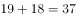，故所求项为。

故正确答案为B。

---

### 第 3 题　qid 2668513 · 数学运算

2.58，8.16，24.32，64.64，（    ）

- **A**. 160.28　✅
- **B**. 124.26
- **C**. 180.56
- **D**. 126.88

**答案**：A

**官方解析**

题干都为小数，优先考虑机械划分。整数部分：2、8、24、64、（    ），因式分解可得：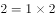、、、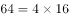，“”前是连续自然数列，“”后是公比为2的等比数列，则所求项的整数部分为；小数部分为58、16、32、64、（    ），观察可得：，，，即前一项2的末两位为下一项，则所求项的小数部分为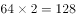的后两位，即为28。故所求项为160.28。

故正确答案为A。

---

### 第 4 题　qid 2669442 · 数学运算

甲、乙两人分别送材料到对方单位，两人同时出发，各自匀速前进，甲的速度是2米/秒，乙的速度是2.5米/秒，两人到单位交材料的时间忽略不计，到达目的地都立即以原速度返回，两人首次在距离甲单位700米处相遇，后来又在距离乙单位525米处相遇，则甲、乙两个单位相距（    ）米。

- **A**. 1575　✅
- **B**. 1020
- **C**. 1100
- **D**. 720

**答案**：A

**官方解析**

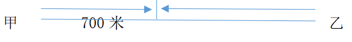

方法一：由题意可知，首次相遇时甲走了700米，用时为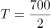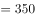秒。则甲、乙两地距离即为相遇距离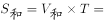米。

方法二：两人同时出发，则首次相遇时，两人所用时间相同，则两人路程与速度成正比。设全程为，甲走了700米，则乙走了米，可得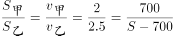，整理得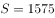米。

方法三：由题意可知，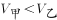，则两人首次相遇时，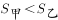，则甲、乙两地距离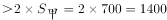米，选项中大于1400的只有A项。

故正确答案为A。

---

### 第 5 题　qid 2669445 · 数学运算

某牧场长满牧草，牧草每天均匀生长，牧场可供100头牛吃20天，可供150头牛吃10天，则这片牧场可供250头牛吃（    ）天。

- **A**. 5　✅
- **B**. 6
- **C**. 7
- **D**. 8

**答案**：A

**官方解析**

设牧场原有草量为，草每天的生长速度为，根据牛吃草公式，可得：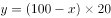······①，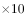······②，联立两式解得，。若这片牧场可供250头牛吃天，则有，解得天。

故正确答案为A。

---

### 第 6 题　qid 2669446 · 数学运算

某美容美发店有两位理发师，现同时来了5位有不同理发需求的顾客，通常情况下，这5位顾客需要的理发时间分别为10分钟、12分钟、15分钟、20分钟和24分钟，要使顾客理发时间最少并且他们等候的时间之和最少，那么其中一位理发师理发用时至少为（    ）分钟。

- **A**. 27
- **B**. 30
- **C**. 32　✅
- **D**. 35

**答案**：C

**官方解析**

五位顾客理发的时间是固定的，要使等候的时间最少，则让理发时间短的顾客排在前面。

符合题意的一种安排顺序如表格所示，总的等待时间最短为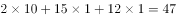分钟。则其中一位理发师用时至少为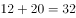分钟。

故正确答案为C。

注意：以下几种安排顺序也符合总的等待时间最短。

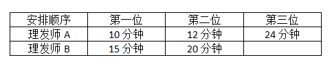

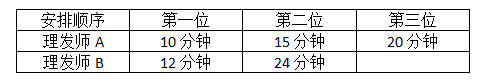

但是不符合其中一位理发师理发用时最少。

---

### 第 7 题　qid 4695862 · 数学运算

将1至8这八个数字分别填入下图的圆圈中，已知每个三角形圆圈中的数字之和为13，大正方形四个顶点之一的圆圈中不可能填数字（    ）。

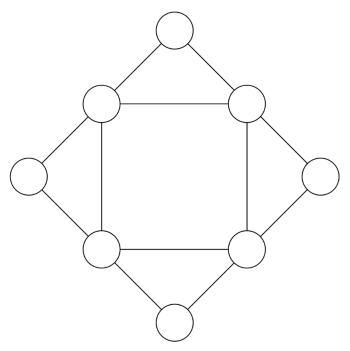

- **A**. 7
- **B**. 6
- **C**. 5　✅
- **D**. 4

**答案**：C

**官方解析**

设大正方形四个顶点的数字分别为A、B、C、D，小正方形的四个顶点的数字分别为E、F、G、H。由圆圈中是“1至8这八个数字分别填入”可得：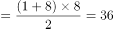······①；由“每个三角形圆圈中的数字之和为13”可得：（A+E+F）+（B+F+G）+（C+G+H）+（D+H+E）=（A+B+C+D）+（E+F+G+H）×2=13×4=52······②。联立①②两式，解得A+B+C+D=20，E+F+G+H=16。由题可得：E+F=13-A，G+H=13-C，两式相加可得：E+F+G+H=26-（A+C）=16，即A+C=10，结合选项数据，若A或C为5，则另一个数也为5，不符合题意。因此，A、C不可能为5，B、D同理，则大正方形四个顶点之一的圆圈中不可能填数字5。

故正确答案为C。

---

### 第 8 题　qid 2669447 · 数学运算

某国际会议需要翻译人员服务，现有翻译人员11人，其中5人只会英语，4人只会日语，另外2人不仅会英语也会日语，现从这11人中选4人当英语翻译，再从其余人中选4人当日语翻译，则不同的安排方法共有（    ）种。

- **A**. 145
- **B**. 160
- **C**. 185　✅
- **D**. 190

**答案**：C

**官方解析**

选择4位英语和4位日语翻译，可分为以下几类情况：

分类相加，则满足题意的安排方法数共种。

故正确答案为C。

---

### 第 9 题　qid 2669448 · 数学运算

某年级有学生100名，在数学考试中62人得满分，在英语考试中34人得满分，有11人两门课程都得满分，那么两门课程都没有得满分的有（    ）人。

- **A**. 26
- **B**. 15　✅
- **C**. 96
- **D**. 89

**答案**：B

**官方解析**

设两门课程都没有得满分的有人，根据两集合容斥原理公式：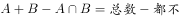，可得：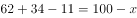，解得。

故正确答案为B。

---

### 第 10 题　qid 2669449 · 数学运算

一咖啡厅实际销售时常将A、B两种咖啡以x：y之比（以质量计）混合，A的原价为50元/千克，B的原价为40元/千克，近来A的价格增加，而B的价格减少，在销售价格不变的情况下，为了成本不变，那么x：y应等于：

- **A**. 2：3
- **B**. 5：6
- **C**. 6：5　✅
- **D**. 3：2

**答案**：C

**官方解析**

方法一：根据前后销售价格不变，可知：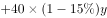，整理可得x：y=6：5。

方法二：选项为一组数，可以尝试代入排除。

代入A项，假如，，则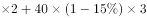，即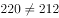，不符合前后销售价格不变，排除。

代入B项，假如，，则，即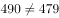，不符合前后销售价格不变，排除。

代入C项，假如，，则，符合前后销售价格不变，当选。

代入D项，假如，，则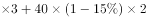，即，不符合前后销售价格不变，排除。

（注意：考场上A、B两项可用尾数法快速排除，选出C项后，D项不用再代入）

故正确答案为C。

---

### 第 11 题　qid 2669450 · 数学运算

搬运工李强承担了为某公司搬运1000只玻璃瓶的任务，按照约定，安全运到1只可得搬运费0.3元，但打破1只，搬运费为0元并且需赔偿0.5元，运完玻璃瓶后该公司共支付李强260元，那么李强在搬运中一共打碎玻璃瓶（    ）只。

- **A**. 46
- **B**. 48
- **C**. 50　✅
- **D**. 52

**答案**：C

**官方解析**

设李强在搬运中一共打碎玻璃瓶只，则安全运到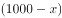只，可得：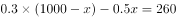，即，解得。

故正确答案为C。

---

### 第 12 题　qid 2669451 · 数学运算

2019年1月12日是星期六，那么，2040年1月12日是：

- **A**. 星期二
- **B**. 星期三
- **C**. 星期四　✅
- **D**. 星期五

**答案**：C

**官方解析**

一周7天，平年有365天，，所以，每经历一个平年（365天），星期往后推一天；闰年有366天，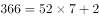，所以，每经历一个闰年（366天），星期往后推两天。

2019年1月12日-2040年1月12日，共21年。根据4年一闰，，即21年中有5个闰年（2020、2024、2028、2032、2036是闰年，注意不包含2040年），那么剩下的年是平年。

2019年1月12日是星期六， 2040年1月12日是：星期六星期六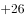，即：星期六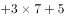，星期六往后推5天是星期四。

故正确答案为C。

---

### 第 13 题　qid 2669452 · 数学运算

把19个棱长为2厘米的正方体重叠起来，拼成一个立体图形，如图所示，则这个立方体的表面积为（    ）平方厘米。

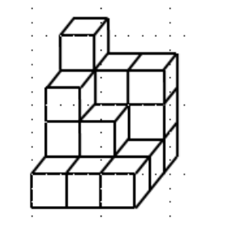

- **A**. 56
- **B**. 54
- **C**. 216　✅
- **D**. 224

**答案**：C

**官方解析**

棱长为2厘米的正方体，每个表面的面积为平方厘米。如图所示，拼成的立体图形为不规则图形，其表面积上面下面左面右面前面后面，需要数一数每个大面的小正方形个数即可。

上面和下面都是9个正方形，上下面积为平方厘米；

前面和后面都是10个正方形，前后面积为平方厘米；

左面和右面都是8个正方形，左右面积为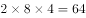平方厘米。

所以这个立方体的表面积为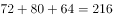平方厘米。

故正确答案为C。

---

## 判断推理

### 第 1 题　qid 2670582 · 图形推理

从所给的四个选项中，选择最合适的一个填入问号处，使之呈现一定的规律性。

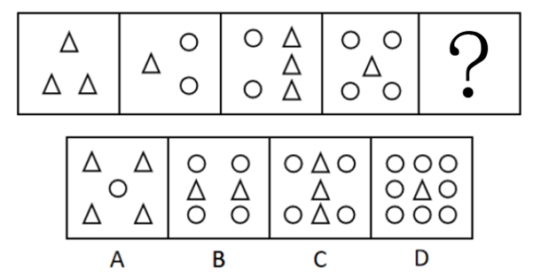

- **A**. A
- **B**. B
- **C**. C　✅
- **D**. D

**答案**：C

**官方解析**

题干元素组成不同，且图形出现多个小元素，优先考虑数素，但整体无规律，考虑元素换算。根据基本换算公式“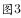”，最后换算的结果为1圆2三角形，代入题干，将圆全部换算成三角形可知，题干图形分别有3、5、7、9个三角形，故“？”处图形应有11个三角形。A项换算为6个三角形，排除；B项换算为10个三角形，排除；C项换算为11个三角形，当选；D项换算为17个三角形，排除。

故正确答案为C。

---

### 第 2 题　qid 2670585 · 图形推理

从所给的四个选项中，选择最合适的一个填入问号处，使之呈现一定的规律性。

- **A**. A　✅
- **B**. B
- **C**. C
- **D**. D

**答案**：A

**官方解析**

本题考查图形的重心位置变化。第一组图中，图一重心偏上，图二重心在中心位置，图三重心偏下，三个图形的重心依次下移。第二组图中，图一重心偏上，图二重心在中心位置，因此问号处应选一个重心偏下的图形，四个选项中，只有A项的图形重心偏下，当选。
故正确答案为A。

---

### 第 3 题　qid 2670587 · 图形推理

从所给的四个选项中，选择最合适的一个填入问号处，使之呈现一定的规律性。

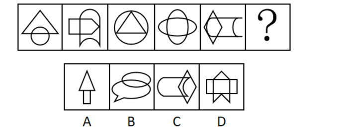

- **A**. A
- **B**. B
- **C**. C
- **D**. D　✅

**答案**：D

**官方解析**

题干元素组成不同，且无明显属性规律，优先考虑数量规律。题干出现多个封闭区域，考虑数面。观察发现，题干图1、图3、图5的面数量分别为：3、4、5，呈依次递增的规律；图2、图4、图6的面数量分别为：4、5、？，也呈依次递增的规律，所以“？”处应选择有6个面的图形，只有D项符合。
故正确答案为D。

---

### 第 4 题　qid 2670590 · 图形推理

从所给的四个选项中，选择最合适的一个填入问号处，使之呈现一定的规律性。

- **A**. A
- **B**. B
- **C**. C
- **D**. D　✅

**答案**：D

**官方解析**

题干元素组成不同，优先考虑属性规律。观察发现，题干每幅图形中都有等腰三角形且图形规整，优先考虑对称性。题干均是轴对称图形，且对称轴均为竖直方向，所以“？”处应为关于竖轴对称的图形，只有D项符合。
故正确答案为D。

---

### 第 5 题　qid 2670592 · 图形推理

把下面的六个图形分为两类，使每一类图形都有各自的共同特征或规律，分类正确的一项是：

- **A**. ①②⑤，③④⑥
- **B**. ①②④，③⑤⑥　✅
- **C**. ①②③，④⑤⑥
- **D**. ①⑤⑥，②③④

**答案**：B

**官方解析**

题干元素组成不同，优先考虑属性规律。观察发现，图①②④均为全直线图形，图③⑤⑥均为曲线直线图形，因此①②④为一组，③⑤⑥为一组。

故正确答案为B。

---

### 第 6 题　qid 2670594 · 定义判断

风化，是指使岩石发生破坏和改变的各种物理、化学和生物作用。物理风化是指使岩石发生机械破碎，而没有显著的化学成分变化的风化；化学风化是指岩石在水、氧气、二氧化碳等作用下发生的化学分解。区分物理和化学风化的重点是有没有新物质的产生。生物风化是指生物活动对岩石的机械破坏。
根据上述定义，下列不属于风化的是：

- **A**. 长期高温暴晒环境下岩石出现裂隙
- **B**. 从遗址中挖出的青铜器上带有锈迹　✅
- **C**. 古代石刻上的字迹、图案等变得模糊
- **D**. 石灰岩遇水被溶解

**答案**：B

**官方解析**

第一步：找出定义关键词。
风化：“使岩石发生破坏和改变的各种物理、化学和生物作用”。
物理风化：“使岩石发生机械破碎”、“没有显著的化学成分变化的风化”。
化学风化：“岩石在水、氧气、二氧化碳等作用下发生的化学分解”、“区分物理和化学风化的重点是有没有新物质的产生”。
生物风化：“生物活动对岩石的机械破坏”。
第二步：逐一分析选项。
A项：长期高温暴晒环境下岩石出现裂隙，符合“使岩石发生破坏和改变的各种物理、化学和生物作用”，符合定义，排除；
B项：青铜器上带有锈迹，青铜器不是岩石，不符合“使岩石发生破坏和改变的各种物理、化学和生物作用”，不符合定义，当选；
C项：古代石刻上的字迹、图案等变得模糊，符合“使岩石发生破坏和改变的各种物理、化学和生物作用”，符合定义，排除；
D项：石灰岩遇水被溶解，符合“使岩石发生破坏和改变的各种物理、化学和生物作用”，符合定义，排除。
本题为选非题，故正确答案为B。

---

### 第 7 题　qid 2670595 · 定义判断

开放式决策，是指政府在进行重大决策时，充分听取、吸纳公众意见，并将公众意见作为行政决策的重要参考，使行政决策公开、透明，实现政府与公众有机互动的一种决策形式。
根据上述定义，下列不属于开放式决策的是：

- **A**. 发改委就天然气涨价事宜举行听证
- **B**. 政府常委会邀请人大代表、政协委员和市民代表列席会议发表意见
- **C**. 市民通过网上留帖或网上视频直播，参与重大民生事项讨论
- **D**. 对社会高度关注的案件，司法机关邀请公众参与庭审旁听　✅

**答案**：D

**官方解析**

第一步：找出定义关键词。
“政府”、“在进行重大决策时”、“充分听取、吸纳公众意见”、“将公众意见作为行政决策的重要参考”、“使行政决策公开、透明，实现政府与公众有机互动”、“决策形式”。
第二步：逐一分析选项。
A项：发改委就天然气涨价事宜举行听证，符合“政府”、“在进行重大决策时”、“充分听取、吸纳公众意见”、“将公众意见作为行政决策的重要参考”等关键词，符合定义，排除；
B项：政府常委会邀请人大代表、政协委员和市民代表列席会议发表意见，符合“政府”、“在进行重大决策时”、“充分听取、吸纳公众意见”、“将公众意见作为行政决策的重要参考”等关键词，符合定义，排除；
C项：市民通过网上留帖或网上视频直播，参与重大民生事项讨论，符合“政府”、“在进行重大决策时”、“充分听取、吸纳公众意见”、“将公众意见作为行政决策的重要参考”等关键词，符合定义，排除；
D项：司法机关邀请公众参与庭审旁听，司法机关不是“政府”，且旁听不符合“充分听取、吸纳公众意见”、“将公众意见作为行政决策的重要参考”，不符合定义，当选。
本题为选非题，故正确答案为D。

---

### 第 8 题　qid 2670596 · 定义判断

达克效应，是指能力欠缺的人由于欠缺考虑而得出错误结论，他们无法正确认识到自身的不足，常常沉浸在自我营造的虚幻优势之中，无法客观评价自己和他人的能力。
根据上述定义，下列体现了达克效应的是：

- **A**. 某患者家属不懂医，却对医生的诊断结果持有异议、极力争辩
- **B**. 某新员工抱怨上司专业素养不如自己，只会瞎指挥　✅
- **C**. 某技校毕业生认为自己已经掌握某技能
- **D**. 某考生觉得自己高考超常发挥，预计能上重本

**答案**：B

**官方解析**

第一步：找出定义关键词。
“能力欠缺的人”、“由于欠缺考虑而得出错误结论”、“无法正确认识到自身的不足”、“常常沉浸在自我营造的虚幻优势之中”、“无法客观评价自己和他人的能力”。
第二步：逐一分析选项。
A项：患者家属不懂医，却对医生的诊断结果持有异议，只评价了医生的能力，不符合“无法客观评价自己和他人的能力”，不符合定义，排除；
B项：新员工抱怨上司专业素养不如自己，符合“能力欠缺的人”、“由于欠缺考虑而得出错误结论”、“无法正确认识到自身的不足”、“常常沉浸在自我营造的虚幻优势之中”、“无法客观评价自己和他人的能力”，符合定义，当选；
C项：某技校毕业生认为自己已经掌握某技能是一个客观的评价，不符合“能力欠缺的人”，也不符合“无法客观评价自己和他人的能力”，不符合定义，排除；
D项：某考生觉得自己高考超常发挥，预计能上重本，不符合“无法客观评价自己和他人的能力”，不符合定义，排除。
故正确答案为B。

---

### 第 9 题　qid 2670597 · 定义判断

时间悖论，通常是指因时间旅行或穿梭时空而导致的逻辑上可以推导出互相矛盾的结论。例如，12点01分的你，回到12点00分杀死了自己，问题是12点00分的你已经死了，那么执行杀死自己任务的人是谁？逻辑上就会出现这一矛盾。
根据上述定义，下列虚构的时空穿梭示例中，几乎不会出现时间悖论的是：

- **A**. 一名时间旅行者回到过去成功阻止了他的父母结婚
- **B**. 你知道某期彩票中奖号码后，回到开奖前去买了这一组彩票
- **C**. 某小区发生重大盗窃案，警察回到案发前目睹了这一切的发生　✅
- **D**. 一位科学家造了一架时间机器，回到过去并把这个时间旅行的秘密告诉了年轻时的自己

**答案**：C

**官方解析**

第一步：找出定义关键词。
“因时间旅行或穿梭时空”、“导致的逻辑上可以推导出互相矛盾的结论”。
第二步：逐一分析选项。
A项：回到过去阻止父母结婚，符合“因时间旅行或穿梭时空”，但阻止了父母结婚，那这名时间旅行者根本不会出生，就不会有回到过去的时间旅行者，符合“导致的逻辑上可以推导出互相矛盾的结论”，符合定义，排除；
B项：回到开奖前符合“因时间旅行或穿梭时空”，你回到过去买了中奖的彩票，现在已经中奖了根本不需要再回到过去了，那回到过去的又是谁？，符合“导致的逻辑上可以推导出互相矛盾的结论”，符合定义，排除；
C项：警察回到案发前目睹了这一切的发生，符合“因时间旅行或穿梭时空”，但是警察回到过去只是目睹了这一切的发生，并没有阻止案件发生的行为，不符合“导致的逻辑上可以推导出互相矛盾的结论”，不符合定义，当选；
D项：一位科学家造了一架时间机器，回到过去，符合“因时间旅行或穿梭时空”，把时间旅行的秘密告诉了年轻时的自己，那么年轻时的自己早就知道时间旅行的秘密了，不需要现在的科学家再回到过去进行告知，符合“导致的逻辑上可以推导出互相矛盾的结论”，符合定义，排除。
本题为选非题，故正确答案为C。

---

### 第 10 题　qid 2670599 · 定义判断

毒物兴奋反应，是毒理学用来描述毒性因子（刺激）的双相剂量效应的一个术语，即高剂量致毒因素（包括毒物、辐射等）对生物体有害，而低剂量致毒因素对生物体有益。
根据上述定义，下列选项所描述的事实属于毒物兴奋反应的是：

- **A**. 低剂量TCDD可使脑垂体、子宫、乳腺和胰腺的肿瘤发生率降低，却使肝、肺、舌和鼻咽喉的肿瘤发生率增加
- **B**. 低剂量的青霉素可以增加感染伤寒埃氏杆菌的小白鼠的死亡率，较高剂量时却可以降低其死亡率
- **C**. 高剂量吡虫啉能够显著抑制桃蚜产卵行为，低剂量时却能刺激桃蚜产卵行为　✅
- **D**. 磺胺二甲氧嘧啶对千翅藻的根、子叶、叶柄总是呈现毒性作用，而对节间和叶片长度则没有

**答案**：C

**官方解析**

第一步：找出定义关键词。
“高剂量致毒因素（包括毒物、辐射等）对生物体有害”、“低剂量致毒因素对生物体有益”。
第二步：逐一分析选项。
A项：低剂量的TCDD对人体不同器官的益害不同，不符合“高剂量致毒因素（包括毒物、辐射等）对生物体有害”、“低剂量致毒因素对生物体有益”，不符合定义，排除；
B项：低剂量的青霉素会增加感染的小白鼠的死亡率，而较高剂量时可以降低死亡率，不符合“高剂量致毒因素（包括毒物、辐射等）对生物体有害”、“低剂量致毒因素对生物体有益”，不符合定义，排除；
C项：高剂量吡虫啉能抑制桃蚜产卵行为，即对生物体有害；低剂量能刺激桃蚜产卵行为，即对生物体有益，符合“高剂量致毒因素（包括毒物、辐射等）对生物体有害”、“低剂量致毒因素对生物体有益”，符合定义，当选；
D项：磺胺二甲氧嘧啶对千翅藻的不同部位毒性不同，没有提到剂量高低对生物体的影响，不符合“高剂量致毒因素（包括毒物、辐射等）对生物体有害”、“低剂量致毒因素对生物体有益”，不符合定义，排除。
故正确答案为C。

---

### 第 11 题　qid 2670601 · 逻辑判断

对于基本粒子物理学而言，发现中微子振荡具有极其重要的意义，这是因为只有在中微子有质量时，才会发生中微子振荡。
下列哪一论断是错误的？

- **A**. 中微子不存在振荡现象，则证明中微子没有质量　✅
- **B**. 中微子存在振荡现象，则证明中微子有质量
- **C**. 中微子不存在振荡现象，不能证明中微子没有质量
- **D**. 中微子没有质量时，不会发生中微子振荡

**答案**：A

**官方解析**

第一步：翻译题干。

中微子振荡中微子有质量

第二步：逐一分析选项。

A项：翻译为“中微子振荡中微子有质量”，是对题干条件的否前，否前推不出必然结论，论断错误，当选；

B项：翻译为“中微子振荡中微子有质量”，对题干条件的肯前，肯前必肯后，论断正确，排除；

C项：选项是对题干条件的否前，否前推不出否后，所以中微子不存在振荡现象，不能证明中微子没有质量，论断正确，排除；

D项：翻译为“中微子有质量中微子振荡”，是对题干条件的否后，否后必否前，论断正确，排除。

本题为选非题，故正确答案为A。

---

### 第 12 题　qid 2670602 · 逻辑判断

来自公安机关的资料显示，娱乐圈中有人赌博，高级知识分子中也有人赌博。赌博中有些人是女性，而抢劫犯中有些人是赌博者。
由此可以推出：

- **A**. 高级知识分子中也有抢劫犯
- **B**. 抢劫犯中赌博者占了大多数
- **C**. 有些抢劫犯可能是女性　✅
- **D**. 有些抢劫犯不是女性

**答案**：C

**官方解析**

第一步：翻译题干。

①有的娱乐圈的人赌博

②有的高级知识分子赌博

③有的赌博者女性

④有的抢劫犯赌博

第二步：逐一分析选项。

A项：翻译为“有的高级知识分子抢劫犯”，根据条件②和条件④，两个“有的”推不出必然结论，不能推出，排除；

B项：由条件④可知有些抢劫犯也是赌博者，但是赌博者是否占了大多数，无法判断，排除；

C项：由条件③和条件④可以推出：有些抢劫犯是赌博者，而赌博者中有女性，所以有些抢劫犯中可能有女性，可以推出，当选；

D项：由条件③和条件④可以推出C项中“有些抢劫犯可能是女性”的结论，但不能得到确定结论抢劫犯不是女性，无法推出，排除。

故正确答案为C。

---

### 第 13 题　qid 2670605 · 逻辑判断

中华鲟是我国特有的珍稀鱼类，也是世界上洄游距离最远、体型最大的淡水鱼类之一，它们一生大部分时间都是在海洋里度过的。在葛洲坝截流前，性成熟的中华鲟会洄游至长江上游与金沙江下游进行产卵交配。目前，中华鲟野生种群仍在持续衰退，为此，有人将中华鲟的濒危完全归咎于葛洲坝的建设。
以下哪项如果为真，最不能削弱上述观点？

- **A**. 葛洲坝没有修建过鱼设施，因为中华鲟作为大型的底层鱼，极难找到鱼道入口，也几乎不可能通过鱼道上游，且中华鲟生育后需要重返大海，而鱼道既不能让亲鱼上行，也无法使产后的亲鱼下行，对保护中华鲟毫无帮助　✅
- **B**. 长江非中华鲟唯一的繁殖地带，直到20世纪70年代，珠江中还能偶见中华鲟，并且有中华鲟分布于金沙江、钱塘江、黄河等的记录
- **C**. 据观测，葛洲坝工程1981年完成大江截流后，中华鲟在坝下形成了新的产卵场，且长江口的幼鱼数量在20世纪八九十年代仍保持基本稳定，直到2000年才开始出现明显下降趋势
- **D**. 长江中只有中华鲟需要从大海洄游至葛洲坝上游地区繁殖，大部分鱼类仅在长江干支流生活，或做短距离的洄游，但从渔获量来看，这些不受大坝截流影响的鱼类，它们的数量也在大幅下降

**答案**：A

**官方解析**

第一步：找出论点和论据。
论点：中华鲟的濒危完全归咎于葛洲坝的建设。
论据：在葛洲坝截流前，性成熟的中华鲟会洄游至长江上游与金沙江下游进行产卵交配。目前，中华鲟野生种群仍在持续衰退。
本题论点是因为葛洲坝的建设导致了中华鲟的濒危，论据是葛洲坝截流，中华鲟野生种群仍在持续衰退。二者都认为葛洲坝建设危害了中华鲟，论点论据话题一致。
第二步：逐一分析选项。
A项：该项说明葛洲坝既不能让亲鱼上行，也无法使产后的亲鱼下行，即葛洲坝的建设确实对中华鲟造成了不利影响，属于加强项，不能削弱，当选；
B项：该项说明中华鲟的繁殖地带有很多，所以中华鲟的濒危不能完全归咎于葛洲坝的建设，可以削弱，排除；
C项：该项说明葛洲坝工程完成大江截流后，长江口的幼鱼数量在20世纪八九十年代仍保持基本稳定，直到2000年才开始出现明显下降趋势，则意味着中华鲟的濒危与葛洲坝的建成没有直接关系，可以削弱，排除；
D项：不受大坝截流影响的鱼类，它们的数量也在大幅下降，说明可能是其他外部原因导致中华鲟及其他鱼类的数量都整体下降，因此中华鲟的濒危不能完全归咎于葛洲坝的建设，属于可能性削弱，排除。
本题为选非题，故正确答案为A。

---

### 第 14 题　qid 4695845 · 类比推理

前不久，网上流行一种说法，称中国疫苗接种非常落后，还在用减毒活疫苗，而国外十几年前就全部改成灭活疫苗了，安全性好太多了。
假设下列论述为真，哪些有助于推翻上述说法？
①有的疫苗只有减毒活疫苗，国内外都在用，例如卡介苗。
②有的疫苗国内外用的都是灭活疫苗，例如流感疫苗。
③有的疫苗国内外用的都不是减毒活疫苗，例如破伤风疫苗。
④有的疫苗既有减毒活疫苗也有灭活疫苗，例如流脑疫苗。

- **A**. ①②
- **B**. ①②③　✅
- **C**. ①②④
- **D**. ①②③④

**答案**：B

**官方解析**

第一步：找出论点和论据。
论点：中国疫苗接种非常落后，还在用减毒活疫苗，而国外十几年前就全部改成灭活疫苗了，安全性好太多了。
论据：无。
本题只有论点，没有论据，削弱优先考虑削弱论点。
第二步：逐一分析选项。
①指出有的疫苗只有减毒活疫苗，国内外都在用，说明国外也在用减毒活疫苗，并没有都改成灭活疫苗，削弱论点；
②指出有的疫苗国内外用的都是灭活疫苗，说明国内也在用灭活疫苗，不是只用减毒活疫苗，削弱论点；
③指出有的疫苗国内外用的都不是减毒活疫苗，说明国内不是只用减毒活疫苗，削弱论点；
④指出有的疫苗既有减毒活疫苗也有灭活疫苗，但并未提及国内外具体的使用情况，与论点话题不一致，无法削弱。
综上所述，①②③均能够削弱题干论点，对应B项。
故正确答案为B。

---

### 第 15 题　qid 2670610 · 逻辑判断

美国三位传播学者在1970年提出了“知识沟假设”，认为随着大众传媒向社会传播的信息日益增多，处于不同社会经济地位的人获得媒介知识的速度是不同的，社会经济地位较高的人将比社会经济地位较低的人以更快的速度获取这类信息。因此，这两类人之间的知识差距将呈扩大之势。
对上述“知识沟假设”能够做出合理解释的不包括：

- **A**. 社会经济地位较高的人往往受教育程度高，具有更强的信息处理能力，这会有助于他们对知识的获取
- **B**. 在特定的时间范围内，经媒介大量报道的话题上，人们获取信息和知识的速度与受教育程度有着很高的相关性　✅
- **C**. 传播有一定深度的科学知识的媒介主要是印刷媒介，它们的受众主要是社会经济地位较高的人
- **D**. 社会经济地位较高的人日常交际圈更大，能参与更多的社会团体，拥有更多与他人进行深度讨论的机会，理解和接受知识的能力更强

**答案**：B

**官方解析**

第一步：找出论点和论据。
论点：社会经济地位较高与社会经济地位较低这两类人之间的知识差距将呈扩大之势。
论据：随着大众传媒向社会传播的信息日益增多，处于不同社会经济地位的人获得媒介知识的速度是不同的，社会经济地位较高的人将比社会经济地位较低的人以更快的速度获取这类信息。
本题论点和论据话题一致，加强优先考虑补充论据。
第二步：逐一分析选项。
A项：该项说明社会经济地位较高的人因具有更强的信息处理能力会有助于对知识的获取，通过解释原因补充了论据，可以加强，排除；
B项：该项说明获取信息和知识的速度与受教育程度有相关性，但并没有说明社会经济地位较高和社会经济地位较低的这两类人之间的知识差距将呈扩大之势，无关选项，无法加强，当选；
C项：该项说明社会经济地位较高的人更容易获取有一定深度的科学知识，通过解释原因补充了论据，可以加强，排除；
D项：该项说明社会经济地位较高的人理解和接受知识的能力更强，通过解释原因补充了论据，可以加强，排除。
本题为选非题，故正确答案为B。

---

### 第 16 题　qid 4695853 · 类比推理

这是一段专家关于人工智能和人类的对话：
雷·科兹威尔：当下仍然不知道机器能否思考，虽然人工智能能够执行程序非常复杂的任务，其精确度和速度都超过了人类，但它缺少人类智力的灵活特征。
尼古拉斯·汤普森：人类不需要更复杂的人工智能来知道机器能否思考，因为人类是机器，我们自己思考。
尼古拉斯·汤普森对雷·科兹威尔的反驳是基于哪个词语的重新理解？

- **A**. 人工智能
- **B**. 思考
- **C**. 机器　✅
- **D**. 复杂

**答案**：C

**官方解析**

第一步：分析题干条件。
雷·科兹威尔：当下仍然不知道机器能否思考，虽然人工智能能够执行程序非常复杂的任务，其精确度和速度都超过了人类，但它缺少人类智力的灵活特征。
尼古拉斯·汤普森：人类不需要更复杂的人工智能来知道机器能否思考，因为人类是机器，我们自己思考。
第二步：逐一分析选项。
雷·科兹威尔认为当下不知道机器能否思考，人工智能也无法验证，其中的“机器”指的是传统意义上的由部件组装成的装置；而尼古拉斯·汤普森认为人类能思考，且人类是机器，说明机器能够思考，对“机器”进行了重新理解，从而反驳了雷·科兹威尔的观点，对应C项。
故正确答案为C。

---

### 第 17 题　qid 4695859 · 逻辑判断

近年来，虽然全球主要国家甲状腺癌的发生率都在增加，但并不代表甲状腺癌与碘营养状况之间存在关系。
以下哪项最可能是上述结论所假设的？

- **A**. 当前甲状腺癌的“流行”部分归因于甲状腺筛查的普及
- **B**. 高分辨率B超的广泛应用使得隐匿癌或微小癌能够被准确诊断
- **C**. 这些甲状腺癌发生率增加的国家，既有碘摄入量增加的，也有稳定或下降的　✅
- **D**. 近20年来美国、英国等西方发达国家居民的碘营养状况趋于稳定

**答案**：C

**官方解析**

第一步：找出论点和论据。
论点：近年来，虽然全球主要国家甲状腺癌的发生率都在增加，但并不代表甲状腺癌与碘营养状况之间存在关系。
论据：无。
本题只有论点，没有论据，且问题为“假设”，优先考虑必要条件。
第二步：逐一分析选项。
A项：该项说的是甲状腺癌“流行”的部分原因，而论点说的是甲状腺癌与碘营养状况的关系，话题不一致，无法加强，排除；
B项：该项说的是隐匿癌或微小癌能够被准确诊断，无法判断是否包括甲状腺癌，与论点无关，排除；
C项：该项说的是甲状腺癌发生率增加的国家，碘摄入量情况不同，证明了甲状腺癌与碘营养状况之间不存在关系，且如果各国碘摄入量变化情况相同，就能够得到甲状腺癌与碘摄入量存在关系，此时论点无法成立，即该项是论点成立的必要条件，当选；
D项：该项说的是近20年来西方发达国家居民的碘营养状况趋于稳定，但没有提及这些居民甲状腺癌发生率的变化，不明确项，无法加强，排除。
故正确答案为C。

---

### 第 18 题　qid 2670612 · 逻辑判断

甲、乙、丙是大学同班同学，且同住一室。其中，一个北京人，一个重庆人，一个上海人。甲和重庆人不同岁，丙的年龄比上海人小，重庆人比乙年龄大。
根据题干所述，可以推出以下哪项结论？

- **A**. 甲是北京人，乙是重庆人，丙是上海人
- **B**. 甲是重庆人，乙是北京人，丙是上海人
- **C**. 甲是重庆人，乙是上海人，丙是北京人
- **D**. 甲是上海人，乙是北京人，丙是重庆人　✅

**答案**：D

**官方解析**

本题为组合排列题型，从最大信息入手。
题干中“重庆人”出现次数最多。结合“甲和重庆人不同岁”，可知甲不是重庆人，排除B、C两项。再结合“重庆人比乙年龄大”，可知乙不是重庆人，排除A项。
故正确答案为D。

---

### 第 19 题　qid 4695868 · 逻辑判断

美国从事安全工作的承包商在一些安卓手机上发现了一款来自中国公司的预装软件，这种软件监视用户去过哪里、与什么人聊过天、短信中写了什么。美国当局认为这是一种收集情报的行为。
以下哪项如果为真，最能够质疑美国当局的判断？

- **A**. 软件是预装在手机上的，但没有向用户披露这种监视功能
- **B**. 该软件监视用户上述行为的目的是帮助客户识别垃圾短信和骚扰电话　✅
- **C**. 分析师注意到安装有该软件的手机在向位于上海的一个服务器发送短信内容
- **D**. 谷歌官员表示，公司曾告诫该中国公司将该软件的监视功能删除

**答案**：B

**官方解析**

第一步：找出论点和论据。
论点：“预装软件监视用户去过哪里、与什么人聊过天、短信中写了什么”是一种收集情报的行为。
论据：无。
本题只有论点没有论据，削弱优先考虑削弱论点，即指出预装软件对用户的监视并不是为了收集情报。
第二步：逐一分析选项。
A项：是否告知用户与该预装软件监视用户的目的无关，为无关项，无法削弱，排除；
B项：指出该预装软件对用户的监视是为了帮助客户识别垃圾短信和骚扰电话，而不是为了收集情报，削弱论点，可以削弱，当选；
C项：指出安装有该软件的手机在向上海的服务器发送短信内容，但无法判断发送的目的，无法削弱，排除；
D项：谷歌官员的表态与该预装软件监视用户的目的无关，为无关项，无法削弱，排除。
故正确答案为B。

---

### 第 20 题　qid 4695905 · 逻辑判断

小冰期是自末次冰盛期以来地球气温最低的一段时期，一般指1430-1850年间，高潮部分发生在1600年左右，其间北半球气温相比于基准温度（现在的温度）下降了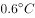。小冰期的成因有多种假说。近年来，有学者认为其成因为欧洲对美洲的殖民导致美洲本土农业社会崩溃，大量农田被废弃为森林，从而固定了太多大气中的二氧化碳，最终导致气候变冷。

假设下列陈述为真，那么，最有可能驳斥上述假说的是：

- **A**. 能够造成二氧化碳浓度下降的森林面积，经推算远大于美洲原住民在工业化之前能够开垦的森林面积　✅
- **B**. 北美洲的大部分原住民是在18世纪中叶英法七年战争的时候才受到严重影响的
- **C**. 南美洲在16世纪中后期爆发了几次严重疫情，原住民损失惨重
- **D**. 气温变化与二氧化碳浓度之间并不是简单的线性对应关系

**答案**：A

**官方解析**

第一步：找出论点和论据。
论点：小冰期的成因为欧洲对美洲的殖民导致美洲本土农业社会崩溃，大量农田被废弃为森林，从而固定了太多大气中的二氧化碳，最终导致气候变冷。
论据：无。
本题只有论点，没有论据，削弱优先考虑削弱论点，即指出欧洲对美洲的殖民不会导致气候变冷。
第二步：逐一分析选项。
A项：指出美洲原住民在工业化之前能够开垦的森林面积远低于能够造成二氧化碳浓度下降的森林面积，说明即使殖民让原住民废弃所有开垦的农田，且这些农田也都变成了森林也不足以造成二氧化碳的浓度下降，也就不会导致气候变冷，削弱论点，当选；
B项：指出北美洲的大部分原住民在18世纪受到了战争的严重影响，而题干讨论的是殖民、森林、二氧化碳以及气候变冷间的关系，话题不一致，无法削弱，排除；
C项：指出南美洲的原住民在16世纪中后期因疫情损失惨重，而题干讨论的是殖民、森林、二氧化碳以及气候变冷间的关系，话题不一致，无法削弱，排除；
D项：指出气温变化与二氧化碳浓度之间并不是简单的线性对应关系，但二者之间是否存在其他关系无法判断，可能是其他形式的影响关系，不明确项，无法削弱，排除。
故正确答案为A。

---

### 第 21 题　qid 2670614 · 类比推理

厂家：展销会

- **A**. 旅客：黄金周
- **B**. 演员：颁奖礼　✅
- **C**. 阿姨：广场舞
- **D**. 企鹅：南极圈

**答案**：B

**官方解析**

第一步：判断题干词语间逻辑关系。
厂家参加展销会，构成主宾关系，且展销会的目的就是展览与销售，以目的命名。
第二步：判断选项词语间逻辑关系。
A项：游客享受黄金周，二者为主宾关系，但黄金周指的是我国五一、十一、春节的休息时间与前后双休日拼接形成的假期，并非以目的命名，与题干逻辑关系不一致，排除；
B项：演员参加颁奖礼，二者为主宾关系，且颁奖礼的目的就是颁奖，以目的命名，与题干逻辑关系一致，当选；
C项：阿姨跳广场舞，二者为主宾关系，但广场舞是以跳舞的地点命名，不是以目的命名，与题干逻辑关系不一致，排除；
D项：企鹅生活在南极圈，南极圈是以地点命名，不是以目的命名，与题干逻辑关系不一致，排除。
故正确答案为B。

---

### 第 22 题　qid 2670616 · 类比推理

音箱：家庭影院

- **A**. 青霉素：抗生素
- **B**. 网管：门户网站
- **C**. 叔父：旁系亲属
- **D**. 食肉动物：食物链　✅

**答案**：D

**官方解析**

第一步：判断题干词语间逻辑关系。
音箱是家庭影院的组成部分，二者为包容关系中的组成关系。
第二步：判断选项词语间逻辑关系。
A项：青霉素是一种抗生素，二者为包容关系中的种属关系，与题干逻辑关系不一致，排除；
B项：网管负责管理门户网站，二者为对应关系，与题干逻辑关系不一致，排除；
C项：叔父是一种旁系亲属，二者为包容关系中的种属关系，与题干逻辑关系不一致，排除；
D项：食肉动物是食物链的组成部分，二者为包容关系中的组成关系，与题干逻辑关系一致，当选。
故正确答案为D。

---

### 第 23 题　qid 2670618 · 类比推理

救助：燃眉之急

- **A**. 诉说：难言之隐
- **B**. 诬陷：欲加之罪
- **C**. 慰问：丧子之痛　✅
- **D**. 避免：无妄之灾

**答案**：C

**官方解析**

第一步：判断题干词语间逻辑关系。
救助能减轻燃眉之急，二者为对应关系。
第二步：判断选项词语间逻辑关系。
A项：难言之隐是指隐藏在内心深处不便说出口的事情，诉说不能减轻难言之隐，与题干逻辑关系不一致，排除；
B项：欲加之罪是指随心所欲的诬陷人，诬陷并不能减轻欲加之罪，与题干逻辑关系不一致，排除；
C项：慰问能减轻丧子之痛，二者为对应关系，与题干逻辑关系一致，当选；
D项：无妄之灾是指平白无故受到的灾祸或损害，是不能避免的，与题干逻辑关系不一致，排除。
故正确答案为C。

---

### 第 24 题　qid 2670621 · 逻辑判断

林黛玉：心似比干多一窍，病如西子胜三分

- **A**. 李商隐：君问归期未有期，巴山夜雨涨秋池
- **B**. 杜甫：随风潜入夜，润物细无声
- **C**. 陈胜：燕雀安知鸿鹊之志哉
- **D**. 李广：但使龙城飞将在，不教胡马度阴山　✅

**答案**：D

**官方解析**

第一步：判断题干词语间逻辑关系。
“心似比干多一窍，病如西子胜三分”是《红楼梦》中描述林黛玉的话，二者为对应关系，且是他人描述林黛玉。
第二步：判断选项词语间逻辑关系。
A项：“君问归期未有期，巴山夜雨涨秋池”出自李商隐的《夜雨寄北》，描述的是巴蜀环境而非李商隐，与题干逻辑关系不一致，排除；
B项：“随风潜入夜，润物细无声”出自杜甫的《春夜喜雨》，描述的是春夜降雨、润泽万物的美景，而不是描述杜甫，与题干逻辑关系不一致，排除；
C项：“燕雀安知鸿鹊之志哉”描述的是陈胜的远大志向，但这是陈胜自己说出的话，不是他人来描述陈胜，与题干逻辑关系不一致，排除；
D项：“但使龙城飞将在，不教胡马度阴山”出自王昌龄的《出塞二首》，其中“飞将”指的就是李广，是王昌龄对李广的描述，与题干逻辑关系一致，当选。
故正确答案为D。

---

### 第 25 题　qid 2670626 · 类比推理

消费者 对于 （    ） 相当于 （    ） 对于 调查

- **A**. 促销 问题
- **B**. 纠纷 干扰
- **C**. 维权 记者　✅
- **D**. 反映 结果

**答案**：C

**官方解析**

逐一代入选项。
A项：消费者可能会参加促销，两者为对应关系；调查问题，两者为动宾关系，前后逻辑关系不一致，排除；
B项：消费者可能会有纠纷，两者为对应关系；调查可能会有干扰，两者为对应关系，但二者顺序反了，前后逻辑关系不一致，排除；
C项：消费者有维权的权利，两者为对应关系；记者有调查的权利，两者为对应关系，前后逻辑关系一致，当选；
D项：消费者和反映之间没有必然的逻辑关系；调查可能会有结果，两者为对应关系，前后逻辑关系不一致，排除。
故正确答案为C。

---

### 第 26 题　qid 2670631 · 类比推理

造纸术 对于 （    ） 相当于 端砚 对于 （    ）

- **A**. 印刷术 司南
- **B**. 火药 印章
- **C**. 指南针 湖笔　✅
- **D**. 造纸 宣纸

**答案**：C

**官方解析**

逐一代入选项。
A项：造纸术和印刷术都是中国古代四大发明，二者是并列关系；端砚与司南无明显逻辑关系，前后逻辑关系不一致，排除；
B项：造纸术和火药都是中国古代四大发明，二者是并列关系；印章是一种用作印于文件上表示鉴定或签署的文具，与端砚是并列关系，前后逻辑关系一致，保留；
C项：造纸术和指南针都是中国古代四大发明，二者是并列关系；端砚和湖笔都是文房四宝，二者是并列关系，前后逻辑关系一致，保留；
D项：造纸术的功能是造纸，二者是对应关系；端砚和宣纸都是文具，二者是并列关系，前后逻辑关系不一致，排除。
对比B项和C项，B项印章和端砚仅是文具中的并列关系，而C项端砚和湖笔是文具并且是文房四宝中的并列关系，与前面四大发明逻辑关系更一致，因此C项更符合。
故正确答案为C。

---

### 第 27 题　qid 2670636 · 类比推理

机械唯物主义 对于 （    ） 相当于 （    ） 对于 生物学家

- **A**. 唯物主义者 宇宙大爆炸
- **B**. 哲学家 自然选择　✅
- **C**. 辩证唯物主义 细胞学
- **D**. 地质学家 板块漂移说

**答案**：B

**官方解析**

逐一代入选项。
A项：机械唯物主义由唯物主义者提出，二者为理论与提出者之间的对应关系；宇宙大爆炸不是由生物学家提出，二者无明显逻辑关系，前后逻辑关系不一致，排除；
B项：机械唯物主义由哲学家提出，二者为理论与提出者之间的对应关系；自然选择由生物学家提出，二者为理论与提出者之间的对应关系，前后逻辑关系一致，当选；
C项：机械唯物主义和辩证唯物主义二者为并列关系；细胞学由生物学家提出，二者为理论与提出者之间的对应关系，前后逻辑关系不一致，排除；
D项：机械唯物主义不是由地质学家提出，二者无明显逻辑关系；板块漂移说不是由生物学家提出，二者无明显逻辑关系，前后逻辑关系不一致，排除。
故正确答案为B。

---

### 第 28 题　qid 2670640 · 类比推理

PM2.5：能见度

- **A**. 
：气温
　✅
- **B**. 
民心：获得感

- **C**. 
CPI：物价

- **D**. 
脂肪：卡路里

**答案**：A

**官方解析**

第一步：判断题干词语间逻辑关系。

PM2.5是影响能见度的一个因素，二者为对应关系。

第二步：判断选项词语间逻辑关系。

A项：是影响气温的一个因素，二者为对应关系，与题干逻辑关系一致，当选；

B项：获得感是影响民心的一个因素，但二者顺序反了，与题干逻辑关系不一致，排除；

C项：CPI是消费者物价指数，是反映物价的一个指标，不是影响物价的一个因素，与题干逻辑关系不一致，排除；

D项：卡路里是一种热量单位，脂肪产生的能量单位是卡路里，不是影响卡路里的一个因素，与题干逻辑关系不一致，排除。

故正确答案为A。

---

### 第 29 题　qid 2670642 · 类比推理

歌曲：作词：作曲

- **A**. 钢琴曲：钢琴：钢琴家
- **B**. 香烟：烟农：收获
- **C**. 城市：街道：商铺
- **D**. 诉讼：原告：被告　✅

**答案**：D

**官方解析**

第一步：判断题干词语间逻辑关系。
歌曲需要作词和作曲，二者与歌曲为对应关系，且作词与作曲为并列关系。
第二步：判断选项词语间逻辑关系。
A项：钢琴与钢琴家不是并列关系，是职业与工具的对应关系，与题干逻辑关系不一致，排除；
B项：烟农与收获不是并列关系，与题干逻辑关系不一致，排除；
C项：街道和商铺是城市的组成部分，后两个词与第一个词是组成关系，与题干逻辑关系不一致，排除；
D项：诉讼需要原告和被告，第一个词与后两个词之间是对应关系；且原告与被告为并列关系，与题干逻辑关系一致，当选。
故正确答案为D。

---

### 第 30 题　qid 2670644 · 类比推理

工人：农民：公民

- **A**. 学生：老师：学校
- **B**. 冰箱：橱柜：家电
- **C**. 硬盘：显卡：电脑
- **D**. 图书：期刊：出版物　✅

**答案**：D

**官方解析**

第一步：判断题干词语间逻辑关系。
工人与农民是并列关系，且工人和农民都是公民，前两个词与第三个词是种属关系。
第二步：判断选项词语间逻辑关系。
A项：学生和老师是并列关系，但学校只是学生和老师学习、工作的场所，不是种属关系，与题干逻辑关系不一致，排除；
B项：冰箱和橱柜是并列关系，且冰箱是一种家电，但橱柜并不是一种家电，与题干逻辑关系不一致，排除；
C项：硬盘和显卡是并列关系，且二者都是电脑的组成部分，与题干逻辑关系不一致，排除；
D项：图书和期刊是两种不同类型的出版物，二者是并列关系，且前两个词与第三个词为种属关系，与题干逻辑关系一致，当选。
故正确答案为D。

---

## 资料分析

### 材料 1

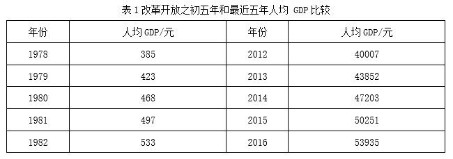

#### 第 1 题　qid 2669872 · 增长

2013-2016年，人均GDP增长率最高的一年是：

- **A**. 2013年　✅
- **B**. 2014年
- **C**. 2015年
- **D**. 2016年

**答案**：A

**官方解析**

根据题干“·····人均GDP增长率最高的一年是”，可判定本题为一般增长率比较问题。定位表1可得2012~2016年的人均GDP，代入公式“增长率”，则2013年：；2014年：；2015年：；2016年：。根据分数比较技巧：分子大、分母小的分数大，2013年人均GDP增长率的分子最大，分母最小，因此2013年人均GDP增长率最高。

故正确答案为A。

---

#### 第 2 题　qid 2669878 · 平均数

最近五年人均GDP的平均值，较之改革开放之初五年人均GDP的平均值，增长了约多少倍？

- **A**. 100
- **B**. 101　✅
- **C**. 102
- **D**. 103

**答案**：B

**官方解析**

根据题干“最近五年······，较之改革开放之初五年······，增长了约多少倍”，可判定本题为现期倍数问题。定位表1可知，改革开放之初五年和最近五年的人均GDP，则最近五年人均GDP的平均值为，改革开放之初五年的平均值为，则增长了约倍。

故正确答案为B。

---

#### 第 3 题　qid 2669886 · 综合

2016年GDP约是1978年GDP的多少倍？

- **A**. 140
- **B**. 186
- **C**. 200
- **D**. 201　✅

**答案**：D

**官方解析**

根据题干“2016年GDP约是1978年GDP的多少倍”，可判定本题为现期倍数计算问题。定位表1可知，2016年人均GDP为53935元，1978年为385元；定位表2可知，2016年总人口为138271万人，1978年为96259万人。GDP人均GDP总人口，则所求倍数为倍，与D项最接近。

故正确答案为D。

---

#### 第 4 题　qid 2669898 · 增长

1979-1982年，总人口增长率最高不超过：

- **A**. 

- **B**. 

- **C**. 

- **D**. 

　✅

**答案**：D

**官方解析**

根据题干“1979-1982年，总人口增长率最高不超过”，结合选项为百分数，可判定本题为一般增长率比较问题。定位表2可知，1978-1982年，总人口分别为96259、97542、98705、100072、101654万人。根据公式“增长率”，计算各年增速即可。

1979年：；1980年：；1981年：；1982年：。计算可知1979-1982年，总人口增速最高不超过。

故正确答案为D。

---

#### 第 5 题　qid 2669903 · 综合

下列说法正确的是：

- **A**. 1979-1982年，GDP增长率逐年提高
- **B**. 1979-1982年，农村人口数逐年下降
- **C**. 2013-2016年，城镇人口数较上年增长最多的一年是2016年
- **D**. 1979-1982年和2013-2016年的城市化率都呈逐年上升趋势　✅

**答案**：D

**官方解析**

A项：定位表1与表2可知，1978-1982年的人均GDP与总人口，GDP人均GDP总人口。根据“增长率”，则1980年GDP增长率为，1981年为，可知GDP增长率并非逐年提高，错误；

B项：定位表2可知，1979年总人口为97542万人，城镇人口为18495万人，则农村人口为万人；1980年总人口为98705万人，城镇人口为19140万人，则农村人口为万人，可知农村人口数并非逐年下降，错误；

C项：定位表2可知，2012-2016年城镇人口分别为71182、73111、74916、77116、79298万人。则2013-2016年城镇人口数增长量分别为万人、万人、万人、万人。增长最多的为2015年，并非2016年，错误；

D项：定位表2可知，1979-1982年及2013-2016年总人口及城镇人口。城市化率（也叫城镇化率），则1979-1982年城市化率分别为、、、；2013-2016年城市化率分别为、、、。可知1979-可知1979-1982年和2013-2016年的城市化率都呈逐年上升趋势，正确。

故正确答案为D。

---

### 材料 2

#### 第 6 题　qid 2670123 · 增长

与2010年相比，预测中国2020年发电量所占比重增幅最大的是：

- **A**. 太阳能
- **B**. 核电
- **C**. 风电　✅
- **D**. 水电

**答案**：C

**官方解析**

根据题干“与2010年相比······比重增幅最大的是”，由于比重自身是百分率，一般不考查比重的变化率，因此对比重的增长问题优先进行作差计算。定位图1与图2可知，2010年与2020年各类型发电量占比数据。

太阳能的比重增幅为：；

核电的比重增幅为：；

风电的比重增幅为：；

水电的比重增幅为：。

可看出风电所占比重的增幅最大。

故正确答案为C。

---

#### 第 7 题　qid 2670127 · 综合

已知中国2010年水电发电量为6867亿兆瓦时，那同年核电发电量约为（    ）亿兆瓦时。

- **A**. 583
- **B**. 763
- **C**. 808　✅
- **D**. 926

**答案**：C

**官方解析**

根据题干“······水电发电量为6867亿兆瓦时，那同年核电发电量约为······”，结合材料给出2010年各类型发电量所占比重，可判定本题为现期比重计算问题。定位图1可知，2010年水电发电量占比为，核电占比为。则核电发电量为亿兆瓦时，与C项最接近。

故正确答案为C。

---

#### 第 8 题　qid 2670133 · 增长

假设中国2020年发电量相较于2010年发电量总量增长率为，则2020年风电发电量约为（    ）亿兆瓦时。

- **A**. 2828
- **B**. 4096
- **C**. 4779　✅
- **D**. 4817

**答案**：C

**官方解析**

根据题干“······2020年风电发电量约为······”，结合材料给出2020年各类型发电量所占比重，可判定本题为现期比重计算问题。由88题可知，2010年水电发电量为6867亿兆瓦时；定位图1与图2可知，2010年水电发电量占比为，2020年风电发电量占比为。则2020年风电发电量为亿兆瓦时。

故正确答案为C。

---

#### 第 9 题　qid 2670137 · 比重

假设中国2030年发电量总量将比2020年提高，水电发电量占比不变，则2030年水电发电量将约为2020年的（    ）倍。

- **A**. 1.1
- **B**. 1.3　✅
- **C**. 2.1
- **D**. 2.3

**答案**：B

**官方解析**

根据题干“······2030年水电发电量将约为2020年的多少倍”，可判定本题为现期倍数计算问题。由题干可知，与2020年相比，2030年发电总量提高；水电发电量占比不变，定位图2可知占比为。则所求倍数倍，与B项最接近。

故正确答案为B。

---

#### 第 10 题　qid 2670139 · 综合

下列说法正确的是：

- **A**. 预测中国2020年风电发电量约为2010年的7倍
- **B**. 预测中国2020年各种发电方式的发电量占比将均有所提高
- **C**. 预测中国2020年火电发电量将依然占很大比重　✅
- **D**. 预测中国2020年火电发电量将会减少

**答案**：C

**官方解析**

A项：定位统计图可知，只给出2020年与2010年各类型发电量占比，并未给出具体发电量，无法计算出2020年发电量与2010年的倍数关系，错误；

B项：定位图1与图2可知，2020年火电发电量占比由2010年的降为，并非各种方式的发电量占比均有所提高，错误；

C项：定位图2可知，2020年火电发电量占比为，超过了一半，占很大比重，正确；

D项：定位统计图可知，只给出2020年与2010年各类型发电量占比，并未给出具体发电量，无法计算出火电发电量是否减少，错误。

故正确答案为C。

---
