# 安徽省2019年面向全国重点高校定向招录选调生《行测》题（网友回忆版）

> 选调生 · 2019 年 · 6 个模块 · 共 40 题

- [政治理论](#%E6%94%BF%E6%B2%BB%E7%90%86%E8%AE%BA) · 5 题
- [常识判断](#%E5%B8%B8%E8%AF%86%E5%88%A4%E6%96%AD) · 5 题
- [言语理解与表达](#%E8%A8%80%E8%AF%AD%E7%90%86%E8%A7%A3%E4%B8%8E%E8%A1%A8%E8%BE%BE) · 10 题
- [数量关系](#%E6%95%B0%E9%87%8F%E5%85%B3%E7%B3%BB) · 5 题
- [判断推理](#%E5%88%A4%E6%96%AD%E6%8E%A8%E7%90%86) · 10 题
- [资料分析](#%E8%B5%84%E6%96%99%E5%88%86%E6%9E%90) · 5 题

---

## 政治理论

### 第 1 题　qid 4757040 · 新思想

习近平总书记在庆祝改革开放40周年大会上讲话指出，近代以来实现中华民族伟大复兴有三大里程碑，分别是                  。

- **A**. 五四运动、建立中国共产党、成立中华人民共和国
- **B**. 建立中国共产党、成立中华人民共和国、推进改革开放和中国特色社会主义事业　✅
- **C**. 建立中国共产党、建立社会主义基本制度、推进改革开放和中国特色社会主义事业
- **D**. 成立中华人民共和国、召开十一届三中全会、推进改革开放和中国特色社会主义事业

**答案**：B

**官方解析**

本题考查政治常识。
B项正确，A、C、D三项错误，2018年12月18日，习近平在庆祝改革开放40周年大会上指出，建立中国共产党、成立中华人民共和国、推进改革开放和中国特色社会主义事业，是五四运动以来我国发生的三大历史性事件，是近代以来实现中华民族伟大复兴的三大里程碑。以毛泽东同志为主要代表的中国共产党人，完成了新民主主义革命，建立了中华人民共和国，为当代中国一切发展进步奠定了根本政治前提和制度基础。以邓小平同志为主要代表的中国共产党人，作出把党和国家工作中心转移到经济建设上来、实行改革开放的历史性决策，成功开创了中国特色社会主义。以江泽民同志为主要代表的中国共产党人，确立了社会主义市场经济体制的改革目标和基本框架，开创全面改革开放新局面，成功把中国特色社会主义推向21世纪。以胡锦涛同志为主要代表的中国共产党人，强调坚持以人为本、全面协调可持续发展，推进党的执政能力建设和先进性建设，成功在新的历史起点上坚持和发展了中国特色社会主义。
故正确答案为B。

---

### 第 2 题　qid 4756495 · 新思想

按照习近平新时代中国特色社会主义思想要求，我们必须把维护中央对香港、澳门特别行政区        和保障特别行政区高度自治权有机结合起来，确保“一国两制”方针不会变、不动摇，确保“一国两制”实践不变形、不走样。

- **A**. 全面管辖权
- **B**. 行政管治权
- **C**. 司法管治权
- **D**. 全面管治权　✅

**答案**：D

**官方解析**

本题考查政治常识。
在十九大报告“三、新时代中国特色社会主义思想和基本方略”部分的“（十二）坚持‘一国两制’和推进祖国统一”中指出：“保持香港、澳门长期繁荣稳定，实现祖国完全统一，是实现中华民族伟大复兴的必然要求。必须把维护中央对香港、澳门特别行政区全面管治权和保障特别行政区高度自治权有机结合起来，确保‘一国两制’方针不会变、不动摇，确保‘一国两制’实践不变形、不走样。必须坚持一个中国原则，坚持‘九二共识’，推动两岸关系和平发展，深化两岸经济合作和文化往来，推动两岸同胞共同反对一切分裂国家的活动，共同为实现中华民族伟大复兴而奋斗。”
故正确答案为D。

---

### 第 3 题　qid 4756513 · 新思想

党的十九大报告指出，我国经济已由高速增长阶段转向高质量发展阶段，正处在转变发展方式、优化经济结构、转换增长动力的攻关期。当前我国发展的战略目标是                    。

- **A**. 建设信息化经济体系
- **B**. 建设现代化经济体系　✅
- **C**. 建设城乡一体化工业体系
- **D**. 建设工业化经济体系

**答案**：B

**官方解析**

本题考查政治常识。
在十九大报告“五、贯彻新发展理念，建设现代化经济体系”部分指出：“我国经济已由高速增长阶段转向高质量发展阶段，正处在转变发展方式、优化经济结构、转换增长动力的攻关期，建设现代化经济体系是跨越关口的迫切要求和我国发展的战略目标。必须坚持质量第一、效益优先，以供给侧结构性改革为主线，推动经济发展质量变革、效率变革、动力变革，提高全要素生产率，着力加快建设实体经济、科技创新、现代金融、人力资源协同发展的产业体系，着力构建市场机制有效、微观主体有活力、宏观调控有度的经济体制，不断增强我国经济创新力和竞争力。”
故正确答案为B。

---

### 第 4 题　qid 4756489 · 新思想

2018年3月，十三届全国人大一次会议审议通过了《中华人民共和国宪法修正案》。本次宪法修改将党和国家事业发展的新成就新经验新要求载入了国家根本法，指出            是中国特色社会主义最本质的特征。

- **A**. 一国两制
- **B**. 和谐社会
- **C**. 党的领导　✅
- **D**. 依法治国

**答案**：C

**官方解析**

本题考查法律常识。
A、B、D三项错误，C项正确，根据《中华人民共和国宪法》第一条规定：“中华人民共和国是工人阶级领导的、以工农联盟为基础的人民民主专政的社会主义国家。社会主义制度是中华人民共和国的根本制度。中国共产党领导是中国特色社会主义最本质的特征。禁止任何组织或者个人破坏社会主义制度。”
故正确答案为C。

---

### 第 5 题　qid 4756503 · 时事政治

2018年3月1日，中共中央召开座谈会，隆重纪念周恩来同志诞辰120周年。周恩来同志是中国共产党人的一面不朽旗帜。他直接参与的历史活动有（    ）。

- **A**. 五四运动、南昌起义、重庆谈判　✅
- **B**. 南昌起义、三湾改编、万隆会议
- **C**. 中共一大、南昌起义、遵义会议
- **D**. 南昌起义、八七会议、遵义会议

**答案**：A

**官方解析**

本题考查毛中特。
A项正确，五四运动，是1919年5月4日发生在北京的一场以青年学生为主，广大群众、市民、工商人士等阶层共同参与的爱国运动，五四运动期间，作为接触到新思想的先进学生代表，周恩来立即投身到运动中，为推动革命形势的发展作出了重要贡献；八一南昌起义，指在1927年8月1日中共联合国民党左派，打响了武装反抗国民党反动派的第一枪，揭开了中国共产党独立领导武装斗争和创建革命军队的序幕，周恩来是起义的主要领导人之一；重庆谈判，是抗日战争胜利之际，中国共产党和中国国民党两党就中国未来的发展前途、建设大计在重庆进行的一次历史性会谈，周恩来是参与谈判的中国共产党代表团的成员之一。
B项错误，三湾改编是1927年9月29日至10月3日，毛泽东在江西省永新县三湾村领导的，周恩来并未直接参与；万隆会议，即1955年4月18日至24日，29个亚非国家和地区的政府代表团在印度尼西亚万隆召开的亚非会议，周恩来总理率领中国代表团参加了万隆会议；南昌起义周恩来是主要领导人之一。
C项错误，中共一大于1921年7月23日至8月初在上海法租界望志路106号（现兴业路76号）和浙江嘉兴召开，上海的李达、李汉俊，北京的张国焘、刘仁静，武汉的董必武、陈潭秋，长沙的毛泽东、何叔衡，广州的陈公博，济南的王尽美、邓恩铭，旅日的周佛海，以及由陈独秀指定的代表包惠僧出席会议，代表全国50多名党员，周恩来未参加；1935年1月15至17日，中共中央政治局在遵义召开扩大会议，出席会议的政治局委员有毛泽东、张闻天、周恩来、朱德、陈云、博古；南昌起义周恩来是主要领导人之一。
D项错误，八七会议是大革命失败以后，在关系党和革命事业前途和命运的严重危机时刻，中共中央于1927年8月7日在湖北汉口召开的紧急会议，周恩来没有参加此次会议；南昌起义周恩来是主要领导人之一；遵义会议周恩来作为政治局委员参加。
故正确答案为A。

---

## 常识判断

### 第 1 题　qid 4756523 · 地理国情

推动长三角一体化，对于安徽来说可谓机遇与挑战并存。下面说法中，最不足以体现安徽与长三角实现全面对接优势的一项是（    ）。

- **A**. 安徽、湖北、湖南、江西共谋“中四角”战略，共同融入长三角　✅
- **B**. 安徽在融入长三角中扮演着劳动力和能源输出大省角色
- **C**. 安徽以及长三角共同处于“一带一路”与“长江经济带”发展的交汇点
- **D**. 省会合肥“米”字型高铁交通优势，使得安徽在全面融入长三角中的地位不断提高

**答案**：A

**官方解析**

本题考查政治常识。
A项错误，2012年12月，国务院副总理李克强在江西省九江市主持区域发展与改革座谈会时，谈到长江中游城市群，建议将安徽省纳入进来，将“中三角”扩容为“中四角”。2014年09月25日，《国务院关于依托黄金水道 推动长江经济带发展的指导意见》出台，明确提出长江经济带将重点打造长江三角洲、长江中游和成渝三大跨区域城市群。其中，“长三角”是以上海为中心，南京、杭州、合肥为副中心的城市群；长江中游城市群（即“中三角”）是以武汉、长沙、南昌为中心的城市群；成渝城市群则以成都和重庆为中心。《指导意见》的出台，标志着在国家战略层面安徽离开“中四角”，向东融入“长三角”区域序列。
B项正确，在2018年度长三角地区主要领导座谈会上，国务院发展研究中心副主任、党组成员王一鸣说：“过去的高速增长主要是依靠传统生产要素，那时的长三角合作也主要是解决能源、劳动力问题，现在则更多聚焦于创新、人才与科技合作。”他认为，长三角三省一市优势短板各不相同，要各扬所长，“上海比较综合，鲜明优势是创新能力、服务业的发展水平、科技人才的汇聚；江苏是制造业最密集的地区，特别是比较先进的制造业；浙江民营经济发达，每镇一个产品，规模非常大；安徽有比较充足的劳动力资源，产业这两年发展非常迅猛，由此形成差异性，差异性才是合作的基础。”此外，安徽所能输出的商品除了种类和数量极大增加的农产品外，服务于现代工业的原材料和能源物资也在快速增加，皖南的金属矿产和皖北的煤矿成为了安徽向长三角输送的重要资源。
C项正确，2014年9月，国务院公布了《关于依托黄金水道 推动长江经济带发展的指导意见》，首次明确了安徽作为长江三角洲城市群的一部分，省会合肥则与杭州、南京并列成为长三角城市群副中心。2015年3月28日，国家发展和改革委员会、外交部、商务部联合发布了《推动共建丝绸之路经济带和21世纪海上丝绸之路的愿景与行动》，合肥被纳入“内陆开放型经济高地”范畴。这意味着合肥已成为“一带一路”国际战略和长江经济带国家战略双覆盖区域。从长远看，安徽作为“一带一路”国际战略和长江经济带国家战略双覆盖区域，将充分利用自身战略位置，通过创新机制加快推进内外贸一体化和贸易便利化，推动建立有利于长江区域经济合作的法律法规，把该省打造成长江经济带增益型中继站。
D项正确，2016年7月，国家发展改革委、交通运输部、中国铁路总公司联合发布了《中长期铁路网规划》，勾画了“八纵八横”高速铁路网的宏大蓝图。在这一规划中，共有三条高铁穿过合肥，并在安徽形成了“米”字型的交通。这一高铁规划使得合肥能进一步将皖北、皖南多个省内城市连接起来，并且开始能够形成一定的人口吸引力，从而促进本省相互交流与融合。从长期来看，有利于安徽省更好的借助长三角发展，提升自己在长三角中的地位。 
本题为选非题，故正确答案为A。

---

### 第 2 题　qid 4756499 · 人文常识

甲到汽车修理厂修车。车修好后，修理厂要求甲支付2000元修车费。因甲没有带够钱，修理厂便将甲的车子扣留下来。修理厂的行为属于（    ）。

- **A**. 行使抵押权的行为
- **B**. 行使质权的行为
- **C**. 行使留置权的行为　✅
- **D**. 非法占有他人之物的行为

**答案**：C

**官方解析**

本题考查法律常识。
A项错误，根据《中华人民共和国民法典》第三百九十四条第一款规定：“为担保债务的履行，债务人或者第三人不转移财产的占有，将该财产抵押给债权人的，债务人不履行到期债务或者发生当事人约定的实现抵押权的情形，债权人有权就该财产优先受偿。”由此说明，抵押是双方约定得来的权利，而本题中，双方并没有约定抵押，故修理厂的行为不属于行使抵押权的行为。
B项错误，根据《中华人民共和国民法典》第四百二十五条第一款规定：“为担保债务的履行，债务人或者第三人将其动产出质给债权人占有的，债务人不履行到期债务或者发生当事人约定的实现质权的情形，债权人有权就该动产优先受偿。” 由此说明，质权是双方约定得来的权利，而本题中，双方并没有约定，故修理厂的行为不属于行使质权的行为。
C项正确，根据《中华人民共和国民法典》第四百四十七条第一款规定：“债务人不履行到期债务，债权人可以留置已经合法占有的债务人的动产，并有权就该动产优先受偿。”本题中，双方基于维修合同的存在，债权人合法占有车子，在债务人不履行到期债务时，扣押车子的行为属于留置。
D项错误，根据《中华人民共和国民法典》第七百七十条规定：“承揽合同是承揽人按照定作人的要求完成工作，交付工作成果，定作人支付报酬的合同。承揽包括加工、定作、修理、复制、测试、检验等工作。”本题中，甲到汽车修理厂修车，车修好后，修理厂要求甲支付2000元修车费，这种行为属于承揽合同，汽车修理厂占有车子属于合法占有，后期债务人不履行到期债务时，依照法律允许汽车修理厂合法占有车子迫使甲履行债务。
故正确答案为C。

---

### 第 3 题　qid 4756494 · 人文常识

宋代词人柳永在其传世佳作《望海潮·东南形胜》中提到的“三吴都会”指的是今天的（    ）。

- **A**. 广州
- **B**. 福州
- **C**. 杭州　✅
- **D**. 南京

**答案**：C

**官方解析**

本题考查人文常识。
C项正确，A、B、D三项错误。“三吴都会”指杭州，其中“三吴”是指代长江下游江南的一个地域名称，一般意义上的“三吴”是指吴郡、吴兴郡和会稽郡。语出于宋朝著名词人柳永《望海潮·东南形胜》：“东南形胜，三吴都会，钱塘自古繁华。”意思是杭州地理位置重要，风景优美，是三吴的都会，这里自古以来就十分繁华。
故正确答案为C。

---

### 第 4 题　qid 4756510 · 地理国情

当前，安徽省区域创新能力稳居全国第一方阵。合肥综合性国家科学中心是国家创新体系建设的基础性平台，除拥有国家同步辐射、合肥微尺度物质科学、磁约束核聚变国家实验室外，还有                    国家实验室。

- **A**. 中国聚变工程
- **B**. 量子信息科学　✅
- **C**. 稳态强磁场
- **D**. 合肥先进光源

**答案**：B

**官方解析**

本题考查科技常识。
A项错误，2017年12月5日，中国聚变工程实验堆（CFETR）正式开始工程设计，中国核聚变研究由此开启新征程。2018年1月3日，国家发改委宣布聚变堆主机关键系统综合研究设施在合肥集中建设，这是合肥综合性国家科学中心首个落地的国家大科学装置项目。
B项正确，量子信息科学国家实验室是国家重点支持的重大前沿科技项目，建成后以国家信息安全保障、计算能力提高等重大需求为导向，推动以量子信息为主导的第二次量子革命的前沿科学问题和核心关键技术，培育形成量子通信等战略性新兴产业，抢占量子科技国际竞争和未来发展的制高点。量子信息科学国家实验室由中国科学院量子信息与量子科技创新研究院推动并建设，一期工程建设用地项目获得安徽省政府批准，总面积37.2802公顷。
C项错误，2017年9月27日，位于中国科学院合肥物质科学研究院的国家重大科技基础设施——稳态强磁场实验装置通过国家验收，这使我国成为继美国、法国、荷兰、日本之后第五个拥有稳态强磁场的国家。
D项错误，合肥先进光源(HALS)及先进光源集群物理方案的设计水平已达到国际领先水平，是基于衍射极限储存环的第四代同步辐射光源，其发射度及亮度指标世界第一，并且在软X射线光谱区横向完全相干，是全世界最先进的衍射极限储存环光源。“合肥先进光源预研”项目已经中科院论证，给予6000万元的资金支持，安徽省政府出具了支持承诺函。2017年12月29日合肥先进光源预研工程正式启动。
故正确答案为B。

---

### 第 5 题　qid 4756515 · 科技常识

冬季是煤气中毒事故的多发期。煤气的主要成分一氧化碳极易与血红蛋白结合，形成碳氧血红蛋白，从而使血红蛋白丧失携氧的能力和作用，造成组织性窒息。煤在燃烧时产生煤气的原因是（    ）。

- **A**. 氧气过量或炉温不够
- **B**. 氧气不足或炉温过高
- **C**. 氧气过量或炉温过高
- **D**. 氧气不足或炉温不够　✅

**答案**：D

**官方解析**

本题考查科技常识。

煤气是在氧气不充足时，煤中的碳不完全燃烧产生的，化学方程式如下：，因为煤不完全燃烧，所以炉温不高。

故正确答案为D。

---

## 言语理解与表达

### 第 1 题　qid 4757896 · 片段阅读

铁陨石也被称作陨铁，大多来自古老的小行星。天体撞击使这些小行星粉身碎骨，它们内部的地核破碎并冷却之后，形成高纯度的铁镍合金。部分金属碎块坠落到地表成为铁陨石。这些小行星内部结构大多和地球相似，对于人类认知地球内核有重要作用。
这段文字意在说明：

- **A**. 铁陨石的名称
- **B**. 铁陨石的来历　✅
- **C**. 铁陨石的成分
- **D**. 铁陨石的价值

**答案**：B

**官方解析**

文段开篇指出铁陨石大多来自小行星，随后具体解释了铁陨石是如何形成的，即天体撞击使小行星内部的地核破碎，冷却后形成铁镍合金，合金碎块坠落到地表就成了铁陨石。尾句指出铁陨石所在的小行星内部结构对人类认识地球内核有重要作用，再次建立起铁陨石与小行星内核的联系。故文段为总分结构，重点强调铁陨石的来历，对应B项。
A项“铁陨石的名称”、C项“铁陨石的成分”均对应非重点的内容，排除；
D项，“铁陨石的价值”无中生有，文段仅涉及小行星内部结构的研究价值，并未提及铁陨石的价值，排除。
故正确答案为B。
【文段出处】《地理知识 | 星星的金属心 》

---

### 第 2 题　qid 4757892 · 语句表达

北方针叶林，主要分布于北纬45度至北纬70度之间的寒温带地区。俄罗斯、加拿大和美国境内都有连绵不绝、面积广大的针叶林带。在我国，阿尔泰山山地和大兴安岭北部是北方针叶林带的南延部分。北方针叶林是由松、杉类植物形成的森林，一般来说针叶林树皮与枝叶的油脂含量较阔叶林更高，所以更易燃烧。因此，                    。
填入画横线部分最恰当的一项是：

- **A**. 针叶林比较容易发生林火
- **B**. 北方针叶林又被称作泰加林
- **C**. 针叶林带的植被对林火有较强适应性
- **D**. 针叶林带是大规模林火的常见发生地　✅

**答案**：D

**官方解析**

横线出现在文段的末尾，且通过“因此”对前文进行总结。文段前面介绍了北方针叶林的分布，并说明在俄罗斯、加拿大和美国境内均有针叶林带。接着引出在我国北方也存在针叶林带的南延部分，后文阐述北方针叶林的植物构成，并通过“更”强调针叶林树木的油脂含量更高、更易燃烧。故横线处要体现针叶林带更容易发生林火，对应D项。
A项，“针叶林比较容易发生林火”仅对应尾句前讲述“北方针叶林”特性的内容，横线位于尾句，应对全文进行总结，要结合前文论述针叶林带的分布及针叶林易燃的特性进行综合分析，即文段重在强调易燃特性对“针叶林带”的影响，而非“针叶林”本身，偏离文段重点，排除；
B项，“又被称作泰加林”文段未提及，无中生有，排除；
C项，“对林火有较强适应性”文段未提及，无中生有，排除。
故正确答案为D。
【文段出处】《森林大火是疏是堵？世界级难题》

---

### 第 3 题　qid 53057 · 片段阅读

文化是物质设备和各种知识的结合体，人使用设备和知识以便生存。为了某种目的，人有时要改变文化。人如果扔掉某件工具而去获取一件新工具，那是因为他相信新工具更适用。这个变迁过程必定是一种综合体，亦即他过去的经验、他对目前形势的了解以及他对未来结果的期望。过去的经验并不总是过去实事的真实写照，因为过去的实事，经过记忆的选择已经起了变化；目前的形势也并不总能得到准确的理解，因为它吸引注意力的程度常受利害关系的影响；未来的结果不会总如人所期望的那样，因为它是希望和努力以外的其他许多力量的产物。所以，新工具最后也可能被证明并不适合人的目的。
如果新工具最终被证明并不适合人的目的，下列哪种原因是作者没有明确提到的？

- **A**. 所选择的工具与生产力水平不适应　✅
- **B**. 所依据的历史经验有可能是错误的
- **C**. 对当前客观形势的认识可能不全面
- **D**. 发展过程中出现始料未及的新情况

**答案**：A

**官方解析**

本题属于细节判断题。由文中“过去的经验并不总是过去实事的真实写照”可知，B项是“新工具最终被证明并不适合人的目的”的原因之一；由文中“目前的形势也并不总能得到准确的理解”可知，C项是“新工具最终被证明并不适合人的目的”的原因之一；由文中“未来的结果不会总如人所期望的那样”可知，D项也是“新工具最终被证明并不适合人的目的”的原因。只有A项原因在文中找不到明确依据。
本题为选非题，故正确答案为A。

---

### 第 4 题　qid 4757891 · 片段阅读

非洲大多数国家工业化程度相对较低，但拥有丰富的资源、廉价的劳动力和广阔的市场潜力。中国经过40年改革开放，已经拥有充足的发展资金、适用技术和设备以及丰富的发展经验。当下，中国正在深化经济转型升级，大量优质富余产能和先进装备技术有待向外转移，这些产能和装备技术也符合非洲发展的需要，因此，渴望实现经济多元化和工业化的非洲，完全可以成为中国产能和装备技术转移的重要承接地之一。
这段文字最适合的标题是：

- **A**. 中非产能合作对接条件已成熟　✅
- **B**. 中国产能和装备技术转移承接地
- **C**. 非洲：拥抱经济多元化和工业化
- **D**. 转移富余产能，深化经济转型升级

**答案**：A

**官方解析**

文段开篇通过转折词“但”指出非洲拥有资源、劳动力和市场优势，接着介绍中国已经拥有资金、技术和设备以及经验优势，后文论述当前中国的富余产能和先进技术有待对外转移，且都符合非洲发展需要，尾句通过结论词“因此”总结全文，强调渴望发展的非洲与期待对外转移产能的中国之间已经具备合作条件。故文段主要强调中国和非洲之间已经具备产能、技术转移承接条件，对应A项。
B项，文段强调中非之间产能和技术已具备转移条件，缺少主题词“非洲”，排除；
C项，“拥抱经济多元化和工业化”对应文段尾句的内容，表述片面，且缺少主题词“中国”，排除；
D项，文段强调中非之间产能和技术已具备转移条件，表述不明确，且缺少主题词“中国”“非洲”，排除。
故正确答案为A。
【文段出处】《中国优势产能“赶集”非洲》

---

### 第 5 题　qid 4757886 · 片段阅读

道路货运市场放开后，为了市场管理和安全监管的需要，交通部门要求从事运输的车辆必须持有道路运输证，且只有具备货物运输资质的主体才能够从事货物运输。记者调査发现，车辆在申请该证时，需提交工商执照、行驶证、驾驶员从业资格证、车辆登记证书、承运人保险、车辆检测单以及车辆照片等一系列繁琐材料。许多地方还规定，不对个体车辆颁发道路运输证。大批为中小业主提供“挂靠”业务而牟利的公司由此产生。
下列说法与文意相符的是：

- **A**. 道路运输资质审批应该简化程序
- **B**. 道路运输资质审批制度提高了货运成本　✅
- **C**. 道路运输资质审批制度确保了货运交通安全
- **D**. 道路运输资质审批制度不允许个人取得道路运输证

**答案**：B

**官方解析**

A项，根据“记者调査发现，车辆在申请该证时，需提交······等一系列繁琐材料”可知，文中仅提及道路运输资质审批需要提交的材料繁琐，未涉及审批程序繁多问题，“应该简化程序”无中生有，排除；
B项，根据“记者调査发现，车辆在申请该证时，需提交······等一系列繁琐材料。许多地方还规定，不对个体车辆颁发道路运输证。大批为中小业主提供‘挂靠’业务而牟利的公司由此产生”可知，道路运输资质审批制度的一系列规定导致了“挂靠”牟利的现象，即提高了货运成本，与文意相符，当选；
C项，“确保”一词表述过于绝对，排除；
D项，根据“许多地方还规定，不对个体车辆颁发道路运输证”可知，不允许个人取得道路运输证属于部分地方的做法，范围扩大，排除。
故正确答案为B。
【文段出处】《谁在驱使大货车玩命狂飙?不超载超限超速就无利可图》

---

### 第 6 题　qid 4757898 · 片段阅读

1945年抗战胜利后，上海很快恢复了30年代作为中国书刊出版中心的地位。以文学期刊为例，上海创刊的是北京的3倍，是抗战时期出版中心之一的重庆的5倍，遥遥领先于全国其他地区。影响较大的文学期刊，也多以上海为出版、发行基地。这一地位，在1949年后被北京取代。这其中发生的媒介生态的变化成为中国大陆文学转型的重要因素。
这段文字接下来最可能讲述的是：

- **A**. 抗战胜利前后上海的书刊出版状况
- **B**. 媒介生态的概念及其变化的意义和影响　✅
- **C**. 媒介生态因素对中国现当代文学转型的意义
- **D**. 上海作为中国书刊出版中心的地位如何得而复失

**答案**：B

**官方解析**

本题为接语选择题，需通读全文，重点把握文段最后谈论的核心话题。文段开篇指出抗战胜利后上海恢复了中国书刊出版中心的地位，然后以文学期刊为例进行解释说明，接着指出这种中心地位在1949年后被北京取代，并通过尾句指出被取代的重要因素是媒介生态的变化。根据话题一致的原则，后文应该围绕“媒介生态”展开，介绍“媒介生态”的概念并阐述媒介生态是如何影响中国大陆文学转型的，对应B项。
A项“上海的书刊出版状况”和D项“中心的地位如何得而复失”，均偏离文段最后谈论的核心话题“媒介生态”，排除；
C项，按照逻辑顺序，应先介绍“媒介生态”的概念，再论述其带来的意义，故应置于B项之后，且“中国现当代文学”与文段中所说“中国大陆文学转型”不能等同，无法衔接，排除。
故正确答案为B。
【文段出处】《上海—北京：从媒介生态看战后中国大陆文学转型》

---

### 第 7 题　qid 4757894 · 片段阅读

对“特事特办”，人们可谓耳熟能详。有人认为，“特事特办”起初是指对沿海经济特区采取不同于内地的优惠政策。其实，在改革开放初期，在向社会主义市场经济转型期间，“特事特办”普遍存在，具有现实合理性，并且推动了我国改革发展进程。在特定的历史时期，很多事情都要摸着石头过河，用旧观念和旧制度来衡量，新生事物都可能被视为“异端”，没有突破就可能胎死腹中，而“特事特办”就是这样一种有效的突破方式和突破路径，在一定意义上说，沿海经济特区的成长，见证并承载了“特事特办”的历史价值。
这段文字意在强调：

- **A**. “特事特办”应该淡出历史舞台
- **B**. “特事特办"具有一定的历史价值　✅
- **C**. 沿海经济特区“特事特办”的经验
- **D**. 人们对“特事特办”已经司空见惯

**答案**：B

**官方解析**

文段开篇引出“特事特办”的话题，紧接着阐述别人的观点，即“特事特办”是仅对于沿海经济特区的优惠政策，随后通过转折词“其实”强调在不同的时期，“特事特办”具有现实合理性，且推动了我国改革发展的进程，后文通过在特定的历史时期，对“特事特办”是一种有效的突破方式和突破路径进行解释说明，最后通过沿海经济特区的成长见证并承载了“特事特办”的历史价值，再次强调“特事特办”的价值，故文段旨在强调“特事特办”在不同的时期有不同的历史价值，对应B项。
A项，“淡出历史舞台”文段并未提及，无中生有，排除；
C项，“沿海经济特区”为转折前和后文解释说明的内容，非重点，排除；
D项，“司空见惯”指某事物常见，不觉得奇怪，对应首句内容，为转折前的内容，非重点，排除。
故正确答案为B。
【文段出处】《“特事特办”应淡出历史舞台》

---

### 第 8 题　qid 4757911 · 语句表达

①在这种制度体系中，从清中期直到光绪年间，作为新疆地理中心的伊犁河谷，成了首府之城——惠远城的驻地。
②为了保持纳入中国版图的新疆地区的稳定，清朝政府最终决定设立伊犁将军，以军府制管理新疆。
③清朝政府接管新疆之前，占据北疆的是游牧的准噶尔蒙古部，他们逐水草而居，城堡对于他们的用处很小。
④所以，直到伊犁将军设立前夕，伊犁地区还没有一座可供驻军、办公的城堡。
⑤从东向西，一座大城、八座子城，排列成一条以惠远城为中心的防卫圈，在伊犁河北岸画出了一条弧线。
⑥为加强防卫，等到惠远城竣工之后，伊犁河谷内又兴建了数座“卫星城”，并且调来锡伯、察哈尔、厄鲁特、索伦营、绿营等，一起构成了驻防伊犁、拱卫惠远城的一整套军事体系。
将以上6个句子重新排序，语序正确的一项是：

- **A**. ⑤③④①②⑥
- **B**. ②①⑤⑥③④
- **C**. ③④②①⑥⑤　✅
- **D**. ⑥⑤②①③④

**答案**：C

**官方解析**

对比选项，判断首句。②句介绍为了保持纳入中国版图的新疆地区的稳定，清朝政府采取的管理措施，③句介绍清朝政府接管新疆之前，占据北疆的部落及其生活状态，⑤句介绍伊犁河北岸以惠远城为中心的防卫圈情况，⑥句介绍伊犁河谷内构筑的驻防伊犁、拱卫惠远城的一整套军事体系，按照逻辑顺序，应先介绍清朝政府接管新疆之前北疆的情况，再介绍新疆地区纳入中国版图之后清政府采取的管理措施；应先介绍伊犁河谷内的防卫情况，再介绍伊犁河北岸的防卫圈，因此③句在②句前，排除B、D两项，⑥句在⑤句前，排除A项，锁定C项。
验证C项，文段先说清朝政府接管新疆之前，伊犁地区还没有可供驻军、办公的城堡，接着论述新疆地区纳入中国版图后，采取的一系列管理和防卫措施，即先设立伊犁将军，使得伊犁河谷成了首府之城——惠远城的驻地，再在河谷内构成了一整套军事体系，最后在伊犁河北岸构筑了一条防卫圈。逻辑顺序合理，当选。
故正确答案为C。
【文段出处】《昔日西域腹心而今新疆边陲：每一位中国人都应该知道的“伊犁九城”》

---

### 第 9 题　qid 4757903 · 片段阅读

判定死亡，长期以来以心脏停止跳动和呼吸的停止为标准。然而随着医学的不断发展，传统的死亡判断标准受到挑战。尤其是呼吸机的发明，使病患在全脑功能丧失、自主呼吸停止后，仍能靠机械通气维持一段时间的心跳和呼吸。1968年，哈佛大学医学院将“脑功能不可逆性丧失”作为新的死亡标准，并制定了世界上第一个脑死亡诊断标准。有学者统计，目前已有超过100个国家将脑死亡作为死亡标准之一。但我国现行刑法关于死亡标准釆取综合标准说，其核心含义是心跳、呼吸停止，脑死亡标准并不在认可之列。
从这段文字，可以看出作者的态度是：

- **A**. 靠机械维持生命的做法不可取
- **B**. 我国民众尚未接受脑死亡概念
- **C**. 脑死亡是更科学的判断死亡的标准
- **D**. 有关脑死亡的立法工作应该得到重视　✅

**答案**：D

**官方解析**

文段开篇指出判定死亡的标准是什么，然后通过“然而”进行转折，阐述随着医学的发展，传统的死亡判断标准受到挑战，后文指出患者丧失了全脑功能和停止自主呼吸，仍然可以依靠机械通气维持一段时间的心跳和呼吸。接着阐述哈佛大学医学院制定了新的死亡标准，即脑死亡诊断标准，且有许多国家已将其定为死亡标准之一。尾句通过转折词“但”指出我国刑法的死亡标准采取的是综合标准说，并不认可脑死亡标准。故文段重点为尾句转折后的内容，指出我国现行刑法不认可脑死亡标准为死亡标准的行为，所以可以看出作者的态度是希望在立法层面重视脑死亡标准，对应D项。
A项，“靠机械维持生命”对应文段中间部分，非重点，排除；
B项，“民众尚未接受脑死亡概念”文段未提及，无中生有，排除；
C项，“是更科学的判断死亡的标准”为无关对比，且属于转折前的内容，非重点，排除。
故正确答案为D。
【文段出处】《脑死亡立法：不敢打开的潘多拉魔盒?》

---

### 第 10 题　qid 4757908 · 片段阅读

过去，老一辈古生物学家要想看清化石细节，得用放大镜乃至高倍显微镜配合钢针一点点抠，不仅辛苦、费眼，还会在一定程度上破坏化石。借力显微CT扫描不仅可以观察到动物“深藏不露”的精细构造，还能最大程度地保护化石完整性。仅两毫米长的节肢动物幼虫，在显微CT扫描下，腿肢上微米级别的刚毛都清晰可见，腹腔内的软体结构也映入眼帘。正是凭借显微CT技术，云南大学古生物学团队率先发现了已知最早、最完整的动物中枢神经系统。
这段文字旨在强调：

- **A**. 显微CT技术掀起了化石观测的“革命”　✅
- **B**. 科学的每一点进步都有赖于技术的发展
- **C**. 云南大学古生物学团队凭借显微CT技术取得了科研成果
- **D**. 我国科学家率先发现了已知最早、最完整的动物中枢神经系统

**答案**：A

**官方解析**

文段开篇论述过去古生物学家观察化石的方式不仅辛苦还会破坏化石，接下来指出借力显微CT扫描可以避免过去观察方式引发的问题，并进一步解释，论述在显微CT扫描下仅两毫米长的节肢动物幼虫腿肢上的刚毛都很清晰，尾句以云南大学古生物学团队凭借显微CT技术的考古发现进一步举例论证，故文段为分总分结构，重点强调显微CT技术给化石观测带来巨大变革和积极影响，对应A项。
B项，缺少文段主题词“显微CT技术”，排除；
C、D两项，均对应尾句举例论证部分，非重点，排除。
故正确答案为A。
【文段出处】半月谈《他们，在帽天山为寒武纪生物修史》

---

## 数量关系

### 第 1 题　qid 4743052 · 数学运算

计算：

- **A**. 2
- **B**. 3
- **C**. 4
- **D**. 5　✅

**答案**：D

**官方解析**

原式可转化为，根据裂项相消公式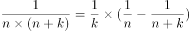，故原式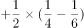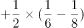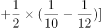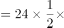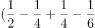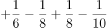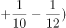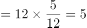。

故正确答案为D。

---

### 第 2 题　qid 4742995 · 数学运算

将正整数1至9分成三组，每组三个数，已知第一组三个数的积是63，第二组三个数的积是72，则第三组三个数的积是：

- **A**. 80　✅
- **B**. 90
- **C**. 108
- **D**. 135

**答案**：A

**官方解析**

方法一：正整数1至9的乘积为：1×2×3×4×5×6×7×8×9，因第一组三个数的积是63，第二组三个数的积是72，故第三组三个数的积。

方法二：把63分解为质数相乘的形式，可得，故在正整数1至9中，乘积是63的三个数字只能为：1，7，9；把72分解为质数相乘的形式，可得，故在正整数1至9中，除了1，7，9，乘积是72的三个数字只能为：3，4，6，故第三组三个数的积=2×5×8=80。

故正确答案为A。

---

### 第 3 题　qid 4742988 · 数学运算

自圆上一点A开始，以8cm弧长为单位等分圆周；再自点A开始，以12cm弧长为单位等分圆周。两次等分的最后一个等分点都恰好回到点A。此时，圆上共有160个等分点。则圆周长为：

- **A**. 800cm
- **B**. 860cm
- **C**. 900cm
- **D**. 960cm　✅

**答案**：D

**官方解析**

方法一：设圆周长为cm，根据环形植树的棵数，故间隔为8cm时，等分点数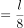，间隔为12cm时，等分点数，其中间隔为8cm和12cm的最小公倍数24cm时，两种等分方法的等分点重合，则重合的等分点数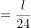。根据圆上共有160个等分点，可列方程：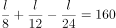，解得cm。

方法二：根据题意，两次等分的最后一个等分点都恰好回到点A，故圆周长必然能被8和12整除，代入选项进行排除：

A项，800不能被12整除，不满足题意，排除；B项，860不能被8整除，不满足题意，排除；C项，900不能被8整除，不满足题意，排除；D项，960能被8和12整除，满足题意，当选。

故正确答案为D。

---

### 第 4 题　qid 4742993 · 数学运算

甲、乙两辆车同时自A地出发，沿同一条道路匀速驶往B地。当甲距B地还剩18千米时，乙还剩60千米；当甲到达终点时，乙还剩48千米。那么，A、B两地间的距离应为多少千米？

- **A**. 120
- **B**. 136
- **C**. 144　✅
- **D**. 156

**答案**：C

**官方解析**

方法一：设A、B两地间的距离为x千米，当甲距B地还剩18千米时，说明甲行驶了（x-18）千米，乙还剩60千米，说明乙行驶了（x-60）千米；当甲到达终点时行驶了x千米，乙还剩48千米，说明乙行驶了（x-48）千米。根据时间相同，速度比等于路程比，可列等式：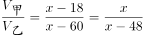，解得：x=144，即A、B两地间的距离应为144千米。

方法二：相同时间内，甲行驶18千米，乙行驶了60-48=12千米，则甲、乙两车的速度比为18：12=3：2。当甲到达终点时，甲、乙两车的路程比等于两车的速度比3：2，此时甲比乙多行驶48千米，故A、B两地间的距离为48×3=144千米。

故正确答案为C。

---

### 第 5 题　qid 4743013 · 数学运算

有一种足球是由32块黑白相间的牛皮缝制而成，黑皮为正五边形，白皮为正六边形，且边长都相等（如图），则白皮的块数是：

- **A**. 22
- **B**. 20　✅
- **C**. 18
- **D**. 16

**答案**：B

**官方解析**

根据题意，设白皮有x块，则黑皮有（32-x）块。黑皮为正五边形，则黑皮边的总数为5×（32-x）条；每块白皮有三条边与黑皮的边重合，则黑皮边的总数还可以表示为3x条，得到方程：5×（32-x）=3x，解得x=20，即白皮的块数是20块。
故正确答案为B。

---

## 判断推理

### 第 1 题　qid 4754669 · 定义判断

积极废人，指那些爱给自己立目标，但永远做不到的人；尽管心态积极向上，行动却宛如废物，他们往往会在享乐后间歇性恐慌，时常为自己的懒惰自责。间歇性踌躇满志，为自己设立目标，但由于持续性享乐，所以永远做不到。
根据上述定义，下列最适合用来形容积极废人的成语是：

- **A**. 千头万绪
- **B**. 一蹶不振
- **C**. 程门立雪
- **D**. 三翻四复　✅

**答案**：D

**官方解析**

第一步：找出定义关键词。
“心态积极向上，行动却宛如废物”、“间歇性恐慌”、“间歇性踌躇满志”。
第二步：逐一分析选项。
A项：“千头万绪”形容事情头绪繁多，纷乱复杂，不符合“心态积极向上，行动却宛如废物”、“间歇性恐慌”、“间歇性踌躇满志”，不符合定义，排除；
B项：“一蹶不振”比喻人一旦遭到挫折就不能再振作起来，不符合“心态积极向上，行动却宛如废物”，不符合定义，排除；
C项：“程门立雪”形容尊师重道，不符合“心态积极向上，行动却宛如废物”、“间歇性恐慌”、“间歇性踌躇满志”，不符合定义，排除；
D项：“三翻四复”形容反复无常，符合“间歇性”，A、B、C三项均不能形容积极废人，利用排除思维，对比择优，当选。
故正确答案为D。

---

### 第 2 题　qid 4754681 · 定义判断

群体性事件，是指由某些社会矛盾引发，特定群体或不特定多数人聚合临时形成的偶合群体，以人民内部矛盾的形式，通过没有合法依据的规模性聚集、对社会造成负面影响的群体活动、发生多数人语言行为或肢体行为上的冲突等群体行为的方式，或表达诉求和主张，或直接争取和维护自身利益，或发泄不满、制造影响，因而对社会秩序和社会稳定造成重大负面影响的各种事件。
根据上述定义，下列说法正确的是：

- **A**. 群体性事件表现方式激烈，具有暴力性
- **B**. 群体性事件多数源于对合法权利和权益的诉求
- **C**. 群体性事件是一种可能引发社会治安危害的非法集体活动　✅
- **D**. 群体性事件由一群人制造和参与，该群体的组织化程度很高

**答案**：C

**官方解析**

第一步：找出定义关键词。
“没有合法依据的规模性聚集”、“发生多数人语言行为或肢体行为上的冲突”、“或表达诉求和主张，或直接争取和维护自身利益，或发泄不满、制造影响”、“对社会秩序和社会稳定造成重大负面影响”。
第二步：逐一分析选项。
A项：由“发生多数人语言行为或肢体行为上的冲突”可知，群体性事件可以是语言行为或肢体行为上的冲突，但其是否表现方式激烈，具有暴力性并未提及，说法错误，排除； 
B项：群体性事件的原因包括“或表达诉求和主张，或直接争取和维护自身利益，或发泄不满、制造影响”，对合法权利和权益的诉求是原因之一，但不明确是否“多数”源于该原因，说法错误，排除；
C项：由“没有合法依据的规模性聚集”可知，群体性事件是非法集体活动。由“对社会秩序和社会稳定造成重大负面影响”可知，其可能会引发社会治安危害，说法正确，当选；
D项：题干未提及群体性事件的组织化程度，说法错误，排除。
故正确答案为C。

---

### 第 3 题　qid 4754679 · 定义判断

运动成瘾症，是指人对有规律进行锻炼的生活方式产生了心理、生理依赖，为了运动而运动，如果哪天没锻炼，就会觉得浑身不自在。
根据上述定义，下列选项最不可能成为运动成瘾症的特征的是：

- **A**. 运动项目具有竞争性，并且需要与别人合作才能完成　✅
- **B**. 有规律的运动一旦停止，则出现心境状态紊乱的信号
- **C**. 为了保证运动，渐渐把锻炼放在了优先于其他事务的突出地位
- **D**. 运动形式单一，导致每天身体活动有了固定的时间表

**答案**：A

**官方解析**

第一步：找出定义关键词。
“有规律进行锻炼的生活方式”、“产生了心理、生理依赖”、“为了运动而运动”、“没锻炼，就会觉得浑身不自在”。
第二步：逐一分析选项。
A项：需要与别人合作才能完成运动项目，说明不是“有规律进行锻炼的生活方式”，且是对别人的依赖，不符合“产生了心理、生理依赖”，不符合定义，当选；
B项：停止有规律的运动，会出现心境状态紊乱的信号，说明身体对这种有规律的运动产生了依赖，符合“有规律进行锻炼的生活方式”、“产生了心理、生理依赖”、“没锻炼，就会觉得浑身不自在”，符合定义，排除；
C项：为了保证运动，把锻炼放在优先于其他事务的突出地位，说明心理上对锻炼产生了依赖，符合“产生了心理、生理依赖”、“为了运动而运动”，符合定义，排除；
D项：身体活动有了固定的时间表，说明活动是有规律的，并且身体对运动产生了依赖，符合“有规律进行锻炼的生活方式”、“产生了心理、生理依赖”，符合定义，排除。
本题为选非题，故正确答案为A。

---

### 第 4 题　qid 4754677 · 定义判断

巴纳姆效应认为每个人都会很容易相信一个笼统的、一般性的人格描述特别适合他。即使这种描述十分空洞，仍然被认为反映了自己的人格面貌，哪怕自己根本不是这种人。
根据上述定义，下列选项中不属于克服巴纳姆效应的方法的是：

- **A**. 培养一种收集信息的能力和敏锐的判断力
- **B**. 找不如自己的人作比较，或者拿自己的缺陷与别人的优点比　✅
- **C**. 通过对重大事件，特别是重大的成功或失败认识自己
- **D**. 不要掩盖自己的缺陷，要勇于面对自己

**答案**：B

**官方解析**

第一步：找出定义关键词。
“很容易相信一个笼统的、一般性的人格描述特别适合自己”。
第二步：逐一分析选项。
A项：培养一种收集信息的能力和敏锐的判断力，可以帮助人们做出明智的决断，从而克服“很容易相信一个笼统的、一般性的人格描述特别适合自己”，属于克服巴纳姆效应的方法，排除；
B项：找不如自己的人作比较，或者拿自己的缺陷与别人的优点比，都会失之偏颇，不能克服“很容易相信一个笼统的、一般性的人格描述特别适合自己”，不属于克服巴纳姆效应的方法，当选；
C项：通过对重大事件，特别是重大的成功或失败认识自己，可以更好地了解自己的个性、能力，从中发现自己的长处和不足，从而克服“很容易相信一个笼统的、一般性的人格描述特别适合自己”，属于克服巴纳姆效应的方法，排除；
D项：不要掩盖自己的缺陷，要勇于面对自己，可以让人对自己有更清醒的认识，从而克服“很容易相信一个笼统的、一般性的人格描述特别适合自己”，属于克服巴纳姆效应的方法，排除。
本题为选非题，故正确答案为B。

---

### 第 5 题　qid 4754683 · 定义判断

间接融资，是指资金盈余单位与资金短缺单位之间不发生直接关系，而是分别与金融机构发生一笔独立的交易，即资金盈余单位通过存款，或者购买银行、信托、保险等金融机构发行的有价证券，将其暂时闲置的资金先行提供给这些金融中介机构，然后再由这些金融机构以贷款、贴现等形式，或通过购买需要资金的单位发行的有价证券，把资金提供给这些单位使用，从而实现资金融通的过程。
根据上述定义，下列属于间接融资过程的是：

- **A**. 某单位将闲置的资金用于购买银行发行的国家债券　✅
- **B**. 某单位购买了本市一家房地产公司发行的短期债券
- **C**. 某单位出资并通过信托机构成立了一项公益基金
- **D**. 某单位将近些年的利润暂时存于某国有商业银行

**答案**：A

**官方解析**

第一步：找出定义关键词。
“资金盈余单位与资金短缺单位之间不发生直接关系”、“资金盈余单位通过存款，或者购买金融机构发行的有价证券”、“金融机构以贷款、贴现等形式，或通过购买需要资金的单位发行的有价证券，把资金提供给这些单位使用”、“实现资金融通”。
第二步：逐一分析选项。
A项：国家债券是中央政府为筹集财政资金而发行的一种政府债券，某单位购买银行发行的国家债券，没有与政府发生直接关系，而是通过银行进行的，符合“资金盈余单位与资金短缺单位之间不发生直接关系”、“资金盈余单位通过存款，或者购买金融机构发行的有价证券”，最终资金是政府使用，符合“金融机构以贷款、贴现等形式，或通过购买需要资金的单位发行的有价证券，把资金提供给这些单位使用”，符合定义，当选；
B项：房地产公司不是金融机构，不符合“资金盈余单位通过存款，或者购买金融机构发行的有价证券”，不符合定义，排除；
C项：公益基金一般为民间非盈利性组织，宗旨是通过无偿资助，促进社会的科学、文化教育事业和社会福利救助等公益性事业的发展，不符合“资金盈余单位通过存款，或者购买金融机构发行的有价证券”，不符合定义，排除；
D项：该项只是表明某单位将利润存于银行，没有体现银行将资金提供给资金短缺的单位使用，不符合“金融机构以贷款、贴现等形式，或通过购买需要资金的单位发行的有价证券，把资金提供给这些单位使用”、“实现资金融通”，不符合定义，排除。
故正确答案为A。

---

### 第 6 题　qid 4754691 · 逻辑判断

发动机的工作都是活塞在气缸内往复运动，如果润滑不够，缸壁出现了划痕，那么活塞在运动的时候就会漏气，导致气缸压力不够，造成动力下降。所以天冷的时候，为避免拉缸，汽车在启动时是需要热车的。但是，近期的一项覆盖全国的网络调査表明，绝大部分的司机在冬天时，并不热车。
以下各项如果为真，最能解释这一现象的是：

- **A**. 很多车主不爱惜车子，是否拉缸他们不在乎
- **B**. 随着全球气候变暖，现在的冬天没有以前冷了
- **C**. 有些受访者住在海南，海南的气温高，冬天也不需要热车
- **D**. 缸内直喷式发动机已经取代之前的化油器式发动机，天冷也无需热车　✅

**答案**：D

**官方解析**

第一步：找出题干矛盾。
天冷时为避免拉缸，汽车在启动时需要热车，但绝大部分的司机在冬天时，并不热车。
第二步：逐一分析选项。
A项：该项指出很多车主不在乎拉缸，所以对于他们来说不需要热车，其中主体为部分车主，而题干讨论的是绝大部分司机，无法解释题干矛盾，排除；
B项：该项指出现在冬天温度没有以前冷，说明温度没有以前低，那么现在冬天的温度是否达到了不需要热车的温度不明确，不能解释为什么天冷时为避免拉缸，汽车在启动时需要热车，但绝大部分的司机在冬天时，并不热车，无法解释题干矛盾，排除；
C项：该项指出居住在海南的车主冬天不需要热车，而海南的冬天温度并不低，不能解释为什么天冷时为避免拉缸，汽车在启动时需要热车，但绝大部分的司机在冬天时，并不热车，无法解释题干矛盾，排除；
D项：该项指出发动机已经换代，而换代之后的发动机天冷时不需要热车，可以解释为什么天冷时为避免拉缸，汽车在启动时需要热车，但绝大部分的司机在冬天时，并不热车，可以解释题干矛盾，当选。
故正确答案为D。

---

### 第 7 题　qid 4754707 · 逻辑判断

文明城市是含金量很高的城市品牌，是十分重要的无形资产和战略资源。创建全国文明城市是在更高层次、更高水平上推动城市发展，对当地的经济社会发展将产生重要的推动作用。
以下各项如果为真，最能支持上述观点的是：

- **A**. 文明城市如果创建成功会极大地增加外来投资，刺激市场发展空间和活力　✅
- **B**. 经济持续快速健康发展，居民生活水平稳步提高是文明城市的特征之一
- **C**. 创建文明城市必然会努力营造公正公平的法治环境和规范守信的市场环境
- **D**. 致力创业创新和推进富民强区是国家评选文明城市必不可少的条件之一

**答案**：A

**官方解析**

第一步：找出论点和论据。
论点：创建全国文明城市是在更高层次、更高水平上推动城市发展，对当地的经济社会发展将产生重要的推动作用。
论据：无。
本题只有论点，没有论据，加强优先考虑补充论据。
第二步：逐一分析选项。
A项：该项说的是文明城市创建成功会增加外来投资，刺激市场发展空间和活力，解释了为什么创建文明城市能推动当地的经济社会发展，属于解释原因，可以加强，当选；
B项：该项说的是经济快速健康发展是文明城市的特征之一，但是没有提到创建文明城市是否能推动当地的经济社会发展，不能加强，排除；
C项：该项说的是创建文明城市的意义，但是营造的积极环境是否会对当地的经济社会发展起到推动作用不明确，不能加强，排除；
D项：该项说的是致力创业创新和推进富民强区是评选文明城市的条件之一，但是没有提到创建文明城市是否能推动当地的经济社会发展，不能加强，排除。
故正确答案为A。

---

### 第 8 题　qid 4754686 · 逻辑判断

2018年以来，中美贸易摩擦对我国经济带来直接和间接影响，就业工作面临一些新的挑战。有人猜测“失业潮”将会来临。然而从目前情况看，就业数据核心指标运行良好，就业局势整体稳定。三季度末，全国城镇登记失业率为3.82%，降至近年来低位。
由此不能推出的是：

- **A**. “失业潮”的猜测过于悲观
- **B**. 三季度末的全国城镇登记失业率远低于去年同期　✅
- **C**. 中美贸易摩擦对就业领域的影响可能还没有显现出来
- **D**. 3.82%的失业率对于中国经济来说是完全可以承受的

**答案**：B

**官方解析**

日常结论题，根据题干信息逐一分析选项。
A项：根据题干第二句话和第三句话可知，有人猜测“失业潮”将会来临，但就业数据核心指标运行良好，就业局势整体稳定，说明“失业潮”的猜测过于悲观，可以推出，排除；
B项：根据题干最后一句话可知，三季度末，全国城镇登记失业率降至近年来低位，但并未提及去年该数据是多少，“远低于”的说法无法得出，无法推出，当选；
C项：根据题干第一句话和第三句话可知，中美贸易摩擦影响了我国经济，但目前我国就业局势整体稳定，因此可以合理推测中美贸易摩擦对就业领域的影响可能还没有显现出来，可以推出，排除；
D项：根据题干第三句话可知，就业数据核心指标运行良好，就业局势整体稳定，说明目前的失业率还在合理范围内，因此可以合理推测该程度的失业率对中国经济尚没有太大负面影响，是可以承受的，可以推出，排除。
本题为选非题，故正确答案为B。

---

### 第 9 题　qid 4731072 · 逻辑判断

科学家研究发现，人如果较多地与小动物接触便能改变心情，减轻精神和心理上存在的病症。这就是始于上世纪70年代的、国际流行的“伴侣动物疗法”。人和伴侣动物之间充满着独特的深情和友善。正是在这种情感中，人类因对小动物的关爱而使自己的身心得到健康。纽约州立大学的研究发现，伴侣动物可直接使人的感觉变好，对环境更有安全感。
以下各项如果为真，最能支持上述观点的是：

- **A**. 许多患者与宠物相处几个月后，原先的如偏头痛等顽固性病症就会得到减轻　✅
- **B**. 在与动物的陪伴、接触中，患者需要分散部分注意力与动物进行交流、互动
- **C**. 随着社会生活水平的提高，更多家庭开始养宠物并将其视为家庭的重要成员
- **D**. 可爱的动物往往会和主人产生更好的互动效果，更易受到主人的喜爱

**答案**：A

**官方解析**

第一步：找出论点和论据。
论点：人如果较多地与小动物接触便能改变心情，减轻精神和心理上存在的病症。
论据：人和伴侣动物之间充满着独特的深情和友善。正是在这种情感中，人类因对小动物的关爱而使自己的身心得到健康。纽约州立大学的研究发现，伴侣动物可直接使人的感觉变好，对环境更有安全感。
本题论点和论据都在讨论接触小动物对人的身心有好处，话题一致，加强考虑补充论据。
第二步：逐一分析选项。
A项：指出许多患者与宠物相处后，偏头痛等病症减轻，说明与动物相处后确实对自身有好处，举例加强，当选；
B项：指出患者在陪伴、接触动物时会分散注意力，但分散注意力能否减轻病症并不明确，为不明确项，无法加强，排除；
C项：指出更多家庭视宠物为家庭的重要成员，而论点讨论的是接触小动物可减轻精神和心理上存在的病症，话题不一致，无法加强，排除；
D项：指出可爱的动物更易受到主人的喜爱，而论点讨论的是接触小动物可减轻精神和心理上存在的病症，话题不一致，无法加强，排除。
故正确答案为A。

---

### 第 10 题　qid 4754703 · 逻辑判断

很多行业在招聘过程中会对应聘者的年龄有所要求，然而不同的行业对年龄的要求并不一样。互联网行业变化太快，需要新鲜知识和活力的输入，需要时刻保持足够的学习能力，并且互联网行业工作强度大，加班是常有的事。因此，很多互联网公司在招聘的时候都偏向于年轻人。
以下各项如果为真，最不能支持上述结论的是：

- **A**. 超过35岁之后，很多人的精力都会断崖式下降
- **B**. 只有年轻人才能保持旺盛的创造力，创造力对互联网行业尤为重要
- **C**. 互联网行业之所以不要35岁以上的人，是因为付不出对应的薪资　✅
- **D**. 从国内互联网行业就业形势看，劳动力供给远大于岗位需求

**答案**：C

**官方解析**

第一步：找出论点和论据。
论点：很多互联网公司在招聘的时候都偏向于年轻人。
论据：互联网行业变化太快，需要新鲜知识和活力的输入，需要时刻保持足够的学习能力，并且互联网行业工作强度大，加班是常有的事。
本题提问方式为“最不能支持上述结论”，故排除可以加强的选项，选择不能加强的选项即可。
第二步：逐一分析选项。
A项：指出很多人在35岁之后精力不足，因此很难适应互联网行业的高强度工作，在“工作强度大”和“偏向年轻人”之间建立了联系，搭桥项，可以加强，排除；
B项：指出年轻人独有的创造力对互联网行业尤为重要，解释了为什么互联网公司招聘时偏向年轻人，补充论据，可以加强，排除；
C项：指出互联网行业招聘时偏向年轻人不是因为年轻人的学习能力强、能适应高强度工作，而是因为付不出35岁以上的人对应的薪资，削弱论据，不能加强，当选；
D项：指出目前互联网行业劳动力供过于求，其实就是劳动力比较多，所以才有年轻人将其作为岗位选择，解释了为什么互联网行业招聘时偏向年轻人，补充论据，可以加强，排除。
本题为选非题，故正确答案为C。

---

## 资料分析

### 材料 1

        2018年第一季度，全国社会消费品零售总额90275亿元，同比增长9.8%。其中，3月份，社会消费品零售总额29194亿元，餐饮收入3099亿元，限额以上单位餐饮收入占餐饮总收入的23.2%；商品零售额26095亿元，限额以上单位商品零售总额11113亿元，同比增长8.9%。

        2018年1-3月份，全国网上零售额19318亿元，同比增长35.4%。其中，实物商品网上零售额14567亿元，增长34.4%，占社会消费品零售总额的比重为16.1%。在实物商品网上零售额中，吃、穿、用类商品分别增长46.5%、33.9%和33.3%。

#### 第 1 题　qid 4743018 · 综合

2017年3月份全国社会消费品零售总额为（    ）亿元。

- **A**. 26324.62
- **B**. 26515.89　✅
- **C**. 26612.58
- **D**. 26685.56

**答案**：B

**官方解析**

根据题干“2017年3月份······总额······亿元”，结合材料时间为2018年3月份，可判定本题为基期计算问题。定位文字材料第一段及统计图可知，2018年3月份全国社会消费品零售总额29194亿元，同比增长速度为10.1%。根据公式：基期量，则2017年3月份全国社会消费品零售总额亿元，与B项最接近。

故正确答案为B。

---

#### 第 2 题　qid 4743025 · 平均数

2017年第一季度，全国网上零售额平均每月（    ）亿元。

- **A**. 4755.79　✅
- **B**. 14267.356
- **C**. 6439.33
- **D**. 4855.67

**答案**：A

**官方解析**

根据题干“2017年第一季度······平均每月······亿元”，可判定本题为基期平均数问题。定位文字材料第二段可得：2018年1-3月份，全国网上零售额19318亿元，同比增长35.4%。根据公式：基期量，可求2017年第一季度全国网上零售额为亿元，平均每月亿元，与A项最接近。

故正确答案为A。

---

#### 第 3 题　qid 4743029 · 比重

2018年第一季度，全国非实物的商品网上零售额占社会消费品零售总额的比重为（    ）。

- **A**. 16.1%
- **B**. 83.9%
- **C**. 5.26%　✅
- **D**. 24.59%

**答案**：C

**官方解析**

根据题干“2018年第一季度······占······的比重为”，可判定本题为现期比重问题。定位文字材料第一段和第二段可得：2018年第一季度，全国社会消费品零售总额90275亿元；全国网上零售额19318亿元，其中，实物商品网上零售额14567亿元。则2018年第一季度，全国非实物的商品网上零售额为19318-14567=4751亿元。根据比重公式：比重，则全国非实物的商品网上零售额占社会消费品零售总额的比重为，与C项最接近。

故正确答案为C。

---

#### 第 4 题　qid 4743036 · 增长

相对于2016年3月，2018年3月的全国社会消费品零售总额增长：

- **A**. 10.1%
- **B**. 10.9%
- **C**. 22.1%　✅
- **D**. 20.7%

**答案**：C

**官方解析**

根据题干“相对于2016年3月，2018年3月的······增长”，结合选项为百分数，可判定本题为间隔增长率问题。定位图形材料可得：2017年3月全国社会消费品零售总额同比增长10.9%，2018年3月同比增长10.1%。根据间隔增长率公式：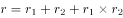，则相对于2016年3月，2018年3月的全国社会消费品零售总额增长率为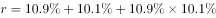，与C项最接近。

故正确答案为C。

---

#### 第 5 题　qid 4743044 · 综合

根据以上材料，可以判断（    ）。

- **A**. 2017年3月-2018年3月，我国社会消费品零售总额持续增加　✅
- **B**. 2017年3月-2018年3月，我国社会消费品零售总额增速持续下降
- **C**. 2018年第一季度我国实物商品网上零售额中，吃类商品占比最高
- **D**. 2018年3月份，限额以上单位商品零售额占商品零售总额的50%

**答案**：A

**官方解析**

A项：根据图形材料可得：2018年3月份社会消费品零售总额，以及2017年3月-2018年3月的每个月同比增速。但不知道每个月的环比增长情况，则无法判定我国社会消费品零售总额是否持续增加，错误；

B项：根据图形材料可得：2017年5月社会消费品零售总额同比增长10.7%，2017年6月社会消费品零售总额同比增长11.0%，前者低于后者，并非持续下降，错误；

C项：定位文字材料第二段可得：2018年1-3月份，实物商品网上零售额14567亿元。在实物商品网上零售额中，吃、穿、用类商品分别增长46.5%、33.9%和33.3%。仅给出吃类商品的同比增速，但无法计算其占比情况，则无法判断其是否最高，错误；

D项：定位文字材料第一段可得：（2018年）3月份······商品零售额26095亿元，限额以上单位商品零售总额11113亿元。根据比重公式：比重，可得限额以上单位商品零售额占商品零售总额的比重为，错误。

故本题无正确答案。

---
