# 广东省2019年选调优秀大学毕业生笔试 思维能力测验（网友回忆版）

> 选调生 · 2019 年 · 5 个模块 · 共 74 题

- [政治理论](#%E6%94%BF%E6%B2%BB%E7%90%86%E8%AE%BA) · 1 题
- [言语理解与表达](#%E8%A8%80%E8%AF%AD%E7%90%86%E8%A7%A3%E4%B8%8E%E8%A1%A8%E8%BE%BE) · 29 题
- [数量关系](#%E6%95%B0%E9%87%8F%E5%85%B3%E7%B3%BB) · 12 题
- [判断推理](#%E5%88%A4%E6%96%AD%E6%8E%A8%E7%90%86) · 30 题
- [资料分析](#%E8%B5%84%E6%96%99%E5%88%86%E6%9E%90) · 2 题

---

## 政治理论

### 第 1 题　qid 2262022 · 新思想

改革开放40年来，我国的交通巨变产生了一个又一个世界之最。交通既是经济发展的服务者，又是40年建设成就的最佳象征。
根据上述表述，下列判断一定错误的是（  ）。

- **A**. 交通可能是经济发展的服务者
- **B**. 交通不可能不是经济发展的服务者
- **C**. 交通将继续为我国改革发展作出贡献
- **D**. 交通可能不是40年建设成就的最佳象征　✅

**答案**：D

**官方解析**

第一步：翻译题干。
交通是经济发展的服务者且是40年建设成就的最佳象征。
第二步：逐一分析选项。
A项：交通可能是经济发展的服务者，由题干一定可以推出可能，可以推出，排除；
B项：“不可能不是”等价于“一定是”，即交通一定是经济发展的服务者，可以推出，排除；
C项：交通将继续为我国改革发展作出贡献，可以推出，排除；
D项：“可能不是”的矛盾为“一定是”， 交通是40年建设成就的最佳象征为真，故交通可能不是40年建设成就的最佳象征一定为假，当选。
本题为选非题，故正确答案为D。

---

## 言语理解与表达

### 第 1 题　qid 2262046 · 语句表达

近日，某市出现了一种收费自习室，这种自习室置身于写字楼中，主要供需要参加职业资格考试的白领使用。但推出一段时间后，经营者发现自习室空置率较高。
以下选项中最不能解释上述现象的是（  ）。

- **A**. 获取职业资格与个人薪酬未直接挂钩　✅
- **B**. 收费自习室定价过高
- **C**. 收费自习室前期宣传效果不理想
- **D**. 许多白领选择公共图书馆看书备考

**答案**：A

**官方解析**

第一步：找出题干矛盾。
收费自习室置身于写字楼中，供需要参加职业资格考试的白领使用，但是自习室空置率较高。
第二步：逐一分析选项。
A项：只是说获取职业资格与个人薪酬没有直接挂钩，但是不能说明参加职业资格的白领为什么不使用收费自习室，不能解释题干矛盾，当选；
B项：收费自习室定价过高，价格太高白领不愿意去，所以去的人不多，可以解释题干矛盾，排除；
C项：前期宣传效果不理想，说明大多数人不知道收费自习室的存在，所以去的人少，可以解释题干矛盾，排除；
D项：许多白领选择公共图书馆看书备考，说明这些白领已经有了看书备考的地点，所以不会去收费自习室，可以解释题干矛盾，排除。
本题为选非题，故正确答案为A。

---

### 第 2 题　qid 2262053 · 语句表达

某公司正在招聘管理人员。如果应聘人员有七年以上相关工作经验，或有研究生学历，就能够进入面试。小赵获得了面试资格。
据此，不能推出的是（  ）。

- **A**. 小赵或者有七年以上相关工作经验，或者有研究生学历
- **B**. 如果小赵有七年以上相关工作经验，那么他一定没有研究生学历　✅
- **C**. 如果小赵没有七年以上相关工作经验，那么他一定有研究生学历
- **D**. 如果小赵没有研究生学历，那么他一定有七年以上相关工作经验

**答案**：B

**官方解析**

第一步：翻译题干。

七年以上工作经验或研究生学历进入面试

小赵进入面试

第二步：逐一分析选项。

A项：翻译为小赵有七年以上工作经验或研究生学历，通过题干可以推出，排除；

B项：翻译为七年以上工作经验研究生学历，肯定了或关系其中一项，无法得到确定结论，当选；

C项：翻译为七年以上工作经验研究生学历，否定了或关系其中一项，否一推一，可以推出，排除；

D项：翻译为研究生学历七年以上工作经验，否定了或关系其中一项，否一推一，可以推出，排除。

本题为选非题，故正确答案为B。

---

### 第 3 题　qid 2262040 · 语句表达

当前，乡村教师留不住是个大问题。对此，有人认为，只要大幅提升乡村教师待遇，就能让他们安心留下来，从而有效解决这一问题。
以下选项中无法削弱上述论断的是（  ）。

- **A**. 不是所有乡村教师都看重待遇
- **B**. 有的乡村教师收入很高
- **C**. 乡村教师收入普遍偏低　✅
- **D**. 不少乡村教师由于生活环境差而辞职

**答案**：C

**官方解析**

第一步：找到论点和论据。
论点：只要大幅提升乡村教师待遇，就能让他们安心留下来，从而有效解决这一问题。
论据：无
第二步：逐一分析选项。
A项：不是所有乡村教师都看重待遇，说明有的乡村老师不看重待遇，所以对于这部分教师，即使提高待遇，他们也不一定会安心留下来，可以削弱，排除；
B项：有的乡村教师收入本来就很高了，所以再提高待遇也不一定会让他们安心留下来，可以削弱，排除；
C项：乡村教师收入普遍偏低，现在提高了，就可能会让他们安心留下来，通过补充论据加强了论点，无法削弱，当选；
D项：不少乡村教师由于生活环境差而辞职，那就不是因为待遇不好而离职，所以即使提高待遇也不一定会让他们留下，可以削弱，排除。
本题为选非题，故正确答案为C。

---

### 第 4 题　qid 2262044 · 逻辑填空

近年来，我国快递行业飞速发展。但是，当前我国快递行业普遍存在服务同质化的问题。由于服务缺少特色，一旦某家快递公司涨价，消费者就会选择其他快递公司。
根据上述表述，下列判断一定正确的是（    ）。
Ⅰ.所有快递公司都存在服务同质化问题
Ⅱ.如果某家快递公司不涨价，消费者就不会选择其他快递公司
Ⅲ.如果消费者一直选择某家快递公司，那么这家快递公司一定没有涨价

- **A**. Ⅰ
- **B**. Ⅲ　✅
- **C**. Ⅰ、Ⅱ
- **D**. Ⅰ、Ⅲ

**答案**：B

**官方解析**

第一步：翻译题干。

快递公司涨价选择其他公司

第二步：逐一分析选项。

Ⅰ翻译为：快递公司服务同质化，题干说的快递行业普遍存在服务同质化，但是否所有快递公司都有服务同质化问题未涉及，该项推不出，排除；

Ⅱ翻译为：快递公司涨价选择其他公司，是对题干翻译的否前，否前得不到确定性的结论，排除；

Ⅲ翻译为：选择其他公司快递公司涨价，是对题干翻译的否后，否后必否前，可以推出。

故正确答案为B。

---

### 第 5 题　qid 2262051 · 语句表达

ETC是我国高速公路使用的不停车收费系统。事实上，所有需要停车缴费的场合，都可以借助ETC实现不停车缴费，而不仅限于在高速公路使用。
根据上述表述，下列判断一定错误的是（  ）。

- **A**. 高速公路是需要停车缴费的场合
- **B**. 有的高速公路无法借助ETC实现不停车缴费　✅
- **C**. 有的需要停车缴费的场合，可以借助ETC实现不停车缴费
- **D**. 能够借助ETC实现不停车缴费的场合，可能是需要停车缴费的场合

**答案**：B

**官方解析**

第一步：翻译题干。
需要停车缴费场合→借助ETC实现不停车收费
第二步：逐一分析选项。
A项：题干最后一句强调所有需要停车缴费的场合都可以借助ETC，不仅限于在高速公路使用，说明高速公路是需要停车缴费的场合，该项正确，排除；
B项：根据题干可知，所有高速公路都是需要停车缴费的场合，结合题干翻译可知，所有高速公路都可以借助ETC实现不停车缴费，与有的高速公路无法借助ETC实现不停车缴费矛盾，该项一定错误，当选；
C项：翻译为有的需要停车缴费的场合→借助ETC实现不停车收费，根据题干翻译，所有可以推出有的，该项正确，排除；
D项：是对题干翻译的肯后，肯后无必然结论，但可以推出可能性的结论，该项正确，排除。
本题为选非题，故正确答案为B。

---

### 第 6 题　qid 2262026 · 片段阅读

随着气候变化，严重干旱和极端高温现象变得越来越频繁。有研究预计，全球棉花产量将大幅下降，以棉花为主要原材料的纺织品价格会进一步上涨，因此服装的批发及零售价格也会大幅上涨。
以下无法削弱上述结论的是（  ）。

- **A**. 棉花作为纺织面料生产的原材料是可以替代的
- **B**. 目前已培育出在干旱条件下能保持产量的棉花新品种
- **C**. 我国用于生产服装的纺织品原料，部分依赖进口　✅
- **D**. 服装生产已经越来越多地使用化学合成纤维材料

**答案**：C

**官方解析**

第一步：找出论点和论据。
 论点：服装的批发及零售价格也会大幅上涨。
 论据：全球棉花产量将大幅下降，以棉花为主要原材料的纺织品价格会进一步上涨。
本题为削弱选非题，排除可以削弱的选项，选择剩下的选项即可。
 第二步：逐一分析选项。
 A项：该项说明可以找到其他原材料替代棉花，那么如果选用了其他原材料就不能通过棉花价格上涨来判断服装价格是否上涨，可以削弱，排除；
 B项：该项说明已培育出保持产量的新品种棉花，说明产量不会下降，可以削弱，排除；
 C项：该项指出我国生产服装的纺织品原料部分依赖进口，而论点说的是服装的批发及零售价格是否会上涨，话题不一致，无法削弱，当选；
 D项：该项说明服装生产中已经越来越多地使用化学合成纤维材料，那么服装生产对于棉花的依赖性随之减弱，也就不能通过棉花价格上涨来判断服装价格是否上涨，可以削弱，排除。
 本题为选非题，故正确答案为C。

---

### 第 7 题　qid 2262031 · 语句表达

调查发现，只有平均每天摄入超过5克钠的人，才会面临心血管疾病风险，在我国接受该调查的人群中，的人日均钠摄入量超过5克。

如果上述调查抽样有代表性，可以推出的是（  ）。

- **A**. 我国80%地区的人口面临着很高的心血管疾病风险
- **B**. 发展中国家的人口大都面临心血管疾病风险
- **C**. 如果某人日均钠摄入量不超过5克，他便不会面临心血管疾病风险　✅
- **D**. 如果某人日均钠摄入量超过5克，他一定会患心血管疾病

**答案**：C

**官方解析**

第一步：翻译题干。
面临心血管疾病风险→平均每天摄入超过5克钠
 第二步：逐一分析选项。
 A项：选项指出80%地区面临风险，题干讨论接受抽样人群中有80%人口人日均钠摄入量超过5克，讨论话题不一致，无法推出，排除；
 B项：题干中抽样调查的范围是中国，而选项中的范围是发展中国家，讨论范围不一致，无法推出，排除；
 C项：可翻译为：某人日均钠摄入量不超过5克→不会面临心血管疾病风险，对于题干翻译否后，根据否后必否前，可以推出，当选；
 D项：可翻译为：某人日均钠摄入量超过5克→会患心血管疾病，对于题干翻译肯后，肯后得不到确定结论，无法推出，排除。
 故正确答案为C。

---

### 第 8 题　qid 2262032 · 语句表达

某市城市规划设计院的一项调查显示，该市中心城区范围内的全部自行车道，被机动车停车占用，有效宽度不足。为了使自行车能够重新在当地中心城区范围内正常行驶，有人建议应当重新规划并加宽自行车道。

以下最无法质疑上述建议的是（  ）。

- **A**. 该市机动车停车难问题越来越严重
- **B**. 市民未能形成良好的停车习惯
- **C**. 对占用自行车道的机动车处罚不够
- **D**. 道路交通规划是一个长期的过程　✅

**答案**：D

**官方解析**

第一步：找出论点和论据。 论点：为了使自行车能够重新在当地中心城区范围内正常行驶，有人建议应当重新规划并加宽自行车道。 论据：某市城市规划设计院的一项调查显示，该市中心城区范围内的全部自行车道，被机动车停车占用，有效宽度不足。 第二步：逐一分析选项。 A项：该项指出该市机动车停车难问题越来越严重，所以即使重新规划了自行车道路，机动车还是没有停车的地方，还可能会去占用自行车道，自行车依然不能在当地中心城区范围内正常行驶，可以削弱，排除； B项：该项指出市民未能形成良好的停车习惯，所以即使重新规划道路，还是会出现因为习惯问题而占用车道的现象，自行车依然不能在当地中心城区范围内正常行驶，可以削弱，排除； C项：该项指出对占用自行车道的机动车处罚不够，违规成本低，从而放纵了占道行为；给出题干乱占道现象一个合理原因，所以应该加大对机动车占用自行车道行为的处罚力度，而不是直接改道或者重新规划，可以削弱，排除； D项：该项指出道路交通规划是一个长期的过程，说明规划需要的时间长，时间长短与题干讨论的自行车是否能够重新在当地中心城区范围内正常行驶无关，无法削弱，当选。 本题为选非题，故正确答案为D。

---

### 第 9 题　qid 2262030 · 语句表达

基因检测能够帮助人们了解自己基因的情况，预测某些疾病的患病风险。有价值的基因检测报告至少符合三项条件：生物学描述明确、基因与疾病的对应关系明确、针对性防治要点明确。
根据上述表述，下列判断一定正确的是（  ）。

- **A**. 针对性防治要点不明确的基因检测报告可能没有价值　✅
- **B**. 一份生物学描述不明确的基因检测报告可能是有价值的
- **C**. 符合上述三项条件的基因检测报告大部分都是有价值的
- **D**. 有的有价值的基因检测报告只符合上述三项条件中的两项

**答案**：A

**官方解析**

第一步：翻译题干。

有价值的基因检测报告生物学描述明确 且 基因与疾病的对应关系明确 且 针对性防治要点明确。

第二步：逐一分析选项。

A项：翻译为针对性防治要点明确可能价值，是对题干箭头后的否定，否后必否前，可以推出基因检测报告一定没有价值，一定可以推出可能，故基因检测报告可能没有价值可以推出，当选；

B项：翻译为生物学描述明确可能有价值，是对题干箭头后的否定，否后必否前，可以推出基因检测报告一定没有价值，故可能有价值无法推出，排除；

C项：翻译为符合上述三项条件大部分有价值，是对题干箭头后的肯定，肯后得不出必然结论，无法推出，排除；

D项：题干指出“有价值的基因检测报告至少符合三项条件”，但该项指出“有的有价值报告只符合上述三项条件中的两项”，与题干表述矛盾，无法推出，排除。

故正确答案为A。

---

### 第 10 题　qid 2262045 · 语句表达

生活不只包含眼前的苟且，它至少还包含诗和远方。
根据上述表述，下列判断一定正确的是（  ）。

- **A**. 生活只包含诗和远方
- **B**. 生活可能包含伦理和政治　✅
- **C**. 生活可能不包含眼前的苟且
- **D**. 生活只包含眼前的苟且和伦理

**答案**：B

**官方解析**

日常结论题，根据题干信息逐一分析选项。
A项：题干中生活至少还包含诗和远方，说明生活除了包含诗和远方还可能包含其他内容，该项说只包含诗和远方，表述错误，无法推出，排除； 
B项：题干中生活至少还包含诗和远方，说明生活除了包含诗和远方还可能包含其他内容，该项说生活可能包含伦理和政治，可以推出，当选；
C项：题干中生活不只包含眼前的苟且，说明生活一定包含眼前的苟且，而该项说生活可能不包含眼前的苟且，表述错误，无法推出，排除； 
D项：题干中生活不只包含眼前的苟且，它至少还包含诗和远方，说明生活除了包含眼前的苟且、诗和远方还可能包含其他内容，而该项说生活只包含眼前的苟且和伦理，表述错误，无法推出，排除。
故正确答案为B。

---

### 第 11 题　qid 2262019 · 语句表达

对企业而言，产品质量是其生存发展的关键。企业要加快发展，提升品质，需要的是更高水平的工人，涌现越来越多的大国工匠，传承工匠精神。因此，企业对于工匠精神的培养是其实现高质量发展的关键。
以下与上述论断结构最为相似的是（  ）。

- **A**. 生态环境保护离不开生态文明体系构建，所以要建设美丽中国，必须加快生态文明制度建设
- **B**. 创新发展必须以创新型人才为基础，创新成果是创造性劳动的结果。因此，创新发展都是创新型人才实现的
- **C**. 理论研究离不开严密的论证过程，严密的论证需要有普遍性和规律性的论点，所以，理论研究一般都有普遍性和规律性的论点　✅
- **D**. 人才培养离不开社会实践，大学生都要通过社会实践考核，所以只有通过社会实践考核的大学生才能毕业

**答案**：C

**官方解析**

第一步：分析题干推理形式。
①企业发展→质量；②提升品质（提升质量）→更高水平的工人、传承工匠精神，因此：③企业高质量发展→培养工匠精神。①和②可以递推成：企业发展→质量→更高水平的工人、传承工匠精神，属于①和②递推后，再肯前推肯后的形式。
第二步：逐一分析选项。
A项：生态环境保护→生态文明体系构建，所以：建设美丽中国→加快生态文明制度建设。题干条件无法递推，且结论中的建设美丽中国在条件中也没出现，与题干推理形式不同，排除； 
B项：①创新发展→创新型人才；②创新性劳动→创新成果，因此：③创新发展→创新型人才。题干条件无法递推，与题干推理结构不相似，排除； 
C项：①理论研究→严密的论证过程；②严密的论证→普遍性和规律性的论点，所以：③理论研究→普遍性和规律性的论点，①和②可以递推成：理论研究→严密的论证过程→普遍性和规律性的论点，属于①和②递推后，再肯前推肯后的形式，与题干推理结构相似，当选； 
D项：①人才培养→社会实践，②大学生→通过社会实践；所以：③毕业→通过社会实践。题干条件无法递推，且结论中的毕业在条件中也没出现，与题干推理结构不相似，排除。
故正确答案为C。

---

### 第 12 题　qid 2261988 · 逻辑填空

某单位组织员工进行爱心募捐，鼓励员工捐款捐物。所有员工都参加了，其中捐物的有45人，捐款的有75人，既捐款又捐物的有31人，则该单位共有员工（  ）人。

- **A**. 89　✅
- **B**. 90
- **C**. 95
- **D**. 99

**答案**：A

**官方解析**

根据两集合容斥原理公式A+B-A∩B=总数-都不，可得到关系：捐物+捐款-两种都捐=总人数-两种都不捐，由“所有员工都参加”可知两种都不捐的人数为0，代入数字：45+75-31=总人数，解得总人数=89人。
故正确答案为A。

---

### 第 13 题　qid 2261992 · 逻辑填空

某企业生产清洁机器人，9月至12月共生产3800台，第四季度每月生产900台，则该企业9月份生产（  ）台。

- **A**. 900
- **B**. 1100　✅
- **C**. 1300
- **D**. 1500

**答案**：B

**官方解析**

第四季度包括10、11、12月，每月生产900台，则10月至12月共生产：900×3=2700台，9月生产台数=9月至12月生产台数-10月至12月生产台数=3800-2700=1100台。
故正确答案为B。

---

### 第 14 题　qid 2261993 · 逻辑填空

某单位购买了30个文件袋，有大、中、小三个型号。已知大号文件袋和中号文件袋数量之比为5：6，中号文件袋和小号文件袋数量之比为3：2。那么，所购的小号文件袋有（    ）个。

- **A**. 4
- **B**. 6
- **C**. 8　✅
- **D**. 10

**答案**：C

**官方解析**

根据题干可得，大号文件袋：中号文件袋=5：6，中号文件袋：小号文件袋=3：2，根据中号文件袋数量不变可得，大号文件袋：中号文件袋：小号文件袋=5：6：4，则小号文件袋占总数比重为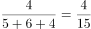，故小号文件袋有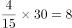个。

故正确答案为C。

---

### 第 15 题　qid 2261996 · 逻辑填空

某单位有若干个部门，每个部门有12名职员。后因业务重组，增加了2个部门，新增了4名职员，现每个部门有8名职员。该单位原有（  ）个部门。

- **A**. 3　✅
- **B**. 4
- **C**. 5
- **D**. 6

**答案**：A

**官方解析**

设该单位原有个部门，则原来共有名职员。根据题干可得，业务重组后增加了2个部门有个部门，新增了4名职员即总职员有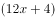人，由题意可得，解得。

故正确答案为A。

---

### 第 16 题　qid 2262002 · 语句表达

某超市的食品供货商每2天送货一次，日用品供货商每5天送货一次，办公用品供货商每10天送货一次。已知这三家供货商在10月1日这天同时送货，那么下次他们同时送货的日期是（  ）。

- **A**. 10月10日
- **B**. 10月11日　✅
- **C**. 10月16日
- **D**. 10月20日

**答案**：B

**官方解析**

食品每2天送货一次，说明送货周期是2天；日用品每5天送货一次，说明周期是5天；办公用品每10天送货一次，说明周期是10天。根据题意，求下次同时送货日期，实际是求送货小周期的最小公倍数，2、5、10的最小公倍数是10，已知这三家供货商在10月1日这天同时送货，则下次同时送货时间是10月1日过10天，即10月11日。
故正确答案为B。

---

### 第 17 题　qid 2262007 · 逻辑填空

某公司38名员工一起去划船，共租了8条船，大船坐6人，小船坐4人，刚好坐满，则小船共有（    ）条。

- **A**. 5　✅
- **B**. 4
- **C**. 3
- **D**. 2

**答案**：A

**官方解析**

根据题意，设租小船x条，则租大船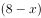条，以员工共38人为等量关系列方程，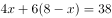，解得。

故正确答案为A。

---

### 第 18 题　qid 2262010 · 逻辑填空

一项考试共有35道试题，答对一题得2分，答错一题扣1分，不答则不得分。一名考生一共得了47分，那么，他最多答对（    ）题。

- **A**. 26
- **B**. 27　✅
- **C**. 29
- **D**. 30

**答案**：B

**官方解析**

方法一：设答对题，答错题，不答题，则有①、②，得，，要使答对题数最多，即最大，则最小，当时，无整数解；时，，符合题意。

方法二：设答对题，答错题，则有，不定方程用代入排除法，问最大，从最大的D项开始代入。

D项，，，解得，此时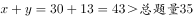，矛盾，排除；

C项，，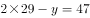，解得，此时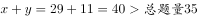，矛盾，排除；

B项，，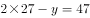，解得，此时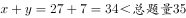，不答的题，正确。

故正确答案为B。

---

### 第 19 题　qid 2261991 · 语句表达

，，，，（    ）

- **A**. 

- **B**. 

- **C**. 
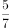
　✅
- **D**. 

**答案**：C

**官方解析**

观察数列，全部为分数，优先考虑分数数列。原数列中第二项和第四项的分母破坏了数列的单调性，将其进行反约分，数列可转化为：、、、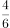、（    ），发现分子、分母各自呈规律，均为公差为1的等差数列，故（    ）处应填。

故正确答案为C。

---

### 第 20 题　qid 2261998 · 逻辑填空

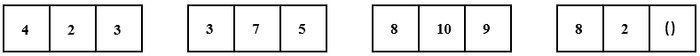

- **A**. 4
- **B**. 5　✅
- **C**. 8
- **D**. 10

**答案**：B

**官方解析**

题干出现图形，且每组中的大数不在同一位置，考虑凑相等。观察发现：

第一组：；

第二组：；

第三组：；

故规律应为每组数中的前两项之和等于第三项的2倍，则第四组：，（    ）处应填5。

故正确答案为B。

---

### 第 21 题　qid 2262003 · 逻辑填空

-3，8，2，18，22，（    ）

- **A**. 43
- **B**. 58　✅
- **C**. 60
- **D**. 76

**答案**：B

**官方解析**

方法一：数列起伏不定，作差无规律，相邻两项作和后得到新数列：5，10，20，40，（    ）是公比为2的等比数列，则下一项为80，故题干所求为：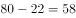；

方法二：数列起伏不定，作差无规律，也可考虑递推，可得第一项的2倍加上第二项等于第三项，即：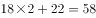。

故正确答案为B。

---

### 第 22 题　qid 2262008 · 逻辑填空

0.02，3.13，8.24，5.35，4.46，（  ）

- **A**. 5.57　✅
- **B**. 5.68
- **C**. 6.57
- **D**. 6.68

**答案**：A

**官方解析**

题干为小数数列，考虑机械划分。将已知项划分为三部分：整数部分，小数点后一位，小数点后两位。分析可知，小数点后一位为：0，1，2，3，4，（）；小数点后两位为：2，3，4，5，6，（），这两部分均是公差为1的等差数列，故所求项小数点后一位和小数点后两位分别为：5和7，排除BD项。整数部分起伏不定，作差无规律，考虑整数和小数部分合起来看。分析可知，小数部分相乘后的尾数为整数部分，即选项的整数部分为的尾数5，故所求项结果为5.57，选A。

故正确答案为A。

---

### 第 23 题　qid 2262011 · 逻辑填空

如图所示的三个图形可以拼成的是（  ）。

- **A**. 三角形　✅
- **B**. 梯形
- **C**. 正方形
- **D**. 菱形

**答案**：A

**官方解析**

本题考查平面拼合，可采用等长相消的方法进行拼合，题干给出图形在保持原有角度情况下无法拼出任何选项中的图形，所以可以将题干图形进行旋转。将图一顺时针旋转90°后与其他两图拼合，消去等长的线段后组合而成的外部轮廓为三角形，如下图所示：

故正确答案为A。

---

### 第 24 题　qid 2261983 · 逻辑填空

如图所示直角梯形，以它的上底为轴旋转360度，能够得到的立体图形是（  ）。

- **A**. A
- **B**. B
- **C**. C　✅
- **D**. D

**答案**：C

**官方解析**

以直角梯形的上底为轴，旋转360度，梯形的斜边转出了一个凹进去的圆锥，梯形的下底以上底为轴旋转360度后形成一个圆柱，故最终得到的立体图形为C项。 
故正确答案为C。

---

### 第 25 题　qid 2261990 · 逻辑填空

以下可由所给立体图形经过旋转得到的是（  ）。

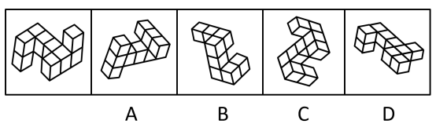

- **A**. A
- **B**. B
- **C**. C　✅
- **D**. D

**答案**：C

**官方解析**

题干图形的中轴线有4个立方体，中轴线的两端的左右两侧各连接2个立方体。
A项：中轴线的一端连着的2个立方体分别位于两侧，无法由题干旋转得到，排除；
B项：中轴线上只有3个立方体，无法由题干旋转得到，排除；
C项：该项可以由立体图形旋转得出，当选；
D项：中轴线的两端连接的2个立方体在中轴线的同一侧，无法由题干旋转得到，排除。 
故正确答案为C。

---

### 第 26 题　qid 2261997 · 逻辑填空

以下符合所给三视图的立体图形是（  ）。

- **A**. A
- **B**. B　✅
- **C**. C
- **D**. D

**答案**：B

**官方解析**

本题考查三视图。

A项：从前往后看，可以看到题干中主视图，从左往右看，第三列只有一个矩形，如图所示，与题干所给的左视图不符，排除；

 

B项：符合题干所给的三视图，当选；

C项：从前往后看，可以看到题干主视图，从左往右看，第三列只有一个矩形，如图所示，与题干所给的左视图不符，排除；

 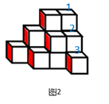

D项：从前往后看，可以看到题干中主视图，从左往右看，第三列只有一个矩形，如图所示，与题干所给的左视图不符，排除。

 

故正确答案为B。

---

### 第 27 题　qid 2262025 · 逻辑填空

左图是一个正四面体的外表面。右边不能由它折叠而成的是（  ）。

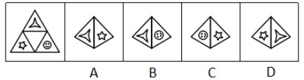

- **A**. A
- **B**. B　✅
- **C**. C
- **D**. D

**答案**：B

**官方解析**

本题考查四面体的空间重构。

A项，题干中涉及到的两个面的位置关系与展开图一致，排除；

B项，题干展开图中笑脸中眼睛是是对着三角形其中一个顶角的，B选项笑脸中眼睛指向了边，如下图所示，与展开图不一致，当选；

C项，题干中涉及到的两个面的位置关系与展开图一致，排除；

D项，题干中涉及到的两个面的位置关系与展开图一致，排除。

本题为选非题，故正确答案为B。

---

### 第 28 题　qid 2262029 · 逻辑填空

左图所示立体图形，可以由（  ）三个图形组成。

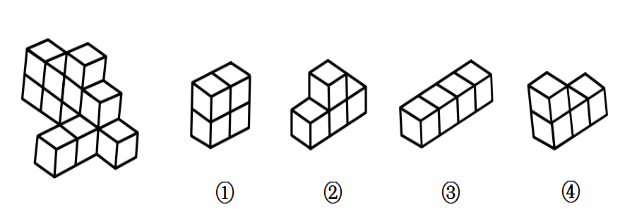

- **A**. ①②③
- **B**. ①②④　✅
- **C**. ①③④
- **D**. ②③④

**答案**：B

**官方解析**

本题考查立体拼合。

立体图可由①②④三个图形拼合而成，如下图所示：

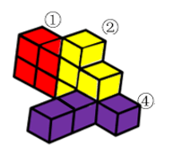

故正确答案为B。

---

### 第 29 题　qid 2262034 · 逻辑填空

以下4张纸条中，沿折痕能够折出如左图所示图形的是（  ）。

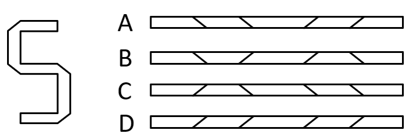

- **A**. A
- **B**. B　✅
- **C**. C
- **D**. D

**答案**：B

**官方解析**

题干图形中，可见四个折痕，分别标为1234，如下图所示。

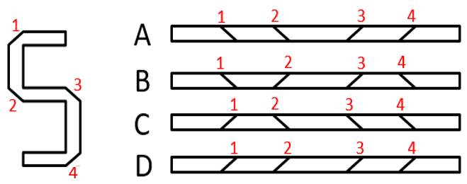

观察可知，折痕1和折痕2方向不同不平行，排除A、D两项。折痕3和折痕4方向不同不平行，排除C项。

故正确答案为B。 

---

## 数量关系

### 第 1 题　qid 2262050 · 数学运算

有甲、乙两个品牌的电脑专卖店，甲品牌专卖店客流量略高于乙品牌专卖店，因此，甲品牌专卖店的电脑销量比乙品牌专卖店的大。
上述推论最可能基于的假设是（  ）。

- **A**. 乙品牌开通了网络销售渠道
- **B**. 甲品牌专卖店规模比乙品牌的大
- **C**. 两个专卖店的进店购买率相当　✅
- **D**. 甲品牌的广告投入更大

**答案**：C

**官方解析**

第一步：找出论点和论据。
论点：甲品牌专卖店的电脑销量比乙品牌专卖店的大。
论据：甲品牌专卖店客流量略高于乙品牌专卖店。
第二步：逐一分析选项。
A项：乙品牌开通了网络销售渠道，但该品牌的销售量与甲品牌的销售量谁多谁少不明确，不是论证成立的假设，排除；
B项：论点说的是甲乙电脑销量的比较，该项说的是甲品牌专卖店规模比乙品牌的大，话题不一致，不是论证成立的假设，排除；
C项：两个专卖店的进店购买率相当，说明进店购买的人占客流量的比重是一样的，那么甲品牌专卖店客流量高于乙品牌专卖店，就可以得出在甲品牌专卖店购买电脑的人要多一点，即甲品牌专卖店的电脑销量更大，属于搭桥项，是论证成立的假设，当选；
D项：论点说的是甲乙电脑销量的比较，该项说的是甲品牌的广告投入大，广告投入大不代表销量一定大，话题不一致，不是论证成立的假设，排除。
故正确答案为C。

---

### 第 2 题　qid 2262056 · 数学运算

如果旅行车程超过3小时，选择自驾游的游客数量就会大大减少。目前，从乙市驾车前往甲市至少需要5小时。如果开通甲、乙两市间的高速公路，从乙市前往甲市的自驾游游客将会显著增加。
上述论证最可能基于的潜在假设是（  ）。

- **A**. 该高速公路能够在短时间内开通使用
- **B**. 绝大多数游客以自驾的方式前往甲市
- **C**. 该高速公路开通后，两市车程将小于3小时　✅
- **D**. 很多乙市居民喜欢前往周边城市旅游

**答案**：C

**官方解析**

第一步：找出论点和论据。
论点：如果开通甲、乙两市间的高速公路，从乙市前往甲市的自驾游游客将会显著增加。
论据：如果旅行车程超过3小时，选择自驾游的游客数量就会大大减少。目前，从乙市驾车前往甲市至少需要5小时。
第二步：逐一分析选项。
A项：论点说的是从乙市前往甲市的自驾游游客会增多，该项说的是该高速公路能够在短时间内开通使用，话题不一致，不是论证成立的假设，排除；
B项：论点说的是从乙市前往甲市的自驾游游客会增多，该项说的是游客会以自驾的方式前往甲市，但没有说是从哪个地方去甲市以及高速公路开通对自驾选择的影响，不是论证成立的假设，排除；
C项：论据提到如果时间超过3小时，自驾游游客数量就会减少，因此高速公路开通后车程小于3小时，是从乙市前往甲市的自驾游游客增多的必要条件，是论证成立的假设，当选；
D项：论点说的是从乙市前往甲市的自驾游游客会增多，该项说的是乙市居民喜欢前往周边城市旅游，话题不一致，不是论证成立的假设，排除。
故正确答案为C。

---

### 第 3 题　qid 2262035 · 数学运算

人们通常会通过阅读和学习提升自我。一项调查显示，超过一半的受访对象保持了长期的阅读习惯，接近一半的受访对象习惯通过网络扩充知识面。此外，受访对象还表示会通过购买线上课程等方式持续学习。可以看出，现代人越来越倾向在精神层面进行自我投资，非常愿意持续提升自我。
以下最无法支持上述推论的是（  ）。

- **A**. 个人的自我提升方式存在较大差异　✅
- **B**. 精神层面的投资消费有增大的趋势
- **C**. 市场上图书杂志等销量持续走高
- **D**. 线上课程销量持续上升

**答案**：A

**官方解析**

第一步：找出论点和论据。
论点：现代人越来越倾向在精神层面进行自我投资，非常愿意持续提升自我。
论据：一项调查显示，超过一半的受访对象保持了长期的阅读习惯，接近一半的受访对象习惯通过网络扩充知识面。此外，受访对象还表示会通过购买线上课程等方式持续学习。
第二步：逐一分析选项。
A项：论点说的是现代人非常愿意持续提升自我，该项说的是个人的自我提升方式存在较大差异，但是否愿意持续提升自我不清楚，属于不明确选项，无法加强，当选；
B项：该项说的是精神层面的投资消费有增大的趋势，说明现代人确实越来越倾向在精神层面进行自我投资，补充论据，可以加强，排除；
C项：该项说的是市场上图书杂志等销量持续走高，图书杂志算是精神层面的投资，可以说明现代人越来越倾向在精神层面进行自我投资，补充论据，可以加强，排除；
D项：该项说的线上课程销量持续上升，而线上课程也是精神层面的投资，说明现代人越来越倾向在精神层面进行自我投资，补充论据，可以加强，排除。
本题为选非题，故正确答案为A。

---

### 第 4 题　qid 2261994 · 数学运算

一项针对糖尿病患者饮食的研究发现，那些选择高膳食纤维饮食的患者，其肠道内的益生菌生长速度快，进而促进糖化血红蛋白明显下降。因此，高膳食纤维饮食有利于防治糖尿病。
以下最能质疑上述论证的是（  ）。

- **A**. 不少糖尿病患者患病前后一直有着高膳食纤维饮食的习惯　✅
- **B**. 某山区的人经常喝含益生菌的酸牛奶，当地极少有人患糖尿病
- **C**. 高膳食纤维饮食可使进餐后血糖保持稳定
- **D**. 糖化血红蛋白指标可有效反映糖尿病患者过去1-2个月内血糖控制情况

**答案**：A

**官方解析**

第一步：找出论点和论据。
论点：高膳食纤维饮食有利于防治糖尿病。
论据：那些选择高膳食纤维饮食的患者，其肠道内的益生菌生长速度快，进而促进糖化血红蛋白明显下降。
第二步：逐一分析选项。
A项：不少糖尿病患者患病前后一直有着高膳食纤维饮食的习惯，说明高膳食纤维饮食并不能有利于防治糖尿病，直接削弱论点，当选；
B项：论点说的是高膳食纤维饮食有利于防治糖尿病，该项说的是经常喝含益生菌的酸牛奶极少患糖尿病，话题不一致，无法削弱，排除；
C项：高膳食纤维饮食可使进餐后血糖保持稳定，但是否有利于防治糖尿病不确定，属于不明确选项，无法削弱，排除；
D项：该项说的是糖化血红蛋白指标可有效反映血糖控制情况，而论点说的是高膳食纤维饮食有利于防治糖尿病，话题不一致，无法削弱，排除。
故正确答案为A。

---

### 第 5 题　qid 2262028 · 数学运算

某单位准备派3名员工外出参加培训学习，计划从财务部的甲、乙、丙和行政部的丁、戊、己6人中选派人员。由于工作安排限制，参加培训学习的人员安排必须符合以下条件：财务部和行政部分别至少有一人参加；甲和乙不能同时参加；如果丁或戊参加，则丙不能参加。
以下人员名单符合条件的是（  ）。

- **A**. 甲、丙、戊
- **B**. 乙、丙、己　✅
- **C**. 甲、乙、戊
- **D**. 丁、戊、己

**答案**：B

**官方解析**

题干信息确定，考虑排除法。

根据财务部和行政部分别至少有一人参加，但丁、戊、己均来自行政部，排除D项；

根据甲和乙不能同时参加，排除C项； 

根据如果丁或戊参加，则丙不能参加，即丁或戊-丙可知，戊参加，是对条件的肯前，肯前必肯后，所以丙不能参加，排除A项。

故正确答案为B。

---

### 第 6 题　qid 2262042 · 数学运算

低骨量人群是骨质疏松症高危人群，我国50岁以上人群低骨量率接近一半。低骨量人群庞大的主要原因是对骨质疏松症“普遍不了解”，50岁以上人群骨密度检测比例很低。如果提高50岁以上人群的骨密度检测率，该人群的骨质疏松症发病率就能有效降低。
以下最能指出上述论证缺陷的是（  ）。

- **A**. 假设了骨密度检测是骨质疏松症的有效预防手段　✅
- **B**. 暗含了大部分骨密度低的人并未进一步采取有效措施
- **C**. 忽视了饮食和锻炼对骨质疏松症的重要影响
- **D**. 忽视了低骨量对不同个体的影响因人而异

**答案**：A

**官方解析**

第一步：找出论点和论据。
论点：如果提高50岁以上人群的骨密度检测率，该人群的骨质疏松症发病率就能有效降低。
论据：低骨量人群庞大的主要原因是对骨质疏松症“普遍不了解”，50岁以上人群骨密度检测比例很低。
第二步：逐一分析选项。
A项：题干通过50岁以上人群骨密度检测比例很低，得出论点如果提高50岁以上人群的骨密度检测率，该人群的骨质疏松症发病率就能有效降低，该项指出题干其实是在“假设了骨密度检测是骨质疏松症的有效预防手段”基础上论证的，可以指出论证缺陷，当选；
B项：该项说的是大部分骨密度低的人并未进一步采取有效措施，与论点说的骨密度检测率与骨质疏松症发病率之间的关系无关，无法指出论证缺陷，排除； 
C项：该项说的是饮食和锻炼对骨质疏松症的影响，与论点说的骨密度检测率与骨质疏松症发病率之间的关系无关，无法指出论证缺陷，排除； 
D项：该项说的是低骨量对不同个体的影响因人而异，与论点说的骨密度检测率与骨质疏松症发病率之间的关系无关，无法指出论证缺陷，排除。
故正确答案为A。

---

### 第 7 题　qid 2262049 · 数学运算

过去3年中，某企业生产所需原材料的平均价格增长了，但原材料成本占总成本的比例并没有发生变化。因此，该企业的生产总成本在过去3年内同样增长了。

上述推论最可能基于的假设是该企业（  ）。

- **A**. 
过去3年内所需原材料的数量保持不变
　✅
- **B**. 
过去3年内原材料成本增长了

- **C**. 
过去3年内劳动力成本保持不变

- **D**. 
过去3年内盈利增长了 

**答案**：A

**官方解析**

第一步：找出论点和论据。

论点：因此，该企业的生产总成本在过去3年内同样增长了。

论据：过去3年中，某企业生产所需原材料的平均价格增长了，但原材料成本占总成本的比例并没有发生变化。

第二步：逐一分析选项。

A项：该项说的是过去3年内所需原材料的数量保持不变，原材料的成本等于平均价格乘以数量，所以当数量不变时，平均价格的涨幅和原材料的成本成正比，且原材料成本占总成本比例不变，因此可以得到论点生产总成本在过去3年内同样增长了，该项建立了论点和论据的必然联系，是论证成立的假设，保留；

B项：该项说的是过去3年内原材料成本增长了，论据中说到原材料成本占总成本的比例不变，所以可以得到论点生产总成本在过去3年内同样增长了，该项建立了论点和论据的必然联系，是论证成立的假设，保留；

C项：该项说的是劳动力的成本不变，而题干说的是原材料与总成本之间的关系，讨论话题不一致，不是论证成立的假设，排除；

D项：该项说的是盈利增加了，而题干说的是原材料与总成本之间的关系，讨论话题不一致，不是论证成立的假设，排除。

对比A、B两项，A项同时建立了论据的平均价格、成本占比和论点的总成本之间的联系，而B项只建立了论据的成本占比和论点的总成本之间的联系，A项建立的联系更加全面。

故正确答案为A。

---

### 第 8 题　qid 2261984 · 数学运算

今年，某民营企业在当地政府的指导下成立了纪检监察室，将“党管监督模式”融入企业管理。预计今后，通过对企业的生产、采购等环节进行监察审计，该企业能够有效降低成本，产生更大的经济效益。
下列各项如果为真，对上述论证支持最弱的是（  ）。

- **A**. 该企业的主要成本来源于生产与采购环节
- **B**. 引入监察审计后，该企业的产品合格率进一步提升
- **C**. 自从该企业设立举报邮箱后，检举的数量大幅增加了　✅
- **D**. 纪检监察室成立后，查处多起违纪违规行为，挽回大量经济损失

**答案**：C

**官方解析**

第一步：找出论点和论据。
论点：预计今后，通过对企业的生产、采购等环节进行监察审计，该企业能够有效降低成本，产生更大的经济效益。
论据：无。
第二步：逐一分析选项。
A项：该企业的主要成本来来源于生产与采购环节，那么通过对两个环节的监察审计，就可以让成本环节更加科学合理，可以加强，排除；
B项：该企业的产品合格率进一步提升，减少不合格的产品，让生产更有效率，也就是可以产生更大的经济效益，可以加强，排除；
C项：检举的数量大幅增加了，只能说明不好的事情被发现了，检举之后能否降低企业成本，能否带来经济效益，是不明确的，属于不明确选项，不能加强，当选；
D项：查处多起违纪违规行为，挽回大量经济损失，经济损失减少，说明可以有效降低成本，可以加强，排除。
本题为选非题，故正确答案为C。

---

### 第 9 题　qid 2262009 · 数学运算

某部门有甲、乙、丙、丁4名干部，只有一个人同时有硕士学位、注册会计师证和高级职称，有三个人有硕士学位，两个人有注册会计师证，只有一个人有高级职称，但每个人至少具备这三个条件中的一项。已知甲和丁要么都有硕士学位，要么都没有；乙和丙要么都有注册会计师证，要么都没有；丙和丁只有一个人有硕士学位。
那么，该部门同时有硕士学位、注册会计师证和高级职称的是（  ）。

- **A**. 甲
- **B**. 乙　✅
- **C**. 丙
- **D**. 丁

**答案**：B

**官方解析**

第一步：分析题干。

① 只有一个人同时有硕士学位、注册会计师证和高级职称

②有三个人有硕士学位

③两个人有注册会计师证

④只有一个人有高级职称

⑤每个人至少具备这三个条件中的一项

⑥甲和丁要么都有硕士学位，要么都没有

⑦乙和丙要么都有注册会计师证，要么都没有

⑧丙和丁只有一个人有硕士学位

第二步：根据题干条件进行推理。

根据②⑥，得出甲和丁都具有硕士学位；再根据②⑧得出丙没有硕士学位，乙有硕士学位；根据③⑦，假设乙和丙都没有注册会计师证，那么丙既没有硕士学位也没有注册会计师证，又根据⑤，丙必须拥有高级职称，根据④，其他人均没有高级职称，此时并没有一个人同时拥有这三个特征，与①矛盾，那么假设不成立，得出乙和丙都有注册会计师证，此时只有乙同时有硕士学位和注册会计师证，再根据①，乙必须也有高级职称，因此该部门同时有硕士学位、注册会计师证和高级职称的是乙。表格如下：

故正确答案为B。

---

### 第 10 题　qid 2262000 · 数学运算

甲乙两人相距50千米，同时出发相向而行，甲的前进速度为6千米/小时，乙的前进速度为8千米/小时。在途中，甲休息了1个小时再继续前进，则甲、乙在出发（  ）小时后相遇。

- **A**. 2
- **B**. 3
- **C**. 3.5
- **D**. 4　✅

**答案**：D

**官方解析**

设甲乙出发t小时后相遇，则甲实际行驶（t-1）小时，乙实际行驶t小时。根据，得，解得。

故正确答案为D。

---

### 第 11 题　qid 2262005 · 数学运算

某件商品如果打九折销售，利润将减少一半；如果打八五折销售，利润将减少22.5元。如果按原价销售，这件商品的利润是（  ）元。

- **A**. 15
- **B**. 22.5
- **C**. 30　✅
- **D**. 45

**答案**：C

**官方解析**

设原价为元，利润为元。根据“打八五折销售，利润将减少22.5元”可知，成本不变，减少的22.5元恰好为打折少收入的部分，则，解得；根据“打九折销售，利润将减少一半”可得，解得，则这件商品的利润是30元。

故正确答案为C。

---

### 第 12 题　qid 2262014 · 数学运算

在长120米、宽100米的空地上开挖若干个边长大于1米的正方形鱼池，相邻鱼池之间要预留至少1米的走道，则开挖的鱼池总面积最大为（  ）平方米。

- **A**. 11097
- **B**. 11444
- **C**. 11559
- **D**. 11805　✅

**答案**：D

**官方解析**

如图所示，要想使得鱼池总面积最大，可先挖一个最大的正方形，即边长为100米；在剩余的空地上，先预留1米的走道，然后继续挖最大的正方形，此时边长最大为米，因宽为100米，则这样的正方形个数为5个，中间有4个过道，加上至少4米，最后还剩米，因要挖边长大于1米的正方形鱼池，且相邻鱼池之间要预留至少1米的走道，因此最后1米不能再挖新的鱼池。则所求总面积平方米。

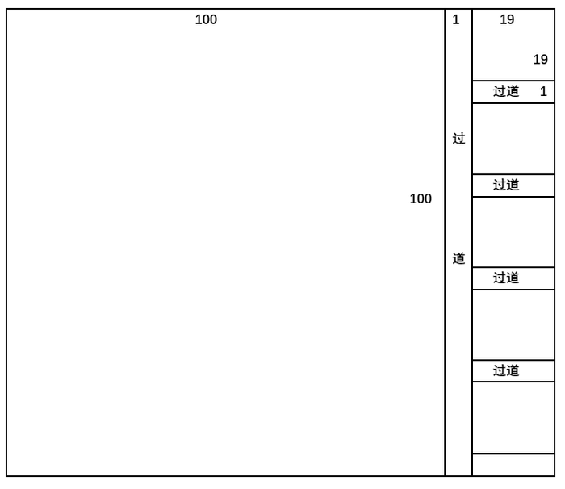

故正确答案为D。

---

## 判断推理

### 第 1 题　qid 2262041 · 类比推理

人才是第一资源，科技创新必须依靠人才实力。因此，谁拥有了一流创新人才，谁就能在科技创新的竞争中取得优势。
以下与上述推理在结构上最为相似的是（  ）。

- **A**. 所有高楼大厦都要打好地基。只要打好地基，就能建成高楼大厦　✅
- **B**. 一切反动派都是纸老虎。所以，我们能够打败反动派
- **C**. 伤心总是难免的。因此，人难免伤心
- **D**. 个人的成长需要依靠自身的努力。只有努力才能获得个人成长

**答案**：A

**官方解析**

第一步：分析题干推理形式。

科技创新人才。因此，人才科技创新，属于肯定箭头后推肯定箭头前的形式。

第二步：逐一分析选项。

A项：翻译为：高楼大厦打好基础，打好基础高楼大厦，推理形式为肯后推肯前，与题干推理形式相同，当选；

B项：翻译为：反动派纸老虎，我们能打败反动派，与题干推理形式不同，排除；

C项：没有逻辑关键词，不能翻译，与题干推理形式不同，排除；

D项：翻译为：成长努力，成长努力，推理形式为肯前推肯后，与题干推理形式不同，排除。

故正确答案为A。

---

### 第 2 题　qid 2262043 · 逻辑判断

新时代对党员干部提出了更高的要求。在现实中，由于一些党员干部理论学习不足，“本领恐慌”问题越来越突出。因此，只要广大党员干部切实加强理论学习，就可以避免出现“本领恐慌”。
上述论证最可能的潜在假设是（  ）。

- **A**. 解决“本领恐慌”问题必须依靠党员干部自身努力
- **B**. 理论学习不足是出现“本领恐慌”的唯一原因　✅
- **C**. 广大党员干部都存在理论学习不足的问题
- **D**. 只有加强学习才能达到新时代的更高要求

**答案**：B

**官方解析**

第一步：找出论点和论据。
论点：只要广大党员干部切实加强理论学习，就可以避免出现“本领恐慌”。
论据：在现实中，由于一些党员干部理论学习不足，“本领恐慌”问题越来越突出。
第二步：逐一分析选项。
A项：论点说的是通过党员干部加强理论学习能不能避免出现“本领恐慌”，该项说的是依靠干部自身努力，干部自身努力是否指的是加强理论学习，以及结果是否能避免出现“本领恐慌”并不明确，不是论证成立的假设，排除；
B项：理论学习不足是出现“本领恐慌”的唯一原因，说明只要解决了唯一原因就可以解决问题，那么只要广大党员干部切实加强理论学习，就可以避免出现“本领恐慌”，是论证成立的假设，当选；
C项：论点说的是通过党员干部加强理论学习能不能避免出现“本领恐慌”，该项说的是党员干部是否存在理论学习不足的问题，话题不一致，不是论证成立的假设，排除；
D项：该项说的是加强学习能达到新时代的更高要求，但是能不能避免出现“本领恐慌”是不明确的，不是论证成立的假设，排除。
故正确答案为B。

---

### 第 3 题　qid 2262047 · 逻辑判断

目前，我国民用航空市场还不够发达，民航飞行时长与一些发达国家有较大差距。不过，随着我国经济的发展与人民生活水平的提高，人民群众的旅游需求日益增长。因此，我国民用航空市场潜力巨大。
上述论证最可能基于的潜在假设是（  ）。

- **A**. 我国旅游需求仍有较大的增长空间
- **B**. 旅游需求的增长能够有效推动民用航空市场的发展　✅
- **C**. 我国民航飞行时长将达到与发达国家相当的水平
- **D**. 经济的发展与人民生活水平的提高有关

**答案**：B

**官方解析**

第一步：找出论点和论据。
论点：我国民用航空市场潜力巨大。
论据：随着我国经济的发展与人民生活水平的提高，人民群众的旅游需求日益增长。
第二步：逐一分析选项。
A项：论点说的是我国民用航空市场的未来发展问题，该项说的是我国旅游需求有较大的增长空间，话题不一致，不是论证成立的假设，排除；
B项：旅游需求的增长能够有效推动民用航空市场的发展，现在我国人民群众的旅游需求一直在增长，说明就可以有效推动我国民用航空市场的发展，建立论据和论点之间的联系，搭桥项，当选；
C项：我国民航飞行时长将达到与发达国家相当的水平，飞行时长增多是否能说明民用航空市场如何，是不明确的，不是论证成立的假设，排除；
D项：论点说的是我国民用航空市场的未来发展问题，该项说的是经济的发展和人民生活水平的提高之间的关系，话题不一致，不是论证成立的假设，排除。
故正确答案为B。

---

### 第 4 题　qid 2262058 · 逻辑判断

2017年抑郁症调查报告显示，中国约有的人患有抑郁症。因此，如果2030年中国人口达到15亿，届时，抑郁症患者人数约为4500万。

上述论证最可能基于的潜在假设是（  ）。

- **A**. 中国人口数量将持续增加
- **B**. 中国人口结构将保持稳定
- **C**. 到2030年，中国人口中抑郁症患者的比例保持不变　✅
- **D**. 到2030年，仍未研发出能够有效防治抑郁症的药物

**答案**：C

**官方解析**

第一步：找出论点和论据。

论点：如果2030年中国人口达到15亿，届时，抑郁症患者人数约为4500万。

论据：2017年抑郁症调查报告显示，中国约有的人患有抑郁症。

第二步：逐一分析选项。

A项：论点说的是2030年中国抑郁症患者会达到4500万人，该项说的是中国人口数量将持续增加，并没有涉及抑郁症患者人数如何变化，话题不一致，不是论证成立的假设，排除；

B项：论点说的是2030年中国抑郁症患者会达到4500万人，该项说的是中国人口结构将保持稳定，并不是抑郁症患者结构，话题不一致，不是论证成立的假设，排除；

C项：论点中2030年抑郁症患者的人数4500万占中国人口15亿的，与2017年中国人口中抑郁症患者的比例一致，因此到2030年，中国人口中抑郁症患者的比例保持不变，是论证成立的假设，当选；

D项：论点说的是2030年中国抑郁症患者会达到4500万人，该项说的是仍未研发出能够有效防治抑郁症的药物，话题不一致，不是论证成立的假设，排除。

故正确答案为C。

---

### 第 5 题　qid 2262037 · 逻辑判断

去年，某市共发生道路安全交通事故764起，死亡456人。据估算，只有不到的交通工具配备了急救医疗包。如果有更多的交通工具配备急救医疗包，那么道路安全交通事故死亡人数会大大减少。

以下选项最能够指出上述论证缺陷的是（  ）。

- **A**. 忽视了遭遇交通事故立即死亡的案例
- **B**. 忽略了绝大多数交通工具从来没有发生过交通事故
- **C**. 默认了未配备急救医疗包是导致交通事故死亡的主要原因　✅
- **D**. 暗含了配备急救医疗包能有效避免交通事故的发生

**答案**：C

**官方解析**

第一步：找出论点和论据。

论点：如果有更多的交通工具配备急救医疗包，那么道路安全交通事故死亡人数会大大减少。

论据：去年，某市共发生道路安全交通事故764起，死亡456人。据估算，只有不到的交通工具配备了急救医疗包。

第二步：逐一分析选项。

A项：题干说因为只有不到的交通工具配备了急救医疗包，所以得到如果配备更多的急救医疗包，道路安全交通事故死亡人数就会大大减少，并没有否认交通事故中有立即死亡的案例，无法指出论证缺陷，排除；

B项：题干讨论的是在发生交通事故的交通工具中，增加急救医疗包能不能使死亡人数减少，和没有发生过交通事故的交通工具无关，无法指出论证缺陷，排除；

C项：题干说因为只有不到的交通工具配备了急救医疗包，所以得到如果配备更多的急救医疗包，道路安全交通事故死亡人数就会大大减少，在论证过程中默认了未配备急救医疗包就是导致交通事故死亡的主要原因，可以指出论证缺陷，当选；

D项：题干讨论的是配备更多的急救医疗包，道路安全交通事故死亡人数就会大大减少，和是否能够有效避免交通事故的发生无关，无法指出论证缺陷，排除。

故正确答案为C。

---

### 第 6 题　qid 2262048 · 类比推理

《茶经》的作者是陆羽。它是世界上最早的研究茶的著作。因此，陆羽创作了世界上最早的研究茶的著作。
以下与上述推理在结构上最为相似的是（  ）。

- **A**. 地动仪的发明者是张衡。它是测量地震的仪器。因此，如果没有张衡就没有地动仪
- **B**. 班固是《汉书》的作者之一。《汉书》具有重大的史学价值。因此，班固是一位伟大的历史学家
- **C**. 贝多芬创作了《命运交响曲》。它是一部优秀的作品。因此，贝多芬创作了很多优秀的交响曲
- **D**. 天王星的发现者是威廉·赫歇尔。它是太阳系由内向外的第七颗行星。因此，威廉·赫歇尔发现了太阳系由内向外的第七颗行星　✅

**答案**：D

**官方解析**

第一步：分析题干推理形式。
《茶经》（A）→陆羽（B），《茶经》（A）→最早的研究茶的著作（C），因此，陆羽（B）→最早的研究茶的著作（C）。
第二步：逐一分析选项。
A项：地动仪（A）→张衡（B），地动仪（A）→测量地震的仪器（C），因此，没有张衡（-B）→没有地动仪（-A），与题干推理结构不同，排除；
B项：班固（A）→《汉书》（B），《汉书》（B）→有史学价值（C），因此，班固（A）→历史学家（D），与题干推理结构不同，排除； 
C项：贝多芬（A）→《命运交响曲》（B），《命运交响曲》（B）→优秀的作品（C），因此，贝多芬（A）→很多优秀的交响曲（很多C），与题干推理结构不同，排除；
D项：天王星（A）→威廉·赫歇尔（B），天王星（A）→第七颗行星（C），因此，威廉·赫歇尔（B）→第七颗行星（C），与题干推理结构相同，当选。
故正确答案为D。

---

### 第 7 题　qid 2262054 · 逻辑判断

员工的业务能力，对企业来说是至关重要的。某企业对符合招聘条件的应聘者进行面试筛选后发现，通过了面试并工作了一段时间的员工业务能力都很强。所以，完全有理由相信该企业使用的面试筛选方法是非常有效的。
以下最能说明上述推论漏洞的是（  ）。

- **A**. 未说明员工的业务能力对企业至关重要的原因
- **B**. 假设了即使依据一个实例，也可以得出一般性的结论
- **C**. 忽视了应聘者即使业务能力很强，也无法保证其今后表现
- **D**. 忽视了只有业务能力强的人才能满足该企业的招聘条件　✅

**答案**：D

**官方解析**

第一步：找出论点和论据。
论点：完全有理由相信该企业使用的面试筛选方法是非常有效的。
论据：某企业对符合招聘条件的应聘者进行面试筛选后发现，通过了面试并工作了一段时间的员工业务能力都很强。
第二步：逐一分析选项。
A项：该项讨论的是员工的业务能力对企业的重要性，而题干讨论的是企业的面试筛选方法是否有效，话题不一致，无法指出论证缺陷，排除；
B项：该项指出假设了即使依据一个实例，也可以得出一般性的结论，但题干说的是“都”，而不是一个实例，无法指出论证缺陷，排除；
C项：该项指出应聘者业务能力强和今后表现无关，而题干讨论的是企业的面试筛选方法是否有效，话题不一致，无法指出论证缺陷，排除；
D项：该项指出只有业务能力强的人才能满足该企业的招聘条件，说明进入该企业工作的人才本身业务能力就很强，而不是筛选方法有效，可以指出论证缺陷，当选。
故正确答案为D。

---

### 第 8 题　qid 2262055 · 逻辑判断

养老机器人是指以老年人为服务对象，具有照料、监测、互动等功能的智能机器人。当前，养老机器人产品同质化严重，制约了养老机器人产业的发展，如果这一问题能够解决，那么养老机器人产业将迎来春天。
以下选项最好地总结了上述论证缺陷的是（  ）。

- **A**. 暗示了养老机器人产业正处于严冬
- **B**. 假设了产品同质化问题具有解决的可能性
- **C**. 忽视了养老机器人产业可能存在其他制约因素　✅
- **D**. 暗示了产品质量决定着产业的发展前景

**答案**：C

**官方解析**

第一步：找出论点和论据。
论点：如果养老机器人产品同质化的问题能够解决，那么养老机器人产业将迎来春天。
论据：无
第二步：逐一分析选项。
A项：该项指出养老机器人产业正处于寒冬，而论点指出养老机器人产品同质化的问题能够解决，那么养老机器人产业将迎来春天，话题不一致，无法指出论证缺陷，排除；
B项：该项指出产品同质化问题可以解决，而题干讨论养老机器人产品同质化的问题能够解决，话题不一致，无法指出论证缺陷，排除；
C项：该项指出忽视了养老机器人产业可能存在其他制约因素，说明即使解决了养老机器人产品同质化的问题，养老机器人产业也不一定迎来春天，可以指出论证缺陷，当选；
D项：该项指出产品质量决定着产业的发展前景，而题干讨论养老机器人产品同质化的问题能够解决，话题不一致，无法指出论证缺陷，排除。
故正确答案为C。

---

### 第 9 题　qid 2262027 · 逻辑判断

一项针对11岁青少年的研究发现，生活在绿化程度较低的社区的青少年空间工作记忆能力较差，生活在绿化程度较高的社区的青少年空间工作记忆能力较强。据此，有人建议青少年应该居住在绿化程度较高的地方。
以下最能质疑上述建议的是（  ）。

- **A**. 青少年在10岁到14岁间的空间工作记忆能力较差
- **B**. 生活在绿化程度低的城市的成年人空间工作记忆能力较强
- **C**. 社区绿地数量多有利于促进青少年的大脑发育
- **D**. 绿化程度较高社区的家庭通常更注重青少年空间工作记忆能力的培养　✅

**答案**：D

**官方解析**

第一步：找出论点和论据。
论点：有人建议青少年应该居住在绿化程度较高的地方。
论据：一项针对11岁青少年的研究发现，生活在绿化程度较低的社区的青少年空间工作记忆能力较差，生活在绿化程度较高的社区的青少年空间工作记忆能力较强。
论点和论据均在讨论“居住在绿化程度较高的地方能增强空间工作记忆能力”，话题一致，削弱优先考虑否定论点，并且论点内暗含因果关系，也可以考虑因果倒置和他因削弱。
第二步：逐一分析选项。
A项：该项指出青少年在10岁到14岁间的空间工作记忆能力较差，是对于这一年龄段的普遍特征的描述，不能说明青少年空间工作记忆能力与绿化程度的关系，不能削弱，排除；
B项：题干讨论生活在绿化程度较低的社区对于青少年的影响，该项指出对于成年人的影响，讨论主体不一致，不能削弱，排除；
C项：该项说明社区绿地数量多对青少年大脑发育有利，但对大脑发育有利和空间工作记忆能力之间的关系不明确，无法削弱，排除；
D项：该项指出绿化程度较高社区的家庭，更加注重青少年空间工作记忆能力的培养，说明可能是因为注重培养，而不是因为居住在绿化程度较高的地方使工作记忆能力强，为他因削弱，可以削弱，当选。
故正确答案为D。

---

### 第 10 题　qid 2262033 · 类比推理

空气中的氧是地球上生物赖以生存的基础。近日，有科学家研究发现，火星地下咸水含有充足的分子氧，足以支持好氧微生物存活，这表明火星上的生物有可能存在于地下。
上述推论最可能基于的假设是（  ）。

- **A**. 火星地下咸水资源充足
- **B**. 火星地表不适合生命生存
- **C**. 氧是生物存在的必要条件　✅
- **D**. 地球生物与火星生物构造不同

**答案**：C

**官方解析**

第一步：找出论点和论据。
论点：火星上的生物有可能存在于地下。
论据：有科学家研究发现，火星地下咸水含有充足的分子氧，足以支持好氧微生物存活。
第二步：逐一分析选项。
A项：论点说的是火星上的生物有可能存在于地下，该项说的是火星地下咸水资源充足，不是论证成立的假设，排除；
B项：论点说的是火星上的生物有可能存在于地下，该项说的是火星地表不适合生命生存，不是论证成立的假设，排除； 
C项：题干论据说的是火星地下咸水有氧，论点说的是火星地下有生物，该项说的是氧是生物存在的必要条件，建立了论点和论据之间的联系，是论证成立的假设，当选；
D项：论点说的是火星上的生物有可能存在于地下，该项说的是地球生物与火星生物构造不同，不确定火星上的生物生存是否需要氧，属于不明确选项，不是论证成立的假设，排除。
故正确答案为C。

---

### 第 11 题　qid 2262036 · 类比推理

如果日出前出现鲜红的朝霞，那么今天会下雨。今天下雨了，所以今天日出前出现了鲜红的朝霞。
以下与上述推理在结构上最为相似的是（  ）。

- **A**. 如果冬天有瑞雪，那么来年一定会丰收。今年丰收了，所以去年冬天有瑞雪　✅
- **B**. 长时间下雨，突然起了大雾，大雾过后必定是晴天。大雾过后出现了晴天，是因为大雾前长时间下雨
- **C**. 如果立秋这天下雨，接下来百天内不会有霜冻。立秋之后出现了霜冻，那么立秋这天下雨了
- **D**. 如果今天早上露水多，那么明天就会是晴天。今天早上没有露水，明天一定不会是晴天

**答案**：A

**官方解析**

第一步：分析题干推理形式。

日出前出现鲜红的朝霞今天会下雨，后一句为，今天下雨了今天日出前出现了鲜红的朝霞。属于肯后推肯前的形式。

第二步：逐一分析选项。

A项：冬天有瑞雪来年一定会丰收，后一句为，今年丰收了去年冬天有瑞雪。属于肯后推肯前，与题干推理形式相同，当选；

B项：长时间下雨起了大雾大雾过后是晴天，后一句为，大雾前长时间下雨大雾过后出现晴天。属于肯前推肯后，与题干推理形式不同，排除；

C项：立秋这天下雨接下来百天内不会有霜冻，后一句为，立秋之后出现了霜冻立秋这天下雨了。属于否后推肯前，与题干推理形式不同，排除；

D项：今天早上露水多明天就会是晴天，后一句为，今天早上没有露水明天一定不会是晴天。属于否前推否后，与题干推理形式不同，排除。

故正确答案为A。

---

### 第 12 题　qid 2262038 · 逻辑判断

玻璃幕墙是一种美观新颖的建筑墙体形式，但是不少公众担心它会存在破碎隐患。其实只要选用合格的材料，就能将玻璃幕墙的破碎隐患降到微乎其微。所以，对于大部分玻璃幕墙，公众不必担心它们的破碎隐患。
上述论证最可能的潜在假设是（  ）。

- **A**. 破碎隐患是玻璃幕墙最主要的安全隐患
- **B**. 大部分的玻璃幕墙都选用了合格的材料　✅
- **C**. 公众能够识别制造玻璃幕墙所需的材料
- **D**. 公众了解合格材料能减少玻璃幕墙的破碎隐患

**答案**：B

**官方解析**

第一步：找出论点和论据。
论点：对于大部分玻璃幕墙，公众不必担心它们的破碎隐患。
论据：只要选用合格的材料，就能将玻璃幕墙的破碎隐患降到微乎其微。
第二步：逐一分析选项。
A项：该项说的是破碎隐患是玻璃幕墙最主要的安全隐患，但是需不需要为这个隐患担心不清楚，不是论证成立的假设，排除；
B项：题干论据说的选用合格的材料，玻璃幕墙的破碎隐患能降到微乎其微，该项说的是大部分的玻璃幕墙都选用了合格的材料，那么自然不必担心他们的破碎隐患，建立了论点和论据之间的联系，是论证成立的假设，当选； 
C项：论点说的是对于大部分玻璃幕墙，公众不必担心它们的破碎隐患，该项说的是公众能够识别制造玻璃幕墙所需的材料，但是公众到底需不需要担心不清楚，不是论证成立的假设，排除；
D项：论点说的是对于大部分玻璃幕墙，公众不必担心它们的破碎隐患，该项说的是公众了解合格材料能减少玻璃幕墙的破碎隐患，不清楚玻璃幕墙选用的是不是合格材料，也不清楚公众需不需要担心，不是论证成立的假设，排除。
故正确答案为B。

---

### 第 13 题　qid 2261999 · 逻辑判断

近日，有研究小组成功地改进了手机回收中的关键环节，减少了手机回收利用过程中对环境造成的污染。由于不必再为废旧手机产生环境污染而担忧，人们将会更为频繁地购买和更换新手机。
以下选项最能够指出上述论证缺陷的是（  ）。

- **A**. 假设了该研究小组的研究成果能够很快投入使用
- **B**. 暗含了人们在考虑购买和更换新手机时比较关注环保因素　✅
- **C**. 假设了回收废旧手机能够获得经济利益
- **D**. 忽视了人们在购买新手机后，一般不会立刻丢弃旧手机

**答案**：B

**官方解析**

第一步：找出论点和论据。
论点：人们将会更为频繁地购买和更换新手机。
论据：不必再为废旧手机产生环境污染而担忧。
第二步：逐一分析选项。
A项：论点说的是人们将会更为频繁地购买和更换新手机，该项说的是研究成果能否很快投入使用，无法指出论证缺陷，排除；
B项：人们在考虑购买和更换新手机时比较关注环保因素，那么当不用为环境担忧时，人们就会频繁的更换手机，暗含了论据和论点之间的关系，可以指出论证缺陷，当选；
C项：论点说的是人们将会更为频繁地购买和更换新手机，该项说的是回收废旧手机能够获得经济利益，无法指出论证缺陷，排除；
D项：论点说的是人们将会更为频繁地购买和更换新手机，该项说的是人们在购买新手机后是否会立刻丢弃旧手机，无法指出论证缺陷，排除。
故正确答案为B。

---

### 第 14 题　qid 2262012 · 类比推理

21世纪是信息大爆炸的时代，随着互联网和移动智能设备的普及，人们获得信息越来越多，越来越容易。有理由相信，这样的条件为我们提供了更多了解真相的机会，也表示我们离事物的真相越来越近。
上述推论最可能基于的假设是（  ）。

- **A**. 过多的信息会对人们的生活造成干扰
- **B**. 信息加工过程对每个人来说存在差别
- **C**. 互联网上充斥着大量虚假信息
- **D**. 信息是了解事物真相的基础　✅

**答案**：D

**官方解析**

第一步：找出论点和论据。
论点：这样的条件为我们提供了更多了解真相的机会，也表示我们离事物的真相越来越近。
论据：21世纪是信息大爆炸的时代，随着互联网和移动智能设备的普及，人们获得信息越来越多，越来越容易。
第二步：逐一分析选项。
A项：论点说的是提供了更多了解真相的机会，该项说的是过多的信息会对人们的生活造成干扰，不是论证成立的假设，排除；
B项：论点说的是提供了更多了解真相的机会，该项说的是信息加工过程对每个人存在差别，不是论证成立的假设，排除；
C项：互联网上充斥着大量虚假信息，指出互联网上的信息不一定是真实的，说明我们没有更多了解真相的机会，不会离真相越来越近，有一定的削弱作用，不是论证成立的假设，排除；
D项：信息是了解事物真相的基础，那么我们现在获得的信息越多，也就有了更多了解真相的机会，建立了论点和论据之间的联系，是论证成立的假设，当选。
故正确答案为D。

---

### 第 15 题　qid 2262016 · 逻辑判断

几名顾客在某餐厅用餐后，出现了呕吐腹痛等症状。事件发生后，相关部门立刻将剩下的食物送去检验。结果表明，送检食物中的有害细菌含量不超标。所以，在该餐厅用餐不是他们出现呕吐腹痛等症状的原因。
以下选项最能够指出上述论证缺陷的是（  ）。

- **A**. 暗含了呕吐腹痛等症状并不一定在食物中毒时才会出现
- **B**. 忽视了其他顾客可能在一段时间后才出现呕吐腹痛等症状
- **C**. 忽视了这些出现呕吐腹痛等症状的顾客的消化能力较常人更弱
- **D**. 假设了只有食物中的有害细菌才会导致呕吐腹痛等症状　✅

**答案**：D

**官方解析**

第一步：找出论点和论据。
论点：在该餐厅用餐不是他们出现呕吐腹痛等症状的原因。
论据：送检食物中的有害细菌含量不超标。
第二步：逐一分析选项。
A项：论点说的是在该餐厅用餐不是他们出现呕吐腹痛等症状的原因，该项说的是呕吐腹痛等症状并不一定在食物中毒时才会出现，无法指出论证缺陷，排除；
B项：论点说的是在该餐厅用餐不是他们出现呕吐腹痛等症状的原因，该项说的是忽视了什么时间出现症状，无法指出论证缺陷，排除；
C项：论点说的是在该餐厅用餐不是他们出现呕吐腹痛等症状的原因，该项说的是忽视了这些出现症状的顾客的消化能力更弱，无法指出论证缺陷，排除；
D项：只有食物中的有害细菌才会导致呕吐腹痛等症状，送检食物中的有害细菌含量不超标，那么餐厅用餐就不是呕吐腹痛的原因，暗含了论据和论点之间的关系，可以指出论证缺陷，当选。
故正确答案为D。

---

### 第 16 题　qid 2262021 · 类比推理

据调查，以上的在校大学生更看重手表的装饰效果，而不是实用性。因此，国产手表生产商只要生产更多符合潮流的“好看”的手表，就能极大提高手表销量。

上述推论最可能基于的假设是（  ）。

- **A**. 在校大学生是国产手表的主要目标消费群体　✅
- **B**. 国产手表在实用性方面已处于国际先进水平
- **C**. 现在的青年已不仅仅局限于购买经典款手表
- **D**. 潜在消费群体对于手表的产地没有特殊偏好

**答案**：A

**官方解析**

第一步：找出论点和论据。

论点：国产手表生产商只要生产更多符合潮流的“好看”的手表，就能极大提高手表销量。

论据：以上的在校大学生更看重手表的装饰效果，而不是实用性。

第二步：逐一分析选项。

A项：论点说的是“好看”的手表销量好，论据说的是在校大学生看中手表的装饰效果，该项通过在校大学生是国产手表的主要目标消费群体，在论据和论点之间建立了联系，是论证成立的假设，当选；

B项：该项说的是国产手表实用性方面很先进，而论点说的是“好看”的手表销量好，无关选项，不是论证成立的假设，排除；

C项：现在的青年不仅仅局限于购买经典款手表，但不明确是否买“好看”的手表，不明确选项，不是论证成立的假设，排除；

D项：该项说的是手表产地，而论点说的是“好看”的手表销量好，无关选项，不是论证成立的假设，排除。

故正确答案为A。 

---

### 第 17 题　qid 2262052 · 逻辑判断

如果领导干部在单位中扮演“和事佬”的角色，不愿指出下属错误、不愿得罪人，将严重影响单位工作的正常开展。所以，领导干部必须公开指出下属错误并进行严厉的批评。
以下选项最好地总结了上述论证缺陷的是（  ）。

- **A**. 假设了“和事佬”现象大量存在
- **B**. 暗含了“和事佬”现象危害严重
- **C**. 忽视了指出下属错误的其他方式　✅
- **D**. 忽视了不同单位的不同情况

**答案**：C

**官方解析**

第一步：找出论点和论据。
论点：领导干部必须公开指出下属错误并进行严厉的批评。
论据：如果领导干部在单位中扮演“和事佬”的角色，不愿指出下属错误、不愿得罪人，将严重影响单位工作的正常开展。
第二步：逐一分析选项。
A项：该项说的是“和事佬”大量存在，与题干说的领导干部需要用哪种方式指出下属错误无关，无法指出论证缺陷，排除；
B项：该项说的是“和事佬”现象危害严重，与题干说的领导干部需要用哪种方式指出下属错误无关，无法指出论证缺陷，排除；
C项：该项指出忽视了指出下属错误的其他方式，说明不当和事佬，也不是必须要公开指出下属的错误，还存在其他方式，可以指出论证缺陷，当选； 
D项：该项说的是不同单位的不同情况，但不明确领导干部指出下属错误的方式是否存在不同，无法指出论证缺陷，排除。
故正确答案为C。

---

### 第 18 题　qid 2262057 · 逻辑判断

长期以来，一些地方由于过分强调发展经济，形成了“唯GDP论英雄”的错误政绩观。因而，为避免唯GDP的政绩观造成恶果，有必要彻底取消地方政府的GDP考核。
以下选项最能够指出上述论证缺陷的是（  ）。

- **A**. 忽视了取消GDP考核的危害
- **B**. 忽视了唯GDP政绩观的积极作用
- **C**. 暗含了所有地方政府都形成了唯GDP的政绩观
- **D**. 默认了GDP考核是导致唯GDP政绩观的根本原因　✅

**答案**：D

**官方解析**

第一步：找出论点和论据。
论点：为避免唯GDP的政绩观造成恶果，有必要彻底取消地方政府的GDP考核。
论据：一些地方过分强调发展经济，形成了“唯GDP论英雄”的错误政绩观。
第二步：逐一分析选项。
A项：论点说如何避免唯GDP的政绩观造成恶果，该项说忽视了取消GDP考核的危害，话题不一致，无法指出论证缺陷，排除；
B项：论点说的是如何避免唯GDP的政绩观造成恶果，该项说的是唯GDP政绩观的积极作用，话题不一致，无法指出论证缺陷，排除；
C项：论点说的是如何避免唯GDP的政绩观造成恶果，而该项指出暗含了所有地方政府都形成了唯GDP的政绩观，这和是否彻底的取消考核无关，无法指出论证缺陷，排除；
D项：题干通过一些地方形成了“唯GDP论英雄”的错误政绩观，得出论点彻底取消地方政府的GDP考核，该项指出题干其实是在“默认了GDP考核是导致唯GDP政绩观的根本原因”的基础上论证的，即默认了唯GDP政绩观和GDP考核之间的关系，可以指出论证缺陷，当选。
故正确答案为D。

---

### 第 19 题　qid 2262059 · 类比推理

市场的力量是有限的，仅仅依靠市场，并不能生产出优质的知识产品。可以说，想要生产出优质的知识产品，还必须依靠非市场力量加大对科研的投入。
以下与上述推理在结构上最为相似的是（    ）。

- **A**. 计算机专业的学生不一定会修电脑。其他专业的学生也可能会修电脑
- **B**. 只是加强锻炼还无法拥有健康的体魄。想拥有健康体魄就不能仅靠锻炼
- **C**. 如果只吃肉类，就不能膳食均衡。因此，想要达到膳食均衡就不能吃肉
- **D**. 如果只注重智育，学生就无法全面发展。所以有必要对德育、体育等其他方面的教育加强重视　✅

**答案**：D

**官方解析**

第一步：分析题干推理形式。

只靠市场知识产品；得出：知识产品科研投入。

第二步：逐一分析选项。

A项：计算机专业学生不一定会修电脑；得出：其他专业学生可能会修电脑，与题干推理形式不同，排除；

B项：只锻炼健康体魄；得出：健康体魄只锻炼，与题干推理形式不同，排除；

C项：只吃肉膳食均衡；得出：膳食均衡吃肉，与题干推理形式不同，排除；

D项：只注重智育全面发展；得出：全面发展重视其他方面，与题干推理形式相同，当选。

故正确答案为D。

---

### 第 20 题　qid 2262060 · 逻辑判断

广告模特的选择，会在很大程度上影响一个商业广告的投放效果。最新研究结果表明，那些面带微笑的广告模特，反而会给人们更“酷”的感觉；而一些面无表情的广告模特虽然俊美，却会令潜在消费者对该产品印象不佳。因此，专家建议，拍摄广告时应更多地选择面带微笑的模特。
下列各项最好地总结了上述论证缺陷的是（  ）。

- **A**. 忽视了模特的知名度等因素会影响商业广告的效果
- **B**. 暗含了模特的外在形象会影响人们对广告的印象
- **C**. 忽视了俊美的模特可能会使广告更容易吸引人们的关注
- **D**. 假设了更能给消费者“酷”的感觉的广告效果更好　✅

**答案**：D

**官方解析**

第一步：找出论点和论据。
论点：拍摄广告时应更多地选择面带微笑的模特。
论据：那些面带微笑的广告模特，反而会给人们更“酷”的感觉；而一些面无表情的广告模特虽然俊美，却会令潜在消费者对该产品印象不佳。
第二步：逐一分析选项。
A项：解释了模特的知名度等因素会影响商业广告的效果，可以指出论证缺陷，保留；
B项：解释了为什么要根据广告模特的外在形象来选择模特，可以指出论证缺陷，保留；
C项：指出面无表情俊美的模特会更吸引人们关注，而题干说的是面无表情的广告模特虽然俊美，却会令潜在消费者对该产品印象不佳，无法指出论证缺陷，排除；
D项：解释了为什么要选择面带微笑的模特，因为该模特反而会给人们更“酷”的感觉，广告效果好，可以指出论证缺陷，保留。
对比A、B、D，A选项中只说到“模特的知名度”和“影响广告效果”，B选项中只说到“模特的外在形象”和“影响广告印象”，而D选项明确说到“酷”的感觉，和“感觉广告效果更好”，因此D选项更好。
故正确答案为D。

---

### 第 21 题　qid 2262061 · 类比推理

评价一部电影的优劣，主要看其票房表现。一般来说票房高的电影，都是好的电影。
以下与上述推理在结构上最为相似的是（  ）。

- **A**. 科研工作者的成就，主要在于其取得的研究成果。有丰富的科学研究成果的科研工作者都是有成就的　✅
- **B**. 评价产品质量好坏的一个重要标准是其耐用性。这块手表的质量非常好，因为小刘几乎每天都戴
- **C**. 企业看重员工为其创造的价值。小李因为拾金不昧为企业赢得社会声誉，被评为最佳员工
- **D**. 工作方法是否科学主要在于能否解决问题。只要采用了科学的工作方法，问题就能够尽快解决

**答案**：A

**官方解析**

第一步：分析题干推理形式。
电影优劣主要看票房，票房高→电影好。
第二步：逐一分析选项。
A项：研究者的成就主要看研究成果，研究成果高→有成就，与题干推理形式相同，当选；
B项：产品质量好坏主要看耐用性，每天戴→质量好，每天戴并不能体现耐用性强，与题干推理形式不同，排除；
C项：企业看法主要看员工创造的价值，赢得社会声誉→最佳员工，与题干推理形式不同，排除；
D项：工作方法是否科学主要看解决问题；采用科学的工作方法→尽快解决问题，与题干推理形式不同，排除。
故正确答案为A。

---

### 第 22 题　qid 2261995 · 逻辑判断

随着社会发展，以及疾病谱、生态环境、生活方式等的不断变化，我国面临多重疾病威胁并存、多种健康影响因素交织的复杂局面。这一局面将会严重影响人们的健康。
以下选项中最能削弱上述论断的是（  ）。

- **A**. 近年来我国主要疾病发病率持续降低　✅
- **B**. 调查研究表明，这一局面难以在短时间内改变
- **C**. 人们的健康会受到多方面因素的综合影响
- **D**. 这一局面已经持续了很长时间

**答案**：A

**官方解析**

第一步：找出论点和论据。
论点：我国面临多重疾病威胁并存、多种健康影响因素交织的复杂局面，这一局面将会严重影响人们的健康。
论据：无。
第二步：逐一分析选项。
A项：该项讨论主要疾病发病率持续降低，说明疾病对健康的威胁变小了，可以削弱，当选；
B项：该项讨论这一局面改变的时间问题，而题干说的是这一局面对人们健康的影响，话题不一致，无法削弱，排除；
C项：该项指出人们健康会受到多方面因素的综合影响，但是受哪些方面因素的影响不明确，无法削弱，排除；
D项：该项讨论这一局面的持续时间长，而题干说的是这一局面对人们健康的影响，话题不一致，无法削弱，排除。
故正确答案为A。

---

### 第 23 题　qid 2262004 · 类比推理

我国经济正处于结构转型升级的重要时期，人口老龄化压力也日益增大。开发老年人力资源，对缓解人口老龄化的压力、促进经济结构转型升级具有十分重要的现实意义。因此，我国应当积极开发老年人力资源。
下列选项中，与上述论证在结构上最为相似的是（  ）。

- **A**. 中国人口迁移存在农村劳动力向城市转移的特点。农村劳动力向城市转移是农业劳动力饱和的必然结果，因此我国的农业劳动力已经饱和
- **B**. 产业空心化是指物质生产部门由高度发达的地区转移到欠发达地区的过程。某地许多工厂转移到了周边地区，因此该地是发达地区
- **C**. 税收减免是应对经济下行的有效举措。当前，我国经济面临一定的下行压力，因此，采取适当的减税措施能有效应对这一压力　✅
- **D**. “一带一路”是一项长远规划，很多工程尚处于规划阶段。因此，“一带一路仅仅是援助计划”的评判为时过早

**答案**：C

**官方解析**

第一步：分析题干论证结构。
题干出现老龄化问题，要解决老龄化问题应该是开发老年人力资源，与“老年人”相关的问题，最后由开发“老年人”解决的归纳推理。
第二步：逐一分析选项。
A项：出现了人口迁移的问题，但是没有提及如何解决，与题干论证结构不一致，排除；
B项：出现了产业空心化的问题，但是没有提及如何解决，与题干论证结构不一致，排除；
C项：出现了经济下行的问题，要解决经济下行的问题应该是采取减免税收的举措，是从与“经济”相关的问题，最后利用“经济”解决的归纳推理，与题干逻辑关系一致，当选；
D项：出现了对于“一带一路仅仅是援助计划”评判的问题，但是没有提及如何解决，与题干论证结构不一致，排除。
故正确答案为C。

---

### 第 24 题　qid 2262013 · 类比推理

汽车无人驾驶技术发展至今，还未实现大规模推广应用。其主要原因是无人驾驶技术还存在安全问题，一旦随着技术的发展解决了这一问题，汽车无人驾驶技术就能很快普及。
以下与上述推理形式最为相似的是（  ）。

- **A**. 没有高强度的训练，就无法取得优异的比赛成绩。比赛成绩不理想，肯定是因为训练强度不够
- **B**. 没有充分理论基础研究，就无法解决实际问题。现在理论基础研究多了，有更多的实际问题将得以解决　✅
- **C**. 恶性竞争主要是由于企业缺乏核心竞争力，因此，要建立良好的市场秩序，就需要企业发展属于自己的竞争优势
- **D**. 法治与德治相辅相成，法律的有效实施有赖于道德的支撑和滋养，法律是准绳，道德是基石，缺一不可

**答案**：B

**官方解析**

第一步：分析题干推理形式。

安全问题无人驾驶技术普及，后半句为，安全问题无人驾驶技术普及。属于否前推否后的形式。

第二步：逐一分析选项。

A项：高强度训练优异成绩，后半句为，高强度训练（训练强度不够）优异成绩（成绩不理想）。属于肯前推肯后，与题干推理形式不同，排除；

B项：充分基础理论研究解决实际问题，后半句为，充分基础理论研究解决实际问题。属于否前推否后，与题干推理形式相同，当选；

C项：核心竞争力恶性竞争，后半句为，建立良好的市场秩序（恶性竞争）发展竞争优势。属于否后推否前，与题干推理形式不同，排除；

D项：法律的有效实施道德支撑和滋养，与题干推理形式不同，排除。

故正确答案为B。

---

### 第 25 题　qid 2262017 · 逻辑判断

一项针对老年人的跟踪调查发现，存在牙缺失、牙敏感等口腔问题的被调查者体弱多病的几率明显高于其他被调查者。因此，糟糕的口腔健康问题是令老年人身体格外虚弱的重要原因之一。
以下选项中最能削弱上述论断的是（  ）。

- **A**. 身体虚弱容易诱发口腔健康问题　✅
- **B**. 此研究的跟踪调查时间仅有3年
- **C**. 一些口腔状况糟糕的老人身体并不虚弱
- **D**. 该调查的研究对象未包含青少年及中年人

**答案**：A

**官方解析**

第一步：找出论点和论据。
论点：糟糕的口腔健康问题是令老年人身体格外虚弱的重要原因之一。
论据：一项针对老年人的跟踪调查发现，存在牙缺失、牙敏感等口腔问题的被调查者体弱多病的几率明显高于其他被调查者。
第二步：逐一分析选项。
A项：该项说的是身体虚弱容易诱发口腔健康问题，而论点说的是口腔健康问题是老年人身体虚弱的原因，该项是对论点的因果倒置，可以削弱，保留；
B项：跟踪调查时间仅有3年，不明确3年的时间得到的跟踪调查数据是否准确，不明确项，不能削弱，排除；
C项：一些口腔状况糟糕的老人说明身体并不虚弱，举反例削弱了论点，可以削弱，保留；
D项：该项说的是研究对象不包括青少年及中年人，题干讨论的主体就是老年人，说明实验对象的选择是合理的，可以加强，排除。
对比A、C两项，A项说明论点因果倒置，直接否定了论点，而C项只是举部分反例进行削弱，力度有限，所以A项削弱力度更强。
故正确答案为A。

---

### 第 26 题　qid 2261986 · 逻辑判断

一项调查表明，有38.6的人表示记得一两岁时的经历，更有13.4的人可以描述出自己1岁以前的家庭情景。然而，针对这些幼时记忆的分析发现，其中40不可能是实际发生过的事情。实际上，这些2岁前的幼时记忆都是人们根据家庭照片和他人叙述而虚构出来的“伪记忆”。

根据以上表述，下列判断一定正确的是（  ）。

- **A**. 
2岁前的孩子不具有记忆能力

- **B**. 
在这些2岁前的幼时记忆中，有60是实际发生过的

- **C**. 
成人容易在与儿时玩伴交谈时虚构出共同的“伪记忆”

- **D**. 
有些人可以通过家庭照片和他人叙述描述自己早期的家庭情景
　✅

**答案**：D

**官方解析**

日常结论题，根据题干信息逐一分析选项。

A项：题干中没有涉及2岁前的孩子有没有记忆能力，题干只是在说有一些记忆是虚构出来的，无中生有，排除；

B项：题干只是说其中40不可能是实际发生过的事情，但剩下的60不能确定是否实际发生，无中生有，排除；

C项：题干中指出幼时记忆会根据他人叙述而虚构出来“伪记忆”，但具体是什么年龄，是否是成人，题干并没有提到，无中生有，排除；

D项：根据第一句可知，的确有一部分人可以描述自己早期的家庭情景，又根据最后一句可知，这些记忆都是人们根据家庭照片和他人叙述而虚构出来的，所以能够推出，有些人可以通过家庭照片和他人叙述描述自己早期的家庭情景，当选。

故正确答案为D。

---

### 第 27 题　qid 2261987 · 类比推理

如果全球变暖的趋势持续下去，各类粮食作物的害虫会变得更为活跃，而对于绝大多数害虫而言，温带地区是其主要栖息地，因此在全球变暖背景下，温带粮食产区受到的影响将会更为严重。
下列选项中，与上述论证在结构上最为相似的是（    ）。

- **A**. 液氮可能造成严重的皮肤和胃肠道损伤。分子料理的流行增加了液氮的使用量，因此可能有更多的人因液氮而受伤
- **B**. 假药、劣药不仅危害患者，还会增加整个卫生系统的负担。低收入国家的假药、劣药十分猖獗，因此这些国家的卫生系统负担往往更重
- **C**. 咖啡能够让参加考试的学生感觉更清醒，更有活力与自信，最终考试成绩也会有所提高。因此，建议考试前适当喝点咖啡
- **D**. 紧张和焦虑会影响人们的记忆能力。在科研过程中，学者尤其需要依赖记忆能力，因此过度紧张和焦虑对学者们的科研能力影响较大　✅

**答案**：D

**官方解析**

第一步：分析题干论证结构。
题干是从“全球变暖”影响“害虫”，“害虫”影响“温带粮食产区”，得出“全球变暖”影响“温带粮食产区”的结论，故题干的推理形式为a影响b，b影响c，所以a影响c。
第二步：逐一分析选项。
A项：从“液氮”造成“皮肤和胃肠道损伤”，“分子料理”影响“液氮”，得出“液氮”造成“人损伤”，故该项的推理形式为a影响b，c影响a，所以a影响d，与题干论证结构不一致，排除；
B项：从“假药、劣药”造成“卫生系统负担增加”，“低收入国家的假药、劣药猖獗”，得出“低收入国家”的“卫生系统负担严重”，故该项的推理形式为a影响b，c影响a，所以c影响b，与题干论证结构不一致，排除；
C项：“咖啡”使得“学生更清醒”，进而“更有活力与自信”，“最终考试成绩有所提高”，得出“建议考试适当喝点咖啡”，故该项的推理形式为a影响b，进而影响c，进而影响d，所以给出建议，与题干论证结构不一致，排除；
D项：从“紧张和焦虑‘影响’人们的记忆能力”，学者需要依赖记忆能力，说明“记忆能力会影响学者”，得出“紧张和焦虑”影响“学者”，故该项的推理形式为a影响b，b影响c，所以a影响c，与题干论证结构一致，当选。
故正确答案为D。

---

### 第 28 题　qid 2262015 · 图形推理

下图是从不同角度观察同一个正方体得到的图像。该正方体的六个面分别被标记为1到6。则不可能相对的两个面是（  ）。

- **A**. 1和6
- **B**. 2和5
- **C**. 3和4
- **D**. 4和5　✅

**答案**：D

**官方解析**

本题为空间重构题，观察题干给出的图形，发现面1、面2、面3是两两相邻，面2、面3、面6是两两相邻，由于六面体中相对面不能同时出现，所以1和6是相对面，排除A项；剩下的两个面4、5分别与面2、3可以是相对面，所以面2和面5可以是相对面，面3和面4可以是相对面，排除B、C项；面4和面5是相邻面，不可能是相对面，故正确答案为D。

---

### 第 29 题　qid 2261985 · 图形推理

从一个圆柱体中挖去一个圆柱体和一个圆锥体，得到的立体图形如左图所示。则右边不可能是它的截面的是（  ）。

- **A**. A
- **B**. B
- **C**. C
- **D**. D　✅

**答案**：D

**官方解析**

本题考查剖面图。

A项：沿着圆柱的中间拦腰斜着切出，如图所示，故排除；

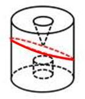

B项：从上向下竖直切出，如下图所示，故排除；

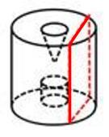

C项：在圆柱的正中间从上向下竖直切出，如下图所示，故排除；

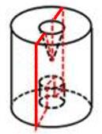

D项：不能切出，因为如果外侧要切出椭圆，只能从斜着切，但中间切不出一个正圆，当选。

本题为选非题，故正确答案为D。

---

### 第 30 题　qid 2262006 · 图形推理

下列各项中不可能是如图所示立方体组成部分的是（  ）。

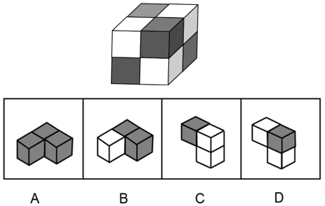

- **A**. A
- **B**. B
- **C**. C　✅
- **D**. D

**答案**：C

**官方解析**

本题考查立体拼合。题干正六面体中包含8个小方块，将小方块依次标号，能通过题干图形看到7个小方块，如下图所示，看不到的小方块为⑧号。

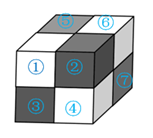

A项：如下图所示，两个小黑块可能对应题干中的③号和⑦号，看不到的小黑块为⑧号，有可能是题干的组成部分，排除；

B项：如下图所示，两个小黑块可能对应题干中的⑥号和⑦号，看不到的小黑块为⑧号，有可能是题干的组成部分，排除；

C项：根据题干所给图形，不可能存在两个小白块相连，不可能是如图所示立方体组成部分，当选；

D项：如下图所示，可以对应题干中的①号、②号和④号小方块，是题干图形的组成部分，排除；

本题为选非题，故正确答案为C。

---

## 资料分析

### 第 1 题　qid 2262039 · 增长

据统计，某企业生产的所有型号空调的销量比往年均有大幅度提升。该企业由此认为，今年他们生产的空调的市场占有率也会大幅提高。
以下最能说明上述推理存在漏洞的是（  ）。

- **A**. 暗含了该空调生产企业的消费者满意度有所增加
- **B**. 忽视了其他企业空调的销量可能也有所提升　✅
- **C**. 暗含了消费者可能同时使用两个品牌的空调
- **D**. 假设了空调消费市场划分将进一步细化

**答案**：B

**官方解析**

第一步：找出论点和论据。
论点：今年他们生产的空调的市场占有率也会大幅提高。
论据：据统计，某企业生产的所有型号空调的销量比往年均有大幅度提升。
第二步：逐一分析选项。
A项：题干讨论的是空调销量以及市场占有率，和消费者满意度无关，无法指出漏洞，排除；
B项：题干说因为企业生产的所有型号空调的销量比往年均有大幅度提升，所以空调的市场占有率也会大幅提高，但是如果其他企业空调的销量也提升的话，就不能确定空调市场总量的变化以及该企业空调市场占有率到底会不会提升，可以指出漏洞，当选；
C项：题干说因为企业生产的所有型号空调的销量比往年均有大幅度提升，所以空调的市场占有率也会大幅提高，和消费者是否会同时使用两个品牌的空调无关，无法指出漏洞，排除；
D项：题干讨论的是空调销量以及市场占有率，和空调消费市场划分会不会进一步细化无关，无法指出漏洞，排除。
故正确答案为B。

---

### 第 2 题　qid 2261989 · 综合

2018年，有的诺贝尔奖授予了技术应用的研究者，例如：诺贝尔化学奖研究成果在能源与医疗领域开辟了新的实用途径；诺贝尔物理学奖研究成果将可应用于工业和医疗领域。可见今年的诺贝尔奖更看重应用性研究。
以下与上述推理在结构上最为相似的是（  ）。

- **A**. 今年的年度优秀员工中，好几位都是销售成绩排名靠前的，可知个人的销售业绩是优秀员工评比的主要指标　✅
- **B**. 领导表扬了小白善于团结同事，注重团队合作，可见业绩并非评价员工的唯一指标
- **C**. 在出版行业评选的最受欢迎报刊杂志中，大都是一些关注民生的刊物，因此群众的接受度是评选标准
- **D**. 某高校部分大一新生有考研深造的念头，可见考研深造是不少高校学生本科毕业后的第一选择

**答案**：A

**官方解析**

第一步：分析题干论证结构。
题干先给出事例，2018年有的诺贝尔奖授予了技术应用的研究者，其中诺贝尔化学奖研究成果能够应用于能源与医疗领城、物理学奖研究成果可应用于工业和医疗领域；最后得到结论：今年的诺贝尔奖更看重应用性研究。是从“诺贝尔化学奖”、“诺贝尔物理学奖”这两种个例到“诺贝尔奖”这一整体结论的归纳推理。
第二步：逐一分析选项。
A项：先给出事例，今年的年度优秀员工中，好几位都是销售成绩排名靠前的，最后得到结论，个人的销售业绩是优秀员工评比的主要指标，是从“好几位销售成绩排名靠前”的个例到“优秀员工评比的主要指标”这一整体结论的归纳推理，与题干论证结构一致，当选；
B项：选项前面给出小白的例子是说他善于团结同事，最后得到的结论是工作业绩不是评价员工的指标，而事例中根本没提到工作业绩，与题干论证结构不一致，排除；
C项：选项说最受欢迎报刊杂志大都是一些关注民生的刊物，说的是杂志的内容，而结论说群众的接受度是评选标准，事例中的杂志内容和群众的接受度并不相同，与题干论证结构不一致，排除；
D项：事例说部分大一新生有考研深造的念头，结论说考研深造是不少高校学生本科毕业后的第一选择，事例中根本没提到本科毕业后是否会坚持最初的念头，与题干论证结构不一致，排除。
故正确答案为A。

---
