# 广东省2019年选调优秀大学毕业生笔试 综合行政能力测验题（网友回忆版）

> 选调生 · 2019 年 · 5 个模块 · 共 80 题

- [政治理论](#%E6%94%BF%E6%B2%BB%E7%90%86%E8%AE%BA) · 4 题
- [常识判断](#%E5%B8%B8%E8%AF%86%E5%88%A4%E6%96%AD) · 16 题
- [言语理解与表达](#%E8%A8%80%E8%AF%AD%E7%90%86%E8%A7%A3%E4%B8%8E%E8%A1%A8%E8%BE%BE) · 35 题
- [判断推理](#%E5%88%A4%E6%96%AD%E6%8E%A8%E7%90%86) · 10 题
- [资料分析](#%E8%B5%84%E6%96%99%E5%88%86%E6%9E%90) · 15 题

---

## 政治理论

### 第 1 题　qid 2261921 · 新思想

中国特色社会主义进入了新时代，我国社会主要矛盾已转化为（  ）。

- **A**. 人民日益增长的美好生活需要和不平衡不充分的发展之间的矛盾　✅
- **B**. 人民日益增长的物质文化需求同落后的社会生产之间的矛盾
- **C**. 建立现代化工业强国的要求同落后的农业国的现实之间的矛盾
- **D**. 生产力发展水平与生产关系发展现实之间的矛盾

**答案**：A

**官方解析**

本题考查政治常识。
党的十九大报告指出：“中国特色社会主义进入新时代，我国社会主要矛盾已经转化为人民日益增长的美好生活需要和不平衡不充分的发展之间的矛盾。我国稳定解决了十几亿人的温饱问题，总体上实现小康，不久将全面建成小康社会，人民美好生活需要日益广泛，不仅对物质文化生活提出了更高要求，而且在民主、法治、公平、正义、安全、环境等方面的要求日益增长。”
故正确答案为A。

---

### 第 2 题　qid 2261925 · 新思想

（  ）是党和人民大踏步赶上时代的重要法宝，是坚持和发展中国特色社会主义的必由之路，是决定当代中国命运的关键一招，也是决定实现“两个一百年”奋斗目标，实现中华民族伟大复兴的关键一招。

- **A**. 无产阶级专政
- **B**. 党的领导
- **C**. 改革开放　✅
- **D**. 从严治党

**答案**：C

**官方解析**

本题考查政治常识。
2018年10月22日至25日，中共中央总书记、国家主席、中央军委主席习近平亲临广东视察指导并发表重要讲话。他指出：将改革开放进行到底，改革锐气不能丢。实践充分证明，改革开放是党和人民大踏步赶上时代的重要法宝，是决定当代中国命运的关键一招，必须一以贯之、锲而不舍、再接再厉。
故正确答案为C。

---

### 第 3 题　qid 2261912 · 新思想

中国特色社会主义事业总体布局是“五位一体”。关于“五位一体”，下列说法错误的是（  ）。

- **A**. “五位一体”总体布局强调促进现代化建设各方面相协调
- **B**. “五位一体”总体布局包括经济建设、政治建设、文化建设、社会建设、思想建设　✅
- **C**. “五位一体”总体布局促进生产关系和生产力、上层建筑和经济基础相协调
- **D**. 只有坚持“五位一体”总体布局，才能把我国建设成为富强民主文明和谐美丽的社会主义现代化强国

**答案**：B

**官方解析**

本题考查政治常识。
党的十八大报告提出：“建设中国特色社会主义，总依据是社会主义初级阶段，总布局是五位一体，总任务是实现社会主义现代化和中华民族伟大复兴······必须更加自觉地把全面协调可持续作为深入贯彻落实科学发展观的基本要求，全面落实经济建设、政治建设、文化建设、社会建设、生态文明建设五位一体总体布局，促进现代化建设各方面相协调，促进生产关系与生产力、上层建筑与经济基础相协调，不断开拓生产发展、生活富裕、生态良好的文明发展道路。”因此，B项不符合题意，“思想建设”不是“五位一体”总体布局之一；ACD项表述均正确。
本题为选非题，故正确答案为B。

---

### 第 4 题　qid 2261915 · 新思想

2018年10月，习近平总书记考察广东时指出，要加快推动（  ），建立健全促进城乡融合发展的体制机制和政策体系，带动乡村产业、人才、文化、生态和组织振兴。

- **A**. 乡村振兴　✅
- **B**. 城乡一体化
- **C**. 农村综合改革
- **D**. 精准扶贫、精准脱贫

**答案**：A

**官方解析**

本题考查政治常识。
2018年10月，习近平总书记考察广东时强调，提高发展平衡性和协调性。要加快推动乡村振兴，建立健全促进城乡融合发展的体制机制和政策体系，带动乡村产业、人才、文化、生态和组织振兴。
故正确答案为A。

---

## 常识判断

### 第 1 题　qid 2261928 · 人文常识

推进供给侧结构性改革，要从（  ）入手，重点是促进产能过剩有效化解，促进产业优化重组，降低企业成本，发展战略性新兴产业和现代服务业，增加公共产品和服务供给，提高供给结构对需求变化的适应性和灵活性。

- **A**. 生产端　✅
- **B**. 需求端
- **C**. 销售端
- **D**. 消费端

**答案**：A

**官方解析**

本题考查政治常识。
习近平在省部级主要领导干部学习贯彻党的十八届五中全会精神专题研讨班上的讲话中提到：推进供给侧结构性改革，要从生产端入手，重点是促进产能过剩有效化解，促进产业优化重组，降低企业成本，发展战略性新兴产业和现代服务业，增加公共产品和服务供给，提高供给结构对需求变化的适应性和灵活性。简言之，就是去产能、去库存、去杠杆、降成本、补短板。
故正确答案为A。

---

### 第 2 题　qid 2261933 · 经济常识

我国是世界上最大的发展中国家，改善民生不能脱离（  ）这个最大实际提出过高目标，只能根据经济发展和财力状况逐步提高人民生活水平。

- **A**. 人均国民生产总值不高
- **B**. 人口多，资源相对匮乏
- **C**. 社会主义市场经济体制有待进一步完善
- **D**. 我国仍处于并将长期处于社会主义初级阶段　✅

**答案**：D

**官方解析**

本题考查政治常识。
《习近平总书记系列重要讲话读本》中提到：我国仍处于并将长期处于社会主义初级阶段，改善民生不能脱离这个最大的实际提出过高目标，只能根据经济发展和财力状况逐步提高人民生活水平。否则，结果只会适得其反。拉美、中东以及一些欧洲国家的教训表明，不切实际的高承诺、高福利、高债务，要么是失信于民、政府垮台，要么是债务累累、财政危机。这值得我们警惕。
故正确答案为D。

---

### 第 3 题　qid 2261937 · 人文常识

当前，我国经济已由（  ）阶段转向（  ）阶段，正处在转变发展方式，优化经济结构，转化增长动力的攻关期。

- **A**. 高质量发展  高速增长
- **B**. 高速增长  高质量发展　✅
- **C**. 快速增长  高速发展
- **D**. 高速发展  快速增长

**答案**：B

**官方解析**

本题考查政治常识。
党的十九大报告指出：“贯彻新发展理念，建设现代化经济体系：我国经济已由高速增长阶段转向高质量发展阶段，正处在转变发展方式、优化经济结构、转换增长动力的攻关期，建设现代化经济体系是跨越关口的迫切要求和我国发展的战略目标。”因此，B项正确，ACD项错误。
故正确答案为B。

---

### 第 4 题　qid 2261942 · 人文常识

“治天下也，必先公，公则天下平矣”符合新发展理念的（  ）。

- **A**. 协调发展
- **B**. 绿色发展
- **C**. 共享发展　✅
- **D**. 创新发展

**答案**：C

**官方解析**

本题考查政治常识。
新发展理念指的是创新、协调、绿色、开放、共享的发展理念。
习近平在党的十八届五中全会第二次全体会议上强调：共享发展注重的是解决社会公平正义问题。“治天下也，必先公，公则天下平矣。”让广大人民群众共享改革发展成果，是社会主义的本质要求，是社会主义制度优越性的集中体现，是我们党坚持全心全意为人民服务根本宗旨的重要体现。这方面问题解决好了，全体人民推动发展的积极性、主动性、创造性就能充分调动起来，国家发展也才能具有最深厚的伟力。我国经济发展的“蛋糕”不断做大，但分配不公问题比较突出，收入差距、城乡区域公共服务水平差距较大。在共享改革发展成果上，无论是实际情况还是制度设计，都还有不完善的地方。为此，我们必须坚持发展为了人民、发展依靠人民、发展成果由人民共享，作出更有效的制度安排，使全体人民朝着共同富裕方向稳步前进，绝不能出现“富者累巨万，而贫者食糟糠”的现象。因此，C项正确，ABD项错误。
故正确答案为C。

---

### 第 5 题　qid 2261946 · 人文常识

（  ）是中华民族永续发展的千年大计，必须树立和践行绿水青山就是金山银山的理念，像对待生命一样对待生态环境。

- **A**. 建设生态文明　✅
- **B**. 形成绿色发展方式
- **C**. 节约资源和保护环境
- **D**. 实行最严格的生态环境保护制度

**答案**：A

**官方解析**

本题考查政治常识。
党的十九大报告中指出：“建设生态文明是中华民族永续发展的千年大计。必须树立和践行绿水青山就是金山银山的理念，坚持节约资源和保护环境的基本国策，像对待生命一样对待生态环境，统筹山水林田湖草系统治理……坚定走生产发展、生活富裕、生态良好的文明发展道路。”
故正确答案为A。

---

### 第 6 题　qid 2261947 · 人文常识

一个国家，一个民族发展中更基本、更深沉、更持久的力量是（  ）。

- **A**. 道路自信
- **B**. 理论自信
- **C**. 制度自信
- **D**. 文化自信　✅

**答案**：D

**官方解析**

本题考查政治常识。
党的十九大报告中指出：“文化自信是一个国家、一个民族发展中更基本、更深沉、更持久的力量。必须坚持马克思主义，牢固树立共产主义远大理想和中国特色社会主义共同理想，培育和践行社会主义核心价值观，不断增强意识形态领域主导权和话语权，推动中华优秀传统文化创造性转化、创新性发展，继承革命文化，发展社会主义先进文化，不忘本来、吸收外来、面向未来，更好构筑中国精神、中国价值、中国力量，为人民提供精神指引。”
故正确答案为D。

---

### 第 7 题　qid 2261950 · 人文常识

在建设现代经济体系过程中，要弘扬劳模精神和（  ），营造劳动光荣的社会风尚和精益求精的敬业风气。

- **A**. 奉献精神
- **B**. 工匠精神　✅
- **C**. 开拓精神
- **D**. 时代精神

**答案**：B

**官方解析**

本题考查政治常识。
习近平总书记在十九大报告中指出：“建设现代化经济体系，必须把发展经济的着力点放在实体经济上，把提高供给体系质量作为主攻方向，显著增强我国经济质量优势……建设知识型、技能型、创新型劳动者大军，弘扬劳模精神和工匠精神，营造劳动光荣的社会风尚和精益求精的敬业风气。”
故正确答案为B。

---

### 第 8 题　qid 2261953 · 人文常识

坚持在发展中保障和改善民生，（  ）是发展的根本目的，必须多谋民生之利、多解民生之忧，在发展中补齐民生短板。

- **A**. 提高获得感
- **B**. 加大民生投入
- **C**. 实现共同富裕
- **D**. 增进民生福祉　✅

**答案**：D

**官方解析**

本题考政治常识。
习近平总书记在十九大报告中指出：“坚持在发展中保障和改善民生。增进民生福祉是发展的根本目的。必须多谋民生之利、多解民生之忧，在发展中补齐民生短板、促进社会公平正义，在幼有所育、学有所教、劳有所得、病有所医、老有所养、住有所居、弱有所扶上不断取得新进展，深入开展脱贫攻坚，保证全体人民在共建共享发展中有更多获得感，不断促进人的全面发展、全体人民共同富裕。”
故正确答案为D。

---

### 第 9 题　qid 2261908 · 人文常识

我国已明确脱贫攻坚目标，即到2020年，稳定实现农村贫困人口不愁吃、不愁穿、（  ）、基本医疗和住房安全有保障，使贫困地区的基本公共服务主要领域指标接近全国平均水平。

- **A**. 就业水平
- **B**. 农业设施
- **C**. 义务教育　✅
- **D**. 卫生条件

**答案**：C

**官方解析**

本题考查政治常识。
2017年8月31日，习近平总书记在深度贫困地区脱贫攻坚座谈会上发表重要讲话，讲到：“合理确定脱贫目标。党中央对2020年脱贫攻坚的目标已有明确规定，即到2020年，稳定实现农村贫困人口不愁吃、不愁穿、义务教育、基本医疗和住房安全有保障；实现贫困地区农民人均可支配收入增长幅度高于全国平均水平，基本公共服务主要领域指标接近全国平均水平。” 
故正确答案为C。

---

### 第 10 题　qid 2261918 · 人文常识

下列关于我国公民基本权利和义务的表述，正确的是（  ）。

- **A**. 依法纳税不是公民的基本义务
- **B**. 国家机关无权限制公民的人身自由
- **C**. 劳动是公民的基本义务，也是公民的基本权利　✅
- **D**. 公民的政治权利包括科学研究和文艺创作的自由

**答案**：C

**官方解析**

本题考查法律常识。
A项错误，《宪法》第五十六条规定：“中华人民共和国公民有依照法律纳税的义务。”所以依法纳税是公民的基本义务。
B项错误，《宪法》第三十七条规定：“中华人民共和国公民的人身自由不受侵犯。任何公民，非经人民检察院批准或者决定或者人民法院决定，并由公安机关执行，不受逮捕。”所以国家机关在必要时有权依照法定程序，采取一定措施限制公民的人身自由。
C项正确，《宪法》第四十二条第一款规定：“中华人民共和国公民有劳动的权利和义务。”所以劳动既是公民的基本义务，也是公民的基本权利。
D项错误，《宪法》第四十七条：“中华人民共和国公民有进行科学研究、文学艺术创作和其他文化活动的自由。”科学研究和文艺创作的自由属于我国公民文化方面的权利，不属于政治权利。我国公民的政治权利包括选举权和被选举权，以及言论、出版、集会、结社、游行、示威的自由。
故正确答案为C。

---

### 第 11 题　qid 2261923 · 法律常识

下列选项不违反法律规定的是（  ）。

- **A**. 某网店标示：本店商品一经售出，概不退货
- **B**. 某酒楼声明：请保管好随身物品，丢失概不负责　✅
- **C**. 某商场厕所门口告示：地滑小心摔倒，否则概不负责
- **D**. 某洗衣店告示：衣物丢失，赔付金额不超过洗衣费的两倍

**答案**：B

**官方解析**

本题考查法律常识。
A项错误，根据《消费者权益保护法》第二十五条规定：“网络商品经营者销售商品，消费者有权自收到商品之日起七日内退货，且无需说明理由，但下列商品除外：（一）消费者定作的；（二）鲜活易腐的；（三）在线下载或者消费者拆封的音像制品、计算机软件等数字化商品；（四）交付的报纸、期刊。”因此，该网店对商品不作分类，作出“一经售出、概不退货”的标示违反了法律规定。
B项正确，酒楼的经营范围主要是向提供餐饮服务，对消费者的随身物品并未有保管义务。如果消费者的随身物品丢失，酒楼方可以提供监控录像等，但对于丢失物品不负责任。故这一说法并未违反法律规定。
C项错误，根据《最高人民法院关于审理人身损害赔偿案件适用法律若干问题的解释》规定：“从事住宿、餐饮、娱乐等经营活动或者其他社会活动的自然人、法人、其他组织，未尽合理限度范围内的安全保障义务致使他人遭受人身损害，赔偿权利人请求其承担相应赔偿责任的，人民法院应予支持。”商场厕所属于经营者为消费者提供的服务场所，理应为消费者的人身安全提供保障，如铺防滑垫、为老幼病残提供便利设施等。商城未做任何安保措施，直接通过告示规定因地滑摔倒，商场概不负责，违反了法律规定。
D项错误，根据《广东省洗衣洗涤消费争议解决办法》第七条规定：“在洗涤前已注明有质量瑕疵问题的衣物，经洗涤后发现其他质量问题，经营者应予以洗涤费1至3倍的赔偿；经洗涤后出现严重损坏或者丢失的，经营者应予以洗涤费3至5倍的赔偿。”第八条规定：“在洗涤前已注明质量无瑕疵的衣物，经洗涤后出现轻微的质量问题，经营者应予以洗涤费4至6倍的赔偿；经洗涤后出现严重损坏或者丢失的，经营者应予以洗涤费6至9倍的赔偿。”第九条规定：“在洗涤前已注明全新有标签的衣物，如在洗涤后出现损坏或丢失，经营者应予以洗涤费10至20倍的赔偿。”第十七条规定：“议价衣物洗涤后因经营者责任造成衣物丢失或者严重损坏无法修补的，经营者应按该衣物议价金额全额赔偿。”洗衣店的规定违反了法律法规的规定，排除了自己应当承担的责任，侵犯了消费者的合法权益。
故正确答案为B。

---

### 第 12 题　qid 2261927 · 法律常识

关于法律与道德的区别，下列说法正确的是（  ）。

- **A**. 法律规范的内容只关注义务
- **B**. 道德规范的内容只关注权利
- **C**. 法律调整的范围比道德要广泛得多
- **D**. 道德调整的范围比法律要广泛得多　✅

**答案**：D

**官方解析**

本题考查法律常识。
A项错误，法律规范是指国家制定或认可，反映统治阶级意志，并由国家强制力保证实现的一种社会规范。法律规范是以权利义务为内容的，一般要求权利义务对等，没有无权利的义务，也没有无义务的权利。
B项错误，道德规范是对人们的道德行为和道德关系普遍规律的反映和概括，是从一定社会或阶级利益出发，用以调整人与人之间的利益关系的行为准则，一般是通过规定义务的方式来调整。
C项错误、D项正确，道德约束的范围比法律约束的范围更广，可以调节法律无法调节的领域。法律一般规定的是最起码的行为要求，只能规范人的行为。而道德不仅调整人们的外部行为，还调整人们的动机和内心活动，它要求人们依据高尚的意图而行为。
故正确答案为D。

---

### 第 13 题　qid 2261930 · 人文常识

“人不能两次踏进同一条河流”反映了（  ）的哲学关系。

- **A**. 现象和本质
- **B**. 量变和质变
- **C**. 运动和静止　✅
- **D**. 社会存在和社会意识

**答案**：C

**官方解析**

本题考查政治常识。
A项错误，本质与现象是揭示事物内部联系和外部表现相互关系的一对辩证法的基本范畴。本质是事物的内部联系，是决定事物性质和发展趋向的东西。现象是事物的外部联系，是本质在各方面的外部表现。题干中的话并未涉及现象和本质的范畴。
B项错误，量变是事物数量的增减或场所的变更，是一种渐进的、不显著的变化，质变是事物根本性质的变化，是渐进过程的中断。题干并未体现事物的量变和质变。
C项正确，“人不能两次踏进同一条河流”是古希腊哲学家赫拉克利特的名言，这句话意思是说，当人第二次踏入这条河时，已经是新的水流而不是原来的水流在流淌，因此它承认了物质是运动的，强调事物是绝对运动和相对静止的统一。
D项错误，社会存在是指社会物质生活条件的总和，即人类赖以生存的物质生活条件。社会意识是指社会精神条件的总和。题干并未体现社会存在和社会意识。
故正确答案为C。

---

### 第 14 题　qid 2261931 · 人文常识

“他说你行你就行，不行也行；他说你不行你就不行，行也不行。”在哲学上属于（  ）。

- **A**. 唯物辩证法
- **B**. 辩证唯物主义
- **C**. 客观唯心主义
- **D**. 主观唯心主义　✅

**答案**：D

**官方解析**

本题考查政治常识。
题干中的话在心理学中叫做“皮格马利翁效应”，表明在本质上，人的情感和观念会不同程度地受到别人下意识的影响。人们会不自觉地接受他人的影响和暗示。
A项错误，唯物辩证法即“马克思主义辩证法”，是辩证法思想发展的高级形态，认为物质世界是普遍联系和不断运动变化的统一整体，是宇宙观，又是认识论和方法论。题干中提到的是人的主观判断，不属于唯物主义范畴。
B项错误，辩证唯物主义是马克思主义的一种哲学理论，是把唯物主义和辩证法有机地统一起来的科学世界观，是唯物主义的高级形式。辩证唯物主义认为世界在本质上是物质的。题干中提到的是人的主观判断，不属于唯物主义范畴。
C项错误，客观唯心主义认为精神是世界的本原，但是这些精神不是某些个人的主观意识，而是存在于宇宙空间的一种神秘的“客观精神”，题干中没有体现。
D项正确，主观唯心主义把外部世界上的一切事物都看作是自我主观精神的显现和产物，认为外部世界上的一切事物都由每个自我的主观精神决定。题干中的话就体现了一切从主观好恶出发的主观唯心主义观点。
故正确答案为D。

---

### 第 15 题　qid 2261935 · 经济常识

国际上常用恩格尔系数来衡量一个国家和地区人民生活水平的状况，系数值越小越富裕。有关这一系数，以下说法正确的是（  ）。

- **A**. 食品支出比重越高的家庭，生活水平一般越低　✅
- **B**. 居民之间收入分配差距越大，恩格尔系数越高
- **C**. 一般来说，发达国家居民的恩格尔系数高于发展中国家
- **D**. 国家越富裕，国民的平均支出中用于购买食物的支出所占比例越大

**答案**：A

**官方解析**

本题考查经济常识。
恩格尔系数是食品支出总额占个人消费支出总额的比重。一般而言，一个国家越穷，每个国民的平均支出中用于购买食物的支出所占比例就越大。随着国家的富裕，这个比例呈下降趋势。
A项正确，对于人类来说，吃饭是人类生存的第一需要，所以在收入水平较低时，食品在消费支出中必然占有重要地位。随着收入的增加，在食物需求基本满足的情况下，消费的重心才会开始向穿、用等其他方面转移。因此，食品支出比重越高的家庭，生活水平一般越低。
B项错误，恩格尔系数是用来衡量一个国家和地区人民生活水平的状况的，不能反映居民之间的收入分配差距。用来反映收入分配差距的是基尼系数。基尼系数值在0和1之间，越接近0就表明收入分配越是趋向平等，反之，收入分配越是趋向不平等。
C项错误，发达国家的富裕程度高于发展中国家，因此他们的恩格尔系数低于发展中国家。
D项错误，国家越富裕，人们的生活水平越高，在满足食物的基本需求后，才有更多的钱来消费其他产品，所以国民的平均支出中用于购买食物的支出所占比例就越小。
故正确答案为A。

---

### 第 16 题　qid 2261939 · 科技常识

可再生能源是指不会随它本身的转化或人类的利用而越来越少的能源。下列属于可再生能源的是（    ）。
①风能 ②天然气 ③潮汐能 ④太阳能 ⑤核燃料

- **A**. ①②③
- **B**. ①③④　✅
- **C**. ②④⑤
- **D**. ③④⑤

**答案**：B

**官方解析**

本题考查科技常识。
可再生能源是指不会随它本身的转化或人类的利用而越来越少的能源。不可再生能源是指在自然界经过亿万年形成，短期内无法恢复，且随着大规模开发利用，储量越来越少，最终会枯竭的能源。
①风能，是指地球表面大量空气流动所产生的动能。由于地面各处受太阳辐照后气温变化不同和空气中水蒸气的含量不同，因而引起各地气压的差异，在水平方向高压空气向低压地区流动，即形成风。风能不会因为人们的利用而越来越少，因此属于可再生能源。
②天然气，是指天然蕴藏于地层中的烃类和非烃类气体的混合物。天然气主要存在于油田以及天然气田，也有少量出于煤层，它释放能量时自身会转化成二氧化碳和水，会随着人们的使用越来越少，因此属于不可再生能源。
③潮汐能，是从海水面昼夜间的涨落中获得的能量。它与天体引力有关，地球－月亮－太阳系统的吸引力和热能是形成潮汐能的来源。这种能量是永恒的、无污染，因此属于可再生能源。
④太阳能，一般指太阳光的辐射能量。在太阳内部进行的由“氢”聚变成“氦”的原子核反应，不停地释放出巨大的能量，并不断向宇宙空间辐射能量，这种能量就是太阳能。太阳内部的这种核聚变反应，可以维持几十亿至上百亿年的时间，不会因为人们的使用而减少，因此属于可再生能源。
⑤核燃料，是指可在核反应堆中通过核裂变或核聚变产生实用核能的材料。当前核燃料主要为铀钍矿，本质是矿产资源，储量有限，而且会随着人们的使用越来越少，故核燃料属于不可再生能源。
因此①③④属于可再生能源。
故正确答案为B。

---

## 言语理解与表达

### 第 1 题　qid 2261970 · 逻辑填空

传统美德，是一片（    ）的土地，生长着本真的人生体验，孕育着鲜活的道德追求。

- **A**. 丰收
- **B**. 丰饶　✅
- **C**. 丰产
- **D**. 丰盛

**答案**：B

**官方解析**

横线处填入词语与“土地”搭配，且由后文“生长着本真的人生体验，孕育着鲜活的道德追求”可知，横线处需要表达这片土地的“人生体验”、“道德追求”等精神财富很多之意。B项“丰饶”意为富饶，符合文意，当选。
A项“丰收”指收成好，一般指农作物，C项“丰产”在农业上指比一般产量高，D项“丰盛”一般用来形容物质方面丰富多样，均无法和后文的精神财富形成对应，排除。
故正确答案为B。
【文段出处】半月谈-《呵护善良》

---

### 第 2 题　qid 2261971 · 逻辑填空

党和政府与人民群众的关系问题，直接（    ）党风、政风。党员干部为谁代言，直接决定人心向背，也决定着党和人民的事业能否长盛不衰。

- **A**. 反映　✅
- **B**. 显现
- **C**. 确定
- **D**. 联系

**答案**：A

**官方解析**

由文段语境可知，“党和政府与人民群众的关系问题”与“党风、政风”是“体现”与“被体现”关系，A项“反映”符合文意，当选。
B项“显现”指露面、呈现、显露，C项“确定”意为明确而肯定，D项“联系”指彼此连上关系，均与文意不符，排除。
故正确答案为A。
【文段出处】中华人民共和国科学技术部-科技部党组《关于进一步加强领导干部作风建设的决定》

---

### 第 3 题　qid 2261972 · 逻辑填空

近年来，“提倡开短会、讲短话，讲管用的话，力戒空话套话”的要求，自上而下（    ）全党，形成了一种改文风、转作风的鲜明导向和浩大声势。

- **A**. 激励
- **B**. 勉励　✅
- **C**. 培育
- **D**. 教育

**答案**：B

**官方解析**

横线处体现这个“要求”对全党的作用，B项勉励指劝人努力，有督促的含义，放在文段中可以体现，这个要求在勉励着全党，督促着全党，符合文意，当选。
A项“激励”是指激发鼓励，文段并未体现鼓励的含义，排除。
C项“培育”是指培养孕育，通常搭配新的事物，培育新产业，培育新的经济增长点等，搭配“全党”不当，排除。
D项“教育”一般主语是人，横线前主语是“要求”，不能说“要求”教育全党，排除。
故正确答案为B。

---

### 第 4 题　qid 2261973 · 逻辑填空

“进去，只留下脚印；出来，只带走照片”，这句话直观地提示我们，依托生态发展旅游，必须遵循自然规律，（    ）保护生态环境。

- **A**. 坚守
- **B**. 强调
- **C**. 注重　✅
- **D**. 重点

**答案**：C

**官方解析**

根据文段“必须遵循”，强调这件事很重要，必须去做，横线处应体现重视保护生态环境，对应C项，注重即重视，当选。
A项“坚守”是指坚决守卫，不离开。比如坚守岗位，侧重的是守得住，不能体现重视的含义，排除。
B项“强调”是指着重提出，侧重是提出，文段是要重视保护生态环境，而不仅仅是提出，排除。
D项“重点”是指主要的，有主次之分，而文段不是说“保护生态环境”是重点，其他就不是重点，排除。
故正确答案为C。

---

### 第 5 题　qid 2261974 · 逻辑填空

浩瀚而宝贵的历史知识，既是人类总结昨天的（    ），也是人类把握今天，创造明天的向导。

- **A**. 记录　✅
- **B**. 经历
- **C**. 方式
- **D**. 回忆

**答案**：A

**官方解析**

横线处填入词语与“历史知识”搭配，且根据文段“既是······也是······”可知，句式相近表并列，横线处与“向导”形成对应，“向导”即引领、指引，A项“记录”指把所见所闻通过一定的手段保留下来，并作为信息传递开去，历史知识将以前的经验进行记录并为明天做出指导，符合文意，且与“向导”对应恰当，当选。B项“经历”指亲身遇到过的事情，D项“回忆”指想过去的事，均搭配不当，排除。C项“方式”即方法，无法与“向导”形成对应，排除。
故正确答案为A。 
【文段出处】《用世界的眼光把握时代发展大势》

---

### 第 6 题　qid 2261976 · 逻辑填空

规范旅游市场的秩序，仅靠主管部门是远远不够的。夯实旅游业发展的长远之基，需要加强行业（    ），以此推进经营行为的规范化。

- **A**. 管理
- **B**. 自律　✅
- **C**. 管辖
- **D**. 自强

**答案**：B

**官方解析**

根据“仅靠主管部门是远远不够的”可知，横线处所填词语应体现行业自身主动约束、自我规范之意，B项“自律”指自己约束自己，符合文意，当选。
A项“管理”指照管并约束（人或动物），C项“管辖”指管理或统辖（人员、事物、区域、案件等），D项“自强”指自己努力向上，均无法体现自我约束、自己管好自己的含义，与文意不符，排除。
故正确答案为B。
【文段出处】《让“同行抵制”成为市场常态》

---

### 第 7 题　qid 2261978 · 逻辑填空

港珠澳大桥必将推动粤港澳大湾区的建设，从而成为内地和港澳经济转型升级的（    ）。

- **A**. 引擎　✅
- **B**. 契机
- **C**. 平台
- **D**. 纽带

**答案**：A

**官方解析**

分析文意可知，文段想表明港珠澳大桥对经济转型升级发挥着重要的作用，即可直接对应A项“引擎”，这里泛指经济转型的动力源泉，能够体现其重要作用，当选。B项“契机”指事物转化的关键机会，大桥本身不是机会，“港珠澳大桥的建设”才能成为一个机会，排除；C项“平台”，泛指某项工作所需要的环境或条件，而转型并非全部在大桥上进行，所以不能称之为平台，排除；D项“纽带”比喻起联系作用的人或事物，可以说大桥是内地和港澳的纽带，但是不能说是经济转型升级的纽带，用法错误，排除。
故正确答案为A。

---

### 第 8 题　qid 2261979 · 逻辑填空

或许一个人的力量（    ），但如果全国人民同心同德、和衷共济，心往一处想、劲往一处使，那便能积沙成塔、集腋成裘，为民族复兴注入不竭动力。

- **A**. 差强人意
- **B**. 沧海一粟
- **C**. 微不足道　✅
- **D**. 轻如鸿毛

**答案**：C

**官方解析**

分析文意可知，括号后面出现转折关联词“但”，前后语义相反，后文“积沙成塔、集腋成裘、注入不竭动力”即，积少成多，发挥很大的作用，因此转折前应表达一个人的力量“渺小”之意；A项“差强人意”指大致能够让人满意，与文意无关，排除；D项“轻如鸿毛”侧重轻微以至于毫无价值，而文段中只是说一个人力量较小，不够，并非毫无价值，与文意不符，排除；B项“沧海一粟”与C项“微不足道”都有渺小之意，但“沧海一粟”为大海中的一粒谷子，为形象化表达，不能直接搭配“力量”，应改为“一个人的力量只是沧海一粟”，置于此处用法不当，排除。
故正确答案为C。
【文段出处】半月谈《向共和国建设者致敬》

---

### 第 9 题　qid 2261980 · 逻辑填空

随着经济和文化加速（    ），文化产业逐步成为国民经济的支柱性产业，对（    ）经济增长，推动经济发展方式转变发挥着重要作用。

- **A**. 结合 提升
- **B**. 融合 提升
- **C**. 结合 促进
- **D**. 融合 促进　✅

**答案**：D

**官方解析**

第一空，横线处所填词语用以形容经济和文化的相互作用，最终形成文化产业，“融合”指两个事物融为一体，正是因为文化和经济融合，最后形成了一种更具活力的文化产业，逐渐成为支柱产业，符合文意；“结合”指两个事物在一起，两者依然是独立的事物，无法对应后文的“文化产业”，故排除A、C两项。
第二空，横线处所填词语与“经济增长”搭配，D项“促进经济增长”为固定搭配，符合文意，当选。B项“提升”一词置于此处搭配不当，应为“提升经济增长量”，排除。
故正确答案为D。
【出处】《加快转变文化发展方式 推动文化大发展大繁荣》

---

### 第 10 题　qid 2261981 · 逻辑填空

中国提出的构建人类命运共同体倡议，（  ）“自由人联合体”与“天下观”“和文化”的思想精华，将攸关中国前途命运的中国梦与攸关世界各国前途命运的世界梦紧密连接在一起，让世界各国（  ）中国智慧、中国方案。

- **A**. 吸收  享有
- **B**. 汲取  共享　✅
- **C**. 吸收  独享
- **D**. 汲取  享受

**答案**：B

**官方解析**

第一空，横线处所填词语与“精华”搭配，“吸收”精华、“汲取”精华，置于此处均可。
第二空，横线处所填词语与“世界各国”搭配，A项“享有”指在社会上取得，多与权利、声誉、威望等搭配，置于此处，与后文的“中国智慧、中国方案”搭配不当，排除；B项“共享”指共同享有，搭配得当且符合文意，当选；C项“独享”侧重强调独自享受，与“世界各国”搭配不当，排除；D项“享受”置于此处搭配尚可，但难以与前文的“世界各国”构成对应，排除。
故正确答案为B。
【文段出处】《把握新思想的重大意义和历史贡献》

---

### 第 11 题　qid 2261904 · 逻辑填空

我国多地正（  ）以企业纳税情况为重要参考，为企业提供融资服务，（  ）企业融资难、融资贵等状况，实现对实体经济的支持。

- **A**. 尝试  缓和
- **B**. 尝试  缓解　✅
- **C**. 试图  缓解
- **D**. 试图  缓和

**答案**：B

**官方解析**

第一空，根据文中“正”，可知此事已经有了具体行动，“尝试”指试探性的试验，可以表示此事正在进行当中，因此“尝试”更为恰当。“试图”是指打算，往往只停留在想法层面，之后是否真正实行并无体现，故排除C、D两项。
第二空，分析文意可知，企业融资难、融资贵的状况得到了一定程度的减轻、改善，横线处所填词语修饰“企业融资难、融资贵等状况”，“缓解”指使程度减轻，着重强调的是减轻或改善不好的东西，或者危害，填入文段语义合适且搭配恰当，当选；“缓和”指使和缓，多搭配气氛、局势等，置于此处搭配不当，排除A项。
故正确答案为B。
【文段出处】《诚信模式从1.0向2.0转型，如何影响每个人的生活？》

---

### 第 12 题　qid 2261909 · 逻辑填空

互联网大大拓展了思想和行动的（  ），但网络空间总会有阳光照射不到的（  ）角落，缺乏辨别能力的孩子极有可能被“暗箭”所伤。

- **A**. 维度  偏僻
- **B**. 界限  阴冷
- **C**. 边界  阴暗　✅
- **D**. 空间  偏远

**答案**：C

**官方解析**

第一空，搭配“思想和行动”，B项“界限”、C项“边界”、D项“空间”均可与之搭配，A项“维度”仅可搭配“思想”，与“行动”搭配不当，排除。 
第二空，搭配“角落”，根据前后文“阳光照射不到”“孩子极有可能被‘暗箭’所伤”可知，角落是“阴暗”的，锁定C项。B项“阴冷”强调寒冷，D项“偏远”强调距离远，均与前后文对应不当，排除。
故正确答案为C。
【文段出处】《谨防黄暴动画侵蚀童心，企业应担起责任》人民日报

---

### 第 13 题　qid 2261914 · 逻辑填空

文化类综艺节目要走出同质化、低收视的（  ），首先还是要在内容和形式创新上有所突破，让人们印象中“高冷”的文化真正具有观赏（  ），让观众产生共鸣和参与感。比如，《国家宝藏》就用大众喜闻乐见的形式解读国宝，做到了既有史有据，又生动有趣。

- **A**. 光环  乐趣
- **B**. 怪圈  价值
- **C**. 窘境  价值
- **D**. 困境  乐趣　✅

**答案**：D

**官方解析**

第一空，横线处与“同质化”“低收视”搭配，体现出一种消极的感情色彩，A项“光环”指事物周围的光辉，表意积极，与文段感情色彩不符，排除。B项“怪圈”指难以摆脱的某种怪现象，C项“窘境”指十分为难的处境，D项“困境”指困难的处境，均可体现消极的感情色彩，符合文意。
第二空，后文通过“比如”对前文进行解释说明，强调新的形式做到了“生动有趣”，故横线处也应体现出综艺节目的创新要让观众觉得“有趣”，D项“乐趣”可体现出使人感到快乐、有趣，符合语境。B、C两项“价值”与“生动有趣”无法形成对应，排除。
故正确答案为D。
【文段出处】《文化类综艺节目如何创新让观众产生共鸣》

---

### 第 14 题　qid 2261919 · 逻辑填空

当前，党在新形势下的强军目标（  ）确立，政治建军深入推进，练兵备战紧锣密鼓，改革攻坚大刀阔斧，正风肃纪（  ）。

- **A**. 鲜明  雷霆万钧　✅
- **B**. 明显  雷霆万钧
- **C**. 鲜明  千钧一发
- **D**. 明显  千钧一发

**答案**：A

**官方解析**

第一空，根据后文“政治建军、练兵备战、改革攻坚”可知，党的强军目标是非常明确的，对比“鲜明”和“明显”，“鲜明”是指分明而确定，一点也不含糊，符合语境。“明显”指清楚地显露出来，能够让人看出或感觉到，程度过轻，排除B、D两项。
第二空，搭配“正风肃纪”，A项“雷霆万钧”形容威力极大，无法阻挡，放在这能够体现出我党强军的决心，符合文意，当选。C项“千钧一发”形容情况万分危急，文段并没有体现出情况危急，排除。
故正确答案为A。
【文段出处】《以习近平同志为核心的党中央领导和推进强军兴军纪实》

---

### 第 15 题　qid 2261924 · 逻辑填空

没有人能够完全知道中国何以为“中国”，（  ）我们可以尽力去认识人们所选择的社会机制、文化决策和自然环境，（  ）我们对于那些影响历史进程的诸多因素会有更深入的了解，（  ）它们使得中国文明与众不同。

- **A**. 因为  而且  所以
- **B**. 所以  因为  就是
- **C**. 尽管  但是  所以
- **D**. 但是  由此  正是　✅

**答案**：D

**官方解析**

第一空，根据前文“没有人能够完全知道”与后文“我们可以尽力去认识”可知，前后两句为转折关系，D项“但是”表转折，符合文意，当选。A项“因为”表原因，B项“所以”表结果，均不表示转折，排除；C项“尽管”虽是转折关联词，但属于转折的前半部分，不符合空格前后文的逻辑关系，排除。
第二空代入验证，“由此”指代前文“认识人们所选择的社会机制、文化决策和自然环境”，逻辑通顺。
第三空代入验证，“正是”强调“影响历史进程诸多因素”的作用，符合文意。
故正确答案为D。
【文段出处】《比较视野下的中国文明(书里乾坤)》

---

### 第 16 题　qid 2261957 · 片段阅读

理想信念是事业和人生的灯塔，决定我们的方向和立场。理想信念不是拿来说、拿来唱的，更不是用来装点门面的，只有见诸行动才有说服力。领导干部将理想信念内化于心、外化于行、知行合一，自觉肩负起为民谋幸福、为中华民族谋复兴的重托才能步稳力沉。
这段文字主要论述了（  ）。

- **A**. 理想信念的重要性
- **B**. 理想信念应落实到行动　✅
- **C**. 理想信念与民族复兴的关系
- **D**. 理想信念应当成为我们的奋斗方向

**答案**：B

**官方解析**

文段开篇指出理想信念的重要性，随后通过“只有······才”引导对策，强调理想信念应见诸行动。尾句通过领导干部的做法对前文对策进行论证。故文段重点强调理想信念应付诸行动，对应B项。
A项对应首句的内容，非重点，排除；C项“民族复兴”对应解释说明内容，非重点，文段强调的是“见诸行动”这一对策，排除；D项“奋斗方向”文段未提及，无中生有，排除。
故正确答案为B。
【文段出处】《理想信念，不是用来装点门面》

---

### 第 17 题　qid 2261958 · 片段阅读

此次政府机构改革再次强调了“要坚决破除制约使市场在资源配置中起决定性作用、更好发挥政府作用的体制机制弊端”，“提高行政效率，全面提高政府效能，建设人民满意的服务型政府”。这突出了政府机构改革要服务于市场经济转型发展、服务于人民利益的获得感的目标。
这段文字主要论述了（  ）。

- **A**. 政府机构改革的方向　✅
- **B**. 政府机构改革的对象
- **C**. 政府机构改革的原因
- **D**. 政府机构改革的意义

**答案**：A

**官方解析**

文段开篇论述政府改革机构“要坚决破除······体制机制弊端”“提高行政效率······建设服务型政府”，尾句通过指代词“这”对前文进行总结，引出结论，即政府机构改革要服务于市场经济转型发展、服务于人民利益的获得感的目标。故文段重点强调政府机构改革的方向，对应A项。
B项“对象”、C项“原因”文段均未提及，无中生有，排除；D项“意义”对应尾句之前的内容，非重点，排除。
故正确答案为A。
【文段出处】《一场深刻变革》

---

### 第 18 题　qid 2261960 · 片段阅读

强大的国家必须拥有一支热血满腔、视荣誉为生命的军队。军人之所以视荣誉为生命，源于崇高的使命感，源于社会的厚植培育。然而，在市场经济条件下，利益杠杆、个人价值在人才流动中的驱动作用更加明显，军营的吸引力有所下降，                    。
以下最适合填在划线处的是（    ）。

- **A**. 迫切需要提高军人的待遇水平
- **B**. 必须发挥纪律的约束和法制的保障作用
- **C**. 迫切需要在全社会重塑军人职业的荣誉感　✅
- **D**. 必须以强军梦为引领，打造一支热血满腔的军队

**答案**：C

**官方解析**

横线出现在文段末尾，应该对前文进行总结，或者提出对策。
文段首先说明了强大的国家必须拥有一支视荣誉为生命的军队，接着介绍了军人之所以视荣誉为生命，源于使命感和社会的厚植培育，后文通过“然而”表转折，提出问题——利益杠杆和个人价值的驱动影响了军人的职业荣誉，导致军营的吸引力下降，故横线处应该针对前文的问题提出对策，即“重塑军人职业的荣誉感”，对应C项。 
A项“提高军人的待遇水平”、B项“纪律的约束和法制的保障”文段均未提及，无中生有，排除；
D项，未体现主题词“荣誉”，偏离文段中心，排除。
故正确答案为C。
【文段出处】《军人荣誉，在强军梦中铸就》

---

### 第 19 题　qid 2261962 · 片段阅读

艺术是民众创造的，离不开民众的生活。而在民众的社会生活中，经济因素又是一个非常重要的因子。具体到戏曲而言，它在宋代形成，和当时的演艺市场日益商品化有密切关系。可以说，这是戏曲赖以形成、生存和发展的重要原因。
最后一句话中的“这”指的是（  ）。

- **A**. 民众的社会生活
- **B**. 宋代的艺术环境
- **C**. 演艺市场的商品化　✅
- **D**. 戏曲艺术的大众化

**答案**：C

**官方解析**

本题为词句理解题。重点关注“这”之前的内容，根据“具体到戏曲而言，它在宋代形成，和当时的演艺市场日益商品化有密切关系”可知，“这”即指“演艺市场日益商品化”，对应C项。
A项，“民众的社会生活”是前文论述的时代背景，并非尾句“这”所指原因，排除；
B项“宋代的艺术环境”及D项“戏曲艺术的大众化”文段均未提及，无中生有，排除。
故正确答案为C。

---

### 第 20 题　qid 2261964 · 片段阅读

所谓荒野，是指未受人类活动干扰或者人工改造较少的自然环境。在传统观念中，荒野是没有多少价值的。然而，在生态经济日益发展的今天，荒野显得越来越重要。荒野具有原生性、多样性、开放性等特点，有很高的经济价值、休闲价值和审美价值。
这段文字强调了（  ）。

- **A**. 人们对荒野的认识不准确
- **B**. 应保护荒野不受破坏
- **C**. 应该大力开发荒野
- **D**. 荒野有巨大的价值　✅

**答案**：D

**官方解析**

文段开篇引出“荒野”这一话题，并介绍传统观念，认为荒野并没有太大价值。紧接着通过转折词“然而”引出文段重点，强调荒野越来越显重要，越来越有价值，尾句则进一步补充说明荒野的巨大价值。故文段重点强调荒野具有巨大价值，对应D项。
A项，“人们对荒野的认识不准确”对应文段“荒野是没有多少价值的”，为转折前的内容，非重点，且从选项表述看，“认识”一词表述不明确，排除；
B项“应保护荒野不受破坏” 、C项“应该大力开发荒野”，均为无中生有的对策，排除。
故正确答案为D。
【文段出处】 《发展生态经济，建设生态文明》

---

### 第 21 题　qid 2261898 · 片段阅读

一部影视作品的品质好不好，表演是重要因素，位居“声台形表”第一位的声音表演是重中之重。台词功底本是演员安身立命的基本素养，但在快餐式文化的背景下，却被许多人轻视，很多人动辄说“颜值就是正义”“流量就是一切”，配音和替身泛滥让一些演员俨然成了刷脸的机器。长此以往，受到伤害的只能是艺术和观众。
这段文字主要说明了（  ）。

- **A**. 演员需要通过作品不断提升艺术水准
- **B**. 表演的质量决定了作品的受欢迎程度
- **C**. 影视作品的品质是由演员的表演决定的　✅
- **D**. 观众对好内容、好演员是有鉴赏能力的

**答案**：C

**官方解析**

文段首先指出“表演”对“影视作品的品质”很重要，之后具体指出“声音表演”是表演的一部分，然后提出的“台词功底”也是表演的一部分，接着后文具体论述轻视“台词功底”的问题，最后指出不良后果。故文段重点在文段首句，对应C项。
A项，未涉及文段的核心话题“表演”，排除；
B项，“受欢迎程度”从文段无从得知，无中生有，排除；
D项，观众的“鉴赏能力”无中生有，排除。
故正确答案为C。
【文段出处】《实力派演员担纲综艺吹来一股清风》

---

### 第 22 题　qid 2261900 · 片段阅读

如果手机一整天没有响，你会不会觉得不习惯？遇到什么难以解决的问题，不求助网络你是不是不知该怎么办？坐在地铁上，没有手机，时光会不会流逝得格外缓慢？不知从什么时候开始，我们身边的电子产品越来越多，电脑、手机、掌上游戏机，还有最新的平板……
这段文字主要说明了（  ）。

- **A**. 电子产品在生活中的重要作用
- **B**. 现代人对电子产品的依赖　✅
- **C**. 如何合理使用电子产品
- **D**. 电子产品的不断发展

**答案**：B

**官方解析**

文段首先连续提出三个问题，意在说明我们离开手机会不习惯，遇到问题不去寻求网络帮助会无所适从，没有手机会觉得时光缓慢，最后通过“电子产品”总结前文，指出我们的身边“电子产品”越来越多了，离不开电子产品了，故本文意在强调我们对电子产品的一种依赖，对应B项。
文段重在强调我们离不开“电子产品”这种现象，A项的“电子产品的重要作用”及D项的“电子产品的不断发展”，均偏离文段核心话题，排除；
C项，“合理使用”无中生有，排除。
故正确选项为B。
【文段出处】《甩不掉的电子依赖》

---

### 第 23 题　qid 2261903 · 片段阅读

中小企业是我国经济发展和社会稳定的重要支撑。近年来，国家出台了一些针对中小企业的税收优惠政策，但中小企业的税负依然不轻。税收负担削弱了中小企业的竞争能力、盈利能力和工资增长能力，也进一步拉大了中小企业员工与国有大企业、三资企业员工之间的收入差距。
以下对上述文字概括最准确的一项是（  ）。

- **A**. 中小企业对经济发展和社会稳定具有重要作用
- **B**. 当前中小企业的税负对其发展造成影响
- **C**. 国家对中小企业采取了税收优惠政策
- **D**. 应该进一步减轻对中小企业的税负　✅

**答案**：D

**官方解析**

文段首先指出“中小企业”很重要，接着，文段指出“中小企业”是有“税收优惠政策”的，之后出现转折关联词“但”，引出“中小企业的税负依然不轻”的问题，接着对问题的不良后果进行具体分析，故文段转折之后为提出问题——分析问题的结构，重在强调对策，应减轻“中小企业”的税负，对应D项。
A项对应文段首句内容，C项对应文段第二句前半部分，皆为转折之前的内容，非文段重点，排除；
B项，“造成的影响”对应后文不良后果部分，而文段意在解决问题，故非文段重点，排除。
故正确答案为D。

---

### 第 24 题　qid 2261906 · 片段阅读

当今社会，坐车逃票、论文抄袭、伪造个人信息等现象屡见不鲜。过去，人们以道德号召、舆论谴责为主来维系诚信，“这样做，我在村里还怎么呆下去？”“邻居要是知道了，我还有什么脸见人？”然而现在，对许多人来说类似的顾虑越来越少，如果谁也不认识谁，单纯的舆论谴责，杀伤力是微乎其微的。
这段文字主要说明了（  ）。

- **A**. 随着社会发展，个人失信成本降低
- **B**. 传统诚信体系的基础已经动摇
- **C**. 传统的诚信体系优于现代
- **D**. 诚信建设需要转型　✅

**答案**：D

**官方解析**

文段首先指出当今社会失信的现象很多，接着介绍了过去人们维系诚信的方式，最后通过转折词“然而”强调了以往维系诚信的方式所起的作用微乎其微，转折后提出了问题，优选解决问题的对策，即诚信建设需要转型，对应D项。
A、B两项，都只是问题的表述，问题表述非重点，对策更重要，排除。
C项，文段没有对传统诚信体系和现代诚信体系进行对比，无中生有，排除。
故正确答案为D。
【文段出处】《无信不立：诚信2.0撞击中国社会》

---

### 第 25 题　qid 2261910 · 片段阅读

当前，新闻媒体正在深入推进融合发展。新闻作品版权是媒体的核心资产，但目前加剧的侵权现实让人无奈。作为新闻媒体，一般乐见自己的作品被广泛传播，但前提是尊重原创劳动，并得到授权方能使用。如果对未经授权擅自使用、传播新闻作品的行为置之不理，传统产业的发展将受到严重影响，媒体的融合发展也会面临严重困难。
这段文字意在强调（  ）。

- **A**. 新闻媒体的融合有利于版权保护
- **B**. 新闻媒体的融合发展面临严重困难
- **C**. 新闻媒体应避免自己的作品被随意转载
- **D**. 推动新闻媒体融合发展，必须做好版权保护　✅

**答案**：D

**官方解析**

文段首先引出媒体融合的话题，接着指出现在新闻作品侵权的问题，后文通过 “如果对未经授权擅自使用、传播新闻作品的行为置之不理，传统产业的发展将受到严重影响，媒体的融合发展也会面临严重困难”进行反面论证提对策，即强调的是我们要做好版权的保护，对应答案D项。
A项，文段开头指出新闻媒体融合带来侵权加剧的现象，表述与文意相悖，排除。
B项，文段末尾说的是如果不做好版权保护会使媒体融合发展有困难，而不是说一定有困难，假设变现实，排除。
C项，文段提到“作为新闻媒体，一般乐见自己的作品被广泛传播”，表述不符合文意，排除。
故正确答案为D。
【文段出处】《拿起法律武器，保护新闻作品版权》

---

### 第 26 题　qid 2261916 · 片段阅读

当前，乡贤回归让一批在外精英，通过依法选举加入村干部队伍，参与乡村治理，有利于构建现代化乡村善治体系。不仅如此，乡贤的回归还可以打破乡村原有的利益格局。本地村民竞选村干部，难免有自身的利益考量。而回归的乡贤或出于家乡情结，或应乡镇干部的动员和鼓励，一般与村中利益没有瓜葛。
这段文字旨在说明（  ）。

- **A**. 乡贤回归有利于推进乡村治理现代化　✅
- **B**. 乡贤回归能直接带动乡村经济社会发展
- **C**. 畅通乡贤返乡之路，还需要完善相应政策措施
- **D**. 乡贤既是本乡本土的贤者，更是在外发展的能人

**答案**：A

**官方解析**

文段开头指出乡贤回归能够有利于乡村现代化善治体系，接着“还”引导并列，指出乡贤回归可以打破乡村的利益格局，后面一部分是对打破利益格局的解释。整个文段属于并列结构，需要概括全面。文段主要讲述了乡贤回归利于现代化乡村善治也能打破利益格局， A项的“乡村治理现代化”将这两个方面包含在内，当选。
B项，文段除了提到能够促进“现代化乡村善治体系”，还能够打破利益格局，只提到一个方面，片面，并且文段没有提到直接促进经济发展，无中生有，排除。
C项，文中没有提到要完善相应的政策措施，无中生有，排除。
D项，文段讨论的话题是“乡贤回归”，而非“乡贤”，排除。
故正确答案为A。
【文段出处】《乡村日渐凋敝,基层治理去哪儿找能人? 这个地方的做法值得一学》

---

### 第 27 题　qid 2261920 · 片段阅读

参加旅行团的旅行，犹如流水线上的产品生产。参加旅行团的游客，往往是在规定时间与明确路线的要求下，在几天之内，完成心理上对“旅行”符号的消费。难得的旅行本是人们在“朝九晚五”之外的放松，但似乎又使人们陷入另一种“工作律令”之中，体验着对体力与精力的“假期式消耗”。
这段材料表达的主要观点是（  ）。

- **A**. 旅行与上班已经没有区别
- **B**. 旅行不应规定时间与明确线路
- **C**. 参加旅行团使旅行失去了原本的意义
- **D**. 旅行团的出游方式无法让游客得到放松　✅

**答案**：D

**官方解析**

文段首先引出参团旅游这一话题，并介绍了参团旅游的特征。人们本来是想通过这种旅游方式达到放松，尾句通过转折词“但”引出了重点，由“……陷入另一种‘工作律令’之中，体验着对体力与精力的‘假期式消耗’”可知，文段意在说明参团旅游耗费了游客的精力体力，无法让游客真正的感受旅途的轻松愉悦，D项表述正确。 
A项，偏离主题，“上班”不是文段强调的重点，且“旅行”扩大范围，文段讨论的话题是“参加旅行团的旅行”，排除；
B项，文段论述对象为“参加旅行团的旅行”，选项“旅行”扩大范围，排除；
C项，“失去了原本的意义”与D项相比表述不明确，没有指出失去了什么意义，排除。
故正确答案为D。
【出处】人民网:《行向何处的“旅行”》

---

### 第 28 题　qid 2261926 · 片段阅读

由于基层政府普遍人手不足，承担的任务十分繁杂，很难完成上级部门制定的“创新事项”考核。一些地方为了达成“工作创新”，便忙着到处参观取经，将别人的方案“依葫芦画瓢”盲目照搬过来。殊不知，          。可以想见，这种“创新”会有什么样的结果。
以下最适合填在划线处的是（  ）。

- **A**. 种瓜得瓜，种豆得豆
- **B**. 橘生淮南为橘，生于淮北则为枳　✅
- **C**. 一方水土养一方人，创新方案亦是如此
- **D**. 这些形形色色的纸面创新往往并不符合实际

**答案**：B

**官方解析**

横线位于文段中间，应结合上下文内容进行分析。前文提到“一些地方为了达成‘工作创新’······将别人的方案······盲目照搬过来”。说明在创新过程中有些地方不顾本地情况，盲目照搬他人的创新成果。尾句“可以想见······结果”，说明这种做法产生的效果并不理想。空中所填的语句既要体现当地忽视客观环境的做法，又要体现出不良后果。B项意思是环境变了，事物的性质也变了，“创新”不能生搬硬套，同样的方案在别的地方可能是“橘”，到了本地却可能变成“枳”，符合文段语境，当选。
A项，“种瓜得瓜，种豆得豆”比喻做了什么事，就会得到什么样的结果，强调的是因果关系，体现不出不好的结果，排除；
C项，“一方水土养一方人”，比喻一定的环境造就一定的人才，体现不出不好的结果。排除；
D项，“纸面创新往往并不符合实际”表述错误，文段意思是把别人的“创新”用到自己身上是不符合实际的，并不是强调这种创新只是停留于纸面，停留于理论层面，排除。
故正确答案为B。
【出处】半月谈：《形式主义的深处是什么》

---

### 第 29 题　qid 2261929 · 片段阅读

在某种意义上说，中国传统文化的复兴正当其时：现代化建设已见成效，但也面临着一些难题。然而，一些传统文化的“复兴者”认为：传统文化与现代化是矛盾的，至少与现代性和启蒙是矛盾的，于是以反现代性和反启蒙为其定位。
下列说法中，符合作者观点的是（  ）。

- **A**. 中国已实现了现代化
- **B**. 中国亟需复兴传统文化
- **C**. 传统文化与现代化无法融合
- **D**. 一些人对传统文化复兴的定位有误　✅

**答案**：D

**官方解析**

文段第一句话指出中国传统文化的复兴正当其时，但也面临一些难题，可见作者对“中国传统文化的复兴”是积极肯定的态度。第二句“然而”引出文段重点，由“一些传统文化的‘复兴者’认为……于是以反现代性和反启蒙为其定位”可知，这些“复兴者”对传统文化的定位是“反现代性和反启蒙”，与作者对传统文化的态度是相反的，是不正确的，对应D项。
A项，“已实现了现代化”时态错误，原文为“现代化建设已见成效”，排除；
B项，“亟需”引导对策，反推文段应表述为“还未开始进行传统文化的复兴”，而文段讨论的是一些“复兴者”不正确的看法，而不是是否开始复兴的问题，排除；
C项，偏离主题，文段讨论的核心话题是“传统文化复兴”，排除。
故正确答案为D。
【出处】张志伟：《启蒙、现代性与传统文化的复兴》

---

### 第 30 题　qid 2261932 · 片段阅读

国产纪录片的成长与蜕变，最核心的力量来自纪录片在内容和形式上的突破。时下，越来越多的纪录片开始告别昔日高大上的形象，注重观照现实生活、剖析社会问题、描述普通人的日常，让观众感受到更多人文关怀，获得了更多情感共鸣，其中不少题材紧跟当下热点，富有强烈的时代感。
这段文字主要说明了（  ）。

- **A**. 国产纪录片通过内容和形式上的突破取得了进步　✅
- **B**. 富有强烈的时代感是国产纪录片成功的必备条件
- **C**. 过去的国产纪录片往往具有高大上的形象
- **D**. 国产纪录片应体现更多的人文关怀

**答案**：A

**官方解析**

文段首先提出观点，国产纪录片的核心力量在于“纪录片在内容和形式上的突破”。接下来进行详细的解释说明，论述当下纪录片开始注重观照现实生活及具体的表现。文段为“总-分”结构，即“观点＋解释说明”，中心句即文段首句“国产纪录片的成长与蜕变，最核心的力量来自纪录片在内容和形式上的突破”，对应A项。
B项，“富有强烈的时代感”对应文段解释说明的内容，非重点，排除；
C项，文段讨论的核心话题是当今的“国产纪录片”非“过去”，且“具有高大上的形象”属于解释说明的内容，非重点，排除；
D项，“人文关怀”解释说明的内容，非重点，排除。
故正确答案为A。
【文段出处】《纪录片回暖，文化产业发展的样本》

---

### 第 31 题　qid 2261938 · 片段阅读

我们要提醒自己不要向生活提太多的要求，因为如果这样做，我们幸福所依靠的基础就变得太广大了。依靠如此广大的基础才可以建立起来的幸福是很容易倒塌的，因为遭遇变故的机会增多了，而变故无时不在发生，             。
以下最适合填在划线处的是（  ）。

- **A**. 因此，我们应当根据自身条件，适当降低对生活的要求　✅
- **B**. 因此，我们应当尽量简化生活中的各种关系
- **C**. 因此，我们往往在目标实现的时候，对生活又有了新的要求
- **D**. 因此，我们在生活中应该谨慎小心，未雨绸缪

**答案**：A

**官方解析**

横线出现在结尾，填横线处应总结前文。文段首先从反面提出对策即“我们要提醒自己不要向生活提太多的要求”，随后论述提出太多要求建立起来的幸福容易倒塌的原因，即遭遇变故的机会多了，最后指出变故无时不在发生，故横线处应针对前文提出对策，即降低自己的要求，对应A项。
B项，文段论述的核心话题为“对生活的要求”非“生活中的各种关系”，话题不一致，排除；
C项，“目标实现的时候”无中生有，文段并未提及，排除；
D项，文段论述的核心话题为“对生活的要求”非“谨慎小心，未雨绸缪” 话题不一致，排除。
故正确答案为A。
【文段出处】《人生的智慧》

---

### 第 32 题　qid 2261941 · 片段阅读

一个时代有一个时代的审美趣味，古人以为美的东西，未必符合今人的审美需求，今天人们认为的美，也未必是后人审美的准则。世殊事异，环境在变，社会在变，生活不同，审美自然存在差异性。
通过这段文字，可以得知（  ）。

- **A**. 古人认为美的东西今人觉得都不美
- **B**. 每个时代的审美完全不同
- **C**. 不同国家地区的审美并不一样
- **D**. 一个时代的审美受到多种因素影响　✅

**答案**：D

**官方解析**

A项，根据“未必符合今人的审美需求”可知，“古人认为美的东西今人觉得都不美”中的“都”表述过于绝对，排除；
B项，根据“古人以为美的东西，未必符合今人的审美需求，今天人们认为的美，也未必是后人审美的准则”可知，“每个时代的审美完全不同”中的“完全”表述过于绝对，排除；
C项，根据“一个时代有一个时代的审美趣味”可知，文段论述的是“不同时代”非“不同国家”，偷换概念，排除；
D项，根据“世殊事异，环境在变，社会在变，生活不同，审美自然存在差异性”可知，表述正确，当选。
故正确答案为D。
【文段出处】《流传千载的＜兰亭序＞ 为何入不了这本书的“法眼”》

---

### 第 33 题　qid 2261944 · 片段阅读

当前流行各式各样的“知识付费”产品。“知识付费”表面上是有针对性地满足了人们对特定知识的需求，可是这些知识产品制造的过程都是标准化操作，而制造者的首要目的，是通过它来赚钱。所以，“知识付费”里的知识到底有多少能够解决你本身的困惑，可能就要打一个问号了。
这段文字意在说明（  ）。

- **A**. “知识付费”产品的本质
- **B**. 人们购买“知识付费”产品的真实原因
- **C**. “知识付费”产品实际价值有待商榷　✅
- **D**. “知识付费”产品与人们购买本意可能存在差距

**答案**：C

**官方解析**

文段开篇交代背景，引出“知识付费”的话题。紧接着论述“知识付费”表面上满足了人们的特定知识需求，但知识产品制造过程是标准化操作，制造者的首要目的为赚钱。尾句通过“所以”引出结论，强调“知识付费”里的知识到底能解决多少困惑，要打个问号。故文段重在强调“知识付费”的知识并不具有较大的作用，对应C项。
A项，“产品的本质”无中生有，文段并未提及，排除； 
B项，“购买‘知识付费’产品的真实原因” 无中生有，文段并未提及，排除； 
D项，“人们购买本意”无中生有，文段并未提及，排除。
故正确答案为C。

---

### 第 34 题　qid 2261948 · 片段阅读

我国是一个多煤、少气的国家。进入供暖季以来，国内天然气供应十分紧张。事实上，我国燃煤供暖技术成熟稳定，通过普及清洁煤技术可以实现煤炭的清洁化利用。改善空气质量，控制散煤是关键。但控制散煤后选择哪种方式实现清洁供暖，必须                 ，统筹规划，稳妥推进。
以下最适合填在划线处的是（  ）。

- **A**. 建立天然气战略储备制度
- **B**. 推广清洁煤技术，采用成熟稳定的燃煤供暖技术
- **C**. 因地制宜，因时制宜，以保障群众生活供暖为前提　✅
- **D**. 尽可能利用清洁能源，加快提高清洁供暖比重

**答案**：C

**官方解析**

文段开篇介绍我国进入供暖季，天然气供应紧张。紧接着通过转折关联词“事实上”指出我国燃煤供暖技术成熟稳定，而后说明控制散煤是改善空气质量的关键。尾句说明控制散煤后选择哪种方式实现清洁供暖的对策，根据横线后所述“统筹规划，稳妥推进”可知，横线中应体现出面对多地情况采取措施之意，由此才能对应“统筹规划”，对应C项，“因地制宜，因时制宜”可体现出面对多地情况采取措施之意。
A项“建立天然气战略储备制度”， B项“采用成熟稳定的燃煤供暖技术” ，D项“加快提高清洁供暖比重”均体现不出面对多地情况采取措施之意，与后文对应不当，排除；
故正确答案为C。
【文段出处】 中华网《推进清洁供暖须“宜”字当头》

---

### 第 35 题　qid 2261951 · 片段阅读

秉持着艰苦奋斗精神，中国共产党带领全国人民赢得了新民主主义革命的胜利，让中国在20世纪发生了一次又一次划时代的历史巨变。而今，中国实现了从“赶上时代”到“引领时代”的伟大跨越。让“中国号”巨轮在新的时代浪潮中行稳致远，更需要继续发扬艰苦奋斗精神，励志笃行，以身践行。
最适合作为这段文字标题的是（  ）。

- **A**. 新时代更需坚持艰苦奋斗　✅
- **B**. 成功的秘诀——艰苦奋斗
- **C**. 大力践行艰苦奋斗精神
- **D**. 艰苦奋斗造就革命胜利

**答案**：A

**官方解析**

文段开篇指出艰苦奋斗精神使中国赢得新民主主义革命胜利并让中国在20世纪发生历史巨变，紧接着介绍在今天中国实现了跨越。尾句通过程度词“更”及对策引导词“需要”引出文段重点，强调在新的时代更需要发扬艰苦奋斗精神。文段重在说明新时代更需要艰苦奋斗，对应A项。
B项，“成功的秘诀”表述不明确，文段重在强调新时代需要艰苦奋斗，排除；
C项，并未指出“新时代”这一核心话题，排除；
D项，“革命胜利”属于程度词之前的非重点，排除。
故正确答案为A。
【文段出处】中国共产党新闻网《新时代更须弘扬艰苦奋斗精神》

---

## 判断推理

### 第 1 题　qid 2261901 · 图形推理

如图所示，一个杯中放有石蜡做的空心圆球和正方体，圆球的质量和直径，与正方体的质量、边长相同，如果在杯中缓慢倒入纯净水，则先漂浮起来的是（  ）。

- **A**. 圆球
- **B**. 正方体　✅
- **C**. 二者同时
- **D**. 无法判断

**答案**：B

**官方解析**

杯中的空心圆和空心正方体要想漂浮起来，浮力必须等于重力。由于两个物体质量相同，所以重力相同，因此漂浮所需要的浮力就相等。根据浮力公式，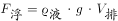，对于不同物体，其中为固定不变，故两个物体想要漂浮起来所需的也相等。

观察图形可知，由于圆球的直径和正方形的边长相等，因此缓慢倒入水时，在水位相同的情况下，正方体排水体积要大于圆球，故正方体会先达到漂浮所需的，即正方形会先漂浮起来。

故正确答案为B。

---

### 第 2 题　qid 2261907 · 逻辑判断

已知一个30度的斜坡，摩擦系数为0.5。甲乙两人一起冲到斜坡上同一位置，甲比乙重。如果没有任何外力扶持，之后可能发生的情况是（  ）。

- **A**. 两人均开始下滑，两人下滑速度一样　✅
- **B**. 两人均开始下滑，甲下滑速度比乙快
- **C**. 两人均开始下滑，甲下滑速度比乙慢
- **D**. 两人可以在斜坡上保持静止

**答案**：A

**官方解析**

做受力分析，先单独分析甲，斜面上的甲受到竖直向下的重力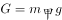，将重力沿着斜面方向和垂直于斜面方向分解，沿着斜面方向的分力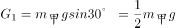，垂直于斜面方向的分力，因此给斜面的压力为。由于摩擦系数，所以斜面能提供的动摩擦力为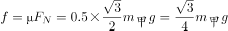，小于沿斜面向下的分力，所以甲会沿斜面下滑。

下滑时，斜面方向甲受到沿斜面向下的和沿斜面方向向上的，斜面方向合力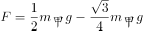，所以加速度。

由于加速度与质量无关，所以两人下滑加速度相同，下滑速度相同。

故正确答案为A。

---

### 第 3 题　qid 2261911 · 类比推理

某人利用石英砂、活性炭、蓬松棉和纱布制作了一个简易净水器。下列说法正确的是（  ）。

- **A**. 该净水器可以有效去除重金属元素
- **B**. 该净水器可以将自来水变为纯净水
- **C**. 该净水器可以降低自来水的硬度
- **D**. 蓬松棉应置于离出水口最近的地方　✅

**答案**：D

**官方解析**

简易净水器的原理是利用纱布与石英砂过滤较大颗粒的不溶性物质，活性炭吸附有色有味的物质，蓬松棉吸附颗粒很小的不溶性物质的性质来净化水源。因此不能去除溶解在水中的金属离子，故不能降低水的硬度，不能将自来水变为纯净水，A、B、C三项说法有误。

简易净水器一般示意图如下，蓬松棉位于出水口最近的地方，D项正确。

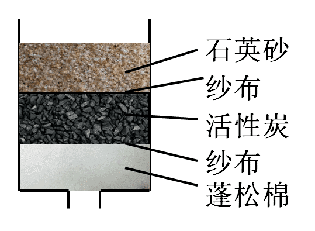

故正确答案为D。

---

### 第 4 题　qid 2261917 · 逻辑判断

如图所示，电路两端的电压保持不变，当滑动变阻器的滑动触头P向左移动，电阻变大时，三个灯泡亮度的变化情况是（  ）。

- **A**. L1变亮，L2变亮，L3变暗
- **B**. L1变亮，L2变暗，L3变暗　✅
- **C**. L1变暗，L2变暗，L3变暗
- **D**. L1变暗，L2变暗，L3变亮

**答案**：B

**官方解析**

本题考虑灯泡亮度，考虑电功率P。分析电路，滑动变阻器向左滑动阻值变大，故整个电路阻值变大。根据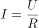，整个电路（干路）电流变小，L3在干路中，通过L3电流为干路电流，根据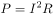，L3电流变小则变暗。

又因为整个电路电流变小，L3的电流变小而自身电阻不变，分到的电压U3变小。由于电路两端电压保持不变，则L2与滑动变阻器和L1组成的并联电路分到的电压变大。L1电压变大，自身电阻不变则电流变大，L1变亮。

L3电流变小，L1分到的电流变大，则根据并联电路电流规律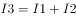，L2电流变小，故L2变暗。

故正确答案为B。

---

### 第 5 题　qid 2261922 · 类比推理

桌面上有三个相同的烧杯，第一个是空烧杯，第二个烧杯内装有100ml的水，第三个烧杯内装有200ml的水。用玻璃棒敲击烧杯的边沿，发现三个烧杯被敲击的声音都不相同。则下列说法正确的是（  ）。

- **A**. 敲击第一个烧杯的音调最高　✅
- **B**. 敲击第二个烧杯的音调最高
- **C**. 敲击第三个烧杯的音调最高
- **D**. 敲击三烧杯的音调是一样的

**答案**：A

**官方解析**

音调与物体振动相关，用玻璃棒敲打烧杯时，水柱高度越高则振动越慢，频率较低，音调就较低；反之，水柱高度越低振动越快，频率较高，音调较高。
本题中因为烧杯相同，所以水柱底面积相同，故水柱高度取决于注入的水量。
因此注水量越少的烧杯，其音调越高，而第一个烧杯注水量最少，故敲击第一个烧杯的音调最高。
故正确答案为A。

---

### 第 6 题　qid 2261949 · 逻辑判断

物质的用途与性质密切相关。下列说法正确的是（  ）。

- **A**. 铝能用作电线，是因为它的化学性质不活泼
- **B**. 液氧可用于火箭发射，是因为氧气具有可燃性
- **C**. 生石灰可作干燥剂，是因为其具有很强的吸附能力
- **D**. 汽油可以去除衣服上的油污，是因为汽油可以溶解油污　✅

**答案**：D

**官方解析**

A项：铝能被用作电线，是利用了铝的导电性和延展性，并非化学性质不活泼，错误；
B项：液氧可用作火箭发射，是因为氧气具有助燃性，且氧气不具有可燃性，错误；
C项：生石灰可作干燥剂，是因为其能与水发生化学反应，而非吸附能力，错误；
D项：汽油可以去除衣服上的油污，是因为油污易溶于汽油，即汽油可以溶解油污，正确；
故正确答案为D。

---

### 第 7 题　qid 2261952 · 类比推理

如图所示，一束太阳光从空气中倾斜射入玻璃体，玻璃体实心无色，a、b、c、d代表四条不同颜色的光线，则它们可能依次是（  ）。

- **A**. 红光、紫光、蓝光、绿光
- **B**. 绿光、红光、蓝光、紫光
- **C**. 紫光、蓝光、绿光、红光　✅
- **D**. 绿光、紫光、红光、蓝光

**答案**：C

**官方解析**

供选答案中，四种光线红、绿、蓝、紫的频率为红绿蓝紫，故其折射率，而光在折射时，折射率越大则偏折程度越大，结合传播图可知折射光线从上到下的顺序为紫光、蓝光、绿光和红光，C项正确。

故正确答案为C。

---

### 第 8 题　qid 2261954 · 逻辑判断

如图所示，两根绝缘细线悬挂着带有同种电荷的小球a和b。因静电力，两根绝缘细线张开，分别与垂直方向成夹角α和β，且静止时两球处于同一水平面。如果夹角α大于夹角β，则下列结论正确的是（  ）。

- **A**. 小球a带电荷量比小球b多
- **B**. 小球b受到拉力比小球a小
- **C**. 小球b的质量比小球a大　✅
- **D**. 同时剪断两根细线，小球a先落地

**答案**：C

**官方解析**

A项：力的作用是相互的，两小球对彼此的库仑力大小相等，方向相反，但a球的电荷量和b球的电荷量大小无法判断，错误；

B项：根据平衡条件有：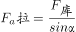 ，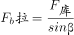 ，由于β&lt;α，所以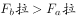，错误；

C项：对小球受力分析，小球受到重力、库仑力与拉力，两小球的库仑力大小相等，方向相反，根据平衡条件有：⁡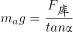 ，⁡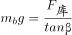 ，由于β&lt;α，所以，小球b的质量比小球a大，正确；

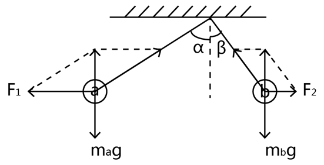

D项：同时剪断后，两小球竖直方向上均作自由落体运动，且最初两球处于同一水平面，初速度均为0加速度相同，则任一时刻的速度也相同，故同时落地，错误。

故正确答案为C。

---

### 第 9 题　qid 2261955 · 类比推理

如图所示，天平左右两端的烧杯中有等量稀盐酸，并处于平衡状态。现在天平左右两端的烧杯中，分别加入相同质量的锌块与铜块，结果发现天平右侧缓缓下降，主要的原因是（  ）。

- **A**. 相同质量的铜块与锌块大小不同
- **B**. 铜块与稀盐酸反应产生了氯化铜
- **C**. 锌块与稀盐酸反应产生了氢气　✅
- **D**. 化学反应产生了大量水蒸气

**答案**：C

**官方解析**

A项：铜块与锌块质量相同，产生的重力相同，放在天平两端，不影响平衡，错误；

B项：根据金属活泼性可知，锌在氢前，氢在铜前，铜的活泼性在氢之后，不能够与稀盐酸反应，错误；

C项：锌块与稀盐酸反应会产生氢气，其反应化学方程式为：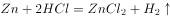，生成气体进入空气，导致天平左侧质量减少，正确；

D项：锌块与稀盐酸的化学反应中只产生了氢气。水蒸气是由于化学反应放热，导致水蒸发形成的，而蒸发属于物理变化，说法错误。

故正确答案为C。

---

### 第 10 题　qid 2261956 · 类比推理

一个小球在竖直平面内的光滑圆环轨道上做圆周运动，小球经过圆环最高点时刚好不脱离圆环。通过最高点时，小球（  ）。

- **A**. 没有受到向心力
- **B**. 向心力等于重力　✅
- **C**. 没有向心加速度
- **D**. 线速度为0

**答案**：B

**官方解析**

根据小球在光滑圆环轨道上做圆周运动在最高点时恰好不脱离，故轨道对小球的压力为零，假设圆环半径为，根据牛顿第二定律得，，小球所受的向心力等于小球的重力，A错误，B正确；向心加速度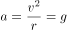，C错误；线速度，D错误。

故正确答案为B。

---

## 资料分析

### 材料 1

        2017年末，全国铁路营业里程达到12.7万公里，比上年增长，其中高铁营业里程2.5万公里。全国铁路路网密度132.2公里/万平方公里，比上年增加3.0公里/万平方公里。其中复线里程7.2万公里，复线率（铁路复线里程占铁路营业里程的比重），电气化里程8.7万公里，电化率（铁路电气化里程占铁路营业里程的比重）。西部地区铁路营业里程5.2万公里，比上年增长。

#### 第 1 题　qid 2261967 · 综合

2016年末，我国铁路路网密度是（  ）公里/万平方公里。

- **A**. 126.2
- **B**. 129.2　✅
- **C**. 130.2
- **D**. 135.2

**答案**：B

**官方解析**

根据题干“2016年末我国铁路路网密度”，结合材料时间为2017年，可判定本题为基期计算问题。定位文字材料“2017年末，全国铁路路网密度132.2公里/万平方公里，比上年增加3.0公里/万平方公里”，根据公式：，故2016年末我国铁路路网密度公里/万平方公里。

故正确答案为B。

---

#### 第 2 题　qid 2261968 · 增长

2017年，西部地区铁路营业里程比2016年增加约（  ）公里。

- **A**. 1661　✅
- **B**. 1761
- **C**. 1861
- **D**. 1961

**答案**：A

**官方解析**

根据题干“2017年······比2016年增加······公里”，可判定本题为增长量计算问题。定位文字材料“2017年末，西部地区铁路营业里程5.2万公里，比上年增长”，故2017年西部地区铁路营业里程同比增长量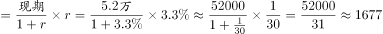公里。

故正确答案为A。

---

#### 第 3 题　qid 2261969 · 综合

2017年我国铁路复线率约比2016年（  ）。

- **A**. 提高4个百分点
- **B**. 降低4个百分点
- **C**. 提高2个百分点　✅
- **D**. 降低2个百分点

**答案**：C

**官方解析**

根据题干“2017年我国铁路复线率约比2016年”，结合选项为百分点，且材料给出复线率即为比重，可判定本题为两期比重问题。定位文字材料“2017年末，复线率（铁路复线里程占铁路营业里程的比重）”；定位图形材料可得：2016年，全国铁路复线里程6.8万公里，铁路营业里程12.4万公里，则2016年全国铁路复线率。故2017年与2016年的比重差个百分点，与C项最接近。

故正确答案为C。

---

#### 第 4 题　qid 2261975 · 增长

2014—2017年，我国电气化里程同比增速最快的是（  ）。

- **A**. 2014年　✅
- **B**. 2015年
- **C**. 2016年
- **D**. 2017年

**答案**：A

**官方解析**

根据题干“······同比增速最快的是”，可判定本题为一般增长率的比较问题。定位柱状图可知2014—2017年各年数据，根据公式：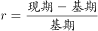，可得：

A项，2014年；

B项，2015年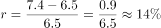；

C项，2016年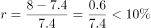；

D项，2017年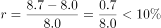。

所以我国电气化里程同比增速最快的是2014年，选A。

故正确答案为A。

---

#### 第 5 题　qid 2261977 · 综合

以下说法不正确的是（  ）。

- **A**. 
2013年，我国铁路复线里程不到铁路营业里程一半

- **B**. 
2014—2017年，我国铁路电化率逐年增加 

- **C**. 
2017年，我国铁路营业里程比2013年约增加了

- **D**. 
2017年，我国高铁营业里程占全国铁路营业里程三成以上
　✅

**答案**：D

**官方解析**

A项，定位柱状图可知2013年我国铁路复线里程为4.8万公里，铁路营业里程为10.3万公里，则，不到一半，正确；

B项，定位柱状图可知2014—2017年我国每一年的铁路电气化里程和铁路营业里程，可得2014年铁路电化率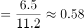，2015年铁路电化率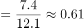，2016年铁路电化率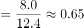，2017年铁路电化率为，可见，我国铁路电化率逐年增加，正确；

C项，定位柱状图可知我国铁路营业里程2013年为10.3万公里，2017年为12.7万公里，根据增长率计算公式：，可得2017年我国铁路营业里程比2013年约增加了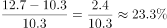，正确；

D项，定位文字材料“2017年末，全国铁路营业里程达到12.7万公里，比上年增长，其中高铁营业里程2.5万公里”，可得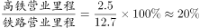，而非三成（）以上，错误。

本题为选非题，故正确答案为D。

---

### 材料 2

        对全国规模以上文化及相关产业5.9万家企业的调查显示，2018年上半年，上述企业实现营业收入42227亿元，比上年同期增长，继续保持较快增长。

        文化及相关产业9个行业的营业收入均实现增长。其中，新闻信息服务营业收入3744亿元，比上年同期增长；创意设计服务5143亿元，增长；内容创作生产8820亿元，增长；文化传播渠道4501亿元，增长；文化辅助生产和中介服务7783亿元，增长；文化消费终端生产7911亿元，增长；文化投资运营349亿元，增长；文化装备生产3313亿元，增长；文化休闲娱乐服务663亿元，增长。

        分区域看，东部地区规模以上文化及相关产业企业实现营业收入32443亿元；中部、西部和东北地区分别为5828亿元、3509亿元和447亿元。从增长速度看，西部地区比上年同期增长；东部地区增长；中部地区增长；东北地区增长，与上年同期下降相比，实现了正增长。

#### 第 6 题　qid 2261934 · 综合

2016年上半年，东北地区规模以上文化及相关产业企业实现营业收入约（  ）亿元。

- **A**. 425.9
- **B**. 435.9
- **C**. 437.7
- **D**. 447.7　✅

**答案**：D

**官方解析**

根据题干“2016上半年，东北地区······实现营业收入”，结合材料时间为2018年，可判定本题为间隔基期计算问题。定位文字材料第三段可知，2018年东北地区实现营业收入为447亿元，增长，与上年同期下降相比，实现正增长，则2018年增长率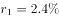，2017年增长率，所以2018年较2016年的增长率，则2016年东北地区实现营业收入，与D项最接近。

故正确答案为D。

---

#### 第 7 题　qid 2261936 · 增长

2018年上半年，文化传播渠道营业收入比上年同期增加了约（  ）亿元。

- **A**. 410
- **B**. 409　✅
- **C**. 408
- **D**. 407

**答案**：B

**官方解析**

根据题干“······增加了（   ）亿元”，判定本题为增长量计算问题。定位文字材料第二段可得：2018年文化传播渠道4501亿元，增长。故2018年上半年，文化传播渠道营业收入比上年同比增量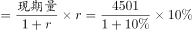，与B项最接近。

故正确答案为B。

---

#### 第 8 题　qid 2261940 · 增长

与上年同期相比，2018年上半年我国规模以上文化及相关产业企业营业收入增速最快的是（  ）。

- **A**. 东部地区
- **B**. 中部地区
- **C**. 西部地区　✅
- **D**. 东北地区

**答案**：C

**官方解析**

定位文字材料第三段，可知西部地区比上年同期增长，东部地区增长，中部地区增长，东北地区增长，则西部地区增长最快。

故正确答案为C。

---

#### 第 9 题　qid 2261943 · 综合

2017年上半年，我国文化及相关产业营业收入最高的行业是（  ）。

- **A**. 内容创作生产　✅
- **B**. 创意设计服务
- **C**. 文化休闲娱乐服务
- **D**. 文化消费终端生产

**答案**：A

**官方解析**

根据题干所求“2017年上半年······营业收入最高的行业是”，材料数据为2018年上半年，可判定此题为基期比较问题。定位文字材料第二段，“内容创作生产8820亿元，增长；创意设计服务5143亿元，增长；文化休闲娱乐服务663亿元，增长；文化消费终端生产7911亿元，增长”。代入公式：，则2017年上半年，营业收入分别为：

内容创作生产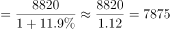亿元；

创意设计服务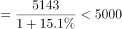亿元；

文化休闲娱乐服务亿元；

文化消费终端生产亿元。

比较上述四个数字，营业收入最高的行业是内容创作生产。

故正确答案为A 。     

---

#### 第 10 题　qid 2261945 · 综合

以下说法不正确的是（  ）。

- **A**. 2018年上半年，东部地区规模以上文化及相关文化产业企业营业收入总额超过中部、西部、东北地区的总和
- **B**. 2017年上半年，新闻信息服务营业收入占我国规模以上文化及相关产业总营业收入不到一成
- **C**. 2018年上半年，文化装备生产营业收入达到文化投资运营收入的10倍　✅
- **D**. 2017年上半年，东部地区规模以上文化及相关文化产业企业营业收入占全国比重七成以上

**答案**：C

**官方解析**

A项：定位文字材料第三段，“东部地区规模以上文化及相关产业企业实现营业收入32443亿元；中部、西部和东北地区分别为5828亿元、3509亿元和447亿元”。5828+3509+447=9784，32443＞9784，故东部地区营业收入超过中、西、东北地区之和，正确；

B项：定位文字材料第一段和第二段，“2018年上半年，上述企业实现营业收入42227亿元，比上年同期增长 ”“新闻信息服务营业收3744亿元，比上年同期增长”。根据基期比重公式，2017年上半年新闻信息服务营业收入占我国规模以上文化及相关产业总营业收入的比重为：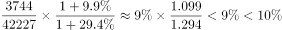，故不到一成，正确；

 C项：定位文字材料第二段，“文化投资运营349亿元，增长；文化装备生产3313亿元，增长”。2018年上半年，文化装备生产营业收入是文化投资运营收入的：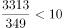，不到10倍，错误；

D项：定位文字材料第一段和第三段，“2018年上半年，上述企业实现营业收入42227亿元，比上年同期增长”，“东部地区规模以上文化及相关产业企业实现营业收入32443亿元······东部地区增长”。根据基期比重公式：，可得2017年上半年，东部地区规模以上文化及相关文化产业企业营业收入占全国比重为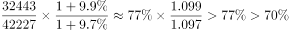，在七成以上，正确。

本题为选非题，故正确答案为C。     

---

### 材料 3

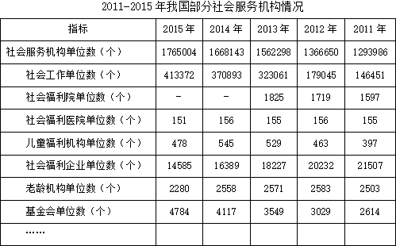

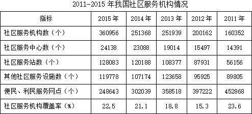

#### 第 11 题　qid 2261959 · 增长

与2012年相比，2013年下列社会服务机构中单位数增加最多的是（  ）。

- **A**. 社会福利院
- **B**. 儿童福利机构
- **C**. 老龄机构
- **D**. 基金会　✅

**答案**：D

**官方解析**

根据题干“······增加最多的是”，可判定本题为增长量比较问题。定位第一个表格第4列和第5列，。故社会福利院单位数的增长量，儿童福利机构单位数的增长量，老龄机构单位数的增长量，基金会单位数的增长量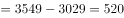，故与2012年相比，2013年增加最多的为基金会。

故正确答案为D。

---

#### 第 12 题　qid 2261961 · 增长

2015年，社会服务机构单位数比2011年增加约（  ）万个。

- **A**. 46
- **B**. 47　✅
- **C**. 48
- **D**. 49

**答案**：B

**官方解析**

根据题干“······比······增加······万个”，可判定本题为增长量计算问题。定位第一个表格可得：2015年社会服务机构单位数1765004，2011年社会服务机构单位数1293986，故社会服务机构单位数万。

故正确答案为B。

---

#### 第 13 题　qid 2261963 · 比重

2012—2015年，老龄机构单位数占社会服务机构单位数的比重最大的是（  ）。

- **A**. 2012年　✅
- **B**. 2013年
- **C**. 2014年
- **D**. 2015年

**答案**：A

**官方解析**

根据题干“······占······的比重最大的是······”，可判定本题为现期比重比较问题。定位第一个表格可得：2012年-2015年老龄机构单位数占社会服务机构单位数的比重分别为：2012年，2013年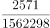，2014年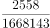，2015年。观察可知：2012年比重分子最大，分母最小，故2012年比重最大。

故正确答案为A。

---

#### 第 14 题　qid 2261965 · 增长

2012—2015年，社区服务中心数量同比增加最多的年份是（  ）。

- **A**. 2012年
- **B**. 2013年
- **C**. 2014年　✅
- **D**. 2015年

**答案**：C

**官方解析**

根据题干“······同比增长最多的年份”，可判定本题为增长量比较问题，定位材料第二个表格中：社区服务中心数同比增量分别为2012年: 个、2013年：个、2014年：个、2015年：个。因此增加最多的年份为2014年。

故正确答案为C。

---

#### 第 15 题　qid 2261966 · 综合

以下说法不正确的是（  ）。

- **A**. 2015年，社会福利企业单位数较2014年有所减少
- **B**. 2011—2014年，社会福利医院单位数变化不大
- **C**. 2015年，社区服务机构数、社区服务站数较2013年均有所增加
- **D**. 2011—2015年，每年的社区服务机构覆盖率逐年提高　✅

**答案**：D

**官方解析**

A 项：定位材料第一个表格中，社会福利企业单位数2015年 14585个，2014年 16389个，2015年较2014年有所减少，正确；

B项：定位材料第一个表格中，社会福利医院单位数2011-2014年分别为：155个，156个，155个，156个，数量变化不大，正确；

C项：定位材料第二个表格中，社会服务机构数 2015年360956个,2013年 251939个；社区服务站数 2015年 128083个，2013年 108377个，两者均增加，正确；

D项：定位材料第二个表格中，社区服务机构覆盖率2011年，2012年，覆盖率下降，错误。

本题为选非题，故正确答案为D。

---
