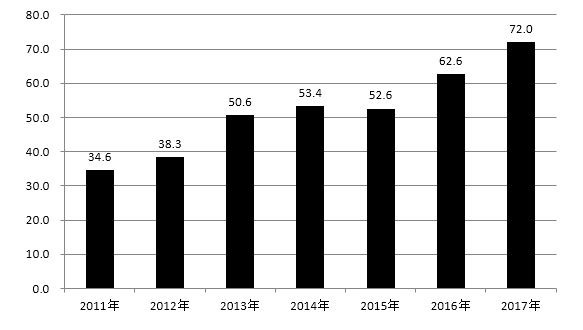
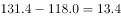
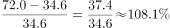
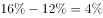
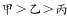
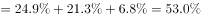

# 广西2019年定向招录选调生笔试

> 选调生 · 2019 年 · 5 个模块 · 共 50 题

- [政治理论](#%E6%94%BF%E6%B2%BB%E7%90%86%E8%AE%BA) · 13 题
- [常识判断](#%E5%B8%B8%E8%AF%86%E5%88%A4%E6%96%AD) · 7 题
- [言语理解与表达](#%E8%A8%80%E8%AF%AD%E7%90%86%E8%A7%A3%E4%B8%8E%E8%A1%A8%E8%BE%BE) · 21 题
- [判断推理](#%E5%88%A4%E6%96%AD%E6%8E%A8%E7%90%86) · 3 题
- [资料分析](#%E8%B5%84%E6%96%99%E5%88%86%E6%9E%90) · 6 题

---

## 政治理论

### 第 1 题　qid 2271280 · 毛中特

党的十九大把（  ）和马克思列宁主义、毛泽东思想、邓小平理论、“三个代表”重要思想、科学发展观一道确立为我们党的行动指南，实现了党的指导思想的又一次与时俱进，这是党的十九大的一个重大历史贡献。

- **A**. 习近平思想
- **B**. 习近平重要思想
- **C**. 习近平新时代社会主义思想
- **D**. 习近平新时代中国特色社会主义思想　✅

**答案**：D

**官方解析**

本题考查政治常识。2017年10月24日，中国共产党第十九次全国代表大会通过了《中国共产党章程（修正案）》。根据《中国共产党章程》总纲中的规定:“中国共产党以马克思列宁主义、毛泽东思想、邓小平理论、‘三个代表’重要思想、科学发展观、习近平新时代中国特色社会主义思想作为自己的行动指南。”
故正确答案为D。

---

### 第 2 题　qid 2271281 · 新思想

习近平在首届中国国际进口博览会开幕式上指出，中国将始终是全球共同开放的重要推动者，始终是世界经济增长的稳定动力源，始终是各国拓展商机的活力大市场，始终是全球治理改革的积极贡献者。
下列关于中国国际进口博览会说法不正确的是（  ）。

- **A**. 中国国际进口博览会将每年举办一次
- **B**. 首届中国国际进口博览会的主题口号是“新时代，共享未来”
- **C**. 首届中国国际进口博览会于2018年11月5-10日在北京举行　✅
- **D**. 中国国际进口博览会是迄今为止世界上第一个以进口为主题的大型国家级展会

**答案**：C

**官方解析**

本题考查政治常识。
A项正确，习近平总书记在首届中国国际进口博览会开幕式发表主旨演讲中提到：“中国有13亿多人口的大市场，中国真诚向各国开放市场，中国国际进口博览会不仅要年年办下去，而且要办出水平、办出成效、越办越好。”
B项正确，首届中国国际进口博览会的主题口号是“新时代，共享未来”。而首届中国国际进口博览会的标识则由中间的地球、外侧的浅蓝色圆环、进口博览会中英文名称和英文缩写（CIIE）等部分组成。
C项错误，首届中国国际进口博览会于2018年11月5-10日在国家会展中心（上海）举行。
D项正确，习近平总书记在首届中国国际进口博览会开幕式发表主旨演讲中提到：“中国国际进口博览会，是迄今为止世界上第一个以进口为主题的国家级展会，是国际贸易发展史上一大创举。举办中国国际进口博览会，是中国着眼于推动新一轮高水平对外开放作出的重大决策，是中国主动向世界开放市场的重大举措。”
本题为选非题，故正确答案为C。

---

### 第 3 题　qid 2271282 · 新思想

习近平在中共中央政治局集体学习时强调，新形势下，各级干部要坚持在实践中深化学习、在学习中深化实践，学会正确运用“看不见的手”和“看得见的手”，成为善于驾驭政府和市场关系的行家里手。
关于“看不见的手”和“看得见的手”，下列说法正确的是（  ）。

- **A**. 某市政府出台限价措施抑制了房价过快上涨，这是“看不见的手”在发挥作用
- **B**. 某市政府出台限购措施抑制了房价过快上涨，这是“看不见的手”在发挥作用
- **C**. 全国汽油价格每隔一段时间便会调整，这主要是“看不见的手”在发挥作用
- **D**. 全国汽油价格每隔一段时间便会调整，这主要是“看得见的手”在发挥作用　✅

**答案**：D

**官方解析**

本题考查经济常识。“看得见的手”即政府干预，“看不见的手”即市场规律。
A项错误，某市政府出台限价措施属于政府干预，即属于“看得见的手”在发挥作用。
B项错误，某市政府出台限购措施属于政府干预，即属于“看得见的手”在发挥作用。
C项错误，油价调整是政府和市场一起产生的作用，但每隔一段时间的调整主要是政府即“看得见的手”在发挥作用。
D项正确，油价是由发改委来调整的，每次调整都有一个周期规律。根据《石油价格管理办法》规定，汽、柴油价格根据国际市场原油价格变化每10个工作日调整一次，调价生效时间为调价发布日24时，当调价幅度低于50元/吨时，不作调整，纳入下次调价时累加或冲抵。故主要是政府即“看得见的手”在发挥作用。
故正确答案为D。

---

### 第 4 题　qid 2271283 · 新思想

伟大的时代创造伟大的工程，伟大的工程反映伟大的时代。目前全球最长的跨海大桥（  ）正式通车，体现了我国综合国力、自主创新能力，体现了勇创世界一流的民族志气，进一步坚定了各族人民对中国特色社会主义的道路自信、理论自信、制度自信、文化自信。

- **A**. 杭州湾跨海大桥
- **B**. 青岛胶州湾大桥
- **C**. 港珠澳大桥　✅
- **D**. 粤港澳大桥

**答案**：C

**官方解析**

本题考查政治常识。2018年10月24日，世界最长的跨海大桥—港珠澳大桥正式通车运营。在港珠澳大桥开通仪式上，习近平总书记充分肯定了港珠澳大桥的建设成绩，鲜明指出社会主义制度对提高我国综合国力、自主创新能力的重要意义，并强调：“大桥建成通车，进一步坚定了我们对中国特色社会主义的道路自信、理论自信、制度自信、文化自信，充分说明社会主义是干出来的，新时代也是干出来的！”。
故正确答案为C。

---

### 第 5 题　qid 2271296 · 新思想

社会主义核心价值观是当代中国精神的集中体现，凝结着全体人民共同的价值追求。关于社会主义核心价值观，下列说法正确的是（  ）。

- **A**. 自由、平等、公正、法治是国家层面的价值取向
- **B**. 爱国、敬业、诚信、友善是个人层面的价值取向　✅
- **C**. 富强、民主、文明、和谐是社会层面的价值取向
- **D**. 自由、平等、公正、法治是个人层面的价值取向

**答案**：B

**官方解析**

本题考查政治常识。党的十八大提出，倡导富强、民主、文明、和谐，倡导自由、平等、公正、法治，倡导爱国、敬业、诚信、友善，积极培育和践行社会主义核心价值观。
A项错误，自由、平等、公正、法治是社会层面的价值取向。
B项正确，爱国、敬业、诚信、友善是个人层面的价值准则。
C项错误，富强、民主、文明、和谐是国家层面的价值目标。
D项错误，自由、平等、公正、法治是社会层面的价值取向。
故正确答案为B。

---

### 第 6 题　qid 2271289 · 新思想

今年是我国改革开放40周年。40年的实践雄辩地证明，改革开放是决定当代中国命运的关键抉择，是发展中国特色社会主义事业，实现中华民族伟大复兴的必由之路。
关于改革开放，下列说法不正确的是（  ）。

- **A**. 改革开放首先是从农村开始的
- **B**. 改革开放首先是从城市开始的　✅
- **C**. 党的十一届三中全会吹响改革开放的号角
- **D**. 党的十八届三中全会吹响全面深化改革的号角

**答案**：B

**官方解析**

本题考查毛中特。
A项正确，改革开放包括对内改革和对外开放。中国的对内改革首先从农村开始，安徽省凤阳县小岗村开始实行“农村家庭联产承包责任制”，拉开了我国对内改革的大幕。
B项错误，改革开放首先是从农村开始的。
C项正确，1978年12月，党的十一届三中全会吹响了改革开放的号角，开始实行的对内改革、对外开放的政策。
D项正确，党的十八届三中全会首次提出成立中央全面深化改革领导小组。全会审议通过的《中共中央关于全面深化改革若干重大问题的决定》中，提出了全面深化改革的指导思想、目标任务、重大原则。
本题为选非题，故正确答案为B。

---

### 第 7 题　qid 2271300 · 新思想

近年来，广西深入贯彻中央赋予的构建面向东盟的国际大通道，打造西南中南地区开放发展新的战略支点，形成“一带一路”有机衔接的重要门户“三大定位”新使命，推动改革开放和现代化建设迈上新台阶。
关于广西区位，下列说法正确的是（  ）。

- **A**. 东连广东、西邻云南贵州、北接湖南、南向东盟　✅
- **B**. 东连广东、西邻云南贵州、北接江西、南向东盟
- **C**. 东连广东、西邻云南四川、北接湖南、南向东盟
- **D**. 东连广东、西邻贵州四川、北接湖南、南向东盟

**答案**：A

**官方解析**

本题考查地理国情。广西地处中国南部，南临北部湾，与海南省隔海相望，东连广东，东北接湖南，西北靠贵州，西邻云南，西南与越南毗邻。
A项正确，广西区位：东连广东、西邻云南贵州、北接湖南、南向东盟。
B项错误，“北接江西”表述错误，应该是北接湖南。
C项错误，“西邻云南四川”表述错误，应该是西邻云南贵州。
D项错误，“西邻贵州四川”表述错误，应该是西邻云南贵州。
故正确答案为A。

---

### 第 8 题　qid 2271309 · 毛中特

，今日中国社会生产力水平总体上显著提高，社会生产能力在很多方面已进入世界前列，不仅与40年前、30年前相比已有天壤之别，就是与20年前、10年前相比，甚至与5年前相比也已不可同日而语。但从整个世界发展进程来看，横向与其他国家相比，我国生产力发展水平在总体上            处于中等，            属于社会主义初级阶段水平。
填入横线部分最恰当的一项是（    ）。

- **A**. 已然  必然  显然
- **B**. 固然  已然  显然
- **C**. 显然  亦然  必然
- **D**. 诚然  仍然  依然　✅

**答案**：D

**官方解析**

第一空，根据文段中的“但”，可知，横线填入的词语所引导的句子起引起下文转折的作用，Ａ项“已然”指已经，事实如此，Ｃ项“显然”指非常明显，两者都不能起到引起转折的作用，排除。
第二、三空，根据“中等”“社会主义初级阶段”可知，两者表情达意上一致。所以，填入的两个词语，应该意思相近，B项“已然”强调已经，“显然”强调明显，两者意思不一致，排除。D项“仍然”“依然”两者都表示情况没有变化，符合文意，当选。
故正确答案为D。
【文段出处】宁波日报《把握基本国情 立足最大实际》

---

### 第 9 题　qid 2271311 · 新思想

在全球经济充满种种不确定因素，贸易保护寒流阵阵      的时候，中国举办这个最大规模的进口博览会，是努力向全球传递中国经济更加开放的      信号，中国市场积极与各国市场相互对接，中国要做全球市场的建设者、维护者，并与各国一道，成为全球市场的获益者。国内外舆论纷纷把这次进口博览会与中国更大的改革举措联系起来看，认为这是中国经济社会向着更高目标、更高发展层次的      突围；是以改革开放的眼光看待改革开放，推进改革开放的      行动。
填入横线部分最恰当的一项是（    ）。

- **A**. 涌来  猛烈  果断  积极
- **B**. 涌动  明确  猛烈  有力
- **C**. 袭来  强烈  勇敢  大胆　✅
- **D**. 到来  清晰  果敢  坚定

**答案**：C

**官方解析**

第一空，根据“全球经济充满种种不确定因素”以及修饰词语“寒流”，可知此处应该是受到不利的影响。D项“到来”属于中性词语，体现不出不利影响，A项“涌来”一般与“暖流”搭配，均排除。
第二空，修饰“信号”，B项“明确”是指明白确定，C项“强烈”指极强的，强调程度高，两者对比，显然，“强烈”一词更能突出中国经济更加开放的“信号”高频程度。排除B项，保留C项。
第三空，代入验证，形容“突围”，C项“勇敢”指不怕危险和困难，有胆量，符合“突围”的语境，保留。
第四空，代入验证，形容“行动”，C项“大胆”指胆量大，有勇气，不畏缩，符合形容推进改革开放的行动表现，当选。
故正确答案为C。
【文段出处】《进口博览会带给全球一个更开放的中国》

---

### 第 10 题　qid 2271326 · 新思想

实施乡村振兴战略，是党的十九大作出的重大决策部署，是决胜全面建成小康社会，全面建设社会主义现代化国家的重大历史任务，是新时代做好“三农”工作的总抓手。有专家指出，乡村振兴要真刀真枪地干，就离不开真金白银地投，补上乡村建设发展的多年欠账，光靠农村农民自身力量远远不够。
从专家的说法不能推出的是（  ）。

- **A**. 推进乡村振兴需要建立健全投入保障机制
- **B**. 部分农民先富起来就可以全面带动乡村振兴　✅
- **C**. 乡村振兴需要引导撬动各类社会资本投向农业农村
- **D**. 乡村振兴需要城市支持农村、工业反哺农业

**答案**：B

**官方解析**

根据提问方式可知，本题为细节判断题，将选项信息和原文信息进行对比即可。
A项，“健全投入保障机制”对应文段“离不开真金白银地投，补上乡村建设发展的多年欠账，光靠农村农民自身力量远远不够”，符合文意，排除。
B项，“部分农民先富起来”文段没有具体体现，并且文段提到“光靠农村农民自身力量远远不够”，无法推出，当选。
C项，文段“离不开真金白银地投，补上乡村建设发展的多年欠账，光靠农村农民自身力量远远不够”说明乡村振兴需要各类社会资本投入，可以推出“引导撬动各类社会资本投向农业农村”的说法，符合文意，排除。
D项，文段说到乡村振兴需要资金的投入，光靠农民不行，显然可以得出这些需要城市支持农村、工业反哺农业，符合文意，排除。
本题为选非题，故正确答案为B。
【出处】光明日报《实施乡村振兴战略的重大现实意义》

---

### 第 11 题　qid 2271355 · 新思想

公有制经济和非公有制经济都是社会主义市场经济的重要组成部分，都是我国经济社会发展的重要基础。要鼓励民营企业依法进入更多领域，引入非国有资本参与国有企业改革，更好激发非公有制经济活力和创造力。
从以上论述可以直接推出的观点是（  ）。

- **A**. 加快推进国有企业改革
- **B**. 坚持基本经济制度不动摇
- **C**. 大力支持民营企业发展壮大　✅
- **D**. 增强公有制经济发展活力

**答案**：C

**官方解析**

本题考查经济常识。
A项错误，从题干中可以看出，题目中的重点是要鼓励民营企业进入更多领域，目的是为了激发非公有制经济的活力和创造力，重点不是为了推进国有企业改革，该观点不能直接推出。
B项错误，我国的基本经济制度是是指社会主义公有制为主体、多种所有制经济共同发展的经济制度。题干并没有论述坚持基本经济制度不动摇的重要性，无法从题干中直接推出坚持基本经济制度不动摇的观点。
C项正确，要激发非公有制经济的发展，方法和途径是要鼓励民营企业进入更多领域，鼓励民营企业的发展壮大，这是题干中突出强调的重点。
D项错误，公有制经济的发展活力在题目中没有提到，题干无法推出该观点。
故正确答案为C。

---

### 第 12 题　qid 2271357 · 马克思主义

我们党团结带领全国各族人民不懈奋斗，推动我国经济实力、科技实力、国防实力、综合国力进入世界前列，推动我国国际地位实现前所未有的提升，中华民族正以崭新姿态屹立于世界的东方，中国特色社会主义进入了新时代，近代以来久经磨难的中华民族迎来了从站起来、富起来到强起来的伟大飞跃，迎来了实现中华民族伟大复兴的光明前景。
这段话体现的哲理是（  ）。

- **A**. 意识对物质有能动作用
- **B**. 认识对实践具有反作用　✅
- **C**. 外因要通过内因起作用
- **D**. 质变是量变的必然结果

**答案**：B

**官方解析**

本题考查政治常识。
A项错误，意识对物质具有能动的反作用，人们在意识的指导下能动地改造世界。意识能够正确反映客观事物，又能够反作用于客观事物，正确的意识能够促进实践活动朝着有利于人的方向发展。题干未体现。
B项正确，实践的观点是马克思主义哲学首要的观点。在马克思主义实践观看来，人是实践的主体，实践是满足人的需要、实现人的利益的根本途径。实践是认识的来源，同时认识对实践有反作用，正确的认识对实践具有指导促进作用，通过党带领人民的不懈努力，我国经济实力、科技实力、国防实力、综合国力得到提升，国际地位实现前所未有的提升，久经磨难的中华民族从“站起来”到“强起来”的伟大飞跃，是中华民族共同的奋斗目标的实现。
C项错误，唯物辩证法认为，事物的发展是内外因共同作用的结果。外因必须通过内因才能起作用，内因是事物发展的根本原因，外因是事物发展的必要条件。题干未体现。
D项错误，唯物辩证法认为，量变和质变是事物发展变化的两种基本的状态。事物的变化发展从量变开始，量变达到一定程度必然引起质变，质变是量变的必然结果。题干未体现。
故正确答案为B。

---

### 第 13 题　qid 2271358 · 马克思主义

苏联共产党在拥有20万党员时建立了苏维埃政权，在拥有200万党员时打败德国法西斯保卫了政权，在拥有2000万党员时却失去了政权。究其原因，主要还是因为苏联共产党管党治党不严，思想混乱，纪律松弛，队伍涣散，腐败丛生，丧失了凝聚力和战斗力。
最能阐释这段话的哲理是（  ）。

- **A**. 事物发展道路是曲折复杂的
- **B**. 外因是事物发展的必要条件
- **C**. 内因是事物发展的根据　✅
- **D**. 意识对物质有能动作用

**答案**：C

**官方解析**

本题考查政治常识。
A项错误，事物的发展是前进性和曲折性的统一，发展总趋势是前进的，道路是曲折的，事物在曲折中前进。题干未体现。
B项错误，外因是事物发展的必要条件，事物的发展是内外因共同作用的结果。任何事物的发展仅有内因是不够的，外因通过内因起作用。但题干未提及外因如何发挥作用。
C项正确，唯物辩证法认为，事物的发展是内外因共同作用的结果。内因是事物的内部矛盾，外因是事物的外部矛盾，即一事物与他事物之间的相互影响和相互作用。内因是事物发展变化的根据，规定了事物发展的基本趋势和方向。苏联共产党治党不严、思想混乱、纪律松弛、队伍涣散、腐败丛生是内因，让苏联共产党的发展趋于失败，最终丧失了凝聚力和战斗力。
D项错误，意识对物质具有能动的反作用，人们在意识的指导下能动的改造世界。正确的意识能够促进实践活动朝着有利于人的方向发展。题干未体现。
故正确答案为C。

---

## 常识判断

### 第 1 题　qid 2271302 · 科技常识

将下列5个句子重新排列，语序正确的是（    ）。
①事实证明，没有伟大的国家和民族，就难言个人的尊严。
②家国情怀深深根植于我们的灵魂之中，内化于心、外化于行、铭刻于骨、融化于血，既体现为一种民族大义，也是赓续传承的文化传统。
③因此，无论何时，我们都应将家国情怀牢记在心。
④《礼记·大学》中的“修身、齐家、治国、平天下”，屈原的“路漫漫其修远兮，吾将上下而求索”，范仲淹的“先天下之忧而忧，后天下之乐而乐”······家国情怀世代相传，成为中国人的一种文化基因。
⑤大禹治水、三过家门而不入，戚继光抗倭、保家卫国······回溯既往，从神话故事到历史典故，浓浓的家国情怀之中，都体现着民族大义。

- **A**. ⑤④①②③
- **B**. ⑤①④②③
- **C**. ②⑤④①③　✅
- **D**. ②①⑤④③

**答案**：C

**官方解析**

观察选项，②和⑤都位于首句，②是讲家国情怀概念，体现民族大义和文化传统。⑤是对“民族大义”的举例说明。可知，⑤是②话题内容的进一步解释说明。故②位于句首，并且②⑤相连，直接排除A、B、D项。
代入验证，④是对②话题内容“赓续传承的文化传统”的举例说明，按照②相对应内容的先后顺序，故应排在⑤之后，与⑤起到共同解释说明②的作用。①提到“事实证明”，正好对应⑤④的举例。③“因此”表总结，放在尾句符合文意。故正确排序为②⑤④①③。
故正确答案为C。
【文段出处】人民日报《青年当永葆家国情怀》

---

### 第 2 题　qid 2271303 · 科技常识

将下列5个句子重新排列，语序正确的是（  ）。
①“历览前贤国与家，成由勤俭破由奢。”吃不仅满足口腹之欲，更标志着精神层级。
②陷入贪婪欲望而不可自拔者，当然会放纵自我，一天吃掉京城里的一大套房子，不但吃坏了自己的身体，也吃坏了内心，还带坏了整个社会风气，使王朝快速陷入堕落腐败的泥沼中。
③舌尖决定着健康，更标志着精神。
④管住自己的嘴，我们才能与到处觅食的动物区分开来，成为一个真正意义上的人。
⑤严禁胡吃海喝，意义不仅在于节约，更能形成一种励精图治的精神状态，激发社会奋进向上的蓬勃朝气。

- **A**. ①④③⑤②
- **B**. ⑤②④③①
- **C**. ③①②⑤④　✅
- **D**. ③④⑤②①

**答案**：C

**官方解析**

对比选项，确定首句。①句提出“吃”标志着精神层级，③句指出舌尖决定健康，更标志着精神，⑤句指出严禁胡吃海喝的意义，①句和③句引出“吃”的话题，⑤句论述“严禁胡吃海喝”这一对策的意义，根据逻辑顺序，应先引出话题再具体论述对策的意义，故⑤句不适合做首句，排除B项，保留A、C、D三项。
接着对比尾句，尾句分别为①、②、④句，①句提出“吃”标志着精神层级，②句引出陷入“吃”欲望中带来的负面影响，④句提出对策，即要管住自己的嘴，根据逻辑顺序，应该先引出问题，再提出对策，故②句应该在④句之前，排除A、D两项，保留C项。
验证C项，③句指出舌尖决定健康，更标志着精神，引出“吃”的话题，①句引用诗句进一步阐述“吃”更标志着精神层级，②句从反面论述放纵吃喝的危害，⑤句从正面论述节制饮食的意义，④句给出具体的对策，即要管住自己的嘴，逻辑通顺，当选。
故正确答案为C。

---

### 第 3 题　qid 2271317 · 法律常识

宪法是国家的根本法，任何公民享有宪法和法律规定的权利，同时必须履行宪法和法律规定的义务。
关于公民的权利和义务，下列表述不正确的是（  ）。

- **A**. 公民有依照法律纳税的义务
- **B**. 公民有受教育的权利和义务
- **C**. 成年子女有赡养扶助父母的义务
- **D**. 依照法律服兵役和参加民兵组织是公民的权利和义务　✅

**答案**：D

**官方解析**

本题考查法律常识。
A项正确，《宪法》第五十六条：“中华人民共和国公民有依照法律纳税的义务。”
B项正确，《宪法》第四十六条：“中华人民共和国公民有受教育的权利和义务。国家培养青年、少年、儿童在品德、智力、体质等方面全面发展。”
C项正确，《宪法》第四十九条第三款规定：“父母有抚养教育未成年子女的义务，成年子女有赡养扶助父母的义务。”
D项错误，《宪法》第五十五条：“保卫祖国、抵抗侵略是中华人民共和国每一个公民的神圣职责。依照法律服兵役和参加民兵组织是中华人民共和国公民的光荣义务。”
本题为选非题，故正确答案为D。

---

### 第 4 题　qid 2271325 · 人文常识

“一花独放不是春，百花齐放春满园。”追求幸福生活是各国人民共同的愿望。人类社会要持续进步，各国就应该坚持要开放不要封闭，要合作不要对抗，要共赢不要独占。在经济全球化深入发展的今天，弱肉强食、赢者通吃是一条越走越窄的死胡同，包容普惠、互利共赢才是越走越宽的人间正道。
这段话的主旨是（  ）。

- **A**. 各国应该坚持和平共处，深化对话交流机制
- **B**. 各国应该坚持创新引领，加快新旧动能转换
- **C**. 各国应该坚持包容普惠，推动各国共同发展　✅
- **D**. 各国应该推动构建公正、合理、透明的国际经贸规则体系

**答案**：C

**官方解析**

文段首先由“一花独放不是春，百花齐放春满园”提到“各国人民共同的愿望”“人类社会要持续进步······要开放.······要共赢”等，接着强调实现这一切的途径，即“包容普惠、互利共赢才是越走越宽的人间正道”。可知，整个文段主要讲各国应该坚持包容普惠，互利共赢，才能共同发展。对应答案C。
A项，“交流机制”文段没有具体体现，非重点，排除。
B项，“新旧动能转换”，文段没有具体体现，非重点，排除。
D项，“国际经贸规则体系”文段没有具体体现，非重点，排除。
故正确答案为C。
【出处】人民网《弱肉强食、赢者通吃是一条越走越窄的死路》

---

### 第 5 题　qid 2271327 · 经济常识

第一次工业革命和第二次工业革命分别以蒸汽机与电力的发明和应用作为根本动力，极大地提高了生产力，人类社会由此进入了现代工业社会。第三次工业革命是以信息技术的创新和应用为标志，将工业发展推上了新高度。专家预测，在即将到来的第四次工业革命中，新一代人工智能将取得突破和应用，制造业的数字化、网络化、智能化水平将得到大幅度提升。
这段话的主要观点是（  ）。

- **A**. 前两次工业革命是动力革命
- **B**. 第三次工业革命是数字化革命
- **C**. 第四次工业革命是智能化革命
- **D**. 创新是引领发展的动力　✅

**答案**：D

**官方解析**

文段说到第一次工业革命和第二次工业革命是动力革命，第三次工业革命是数字化革命，第四次工业革命是智能化革命。从“动力——数字化——智能化阶段”可知，每一次革命都是不断创新的结果，所以，创新是引领发展的动力，对应D项。
A项，“前两次工业革命是动力革命”是文段强调的“创新是引领发展的动力”的体现内容之一，非重点，排除。
B项，“第三次工业革命是数字化革命”是文段强调的“创新是引领发展的动力”的体现内容之一，非重点，排除。
C项，“第四次工业革命是智能化革命”是文段强调的“创新是引领发展的动力”的体现内容之一，非重点，排除。
故正确答案为D。

---

### 第 6 题　qid 2271359 · 人文常识

一些多部门交叉施政的领域存在决策“翻烧饼”现象，部门之间“神仙打架”，基层成了“角力场”。某地一个光伏扶贫项目，农业部门批准建成了，国土部门却以保护基本农田为由责令拆除，让基层干部左右为难，群众利益受到损害。
上述现象反映出社会治理亟需加强的是（  ）。

- **A**. 创新思维
- **B**. 辩证思维
- **C**. 底线思维
- **D**. 系统思维　✅

**答案**：D

**官方解析**

文段通过“翻烧饼”现象反映的问题为各部门之间各自为政，缺乏统一管理，导致同一问题一方同意，一方否定，致使群众利益受损。因此社会治理亟需加强的是统一管理，即系统思维，对应D项。
A项，“创新”在文段中无法体现，排除。
B项，“辩证”指多角度看问题，文段中并无体现，排除。
C项，“底线”指最低的限定，文段中并无体现，排除。
故正确答案为D。
【出处】《上头“神仙打架”，下头“左右挨骂”：基层治理遭遇“翻烧饼”之痛》

---

### 第 7 题　qid 2271364 · 人文常识

小周是新分配到某乡党政办公室的选调生，乡领导计划近期组织干部到邻镇学习考察精准扶贫工作，办公室主任让小周草拟联系邻镇的公文，小周应选用的文种是（  ）。

- **A**. 通知
- **B**. 函　✅
- **C**. 报告
- **D**. 请示

**答案**：B

**官方解析**

本题考查公文写作与处理。
A项错误，根据《党政机关公文处理工作条例》第八条第八项规定：“通知。适用于发布、传达要求下级机关执行和有关单位周知或者执行的事项，批转、转发公文。”
B项正确，根据《党政机关公文处理工作条例》第八条第十四项规定：“函，适用于不相隶属机关之间商洽工作、询问和答复问题、请求批准和答复审批事项。”小周所在的乡和邻镇属于不相隶属机关，无上下级关系，去学习考察精准扶贫工作，应用函来商洽。
C项错误，根据《党政机关公文处理工作条例》第八条第十项规定：“报告，适用于向上级机关汇报工作、反映情况，回复上级机关的询问。”
D项错误，根据《党政机关公文处理工作条例》第八条第十一项规定：“请示，适用于向上级机关请求指示、批准。”
故正确答案为B。

---

## 言语理解与表达

### 材料 1

请阅读以下资料，回答第46至50题。

资料1：2017年中国对美国主要进、出口商品（HS2位码）

资料2：美国对中国服务贸易进出口（亿美元）

资料3：中国对美国支付知识产权使用费（亿美元）

资料4：2017年中美部分关税税率对比

#### 第 1 题　qid 2271383 · 逻辑填空

2007-2017年，美国对中国服务贸易年度顺差扩大了（  ）倍。

- **A**. 28
- **B**. 29　✅
- **C**. 30
- **D**. 31

**答案**：B

**官方解析**

2007年美国对中国服务贸易顺差为亿美元；2017年美国对中国服务贸易顺差为亿美元。故2007～2017年，美国对中国服务贸易年度顺差扩大了倍。

故正确答案为B。

---

#### 第 2 题　qid 2271386 · 语句表达

2017年中国对美国支付知识产权使用费比2011年增长了（  ）。

- **A**. 

- **B**. 

　✅
- **C**. 

- **D**. 

**答案**：B

**官方解析**

由题干“2017年······比2011年增长了”，结合选项为，可判定本题为一般增长率计算问题。定位资料3可得，2017年中国对美国支付知识产权使用费为72.0亿美元，2011年中国对美国支付知识产权使用费为34.6亿美元。故2017年中国对美国支付知识产权使用费比2011年增长了。

故正确答案为B。

---

#### 第 3 题　qid 2271388 · 语句表达

2017年中国对带壳花生、乳制品和货车征收的关税分别比美国相应的关税低（  ）。

- **A**. 

- **B**. 

- **C**. 

- **D**. 

　✅

**答案**：D

**官方解析**

定位资料4可得，中国对带壳花生的关税比美国低；中国对乳制品的关税比美国低；中国对货车的关税比美国低。

故正确答案为D。

---

#### 第 4 题　qid 2271290 · 语句表达

伟大的中国人民抗日战争，开辟了世界反法西斯战争的东方主战场，为挽救民族危亡，实现民族独立和人民解放，为争取世界和平的伟大事业，做出了彪炳史册的贡献。
关于抗日战争，下列认识不正确的是（  ）。

- **A**. 九一八事变是中国人民抗日战争的起点
- **B**. 七七事变是中国人民抗日战争的起点　✅
- **C**. 抗日战争的伟大胜利，重新确立了中国在世界上的大国地位
- **D**. 抗日战争的伟大胜利，洗刷了近代以来中国抗击外来侵略屡战屡败的民族耻辱

**答案**：B

**官方解析**

本题考查毛中特。
A项正确，九一八事变是日本在中国东北蓄意制造并发动的一场侵华战争，是日本帝国主义侵华的开端。2017年1月3日，教育部基础教育二司发布《关于在中小学地方课程教材中全面落实“十四年抗战”概念的函》(教基二司函〔2017〕1号)。根据该函，中国抗日战争的起始时间，应从1931年九一八事变算起。
B项错误，七七事变（1937年7月7日—7月31日），又称卢沟桥事变，是日本全面侵华开始的标志，是中华民族进行全面抗战的起点，也象征第二次世界大战亚洲区域战事的起始。
C项正确，习近平总书记在纪念中国人民抗日战争暨世界反法西斯战争胜利70周年大会上的重要讲话中指出：“中国人民抗日战争胜利，这一伟大胜利，重新确立了中国在世界上的大国地位，使中国人民赢得了世界爱好和平人民的尊敬。”
D项正确，习近平总书记在纪念中国人民抗日战争暨世界反法西斯战争胜利70周年大会上的重要讲话中指出：“中国人民抗日战争胜利，是近代以来中国抗击外敌入侵的第一次完全胜利。这一伟大胜利，彻底粉碎了日本军国主义殖民奴役中国的图谋，洗刷了近代以来中国抗击外来侵略屡战屡败的民族耻辱。”
本题为选非题，故正确答案为B。

---

#### 第 5 题　qid 2271298 · 片段阅读

今年是广西壮族自治区成立60周年。关于广西区情，下列说法不正确的是（  ）。

- **A**. 广西是我国人口最多的少数民族自治区
- **B**. 广西是我国成立最早的少数民族自治区　✅
- **C**. 广西是我国唯一沿海、沿边、沿江的少数民族自治区
- **D**. 邓小平领导的百色起义发生在广西

**答案**：B

**官方解析**

本题考查地理国情。
A项正确，我国人口最多的少数民族是壮族，主要分布的省区是广西壮族自治区。
B项错误，我国最早建立的少数民族自治区是1947年成立的内蒙古自治区。
C项正确，广西是我国唯一沿海、沿边、沿江的少数民族自治区。从东至西分别与广东、湖南、贵州、云南接壤，南临北部湾、面向东南亚，西南与越南毗邻，是西南地区最便捷的出海通道。
D项正确，邓小平领导百色起义是在1929年12月11日发生的一个历史事件，又称为“右江暴动”。由邓小平、贺昌、陈豪人、张云逸、韦拔群等同志在广西百色组织领导的武装起义，是中国共产党在广西少数民族地区实行“工农武装割据”的一次光辉实践。
本题为选非题，故正确答案为B。

---

#### 第 6 题　qid 2271304 · 语句表达

成语是中华民族语言文化的精华，我们不仅能从中读到生动的故事，更能学到许多前人总结的为人处世、治学谋事的人生大智慧。
按故事发生时间的先后，下列成语排序正确的是（  ）。

- **A**. 约法三章  闻鸡起舞  三顾茅庐  徙木立信
- **B**. 约法三章  闻鸡起舞  徙木立信  三顾茅庐
- **C**. 约法三章  徙木立信  闻鸡起舞  三顾茅庐
- **D**. 徙木立信  约法三章  三顾茅庐  闻鸡起舞　✅

**答案**：D

**官方解析**

本题考查人文常识。
约法三章出自《史记·高祖本纪》：与父老约，法三章耳；杀人者死，伤人及盗抵罪。汉高祖刘邦率军攻入关中后，将关中父老、豪杰召集起来，约定三条法规，即杀人者要处死，伤人者要抵罪，盗窃者也要收到惩罚。指事先约好或明确规定的事。
闻鸡起舞出自《晋书·祖逖传》：传说东晋将领祖逖年轻时就很有抱负，每次和好友刘琨谈论时局，总是慷慨激昂，满怀义愤，为了报效国家，他们在半夜一听到鸡鸣，就披衣起床，拔剑练武，刻苦锻炼。原意为听到鸡啼就起来舞剑，后来比喻有志报国的人即时奋起。
三顾茅庐出自《三国志·蜀志·诸葛亮传》，东汉末年，汉朝宗亲左将军刘备三顾茅庐拜访诸葛亮，他们的谈话内容即《隆中对》。比喻真心诚意，一再邀请。
徙木立信出自《史记·卷六十八·商君列传》：孝公既用卫鞅，鞅欲变法，恐天下议己。令既具，未布，恐民之不信，已乃立三丈之木于国都市南门，募民有能徙置北门者予十金。民怪之，莫敢徙。复曰：“能徙者予五十金。”有一人徙之，辄予五十金，以明不欺。卒下令。战国时期秦孝公任用商鞅后，商鞅想要实施变法，担心得不到百姓信任，于是宣布如有人能将一根三丈高的木头从南门搬到北门，就奖励重金。后有人将木头搬到北门，商鞅果然兑现承诺。通过此举，商鞅赢得了百姓的信任，遂实施变法。后指通过某种手段树立典型，而使公众信服的行为。
按照夏、商、周、春秋战国、秦、汉、三国、魏晋南北朝、隋、唐、五代十国、宋、元、明、清的朝代顺序，成语正确排序为：徙木立信、约法三章、三顾茅庐、闻鸡起舞。
故正确答案为D。

---

#### 第 7 题　qid 2271313 · 逻辑填空

“帝国主义和一切反动派都是纸老虎”，这句话使用的修辞手法是（  ）。

- **A**. 拟人
- **B**. 比喻　✅
- **C**. 夸张
- **D**. 排比

**答案**：B

**官方解析**

A项，“拟人”指把事物人格化的修辞方式。文中是把“帝国主义”和“反动派”看成“纸老虎”，没有体现拟人化，排除。
B项，“比喻”指打比方。文中是把“帝国主义”和“反动派”比喻成“纸老虎”，符合文意。
C项，“夸张”指是为了达到某种表达效果的需要，对事物的形象、特征、作用、程度等方面着意夸大或缩小的修辞方式。文中是把“帝国主义”和“反动派”看成“纸老虎”符合两者本质情况，没有体现夸大的意思，排除。
D项，“排比”指用一连串结构相似、内容密切相关、语气一致的句子或句子成分来表示意思，用以增强语势，使内容得到强调。与文意不符，排除。
故正确答案为B。
【出处】《毛泽东选集&lt;第四卷&gt;》

---

#### 第 8 题　qid 2271314 · 片段阅读

诗词是中华文化的瑰宝。关于下列诗词名句的作者，说法不正确的是（  ）。

- **A**. “三十功名尘与土，八千里路云和月”，作者是岳飞
- **B**. “些小吾曹州县吏，一枝一叶总关情”，作者是郑板桥
- **C**. “人生自古谁无死，留取丹心照汗青”，作者是陆游　✅
- **D**. “天若有情天亦老，人间正道是沧桑”，作者是毛泽东

**答案**：C

**官方解析**

本题考查人文常识。
A项正确，“三十功名尘与土，八千里路云和月”出自岳飞的《满江红》，全诗抒发了作者想要报国立功的赤诚之心。
B项正确，“些小吾曹州县吏，一枝一叶总关情”出自郑板桥的《潍县署中画竹呈年伯包大中丞括》，表明为官者就要关心百姓的点点滴滴，一丝一缕，冷暖疾苦。
C项错误，“人生自古谁无死，留取丹心照汗青”出自文天祥的《过零丁洋》，全诗抒发了诗人的民族气节和舍生取义的生死观。
D项正确，“天若有情天亦老，人间正道是沧桑”出自毛泽东的《七律·人民解放军占领南京》。这是一首纪念南京解放、庆祝革命胜利的诗篇。诗人热情歌颂了人民解放军飞渡长江天堑，解放南京，改造黑暗旧社会的光辉史实。
本题为选非题，故正确答案为C。

---

#### 第 9 题　qid 2271318 · 语句表达

《中华人民共和国国歌法》自2017年10月1日起施行。根据该法有关规定，下列做法正确的是（  ）。

- **A**. 某公司在其开业典礼上播放国歌
- **B**. 某歌手在文艺晚会上以说唱方式演唱国歌
- **C**. 某报社开展国歌宣传活动时请专家讲授国歌奏唱礼仪知识　✅
- **D**. 某学校在升国旗仪式上使用自己重新编曲录制的国歌版本

**答案**：C

**官方解析**

本题考查法律常识。
A项错误，根据《中华人民共和国国歌法》第八条规定：“国歌不得用于或者变相用于商标、商业广告，不得在私人丧事活动等不适宜的场合使用，不得作为公共场所的背景音乐等。”公司的开业典礼场合不适宜播放国歌。
B项错误，根据《中华人民共和国国歌法》第六条规定：“奏唱国歌，应当按照本法附件所载国歌的歌词和曲谱，不得采取有损国歌尊严的奏唱形式。”在文艺晚会上以说唱方式演唱国歌，未采用国歌标准演奏曲谱，说唱形式有损国歌尊严。
C项正确，根据《中华人民共和国国歌法》第十二条规定：“新闻媒体应当积极开展对国歌的宣传，普及国歌奏唱礼仪知识。”
D项错误，《中华人民共和国国歌法》第四条规定：“在下列场合，应当奏唱国歌：（四）升国旗仪式。”《中华人民共和国国歌法》第十条第一款规定：“在本法第四条规定的场合奏唱国歌，应当使用国歌标准演奏曲谱或者国歌官方录音版本。”举行升国旗仪式时，应当使用国歌官方录音版本奏唱国歌。
故正确答案为C。

---

#### 第 10 题　qid 2271343 · 语句表达

国旗是国家的象征和标志，每个公民和组织都应当尊重和爱护国旗。根据《中华人民共和国国旗法》的有关规定，下列做法不正确的是（  ）。

- **A**. 某学校每周一举行升国旗仪式
- **B**. 某工厂在国庆节期间升挂国旗
- **C**. 某单位升挂了一面污损的国旗　✅
- **D**. 某县在举办壮族“三月三”传统节日活动期间升挂国旗

**答案**：C

**官方解析**

本题考查法律常识。
A项正确，《中华人民共和国国旗法》第十三条规定：“升挂国旗时，可以举行升旗仪式。举行升旗仪式时，在国旗升起的过程中，参加者应当面向国旗肃立致敬，并可以奏国歌或者唱国歌。全日制中学小学，除假期外，每周举行一次升旗仪式。”
B项正确，《中华人民共和国国旗法》第七条第一款规定：“国庆节、国际劳动节、元旦和春节，各级国家机关和各人民团体应当升挂国旗；企业事业组织，村民委员会、居民委员会，城镇居民院（楼）以及广场、公园等公共活动场所，有条件的可以升挂国旗。”
C项错误，《中华人民共和国国旗法》第十七条规定：“不得升挂破损、污损、褪色或者不合规格的国旗。”
D项正确，《中华人民共和国国旗法》第七条第三款规定：“民族自治地方在民族自治地方成立纪念日和主要传统民族节日，可以升挂国旗。”“三月三”是广西壮族自治区的传统民族节日，可以升挂国旗。
本题为选非题，故正确答案为C。

---

#### 第 11 题　qid 2271319 · 片段阅读

《中华人民共和国物权法》规定，物权是指权利人依法对特定的物享有直接支配和排他的权利。下列行为不属于侵害物权的是（  ）。

- **A**. 王某未经同意长期占用丁某的私家车位
- **B**. 物业公司擅自出租业主共有的活动室
- **C**. 单身汉张某将单独继承获得的一套房子出售　✅
- **D**. 陈某未经妻子同意自行出售双方共有的一套房子

**答案**：C

**官方解析**

【《中华人民共和国民法典》自2021年1月1日起生效,《中华人民共和国物权法》等同时废止。我国自民法典生效之日起,物权法自动失效。故本题了解即可。】
本题考查法律常识。
A项正确，《中华人民共和国物权法》第六十四条规定：“私人对其合法的收入、房屋、生活用品、生产工具、原材料等不动产和动产享有所有权。”《中华人民共和国物权法》第三十四条规定：“无权占有不动产或者动产的，权利人可以请求返还原物。”王某未经同意，长期占用丁某的私家车位，侵害了丁某的物权。
B项正确，《中华人民共和国物权法》第七十条规定：“业主对建筑物内的住宅、经营性用房等专有部分享有所有权，对专有部分以外的共有部分享有共有和共同管理的权利。”物业公司擅自出租业主共有活动室，侵害了业主共有和共同管理的权利。
C项错误，《中华人民共和国物权法》第二十九条规定：“因继承或者受遗赠取得物权的，自继承或者受遗赠开始时发生效力。”张某获得了房子的物权，可以自行支配，并未侵害物权。
D项正确，《中华人民共和国物权法》第九十五条规定：“共同共有人对共有的不动产或者动产共同享有所有权。”陈某未经妻子同意自行出售双方共有的不动产，侵害了妻子对房屋的所有权。
本题为选非题，故正确答案为C。

---

#### 第 12 题　qid 2271320 · 语句表达

我们党历来高度重视党风廉政建设和反腐败斗争，特别是党的十八大以来，坚持反腐败无禁区、全覆盖、零容忍，坚定不移“打虎”“拍蝇”“猎孤”，不敢腐的目标初步实现，不能腐的笼子越扎越牢，不想腐的堤坝正在构筑，反腐败斗争压倒性态势已经形成并巩固发展。
根据有关规定，下列行为不属于违纪违法的是（  ）。

- **A**. 某镇长用公车送孩子上学
- **B**. 某国有企业董事长用公款支付打高尔夫球费用
- **C**. 某局长自费在大排档宴请远道而来的同学　✅
- **D**. 某村干部利用职权给不符合条件的亲戚发放救济款

**答案**：C

**官方解析**

本题考查政治常识。
A项正确，公车私用是典型的违反中央八项规定精神的行为。
B项正确，用公款安排旅游、健身和高消费娱乐活动是典型的违反中央八项规定精神的行为。
C项错误，自费在大排档宴请同学，既没有铺张浪费，也没有违规用公款消费，不属于违纪违法。
D项正确，利用职权在社会保障、政策扶持、救灾救济款物分配等事项中优亲厚友是典型的违反中央八项规定精神的行为。
本题为选非题，故正确答案为C。

---

#### 第 13 题　qid 2271321 · 片段阅读

“每个人都有理想和追求，都有自己的梦想。现在，大家都在讨论中国梦，我以为，实现中华民族伟大复兴，就是中华民族近代以来最伟大的梦想。这个梦想，凝聚了几代中国人的夙愿，体现了中华民族和中国人民的整体利益，是每一个中华儿女的共同期盼。”
这段话的主旨是（  ）。

- **A**. 每个人都有理想和追求，都有自己的梦想
- **B**. 每个国家、每个民族都有自己的梦想
- **C**. 中国梦体现了中华民族和中国人民的整体利益
- **D**. 实现中华民族伟大复兴是中华民族近代以来最伟大的梦想　✅

**答案**：D

**官方解析**

第文段首先由“自己的梦”提到“中国梦”，接着强调“中国梦”的观点，即“实现中华民族伟大复兴，就是中华民族近代以来最伟大的梦想”，最后是对这个梦的解释说明。可知，整个文段主要讲实现中华民族伟大复兴是中华民族近代以来最伟大的梦想。对应答案D。
A项，“自己的梦”是为了引出“中国梦”话题，非重点，排除。
B项，文段主要强调“中国梦”，而不是“每个国家、每个民族”的梦想，排除。
C项，“中国梦体现了中华民族和中国人民的整体利益”这是“中国梦”的内容之一，作为主旨内容表述不全面，排除。
故正确答案为D。
【出处】人民网《习近平历次讲话，都讲了什么》

---

#### 第 14 题　qid 2271324 · 语句表达

创新、协调、绿色、开放、共享的发展理念，是党中央在深刻总结国内外发展经验教训，深入分析国内外发展大势的基础上提出的，是我国经济实现由大到强的根本遵循。
下列做法与上述发展理念相悖的是（  ）。

- **A**. 某县大力推进教育均衡化
- **B**. 某县设立侨胞产业园
- **C**. 某市出台政策鼓励发展文化创意产业
- **D**. 某市在国家级自然保护区核心区内进行房地产开发　✅

**答案**：D

**官方解析**

本题考查政治常识。
A项正确，党的十八届五中全会强调要坚持共享发展，提高教育质量，推动义务教育均衡发展，普及高中阶段教育。
B项正确，党的十八届五中全会强调要坚持开放发展，奉行互利共赢的开放战略，开创对外开放新局面，完善对外开放战略布局，形成对外开放新体制，推进“一带一路”建设。设立侨胞产业园，鼓励侨胞创业投资，符合开放发展的理念。
C项正确，党的十八届五中全会强调要坚持创新发展，推动大众创业、万众创新，释放新需求，创造新供给，推动新技术、新产业、新业态蓬勃发展。
D项错误，党的十八届五中全会强调要坚持绿色发展，必须坚持节约资源和保护环境的基本国策，坚持可持续发展，坚定走生产发展、生活富裕、生态良好的文明发展道路，加快建设资源节约型、环境友好型社会，形成人与自然和谐发展现代化建设新格局，推进美丽中国建设，为全球生态安全作出新贡献。在国家级自然保护区核心区内进行房地产开发是严重破坏自然生态的行为，与绿色发展理念相悖。
本题为选非题，故正确答案为D。

---

#### 第 15 题　qid 2271344 · 片段阅读

相比于事实真相，网络谣言所携带的夺目标题和骇人内容往往更吸引用户关注。在信息噪音和谣言杂音中，辟谣声音要直抵用户化解谬误，不仅要比拼分贝高低，更考验精准与否，需要提升技术水准、讲求传播策略，对谣言套路见招拆招，对杜撰内容抽丝剥茧，让科学声音盖过愚昧观点，令理性分析替代主观臆测。目前，针对时下热转谣言，人民网“求真”栏目等网络平台纷纷盘点梳理典型谣言，拆解谣言套路伎俩，让辟谣更加及时有力、精准到位，协力筑牢“防火墙”，共同营造良好网络生态。
这段话的主要观点是（  ）。

- **A**. 网络谣言难治理
- **B**. 网络治谣重在精准到位　✅
- **C**. 网络谣言呈现新套路、新伎俩
- **D**. 网络谣言的夺目标题和骇人内容更吸引用户关注

**答案**：B

**官方解析**

文段首先提到网络谣言的话题，接着提到辟谣精准与否，需要讲求水准、策略、理性分析等。最后举例说明，针对时下谣言，人民网“求真”栏目等网络平台辟谣及时有力、精准到位。可知整个文段主要讲网络治谣重在精准到位，对应B项。
A项，“谣言难治理”文段没有具体体现，非重点，排除。
C项，“谣言呈现新套路、新伎俩”，是为了强调治谣重在精准到位，非重点，排除。
D项，“谣言的夺目标题和骇人内容更吸引用户关注”是为引出辟谣的话题，非重点，排除。
故正确答案为B。
【出处】人民网《网络治谣重在精准到位》

---

#### 第 16 题　qid 2271346 · 片段阅读

中华民族自古以来就重视家庭、重视亲情。家和万事兴、天伦之乐、尊老爱幼、贤妻良母、相夫教子、勤俭持家等，都体现了中国人的这种观念。“慈母手中线，游子身上衣，临行密密缝，意恐迟迟归，谁言寸草心，报得三春晖。”唐代诗人孟郊的这首《游子吟》，生动表达了中国人深厚的家庭情结。
下列选项中，对这段文字内容概括最恰当的是（  ）。

- **A**. 孝老爱亲是中华民族的传统美德
- **B**. 重视家庭和亲情是中华民族的传统　✅
- **C**. 家庭不只是人们身体的住处，更是人们心灵的归宿
- **D**. 领导干部的家风，不仅关系自己的家庭，而且关系党风政风

**答案**：B

**官方解析**

文段首先提出观点：中华民族自古以来就重视家庭、重视亲情。接着以家和万事兴、天伦之乐、尊老爱幼、贤妻良母、相夫教子、勤俭持家和《游子吟》进一步举例说明。因此整个文段主要讲中华民族重视家庭、重视亲情，对应B项。
A项，“孝老爱亲”文段没有具体体现，文段主要强调“重视家庭、重视亲情”，非重点，排除。
C项，文段强调的内容不是停留在“家庭”层面，而是对“家庭”的重视，非重点，排除。
D项，“领导干部的家风”“党风政风”文段没有具体体现，文段主要强调“重视家庭、重视亲情”，无中生有，排除。
故正确答案为B。
【出处】中华网《习近平画出的最美同心圆》

---

#### 第 17 题　qid 2271348 · 语句表达

扶贫先扶智，让贫困地区的孩子接受良好教育，是扶贫开发的重要任务，也是阻断贫困代际传递的重要途径。
上述观点最恰当的前提是（  ）。

- **A**. 贫困地区与非贫困地区教育发展不均衡
- **B**. 贫困代际传递导致教育落后
- **C**. 扶贫工作难，扶智工作更难
- **D**. 知识改变命运，教育成就未来　✅

**答案**：D

**官方解析**

第一步：找出论点和论据。
论点：扶贫先扶智。
论据：让贫困地区的孩子们接受良好教育，是扶贫开发的重要任务，也是阻断贫困代际传递的重要途径。
第二步：逐一分析选项。
A项：贫困地区与非贫困地区教育发展不均衡，说明贫困与教育发展有关，但具体是贫困影响教育还是教育影响贫困不明确，无法加强，排除；
B项：贫困代际传递导致教育落后，该项是在讨论贫困的代际传递会导致什么样的后果，而论点讨论的是解决代际传递的办法，所以话题不一致，无法加强，排除
C项：该项讨论的是扶智工作比扶贫工作更难，没有提到教育能否阻断贫困的代际传递，无关项，无法加强，排除；
D项：如果知识不能够改变命运，教育不能成就未来，那么教育就不可以让人不贫困，变得富有，补充必要条件，可以加强，当选。
故正确答案为D。

---

#### 第 18 题　qid 2271354 · 语句表达

某家庭有四个姐妹，年龄各不相同，关于谁大谁小她们各有说法。
梦梅说：“梦华比梦红年龄小。”
梦华说：“我比梦梅小。”
梦红说：“梦华不是三女儿。”
梦兰说：“我是长女。”
事实上，小妹和二姐说的是真话，其他两个姐妹说的是假话。
据此推断，四姐妹年龄大小的正确排序是（  ）。

- **A**. 长女梦华、二女儿梦梅、三女儿梦红、小妹梦兰
- **B**. 长女梦红、二女儿梦兰、三女儿梦华、小妹梦梅
- **C**. 长女梦梅、二女儿梦华、三女儿梦兰、小妹梦红　✅
- **D**. 长女梦兰、二女儿梦红、三女儿梦梅、小妹梦华

**答案**：C

**官方解析**

第一步：分析题干。

（1）梦梅：梦华梦红；

（2）梦华：梦华梦梅；

（3）梦红：梦华不是三女儿；

（4）梦兰：梦兰是长女；

（5）小妹和二姐说的是真话，其他两个姐妹说的是假话。

第二步：根据题干条件分析选项。

根据题干确定信息（5）小妹和二姐说的是真话，其他两个姐妹说的是假话，题干条件信息充分，可以代入排除。

代入A项，二女儿为梦梅，“梦华比梦红年龄小”为假，不符合条件（5），排除；

代入B项，二女儿为梦兰，“我是长女”为假，不符合条件（5），排除；

代入C项，二女儿为梦华，“我比梦梅小”为真，小妹为梦红，“梦华不是三女儿”为真，代入条件（1）和条件（4）可知，大女儿和三女儿的话为假，符合小妹和二姐说的是真话，其他两个姐妹说的是假话，当选；

代入D项，二女儿为梦红，“梦华不是三女儿”为真，小妹为梦华，“我比梦梅小”为真，长女为梦兰，“我是长女”为真，不符合只有小妹和二姐说的是真话，排除。

故正确答案为C。

---

#### 第 19 题　qid 2271363 · 逻辑填空

上级环保督察组在某县检查时，发现该县辖区内有多家小冶炼厂存在严重的环境污染问题，并严肃地提出了整改要求。为落实督察组的整改要求，该县采取了一系列措施，其中包括：
①出台政策淘汰落后产能，推动企业转型升级
②对辖区内污染企业开展地毯式排查
③立即召开紧急会议研究处置措施
④组织人员赶赴现场调查处理
落实上述措施的先后顺序应该是（  ）。

- **A**. ③④②①　✅
- **B**. ③①④②
- **C**. ④①③②
- **D**. ②④③①

**答案**：A

**官方解析**

本题考查地理国情。
①出台政策淘汰落后产能，推动企业转型升级，淘汰落后产能是为了预防之后发生同样的环境事故，政策的出台需要经过调研、制定和审核的程序，其顺序应排在最后面。
②对辖区内污染企业开展地毯式排查，对辖区企业的排查应该是在督查组对该冶炼厂的环境污染问题进行调研处理之后，不是迫在眉睫需要立马处理的问题，顺序应该在中间。
③和④两项，立即召开紧急会议应该排在最前面，紧急会议的召开可以为现场的调查进行人员分工安排，对于如何处置，是否需要其他部门的协助做好提前布置准备工作，之后再组织人员赶赴现场进行调查。
综上，上述措施的正确步骤应该是召开紧急会议——现场调查处理——辖区污染企业的排查——出台政策进行落实和预防，正确顺序为③④②①。
故正确答案为A。

---

#### 第 20 题　qid 2271365 · 语句表达

某市市委书记甲、市长乙、副市长丙共同出席大会并在主席台就坐。按照会议座位排序规范，下列座次正确的是（  ）。

- **A**. 甲坐中间，乙坐甲的左侧，丙坐甲的右侧　✅
- **B**. 甲坐中间，乙坐甲的右侧，丙坐甲的左侧
- **C**. 乙坐中间，甲坐乙的右侧，丙坐乙的左侧
- **D**. 乙坐中间，甲坐乙的左侧，丙坐乙的右侧

**答案**：A

**官方解析**

本题考查人文常识。

A项正确，会议座位排序规范：首先是前高后低，其次是中央高于两侧，最后是左高右低（会议座位惯例）。在主席台并列就座时，中国惯例以左为尊，即：左为上，右为下。三人职务排序为：，故甲坐中间，乙坐甲的左侧，丙坐甲的右侧。

B项错误，三人职务排序为：。中国惯例以左为尊，应当甲坐中间，乙坐甲的左侧，丙坐甲的右侧。

C项错误，会议座位排序规范：首先是前高后低，其次是中央高于两侧，最后是左高右低。甲职务最高，应当坐中间。

D项错误，会议座位排序规范：首先是前高后低，其次是中央高于两侧，最后是左高右低。甲职务最高，应当坐中间。

故正确答案为A。

---

#### 第 21 题　qid 2271366 · 语句表达

握手是人际交往中十分常见的礼仪。下列符合握手礼仪的是（  ）。

- **A**. 戴着手套握手
- **B**. 男士见到女士主动先伸手
- **C**. 男士见到女士等女士先伸手　✅
- **D**. 见到上级领导主动先伸手

**答案**：C

**官方解析**

本题考查人文常识。
A项错误，和长辈及年长的人握手，不论男女都要起身趋前握手，并要脱下手套以示尊敬；男子握手时要脱帽，摘掉手套，戴手套相握；与男子握手，女子可不摘手套。
B项错误，按照握手礼仪，男女之间握手，男士要等女士先伸手后才握手；如果女士没有握手的意思，男方可改用点头礼表示礼貌。
C项正确，按照握手礼仪，男女之间握手，男士要等女士先伸手后才握手；如果女士没有握手的意思，男方可改用点头礼表示礼貌。
D项错误，按照握手礼仪，上下级之间握手，下级要等上级先伸手。
故正确答案为C。

---

## 判断推理

### 第 1 题　qid 2271352 · 逻辑判断

近年来，智慧城市建设如火如荼。2017年，阿里云城市大脑“接管”了杭州128个信号灯路口，试点区域车辆通行时间减少了，高架道路出行时间节省4.6分钟。在主城区，城市大脑日均事件报警500次以上，准确率达。经测试，同样路段救护车行驶时间压缩了7分钟，21个路口没有遇到一个红灯，且零人工介入。

根据上述内容，最不可能推出的观点是（  ）。

- **A**. 智慧城市建设以大数据分析为基础
- **B**. 智慧城市可以让开车族少遇红灯
- **C**. 智慧城市建设不能以需求为本　✅
- **D**. 智慧城市不仅是管理智能化，更应该是服务智能化

**答案**：C

**官方解析**

根据提问方式可知，本题为细节判断题，将选项信息和原文信息进行对比即可。
A项，“智慧城市的建设”就是采用了大数据分析，符合文意，排除。
B项，文段提到“智慧城市”节省车辆行驶时间，显然车辆就可以少遇红灯，符合文意，排除。
C项，“智慧城市的建设”就是以现代社会发展需求为主，所以“不能以需求为本”，无法推出，当选。
D项，文段提到阿里云城市大脑“接管”了杭州128个信号灯路口，这就体现了管理智能化，“零人工介入”这是服务智能化的体现，符合文意，排除。
本题为选非题，故正确答案为C。
【出处】《建设智慧城市要打破数据孤岛》

---

### 第 2 题　qid 2271353 · 类比推理

下列选项与“光明磊落：大公无私”这组词在逻辑关系上最不相似的是（  ）。

- **A**. 足智多谋：博古通今
- **B**. 文质彬彬：风度翩翩
- **C**. 喜笑颜开：欣喜若狂
- **D**. 出类拔萃：眉飞色舞　✅

**答案**：D

**官方解析**

第一步：判断题干词语间的逻辑关系。
光明磊落形容胸怀坦荡，光明正大；大公无私指办事公正，没有私心，二者为近义关系。
第二步：判断题干词语间的逻辑关系。
A项：足智多谋形容富有智慧，善于谋划，所以知识面应该很丰富；博古通今形容知识丰富，二者是近义关系，排除；
B项：文质彬彬形容人文雅有礼貌；风度翩翩指举止文雅优美，二者为近义关系，与题干逻辑关系一致，排除；
C项：喜笑颜开形容心里高兴，满面笑容；欣喜若狂形容高兴到了极点，二者为近义关系，与题干逻辑关系一致，排除；
D项：出类拔萃指超出同类之上；眉飞色舞形容人说得滔滔不绝、非常喜悦、得意兴奋的样子，二者不是近义关系，当选。
本题为选非题，故正确答案为D。

---

### 第 3 题　qid 2271360 · 类比推理

老钟对小钟说：“你一年要摆31536000下。”小钟说：“那么多，我怎么可能完成？”老钟说：“你只需一秒摆一下，坚持下去，肯定行。”小钟想着：一秒摆一下，那就坚持吧。一年过去了，小钟真的摆了31536000下。
从方法论的角度，这段话最想表达的观点是（  ）。

- **A**. 只要坚持就一定能成功
- **B**. 做事不能有畏难情绪
- **C**. 实现目标需要充满信心
- **D**. 分解目标一步步去实现　✅

**答案**：D

**官方解析**

文段讲述的故事是：小钟“一年要摆31536000下”是其目标，那么如何实现这个宏大的目标，老钟告诫“一秒摆一下，坚持下去”，最后，小钟按照老钟的建议实现了目标。可知，这个故事告诉我们：目标的实现需要一步步分解。对应选项答案D。
A项，“坚持就一定能成功”文段没有具体体现，文段主要强调的是“目标的分解”，排除。
B项，“畏难情绪”文段没有具体体现，文段主要强调的是“目标的分解”，排除。
C项，“充满信心”文段没有具体体现，文段主要强调的是“目标的分解”，排除。
故正确答案为D。

---

## 资料分析

### 材料 1

请阅读以下资料，回答第46至50题。

资料1：2017年中国对美国主要进、出口商品（HS2位码）

资料2：美国对中国服务贸易进出口（亿美元）

资料3：中国对美国支付知识产权使用费（亿美元）

资料4：2017年中美部分关税税率对比

#### 第 1 题　qid 2271382 · 比重

2017年中国向美国出口的前三大类商品合计占比为（  ）。

- **A**. 

- **B**. 

- **C**. 

　✅
- **D**. 

**答案**：C

**官方解析**

定位资料1可得，2017年中国向美国出口的前三大类商品为第85章（）、第84章（）、第94章（），合计占比。

故正确答案为C。

---

#### 第 2 题　qid 2271389 · 综合

不能从上述资料中推出的结论是（  ）。

- **A**. 中美双边服务贸易快速增长
- **B**. 美国关税比中国关税低　✅
- **C**. 中国对美国服务贸易逆差不断扩大
- **D**. 中国对美国支付知识产权使用费总体呈增长态势

**答案**：B

**官方解析**

A项：定位资料2可得，美国对中国服务贸易进出口总额快速增长，即中美双边服务贸易快速增长，正确；
B项：定位资料4，给出2017年中美部分关税的税率对比，表中给出的部分产品美国关税比中国关税高或者相等，错误；
C项：定位资料2可得，中国对美国服务贸易逆差即美国对中国服务贸易顺差（出口减进口），其数值不断扩大，正确；
D项：定位资料3可得，中国对美国支付知识产权使用费虽然个别年份有所下降，但总体呈增长态势，正确。
本题为选非题，故正确答案为B。
备注：本题C选项出题人表述不严谨，确实每年美国对中国服务贸易顺差不是一直扩大，但是呈扩大趋势，而B的错误更明显，所以选择B项。

---

#### 第 3 题　qid 2271285 · 综合

为了彰显“三农”工作的重要地位，提升亿万农民的获得感、幸福感、光荣感，传承弘扬中华农耕文明和优秀文化传统，凝聚推动乡村振兴战略实施的强大力量，我国自2018年起将每年农历（  ）设立为“中国农民丰收节”，这是第一个在国家层面为农民设立的节日。

- **A**. 谷雨
- **B**. 芒种
- **C**. 立秋
- **D**. 秋分　✅

**答案**：D

**官方解析**

本题考查政治常识。2018年6月21日，《国务院关于同意设立“中国农民丰收节”的批复（国函〔2018〕80号）》发布，同意自2018年起将每年农历秋分设立为“中国农民丰收节”，是第一个在国家层面为农民设立的节日。
故正确答案为D。

---

#### 第 4 题　qid 2271286 · 综合

继2008年成功举办第29届夏季奥运会之后，我国又将于2022年在北京和张家口举办（  ），在占世界五分之一的人口中更好地传播奥林匹克团结、友谊、和平的宗旨和理念，将为健康中国、国际奥林匹克运动做出新贡献。

- **A**. 第22届足球世界杯
- **B**. 第32届夏季奥运会
- **C**. 第4届夏季青奥会
- **D**. 第24届冬季奥运会　✅

**答案**：D

**官方解析**

本题考查政治常识。
A项错误，第22届世界杯足球赛将于2022年11月21日至12月18日在卡塔尔举行，也是世界杯首次在中东国家举行。
B项错误，第32届夏季奥林匹克运动会，将于2020年在东京举行。
C项错误，2018年10月国际奥委会在布宜诺斯艾利斯举行的会议上宣布：塞内加尔正式获得2022年第4届夏季青年奥运会的举办权。
D项正确，第24届冬季奥林匹克运动会，即2022年北京冬奥会，将于2022年2月4日—2月20日在中华人民共和国北京市和张家口市联合举行。这是中国历史上第一次举办冬季奥运会。
故正确答案为D。

---

#### 第 5 题　qid 2271287 · 综合

2018年11月7-9日，以“创造互信共治的数字世界一一携手共建网络空间命运共同体”为主题的第五届世界互联网大会在（  ）召开。

- **A**. 博鳌
- **B**. 杭州
- **C**. 南宁
- **D**. 乌镇　✅

**答案**：D

**官方解析**

本题考查政治常识。11月7日至9日，以“创造互信共治的数字世界—携手共建网络空间命运共同体”为主题的第五届世界互联网大会在浙江乌镇举行。来自世界各地的宾客将再次聚首，“水乡论剑”，共商“网”事。
故正确答案为D。

---

#### 第 6 题　qid 2271350 · 综合

“太快了，完全没有想到！收到包裹时我还在‘买买买’。”2018年的“双11”，西部某市的刘女士仅仅等待33分15秒就收到了自己网购的海淘商品。
下列观点与这段话无关的是（  ）。

- **A**. 跨境物流体系日臻完善
- **B**. 快递企业国际化布局的人才储备不足　✅
- **C**. “跨境”之争成为快递企业的新“战场”
- **D**. 每年“双11”最大的考验都在末端派送

**答案**：B

**官方解析**

根据提问方式可知，本题为细节判断题，将选项信息和原文信息进行对比即可。
A项，根据文段刘女士网购的便捷事例，可以推出“跨境物流体系日臻完善”，排除。
B项，“人才储备不足”，文段没有具体体现，当选。
C项，根据刘女士网上海淘商品的快速便捷之事，可以看出快递企业对于跨境贸易的争夺愈加激烈，所以可以推出“跨境”之争成为快递企业的新“战场”，排除。
D项，根据网购情况，“双11”购物数量最多，所以与最大的考验都在末端派送有关，排除。
本题为选非题，故正确答案为B。
【出处】《“聪明”快递 助推经济加速跑》

---
