# 河北省2019年度定向招录选调生考试《基本素质和能力测试》题

> 选调生 · 2019 年 · 6 个模块 · 共 65 题

- [政治理论](#%E6%94%BF%E6%B2%BB%E7%90%86%E8%AE%BA) · 19 题
- [常识判断](#%E5%B8%B8%E8%AF%86%E5%88%A4%E6%96%AD) · 11 题
- [言语理解与表达](#%E8%A8%80%E8%AF%AD%E7%90%86%E8%A7%A3%E4%B8%8E%E8%A1%A8%E8%BE%BE) · 21 题
- [数量关系](#%E6%95%B0%E9%87%8F%E5%85%B3%E7%B3%BB) · 3 题
- [判断推理](#%E5%88%A4%E6%96%AD%E6%8E%A8%E7%90%86) · 2 题
- [资料分析](#%E8%B5%84%E6%96%99%E5%88%86%E6%9E%90) · 9 题

---

## 政治理论

### 第 1 题　qid 2343327 · 新思想

全党必须坚决反对“四风”，即形式主义、官僚主义、享乐主义和奢靡之风。

- （选项）[]

**答案**：A

**官方解析**

本题主要考查政治知识。
《关于新形势下党内政治生活的若干准则》指出：“全党必须坚决反对形式主义、官僚主义、享乐主义和奢靡之风，领导干部特别是高级干部要以身作则。”这是贯彻党的群众路线、密切党同人民群众血肉联系的必然要求，也是全面从严治党、严格党内政治生活的必然要求。
故题干表述正确。

---

### 第 2 题　qid 2343340 · 新思想

从一般特征看，社会主义市场经济体制和资本主义市场经济体制并无根本区别。

- （选项）[]

**答案**：A

**官方解析**

本题主要考查经济常识。
市场经济体制是指以市场机制作为配置社会资源基本手段的一种经济体制。其最基本的特征是经济资源商品化、经济关系货币化、市场价格自由化和经济系统开放化等。本身不具有制度属性，可以和不同的社会制度结合，与社会主义制度相结合，就是社会主义市场经济体制，与资本主义制度相结合，就是资本主义市场经济体制。因此，从一般特征看，社会主义市场经济体制和资本主义市场经济体制并无根本区别。
故题干表述正确。

---

### 第 3 题　qid 2343343 · 新思想

全面发展经济、全面可持续发展是中国特色社会主义的本质要求和重要保障。

- （选项）[]

**答案**：B

**官方解析**

本题主要考查政治常识。
习近平总书记在党的十九大报告中指出：“全面依法治国是中国特色社会主义的本质要求和重要保障。必须把党的领导贯彻落实到依法治国全过程和各方面，坚定不移走中国特色社会主义法治道路，完善以宪法为核心的中国特色社会主义法律体系，建设中国特色社会主义法治体系，建设社会主义法治国家，发展中国特色社会主义法治理论，坚持依法治国、依法执政、依法行政共同推进，坚持法治国家、法治政府、法治社会一体建设，坚持依法治国和以德治国相结合，依法治国和依规治党有机统一，深化司法体制改革，提高全民族法治素养和道德素质。”
故题干表述错误。

---

### 第 4 题　qid 2343366 · 时事政治

2018年12月，中央经济工作会议指出，我国经济运行主要矛盾仍然是供给侧结构性的，必须坚持以供给侧结构性改革为主线不动摇。会议提出                                八字方针，为当前和今后一个时期深化供给侧结构性改革、推动经济高质量发展指明了航向。

- **A**. 巩固、提升、平稳、向好
- **B**. 巩固、增强、提升、畅通　✅
- **C**. 推进、提升、畅通、平稳
- **D**. 完善、加强、平稳、向好

**答案**：B

**官方解析**

本题考查政治常识。
2018年12月19日至21日，中央经济工作会议在北京举行，会议认为，我国经济运行主要矛盾仍然是供给侧结构性的，必须坚持以供给侧结构性改革为主线不动摇，更多采取改革的办法，更多运用市场化、法治化手段，在“巩固、增强、提升、畅通”八个字上下功夫。
故正确答案为B。

---

### 第 5 题　qid 2343367 · 新思想

习近平总书记在庆祝改革开放40周年大会上的讲话强调：建立中国共产党、成立中华人民共和国、                 ，是五四运动以来我国发生的三大历史性事件，是近代以来实现中华民族伟大复兴的三大里程碑。

- **A**. 推动和发展社会主义现代化
- **B**. 建立社会主义市场经济体制
- **C**. 建立新时代中国特色社会主义思想
- **D**. 推进改革开放和中国特色社会主义事业　✅

**答案**：D

**官方解析**

本题考查政治常识。
习近平总书记在庆祝改革开放40周年大会上的讲话指出，“建立中国共产党、成立中华人民共和国、推进改革开放和中国特色社会主义事业，是五四运动以来我国发生的三大历史性事件，是近代以来实现中华民族伟大复兴的三大里程碑。”
故正确答案为D。

---

### 第 6 题　qid 2343372 · 马克思主义

“钉钉子精神”是习近平总书记以朴素的话语，提出的一个意蕴深远的命题。“钉钉子精神”体现的哲学道理是：

- **A**. 事物之间可以根据情况建立新的具体联系
- **B**. 事物发生质变后才能为新的量变开辟道路
- **C**. 树立全局观念是实现整体的最优目标的条件
- **D**. 发挥主观能动性有利于推动事物的进一步发展　✅

**答案**：D

**官方解析**

本题考查政治常识。
A项错误，该选项本身正确，人们可以根据事物的固有联系改变事物的状态，建立新的具体联系。但是题干并没有体现事物之间的新的具体联系。
B项错误，题干中“钉钉子精神”告诉我们钉牢一颗再钉下一颗，不断钉下去，必然大有成效。体现了量变引起质变的哲理。
C项错误，题干中“钉钉子精神”告诉我们要从小事做好，打好基础，才能成就事业。体现了局部对整体的作用。
D项正确，“钉钉子精神”告诉我们做事情要有正确的目标和坚强的毅力，体现了发挥主观能动性有利于推进事物的发展的哲理。
故正确答案为D。

---

### 第 7 题　qid 2343375 · 新思想

以习近平同志为总书记的党中央提出的协调推进“四个全面”战略布局，使当前和今后一个时期，党和国家各项工作的关键环节、重点领域和主攻方向更加清晰。对“四个全面”表述有误的一项是：

- **A**. 全面建成小康社会
- **B**. 全面深化改革开放　✅
- **C**. 全面依法治国
- **D**. 全面从严治党

**答案**：B

**官方解析**

本题考查政治常识。
十八届五中全会提出了“四个全面”战略布局，“四个全面”分别是指全面建成小康社会，全面深化改革，全面依法治国，全面从严治党。
本题为选非题，故正确答案为B。
备注：2020年党的十九届五中全会在北京胜利召开，会议审议通过了《中共中央关于制定国民经济和社会发展第十四个五年规划和二〇三五年远景目标的建议》。明确提出要“协调推进全面建设社会主义现代化国家、全面深化改革、全面依法治国、全面从严治党的战略布局”。

---

### 第 8 题　qid 2343385 · 新思想

“最后一公里”来源于习近平总书记重要讲话：要积极主动解民难、排民忧、顺民意，解决好联系服务群众的“最后一公里”问题。这里的“最后一公里”              。

- **A**. 是指完成长途跋涉的最后一段里程
- **B**. 是指快件入户的最后一段距离
- **C**. 是指一件事的最后关键一步
- **D**. 是指政府公共服务的末端问题　✅

**答案**：D

**官方解析**

本题考查政治常识。
“最后一公里”原指完成长途跋涉的最后一段里程，后被引申为完成一件事情最后的而且是最关键的步骤。应用于不同的行业和不同的语境，有不同的含义。本题中，习总书记讲的打通联系服务群众的“最后一公里”，就是指的解决政府公共服务的末端问题，切实把党的各项惠民政策和惠民措施真正送给群众，把党的惠民政策变成老百姓“口袋里”的实惠。
故正确答案为D。

---

### 第 9 题　qid 2343390 · 新思想

2012年12月，习近平总书记在中央政治局审议八项规定时说：“我们不舒服一点、不自在一点，老百姓的舒适度就好一点、满意度就高一点，对我们的感觉就好一点。”
下列哪一项不符合总书记对我们的告诫？

- **A**. 国家公职人员要习惯“不舒服”　✅
- **B**. 青年干部要学会自找“不舒服”
- **C**. 每个领导干部都应该把洁身自好作为第一关
- **D**. 加强作风建设必须紧扣保持党同人民群众血肉联系这个关键

**答案**：A

**官方解析**

本题考查政治常识。
A项错误，题目中，习总书记主要是在告诫领导干部要习惯“不舒服”， 即当干部就得心中始终装着事、当干部就得始终不离事、当干部就得经常“手脚有束缚”、 当干部就意味着有所失。选项中所说“国家公职人员”把范围扩大化了，不符合总书记的告诫。
B项正确，题干中习总书记说的话就是告诫领导干部，要习惯“不舒服”，才能让老百姓“舒服”。作为青年干部来讲，更要自找“不舒服”。广大青年干部若能在工作中处处多给自己找一点“不舒服”，让事业多一份发展壮大，让老百姓多一份自在安心，这样的“不舒服”方能成就青年干部真正地做到为民所想、为民所说、为民所做。
C项正确，习近平总书记在学习贯彻党的十九大精神研讨班开班式上的讲话中指出：“每个领导干部都应该把洁身自好作为第一关，从小事小节上加强约束、规范自己，坚决反对特权思想、特权现象，习惯在受监督和约束的环境中工作生活，炼就过硬的作风。”
D项正确，习近平总书记在第十九届中央纪律检查委员会第二次全体会议上的讲话中指出：“加强作风建设必须紧扣保持党同人民群众血肉联系这个关键。领导干部要坚决反对特权思想、特权现象，保持对人民的赤子之心，坚持工作重心下移，扑下身子深入群众，面对面、心贴心、实打实做好群众工作，着力解决群众反映强烈的突出问题。”
本题为选非题，故正确答案为A。

---

### 第 10 题　qid 2343396 · 新思想

习近平总书记在参加十三届全国人大一次会议重庆代表团审议时强调，要讲政德、把小事小节当作一面镜子，做到“心不动于微利之诱，目不眩于五色之惑”。“心不动于微利之诱”喻示了什么思想？

- **A**. 慎独
- **B**. 慎初
- **C**. 慎微　✅
- **D**. 慎欲

**答案**：C

**官方解析**

本题考查人文常识。
A项错误，“慎独”是指一个人在独处的时候，即使没有人监督，也能严格要求自己，自觉遵守道德准则，不做任何不道德的事。与“心不动于微利之诱”喻示的思想不符。
B项错误，“慎初”，是指提升干部的思想防线。“初”就是第一次，所谓“慎初”，就是要把住第一次，守住第一道防线。与“心不动于微利之诱”喻示的思想不符。
C项正确，所谓“心不动于微利之诱”，本质上就是在讲“慎微”。“心不动于微利之诱”就是讲道德修养要从小事做起，要学习儒家的“正心”观念，不要被蝇头小利诱惑，因此失去操守、坏了大事、忘了大义。“心不动于微利之诱”化用了中国古代“慎微”的思想。习近平总书记借此反复提醒领导干部牢记，作风无小事，要坚持从小事小节上加强修养，从一点一滴中完善自己，严以修身，正心明道，防微杜渐，时刻保持人民公仆本色。
D项错误，“慎欲”指节制自己的欲望，在纷繁复杂的社会环境中，禁得住诱惑，耐得住寂寞，守得住清贫。堂堂正正做人，清清白白为官。与“心不动于微利之诱”喻示的思想不符。
故正确答案为C。

---

### 第 11 题　qid 2343401 · 新思想

《中国共产党党内监督条例》规定：“党内监督没有禁区、没有例外。信任不能代替监督。各级党组织应当             ，促使党的领导干部做到有权必有责、有责要担当，用权受监督、失责必追究。”

- **A**. 更加严明党的纪律
- **B**. 抓早抓小、防微杜渐
- **C**. 严格监督优先于信任激励
- **D**. 把信任激励同严格监督结合起来　✅

**答案**：D

**官方解析**

本题考查政治常识。
《中国共产党党内监督条例》第三条规定：“党内监督没有禁区、没有例外。信任不能代替监督。各级党组织应当把信任激励同严格监督结合起来，促使党的领导干部做到有权必有责、有责要担当，用权受监督、失责必追究。”
故正确答案为D。

---

### 第 12 题　qid 2343405 · 新思想

十九大报告指出，坚决防止和反对            ，坚决防止和反对宗派主义、圈子文化、码头文化，坚决反对搞两面派、做两面人。

- **A**. 个人主义、享乐主义、自由主义、本位主义、好人主义
- **B**. 个人主义、分散主义、山头主义、本位主义、好人主义
- **C**. 个人主义、分散主义、自由主义、本位主义、好人主义　✅
- **D**. 个人主义、分散主义、自由主义、本位主义、享乐主义

**答案**：C

**官方解析**

本题考查政治常识。
习近平总书记在党的十九大报告中指出：“弘扬忠诚老实、公道正派、实事求是、清正廉洁等价值观，坚决防止和反对个人主义、分散主义、自由主义、本位主义、好人主义，坚决防止和反对宗派主义、圈子文化、码头文化，坚决反对搞两面派、做两面人。”
故正确答案为C。

---

### 第 13 题　qid 2343419 · 新思想

中央八项规定既不是最高标准，更不是最终目的，只是我们                的第一步，是我们作为共产党人应该做到的基本要求。

- **A**. 加强作风建设
- **B**. 党风廉政
- **C**. 改进作风　✅
- **D**. 实现中国梦

**答案**：C

**官方解析**

本题考查政治常识。
《习近平关于党风廉政建设和反腐败斗争论述摘编》指出：“中央八项规定既不是最高标准，更不是最终目的，只是我们改进作风的第一步，是我们作为共产党人应该做到的基本要求。”
故正确答案为C。

---

### 第 14 题　qid 2343421 · 新思想

习近平总书记多次强调，全党同志要不断增强“四个意识”，内化于心、外化于行，体现在实际行动中，落实到工作的各方面，贯穿于党性锻炼的全过程。“四个意识”是指：

- **A**. 政治意识、全局意识、核心意识、看齐意识
- **B**. 政治意识、大局意识、核心意识、看齐意识　✅
- **C**. 政治意识、大局意识、权威意识、看齐意识
- **D**. 政治意识、全局意识、权威意识、看齐意识

**答案**：B

**官方解析**

本题考查政治常识。“四个意识”是指政治意识、大局意识、核心意识、看齐意识。“四个意识”最早在2016年1月29日中共中央政治局会议上提出。
政治意识，要求从政治上看待、分析和处理问题。我们党作为马克思主义政党，讲政治是突出的特点和优势。
大局意识，要求自觉从大局看问题，把工作放到大局中去思考、定位、摆布，做到正确认识大局、自觉服从大局、坚决维护大局。
核心意识，要求在思想上认同核心、在政治上围绕核心、在组织上服从核心、在行动上维护核心。
看齐意识，要求向党中央看齐，向党的理论和路线方针政策看齐，向党中央决策部署看齐，做到党中央提倡的坚决响应、党中央决定的坚决执行、党中央禁止的坚决不做。
故正确答案为B。

---

### 第 15 题　qid 2343431 · 新思想

中国共产党人的初心和使命，就是为中国人民            ，为中华民族            。这个初心和使命是激励中国共产党人不断前进的根本动力。

- **A**. 谋幸福  谋未来
- **B**. 谋生活  谋复兴
- **C**. 谋幸福  谋复兴　✅
- **D**. 谋生活  谋未来

**答案**：C

**官方解析**

本题考查政治常识。
习近平总书记在十九大报告中指出：“中国共产党人的初心和使命，就是为中国人民谋幸福，为中华民族谋复兴。这个初心和使命是激励中国共产党人不断前进的根本动力。全党同志一定要永远与人民同呼吸、共命运、心连心，永远把人民对美好生活的向往作为奋斗目标，以永不懈怠的精神状态和一往无前的奋斗姿态，继续朝着实现中华民族伟大复兴的宏伟目标奋勇前进。”
故正确答案为C。

---

### 第 16 题　qid 2343435 · 新思想

十九大报告中提出，全党要更加自觉地增强“四个自信”，既不走封闭僵化的老路，也不走改旗易帜的邪路，保持政治定力，坚持实干兴邦，始终坚持和发展中国特色社会主义。“四个自信”是：

- **A**. 精神自信、道路自信、制度自信、文化自信
- **B**. 理论自信、方向自信、制度自信、文化自信
- **C**. 制度自信、理论自信、道路自信、信仰自信
- **D**. 道路自信、理论自信、制度自信、文化自信　✅

**答案**：D

**官方解析**

本题考查政治常识。“四个自信”是指道路自信、理论自信、制度自信、文化自信，由习近平总书记在庆祝中国共产党成立95周年大会上提出，在十九大报告中再次强调，有利于推进伟大事业。
道路自信是对发展方向和未来命运的自信。坚持道路自信，就是要全党和全国人民坚定“中国特色社会主义道路是实现社会主义现代化的必由之路，是创造人民美好生活的必由之路”的信念。
理论自信是对中国特色社会主义理论体系的科学性、真理性、正确性的自信。坚持理论自信就是要全党和全国人民坚定对马克思主义基本理论、中国特色社会主义理论体系的正确性、真理性的信念。
制度自信是对中国特色社会主义制度具有制度优势的自信。近代以来的历史证明，中国特色社会主义制度，是最适应中国社会主义现代化建设需要、保证各项事业顺利开展的制度体系。
文化自信是对中国特色社会主义先进性的自信。坚持文化自信就是要激发党和人民对中华优秀文化传统的历史自豪感，坚定对党领导人民建设社会主义现代化强国，实现中华民族伟大复兴事业的坚定信念，在全社会形成对社会主义核心价值观的普遍共识和坚定信念。
故正确答案为D。

---

### 第 17 题　qid 2343445 · 新思想

十九大报告中指出：要坚决打好三大攻坚战，使全面建成小康社会得到人民认可、经得起历史检验。三大攻坚战包括：

- **A**. 生态环境保护、精准脱贫、乡村振兴
- **B**. 科技创新、道德建设、党风廉政建设
- **C**. 化解社会矛盾、反腐倡廉、生态环境修复
- **D**. 防范化解重大风险、精准脱贫、污染防治　✅

**答案**：D

**官方解析**

本题考查政治常识。党的十九大报告指出：“从现在到二〇二〇年，是全面建成小康社会决胜期。要按照十六大、十七大、十八大提出的全面建成小康社会各项要求，紧扣我国社会主要矛盾变化，统筹推进经济建设、政治建设、文化建设、社会建设、生态文明建设，坚定实施科教兴国战略、人才强国战略、创新驱动发展战略、乡村振兴战略、区域协调发展战略、可持续发展战略、军民融合发展战略，突出抓重点、补短板、强弱项，特别是要坚决打好防范化解重大风险、精准脱贫、污染防治的攻坚战，使全面建成小康社会得到人民认可、经得起历史检验。”
故正确答案为D。

---

### 第 18 题　qid 2343461 · 毛中特

社会主义核心价值体系的基本内容是由马克思主义指导思想、中国特色社会主义共同理想、以                为核心的民族精神和以                为核心的时代精神、社会主义荣辱观构成。

- **A**. 社会主义  改革开放
- **B**. 爱国主义  改革创新　✅
- **C**. 爱国主义  团结奋斗
- **D**. 艰苦奋斗  与时俱进

**答案**：B

**官方解析**

本题考查政治常识。社会主义核心价值体系的基本内容包括马克思主义指导思想、中国特色社会主义共同理想、以爱国主义为核心的民族精神和以改革创新为核心的时代精神、社会主义荣辱观。
故正确答案为B。

---

### 第 19 题　qid 2343479 · 新思想

2018年7月5日，习近平总书记在全国实施乡村振兴战略工作推进会议上指出，要坚持乡村全面振兴，抓重点、补短板、强弱项，实现乡村                 ，推动农业全面升级、农村全面进步、农民全面发展。

- **A**. 事业振兴、人才振兴、组织振兴、文化振兴、生态振兴
- **B**. 组织振兴、教育振兴、人才振兴、文化振兴、产业振兴
- **C**. 精神振兴、实业振兴、人才振兴、社会振兴、生态振兴
- **D**. 产业振兴、人才振兴、文化振兴、生态振兴、组织振兴　✅

**答案**：D

**官方解析**

本题考查政治。
2018年7月5日，习近平总书记在全国实施乡村振兴战略工作推进会议上指出，要坚持乡村全面振兴，抓重点、补短板、强弱项，实现乡村产业振兴、人才振兴、文化振兴、生态振兴、组织振兴，推动农业全面升级、农村全面进步、农民全面发展。要尊重广大农民意愿，激发广大农民积极性、主动性、创造性，激活乡村振兴内生动力，让广大农民在乡村振兴中有更多获得感、幸福感、安全感。要坚持以实干促振兴，遵循乡村发展规律，规划先行，分类推进，加大投入，扎实苦干，推动乡村振兴不断取得新成效。
故正确答案为D。

---

## 常识判断

### 第 1 题　qid 2343323 · 人文常识

农业、农村和农民问题，始终是我国革命、建设和改革的根本问题。

- （选项）[]

**答案**：A

**官方解析**

本题主要考查政治知识。
“农业、农村、农民”问题始终是革命、建设、改革的根本问题。因为我国是个农业大国，农民占绝大多数，这就决定了不管是革命、建设还是改革，都要把三农问题放在非常重要的位置。习近平总书记在十九大报告中明确指出：“农业农村农民问题是关系国计民生的根本性问题，必须始终把解决好三农问题作为全党工作重中之重。”
故题干表述正确。

---

### 第 2 题　qid 2343324 · 人文常识

下级机关向上级机关汇报工作，反映情况，应当使用的公文文种是请示报告。

- （选项）[]

**答案**：B

**官方解析**

本题主要考查公文写作与处理知识。
根据《党政机关公文处理工作条例》第八条的规定，报告适用于向上级机关汇报工作，反映情况，答复上级机关的询问。而请示适用于向上级机关请求指示、批准。因此此题表述的正确文种应该是报告。
故题干表述错误。

---

### 第 3 题　qid 2343333 · 法律常识

任何组织和个人都必须照宪法和法律行使权力或权利，履行职责或义务。

- （选项）[]

**答案**：A

**官方解析**

本题主要考查政治知识。
习近平在十八届四中全会报告中强调指出：任何组织和个人都必须尊重宪法法律权威，都必须在宪法法律范围内活动，都必须依照宪法法律行使权力或权利、履行职责或义务，都不得有超越宪法法律的特权。
故题干表述正确。

---

### 第 4 题　qid 2343348 · 地理国情

作为社会物质生活条件的地理环境，指的是直接影响生产力发展的自然条件。

- （选项）[]

**答案**：B

**官方解析**

本题主要考查政治常识。
社会物质生活条件是指人类社会赖以生存和发展的物质条件的总和。它包括地理环境、人口因素和物质资料的生产方式三个方面。
作为社会物质生活条件的地理环境指的是人类生存和发展所依赖的各种自然条件的总和，包括气候、土地、河流、湖泊、山脉、矿藏以及动植物资源等。题干的说法将定义范围缩小了。
故题干表述错误。

---

### 第 5 题　qid 2343359 · 地理国情

河北省是我国省级行政区。省会石家庄，截至2017年末，常住总人口7519.52万人。下辖11个地级市，20个县级市，95个县，6个自治县，47个市辖区。共有1970个乡镇，50201个村。下列哪一个不属于河北省的地级市？

- **A**. 定州市　✅
- **B**. 邢台市
- **C**. 衡水市
- **D**. 沧州市

**答案**：A

**官方解析**

本题考查地理国情。
A项错误，定州市是河北省中部区域中心城市，河北省直接管辖的县级市，所属地区为保定市。
B项正确，邢台位于河北省南部，为地级市。
C项正确，衡水位于河北省东南部，为地级市。
D项正确，沧州市地处河北省东南部、河北平原东部的黑龙港流域，为地级市。
本题为选非题，故正确答案为A。

---

### 第 6 题　qid 2343382 · 地理国情

河北是中国唯一兼有高原、山地、丘陵、盆地、平原、草原和海滨的省份，属温带季风气候。在历史上，河北省和河南省相对应，因地处黄河以北而得名，简称“冀”。对河北简称“冀”解释最贴切的一项是：

- **A**. 河北属于古九州的冀州　✅
- **B**. 远古时期河北是北方共有之地
- **C**. 河北地属春秋时期的冀国
- **D**. “冀”是“希望，期望”之地

**答案**：A

**官方解析**

本题考查地理国情常识。
A项正确，“九州”最早出现在中国第一篇区域地理著作《尚书･禹贡》中，该书以自然地理实体（山脉、河流等）为标志，将全国划分为9个区，即“九州”。“九州”分别为冀州、兖州、青州、徐州、扬州、荆州、豫州、梁州、雍州。因此，河北的简称“冀”就源于此。
B项错误，远古时代，华北平原还在形成期的时候，这里人烟稀少，周围部落都可来此活动，是共有之地。但是并非是最贴切的表述。
C项错误，春秋战国时期，河北省北部属于燕国，南部属于赵国，故人们常将河北省称为“燕赵大地”。
D项错误，“冀”有希望、期望的意思。但是并非是最贴切的表述。
故正确答案为A。

---

### 第 7 题　qid 2343394 · 人文常识

“四书五经”不仅是中国传统文化的重要组成部分，也是儒家思想的核心载体，更是中国历史文化古籍中的宝典。“四书五经”中的“四书”是指：

- **A**. 《论语》、《孟子》、《大学》、《中庸》　✅
- **B**. 《老子》、《庄子》、《孟子》、《墨子》
- **C**. 《老子》、《庄子》、《孟子》、《孙子》
- **D**. 《周易》、《论语》、《孟子》、《大学》

**答案**：A

**官方解析**

本题考查人文常识。
A项正确，四书五经是四书、五经的合称，泛指儒家经典著作。其中四书是《论语》、《孟子》、《大学》、《中庸》的合称。南宋著名理学家朱熹取《礼记》中的《中庸》、《大学》两篇文章单独成书，与《论语》、《孟子》合为“四书”。五经指的是《诗经》、《尚书》、《礼记》、《周易》、《春秋》五部著作。
B项错误，《老子》又称《道德经》，是春秋时期老子(李耳)的哲学作品，是道家哲学思想的重要来源。《庄子》又称《南华经》，道家经典之一。庄子及其后学著。《墨子》是战国百家中墨家的经典。提倡兼爱、非攻、尚贤、尚同、天志、明鬼、非命、非乐、节葬、节用。
C项错误，《孙子》，又称《孙子兵法》，是春秋末期孙武所作，为我国现存最早的兵书。
D项错误，《周易》相传系周文王姬昌所作，内容包括《经》和《传》两个部分。《周易》是中国传统思想文化中自然哲学与人文实践的理论根源，是古代汉民族思想、智慧的结晶，被誉为“大道之源”。内容极其丰富，对中国几千年来的政治、经济、文化等各个领域都产生了极其深刻的影响。
故正确答案为A。

---

### 第 8 题　qid 2343399 · 人文常识

标题是公文的名称，也称作“题目”。完整规范的公文标题，一般应具备哪些要素？

- **A**. 版头、发文字号
- **B**. 抄送机关、版头、主题词
- **C**. 发文机关名称、事由、文种　✅
- **D**. 份号、密级标志、主题词

**答案**：C

**官方解析**

本题考查公文写作与处理知识。
《党政机关公文处理工作条例》第九条第七项规定：“（七）标题。由发文机关名称、事由和文种组成。”
故正确答案为C。

---

### 第 9 题　qid 2343428 · 人文常识

公共危机管理的首要目标，是在紧急情况下建立秩序，稳定公众，维持社会经济系统的正常运作。公共危机管理的第一原则是：

- **A**. 科学性原则
- **B**. 时间性原则　✅
- **C**. 效率性原则
- **D**. 协同性原则

**答案**：B

**官方解析**

本题考查管理常识。公共危机管理，也称政府危机管理，是指政府针对公共危机事件的管理，是解决政府对外交往和对内管理中处于危险和困难境地的问题。
A项错误，科学性原则主要针对因工业技术而引起的灾害以及由自然灾害而造成的危机事件。如应对这类大型事故、地震、海啸、飓风等不可盲目蛮干，必须注重科学性、技术性，多征求专家的意见。
B项正确，时间性原则即快速反应，采取紧急处置手段，及时控制危机事态的发展。时间性原则是危机管理的第一原则。
C项错误，效率性原则是指公共危机蔓延速度很快，要求政府快速反应，有效动员社会资源。
D项错误，协同性原则是充分交通、医疗、通信、消防、食品等资源，协同一致应对危机。
故正确答案为B。

---

### 第 10 题　qid 2343454 · 地理国情

河北省文化底蕴深厚，名胜古迹众多，有国家级历史文化名城5座；国家级文物保护单位88处，居全国第三位；省级文物保护单位670处，居全国第一位。下列不属于国家级历史文化名城的是：

- **A**. 宣化　✅
- **B**. 邯郸
- **C**. 承德
- **D**. 正定

**答案**：A

**官方解析**

本题考查地理国情。
A项错误，宣化区位于河北省张家口市，是张家口的市辖区之一。其为河北省历史文化名城，被誉为“京西第一府”。
B项正确，邯郸市为河北省省辖市，位于河北省南端，是中国成语典故之都、太极之乡、指南针的故乡。1994年1月，邯郸市入选国家第三批历史文化名城。
C项正确，承德市为河北省省辖市，处于华北和东北两个地区的过渡地带，是国家甲类开放城市。其为首批国家历史文化名城，同时避暑山庄及其周围寺庙也是国家首批世界文化遗产。 
D项正确，正定县位于河北省西南部，华北平原中部的冀中平原，古称常山、真定，历史上曾与北京、保定并称“北方三雄镇”。1994年1月，正定入选国家第三批历史文化名城。
本题为选非题，故正确答案为A。

---

### 第 11 题　qid 2343468 · 经济常识

社会经济活动本身就是一个整体，宏观与微观之间，生产、流通、分配、交换的各个环节之间都是密切联系在一起的。下列对微观经济描述准确的一项是：

- **A**. 个体经营单位的经济活动
- **B**. 企业或居民的经济行为
- **C**. 单个经济单位的经济活动　✅
- **D**. 某个地区的经济活动

**答案**：C

**官方解析**

本题考查经济常识。
“微观经济”又称“个量经济”，通常指单个经济单位的经济活动，例如个别企业、个别家庭、个别消费者的经济行为。“微观”是由马歇尔等奠定的微观经济学的一种分析视角，它研究商品货币经济中个人或个体经济单位（企业）的经济行为和经济变量，尤其关切竞争性环境对企业生产和定价的影响。
故正确答案为C。

---

## 言语理解与表达

### 第 1 题　qid 2343330 · 逻辑填空

坚决惩治和有效预防腐败，关系人心向背和党的生死存亡，是重大政治任务。

- （选项）[]

**答案**：A

**官方解析**

本题主要考查政治知识。
2011年7月1日，在庆祝中国共产党成立90周年大会上，胡锦涛同志发表重要讲话：90年来党的发展历程告诉我们，坚决惩治和有效预防腐败，关系人心向背和党的生死存亡，是党必须始终抓好的重大政治任务。
故题干表述正确。

---

### 第 2 题　qid 2343337 · 逻辑填空

党的纪律包括政治纪律、组织纪律、廉洁纪律、群众纪律、工作纪律和生活纪律。

- （选项）[]

**答案**：A

**官方解析**

本题主要考查政治知识。
根据《中国共产党章程》第四十条的规定，党的纪律主要包括政治纪律、组织纪律、廉洁纪律、群众纪律、工作纪律、生活纪律。
故题干表述正确。

---

### 第 3 题　qid 2343338 · 逻辑填空

雾霾，顾名思义是雾和霾，加重雾霾天气污染的罪魁祸首是PM2.5。

- （选项）[]

**答案**：B

**官方解析**

本题主要考查科技常识。
雾霾，是雾和霾的组合词。空气中的灰尘、硫酸、硝酸等颗粒物组成的气溶胶系统造成视觉障碍的叫霾；雾是由大量悬浮在近地面空气中的微小水滴或冰晶组成的气溶胶系统。
二氧化硫、氮氧化物以及可吸入颗粒物这三项是雾霾的主要组成部分，前两者为气态污染物，最后一项颗粒物才是加重雾霾天气污染的罪魁祸首。可吸入颗粒物，通常是指粒径在10微米以下的颗粒物，又称PM10。而PM2.5指环境空气中空气动力学当量直径小于等于 2.5微米的颗粒物。因此题干的说法将定义范围缩小了。
故题干表述错误。

---

### 第 4 题　qid 2343342 · 逻辑填空

党的作风建设主要包括思想作风、学风、工作作风、领导作风和干部生活作风建设。

- （选项）[]

**答案**：A

**官方解析**

本题主要考查政治常识。
党的作风是党的形象，是观察党群干群关系、人心向背的晴雨表。党的作风建设主要包括思想作风、学风、工作作风、领导作风、干部生活作风。作风建设的核心是保持党同人民群众的血肉联系，是以人民为中心价值取向对党自身提出的道德要求。
故题干表述正确。

---

### 第 5 题　qid 2343344 · 片段阅读

公务员因工作需要在机关外兼职，应当经有关机关批准，可以领取兼职报酬。

- （选项）[]

**答案**：B

**官方解析**

本题主要考查法律常识。
《公务员法》第四十四条规定：“公务员因工作需要在机关外兼职，应当经有关机关批准，并不得领取兼职报酬。”因此“可以领取兼职报酬”的说法是错误的。
故题干表述错误。

---

### 第 6 题　qid 2343346 · 逻辑填空

公务员因违纪违法受到的处分分为：警告、记过、记大过、降级、撤职、开除。

- （选项）[]

**答案**：A

**官方解析**

本题主要考查法律常识。
《公务员法》第六十二条规定：“处分分为：警告、记过、记大过、降级、撤职、开除。”
故题干表述正确。

---

### 第 7 题　qid 2343369 · 片段阅读

一个国家在一定时期内所生产的最终产品（包括产品和劳务）的市场价值的总和，称为该国的                。

- **A**. 国内生产总值（GDP）　✅
- **B**. 国民生产总值（GNP）
- **C**. 国内生产净值（NDP）
- **D**. 国民生产净值（NNP）

**答案**：A

**官方解析**

本题考查经济常识。

A项正确，国内生产总值（GDP）是指在一定时期内（一年或核算期），一个国家或地区的经济中所生产出的全部最终产品和劳务的价值，常被认为是衡量国家经济状况的最佳指标。

B项错误，国民生产总值（GNP）是指某国国民所拥有的全部生产要素在一定时期内所生产的最终产品的市场价值。

C项错误，国内生产净值（NDP）是指一个国家（或地区）所有常住单位在一定时期（通常为一年）内运用生产要素净生产的全部最终产品（包括物品和劳务）的市场价值，。

D项错误，国民生产净值（NNP）是指一个国家的全部国民在一定时期内，国民经济各部门生产的最终产品和劳务价值的净值，它等于。

故正确答案为A。

---

### 第 8 题　qid 2343371 · 逻辑填空

建设现代化经济体系，必须把发展经济的着力点放在                上，把提高供给体系质量作为主攻方向，显著增强我国经济质量优势。

- **A**. 实体经济　✅
- **B**. 共享经济
- **C**. 国有经济
- **D**. 国民经济

**答案**：A

**官方解析**

本题考查政治常识。
党的十九大报告指出：“建设现代化经济体系，必须把发展经济的着力点放在实体经济上，把提高供给体系质量作为主攻方向，显著增强我国经济质量优势。”
故正确答案为A。

---

### 第 9 题　qid 2343388 · 片段阅读

在平山县西柏坡村，毛泽东和他的战友们组织、指挥了震惊中外的                         三大战役，谱写了中国革命史上的辉煌篇章。

- **A**. 辽沈、中原、平津
- **B**. 辽沈、淮海、平津　✅
- **C**. 辽沈，渡江、平津
- **D**. 辽沈、黄海、平津

**答案**：B

**官方解析**

本题考查毛中特。三大战役是指1948年9月至1949年1月，中国人民解放军同中华民国国军进行的战略决战，包括辽沈战役、淮海战役、平津战役三个战略性战役。
A项错误，中原大战是指1930年（民国十九年）5月至10月，蒋介石与阎锡山、冯玉祥、李宗仁等在河南、山东、安徽等省发生的一场新军阀混战，又称蒋冯阎战争、蒋冯阎李战争，因为这次战争主要在中原地区进行，所以又称为“中原大战”。
B项正确，辽沈战役1948年9月12日开始，同年11月2日结束，共历时52天。战役结束后，中国人民解放军首次在兵力数量方面超越国民党军。淮海战役于1948年11月6日开始，1949年1月10日结束，是三大战役中解放军牺牲最重，歼敌数量最多，政治影响最大、战争样式最复杂的战役。平津战役发生在解放战争时期1948年11月29日至1949年1月31日。三大战役的胜利，奠定了人民解放战争在全国胜利的基础。
C项错误，渡江战役是指1949年4月21-23日，人民解放军横渡长江。1948年9月-1949年1月，人民解放军取得了解放战争中三大战役的胜利，国民党主力基本被消灭，全面胜利的曙光初现。1949年1月21日，蒋介石被迫下野，回到老家奉化溪口遥控局势，从此再也没能踏上南京这片土地。4月20日，国民党代总统李宗仁告知拒绝在国共和平谈判八项条件上签字，和平谈判宣告破裂。4月21日，毛泽东、朱德致电渡江前线指挥中心，立刻发动渡江战役，国民党的长江防线顷刻间土崩瓦解，4月23日，人民解放军登上“总统府”大楼，撤下象征国民党统治的青天白日满地红旗，宣告南京解放！
D项错误，黄海战役是指中日甲午战争中，日本联合舰队与我国北洋舰队的一次大海战。海战发生在中国黄海北部海面大东沟口外，亦称“大东沟之役”。
故正确答案为B。

---

### 第 10 题　qid 2343397 · 片段阅读

某市市政公司为安装管道，在街道上挖掘坑道，并于坑道两侧设置了障碍物和夜间警示灯。某夜，司机甲酒后驾车，撞毁了障碍物和夜间警示灯后逃逸。随后骑自行车经过的乙摔入坑道中，造成粉碎性腿骨骨折，乙的赔偿责任由谁承担？

- **A**. 乙自己承担
- **B**. 司机甲承担
- **C**. 市政公司承担　✅
- **D**. 市政公司和甲共同承担

**答案**：C

**官方解析**

本题考查民法常识。
根据《侵权责任法》第九十一条规定：“在公共场所或者道路上挖坑、修缮安装地下设施等，没有设置明显标志和采取安全设施造成他人损害的，施工人应当承担侵权责任。地下设施造成他人损害的，管理人不能证明尽到管理职责的，应当承担侵权责任。”在公共场所或者道路上施工，应当设置明显标志和采取安全措施，包括以下几个方面的内容：1、设置的警示标志必须具有明显性；2、施工人要保证警示标志的稳固并负责对其进行维护，使警示标志持续地存在于施工期间；3、施工人还应当采取其他有效的安全措施。本题中虽然市政公司在挖掘的坑道两侧设置了障碍物和夜间警示灯，但是被甲撞坏后，并没有及时进行修复和维修，从而致使他人发生伤亡，所以乙的损失应当由市政公司承担侵权责任。所以C项正确，ABD项错误。
故正确答案为C。

---

### 第 11 题　qid 2343403 · 片段阅读

古人用“父母教，须敬听；父母责，须顺承”来劝谕人们要尊敬父母，这句话出自：

- **A**. 《弟子规》　✅
- **B**. 《三字经》
- **C**. 《千字文》
- **D**. 《百家姓》

**答案**：A

**官方解析**

本题考查人文常识。
“父母教，须敬听；父母责，须顺承”这句话出自《弟子规·入则孝》，意思是对父母的教诲，要恭敬地聆听；对父母的责备，要顺从地接受。
故正确答案为A。

---

### 第 12 题　qid 2343407 · 片段阅读

国家公职人员如果没有底线思维，就不能做到严格自律。而只有不忘初心，才能始终保持底线思维。也只有始终坚守理想，才能不忘初心。根据以上信息可以得出：

- **A**. 如果不能做到严格自律，就会丧失底线思维
- **B**. 公职人员只有不忘初心，才能做到严格自律　✅
- **C**. 只有始终坚守理想信念，才能做到严格自律
- **D**. 公职人员只要不忘初心，就能做到严格自律

**答案**：B

**官方解析**

第一步：翻译题干。

①

②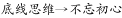

③

将①逆否和②③可以递推出④：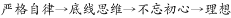

第二步：逐一分析选项。

A项翻译：，肯定条件①的后件无法得到确定性结论，排除；

B项翻译：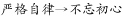，通过④可以递推出，当选；

C项翻译：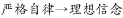，通过④只能推出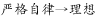，未提及信念，且文段的翻译都是针对国家公职人员这一主体展开，而C项未提及，因此C项有瑕疵，没有B项好，排除；

D项翻译：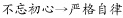，通过④可以递推出，肯定后件无法得出肯定性结论，排除。

故正确答案为B。

---

### 第 13 题　qid 2343408 · 逻辑填空

是我们党的优良传统和作风，是我们党保持同人民群众血肉联系的一个重要法宝。

- **A**. 艰苦奋斗　✅
- **B**. 联系群众
- **C**. 服务人民
- **D**. 勤俭节约

**答案**：A

**官方解析**

本题考查政治常识。
胡锦涛同志在《坚持发扬艰苦奋斗的优良作风　努力实现全面建设小康社会的宏伟目标》中指出：“艰苦奋斗作为我们党的优良传统和作风，作为我们马克思主义政党的政治本色，是凝聚党心民心、激励全党和全体人民为实现国家富强、民族振兴共同奋斗的强大精神力量，是我们党保持同人民群众血肉联系的一个重要法宝。”
故正确答案为A。

---

### 第 14 题　qid 2343410 · 逻辑填空

食用含碘食盐可满足人体对碘的摄取，人们平时使用的食盐一般是含碘食盐。我们对含碘食盐要密封保存，因为碘具有            。

- **A**. 易潮性　✅
- **B**. 挥发性
- **C**. 吸味性
- **D**. 还原性

**答案**：A

**官方解析**

本题考查科技常识。食盐中加的碘是以碘酸钾的形式存在的。
A项正确，易潮性是指物体吸收水蒸气而引起自身理化性质发生改变的特性。碘酸钾遇潮或者遇热都会分解成碘化钾，碘化钾受热会被氧化成碘。
B项错误，挥发性是指化合物由固体或液体变为气体或蒸汽的过程。碘酸钾是离子晶体，沸点高，不具挥发性，所以炒菜时不必强调在出锅前或食用时才加盐。
C项错误，吸味性是指物体存放在有异味的环境中时，有吸收异味的特性。
D项错误，还原性是指在化学反应中原子、分子或离子失去电子的能力。物质含有的粒子失电子能力越强，物质本身的还原性就越强；反之越弱，而其还原性就越弱。碘酸钾是一种较强的氧化剂，具有氧化性。
故正确答案为A。

---

### 第 15 题　qid 2343424 · 片段阅读

必须坚持党员个人服从党的组织，少数服从多数，下级组织服从上级组织，全党各个组织和全体党员服从党的全国代表大会和中央委员会，核心是：

- **A**. 党员个人服从党的组织
- **B**. 少数服从多数
- **C**. 下级组织服从上级组织
- **D**. 全党各个组织和全体党员服从党的全国代表大会和中央委员会　✅

**答案**：D

**官方解析**

本题考查政治常识。
《关于新形势下党内政治生活的若干准则》第三部分“坚决维护党中央权威”中指出：“坚决维护党中央权威、保证全党令行禁止，是党和国家前途命运所系，是全国各族人民根本利益所在，也是加强和规范党内政治生活的重要目的。必须坚持党员个人服从党的组织，少数服从多数，下级组织服从上级组织，全党各个组织和全体党员服从党的全国代表大会和中央委员会，核心是全党各个组织和全体党员服从党的全国代表大会和中央委员会。”
故正确答案为D。

---

### 第 16 题　qid 2343437 · 片段阅读

新陈代谢是生物体内全部有序化学变化的总称，其中的化学变化一般都是在酶的催化作用下进行的。下列选项中，直接体现生命新陈代谢的是：

- **A**. 长江后浪推前浪，一浪高过一浪
- **B**. 今春香肌瘦几分？缕带宽三寸　✅
- **C**. 江畔何人初见月？江月何年初照人
- **D**. 中庭地白树栖鸦，冷露无声湿桂花

**答案**：B

**官方解析**

本题考查科技常识。新陈代谢是指生物体与外界环境之间的物质和能量交换以及生物体内物质和能量的转变过程，它包括物质代谢和能量代谢两个方面。
A项错误，“长江后浪推前浪，一浪高过一浪”比喻事物的不断前进，多指新人新事代替旧人旧事，没有直接体现生命新陈代谢。
B项正确，“今春香肌瘦几分？缕带宽三寸”出自元代的《十二月过尧民歌·别情》，形容春天身体消瘦，衣带宽出三寸。诗句中的“香肌瘦”直接体现了生命体物质和能量交换过程，即新陈代谢。
C项错误，“江畔何人初见月？江月何年初照人”出自唐代张若虚的《春江花月夜》，表现了诗人神思飞跃，但又紧紧联系着人生，探索着人生的哲理与宇宙的奥秘，并未直接体现生命新陈代谢的过程。
D项错误，“中庭地白树栖鸦，冷露无声湿桂花”出自唐代王建的《十五夜望月》，意为庭院中月映地白树栖昏鸦，那寒露悄然无声沾湿桂花，描绘了自然现象，并未直接体现生命新陈代谢。
故正确答案为B。

---

### 第 17 题　qid 2343443 · 片段阅读

在管理过程中引导组织之间、人员之间建立相互协作和主动配合的良好关系，有效利用各种资源，以实现共同预期目标的活动是：

- **A**. 协调　✅
- **B**. 控制
- **C**. 决策
- **D**. 指挥

**答案**：A

**官方解析**

本题考查管理学。
A项正确，协调是管理的重要职能，是在管理过程中引导组织之间、人员之间建立相互协作和主动配合的良好关系，有效利用各种资源，以实现共同预期目标的活动。协调的对象包括组织与人员。管理协调就是正确处理人与人、人与组织以及组织与组织间的关系。
B项错误，控制是管理过程的调节器，包括制定各种控制标准，检查工作是否按计划进行，是否符合既定的标准。若工作发生偏差要及时发出信号，然后分析偏差产生的原因，纠正偏差或制定新的计划，以确保实现组织目标。
C项错误，决策是人们在政治、经济、技术和日常生活中普遍存在的一种行为。决策是管理的核心，其质量决定了组织活动的有效性。决策能力是衡量管理者水平的重要标志。
D项错误，指挥现已广泛应用于社会各界管理层面，意指上级对所属下级各种活动进行的组织领导活动，不符合题干要求。
故正确答案为A。

---

### 第 18 题　qid 2343463 · 语句表达

关于标点符号的运用，下列说法错误的一项是：

- **A**. 复句内各分句之间的停顿，除了有时用分号，一般用逗号
- **B**. 问号用于句子的末尾，表达疑问语气（包括反问、设问等）
- **C**. 句号用于句子末尾，表示陈述语气，表示说完一句话的停顿
- **D**. 书名号用于标示书名、篇名、刊物名、报纸名、网站名、文件名等　✅

**答案**：D

**官方解析**

A项，复句内各分句之间的停顿，一般用逗号。在复句内各分句之间为并列关系时，一般用分号，因此除了有时用分号，一般用逗号表述正确；B、C两项均表述正确。
D项，书名号是用于标明书名、篇名、报刊名、文件名、戏曲名、歌曲名、图画名等的标点符号，亦用于歌曲、电影、电视剧等与书面媒介紧密相关的文艺作品。网站名即网站的名称，一般出现在网站首页上，起到区分网站的目的。因此网站名不能视为作品，不能用书名号，表述错误。
本题为选非题，故正确答案为D。

---

### 第 19 题　qid 2343471 · 逻辑填空

《公务员法》规定，公务员定期考核的结果分为优秀、称职、基本称职和不称职四个等次。在年度考核中被确定为不称职的，按照规定程序                。

- **A**. 降低一个职务或者职级层次任职　✅
- **B**. 降级使用
- **C**. 降低一级工资或者降低一级职务
- **D**. 予以辞退

**答案**：A

**官方解析**

本题考查法律常识。
根据《公务员法》第五十条第二款规定：“公务员在年度考核中被确定为不称职的，按照规定程序降低一个职务或者职级层次任职。”
故正确答案为A。

---

### 第 20 题　qid 2343476 · 片段阅读

将污染物排入天然水体后引起的嗅觉、味觉、外观、透明度等方面的恶化，这种污染是属于：

- **A**. 生理性污染　✅
- **B**. 物理性污染
- **C**. 化学性污染
- **D**. 生物性污染

**答案**：A

**官方解析**

本题考查地理国情。
从卫生学上划分，通常把水污染分为四类，即生理性污染、物理性污染、化学性污染和生物性污染。
A项正确，生理性污染，是指污水排入水体后，引起感官性状恶化，所以也叫感官性污染。衡量指标主要有嗅觉、味觉、外观、透明度等。
B项错误，物理性污染，是指污水排入水体后，改变水体的物理特性，使浑浊度增高，悬浮物增加，出现颜色，水面漂浮泡沫、油膜等。衡量指标主要有浑浊度、色度、悬浮物等。
C项错误，化学性污染，是指污水排入水体后，改变了水体化学性质。如许多有机物质在水体中分解时要消耗大量溶解氧；酸碱污水使水体pH值发生变化；钙、镁盐等物质使水硬度提高；某些有毒物质超过一定量时，使水体变成“毒水”等。衡量指标主要有pH值、硬度、化学需氧量、生化需氧量、溶解氧化及汞、镉、砷、氰、铬等有毒物质含量。
D项错误，生物性污染，是指病原微生物排入水体后，可直接或间接地传染各种疾病。衡量指标主要有细菌总数、大肠菌群等。
故正确答案为A。

---

### 第 21 题　qid 2343481 · 片段阅读

当水杯盖拧不开时，人们常常用小刀或螺丝刀轻轻撬一下，一拧就开了。这主要是因为用刀撬杯盖                。

- **A**. 减小杯盖侧壁对杯的压力
- **B**. 减小杯盖与杯口的接触面积
- **C**. 减小杯内外气体的压力差　✅
- **D**. 增大杯盖另一侧对杯的压力

**答案**：C

**官方解析**

本题考查科技常识。
A、D项错误，撬动杯盖时，杯盖侧壁与水杯之间压力会增大，若用力过大，会损坏水杯。
C项正确，水杯盖拧不开主要是因为热水冷却后导致杯子内气体体积减小，杯内气压低于外界气压，使杯子内外存在一个压力差，所以水杯不易打开。这时用小刀或螺丝刀等薄片状金属轻轻撬动杯盖，外界空气会在大气压力下瞬间进入杯内，使杯子内外大气压力几乎相同，此时杯子就可以轻松地打开。
B项错误，题干表述是“轻轻撬一下”杯盖，即撬完后再去拧杯盖，故瓶盖发生弹性形变之后即可恢复原状，所以一般情况下拧杯盖时接触面积不会减小，即便是有不可恢复的形变，也几乎可以忽略不计，相比之下C项更符合题意。
故正确答案为C。

---

## 数量关系

### 第 1 题　qid 2343329 · 数学运算

从经济学角度看，任何一种商品的价格都是由成本和利润两个因素共同决定的。

- （选项）[]

**答案**：B

**官方解析**

本题主要考查经济知识。
对于商品价格由什么来决定，学界有两种不同的观点：一种是马克思政治经济学认为“商品的价格是由价值决定的，受供求关系的影响。”另外一种是西方经济学中有学者认为“价格是由供求两个因素共同决定的。”这两种说法是从两个不同的角度说了同一个问题。前者是从生产的角度说的，商品作为价值的体现物，在交换时的价格由它的价值决定，会受供求关系的影响；后者是从流通的角度说的，处在流通领域的商品，它的价格是多少，这只能由该商品的供求关系决定。
故题干表述错误。

---

### 第 2 题　qid 2343370 · 数学运算

某单位26人需要安排在ABC三种不同工作岗位上，发现不能胜任A岗位的有3人，不能胜任B岗位的有2人，不能胜任C岗位的有1人，其中，不能胜任两个及以上岗位的2人，三个岗位都不能胜任的1人，该单位多少人能够胜任所有岗位工作？

- **A**. 21人
- **B**. 22人
- **C**. 23人　✅
- **D**. 24人

**答案**：C

**官方解析**

该单位不能胜任A岗位的有3人，不能胜任B岗位的有2人，不能胜任C岗位的有1人，其中不能胜任两个岗位及以上的2人，不能胜任三个岗位的1人。根据容斥原理三集合非标准公式：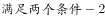。设该单位有人能胜任所有岗位工作，则，解得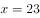人。

故正确答案为C。

---

### 第 3 题　qid 2343392 · 数学运算

某城市实行阶梯水价，标准范围内每吨水3元，超标准部分每吨5元。某居民上月用水21吨，交水费85元，该居民本月用水18吨，应该交水费多少元？

- **A**. 54
- **B**. 70　✅
- **C**. 80
- **D**. 90

**答案**：B

**官方解析**

该居民上月用水21吨，交水费85元。

方法一：设标准部分用水为吨，则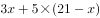，解得吨。该居民本月用水18吨，应交水费：元。

方法二：该居民本月用水18吨，相比上月少用水3吨，则本月应交水费，即本月应交水费。

故正确答案为B。

---

## 判断推理

### 第 1 题　qid 2343335 · 逻辑判断

我国社会主要矛盾已经转化为人民幸福生活需要与物质文化相对滞后之间的矛盾。

- （选项）[]

**答案**：B

**官方解析**

本题主要考查政治知识。
习近平总书记在党的十九大报告中明确指出：“我国社会主要矛盾已经转化为人民日益增长的美好生活需要和不平衡不充分的发展之间的矛盾”。
故题干表述错误。

---

### 第 2 题　qid 2343376 · 逻辑判断

推理是由一个或几个已知的判断（前提）推出新判断（结论）的过程。将对一类事物的理解整理出来，形成模式，用来理解尚不可知的事物，这种推理方式，叫做：

- **A**. 逆向推理
- **B**. 循环推理
- **C**. 以小观大
- **D**. 合理外推　✅

**答案**：D

**官方解析**

本题考查政治常识。
A项错误，逆向推理又称目标驱动推理，它的推理方式和正向推理正好相反，它是由结论出发，为验证该结论的正确性去知识库中找证据。其基本推理过程是从表示目标的事实出发，使用一组知识证明事实成立，即提出一批假设（目标），然后逐一验证这些假设的正确性。
B项错误，循环推理是指一种非形式的逻辑谬误，它将有待证明的东西假定为证明的前提，即至少有一个前提需要从有待证明的结论中得到支持。
C项错误，以小观大，中国古代美学的一种审美观照方法，多体现在艺术创作中。
D项正确，伽利略首次提出“提出假说，数学推理，实验验证，合理外推”的科学推理方法。“合理外推”就是指将对一类事物的理解整理出来，形成模式，用来理解尚不可知的事物。
故正确答案为D。

---

## 资料分析

### 第 1 题　qid 2343358 · 综合

2018年12月25日，经党中央同意，国务院批复《河北雄安新区总体规划（2018—2035年）》，进一步明确了雄安新区规划建设目标、城乡空间布局、生态保护与环境治理等方面内容。规划建设雄安新区的意义包括<u>                </u>。

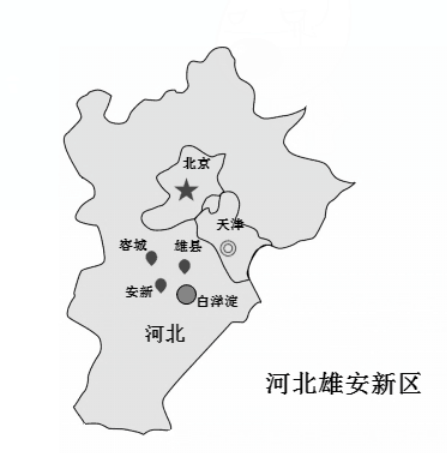

①有效缓解北京大城市病  ②促进北京市区三大产业均衡发展  ③有利于提升河北经济社会发展质量和水平  ④有利于调整优化京津冀城市布局和空间结构

- **A**. ①②③
- **B**. ①②④
- **C**. ①③④　✅
- **D**. ②③④

**答案**：C

**官方解析**

本题考查政治常识。
《河北雄安新区规划纲要》明确指出：“雄安新区作为北京非首都功能疏解集中承载地，与北京城市副中心形成北京发展新的两翼，共同承担起解决北京‘大城市病’的历史重任，有利于探索人口经济密集地区优化开发新模式；培育建设现代化经济体系的新引擎，与以2022年北京冬奥会和冬残奥会为契机推进张北地区建设形成河北两翼，补齐区域发展短板，提升区域经济社会发展质量和水平，有利于形成新的区域增长极；建设高水平社会主义现代化城市，有利于调整优化京津冀城市布局和空间结构，加快构建京津冀世界级城市群；创造‘雄安质量’，有利于推动雄安新区实现更高水平、更有效率、更加公平、更可持续发展，打造贯彻落实新发展理念的创新发展示范区，成为新时代高质量发展的全国样板。”可知①③④项符合建设雄安新区的意义。而②项所述内容在文件中没有得到体现，同时我们也知道北京市区不宜发展第一产业等耗地耗资源较大的产业。
故正确答案为C。

---

### 第 2 题　qid 2343374 · 增长

2019年2月11日新华社消息，2019年春节假期，全国旅游接待总人数4.15亿人次，同比增长，实现旅游收入5139亿元，同比增长；全国边检机关共查验出入境人员1253.3万人次，同比增长。2018年春节假期旅游收入多少亿元？

- **A**. 4532亿元
- **B**. 4625亿元
- **C**. 4749亿元　✅
- **D**. 4811亿元

**答案**：C

**官方解析**

根据“2018年春节假期旅游收入”，问题年份为材料年份的上一年，可判定本题为基期计算问题。定位材料文字部分，2019年春节假期实现旅游收入5139亿元，同比增长。根据公式，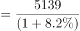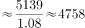亿元，C项最为接近。

故正确答案为C。

---

### 第 3 题　qid 2343379 · 综合

经党中央批准、国务院批复，自2018年起我国将每年农历        设立为“中国农民丰收节”。

- **A**. 夏至
- **B**. 立秋
- **C**. 秋分　✅
- **D**. 中秋

**答案**：C

**官方解析**

本题考查政治常识。
经党中央批准、国务院批复，自2018年起我国将每年农历秋分设立为“中国农民丰收节”。“中国农民丰收节”是第一个在国家层面为农民设立的节日。设立这一节日将进一步强化“三农”工作在党和国家工作中的重中之重地位，营造重农强农的浓厚氛围，凝聚爱农支农的强大力量，推动乡村振兴战略实施，促进农业农村加快发展。
故正确答案为C。

---

### 第 4 题　qid 2343395 · 综合

2018年12月修订的《中华人民共和国公务员法》规定，公务员的考核应当接照管理权限，全面考核公务员的德、能、勤、绩、廉，重点考核                。考核分为平时考核、专项考核和定期考核等方式。定期考核以平时考核、专项考核为基础。

- **A**. 政治素质和工作能力
- **B**. 工作能力和工作态度
- **C**. 工作态度和工作实绩
- **D**. 政治素质和工作实绩　✅

**答案**：D

**官方解析**

本题考查法律常识。
2018年12月修订的《中华人民共和国公务员法》第三十五条规定：“公务员的考核应当按照管理权限，全面考核公务员的德、能、勤、绩、廉，重点考核政治素质和工作实绩。考核指标根据不同职位类别、不同层级机关分别设置。”
故正确答案为D。

---

### 第 5 题　qid 2343422 · 增长

2018年10月，我国个税起征点提高到5000元以后，第二波红利又接踵而至。12月13日，国务院印发《个人所得税专项附加扣除暂行办法》，自2019年1月1日起，实施子女教育、大病医疗、赡养老人等        专项附加扣除。

- **A**. 3项
- **B**. 4项
- **C**. 5项
- **D**. 6项　✅

**答案**：D

**官方解析**

本题考查政治常识。
《个人所得税专项附加扣除暂行办法》指出，个人所得税专项附加扣除，是指个人所得税法规定的子女教育、继续教育、大病医疗、住房贷款利息或者住房租金、赡养老人等6项专项附加扣除。《个人所得税专项附加扣除暂行办法》明确了专项附加扣除的原则和6项专项附加扣除的扣除范围、扣除标准、扣除方式，以及保障措施等内容。
故正确答案为D。

---

### 第 6 题　qid 2343426 · 综合

根据党的十九届三中全会审议通过的《深化党和国家机构改革方案》，2018年3月22日国务院公布了国务院机构设置和部委管理的国家局设置。改革后的国务院直属机构不包括：

- **A**. 中华人民共和国海关总署
- **B**. 国家医疗保障局
- **C**. 国家工商总局　✅
- **D**. 国家税务总局

**答案**：C

**官方解析**

本题考查政治常识。
A项正确，中国海关总署是中华人民共和国国务院下属的正部级直属机构，统一管理全国海关。《深化党和国家机构改革方案》指出：“将国家质量监督检验检疫总局的出入境检验检疫管理职责和队伍划入海关总署。”
B项正确，《深化党和国家机构改革方案》第三十九条提出：“将人力资源和社会保障部的城镇职工和城镇居民基本医疗保险、生育保险职责，国家卫生和计划生育委员会的新型农村合作医疗职责，国家发展和改革委员会的药品和医疗服务价格管理职责，民政部的医疗救助职责整合，组建国家医疗保障局，作为国务院直属机构。”
C项错误，《深化党和国家机构改革方案》第三十四条提出：“将国家工商行政管理总局的职责，国家质量监督检验检疫总局的职责，国家食品药品监督管理总局的职责，国家发展和改革委员会的价格监督检查与反垄断执法职责，商务部的经营者集中反垄断执法以及国务院反垄断委员会办公室等职责整合，组建国家市场监督管理总局，作为国务院直属机构。”即不再保留国家工商行政管理总局、国家质量监督检验检疫总局、国家食品药品监督管理总局。
D项正确，国家税务总局，是国务院主管税收工作的正部级直属机构。《深化党和国家机构改革方案》指出：“国税地税机构合并后，实行以国家税务总局为主与省（自治区、直辖市）政府双重领导管理体制。”
本题为选非题，故正确答案为C。

---

### 第 7 题　qid 2343453 · 增长

2018年，河北省经济运行总体平稳、稳中向好、稳中提质。前三季度，河北省生产总值25226.3亿元，同比增长。其中，第一产业增加值1941.5亿元，增长；第二产业增加值11308.2亿元，增长；第三产业增加值11976.6亿元，增长。2018年前三季度，河北省第三产业增加值超过工业增加值多少亿元？

- **A**. 668.4亿元　✅
- **B**. 697.5亿元
- **C**. 715.6亿元
- **D**. 734.7亿元

**答案**：A

**官方解析**

定位材料文字部分：2018年前三季度，河北省第二产业（即工业）增加值11308.2亿元，第三产业增加值11976.6亿元，第三产业增加值超过工业增加值：亿元。

故正确答案为A。

---

### 第 8 题　qid 2343466 · 综合

2019年1月11日，北京市级行政中心正式迁入北京城市副中心。中共北京市委、北京市人大常委会、北京市人民政府、北京市政协自即日起正式在新址办公。北京市级行政中心新址位于              。

- **A**. 大兴区
- **B**. 顺义区
- **C**. 通州区　✅
- **D**. 昌平区

**答案**：C

**官方解析**

本题考查政治常识。2019年1月11日，北京市级行政中心正式迁入北京城市副中心。中国共产党北京市委员会、北京市人大常委会、北京市人民政府、北京市政协分别举行揭牌仪式。北京市级行政中心新址位于通州区潞城镇北运河北岸，市委、市人大常委会、市政协办公区在北、东、西三面呈品字形排列，市政府办公区位于市委办公区北侧。
故正确答案为C。

---

### 第 9 题　qid 2343475 · 综合

2019年1月3日上午10时26分，                探测器成功在月球背面着陆，此次任务实现了人类探测器首次月背软着陆、首次月背与地球的中继通信。

- **A**. 玉兔二号
- **B**. 嫦娥四号　✅
- **C**. 天宫二号
- **D**. 鹊桥号

**答案**：B

**官方解析**

本题考查科技常识。
A项错误，玉兔二号巡视器为嫦娥四号携带的任务月球车，于2019年1月3日晚间与嫦娥四号着陆器分离，顺利驶抵月球表面。
B项正确，2018年12月8日2时23分，我国在西昌卫星发射中心用长征三号乙运载火箭成功发射嫦娥四号探测器；2019年1月3日上午10时26分，嫦娥四号探测器成功在月球背面南极-艾特肯盆地冯·卡门撞击坑着陆。
C项错误，2016年9月15日22时04分，我国第一个真正的空间实验室天宫二号成功发射，为空间站时代的到来打下坚实基础，中国太空科技事业发展迈上新起点。
D项错误，鹊桥号是嫦娥四号月球探测器的中继卫星，该中继星运行在地月引力平衡点L2点的晕（halo）轨道上，为嫦娥四号的着陆器和月球车提供地月中继通信支持，于2018年5月21日发射升空。
故正确答案为B。

---
