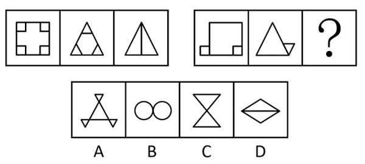
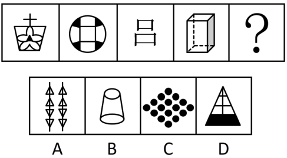
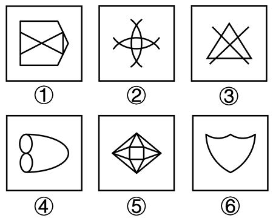
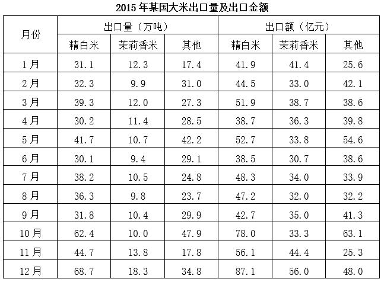
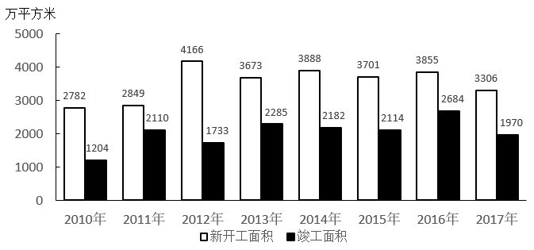

# 2020年北京市定向选调应届优秀大学毕业生《行测》题（网友回忆版）

> 选调生 · 2020 年 · 5 个模块 · 共 65 题

- [政治理论](#%E6%94%BF%E6%B2%BB%E7%90%86%E8%AE%BA) · 5 题
- [常识判断](#%E5%B8%B8%E8%AF%86%E5%88%A4%E6%96%AD) · 15 题
- [言语理解与表达](#%E8%A8%80%E8%AF%AD%E7%90%86%E8%A7%A3%E4%B8%8E%E8%A1%A8%E8%BE%BE) · 15 题
- [判断推理](#%E5%88%A4%E6%96%AD%E6%8E%A8%E7%90%86) · 20 题
- [资料分析](#%E8%B5%84%E6%96%99%E5%88%86%E6%9E%90) · 10 题

---

## 政治理论

### 第 1 题　qid 5833534 · 新思想

国家主席习近平出席亚洲文明对话大会开幕式并发表主旨演讲时提到，一切生命有机体都需要新陈代谢，否则生命就会停止。文明也是一样，如果长期（    ），必将走向衰落。

- **A**. 自我封闭　✅
- **B**. 高傲自居
- **C**. 不思进取
- **D**. 唯我独尊

**答案**：A

**官方解析**

本题考查政治常识。
A项正确，B、C、D三项错误，2019年5月15日，国家主席习近平出席亚洲文明对话大会开幕式并发表主旨演讲时提到，“第三，坚持开放包容、互学互鉴。一切生命有机体都需要新陈代谢，否则生命就会停止。文明也是一样，如果长期自我封闭，必将走向衰落。交流互鉴是文明发展的本质要求。只有同其他文明交流互鉴、取长补短，才能保持旺盛生命活力······”
故正确答案为A。

---

### 第 2 题　qid 5833558 · 毛中特

习近平总书记在党的十九大报告中指出：“伟大斗争，伟大工程，伟大事业，伟大梦想，紧密联系、相互贯通、相互作用，其中起决定性作用的是（    ）。”

- **A**. 具有许多新的历史特点的伟大斗争
- **B**. 党的建设新的伟大工程　✅
- **C**. 中国特色社会主义伟大事业
- **D**. 中华民族伟大复兴梦想

**答案**：B

**官方解析**

本题考查政治常识。
B项正确，A、C、D三项错误，党的十九大报告中“二、新时代中国共产党的历史使命”部分指出：“伟大斗争，伟大工程，伟大事业，伟大梦想，紧密联系、相互贯通、相互作用，其中起决定性作用的是党的建设新的伟大工程。推进伟大工程，要结合伟大斗争、伟大事业、伟大梦想的实践来进行，确保党在世界形势深刻变化的历史进程中始终走在时代前列，在应对国内外各种风险和考验的历史进程中始终成为全国人民的主心骨，在坚持和发展中国特色社会主义的历史进程中始终成为坚强领导核心。”
故正确答案为B。

---

### 第 3 题　qid 5833568 · 时事政治

2019年北京市政府工作报告指出，下列具体措施中，属于我市改善营商环境措施的有（    ）。
①深化“证照分离”改革
②深入开展政务服务“一网通办”
③新建一批城市休闲公园、口袋公园、小微绿地
④进一步规范社区出具证明事项，企业群众办事提供的材料减少60%以上

- **A**. ①②③
- **B**. ①②④　✅
- **C**. ①③④
- **D**. ②③④

**答案**：B

**官方解析**

本题考查政治常识。
①②④正确，2019年北京市政府工作报告在“二、2019年主要任务”中的“（二）坚持改革开放，着力推动北京高质量发展”部分指出：“持续改善营商环境······深化‘证照分离’改革，切实解决困扰企业的准入不准营问题，扩大生活性服务业企业‘一区一照’登记范围······深入开展政务服务‘一网通办’，推动‘网上可办’向‘全程通办’深化，大力推进掌上办、自助办、马上办、就近办，让越来越多的事项实现‘全市通办’······进一步规范社区出具证明事项，企业群众办事提供的材料减少60%以上，各级100个高频事项实现一次不用跑或者最多跑一次······”
③错误，2019年北京市政府工作报告在“二、2019年主要任务”中的“（一）坚持规划引领，着力推动京津冀协同发展”部分指出：“纵深推进疏解整治促提升专项行动······新建一批城市休闲公园、口袋公园、小微绿地，拆后还绿1600公顷。深入推进回龙观天通苑地区三年行动计划和三大攻坚工程，着力解决大型居住区群众关心的热点问题。”
故正确答案为B。

---

### 第 4 题　qid 5833550 · 时事政治

2019年5月31日，“不忘初心、牢记使命”主题教育工作会议在北京召开，            ，是中国共产党人的初心和使命，这个初心和使命是激励中国共产党人不断前进的根本动力。

- **A**. 民族独立，人民解放
- **B**. 为中国人民谋幸福，为中华民族谋复兴　✅
- **C**. 坚持和平发展道路，推动构建人类命运共同体
- **D**. 开辟中国特色社会主义道路，完善和发展中国特色社会主义制度

**答案**：B

**官方解析**

本题考查政治常识。
B项正确，A、C、D三项错误，十九大报告中指出：“中国共产党人的初心和使命，就是为中国人民谋幸福，为中华民族谋复兴。这个初心和使命是激励中国共产党人不断前进的根本动力。”
故正确答案为B。

---

### 第 5 题　qid 5833539 · 新思想

1920年10月，北京共产党组织成立，书记是（    ）。

- **A**. 陈独秀
- **B**. 李大钊　✅
- **C**. 董必武
- **D**. 毛泽东

**答案**：B

**官方解析**

本题考查毛中特。
A项错误，1920年，陈独秀在上海建立中国共产党发起组，进行建党活动。1921年7月，在上海举行的中国共产党第一次全国代表大会上，被选为中央局书记。
B项正确，C、D两项错误，1920年10月，李大钊、张申府、张国焘（后叛党被开除党籍）在北京大学成立北京的共产党早期组织，取名为“共产党小组”。1920年底，北京共产党小组召开会议，决定成立“共产党北京支部”，李大钊任书记，张国焘负责组织工作，罗章龙负责宣传工作。
故正确答案为B。

---

## 常识判断

### 第 1 题　qid 5833546 · 人文常识

北京“三城一区”包括中关村科学城、怀柔科学城、（    ）和北京经济技术开发区。

- **A**. 昌平科学城
- **B**. 未来科学城　✅
- **C**. 顺义科学城
- **D**. 希望科学城

**答案**：B

**官方解析**

本题考查政治常识。
B项正确，A、C、D三项错误，北京“三城一区”是指中关村科学城、怀柔科学城、未来科学城和北京经济技术开发区，其为北京加强全国科技创新中心建设的主平台。
故正确答案为B。

---

### 第 2 题　qid 5833549 · 人文常识

五四运动是1919年5月4日发生在北京的一场以青年学生为主，广大群众、市民、工商人士等中下阶层共同参与的，通过示威游行、请愿、罢工、暴力对抗政府等多种形式进行的爱国运动，其导火索是（    ）。

- **A**. 戊戌变法的失败
- **B**. 洋务运动的失败
- **C**. 袁世凯复辟
- **D**. 巴黎和会外交的失败　✅

**答案**：D

**官方解析**

本题考查人文常识。
A项错误，狭义的戊戌变法是指1898年以光绪帝为主导、由康有为等人积极参与的政治运动，主要目标是要建立一个新的政治运行机制；而广义的戊戌变法又称“戊戌维新运动”，是指自《马关条约》签订后至1898年秋维新运动因政治变动而中止的一个历史过程。
B项错误，洋务运动，又称自强运动，是19世纪60年代到90年代晚清洋务派所进行的一场引进西方军事装备、机器生产和科学技术以挽救清朝统治的自救运动。
C项错误，袁世凯复辟，1915年12月12日，袁世凯宣布接受帝位，推翻共和，复辟帝制，改中华民国为“中华帝国”，并下令废除民国纪元，改民国五年为“洪宪元年”。
D项正确，五四运动的导火索是巴黎和会上中国外交的失败。1919年1月18日，第一次世界大战获胜的27个协约国，在巴黎凡尔赛宫召开和平会议。中国作为战胜国之一，派出了5位代表参加会议。巴黎和会不顾中国提出的维护国家领土主权的三项提案，背信弃义，把德国在青岛及山东的特权，全部转让给日本。5月初，巴黎和会上中国外交失败的消息传到国内。5月4日下午二时，北京大学、北京高等师范等十几所学校的3000余名学生，高呼“还我青岛”、“取消21条”、“外争主权，内除国贼”等口号，从四面八方汇聚到天安门前，举行抗议集会。
故正确答案为D。

---

### 第 3 题　qid 5833563 · 人文常识

10月1日举行的国庆70周年阅兵活动中，装备方队备受瞩目，受阅的580台（套）装备均为国产现役主战装备，其中几款首次亮相的全新装备更是吸引了全世界的目光。关于本次阅兵活动受阅的装备，下列说法错误的是：

- **A**. “东风-41”是我国现役导弹中射程最远的型号，可以覆盖全球战略目标
- **B**. “东风-17”是我国首款正式列装的高超音速导弹，飞行速度可超过5倍音速
- **C**. 攻击-11无人机是世界首款正式服役的飞翼隐身无人机，执行任务时几乎不会被雷达发现
- **D**. 99式主战坦克是我国自主研发的第二代主战坦克，也是我国首台真正意义上的信息化坦克　✅

**答案**：D

**官方解析**

本题考查科技常识。
A项正确，“东风-41”弹道导弹是中国研发的第四代战略导弹，也是最新的一代。“东风-41”是我国现役导弹中射程最远的型号，可以覆盖全球战略目标。这款导弹总长16.5米，略超东风31-a，1.5万公里的射程也超过美国LGM-30“民兵”（1.3万公里）和俄罗斯RT-2PM2“白杨M”（1.1万公里）。
B项正确，“东风-17”导弹是我国自主研发的一款高超音速中短程常规弹道导弹，是我国解放军列装的首款高超音速导弹。其最大射程超过了2500公里，最大飞行速度甚至达到了10马赫（马赫数是速度与音速的比值）。
C项正确，攻击-11无人机作为世界上第一款正式服役的飞翼布局隐身无人攻击机，攻击-11机长超10米，翼展为14米，最大起飞重量达10吨。这款以对地攻击为主要任务的无人战机，隐身能力优秀，可在严密的对抗体系和高威胁环境下执行任务，几乎不会被雷达发现。
D项错误，99式主战坦克是我国自行研制的第三代主战坦克，由祝榆生总师主持研发。“陆战之王”99A主战坦克是我国真正意义上的首台信息化坦克。59式中型坦克是中国装备的国产第一代主战坦克，80式主战坦克是中国装备的国产第二代主战坦克。
本题为选非题，故正确答案为D。

---

### 第 4 题　qid 2264326 · 法律常识

下列犯罪行为应以盗窃罪论处的是：

- **A**. 甲窃得价值5000元的手机一部，被发现后持械抗拒抓捕
- **B**. 乙窃得同事的信用卡一张，并用其消费10000元　✅
- **C**. 丙在火车上捡到价值50000元的提包一只，经失主催要后拒不归还
- **D**. 丁为某私营公司的销售主管，在销售过程中私自将价值50000元的产品据为己有

**答案**：B

**官方解析**

本题考查法律常识。
A项错误，根据《中华人民共和国刑法》第二百六十九条规定：“犯盗窃、诈骗、抢夺罪，为窝藏赃物、抗拒抓捕或者毁灭罪证而当场使用暴力或者以暴力相威胁的，依照抢劫罪定罪处罚。”甲犯盗窃罪，为抗拒抓捕而当场使用暴力，其行为已转化为抢劫。
B项正确，根据《中华人民共和国刑法》第一百九十六条第三款规定：“盗窃信用卡并使用的，依照盗窃罪定罪处罚。”乙盗窃信用卡并使用，构成盗窃罪。
C项错误，根据《中华人民共和国刑法》第二百七十条第二款规定：“将他人的遗忘物或者埋藏物非法占为己有，数额较大，拒不交出的，依照侵占罪处罚。”丙捡到价值50000的提包，经失主催要拒不归还的行为构成侵占罪。
D项错误，根据《中华人民共和国刑法》第二百七十一条第一款规定：“公司、企业或者其他单位的工作人员，利用职务上的便利，将本单位财物非法占为己有，数额较大的，处三年以下有期徒刑或者拘役，并处罚金；数额巨大的，处三年以上十年以下有期徒刑，并处罚金；数额特别巨大的，处十年以上有期徒刑或者无期徒刑，并处罚金。”丁作为私营公司销售主管，利用职务便利将产品据为己有的行为构成职务侵占罪。
故正确答案为B。

---

### 第 5 题　qid 5833536 · 人文常识

以“六个统一”的智慧型政务服务体系为技术支撑，加强法治政府和服务型政府建设，加快推进大数据行动计划，着力打造            、北京服务、北京标准和北京诚信“营商环境四大示范工程”，努力在全国形成品牌影响力和带动力。

- **A**. 北京面貌
- **B**. 北京效率　✅
- **C**. 北京精神
- **D**. 北京速度

**答案**：B

**官方解析**

本题考查政治常识。
A、C、D三项错误，B项正确，《北京市进一步优化营商环境行动计划（2018年—2020年）》“一、总体要求”的“（三）工作框架”部分指出，“以‘六个统一’的智慧型政务服务体系为技术支撑，加强法治政府和服务型政府建设，加快推进大数据行动计划，着力打造北京效率、北京服务、北京标准和北京诚信‘营商环境四大示范工程’，努力在全国形成品牌影响力和带动力。”
故正确答案为B。

---

### 第 6 题　qid 5833541 · 人文常识

下列对应选项错误的是（    ）。

- **A**. 马丁·路德·金—我有一个梦想—宗教改革　✅
- **B**. 亚伯拉罕·林肯—葛底斯堡演说—美国南北战争
- **C**. 丘吉尔—我们将战斗到底—第二次世界大战
- **D**. 伯里克利—伯里克利葬礼演说—伯罗奔尼撒战争

**答案**：A

**官方解析**

本题考查人文常识。
A项错误，马丁·路德·金（1929年1月15日—1968年4月4日），非裔美国人，出生于美国佐治亚州亚特兰大，美国牧师、社会活动家、黑人民权运动领袖。《我有一个梦想》是马丁·路德·金在美国黑人受种族歧视和迫害由来已久的背景下，为了推动美国国内黑人争取民权的斗争进一步发展而进行的演说。
B项正确，亚伯拉罕·林肯（1809年2月12日—1865年4月15日），美国政治家、战略家、第16任总统。林肯是首位共和党籍总统，在任期间主导废除了美国黑人奴隶制。葛底斯堡演说发表于美国南北战争期间，是美国前总统林肯最著名的演说，也是美国历史上为人引用最多之演说。1863年11月19日，林肯在宾夕法尼亚州的葛底斯堡的葛底斯堡国家公墓揭幕式中发表此次演说，哀悼在葛底斯堡之役中阵亡的将士。
C项正确，温斯顿·伦纳德·斯宾塞·丘吉尔（1874年11月30日—1965年1月24日），英国政治家、历史学家、演说家、作家、记者，第61、63届英国首相。第二次世界大战全面爆发后，重任海军大臣，次年担任首相，组建联合内阁，领导英国人民对德作战。1940年6月4日丘吉尔在下院通报了敦刻尔克撤退成功，之后发表了二战中最鼓舞人心的一段讲话《我们将战斗到底》。
D项正确，伯里克利（约公元前495年—前429年），雅典执政官。他在希波战争后的废墟中重建雅典，扶植文化艺术，现存的很多古希腊建筑都是在他的时代所建。他还帮助雅典在伯罗奔尼撒战争第一阶段击败了斯巴达人。伯里克利葬礼演说是在伯罗奔尼撒战争爆发后不久，伯里克利在一场雅典举行的葬礼上，为了纪念前一年在战斗中牺牲的士兵所做的演讲。
本题为选非题，故正确答案为A。

---

### 第 7 题　qid 5833540 · 经济常识

货币转化为资本的前提条件是（    ）。

- **A**. 劳动力成为商品　✅
- **B**. 劳动力丰富
- **C**. 劳动量大
- **D**. 货币成为商品

**答案**：A

**官方解析**

本题考查经济常识。
A项正确，B、C、D三项错误，货币所有者购买到劳动力以后，在消费它的过程中，不仅能够收回他在购买这种商品时支付的价值，还能得到一个增殖的价值即剩余价值。而一旦货币购买的劳动力带来剩余价值，货币也就变成了资本，劳动力成为商品是货币转化为资本的前提条件。
故正确答案为A。

---

### 第 8 题　qid 5833564 · 科技常识

下列属于新能源的是（    ）。

- **A**. 太阳能、潮汐能、地热能、核能　✅
- **B**. 煤、石油、天然气
- **C**. 太阳能、水能、风能、地热能
- **D**. 太阳能、水能、风能、地热能、潮汐能、核能

**答案**：A

**官方解析**

本题考查科技常识。
A项正确，B、C、D三项错误，能源按照使用类型可分为常规能源和新能源。利用技术上成熟，使用比较普遍的能源叫做常规能源。包括一次能源中的可再生的水力资源（水能）和不可再生的煤炭、石油、天然气等资源。新近利用或正在着手开发的能源叫做新能源。新能源是相对于常规能源而言的，包括太阳能、风能、地热能、海洋能、潮汐能、生物能、氢能以及核能等资源。
故正确答案为A。

---

### 第 9 题　qid 5833547 · 法律常识

媒体在案件审理时的报道要求不正确的是（    ）。

- **A**. 媒体不是法官，案件判决前，媒体不应作出定罪、定性的报道
- **B**. 不应指责诉讼参与人及当事人正当行使权利的行为
- **C**. 对案件报道中涉及的未成年人、妇女、老人和残疾人等的权益不应予以特别的关切　✅
- **D**. 对不公开审理的涉及国家机密、商业秘密、个人隐私案件的案情，不宜详细报道

**答案**：C

**官方解析**

本题考查法律常识。
A项正确，根据《中华人民共和国刑事诉讼法》第十二条规定：“未经人民法院依法判决，对任何人都不得确定有罪。”媒体没有定罪、定性的权利。
B项正确，根据《中华人民共和国刑事诉讼法》第十四条第一款规定：“人民法院、人民检察院和公安机关应当保障犯罪嫌疑人、被告人和其他诉讼参与人依法享有的辩护权和其他诉讼权利。”此外，《中华人民共和国民事诉讼法》和《中华人民共和国行政诉讼法》均规定当事人和诉讼参与人有权正当行使权利。
C项错误，未成年人、妇女、老人和残疾人等由于生理等原因，在一定程度上属于弱势群体，我国多部法律对此有特殊规定，因此媒体报道时应给予特别关切。
D项正确，根据《中华人民共和国刑事诉讼法》第一百八十八条第一款规定：“人民法院审判第一审案件应当公开进行。但是有关国家秘密或者个人隐私的案件，不公开审理；涉及商业秘密的案件，当事人申请不公开审理的，可以不公开审理。”此外，《中华人民共和国民事诉讼法》和《中华人民共和国行政诉讼法》均规定了部分案件不公开审理，对于这些案件，媒体不宜详细报道。
本题为选非题，故正确答案为C。

---

### 第 10 题　qid 5833537 · 人文常识

以下哪位不是因为官廉洁出名？

- **A**. 子罕
- **B**. 于谦
- **C**. 商鞅　✅
- **D**. 于成龙

**答案**：C

**官方解析**

本题考查人文常识。
A项正确，乐喜（生卒年不详），子姓，乐氏，名喜，字子罕，春秋时期宋国商丘（今河南商丘）人，宋国贤臣。在宋平公（公元前575年-公元前532年）时任司城，位列六卿。清正廉洁，受人爱戴。有子罕辞玉的典故。
B项正确，于谦（1398年-1457年），字廷益，号节庵。明朝名臣、民族英雄、军事家、政治家。作风廉洁，为人耿直。
C项错误，商鞅（约公元前390年-公元前338年），姬姓，公孙氏，名鞅，卫国人。战国时期政治家、改革家、思想家、军事家，法家代表人物，卫国国君后代。商鞅本名叫卫鞅或者公孙鞅，后世之所以叫商鞅，是因为到秦国变法，有大功于秦而受封，被尊为商君。故商鞅因变法而闻名。
D项正确，于成龙（1638年~1700年），汉军镶红旗人，字振甲，号如山。历任乐亭知县、通州知州、江宁知府、安徽按察使、直隶巡抚、都察院左都御史、汉军都统、兵部尚书、加总督衔直隶巡抚、河道总督等职。为官期间廉洁自持，多有善政，宦绩斐然。
本题为选非题，故正确答案为C。

---

### 第 11 题　qid 5833561 · 人文常识

关于京张铁路与京张高铁描述错误的是（    ）。

- **A**. 京张铁路连接北京与张家口
- **B**. 京张高铁连接北京与崇礼，途径张家口　✅
- **C**. 京张铁路是中国人民首条自行设计的铁路
- **D**. 京张高铁是我国首条智能化高铁

**答案**：B

**官方解析**

本题考查科技常识。
A、C两项正确，京张铁路为詹天佑主持修建并负责的铁路，它连接北京丰台区，经八达岭、居庸关、沙城、宣化等地至河北张家口，全长约200公里。1905年9月开工修建，于1909年建成，是中国首条不使用外国资金及人员，由中国人自行设计，投入营运的铁路。现称为京包铁路，以前的京张段为北京至包头铁路线的首段。
B项错误，D项正确，京张高速铁路又名京张客运专线，即京包客运专线京张段，是一条连接北京与河北张家口的城际高速铁路。京张高速铁路是2022年北京冬奥会的重要交通保障设施，是中国第一条采用自主研发的北斗卫星导航系统、设计速度350千米/小时的智能化高速铁路，也是世界上第一条最高设计速度350千米/小时的高寒、大风沙高速铁路。
本题为选非题，故正确答案为B。

---

### 第 12 题　qid 5833544 · 人文常识

眼见不一定为实，说明（    ）。
①事物的属性是人的意识赋予的
②人的思维活动具有创造性
③事物的复杂性易让人产生错觉
④认识是主体对客体的反映

- **A**. ①③
- **B**. ①④
- **C**. ②③　✅
- **D**. ②④

**答案**：C

**官方解析**

本题考查政治常识。
①错误，辩证唯物主义物质观认为，物质是独立于人的意识，而又为人的意识所能感觉到的、所能认知的客观实在。客观实在性是物质的唯一特性。运动是物质的根本属性和存在方式。该项本身说法错误。
②正确，④错误，辩证唯物主义认识论认为，认识的本质是主体对客体的能动反映，它不但具有再现客体内容的反映性特征，而且具有实践所要求的主体能动的、创造性特征，认识是主体以实践为基础对客体能动的、创造性的思维再现。反映的摹写性绝不是说认识只是人的主观对客观对象简单、直接的描摹，或照镜子式的原物映现，而是一种在思维中的能动的、创造性的活动。“眼见不一定为实”体现了人对事物的认识不是照镜子式的原物映现，而是会经过思维活动的“加工”。
③正确，由于客观事物本身的复杂性及发展过程的无限性，人对事物的认识要受到主观和客观条件的限制，特别是受到具体的实践水平的限制，因此，认识的发展要经过“实践、认识、再实践、再认识”的循环往复、以至无穷的过程。“眼见不一定为实”说明了人的认识会受当时当地主客观条件的限制，不一定能认清事物的全貌。
综上，②③正确。
故正确答案为C。

---

### 第 13 题　qid 5833538 · 人文常识

70周年国庆阅兵，下列哪个方阵不是第二次亮相？

- **A**. 火箭军方队
- **B**. 战略支援部队方队　✅
- **C**. 联勤保障部队方队
- **D**. 武警部队方队

**答案**：B

**官方解析**

本题考查政治常识。
B项错误，A、C、D三项正确，战略支援部队于2015年12月31日组建，作为维护国家安全的新型作战力量、新质作战能力的重要增长点，战略支援部队方队在2019年的国庆70周年阅兵中首次亮相，接受祖国和人民的检阅。
本题为选非题，故正确答案为B。

---

### 第 14 题　qid 5833554 · 人文常识

在深化“街乡吹哨、部门报到”改革中，北京市积极适应社会治理的新特点、新规律，把（    ）作为加强和创新社会治理的重要抓手和有效载体。

- **A**. 吹哨报到
- **B**. 接诉即办　✅
- **C**. 党建引领
- **D**. 专事专办

**答案**：B

**官方解析**

本题考查政治常识。
A、C、D三项错误，B项正确，《中共北京市委 北京市人民政府关于进一步深化“接诉即办”改革工作的意见》指出：“‘接诉即办’是党建引领‘街乡吹哨、部门报到’改革的深化延伸，是首都基层治理的改革创新，是落实以人民为中心的发展思想的生动实践。”在深化“街乡吹哨、部门报到”改革中，北京市把“接诉即办”作为加强和创新社会治理的重要抓手和有效载体，成立由政府领导分工负责的“接诉即办”工作领导小组，将党的领导贯穿于“接诉即办”工作全过程。
故正确答案为B。

---

### 第 15 题　qid 5833567 · 人文常识

第一次世界大战爆发的导火线是（    ）。

- **A**. 争夺巴尔干半岛
- **B**. 萨拉热窝事件　✅
- **C**. 奥匈帝国向塞尔维亚宣战
- **D**. 帝国主义两大军事集团的形成

**答案**：B

**官方解析**

本题考查人文常识。
A项错误，在欧洲列强的角逐中，巴尔干成为当时帝国主义矛盾的焦点，对巴尔干半岛的控制权成为列强争夺的重点。而统治巴尔干地区的奥斯曼土耳其帝国逐步走向衰弱，到19世纪已经难以维持在巴尔干的有效统治。所以，那里成为欧洲列强企图进行再瓜分的热点地区。在欧洲列强争夺巴尔干半岛期间爆发了两次巴尔干战争，第一次巴尔干战争是指在1912年至1913年间，巴尔干同盟国想要马其顿和色雷斯的自治权而同奥斯曼土耳其进行的斗争；第二次巴尔干战争发生于1913年，是指巴尔干同盟内部为争夺领土和地位而爆发的一系列战争。巴尔干战争的爆发和结束，也间接导致了第一次世界大战的爆发。
B项正确，萨拉热窝事件于1914年6月28日在巴尔干半岛的波斯尼亚发生。奥匈帝国皇储弗兰茨·斐迪南为对塞尔维亚炫耀武力，到波斯尼亚检阅部队，被塞尔维亚民族主义者普林西普枪杀。这次事件导致奥匈帝国向塞尔维亚宣战，成为了第一次世界大战爆发的导火线。
C项错误，1914年7月28日，奥匈帝国由于其皇储在萨拉热窝被刺向塞尔维亚宣战，战争爆发。
D项错误，第一次世界大战爆发前，帝国主义列强都在激烈的竞争中寻找同盟者，以壮大自己的力量并压倒对方。于是，形成了两大对立的帝国主义军事集团：“三国同盟”和“三国协约”（简称“同盟国”和“协约国”）。其中，同盟国包括德国、意大利和奥匈帝国，协约国包括英国、法国和俄国。
故正确答案为B。

---

## 言语理解与表达

### 材料 1

        一般说来，冲突具有两种形式：内在冲突和外在冲突。如果把江南文化放到人类三个文明框架——农业文明、工业文明和信息文明——中考察，可以看到这两种冲突在江南文化中的具体体现。

        农业文明是在18世纪之前形成的文明形态，在这个历史阶段，整个江南文化发展面临的冲突是内在思想观念之间的冲突，工业文明是指1750年之后的文明形态，外来的西方现代性给江南文化带来猛烈冲击，导致江南文化出现自身的分化和转型。信息文明则是20世纪80年代以后，在信息技术、虚拟现实技术、人工智能技术基础上形成的文明形态，全球化带来的新冲击加速了江南文化的分裂和转型。当前，江南文化正面临着五重冲突：传统与现代的冲突、地方与全球的冲突、记忆与感知的冲突、想象与表征的冲突、虚拟与现实的冲突。 

        第一种形式是传统与现代的冲突。与古人相比，现代人的生活方式、饮食习惯、娱乐方式逐渐趋向现代。首先是传统工艺与现代技术的冲突。无论是江南地区的街头还是一些博物馆，依然可以看到一些民间传统工艺与表演，但与此同时，白天飞驰的汽车、夜晚闪烁的电子屏幕，快速发展的现代技术不仅给人们带来了强制和压力，也把人们带到了冲突的场域。其次是传统娱乐方式与现代流行方式的冲突。江南地区的民歌小调极美，包括已经入选世界非物质文化遗产的昆曲，可惜的是，现在只有在一些商业游船上才能听到一些，同时也少了很多韵味。与之相对的是，舞曲、流行乐在不断刺激着人们的消费神经，人们主动接触民歌昆曲的几率降低。再者是传统建筑与现代建筑的冲突。行走于江南小镇，小河之上依然保留着古老的小桥，这构成了“小桥流水”的传统意象，但不远处，商业街、高楼大厦和汽车在街道上发出的嘈杂声，又将人们带到了现代世界中，这种冲突带给人们一种错觉，仿佛置身于不同的时空。更有传统美食和现代饮食上的冲突。这些现象呈现出一种奇特的关系，有冲突、有张力、有抗争、有苟全，并通过传统与现代这两级表达出来。 

        第二种形式是地方与全球的冲突。在传统社会中，人们固守在土地上，形成了较浓厚的地方乡土观念，但在全球化的今天，流动成为地方空间的一个重要特征。江南地区成为全球经济不可缺少的部分，很多国际知名企业在此地设立分部，不少国际知名高校也在此设立合作高校。地方性文化也成为世界文化的整体部分，这显示出强烈的、不可阻挡的流动趋势，也显示出江南地区与全球其他文化之间的冲突，来自全球或物质或精神的因素导致了江南地区物质空间、社会空间、文化空间、精神世界的重构。 

        第三种形式是记忆与感知的冲突。一般说来，人们对江南的认知多是通过文学作品、艺术作品和历史文本获得的，一种关于江南文化的“青绿”印象通过这些作品已然形成，构成了人们对江南的文化记忆。但这些只是文化记忆和印象中的江南，一旦走在上海、南京、无锡、常熟等地的街头，人们感知到的江南印象却与别处没有太大差异。<u>                    </u>。 

        第四种形式是想象与表征的冲突。在大多数情况下，由于地理和制度上的限制，北方人更多是从文学作品中了解江南，尤其是通过文学、历史、影视等文本形成江南认知和记忆，而这构成了他们对于江南地区乃至文化想象的基础，整个江南文化及其印象也因此而构建起来，形成了独特的江南记忆。然而，这种基于文学想象的江南记忆逐渐被基于文化产业的江南表征不断冲击。同时，现实带来的冲击也是非常明显的。文本和影视作品中的江南难以寻觅，由于全球化、城市化和科技的发展，北方人认识到江南地区的途径更加多元化，通过多种方式被塑造起来的表征却仅仅是各类感知刺激的不断重复，难以长存。 

        第五种形式是<u>                    </u>。数字化已经成为了全球化在智能时代的新兴形态，这也构成了江南文化的时代背景。在这一背景下，数字地球、数字亚洲不再停留在概念上，而是进入现实层面的构建中。“数字化江南”或者“江南数字化”会成为一种新的形式展现出来，成为实现江南传统文化创造性转化和创新性发展的可能性途径。面临这一情况，我们需要面对一些现实问题：江南人生活的数字化如何不同于其他地方？可以选择哪些历史因素加以数字化？江南文化的数字化趋势将如何改变中国的文化世界？因而，我们需要认真反思江南地区在全球数字化中扮演的角色、江南社区数字化联结的社会、政治、经济和艺术功能等问题。 

        从上述角度来说，江南文化是在不同类型的冲突与融合中锻造而出，继而形成了江南文化的特质。在江南文化形成自身特性的过程中，多重冲突如同一座熔炉，把江南文化锻造得更为紧实。它们不仅从内在生命体验（认知、情感和记忆）表现出来，也从人类社会生活（如生活、生产）、外在的物质因素（物理世界、技术世界）表达出来。在全球化迅猛发展的今天，江南人诠释生命的方式出现了新的情况。那么，在全球化的大背景下，这种生命诠释遭遇了哪些问题？按照康德的说法，江南人对生命的理解是否经历了从自然状态到理性状态的转变，抵达了受自由精神主导、受法制约束的状态？ 

        显而易见的是，江南地区的人们正是经历了上述冲突，依然守护着本有的精神观念和对生命的诠释方式。他们追求着一种自由精神。这种精神在古代体现为各种乡村活动的恬淡自由中，在近代体现在一百多年前江南人不断探讨乡村自治的历史过程中。只是在文化冲突过程中，不可避免地出现了文化发展中的断裂，进而引发了文化灾难性的遗忘现象。在这种情况下，我们的选择是：面对传统，不仅仅是传承，而且是进行创造性转化和创新性发展；面对地方，要让其言说面向世界，焕发新生；面对文化记忆，要通过多种方式给予激活，唤起人内心中的情感与认同。利用文化想象和现代技术手段让江南文化重新塑形，也只有这样，才能够实现其作为世界性现象的存在价值。 

#### 第 1 题　qid 5833577 · 语句表达

工业文明时期江南冲突的表现是（    ）。

- **A**. 工业文明时期，整个江南文化发展面临的冲突是内在思想观念之间的冲突
- **B**. 关于记忆与感知的冲突，是工业文明时期就明显的特征
- **C**. 工业文明时期，整个江南文化发展面临的冲突是外来的、现代的与本地的、传统的冲突　✅
- **D**. 关于想象与表征的冲突，是工业文明时期就明显的特征

**答案**：C

**官方解析**

A项，根据“农业文明是······在这个历史阶段，整个江南文化发展面临的冲突是内在思想观念之间的冲突”可知，内在思想观念之间的冲突为农业文明时期的冲突，“工业文明时期”偷换时态，排除；
B项，根据“当前，江南文化正面临着五重冲突：传统与现代的冲突、地方与全球的冲突、记忆与感知的冲突、想象与表征的冲突、虚拟与现实的冲突”可知，记忆与感知的冲突为当前的冲突，“工业文明时期”偷换概念，排除；
C项，根据“工业文明是指······外来的西方现代性给江南文化带来猛烈冲击，导致江南文化出现自身的分化和转型”可知，工业文明时期的冲突是外来的、现代性的西方文化与江南地区本地的、传统的文化之间的冲突，表述正确，当选；
D项，根据“当前，江南文化正面临着五重冲突：传统与现代的冲突、地方与全球的冲突、记忆与感知的冲突、想象与表征的冲突、虚拟与现实的冲突”可知，想象与表征的冲突为当前的冲突，“工业文明时期”偷换概念，排除。
故正确答案为C。
【文段出处】光明网《在冲突与融合发展中为江南文化重新塑形》

---

#### 第 2 题　qid 5833578 · 语句表达

填入原文中第五段横线处最恰当的句子是（    ）。

- **A**. 江南文化给予历代文人以极大的审美愉悦和精神享受，是一种审美文化
- **B**. 中原体制文化的大传统和江南文化相对自由的小传统构成了中国文化的某种张力，促进了中国文化在互补中的发展
- **C**. 于是，很多人认为江南也不过如此，其吸引力、感召力便大打折扣
- **D**. 这一切不断颠覆和解构着人们对江南文化的记忆形象，难以找寻到文本中描述的江南意象　✅

**答案**：D

**官方解析**

本题为语句填空题，横线位于第五段结尾，需结合前文进行分析。文段开头引出“记忆与感知的冲突”，后文对这一冲突进行具体解释说明。先论述人们通过各种文本作品获取了对江南的认知，随后通过“但”进行转折，指出人们实际感知到的江南印象与别处相类似，没有其特殊之处。故横线处对前文进行总结，应强调我们实际感知到的江南和从文本中获取的江南记忆不一致、有冲突，即现实感知颠覆了我们记忆中的江南形象，对应D项。
A项，第五段主要论述的是“记忆与感知的冲突”，“审美文化”无法体现这一冲突，排除；
B项，“中原体制文化的大传统和江南文化相对自由的小传统”文段未提及，无中生有，排除；
C项，没有体现记忆与感知的冲突，且前文只是客观描述记忆与感知不一致，无法直接得出“吸引力、感召力便大打折扣”，排除。
故正确答案为D。
【文段出处】光明学术《在冲突与融合发展中为江南文化重新塑形》

---

#### 第 3 题　qid 5833581 · 片段阅读

文中小标题应该填的是（    ）。

- **A**. 虚拟与现实　✅
- **B**. 共性与个性
- **C**. 科技与人文
- **D**. 概念与实践

**答案**：A

**官方解析**

根据提问方式可判定本题为标题填入题，定位小标题缺失的段落为第七段，根据前文第二段内容“当前，江南文化正面临着五重冲突：传统与现代的冲突、地方与全球的冲突、记忆与感知的冲突、想象与表征的冲突、虚拟与现实的冲突”可知，前面四种冲突形式已经分别作为前面段落的小标题出现，按照论述逻辑来看，文中缺失的小标题，第五种形式对应第五重冲突“虚拟与现实的冲突”。且验证第七段后文的内容“数字地球、数字亚洲不再停留在概念上，而是进入现实层面的构建中”和“面临这一情况，我们需要面对一些现实问题”，对应A项。
B项“共性与个性”、C项“科技与人文”、D项“概念与实践”，均与第七段的内容无关，排除。
故正确答案为A。
【文段出处】《在冲突与融合发展中为江南文化重新塑形》

---

#### 第 4 题　qid 5833584 · 片段阅读

这篇文章的大意是（    ）。

- **A**. 文化冲突在不同时期的表现形式
- **B**. 文化冲突在不同维度的表现形式
- **C**. 江南文化面临着多种形式、多种来源的冲突，我们要了解冲突、直面冲突，发挥江南文化的价值　✅
- **D**. 只要利用文化想象和现代技术手段就能让江南文化重新塑形，实现其作为世界性现象的存在价值

**答案**：C

**官方解析**

第一段引出话题，即把江南文化放到农业文明、工业文明和信息文明中考察，可以看到内在冲突和外在冲突在江南文化中的具体体现，第二段先具体介绍这三个时期的冲突，然后说明当前江南文化正面临着五重冲突，第三段到第七段具体解释当下的五重冲突，第八段总结上文，即多重冲突如同一座熔炉，把江南文化锻造地更为紧实，接着说明在全球化迅猛发展的今天，江南人诠释生命的方式出现了新的问题和转变，第九段提出对策，说明利用文化想象和现代技术手段让江南文化重新塑形，实现其作为世界性现象的存在价值。故文章先引出江南文化面临冲突的话题，之后分析冲突给江南文化带来的转变和问题，最后给出对策以实现江南文化的价值，对应C项。
A项，“文化冲突在不同时期的表现形式”对应第二段的内容，概括片面，且缺少主题词“江南文化”，排除；
B项，“文化冲突在不同维度的表现形式”对应第三段到第七段的内容，概括片面，且缺少主题词“江南文化”，排除；
D项，“只要······就”，表述过于绝对，排除。
故正确答案为C。
【文段出处】光明网《在冲突与融合发展中为江南文化重新塑形》

---

#### 第 5 题　qid 5833585 · 语句表达

随着人类命运共同体的提出，多元价值观的交流，江南文化也在冲突和融合中面临重塑，这属于哪一种冲突（    ）。

- **A**. 传统与现代
- **B**. 地方与全球　✅
- **C**. 记忆与感知
- **D**. 想象与表征

**答案**：B

**官方解析**

B项，根据文章第四段“但在全球化的今天，流动成为地方空间的一个重要特征。江南地区成为全球经济不可缺少的部分······来自全球或物质或精神的因素导致了江南地区物质空间、社会空间、文化空间、精神世界的重构”可知，随着全球化和人类命运共同体的提出，地方流动性加大，带来了多元价值观的交流，故该冲突属于地方与全球的冲突，当选。
A项，“传统与现代”冲突的主要特点为现代技术、现代流行方式、现代建筑对传统层面的冲击，与“多元价值观”无关，排除；
C项，“记忆与感知”冲突的主要特点为人类对江南的文化记忆与现代的真实感知之间的冲突，与“多元价值观”无关，排除；
D项，“想象与表征”冲突的主要特点为北方对江南的文化记忆和想象受到现代的冲击，文学和影视中的江南难以寻觅，与“多元价值观”无关，排除。
故正确答案为B。
【文段出处】《在冲突与融合发展中为江南文化重新塑形》

---

#### 第 6 题　qid 5833548 · 逻辑填空

我们的传统文化经历了            的五四新文化运动，这种            的新潮使其受到从未有过的挑战和冲击，是一次            的洗礼。在改革开放发展进步中，我们的传统文化终于迈开了社会主义现代化的大步。
依次填入画横线部分最恰当的一项是：

- **A**. 振聋发聩 狂飙突进 脱胎换骨
- **B**. 醍醐灌顶 急流勇进 旧瓶新酒
- **C**. 振奋人心 循序渐进 鲤跃龙门
- **D**. 振臂一呼 倍道兼进 推陈出新　✅

**答案**：D

**官方解析**

第一空，搭配“五四新文化运动”，C项“振奋人心”指使人们振作奋发，D项“振臂一呼”指挥动手臂呼喊（多用在号召），均与“五四新文化运动”搭配得当，保留。A项“振聋发聩”指声音很大，使耳聋的人也听得见，比喻用语言文字唤醒糊涂麻木的人，使他们清醒过来，与“五四新文化运动”搭配不当，排除；B项“醍醐灌顶”比喻听了高明的意见使人受到很大启发，文段未体现听取意见，且与“五四新文化运动”搭配不当，排除。
第二空，搭配“新潮”，根据“使其受到从未有过的挑战和冲击”可知，横线处强调该新潮是较为激烈的，D项“倍道兼进”形容加快速度行进，可体现激烈的含义，符合文意，保留。C项“循序渐进”指学习工作等按照一定的步骤逐渐深入或提高，与文意不符，排除。
第三空，代入验证，D项“推陈出新”指去掉旧事物的糟粕，吸取其精华，使它以新的面目出现，表达这次运动是一次去旧迎新的洗礼，对应后文“终于迈开了社会主义现代化的大步”，符合文意，当选。
故正确答案为D。

---

#### 第 7 题　qid 5833553 · 逻辑填空

《山经》是一部基于实地观察和科学测量的地理志，虽然不能        由于古人测量技术不精而导致的系统性误差，但《山经》中里程数字殆非凭空杜撰，其所记载的方位、里程尽皆可凭，这些数字将是考证《山经》地域范围、各条山列的广度以及各个山峦之所在位置的可靠        。
依次填入画横线部分最恰当的一项是：

- **A**. 偏信 证据
- **B**. 否认 参考
- **C**. 无视 参照
- **D**. 排除 依据　✅

**答案**：D

**官方解析**

第一空，搭配“误差”。B项“否认”指拒绝承认，C项“无视”指不放在眼里、不认真对待，D项“排除”指消除掉，均与“误差”搭配恰当，且置于文段能体现出系统性误差真实存在、不能忽略之意，保留。A项“偏信”意思是相信一方，通常不与“误差”搭配使用，排除。
第二空，搭配“可靠”，且“这些数字”指代前文《山经》中的里程数字，根据前文“《山经》中里程数字殆非凭空杜撰，其所记载的方位、里程尽皆可凭”可知，这些数字并非凭空杜撰，而是具有真实性，为确定《山经》中地理区域、山脉分布和位置发挥了重要作用。D项“依据”指把某种事物作为依托或根据，符合文意，当选。B项“参考”指为了学习或研究某一方面知识而查阅有关资料，利用有关材料帮助了解情况，C项“参照”指参考并仿照（方法、经验等），通常均不与“可靠”搭配使用，且D项相比B、C两项，更能体现出相关信息的真实性，故排除B、C两项。
故正确答案为D。
【文段出处】《刘宗迪：〈山海经〉的尺度》

---

#### 第 8 题　qid 5833533 · 逻辑填空

一个生命的品质如何，通过他所选择的娱乐尽显无遗；一个民族的品质如何，通过他们的娱乐方式            。娱乐的方式增多，是因为人类的科技进步。但是，人们的精神需求、思想情怀、心灵境界，却未见得能随科技进步而同步前进，尤其当经济与文化发展未能            的时候。
依次填入画横线部分最恰当的一项是：

- **A**. 尽收眼底 并驾齐驱　✅
- **B**. 一览无余 相得益彰
- **C**. 无所遁形 各有千秋
- **D**. 可见一斑 势均力敌

**答案**：A

**官方解析**

第一空，根据“；”以及相同句式“一个生命的品质如何······一个民族的品质如何······”可知，横线处所填成语应与前文“尽显无遗”构成同义并列，“尽显无遗”指全部显露出来，没有一点隐藏的，A项“尽收眼底”指可以把景物全部看在眼里，B项“一览无余”形容视野开阔或事物简单明了，一下就能全都看到，均与文意相符，保留。C项“无所遁形”指没有地方可以隐藏形迹、身影，赤裸裸地展现在人们面前，侧重无处躲藏，与文意不符，排除；D项“可见一斑”指由事情的某一点可推论其全貌，与文意无关，排除。
第二空，根据前文可知，横线处所填成语说明经济与文化发展未能同步，需体现同步前进之意，A项“并驾齐驱”比喻齐头并进，不分前后，也比喻地位或程度相等，不分高下，与文意相符，当选。B项“相得益彰”指相互帮助、互相补充，更能显出好处，不能体现同步前进之意，排除。
故正确答案为A。
【文段出处】人民日报《勿因娱乐反智识 生而为人的尊严不可忽视》

---

#### 第 9 题　qid 5833551 · 逻辑填空

在说服别人时能            ，对方才会心悦诚服地接受我们的意见；在办事时学会            ，才能取得事半功倍的效果；在市场竞争中，能顺应形势，能有效利用对方的产品优势和市场战略而采取紧逼盯人的战术，更是取得成功的            。
依次填入画横线部分最恰当的一项是：

- **A**. 因势利导 顺水推舟 不二法门　✅
- **B**. 推心置腹 察言观色 必由之路
- **C**. 不厌其烦 随机应变 终南捷径
- **D**. 以诚相待 见机行事 制胜法宝

**答案**：A

**官方解析**

第一空，“；”提示并列，故题干中的三个并列分句所阐述的内容应相近，结合最后一个分句“能顺应形势，能有效利用对方的产品优势和市场战略”可知，横线处应强调在说服别人时，也要善于“顺应形势”“利用······优势······”。A项“因势利导”指顺着事物发展的趋势加以引导，符合文意，保留。B项“推心置腹”比喻真诚待人，C项“不厌其烦”指不嫌烦琐与麻烦，形容有耐心，D项“以诚相待”指以至诚之心待人，均无法与后文构成并列，排除。
第二空，代入验证。A项“顺水推舟”比喻顺着某个趋势或某种方式说话办事，与“因势利导”语义相近，且可与“能顺应形势，能有效利用对方的产品优势和市场战略”构成并列，保留。
第三空，代入验证。A项“不二法门”比喻最好的或独一无二的方法，填入文段用以说明“顺应形势”等做法是取得成功的好方法，符合文意，当选。
故正确答案为A。

---

#### 第 10 题　qid 5833562 · 片段阅读

由于被地球潮汐锁定，月球只能永远以同一面朝向地球。人类在地球上不仅从未见过月球背面，过去的月球探测也只探测了一些局部区域。在月球背面，可能会获得一些在月球正面难以得到的数据。艾特肯盆地在月球南极附近，是个古老的区域，含有许多月球初始的信息。另外，月球背面可以屏蔽来自地球的辐射影响，在那里对深空进行探测，能获得更真实的宇宙信息。
这段文字主要介绍了：

- **A**. 探测月球背面的意义　✅
- **B**. 探测月球对探索宇宙的价值
- **C**. 探测月球的未来规划
- **D**. 月球背面难以探测的原因

**答案**：A

**官方解析**

文段首先说明因为地球潮汐，人们只能看到月球一面，甚至过去也只能探测到月球的局部区域，由此引出月球背面这一话题，紧接着提出在月球背面能获得一些在月球正面难以得到的数据，并通过“另外”引导两方面的并列具体解释说明，故文段为分总分结构，重在强调人类探测月球背面的重要意义，对应A项。
B项，缺少主题词“月球背面”，并且“探索宇宙的价值”属于“另外”之后的内容，表述片面，排除；
C项，缺少主题词“月球背面”，且“未来规划”文段未提及，无中生有，排除；
D项，“月球背面难以探测的原因”对应首句引出话题，非重点，排除。
故正确答案为A。
【文段出处】北晚在线《兼顾月球背面和地球，嫦娥四号中继卫星有了一个诗意的名字》

---

#### 第 11 题　qid 5833591 · 语句表达

机器人看似有益无害，无人驾驶汽车也已经上路测试，无人机已开始进行送货服务，但当这些机器成为武器，踏上战场的那一刻，不但所有的温情都会被撕去，连战争的伦理都会被改写。自主武器在接到攻击指令后，不再需要人的开火指挥，攻击的时机也由算法作出最优选择。它们在数分钟、数天乃至数周长的时间里自行跟踪目标，然后选择所谓的最佳时间将目标消灭。此外，自主武器更难区分攻击目标。目前国际人道法重要的一条是，在攻击时要清楚区分作战者和平民，尽量避免攻击平民和民用设施。机器不懂国际法，也无法依据道德而行动，难以区分攻击目标。因此国际法专家们要求：                    。
填入画横线句子最恰当的一项是：

- **A**. 机器人应学习自主掌控自主武器
- **B**. 人类必须始终拥有对攻击的最后控制权　✅
- **C**. 自主武器应提升智能化和自动化水平
- **D**. 各国拥有自主武器的规模应有所控制

**答案**：B

**官方解析**

横线位于文段结尾，是对前文的总结概括。文段首先引出“机器人”的话题，接着通过转折强调，机器成为武器会带来危害，然后从两方面具体说明自主武器带来危害的原因，即自主武器开火不需要人类指挥和其难区分攻击目标，最后说明自主武器不符合国际人道法的规定，故文段结尾应强调战争中攻击的控制权应掌握在人类的手中，对应B项。
A项“学习自主掌控自主武器”、C项“提升智能化和自动化水平”，均无中生有，且无法解决文中自主武器的问题，排除；
D项，“各国拥有自主武器的规模”文段未提及，无中生有，排除。
故正确答案为B。

---

#### 第 12 题　qid 5833542 · 片段阅读

唐代的都市文化活动包括公共文化活动很大程度上是集中在宫廷和寺院的。宋代则有各类展示在街头的文化活动，世俗文化、市井文化在这个时期大放异彩，包括通衢路畔说书的、饮茶的、杂要的，生动活泼。体现出一种市井化、平民化的氛围。
这段文字意在强调：

- **A**. 古代公共文化空间的形成需要一定的物质条件
- **B**. 唐宋经济发展造就了生动活泼的公共文化空间
- **C**. 宋代的都市文化生活比唐代更世俗化、平民化　✅
- **D**. 宋代艺术作品生动反映了当时市民的生活

**答案**：C

**官方解析**

文段开篇介绍唐代的都市文化活动，指出其很大程度上是集中在宫廷和寺院，接着通过“则”引出“宋代文化活动”的话题，介绍世俗文化、市井文化在宋代大放异彩，并指出其具有市井化、平民化的氛围。故文段意在通过对比强调宋代的文化活动比唐代的文化活动更世俗化、平民化，对应C项。
A项，“物质条件”文段未提及，无中生有，且偏离文段核心话题“宋代”，排除；
B项，“唐宋经济发展”文段未提及，无中生有，排除；
D项，“艺术作品”文段未提及，无中生有，排除。
故正确答案为C。
【文段出处】澎湃网《邓小南丨宋朝的再认识》

---

#### 第 13 题　qid 1797372 · 片段阅读

机会分配不仅能对收入分配结果产生重要影响，而且会直接影响到社会的经济发展效率。在不公正的机会分配下，一些人会因为某些特殊原因而获得发展机会，但这些获得机会的人很可能缺乏有效利用发展机会从事社会劳动和创造的能力，这必然导致他们所从事的劳动或经营项目的生产效率下降，进而影响到整个社会的经济发展效率。让真正有才华的人能够获得机会，把合适的人放在适合的岗位上，是经济体系健康运行的基础。只有实现机会平等，才能最大限度地激发社会活力和人的积极性、主动性、创造性，提高社会劳动生产率和生产力发展水平。
这段文字意在说明：

- **A**. 收入分配的差距主要由机会分配不平等造成
- **B**. 经济体系健康运行的标志是公平的机会分配
- **C**. 公平的机会分配有助于提高社会经济发展效率　✅
- **D**. 机会分配是维护社会公平正义不可或缺的内容

**答案**：C

**官方解析**

文段开篇主要介绍机会分配对社会经济发展效率的影响，接着通过正反面论证，进一步论证机会分配对经济发展效率的影响，最后用“只有······才······”提出对策，即机会要平等才能提高社会劳动生产率和生产力发展水平，故文段重点强调公平的机会分配对于提高社会经济发展效率的重要作用，对应C项。
A项，“收入分配差距由······造成”为问题表述，且“收入分配差距”并非文段重点，排除；
B项，“经济体系健康运行”为对策前的内容，非文段重点，排除；
D项，“机会分配”偷换概念，文段强调“公平的机会分配”，且“社会公平正义”无中生有，排除。
故正确答案为C。
【文段出处】《社会保障与机会分配》

---

#### 第 14 题　qid 1746690 · 片段阅读

长期以来，政府对公共事务的处理处于相对垄断状态，随着社会转型加剧，社会治理遇到的挑战越来越多，政府已无力也没有必要去处理诸多繁杂的社会性事务。这一局面的出现，迫切要求厘清政府与社会的关系，社会能处理的交给社会，政府只是进行宏观调控和监督等必须由政府自身完成的事务，也就是从全能型政府转变为服务型政府。政府购买公共服务，有助于剥离政府的一部分职能，扩大社会自我服务的空间，使社会有能力进行自我管理和自我服务，最终促进社会整体效率的提高。
这段文字意在强调：

- **A**. 政府对公共事务的垄断阻碍了社会效率的提高
- **B**. 社会转型弱化了政府在处理公共事务中的作用
- **C**. 政府职能向服务型转变是社会转型的内在要求　✅
- **D**. 购买公共服务是今后政府提高效率的首要方式

**答案**：C

**官方解析**

文段首先提出了政府垄断公共事务这种情况，随后提到现今政府已经无力也没必要去做这类事情，接着引出这种局面迫切要求政府进行职能转变，即由全能型政府向服务型政府转变，之后详细阐述了这样做的好处，可知文段是围绕“政府职能转变”这个中心展开的，对应C项，其中的“内在要求”对应文段的“迫切要求”。
A、B、D三项都未出现“政府职能转变”这一主题词，并且D项的“首要方式”文段并未提到，排除。
故正确答案为C。
【文段出处】《光明日报：政府购买公共服务的价值追求》

---

#### 第 15 题　qid 5833535 · 片段阅读

据研究，核桃是各种坚果中抗氧化能力最强的一个品种。同时，核桃还含有-亚麻酸，它能够在身体中被转换为DHA。但是，上述这些有益营养成分并非核桃所特有，核桃也不是其最好的食物来源。更重要的是，这些成分并不能在短时间内改变大脑的活动状态。

这段文字意在强调：

- **A**. 核桃的健脑功效因年龄而异
- **B**. 核桃的健脑效果并非立竿见影
- **C**. 核桃的营养成分有利于延缓大脑衰老
- **D**. 核桃的健脑效果尚待进一步研究　✅

**答案**：D

**官方解析**

文段开篇引出核桃抗氧化能力强的话题，接着通过“同时”表示并列，指出核桃还含有-亚麻酸，能够在身体中被转换为DHA，然后通过转折标志词“但是”提出观点，即这些有益营养成分并非核桃所特有，且核桃也不是其最好的食物来源，并且通过程度词“更”指出这些成分并不能在短时间内改变大脑的活动状态。故文段意在强调核桃的健脑效果并不是非常显著，即核桃健脑具体效果如何这一问题还有待研究，对应D项。

A项“因年龄而异”、C项“有利于延缓大脑衰老”文段均未提及，无中生有，排除；

B项，文段重在强调核桃的健脑效果有待研究，“效果并非立竿见影”仅为效果不佳的一个具体表现，表述片面且非重点，排除。

故正确答案为D。

【文段出处】人民网《专家解答：核桃到底能不能补脑》

---

## 判断推理

### 第 1 题　qid 456385 · 图形推理

从所给四个选项中，选择最合适的一个填入问号处，使之呈现一定的规律性：

- **A**. A
- **B**. B
- **C**. C
- **D**. D　✅

**答案**：D

**官方解析**

元素组成不同，且每幅图均由多个封闭图形构成，优先考虑图形间关系。观察发现，题干图形面与面之间都是通过线连接，则？处也应该满足同样的规律，而A、B、C三项中图形面与面之间均是通过点连接，只有D项符合。
故正确答案为D。

---

### 第 2 题　qid 5833602 · 图形推理

从所给的四个选项中，选择最合适的一个填入问号处，使之呈现一定规律性。

- **A**. A
- **B**. B
- **C**. C
- **D**. D　✅

**答案**：D

**官方解析**

元素组成相似，某些元素不止一次出现在题干图形中，优先考虑样式规律中的遍历。观察发现，题干图形都包含四边形，故？处图形也应包含四边形，只有D项符合。
故正确答案为D。

---

### 第 3 题　qid 5833603 · 图形推理

把下面的六个图形分为两类，使每一类图形都有各自的共同特征或规律，分类正确的一项是：

- **A**. ①②④，③⑤⑥　✅
- **B**. ①③⑥，②④⑤
- **C**. ①④⑤，②③⑥
- **D**. ①⑤⑥，②③④

**答案**：A

**官方解析**

解法一：元素组成不同，且无明显属性规律，考虑数量规律。观察发现，题干图形均含有圆，曲线特征明显，考虑数曲线数。图①②④的曲线数均为3，图③⑤⑥的曲线数均为2，故图①②④为一组，图③⑤⑥为一组。
故正确答案为A。
解法二：元素组成不同，且无明显属性规律，考虑数量规律。观察发现，题干图形均由直线和曲线构成，且曲线、直线交叉明显，考虑数曲直交点数。图①②④的曲直交点数均为4，图③⑤⑥的曲直交点数均为6，故图①②④为一组，图③⑤⑥为一组。
故正确答案为A。
解法三：元素组成不同，且无明显属性规律，考虑数量规律。题干图形均含有直线，考虑数直线数。图①②④的直线数均为2，图③⑤⑥的直线数均为3，故图①②④为一组，图③⑤⑥为一组。
故正确答案为A。
注：三种解法都可以选出唯一答案，因本题特征图为：每幅图均包含曲线和直线，且曲线和直线交叉明显，故可以根据特征图优先考虑曲线数或曲直交点数；除了这两种规律外，还可以考虑直线数。考场上这样的思路都是可行且合理的。

---

### 第 4 题　qid 5833623 · 图形推理

从所给的四个选项中，选择最合适的一个填入问号处，使之呈现一定的规律性。

- **A**. A　✅
- **B**. B
- **C**. C
- **D**. D

**答案**：A

**官方解析**

元素组成不同，且无明显属性规律，考虑数量规律。观察发现，题干每幅图均包含4种小元素，且每幅图中小元素的个数分布均为2、2、2、1，但无法确定正确答案；继续观察发现，题干每幅图中都有两对相同的小元素位置相邻，分别将这两对相同的小元素连线，如下图所示，每幅图中的两条连线互相垂直，？处符合此规律，只有A项符合。

故正确答案为A。

---

### 第 5 题　qid 5833625 · 图形推理

把下面的六个图形分为两类，使每一类图形都有各自的共同特征或规律，分类正确的一项是：

- **A**. ①②③，④⑤⑥
- **B**. ①②⑤，③④⑥
- **C**. ①③⑤，②④⑥　✅
- **D**. ①④⑥，②③⑤

**答案**：C

**官方解析**

本题为分组分类题目。元素组成不同，优先考虑属性规律。观察发现，图①③⑤均为全直线图形，图②④⑥均为全曲线图形，即图①③⑤为一组，图②④⑥为一组。
故正确答案为C。

---

### 第 6 题　qid 5833606 · 逻辑判断

某公司新年文艺汇演即将结束时，员工对表演节目进行了投票，投票结果显示，来自工程部的员工都认为第三个节目是最好的，而销售部的员工则都认为第七个节目最佳。小刘把票投给了第三个节目。
基于上述事实，可以断定以下哪项为真？

- **A**. 小刘来自销售部
- **B**. 小刘并不来自销售部　✅
- **C**. 小刘来自工程部
- **D**. 小刘并不来自工程部

**答案**：B

**官方解析**

第一步：翻译题干。

①工程部员工认为第三个节目最好；

②销售部员工认为第七个节目最好；

③小刘把票投给了第三个节目。

第二步：根据题干条件进行推理。

从确定信息条件③入手，根据“③小刘把票投给了第三个节目”可知小刘不认为第七个节目最好，是对条件②的否后，否后必否前，可以推出“小刘不是销售部员工”，对应B项。

故正确答案为B。

---

### 第 7 题　qid 5833612 · 逻辑判断

某单位里新来的员工小陈有项任务没有完成好，他犯了个错误，小陈有点沮丧。老刘安慰他说：“要知道，避免所有的错误是不可能的。”
以下哪项最接近老刘的话？

- **A**. 所有的错误都不可能避免
- **B**. 所有的错误都可能避免
- **C**. 必然有错误不能避免　✅
- **D**. 必然有错误能避免

**答案**：C

**官方解析**

本题考查模态命题。老刘的话“避免所有的错误是不可能的”，即“不可能避免所有错误”，等价于“并非（可能避免所有错误）”，根据模态规则：句子前面去负号、“所有”“有的”互相换、“必然”“可能”互相换、“肯定”“否定”互相换进行同义转化，可以推出“必然不能避免有的错误”，与C项意思相同。
故正确答案为C。

---

### 第 8 题　qid 5833617 · 类比推理

某单位素质拓展训练小组有张、孟、苏、何、钱五人。现需要按身高由高到低从左至右排列，已知①②③三条论断：
①苏的身高不在前三名；
②孟和张之间至少间隔两人；
③钱和何不相邻。
问增加④⑤两条论断中的哪一条或几条后，能准确得出5人的唯一排列顺序？
④张站在苏的右侧；
⑤钱和苏不相邻。

- **A**. 仅④
- **B**. 仅⑤
- **C**. ④或⑤均可
- **D**. ④和⑤需同时满足　✅

**答案**：D

**官方解析**

第一步：分析题干条件。

①苏的身高不在前三名；

②孟和张之间至少间隔两人；

③钱和何不相邻。

第二步：根据题干条件进行推理。

题干问题为“增加哪一条或几条论断，能准确得出5人的唯一排列顺序”，考虑代入法。

代入条件④张站在苏的右侧，结合条件①可以推出，苏在第4名，张在第5名；此时根据条件②③只能推出，孟在第2名，钱、何可任意选择第1名或第3名；继续代入条件⑤钱和苏不相邻，可以推出钱在第1名，何在第3名。

若只代入条件⑤钱和苏不相邻，根据现有条件①②③⑤无法判断孟和张的前后顺序，也就无法确定具体位置，无法得出5人的唯一排列顺序。

综合上述推理，④和⑤需同时满足才能准确得出5人的唯一排列顺序。

故正确答案为D。

---

### 第 9 题　qid 5833619 · 逻辑判断

关于某班学生申请成为冬奥会志愿者有如下四条信息：①该班所有学生都申请成为志愿者。②如果学生小王申请了，则学生小李没有申请。③学生小王申请了。④该班有同学没有申请。
如果上述四条信息中只有一条为假，则可以推出下面哪项为真？

- **A**. ①为假并且小李申请了
- **B**. ②为真并且小李没有申请　✅
- **C**. ③为真并且小李申请了
- **D**. ④为假并且小李没有申请

**答案**：B

**官方解析**

第一步：找矛盾。

①该班所有学生都申请成为志愿者；

②小王申请小李申请；

③小王申请了；

④该班有同学没有申请。

分析题干条件，条件①和条件④为矛盾关系，必有一真一假。

第二步：看其余.

根据题干条件可知，上述四个条件只有一条为假，且条件①和④为矛盾关系，故条件②③均为真，可以推出小王申请了，小李没有申请；再根据小李没有申请，可以推出有同学没有申请，即条件④为真，条件①为假，只有B项符合。

故正确答案为B。

---

### 第 10 题　qid 5833644 · 逻辑判断

“AI合成主播”是通过提取真人主播新闻播报视频中的声音、唇形、表情动作等特征，运用深度学习技木联合建模训练而成。该技术能够将所输入的中英文自动生成相应内容的视频，并确保视频中音频和表情、唇动保持自然一致，展现与真人主播无异的信息传达效果。有人推测，“AI合成主播”最终将取代真人主播。
以下哪项如果为真，最能质疑上述推断？

- **A**. 人的理解、情感、同情心等是无法通过机器完成传达的　✅
- **B**. AI合成主播能根据大众眼光改变自己现有的外形，但缺乏特色
- **C**. AI合成主播属于高科技，其程序需要经常调试升级
- **D**. 机器在评论时事时不会感情用事，观点客观公正，可提高工作效率

**答案**：A

**官方解析**

第一步：找出论点和论据。
论点：“AI合成主播”最终将取代真人主播。
论据：“AI合成主播”技术能够将所输入的中英文自动生成相应内容的视频，并确保视频中音频和表情、唇动保持自然一致，展现与真人主播无异的信息传达效果。
本题论点讨论的是“AI合成主播”将取代真人主播，论据讨论的是“AI合成主播”展现与真人主播无异的信息传达效果，二者话题一致，削弱优先考虑削弱论点。
第二步：逐一分析选项。
A项：该项说的是机器无法传达人的理解、情感、同情心等，说明真人主播有“AI合成主播”无法取代的情况，削弱论点，可以削弱，当选；
B项：该项说的是“AI合成主播”缺乏特色，但无法判断真人主播是否有特色，二者无法进行比较，无法削弱，排除；
C项：该项说的是“AI合成主播”的程序需要经常调试升级，而论点说的是“AI合成主播”将取代真人主播，话题不一致，无法削弱，排除；
D项：该项说的是机器在评论时事时客观公正，能提高工作效率，说明“AI合成主播”在评论时事时比真人主播更有优势，具有一定的加强作用，无法削弱，排除。
故正确答案为A。

---

### 第 11 题　qid 5833645 · 类比推理

A市某品牌电动自行车专营店老板为提高销售量，在每辆电动自行车后面的挡泥皮上都印有店名和营销电话。这样，每销售一辆自行车，就相当于贴出一张免费广告。该店老板认为，这一做法对于提高店里的电动自行车营销量有很大作用。
以下哪项如果为真，最能够支持该店老板的结论？

- **A**. 车主骑着从该店购买的电动自行车出行时，路人通常忙于赶路或只关注交通安全，无暇注意挡泥皮上的广告
- **B**. 已出售的电动自行车停放某处时，通常会引起路人注意，想购买的人就会记下电话，然后询问并购买　✅
- **C**. 目前电动自行车的品牌很多，很多购买者会根据自己的喜好从网上选购，然后等待送货上门
- **D**. 很多生活在该市的上班族或者开汽车出行，或者选择乘公交或地铁出行，很少有购买电动自行车的需要

**答案**：B

**官方解析**

第一步：找出论点和论据。
论点：在每辆电动自行车后面的挡泥皮上都印有店名和营销电话，每销售一辆自行车，就相当于贴出一张免费广告，这对于提高店里的电动自行车营销量有很大作用。
论据：无。
本题只有论点，没有论据，加强优先考虑补充论据。
第二步：逐一分析选项。
A项：路人通常忙于赶路或只关注交通安全，无暇注意电动自行车挡泥皮上的广告，说明该做法对提高该店的电动自行车销量几乎没有作用，可以削弱，无法加强，排除；
B项：已出售的电动自行车挡泥皮上的广告通常会引起路人注意，路人需要购买的时候会通过该广告询问并购买，说明该做法有利于提高该店电动自行车的销量，补充论据，可以加强，当选；
C项：电动自行车的品牌种类多，很多购买者会从网上选购，但论点讨论的是该做法是否有利于提高该店的电动自行车销量，话题不一致，无法加强，排除；
D项：该市很多上班族很少有购买电动自行车的需要，但论点讨论的是该做法是否有利于提高该店的电动自行车销量，话题不一致，无法加强，排除。
故正确答案为B。

---

### 第 12 题　qid 5833620 · 逻辑判断

研究人员发现，“久坐不动”的小鼠经过短期突发运动，可以促进大脑海马体中突触的增加。研究人员注意到一种名叫Mtss1L的基因被短期运动激活后，会促进神经元的树突棘生长。树突棘是神经突触形成的地方，突触是神经细胞间传递信息的关键结构。研究者认为，短期突发运动有助于提高学习和记忆能力。
要想得出上述结论，需要补充的前提条件是：

- **A**. 突触的增加，是学习和记忆能力提高的必要条件　✅
- **B**. Mtss1L的基因在没有突发运动时无法被激活
- **C**. Mtss1L的基因只存在于大脑海马体中
- **D**. 小鼠学习和记忆的机制与人类相似

**答案**：A

**官方解析**

第一步：找出论点和论据。
论点：短期突发运动有助于提高学习和记忆能力。
论据：“久坐不动”的小鼠经过短期突发运动，可以促进大脑海马体中突触的增加。研究人员注意到一种名叫Mtss1L的基因被短期运动激活后，会促进神经元的树突棘生长。树突棘是神经突触形成的地方，突触是神经细胞间传递信息的关键结构。
本题论点讨论的是短期突发运动有助于提高学习和记忆能力，而论据讨论的是短期突发运动促进突触增加的机理，二者话题不一致，且问法为“前提”，加强优先考虑搭桥，即建立“突触增加”和“提高学习和记忆能力”之间的联系。
第二步：逐一分析选项。
A项：该项指出突触的增加是学习和记忆能力提高的必要条件，在“突触增加”和“提高学习和记忆能力”之间建立了联系，搭桥项，可以加强，当选；
B项：该项指出Mtss1L的基因在没有突发运动时无法被激活，说的是Mtss1L基因被激活的条件，而论点讨论的是短期突发运动是否有助于提高学习和记忆能力，话题不一致，无法加强，排除；
C项：该项指出Mtss1L的基因只存在于大脑海马体中，说的是Mtss1L基因存在的位置，而论点讨论的是短期突发运动是否有助于提高学习和记忆能力，话题不一致，无法加强，排除；
D项：该项指出小鼠学习和记忆的机制与人类相似，但论点没有明确提到人类，且没有提及“突触增加”和“提高学习和记忆能力”之间的关系，不是论点成立的前提，排除。
故正确答案为A。

---

### 第 13 题　qid 5833624 · 逻辑判断

粒径6毫米以下的塑料颗粒被称为微塑料，通常以碎片、纤维等形式存在。先前对微塑料的研究较多集中于水体环境。从马里亚纳海沟到南极圈冰冻层，都已发现微塑料的存在。之前的研究认为，河流是海洋中微塑料的重要输送来源，最近有研究者证实，微塑料可能会通过大气“长途旅行”，微塑料的体积和重量足够小后便能在大气中漂浮“借东风”散播到很远的地方。
以下陈述如果为真，哪项无法支持微塑料的随风“长途旅行”现象？

- **A**. 人迹罕至的偏远山地，收集大气中的沉积物样本，发现其中含有大量塑料微粒
- **B**. 科学家从灰尘、雨水和雪中提取沉积物，发现单位平方米中存在不同比例的微塑料
- **C**. 生活在大西洋300-600米深处的鱼类，有70%都在鱼腹中检出了微塑料　✅
- **D**. 原本体积较大的塑料，经过光照、氧化、机械磨损等作用，变成了可在大气中漂浮的颗粒

**答案**：C

**官方解析**

第一步：找出论点和论据。
论点：微塑料可能会通过大气“长途旅行”，微塑料的体积和重量足够小后便能在大气中漂浮“借东风”散播到很远的地方。
论据：无。
本题只有论点没有论据，加强优先考虑补充论据。本题为选非题，排除可以加强的选项即可。
第二步：逐一分析选项。
A项：该项说的是人迹罕至的偏远山地，收集大气中的沉积物样本，发现其中含有大量塑料微粒，通过举例子的方式说明微塑料可能会通过大气“长途旅行”，补充论据，可以加强，排除；
B项：该项说的是科学家从灰尘、雨水和雪中提取沉积物，发现单位平方米中存在不同比例的微塑料，通过举例子的方式说明微塑料可能会通过大气“长途旅行”，补充论据，可以加强，排除；
C项：该项说的是生活在大西洋300-600米深处的鱼类，有70%都在鱼腹中检出了微塑料，即海洋深处存在微塑料，而题干讨论的是微塑料是否会通过大气“长途旅行”，话题不一致，无法加强，当选；
D项：该项说的是原本体积较大的塑料，经过光照、氧化、机械磨损等作用，变成了可在大气中漂浮的颗粒，说明微塑料的体积和重量可以变得足够小，能够通过大气“长途旅行”，是论点成立的必要条件，可以加强，排除。
本题为选非题，故正确答案为C。

---

### 第 14 题　qid 5833614 · 逻辑判断

在超重或肥胖人群、患有未经治疗的II型糖尿病或炎症性肠病的人群中，肠道细菌A.m水平较低。一项小型临床试验结果显示，增加上述人群的肠道细菌A.m水平后，他们的体重下降，葡萄糖耐受不良、胰岛素抗性和肝脏脂肪累积等状况有所改善。因此，研究者认为，细菌A.m可提升人体健康水平。
以下哪项如果为真，最能质疑上述观点？

- **A**. A.m的有益效果只能维持3个月
- **B**. 口服摄入A.m时，肠胃环境会改变A.m的结构或活性
- **C**. 活体或经巴氏消毒的A.m对人体是安全的，而且耐受良好
- **D**. A.m会改变肠道原有细菌的比例，造成菌群失调、肠道功能紊乱　✅

**答案**：D

**官方解析**

第一步：找出论点和论据。
论点：细菌A.m可提升人体健康水平。
论据：在超重或肥胖人群、患有未经治疗的II型糖尿病或炎症性肠病的人群中，肠道细菌A.m水平较低。一项小型临床试验结果显示，增加上述人群的肠道细菌A.m水平后，他们的体重下降，葡萄糖耐受不良、胰岛素抗性和肝脏脂肪累积等状况有所改善。
本题论点论据话题一致，均在讨论细菌A.m对人体健康状况的改善，削弱优先考虑削弱论点。
第二步：逐一分析选项。
A项：该项说的是A.m的有益效果只能维持3个月，说明肠道细菌A.m确实对人体健康具有一定的有益效果，有加强力度，无法削弱，排除；
B项：该项说的是通过口服摄入的方式服用A.m，A.m的结构或活性会被改变，讨论的是摄入方式对A.m的影响，而论点讨论的是A.m对人体健康状况是否有改善效果，二者讨论的话题不一致，无法削弱，排除；
C项：该项说的是活体或经巴氏消毒的A.m对人体是安全的，讨论的是哪种情况下的A.m对人体是安全的，而论点讨论的是A.m对人体健康状况是否有改善效果，二者讨论的话题不一致，无法削弱，排除；
D项：该项说的是A.m会造成菌群失调、肠道功能紊乱，说明A.m对人体健康是有负面影响的，是对论点的直接否定，削弱论点，可以削弱，当选。
故正确答案为D。

---

### 第 15 题　qid 5833616 · 逻辑判断

科学家对在国际空间站工作了12个月的23名宇航员的血液样本进行了测试，结果发现太空旅行没有引起人体免疫系统的主要部分——B细胞浓度的变化。因此，研究者认为，太空旅行几乎无损人体免疫系统。
下列选项如果为真，最能质疑上述结论的是：

- **A**. 参与该研究的宇航员在国际空间站内并未感染病原体
- **B**. 太空旅行引起了另一种免疫细胞——T细胞浓度的变化　✅
- **C**. 体内B细胞浓度的多少与人体免疫力的强弱有直接关系
- **D**. B细胞产生抗体以抗感染，以保护人体免受细菌和病毒的攻击

**答案**：B

**官方解析**

第一步：找出论点和论据。
论点：太空旅行几乎无损人体免疫系统。
论据：太空旅行没有引起人体免疫系统的主要部分——B细胞浓度的变化。
本题论点讨论的是太空旅行对人体免疫系统基本没有损伤，论据讨论的是太空旅行没有引起人体免疫系统的主要部分——B细胞浓度的变化，B细胞浓度只是衡量免疫系统是否受到损伤的一个主要部分，不能代表全部，论点论据话题不一致，削弱优先考虑拆桥。
第二步：逐一分析选项。
A项：该项指出参与该研究的宇航员在国际空间站内并未感染病原体，而论点讨论的是太空旅行是否会损伤宇航员的免疫系统，话题不一致，无法削弱，排除；
B项：该项指出太空旅行引起了T细胞浓度的变化，T细胞也是一种免疫细胞，它的浓度的变化有可能导致宇航员的免疫系统受到损伤，也就是说不能仅仅由B细胞浓度没有变化就得出宇航员的免疫系统没有受损，切断了论点和论据之间的联系，为拆桥项，可以削弱，当选；
C项：该项指出B细胞浓度与人体免疫力的强弱有直接关系，说明B细胞浓度与人体免疫力强弱确实有强相关性，补充论据，为加强项，无法削弱，排除；
D项：该项指出B细胞可以保护人体免受细菌和病毒的攻击，是在说B细胞的作用，而论点讨论的是太空旅行是否会损伤宇航员的免疫系统，话题不一致，无法削弱，排除。
故正确答案为B。

---

### 第 16 题　qid 2187860 · 定义判断

水平迁移是指处于同一抽象和概括水平的经验之间的相互影响，是在难度、复杂程度上属于同一水平层次的两种经验之间的相互影响；垂直迁移是指处于不同抽象和概括水平的经验之间的相互影响，是具有较高概括水平的上位经验与具有较低概括水平的下位经验之间的相互影响。
根据上述定义，下列属于垂直迁移的是：

- **A**. 小学生在学会写“木”这个字后，有助于学会写“森”
- **B**. 学习了“植物”“动物”等概念后，有助于对“生物”这一概念的学习　✅
- **C**. 学习了“老虎”“狮子”等概念后，有助于对不熟悉的鲸或海豚的识别
- **D**. 学习了有关正方形的知识后，有助于对菱形、长方形等相关知识的学习

**答案**：B

**官方解析**

第一步：找出定义关键词。
水平迁移：“处于同一抽象和概括水平的经验之间的相互影响”、“是在难度、复杂程度上属于同一水平层次的两种经验之间的相互影响”；
垂直迁移：“处于不同抽象和概括水平的经验之间的相互影响”、“具有较高概括水平的上位经验与具有较低概括水平的下位经验之间的相互影响”。
第二步：逐一分析选项。
A项：木和森都是汉字，学习木有助于学习森符合“处于同一抽象和概括水平的经验之间的相互影响”，符合“水平迁移”定义，不符合“垂直迁移”定义，排除；
B项：生物是对植物、动物等的概括，概括水平高于植物、动物，学习植物、动物有助于学习生物符合“处于不同抽象和概括水平的经验之间的相互影响”、“具有较高概括水平的上位经验与具有较低概括水平的下位经验之间的相互影响”，符合“垂直迁移”定义，当选；
C项：老虎、狮子、鲸和海豚都是动物，学习老虎、狮子有助于学习鲸、海豚符合“处于同一抽象和概括水平的经验之间的相互影响”，符合“水平迁移”定义，不符合“垂直迁移”定义，排除；
D项：正方形、菱形和长方形都是图形，学习正方形有助于学习菱形、长方形符合“处于同一抽象和概括水平的经验之间的相互影响”，符合“水平迁移”定义，不符合“垂直迁移”定义，排除。
故正确答案为B。

---

### 第 17 题　qid 5833638 · 逻辑判断

政府购买公共服务是指将原来由政府直接提供的、为社会公共服务的事项交给有资质的社会组织或市场机构来完成，并根据社会组织或市场机构提供服务的数量和质量，按照一定的标准进行评估后支付服务费用，即“政府承担、定项委托、合同管理、评估兑现”，是一种新型的政府提供公共服务方式。
下列哪项属于政府购买的公共服务？

- **A**. 国家为保护农民利益和种粮积极性，委托中储粮总公司作为托市收购政策的执行主体，组织国有粮库对稻农实行敞开收购
- **B**. 政府购买了物业公司的保洁服务
- **C**. 某市交管部门为方便市民出行，租用电信公司的短信平台定期给市民发送提醒短信　✅
- **D**. 政府购买了建筑公司的建筑咨询意见

**答案**：C

**官方解析**

第一步：找出定义关键词。
“原来由政府直接提供的、为社会公共服务的事项”、“交给有资质的社会组织或市场机构来完成”、“根据提供服务的数量和质量，政府评估后支付费用”。
第二步：逐一分析选项。
A项：国家委托中储粮总公司组织国有粮库对稻农实行敞开收购，但不明确政府是否会支付费用，不符合“根据提供服务的数量和质量，政府评估后支付费用”，不符合定义，排除；
B项：政府购买了物业公司的保洁服务，但保洁服务原来不由政府直接提供，且不明确该保洁服务是否为社会公共服务，不符合“原来由政府直接提供的、为社会公共服务的事项”，不符合定义，排除；
C项：交管部门将方便市民出行的公共服务交给电信公司完成，符合“原来由政府直接提供的、为社会公共服务的事项”、“交给有资质的社会组织或市场机构来完成”，租用电信公司的短信平台发送短信，说明交管部门可以根据短信的数量和质量来支付费用，符合“根据提供服务的数量和质量，政府评估后支付费用”，符合定义，当选；
D项：政府购买了建筑公司的建筑咨询意见，不明确该建筑咨询意见是否为社会公共服务，不符合“原来由政府直接提供的、为社会公共服务的事项”，不符合定义，排除。
故正确答案为C。

---

### 第 18 题　qid 1797948 · 定义判断

群体规范包括正式规范和非正式规范，前者是指由组织明文规定的员工应遵循的规则和程序；后者是指人们在工作与生活过程中约定俗成的行为准则，该规范的形成受到历史、习惯、群体目的性和社会因素的影响，同时也在很大程度上受到模仿、暗示、顺从等心理因素的制约，在群体成员彼此相互作用的条件下，发生的一种内化的过程。
根据上述定义，下列不属于非正式群体规范的是：

- **A**. 公司要求每位员工在刚入职时签署保密责任书　✅
- **B**. 由于受到描写黑帮的电影影响，一些青少年往往容易进行简单的模仿，形成各种“帮”、“会”等组织
- **C**. 春节是一家人团聚的时刻，北方人常常要在除夕夜包饺子，而南方人则是煮汤圆
- **D**. 在举手表决时，尽管有些人不赞成提案，但碍于情面，也会举手赞成

**答案**：A

**官方解析**

第一步：找出定义关键词。
正式群体规范：“由组织明文规定的员工应遵循的规则和程序”；
非正式群体规范：“约定俗成的行为准则”、“受到历史、习惯、群体目的性和社会因素的影响”、“受到模仿、暗示、顺从等心理因素的制约”。
第二步：逐一分析选项。
A项：公司要求每位员工签署保密责任书，这是公司的一项明文规定，符合“由组织明文规定的员工应遵循的规则和程序”，符合“正式群体规范”定义，不符合“非正式群体规范”定义，当选；
B项：青少年对描写黑帮的电影进行简单模仿，符合“受到模仿、暗示、顺从等心理因素的制约”，符合“非正式群体规范”定义，排除；
C项：南北方春节习俗不同，符合“约定俗成的行为准则”、“受到历史、习惯、群体目的性和社会因素的影响”，符合“非正式群体规范”定义，排除；
D项：有些人不赞成提案却碍于情面举手赞成，符合“受到历史、习惯、群体目的性和社会因素的影响”、“受到模仿、暗示、顺从等心理因素的制约”，符合“非正式群体规范”定义，排除。
本题为选非题，故正确答案为A。

---

### 第 19 题　qid 5833662 · 定义判断

社会保险是一种社会保障制度，是国家通过立法强制建立社会保险基金，对参加劳动者在丧失劳动能力或失业时，给予必要的物质帮助的制度。社会保险强制某一群体将其收入的一部分作为社会保险税（费）形成社会保险基金，在满足一定条件的情况下，被保险人可从基金获得固定的收入或损失的补偿，它是一种再分配制度，目标是保证物质及劳动力的再生产和社会的稳定。社会保险的主要项目包括养老社会保险、医疗社会保险、失业保险、工伤保险、生育保险。
根据上述定义，以下对社会保险认识错误的是（    ）。

- **A**. 社会保险基金根据盈利情况而上调增长　✅
- **B**. 社会保险为被保险者提供了固定收入
- **C**. 社会保险对被保险者只提供基本生活保障
- **D**. 享受社会保险的对象是法定的

**答案**：A

**官方解析**

第一步：找出定义关键词。
“国家通过立法强制建立社会保险基金”、“对参加劳动者在丧失劳动能力或失业时”、“给予必要的物质帮助”、“强制某一群体将其收入的一部分作为社会保险税（费）”、“被保险人可从基金获得固定的收入或损失的补偿”。
第二步：逐一分析选项。
A项：题干并未提及与社会保险基金盈利情况相关的内容，也未提及社会保险基金如何上调增长，根据定义无法得出该项内容，说法错误，当选；
B项：社会保险为被保险者提供了固定收入，符合“被保险人可从基金获得固定的收入或损失的补偿”，说法正确，排除；
C项：社会保险对被保险者只提供基本生活保障，符合“给予必要的物质帮助”，说法正确，排除；
D项：享受社会保险的对象是法定的，符合“国家通过立法强制建立社会保险基金”、“对参加劳动者在丧失劳动能力或失业时”，说法正确，排除。
本题为选非题，故正确答案为A。

---

### 第 20 题　qid 2001524 · 定义判断

前馈控制，是指通过观察情况、收集整理信息、掌握规律、预测趋势，正确预计未来可能出现的问题，提前采取措施，将可能发生的偏差消除在萌芽状态中，为避免在未来不同的发展阶段可能出现的问题而事先采取的措施。根据上述定义，下列不属于前馈控制的是（    ）。

- **A**. 猎人把瞄准点定在飞奔的野兔的前方
- **B**. 海尔公司根据现有产品销售不畅的情况，改变产品结构　✅
- **C**. 根据禽流感疫情预报，医药公司做好医药物品的储备
- **D**. 司机在汽车上坡时，为了保持一定的车速，提前踩加速器

**答案**：B

**官方解析**

第一步：找出定义关键词。
“通过观察情况、收集整理信息、掌握规律、预测趋势”、“正确预计未来可能出现的问题，提前采取措施”。
第二步：逐一分析选项。
A项：把瞄准点定在飞奔野兔的前方，是猎人预测野兔的运动轨迹而提前做好的准备措施，符合“通过观察情况、收集整理信息、掌握规律、预测趋势”、“正确预计未来可能出现的问题，提前采取措施”，符合定义，排除;
B项：海尔公司改变产品结构是由于现有产品销售不畅，该公司的行为是在出现问题后进行的产品调整，不符合“正确预计未来可能出现的问题，提前采取措施”，不符合定义，当选；
C项：根据禽流感疫情预报做好医药物品的储备，是医药公司为了应对未来可能出现的禽流感疫情而提前采取的措施，符合“通过观察情况、收集整理信息、掌握规律、预测趋势”、“正确预计未来可能出现的问题，提前采取措施”，符合定义，排除；
D项：汽车上坡时提前踩加速器，是司机为了应对未来可能出现的车速问题而提前采取的措施，符合“通过观察情况、收集整理信息、掌握规律、预测趋势”、“正确预计未来可能出现的问题，提前采取措施”，符合定义，排除。
本题为选非题，故正确答案为B。

---

## 资料分析

### 材料 1

#### 第 1 题　qid 5829154 · 综合

2015年第四季度，该国大米总出口量为多少万吨？

- **A**. 175.8
- **B**. 258.4
- **C**. 318.4　✅
- **D**. 375.8

**答案**：C

**官方解析**

定位统计表可知2015年第四季度该国各月各类型大米出口量，因总出口量=精白米出口量+茉莉香米出口量+其他大米出口量，则题干所求=（62.4+44.7+68.7）+（10.0+13.8+18.3）+（47.9+17.8+34.8）=175.8+42.1+100.5=318.4万吨。
故正确答案为C。

---

#### 第 2 题　qid 5833630 · 综合

2015年1月，该国茉莉香米出口单价约是精白米的多少倍？

- **A**. 2.5　✅
- **B**. 3.0
- **C**. 3.5
- **D**. 4.0

**答案**：A

**官方解析**

根据题干“2015年1月······是······的多少倍”，可判定本题为现期倍数问题。定位统计表可得：2015年1月，该国茉莉香米出口量为12.3万吨，出口额为41.4亿元；精白米出口量为31.1万吨，出口额为41.9亿元。根据“出口单价”，则题干所求倍。

故正确答案为A。

---

#### 第 3 题　qid 5833632 · 综合

2015年下半年，有几个月精白米出口量占该国大米当月出口总量的一半以上？

- **A**. 3
- **B**. 4
- **C**. 5　✅
- **D**. 6

**答案**：C

**官方解析**

根据题干“2015年下半年······占······的一半以上”，可判定本题为现期比重问题。定位统计表可知2015年下半年该国各月各类型大米出口量。，即2×精白米出口量&gt;精白米出口量+茉莉香米出口量+其他大米出口量，化简可得：精白米出口量&gt;茉莉香米出口量+其他大米出口量，则有：

7月，38.2&gt;10.5+24.8=35.3；

8月，36.3&gt;9.8+23.7=33.5；

9月，31.8&lt;10.4+29.9=40.3；

10月，62.4&gt;10.0+47.9=57.9；

11月，44.7&gt;13.8+17.8=31.6；

12月，68.7&gt;18.3+34.8=53.1。

综上可知，2015年下半年该国精白米出口量占大米当月出口总量的一半以上的有7月、8月、10月、11月、12月，共5个月。

故正确答案为C。

---

#### 第 4 题　qid 5833634 · 综合

2015年上半年，该国大米总出口额最高的月份是（    ）。

- **A**. 2月
- **B**. 3月
- **C**. 4月
- **D**. 5月　✅

**答案**：D

**官方解析**

定位统计表可知2015年上半年该国各月各类型大米出口额。因总出口额=精白米出口额+茉莉香米出口额+其他出口额，则选项对应的各月总出口额分别为：
2月：44.5+33.0+42.1=119.6亿元；
3月：51.9+38.7+38.6=129.2亿元；
4月：38.7+36.3+39.8=114.8亿元；
5月：52.7+33.8+54.6=141.1亿元。
比较可知，2015年上半年，该国大米总出口额最高的月份是5月。
故正确答案为D。

---

#### 第 5 题　qid 5833636 · 综合

关于2015年该国大米出口状况，能够从上述资料中推出的是（    ）。

- **A**. 1季度其他大米出口量超过80万吨
- **B**. 2季度精白米出口量是茉莉香米的3倍多　✅
- **C**. 3季度总出口额不到4季度的一半
- **D**. 上半年茉莉香米出口额逐月递减

**答案**：B

**官方解析**

A项：定位统计表可知，2015年1-3月其他大米出口量分别为17.4万吨、31.0万吨、27.3万吨，故2015年1季度其他大米出口量=17.4+31.0+27.3=75.7万吨&lt;80万吨，错误；

B项：定位统计表可知，2015年4-6月精白米出口量分别为30.2万吨、41.7万吨、30.1万吨，茉莉香米出口量分别为11.4万吨、10.7万吨、9.4万吨，故题干所求倍，正确；

C项：定位统计表可知，2015年7-12月该国各类型大米出口额，因总出口额=精白米出口额+茉莉香米出口额+其他出口额，故2015年3季度总出口额=（48.3+47.2+42.7）+（34.0+32.0+35.0）+（33.9+32.2+41.3）=138.2+101.0+107.4=346.6亿元；4季度总出口额=（78.0+56.1+87.1）+（33.3+44.4+56.0）+（63.1+25.3+48.0）=221.2+133.7+136.4=491.3亿元。比较可知，3季度总出口额（346.6亿元）&gt;4季度总出口额的一半（亿元），错误；

D项：定位统计表可知，2015年2月茉莉香米出口额为33.0亿元，3月出口额为38.7亿元，故2015年上半年中，3月茉莉香米出口额大于2月，并非逐月递减，错误。

故正确答案为B。

---

### 材料 2

        2017年，S省房屋新开工面积3306万平方米，同比下降14.2%，其中商品住宅新开工面积2411万平方米，同比下降9.2%；房屋竣工面积1970万平方米，同比下降26.6%，其中商品住宅竣工面积1414万平方米，同比下降30.8%。

#### 第 6 题　qid 5833647 · 增长

2017年，S省非商品住宅类房屋新开工面积比上年同期约下降了（    ）。

- **A**. 2%
- **B**. 8%
- **C**. 14%
- **D**. 25%　✅

**答案**：D

**官方解析**

根据题干“2017年······比上年同期约下降了”，结合选项为百分数，且材料中给出了2017年S省房屋新开工面积和商品住宅新开工面积的数据，可以判定本题为混合增长率问题。定位文字材料可得：2017年，S省房屋新开工面积同比下降14.2%，其中商品住宅新开工面积同比下降9.2%。根据混合增长率口诀“混合居中不正中”，可知，只有D项符合。

故正确答案为D。

---

#### 第 7 题　qid 5833648 · 比重

2017年S省商品住宅竣工面积占房屋竣工面积的X%，当年该省商品住宅新开工面积占房屋新开工面积的Y%，则X与Y相差约（    ）。

- **A**. 1　✅
- **B**. 5
- **C**. 11
- **D**. 18

**答案**：A

**官方解析**

根据题干“2017年······占······”，可判定本题为现期比重问题。定位文字材料可得：2017年，S省房屋新开工面积3306万平方米，其中商品住宅新开工面积2411万平方米；房屋竣工面积1970万平方米，其中商品住宅竣工面积1414万平方米。根据公式：比重，则；，X与Y相差73-72=1。

故正确答案为A。

---

#### 第 8 题　qid 5833649 · 综合

“十二五”（2011~2015年）期间，S省房屋新开工面积总计约多少亿平方米？

- **A**. 1.54
- **B**. 1.83　✅
- **C**. 2.13
- **D**. 2.55

**答案**：B

**官方解析**

定位统计图可得：2011年-2015年，S省房屋新开工面积分别为2849万平方米、4166万平方米、3673万平方米、3888万平方米、3701万平方米，则所求=2849+4166+3673+3888+3701=18277万平方米亿平方米。

故正确答案为B。

---

#### 第 9 题　qid 5833651 · 增长

2011~2017年间，S省有几年房屋竣工面积较上年同期增长30%以上？

- **A**. 1
- **B**. 2　✅
- **C**. 3
- **D**. 4

**答案**：B

**官方解析**

根据题干“2011~2017年间······较上年同期增长30%以上”，可判定本题为一般增长率问题。定位文字材料可得：2017年，S省房屋竣工面积同比下降26.6%。定位统计图可得：2010~2016年，S省房屋竣工面积分别为1204万平方米、2110万平方米、1733万平方米、2285万平方米、2182万平方米、2114万平方米、2684万平方米。根据公式：增长率，则2011~2016年S省房屋竣工面积同比增速分别为：

2011年，；

2012年，；

2013年，；

2014年，；

2015年，；

2016年，。

综上，2011~2017年间，S省房屋竣工面积同比增长30%以上的年份有2011年、2013年，共2年。

故正确答案为B。

---

#### 第 10 题　qid 5833653 · 综合

关于S省房屋新开工和竣工状况，能够从上述资料中推出的是（    ）。

- **A**. 2017年商品住宅竣工面积比上年下降了不到500万平方米
- **B**. 如保持2017年降幅，2018年房屋新开工面积高于3000万平方米
- **C**. 2010~2017年间房屋竣工面积最高的年份房屋新开工面积高于上年水平　✅
- **D**. 2014~2016年间房屋新开工总面积低于2011~2013年水平

**答案**：C

**官方解析**

A项：定位文字材料可得，2017年，S省商品住宅竣工面积1414万平方米，同比下降30.8%。根据公式：增长量，则所求增长量万平方米，即下降超过500万平方米，错误；

B项：定位文字材料可得，2017年，S省房屋新开工面积3306万平方米，同比下降14.2%。根据公式：现期量=基期量×（1+增长率），则2018年房屋新开工面积万平方米，错误；

C项：定位统计图可得，2010~2017年间S省房屋竣工面积最高的年份为2016年（2684万平方米），当年房屋新开工面积为3855万平方米，2015年房屋新开工面积为3701万平方米，2016年高于2015年，正确；

D项：定位统计图可得，2011~1016年S省房屋新开工面积分别为2849万平方米、4166万平方米、3673万平方米、3888万平方米、3701万平方米、3855万平方米。则2011~2013年房屋新开工总面积=2849+4166+3673=10688万平方米；2014~2016年房屋新开工总面积=3888+3701+3855=11444万平方米，高于2011~2013年水平，错误。

故正确答案为C。

---
